# Interference Management for Cellular-Connected UAVs: A Deep Reinforcement Learning Approach

Ursula Challita , Walid Saad , Fellow, IEEE, and Christian Bettstetter , Senior Member, IEEE

Abstract— In this paper, an interference-aware path planning scheme for a network of cellular-connected unmanned aerial vehicles (UAVs) is proposed. In particular, each UAV aims at achieving a tradeoff between maximizing energy efficiency and minimizing both wireless latency and the interference caused on the ground network along its path. The problem is cast as a dynamic game among UAVs. To solve this game, a deep reinforcement learning algorithm, based on echo state network (ESN) cells, is proposed. The introduced deep ESN architecture is trained to allow each UAV to map each observation of the network state to an action, with the goal of minimizing a sequence of time-dependent utility functions. Each UAV uses the ESN to learn its optimal path, transmission power, and cell association vector at different locations along its path. The proposed algorithm is shown to reach a subgame perfect Nash equilibrium upon convergence. Moreover, an upper bound and a lower bound for the altitude of the UAVs are derived thus reducing the computational complexity of the proposed algorithm. The simulation results show that the proposed scheme achieves better wireless latency per UAV and rate per ground user (UE) while requiring a number of steps that are comparable to a heuristic baseline that considers moving via the shortest distance toward the corresponding destinations. The results also show that the optimal altitude of the UAVs varies based on the ground network density and the UE data rate requirements and plays a vital role in minimizing the interference level on the ground UEs as well as the wireless transmission delay of the UAV.

Index Terms— Unmanned aerial vehicles (UAV), echo state network (ESN), deep learning, deep reinforcement learning, game theory, path planning.

## I. INTRODUCTION

less networks as evidenced by recent interest from academia, industry, and 3GPP standardization [2]–[8]. Unlike current wireless UAV connectivity that relies on short-range communication (e.g., WiFi, bluetooth, and radio waves), cellular-connected UAVs allow beyond line-of-sight control, low latency, real time communication, robust security, and ubiquitous coverage. Such cellular-connected UAV-user equipments (UEs) will thus enable a myriad of applications ranging from real-time video streaming to surveillance. Nevertheless, the ability of UAV-UEs to establish line-of-sight (LoS) connectivity to cellular base stations (BSs) is both a blessing and a curse. On the one hand, it enables high-speed data access for the UAV-UEs. On the other hand, it can lead to substantial inter-cell mutual interference among the UAVs and to the ground users. As such, a wide-scale deployment of UAV-UEs is only possible if interference management is addressed [5]–[7].

While some literature has recently studied the use of UAVs as mobile BSs [9]–[15], the performance analysis of cellular-connected UAV-UEs (short-handed hereinafter as UAVs) remains relatively scarce [5]–[7], [16]. For instance, in [5], the authors study the impact of UAVs on the uplink performance of a ground LTE network. Meanwhile, the work in [6] uses measurements and ray tracing simulations to study the airborne connectivity requirements and propagation characteristics of UAVs. The authors in [7] analyze the coverage probability of the downlink of a cellular network that serves both aerial and ground users. In [16], the authors consider a network consisting of both ground and aerial UEs and derive closed-form expressions for the coverage probability of the ground and drone UEs. Nevertheless, this prior art is limited to studying the impact that cellular-connected UAVs have on the ground network. Indeed, the existing literature [5]–[7], [16] does not provide any concrete solution for optimizing the performance of a cellular network that serves both aerial and ground UEs in order to overcome the interference challenge that arises in this context. UAV trajectory optimization is essential in such scenarios. An online path planning that accounts for wireless metrics is vital and would, in essence, assist in addressing the aforementioned interference challenges along with new improvements in the design of the network, such as 3D frequency reuse. Such a path planning scheme allows the UAVs to adapt their movement based on the rate requirements of both aerial UAV-UEs and ground UEs, thus improving the overall network performance. The problem of UAV path planning has been studied mainly for non-UAV-UE applications [10]–[12], [17] with [18] being the only work considering a cellular-connected UAV-UE scenario. In [10], the authors propose a distributed path planning algorithm for multiple UAVs to deliver delay-sensitive information to different ad-hoc nodes. The authors in [11] optimize a UAV’s trajectory in an energy-efficient manner. The authors in [12] propose a mobility model that combines area coverage, network connectivity, and UAV energy constraints for path planning. In [17], the authors propose a fog-networking-based system architecture to coordinate a network of UAVs for video services in sports events. However, despite being interesting, the body of work in [10]–[12] and [17] is restricted to UAVs as BSs and does not account for UAV-UEs and their associated interference challenges. Hence, the approaches proposed therein cannot readily be used for cellular-connected UAVs. On the other hand, the authors in [18] propose a path planning scheme for minimizing the time required by a cellular-connected UAV to reach its destination. Nevertheless, this work is limited to one UAV and does not account for the interference that cellular-connected UAVs cause on the ground network during their mission. Moreover, the work in [18] relies on offline optimization techniques that cannot adapt to the uncertainty and dynamics of a cellular network.

The main contribution of this paper is a novel deep reinforcement learning (RL) framework based on echo state network (ESN) cells for optimizing the trajectories of multiple cellular-connected UAVs in an online manner. This framework will allow cellular-connected UAVs to minimize the interference they cause on the ground network as well as their wireless transmission latency. To realize this, we propose a dynamic noncooperative game in which the players are the UAVs and the objective of each UAV is to autonomously and jointly learn its path, transmit power level, and association vector. For our proposed game, the UAV’s cell association vector, trajectory optimization, and transmit power level are closely coupled with each other and their optimal values vary based on the dynamics of the network. Therefore, a major challenge in this game is the need for each UAV to have full knowledge of the ground network topology, ground UEs service requirements, and other UAVs’ locations. Consequently, to solve this game, we propose a deep RL ESN-based algorithm, using which the UAVs can predict the dynamics of the network and subsequently determine their optimal paths as well as the allocation of their resources along their paths. Unlike previous studies which are either centralized or rely on the coordination among UAVs, our approach is based on a self-organizing path planning and resource allocation scheme. In essence, two important features of our proposed algorithm are adaptation and generalization. Indeed, UAVs can take decisions for unseen network states, based on the reward they got from previous states. This is mainly due to the use of ESN cells which enable the UAVs to retain their previous memory states. We have shown that the proposed algorithm reaches a subgame perfect Nash equilibrium (SPNE) upon convergence. Moreover, upper and lower bounds on the UAVs altitudes, that guarantee a maximum interference level on the ground network and a maximum wireless transmission delay for the UAV, have been derived. To our best knowledge, this is the first work that exploits the framework of deep ESN for interference-aware path planning of cellular-connected UAVs. Simulation results show that the proposed approach improves the tradeoff between energy efficiency, wireless latency, and the interference level caused on the ground network. Results also show that each UAV’s altitude is a function of the ground network density and the UAV’s objective function and is an important factor in achieving the UAV’s target.

The rest of this paper is organized as follows. Section II presents the system model. Section III describes the proposed noncooperative game model. The deep RL ESN-based algorithm is proposed in Section IV. In Section V, simulation results are analyzed. Finally, conclusions are drawn in Section VI.

## II. SYSTEM MODEL

Consider the uplink (UL) of a wireless cellular network composed of a set $s$ of S ground BSs, a set Q of Q ground ${ \mathrm { U E s } } ,$ and a set $\mathcal { I }$ of $J$ cellular-connected UAVs. The UL is defined as the link from UE $q$ or UAV j to BS $s .$ Each BS $s \in S$ serves a set ${ \mathit { K } } _ { s } \subseteq { \mathcal { Q } }$ of $K _ { s }$ UEs and a set $\mathcal { N } _ { s } \subseteq \mathcal { I }$ of $N _ { s }$ cellular-connected UAVs. The total system bandwidth, B, is divided into a set C of C resource blocks (RBs). Each UAV $j \in \mathcal { N } _ { s }$ is allocated a set ${ \mathcal { C } } _ { j , s } \subseteq { \mathcal { C } }$ of $C _ { j , \varepsilon }$ RBs and each UE $q \in \mathcal { K } _ { s }$ is allocated a set $\mathcal { C } _ { q , s } \subseteq \mathcal { C }$ of $C _ { q , s }$ RBs by its serving BS s. At each BS s, a particular RB $c \in { \mathcal { C } }$ is allocated to at most one UAV $j \in \mathcal { N } _ { s }$ , or UE $q \in \mathcal { K } _ { s }$

An airborne Internet of Things (IoT) is considered in which the UAVs are equipped with different IoT devices, such as cameras, sensors, and GPS that can be used for various applications such as surveillance, monitoring, delivery and real-time video streaming. The 3D coordinates of each UAV $j \in \mathcal { T }$ and each ground user $q \in \mathcal { Q }$ are $( x _ { j } , y _ { j } , h _ { j } )$ and $( x _ { q } , y _ { q } , 0 )$ , respectively. All UAVs are assumed to fly at a fixed altitude $h _ { j }$ above the ground (as done in [11], [18]–[20]) while the horizontal coordinates $( x _ { j } , y _ { j } )$ of each UAV j vary in time. Each UAV $j$ needs to move from an initial location $o _ { j }$ to a final destination $d _ { j }$ while transmitting online its mission-related data such as sensor recordings, video streams, and location updates. We consider that the UAVs do not transmit data during landing and take off and, hence, they only transmit when they are airborne. Moreover, we assume that the initial and final locations are pre-determined based on mission objectives.

For ease of exposition, we consider a virtual grid for the mobility of the UAVs. We discretize the space into a set A of A equally sized unit areas. The UAVs move along the center of the areas $c _ { a } = ( x _ { a } , y _ { a } , z _ { a } )$ , which yields a finite set of possible paths $p _ { j }$ for each UAV j. The path $p _ { j }$ of each UAV j is defined as a sequence of area units ${ \pmb p } _ { j } = ( a _ { 1 } , a _ { 2 } , \cdot \cdot \cdot , a _ { l } )$ such that $a _ { 1 } = o _ { j } { \mathrm { ~ a n d } } a _ { l } = d _ { j }$ . The area size of the discretized area units $( a _ { 1 } , a _ { 2 } , \cdot \cdot \cdot , a _ { A } ) \in \mathcal { A }$ is chosen to be sufficiently small such that the UAVs’ locations can be assumed to be approximately constant within each area even at the maximum UAV’s speed, as commonly done in the literature [19]. We assume a constant speed $0 < V _ { j } \leq \widehat { V } _ { j }$ for each UAV where $\widehat { V } _ { j }$ is the maximum speed of UAV j. Therefore, the time required by each UAV to travel between any two unit areas is constant.

We consider the sub-6 GHz band and the free-space path loss model for the UAV-BS data link. The path loss between UAV j at location a and ${ \mathrm { B S ~ } } s , \xi _ { j , s , a }$ , is given by [21]:

$$
\xi _ { j , s , a } ( \mathrm { d B } ) = 2 0 \log _ { 1 0 } ( d _ { j , s , a } ) + 2 0 \log _ { 1 0 } ( { \hat { f } } ) - 1 4 7 . 5 5 ,\tag{1}
$$

where $\hat { f }$ is the carrier frequency and $d _ { j , s , a }$ is the Euclidean distance between UAV j at location a and BS s. We consider a Rician distribution for modeling the small-scale fading between UAV j and ground BS s thus accounting for the LoS and multipath scatterers that can be experienced at the BS. In particular, adopting the Rician channel model for the UAV-BS link is validated by the fact that the channel between a given UAV and a ground BS is mainly dominated by a LoS link [11]. We assume that the Doppler spread due to the mobility of the UAVs is compensated for based on existing techniques such as frequency synchronization using a phase-locked loop [22] as done in [11] and [19].

For the terrestrial UE-BS links, we consider a Rayleigh fading channel. For a carrier frequency, ˆf, 2 GHz, the path loss between UE $q$ and BS s is given by [23]:

$$
\zeta _ { q , s } ( \mathrm { d B } ) = 1 5 . 3 + 3 7 . 6 \log _ { 1 0 } ( d _ { q , s } ) ,\tag{2}
$$

where $d _ { q , s }$ is the Euclidean distance between UE q and BS s. The average signal-to-interference-plus-noise ratio (SINR), $\Gamma _ { j , s , c , a }$ , of the UAV-BS link between UAV j at location a $( a \in { \mathcal { A } } )$ and BS s over RB c will be:

$$
\Gamma _ { j , s , c , a } = \frac { P _ { j , s , c , a } h _ { j , s , c , a } } { I _ { j , s , c } + B _ { c } N _ { 0 } } ,\tag{3}
$$

where $P _ { j , s , c , a } = \widehat { P } _ { j , s , a } / C _ { j , s }$ is the transmit power of UAV j at location a to BS s over RB c and $\widehat { P } _ { j , s , a }$ is the total transmit power of UAV j to BS s at location a. Here, the total transmit power of UAV j is assumed to be distributed uniformly among all of its associated RBs. $h _ { j , s , c , a } ~ = ~ g _ { j , s , c , a } 1 0 ^ { - \bar { \xi _ { j , s , a } } / 1 0 }$ is the channel gain between UAV j and BS s on RB c at location a where   $g _ { j , s , c , a }$ is the Rician fading parameter. $N _ { 0 }$ is the noise power spectral density and $B _ { c }$ is the bandwidth of an ${ \mathrm { R B } } { \mathrm { ~ \ } } c . { \mathrm { ~ \ } } I _ { j , s , c } { \mathrm { ~ \ } } =$ $\begin{array} { r } { \sum _ { r = 1 , r \ne s } ^ { S } ( \sum _ { k = 1 } ^ { K _ { r } } P _ { k , r , c } h _ { k , s , c } + \sum _ { n = 1 } ^ { N _ { r } } P _ { n , r , c , a ^ { \prime } } h _ { n , s , c , a ^ { \prime } } ) } \end{array}$ is the total interference power on UAV j at BS s when transmitting over RB c, where $\begin{array} { r } { \sum _ { r = 1 , r \ne s } ^ { S } \sum _ { k = 1 } ^ { K _ { r } } P _ { k , r , c } h _ { k , s , c } } \end{array}$ and $\begin{array} { r } { \sum _ { r = 1 , r \ne s } ^ { S } \sum _ { n = 1 } ^ { N _ { r } } P _ { n , r , c , a ^ { \prime } } h _ { n , s , c , a ^ { \prime } } } \end{array}$ correspond, respectively, to the interference from the $K _ { r }$ UEs and the Nr UAVs (at their respective locations $a ^ { \prime } )$ connected to neighboring BSs r and transmitting using the same RB c as UAV j. $h _ { k , s , c } = m _ { k , s , c } 1 0 ^ { - \zeta _ { k , s } / 1 0 }$ is the channel gain between UE k and BS s on RB c where $m _ { k , s , c }$ is an average fading parameter. Therefore, the achievable data rate of UAV j at location a associated with BS s can be defined as $R _ { j , s , a } =$ $\textstyle \sum _ { c = 1 } ^ { C _ { j , s } } B _ { c } \log _ { 2 } ( 1 + \Gamma _ { j , s , c , a } )$

Given the achievable data rate of UAV j and assuming that each UAV is an M/D/1 queuing system, the corresponding latency over the UAV-BS wireless link is given by [24]:

$$
\tau _ { j , s , a } = \frac { \lambda _ { j , s } } { 2 \mu _ { j , s , a } ( \mu _ { j , s , a } - \lambda _ { j , s } ) } + \frac { 1 } { \mu _ { j , s , a } } ,\tag{4}
$$

where $\lambda _ { j , s }$ is the average packet arrival rate (packets/s) traversing link $( j , s )$ and originating from UAV j. $\mu _ { j , s , a } = R _ { j , s , a } / \nu$ is the service rate over link (j, s) at location a where ν is the packet size. Here, it is important to note that it is difficult to find the delay if the channel fading varies rapidly, hence, as mentioned earlier, it is reasonable to assume that the fading used in this expression is essentially an average fading of the channel that an arbitrary packet will experience.1 On the other hand, the achievable data rate for a ground UE   $q$ served by BS s is given by:

$$
R _ { q , s } = \sum _ { c = 1 } ^ { C _ { q , s } } B _ { c } \mathrm { l o g } _ { 2 } \Big ( 1 + \frac { P _ { q , s , c } h _ { q , s , c } } { I _ { q , s , c } + B _ { c } N _ { 0 } } \Big ) ,\tag{5}
$$

where $h _ { q , s , c } = m _ { q , s , c } 1 0 ^ { - \zeta _ { q , s } / 1 0 }$ is the channel gain between- UE $q$ and BS s on RB c and $m _ { q , s , c }$ is the Rayleigh fading parameter. $P _ { q , s , c } = \widehat { P } _ { q , s } / C _ { q , s }$ is the transmit power of UE q to its serving BS s on RB c and   $\widehat { P } _ { q , s }$ is the total transmit power of UE q. Here, we also consider equal power allocation among the allocated RBs for the ground UEs. $\begin{array} { r l } { I _ { q , s , c } } & { { } = } \end{array}$ $\begin{array} { r } { \sum _ { r = 1 , r \ne s } ^ { S } ( \sum _ { k = 1 } ^ { K _ { r } } P _ { k , r , c } h _ { k , s , c } ~ + ~ \sum _ { n = 1 } ^ { N _ { r } } P _ { n , r , c , a ^ { \prime } } h _ { n , s , c , a ^ { \prime } } ) } \end{array}$ is the total interference power experienced by UE q at BS s on RB c where $\begin{array} { r } { \sum _ { r = 1 , r \ne s } ^ { S } \sum _ { k = 1 } ^ { K _ { r } } { P _ { k , r , c } h _ { k , s , c } } } \end{array}$ and $\begin{array} { r } { \sum _ { r = 1 , r \ne s } ^ { S } \sum _ { n = 1 } ^ { N _ { r } } P _ { n , r , c , a ^ { \prime } } h _ { n , s , c , a ^ { \prime } } } \end{array}$ correspond, respectively, to the interference from the $K _ { r }$ UEs and the $N _ { r }$ UAVs (at their respective locations $a ^ { \prime } )$ associated with the neighboring BSs r and transmitting using the same RB c as UE q.

Given the above system model, our main objective is to find the optimal path $p _ { j }$ for each UAV j based on its mission objectives and the interference it causes on the ground network. To this end, we adopt a distributed approach in which each UAV decides autonomously on its next path location. The choice of a distributed approach is motivated by the fact that a centralized approach will require control signals to be transmitted to the UAVs continuously. This might incur high round-trip latencies that are not desirable for real-time applications such as online video streaming. Further, a centralized approach requires a central entity to have full knowledge of the current state of the network and the ability to communicate with all UAVs at all time. However, this might not be feasible in case the UAVs belong to different operators or in scenarios in which the environment changes dynamically. Therefore, we next propose a distributed approach for each UAV j to learn its path $p _ { j }$ in an autonomous and online manner while accounting for the interference level it causes on the ground network.

## III. TOWARDS A SELF-ORGANIZING NETWORK OF AN AIRBORNE INTERNET OF THINGS

Our main objective is to provide a distributed approach that enables each UAV j to find its optimal path based on both its mission objectives and its interference on the ground network. Thus, we seek to minimize: a) the interference level that each UAV causes on the ground UEs and other UAVs, b) the transmission delay over the wireless link, and c) the time needed to reach the destination. To realize this, we optimize the paths of the UAVs jointly with the cell association vector and power control at each location $a \in { \mathcal { A } }$ along each UAV’s path.

We consider a directed graph $G _ { j } = ( \boldsymbol { \nu } , \mathcal { E } _ { j } )$ ) for each UAV j where V is the set of vertices corresponding to the centersof the unit areas $a \in { \mathcal { A } }$ and $\mathcal { E } _ { j }$ is the set of edges formed along the path of UAV j. We let $\widehat { P }$ be the transmission power vector with each element $\widehat { P } _ { j , s , a } \in [ 0 , \overline { { P } } _ { j } ]$ being the transmission power level of UAV j to its serving BS s at location a where ${ \overline { { P } } } _ { j }$ is the maximum transmission power of UAV j. α is the path formation vector with each element $\alpha _ { j , a , b } \in \{ 0 , 1 \}$ indicating whether or not a directed link is formed from area a towards area b for UAV j, i.e., if UAV j moves from a to b along its path. $\beta$ is the UAV-BS association vector with each element $\beta _ { j , s , a } ~ \in ~ \{ 0 , 1 \}$ denoting whether or not UAV j is associated with BS s at location a. For the formation of the directed graph  $G _ { j }$ of each UAV j, we consider the following constraints:

$$
\sum _ { b = 1 , b \neq a } ^ { A } \alpha _ { j , b , a } \leq 1 \forall a \in \mathcal { A } ,\tag{6}
$$

$$
\sum _ { a = 1 , a \ne o _ { j } } ^ { A } \alpha _ { j , o _ { j } , a } = 1 \sum _ { a = 1 , a \ne d _ { j } } ^ { A } \alpha _ { j , a , d _ { j } } = 1 ,\tag{7}
$$

$$
\sum _ { a = 1 , a \ne b } ^ { A } \alpha _ { j , a , b } - \sum _ { f = 1 , f \ne b } ^ { A } \alpha _ { j , b , f } = 0 \forall b \in \mathcal { A } ( b \ne o _ { j } , b \ne d _ { j } ) ,\tag{8}
$$

$$
\widehat { P } _ { j , s , a } \geq \sum _ { b = 1 , b \neq a } ^ { A } \alpha _ { j , b , a } \forall s \in \mathcal { S } , a \in \mathcal { A } ,\tag{9}
$$

$$
\widehat { P } _ { j , s , a } \geq \beta _ { j , s , a } \forall s \in S , a \in \mathcal { A } ,\tag{10}
$$

$$
\sum _ { s = 1 } ^ { S } \beta _ { j , s , a } - \sum _ { b = 1 , b \ne a } ^ { A } { \alpha } _ { j , b , a } = 0 \quad a \in { \cal A } ,\tag{11}
$$

(6) guarantees that each area a is visited by UAV j at most once along its path $p _ { j } .$ . (7) guarantees that the trajectory of UAV j starts at its initial location $o _ { j }$ and ends at its final destination $d _ { j }$ . (8) guarantees that if UAV j visits area b,- it should also leave from area $b \ ( b \neq \ o _ { j } , b \neq \ d _ { j } )$ . (9) and (10) guarantee that UAV j transmits to BS s at area a with power $\widehat { P } _ { j , s , a } ~ > ~ 0$ only if UAV j visits area a, i.e., $a \in \mathbf { \pmb { p } } _ { j }$ and such that j is associated with BS s at location a. (11) guarantees that UAV j is associated with one BS s at each location a along its path $p _ { j }$ while taking into account the constraints in (6)-(11).

Next, we present a game-theoretic formulation whose goal is to allow each UAV j to determine its path along with its cell association vector and its transmit power level at each location a along its path $p _ { j }$

## A. Game-Theoretic Formulation

Our objective is to develop a distributed approach that allows each UAV to take actions in an autonomous and online manner. Game theory is known to be a suitable tool to handle multi-agent optimization problems in which decision makers solve distributed optimization problems whose objectives, actions, and constraints are coupled [25]. For this purpose, we model the multi-agent path planning problem as a finite dynamic noncooperative game model G with perfect information [25]. Formally, we define the game as $\mathcal { G } ^ { \mathrm { ~ ~ } } =$ $( \mathcal { I } , T , \mathcal { Z } _ { j } , \mathcal { V } _ { j } , \Pi _ { j } , u _ { j } )$ with the set $\mathcal { I }$ of UAVs being the agents. $\tau$ is a finite set of stages which correspond to the steps required for all UAVs to reach their sought destinations. ${ \mathcal { Z } } _ { j }$ is the set of actions that can be taken by UAV j at each $t \in T , \mathcal { V } _ { j }$ is the set of all observed network states by UAV j up to stage $T , \Pi _ { j }$ is a set of probability distributions defined over all $z _ { j } \in { \mathcal { Z } } _ { j }$ , and $u _ { j }$ is the payoff function of UAV j. At each stage $t \in \tau$ , the UAVs take actions simultaneously. In particular, each UAV j aims at determining its path $p _ { j }$ to its destination along with its optimal transmission power and cellassociation vector for each location $a \in { \mathcal { A } }$ along its path $p _ { j }$ Therefore, at each t, UAV j chooses an action $z _ { j } ( t ) \in \mathcal { Z } _ { j }$ composed of the tuple - - $z _ { j } ( t ) = ( a _ { j } ( t ) , \widehat { P } _ { j , s , a } ( t ) , \beta _ { j , s , a } ( t ) )$ , where ${ \pmb a } _ { j } ( t ) = \{ \mathrm { l e f t }$ , right, forward, backward, no movement} corresponds to a fixed step size,- $\widetilde { a } _ { j }$ , in a given direction. $\widehat { P } _ { j , s , a } ( t ) = [ \widehat { P } _ { 1 } , \widehat { P } _ { 2 } , \cdot \cdot \cdot , \widehat { P } _ { O } ]$ corresponds to O different maximum transmit power levels for each UAV j such that $0 \leq \widehat { P } _ { j , s , a } ( t ) \leq \overline { { P } } _ { j }$ and $\beta _ { j , s , a } ( t ) \in \{ 0 , 1 \}$ is the UAV-BS association vector.

For each UAV j, let ${ \mathcal { L } } _ { j }$ be the set of its $L _ { j }$ nearest BSs. The observed network state by UAV j at stage t, ${ \pmb v } _ { j } ( t ) \in \nu _ { j }$ , is:

$$
\pmb { v } _ { j } ( t ) \mathrm { = } \Big [ \{ \delta _ { j , l , a } ( t ) , \theta _ { j , l , a } ( t ) \} _ { l = 1 } ^ { L _ { j } } , \theta _ { j , d _ { j } , a } ( t ) , \{ x _ { j } ( t ) , y _ { j } ( t ) \} _ { j \in \mathcal { I } } \Big ] ,\tag{12}
$$

where $\delta _ { j , l , a } ( t )$ is the Euclidean distance from UAV j at location a to BS l at stage t, $\theta _ { j , l , a }$ is the orientation angle in the xy-plane from UAV j at location a to BS l defined as $\tan ^ { - 1 } ( \Delta y _ { j , l } / \Delta x _ { j , l } )$ [26] where $\Delta y _ { j , l }$ and $\Delta x _ { j , l }$ correspond to the difference in the x and y coordinates of UAV j and BS l, $\theta _ { j , d _ { j } , a }$ is the orientation angle in the xy-plane from UAV j at location a to its destination $d _ { j }$ defined as $\tan ^ { - 1 } ( \Delta y _ { j , d _ { j } } / \Delta x _ { j , d _ { j } } )$ , and $\{ x _ { j } ( t ) , y _ { j } ( t ) \} _ { j \in \mathcal { I } }$ are the horizontal coordinates of all UAVs at stage t. For our model, we consider different range intervals for mapping each of the orientation angle and distance values, respectively, into different states.

With regards to the utility function, each UAV seeks to minimize a) the time that it needs to reach its destination location, b) the interference level that each UAV causes on neighboring BSs along its paths, and c) the wireless transmission delay, while guaranteeing a minimum SINR level at each location along its path under constraints (6)-(11). As such, the utility function for UAV j at stage t, $u _ { j } ( { \pmb v } _ { j } ( t ) , z _ { j } ( t ) , z _ { - j } ( t ) )$ , will be given by:

$$
\begin{array} { r l } & { u _ { j } ( v _ { j } ( t ) , z _ { j } ( t ) , z _ { - j } ( t ) ) } \\ & { \quad = \left\{ \begin{array} { l l } { \Phi ( v _ { j } ( t ) , z _ { j } ( t ) , z _ { - j } ( t ) ) + C , \mathrm { i f } \delta _ { j , d _ { j } , a } ( t ) < \delta _ { j , d _ { j } , a ^ { \prime } } ( t - 1 ) , } \\ { \Phi ( v _ { j } ( t ) , z _ { j } ( t ) , z _ { - j } ( t ) ) , \mathrm { i f } \delta _ { j , d _ { j } , a } ( t ) = \delta _ { j , d _ { j } , a ^ { \prime } } ( t - 1 ) , } \\ { \Phi ( v _ { j } ( t ) , z _ { j } ( t ) , z _ { - j } ( t ) ) - C , \mathrm { i f } \delta _ { j , d _ { j } , a } ( t ) > \delta _ { j , d _ { j } , a ^ { \prime } } ( t - 1 ) , } \end{array} \right. } \end{array}\tag{13}
$$

where $C$ is a constant parameter, $a ^ { \prime }$ and a are the locations of UAV j at (t − 1) and t respectively, and $\delta _ { j , d _ { j } , a }$ is the distance between UAV j and its destination $d _ { j } . \Phi ( \pmb { v } _ { j } ( t ) , z _ { j } ( t ) , z _ { - j } ( t ) )$ is obtained by incorporating the Lagrangian penalty methodinto the following utility and constraint:

$$
\begin{array} { r l r } { \widehat { \Phi } ( { \pmb v } _ { j } ( t ) , z _ { j } ( t ) , z _ { - j } ( t ) ) } & { } & \\ & { } & { \qquad = - \vartheta ^ { \prime } \displaystyle \sum _ { c = 1 } ^ { C _ { j , s } ( t ) } \sum _ { r = 1 , r \neq s } ^ { S } \frac { \widehat { P } _ { j , s , a } ( { \pmb v } _ { j } ( t ) ) h _ { j , r , c , a } ( t ) } { C _ { j , s } ( t ) } } \\ & { } & { \qquad \quad - \phi ^ { \prime } \tau _ { j , s , a } ( { \pmb v } _ { j } ( t ) , z _ { j } ( t ) , z _ { - j } ( t ) ) , \qquad ( 1 4 ) } \end{array}
$$

s. t.:

$$
\begin{array} { r l r } {  { C _ { j , s } } } \\ & { \sum _ { c = 1 } ^ { C _ { j , s , c , a } } ( { \pmb v } _ { j } ( t ) , z _ { j } ( t ) , z _ { - j } ( t ) } \\ & { } & { \quad \geq \beta _ { j , s , a } ( t ) \overline { { \Gamma } } _ { j } \ \forall j \in \mathcal { I } , s \in \mathcal { S } , a \in \mathcal { A } , } \end{array}\tag{15}
$$

where $\vartheta ^ { \prime }$ and $\phi ^ { \prime }$ are multi-objective weights used to control the tradeoff between the interference caused on the ground UEs and other UAVs and the transmission delay over the wireless link, respectively. These weights can be adjusted to meet the requirements of each UAV’s mission. For instance, the time to reach the destination is critical in search and rescue missions while the latency is important for online video streaming. (15) guarantees a lower limit, ${ \overline { { \Gamma } } } _ { j } ,$ , for the SINR value $\Gamma _ { j , s , c , a }$ of the transmission link from UAV j to BS s on RB c at each location $a , a \in p _ { j }$ . This, in turn, ensures successful decoding of the transmitted packets at the serving BS. The value of $\overline { { \Gamma } } _ { j }$ is application and mission specific. 2

Therefore, $\Phi ( { \pmb v } _ { j } ( t ) , z _ { j } ( t ) , z _ { - j } ( t ) )$ can be defined as:

$$
\begin{array} { l } { \displaystyle \Phi ( \boldsymbol { v } _ { j } ( t ) , \boldsymbol { z } _ { j } ( t ) , \boldsymbol { z } _ { - j } ( t ) ) } \\ { \displaystyle \qquad \boldsymbol { C } _ { j , s } ( t ) \sum _ { \begin{array} { l } { c = 1 , r \neq s } \\ { c = 1 } \end{array} } ^ { S } \frac { \widehat { P } _ { j , s , a } ( \boldsymbol { v } _ { j } ( t ) ) h _ { j , r , c , a } ( t ) } { C _ { j , s } ( t ) } } \\ { \displaystyle \qquad - \phi ^ { \prime } \tau _ { j , s , a } ( \boldsymbol { v } _ { j } ( t ) , \boldsymbol { z } _ { j } ( t ) , \boldsymbol { z } _ { - j } ( t ) ) } \\ { \displaystyle \qquad \boldsymbol { C } _ { j , s } ( t ) } \\ { \displaystyle \qquad - \boldsymbol { \zeta } ( \operatorname* { m i n } ( 0 , \ \sum _ { c = 1 } ^ { C } \Gamma _ { j , s , c , a } ( \boldsymbol { v } _ { j } ( t ) , \boldsymbol { z } _ { j } ( t ) , \boldsymbol { z } _ { - j } ( t ) ) } \\ { \qquad \quad - \beta _ { j , s , a } ( t ) \Gamma _ { j } ) ) ^ { 2 } , } \end{array}\tag{16}
$$

where ς is the penalty coefficient for (15). It is important to note that the SINR value of a given UAV j is a function of its action as well as of the actions of other UAVs in the network. Therefore, constraint (15) is a function of the actions of all the players and is therefore a coupled constraint. In this regard, we have adopted the incremental penalty algorithm in [27]. In particular, it is shown in [27] that there exists some penalty parameter at which the coupled constraint can be satisfied.

Here note that we assume that the resource blocks assigned to each user are fixed. Indeed, the assignment of resource block is a critical design variable for interference mitigation. However, in practical cellular networks, the assignment of resource blocks is typically done at the base station and is not a decision to be taken by the ground users or the UAVs. 3

It is worth noting that the action space of each UAV j and, thus, the complexity of the proposed game $\mathcal { G }$ increases exponentially when updating the 3D coordinates of the UAVs. Nevertheless, each UAV’s altitude must be bounded in order to guarantee an SINR threshold for the UAV and a minimum achievable data rate for the ground UEs. Next, we derive an upper and lower bound for the optimal altitude of any given UAV j based on the proposed utility function in (13). In essence, such bounds are valid for all values of the multi-objective weights $\vartheta ^ { \prime } , \phi ^ { \prime } ;$ , and $\varsigma .$

Theorem 1: For all values of $\vartheta ^ { \prime } , \phi ^ { \prime } ;$ and ς, a given network state ${ \pmb v } _ { j } ( t )$ , and a particular action $z _ { j } ( t )$ , the upper and lower bounds for the altitude of UAV j are, respectively, given by:

$$
h _ { j } ^ { \operatorname* { m a x } } ( { \pmb v } _ { j } ( t ) , { \pmb z } _ { j } ( t ) , { \pmb z } _ { - j } ( t ) )
$$

$$
\begin{array} { r l } & { = \operatorname* { m i n } ( \psi , \operatorname* { m a x } ( \chi , \hat { h } _ { j } ^ { \operatorname* { m a x } } ( { \pmb v } _ { j } ( t ) , z _ { j } ( t ) , z _ { - j } ( t ) ) ) ) , } \end{array}\tag{17}
$$

$$
\begin{array} { r l } & { h _ { j } ^ { \operatorname* { m i n } } ( { \pmb v } _ { j } ( t ) , z _ { j } ( t ) , z _ { - j } ( t ) ) } \\ & { \qquad = \operatorname* { m i n } ( \psi , \operatorname* { m a x } ( \chi , \hat { h } _ { j } ^ { \operatorname* { m i n } } ( { \pmb v } _ { j } ( t ) , z _ { j } ( t ) , z _ { - j } ( t ) ) ) ) , } \end{array}\tag{18}
$$

where $\chi$ and $\psi$ correspond, respectively, to the minimum and maximum altitudes at which a UAV can fly. $\hat { h } _ { j } ^ { \operatorname* { m a x } } ( { \pmb v } _ { j } ( t ) , { \pmb z } _ { j } ( t ) , { \pmb z } _ { - j } ( t ) )$ and $\hat { h } _ { j } ^ { \operatorname* { m i n } } ( { \pmb v } _ { j } ( t ) , { \pmb z } _ { j } ( t ) , { \pmb z } _ { - j } ( t ) )$ are expressed as (19), shown at the top of the next page, and

$$
\begin{array} { r l r } {  { \hat { h } _ { j } ^ { \operatorname* { m i n } } ( { \pmb v } _ { j } ( t ) , { \pmb z } _ { j } ( t ) , { \pmb z } _ { - j } ( t ) ) } } \\ & { } & { = \operatorname* { m a x } _ { r } \hat { h } _ { j , r } ^ { \operatorname* { m i n } } ( { \pmb v } _ { j } ( t ) , { \pmb z } _ { j } ( t ) , { \pmb z } _ { - j } ( t ) ) , } \end{array}\tag{20}
$$

where $\hat { h } _ { j , r } ^ { \operatorname* { m i n } } ( { \pmb v } _ { j } ( t ) , z _ { j } ( t ) , z _ { - j } ( t ) )$ is the minimum altitude that UAV j should operate at with respect to a particular neighboring BS r and is expressed as (21), shown at the top of the next page.

Proof: See Appendix A.

From the above theorem, we can deduce that the optimal altitude of the UAVs is a function of their objective function, location of the ground BSs, network design parameters, and the interference level from other UEs and UAVs. Therefore, instead of updating the altitude of each UAV j at each time step t, UAV j can fly at a fixed altitude within the interval bound defined by $h _ { j } ^ { \operatorname* { m a x } } ( { \pmb v } _ { j } ( t ) , z _ { j } ( t ) , z _ { - j } ( t )$ and $h _ { j } ^ { \operatorname* { m i n } } ( { \pmb v } _ { j } ( t ) , { \pmb z } _ { j } ( t ) , { \pmb z } _ { - j } ( t )$ . In essence, the derived upper and lower bounds for the optimal altitude of the UAVs allows a reduction of the action space of game $\mathcal { G }$ thus simplifying the process needed for the UAVs to find a solution, i.e., equilibrium, of the game. Next, we analyze the equilibrium point of game G.

## B. Equilibrium Analysis

For our game ${ \mathcal { G } } ,$ we are interested in studying the subgame perfect Nash equilibrium (SPNE) in behavioral strategies. An SPNE is a profile of strategies which induces a Nash equilibrium (NE) on every subgame of the original

$$
\begin{array} { r l } &  \hat { h } _ { j } ^ { \operatorname* { m a x } } ( v _ { j } ( t ) , z _ { j } ( t ) , z _ { - j } ( t ) ) = \sqrt { \frac { \displaystyle \widehat { P } _ { j , s , a } ( v _ { j } ( t ) ) } { \displaystyle \frac { \widehat { P } _ { j , s , a } ( t ) \cdot \overline { { \Gamma } } _ { j } \cdot ( \frac { 4 \pi \widehat { r } } { c } ) ^ { 2 } } { c _ { j , s } ^ { 2 } ( t ) \cdot \frac { c _ { j , s } ( t ) } { c } } \cdot \sum _ { c = 1 } ^ { Q _ { j , s , c , a } ( t ) } \frac { g _ { j , s , c , a } ( t ) } { I _ { j , s , c } ( t ) + B _ { c } N _ { 0 } } - ( x _ { j } - x _ { s } ) ^ { 2 } - ( y _ { j } - y _ { s } ) ^ { 2 } } , } \\ & { \hat { h } _ { j , r } ^ { \operatorname* { m i n } } ( v _ { j } ( t ) , z _ { j } ( t ) , z _ { - j } ( t ) = \sqrt { \frac { \widehat { P } _ { j , s , a } ( v _ { j } ( t ) ) \cdot \sum _ { c = 1 } ^ { C _ { j , s } ( t ) } g _ { j , r , c , a } ( t ) } { C _ { j , s } ( t ) \cdot \left( \frac { 4 \pi \widehat { r } } { c } \right) ^ { 2 } \cdot \sum _ { c = 1 } ^ { C _ { j , s } ( t ) } \overline { { I } } _ { j , r , c , a } } - ( x _ { j } - x _ { r } ) ^ { 2 } - ( y _ { j } - y _ { r } ) ^ { 2 } } , } \end{array}\tag{19}
$$

(21)

game. Moreover, a behavioral strategy allows each UAV to assign independent probabilities to the set of actions at each network state that is independent across different network states. Here, note that there always exists at least one SPNE for any finite horizon extensive game with perfect information [Selten’s Theorem] [28]. Let $\pi _ { j } ( { \pmb v } _ { j } ( t ) ) ~ =$ $( \pi _ { j , z _ { 1 } } ( \pmb { v } _ { j } ( t ) ) , \pi _ { j , z _ { 2 } } ( \pmb { v } _ { j } ( t ) ) , \cdot \cdot \cdot , \pi _ { j , z _ { | Z _ { i } | } } ( \pmb { v } _ { j } ( t ) ) ) \in \prod _ { j }$ be the behavioral strategy of UAV j at state ${ \pmb v } _ { j } ( t )$ and let $\Delta ( \mathcal { Z } )$ be the set of all probability distributions over the action space $\mathcal { Z } .$ Next, we define the notion of an SPNE.

Definition 1: A behavioral strategy $( \pi _ { 1 } ^ { * } ( \pmb { v } _ { j } ( t ) ) , \cdot \cdot \cdot$ ， $\pi _ { J } ^ { * } ( \pmb { v } _ { j } ( t ) ) ) = ( \pi _ { j } ^ { * } ( \pmb { v } _ { j } ( t ) ) , \pi _ { - j } ^ { * } ( \pmb { v } _ { j } ( t ) ) )$ constitutes a subgame perfect Nash equilibrium $i \dot { f } , \check { \forall j } \in \mathcal { I } , \forall t \in \mathcal { T }$ and $\begin{array} { r l r } { \forall \pi _ { j } ( v _ { j } ( t ) ) } & { { } \in } & { \Delta ( \mathcal { Z } ) , \quad \overline { { u } } _ { j } ( \pi _ { j } ^ { * } ( v _ { j } ( t ) ) , \pi _ { - j } ^ { * } ( v _ { j } ( t ) ) ) \quad \geq } \end{array}$ $\overline { { u } } _ { j } ( \pi _ { j } ( \pmb { v } _ { j } ( t ) ) , \pi _ { - j } ^ { * } ( \pmb { v } _ { j } ( t ) ) ) ,$

Therefore, at each state ${ \pmb v } _ { j } ( t )$ and stage t, the goal of each UAV j is to maximize its expected sum of discounted rewards, which is computed as the summation of the immediate reward for a given state along with the expected discounted utility of the next states (22), shown at the bottom of this page, where $\gamma ^ { l } \in ( 0 , 1 )$ is a discount factor for delayed rewards and $\mathbb { E } _ { \pi _ { j } ( v _ { j } ( t ) ) }$ denotes an expectation over trajectories of states and actions, in which actions are selected according to $\pi _ { j } ( \pmb { v } _ { j } ( t ) )$ Here, $\mathbf { \Delta } \mathbf { u } _ { j }$ is the short-term reward for being in state ${ \pmb v } _ { j }$ and $\overline { { \mathbf { \delta } \mathbf { u } } } _ { j }$ is the expected long-term total reward from state ${ \pmb v } _ { j }$ onwards.

Here, note that the UAV’s cell association vector, trajectory optimization, and transmit power level are closely coupled with each other and their corresponding optimal values vary based on the UAVs’ objectives. In a multi-UAV network, each UAV must have full knowledge of the future reward functions at each information set and, thus, for all future network states in order to find the SPNE. This will therefore require knowledge of all possible future actions of all UAVs in the network which can become challenging as the number of UAVs increases. To address this challenge, we rely on deep recurrent neural networks (RNNs) [29]. In essence, RNNs exhibit dynamic temporal behavior and are characterized by their adaptive memory that enables them to store necessary previous state information to predict future actions. Meanwhile, deep neural networks are capable of dealing with large datasets. Here, it is worth noting that the proposed reinforcement learning algorithm enables the UAVs to solve larger scale problems as opposed to standard reinforcement learning techniques that are not capable of storing all the state action pairs due to the increase in the knowledge space [30]. Moreover, unlike standard reinforcement learning techniques which learn the action for each corresponding state, the proposed algorithm can be generalized to unseen network states. Therefore, next, we develop a novel deep RL based on ESNs, a special kind of RNN, for solving the SPNE of our game G. In essence, the proposed algorithm is a reinforcement learning algorithm that relies on deep echo state networks for approximating the Q function and thus can be termed as deep reinforcement learning algorithm.

## IV. DEEP REINFORCEMENT LEARNING FOR ONLINE PATH PLANNING AND RESOURCE MANAGEMENT

In this section, we first introduce a deep ESN-based architecture that allows the UAVs to store previous states whenever needed while being able to learn future network states. Then, we propose an RL algorithm based on the proposed deep ESN architecture to learn an SPNE for our proposed game.

## A. Deep ESN Architecture

ESNs are a new type of RNNs with feedback connections that belong to the family of reservoir computing (RC) [29]. An ESN is composed of an input weight matrix $W _ { \mathrm { i n } } ,$ a recurrent matrix W , and an output weight matrix $W _ { \mathrm { o u t } } .$ Because only the output weights are altered, ESN training is typically quick and computationally efficient compared to training other RNNs. Moreover, multiple non-linear reservoir layers can be stacked on top of each other resulting in a deep ESN architecture. Deep ESNs exploit the advantages of a hierarchical temporal feature representation at different levels of abstraction while preserving the RC training efficiency. They can learn data representations at different levels of abstraction, hence disentangling the difficulties in modeling

$$
\begin{array} { r l } { \overline { { u } } ( \boldsymbol { v } _ { j } ( t ) , \pi _ { j } ( \boldsymbol { v } _ { j } ( t ) ) , \pi _ { \mathcal { I } } ( \boldsymbol { v } _ { j } ( t ) ) ) = \mathbb { E } _ { \pi _ { j } ( t ) } \left\{ \displaystyle \sum _ { l = 0 } ^ { \infty } \gamma ^ { l } u _ { j } ( \boldsymbol { v } _ { j } ( t + l ) , \boldsymbol { z } _ { j } ( t + l ) , \boldsymbol { z } _ { \cdot j } ( t + l ) ) | \boldsymbol { v } _ { j , 0 } = \boldsymbol { v } _ { j } \right\} } & { } \\ { \displaystyle } & { = \sum _ { z \in \mathcal { Z } } \sum _ { l = 0 } ^ { \infty } \gamma ^ { l } u _ { j } ( \boldsymbol { v } _ { j } ( t + l ) , \boldsymbol { z } _ { j } ( t + l ) , \boldsymbol { z } _ { \cdot j } ( t + l ) ) \prod _ { j = 1 } ^ { J } \pi _ { j , z _ { j } } ( \boldsymbol { v } _ { j } ( t + l ) ) , } \end{array}\tag{22}
$$

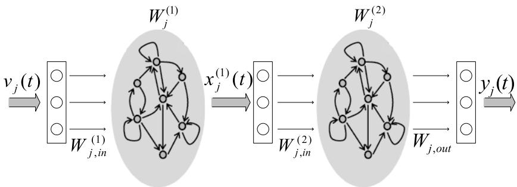  
Fig. 1. Proposed deep ESN architecture.

complex tasks by representing them in terms of simpler ones hierarchically. Let $\grave { N } _ { j , R } ^ { ( n ) }$ be the number of internal units of the reservoir of $\mathrm { U A V } \stackrel { \sim } { j }$ at layer n, $N _ { j , U }$ be the external input dimension of UAV j and $N _ { j , L }$ be the number of layers in the stack for UAV j. Next, we define the following ESN components:

$\pmb { v } _ { j } ( t ) \in \mathbb { R } ^ { N _ { j , U } }$ the external input of UAV j at stage t which effectively corresponds to the current network state,

$\pmb { x } _ { j } ^ { ( n ) } ( t ) \in \mathbb { R } ^ { N _ { j , R } ^ { ( n ) } }$ as the state of the reservoir of UAV j at layer n at stage t,

$W _ { j , \mathrm { i n } } ^ { ( \bar { n } ) }$ as the input-to-reservoir matrix of UAV j at layer $n ,$ where ${ W _ { j , \mathrm { i n } } ^ { ( n ) } \in \mathbb { R } ^ { N _ { j , R } ^ { ( n ) } \times N _ { j , U } } }$ for $n = 1$ , and $W _ { j , \mathrm { i n } } ^ { ( n ) } \in$ R $\underset { ^ { \prime } } { N _ { j , R } ^ { ( n ) } } \times N _ { j , R } ^ { ( n - 1 ) }$ for $n > 1$

$\boldsymbol { W } _ { j } ^ { ( n ) } \in \mathbb { R } ^ { N _ { j , R } ^ { ( n ) } \times N _ { j , R } ^ { ( n ) } }$ as the recurrent reservoir weight matrix for UAV j at layer n,

$\begin{array} { r } { W _ { j , \mathrm { o u t } } ~ \in ~ \mathbb { R } ^ { | \mathcal { Z } _ { j } | \times ( N _ { j , U } + \sum _ { n } N _ { j , R } ^ { ( n ) } ) } } \end{array}$ as the reservoir-tooutput matrix of UAV j for layer n only.

The objective of the deep ESN architecture is to approximate a function $\boldsymbol { F } _ { j } ~ = ~ ( \mathrm { \bar { F } } _ { j } ^ { 1 } , F _ { j } ^ { 2 } , \cdot \cdot \cdot , F _ { j } ^ { N _ { j , L } } )$ for learning an SPNE for each UAV j at each stage t. For each $n =$ $1 , 2 , \cdots , N _ { j , L }$ , the function $F _ { j } ^ { ( n ) }$ describes the evolution of the state of the reservoir at layer n, i.e., $x _ { j } ^ { ( n ) } ( t ) ~ =$ $F _ { j } ^ { ( n ) } ( v _ { j } ( t ) , \pmb { x } _ { j } ^ { ( n ) } ( t \mathrm { ~ - ~ } 1 ) )$ for $\begin{array} { r l r l } { n } & { { } = } & { 1 } \end{array}$ and $x _ { j } ^ { ( n ) } ( t ) ~ =$ $\check { F _ { j } ^ { ( n ) } } ( { \pmb x } _ { j } ^ { ( n - 1 ) } ( \check { t } ) , { \pmb x } _ { j } ^ { ( n ) } ( t - 1 ) )$ for $n > 1 . ~ W _ { j , \mathrm { o u t } }$ and ${ \pmb x } _ { j } ^ { ( n ) } ( t )$ are initialized to zero while $\boldsymbol { W } _ { j , \mathrm { i n } } ^ { ( n ) }$ and $W _ { j } ^ { ( n ) }$ are randomly generated. Note that although the dynamic reservoir is initially generated randomly, it is combined later with the external input, ${ \mathbf { } } { \mathbf { } } { \mathbf { } } { \mathbf { } } { \mathbf { } } { \mathbf { } } { \mathbf { } } { \mathbf { } } { \mathbf { } } { \mathbf { } } { \mathbf { } } { \mathbf { } } { \mathbf { } } { \mathbf { } } { \mathbf { } } { \mathbf { } } { \mathbf { } } { \mathbf { } } { \mathbf { } } { \mathbf { } } { \mathbf { } } { \mathbf { } } { \mathbf { } } { \mathbf { } } { \mathbf { } } { \mathbf { } } { \mathbf { } } { \mathbf { } } { \mathbf { } } { \mathbf { } } { \mathbf { } } { \mathbf { } } { \mathbf { } } { \mathbf { } } { \mathbf { } } { \mathbf { } } { \mathbf { } } { \mathbf { } } { \mathbf { } } { \mathbf { } } { \mathbf { } } { \mathbf { } } { \mathbf { } } { \mathbf { } } { \mathbf { } } { \mathbf { } } { \mathbf { } } { \mathbf { } } { \mathbf { } } { \mathbf { } } { \mathbf { } } { \mathbf { } } { \mathbf { } } { \mathbf { } } { \mathbf { } } { \mathbf { } } { \mathbf { } } { \mathbf { } } { \mathbf { } } { \mathbf { } } { \mathbf { } } { \mathbf { } } { \mathbf { } } { \mathbf { } } { \mathbf { } } { \mathbf { } } { \mathbf { } } { \mathbf { } } { \mathbf { } } { \mathbf { } } { \mathbf { } } { \mathbf { } } { \mathbf { } } { \mathbf { } } { \mathbf { } } { \mathbf { } } { \mathbf { } }  { \mathbf { } \mathbf { } } { \mathbf { } } { \mathbf { } } { \mathbf } { } \mathbf { } \mathbf { } { } \mathbf { } $ , in order to store the network states and with the trained output matrix, $W _ { j , \mathrm { o u t } }$ , so that it can approximate the reward function. Moreover, the spectral radius of $W _ { j } ^ { ( n ) }$ (i.e., the largest eigenvalue in absolute value), $\rho _ { j } ^ { ( n ) }$ , must be strictly smaller than 1 to guarantee the stability of the reservoir [31]. In fact, the value of $\rho _ { j } ^ { ( n ) }$ is related to the variable memory length of the reservoir that enables the proposed deep ESN framework to store necessary previous state information, with larger values of $\rho _ { j } ^ { ( n ) }$ resulting in longer memory length.

We next define the deep ESN components: the input and reward functions. For each deep ESN of UAV j, we distinguish between two types of inputs: external input, ${ \pmb v } _ { j } ( t )$ , that is fed to the first layer of the deep ESN and corresponds to the current state of the network and input that is fed to all other layers for $n > 1$ . For our proposed deep ESN, the input to any layer $n > 1$ at stage t corresponds to the state of the previous layer, $\pmb { x } _ { j } ^ { ( n - 1 ) } ( t )$ . Define $\widetilde { u } _ { j } ( { v } _ { j } ( t ) , z _ { j } ( t ) , z _ { - j } ( t ) ) =$ $\begin{array} { r l } { u _ { j } ( { \pmb v } _ { j } ( t ) , z _ { j } ( t ) , \bar { z _ { - j } } ( t ) ) \prod _ { j = 1 } ^ { J } \pi _ { j , z _ { j } } ( { \pmb v } _ { j } ( t ) ) } & { { } } \end{array}$ as the expected value of the instantaneous utility function $u _ { j } ( { \pmb v } _ { j } ( t ) , z _ { j } ( t ) , z _ { - j } ( t ) )$ in (13) for UAV $j$ at stage t. Therefore, the reward that UAV j obtains from action $z _ { j }$ at a given network state ${ \pmb v } _ { j } ( t )$ (23), shown at the bottom of the next page. Here, $\pmb { v } _ { j } ^ { \prime } ( t + 1 )$ and ${ \pmb x } _ { i } ^ { \prime ( n ) } ( t )$ , correspond, respectively, to the next network state and reservoir state of layer (n), at stage $( t + 1 )$ , upon taking actions $z _ { j } ( t )$ and $z _ { - j } ( t )$ at stage t. Fig. 1 shows the proposed reservoir architecture of the deep ESN consisting of two layers.

## B. Update Rule Based on Deep ESN

We now introduce the deep ESN’s update phase that each UAV uses to store and estimate the reward function of each path and resource allocation scheme at a given stage t. In particular, we consider leaky integrator reservoir units [32] for updating the state transition functions $\pmb { x } _ { j } ^ { ( n ) } ( t )$ at stage t. Therefore, the state transition function of the first layer $\pmb { x } _ { j } ^ { ( 1 ) } ( t )$ will be:

$$
\begin{array} { r l } & { { \pmb x } _ { j } ^ { ( 1 ) } ( t ) = ( 1 - \omega _ { j } ^ { ( 1 ) } ) { \pmb x } _ { j } ^ { ( 1 ) } ( t - 1 ) } \\ & { \qquad + \omega _ { j } ^ { ( 1 ) } \mathrm { t a n h } ( { \pmb W } _ { j , \mathrm { i n } } ^ { ( 1 ) } { \pmb v } _ { j } ( t ) + { \pmb W } _ { j } ^ { ( 1 ) } { \pmb x } _ { j } ^ { ( 1 ) } ( t - 1 ) ) , } \end{array}\tag{24}
$$

where $\omega _ { j } ^ { ( n ) } \in [ 0 , 1 ]$ is the leaking parameter at layer n for UAV j which relates to the speed of the reservoir dynamics in response to the input, with larger values of ${ \boldsymbol \omega } _ { j } ^ { ( n ) }$ resulting in a faster response of the corresponding n-th reservoir to the input. The state transition of UAV $j , \check { x } _ { j } ^ { ( n ) } ( t )$ , for $n > 1$ is given by:

$$
\begin{array} { r l } & { { \boldsymbol x } _ { j } ^ { ( n ) } ( t ) = ( 1 - \omega _ { j } ^ { ( n ) } ) { \boldsymbol x } _ { j } ^ { ( n ) } ( t - 1 ) } \\ & { \qquad + \omega _ { j } ^ { ( n ) } \mathrm { t a n h } ( { \boldsymbol W } _ { j , \mathrm { i n } } ^ { ( n ) } { \boldsymbol x } _ { j } ^ { ( n - 1 ) } ( t ) + { \boldsymbol W } _ { j } ^ { ( n ) } { \boldsymbol x } _ { j } ^ { ( n ) } ( t - 1 ) ) , } \end{array}\tag{25}
$$

The output $y _ { j } ( t )$ of the deep ESN at stage t is used to estimate the reward of each UAV j based on the current adopted action $z _ { j } ( t )$ and $z _ { - j } ( t )$ of $\mathrm { U A V } ~ j$ and other UAVs $( - j )$ , respectively, for the current network state ${ \pmb v } _ { j } ( t )$ after training $W _ { j , \mathrm { o u t } }$ . It can be computed as:

$$
\begin{array} { r l } & { y _ { j } ( \pmb { v } _ { j } ( t ) , \pmb { z } _ { j } ( t ) ) } \\ & { \quad = \pmb { W } _ { j , \mathrm { o u t } } ( \pmb { z } _ { j } ( t ) , t ) [ \pmb { v } _ { j } ( t ) , \pmb { x } _ { j } ^ { ( 1 ) } ( t ) , \pmb { x } _ { j } ^ { ( 2 ) } ( t ) , \cdots , \pmb { x } _ { j } ^ { ( n ) } ( t ) ] . } \end{array}\tag{26}
$$

We adopt a temporal difference RL approach for training the output matrix $W _ { j , \mathrm { o u t } }$ of the deep ESN architecture [33]. In particular, we employ a linear gradient descent approach using the reward error signal, given by the following update rule [34]:

$$
\begin{array} { r l } & { W _ { j , \mathrm { o u t } } ( z _ { j } ( t ) , t + 1 ) } \\ & { \qquad = W _ { j , \mathrm { o u t } } ( z _ { j } ( t ) , t ) } \\ & { \qquad + \lambda _ { j } ( r _ { j } ( v _ { j } ( t ) , z _ { j } ( t ) , z _ { - j } ( t ) ) - y _ { j } ( v _ { j } ( t ) , z _ { j } ( t ) ) ) } \\ & { \qquad \times [ { v } _ { j } ( t ) , { \boldsymbol { x } } _ { j } ^ { ( 1 ) } ( t ) , { \boldsymbol { x } } _ { j } ^ { ( 2 ) } ( t ) , \cdot \cdot \cdot , { \boldsymbol { x } } _ { j } ^ { ( n ) } ( t ) ] ^ { T } . } \end{array}\tag{27}
$$

Here, note that the objective of each UAV is to minimize the value of the error function $\begin{array} { r l } { e _ { j } ( \pmb { v } _ { j } ( t ) ) } & { { } = } \end{array}$ $| r _ { j } ( { v } _ { j } ( t ) , z _ { j } ( t ) , z _ { - j } ( t ) ) - y _ { j } ( { v } _ { j } ( t ) , z _ { j } ( t ) ) |$

## C. Proposed Deep RL Algorithm

Based on the proposed deep ESN architecture and update rule, we next introduce a multi-agent deep RL framework that the UAVs can use to learn an SPNE in behavioral strategies for the game G. The algorithm is divided into two phases: training and testing. In the former, UAVs are trained offline before they become active in the network using the architecture of Subsection IV-A. The testing phase corresponds to the actual execution of the algorithm after which the weights of $W _ { j , \mathrm { o u t } } , \forall j \in \mathcal { I }$ have been optimized and is implemented on each UAV for execution during run time.

During the training phase, each UAV aims at optimizing its output weight matrix $W _ { j , \mathrm { o u t } }$ such that the value of the error function $e _ { j } ( \pmb { v } _ { j } ( t ) )$ at each stage t is minimized. In particular, the training phase is composed of multiple iterations, each consisting of multiple rounds, i.e., the number of steps required for all UAVs to reach their corresponding destinations $d _ { j } .$ At each round, UAVs face a tradeoff between playing the action associated with the highest expected utility, and trying out all their actions to improve their estimates of the reward function in (23). This in fact corresponds to the exploration and exploitation tradeoff, in which UAVs need to strike a balance between exploring their environment and exploiting the knowledge accumulated through such exploration [30]. Therefore, we adopt the -greedy policy in which UAVs choose the action that yields the maximum utility value with a probability of $\begin{array} { r } { 1 - \epsilon + \frac { \epsilon } { | \mathcal { Z } _ { i } | } } \end{array}$ while exploring randomly other actions with a probability $\begin{array} { r } { \dot { \operatorname { o f } } \frac { \epsilon } { | \mathcal { A } _ { j } | } } \end{array}$ . The strategy over the action

space will be:

$$
\begin{array} { r l } & { \pi _ { j , z _ { j } } ( \pmb { v } _ { j } ( t ) ) } \\ & { \quad = \left\{ \begin{array} { l l } { 1 - \epsilon + \displaystyle \frac { \epsilon } { | \mathcal { Z } _ { j } | } , } & { \mathrm { a r g m a x } _ { z _ { j } \in \mathcal { Z } _ { j } } y _ { j } ( \pmb { v } _ { j } ( t ) , \pmb { z } _ { j } ( t ) ) , } \\ { \displaystyle \frac { \epsilon } { | \mathcal { Z } _ { j } | } , } & { \mathrm { o t h e r w i s e } . } \end{array} \right. } \end{array}\tag{28}
$$

Based on the selected action $z _ { j } ( t )$ , each UAV j updates its location, cell association, and transmission power level and computes its reward function according to (23). To determine the next network state, each UAV j broadcasts its selected action to all other UAVs in the network. Then, each UAV j updates its state transition vector $\pmb { x } _ { j } ^ { ( n ) } ( t )$ for each layer $( n )$ of the deep ESN architecture according to (24) and (25). The output $y _ { j }$ at stage t is then updated based on (26). Finally, the weights of the output matrix $W _ { j , \mathrm { o u t } }$ of each UAV j are updated based on the linear gradient descent update rule given in (27). Note that, a UAV stops taking any actions once it has reached its destination. A summary of the training phase is given in Algorithm 1. Naturally, for broadcasting its action to other UAVs, each UAV will incur an overhead which can lead to additional delays for updating the actions of each UAV. Nevertheless, such overhead is considered to be acceptable for practical scenarios. Typically, commercial UAVs move at a high speed reaching approximately 120 mph. In this regard, the time required to go from one grid to another is approximately 0.7 seconds for 40 m grid sizes for instance. Therefore, the delay incurred for each UAV to broadcast its action is considered to be negligible compared to the time required by each UAV to update its location thus making our proposed scheme suitable for practical scenarios.

Meanwhile, the testing phase corresponds to the actual execution of the algorithm. In this phase, each UAV chooses its action greedily for each state ${ \pmb v } _ { j } ( t )$ i.e., $\begin{array} { r } { \operatorname { a r g m a x } _ { z _ { j } \in \mathcal { Z } _ { j } } y _ { j } ( \pmb { v } _ { j } ( t ) , z _ { j } ( t ) ) } \end{array}$ , and updates its location, cell association, and transmission power level accordingly. Each UAV then broadcasts its selected action and updates its state transition vector $\pmb { x } _ { j } ^ { ( n ) } ( t )$ for each layer n of the deep ESN architecture based on (24) and (25). A summary of the testing phase is given in Algorithm 2.

It is important to note that analytically guaranteeing the convergence of the proposed deep learning algorithm is challenging as it is highly dependent on the hyperparameters used during the training phase. For instance, on the one hand, using too few neurons in the hidden layers results in underfitting which could make it hard for the neural network to detect the signals in a complicated data set. On the other hand, using too many neurons in the hidden layers can either result in overfitting or an increase in the training time, which both could prevent the training of the neural network. Overfitting corresponds to the case when the model learns the random

$$
r _ { j } ( v _ { j } ( t ) , z _ { j } ( t ) , z _ { - j } ( t ) ) = \left\{ \begin{array} { l l } { \widetilde { u } _ { j } ( v _ { j } ( t ) , z _ { j } ( t ) , z _ { - j } ( t ) ) , \mathrm { ~ i f ~ U A V } } & { j \mathrm { ~ r e a c h e s ~ } d _ { j } , } \\ { \widetilde { u } _ { j } ( v _ { j } ( t ) , z _ { j } ( t ) , z _ { - j } ( t ) ) + \gamma \operatorname* { m a x } _ { z _ { j } \in \mathcal { Z } _ { j } } } & { W _ { j , \mathrm { o u t } } ( z _ { j } ( t + 1 ) , t + 1 ) } \\ { [ v _ { j } ^ { \prime } ( t ) , x _ { j } ^ { \prime ( 1 ) } ( t ) , x _ { j } ^ { \prime ( 2 ) } ( t ) , \cdot \cdot \cdot , x _ { j } ^ { \prime ( n ) } ( t ) ] , } & { \mathrm { o t h e r w i s e . } } \end{array} \right.\tag{23}
$$

Algorithm 1 Training phase of the proposed deep RL   
algorithm   
Initialization:   
$\begin{array} { r } { \pi _ { j , z _ { j } } ( \pmb { v } _ { j } ( t ) ) = \frac { 1 } { | \mathcal A _ { j } | } \forall t \in T , z _ { j } \in \mathcal Z _ { j } , y _ { j } ( \pmb { v } _ { j } ( t ) , z _ { j } ( t ) ) = 0 , } \end{array}$   
${ \bf \it W } _ { j , \mathrm { i n } } ^ { ( n ) } , { \bf \it W } _ { j } ^ { ( n ) } , \ddot { { \bf W } _ { j , \mathrm { o u t } } } .$   
for The number of training iterations do   
while At least one $\mathrm { U A V } ~ j$ has not reached its destination   
$d _ { j } { \mathrm { : } }$ , do   
for all $\mathrm { U A V s } \ j$ (in a parallel fashion) do   
Input: Each UAV j receives an input ${ \mathbf { } } { \mathbf { } } { \mathbf { } } { \mathbf { } } { \mathbf { } } { \mathbf { } } { \mathbf { } } { \mathbf { } } { \mathbf { } } { \mathbf { } } { \mathbf { } } { \mathbf { } } { \mathbf { } } { \mathbf { } } { \mathbf { } } { \mathbf { } } { \mathbf { } } { \mathbf { } } { \mathbf { } } { \mathbf { } } { \mathbf { } } { \mathbf { } } { \mathbf { } } { \mathbf { } } { \mathbf { } } { \mathbf { } } { \mathbf { } } { \mathbf { } } { \mathbf { } } { \mathbf { } } { \mathbf { } } { \mathbf { } } { \mathbf { } } { \mathbf { } } { \mathbf { } } { \mathbf { } } { \mathbf { } } { \mathbf { } } { \mathbf { } } { \mathbf { } } { \mathbf { } } { \mathbf { } } { \mathbf { } } { \mathbf { } } { \mathbf { } } { \mathbf { } } { \mathbf { } } { \mathbf { } } { \mathbf { } } { \mathbf { } } { \mathbf { } } { \mathbf { } } { \mathbf { } } { \mathbf { } } { \mathbf { } } { \mathbf { } } { \mathbf { } } { \mathbf { } } { \mathbf { } } { \mathbf { } } { \mathbf { } } { \mathbf { } } { \mathbf { } } { \mathbf { } } { \mathbf { } } { \mathbf { } } { \mathbf { } } { \mathbf { } } { \mathbf { } } { \mathbf { } } { \mathbf { } } { \mathbf { } } { \mathbf { } } { \mathbf { } } { \mathbf { } } { \mathbf { } } { \mathbf { } }  { \mathbf { } \mathbf { } } { \mathbf { } } { \mathbf { } } { \mathbf } { } \mathbf { } { \mathbf } { } \mathbf { } $ based   
on (12).   
Step 1: Action selection   
Each UAV j selects a random action $z _ { j } ( t )$ with   
probability ,   
Otherwise, $\mathrm { U A V } \qquad j$ selects $z _ { j } ( t )$ =   
$\operatorname { a r g m a x } _ { z _ { j } \in \mathcal { Z } _ { j } } y _ { j } \left( \pmb { v } _ { j } ( t ) , \pmb { z } _ { j } ( t ) \right)$   
Step 2: Location, cell association and transmit   
power update   
Each $\mathrm { U A V } ~ j$ updates its location, cell association and   
transmission power level based on the selected action   
$z _ { j } ( t )$   
Step 3: Reward computation   
Each UAV j computes its reward values based   
on (23).   
Step 4: Action broadcast   
Each UAV j broadcasts its selected action $z _ { j } ( t )$ to   
all other UAVs.   
Step 5: Deep ESN update   
- Each UAV j updates the state transition vector   
$\pmb { x } _ { j } ^ { ( n ) } ( t )$ for each layer (n) of the deep ESN archi  
tecture based on (24) and (25).   
- Each UAV j computes its output $y _ { j } \ ( v _ { j } ( t ) , z _ { j } ( t ) )$   
based on (26).   
- The weights of the output matrix $W _ { j , \mathrm { o u t } }$ of each   
UAV j are updated based on the linear gradient   
descent update rule given in (27).   
end for   
end while   
end for

fluctuations and noise in the training data set to the extent that it negatively impacts the model’s ability to generalize when fed with new data. Therefore, in this work, we limit our analysis of convergence to simulations (see Section V) to show that, under a reasonable choice of the hyperparameters, convergence is observed for our proposed game. In such cases, it is important to study the convergence point and the convergence complexity of our proposed algorithm. Next, we characterize the convergence point of our proposed algorithm.

Proposition 1: If Algorithm 1 converges, the convergence strategy profile corresponds to an SPNE of game G.

Proof: An SPNE is a strategy profile that induces a Nash equilibrium on every subgame. Therefore, at the equilibrium state of each subgame, there is no incentive for any UAV to deviate after observing any history of joint actions. Moreover, given the fact that an ESN framework exhibits adaptive memory that enables it to store necessary previous state information, UAVs can essentially retain other players actions at each stage t and thus take actions accordingly. To show that our proposed scheme guarantees convergence to an SPNE, we use the following lemma from [28].

Algorithm 2 Testing phase of the proposed deep RL algorithm   
while At least one UAV j has not reached its destination   
$d _ { j } ,$ do   
for all $\mathrm { U A V s } \ j$ (in a parallel fashion) do   
Input: Each UAV j receives an input ${ \mathbf { } } { \mathbf { } } { \mathbf { } } { \mathbf { } } { \mathbf { } } { \mathbf { } } { \mathbf { } } { \mathbf { } } { \mathbf { } } { \mathbf { } } { \mathbf { } } { \mathbf { } } { \mathbf { } } { \mathbf { } } { \mathbf { } } { \mathbf { } } { \mathbf { } } { \mathbf { } } { \mathbf { } } { \mathbf { } } { \mathbf { } } { \mathbf { } } { \mathbf { } } { \mathbf { } } { \mathbf { } } { \mathbf { } } { \mathbf { } } { \mathbf { } } { \mathbf { } } { \mathbf { } } { \mathbf { } } { \mathbf { } } { \mathbf { } } { \mathbf { } } { \mathbf { } } { \mathbf { } } { \mathbf { } } { \mathbf { } } { \mathbf { } } { \mathbf { } } { \mathbf { } } { \mathbf { } } { \mathbf { } } { \mathbf { } } { \mathbf { } } { \mathbf { } } { \mathbf { } } { \mathbf { } } { \mathbf { } } { \mathbf { } } { \mathbf { } } { \mathbf { } } { \mathbf { } } { \mathbf { } } { \mathbf { } } { \mathbf { } } { \mathbf { } } { \mathbf { } } { \mathbf { } } { \mathbf { } } { \mathbf { } } { \mathbf { } } { \mathbf { } } { \mathbf { } } { \mathbf { } } { \mathbf { } } { \mathbf { } } { \mathbf { } } { \mathbf { } } { \mathbf { } } { \mathbf { } } { \mathbf { } } { \mathbf { } } { \mathbf { } } { \mathbf { } } { \mathbf { } } { \mathbf { } }  { \mathbf { } \mathbf { } } { \mathbf { } } { \mathbf { } } { \mathbf } { \mathbf { } } { \mathbf { } } { \mathbf } { } \mathbf { } \mathbf { } { } \mathbf { } \mathbf { }  { \mathbf { } } { \mathbf } { \mathbf { } } \mathbf { } { \mathbf } { \mathbf } { } \mathbf { } \mathbf { } \mathbf { } \mathbf { } \mathbf { } \mathbf { } \mathbf { }  { \mathbf } { \mathbf } { \mathbf } { \mathbf } { \mathbf } { \mathbf } { \mathbf } \mathbf { } \mathbf { } \mathbf { } \mathbf { } \mathbf { }$ based   
on (12).   
Step 1: Action selection   
Each UAV j selects an action $\begin{array} { r l r l } { z _ { j } ( t ) } & { { } = } & { } & { { } } \end{array}$   
argma $\mathrm { x } _ { z _ { j } \in \mathcal { Z } _ { j } } y _ { j } \left( \pmb { v } _ { j } ( t ) , \pmb { z } _ { j } ( t ) \right)$   
Step 2: Location, cell association and transmit   
power update   
Each UAV j updates its location, cell association and   
transmission power level based on the selected action   
$z _ { j } ( t ) .$   
Step 3: Action broadcast   
Each UAV j broadcasts its selected action $z _ { j } ( t )$ to all   
other UAVs.   
Step 4: State transition vector update   
Each UAV j updates the state transition vector ${ \pmb x } _ { j } ^ { ( n ) } ( t )$   
for each layer (n) of the deep ESN architecture based   
on (24) and (25).   
end for   
end while

Lemma 1: For our proposed game G, the payoff functions in (23) are bounded, and the number of players, state space and action space is finite. Therefore, G is a finite game and hence an SPNE exists. This follows from Selten’s theorem which states that every finite extensive form game with perfect recall possesses an SPNE where the players use behavioral strategies.

Here, it is important to note that for finite dynamic games of perfect information, any backward induction solution is a SPNE [25]. Therefore, given the fact that, for our proposed game G, each UAV aims at maximizing its expected sum of discounted rewards at each stage t as given in (23), one can guarantee that the convergence strategy profile corresponds to an SPNE of game G. This completes the proof.

Moreover, it is important to note that the convergence complexity of the proposed deep RL algorithm for reaching an SPNE is $O ( J \cdot A ^ { 2 } )$ . Next, we analyze the computational complexity of the proposed deep RL algorithm for practical scenarios in which the number of UAVs is relatively small.

Theorem 2: In practical scenarios, the computational complexity of the proposed training deep RL algorithm is $O ( A ^ { 3 } )$ and reduces to $O ( A ^ { 2 } )$ for fixed UAV altitudes, where A is the number of discretized unit areas.

Proof: To prove the above theorem and thus the complexity of the proposed algorithm, one must consider the size of the state function of the UAVs as well as their action space at each state vector. As such, based on the action space definition, each UAV needs to update its location, transmission power level, and cell association vector, and, thus, its actions is also a function of the location, transmission power level, and cell association vector of all other UAVs in the network. Consider the case in which the UAVs can move with a fixed step size in a 3D space. For such scenarios, the state vector ${ \pmb v } _ { j } ^ { \prime } ( t )$ is defined as:

$$
\begin{array} { r l } & { \boldsymbol { v } _ { j } ^ { \prime } ( t ) } \\ & { \ = [ \{ \delta _ { j , l , a } ( t ) , \theta _ { j , l , a } ( t ) \} _ { l = 1 } ^ { L _ { j } } , \theta _ { j , d _ { j } , a } ( t ) , \{ x _ { j } ( t ) , y _ { j } ( t ) , h _ { j } ( t ) \} _ { j \in \mathcal { I } } ] , } \end{array}\tag{29}
$$

For each state ${ \pmb v } _ { j } ^ { \prime } ( t )$ , the action of UAV j is a function of the location, transmission power level and cell association vector of all other UAVs in the network. Nevertheless, the number of possible locations of other UAVs in the network is much larger than the number of possible transmission power levels and the size of the cell association vector of those UAVs. Therefore, by the law of large numbers, one can focus on the number of possible locations of other UAVs only for analyzing the convergence complexity of the proposed training algorithm. Moreover, for practical scenarios, the total number of UAVs in a given area is small compared to the number of discretized unit areas, i.e., $J \ll A$ (3GPP admission control policy for cellular-connected UAVs [2]). Therefore, by the law of large numbers and given the fact that the UAVs take actions in a parallel fashion, one can consider the number of possible locations of the UAVs (i.e., the discretized unit areas), irrespective of the number of UAVs in the network. As such, the computational complexity of the proposed algorithm is a function of the number of discretized unit areas, via which a UAV selects its path towards its destination. Consequently, the computational complexity of our proposed algorithm is $O ( A ^ { 3 } )$ when the UAVs update their $x ,$ y and z coordinates and reduces to $O ( A ^ { 2 } )$ when considering fixed UAV altitudes. This completes the proof.

From Theorem 2, we can conclude that the convergence speed of the proposed training algorithm is significantly reduced when considering a fixed altitude for the UAVs. This in essence is due to the reduction of the state space dimension when updating the x and y coordinates only. It is important to note here that there exists a tradeoff between the computational complexity of the proposed training algorithm and the resulting network performance. In essence, updating the 3D coordinates of the UAVs at each step t allows the UAVs to better explore the space thus providing more opportunities for maximizing their utility functions. Therefore, from both Theorems 2 and 1, the UAVs can update their x and y coordinates only during the learning phase while operating within the upper and lower altitude bounds from Theorem 1.

## V. SIMULATION RESULTS AND ANALYSIS

For our simulations, we consider an 800 m × 800 m square area divided into 40 m × 40 m grid areas, in which we randomly uniformly deploy 15 BSs. All statistical results are averaged over several independent testing iterations during which the initial locations and destinations of the UAVs and the locations of the BSs and the ground UEs are randomized.

TABLE I  
SYSTEM PARAMETERS
<table><tr><td rowspan=1 colspan=1>Parameters</td><td rowspan=1 colspan=1>Values</td><td rowspan=1 colspan=1>Parameters</td><td rowspan=1 colspan=1>Values</td></tr><tr><td rowspan=1 colspan=1>UAV max transmit power $( \overline { { P } } _ { j } )$ </td><td rowspan=1 colspan=1>20 dBm</td><td rowspan=1 colspan=1>SINR threshold $( \overline { { \Gamma } } _ { j } )$ </td><td rowspan=1 colspan=1>-3 dB</td></tr><tr><td rowspan=1 colspan=1>UE transmit power $( \widehat { P } _ { q } )$ </td><td rowspan=1 colspan=1>20 dBm</td><td rowspan=1 colspan=1>Learning rate $( \lambda _ { j } )$ </td><td rowspan=1 colspan=1>0.01</td></tr><tr><td rowspan=1 colspan=1>Noise power spectral density (No)</td><td rowspan=1 colspan=1>-174 dBm/Hz</td><td rowspan=1 colspan=1>RB bandwidth $( B _ { c } )$ </td><td rowspan=1 colspan=1>180 kHz</td></tr><tr><td rowspan=1 colspan=1>Total bandwidth $( B )$ </td><td rowspan=1 colspan=1>20 MHz</td><td rowspan=1 colspan=1># of interferers (L)</td><td rowspan=1 colspan=1>2</td></tr><tr><td rowspan=1 colspan=1>Packet arrival rate $( \lambda _ { j , s } )$ </td><td rowspan=1 colspan=1>(0,1)</td><td rowspan=1 colspan=1>Packet size (ν)</td><td rowspan=1 colspan=1>2000 bits</td></tr><tr><td rowspan=1 colspan=1>Carrier frequency (f)</td><td rowspan=1 colspan=1>2 GHz</td><td rowspan=1 colspan=1>Discount factor (γ)</td><td rowspan=1 colspan=1>0.7</td></tr><tr><td rowspan=1 colspan=1># of hidden layers</td><td rowspan=1 colspan=1>2</td><td rowspan=1 colspan=1>Step size $( \widetilde { a } _ { j } )$ </td><td rowspan=1 colspan=1>40 m</td></tr><tr><td rowspan=1 colspan=1>Leaky parameter/layer $( \omega _ { j } ^ { ( n ) } )$ </td><td rowspan=1 colspan=1>0.99, 0.99</td><td rowspan=1 colspan=1>€</td><td rowspan=1 colspan=1>0.3</td></tr></table>

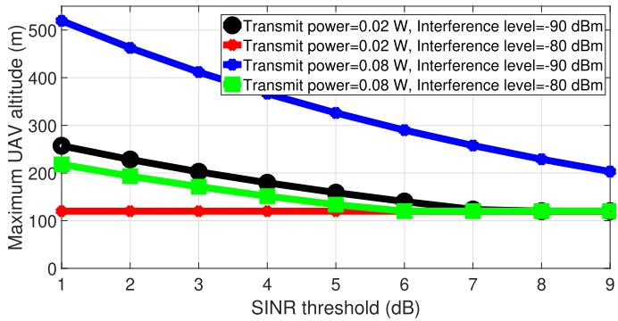

(a)  
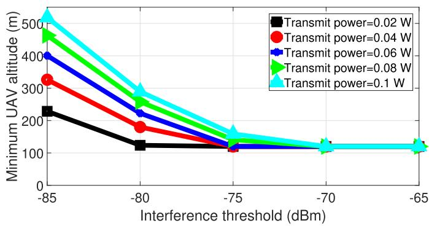  
(b)  
Fig. 2. The (a) upper bound for the optimal altitude of the UAVs as a function of the SINR threshold value (Γ)¯ and for different transmit power levels and ground network density and (b) lower bound for the optimal altitude of the UAVs as a function of the interference threshold value $( \sum _ { c = 1 } ^ { C _ { j , s } ( t ) } \bar { I } _ { j , r , c , a } )$ and for different transmit power levels.

The maximum transmit power for each UAV is discretized into five equally separated levels. We consider an uncorrelated Rician fading channel with parameter $\widehat { K } = 1 . 5 9$ [35]. Here, note that the proposed solution approach is not a function of the channel model and, thus, it can be applied to any given channel model. The external input of the deep ESN architecture, ${ \pmb v } _ { j } ( t )$ , is a function of the number of UAVs, and thus the number of hidden nodes per layer, $N _ { j , R } ^ { ( n ) }$ , varies with the number of UAVs. For instance, $N _ { j , R } ^ { ( n ) } = 1 2$ and 6 for $n = 1$ and 2, respectively, for a network size of 1 and 2 UAVs, and 20 and 10 for a network size of 3, 4, and 5 UAVs. Table I summarizes the main simulation parameters.

Fig. 2a shows the upper bound for the optimal altitude of UAV j as a function of the SINR threshold value, Γ¯, and for different transmit power levels and ground network density, based on Theorem 1. Fig. 2b shows the lower bound for the optimal altitude of $\mathrm { U A V } \ j$ as a function of the interference threshold value, $( \sum _ { c = 1 } ^ { C _ { j , s } ( t ) } \bar { I } _ { j , r , c , a } )$ , and for different transmit power levels, based on Theorem 1. From Figs. 2a and 2b, we can deduce that the optimal altitude range of a given UAV is a function of network design parameters, ground network data requirements, the density of the ground network, and its action ${ \pmb v } _ { j } ( t )$ . For instance, the upper bound on the UAV’s optimal altitude decreases as Γ¯ increases while its lower bound decreases as $\sum _ { c = 1 } ^ { C _ { j , s } ( t ) } \bar { I } _ { j , r , c , a }$ increases. Moreover, the maximum UAV altitude decreases as the ground network gets denser while its lower bound increases as the ground network data requirements increase. Thus, in such scenarios, a UAV should operate at higher altitudes. A UAV should also operate at higher altitudes when its transmit power level increases due to the increase in the lower and upper bounds of its optimal altitude.

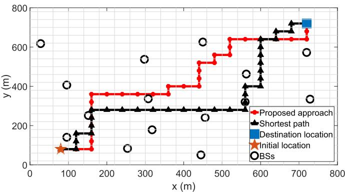  
Fig. 3. Path of a UAV for our approach and shortest path scheme.

TABLE II  
PERFORMANCE ASSESSMENT FOR ONE UAV
<table><tr><td rowspan=1 colspan=1></td><td rowspan=1 colspan=1># of steps</td><td rowspan=1 colspan=1>delay (ms)</td><td rowspan=1 colspan=1>average rate per UE (Mbps)</td></tr><tr><td rowspan=1 colspan=1>Proposed approach</td><td rowspan=1 colspan=1>32</td><td rowspan=1 colspan=1>6.5</td><td rowspan=1 colspan=1>0.95</td></tr><tr><td rowspan=1 colspan=1>Shortest path</td><td rowspan=1 colspan=1>32</td><td rowspan=1 colspan=1>12.2</td><td rowspan=1 colspan=1>0.76</td></tr></table>

Fig. 3 shows a snapshot of the path of a single UAV resulting from our approach and from a shortest path scheme. Unlike our proposed scheme which accounts for other wireless metrics during path planning, the objective of the UAVs in the shortest path scheme is to reach their destinations with the minimum number of steps. Table II presents the performance results for the paths shown in Fig. 3. From Fig. 3, we can see that, for our proposed approach, the UAV selects a path away from the densely deployed area while maintaining proximity to its serving BS in a way that would minimize the steps required to reach its destination. This path will minimize the interference level that the UAV causes on the ground UEs and its wireless latency (Table II). From Table II, we can see that our proposed approach achieves 25% increase in the average rate per ground UE and 47% decrease in the wireless latency as compared to the shortest path, while requiring the same number of steps that the UAV needs to reach the destination.

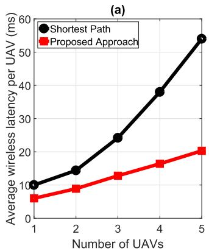

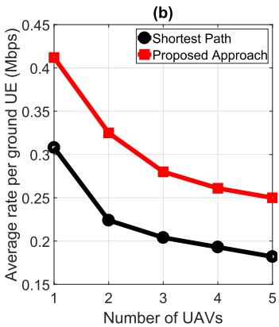  
Fig. 4. Performance assessment of the proposed approach in terms of average (a) wireless latency per UAV and (b) rate per ground UE as compared to the shortest path approach, for different number of UAVs.

TABLE III  
THE REQUIRED NUMBER OF STEPS FOR ALL UAVS TO REACH THEIR CORRESPONDING DESTINATIONS BASED ON OUR PROPOSED APPROACH AND THAT OF THE SHORTEST PATH SCHEME FOR DIFFERENT NUMBER OF UAVS
<table><tr><td rowspan=1 colspan=1># of steps</td><td rowspan=1 colspan=1>1 UAV</td><td rowspan=1 colspan=1>2 UAVs</td><td rowspan=1 colspan=1>3UAVs</td><td rowspan=1 colspan=1>4 UAVs</td><td rowspan=1 colspan=1>5 UAVs</td></tr><tr><td rowspan=1 colspan=1>Proposed approach</td><td rowspan=1 colspan=1>4</td><td rowspan=1 colspan=1>4</td><td rowspan=1 colspan=1>6</td><td rowspan=1 colspan=1>7</td><td rowspan=1 colspan=1>8</td></tr><tr><td rowspan=1 colspan=1>Shortest path</td><td rowspan=1 colspan=1>4</td><td rowspan=1 colspan=1>4</td><td rowspan=1 colspan=1>6</td><td rowspan=1 colspan=1>6</td><td rowspan=1 colspan=1>7</td></tr></table>

Fig. 4 compares the average values of the (a) wireless latency per UAV and (b) rate per ground UE resulting from our proposed approach and the baseline shortest path scheme. Moreover, Table III compares the number of steps required by all UAVs to reach their corresponding destinations for the scenarios presented in Fig. 4. From Fig. 4 and Table III, we can see that, compared to the shortest path scheme, our approach achieves a lower wireless latency per UAV and a higher rate per ground UE for different numbers of UAVs while requiring a number of steps that is comparable to the baseline. In fact, our scheme provides a better tradeoff between energy efficiency, wireless latency, and ground UE data rate compared to the shortest path scheme. For instance, for 5 UAVs, our scheme achieves a 37% increase in the average achievable rate per ground UE, 62% decrease in the average wireless latency per UAV, and 14% increase in energy efficiency. Indeed, one can adjust the multi-objective weights of our utility function based on several parameters such as the rate requirements of the ground network, the power limitation of the UAVs, and the maximum tolerable wireless latency of the UAVs. Moreover, Fig. 4 shows that, as the number of UAVs increases, the average delay per UAV increases and the average rate per ground UE decreases, for all schemes. This is due to the increase in the interference level on the ground UEs and other UAVs as a result of the LoS link between the UAVs and the BSs.

Fig. 5 studies the effect of the UAVs’ altitude on the average values of the (a) wireless latency per UAV and (b) rate per ground UE for different utility functions. From Fig. 5, we see that the average wireless latency per UAV increases for increasing altitude in all studied utility functions. This is mainly due to the increase in the distance of the UAVs from their corresponding serving BSs which accentuates the path loss effect. Moreover, higher UAV altitudes result in a higher average data rate per ground UE for all studied utility functions mainly due to the decrease in the interference caused by UAVs on neighboring BSs. Here, there exists a tradeoff between minimizing the average wireless delay per UAV and maximizing the average data rate per ground UE. Therefore, alongside the multiobjective weights, the altitude of the UAVs can be varied such that the ground UE rate requirements is met while minimizing the wireless latency for each UAV based on its mission objective.

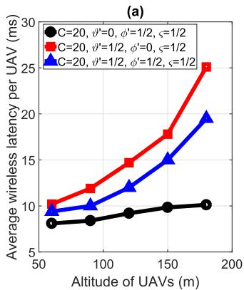

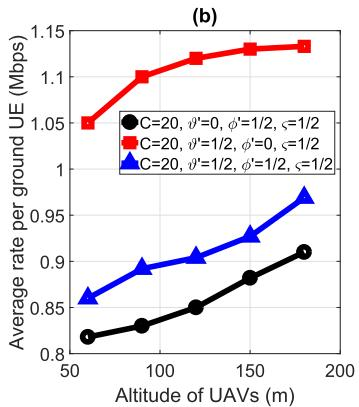  
Fig. 5. Performance assessment of the proposed approach in terms of average (a) wireless latency per UAV and (b) rate per ground UE for different utility functions and for different altitudes of the UAVs.

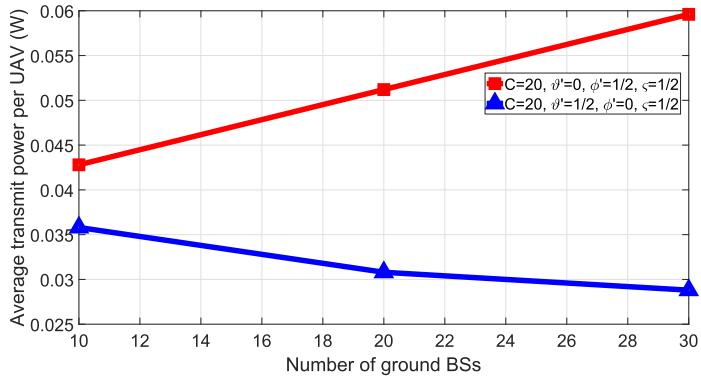  
Fig. 6. Effect of the ground network densification on the average transmit power level of the UAVs along their paths.

Fig. 6 shows the average transmit power level per UAV along its path as a function of the number of BSs considering two utility functions, one for minimizing the average wireless latency for each UAV and the other for minimizing the interference level on the ground UEs. From Fig. 6, we can see that network densification has an impact on the transmission power level of the UAVs. For instance, when minimizing the wireless latency of each UAV along its path, the average transmit power level per UAV increases from 0.04 W to 0.06 W as the number of ground BSs increases from 10 to 30, respectively. In essence, the increase in the transmit power is the result of the increase in the interference from the ground UEs as the ground network becomes denser. As a result, the UAVs will transmit with more power so as to minimize their wireless latency. On the other hand, the average transmit power level per UAV decreases from 0.036 W to 0.029 W in the case of minimizing the interference caused on neighboring BSs. This is due to the fact that as the number of BSs increases, the interference level caused by each UAV on the ground network increases thus requiring each UAV to decrease its transmit power. Note that, when minimizing the wireless latency, the average transmit power per UAV is always larger than in the case of minimizing the interference level, irrespective of the number of ground BSs. Therefore, the transmit power of the UAVs is a function of their mission objective and the number of ground BSs.

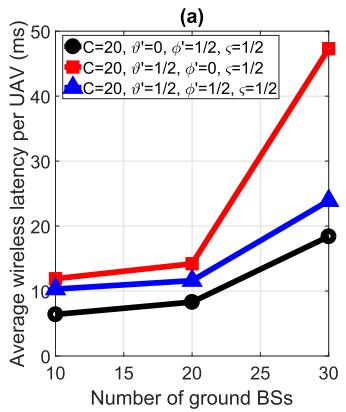

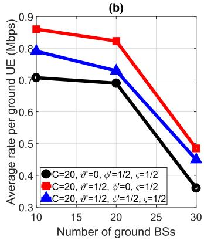  
Fig. 7. Effect of the ground network densification on the average (a) wireless latency per UAV and (b) rate per ground UE for different utility functions and for a fixed altitude of 120m.

Fig. 7 presents the (a) wireless latency per UAV and (b) rate per ground UE for different utilities as a function of the number of BSs and for a fixed altitude of 120 m. From this figure, we can see that, as the ground network becomes denser, the average wireless latency per UAV increases and the average rate per ground UE decreases for all considered cases. For instance, when the objective is to minimize the interference level along with energy efficiency, the average wireless latency per UAV increases from 13 ms to 47 ms and the average rate per ground UE decreases from 0.86 Mbps to 0.48 Mbps as the number of BSs increases from 10 to 30. This is due to the fact that a denser network results in higher interference on the UAVs as well as other UEs in the network.

Fig. 8 investigates the (a) wireless latency per UAV and (b) rate per ground UE for different values of the UAVs’ altitude and as a function of the number of BSs. From this figure, we can see that as the UAV altitude increases and/or the ground network becomes denser, the average wireless latency per UAV increases. For instance, the delay increases by 27% as the altitude of the UAVs increases from 120 to 240 m for a network consisting of 20 BSs and increases by 120% as the number of BSs increases from 10 to 30 for a fixed altitude of 180 m. This essentially follows from Theorem 1 and the results in Fig. 2a which shows that the maximum altitude of the UAV decreases as the ground network gets denser and thus the UAVs should operate at a lower altitude when the number of BSs increases from 10 to 30. Moreover, the average rate per ground UE decreases as the ground network becomes denser due to the increase in the interference level and increases as the altitude of the UAVs increases. Therefore, the resulting network performance depends highly on both the UAVs altitude and the number of BSs in the network. For instance, in case of a dense ground network, the UAVs need to fly at a lower altitude for applications in which the wireless transmission latency is more critical and at a higher altitude in scenarios in which a minimum achievable data rate for the ground UEs is required.

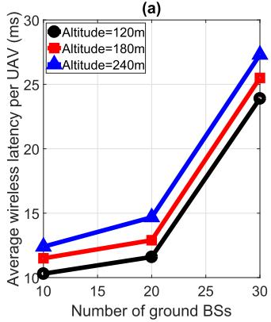

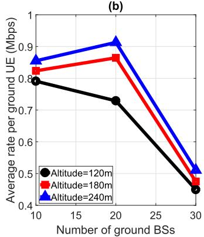  
Fig. 8. Effect of the ground network densification on the average (a) wireless latency per UAV and (b) rate per ground UE for different utility functions and for various altitudes of the UAVs.

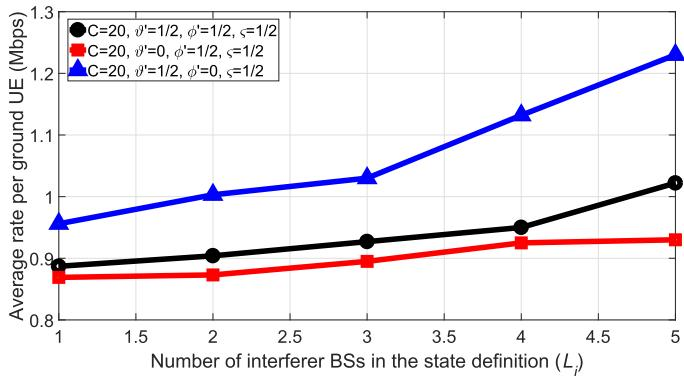  
Fig. 9. The average rate per ground UE as a function of the number of interferer BSs in the state definition $( L _ { j } )$ .

Fig. 9 shows the effect of varying the number of nearest BSs $( L _ { j } )$ in the observed network state of $\mathbf { U A V } _ { \textit { j , } \textit { v } _ { j } ( t ) }$ on the average data rate per ground UE for different utility functions. From Fig. 9, we can see an improvement in the average rate per ground UE as the number of nearest BSs in the state definition increases. For instance, in scenarios in which the UAVs aim at minimizing the interference level they cause on the ground network along their paths, the average rate per ground UE increases by 28% as the number of BSs in the state definition increases from 1 to 5. This gain results from the fact that as $L _ { j }$ increases, the UAVs get a better sense of their surrounding environment and thus can better select their next location such that the interference level they cause on the ground network is minimized. It is important to note here, that as $L _ { j }$ increases, the size of the external input $( \pmb { v } _ { j } )$ increases thus requiring a larger number of neurons in each layer. This in turn increases the number of required iterations for convergence. Therefore, a tradeoff exists between improving the performance of the ground UEs and the running complexity of the proposed algorithm.

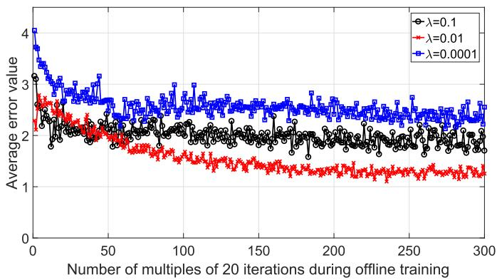  
Fig. 10. Effect of the learning rate on the convergence of offline training.

Fig. 10 shows the average of the error function $e _ { j } ( \pmb { v } _ { j } ( t ) )$ resulting from the offline training phase as a function of a multiple of 20 iterations while considering different values for the learning rate, λ. The learning rate determines the step size the algorithm takes to reach the optimal solution and, thus, it impacts the convergence rate of our proposed framework. From Fig. 10, we can see that small values of the learning rate, e.g., $\lambda = 0 . 0 0 0 1$ , result in a slow speed of convergence. On the other hand, for large values of the learning rate, such as $\lambda = 0 . 1$ , the error function decays fast for the first few iterations but then remains constant. Here, $\lambda = 0 . 1$ does not lead to convergence during the testing phase, but $\lambda = 0 . 0 0 0 1$ and $\lambda = 0 . 0 1$ result in convergence, though requiring a different number of training iterations. In fact, a large learning rate can cause the algorithm to diverge from the optimal solution. This is because large initial learning rates will decay the loss function faster and thus make the model get stuck at a particular region of the optimization space instead of better exploring it [36]. Clearly, our framework achieves better performance for $\lambda = 0 . 0 1$ , as compared to smaller and larger values of the learning rate. We also note that the error function does not reach the value of zero during the training phase. This is due to the fact that, for our approach, we adopt the early stopping technique to avoid overfitting which occurs when the training error decreases at the expense of an increase in the value of the test error [29].

## VI. CONCLUSION

In this paper, we have proposed a novel interference-aware path planning scheme that allows cellular-connected UAVs to minimize the interference they cause on a ground network as well as their wireless transmission latency while transmitting online mission-related data. We have formulated the problem as a dynamic noncooperative game in which the UAVs are the players. To solve the game, we have proposed a deep RL algorithm based on ESN cells which is guaranteed to reach an SPNE, if it converges. The proposed algorithm enables each UAV to decide on its next location, transmission power level, and cell association vector in an autonomous manner thus adapting to the changes in the network. Simulation results have shown that the proposed approach achieves better wireless latency per UAV and rate per ground UE while requiring a number of steps that is comparable to the shortest path scheme. The results have also shown that a UAV’s altitude plays a vital role in minimizing the interference level on the ground UEs as well as the wireless transmission delay of the UAV. In particular, we have shown that the altitude of the UAV is a function of the ground network density, the UAV’s objective, and the actions of other UAVs in the network.

## APPENDIX

## A. Proof of Theorem 1

For a given network state ${ \pmb v } _ { j } ( t )$ and a particular action $z _ { j } ( t )$ , the upper bound for the altitude of UAV j can be derived when UAV j aims at minimizing its delay function only, i.e., $\vartheta ^ { \prime } = 0$ . For such scenarios, UAV j should guarantee an upper limit, $\overline { { \Gamma } } _ { j }$ , for the SINR value $\Gamma _ { j , s , c , a }$ of the transmission link from UAV j to BS s on RB c at location a as given in constraint (15). Therefore, $\hat { h } _ { j } ^ { \operatorname* { m a x } } ( { \pmb v } _ { j } ( t ) , { \pmb z } _ { j } ( t ) , { \pmb z } _ { - j } ( t ) )$ corresponds to the altitude at which UAV j achieves $\overline { { \Gamma } } _ { j }$ and beyond which (15) is violated. The derivation of the expression of $\hat { h } _ { j } ^ { \operatorname* { m a x } } ( { \pmb v } _ { j } ( t ) , { \pmb z } _ { j } ( t ) , { \pmb z } _ { - j } ( t ) )$ is:

$$
\sum _ { c = 1 } ^ { C _ { j , s } ( t ) } \Gamma _ { j , s , c , a } = \overline { { { \Gamma } } } _ { j } ,\tag{30}
$$

$$
\sum _ { c = 1 } ^ { C _ { j , s } ( t ) } \frac { \frac { \widehat { P } _ { j , s , a } ( \pmb { v } _ { j } ( t ) ) } { C _ { j , s } ( t ) } \cdot g _ { j , s , c , a } ( t ) } { ( \frac { 4 \pi \hat { f } d _ { j , s , a } ^ { \operatorname* { m a x } } } { \hat { c } } ) ^ { 2 } \cdot ( I _ { j , s , c } ( t ) + B _ { c } N _ { 0 } ) } = \overline { { \Gamma } } _ { j } ,\tag{31}
$$

$$
\frac { \widehat { P } _ { j , s , a } ( \pmb { v } _ { j } ( t ) ) } { C _ { j , s } ( t ) } \cdot \frac { 1 } { ( \frac { 4 \pi \hat { f } d _ { j , s , a } ^ { \operatorname* { m a x } } } { \hat { c } } ) ^ { 2 } } \cdot \sum _ { c = 1 } ^ { C _ { j , s } ( t ) } \frac { g _ { j , s , c , a } ( t ) } { I _ { j , s , c } ( t ) + B _ { c } N _ { 0 } } = \overline { { \Gamma } } _ { j } ,\tag{32}
$$

$$
( d _ { j , s , a } ^ { \operatorname* { m a x } } ) ^ { 2 } = \frac { \widehat { P } _ { j , s , a } ( { \boldsymbol v } _ { j } ( t ) ) } { C _ { j , s } ( t ) } \cdot \frac { 1 } { \overline { { \Gamma } } _ { j } ( \frac { 4 \pi \hat { f } } { \hat { c } } ) ^ { 2 } } \cdot \sum _ { c = 1 } ^ { C _ { j , s } ( t ) } \frac { g _ { j , s , c , a } ( t ) } { I _ { j , s , c } ( t ) + B _ { c } N _ { 0 } } ,\tag{33}
$$

where $d _ { j , s , a }$ is the Euclidean distance between UAV j and its serving BS s at location a. Assume that the altitude of BS s is negligible, i.e., $z _ { s } = 0 , \hat { h } _ { j } ^ { \operatorname* { m a x } } ( v _ { j } ( t ) , z _ { j } ( t ) , z _ { - j } ( t ) )$ can be expressed as (34), shown at the bottom of this page, where  $x _ { s }$ and $y _ { s }$ correspond to the x and y coordinates of the serving BS s and cˆ is the speed of light.

On the other hand, for a given network state ${ \pmb v } _ { j } ( t )$ and a particular action $z _ { j } ( t )$ , the lower bound for the altitude of UAV j can be derived when the objective function of UAV j is to minimize the interference level it causes on the ground network only, i.e., $\phi ^ { \prime } \ = \ 0$ and $\varsigma \ = \ 0 .$ . For such scenarios, the interference level that UAV j causes on neighboring BS r at location a should not exceed a predefined value given by $\sum _ { c = 1 } ^ { C _ { j , s } ( t ) } \bar { I } _ { j , r , c , a } .$ 4Therefore, $\hat { h } _ { j } ^ { \operatorname* { m i n } } ( { \pmb v } _ { j } ( t ) , { \pmb z } _ { j } ( t ) , { \pmb z } _ { - j } ( t ) )$ corresponds to the altitude at which UAV j achieves $\sum _ { c = 1 } ^ { C _ { j , s } ( t ) } \bar { I } _ { j , r , c , a }$ and below which the level of interference it causes on BS r exceeds the value of $\sum _ { c = 1 } ^ { C _ { j , s } ( t ) } \bar { I } _ { j , r , c , a }$ . The derivation of the expression of $\hat { h } _ { j } ^ { \operatorname* { m i n } } ( { \pmb v } _ { j } ( \overline { { t ) } } , { \pmb z } _ { j } ( t ) , \hat { { \mathscr { z } } } _ { - j } ( t ) )$ is given by:

$$
\begin{array} { r l } { \displaystyle } & { \displaystyle \sum _ { c = 1 } ^ { C _ { j , s } ( t ) } { \sum _ { r = 1 , r \neq s } ^ { S } { \frac { \widehat { P } _ { j , s , a } ( v _ { j } ( t ) ) h _ { j , r , c , a } ( t ) } { C _ { j , s } ( t ) } } } } \\ & { \displaystyle \ = \ \sum _ { c = 1 } ^ { C _ { j , s } ( t ) } { \sum _ { r = 1 , r \neq s } ^ { S } { \bar { I } _ { j , r , c , a } } } , } \end{array}\tag{35}
$$

$$
\begin{array} { r l r } {  { C _ { j , s } ( t ) \sum _ { r = 1 } ^ { S } \sum _ { r = 1 , r \neq s } ^ { S } \frac { \widehat { P } _ { j , s , a } ( v _ { j } ( t ) ) \cdot g _ { j , r , c , a } ( t ) } { C _ { j , s } ( t ) \cdot ( \frac { 4 \pi \widehat { f } d _ { j , r , a } ^ { \mathrm { m i n } } } { \widehat { c } } ) ^ { 2 } } } } \\ & { } & { = \sum _ { c = 1 } ^ { C _ { j , s } ( t ) } \sum _ { r = 1 , r \neq s } ^ { S } \bar { I } _ { j , r , c , a } , } \end{array}\tag{36}
$$

To find $\hat { h } _ { j } ^ { \operatorname* { m i n } } ( { \pmb v } _ { j } ( t ) , z _ { j } ( t ) , z _ { - j } ( t ) )$ , we need to solve (36) for each neighboring BS r separately. Therefore, for a particular neighboring BS r, (36) can be written as:

$$
\sum _ { c = 1 } ^ { C _ { j , s } ( t ) } \frac { \widehat { P } _ { j , s , a } ( \pmb { v } _ { j } ( t ) ) \cdot \mathnormal { g } _ { j , r , c , a } ( t ) } { C _ { j , s } ( t ) \cdot \left( \frac { 4 \pi \widehat { f } _ { d _ { j , r , a } ^ { \mathrm { m i n } } } } { \widehat { c } } \right) ^ { 2 } } = \sum _ { c = 1 } ^ { C _ { j , s } ( t ) } \bar { I } _ { j , r , c , a } ,\tag{37}
$$

$$
\frac { \widehat { P } _ { j , s , a } ( \pmb { v } _ { j } ( t ) ) \cdot \sum _ { c = 1 } ^ { C _ { j , s } ( t ) } g _ { j , r , c , a } ( t ) } { C _ { j , s } ( t ) \cdot \left( \frac { 4 \pi \widehat { f } { d } _ { j , r , a } ^ { \operatorname* { m i n } } } { \widehat { c } } \right) ^ { 2 } } = \sum _ { c = 1 } ^ { C _ { j , s } ( t ) } \bar { I } _ { j , r , c , a } ,\tag{38}
$$

${ } ^ { 4 } \sum _ { c = 1 } ^ { C _ { j , s } ( t ) } \bar { I } _ { j , r , c , a }$ is a network design parameter that is a function of the ground network density, number of UAVs in the network and the data rate requirements of the ground UEs. The value of $\bar { I _ { j , r , c , a } }$ is in fact part of the admission control policy which limits the number of UAVs in the network and their corresponding interference level on the ground network [2].

$$
\hat { h } _ { j } ^ { \operatorname* { m a x } } ( v _ { j } ( t ) , z _ { j } ( t ) , z _ { - j } ( t ) ) = \sqrt { \frac { \widehat { P } _ { j , s , a } ( v _ { j } ( t ) ) } { { C } _ { j , s } ( t ) \cdot \overline { { \Gamma } } _ { j } \cdot \left( \frac { 4 \pi \hat { j } } { \hat { c } } \right) ^ { 2 } } \cdot \sum _ { c = 1 } ^ { C _ { j , s } ( t ) } \frac { g _ { j , s , c , a } ( t ) } { I _ { j , s , c } ( t ) + { B } _ { c } N _ { 0 } } - ( x _ { j } - x _ { s } ) ^ { 2 } - ( y _ { j } - y _ { s } ) ^ { 2 } } ,\tag{34}
$$

$$
\hat { h } _ { j , r } ^ { \operatorname* { m i n } } ( { v } _ { j } ( t ) , z _ { j } ( t ) , z _ { - j } ( t ) ) = \sqrt { \frac { \widehat { P } _ { j , s , a } ( { v } _ { j } ( t ) ) \cdot \sum _ { c = 1 } ^ { C _ { j , s } ( t ) } g _ { j , r , c , a } ( t ) } { C _ { j , s } ( t ) \cdot \left( \frac { 4 \pi \hat { f } } { \hat { c } } \right) ^ { 2 } \cdot \sum _ { c = 1 } ^ { C _ { j , s } ( t ) } \bar { I } _ { j , r , c , a } } - ( x _ { j } - x _ { r } ) ^ { 2 } - ( y _ { j } - y _ { r } ) ^ { 2 } } ,\tag{40}
$$

$$
( d _ { j , r , a } ^ { \mathrm { m i n } } ) ^ { 2 } = \frac { \widehat { P } _ { j , s , a } ( \pmb { v } _ { j } ( t ) ) \cdot \sum _ { c = 1 } ^ { C _ { j , s } ( t ) } g _ { j , r , c , a } ( t ) } { C _ { j , s } ( t ) \cdot \left( \frac { 4 \pi \hat { f } } { \hat { c } } \right) ^ { 2 } \cdot \sum _ { c = 1 } ^ { C _ { j , s } ( t ) } \bar { I } _ { j , r , c , a } } ,\tag{39}
$$

where $d _ { j , r , a }$ is the Euclidean distance between UAV j and its neighboring BS r at location a. Assume that the altitude of BS r is negligible, i.e., $\begin{array} { r l r } { z _ { r } } & { { } = } & { 0 } \end{array}$ , we have (40), shown at the bottom of the previous page. Therefore, $\hat { h } _ { j } ^ { \operatorname* { m i n } } ( { \pmb v } _ { j } ( t ) , z _ { j } ( t ) , z _ { - j } ( t ) )$ corresponds to the maximum value of $\hat { h } _ { j , r } ^ { \operatorname* { m i n } } ( { \pmb v } _ { j } ( t ) , { \pmb z } _ { j } ( t ) , { \pmb z } _ { - j } ( t ) )$ among all neighboring BSs r and is expressed as:

$$
\hat { h } _ { j } ^ { \operatorname* { m i n } } ( { \pmb v } _ { j } ( t ) , z _ { j } ( t ) , z _ { - j } ( t ) ) = \operatorname* { m a x } _ { r } \hat { h } _ { j , r } ^ { \operatorname* { m i n } } ( { \pmb v } _ { j } ( t ) , z _ { j } ( t ) , z _ { - j } ( t ) ) ,\tag{41}
$$

where $x _ { r }$ and $y _ { r }$ correspond to the x and y coordinates of other neighboring BSs r. This completes the proof.

## REFERENCES

[1] U. Challita, W. Saad, and C. Bettstetter, “Deep reinforcement learning for interference-aware path planning of cellular-connected UAVs,” in Proc. IEEE Int. Conf. Commun. (ICC), Kansas City, MO, USA, May 2018, pp. 1–7.

[2] Enhanced LTE Support for Aerial Vehicles, document 36.777, 3GPP, Mar. 2017. [Online]. Available: https://portal.3gpp.org/desktopmodules/ Specifications/SpecificationDetails.aspx?specificationId=3231

[3] Paving the Path to 5G: Optimizing Commercial LTE Networks for Drone Communication, Qualcomm, San Diego, CA, USA, Sep. 2016. [Online]. Available: https://www.qualcomm.com/news/onq/2016/09/06/pavingpath-5g-optimizing-commercial-lte-networks-drone-communication

[4] U. Challita, A. Ferdowsi, M. Chen, and W. Saad, “Machine learning for wireless connectivity and security of cellular-connected UAVs,” IEEE Wireless Commun., vol. 26, no. 1, pp. 28–35, Feb. 2019.

[5] B. V. D. Bergh, A. Chiumento, and S. Pollin, “LTE in the sky: Trading off propagation benefits with interference costs for aerial nodes,” IEEE Commun. Mag., vol. 54, no. 5, pp. 44–50, May 2016.

[6] X. Lin et al., “The sky is not the limit: LTE for unmanned aerial vehicles,” IEEE Commun. Mag., vol. 56, no. 4, pp. 204–210, Apr. 2018.

[7] M. M. Azari, F. Rosas, A. Chiumento, and S. Pollin, “Coexistence of terrestrial and aerial users in cellular networks,” in Proc. IEEE Globecom Workshops (GC Wkshps), Singapore, Dec. 2017, pp. 1–6.

[8] T. Andre et al., “Application-driven design of aerial communication networks,” IEEE Commun. Mag., vol. 52, no. 5, pp. 129–137, May 2014.

[9] U. Challita and W. Saad, “Network formation in the sky: Unmanned aerial vehicles for multi-hop wireless backhauling,” in Proc. IEEE Global Commun. Conf., Singapore, Dec. 2017, pp. 1–6.

[10] J. Yoon, Y. Jin, N. Batsoyol, and H. Lee, “Adaptive path planning of UAVs for delivering delay-sensitive information to Ad-Hoc nodes,” in Proc. IEEE Wireless Commun. Netw. Conf. (WCNC), San Francisco, CA, USA, Mar. 2017, pp. 1–6.

[11] Y. Zeng and R. Zhang, “Energy-efficient UAV communication with trajectory optimization,” IEEE Trans. Wireless Commun., vol. 16, no. 6, pp. 3747–3760, Jun. 2017.

[12] M.-A. Messous, S.-M. Senouci, and H. Sedjelmaci, “Network connectivity and area coverage for UAV fleet mobility model with energy constraint,” in Proc. IEEE Wireless Commun. Netw. Conf., Doha, Qatar, Apr. 2016, pp. 1–6.

[13] M. Mozaffari, W. Saad, M. Bennis, and M. Debbah, “Unmanned aerial vehicle with underlaid device-to-device communications: Performance and tradeoffs,” IEEE Trans. Wireless Commun., vol. 15, no. 6, pp. 3949–3963, Jun. 2016.

[14] Q. Wu, J. Xu, and R. Zhang. (Jan. 2018). “Capacity characterization of UAV-enabled two-user broadcast channel.” [Online]. Available: https://arxiv.org/abs/1801.00443

[15] M. Chen, M. Mozaffari, W. Saad, C. Yin, M. Debbah, and C. S. Hong, “Caching in the sky: Proactive deployment of cache-enabled unmanned aerial vehicles for optimized quality-of-experience,” IEEE J. Sel. Areas Commun., vol. 35, no. 5, pp. 1046–1061, May 2017.

[16] M. M. Azari, F. Rosas, and S. Pollin, “Reshaping cellular networks for the sky: Major factors and feasibility,” in Proc. IEEE Int. Conf. Commun. (ICC), May 2018, pp. 1–7.

[17] X. Wang, A. Chowdhery, and M. Chiang, “Networked drone cameras for sports streaming,” in Proc. IEEE 37th Int. Conf. Distrib. Comput. Syst. (ICDCS), Atlanta, Georgia, USA, Jun. 2017, pp. 308–318.

[18] S. Zhang, Y. Zeng, and R. Zhang. (Oct. 2017). “Cellular-enabled UAV communication: Trajectory optimization under connectivity constraint.” [Online]. Available: https://arxiv.org/abs/1710.11619

[19] Y. Zeng, R. Zhang, and T. J. Lim, “Throughput maximization for UAV-enabled mobile relaying systems,” IEEE Trans. Commun., vol. 64, no. 12, pp. 4983–4996, Dec. 2016.

[20] M. Bekhti, M. Abdennebi, N. Achir, and K. Boussetta, “Path planning of unmanned aerial vehicles with terrestrial wireless network tracking,” in Proc. Wireless Days (WD), Toulouse, France, Mar. 2016, pp. 1–6.

[21] A. Al-Hourani, S. Kandeepan, and A. Jamalipour, “Modeling air-toground path loss for low altitude platforms in urban environments,” in Proc. IEEE Global Commun. Conf., Austin, TX, USA, Dec. 2014, pp. 2898–2904.

[22] U. Mengali and A. D’Andrea, Synchronization Techniques for Digital Receivers, New York, NY, USA: Plenum Press, 1997.

[23] Technical Specification Group (TSG) RAN WG4; RF System Scenarios, document 3GPP TR 25.942 v2.1.3, 2000.

[24] D. Bertsekas, Data Networks. Upper Saddle River, NJ, USA: Prentice-Hall, 1992.

[25] Z. Han, D. Niyato, W. Saad, T. Ba¸sar, and A. Hjorungnes, Game Theory in Wireless and Communication Networks: Theory, Models, and Applications. Cambridge, U.K.: Cambridge Univ. Press, 2012.

[26] W. Kwon, I. H. Suh, S. Lee, and Y.-J. Cho, “Fast reinforcement learning using stochastic shortest paths for a mobile robot,” in Proc. IEEE/RSJ Int. Conf. Intell. Robots Syst., San Diego, CA, USA, Nov. 2007, PP. 82–87.

[27] M. Fukushima, “Restricted generalized Nash equilibria and controlled penalty algorithm,” Comput. Manag. Sci., vol. 8, no. 3, pp. 201–218, Aug. 2011.

[28] M. J. Osborne, An Introduction to Game Theory. London, U.K.: Oxford Univ. Press, 2004.

[29] M. Chen, U. Challita, W. Saad, C. Yin, and M. Debbah. (Oct. 2017). “Machine learning for wireless networks with artificial intelligence: A tutorial on neural networks,” [Online]. Available: https://arxiv.org/abs/1710.02913

[30] R. Sutton and A. Barto, Reinforcement Learning: An Introduction. Cambridge, MA, USA: MIT Press, 1998.

[31] C. Gallicchio and A. Micheli, “Echo state property of deep reservoir computing networks,” Cogn. Comput., vol. 9, no. 3, pp. 337–350, 2017.

[32] H. Jaeger, M. Lukoševiˇcius, and D. Popovici, “Optimization and applications of echo state networks with leaky-integrator neurons,” Neural Netw., vol. 20, no. 3, pp. 335–352, 2007.

[33] J. Qiu et al., “Hierarchical resource allocation framework for hyper-dense small cell networks,” IEEE Access, vol. 4, pp. 8657–8669, Nov. 2016.

[34] I. Szita and A. L. V. Gyenes, Reinforcement Learning with Echo State Networks, vol. 4131. Berlin, Germany: Springer, 2006.

[35] A. Ghaffarkhah and Y. Mostofi, “Path Planning for networked robotic surveillance,” IEEE Trans. Signal Process., vol. 60, no. 7, pp. 3560–3575, Jul. 2012.

[36] U. Challita, L. Dong, and W. Saad. (Feb. 2017). “Proactive resource management for LTE in unlicensed spectrum: A deep learning perspective.” [Online]. Available: https://arxiv.org/abs/1702.07031

Ursula Challita received the Ph.D. degree from The University of Edinburgh in 2018. From 2016 to 2018, she was a Visiting Research Scholar with Virginia Tech, USA. She is currently an Experienced Researcher with Ericsson Research, Stockholm, Sweden. Her research interests include wireless networks, unmanned aerial vehicles, spectrum management, machine learning, and optimization theory. She was a recipient of the Edinburgh Global Research Scholarship, the Principal’s Career Development Scholarship for the years 2014–2017, the

HiPEAC collaboration grant for the year 2016.

Walid Saad (S’07–M’10–SM’15–F’19) received the Ph.D. degree from the University of Oslo in 2010. He is currently an Associate Professor with the Department of Electrical and Computer Engineering, Virginia Tech, where he also leads the Network Science, Wireless, and Security Laboratory. His research interests include wireless networks, machine learning, game theory, security, unmanned aerial vehicles, cyber-physical systems, and network science. He is an IEEE Distinguished Lecturer. He was the Author/Co-Author of seven conference

best paper awards at WiOpt in 2009, ICIMP in 2010, IEEE WCNC in 2012, IEEE PIMRC in 2015, IEEE SmartGridComm in 2015, EuCNC in 2017, and IEEE GLOBECOM in 2018. He was a recipient of the NSF CAREER Award in 2013, the AFOSR Summer Faculty Fellowship in 2014, and the Young Investigator Award from the Office of Naval Research in 2015. He was also a recipient of the 2015 Fred W. Ellersick Prize from the IEEE Communications Society, the 2017 IEEE ComSoc Best Young Professional in Academia Award, and the 2018 IEEE ComSoc Radio Communications Committee Early Achievement Award. From 2015 to 2017, he was named the Stephen O. Lane Junior Faculty Fellow at Virginia Tech, and in 2017, he was named the College of Engineering Faculty Fellow. He currently serves as an Editor for the IEEE TRANSACTIONS ON WIRELESS COMMUNICATIONS, the IEEE TRANSACTIONS ON MOBILE COMPUTING, the IEEE TRANS-ACTIONS ON COGNITIVE COMMUNICATIONS AND NETWORKING, and the IEEE TRANSACTIONS ON INFORMATION FORENSICS AND SECURITY. He is also an Editor-at-Large of the IEEE TRANSACTIONS ON COMMUNICATIONS.

Christian Bettstetter (S’98–M’04–SM’09) received the Dipl.Ing. and Dr.Ing. (summa cum laude) degrees in electrical and information engineering from Technische Universität München (TUM), Munich, Germany, in 1998 and 2004, respectively. He was a Research and Teaching Staff Member at the Institute of Communication Networks, TUM, until 2003. From 2003 to 2005, he was a Senior Researcher with DoCoMo Euro-Labs. He has been a Professor with Alpen-Adria-Universit¨at Klagenfurt, Austria, since 2005, and the Founding Director of

the Institute of Networked and Embedded Systems, since 2007. He is currently the Founding Scientific Director of Lakeside Labs, a research company on self-organizing networked systems.