# Interference Management in ISAC-SAGINs Based on Transformer-Enabled Mean-Field Reinforcement Learning Method

Yu Yao, Member, IEEE, Zekun Lu, Gaojie Chen, Senior Member, IEEE, Chong Huang, Member, IEEE, Chenyuan Feng, Member, IEEE, and Tony Q. S. Quek, Fellow, IEEE

Abstract—This paper proposes a novel interference management scheme for integrated sensing and communication (ISAC)- enabled space-air-ground integrated networks (SAGINs), where a collaborative multi-UAV network that coexists with a satellite system. Due to communication overhead and privacy concerns, neither satellite nor UAV users necessarily share a willingness to participate in interference management. We model the satellite-UAV interaction as a non-cooperative Stackelberg game. Specifically, the satellite leader first optimizes its beamforming to maximize achievable rate under power budget constraint; the multi-UAV followers then dynamically allocate resources to maximize their average rate while meeting sensing and trajectory requirements. To tackle the complex hierarchical game problem characterized by initial sensitivity and high computational complexity, we propose a mean-field reinforcement learning (MFRL) algorithm integrated with a transformer encoder architecture. By simplifying multi-agent competition to interactions with the mean field, the transformer-enabled MFRL method becomes suitable for analyzing large-scale scenarios and allows interference to be efficiently calculated via mean field interference, greatly reducing computational complexity. Simulation results show that the proposed algorithm improves the average achievable rate by 54.2%, while maintaining acceptable sensing performance, compared to existing learning-based benchmarks.

Index Terms—Space-air-ground integrated networks (SA-GINs), integrated sensing and communication (ISAC), interference management, mean-field game, deep reinforcement learning (DRL).

## I. INTRODUCTION

In the sixth generation (6G) era, the pursuit of ubiquitous connectivity is accelerating, establishing space-air-ground integrated networks (SAGINs) as a pivotal solution [1]. This architecture integrates low earth orbit (LEO) satellites, unmanned aerial vehicles (UAVs), and terrestrial networks to deliver ground breaking high-speed, low-latency services [2]. LEO satellites are the cornerstone for pervasive global connectivity, particularly in remote locales, while high-altitude platforms (HAPs) and UAVs provide a dynamic layer characterized by exceptional mobility and deployment speed. This orchestration of resources facilitates robust services for target localization, secure communications [3], and Internet of Things (IoT) networks [4]. The fusion of these heterogeneous resources thus unveils new frontiers for advanced, environment-agnostic communication systems.

Given that communication and positioning are central to SAGIN, its convergence with integrated sensing and communication (ISAC) is poised to become a major trend in future networks. This integration, particularly with LEO satellites, is gaining traction alongside advances in onboard processing. Existing research has examined the synergistic integration of these systems. For instance, advanced beamforming was proposed for hybrid satellite-terrestrial networks with blocked links [5], while sophisticated hybrid beamforming strategies that account for beam squint were investigated for ISAC-LEO systems [6]. Furthermore, ISAC-aided dynamic resource allocation was proposed to enhance the efficiency of satelliteterrestrial relay networks [7]. As enabling technologies, analytical frameworks leveraging reconfigurable intelligent surfaces (RIS) [8] were developed to enhance spectral efficiency, while robust beamforming designs for UAV-aided communications [9] were introduced to combat channel uncertainty. While these works collectively underscore the significant potential of SAGIN-ISAC integration, achieving such functionality is fundamentally challenged by the need for effective interference management.

The integration of LEOs, UAVs, and terrestrial BSs in a spectrum-shared SAGIN introduces severe inter-system interference, which stems from their distinct channel properties [10]. This interference critically impairs network performance, jeopardizes system feasibility, and underscores the necessity for efficient management solutions. Early strategies, including those based on cognitive radio, addressed this issue by designating one system as primary and the other as secondary [11]. In such frameworks, the primary system operates without restriction, while the secondary system opportunistically accesses the unused spectrum. A continuous power allocation scheme was proposed in [12] to maximize LEO satellite throughput while guaranteeing geostationary earth orbit (GEO) satellite quality of service (QoS). Building upon this, the authors of [13] explored the use of non-orthogonal multiple access (NOMA) for interference management in such a co-existing system. Subsequently, the authors of [14] further improved the system performance by adopting a ratesplitting multiple access (RSMA) scheme. Nevertheless, these approaches, which directly apply intra-system techniques to inter-system scenarios, fundamentally overlook the distinct nature of cross-system interference, thus yielding suboptimal results.

A further and persistent issue in ISAC-SAGINs is intrasystem self-interference (SI) [15]. This arises because the radar echo’s round-trip delay is substantially shorter than communication frame durations, leading to echoes returning before data transmission is complete. Compounding the problem, the radar signal undergoes considerable attenuation due to round-trip path loss, which further amplifies the impact of SI [16]. To mitigate this challenge, the work of [17] explored beamforming designs for monostatic systems that leverage the spatial angle-of-arrival (AoA) discrepancy between the SI and the intended signal. An alternative strategy leveraged the network architecture by designating separate access points (APs) for transmitting and receiving sensing signals [18]. Building on this concept, research in [19] examined distributed ISAC networks where multiple transmitters emit signals to serve communication users and locate a sensing target. While these network-based ISAC studies have shown promising results in SI suppression, they rely on pre-assigned sensing transceivers and consequently fail to fully exploit the macrodiversity potential inherent in the distributed node architecture.

Game theory is a mathematical framework for analyzing strategic interactions among multiple decision-makers, each aiming to maximize its own utility. As such, game-theoretic methods are well-suited for addressing resource allocation and interference management problems in non-terrestrial networks [20]. For instance, a coalition formation game was introduced in [21] to handle task assignment and bandwidth allocation within a heterogeneous multi-UAV network. The work of [22] applied a differential game to a pursuit-evasion scenario between a legitimate UAV-AP and an eavesdropping UAV, optimizing its power, trajectory, and user scheduling for enhanced secrecy rates. A massive multiple-input and multiple-output (MIMO) angle control scheme based on meanfield game (MFG) was proposed in [23] to optimize mmWave beam-steering between UAVs and ground users. The authors of [24] proposed a cloud-integrated terrestrial-satellite network and modeled its resource allocation as a two-layer Stackelberg-evolutionary game to maximize operator utility. A non-cooperative game was employed in [25] to incentivize vehicle participation in interference management for satelliteterrestrial networks. However, the significant interference among individuals in practical ISAC-SAGIN scenarios leads to high computational complexity when solving mathematical models, necessitating more efficient analytical tools.

The deep reinforcement learning (DRL) technique, with its advantages of lower computational complexity and reduced information requirements, has been applied to design beamforming strategies for mitigating interference in complex, large-scale networks [26]. A joint optimization of user association and coordinated beamforming, utilizing DRL, was proposed in [27] for terrestrial networks to mitigate intrasystem interference. A novel analytical framework leveraging a federated deep deterministic policy gradient (F-DDPG) algorithm was proposed in [28] to minimize transmit power in RIS-aided ISAC networks. The authors of [29] introduced an entropy-regularized multi-agent reinforcement learning (MARL) framework for distributed beamforming in nonterrestrial networks, enabling airborne platforms to independently achieve sum-rate maximization under imperfect channel state information (CSI). A deep Q-network (DQN)-based MARL algorithm was proposed in [30] to enable autonomous decision-making for distributed UAVs in a device-free ISAC system, optimizing target sensing and data transmission in dynamic environments. However, research on applying gamebased DRL method to address interference in ISAC-SAGIN remains limited.

Building on the aforementioned insights, we propose a novel, self-intelligent, and adaptable interference management framework for ISAC-SAGIN environments, utilizing a gametheoretic learning approach. The principal contributions of this work are summarized as follows:

• We first propose a robust optimization model for a collaborative multi-UAV ISAC network that coexists with a satellite system under imperfect CSI. In this model, the satellite system and the UAV swarm engage in nonorthogonal spectrum sharing. Dynamic AP selection, user association, and collaborative beamforming schemes are employed to suppress both intra- and inter-system interference.

• To address the reluctance of satellite and UAV users to participate in interference management due to overhead and privacy concerns, we adopt a non-cooperative Stackelberg game (NSG) to analyze individual versus system objectives. Specifically, the satellite, acting as the leader, optimizes its beamforming strategy to maximize its achievable rate under power budget constraint. In response, the multi-UAV followers dynamically adjust their resource allocation strategies to maximize their sum-rate while adhering to their individual sensing and trajectory requirements.

• To navigate the complex, dynamic, and conflicting optimization landscape, we propose an algorithm that integrates mean-field reinforcement learning (MFRL) with a transformer encoder. This integration enables the leader to effectively approximate its optimal strategy while guiding the large-scale followers to converge to their respective best responses. Furthermore, the transformer architecture excels at capturing inter-agent heterogeneity and complex nonlinear dependencies, which is crucial for preserving essential state information and enhancing the algorithm’s robustness in heterogeneous environments.

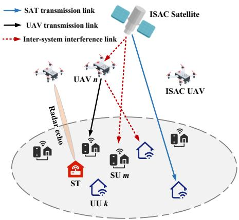  
Fig. 1. Illustration of the considered ISAC-SAGIN including LEO satellite, UAVs, SUs, UUs and ST.

• Simulation results demonstrate that the proposed algorithm efficiently converges to a Stackelberg equilibrium, thereby effectively balancing the ISAC performance of both the satellite and multi-UAV systems. For instance, under imperfect CSI conditions, the proposed algorithm achieves a 54.2% improvement in the achievable rate compared to the benchmark scheme in [30], while still satisfying sensing requirement.

This paper is structured as follows. Section II outlines the system model and problem. Section III describes the proposed algorithm. Section IV presents the simulation results, and we conclude in Section V.

## II. SYSTEM MODEL AND PROBLEM FORMULATION

## A. System Model

We consider an ISAC-SAGIN scenario consisting of LEO satellite, UAVs, satellite users (SUs), UAV users (UUs) and a sensing target (ST), as shown in Fig. 1<sup>1</sup>. Concretely, a satellite equipped with $N _ { s }$ antennas serves M single-antenna SUs. For the SUs equipped with high-gain antennas, the broadband service can be guaranteed. Whereas for the lowend users without high-gain antennas, it is still difficult to enjoy a broadband service even within the coverage area of satellite [31]. To fill up this gap, we utilize N UAVs equipped with $N _ { u }$ antennas to provide broad band services for K single-antenna UUs and sense a ST. We propose selecting one UAV as the receiver and the others as transmitters. The proposed single-receiver, multi-transmitter architecture strikes a favorable balance between sensing capability and communication performance, leveraging macro-diversity gains while minimizing disruption to the primary communication function of the UAV swarm. This design choice is particularly well-suited for ISAC-SAGIN scenarios where both sensing accuracy and communication rate are critical objectives.

TABLE I  
SUMMARY OF IMPORTANT NOTATIONS
<table><tr><td rowspan=1 colspan=1>Symbol</td><td rowspan=1 colspan=1>Definition</td></tr><tr><td rowspan=1 colspan=1>N, M, K</td><td rowspan=1 colspan=1>Number of UAV, SU and UU</td></tr><tr><td rowspan=1 colspan=1> $N _ { s } , N _ { u }$ </td><td rowspan=1 colspan=1>Number of antennas at SAT and UAV</td></tr><tr><td rowspan=1 colspan=1> $\mathbf { h } _ { \mathrm { S } , m } , \mathbf { h } _ { \mathrm { S } , k }$ </td><td rowspan=1 colspan=1>Channels from SAT to SU m and UU k</td></tr><tr><td rowspan=1 colspan=1> $\overline { { { \bf h } _ { n , k } [ \ell ] , { \bf h } _ { n , m } [ \ell ] } }$ </td><td rowspan=1 colspan=1>Channels from UAV n to UU k and SU m at slot l</td></tr><tr><td rowspan=1 colspan=1> $\mathbf { H } _ { S , n } [ \ell ]$ </td><td rowspan=1 colspan=1>Channel between SAT and UAV n at slot l</td></tr><tr><td rowspan=1 colspan=1> $\overline { { s _ { m } ^ { p } } }$ </td><td rowspan=1 colspan=1>Information signal from SAT to SU m</td></tr><tr><td rowspan=1 colspan=1> $s _ { n , k } [ \ell ]$ </td><td rowspan=1 colspan=1>Information signal from UAV n to UU k</td></tr><tr><td rowspan=1 colspan=1> $\underline { { s _ { n } ^ { s } [ \ell ] } }$ </td><td rowspan=1 colspan=1>Sensing sequence from UAV n</td></tr><tr><td rowspan=1 colspan=1> $ { \mathbf { p } } _ { m } ^ { p }$ </td><td rowspan=1 colspan=1>Commun. beamforming from SAT to SU m</td></tr><tr><td rowspan=1 colspan=1> $\underline { { \mathbf { p } _ { n , k } [ \ell ] } }$ </td><td rowspan=1 colspan=1>Commun. beamforming from UAV n to UU k</td></tr><tr><td rowspan=1 colspan=1> $\mathbf { p } _ { n } ^ { s } [ \ell ]$ </td><td rowspan=1 colspan=1>Sensing beamforming of UAV n</td></tr><tr><td rowspan=1 colspan=1> $\overline { { a _ { n , k } [ \ell ] , b _ { n } [ \ell ] } }$ </td><td rowspan=1 colspan=1>UAV-UU association and radar selection</td></tr><tr><td rowspan=1 colspan=1> $R _ { \mathrm { S } , m } [ \ell ] , R _ { \mathrm { U } , k } [ \ell ]$ </td><td rowspan=1 colspan=1>Transmission rates of SU m and UU k at slot l</td></tr><tr><td rowspan=1 colspan=1> ${ \bf w } _ { n }$ </td><td rowspan=1 colspan=1>Receive filter at UAV n</td></tr></table>

Due to the non-orthogonal nature of the shared spectrum between UAVs and satellites, each mobile user is affected by hierarchical multi-user interference. Specifically, SUs receive inter-system interference from all UAVs, while UUs are affected not only by satellite interference but also by intrasystem interference from other UAVs. Therefore, managing interference between sensing and communication functions is crucial in ISAC-SAGIN, a topic that will be discussed in the following section.

The satellite channel is characterized by multi-beam propagation with rain fading, directional beam gain and free-space path loss. The downlink channel gain $\mathbf { h } _ { \mathrm { S } , m } \in \mathbb { C } ^ { N _ { \mathrm { s } } }$ between the satellite and SU m is expressed as

$$
{ \mathbf { h } } _ { \mathrm { S } , m } = \sqrt { G _ { m } }  { \mathbf { r } } _ { m } ^ { - 1 / 2 } \odot  { \mathbf { b } } _ { m } ^ { 1 / 2 } ( \theta _ { m } , \varphi _ { m } ) \odot \widehat {  { \mathbf { h } } } _ { m } ( \theta _ { m } , \varphi _ { m } ) ,\tag{1}
$$

where $\theta _ { m } \in [ 0 , \pi / 2 ]$ and $\varphi _ { m } \in [ 0 , 2 \pi ]$ are the elevation and azimuth angles from the satellite to SU m, respectively. $G _ { m }$ is the receive antenna gain of SU $m , \mathbf { r } _ { m }$ is the rain fading vector and its bth element $r _ { b } ^ { \mathrm { d B } } = 2 0 \log _ { 1 0 } ( r _ { b } )$ is a lognormal random variable, i.e., $\ln ( r _ { b } ^ { \mathrm { d B } } ) \sim \mathcal { N } ( \mu , \bar { \sigma ^ { 2 } } )$ , where $\mu$ and $\sigma ^ { 2 }$ are the mean and variance of the rain attenuation in dB, respectively. Furthermore, $\mathbf { b } _ { m } ( \theta _ { m } , \varphi _ { m } )$ is the beam gain whose lth element is denoted by $\begin{array} { r } { b _ { m , l } \ = \ b _ { \mathrm { m a x } } \left( \frac { J _ { 1 } ( u _ { m , l } ) } { 2 u _ { m , l } } + 3 6 \frac { J _ { 3 } ( u _ { m , l } ) } { u _ { m , l } ^ { 3 } } \right) ^ { 2 } } \end{array}$ , with $b _ { \mathrm { m a x } }$ being the maximum satellite beam gain. Here, $J _ { 1 } ( \cdot )$ and $J _ { 3 } ( \cdot )$ are the first-kind Bessel functions of order 1 and 3, respectively. $u _ { m , l } ~ = ~ 2 . 0 7 1 2 3 \frac { \sin \theta _ { m , l } } { \sin \theta _ { 3 \mathrm { d B } } }$ , where $\theta _ { m , l }$ is the angle between the lth beam center and the mth SU and $\theta _ { \mathrm { 3 d B } }$ is the half power beamwidth. Finally, $\widehat { \mathbf { h } } _ { m } ( \theta _ { m } , \varphi _ { m } )$ is the free-space channel whose element is expressed by $\begin{array} { r } { \widehat { h } _ { m , l } = \frac { \bar { c } } { 4 \pi f _ { c } d _ { m , l } } \exp { \left( - j \frac { 2 \pi f _ { c } } { c } d _ { m , l } \right) } } \end{array}$ , with c being the lights peed, $f _ { c }$ the carrier frequency and $\cdot d _ { m , l }$ the distance from the lth satellite antenna to the mth SU.

The 3D coordinates of the nth UAV in the \`th slot is denoted by $\mathbf { q } _ { n } [ \ell ] = [ x _ { n } [ \ell ] , y _ { n } [ \ell ] , z _ { n } [ \ell ] ] ^ { T }$ . The horizontal positions of SU m and UU k are $\mathbf { u } _ { s , m } = [ x _ { s , m } , y _ { s , m } ] ^ { T }$ and $\mathbf { u } _ { u , k } = [ x _ { u , k } , y _ { u , k } ] ^ { T }$ , respectively. We assume that all UAV-

UU channels follow line-of-sight (LoS). Hence, the channel from UAV n to UU k in the \`th slot is written as

$$
\begin{array} { r } { \mathbf { h } _ { n , k } [ \ell ] = \sqrt { L _ { 0 } } d _ { n , k } ^ { - \kappa } [ \ell ] \mathbf { a } \left( \theta _ { n , k } [ \ell ] , \phi _ { n , k } [ \ell ] \right) , \forall n , k , } \end{array}\tag{2}
$$

where

$$
\mathbf { a } \left( \theta _ { n , k } [ \ell ] , \phi _ { n , k } [ \ell ] \right) = \left[ 1 , \cdot \cdot \cdot , e ^ { - j \pi \left( M _ { x } - 1 \right) \sin \theta _ { n , k } [ \ell ] \cos \phi _ { n , k } [ \ell ] } \right] ^ { T }
$$

$$
\otimes \left[ 1 , \cdots , e ^ { - j \pi ( M _ { z } - 1 ) \cos \theta _ { n , k } \left[ \ell \right] } \right] ^ { T } ,\tag{3}
$$

and $d _ { n , k } [ \ell ] = \sqrt { ( x _ { n } [ \ell ] - x _ { u , k } ) ^ { 2 } + ( y _ { n } [ \ell ] - y _ { u , k } ) ^ { 2 } + ( z _ { n } [ \ell ] ) ^ { 2 } }$ cos $\begin{array} { r } { \theta _ { n , k } [ \ell ] = \frac { z _ { n } [ \ell ] } { d _ { n , k } [ \ell ] } } \end{array}$ , sin $\theta _ { n , k } [ \ell ]$ cos $\begin{array} { r } { \phi _ { n , k } [ \ell ] = \frac { x _ { u , k } - x _ { n } [ \ell ] } { d _ { n , k } [ \ell ] } } \end{array}$ , L<sub>0</sub> refers to the path loss at the reference distance of 1 meter, κ is the path-loss exponent, $M _ { x }$ and $M _ { z }$ signify the number of elements along the x and z axes of the UAV’s uniform planar array, respectively. Along the same lines, we formulate the interference channels from satellite to UU k, and from UAV n to SU m at slot \`, which are denoted by $\bar { \mathbf { h } } _ { \mathrm { S } , k } \in \mathbb { C } ^ { N _ { s } }$ s and $\mathbf { h } _ { n , m } [ \ell ] \in \mathbb { C } ^ { N _ { u } }$ , respectively.

Due to the long propagation delay between satellite and users, we consider the outdated CSI for communication channel coefficients [32]. Hence, we have $\mathbf { h } _ { \mathrm { S } , i } ~ = ~ \rho \bar { \mathbf { h } } _ { \mathrm { S } , i } + \mathbf { \rho }$ ${ \sqrt { 1 - \rho ^ { 2 } } } \mathbf { g } _ { \mathrm { S } , i } ,$ , where $\rho ~ = ~ J _ { 0 } \ : ( 2 \pi f _ { \mathrm { D } } T _ { \mathrm { d e l a y } } )$ $J _ { 0 }$ is the zeroth order Bessel function of the first kind, $f _ { \mathrm { D } }$ and $T _ { \mathrm { d e l a y } }$ are the maximum Doppler frequency and the delay of the transmissions between SAT and user i, respectively. $\mathbf { g } _ { \mathrm { S } , i }$ is a complex Gaussian random variable which having the same variance as $\bar { \mathbf { h } } _ { \mathrm { S } , i }$ . Moreover, since all users are mobile, only the imperfect CSIs of users are available. Based on this, the communication channels of users are re-expressed as

$$
\begin{array} { r } { \mathbf { h } _ { \mathrm { S } , i } = \hat { \mathbf { h } } _ { \mathrm { S } , i } + \Delta \mathbf { h } _ { \mathrm { S } , i } , \forall i , } \end{array}\tag{4a}
$$

$$
\begin{array} { r } { \mathbf { h } _ { n , i } \left[ \ell \right] = \hat { \mathbf { h } } _ { n , i } \left[ \ell \right] + \Delta \mathbf { h } _ { n , i } \left[ \ell \right] , \forall n , i , } \end{array}\tag{4b}
$$

where $\hat { \mathbf { h } } _ { \mathrm { S } , i }$ and $\hat { \mathbf { h } } _ { n , i } \left[ \ell \right]$ are the channel estimation vectors, known to the satellite and $\mathrm { U A V s } ; \Delta \mathbf { h } _ { \mathrm { S } , i }$ and $\Delta \mathbf { h } _ { n , i } \left[ \ell \right]$ are the corresponding channel uncertainties, following the complex Gaussian distributions $\Delta \mathbf { h } _ { \mathrm { S } , i } \sim \mathcal { C } \mathcal { N } \left( \mathbf { 0 } , \mathbf { Q } \mathrm { s } , i \right)$ and $\Delta \mathbf { h } _ { n , i } \left[ \boldsymbol { \ell } \right] \sim$ $\mathcal { C N } ( \mathbf { 0 } , \mathbf { Q } _ { n , i } )$ , respectively.

The baseband transmit signal at the satellite can be expressed as

$$
\mathbf { x } ^ { \mathrm { { L } } } = \sum _ { m = 1 } ^ { M } \mathbf { p } _ { m } ^ { p } s _ { m } ^ { p } ,\tag{5}
$$

where $\mathbf { p } _ { m } ^ { p } \in \mathbb { C } ^ { N _ { s } }$ and $s _ { m } ^ { p }$ denote the transmit beamforming vector and information signal for the mth SU, respectively. The information stream is expressed together as $\mathbf { s } _ { \mathrm { { L } } } =$ $\left[ s _ { 1 } ^ { p } , . . . , s _ { M } ^ { p } \right] ^ { T } \in \mathbb { C } ^ { M }$ . Then, $\mathbf { s _ { \mathrm { L } } }$ is linearly precoded before emission employing the precoder $\mathbf { P } _ { \mathrm { { L } } } ~ = ~ [ \mathbf { \bar { p } } _ { 1 } ^ { p } , . . . , \mathbf { p } _ { M } ^ { p } ]$ . We consider that $\mathbf { s } _ { \mathrm { L } }$ are independently generated from arbitrary distribution with $\mathbb { E } \left[ \mathbf { s } _ { \mathrm { L } } \mathbf { s } _ { \mathrm { L } } ^ { H } \right] = \mathbf { I } _ { M }$ and total power required at satellite is tr $( \mathbf { P } _ { \mathrm { L } } \mathbf { P } _ { \mathrm { L } } ^ { \tilde { H } } ) \leq \tilde { P } _ { \mathrm { L } }$   
<sub>,max</sub>.

Meanwhile, the transmitting UAVs send ISAC signals for both sensing and communication. The baseband transmit signal of the nth UAV in time slot \` is defined as

$$
\mathbf { x } _ { n } ^ { \mathrm { U } } [ \ell ] = \underbrace { \sum _ { k = 1 } ^ { K } a _ { n , k } [ \ell ] \mathbf { p } _ { n , k } [ \ell ] s _ { n , k } [ \ell ] } _ { \mathrm { C o m m u n i c a t i o n ~ s t r e a m s } } + \underbrace { b _ { n } [ \ell ] \mathbf { p } _ { n } ^ { s } [ \ell ] s _ { n } ^ { s } [ \ell ] } _ { \mathrm { R a d a r ~ s e q u e n c e } } , \forall n ,\tag{6}
$$

where $a _ { n , k } [ \ell ] ~ \in ~ \{ 0 , 1 \}$ denotes the UAV-UU association variable. In particular, $a _ { n , k } [ \ell ] \ = \ 1$ suggests that UU k is served by UAV n at slot \` and vice versa. $b _ { n } [ \ell ] \in \{ 0 , 1 \}$ is the radar selection variable. Specifically, $b _ { n } [ \ell ] = 1$ represents that UAV n is selected as a transmitting node while $b _ { n } [ \ell ] = 0$ suggests it serves as the receiving node. $\mathbf { p } _ { n , k } [ \ell ]$ and $\mathbf { p } _ { n } ^ { s } [ \ell ]$ denote the beamforming from UAV n to UU k and the sensing beamforming of UAV n at the \`th slot, respectively. $s _ { n , k } [ \ell ]$ is the communication signal from UAV n to UU k at the \`th slot. The non-orthogonal spectrum is shared between the satellite and the UAV systems. Hence, there may be intersystem interference between the satellite-SU link and the UAV-UU link. Based on (5) and (6), the signal received at SU m is denoted by (7), where $n _ { m } \sim \mathcal { C N } ( 0 , \bar { \sigma } _ { m } ^ { 2 } )$ is the additive white Gaussian noise (AWGN) at SU m.

The signal received at UU k at the \`th slot is denoted by (8), where $n _ { k } ~ \sim ~ \mathcal { C N } ( 0 , \sigma _ { k } ^ { 2 } )$ is the AWGN at UU k. Then, the received SINR at SU m and UU k in the \`th slot is expressed by (9) and (10), as shown at the top of this page. Thus, the achievable rates at SU m and UU k are expressed as $R \mathrm { s } , m [ \ell ] = \log _ { 2 } \left( 1 + \gamma _ { m } [ \ell ] \right)$ , ∀m, and $R _ { \mathrm { U } , k } [ \ell ] = \log _ { 2 } { ( 1 + \gamma _ { k } [ \ell ] ) }$ , ∀k, respectively.

We model the echo signal of the considered ISAC-SAGIN. With UAV n as the receiver and all other UAVs as transmitters, the signal received at UAV n in the \`th slot, considering the satellite signal interference, is denoted as

$$
\begin{array} { r } { \mathbf { y } _ { n } [ \ell ] = \underbrace { \sum _ { j = 1 , j \neq n } ^ { N } \mathbf { A } _ { n , j , 0 } ^ { \mathrm { U } } [ \ell ] \mathbf { x } _ { j } ^ { \mathrm { U } } [ \ell ] } _ { \mathrm { T a r g e t ~ e c h o } } + \underbrace { \mathbf { H } _ { \mathrm { S } , n } ^ { T } [ \ell ] \mathbf { x } ^ { \mathrm { L } } } _ { \mathrm { S A T ~ s i g n a l ~ i n t e r f e r e n c e } } } \\ { + \underbrace { \sum _ { i = 1 } ^ { I } \sum _ { j = 1 , j \neq n } ^ { N } \mathbf { A } _ { n , j , i } ^ { \mathrm { U } } [ \ell ] \mathbf { x } _ { j } ^ { \mathrm { U } } [ \ell ] } _ { \mathrm { C l u t t e r ~ r e t u r n s } } + \mathbf { n } _ { n } , \forall n , } \end{array}\tag{11}
$$

where ${ \bf A } _ { n , j , i } ^ { \mathrm { U } } [ \ell ] = \alpha _ { n , j , i } \mathbf { a } _ { r } \left( \theta _ { n , i } [ \ell ] \right) \mathbf { a } _ { t } ^ { H } \left( \theta _ { j , i } [ \ell ] \right)$ is the sensing channel in the \`th slot. The coefficient $\alpha _ { n , j , i }$ is the complex gain, encompassing the RCS and the path loss of the link from $\mathrm { U A V } ~ j$ to the ST/interferer i and then to UAV $n , \mathbf { a } ( \theta )$ denotes the steering vector. $\theta _ { n , i } [ \ell ]$ and $\theta _ { j , i } [ \ell ]$ are the angle-of-arrival (AoA) and angle of-departure (AoD) of the ST/interferer i with respect to (w.r.t.) the receiving and transmitting UAV, respectively. $\mathbf { H } _ { \mathrm { S } , n } ( \ell ) \in \mathbb { C } ^ { N _ { \mathrm { S } } \times N _ { \mathrm { U } } }$ is the interference channel from the satellite to UAV n at slot $\ell . \mathbf { n } _ { n } \sim \mathcal { C N } ( 0 , \sigma _ { n } ^ { 2 } \mathbf { I } )$ is the AWGN at UAV n. The receiving UAV leverages the knowledge of α and θ (assumed known or previously estimated) to design an optimal signal for the detection of this specific target of interest, as in [15], [16]. After applying the receive beamformer ${ \mathbf { w } } _ { n } \in { \mathbf { C } } ^ { N _ { \mathrm { u } } }$ to the received signal, $\mathbf { y } _ { n } [ \boldsymbol { \ell } ]$ to capture the desired reflection from the ST, the sensing SINR at UAV n is given by (12), as shown at the top of this page.

Noting that this model assumes a quasi-static channel over the sensing interval. Although the UAVs are mobile, the resulting Doppler shift can be compensated using onboard sensors [33]. After compensation, the residual Doppler effect is negligible and is therefore omitted for simplicity, as it does not significantly affect the sensing performance in our resource allocation framework. Moreover, leveraging the central processor (CP), the receiving UAV gains knowledge of both the positions and transmitted signals of all transmitting UAVs. Given this information, it can effectively reconstruct

$$
\left. \begin{array} { l } { y _ { m } \left[ \ell \right] = \underbrace { \mathbf { h } _ { s , m } ^ { H } \mathbf { p } _ { m } ^ { p } \ : s _ { m } ^ { p } } _ { \mathrm { n s i r e d ~ s i g n a l } } + \underbrace { \sum _ { i = 1 , i \neq j = m } ^ { M } \mathbf { h } _ { s , m } ^ { H } \mathbf { p } _ { i } ^ { p } \ : s _ { i } ^ { p } } _ { \mathrm { m u l t i n e c t i n e r f e r e s c } } + \underbrace { \sum _ { n = 1 } ^ { N } \mathbf { h } _ { n , m } ^ { H } \lbrack \ell \right] \left( \sum _ { k = 1 } ^ { K } a _ { n , k } \lbrack \ell \rbrack \mathbf { p } _ { n , k } \lbrack \ell \rbrack s _ { n , k } \lbrack \ell \rbrack + b _ { n } \lbrack \ell \rbrack \mathbf { p } _ { n } ^ { s } \lbrack \ell \rbrack s _ { n } ^ { s } \lbrack \ell \rbrack \right) } _ { \mathrm { i n f e r s y s t e n i z e l e c t e r a c t } } + n _ { m } , \forall m , } \end{array}\tag{7}
$$

$$
y _ { k } [ \ell ] = \underbrace { \sum _ { n = 1 } ^ { N } a _ { n , k } [ \ell ] \ \mathbf { h } _ { n , k } ^ { H } [ \ell ] \ \mathbf { p } _ { n , k } [ \ell ] \ s _ { n , k } [ \ell ] } _ { \mathrm { D e s i r e d ~ s i g n a l } } + \underbrace { \sum _ { n = 1 } ^ { N } \sum _ { i = 1 , i \neq k } ^ { K } a _ { n , i } [ \ell ] \ \mathbf { h } _ { n , k } ^ { H } [ \ell ] \ \mathbf { p } _ { n , i } [ \ell ] \ s _ { n , i } [ \ell ] } _ { \mathrm { m u t i u s e r ~ i n t e r e n c e } } .
$$

$$
+ \underbrace { \sum _ { n = 1 } ^ { N } b _ { n } [ \ell ] \mathbf { h } _ { n , k } ^ { H } [ \ell ] \mathbf { p } _ { n } ^ { s } [ \ell ] s _ { n } ^ { s } [ \ell ] } _ { \mathrm { s e n s i n g i n t e r f e r e n c e } } + \underbrace { \mathbf { h } _ { \mathrm { S } , k } ^ { H } \sum _ { m = 1 } ^ { M } \mathbf { p } _ { m } ^ { p } s _ { m } ^ { p } } _ { \mathrm { i n t e r - s y s t e m i n t e r f e r e n c e } } + n _ { k } , \forall k ,\tag{8}
$$

$$
\begin{array} { r } { \gamma _ { m } [ \ell ] = \frac { | \mathbf { h } _ { \mathrm { s } , m } ^ { H } \mathbf { p } _ { m } ^ { p } | ^ { 2 } } { \sum _ { i = 1 , i \neq m } ^ { M } | \mathbf { h } _ { \mathrm { s } , m } ^ { H } \mathbf { p } _ { i } ^ { p } | ^ { 2 } + \sum _ { n = 1 } ^ { N } \sum _ { k = 1 } ^ { K } a _ { n , k } [ \ell ] | \mathbf { h } _ { n , m } ^ { H } [ \ell ] \mathbf { p } _ { n , k } [ \ell ] | ^ { 2 } + \sum _ { n = 1 } ^ { N } b _ { n } [ \ell ] | \mathbf { h } _ { n , m } ^ { H } [ \ell ] \mathbf { p } _ { n } ^ { s } | \ell | ^ { 2 } + \delta _ { m } ^ { 2 } } , \forall m , } \end{array}\tag{9}
$$

$$
\gamma _ { k } [ \ell ] = \frac { \sum _ { n = 1 } ^ { N } a _ { n , k } [ \ell ] | { \bf h } _ { n , k } ^ { H } [ \ell ] { \bf p } _ { n , k } [ \ell ] | ^ { 2 } } { \sum _ { n = 1 } ^ { N } \Big ( \sum _ { i = 1 , i \ne k } ^ { K } a _ { n , i } [ \ell ] | { \bf h } _ { n , k } ^ { H } [ \ell ] { \bf p } _ { n , i } [ \ell ] | ^ { 2 } + b _ { n } [ \ell ] | { \bf h } _ { n , k } ^ { H } [ \ell ] { \bf p } _ { n } ^ { s } [ \ell ] | ^ { 2 } \Big ) + \sum _ { m = 1 } ^ { M } | { \bf h } _ { \mathrm { S } , k } ^ { H } { \bf p } _ { m } ^ { p } | ^ { 2 } + \delta _ { k } ^ { 2 } } , \forall k ,\tag{10}
$$

$$
\gamma _ { n } ^ { \mathrm { R a d } } [ \ell ] = \frac { \sum _ { j = 1 , j \ne n } ^ { N } \left| { \bf w } _ { n } ^ { H } { \bf A } _ { n , j , 0 } ^ { \mathrm { U } } [ \ell ] { \bf x } _ { j } ^ { \mathrm { U } } [ \ell ] \right| ^ { 2 } } { \sum _ { i = 1 } ^ { I } \sum _ { j = 1 , j \ne n } ^ { N } \left| { \bf w } _ { n } ^ { H } { \bf A } _ { n , j , i } ^ { \mathrm { U } } [ \ell ] { \bf x } _ { j } ^ { \mathrm { U } } [ \ell ] \right| ^ { 2 } + \left| { \bf w } _ { n } ^ { H } { \bf H } _ { s , n } ^ { T } [ \ell ] { \bf x } ^ { \mathrm { L } } \right| ^ { 2 } + \sigma _ { n } ^ { 2 } \| { \bf w } _ { n } \| ^ { 2 } } , \forall n .\tag{12}
$$

and cancel the target-free interference that propagates via LoS paths from transmitting UAVs [26].

## B. Problem Formulation

In the dynamic SAGINs, the willingness of SUs and UUs to share CSI and participate in interference management is often constrained by communication overhead and privacy concerns. To address this challenge, NSG theory provides an effective analytical framework. Its core principle lies in modeling the strategic interactions among autonomous decision makers-each subsystem rationally selects actions to optimize their own utility, rather than following centralized directives. By enabling both satellite and multi-UAV systems to independently choose optimal strategies for utility maximization, the game-theoretic approach inherently aligns individual incentives with systemic efficiency. This alignment not only safeguards subsystem utilities but also motivates their voluntary participation in cooperative interference management. Specifically, the satellite acts as the leader, designing its transmit and receive beamformers to maximize the achievable rate under constraints of power consumption performance, given imperfect CSI. In response, the multi-UAV followers adjust their own transmit beamforming, trajectories, and user scheduling over the service period. This joint adjustment aims to maximize their collective achievable rate while jointly optimizing mission-critical objectives, such as enhancing detection capability and mitigating both intraswarm and inter-system interference.

To enhance the satellite’s communication performance, we aim to design its transmit beamforming under the constraints of each SU’s achievable rate and the total transmit power. Specifically, the leader aims to maximize the worst-case achievable rate among all SUs under imperfect CSI w.r.t. the variable $\mathbf { p } _ { m } ^ { p } .$ , given the strategies of the followers denoted by the decision variable set $\chi _ { 2 } = \{ { \bf q } _ { n } , { \bf p } _ { n , k } , { \bf p } _ { n } ^ { s } , a _ { n , k } , b _ { n } , { \bf w } _ { n } \}$

Hence, the leader’s optimization problem is formulated as

$$
\operatorname* { m a x } _ { \boldsymbol { \chi } _ { 1 } } \operatorname* { m i n } _ { \boldsymbol { \Delta } \mathbf { h } } \frac { 1 } { T } \sum _ { \ell = 1 } ^ { T } \sum _ { m = 1 } ^ { M } R _ { \mathsf { S } , m } \left[ \ell \right]
$$

$$
\begin{array} { r } { \sum _ { m = 1 } ^ { M } \|  { \mathbf { p } } _ { m } ^ { p } \| ^ { 2 } \leq P _ { \mathrm { L , m a x } } , } \end{array}\tag{13a}
$$

(13b)

$$
\operatorname* { m i n } _ { \Delta \mathbf { h } } R _ { \mathrm { S } , m } [ \ell ] \geq R _ { \mathrm { t h } } ^ { \mathrm { L } } , \forall m \in \mathcal { M } ,\tag{13c}
$$

where $P _ { \mathrm { L , m a x } }$ is the total power budget of satellite system. To ensure specific QoS, (13c) sets the predefined minimum rate constraints for each SU.

Let $\mathbf { q } _ { n } ^ { I } = ( x _ { n } ^ { I } , y _ { n } ^ { I } , z _ { n } ^ { I } )$ and $\mathbf { q } _ { n } ^ { F } = ( x _ { n } ^ { F } , y _ { n } ^ { F } , z _ { n } ^ { F } )$ denote the initial and final 3D locations of UAV n, respectively, which are predefined according to its mission. Let $v _ { \mathrm { m a x } }$ be the maximum flight speed, and define $d _ { \operatorname* { m a x } } ~ = ~ v _ { \operatorname* { m a x } } \Delta t$ as the maximum possible displacement of any UAV over two consecutive slots. Thus, the flight constraints for the UAV swarm are given by

$$
\mathbf { q } _ { n } \left[ 1 \right] = \mathbf { q } _ { n } ^ { I } , \mathbf { q } _ { n } \left[ L \right] = \mathbf { q } _ { n } ^ { F } ,\tag{14a}
$$

$$
\begin{array} { r } { \| \mathbf { q } _ { n } \left[ \ell + 1 \right] - \mathbf { q } _ { n } \left[ \ell \right] \| \leq d _ { \operatorname* { m a x } } , \forall n , } \end{array}\tag{14b}
$$

$$
\begin{array} { r } { \| \mathbf { q } _ { n } \left[ \ell \right] - \mathbf { q } _ { n ^ { \prime } } \left[ \ell \right] \| \geq \hat { d } _ { \operatorname* { m a x } } , \forall n , n ^ { \prime } , } \end{array}\tag{14c}
$$

The inter-UAV safe distance $\hat { d } _ { \mathrm { m a x } }$ is also necessary to prevent collisions between any two UAVs. To enhance ISAC performance and mitigate both inter- and intra-system interference, the objective of the multi-UAV followers is to maximize the worst-case achievable rate under imperfect CSI by jointly designing a set of variables-including UAV trajectories, UU scheduling, transmit beamforming, and receive filter-subject to sensing, transmit power, and UAV flight constraints. Accordingly, their optimization problem is

$$
\operatorname* { m a x } _ { \boldsymbol { \chi } _ { 2 } } \operatorname* { m i n } _ { \Delta \mathbf { h } } \frac { 1 } { T } \sum _ { \ell = 1 } ^ { T } \sum _ { k = 1 } ^ { K } R _ { \mathrm { U } , k } \left[ \ell \right]\tag{15a}
$$

$$
\sum _ { k = 1 } ^ { K } a _ { n , k } [ \ell ] \left\| \mathbf { p } _ { n , k } [ \ell ] \right\| ^ { 2 } + b _ { n } [ \ell ] \left\| \mathbf { p } _ { n } ^ { s } [ \ell ] \right\| ^ { 2 } \leq P _ { n } ^ { \operatorname* { m a x } } , \forall n ,\tag{15b}
$$

$$
\sum _ { n = 1 } ^ { N } \left( 1 - b _ { n } [ \ell ] \right) \gamma _ { n } ^ { \mathrm { R a d } } [ \ell ] \geq \gamma _ { \mathrm { U , m i n } } ,\tag{15c}
$$

$$
\operatorname* { m i n } _ { { \Delta \mathbf { h } } } R _ { \mathrm { U } , k } \left[ \ell \right] \geq R _ { \mathrm { t h } } ^ { \mathrm { U } } , \forall k ,\tag{15d}
$$

$$
\sum _ { n = 1 } ^ { N } a _ { n , k } [ \ell ] = 1 , \forall k ,\tag{15e}
$$

$$
\sum _ { n = 1 } ^ { N } \left( 1 - b _ { n } [ \ell ] \right) = 1 ,\tag{15f}
$$

$$
b _ { n } [ \ell ] \geq a _ { n , k } [ \ell ] , \forall , n , k ,\tag{15g}
$$

$$
( 1 4 \mathrm { a } ) , ~ ( 1 4 \mathrm { b } ) , ~ ( 1 4 \mathrm { c } ) ,\tag{15h}
$$

where $P _ { n } ^ { \mathrm { m a x } }$ denotes the maximum power budget of UAV n. A minimum SINR threshold $\gamma _ { \mathrm { U , m i n } }$ for the sensing task is defined in (15c). Likewise, (15d) imposes a minimum rate constraint $R _ { \mathrm { t h } } ^ { \mathrm { U } }$ for each UU. Constraint (15e) stipulates that each UU is served by a single UAV. Additionally, (15f) ensures only one UAV acts as the receiver, while (15g) specifies that transmission to UUs can only be assigned to UAVs that are in transmit mode. There is a fundamental trade-off between sensing and communication due to shared power resources. Each UAV must split its limited power between communication beams and sensing beams. More power for sensing improves target detection but reduces communication rates, and vice versa. This trade-off is worsened by mutual interference: sensing signals interfere with communication users, while communication signals create clutter that interferes with sensing. Therefore, problem (15) must balance these competing goals.

## III. TRANSFORMER-ENABLED MEAN-FIELD REINFORCEMENT LEARNING

Given the need to protect user privacy and reduce communication overhead, both the satellite system and the UAV swarm act selfishly by prioritizing the maximization of their own transmission rates over compliance with a central controller. Thus, a key challenge for interference management in ISAC-SAGINs is that it would inherently require a large number of information interactions among distributed agents. To address this, we formulate the problem as a MFG, in which a leader seeks to guide a large population of homogeneous, selfinterested followers toward maximizing her own utility. The behaviors of large-scale followers are described by a meanfield term, which is a statistical function characterizing the mass distribution. For this reason, system complexity is greatly reduced: the myriad pairwise information exchanges that would otherwise be needed are consolidated into interactions with this single aggregate statistical mass.

Prior studies on MFG with few heterogeneous followers often fail to scale. Solving dynamic large-scale MFG thus presents three major challenges: i) current approaches either simplify the dynamic MFG to single-stage decision [23] or assume myopic followers [21], failing to capture the complexities of sequential policy interaction; ii) learning through environmental interaction is highly data-inefficient; and iii) intricate leader-follower interactions result in unstable learning performance. To overcome these limitations, we introduce a transformer-enhanced MFRL (T-MFRL) algorithm, which is shown in Fig. 2. Our contributions are threefold: i) We first develop a RL framework-the mean-field update-which enables the leader to learn her policy without prior knowledge of the environment. ii) To enhance data efficiency, we propose a transformer-based encoder, whose inherent permutation invariance is well-suited for processing the large-scale, unordered input data characteristic of this problem. iii) We design a postdecision state (PDS) mechanism that allows the learning agent to adapt more rapidly in dynamic environments.

The solution framework involves reformulating the considered problem as a Markov decision process (MDP). Since two autonomous RL agents (the satellite system and the UAV swarm) coexist in the environment, we first define their system variables independently. We begin by specifying the configuration parameters for the satellite agent as follows.

Action: The action space A, from which the satellite agent selects an action $a _ { \ell } ^ { l }$ at time step \`, is the set of all feasible optimization variables, i.e.,

$$
a _ { \ell } ^ { l } = \left[ \{ \mathbf { p } _ { m } ^ { p } \} _ { m = 1 } ^ { M } [ \ell ] , \mathbf { w } _ { L } [ \ell ] \right] ,\tag{16}
$$

where the superscript $\mathbf { \Delta } ^ { 6 6 } l ^ { 5 }$ in the variable $a _ { \ell } ^ { l }$ means the leader in the Stackelberg game. Due to the inherent real-valued nature of neural network computations, the complex action $a _ { \ell } ^ { l }$ must be decomposed into its real and imaginary parts prior to processing.

State: The system state at slot \` is designed to encompass all parameters that influence subsequent actions. It comprises: (i) the previous action $a _ { \ell - 1 } ^ { l } , ( \mathrm { i i } )$ the previous achievable rate of each SU $R _ { m } ^ { c } [ \ell - 1 ]$ , and (iii) the current instantaneous communication CSI. For dimension reduction of the state space, our analysis is restricted to individual channels-cascaded channels are thus not considered. Thus, the state at time slot \` is defined as

$$
\begin{array} { r } { s _ { \ell } ^ { l } = \left[ a _ { \ell - 1 } ^ { l } , R _ { m } ^ { c } [ \ell - 1 ] , \mathbf { h } _ { \mathrm { S } , m } [ \ell ] , \mathbf { h } _ { n , m } [ \ell ] \right] . } \end{array}\tag{17}
$$

Reward: The reward function for the satellite agent is designed to optimize the worst-case achievable rate, subject to the QoS requirement for each SU threshold. That is,

$$
\begin{array} { r l } & { r _ { \ell } ^ { l } = \underset { \Delta \mathbf { h } } { \mathrm { m i n } } \displaystyle \sum _ { m = 1 } ^ { M } R _ { \mathbf { S } , m } [ \ell ] } \\ & { -  \lambda _ { \mathrm { c o m } } \displaystyle \sum _ { m = 1 } ^ { M } \mathrm { m a x } ( 0 , R _ { \mathrm { t h } } ^ { \mathrm { L } } - \underset { \Delta \mathbf { h } } { \mathrm { m i n } } R _ { \mathbf { S } , m } [ \ell ] ) , } \end{array}\tag{18}
$$

where $\lambda _ { \mathrm { c o m } }$ denotes the weighting coefficient that balances the overall system utility against the associated cost. In equation (18), the first term corresponds to the immediate reward, whereas the second term serves as a penalty function for any infringement of the communication constraint. In this setup, each UAV agent operates based on its own unique system state, action set, and reward function.

Action: Within the formulated dynamic Stackelberg game framework, each UAV needs to determine its transmit beamforming and trajectory, as well as UU’s scheduling and receive filter in each slot. Thus, the action space for UAV n at step \` is

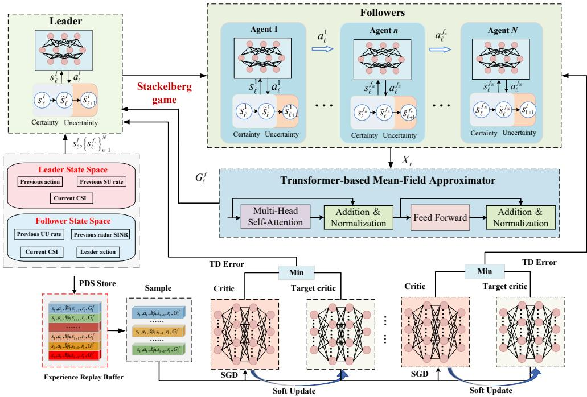  
Fig. 2. Schematic of the T-MFRL architecture, where a transformer encoder is embedded within the Stackelberg mean-field actor-critic network for modeling complex state features and deriving optimal actions.

$$
\begin{array} { r } { a _ { \ell } ^ { f _ { n } } = [ \mathbf { q } _ { n } [ \ell ] , \mathbf { p } _ { n , k } [ \ell ] , \mathbf { p } _ { n } ^ { s } [ \ell ] , a _ { n , k } [ \ell ] , b _ { n } [ \ell ] , \mathbf { w } _ { n } [ \ell ] ] , } \end{array}\tag{19}
$$

where the superscript $" f _ { n } " $ in variable $a _ { \ell } ^ { f _ { n } }$ means follower n.

State: Given the pre-determined actions of the satellite agent, the UAV agent optimizes its own policy accordingly. Consequently, the system state of the nth UAV agent at step \` is composed of the previous sensing SINR and UU’s achievable rate, the current channel conditions and the satellite agent’s actions.

$$
\begin{array} { r } { s _ { \ell } ^ { f _ { n } } = \left[ \begin{array} { l } { \gamma _ { n } ^ { \mathrm { R a d } } [ \ell - 1 ] , R _ { \mathrm { U } , k } \left[ \ell - 1 \right] , \mathbf { h } _ { n , k } [ \ell ] , } \\ { \mathbf { h } _ { \mathrm { S } , k } [ \ell ] , \mathbf { A } _ { n , j , i } ^ { \mathrm { U } } [ \ell ] , \mathbf { H } _ { \mathrm { S } , n } [ \ell ] , a _ { \ell } ^ { l } } \end{array} \right] , } \end{array}\tag{20}
$$

where $a _ { \ell } ^ { l }$ denotes the action strategy obtained from the satellite, guiding the UAV’s resource allocation decisions.

Reward: The objective of UAV n is to maximize its achievable rate while guaranteeing the required sensing performance and trajectory constraints. Thus, the proposed reward function is expressed as

$$
\begin{array} { r l } & { r _ { \ell } ^ { f _ { n } } = \displaystyle \operatorname* { m i n } _ { \Delta { \mathbf { h } } } \sum _ { k = 1 } ^ { K } R _ { \mathrm { U } , k } [ \ell ] } \\ & { -  \lambda _ { \mathrm { r a d } } \operatorname* { m a x } ( 0 , \gamma _ { \mathrm { U } , \mathrm { m i n } } - \sum _ { i = 1 } ^ { N } ( 1 - b _ { i } [ \ell ] ) \gamma _ { i } ^ { \mathrm { R a d } } [ \ell ] )  } \\ & { -  \lambda _ { \mathrm { t l } } \operatorname* { m a x } ( 0 ,  \mathbf { q } _ { n } [ \ell + 1 ] - \mathbf { q } _ { n } [ \ell ]  - d _ { \mathrm { m a x } } )  } \\ & { -  \lambda _ { \mathrm { t 2 } } \operatorname* { m a x } ( 0 , \hat { d } _ { \mathrm { m a x } } -  \mathbf { q } _ { n } [ \ell ] - \mathbf { q } _ { n ^ { \prime } } [ \ell ]  ) , } \end{array}\tag{21}
$$

where $\lambda _ { \mathrm { { r a d } } } , \lambda _ { \mathrm { { t l } } }$ and $\lambda _ { \mathrm { t } 2 }$ are the corresponding weighting factors.

In a traditional stackelberg mean-field game over periods $\ell \in \{ 0 , \ldots , T \}$ for interference management policy design, the decision process at each slot is as follows: First, the leader chooses an action $a _ { \rho } ^ { l } \in \mathcal { A } ^ { l }$ according to its state $s _ { \ell } ^ { l } \in S ^ { l }$ and policy $\pi ^ { l } : \mathcal { S } ^ { l }  \mathcal { A } ^ { l }$ . Then, the followers simultaneously choose their actions depending on the leader’s action $a _ { \ell } ^ { l }$ and their own states $s _ { \ell } ^ { f } \in \bar { \mathcal { S } ^ { f } }$ . The action $a _ { \ell } ^ { f } \in \mathcal A ^ { f }$ of a representative follower is obtained from a shared policy $\pi ^ { f } : { \mathcal { S } } ^ { \hat { f } } \times { \mathcal { A } } ^ { l } \to { \mathcal { A } } ^ { f }$

Given the leader’s policy $\pi ^ { l } .$ , the followers engage in a mean-field game. a representative follower in state $\bar { } s _ { \ell } ^ { f }$ selects action $a _ { \ell } ^ { f }$ based on the leader’s action $a _ { \rho } ^ { l }$ and the population state-action distribution $L _ { \ell } ^ { f } \in \mathcal { P } ( S ^ { f } \times \overset { \sim } { A ^ { f } } )$ . The follower receives an immediate reward $r ^ { f } ( s _ { \ell } ^ { f } , a _ { \ell } ^ { f } , a _ { \ell } ^ { l } , L _ { \ell } ^ { f } )$ and transitions to state $s _ { \ell + 1 } ^ { f } \sim \mathbb { P } ( \cdot | s _ { \ell } ^ { f } , a _ { \ell } ^ { f } , a _ { \ell } ^ { l } , L _ { \ell } ^ { f } )$ . Each follower aims to find an optimal policy $\pi ^ { f }$ that maximizes the expected cumulative reward

$$
J ^ { f } \left( \pi ^ { l } , \pi ^ { f } , L ^ { f } \right) = \mathbb { E } ^ { f } \left[ \sum _ { \ell = 0 } ^ { T } r ^ { f } \left( s _ { \ell } ^ { f } , a _ { \ell } ^ { f } , a _ { \ell } ^ { l } , L _ { \ell } ^ { f } \right) \right] ,\tag{22}
$$

where the expectation $\mathbb { E } ^ { f }$ is taken over the initial state distribution $s _ { 0 } ^ { \mathcal { J } } \in \mathrm { ~ \Gamma ~ } \mu _ { 0 } ^ { f }$ , state transitions $( s _ { \ell + 1 } ^ { l } , s _ { \ell + 1 } ^ { f } ) \sim$ $\mathbb { P } ( \cdot | s _ { \ell } ^ { f } , a _ { \ell } ^ { f } , a _ { \ell } ^ { l } , L _ { \ell } ^ { f } )$ , and action selections $a _ { \ell } ^ { l } \sim \dot { \pi ^ { l } } ( \cdot | s _ { \ell } ^ { l } ) , a _ { \ell } ^ { f } \sim$ $\pi ^ { f } ( \cdot | s _ { \ell } ^ { f } , a _ { \ell } ^ { l } )$

In traditional mean-field modeling, individual states and actions are typically aggregated through simple averaging or empirical distribution estimation. Although methodologically straightforward, this approach fails to adequately capture inter-agent heterogeneity and complex nonlinear dependencies, resulting in significant information loss in heterogeneous environments. To enhance the representational capacity of the mean-field framework, this paper introduces a transformer-based encoder architecture [34], [35]. The implemented self-attention mechanism effectively models interactions among population tokens while adaptively assigning contextual weights, thereby highlighting features with the greatest global influence. The architecture’s inherent permutation invariance makes it particularly suitable for processing large-scale, unordered input data. Through end-to-end training, the resulting mean-field embeddings not only preserve the population’s essential statistical characteristics but also establish a more reliable foundation for optimizing both leader and follower policies.

Multi-headed self-attention: The decision transformer processes multi-modal data including state and action into a single token per mode. Consequently, even an N-dimensional multidiscrete action can be represented as a single token [36]. At each slot \`, the population state-action distribution of multi-UAV followers is represented by an unordered set, i.e.,

$$
X _ { \ell } = \{ x _ { \ell , n } \} _ { n = 1 } ^ { N } , \ x _ { \ell , n } = [ s _ { \ell } ^ { f _ { n } } , a _ { \ell } ^ { f _ { n } } ] \in \mathbb { R } ^ { d _ { \mathrm { t o k } } } ,\tag{23}
$$

where $s _ { \ell } ^ { f _ { n } }$ and $a _ { \ell } ^ { f _ { n } }$ denote the state and action of the nth follower at time $\ell ,$ respectively. The computation of the attention mechanism begins with an input matrix $X \in \mathbb { R } ^ { d _ { n } \times d _ { \mathrm { t o k } } }$ , containing $d _ { n }$ data points. The transformation of X into the query (Q), key (K), and value (V ) matrices is achieved using the corresponding learnable projection matrices $W _ { Q } , W _ { K } , W _ { V } \in$ $\mathbb { R } ^ { d _ { \mathrm { t o k } } \times d _ { \mathrm { t o k } } }$ , i.e.,

$$
Q = X W _ { Q } , \ K = X W _ { K } , \ V = X W _ { V } .\tag{24}
$$

Given that the softmax operation is performed row-wise, the self-attention head conforms to the mapping signature $\mathbb { R } ^ { d _ { n } \times d _ { \mathrm { t o k } } } \to \mathbb { R } ^ { d _ { n } \times d _ { \mathrm { t o k } } }$ and computes its output as follows

$$
{ \mathrm { A t t H e a d } } ( X ) = { \mathrm { s o f t m a x } } \left( { \frac { Q K ^ { \top } } { \sqrt { d _ { \mathrm { t o k } } } } } \right) V .\tag{25}
$$

Let $h \in \mathbb { Z } +$ denote the number of attention heads, each implemented as $\mathrm { A t t H e a d } _ { 1 } , \ldots , \mathrm { A t t H e a d } _ { h }$ with independent parameters. Given a learnable projection matrix $\bar { W _ { 0 } \mathbf { \bar { \Psi } } } \in \mathbb { R } ^ { h \bar { d } _ { \mathrm { t o k } } \times d _ { \mathrm { t o k } } }$ the multi-head self-attention layer Att : $\mathbb { R } ^ { d _ { n } \times d _ { \mathrm { t o k } } } \to \mathbb { R } ^ { d _ { n } \times d _ { \mathrm { t o k } } }$ is formulated as

$$
\operatorname { A t t } ( X ) = { \big [ } \operatorname { A t t H e a d } _ { 1 } ( X ) , . . . , \operatorname { A t t H e a d } _ { h } ( X ) { \big ] } W _ { 0 } ,\tag{26}
$$

where [·] is the concatenation operation defined over the feature dimension.

Transformer Network: A transformer block : $\mathbb { R } ^ { d _ { n } \times d _ { \mathrm { t o k } } } \to$ $\mathbb { R } ^ { d _ { n } \times d _ { \mathrm { t o k } } }$ is defined as

$$
\operatorname { B l o c k } ( X ) = X + \operatorname { F C } \bigl ( X + \operatorname { A t t } ( X ) \bigr ) ,\tag{27}
$$

The network modules include position-wise feed-forward (FC) layers and rectified linear unit (ReLU) activation. The additive operations denote residual connections, incorporated to facilitate gradient flow during training. A transformer network $T ~ : ~ \mathbb { R } ^ { d _ { n } \times d _ { \mathrm { t o k } } } ~  ~ \mathbb { R } ^ { d _ { n } \times d _ { k } }$ , composed of a sequence of L transformer blocks (Block<sub>1</sub>, . . . , Block<sub>L</sub>), has its mapping given by

$$
T ( X ) = \operatorname { F C } _ { \mathrm { o u t } } \left( \operatorname { B l o c k } _ { L } \circ \operatorname { B l o c k } _ { L - 1 } \circ \ldots \circ \operatorname { B l o c k } _ { 1 } ( X ) \right) \cup\tag{28}
$$

where $\mathrm { F C } _ { \mathrm { o u t } } : \mathbb { R } ^ { d _ { n } \times d _ { \mathrm { t o k } } }  \mathbb { R } ^ { d _ { n } \times d _ { k } }$ denotes a fully connected network which operates position-wise.

Expected Transformer: For a specific transformer $T :$ $\Omega ^ { d _ { n } + 1 } \  \ \mathbb { R } ^ { ( d _ { n } + 1 ) \times d _ { \mathrm { t o k } } }$ , the expected transformer $\mathcal { T } _ { d _ { n } }$ $\Omega \times \mathcal { P } ( \Omega )  \mathbb { R } ^ { d _ { \mathrm { t o k } } }$ is defined as

$$
\begin{array} { r } { \mathcal { T } _ { d _ { n } } ( x , \mu ) : = \mathbb { E } _ { \mathbf { z } \sim \mu ^ { \otimes d _ { n } } } \Big [ \big ( T ( [ x ; \mathbf { z } ] ) \big ) _ { 1 } \Big ] , } \end{array}\tag{29}
$$

where $[ x ; \mathbf { z } ]$ represents the concatenation of the query token $x$ with the collection of follower states $\textbf { z } = ~ ( z _ { 1 } , \ldots , z _ { d _ { n } } )$ forming a new input sequence of length $d _ { n } + 1$ . µ denotes the empirical distribution of the follower population. The notation $( \cdot ) _ { 1 }$ corresponds to the first output vector of the transformer. Then, the expected transformer is expressed equivalently as

$$
G ^ { f } ~ = ~ \int _ { \Omega ^ { d _ { n } } } \Big ( T ( [ x ; z _ { 1 } , \ldots , z _ { d _ { n } } ] ) \Big ) _ { 1 } d \mu ( z _ { 1 } ) \cdot \cdot \cdot d \mu ( z _ { d _ { n } } ) ,\tag{30}
$$

which serves as the population-level mean-field embeddings $G ^ { f } ~ \in ~ \mathbb { R } ^ { d _ { \mathrm { t o k } } }$ . For any leader policy $\pi ^ { l } \in \Pi ^ { l }$ and the followers’ mean-field embeddings $G ^ { \bar { f } }$ , the followers’ bestresponse policy is denoted by

$$
\pi ^ { f * } \left( \pi ^ { l } , G ^ { f } \right) \in \arg \operatorname* { m a x } _ { \pi ^ { \prime } } J ^ { f } \left( \pi ^ { l } , \pi ^ { \prime } , G ^ { f } \right) .\tag{31}
$$

Given the leader’s state $s _ { \ell } ^ { l } .$ action $a _ { \ell } ^ { l } ,$ , and the followers mean-field embeddings $G _ { \ell } ^ { f }$ , the leader receives an immediate reward $r ^ { l } ( s _ { \ell } ^ { l } , a _ { \ell } ^ { l } , G _ { \ell } ^ { f } )$ and transitions to a new state $s _ { \ell + 1 } ^ { l } \sim$ $\mathbb { P } ( \cdot | s _ { \ell } ^ { l } , a _ { \ell } ^ { l } , G _ { \ell } ^ { f } )$ . The leader’s objective is to find an optimal policy $\pi ^ { l }$ that maximizes the total expected reward over the time horizon T , i.e.,

$$
J ^ { l } ( \pi ^ { l } , \pi ^ { f } , G ^ { f } ) = \mathbb { E } ^ { l } \left[ \sum _ { \ell = 1 } ^ { T } r ^ { l } \left( s _ { \ell } ^ { l } , a _ { \ell } ^ { l } , G _ { \ell } ^ { f } \right) \biggm | a _ { \ell } ^ { l } \sim \pi ^ { l } ( \cdot \mid s _ { \ell } ^ { l } ) \right] ,\tag{32}
$$

where the expectation is taken over the initial state $s _ { 0 } ^ { l } \sim \mu _ { 0 } ^ { l } .$ state transitions $s _ { \ell + 1 } ^ { l } \sim \mathbb { P } ( \cdot | s _ { \ell } ^ { l } , a _ { \ell } ^ { l } , G _ { \ell } ^ { f } )$ , and actions $a _ { \rho } ^ { l } \sim$ $\pi _ { \ell } ^ { l } ( \cdot | s _ { \ell } ^ { l } )$ . Then, given the followers’ best response $( \pi ^ { f } , { \cal \tilde { G } } ^ { f } )$ the leader’s optimal policy in transformer-based Stackelberg mean-field game is given by

$$
\begin{array} { r l } & { \pi ^ { l * } \in \arg \operatorname* { m a x } _ { \pi ^ { l ^ { \prime } } } J ^ { l } \left( \pi ^ { l ^ { \prime } } , \pi ^ { f } , G ^ { f } \right) } \\ & { \mathrm { s . t . ~ } \pi ^ { f } \in \arg \operatorname* { m a x } _ { \pi ^ { \prime } } J ^ { f } \left( \pi ^ { l ^ { \prime } } , \pi ^ { \prime } , G ^ { f } \right) . } \end{array}\tag{33}
$$

This model captures the bilevel optimization structure, where the leader optimizes its strategy in anticipation of the follower’s optimal response.

## B. PDS-based Stackelberg actor-critic network update

CSI is often inaccurate due to transmission delays and user mobility, and the use of outdated CSI degrades communication quality. Consequently, a fast optimization scheme is required to reduce processing latency. Inspired by the efficiency gains of leveraging partial environmental information like historical user locations, we propose a PDS-learning method. It tracks environmental dynamics and adaptively optimizes transmit beamforming and trajectory planning, thereby enhancing learning efficiency in dynamic settings.

The PDS, denoted as ${ \tilde { s } } _ { \ell } ,$ is the intermediate state following the execution of action $a \ell$ at state $s _ { \ell }$ but prior to the transition to the next state $s _ { \ell + 1 }$ . After taking action $a _ { \ell } ^ { i }$ at state $s _ { \ell } ^ { i } ,$ the PDS agent $i \in \{ l , f _ { n } \}$ first receives the known reward $r _ { \mathrm { k } } ^ { i } ( s _ { \ell } ^ { i } , a _ { \ell } ^ { i } )$ , and then transitions to the PDS $\tilde { s } _ { \ell } ^ { i }$ according to the known probability $T ^ { \mathrm { k } } ( \tilde { s } _ { \ell } ^ { i } \ | \ s _ { \ell } ^ { i } , a _ { \ell } ^ { i } )$ . Following this, the system transitions from $\tilde { s } _ { \ell } ^ { i }$ to $s _ { \ell + 1 } ^ { i }$ via the unknown dynamics $T ^ { \mathrm { u } } ( s _ { \ell + 1 } ^ { i } \ | \ \tilde { s } _ { \ell } ^ { i } , a _ { \ell } ^ { i } )$ , also yielding an unknown reward $r _ { \mathrm { u } } ^ { i } ( s _ { \ell } ^ { i } , a _ { \ell } ^ { i } )$ that corresponds to the unpredictable CSI variations. In PDS framework, the next state $s _ { \ell + 1 } ^ { i }$ exhibits the conditional independence of $s _ { \ell } ^ { i }$ given the PDS $\tilde { s } _ { \ell } ^ { i }$ . Meanwhile, the reward $r ( s _ { \ell } , a _ { \ell } )$ is additively decomposed into $r _ { \mathrm { k } } ( s _ { \ell } , a _ { \ell } )$ and $r _ { \mathrm { u } } ( s _ { \ell } , a _ { \ell } )$ , received at $\tilde { s } _ { \ell }$ and $s \ell { + 1 }$ respectively. The transition probability from $s _ { \ell } ^ { i }$ to $s _ { \ell + 1 } ^ { i }$ and the reward are respectively expressed as

$$
T ( s _ { \ell + 1 } ^ { i } \mid s _ { \ell } ^ { i } , a _ { \ell } ^ { i } ) = \sum _ { \tilde { s } _ { \ell } ^ { i } } T ^ { \mathsf { u } } ( s _ { \ell + 1 } ^ { i } \mid \tilde { s } _ { \ell } ^ { i } , a _ { \ell } ^ { i } ) T ^ { \mathsf { k } } ( \tilde { s } _ { \ell } ^ { i } \mid s _ { \ell } ^ { i } , a _ { \ell } ^ { i } ) ,
$$

$$
r ^ { i } ( s _ { \ell } ^ { i } , a _ { \ell } ^ { i } ) = r _ { \mathrm { k } } ^ { i } ( s _ { \ell } ^ { i } , a _ { \ell } ^ { i } ) + \sum _ { \tilde { s } _ { \ell } ^ { i } } T ^ { \mathrm { k } } ( \tilde { s } _ { \ell } ^ { i } \mid s _ { \ell } ^ { i } , a _ { \ell } ^ { i } ) r _ { \mathrm { u } } ^ { i } ( \tilde { s } _ { \ell } ^ { i } , a _ { \ell } ^ { i } ) ,\tag{34}
$$

(35)

The PDS action-value function and its state-action function at slot \` are respectively defined as

$$
\begin{array} { r } { \tilde { Q } ^ { i } ( { { \tilde { s } } _ { \ell } ^ { i } } , a _ { \ell } ^ { i } ) = r _ { \mathrm { u } } ^ { i } ( { { \tilde { s } } _ { \ell } ^ { i } } , a _ { \ell } ^ { i } ) + \gamma _ { \mathrm { r l } } \mathbb { E } _ { { s _ { \ell + 1 } ^ { i } } \sim T ^ { \mathrm { u } } ( \cdot \vert { { \tilde { s } } _ { \ell } ^ { i } } , a _ { \ell } ^ { i } ) } [ V ^ { i } ( { s _ { \ell + 1 } ^ { i } } ) ] , } \end{array}\tag{36}
$$

$$
\hat { Q } ^ { i } ( s _ { \ell } ^ { i } , a _ { \ell } ^ { i } ) \ = r _ { \mathrm { \scriptscriptstyle k } } ^ { i } ( s _ { \ell } ^ { i } , a _ { \ell } ^ { i } ) + \sum _ { \tilde { s } _ { \ell } ^ { i } } T ^ { \mathrm { \scriptscriptstyle k } } ( \tilde { s } _ { \ell } ^ { i } \mid s _ { \ell } ^ { i } , a _ { \ell } ^ { i } ) \tilde { Q } ^ { i } ( \tilde { s } _ { \ell } ^ { i } , a _ { \ell } ^ { i } ) ,\tag{37}
$$

where $\gamma _ { \mathrm { r l } } \in ( 0 , 1 )$ is the discount factor.

Leader’s update for optimal policy: Within the T-MFRL framework, the leader’s policy $\pi _ { \theta ^ { l } } ( s _ { \ell } ^ { l } , G _ { \ell } ^ { f } )$ is optimized by applying a deterministic policy gradient method, with its gradient estimated as

$$
\begin{array} { r l } & { \nabla _ { \theta ^ { l } } J ^ { l } = } \\ & { \mathbb { E } _ { s _ { \ell } ^ { l } \sim \mathcal { D } } \left[ \nabla _ { \theta ^ { l } } \pi _ { \theta ^ { l } } ( s _ { \ell } ^ { l } , G _ { \ell } ^ { f } ) \nabla _ { a _ { \ell } ^ { l } } \hat { Q } ^ { l } \left( s _ { \ell } ^ { l } , a _ { \ell } ^ { l } , G _ { \ell } ^ { f } ; \phi ^ { l } \right) \Big | _ { a _ { \ell } ^ { l } = \pi _ { \theta ^ { l } } ( s _ { \ell } ^ { l } , G _ { \ell } ^ { f } ) } \right] . } \end{array}
$$

where $\hat { Q } ^ { l } \big ( s _ { \ell } ^ { l } , a _ { \ell } ^ { l } , G _ { \ell } ^ { f } ; \boldsymbol { \phi } ^ { l } \big )$ denotes the leader’s action-value function, which is approximated by critic network parameters $\phi ^ { l } .$ . The parameters of critic network are updated to minimize the mean-squared temporal-difference (TD) error on samples from a replay distribution D, i.e.,

$$
\begin{array} { r l } & { \mathcal { L } ( \phi ^ { l } ) } \\ & { \ = \mathbb { E } _ { ( s _ { \ell } ^ { l } , a _ { \ell } ^ { l } ) \sim \mathcal { D } } \Big [ \big ( \hat { V } _ { \ell } ^ { l } ( s _ { \ell } ^ { l } , a _ { \ell } ^ { l } ; \phi _ { - } ^ { l } ) - \hat { Q } ^ { l } ( s _ { \ell } ^ { l } , a _ { \ell } ^ { l } , G _ { \ell } ^ { f } ; \phi ^ { l } ) \big ) ^ { 2 } \Big ] , } \end{array}\tag{39}
$$

where the target value $\hat { V } _ { \ell } ^ { l } ( s _ { \ell } ^ { l } , a _ { \ell } ^ { l } ; \phi _ { - } ^ { l } )$ is

$$
\begin{array} { r l } & { \hat { V } _ { \ell } ^ { l } ( s _ { \ell } ^ { l } , a _ { \ell } ^ { l } ; \phi _ { - } ^ { l } ) = r _ { \mathrm { k } } ^ { l } ( s _ { \ell } ^ { l } , a _ { \ell } ^ { l } ) + \mathbb { E } _ { \tilde { s } _ { \ell } ^ { l } \sim T ^ { \mathrm { k } } ( \cdot \vert s _ { \ell } ^ { l } , a _ { \ell } ^ { l } ) } [ r _ { \mathrm { u } } ^ { l } ( \tilde { s } _ { \ell } ^ { l } , a _ { \ell } ^ { l } )  } \\ & {  +  \gamma _ { \mathrm { r l } } \mathbb { E } _ { s _ { \ell + 1 } ^ { l } \sim T ^ { \mathrm { u } } ( \cdot \vert \tilde { s } _ { \ell } ^ { l } , a _ { \ell } ^ { l } ) } [ \hat { V } ^ { l } ( s _ { \ell + 1 } ^ { l } ; \phi _ { - } ^ { l } ) ] ] . } \end{array}\tag{40}
$$

and $\phi _ { - } ^ { l }$ is the parameters of the target critic network. The gradient of the loss function ${ \mathcal { L } } ( \phi ^ { l } )$ can be obtained as

$$
\begin{array} { r l } & { \nabla _ { \phi ^ { l } } \mathcal { L } ( \phi ^ { l } ) = } \\ & { \mathbb { E } _ { \mathcal { D } } \left[ \left( y _ { \ell } ^ { l } - Q _ { \phi ^ { l } } ( s _ { \ell } ^ { l } , a _ { \ell } ^ { l } , G _ { \ell } ^ { f } ) \right) \nabla _ { \phi ^ { l } } Q _ { \phi ^ { l } } ( s _ { \ell } ^ { l } , a _ { \ell } ^ { l } , G _ { \ell } ^ { f } ) \right] , } \end{array}\tag{41}
$$

where $y _ { \ell } ^ { l } ~ = ~ r _ { \ell } ^ { l } + \gamma _ { \mathrm { r l } } Q _ { \phi _ { - } ^ { l } } ( s _ { \ell + 1 } ^ { l } , a _ { \ell + 1 } ^ { l - } , G _ { \ell + 1 } ^ { f } )$ and $a _ { \ell + 1 } ^ { l - } ~ =$ $\pi _ { \theta _ { - } ^ { l } } ( s _ { \ell + 1 } ^ { l } , G _ { \ell + 1 } ^ { f } )$

```latex
Algorithm 1 T-MFRL with PDS replay algorithm
1: Init: critics $Q _ { \phi ^ { l } } , Q _ { \phi ^ { f } } ;$ actors $\pi _ { \theta ^ { l } } , \pi _ { \theta ^ { f } } ;$ transformer $\begin{array} { r } { \mathcal { T } _ { \psi } ; } \end{array}$ targets
$Q _ { \phi _ { - } ^ { l } } , Q _ { \phi _ { - } ^ { f } } , \pi _ { \theta _ { - } ^ { l } } , \pi _ { \theta _ { - } ^ { f } } ;$ ; replay buffer D.
2: for epoch $\bar { \mathbf { \Phi } } _ { i } = 1$ to M do
3: Receive initial states $s _ { 0 } ^ { l } , \ \{ s _ { 0 } ^ { f , n } \} _ { n = 1 } ^ { N } .$
4: for $\ell = 0$ to $T - 1$ do
5: Build follower tokens $X _ { \ell } ~ = ~ \{ x _ { \ell , n } \} _ { n = 1 } ^ { N }$ , with $\begin{array} { r l } { x _ { \ell , n } } & { { } = } \end{array}$
$\big [ s _ { \ell } ^ { f _ { n } } , a _ { \ell - 1 } ^ { f _ { n } } \big ] .$
6: Encode mean-field: $G _ { \ell } ^ { f } = \mathcal { T } _ { \psi } ( X _ { \ell } ) .$
7: Leader action: $a _ { \ell } ^ { l } = \bar { \pi _ { \theta ^ { l } } } ( s _ { \ell } ^ { l } , \dot { G } _ { \ell } ^ { f } ) .$
8: Followers: $a _ { \ell } ^ { f , n } \overset { \cdot } { = } \pi _ { \theta ^ { f } } \bigl ( s _ { \ell } ^ { f , n } , a _ { \ell } ^ { \tilde { l } } , G _ { \ell } ^ { f } \bigr ) , \ \forall n .$
9: PDS (known step): $\begin{array} { r l r } { \tilde { s } _ { \ell } ^ { l } } & { { } = } & { T _ { l } ^ { k } ( s _ { \ell } ^ { l } , a _ { \ell } ^ { l } ) , \tilde { s } _ { \ell } ^ { f _ { n } } \quad = } \end{array}$
$T _ { f } ^ { k } ( s _ { \ell } ^ { f _ { n } } , a _ { \ell } ^ { f _ { n } } , a _ { \ell } ^ { l } )$
10: Store to replay: $\mathcal { D }  \langle s _ { \ell } , \ a _ { \ell } , \ \tilde { s } _ { \ell } , \ s _ { \ell + 1 } , \ r _ { \ell } , \ G _ { \ell } ^ { f } \rangle$
11: for $j = 1$ to update-cycles do
12: Sample a minibatch from D.
13: For each follower agent, perform inner updates:
14: for each follower n do
15: for $k = 1$ to inner-update-cycles do
16: Obtain follower’s PDS-enhanced TD target.
17: Update follower’s critic using (43).
18: Update follower’s actor using (42).
19: end for
20: end for
21: Update the leader’s networks
22: Obtain leader’s PDS-enhanced TD target.
23: Update leader’s critic using (39).
24: Update leader’s actor using (38).
25: Update Transformer: $\psi  \dot { \psi } - \dot { \eta } _ { \mathrm { m f } } \nabla _ { \psi } \big ( \mathcal { L } ^ { f } + \mathcal { L } ^ { l } \big )$
26: end for
27: Soft updates: $\phi _ { - } ^ { l }  ( 1 - \tau ) \phi _ { - } ^ { l } + \tau \phi ^ { l } , \ \theta _ { - } ^ { l }  ( 1 - \tau ) \theta _ { - } ^ { l } +$
$\tau \theta ^ { l } , \ \phi _ { - } ^ { f }  ( \bar { 1 } - \tau ) \phi _ { - } ^ { f } + \tau \phi ^ { \dot { f } } , \ \theta _ { - } ^ { f ^ { \prime } }  ( 1 - \tau ) \theta _ { - } ^ { f } + \tau \theta ^ { f }$
28: end for
29: end for
```

Followers’ update for best response: Within the T-MFRL framework, multi-UAV followers’ joint best-response policy $\pi ^ { f * }$ to the leader’s strategy $\pi ^ { l }$ is derived by collaboratively and iteratively training their shared actor-critic networks. Specifically, the followers’ parametric policy $\pi _ { \theta ^ { f } }$ is updated in each cycle via the policy gradient approach given in $( 4 2 )$ , as shown at the top of this page. The term $\hat { Q } ^ { \breve { f } _ { n } } \big ( s _ { \ell } ^ { f _ { n } } , a _ { \ell } ^ { f _ { n } } , a _ { \ell } ^ { l } , G _ { \ell } ^ { f } ; \phi ^ { f } \big )$ is the action-value function parameterized by critic network $\phi ^ { f }$ , which is periodically updated by minimizing the mean squared error (MSE) loss, i.e., (43). The target value $\hat { V } _ { \ell } ^ { f _ { n } } \big ( s _ { \ell } ^ { f _ { n } ^ { \bullet } } , a _ { \ell } ^ { f _ { n } } , a _ { \ell } ^ { l } ; \boldsymbol { \phi } _ { - } ^ { f } \big )$ is expressed as (44), as shown at the top of this page, where $\phi _ { - } ^ { f }$ is the parameters of target critic network. The joint actions of followers $\mathbf { a } _ { \ell } ^ { f } = \{ a _ { \ell } ^ { f _ { 1 } } , . . . , a _ { \ell } ^ { f _ { N } } \}$ are determined with each action $a _ { \ell } ^ { f _ { n } } = \pi _ { \theta ^ { f } } ( s _ { \ell } ^ { f _ { n } } , a _ { \ell } ^ { \bar { l } } , G _ { \ell } ^ { f } )$

The proposed training process is detailed in Algorithm 1. A central controller collects environmental information and makes corresponding decisions. Upon completion of training, the learned model is deployed. During the execution phase, the controller uses the trained Stackelberg actor-critic network to map the observed ISAC-SAGIN state into a joint action. This action is selected by maximizing the value function within the PDS-T-MFRL framework. Subsequently, the environment returns an immediate reward and updates the system state. Through this iterative process, the chosen action achieves optimal resource allocation in the ISAC-SAGIN.

$$
\begin{array} { r } { \nabla _ { \theta ^ { f } } J ^ { f } = \mathbb { E } _ { ( s _ { \ell } ^ { f _ { n } } , a _ { \ell } ^ { l } ) \sim \mathcal { D } } \Big [ \nabla _ { \theta ^ { f } } \pi _ { \theta ^ { f } } \big ( s _ { \ell } ^ { f _ { n } } , a _ { \ell } ^ { l } , G _ { \ell } ^ { f } \big ) \nabla _ { a _ { \ell } ^ { f _ { n } } } \hat { Q } ^ { f _ { n } } \big ( s _ { \ell } ^ { f _ { n } } , a _ { \ell } ^ { f _ { n } } , G _ { \ell } ^ { f } ; \phi ^ { f } \big ) \Big ] \Big | _ { a _ { \ell } ^ { f _ { n } } = \pi _ { \theta ^ { f } } ( s _ { \ell } ^ { f _ { n } } , a _ { \ell } ^ { l } , G _ { \ell } ^ { f } ) } , } \end{array}\tag{42}
$$

$$
\begin{array} { r } { \mathcal { L } ^ { f } ( \phi ^ { f } ) = \mathbb { E } _ { ( s _ { \ell } ^ { f _ { n } } , a _ { \ell } ^ { f _ { n } } , a _ { \ell } ^ { l } ) \sim \mathcal { D } } \Big [ \big ( \hat { V } _ { \ell } ^ { f _ { n } } ( s _ { \ell } ^ { f _ { n } } , a _ { \ell } ^ { f _ { n } } , a _ { \ell } ^ { l } ; \phi _ { - } ^ { f } ) - \hat { Q } ^ { f _ { n } } ( s _ { \ell } ^ { f _ { n } } , a _ { \ell } ^ { f _ { n } } , a _ { \ell } ^ { l } , G _ { \ell } ^ { f } ; \phi ^ { f } ) \big ) ^ { 2 } \Big ] , } \end{array}\tag{43}
$$

$$
\hat { V } _ { \ell } ^ { f _ { n } } ( s _ { \ell } ^ { f _ { n } } , a _ { \ell } ^ { f _ { n } } , a _ { \ell } ^ { l } ; \phi _ { - } ^ { f } ) = r _ { k } ^ { f _ { n } } ( s _ { \ell } ^ { f _ { n } } , a _ { \ell } ^ { f _ { n } } , a _ { \ell } ^ { l } )
$$

$$
+ \mathbb { E } _ { \bar { s } _ { \ell } ^ { f n } \sim T ^ { k } ( \cdot \vert s _ { \ell } ^ { f n } , a _ { \ell } ^ { f n } , a _ { \ell } ^ { l } ) } \Big [ r _ { u } ^ { f n } ( \tilde { s } _ { \ell } ^ { f n } , a _ { \ell } ^ { f n } , a _ { \ell } ^ { l } ) + \gamma _ { \mathrm { r l } } \mathbb { E } _ { s _ { \ell + 1 } ^ { f n } \sim T ^ { u } ( \cdot \vert \tilde { s } _ { \ell } ^ { f n } , a _ { \ell } ^ { f n } , a _ { \ell } ^ { l } ) } \big [ \hat { V } ^ { f n } ( s _ { \ell + 1 } ^ { f n } , a _ { \ell + 1 } ^ { l } ; \phi _ { - } ^ { f } ) \big ] \Big ] ,\tag{44}
$$

## C. Complexity Analysis

We analyze the computational and space complexities of the proposed T-MFRL in both training and execution phases. For an L-layer MLP with width vector $\mathbf { Z } = ( Z _ { 0 } , \ldots , Z _ { L } )$ , the dominant cost of one forward and backward pass is measured by $\begin{array} { r } { \mathcal { Z } \triangleq \sum _ { i = 0 } ^ { L - 1 } Z _ { i } Z _ { i + 1 } } \end{array}$ . Accordingly, we denote the follower critic and actor costs by $Z _ { c f }$ and $Z _ { a f }$ , and the leader critic and actor costs by $Z _ { c l }$ and $Z _ { a l }$ , respectively. The mean-field encoder is implemented by a Transformer with depth $L _ { T }$ and token dimension d, where the self-attention over $N$ follower tokens costs $\mathcal { O } ( N ^ { 2 } d )$ per layer. Let M be the number of training epochs, $T$ the number of time slots per epoch, U the number of update cycles per time slot, K the number of inner update cycles for each follower, B the mini-batch size, and D the replay buffer size. Let V denote the cost of one environment interaction.

Training Phase: The computational complexity of T-MFRL in the training phase is $\mathcal { O } _ { \mathrm { t r a i n } } ~ = ~ \mathcal { O } \big ( M T U \big [ B L _ { T } N ^ { 2 } d ~ +$ $B N K ( 2 Z _ { c f } + Z _ { a f } ) + B ( 2 Z _ { c l } + Z _ { a l } ) + \dot { B } \log D \big | )$ , which can be summarized as follows:

• Network Initialize: This phase initializes the Transformer mean-field encoder, the leader and follower actor and critic networks, and their target networks. Hence, the complexity is $\mathcal { O } ( | \Theta | )$ , where |Θ| denotes the total number of trainable parameters.

• Action Sampling: At each slot, the algorithm first computes the mean-field embedding via the Transformer and then generates actions through actor forward passes. Thus, the per-slot action selection cost is $\mathcal { O } ( L _ { T } N ^ { 2 } d +$ $Z _ { a l } + N Z _ { a f } )$ , and the corresponding cost across the interaction horizon is $\mathcal { O } \bigl ( M T ( L _ { T } N ^ { 2 } d + Z _ { a l } + N Z _ { a f } ) \bigr )$

• Replay Buffer Collection: This phase interacts with the environment and stores transitions into the replay buffer once per time slot. Therefore, the complexity is O(M T V ).

• Network Update: In each update cycle, mini-batch sampling from the replay buffer costs $\mathcal { O } ( B \log D )$ Updating all followers with K inner update cycles costs $\mathcal { O } ( B N K ( 2 Z _ { c f } ~ + ~ Z _ { a f } ) )$ , updating the leader costs $\mathcal { O } ( \dot { B } ( 2 Z _ { c l } + \dot { Z } _ { a l } ) )$ , and backpropagation through the Transformer contributes $\mathcal { O } ( B L _ { T } \bar { N ^ { 2 } d } )$ . Aggregating these terms over U update cycles per time slot yields the overall training complexity above.

Space Complexity in Training Phase: In the training phase, the space complexity accounts for storing (i) the online and target networks and (ii) the replay buffer. It can be written as $\mathcal { O } _ { \mathrm { s p a c e , t r a i n } } ~ = ~ \mathcal { O } \big ( 2 ( | \phi _ { l } | + | \theta _ { l } | + | \phi _ { f } | + | \theta _ { f } | ) + | \psi | \big ) ~ + ~ | \psi | \big ) ~ + ~$ $D ( 2 | s | + | a | + 1 )$ , where |φ<sub>l</sub>| and $\left| \theta _ { l } \right|$ denote the parameter sizes of the leader critic and actor, $| \phi _ { f } |$ and $\left| \theta _ { f } \right|$ denote the parameter sizes of the follower critic and actor, |ψ| denotes the Transformer parameter size, and $| s |$ and |a| are the dimensions of the state and (joint) action spaces. The replay buffer stores tuples $( s , a , r , s ^ { \prime } )$

TABLE II  
SYSTEM PARAMETER SETTINGS
<table><tr><td>Parameter Description</td><td>Value</td></tr><tr><td>Number of UAVs</td><td> $N = 5$ </td></tr><tr><td>Number of SUs</td><td> $M = 1 0$ </td></tr><tr><td>Number of UUs</td><td> $K = 1 0$ </td></tr><tr><td>Carrier frequency</td><td> $f _ { c } = 2 0 ~ \mathrm { G H z }$ </td></tr><tr><td>Number of satellite antennas</td><td> $N _ { s } = 8$ </td></tr><tr><td>Transmit power of satellite</td><td> $P _ { \mathrm { L , m a x } } = 1 5 ~ \mathrm { d B w }$ </td></tr><tr><td>Antenna gain of satellite</td><td> $3 0 . 5 { \mathrm { ~ d B i } }$ </td></tr><tr><td>Satellite user antenna gain</td><td> $3 9 . 7 \ \mathrm { d B i }$ </td></tr><tr><td>Rain fading parameters</td><td> $( \mu _ { \mathrm { r a i n } } , \sigma _ { \mathrm { r a i n } } ^ { 2 } ) = ( - 2 . 6 , 1 . 6 3 )$ </td></tr><tr><td>Number of UAV antennas</td><td> $N _ { u } = 4$ </td></tr><tr><td>Transmit power of UAV</td><td> $P _ { n } ^ { \mathrm { m a x } } = 2 6 ~ \mathrm { d B m }$ </td></tr><tr><td>Antenna gain of UAV</td><td>10.5 dBi</td></tr><tr><td>Sensing requirement</td><td> $\gamma _ { \mathrm { U , m i n } } = 1 ~ \mathrm { d B }$ </td></tr><tr><td>Flight time</td><td> $T = 5 0 ~ \mathrm { s }$ </td></tr><tr><td>Duration of each slot</td><td> $\Delta t = 0 . 5 \mathrm { ~ s ~ }$ </td></tr><tr><td>Minimum inter-UAV distance</td><td> $d _ { \operatorname* { m i n } } = 1 0 \mathrm { m }$ </td></tr><tr><td>Minimum rate constraint for each user</td><td> $R _ { \mathrm { t h } } = 1 ~ \mathrm { { b p s / H z } }$ </td></tr></table>

TABLE III  
TRAINING PARAMETER SETTINGS
<table><tr><td>Parameter Description</td><td>Value</td></tr><tr><td>Replay buffer size</td><td> $D = 1 0 0 0 0$ </td></tr><tr><td>Discount factor Mean-field embedding dimension</td><td> $\gamma = 0 . 9 9$ </td></tr><tr><td>Number of attention heads</td><td> $d _ { \mathrm { t o k } } = 4$   $h = 4$ </td></tr><tr><td>Number of Transformer layers</td><td></td></tr><tr><td></td><td> $L = 2$ </td></tr><tr><td>Actor network learning rate</td><td> $l r = 0 . 0 0 0 1$ </td></tr><tr><td>Weight of soft update</td><td> $\tau = 0 . 0 0 5$ </td></tr><tr><td>Optimizer</td><td>Adam</td></tr></table>

Execution Phase: During execution, no gradient updates are performed, and the computational complexity is dominated by mean-field encoding and actor forward passes. Hence, the execution-phase complexity is $\mathcal { O } _ { \mathrm { e x e c } } = \mathcal { O } \big ( T ( L _ { T } N ^ { 2 } d + Z _ { a l } +$ ${ \cal N Z } _ { a f } ) )$

Space Complexity in Execution Phase: In the execution phase, only the trained networks need to be stored in memory for online action selection. Thus, the space complexity is $\mathcal { O } _ { \mathrm { s p a c e , e x e c } } = \mathcal { O } \big ( | \phi _ { l } | + | \theta _ { l } | + | \phi _ { f } | + | \theta _ { f } | + | \psi | \big )$

TABLE IV  
COMPUTATIONAL COMPLEXITY COMPARISON OF DIFFERENT ALGORITHMS
<table><tr><td>Algorithm</td><td>Phase</td><td>Complexity</td></tr><tr><td>MADQN</td><td>Training Execution</td><td> $\mathcal { O } \big ( N Z _ { Q } + V + U ( B \log D + 2 B N Z _ { Q } ) \big )$   $\mathcal { O } \big ( N Z _ { Q } \big )$ </td></tr><tr><td>MAPPO</td><td>Training Execution</td><td> $\overline { { \mathcal { O } ( N Z _ { \pi } + V + E _ { \mathrm { p p o } } B ( N Z _ { \pi } + Z _ { V } ) ) } }$   $\mathcal { O } ( N Z _ { \pi } )$ </td></tr><tr><td>MFRL</td><td>Training Execution</td><td> $\mathcal { O } \big ( Z _ { a l } + N Z _ { a f } + V + U \big ( B N K ( 2 Z _ { c f } + Z _ { a f } ) + B ( 2 Z _ { c l } + Z _ { a l } ) + B \log D \big ) \big )$   $\mathcal { O } ( Z _ { a l } + N Z _ { a f } )$ </td></tr><tr><td>T-MFRL</td><td>Training Execution</td><td> $\overrightarrow { \mathcal { O } \big ( L _ { T } N ^ { 2 } d + Z _ { a l } + N Z _ { a f } + V + U \big ( B L _ { T } N ^ { 2 } d + B N K ( 2 Z _ { c f } + Z _ { a f } ) + B ( 2 Z _ { c l } - N ^ { 2 } d + Z _ { c l } ) \big ) } .$  + Zal) + B log D))  $\mathcal { O } \bigl ( L _ { T } N ^ { 2 } d + Z _ { a l } + N Z _ { a f } \bigr )$ </td></tr></table>

## IV. SIMULATION RESULTS

This section presents numerical results to evaluate the performance of the proposed learning-based interference management scheme in ISAC-SAGIN. In the simulation, we consider a square region of 4000 m × 4000 m. SUs and UUs are distributed on the ground following a spatial Poisson process. STs are randomly generated and placed near their corresponding users. Unless otherwise specified, the remaining system parameters are summarized in Table II. We perform a systematic grid search over key hyperparameters, including learning rates $( 1 0 ^ { - 5 } ~ \mathrm { t o } ~ 1 0 ^ { - 3 } )$ , embedding dimensions (16 to 256), transformer layers (1 to 4), and attention heads (2 to 8). A two-stage tuning strategy was adopted: a coarse grid search to identify promising regions, followed by fine-grained search around the best-performing configurations. Early stopping based on convergence was applied to avoid overfitting. The final hyperparameters, summarized in Table III, are selected based on the highest average achievable rate and stable convergence.

To evaluate the proposed T-MFRL, we selected four baselines representing different approaches. MFRL [23] assesses scalability via mean-field approximation. DQN-MARL [30] represents value-based decentralized learning using Q-learning. Multi-agent proximal policy optimization (MAPPO) [37], a state-of-the-art policy gradient MARL algorithm, serves as a strong actor-critic baseline. The greedy strategy, with no learning, provides a lower-bound reference. These baselines help isolate our key contributions: transformerenhanced mean-field, Stackelberg game, and PDS-based learning. Table IV presents a comparison of computational costs across all methods.

Fig. 3 compares the performance of the proposed T-MFRL algorithm with three DRL-based benchmarks. The results clearly show that T-MFRL achieves significantly higher episodic rewards than all other methods. In particular, T-MFRL outperforms the MAPPO, MFRL, and DQN-MARL baselines by approximately 18.4%, 21.3%, and 54.2%, respectively. This improvement is attributed to the integration of a transformer encoder, which uses self-attention to effectively capture population interactions and prioritize influential features. By leveraging its permutation invariance, the encoder processes large-scale unordered data into embeddings that preserve key statistical characteristics, thereby facilitating more robust policy optimization. Furthermore, while MFRL performs better than MAPPO, DQN-MARL and the greedy strategy, it still does not reach the achievable rate attained by T-MFRL when enhanced with the PDS technique. This outcome highlights the effectiveness of the PDS technique in managing the complexities of ISAC-SAGIN scenarios, especially under conditions of imperfect CSI.

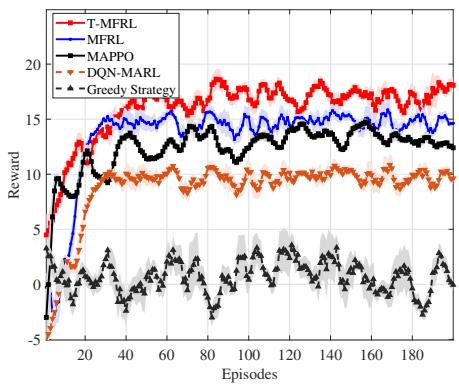  
Fig. 3. Comparison of the average reward between the proposed T-MFRL and benchmark DRL algorithms over the course of training.

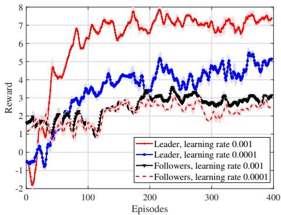  
Fig. 4. Comparison of reward curves of T-MFRL with different learning rate.

DRL algorithms are known for their sensitivity to the learning rate, which can significantly impact performance and, under inappropriate settings, even hinder convergence. To examine this effect, we analyze how different learning rates influence the performance of both the leader and the followers. As shown in Fig. 4, both the leader and the followers consistently achieve convergence and obtain high rewards across all tested learning rates, despite minor variations in the reward curves. These results demonstrate the robustness and stability of the proposed approach under varying network parameter

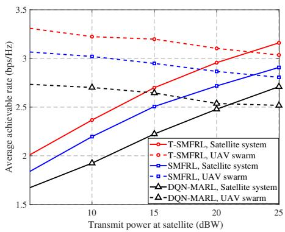  
(a)

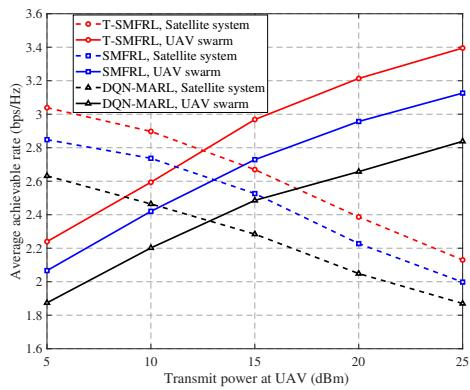  
(b)  
Fig. 5. The average achievable rates of SUs and UUs versus the power budget for the proposed method and benchmarks. (a) various satellite’s transmit power, (b) various $\mathrm { U A V } _ { \mathrm { \Delta } }$ transmit power.

conditions.

Fig. 5 illustrates the impact of transmit power variations on the average rates of both SUs and UUs. As shown in Fig. 5(a), the average rate of SUs consistently increases with higher transmit power from the satellite, highlighting the benefit of enhanced signal strength. The proposed scheme achieves a higher average rate than both MFRL and DQN-MARL, owing to its superior ability to model complex temporal and nonlinear dependencies in SAGIN. These results also suggest that the DQN-MARL approach may be unsuitable for such complex coexisting SAGIN scenarios, as it tends to converge to suboptimal local solutions with limited performance gains. In addition, as expected, increasing the satellite’s transmit power also raises inter-system interference, which results in a decline in the achievable rate of UUs. A similar trend is observed in Fig. 5(b) across varying UAV power levels, confirming the robustness of the T-MFRL framework under diverse power conditions. Overall, our scheme demonstrates improved network performance compared to existing methods, especially under challenging channel conditions.

Fig. 6 further analyzes the performance trade-off between cooperative sensing and multi-UAV communication. It compares three robustly designed schemes under CSI errors: trajectory optimization only, user scheduling only, and a random baseline. As expected, raising the sensing SINR threshold $\gamma _ { \mathrm { U , m i n } }$ gradually degrades the communication performance across all schemes. This is because stricter sensing requirements consume more transmission power from the UAV swarm, inevitably limiting the power available for communication-revealing a fundamental trade-off in collaborative ISAC design. Notably, the proposed scheme outperforms the trajectory-only and user-scheduling cases, achieving performance gains of 20.8% and 28.5%, respectively, at $\gamma _ { \mathrm { U , m i n } } ~ \mathrm { = ~ 1 ~ d B }$ under relaxed sensing requirements. This advantage comes from: (i) dynamic beamforming that adapts power allocation in real time, (ii) trajectory optimization that reduces power needed for sensing, and (iii) interferenceaware scheduling that minimizes sensing interference to users. These results show that while the trade-off is unavoidable, intelligent resource allocation can significantly improve the balance between sensing and communication performance.

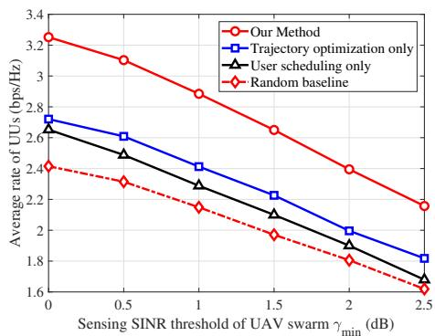  
Fig. 6. The multi-UAV communication performance versus the sensing SINR threshold setting various design schemes.

Fig. 7 depicts the UAV trajectories from their initial positions to the optimized final deployments in a scenario with $N = 3 , M = 1 0$ , and $K = 1 0$ . Using the T-MFRL algorithm, each UAV dynamically adjusts its coordinates at each time slot, progressively converging to an optimal configuration that enhances overall system performance. As corroborated by Fig. $^ { 6 , }$ the proposed trajectory design effectively improves performance by determining favorable UAV placements, thereby capitalizing on their inherent mobility.

The sensitivity of the mean-field embedding dimension is examined in Fig. 8. A dimension of $d _ { \mathrm { t o k } } = 1 2 8$ consistently yields satisfactory performance. As the dimension increases from 16 to 128, the achievable rates for both the satellite and multi-UAV systems improve steadily, before experiencing a slight decline at 256. This behavior arises because a dimension that is too low fails to provide sufficient supervisory information, while an excessively high dimension may introduce noise into the generative process. Despite these fluctuations, all results remain within a reasonable range-a conclusion supported by the sensitivity analysis conducted across a wide span of dimension values.

Fig. 9 illustrates the impact of the outdated CSI coefficient $\rho$ (ranging from 0.6 to 1) on the average achievable rate of SUs in the ISAC-SAGIN, where a lower $\rho$ indicates more outdated CSI, and $\rho = 1$ represents perfect CSI. In contrast to our method, the baseline simplifies the problem by fixing discrete variables and approximating the beamforming subproblem via convex techniques. As $\rho$ decreases (indicating less accurate CSI), the achievable rate of SUs declines across all learningbased methods. However, the proposed method maintains more stable performance compared to the three benchmark approaches, demonstrating greater robustness to CSI uncertainty. In addition, the results show that under high dynamics, the conventional optimization baseline achieves significantly lower average rates than T-MFRL, and may even underperform learning-based benchmarks. This confirms that the non-convex and dynamic nature of the ISAC-SAGIN problem necessitates advanced learning techniques.

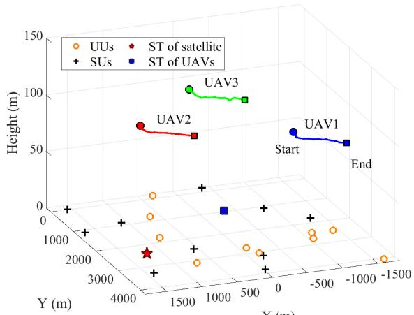  
X (m)  
Fig. 7. Trajectory of all UAVs.

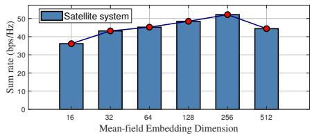

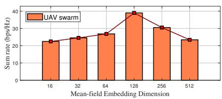  
Fig. 8. Comparison of curves of T-MFRL with different mean-field embedding dimensions.

TABLE V  
TRAINING AND EXECUTION TIME UNDER VARYING NUMBERS OF UAVS
<table><tr><td>Number of UAVs</td><td>Training Time (ms)</td><td>Execution Time (ms)</td></tr><tr><td>5</td><td>29.99</td><td>2.1</td></tr><tr><td>10</td><td>50.97</td><td>3.3</td></tr><tr><td>15</td><td>268.76</td><td>4.3</td></tr><tr><td>20</td><td>312.59</td><td>7.4</td></tr><tr><td>25</td><td>399.85</td><td>8.2</td></tr></table>

To investigate the influence of UAV swarm size on system

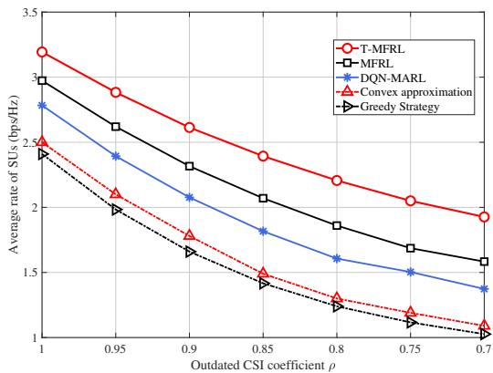  
Fig. 9. Performance comparisons versus outdated CSI coefficient $\rho .$

performance, simulations are conducted with varying numbers of UAVs. As illustrated in Fig. 10, the sum rate of the UAV swarm initially increases significantly with the deployment of more UAVs. Specifically, when the number of UAVs increases from 5 to 15, the sum achievable rate rises from 20.2 bps/Hz to 32.5 bps/Hz. This improvement is primarily attributed to the enhanced collaborative beamforming enabled by a denser UAV formation. However, increasing the number of UAVs leads to a reduction in the satellite’s sum rate. For instance, as the number of UAVs increases from 5 to 20, the satellite’s sum rate declines from 32.3 bps/Hz to 22.5 bps/Hz. Furthermore, beyond a certain threshold of UAVs, the performance improvement for the UAV swarm begins to saturate, while the satellite’s performance continues to degrade. This phenomenon can be attributed to the reduced inter-element spacing in a denser swarm, which intensifies mutual coupling and interference both within the UAV formation and between the UAVs and the satellite. Consequently, deploying additional UAVs beyond this point does not yield substantial improvements in the overall performance of the ISAC-SAGIN.

Table V presents the training and execution time for different UAV swarm sizes. As UAVs increase from 5 to 25, training time grows from approximately 30 ms to 200 ms. This sublinear growth-despite the quadratic complexity $\mathcal { O } ( N ^ { 2 } d )$ of self-attention-is attributed to: (i) parallel processing of agent tokens, and (ii) mean-field approximation that consolidates multi-agent interactions. These results suggest that T-MFRL maintains practical inference overhead for real-time operation in ISAC-SAGINs with up to 25-30 UAVs and large numbe of users, confirming its viability for large-scale deployments. The sensitivity of transformer layers and attention heads is examined in Fig. 11. The framework performs stably across a wide range of configurations, with only slight degradation under extreme values.

## V. CONCLUSION

This paper has presented a novel interference management scheme for an ISAC-enabled SAGINs, where a collaborative multi-UAV network coexists with a satellite system. By modeling the satellite-UAV interaction as a non-cooperative Stackelberg game, we jointly optimized the satellite leader’s beamforming to maximize its achievable rate and the multi-UAV followers’ resource allocation to maximize their average rate, under sensing and trajectory constraints. To tackle this dynamic optimization problem, we proposed a solution that integrates a MFRL framework with a transformer architecture. The ability of the transformer-based architecture to capture inter-agent heterogeneity and nonlinear dependencies ensures the solution’s efficiency and convergence in complex, heterogeneous environments. The simulation results demonstrate that the proposed solution effectively achieves a Stackelberg equilibrium, balancing the communication rates for both the satellite and the UAVs while maintaining acceptable sensing performance. Furthermore, the proposed algorithm achieves significant improvements in the achievable rate for both the satellite and multi-UAV systems, compared to existing benchmarks.

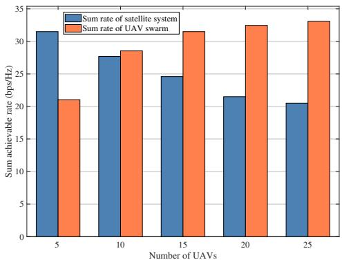  
Fig. 10. Comparison of curves of T-MFRL with different UAV numbers.

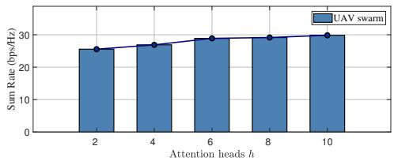

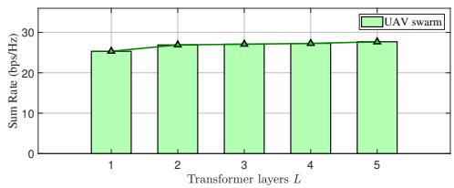  
Fig. 11. Comparison of curves of T-MFRL with different transformer layers and attention heads.

## REFERENCES

[1] Z. Lin, Z. Feng, K. Guo, A. Nauman, D. Niyato, and J. Wang, “AI-driven seamless and massive access in space-air-ground integrated networks,” IEEE Wireless Commun., vol. 32, no. 3, pp. 72–79, 2025.

[2] P. Zhang, N. Chen, S. Shen, S. Yu, N. Kumar, and C.-H. Hsu, “AIenabled space-air-ground integrated networks: Management and optimization,” IEEE Netw., vol. 38, no. 2, pp. 186–192, 2024.

[3] L. Zhi, N. Hehao, H. Yuanzhi, A. Kang, Z. Xudong, C. Zheng, and X. Pei, “Self-powered absorptive reconfigurable intelligent surfaces for securing satellite-terrestrial integrated networks,” China Commun., vol. 21, no. 9, pp. 276–291, 2024.

[4] Y. He, Y. Xiao, S. Zhang, M. Jia, and Z. Li, “Direct-to-smartphone for 6G NTN: Technical routes, challenges, and key technologies,” IEEE Netw., vol. 38, no. 4, pp. 128–135, 2024.

[5] Z. Lin, H. Niu, K. An, Y. Wang, G. Zheng, S. Chatzinotas, and Y. Hu, “Refracting RIS-aided hybrid satellite-terrestrial relay networks: Joint beamforming design and optimization,” IEEE Trans. Aerosp. Electron. Syst., vol. 58, no. 4, pp. 3717–3724, 2022.

[6] L. You, X. Qiang, C. G. Tsinos, F. Liu, W. Wang, X. Gao, and B. Ottersten, “Beam squint-aware integrated sensing and communications for hybrid massive MIMO LEO satellite systems,” IEEE J. Sel. Areas Commun., vol. 40, no. 10, pp. 2994–3009, 2022.

[7] B. Zhao, M. Wang, Z. Xing, G. Ren, and J. Su, “Integrated sensing and communication aided dynamic resource allocation for random access in satellite terrestrial relay networks,” IEEE Commun. Lett., vol. 27, no. 2, pp. 661–665, 2023.

[8] S. Pala, K. Singh, C.-P. Li, and O. A. Dobre, “Empowering ISAC systems with federated learning: A focus on satellite and RIS-enhanced terrestrial integrated networks,” IEEE Trans. Wireless Commun., vol. 24, no. 1, pp. 810–824, 2025.

[9] W. Mao, Y. Lu, G. Pan, and B. Ai, “UAV-assisted communications in SAGIN-ISAC: Mobile user tracking and robust beamforming,” IEEE J. Sel. Areas Commun., vol. 43, no. 1, pp. 186–200, 2025.

[10] Y. Yao, W. Xiao, P. Miao, G. Chen, H. Yang, C.-B. Chae, and K.- K. Wong, “UAV-relay-aided secure maritime networks coexisting with satellite networks: Robust beamforming and trajectory optimization,” IEEE Trans. Wireless Commun., vol. 25, pp. 2342–2358, 2026.

[11] Z. Zhou, Q. Zhang, J. Ge, and Y.-C. Liang, “Hierarchical cognitive spectrum sharing in space-air-ground integrated networks,” IEEE Trans. Wireless Commun., vol. 24, no. 2, pp. 1430–1447, 2025.

[12] P. Gu, R. Li, C. Hua, and R. Tafazolli, “Dynamic cooperative spectrum sharing in a multi-beam LEO-GEO co-existing satellite system,” IEEE Trans. Wireless Commun., vol. 21, no. 2, pp. 1170–1182, 2022.

[13] R. Ge, D. Bian, K. An, J. Cheng, and H. Zhu, “Performance analysis of cooperative nonorthogonal multiple access scheme in two-layer GEO/LEO satellite network,” IEEE Syst. J., vol. 16, no. 2, pp. 2300– 2310, 2022.

[14] W. U. Khan, Z. Ali, E. Lagunas, A. Mahmood, M. Asif, A. Ihsan, S. Chatzinotas, B. Ottersten, and O. A. Dobre, “Rate splitting multiple access for next generation cognitive radio enabled LEO satellite networks,” IEEE Trans. Wireless Commun., vol. 22, no. 11, pp. 8423–8435, 2023.

[15] S. Tao, M. Yuan, Q. Wu, R. Wang, and J. Hao, “Generative AI-aided vertical handover decision in SAGIN for IoT with integrated sensing and communication,” IEEE Internet Things J., vol. 12, no. 10, pp. 13 297– 13 310, 2025.

[16] Y. Yao, J. Zhang, P. Miao, L. Zhang, G. Chen, F. Shu, and K.-K. Wong, “Hybrid RIS-enhanced ISAC secure systems: Joint optimization in the presence of an extended target,” IEEE Trans. Commun., vol. 73, no. 12, pp. 15 688–15 704, 2025.

[17] C. B. Barneto, T. Riihonen, S. D. Liyanaarachchi, M. Heino, N. Gonzalez-Prelcic, and M. Valkama, “Beamformer design and opti-´ mization for joint communication and full-duplex sensing at mm-waves,” IEEE Trans. Commun., vol. 70, no. 12, pp. 8298–8312, 2022.

[18] L. Xie, S. Song, Y. C. Eldar, and K. B. Letaief, “Collaborative sensing in perceptive mobile networks: Opportunities and challenges,” IEEE Wireless Commun., vol. 30, no. 1, pp. 16–23, 2023.

[19] U. Demirhan and A. Alkhateeb, “Cell-free ISAC MIMO systems: Joint sensing and communication beamforming,” IEEE Trans. Commun., vol. 73, no. 6, pp. 4454–4468, 2025.

[20] X. Shao, C. Yang, Y. Song, T. Li, and Z. Han, “Game theoretical approaches for cooperative UAV NOMA networks,” IEEE Wireless Commun., vol. 28, no. 2, pp. 96–105, 2021.

[21] J. Chen, Q. Wu, Y. Xu, N. Qi, X. Guan, Y. Zhang, and Z. Xue, “Joint task assignment and spectrum allocation in heterogeneous UAV communication networks: A coalition formation game-theoretic approach,” IEEE Trans. Wireless Commun., vol. 20, no. 1, pp. 440–452, 2021.

[22] H. Wu, M. Li, Q. Gao, Z. Wei, N. Zhang, and X. Tao, “Eavesdropping and anti-eavesdropping game in UAV wiretap system: A differential game approach,” IEEE Trans. Wireless Commun., vol. 21, no. 11, pp. 9906–9920, 2022.

[23] L. Li, H. Ren, Q. Cheng, K. Xue, W. Chen, M. Debbah, and Z. Han, “Millimeter-wave networking in the sky: A machine learning and mean

field game approach for joint beamforming and beam-steering,” IEEE Trans. Wireless Commun., vol. 19, no. 10, pp. 6393–6408, 2020.

[24] X. Zhu, C. Jiang, L. Kuang, Z. Zhao, and S. Guo, “Two-layer game based resource allocation in cloud based integrated terrestrial-satellite networks,” IEEE Trans. Cogn. Commun. Netw., vol. 6, no. 2, pp. 509– 522, 2020.

[25] S. Zhang, S. Zhang, W. Yuan, and T. Q. S. Quek, “Rate-splitting multiple access-based satellite-vehicular communication system: A noncooperative game theoretical approach,” IEEE Open J. Commun. Soc., vol. 4, pp. 430–441, 2023.

[26] J. Ge, Y.-C. Liang, L. Zhang, R. Long, and S. Sun, “Deep reinforcement learning for distributed dynamic coordinated beamforming in massive MIMO cellular networks,” IEEE Trans. Wireless Commun., vol. 23, no. 5, pp. 4155–4169, 2024.

[27] Z. Zhou, J. Ge, and Y.-C. Liang, “User association and coordinated beamforming in cognitive aerial-terrestrial networks: A safe reinforcement learning approach,” IEEE Trans. Wireless Commun., Jul. 10, 2025, early access.

[28] S. Pala, K. Singh, C.-P. Li, O. A. Dobre, and T. Q. Duong, “Joint beamforming design and sensing in satellite and RIS-enhanced terrestrial networks: A federated learning approach,” IEEE Trans. Cogn. Commun. Netw., vol. 11, no. 5, pp. 3397–3411, 2025.

[29] H. Khoshkbari, G. Kaddoum, O. Abbasi, B. Selim, and H. Yanikomeroglu, “Beamforming for massive MIMO aerial communications: A robust and scalable DRL approach,” IEEE Trans. Commun., Oct. 28, 2025, early access.

[30] Z. Xie, Z. Wang, Z. Zhang, J. Wang, Z. Jiang, and Z. Han, “Distributed UAV swarm for device-free integrated sensing and communication relying on multi-agent reinforcement learning,” IEEE Trans. Veh. Technol., vol. 73, no. 12, pp. 19 925–19 930, 2024.

[31] X. Li, W. Feng, Y. Chen, C.-X. Wang, and N. Ge, “Maritime coverage enhancement using UAVs coordinated with hybrid satellite-terrestrial networks,” IEEE Trans. Commun., vol. 68, no. 4, pp. 2355–2369, 2020.

[32] C. Huang, G. Chen, P. Xiao, Y. Xiao, Z. Han, and J. A. Chambers, “Joint offloading and resource allocation for hybrid cloud and edge computing in SAGINs: A decision assisted hybrid action space deep reinforcement learning approach,” IEEE J. Sel. Areas Commun., vol. 42, no. 5, pp. 1029–1043, 2024.

[33] Y. Yao, W. Xiao, P. Miao, G. Chen, H. Yang, C.-B. Chae, and K.- K. Wong, “UAV-RHS-enabled full-duplex ISAC covert system: Robust beamforming and trajectory optimization,” IEEE Trans. Commun., vol. 74, pp. 5637–5653, 2026.

[34] Z. Yang, Y. Cui, and Y. Li, “Transformer-based cooperative UAV encirclement policies under uncertainty in low-altitude wireless networks,” IEEE Trans. Cogn. Commun. Netw., vol. 12, pp. 3525–3537, 2026.

[35] G. A. Bayessa and B. Zhang, “A hierarchical prompt-enhanced multiagent transformer for covert and secure communication optimization in UAV-ISAC-assisted D2D networks,” IEEE Trans. Netw. Sci. Eng., vol. 13, pp. 6345–6365, 2026.

[36] L. Chen, K. Lu, A. Rajeswaran, K. Lee, A. Grover, M. Laskin, P. Abbeel, A. Srinivas, and I. Mordatch, “Decision transformer: Reinforcement learning via sequence modeling,” in Proc. Adv. Neural Inf. Process. Syst., Virtual, Online, 2021, pp. 15 084–15 097.

[37] Z. Ji, Z. Qin, X. Tao, and Z. Han, “Resource optimization for semanticaware networks with task offloading,” IEEE Trans. Wireless Commun., vol. 23, no. 9, pp. 12 284–12 296, 2024.