# Joint Beamforming and UAV Deployment Optimization for ISAC-Enhanced UAV-Assisted VEC

Chunlin Li , Wenhao Wu, Zhihao Zhang , Student Member, IEEE, Tianbing Ma , and Shaohua Wan , Senior Member, IEEE

Abstract—In urban temporary congestion or hotspot scenarios, fixed roadside units (RSUs) often fail to provide reliable and efficient communication services due to their static deployment. Unmanned Aerial Vehicles (UAVs) can be rapidly deployed to provide flexible and on-demand communication and sensing support, effectively complementing ground infrastructure. However, UAVs are faced with challenges such as limited coverage, high deployment complexity, and unbalanced communication-sensing performance. These challenges give rise to increased energy consumption and reduced communication efficiency. To address these issues, we propose a UAV energy-efficient deployment method based on Integrated Sensing and Communication (ISAC), which balances performance and energy consumption. Specifically, under UAV energy constraints, we jointly optimize UAV deployment positions and beamforming to maximize communication capacity. We decompose the problem into two subproblems: UAV deployment and beamforming strategy optimization. During the iteration process, the subproblems are respectively solved by using the sparrow search algorithm based on refraction-based learning and successive convex approximation-based iterative algorithm and the first order Taylor expansion method. Simulation results show that the proposed method outperforms the benchmark schemes, achieving approximately a 10.51% improvement in average coverage rate and a 19.83% reduction in UAV energy consumption, while maintaining an effective tradeoff between communication coverage and energy efficiency.

Index Terms—Unmanned aerial vehicles (UAVs), vehicular edge computing (VEC), integrated sensing and communication (ISAC), UAV deployment, beamforming optimization, block coordinate descent, sparrow search algorithm.

## I. INTRODUCTION

## A. Background

systems, unmanned aerial vehicle (UAV) technology has emerged as a critical solution for enhancing communication efficiency in vehicular edge computing (VEC), leveraging its advantages of flexible deployment and high-altitude perspective [1]. In urban scenarios, especially during temporary traffic congestion or hotspot events, fixed roadside units (RSUs) often fail to provide reliable and low-latency communication services due to dynamic traffic conditions and severe interference [2]. Traditional solutions are costly, timeconsuming, and inflexible in adapting to dynamic traffic conditions. With continuous advances in UAV technologies, UAVs have emerged as promising offloading platforms and merit further investigation.

In UAV-assisted VEC, previous UAV deployment studies primarily use separate communication and sensing devices to improve vehicular connectivity and perception [3]. However, such approaches fail to meet the strict requirements for ultralow latency and high reliability in transmitting broadband sensing data. Moreover, deploying an excessive number of UAVs requires complex spectrum management and coordination mechanisms [4], [5]. To overcome these limitations, we propose the Integrated Sensing and Communication (ISAC) technology into UAV-assisted VEC systems. By unifying traditional wireless communication and sensing functions, ISAC enables vehicles to obtain comprehensive environmental awareness while simultaneously improving both communication and perception performance [6].

ISAC is a technique that combines sensing and communication functions into a unified framework. Traditional UAV-assisted VEC systems struggle to achieve balanced time slot allocation and energy efficiency under vehicle mobility constraints. In existing ISAC frameworks, dual-functional signals necessitate the allocation of communication resources within extremely short time slots, while UAV mobility exacerbates beam alignment errors. The UAV deployment position directly affects the path loss and interference level of beamforming, while the beamforming strategy restricts the coverage efficiency of UAV deployment. The two are tightly coupled, and separate optimization cannot simultaneously address the coverage limitations [4]. Therefore, we focus on the critical challenge of UAV deployment:

• How can communication, sensing and timeslot allocation be jointly optimized in ISAC-enhanced UAV-assisted VEC to minimize system energy consumption and maximize ISAC efficiency?

• How to jointly optimize the UAV deployment and beamforming in ISAC-Enhanced UAV-Assisted VEC scenario to maximize UAVs communication capacity?

## B. Motivations

Therefore, the following limitations still exist in current ISAC-Enabled UAV-Assisted VEC studies:

1) Existing ISAC-Enabled UAV-Assisted VEC schemes have yet to fully exploit the joint capabilities of communication and sensing: In UAV-assisted VEC systems, the integration of ISAC introduces an inherent tradeoff between communication and sensing performance, such that improving one generally degrades the other, which complicates the overall system design. However, existing works [7], [8], [9], [10], [11], [12] do not explicitly characterize this trade-off between sensing and communication, nor do they jointly consider the associated coupled factors. In addition, existing studies [13], [14] mainly focus on UAV trajectory or deployment optimization, without jointly considering communication beamforming and sensing performance, which leads to suboptimal system design. To address these limitations, we formulate a joint optimization problem that explicitly captures the communication-sensing trade-off while incorporating UAV deployment and beamforming, ensuring an efficient and balanced system design.

2) High Complexity of Joint UAV Deployment and Beamforming in ISAC-Enhanced UAV-Assisted VEC: The solution space grows rapidly when UAV deployment and beamforming are jointly optimized, making it difficult to obtain high-quality solutions within a limited computational budget. However, current works [15], [16], [17], [18] typically adopt suboptimal solution methods based on convex/non-convex optimization techniques, such as iterative decomposition, alternating optimization, successive convex approximation, and semi-definite relaxation, which still lack efficiency in handling the resulting non-convex joint optimization problem. To tackle this challenge, we propose a novel hybrid algorithm that integrates block coordinate descent and heuristic-convex optimization, specifically designed to efficiently solve the non-convex optimization problem for UAV deployment and beamforming.

## C. Contributions

This paper optimizes UAV placement and beamforming to reduce energy consumption and expand coverage, aiming to maximize communication capacity. In summary, the main contributions of this paper are as follows:

1) A joint optimization problem for beamforming and UAV deployment in ISAC-Enabled UAV-Assisted VEC to maximize communication rate with ensuring sensing performance: We jointly consider communication, sensing, and energy in an integrated optimization formulation. Specifically, we formulate a joint optimization problem that capturing the coupling between communication and sensing by incorporating communication capacity and CRB-based sensing metrics, which is further modeled as a non-convex optimization problem. Based on these metrics, we introduce an ISAC sensingcommunication effectiveness function to quantify and balance the trade-off between communication and sensing performance. To evaluate the proposed method, we employed the Veins simulation platform, and simulation results demonstrate improvements in both communication latency and energy consumption.

2) Joint Block Coordinate Descent and Heuristic-Convex Optimization for UAV Deployment and Beamforming: We propose a joint optimization scheme for UAV deployment and beamforming. Under specific constraints, we decompose the coupled optimization problem into tractable subproblems and iteratively optimize UAV deployment and beamforming using a hybrid algorithm that combines block coordinate descent and heuristic-convex optimization. Simulations show the method boosts average coverage rate by 10.51% and reduces UAV energy consumption by 19.83% compared with the baseline algorithms.

The remainder of the paper is structured as follows. Section II reviews related work. Section III introduces the system model and problem formulation. Section IV describes the proposed solution and algorithm. Section V presents the simulationresults, while Section VI provides conclusions and outlines potential future work.

## II. RELATED WORK

In this section, we review related studies on UAV deployment, including beamforming, multidimensional deployment, and ISAC mechanisms.

## A. UAV Deployment Optimization in UAV-Assisted VEC

Dai et al. [7] addressed the computational overload of RSUs in dense urban VEC scenarios by deploying a UAV as an aerial edge server to offload tasks from overloaded RSUs. Chen et al. [8] devised a two-layer particle swarm optimization–genetic algorithm–greedy algorithm that jointly optimizes UAV deployment and computation offloading to minimize average task response time in multi-UAV MEC systems. Hao et al. [9] studied the task offloading problem in a multi-UAV-assisted MEC system, focusing on task priority and binary offloading decisions. Deng et al. [10] proposed a joint beamforming and trajectory optimization framework for UAVs to maximize the communication performance. Deng et al. [11] proposed an adaptable integrated sensing and communication mechanism in UAV-enabled systems that jointly optimizes beamforming and trajectory via alternating optimization to maximize system throughput. Zhang et al. [12] proposed a joint beamforming design for an active STAR-RIS-assisted full-duplex ISAC system. Jiang et al. [13] proposed an ISACbased UAV safe-flight strategy that improves target accuracy and reduces communication delay. Chen et al. [14] optimized full-duplex self-interference cancellation to improve radar signal-to-noise ratio.

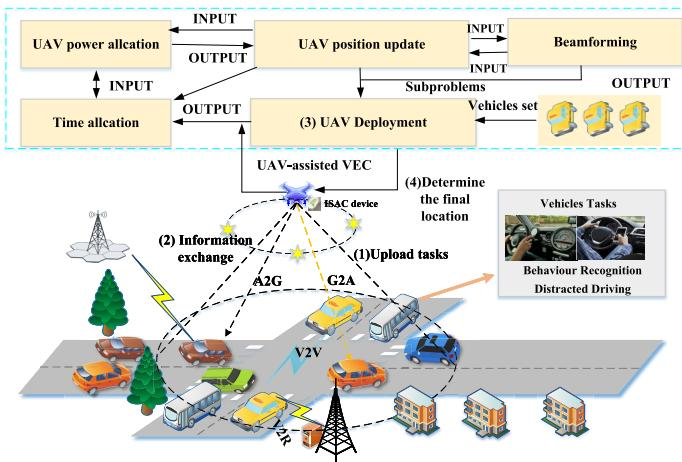  
Fig. 1. Dynamic multi-UAV deployment in ISAC-enhanced UAV-assisted VEC.

## B. UAV Deployment Optimization in ISAC-Enhanced UAV-Assisted VEC

Lyu et al. [15] optimized UAV trajectory and beamforming to maximize ISAC-enabled device performance. Liu et al. [16] proposed a UAV-assisted ISAC system for IoT, where the UAV simultaneously provides sensing and communication services for ground IoT nodes. Cheng et al. [17] developed a networked ISAC framework to improve communication and detection through coordinated beamforming and UAV trajectory design.

In summary, above strategies provide effective solutions for enhancing the efficiency of UAVs. However, studies [12], [19] do not explicitly consider the coupling between communication and sensing in ISAC-enabled systems. Studies [13], [14], [15], [16], [17] mainly focus on specific aspects such as UAV deployment or resource allocation, without jointly considering communication beamforming and sensing performance. In contrast to the previous studies, this paper formulates the joint design of UAV positioning optimization and beamforming strategy as a non-convex optimization problem. Aiming to maximize the communication capacity, we decompose the original problem via the Block Coordinate Descent (BCD) method, thereby achieving a balanced optimization between energy consumption and communication performance.

## III. SYSTEM MODEL AND PROBLEM FORMULATION

In this section, we first describe the ISAC-enhanced UAV-assisted VEC, and then gradually analyze the system’s communication model, sensing model and energy consumption model.

## A. System Overview

The ISAC-enhanced UAV-assisted VEC framework is illustrated in Fig. 1. It comprises an in-vehicle terminal layer and an edge layer. The system workflow is as follows: (1) Vehicles first upload complex tasks to the edge computing station. (2) The edge base station and UAVs exchange multisource information. (3) We adopt the BCD method to alternately optimize UAV deployment positions and beamforming. (4) Determine the optimal UAV deployment positions to maximize communication capacity and coverage.

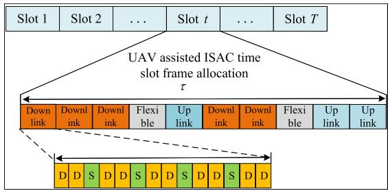  
Fig. 2. Schematic diagram of time slot frame allocation for integrated sensing assisted by UAV.

## B. Time Slot Division Model

The system consists of N vehicles and U UAV edge nodes. The vehicle movement process is divided into T time slots, with each time slot length set to $\tau ( \tau { \bf \Delta } > { \bf \Delta } 0 )$ . The system is assumed to be quasi-static, meaning that the states of vehicles and UAVs remain unchanged within a short time slot but can vary in different time slots [20], τ is chosen to be sufficiently small so that the UAV’s location remains approximately unchanged in a time slot [21]. We use $x _ { u , n } ( t )$ to represent perceptual scheduling, where $x _ { u , n } ( t ) \in \{ 0 , 1 \}$ When $x _ { u , n } ( t ) = 1$ , UAV u serves vehicle n in time slot t. Each UAV can serve at most one vehicle in each time slot, i.e., $\textstyle \sum _ { n = 1 } ^ { N } x _ { u , n } ( t ) \leq 1$

Fig. 2 illustrates the time-division frame structure for ISAC, which is based on the dual-period frame format in the 5G NR Time Division Duplex (TDD) mode [22]. For each pair of UAV-vehicle, the transmission period includes a downlink slot, a flexible slot, and an uplink slot. The downlink slot is divided into sensing (S) and communication (D) with adjustable symbol positions, since sensing is realized through downlink transmission, while the uplink is used only for communication. This TDD design provides time-domain isolation between sensing and communication, thus avoiding mutual interference.

We use $T _ { u , n } ^ { d o w n }$ to indicate the time when the nth vehicle user downloaded data from the UAV u in time slot $t ,$ and use $T _ { u , n } ^ { f l e x }$ to represent flexible time slots, and use $T _ { u , n } ^ { u p }$ to indicate the time when the nth vehicle user uploaded data to the UAV u in time slot t. The time resource constraints in this article are shown:

$$
x _ { u , n } ^ { t } ( T _ { u , n } ^ { d o w n } ( t ) + T _ { u , n } ^ { f l e x } ( t ) + T _ { u , n } ^ { u p } ( t ) ) = \tau .\tag{1}
$$

The vehicle model employs the Krauss vehicle-following model, used to simulate the behavior of traffic flow and prevent vehicle collisions [23]. To compensate for the continuous movement of vehicles during the time required for the UAV to fly to a new position, we do not directly use the real-time position of the vehicle at time t in distance calculation. Instead, we first predict its estimated position at the arrival time based on its linear velocity, with the formula as follows:

$$
\hat { x } _ { n } ( t ) = x _ { n } ( t ) + v _ { n , x } ( t ) \Delta t , \quad \hat { y } _ { n } ( t ) = y _ { n } ( t ) + v _ { n , y } ( t ) \Delta t ,\tag{2}
$$

where $v _ { n , x } ( t )$ and $v _ { n , y } ( t )$ represent the instantaneous velocity components of the vehicle along the horizontal directions. The estimated flight delay for the UAV to fly from its current position to the target deployment point are given:

$$
\Delta t = \frac { d _ { u , \mathrm { m } } } { V _ { x y , \mathrm { m a x } } } ,\tag{3}
$$

where, $V _ { x y , \mathrm { m a x } }$ represents the maximum horizontal speed of the UAV. The horizontal distance the UAV needs to move are given:

$$
d _ { u , \mathrm { m } } = { \sqrt { ( x _ { u , \mathrm { t a r g e t } } - x _ { u , \mathrm { c u r r e n t } } ) ^ { 2 } + ( y _ { u , \mathrm { t a r g e t } } - y _ { u , \mathrm { c u r r e n t } } ) ^ { 2 } } } .\tag{4}
$$

## C. Communication and Sensing Model

This section uses Frequency-Division Multiple Access (FDMA) technology for UAV-to-vehicle communication. TDD provides time-domain separation among downlink sensing, downlink communication, and uplink communication, whereas FDMA allocates orthogonal frequency resources to UAV-tovehicle links, thereby mitigating co-channel interference in the baseline model. The terrestrial channel follows the free space path loss model. Assume that UAVs and vehicles are equipped with $M _ { U }$ and $M _ { N }$ antennas, respectively. The LoS and NLoS communication channels between UAV u and vehicle n are given:

$$
H _ { L o s } ^ { c } = \sqrt { \frac { K } { K + 1 } } \alpha _ { 0 } e ^ { j \varphi _ { 0 } ^ { c } } \sqrt { M _ { N } M _ { U } } a ( M _ { U } , \theta _ { u , 0 } ) a ( M _ { N } , \theta _ { n , 0 } ) ^ { H }\tag{5}
$$

$$
H _ { N L o s } ^ { c } = \sqrt { \frac { 1 } { K + 1 } } \sum _ { p = 1 } ^ { P }\tag{6}
$$

When the UAV is deployed above road intersections and higher than surrounding buildings, a larger elevation angle between the UAV and vehicles increases the LoS probability [24]. Hence, the UAV-vehicle channel matrix $H ^ { c } \in \dot { C } ^ { M _ { U } \times M _ { N } }$ can be decomposed into LoS and NLoS components as

$$
H ^ { c } = H _ { L o s } ^ { c } + H _ { N L o s } ^ { c } ,\tag{7}
$$

where K is the fading factor. For the p-th path, $\theta _ { n , p }$ and $\theta _ { u , p } ( 0 \le p \le P )$ denote the departure and arrival angles, respectively, while $\alpha _ { p } \in R ^ { + }$ and $\varphi _ { p } ^ { c }$ represent the small-scale fading factor and phase shift, respectively. $a ( M , \theta )$ denotes the antenna steering vector for the M-element array with respect to azimuth angle θ. Considering a uniform linear array with half-wavelength spacing, the antenna steering vector is

$$
a ( M , \theta ) = \frac { 1 } { \sqrt { M } } [ 1 e ^ { - j \pi c o s \theta } \cdot \cdot \cdot e ^ { - ( M - 1 ) j \pi c o s \theta } ] ^ { T } .\tag{8}
$$

For the sensing channel model, the departure angle of the sensing path is the same as that of the communication path. In addition, since the UAV antenna is set up near the vehicle antenna, the arrival angle of the path is approximately equal to the departure angle. Therefore, the sensing channel is

$$
H ^ { s } = \sum _ { p = 0 } ^ { P } \frac { \beta _ { p } e ^ { j \varphi _ { p } ^ { s } } \sqrt { M _ { N } M _ { U } } } { \sqrt { P } } a ( M _ { U } , \theta _ { u , p } ) a ( M _ { N } , \theta _ { n , p } ) ^ { H } ,\tag{9}
$$

where $\beta _ { p } \in R ^ { + }$ and $\varphi _ { p } ^ { s } ( 0 \leq p \leq P )$ are the small-scale fading factor and phase shift of the sensing channel, respectively.

It is assumed that both UAVs and vehicles use beamforming technology to compensate for path loss. The communication signal from UAV u to vehicle n can be expressed as

$$
y _ { n } ^ { c } = \omega _ { u , n } H _ { u , n } ^ { c } s _ { u , n } + \sum _ { j , j \neq n } ^ { N } \omega _ { u , j } H _ { u , n } ^ { c } s _ { u , j } + ( \sigma _ { n } ^ { c } ) ^ { 2 } ,\tag{10}
$$

where $\omega \in C ^ { M _ { U } }$ is the beamforming vector at the UAV, and $( \sigma _ { n } ^ { c } ) ^ { 2 }$ represents Gaussian white noise. In addition, constraint (26e) prevents multiple UAVs from serving the same vehicle simultaneously in the same time slot.

Under ideal orthogonal resource allocation among different UAVs, inter-UAV co-channel interference is neglected [25]. Our primary scenario is not a dense multi-UAV network, but an urban temporary traffic-congestion scenario in which a limited number of UAVs are rapidly deployed at urban crossing roads as on-demand supplements to the existing RSU infrastructure [7], where the UAVs are typically assigned to different crossing roads that are spatially separated by a certain distance, the resulting Signal-to-Interference-plus-Noise Ratio (SINR) can be expressed as follows:

$$
\mathrm { S I N R } = \frac { \left. \omega _ { u , n } H _ { u , n } ^ { c } s _ { u , n } \right. ^ { 2 } } { ( \sigma _ { n } ^ { c } ) ^ { 2 } } .\tag{11}
$$

The communication capacity is given:

$$
C _ { n } = \sum _ { t = 1 } ^ { T } x _ { u , n } ( t ) \log _ { 2 } ( 1 + \mathrm { S I N R } ) .\tag{12}
$$

Over the entire flight period T , the total communication capacity of the system is given by

$$
C _ { s u m } = \sum _ { n = 1 } ^ { N } C _ { n } .\tag{13}
$$

The radar sensing received signal in the ISAC equipment carried by the vehicle is represented as shown:

$$
y ^ { s } = H ^ { s } f ^ { s } s ^ { s } + n ^ { s } ,\tag{14}
$$

where $f ^ { s } \in C ^ { M _ { U } }$ is the sensing beam carrying the signal $s ^ { s } \in C$ , and $n ^ { s }$ is Gaussian white noise, including thermal noise and residual self-interference, with a value range of $C N ( 0 , ( \sigma _ { n } ^ { s } ) ^ { 2 } )$ . Typically, sensing and communication beams differ in direction for sensing needs. Independent sequences for both offer higher correlation gain to differentiate signals. This paper uses the Cramer-Rao Bound (CRB) to evaluate the radar’s estimation capability, as shown:

$$
C R B _ { \Theta } ^ { s } = d i a g ( [ I ( \Theta ) ] ^ { - } 1 ) ,\tag{15}
$$

where I(Θ) is the Fisher information matrix regarding the channel parameter Θ, represented as (16), shown at the bottom of the next page, where $y _ { k } ^ { s }$ is the k-th $y ^ { s }$ , This paper uses $C R B _ { l o c }$ to represent the CRB of position estimation. Typically, the position estimation is decomposed into angle φ and distance d estimation. Therefore, the CRB is also decomposed as shown:

$$
C R { B _ { l o c } } = d ^ { 2 } C R { B _ { \phi } } + C R { B _ { d } } ,\tag{17}
$$

where c is the speed of light. The sensing beam scans the target to detect and estimate its position, with the sensing beam covering the target represented as $f ^ { s } = a ( M _ { N } , \phi _ { s } )$ , and the received power shown:

$$
A _ { s } = \frac { \sqrt { ( 1 - \gamma ) \varepsilon } \sqrt { M _ { N } M _ { U } } \beta } { \sqrt { P + 1 } } | a ^ { H } ( M _ { N } , \phi ) a ( M _ { N } , \phi _ { s } ) | ,\tag{18}
$$

where $\gamma$ is the ISAC power allocation coefficient, $, \gamma \varepsilon$ and $( 1 - \gamma ) \varepsilon$ are the power of the communication beam and the sensing beam, respectively, and $\beta$ is the fading factor determined by the path loss and radar cross-section of the vehicle target. According to radar ranging theory [26], the CRB of the distance is expressed as:

$$
C R B _ { d } = \frac { c ^ { 2 } } { 4 } \frac { ( \sigma _ { n } ^ { s } ) ^ { 2 } ( P + 1 ) } { ( 1 - \gamma ) \varepsilon M _ { N } ( M _ { U } ) ^ { 2 } \beta ^ { 2 } ( B ^ { \prime } ) ^ { 2 } \cdot W ^ { 2 } } ,\tag{19}
$$

where $W$ represents the bandwidth. The expression for $B ^ { \prime }$ is given:

$$
B ^ { \prime } = \frac { s i n \left( \frac { M _ { N } } { 2 } ( c o s \phi - c o s \phi _ { s } ) \right) } { s i n \left( \frac { 1 } { 2 } ( c o s \phi - c o s \phi _ { s } ) \right) } .\tag{20}
$$

where $B ^ { \prime }$ denotes a Dirichlet-kernel-type form with respect to the angular mismatch term cos $\phi - \cos \phi _ { s } .$ . This structure characterizes the angular selectivity of the received signal and directly facilitates the subsequent derivation of the CRB for angle estimation [27]. The equation (20) directly facilitates the derivation of the CRB of the angle φ, as shown:

$$
C R { B _ { \phi } } = \frac { { 6 ( \sigma _ { n } ^ { s } ) ^ { 2 } ( P + 1 ) } } { { ( 1 - \gamma ) { \varepsilon } M _ { N } ( M _ { U } ) ^ { 2 } ( ( M _ { U } ) ^ { 2 } - 1 ) \beta ^ { 2 } ( B ^ { \prime } ) ^ { 2 } \pi ^ { 2 } \sin _ { \stackrel { . } { \cos } } ^ { 2 } } \phi } .\tag{21}
$$

Since both angle and distance estimations are inversely proportional to $( 1 - \gamma )$ , an increase in $\gamma$ reduces the accuracy of position estimation.

## D. ISAC Model

Using the ISAC efficiency as a metric, this indicator aims to characterize the maximum achievable communication capacity under unit sensing error. It is defined as the ratio of communication capacity to parameter estimation error, as shown:

$$
G _ { I S A C } = \frac { C } { \kappa + C R B _ { l o c } } ,\tag{22}
$$

where C represents the communication capacity, $C R B _ { l o c }$ represents the CRB of parameter estimation, and κ is a preset constant to limit the maximum value of $G _ { I S A C }$

According to its definition, $G _ { I S A C }$ increases with communication capacity and decreases with the CRB. Thus, $G _ { I S A C }$ characterizes the overall ISAC efficiency, and a larger value indicates better joint communication–sensing performance. In this paper, $G _ { I S A C }$ is adopted as the ISAC utility, and maximizing it balances communication throughput and sensing precision.

## E. Energy Consumption Model

1) Deploy and Sensing Energy Consumption: The energy consumption of the UAV consists of two main parts: sensing and communication energy consumption and propulsion energy consumption. The total sensing and communication energy consumption of the UAV at time slot t in shown as follows:

$$
E _ { I S A C } ^ { u } ( t ) = \tau \cdot \sum _ { u = 1 } ^ { U } \sum _ { n = 1 } ^ { N } x _ { u , n } ( t ) \cdot ( | | \mathbf { w } _ { u } ( t ) | | ^ { 2 } + | | r _ { u } ( t ) | | ^ { 2 } ) ,\tag{23}
$$

where $\mathbf { w } _ { u } ( t )$ and $r _ { u } ( t )$ are the transmission beamforming vectors for UAV communication and sensing, respectively. The propulsion energy consumption of a UAV at time slot t can be modeled as

$$
\begin{array} { l } { { \displaystyle E _ { F l y } ^ { u } ( t ) = \big [ P _ { 0 } \left( 1 + \frac { 3 ( V _ { x y } ( t ) ) ^ { 2 } } { U _ { t i p } ^ { 2 } } \right) } } \\ { { \displaystyle ~ + P _ { 1 } \left( \sqrt { 1 + \frac { ( V _ { x y } ( t ) ) ^ { 4 } } { 4 V _ { 0 } ^ { 4 } } } - \frac { ( V _ { x y } ( t ) ) ^ { 2 } } { 2 V _ { 0 } ^ { 2 } } \right) ^ { \frac { 1 } { 2 } } } } \\ { { \displaystyle ~ + C _ { 0 } ( V _ { x y } ( t ) ) ^ { 3 } + G _ { 0 } V _ { z } ( t ) \big ] \tau , } } \end{array}\tag{24}
$$

where $P _ { 0 } , P _ { 1 }$ and $C _ { 0 }$ are constant parameters related to flight dynamics, $U _ { t i p }$ and $V _ { 0 }$ are the tip speed and mean speed of the rotor, respectively, and $G _ { 0 }$ is the weight of the UAV. $V _ { x y } ( t )$ and $V _ { z } ( t )$ are the horizontal and vertical flight speeds of the UAV at time slot $t ,$ respectively, and are constant within each time period. By substituting $V _ { x y } ( t ) = 0$ and $V _ { z } ( t ) = 0$ into (24), we obtain the power consumption for hovering status as $\begin{array} { r } { E _ { \mathrm { F l v } } ^ { u } ( t ) = ( P _ { 0 } + P _ { 1 } ) \tau } \end{array}$ , which is a finite value depending on the aircraft weight, air density, and rotor disc area, etc. Since the UAV maneuvering duration accounts for only a small portion of the total operation time, the additional/reduced energy consumption caused by UAV acceleration/deceleration can be ignored [28]. Since the UAV’s own power is limited, the total energy consumption of the UAV should satisfy equation

$$
\sum _ { t = 1 } ^ { T } ( E _ { I S A C } ^ { u } ( t ) + E _ { F l y } ^ { u } ( t ) ) \leq E _ { m a x } .\tag{25}
$$

## F. Problem Formulation

1) Problem Description of UAV Deployment Optimization: In this section, we jointly optimize the UAV deployment position and UAV beamforming with the aim of maximizing the communication capacity under the energy consumption constraints of the UAV, and the problem can be expressed as:

$$
\mathbf { P 1 } : \underset { x , y , h , G _ { i s a c } } { \mathbf { M a x } } C _ { s u m }\tag{26a}
$$

$$
T _ { u , n } ^ { d o w n } ( t ) \geq x _ { u , n } ( t ) \cdot T _ { m i n } , T _ { u , n } ^ { f l e x } \geq x _ { u , n } ( t ) \cdot T _ { m i n }
$$

$$
T _ { u , n } ^ { u p } ( t ) \geq x _ { u , n } ( t ) \cdot T _ { m i n } , \forall t \in T , u \in U , n \in N\tag{26b}
$$

$$
R _ { u , n } ^ { d o w n } ( t ) \leq x _ { u , n } ( t ) \cdot R _ { m a x } , R _ { u , n } ^ { u p } ( t ) \leq x _ { u , n } ( t ) \cdot R _ { m a x }\tag{26c}
$$

$$
I ( \Theta ) = \frac { 2 } { ( \sigma _ { m } ^ { s } ) ^ { 2 } } \sum _ { k = 0 } ^ { M _ { U } - 1 } \left( \frac { \partial R e ( y _ { k } ^ { s } ) } { \partial \Theta } \frac { \partial R e ( y _ { k } ^ { s } ) } { \partial \Theta ^ { \prime } } + \frac { \partial I m ( y _ { k } ^ { s } ) } { \partial \Theta } \frac { \partial I m ( y _ { k } ^ { s } ) } { \partial \Theta ^ { \prime } } \right) \Theta ,\tag{16}
$$

$$
\sum _ { n = 1 } ^ { N } B _ { n } ^ { u p } + \sum _ { u = 1 } ^ { U } B _ { u } ^ { d o w n } \le B\tag{26d}
$$

$$
\sum _ { n = 1 } ^ { N } x _ { u , n } ( t ) \leq 1 , \forall u \in U , n \in N , t \in T\tag{26e}
$$

$$
C _ { n } ( t ) \geq C _ { m i n } , \forall t \in T , u \in U\tag{26f}
$$

$$
C R B _ { d } ^ { u } \leq C R B _ { d , m i n } ^ { u } , C R B _ { \phi } ^ { u } \leq C R B _ { \phi , m i n } ^ { u }\tag{26g}
$$

$$
\sum _ { t = 1 } ^ { T } ( E _ { I S A C } ^ { u } ( t ) + E _ { F l y } ^ { u } ( t ) ) \leq E _ { m a x }\tag{26h}
$$

$$
d _ { u , n } ( t ) = \sqrt { ( ( y _ { u } ( t ) - \hat { y } _ { n } ( t ) ) ^ { 2 } + ( x _ { u } ( t ) - \hat { x } _ { n } ( t ) ) ^ { 2 } ) } \leq R _ { c o v }\tag{26i}
$$

$$
d _ { u , m i n } ( t ) = \sqrt { ( ( y _ { u } ( t + 1 ) - y _ { u } ( t ) ) ^ { 2 } + ( x _ { u } ( t + 1 ) - x _ { u } ( t ) ) ^ { 2 } ) }
$$

$$
\leq V _ { x y , m a x } \cdot \tau , \forall u \in U , t \in T\tag{26j}
$$

$$
\sqrt { ( ( h _ { u } ( t + 1 ) - h _ { u } ( t ) ) ^ { 2 } } \leq V _ { z , m a x } \cdot \tau , \forall t \in T , u \in U\tag{26k}
$$

$$
H _ { m i n } \leq h _ { u } ( t ) \leq H _ { m a x } , \forall t \in T , u \in U\tag{26l}
$$

$$
v _ { n , m i n } \leq v _ { n } ( t ) \leq v _ { n , m a x } , \forall t \in T\tag{26m}
$$

The constraints (26b) ensure the rational allocation of time resources in each time slot. Constraint (26c) ensures that the uplink and downlink communication rates between the UAV and vehicles must be less than or equal to the maximum achievable communication rate $R _ { m a x }$ . Constraint (26d) indicates that the total spectrum resources do not exceed the maximum value B. Constraint (26e) ensures that vehicle users can offload tasks to at most one UAV in each time slot. Constraint (26f) ensures that the UAV’s communication capacity is not less than a minimum value $C _ { m i n }$ . Constraint (26g) indicates that the CRB of angle and distance must be less than the minimum tolerable sensing accuracy. Constraint (26h) ensures that the sum of the UAV’s energy consumption does not exceed the maximum value of the UAV’s battery capacity. Constraint (26i) ensures that the horizontal distance between the vehicle and the UAV does not exceed the UAV’s signal coverage radius. Constraints (26j) and (26k) ensures that the distance the UAV flies within a time slot is not less than a minimum value $d _ { u , m i n }$ and does not exceed the maximum value $V _ { x y , m a x } \ – \tau$ . Constraint (26l) ensures the UAV’s minimum and maximum flight heights. Constraint (26m) ensures that the vehicle’s driving speed is within a certain range.

## IV. PROBLEM SOLUTION AND ALGORITHM DESCRIPTION

## A. Outline of Proposed Solution

In problem P1, the objective function involves the coupling of four optimization variables, namely the UAV position and the beamforming vector, denoted as (x, y, h, w). To tackle problem P1, we exploit the BCD method to maximize the objective function by alternately optimizing different groups of variables while keeping the others fixed [29]. To better reveal the block-wise structure of problem P1, we define $\mathbf { z } _ { 1 } ~ = ~ \{ x , y , h \} , \mathbf { z } _ { 2 } ~ = ~ \{ w \}$ . Then, problem P1 can be rewritten as max $C _ { \mathrm { s u m } } ( \mathbf { z } _ { 1 } , \mathbf { z } _ { 2 } )$ , where $z _ { 1 } ~ = ~ \{ x , y , h \}$ and z1,z2 $z _ { 2 } ~ = ~ \{ w \}$ denote the corresponding optimization variable sets. Specifically, this paper obtains the optimal solution of the original problem P1 by solving the following two subproblems. Optimize x, y, h under the given feasible w, optimize w under the given feasible $x , y , h .$

## B. The Optimization Method for UAV Deployment

Given the UAV beamforming scheme, the UAV deployment location subproblem is addressed. The first optimization subproblem of problem P1 can be expressed:

$$
\mathbf { P } 2 : \underset { x , y , h } { \operatorname { M a x } } C _ { s u m }\tag{27a}
$$

$$
s . t . ( 2 6 \mathrm { e } ) - ( 2 6 \mathrm { f } ) , ( 2 6 \mathrm { i } ) - ( 2 6 \mathrm { m } ) .\tag{27b}
$$

To address the NP-hard UAV deployment problem, this paper employs a hybrid SSA integrated with refracted Opposition-Based Learning (OBL) and SCA for multi-UAV deployment. Refracted Opposition-Based Learning improves population initialization, while SCA enhances local search performance.

1) Three-Dimensional Initialization of UAV Positions via Refracted OBL: In this study, each candidate position of UAV u is represented by a sparrow in a three-dimensional space, and OBL combined with the refraction principle is introduced to improve population initialization and enhance diversity and global search capability.

$$
( x _ { u } , y _ { u } , h _ { u } ) ^ { * } = \bigl ( \frac { x _ { m a x } + x _ { m i n } } { 2 } + \frac { x _ { m a x } + x _ { m i n } } { 2 r \varrho } - \frac { x _ { u } } { r \varrho } , \qquad 
$$

$$
\begin{array} { l } { \displaystyle { \frac { y _ { m a x } + y _ { m i n } } { 2 } + \frac { y _ { m a x } + y _ { m i n } } { 2 r \varrho } - \frac { y _ { u } } { r \varrho } } , } \\ { \displaystyle { \frac { h _ { m a x } + h _ { m i n } } { 2 } + \frac { h _ { m a x } + h _ { m i n } } { 2 r \varrho } - \frac { h _ { u } } { r \varrho } } , } \end{array}\tag{28}
$$

where $\varrho$ and r are the scaling factor and refractive index, respectively, which help enhance population diversity and global search capability.

2) Adaptive Global Search for Discoverers With Weighted Position Updates: This paper introduces an adaptive weighting factor λ to balance global and local searches. The position update formulas for discoverers are shown:

$$
\begin{array} { r l } & { ( x _ { u } ^ { t + 1 } , y _ { u } ^ { t + 1 } , h _ { u } ^ { t + 1 } ) } \\ & { = \left\{ \begin{array} { l l } { \lambda \cdot ( x _ { u } ^ { t } , y _ { u } ^ { t } , h _ { u } ^ { t } ) \cdot e x p \left( \frac { - t } { \alpha _ { s s a } \times i t e r _ { m a x } } \right) , R _ { 2 } < S T } \\ { ( 1 - \lambda ) \cdot ( x _ { u } ^ { t } , y _ { u } ^ { t } , h _ { u } ^ { t } ) , R _ { 2 } \geq S T } \end{array} \right. } \end{array}\tag{29}
$$

$$
\lambda = \frac { e - 1 } { 0 . 2 + e ^ { - \frac { 1 } { i t e r _ { m a x } } } } \cdot c o s \left( \frac { \pi \cdot t } { 2 \cdot i t e r _ { m a x } } \right) ,\tag{30}
$$

where $R _ { 2 } < S T$ indicates a safe search state, while $R _ { 2 } \geq S T$ indicates danger and triggers movement to a new safe area. $a _ { \mathrm { s s a } }$ is a positive control parameter for the discoverer update.

3) Followers’ Position Update Optimization Using SCSA: To reduce the risk of local optima and preserve population diversity, the Sine-Cosine Search Algorithm (SCSA) is introduced to optimize the followers’ update formulas. The position update formula for followers can be derived as:

$$
\begin{array} { r l } & { ( x _ { u } ^ { t + 1 } , y _ { u } ^ { t + 1 } , h _ { u } ^ { t + 1 } ) = \mathbf { A } _ { \mathrm { S } } , } \\ & { \mathbf { A } _ { \mathrm { S } } = \left\{ \omega _ { S } ( 0 x _ { u } ^ { t } , y _ { u } ^ { t } , h _ { u } ^ { t } ) + \mathbf { B } _ { \mathrm { S } } - ( x _ { u } ^ { t } , y _ { u } ^ { t } , h _ { u } ^ { t } ) | , r _ { 4 } < 0 . 5 \right. } \\ & { \left. \omega _ { S } ( x _ { u } ^ { t } , y _ { u } ^ { t } , h _ { u } ^ { t } ) + \mathbf { C } _ { \mathrm { S } } - ( x _ { u } ^ { t } , y _ { u } ^ { t } , h _ { u } ^ { t } ) | , r _ { 4 } \geq 0 . 5 \right. } \\ & { \left. \mathbf { B } _ { \mathrm { S } } = r _ { 1 } s i n ( r _ { 2 } ) | r _ { 3 } ( x _ { b e s t , u } ^ { t } , y _ { b e s t , u } ^ { t } , h _ { b e s t , u } ^ { t } ) , \right. } \\ & { \left. \mathbf { C } _ { \mathrm { S } } = r _ { 1 } c o s ( r _ { 2 } ) | r _ { 3 } ( x _ { b e s t , u } ^ { t } , y _ { b e s t , u } ^ { t } , h _ { b e s t , u } ^ { t } ) , \right. } \end{array}\tag{31}
$$

where $( x _ { b e s t , u } ^ { t } , y _ { b e s t , u } ^ { t } , h _ { b e s t , u } ^ { t } )$ represents the current global best position. The parameters $r _ { 1 } , r _ { 2 } , r _ { 3 }$ , and $r _ { 4 }$ control the

step amplitude, movement distance, influence of the best individual, and switching between sine and cosine components, respectively. $r _ { 1 }$ is defined as:

$$
r _ { 1 } = \left( 1 - \left( \frac { t } { i t e r _ { m a x } } \right) _ { s s a } ^ { \chi } \right) ^ { \frac { 1 } { \chi _ { s s a } } } ,\tag{32}
$$

where $\chi _ { s s a }$ is an adjustment factor with $\chi _ { s s a } > 1$ . In addition, $\omega _ { S }$ is a nonlinear weighting factor given by:

$$
\omega _ { S } = \frac { e ^ { \frac { t } { i t e r _ { m a x } } } - 1 } { e - 1 } ,\tag{33}
$$

where e denotes the natural constant.

4) Vigilant Escape Strategy to Avoid Local Optima: To avoid local optima, some individuals are selected as vigilant individuals and quickly move to safe areas. The position update for vigilant individuals is given by:

$$
\begin{array} { r l } & { ( x _ { u } ^ { t + 1 } , y _ { u } ^ { t + 1 } , h _ { u } ^ { t + 1 } ) } \\ & { = \left\{ \begin{array} { l l } { ( x _ { b e s t , u } ^ { t } , y _ { b e s t , u } ^ { t } , h _ { b e s t , u } ^ { t } ) + A _ { S S A } , f _ { u } \neq f _ { b } } \\ { ( x _ { u } ^ { t } , y _ { u } ^ { t } , h _ { u } ^ { t } ) + B _ { S S A } , f _ { u } = f _ { b } } \end{array} \right. } \\ & { A _ { S S A } = | ( x _ { u } ^ { t } , y _ { u } ^ { t } , h _ { u } ^ { t } ) - ( x _ { b e s t , u } ^ { t } , y _ { b e s t , u } ^ { t } , h _ { b e s t , u } ^ { t } ) | , } \\ & { B _ { S S A } = \left( \frac { | ( x _ { u } ^ { t } , y _ { u } ^ { t } , h _ { u } ^ { t } ) - ( x _ { w o r s t , u } ^ { t } , y _ { w o r s t , u } ^ { t } , h _ { w o r s t , u } ^ { t } ) | } { | f _ { u } - f _ { w } | } \right) . } \end{array}\tag{34}
$$

The numbers of discoverers and vigilant individuals are denoted by P D and SD, respectively. To reduce the impact of UAV flight time on service continuity, the single movement distance of each UAV is limited so that position adjustment can be completed within one time slot.

## C. Beamforming Optimization

Given the UAV deployment location scenario, solve the UAV beamforming subproblem. The second optimization subproblem of problem P1 can be expressed:

$$
\mathbf { P 3 } : \underset { \omega } { \mathrm { M a x } } \ C _ { s u m }\tag{35a}
$$

$$
s . t . ~ ( 2 6 \mathrm { f } ) , ( 2 6 \mathrm { h } )\tag{35b}
$$

Since $C _ { n }$ in the constraint is non-convex with respect to $\omega ,$ the SCA technique is employed to solve this subproblem P3. First, by applying Taylor series expansion to $C _ { n } , C _ { n }$ is converted into the difference of two logarithmic functions, specifically:

$$
\begin{array} { l } { { \displaystyle C _ { n } = \sum _ { n = 1 } ^ { N } \sum _ { t = 1 } ^ { T } { x _ { u , n } ( t ) l o g _ { 2 } \left( 1 + \frac { \left| \left| \omega _ { u , n } H _ { u , n } ^ { c } s _ { u , n } \right| \right| ^ { 2 } } { ( \sigma _ { m } ^ { c } ) ^ { 2 } } \right) } } } \\ { { \displaystyle ~ = C _ { 1 u , n } - C _ { 2 u , n } } , } \end{array}\tag{36}
$$

where

$$
\begin{array} { l } { { \displaystyle C _ { 1 u , n } = l o g _ { 2 } \left( \sum _ { u = 1 } ^ { U } \left\| \omega _ { u , n } H _ { u , n } ^ { c } s _ { u , n } \right\| ^ { 2 } + ( \sigma _ { m } ^ { c } ) ^ { 2 } \right) , } } \\ { { \displaystyle C _ { 2 u , n } = ( \sigma _ { m } ^ { c } ) ^ { 2 } . } } \end{array}\tag{37}
$$

Since $C _ { 2 u , n }$ is a concave function with respect to $\left\| \omega _ { u , j } H _ { u , n } ^ { c } s _ { u , j } \right\| ^ { 2 }$ and the first order Taylor expansion of a

concave function at any point is its global upper bound, the global upper bound of $C _ { 2 u , n }$ at the kth iteration is

$$
C _ { 2 u , n } ^ { k } = ( \sigma _ { m } ^ { c } ) ^ { 2 } + \frac { \sum _ { j , j \neq n } ^ { N } \left\| H _ { u , n } ^ { c } ( \omega _ { u , j } s _ { u , j } - \omega _ { u , n } s _ { u , n } ) \right\| ^ { 2 } } { l n 2 ( ( \sigma _ { m } ^ { c } ) ^ { 2 } ) } .\tag{38}
$$

Algorithm 1 Multi-UAV Deployment Algorithm Based on   
Improved SSA   
Input: Sparrow set $\boldsymbol { u } = \{ 1 , 2 , \cdots , U \}$ , Number of discoverers   
$P D ,$ Number of vigilantes SD, Maximum number of itera  
tions $i t e r _ { m a x } ,$ Current number of iterations t, Beamforming   
strategies for UAV Ω   
Output: Current global best position Q, Global optimal   
individual fitness value $f _ { b }$   
1: Initialize the initial positions of n ground users   
2: Initialize UAV positions. Calculate the initial flight delay   
$\Delta t _ { 0 }$ based on Equation (3)   
3: Predict the position of the vehicle at $t + \Delta t _ { 0 }$   
4: Generate refractive reverse UAV position $( x _ { u } ^ { t } , y _ { u } ^ { t } , h _ { u } ^ { t } )$   
5: while $t < i t e r _ { m a x }$ do   
6: for each vehicle n do   
7: Update the velocity in real-time $( v _ { n , x } ( t ) , v _ { n , y } ( t ) )$   
8: Calculate the intended moving distance of the UAV   
as $d _ { u , m } = \lVert ( x _ { u } ( t + 1 ) - x _ { u } ( t ) , y _ { u } ( t + 1 ) - y _ { u } ( t ) ) \rVert$   
9: Calculate the new flight delay as $\begin{array} { r l } { \Delta t _ { n e w } } & { { } = } \end{array}$   
$d _ { u , m } / V _ { x y , m a x }$   
10: Predict the position of the vehicle at time $t + \Delta t _ { n e w }$   
based on Equation (2)   
11: end for   
12: Calculate and rank the fitness values of all UAVs in   
the current population   
13: Selection of the optimal individual with the highest   
fitness value and the worst individual with the lowest   
fitness value   
14: for $i = 1 : P D$ do   
15: Updated discoverers position based on   
Equation (29)   
16: end for   
17: for $i = P D + 1 : U$ do   
18: Updated followers position based on Equation (31)   
19: end for   
20: for $i = 1 : S D$ do   
21: Updated vigilantes position based on Equation (34)   
22: end for   
23: Get the current position and maximum fitness value   
24: if Current position > previous position then   
25: Update the optimal position   
26: end if   
27: $t = t + 1$   
28: end while   
29: return $Q , f _ { b }$

For a given arbitrary $\omega _ { u , n } .$ , it is constant that $C _ { u , n } ^ { k } = C _ { 1 u , n } -$ $C _ { 2 u , n } ^ { k } \leq C _ { 1 u , n } - C _ { 2 u , n } ,$ so subproblem P3 can be transformed into subproblem P3.1

$$
\mathbf { P 3 . 1 : M a x } C _ { s u m }\tag{39a}
$$

Algorithm 2 Beamforming Optimization Algorithm   
Input: UAV location $Q ,$ , Maximum number of iterations $I _ { m a x }$   
Output: Beamforming strategies for UAV Ω   
1: Initialize the number of iterations $i = 0$   
2: for $i \leq I _ { m a x }$ do   
3: The CVX method is utilized to solve subproblem P3.1   
to obtain $\omega _ { u , n } ^ { i }$   
4: $i = i + 1$   
5: end for   
6: Updating the UAV beamforming strategies Ω   
7: return $\Omega$   
s.t. $C _ { 1 u , n } ( t ) - C _ { 2 u , n } ^ { k } ( t ) \geq C _ { m i n } , \forall u \in U , t \in T$   
(39b)   
(26h) (39c)   
subproblem P3.1 is a convex optimization problem that can   
be solved directly using the CVX Convex Optimization tool   
in MATLAB. Algorithm 2 shows the pseudo-code flow.

Algorithm 3 Joint Optimization Algorithm for UAV Deploy  
ment and Beamforming Based on BCD   
Input: UAV set $u ~ = ~ \{ 1 , 2 , \cdots , U \}$ , user vehicle $n =$   
$\{ 1 , 2 , \cdots , N \}$ , Maximum number of iterations $K _ { \mathrm { m a x } } ^ { \mathrm { B C D } }$ , Con  
vergence accuracy $\delta _ { \mathrm { c o n v } } ,$ , Range of UAV deployment $X ~ \times$   
$Y \times H$ , UAV ground service range radius $R _ { c o v }$ , slot length $\tau ,$   
timeslot set $T ,$   
Output: The optimal $C _ { s u m }$   
1: Initialize system state, the number of iterations $k = 0 ,$   
Ω0, $Q ^ { 0 }$   
2: while $\vert C _ { s u m } ^ { k + 1 } - C _ { s u m } ^ { k } \vert \geq \delta _ { \mathrm { c o n v } }$ and $k \leq K _ { \operatorname* { m a x } } ^ { \mathrm { B C D } }$ do   
3: Given $\Omega ^ { k } .$ , calculate the deployment position $Q ^ { k + 1 }$ of   
the UAV.   
4: Given $Q ^ { k + 1 }$ , calculate the beamforming strategy $\Omega ^ { k + 1 }$   
for the $\mathrm { U A V } .$   
5: Calculate $C _ { s u m } ^ { k + 1 }$ based on $\{ Q ^ { k + 1 } , \Omega ^ { k + 1 } \}$   
6: $k = k + 1$   
7: end while   
8: return $C _ { s u m }$

## D. Block Coordinate Descent Method

The BCD algorithm is widely used for solving multivariable block optimization problems. In each iteration, it optimizes one variable block while fixing the others, thereby decomposing the original non-convex problem into more tractable subproblems. Specifically, according to Algorithm 1, given the beamforming strategy Ω, it outputs the UAV deployment positions $Q$ and the global optimal individual fitness value $f _ { b } .$ Then, based on Algorithm ${ \bar { 2 } } ,$ given the UAV deployment positions $Q ,$ it outputs the beamforming strategy Ω. Finally, Algorithm 3 iteratively updates $Q$ and Ω until convergence, and calculates the optimal communication capacity $C _ { s u m }$ based on these two variables.

## E. Convergence Analysis and Algorithm Complexity

Assume that $C _ { s u m } ^ { 0 } = o b j ( Q ^ { 0 } , \Omega ^ { 0 } )$ is the objective value of the initial solution in Algorithm 3, and that $C _ { s u m } = o b j ( Q , \Omega )$

is the objective value of the solution returned after $K _ { \mathrm { m a x } } ^ { \mathrm { B C D } }$ iterations.

Theorem 1: Algorithm 3 creates a sequence of feasible solutions with a non-decreasing objective value over iterations. As a result, the objective value sequence converges to a finite limit.

Proof: According to the pseudo-code of Algorithm 3, based on the given UAV deployment scheme $\{ Q ^ { k } \}$ , the beamforming scheme $\{ \Omega ^ { k + 1 } \}$ is obtained, then the following inequality holds

$$
o b j ( Q ^ { k } , \Omega ^ { k } ) \leq o b j ( Q ^ { k } , \Omega ^ { k + 1 } ) ,\tag{40}
$$

based on the given beamforming scheme $\{ \Omega ^ { k + 1 } \}$ , the UAV deployment scheme $\{ Q ^ { k + 1 } \}$ is obtained, then the following inequality holds

$$
o b j ( Q ^ { k } , \Omega ^ { k + 1 } ) \leq o b j ( Q ^ { k + 1 } , \Omega ^ { k + 1 } ) ,\tag{41}
$$

based on the above analysis, it can be obtained that

$$
o b j ( Q ^ { k } , \Omega ^ { k } ) \leq o b j ( Q ^ { k + 1 } , \Omega ^ { k + 1 } ) .\tag{42}
$$

Therefore, (40)–(42) imply that the objective value generated by Algorithm 3 is non-decreasing over the iterations. Meanwhile, the objective value is upper-bounded because the transmit power, bandwidth, number of UAVs, number of vehicles, and number of time slots are finite, while the UAV deployment region is also bounded and the noise power is positive. Hence, the achievable communication capacity of each UAV–vehicle link is finite, and the sum communication capacity $C _ { s u m }$ is upper-bounded by a finite value.

Thus, the objective value sequence generated by Algorithm 3 is non-decreasing and upper-bounded. According to the convergence theorem, it converges to a finite limit.

The block coordinate descent algorithm proposed in this paper consists of three algorithms. The UAV deployment algorithm uses RS-SSA, and the time complexity depends on the dimensionality of the problem, the size of the population, the number of iterations, etc. In this paper, since each sparrow represents a candidate deployment position for a UAV, the overall size of the population is exactly equal to the total number of UAVs, denoted as $U ,$ the maximum number of iterations is $i t e r _ { m a x } ,$ and the dimension is 3. Then the time complexity of the proposed SSA based on the refractive backward learning and sine cosine algorithms can be expressed as $O ( 3 \times U \times i t e r _ { m a x } )$ . The time complexity of beamforming optimization algorithm is $O \left( I _ { \operatorname* { m a x } } \left( U N M _ { U } \right) ^ { 3 } \right)$ . Therefore the time complexity of theblock coordinate descent algorithm is $\mathcal { O } \left( K _ { \operatorname* { m a x } } ^ { \mathrm { B C D } } \left( 3 \times U \times i t e r _ { m a x } + I _ { \operatorname* { m a x } } ( U N M _ { U } ) ^ { 3 } \right) \right)$ .

## V. SIMULATION RESULTS

## A. Outline of The Experiment

We design a simulation experiment framework. Specifically, Python 3.9.7 is used with Veins to construct the simulation environment, where the performance of the proposed UAV deployment algorithm is verified and compared. In detail, we select the traffic conditions around Wuhan University of Technology within a spatial scope of 1000m×1000m×100m [10]. The UAV-assisted VEC simulation scenario designed is an air-ground cooperative scenario, with the simulation environment built using Python in conjunction with Veins,

TABLE I  
LIST OF MAIN NOTATIONS
<table><tr><td>Parameters</td><td>Notations</td></tr><tr><td> $N , U , T$ </td><td>Set of vehicles, UAVs, time slots</td></tr><tr><td> $d _ { u , n } ( t )$ </td><td>The horizontal distance from UAV u to vehicle n</td></tr><tr><td> $R _ { c o v }$ </td><td>The coverage radius of each UAV</td></tr><tr><td> $H _ { m i n }$ </td><td>The UAV minimum flight altitudes</td></tr><tr><td> $H _ { m a x }$ </td><td>The UAV maximum flight altitudes</td></tr><tr><td> $V _ { x y , m a x }$ </td><td>Maximum horizontal flight speeds of UAV</td></tr><tr><td> $V _ { z , m a x }$ </td><td>Maximum vertical flight speeds of UAV</td></tr><tr><td> $d _ { u , m i n }$ </td><td>Horizontal movement distance of UAV u</td></tr><tr><td> $h _ { u } ( t )$   $T _ { \cdots } ^ { d o w n }$ </td><td>The height of UAV u during time slot t</td></tr><tr><td> $T ^ { f l e x }$ </td><td>The time vehicle n downloaded data from UAV u</td></tr><tr><td> $\smash { \mathbf { \Lambda } _ { T u , n } ^ { I } }$   $T _ { u , n } ^ { u p }$ </td><td>The flexible slot for UAV u and vehicle n The time vehicle n uploaded data to UAV u</td></tr><tr><td> $x _ { u , n } ( t )$ </td><td>Perception scheduling of UAV u for vehicle n</td></tr><tr><td> $H ^ { c }$ </td><td>the multipath communication channel</td></tr><tr><td> $H ^ { s }$ </td><td>Sensing channel</td></tr><tr><td> $C _ { n }$ </td><td>The communication capability of UAV u</td></tr><tr><td> $a ( M , \theta )$ </td><td>The antenna steering vector for the M-element array</td></tr><tr><td> $C R B _ { \Theta } ^ { s }$ </td><td>with respect to the azimuth angle θ The minimum variance lower bound of unbiased</td></tr><tr><td> $E _ { I S A C } ^ { u } ( t )$ </td><td>estimation for parameters The sensing and communication energy consump-</td></tr><tr><td> $E _ { F l y } ^ { u } ( t )$ </td><td>tion of UAV u</td></tr><tr><td>T</td><td>The propulsion energy consumption of UAV u The length of each time slot.</td></tr><tr><td> $\Delta t$ </td><td>The estimated flight delay for the UAV.</td></tr><tr><td> $( x _ { u } ( t ) , y _ { u } ( t ) )$ </td><td>The UAV horizontal coordinates</td></tr><tr><td> $\alpha _ { 0 }$   $v _ { n } ( t )$ </td><td>LoS path amplitude of the communication channel</td></tr><tr><td></td><td>The moving speed of vehicle n in time slot t</td></tr><tr><td> $s _ { u , n }$ </td><td>Transmitted communication baseband signal from</td></tr><tr><td></td><td>UAV u to vehicle n</td></tr></table>

OMNeT++, and SUMO [1], [30]. Due to the limitations of civilian routers in reproducing the radio frequency characteristics and performance required for UAV monitoring, numerical simulation is employed to verify key detection parameters and channel characteristics. To comprehensively assess the effectiveness and robustness of the proposed UAV deployment algorithm, we conduct three types of experiments: iterative experiments, scalability experiments, and ablation studies.

## B. Simulation Environment Design

We first obtain an OSM file from OpenStreetMap, which provides a map of a real-world urban area. Using SUMO tools, we then process this OSM file to generate SUMO simulation files. In the simulation environment, SUMO communicates with Veins via Traci to generate simulation data, while Python is used to process and analyze these data. This environment serves to generate vehicle movement trajectories and provide dynamic data inputs consistent with real-world traffic environments.Since most existing studies on ISAC are based on numerical simulations, our simulation design similarly adopts a simulation-based approach as in [10], [11], and [15]. The specific design parameters are shown in Table II.

## C. Baseline Algorithms and Adaptation for Fair Comparison

In order to analyze the performance of the proposed multi-UAV deployment algorithm in the ISAC-enhanced UAVassisted VEC environment, we compare it with the trajectory planning and passive beamforming-based (TPaPBA) UAV deployment algorithm [4], the DDPG algorithm [34], and the

TABLE II  
SIMULATION PARAMETER TABLE
<table><tr><td>Parameters</td><td>Value</td></tr><tr><td>Number of omnidirectional antennas for UAVs MU Number of omnidirectional antennas for vehicles  $M _ { N }$  Number of NLoS scattering paths  $P$  LoS path amplitude αo [31] Noise  $( \sigma _ { n } ^ { \mathrm { c } } ) ^ { 2 }$ </td><td>4 16 3 1</td></tr><tr><td>Arrival angle AoDs and departure angle AoAs Channel bandwidth W</td><td>-104dBm [30°, 150°] 10MHz</td></tr><tr><td>The cardinality of the time slots set T Time slot length τ</td><td>40 2s</td></tr><tr><td>Number of UAVs U Number of vehiclesN</td><td>[1, 5]  $[ 1 0 , \dot { 5 } 0 ]$ </td></tr><tr><td>Maximum horizontal speed of UAV  $V _ { x y , m a x }$  [32]</td><td></td></tr><tr><td></td><td></td></tr><tr><td></td><td> $\bar { 1 } 5 m / s$ </td></tr><tr><td>Maximum vertical speed of UAV Vz,max [32]</td><td> $5 m / s$ </td></tr><tr><td>UAV flight altitude h</td><td>[20, 100]m</td></tr><tr><td>Empty weight of UAV m</td><td></td></tr><tr><td>Vehicle movement speed v</td><td>1.95KG</td></tr><tr><td></td><td>[10, 20]m/s</td></tr><tr><td>Minimum distance between vehicles l</td><td>2.5m</td></tr><tr><td>Beam power γε</td><td></td></tr><tr><td>Number of beams</td><td>5W</td></tr><tr><td>Total energy of UAV  $E _ { m a x }$  [6]</td><td>15</td></tr><tr><td>Maximum number of iterations  $K _ { \mathrm { m a x } } ^ { \mathrm { B C D } }$ </td><td>500J</td></tr><tr><td></td><td>500</td></tr><tr><td>Scaling factor ρ</td><td>[0.8, 1.2]</td></tr><tr><td>Refractive index r</td><td>[1.5, 2.5]</td></tr><tr><td>ISAC power allocation coefficient γ</td><td>0.7</td></tr><tr><td>Proportion of Finders in Sparrow Population [33]</td><td>0.2</td></tr><tr><td>Proportion of Vigilantes in Sparrow Population [33]</td><td>0.2</td></tr><tr><td>Vigilance Threshold ST [33]</td><td>0.8</td></tr><tr><td>Dimensionality d</td><td>3</td></tr><tr><td>Preset constant κ [6]</td><td>0.1</td></tr><tr><td></td><td></td></tr><tr><td>Maximum Transmit Power of UAV  $P m$ </td><td>40dBm</td></tr><tr><td>Gaussian white noise  $n ^ { s }$ </td><td>-104dBm</td></tr><tr><td>Fading factor K [31]</td><td>15dB</td></tr></table>

PSO algorithm [35]. To ensure a fair comparison, the baseline algorithms are adapted as follows:

TPaPBA-based UAV deployment algorithm: The UAV energy consumption model in (24) is adopted, where the total energy includes both communication and sensing components, and the sensing energy is incorporated into the optimization objective as a constraint.

DDPG-based UAV deployment algorithm: The state space is extended to include UAV positions and sensingrelated variables, the action space is redesigned to jointly optimize deployment and beamforming, and the reward function is modified to incorporate sensing energy for consistency with the ISAC model.

• PSO-based UAV deployment algorithm: The particle representation is defined by UAV deployment and beamforming variables, and the fitness function is modified to align with the proposed objective, including both communication and sensing energy consumption.

## D. Performance Metrics

This paper investigates the impact of the number of vehicles, the number of iterations and the number of UAV on four metrics: average communication capacity, average coverage, Radar Mutual Information (RMI) and average UAV energy consumption in UAV deployment algorithms.

• Average communication capacity:

$$
\overline { { C } } = \frac { C _ { \mathrm { s u m } } } { T }\tag{43}
$$

TABLE III  
BENCHMARK TEST FUNCTIONS
<table><tr><td>Test function</td><td>Search scope</td><td>Minimum</td></tr><tr><td> $\textstyle F _ { 1 } ( x ) = \sum _ { i = 1 } ^ { n } x _ { i } ^ { 2 }$ </td><td>[-100,100]</td><td>0</td></tr><tr><td> $\begin{array} { r } { F _ { 2 } ( x ) = \sum _ { i = 1 } ^ { n } | x _ { i } | + \prod _ { i = 1 } ^ { n } | x _ { i } | } \end{array}$ </td><td>[−10,10]</td><td>0</td></tr><tr><td> $\begin{array} { r } { F _ { 3 } ( x ) = \sum _ { i = 1 } ^ { n } ( \sum _ { j = 1 } ^ { i } x _ { j } ) ^ { 2 } } \end{array}$ </td><td>[−100,100]</td><td>0</td></tr><tr><td> $F _ { 4 } ( x ) = m a x _ { i } \{ \left| x _ { i } \right| , 1 \leq i \leq n \}$ </td><td>[−100,100]</td><td>0</td></tr></table>

• Average coverage: Average coverage refers to the proportion of vehicles that a UAV can effectively cover within a certain area, as shown in

$$
\bar { N } _ { \mathrm { c o v } } = \frac { 1 } { T } \sum _ { t = 1 } ^ { T } \left( \frac { \sum _ { u = 1 } ^ { U } \sum _ { n = 1 } ^ { N } x _ { u , n } ( t ) } { N } \right) .\tag{44}
$$

• Average UAV energy consumption: This factor reflects the performance of the proposed algorithm, as shown in

$$
\overline { { E _ { \mathrm { U A V } } } } = \frac { 1 } { U \cdot T } \sum _ { u = 1 } ^ { U } \sum _ { t = 1 } ^ { T } \left( E _ { \mathrm { I S A C } } ^ { u } ( t ) + E _ { \mathrm { F l y } } ^ { u } ( t ) \right)\tag{45}
$$

• Average Radar Mutual Information:Average RMI is defined as the average of the mutual information about targets among all UAVs within each time slot. From an information-theoretic perspective, the radar mutual information quantifies the amount of target-related information contained within the radar return signals [36], as shown in

$$
\overline { { R ^ { s } } } = \frac { 1 } { T \cdot U } \sum _ { t = 1 } ^ { T } \sum _ { u = 1 } ^ { U } \eta _ { u } ( t ) \cdot W _ { u } ^ { s } ( t ) \cdot \ln \left( 1 + \gamma _ { u } ^ { s } ( t ) \right) ,\tag{46}
$$

where $\eta _ { u } ( t )$ denotes the ISAC time-splitting ratio of UAV u at time slot t, determining the temporal resource allocation between sensing and communication tasks; $W _ { u } ^ { s } ( t )$ represents the sensing bandwidth, which governs the frequency-domain capacity for radar detection; and $\gamma _ { u } ^ { s } ( t )$ stands for the sensing signal-to-interference-plusnoise ratio, accounting for both the target’s channel power gain and the mutual interference inherently present.

## E. Simulation Results

1) Iteration and Location Simulation: First, four benchmark test functions are used to conduct iterative tests and compare convergence values between the UAV deployment algorithm based on ISAC proposed in this paper and the traditional SSA. Table III provides the formulas and search ranges for the four benchmark test functions, which have been widely used to test the feasibility, effectiveness, and stability of algorithms.

Fig. 3 shows the convergence curves for the four test functions, F1–F4. From the figure, the proposed algorithm not only converges more quickly and smoothly across all functions but also consistently reaches the theoretical optimal value of 0, whereas SSA fails to do so in any case. This performance boost is mainly attributed to the introduction of refracted OBL, which enhances exploration and prevents premature convergence.

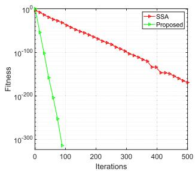

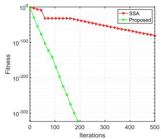  
(b) Test function F2

(a) Test function F1  
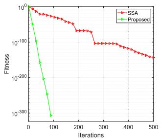

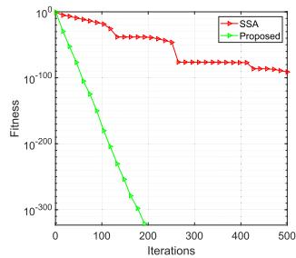  
(d) Test function F4

(c) Test function F3  
Fig. 3. Convergence curves under different test functions.  
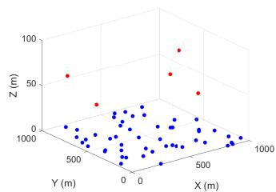

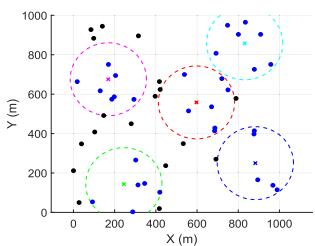  
(a) 3D deployment diagram of UAV  
(b) UAV flight trajectory diagram  
Fig. 4. UAV deployment diagram.

As shown in Fig. 4(a), during a specific time slot, 50 vehicle users are randomly distributed within a 1000m × 1000m × 100m ground area, with five UAVs deployed in the three-dimensional space. Blue represents the vehicles, and red represents the UAVs. To better visualize and analyze the coverage optimization strategy without overcomplicating the trajectory visualization, Fig. 4(b) focuses on the flight path of a randomly selected UAV within a specific time period, as well as its compliance with deployment constraints, so as to ensure that its trajectory characteristics can fully reflect the overall operational behavior of all five UAVs.

The number of iterations is set from 100 to 500, with performance metrics recorded every 100 iterations while other variables are kept constant. As shown in Fig. 5, the average communication capacity, coverage rate, and radar mutual information gradually converge as the number of iterations increases. The proposed algorithm converges within 300–400 iterations, whereas the three baseline algorithms require 400–500 iterations, indicating faster convergence and better performance. This result is mainly attributed to the proposed algorithm, which effectively addresses the strong coupling among variables through the joint optimization of UAV deployment and beamforming.

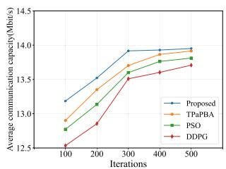  
(a) Average communication capacity

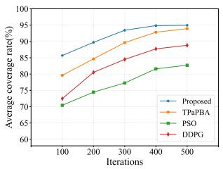  
(b) Average coverage rate

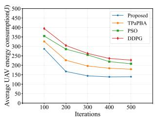  
(c) Average UAV energy consumption

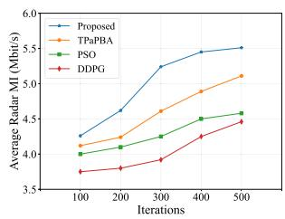  
(d) Average Radar MI

Fig. 5. The influence of iteration times on simulation results.  
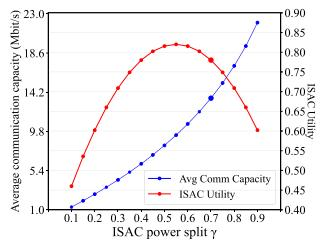  
(a)

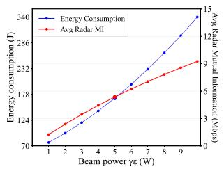  
(b)  
Fig. 6. Parameter Sensitivity Analysis: (a) The impact of weight γ, (b) The impact of weight γε.

2) Parameter Sensitivity Analysis: Fig. 6(a) illustrates the sensitivity of average communication capacity and ISAC utility to the power split factor γ. Communication capacity increases monotonically with γ, while ISAC utility exhibits a non-monotonic behavior with a peak at an intermediate γ. Smaller γ favors sensing, whereas larger γ prioritizes communication. This result mainly arises from the proposed joint optimization algorithm, which gives higher priority to the communication utility during iterative resource allocation. The selected operating point lies on the communication-oriented side of this trade-off. The selected operating point lies on the communication-oriented side of this trade-off. Fig. 6(b) shows the effect of beam power γε on energy consumption and radar mutual information. Energy consumption increases with γε, while radar mutual information improves with diminishing returns. The chosen operating point achieves a balance where further power increases provide limited sensing gains at a significantly higher energy cost, reflecting an effective tradeoff between sensing performance and energy efficiency.

3) Scalability: In this environment, variations in the number of vehicles can impact the average communication capacity, average coverage rate, and average UAV energy consumption. In Fig. 7, the average communication capacity decreases as the number of vehicles increases: with more vehicles sharing the same UAV resources, per-link bandwidth and power allocations shrink, lowering per-vehicle rates. The result mainly arises from the proposed joint optimization algorithm, which it adaptively updates UAV deployment and beamforming under dense vehicular traffic, the increasingly limited communication and sensing resources still cause performance degradation and higher UAV energy consumption. The average coverage rate declines with vehicle density. Between 10 and 20 vehicles there may be slight fluctuations due to uneven vehicle clustering, but beyond 20 the coverage drops more steadily. At 30 vehicles, our method provides a 9.6%, 20.1% and 4.4% higher coverage rate than DDPG, PSO and TPaPBA, respectively.

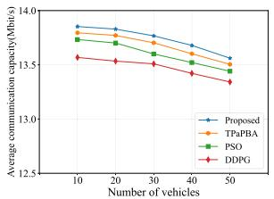  
(a) Average communication capacity

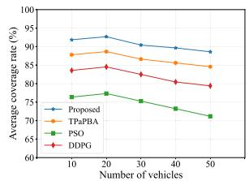  
(b) Average coverage rate

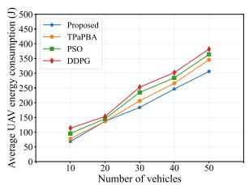  
(c) Average UAV energy consumption

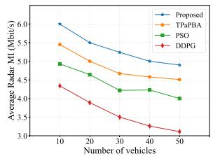  
(d) Average Radar MI

Fig. 7. The influence of vehicle quantity on simulationresults.  
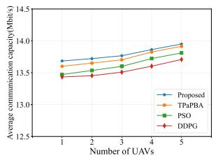  
(a) Average communication capacity

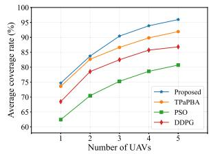  
(b) Average coverage rate

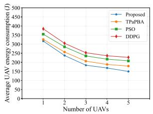  
(c) Average UAV energy consumption

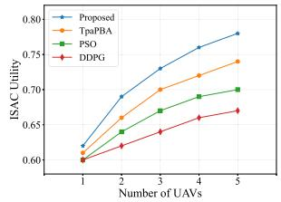  
(d) ISAC utility  
Fig. 8. The influence of UAV quantity on simulation results.

In Fig. 8, the average communication capacity and coverage rate both increase with the number of UAVs, since additional UAVs reduce the communication load per UAV and expand the service region. When the number of UAVs increases from 3 to 5, the coverage gains of the four algorithms are 6.1%, 6.1%, 7.2%, and 5.2%, respectively. This performance gain is primarily driven by the reduction in average propagation distance and the increased probability of establishing LoS links, which effectively mitigates path loss and enhances the SINR for vehicular users. Across different deployment scales, the proposed algorithm improves the average coverage rate by 10.51% over the baseline algorithms. Overall, the proposed algorithm achieves an average 19.83% reduction in UAV energy consumption compared with the baseline algorithms.

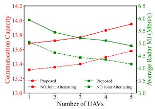

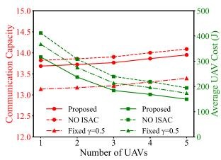  
(a) Average communication capacity  
(b) Average coverage rate

Fig. 9. Purpose of the ablation study: To investigate the performance of joint optimization and the contribution of the ISAC module.  
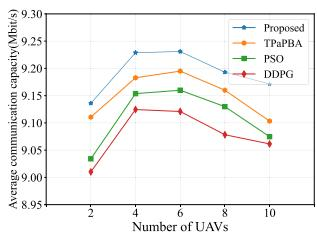  
Fig. 10. Impact of the number of UAVs under inter-UAV interference.

4) Ablation Study: We design ablation experiments under two scenarios. The first adopts a fixed optimization sequence instead of alternating joint optimization, while the second replaces ISAC with the conventional separated communication and sensing scheme. In Fig. 9(a), removing the alternating joint optimization reduces the communication capability and RMI by 2.8% and 10%, respectively, indicating that fixed-sequence optimization weakens the synergy among coupled variables. Removing the sensing module may slightly improve communication performance, whereas fixing the sensing–communication allocation ratio at 0.5 degrades communication capability and increases system cost.

5) The Impact of Interference Among UAVs: In dense multi-UAV environments, we further consider interference among UAVs, which is characterized by:

$$
I _ { u , n } ^ { \mathrm { i n t e r } } = \sum _ { u ^ { \prime } \ne u } ^ { U } x _ { u ^ { \prime } , n } ( t ) \left| \left| \omega _ { u ^ { \prime } , n } H _ { u ^ { \prime } , n } ^ { c } s _ { u ^ { \prime } , n } \right| \right| ^ { 2 } .\tag{47}
$$

where $I _ { u , n } ^ { \mathrm { i n t e r } }$ denotes the aggregated residual interference among $\mathrm { U A V s }$ power received by vehicle n when it is served by UAV u, and $u ^ { \prime } \ne u$ is the index of an interfering UAV. The SINR is given by:

$$
\mathrm { S I N R } ^ { \prime } = \frac { \left\| \omega _ { u , n } H _ { u , n } ^ { c } s _ { u , n } \right\| ^ { 2 } } { ( \sigma _ { n } ^ { c } ) ^ { 2 } + I _ { u , n } ^ { \mathrm { i n t e r } } } .\tag{48}
$$

In Fig. 10, we conduct a simulation in which interference among UAVs is considered. Different from Fig. 8(a), the average communication capacity first increases and then begins to decay after reaching the optimal point. This is because adding UAVs initially reduces the service load of each UAV, thereby improving the communication service capability for UAVs. However, when the number of UAVs reaches a certain level, the interference from other UAVs also becomes stronger, which overwhelms the desired communication gain and thus degrades the average communication capacity.

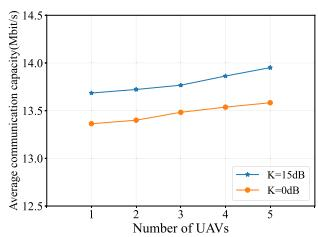  
Fig. 11. The impact of Rician fading factor.

6) The Impact of Rician Fading Factor: In Fig. 11, we investigate communication capacity under different Rician fading factors. $K = 0$ dB indicates that the LoS component and NLoS paths have comparable power, under which the received signal envelope distribution is modeled as Rician fading for a less LoS condition. The average communication capacity under $K = 0 \mathrm { d B }$ is lower than that under $K = 1 5 \mathrm { d B }$ because this scenario leads to a lower effective channel gain.

## VI. CONCLUSION AND FUTURE WORK

In this article, we investigate the joint optimization of UAV deployment and beamforming in an ISAC-enhanced UAV-assisted VEC system. We formulate the problem as a non-convex optimization framework aiming to maximize communication capacity under UAV energy constraints. The proposed approach effectively captures the coupling between deployment and beamforming decisions and achieves significant performance gains. Future work could explore collaborative optimization among UAVs and vehicles to further improve service quality and resource utilization efficiency.

## REFERENCES

[1] Z. Lv, D. Chen, and Q. Wang, “Diversified technologies in Internet of Vehicles under intelligent edge computing,” IEEE Trans. Intell. Transp. Syst., vol. 22, no. 4, pp. 2048–2059, Apr. 2021.

[2] J. Karedal, N. Czink, A. Paier, F. Tufvesson, and A. F. Molisch, “Path loss modelling for vehicle-to-vehicle communications,” IEEE Trans. Veh. Technol., vol. 60, no. 1, pp. 323–328, Jan. 2011.

[3] Q. Zhang, X. Wang, Z. Li, and Z. Wei, “Design and performance evaluation of joint sensing and communication integrated system for 5G mmWave enabled CAVs,” IEEE J. Sel. Topics Signal Process., vol. 15, no. 6, pp. 1500–1514, Nov. 2021.

[4] M. Asim, M. ELAffendi, and A. A. A. El-Latif, “Multi-IRS and multi-UAV-assisted MEC system for 5G/6G networks: Efficient joint trajectory optimization and passive beamforming framework,” IEEE Trans. Intell. Transp. Syst., vol. 24, no. 4, pp. 4553–4564, Apr. 2023.

[5] R. Zeng, C. Jiang, X. Wang, and B. Li, “A joint secure mechanism of multi-task learning for a UAV team under FDI attacks,” IEEE Trans. Mobile Comput., vol. 24, no. 8, pp. 7345–7359, Aug. 2025.

[6] Y. Zhuo and Z. Wang, “Performance analysis of ISAC system under correlated communication-sensing channel,” IEEE Trans. Veh. Technol., vol. 72, no. 12, pp. 16823–16827, Dec. 2023.

[7] X. Dai, Z. Xiao, H. Jiang, and J. C. S. Lui, “UAV-assisted task offloading in vehicular edge computing networks,” IEEE Trans. Mobile Comput., vol. 23, no. 4, pp. 2520–2534, Apr. 2024.

[8] Z. Chen, H. Zheng, J. Zhang, X. Zheng, and C. Rong, “Joint computation offloading and deployment optimization in multi-UAV-enabled MEC systems,” Peer Peer Netw. Appl., vol. 15, no. 1, pp. 194–205, Jan. 2022.

[9] H. Hao, C. Xu, W. Zhang, S. Yang, and G. Muntean, “Joint task offloading, resource allocation, and trajectory design for multi-UAV cooperative edge computing with task priority,” IEEE Trans. Mobile Comput., vol. 23, no. 9, pp. 8649–8663, Sep. 2024.

[10] D. Deng, W. Zhou, X. Li, D. B. da Costa, D. W. K. Ng, and A. Nallanathan, “Joint beamforming and UAV trajectory optimization for covert communications in ISAC networks,” IEEE Trans. Wireless Commun., vol. 24, no. 2, pp. 1016–1030, Feb. 2025.

[11] C. Deng, X. Fang, and X. Wang, “Beamforming design and trajectory optimization for UAV-empowered adaptable integrated sensing and communication,” IEEE Trans. Wireless Commun., vol. 22, no. 11, pp. 8512–8526, Nov. 2023.

[12] S. Zhang et al., “Joint beamforming optimization for active STAR-RISassisted ISAC systems,” IEEE Trans. Wireless Commun., vol. 23, no. 11, pp. 15888–15902, Nov. 2024.

[13] W. Jiang et al., “Improve sensing and communication performance of UAV via integrated sensing and communication,” in Proc. IEEE 21st Int. Conf. Commun. Technol. (ICCT), Oct. 2021, pp. 644–648.

[14] L. Chen, Z. Wang, J. Jiang, Y. Chen, and F. R. Yu, “Full-duplex SIC design and power allocation for dual-functional radar-communication systems,” IEEE Wireless Commun. Lett., vol. 12, no. 2, pp. 252–256, Feb. 2023.

[15] Z. Lyu, G. Zhu, and J. Xu, “Joint maneuver and beamforming design for UAV-enabled integrated sensing and communication,” IEEE Trans. Wireless Commun., vol. 22, no. 4, pp. 2424–2440, Apr. 2023.

[16] Z. Liu, X. Liu, Y. Liu, V. C. M. Leung, and T. S. Durrani, “UAV assisted integrated sensing and communications for Internet of Things: 3D trajectory optimization and resource allocation,” IEEE Trans. Wireless Commun., vol. 23, no. 8, pp. 8654–8667, Aug. 2024.

[17] G. Cheng, X. Song, Z. Lyu, and J. Xu, “Networked ISAC for low-altitude economy: Coordinated transmit beamforming and UAV trajectory design,” IEEE Trans. Commun., vol. 73, no. 8, pp. 5832–5847, Aug. 2025.

[18] Z. Wang, L. Xu, L. Hou, R. Li, and L. Wang, “UAV-assisted emergency integrated sensing and communication networks: A CNN-based rapid deployment approach,” 2024, arXiv:2401.07001.

[19] T. Kimura and M. Ogura, “Distributed collaborative 3D-deployment of UAV base stations for on-demand coverage,” in Proc. IEEE INFOCOM Conf. Comput. Commun., Jul. 2020, pp. 1748–1757.

[20] Q. Wu, Y. Zeng, and R. Zhang, “Joint trajectory and communication design for UAV-enabled multiple access,” in Proc. IEEE Global Commun. Conf., Dec. 2017, pp. 1–6.

[21] K. Meng, Q. Wu, S. Ma, W. Chen, K. Wang, and J. Li, “Throughput maximization for UAV-enabled integrated periodic sensing and communication,” IEEE Trans. Wireless Commun., vol. 22, no. 1, pp. 671–687, Jan. 2023.

[22] K. Boutiba, M. Bagaa, and A. Ksentini, “Multi-agent deep reinforcement learning to enable dynamic TDD in a multi-cell environment,” IEEE Trans. Mobile Comput., vol. 23, no. 5, pp. 6163–6177, May 2024.

[23] S. Krauss, “Microscopic modeling of traffic flow: Investigation of collision free vehicle dynamics,” DLR Deutsches Zentrum Fuer Luftund Raumfahrt e.V., Koeln, Germany, Tech. Rep. DLR-FB-98-08, Apr. 1998.

[24] Y. Zeng, Q. Wu, and R. Zhang, “Accessing from the sky: A tutorial on UAV communications for 5G and beyond,” Proc. IEEE, vol. 107, no. 12, pp. 2327–2375, Dec. 2019.

[25] L. Zhang, A. Celik, S. Dang, and B. Shihada, “Energy-efficient trajectory optimization for UAV-assisted IoT networks,” IEEE Trans. Mobile Comput., vol. 21, no. 12, pp. 4323–4337, Dec. 2022.

[26] S. M. Kay, Fundamentals of Statistical Signal Processing: Estimation Theory, vol. 1. Englewood Cliffs, NJ, USA: Prentice-Hall, 1993.

[27] S. Mandelli, M. Henninger, and J. Du, “Sampling and reconstructing angular domains with uniform arrays,” IEEE Trans. Wireless Commun., vol. 22, no. 6, pp. 3628–3642, Jun. 2023.

[28] Y. Zeng, J. Xu, and R. Zhang, “Energy minimization for wireless communication with rotary-wing UAV,” IEEE Trans. Wireless Commun., vol. 18, no. 4, pp. 2329–2345, Apr. 2019.

[29] N. Zhao et al., “Joint trajectory and precoding optimization for UAVassisted NOMA networks,” IEEE Trans. Commun., vol. 67, no. 5, pp. 3723–3735, May 2019.

[30] L. Wei, J. Cui, Y. Xu, J. Cheng, and H. Zhong, “Secure and lightweight conditional privacy-preserving authentication for securing traffic emergency messages in VANETs,” IEEE Trans. Inf. Forensics Security, vol. 16, pp. 1681–1695, 2021.

[31] Y. Liu, K. Xiong, Y. Lu, Q. Ni, P. Fan, and K. B. Letaief, “UAV-aided wireless power transfer and data collection in Rician fading,” IEEE J. Sel. Areas Commun., vol. 39, no. 10, pp. 3097–3113, Oct. 2021.

[32] A. Gupta, A. Trivedi, and B. Prasad, “B-GWO based multi-UAV deployment and power allocation in NOMA assisted wireless networks,” Wireless Netw., vol. 28, no. 7, pp. 3199–3211, Oct. 2022.

[33] J. Xue and B. Shen, “A novel swarm intelligence optimization approach: Sparrow search algorithm,” Syst. Sci. Control Eng., vol. 8, no. 1, pp. 22–34, Jan. 2020.

[34] A. S. Abdalla and V. Marojevic, “Multi-agent learning for secure wireless access from UAVs with limited energy resources,” IEEE Internet Things J., vol. 10, no. 24, pp. 22356–22370, 2023.

[35] Z. Yuheng, Z. Liyan, and L. Chunpeng, “3-D deployment optimization of UAVs based on particle swarm algorithm,” in Proc. IEEE 19th Int. Conf. Commun. Technol. (ICCT), Oct. 2019, pp. 954–957.

[36] X. Liu, W. Yang, L. Li, Z. Liu, Y. Liu, and F. Li, “UAV assisted integrated sensing and communication for mobile vehicles,” IEEE Trans. Intell. Transp. Syst., vol. 26, no. 11, pp. 21335–21339, Nov. 2025.

Chunlin Li received the B.S. and M.Sc. degrees in computer science from Wuhan University of Technology (WUT), China, in 1996 and 2000, respectively, and the Ph.D. degree in computer software and theory from the Huazhong University of Science and Technology (HUST), Wuhan, China, in 2003. She is currently a Professor and the Ph.D. Tutor of computer science at WUT. She has published more than 60 technical articles. Her research interests include high-performance computing, UAV communications, and the Internet of Things (IoT).

Wenhao Wu is currently pursuing the M.E. degree with the School of Computer Science and Technology, Wuhan University of Technology. His research interests include cloud computing, edge computing, and artificial intelligence.

Zhihao Zhang (Student Member, IEEE) received the M.S. degree from Tianjin University of Technology (TUT) in 2024. He is currently pursuing the Ph.D. degree with the School of Computer Science and Technology, Wuhan University of Technology (WUT). His research interests include UAV communications, the Internet of Things (IoT), deep reinforcement learning (DRL), and mobile edge computing (MEC).

Tianbing Ma received the M.S. degree from Anhui University of Science and Technology, Huainan, China, in 2005, and the Ph.D. degree from Nanjing University of Aeronautics and Astronautics, Nanjing, China, in 2014. Since 2016, he has been a Professor at Anhui University of Science and Technology. His research areas include autonomous energy sensing, fault diagnosis, and digital twins.

Shaohua Wan (Senior Member, IEEE) received the Ph.D. degree from the School of Computer, Wuhan University, Wuhan, China, in 2010. He is currently a Full Professor with the Shenzhen Institute for Advanced Study, University of Electronic Science and Technology of China, Shenzhen, China. From 2016 to 2017, he was a Visiting Professor with the Department of Electrical and Computer Engineering, Technical University of Munich, Munich, Germany.