# Joint Latency and Charge Cost Minimization for Reliable Task Offloading in Dispersed Computing: A Multi-objective Optimization Approach

Xumin Huang, Zexiong Wu, Chaoda Peng, Yuan Wu, Senior Member, IEEE, Weifeng Zhong, Jiawen Kang, Senior Member, IEEE, and Shengli Xie, Fellow, IEEE

Abstract—Dispersed computing has emerged as a promising paradigm that leverages underutilized resources from massive Internet of Things devices (IoTDs) to enhance the computing capacity at the network edge. However, existing works about the dispersed computing overlook the heterogeneous computing environment with parallel and serial computations and task reliability requirements for the hardware-constrained IoTDs, and they lack multi-objective optimization approaches to optimize the task offloading. To address the challenges, we propose a comprehensive scheme to achieve a delay-aware and economicaware dispersed computing paradigm by using a multi-objective optimization approach. Particularly, we consider parallel processing at an edge server and serial processing at the lightweight IoTDs, and leverage the task redundancy to satisfy the task reliability requirements on the IoTD side. We further formulate a constrained multi-objective optimization problem (CMOP) aiming at jointly optimizing the task assignment, bandwidth allocation, and CPU frequency allocation to simultaneously minimize the total delay cost and the total charge cost of the tasks. To address the CMOP, we propose an improved constrained multiobjective evolutionary algorithm that employs a dual-population cooperative mechanism between two populations and a repairing constraint-handling technique. The dual-population cooperative mechanism can balance convergence toward Pareto optimality and solution diversity maintenance. The repairing constrainthandling technique is designed to guide solutions toward feasible regions, achieving efficient exploration of complex constrained search spaces. Simulation results demonstrate the superiority of our algorithm in seeking the better-converged and betterdistributed Pareto optimal solutions to well address the tradeoffs between the two objectives.

Index Terms—Dispersed computing, heterogeneous processing, task reliability requirements, constrained multi-objective optimization problem, and evolutionary algorithm.

# I. INTRODUCTION

Dispersed computing has been conceived as a promising computing paradigm to make full use of underutilized resources of massive and dispersed computing devices such as Internet of Things (IoTD) devices, and thus combines the

Xumin Huang, Weifeng Zhong, Jiawen Kang, and Shengli Xie are with the School of Automation, Guangdong University of Technology, Guangzhou 510006, China (e-mail: huangxu min@163.com; wfzhongs@gdut.edu.cn; kavinkang@gdut.edu.cn; shlxie@gdut.edu.cn).

Zexiong Wu and Chaoda Peng are with College of Mathematics and Informatics, South China Agricultural University, Guangzhou 510642, China (e-mail: zexiongwu@stu.scau.edu.cn; ChaodaPeng@scau.edu.cn).

Yuan Wu is with State Key Laboratory of Internet of Things for Smart City, University of Macau, Macau SAR, China, and also with Department of Computer and Information Science, University of Macau (e-mail: yuanwu@um.edu.mo).

advantages of edge servers and IoT devices to promote the resource capacity at the network edge [1]. In the resourcelimited scenario, a crowd of volunteer IoTDs are employed to assist an overloaded edge server and relieve the computation burden of the edge server. On one hand, latency requirements of computation tasks in the real-time applications such as autonomous driving are as stringent as a few milliseconds [2]. However, a general IoTD has a computation bottleneck to restrict the support for the applications. The IoTD like a mobile handheld device could have an increasing failure rate during the mission time, thereby causing a task failure probability in computation offloading. For example, average 8% of smartphones suffer from hardware and software faults within 3 years, according to a recent survey of 15,644 UK’s smartphone users in 2025 [3]. On the other hand, the selfish IoTDs are rewarded to cooperate with the edge server to complete the computation tasks according to the contributions. This motivates us to study the joint latency and charge cost optimization for reliable task offloading in the dispersed computing environment.

However, there still exist several critical challenges that should be considered for optimizing the dispersed computing paradigm in a comprehensive manner. First, processing capabilities of the edge server and IoTDs are quite different. The edge server with sufficient computing resources can process a set of tasks in parallel. As a hardware-constrained terminal, the IoTD tends to process the assigned tasks in series [4]. As a result, the dispersed computing environment is mixed with both the parallel and serial computations. Second, reliable task offloading is required and task redundancy could be performed on the IoTD side to guarantee the task reliability, considering the unreliable computing processes of the IoTDs. Most of the IoTDs are low-end embedded devices and task failure could be caused by both the software and hardware problems in the hard disk, memory and RAID controller. To achieve reliable task offloading, the work in [5] proposed to exploit the task redundancy and let a task be computed on a certain number of IoTDs in parallel. However, performing the task redundancy brings a challenge to the resource-constrained disperse computing environment. Last but not least, a networkwide decision maker could pay attention to more than one single objective for the dispersed computing paradigm [6]. To simultaneously improve the task processing efficiency and user satisfaction, the decision maker aims to minimize the total delay cost of all tasks while reducing the total charge cost of all tasks. At this time, a set of diverse solutions instead of a single one are necessitated to handle different tradeoffs between the above two objectives. Nevertheless, the previous works overlook such a multi-objective optimization problem. This motivates us to investigate a multi-objective optimization problem involving with the above two objectives and feasible constraints such as task reliability requirements and resource capacity limits for the dispersed computing paradigm.

For addressing the above challenges, we exploit a multiobjective optimization approach to achieve the delay-aware and economic-aware dispersed computing paradigm. A base station adopts the batch processing based edge computing to meet computational demands of users. Particularly, each task has a specific reliability requirement and task redundancy is properly performed among multiple IoTDs when a task is executed on the IoTD side. To accelerate all task processing, nearby volunteer IoTDs are employed by the base station to cooperate with the edge server for the simultaneous task execution. Both the edge server and volunteer IoTDs are rewarded according to the charging policies. As a centralized decision maker, the base station aims to reduce the total delay cost and total economic expense of the tasks. However, these two objectives inherently conflict in practice, since reducing the total delay cost requires more resource and energy consumption, thereby increasing the total charge cost. To achieve diverse balances between the conflicting objectives, the simultaneous optimization problem can be formulated as a constrained multi-objective optimization problem (CMOP), which aims to obtain diverse tradeoff solutions while satisfying the feasible constraints. A part of previous works employ the weighted sum method to convert an originally complex multi-objective optimization problem into a simple singleobjective ones by assigning the fixed weights between the objectives. But this method yields only a single solution, which cannot enable the decision maker to explore potential solutions in different tradeoff scenarios. Furthermore, selecting appropriate weights in advance is challenging particularly when lacking the prior knowledge of the objective space. In the CMOP, we jointly optimize the task assignment, bandwidth allocation among the IoTDs and CPU frequency allocation of the edge server. We also consider feasible constraints, e.g., task reliability requirements, resource capacity limits, and energy consumption limits.

An efficient algorithm is required to solve the CMOP and pursuit to find a set of Pareto optimal solutions. Here, a Pareto optimal solution refers to a satisfactory solution that no further improvement can be made in one objective without degrading the other objectives [7]. For a CMOP, we focus on seeking the non-dominated solutions to approximate the ideal Pareto optimal solutions [8]. As one of the well-suited methods for the multi-objective optimization, evolutionary algorithm has great advantages of providing a set of tradeoff solutions in a single run based on the population-based approach and parallel processing power, and performing a global exploration of the search space [9], [10]. To tackle our formulated CMOP, we develop an improved constrained multiobjective evolutionary algorithm integrating a dual-population cooperative mechanism with a repairing constraint-handling technique. The proposed algorithm utilizes two distinct populations with the complementary roles, including a main population that maintains feasible solutions and focuses on convergence toward Pareto optimal regions, and an auxiliary population that explores the broader search space to maintain the solution diversity. Moreover, the main population employs a repairing constraint-handling technique to systematically convert infeasible solutions into feasible ones by properly addressing the constraint violations formulated in the CMOP. Thanks to the cooperative information exchange between the two populations, the proposed algorithm simultaneously takes into account the exploitation of high-quality feasible solutions and exploration of diverse solution spaces, thereby improving the capability of discovering well-converged and more evenly distributed Pareto optimal solutions. The main contributions of this paper are summarized as follows.

• We propose a feasible task offloading model in the heterogeneous dispersed computing environment. Both the edge server and nearby IoTDs are scheduled for accelerating the task processing, while they have different processing capabilities. On one hand, the edge server and each IoTD have parallel and serial computing capabilities, respectively. On the other hand, the edge server always can successfully complete a given task but an IoTD has a task failure probability due to the software and hardware issues. When the task is offloaded to the IoTD side, the task necessitates to be computed on a number of IoTDs in parallel according to the task reliability requirement.   
• We investigate a CMOP to simultaneously minimize the total delay cost and the total charge cost of all tasks. According to the two objectives, the base station acts as a centralized decision maker to determine how to assign different tasks to the edge server and IoTDs while allocating the available bandwidth to transmit the input data of the tasks to the IoTDs and CPU frequency of the edge server to process the tasks on the edge server.   
• We propose an improved constrained multi-objective evolutionary algorithm to solve the CMOP. The proposed algorithm adopts the dual-population cooperative mechanism and repairing constraint-handling technique to accelerate the convergence speed while promoting the solution diversity. Numerical results show that compared with the baseline algorithms, the proposed algorithm has a great advantage in seeking the superior Pareto optimal solutions with the better convergence and diversity.

The remainder of this paper is organized as follows. Sections II presents the related works. Section III shows the system model and workflow of the dispersed computing. In Section IV, we formulate the CMOP for reliable task offloading in dispersed computing. In Section V, we introduce the improved constrained multi-objective evolutionary algorithm in detail. Section VI presents the numerical results. Finally, the open issues and research directions are discussed in Section VII, with conclusions in Section VIII.

# II. RELATED WORK

Recently, a variety research works have been conducted to improve the computing efficiency and perform the service optimization for dispersed computing from different perspectives. To reduce the overall computing cost, joint task assignment and resource allocation schemes have been presented to reduce the time and energy consumption for dispersed computing. For example, a dispersed computing network consisting of ground IoTDs and unmanned aerial vehicles (UAVs) as aerial edge servers was deployed for collaborative task processing in the disaster area [11]. A two-stage task scheduling scheme was further studied for maximizing the number of successfully completed tasks while minimizing the average energy consumption of all task performers. Similarly, a dispersed computing network consisting of multiple vehicles and a roadside edge server was deployed for quick crowdsensing data fusion in vehicular edge computing [12]. Two schemes were designed to reduce the total processing latency of all crowdsensing data under the binary and partial offloading assumptions, respectively. Dispersed computing has been applied for facilitating the computation-intensive applications, e.g., artificial intelligence (AI) applications. A number of IoTDs were employed for assisting an edge server to perform the object detection tasks [13]. The authors further studied how to split different tasks into different subtasks, and assign different subtasks to different IoTDs, according to a multi-objective optimization problem that aims to minimize the maximal task completion time among the IoTDs and the total energy consumption of all IoTDs.

To utilize dispersed computing for real-time traffic data processing, roadside smart devices including smart cameras and intelligent vehicles collaborated to run AI applications such as road vehicle detection and traffic signal recognition [14]. The workflow across the smart devices was designed to address how to select appropriate smart devices and how to assign different roles (i.e., Executor and Backup) to the selected smart devices during the AI task execution. In addition, a new dispersed computing model was introduced in [15] based on the concept of multi-hop offloading among the IoTDs. To complete a computation-intensive task, each IoTD can choose to locally execute it, or divide the task into several subtasks and execute a part of the substasks while offloading the remaining part to a single-hop neighbor IoTD. To accelerate the task completion, the task scheduling decisions involving with the task partition and subtask offloading were optimized by using an improved genetic algorithm.

Due to the selfishness of the IoTDs, incentive mechanisms are important to stimulate the self-interested IoTDs with idle computing resources to accept the recruitment in dispersed computing [16]. For example, a Stackelberge game based incentive mechanism was devised for an edge server to study how to set different resource prices for different task requesters while determining proper monetary rewards for volunteer vehicles that help the overloaded edge server in vehicular edge computing [17]. Similarly, a two-level Stackelberg game was adopted to study the economic interactions between network computation points such as the volunteer IoTDs, users, and relays in the offloading services [18]. Here, relays were utilized to transmit the offloading data from the users to the long-distance network computation points. To reduce the processing latency of the computation on heterogeneous volunteer IoTDs, the authors in [19] proposed to design two incentive mechanisms for the volunteer IoTDs according to their actual work performance in terms of undertaken workloads and task completion time. Blockchain has been regarded as one of the advanced technologies for providing a privacy-preserving, fair and transparent incentive mechanism for the volunteer IoTDs in the trustless environment [20].

In addition, research efforts have been conducted to achieve different multi-objective optimizations for the dispersed/edge computing. For example, when edge devices can offload the tasks to neighboring edge servers and edge devices under the partial offloading assumption, the total task processing delay and total energy consumption of all edge devices were simultaneously minimized [21]. Furthermore, the work in [22] considered that an edge device running a service should offload the task to an edge server that has cached the corresponding service. Then a constrained multi-objective optimization problem relevant with the total task processing delay and total energy consumption of completing all tasks was investigated under the full offloading consumption in the cloud-edge-end collaborative computing environment. In [23], four user-centric and system-centric objectives were introduced for a multi-user multi-server computation offloading problem. In additional to the above time and energy consumptions, the authors considered the trust metrics between the tasks and server and user experience utility, and jointly optimized the task offloading, transmit power assignment, subband scheduling and CPU frequency allocation of the edge servers. The above works assumed that the offloading tasks are independent. In contrast, the work in [24] paid attention to studying the dependent task offloading through cloud-edge-end collaboration. A multi-objective evolutionary algorithm was presented to simultaneously minimize the task transmission and processing latency and maximize the rewards for the users and edge/could server providers. Similarly, the work in [25] investigated the dependent task scheduling problem in UAVenabled edge computing by using an improved multi-objective evolutionary algorithm. Particularly, the authors aimed at the simultaneous optimization of the makespan of all dependent tasks and energy balancing among all UAVs. More related works on different multi-objective optimizations for UAVenabled edge computing can be found in [26], [27].

Compared with the above works, our work aims at adopting the a multi-objective optimization approach to achieve the simultaneous minimization of the total delay cost and total charge cost for reliable task offloading in dispersed computing. On one hand, we particularly consider the heterogeneous computing environment with parallel and serial computations and task reliability requirements for the hardware-constrained IoTDs. On the other hand, we formulate a CMOP to jointly optimize the decisions on the task and processors sides, and propose an improved a constrained multi-objective evolutionary algorithm to seek the high-quality solutions to the CMOP. In our algorithm, we design a dual-population cooperative mechanism and a repairing constraint-handling technique to effectively accelerate the convergence while improving the diversity maintenance.

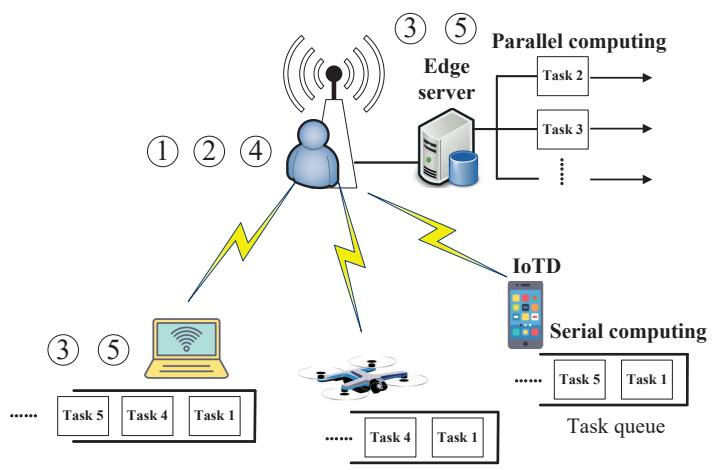

flowchart

Fig. 1. Workflow of the dispersed computing.

# III. SYSTEM MODEL

Figure 1 shows the dispersed computing scenario considered in this paper. Referring to the works such as [28], we consider a centralized-control scenario for a base station. Specifically, the base station collects a batch of computation tasks without dependency, and can offload the tasks to two kinds of processors, including an edge sever and nearby IoTDs such as laptop, unmanned aerial vehicle, and handheld smart phone. There are obvious differences between a hardware-constrained IoTD and an edge server. First, the edge server processes the arrival tasks in parallel while the IoTD processes the arrival tasks in series and maintains a task queue. Second, the edge server can allocate different parts of the CPU frequency to different tasks according the computing resource allocation policy. For example, tasks 2 and 3 share the available CPU frequency of the edge server. In the serial task processing, the IoTD always assigns the available CPU frequency for each task. Last but not least, the edge server can successfully complete a given task while the IoTD may fail due to the software and hardware problems. Each IoTD has a task failure probability during the task processing process. Since each task has a stringent reliability requirement, the base station performs the task redundancy when a task is performed on the IoTD side, i.e., letting multiple IoTDs compute the task in parallel. In the figure, tasks 1, 4, and 5 are simultaneously offloaded to different IoTDs. When receiving the output results of an identical task, the base station can verify them and ensure the correct one. When completing the tasks, the edge server and participating IoTDs are given with the committed monetary rewards. We summarize the detailed workflow of the dispersed computing paradigm as follows.

• Step 1: Generating offloading requests. When receiving the offloading requests, the base station collects the tasks with necessary profiles. For a task, its profiles generally include the input data size, computational workloads, priority and reliability requirement.   
• Step 2: Recruiting a number of volunteer IoTDs. When the wired connected edge server cannot separately complete all tasks, the base station recruits a number of volunteer IoTDs in the local region. The base stations sends requests to several candidate IoTDs, which are

expected to help the overloaded edge server and undertake a number of tasks. They can earn monetary rewards through sharing the idle computing resources. The volunteer IoTDs responds to the requests in time. Note that the volunteer IoTD recruitment procedure is performed within a limited time window.

• Step 3: Collecting the auxiliary information to the base station. When the volunteer IoTDs are confirmed, the auxiliary information is recorded for the consequent decision making procedure. On one hand, processor profiles of both the edge server and IoTDs, e.g., the maximal CPU frequency, task failure probability, channel state information, and energy consumption profiles such as receiver power, are collected by the base station to assist in the centralized decision making of the base station. On the other hand, different charging policies are required by the IoTDs and edge server to provide offloading services. For a battery-limited IoTD, charge fee of a task is required to compensate for the consumed energy of processing the task. For the edge server with available computing resources, charge fee of a task is linear with the CPU frequency allocated to the task.

• Step 4: Deciding the task assignment and resource allocation. As the centralized decision maker, the base station adopts a multi-objective optimization approach to jointly optimize the task offloading and resource allocation decisions, i.e., task association between all tasks and processors, bandwidth allocation among the IoTDs and CPU frequency allocation of the edge server, to simultaneously minimize the total delay cost and charge cost of all tasks.   
• Step 5: Accepting the promising rewards after the task executions. The edge server processes the given tasks in parallel. Each IoTD processes the given tasks in series and the processing order of a task is based on the priority in the task queue. After successfully sending the output results of the tasks, the edge server and IoTDs accept the promising monetary rewards from the base station, as assumed in [17].

# IV. PROBLEM FORMULATION

# A. Mathematical Model

1) Task Side: We optimize the reliable task offloading in dispersed computing under the static network conditions, which is considered in many studies. A batch of computation tasks wait to be processed, a set of volunteer IoTDs are confirmed, and available bandwidth and computing resources remain unchanged during the allocation. The locations of the IoTDs are unchanged and we neglect the impact of device mobility on the task offloading, which is assumed in the works such as [29]. More specifically, the base station has collected I computation tasks and prepares to offload the tasks to an edge server and J IoTDs. A task is indexed by i and a processor is indexed by j. There exist J + 1 processors and we let the J + 1-th processor indicate the edge server. For simplicity, task i is described as a tuple $\{ D _ { i } , W _ { i } , R _ { i } \}$ , where $D _ { i }$ refers to the input data size, $W _ { i }$ refers to the computational workloads of performing the task, and $R _ { i }$ refers to the reliability requirement. Here, $R _ { i }$ requires the task success probability to be larger than the lower bound $R _ { i }$ . We also consider all tasks belonging to the set $\{ 1 , 2 , \ldots , i , \ldots , I \}$ have been sorted in descending order according to the priorities. We denote $\rho _ { i , j }$ as the binary offloading decision between task i and processor $j , 1 \le j \le J + 1$ . For each IoTD $j ,$ there is a statistical index in terms of task failure probability denoted as $\varphi _ { j }$ . Based on the offloading strategies of task i among the J IoTDs $\left\{ \rho _ { i , j } \right\} _ { 1 \leq j \leq J } ,$ we calculate the task failure probability of task i completed on J IoTDs as $\begin{array} { r } { \prod _ { 1 \leq j \leq J } \rho _ { i , j } \varphi _ { j } } \end{array}$ . We further calculate the task success probability of task i on the IoTD side by

$$
P _ {i} = 1 - \prod_ {j = 1} ^ {J} \rho_ {i, j} \varphi_ {j} \tag {1}
$$

Since $0 < \varphi _ { j } < 1 , 1 \leq j \leq J ,$ the task success probability increases when the task is redundantly performed on more IoTDs in parallel.

2) IoTD Side: IoTD j performs the given tasks in series and completes the tasks one by one according to the priorities in the task queue. In the following, we consider the case $\rho _ { i , j } = 1$ in which IoTD j receives task i from the base station and processes it. The communication channel between IoTD $j$ and the base station is dominated by a line-of-sight link. Similar to many existing studies, we neglect the impact of channel impairments such as shadowing or small-scale fading, and let the channel power gain between the IoTD and base station follow a free-space path loss model as $g _ { j } = g _ { 0 } d _ { j } ^ { - 2 }$ , where $g _ { 0 }$ denotes the channel power at the reference distance of 1 meter and $d _ { j }$ is the distance between IoTD j and the base station [30]. We adopt the orthogonal frequency division multiple access technology and neglect the inter-IoTD channel interference. According to Shannon’s formula, we measure the achievable downlink rate of IoTD $j$ by

$$
r _ {j} ^ {D L} = b _ {j} \log_ {2} (1 + \frac {p _ {B S} ^ {T X} g _ {j}}{b _ {j} N _ {0}}) \tag {2}
$$

where $b _ { j }$ is the bandwidth allocated to IoTD $j , p _ { B S } ^ { T X }$ is the transmit power of the base station, and $N _ { 0 }$ is the noise power spectrum density. For receiving the input data of task $i ,$ the data transmission time and energy consumption of IoTD j can be expressed by

$$
\left\{ \begin{array}{l} T _ {i, j} ^ {R X} = \frac {D _ {i}}{r _ {j} ^ {D L}}, \\ E _ {i, j} ^ {R X} = p _ {j} ^ {R X} T _ {i, j} ^ {R X} \end{array} \right. \tag {3}
$$

where pRj $p _ { j } ^ { R X }$ X is the receive power of the IoTD. For processing task i, the computation delay and energy consumption of IoTD $j$ can be expressed by

$$
\left\{ \begin{array}{l} T _ {i, j} ^ {C M P} = \frac {W _ {i}}{f _ {j} ^ {c}}, \\ E _ {i, j} ^ {C M P} = \varepsilon_ {j} \left(f _ {j} ^ {c}\right) ^ {3} \frac {W _ {i}}{f _ {j} ^ {c}} = \varepsilon_ {j} \left(f _ {j} ^ {c}\right) ^ {2} W _ {i} \end{array} \right. \tag {4}
$$

where $\varepsilon _ { j }$ is the effective capacitance coefficient of IoTD j that refers to the energy consumption coefficient depending on the chip architecture [31], $f _ { j } ^ { c }$ is the local CPU frequency of IoTD $j ,$ and the energy consumption to run one CPU cycle on the IoTD $j \ \mathrm { i s } \ \varepsilon _ { j } \left( f _ { j } ^ { c } \right) ^ { 3 }$ . When IoTD j is given with multiple tasks, the IoTD processes the tasks in series according to the task priority. There is waiting time for task i in the task queue since the base station offloads the tasks to the IoTD one by one [28]. Since IoTD $j$ necessitates to first process the tasks that are of higher priorities than task i, the waiting time of task i on the IoTD j is

$$
T _ {i, j} ^ {W} = \left\{ \begin{array}{l l} 0, & \text { if   } i = 1, \\ 0, & \text { if   } i > 1 \& \sum_ {m = 1} ^ {i - 1} \rho_ {m, j} = 0, \\ \sum_ {m = 1} ^ {i - 1} \rho_ {m, j} \tau_ {m, j}, & \text { otherwise } \end{array} \right. \tag {5}
$$

where $\tau _ { m , j }$ is the total time consumption of IoTD $j$ for $\tau _ { m , j } = T _ { m , j } ^ { \bf { \bar { R } } X } + T _ { m , j } ^ { C M P }$ ith the higher priority than task i, i.e.,. Particularly, when task i is the first task, i.e., $\begin{array} { r } { \sum _ { m - 1 } ^ { i - 1 } \rho _ { m , j } = 0 } \end{array}$ $i \ = \ 1$ , there is no waiting time for task i. When , or the first task assigned to IoTD $j ,$ i.e., task i is offloaded to IoTD $j ,$ the delay cost $c _ { i , j }$ and charge cost $\pi _ { i , j }$ of task i performed by the IoTD are linear with the total time and energy consumption, respectively, as follows

$$
\left\{ \begin{array}{l} c _ {i, j} = T _ {i, j} ^ {W} + \tau_ {i, j}, \\ \pi_ {i, j} = \lambda_ {j} \left(E _ {i, j} ^ {R X} + E _ {i, j} ^ {C M P}\right) \end{array} \right. \tag {6}
$$

where $\lambda _ { j }$ is a presetting parameter of IoTD j indicating the charge per unit energy consumed.

3) Edge Server Side: The edge server processes multiple tasks in parallel. When $\rho _ { i , J + 1 } = 1$ , the edge server promptly receives task i and allocates a part of the CPU frequency to complete the task. Due to the wired connection between the edge server and the base station, the input data transmission time of task i is negligible on the edge server. For processing task i, the computation delay of task i on the edge server can be expressed by

$$
T _ {i, J + 1} ^ {C M P} = \frac {W _ {i}}{f _ {i} ^ {s}} \tag {7}
$$

where $f _ { i } ^ { s }$ is the CPU frequency of processing task i on the edge server. The total time consumption ofor receiving and computing task i equals to $\tau _ { i , J + 1 } \stackrel { - } { = } T _ { i , J + 1 } ^ { C M P }$ server is linear with the occupied CPU frequency. Thus, the delay cost $^ { c _ { i , J + 1 } }$ and charge cost $\pi _ { i , J + 1 }$ of task i on the edge server are expressed by

$$
\left\{ \begin{array}{l} c _ {i, J + 1} = \tau_ {i, J + 1}, \\ \pi_ {i, J + 1} = \mu_ {i} f _ {i} ^ {s}, \end{array} \right. \tag {8}
$$

where $\mu _ { i }$ represents the charge per CPU frequency according to the priority of task i.

# B. CMOP Formulation

In this paper, we formulate a CMOP to jointly optimize the task assignment, bandwidth allocation among the IoTDs and CPU frequency allocation of the edge server. Thus, a decision variable vector is defined by $\mathbf { x } = \{ \rho _ { i , j } \} _ { \forall i , 1 \leq j \leq J + 1 } \cup$ $\{ b _ { j } , f _ { i } ^ { s } \} _ { 1 \leq i \leq I , 1 \leq j \leq J }$ . We aims at simultaneously achieving two objectives for all tasks including the total delay cost minimization (G1) and the total charge cost minimization (G2). Given x, we can calculate the two objectives as follows:

$$
\left\{ \begin{array}{l} G _ {1} (\mathbf {x}) = \sum_ {i = 1} ^ {I} \sum_ {j = 1} ^ {J + 1} \rho_ {i, j} c _ {i, j}, \\ G _ {2} (\mathbf {x}) = \sum_ {i = 1} ^ {I} \sum_ {j = 1} ^ {J + 1} \rho_ {i, j} \pi_ {i, j} \end{array} \right. \tag {9}
$$

Considering the feasible constraints on both the task and processor sides, we express the whole CMOP as follows.

$$
\begin{array}{l} \min \left\{ \begin{array}{l} G _ {1} (\mathbf {x}), \\ G _ {2} (\mathbf {x}), \end{array} \right. \\ \text { s.t. } C _ {1}: \sum_ {j = 1} ^ {J + 1} \rho_ {i, j} \geq 1, \forall i \\ C _ {2}: \rho_ {i, J + 1} \sum_ {j = 1} ^ {J} \rho_ {i, j} = 0, \forall i \\ C _ {3}: P _ {i} \geq R _ {i}, \text {   if   } \sum_ {j = 1} ^ {J} \rho_ {i, j} \geq 1, \forall i \tag {10} \\ C _ {4}: \sum_ {j = 1} ^ {J} \operatorname{sgn} (\sum_ {i = 1} ^ {I} \rho_ {i, j}) b _ {j} \leq B \\ C _ {5}: b _ {j} (1 - \operatorname{sgn} (\sum_ {i = 1} ^ {I} \rho_ {i, j})) = 0, \forall j \\ C _ {6}: \sum_ {i = 1} ^ {I} \operatorname{sgn} (1 - \sum_ {j = 1} ^ {J} \rho_ {i, j}) f _ {i} ^ {s} \leq F \\ C _ {7}: f _ {i} ^ {s} (1 - \rho_ {i, J + 1}) = 0, \forall i \\ C _ {8}: \rho_ {i, j} \in \{0, 1 \}, b _ {j} \geq 0, f _ {i} ^ {s} \geq 0, \forall i, j \\ \end{array}
$$

The solutions of the CMOP should be derived to satisfy several feasible constraints. As a basic requirement, each task should be assigned to at least one processor, either the edge server or one or more IoTDs, as shown in Constraint $( C _ { 1 } )$ . To improve the task success probability among the IoTDs, task redundancy is implemented by allowing the same task to be assigned to multiple IoTDs. When task i is assigned to the edge server, the reliability performance is guaranteed. Thus, any task is not necessary to be simultaneously assigned to both the edge server and any IoTD, as shown in Constraint $( C _ { 2 } )$ . When task i is performed solely on the IoTDs, namely, $\begin{array} { r } { \sum _ { 1 \leq j \leq J } \rho _ { i , j } \geq 1 } \end{array}$ , the task success probability $P _ { i }$ is required to be larger than the predefined reliability threshold $R _ { i } ,$ as shown in Constraint $( C _ { 3 } )$ . Constraints $( C _ { 4 } )$ and $( C _ { 6 } )$ refer to the communication and computing resource capacity constraints, respectively. Here, the maximal bandwidth of the base station is B and the maximal CPU frequency of the edge server is $F .$ . In Constraint $( C _ { 4 } )$ , the total allocated bandwidth to all IoTDs should not exceed the bandwidth capacity of the base station. The bandwidth is allocated only to IoTDs that receive at least one task, as indicated by $\textstyle \operatorname { s g n } ( \sum _ { i = 1 } ^ { I } \rho _ { i , j } ) = 1$ , where $\operatorname { s g n } ( { \mathord { \cdot } } )$ is the signum function defined as $\operatorname { s g n } ( x ) = 1 { \mathrm { ~ i f ~ } } x > 0$ and $\operatorname { s g n } ( x ) = 0 \operatorname { i f } x \leq 0$ . Constraint $( C _ { 5 } )$ ensures that bandwidth is allocated to $\mathrm { I o T D } ~ j$ only when it is assigned with at least one task. Similarly, in Constraint $( C _ { 6 } ) .$ , the total CPU frequency allocated for all tasks on the edge server should not exceed its maximum capacity. Constraint $( C _ { 7 } )$ guarantees that CPU frequency of the edge server is allocated to task i only when this task is actually performed by the edge server. The last Constraint $( C _ { 8 } )$ ensures the feasible domain of the decision variables $\rho _ { i , j } , b _ { j }$ , and $f _ { i } ^ { s }$ , respectively.

# V. PROPOSED ALGORITHM

Solving the above CMOP is rather difficult since we should overcome the conflicting nature of the two objectives while meeting a number of constraints. Although a variety of constrained multi-objective evolutionary algorithms have been developed for addressing the CMOPs, most of the algorithms cannot simultaneously maintain good convergence as well as diversity and feasibility of the solutions. In this section, we present the detailed framework of our improved constrained multi-objective evolutionary algorithm particularly designed for tackling the studied CMOP. In our algorithm, we combine a dual-population cooperative mechanism with a repairing constraint-handling technique to improve the overall algorithm performance, which is significant to help the algorithm seek a well-converged and well-distributed set of solutions.

After carefully examining the problem structure, we identify two fundamental challenges and explain the impact on the algorithm design as follows. One one hand, complex coupling among the decision variables and constraints that makes our algorithm prone to local optima. The decision variables including task offloading decisions, bandwidth allocation, and CPU frequency allocation are strongly interdependent since offloading the tasks to IoTDs requires bandwidth allocation and offloading them to the edge server requires CPU frequency allocation. In the CMOP, the reliability requirement indicated by Constraint $C _ { 3 }$ may cause the redundant executions of a task on multiple IoTDs, making the task offloading decision dependent on the combination of selected IoTDs and their failure probabilities. This coupling makes the algorithm prone to local optima. Once a feasible solution is found, exploring heterogeneous assignment patterns becomes difficult because any modification requires coordinated adjustments across multiple decision variables. For example, reassigning a task from the edge server side to the IoTD side requires to select an appropriate set of IoTDs to meet the task reliability requirement while reallocating the bandwidth and CPU frequency for other IoTDs and tasks due to the limited resource capacity. At this time, a minor change of the task offloading decision can lead to infeasible solutions, preventing the discovery of other heterogeneous feasible solutions with the better objective values. To cope with the dilemma, we design the dual-population cooperative mechanism where Constraint-Domination Principle (CDP) is employed in the main population’s selection to maintain feasible solutions and focus on convergence, while Achievement Scalarizing Function (ASF) is employed in the auxiliary population’s selection to explore the broader search space and maintain the diversity. Through offspring sharing between two populations, newly generated solutions can update neighboring subproblems in both populations based on their respective selection criteria, enabling the simultaneous exploitation of promising feasible regions and exploration of diverse solution spaces to escape the local optima.

On the other hand, multiple heterogeneous constraints that lead to sparse distribution of feasible solutions in the search space. The challenge stems from the heterogeneous Constraints $( C _ { 1 } - C _ { 7 } )$ that create sparse feasible regions. The constraints combine logical task assignment rules, probabilistic task reliability requirements, and resource capacity limits, creating a fragmented feasible region where feasible solutions are sparsely distributed. Randomly generated or mutated solutions are highly likely to violate multiple constraints simultaneously, making it challenging for conventional techniques to guide infeasible solutions toward feasible regions. To address the challenge, we design the repairing constraint-handling technique that systematically converts infeasible solutions into feasible ones. In the novel technique, when an infeasible offspring is generated in the main population, we repair it by reconstructing the task offloading and resource allocation decisions. For each task, we randomly decide an offloading destination and adjust the resource allocation decisions accordingly. When offloading a task i to the IoTD side, we ensure that at least one IoTD is selected to satisfy the Constraint $C _ { 1 } .$ , set $\rho _ { i , J + 1 } = 0$ to satisfy the Constraint $C _ { 2 } ,$ and allocate the bandwidth within the bandwidth capacity to satisfy the Constraints $C _ { 4 }$ and $C _ { 5 }$ . When offloading the task to the edge server side, we set $\rho _ { i , j } ~ = ~ 0 , 1 ~ \le ~ j ~ \le ~ J$ to satisfy the Constraint $C _ { 2 }$ , and allocate the CPU frequency within the CPU frequency capacity to satisfy the Constraints $C _ { 6 }$ and $C _ { 7 }$ . The systematic repair is significant to construct the required feasible solutions, efficiently guiding infeasible solutions toward sparse feasible regions.

In the following, we provide more details of our algorithm.

# A. Representation of Encoding Scheme

In our evolutionary algorithm, an individual in the population refers to a potential solution to Problem (10), which can be encoded as a mixed integer-float individual as shown in Fig. 2. Since the decision variable to Problem (10) is represented as x = $\begin{array} { r } { ( \rho _ { 1 , 1 } , \cdot \cdot \cdot , \rho _ { 1 , J + 1 } , \cdot \cdot \cdot , \rho _ { I , 1 } , \cdot \cdot \cdot , \rho _ { I , J + 1 } , b _ { 1 } , \cdot \cdot \cdot , b _ { J } , f _ { 1 } , \cdot \cdot \cdot , f _ { I } ) , } \end{array}$ we are motivated to divide an individual into two parts based on their data types, i.e., binary or float. The first part is relevant with offloading decisions of each task, i.e., $\left\{ \rho _ { 1 , 1 } , \rho _ { 1 , 2 } , \cdot \cdot \cdot , \rho _ { 1 , J + 1 } , \cdot \cdot \cdot , \rho _ { I , 1 } , \rho _ { I , 2 } , \cdot \cdot \cdot , \rho _ { I , J + 1 } \right\}$ , where $\rho _ { i , j }$ is an binary offloading decision to decide whether to offload task i to processor $j .$ The second part is relevant with bandwidth and CPU frequency allocation decisions, i.e., $\{ b _ { 1 } , b _ { 2 } , \cdot \cdot \cdot , b _ { J } , f _ { 1 } ^ { s } , f _ { 2 } ^ { s } , \cdot \cdot \cdot , f _ { I } ^ { s } \}$ , where $b _ { j }$ and $f _ { i } ^ { s }$ are float variables representing the bandwidth allocated to IoTD $j$ and CPU frequency of processing task i on the edge server, respectively. According to the genetic encoding scheme, we calculate the genetic length by $L = I ( J + 1 ) + J + I$ .

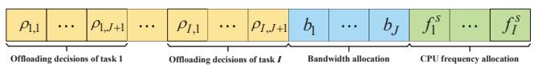

text_image

ρ₁,₁ ... ρ₁,J+1 ... ρ_I,₁ ... ρ_I,J+1 b₁ ... b_J f₁^S ... f_I^S
Offloading decisions of task 1 Offloading decisions of task I Bandwidth allocation CPU frequency allocation

Fig. 2. Illustration of the genetic encoding scheme.

B. Proposed Constrained Multi-Objective Evolutionary Algorithm Framework

TABLE I. CORE PARAMETER SETTINGS IN CMOEA/D-CDP. 

<table><tr><td>Parameter</td><td>Description</td><td>Suggested value</td></tr><tr><td> $\mathbb{V}$ </td><td>Set of weight vectors for decomposition</td><td>Uniformly sampled from a unit hyperplane</td></tr><tr><td> $\mathbb{B}_i$ </td><td>Neighborhood of weight vector  $\omega^i$ </td><td>Tclosest weight vectors to  $\omega^i$  based on the Euclidean distance</td></tr><tr><td>T</td><td>Size of neighborhood</td><td>0.1N</td></tr><tr><td>δ</td><td>Probability of selecting parents from neighborhood</td><td>0.9</td></tr><tr><td> $n_r$ </td><td>Maximum number of solutions updated per offspring</td><td>0.01N</td></tr></table>

As Problem (10) is a challenging CMOP, we design an improved constrained multi-objective evolutionary algorithm building upon the CMOEA/D-CDP framework [32], adapting it specifically for the heterogeneous dispersed computing environment. As shown in Table I, CMOEA/D-CDP employs a set of N uniformly distributed weight vectors V to decompose a multi-objective optimization problem into scalar subproblems, with each weight vector $\omega ^ { i }$ having a neighborhood $\mathbb { B } _ { i }$ of $T$ closest vectors to facilitate the localized search procedure. The CMOEA/D-CDP algorithm uses probability δ to control parent selection, and uses parameter $n _ { r }$ to determine neighbor update frequency. In the CMOEA/D-CDP algorithm, the constraintdomination principle governs the selection process according to the following hierarchical rules:

• A feasible solution always dominates an infeasible solution.   
• Between two feasible solutions, the one with the better fitness value is preferred.   
• Between two infeasible solutions, the one with the smaller overall constraint violation is preferred.

the fitness value of a solution is evaluated using ASF, as formulated in Eq. (15). In addition to the boundary constrains of the decision variables, the Problem (10) consists of seven important constraints. Then we set the overall constraint violation of a solution x equal to the cumulative sum of the individual constraint violations as follows

$$
C V (\mathbf {x}) = \sum_ {j = 1} ^ {7} \max \{0, v _ {j} (\mathbf {x}) \} \tag {11}
$$

where $v _ { j } ( \mathbf { x } )$ represents the violation magnitude of the $j -$ th constraint [33]. Note that constraint $C _ { 8 }$ is not included in this calculation as it defines the domain boundaries of decision variables, which are automatically satisfied through box constraint handling after each genetic operation.

Algorithm 1: The proposed algorithm framework   
1 conve Input: The population size: N,
    the neighborhood size: T,
    the probability of selecting manner for the mating parents: δ,
    the times of updating neighbors: $n_{r}$ the maximal number of iterations: $T_{max}$ .

Output: The final population $P_{t}$ 2 Initialize a set of N evenly distributed weight vectors $V \leftarrow \{\omega^{1}, \omega^{2}, \cdots, \omega^{N}\}$ ;

3 Initialize a population $P_{1}$ with size N;

4 Initialize the ideal point $z^{*}$ by finding the minimum values of each objective function across all solutions in $P_{1}$ ;

5 Initialize $B_{q}$ by finding the T closest vectors to weight vector $\omega^{q}$ , $q = 1, 2, \cdots, N$ ;

6 $\bar{B} \leftarrow \{B_{1}, B_{2}, \cdots, B_{N}\}$ ;

7 $t \leftarrow 1$ ;

8 while $t \leq T_{max}$ do

9 Set MP and AP to be 0;

10 for $q \leftarrow 1$ to N do

11 if $mod(q, 2) = 1$ or $1 - \frac{t}{T_{max}} < rand$ then

12 $MP \leftarrow MP \cup \{q\}$ ;

13 else

14 $AP \leftarrow AP \cup \{q\}$ ;

15 end

16 end

17 $(z^{*}, P_{t}) \leftarrow Algorithm 2 (n_{r}, z^{*}, P_{t}, \bar{B}, MP, AP)$ ;

18 $P_{t+1} \leftarrow P_{t}$ ;

19 $t \leftarrow t + 1$ ;

20 end

21 return $P_{t}$

For addressing the studied CMOP, we present key innovations to the CMOEA/D-CDP framework including two major contributions: a dual-population cooperative mechanism and repairing constraint-handling technique. More specifically, the dual-population cooperative mechanism employs two distinct populations: the main population (MP) and auxiliary population (AP). The main population focuses on intensification, finding high-quality solutions approximating to the Pareto optimal solutions through CDP selection, while the auxiliary population ensures diversity by exploring broader regions of the search space using the ASF. The two populations interact through a structured offspring sharing strategy. When a new solution is generated from a subproblem in one population, it can update solutions in neighboring subproblems across both populations based on their respective selection criteria. The repairing constraint-handling technique is specifically applied to solutions in the main population to enhance their feasibility.

We introduce the main framework of our proposed algorithm, as shown in Algorithm 1. The proposed algorithm begins by initializing a set of N evenly distributed weight vectors $\mathbb { V }  \{ \omega ^ { 1 } , \omega ^ { 2 } , \cdot \cdot \cdot , \omega ^ { N } \}$ (see Line 1), enabling systematic exploration of different trade-offs between the total delay cost and total charge cost objectives. An initial population $\mathbb { P } _ { 1 }$ of size N is created to provide diversity in the starting solution space (see Line 2). Next, the algorithm initializes the ideal point $\mathbf { z } ^ { \ast }$ by identifying the minimum values of each objective function across all solutions in $\mathbb { P } _ { 1 }$ (see Line 3). This ideal point serves as a crucial reference point used to shift the objective space to the first quadrant, ensuring all objective values are positive for proper decomposition calculations, and it continues to be updated whenever better objective values are discovered. The proposed algorithm then constructs neighborhood relationships by initializing $\mathbb { B } _ { q }$ for each $q = 1 , 2 , \ldots , N$ , where each $\mathbb { B } _ { q }$ contains the $T$ closest weight vectors to $\omega ^ { q }$ based on Euclidean distance (see Line 4). These neighborhoods facilitate focused genetic information exchange between similar subproblems, enhancing both convergence speed and solution quality. Finally, these neighborhoods are organized into the structure $\bar { \mathbb { B } }  \{ \mathbb { B } _ { 1 } , \mathbb { B } _ { 2 } , . . . , \mathbb { B } _ { N } \}$ (see Line 5) for efficient access during the evolutionary process.

The main loop continues until the current iteration t reaches the maximum number of iterations $T _ { m a x }$ (see Line 6), which is a predefined termination criterion controlling the evolutionary process duration. Inside the loop, the main population MP and auxiliary population $\mathbb { A P }$ are initialized as empty sets (see Line 7), resetting them at each iteration to build new populations based on the current state. The iteration counter is set to $t \gets 1$ (see Line 8), starting a new generation. For each solution q from 1 to $N$ , the proposed algorithm decides which population to update based on specific conditions (see Lines 9-14). If $q$ has an odd index or a random value rand (uniformly distributed between 0 and 1) exceeds a threshold based on the current iteration progress (see Line 10), the solution $q$ is assigned to the main population MP (see Line 11); otherwise, it is assigned to the auxiliary population $\mathbb { A P }$ (see Line 13). This strategy ensures that odd-indexed solutions consistently contribute to convergence in MP, while evenindexed ones dynamically shift between populations based on evolutionary progress and randomization throughout the optimization process.

After assigning the subproblems to appropriate populations, the dual-population cooperative mechanism is executed with necessary inputs including $n _ { r } , \ \mathbf { z } ^ { * } , \ \mathbb { P } _ { t } ,$ B¯, MP, and $\mathbb { A P }$ (see Line 16). This subroutine handles the core evolutionary operations including mating selection, variation operators, and environmental selection, while updating the ideal point $\mathbf { z } ^ { \ast }$ and evolving the population. The dual-population mechanism enhances both exploration capabilities (through AP) and exploitation efficiency (through MP), improving the overall optimization performance. The evolved population becomes the current population for the next iteration (see Line 17). This process repeats until reaching the maximum iteration count, after which the final population $\mathbb { P } _ { t }$ containing approximated Pareto optimal solutions is returned (see Line 20).

# C. Dual-Population Cooperative Mechanism

Algorithm 2 shows the proposed dual-population cooperative mechanism. More details are given as follows.

The mechanism takes inputs including the number of times to update neighbors $n _ { r } ,$ the ideal point ${ \mathbf z } ^ { \ast }$ , the current population $\mathbb { P } _ { t } .$ , the neighborhood set of all weight vectors ${ \bar { \mathbb { B } } } ,$ the index set of weight vectors in the main population MP, and the index set of weight vectors in the auxiliary population AP, aiming to produce the updated population $\mathbb { P } _ { t } .$ . It starts by iterating over each index $q$ from 1 to N (see Line 1), allowing the proposed algorithm to process each subproblem systematically.

Algorithm 2: Dual-population cooperative mechanism   
Input: The times of updating neighbors: $n_{r}$ ,
the ideal point: $z^{*}$ ,
the current population: $P_{t}$ ,
the neighbor set of all weight vector: $\bar{B}$ ,
the index set of weight vectors in main
population: MP,
the index set of weight vectors in auxiliary
population: AP

Output: The updated population $P_{t}$ 1 for $q \leftarrow 1$ to N do

2 if rand < $\delta$ then

3 $\omega^{r1}, \omega^{r2}, \omega^{r3} \leftarrow$ three randomly selected
weight vectors in $B_{q}$ ;

4 $x^{r1}, x^{r2}, x^{r3} \leftarrow$ three mating individuals from $P_{t}$ , corresponding to $\omega^{r1}, \omega^{r2}, \omega^{r3}$ ;

5 else

6 $x^{r1}, x^{r2}, x^{r3} \leftarrow$ three randomly selected
mating individuals from $P_{t}$ ;

7 end

8 $x^{*} \leftarrow$ a new individual generated using $x^{q}, x^{r1}$ , $x^{r2}, x^{r3}$ according to Eq. (12);

9 Fix $x^{*}$ back to its boundary constraints;

10 $x^{*} \leftarrow$ an adjusted individual generated via
Eqs. (13-14);

11 Fix $x^{*}$ back to its boundary constraints;

12 if $q \in MP$ then

13 $x^{*} \leftarrow Algorithm\ 3(x^{*})$ ;

14 end

15 Update $z^{*}$ with $x^{*}$ ;

16 $\nu \leftarrow 0$ ;

17 while $\nu < n_{r}$ do

18 $\omega' \leftarrow$ a randomly selected weight vector in $B_{q}$ ;

19 $q' \leftarrow$ the index in population $P_{t}$ of the solution
associated with weight vector $\omega'$ ;

20 if $q' \in MP$ then

21 Replace $x^{q'}$ with $x^{*}$ in terms of CDP;

22 else

23 Replace $x^{q'}$ with $x^{*}$ in terms of ASF;

24 end

25 $\nu \leftarrow \nu + 1$ ;

26 end

27 end

28 return $P_{t}$

For each solution $q ,$ if a random value rand is less than $\delta$ (see Line 2), three weight vectors $\omega ^ { r 1 } , \omega ^ { r 2 } , \omega ^ { r 3 }$ , ωr2, ωr3 are randomly selected from $\mathbb { B } _ { q }$ (see Line 3), focusing the search within the neighborhood to exploit local information and improve convergence. Three corresponding mating individuals $\mathbf { x } ^ { r 1 } , \mathbf { x } ^ { r 2 }$ , $\mathbf { x } ^ { r 3 }$ are chosen from $\mathbb { P } _ { t }$ based on these weight vectors (see Line $^ { 4 ) , }$ ensuring that mating parents are relevant to the current subproblem, enhancing local search efficiency. If rand is not less than $\delta$ (see Line 5), three random mating individuals $\mathbf { x } ^ { r 1 }$ , $\mathbf { x } ^ { r 2 } , \mathbf { x } ^ { r 3 }$ are selected from $\mathbb { P } _ { t }$ (see Line 6), promoting global exploration by diversifying the parent selection across the entire population, which is beneficial for maintaining diversity.

$\mathbf { A }$ new individual $\mathbf { x } ^ { * }$ is generated using $\mathbf { x } ^ { q } , \ \mathbf { x } ^ { r 1 } , \ \mathbf { x } ^ { r 2 }$ , and $\mathbf { x } ^ { r 3 }$ according to the differential evolution operator (see Line $8 ) ,$ , defined as:

$$
\mathbf {x} ^ {*} = \mathbf {x} ^ {q} + \mathcal {F} (\mathbf {x} ^ {r 1} - \mathbf {x} ^ {q}) + \mathcal {F} (\mathbf {x} ^ {r 2} - \mathbf {x} ^ {r 3}), \tag {12}
$$

where $\mathcal { F }$ controls the step size for variation, typically set to a value between 0 and 1 [34]. This scaling factor determines the magnitude of the differential vector’s influence, combining differences to create a new solution through differential evolution, enhancing exploration by leveraging differences between individuals. $\mathbf { X } ^ { * }$ is subsequently adjusted to respect boundary constraints (see Line 9), ensuring feasibility by keeping the solution within the problem’s domain. An adjusted individual $\mathbf { X } ^ { * }$ is generated according to the polynomial mutation operator (see Line 10), defined as:

$$
\chi_ {k} ^ {\text { new }} = \left\{ \begin{array}{c c} \chi_ {k} + \sigma_ {k} (U _ {k} - L _ {k}), & \text { if } r a n d <   C R, \\ \chi_ {k}, & \text { otherwise } \end{array} \right. \tag {13}
$$

where $\sigma _ { k }$ is determined by:

$$
\sigma_ {k} = \left\{ \begin{array}{c c} (2 \cdot r a n d) ^ {\frac {1}{\eta + 1}} - 1, & i f \quad r a n d <   0. 5 \\ 1 - (2 - 2 \cdot r a n d) ^ {\frac {1}{\eta + 1}}, & \text { otherwise } \end{array} \right. \tag {14}
$$

where $\chi _ { k } ^ { n e w }$ and $\chi _ { k }$ are the k-th adjusted and original elements of $\mathbf { x } ^ { * } .$ , respectively, $\eta$ is the distribution index that controls the shape of the mutation distribution, CR is a mutation probability parameter in [0,1] determining whether each variable undergoes mutation, and $U _ { k }$ and $L _ { k }$ are the upper and lower bounds of the k-th element. The result $\mathbf { x } ^ { * }$ is subsequently adjusted to respect boundary constraints (see Line 11), ensuring the new solution remains feasible.

If q belongs to MP (see Line 12), $\mathbf { X } ^ { * }$ is repaired using Algorithm 3. This specialized constraint-handling technique ensures feasibility and is critical for the main population’s focus on convergence toward the Pareto optimality. A counter $\nu$ is initialized to zero to track the number of neighbor updates performed (see Line 16). While $\nu < n _ { r }$ (see Line 17), a weight vector $\omega ^ { \prime }$ is randomly selected from $\mathbb { B } _ { q }$ (see Line 18), introducing controlled randomness to explore diverse neighborhood solutions. The index $q ^ { \prime }$ of the solution in $\mathbb { P } _ { t }$ associated with weight vector $\omega ^ { \prime }$ is identified (see Line 19). The proposed algorithm then employs different selection mechanisms based on population membership: if $q ^ { \prime }$ belongs to MP (see Line 20), the corresponding solution in $\mathbb { P } _ { t }$ is updated using $\mathbf { x } ^ { * }$ through CDP (see Line 21), prioritizing feasibility and convergence for the main population; otherwise (see Line 22), the solution is updated using $\mathbf { X } ^ { * }$ through ASF (see Line 23):

$$
A S F \left(\mathbf {x} ^ {*} \mid \boldsymbol {\omega} ^ {q ^ {\prime}}\right) = \max _ {i \in \{1, 2 \}} \left(\frac {G _ {i} \left(\mathbf {x} ^ {*}\right) - z _ {i} ^ {*}}{\omega_ {i} ^ {q ^ {\prime}}}\right) \tag {15}
$$

where $\textbf { z } ^ { * } ~ = ~ ( z _ { 1 } ^ { * } , z _ { 2 } ^ { * } )$ is the ideal point that contains the minimum values found so far for each objective, and $\omega _ { i } ^ { q ^ { \prime } }$ is the i-th component of the weight vector $\omega ^ { q ^ { \prime } }$ associated with the $q ^ { \prime } -$ th subproblem. A lower ASF value indicates a better solution for the given weight vector, thus solution ${ \bf x } ^ { q ^ { \prime } }$ is replaced by $\mathbf { x } ^ { * }$ only if $\mathbf { x } ^ { * }$ yields a smaller ASF value. The counter ν is incremented (see Line 25), and this process repeats up to $n _ { r }$ times to effectively balance local exploitation and global exploration.

The updated population is returned as the result (see Line 28), providing a set of solutions that have been processed through our constraint-handling mechanism. This mechanism guides solutions toward the feasible region, focusing primarily on constraint satisfaction.

# D. Repairing Constraint-Handling Technique

The repairing constraint-handling technique aims to reduce constraint violations and guide infeasible solutions toward the feasible region. We necessitate to address the constraints $( C _ { 1 }$ and $C _ { 2 } )$ and bandwidth and CPU frequency allocation constraints $( C _ { 4 } – C _ { 7 } )$ through direct repair, since the constraints form the foundation of a valid solution. While this technique does not explicitly verify constraint $C _ { 3 }$ regarding reliability requirements (which depends on the specific combination of assigned IoTDs), the random assignment with at least one active IoTD provides a baseline reliability that can be further improved during the evolutionary process. This repair mechanism systematically addresses major structural violations and significantly improves solution quality from a constraint satisfaction perspective, allowing the evolutionary operators to further refine solutions toward full feasibility. The pseudo-code is presented in Algorithm 3.

The proposed repairing constraint-handling technique begins by calculating the overall constraint violation $C V \left( \mathbf { x } ^ { * } \right)$ of solution $\mathbf { x } ^ { * }$ for Problem (10) (see Line 1). If $C V \left( \mathbf { x } ^ { * } \right) > 0 ,$ the technique systematically addresses them by iterating over each task i from 1 to I (see Lines 3-4). For each task, a random value rand determines the repair strategy. If rand $< ~ 0 . 5 .$ , task i is assigned to IoTDs (see Lines 5-6). The offloading decisions $\rho _ { i , 1 } , \rho _ { i , 2 } , . \ldots , \rho _ { i , J }$ are randomly generated with at least one element set to 1, while $\rho _ { i , J + 1 }$ is set to 0 (see Lines 6-7), ensuring the task is assigned to at least one IoTD but not to the edge server. Bandwidth values $b _ { 1 } , b _ { 2 } , \dots , b _ { J }$ are randomly generated within $( 0 , \rho _ { i , j } B ]$ , allocating bandwidth only to IoTDs that receive the task, and computing resource $f _ { i } ^ { s } = 0$ (see Lines 8-9), as the computing resource from the edge server is unnecessary. If rand $\geq 0 . 5$ , task i is allocated to the edge server (see Lines 11-12). The original offloading decisions are preserved in temporary variables, then the current decisions $\rho _ { i , 1 } , \rho _ { i , 2 } , . \ldots , \rho _ { i , J }$ are set to 0, and $\rho _ { i , J + 1 }$ is set to 1 (see Lines 12-14), redirecting the task from IoTDs to the edge server. For bandwidth allocation (see Lines 15-16), the proposed algorithm handles two cases: for IoTDs that previously had no task assignment $( \rho _ { i , j } ^ { \mathrm { T } } ~ = ~ 0 )$ , the original bandwidth value is preserved; for IoTDs that previously had the task assigned $( \rho _ { i , j } ^ { \mathrm { T } } = 1 )$ , bandwidth is uniformly randomly set to either 0 or kept at its original value. This approach ensures bandwidth is properly reallocated when tasks are reassigned. Finally, computing resource $f _ { i } ^ { s }$ is randomly set within (0, F ] (see Line 17), providing necessary processing power on the edge server. The process continues until all tasks are processed, reducing constraint violations. After repairing all tasks, the solution is fixed back to boundary constraints (see Line 20) and returned as the final repaired solution (see Line 22).

Algorithm 3: Repairing constraint-handling technique   
Input: A solution: $x^{*}$ Output: A repaired solution: $x^{*}$ 1 Calculate the overall constraint violation $CV(x^{*})$ of $x^{*}$ on Problem (10);

2 if $CV(x^{*}) > 0$ then

3    for $i \leftarrow 1$ to I do

4    if rand < 0.5 then

5    /* Allocate the i-th task to the IoTDs*/
6 $\rho_{i,1}, \rho_{i,2}, \cdots, \rho_{i,J} \leftarrow J$ randomly generated offloading decisions, where at least one element is set to 1;
7 $\rho_{i,J+1} \leftarrow 0;$ 8 $b_{1}, b_{2}, \cdots, b_{J} \leftarrow J$ randomly generated values in $(0, \rho_{i,j} B]$ ;
9 $f_{i}^{s} \leftarrow 0;$ 10    else

11    /* Allocate the i-th task to the edge server*/
12 $\rho_{i,1}^{T}, \rho_{i,2}^{T}, \cdots, \rho_{i,J}^{T} \leftarrow \rho_{i,1}, \rho_{i,2}, \cdots, \rho_{i,J};$ 13 $\rho_{i,1}, \rho_{i,2}, \cdots, \rho_{i,J} \leftarrow 0, 0, \cdots, 0;$ 14 $\rho_{i,J+1} \leftarrow 1;$ 15 $b_{i,1}^{T}, b_{i,2}^{T}, \cdots, b_{i,J}^{T} \leftarrow b_{1}, b_{2}, \cdots, b_{J};$ 16 $b_{1}, b_{2}, \cdots, b_{J} \leftarrow J$ values where $b_{j}$ is uniformly randomly set to $(1 - \rho_{i,j}^{T}) b_{i,j}^{T}$ or $b_{i,j}^{T};$ 17 $f_{i}^{s} \leftarrow a$ randomly generated values in $(0, F];$ 18    end

19    end

20 Fix $x^{*}$ back to its boundary constraints;

21 end

22 return $x^{*}$

The dual-population cooperative mechanism and repairing constraint-handling technique work together to maintain the convergence, diversity, and feasibility. More specifically, convergence is achieved in Main Population MP through CDP, which prioritizes feasible solutions with superior objective values. Diversity is maintained in the auxiliary population AP through ASF. The repairing constraint-handling technique further enhances diversity through its stochastic process, which prevents convergence to a single feasible pattern and preserves diversity among feasible solutions in MP. By applying the repairing constraint-handling technique to solutions in MP, the algorithm maintains a high proportion of feasible solutions that guide the evolutionary process toward feasible regions.

# E. Complexity Analysis

The computational complexity of the proposed algorithm is determined by several key parameters: m (number of objectives), N (population size), L (genetic length), $n _ { r }$ (times of updating the neighbors), and $T _ { \mathrm { m a x } }$ (maximum generation number). In each generation, the algorithm first partitions the population into main population $\mathbb { M P }$ and auxiliary population $\mathbb { A P }$ in $O ( N )$ time. For each individual $q$ in the population, the evolutionary process involving offspring generation and population updating is performed. During the offspring generation, each offspring requires $O ( m L )$ evaluations for computing objective values and handling constraint violations. During the population updating, each offspring is used to update its neighboring solutions for $n _ { r }$ times according to CDP or ASF, with each update requiring $O ( m )$ comparisons. Aggregating these operations across all N individuals and $T _ { \mathrm { m a x } }$ generations, the overall computational complexity of the proposed algorithm is $O ( m L N n _ { r } T _ { \mathrm { m a x } } )$ .

# VI. NUMERICAL RESULTS

In this section, we present simulation studies to validate the effectiveness of our proposed algorithm for task offloading in dispersed computing. First, we describe the parameter settings in the simulations. Then we analyze the convergence performance of our algorithm and compare it with four baseline algorithms. Finally, we provide insights on the trade-offs between the delay cost and charge cost in different scenarios.

# A. Test Instances and Parameter Settings

Table II presents the common parameter settings shared across all CMOP instances, covering task characteristics, communication parameters, energy consumption factors, and charging policies. To implement our proposed algorithm, we set the genetic operator parameters in Algorithm 1 as follows: the scaling factor $F = 0 . 5$ , the crossover rate $C R = 0 . 1$ , and the distribution index $\eta = 2 1$ . To ensure the statistical significance, we conduct 30 independent runs for each algorithm with a population size $N = 1 0 0$ . The maximum number of iterations is $T _ { \mathrm { m a x } } = 8 0 0$ .

TABLE II. COMMONLY UTILIZED SIMULATION PARAMETERS AMONG THE THREE CMOPS. 

<table><tr><td>Parameter</td><td>Description</td><td>setting</td></tr><tr><td> $D_i$ </td><td>Input data size of task  $i$ </td><td>[500, 1500] kilobytes</td></tr><tr><td> $W_i$ </td><td>Computational workload of task  $i$ </td><td>[1,1.5] Giga CPU cycles</td></tr><tr><td> $R_i$ </td><td>Reliability requirement of task  $i$ </td><td>[0.9955, 0.9999]</td></tr><tr><td> $d_j$ </td><td>Distance between IoTD  $j$  and the base station</td><td>[50,100] m</td></tr><tr><td> $p_j^{RX}$ </td><td>Receive power of IoTD  $j$ </td><td>[1.1,1.3] W</td></tr><tr><td> $p_{BS}^{TX}$ </td><td>Transmit power of the base station</td><td>[1.1,1.3] W</td></tr><tr><td> $\varepsilon_j$ </td><td>Effective capacitance coefficient of IoTD  $j$ </td><td> $[0.5, 1] \times 10^{-27}$ </td></tr><tr><td> $\lambda_j$ </td><td>Charge per Joule of energy of IoTD  $j$ </td><td>[0,1]</td></tr><tr><td> $\mu_i$ </td><td>Charge per CPU frequency assigned by the edge server to task  $i$ </td><td>[5,15]</td></tr><tr><td> $\vartheta$ </td><td>Reference value</td><td> $10^{-3}$ </td></tr></table>

# B. Baseline Algorithms and Performance Metrics

To comprehensively evaluate our proposed algorithm, we conduct comparative analyses against four constrained multiobjective evolutionary algorithms specifically designed for CMOPs: M2M-DW [35], MSCEA [36], tDEA-CPBI [37], and CMOEA/D-CDP [32]. We find that the proposed algorithm outperforms the baseline algorithms in addressing different CMOPs, and successfully seeks feasible solutions to the largescale CMOPs while a part of the baseline algorithms can only tackle the small-scale CMOPs. For simplicity, we perform the comparative study on three CMOP instances with the key parameters: CMOP1 where $I = 4 , J = 5 , B = 1 0$ MHz and $F = 1 0$ GHz, CMOP2 where $I = 4 , J = 7 , B = 1 2$ MHz and $F = 1 2$ GHz, and CMOP3 where $I = 6 , J = 1 4 , B = 1 4$ MHz and $F = 1 4 ~ \mathrm { G H z }$ .

For the performance assessment, we employ two key metrics: inverted generational distance (IGD) [38], [39] and hypervolume (HV) [40], [41]. Our analysis focuses on both the mean values and standard deviations (STD) across 30 independent runs. To compute these metrics, we extract 100 feasible non-dominated solutions from each algorithm’s final population. The IGD metric quantifies the proximity between an algorithm’s approximated Pareto front and the true Pareto front, where the Pareto front represents the boundary formed by Pareto optimal solutions in the objective space. It calculates the average minimum distance from each solution in the true Pareto front to the approximated front, formulated as:

$$
\mathrm{IGD} _ {t} \left(\mathbb {P F} ^ {*}, \mathbb {P F} _ {t}\right) = \frac {\sum_ {\mathbf {x} \in \mathbb {P F} ^ {*}} d \left(\mathbf {x} , \mathbb {P F} _ {t}\right)}{\| \mathbb {P F} ^ {*} \|} \tag {16}
$$

where $\mathbb { P } \mathbb { F } ^ { * }$ represents the true Pareto front, $\mathbb { P } \mathbb { F } _ { t }$ denotes the Pareto front obtained by an algorithm at generation $t ,$ and $d ( \mathbf { x } , \mathbb { P F } _ { t } )$ measures the Euclidean distance between solution x in $\mathbb { P } \mathbb { F } ^ { * }$ and its closest counterpart in $\mathbb { P } \mathbb { F } _ { t } .$ A smaller IGD value indicates superior performance, reflecting better convergence toward the true Pareto front. Since the true Pareto front for our CMOP instances is analytically intractable, we construct a reference Pareto front by aggregating the nondominated solutions obtained from all algorithm runs, then slightly adjusting this front toward the bottom-left region of the objective space to create a challenging reference point for comparative evaluation. The HV metric simultaneously evaluates both convergence and diversity aspects of the obtained solution set. It computes the volume of the objective space dominated by the approximate Pareto front and bounded by a predefined reference point:

$$
\mathrm{HV} _ {t} = \text { volume } \left(\bigcup_ {i = 1} ^ {| \mathbb {P F} _ {t} |} v _ {i}\right) \tag {17}
$$

where $v _ { i }$ represents the hypercube defined by solution $\mathbf { x } _ { i }$ in $\mathbb { P } \mathbb { F } _ { t }$ and the reference point. Larger HV values signify better approximation of the Pareto front, indicating superior convergence and diversity in the obtained non-dominated solution set. For our experimental scenarios, we establish scenariospecific reference points: [300, 300] for CMOP1, [350, 350] for CMOP2, and [500, 500] for CMOP3.

# C. Overall Comparison of the Proposed Algorithm Against Baseline Algorithms

Table III presents the comprehensive comparison results of our proposed algorithm against four baseline algorithms across three CMOPs. The performance evaluation is based on two key metrics, i.e, IGD and HV, with results reported as mean values and standard deviations (STD) over 30 independent runs.

Our proposed algorithm demonstrates consistent superiority across all test instances and metrics. For CMOP1, our algorithm achieves better IGD and HV values compared to the best-performing baseline algorithm M2M-DW, indicating improved convergence and solution distribution. This performance advantage becomes increasingly evident in the subsequent test instances. For CMOP2, our algorithm delivers more significant performance gains in both IGD and HV metrics compared to the best baseline algorithm CMOEA/D-CDP, reflecting enhanced solution quality and diversity. The performance gap widens further in CMOP3, where our algorithm outperforms all baselines in terms of IGD and HV metrics. The above results demonstrate the effectiveness and superiority of the proposed algorithm on all considered test instances.

In addition, we add the comparison results to intuitively show the advantage of the proposed algorithm in finding superior solutions when generating different tradeoff solutions. In the CMOP, we simultaneously minimize the total delay cost and the total charge cost of the tasks. Considering different tradeoffs between the two objectives, we pay attention to three representative solutions, i.e., the delay-oriented solution, charge-oriented solution, and balanced solution. In each algorithm, the three kinds of solutions are selected from the final population of the run achieving the median HV value across 30 independent executions. Particularly, the delay-oriented solution is the one with the lowest total delay cost, the chargeoriented solution is the one with the minimum total charge cost, and the balanced solution is selected as the median when all final solutions are sorted by the total delay cost, representing a compromise between the two objectives.

As shown in Table IV, the proposed algorithm outperforms the baseline algorithms across all three solution types. For the delay-oriented solution, the proposed algorithm achieves a total delay cost of 6.78e+00, which is substantially lower than the CMOEA/D-CDP (5.97e+01), representing an improvement of approximately 88.6%. For the charge-oriented solution, the proposed algorithm obtains a total charge cost of 4.63e+00, significantly outperforming the CMOEA/D-CDP (5.32e+01) by 91.3%. Furthermore, the balanced solution obtained by the proposed algorithm achieves the best performance in both objectives simultaneously, with a total delay cost of 4.81e+01 and a total charge cost of 4.71e+01, outperforming all baseline algorithms. The results demonstrate that the proposed algorithm can generate diverse and superior solutions to reduce the total delay cost and charge cost for the tasks in the heterogeneous dispersed computing environment.

# D. Visualization and Analysis of Algorithm Performance

Figures 3-5 present the non-dominated solutions obtained by our proposed algorithm and four baseline algorithms (M2M-DW, MSCEA, tDEA-CPBI, and CMOEA/D-CDP) at the median run with respect to HV. In these figures, the vertical axis represents objective $G _ { 1 }$ (total delay cost), while the horizontal axis represents objective $G _ { 2 }$ (total charge cost). Lower values in both objectives are preferred, with the ideal solutions located towards the bottom-left corner of each plot.

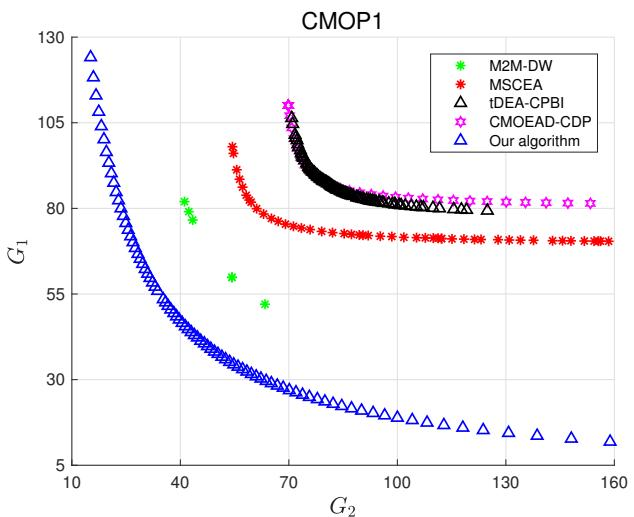

line

| Method          | G2  | G1  |
| --------------- | --- | --- |
| M2M-DW          | 40  | 80  |
| M2M-DW          | 65  | 55  |
| M2M-DW          | 70  | 45  |
| MSCEA           | 65  | 90  |
| MSCEA           | 70  | 80  |
| MSCEA           | 70  | 75  |
| tDEA-CPBI       | 70  | 105 |
| CMOEAD-CDP      | 70  | 105 |
| CMOEAD-CDP      | 130 | 80  |
| CMOEAD-CDP      | 130 | 80  |
| CMOEAD-CDP      | 160 | 80  |
| Our algorithm   | 10  | 125 |
| Our algorithm   | 12  | 105 |
| Our algorithm   | 14  | 85  |
| Our algorithm   | 16  | 6   |

Fig. 3. Obtained non-dominated solutions of CMOP1.

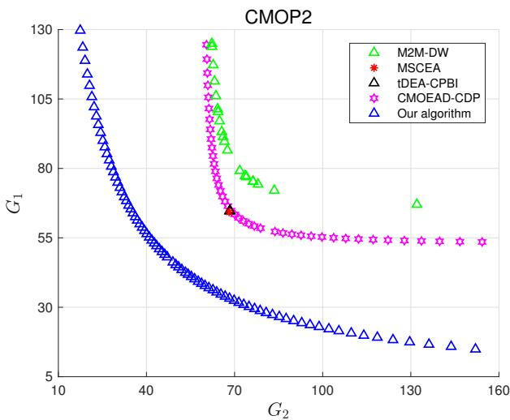

scatter

| Algorithm       | G2  | G1  |
| --------------- | --- | --- |
| M2M-DW          | 70  | 80  |
| MSCEA           | 70  | 65  |
| tDEA-CPBI       | 70  | 65  |
| CMOEAD-CDP      | 70  | 55  |
| Our algorithm   | 10  | 130 |
| Our algorithm   | 40  | 50  |
| Our algorithm   | 70  | 30  |
| Our algorithm   | 100 | 25  |
| Our algorithm   | 130 | 20  |
| Our algorithm   | 160 | 15  |

Fig. 4. Obtained non-dominated solutions of CMOP2.

As shown in Fig. 3, our algorithm (blue triangles) achieves a well-distributed set of non-dominated solutions on the CMOP1 test problem, forming a comprehensive Pareto front approximation that effectively captures better trade-offs between the two objectives, namely total delay cost $( G _ { 1 } )$ and total charge cost $\left( G _ { 2 } \right)$ . Among the baseline algorithms, M2M-DW (green stars) achieves the best convergence performance, however, suffers from severe diversity deficiency with only a few scattered solutions along the Pareto front. Moreover, all solutions obtained by M2M-DW are dominated by the solutions from our algorithm, indicating inferior convergence quality compared to our approach. The remaining algorithms, including MSCEA (red stars), tDEA-CPBI (black triangles), and CMOEAD-CDP (pink stars), all demonstrate convergence to local optima, exhibiting significantly poorer performance in both convergence and diversity compared to our algorithm. The baseline algorithms fail to approximate the true Pareto front and show limited exploration capability in the objective space, while our algorithm successfully maintains both superior convergence to the Pareto optimal front and excellent diversity preservation across the entire feasible region.

TABLE III. COMPARISON RESULTS OF FIVE COMPARED ALGORITHMS. 

<table><tr><td rowspan="2">Algorithm</td><td colspan="2">CMOP1</td><td colspan="2">CMOP2</td><td colspan="2">CMOP3</td></tr><tr><td>IGD</td><td>HV</td><td>IGD</td><td>HV</td><td>IGD</td><td>HV</td></tr><tr><td>M2M-DW</td><td>5.72e+01(7.33e+01)</td><td>6.41e+04(9.51e+03)</td><td>5.92e+01(3.96e+01)</td><td>8.55e+04(1.78e+04)</td><td>1.44e+02(4.09e+01)</td><td>1.26e+05(2.42e+04)</td></tr><tr><td>MSCEA</td><td>5.89e+01(1.53e+01)</td><td>5.57e+04(6.48e+03)</td><td>6.20e+01(6.15e+00)</td><td>7.98e+04(3.40e+03)</td><td>1.18e+02(4.05e+00)</td><td>1.40e+05(2.52e+03)</td></tr><tr><td>tDEA-CPBI</td><td>6.27e+01(1.04e+01)</td><td>5.32e+04(3.77e+03)</td><td>6.19e+01(5.51e+00)</td><td>7.99e+04(2.83e+03)</td><td>1.18e+02(0.00e+00)</td><td>1.40e+05(0.00e+00)</td></tr><tr><td>CMOEA/D-CDP</td><td>7.19e+01(1.67e+01)</td><td>4.95e+04(6.51e+03)</td><td>5.09e+01(1.50e+01)</td><td>8.46e+04(7.10e+03)</td><td>1.00e+02(1.36e+01)</td><td>1.54e+05(8.27e+03)</td></tr><tr><td>Our Algorithm</td><td>9.94e+00(4.57e-01)</td><td>7.99e+04(6.12e+02)</td><td>1.10e+01(6.21e-02)</td><td>1.11e+05(6.58e+02)</td><td>1.92e+01(4.84e+00)</td><td>2.24e+05(5.16e+03)</td></tr></table>

TABLE IV. TOTAL DELAY COST AND TOTAL CHARGE COST OF THREE TYPES OF SOLUTIONS OBTAINED BY FIVE ALGORITHMS ON THE CMOP2. 

<table><tr><td rowspan="2">Algorithm</td><td colspan="2">Delay-oriented solution</td><td colspan="2">Balanced solution</td><td colspan="2">Charge-oriented solution</td></tr><tr><td>Delay</td><td>Charge</td><td>Delay</td><td>Charge</td><td>Delay</td><td>Charge</td></tr><tr><td>M2M-DW</td><td>6.04e+01</td><td>2.18e+02</td><td>6.44e+01</td><td>1.00e+02</td><td>1.61e+02</td><td>6.20e+01</td></tr><tr><td>MSCEA</td><td>6.82e+01</td><td>6.43e+01</td><td>6.82e+01</td><td>6.43e+01</td><td>6.82e+01</td><td>6.43e+01</td></tr><tr><td>tDEA-CPBI</td><td>6.84e+01</td><td>6.47e+01</td><td>6.84e+01</td><td>6.47e+01</td><td>6.84e+01</td><td>6.47e+01</td></tr><tr><td>CMOEA/D-CDP</td><td>5.97e+01</td><td>1.78e+02</td><td>6.68e+01</td><td>6.80e+01</td><td>1.80e+02</td><td>5.32e+01</td></tr><tr><td>Our Algorithm</td><td>6.78e+00</td><td>3.34e+02</td><td>4.81e+01</td><td>4.71e+01</td><td>4.90e+02</td><td>4.63e+00</td></tr></table>

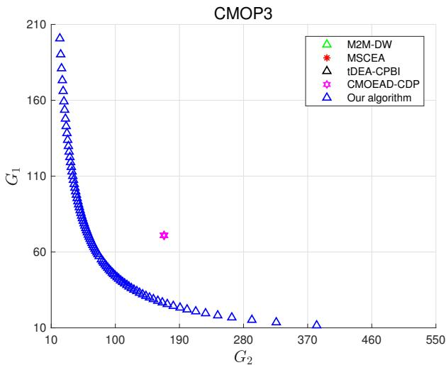

scatter

| Algorithm        | G2   | G1   |
| ---------------- | ---- | ---- |
| M2M-DW           | 10   | 200  |
| M2M-DW           | 11   | 190  |
| M2M-DW           | 12   | 180  |
| M2M-DW           | 13   | 170  |
| M2M-DW           | 14   | 160  |
| M2M-DW           | 15   | 150  |
| M2M-DW           | 16   | 140  |
| M2M-DW           | 17   | 130  |
| M2M-DW           | 18   | 120  |
| M2M-DW           | 19   | 110  |
| M2M-DW           | 20   | 100  |
| MSCEA            | 185  | 65   |
| CMOEAD-CDP       | 185  | 65   |
| Our algorithm    | 10   | 200  |
| Our algorithm    | 11   | 190  |
| Our algorithm    | 12   | 180  |
| Our algorithm    | 13   | 170  |
| Our algorithm    | 14   | 160  |
| Our algorithm    | 15   | 150  |
| Our algorithm    | 16   | 140  |
| Our algorithm    | 17   | 130  |
| Our algorithm    | 18   | 120  |
| Our algorithm    | 19   | 110  |
| Our algorithm    | 20   | 100  |
| Our algorithm    | 280  | 10   |
| Our algorithm    | 370  | 10   |

Fig. 5. Obtained non-dominated solutions of CMOP3.

The performance gap widens significantly in more complex instances, as illustrated in Figs. 4 and 5. For CMOP2, our algorithm maintains a well-distributed Pareto front approximation reaching regions unreachable by any baseline. MSCEA and tDEA-CPBI find only restricted solutions with higher objective values, while M2M-DW and CMOEA/D-CDP achieve limited success in local optima. In CMOP3, our algorithm’s superiority becomes even more pronounced, producing a comprehensive Pareto front spanning the entire trade-off space. Most of the baseline algorithms completely fail to find feasible solutions in the median runs of these challenging instances, which aligns with their declining success rates in Table III. These visualizations provide compelling evidence of our algorithm’s exceptional constraint-handling capability and consistent performance across problems of increasing complexity.

Figure 6 illustrates the convergence behavior of all five algorithms across generations for the three test instances at the median run in terms of HV. The horizontal axis represents the generation number, while the vertical axis shows the corresponding HV value, with higher values indicating better performance. For all three problems, our algorithm (represented by the blue line) demonstrates superior convergence characteristics compared to the baseline algorithms, achieving higher final HV values across all instances.

Several significant observations emerge from these convergence profiles. For CMOP1, our algorithm demonstrates rapid initial convergence, quickly establishing a performance advantage within the early generations. In the more challenging CMOP2, the convergence advantage of our algorithm becomes more substantial, with faster convergence and significantly higher final HV values. For CMOP3, the performance gap widens dramatically; our algorithm maintains steady improvement across generations, reaching considerably higher HV values, while other baseline algorithms either stagnate early or show erratic convergence patterns as seen with MSCEA. This consistent performance across problems of increasing complexity highlights the robustness of our approach. The exceptional results can be attributed to our dual-population cooperative mechanism that effectively balances exploration and exploitation, and our specialized repairing constrainthandling technique that systematically guides the search toward high-quality feasible regions. These innovations enable efficient navigation of complex constrained spaces, allowing our algorithm to significantly outperform baseline approaches that fail to effectively leverage constraint characteristics.

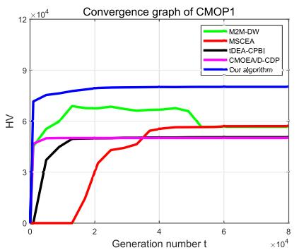

line

| Generation number t | M2M-DW | MSCEA | IDEA-CPBI | CMOEA/D-CDP | Our algorithm |
| ------------------- | ------ | ----- | --------- | ----------- | ------------- |
| 0                   | 0      | 0     | 0         | 0           | 0             |
| 20000               | 6.5    | 3.5   | 5.5       | 5.5         | 8.0           |
| 40000               | 6.5    | 5.5   | 5.5       | 5.5         | 8.0           |
| 60000               | 6.0    | 5.5   | 5.5       | 5.5         | 8.0           |
| 80000               | 6.0    | 5.5   | 5.5       | 5.5         | 8.0           |

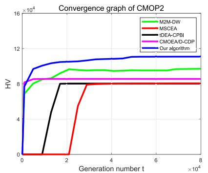

line

| Generation number t | M2M-DW | MSCEA | IDEA-CPBI | CMOEA/D-CDP | Our algorithm |
| ------------------- | ------ | ----- | --------- | ----------- | ------------- |
| 0                   | 8.0    | 0.0   | 0.0       | 8.0         | 8.0           |
| 2                   | 9.0    | 8.0   | 8.0       | 8.5         | 10.0          |
| 4                   | 9.0    | 8.0   | 8.0       | 8.5         | 11.0          |
| 6                   | 9.0    | 8.0   | 8.0       | 8.5         | 11.5          |
| 8                   | 9.0    | 8.0   | 8.0       | 8.5         | 11.5          |

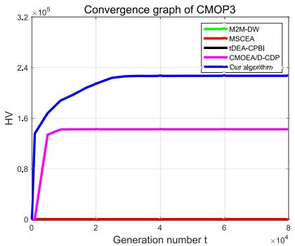

line

| Generation number t (×10⁴) | M2M-DW | MSCEA | IDEA-CPBI | CMOEAD-CDP | Our algorithm |
| -------------------------- | ------ | ----- | --------- | ---------- | ------------- |
| 0                          | 0      | 0     | 0         | 0          | 0             |
| 1                          | 0      | 0     | 0         | 1.5        | 1.6           |
| 2                          | 0      | 0     | 0         | 1.5        | 2.4           |
| 4                          | 0      | 0     | 0         | 1.5        | 2.4           |
| 6                          | 0      | 0     | 0         | 1.5        | 2.4           |
| 8                          | 0      | 0     | 0         | 1.5        | 2.4           |

Fig. 6. Convergence graphs of the five algorithms on the three CMOPs at the median run in terms of HV.

# E. Investigation of the Dual-Population Cooperative Mechanism

We examine the contribution of our dual-population cooperative mechanism to the overall algorithm performance using CMOP2 as the test instance. Table V presents a comparative analysis between our full algorithm (”Yes”) and a variant without the dual-population mechanism (”No”).

TABLE V. PERFORMANCE COMPARISON WITH AND WITHOUT THEDUAL-POPULATION COOPERATIVE MECHANISM.

<table><tr><td></td><td>IGD</td><td>HV</td></tr><tr><td>Yes</td><td>1.10e+01(6.21e-02)</td><td>1.11e+05(6.58e+02)</td></tr><tr><td>No</td><td>4.96e+01(1.35e+01)</td><td>8.55e+04(6.25e+03)</td></tr></table>

The results demonstrate that the dual-population mechanism enhances the algorithm’s optimization capability, reducing the mean IGD by approximately 77.8% and increasing the mean HV by approximately 29.8%. This improvement stems from the mechanism’s effective balance between exploration and exploitation, enabling more thorough search of promising regions in the objective space while maintaining convergence pressure toward the Pareto front.

# F. Investigation of the Proposed Algorithm in Solving Complex CMOPs

To further validate our algorithm’s effectiveness on the larger-scale problems, we designed three additional complex CMOPs, including CMOP 4 where $I = 1 5 , J = 2 0 , B = 2 0$ MHz and F = 20 GHz, CMOP 5 where I = 20, J = 25, B = 25 MHz and F = 25 GHz, and CMOP 6 where $I \ = \ 2 5 , J \ = \ 3 0 , B \ = \ 3 0$ MHz and F = 30 GHz. Our algorithm was executed 30 independent times on each CMOP.

Figures 7-9 illustrate the non-dominated solutions obtained for CMOP4, CMOP5, and CMOP6 at the median run. These visualizations reveal well-distributed and smooth Pareto front approximations across all three complex instances. Even as the problem scale increases from CMOP4 to CMOP6, our algorithm consistently maintains excellent convergence and diversity characteristics. This scalability is particularly important for practical reverse offloading scenarios in collaborative edge computing, where the number of IoTDs and tasks may vary significantly depending on deployment environments.

TABLE VI. PERFORMANCE METRICS ON LARGE-SCALE TEST INSTANCES 

<table><tr><td rowspan="2">Metric</td><td colspan="3">Result</td></tr><tr><td>CMOP4</td><td>CMOP5</td><td>CMOP6</td></tr><tr><td>IGD</td><td>3.69e+01(1.51e+01)</td><td>5.39e+01(2.29e+01)</td><td>8.42e+01(3.63e+01)</td></tr><tr><td>HV</td><td>9.79e+06(1.04e+05)</td><td>1.30e+07(2.33e+05)</td><td>1.66e+07(3.16e+05)</td></tr></table>

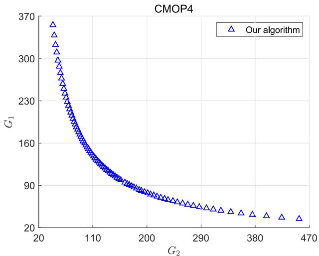

line

| G2   | G1   |
| ---- | ---- |
| 20   | 370  |
| 110  | 160  |
| 200  | 90   |
| 290  | 85   |
| 380  | 80   |
| 470  | 80   |

Fig. 7. Obtained non-dominated solutions of CMOP4.

# VII. FUTURE RESEARCHES

In the future, we will develop a testbed based on the NVIDIA Jetson Nano edge computing platform to validate our scheme. NVIDIA Jetson Nano is selected as the IoTD in dispersed computing and a PC equipping with an Intel Core i7 processor and running the Linux operating system is employed as the edge server. By viewing the log file of each IoTD, we measure the average task success probability according to the execution information of the historical tasks. We adopt the tools such as Linux Traffic Control (tc) to shape the communication links between the IoTDs and edge server. We use the tools such as Linux Control Groups (cgroups) to enable the CPU frequency allocation among different task instances on the edge server. To achieve the centralized decision-making process, the edge server transmits the task execution commands to the IoTDs through the SSH (Secure Shell) protocol. Based on the testbed, we will evaluate the overall performance of our scheme in a comprehensive manner.

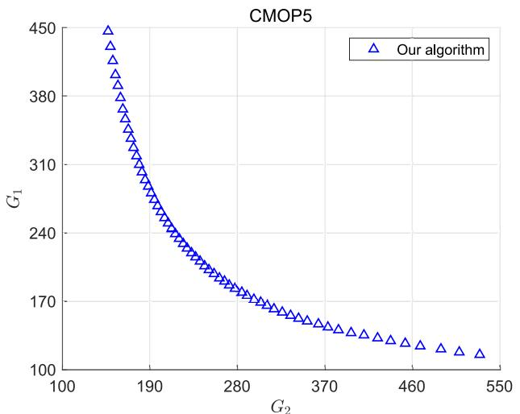

line

| G2   | G1   |
| ---- | ---- |
| 100  | 450  |
| 190  | 310  |
| 280  | 170  |
| 370  | 160  |
| 460  | 130  |
| 550  | 120  |

Fig. 8. Obtained non-dominated solutions of CMOP5.

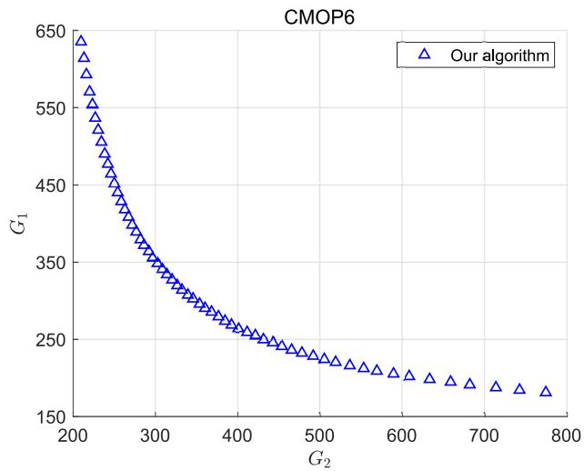

line

| G2   | G1   |
| ---- | ---- |
| 200  | 650  |
| 250  | 550  |
| 300  | 450  |
| 350  | 350  |
| 400  | 250  |
| 450  | 225  |
| 500  | 200  |
| 550  | 175  |
| 600  | 150  |
| 650  | 125  |
| 700  | 100  |
| 750  | 75   |
| 800  | 50   |

Fig. 9. Obtained non-dominated solutions of CMOP6.

Considering the changing network states caused by the device mobility, varied channel conditions and dynamic task arrival, our studied problem can be reformulated as a Dynamic Multi-Objective Optimization Problem (DMOP). To address the DMOP, Dynamic Multi-Objective Evolutionary Algorithms (DMOEAs) will be designed, which consists of two essential components: i) a static evolutionary component that searches for the Pareto-optimal solutions within each time slot, and ii) a dynamic response mechanism that is triggered when environmental changes occur, i.e., when transitioning to the next time slot. The static evolutionary component operates similarly to our algorithm, performing the multi-objective optimization for the current time slot. The dynamic response mechanism leverages the information from the solutions obtained in previous time slots to initialize the population for the current time slot, enabling the population to accelerate the tracking of the time-varying Pareto front and maintain the near-optimal solutions with the change of the network state.

Finally, security and privacy protection deserves further investigation. For example, an adversary can inject the malicious IoTDs to the network. Then they intentionally pretend to collaboratively process a local computation task while each of them does not return the correct output result. The collaborative misbehavior easily increases the task failure probability even though the task redundancy is proposed for reliable task offloading. In addition, a malicious IoTD could launch the jamming attack by continuously injecting the high interference power in the vicinity of a normal IoTD, causing the degradation of signal-to-noise ratio between the normal IoTD and edge server. When receiving the input data of a task, the malicious IoTD can also exploit the AI tools to extract the personal information from the data and further obtain the privacy-sensitive information of the task owner, e.g., identity and location. To address the security and privacy challenges, a wide variety of enabling technologies for secure data transmission and computation, e.g., authentication, encryption, authorization, and anonymization, can be leveraged.

# VIII. CONCLUSION

We have investigated the simultaneous minimization of delay cost and charge cost for reliable task offloading in dispersed computing from a multi-objective optimization viewpoint. We particularly considered the heterogeneous dispersed computing environment with the parallel and serial computations, and the task reliability requirements on the resource-constrained IoTD side. To achieve a delay-aware and economic-aware dispersed computing paradigm, we formulated a CMOP to jointly optimize the task assignment, bandwidth allocation among the IoTDs and CPU frequency allocation of the edge server. To seek high-quality solutions to the CMOP, we developed an improved a constrained multiobjective evolutionary algorithm based on the integration of a dual-population cooperative mechanism and a repairing constraint-handling technique. The proposed algorithm simultaneously considered the exploitation of high-quality feasible solutions and exploration of diverse solution spaces, which was significant to converge to the Pareto optimal solutions while maintaining the diversity. Simulation results demonstrated that the proposed algorithm outperforms the baseline algorithms in seeking the superior Pareto optimal solutions with the better convergence and diversity.

# REFERENCES

[1] M. R. Schurgot, M. Wang, A. E. Conway, L. G. Greenwald, and P. D. Lebling, “A dispersed computing architecture for resource-centric computation and communication,” IEEE Communications Magazine, vol. 57, no. 7, pp. 13–19, 2019.   
[2] Z. Xiao, J. Shu, H. Jiang, G. Min, H. Chen, and Z. Han, “Perception task offloading with collaborative computation for autonomous driving,” IEEE Journal on Selected Areas in Communications, vol. 41, no. 2, pp. 457–473, 2023.

[3] A. Speight, “Which mobile phone brands develop the most faults?.” https://www.which.co.uk/news/article/ which-mobile-phone-brands-develop-the-most-faults-aGAar5y7JEnx, 2025. Accessed: Sept. 18, 2025.   
[4] K. Li, X. Wang, Q. He, J. Wang, J. Li, S. Zhan, G. Lu, and S. Dustdar, “Computation offloading in resource-constrained multi-access edge computing,” IEEE Transactions on Mobile Computing, vol. 23, no. 11, pp. 10665–10677, 2024.   
[5] E. E. Haber, H. A. Alameddine, C. Assi, and S. Sharafeddine, “Uavaided ultra-reliable low-latency computation offloading in future iot networks,” IEEE Transactions on Communications, vol. 69, no. 10, pp. 6838–6851, 2021.   
[6] P.-Q. Huang, S. Zeng, X. Wu, H.-L. Liu, and Q. Zhang, “A multiobjective evolutionary algorithm for network planning in in-building distributed antenna systems,” IEEE Transactions on Network Science and Engineering, vol. 11, no. 3, pp. 3002–3014, 2024.   
[7] J.-H. Cho, Y. Wang, I.-R. Chen, K. S. Chan, and A. Swami, “A survey on modeling and optimizing multi-objective systems,” IEEE Communications Surveys & Tutorials, vol. 19, no. 3, pp. 1867–1901, 2017.   
[8] B.-C. Wang, J.-J. Guo, Z.-Z. Liu, and Y. Wang, “An adaptive constraint violation evaluation framework for constrained multiobjective evolutionary optimization,” IEEE Transactions on Evolutionary Computation, early access, doi:10.1109/TEVC.2025.3569722, 2025.   
[9] J. Liang, X. Ban, K. Yu, B. Qu, K. Qiao, C. Yue, K. Chen, and K. C. Tan, “A survey on evolutionary constrained multiobjective optimization,” IEEE Transactions on Evolutionary Computation, vol. 27, no. 2, pp. 201–221, 2023.   
[10] Y. Hua, Q. Liu, K. Hao, and Y. Jin, “A survey of evolutionary algorithms for multi-objective optimization problems with irregular pareto fronts,” IEEE/CAA Journal of Automatica Sinica, vol. 8, no. 2, pp. 303–318, 2021.   
[11] Z. Niu, H. Liu, X. Lin, and J. Du, “Task scheduling with uav-assisted dispersed computing for disaster scenario,” IEEE Systems Journal, vol. 16, no. 4, pp. 6429–6440, 2022.   
[12] W. Feng, N. Zhang, S. Li, S. Lin, R. Ning, S. Yang, and Y. Gao, “Latency minimization of reverse offloading in vehicular edge computing,” IEEE Transactions on Vehicular Technology, vol. 71, no. 5, pp. 5343–5357, 2022.   
[13] P. Amanatidis, G. Michailidis, D. Karampatzakis, V. Kalenteridis, G. Iosifidis, and T. Lagkas, “Multi-objective reverse offloading in edge computing for ai tasks,” IEEE Open Journal of the Communications Society, vol. 6, pp. 2474–2485, 2025.   
[14] Z. Cai, Z. Chen, Z. Liu, Q. Xie, R. Ma, and H. Guan, “Ridic: Realtime intelligent transportation system with dispersed computing,” IEEE Transactions on Intelligent Transportation Systems, vol. 25, no. 1, pp. 1013–1022, 2024.   
[15] H. Liu, Z. Niu, J. Du, and X. Lin, “Genetic algorithm for delay efficient computation offloading in dispersed computing,” Ad Hoc Networks, vol. 142, p. 103109, 2023.   
[16] X. Huang, B. Zhang, and C. Li, “Incentive mechanisms for mobile edge computing: Present and future directions,” IEEE Network, vol. 36, no. 6, pp. 199–205, 2022.   
[17] F. Zeng, Q. Chen, L. Meng, and J. Wu, “Volunteer assisted collaborative offloading and resource allocation in vehicular edge computing,” IEEE Transactions on Intelligent Transportation Systems, vol. 22, no. 6, pp. 3247–3257, 2021.   
[18] H. Wu, J. Nie, Z. Xiong, Z. Cai, T. Zhou, C. Yuen, and D. Niyato, “A game-based incentive-driven offloading framework for dispersed computing,” IEEE Transactions on Communications, vol. 71, no. 7, pp. 4034–4049, 2023.   
[19] N. Kim, D. Kim, J. Lee, D. Niyato, and J. K. Choi, “Incentive-based coded distributed computing management for latency reduction in iot services—a game theoretic approach,” IEEE Internet of Things Journal, vol. 8, no. 10, pp. 8259–8278, 2021.   
[20] I. Al Ridhawi, M. Aloqaily, and Y. Jararweh, “An incentive-based mechanism for volunteer computing using blockchain,” ACM Transactions on Internet Technology (TOIT), vol. 21, no. 4, pp. 1–22, 2021.   
[21] A. Bozorgchenani, F. Mashhadi, D. Tarchi, and S. A. Salinas Monroy, “Multi-objective computation sharing in energy and delay constrained mobile edge computing environments,” IEEE Transactions on Mobile Computing, vol. 20, no. 10, pp. 2992–3005, 2021.   
[22] L. Li, Q. Qiu, Z. Xiao, Q. Lin, J. Gu, and Z. Ming, “A two-stage hybrid multi-objective optimization evolutionary algorithm for computing offloading in sustainable edge computing,” IEEE Transactions on Consumer Electronics, vol. 70, no. 1, pp. 735–746, 2024.

[23] J. Zhang, B. Gong, M. Waqas, S. Tu, and Z. Han, “A hybrid manyobjective optimization algorithm for task offloading and resource allocation in multi-server mobile edge computing networks,” IEEE Transactions on Services Computing, vol. 16, no. 5, pp. 3101–3114, 2023.   
[24] Y. Gong, K. Bian, F. Hao, Y. Sun, and Y. Wu, “Dependent tasks offloading in mobile edge computing: A multi-objective evolutionary optimization strategy,” Future generation computer systems, vol. 148, pp. 314–325, 2023.   
[25] X. Huang, C. Peng, Y. Wu, J. Kang, W. Zhong, D. I. Kim, and L. Qi, “Joint interdependent task scheduling and energy balancing for multi-uav-enabled aerial edge computing: A multiobjective optimization approach,” IEEE Internet of Things Journal, vol. 10, no. 23, pp. 20368– 20382, 2023.   
[26] G. Sun, Y. Wang, Z. Sun, Q. Wu, J. Kang, D. Niyato, and V. C. M. Leung, “Multi-objective optimization for multi-uav-assisted mobile edge computing,” IEEE Transactions on Mobile Computing, vol. 23, no. 12, pp. 14803–14820, 2024.   
[27] A. A. Al-Bakhrani, M. Li, M. S. Obaidat, and G. A. Amran, “Moalfuav-mec: Adaptive multiobjective optimization for uav-assisted mobile edge computing in dynamic iot environments,” IEEE Internet of Things Journal, vol. 12, no. 12, pp. 20736–20756, 2025.   
[28] Y. Yuan, X. Xu, M. Sun, and P. Zhang, “Terminal cooperative interdependent computing task offloading for 6g,” IEEE Transactions on Network Science and Engineering, vol. 9, no. 4, pp. 2846–2856, 2022.   
[29] X. Dai, Z. Xiao, H. Jiang, M. Lei, G. Min, J. Liu, and S. Dustdar, “Offloading dependent tasks in edge computing with unknown systemside information,” IEEE Transactions on Services Computing, vol. 16, no. 6, pp. 4345–4359, 2023.   
[30] L. Xie, J. Xu, and Y. Zeng, “Common throughput maximization for uavenabled interference channel with wireless powered communications,” IEEE Transactions on Communications, vol. 68, no. 5, pp. 3197–3212, 2020.   
[31] S. Li, B. Lu, L. Ale, H. Chen, F. Tan, and J. Huang, “Two-hop partial task offloading and resource allocation in air–ground integrated mobile edge computing network: A drl-based method,” IEEE Internet of Things Journal, vol. 12, no. 12, pp. 21443–21456, 2025.   
[32] M. A. Jan and R. A. Khanum, “A study of two penalty-parameterless constraint handling techniques in the framework of MOEA/D,” Applied Soft Computing, vol. 13, no. 1, pp. 128–148, 2013.   
[33] C. Peng, S. Yan, C. Zhong, Q. Huang, C. Wu, and H. Huang, “Learning-based temporal sequence of constrained handling selection for constrained multi-objective evolutionary optimization,” IEEE Transactions on Evolutionary Computation, early access, doi: 10.1109/TEVC.2025.3584207, 2025.   
[34] F.-F. Wei, W.-N. Chen, Q. Li, S.-W. Jeon, and J. Zhang, “Distributed and expensive evolutionary constrained optimization with on-demand evaluation,” IEEE Transactions on Evolutionary Computation, vol. 27, no. 3, pp. 671–685, 2023.   
[35] C. Peng, H.-L. Liu, and E. D. Goodman, “A cooperative evolutionary framework based on an improved version of directed weight vectors for constrained multiobjective optimization with deceptive constraints,” IEEE Transactions on Cybernetics, vol. 51, no. 11, pp. 5546–5558, 2021.   
[36] Y. Zhang, Y. Tian, H. Jiang, X. Zhang, and Y. Jin, “Design and analysis of helper-problem-assisted evolutionary algorithm for constrained multiobjective optimization,” Information Sciences, vol. 648, p. 119547, 2023.   
[37] F. Ming, W. Gong, L. Wang, and L. Gao, “A constraint-handling technique for decomposition-based constrained many-objective evolutionary algorithms,” IEEE Transactions on Systems, Man, and Cybernetics: Systems, vol. 53, no. 12, pp. 7783–7793, 2023.   
[38] C. Peng, X. Huang, Y. Wu, and J. Kang, “Constrained multi-objective optimization for UAV-enabled mobile edge computing: Offloading optimization and path planning,” IEEE Wireless Communications Letters, vol. 11, no. 4, pp. 861–865, 2022.   
[39] F.-F. Wei, W.-N. Chen, and J. Zhang, “Aiea: An asynchronous influencebased evolutionary algorithm for expensive many-objective optimization,” IEEE Transactions on Cybernetics, vol. 55, no. 2, pp. 786–799, 2025.   
[40] Z. Fan, W. Li, X. Cai, H. Li, C. Wei, Q. Zhang, K. Deb, and E. Goodman, “Push and pull search for solving constrained multi-objective optimization problems,” Swarm and Evolutionary Computation, vol. 44, pp. 665– 679, 2019.   
[41] L. Chen, H.-L. Liu, K. C. Tan, Y.-M. Cheung, and Y. Wang, “Evolutionary many-objective algorithm using decomposition-based dominance relationship,” IEEE Transactions on Cybernetics, vol. 49, no. 12, pp. 4129–4139, 2019.