# Joint Offloading Decision, User Association, and Resource Allocation in Hierarchical Aerial Computing: Collaboration of UAVs and HAP

Ahmadun Nabi and Sangman Moh , Member, IEEE

Abstract—In recent years, applications are becoming increasingly computation-intensive and delay-sensitive owing to the rapid growth of Internet of Things (IoT) devices among ground users (GUs). Mobile edge computing (MEC) presents crucial computational support, but conventional MEC services often fail in remote areas and in disaster scenarios. This study presents a hierarchical aerial computing platform leveraging uncrewed aerial vehicles (UAVs) and high-altitude platform (HAP) to meet the computation demands and latency requirements of various IoT applications for GUs. We propose a joint offloading decision, user association, and resource allocation (JOUR) scheme, utilizing binary offloading from GUs to UAVs and partial offloading from UAVs to HAP. The proposed scheme minimizes the energy consumption and latency while maximizing the load balancing. A matching game-based algorithm addresses the GUs offloading decision and GUs-UAVs association, followed by an enhanced soft actor-critic (ESAC) algorithm for UAV partial offloading decision, UAV computation resource allocation, and HAP computation resource allocation. Our simulation results demonstrate the effectiveness of the JOUR scheme in reducing the energy consumption and latency, while improving the load balancing and task completion rates. This demonstrates its potential for optimizing the hierarchical aerial computing platforms in dynamic IoT environments.

Index Terms—Aerial computing, mobile edge computing, uncrewed aerial vehicle, high altitude platform, soft actorcritic algorithm, offloading decision, user association, resource allocation.

## I. INTRODUCTION

to the rapid advancement in technology. Furthermore, these applications are becoming increasingly energy sensitive and computationally intensive. Typically, most GUs such as portable smart devices and sensors suffer from limited battery life and inadequate onboard computational capacity [1]. Therefore, locally processing computation-intensive and delay-sensitive tasks is inefficient and significantly reduces the operational lifespan of the GUs. In recent applications, there is a high demand for reduced processing delays and lower energy consumption, necessitating the use of remote computation [2]. Although cloud servers possess substantial computational capacity, their long-distance nature presents significant offloading delays and energy consumption, which fails to satisfy the latency and energy requirements of GUs. Consequently, mobile edge computing (MEC) has emerged as a more practical and effective solution for processing the GU tasks. The proximity of the MEC servers to the GUs reduces the delays and energy consumption during the offloading tasks [3]. However, traditional MEC solutions rely heavily on terrestrial infrastructure, which is often unreliable or non-existent in disaster-stricken or remote areas. In these scenarios, the collapse of MEC systems severely limits computational resources and connectivity, leaving GUs without critical support. To address these limitations, aerial platforms, including high-altitude platforms (HAPs) and uncrewed aerial vehicles (UAVs), can provide crucial edge computing support [4], [5], [6]. UAVs can be quickly deployed to offer low-latency processing, while HAPs ensure broader coverage and higher computational capacity, making them essential in these challenging environments [7].

In newly emerging aerial edge computing (AEC) platforms comprising UAVs and HAPs, the HAP are installed at a fixed altitude of approximately 20 km and can provide support for several months [8]. Thus, HAPs can function as powerful base stations with high computational capacity, supporting both the UAVs and GUs. However, offloading tasks to the HAPs introduces higher transmission delays and energy consumption owing to their longer distance from the GUs [9]. Conversely, UAVs equipped with MEC servers are deployed at low altitudes. Their contiguity to the GUs presents a lower transmission delay and reduced energy consumption. Therefore, the GUs can offload tasks to the UAVs while satisfying their delay and energy constraints. However, the UAVs cannot process all the tasks offloaded by the GUs owing to their limited computational and energy resources. To ensure long-term support, UAVs can offload some of the tasks from the GUs to the HAPs while processing the remaining tasks locally [10]. Thus, UAVs play two crucial roles: providing computational support and acting as relays between the GUs and HAPs, thereby enhancing the sustainability of the AEC platform. AEC is preferred in emergency situations and for temporary deployments (e.g., in mining operations, disaster relief efforts, and large-scale outdoor events) owing to its rapid deployment capability and low operational latency [11], [12], [13]. This growing reliance on the AEC highlights its critical role in supporting the computational requirements of GUs.

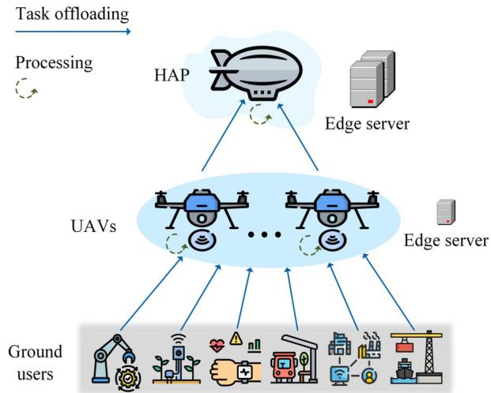  
Fig. 1. User association and task offloading in hierarchical aerial computing framework.

Task offloading and the allocation of computational resources in AEC are crucial for effective edge support [14]. This requires careful consideration of the dynamic environmental factors such as the heterogeneity in task generation, locations of the GUs, and the remaining energy and computation capacity of the UAVs and HAPs. These environmental dynamics necessitate the use of deep reinforcement learning (DRL)-based algorithms.

In this study, we present a hierarchical AEC platform that leverages the collaboration between UAVs and one HAP, as shown in Fig. 1. The GUs generate tasks that can be processed locally or offloaded to UAVs for computational support. Before offloading, the GUs must be associated with a specific UAV among those available. The UAVs must partition tasks between local processing and offloading to HAP owing to the significant computational demand. The UAVs must allocate their computational resources accordingly for locally processed tasks. Similarly, once the HAP receives tasks relayed by UAVs, it must allocate its computational resources to each task. All the tasks have latency requirements that must be met during processing (i.e., both computation and transmission) to ensure their successful completion.

The offloading decisions made by the GUs and UAVs, along with the computational resource allocations by the UAVs and HAP, aim to minimize the task processing energy, delay, and UAV load. The GUs make binary offloading decisions. Conversely, the offloading decision made by UAVs, along with the resource allocation decision by both the UAVs and HAP, are represented as continuous variables. Consequently, the problem encompasses both the continuous and discrete actions.

We introduced a joint offloading decision, user association, and resource allocation (JOUR) scheme to address these challenges. The proposed JOUR scheme has a two-step solution. Firstly, the GUs make offloading decisions based on their onboard computational capacities. Subsequently, the GU-UAV user associations are established. Both processes are accomplished using a matching-game-based algorithm inspired by the Gale-Shapley algorithm [15]. After offloading the tasks from the GUs to the UAVs, we introduce an enhanced soft actor-critic (ESAC) algorithm for the UAVs to make offloading decisions and to allocate computation resources; the algorithm also enables the HAP to allocate their computation resources.

The main contributions of this study are summarized as follows:

Hierarchical aerial computing framework: We proposed a hierarchical aerial computing framework that combines UAVs and one HAP. They collaboratively compute the tasks of the GUs to ensure latency requirements, reduce energy consumption, and minimize the load on the UAVs. Consequently, the operational longevity and efficiency of aerial computing platforms have been significantly enhanced.

\- Joint offloading decision, user association, and resource allocation (JOUR) Scheme: We introduced the JOUR scheme to minimize the energy consumption and latency while balancing the load on the UAVs. This scheme includes both the discrete and continuous decision-making processes, incorporating binary offloading decisions from the GUs to the UAVs, partial offloading decisions from the UAVs to the HAP, and resource allocation for both the UAVs and HAP.

Two-tier algorithm for sequential problem solving: We present a novel two-tier algorithmic approach to address the complexities of discrete and continuous decision-making processes. Initially, a matching game-based GU offloading decision and a GU-UAV association (GOUA) algorithm manage the discrete actions of the GUs. Subsequently, the tasks received by the UAVs from the GUs are processed using the ESAC algorithm, which optimizes the UAV partial offloading decision and resource allocation for both the UAVs and HAP.

Prioritized experience replay (PER) with soft actor-critic: We integrated PER techniques within the soft actorcritic framework to accelerate convergence and to ensure comprehensive exploration. This integration significantly boosts the learning efficiency and performance of the proposed algorithms, ensuring robust and optimal task processing in hierarchical aerial computing environments.

The above contributions collectively presented a robust solution for efficient task processing in hierarchical aerial computing platforms, addressing crucial aspects such as latency, energy consumption, and UAV load balancing.

The rest of the paper is organized as follows. Section II presents a review of the existing research and highlights the main limitations. Section III presents the specifics of the network, task, communication, computation, and energy consumption models. In Section IV, the problem formulation defines the optimization challenges that are addressed. Section V introduces the GOUA and ESAC algorithms that are included in the JOUR scheme to address these challenges. Section VI presents the simulation results and discusses the comparison with baseline methods.

Lastly, the conclusion is supported by the key findings and potential directions for future research.

## II. RELATED WORKS

Extensive research has been conducted on AEC due to the rapid evolution of IoT devices and the increasing demand for computationally intensive and delay-sensitive applications. This section reviews the existing studies conducted in these fields, highlights the key advancements, and identifies the gaps to be addressed by the proposed hierarchical aerial computing framework.

Recently, various approaches have been proposed to enhance the efficiency of AEC systems. In [9], the hierarchical AEC cooperation with UAVs and HAP was analyzed to maximize the total amount of data that is computed. The authors focused on the user association between GUs and UAVs and the binary offloading decisions not only between GUs and UAVs but also between UAVs and HAP, where a heuristic algorithm (HA) was employed. Kang et al. [8] designed a multi-agent proximal policy optimization (MAPPO) algorithm for UAVs to manage task collection, resource allocation to GUs, and task offloading to HAP. This helps in centralizing the action decisions on UAVs while leaving GUs without processing capabilities. In [16], a deep deterministic policy gradient (DDPG)-based algorithm is utilized for user association and task allocation in a multi-UAV scenario, without considering HAP. In [5], UAVs and HAP were considered as AEC platforms. The authors considered a fixed coverage area of UAVs, where the GUs under the coverage area of a particular UAV could be associated with a UAV or HAP. They then partially offloaded part of the task to the associated UAV or HAP and allocated the necessary communication resources. They used a multi-agent deep deterministic policy gradient (MADDPG) algorithm for user association, partial offloading, and communication resource allocation. However, this study did not consider the collaboration between the UAVs and HAP . Furthermore, AECs include UAVs, and HAP provide higher coverage and computational capacity [17], [18].

Guo et al. [19] introduced heterogeneous UAVs and HAP for edge computing by employing an MADDPG algorithm to make offloading decisions and channel allocations. This approach utilized two types of UAVs: one for monitoring, task generation, and local computing, and another more powerful type for MEC support. In this setup, the HAP relays tasks from one UAV cluster to another. Wand et al. [10] implemented long short-term memory and PER with DRL to enhance the convergence speed and stability of task offloading in a collaborative UAV-HAP system .

In [20], the authors considered a more complex hierarchical AEC platform involving HAPs and low Earth orbit (LEO) satellites, where tasks were offloaded from the GUs to HAPs and then to the LEO satellites. In [21], a proximal policy optimization (PPO)-based algorithm was proposed for joint multi-task offloading and resource allocation, where UAVs collect and prioritize tasks, and LEO satellites provide edge computing services. Liu et al. [22] considered UAVs, terrestrial base stations, and satellites for the VEC. The authors considered user association, task offloading, and channel and power allocation to minimize the overall latency. This multi-layered approach aims to improve the overall system performance by leveraging different tiers of computational resources. Satellite-assisted edge computing was explored in [23], where GUs were associated with an LEO satellite. A satellite can offload tasks to another satellite and allocate computational resources to these tasks. They proposed a deep Q-network-based algorithm to optimize the latency, energy consumption, and load balancing. Additionally, [24] explored only the HAP-based GU-HAP user associations and partial offloading decisions using federated learning to minimize the delay and energy consumption.

Several studies have explored UAV-assisted MEC systems integrated with terrestrial-edge servers [25]. In [26], the authors analyzed the MADDPG algorithm to minimize the long-term average task completion delay and economic expenditure by optimizing task offloading and service placement in a UAV-aided MEC system. In [27], the authors proposed a twin-delayed deep deterministic policy gradient algorithm for optimizing the UAV trajectories, task offloading, and communication resource management in UAV-assisted MEC systems to minimize the execution delay and energy consumption. Hu et al. [28] presented a heterogeneous UAV-enabled MEC framework for aerial-ground cooperative networks, jointly optimizing the user association, computational resource allocation, transmission power, offloading time, and UAV trajectories using a two-layered alternative optimization algorithm . In [29], the MAPPO algorithm was employed to address the partial task offloading, communication, and computational resource allocation problem in a multi-UAV-aided MEC system. To ensure sufficient exploration, the SAC-based algorithm was implemented for task offloading and computation resource allocation in a UAV-aided MEC system in [30]. Unlike other DRL-based algorithms, soft actor-critic (SAC) ensures stable learning by incorporating entropy regularization, which encourages exploration and prevents premature convergence to suboptimal policies [31], [32].

Despite these advancements, the existing studies face various limitations. Most studies did not consider joint task offloading (from both GUs and UAVs), user association, and resource allocation (for both UAVs and HAP). Additionally, although many RL-based algorithms promote exploration during training, there is insufficient research on maintaining the exploration after convergence. The proposed hierarchical aerial computing framework addresses these gaps by introducing the JOUR scheme, which incorporates discrete and continuous decision-making processes. This includes binary offloading decisions from the GUs to UAVs, user associations between GUs and UAVs, partial offloading decisions from UAVs to HAP, and resource allocation for both UAVs and HAP.

## III. SYSTEM MODEL

In this section, we comprehensively describe the development of the proposed system model. The following four subsections address the network and task, communication, computation, and energy consumption models for hierarchical aerial computing. Table I lists the key notations used in this study.

TABLE I NOTATIONS USED IN THIS STUDY
<table><tr><td rowspan=1 colspan=1>Notation</td><td rowspan=1 colspan=1>Definition</td></tr><tr><td rowspan=1 colspan=1></td><td rowspan=1 colspan=1>Network and task model</td></tr><tr><td rowspan=1 colspan=1>M</td><td rowspan=1 colspan=1>GU set, m ∈ M</td></tr><tr><td rowspan=1 colspan=1>u</td><td rowspan=1 colspan=1>UAV set, u ∈ U</td></tr><tr><td rowspan=1 colspan=1>T</td><td rowspan=1 colspan=1>Set of time slot, t ∈ T</td></tr><tr><td rowspan=1 colspan=1>τ</td><td rowspan=1 colspan=1>Size of time slot</td></tr><tr><td rowspan=1 colspan=1> $i _ { m , t }$ </td><td rowspan=1 colspan=1>Task information</td></tr><tr><td rowspan=1 colspan=1> $s _ { m , t } , c _ { m , t } ,$ and $l _ { m , t }$ </td><td rowspan=1 colspan=1>Task size, complexity, andlatencyrequirement</td></tr><tr><td rowspan=1 colspan=1></td><td rowspan=1 colspan=1>Communication model</td></tr><tr><td rowspan=1 colspan=1> $\overline { { \mathbb { L } _ { m , u } ^ { L o s } } }$ </td><td rowspan=1 colspan=1>LoS path loss between m and u</td></tr><tr><td rowspan=1 colspan=1> $\mathbb { L } _ { m , u } ^ { N L o s }$ </td><td rowspan=1 colspan=1>Non- LoS path loss between m and u</td></tr><tr><td rowspan=1 colspan=1> $l _ { m , u }$ </td><td rowspan=1 colspan=1>Distance between m and u</td></tr><tr><td rowspan=1 colspan=1> $P _ { m , u } ^ { L o S }$ </td><td rowspan=1 colspan=1>LoS probability between m and u</td></tr><tr><td rowspan=1 colspan=1> $r _ { m , u }$ </td><td rowspan=1 colspan=1>Transmission rate between m and u</td></tr><tr><td rowspan=1 colspan=1> $r _ { u , h }$ </td><td rowspan=1 colspan=1>Transmission rate between u and HAP</td></tr><tr><td rowspan=1 colspan=1> $B _ { m , u }$ </td><td rowspan=1 colspan=1>Bandwidth between the m and u</td></tr><tr><td rowspan=1 colspan=1> $B _ { u , h }$ </td><td rowspan=1 colspan=1>Bandwidth between u and HAP</td></tr><tr><td rowspan=1 colspan=1> $d _ { m , u } ^ { t r }$ </td><td rowspan=1 colspan=1>Transmission delay from m to u</td></tr><tr><td rowspan=1 colspan=1> $d _ { u , h } ^ { m , t r }$ </td><td rowspan=1 colspan=1>Transmission delay from u to HAP</td></tr><tr><td rowspan=1 colspan=1></td><td rowspan=1 colspan=1>Computation model</td></tr><tr><td rowspan=1 colspan=1> $f _ { m }$ </td><td rowspan=1 colspan=1>Computing capacity of m</td></tr><tr><td rowspan=1 colspan=1> $f _ { u }$ </td><td rowspan=1 colspan=1>Computing capacity of u</td></tr><tr><td rowspan=1 colspan=1> $f _ { h }$ </td><td rowspan=1 colspan=1>Computing capacity of h</td></tr><tr><td rowspan=1 colspan=1> $f _ { u } ^ { m }$ and $f _ { h } ^ { m }$ </td><td rowspan=1 colspan=1>Computational resource allocated to thetask of m, by the u and HAP</td></tr><tr><td rowspan=1 colspan=1> $d _ { m } ^ { c }$ </td><td rowspan=1 colspan=1>Computing delay of m</td></tr><tr><td rowspan=1 colspan=1> $d _ { m , u } ^ { c }$ </td><td rowspan=1 colspan=1>Computing delay of u to compute the taskof m</td></tr><tr><td rowspan=1 colspan=1> $d _ { m , h } ^ { c }$ </td><td rowspan=1 colspan=1>Computing delay of h to compute the taskof m</td></tr><tr><td rowspan=1 colspan=1> $\mathcal { L } _ { u }$ </td><td rowspan=1 colspan=1>Load on u</td></tr><tr><td rowspan=1 colspan=1></td><td rowspan=1 colspan=1>Energy consumption model</td></tr><tr><td rowspan=1 colspan=1> $\underline { { e _ { m } ^ { c } } }$ </td><td rowspan=1 colspan=1>Computation energy of m</td></tr><tr><td rowspan=1 colspan=1> $e _ { m , u } ^ { t r }$ </td><td rowspan=1 colspan=1>Transmission energy from m to u</td></tr><tr><td rowspan=1 colspan=1> $e _ { m } ^ { p }$ </td><td rowspan=1 colspan=1>Processing energy of m</td></tr><tr><td rowspan=1 colspan=1> $\underline { { e _ { m , u } ^ { c } } }$ </td><td rowspan=1 colspan=1>Computation energy of u</td></tr><tr><td rowspan=1 colspan=1> $e _ { u , h } ^ { m , t r }$ </td><td rowspan=1 colspan=1>Transmission energy from m to HAP</td></tr><tr><td rowspan=1 colspan=1>p $\underline { { e _ { m , u } ^ { \star } } }$ </td><td rowspan=1 colspan=1>Processing energy of u</td></tr><tr><td rowspan=1 colspan=1> $\underline { { e _ { u } ^ { o } } }$ </td><td rowspan=1 colspan=1>Operation energy of u</td></tr><tr><td rowspan=1 colspan=1> $e _ { u } ^ { t o t a l }$ </td><td rowspan=1 colspan=1>Total energy consumption of u</td></tr><tr><td rowspan=1 colspan=1> $\underline { { e _ { u } ^ { r } } }$ </td><td rowspan=1 colspan=1>Remaining energy of u</td></tr><tr><td rowspan=1 colspan=1> $\underline { { e _ { m , h } ^ { c } } }$ </td><td rowspan=1 colspan=1>Computation energy of HAP</td></tr><tr><td rowspan=1 colspan=1> $\underline { { e _ { h } ^ { o } } }$ </td><td rowspan=1 colspan=1>Operation energy of HAP</td></tr><tr><td rowspan=1 colspan=1> $\underline { e } _ { h } ^ { t o t a l }$ </td><td rowspan=1 colspan=1>Total energy consumption of HAP</td></tr><tr><td rowspan=1 colspan=1> $\underline { e } _ { h } ^ { r }$ </td><td rowspan=1 colspan=1>Remaining energy of HAP</td></tr></table>

## A. Network and Task Model

We designed a hierarchical aerial computing platform to present computational support for various GU applications, such as smart agriculture, smart city management, transportation system management, healthcare, and disaster-response IoT devices, as shown in Fig. 1. This platform includes several UAVs equipped with edge servers and a HAP with a higher computing capacity and a more powerful edge server, along with GUs that generate tasks. Without limiting the generality, we denote the set of GUs as $m \in \mathcal { M } \ = \ \{ 1 , \ldots , \ M \}$ and UAVs as $u \in \mathcal { U } \ = \ \{ 1 , \ . . . , U \}$ . Furthermore, the mission time is = 1divided into several discrete time slots of equal size τ , denoted as $t \in { \mathcal { T } } = \{ 1 , . . . , T \}$ . Each GU generates one task per time slot. At a timeslot, t, GU m generates a task with task information, ${ i _ { m , t } } = ( s _ { m , t } , ~ c _ { m , t } , ~ l _ { m , t } )$ , where $s _ { m , t }$ represents the size =of the task, $c _ { m , t }$ )represents the task complexity (required CPU cycle/process 1 bit), and $l _ { m , t }$ represents the latency sensitivity (delay requirement) of the task.

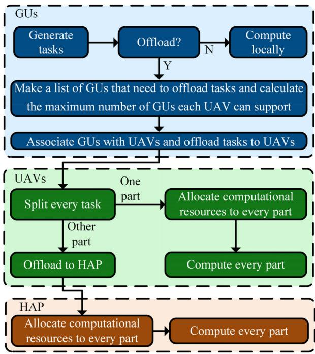  
Fig. 2. System flow diagram.

Fig. 2 represents the framework diagram of our system model. After generating tasks, the GUs either process them locally or offload them to the associated UAV. Based on the number of GUs that need to be associated, the maximum number of GUs that each UAV can support is determined at every time slot. Moreover, each time slot has two phases: user association time $\left( \tau _ { a } \right)$ and processing time $\left( \tau _ { p } \right)$ . The GUs associate with UAVs and make offloading decisions during $\tau _ { a }$ and the UAVs process tasks during $\tau _ { p }$ (splitting tasks for local computing and offloading to the HAP as well as allocating computational resources to the portion of the tasks they compute locally). The HAP then allocates computational resources to the offloaded part of the tasks. The HAP can compute the tasks generated in a time slot, t, during $\tau _ { p } ( t ) + \tau _ { a } ( t + 1 )$ . According to our system model, the ( ) + ( + 1)GUs are not static; however, the UAVs and HAP positions are static.

## B. Communication Model

The GUs cannot offload tasks to the HAP directly owing to their limited battery life [9]. Therefore, we considered the GU-to-UAV and UAV-to-HAP channel models. Orthogonal frequency-division multiplexing was implemented in both the channels to alleviate congestion.

I) GU to UAV (G2U) Channel Model: Owing to foreseeable obstacles, the propagation path between the G2U produces both LoS and non-LoS channel models. Path loss between the GU, $m ,$ and $\mathrm { U A V } , u ,$ for the LoS and non-LoS channels is given by

$$
\begin{array} { r } { \mathbb { L } _ { m , u } ^ { L o s } \left( t \right) = 2 0 \log \left( l _ { m , u } \left( t \right) \right) + 2 0 \log \left( f _ { c } \right) } \\ { + 2 0 l o g \left( 4 \pi / c \right) + \eta _ { L o S } , \qquad } \end{array}\tag{1}
$$

and

$$
\begin{array} { r } { \mathbb { L } _ { m , u } ^ { N L o s } \left( t \right) = 2 0 \log \left( l _ { m , u } \left( t \right) \right) + 2 0 \log \left( f _ { c } \right) } \\ { + 2 0 l o g \left( 4 \pi / c \right) + \eta _ { N L o S } , } \end{array}\tag{2}
$$

respectively, where $f _ { c }$ and c represent the carrier frequency and the speed of light, respectively. $l _ { m , u } ( t )$ denotes the distance between m and u at time slot, $t . \eta _ { \mathrm { L o S } }$ and $\eta _ { \mathrm { N L o S } }$ denote the excessive path loss for the LoS and non-LoS conditions, respectively.

Similar to [25], [33] let $P _ { m , u } ^ { \mathrm { L o S } } ( t )$ represent the LoS probability between GU m and UAV u at timeslot t as follows:

$$
P _ { m , u } ^ { L o S } \left( t \right) = \frac { 1 } { 1 + \sigma e x p ( - \theta \left[ \varphi _ { m , u } \left( t \right) - \sigma \right] } ,\tag{3}
$$

where σ and θ are constants based on the environment and $\varphi _ { \mathrm { m , u } } ( t )$ represents the elevation angle between the GU, m, and UAV, u, at time slot, t. The average path loss between the GU, m, and UAV, u, at time slot, t, is given by

$$
\mathbb { L } _ { m , u } \left( t \right) = P _ { m , u } ^ { L o S } \left( t \right) \mathbb { L } _ { m , u } ^ { L o s } \left( t \right) + \left( 1 - P _ { m , u } ^ { L o S } \left( t \right) \right) \mathbb { L } _ { m , u } ^ { N L o s } \left( t \right)\tag{4}
$$

The available data transmission rate between the GU, m, and UAV, u, at time slot, t, is calculated as

$$
r _ { m , u } \left( t \right) = B _ { m , u } \cdot l o g _ { 2 } \left( 1 + \frac { p _ { m } ^ { t r } } { \mathbb { L } _ { m , u } \left( t \right) N _ { 0 } } \right) ,\tag{5}
$$

where $B _ { m , u } , p _ { m } ^ { t r }$ , and $N _ { 0 }$ represent the bandwidth between the GU, m, and UAV, u, the transmission power of GU, m, and the noise power, respectively. Therefore, the transmission delay in transmitting the tasks from the GU, m, to UAV, u, in time slot, t, is given by

$$
d _ { m , \textit { u } } ^ { t r } ( t ) = \frac { s _ { m , t } a _ { u } ^ { m } \left( t \right) } { r _ { m , u } \left( t \right) } ,\tag{6}
$$

where the binary variable, $a _ { u } ^ { m } ( t )$ , represents whether the task of the GU, m, is processed locally or offloaded to the UAV, u, at time slot, t. If $a _ { u } ^ { m } ( t ) = 0$ , the GU, m, will process the task locally, and if $a _ { u } ^ { m } ( t ) = 1$ , the GU, m, associates with the UAV, u, and offloads the task.

II) UAV to HAP (U2H) Channel Model: There are no obstacles in the aerial platform; therefore, the channel between U2H is LoS. According to Shannon’s theory and [8], [9], the available data transmission rate from the UAV, u, to the HAP is given by

$$
r _ { u , h } = B _ { u , h } \cdot l o g _ { 2 } \left( 1 + \frac { p _ { u } ^ { t r } G _ { u , h } L _ { s } L _ { l } } { k _ { B } T _ { n } B _ { u , h } } \right) ,\tag{7}
$$

where $B _ { u , h }$ denotes the bandwidth between the UAV, u, and HAP, $p _ { u } ^ { t r }$ denotes the transmission power of the UAV, u, $G _ { u , h }$ represents the antenna power gain, $L _ { l }$ denotes the total line loss, $k _ { B }$ denotes the Boltzmann’s constant, $T _ { \mathrm { n } }$ denotes the system noise temperature, and $L _ { s } = ( c / 4 \pi l _ { u , h } f _ { u h } ) ^ { 2 }$ denotes the free space loss, where c represents the speed of light, $l _ { u , h }$ denotes the distance between the UAV, u, and HAP, and $f _ { u h }$ denotes the center frequency. Owing to the long distance between the UAVs and HAPs, the vertical distance is considered to be $l _ { u , h } .$

After collecting the tasks from the GUs, each UAV divides each task into two parts: local computing and offloading to the HAP. Therefore, the transmission delay to transmit the task of GU, m, to the HAP by UAV, u, at timeslot, t, is given by

$$
d _ { u , h } ^ { m , t r } \left( t \right) = \frac { s _ { m , t } a _ { u } ^ { m } \left( t \right) i _ { u } ^ { m , h } \left( t \right) } { r _ { u , h } } ,\tag{8}
$$

where $i _ { u } ^ { m , h } ( t ) \in [ 0 , 1 ]$ indicates the part of the task of GU, m, that is offloaded to the HAP by the UAV, u, at time slot, t.

## C. Computation Model

The GUs compute the task locally or offload it to an associated UAV. The UAVs then compute a part of the task locally and offload the remaining to the HAP for further computation.

I) GU Computation: Each GU makes a binary offloading decision to compute its task. Therefore, the delay in the local computation of the GU, m, at time slot, t, is given by

$$
d _ { m } ^ { c } \left( t \right) = \frac { \left( 1 - a _ { u } ^ { m } \left( t \right) \right) s _ { m , t } c _ { m , t } } { f _ { m } } ,\tag{9}
$$

where $f _ { m }$ represents the computational capacity of the GU, m, which varies across different GUs.

II) UAV Computation: We considered the homogenous UAVs with the same computational capability, $f _ { u }$ . After receiving the tasks from the GUs, each UAV processes a part of the tasks locally, and offloads another part to the HAP. The UAVs allocate their computation resources to each task. Hence, the computation delay of UAV u to compute the task of GU, m, at time slot, t, is given as

$$
d _ { m , ~ u } ^ { c } \left( t \right) = \frac { s _ { m , t } c _ { m , t } a _ { u } ^ { m } \left( t \right) \left( 1 - i _ { u } ^ { m , h } \left( t \right) \right) } { f _ { u } ^ { m } \left( t \right) } ,\tag{10}
$$

where $f _ { u } ^ { m } ( t )$ denotes the computational resource allocated to the GU, m, by the UAV, u, in the timeslot, t.

The load on UAV u at time slot t is calculated as

$$
\mathcal { L } _ { u } \left( t \right) = \frac { \sum _ { m = 1 } ^ { m } { s _ { m , t } c _ { m , t } a _ { u } ^ { m } \left( t \right) \left( 1 - i _ { u } ^ { m , h } \left( t \right) \right) } } { f _ { u } \tau _ { p } } .\tag{11}
$$

III) HAP Computation: The HAP computes the tasks of the GUs, partially offloaded by the UAVs. The HAP allocates computation resources to the tasks of the GUs. Thus, the computation delay of the HAP to compute the task of the GU, $m ,$ at time slot t is represented as

$$
d _ { m , \textit { h } } ^ { c } ( t ) = \frac { s _ { m , t } c _ { m , t } a _ { u } ^ { m } \left( t \right) i _ { u } ^ { m , h } \left( t \right) } { f _ { h } ^ { m } \left( t \right) } ,\tag{12}
$$

where $f _ { h } ^ { m } ( t )$ denotes the computational resource allocated to the GU, m, by the HAP at timeslot, t.

## D. Energy Consumption Model

To process the tasks, the GUs and UAVs consume both computational and transmission energies, whereas the HAP primarily consume computational energy.

I) Energy Consumption of GU: The GUs either compute tasks locally or offload them to the UAVs. Therefore, the GUs consume computational, transmission, and operation energy. The computational energy of the GU, $m ,$ , at time slot, t, is given by

$$
e _ { m } ^ { c } \left( t \right) = \xi _ { m } f _ { m } ^ { 3 } d _ { m } ^ { c } \left( t \right) ,\tag{13}
$$

where $\xi _ { m }$ denotes the effective switching capacitance of the GU, m, which depends on the chip structure.

The transmission energy required to transmit the task of the GU, $m ,$ to the UAV, $u ,$ at time slot, $t ,$ is given by

$$
e _ { m , \textit { u } } ^ { t r } ( t ) = p _ { m } ^ { t r } d _ { m , \textit { u } } ^ { t r } ( t ) ,\tag{14}
$$

where $p _ { m } ^ { t r }$ represents the transmission power of the GU, m.

Therefore, the total processing energy consumption of the GU, $m _ { : }$ , at time slot t, is given by

$$
e _ { m } ^ { p } \left( t \right) = e _ { m } ^ { c } \left( t \right) + e _ { m , u } ^ { t r } \left( t \right) .\tag{15}
$$

II) Energy Consumption of UAV: The UAVs compute a part of the task locally and offload the remaining part to the HAP. Thus, the processing energy for the task generated by GU m at time slot t by UAV $u , e _ { u } ^ { p } ( t )$ is the sum of the local computing energy $e _ { m , u } ^ { c } ( t )$ and transmission energy to the HAP $e _ { u , h } ^ { m , t r } ( t )$ as follows:

$$
\begin{array} { c } { { e _ { m , \textit { u } } ^ { p } ( t ) = e _ { m , \textit { u } } ^ { c } ( t ) + e _ { u , h } ^ { m , \textit { t r } } ( t ) } } \\ { { = \xi _ { u } f _ { u } ^ { m } ( t ) ^ { 3 } d _ { m , \textit { u } } ^ { c } ( t ) + p _ { u } ^ { \mathrm { t r } } d _ { u , h } ^ { m , \textit { t r } } ( t ) , } } \end{array}\tag{16}
$$

where $\xi _ { u }$ represents the effective switching capacitance of UAV $u ,$ and $p _ { u } ^ { t r }$ is the transmission power of UAV u.

$e _ { u } ^ { o } ( t )$ denotes the basic operational energy of the UAV, u, at ( )time slot, t [8], [34]. Hence, the total energy consumption of the UAV, u, at time slot, t, is given by

$$
e _ { u } ^ { t o t a l } \left( t \right) = e _ { u } ^ { o } \left( t \right) + \sum _ { m = 1 } ^ { m } e _ { m , { u } } ^ { p } \left( t \right) .\tag{17}
$$

Therefore, the remaining energy of the UAV, u, after timeslot, t, which indicates that at the beginning of timeslot $t + 1$ , is given by

$$
e _ { u } ^ { r } \left( t + 1 \right) = e _ { u } ^ { r } \left( t \right) - e _ { u } ^ { t o t a l } \left( t \right) .\tag{18}
$$

When $\mathbf { \Psi } = \mathbf { \Psi } 0 , e _ { u } ^ { r } ( t ) = e _ { u } ^ { b }$ , which represents the energy budget of the UAV, u.

III) Energy Consumption of HAP: According to our system model, the processing energy of the HAP comprises only the computing energy. The energy required to compute the task of GU m at time slot, t, is given by

$$
e _ { m , \ h } ^ { p } \left( t \right) = e _ { m , \ h } ^ { c } \left( t \right) = \xi _ { h } f _ { h } ^ { m } ( t ) ^ { 3 } d _ { m , \ h } ^ { c } \left( t \right) ,\tag{19}
$$

where $\xi _ { h }$ represents the effective switching capacitance of the HAP.

The total energy consumption of the HAP at time slot t, $e _ { h } ^ { t o t a l } ( t )$ , is the sum of the computation energy and basic operation energy, $e _ { h } ^ { o } ( t )$ , and is expressed as

$$
e _ { h } ^ { t o t a l } \left( t \right) = e _ { h } ^ { o } \left( t \right) + \sum _ { m = 1 } ^ { m } e _ { m , h } ^ { c } \left( t \right) ,\tag{20}
$$

where the basic operation energy of HAP at time slot $t , e _ { h } ^ { o } ( t )$ is calculated similarly to the basic operation energy of UAVs. Therefore, the remaining energy of the UAV, u, after time slot, t, which represents that at the beginning of time slot $t + 1$ , is given by

$$
e _ { h } ^ { r } \left( t + 1 \right) = e _ { h } ^ { r } \left( t \right) - e _ { h } ^ { t o t a l } \left( t \right) .\tag{21}
$$

When $\mathbf { \Psi } = \mathbf { \Psi } 0 , e _ { h } ^ { r } ( t ) = e _ { h } ^ { b }$ , which represents the energy budget of the HAP.

## IV. PROBLEM FORMULATION

In this study, we aimed to design an efficient aerial computing platform for GUs that minimizes the task-processing energy, delay consumption, and load of the UAVs. Task processing includes computing and offloading tasks. To formulate the optimization function, we calculate the normalized total delay and energy consumption required to process a task.

The required delay (communication and computation) in processing the task of the GU, m, at timeslot, t, is given by

$$
\begin{array} { r } { D _ { m } \left( t \right) = d _ { m } ^ { c } \left( t \right) + m a x \bigg ( \left( d _ { m , \textit { u } } ^ { t r } \left( t \right) + d _ { m , \textit { u } } ^ { c } \left( t \right) \right) , } \\ { \times \left( d _ { m , \textit { u } } ^ { t r } \left( t \right) + d _ { u , \textit { h } } ^ { m , \textit { t r } } \left( t \right) + d _ { m , \textit { h } } ^ { c } \left( t \right) \right) \bigg ) . } \end{array}\tag{22}
$$

The result return delay is not considered due to the smaller size of result and the high transmission power of both UAVs and HAP [8], [9]. The required delay in processing tasks at time slot, t, by the GUs, UAVs, and HAP, is given by

$$
D \left( t \right) = \sum _ { m = 1 } ^ { m } \left( D _ { m } \left( t \right) \right) .\tag{23}
$$

The energy required (communication and computation) to process the tasks of the GUs at time slot, t, by the GUs, UAVs, and HAP, is given by

$$
E \left( t \right) = \sum _ { m = 1 } ^ { m } \left( e _ { m } ^ { c } \left( t \right) + e _ { m , \mathrm { ~ } u } ^ { t r } \left( t \right) + e _ { u } ^ { p } \left( t \right) + e _ { h } ^ { p } \left( t \right) \right) .\tag{24}
$$

We normalized $D ( t )$ and $E ( t )$ as $D _ { n } ( t ) \ = \ D ( t ) / D _ { \mathrm { m a x } } ( t )$ and $E _ { n } ( t ) ~ = ~ E ( t ) / E _ { \operatorname* { m a x } } ( t )$ , respectively, where $D _ { \mathrm { m a x } } ( t )$ ( )and $E _ { \mathrm { m a x } } ( t )$ ( ) = ( ) ( )represent the maximum values of $D ( t )$ and $E ( t )$ at ( ) ( ) ( )timeslot, t, which update dynamically in each timeslot, respectively. Lastly, the optimization problem can be formulated as follows:

$$
\operatorname* { m i n } _ { a , \ i , \ f _ { U } , \ f _ { H } } \sum _ { t \ = \ 1 } ^ { t } \sum _ { u \ = 1 } ^ { u } \omega _ { 1 } D _ { n } \left( t \right) + \omega _ { 2 } E _ { n } \left( t \right) + \omega _ { 3 } \mathcal { L } _ { u } \left( t \right)\tag{25a}
$$

$$
\mathrm { s u b j e c t \ t o : } \ \sum _ { u \ = 1 } ^ { u } a _ { u } ^ { m } \left( t \right) \leq 1 ,\tag{25b}
$$

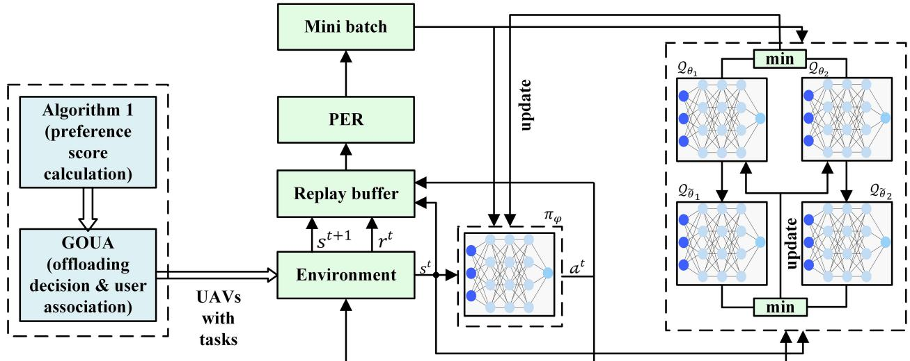  
Fig. 3. Architecture of the proposed JOUR scheme.

$$
\omega _ { 1 } + \omega _ { 2 } + \omega _ { 3 } = 1 ,\tag{25c}
$$

$$
D _ { m } \left( t \right) \leq l _ { m , t } ,\tag{25d}
$$

$$
\sum _ { m \mathop { = } 1 } ^ { m } f _ { u } ^ { m } \left( t \right) \leq f _ { u } ,\tag{25e}
$$

$$
\sum _ { M \mathop { = } 1 } ^ { m } f _ { h } ^ { m } \left( t \right) \leq f _ { h } ,\tag{25f}
$$

$$
e _ { u } ^ { r } \left( t \right) > e _ { u } ^ { m i n } ,\tag{25g}
$$

$$
e _ { h } ^ { r } \left( t \right) > e _ { h } ^ { m i n } ,\tag{25h}
$$

$$
\begin{array} { r } { 0 < \mathcal { L } _ { u } \left( t \right) < 1 , } \end{array}\tag{25i}
$$

where $\pmb { a } = \{ a _ { u } ^ { m } ( t )$ ∀m, ∀u}, $\pmb { i } = \{ i _ { u } ^ { m , h } ( t )$ ∀m, ∀u}, $f _ { U } =$ $\{ f _ { u } ^ { m } ( t ) \forall m , \forall u \}$ ( ), and ${ \pmb f } _ { H } = \{ f _ { h } ^ { m } ( t ) \forall m \}$ represent the GUs ( ) = ( )task offloading decision and GU-UAV association, part of tasks of the GUs offloaded to the HAP by the UAV, u, computation resources allocated to the GUs by UAVs, and computation resources allocated to the GUs by the HAP, respectively.

The formulated problem is subject to several constraints: (25b) ensures that each GU can offload and associate with only one UAV; (25c) limits the parameter weights to maintain system stability; (25d) defines the success conditions for task completion; (25e) and (25f) ensure that the total computation resources allocated do not exceed the capacities of UAVs and HAP, respectively; and (25g) and (25h) impose energy consumption limits for UAVs and HAP. The minimum energy levels $e _ { u } ^ { m i n }$ and $e _ { h } ^ { m i n }$ for UAVs and HAP are determined by the energy required for landing. Finally, constraint (25i) ensures that the UAV load remains within the UAV’s processing capacity. These constraints collectively ensure the efficient operation of the hierarchical aerial computing system, balancing energy consumption, computational capacity, and task completion. The formulated optimization problem is characterized by significant complexity due to its mixed-integer nonlinear programming (MINLP) framework, which integrates discrete offloading decisions from GUs to UAVs with continuous offloading decisions from UAVs to the HAP and resource allocation variables. This nonlinearity arises from constraints involving quadratic energy consumption, transmission delays dependent on distance and power, and the path loss model, introducing additional complexity into the objective and constraint functions. These attributes make the problem computationally intensive and challenging to solve using standard optimization techniques, thus necessitating our proposed JOUR scheme to efficiently solve the complex MINLP.

## V. ALGORITHM DESIGN

In this section, we propose a twofold algorithmic approach called the JOUR scheme to address the joint offloading decisions, user associations, and resource allocation problems in our hierarchical aerial computing platform. Fig. 3 depicts the architecture of the JOUR scheme. The distinct characteristics of the decision variables in our system model, defined by a MINLP framework with both discrete and continuous elements, necessitate the use of two specialized algorithms. We utilized a matching-game-based algorithm to handle binary offloading decisions and user associations between the GUs and UAVs. Subsequently, we employed an ESAC algorithm to optimize the continuous UAVs resource allocation, partial offloading decision from UAVs to HAP, and HAP resource allocation. This sequential application of algorithms ensures the efficient optimization of both the binary and continuous decision variables, leveraging the strengths of the combinatorial optimization and reinforcement learning (RL) techniques to achieve robust and efficient system performance.

## A. GU Offloading and GU-UAV Association Algorithm

The GUs make binary offloading decisions and associate them with the UAVs based on their preferences. We designed a corresponding game-based algorithm to determine the GU offloading decisions and GU-UAV associations. The association is driven by the preferences of both the GUs and UAVs. We developed a preference-calculation algorithm (Algorithm 1) to calculate these preferences. The preferences are represented as dictionaries, where ${ \mathcal { P } } S _ { G U }$ denotes the sorted preferences of the GUs for each UAV based on the UAV scores, and ${ \mathcal { P } } S _ { U A V }$ denotes the sorted preferences of the UAVs for each GU based on the GU scores.

Algorithm 1: Preference Calculation Algorithm for   
GU-UAV Association   
Input: $s _ { m , t } , l _ { m , t } , l _ { m , u } ( t )$ , and $e _ { u } ^ { r } ( t )$   
Output: $\mathcal { P } S _ { U A V } , \mathcal { P } S _ { G U }$   
1: Initialization: ${ \mathcal P } S _ { G U } = \{ \}$ , and $\mathcal { P } S _ { U A V } = \{ \}$   
2: for each GU m do   
3: for each UAV u do   
4: calculate score, $S _ { u } ^ { m } ( t )$ using (26)   
5: add UAV u score, $S _ { u } ^ { m } ( t )$ to ${ \mathcal { P } } S _ { G U } [ m ]$   
6: sort the dictionary $\mathcal { P } S _ { G U } [ m ]$ [ ]based on u score   
7: end for   
8: for each UAV u do   
9: for each GU m do   
10: calculate score $S _ { \mathrm { m } } ^ { u } ( \mathrm { t } )$ using (27)   
11: add GU m score $S _ { \mathrm { m } } ^ { u } ( \mathrm { t } )$ to ${ \mathcal { P S } } _ { U A V } [ u ]$   
12: sort the dictionary ${ \mathcal { P } } S _ { U A V } [ u ]$ [ ]based on m score   
13: end for

The preference score of the UAV, u, for the GU, m, at time slot, t, is calculated as follows:

$$
\begin{array} { r } { S _ { u } ^ { m } \left( t \right) = \gamma _ { 1 } r _ { m , u } ^ { n } \left( t \right) + \gamma _ { 2 } e _ { u } ^ { r n } \left( t \right) , } \end{array}\tag{26}
$$

where $r _ { m , u } ^ { n } ( t )$ denotes the normalized channel rate between the GU, m, and the UAV, $u ,$ at timeslot, $t ,$ and $e _ { u } ^ { r \mathrm { n } } ( t )$ represents the normalized residual energy of the UAV, u, at timeslot, t. The parameters $\gamma _ { 1 }$ and $\gamma _ { 2 }$ represent the weights. The GUs prefer UAVs with higher residual energy and channel capacity to minimize the delay and energy consumption during offloading. Furthermore, the preference score of the GU, m, for the UAV, u, at time slot, t, is calculated as

$$
\mathcal { S } _ { m } ^ { u } \left( t \right) = \beta _ { 1 } r _ { m , u } ^ { n } \left( t \right) + \beta _ { 2 } \left( 1 - s _ { m , t } ^ { n } \right) \left( 1 - c _ { m , t } ^ { n } \right) + \beta _ { 2 } l _ { m , t } ^ { n } ,\tag{27}
$$

where $s _ { m , t } ^ { n } , c _ { m , t } ^ { n }$ , and $l _ { m , t } ^ { n }$ represent the normalized task size, computational complexity, and delay tolerance of the GU, m, at time slot, t, respectively. The UAVs prefer GUs that require fewer computational resources and have higher delay tolerances and data rates, to minimize their own load, energy consumption, and computing delay. The scores were recalculated in each time slot because the positions of the GUs, properties of the tasks, and residual energy levels of the UAVs changed dynamically. Therefore, even if the UAVs remain stationary, changes in GU positions result in updated preference scores for GUs and UAVs, leading to dynamic GU-UAV associations. This ensures that stationary UAVs can continue to effectively support the changing demands of mobile GUs. This recalculation ensures that the algorithm adapts to the current network conditions, thereby providing optimal decisions for offloading and association in real-time.

After determining the preferences, Algorithm 2 describes how the GUs decide to offload the tasks and associate them with the

Algorithm 2: GU Offloading Decision And GU-UAV   
Association (GOUA) Algorithm   
Input: ${ \mathcal { P } } S _ { U A V }$ , and $\overline { { \mathcal { P } \mathcal { S } _ { G U } } }$   
Output: $a _ { u } ^ { m } ( t )$ , and $A _ { m u }$   
( )1: Initialization: $\mathcal { A } _ { m u } = \{ \} , U M _ { m } = \{ \} , U _ { L } M _ { L }$ , and   
$\mathcal { N } = 0$   
=2: while $M _ { L } \mathbf { \Omega } \varnothing$ do   
3: $m = M _ { L } . \mathrm { p o p } ( 0 )$   
4: if $d _ { m } ^ { c } ( t ) < l _ { m , t }$   
5: $a _ { u } ^ { m } ( t ) = 0 / /$ compute locally   
6: else   
7: append m to $U M _ { m }$   
8: end if   
9: end while   
10: calculate $\mathcal { N }$ the ceiling value of the number of   
unmatched GUs divided by the number of UAVs   
11: while $U M _ { m }$  ∅ do   
12: $m = U M _ { m } . \mathrm { p o p } ( 0 )$   
13: get UAV preferences of GU m from ${ \mathcal { P } } S _ { G U }$   
14: for u in UAV preferences do   
15: if no of matched GUs with u is less than $\mathcal { N }$   
16: associate m with u and add to $A _ { m u }$   
17: $a _ { u } ^ { m } ( t ) = 1$   
18: ( )break   
19: else   
20: find the matched GU m with u with least score   
$S _ { m _ { l } } ^ { u } ( \mathrm { t } )$   
21: if $\dot { S } _ { m _ { l } } ^ { u } ( \mathrm { t } ) > S _ { m } ^ { u } ( \mathrm { t } )$   
22: (t)continue   
23: else   
24: replace $m _ { l }$ with m in the association with u in   
$A _ { m u }$   
25: append $m _ { l }$ to $U M _ { m }$   
26: break   
27: end if   
28: end if   
29: end for   
30: end while

UAVs. Initially, the GUs make binary offloading decisions to meet the latency requirements, typically handling less complex tasks. Lines 2–10 of Algorithm 2 represent the offloading decision process for the GUs. During this phase, the GUs that compute locally are not considered for the UAV association. Consequently, a list, $U M _ { m }$ , is created for the GUs that are not matched with any UAV, but need to offload their tasks. The number of GUs that each UAV can support is dynamically determined at each time slot to effectively balance the load.

Based on the sorted UAVs’ preferences of the GUs, ${ \mathcal { P } } S _ { G U }$ and the GUs’ preferences of the UAVs, ${ \mathcal { P } } S _ { U A V }$ , from Algorithm 1, each GU in $U M _ { m }$ must be matched with a UAV based on the mutual preferences. This process involves popping a GU, m, from $U M _ { m }$ and retrieving the sorted UAV preferences for m. If the most preferred UAV, u, can support the GU, m, then m is associated with the UAV, u, and the pair $( m , u )$ is added to $A _ { m u }$ . If the most preferred $\mathrm { U A V } , u ,$ is fully occupied, the GU that is currently associated with the UAV, u, and has the lowest preference score, $m _ { l } ,$ is identified and its preference score is compared with that of GU m. If m has a higher preference score than $m .$ , the GU, m, seeks the next preferred UAV. Conversely, if $m _ { l }$ has a lower preference score than $m .$ , then $m _ { l }$ is replaced by m in the association with $u ,$ the association set, $A _ { m u }$ , is updated, and $m _ { l }$ is appended back to $U M _ { m }$ to identify a new association. This iterative process continues until all the GUs in $U M _ { m }$ are successfully associated with the UAV. The final associations were established based on the dynamic preferences of both the GUs and UAVs.

The complexity analysis of Algorithm 1 (preference calculation algorithm for GU-UAV association) and Algorithm 2 (GOUA) indicate that both the algorithms have a time complexity of $O ( M \cdot U \log U )$ . For Algorithm 1, the initialization is $O ( 1 )$ , the nested loops over the GUs M and UAVs U result in $O ( M \cdot U )$ , and the sorting of preferences for each GU and UAV (adds $O ( M \cdot U$ log $U + U$ · M  M , which is simplified to O M · U U . Algorithm 2 involves making binary offloading decisions and matching GUs with UAVs, with an initial loop over the GUs contributing, a corresponding process involving sorted lists contributing $O ( M )$ , and a corresponding process involving sorted lists contributing $O ( M \cdot U \log U )$ . Thus, both ( log )the algorithms efficiently handle the associations and decisions with a complexity that scales logarithmically with the number of UAVs, resulting in $O ( M \cdot U$ U .

( log )In conclusion, the matching game-based algorithm effectively addresses the binary offloading decisions and GU-UAV associations by dynamically recalculating the preferences based on the real-time network conditions. This ensures that the offloading decisions and associations are optimized to minimize the latency, energy consumption, and load on the UAVs, thereby enhancing the overall performance and efficiency of the hierarchical aerial computing platform.

## B. UAV Offloading Decision, Resource Allocation, and HAP Resource Allocation Algorithm

After completing Algorithm 2 (GOUA), the UAVs receive tasks from their associated GUs and process them. The UAVs are responsible for making partial offloading decisions and allocating the computational resources for each GU task. In particular, the UAVs compute a portion of the tasks locally and offload the remaining portion to the HAP. Subsequently, the HAP allocates its computational resources to process the tasks received from the UAVs.

To optimize this process, we designed an ESAC algorithm that enhances the conventional SAC by utilizing two critic networks, the prioritized experience replay (PER), and dynamic temperature adjustment. This algorithm optimizes the UAV offloading decisions, resource allocation, and HAP resource allocation by formulating the problem as a Markov decision process (MDP).

1) MDP Representation: A centralized server is considered as an agent to make the offloading decisions for the UAVs as well as for the allocation of computational resources for both the UAVs and the HAP. Consistent with previous researches [5], [8], we ignore the delay of the centralized server. Once the RL agent stabilizes, its decision-making adds minimal delay compared to the total task processing delay, making the impact on overall delay negligible. Based on (25a), the partial offloading decisions of the UAVs and the allocation of computational resources for both the UAVs and the HAP are formulated as an MDP defined by the tuples $\langle S , A , R , P _ { t n } \rangle$ as follows:

State: The environment’s state at time slot, $t ,$ is denoted by $s ^ { t } \in S$ , which comprises the task information, $i _ { m , t } =$ $( s _ { m , t } , \ c _ { m , t } , \ l _ { m , t } )$ , computation resource of $\mathrm { U A V } , f _ { u }$ , and HAP, $f _ { h } ,$ , residual energy of the UAV, $e _ { u } ^ { r } ( t )$ , and HAP, $e _ { u } ^ { r } ( t )$ , and the data transmission rate between the UAV and HAP, $r _ { u h }$

Action: The actions, $\mathbb { H } \in A .$ , are continuous action spaces. $\nrightarrow \amalg$ contains $i _ { u } ^ { m , h } ( t ) , f _ { u } ^ { m } ( t )$ , and $f _ { h } ^ { m } ( t )$ , which represents the ( ) ( ) ( )offloading ratio of the task of the GU, m, by the UAV, $u ,$ the computation resource allocated to the task of the GU, m, by the UAV, u, and the computation resource allocated to the task of the GU, m, by the HAP, respectively.

Reward: Based on the formulated problem of (25a), we designed a reward function, $r ^ { t } ( s ^ { t } , - \mathbb { H } ) \in R$ . According to our design, Algorithm 3 is intended for the actions of the UAVs and HAP. Therefore, the reward function excludes the local computing delay and energy of the GUs, $r ^ { t } ( s ^ { t } , - \mathbb { H } ) =$ $\begin{array} { r } { - \sum _ { u = 1 } ^ { u } { \bar { \omega _ { 1 } } } \bar { \omega _ { 2 } } \bar { \partial _ { n } } ( t ) + \omega _ { 2 } E _ { n } ^ { u h } ( \bar { t ) } + \omega _ { 3 } \mathcal { L } _ { u } ( t ) } \end{array}$ (, where $D _ { n } ^ { u h } ( t )$ denotes the normalized delay of computing the tasks of the GUs by the UAVs and HAP calculated from (22). $E _ { n } ^ { u h } ( t )$ denotes the normalized energy of the computing task of the GUs by the UAVs and HAP calculated using (24). Additionally, we multiply the rewards by two in the case of any deviation from the constraints (25c-25i).

Transition probability: $P _ { t n }$ represents the state transition probability and $P _ { t n } ( s ^ { t + 1 } | s ^ { t } , \mathbb { H } )$ represents the probability of moving from state, $s ^ { t + 1 } \ t { 0 \ s } ^ { t }$ , by taking action, $- \bar { | \mathsf { U } | }$

2) Enhanced Soft Actor-Critic (ESAC) Algorithm: In SAC, the expected reward and entropy are included in the objective function for maximization. The expected entropy ensures stability and exploration through random actions. The main aim is to determine an optimal policy, $\pi ^ { * }$ , which maximizes both the expected reward and entropy, and can be expressed as follows:

$$
\pi ^ { * } = a r g \operatorname* { m a x } _ { \pi } \sum _ { t } \mathbb { E } \left[ r ^ { t } \left( s ^ { t } , \mathbb { \breve { \cdot } } \right) + \alpha H \left( \pi \left( \cdot | s ^ { t } \right) \right) \right] ,\tag{28}
$$

where $\mathbb { E } [ \cdot ]$ represents the expectation of a function, $H ( \pi ( \cdot | s ^ { t } ) )$ represents the entropy of policy, π, in state, $s ^ { t }$ , and α represents the temperature parameter that defines the relative significance of the entropy and controls the stochasticity of the policy. The temperature parameter must be dynamic since the policy gradually improves with experience. Therefore, less analysis is required when there is a clear distinction between the poor and optimal actions. The dynamic entropy adjustment in the SAC was first proposed in [35]. This is crucial since it enables the policy to adapt dynamically, ensuring sufficient analysis when the optimal action is uncertain, while becoming more deterministic in the states with clear optimal actions. This dynamic adjustment improved the performance and stability of the learning algorithm. We considered both the dynamic temperature adjustment and sample efficiency while designing the ESAC algorithm.

Algorithm 3 presents the training process for the proposed ESAC algorithm. The ESAC algorithm contains two critic networks, $\mathcal { Q } _ { \theta _ { 1 } }$ and $\mathcal { Q } _ { \theta _ { 2 } }$ , with parameters, $\theta _ { 1 }$ and $\theta _ { 2 } .$ , two target critic network, $\mathcal { Q } _ { \widetilde { \theta } 1 }$ and $\mathcal { Q } _ { \widetilde { \theta } 2 }$ , with parameters, $\ddot { \theta } _ { 1 }$ and ${ \ddot { \theta } } _ { 2 } .$ , actornetwork, $\pi _ { \varphi }$ , with parameter, $\varphi .$ The centralized server gathers the environment state information, $s ^ { t } .$ . Subsequently, an action, $- | \mathsf { L }$ , is selected based on the current policy, $\pi _ { \varphi } . \mathrm { A }$ fter executing the action, the agent receives a reward, $\bar { r ^ { t } } ( s ^ { t } , \dot { - } \vert ^ { \sqcup } )$ , and transits to the next state, $s ^ { t + 1 }$ . The experience tuples $\langle s ^ { t } , \dot { \ l } ^ { \top } , r ^ { t } , s ^ { t + 1 } \rangle$ are stored in the replay buffer (RB).

2) a) Efficient Sample Selection: The conventional SAC randomly selects mini-batch samples from the RB with uniform priority to update the parameters of $\mathcal { Q } _ { \theta }$ and $\pi _ { \varphi }$ . However, the samples can be prioritized based on the TD error. PER was introduced in [36] for deep Q-networks. The PER technique is used to design the ESAC algorithm. The TD error of sample j can be calculated as

$$
\delta ^ { j } = r ^ { t } \left( s ^ { t } , \mathsf { \breve { { \tiny ~ \Lambda } } } ^ { \mathsf { H } } \right) + \gamma \mathcal { Q } _ { \tilde { \theta } } \left( s ^ { t + 1 } , \mathsf { \breve { { \tiny ~ \Lambda } } } ^ { \mathsf { H } + \infty } \right) - \mathcal { Q } _ { \theta } \left( s ^ { t } , \mathsf { \breve { { \tiny ~ \Lambda } } } ^ { \mathsf { H } } \right) .\tag{29}
$$

where $\mathcal { Q } _ { \widetilde { \theta } }$ represents the target Q-network, and $\mathcal { Q } _ { \theta }$ represents the current Q-network. Subsequently, the priority of sample, $j ,$ can be calculated as

$$
p _ { j } = \left| \delta ^ { j } \right| + \varepsilon ,\tag{30}
$$

where $\varepsilon$ denotes a positive constant that ensures non-zero priority. Therefore, the probability of the sampling transition, $j ,$ is defined as

$$
\mathbb { P } \left( j \right) = \frac { p _ { j } ^ { \vartheta } } { \sum _ { j = 0 } ^ { N } p _ { j } ^ { \vartheta } } ,\tag{31}
$$

where $p _ { j }$ represents the priority of the sample, $j , N$ denotes the number of samples in RB, and ϑ represents the necessity of prioritization. PER changes the sample distribution and introduces bias, but ensures diversity by presenting low TD error samples with a chance. To counter this bias, the importance-sampling (IS) weights, wi, adjust the updates for non-uniform sampling probabilities. The IS weight for each transition i is given by

$$
w _ { j } = \left( \frac { 1 } { N } \cdot \frac { 1 } { \mathbb { P } \left( j \right) } \right) ^ { \sigma }\tag{32}
$$

where σ denotes an annealing parameter that gradually increases to 1 over the course of training. For stability, these weights are normalized as $w _ { j } \gets w _ { j } / \operatorname* { m a x } _ { j } w _ { j }$ . This normalization ensures that the weights scale only the updates downwards, preventing excessively large updates.

2) b) ESAC Training: The policy evaluation, policy improvement, and automatic temperature parameter adjustments occur during the ESAC training phase.

To evaluate the soft policy, the soft Q values must first be calculated as follows:

$$
\mathcal { Q } _ { \theta } \left( s ^ { t } , \mathsf { - } ^ { \mathsf { H } } \right) = r ^ { t } \left( s ^ { t } , \mathsf { - } ^ { \mathsf { H } } \right) + \gamma \mathbb { E } _ { s ^ { t + 1 } \sim P _ { t n } } \left[ V _ { \theta } \left( s ^ { t + 1 } \right) \right]\tag{33}
$$

where $\gamma$ denotes the discount factor and $V ( s ^ { t + 1 } )$ denotes the soft-state value function at state, $s ^ { t + 1 }$ , which can be defined as

$$
V \left( s ^ { t } \right) = \mathbb { E } _ { \mathbb { H } \sim \pi } [ \mathcal { Q } _ { \theta } \left( s ^ { t } , \mathbb { H } \right) - \alpha l o g \pi ( \mathbb { H } \vert s ^ { t } ) ] .\tag{34}
$$

The parameter, $\theta ,$ of the policy evaluation network (critic), $\mathcal { Q } _ { \theta }$ , is updated to minimize the loss function, and is represented

Algorithm 3: Enhanced Soft Actor-Critic (ESAC)   
Algorithm For UAV’s Offloading Decision, Resource   
Allocation, And HAP Resource Allocation   
Input: Maximum number of episodes $\Pi _ { e } ,$ maximum   
number of steps in each episode $\Pi _ { s } ,$ environment state   
information $s ^ { t } ,$ reward function $r ^ { t } ( s ^ { t } , - \mathbb { H } )$ , learning rates   
$\lambda _ { \mathcal { Q } } , \lambda _ { \pi } ,$ , and $\lambda _ { \alpha } ,$ discount factor $\gamma ,$ initial temperature   
parameter $\alpha ,$ constant $\varepsilon .$   
output: optimal $\varphi , \theta _ { 1 } , \theta _ { 2 } ,$ , and α   
1: Initialize actor network $\pi _ { \varphi }$ with parameters $\varphi$   
2: Initialize two critic networks $\mathcal { Q } _ { \theta _ { 1 } }$ and $\mathcal { Q } _ { \theta _ { 2 } }$ with   
parameters $\theta _ { 1 }$ and $\theta _ { 2 } .$ , and target critic networks $\mathcal { Q } _ { \tilde { \theta } 1 }$   
and $\mathcal { Q } _ { \widetilde { \theta } 2 }$ with parameters $\tilde { \theta } _ { 1 }  \theta _ { 1 } , \tilde { \theta } _ { 2 }  \theta _ { 2 }$   
3: Initialize replay buffer ${ \mathcal { D } } ,$ mini-batch size k   
4: for $n _ { e } = 1 , 2 , 3 , . . . , \Pi _ { e } \mathbf { d o }$   
5: reset the environment and observe the state $s _ { 0 }$   
6: for $n _ { s } = 1 , 2 , 3 , . . . , \Pi _ { s }$ do   
7: = 1 2 select action $\mathsf { \Pi } \to \pi _ { \varphi } ( s ^ { t } , \mathsf { \Pi } \to \mathsf { I } ^ { \sqcup } )$ based on current   
policy and execute it   
8: obtain a reward $r ^ { t } ( s ^ { t } , - \mathbb { H } )$ and a next state   
$s ^ { t + 1 } \sim P _ { t n } ( s ^ { t + 1 } | \dot { s } ^ { t } , \ – | ^ { \sqcup } )$   
9: store transition tuple $( s ^ { t } , \mathbb { H } ^ { } , ~ r ^ { t } ( s ^ { t } , \mathbb { H } ) , ~ s ^ { t + 1 } )$ in   
the reply buffer $\mathcal { D }$   
10: calculate initial priority for the new transition as   
$\delta ^ { t } = \operatorname* { m a x } ( \delta )$   
11: for $j = 1 , \ldots , k$ do   
12: sample $j$ from $\mathcal { D }$ with probability $\mathbb { p } ( j )$   
13: calculate IS weight $w _ { j }$ by (32)   
14: update priority $p _ { j }$ by (29) and (30)   
16: end for   
17: update critic parameters based on (36)   
$\theta _ { i } \gets \theta _ { i } - \lambda _ { \mathcal { Q } } \nabla _ { \theta _ { i } } J _ { \mathcal { Q } } ( \theta _ { i } ) \mathrm { f o r } i \in \{ 1 , 2 \}$   
18: update actor parameters based on (39)   
$\varphi  \varphi - \lambda _ { \pi } \nabla _ { \varphi } J _ { \pi } ( \varphi )$   
19: update temperature parameter by minimizing (40)   
$\alpha  \alpha - \lambda _ { \alpha } \nabla _ { \alpha } J ( \alpha )$   
20: update target critic network parameters   
$\tilde { \theta } _ { i } \gets \varpi \theta _ { i } + ( 1 - \varpi ) \tilde { \theta } _ { i } \mathrm { f o r } i \in \{ 1 , 2 \}$   
+21: end for   
22: end for

as follows:

$$
\begin{array} { r l } & { J _ { \mathcal { Q } } \left( \theta \right) = \mathbb { E } _ { \left( s ^ { t } , a ^ { t } \right) \sim D } } \\ & { \bigg [ \frac { 1 } { 2 } \big ( \mathcal { Q } _ { \theta } \left( s ^ { t } , a ^ { t } \right) \ - \left( r ^ { t } \left( s ^ { t } , a ^ { t } \right) + \gamma \mathbb { E } _ { s ^ { t + 1 } \sim P _ { t n } } \left[ V _ { \widetilde { \theta } } \left( s ^ { t + 1 } \right) \right] \right) \big ) ^ { 2 } \bigg ] , } \end{array}\tag{35}
$$

where the soft state value function is calculated using (33) with the target parameters, ${ \tilde { \theta } } .$ We use gradient descent with PER minibatch samples to update θ as follows:

$$
\begin{array} { r l } & { \nabla _ { \theta } J _ { \mathcal { Q } } \left( \theta \right) = \nabla _ { \theta } \mathcal { Q } _ { \theta } \left( s ^ { t } , a ^ { t } \right) \left( \mathcal { Q } _ { \theta } \left( s ^ { t } , a ^ { t } \right) - \left( r ^ { t } \left( s ^ { t } , a ^ { t } \right) \right. \right. } \\ & { \qquad \left. \left. + \gamma \left( \mathcal { Q } _ { \tilde { \theta } } \left( s ^ { t + 1 } , a ^ { t + 1 } \right) - l o g \ \left( \pi _ { \varphi } a ^ { t + 1 } | s ^ { t + 1 } \right) \right) \right) \right) . } \end{array}\tag{36}
$$

Subsequently, in the policy improvement stage parameters, $\varphi ,$ of the policy network (actor), $\pi _ { \varphi }$ is updated by minimizing the expected KL-divergence as follows:

$$
J _ { \pi } \left( \varphi \right) = \mathbb { E } _ { ( s ^ { t } , - \mathbb { A } ) \sim D } \left[ \mathbb { E } _ { \prec \cup \sim \pi _ { \varphi } } \left[ \alpha \ l o g \ \pi ( \dashv ^ { \perp } | s ^ { t } ) - \mathcal { Q } _ { \theta } \left( s ^ { t } , \corner ^ { \perp } \right) \right] \right]\tag{37}
$$

The details for obtaining (36) using the KL divergence are provided in [37]. To calculate the gradient descent of (36), must be re-parameterized, which helps in reducing the gradient estimation variance during the optimization of the policy [35]. We begin by selecting a random sample, $\psi _ { t }$ , from a predetermined distribution (e.g., standard normal distribution). Subsequently, we derive $\dashv { }$ as follows:

$$
\begin{array} { r } { \mathbb { I } ^ { \perp } = \mu _ { t } + \psi _ { t } \odot \varepsilon _ { t } , } \end{array}\tag{38}
$$

where $\mu _ { t }$ represents the mean of the policy, $\varepsilon _ { t }$ denotes the standard deviation of policy, $\pi _ { \varphi } ,$ and  denotes the Hadamard product. Subsequently, the gradient update is calculated as follows:

$$
\begin{array} { c c } { { \nabla _ { \varphi } J _ { \pi } \left( \varphi \right) = \nabla _ { \varphi } \alpha \log \pi _ { \varphi } ( a ^ { t } | s ^ { t } ) + \left( \nabla _ { a ^ { t } } \alpha \log \pi _ { \varphi } ( a ^ { t } | s ^ { t } ) \right. } } \\ { { \left. \qquad - \nabla _ { a ^ { t } } \mathcal { Q } \left( s ^ { t } , a ^ { t } \right) \right) \nabla _ { \varphi } a ^ { t } . } } & { { ( 3 } } \end{array}\tag{9}
$$

We use two critic networks, each parameterized by $\theta _ { i } , \textit { i } \in$ $\{ 1 , ~ 2 \}$ , to mitigate the positive bias during the policy improvement, which can degrade the algorithm performance. Furthermore, we independently train the networks to optimize $J _ { \mathcal { Q } } ( \theta _ { i } )$ and use the minimum Q-value in (36) and (39), as introduced in [31]. This clipped double-Q learning approach reduces the overestimation bias, enhances the stability and accuracy of the value function estimates, and improves the overall learning.

Subsequently, the temperature parameter, α, must be adjusted. A larger value of α increases the stochasticity for exploration, while a gradually decreasing temperature encourages more deterministic actions since the policy converges, focusing on exploiting the learned optimal actions. Thus, we adjust α by minimizing the following function

$$
\begin{array} { r } { j \left( \alpha \right) = \mathbb { E } _ { \mathbb H \sim \pi _ { \varphi } } \left[ - \alpha l o g \pi ( \mathbb H | s ^ { t } ) - \alpha \bar { H } \right] , } \end{array}\tag{40}
$$

where $\bar { H }$ denotes for entropy threshold.

Lastly, the target network weights were updated by considering the moving average of the critic network weights. Specifically, the target network parameters $\tilde { \theta } _ { i }$ are updated as

$$
\tilde { { \theta } } _ { i } \gets \varpi { \theta } _ { i } + ( 1 - \varpi ) \tilde { { \theta } } _ { i } ,\tag{41}
$$

where $\varpi$ denotes a parameter that controls the update rate. This method of updating the target network weights helps in stabilizing the training process by smoothing out changes in the network parameters.

The complexity analysis of Algorithm 3 (ESAC for UAV’s offloading decision, resource allocation, and HAP resource allocation) indicates a time complexity of $O ( \Pi _ { e } \cdot \Pi _ { s } )$ . The algorithm includes initializing the networks and parameters, $O ( 1 )$ , selecting and executing actions, O , storing transitions, O , calculating priorities, $O ( 1 )$ , sampling mini-batches from the reply buffer, O k , calculating importance sampling weights, $O ( k )$ , and updating the critic and actor parameters using the gradient descent O . Combining these complexities, the complexity for one step is $O ( k )$ , and that for one episode is $O ( \Pi _ { s } \cdot k )$ . Given $\Pi _ { e }$ ( )episodes, the total complexity is given by $O ( \boldsymbol { \Pi _ { e } } \cdot \boldsymbol { \Pi _ { s } } \cdot \boldsymbol { k } )$ Π. Since, k is typically a constant, the overall complexity can be simplified to $O ( \Pi _ { e } \cdot \Pi _ { s } )$

## VI. PERFORMANCE EVALUATION

In this section, we present extensive simulation results under different settings to evaluate the effectiveness of the proposed JOUR (GOUA ESAC) scheme. Initially, we implemented the GOUA algorithm to make the offloading decisions for the GUs and GU-UAV associations. This algorithm enables UAVs to receive tasks from the GUs. Subsequently, the tasks are further processed by the UAVs and HAPs. We developed an ESAC algorithm specifically for the UAVs and HAPs to handle this process. To evaluate the performances of the proposed algorithms, we compared them with three state-of-the-art DRL algorithms and an HA suitable for a continuous action space. Before executing all the algorithms, the UAV receives tasks from the GUs using the same GOUA algorithm.

GOUA SAC: SAC [35] is a DRL algorithm that optimizes +both the policy and value functions using entropy regularization and encourages exploration by maintaining a balance between exploitation and exploration.

GOUA PPO: PPO [38] is an advanced policy-gradient +method that ensures stable and reliable updates by clipping the probability ratios. This stabilization helps in handling continuous actions, ensuring that policies remain within a trusted region, thereby improving the performance.

\- GOUA DDPG: DDPG [39] is an actor-critic algorithm +designed for environments with continuous action spaces. It leverages deterministic policies and off-policy training, making it efficient at learning optimal policies.

GOUA HA: HA [40] is a rule-based approach commonly used for quick and efficient decision-making by following a set of predefined rules. It is particularly effective in scenarios with limited computational resources, offering a straightforward solution for task offloading and resource allocation. The HA we employ follows a similar approach to the one outlined in [9].

## A. Simulation Setting

Our simulation scenario is defined as follows. One HAP is placed at an altitude of 20 km at the center and four rotary-wing UAVs are placed at an altitude of 2 km, evenly distributed across a coverage area of 10 km × 10 km, with the GUs randomly dispersed within this area, as shown in Fig. 4. The GUs lie within the coverage of the UAVs and can be associated with a single UAV, whereas the UAVs lie within the coverage of the HAP. The locations of the GUs are updated at each time interval. We assume that one GU generates one task in each timeslot. The task size, $s _ { m , t } ,$ is randomly generated within the range [1], [8] Mbit, the task complexity, $c _ { m , t } ,$ , is randomly generated within the range [600, 750] cycles/bit, and the maximum tolerable latency, $l _ { m , t } ,$ , is randomly generated within the range [1], [7] s. The computational capacity of the Gus, $f _ { m } .$ , was a heterogeneous set that randomly lies within the range of [0.5, 0.75] GHz. We considered homogenous UAVs with a computation capacity, $f _ { u } ,$ of 10 GHz and a HAP with a computation capacity, $f _ { h } ,$ , of 50 GHz. The weights in the optimization objective (25a) are set to 3.33 for each term, ensuring equal importance across all objectives. To provide more robust statistical insights, 90% confidence intervals are considered in our simulation results. Table II provides the other simulation parameters, based on prior works [8], [9], [25].

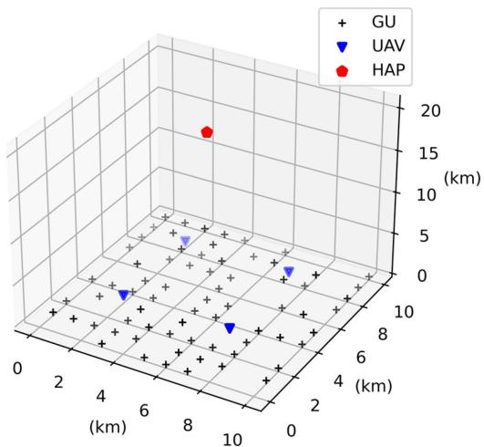  
Fig. 4. Coverage of UAVs and a HAP for GUs.

TABLE II SIMULATION PARAMETERS
<table><tr><td rowspan=1 colspan=1>Parameter</td><td rowspan=1 colspan=1>Value</td><td rowspan=1 colspan=1>Parameter</td><td rowspan=1 colspan=1>Value</td></tr><tr><td rowspan=1 colspan=1> $p _ { m } ^ { t r }$ </td><td rowspan=1 colspan=1>0.5 W</td><td rowspan=1 colspan=1> $s _ { m , t }$ </td><td rowspan=1 colspan=1>[1, 8] Mbit</td></tr><tr><td rowspan=1 colspan=1> $p _ { u } ^ { t r }$ </td><td rowspan=1 colspan=1>10 W</td><td rowspan=1 colspan=1> $c _ { m , t }$ </td><td rowspan=1 colspan=1>[600,750]cycles/bit</td></tr><tr><td rowspan=1 colspan=1> $\underline { { \eta _ { L o S } } }$ </td><td rowspan=1 colspan=1>0.1</td><td rowspan=1 colspan=1> $l _ { m , t }$ </td><td rowspan=1 colspan=1>[1, 7] s</td></tr><tr><td rowspan=1 colspan=1> $\eta _ { N L o S }$ </td><td rowspan=1 colspan=1>21</td><td rowspan=1 colspan=1> $f _ { m }$ </td><td rowspan=1 colspan=1>[0.5, 0.75]GHz</td></tr><tr><td rowspan=1 colspan=1> $B _ { m , u }$ </td><td rowspan=1 colspan=1>10MHz</td><td rowspan=1 colspan=1> $f _ { u }$ </td><td rowspan=1 colspan=1>10 GHz</td></tr><tr><td rowspan=1 colspan=1> $B _ { u , h }$ </td><td rowspan=1 colspan=1>20MHz</td><td rowspan=1 colspan=1> $f _ { h }$ </td><td rowspan=1 colspan=1>50 GHz</td></tr><tr><td rowspan=1 colspan=1> $\underline { { G _ { u h } } }$ </td><td rowspan=1 colspan=1>15 dB</td><td rowspan=1 colspan=1> $\xi _ { m }$ </td><td rowspan=1 colspan=1> $1 \times 1 0 ^ { - 2 7 }$ </td></tr><tr><td rowspan=1 colspan=1> $T _ { n }$ </td><td rowspan=1 colspan=1>1000 K</td><td rowspan=1 colspan=1> $\underline { { \xi _ { u } } } , \xi _ { h }$ </td><td rowspan=1 colspan=1> $1 \times 1 0 ^ { - 2 8 }$ </td></tr><tr><td rowspan=1 colspan=1> $\Pi _ { e }$ </td><td rowspan=1 colspan=1>1500</td><td rowspan=1 colspan=1> $\Pi _ { s }$ </td><td rowspan=1 colspan=1> $3 \times 1 0 ^ { 3 }$ </td></tr><tr><td rowspan=1 colspan=1>RB size</td><td rowspan=1 colspan=1> $4 \times 1 0 ^ { 4 }$ </td><td rowspan=1 colspan=1> $\gamma$ </td><td rowspan=1 colspan=1>0.99</td></tr><tr><td rowspan=1 colspan=1>Minibatchsize</td><td rowspan=1 colspan=1>256</td><td rowspan=1 colspan=1> $\lambda _ { Q }$ </td><td rowspan=1 colspan=1>Cosineannealing $3 \times 1 0 ^ { - \hat { 4 } }$  $\to 1 0 ^ { - 5 }$ </td></tr><tr><td rowspan=1 colspan=1> $\lambda _ { \pi }$ </td><td rowspan=1 colspan=1>Cosineannealing $3 \times 1 0 ^ { - \hat { 4 } }$  $\to 1 0 ^ { - 5 }$ </td><td rowspan=1 colspan=1> $\lambda _ { \alpha }$ </td><td rowspan=1 colspan=1>Cosineannealing $3 \times 1 0 ^ { - \hat { 4 } }$  $\to 1 0 ^ { - 5 }$ </td></tr></table>

## B. Convergence

To evaluate the convergence behavior of the proposed ESAC algorithm, we compared the learning curves of our algorithm with those of the three RL-based baseline algorithms: SAC,

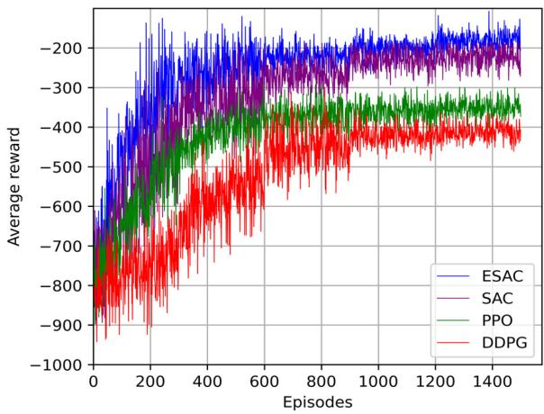  
Fig. 5. Convergence of ESAC and three RL-based baseline algorithms.

PPO, and DDPG, as shown in Fig. 5. The algorithms were trained for 1500 episodes using the default settings. The graph depicts the evolution of the average reward over the training episodes for each algorithm. It can be clearly observed that the ESAC algorithm achieved faster convergence and higher average rewards than the baseline algorithms. Specifically, the ESAC algorithm stabilizes at around 450 episodes and consistently outperforms the others, reaching an average reward of approximately −250. Conversely, the SAC and PPO converged more slowly, stabilizing at approximately 600 episodes with average rewards of approximately −270 and −350, respectively. The DDPG exhibits the slowest convergence rate, stabilizing at around 900 episodes with an average reward of about −420. The superior performance of the ESAC algorithm in terms of both the convergence speed and average reward highlights its effectiveness in our system.

## C. Simulation Results and Discussion

We evaluated the proposed algorithm against four baseline algorithms using four performance metrics. These include the average successful task completion (STC) ratio, average task execution delay, average energy consumption per time slot, and average load per UAV. We varied the number of GUs and the computing capacity of the UAVs. All the UAVs have the same computing capacity within each scenario. For example, if the UAVs have a computing capacity of 5 GHz, then all the UAVs in the system operate at 5 GHz. The performance metrics are defined as follows.

\- Average successful task completion (STC) ratio: All the tasks had latency requirements. Our scheme ensures that the GUs execute the tasks within these latency constraints, either locally or offloaded. The STC ratio represents the proportion of tasks that are successfully processed by the UAVs and HAP to the total number of tasks offloaded to the UAVs. The average STC ratio was calculated for all the UAVs in the system.

\- Average task execution delay: The average delay for the tasks executed by the system.

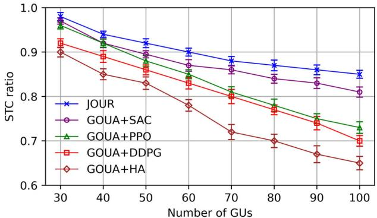  
Fig. 6. Average successful task completion (STC) ratio.

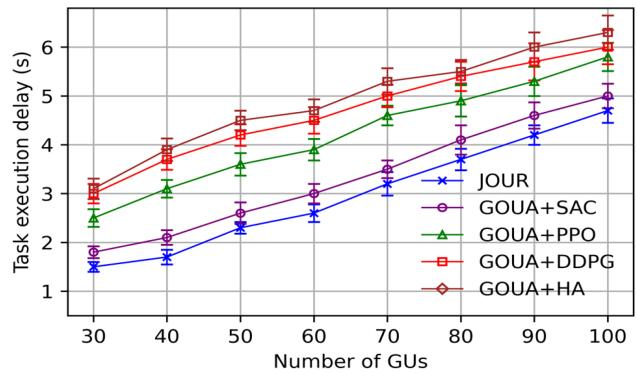  
Fig. 7. Average task execution delay.

\- Average load per UAV: Load is defined as the ratio of the number of cycles computed by a UAV to its total computational capacity per time slot. We then averaged this load across all the UAVs.

\- Average energy consumption per time slot: We computed the energy used to process the tasks in each time slot and then averaged this value over all the time slots.

Fig. 6 illustrates the effect of the number of GUs on the STC ratio in our system. The number of GUs varied from 30 to 100, with the number of generated tasks being proportional to the number of GUs. It can be clearly observed that the STC ratio decreased as the number of GUs increased. This is because the computational capacity of our system remained constant, whereas the number of tasks generated increased. Consequently, with a fixed computational capacity, our aerial platform struggles to compute all the tasks within its latency requirements since the number of GUs gradually increases. Additionally, the JOUR scheme presented a higher STC ratio than the baseline algorithms, indicating superior performance.

Fig. 7 depicts the average task execution delay as a function of the number of GUs. Since the GU count increased from 30 to 100, a corresponding increase in the average task execution delay was observed. Specifically, at 30 GUs, the proposed JOUR scheme achieves an average delay of approximately 1.6 seconds, whereas GOUA SAC, GOUA PPO, GOUA DDPG, and GOUA HA exhibit delays of 1.8 s, 2.5 s, 3 s, and 3.1 s, respectively. At the upper limit of 100 GUs, the proposed scheme maintains a relatively lower delay of 4.8 s when compared to GOUA SAC,GOUA PPO,GOUA DDPG,andGOUA HA with 5 s, 5.8 s, 6 s, and 6.3 s, respectively. This increase in the delay occurs since UAVs and HAP have limited computational resources and must allocate them to an increasing number of tasks. As the number of tasks increases, each task receives fewer resources, causing longer execution delays. The results clearly demonstrate that the JOUR scheme consistently outperformed GOUA SAC,GOUA PPO,GOUA DDPG,andGOUA HA in achieving significantly lower execution delays in all the scenarios.

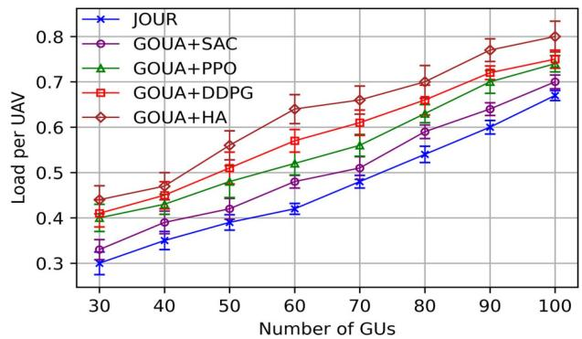  
Fig. 8. Average load per UAV.

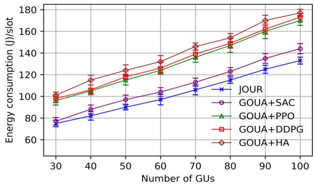  
Fig. 9. Average energy consumption per time slot.

Fig. 8 depicts the impact of varying the number of GUs on the average computational load per UAV. It can be observed that the average load per UAV increases as the number of GU increases. For instance, at 30 GUs, the JOUR scheme sustained an average load of 0.30, whereas GOUA SAC, GOUA PPO, GOUA DDPG, and GOUA HA exhibited higher loads of 0.32, 0.40, 0.41, and 0.44, respectively. As the number of GUs increases to 100, our scheme manages to keep the load at 0.68, contrary to 0.7 for GOUA SAC, 0.75 for GOUA PPO, 0.76 for GOUA DDPG, and 0.80 for GOUA HA. This increase in the load occurs because the UAVs need to process more tasks as the number of GUs increases, leading to a higher use of their computational resources. The proposed JOUR scheme exhibits superior load management capabilities when compared to the baseline algorithms, effectively performing task partitioning and optimizing the UAVs and HAP resource utilization to prevent overload conditions.

Fig. 9 depicts the average energy consumption per timeslot corresponding to the number of GUs. The data indicated that the energy consumption increased with an increase in the number of

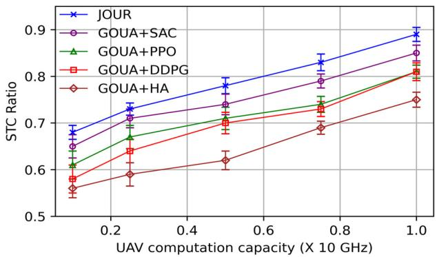  
Fig. 10. Impact of UAV’s computation capacity on average STC ratio (with 80 GUs).

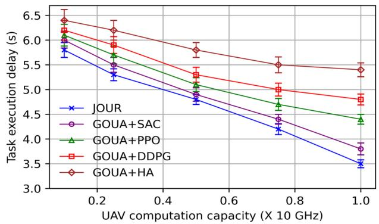  
Fig. 11. Impact of UAV’s computation capacity on average task execution delay (with 80 GUs).

GUs. At 30 GUs, the proposed JOUR scheme exhibited an average energy consumption of approximately 75 Joules per timeslot, whereas GOUA SAC, GOUA PPO, GOUA DDPG, and GOUA HA consumed 77 J, 96 J, 98 J, and 101 J, respectively. When the GU count reaches 100, the proposed scheme’s consumption increases to approximately 133 J, which is evidently less than 144 J, 170 J, 173 J, and 177 J for GOUA SAC, GOUA PPO, GOUA DDPG, and GOUA HA, respectively. + + +This increase in the energy consumption is a direct consequence of the increased computational demands placed on the UAVs and HAP to process large volumes of tasks. The JOUR scheme demonstrated enhanced energy efficiency by optimizing the task allocation and computational resource utilization, resulting in a lower average energy consumption per time slot when compared to the SAC, PPO, DDPG, and HA baseline algorithms.

Figs. 10, 11, 12, and 13 depict the impact of the computational capacity of the UAV on the performance metrics. In these experiments, the computational capacity of each UAV varied uniformly, indicating that all the UAVs had identical computation capacities at any given time, and the number of GUs was 80.

Fig. 10 depicts the effect of varying the computation capacity of the UAVs on the average STC ratio. It can be observed that the STC ratio improves significantly as the computational capacity of the UAVs increases. For example, when the computational capacity was set to 2 GHz, the STC ratio for the

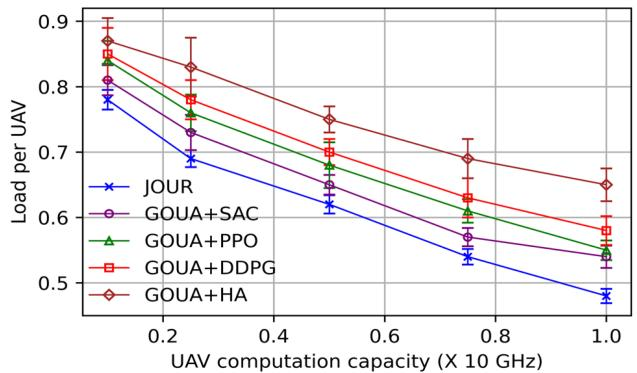  
Fig. 12. Impact of UAV’s computation capacity on average load per UAV (with 80 GUs).

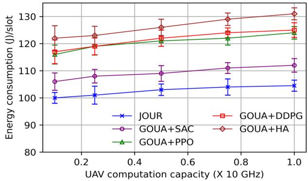  
Fig. 13. Impact of UAV’s computation capacity on average energy consumption per time slot (with 80 GUs).

JOUR scheme was approximately 0.68, whereas the baseline algorithms, i.e., GOUA SAC, GOUA PPO, GOUA DDPG, and GOUA HA achieved approximately 0.65, 0.61, 0.58, and 0.56, respectively. As the capacity increased to 10 GHz, the STC ratio for JOUR increased to approximately 0.89 whereas that for the four baseline algorithms reached approximately 0.85, 0.81, 0.81, and 0.75, respectively. This indicates that a higher computational power enables the UAVs to process more tasks within the latency constraints, thereby completing a larger proportion of the offloaded tasks successfully. The JOUR scheme consistently achieved a higher STC ratio than the baseline algorithms, demonstrating its superior efficiency in utilizing the available computational resources of the UAVs.

Fig. 11 depicts the relationship between the computational capacity of the UAV and the average task execution delay. The results indicated that the average task execution delay decreased as the computational capacity of the UAVs increased. For instance, at a computational capacity of 2 GHz, the average task execution delay for the JOUR scheme is approximately 5.7 s while GOUA SAC, GOUA PPO, GOUA DDPG, and GOUA HA presented delays of approximately 6 s, 6.1 s, 6.25 s, and 6.4 s, respectively. As the capacity increased to 10 GHz, the delay for JOUR dropped to approximately 3.5 s whereas the baseline algorithms exhibited higher delays of approximately 3.8 s, 4.4 s, 4.7 s, and 5.4 s, respectively. This is because the UAVs with a higher computational power can handle and execute the offloaded tasks more quickly, thereby reducing the overall time required to complete each task. The JOUR scheme outperforms the baseline algorithms by maintaining a lower execution delay across all levels of the computational capacity, demonstrating its effectiveness in achieving efficient task processing and maintaining low latency in the hierarchical aerial computing platforms.

Fig. 12 depicts the impact of varying the computational capacity of the UAVs on the average computational load per UAV. It can be observed that the average load per UAV decreases as the computational capacity of the UAVs increases. For instance, at a computational capacity of 2 GHz, the average load for the JOUR scheme was approximately 0.78, whereas that for the baseline algorithms, GOUA SAC, GOUA PPO, GOUA DDPG, and GOUA HA exhibited higher loads of approximately 0.81, 0.84, 0.85, and 0.87, respectively. Since the capacity increases to 10 GHz, the JOUR scheme reduces the load to approximately 0.47, whereas the baseline algorithms manage loads of 0.55, 0.56, 0.58, and 0.65, respectively. This load reduction demonstrates that a higher computational capacity enables the UAVs to handle more tasks efficiently, thus reducing the burden on the individual UAVs. The JOUR scheme consistently achieves a lower average load than the baseline algorithms, indicating superior load management and resource utilization.

Fig. 13 depicts the impact of varying the computational capacity of the UAVs on the average energy consumption per time slot with 80 GUs. It can be observed that the average energy consumption did not increase significantly with the increase in the computational capacity of the UAVs. For example, at a computational capacity of 2 GHz, the average energy consumption for the JOUR scheme is approximately 100 J per timeslot whereas GOUA SAC, GOUA PPO, GOUA DDPG, and GOUA HA consume approximately 106 J, 116 J, 117 J, and 122 +J, respectively. As the capacity increases to 10 GHz, the JOUR scheme increases the energy consumption to approximately 103 J whereas the baseline algorithms exhibit higher energy consumptions of 112 J, 123 J, 124 J, and 131 J, respectively. This increase in energy consumption was attributed to the increased task processing enabled by the higher computation capacities, which reduced the computation time per task. The JOUR scheme outperformed the baseline algorithms by maintaining a lower energy consumption across all levels of the computational capacity, demonstrating its efficiency in resource utilization and energy management in hierarchical aerial computing platforms.

## VII. CONCLUSION

In this paper, we presented a novel hierarchical aerial computing platform that leverages the collaborative capabilities of UAVs and HAP to efficiently address the computational and latency demands of IoT applications in dynamic environments. The proposed JOUR scheme integrates a corresponding gamebased algorithm for GUs offloading decisions and a GU–UAV user association, coupled with an ESAC algorithm for UAVs offloading decisions and resource allocation for both the UAVs and HAP. The simulation results demonstrated significant improvements in the energy consumption, latency, load balancing, and task completion rates, thus validating the effectiveness of the JOUR scheme in optimizing the aerial computing resources. These findings demonstrate the potential of hierarchical aerial computing platforms to provide robust, efficient, and scalable solutions for IoT applications, particularly in remote and disasterstricken areas.

The future research scope involves achieving further enhancements in the architecture by considering multiple HAPs and satellites to extend the applicability and performance of the framework.

## ACKNOWLEDGMENT

The authors thank the editor and anonymous referees for their comments, which helped to improve the quality of this manuscript.

## REFERENCES

[1] Q. Zhang, Y. Luo, H. Jiang, and K. Zhang, “Aerial edge computing: A survey,” IEEE Internet Things J., vol. 10, no. 16, pp. 14357–14374, Aug. 2023, doi: 10.1109/JIOT.2023.3263360.

[2] S. M. A. Huda and S. Moh, “Survey on computation offloading in UAV-enabled mobile edge computing,” J. Netw. Comput. Appl., vol. 201, May 2022, Art. no. 103341, doi: 10.1016/j.jnca.2022.103341.

[3] Q. Luo, S. Hu, C. Li, G. Li, and W. Shi, “Resource scheduling in edge computing: A survey,” IEEE Commun. Surv. Tut., vol. 23, no. 4, pp. 2131–2165, Fourth Quarter 2021, doi: 10.1109/COMST.2021.3106401.

[4] Q.-V. Pham et al., “Aerial computing: A new computing paradigm, applications, and challenges,” IEEE Internet Things J., vol. 9, no. 11, pp. 8339–8363, Jun. 2022, doi: 10.1109/JIOT.2022.3160691.

[5] D. S. Lakew, A.-T. Tran, N.-N. Dao, and S. Cho, “Intelligent offloading and resource allocation in heterogeneous aerial access IoT networks,” IEEE Internet Things J., vol. 10, no. 7, pp. 5704–5718, Apr. 2023, doi: 10.1109/JIOT.2022.3161571.

[6] Y. Chen, K. Li, Y. Wu, J. Huang, and L. Zhao, “Energy efficient task offloading and resource allocation in air-ground integrated MEC systems: A distributed online approach,” IEEE Trans. Mobile Comput., vol. 23, no. 8, pp. 8129–8142, Aug. 2024, doi: 10.1109/TMC.2023.3346431.

[7] A. Nabi, T. Baidya, and S. Moh, “Comprehensive survey on reinforcement learning-based task offloading techniques in aerial edge computing,” Internet Things, vol. 28, Dec. 2024, Art. no. 101342, doi: 10.1016/j.iot.2024.101342.

[8] H. Kang, X. Chang, J. Miši´c, V. B. Miši´c, J. Fan, and Y. Liu, “Cooperative UAV resource allocation and task offloading in hierarchical aerial computing systems: A MAPPO-based approach,” IEEE Internet Things J., vol. 10, no. 12, pp. 10497–10509, Jun. 2023, doi: 10.1109/JIOT.2023.3240173.

[9] Z. Jia, Q. Wu, C. Dong, C. Yuen, and Z. Han, “Hierarchical aerial computing for Internet of Things via cooperation of HAPs and UAVs,” IEEE Internet Things J., vol. 10, no. 7, pp. 5676–5688, Apr. 2023, doi: 10.1109/JIOT.2022.3151639.

[10] Y. Wang, C. Zhang, T. Ge, and M. Pan, “Computation offloading via multiagent deep reinforcement learning in aerial hierarchical edge computing systems,” IEEE Trans. Netw. Sci. Eng., vol. 11, no. in 6, pp. 5253–5266, Nov./Dec. 2024, doi: 10.1109/TNSE.2024.3391289.

[11] A. M. Raivi and S. Moh, “JDACO: Joint data aggregation and computation offloading in UAV-enabled Internet of Things for post-disaster scenarios,” IEEE Internet Things J., vol. 11, no. 9, pp. 16529–16544, May 2024, doi: 10.1109/JIOT.2024.3354950.

[12] N. Lin, H. Tang, L. Zhao, S. Wan, A. Hawbani, and M. Guizani, “A PDDQNLP algorithm for energy efficient computation offloading in UAV-assisted MEC,” IEEE Trans. Wireless Commun., vol. 22, no. 12, pp. 8876–8890, Dec. 2023, doi: 10.1109/TWC.2023.3266497.

[13] S. M. A. Huda and S. Moh, “Deep reinforcement learning-based computation offloading in UAV swarm-enabled edge computing for surveillance applications,” IEEE Access, vol. 11, pp. 68269–68285, 2023, doi: 10.1109/ACCESS.2023.3292938.

[14] G. Wu, Z. Liu, M. Fan, and K. Wu, “Joint task offloading and resource allocation in multi-UAV multi-server systems: An attention-based deep reinforcement learning approach,” IEEE Trans. Veh. Technol., vol. 73, no. 8, pp. 11964–11978, Aug. 2024, doi: 10.1109/TVT.2024.3377647.

[15] D. G. McVitie and L. B. Wilson, “The stable marriage problem,” Commun. ACM, vol. 14, no. 7, pp. 486–490, Jul. 1971, doi: 10.1145/362619.362631.

[16] N. Lin et al., “Deep-reinforcement-learning-based computation offloading for servicing dynamic demand in multi-UAV-assisted IoT network,” IEEE Internet Things J., vol. 11, no. 10, pp. 17249–17263, May 2024, doi: 10.1109/JIOT.2024.3356725.

[17] S. Li et al., “Two-hop packet scheduling, resource allocation, and UAV trajectory design for Internet of Remote Things in air-ground integrated network,” IEEE Internet Things J., vol. 11, no. 15, pp. 26160–26172, Aug. 2024, doi: 10.1109/JIOT.2024.3393444.

[18] M. M. Alam and S. Moh, “Joint optimization of trajectory control, task offloading, and resource allocation in air-ground integrated networks,” IEEE Internet Things J., vol. 11, no. 13, pp. 24273–24288, Jul. 2024, doi: 10.1109/JIOT.2024.3390168.

[19] H. Guo, Y. Wang, J. Liu, and C. Liu, “Multi-UAV cooperative task offloading and resource allocation in 5G advanced and beyond,” IEEE Trans. Wirel. Commun., vol. 23, no. 1, pp. 347–359, Jan. 2024, doi: 10.1109/TWC.2023.3277801.

[20] C. Ding, J.-B. B. Wang, H. Zhang, M. Lin, and G. Y. Li, “Joint optimization of transmission and computation resources for satellite and high altitude platform assisted edge computing,” IEEE Trans. Wirel. Commun., vol. 21, no. 2, pp. 1362–1377, Feb. 2022, doi: 10.1109/TWC.2021.3103764.

[21] F. Chai, Q. Zhang, H. Yao, X. Xin, R. Gao, and M. Guizani, “Joint multitask offloading and resource allocation for mobile edge computing systems in satellite IoT,” IEEE Trans. Veh. Technol., vol. 72, no. 6, pp. 7783–7795, Jun. 2023, doi: 10.1109/TVT.2023.3238771.

[22] Y. Liu, H. Zhang, H. Zhou, K. Long, and V. C. M. Leung, “User association, subchannel and power allocation in space-air-ground integrated vehicular network with delay constraints,” IEEE Trans. Netw. Sci. Eng., vol. 10, no. 3, pp. 1203–1213, May/Jun. 2023, doi: 10.1109/TNSE.2022.3169635.

[23] H. Zhang, H. Zhao, R. Liu, X. Gao, and S. Xu, “Dynamic user association and computation offloading in satellite edge computing networks via deep reinforcement learning,” IEEE Trans. Green Commun. Netw., vol. 8, no. 4, pp. 1888–1901, Dec. 2024, doi: 10.1109/TGCN.2024.3357813.

[24] S. Wang et al., “Federated learning for task and resource allocation in wireless high-altitude balloon networks,” IEEE Internet Things J, vol. 8, no. 24, pp. 17460–17475, Dec. 2021, doi: 10.1109/JIOT.2021.3080078.

[25] J. Chen, P. Yang, S. Ren, Z. Zhao, X. Cao, and D. Wu, “Enhancing AIoT device association with task offloading in aerial MEC networks,” IEEE Internet Things J., vol. 11, no. 1, pp. 174–187, Jan. 2024, doi: 10.1109/JIOT.2023.3300011.

[26] J. Du et al., “MADDPG-based joint service placement and task offloading in MEC empowered air-ground integrated networks,” IEEE Internet Things J., vol. 11, no. 6, pp. 10600–10615, Mar. 2024, doi: 10.1109/JIOT.2023.3326820.

[27] N. Zhao, Z. Ye, Y. Pei, Y.-C. Liang, and D. Niyato, “Multi-agent deep reinforcement learning for task offloading in UAV-assisted mobile edge computing,” IEEE Trans. Wirel. Commun., vol. 21, no. 9, pp. 6949–6960, Sep. 2022, doi: 10.1109/TWC.2022.3153316.

[28] H. Hu, Z. Chen, F. Zhou, Z. Han, and H. Zhu, “Joint resource and trajectory optimization for heterogeneous-UAVs enabled aerial-ground cooperative computing networks,” IEEE Trans. Veh. Technol., vol. 72, no. 7, pp. 8812–8826, Jul. 2023, doi: 10.1109/TVT.2023.3244812.

[29] B. Li, R. Yang, L. Liu, J. Wang, N. Zhang, and M. Dong, “Robust computation offloading and trajectory optimization for Multi-UAV-assisted MEC: A multiagent DRL approach,” IEEE Internet Things J., vol. 11, no. 3, pp. 4775–4786, Feb. 2024, doi: 10.1109/JIOT.2023.3300718.

[30] S. Akter, D. Van Anh Duong, D.-Y. Kim, and S. Yoon, “Task offloading and resource allocation in UAV-aided emergency response operations via soft actor critic,” IEEE Access, vol. 12, pp. 69258–69275, 2024, doi: 10.1109/ACCESS.2024.3401115.

[31] A. R. Heidarpour, M. R. Heidarpour, M. Ardakani, C. Tellambura, and M. Uysal, “Soft actor–critic-based computation offloading in multiuser MEC-enabled IoT—A lifetime maximization perspective,” IEEE Internet Things J., vol. 10, no. 20, pp. 17571–17584, Oct. 2023, doi: 10.1109/JIOT.2023.3277753.

[32] X. Zhou, L. Huang, T. Ye, and W. Sun, “Computation bits maximization in UAV-assisted MEC networks with fairness constraint,” IEEE Internet Things J., vol. 9, no. 21, pp. 20997–21009, Nov. 2022, doi: 10.1109/JIOT.2022.3177658.

[33] Z. Liao, Y. Ma, J. Huang, J. J. Wang, and J. J. Wang, “HOTSPOT: A UAVassisted dynamic mobility-aware offloading for mobile-edge computing in 3-D space,” IEEE Internet Things J., vol. 8, no. 13, pp. 10940–10952, Jul. 2021, doi: 10.1109/JIOT.2021.3051214.

[34] K. G. Panda, A. Wilson, and D. Sen, “Energy-efficient initial deployment and ML-based postdeployment strategy for UAV network with guaranteed QoS,” IEEE Trans. Aerosp. Electron. Syst., vol. 58, no. 6, pp. 5220–5239, Dec. 2022, doi: 10.1109/TAES.2022.3167386.

[35] T. Haarnoja et al., “Soft actor-critic algorithms and applications,” 2018. [Online]. Available: arxiv.org/abs/1812.05905

[36] B. Saglam, F. B. Mutlu, D. C. Cicek, and S. S. Kozat, “Actor prioritized experience replay,” J. Artif. Intell. Res., vol. 78, pp. 639–672, Nov. 2023, doi: 10.1613/jair.1.14819.

[37] T. Haarnoja, A. Zhou, P. Abbeel, and S. Levine, “Soft actor-critic: Offpolicy maximum entropy deep reinforcement learning with a stochastic actor,” in Proc. 35th Int. Conf. Mach. Learn., pp. 2976–2989. 2018. [Online]. Available: arxiv.org/abs/1801.01290

[38] J. Schulman, F. Wolski, P. Dhariwal, A. Radford, and O. Klimov, “Proximal policy optimization algorithms,” Jul. 2017. [Online]. Available: arxiv.org/ abs/1707.06347

[39] T. P. Lillicrap et al., “Continuous control with deep reinforcement learning,” in Proc. 4th Int. Conf. Learn. Representations., Sep. 2015. [Online]. Available: arxiv.org/abs/1509.02971

[40] R. L. Rardin and R. Uzsoy, “Experimental evaluation of heuristic optimization algorithms: A tutorial,” J. Heuristics, vol. 7, no. 3, pp. 261–304, 2001, doi: 10.1023/A:1011319115230.

  
Ahmadun Nabi received the BS degree in electronics and communication engineering from Khulna University, Bangladesh, in 2020, and the MS degree in computer engineering from Chosun University, South Korea, in 2025. From 2023 to 2025, he worked as a graduate research assistant with the Mobile Computing Laboratory, Chosun University, South Korea. His research interests include aerial computing, UAV-assisted mobile edge computing, reinforcement learning, artificial intelligence, optimization, and the Internet of things.

Sangman Moh (Member, IEEE) received the MS degree in computer science from Yonsei University, South Korea, in 1991, and the PhD degree in computer engineering from Korea Advanced Institute of Science and Technology (KAIST), South Korea, in 2002. Since late 2002, he is a professor with the Department of Computer Engineering, Chosun University, South Korea. From 2006 to 2007, he was on leave with Cleveland State University, USA. Until 2002, he had been with Electronics and Telecommunications Research Institute (ETRI), South Korea. His research

interests include mobile computing and networking, ad hoc and sensor networks, UAV networks, and mobile-edge computing. He is a member of the ACM, the IEICE, the KIISE, the IEIE, the KIPS, the KICS, the KMMS, the IEMEK, the KISM, and the KPEA.