JOURNAL OF LAT<sub>E</sub>X CLASS FILES, VOL. 14, NO. 8, AUGUST 2015

# Joint Offloading, Trajectory and Deployment Optimization for Multi-UAV Cooperative Regional Search in SAGINs: A Hybrid DRL-GA Framework

Peng Zhao, Hongbing Cheng, Member, IEEE, Hangyu Zhang, and Zhiguo Wan

Abstract—Multi-UAV systems in Space-Air-Ground Integrated Networks (SAGINs) offer solutions for diverse applications, but realizing their full potential in search and rescue (SAR) is challenged by complex terrains, limited infrastructure, and dynamic interferences. These demanding environments reveal shortcomings in jointly optimizing task offloading, flight trajectories, and UAV deployment, and limits of idealized simulations. This problem is formulated as a multi-objective optimization to maximize UAV search coverage and minimize task energy cost under resource constraints. To solve this, we propose a two-stage Hybrid Convolutional Deep Reinforcement Learning (HCDRL) and a Genetic Algorithm (GA) framework. In HCDRL, we employ a novel feature-fusing multi-modal state encoding. By individualizing per-UAV perception and using Convolutional Neural Networks (CNNs) for visual features and Graph Convolutional Networks (GCNs) for network topology and offloading features, this encoding linearizes the multi-agent action state space’s exponential growth, enhancing training efficiency and robustness. The GA component then utilizes the learned HCDRL policy as a fitness evaluator to optimize global UAV deployment. In addition, incorporating uncertainty-aware terrain modeling and NOAAderived realistic wind-field data substantially improves simulation realism. Extensive simulations provide evidence of robustness and scalability across the evaluated scenarios. Notably, under strong wind conditions, the proposed GA-HCSAC framework improves mission lifetime by up to 38% and search coverage by 33% compared to standard baselines, while the GA-optimized deployment alone contributes to a nearly 18% coverage lift. Finally, offloading heatmaps and UAV visit-frequency maps provide interpretable evidence of spatially structured coordination and directional adaptability under dynamic wind fields.

Index Terms—Space-Air-Ground integrated network, task offloading, deep reinforcement learning, convolutional neural network, graph neural network, genetic algorithm

## I. INTRODUCTION

N recent years, the rapid advancement of unmanned aerial vehicle (UAV) technology has led to its widespread appli cation in various fields, including disaster relief, agriculture, infrastructure inspection, environmental monitoring, and mili tary operations [1] [2]. Compared to traditional ground-based or manned aerial systems, UAVs offer flexible deployment, broad coverage, and real-time data acquisition, making them particularly valuable in areas with complex terrain or limited infrastructure [3] [4] [5]. For example, in China, UAVs have been widely used to support emergency missions in mountainous and forested areas. In a notable operation in 2024, a rescue team deployed drones equipped with the Zenmuse H30T camera system to search for a missing person in a densely wooded region. The mission area posed significant challenges due to thick vegetation and low visibility [6]. However, thanks to the high-resolution zoom of the UAV and the powerful infrared thermal imaging capabilities, the rescue team was able to locate the missing individual effectively, greatly reducing search time and improving the success rate of the operation. Similarly, in the United Kingdom, UAVs have proven to be crucial in rescue missions along coastlines and in remote areas. The Maritime and Coastguard Agency uses them to locate missing persons in these regions [7] [8]. In one notable mission, UAVs were deployed in the rugged Scottish Highlands to assist in the search for a missing hiker.

However, despite the flexibility and application potential of UAVs in mountainous regions with complex terrain, weak infrastructure, and dynamic interferences, existing research and deployment strategies often rely on idealized assumptions and neglect real-world uncertainties. For example, some approaches do not sufficiently consider multi-source disturbances such as fluctuating wind conditions and communication blind spots in mountain rescue missions [9]. This can lead to inefficient UAV utilization and excessive UAV deployment without coordinated planning, causing unnecessary consumption of manpower and material resources [10]. Moreover, as mission demands increase, remote or mountainous regions with limited infrastructure often cannot support large-scale real-time data processing, transmission, and analysis. Existing SAGIN schemes still face limited bandwidth, high latency, and insufficient coverage, which further exacerbate mission execution challenges [11] [12] [13].

Deep Reinforcement Learning (DRL) and Multi-Agent DRL (MADRL) provide promising tools for UAV autonomy, resource scheduling, and cooperative decision-making [14] [15]. Nevertheless, directly embedding deployment, trajectory control, and task offloading into a monolithic distributed DRL/MADRL formulation remains challenging for mountainous SAR because these decisions have different structures and time scales. Trajectory control and task offloading are online sequential decisions influenced by local wind, terrain uncertainty, link quality, and server load. In contrast, UAV deployment is a mission-level combinatorial decision over takeoff and recovery positions, whose effect is only observed after downstream mission rollouts. A monolithic MADRL formulation would therefore enlarge the hybrid state-action space and introduce delayed mission-level credit assignment, reducing sample efficiency and training stability, particularly when realistic wind-field records, detailed terrain characteristics, and multi-tier SAGIN topology are considered [16] [17] [18].

We model dynamic SAR as a coupled mobility-sensingcomputing problem. Meteorological wind fields, terraindependent uncertainty, and heterogeneous offloading-device locations jointly determine sensing difficulty, task generation, propulsion energy, communication quality, and reward feedback. Thus, where to fly, what/where to offload, and how to deploy UAVs are intrinsically coupled, motivating a joint offloadingtrajectory-deployment optimization under wind-terrain disturbances.

To address the challenges posed by complex terrains and dynamic environmental conditions, we propose a two-stage decision-making framework, HCDRL+GA, designed for UAVbased search and rescue missions in realistic SAGIN scenarios. The first stage employs Hybrid Convolutional Deep Reinforcement Learning (HCDRL), where CNN and GCN modules encode local spatial observations and communication topology, respectively, enabling online trajectory planning and task offloading under spatially varying wind disturbances and resource constraints. The second stage uses a Genetic Algorithm (GA) for low-frequency global deployment search: each chromosome represents candidate takeoff and recovery positions, and each candidate is evaluated through rollouts of the learned HCDRL policy. This design separates online trajectory/offloading control from mission-level deployment optimization, reducing the burden on distributed DRL while retaining global deployment awareness.

The main contributions of this paper are summarized as follows.

1) We propose a two-stage hybrid framework that couples Hybrid Convolutional Deep Reinforcement Learning (HC DRL) with a Genetic Algorithm (GA) to jointly optimize task offloading, flight trajectory planning, and UAV deployment for multi-UAV SAR missions in SAGINs, explicitly targeting coverage-efficiency and energy-aware computation under resource and connectivity constraints.

2) In the HCDRL stage, we design a feature-fusing multimodal state representation that individualizes per-UAV perception and integrates (i) CNN-based local environmen tal observations with (ii) GCN-based SAGIN topology and offloading-link features. Built on this representation, we develop an HCSAC-based learning pipeline that enables efficient policy learning for trajectory control and offload ing decisions while maintaining scalable computation with respect to the number of UAVs and network links.

3) We integrate GA with the learned HCDRL policy to optimize UAV deployment by using the learned policy as a rollout-based fitness evaluator. Specifically, GA searches over candidate takeoff and recovery configurations and evaluates each candidate through downstream HCDRL rollouts. This improves pre-mission global deployment quality beyond HCDRL-only local control while preserving online trajectory/offloading adaptivity during mission execution.

4) We build a high-fidelity simulation pipeline enhanced with NOAA-derived GFS wind fields and uncertainty-aware terrain abstraction and validate the framework through: (i) comparisons against representative DRL baselines, (ii) module-level ablations (no-offloading, no-GA, removing CNN/GCN branches, and GA variants) under multiple wind regimes, (iii) scalability tests with varying UAV numbers, (iv) sensitivity analyses over UAV flight speed and battery capacity, and (v) interpretability results via offloading-frequency heatmaps across SAGIN tiers and UAV visit-frequency maps, revealing structured offloading preferences and emergent coordination patterns in dynamic wind fields.

The rest of this paper is organized as follows. In Section II, we review the related works. We elaborate on the network and system model in Section III. Then, the optimization problems in Section IV. Section V describes in detail the proposed HCDRL+GA and the algorithm implementation. Section VI demonstrates the simulation results. Finally, Section VII concludes the paper.

## II. RELATED WORK

Table I summarizes representative studies most relevant to our SAGIN-assisted SAR setting, rather than providing an exhaustive survey of UAV, MADRL, or wind-aware planning literature. In this section, we synthesize key related works to clarify the novelty of our research. While prior studies provide useful advances in individual components, our work focuses on a unified wind- and terrain-aware SAGIN SAR framework for coupled offloading, trajectory, and deployment optimization.

A. UAV-Assisted Computation Offloading and SAGIN Resource Allocation

UAV-assisted computation offloading research mainly aims to reduce onboard computation burden and communication delay by jointly selecting execution locations, bandwidth, and computing resources. Existing studies can be synthesized into three related streams. UAV-MEC works optimize caching, service placement, task offloading, and privacy-preserving execution to improve computation/communication efficiency, as represented by Zhao et al. [26] and Wang et al. [31]. Postdisaster edge/fog studies, such as Sun et al. [37], extend this resource-allocation view to disrupted communication environments. SAGIN-oriented works further expand the resource pool to cloud-edge, satellite, and LEO-edge nodes, including hybrid cloud-edge allocation by Huang et al. [28], graph-based scheduling by Cai et al. [29], LEO-edge offloading by Chen et al. [32], and joint trajectory/offloading/caching/migration optimization by Zhao et al. [34]. Collectively, these studies show the importance of offloading, but they usually emphasize communication/computation efficiency while simplifying SARspecific factors such as terrain-induced task load, wind-induced propulsion cost, spatial uncertainty evolution, and their joint influence on link quality.

TABLE I: Capability comparison between our framework and representative existing works.
<table><tr><td rowspan=1 colspan=1>Capability</td><td rowspan=1 colspan=1>Ours</td><td rowspan=1 colspan=1>[27] (2024)</td><td rowspan=1 colspan=1>[28] (2024)</td><td rowspan=1 colspan=1>[29] (2025)</td><td rowspan=1 colspan=1>[33] (2024)</td><td rowspan=1 colspan=1>[34] (2024)</td><td rowspan=1 colspan=1>[36] (2023)</td><td rowspan=1 colspan=1>[38] (2023)</td></tr><tr><td rowspan=1 colspan=1>Learning / optimiza-tion paradigm</td><td rowspan=1 colspan=1>HCSAC + GA</td><td rowspan=1 colspan=1>Deep Meta-RL</td><td rowspan=1 colspan=1>MA-DRL</td><td rowspan=1 colspan=1>GDRL</td><td rowspan=1 colspan=1>MCDRL</td><td rowspan=1 colspan=1>Lyapunov-based</td><td rowspan=1 colspan=1>MADDPG</td><td rowspan=1 colspan=1>DQN</td></tr><tr><td rowspan=1 colspan=1>Computation offload-ing modeled</td><td rowspan=1 colspan=1>√</td><td rowspan=1 colspan=1></td><td rowspan=1 colspan=1>V</td><td rowspan=1 colspan=1>√</td><td rowspan=1 colspan=1></td><td rowspan=1 colspan=1>√</td><td rowspan=1 colspan=1></td><td rowspan=1 colspan=1>√</td></tr><tr><td rowspan=1 colspan=1>Trajectory planning /control</td><td rowspan=1 colspan=1>√</td><td rowspan=1 colspan=1>√</td><td rowspan=1 colspan=1>√</td><td rowspan=1 colspan=1></td><td rowspan=1 colspan=1>√</td><td rowspan=1 colspan=1>√</td><td rowspan=1 colspan=1>√</td><td rowspan=1 colspan=1>√</td></tr><tr><td rowspan=1 colspan=1>Resourceallocation(compute/comm)</td><td rowspan=1 colspan=1>√</td><td rowspan=1 colspan=1></td><td rowspan=1 colspan=1>√</td><td rowspan=1 colspan=1>√</td><td rowspan=1 colspan=1>√</td><td rowspan=1 colspan=1>√</td><td rowspan=1 colspan=1>一</td><td rowspan=1 colspan=1>√</td></tr><tr><td rowspan=1 colspan=1>Deployment / initial-ization optimization</td><td rowspan=1 colspan=1>√</td><td rowspan=1 colspan=1></td><td rowspan=1 colspan=1></td><td rowspan=1 colspan=1></td><td rowspan=1 colspan=1></td><td rowspan=1 colspan=1></td><td rowspan=1 colspan=1></td><td rowspan=1 colspan=1></td></tr><tr><td rowspan=1 colspan=1>Hybridglobal+localoptimization</td><td rowspan=1 colspan=1>√</td><td rowspan=1 colspan=1>一</td><td rowspan=1 colspan=1>一</td><td rowspan=1 colspan=1></td><td rowspan=1 colspan=1></td><td rowspan=1 colspan=1></td><td rowspan=1 colspan=1>一</td><td rowspan=1 colspan=1>一</td></tr><tr><td rowspan=1 colspan=1>Offloading targets /tiers</td><td rowspan=1 colspan=1>SAGIN</td><td rowspan=1 colspan=1>None</td><td rowspan=1 colspan=1>MEC inSAGIN</td><td rowspan=1 colspan=1>SAGIN</td><td rowspan=1 colspan=1>ISD-UAV</td><td rowspan=1 colspan=1>MEC</td><td rowspan=1 colspan=1>None</td><td rowspan=1 colspan=1>BS</td></tr><tr><td rowspan=1 colspan=1>Task dependency mod-eling</td><td rowspan=1 colspan=1>了</td><td rowspan=1 colspan=1></td><td rowspan=1 colspan=1>√</td><td rowspan=1 colspan=1>√</td><td rowspan=1 colspan=1></td><td rowspan=1 colspan=1>√</td><td rowspan=1 colspan=1></td><td rowspan=1 colspan=1>了</td></tr><tr><td rowspan=1 colspan=1>Coverage-oriented ob-jective</td><td rowspan=1 colspan=1>√</td><td rowspan=1 colspan=1>√</td><td rowspan=1 colspan=1></td><td rowspan=1 colspan=1></td><td rowspan=1 colspan=1></td><td rowspan=1 colspan=1></td><td rowspan=1 colspan=1>√</td><td rowspan=1 colspan=1>√</td></tr><tr><td rowspan=1 colspan=1>Realistic wind-awareSAR/SAGIN modeling</td><td rowspan=1 colspan=1>√</td><td rowspan=1 colspan=1></td><td rowspan=1 colspan=1></td><td rowspan=1 colspan=1></td><td rowspan=1 colspan=1></td><td rowspan=1 colspan=1></td><td rowspan=1 colspan=1></td><td rowspan=1 colspan=1></td></tr></table>

## B. Multi-UAV Trajectory Optimization and Cooperative SAR

Another line of work studies multi-UAV trajectory optimization, cooperative search, and mission planning. This stream can be viewed from two complementary perspectives. Energy-aware data-collection and IoT-planning studies optimize trajectory under time, energy, or wireless-power constraints, as in Jia et al. [30] and Ning et al. [33]. Cooperative-search studies focus on target discovery and SAR-oriented coordination, including multi-UAV target search by Hou et al. [36], SARoriented learning over UAV networks by Soorki et al. [27], and joint trajectory/offloading design for cooperative target search by Luo et al. [38]. These studies demonstrate that trajectory control and cooperative coverage are central to UAV missions, but many assume fixed deployment, static grids, or simplified communication/computation support, leaving wind terrain-aware deployment and SAGIN resource heterogeneity less explored.

## C. MADRL for Multi-Agent Coordination

Foundational MADRL research provides several paradigms for multi-agent coordination. One paradigm uses centralized training with decentralized execution, represented by the multi-agent actor-critic method of Lowe et al. [21]. Another paradigm decomposes team value functions, as in VDN by Sunehag et al. [22] and QMIX by Rashid et al. [23]. Policygradient and role-based methods, represented by MAPPO of Yu et al. [24] and RODE of Wang et al. [25], further improve cooperative policy learning and specialization. Recent UAV studies apply these ideas to decentralized UAV-assisted MEC [17] and collaborative position/task scheduling [18]. However, general MADRL formulations usually do not explicitly separate low-frequency deployment optimization from online trajectory/offloading control under heterogeneous terrainwind/topology states.

## D. Wind- and Terrain-Aware UAV Planning

Wind and terrain affect UAV propulsion energy, sensing reliability, task generation, and communication feasibility. Prior wind-aware UAV planning mainly addresses navigation robustness, energy-aware urban flight, and logistics safety. Jayaweera and Hanoun studied windy path planning for maintaining tracking/coverage performance under wind drift [39], while Uijt de Haag et al. [40] incorporated navigation and energy costs in windy urban environments. Gu et al. [41] further used wind-field analysis to support safer and more energy-efficient urban logistics. These studies confirm the need for wind-aware planning, but they mainly target navigation or logistics and rarely examine how wind-terrain disturbances jointly affect SAR coverage, task offloading, and deployment decisions.

## E. Hybrid Learning and Metaheuristic Deployment Optimization

Hybrid learning and metaheuristic optimization are widely used when part of a UAV decision problem is combinatorial or difficult to optimize through gradient-based learning alone. In [52], genetic algorithms and related evolutionary methods are shown to be suitable for global search over deployment or initialization variables because they can evaluate candidate solutions through a task-level fitness function without requiring differentiability. In SAGIN/MEC settings, Tun et al. [35] considered joint deployment and resource allocation, showing the relevance of deployment-level optimization for heterogeneous networks. Existing hybrid designs often optimize deployment separately or without policy-in-the-loop rollouts, making it difficult to assess how deployment choices affect downstream trajectory, offloading, and mission-level performance under wind-terrain conditions.

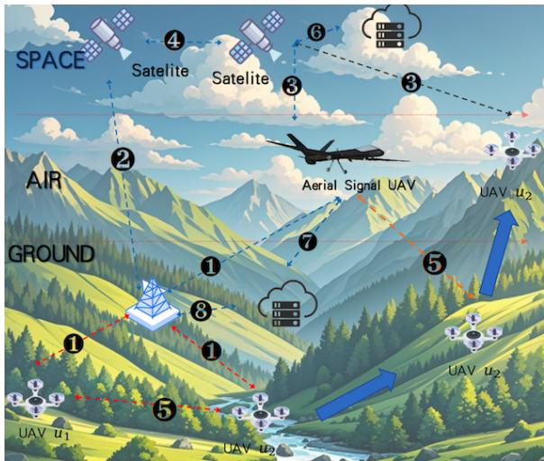  
Fig. 1: The system and channel architecture adopted in SAGIN

## III. NETWORK AND SYSTEM MODELS

## A. Channel Model and Transmission Rate Model

Referring to the work of [29], [37], we propose the channel model illustrated in Fig. 1. This model includes several distinct links: ground-to-air (<sup>❶</sup>), ground-to-space (<sup>❷</sup>), air-to-space (<sup>❸</sup>), inter-satellite $( \pmb { \bigcirc } )$ , inter-HAPS (<sup>❺</sup>), space-to-cloud/edge (<sup>❻</sup>), air-to-cloud/edge (<sup>❼</sup>), and ground-to-cloud/edge (<sup>❽</sup>).

All channel coefficients are denoted as

$$
{ \bf h } _ { i , k } ^ { j } = \sqrt { G _ { i } ^ { j } \left( \frac { c } { 4 \pi d _ { i } ^ { j } f _ { k } ^ { j } } \right) } w _ { i } ^ { j } g _ { i , k } ^ { j } ,\tag{1}
$$

where $\mathbf { h } _ { i , k } ^ { j }$ denotes the channel coefficient on subcarrier k for link $( i , j )$ ; specifically, $\mathbf { h } _ { i = u , k } ^ { j = b } , \mathbf { h } _ { i = u , k } ^ { j = l } , \mathbf { h } _ { i = u , k } ^ { j = h a }$ , and $\mathbf { h } _ { i = u , k } ^ { j = c e }$ correspond to links $( \pmb { \ 0 } ) \mathrm { - } ( \pmb { \ 0 } )$ , while $\mathbf { h } _ { i = h a / l / b / c e , k } ^ { j = h a / l / b / c e }$ corresponds to links $( \Theta ) \mathrm { - } ( \Theta )$ . Here, $G _ { i } ^ { j }$ denotes the antenna gain from device i to server $j , \ d _ { i } ^ { j }$ is the propagation distance, $f _ { k } ^ { j }$ is the frequency of the k-th subcarrier, c is the speed of light, $w _ { i } ^ { j }$ represents large-scale environmental attenuation caused by atmospheric absorption, rain attenuation, and multipath effects, and $g _ { i , k } ^ { j }$ is the small-scale channel gain capturing fast fading.

Using the Shannon formula [46] $\begin{array} { r } { C = B \cdot \log _ { 2 } \left( 1 + \frac { S } { N } \right) } \end{array}$ , we derive the data transmission rate for tasks over all channels. It can be expressed as

$$
R _ { i , k } ^ { j } = B \log _ { 2 } \left( 1 + \frac { p _ { i } ( \mathbf { h } _ { i , k } ^ { j } ) ^ { H } } { \sigma ^ { 2 } } \right) ,\tag{2}
$$

where $p _ { i }$ represents the transmission power of server $i , \ \sigma ^ { 2 }$ represents the power spectral density of additive white Gaussian noise (AWGN), and B is the bandwidth per subcarrier.

## B. System description

Fig. 2 illustrates multi-UAV cooperative target search within a SAGIN architecture. The search area is divided into an $X \times Y$ region and discretized into $L _ { X } \times L _ { y }$ cells. UAVs fly at altitude H and sense the current cell using onboard cameras. In mountainous regions with limited fixed infrastructure, we assume a deployment vehicle with a mobile base station and aerial signal UAVs that provide localized communication coverage and computing support. The maximum UAV battery capacity is denoted by Battery<sub>u</sub>.

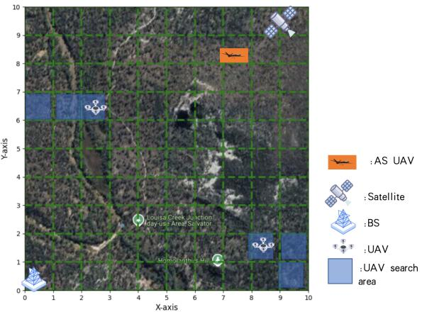  
Fig. 2: A schematic diagram of cooperative target search by multiple UAVs within SAGIN

## C. Computing Model

At each time step t, UAV u generates a computation task $T _ { u } ( t ) = \{ r c _ { u } ( t ) , s t _ { u } ( t ) , s p _ { u } ( t ) , d c _ { u } ( t ) \}$ , where $r c _ { u } ( t )$ is the required CPU cycles, $s t _ { u } ( t )$ is the input data size, $s p _ { u } ( t )$ is the output data size, and $d c _ { u } ( t )$ is the delay constraint. The task can be processed locally, offloaded to a connected LEO/HAPS/BS node, or secondarily offloaded to another LEO, HAPS, BS, cloud server (CS), or edge server (ES) if the primary node is insufficient. We represent SAGIN connectivity by an adjacency matrix $E \in \{ \bar { 0 } , 1 \} ^ { ( U + L + H + B ) \times ( U + L + H + \bar { B } + \bar { C } E ) }$ whose rows/columns correspond to UAV, LEO, HAPS, BS, and CS/ES nodes; for example, $e _ { u , U + L + H + B } = 1$ indicates that UAV u is connected to BS B. Secondary offloading is feasible only when the primary node and secondary processing node are connected.

1) Task Offloading Decisions: Task offloading decisions are made based on three indicators.

• Local computing indicator $\alpha _ { u } ( t ) \in \{ 0 , 1 \}$ , where $\alpha _ { u } ( t ) =$ 1 indicates that the task generated by UAV u is fully processed locally.

• The remote task at time step t offloading indicator is denoted as $\beta _ { u , i } ( t ) \in \{ 0 , 1 \}$ , where $\beta _ { u , i } ( t ) = 1$ indicates that the task at time step t generated by UAV u is fully offloaded to a remote server (LEOs/HAPSs/BSs).

• The secondary offloading indicator is denoted as $\gamma _ { u , i , k } ( t ) \in \{ 0 , 1 \}$ , where $\gamma _ { u , i , k } ( t ) = 1$ indicates that the task ta at time step t generated by UAV u is fully processed on server k after being first offloaded to server i. Secondary offloading is triggered when the initially selected server cannot meet the computational requirements of the task. No tertiary offloading is considered; if the resources of the second server k are also insufficient, the task offloading attempt fails. For tasks too large to be handled by the connected LEO, HAPS, or BS, the task should be offloaded to other devices, such as CS or ES, which have sufficient computational resources but are not directly connected to the UAV u. This indexing convention means that i denotes the primary offloading target selected from LEO, HAPS, and BS, whereas k denotes the secondary processing server selected from LEO, HAPS, BS, CS, and ES.

An offloading failure occurs when the generated task cannot be completed locally or through the selected primary/secondary offloading path because the computation capacity, link/channel feasibility, or latency constraints are violated. Upon failure, the task is marked as failed/dropped for the current time step and does not contribute to effective sensing progress. A failed task does not reduce the uncertainty value of the corresponding cell and therefore contributes no uncertainty-reduction gain. Its impact is reflected through the loss of uncertainty-reduction gain, additional communication/computation energy expenditure, and increased task-completion latency caused by the unsuccessful execution attempt.

Clearly, based on the above three indicators, we have the following constraint

$$
\begin{array} { l } { { \displaystyle \alpha _ { u } ( t ) + \sum _ { i = 0 } ^ { L + H + B } \beta _ { u , i } ( t ) } } \\ { { \displaystyle ~ + \sum _ { i = 0 } ^ { L + H + B L + N + B + C E + 1 } e _ { u , i } e _ { i , k } \gamma _ { u , i , k } ( t ) = 1 } } \end{array}\tag{3}
$$

Given low-density mountainous communication infrastructure, we consider complete task processing only: each task is either processed locally, fully offloaded to one remote server, or dropped after feasible primary/secondary choices fail. Partial offloading is excluded because multi-node coordination can increase delay and reliability risk in this setting.

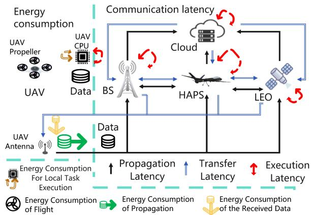  
Fig. 3: Schematic diagram of energy consumption and latency of UAV

2) Energy consumption and Latency: As shown in Fig. 3, the UAV-assisted task offloading framework decomposes the total latency into propagation, transfer, and execution components while modeling four corresponding energy consumption terms. Task requests are assumed to be processed immediately upon arrival at the designated LEO/HAPS/BS server. We next derive the analytical expressions of each latency and energy component.

The propagation latency for UAV u can be calculated as

$$
L _ { u } ^ { p } ( t ) = \left\{ \begin{array} { l l } { 0 , \quad } & { \alpha _ { u } ( t ) = 1 , } \\ { \frac { s t _ { u } ( t ) } { C h _ { i , u } ^ { \beta } ( t ) R _ { u , i } } , \quad } & { \beta _ { u , i } ( t ) = 1 , } \\ { \frac { s t _ { u } ( t ) } { C h _ { i , u } ^ { \gamma } ( t ) R _ { u , i } } + \frac { d _ { i , k } } { c } , \quad } & { \gamma _ { u , i \in b , k \in c e } ( t ) = 1 , } \\ { \frac { s t _ { u } ( t ) } { C h _ { i , u } ^ { \gamma } ( t ) R _ { u , i } } + \frac { s t _ { u } ( t ) } { C h _ { k , i } ^ { \gamma } ( t ) R _ { i , k } } , \quad } & { \gamma _ { u , i , k } ( t ) = 1 , } \end{array} \right.\tag{4}
$$

Here, $R _ { u , i }$ and $R _ { i , k }$ are determined based on the transmission rate model described earlier, which depends on the specific user types and their corresponding offloading decisions. These values represent the transmission rate from UAV u to remote server i and from server i to another server $k ,$ respectively, where $C h _ { i , u } ^ { \beta } ( t )$ and $C h _ { i , u } ^ { \gamma } ( t )$ denote the numbers of channels allocated by server i to UAV u for single-stage and secondary task offloading, respectively. The term $C h _ { k , i } ^ { \gamma } ( t )$ denotes the number of channels used on the secondary link from server i to server k. Meanwhile, $C h _ { i , u } ^ { \beta } ( t ) + C \bar { h } _ { i , u } ^ { \gamma } ( t ) \ : = \ : C h _ { i , u } ( t )$ and $\begin{array} { r } { \sum _ { u = 1 } ^ { U } C h _ { i , u } ( t ) \leq C h a n n e l A l l _ { i } } \end{array}$ must be satisfied, where ChannelAll<sub>i</sub> denotes the total number of channels available at server i. The condition $\gamma _ { u , i \in b , k \in c e } ( t ) = 1$ indicates two-stage offloading from the UAV to a base station i and then to a cloud or edge computing device $k ,$ , where $d _ { i , k }$ represents the actual distance between i and k.

The energy consumption for communication propagation by the UAV can be calculated as:

$$
E _ { u } ^ { p } ( t ) = \left\{ \begin{array} { l l } { 0 , } & { \alpha _ { u } ( t ) = 1 , } \\ { \frac { P _ { t r a n s } s t _ { u } ( t ) } { C h _ { i , u } ^ { \beta } ( t ) R _ { u , i } } , } & { \beta _ { u , i } ( t ) = 1 , } \\ { \frac { P _ { t r a n s } s t _ { u } ( t ) } { C h _ { i , u } ^ { \gamma } ( t ) R _ { u , i } } , } & { \gamma _ { u , i , k } ( t ) = 1 , } \end{array} \right.\tag{5}
$$

where $P _ { t r a n s }$ denotes the transmission power of UAV.

The execution latency for UAV u can be calculated as follow:

$$
\begin{array} { r } { L _ { u } ^ { e } ( t ) = \left\{ \begin{array} { l l } { \frac { r c _ { u } ( t ) } { r r _ { i = u , u } ( t ) C _ { i = u } ^ { ( m a x ) } } , } & { \alpha _ { u } ( t ) = 1 , } \\ { \frac { r c _ { u } ( t ) } { r r _ { i , u } ( t ) C _ { i } ^ { ( m a x ) } } , } & { \beta _ { u , i } ( t ) / \gamma _ { u , i , k } ( t ) = 1 , } \end{array} \right. } \end{array}\tag{6}
$$

where $r r _ { i , u } ( t )$ denotes the resource allocation rate from server i to the task from UAV u at timestep t, and $C _ { i } ^ { ( m a x ) }$ represents the maximum CPU core cycles (Hz/s) available at server i. The server categories are defined as follows:

• For $1 \leq i \leq U$ : Servers correspond to UAVs.

• For $U + L + 1 \le i \le U + L + H ;$ : Servers correspond to HAPS.

• For $U + L + H + 1 \le i \le U + L + H + B \colon$ Servers correspond to BS.

• For $U + L + H + B + 1 \le i \le U + L + H + B + C E$ Servers correspond to CE Servers.

The energy consumption for task execution by UAV u can be calculated as:

$$
E _ { u } ( t ) = k _ { u } ( f _ { u } ( t ) ) ^ { v } T _ { u } ( t )\tag{7}
$$

where $k _ { u }$ is a constant and depends only on the architecture of UAV u processor chip. $f _ { u } ( t )$ is the number of CPU cycles of the UAV device processor, defined as $f _ { u } ( t ) = r r _ { i = u , u } ( t ) C _ { i = u } ^ { ( m a x ) }$ $T _ { u } ( t )$ is the task execution time on UAV u, given by $T _ { u } ( t ) =$ $L _ { e } ^ { u } ( t )$

Using Eq.(7), we can derive the energy consumption for task execution as:

$$
E _ { u } ^ { e } ( t ) = \left\{ \begin{array} { l l } { k _ { u } f _ { u } ( t ) ^ { v - 1 } r c _ { u } ( t ) , } & { \alpha _ { u } ( t ) = 1 , } \\ { 0 , } & { \beta _ { u , i } ( t ) / \gamma _ { u , i , k } ( t ) = 1 , } \end{array} \right.\tag{8}
$$

After server computation,the result is sent from LEO/HAPS/BS to the UAV. The result transfer latency for UAV u can be calculated as

$$
L _ { u } ^ { h } ( t ) = \left\{ \begin{array} { l l } { 0 , \quad } & { \alpha _ { u } ( t ) = 1 , } \\ { \frac { s p _ { u } ( t ) } { C h _ { u , i } ^ { \beta } ( t ) R _ { i , u } } , \quad } & { \beta _ { u , i } ( t ) = 1 , } \\ { \frac { s p _ { u } ( t ) } { C h _ { u , i } ^ { \gamma } ( t ) R _ { i , u } } + \frac { d _ { k , i } } { c } , \quad } & { \gamma _ { u , i \in b , k \in c e } ( t ) = 1 , } \\ { \frac { s p _ { u } ( t ) } { C h _ { u , i } ^ { \gamma } ( t ) R _ { i , u } } + \frac { s p _ { u } ( t ) } { C h _ { i , k } ^ { \gamma } ( t ) R _ { k , i } } , \quad } & { \gamma _ { u , i , k } ( t ) = 1 , } \end{array} \right.\tag{9}
$$

where $C h _ { u , i } ^ { \beta } ( t )$ and $C h _ { u , i } ^ { \gamma } ( t )$ denote the number of channels used by UAV u for receiving data from server $i ,$ and $C h _ { i , k } ^ { \gamma } ( t )$ denotes the number of channels used by server i for receiving data from server k. The type of channel used (β or γ) depends on the overall offloading strategy. Meanwhile, $C h _ { u , i } ^ { \beta } ( t ) ^ { \top } + C h _ { u , i } ^ { \gamma } ( t ) = C h _ { u , i } ( t )$ and $\begin{array} { r } { \sum _ { i = 1 } ^ { L + H \mp B } C h _ { u , i } ( t ) \leq } \end{array}$ Channel $A l l _ { u } .$ , where Channel $A l l _ { u }$ denotes the total number of channels available at UAV u.

$$
E _ { u } ^ { h } ( t ) = \left\{ \begin{array} { l l } { 0 , } & { \alpha _ { u } ( t ) = 1 , } \\ { \frac { P _ { r e c v } s p _ { u } ( t ) } { C h _ { u , i } ^ { \beta } ( t ) R _ { i , u } } , } & { \beta _ { u , i } ( t ) = 1 , } \\ { \frac { P _ { r e c v } s p _ { u } ( t ) } { C h _ { u , i } ^ { \gamma } ( t ) R _ { i , u } } , } & { \gamma _ { u , i , k } ( t ) = 1 , } \end{array} \right.\tag{10}
$$

where $P _ { r e c v }$ denotes the received data power at the UAV side. The total latency for task offloading can be expressed as

$$
L _ { u } ^ { t o t a l } ( t ) = L _ { u } ^ { p } ( t ) + L _ { u } ^ { e } ( t ) + L _ { u } ^ { h } ( t )\tag{11}
$$

Here, the energy consumption of UAV u during the process of moving from one cell to another based on its decision is derived with reference to [38] [47], as shown in the following formula as

$$
E _ { u } ^ { f } ( O _ { u } ( t ) ) = ( \rho V ^ { 2 } + P _ { \mathrm { h o v e r } } ) \Delta ( O _ { u } ( t ) )\tag{12}
$$

$$
P _ { \mathrm { h o v e r } } = \frac { ( m g ) ^ { 3 / 2 } } { \sqrt { 2 \rho _ { \mathrm { a i r } } A } } .\tag{13}
$$

where V represents the UAV’s flying velocity, $\rho$ is a coefficient related to $\Delta ( O _ { u } ( t ) ) , \ \Delta ( O _ { u } ( t ) )$ denotes the flight duration when UAV u executes movement direction $O _ { u }$ at time t, m denotes the UAV mass, g is the gravitational acceleration, $\rho _ { \mathrm { a i r } }$ is the air density, and A denotes the total rotor disk area of a UAV.

The energy consumption formula for the entire time duration of the UAV, including flight consumption, communication consumption, and computation consumption, is as follows

$$
E _ { u } ^ { t o t a l } ( t ) = E _ { u } ^ { p } ( t ) + E _ { u } ^ { e } ( t ) + E _ { u } ^ { h } ( t ) + E _ { u } ^ { f } ( O _ { u } ( t ) )\tag{14}
$$

Overall, the task offloading model considers both latency and energy consumption from a unified perspective. For each task, local processing avoids communication delay but incurs onboard computation energy, while offloading reduces onboard computation energy at the cost of transmission delay and communication energy. These cost components are evaluated jointly under the same decision step, enabling the UAV to select between local execution and offloading based on current network conditions, task characteristics, and remaining energy budget. This unified cost interpretation allows the learning agent to explicitly trade off timeliness and endurance in a consistent manner.

## IV. PROBLEM FORMULATION

## A. Multi-Terrain Task Conversion under Uncertainty

We begin by noting that the search area E is initially unknown to the UAVs. Following the assumption in [38], each cell within E is associated with a time-dependent uncertainty value $u n _ { [ l _ { x } , l _ { y } ] } ( t ) \in [ 0 , 1 ]$ , which reflects the UAV’s uncertainty regarding the distribution of targets in the environment at time step t. A value of $u n _ { [ l _ { x } , l _ { y } ] } ( t ) ~ = ~ 1$ indicates that the corresponding cell is entirely unexplored. Based on the Dempster-Shafer Theory (DST) and Dempster’s combination rule [38], once a UAV u searches cell $[ l _ { x } , l _ { y } ]$ at time step t, the associated uncertainty is reduced at a constant rate λ.

However, in realistic and complex terrain environments, the difficulty of exploration varies significantly across regions. Traditional methods that rely on repeated visits to reduce uncertainty are often inefficient and resource-intensive. To address this limitation, we propose a multi-terrain task conversion mechanism that enhances the efficiency of single-step exploration and minimizes redundant effort. Specifically, regions that would typically require multiple explorations to sufficiently reduce uncertainty are redefined as high-load tasks that can be completed in a single step. In this setting, the scheduling system no longer tracks exploration frequency alone, but instead assigns an equivalent compound task load to each cell based on terrain complexity, historical uncertainty evolution, and other relevant environmental factors. Accordingly, we define the following task load formulation:

$$
s t _ { u } ( t ) = \mathrm { T a s k } _ { [ l _ { x } , l _ { y } ] } = N _ { [ l _ { x } , l _ { y } ] } \cdot \tau\tag{15}
$$

In this formulation, when the uncertainty of cell $[ l _ { x } , l _ { y } ]$ at time step t is $u n _ { [ l _ { x } , l _ { y } ] } ( t ) = 1 \ \mathrm { { ( i . e . } }$ , the region is completely unexplored), the task load assigned to UAV u at time $t ,$ denoted as $s t _ { u } ( t )$ , is equal to the total amount of tasks required to reduce the uncertainty of that region from 1 to 0. Specifically, $N _ { [ l _ { x } , l _ { y } ] }$ denotes the number of exploration attempts needed to bring the uncertainty below an exploration threshold, and $\tau$ represents the unit task load per exploration. This definition enables the conversion of repetitive exploration efforts into a single equivalent compound task, facilitating more effective scheduling and resource allocation.

$$
( 1 - \lambda _ { [ l _ { x } , l _ { y } ] } ) ^ { N _ { [ l _ { x } , l _ { y } ] } } \le \delta\tag{16}
$$

where $\lambda _ { [ l _ { x } , l _ { y } ] }$ denotes the composite uncertainty reduction rate for cell $[ \bar { l } _ { x } , \bar { l } _ { y } ]$ , and δ represents the exploration threshold. From Equation (14), we derive the following expression:

$$
N _ { [ l _ { x } , l _ { y } ] } = \left\lceil \frac { \log ( \delta ) } { \log ( 1 - \lambda _ { [ l _ { x } , l _ { y } ] } ) } \right\rceil\tag{17}
$$

where $\delta$ denotes the predefined uncertainty threshold, $\lambda _ { [ l _ { x } , l _ { y } ] }$ represents the uncertainty reduction rate per exploration, and ⌈·⌉ is the ceiling function to ensure the number of explorations is an integer.

Since a given region may include multiple terrain types, the uncertainty reduction rate $\lambda _ { [ l _ { x } , l _ { y } ] }$ is modeled as a weighted combination of the contributions from all terrain types present in the area:

$$
\lambda _ { [ l _ { x } , l _ { y } ] } = \sum _ { k = 1 } ^ { K } \omega _ { k } \cdot \rho _ { k , [ l _ { x } , l _ { y } ] } .\tag{18}
$$

where $\omega _ { k }$ denotes the exploration decay factor associated with terrain type k (RIVER, BEACH, GRASS, FOREST, MOUNTAIN). $\rho _ { k , [ l _ { x } , l _ { y } ] }$ represents the proportion of terrain type k in cell $[ l _ { x } , l _ { y } ]$

## B. Uncertainty Modeling and Reward Coupling

To capture spatial heterogeneity, each grid cell is associated with an uncertainty value representing incomplete environmen tal knowledge. When a UAV senses a cell, its uncertainty decreases according to a terrain-dependent decay rate; complex terrain slows this reduction and requires more sensing effort. This mechanism supports differentiated task generation and prioritization across heterogeneous regions.

Wind dynamics further interact with terrain characteristics by affecting flight energy and feasible motion patterns. Strong headwinds increase propulsion cost and may constrain trajectories, whereas favorable wind directions reduce energy expenditure. Thus, UAVs must consider both terrain-induced sensing difficulty and wind-induced mobility cost.

The reward combines uncertainty-reduction gain with penalties for energy use and task-completion latency. Failed tasks leave the corresponding cell’s uncertainty unchanged and therefore provide no uncertainty-reduction gain; their impact is further reflected by the energy consumed during the unsuc cessful attempt and the resulting task-completion latency.

1) Offloading Optimization Problem: The optimization problem can be formulated as

$$
P : \operatorname* { m i n } _ { \substack { \alpha , \beta , \gamma , \mathbf { C } , \mathbf { C h } I  X } } \sum _ { t = 1 } ^ { t = I } L ( t )\tag{19}
$$

$$
\sum _ { u \in \mathcal { U } } r r _ { i , u } ( t ) \leq \zeta ,\tag{19a}
$$

$$
\sum _ { u = 1 } ^ { U } C h _ { i , u } ( t ) + \sum _ { k = 9 } ^ { L H B C E } e ( k , i ) C h _ { i , k } \leq C h a n n e l A l l _ { i } ,\tag{19b}
$$

$$
L H B \ L H B C E
$$

$$
\sum _ { i = 0 } \sum _ { \boldsymbol { k } = 0 } e ( \boldsymbol { i } , \boldsymbol { k } ) C h _ { \boldsymbol { k } , i } \leq C h a n n e l A l l _ { \boldsymbol { k } } ,\tag{19c}
$$

$$
L _ { o } ^ { u } ( t ) \leq d _ { c , u } ( t ) ,\tag{19d}
$$

$$
\operatorname { E q . } \ ( 3 )\tag{19f}
$$

$$
E _ { u } ^ { t o t a l } ( t ) \le B a t t e r y _ { u } ( t ) - \xi B a t t e r y _ { u }\tag{19g}
$$

Constraints Eq. (19a), Eq. (19b), and Eq. (19c) ensure that allocated resources remain within the available limits. Constraint Eq. (19d) guarantees satisfaction of the task latency requirement, while Eq. (19f) states that a UAV task can either be accepted or dropped. Here, $\textit { B a t t e r y } _ { u } ( t )$ represents the remaining battery energy of UAV u at time step t, Battery<sub>u</sub> denotes the maximum battery energy of UAV u, and ξ represents the required minimum residual energy ratio necessary for UAV u to continue operating.

If all feasible local, primary-offloading, and secondaryoffloading choices violate these resource or latency constraints, the environment records a failed/dropped task at that time step. The failed task is not counted as effective search progress. Its impact is reflected through the loss of uncertaintyreduction gain, additional communication/computation energy expenditure, and increased task-completion latency caused by the unsuccessful execution attempt.

This formulation exposes two coupled decisions: lowfrequency UAV deployment/recovery under wind-terrain conditions and online trajectory/offloading under energy and resource constraints. The resulting long-horizon MINLP combines discrete offloading/deployment choices with continuous energy and resource variables. Traditional optimization and monolithic DRL methods struggle with the coupled spatial correlations, resource allocation, and dynamic interactions, motivating the HCDRL+GA decomposition described next.

## V. THE PROPOSED HCDRL+GA FRAMEWORK AND ALGORITHM IMPLEMENTATION

## A. Motivation

UAV deployment, trajectory control, and task offloading involve decisions with different structures and time scales. Deployment is a low-frequency mission-level combinatorial decision over takeoff and recovery positions, affecting coverage, energy consumption, and connectivity. In contrast, trajectory control and task offloading are online sequential decisions that respond to local uncertainty, wind disturbance, battery level, link quality, and server load. Embedding all three decision layers into a monolithic distributed DRL/MADRL formulation would create a large hybrid state-action space and delayed mission-level credit assignment, reducing sample efficiency and training stability.

To address this, we adopt a two-stage HCDRL+GA design. HCDRL handles online trajectory control and task offloading, while GA searches over global UAV deployment configurations. The trained HCSAC policy is used in a policy-in-the-loop manner to evaluate candidate deployments during GA search. This decoupled design balances global deployment optimization with adaptive online control and improves scalability and interpretability. Fig. 5 summarizes this workflow and highlights the transfer of the trained HCSAC policy from HCDRL to GA as a rollout-based fitness evaluator.

## B. State Space

1) Wind State: In this study, we use offline wind-field records from the Global Forecast System (GFS) provided by the National Oceanic and Atmospheric Administration (NOAA) [49], [50] to construct realistic wind-aware simulation environments. The GFS records provide multi-layer atmospheric variables, including horizontal wind components, and the dataset corresponds to a selected geographic region and season. During each training or evaluation episode, a temporal segment is randomly sampled from the offline GFS wind-field records, spatially cropped to the target region, and interpolated onto the $L _ { x } \times L _ { y }$ simulation grid. The horizontal wind components u and v (in m/s), representing the eastwest and north-south wind components, are used as wind-state variables. The local observation of UAV u is then constructed as a three-channel tensor composed of the uncertainty map, the local wind-u map, and the local wind-v map. This design exposes UAV agents to diverse spatial wind patterns and improves the realism of HCDRL+GA evaluation. These data are used as offline environmental inputs for simulation only. We do not assume real-time NOAA access, live UAV weather-data retrieval, or a deployment-time meteorological data pipeline. Therefore, real-world constraints such as data-access latency, communication delay, synchronization overhead, and onboard processing overhead are not modeled in this work. Wind direction is computed with respect to the horizontal axis and represented by ${ \theta _ { w } } \in \left[ { - 1 8 0 ^ { \circ } , 1 8 0 ^ { \circ } } \right]$ . In the experiments, the reported low-, moderate-, and strong-wind cases are categorized according to the wind-speed magnitude statistics of the sampled fields.

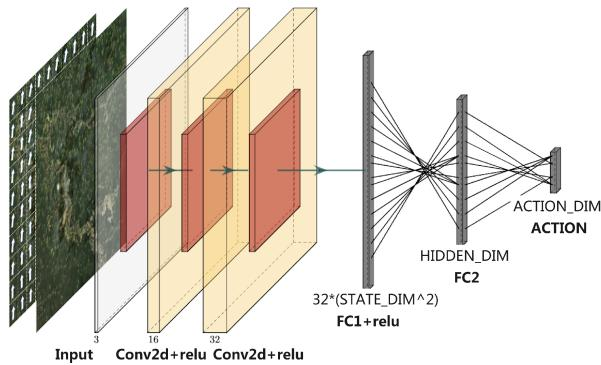  
Fig. 4: CNN Architecture for Processing UAV Local Environmental States for Trajectory Control

2) Local Observation State Space for Trajectory Planning: Each UAV receives a local observation $O B _ { u } ^ { \mathrm { { l o c a l } } } \in \mathbb { R } ^ { H \times H \times H }$ which encodes spatial information such as terrain features, wind field intensity, and obstacles within its perception range. This observation is processed by a convolutional neural network (CNN) to extract spatial features for trajectory control decisions.

$$
S _ { u } ^ { 1 } ( t ) = \left\{ { \mathbb R } _ { u n c , u } ^ { H } , { \mathbb R } _ { w i n d \_ u , u } ^ { H } , { \mathbb R } _ { w i n d \_ v , u } ^ { H } \right\}\tag{20}
$$

$S _ { u } ^ { 1 } ( t )$ denotes the trajectory control state space of UAV u at time step t, defined as a composite of three local observation matrices: $\mathbb { R } _ { u n c , u } ^ { H }$ : the local uncertainty matrix, representing the degree of environmental knowledge within the UAV’s field of view; $\mathbb { R } _ { w i n d \_ u , u }$ : the local wind field matrix in the u-direction (east-west component); $\mathbb { R } _ { w i n d \_ v , u } ^ { H } \mathrm { : }$ the local wind field matrix in the v-direction (north-south component).

These spatial components jointly constitute the UAV’s local observation input, which is fed into the CNN module for spatial feature extraction and trajectory control. The specific architecture of this module is shown in Fig. 4.

3) Topological Graph State Space for Task Offloading: A graph $\mathcal { G } = ( \nu , \mathcal { E } )$ is constructed where nodes represent UAVs, ground base stations, or edge devices. Each node possesses key features like energy level, computation load, and link quality, which dynamically reflect its state.

This graph is processed using multiple Graph Convolutional Network (GCN) layers [51]. GCNs aggregate information from neighboring nodes, enabling the learned node embedding for each node to capture its own features, network topological dependencies, and contextual information. A common GCN layer is defined as:

$$
\begin{array} { r } { S _ { u } ^ { 2 } ( t ) = Z = f ( X , A ) = \mathrm { s o f t m a x } ( \hat { A } \mathrm { R e L U } ( \hat { A } X W ^ { ( 0 ) } ) W ^ { ( 1 ) } ) } \end{array}\tag{21}
$$

where $W ^ { ( 0 ) }$ is GCNConv1 in Fig. $^ { 6 , }$ and $W ^ { ( 1 ) }$ is GCNConv2 in the figure.

The general matrix form for a GCN layer is:

$$
\mathbf { X } ^ { \prime } = \hat { \mathbf { D } } ^ { - 1 / 2 } \hat { \mathbf { A } } \hat { \mathbf { D } } ^ { - 1 / 2 } \mathbf { X } \Theta\tag{22}
$$

where:

$\hat { \mathbf { A } } = \mathbf { A } + \mathbf { I }$ denotes the adjacency matrix with inserted self-loops.

$\begin{array} { r } { \hat { D } _ { i i } = \sum _ { i = 0 } \hat { A } _ { i j } } \end{array}$ is its diagonal degree matrix.

• The adjacency matrix A can include edge weights via an optional edge\_weight tensor.

Its node-wise formulation is given by:

$$
\mathbf { x } _ { i } ^ { \prime } = \boldsymbol \Theta ^ { \top } \sum _ { j \in \mathcal { N } ( i ) \cup \{ i \} } \frac { e _ { j , i } } { \sqrt { \hat { d } _ { j } \hat { d } _ { i } } } \mathbf { x } _ { j }\tag{23}
$$

where $\begin{array} { r } { \hat { d } _ { i } = 1 { + } \sum _ { j \in \mathcal { N } ( i ) } e _ { j , i } , e _ { j , i } } \end{array}$ denotes the edge weight from source node $j$ to target node i (default: 1.0). These informationrich node embeddings form the state space for a Reinforcement Learning (RL) agent. This allows the agent to learn and execute adaptive task offloading strategies, deciding whether to process a task locally or offload it to the most suitable alternative node, based on an understanding of the overall network topology and the current status of each node.

## C. Algorithm Action Space

In our proposed algorithm, the action space is decomposed into two distinct subspaces, each corresponding to one of the two decision-making modules:

• Trajectory Control Action Space $A _ { u } ^ { 1 } ( t )$ : This is derived from the features extracted from $S _ { u } ^ { 1 } ( t )$ by the CNN module, and produces continuous control actions such as movement direction, speed, or turning angle. This branch enables online trajectory adjustment based on spatial awareness of the local environment.

• Task Offloading Action Space $A _ { u } ^ { 2 } ( t )$ : This is generated from the node embeddings $S _ { u } ^ { 2 } ( t )$ (obtained via the GCN module) and produces discrete offloading decisions, indicating the target node (ground station or edge server) for each task. This branch captures the dynamic topology and resource availability across UAVs and communication nodes.

The aforementioned decomposition of the action space into $A _ { u } ^ { 1 } ( t )$ (trajectory control) and $A _ { u } ^ { 2 } ( t )$ (task offloading) for each UAV u is a cornerstone of our approach to managing complexity. This strategy is crucial because this encoding linearizes the multi-agent action state space’s exponential growth.

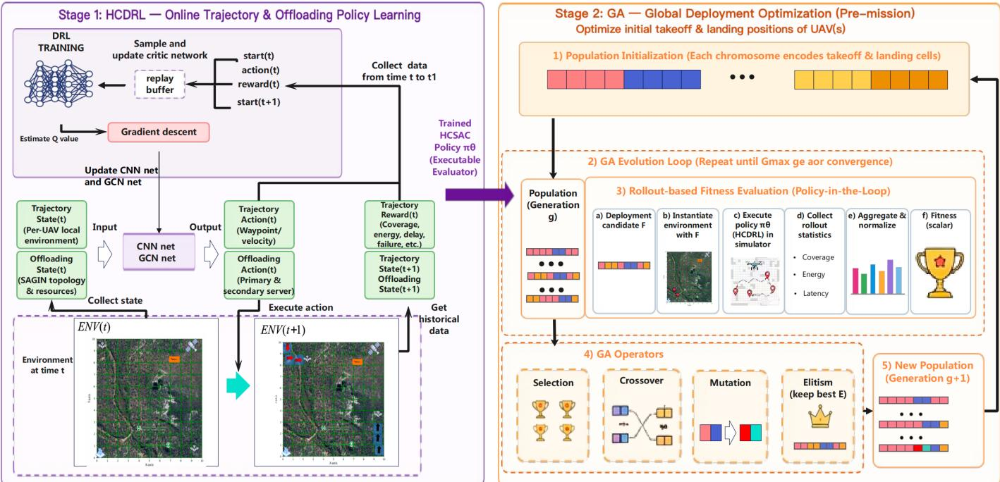  
Fig. 5: HCDRL+GA framework for multi-UAV cooperative search in SAGIN. HCDRL learns online trajectory/offloading policies, while GA optimizes UAV takeoff/recovery deployments using the trained policy π as a rollout-based fitness evaluator.

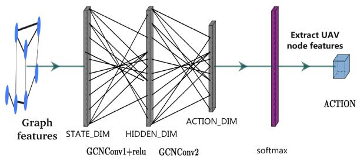  
Fig. 6: GCN Architecture for Processing UAV Local Environmental States for offloading Control

To elaborate, in traditional centralized multi-agent systems, the joint action space can grow exponentially with the number of agents. For instance, consider U UAVs, where each UAV has N potential trajectory actions and M task offloading choices. If these decisions were globally coupled, the total action space could scale as $( N M ) ^ { U }$ (assuming each UAV selects one action from a combined pool of N M possibilities for a joint system state). This exponential scaling poses a significant challenge for learning effective policies.

Our HCDRL framework mitigates this explosion. As previously detailed, the state encoding provides individualized state representations for each UAV: S<sup>1</sup>(t) (derived from CNNextracted visual features for local environmental perception) and $S _ { u } ^ { 2 } ( t )$ (node embeddings from GCNs capturing network topology and offloading connectivity). These tailored inputs allow each UAV to make decisions within its distinct action subspaces ${ \cal A } _ { u } ^ { 1 } ( t )$ and $A _ { u } ^ { 2 } ( t ) )$ in a largely independent manner. This effectively decomposes the global state and decision problem, making each UAV’s action selection contingent on its local (visual) state and its understanding of the network, rather than a complex joint global state. Consequently, the complexity of the overall multi-agent action state space is reduced to scale approximately linearly with the number of UAVs.

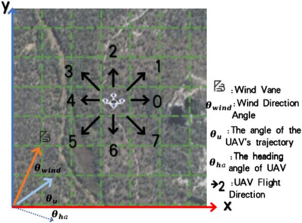  
Fig. 7: Dynamic UAV Movement Model

1) UAV Action Design and Energy Consumption Calculation for Each Action: We referred to the work of [38], at each time step, the UAV can select a direction based on the policy model and move from the center of its current cell to the center of an adjacent cell. The position of UAVs $u ( u \in \mathbb { U } = \{ 1 , 2 , \dots , U \} )$ at time step t is represented as $p u _ { u } ( t ) \ = \ [ x _ { u } ( t ) , y _ { u } ( t ) ] \ \in$ $\{ 1 , 2 , \ldots , L _ { x } \} \times \{ 1 , 2 , \ldots , L _ { y } \}$ . The real position formula of UAV u is then given by $\begin{array} { r } { [ ( x _ { u } ( \dot { t } ) - 0 . 5 ) \frac { X } { L _ { x } } , ( y _ { u } ( t ) - 0 . 5 ) \frac { Y } { L _ { u } } , H ] } \end{array}$ We define $O _ { u } ( t )$ set as the possible movement direction that the UAV u can choose at time step t, which is defined as { 0 (east), 1 (southeast), 2 (south), 3 (southwest), 4 (west), 5 (northwest), 6 (north), 7 (northeast), 8 (return)}. As shown in Fig. 7, each UAV can select one directional command to move. Thus, in the absence of wind, the UAV’s movement speed (assuming each UAV has the same speed parameter) can be represented as $v _ { u }$ . Under windy conditions, where the wind direction forms an angle $\theta _ { \mathrm { w } } \in \left[ - 1 8 0 ^ { \circ } , 1 8 0 ^ { \circ } \right]$ with the horizontal x-axis, the wind speed $v _ { \mathrm { w } }$ , the actual speed in the direction can be expressed as

$$
\vec { V } _ { r } ^ { u } = \vec { V } _ { \mathrm { h a } } ^ { u } + \vec { V } _ { w } ^ { p }\tag{23a}
$$

$$
\vec { V } _ { \mathrm { h a } } ^ { u } = \left( V _ { \mathrm { h a } } ^ { u } \cos \theta _ { \mathrm { h a } } ^ { u } , \ V _ { \mathrm { h a } } ^ { u } \sin \theta _ { \mathrm { h a } } ^ { u } \right)\tag{23b}
$$

$$
\vec { V } _ { r } ^ { u } = \left( V _ { r } ^ { u } \cos \theta _ { r } ^ { u } , \ V _ { r } ^ { u } \sin \theta _ { r } ^ { u } \right)\tag{23c}
$$

where $\theta _ { \mathrm { h a } } ^ { u }$ represents the heading angle of UAV u , $V _ { \mathrm { r } } ^ { u }$ denotes the actual flight speed of UAV u , and $\theta _ { r } ^ { u }$ represents the actual flight trajectory direction of UAV u .

Eq. (23a): The UAV u final velocity vector ${ \vec { V } } _ { r } ^ { u }$ is obtained by the vector addition of its airspeed $\vec { V } _ { \mathrm { h a } } ^ { u }$ (velocity relative to the air) and the wind velocity vector $\vec { V } _ { w } ^ { p }$ . Eq. (23b) and Eq. (23c): These two equations represent the components of the UAV’s airspeed vector and actual velocity vector in the Cartesian coordinate system. Combining Eq. (23a), (23b), and (23c), we derive Eq. (23).

$$
\begin{array} { l } { { V _ { \mathrm { h a } } ^ { u } = } } \\ { { \sqrt { \left( V _ { r } ^ { u } \cos \theta _ { r } ^ { u } - V _ { w } ^ { p } \cos \theta _ { w } ^ { p } \right) ^ { 2 } + { \left( V _ { r } ^ { u } \sin \theta _ { r } ^ { u } - V _ { w } ^ { p } \sin \theta _ { w } ^ { p } \right) } ^ { 2 } } } } \end{array}\tag{24}
$$

Building on Eq. (12), we define the coefficient as $\rho ~ =$ $0 . 5 M \Delta ( O _ { u } ( t ) )$ [38], [48], where M denotes the total mass of the UAV, including its payload, and $\Delta ( O _ { u } ( t ) )$ from Fig. 7 is flight time. This formulation quantifies the energy-related cost or impact associated with environmental variation during UAV operation. $\Delta ( O _ { u } ( t ) )$ can be expressed by the following formula:

$$
\Delta ( O _ { u } ( t ) ) \left\{ \begin{array} { l l } { \frac { X } { L _ { x } V _ { r } ^ { u } } , } & { O _ { u } ( t ) \in \{ 0 , 4 \} , } \\ { \quad } & { O _ { u } ( t ) \in \{ 0 , 4 \} , } \\ { \frac { Y } { L _ { y } V _ { r } ^ { u } } , } & { O _ { u } ( t ) \in \{ 2 , 6 \} , } \\ { \quad } & { \quad } \\ { \frac { 1 } { V _ { r } ^ { u } } \sqrt { \left( \frac { X } { L _ { x } } \right) ^ { 2 } + \left( \frac { Y } { L _ { y } } \right) ^ { 2 } } , } \\ { \quad } & { O _ { u } ( t ) \in \{ 1 , 3 , 5 , 7 \} , } \end{array} \right.\tag{25}
$$

Due to the influence of wind, fixing the UAV’s airspeed during training can lead to variations in its actual velocity across different directions. To simplify the training process while still reflecting practical considerations, we assume that the UAV can adjust its airspeed in response to the wind, ensuring consistent actual velocity across eight predefined directions. With this assumption, the UAV’s flight energy consumption can be computed based solely on its airspeed. Taking the time in the {1, 3, 5, 7} directions as the reference time, we derive the following formula for the actual velocity:

$$
\begin{array} { r } { V _ { r } ^ { u } \left\{ \begin{array} { l l } { \frac { X v _ { r } ^ { u } } { L _ { x } \sqrt { \left( \frac { X } { L _ { x } } \right) ^ { 2 } + \left( \frac { Y } { L _ { y } } \right) ^ { 2 } } } , } & \\ { \frac { Y v _ { r } ^ { u } } { L _ { y } \sqrt { \left( \frac { X } { L _ { x } } \right) ^ { 2 } + \left( \frac { Y } { L _ { y } } \right) ^ { 2 } } } , } & \\ { v _ { r } ^ { u } , } & { O _ { u } ( t ) \in \{ 2 , 6 \} , } \end{array} \right. } \end{array}\tag{26}
$$

$$
O _ { u } ( t ) \in \{ 1 , 3 , 5 , 7 \} ,
$$

Then the kinetic energy consumption of the UAVs is consequently re-expressed by the following formula:

$$
E _ { n } ^ { f } ( O _ { n } ( t ) ) = 0 . 5 M \Delta ( O _ { u } ( t ) ) ( V _ { \mathrm { h a } } ^ { u } ) ^ { 2 }\tag{27}
$$

## D. Rewards

The algorithm’s objective is to optimize UAV operations for efficient environmental uncertainty reduction, while ensuring flight safety and minimizing energy use, especially under variable wind conditions. The reward function $R _ { u }$ for UAV u is:

$$
\begin{array} { r } { R _ { u } = \alpha _ { u n c } ( V _ { o l d } - V _ { n e w } ) - \epsilon _ { h a z } \cdot I _ { h a z a r d } } \\ { - \beta _ { e n } \cdot E _ { u } - \beta _ { l a t } \cdot I _ { \mathrm { l a t } , u } } \end{array}\tag{28}
$$

where $\alpha _ { u n c }$ is the scaling coefficient for the uncertainty reduction reward; $V _ { o l d }$ and $V _ { n e w }$ represent the average environmental uncertainty before and after an action, respectively; $\epsilon _ { h a z }$ the magnitude of the penalty for hazardous events (collisions, boundary violations); $I _ { h a z a r d }$ is an indicator variable $( I _ { h a z a r d } = 1 $ if a hazardous event occurs, 0 otherwise); $\beta _ { e n }$ is the penalty coefficient for energy consumption; $E _ { u }$ is the energy consumed by UAV u to perform an action; and $I _ { \mathrm { l a t } , u } = 1$ indicates that the selected processing route violates the task delay constraint.

This reward comprises:

1) Information Gain $( R _ { u n c e r t a i n t y } = \alpha _ { u n c } ( V _ { o l d } - V _ { n e w } ) ) \colon$ Rewards reduction in average environmental uncertainty $( V _ { o l d }$ to $V _ { n e w } ) .$ , scaled by $\alpha _ { u n c }$ . This encourages actions that maximize information acquisition.

2) Hazard Penalty $( P _ { h a z a r d } = \epsilon _ { h a z } \cdot I _ { h a z a r d } ) ;$ : Penalizes collisions or boundary violations (indicated by $I _ { h a z a r d } =$ 1) with a cost $\epsilon _ { h a z }$ . This promotes safe flight.

3) Energy Penalty $( P _ { e n e r g y } = \beta _ { e n } \cdot E _ { u } ) \colon$ Penalizes energy $E _ { u }$ consumed for an action, scaled by $\beta _ { e n }$ . This encourages energy-efficient paths, considering factors like wind.

4) Latency Penalty and Failure Outcome: Penalizes deadline violations. If a task-processing attempt fails, the corresponding cell’s uncertainty is not reduced, so the action produces no uncertainty-reduction gain for that task and is counted as a mission-efficiency loss through wasted energy and delayed task completion.

This formulation guides UAVs to learn strategies balancing information gathering with operational safety and energy efficiency.

## E. HCDRL Implementation

In this study, we design a Soft Actor-Critic (SAC) framework with structured state space partitioning and hierarchical modeling to separately address UAV trajectory planning and task offloading decisions. As illustrated in the HCDRL module in Fig. 5, the algorithm interacts with the environment to continuously collect transition tuples $\left( { { s _ { t } } , { a _ { t } } , { r _ { t } } , { s _ { t + 1 } } } \right)$ , which are then used to train and optimize the policy networks.

1) UAV Trajectory Planning: Because UAV flight paths are affected by terrain, wind fields, and other dynamic interferences, we use a multi-channel local input and a CNN encoder to extract spatial features for trajectory decisions.

2) Task Offloading Decisions: Offloading decisions depend on topology and inter-node resource relationships, so we model UAVs, base stations, and computing nodes as a graph whose edges encode communication links, bandwidth constraints, and collaboration relationships. A GCN extracts topology-aware node embeddings for offloading decisions in the dynamic SAGIN environment.

3) SAC Training Algorithm: To support both trajectory planning and task offloading, we employ two parallel SAC modules with task-specific state encoders. Following the standard SAC formulation, each module uses two Q-networks and a policy network to mitigate Q-value overestimation. The loss function for each Q-network is defined as

$$
\begin{array} { r l } & { L _ { Q } ( \omega ) = } \\ & { \mathbb { E } _ { ( s _ { t } , a _ { t } , r _ { t } , s _ { t + 1 } ) \sim \mathcal { R } } \left[ \frac { 1 } { 2 } \left( Q _ { \omega } ( s _ { t } , a _ { t } ) - ( r _ { t } + \gamma V _ { \bar { \omega } } ( s _ { t + 1 } ) ) \right) ^ { 2 } \right] } \\ & { = \mathbb { E } _ { ( s _ { t } , a _ { t } , r _ { t } , s _ { t + 1 } ) \sim \mathcal { R } } [ \frac { 1 } { 2 } ( Q _ { \omega } ( s _ { t } , a _ { t } ) - ( r _ { t } + } \\ & { \gamma \mathbb { E } _ { a ^ { \prime } \sim \pi ( \cdot | s _ { t + 1 } ) } { \big ( \underset { j = 1 , 2 } { \operatorname* { m i n } } Q _ { \bar { \omega } _ { j } } \big ( s _ { t + 1 } , a ^ { \prime } \big ) - \alpha \log \pi ( a ^ { \prime } | s _ { t + 1 } ) \big ) \big ) } ) ^ { 2 } ] } \end{array}\tag{29}
$$

where R denotes previous policy rollouts and A denotes the discrete action space for movement direction or offloading target selection. Target Q-networks $Q _ { \bar { \omega } }$ stabilize training. The policy loss is

$$
L _ { \pi } ( \theta ) = \mathbb { E } _ { s _ { t } \sim \mathcal { R } } \mathbb { E } _ { a \sim \pi ( \cdot \vert s _ { t } ) } \left[ \left( \alpha \log \pi ( a \vert s _ { t } ) - Q \omega ( s _ { t } , a ) \right) \right]\tag{30}
$$

with value function

$$
\begin{array} { r l } & { V ( s _ { t + 1 } ) = } \\ & { \mathbb { E } _ { a ^ { \prime } \sim \pi ( \cdot | s _ { t } ) } \left[ \underset { j = 1 , 2 } { \operatorname* { m i n } } Q _ { \omega _ { j } } ( s _ { t + 1 } , a ^ { \prime } ) - \alpha \log \pi ( a ^ { \prime } | s _ { t + 1 } ) \right] } \end{array}\tag{31}
$$

The detailed procedure is illustrated in Algorithm 1, which outlines the training process of the CNN- and GCN-based networks for learning trajectory planning and task offloading strategies, respectively.

## F. Advanced Genetic Algorithm for UAV Initial Deployment Strategy

In the final stage of our HCDRL+GA framework, a Genetic Algorithm (GA) [52] optimizes UAV takeoff and recovery posi tions before mission execution or at low-frequency replanning points, based on the available terrain map, SAGIN topology, and sampled offline GFS wind-field scenario. It optimizes UAV takeoff and recovery cells rather than per-step movement or offloading actions. During mission execution, short-term wind effects are handled by the HCDRL policy through online trajectory-control and task-offloading decisions using local wind-aware observations. Continuous online GA replanning is not assumed in this paper, because rollout-based fitness evaluation can be computationally expensive and is better suited to deployment-level updates.

```latex
Algorithm 1: Training Procedure for CNN-GCN-Based
SAC Algorithm
1: Randomly initialize the parameters of the Critic networks
$\omega _ { 1 } , \omega _ { 2 }$ to obtain $Q _ { \omega _ { 1 } } ( s , a )$ and $Q _ { \omega _ { 2 } } ( s , a )$
2: Randomly initialize the parameters of the Actor network
θ to obtain the policy $\pi _ { \boldsymbol { \theta } } ( s )$
3: Set the target network parameters $\omega _ { 1 } ^ { - }  \omega _ { 1 } , \omega _ { 2 } ^ { - }  \omega _ { 2 } .$
4: Initialize the replay buffer $\mathcal { R } .$
5: for episode = 1 to E do
6: Obtain the initial state $s _ { 1 }$ from the environment.
7: for t = 1 to $T$ do
8: Sample an action set $A _ { t } = \pi _ { \theta } ( s _ { t } )$ from the current
policy.
9: Execute the action set $A _ { t }$ in the environment,
observe reward $r _ { t }$ and next state $s _ { t + 1 }$
10: for $u = 1$ to $U$ do
11: Store the tuple $\left( { { s _ { t , u } } , { a _ { t , u } } , { r _ { t } } , { s _ { t + 1 , u } } } \right)$ for UAV u
in the replay buffer R.
12: end for
13: for training iteration $k = 1$ to K do
14: Randomly sample N transition tuples
$\{ ( s _ { i } , a _ { i } , r _ { i } , s _ { i + 1 } ) \} _ { i = 1 , \dots , N }$ from the replay buffer
$\mathcal { R } .$
15: Compute target values $y _ { i } = r _ { i } + \gamma V ( s _ { i + 1 } )$
16: Update each Critic by minimizing
$\begin{array} { r } { \dot { L ( \omega _ { j } ) } = \frac { 1 } { N } \sum _ { i = 1 } ^ { N } \big ( y _ { i } - Q _ { \omega _ { j } } ( s _ { i } , \bar { a _ { i } } ) \big ) ^ { 2 } , \ j = 1 , 2 . } \end{array}$
17: Sample $\tilde { a } _ { i }$ via reparameterization and update the
Actor by minimizing
$\begin{array} { r } { L _ { \pi } ( \theta ) \dot { = \frac { 1 } { N } } \sum _ { i = 1 } ^ { N } \mathbb { E } _ { \widetilde { a } \in \mathcal { A } } [ \alpha \log \pi _ { \theta } ( \widetilde { a } _ { i } | s _ { i } ) - } \end{array}$
$\mathrm { m i n } _ { j = 1 , 2 } Q _ { \omega _ { j } } ( s _ { i } , \tilde { a } _ { i } ) ]$
18: Update the temperature (entropy regularization
coefficient) $\alpha$
19: Softly update the target networks
$\omega _ { j } ^ { - }  \tau \omega _ { j } + ( 1 - \tau ) \omega _ { j } ^ { - } , \ j = 1 , 2 .$
20: end for
21: end for
22: end for
```

Although other derivative-free or metaheuristic optimizers could also be coupled with the same rollout-based evaluator, GA is particularly suitable for this deployment problem because UAV takeoff/recovery planning is naturally represented as a chromosome-level combinatorial search. Its selection, crossover, mutation, and elitism operations can directly explore and refine spatial deployment configurations without requiring differentiability or dense step-wise rewards. Thus, the GA searches over global deployment geometry, whereas the HCDRL policy remains responsible for online movement and offloading after deployment.

For each deployment chromosome, the fixed HCSAC policy $\pi _ { \theta }$ is rolled out to obtain three normalized mission-level metrics: search coverage, total energy consumption, and task completion latency. Since SAR prioritizes maximizing the searched area, coverage is rewarded in the GA fitness, whereas energy consumption and latency are penalized:

Fitness $( \mathcal { F } ^ { i } ) = w _ { c } \bar { C } ( \mathcal { F } ^ { i } ) - w _ { e } \bar { E } _ { \mathrm { t o t a l } } ( \mathcal { F } ^ { i } ) - w _ { d } \bar { D } _ { \mathrm { l a t } } ( \mathcal { F } ^ { i } )$ , (32) where $\bar { C } ( \mathcal { F } ^ { i } ) , \bar { E } _ { \mathrm { t o t a l } } ( \mathcal { F } ^ { i } )$ , and $\bar { D } _ { \mathrm { l a t } } ( \mathcal { F } ^ { i } )$ denote normalized coverage, total energy consumption, and task-completion latency under deployment chromosome ${ \mathcal { F } } ^ { i }$ , respectively. The weight $w _ { c }$ is assigned the largest value to reflect the primary SAR objective, while $w _ { e }$ and $w _ { d }$ penalize energy-inefficient and delay-prone deployments. Operationally, the offloading indicators determine local, primary-server, or secondary-path execution, and the corresponding latency and energy equations define the rollout cost. Thus, Eq. (32) converts downstream mission performance into a scalar deployment score for GA selection, crossover, mutation, and elitism. The detailed steps are given in Algorithm 2.

## VI. SIMULATION RESULTS

## A. Simulation Setup and Randomness-Control Protocol

Our simulation uses vision-based local observations to capture UAV motion and spatial context. To ensure fairness, physical and system parameters such as UAV mass, battery capacity, and flight speed are fixed across baselines and summarized in Table II. Our implementation code and datasets are open-sourced on GitHub.<sup>1</sup>

We use experiment-specific randomness control to balance generalization and fair comparison. Preliminary DRL/HCDRL comparisons disable wind and GA deployment to isolate the effects of state representation and policy learning. In the main experiment without GA, the uncertainty map, wind field, and offloading-device locations are randomly sampled during training and testing to evaluate policy robustness under changing environments. For the ablation, multi-UAV, and sensitivity experiments, terrain, SAGIN-device, and categoryspecific wind seeds are sampled for each independent rollout and then shared by all compared methods, ensuring that performance differences come from algorithmic behavior rather than different environment draws. For the interpretability heatmaps, the reported wind and infrastructure seeds are fixed so that the spatial offloading and visitation patterns are reproducible. All key metrics are reported as mean ± standard deviation over 10 independent rollouts.

## B. Preliminary Experiment

Our preliminary experiments, conducted using the simulator in [38], evaluated the impact of different state representation methods by comparing two UAV experimental setups that primarily differed in their state representation. Fig. 8 shows that when a flattened one-dimensional state vector was used, UAV trajectories generated by various deep reinforcement learning algorithms exhibited minimum residual uncertainties around 0.65–0.70, with only minor differences in final converged performance. In contrast, with enhanced multi-dimensional state encoding, both DQN with CNN (DQN+CNN) and SAC with CNN (SAC+CNN) achieved significant improvements over the one-dimensional vector baselines. Specifically, the minimum residual uncertainty was reduced from approximately 0.65 to 0.48 by SAC+CNN, representing an improvement of over 40%.

Algorithm 2: Genetic Algorithm (GA) component   
within the HCSAC model   
Input: Population size $P ,$ max generations $G _ { \mathrm { m a x } } .$ , crossover   
probability $p _ { c } ,$ mutation probability $p _ { m } .$ , fitness weights   
$w _ { c } , w _ { e } , w _ { d }$   
Output: Optimal UAV takeoff and recovery deployment $a ^ { * }$   
1: Initialize population. Generate an initial population   
$\mathcal { P } = \{ \mathcal { F } ^ { 1 } , \mathcal { \bar { F } } ^ { \bar { 2 } } , \ldots , \mathcal { F } ^ { P } \}$ , where each chromosome ${ \mathcal { F } } ^ { i }$   
represents a coded deployment solution consisting of the   
takeoff and recovery cells of all UAVs:   
$\mathcal { F } ^ { i } = [ p _ { u _ { 1 } } ^ { \mathrm { t o } , i } , \dots , p _ { u _ { U } } ^ { \mathrm { t o } , i } , p _ { u _ { 1 } } ^ { \mathrm { r e c } , i } , \dots , p _ { u _ { U } } ^ { \mathrm { r e c } , i } ] .$   
Here, $p _ { u _ { i } } ^ { \mathrm { t o } , i }$ and $p _ { u _ { i } } ^ { \mathrm { r e c } , i }$ denote the takeoff and recovery   
cells of $\mathsf { \check { U } A V } \ u _ { j }$ in the i-th chromosome.   
2: for generation $g = 1$ to $G _ { \mathrm { m a x } }$ do   
3: Evaluate fitness:   
4: for each chromosome $\mathcal { F } ^ { i } \in \mathcal { P }$ do   
5: Obtain normalized metrics   
$( \bar { C } _ { i } , \bar { E } _ { i } ^ { \mathrm { t o t a l } } , \bar { D } _ { i } ^ { \mathrm { l a t } } ) = \mathrm { R o l l o u t } ( \mathcal { F } ^ { i } ; \pi _ { \theta } ) .$   
6: Compute scalar fitness using Eq. (32):   
Fitness $( \mathcal { F } ^ { i } ) = w _ { c } \bar { C } _ { i } - w _ { e } \bar { E } _ { i } ^ { \mathrm { t o t a l } } - w _ { d } \bar { D } _ { i } ^ { \mathrm { l a t } } .$   
7: end for   
8: Selection:   
9: sorted $\mathcal { P } _ { \mathrm { s o r t e d } } =$ SortDescending $( { \mathcal { P } } ,$ , Fitness)   
10: select the top $\lceil s \cdot P \rceil$ individuals to form the mating   
pool $\mathcal { M } = \{ \bar { \mathcal { F } } _ { \mathrm { s o r t e d } } ^ { 1 } , \dot { \mathcal { F } } _ { \mathrm { s o r t e d } } ^ { 2 } , \dots , \mathcal { F } _ { \mathrm { s o r t e d } } ^ { \lceil s \cdot P \rceil } \}$   
11: Here, $s \in ( 0 , 1 ]$ denotes the selection ratio, and ⌈·⌉   
ensures an integer number of selected individuals.   
12: Crossover:   
13: With probability $p _ { c } ,$ perform crossover on selected   
parents, $\mathcal { F } _ { \mathrm { c h i l d } } = \lambda \mathcal { F } _ { \mathrm { p 1 } } + ( 1 - \lambda ) \mathcal { F } _ { \mathrm { p 2 } } , 0 \leq \lambda \leq 1 .$   
14: Mutation:   
15: With probability $p _ { m } ,$ randomly perturb certain genes to   
maintain diversity.   
16: Elitism and update:   
17: Preserve elite candidates and update $\mathcal { P }$ for the next   
generation.   
18: end for   
19: Output best solution:   
$a ^ { * }$ ← Decode(arg max $\mathcal { F } \in \mathcal { P }$ Fitness(F )).

It is worth noting that the experiments in Tables III and IV were conducted under a no-wind scenario with fixed UAV deployment. These settings provide a controlled baseline comparison of learning efficiency and policy quality, while the impact of dynamic wind conditions and adaptive GA-based deployment is investigated separately in later experiments.

TABLE II: Parameter settings of our experiment
<table><tr><td>Description</td><td>Value</td></tr><tr><td>Search area size Grid resolution  $( L _ { x } , L _ { y } )$  Number of  $\mathrm { U A V s } \ ( U )$  UAV flight altitude (H) UAV mass (M) Total rotor disk area of a UAV (A) Initial battery capacity (E0) Flight speed of UAVs (V) Onboard computing capability (fn) Switching capacitance coefficient (κ)</td><td> $\overline { { 1 0 ^ { 4 } \times 1 0 ^ { 4 } \mathrm { ~ m ~ } } }$   $2 0 \times 2 0$  4 200 m  $1 ~ \mathrm { k g }$   $0 . 3 2 \ m ^ { 2 }$   $3 . 6 \times 1 0 ^ { 5 } \mathrm { ~ J }$   $2 0 ~ \mathrm { m / s }$   $\mathrm { 2 \times 1 0 ^ { 9 } ~ c y c l e s / s }$   $1 0 ^ { - 2 6 }$ </td></tr><tr><td>Transmission power of UAVs  $( P _ { n } )$  Number of communication channels (L) Bandwidth per channel (B) Reference channel power gain (ho) White Gaussian noise power  $( \sigma ^ { 2 } )$  BS processing capability HAPS processing capability</td><td>23 dBm 64 10 MHz  $- 3 0 ~ \mathrm { d B }$   $4 \times 1 0 ^ { - 1 4 } \mathrm { ~ W ~ }$   $\overline { { 1 0 ^ { 1 1 } \mathrm { c y c l e s } / \mathrm { s } } }$   $1 0 ^ { 1 0 } \ \mathrm { c y c l e s } / \mathrm { s }$ </td></tr><tr><td>LEO processing capability Cloud processing capability HAPS altitude LEO altitude Cloud distance from BS Task data size (µ)</td><td> $1 0 ^ { 1 0 } \ \mathrm { c y c l e s } / \mathrm { s }$   $\mathrm { 5 \times 1 0 ^ { 1 1 } ~ c y c l e s / s }$   $2 \times 1 0 ^ { 4 } \mathrm { ~ m ~ }$   $2 \times 1 0 ^ { 6 } \mathrm { ~ m ~ }$   $1 0 ^ { 6 } \mathrm { ~ m ~ }$   $\overline { { 8 \times 1 0 ^ { 9 } ~ b i t s } }$ </td></tr><tr><td>Task processing density RL algorithm Actor learning rate Critic learning rate Temperature learning rate</td><td>1–4 cycles/bit SAC  $3 \times 1 0 ^ { - 4 }$   $3 \times 1 0 ^ { - 4 }$   $1 0 ^ { - 4 }$  0.99</td></tr><tr><td>Discount factor (γ) Soft update coefficient (τ) Replay buffer size Training episodes Hidden layer size</td><td>0.005 20000 1000 128 nodes</td></tr></table>

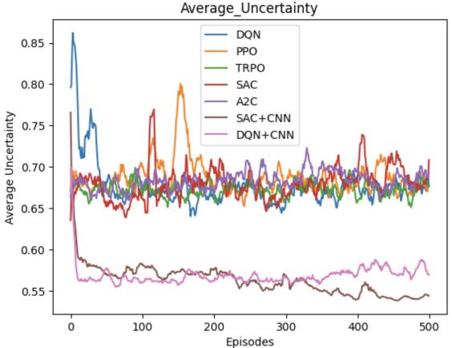  
Fig. 8: Comparative Analysis of Average Uncertainty in DRL with Flattened 1D and CNN-based State Representations

As shown in Table III, the training time for standard DRL models grows rapidly with the number of UAVs, becoming impractical at 4 UAVs and failing to converge at 6. In contrast, HCDRL maintains efficient scalability across all tested scales. Table IV further demonstrates that standard DRL fails to learn effective policies in scenarios with 4 or more UAVs.

These results validate our core hypothesis: HCDRL’s state encoding mechanism effectively handles the high-dimensional state space generated by the complex simulation environment, which overwhelms traditional methods. Given its superiority in both efficiency and performance, all subsequent experiments are based on the HCDRL framework.

TABLE III: Training time comparison of different DRL and HCDRL variants with fixed UAV deployment, where wind is disabled (no wind parameters).
<table><tr><td rowspan=1 colspan=1>Mode</td><td rowspan=1 colspan=1>model</td><td rowspan=1 colspan=1>1 UAV 2 UAVs 4 UAVs 6 UAVs</td></tr><tr><td rowspan=3 colspan=1>DRL</td><td rowspan=1 colspan=1>DQN</td><td rowspan=1 colspan=1>10m42s 11m23s  55h</td></tr><tr><td rowspan=2 colspan=1>PPOTRPOA2CSAC</td><td rowspan=1 colspan=1>4m20s 5m41s   39h</td></tr><tr><td rowspan=1 colspan=1>5m25s  5m46s   38h5m35s  6m30s   10h24m    26m    130h</td></tr><tr><td rowspan=5 colspan=1>HCDRL</td><td rowspan=5 colspan=1>HCDQNHCPPOHCTRPOHCA2CHCSAC</td><td rowspan=1 colspan=1>14m53s15m33s 16m13s28m43s</td></tr><tr><td rowspan=1 colspan=1>14m52s23m57s26m40s47m47s</td></tr><tr><td rowspan=1 colspan=1>18m36s22m13s17m45s 44m3s</td></tr><tr><td rowspan=1 colspan=1>17m57s22m47s31m10s 42m5s</td></tr><tr><td rowspan=1 colspan=1>1h45m  1h51m  1h56m 2h32m</td></tr></table>

TABLE IV: Search performance comparison with fixed UAV deployment, where wind is disabled (no wind parameters).
<table><tr><td rowspan=1 colspan=1>Mode</td><td rowspan=1 colspan=1>model</td><td rowspan=1 colspan=1>1 UAV2 UAVs 4 UAVs 6UAVs</td></tr><tr><td rowspan=2 colspan=1>DRL</td><td rowspan=1 colspan=1>DQN</td><td rowspan=2 colspan=1>0.85    0.78    0.690.95   0.901   0.8220.903  0.8220.89   0.7930.932  0.812</td></tr><tr><td rowspan=1 colspan=1>PPOTRPOA2CSAC</td></tr><tr><td rowspan=5 colspan=1>HCDRL</td><td rowspan=1 colspan=1>HCDQN</td><td rowspan=1 colspan=1>0.845  0.678   0.442   0.383</td></tr><tr><td rowspan=4 colspan=1>HCPPOHCTRPOHCA2CHCSAC</td><td rowspan=1 colspan=1>0.828  0.629   0.372   0.138</td></tr><tr><td rowspan=1 colspan=1>0.915  0.866   0.719   0.615</td></tr><tr><td rowspan=1 colspan=1>0.87   0.678   0.509   0.451</td></tr><tr><td rowspan=1 colspan=1>0.74   0.55    0.19    0.05</td></tr></table>

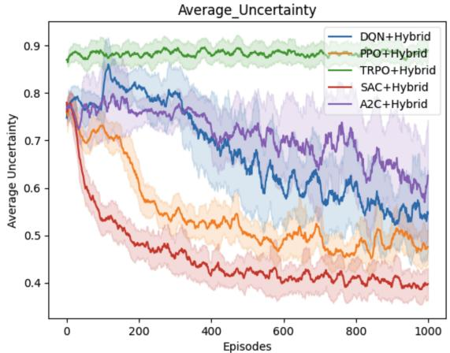  
Fig. 9: Uncertainty Reduction Performance of Hybrid DRL Models Combining Trajectory and Offloading in Non-Stationary Environments (Mean ± Std over 10 Independent Runs)

## C. Main Experiments

1) Comparative Evaluation of Hybrid DRL Algorithms: Fig. 9 compares the hybrid DRL variants for coupled trajectory control and task offloading. SAC+Hybrid, which combines CNN/GCN encoders with DRL, achieves the lowest average uncertainty, faster convergence, and smaller fluctuations than the baselines, indicating better stability in the non-stationary SAR environment. This advantage comes from jointly learning spatial motion features and topology-aware offloading features rather than treating the two decisions independently. Fig. 10 further decomposes the training return into offloading and flying rewards. The SAC-based hybrid policy maintains stable rewards in both components, suggesting that it learns a balanced policy between offloading decisions and energy-aware navigation, whereas less stable baselines exhibit slower convergence or larger variance under dynamic conditions.

TABLE V: Ablation Study under Different Wind Conditions (Mean±Std over 10 evaluation runs)  
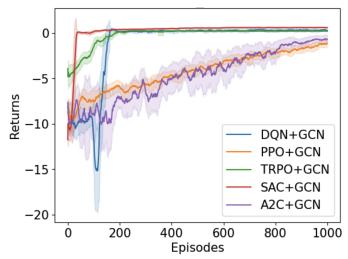

<table><tr><td rowspan="2">Variant</td><td rowspan="2">Offloading</td><td rowspan="2">GA</td><td colspan="2">Low Wind(0-1.5 m/s)</td><td colspan="2">Moderate Wind(1.6-5.4 m/s)</td><td colspan="2">Strong Wind(5.5-7.9 m/s)</td></tr><tr><td>Lifetime (min)</td><td>Coverage(%)</td><td>Lifetime</td><td>Coverage</td><td>Lifetime</td><td>Coverage</td></tr><tr><td>Full (Ours)</td><td>√</td><td>√</td><td> $\overline { { 3 9 . 8 4 \pm 0 . 9 4 } }$ </td><td> $\overline { { 6 6 . 8 8 \pm 1 . 3 4 } }$ </td><td> $3 9 . 2 6 \pm 1 . 0 7$ </td><td>65.76 ± 2.63</td><td> $\overline { { 3 8 . 4 7 \pm 1 . 1 9 } }$ </td><td> $\overline { { 6 2 . 7 7 \pm 2 . 0 1 } }$ </td></tr><tr><td>No-Offloading</td><td>×</td><td>√</td><td> $3 5 . 1 0 \pm 0 . 9 1$ </td><td> $5 8 . 9 3 \pm 1 . 5 3 $ </td><td> $3 5 . 6 6 \pm 1 . 0 2$ </td><td> $5 8 . 9 0 \pm 1 . 8 2 $ </td><td> $3 4 . 4 0 \pm 1 . 2 6$ </td><td> $5 7 . 7 6 \pm 2 . 3 3$ </td></tr><tr><td>No-GA (HCDRL-only)</td><td>√</td><td>X</td><td> $3 7 . 2 4 \pm 1 . 4 6$ </td><td> $6 1 . 7 7 \pm 2 . 2 6$ </td><td> $3 6 . 1 4 \pm 1 . 5 3$ </td><td> $5 9 . 7 2 \pm 2 . 4 7$ </td><td> $3 1 . 6 5 \pm 1 . 2 3$ </td><td> $5 3 . 2 0 \pm 1 . 9 7$ </td></tr><tr><td>No-GA and No-Offloading</td><td>×</td><td>X</td><td> $3 2 . 3 6 \pm 1 . 2 7$ </td><td> $5 4 . 3 4 \pm 2 . 0 0$ </td><td> $3 1 . 3 8 \pm 1 . 2 9$ </td><td> $5 2 . 7 6 \pm 2 . 1 6$ </td><td> $2 7 . 8 5 \pm 0 . 9 9$ </td><td> $4 7 . 2 0 \pm 1 . 6 0$ </td></tr><tr><td>GA-initialized greedy</td><td>√</td><td>√</td><td> $2 9 . 0 6 \pm 1 . 0 7$ </td><td> $4 7 . 7 5 \pm 2 . 3 0$ </td><td> $2 8 . 9 1 \pm 0 . 9 5$ </td><td> $4 7 . 5 1 \pm 2 . 3 0$ </td><td> $2 7 . 8 4 \pm 0 . 9 1$ </td><td> $4 5 . 8 6 \pm 2 . 3 9$ </td></tr><tr><td>GA w/o elitism</td><td>√</td><td>√</td><td> $3 8 . 0 7 \pm 0 . 8 6$ </td><td> $6 0 . 2 7 \pm 1 . 9 1$ </td><td> $3 6 . 2 7 \pm 0 . 8 1$ </td><td> $5 7 . 3 5 \pm 1 . 5 4$ </td><td> $3 4 . 6 8 \pm 1 . 2 5$ </td><td> $5 5 . 0 2 \pm 1 . 8 4$ </td></tr><tr><td>No-CNN (FCNN)</td><td>√</td><td>√</td><td> $3 8 . 9 8 \pm 1 . 2 3 $ </td><td> $6 4 . 1 5 \pm 1 . 5 9$ </td><td> $3 6 . 3 3 \pm 0 . 9 6$ </td><td> $5 6 . 8 0 \pm 3 . 2 5$ </td><td> $3 7 . 0 5 \pm 1 . 1 6$ </td><td> $5 7 . 0 0 \pm 1 . 8 4$ </td></tr><tr><td>No-GCN (w/o topology)</td><td>√</td><td>√</td><td> $3 7 . 7 1 \pm 0 . 8 3$ </td><td> $5 9 . 8 8 \pm 2 . 2 6 $ </td><td> $3 8 . 1 1 \pm 1 . 0 2$ </td><td> $5 9 . 9 8 \pm 0 . 9 8$ </td><td> $3 6 . 3 6 \pm 0 . 9 4$ </td><td> $5 9 . 3 0 \pm 1 . 6 8$ </td></tr></table>

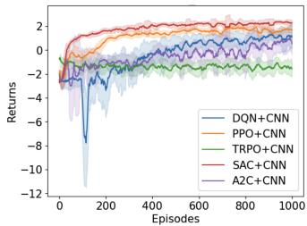  
(a) offload reward  
(b) fly reward

Fig. 10: Training return curves of hybrid DRL models with GCN-based (left) and CNN-based (right) state encoders (Mean±Std over 10 independent runs).  
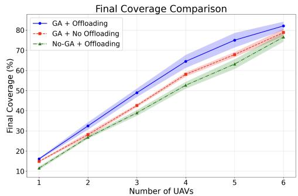  
Fig. 11: Final Coverage versus Number of UAVs under Different Schemes (Mean±Std over 10 evaluation runs). Results are shown for up to six UAVs; larger-scale performance is not evaluated in this study..

2) Module Contribution and Wind Robustness Analysis: Table V confirms the complementary roles of offloading, GA deployment, adaptive trajectory control, and multimodal representation. Removing offloading lowers both lifetime and coverage because more computation must be processed onboard or through less efficient execution paths. Disabling GA sharply reduces strong-wind coverage from 62.77% to 53.20%, indicating that poor initial deployment geometry becomes especially costly under wind disturbance. Removing both modules causes the largest collapse (27.85 min lifetime and 47.20% coverage under strong wind), showing that offloading and deployment optimization reinforce each other. The GA-initialized greedy variant further shows that high-quality deployment alone is insufficient: without learned adaptive trajectory control, the UAVs cannot respond effectively to dynamic wind and uncertainty changes. The GA w/o elitism result indicates that preserving high-quality deployment candidates helps stabilize deployment search. Removing CNN or GCN also degrades coverage, confirming the need for spatial wind/terrain encoding and topology-aware offloading. As wind intensifies, the full model’s advantage over No-GA grows from 5.11% to 9.57%, showing that the synergy among GA deployment, offloading, and local adaptive control becomes more important under stronger environmental disturbance.

3) Scalability Analysis with Varying UAV Numbers: Fig. 11 shows that increasing the number of UAVs improves final coverage, confirming that the proposed framework can benefit from additional cooperative agents within the tested range. The GA+Offloading configuration achieves the highest coverage across all tested scales, confirming the complementary benefits of global deployment optimization and adaptive offloading. The narrowing performance gap in Fig. 11 is mainly caused by two interacting factors. First, as the explored area approaches saturation, each additional UAV contributes a smaller marginal coverage gain, so all methods move closer to the maximum attainable coverage for the finite grid. Second, larger fleets introduce coordination and resource-competition overhead, including repeated visits, local path conflicts, and contention for offloading nodes and channels. Therefore, the reduced gap should be interpreted as a combined effect of finite-area coverage saturation and increasing multi-UAV coordination overhead, rather than as a loss of effectiveness of the proposed framework. The full GA–HCSAC framework still maintains the highest coverage within the tested UAV range. Moreover, because GA deployment evaluation relies on policy rollouts, larger fleets may also increase the rollout-evaluation cost during deployment optimization. Therefore, the current results validate scalability within the tested one-to-six-UAV range, but we do not claim validation for larger-scale UAV swarms. Extending the evaluation to larger fleets is left for future work.

4) Sensitivity to UAV Battery Capacity and Flight Speed: To verify that the reported improvements are not tied to a specific UAV specification, we conduct a controlled sensitivity study on battery capacity and flight speed under the main benchmark scenario. The nominal setting adopts an initial battery energy of $3 . 6 \times 1 0 ^ { 5 }$ J and a cruising speed of 20 m/s. All environmental and task configurations remain unchanged, and only one UAV parameter is varied at a time to isolate its effect. Each configuration is evaluated over multiple independent runs, and the mean ± standard deviation is reported.

TABLE VI: Sensitivity Study on UAV Battery Capacity and Flight Speed (Mean±Std over 10 evaluation runs)
<table><tr><td rowspan=1 colspan=3>Setting</td><td rowspan=1 colspan=1>Method</td><td rowspan=1 colspan=1>Lifetime (min)</td><td rowspan=1 colspan=1>Coverage (%)</td></tr><tr><td rowspan=2 colspan=3> $\overline { { E _ { 0 } = 3 . 0 \times 1 0 ^ { 5 } ~ J , } }$  $V = 2 0 ~ \mathrm { m / s }$ </td><td rowspan=1 colspan=1>Ours</td><td rowspan=1 colspan=1> $\overline { { 3 2 . 3 0 \pm 0 . 3 4 } }$ </td><td rowspan=1 colspan=1> $\overline { { 5 4 . 0 5 \pm 0 . 2 8 } }$ </td></tr><tr><td rowspan=1 colspan=1>No-Offloading</td><td rowspan=1 colspan=1> $\overline { { 2 7 . 7 4 \pm 0 . 2 2 } }$ </td><td rowspan=1 colspan=1> $\overline { { 4 7 . 6 7 \pm 0 . 5 2 } }$ </td></tr><tr><td rowspan=2 colspan=3> $\overline { { E _ { 0 } = 3 . 6 \times 1 0 ^ { 5 } ~ \mathrm { J } } } ,$  $V = 2 0 ~ \mathrm { m / s }$ </td><td rowspan=1 colspan=1>Ours</td><td rowspan=1 colspan=1> $\overline { { 3 9 . 4 1 \pm 1 . 1 9 } }$ </td><td rowspan=1 colspan=1> $\overline { { 6 3 . 9 4 \pm 1 . 3 6 } }$ </td></tr><tr><td rowspan=1 colspan=1></td><td rowspan=1 colspan=1>No-Offloading</td><td rowspan=1 colspan=1> $\overline { { 3 4 . 1 1 \pm 0 . 3 5 } }$ </td><td rowspan=1 colspan=1> $\overline { { 5 6 . 9 7 \pm 0 . 5 4 } }$ </td></tr><tr><td rowspan=1 colspan=2>E0 = 4.2</td><td rowspan=1 colspan=1>4.2 × 105 J,</td><td rowspan=1 colspan=1>Ours</td><td rowspan=1 colspan=1> $\overline { { 4 5 . 9 9 \pm 1 . 5 5 } }$ </td><td rowspan=1 colspan=1> $\overline { { 7 2 . 1 2 \pm 1 . 6 4 } }$ </td></tr><tr><td rowspan=1 colspan=3> $V = 2 0 ~ \mathrm { m / s }$ </td><td rowspan=1 colspan=1>No-Offloading</td><td rowspan=1 colspan=1> $\overline { { 3 9 . 8 2 \pm 0 . 3 8 } }$ </td><td rowspan=1 colspan=1> $\overline { { 6 4 . 7 1 \pm 0 . 6 7 } }$ </td></tr><tr><td rowspan=2 colspan=3> $\overline { { E _ { 0 } = 3 . 6 \times 1 0 ^ { 5 } ~ \mathrm { J } } } ,$  $V = 1 5 ~ \mathrm { m / s }$ </td><td rowspan=1 colspan=1>Ours</td><td rowspan=1 colspan=1> $\overline { { 5 7 . 1 3 \pm 3 . 0 3 } }$ </td><td rowspan=1 colspan=1> $\overline { { 6 8 . 2 5 \pm 2 . 4 4 } }$ </td></tr><tr><td rowspan=1 colspan=1>No-Offloading</td><td rowspan=1 colspan=1> $\overline { { 4 8 . 8 7 \pm 1 . 6 0 } }$ </td><td rowspan=1 colspan=1> $\overline { { 6 0 . 3 8 \pm 1 . 4 9 } }$ </td></tr><tr><td rowspan=2 colspan=3> $\overline { { E _ { 0 } = 3 . 6 \times 1 0 ^ { 5 } ~ J , } }$  $V = 2 5 ~ \mathrm { m / s }$ </td><td rowspan=1 colspan=1>Ours</td><td rowspan=1 colspan=1> $\overline { { 2 7 . 9 2 \pm 0 . 3 0 } }$ </td><td rowspan=1 colspan=1> $\overline { { 5 7 . 6 4 \pm 0 . 3 7 } }$ </td></tr><tr><td rowspan=1 colspan=1> $\overline { { { \mathrm { N o } } { \mathrm { - O f f l o a d i n g } } } }$ </td><td rowspan=1 colspan=1> $\overline { { 2 4 . 3 3 \pm 0 . 3 4 } }$ </td><td rowspan=1 colspan=1> $\overline { { 5 1 . 5 2 \pm 1 . 0 7 } }$ </td></tr></table>

As shown in Table VI, our framework consistently outperforms the No-Offloading baseline across all tested battery capacities and speeds. While increasing battery capacity naturally extends mission duration for both methods, the relative performance gain remains stable, indicating that the improvement stems from more efficient energy utilization rather than larger energy budgets. Similarly, under different flight speeds, our method maintains superior lifetime and coverage despite varying energy-mobility trade-offs.

5) Policy Interpretability Analysis: To interpret the learned behaviors of the proposed GA–HCSAC framework, we visualize (i) spatial offloading demand over SAGIN tiers and (ii) emergent multi-UAV visit-frequency patterns. Throughout this section, w denotes the wind-field seed and i denotes the infrastructure deployment seed for offloading nodes (BS/HAPS/LEO/CE). Unless otherwise stated, all statistics are aggregated over repeated evaluation rollouts under fixed environment configurations.

Tier-aware and Spatially Structured Offloading. The top row of Fig. 12, i.e., Fig. 12(a)–(c), shows GA-conditioned tier-selection maps under three wind–infrastructure settings, where each heatmap value counts tasks generated at a grid cell and offloaded to a specific SAGIN tier.

Two observations can be drawn. First, Fig. 12a and Fig. 12c use the same wind seed but different infrastructure seeds. Their differences show that tier selection is topology-aware and responds to SAGIN node placement and link availability. CE and HAPS dominate because CE provides strong computing capability for computation-intensive tasks, while HAPS balances coverage, communication distance, and computing capability; BS is mainly useful as a nearby ground access point to CE, and LEO is less favored due to longer propagation latency. Second, Fig. 12b and Fig. 12c use the same infrastructure seed but different wind seeds. Their broadly similar heatmaps indicate that, under a fixed SAGIN topology, offloading tier preference is mainly determined by infrastructure placement, link availability, and server capability, while wind affects UAV visitation intensity and task-generation locations more than the

tier-selection pattern itself.

Emergent Multi-UAV Spatial Coordination. The bottom row of Fig. 12, i.e., Fig. 12(d)–(f), reports the normalized visit-frequency maps of the four UAVs. We observe limited overlap among UAVs: each UAV tends to focus on a distinct subregion, forming an implicit partition of the search area. This emergent specialization reduces redundant revisits and supports higher coverage efficiency, even though no explicit region assignment is enforced in training. The visit-frequency maps therefore complement the offloading heatmaps: GA provides globally separated initial deployment, while HCDRL learns local motion/offloading decisions that reduce repeated coverage and distribute sensing load across UAVs.

Adaptability to Wind Directions and the Necessity of GA. To evaluate the framework’s adaptability to wind direction, Fig. 13 illustrates two wind fields (A and B) with similar strong mean speeds but varying dominant directions. As shown in Fig. 12f and Fig. 14a, the GA-based deployment robustly adapts to these directional shifts, maintaining a highly stable search coverage (63.7% under Wind Field A versus 63.5% under Wind Field B). Furthermore, Fig. 14 contrasts the full GA+HCSAC framework with the HCSAC (w/o GA) baseline under the identical strong-wind realization (Wind Field B) and deployment seed i. The results reveal a pronounced coverage drop from 63.5% to 54.5% when GA is disabled. This significant performance gap confirms that GAbased deployment provides a crucial global initialization for HCSAC, mitigating energy-inefficient traversals and proving indispensable under severe environmental disturbances.

6) Computational Complexity and Training Cost: Computational Complexity. The 10 km × 10 km area is discretized into a 20 × 20 grid, while each UAV observes only a local $1 5 \times 1 5 \times 3$ tensor (uncertainty, wind-u, wind-v). The trajectory policy uses a lightweight CNN (two 3×3 conv layers + two FC layers); for fixed window size and network width, the per-step inference cost scales linearly with the number of UAVs O(N ).

For task offloading, we construct a SAGIN graph with N +4 nodes (UAVs + BS/HAPS/LEO/Cloud) and O(N) links. The offloading policy is a two-layer GCN (hidden dim 128, action dim 5), leading to per-step complexity $\mathcal { O } ( | E | ) = \mathcal { O } ( N )$ . In the main setting (N=4), the graph has 8 nodes and about 11-15 links; thus, the GCN overhead is minor compared with the trajectory CNN. Environment updates (local observation extraction and graph refresh) are also linear in N, yielding an approximately linear per-step runtime w.r.t. the number of UAVs and communication links.

Training Time and Inference Latency. All experiments were conducted on an NVIDIA RTX 3060 GPU (6GB), an AMD R7 5800H CPU, and 32GB RAM. The overall computational cost of the HCDRL+GA framework consists of offline policy training, online policy inference, and pre-mission GA-based deployment search. Training for 1000 episodes takes 1.41 hours in total (about 5.06 s/episode on average), and this cost is paid offline. As a baseline comparison, Table III shows that lightweight single-agent DRL baselines are faster for small fleets in the fixed-deployment no-wind setting, but they scale poorly when the fleet size increases: for four UAVs, standard DRL baselines require 10–130 hours or become unavailable, whereas HCDRL variants remain trainable up to six UAVs. During evaluation, the forward inference latency of the trained policy network is 8.96 ms per decision step (batch size 1), indicating low-latency online trajectory/offloading inference on

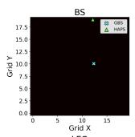

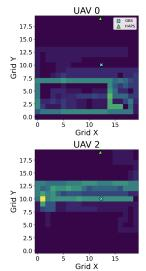  
0.58%

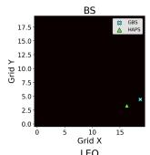

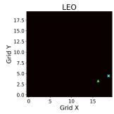  
(a) w=4800,

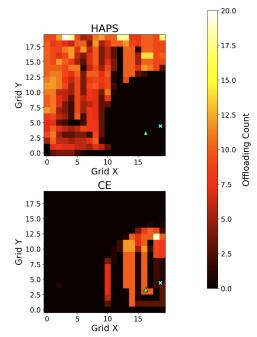  
i=10, cov=62.8% ±


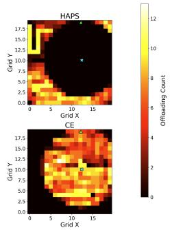  
(b) w=11, i=999999, cov=66.0% ± 0.33%

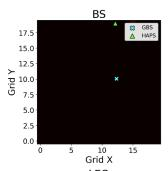

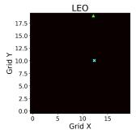

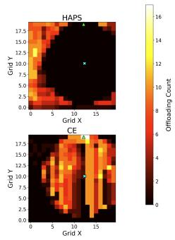  
(c) w=4800, i=999999, cov=63.7% ± 0.81%

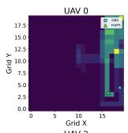

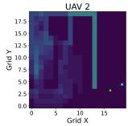  
(d) w=4800, 0.58%

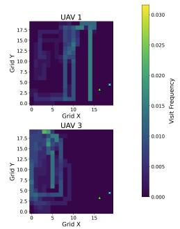  
i=10, cov=62.8% ±

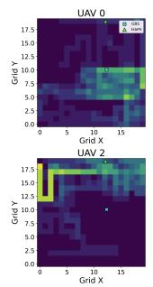

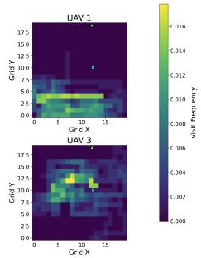  
(e) w=11, i=999999, cov=66.0% ± 0.33%

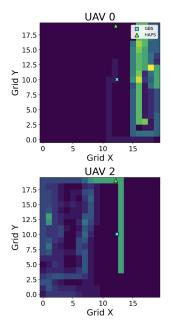

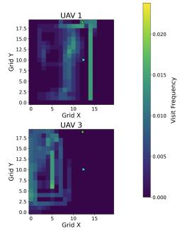  
(f) w=4800, i=999999, $\mathrm { c o v { = } 6 3 . 7 \% \pm }$ 0.81%

Fig. 12: GA-conditioned patterns under different wind seeds (w) and deployment seeds (i): offloading demand maps (top) and visit-frequency maps (bottom).  
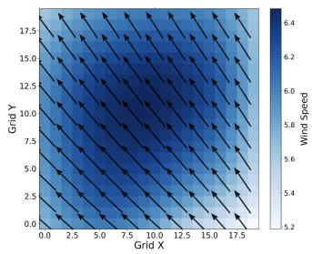

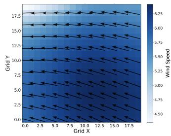  
(a) Wind field A (w=4800)  
(b) Wind field B (w=1219)

Fig. 13: Representative wind fields with similar speeds but different directions.  
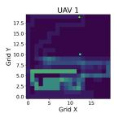

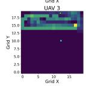  
(a) GA+HCSAC,w=1219, i=999999,cov=63.5% ± 0.67%

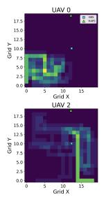

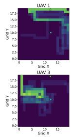  
(b) HCSAC (w/o GA), w=1219, i=999999,  
Fig. 14: Benefit of GA-based deployment under strong wind (Wind field B): with the same (w, i).

the tested platform.

GA Scaling Behavior. Pre-mission deployment optimization using GA introduces additional offline cost because GA searches over deployment choices, including UAV takeoff and recovery cells, whose search space grows combinatorially with the number of UAVs. The practical GA cost is dominated by rollout-based fitness evaluation and scales as $\mathcal { O } ( P G \cdot C _ { \mathrm { e v a l } } )$ where P and G are the population size and number of generations, and $C _ { \mathrm { e v a l } }$ depends on the rollout horizon, the number of UAVs, and the number of evaluation seeds. This cost is incurred during pre-mission deployment optimization or low-frequency replanning rather than at every online decision step. For a fixed rollout-evaluation cost $C _ { \mathrm { e v a l } } ,$ GA runtime increases linearly with P and G, while the dominant overhead remains policy rollout evaluation. Practical mitigations include parallel rollout evaluation, warm-started populations, and lower-frequency replanning. A further extension is to reuse GA-generated deployment–fitness records to train a deployment predictor that maps terrain, uncertainty, wind-field, and SAGIN-topology features to near-optimal UAV takeoff and recovery positions, thereby reducing repeated rollout-based GA evaluation.

Cost-Benefit and Scalability Boundary. The proposed framework is more complex than a single DRL baseline because it adds CNN/GCN state encoders and GA deployment search. The increased computational cost is justified in the tested scenarios by observed gains in coverage and mission efficiency, particularly under strong wind and complex terrain where global deployment, topology-aware offloading, and local adaptive trajectory control provide complementary benefits.

The hierarchical HCDRL+GA design is not tied to a fixed fleet size, but the current experiments evaluate fleet sizes of one to six UAVs. Scaling the framework to larger fleets may incur higher coordination overhead, more intensive offloading contention, and increased computational cost for rollout-based GA evaluation.

## VII. CONCLUSION

In this paper, we investigated the joint optimization of task offloading, trajectory planning, and UAV deployment for UAV-assisted search and rescue in SAGIN environments. We proposed a two-stage hybrid framework, HCDRL+GA (with an HCSAC backbone), which integrates uncertaintyaware terrain abstraction, NOAA-derived realistic wind-field data, a CNN-GCN multimodal state encoding, and GA-based deployment initialization by utilizing the learned policy as a fitness evaluator.

Comprehensive simulations validate the effectiveness and robustness of the proposed design and directly support our claimed contributions within the tested range. Benchmarking across RL backbones motivates the adoption of the hybridconvolution SAC variant, and module-level ablations (nooffloading, no-GA, removing CNN/GCN branches, and GA variants) confirm that topology-aware offloading, wind-aware trajectory learning, and GA-based deployment provide complementary gains under different wind regimes. We further provide scalability evidence up to six UAVs and assess robustness to platform specifications via sensitivity studies on flight speed and battery capacity. Finally, offloading heatmaps across SAGIN tiers and UAV visit-frequency maps reveal structured tier selection and emergent spatial coordination, improving interpretability under dynamic wind fields. Overall, these results corroborate that (C1) joint offloading-trajectory-deployment optimization improves coverage-efficiency and energy-aware mission endurance (extending mission lifetime by up to 38% and coverage by 33% under strong winds), (C2) CNN/GCN multimodal encoding is essential for terrain/wind perception and topology-aware offloading, (C3) GA-based deployment by utilizing the learned policy as a fitness evaluator achieves higher-quality global deployment than HCDRL-only local control—yielding a nearly 18% coverage lift under strong winds, and (C4) the NOAA-derived wind and uncertainty-aware terrain pipeline, together with the interpretability visualizations, enables realistic and explainable evaluation.

A limitation of this work is that validation is simulationbased. Although NOAA-derived wind fields improve environmental realism, they do not replace real UAV hardware experiments. The measured inference latency indicates computational feasibility on the tested GPU platform, but realtime execution on onboard processors, wireless-link instability, sensor delays, and online environmental updates still require hardware-in-the-loop and field validation. The current model also abstracts heterogeneous communication holes and postfailure recovery, and the experiments evaluate scalability only up to six UAVs. The current GA deployment module also adopts a normalized weighted-sum fitness to obtain one executable deployment configuration rather than a Pareto front. Future work may investigate Pareto-based evolutionary variants, such as NSGA-II, to generate multiple deployment alternatives with different coverage–energy–latency trade-offs. Future work will further emphasize field validation, larger-scale deployments, connectivity-aware offloading, and efficient GA replanning.

## REFERENCES

[1] Lee, Minho, et al. "A study on the advancement of intelligent mil itary drones: Focusing on reconnaissance operations." IEEE Access (2024):55964 - 55975, doi: 10.1109/ACCESS.2024.3390035.

[2] Ivic, Stefan, et al. "Multi-UAV trajectory planning for 3D visual ´ inspection of complex structures." Automation in Construction 147 (2023): 104709, doi: https://doi.org/10.1016/j.autcon.2022.104709.

[3] Xu, Longyan, et al. "Dynamic path planning of UAV with least inflection point based on adaptive neighborhood A\* algorithm and multi-strategy fusion." Scientific Reports 15.1 (2025): 8563, doi: https://doi.org/10.1038/s41598-025-92406-w.

[4] Lim, Jeonggeun, et al. "Autonomous multirotor UAV search and landing on safe spots based on combined semantic and depth information from an onboard camera and LiDAR." IEEE/ASME Transactions on Mechatronics (2024), doi: 10.1109/TMECH.2024.3369028

[5] Yadav, Manish, et al. "UAV-enabled approaches for irrigation scheduling and water body characterization." Agricultural Water Management 304 (2024): 109091, doi: https://doi.org/10.1016/j.agwat.2024.109091.

[6] https://enterprise.dji.com/cn/news/detail/zenmuse-h30t-search-andrescue.

[7] https://uavcoach.com/search-and-rescue-dro.

[8] https://www.bristowgroup.com/news-media/pressreleases/detail/484/drone-joins-hm-coastguard-air-land-and-sea-rescueteams.

[9] Wang, Qing, Bin Xin, and Jie Chen. DISTRIBUTED COOPERATIVE CONTROL AND OPTIMIZATION FOR MULTI-AGENT SYSTEMS. SPRINGER, 2025, doi: https://doi.org/10.1007/978-981-96-0950-5.

[10] Jia, Riheng, et al. "Energy and Time Trade-Off Optimization for Multi-UAV Enabled Data Collection of IoT Devices." IEEE/ACM Transactions on Networking (2024): 15172-5187, doi: 10.1109/TNET.2024.3450489.

[11] Li, Jun, et al. "Cooperative non-orthogonal multiple access with index modulation for air-ground multi-UAV networks." IEEE Journal on Selected Areas in Communications (2024): 171-185, doi: 10.1109/JSAC.2024.3460050.

[12] Mao, Weihao, et al. "UAV-Assisted Communications in SAGIN-ISAC: Mobile User Tracking and Robust Beamforming." IEEE Journal on Selected Areas in Communications 2025: 186-200, doi: 10.1109/JSAC.2024.3460065.

[13] Chen, Qian, et al. "Multi-tier hybrid offloading for computation-aware IoT applications in civil aircraft-augmented SAGIN." IEEE Journal on Selected Areas in Communications 41.2 (2022): 399-417, doi: 10.1109/JSAC.2022.3227031

[14] Zhao, Wei, et al. "A Survey on DRL based UAV Communications and Networking: DRL Fundamentals, Applications and Implementations." arXiv preprint arXiv:2502.12875 (2025), doi: 10.48550/arXiv.2502.12875.

[15] Sai, Siva, Sudhanshu Mishra, and Vinay Chamola. "Resource allocation in unmanned aerial vehicle networks: A review." Vehicular Communications 52 (2025): 100889, doi: 10.1016/j.vehcom.2025.100889.

[16] Avanzato, Roberta, et al. "A deep reinforcement learning-based UAV-smallcell system for mobile terminals Geolocalization in disaster scenarios." Computer Communications (2025): 108088, doi: 10.1016/j.comcom.2025.108088.

[17] Hwang, Sangwon, et al. "Multi-Agent Deep Reinforcement Learning for Decentralized Multi-UAV Mobile Edge Computing Networks." IEEE Internet of Things Journal (2025), doi: 10.1109/JIOT.2025.3527016.

[18] Yi, Meng, et al. "The Distributed Intelligent Collaboration to UAV-Assisted VEC: Joint Position Optimization and Task Scheduling." IEEE Internet of Things Journal (2025), doi: 10.1109/JIOT.2025.3547630.

[19] Gao, Yuan, et al. "A sequential decision algorithm of reinforcement learning for composite action space." IEEE Access 11 (2023): 107669- 107684, doi: 10.1109/ACCESS.2023.3320137.

[20] Cheng, Peng, et al. "Deep reinforcement learning for online resource allocation in IoT networks: Technology, development, and future challenges." IEEE Communications Magazine 61.6 (2023): 111-117, doi: 10.1109/MCOM.001.2200526

[21] Lowe, Ryan, et al. "Multi-agent actor-critic for mixed cooperativecompetitive environments." Advances in Neural Information Processing Systems 30 (2017), arXiv:1706.02275.

[22] Sunehag, Peter, et al. "Value-decomposition networks for cooperative multi-agent learning." arXiv preprint arXiv:1706.05296(2017)., arXiv:1706.05296.

[23] Rashid, Tabish, et al. "Monotonic value function factorisation for deep multi-agent reinforcement learning."Journal of Machine Learning Research 21.178 (2020): 1-51, https://www.jmlr.org/papers/v21/20-081.html.

[24] Yu, Chao, et al. "The surprising effectiveness of PPO in cooperative multi-agent games." Advances in Neural Information Processing Systems 35 (2022): 24611–24624, arXiv:2103.01955.

[25] Wang, Tonghan, et al. "RODE: Learning roles to decompose multi-agent tasks." arXiv preprint arXiv:2010.01523 (2020)., arXiv:2010.01523.

[26] Zhao, Youhan, et al. "Joint Content Caching, Service Placement and Task Offloading in UAV-Enabled Mobile Edge Computing Networks." IEEE Journal on Selected Areas in Communications 2025: 51 - 63, doi: 10.1109/JSAC.2024.3460049.

[27] Soorki, Mehdi Naderi, et al. "Catch me if you can: Deep Meta-RL for search-and-rescue using LoRa UAV networks." IEEE Transactions on Mobile Computing (2024), doi: 10.1109/TMC.2024.3468382.

[28] Huang, Chong, et al. "Joint offloading and resource allocation for hybrid cloud and edge computing in SAGINs: A decision assisted hybrid action space deep reinforcement learning approach." IEEE Journal on Selected Areas in Communications 2024: 1029-1043, doi: 10.1109/JSAC.2024.3365899.

[29] Cai, Yue, et al. "Graphic Deep Reinforcement Learning for Dynamic Resource Allocation in Space-Air-Ground Integrated Networks." IEEE Journal on Selected Areas in Communications 2025: 1029-1043, doi: 10.1109/JSAC.2024.3460086.

[30] Jia, Riheng, et al. "Energy and Time Trade-Off Optimization for Multi-UAV Enabled Data Collection of IoT Devices." IEEE/ACM Transactions on Networking 2024: 5172 - 5187, doi: 10.1109/TNET.2024.3450489.

[31] Wang, Yuntao, et al. "SEAL: A strategy-proof and privacypreserving UAV computation offloading framework." IEEE Transactions on Information Forensics and Security 2023: 5213-5228, doi: 10.1109/TIFS.2023.3280740.

[32] Chen, Ying, et al. "Multi-User Task Offloading in UAV-Assisted LEO Satellite Edge Computing: A Game-Theoretic Approach." IEEE Transac tions on Mobile Computing (2024), doi: 10.1109/TMC.2024.3465591.

[33] Ning, Zhaolong, et al. "Joint optimization of data acquisition and trajectory planning for UAV-assisted wireless powered Internet of Things." IEEE Transactions on Mobile Computing (2024), doi: 10.1109/TMC.2024.3470831.

[34] Zhao, Mingxiong, et al. "Joint Optimization of Trajectory, Offloading, Caching, and Migration for UAV-Assisted MEC." IEEE Transactions on Mobile Computing (2024), doi: 10.1109/TMC.2024.3486995.

[35] Tun, Yan Kyaw, et al. "Joint UAV Deployment and Resource Allocation in THz-Assisted MEC-Enabled Integrated Space-Air-Ground Networks." IEEE Transactions on Mobile Computing (2024), doi: 10.1109/TMC.2024.3516655.

[36] Hou, Yukai, et al. "UAV swarm cooperative target search: A multiagent reinforcement learning approach." IEEE Transactions on Intelligent Vehicles 9.1 (2023): 568-578, doi: 10.1109/TIV.2023.3316196

[37] Sun, Geng, et al. "Joint task offloading and resource allocation in aerialterrestrial UAV networks with edge and fog computing for post-disaster rescue." IEEE Transactions on Mobile Computing 23.9 (2024): 8582- 8600, doi: 10.1109/TMC.2024.3350886.

[38] Luo, Quyuan, et al. "Deep reinforcement learning based computation offloading and trajectory planning for multi-UAV cooperative target search." IEEE Journal on Selected Areas in Communications 41.2 (2023): 504-520, doi: 10.1109/JSAC.2022.3228558.

[39] H. M. P. C. Jayaweera and S. Hanoun, “Path planning of unmanned aerial vehicles (UAVs) in windy environments,” Drones, vol. 6, no. 5, Art. no. 101, 2022, doi: 10.3390/drones6050101.

[40] M. Uijt de Haag, C. Ebert, J. Weiss, and F. Silvestre, “Navigation- and energy-aware UAV trajectory planning in a windy urban environment,” in Proc. 35th Int. Tech. Meeting Satellite Division Inst. Navigation (ION GNSS+ 2022), Denver, CO, USA, Sep. 2022, pp. 1760–1774, doi: 10.33012/2022.18501.

[41] R. Gu, Y. Zhao, and X. Ren, “Integrating wind field analysis in UAV path planning: Enhancing safety and energy efficiency for urban logistics,” Chinese Journal of Aeronautics, vol. 39, no. 1, Art. no. 103605, 2026, doi: 10.1016/j.cja.2025.103605.

[42] Lin, Na, et al. "Energy Efficient UAV-Assisted Bidirectional Relaying System for Multi-Pair User Devices." IEEE Transactions on Mobile Computing (2025).doi: 10.1109/TMC.2025.3526981

[43] Xiao, Yue, et al. "Space-air-ground integrated wireless networks for 6G: Basics, key technologies and future trends." IEEE Journal on Selected Areas in Communications (2024) .doi: 10.1109/JSAC.2024.3492720

[44] Othman, Wagdy M., et al. "Key Enabling Technologies for 6G: The Role of UAVs, Terahertz Communication, and Intelligent Reconfigurable Surfaces in Shaping the Future of Wireless Networks." Journal of Sensor and Actuator Networks 14.2 (2025): 30.doi: 10.3390/jsan14020030

[45] Xiao, Zhenyu, et al. "LEO satellite access network (LEO-SAN) towards 6G: Challenges and approaches." IEEE Wireless Communications (2022), doi: 10.1109/MWC.011.2200310

[46] Pielou, Evelyn Chrystalla. "Shannon’s formula as a measure of specific diversity: its use and misuse." The American Naturalist 100.914 (1966): 463-465. doi: https://doi.org/10.1086/282439.

[47] Cheng, Chun, Yossiri Adulyasak, and Louis-Martin Rousseau. "Drone routing with energy function: Formulation and exact algorithm." Transportation Research Part B: Methodological 139 (2020): 364-387, doi: 10.1016/j.trb.2020.06.011

[48] A. Filippone, Flight Performance of Fixed and Rotary Wing Aircraft. Amsterdam, The Netherlands: Elsevier, 2006

[49] https://www.ncei.noaa.gov/products/weather-climate-models/globalforecast.

[50] https://www.giss.nasa.gov/tools/panoply/.

[51] Kipf, Thomas N., and Max Welling. "Semi-supervised classification with graph convolutional networks." arXiv preprint arXiv:1609.02907 (2016). arXiv:1609.02907.

[52] Reeves, Colin, and Jonathan E. Rowe. Genetic algorithms: principles and perspectives: a guide to GA theory. Vol. 20. Springer Science & Business Media, 2002.

  
Peng Zhao is currently pursuing his Ph.D. degree at Zhejiang University of Technology. He received his M.S. degree in network engineering from Zhejiang University of Technology and his B.S. degree from Hangzhou Normal University. His research interests include deep reinforcement learning, machine learning, blockchain applications, cryptography, and smart contracts.


Hongbing Cheng (Member IEEE) received the Ph.D. degree from the Nanjing University of Posts and Telecommunications. He is currently a Professor in college of computer Science, Zhejiang University of Technology and has published numerous research papers in high-quality international journals and conferences. Prof. Cheng served as invited editor of several international journals in some international conferences; and has been invited to give keynote speeches and chair committees, reviewed papers for many international journals and conferences. His

research interests include blockchain, cryptography, privacy preserving and information security, computer communications and cloud computing security.

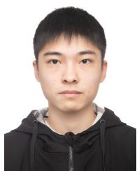

Hangyu Zhang received his bachelor’s degree in Data Science and Big Data Technology from Hebei University in 2024. Currently, he is pursuing a master’s degree in Software Engineering at Zhejiang University of Technology. His research interests include reinforcement learning and UAV.


Zhiguo Wan is a principal investigator in the Zhejiang Lab, Hangzhou, Zhejiang, China. His main research interests include security and privacy for cloud computing, Internet-of-Things and blockchain. He received his B.S. degree in computer science from Tsinghua University in 2002, and Ph.D. degree in information security from National University of Singapore in 2007. He was a postdoc in Katholieke University of Leuven, Belgium and an assistant professor in the School of Software, Tsinghua University, Beijing, China.