JOURNAL OF LATEX CLASS FILES, VOL. 14, NO. 8, AUGUST 2021

# Joint Optimization of Latency and Energy Consumption for Computing Task Offloading Based on Cooperative Multi-UAV and HAP Networks

Meng Li, Senior Member, IEEE, Haoyu Wan, Suyu Lv, Member, IEEE, Pengbo Si, Senior Member, IEEE, Haijun Zhang, Fellow, IEEE, and F. Richard Yu, Fellow, IEEE

Abstract—The rapid expansion of computation-intensive applications renders current mobile edge computing (MEC) frameworks inadequate for delivering high-quality computing services in environments with sparse network infrastructure. Air-based stations, represented by low-altitude unmanned aerial vehicles (UAVs) and high-altitude platforms (HAPs), are considered a promising solution to this problem due to their flexible deployment, unconstrained by geographical conditions, and relatively low cost. However, UAV-based communication systems are highly sensitive to energy consumption, and HAPs face challenges in establishing stable connections with power-constrained devices while meeting their requirements for computation. To solve these limitations, we design a multi-UAV and HAP collaborative offloading framework innovatively, which takes both system energy cost and task processing delay into consideration, with their weighted consumption defined as the optimization objective. Since it is a mixed integer nonlinear programming (MINLP) problem, which is complicated to address by mathematical approaches, we reformulate it as a Markov decision process (MDP) and use a joint approach based on double deep Q network (DDQN) - proximal policy optimization (PPO) to assign task offloading methods and ratios, respectively. According to simulation results, the suggested approach ensures the timeliness of task processing while efficiently reducing the weighted consumption under varying number of users, task arrival densities, and task complexities.

Index Terms—Mobile Edge Computing (MEC), resource allocation, Unmanned Aerial Vehicle (UAV), High Altitude Platform (HAP), collaborative computing.

## I. INTRODUCTION

new era marked by an exponential rise in the number of linked devices has been brought by the Internet of Things’ (IoT) advancement. The number of IoT devices is projected to reach 500 billion by 2030 [1]. Amid this trend, emerging applications such as autonomous driving and virtual reality are progressively being realized. However, these applications are computationally and delay-intensive, and it is difficult for traditional cloud computing networks to meet such requirements. Edge computing (EC) is considered an advanced method to solve this problem [2]. EC allows computing resources to be set nearer to clients to mitigate the delay caused by transmission and ease the load of centralized computing in the traditional sense [3]. Unfortunately, the existing EC method based on terrestrial network (TN) cannot provide a good quality of service for sparsely populated areas that are difficult to cover by communication equipment, such as mountainous areas. Especially, the TN covers only 7%

of the areas of the world, and more than 3 billion people cannot access the Internet at present [4]. In these cases, nonterrestrial-based mobile edge computing (MEC) becomes a viable option.

The traditional non-terrestrial network (NTN) is usually composed of satellites, which have many applications in the global positioning system, television broadcasting, etc. However, the high operating altitude makes satellite-based NTN have the disadvantages of long propagation delay and limited coverage time, and such a framework is unable to satisfy the demands of emerging delay-sensitive scenarios [5]. Fortunately, the application of low-altitude unmanned aerial vehicles (UAVs) and high-altitude platforms (HAPs) can make up for the above shortcomings of NTNs.

In contrast to satellites, UAVs are typically operated at an altitude of about 150 meters from the ground, which supports high-quality line of sight (LoS) communication with terrestrial terminals to provide delay-sensitive applications such as remote sensing detection, and emergency communication [6], [7]. In addition, the high flexibility of UAVs is another important feature to attract great attention. With this feature, several studies focus on the UAVs equipped with MEC servers, which are capable of offering extensive and high quality computing support. The authors in [8] used UAVs as edge computing nodes to realize real-time video processing. Sun et al. [9] applied UAVs equipped with edge servers to Internet of Vehicles (IoV) scenarios and introduced a cooperative evolutionary approach for minimizing task response time. However, the limitation of UAVs flight time cannot be ignored since they are powered by batteries. Although researchers are trying to increase endurance through methods such as capacitive power transfer, power-line-based wireless charging, and the use of fuel batteries, energy remains an essential factor limiting the performance of UAV-based MEC networks at the present stage [10].

In recent years, as a new aerial platform which can be deployed in the atmosphere, HAPs have garnered significant interest from academics because of their stability. The operating height of HAPs is much higher than that of UAVs, and they can remain stationary at a height of 20 km. In addition, HAPs are driven by solar energy and can offer an extensive range of services for terrestrial users [11]. Due to the above characteristics, many valuable application scenarios have been proposed in the related works. Alzenad et al. [12] combined the free space optics (FSO) channel with HAP and designed a network framework with HAP as the backhaul node. In [13], the authors assumed HAP as the base station (BS) and proposed a reliable IoT architecture. Ren et al. [14] formulated a cooperative offloading framework composed of roadside units (RSU), vehicles, and HAPs, then designed a mathematical method to minimize the task processing delay. Although these works combined HAP with TN innovatively, it is difficult for HAP to establish connections with powerlimited IoT devices in practical applications due to the distance from the ground [11].

The aforementioned advantages render the UAV and HAPbased MEC framework a valuable complement to traditional schemes. However, it is essential to recognize that the computation strategies employed in traditional MEC frameworks cannot be directly applied to UAV and HAP-based architectures. Firstly, the available energy and computing resources on air-based MEC servers are inherently limited, presenting a significant challenge in allocating these scarce resources to satisfy clients requirements of quality of service (QoS). Secondly, unlike TN-based MEC networks, aerial platforms are often required to dynamically adjust their positions in accordance with users’ demands. These important factors make computing task offloading more challenging in UAV and HAP-based MEC networks.

As discussed above, a promising task offloading scheme tailored for a UAV-HAP-based cooperative MEC framework is suggested in this study. Taking the constrained energy of UAVs and users delay requirements into consideration, the objective is to optimize task offloading latency and system energy cost concurrently. Furthermore, given the high dimensionality of system variables, the interactive optimization process is structured as a Markov decision process (MDP). Then, the offloading methods and assignment ratios are decided by the double deep Q-network (DDQN) and proximal policy optimization (PPO) methods, respectively. The articles contributions are delineated below.

A multi-layer cooperative MEC architecture that consists of UEs, multiple UAVs and an HAP is proposed. To optimize the computing resources of all UAVs and the HAP at the system level, the computation tasks have three possible offloading schemes, which are computed by single UAV, multi-UAV or computed by an HAP.

Considering the latency requirements and the limitation of energy of UAVs, we suggest an optimization problem centered on minimizing offloading latency and energy cost. Consequently, a two-step decision model for the UAV-HAP collaborative MEC network is formulated in this study.

A unified learning framework that jointly handles discrete and continuous policy optimization through the normalization and standardization of system states is designed, which enables the seamless integration of DDQN and PPO within a single decision-making architecture.

The experimental results indicate that, in comparison to similar DRL-based algorithms and control groups, the proposed method has lower system cost and processing delay under different numbers of users, task densities, and task complexities.

The remainder of this work is divided into six sections. Section II provides a comprehensive review of related literature. In Section III, the proposed framework and the corresponding problem formulation are detailed. Section IV outlines the design of the employed algorithms. The algorithmic procedure and solution methodology are presented in Section V. Section VI discusses the simulation results to evaluate the performance of the proposed approach. Finally, Section VII concludes the paper and highlights potential directions for future research.

## II. RELATED WORKS

Several MEC frameworks proposed in the literature are reviewed in this section, including those based on the TNs, UAVs, and a combination of UAVs and HAPs. Furthermore, the corresponding task offloading models associated with each of these frameworks are also reviewed.

## A. TN-Based MEC Network

There are several existing research works about TN-based MEC. Xue et al. [15] integrated MEC with blockchain and devised a multi-hop model, prioritized energy consumption optimization and developed a framework to optimize the state switching, data routing and resources allocation with addressing digital security concerns by using a hybrid trust region policy optimization method. A two-step solution employing DRL was suggested to mitigate directed acyclic graph (DAG)- based task process latency in the migration challenges arising from user mobility in IoV contexts in [16]. Specifically, the DRL-based method was used to determine the best edge server cluster and a migration algorithm was used to decide the destination server. Bi et al. [17] formulated a mixed integer nonlinearity planning method by considering the mobility of users in an MEC system, optimized system costs in location of users cache, offloading decisions and system overall resources allocation strategies jointly. A DDQN method in [18] was introduced to optimize the system energy consumption in a single cell and multi-user EC scenario by determine the offloading strategies and resources allocation methods while considering the movement of users. In [19], the authors took the IoV as the background, combined DRL with game theory methods, and optimized vehicle task offloading delay through learning real time changes of hot-spot areas and MEC grouping. More specifically, the DRL-based method was used to predict the hot zones and a noncooperative game-theoretic strategy was used to group MEC for delivering low-latency MEC services. However, the high dynamicity makes the TNbased task offloading scheme unable to be applied to the NTN based MEC framework.

## B. UAV-Based MEC Network

1) Single-UAV-Based MEC Network: The above discussions are carried out in the background of TN. In the past few years, the proposal of 6G has generated significant curiosity among academics in edge computing using NTN, particularly concerning aerial platforms like UAVs. A network architecture that is composed of a UAV and several terrestrial edge servers, which are capable of energy transmission and task offloading was introduced in [20]. The authors optimized task allocation decisions, the movement path and transmit power jointly by split it into three sub-problem and used a three-step block coordinate descending method to maximize the completed bits of tasks. Zhang et al. [21] considered the offloading system wherein the task can be processed in local equipment, UAV or remote access point. Besides, the Lagrangian duality method and successive convex approximation were used to schedule the task and power, respectively. Using an online movement control mechanism, the authors of [22] optimized the UAV system by reducing the flight time needed to compute tasks while considering the task allocation. The authors of [23] formulated a resource allocation framework with successive convex approximation (SCA) and took UAV computing resources, flight trajectory, and communication resources into consideration to minimize the system cost jointly.

2) Multi-UAV-Based MEC Network: The aforementioned research was carried out in the context of a single UAV cell. However, the single-UAV-based MEC system has many limitations [24]. In most cases, the computing capacity of an individual UAV system is severely limited, making it insufficient for scenarios that handling multiple concurrent tasks. Moreover, the coverage range is relatively limited, resulting in unfair allocation for UEs situated at the cells edge. In terms of system robustness, the availability of the UAV-based system can deteriorate rapidly when subjected to outside influences, including electromagnetic instability or network attacks [25], [26]. For these reasons, more researchers are focusing on multi-UAV networks. A software-defined network (SDN) with a multi-layer framework was designed by Goudarzi et al. [27]. The upper layer contains of traditional cloud computing center, the middle layer consists of UAV-enabled MEC network, the bottom layer includes user equipment. Besides, an allocation method based on evolutionary computation was applied in this framework. A multi-agent DRL-based algorithm with smart agriculture as the background was designed by Betalo et al. [28], which took task scheduling, rollout planning, landing, and charging planning into a framework aimed at minimizing offloading latency and energy. However, UAVs are subject to stringent energy constraints and possess limited computing capabilities. Moreover, their relatively low flight altitude hinders the feasibility of large-scale deployment of UAV-based MEC networks.

## C. UAV-HAP Cooperative MEC Network

The aforementioned studies primarily focus on scenarios involving multiple UAVs and terrestrial edge servers. Recent studies have highlighted the considerable interest in HAPs, attributed to their broad coverage capabilities and extended operational endurance. Consequently, HAPs are increasingly regarded as an achievable method to overcome the aforementioned issues. Liu et al. [29] investigated an IoT system supported by UAV and HAP, where energy-saving communication and computation are critical under dynamic NTN network conditions. They developed an energy efficient joint computation offloading and resource allocation strategy that integrates Lyapunov optimization with a hybrid deep reinforcement learning-based online algorithm. The approach aims to minimize overall system energy consumption while ensuring long-term queue stability and reduced computational complexity. In [30], the authors examined an emergency communication scenario in which UAVs and HAPs collaboratively provide services when terrestrial infrastructure is unavailable. To be specific, a joint optimization framework that models UAV deployment as a maximum-clique problem and task scheduling as a device-UAV matching problem solved via a stable-matching algorithm was applied. A 6G-oriented aerial MEC scenario in which UEs, single-UAV, and an HAP to provide computation services in remote areas is considered in [31]. The authors formulated a hierarchical computationoffloading optimization problem that seeks to minimize task delay and UAV energy consumption under task-quantity, latency, and energy constraints, and they address its nonconvexity using a DRL-based trajectory optimization and task offloading algorithm. The authors in [32] investigated a hierarchical aerial computing platform in which UAVs and an HAP cooperatively provide MEC services to ground IoT users in remote and disaster-prone environments. A joint offloading, UEs association, and resource allocation framework that combines a matching-game method for UE-UAV offloading decisions with an enhanced soft actor-critic approach for UAV-HAP partial offloading and resource allocation was applied in the above environment. In [33], the authors formulated a multilayered aerial computing network for multi-UAV cooperative search, consisting of an LAP layer with multiple flexible UAVs and an HAP layer with a rich-resources but less flexible HAP. They optimized UAV trajectories, computation offloading, and resource allocation to reduce search-probability-map uncertainty while improving target discovery and coverage jointly, and addressed the mixed discrete-continuous decision space using a multi-agent DRL-based algorithm.

Although the research above considered UAVs and HAP in a framework, they are still limited to the structure which is composed of a single UAV and HAP, or only considered the offloading mode of UAV or HAP. To be specifically, TABLE I highlights the key contributions of our work compared with existing works. Therefore, this work incorporates the systems sensitivity to latency and utilization of energy, then proposes an offloading scheme based on DRL to support a cooperative MEC network comprising multiple UAVs and an HAP.

## III. SYSTEM MODEL AND PROBLEM FORMULATION

The following section begins by introducing the structure of the proposed multi-UAV and HAP cooperative offloading scheme. Subsequently, the models for latency and energy utilization are analyzed. Finally, the corresponding optimization problem formulation based on the above models is presented.

## A. Network Model

As illustrated in Fig. 1, the network can be divided into users, UAVs, and the HAP segments. The users’ part consists of some IoT equipment that generate task request at each time slot. The UEs are defined by $N \triangleq \{ 1 , 2 , 3 , . . . , n \}$ . Each UE will connect to the nearest UAV. In the UAVs segment, the UAVs are denoted by $U \ \triangleq \ \{ 1 , 2 , 3 , . . . , u \}$ . The UAVs are outfitted with MEC servers and are able to perform data transmission and task computation simultaneously.

TABLE I  
COMPARISON OF THE PROPOSED WORK WITH THE EXISTING WORKS
<table><tr><td rowspan="2">Features</td><td colspan="8">Existing Works</td><td rowspan="2">The Proposed Work</td></tr><tr><td>[18]</td><td>[20]</td><td>[27]</td><td>[28]</td><td>[29]</td><td>[30]</td><td>[31]</td><td>[32] [33]</td></tr><tr><td>Task Offloading</td><td>√</td><td>√</td><td>√</td><td>X</td><td>√</td><td>√</td><td>√</td><td>√</td><td>√</td></tr><tr><td>Systematic Resource Allocation</td><td>X</td><td>√</td><td>X</td><td>√ X</td><td>X</td><td>X</td><td>X</td><td>√ X</td><td>√</td></tr><tr><td>Multi-UAV</td><td>X</td><td>X</td><td>√</td><td>√</td><td>√ √</td><td>X</td><td>√</td><td>√</td><td>√</td></tr><tr><td>HAP</td><td>X</td><td>×</td><td>X</td><td>X √</td><td>√</td><td>√</td><td>√</td><td>√</td><td>√</td></tr><tr><td>Partial Offloading</td><td>X</td><td>√</td><td>X</td><td>X</td><td>X X</td><td>×</td><td>X</td><td>X</td><td>√</td></tr><tr><td>Multi-Layer Computing</td><td>L</td><td>√</td><td>√</td><td>X</td><td>√ √</td><td>X</td><td>√</td><td>√</td><td>√</td></tr><tr><td>Delay Optimization</td><td>√</td><td>X</td><td>√</td><td>√ X</td><td>√</td><td>√</td><td>X</td><td>√</td><td>√</td></tr><tr><td>Energy Optimization</td><td>√</td><td>X</td><td>√</td><td>√</td><td>√ X</td><td>√</td><td>√</td><td>√</td><td>√</td></tr><tr><td>Intelligent Algorithms</td><td>5</td><td>X</td><td>X</td><td>√ √</td><td>X</td><td>√</td><td>√</td><td>√</td><td>了</td></tr></table>

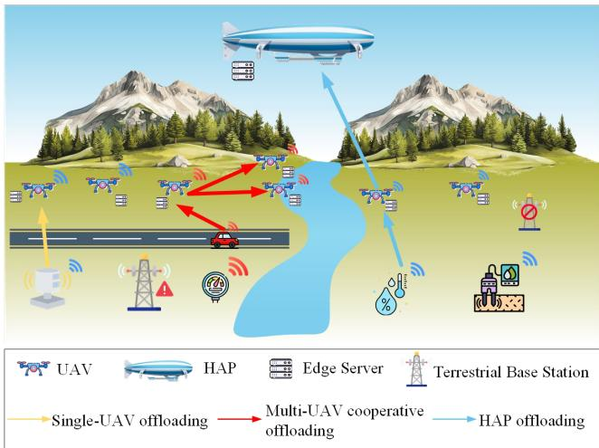  
Fig. 1. System model.

For each UE $n \in N , \mathbf { U A V } u \in U ,$ and the HAP, the location $L _ { n } , L _ { u } .$ , and $L _ { H }$ can be expressed as $( x _ { n } , y _ { n } , z _ { n } ) , ( x _ { u } , y _ { u } , z _ { u } )$ and $\left( 0 , 0 , z _ { H } \right)$ , respectively. We assume $\mathrm { U E s , U A V s , }$ and HAP are fixed at the altitude of $z _ { n } = 0 m , z _ { u } = 1 0 0 m$ , and $z _ { H } =$ 20km, respectively.

## B. Communication Model

1) Communication Model between UEs and UAV (G2U): We utilize OFDM in the G2U channel. The channel gain is described as

$$
G _ { n u } = \frac { g _ { 0 } } { d _ { n u } ^ { 2 } } ,\tag{1}
$$

where $g _ { 0 }$ is the power gain with distance of 1m. $d _ { n u }$ denotes the distance between UEn and UAVu, which is shown as

$$
d _ { n u } = \sqrt { \| L _ { u } - L _ { n } \| ^ { 2 } } .\tag{2}
$$

The channel capacity between UEn and UAVu can be expressed as

$$
R _ { n u } ^ { G 2 U } = B _ { G 2 U } \log _ { 2 } ( 1 + \frac { P _ { n } ^ { G 2 U } G _ { n u } } { N _ { 0 } B _ { G 2 U } } ) ,\tag{3}
$$

where $N _ { 0 }$ denotes the noise power spectral density, $P _ { n } ^ { G 2 U }$ is the transmission power of UEn. Based on the conditions above, the task transmission duration from UEn to UAVu was given as

$$
T _ { i } ^ { u p } = \frac { S _ { i } } { R _ { n u } ^ { G 2 U } } .\tag{4}
$$

2) Communication Model between UAVs (U2U): When computing task i is offloaded to multiple UAVs, the task will first be split into several sub-tasks, which are transmitted to other UAVs in the cluster through the U2U channel. According to [34], the data transmission rate between UAVu and $\mathrm { U A V } u ^ { \prime }$ was given as

$$
R _ { u u ^ { \prime } } ^ { U 2 U } = { \cal B } _ { U 2 U } \log _ { 2 } ( 1 + \frac { P _ { u u ^ { \prime } } ^ { U 2 U } G _ { u u ^ { \prime } } } { N _ { 0 } B _ { U 2 U } } ) ,\tag{5}
$$

where $P _ { u u ^ { \prime } } ^ { U 2 U } , \ B _ { U 2 U } ,$ and $G _ { u u ^ { \prime } }$ denote the communication power, bandwidth, the channel gain between UAVu and UAVu′, respectively. $G _ { u u ^ { \prime } }$ can be described as

$$
G _ { u u ^ { \prime } } = \frac { g _ { 0 } } { d _ { u u ^ { \prime } } ^ { 2 } } ,\tag{6}
$$

where $d _ { u u ^ { \prime } }$ denotes the distance between UAVu and UAVu′, which can be expressed as

$$
d _ { u u ^ { \prime } } = \sqrt { \| L _ { u } - L _ { u ^ { \prime } } \| ^ { 2 } } .\tag{7}
$$

3) Communication Model between UAV and HAP (U2H): We consider OFDM in the U2H channel, and we assume that there are no obstacles between UAVs and HAP. Thus, the channel capacity between UAVu and HAP was given as [35]

$$
R _ { u h } ^ { U 2 H } = B _ { U 2 H } \log _ { 2 } ( 1 + \frac { P _ { u h } ^ { U 2 H } G _ { u h } L _ { s } L _ { l } } { \sigma _ { h } ^ { 2 } } ) ,\tag{8}
$$

where $B _ { U 2 H }$ and $G _ { u h }$ denote the bandwidth of U2H channel, and the power gain of the antenna, respectively. $L _ { s }$ means the total line loss, $L _ { l }$ refers to loss of free space, it can be denoted as

$$
L _ { l } = ( \frac { c } { 4 \pi d _ { u h } f _ { u h } } ) ^ { 2 } ,\tag{9}
$$

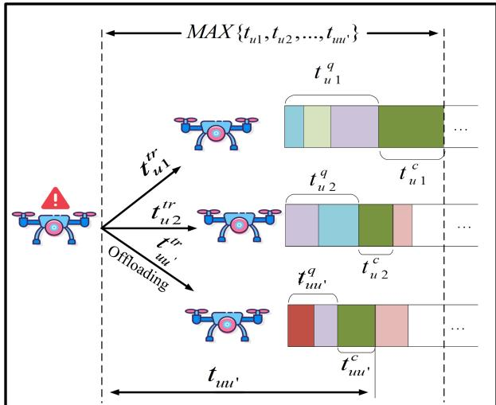  
Fig. 2. Multi-UAV cooperative offloading model.

where c is the light speed, $f _ { u h }$ refers to the center frequency. $d _ { u h }$ denotes the distance between UAVu and HAP, which can be computed as

$$
d _ { u h } = \sqrt { \| L _ { u } - L _ { H } \| ^ { 2 } } .\tag{10}
$$

In this system, we assume that the three-dimensional Cartesian coordinate of HAP is ${ \cal L } _ { H } ~ = ~ ( 0 , 0 , z _ { H } )$ , and HAP is able to hover at a fixed height, where $z _ { H } = 2 0 k m$ . Besides, $\sigma _ { h } ^ { 2 }$ denotes the noise power, which can be expressed as

$$
\sigma _ { h } ^ { 2 } = k _ { b } T B _ { U 2 H } ,\tag{11}
$$

wherein $k _ { b }$ is Boltzmanns constant, T expresses the noise temperature.

## C. Task Computing Model

1) Single-UAV Computing: According to [35], we posit the task complexity is $\rho _ { i }$ (periods/bit). Thus, the task process time with a single UAV can be expressed as

$$
T _ { i } ^ { s p } = t _ { i } ^ { q } + t _ { i } ^ { c } ,\tag{12}
$$

and

$$
t _ { i } ^ { c } = \frac { S _ { i } \rho _ { i } \mu _ { i } ^ { s p } } { f _ { u } } ,\tag{13}
$$

where $t _ { i } ^ { c } , \ t _ { i } ^ { q }$ and $f _ { u }$ denote computing time, queue time and computation ability of UAVu, respectively. $\mu _ { i } ^ { s p }$ is a binary variable that expresses whether the direct offloading is working, which can be shown as

$$
\mu _ { i } ^ { s p } = \left\{ \begin{array} { l l } { { 1 , } } & { { \mathrm { t a s k ~ } i \mathrm { ~ i s ~ c o m p u t e d ~ b y ~ s i n g l e - U A V ; } } } \\ { { 0 , } } & { { \mathrm { o t h e r w i s e . } } } \end{array} \right.\tag{14}
$$

2) Multi-UAV Cooperative Computing: As shown in Fig. 2, if the UAV is busy or the computing resources cannot meet the UE’s requirements, the task may be assigned to the rest of the UAVs in the cluster for joint processing. In this case, tasks need to be transferred to other UAVs. The process when the sub-task transmits from UAVu to UAVu′ can be expressed as

$$
t _ { u u ^ { \prime } } ^ { t r } = \frac { P _ { u ^ { \prime } } S _ { i } } { R _ { u u ^ { \prime } } ^ { U 2 U } } ,\tag{15}
$$

where $P _ { u ^ { \prime } }$ represents the weight of the sub-task that allocated to UAVu′ for processing. It is worth noting that, $P _ { u ^ { \prime } }$ is given by PPO algorithm. The details workflow and mechanism of PPO has provided in Section IV-C2. To be specific, $P _ { u ^ { \prime } }$ is constrained by

$$
{ \bf P } = \{ P _ { 1 } , P _ { 2 } , P _ { 3 } , . . . , P _ { u } \} \quad \forall u \in U ^ { \prime } ,\tag{16}
$$

and

$$
\sum _ { u \in U ^ { \prime } } P _ { u } = 1 ,\tag{17}
$$

where $U ^ { \prime }$ is a subset of $U ,$ , which does not include UAVu. After the UAVs received the sub-task from UAVu, the calculation time that of the sub-task by UAVu′ is represented as

$$
t _ { u u ^ { \prime } } ^ { c } = \frac { P _ { u ^ { \prime } } S _ { i } \rho _ { i } } { f _ { u ^ { \prime } } } .\tag{18}
$$

Thus, for each single sub-task, the processing time can be expressed as

$$
t _ { u u ^ { \prime } } = t _ { u u ^ { \prime } } ^ { t r } + t _ { u u ^ { \prime } } ^ { c } + t _ { u u ^ { \prime } } ^ { q } .\tag{19}
$$

The main task can be regarded as processed only when all sub-tasks have been computed. Therefore, the processing time of the main task i with the cooperative process mode is

$$
T _ { i } ^ { m p } = \mu _ { i } ^ { m p } M A X \{ t _ { u 1 } , t _ { u 2 } , t _ { u 3 } , . . . , t _ { u u ^ { \prime } } \} .\tag{20}
$$

Same as above, $\mu _ { i } ^ { m p }$ is a binary variable, represents cooperative offloading method is selected, it is defined as

$$
\mu _ { i } ^ { m p } = \left\{ \begin{array} { l l } { { 1 , } } & { { \mathrm { t a s k ~ } i \mathrm { ~ i s ~ c o m p u t e d ~ b y ~ m u l t i - U A V ; } } } \\ { { 0 , } } & { { \mathrm { o t h e r w i s e . } } } \end{array} \right.\tag{21}
$$

3) HAP Computing: In addition to the above two methods, tasks can be transmitted from the service UAV to HAP directly. The transport time from UAVu to HAP of computing task i can be written as

$$
t _ { i } ^ { t r } = \frac { S _ { i } } { R _ { u h } ^ { U 2 H } } .\tag{22}
$$

Similarly, we give the computation time of task i with HAP offloading mode as

$$
t _ { i } ^ { c } = \frac { S _ { i } \rho _ { i } } { f _ { H } } ,\tag{23}
$$

where $f _ { H }$ is the computing ability of HAP. Thus, the processing time of computing task i with HAP offloading mode is

$$
T _ { i } ^ { H } = \mu _ { i } ^ { H } ( t _ { i } ^ { t r } + t _ { i } ^ { c } + t _ { i } ^ { q } ) ,\tag{24}
$$

here, $\mu _ { i } ^ { H }$ is represented as

$$
\begin{array} { r } { \mu _ { i } ^ { H } = \left\{ \begin{array} { l l } { 1 , } & { \mathrm { t a s k ~ } i \mathrm { ~ i s ~ c o m p u t e d ~ b y ~ t h e ~ H A P ; } } \\ { 0 , } & { \mathrm { o t h e r w i s e . } } \end{array} \right. } \end{array}\tag{25}
$$

Consequently, if task i is successfully processed, we give the computing latency of task i as

$$
T _ { i } = T _ { i } ^ { u p } + T _ { i } ^ { s p } + T _ { i } ^ { m p } + T _ { i } ^ { H } .\tag{26}
$$

JOURNAL OF LATEX CLASS FILES, VOL. 14, NO. 8, AUGUST 2021

## D. Energy Consumption Model

In this system, we assume that the UEs and the HAP are powered by clean energy sources, such as solar energy. Moreover, the UAVs are deployed to maintain quasi-static hovering positions during task execution, and thus their propulsion power remains approximately constant over time. Since the propulsion energy required to sustain hovering does not vary with the offloading strategy and all UAVs operate at the same altitude within each time slot, the propulsion-related energy consumption can be considered identical across UAVs and is therefore excluded from the optimization model [29], [32], [36], [37]. Consequently, the energy consumption associated with each task is modeled as the sum of its transmission energy and computation energy.

1) Transmission Consumption: For computing task i, UE needs to upload it to UAV first. The energy cost in this process can be denoted as

$$
E _ { i } ^ { G 2 U } = T _ { i } ^ { u p } P _ { u } ^ { G 2 U } .\tag{27}
$$

If task i is processed by UAVu directly, the transmission process ends. When the task is assigned to process by UAVs, the energy cost of transmitting the sub-task from UAVu to UAVu′ can be expressed as

$$
e _ { u u ^ { \prime } } ^ { t r } = t _ { u u ^ { \prime } } ^ { t r } P _ { u u ^ { \prime } } ^ { U 2 U } .\tag{28}
$$

Since the task is distributed among all UAVs within the cluster, excluding the current UAVu, the total transmission energy cost for all sub-tasks can be written as

$$
E _ { i } ^ { U 2 U } = \sum _ { u ^ { \prime } \in U ^ { \prime } } e _ { u u ^ { \prime } } ^ { t r } .\tag{29}
$$

Similarly, when the computing task is allocated to be computed by HAP, the energy consumption of transmission from UAVu to HAP is described as

$$
E _ { i } ^ { U 2 H } = t _ { i } ^ { t r } P _ { u h } ^ { U 2 H } .\tag{30}
$$

Consequently, the energy expenditure of transmission for computing task i is denoted as

$$
E _ { i } ^ { t r } = E _ { i } ^ { G 2 U } + \mu _ { i } ^ { m p } E _ { i } ^ { U 2 U } + \mu _ { i } ^ { H } E _ { i } ^ { U 2 H } .\tag{31}
$$

2) Computation Consumption: Given that the HAP can be powered by solar energy, its sensitivity to energy constraints is significantly lower than that of UAVs [11]. Therefore, in this section, we consider the computing energy expenditure only at the UAV level. We presume that every UAV and the HAP are outfitted with a CPU. Notably, the power consumption is related to the cube of the CPU frequency, expressed as $P = \kappa f ^ { 3 }$ [21]. Where κ denotes the coefficient defined by the CPUs architecture, f denotes the operating frequency. Based on the above, the computation cost of a single UAV for task i is

$$
E _ { i } ^ { s p } = \kappa _ { u a v } f _ { u } ^ { 3 } t _ { i } ^ { c } ,\tag{32}
$$

where $\kappa _ { u a v }$ denotes the CPU coefficient of UAVs, and $f _ { u ^ { \prime } }$ is the CPU frequency of UAVu′. We sum up the computation

energy cost of a single UAV, and get the consumption of the cooperative offloading mode

$$
E _ { i } ^ { m p } = \sum _ { u ^ { \prime } \in U } \kappa _ { u a v } f _ { u ^ { \prime } } ^ { 3 } t _ { u u ^ { \prime } } ^ { c } .\tag{33}
$$

Similarly, when the task is assigned to be processed by HAP, the calculation energy cost can be denoted as

$$
E _ { i } ^ { H } = \kappa _ { H } f _ { H } ^ { 3 } t _ { i } ^ { c } .\tag{34}
$$

where $\kappa _ { H }$ is the CPU coefficient of HAP. Therefore, the computing consumption of task i is denoted as

$$
E _ { i } ^ { c } = \mu _ { i } ^ { s p } E _ { i } ^ { s p } + \mu _ { i } ^ { m p } E _ { i } ^ { m p } .\tag{35}
$$

The overall energy utilization for task i is expressed as

$$
E _ { i } = E _ { i } ^ { t r } + E _ { i } ^ { c } .\tag{36}
$$

## E. Problem Formulation

By considering the above models, we formulate a task offloading problem in a three-layer UAV-HAP cooperative MEC network, which is composed of ground UEs, UAVs, and an HAP. Through optimization of the allocation decisions, this study attempt to jointly minimize the processing latency and utilization of energy. We make the following assumptions: 1) all UAVs have sufficient energy for task forwarding and computation during the experiment; 2) the destination node begins computation only after the main task or sub-task has been completely received; 3) the main task is regarded as completed only when all sub-tasks have been successfully processed; 4) the task transmission at a UAV can proceed simultaneously with task computation; 5) the return of the offloading results is disregarded. Consequently, we formulate the problem as

$$
\mathcal { P } 0 : \quad \underset { \mu _ { i } ^ { s p } , \mu _ { i } ^ { m p } , \mu _ { i } ^ { H } , \mathbf { P } , f _ { u } } { m i n } \sum _ { i \in I } \sum _ { u \in U } \sum _ { n \in N } ( \alpha T _ { i } + \beta E _ { i } )
$$

$$
s . t . \quad T _ { 0 } : \mu _ { i } ^ { s p } \in \{ 0 , 1 \} \quad \forall i \in I ,\tag{37a}
$$

$$
C _ { 1 } : \mu _ { i } ^ { m p } \in \{ 0 , 1 \} \quad \forall i \in I ,\tag{37b}
$$

(37c)

$$
C _ { 2 } : \mu _ { i } ^ { H } \in \{ 0 , 1 \} \quad \forall i \in I ,\tag{37d}
$$

$$
C _ { 3 } : \mu _ { i } ^ { s p } + \mu _ { i } ^ { m p } + \mu _ { i } ^ { H } = 1 \quad \forall i \in I ,
$$

$$
C _ { 4 } : T _ { i } \leq T _ { M A X } \quad \forall i \in I ,\tag{37e}
$$

(37f)

$$
C _ { 5 } : \sum P _ { u } = 1 \quad \forall P _ { u } \in \mathbf { P } , \quad \forall u \in U ,\tag{37g}
$$

$$
C _ { 6 } : 1 0 ^ { 9 } \leq f _ { u } \leq 3 \times 1 0 ^ { 9 } \quad \forall u \in U .\tag{37h}
$$

In P0, α and $\beta$ are the relative weight of latency and energy cost for task i, respectively. Where P is the weight matrix, which is given by the PPO algorithm and represents the proportion of the main task undertaken by each cooperative UAV. Constraints $C _ { 0 } , C _ { 1 } ,$ , and $C _ { 2 }$ imply that $\mu _ { i } ^ { s p } , \mu _ { i } ^ { \bar { m } p }$ , and $\mu _ { i } ^ { H }$ , which are binary variables for all main tasks. Constraint $C _ { 3 }$ enforces that the system will make only one offloading decision for a main task, even if the task is not successfully computed. Constraint $C _ { 4 }$ is the maximum allowable delay for each task. Constraint $C _ { 5 }$ refers that, once the multi-UAV offloading mode is selected, all data of the task will be processed by cooperative UAVs. Constraint $C _ { 6 }$ enforces that the CPUs are not allowed to overlock.

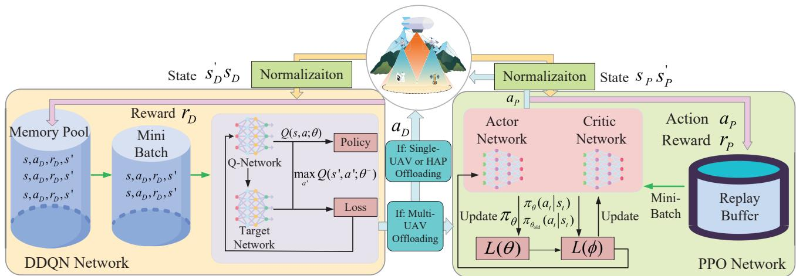  
Fig. 3. DDQN-PPO two-stage decision-making structure.

## IV. ALGORITHM DESIGN

The aforementioned problem constitutes a non-convex mixed-integer nonlinear programming (MINLP) problem, and has been demonstrated to be NP-hard. Moreover, it is difficult to solve using traditional mathematical approaches. Given the dynamic nature of the system state, the objective is to determine near-optimal offloading decisions across varying states by employing a DRL-based method. The algorithmic workflow is illustrated in Fig. 3.

## A. MDP Modeling

In this system, the HAP acts as an agent and makes offloading decisions. In the first step, the DDQN algorithm receives the environment observation $s _ { D }$ as the DRL input, and generates the action $\mathbf { \delta } _  \mathbf { \alpha } \mathbf { \alpha } \mathbf { \alpha } \mathbf { \alpha } \mathbf { \alpha } \mathbf { \alpha } \mathbf { \alpha } \mathbf { \alpha } \mathbf { \alpha } \mathbf { \alpha } \mathbf { \alpha } \mathbf { \alpha } \mathbf { \alpha } \mathbf { \alpha } \mathbf { \alpha } \mathbf { \alpha } \mathbf { \alpha } \mathrm { ~ \textit ~ { ~ a ~ m ~ } ~ }$ . If the task is assigned to computed by multiple UAVs, the PPO algorithm optimizes the allocation proportions among UAVs, otherwise, the task will be computed by a single UAV or the HAP. Upon the execution of $\mathbf { \delta } _  \mathbf { \alpha } \mathbf { \alpha } \mathbf { \alpha } \mathbf { \alpha } \mathbf { \alpha } \mathbf { \alpha } \mathbf { \alpha } \mathbf { \alpha } \mathbf { \alpha } \mathbf { \alpha } \mathbf { \alpha } \mathbf { \alpha } \mathbf { \alpha } \mathbf { \alpha } \mathbf { \alpha } \mathbf { \alpha } \mathbf { \alpha } \mathrm { ~ \textit ~ { ~ a ~ m ~ } ~ }$ , the environment state is updated to $s _ { D } ^ { ' }$ and the action is evaluated to generate the reward $_ { r _ { D } }$ . The agent will record the feedback set, which is composed of $\{ s _ { D } , a _ { D } , r _ { D } , s _ { D } ^ { \prime } \}$ . The process above is considered a Markov decision process (MDP). Our objective is to iteratively refine the agents strategy through repeated interactions with the environment, thereby enabling the agent to make near-optimal offloading decisions over time. We present the structure of the DDQN method initially. The PPO method will be given in the subsequent subsection.

## B. DDQN Algorithm

1) State Space: Considering that the state matrix should record all variables that may affect the decision, we assume that UAVu is the first-hop destination of task i and define state space in DDQN algorithm as

$$
s _ { D } ( t ) = ( E _ { U } ( t ) , R _ { u } ^ { U 2 U } ( t ) , Q ( t ) , F _ { U } ( t ) , R _ { u } ^ { U 2 H } ( t ) , S _ { i } ) .\tag{38}
$$

$R _ { u } ^ { U 2 U } ( t )$ refers to the channel capacity between UAVu and other UAVs in the cluster, which can be denoted as

$$
\pmb { R } _ { u } ^ { U 2 U } ( t ) = ( R _ { u 1 } ^ { U 2 U } ( t ) , R _ { u 2 } ^ { U 2 U } ( t ) , . . . , R _ { u u ^ { \prime } } ^ { U 2 U } ( t ) ) \forall u , u ^ { \prime } \in U .\tag{39}
$$

Q(t) is the sum of the task sizes in the queuing sequence, it is expressed as

$$
\begin{array} { r } { Q ( t ) = ( Q _ { 1 } ( t ) , Q _ { 2 } ( t ) , . . . , Q _ { u } ( t ) , Q _ { H } ( t ) ) \quad \forall u \in U . } \end{array}\tag{40}
$$

More specifically, the $Q _ { u } ( t )$ denotes the queuing sequence of UAVu at time slot t. According to [38], the queue update of UAVu can be denoted as

$$
Q _ { u } ( t + 1 ) = Q _ { u } ( t ) + [ L _ { u } ( t ) - A _ { u } ( t ) ] ^ { + } .\tag{41}
$$

$L _ { u } ( t )$ is the sum of task sizes which assigned to UAV u at time slot $t , A _ { u } ( t )$ is the sum of task sizes which has waited over $T _ { m a x }$ in the time slot t. We set $[ x ] ^ { + } = m a x \{ 0 , x \}$ and $I _ { u } ( t )$ represents the task list allocated by UAV u in time slot t. Based on above, $L _ { u } ( t )$ can be expressed as

$$
L _ { u } ( t ) = \sum _ { i \in I _ { u } ( t ) } S _ { i } \mu _ { i } ^ { s p } + \sum _ { u ^ { \prime } \in U ^ { \prime } } [ \frac { \sum _ { i \in I _ { U ^ { \prime } } ( t ) } S _ { i } \mu _ { i } ^ { s p } P _ { u } ^ { i } } { R _ { u u ^ { \prime } } ^ { U 2 U } } ] ^ { + } .\tag{42}
$$

Similarly, the queue update of HAP H is

$$
Q _ { H } ( t + 1 ) = Q _ { H } ( t ) + [ L _ { H } ( t ) - A _ { H } ( t ) ] ^ { + } .\tag{43}
$$

$L _ { H } ( t )$ and $A _ { H } ( t )$ represent the sum of task sizes which assigned to HAP and sum of timeout task sizes at time slot $t ,$ respectively. To be specific, $L _ { H } ( t )$ can be shown as

$$
L _ { H } ( t ) = \sum _ { u \in U } [ \frac { \sum _ { i \in I _ { u } ( t ) } S _ { i } \mu _ { i } ^ { H } } { R _ { u h } ^ { U 2 H } } ] ^ { + } .\tag{44}
$$

$F _ { U } ( t )$ denotes CPU frequency for each UAV and HAP at time slot t, it is shown as

$$
F _ { U } ( t ) = ( f _ { 1 } , f _ { 2 } , f _ { 3 } , . . . , f _ { u } , f _ { H } ) \quad \forall u \in U .\tag{45}
$$

Specially, we assume that the remaining energy of $\mathrm { U A V } u$ is $e _ { u } ( t )$ . Thus, the original energy state can be represented as

$$
e ( t ) = ( e _ { 1 } ( t ) , e _ { 2 } ( t ) , e _ { 3 } ( t ) , . . . , e _ { u } ( t ) ) \quad \forall u \in U .\tag{46}
$$

For the above array, we use $\sigma$ and $\mu$ to denote the standard deviation and mean value, respectively. First, we use the Z − Score normalization method to process this array and we

Algorithm 1 Offloading Mode Selection Scheme.   
Initialize: Empty replay memory pool D with size $L _ { D }$ , batch   
size $B _ { D }$ , minibatch size $n _ { D }$ , Q-network with parameter $\theta ,$   
target network with parameter $\theta ^ { \prime }$ ,learning rate $\gamma _ { D } .$ , reward   
discount factor $\xi _ { D } ,$ , target network update frequency $k _ { D }$   
Input: Remaining energy of UAVs $E _ { U }$ , data transmit rate   
$R _ { u } ^ { U 2 U }$ , uplink rate $\bar { R } _ { u } ^ { U 2 H }$ , CPU frequency of UAVs ${ \pmb F } _ { \pmb U }$   
queuing state Q, task size S.   
Output: Offloading mode $\mathbf { } a _ { i } .$   
1: for episode = 1 to I do   
2: Obtain initial observation state $s _ { o r i } ;$   
3: Initialize the original state $s _ { o r i } .$ , get $_ { s D } ;$   
4: for $t = 0$ to $T$ do   
5: Solve the values of all actions by using $s _ { D } ;$   
6: Choose action $\mathbf { \delta } \mathbf { a } _ { D }$ with the ϵ-greedy policy;   
7: Execute action $\mathbf { \delta } _ { \mathbf { a } _ { D } }$ and observe new state $s _ { o r i } ^ { \prime }$ and   
reward $r _ { D } ;$   
8: if D reaches the size $L _ { D }$ then   
9: Remove earliest memory from $D ;$   
10: end if   
11: Store transition $\{ s _ { D } , \pmb { a } _ { D } , r _ { D } , \pmb { s } _ { D } ^ { \prime } \}$ to replay buffer   
$D ;$   
12: Sample a minibatch with size $n _ { D }$ from $D ;$   
13: Estimate the target yi;   
14: Step + +;   
15: if $S t e p \% k _ { D } = 0$ then   
16: Update target Q-network parameters by using   
mean square error loss method;   
17: end if   
18: end for   
19: end for

assume that the processed data of $e _ { u } ( t )$ is $e _ { u } ^ { \prime } ( t )$ . This process can be described as

$$
e _ { u } ^ { \prime } ( t ) = \frac { e _ { u } ( t ) - \mu } { \sigma } .\tag{47}
$$

Subsequently, the Sigmoid function is employed to normalize all energy-related data into the interval [0, 1], based on their relative magnitudes. The corresponding energy state space is denoted as

$$
E _ { u } ( t ) = \frac { 1 } { 1 + e ^ { - e _ { u } ^ { \prime } ( t ) } } .\tag{48}
$$

Thus, the energy matrix in the proposed state space can be expressed as

$$
E _ { U } ( t ) = ( E _ { 1 } ( t ) , E _ { 2 } ( t ) , E _ { 3 } ( t ) , . . . , E _ { u } ( t ) ) \quad \forall u \in U .\tag{49}
$$

2) Action Space: As shown in Algorithm 1, for computing task i, we define the action space as

$$
\pmb { a } _ { D } = \pmb { \mu _ { i } } \triangleq ( \mu _ { i } ^ { s p } , \mu _ { i } ^ { m p } , \mu _ { i } ^ { H } ) .\tag{50}
$$

For all tasks, $\mathbf { \delta } _ { \mathbf { a } _ { D } }$ obeys the constraint $C _ { 3 }$

3) Reward Function: The target is to decrease energy utilization and processing latency concurrently. Since the task size is given randomly, we consider the unit data processing

delay and unit data processing energy in the reward, which can be described as

$$
\begin{array} { r } { r _ { D } ^ { i } ( t ) = \left\{ \begin{array} { c c } { - \frac { a _ { D } T _ { i } + b _ { D } E _ { i } } { S _ { i } } , } & { \mathrm { t a s k } i \mathrm { i s s u c c e s s f u l l y c o m p u t e d } ; } \\ { \frac { v _ { D } ( t ) } { S _ { i } } , } & { \mathrm { o t h e r w i s e } , } \end{array} \right. } \end{array}\tag{51}
$$

where $a _ { D }$ and $b _ { D }$ refer to the reward weights associated with offloading latency and energy utilization, respectively. In delay-sensitive conditions, $a _ { D }$ can be set larger than $b _ { D } ;$ whereas in energy sensitive conditions, the opposite holds. Same with the approaches adopted in related studies, in our simulations, we set $a _ { D } = b _ { D }$ , indicating that the considered scenario aims to balance task offloading delay and overall system energy consumption without prioritizing one over the other. The parameter $v _ { D }$ denotes the punitive coefficient applied when task i fails to be computed. It can be expressed as

$$
\begin{array} { r } { v _ { D } ( t ) = \xi _ { d } - ( \xi _ { d } - \psi _ { d } ) e ^ { - \eta _ { d } t } , } \end{array}\tag{52}
$$

where $\psi _ { d } , \xi _ { d }$ and $\eta _ { d }$ can adjust the initial value, maximum value and growing speed, respectively.

## C. PPO Algorithm

1) State Space: As shown in Alg. 2, in the proposed framework, the PPO algorithm works only when multi-UAV processing mode is selected. Thus, we only consider the environmental state of UAVs cluster. The state space of the PPO algorithm is formulated as

$$
\begin{array} { r } { s _ { P } ( t ) = ( E _ { U ^ { \prime } } ( t ) , R _ { u } ^ { U 2 U } ( t ) , F _ { U ^ { \prime } } ( t ) , Q _ { U ^ { \prime } } ( t ) , S _ { i } ) . } \end{array}\tag{53}
$$

Notably, we use the same method to pre-process the energy matrix. Different from the above, $Q _ { U ^ { \prime } } ( t )$ can be denoted as

$$
Q _ { U ^ { \prime } } ( t ) = ( Q _ { 1 } ( t ) , Q _ { 2 } ( t ) , Q _ { 3 } ( t ) , . . . , Q _ { u } ( t ) ) \quad \forall u \in U ^ { \prime } .\tag{54}
$$

In multi-UAV cooperative offloading mode, the task will be split into several sub-tasks and transport from UAVu to other UAVs in the cluster. Thus, we consider a subset of UAVs cluster $U ^ { \prime }$ which does not include UAVu.

2) Action Space: The PPO method is then employed to determine the allocation ratios and expected frequency of the subtasks assigned to each UAV. To ensure that the main task is fully processed, the proportion of workload p undertaken by each UAV must satisfy constraint Eq. (37g). The output action of PPO can be expressed as

$$
a _ { p } = ( p _ { 1 } , p _ { 2 } , p _ { 3 } , . . . , p _ { u } , f _ { 1 } , f _ { 2 } , f _ { 3 } , . . . , f _ { u } ) \quad \forall u \in U ^ { \prime } ,\tag{55}
$$

where $p _ { u }$ and $f _ { u }$ denote the allocation ratio and expected computing frequency to UAV u, respectively. However, adding a hard enforcement in neural network is not appropriate. Thus, the Softmax function is used to transform the action for satisfying constraint Eq. (37g). It can be expressed as

$$
P _ { u } = \frac { e ^ { p _ { u } - m a x ( a _ { p } ) } } { \displaystyle \sum _ { j = 1 } ^ { n } e ^ { p _ { j } - m a x ( a _ { p } ) } } \quad \forall j , u \in U ^ { \prime } .\tag{56}
$$

During this process, the task-splitting granularity is implicitly determined by the floating-point precision of the Python program $( 1 ~ \times ~ 1 0 ^ { - 1 6 } )$ . Thus, we not only regularize the action space to strictly comply with constraint Eq. $( 3 7 \mathrm { g } )$ , but also achieve the finest task-splitting granularity permitted by the computational precision, thereby minimizing task-splitting errors to the greatest extent possible. The processed action space of the PPO algorithm can be written as

$$
\pmb { a } _ { P } = ( P _ { 1 } , P _ { 2 } , P _ { 3 } , . . . , P _ { u } , f _ { 1 } , f _ { 2 } , f _ { 3 } . . . , f _ { u } ) \quad \forall u \in U ^ { \prime } .\tag{57}
$$

3) Reward Function: Similarly, by considering the energy utilization and latency, the reward is defined as

$$
\begin{array} { r } { r _ { P } ^ { i } ( t ) = \left\{ \begin{array} { c c } { - \frac { a _ { P } T _ { i } + b _ { P } E _ { i } } { S _ { i } } , } & { \mathrm { t a s k } i \mathrm { i s s u c c e s s f u l l y c o m p u t e d } ; } \\ { \frac { v _ { P } ( t ) } { S _ { i } } , } & { \mathrm { o t h e r w i s e } , } \end{array} \right. } \end{array}\tag{58}
$$

where $a _ { P }$ and $b _ { P }$ refer to the weight of latency and energy utilization in cooperative offloading. We set $a _ { P } = b _ { P }$ . υP denotes the punitive coefficient for the PPO algorithm. It can be adjusted as

$$
\begin{array} { r } { v _ { P } ( t ) = \xi _ { p } - ( \xi _ { p } - \psi _ { p } ) e ^ { - \eta _ { p } t } , } \end{array}\tag{59}
$$

where $\psi _ { p } , \xi _ { p }$ and $\eta _ { p }$ can adjust the initial value, maximum value and growing speed, respectively.

## D. Agent Intropy

Recently, a novel concept of “Intropy” has been proposed to model intelligence instead of traditional reward function [39]. Specifically, intropy can be expressed as $\begin{array} { l l l } { d { \mathcal L } } & { = } & { { \frac { \delta S } { { \mathcal R } _ { \mathcal Z } } } } \end{array}$ . δS represents the effective improvement of agents, $\mathcal { R } _ { \mathcal { I } }$ denotes the structural learning resistance, such as uncertainty and enhanced complexity. In this study, the optimization problem is decomposed into two subproblems, namely offloading mode selection and offloading ratio determination. By ensuring that both subproblems are aligned with the global optimization objective, the proposed approach effectively improves δS and reduces $\mathcal { R } _ { \mathcal { Z } }$ . Thus, $d \mathcal { L }$ demonstrates the effectiveness of the proposed method from the perspective of algorithmic learning efficiency.

## E. Computational Complexity

During the training phase, the computational complexity is affected by multiple factors, including the dimensions of the input, output, and hidden layers. Consequently, providing a unified closed-form expression for the overall computational complexity across all simulation scenarios becomes infeasible [40]. Moreover, due to the difficulty of explicitly characterizing the evolving probability distribution within the discrete DDQN algorithm during training, an accurate expression of the computational complexity at system level remains challenging. In the following, we first present the computational complexity analysis of the discrete DDQN method.

Considering a multi-layer perceptron (MLP) network, the number of neurons in hidden layers is $e _ { D }$ , the set of state $| S _ { D } |$ and the set of action $| A _ { D } |$ . The The computational complexity during the training process can be denoted as

$$
\mathcal { O } ( e _ { D } \cdot I _ { D } \cdot T _ { D } \cdot ( | S _ { D } | + | A _ { D } | ) ) .\tag{60}
$$

Algorithm 2 The Task Assignment Strategy.   
Initialize: Batch size $B _ { P }$ , discount factor $\xi _ { P } ,$ actor network   
learning rate $\gamma _ { a }$ and critic network learning rate $\gamma _ { c } ,$ update   
frequency $k _ { P }$   
Input: Remaining energy $E _ { U } ^ { \prime }$ , data transmit rate $R _ { u } ^ { U 2 U }$ , CPU   
frequency of UAVs $F _ { U ^ { \prime } }$ , queuing state $Q _ { U ^ { \prime } } ,$ , task size $S _ { i }$   
Output: Percentage of tasks computed by each UAV.   
1: for $i t e r a t i o n = 1 , 2 , 3 , . . . , N$ do   
2: Obtain initial observation state $s _ { o r i } ;$   
3: Initialize the original state $s _ { o r i } .$ , get $s _ { P } ;$   
4: Get action $a _ { p } ;$   
5: Transfer $a _ { p }$ to ${ \pmb a } _ { P } ;$   
6: Observe new state and transform into $s _ { P } ^ { \prime } ,$ get reward   
$r _ { P } ;$   
7: Record the transition $\{ s _ { P } , a _ { P } , r _ { P } , s _ { P } ^ { \prime } \}$   
8: $S t e p + +$   
9: if $S t e p \% k _ { P } = 0$ then   
10: Update policy;   
11: Update $\pi _ { \theta _ { o l d } }$ with $\theta _ { o l d }  \theta ;$   
12: end if   
13: end for

The computational complexity of single step decision-making in offline scenario can be expressed as

$$
\mathcal { O } ( e _ { D } \cdot ( ( | S _ { D } | + | A _ { D } | ) ) .\tag{61}
$$

In continues PPO algorithm, considering an actor network and a critic network with $e _ { P }$ neurons in hidden layer, respectively. The $S _ { P }$ and $A _ { P }$ denote the set of state and the set of action, respectively. The computational complexity in training process is

$$
\mathcal { O } ( e _ { P } \cdot I _ { P } \cdot T _ { P } \cdot ( | S _ { P } | + | A _ { P } | ) ) .\tag{62}
$$

The computational complexity of single step decision-making in offline scenario can be expressed as

$$
\mathcal { O } ( e _ { P } \cdot ( ( | S _ { P } | + | A _ { P } | ) ) .\tag{63}
$$

We assume that the probability of multi-UAV cooperative offloading during the online training process and the offline decision process is $\mathbb { E } [ I ( \mu ^ { m p } ) = 1 ]$ . Thus, the system computational complexity during training process and offline decisionmaking process can be written as

$$
\begin{array} { r l } & { \mathcal { O } \big ( e _ { D } \cdot I _ { D } \cdot T _ { D } \cdot \big ( | S _ { D } | + | A _ { D } | \big ) \big ) } \\ & { \quad + \mathbb { E } [ I ( \mu ^ { m p } ) = 1 ] \cdot \mathcal { O } \big ( e _ { P } \cdot I _ { P } \cdot T _ { P } \cdot \big ( | S _ { P } | + | A _ { P } | \big ) \big ) _ { \binom { m } { m } } } \end{array}
$$

and

(64)

$$
\mathcal { O } ( e _ { D } \cdot ( ( | S _ { D } | + | A _ { D } | ) ) + \mathbb { E } [ I ( \mu ^ { m p } ) = 1 ] \cdot \mathcal { O } ( e _ { P } \cdot ( ( | S _ { P } | + | A _ { P } | ) ) .\tag{65}
$$

## V. PROBLEM SOLUTION

In this section, the algorithmic flow of DDQN, which operates in a discrete action space, is first introduced. Subsequently, the continuous PPO algorithm employing the clip method is described. Finally, the overall workflow of proposed scheme is summarized.

Algorithm 3 Overall Offloading Workflow.   
Initialize: Computational task i, set of UAV U, HAP H.   
1: for iteration = 1, 2, 3, ..., N do   
2: Upload task i to the nearest UAV u;   
3: Get action $\mu _ { i }$ form Alg. 1;   
4: if $\mu _ { i } ^ { m p } = 1$ (multi-UAV offloading) then   
5: Get action $\mathbf { \delta } _ { \mathbf { a } _ { D } }$ form Alg. 2;   
6: Split main task i;   
7: Transfer subtask $i _ { 1 } , i _ { 2 } , i _ { 3 } , . . . i _ { u } ^ { \prime }$   
to UAV 1, 2, $3 , . . . , u ^ { \prime } ;$   
8: Add subtasks into waiting or computing queue;   
9: else if $\mu _ { i } ^ { H } = 1$ (HAP offloading) then   
10: Transfer task i to HAP h;   
11: Add task i into waiting or computing queue;   
12: else if $\mu _ { i } ^ { s p } = 1$ (single-UAV offloading) then   
13: Add task i into waiting or computing queue;   
14: end if   
15: end for

## A. Algorithmic Flow of DDQN

As a DRL method based on the value function, DDQN is evolved from deep Q-learning (DQN) and overcame the problems that Q-learning could not adapt to complex multistate systems and overvalued in DQN [41]. We first give the renew process for current observation s and decision a, it can be described as the Behrman equation

$$
Q ( s , a )  Q ( s , a ) + \alpha ( r _ { t } + \gamma \mathit { m a x } _ { \alpha ^ { \prime } } Q ( s ^ { \prime } , a ^ { \prime } ) - Q ( s , a ) ) ,\tag{66}
$$

where α denotes the learning rate which determines the speed of renewing the experiences. $\gamma$ is the reward discount factor for future steps which satisfies $0 ~ \leq ~ \gamma ~ \leq ~ 1 . ~ r _ { t }$ refers to the immediate reward. DDQN disintegrates the target network into evaluation and selection of actions. Therein, the action selection ϵ-greedy policy is formulated as

$$
a ^ { \prime } ( s ; \theta ) = \left\{ \begin{array} { c l } { { \arg \operatorname* { m a x } Q ( s , a ; \theta ) , } } & { { 1 - \epsilon , } } \\ { { } } & { { { o t h e r s } , } } \end{array} \right.\tag{67}
$$

The action $a ^ { \prime }$ is utilized to compute target Q-value, which is expressed as

$$
Q _ { T } = r + \gamma Q ( s ^ { \prime } , a ^ { \prime } ; \theta ^ { \prime } ) .\tag{68}
$$

The error loss function can be denoted as

$$
L _ { i } ( \theta _ { i } ) = \mathbb { E } [ Q _ { T } - Q ( s , a , ; \theta _ { i } ) ^ { 2 } ] .\tag{69}
$$

Finally, to ensure the stability, the soft update method is served to renew the target network. The update process can be expressed as

$$
\theta ^ { \prime }  \tau \theta + ( 1 - \tau ) \theta ^ { \prime } .\tag{70}
$$

## B. Algorithmic Flow of PPO

Proximal policy optimization (PPO) is a mode-free algorithm designed by OpenAI. Compared with proposed on-policy algorithms, PPO has advantages such as less hyperparameters

and lower complexity [42]. The surrogate loss function in the clipped PPO algorithm can be defined as

$$
L ( \theta ) = \mathbb { E } [ m i n ( r _ { \theta } \cdot \hat { A } _ { t } , c l i p ( r _ { \theta } , 1 - \epsilon , 1 + \epsilon ) \cdot \hat { A } _ { t } ] ,\tag{71}
$$

here, $\hat { A } _ { t }$ refers to the advantage, which is considered the generalized advantage estimator (GAE) approach. We use $\xi _ { P }$ and λ to denote the discount rate and the dominance parameter respectively. The advantage described as

$$
\hat { A } _ { t } = \sum _ { k = 0 } ^ { T - t } ( \xi _ { P } \lambda ) ^ { k } \delta _ { t + k } ,\tag{72}
$$

and

$$
\delta _ { t } = r _ { t } + \xi _ { P } V ( \pmb { s } _ { t + 1 } ) - V ( \pmb { s } _ { t } ) .\tag{73}
$$

$r _ { \theta }$ denotes the probability between the old policy network $\pi _ { \theta _ { o l d } }$ and new policy network $\pi _ { \theta }$ with parameter $\theta _ { o l d }$ and θ respectively, which can be expressed as

$$
r _ { \theta } = \frac { \pi _ { \theta } ( a _ { t } | s _ { t } ) } { \pi _ { \theta _ { o l d } } ( a _ { t } | s _ { t } ) } .\tag{74}
$$

The update can be described as

$$
\pi _ { \theta _ { o l d } }  \pi _ { \theta } .\tag{75}
$$

Besides, $c l i p ( \cdot )$ denotes the clip function which limits the probability ratio to the given interval $[ 1 - \epsilon , 1 + \epsilon ]$ with clip hyperparameter ϵ.

## C. Overall Offloading Workflow

As described in Alg. 3, the overall workflow consists of two optimization stages. PPO is embedded within DDQN algorithm. PPO is only activated when DDQN determines computational tasks should be offloaded to multiple UAVs. Line 4 to 8 illustrate the process in which PPO participates in the offloading decision.

## VI. SIMULATION RESULTS AND ANALYSIS

The experimental environment and parameter settings are presented in this part. Subsequently, the baseline algorithms employed for comparative evaluation are introduced. Finally, the experimental data are reported and analyzed to confirm the performance of the formulated approach. The experiments were conducted in Python 3.7 and TensorFlow 1.15.1 with Intel Ultra5-245K 5.2GHz CPU and 48 GB RAM.

## A. Simulation Parameters

A UAV-HAP collaborative MEC system with 10 UAVs equidistantly arranged on a circle with a radius of 250 m, and 30 UEs randomly dispersed over a 1000m × 1000m region is considered in Fig. 4 [43]. Each UAV is able to connect with UEs, other UAVs and HAP. To better evaluate the action policies, we ignore the packet loss of communication channels [44]. The UAVs and HAP hover at altitudes of 100 m and 20 km in the vertical direction, respectively [35]. For each task, the size $S _ { i }$ is set from 1 to 3 MB, and the default computation complexity $\rho _ { i }$ is set as 100 (in cycles/bit) [36], [43]. The CPU frequency of UAVs $f _ { u }$ is from 1 GHz to 3

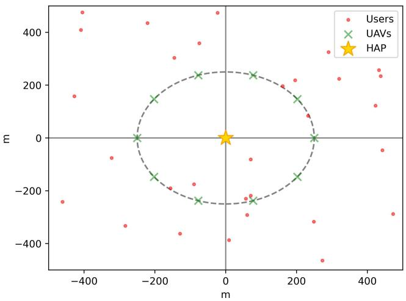  
Fig. 4. Location map.

GHz [36]. The computing resource of HAP is 30 GHz [32]. The maximum communication powers $P _ { u } ^ { G 2 U } , P _ { u u ^ { \prime } } ^ { U 2 U } , P _ { u h } ^ { U 2 \bar { H } }$ are 1W , 5W , 25W , respectively [45]. The channel bandwidth for G2U, U2U and U2H are set to 1 MHz, 5 MHz, and 10 MHz. For DDQN, the default learning rate $\gamma _ { D }$ is set as $1 \times 1 0 ^ { - 2 }$ ; for PPO, the default learning rates for actor and critic network $\gamma _ { a } , \gamma _ { c }$ are $1 \times 1 0 ^ { - 4 }$ . The overall settings are described in TABLE II. We indicate the default arguments for comparison in bold fonts.

## B. Alternative Solutions

In the comparative experiment, several similar DRL-baseds method and other methods will be introduced as follows.

Deep deterministic policy gradient (DDPG): DDPG is an approach that integrates elements of both policy gradient methods and Q-learning. However, DDPG utilizes the Qvalues that estimated by the critic network to compute the policy gradient and employs a deterministic policy to generate continuous actions, which are used to update the actor network. In the proposed alternative approach, DDPG is employed in place of PPO for task allocation within the collaborative offloading framework, and this configuration is referred to Scheme 1.

Soft Actor-Critic (SAC): SAC is an off-policy algorithm that optimizes a stochastic policy and twin Q-networks under the maximum-entropy framework, achieving efficient exploration and high sample efficiency. In contrast, PPO is an on-policy method that performs policy updates via clipped surrogate objectives, leading to more stable and conservative learning behavior. In this work, SAC is adopted as an alternative baseline to PPO and denoted as Scheme 2.

Twin Delayed Deep Deterministic Policy Gradient (T-D3): TD3 is an off-policy actor-critic algorithm, which enhances stability through delayed policy updates and target policy smoothing. In contrast, PPO follows an on-policy paradigm and optimizes a stochastic policy via a clipped surrogate objective, resulting in a simpler optimization procedure. In this work, TD3 is employed as an alternative baseline to PPO and referred to as Scheme 3.

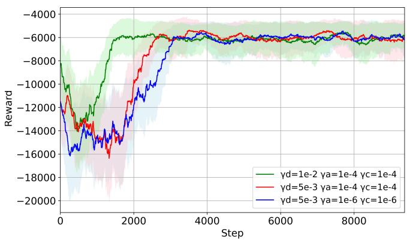  
Fig. 5. Moving average reward with different learning rates.

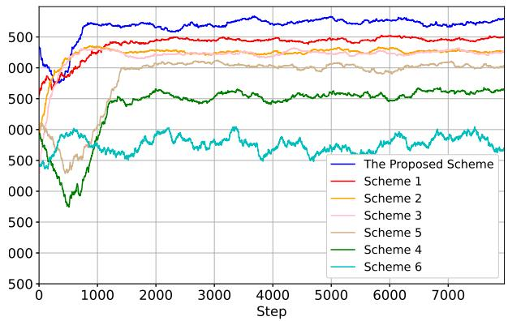  
Fig. 6. Moving average reward with different methods.

Greedy algorithm: The greedy policy is a non-DRLbased approach. In contrast to DRL methods, the greedy algorithm selects the action that appears to yield the most favorable outcome at the current decision point, without considering the impact of past or future decisions. In this study, the greedy algorithm is used as a substitute for PPO and is designated as Scheme 4. Under this scheme, the task is assigned to the UAV with the highest available computation frequency at the time of decision-making.

Random policy: To verify the proposed method is effective, a random policy is adopted as a baseline. Specifically, the PPO algorithm is replaced with a random policy, referred to Scheme 5, and the DDQN algorithm is similarly replaced, denoted as Scheme 6. To ensure the randomness, we use system time as the random seed.

## C. Convergence Comparison

The convergence comparisons versus different methods and learning rates were illustrated in Figs. 5 and 6, respectively. As shown in Fig. 5, we set up different $\gamma _ { D } , \gamma _ { a }$ and $\gamma _ { c }$ for comparison under conditions of 10 UEs and 10 UAVs. Under different learning rates, the curves stabilize in around 2000 to

TABLE II SIMULATION PARAMETERS
<table><tr><td>Parameters</td><td>Value</td></tr><tr><td>Number of UEs N</td><td>10, 20, 30</td></tr><tr><td>Number of UAVs U</td><td>10</td></tr><tr><td>Height of  $\mathrm { U A V s } ~ z _ { U }$ </td><td>100m</td></tr><tr><td>Height of HAP  $z _ { H }$ </td><td>20km</td></tr><tr><td>Maximum transmit power of UEs  $\overline { { P _ { n } ^ { G 2 U } } }$ </td><td>1W</td></tr><tr><td>Maximum transmit power of U2U channel  $P ^ { U 2 \bar { U } }$   $\mathcal { P } _ { u u ^ { \prime } } ^ { v \angle \mathfrak { c } }$ </td><td>5W</td></tr><tr><td>Maximum transmit power of U2H channel  $P _ { u h } ^ { U 2 H }$ </td><td>25W</td></tr><tr><td>The weight of latency α</td><td>0.5</td></tr><tr><td>The weight of energy β</td><td>0.5</td></tr><tr><td>Task size  $S _ { i }$ </td><td>[1, 4]MB</td></tr><tr><td>Computation resources of UAVs  $f _ { u }$ </td><td>[1, 3]GHz</td></tr><tr><td>Maximum tolerance delay  $T _ { m a x }$ </td><td>10s</td></tr><tr><td>Task complexity  $\rho _ { i }$ </td><td>100, 150, 200, 250, 300, 350 cycles/bit</td></tr><tr><td>Task density</td><td>1.0, 1.2, 1.4, 1.6, 1.8, 2.0 /sec</td></tr><tr><td>G2U channel bandwidth  $B _ { G 2 U }$ </td><td>1MHz</td></tr><tr><td>U2U channel bandwidth  $B _ { U 2 U }$ </td><td>5MHz</td></tr><tr><td>U2H channel bandwidth  $B _ { U 2 H }$ </td><td>10MHz</td></tr><tr><td>Noise power spectral density  $N _ { 0 }$ </td><td>-174dBm/Hz</td></tr><tr><td>Boltzmann constant  $k _ { b }$ </td><td> $\overline { { 1 . 3 8 0 6 \times 1 0 ^ { - 2 3 } } } \mathrm { J } / \mathrm { K }$ </td></tr><tr><td>Noise temperature  $_ T$ </td><td> $\overline { { 1 0 0 0 \mathrm { K } } }$ </td></tr><tr><td>Effective switched capacitance  $\kappa _ { u a v } ,$  κH</td><td> $\overline { { 1 0 ^ { - 2 8 } } }$ </td></tr><tr><td>DDQN learning rate  $\gamma _ { D }$ </td><td> $\overline { { { \bf 1 0 ^ { - 2 } } , 5 \times 1 0 ^ { - 3 } } }$ </td></tr><tr><td>DDQN reward discount factor  $\xi _ { D }$ </td><td> $0 . 9 9$ </td></tr><tr><td>DDQN soft update rate  $\tau$ </td><td> $\overline { { 0 . 0 1 } }$ </td></tr><tr><td>Actor learning rate  $\gamma _ { a }$ </td><td> $\overline { { { \bf 1 0 } ^ { - 4 } , 1 0 ^ { - 6 } } }$ </td></tr><tr><td>Critic learning rate  $\gamma _ { c }$ </td><td> $\overline { { { \bf 1 0 ^ { - 4 } } , 1 0 ^ { - 6 } } }$ </td></tr><tr><td>Clip parameter €</td><td>0.2</td></tr></table>

3000 steps, which indicates convergence in the training process. The proposed method is insensitive to hyperparameters and suitable for the scenario we assumed.

Fig. 6 illustrates the smoothed average rewards achieved by different training methods. All algorithms except Scheme 6 exhibit clear convergence behavior. Among them, the proposed algorithm achieves the highest reward and maintains a notably smoother training trajectory, demonstrating its capability to effectively optimize task offloading latency and system energy consumption during the training stage in the considered scenario. This stability can be attributed to the structural characteristics of PPO, where the clipped surrogate objective effectively suppresses overly large policy updates, and the onpolicy training paradigm reduces the distribution mismatch which commonly observed in off-policy algorithms.

## D. Performance Comparison under Varying Number of UEs

Figs. 7 and 8 present the average task offloading latency and the weighted system consumption under different user densities for all optimization methods. The results clearly indicate that the proposed approach consistently achieves the lowest offloading latency and the lowest system cost across all scenarios. Compare with Scheme 1, the proposed approach reduces task offloading latency by approximately 22%∼27% and decreases weighted system consumption by 11%∼20%. Schemes 2 and 3 exhibit comparable optimization performance to each other, the proposed method reduces task offloading latency by approximately 35%∼45% and weighted system consumption by about 20%∼30% relative to both.

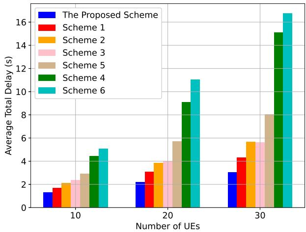  
Fig. 7. Average task process delay versus number of UEs.

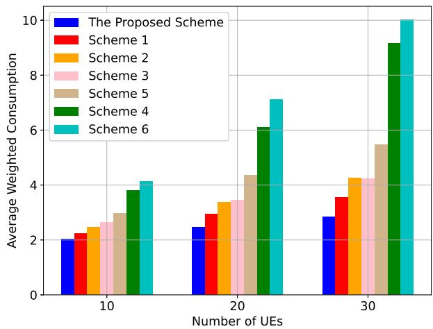  
Fig. 8. Average weighted consumption versus number of UEs.

As illustrated in Fig. 9, each 1000 steps are considered as a training phase. The results clearly show that the proposed method consistently achieves the highest offloading success rate across scenarios with varying numbers of users. Schemes 1, 2 and 3 also demonstrate relatively strong performance, whereas Schemes 4, 5 and 6 experience a rapid decline as the number of users increases. It can be explained by the fact that, under low user density, the system load is relatively light, allowing all methods to meet the latency constraints of computational tasks. As the number of UEs increases, however, the volume of tasks that must be processed within each time interval grows accordingly, resulting in longer queuing delays and reduced offloading efficiency.

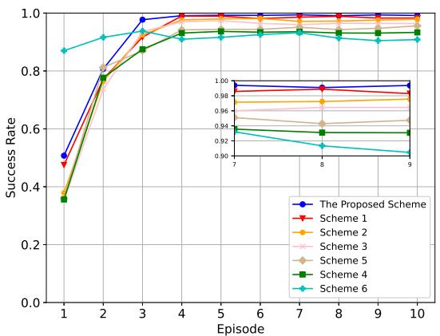  
(a) Offloading success rate with different methods under 10 UEs.

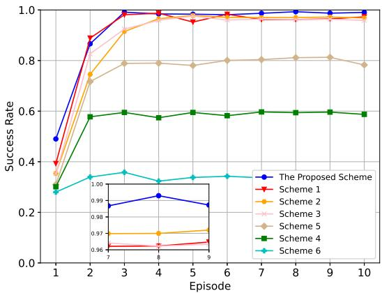  
(b) Offloading success rate with different methods under 20 UEs.

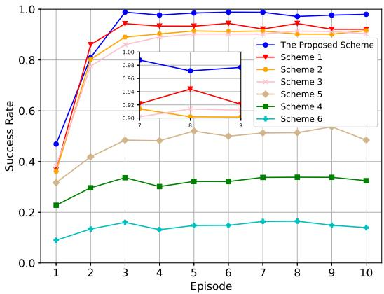  
(c) Offloading success rate with different methods under 30 UEs.  
Fig. 9. Offloading success rate with different algorithms versus number of UEs.

## E. Performance Comparison under Varying Task Density

To further evaluate the system performance, we consider different task densities in the simulation, where task density is defined as the average number of tasks generated by each UE per second. Figs. 10 and 11 clearly illustrate the relationship between task density, offloading latency, and the weighted system consumption for all comparison methods. The results show that the proposed method consistently achieves the lowest offloading latency and system cost across all task density levels. Compared with Scheme 1, our approach reduces latency by approximately 17% and decreases the weighted consumption by approximately 10%. Moreover, Schemes 2 and 3 also demonstrate optimization effects, although their performance remains inferior to that of the proposed algorithm. This behavior can be explained by the fact that DRL-based methods are able to make more reasonable and adaptive decisions through continuous interaction with the environment.

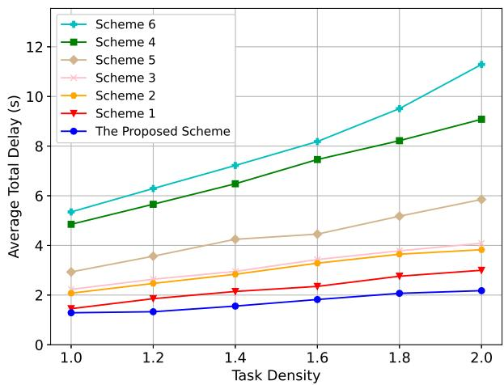  
Fig. 10. Average task process delay versus task density.

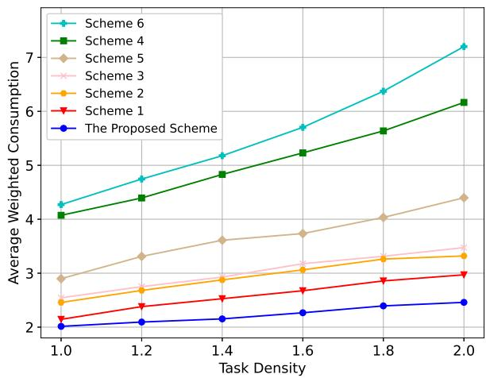  
Fig. 11. Average weighted consumption versus task density.

## F. Performance Comparison under Varying Task Complexity

Figs. 12, 13 and 14 illustrate the task offloading latency, energy consumption, and weighted system cost under varying task complexities. The results clearly show that the proposed method consistently achieves the lowest offloading latency, the lowest energy consumption, and the minimum weighted system consumption across all complexity levels. Notably, when the task complexity reaches 350 cycles/bit, compared with Scheme 1, the proposed approach reduces offloading latency, energy consumption, and system consumption by approximately 35%, 15%, and 21%, respectively. Moreover, even when task complexity increases by 250%, the system energy consumption of the proposed algorithm rises by only 70%, indicating its strong capability to handle computationally intensive tasks.

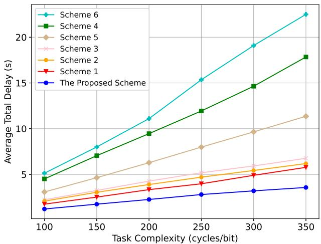  
Fig. 12. Average task process delay versus task complexity.

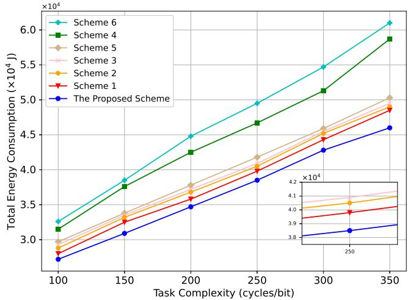  
Fig. 13. Average energy consumption versus task complexity.

## VII. CONCLUSION

In light of the limitations of existing MEC architectures in accommodating the rapid growth of computing-intensive applications, this study proposed an innovative NTN-based MEC architecture comprising multiple UAVs and an HAP. Within this architecture, UAVs either operated as EC terminals to deliver computing services to terrestrial UEs or acted as transfer nodes sending data to the HAP or other UAVs. Additionally, considering users’ QoS expectations and the energy limitations of UAVs, the optimization objectives were established as the weighted expenditure of system energy utilization and processing latency. To address this multi-dimensional optimization problem, a joint DDQN-PPO approach was utilized to optimize the offloading method and offloading ratio, respectively. Compared with existing approaches, the proposed optimization method achieved lower system cost under varying user densities, task densities, and task complexities. In future works, we will further improve the systems availability. Additionally, we will pay more attention to minimize energy consumption and refining task transmission strategies to enhance the processing capacity of the MEC framework.

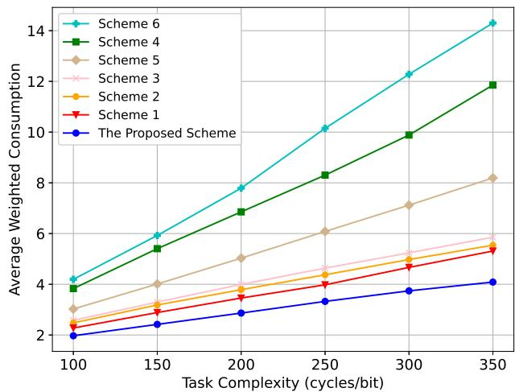  
Fig. 14. Average weighted consumption versus task complexity.

## REFERENCES

[1] S. Zhang, N. Yi, and Y. Ma, “A survey of computation offloading with task types,” IEEE Trans. Intell. Transp. Syst., vol. 25, no. 8, pp. 8313– 8333, Aug. 2024.

[2] X. Ye, M. Li, P. Si, R. Yang, Z. Wang, and Y. Zhang, “Collaborative and intelligent resource optimization for computing and caching in IoV with blockchain and MEC using A3C approach,” IEEE Trans. Veh. Technol., vol. 72, no. 2, pp. 1449–1463, Feb. 2023.

[3] L. Yang, M. Li, P. Si, R. Yang, E. Sun, and Y. Zhang, “Energy-efficient resource allocation for blockchain-enabled industrial Internet of Things with deep reinforcement learning,” IEEE Internet Things J., vol. 8, no. 4, pp. 2318–2329, Feb. 2021.

[4] “Facts and figures 2023 - mobile network coverage,” https://www.itu.int/itu-d/reports/statistics/2023/10/10/ff23-mobilenetwork-coverage.

[5] A. Vanelli-Coralli, A. Guidotti, T. Foggi, G. Colavolpe, and G. Montorsi, “5G and beyond 5G non-terrestrial networks: Trends and research challenges,” in 2020 IEEE 3rd 5G World Forum 5GWF, Sep. 2020, pp. 163–169.

[6] W. Jin, J. Yang, Y. Fang, and W. Feng, “Research on application and deployment of UAV in emergency response,” in 2020 IEEE 10th Int. Conf. Electron. Inf. Emerg. Commun. ICEIEC, Jul. 2020, pp. 277–280.

[7] K. Zhang, S. Ma, R. Zheng, and L. Zhang, “UAV remote sensing image dehazing based on double-scale transmission optimization strategy,” IEEE Geosci. Remote Sens. Lett., vol. 19, pp. 1–5, 2022.

[8] N. H. Motlagh, M. Bagaa, and T. Taleb, “UAV-based IoT platform: A crowd surveillance use case,” IEEE Commun. Mag., vol. 55, no. 2, pp. 128–134, Feb. 2017.

[9] L. Sun, L. Wan, J. Wang, L. Lin, and M. Gen, “Joint resource scheduling for UAV-enabled mobile edge computing system in Internet of Vehicles,” IEEE Trans. Intell. Transp. Syst., vol. 24, no. 12, pp. 15 624–15 632, Dec. 2023.

[10] T. M. Mostafa, A. Muharam, and R. Hattori, “Wireless battery charging system for drones via capacitive power transfer,” in 2017 IEEE PELS Workshop Emerg. Technol. Wirel. Power Transf. WoW, May 2017, pp. 1–6.

[11] G. Karabulut Kurt, M. G. Khoshkholgh, S. Alfattani, A. Ibrahim, T. S. J. Darwish, M. S. Alam, H. Yanikomeroglu, and A. Yongacoglu, “A vision and framework for the high altitude platform station (HAPS) networks of the future,” IEEE Commun. Surv. Tutor., vol. 23, no. 2, pp. 729–779, 2021.

[12] M. Alzenad, M. Z. Shakir, H. Yanikomeroglu, and M.-S. Alouini, “FSO-based vertical backhaul/fronthaul framework for 5G+ wireless networks,” IEEE Commun. Mag., vol. 56, no. 1, pp. 218–224, Jan. 2018.

[13] S. Sibiya and O. O. Olugbara, “Reliable Internet of Things network architecture based on high altitude platforms,” in 2019 Conf. Inf. Commun. Technol. Soc. ICTAS, Mar. 2019, pp. 1–4.

[14] Q. Ren, O. Abbasi, G. K. Kurt, H. Yanikomeroglu, and J. Chen, “Handoff-aware distributed computing in high altitude platform station (HAPS)–assisted vehicular networks,” IEEE Trans. Wirel. Commun., vol. 22, no. 12, pp. 8814–8827, Dec. 2023.

[15] X. Xue, Y. Zhang, X. Lin, and J. C.-H. Peng, “Novel optimization framework for energy-efficiency-based resource allocation and multihop offloading in blockchain-enhanced IoT,” IEEE Internet Things J., pp. 1–1, 2025.

[16] L. Zeng, C. Zhang, Z. Wang, H. Du, and X. Jia, “Towards collaborative and latency-aware microservice migration in mobile edge computing,” IEEE Internet Things J., pp. 1–1, 2025.

[17] S. Bi, L. Huang, and Y.-J. A. Zhang, “Joint optimization of service caching placement and computation offloading in mobile edge computing systems,” IEEE Trans. Wirel. Commun., vol. 19, no. 7, pp. 4947– 4963, Jul. 2020.

[18] H. Zhou, K. Jiang, X. Liu, X. Li, and V. C. M. Leung, “Deep reinforcement learning for energy-efficient computation offloading in mobile edge computing,” IEEE Internet Things J., vol. 9, no. 2, pp. 1517–1530, Jan. 2022.

[19] Z. Xiao, X. Dai, H. Jiang, D. Wang, H. Chen, L. Yang, and F. Zeng, “Vehicular task offloading via heat-aware MEC cooperation using gametheoretic method,” IEEE Internet Things J., vol. 7, no. 3, pp. 2038–2052, Mar. 2020.

[20] X. Hu, K.-K. Wong, and Y. Zhang, “Wireless-powered edge computing with cooperative UAV: Task, time scheduling and trajectory design,” IEEE Trans. Wirel. Commun., vol. 19, no. 12, pp. 8083–8098, Dec. 2020.

[21] T. Zhang, Y. Xu, J. Loo, D. Yang, and L. Xiao, “Joint computation and communication design for UAV-assisted mobile edge computing in IoT,” IEEE Trans. Ind. Informat., vol. 16, no. 8, pp. 5505–5516, Aug. 2020.

[22] J. Yao and N. Ansari, “Online task allocation and flying control in fogaided internet of drones,” IEEE Trans. Veh. Technol., vol. 69, no. 5, pp. 5562–5569, May 2020.

[23] F. Zhou, Y. Wu, R. Q. Hu, and Y. Qian, “Computation rate maximization in UAV-enabled wireless-powered mobile-edge computing systems,” IEEE J. Sel. Areas Commun., vol. 36, no. 9, pp. 1927–1941, Sep. 2018.

[24] R. Li and H. Ma, “Research on UAV swarm cooperative reconnaissance and combat technology,” in 2020 3rd Int. Conf. Unmanned Syst. ICUS, Nov. 2020, pp. 996–999.

[25] X. Gao, H. Jia, Z. Chen, G. Yuan, and S. Yang, “UAV security situation awareness method based on semantic analysis,” in 2020 IEEE Int. Conf. Power Intell. Comput. Syst. ICPICS, Jul. 2020, pp. 272–276.

[26] X. Sun, D. W. K. Ng, Z. Ding, Y. Xu, and Z. Zhong, “Physical layer security in UAV systems: Challenges and opportunities,” IEEE Wirel. Commun., vol. 26, no. 5, pp. 40–47, Oct. 2019.

[27] S. Goudarzi, S. A. Soleymani, W. Wang, and P. Xiao, “UAV-enabled mobile edge computing for resource allocation using cooperative evolutionary computation,” IEEE Trans. Aerosp. Electron. Syst., vol. 59, no. 5, pp. 5134–5147, Oct. 2023.

[28] M. L. Betalo, S. Leng, H. N. Abishu, F. A. Dharejo, A. M. Seid, A. Erbad, R. A. Naqvi, L. Zhou, and M. Guizani, “Multi-agent deep reinforcement learning-based task scheduling and resource sharing for O-RAN-empowered multi-UAV-assisted wireless sensor networks,” IEEE Trans. Veh. Technol., vol. 73, no. 7, pp. 9247–9261, Jul. 2024.

[29] Q. Liu, S. Wang, Z. Qi, Z. Si, and Q. Liu, “Energy-efficient joint computation offloading and resource allocation optimization in UAV/HAPassisted AIoT networks,” IEEE Trans. on Green Commun. Netw., pp. 1–1, 2025.

[30] K. Wang, H. Ma, L. Fu, Q. Li, and Z. Zhao, “Joint task offloading and UAV deployment for collaborative HAP-UAV systems,” in 2025 5th Int. Conf. Consum. Electron. Comput. Eng. ICCECE, Feb. 2025, pp. 717– 721.

[31] Z. Hu, Y. Yang, W. Gu, Y. Chen, and J. Huang, “DRL-based trajectory optimization and task offloading in hierarchical aerial MEC,” IEEE Internet Things J., pp. 1–1, 2024.

[32] A. Nabi and S. Moh, “Joint offloading decision, user association, and resource allocation in hierarchical aerial computing: Collaboration of UAVs and HAP,” IEEE Trans. Mob. Comput., vol. 24, no. 8, pp. 7267– 7282, Aug. 2025.

[33] J. Wu, J. Luo, C. Jiang, and L. Gao, “A multi-agent deep reinforcement learning approach for multi-UAV cooperative search in multi-layered aerial computing networks,” IEEE Internet Things J., vol. 12, no. 5, pp. 5807–5821, Mar. 2025.

[34] Y. Zhou, C. Pan, P. L. Yeoh, K. Wang, M. Elkashlan, B. Vucetic, and Y. Li, “Secure communications for UAV-enabled mobile edge computing systems,” IEEE Trans. Commun., vol. 68, no. 1, pp. 376–388, Jan. 2020.

[35] Z. Jia, Q. Wu, C. Dong, C. Yuen, and Z. Han, “Hierarchical aerial computing for internet of things via cooperation of HAPs and UAVs,” IEEE Internet Things J., vol. 10, no. 7, pp. 5676–5688, Apr. 2023.

[36] H. Guo, Y. Wang, J. Liu, and C. Liu, “Multi-UAV cooperative task offloading and resource allocation in 5G advanced and beyond,” IEEE Trans. Wireless Commun., vol. 23, no. 1, pp. 347–359, Jan. 2024.

[37] Y. Liu, S. Xie, and Y. Zhang, “Cooperative offloading and resource management for UAV-enabled mobile edge computing in power IoT system,” IEEE Trans. Veh. Technol., vol. 69, no. 10, pp. 12 229–12 239, Oct. 2020.

[38] S. Li, Z. Yu, M. Dong, K. Ota, H. Chen, N. Zhang, and C. Yang, “Twohop packet scheduling, resource allocation, and UAV trajectory design for internet of remote things in air–ground integrated network,” IEEE Internet Things J., vol. 11, no. 15, pp. 26 160–26 172, Aug. 2024.

[39] F. R. Yu, Intropy: A Framework for Modeling Intelligence. Amazon Digital Services, 2026, kindle edition. [Online]. Available: https: //www.amazon.com/dp/B0GCXJR2P6

[40] N. Waqar, S. A. Hassan, A. Mahmood, K. Dev, D.-T. Do, and M. Gidlund, “Computation offloading and resource allocation in MEC-enabled integrated aerial-terrestrial vehicular networks: A reinforcement learning approach,” IEEE Trans. Intell. Transp. Syst., vol. 23, no. 11, pp. 21 478– 21 491, Nov. 2022.

[41] M. Li, F. R. Yu, P. Si, W. Wu, and Y. Zhang, “Resource optimization for delay-tolerant data in blockchain-enabled IoT with edge computing: A deep reinforcement learning approach,” IEEE Internet Things J., vol. 7, no. 10, pp. 9399–9412, Oct. 2020.

[42] A. W. Yu and A. Nayak, “The Internet of humanoids: A survey of technologies, applications, and challenges,” IEEE Internet Things J., vol. 13, no. 6, pp. 10 498–10 521, Mar. 2026.

[43] Z. Yu, Y. Gong, S. Gong, and Y. Guo, “Joint task offloading and resource allocation in UAV-enabled mobile edge computing,” IEEE Internet Things J., vol. 7, no. 4, pp. 3147–3159, Apr. 2020.

[44] Z. Bai, Y. Lin, Y. Cao, and W. Wang, “Delay-aware cooperative task offloading for multi-UAV enabled edge-cloud computing,” IEEE Trans. Mobile Comput., pp. 1–16, 2022.

[45] J. Xia, P. Wang, B. Li, and Z. Fei, “Intelligent task offloading and collaborative computation in multi-UAV-enabled mobile edge computing,” China Commun., vol. 19, no. 4, pp. 244–256, Apr. 2022.