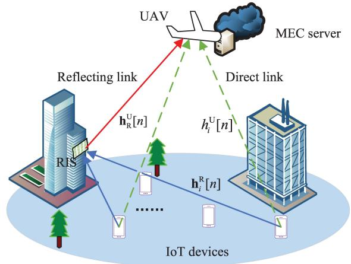
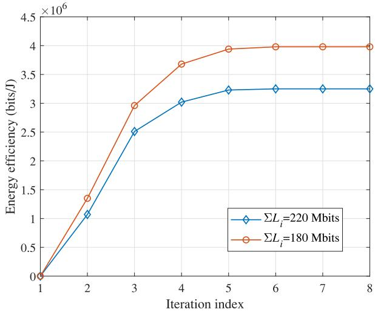
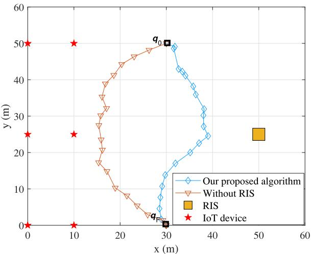
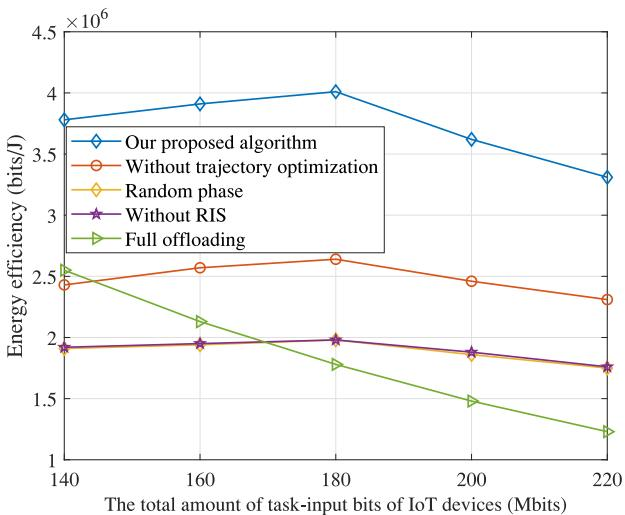
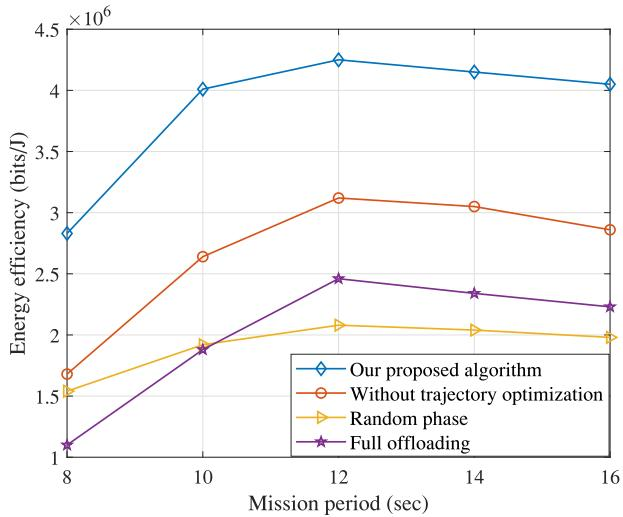
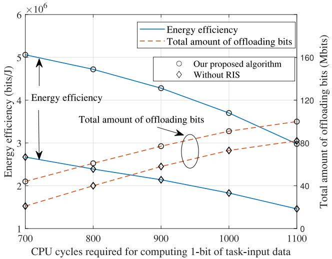
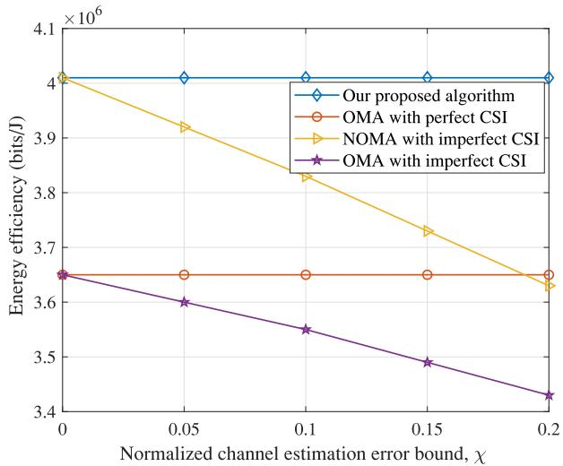
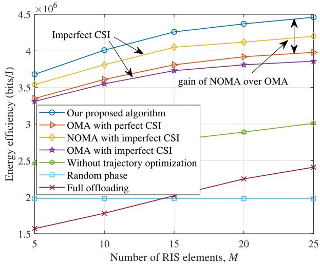

# Joint Optimization of Resource Allocation, Phase Shift, and UAV Trajectory for Energy-Efficient RIS-Assisted UAV-Enabled MEC Systems

Xintong Qin , Zhengyu Song , Member, IEEE, Tianwei Hou , Member, IEEE, Wenjuan Yu , Member, IEEE, Jun Wang, and Xin Sun

Abstract—The unmanned aerial vehicle (UAV) enabled mobile edge computing (MEC) has been deemed a promising paradigm to provide ubiquitous communication and computing services for the Internet of Things (IoT). Besides, by intelligently reflecting the received signals, the reconfigurable intelligent surface (RIS) can significantly improve the propagation environment and further enhance the service quality of the UAV-enabled MEC. Motivated by this vision, in this paper, we consider both the amount of completed task bits and the energy consumption to maximize the energy efficiency of the RIS-assisted UAV-enabled MEC systems with non-orthogonal multiple access (NOMA) protocol, where the bit allocation, transmit power, phase shift, and UAV trajectory are jointly optimized by an iterative algorithm with a double-loop structure based on the Dinkelbach’s method and block coordinate decent (BCD) technique. Simulation results demonstrate that: 1) our proposed algorithm can achieve higher energy efficiency than baseline schemes while satisfying the task tolerance latency; 2) the energy efficiency first increases and then decreases with the increase of the mission period and the total amount of taskinput bits of IoT devices; 3) the energy efficiencies of schemes with imperfect channel state information (CSI) are lower than corresponding schemes with perfect CSI, and the performance gain of NOMA over OMA diminishes under the imperfect CSI.

Index Terms—Energy efficiency, reconfigurable intelligence surface (RIS), mobile edge computing (MEC), unmanned aerial vehicles (UAV), resource allocation, phase shift, trajectory design.

## I. INTRODUCTION

N RECENT years, with the rapid development of Internet I of Things (IoT), the number of IoT devices are dramatically increasing, which spurs the emerging of more and more novel intelligent applications, such as augmented reality, virtual reality, face recognition, and so forth [1]. The tasks generated by these applications usually demand for higher computation capacity and lower latency. However, it is not reliable to depend on the IoT devices themselves to satisfy such computation demands, due to the limited computation capacity and energy budget. In this context, mobile edge computing (MEC) appears as a promising paradigm to support IoT devices’ computation-intensive and latencycritical tasks [2]. By deploying the MEC server at a wireless access point (AP) or base station (BS), it provides offloading opportunities for IoT devices, and thus can help IoT devices compute tasks and save energy. Despite the benefits of infrastructure-based MEC systems, the fixed location of MEC server restricts the coverage and the service will not be restored in a short time if the infrastructure is destroyed. Recently, the unmanned aerial vehicles (UAVs) characterized by their mobility, flexibility, and maneuverability have drawn considerable attentions. It is envisioned that the UAV-enabled MEC can be widely deployed to provide ubiquitous communication and computing supports for IoT devices, which has received growing popularity [3], [4], [5].

By equipping an MEC server, the UAV can provide computing and communicating services for IoT devices. Thanks to the inherent advantages such as flexible deployment and high mobility, the benefits of integrating the UAV into MEC are multifold. For example, the UAV can be rapidly deployed on the hotspots to cooperate with ground base stations, and thus enhance the computing capacity of the network to tackle the surge of computation demands during rush hours [6]. In addition, due to the high altitude of UAV, the probability of line-of-sight (LoS) links can be improved, which is beneficial for IoT devices’ energy saving when they perform task offloading [7]. Moreover, the flexible trajectory of UAV brings an additional degree of freedom for communication performance enhancement [8]. By optimizing the trajectory, the UAV can move closer toward the IoT devices to obtain better channel conditions and achieve lower energy consumption in task offloading [9], [10], [11].

However, the UAV-enabled MEC systems still face many challenges. For example, the direct links among the UAV and IoT devices may be blocked by buildings in urban areas, which heavily degrades the channel conditions. Besides, due to the limited energy budget of UAV, it is essential to jointly optimize the UAV trajectory and computing energy consumption to achieve higher energy efficiency. In order to fully reap the benefits of integrating the UAV into MEC and further improve the IoT devices’ task offloading performance, an emerging paradigm called reconfigurable intelligent surface (RIS) has drawn great attentions [12], [13], [14], [15]. The RIS is a planar array consisting of a large number of reflecting elements [16]. Through adjusting the phase shift of RIS element, the concatenated virtual LoS link is formed between the transmitter and receiver. Thus, the reflected signals can be combined coherently to improve the received signal power [17]. In addition, compared with conventional relay systems, the RIS passively reflects signals without power amplification, which is more environment-friendly and can improve the energy efficiency of the whole system [18]. Moreover, the RIS can be flexibly deployed on various structures, such as the building facades, roadside billboards, and indoor walls, which makes it trivial to integrate the RIS into existing wireless networks [19], [20], [21], [22].

Recently, aiming to theoretically exploiting the benefits of RIS, there are much literature dedicates to the optimization problems in the RIS-assisted networks. For instance, in [23], the RIS is deployed in the MEC system to assist the task offloading of devices. Aiming to evaluate the computational performance, the sum computational bits are maximized by jointly optimizing the CPU frequency, the transmit power and time allocation of computational offloading, as well as the phase shifts of the RIS. Later in [24], the total completed task-input bits maximization problem in the RIS-assisted MEC networks is first solved by a block coordinate descending (BCD) algorithm. Then in order to reduce the computational complexity, the deep learning architecture is constructed to facilitate the online implementation of the proposed BCD algorithm. Recently, the wireless energy transfer (WET) is considered for the RIS-assisted MEC network in [25] to satisfy both the energy supply and computation requirements of IoT devices, where the total computation bits are maximized by an iterative algorithm. It is validated that the RIS-enhanced wireless powered MEC can significantly enhance the computational performance over the scheme without RIS.

In the RIS-assisted UAV networks, the RIS can be deployed for overcoming the blockages and enhancing the achievable rate. To this end, in [26], the sum rate of users in the downlink is maximized by jointly optimizing UAV’s trajectory, the phase shift of RIS, the allocation of THz sub-bands, and the power control. As expected, the largest sum rate is achieved by the proposed joint optimization algorithm. In order to guarantee the secure communication between the UAV and the legitimate user, in [27], the RIS is deployed to enhance the quality of the legitimate transmission while degrading that of the eavesdropping, and an iterative algorithm is proposed to maximize the average achievable secrecy rate. Similarly, the secure transmission problem is investigated in the UAV and RIS assisted mmWave networks, where the near-optimal positions of RIS and UAV are obtained by an exhaustive searching method [28]. Besides, in order to overcome the highly dynamic stochastic environments in the RIS-assisted UAV networks, in [29], a decaying deep Q-network (D-DQN) based algorithm is proposed to minimize the energy consumption of the UAV by jointly optimizing the phase shift of RIS, UAV trajectory, decoding order, and power allocation. Simulation results show that the proposed D-DQN algorithm can strike a balance between accelerating training speed and converging to the local optimal, as well as avoiding oscillation.

The above-mentioned RIS-assisted networks concentrate either on the RIS-assisted MEC networks, where the UEs computational performance can be enhanced by using the computing resources at the APs; or the RIS-assisted UAV architectures to improve the achievable communication rate of UEs by exploiting the flexible trajectory of the UAV. However, to the best of our knowledge, there are still few studies focusing on the performance improvement brought by the RIS in the UAV-enabled MEC. In [30], although the UAV-mounted RIS is deployed to assist the communication between the ground users and an MEC server, the computation capability of UAV is not considered, and the users offload task-input data to the MEC server by OMA protocol which cannot fully utilize the time and frequency resources. Then, in [31], the non-orthogonal multiple access (NOMA) is introduced into the RIS-aided UAV-MEC system, where the aim is to maximize UAV’s computation capacity and the simulation results show that the NOMA scheme outperforms OMA. Nevertheless, we note that in [31] the energy consumption of UAV is only imposed as a budget constraint and the position of UAV is fixed. The deployment of RIS to a certain extent facilitates the task offloading of IoT devices, but when a large amount of task bits is offloaded to the UAV-mounted MEC server, it will threaten the system’s operating time since the energy storage of the UAV is heavily limited. Hence, considering this contradiction between the RIS and the UAV-enabled MEC, it is of great importance to investigate the energy efficiency by simultaneously paying attentions to the energy consumption and the amount of completed task bits. Besides, in order to fully exploit the benefits of UAV’s mobility in the RIS-assisted UAV-enabled MEC system, the trajectory of UAV needs to be jointly designed with the resource allocation and the phase shift optimization.

Motivated by these observations, in this paper, under the NOMA protocol, we investigate the RIS-assisted UAV-enabled MEC systems with the objective to maximize the energy efficiency, by jointly optimizing the task bit allocation between IoT devices and the MEC server, transmit power of IoT devices, phase shift of RIS, and the UAV trajectory. The main contributions of this paper can be summarized as follows.

1) RIS-assisted UAV-enabled MEC: We first establish a novel RIS-assisted UAV-enabled MEC framework to explore the potential benefits of RIS in UAV-enabled MEC systems, where the RIS is deployed on the surrounding building wall to assist IoT devices’ task offloading, and the UAV equipped with an MEC server provides offloading opportunities and computing services for multiple IoT devices. During the task offloading, both the direct links from IoT devices to the UAV and the reflecting links via the RIS are considered. Besides, partial offloading scheme is applied in the IoT devices and all devices access the UAV by NOMA protocol.

2) Iterative algorithm with a double-loop structure: By taking both the amount of completed task bits and energy consumption into consideration, an energy efficiency maximization problem is formulated for the RIS-assisted UAV-enabled MEC system. Due to the fractional structure and highly-coupled variables of the formulated problem, an iterative algorithm with a double-loop structure is proposed, where the outer loop is used to update the energy efficiency based on the Dinkelbach’s method, and the inner loop is decomposed into three subproblems to iteratively optimize the bit allocation, transmit power, phase shift, and UAV trajectory. For the three subproblems in the inner loop, the Langrange dual method is utilized to solve the bit allocation and transmit power optimization problem; the phase shift of RIS is optimized by the difference of convex functions (DC) programming; and the successive convex approximation (SCA) technique is exploited to tackle the UAV trajectory optimization.

3) Performance improvement: Extensive simulation results verify that with the deployment of RIS, our proposed algorithm can achieve higher energy efficiency compared to the schemes with random phase, without trajectory optimization, without RIS, and the full offloading scheme. Interestingly, it can be found that with the increase of the mission period, the energy efficiency first increases and then decreases since the flying energy consumption of UAV continues to increase and dominates the total energy consumption. Most importantly, it is observed that the energy efficiencies of schemes with imperfect channel state information (CSI) are lower than the corresponding schemes with perfect CSI, and under the imperfect CSI, the performance gain of NOMA over OMA diminishes since the channel estimation error results in more inter-user interference for IoT devices with the NOMA protocol.

The rest of the paper is organized as follows. In Section $\mathrm { I I } ,$ we introduce the system model and problem formulation for energy efficiency maximization. Section III elaborates on the proposed algorithms for solving the formulated problem. Some numerical results are shown in Section IV, and conclusions are finally drawn in Section V.

## II. SYSTEM MODEL AND PROBLEM FORMULATION

## A. System Model

An RIS-assisted UAV-enabled MEC system is shown in Fig. 1, where an UAV equipped with an MEC server provides computing services to I IoT devices.1 An RIS with M reflection elements is installed on the surrounding building wall to assist IoT devices’ task offloading. To ease of exposition, the IoT devices and reflection elements are denoted by $i \in \mathcal { T } \overset { \Delta } { = } \{ 1 , 2 , \dots , I \}$ and $m \in \mathcal { M } \overset { \Delta } { = } \{ 1 , 2 , \ldots , M \}$ respectively.

We suppose the system operates during an appointed mission period of $T ,$ which is divided into N time slots and indexed by $n \in \mathcal { N } \overset { \Delta } { = } \{ 1 , 2 , \dots , N \}$ . The time slot length $t = T / N$ is sufficiently small so that the UAV flies through a small distance and the channel gain is approximately unchanged within each time slot. Without loss of generality, a 3D Cartesian coordinate system is adopted to describe the positions of UAV, RIS, and the IoT devices. Specifically, the horizontal position of the UAV at time slot n can be represented as ${ \bf q } [ n ] = ( x _ { \mathrm { U } } [ n ] , y _ { \mathrm { U } } [ n ] )$ . Similar to [11], [32], it is assumed that the UAV flies at a fixed altitude $H \ > \ 0$ The horizontal position and the altitude of the first element on the RIS with an uniform linear array (ULA) are given by ${ \bf w } _ { \mathrm { R } } = ( x _ { \mathrm { R } } , y _ { \mathrm { R } } )$ and $h _ { \mathrm { R } }$ , respectively. It is worth noting that our work can be easily extended to the uniform planar array (UPA) by utilizing the Kronecker product to perform mathematical transformation [24], [33] or regarding the UPA as different groups of ULAs [34]. In addition, the i-th IoT device is fixed at the ground with zero altitude and the horizontal position $\mathbf { w } _ { i } = ( x _ { i } , y _ { i } )$ is known to the RIS and the UAV.

  
Fig. 1. The RIS-assisted UAV-enabled MEC system.

1) Communication Model: Since the UAV flies at a high altitude and the RIS is placed on the façade of a building, the communication link between the UAV and RIS is assumed to be a LoS channel. Thus, the channel gain between the UAV and the RIS at the n-th time slot can be given by

$$
\begin{array} { r } { \mathbf { h } _ { \mathrm { R } } ^ { \mathrm { U } } [ n ] = \sqrt { \rho d _ { \mathrm { R U } } ^ { - 2 } [ n ] } \Big [ 1 , \dots , e ^ { - j \frac { 2 \pi } { \lambda } ( M - 1 ) d \varphi _ { \mathrm { R U } } [ n ] } \Big ] , } \end{array}\tag{1}
$$

where $\rho$ is the path loss at the reference $D _ { 0 } = 1$ m; $d _ { \mathrm { R U } } [ n ] ~ = ~ \sqrt { ( H - h _ { \mathrm { R } } ) ^ { 2 } + \| { \bf q } [ n ] - { \bf w } _ { \mathrm { R } } \| ^ { 2 } }$ denotes the distance between the UAV and the RIS at the n-th time slot; d is the antenna separation; λ is the carrier wavelength; $\varphi _ { \mathrm { R U } } [ n ] = ( x _ { \mathrm { R } } - x _ { \mathrm { U } } [ n ] ) / d _ { \mathrm { R U } } [ n ]$ represents the cosine of the angle of departure (AoD) of the signal from the RIS to the UAV at the n-th time slot.

The direct links from the IoT devices to the UAV are assumed to be blocked by obstacles [34], [35], [36]. Thus, the channel gain from the i-th IoT device to the UAV at the n-th time slot can be expressed as

$$
h _ { i } ^ { \mathrm { U } } [ n ] = \sqrt { \rho d _ { i \mathrm { U } } ^ { - \varepsilon } [ n ] } g _ { i \mathrm { U } } ,\tag{2}
$$

where $\begin{array} { r l r } { d _ { i \mathrm { U } } [ n ] } & { { } = } & { \sqrt { \| \mathbf { q } [ n ] - \mathbf { w } _ { i } \| ^ { 2 } + H ^ { 2 } } } \end{array}$ is the distance between the UAV and the i-th IoT device at the n-th time slot; ε is the path loss exponent and $g _ { i \mathrm { U } }$ represents the random scattering component modeled by a zero-mean and unit-variance circularly symmetric complex Gaussian random variable.

For the communication links from the IoT devices to the RIS, we assume that they are Rician fading channels [34], which consist of the LoS and non-LoS (NLoS) components. Hence, the channel gain between the i-th IoT device and the RIS at the n-th time slot can be given by

$$
\mathbf { h } _ { i } ^ { \mathrm { R } } [ n ] = \sqrt { \rho d _ { i \mathrm { R } } ^ { - \gamma } [ n ] } \left( \sqrt { \frac { \beta } { 1 + \beta } } \mathbf { h } _ { i \mathrm { R } } ^ { \mathrm { L o S } } + \sqrt { \frac { 1 } { 1 + \beta } } \mathbf { h } _ { i \mathrm { R } } ^ { \mathrm { N L o S } } \right)\tag{3}
$$

where $d _ { i \mathrm { R } } = \sqrt { \| \mathbf { w } _ { i } - \mathbf { w } _ { \mathrm { R } } \| ^ { 2 } + h _ { \mathrm { R } } ^ { 2 } }$ is the distance between the i-th IoT device and the RIS; γ denotes the path loss exponent; $\beta$ represents the Rician factor; ${ \mathbf { h } } _ { i \mathrm { R } } ^ { \mathrm { L o S } }$ and $\mathbf { \bar { h } } _ { i \mathrm { R } } ^ { \mathrm { N L o S } }$ are the LoS component and NLoS component, respectively. For ${ \mathbf { h } } _ { i \mathrm { R } } ^ { \mathrm { L o S } }$ we have

$$
\begin{array} { r } { \mathbf { h } _ { i \mathrm { R } } ^ { \mathrm { L o S } } [ n ] = \Big [ 1 , e ^ { - j \frac { 2 \pi } { \lambda } d \varphi _ { i \mathrm { R } } } , \dots , e ^ { - j \frac { 2 \pi } { \lambda } ( M - 1 ) d \varphi _ { i \mathrm { R } } } \Big ] ^ { T } , } \end{array}\tag{4}
$$

where $\varphi _ { i \mathrm { R } } ~ = ~ ( x _ { i } - x _ { \mathrm { R } } ) / d _ { i \mathrm { R } }$ is the cosine of the angle of arrival (AoA) of the signal from the i-th IoT device to the RIS. The NLoS component $\mathbf { h } _ { i \mathrm { R } } ^ { \mathrm { N L o S } }$ is the complex Gaussian distributed variable with zero mean and unit variance.

With the help of the RIS, it is possible to achieve the virtual LoS connections between the UAV and the IoT devices by adjusting the phase shift of RIS. Since the phase shift of each reflecting element of the RIS can be dynamically adjusted by a controller, in this paper, the phase-shift matrix of the RIS is modeled as

$$
\Phi [ n ] = { \Big \{ } e ^ { j \theta _ { 1 } [ n ] } , \ldots , e ^ { j \theta _ { M } [ n ] } { \Big \} } ,\tag{5}
$$

where $\theta _ { m } [ n ] ~ \in ~ [ 0 , 2 \pi ]$ is the phase shift of the m-th RIS element at the n-th time slot. Thus, the combined channel gain from the i-th IoT device to the UAV at the n-th time slot can be given $ { \mathbf { b } }  { \mathbf { y } } ^ { 2 }$

$$
h _ { i } [ n ] = h _ { i } ^ { \mathrm { U } } [ n ] + \Big ( \mathbf { h } _ { i } ^ { \mathrm { R } } [ n ] \Big ) ^ { H } \mathrm { d i a g } ( \Phi [ n ] ) \mathbf { h } _ { \mathrm { R } } ^ { \mathrm { U } } [ n ] .\tag{6}
$$

Denote the bandwidth of the system as B. Benefiting from the partial offloading paradigm in MEC, at each time slot, the IoT devices can offload parts of their task-input data to the UAV with the aid of RIS. When the IoT devices offload tasks, the NOMA protocol is adopted to further improve the energy efficiency. To be specific, at each time slot, the IoT devices are ranked by the UAV in the ascending order of channel gain. Therefore, the order of the IoT devices for the UAV at the n-th time slot is denoted by $\Pi = \{ \pi _ { 1 } [ n ] , \pi _ { 2 } [ n ] , \ldots , \pi _ { I } [ n ] \}$ , where $\pi _ { i } [ n ]$ is the index of the IoT device with the i-th smallest channel gain to the UAV during time slot n.

After receiving the IoT device’s signal, the successive interference cancellation (SIC) technique is adopted by the

UAV to decode signals from multiple IoT devices. When the UAV decodes the signal from IoT device $\pi _ { i } [ n ]$ , the received signals from IoT device $\pi _ { 1 } [ n ]$ to IoT device $\pi _ { i - 1 } [ n ]$ are regarded as interference. Thus, the offloading data rate of IoT device $\pi _ { i } [ n ]$ at the n-th time slot can be expressed as [40]

$$
R _ { \pi _ { i } } ^ { \mathrm { o f f } } [ n ] = B \log \left( 1 + \frac { p _ { \pi _ { i } } [ n ] \left| h _ { \pi _ { i } } [ n ] \right| ^ { 2 } } { \sum _ { j = 1 } ^ { i - 1 } p _ { \pi _ { j } } [ n ] \left| h _ { \pi _ { j } } [ n ] \right| ^ { 2 } + \sigma ^ { 2 } } \right) ,\tag{7}
$$

where $p _ { \pi _ { i } } [ n ]$ is the transmit power of IoT device $\pi _ { i } [ n ]$ when offloading tasks to the UAV at the n-th time slot, and $\sigma ^ { 2 }$ is the noise power. If the time slot index can be shown clearly in the variables, the order index $\pi _ { i } [ n ]$ in the subscript is reduced to $\pi _ { i }$ for ease of exposition.

2) Computation Model: Denote the task of each IoT device as a positive tuple $\{ L _ { i } , C _ { i } \}$ , where $L _ { i }$ is the minimal amount of task-input bits of IoT device i in the mission period, and $C _ { i }$ is the CPU cycles required for computing 1-bit of task-input data. At each time slot, the IoT devices can perform local computing and task offloading simultaneously. Denote $l _ { i } ^ { \mathrm { l o c } } [ n ]$ as the task bits computed locally at IoT device i during time slot n. Considering the limitation of IoT device’s computation capacity, we have

$$
\frac { l _ { i } ^ { \mathrm { l o c } } [ n ] C _ { i } } { t } \leq F _ { i } , \forall i \in \mathcal { T } , n \in \mathcal { N } ,\tag{8}
$$

where $F _ { i }$ is IoT device i’s maximum CPU-cycle frequency.

Similarly, denote the maximum CPU-cycle frequency of the UAV as $F _ { \mathrm { U A V } }$ . We have

$$
\frac { \sum _ { i = 1 } ^ { I } l _ { i } ^ { \mathrm { U A V } } [ n ] C _ { i } } { t } \leq F _ { \mathrm { U A V } } , \forall n \in \mathcal { N } ,\tag{9}
$$

where $l _ { i } ^ { \mathrm { U A V } } [ n ]$ denotes the amount of task bits that is computed by the UAV for IoT device i at time slot n. Since the UAV can only compute the task that has been offloaded and received, we have

$$
R _ { i } ^ { \mathrm { o f f } } [ n ] t \geq l _ { i } ^ { \mathrm { U A V } } [ n ] , \forall i \in \mathcal { I } , n \in \mathcal { N } .\tag{10}
$$

In addition, to meet all IoT devices’ minimum computation requirements, we have

$$
\sum _ { n = 1 } ^ { N } \left( l _ { i } ^ { \mathrm { l o c } } [ n ] + l _ { i } ^ { \mathrm { U A V } } [ n ] \right) \geq L _ { i } , \forall i \in \mathbb { Z } .\tag{11}
$$

3) Energy Consumption Model: The energy consumption of the IoT devices consists of two parts, i.e., the energy consumption for task offloading and that for local computing. Firstly, at time slot n, the task offloading energy consumption of IoT device i is given by

$$
E _ { i } ^ { \mathrm { o f f } } [ n ] = p _ { i } [ n ] t .\tag{12}
$$

Then, based on [40], the local computing energy consumed by IoT device i at the n-th time slot can be modeled as

$$
E _ { i } ^ { \mathrm { c o m } } [ n ] = \frac { \kappa _ { \mathrm { I o T } } \Big ( l _ { i } ^ { \mathrm { l o c } } [ n ] \Big ) ^ { 3 } } { t ^ { 2 } } ,\tag{13}
$$

where $\kappa _ { \mathrm { I o T } }$ is the effective capacitance coefficient of the IoT device that depends on the processor’s chip architecture. Thus,

the total energy consumption of all IoT devices at time slot n can be expressed as

$$
E _ { \mathrm { I o T } } [ n ] = \sum _ { i = 1 } ^ { I } \Big ( E _ { i } ^ { \mathrm { c o m } } [ n ] + E _ { i } ^ { \mathrm { o f f } } [ n ] \Big ) .\tag{14}
$$

The UAV mounted by an MEC server flying in the sky provides computing services for the IoT devices. With a similar model to the IoT device, the computing energy consumption of the UAV at time slot n is given by

$$
E _ { \mathrm { U } } ^ { \mathrm { c o m } } [ n ] = \sum _ { i = 1 } ^ { I } \frac { \kappa _ { \mathrm { U A V } } \big ( l _ { i } ^ { \mathrm { U A V } } [ n ] \big ) ^ { 3 } } { t ^ { 2 } } ,\tag{15}
$$

where $\kappa _ { \mathrm { U A V } }$ is the $\mathrm { U A V } \mathbf { \dot { s } }$ effective capacitance coefficient.

In this paper, the flying energy consumption of the UAV is also taken into account. We deploy the fixed-wing UAV in the proposed system as an example, and its flying energy consumption at time slot n can be modeled as [41]

$$
E _ { \mathrm { U } } ^ { \mathrm { f i y } } [ n ] = t \bigg ( \tau _ { 1 } v ^ { 3 } [ n ] + \frac { \tau _ { 2 } } { v [ n ] } \bigg ) ,\tag{16}
$$

where $v [ n ] = \| \mathbf { q } [ n ] - \mathbf { q } [ n - 1 ] \| / t$ represents the speed of the UAV at time slot n. τ and τ are two parameters related to the UAV’s weight, wing area, wing span efficiency, and air density, etc.

Hence, the energy consumption of the UAV at time slot n can be represented as

$$
E _ { \mathrm { U A V } } [ n ] = \mu E _ { \mathrm { U } } ^ { \mathrm { f i y } } [ n ] + E _ { \mathrm { U } } ^ { \mathrm { c o m } } [ n ] .\tag{17}
$$

where $\mu$ is the weight of UAV’s flying energy consumption.

## B. Problem Formulation

In this paper, we aim to maximize the energy efficiency of the RIS-assisted UAV-enabled MEC system. At each time slot, the total amount of completed task bits are comprised of the offloading task bits and those computed locally at the IoT devices. Thus, the total amount of completed task bits at time slot n can be given by [42], [43]

$$
L [ n ] = \sum _ { i = 1 } ^ { I } { \Big ( } l _ { i } ^ { \mathrm { l o c } } [ n ] + R _ { i } ^ { \mathrm { o f f } } [ n ] t { \Big ) } .\tag{18}
$$

Meanwhile, the total energy consumption includes all IoT devices’ energy consumption and the UAV’s energy consumption, which can be expressed as

$$
E [ n ] = E _ { \mathrm { I o T } } [ n ] + E _ { \mathrm { U A V } } [ n ] .\tag{19}
$$

The energy efficiency is defined as the ratio of the total amount of completed task bits over the total energy consumption in the mission period. Thus, the energy efficiency maximization problem for RIS-assisted UAV-enabled systems can be formulated as

$$
\operatorname* { m a x } _ { \textbf { z } } \frac { \sum _ { n = 1 } ^ { N } L [ n ] } { \sum _ { n = 1 } ^ { N } E [ n ] }\tag{20a}
$$

$$
\mathrm { s . t . } \sum _ { n = 1 } ^ { N } \Big ( l _ { i } ^ { \mathrm { l o c } } [ n ] + l _ { i } ^ { \mathrm { U A V } } [ n ] \Big ) \geq L _ { i } , \forall i \in \mathbb { Z } ,\tag{20b}
$$

$$
\frac { \sum _ { i = 1 } ^ { I } l _ { i } ^ { \mathrm { U A V } } [ n ] C _ { i } } { t } \leq F _ { \mathrm { U A V } } , \forall n \in \mathcal { N } ,\tag{20c}
$$

$$
\frac { l _ { i } ^ { \mathrm { l o c } } [ n ] C _ { i } } { t } \le F _ { i } , \forall i \in \mathcal { T } , n \in \mathcal { N } ,\tag{20d}
$$

$$
R _ { i } ^ { \mathrm { o f f } } [ n ] t \geq l _ { i } ^ { \mathrm { U A V } } [ n ] , \forall i \in \mathbb { Z } , n \in \mathcal { N } ,\tag{20e}
$$

$$
| \theta _ { m } [ n ] | = 1 , \forall m \in \mathcal { M } , n \in \mathcal { N } ,\tag{20f}
$$

$$
{ \bf q } [ 1 ] = { \bf q } _ { 0 } , { \bf q } [ N + 1 ] = { \bf q } _ { F } ,\tag{20g}
$$

$$
\lvert | v [ n ] \rvert | \leq V _ { \mathrm { M a x } } , \forall n \in N ,\tag{20h}
$$

$$
\begin{array} { r l r l r } { \mathbf { z } } & { { } } & { = } & { } & { \{ l _ { i } ^ { \mathrm { l o c } } [ n ] , l _ { i } ^ { \mathrm { U A V } } [ n ] , p _ { i } [ n ] , \theta _ { m } [ n ] , \mathbf { q } [ n ] \} . } \end{array}
$$

Constraint (20b) ensures the minimum computation requirements of IoT devices can be satisfied. Constraints (20c) and (20d) mean that the workloads of UAV and IoT devices cannot exceed their maximum CPU frequencies. Constraint (20f) represents the feasible set of RIS’s phase shift. Constraint (20g) is UAV’s initial and final horizontal locations. Constraint (20h) represents that the speed of UAV must be less than the maximum speed.

## III. SOLUTION TO THE FORMULATED PROBLEM

Due to the fractional structure of the objective function, and the closely coupled optimization variables in (20), it is difficult to obtain the globally optimal solution in polynomial time. To tackle these challenges, we propose an iterative algorithm with a double-loop structure to maximize the energy efficiency and optimize the bit allocation $l _ { i } ^ { \mathrm { l o c } } [ n ]$ and $l _ { i } ^ { \mathrm { U A V } } [ n ]$ transmit power $p _ { i } [ n ]$ , phase shift of RIS $\theta _ { m } [ n ]$ , and the UAV trajectory ${ \bf q } [ n ]$ . In the outer loop, the Dinkelbach’s method is exploited to handle the fraction programming and obtain the energy efficiency. With the given energy efficiency, the coupled variables are iteratively optimized by the block coordinate descent (BCD) method in the inner loop.

Firstly, we equivalently transform problem (20) into the following parametric problem:

$$
\begin{array} { l } { \displaystyle \operatorname* { m a x } _ { { \bf z } , \alpha } ~ \sum _ { n = 1 } ^ { N } L [ n ] - \alpha \sum _ { n = 1 } ^ { N } E [ n ] , \quad } \\ { \mathrm { s . t . } \quad \displaystyle ( 2 0 { \bf b } ) - ( 2 0 { \bf h } ) , } \end{array}\tag{21}
$$

where $\alpha$ is the introduced auxiliary parameter. Assuming $\alpha ^ { * }$ is the optimal objective value of problem (20), we have the following Theorem.

Theorem 1: The optimal solution $\mathbf { z } ^ { \ast }$ of problem (20) can be obtained if and only if

$$
\operatorname* { m a x } _ { \mathbf { z } } \left( \sum _ { n = 1 } ^ { N } L [ n ] - \alpha ^ { * } \sum _ { n = 1 } ^ { N } E [ n ] \right) = 0 .\tag{22}
$$

Proof: See Appendix $\mathrm { A }$

However, the optimal $\alpha ^ { * }$ cannot be obtained in advance. Hence we propose an iterative algorithm based on the Dinkelbach’s method to update α. The details can be seen in Algorithm 1.

In Algorithm 1, the outer-loop is used to update $\alpha .$ , while the inner-loop is executed to solve problem (21) with given $\alpha ^ { ( k ) }$ However, with given energy efficiency $\alpha ^ { ( k ) }$ , problem (21) is still non-convex due to the coupling among UAV trajectory q[n], phase shift of RIS $\theta _ { m } [ n ]$ , and other optimization variables. Therefore, in order to tackle problem (21), it is decomposed into three subproblems by adopting the BCD technique, namely, bit allocation and transmit power optimization, phase shift optimization, and UAV trajectory optimization. And then an iterative algorithm is proposed to solve them in an alternating manner.

Algorithm 1 Dinkelbach’s Algorithm for Maximizing the   
Energy Efficiency   
1. Initialize $\mathbf { z } ,$ iterative number $\overline { { k = 1 } } .$   
2. repeat:   
3. Solve problem (21) by Algorithm 4 for given $\alpha ^ { ( k ) }$ , and   
obtain the optimal solution $\mathbf { z } ^ { ( k ) }$   
4. Calculate $F ( \alpha ^ { ( k ) } ) = \left| \sum _ { n = 1 } ^ { N } L [ n ] - \alpha \sum _ { n = 1 } ^ { N } E [ n ] \right| ^ { ( k ) } .$   
5. if $F ( \alpha ^ { ( k ) } ) \leq \delta$ then   
6. $\begin{array} { r } { \alpha ^ { * } = \frac { \sum _ { n = 1 } ^ { N } L \left[ n \right] ^ { ( k ) } } { \sum _ { n = 1 } ^ { N } E \left[ n \right] ^ { ( k ) } } ; \mathbf { z } ^ { * } = \mathbf { z } ^ { ( k ) } ; } \end{array}$ break.   
7. else $\begin{array} { r } { \alpha ^ { ( k + 1 ) } = \frac { \dot { \sum } _ { n = 1 } ^ { \tilde { N } } L [ n ] ^ { ( k ) } } { \sum _ { n = 1 } ^ { N } E [ n ] ^ { ( k ) } } ; k = k + 1 . } \end{array}$   
8. Until $k \geq N _ { \mathrm { m a x } } .$   
9. Output: the optimal energy efficiency $\alpha ^ { * }$ and the corre  
sponding solution $\mathbf { z } ^ { \ast }$

## A. Bit Allocation and Transmit Power Optimization

With given $\alpha ^ { ( k ) }$ , a subproblem of problem (21) is the bit allocation and transmit power optimization, where the phase shift $\theta _ { m } [ n ]$ and UAV trajectory ${ \bf q } [ n ]$ are given as fixed. Thus, the bit allocation and transmit power optimization problem can be reformulated from (21) as

$$
\operatorname* { m a x } _ { l _ { i } ^ { \mathrm { l o c } } [ n ] , l _ { i } ^ { \mathrm { U A V } } [ n ] , p _ { i } [ n ] } \ \sum _ { n = 1 } ^ { N } L [ n ] - \alpha \sum _ { n = 1 } ^ { N } E [ n ]\tag{23a}
$$

$$
\begin{array} { r l } { \mathrm { s . t . } } & { { } ( 2 0 \mathsf { b } ) - ( 2 0 \mathsf { e } ) . } \end{array}\tag{23b}
$$

Theorem 2: Define $\begin{array} { r } { S _ { \pi _ { i } } [ n ] = \sum _ { i = 1 } ^ { i } p _ { \pi _ { j } } [ n ] | h _ { \pi _ { j } } [ n ] | ^ { 2 } + \sigma ^ { 2 } } \end{array}$ The task offloading energy consumption of all IoT devices in the mission period can be expressed as

$$
\sum _ { n = 1 } ^ { N } \sum _ { i = 1 } ^ { I } p _ { \pi _ { i } } [ n ] t = \sum _ { n = 1 } ^ { N } \sum _ { i = 1 } ^ { I } t \left( \frac { 1 } { h _ { \pi _ { i } } [ n ] ^ { 2 } } - \frac { 1 } { h _ { \pi _ { i + 1 } } [ n ] ^ { 2 } } \right) 2 ^ { \frac { \sum _ { j = 1 } ^ { i } R _ { \pi _ { j } } ^ { \mathrm { o f f } } [ n ] } { B } } .\tag{24}
$$

Proof: See Appendix B.

By substituting (24) into the objective function of problem (23) and defining $\Omega _ { 1 } = \{ l _ { i } ^ { \mathrm { l o c } } [ n ] , \check { l } _ { i } ^ { \mathrm { U A V } } [ n ] , R _ { r _ { i } } ^ { \mathrm { o f f } } [ n ] \}$ , problem (23) can be transformed into

$$
\begin{array} { r l } { \displaystyle \operatorname* { m a x } _ { \Omega _ { 1 } } } & { \displaystyle \sum _ { n = 1 } ^ { N } \sum _ { i = 1 } ^ { I } \left( l _ { i } ^ { \mathrm { l o c } } [ n ] + R _ { \pi _ { i } } ^ { \mathrm { o f f } } [ n ] t - \alpha \frac { \kappa _ { \mathrm { I o T } } \left( l _ { i } ^ { \mathrm { l o c } } [ n ] \right) ^ { 3 } } { t ^ { 2 } } \right. } \\ & { \displaystyle \left. \vphantom { \sum _ { i } } - \alpha t \left( \frac { 1 } { h _ { \pi _ { i } } [ n ] ^ { 2 } } - \frac { 1 } { h _ { \pi _ { i + 1 } } [ n ] ^ { 2 } } \right) 2 \frac { \Sigma _ { j = 1 } ^ { i } R _ { \pi _ { j } } ^ { \mathrm { o f f } } [ n ] } { B } - \alpha \frac { \kappa _ { \mathrm { U A V } } \left( l _ { i } ^ { \mathrm { U A V } } [ n ] \right) ^ { 3 } } { t ^ { 2 } } \right) } \end{array}\tag{25a}
$$

$$
\begin{array} { r l } { \mathbf { s . t . } } & { { } ( 2 0 \mathbf { b } ) - ( 2 0 \mathbf { d } ) , } \end{array}\tag{25b}
$$

$$
R _ { \pi _ { i } } ^ { \mathrm { o f f } } [ n ] t \geq l _ { \pi _ { i } } ^ { \mathrm { U A V } } [ n ] .\tag{25c}
$$

Remark 1: It can be found that the transmit power optimization $p _ { i } [ n ]$ in (23) is transformed to the optimization of offloading rate $R _ { \pi _ { i } } ^ { \mathrm { o f f } } [ n ]$ . Constraint (20e) is also expressed as (25c) related to $\dot { R } _ { \pi _ { i } } ^ { \mathrm { o f f } } [ n ]$ . By solving problem (25), the offloading rate can be obtained, and then the transmit power of IoT device $\pi _ { i } [ n ]$ can be calculated according to Appendix B. Define a function $\Psi ( i , n )$ to indicate the decoding order of IoT device i for the UAV in time slot n when adopting the NOMA protocol. Thus, the transmit power of IoT device i at time slot n can be obtained as $p _ { \pi _ { \Psi \left( i , n \right) } } [ n ]$

Note that the objective function of (25) is convex with respect to $l _ { i } ^ { \mathrm { l o c } } [ n ] , l _ { i } ^ { \mathrm { U A V } } [ n ]$ , and $R _ { \pi _ { i } } ^ { \mathrm { o f f } } [ n ]$ . Meanwhile, the constraints of problem (25) are linear. Thus, problem (25) is a convex optimization problem, which can be solved by CVX. In order to obtain more insights, we further derive its closed-form solution in the following Theorem 3.

Theorem 3: For problem (25), the optimal bit allocation and transmit power can be expressed as

$$
l _ { i } ^ { \mathrm { l o c } } [ n ] ^ { * } = \sqrt { \left( 1 + \omega _ { i } + \frac { \psi _ { i , n } C } { t } \right) \frac { t ^ { 2 } } { 3 \alpha \kappa _ { \mathrm { I o T } } } } ,\tag{26}
$$

$$
l _ { i } ^ { \mathrm { U A V } } [ n ] ^ { * } = \sqrt { \bigg ( \omega _ { i } + \xi _ { r _ { \Psi ( i , n ) } , n } + \frac { \zeta _ { n } C } { t } \bigg ) \frac { t ^ { 2 } } { 3 \alpha \kappa _ { \mathrm { U A V } } } } ,\tag{27}
$$

$$
p _ { \pi _ { i } } [ n ] ^ { * } = \frac { B \xi _ { i , n } t } { \alpha \ln 2 } \left( \frac { h _ { \pi _ { i + 1 } } [ n ] ^ { 2 } } { h _ { \pi _ { i + 1 } } [ n ] ^ { 2 } - h _ { \pi _ { i } } [ n ] ^ { 2 } } - \frac { h _ { \pi _ { i - 1 } } [ n ] ^ { 2 } } { h _ { \pi _ { i } } [ n ] ^ { 2 } - h _ { \pi _ { i - 1 } } [ n ] ^ { 2 } } \right) ,\tag{28}
$$

where $\{ \omega _ { i } \} _ { i \in \mathbb { Z } } , \{ \psi _ { i , n } \} _ { i \in \mathbb { Z } , n \in \mathcal { N } } , \left\{ \varsigma _ { n } \right\} _ { n \in \mathcal { N } } , \left\{ \xi _ { i , n } \right\} _ { i \in \mathbb { Z } , n \in \mathcal { N } }$ are Lagrange multipliers associated with constraints (20b)-(20d) and (25c), respectively.

Proof: See Appendix C.

## B. Phase Shift Optimization

In this section, another subproblem of (21), denoted as the phase shift optimization is considered to optimize $\theta _ { m } [ n ]$ with given bit allocation $l _ { i } ^ { \mathrm { l o c } } [ n ]$ and $l _ { i } ^ { \mathrm { U A V } } [ n ]$ , transmit power $p _ { \pi _ { i } } [ n ]$ , and UAV trajectory ${ \bf q } [ n ]$ , which can be reformulated as

$$
\operatorname* { m a x } _ { \theta _ { m } [ n ] } \ \sum _ { n = 1 } ^ { N } \sum _ { i = 1 } ^ { I } B t \log \left( 1 + \frac { p _ { \pi _ { i } } [ n ] | h _ { \pi _ { i } } [ n ] | ^ { 2 } } { \sum _ { j = 1 } ^ { i - 1 } p _ { \pi _ { j } } [ n ] \big | h _ { \pi _ { j } } [ n ] \big | ^ { 2 } + \sigma ^ { 2 } } \right) ,\tag{29a}
$$

$$
\mathrm { s . t . } | \theta _ { m } [ n ] | = 1 , \forall m \in \mathcal { M } , n \in \mathcal { N } .\tag{29b}
$$

It can be observed that problem (29) is actually an offloading rate maximization problem. When the bit allocation, transmit power, and UAV trajectory are given, the RIS only has impacts on the offloading rate by controlling the phase shift of reflected signals. Moreover, due to the objective function, problem (29) is still non-convex and difficult to tackle directly.

To solve problem (29), we first transform it into a more tractable form. Define ${ \bf h } _ { \pi _ { i } } ^ { \mathrm { R I S } } [ n ] = { \bf h } _ { \pi _ { i } } ^ { \mathrm { R } } [ n ] ^ { H } \mathrm { d i a g } ( { \bf h } _ { \mathrm { R } } ^ { \mathrm { U } } [ n ] )$ . The channel gain between IoT device $\pi _ { i } [ n ]$ and the UAV at time slot n can be expressed as

$$
| h _ { \pi _ { i } } [ n ] | ^ { 2 } = \bigg | h _ { \pi _ { i } } ^ { \mathrm { U } } [ n ] + \Big ( \mathbf { h } _ { \pi _ { i } } ^ { \mathrm { R } } [ n ] \Big ) ^ { H } \mathrm { d i a g } ( \Phi [ n ] ) \mathbf { h } _ { \mathrm { R } } ^ { \mathrm { U } } [ n ] \bigg | ^ { 2 }
$$

$$
= \mathrm { T r } ( { \bf H } _ { \pi _ { i } } [ \mathrm { n } ] \Theta [ n ] ) + \Bigl ( h _ { \pi _ { i } } ^ { \mathrm { U } } [ n ] \Bigr ) ^ { 2 } ,\tag{30}
$$

where $\mathbf { H } _ { \pi _ { i } } [ n ] = \binom { \mathbf { h } _ { \pi _ { i } } ^ { \mathrm { R I S } } [ n ] ^ { H } \mathbf { h } _ { \pi _ { i } } ^ { \mathrm { R I S } } [ n ] \ \mathbf { h } _ { \pi _ { i } } ^ { \mathrm { R I S } } [ n ] ^ { H } \mathbf { h } _ { \pi _ { i } } ^ { \mathrm { U } } [ n ] } { \mathbf { h } _ { \pi _ { i } } ^ { \mathrm { U } } [ n ] \mathbf { h } _ { \pi _ { i } } ^ { \mathrm { R I S } } [ n ] } $ , and ${ \Theta } [ n ] = \bar { \Phi } [ n ] ( \bar { \Phi } [ n ] ) ^ { H }$ is a positive semidefinite matrix with $\bar { \pmb { \Phi } } [ n ] = [ e ^ { j \dot { \theta } _ { 1 } [ \dot { n } ] } , \acute { \bf \theta } , \acute { \bf \theta } , e ^ { j \theta _ { M } [ n ] } , \acute { \bf \theta } ] ^ { T }$ . x is an auxiliary scalar. By substituting (30) into the objective function of problem (29), we have

$$
\begin{array} { r l r } {  { \log ( 1 + \frac { p _ { \pi _ { i } } [ n ]  n _ { \pi _ { i } } [ n ]  ^ { 2 } } { \sum _ { j = 1 } ^ { i - 1 } p _ { \pi _ { j } } [ n ]  n _ { \pi _ { j } } [ n ]  ^ { 2 } + \sigma ^ { 2 } } ) } } \\ & { } & { = \log _ { 2 } ( \sum _ { j = 1 } ^ { i } p _ { \pi _ { j } } [ n ] ( \mathrm { T r } ( \mathbf { H } _ { \pi _ { j } } [ n ] \Theta [ n ] ) + ( h _ { \pi _ { j } } ^ { \mathrm { U } } [ n ] ) ^ { 2 } ) + \sigma ^ { 2 } ) } \\ & { } & { \qquad - \log _ { 2 } ( \displaystyle \sum _ { j = 1 } ^ { i - 1 } p _ { \pi _ { j } } [ n ] ( \mathrm { T r } ( \mathbf { H } _ { \pi _ { j } } [ \mathbf { n } ] \Theta [ n ] ) + ( h _ { \pi _ { j } } ^ { \mathrm { U } } [ n ] ) ^ { 2 } ) + \sigma ^ { 2 } ) } \\ & { } & { = W _ { 1 } ^ { i } [ n ] - W _ { 2 } ^ { i } [ n ] . } \end{array}
$$

Thus, problem (29) can be transformed into

$$
\operatorname* { m a x } _ { \Theta [ n ] } \sum _ { n = 1 } ^ { N } \sum _ { i = 1 } ^ { I } \Big ( W _ { 1 } ^ { i } [ n ] - W _ { 2 } ^ { i } [ n ] \Big )\tag{32a}
$$

$$
\mathrm { s . t . } \Theta _ { m , m } [ n ] = 1 , \forall m \in \mathcal { M } , n \in \mathcal { N } ,\tag{32b}
$$

$$
\operatorname { r a n k } ( \Theta [ n ] ) = 1 , \forall n \in \mathcal N .\tag{32c}
$$

In problem (32), the objective function is still nonconvex with respect to the phase-shift-related variables $\Theta [ n ]$ Moreover, the rank one constraint (32c) makes the problem more difficult to solve. To tackle these challenges, it can be found that the objective function of (32) is the difference of concave functions, which can be handled by exploiting the DC programming technique [24]. Thus, in the ( l + 1 )-th iteration of the DC programming, the second term of the objective function is approximated by its linear upper bound, i.e.,

$$
\begin{array} { r } { W _ { 2 } ^ { i } [ n ] \leq \frac { \sum _ { j = 1 } ^ { i - 1 } p _ { \pi _ { j } } [ n ] \Big \langle \Big ( \Theta [ n ] - \Theta [ n ] ^ { ( l ) } \Big ) , \nabla _ { \Theta } \mathrm { T r } \Big ( \mathbf { H } _ { \pi _ { j } } [ n ] \Theta [ n ] \Big ) \Big | _ { \Theta = \Theta ^ { ( l ) } } \Big \rangle } { \ln 2 \left( \sum _ { j = 1 } ^ { i - 1 } p _ { \pi _ { j } } [ n ] \left( \mathrm { T r } \Big ( \mathbf { H } _ { \pi _ { j } } [ n ] \Theta [ n ] ^ { ( l ) } \Big ) + \Big | h \frac { D } { \pi _ { j } } [ n ] \Big | ^ { 2 } \right) + \sigma ^ { 2 } \right) } } \\ { + \Big ( W _ { 2 } ^ { i } [ n ] \Big ) ^ { ( l ) } = \tilde { W } _ { 2 } ^ { i } [ n ] \qquad ( 3 3 } \end{array}
$$

As for the rank one constraint (32c), we introduce the semidefinite programming relaxation (SDR) technique by dropping the rank-one constraint [44]. To this end, problem (32) can be expressed as

$$
\operatorname* { m a x } _ { \Theta [ n ] } \sum _ { n = 1 } ^ { N } \sum _ { i = 1 } ^ { I } \Big ( W _ { 1 } ^ { i } [ n ] - \tilde { W } _ { 2 } ^ { i } [ n ] \Big )\tag{34a}
$$

$$
\mathrm { s . t . } \Theta _ { m , m } [ n ] = 1 , \forall m \in \mathcal { M } , n \in \mathcal { N } ,\tag{34b}
$$

$$
{ \Theta } [ n ] \succ 0 , \forall n \in \mathcal { N } ,\tag{34c}
$$

Note that problem (34) is a standard convex semi-definite programming (SDP) and can be solved via classic convex toolboxes, such as the SDP solver in the CVX tool [44]. Then, we iteratively update $\Theta [ n ]$ by solving problem (34) to tighten the lower bound of the objective function of (32) until convergence. During the iteration, when the rank of $\Theta [ n ]$ is larger than one, the Gaussian randomization method is adopted to recover $\Phi [ n ]$ from $\Theta [ n ]$ [45]. To be specific, a set of vectors which obey the distribution of ${ \mathcal { C N } } ( 0 , \Theta [ n ] )$ ) is first generated. And then, we choose the candidate which maximizes

Algorithm 2 Proposed Algorithm for Solving Problem (29) 1. Initialize $\left\{ \theta _ { m } [ n ] \right\}$ }, iterative number $l = 1$

$$
\begin{array} { r l } & { 2 . \textbf { w h i l e } \displaystyle \left| \sum _ { n = 1 } ^ { N } \sum _ { i = 1 } ^ { I } \left( W _ { 1 } ^ { i } [ n ] - W _ { 2 } ^ { i } [ n ] \right) ^ { ( l + 1 ) } \right. } \\ & { \qquad \left. - \sum _ { n = 1 } ^ { N } \sum _ { i = 1 } ^ { I } \left( W _ { 1 } ^ { i } [ n ] - W _ { 2 } ^ { i } [ n ] \right) ^ { ( l ) } \right| \ge \delta \textbf { d o } } \end{array}
$$

3. Calculate $\tilde { W } _ { 2 } ^ { i } [ n ]$ based on (33).

4. Solve the convex problem (34) to obtain $\Theta [ n ] .$

5. Utilize the Gaussian randomization technique to recover $\theta _ { m } [ n ] .$

7. end while

the objective function of (34) as the phase shift of RIS. The detailed optimization procedure of RIS’s phase shift is outlined in Algorithm 2.

## C. UAV Trajectory Optimization

Finally, supposing the bit allocation $l _ { i } ^ { \mathrm { l o c } } [ n ]$ and $l _ { i } ^ { \mathrm { U A V } } [ n ]$ transmit power $p _ { \pi _ { i } } [ n ]$ , and phase shift $\theta _ { m } [ n ]$ are given, the subproblem for UAV trajectory optimization can be reformulated as

$$
\operatorname* { m a x } _ { \mathbf { q } [ n ] } \ \sum _ { n = 1 } ^ { N } \sum _ { i = 1 } ^ { I } B t \log \left( 1 + \frac { p _ { \pi _ { i } } [ n ] | h _ { \pi _ { i } } [ n ] | ^ { 2 } } { \sum _ { j = 1 } ^ { i - 1 } p _ { \pi _ { j } } [ n ] \big | h _ { \pi _ { j } } [ n ] \big | ^ { 2 } + \sigma ^ { 2 } } \right)
$$

$$
- \ t \mu \alpha \sum _ { n = 1 } ^ { N } \left( \tau _ { 1 } v ^ { 3 } [ n ] + \frac { \tau _ { 2 } } { v [ n ] } \right)\tag{35a}
$$

$$
\begin{array} { r l } & { \mathrm { s . t . } R _ { \pi _ { i } } ^ { \mathrm { o f f } } [ n ] t \geq l _ { \pi _ { i } } ^ { \mathrm { U A V } } [ n ] , i \in \mathbb { Z } , n \in \mathcal { N } , } \\ & { \quad ( 2 0 \mathrm { g } ) , ( 2 0 \mathrm { h } ) . } \end{array}\tag{35b}
$$

(35c)

Due to constraint (35b) and the objective function, problem (35) is non-convex and hard to solve. Thus, we introduce several auxiliary variables and then leverage the SCA technique to transform problem (35) into a convex problem. Firstly, define $\begin{array} { r } { M _ { 1 } ^ { i } [ n ] \ = \ \stackrel { \cdot } { B } \log ( \sum _ { i = 1 } ^ { i } p _ { \pi _ { j } } [ n ] | h _ { \pi _ { j } } [ n ] | ^ { \hat { 2 } } + \sigma ^ { 2 } ) } \end{array}$ and $M _ { 2 } ^ { i } [ n ] =$ $\begin{array} { r } { B \log ( \sum _ { i = 1 } ^ { i - 1 } p _ { \pi _ { j } } [ n ] \vert \mathbf { \bar { h } } _ { \pi _ { j } } [ n ] \vert ^ { 2 } + \sigma ^ { 2 } ) } \end{array}$ . The offloading rate of IoT device $\pi _ { i } [ n ]$ at time slot n can be given by $R _ { \pi _ { i } } ^ { \mathrm { o f f } } [ n ] ~ =$ $M _ { 1 } ^ { i } [ n ] - M _ { 2 } ^ { i } [ n ]$ . With optimal phase shift $\theta _ { m } [ n ]$ , the channel gain between IoT device $\pi _ { i } [ n ]$ and the UAV at time slot n can be expressed as [46]

$$
h _ { \pi _ { i } } [ n ] = h _ { \pi _ { i } } ^ { \mathrm { U } } [ n ] + \Big ( \mathbf { h } _ { \pi _ { i } } ^ { \mathrm { R } } [ n ] \Big ) ^ { H } [ \mathrm { d i a g } ( \Phi [ n ] ) ] \mathbf { h } _ { \mathrm { R } } ^ { \mathrm { U } } [ n ]
$$

$$
= \frac { \sqrt { \rho } \big | g _ { \pi _ { i } \mathrm { U } } \big | } { d _ { \pi _ { i } \mathrm { U } } ^ { \varepsilon / 2 } [ n ] } + \frac { \sqrt { \rho } \sum _ { m = 1 } ^ { M } \big | h _ { \pi _ { i } \mathrm { R } , m } \big | } { d _ { \mathrm { R U } } [ n ] } .\tag{36}
$$

Then, the auxiliary variables $u _ { \pi _ { i } } [ n ]$ and w[n] are introduced with $d _ { \pi _ { i } \mathrm { U } } [ n ] \leq u _ { \pi _ { i } } [ n ] , d _ { \mathrm { R U } } [ n ] \leq \bar { w } [ n ]$ . By replacing the term $d _ { \pi _ { i } \mathrm { U } } [ n ]$ and $d _ { \mathrm { R U } } [ n ]$ in $M _ { 1 } ^ { i } [ n ]$ with $u _ { \pi _ { i } } [ n ]$ and w[n], we can obtain

$$
\tilde { M } _ { 1 } ^ { i } [ n ] = B \log \left( \sum _ { j = 1 } ^ { i } p _ { \pi _ { i } } [ n ] \Xi ( u _ { \pi _ { i } } [ n ] , w [ n ] ) ^ { 2 } + \sigma ^ { 2 } \right) \ : .\tag{37}
$$

where $\begin{array} { r l r } { \Xi ( u _ { \pi _ { i } } [ n ] , w [ n ] ) } & { = } & { \frac { \sqrt { \rho } | g _ { \pi _ { i } \mathrm { U } } | } { u _ { \pi _ { i } \mathrm { U } } ^ { \varepsilon / 2 } [ n ] } + \frac { \sqrt { \rho } \sum _ { m = 1 } ^ { M } | h _ { \pi _ { i } \mathrm { R } , m } | } { w [ n ] } } \end{array}$ Similarly, for $M _ { 2 } ^ { i } [ n ]$ , we have

$$
\tilde { M } _ { 2 } ^ { i } [ n ] = B \log \left( \sum _ { j = 1 } ^ { i - 1 } p _ { \pi _ { i } } [ n ] \Xi ( u _ { \pi _ { i } } [ n ] , w [ n ] ) ^ { 2 } + \sigma ^ { 2 } \right) .\tag{38}
$$

In addition, for the term v[n] in the denominator of objective function, another auxiliary variable $\bar { v } [ n ]$ is introduced with $\bar { v } [ n ] \leq v [ n ]$ . Thus, problem (35) can be transformed into

$$
\operatorname* { m a x } _ { u _ { \pi _ { i } } [ n ] , w [ n ] , \bar { v } [ n ] , \mathbf { q } [ n ] } \sum _ { n = 1 } ^ { N } \sum _ { i = 1 } ^ { I } t \Big ( \tilde { M } _ { 1 } ^ { i } [ n ] - \tilde { M } _ { 2 } ^ { i } [ n ] \Big )
$$

$$
- t \mu \alpha \sum _ { n = 1 } ^ { N } \left( \tau _ { 1 } v ^ { 3 } [ n ] + \frac { \tau _ { 2 } } { \bar { v } [ n ] } \right)\tag{39a}
$$

$$
\mathrm { s . t . } d _ { \pi _ { i } \mathrm { U } } [ n ] \leq u _ { \pi _ { i } } [ n ] ,\tag{39b}
$$

$$
d _ { \mathrm { R U } } [ n ] \leq w [ n ] ,\tag{39c}
$$

$$
\bar { v } [ n ] \leq v [ n ] ,\tag{39d}
$$

$$
\left( \tilde { M } _ { 1 } ^ { i } [ n ] - \tilde { M } _ { 2 } ^ { i } [ n ] \right) t \geq l _ { \pi _ { i } } ^ { \mathrm { U A V } } [ n ] ,\tag{39e}
$$

$$
{ \bf q } [ 1 ] = { \bf q } _ { 0 } , { \bf q } [ N + 1 ] = { \bf q } _ { F } ,\tag{39f}
$$

$$
\lvert | v [ n ] \rvert | \leq V _ { \mathrm { M a x } } .\tag{39g}
$$

Theorem 4: $\tilde { M } _ { 1 } ^ { i } [ n ]$ is convex with respect to $u _ { \pi _ { i } } [ n ]$ and w[n].

Proof: See Appendix D.

Since any convex function is globally lower bounded by its first-order Taylor expansion at any point, based on Theorem $^ { 4 , }$ a lower-bound of $\tilde { M } _ { 1 } ^ { i } [ n ]$ at the l-th iteration of SCA can be expressed as

$$
\begin{array} { r l r } {  { \tilde { M } _ { 1 } ^ { i } [ n ] \geq \hat { M } _ { 1 } ^ { i } [ n ] = \log A _ { i } [ n ] + \frac { B _ { i } [ n ] } { A _ { i } [ n ] \ln 2 } \Big ( u _ { \pi _ { i } } [ n ] - u _ { \pi _ { i } } [ n ] ^ { ( l ) } \Big ) } } \\ & { } & { ~ + \frac { C _ { i } [ n ] } { A _ { i } [ n ] \ln 2 } ( w \Big [ n ] - w [ n ] ^ { l } \Big ) , ~ ( 4 0 } \end{array}
$$

where

$$
A _ { i } [ n ] = \sum _ { j = 1 } ^ { i } p _ { \pi _ { j } } [ n ] \Xi \Bigl ( u _ { \pi _ { j } } [ n ] ^ { ( l ) } , w [ n ] ^ { ( l ) } \Bigr ) ^ { 2 } + \sigma ^ { 2 } ,\tag{41}
$$

$$
B _ { i } [ n ] = - p _ { \pi _ { i } } [ n ] \Xi \Big ( { u _ { \pi _ { i } } [ n ] ^ { ( l ) } , w [ n ] ^ { ( l ) } } \Big ) \frac { \varepsilon \sqrt { \rho } \big | g _ { \pi _ { i } U } \big | } { u _ { \pi _ { i } } ^ { \varepsilon / 2 + 1 } [ n ] } ,\tag{42}
$$

$$
C _ { i } [ n ] = - p _ { \pi _ { i } } [ n ] \Xi \Big ( u _ { \pi _ { i } } [ n ] ^ { ( l ) } , w [ n ] ^ { ( l ) } \Big ) \frac { \sqrt { \rho } \sum _ { m = 1 } ^ { M } \big | h _ { \pi _ { i } R , m } \big | } { w ^ { 2 } [ n ] } .\tag{43}
$$

Similarly, constraints (39b)-(39d) can be approximated as

$$
\begin{array} { r } { \left( d _ { \pi _ { i } U } [ n ] \right) ^ { 2 } + \left( u _ { \pi _ { i } } [ n ] ^ { ( l ) } \right) ^ { 2 } - 2 u _ { \pi _ { i } } [ n ] ^ { ( l ) } u _ { \pi _ { i } } [ n ] \le 0 , } \end{array}\tag{44}
$$

$$
( d _ { R U } [ n ] ) ^ { 2 } + \left( w [ n ] ^ { ( l ) } \right) ^ { 2 } - 2 w [ n ] ^ { ( l ) } w [ n ] \le 0 ,\tag{45}
$$

$$
\bar { v } [ n ] ^ { 2 } t ^ { 2 } + \left\| \mathbf { q } [ n ] ^ { ( l ) } - \mathbf { q } [ n - 1 ] ^ { ( l ) } \right\| ^ { 2 }
$$

$$
- 2 \Big ( \mathbf { q } [ n ] ^ { ( l ) } - \mathbf { q } [ n - 1 ] ^ { ( l ) } \Big ) ^ { T } \big ( \mathbf { q } [ n ] - \mathbf { q } [ n - 1 ] \big ) \leq 0 .\tag{46}
$$

Algorithm 3 Proposed Algorithm for Solving Problem (35) 1. Initialize the vector $u _ { \pi _ { i } } [ n ] ^ { ( 0 ) } , w [ n ] ^ { ( 0 ) } , \bar { v } [ n ] ^ { ( 0 ) } , { \bf q } [ n ] ^ { ( 0 ) }$ and set the iteration number as $l = 0 .$

2. while $\left| E ( \mathbf { q } [ n ] ) ^ { ( l + 1 ) } - E ( \mathbf { q } [ n ] ) ^ { ( l ) } \right| \geq \delta$ do

3. Calculate ${ \hat { M } } _ { 1 } ^ { i } [ n ]$ and $\tilde { M } _ { 2 } ^ { i } [ n ]$ based on (40) and (38), respectively.

4. Solve the convex optimization problem (47) and obtain $u _ { \pi _ { i } } [ n ] ^ { ( l ) } , w [ n ] ^ { ( l ) } , \bar { v } [ n ] ^ { ( l ) } , { \mathbf q } [ n ] ^ { ( \bar { l } ) }$

5. $l  l + 1$

6. end while

After the above operations, problem (39) can be reformulated as

$$
\operatorname* { m a x } _ { \substack { u _ { \pi _ { i } } [ n ] , w [ n ] , \bar { \nu } [ n ] , \mathbf { q } [ n ] } } \sum _ { n = 1 } ^ { N } \sum _ { i = 1 } ^ { I } \left( \hat { M } _ { 1 } ^ { i } [ n ] - \tilde { M } _ { 2 } ^ { i } [ n ] \right)
$$

$$
- t \mu \alpha \sum _ { n = 1 } ^ { N } \left( \tau _ { 1 } v ^ { 3 } [ n ] + \frac { \tau _ { 2 } } { \bar { v } [ n ] } \right)\tag{47a}
$$

$$
\mathrm { s . t . } \left( \hat { M } _ { 1 } ^ { i } [ n ] - \tilde { M } _ { 2 } ^ { i } [ n ] \right) t \geq l _ { \pi _ { i } } ^ { \mathrm { U A V } } [ n ] ,\tag{47b}
$$

$$
{ \bf q } [ 1 ] = { \bf q } _ { 0 } , { \bf q } [ N + 1 ] = { \bf q } _ { F } ,\tag{47c}
$$

$$
| v [ n ] | \leq V _ { \mathrm { M a x } } ,
$$

$$
( 4 4 ) - ( 4 6 ) .\tag{47d}
$$

(47e)

Problem (47) is a convex optimization problem, and thus can be solved efficiently by standard solvers. Then, based to the SCA method, the auxiliary variables $u _ { \pi _ { i } } [ n ] , w [ n ] , \bar { v } [ n ]$ and UAV trajectory q[n] are iteratively updated to tighten the lower bound of the objective function of (35) until convergence. Finally, problem (35) is effectively solved and the optimized UAV trajectory can be obtained. Denote the objective function of (35) at the l-th iteration as $E ( \mathbf { q } [ n ] ) ^ { ( l ) }$ . The proposed algorithm for UAV trajectory optimization is outlined in Algorithm 3.

## D. Joint Optimization of Bit Allocation, Transmit Power, Phase Shift, and UAV Trajectory

Based on the obtained solutions to the three subproblems, the proposed BCD algorithm for solving problem (21) with given energy efficiency is summarized in Algorithm 4. Therefore, according to Algorithm 1, the original non-convex problem (20) can be effectively solved by iteratively updating the energy efficiency in the outer-loop and jointly optimizing the bit allocation, transmit power, phase shift, and UAV trajectory in the inner-loop via Algorithm 4.

## E. Convergence and Complexity Analysis

According to Algorithm 1 and Algorithm 4, the energy efficiency maximization problem can be solved via an iterative algorithm with a double-loop structure. In the outer loop, the energy efficiency α is updated via the Dinkelbach’s method. The convergence of the Dinkelbach’s method has been proved

Algorithm 4 BCD Algorithm for Solving Problem (21) 1. Initialize $\alpha _ { k }$ , iterative number $l = 1$

## 2. repeat:

3. Solve the convex problem (23) to obtain $l _ { i } ^ { \mathrm { l o c } } [ n ] ^ { ( l ) } , l _ { i } ^ { \mathrm { U A V } } [ n ] ^ { ( l ) }$ , and $\dot { p } _ { i } [ n ] ^ { ( l ) }$ for given $\theta _ { m } [ n ]$ and ${ \bf q } [ n ]$

4. Exploit Algorithm 2 to obtain $\theta _ { m } [ n ] ^ { ( l ) }$ according to the updated $\mathbf { \bar { \xi } } l _ { i } ^ { \mathrm { l o c } } [ n ] ^ { ( l ) } , l _ { i } ^ { \mathrm { U A V } } [ n ] ^ { ( l ) } , p _ { i } [ n ] ^ { ( l ) }$ , and the given ${ \bf q } [ n ]$

5. Run Algorithm 3 to obtain ${ \bf q } [ n ] ^ { ( l ) }$ with updated $l _ { i } ^ { \mathrm { l o c } } [ n ] ^ { ( l ) } , \mathsf { \overline { { { l } } } ^ { U A V } [ n ] } ^ { ( l ) } , p _ { i } [ n ] ^ { ( l ) }$ , and $\dot { \theta _ { m } } [ n ] ^ { ( l ) }$

6. Calculate $\begin{array} { r } { \dot { F } \Big ( \mathbf { z } ^ { ( l ) } \Big ) = \left| \sum _ { n = 1 } ^ { N } L [ n ] - \alpha _ { k } \sum _ { n = 1 } ^ { N } E [ n ] \right| } \end{array}$

7. Update the iterative index $l = l + 1$

8. Until: $l > N _ { \mathrm { m a x } } ~ \mathrm { o r } ~ \left| F ( \mathbf { z } ^ { ( l + 1 ) } ) - F ( \mathbf { z } ^ { ( l ) } ) \right| \leq \delta .$

9. Output: bit allocation $l _ { i } ^ { \mathrm { l o c } } [ n ] ^ { * }$ and $l _ { i } ^ { \mathrm { U A V } } [ n ] ^ { * }$ , transmit power $p _ { i } [ n ] ^ { * }$ , phase shift $\theta _ { m } [ n ] ^ { * }$ , and UAV trajectory ${ \bf q } [ n ] ^ { * }$

in [47]. The update rule of α can be given by

$$
\begin{array} { r l r } {  { \alpha ^ { ( k + 1 ) } = \frac { \sum _ { n = 1 } ^ { N } L [ n ] ^ { ( k ) } } { \sum _ { n = 1 } ^ { N } E [ n ] ^ { ( k ) } } } } \\ & { } & { = \alpha ^ { ( k ) } - \frac { \sum _ { n = 1 } ^ { N } L [ n ] ^ { ( k ) } - \alpha ^ { ( k ) } \sum _ { n = 1 } ^ { N } E [ n ] ^ { ( k ) } } { - \sum _ { n = 1 } ^ { N } E [ n ] ^ { ( k ) } } } \\ & { } & { = \alpha ^ { ( k ) } - \frac { F \big ( \alpha ^ { ( k ) } \big ) } { F ^ { \prime } ( \alpha ^ { ( k ) } ) } , \qquad ( \alpha ^ { ( k ) } - \frac { \Gamma ^ { \prime } } { N ^ { \prime } } ) } \end{array}\tag{48}
$$

which implies the super-linear convergence rate of Dinkelbach’s method [48]. The inner loop is the joint optimization of bit allocation, transmit power, phase shift, and UAV trajectory. A BCD-based algorithm is proposed to solve problem (21) and the convergence is verified in Theorem 5.

Theorem 5: Algorithm 4 monotonically increases the objective function of problem (21) at each iteration and finally converges.

Proof: See Appendix E.

Therefore, with Theorem 5 and the update rule of $\alpha ,$ the proposed energy efficiency maximization algorithm converges within a limited number of iterations [49].

The computational complexity of Algorithm 1 depends on the number of iterations required for convergence, and the complexity required to solve problem (21) via Algorithm 4 in the inner-loop. Thus, we first analysis the computational complexity of Algorithm 4 which consists of three subproblems. For subproblem 1, the interior point method can be applied since it is a standard convex optimization problem. Hence, the computational complexity of the ε˜-optimal solution can be expressed as $\mathcal { O } ( \bar { \ln } ( 1 / \bar { \varepsilon } ) n ^ { 3 } )$ , where $n ~ = ~ 3 I N$ is the number of decision variables. The subproblem 2 is solved by DC programming and SDP. Denote the number of iterations as $L _ { 1 }$ . The complexity of Algorithm 2 can be expressed as $\mathcal { O } _ { 2 } \overset { \Delta } { = } \mathcal { O } ( L _ { 1 } \ln ( 1 / \tilde { \varepsilon } ) ( N ( M + 1 ) ) ^ { 3 . 5 } )$ [14]. For subproblem 3, the SCA technique is applied to optimize the UAV trajectory. The computation complexity can be given by $\mathcal { O } ( L _ { 2 } \ln ( 1 / \tilde { \varepsilon } ) n _ { 3 } ^ { 3 } )$ , where $L _ { \mathrm { 2 } }$ is the iteration number and $n _ { 3 } = K N$ . Supposing the iteration number of outer loop is $L _ { 3 }$ the computational complexity of the overall algorithm can be expressed as $\mathcal { O } ( L _ { 3 } ( \ln ( \bar { 1 } / \tilde { \varepsilon } ) n ^ { 3 } + \mathcal { O } _ { 2 } + L _ { 2 } \ln ( \bar { 1 / \varepsilon } ) n _ { 3 } ^ { 3 } ) )$ ). It can be observed that the proposed energy efficiency maximization algorithm is in polynomial complexity.

TABLE I SIMULATION PARAMETERS [9], [24]
<table><tr><td rowspan=1 colspan=1>Parameters</td><td rowspan=1 colspan=1>Values</td><td rowspan=1 colspan=1>Parameters</td><td rowspan=1 colspan=1>Values</td></tr><tr><td rowspan=1 colspan=1>Total bandwidth</td><td rowspan=1 colspan=1>30 MHz</td><td rowspan=1 colspan=1> $\tau _ { 1 } , \tau _ { 2 }$ </td><td rowspan=1 colspan=1>0.00614, 15.976</td></tr><tr><td rowspan=1 colspan=1> $\overline { { V _ { \mathrm { M a x } } } }$ </td><td rowspan=1 colspan=1>10 m/s</td><td rowspan=1 colspan=1> $\overline { { \beta _ { 0 } } }$ </td><td rowspan=1 colspan=1>-30 dB</td></tr><tr><td rowspan=1 colspan=1>Number of time slot</td><td rowspan=1 colspan=1>20</td><td rowspan=1 colspan=1>Noise power</td><td rowspan=1 colspan=1>-50 dBm</td></tr><tr><td rowspan=1 colspan=1> $\overline { { H } }$ </td><td rowspan=1 colspan=1>40 m</td><td rowspan=1 colspan=1> $\overline { { h _ { R } } }$ </td><td rowspan=1 colspan=1>20 m</td></tr><tr><td rowspan=1 colspan=1> $\overline { { F _ { i } } }$ </td><td rowspan=1 colspan=1>3GHz</td><td rowspan=1 colspan=1> $\overline { { F _ { \mathrm { U A V } } } }$ </td><td rowspan=1 colspan=1>12 GHz</td></tr><tr><td rowspan=1 colspan=1>γ</td><td rowspan=1 colspan=1>2.8</td><td rowspan=1 colspan=1>ε</td><td rowspan=1 colspan=1>3.5</td></tr></table>

  
Fig. 2. Energy efficiency versus the iteration index.

## IV. SIMULATION RESULTS

In this section, we present simulation results and compare the proposed energy efficiency maximization algorithm with other baselines. In the simulations, we consider an RISassisted UAV-enabled MEC system, where the UAV flies from $q _ { 0 } = [ 3 0 , 5 0 ] \mathrm { m }$ to $q _ { F } = [ 3 0 , 0 ] \mathrm { m }$ with the maximum speed of $V _ { \mathrm { M a x } } = 1 0 \mathrm { m / s }$ providing computing services for $I = 6$ IoT devices. The horizontal position of the first element on the RIS is [50, 25]m, and the height is 20m. We assume the IoT devices have the same amount of task-input bits, i.e., $L _ { 1 } = L _ { 2 } = \cdot \cdot \cdot = L _ { I }$ . Some other simulation parameters are listed in Table I.

## A. Convergence Behavior and the UAV Trajectory

We first illustrate the convergence behavior and the UAV trajectory of our proposed algorithm for the RIS-assisted UAVenabled MEC systems. As can be seen from Fig. 2, the energy efficiency is increased rapidly at first and converges after around 5-6 iterations. Moreover, under different sizes of IoT devices’ total task-input bits, the proposed algorithm still converges fast.

Fig. 3 illustrates the trajectory of UAV under two different scenarios, i.e., our proposed algorithm and the scheme without

  
Fig. 3. UAV trajectories under two different scenarios: our proposed algorithm and the scheme without RIS.

RIS. Under the scheme without RIS, it can be observed that the UAV tends to fly closer to the IoT devices in order to achieve higher channel gains. On the contrary, in our proposed RISassisted UAV-enabled MEC system, we observe that the UAV tends to fly closer to the RIS. The reasons behind this can be explained as follows. When the RIS is deployed to help IoT devices’ task offloading, there is a compromise for the UAV between the direct links and the links reflected by the RIS. By exploiting our proposed algorithm to adjust the phase shift of RIS, the reflected signals can be combined coherently to greatly improve the UAV’s received signal power. Therefore, the UAV tends to fly closer to the RIS rather than the IoT devices in order to fully utilize the channel gains brought by the RIS and increase the energy efficiency.

## B. Performance Evaluation of the Energy Efficiency

We now evaluate the energy efficiency for the RIS-assisted UAV-enabled MEC system. Fig. 4 shows the energy efficiency of the system versus the total amount of task-input bits of IoT devices, where our proposed energy efficiency maximization algorithm is compared with other four schemes: 1) Without trajectory optimization: The trajectory of UAV follows a straight line from the initial position to the final position. 2) Random phase: The phase shifts of RIS are randomly chosen from [0, 2π]. 3) Without RIS [42]: The IoT devices offload their tasks without the aid of RIS. 4) Full offloading: The IoT devices are supposed to offload all task bits to the UAV for edge computing. It can be observed that with the deployment of RIS, our proposed algorithm can achieve a higher energy efficiency than the other schemes, since the transmit power, bit allocation, phase shift, and UAV trajectory are jointly optimized. Moreover, besides the full offloading scheme, it can be seen that the energy efficiency of the other schemes first increases and then decreases. The reasons is that the total offloading energy consumption of IoT devices can be expressed as an exponential function related with the offloading data rate according to Theorem 2. Since the increase rate of exponential function is faster than the linear function, with the increase of offloading data rate, the term $\textstyle \sum _ { n = 1 } ^ { N } \sum _ { i = 1 } ^ { I } R _ { \pi _ { i } } ^ { \mathrm { o f f } } [ n ] t / \Upsilon$ in the energy efficiency first increases and then decreases, where Υ is the right-hand-side (RHS) of (24). Thus, when the total amount of task-input bits increases, the energy efficiency first increases and then decreases. While for the full offloading scheme, the energy efficiency only shows a decrease trend due to the fact that the amount of offloading bits of IoT devices in the full offloading scheme is greatly larger than the other schemes. Besides, it can also be observed that the performance gain brought by the RIS over the scheme without RIS is negligible if the phase shifts are randomly chosen. This is because for the random phase scheme, the channel gain of the reflecting link is nearly equal to zero when those reflected signals via RIS are combined at the UAV. This result demonstrates the significance of phase shift optimization in the RIS-assisted UAV-enabled MEC system.

  
Fig. 4. Energy efficiency versus the total amount of task-input bits of IoT devices.

  
Fig. 5. Energy efficiency versus the mission period.

Fig. 5 shows the impact of the mission period T on the energy efficiency. It is observed that our proposed algorithm can achieve higher energy efficiency compared with the other schemes. In addition, we also observe that the energy efficiency of all schemes increase with the mission period when the mission period is less than 12 sec. The reason is that a larger mission period enables the UAV to adjust its trajectory adequately. Thus, the channel conditions between the UAV and IoT devices can be effectively improved, which reduces the energy consumed by task offloading and accordingly improves the energy efficiency. Besides, with larger mission period, the task offloading and edge computing can be executed with longer time, which further reduce the energy consumed by computing. Nevertheless, with the further increase of mission period, the flying energy consumption of UAV continues to increase and dominates the total energy consumption. Thus, the energy efficiency gradually declines with the increase of mission period. Moreover, it can be seen that the increase of mission period brings more benefits for the full offloading scheme. This is because the amount of offloading bits for full offloading is larger than the other schemes and the IoT devices can take full advantages of the RIS. Therefore, when the IoT devices need to offload more tasks to the UAV-mounted MEC server, the energy efficiency can be greatly improved by properly increasing the mission period.

  
Fig. 6. Energy efficiency and the total amount of offloading bits versus the CPU cycles required for computing 1-bit of task-input data, $\mathsf { \bar { C } } _ { i }$

Fig. 6 illustrates the energy efficiency and the total amount of offloading bits versus the CPU cycles required for computing 1-bit of task-input data $( \mathrm { i } . \mathrm { e } . , \ C _ { i } )$ , where $T = 1 0 \mathrm { s e c }$ and the total amount of task-input bits of IoT devices is 200 Mbits. It can be seen that the energy efficiency decreases with the increase of $C _ { i }$ . This is because the increase of $C _ { i }$ leads to more energy consumption for computing, and therefore results in the decrease of energy efficiency. Moreover, we observe that the amount of offloading bits increases when $C _ { i }$ becomes larger. The reason is that the computing capacities of IoT devices are weaker than the UAV-mounted MEC server. In order to ensure the tasks can be completed within the mission period, the IoT devices have to offload more tasks to the UAV. In addition, compared with the scheme without RIS, we also observe that our proposed algorithm always offloads more task bits to the UAV in order to fully utilize the channel gains brought by the RIS to achieve higher energy efficiency.

  
Fig. 7. Energy efficiency versus the normalized channel estimation error bound.

## C. Impacts of Imperfect CSI

We next investigate the impacts of imperfect CSI on the energy efficiency of the RIS-assisted UAV-enabled MEC systems. In the previous sections, we have assumed the perfect CSI is available at the UAV and RIS. However, the perfect CSI is considered idealistic in practice due to the channel estimation error [50]. In order to characterize the channel uncertainties, we adopt the bounded CSI model [51]. To be more specific, the direct channel and the cascaded channel via the RIS from the i-th IoT device to the UAV at the n-th time slot can be expressed as

$$
\bar { h } _ { i } ^ { \mathrm { U } } [ n ] = h _ { i } ^ { \mathrm { U } } [ n ] + \Delta \hat { h } _ { i } ^ { \mathrm { U } } [ n ] , \bar { \mathbf { G } } _ { i } [ n ] = \mathbf { G } _ { i } [ n ] + \Delta \hat { \mathbf { G } } _ { i } [ n ] , \forall i , n ,\tag{49}
$$

where $\mathbf { G } _ { i } [ n ] = \mathrm { d i a g } ( \mathbf { h } _ { i } ^ { \mathrm { R } } [ n ] ) \mathbf { h } _ { \mathrm { R } } ^ { \mathrm { U } } [ n ] . ~ \Delta \hat { h } _ { i } ^ { \mathrm { U } } [ n ]$ and $\Delta \hat { \mathbf { G } } _ { i } [ n ]$ represent the channel estimation errors of the direct channel and cascaded channel, respectively. Since the CSI error naturally belongs to a bounded region, we have [52]

$$
\Omega _ { i , n } = \Big \{ \Big \| \Delta \hat { h } _ { i } ^ { \mathrm { U } } [ n ] \Big \| _ { 2 } \leq \xi , \Big \| \Delta \hat { \mathbf { G } } _ { i } [ n ] \Big \| _ { 2 } \leq \zeta \Big \} , \forall i , n ,\tag{50}
$$

where $\xi$ and $\zeta$ are the radii of the uncertainty regions known at the UAV.

With the CSI uncertainty sets (50), constraint (20e) will have infinite possibilities. Besides, the CSI uncertainty sets (50) is also valid on the SIC decoding order. Thus, we have

$$
\left| \bar { h } _ { \pi _ { i + 1 } } ^ { \mathrm { U } } [ n ] + \Phi [ n ] \bar { \mathbf G } _ { \pi _ { i + 1 } } [ n ] \right| ^ { 2 } \geq \left| \bar { h } _ { \pi _ { i } } ^ { \mathrm { U } } [ n ] + \Phi [ n ] \bar { \mathbf G } _ { \pi _ { i } } [ n ] \right| ^ { 2 } , \Omega _ { \pi _ { i } , n } .\tag{51}
$$

Under the imperfect CSI, we can fist transform constraints (20e) and (51) into finite linear matrix inequalities (LMIs) by S-procedure and the general sign-definiteness [52]. Then, similar to our proposed algorithm for solving problem (21), by introducing several auxiliary variables and adopting the BCD algorithm, the solution to problem (21) under the imperfect CSI can be obtained.

In Fig. 7, we demonstrate the normalized channel estimation error bound versus the energy efficiency, where the normalized channel estimation error bound is defined as $\chi = \xi ^ { 2 } / \lVert h _ { i } ^ { \mathrm { U } } [ N ] \rVert _ { 2 } ^ { 2 } = \zeta ^ { 2 } / \lVert \mathbf { G } _ { i } [ N ] \rVert _ { 2 } ^ { 2 }$ . Our proposed algorithm and OMA with perfect CSI do not vary with $\chi ,$ which can serve as a benchmark for algorithm design with the imperfect CSI. On the contrary, the energy efficiency of schemes with imperfect CSI decrease with the increase of $\chi .$ This is because under the imperfect CSI, the channel gains that are used to schedule the task offloading decline when the channel estimation error increases. Thus, the energy consumption for task offloading increases and the energy efficiency decreases with the increase of $\chi .$ Besides, under the imperfect CSI, we can also observe that the performance gain of NOMA over OMA diminishes. This is because under the NOMA protocol the channel estimation error results in more inter-user interference, while the IoT devices under the OMA protocol do not experience the inter-user interference.

  
Fig. 8. Energy efficiency versus the number of RIS elements.

## D. Impacts of the Number of RIS Elements

Finally, we investigate the impacts of the number of RIS elements on the energy efficiency. In order to further demonstrate the superiority of our proposed algorithm, besides the schemes without trajectory optimization, with random phase, and the full offloading scheme, we compare our proposed algorithm with more advanced benchmarks, including OMA with perfect CSI [30], NOMA with imperfect CSI, and OMA with imperfect CSI. As can be observed from Fig. 8, except the scheme without RIS, the energy efficiency of all schemes increases as the number of RIS elements grows. The reason is that additional reflection elements will provide extra DoFs for designing more efficient phase shift strategy. Our proposed algorithm always outperforms the schemes without trajectory optimization, with random phase, and the full offloading scheme. This is because the UAV trajectory, phase shift, and resource allocation are jointly considered in our proposed algorithm. We also note that the performance gap between the proposed algorithm and the random phase scheme becomes larger as the number of RIS elements increase, which further verifies the necessity of joint optimization of UAV trajectory, phase shift, and resource allocation.

Moreover, due to the channel estimation error, the energy efficiencies of schemes with imperfect CSI are lower than the corresponding schemes with perfect CSI. In addition, the NOMA schemes can achieve higher energy efficiency than OMA schemes. To be specific, when $M = 1 0$ , our proposed algorithm is capable of enjoying 10% higher energy efficiency than OMA with perfect CSI, while under imperfect CSI, the performance gain of NOMA over OMA is $7 \%$ . These results imply that the accuracy of CSI is more important for NOMA systems.

## V. CONCLUSION

In this paper, the RIS-assisted UAV-enabled MEC systems were investigated where the partial offloading scheme and the NOMA protocol were adopted for IoT devices’ task offloading. Aiming to maximize the energy efficiency, an iterative algorithm with a double-loop structure was proposed based on the Dinkelbach’s method and BCD technique to jointly optimize the bit allocation, transmit power, phase shift, and UAV trajectory. Simulation results have shown that our proposed algorithm outperformed other baselines. It was also observed that with the aid of RIS, the energy efficiency can be greatly improved only when the phase shift was carefully designed, and the UAV tended to fly closer to the RIS to obtain a better channel condition, which was quite different from the UAV-enabled MEC without RIS. Besides, under the imperfect CSI, the energy efficiency of the RIS-assisted UAV-enabled MEC system was decreased compared to the scheme with perfect CSI, and the performance gain of NOMA over OMA was also declined.

## APPENDIX A PROOF OF THEOREM 1

Proof: We prove the theorem by the sufficient and necessary conditions. On one hand, according to (22), we have $\begin{array} { r } { ( \sum _ { n = 1 } ^ { N } \underline { { L } } [ n ] ( { \mathbf { z } } ^ { * } ) - \alpha ^ { * } \sum _ { n = 1 } ^ { N } E [ n ] ( { \mathbf { z } } ^ { * } ) ) \ = \ 0 . } \end{array}$ . For any other $\begin{array} { r } { \mathbf { z } , \tilde { ( \sum _ { n = 1 } ^ { N } L [ \mathbf { \boldsymbol { n } } ] ( \mathbf { z } ) } - \alpha ^ { * } \sum _ { n = 1 } ^ { N } E [ n ] ( \mathbf { z } ) ) \ < \ 0 } \end{array}$ . Thus, $\frac { \sum _ { n = 1 } ^ { N } L [ n ] ( \overline { { \mathbf { z } ^ { * } } } ) } { \sum _ { n = 1 } ^ { N } E [ n ] ( \mathbf { z } ^ { * } ) } > \frac { \sum _ { n = 1 } ^ { N } L [ n ] ( \mathbf { z } ) } { \sum _ { n = 1 } ^ { N } E [ n ] ( \mathbf { z } ) }$ and $\mathbf { z } ^ { \ast }$ is the optimal solution of the energy efficiency maximization problem (20).

On the other hand, if $\mathbf { z } ^ { \ast }$ is the optimal solution of (20), we have

$$
\operatorname* { m a x } _ { \mathbf { z } ^ { * } } \frac { \sum _ { n = 1 } ^ { N } L [ n ] } { \sum _ { n = 1 } ^ { N } E [ n ] } = \alpha ^ { * } .\tag{52}
$$

Then, the equation (22) can be obtained from (52) after simple transformation. Theorem 1 is proved. -

## APPENDIX B PROOF OF THEOREM 2

Proof: According to $( 7 )$ , it can be found that $2 ^ { R _ { \pi _ { i } } ^ { \mathrm { o f f } } [ n ] / B } -$ $\begin{array} { r } { 1 \ = \ \frac { p _ { \pi _ { i } } [ n ] | h _ { \pi _ { i } } [ n ] | ^ { 2 } } { \sum _ { j = 1 } ^ { i - 1 } p _ { \pi _ { j } } [ n ] | h _ { \pi _ { j } } [ n ] | ^ { 2 } + \sigma ^ { 2 } } } \end{array}$ . Then, with the definition of $S _ { \pi _ { i } } [ n ]$ , the recursion expression can be obtained as

$$
S _ { \pi _ { i - 1 } } [ n ] \Bigl ( 2 ^ { R _ { \pi _ { i } } ^ { \mathrm { o f f } } [ n ] / B } - 1 \Bigr ) = S _ { \pi _ { i } } [ n ] - S _ { \pi _ { i - 1 } } [ n ] .\tag{53}
$$

Then we can further obtain $S _ { \pi _ { i } } [ n ] = S _ { \pi _ { i - 1 } } [ n ] 2 ^ { R _ { \pi _ { i } } ^ { \mathrm { o f f } } [ n ] / B } , i \in$ $\mathcal { T } \backslash \{ 1 \}$ . If letting $S _ { \pi _ { 1 } } [ n ] = p _ { \pi _ { 1 } } [ n ] | h _ { \pi _ { 1 } } [ n ] | ^ { 2 } + \sigma ^ { 2 }$ , we have

$S _ { \pi _ { i } } [ n ] = 2 ^ { \frac { \sum _ { j = 1 } ^ { i } { R _ { \pi _ { j } } ^ { \mathrm { o f f } } [ n ] } } { B } } , i \in I \backslash \{ 1 \}$ . Thus, the transmit power of IoT device $\pi _ { i } [ n ]$ at time slot n can be obtained as

$$
p _ { \pi _ { i } } [ n ] = \frac { S _ { \pi _ { i } } [ n ] - S _ { \pi _ { i - 1 } } [ n ] } { | h _ { \pi _ { i } } [ n ] | ^ { 2 } } , i \in \mathcal { T } \backslash \{ 1 \} .\tag{54}
$$

Equation (54) is also valid for $i = 1$ if we set $\begin{array} { r } { \sum _ { j = 1 } ^ { 0 } R _ { \pi _ { j } } ^ { \mathrm { o f f } } [ n ] = } \end{array}$ 0. Therefore, the total offloading energy consumption of IoT devices during the mission period can be expressed as (24). Theorem 2 is proved. -

## APPENDIX C PROOF OF THEOREM 3

Proof: The Lagrangian function of problem (25) can be expressed as

$$
\begin{array} { r l } { \bar { u } ( 0 , j ) - \displaystyle { \frac { u ^ { 2 } } { \mu - 1 } } \left( \frac { 1 } { 2 } ( u _ { 0 } ^ { \perp } \cdot u _ { \perp } ^ { \perp } ) + \bar { u } _ { 0 } ^ { \perp } \cdot ( 1 ) - \alpha \frac { \bar { u } _ { 0 } ( \bar { \kappa } \cdot u _ { \perp } ^ { \perp } ) } { 2 } \frac { \bar { u } _ { 0 } ^ { \perp } } { 2 } ( 1 ) \right) ^ { 2 } } \\ { = } & { - u ^ { 2 } \left( \frac { 1 } { \Lambda _ { \mathrm { F r } , \perp } } \frac { 1 } { 2 } - \frac { 1 } { \kappa _ { \perp + \perp } ( 1 / 2 ) } \right) ^ { 2 } \frac { \bar { u } _ { 0 } ^ { \perp } - u _ { \perp } ^ { 2 } } { 2 \kappa _ { \perp + \perp } ( 1 / 2 ) } } \\ & { - \displaystyle { \frac { u ^ { 2 } - \bar { u } _ { \perp } ( \bar { \kappa } \cdot u _ { \perp } ^ { \perp } ) ^ { 2 } } { 2 } } \frac { \bar { u } _ { 0 } ^ { \perp } } { 2 } } \\ { = } & { \frac { \bar { u } _ { 0 } ^ { \perp } } { 2 } \left( \frac { \bar { u } _ { 0 } ^ { \perp } } { 2 } \left( \frac { \bar { u } _ { 0 } ^ { \perp } } { 2 } + \frac { \bar { u } _ { 0 } ^ { \perp } u _ { \perp } ^ { \perp } } { 2 } \right) - \bar { u } _ { 0 } ^ { \perp } \right) } \\ & { - \displaystyle { \frac { u ^ { 2 } } { \Lambda _ { \mathrm { F r } , \perp } } } \frac { 1 } { 2 } \frac { \bar { u } _ { 0 } ^ { \perp } } { 2 } \alpha \frac { \bar { u } _ { 0 } ^ { \perp } } { 2 } } \\ { = } &  \frac { u ^ { 2 } } { 2 } - \frac { \bar { u } _ { 0 } ^ { \perp } } { 2 } \alpha \frac { \bar { u } _ { 0 } ^ { \perp } } { 2 } \end{array}\tag{5}
$$

where $\begin{array} { r l r } { \pmb { \Omega } _ { 2 } } & { = } & { \{ l _ { i } ^ { \mathrm { l o c } } [ n ] , l _ { i } ^ { \mathrm { U A V } } [ n ] , R _ { \pi _ { i } } ^ { \mathrm { o f f } } [ n ] , \omega _ { i } , \psi _ { i , n } , \varsigma _ { n } , \xi _ { i , n } \} } \end{array}$ Then, the derivations of $L ( \Omega _ { 2 } )$ with respect to $l _ { i } ^ { \mathrm { l o c } } [ n ] , l _ { i } ^ { \mathrm { U A V } } [ n ]$ and $R _ { \pi _ { i } } ^ { \mathrm { o f f } } [ n ]$ can be given by

$$
\frac { \partial L ( \pmb { \Omega } _ { 2 } ) } { \partial l _ { i } ^ { \mathrm { l o c } } [ n ] } = 1 - \frac { 3 \alpha \kappa _ { \mathrm { I o T } } \left( l _ { i } ^ { \mathrm { l o c } } [ n ] \right) ^ { 2 } } { t ^ { 2 } } + \omega _ { i } + \frac { \psi _ { i , n } C } { t } ,\tag{56}
$$

$$
\frac { \partial L ( \Omega _ { 2 } ) } { \partial l _ { i } ^ { \mathrm { U A V } } [ n ] } = - \frac { 3 \alpha \kappa _ { \mathrm { U A V } } \left( l _ { i } ^ { \mathrm { U A V } } [ n ] \right) ^ { 2 } } { t ^ { 2 } } + \omega _ { i } + \xi _ { \pi _ { \Psi ( i , n ) } , n } + \frac { \zeta _ { n } C } { t } ,
$$

$$
\frac { \partial L ( \pmb { \Omega } _ { 2 } ) } { \partial R _ { \pi _ { i } } ^ { \mathrm { o f f } } [ n ] } = - \frac { \alpha t \ln 2 } { B } \left( \frac { 1 } { h _ { \pi _ { i } } \lbrack n \rbrack ^ { 2 } } - \frac { 1 } { h _ { \pi _ { i + 1 } } \lbrack n \rbrack ^ { 2 } } \right) 2 ^ { \frac { \sum _ { j = 1 } ^ { i } R _ { \pi _ { j } } ^ { \mathrm { o f f } } [ n ] } { B } }\tag{57}
$$

$$
+ t - \xi _ { i , n } t .\tag{58}
$$

According to the KKT conditions, by setting the derivations of $L ( \Omega _ { 2 } )$ to zero, the optimal solution to problem (25) can be obtained as (26), (27) and

$$
2 ^ { \frac { \sum _ { j = 1 } ^ { i } R _ { \pi _ { j } } ^ { \mathrm { o f f } } [ n ] } { B } } = \frac { 1 - \xi _ { i , n } } { \frac { \alpha \ln 2 } { B } \left( \frac { 1 } { h _ { \pi _ { i } } [ n ] ^ { 2 } } - \frac { 1 } { h _ { \pi _ { i + 1 } } [ n ] ^ { 2 } } \right) } .\tag{59}
$$

And then, by substituting (59) into (54), the optimal transmit power of IoT device $\pi _ { i } [ n ]$ at time slot n can be obtained as (28). Theorem 3 is proved. -

## APPENDIX D PROOF OF THEOREM 4

Proof: At first, we define the function $\begin{array} { r l } { f ( x , y ) } & { { } = } \end{array}$ $\begin{array} { r } { \log ( \frac { k _ { 1 } } { x ^ { \varepsilon } } + \frac { k _ { 2 } } { x ^ { \varepsilon / 2 } \eta } + \sum _ { m = 1 } ^ { i } \left( b _ { m } / . y + c _ { m } \right) ^ { 2 } + k _ { 3 } ) } \end{array}$ , with $c _ { m } \geq$ 0, and $k _ { 1 } , k _ { 2 } , k _ { 3 } , b _ { m } \ > \ 0$ . Then, the second-order partial derivatives of $f ( x , y )$ can be given by

$$
\frac { \partial ^ { 2 } f } { \partial x ^ { 2 } } = \frac { 1 } { A \ln 2 } \bigg ( \frac { \varepsilon ( \varepsilon + 1 ) k _ { 1 } } { x ^ { \varepsilon + 2 } } + \frac { k _ { 2 } \varepsilon ( \varepsilon / 2 + 1 ) } { 2 x ^ { \varepsilon / 2 + 1 } y } \bigg ) ,\tag{60}
$$

$$
\frac { \partial ^ { 2 } f } { \partial y ^ { 2 } } = \frac { 1 } { A \ln 2 } \bigg ( \frac { 2 k _ { 2 } } { x ^ { \varepsilon / 2 } y ^ { 3 } } + \frac { 4 b _ { m } ^ { 2 } } { y ^ { 3 } } + \frac { 2 b _ { m } c _ { m } } { y ^ { 2 } } \bigg ) ,\tag{61}
$$

$$
\frac { \partial ^ { 2 } f } { \partial x \partial y } = \frac 1 { 2 A \ln 2 } \frac { \varepsilon } { x ^ { \varepsilon / 2 + 1 } } \frac { k _ { 2 } } { y ^ { 2 } } ,\tag{62}
$$

where $\begin{array} { r } { A = \frac { k _ { 1 } } { x ^ { \varepsilon } } + \frac { k _ { 2 } } { x ^ { \varepsilon / 2 } u } + \sum _ { m = 1 } ^ { i } { ( b _ { m } / . y + c _ { m } ) ^ { 2 } } + k _ { 3 } } \end{array}$ . Then, we have $\frac { \partial ^ { 2 } f } { \partial x ^ { 2 } } > 0$ and $\begin{array} { r } { \frac { \partial ^ { 2 } f } { \partial x ^ { 2 } } \frac { \partial ^ { 2 } f } { \partial y ^ { 2 } } - \frac { \partial ^ { 2 } f } { \partial x \partial y } \frac { \partial ^ { 2 } f } { \partial y \partial x } > 0 . } \end{array}$ . Thus, the Hessian matrix of $f ( x , \ y )$ is positive definite and $f ( x , \ y )$ is convex with respect to x and y. Therefore, $\tilde { M } _ { 1 } ^ { i } [ n ]$ is convex with respect to $u _ { \pi _ { i } } [ n ]$ and w[n]. -

## APPENDIX E PROOF OF THEOREM 5

Proof: Given the energy efficiency $\alpha _ { k } ,$ the objective function of problem (21) is denoted as $\ddot { F } ( \mathbf { z } ^ { ( l ) } )$ after the l-th iteration of Algorithm 3. Then, we have inequalities (63), shown at the bottom of the page. The first inequality holds because $l _ { i } ^ { \mathrm { l o c } } [ n ] ^ { ( l + 1 ) } , l _ { i } ^ { \mathrm { U A V } } [ n ] ^ { ( l + 1 ) }$ and $p _ { i } [ n ] ^ { ( l + \bar { 1 } ) }$ is the optimal solution to problem (21) when given $\theta _ { m } [ n ] ^ { ( l ) }$ and ${ \bf q } [ n ] ^ { ( l ) }$ The second inequality follows the fact that $\theta _ { m } [ n ] ^ { ( l + 1 ) }$ is solved via Algorithm 2 with given $l _ { i } ^ { \mathrm { l o c } } [ n ] ^ { ( \ddot { l } + 1 ) ^ { \cdot } } , l _ { i } ^ { \mathrm { U A V } } [ n ] ^ { ( l + 1 ) } , \quad p _ { i } [ n ] ^ { ( \stackrel {  } { l + 1 } ) }$ and ${ \bf q } [ n ] ^ { ( l ) }$ . The third inequality holds because the solution to problem (35) does not decrease the objective function of problem (21). Since $F ( \mathbf { z } )$ is upper bounded, Algorithm 4 must converge after limited numbers of iterations. -

$$
\begin{array} { r l } & { F \big ( \mathbf { z } ^ { ( l ) } \big ) \leq F \big ( l _ { i } ^ { \mathrm { l o c } } [ n ] ^ { ( l + 1 ) } , l _ { i } ^ { \mathrm { U A V } } [ n ] ^ { ( l + 1 ) } , p _ { i } [ n ] ^ { ( l + 1 ) } , \theta _ { m } [ n ] ^ { ( l ) } , \mathbf { q } [ n ] ^ { ( l ) } \big ) } \\ & { \qquad \leq F \big ( l _ { i } ^ { \mathrm { l o c } } [ n ] ^ { ( l + 1 ) } , l _ { i } ^ { \mathrm { U A V } } [ n ] ^ { ( l + 1 ) } , p _ { i } [ n ] ^ { ( l + 1 ) } , \theta _ { m } [ n ] ^ { ( l + 1 ) } , \mathbf { q } [ n ] ^ { ( l ) } \big ) } \\ & { \qquad \leq F \big ( l _ { i } ^ { \mathrm { l o c } } [ n ] ^ { ( l + 1 ) } , l _ { i } ^ { \mathrm { U A V } } [ n ] ^ { ( l + 1 ) } , p _ { i } [ n ] ^ { ( l + 1 ) } , \theta _ { m } [ n ] ^ { ( l + 1 ) } , \mathbf { q } [ n ] ^ { ( l + 1 ) } \big ) } \end{array}\tag{63}
$$

## REFERENCES

[1] Y. Mao, C. You, J. Zhang, K. Huang, and K. B. Letaief, “A survey on mobile edge computing: The communication perspective,” IEEE Commun. Surveys Tuts., vol. 19, no. 4, pp. 2322–2358, 4th Quart., 2017.

[2] F. Wang, J. Xu, X. Wang, and S. Cui, “Joint offloading and computing optimization in wireless powered mobile-edge computing systems,” IEEE Trans. Wireless Commun., vol. 17, no. 3, pp. 1784–1797, Mar. 2018.

[3] Y. Zeng, Q. Wu, and R. Zhang, “Accessing from the sky: A tutorial on UAV communications for 5G and beyond,” Proc. IEEE, vol. 107, no. 12, pp. 2327–2375, Dec. 2019.

[4] Z. Song, X. Qin, Y. Hao, Y. Hao, J. Wang, and X. Sun, “A comprehensive survey on aerial mobile edge computing: Challenges, state-of-the-art, and future directions,” Comput. Commun., vol. 191, pp. 233–256, Jul. 2022.

[5] M. Li, N. Cheng, J. Gao, Y. Wang, L. Zhao, and X. Shen, “Energyefficient UAV-assisted mobile edge computing: Resource allocation and trajectory optimization,” IEEE Trans. Veh. Technol., vol. 69, no. 3, pp. 3424–3438, Mar. 2020.

[6] Z. Yu, Y. Gong, S. Gong, and Y. Guo, “Joint task offloading and resource allocation in UAV-enabled mobile edge computing,” IEEE Internet Things J., vol. 7, no. 4, pp. 3147–3159, Apr. 2020.

[7] H. Guo and J. Liu, “UAV-enhanced intelligent offloading for Internet of Things at the edge,” IEEE Trans. Ind. Informat., vol. 16, no. 4, pp. 2737–2746, Apr. 2020.

[8] Q. Hu, Y. Cai, G. Yu, Z. Qin, M. Zhao, and G. Y. Li, “Joint offloading and trajectory design for UAV-enabled mobile edge computing systems,” IEEE Internet Things J., vol. 6, no. 2, pp. 1879–1892, Apr. 2019.

[9] X. Qin, Z. Song, Y. Hao, and X. Sun, “Joint resource allocation and trajectory optimization for multi-UAV-assisted multi-access mobile edge computing,” IEEE Wireless Commun. Lett., vol. 10, no. 7, pp. 1400–1404, Jul. 2021.

[10] Y. K. Tun, Y. M. Park, N. H. Tran, W. Saad, S. R. Pandey, and C. S. Hong, “Energy-efficient resource management in UAVassisted mobile edge computing,” IEEE Commun. Lett., vol. 25, no. 1, pp. 249–253, Jan. 2021.

[11] S. Jeong, O. Simeone, and J. Kang, “Mobile edge computing via a UAVmounted cloudlet: Optimization of bit allocation and path planning,” IEEE Trans. Veh. Technol., vol. 67, no. 3, pp. 2049–2063, Mar. 2018.

[12] C. Pan et al., “Multicell MIMO communications relying on intelligent reflecting surfaces,” IEEE Trans. Wireless Commun., vol. 19, no. 8, pp. 5218–5233, Aug. 2020.

[13] M. Di Renzo et al., “Smart radio environments empowered by reconfigurable intelligent surfaces: How it works, state of research, and the road ahead,” IEEE J. Sel. Areas Commun., vol. 38, no. 11, pp. 2450–2525, Nov. 2020.

[14] X. Mu, Y. Liu, L. Guo, J. Lin, and R. Schober, “Simultaneously transmitting and reflecting (STAR) RIS aided wireless communications,” IEEE Trans. Wireless Commun., vol. 21, no. 5, pp. 3083–3098, May 2022.

[15] Q. Zhang, Y. Zhao, H. Li, S. Hou, and Z. Song, “Joint optimization of STAR-RIS assisted UAV communication systems,” IEEE Wireless Commun. Lett., vol. 11, no. 11, pp. 2390–2394, Nov. 2022.

[16] Y. Liu et al., “Reconfigurable intelligent surfaces: Principles and opportunities,” IEEE Commun. Surveys Tuts., vol. 23, no. 3, pp. 1546–1577, 3rd Quart., 2021.

[17] Q. Wu and R. Zhang, “Towards smart and reconfigurable environment: Intelligent reflecting surface aided wireless network,” IEEE Commun. Mag., vol. 58, no. 1, pp. 106–112, Jan. 2020.

[18] Q. Wu and R. Zhang, “Beamforming optimization for wireless network aided by intelligent reflecting surface with discrete phase shifts,” IEEE Trans. Commun., vol. 68, no. 3, pp. 1838–1851, Mar. 2020.

[19] S. Gong et al., “Toward smart wireless communications via intelligent reflecting surfaces: A contemporary survey,” IEEE Commun. Surveys Tuts., vol. 22, no. 4, pp. 2283–2314, 4th Quart., 2020.

[20] T. Bai, C. Pan, Y. Deng, M. Elkashlan, A. Nallanathan, and L. Hanzo, “Latency minimization for intelligent reflecting surface aided mobile edge computing,” IEEE J. Sel. Areas Commun., vol. 38, no. 11, pp. 2666–2682, Nov. 2020.

[21] T. Bai, C. Pan, C. Han, and L. Hanzo, “Reconfigurable intelligent surface aided mobile edge computing,” IEEE Wireless Commun., vol. 28, no. 6, pp. 80–86, Dec. 2021.

[22] Q. Zhang, Y. Wang, H. Li, S. Hou, and Z. Song, “Resource allocation for energy efficient STAR-RIS aided MEC systems,” IEEE Wireless Commun. Lett., vol. 12, no. 4, pp. 610–614, Apr. 2023.

[23] Z. Chu, P. Xiao, M. Shojafar, D. Mi, J. Mao, and W. Hao, “Intelligent reflecting surface assisted mobile edge computing for Internet of Things,” IEEE Wireless Commun. Lett., vol. 10, no. 3, pp. 619–623, Mar. 2021.

[24] X. Hu, C. Masouros, and K.-K. Wong, “Reconfigurable intelligent surface aided mobile edge computing: From optimization-based to location-only learning-based solutions,” IEEE Trans. Commun., vol. 69, no. 6, pp. 3709–3725, Jun. 2021.

[25] S. Mao et al., “Computation rate maximization for intelligent reflecting surface enhanced wireless powered mobile edge computing networks,” IEEE Trans. Veh. Technol., vol. 70, no. 10, pp. 10820–10831, Oct. 2021.

[26] Y. Pan, K. Wang, C. Pan, H. Zhu, and J. Wang, “UAV-assisted and intelligent reflecting surfaces-supported terahertz communications,” IEEE Wireless Commun. Lett., vol. 10, no. 6, pp. 1256–1260, Jun. 2021.

[27] X. Pang, N. Zhao, J. Tang, C. Wu, D. Niyato, and K.-K. Wong, “IRS-assisted secure UAV transmission via joint trajectory and beamforming design,” IEEE Trans. Commun., vol. 70, no. 2, pp. 1140–1152, Feb. 2022.

[28] G. Sun, X. Tao, N. Li, and J. Xu, “Intelligent reflecting surface and UAV assisted secrecy communication in millimeter-wave networks,” IEEE Trans. Veh. Technol., vol. 70, no. 11, pp. 11949–11961, Nov. 2021.

[29] X. Liu, Y. Liu, and Y. Chen, “Machine learning empowered trajectory and passive beamforming design in UAV-RIS wireless networks,” IEEE J. Sel. Areas Commun., vol. 39, no. 7, pp. 2042–2055, Jul. 2021.

[30] Z. Zhai, X. Dai, B. Duo, X. Wang, and X. Yuan, “Energy-efficient UAVmounted RIS assisted mobile edge computing,” IEEE Wireless Commun. Lett., vol. 11, no. 12, pp. 2507–2511, Dec. 2022.

[31] Y. Xu, T. Zhang, Y. Zou, and Y. Liu, “Reconfigurable intelligence surface aided UAV-MEC systems with NOMA,” IEEE Commun. Lett., vol. 26, no. 9, pp. 2121–2125, Sep. 2022.

[32] J. Ji, K. Zhu, C. Yi, and D. Niyato, “Energy consumption minimization in UAV-assisted mobile-edge computing systems: Joint resource allocation and trajectory design,” IEEE Internet Things J., vol. 8, no. 10, pp. 8570–8584, May 2021.

[33] S. Li, B. Duo, M. D. Renzo, M. Tao, and X. Yuan, “Robust secure UAV communications with the aid of reconfigurable intelligent surfaces,” IEEE Trans. Wireless Commun., vol. 20, no. 10, pp. 6402–6417, Oct. 2021.

[34] H. Mei, K. Yang, J. Shen, and Q. Liu, “Joint trajectory-task-cache optimization with phase-shift design of RIS-assisted UAV for MEC,” IEEE Wireless Commun. Lett., vol. 10, no. 7, pp. 1586–1590, Jul. 2021.

[35] A. Ranjha and G. Kaddoum, “URLLC facilitated by mobile UAV relay and RIS: A joint design of passive beamforming, blocklength, and UAV positioning,” IEEE Internet Things J., vol. 8, no. 6, pp. 4618–4627, Mar. 2021.

[36] L. Ge, P. Dong, H. Zhang, J.-B. Wang, and X. You, “Joint beamforming and trajectory optimization for intelligent reflecting surfaces-assisted UAV communications,” IEEE Access, vol. 8, pp. 78702–78712, 2020.

[37] C. You, B. Zheng, and R. Zhang, “Channel estimation and passive beamforming for intelligent reflecting surface: Discrete phase shift and progressive refinement,” IEEE J. Sel. Areas Commun., vol. 38, no. 11, pp. 2604–2620, Nov. 2020.

[38] J. Zhao, J. Liu, F. Gao, W. Jia, and W. Zhang, “Gridless compressed sensing based channel estimation for UAV wideband communications with beam squint,” IEEE Trans. Veh. Technol., vol. 70, no. 10, pp. 10265–10277, Oct. 2021.

[39] J. Yu, X. Liu, Y. Gao, C. Zhang, and W. Zhang, “Deep learning for channel tracking in IRS-assisted UAV communication systems,” IEEE Trans. Wireless Commun., vol. 21, no. 9, pp. 7711–7722, Sep. 2022.

[40] X. Zhang, J. Zhang, J. Xiong, L. Zhou, and J. Wei, “Energy-efficient multi-UAV-enabled multiaccess edge computing incorporating NOMA,” IEEE Internet Things J., vol. 7, no. 6, pp. 5613–5627, Jun. 2020.

[41] X. Hu, K.-K. Wong, and Y. Zhang, “Wireless-powered edge computing with cooperative UAV: Task, time scheduling and trajectory design,” IEEE Trans. Wireless Commun., vol. 19, no. 12, pp. 8083–8098, Dec. 2020.

[42] J. Zhang et al., “Computation-efficient offloading and trajectory scheduling for multi-UAV assisted mobile edge computing,” IEEE Trans. Veh. Technol., vol. 69, no. 2, pp. 2114–2125, Feb. 2020.

[43] X. Zhang, Y. Zhong, P. Liu, F. Zhou, and Y. Wang, “Resource allocation for a UAV-enabled mobile-edge computing system: Computation efficiency maximization,” IEEE Access, vol. 7, pp. 113345–113354, 2019.

[44] Q. Wu and R. Zhang, “Intelligent reflecting surface enhanced wireless network via joint active and passive beamforming,” IEEE Trans. Wireless Commun., vol. 18, no. 11, pp. 5394–5409, Nov. 2019.

[45] S. Huang, S. Wang, R. Wang, M. Wen, and K. Huang, “Reconfigurable intelligent surface assisted mobile edge computing with heterogeneous learning tasks,” IEEE Trans. Cogn. Commun. Netw., vol. 7, no. 2, pp. 369–382, Jun. 2021.

[46] S. Li, B. Duo, X. Yuan, Y.-C. Liang, and M. Di Renzo, “Reconfigurable intelligent surface assisted UAV communication: Joint trajectory design and passive beamforming,” IEEE Wireless Commun. Lett., vol. 9, no. 5, pp. 716–720, May 2020.

[47] W. Dinkelbach, “On nonlinear fractional programming,” Manag. Sci., vol. 13, no. 7, pp. 492–498, 1967.

[48] A. Zappone and E. A. Jorswieck, “Energy-efficient resource allocation in future wireless networks by sequential fractional programming,” Digit Signal Process., vol. 60, pp. 324–337, Jan. 2017.

[49] A. Zappone, E. Björnson, L. Sanguinetti, and E. Jorswieck, “Globally optimal energy-efficient power control and receiver design in wireless networks,” IEEE Trans. Signal Process., vol. 65, no. 11, pp. 2844–2859, Jun. 2017.

[50] H. Zhang, J. Zhang, and K. Long, “Energy efficiency optimization for NOMA UAV network with imperfect CSI,” IEEE J. Sel. Areas Commun., vol. 38, no. 12, pp. 2798–2809, Dec. 2020.

[51] W. Wang, W. Ni, H. Tian, Z. Yang, C. Huang, and K.-K. Wong, “Safeguarding NOMA networks via reconfigurable dual-functional surface under imperfect CSI,” IEEE J. Sel. Topics Signal Process., vol. 16, no. 5, pp. 950–966, Aug. 2022.

[52] G. Zhou, C. Pan, H. Ren, K. Wang, and A. Nallanathan, “A framework of robust transmission design for IRS-aided MISO communications with imperfect cascaded channels,” IEEE Trans. Signal Process., vol. 68, pp. 5092–5106, 2020.

of the IEEE COMMUNICATION LETTERS and the IEEE TRANSACTIONS ON COMMUNICATIONS in 2018 and 2019. He has served as a TPC Member for many IEEE conferences, such as GLOBECOM, VTC, etc. He served as the Publicity Officer for the Next Generation Multiple Access Emerging Technology Initiative. He has served as the Co-Chair in workshop for VTC 2022-Fall, VTC 2023-Spring, and ISCT-2022.

Tianwei Hou (Member, IEEE) received the Ph.D. degree from Beijing Jiaotong University (BJTU) in 2021. He was a Visiting Scholar with the Queen Mary University of London from September 2018 to November 2020. Since 2021, he has been an Associate Professor with BJTU. His current research interests include next-generation multiple access, reconfigurable intelligent surface-aided communications, UAV communications, multiuser multipleinput multiple-output communications, and stochastic geometry. He received the Exemplary Reviewer

Wenjuan Yu (Member, IEEE) received the Ph.D. degree in communication systems from Lancaster University, Lancaster, U.K. She is currently a Lecturer with the School of Computing and Communications, InfoLab21, Lancaster University. She was a Research Fellow with the 5G Innovation Centre, Institute for Communication Systems, University of Surrey, U.K., from 2018 to 2020. Prior to that, she worked as a part-time Research Officer with the School of Computer Science and Electronic Engineering, University of Essex, U.K.,

Xintong Qin received the B.Sc. degree from the School of Electronic and Information Engineering, Beijing Jiaotong University, Beijing, China, in 2020, where he is currently pursuing the Ph.D. degree. His research interests are in the field of nonorthogonal multiple access, mobile-edge computing, unmanned aerial vehicle, and reconfigurable intelligent surfaces.

from August 2017 to January 2018. Her research interests include radio resource management, low latency communications, and machine learning for communications. She was an Executive Editor of the Transactions on Emerging Telecommunications Technologies from 2019 to 2022. She served as the Lead Co-Chair for NGMA workshop in IEEE VTC2023-Spring and also a TPC Member for many conferences, such as IEEE GLOBECOM, IEEE ICC, and IEEE VTC. She is the Conference Symposium and Workshop Officer for the Next Generation Multiple Access Emerging Technology Initiative.

Jun Wang received the B.Sc. degree in electronic information engineering and the Ph.D. degree in signal processing from Beijing Institute of Technology in 2004 and 2011, respectively. Then, he was a Postdoctoral Researcher with Beijing Jiaotong University, Beijing, China, where he is currently an Associate Professor. His research interests include signal processing in wireless communication and satellite navigation systems.

Zhengyu Song (Member, IEEE) received the B.Sc. and M.Sc. degrees in information and communication engineering from Beijing Jiaotong University, Beijing, China, in 2008 and 2011, respectively, and the Ph.D. degree in information and communication engineering from the Beijing Institute of Technology, Beijing, in 2016. He is currently with the School of Electronic and Information Engineering, Beijing Jiaotong University. His main research interests include nonorthogonal multiple access, mobile-edge computing, reconfigurable intelligent surfaces, unmanned aerial vehicle, and terrestrial-satellite-integrated communications.

Xin Sun received the Ph.D. degree in electromagnetic measurement technology and instrument from Harbin Institute of Technology, Harbin, China, in 1998. She is currently a Professor with the School of Electronic and Information Engineering, Beijing Jiaotong University, Beijing, China. Her main research interests are professional mobile communications, wireless personal communications, green networking, and satellite communications.