# Joint Optimization of Sensing, Communication, and Computing for Collaborative Multi-UAV Edge Computing System

Hui Zhao , Student Member, IEEE, Mingan Luan , Member, IEEE,

Madhusanka Liyanage , Senior Member, IEEE, and Zheng Chang , Senior Member, IEEE

Abstract—Unmanned aerial vehicle (UAV) and high-altitude platform (HAP)-enabled aerial edge computing (AEC) networks facilitate diverse Internet of Things (IoT) applications. In this paper, we investigate the average task completion time and energy consumption by jointly optimizing sensing, communication and computing in cooperative AEC networks facilitated by multiple UAVs and HAP. The sensing times, multi-UAV trajectories, transmission power control, offloading strategy and communication resource allocation are jointly optimized. We transform the original optimization problem into minimizing the average task completion time while ensuring energy consumption stability by introducing Lyapunov optimization theory. The problem is then decomposed into multiple subproblems, which are solved through numerical analysis, successive convex approximation, and the Dinkelbach algorithm, respectively. These algorithms are embedded into the proximal policy optimization (PPO)-based multi-agent deep reinforcement learning (MADRL) framework to speed up the convergence performance of the MADRL model. Simulation results demonstrate that the proposed algorithm achieves superior performance in terms of average task completion time and energy consumption.

Index Terms—UAV, aerial edge computing, Internet of Things, resource management, multi-agent deep reinforcement learning.

## I. INTRODUCTION

nology has given rise to a variety of application scenarios [1], such as smart cities, intelligent transportation, and precision agriculture. In certain specific application scenarios, large-scale deployments of IoT devices continuously perform sensing tasks and acquire data, enabling real-time processing of this data to help us better understand the environment from a data perspective [2]. However, the limited computation, caching, communication, and energy capabilities of sensing devices make it difficult to meet the low-latency requirements for task processing, thereby constraining the progression of resource-intensive applications represented by artificial intelligence [3]. Fortunately, one of the key architectural evolutions in the sixth-generation mobile communication system is the aerial edge computing (AEC) networks composed of multiple unmanned aerial vehicles (UAVs) and high-altitude platform (HAP), which is considered a promising solution [4]. Assisted by the HAP, multiple UAVs collaboratively handle tasks from IoT devices in a distributed manner through joint sensing, communication, and computation (JSCC) optimization, facilitating real-time processing for sensing data. Many recent works have investigated the resource management problem in UAV-assisted integrated sensing and communication (ISAC) scenarios [5], [6], [7], [8], [9]. UAVs are anticipated to function as high-performance aerial platforms that integrate sensing and communication by optimizing flight trajectories, sensing behavior [5] or user association [6], power control [7], as well as communication resource allocation [8], [9]. Constantly performing sensing alongside communication can make it challenging to balance these two functions due to shared spectrum resources and limited transmit power.

In the AEC system with UAVs and HAP, multiple UAVs collaborate with the HAP for sensing data collection and computation. This cooperation enhances real-time applications by providing finer temporal-spatial granularity than traditional ground-based edge computing systems [10]. The limited battery capacity of UAVs restricts the task execution time, and the sensing data generated by large-scale deployments of sensing devices requires more transmission time, which becomes a bottleneck in its applications. Therefore, the data collection efficiency of the AEC system is the key to improving the quality of service (QoS) [11]. The coordination of multi-UAV-based cooperative computation offloading and resource allocation schemes can effectively reduce task completion time [12].

Additionally, traditional spectrum access methods for uplink data transmission, such as time-division multiple access (TDMA) and frequency-division multiple access (FDMA), are becoming unsuitable due to their limited channel capacity and low spectral efficiency [13]. Non-orthogonal multiple access (NOMA) technology, due to its high spectral efficiency, support for massive connectivity, and low transmission latency, has been widely applied in AEC networks [14]. However, due to the heterogeneity of the uplink, a single spectrum access method often fails to meet the system’s QoS requirements. Therefore, it is significant to explore hybrid non-orthogonal/orthogonal multiple access and its corresponding resource allocation. Furthermore, frequent sensing behaviors of IoT devices increase energy consumption and generate redundant data, while low-frequency sensing leads to decreased sensing accuracy. Therefore, different sensing behavior strategies also impact system performance.

Based on the above analysis, realizing joint sensing, communication, and computing services in AEC networks requires the joint design of sensing schemes, spectrum access strategy, power control mechanism, computing offloading approaches, and UAV flight trajectory planning. Previous works have attempted to integrate sensing, communication, and computing in an efficient manner [15], [16], [17], [18]. Nevertheless, due to the large number of optimization variables and the deep coupling among them, designing a global optimization framework and resource management strategy for AEC networks remains highly challenging. The adoption of a single method, such as convex optimization techniques or DRL approaches, is insufficient to guarantee service efficiency. Furthermore, ensuring energy stability while simultaneously maintaining QoS is essential for enhancing JSCC performance in AEC systems. These critical issues have yet to be comprehensively addressed in the existing research.

Motivated by this, in this paper, we consider a HAP-assisted multi-UAV-assisted collaborative AEC architecture for minimizing average task completion time and energy consumption by jointly optimizing sensing-communication-computing. The joint optimization scheme aims to minimize the total task completion time while guaranteeing the energy consumption stability of the system. The contributions of our work are summarized as follows:

• We construct a HAP-assisted multi-UAV edge computing system with joint optimization of sensing, communication and computing. The objective is to minimize the average task completion time while ensuring the stability of energy consumption of the system, by jointly optimizing the sensing times, multi-UAV flying trajectories, uplink transmission power control, communication resource allocation, and aerial edge computing offloading strategy. To enhance data transmission efficiency, we propose a hybrid uplink transmission scheme that employs NOMA for the device-to-UAV (D2U) uplink and OMA for the UAV-to-HAP (U2H) uplink.

• For energy consumption stability optimization, we transform the original optimization problem into a minimization problem based on average task completion time and energy consumption by introducing Lyapunov optimization theory. Given the complexity of the optimization problem, we decouple the original problem into a series of subproblems: the sensing optimization subproblem, the NOMA and OMA transmission optimization subproblems, and the multi-UAV flying trajectories, computing offloading, and communication resource allocation optimization.

• For the sensing optimization subproblem, we derive the optimal number of sensing times that satisfy the constraints through mathematical analysis. Regarding D2U and U2H uplink power control optimization subproblems, we obtain the optimal transmission power by employing the successive convex approximation and the Dinkelbach algorithm, respectively. For multi-UAV flying trajectories, computing offloading and communication resource allocation optimization, we design a multi-agent deep reinforcement learning (MADRL) algorithm based on Proximal Policy Optimization (PPO) to address the problem, embedding the solutions of the previous subproblems into the MADRL algorithm. To validate the effectiveness of our proposed scheme, we conduct extensive experiments across various scenarios, comparing its performance against four reference schemes. The results demonstrate that our scheme outperforms the alternatives in terms of convergence, task completion time and energy consumption.

The rest of this paper is organized as follows: Section II provides a review of related works. The system model is outlined in Section III. The problem formulation and transformation are explained in Section IV. Section V proposes algorithms for solving the optimization problem. The experiment results and performance evaluation are provided in Section VI. Finally, we conclude our work in Section VII.

## II. RELATED WORKS

## A. Optimization for Sensing and Communication

In light of the developmental requirements for 5G and its subsequent technologies, the integrated sensing and communication (ISAC) technology has received much attention recently. The authors of [5] present an integrated scheduling approach that combines sensing, communication, and motion control for millimeter-wave communications in UAV networks, aiming to facilitate backhaul data transmission from UAVs to ground base stations. Reference [6] investigates a resource allocation problem for a multi-UAV-assisted ISAC system, where a fleet of dual-functional UAVs simultaneously performs radar sensing of a target and data communication with multiple ground users. The UAV trajectories, user association, and beamforming design are jointly optimized to maximize the sum-weighted bit rate of all ground users while ensuring the target’s sensing beam pattern gain. Reference [7] studies a multi-UAV-enabled IoT scenario in which the UAVs deliver ISAC services to the IoT nodes. The authors introduce radar mutual information from an information-theoretic perspective to evaluate the sensing performance of ISAC. Constantly performing sensing alongside communication can make it challenging to balance these two functions due to shared spectrum resources and limited transmit power. To tackle this challenge, [8] proposes an Integrated Periodic Sensing and Communication mechanism for the UAV-enabled ISAC system, offering a more flexible trade-off between the two integrated functions. In [9], the authors examine a multi-antenna UAV-enabled joint communication and sensing scenario, taking into account the UAV’s flight energy, multi-antenna transmissions, and user service requirements simultaneously. The author formulates the joint optimization of communication precoding and UAV flight trajectory with the objective of maximizing the minimum user rate among all users. However, in many existing studies, the aspects of sensing behavior or real-time data analysis are often neglected.

## B. Optimization for Communication and Computing

Researchers have focused on the integration of communication and computing in response to the significant data processing demands generated by various applications. The authors of [11] investigate the task offloading problem in a UAV-assisted MEC system involving multiple collaborating UAVs. The joint optimization encompasses UAV trajectory design, binary offloading decisions, computation resource allocation, and communication resource management. To address the real-time QoS requirements under uneven task distribution, [12] investigates the delay minimization problem in multi-UAV edge cloud collaborative offloading. Reference [19] studies the joint optimization of offloading and resource allocation in hybrid cloud and multi-access edge computing scenarios within space-air-ground integrated networks. Reference [20] proposes a DRL-based dual timescale scheme to maximize the long-term QoS and reduce the cache switching costs through joint optimization of service caching, collaborative offloading, and computation and communication resource allocation. [21] proposes a three-layer computing architecture consisting of a vehicle fog layer, UAV client layer, and UAV edge layer, and investigates the joint task offloading and resource allocation optimization problem with the objective of maximizing the time-averaged system utility.

## C. Optimization for Sensing, Communication and Computing

Commonly, previous work has attempted to integrate sensing and communication, or communication and computing, in an efficient manner. To support emerging intelligent applications and services in 6G wireless networks, it is essential to integrate sensing, computing, and communication simultaneously. In [15], the authors explore the deployment of multiple UAVs to deliver integrated sensing, communication, and computation services. Their objective is to maximize the average user sum rate by jointly optimizing user association, target assignment, DNN splitting, transmit beamforming, computation resource allocation, and UAV positioning, while meeting the latency and accuracy requirements of the sensing tasks. To achieve optimal performance in sensing data processing, [16] optimizes the UAV system’s communication and radar precoding matrices, as well as the UAV’s positioning. Reference [17] provides a unified framework integrating sensing, computing, and communication to optimize limited system resources for 6G wireless networks. Reference [18] proposes a joint communication, sensing, and multi-tier computing framework enhanced by non-orthogonal multiple access. The authors of [22] investigate the joint optimization of communication, sensing, and computing resources in connected automated vehicle networks. They propose a task offloading and resource allocation algorithm for CAV networks based on federated reinforcement learning to reduce task execution delay under various communication and computing constraints. Considering applications that utilize environmental data as input, the sensing capabilities of serving nodes are leveraged, and a traffic-aware task offloading mechanism is proposed in [23] based on the convergence of communication and sensing. Reference [24] proposes a new ISCC system enabled by reconfigurable intelligent surfaces (RIS), specifically designed for IoRT applications. By utilizing RIS technology, the system improves transmission rates during crucial task offloading from robots to mobile edge computing platforms, effectively overcoming a major bottleneck in existing IoRT frameworks. Existing researches usually address the optimization problem using either learning-based methods or convex optimization techniques. However, it is undeniable that, for applications involving joint sensing, communication, and computing, the extreme complexity of the optimization problem imposes inherent limitations on relying on a single algorithmic approach.

## III. SYSTEM MODEL

In this section, the HAP-assisted collaborative multi-UAV edge computing scenario, sensing model, uplink transmission model based on NOMA and OMA as well as the distributed AEC model are introduced.

## A. Application Scenarios

We consider an AEC system with one stationary HAP h and multiple UAVs, the fixed altitudes of HAP and UAV are $H _ { 0 }$ and $H _ { u } .$ , respectively. M IoT sensing devices (SDs) are randomly distributed to perform sensing tasks in the target area. As shown in Fig. 1, the HAP acts as an aerial base station (ABS) that provides wireless access and edge computing services to the UAVs within its coverage area. The UAVs, acting as data collection relays, receive data from the SDs and forward the data to the HAP.1 We denote the UAV wireless network as $\mathcal { U } \triangleq \{ u | u = 1 , 2 , \cdots , U \}$ . The SDs are indexed by ${ \mathcal { T } } \triangleq \{ i | i = 1 , 2 , \cdots , I \}$ . To improve the efficiency of the data collection system, M SDs are divided into K clusters which are denoted as ${ \mathcal { K } } \triangleq \{ k | k = 1 , 2 , \cdots , K \}$ . For clarity, we define $\begin{array} { r } { N = \frac { I } { K } } \end{array}$ as the number of SDs of each cluster. We discretize a complete data collection process into T time slots, denoted as $\mathcal { T } \triangleq \{ t | t = 1 , 2 , \cdots , T \}$

A three-dimensional (3D) coordinate is considered where the location of UAV u and the SDs i are denoted by $l _ { u } \left[ t \right] =$ $\left\{ x _ { u } \left[ t \right] , y _ { u } \left[ t \right] , H _ { u } \right\}$ and $l _ { i } = \{ x _ { i } , y _ { i } \}$ , respectively. The center of cluster k is used as the coordinates of the cluster according to the coordinate information of SDs in the same cluster. The location of cluster k is denoted as $l _ { k } = \{ x _ { k } , y _ { k } \}$ . The UAVs take off from the UAV management center, of which coordinates are $l _ { 0 } = \{ x _ { 0 } , y _ { 0 } \}$ . The coordinates of the HAP h is ${ l _ { h } } = \{ x _ { h } , y _ { h } , H _ { 0 } \}$

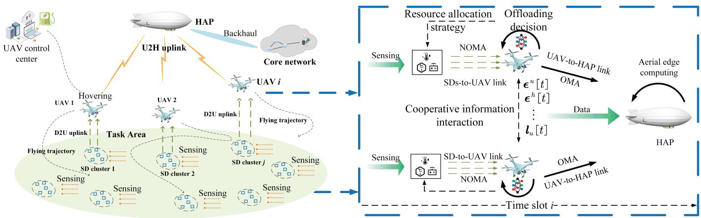  
Fig. 1. Collaborative multi-UAV edge computing scenarios.

## B. Collaborative Sensing Model

To improve the sensing accuracy toward sensing targets, all SDs belonging to the same cluster k collaborate to carry out sensing tasks. The generate-at-will strategy is adopted to guarantee the information freshness of sensed data [25]. The SD i belongs to cluster k executes sensing tasks according to scheduling, and the successful probability satisfies the probabilistic sensing model proposed in [26]. When the SD i belonging to cluster k carries out data sensing in time slot t for one time, the successful sensing probability can be calculated as:

$$
p _ { i , k } = e ^ { - { \varsigma } R _ { i , k } } ,\tag{1}
$$

where ς is the parameter to evaluate the sensing performance, and $R _ { i , k }$ denotes the sensing radius of SD i. Note that unsuccessful sensing behavior can lead to a decrease in QoS. Hence, the SDs can perform sensing behavior repeatedly to achieve an expected successful sensing probability.2 Then, the sensing time of SD i belonging to cluster k in time slot t can be given by:

$$
\begin{array} { r } { \tau _ { i , k } ^ { s e n } \left[ t \right] = \tau _ { 0 } \omega _ { k } \left[ t \right] , } \end{array}\tag{2}
$$

where $\tau _ { 0 }$ and $\omega _ { k }$ are the duration for one data sensing and sensing times of SDs belonging to cluster k, respectively. Accordingly, the size of the sensing data can be calculated as:

$$
Q _ { i , k } \left[ t \right] = r _ { i } ^ { s e n } \tau _ { 0 } \omega _ { k } \left[ t \right] ,\tag{3}
$$

where $r _ { i } ^ { s e n }$ is the sensing rate in bit/second of SD i.

The successful sensing probability under the multiple times strategy can be described as:

$$
P r _ { i , k } \left[ t \right] = 1 - ( 1 - p _ { i , k } ) ^ { \omega _ { k } \left[ t \right] } .\tag{4}
$$

To ensure the sensing performance, the successful sensing probability and sensing satisfaction should meet the constraints, respectively:

$$
P r _ { i , k } \left[ t \right] \geq { \cal { Y } } ^ { p r o b } , \forall i \in \boldsymbol { k } ,\tag{5}
$$

$$
\alpha ^ { s e n } \ln \left( 1 + Q _ { i , k } \left[ t \right] \right) \geq \gamma ^ { s a t } , \forall i \in k ,\tag{6}
$$

where $\boldsymbol { \Upsilon } ^ { p r o b }$ and $ { T } ^ { s a t }$ denote the successful sensing probability and satisfaction threshold, respectively. $\alpha ^ { s e n }$ is the satisfaction coefficient.

## C. Hybrid Spectrum Access Model

1) NOMA-Based Devices-to-UAV Transmission: Since the UAV establishes an air-to-ground communication link with the SDs, both Line-of-Sight (LoS) and Non-Line-of-Sight (NLoS) models should be considered. Note that the D2U uplink between the UAV and SDs is determined by the LoS signal. In addition, weather, obstructions and link conditions determine the probability of occurrence (PoO) of different signals [27]. Therefore, we combine both strong LoS and NLoS with their corresponding PoO. Then, the ground-to-air path loss models for LoS and NLoS between the UAV u and SD i in time slot t can be expressed as:

$$
\varGamma _ { u , i , k } ^ { L o S } \left[ t \right] = \varrho _ { L o S } \left( \frac { 4 \pi d _ { u , i , k } \left[ t \right] } { \lambda _ { 0 } } \right) ,\tag{7}
$$

and

$$
T _ { u , i , k } ^ { N L o S } \left[ t \right] = \varrho _ { N L o S } \left( \frac { 4 \pi d _ { u , i , k } \left[ t \right] } { \lambda _ { 0 } } \right) ,\tag{8}
$$

where $d _ { u , i } \left[ t \right] = \left| \left| l _ { u } \left[ t \right] - l _ { i } \right| \right|$ is the Euclidean distance between the UAV u and SD i belonging to cluster k in time slot t. $\varrho _ { L o S }$ and $\varrho _ { N L o S }$ represent the additional path loss due to the free-space propagation for LoS and NLoS signals, respectively. $\lambda _ { 0 }$ is the wavelength of the wireless signal. Then, the LoS probability can be given by:

$$
P _ { u , i , k } ^ { L o S } \left[ t \right] = \frac { 1 } { 1 + \alpha _ { 1 } \exp \left( - \alpha _ { 2 } \left[ \theta _ { u , i , k } \left[ t \right] - \alpha _ { 1 } \right] \right) } ,\tag{9}
$$

where $\alpha _ { 1 }$ and $\alpha _ { 2 }$ are the constant factors depending on the environment. $\begin{array} { r } { \theta _ { u , i , k } \left[ t \right] = \frac { \pi } { 1 8 0 } \sin ^ { - 1 } \left( \frac { H _ { u } } { d _ { u , i , k } \left[ t \right] } \right) } \end{array}$ represents the elevation angle between the UAV u and SD i in time slot t. Then, we can obtain the NLoS probability:

$$
\begin{array} { r } { P _ { u , i , k } ^ { N L o S } \left[ t \right] = 1 - P _ { u , i , k } ^ { L o S } \left[ t \right] . } \end{array}\tag{10}
$$

Hence, the average path loss for the ground-to-air D2U uplink in time slot t can be calculated as:

$$
\begin{array} { r } { T _ { u , i , k } \left[ t \right] = T _ { u , i , k } ^ { L o S } \left[ t \right] \times P _ { u , i , k } ^ { L o S } \left[ t \right] + T _ { u , i , k } ^ { N L o S } \left[ t \right] \times P _ { u , i , k } ^ { N L o S } \left[ t \right] . } \end{array}\tag{11}
$$

Therefore, the channel gain between the UAV u and SD i in time slot t is expressed as:

$$
g _ { u , i , k } \left[ t \right] = \frac { 1 } { { { T } _ { u , i , k } } \left[ t \right] } .\tag{12}
$$

Furthermore, we define the SDs access vector with sequential decoding order which belongs to cluster k for UAV u in time slot t as:

$$
\mathcal { X } _ { u } \left[ t \right] = \left\{ x _ { u 1 } \left[ t \right] , x _ { u 2 } \left[ t \right] , \cdot \cdot \cdot , x _ { U N } \left[ t \right] \right\} \subseteq k .\tag{13}
$$

Then, the SDs access matrix for all the UAVs in time slot t can be represented as:

$$
X \left[ t \right] = \left( x _ { u , i } \left[ t \right] \right) _ { U \times N } = \left[ \begin{array} { c c c c } { x _ { 1 1 } \left[ t \right] } & { x _ { 1 2 } \left[ t \right] } & { \cdots } & { x _ { 1 N } \left[ t \right] } \\ { x _ { 2 1 } \left[ t \right] } & { x _ { 2 2 } \left[ t \right] } & { \cdots } & { x _ { 2 N } \left[ t \right] } \\ { \vdots } & { \vdots } & { \vdots } & { \vdots } \\ { x _ { U 1 } \left[ t \right] } & { x _ { U 2 } \left[ t \right] } & { \cdots } & { x _ { U N } \left[ t \right] } \end{array} \right] .\tag{14}
$$

At UAV u, the SIC is leveraged to eliminate the multi-access interference caused by different transmit power levels of SD i as well as decode messages. According to the SIC, the priority of decoding is determined by the channel gain. The greater the channel gain of SD i, the higher the decoding priority of SD i, i.e.,

$$
g _ { x _ { u 1 } [ t ] } > g _ { x _ { u 2 } [ t ] } > \cdot \cdot \cdot > g _ { x _ { u N } [ t ] } .\tag{15}
$$

Based on (12), the decoding order is equal to the ascending order of the distance between the UAV u and SD i, i.e.,

$$
d _ { x _ { u 1 } [ t ] } < d _ { x _ { u 2 } [ t ] } < \cdot \cdot \cdot < d _ { x _ { u N } [ t ] } .\tag{16}
$$

The UAV u receives superimposed messages from uplink NOMA transmitted by SDs belonging to clusters k in time slot t can be calculated as:

$$
\begin{array} { r } { \xi _ { u } [ t ] = \underset { i = 1 } { \overset { N } { \sum } } \sqrt { p _ { { x } _ { u , i } [ t ] } [ t ] } g _ { { x } _ { u , i } [ t ] } [ t ] \zeta _ { { x } _ { u , i } } [ t ] } \\ { + \sigma ^ { 2 } , \forall { x } _ { u , i } [ t ] \in \mathcal { X } _ { u } [ t ] ,  } \end{array}\tag{17}
$$

where $p _ { x _ { u , i } [ t ] } \left[ t \right]$ and $\zeta _ { x _ { u , i } \left[ t \right] } \left[ t \right]$ are the transmission power and transmission signal of SD $\dot { \mathbf { \rho } } _ { x _ { u , i } \left[ t \right] }$ in time slot t, respectively. $\sigma ^ { 2 }$ is the additive white Gaussian noise (AWGN).

Hence, the received signal-to-interference-plus-noise (SINR) of the $x _ { u , i } \left[ t \right]$ -th SD is given by:

$$
\gamma _ { x _ { u , i } \left[ t \right] } \left[ t \right] = \frac { p _ { x _ { u , i } \left[ t \right] } \left[ t \right] \left. g _ { x _ { u , i } \left[ t \right] } \left[ t \right] \right. } { \underset { i ^ { \prime } = i + 1 } { N } p _ { x _ { u , i ^ { \prime } } \left[ t \right] } \left. g _ { x _ { u , i ^ { \prime } } } \left[ t \right] \right. + \sigma ^ { 2 } } .\tag{18}
$$

Then, we can obtain the SINR of the $x _ { u , i }$ [t]-th SD:

$$
\gamma _ { x _ { u , N } [ t ] } \left[ t \right] = \frac { p _ { x _ { u , N } [ t ] } \left[ t \right] \left| g _ { x _ { u , N } [ t ] } \left[ t \right] \right| } { \sigma ^ { 2 } } .\tag{19}
$$

The achievable data rate from the $x _ { u , i } \left[ t \right]$ -th SD to the UAV u in time slot t can be calculated by:

$$
r _ { x _ { u , i } \left[ t \right] } \left[ t \right] = \left\{ \begin{array} { l l } { B _ { u } \log _ { 2 } \left( 1 + \gamma _ { x _ { u , i } \left[ t \right] } \left[ t \right] \right) , i \neq N } \\ { B _ { u } \log _ { 2 } \left( 1 + \gamma _ { x _ { u , N } \left[ t \right] } \left[ t \right] \right) , i = N } \end{array} \right.\tag{20}
$$

where $\begin{array} { r } { B _ { u } = \frac { B } { U } } \end{array}$ is the frequency bandwidth of UAV u, where B is the system bandwidth.

The uplink NOMA transmission time from SDs belonging to cluster k to UAV u in time slot t can be obtained by:

$$
\tau _ { u , k } ^ { N O M A } \left[ t \right] = \operatorname* { m a x } \left\{ \frac { Q _ { i , k } \left[ t \right] } { r _ { x _ { u , i } \left[ t \right] } \left[ t \right] } | i \in k , k \in \mathcal { K } , u \in \mathcal { U } \right\} .\tag{21}
$$

The transmission energy of SD i belonging to cluster k is given by:

$$
E _ { i , k } \left[ t \right] = p _ { u , i , k } \left[ t \right] \frac { Q _ { i , k } \left[ t \right] } { r _ { x _ { u , i } \left[ t \right] } \left[ t \right] } .\tag{22}
$$

2) OMA-Based UAVs-to-HAP Transmission: We assume that there is no obstruction between UAV and HAP while the flying altitude $H _ { u }$ of UAV is high enough, which makes the LoS probability always close to 1 at any time. Hence, according to (7), we can obtain UAVs-to-HAP path loss for LoS signal:

$$
\Gamma _ { u , h } ^ { L o S } \left[ t \right] = \varrho _ { L o S } \left( \frac { 4 \pi d _ { u , h } \left[ t \right] } { \lambda _ { 0 } } \right) .\tag{23}
$$

The channel gain between the UAV u and HAP h can be calculated as:

$$
g _ { u , h } \left[ t \right] = \frac { 1 } { T _ { u , h } ^ { L o S } \left[ t \right] } .\tag{24}
$$

We employ orthogonal frequency-division multiple access (OFDMA) technology as the UAVs-to-HAP uplink transmission model, in which the interference between UAVs can be ignored. The system bandwidth B is divided into S subcarriers, each with a bandwidth of $\begin{array} { r } { f _ { s } = \frac { B } { S } } \end{array}$ . The set of all subcarriers is denoted as $\mathcal { S } = \{ s | s = 1 , 2 , \cdots , S \}$ . Each subcarrier can only be assigned to one UAV exclusively in each time slot. The assign variable $y _ { u , s } \left[ t \right] \in \{ 0 , 1 \}$ indicates the s-th subcarrier is assigned to UAV u with $y _ { u , s } \left[ t \right] = 1$ in time slot $t , y _ { u , s } \left[ t \right] = 0 ,$ otherwise. Then, the achievable data rate of UAV u on s-th subcarrier in time slot t can be calculated by:

$$
r _ { u , s } \left[ t \right] = y _ { u , s } \left[ t \right] f _ { s } \log _ { 2 } \left( 1 + \frac { p _ { u } \left[ t \right] g _ { u , h } \left[ t \right] } { f _ { s } N _ { 0 } } \right) ,\tag{25}
$$

where $p _ { u } \left[ t \right]$ and $N _ { 0 }$ are the transmission power of UAV u and noise power spectral density, respectively. Due to the fact that OFDMA allows a user to occupy multiple subcarriers, we define the subcarrier assignment matrix as:

$$
\begin{array} { r } { Y \left[ t \right] = \left( y _ { u , s } \left[ t \right] \right) _ { U \times S } = \left[ \begin{array} { c c c c } { y _ { 1 1 } \left[ t \right] } & { y _ { 1 2 } \left[ t \right] } & { \cdot \cdot \cdot } & { y _ { 1 S } \left[ t \right] } \\ { y _ { 2 1 } \left[ t \right] } & { y _ { 2 2 } \left[ t \right] } & { \cdot \cdot \cdot } & { y _ { 2 S } \left[ t \right] } \\ { \vdots } & { \vdots } & { \vdots } & { \vdots } \\ { y _ { U 1 } \left[ t \right] } & { y _ { U 2 } \left[ t \right] } & { \cdot \cdot } & { y _ { U S } \left[ t \right] } \end{array} \right] . } \end{array}\tag{26}
$$

The columns of the matrix represent the allocation of the sth subcarrier and the rows represent the occupation of the subcarriers by the UAV u and need to satisfy the following constraints:

$$
\sum _ { u \in \mathcal { U } } y _ { u , s } \left[ t \right] \leq 1 , \forall u \in \mathcal { U } ,\tag{27}
$$

$$
0 < \sum _ { s \in \mathcal { S } } y _ { u , s } \left[ t \right] \leq S , \forall s \in \mathcal { S } .\tag{28}
$$

Hence, the aggregate data rate for the UAV u in time slot t can be given by:

$$
\begin{array} { r l r } {  { r _ { u } [ t ] = \sum _ { s \in \mathcal S } r _ { u , s } [ t ] } } \\ & { } & { = f _ { s } \log _ { 2 } ( 1 + \frac { p _ { u , s } [ t ] g _ { u , h } [ t ] } { f _ { s } N _ { 0 } } ) \sum _ { s \in \mathcal S } y _ { u , s } [ t ] . } \end{array}\tag{29}
$$

The minimum transmission rate of the UAV u satisfies:

$$
r _ { u } \left[ t \right] \geq r ^ { m i n } , \forall u \in \mathcal { U } .\tag{30}
$$

## D. Collaborative Aerial Edge Computing Model

Low-power sensing devices without an integrated computing unit are incapable of performing local computation of sensing data. The UAVs and HAP function as AEC servers to deliver edge computing services to SDs. The sensing data are bit-wise independent and can be arbitrarily partitioned [28]. To ensure load balancing, the UAV and HAP process the computational tasks from the SDs in a distributed and collaborative manner. Since the computation results are very small, the overhead of transmitting the resultant can be negligible [29]. The computing tasks received by UAV u from SDs that belonging to cluster k in time slot t can be described as a tuple $< Q _ { u , k } \left[ t \right] , c _ { u , k } , z _ { u , k } \left[ t \right] >$ , where $Q _ { u , k } \left[ t \right] = \Sigma _ { i \in k } Q _ { u , i , k } \left[ t \right]$ is the received data from cluster k by UAV u in time slot $t . \ c _ { u , k }$ represents the required number of CPU cycles for computing one-bit data. $z _ { u , k } \left[ t \right] \in \left[ 0 , 1 \right]$ and $1 - z _ { u , k } \left[ t \right]$ denote the proportion of computing tasks processed by the UAV u and HAP h, respectively.

1) UAV-Assisted AEC: The UAVs with limited computing capacity may lead to reduced computation efficiency, potentially affecting real-time performance. Offloading a certain proportion of sensing data to the HAP can reduce the computing delay as well as energy consumption for transmitting and local computing. The UAVs, as agents, autonomously decide the proportion for offloading computing tasks to HAP h. The computing time for UAV u to perform computational tasks locally is calculated as:

$$
\tau _ { u , k } ^ { c o m } \left[ t \right] = \frac { z _ { u , k } \left[ t \right] c _ { u , k } Q _ { u , k } \left[ t \right] } { f _ { u } } ,\tag{31}
$$

where $f _ { u }$ is the computing capacity of UAV u. The computing energy consumption can be calculated as:

$$
E _ { u } ^ { c o m } \left[ t \right] = \mathcal { Q } _ { u } c _ { i , k } z _ { u , k } \left[ t \right] Q _ { u , k } \left[ t \right] \left( f _ { u } \right) ^ { 2 } ,\tag{32}
$$

where $\varOmega _ { u }$ denotes the effective switched capacitance of UAV u. Then, the transmission time from UAV u to HAP h in time slot t can be calculated as:

$$
\tau _ { u , h } ^ { t r } \left[ t \right] = \frac { \left( 1 - z _ { u , k } \left[ t \right] \right) Q _ { u , k } \left[ t \right] } { r _ { u } \left[ t \right] } .\tag{33}
$$

The corresponding energy consumption for transmitting can be obtained by:

$$
E _ { u , k } ^ { c o m m } \left[ t \right] = p _ { u } ^ { t r } \left[ t \right] \tau _ { u , h } ^ { t r } \left[ t \right] = \frac { p _ { u } ^ { t r } \left[ t \right] \left( 1 - z _ { u , k } \left[ t \right] \right) Q _ { u , k } \left[ t \right] } { r _ { u } \left[ t \right] } ,\tag{34}
$$

where $p _ { u } ^ { t r } \left[ t \right]$ is the transmitting power of UAV u in time slot t.

2) HAP-Assisted AEC: Equipped with a high-performance computing unit, the HAP is capable of efficiently processing computational tasks, thereby reducing latency in sensing data processing. It is worth noting that the more data the UAV offloads to the HAP, the higher the UAV-to-HAP uplink transmission delay. Once the sensing data from the UAV has been received by the HAP, it begins to perform the computational tasks. The first-come-first-served (FCFS) model is adopted by HAP to utilize all computational resources to process sensed data. The computing time for processing sensing data transmitted from UAV u and executed by HAP h in time slot t can be given by:

$$
\tau _ { u , k , h } ^ { c o m } \left[ t \right] = \frac { \left( 1 - z _ { u , k } \left[ t \right] \right) c _ { u , k } Q _ { u , k } \left[ t \right] } { f _ { h } } ,\tag{35}
$$

where $f _ { h }$ is the computing capacity of HAP h. The energy consumption of HAP can be neglected as its electricity is converted from solar energy.

Due to the difference in the moment of arrival of sensing data to the HAP, the later arriving sensing data need to wait before they can be processed. We denote the sensing data arrival order as:

$$
q _ { u , h } \left[ t \right] = \left\{ q _ { 1 , h } \left[ t \right] , \cdot \cdot \cdot , q _ { u , h } , \left[ t \right] \cdot \cdot \cdot , q _ { U , h } \left[ t \right] \right\} .\tag{36}
$$

Then, the waiting time can be described as:

$$
\tau _ { u , k , h } ^ { w a i t } [ t ] = \{ \begin{array} { l l } { 0 , } & { \mathrm { i f ~ } q _ { u , h } = 1 , } \\ { \tau _ { u - 1 , k , h } [ t ] - ( \tau _ { u } ^ { f } [ t ] + \tau _ { i , k } ^ { s e n } [ t ]  } \\ { + \tau _ { u , k } ^ { N O M A } [ t ] + \tau _ { u , h } ^ { t r } [ t ] ) , } & { \mathrm { i f ~ } q _ { u , h } > 1 , } \end{array}\tag{37}
$$

where $\tau _ { u - 1 , k , h } \left[ t \right]$ is the duration for sensing, transmitting and computing for the sensing data. The computing time executed by AEC can be calculated as:

$$
\tau _ { u , k , h } ^ { A E C } \left[ t \right] = \operatorname* { m a x } \left\{ \left( \tau _ { u , h } ^ { t r } \left[ t \right] + \tau _ { u , k , h } ^ { w a i t } \left[ t \right] + \tau _ { u , h } ^ { c o m } \left[ t \right] \right) , \tau _ { u , k } ^ { c o m } \left[ t \right] \right\} .\tag{38}
$$

## IV. PROBLEM FORMULATION AND TRANSFORMATION A. Problem Formulation

Regarding the UAV trajectory design, we use the path discretization (PD) scheme to determine the UAV flying trajectory [30]. The basic idea of PD is to divide the continuous UAV trajectory into K (same as the number of clusters) consecutive line segments connected by a certain number of discrete points. Hence, the UAV flying trajectory problem is equivalent to the cluster selection order problem. The flying time and energy consumption of UAV u in time slot t can be respectively calculated as:

$$
\tau _ { u } ^ { f } \left[ t \right] = \frac { | | l _ { k } - l _ { k ^ { \prime } } | | } { \bar { v } } , \ k \neq k ^ { \prime } ,\tag{39}
$$

$$
E _ { u } ^ { f } \left[ t \right] = p _ { u } ^ { f } \frac { | | l _ { k } - l _ { k ^ { \prime } } | | } { \bar { v } } , \ k \neq k ^ { \prime } ,\tag{40}
$$

where v¯ is the average flying speed of UAV u.

As a consequence, for the sensing data generated by SDs belonging to cluster k, the time from generation and collection to the completion of processing can be expressed as:

$$
\tau _ { u , k , h } \left[ t \right] = \tau _ { u } ^ { f } \left[ t \right] + \tau _ { i , k } ^ { s e n } \left[ t \right] + \tau _ { u , k } ^ { N O M A } \left[ t \right] + \tau _ { u , k , h } ^ { A E C } \left[ t \right] .\tag{41}
$$

Our goal is to minimize the average task completion time for data sensing, transmitting and computing, while ensuring the stability of energy consumption the system. The UAV trajectories $l _ { u } ,$ , sensing times $\omega \triangleq \{ \omega _ { k } \left[ t \right] \vert k \in { \mathcal { K } } \}$ , SDs and UAVs transmission power $\mathbf { p } _ { s d } ~ \triangleq ~ \{ p _ { u , i , k } ~ [ t ] ~ | u \in \mathcal { U } , i \in \mathcal { I } , k \in \mathcal { K } \}$ $\begin{array} { r l r } { \mathbf { p } _ { u } } & { { } \triangleq } & { \{ p _ { u } [ t ] | u \in \mathcal { U } , \} } \end{array}$ , subcarrier assignments $\begin{array} { r l } { \mathbf { Y } } & { { } \triangleq } \end{array}$ $\{ y _ { u , s } \left[ t \right] \vert u \in \mathcal { U } , s \in \mathcal { S } \}$ and offloading proportion $\begin{array} { r l } { \mathbf { z } } & { { } \triangleq } \end{array}$ $\{ z _ { u , k } \left[ t \right] \vert u \in \mathcal { U } , k \in \mathcal { K } \}$ are jointly optimized. The problem is described as follows:

$$
\begin{array} { r l r } {  { \operatorname* { P o } : \operatorname* { m i n } _ { l _ { u } \to \infty , \Psi , u \in \mathcal { X } } \sum _ { \tau = k \in \mathcal { A } } \tau _ { u , k , h } [ t ] } } \\ & { } & { \operatorname* { P o } : \operatorname* { m i n } _ { l _ { u } , \omega , \Psi , u \in \mathcal { X } } U } \\ & { } & { \operatorname* { P u } , \mathbf { Y } , z } \\ & { } & { \mathrm { s . t . } \ \langle \mathbf { l } _ { \bot } | \triangledown _ { l _ { u } } [ t + 1 ] - l _ { u } [ t ] \le d ^ { m a x } , \forall l \in \mathcal { T } , } \\ & { } & { \mathrm { C 2 } : p _ { u , k , l } [ t ] \le p _ { u } ^ { \mathrm { m a x } } , \forall u \in \mathcal { U } , i \in \mathcal { L } , k \in \mathcal { K } , } \\ & { } & { \mathrm { C 3 } : p _ { u } [ t ] \le p _ { u } ^ { \mathrm { m a x } } , \forall u \in \mathcal { U } , } \\ & { } & { \mathrm { C 4 } : 0 \ \le z _ { u , k } [ t ] \le 1 , \forall u \in \mathcal { U } , k \in \mathcal { K } , } \\ & { } & { \mathrm { C 5 } : E _ { i , k } [ t ] \le E _ { S D } , \forall i \in \mathcal { T } , } \\ & { } & { \mathrm { C 6 } : E _ { u } [ t ] \le E _ { m } ^ { \mathrm { m a x } } , \forall u \in \mathcal { U } , } \\ & { } & { \mathrm { C 7 } : ( 5 ) , ( 6 ) , ( 2 7 ) , ( 2 8 ) , ( 3 0 ) . } \end{array}\tag{2}
$$

C1 indicates the constraint of the UAV flying distance. C2 and C3 represent the transmission power constraints of the SDs and UAVs, respectively. C4 specifies the limitation on the offloading ratio of the UAVs. C5 and C6 represent that the energy consumption of SD and UAV cannot exceed their maximum energy capacity. Constraint C7 is aforementioned.

By observing the structure of the optimization problem P1, some insights can be obtained: a) the variables respect to Y are in a binary space, b) the variables respect to $l ,$ ω are in a discrete space, and c) the variables respect to $\mathbf { p } _ { s d } , \mathbf { p } _ { u }$ are in continue spaces, d) the variables have high dimensionality and are deeply coupled with each other. Hence, the optimization problem P1 is a mixed integer non-linear programming and is NP-hard.

## B. Lyapunov Optimization-Based Problem Transformation

Aiming at the above non-convex problem, we utilize the Lyapunov optimization method [31] to disentangle the original optimization problem P0 from the overarching long-term optimization, segmenting it into a series of deterministic subproblems. Each subproblem is tasked with minimizing the upper boundary of the Lyapunov drift-plus-penalty function within individual time slots, thereby facilitating a trade-off between the average task completion time and the stability of energy consumption of the joint sensing-communicationcomputing system.

First, the energy consumption stability queue is introduced for SDs and UAVs, with the aim of directing resource management in accordance with the enduring energy consumption constraint. In time slot t, the energy consumption stability queue can be denoted as $L _ { u , i , k } \left[ t \right]$ , and the energy consumption stability queue of two adjacent time slots can be expressed as:

$$
L _ { u , i , k } \left[ t + 1 \right] = \operatorname* { m a x } \left\{ L _ { u , i , k } \left[ t \right] + E ^ { t o t a l } \left[ t \right] - \varPhi _ { u , i , k } , 0 \right\} ,\tag{43}
$$

where $\varPhi _ { u , i , k }$ is a tolerable energy consumption value. The length of the energy consumption stability queue characterizes the deviation of the present energy consumption from the corresponding tolerable energy consumption value.

Let $\mathcal { L } \left[ t \right] ~ = ~ \left\{ L _ { u , i , k } \left[ t \right] \vert u \in \mathcal { U } , i \in \mathcal { I } , k \in \mathcal { K } , t \in \mathcal { T } \right\}$ represents the set of the energy consumption stability queue. To further derive the expression for queue stability, the quadratic Lyapunov function is adopted and is given by:

$$
\begin{array} { r } { D \left( \mathcal { L } \left[ t \right] \right) = \frac { \sum _ { u \in \mathcal { U } } \sum _ { i \in \mathcal { I } } \sum _ { k \in \mathcal { K } } \left( L _ { u , i , k } \left[ t \right] \right) ^ { 2 } } { 2 } . } \end{array}\tag{44}
$$

To describe the alterations in the queue size between sequential time slots, we introduce the one-slot Lyapunov drift function [31], which is formulated as:

$$
\Delta \left( \mathcal { L } \left[ t \right] \right) = \mathbb { E } \left[ D \left( \mathcal { L } \left[ t + 1 \right] \right) - D \left( \mathcal { L } \left[ t \right] \right) \mid \mathcal { L } \left[ t \right] \right] .\tag{45}
$$

Then, we can derive the inequality (46), shown at the bottom of the next page, based on (43). Furthermore, substituting (46) into (45), a new inequality (47), shown at the bottom of the next page, will be obtained. In (47), $Z _ { 1 } \left[ t \right] =$ E $\begin{array} { r } { \left[ \underset { u \in \mathcal { U } } { \sum } \underset { i \in \mathcal { T } } { \sum } \underset { k \in \mathcal { K } } { \sum } \left( \frac { ( E ^ { \mathrm { i n a x } } \left[ t \right] ) ^ { 2 } + \varPhi _ { u , i , k } ^ { 2 } } { 2 } \right) | \mathcal { L } \left[ t \right] \right] } \end{array}$ is a constant value at maximum transmission power of SDs and UAVs, where $E ^ { \mathrm { m a x } } \left[ t \right]$ is calculated with the maximum transmit power $p _ { i } ^ { m a x }$ and $p _ { u } ^ { m a x }$ . Naturally, we conclude that $Z _ { 1 } \left[ t \right]$ is irrelevant to the energy consumption stability queue.

To stabilize the energy consumption stability queues in the long term, it is required to consistently push the Lyapunov drift to a low value. Meanwhile, we also need to minimize the average task completion time in each time slot. Therefore, based on the Lyapunov optimization theory, we express the drift-plus-penalty function in the time slot as:

$$
\Delta \left( \mathcal { L } \left[ t \right] \right) + \kappa \mathbb { E } \left[ \frac { \underset { t \in \mathcal { T } } { \sum } \underset { u \in \mathcal { U } } { \sum } \tau _ { u , k , h } \left[ t \right] } { U T } \mid \mathcal { L } \left[ t \right] \right] = \Delta \left( \mathcal { L } \left[ t \right] \right) + \kappa Z _ { 3 } \left[ t \right] ,\tag{48}
$$

where $Z _ { 3 } \left[ t \right] = \underset { t \in \mathcal { T } } { \sum } \underset { u \in \mathcal { U } } { \sum } \tau _ { u , k , h } \left[ t \right]$ , and $\kappa \geq 0$ is the weighted factor that serves the purpose of trading off the minimization of the task completion time against the minimization of the Lyapunov drift function, which reflects the stability of energy consumption within the system. A larger value of $\kappa$ emphasizes reducing the task completion time at the cost of increasing the energy consumption stability queues. Conversely, a smaller κ prioritizes minimizing the energy consumption stability queues over the task completion time.

Drawing upon the aforementioned analysis, the optimization problem P0 can be transformed into the minimization of the upper bound of the drift-plus-penalty function based on (48) within each discrete time slot. The term $Z _ { 1 } \left[ t \right]$ can be ignored as it is a constant value and the transformed optimization problem can be described as:

$$
\begin{array} { r } { { \bf P 1 : } \underset { l _ { u } , \omega , { \bf p } _ { s d } } { \operatorname* { m i n } } Z _ { 2 } \left[ t \right] + \kappa Z _ { 3 } \left[ t \right] , } \\ { { \bf p } _ { u } , { \bf Y } , { \bf z } \quad \quad } \\ { { \bf s . t . } C 1 - C 7 . \quad \quad } \end{array}\tag{49}
$$

The optimal solution to P1 exhibits asymptotically optimal properties in accordance with the principles of Lyapunov optimization theory [31].

## V. HYBRID PARAMETER OPTIMIZATION SOLUTIONS BASED ON MADRL

We can directly use the DRL algorithm to solve P1. However, the multitude of optimization variables results in a high-dimensional action space, which significantly reduces the training speed, convergence, and learning speed of the DRL model. To tackle this, we employ the Dinkelbach and SCA techniques to separately determine the transmission powers of the sensing devices and UAVs. Then, we propose a hybrid optimization algorithm based on centralized DRL which combines numerical analysis and convex optimization.

We decompose the optimization problem P1 into the sensing optimization sub-problem, the NOMA transmission optimization sub-problem as well as OMA transmission optimization sub-problem, and solve the three subproblem iteratively.

## A. Sensing Optimization Sub-Problem

To reduce the sensing time, we need to find the minimum sensing times that meet the constraint conditions (5) and (6). The sensing optimization sub-problem can be described as:

$$
\begin{array} { r } { \begin{array} { l } { \mathbf { P 1 . 1 : m i n } \kappa \displaystyle \sum _ { t \in { \mathcal T } } \displaystyle \sum _ { k \in { \mathcal K } } \tau _ { 0 } \omega _ { k } \left[ t \right] . } \\ { \qquad \quad \mathrm { s . t . ~ } ( 5 ) , ( 6 ) . } \end{array} } \end{array}
$$

The optimal sensing times $\omega _ { k } ^ { * , 1 } \left[ t \right]$ and $\omega _ { k } ^ { * , 2 } \left[ t \right]$ that satisfy (5) and (6) respectively can be obtained through numerical calculation:

$$
\omega _ { k } ^ { * , 1 } \left[ t \right] = \frac { \ln \left( 1 - \Upsilon ^ { p r o b } \right) } { \ln \left( 1 - p _ { i , k } \right) } ,\tag{50}
$$

$$
\omega _ { k } ^ { * , 2 } \left[ t \right] = \frac { \exp \left( \frac { r ^ { s s a t } } { \alpha ^ { s e n } } \right) - 1 } { r _ { i } ^ { s e n } \tau _ { 0 } } .\tag{51}
$$

Hence, the optimal sensing times $\omega _ { k } ^ { * } \left[ t \right]$ of cluster k in time slot t can be obtained by:

$$
\omega _ { k } ^ { * } \left[ t \right] = \operatorname* { m a x } \left( \omega _ { k } ^ { * , 1 } \left[ t \right] , \omega _ { k } ^ { * , 2 } \left[ t \right] \right) .\tag{52}
$$

## B. NOMA Transmission Optimization Sub-Problem

We can observe that the optimization related to NOMA transmission is decoupled from other parts. According to P1, we formulate the NOMA transmission optimization subproblem as P1.2 as shown in (53), shown at the bottom of the page.

The first item of sub-problem P1.2 is a min-max problem, which can be transformed into a general optimization problem by introducing a parameter η. Then, the sub-problem P1.2 can be transformed into:

$$
\begin{array} { r l r } {  { \mathbf { P 1 . 2 . 1 : } \ \operatorname* { m i n } _ { \mathbf { p } _ { s d } , \eta } \Xi [ t ] = \kappa \eta + \displaystyle \sum _ { k \in \mathcal { K } } \sum _ { i \in \mathcal { L } } \frac { Q _ { i , k } [ t ] L _ { u , i , k } [ t ] p _ { i } [ t ] } { B _ { u } \log _ { 2 } ( 1 + \gamma _ { u , i , k } [ t ] ) } , } } \\ & { } & { \mathrm { s . t . ~ C 8 : } \ \frac { Q _ { i , k } [ t ] } { B _ { u } \log _ { 2 } ( 1 + \gamma _ { u , i , k } [ t ] ) } \le \eta , } \\ & { } & { \forall i \in k , k \in { \mathcal { K } } , u \in \mathcal { U } , \ ~ ( 5 4 ) } \\ & { } & { \mathrm { C 2 . ~ C 5 . } } \end{array}
$$

P1.2.1 is also difficult to solve due to the non-convex property of (54), C5 and C8. We exploit successive convex optimization (SCA) to transform the non-convex parts to be convex. When expanded using the first-order Taylor series at the given values of $\widetilde { { \bf p } _ { s d } } \left[ t \right]$ , the second term of the optimization problem (54) can be transformed into a linear function as:

$$
\begin{array} { r l r } { f \left( \mathbf { p } _ { s d } \right) = \displaystyle \sum _ { k \in \mathcal { K } } \sum _ { i \in \mathcal { T } } \frac { Q _ { i , k } \left[ t \right] L _ { u , i , k } \left[ t \right] p _ { i } \left[ t \right] } { B _ { u } \log _ { 2 } \left( 1 + \gamma _ { u , i , k } \left[ t \right] \right) } \approx f \left( \widetilde { \mathbf { p } _ { s d } } \right) } & { } & \\ { + \left( \mathbf { p } _ { s d } - \widetilde { \mathbf { p } _ { s d } } \right) \nabla _ { \mathbf { p } _ { s d } } f \left( \widetilde { \mathbf { p } _ { s d } } \right) , } & { } & \end{array}\tag{55}
$$

where $\begin{array} { r } { \nabla _ { \mathbf { p } _ { s d } } f \left( \widetilde { \mathbf { p } _ { s d } } \right) = \left( \frac { \partial f \left( \widetilde { \mathbf { p } _ { s d } } \right) } { \partial p _ { 1 } } , \frac { \partial f \left( \widetilde { \mathbf { p } _ { s d } } \right) } { \partial p _ { 2 } } , \cdot \cdot \cdot , \frac { \partial f \left( \widetilde { \mathbf { p } _ { s d } } \right) } { \partial p _ { N } } \ \right) } \end{array}$ . Similarly, the first item of C5, C8 can be transformed into a linear function respectively as:

$$
\begin{array} { r } { C 5 ^ { \prime } : ~ g \left( \mathbf { p } _ { s d } \right) = \displaystyle \sum _ { k \in K } \sum _ { i \in \mathcal { I } } \frac { Q _ { i , k } \left[ t \right] p _ { i } \left[ t \right] } { B _ { u } \log _ { 2 } \left( 1 + \gamma _ { u , i , k } \left[ t \right] \right) } \approx g \left( \widetilde { \mathbf { p } _ { s d } } \right) } \\ { + \left( \mathbf { p } _ { s d } - \widetilde { \mathbf { p } _ { s d } } \right) \nabla _ { \mathbf { p } _ { s d } } g \left( \widetilde { \mathbf { p } _ { s d } } \right) \le E _ { S D } , ~ \forall i \in \mathcal { I } , } \end{array}\tag{56}
$$

$$
C 8 ^ { \prime } : ~ h \left( \mathbf { p } _ { s d } \right) = \frac { Q _ { i , k } \left[ t \right] } { B _ { u } \log _ { 2 } \left( 1 + \gamma _ { u , i , k } \left[ t \right] \right) } \approx h \left( \widetilde { \mathbf { p } _ { s d } } \right) ~\tag{57}
$$

$$
\begin{array} { r l } & { L _ { u , i , k } \left[ t + 1 \right] ^ { 2 } \leq \left( L _ { u , i , k } \left[ t \right] + E ^ { t o t a l } \left[ t \right] - \phi _ { u , i , k } \right) ^ { 2 } = \left( L _ { u , i , k } \left[ t \right] \right) ^ { 2 } + \left( E ^ { t o t a l } \left[ t \right] - \phi _ { u , i , k } \right) ^ { 2 } + 2 L _ { u , i , k } \left[ t \right] \left( E ^ { t o t a l } \left[ t \right] - \phi _ { u , i , k } \right) } \\ & { \qquad \leq \left( L _ { u , i , k } \left[ t \right] \right) ^ { 2 } + \left( E ^ { t o t a l } \left[ t \right] \right) ^ { 2 } + \left( \phi _ { u , i , k } \right) ^ { 2 } + 2 L _ { u , i , k } \left[ t \right] \left( E ^ { t o t a l } \left[ t \right] - \phi _ { u , i , k } \right) . } \end{array}\tag{6}
$$

$$
\begin{array} { r l } & { \Delta \left( \mathcal { L } \left[ l \right] \right) = \mathbb { E } \left[ D \left( \mathcal { L } \left[ l + 1 \right] \right) - D \left( \mathcal { L } \left[ l \right] \right) \mid \mathcal { L } \left[ l \right] \right] \leq \mathbb { E } \left[ \underset { u \in \mathcal { U } \not \in \mathcal { L } _ { h } = k } { \sum \sum } \Bigg ( \frac { \left( E ^ { t o d } \left[ l \right] \right) ^ { 2 } + \Phi _ { u , i , k } ^ { 2 } } { 2 } + L _ { n , i , k } \left[ l \right] \left( E ^ { t o d } \left[ l \right] - \Phi _ { u , i , k } \right) \Bigg ) \mid \mathcal { L } \left[ l \right] \right] } \\ & { \qquad \leq \quad Z _ { 1 } \left[ l \right] + \mathbb { E } \left[ \underset { u \in \mathcal { U } \not \in \mathcal { L } _ { h } = k } { \sum \sum } L _ { n , i , k } \left[ l \right] \left( E ^ { t o a } \left[ l \right] - \bar { \Phi } _ { u , i , k } \right) \mid \mathcal { L } \left[ l \right] \right] = Z _ { 1 } \left[ l \right] + \mathbb { E } \left[ Z _ { 2 } \left[ l \right] \mid \mathcal { L } \left[ l \right] \right] . } \end{array}
$$

$$
\mathbf { P 1 . 2 : } \operatorname* { m i n } _ { \mathbf { p } _ { s d } } \Xi \left[ t \right] = \kappa \sum _ { k \in \mathcal { K } } \sum _ { i \in \mathcal { X } } \operatorname* { m a x } \left\{ \frac { Q _ { i , k } \left[ t \right] } { B _ { u } \log _ { 2 } \left( 1 + \gamma _ { u , i , k } \left[ t \right] \right) } \right\} + \sum _ { k \in \mathcal { K } } \sum _ { i \in \mathcal { K } } \frac { Q _ { i , k } \left[ t \right] L _ { u , i , k } \left[ t \right] p _ { i } \left[ t \right] } { B _ { u } \log _ { 2 } \left( 1 + \gamma _ { u , i , k } \left[ t \right] \right) } , \mathrm { s . t . } \mathrm { C 2 } , \mathrm { C 5 } .\tag{53}
$$

where $\begin{array} { r l r } { \nabla _ { \mathbf { p } _ { s d } } g \left( \widetilde { \mathbf { p } _ { s d } } \right) } & { { } = } & { \left( \frac { \partial g \left( \widetilde { \mathbf { p } _ { s d } } \right) } { \partial p _ { 1 } } , \frac { \partial g \left( \widetilde { \mathbf { p } _ { s d } } \right) } { \partial p _ { 2 } } , \cdot \cdot \cdot , \frac { \partial g \left( \widetilde { \mathbf { p } _ { s d } } \right) } { \partial p _ { N } } \ \right) } \end{array}$ $\begin{array} { r } { \nabla _ { \mathbf { p } _ { s d } } h \left( \widetilde { \mathbf { p } _ { s d } } \right) = \left( \frac { \partial h \left( \widetilde { \mathbf { p } _ { s d } } \right) } { \partial p _ { 1 } } , \frac { \partial h \left( \widetilde { \mathbf { p } _ { s d } } \right) } { \partial p _ { 2 } } , \cdot \cdot \cdot , \frac { \partial h \left( \widetilde { \mathbf { p } _ { s d } } \right) } { \partial p _ { N } } \ \right) } \end{array}$ . In light of the aforementioned analysis, P1.2.1 can be efficiently solved by using CVX. The details of the procedures for obtaining the optimal solution are summarized in Algorithm 1.

Algorithm 1 SCA-Based Algorithm for Solving P1.2.1   
Initialization: Iteration index $n = 0 ,$ maximum number of   
iterations $N _ { m a x } ^ { 1 } .$ , tolerant error $\epsilon _ { 1 } , \widetilde { { \bf p } _ { s d } } ^ { ( 0 ) } , \Xi \left[ t \right] ^ { ( 0 ) } = 0 \mathrm { , }$   
1: repeat   
2: Solving P1.2.1 by using CVX with the given approxi  
mate values $\widetilde { \mathbf { p } _ { s d } } ^ { ( 0 ) }$   
3: $\Xi [ t ] ^ { ( n ) }  ( 5 \bar { 3 } ) ;$   
4: $\widetilde { \mathbf { p } _ { s d } } ^ { ( n + 1 ) }  \widetilde { \mathbf { p } _ { s d } ^ { * } } ^ { ( n ) } ;$   
5: Update the iteration index $n = n + 1 ;$   
6: until $\left| \boldsymbol { \Xi } \left[ t \right] ^ { \left( n + 1 \right) } - \boldsymbol { \Xi } \left[ t \right] ^ { \left( n \right) } \right| \leq \epsilon _ { 1 }$ or $n \geq N _ { \operatorname* { m a x } } ^ { 1 } ;$   
Output: $\begin{array} { r } { \dot { \mathbf { p } } _ { s d } ^ { * } . } \end{array}$

## C. OMA Transmission Optimization Sub-Problem

The DRL method is in charge of solving the UAV trajectory, computing offloading and subcarrier allocation decisions. If the UAV transmission power is optimized through DRL, the action space will be very large, making it difficult for the model to converge. To avoid this situation, we quickly obtain the UAV transmission power under the OMA transmission scheme through numerical methods. Assuming the optimal UAV flying trajectory ${ l _ { u } } ^ { * }$ , task offloading $z ^ { * } =$ $\left\{ \boldsymbol { z } _ { u , k } ^ { * } \left[ t \right] \left| u \in \mathcal { U } , k \in \mathcal { K } \right. \right\}$ and subcarrier allocation $Y ^ { \ast } \left[ t \right] =$ $\left\{ y _ { u , s } ^ { * } \left[ t \right] \vert u \in \mathcal { U } , s \in \mathcal { S } \right\}$ decisions are obtained through DRL, we can formulate the OMA transmission optimization subproblem as:

$$
\begin{array} { r } { \mathbf { P 1 . 3 : m i n } \displaystyle \sum _ { u \in \mathcal { U } } \frac { \displaystyle \left( 1 - z _ { u , k } ^ { * } \left[ t \right] \right) Q _ { u , k } \left[ t \right] \left( \kappa + L _ { u , i , k } \left[ t \right] p _ { u } \left[ t \right] \right) } { \sum _ { s \in \mathcal { S } } y _ { u , s } ^ { * } \left[ t \right] f _ { s } \log _ { 2 } \left( 1 + \frac { p _ { u } \left[ t \right] g _ { u , h } \left[ t \right] } { f _ { s } N _ { 0 } } \right) } , } \\ { \mathrm { s . t . } \ C 3 , C 6 . \qquad \quad } { \displaystyle ( 5 \xi }  \end{array}\tag{}
$$

It can be observed that P1.3 is a fractional programming problem and can be efficiently solved by the Dinkelbach algorithm [32]. Assuming the solution of P1.3 is λ, we have:

$$
\frac { \left( 1 - \boldsymbol { z } _ { u , k } ^ { * } \left[ t \right] \right) \boldsymbol { Q } _ { u , k } \left[ t \right] \left( \kappa + \boldsymbol { L } _ { u , i , k } \left[ t \right] \boldsymbol { p } _ { u } \left[ t \right] \right) } { \sum _ { s \in \mathcal { S } } { y } _ { u , s } ^ { * } \left[ t \right] \boldsymbol { f } _ { s } \log _ { 2 } \left( 1 + \frac { \boldsymbol { p } _ { u } \left[ t \right] \boldsymbol { g } _ { u , h } \left[ t \right] } { \boldsymbol { f } _ { s } N _ { 0 } } \right) } = \lambda .\tag{59}
$$

Rewrite (59) to:

$$
A \log _ { 2 } \left( 1 + \frac { p _ { u } \left[ t \right] g _ { u , h } \left[ t \right] } { f _ { s } N _ { 0 } } \right) \lambda - B \left( \kappa + L _ { u , i , k } \left[ t \right] p _ { u } \left[ t \right] \right) = 0 ,\tag{60}
$$

where $\begin{array} { r } { A = \sum _ { s \in \mathcal { S } } y _ { u , s } ^ { * } \left[ t \right] f _ { s } , B = \left( 1 - z _ { u , k } ^ { * } \left[ t \right] \right) Q _ { u , k } \left[ t \right] . } \end{array}$ . We further construct a linear function with respect to λ:

$$
\begin{array} { c } { { F \left( \lambda \right) = A \log _ { 2 } \left( 1 + \frac { p _ { u } \left[ t \right] g _ { u , h } \left[ t \right] } { f _ { s } N _ { 0 } } \right) \lambda } } \\ { { - B \left( \kappa + L _ { u , i , k } \left[ t \right] p _ { u } \left[ t \right] \right) , } } \end{array}\tag{61}
$$

$\mathrm { I f } ~ p _ { u } \left[ t \right]$ is fixed, then $F ( \lambda )$ is a linear equation in Cartesian coordinates with respect to λ, where the slope is positive and the y-intercept is negative. Different values of $p _ { u } \left[ t \right]$ correspond to different linear equations. When $F ( \lambda ) = 0 ,$ , the x-intercept of $F ( \lambda )$ represents the solution to sub-problem P1.3. The maximum x-intercept of $F ( \lambda )$ represents the optimal value of P1.3. At this point, $\lambda ^ { * }$ corresponds to $p _ { u } ^ { * } \left[ t \right] .$ , which is the optimal transmission power of UVA u. Hence, based on (61), the optimization sub-problem P1.3 can be equivalently transformed into P1.3.1:

$$
\begin{array} { r l } & { \mathrm { { \bf ~ P 1 . 3 . 1 } } \operatorname* { m i n } F \left( \lambda \right) = A \log _ { 2 } \left( 1 + \frac { p _ { u } \left[ t \right] g _ { u , h } \left[ t \right] } { f _ { s } N _ { 0 } } \right) \lambda } \\ & { \quad \quad \quad \mathrm { { \bf ~ p } } _ { u } } \\ & { \quad \quad \quad \quad - B \left( \kappa + L _ { u , i , k } \left[ t \right] p _ { u } \left[ t \right] \right) , } \\ & { \quad \quad \quad \quad \mathrm { s . t . } C 3 , C 6 . } \end{array}\tag{62}
$$

To obtain the optimal power allocation strategy, we define  as the tolerance error between $F \left( \lambda \right)$ and $F \left( \lambda ^ { * } \right)$ , where $\lambda ^ { * }$ is the optimal value for sub-problem P1.3. We initialize λ as 0, serving as an unbiased and heuristic-free initialization method. This provides a stable starting point for subsequent updates, preventing the optimization process from being steered in the wrong direction due to non-convexity or imbalance in scaling. Next, computing the corresponding $p _ { u } \left[ t \right]$ that minimizes $F \left( \lambda \right) , \mathrm { i f } F \left( \lambda \right)$ is less than the tolerance error , it indicates that the optimal value $\lambda ^ { * }$ for sub-problem P1.3 has not been reached. In this case, substitute $p _ { u } \left[ t \right]$ into (59) to obtain a new $\lambda .$ When $F \left( \lambda \right)$ is greater than or equal to the tolerance error , the current λ is the optimal value for P1.3, and the corresponding $p _ { u } \left[ t \right]$ is the optimal solution. The details of the procedures for obtaining the optimal solution to sub-problem P1.3 are summarized in Algorithm 2.

Algorithm 2 Dinkelbach Based Algorithm for Solving Sub-  
Problem P1.3   
Initialization: Tolerant error $\epsilon _ { 2 } ,$ maximum number of itera  
tions $N _ { m a x } ^ { 2 } , \lambda  0 .$   
1: repeat   
2: $p _ { u } [ t ] \quad $ arg min A log2 $\begin{array} { r l } { \left( 1 + \frac { p _ { u } [ t ] g _ { u , h } [ t ] } { f _ { s } N _ { 0 } } \right) \lambda } & { { } - } \end{array}$   
$B \left( \kappa + L _ { u , i , k } \left[ t \right] p _ { u } \left[ t \right] \right)$ , s.t. C3, C6;   
3: F (λ) ← $\begin{array} { r l } { A \log _ { 2 } \left( 1 + \frac { p _ { u } [ t ] g _ { u , h } [ t ] } { f _ { s } N _ { 0 } } \right) \lambda } & { { } \ - } \end{array}$   
$B \left( \kappa + \underline { { L } } _ { u , i , \underline { { k } } } \left[ t \right] p _ { u } \left[ t \right] \right) ;$   
4: $\begin{array} { r } { \lambda \gets \frac { B ( \kappa + L _ { u , i , k } [ t ] p _ { u } [ t ] ) } { A \log _ { 2 } \left( 1 + \frac { p _ { u } [ t ] g _ { u , h } [ t ] } { f _ { s } N _ { 0 } } \right) } ; } \end{array}$   
5: until $F \left( \lambda \right) \geq \dot { \epsilon } \ \mathrm { o r } \ n \geq N _ { M A X } ^ { 2 } ;$   
Output: Optimal $p _ { u } ^ { * } \left[ t \right] , \lambda ^ { * } .$

## D. MADRL-Based AEC Optimization Design

By analyzing the first three subproblems, the complexity of the original optimization problem was reduced. We can solve UAV trajectory, computing offloading and subcarrier allocation problems by using a centralized DRL algorithm. However, the complexity and the high dimensionality of the problems can seriously reduce the training speed and convergence of the DRL model. Motivated by this, we design a cooperative PPObased multi-agent DRL algorithm (MAPPO-JSCC) through centralized training with decentralized execution (CTDE), which can enhance model training efficiency, reduce computational and communication overhead, and better adapt to dynamic environments. The agents are collaboratively trained using global information during the training phase. However, in the execution phase, each agent independently makes decisions based on its individual observations. The partially observable Markov decision process (POMDP) model can be described as $\{ S , \ { \mathcal { A } } , \ O , { \mathcal { R } } , \ { \mathcal { P } } \}$ , where S represents the global state space of the environment. ${ \mathcal { A } } = \{ a _ { 1 } , a _ { 2 } , \cdot \cdot \cdot , a _ { U } , a _ { h } \}$ denotes the joint action space of all agents, $a _ { u } , a _ { h }$ are the individual action of UAV u and HAP. $\mathcal { O } = \{ o _ { 1 } , o _ { 2 } , \cdot \cdot \cdot , o _ { U } , o _ { h } \}$ is the partial observations of the agents. R is the global reward and $\mathcal { P }$ is the state transition probability. The state space, action space, and reward are defined as below:

• Environment space S. The state space of interaction between agents and the environment is:

$$
\begin{array} { r } { s \left[ t \right] = \left\{ l _ { u } \left[ t \right] , Q _ { u , k } \left[ t \right] , X , Y , \mathbf { q } _ { u , h } \left[ t \right] \right\} , t \in \mathcal { T } . } \end{array}
$$

• Observation O. The observations of UAV u at time slot t can be expressed as:

$$
o _ { u } \left[ t \right] = \left\{ l _ { u } \left[ t \right] , Q _ { u , k } \left[ t \right] , \boldsymbol { x } _ { u , i } \left[ t \right] , y _ { u , s } \left[ t \right] \right\} , t \in \mathcal { T } .
$$

• Action space A. According to the current observations, The actions of UAV u at time slot t can be given by:

$$
a _ { u } \left[ t \right] = \left\{ l _ { u } \left[ t + 1 \right] , y _ { u , s } \left[ t \right] , z _ { u , k } \left[ t \right] \right\} , t \in \mathcal { T } .
$$

• Reward R. We define the negative of the optimization objective as the reward:

$$
\mathcal { R } = - ( Z _ { 2 } \left[ t \right] + \kappa Z _ { 3 } \left[ t \right] ) .
$$

Traditional policy gradient-based deep reinforcement learning is sensitive to step size and it is challenging to determine a reasonable step size. The PPO algorithm introduces a novel objective function called the clipped surrogate objective, which facilitates mini-batch updates and enhances training stability. The clipped surrogate objective function can be expressed as:

$$
L ^ { \mathrm { C L I P } } ( \theta ) = E _ { t } \left[ \operatorname* { m i n } \left( \rho _ { t } ( \theta ) , \mathrm { c l i p } \left( \rho _ { t } ( \theta ) , 1 - \varepsilon , 1 + \varepsilon \right) \right) A ( t ) \right] ,\tag{63}
$$

where $\rho _ { t } ( \theta ) = \pi _ { \theta } \left( a _ { t } \mid s _ { t } \right) / \pi _ { \theta _ { \mathrm { o l d } } } \left( a _ { t } \mid s _ { t } \right)$ and ε is the ratio of the new policy to the old policy and clip fraction, respectively. $\pi _ { \theta }$ is the actor network. The clipping method serves to prevent excessive alterations to the objective value. $A ( t )$ is the generalized advantage estimator and can be calculated as:

$$
A ( t ) \approx r ( s , a ) + \gamma \mu _ { \phi } \left( s _ { t + 1 } \right) - \mu _ { \phi } \left( s _ { t } \right) ,\tag{64}
$$

where $\mu _ { \phi }$ is the critic network.

In the MAPPO-based learning process, the policy network outputs an action and aiming to be optimized with respect to parameters θ. The policy network parameters are updated iteratively by stochastic gradient and the gradient is estimated by Monte Carlo. The loss and the corresponding gradient are sampled by executing the policy network, which is given by:

$$
J \left( \theta \right) = \mathbb { E } _ { s , a \sim \pi \left( \theta \right) } \left[ \sum _ { t = 1 } ^ { T } R \left( s \left[ t \right] , a \left[ t \right] \right) \right] = \mathbb { E } _ { s , a \sim \pi \left( \theta \right) } \left[ R \left[ t \right] \right] ,\tag{65}
$$

$$
\nabla _ { \theta } J ( \theta ) = \mathbb { E } _ { s , a \sim \pi ( \theta ) } [ ( \sum _ { t = 1 } ^ { T } \nabla _ { \theta } \log \pi ( a [ t ]  s [ t ] , \theta ) ) R [ t ] ] .\tag{66}
$$

The parameter θ will be updated via stochastic gradient ascent which gives as:

$$
\begin{array} { l } { \theta _ { k + 1 } } \\ { = \arg \operatorname* { m a x } _ { \theta } \frac { 1 } { \left| \mathcal { D } _ { k } \right| T } \displaystyle \sum _ { \tau \in \mathcal { D } _ { k } } \sum _ { t = 0 } ^ { T } } \\ { \operatorname* { m i n } \left( \frac { \pi _ { \theta } \left( a _ { t } \mid s _ { t } \right) } { \pi _ { \theta _ { k } } \left( a _ { t } \mid s _ { t } \right) } A ^ { \pi _ { \theta _ { k } } } \left( s _ { t } , a _ { t } \right) , \quad g \left( \varepsilon , A ^ { \pi _ { \theta _ { k } } } \left( s _ { t } , a _ { t } \right) \right) \right) . } \end{array}\tag{67}
$$

The detailed implementation process is summarized in Algorithm 3.

Algorithm 3 MAPPO-JSCC   
1: Initialize the primary actor network $\pi _ { \theta }$ and the primary   
critic network $\mu _ { \phi }$ with random parameters $\phi , \theta$   
2: Initialize experience replay buffer $\boldsymbol { B }$   
3: for episode $= 1 , 2 , 3 \cdots$ do   
4: for time slot $= 1 , 2 , 3 \cdots$ do   
5: for all agents do   
6: $p _ { t } ^ { i } , \dot { h _ { t , \pi _ { . } } ^ { i } } = \pi \left( o _ { t } ^ { i } , h _ { t - 1 , \pi } ^ { i } ; \theta \right)$   
7: $a _ { t } ^ { i } \sim p _ { t } ^ { i }$   
8: $v _ { t } ^ { \ i } , h _ { t , V } ^ { i } = V \left( s _ { t } ^ { i } , h _ { t - 1 , V } ^ { i } ; \phi \right)$   
9: end for   
10: Obtain UAV trajectories $l _ { u } ,$ subcarrier assignment   
strategy Y and offloading strategy $\mathbf { z } _ { t }$   
11: Solve P1.2 and P1.3 according to Algorithm 1 and   
algorithm 2, respectively   
12: Compute reward R   
13: $B + = \left[ s _ { t } , \mathbf { o _ { t } } , \mathbf { h _ { t , \pi } } , \mathbf { h _ { t , V } } , \mathbf { a _ { t } } , r _ { t } , s _ { t + 1 } , \mathbf { o _ { t + 1 } } \right]$   
14: Compute advantage estimates $A _ { t }$ based on the cur  
rent value function   
15: Compute reward-to-go $\hat { R }$ and normalize with   
PopArt   
16: Split experience into chunks of length L   
17: for $l = 0 , 1 , . . , T / / L$ do   
18: $D = D \cup \left( t [ l : l + T , \hat { A } \left[ l : l + L \right] , \hat { R } \left[ l : l + L \right] \right)$   
19: end for   
20: end for   
21: for mini-batch $k = 1 , \ldots , K$ do   
22: b ← random mini-batch from B with all agent data   
23: for each data chunk l in the mini-batch k do do   
24: update RNN hidden states for π and V   
25: end for   
26: end for   
27: Adam update θ on $L _ { \theta }$   
28: Adam update φ on $L _ { \phi }$   
29: end for

## E. Algorithm Complexity Analysis

Based on the previous description, we solved different subproblems using numerical analysis, SCA, and the

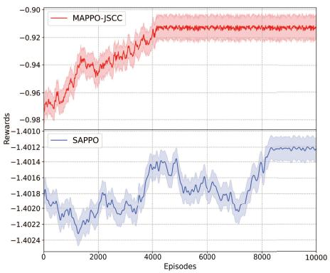  
(a) κ = 1

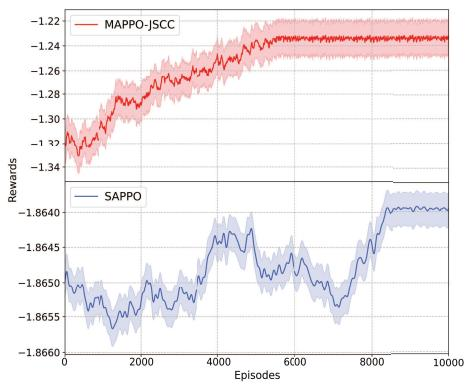  
(b) κ = 2

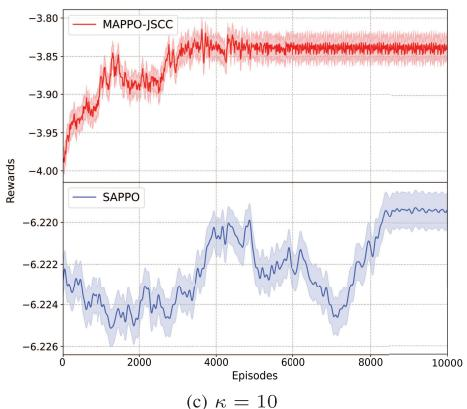  
Fig. 2. Variation of rewards during the training process for different values of κ: $A \_ L R / C \_ L R = 1 e$ − 7/1e − 7.

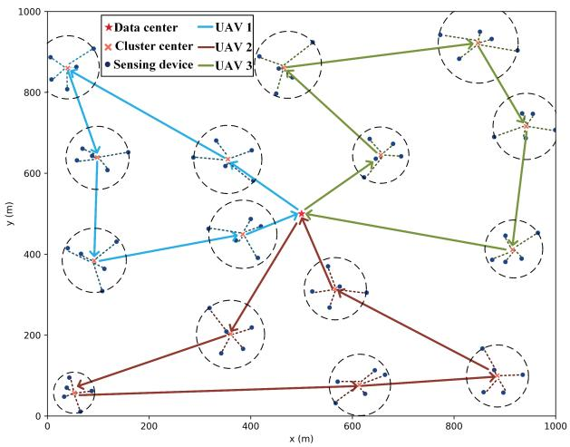  
Fig. 3. Multi-UAV trajectories.

Dinkelbach algorithm, we will analyze the corresponding algorithm complexity respectively:

• For sub-problem P1.1, its complexity is O(KT ), where K is the number of clusters and T is the number of time slots.

• For Algorithm 2, which is employed to solve sub-problem P1.2, the complexity of gradient computation is $O ( n _ { 1 } )$ where $n _ { 1 }$ represents the number of parameters. We utilize the gradient descent method for the solution, which has a complexity of $O ( n _ { 1 } N _ { m a x } ^ { 1 } )$ , where $N _ { m a x } ^ { 1 }$ denotes the number of iterations. Consequently, the complexity of Algorithm 2 is $O ( n _ { 1 } + n _ { 1 } N _ { m a x } ^ { 1 } )$

• For sub-problem P1.3, we employ gradient descent as the convex optimization solver, and the corresponding algorithm complexity is $O ( n _ { 2 } N _ { m a x } ^ { 2 } )$ , where $n _ { 2 }$ is the number of parameters and $N _ { m a x } ^ { 2 }$ is the maximum number of iterations allowed.

The proposed PPO-based MADRL algorithm is implemented in a distributed manner, allowing each agent to continuously optimize its policy by leveraging both its own experiences and those shared by other agents. Typically, each update cycle of MAPPO consists of trajectory collection, advantage estimation, and policy and value network updates. For trajectory collection, at each time step, MAPPO computes the actions for all A agents. Since all agents share the same policy network (with N parameters), a forward propagation is performed for each agent’s observation. Consequently, for collecting trajectories over T time steps, the computational complexity is O(T AN). For advantage estimation, the model receives the global state and computes the value estimation. Over T time steps, the forward propagation complexity of the critic network (which also has N parameters) is O(T N ). The network update phase is the primary computational bottleneck in MAPPO. For the policy update, the total complexity across K epochs is O(KT AN ), for the critic update, the complexity across K epochs is O(KT N). Therefore, the overall complexity of the algorithm is $O ( T A N + T N + K T A N + K T N )$

TABLE I  
PARAMETER SETTINGS
<table><tr><td rowspan=1 colspan=1>parameters</td><td rowspan=1 colspan=1>value</td><td rowspan=1 colspan=1>parameters</td><td rowspan=1 colspan=1>value</td></tr><tr><td rowspan=1 colspan=1>S</td><td rowspan=1 colspan=1>0.01</td><td rowspan=1 colspan=1> $\tau _ { 0 }$ </td><td rowspan=1 colspan=1>800</td></tr><tr><td rowspan=1 colspan=1> $\overline { { \gamma ^ { s a t } } }$ </td><td rowspan=1 colspan=1>0.95</td><td rowspan=1 colspan=1> $\overline { { \gamma ^ { p r o b } } }$ </td><td rowspan=1 colspan=1>0.9</td></tr><tr><td rowspan=1 colspan=1> $\underline { { \varrho L o S } }$ </td><td rowspan=1 colspan=1>1 dB</td><td rowspan=1 colspan=1> $\underline { { \theta N L o S } }$ </td><td rowspan=1 colspan=1>12 dB</td></tr><tr><td rowspan=1 colspan=1> $\alpha _ { 1 }$ </td><td rowspan=1 colspan=1> $\overline { { 9 . 6 } }$ </td><td rowspan=1 colspan=1> $\alpha _ { 2 }$ </td><td rowspan=1 colspan=1>0.29</td></tr><tr><td rowspan=1 colspan=1> $\overline { { \lambda _ { 0 } } }$ </td><td rowspan=1 colspan=1>0.125 m</td><td rowspan=1 colspan=1> $\overline { { \sigma ^ { 2 } } }$ </td><td rowspan=1 colspan=1>-160 dBm</td></tr><tr><td rowspan=1 colspan=1> $f _ { s }$ </td><td rowspan=1 colspan=1>100 kHz</td><td rowspan=1 colspan=1> $\overline { { N _ { 0 } } }$ </td><td rowspan=1 colspan=1>-160 dBm</td></tr><tr><td rowspan=1 colspan=1> $\underline { { c _ { u } } }$ </td><td rowspan=1 colspan=1>1500</td><td rowspan=1 colspan=1> $f _ { u }$ </td><td rowspan=1 colspan=1>2 GHz</td></tr><tr><td rowspan=1 colspan=1> $f _ { h }$ </td><td rowspan=1 colspan=1>10 GHz</td><td rowspan=1 colspan=1> $\Omega _ { u }$ </td><td rowspan=1 colspan=1> $\overline { { 1 0 ^ { - 2 4 } } }$ </td></tr><tr><td rowspan=1 colspan=1> $\underline { { p _ { x _ { u , i , k } } } }$ </td><td rowspan=1 colspan=1>[20, 27] dBm</td><td rowspan=1 colspan=1> $p _ { u , s }$ </td><td rowspan=1 colspan=1>[30, 37] dBm</td></tr></table>

## VI. PERFORMANCE EVALUATIONS

In this section, we conduct extensive simulations to evaluate the performance of the proposed methods compared with other methods.

## A. Simulation Setup

We consider three UAVs and one HAP, and 75 sensing devices randomly distributed in an area of 1000 m × 1000 m in our simulations. The location of the data center is (500 m, 500 m), the flying height and speed of the UAV are 60 m and 15 $m / s$ , respectively. The simulation parameters are based on [4], [11], and [33]. Other necessary parameters are given in Table I.

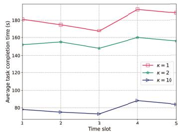  
(a) Average task completion time

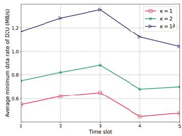  
(b) Average data rate of D2U

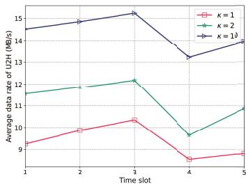  
(c) Average data rate of U2H

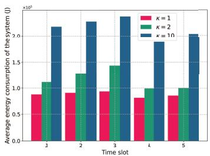  
(d) Average energy consumption of the system

Fig. 4. Performance comparison under varying values of κ.  
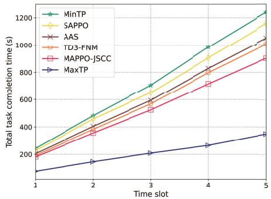  
(a) κ = 1

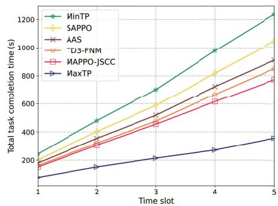  
(b) κ = 2

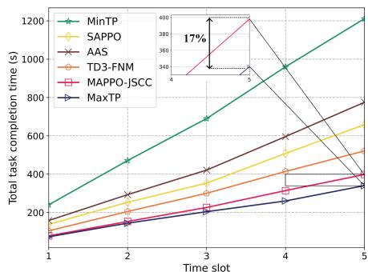  
(c) κ = 10  
Fig. 5. Comparison on total task completion time under varying values of κ.

As for the hyperparameters of MAPPO algorithm, we tuned them for the actor and critic networks separately through multiple exploratory trials to balance training efficiency and performance. Specifically, the learning rates of actor (A LR) and critic (C LR) networks are both $1 e - 7$ and the clip fraction is set to 0.2, following best practices for ensuring policy stability during training. The discount factor γ is set to 0.99, and Generalized Advantage Estimation (GAE) with $\lambda = 0 . 9 5$ was used to stabilize learning. The actor and critic networks were implemented using single-layer fully connected neural networks, each with 64 neurons and ReLU activation. The final layer of the actor network uses a sigmoid activation to map the output into a valid action space. Both networks use orthogonal initialization with a gain of 0.01, and LayerNorm is applied to stabilize training. The actor and critic networks were implemented using single-layer fully connected neural networks, each with 64 neurons and ReLU activation. The final layer of the actor network uses a sigmoid activation to map the output into a valid action space.

To demonstrate the advantages of the proposed optimization strategy, we compare its performance with 5 reference schemes, detailed as follows:

1) Single agent PPO (SAPPO) scheme [34], we trained a single agent DRL model where the HAP as the agent.

2) TD3-FNM [32], we used the TD3-based DRL algorithm, which embeds a Fast Numerical Method, to train our model in the environment.

3) Maximum transmission power (MaxTP) scheme, where the sensing devices and UAVs transmit data at maximum transmission power.

4) Minimum transmission power (MinTP) scheme, where the sensing devices and UAVs transmit data at minimum transmission power.

5) Average Allocation Subcarriers (AAS) scheme, where each UAV can obtain the same number of subcarriers.

## B. Performance Comparison

We first evaluate the convergence performance of MAPPO-JSCC compared with the single agent-based DRL algorithm under different κ. As shown in Fig. 2, compared to SAPPO, the proposed algorithm demonstrates reduced fluctuations, higher reward values, and faster convergence. The reason is that each agent continuously updates its policy gradient using a centralized critic that incorporates the policies of all agents. This approach mitigates the non-stationarity issue, enabling collaborative learning to optimize rewards. By varying the value of $\kappa ,$ it can be observed that higher κ values result in lower rewards. This is because a larger κ value drives the agents to prioritize minimizing task completion time, thereby narrowing the solution space of energy consumption-related parameters.

Fig. 3 illustrates the UAV flight trajectories obtained by the proposed algorithm. All UAVs tend to adopt smoother flight trajectories. The proposed PPO-based MADRL algorithm, through multi-agent collaboration, enables the UAVs to achieve collaborative coverage, utilization of the data center, and path optimization, thereby demonstrating high efficiency in task completion.

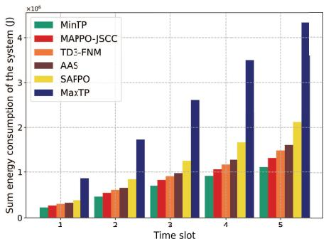  
(a) κ = 1

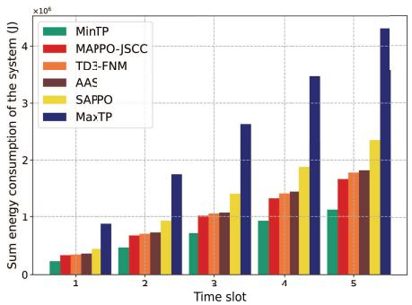  
(b) κ = 2

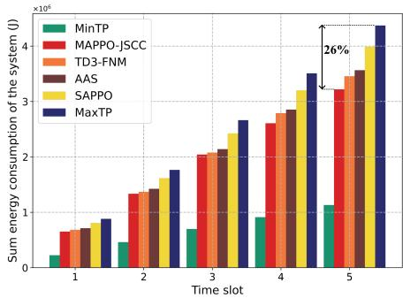  
(c) κ = 10  
Fig. 6. Comparison on sum energy consumption of the system under varying values of κ.

Fig. 4 presents the performance outcomes under varying values of κ in terms of average task completion time, average minimum device-to-UAV transmission rate, average UAV-to-HAP transmission rate, and average energy consumption. It is evident that larger κ values result in lower average task completion time, higher uplink data transmission rate. However, this improvement in performance comes at the cost of increased average system energy consumption. Consequently, for latency-sensitive applications, increasing κ is beneficial for minimizing task completion time, while for latency-tolerant applications, choosing a smaller value of κ can effectively lower energy consumption. In summary, adjusting the value of κ allows for a trade-off between latency and energy efficiency, tailored to the specific requirements of the application.

Fig. 5 illustrates a comparison of the total task completion time across different schemes under varying values of κ. The MinTP and MaxTP schemes represent the control of minimum and maximum task completion time, respectively. Under identical κ values, the proposed MAPPO-JSCC scheme achieves shorter task completion time compared to SAPPO, TD3- FNM and AAS. This improvement is attributed to the joint optimization of node selection, NOMA transmission power control, offloading strategies, subcarrier allocation strategies, and UAV transmission power control.

Moreover, for smaller κ values (κ = 1, 2), the task completion time of SAPPO exceeds that of AAS. This is due to the limitations of single-agent DRL, which struggles to effectively capture cooperative relationships among agents, thereby hindering the ability to derive optimal action policies in complex task environments. When κ is large (κ = 10), the fixed resource allocation strategy limits the efficient utilization of resources, resulting in task completion time that surpasses the AAS strategy. Notably, the proposed scheme only increases task completion time by 17% compared to the MaxTP scheme.

Fig. 6 illustrates a comparison of the total system energy consumption under different schemes for various values of κ. The MinTP and MaxTP schemes represent the scenarios with the lowest and highest total energy consumption, respectively. As shown, the total energy consumption increases rapidly with larger κ values. For small values of κ (i.e., κ = 1 or 2), the energy consumption of all schemes, with the exception of MaxTP, remains at a relatively low level. Specifically, when $\kappa = 1 0 ,$ compared to $\kappa = 1$ and $\kappa = 2 ,$ the energy consumption under different schemes (MAPPO-JSCC, TD3- FNM, AAS, and SAPPO) increases by 58.6% and 48%, 56.6% and 48.4%, 54.3% and 48.9%, 46.8% and 40.9%, respectively. At the same κ value, the proposed MAPPO-JSCC scheme achieves lower energy consumption compared to SAPPO, TD3-FNM, and AAS. Notably, when $\kappa = 1 0$ , the proposed scheme reduces energy consumption by 26% while maintaining 83% of the minimum completion time.

## VII. CONCLUSION

In this paper, we studied multi-UAV-assisted collaborative edge computing consisting of one HAP, multi-UAVs and SDs for joint sensing-communication-computing optimization. The UAV trajectory, transmit power control, offloading strategies, and resource allocation strategies are jointly optimized to minimize the task completion time while keeping the stability of energy consumption of the system. Leveraging Lyapunov optimization theory, we reformulate the optimization problem and develop a hybrid MADRL-based algorithm that integrates the PPO framework with embedded numerical analysis, SCA and Dinkelbach methods. To highlight the advantages of our proposed scheme, we conducted extensive simulations involving five reference schemes for comparison. Experimental results demonstrate that the proposed algorithm achieves higher training efficiency and outperforms other schemes in terms of task completion time and energy consumption stability.

## REFERENCES

[1] M. Stoyanova, Y. Nikoloudakis, S. Panagiotakis, E. Pallis, and E. K. Markakis, “A survey on the Internet of Things (IoT) forensics: Challenges, approaches, and open issues,” IEEE Commun. Surveys Tuts., vol. 22, no. 2, pp. 1191–1221, 2nd Quart., 2020.

[2] N. Cheng et al., “Space/aerial-assisted computing offloading for IoT applications: A learning-based approach,” IEEE J. Sel. Areas Commun., vol. 37, no. 5, pp. 1117–1129, May 2019.

[3] N. Cheng et al., “AI for UAV-assisted IoT applications: A comprehensive review,” IEEE Internet Things J., vol. 10, no. 16, pp. 14438–14461, Aug. 2023.

[4] Y. Chen, K. Li, Y. Wu, J. Huang, and L. Zhao, “Energy efficient task offloading and resource allocation in air-ground integrated MEC systems: A distributed online approach,” IEEE Trans. Mobile Comput., vol. 23, no. 8, pp. 8129–8142, Aug. 2024.

[5] B. Chang, W. Tang, X. Yan, X. Tong, and Z. Chen, “Integrated scheduling of sensing, communication, and control for mmWave/THz communications in cellular connected UAV networks,” IEEE J. Sel. Areas Commun., vol. 40, no. 7, pp. 2103–2113, Jul. 2022.

[6] R. Zhang, Y. Zhang, R. Tang, H. Zhao, Q. Xiao, and C. Wang, “A joint UAV trajectory, user association, and beamforming design strategy for multi-UAV-assisted ISAC systems,” IEEE Internet Things J., vol. 11, no. 18, pp. 29360–29374, Sep. 2024.

[7] X. Liu, Y. Liu, Z. Liu, and T. S. Durrani, “Fair integrated sensing and communication for multi-UAV-enabled Internet of Things: Joint 3-D trajectory and resource optimization,” IEEE Internet Things J., vol. 11, no. 18, pp. 29546–29556, Sep. 2024.

[8] K. Meng, Q. Wu, S. Ma, W. Chen, K. Wang, and J. Li, “Throughput maximization for UAV-enabled integrated periodic sensing and communication,” IEEE Trans. Wireless Commun., vol. 22, no. 1, pp. 671–687, Jan. 2023.

[9] R. Chai, X. Cui, R. Sun, D. Zhao, and Q. Chen, “Precoding and trajectory design for UAV-assisted integrated communication and sensing systems,” IEEE Trans. Veh. Technol., vol. 73, no. 9, pp. 13151–13163, Sep. 2024.

[10] W. Xia, Y. Zhu, L. De Simone, T. Dagiuklas, K.-K. Wong, and G. Zheng, “Multiagent collaborative learning for UAV enabled wireless networks,” IEEE J. Sel. Areas Commun., vol. 40, no. 9, pp. 2630–2642, Sep. 2022.

[11] H. Hao, C. Xu, W. Zhang, S. Yang, and G.-M. Muntean, “Joint task offloading, resource allocation, and trajectory design for multi-UAV cooperative edge computing with task priority,” IEEE Trans. Mobile Comput., vol. 23, no. 9, pp. 8649–8663, Sep. 2024.

[12] Z. Bai, Y. Lin, Y. Cao, and W. Wang, “Delay-aware cooperative task offloading for multi-UAV enabled edge-cloud computing,” IEEE Trans. Mobile Comput., vol. 23, no. 2, pp. 1034–1049, Feb. 2024.

[13] Z. Song, Q. Ni, and X. Sun, “Spectrum and energy efficient resource allocation with QoS requirements for hybrid MC-NOMA 5G systems,” IEEE Access, vol. 6, pp. 37055–37069, 2018.

[14] H. Zhang, J. Zhang, and K. Long, “Energy efficiency optimization for NOMA UAV network with imperfect CSI,” IEEE J. Sel. Areas Commun., vol. 38, no. 12, pp. 2798–2809, Dec. 2020.

[15] C. Deng, X. Fang, and X. Wang, “Integrated sensing, communication, and computation with adaptive DNN splitting in multi-UAV networks,” IEEE Trans. Wireless Commun., vol. 23, no. 11, pp. 17429–17445, Nov. 2024.

[16] Y. Liu, B. Zhang, D. Guo, H. Wang, and G. Ding, “Joint precoding design and location optimization in joint communication, sensing and computing of UAV systems,” IEEE Trans. Cogn. Commun. Netw., vol. 10, no. 2, pp. 541–552, Apr. 2024.

[17] Q. Qi, X. Chen, A. Khalili, C. Zhong, Z. Zhang, and D. W. K. Ng, “Integrating sensing, computing, and communication in 6G wireless networks: Design and optimization,” IEEE Trans. Commun., vol. 70, no. 9, pp. 6212–6227, Sep. 2022.

[18] Z. Wang, X. Mu, Y. Liu, X. Xu, and P. Zhang, “NOMA-aided joint communication, sensing, and multi-tier computing systems,” IEEE J. Sel. Areas Commun., vol. 41, no. 3, pp. 574–588, Mar. 2023.

[19] C. Huang, G. Chen, P. Xiao, Y. Xiao, Z. Han, and J. A. Chambers, “Joint offloading and resource allocation for hybrid cloud and edge computing in SAGINs: A decision assisted hybrid action space deep reinforcement learning approach,” IEEE J. Sel. Areas Commun., vol. 42, no. 5, pp. 1029–1043, May 2024.

[20] Q. Liu, H. Zhang, X. Zhang, and D. Yuan, “Joint service caching, communication and computing resource allocation in collaborative MEC systems: A DRL-based two-timescale approach,” IEEE Trans. Wireless Commun., vol. 23, no. 10, pp. 15493–15506, Oct. 2024.

[21] G. Sun et al., “Joint task offloading and resource allocation in aerialterrestrial UAV networks with edge and fog computing for post-disaster rescue,” IEEE Trans. Mobile Comput., vol. 23, no. 9, pp. 8582–8600, Sep. 2024.

[22] Q. Zhang, H. Wen, Y. Liu, S. Chang, and Z. Han, “Federatedreinforcement-learning-enabled joint communication, sensing, and computing resources allocation in connected automated vehicles networks,” IEEE Internet Things J., vol. 9, no. 22, pp. 23224–23240, Nov. 2022.

[23] Y. Qi, Y. Zhou, Y.-F. Liu, L. Liu, and Z. Pan, “Traffic-aware task offloading based on convergence of communication and sensing in vehicular edge computing,” IEEE Internet Things J., vol. 8, no. 24, pp. 17762–17777, Dec. 2021.

[24] J. Shu, K. Ota, and M. Dong, “RIS-enabled integrated sensing, computing, and communication for Internet of robotic things,” IEEE Internet Things J., vol. 11, no. 20, pp. 32503–32513, Oct. 2024.

[25] M. K. C. Shisher, Y. Sun, and I.-H. Hou, “Timely communications for remote inference,” IEEE/ACM Trans. Netw., vol. 32, no. 5, pp. 3824–3839, Oct. 2024.

[26] V. V. Shakhov and I. Koo, “Experiment design for parameter estimation in probabilistic sensing models,” IEEE Sensors J., vol. 17, no. 24, pp. 8431–8437, Dec. 2017.

[27] A. Alsharoa and M. Yuksel, “Energy efficient D2D communications using multiple UAV relays,” IEEE Trans. Commun., vol. 69, no. 8, pp. 5337–5351, Aug. 2021.

[28] K. D. Rao, Channel Coding Techniques for Wireless Communications. Cham, Switzerland: Springer, Jan. 2015, pp. 1–20.

[29] R. Zhang, R. Zhou, Y. Wang, H. Tan, and K. He, “Incentive mechanisms for online task offloading with privacy-preserving in UAV-assisted mobile edge computing,” IEEE/ACM Trans. Netw., vol. 32, no. 3, pp. 2646–2661, Jun. 2024.

[30] W. Wang, N. Zhao, L. Chen, X. Liu, Y. Chen, and D. Niyato, “UAVassisted time-efficient data collection via uplink NOMA,” IEEE Trans. Commun., vol. 69, no. 11, pp. 7851–7863, Nov. 2021.

[31] M. Neely, Stochastic Network Optimization With Application to Communication and Queueing Systems. Cham, Switzerland: Springer, 2022.

[32] W. Fan, “Blockchain-secured task offloading and resource allocation for cloud-edge-end cooperative networks,” IEEE Trans. Mobile Comput., vol. 23, no. 8, pp. 8092–8110, Aug. 2024.

[33] D. S. Lakew, A.-T. Tran, N.-N. Dao, and S. Cho, “Intelligent offloading and resource allocation in heterogeneous aerial access IoT networks,” IEEE Internet Things J., vol. 10, no. 7, pp. 5704–5718, Apr. 2023.

[34] J. Lei, T. Zhang, X. Mu, and Y. Liu, “NOMA for STAR-RIS assisted UAV networks,” IEEE Trans. Commun., vol. 72, no. 3, pp. 1732–1745, Mar. 2024.

  
Hui Zhao (Student Member, IEEE) is currently pursuing the Ph.D. degree with the School of Computer Science and Engineering, University of Electronic Science and Technology of China, Chengdu, China. He is also a Visiting Ph.D. Student with the School of Computer Science, University College Dublin, Ireland. His research interests include UAV wireless networks, the Internet of Things, and deep reinforcement learning.

Mingan Luan (Member, IEEE) received the Ph.D. degree from the College of Communication and Engineering, Jilin University, Changchun, China, in 2023. In 2021, he was a Visiting Ph.D. Student with the Faculty of Information Technology, University of Jyvaskyl¨ a, Jyv¨ askyl¨ a, Finland. Currently,¨ he is a Post-Doctoral Fellow with the School of Computer Science and Engineering, University of Electronic Science and Technology of China, China. His research interests include integrated sensing and communication, resource allocation, reconfigurable intelligent surface, and edge computing. He serves as a TPC Member for many IEEE major conferences, such as ICC, Globecom, and WCNC. He was the Exemplary Reviewer of IEEE WIRELESS COMMUNICATION LETTERS in 2023.

Madhusanka Liyanage (Senior Member, IEEE) received the Doctor of Technology degree in communication engineering from the University of Oulu, Oulu, Finland, in 2016. He is currently an Associate Professor, an Ad Astra Fellow, and the Director of the Network Softwarization and Security Labs (NetsLab), School of Computer Science, University College Dublin, Ireland. He is also a Docent/Adjunct Professor at the Centre for Wireless Communications, University of Oulu, and an Honorary Adjunct Professor at the University of Ruhuna, Sri Lanka, and the University of Sri Jayawardhanepura, Sri Lanka. His research interests include 5G/6G, blockchain, network security, artificial intelligence (AI), explainable AI, federated learning (FL), network slicing, the Internet of Things (IoT), and multi-access edge computing (MEC). He was a recipient of the prestigious Marie Skłodowska-Curie Actions Individual Fellowship and the Government of Ireland Post-Doctoral Fellowship from 2018 to 2020. In 2020, he received the “2020 IEEE ComSoc Outstanding Young Researcher” Award from IEEE ComSoc EMEA. In 2021, 2022, 2023, and 2024, he was ranked among the World’s Top 2% Scientists (2020–2024) in the list prepared by Elsevier BV and Stanford University, USA. Additionally, he was awarded Irish Research Council (IRC) Research Ally Prize as part of the IRC Researcher of the Year 2021 awards for the positive impact he has had as a Supervisor. In 2022, he received the “2022 Tom Brazil Excellence in Research Award” from the SFI CONNECT Centre. For more information: www.madhusanka.com

Zheng Chang (Senior Member, IEEE) received the B.Eng. degree from Jilin University, Changchun, China, in 2007, the M.Sc. (Tech.) degree from Helsinki University of Technology (Now Aalto University), Espoo, Finland, in 2009, and the Ph.D. degree from the University of Jyvaskyl¨ a, Jyv¨ askyl¨ a,¨ Finland, in 2013.

Since 2008, he has held various research positions at Helsinki University of Technology, the University of Jyvaskyl ¨ a, and Magister Solutions Ltd., Finland.¨ He was a Visiting Researcher with Tsinghua Uni-

versity, China, from June 2013 to August 2013, and the University of Houston, TX, USA, from April 2015 to May 2015. He has published more than 200 papers in journals and conferences. His research interests include federated learning, cloud/edge computing, UAV/vehicular networks, and green communications. He served as a TPC Member for many IEEE major conferences, such as INFOCOM, ICC, and Globecom. He has been awarded by the Ulla Tuominen Foundation, the Nokia Foundation, and the Riitta and Jorma J. Takanen Foundation for his research excellence. He has been awarded the 2018 IEEE Communications Society Best Young Researcher for Europe, Middle East, and Africa Region; and the 2021 IEEE Communications Society MMTC Outstanding Young Researcher. He received the Best Paper Awards from the 2023 IEEE ICC, IEEE TCGCC, and the 2017 APCC. He has participated in organizing workshops and special sessions in Globecom’19, WCNC’18-‘24, SPAWC’19, and ISWCS’18. He serves as the Symposium/Track Co-Chair for IEEE ICC’20, Globecom’23, VTS’25S, and ICC’26; the Publicity Co-Chair for IEEE Infocom’22; the Workshop Co-Chair for ICCC’22 and VTS’25F; and the TPC Co-Chair for IEEE iThing’22. He serves as an Editor for IEEE WIRELESS COMMUNICATIONS LETTERS, IEEE TRANSACTIONS ON MACHINE LEARNING IN COMMUNICATIONS AND NETWORKING, and China Communications; and a Guest Editor for IEEE Network, IEEE WIRELESS COMMUNICATIONS, IEEE Communications Magazine, IEEE INTERNET OF THINGS JOURNAL, and IEEE TRANSACTIONS ON INDUSTRIAL INFORMATICS. He was the Best Editor of IEEE WIRELESS COMMUNICATION LETTERS and China Communications in 2024 and the Exemplary Reviewer of IEEE WIRELESS COMMUNICATION LETTERS in 2018.