# Joint Optimization of Trajectory Control, Resource Allocation, and Task Offloading for Multi-UAV-Assisted IoV

Maoxin Ji, Qiong Wu, Senior Member, IEEE, Pingyi Fan, Senior Member, IEEE, Cui Zhang, Nan Cheng, Senior Member, IEEE, Wen Chen, Senior Member, IEEE, and Khaled B. Letaief, Fellow, IEEE

Abstract—This paper investigates a multi-Unmanned Aerial Vehicle (UAV) joint base station-assisted Internet of Vehicles (IoV) task offloading system in dense urban environments. To minimize system delay and energy consumption under strict coupling constraints, the complex non-convex optimization problem is decoupled into a hierarchical execution framework. First, a sequential distributed optimization algorithm based on Second-Order Cone Programming (SOCP) is proposed to optimize the 3D flight trajectory of each UAV, ensuring adaptive network coverage. Second, a novel hybrid resource scheduling paradigm synergizing Deep Reinforcement Learning (DRL) and Large Language Models (LLMs) is developed. Within this framework, the DRL agent dictates the initial resource allocation, while the LLM acts as a semantic macro-scheduler to rectify long-tail allocation imbalances for failed and surplus tasks. Crucially, a reward decoupling mechanism is introduced to isolate DRL training from external LLM interventions, thereby ensuring policy convergence. Finally, the task offloading ratios are precisely determined via Linear Programming (LP) within an alternating optimization loop. Simulation results demonstrate that the proposed method significantly outperforms traditional multi-agent reinforcement learning baselines in terms of task success rate and system efficiency.

Index Terms—UAV, IoV, Trajectory Control, Resource Allocation, Task Offloading.

This work was supported in part by Jiangxi Province Science and Technology Development Programme under Grant No. 20242BCC32016, in part by the National Natural Science Foundation of China under Grant No. 61701197, 62531015, and U25A20399, in part by the Basic Research Program of Jiangsu under Grant No. BK20252084, in part by the National Key Research and Development Program of China under Grant No. 2021YFA1000500(4), in part by the Shanghai Kewei under Grant No. 24DP1500500, in part by the Hong Kong Research Grant Council under the Areas of Excellence (AoE) Scheme Grant No. AoE/E-601/22-R and in part by the 111 Project under Grant No. B23008. (Corresponding author: Qiong Wu.)

Wen Chen is with the Department of Electronic Engineering, Shanghai Jiao Tong University, Shanghai 200240, China (e-mail: wenchen@sjtu.edu.cn).

Khaled B. Letaief is with the Department of Electrical and Computer Engineering, the Hong Kong University of Science and Technology, Hong Kong (email: eekhaled@ust.hk).

## I. INTRODUCTION

E STABLISHING intelligent transportation systems as acritical infrastructure of smart cities heavily relies on critical infrastructure of smart cities heavily relies on advances in Internet of Vehicles (IoV) technologies [1], [2]. In IoV scenarios, vehicles acquire information services from roadside units (RSUs) or base stations (BSs) through vehicleto-infrastructure (V2I) communication, and share real-time traffic data via vehicle-to-vehicle (V2V) communication [3], [4]. However, the explosive growth in data volume and the stringent real-time and reliability requirements of vehicular tasks impose severe challenges on the vehicles’ limited onboard computing capabilities [5], [6]. Mobile Edge Computing (MEC) technology, by offloading computational tasks to edge nodes with more powerful processing capabilities such as RSUs or BSs, emerges as an effective solution to alleviate the computational burden on vehicles [7].

Nonetheless, MEC relying on ground fixed infrastructure faces significant limitations in coping with high-density and highly dynamic IoV environments [8], [9]. On one hand, complex urban layouts with dense buildings frequently block communication links between base stations and vehicles, causing severe signal attenuation [10], [11]. On the other hand, during peak traffic periods, limited computational and wireless communication resources at ground base stations struggle to satisfy the surge of concurrent offloading requests from numerous vehicles, resulting in increased task processing delay and degraded service quality [12]. Moreover, the high mobility of vehicles and the stochastic nature of task arrivals hinder static or semi-static resource allocation and offloading strategies from adapting to the rapidly changing environment.

Recent advances in Unmanned Aerial Vehicle (UAV) technology, especially improvements in payload capacity and endurance, have opened new possibilities for MEC offloading in IoV. UAVs offer flexible deployment and high maneuverability, enabling them to fly in low-altitude airspace and establish lineof-sight (LoS) communication links with vehicles, effectively overcoming ground obstacles to provide highly reliable communication [13], [14]. More importantly, UAVs can dynamically adjust their flight trajectories according to real-time vehicle distribution and task load conditions, actively approaching vehicle-dense or high-load areas to provide MEC services, thereby enhancing the overall system service capacity. In this context, a substantial body of research has investigated UAVassisted trajectory planning and task offloading in IoV. Yan

Cui Zhang is with the School of Internet of Things Engineering, Wuxi Institute of Technology, Wuxi, 214121, China (e-mail: zhangcui@wxit.edu.cn).

et al. [15] employed Deep Reinforcement Learning (DRL) to optimize single-UAV-assisted task offloading in areas without base stations, minimizing delay through joint trajectory and offloading design under a fixed-altitude full-coverage setting. Liu et al. [16] maximized throughput by jointly optimizing UAV trajectories and power allocation within a Time Division Multiple Access (TDMA) framework, where each time slot serves a single vehicle. Wu et al. [17] proposed a trafficaware DRL-based trajectory optimization algorithm targeting UAV energy minimization, with emphasis on macroscopic trajectory decisions. Wang et al. [18] developed a multi-UAV scheduling algorithm for maximizing request coverage, focusing on horizontal trajectory planning. Chen et al. [19] combined convex optimization and federated DRL to address resource utilization and privacy preservation in a multi-UAV MEC system. Liu et al. [20] introduced a MADDPG-based offloading and migration scheme that jointly considers delay and deployment under dynamic vehicle mobility.

As research has progressed, it has become increasingly clear that fully exploiting UAV capabilities in IoV requires tight co-design of trajectory control and resource allocation. In the context of static or low-mobility Internet of Things (IoT) devices, prior studies have explored multifunctional UAV designs where UAVs serve simultaneously as MEC servers and relay nodes [21], [22], as well as dual-UAV cooperative frameworks for security enhancement [23]. Further efforts on multi-UAV collaboration have jointly optimized task allocation, bandwidth, and trajectory [24]–[26], while single-UAV studies have addressed the joint design of offloading, resource allocation, and trajectory to improve service quality [27], [28]. More recently, Qin et al. [29] proposed a cooperative UAV trajectory and resource allocation scheme within a blockchainenabled secure aerial edge computing network, and the authors in [30] investigated latency-minimization resource allocation and trajectory optimization in a UAV-assisted cache-computing network with energy recharging. These studies collectively demonstrate the value of joint trajectory and resource codesign, providing an important foundation for our work.

Despite these advances, addressing multi-UAV collaborative task offloading in high-density and highly dynamic IoV environments remains challenging, and current research exhibits three key limitations. First, the majority of prior works suffer from incomplete 3D physical modeling by considering UAVs operating at fixed altitudes or restricting trajectory optimization to the horizontal plane [15], [22], [27], [31]. This approach fails to fully capture the effect of continuous 3D trajectory variations, particularly altitude dynamics, on LoS link quality. As the relative positions between UAVs and highspeed vehicles change continuously, the LoS probability varies dynamically and can lead to abrupt link degradation or service interruption upon vehicles leaving the effective coverage area. Designing trajectory optimization methods capable of realtime vehicle tracking and agile 3D coverage adjustment remains a critical open challenge. Second, existing methods exhibit insufficient resource scheduling granularity because they commonly lack fine-grained joint control of transmit power and spectrum RBs [16], [17]. Furthermore, they typically support only binary offloading decisions rather than flexible continuous task-splitting ratios, which limits their adaptability to the diverse and rapidly varying resource demands of concurrent vehicular tasks. Third, there is a fundamental tension between interpretability and generalization in optimization methodologies. Traditional convex optimization methods offer strong mathematical transparency but incur prohibitively high computational complexity for the highly non-convex and tightly coupled joint optimization problems encountered in vehicular networks. On the other hand, widely adopted Multi-Agent DRL (MADRL) methods operate as black boxes with limited interpretability, and their environment-specific training renders them susceptible to performance degradation in longtail or out-of-distribution scenarios such as sudden traffic surges [32], [33].

To address the existing problems above, pretrained large language models (LLMs) have attracted more attention, since they have demonstrated powerful general task-solving capabilities and an emerging capacity for “physical intuition” on massive datasets. LLMs such as DeepSeek-R1, ChatGPT, and Gemini can simulate human-like reasoning through chainof-thought (CoT) prompting, producing explainable decision rationales that offer substantially greater transparency than DRL. Emerging studies reveal that LLMs can leverage latent physical laws learned from data to solve specific subproblems in communication networks (e.g., power control [34]) without additional task-specific training, achieving performance comparable to specialized DRL algorithms. This opens a novel avenue for complementing the generalization limitations of pure DRL in long-tail scenarios and tackling complex joint optimization problems in IoV. To this end, this paper investigates the joint optimization of multi-UAV and BS collaborative task offloading in high-density vehicular networks, aiming to minimize the system’s total delay and weighted total energy consumption1. The main contributions are summarized as follows:

1) Development of the first comprehensive 3D joint optimization model for highly dynamic vehicular networks: This model integrates continuous 3D UAV trajectory planning (including dynamic altitude), joint scheduling of power and spectrum resources, and flexible task offloading among vehicles, UAVs, and base stations. It rigorously incorporates kinematic, communication, processing, and queue stability constraints, addressing the modeling gaps in previous studies.

2) We propose a convex optimization-based distributed algorithm for fast UAV 3D trajectory planning. By designing load-aware sub-objective functions (combining linear relaxation and penalty functions) and cleverly transforming non-convex motion feasible regions into convex sets, we decouple the complex multi-UAV joint trajectory optimization problem into efficiently solvable subproblems, enabling effective tracking and coverage optimization of vehicle dynamics.

3) We propose a novel hybrid resource scheduling paradigm that synergizes DRL and LLMs. Within an alternating optimization framework, a DRL agent first dictates the initial joint allocation of resource blocks and transmit power. Subsequently, an LLM acts as a semantic macro-scheduler to resolve long-tail allocation imbalances. By systematically reallocating resources for failed and surplus tasks, the LLM effectively harmonizes system-wide completion times. Driven by few-shot prompting and historical feedback, the LLM iteratively refines its reasoning policy. To ensure edge deployment feasibility, Key-Value (KV) caching is leveraged to bypass redundant computations for highly structured prompts, drastically reducing inference latency. Finally, a deterministic constraint-checking module is integrated to eliminate invalid actions, ensuring strict physical compliance and robust system reliability.

4) We propose a linear programming (LP)-based method to determine task offloading proportions. Considering the uncertainty of UAV/BS queue delays at decision epochs, we utilize historical average queue delay data for effective estimation. After fixing UAV trajectories and resource scheduling, the original problem reduces to a deterministic LP with respect to offloading proportions, enabling rapid optimal resolution.

The remainder of this paper is organized as follows. Section II introduces the system model and problem formulation in detail. Section III elaborates on the solution algorithms for the three key subproblems: trajectory planning, resource scheduling, and task offloading. Section IV describes the simulation settings, benchmark schemes, and comprehensive performance evaluation results. Section V concludes the paper and discusses future research directions.

## II. SYSTEM MODEL

As illustrated in Fig. 1, this paper considers a complex road scenario of size 300m × 300m, which includes vehicles and UAVs. We denote the set of vehicles in the environment as $\mathcal { M } = \{ 1 , 2 , 3 , \dotsc , M \}$ , and the set of UAVs as $u \ =$ $\{ 1 , 2 , 3 , \ldots , U \}$ . The UAVs, equipped with edge computing servers, fly at low altitude to provide offloading services to vehicles within their coverage area. A ground BS is located at the center of the environment and serves all vehicles. Both the UAVs and the BS execute computational tasks following a first-in-first-out (FIFO) scheduling policy, each maintaining its own computation queue. Vehicles are initially generated randomly and uniformly distributed across multiple roads within the scenario, moving at a constant speed along the direction of the road. The speeds of different vehicles follow a truncated Gaussian (normal) distribution. When a vehicle reaches an intersection, it randomly selects a feasible direction to turn. To maintain a constant number of vehicles within the simulation, vehicles exiting the boundary re-enter the scenario following traffic regulations.

## A. Mobility Model

Many existing studies discretize the space into grids to control the flight of UAVs [35]. Considering the continuity of the three-dimensional space and the realism of the environment, we assume that UAVs can move freely within a limited airspace and spatial range. Let the total simulation time be T , which is divided into multiple discrete time slots $\{ t _ { 1 } , t _ { 2 } , \ldots , t _ { K } \}$ . When each time slot is sufficiently small, it can be approximated that the positions of vehicles and UAVs remain fixed within each time slot, while position changes are considered between adjacent time slots [36].

At any time slot $t _ { k }$ , the three-dimensional position coordinates of an arbitrary vehicle and UAV can be respectively represented as $( x _ { m } ( t _ { k } ) , y _ { m } ( t _ { k } ) , z _ { m } ( t _ { k } ) )$ and $( x _ { u } ( t _ { k } ) , y _ { u } ( t _ { k } ) , z _ { u } ( t _ { k } ) )$ . Considering that the UAVs’ flight range must be restricted within the simulation scenario, the following constraints apply:

$$
\left\{ \begin{array} { l l } { x _ { u } ^ { \operatorname* { m i n } } \leq x _ { u } ( t _ { k } ) \leq x _ { u } ^ { \operatorname* { m a x } } , } \\ { y _ { u } ^ { \operatorname* { m i n } } \leq y _ { u } ( t _ { k } ) \leq y _ { u } ^ { \operatorname* { m a x } } , } \\ { z _ { u } ^ { \operatorname* { m i n } } \leq z _ { u } ( t _ { k } ) \leq z _ { u } ^ { \operatorname* { m a x } } , } \end{array} \right.\tag{1}
$$

where $x _ { u } ^ { \mathrm { m i n } } , ~ x _ { u } ^ { \mathrm { m a x } } , ~ y _ { u } ^ { \mathrm { m i n } } , ~ y _ { u } ^ { \mathrm { m a x } } , ~ z _ { u } ^ { \mathrm { m i n } }$ , and $z _ { u } ^ { \mathrm { m a x } }$ denote the boundaries of the UAVs’ allowed flight area.

According to [37], the flight altitude of a UAV is related to its coverage (effective line-of-sight transmission) range. Suppose the maximum elevation angle of the UAV is $\theta _ { \mathrm { m a x } } ,$ then the horizontal coverage radius of UAV u at time slot $t _ { k }$ can be expressed as:

$$
R _ { u } ( t _ { k } ) = z _ { u } ( t _ { k } ) \tan ( \theta _ { \mathrm { m a x } } ) ,\tag{2}
$$

where $z _ { u } ( t _ { k } )$ is the altitude of UAV u at time slot $t _ { k }$ . To avoid collisions, multiple UAVs must maintain a certain spatial separation, which should satisfy the following constraint:

$$
\| \mathbf { p } _ { u } ( t _ { k } ) - \mathbf { p } _ { v } ( t _ { k } ) \| \geq d _ { \operatorname* { m i n } } , \quad \forall u \neq v ,\tag{3}
$$

where $\mathbf { p } _ { u } ( t _ { k } ) = ( x _ { u } ( t _ { k } ) , y _ { u } ( t _ { k } ) )$ denotes the horizontal position of UAV u at time slot $t _ { k } .$ , and $d _ { \mathrm { m i n } }$ is the minimum horizontal distance between UAVs. Due to the limitations of the propulsion system, the changes in horizontal position and altitude of a UAV between adjacent time slots need to satisfy the following constraints:

$$
\begin{array} { r } { \left\{ { { l } _ { u } } ( { { t } _ { k } } ) = { { v } _ { u } } ( { { t } _ { k } } ) \cos ( { { \varphi } _ { u } } ( { { t } _ { k } } ) ) \Delta t \le { { l } _ { \operatorname* { m a x } } ^ { h } } , \right. } \\ { \left. { { z } _ { u } } ( { { t } _ { k + 1 } } ) - { { z } _ { u } } ( { { t } _ { k } } ) = { { v } _ { u } } ( { { t } _ { k } } ) \sin ( { { \varphi } _ { u } } ( { { t } _ { k } } ) ) \Delta t \le { { l } _ { \operatorname* { m a x } } ^ { v } } , \right. } \end{array}\tag{4}
$$

where $l _ { u } ( t _ { k } )$ denotes the horizontal displacement of UAV u during time slot $t _ { k } , v _ { u } ( t _ { k } )$ is the UAV’s speed at time slot $t _ { k }$ $\varphi _ { u } ( t _ { k } )$ is the elevation angle (flight pitch angle) at time slot $t _ { k }$ , ∆t is the duration of each time slot, and $l _ { \mathrm { m a x } } ^ { h }$ and $l _ { \mathrm { m a x } } ^ { v }$ are the maximum allowed displacements in the horizontal and vertical directions, respectively.

To accurately evaluate the operational endurance, this work adopts a power consumption model consistent with rotarywing aerodynamics [38]. Instead of a simplified linear assumption, the model explicitly describes the non-linear relationship between flight speed and propulsion power. The horizontal propulsion power $P _ { h }$ follows a characteristic U-shaped profile [39], modeled as a function of the horizontal speed $v _ { x y } \colon$

$$
P _ { h } ( v _ { x y } ) = P _ { \mathrm { h o v e r } } \left( \frac { 1 } { 1 + \left( \frac { v _ { x y } } { v _ { \mathrm { r e f } } } \right) ^ { 2 } } \right) + c _ { d } \cdot v _ { x y } ^ { 3 } ,\tag{5}
$$

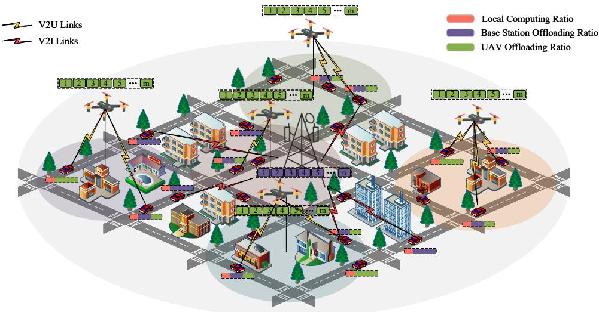  
Fig. 1 System Model

where $P _ { \mathrm { h o v e r } }$ denotes the baseline hovering power, $v _ { \mathrm { r e f } }$ represents the induced power decay factor, and $c _ { d }$ is the aerodynamic drag coefficient.

For vertical maneuvering, the asymmetry of gravity work dictates that ascent requires overcoming gravitational potential while descent allows for limited energy recovery. The vertical power $P _ { v } ( v _ { z } )$ is defined as:

$$
P _ { v } ( v _ { z } ) = \left\{ \begin{array} { l l } { m g v _ { z } + c _ { v } v _ { z } ^ { 2 } , } & { v _ { z } > 0 , } \\ { \alpha \cdot m g v _ { z } , } & { v _ { z } \leq 0 , } \end{array} \right.\tag{6}
$$

where $v _ { z }$ is the vertical velocity (positive upwards) and $\alpha \in ( 0 , 1 )$ is the energy reduction coefficient during descent. Consequently, combining the ancillary power $P _ { \mathrm { a n c } }$ of onboard electronics, the total energy consumption $E ^ { u } ( t _ { k } )$ over a time slot $t _ { k }$ is calculated as:

$$
\begin{array} { r } { E ^ { u } ( t _ { k } ) \approx ( P _ { h } ( v _ { x y , t _ { k } } ) + P _ { v } ( v _ { z } , t _ { k } ) + P _ { \mathrm { a n c } } ) \cdot \Delta t . } \end{array}\tag{7}
$$

## B. Communication Model

This paper considers a complex urban environment, where all vehicles are assumed to be within the coverage area of the BS. The BS establishes communication with vehicles through V2I links. The three-dimensional coordinates of the base station are denoted as $\mathbf { b } = \left( x _ { I } , y _ { I } , z _ { I } \right)$

According to 5G NR-V2X technology, vehicles communicate with the BS via V2I links, and with UAVs via groundto-air (G2A) links. It is assumed that the V2I and G2A communication links share the same frequency bandwidth $B ,$ which is divided into different resource blocks in both frequency and time slots.

Therefore, each V2I and G2A link transmits data over orthogonal frequency bands corresponding to their allocated bandwidths $B _ { m } ^ { I } ( t _ { k } )$ and $B _ { m } ^ { u } ( t _ { k } )$ , respectively, within their corresponding time slots. These satisfy the following constraint:

$$
\sum _ { m = 1 } ^ { M } B _ { m } ^ { I } ( t _ { k } ) + \sum _ { u = 1 } ^ { U } \sum _ { m = 1 } ^ { M } \alpha _ { m } ^ { u } ( t _ { k } ) B _ { m } ^ { u } ( t _ { k } ) \le B ,\tag{8}
$$

where

$$
\alpha _ { m } ^ { u } ( t _ { k } ) = \left\{ \begin{array} { l l } { 1 , } & { d _ { m } ^ { h , u } ( t _ { k } ) \leq R _ { u } ( t _ { k } ) , } \\ { 0 , } & { d _ { m } ^ { h , u } ( t _ { k } ) > R _ { u } ( t _ { k } ) , } \end{array} \right.\tag{9}
$$

where $d _ { m } ^ { h , u } ( t _ { k } )$ denotes the horizontal distance between UAV u and vehicle m at time slot $t _ { k } .$ . Initially, $\alpha _ { m } ^ { u } ( t _ { k } )$ indicates whether vehicle $m$ is within the coverage $R _ { u } ( t _ { k } )$ of UAV u. Since a vehicle connects to at most one UAV, $\alpha _ { m } ^ { u } ( t _ { k } )$ is postprocessed as a one-hot association indicator: if covered by multiple UAVs, only the selected target UAV’s indicator is set to 1, while others are forced to $0 ;$ if uncovered, all $\alpha _ { m } ^ { u } ( t _ { k } )$ remain 0. The optimal UAV selection strategy is elaborated in Section II-C. Due to the wireless signal of V2I communication experiencing free-space path loss, shadow fading, and fast fading, taking into account the transmit antenna gain of the vehicle and the receive antenna gain of the base station, the received power at the base station from vehicle m at time slot $t _ { k }$ can be described as:

$$
\begin{array} { r l } & { P _ { r x , m } ^ { I } ( t _ { k } ) = P _ { t x , m } ^ { I } ( t _ { k } ) - L _ { m } ^ { I } ( t _ { k } ) + S _ { m } ( t _ { k } ) } \\ & { ~ + F _ { m , r } ^ { I } ( t _ { k } ) + G _ { m } ^ { t } + G _ { I } ^ { r } , ~ \forall k } \end{array}\tag{10}
$$

where $P _ { t x , m } ^ { I } ( t _ { k } )$ denotes the transmit power of vehicle m communicating with the base station at time slot $t _ { k }$ $\begin{array} { l l l } { L _ { m } ^ { I } ( t _ { k } ) } & { = } & { 1 2 8 . 1 \ + \ 3 7 . 6 \ \times \ \log _ { 1 0 } { \frac { d _ { m } ^ { I } ( t _ { k } ) } { 1 0 0 0 } } } \end{array}$ represents the path loss. Here, the distance is calculated as $d _ { m } ^ { I } ( t _ { k } ) ~ =$ $\sqrt { ( x _ { m } ( t _ { k } ) - x _ { I } ) ^ { 2 } + ( y _ { m } ( t _ { k } ) - y _ { I } ) ^ { 2 } + ( z _ { m } - z _ { I } ) ^ { 2 } }$ , where $z _ { m }$ denotes the common antenna height of all vehicles.

The shadow fading is modeled as $S _ { m } ^ { t _ { k } } = e ^ { - \frac { \Delta d _ { m } } { D _ { c } } } S _ { m } ( t _ { k - 1 } ) +$ $\sqrt { 1 - e ^ { - \frac { 2 \Delta d _ { m } } { D _ { c } } } \ N ( 0 , \sigma _ { s } ) }$ , where $\Delta d _ { m }$ represents the moving distance of vehicle m within a single time slot, $D _ { c }$ denotes the decorrelation distance, and $\sigma _ { s }$ is the standard deviation of shadow fading. The fast fading is expressed as $F _ { m , r } ^ { I } ( t _ { k } ) =$ $2 0 \log _ { 1 0 } \left| h _ { m , r } ( t _ { k } ) \right|$ , where $h _ { m , r } ( t _ { k } )$ is the Rayleigh distributed random variable representing the fast fading of vehicle m on the allocated resource block $r . \ G _ { m } ^ { t }$ denotes the transmit power gain of vehicle $m ,$ and $G _ { I } ^ { r }$ represents the receive power gain of the base station. Based on this, the data rate of V2I communication can be expressed as:

$$
R _ { m } ^ { I } ( t _ { k } ) = { B } _ { m } ^ { I } ( t _ { k } ) \log _ { 2 } \left( 1 + \frac { P _ { t o t a l , m } ^ { I } ( t _ { k } ) } { N _ { m } ^ { I } ( t _ { k } ) } \right) , \quad \forall t _ { k }\tag{11}
$$

where $P _ { t o t a l , m } ^ { I } ( t _ { k } ) ~ = ~ 1 0 ^ { \frac { P _ { r x , m } ^ { I } ( t _ { k } ) } { 1 0 } }$ denotes the linear-scale transmission power of vehicle m communicating with the base station at time slot $t _ { k }$ , where $N _ { m } ^ { I } ( t _ { k } )$ represents the linearscale noise power at time slot $t _ { k }$

The UAV provides task offloading services to vehicles in the air. Since the UAV operates in an open-sky environment, G2A communication has relatively high LoS connectivity [40]. Based on the path loss model [37], at time slot $t _ { k } ,$ the probability that vehicle m has LoS transmission with UAV u can be calculated as follows:

$$
P _ { m , u } ^ { L o S } ( t _ { k } ) = \frac { 1 } { 1 + \omega _ { a } \exp { \left( - \omega _ { b } \left( \arcsin \frac { z _ { u } ( t _ { k } ) } { d _ { m , u } ( t _ { k } ) } - \omega _ { a } \right) \right) } } ,\tag{12}
$$

where

$$
d _ { m , u } ( t _ { k } ) = \sqrt { \left( \Delta x ( t _ { k } ) \right) ^ { 2 } + \left( \Delta y ( t _ { k } ) \right) ^ { 2 } + \left( \Delta z ( t _ { k } ) \right) ^ { 2 } } ,\tag{13}
$$

where $\Delta x ( t _ { k } ) = x _ { m } ( t _ { k } ) - x _ { u } ( t _ { k } )$ denotes the difference in the x-coordinates between UAV u and vehicle $m .$ . The terms $\Delta y ( t _ { k } )$ and $\Delta z ( t _ { k } )$ are defined similarly for the y and z axes, respectively. $\omega _ { a }$ and $\omega _ { b }$ are constants describing the propagation environment characteristics. It can be seen that the LoS probability between the vehicle and UAV depends on their relative positions and heights. The LoS probability depends on the elevation angle between the vehicle and the UAV. Correspondingly, the probability of non-line-of-sight (NLoS) propagation can be expressed as:

$$
P _ { m , u } ^ { \mathrm { N L o S } } ( t _ { k } ) = 1 - P _ { m , u } ^ { \mathrm { L o S } } ( t _ { k } ) .\tag{14}
$$

The path loss during LoS and NLoS transmission can be expressed as:

$$
C _ { m , u } ^ { \mathrm { L o S } } ( t _ { k } ) = C _ { m , u } ^ { \mathrm { F S } } ( t _ { k } ) + \eta _ { \mathrm { L o S } } ,\tag{15}
$$

$$
C _ { m , u } ^ { \mathrm { N L o S } } ( t _ { k } ) = C _ { m , u } ^ { \mathrm { F S } } ( t _ { k } ) + \eta _ { \mathrm { N L o S } } ,\tag{16}
$$

where $\begin{array} { r } { C _ { m , u } ^ { \mathrm { F S } } ( t _ { k } ) = 2 0 \log _ { 1 0 } ( \frac { 4 \pi d _ { m , u } ^ { u } ( t _ { k } ) f _ { v } } { V _ { c } } ) } \end{array}$ , and $\eta _ { L o S }$ denotes the excess path loss associated with LoS conditions, ηN $L o S$ denotes the excess path loss for NLoS, and $f _ { v }$ represents the carrier frequency for G2A communication. Therefore, the average G2A path loss can be represented as:

$$
C _ { m } ^ { u } ( t _ { k } ) = C _ { m , u } ^ { F S } ( t _ { k } ) + P _ { m , u } ^ { L o S } ( t _ { k } ) \eta _ { L o S } + P _ { m , u } ^ { N L o S } ( t _ { k } ) \eta _ { N L o S } .\tag{17}
$$

Substituting $P _ { m , u } ^ { N L o S } ( t _ { k } ) ~ = ~ 1 - \ : P _ { m , u } ^ { L o S } ( t _ { k } )$ into the above expression, it can be simplified as:

$$
C _ { m } ^ { u } ( t _ { k } ) = C _ { m , u } ^ { F S } ( t _ { k } ) + P _ { m , u } ^ { L o S } ( t _ { k } ) \big ( \eta _ { L o S } - \eta _ { N L o S } \big ) + \eta _ { N L o S } .\tag{18}
$$

Since the vehicle is in high-speed motion, according to the Lais fall model, the channel shadowing of vehicle m at time slot $t _ { k }$ and resource block r can be calculated as: $F _ { m , r } ( t _ { k } ) =$ $2 0 \log _ { 1 0 } \Big ( \sqrt { \textstyle { \frac { K } { K + 1 } } } e ^ { j \theta _ { m , r } ( t _ { k } ) } + \sqrt { \textstyle { \frac { 1 } { K + 1 } } } \sqrt { \textstyle { \frac { 1 } { 2 } } } \big ( N ^ { ( 0 , 1 ) } + j N ^ { ( 0 , 1 ) } \big ) \Big ) .$

Therefore, the received power can be expressed as:

$$
P _ { r , m } ^ { u } ( t _ { k } ) = P _ { t x , m } ^ { u } ( t _ { k } ) - C _ { m } ^ { u } ( t _ { k } ) - F _ { m , r } ( t _ { k } ) + G _ { m } ^ { t } + G _ { u } ^ { r } ,\tag{19}
$$

where $P _ { t x , m } ^ { u } ( t _ { k } )$ denotes the transmit power of vehicle m to UAV $u ,$ and $G _ { u } ^ { r }$ represents the UAV u’s receiving antenna gain. Based on this, the transmission rate between vehicle m and UAV u within the coverage area can be expressed as:

$$
R _ { m , r } ^ { u } ( t _ { k } ) = B _ { m } ^ { u } ( t _ { k } ) \log _ { 2 } \left( 1 + \frac { P _ { r , m , l i n } ^ { u } ( t _ { k } ) } { N _ { m , r } ^ { u } ( t _ { k } ) } \right) ,\tag{20}
$$

where $P _ { r , m , l i n } ^ { u } \big ( t _ { k } \big ) \ = \ 1 0 ^ { \left( \frac { P _ { r , m } ^ { u } ( t _ { k } ) } { 1 0 } \right) } , \ B _ { m } ^ { u } \big ( t _ { k } \big )$ denotes the transmission bandwidth, and $N _ { m , r } ^ { u } ( t _ { k } )$ represents the noise power linear value.

## C. Task Offloading Strategy

In the considered environment, the total task volume each vehicle needs to offload at time $t _ { k }$ is given by $D ( t _ { k } ) \ =$ $\{ D _ { 1 } ( t _ { k } ) , D _ { 2 } ( t _ { k } ) , \ldots , D _ { M } ( t _ { k } ) \}$ . All vehicles are equipped with on-board units (OBUs) that have identical computing frequency $f _ { m }$ . All UAVs carry lightweight aerial servers with computing frequency $f _ { u } .$ . The base station hosts highperformance servers with computing frequency $f _ { I }$

Each vehicle can request service from only one UAV. When covered by multiple UAVs at time $t _ { k } ,$ instead of relying solely on the computational load, vehicle m intelligently selects the target UAV by evaluating a joint channel-aware and load-aware cost metric. Specifically, the selection criterion is formulated to minimize the weighted cost $\Psi _ { m , u } ( t _ { k } ) ~ = ~ \lambda _ { 1 } D _ { u } ( t _ { k } ) ~ + ~$ $\lambda _ { 2 } C _ { m } ^ { u } ( t _ { k } )$ , where $D _ { u } ( t _ { k } )$ denotes the total task load of all vehicles within the coverage area of UAV $u , C _ { m } ^ { u } ( t _ { k } )$ is the realtime average G2A path loss derived in Eq. (17), and $\lambda _ { 1 } , \lambda _ { 2 }$ are normalized importance weights. Vehicle m associates with the UAV $u ^ { * }$ that yields the minimum $\Psi _ { m , u } ( t _ { k } )$ , and the indicator $\alpha _ { m } ^ { u } ( t _ { k } )$ is post-processed accordingly (i.e., $\alpha _ { m } ^ { u ^ { * } } ( t _ { k } ) = 1$ , and $\alpha _ { m } ^ { u } ( t _ { k } ) = 0$ for $u \neq u ^ { * } )$ . Task proportions are independent over time slots, allowing vehicles to offload any portion of their tasks to edge servers. Thus, the offloading strategy for vehicle $m$ at time $t _ { k }$ can be expressed as:

$$
\gamma _ { m } ^ { o } ( t _ { k } ) + \sum _ { u = 1 } ^ { U } \alpha _ { m } ^ { u } ( t _ { k } ) \gamma _ { m } ^ { u } ( t _ { k } ) + \gamma _ { m } ^ { I } ( t _ { k } ) = 1 ,\tag{21}
$$

where $\gamma _ { m } ^ { o } ( t _ { k } )$ and $\gamma _ { m } ^ { I } ( t _ { k } )$ denote the proportions of tasks computed locally and offloaded to the base station, respec-$\mathrm { t i v e l y } ; \ \gamma _ { m } ^ { u } ( t _ { k } )$ is the proportion offloaded to UAV u. When $\begin{array} { r } { \sum _ { u = 1 } ^ { U } \alpha _ { m } ^ { u } ( t _ { k } ) = 0 } \end{array}$ , vehicle $m$ is outside all UAVs’ coverage and cannot offload tasks to them; otherwise, it is served by the uniquely associated UAV.

Based on the above task partitioning, the computation delay of task offloading can be calculated as follows:

$$
\left\{ \begin{array} { l l } { T _ { m } ^ { o } ( t _ { k } ) = \frac { \gamma _ { m } ^ { o } ( t _ { k } ) D _ { m } ( t _ { k } ) c } { f _ { m } } , } \\ { T _ { m } ^ { u } ( t _ { k } ) = \frac { \gamma _ { m } ^ { u } ( t _ { k } ) D _ { m } ( t _ { k } ) c } { f _ { u } } , } \\ { T _ { m } ^ { I } ( t _ { k } ) = \frac { \gamma _ { m } ^ { I } ( t _ { k } ) D _ { m } ( t _ { k } ) c } { f _ { I } } , } \end{array} \right.\tag{22}
$$

where c represents the number of CPU cycles required to process one bit of data. The transmission delay for vehicle offloading task can be calculated as:

$$
\begin{array} { r } { \left\{ { { T } _ { m } ^ { V 2 I } } ( t _ { k } ) = \frac { \gamma _ { m } ^ { I } ( t _ { k } ) D _ { m } ( t _ { k } ) } { { { R } _ { m } ^ { I } } ( t _ { k } ) } , \right. } \\ { \left. T _ { m } ^ { G 2 A } ( t _ { k } ) = \frac { \gamma _ { m } ^ { u } ( t _ { k } ) D _ { m } ( t _ { k } ) } { { { R } _ { m } ^ { u } } ( t _ { k } ) } . \right. } \end{array}\tag{23}
$$

Since each UAV serves multiple vehicles, task execution is assumed to follow a FIFO discipline. Consequently, the queuing delay for vehicle m’s task is calculated as:

$$
\begin{array} { r } { T _ { m , u } ^ { q u e } ( t _ { k } ) = \operatorname* { m a x } \{ \tau _ { m , u } ^ { a r } ( t _ { k } ) , \tau _ { u } ^ { l a s t } ( t _ { k } ) \} - \tau _ { m , u } ^ { a r } ( t _ { k } ) , } \end{array}\tag{24}
$$

where $\tau _ { m , u } ^ { a r } ( t _ { k } )$ represents the time when vehicle m’s data arrives at UAV u, and $\tau _ { u } ^ { l a s t } ( t _ { k } )$ represents the current last task processing time in the UAV queue u. Similarly, the waiting delay at the base station can be expressed as:

$$
T _ { m } ^ { q u e } ( t _ { k } ) = \operatorname* { m a x } \left\{ \tau _ { m , I } ^ { a r } ( t _ { k } ) , \tau _ { I } ^ { l a s t } ( t _ { k } ) \right\} - \tau _ { m , I } ^ { a r } ( t _ { k } ) ,\tag{25}
$$

where $\tau _ { m , I } ^ { a r } ( t _ { k } )$ represents the time when data from vehicle m arrives at the base station, and $\tau _ { I } ^ { l a s t } ( t _ { k } )$ is the completion time of the last task in the current queue at the base station.

Due to the limited computing capacity of UAVs and limited queue size, the amount of data offloaded to UAV u at each time slot cannot exceed its computational capacity, i.e.,

$$
0 \leq \sum _ { m = 1 } ^ { M } \alpha _ { m } ^ { u } ( t _ { k } ) \gamma _ { m } ^ { u } ( t _ { k } ) D _ { m } ( t _ { k } ) \leq \frac { f _ { u } \Delta t } { c } ,\tag{26}
$$

where $\Delta t$ denotes the length of one time slot. Similarly, the base station must also impose an upper limit on the offloaded task amount at each time slot:

$$
0 \leq \sum _ { m = 1 } ^ { M } \gamma _ { m } ^ { I } ( t _ { k } ) D _ { m } ( t _ { k } ) \leq \frac { f _ { I } \Delta t } { c } .\tag{27}
$$

Note that since the queue constraints are imposed within each individual time slot and tasks not completed within the slot are considered failed, the system does not involve queue dynamics across multiple slots. Therefore, there is no need to apply Lyapunov optimization methods, which are typically used to ensure long-term queue stability.

## D. Optimization Problem

The optimization objective is to minimize both energy consumption and system delay. Given the parallel execution of computation and transmission tasks, the total delay is formulated as:

$$
T = \sum _ { t _ { k } = 1 } ^ { K } \sum _ { m = 1 } ^ { M } T _ { m } ( t _ { k } ) ,\tag{28}
$$

where:

$$
\begin{array} { l } { { \displaystyle T _ { m } ( t _ { k } ) = \mathrm { m a x } \bigg \{ T _ { m } ^ { o } ( t _ { k } ) , \sum _ { u = 1 } ^ { U } \alpha _ { m } ^ { u } ( t _ { k } ) \big ( T _ { m , u } ^ { G 2 A } ( t _ { k } ) + T _ { m , u } ^ { q u e } ( t _ { k } ) } } \\ { { ~ + T _ { m } ^ { u } ( t _ { k } ) \big ) , ~ T _ { m } ^ { V 2 I } ( t _ { k } ) + T _ { m } ^ { q u e } ( t _ { k } ) + T _ { m } ^ { I } ( t _ { k } ) \bigg \} . } } \end{array}\tag{29}
$$

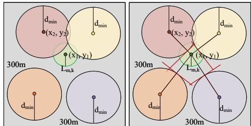  
Fig. 2 Collision Avoidance Constraint Illustration

Under ideal conditions, all vehicle computation tasks should be completed within the task deadline, thus the following constraint holds:

$$
T _ { m } ( t _ { k } ) \leq T _ { m } ^ { m a x } ( t _ { k } ) .\tag{30}
$$

Considering the resource constraints in practical environments, it is difficult for all vehicles to satisfy this constraint. To ensure fairness in resource competition among vehicles and to avoid that vehicles with loose time requirements occupy resources at the expense of vehicles with tight deadlines, we introduce a delay exceeding penalty $\xi _ { m }$ . Then the delay constraint becomes:

$$
T _ { m } ( t _ { k } ) \leq T _ { m } ^ { m a x } ( t _ { k } ) + \xi _ { m } ( t _ { k } ) .\tag{31}
$$

Considering the different delay scales of various vehicle tasks, we transform the optimization objective into normalized delay based on task time constraints. Eq. (28) can be rewritten as:

$$
T = \sum _ { t _ { k } = 1 } ^ { K } \sum _ { m = 1 } ^ { M } { \frac { T _ { m } ( t _ { k } ) } { T _ { m } ^ { m a x } ( t _ { k } ) } } .\tag{32}
$$

Considering the energy consumption during communication between vehicles, UAVs, and BS, as well as the energy consumed by vehicles, UAVs, and base stations for computation, the transmission energy consumed by vehicles for offloading tasks to the base station and UAV can be expressed as:

$$
\left\{ \begin{array} { l l } { E _ { m } ^ { V 2 I } ( t _ { k } ) = P _ { m } ^ { I } T _ { m } ^ { V 2 I } ( t _ { k } ) , } \\ { E _ { m } ^ { G 2 A } ( t _ { k } ) = P _ { m } ^ { u } T _ { m } ^ { G 2 A } ( t _ { k } ) . } \end{array} \right.\tag{33}
$$

The energy consumed by vehicles, UAVs, and base stations for data processing can be calculated by the following formulas:

$$
\left\{ \begin{array} { l l } { E _ { m } ^ { o } ( t _ { k } ) = \kappa f _ { m } ^ { 3 } T _ { m } ^ { o } ( t _ { k } ) , } \\ { E _ { m } ^ { u } ( t _ { k } ) = \kappa f _ { u } ^ { 3 } T _ { m } ^ { u } ( t _ { k } ) , } \\ { E _ { m } ^ { I } ( t _ { k } ) = \kappa f _ { I } ^ { 3 } T _ { m } ^ { I } ( t _ { k } ) , } \end{array} \right.\tag{34}
$$

where $\kappa \geq 0$ denotes the effective switched capacitance. The flight energy consumption of the UAVs can be calculated according to Eq. (7). Therefore, the total system energy consumption can be expressed as:

$$
\begin{array} { l } { E = \displaystyle \sum _ { t _ { k } = 1 } ^ { K } \sum _ { m = 1 } ^ { M } \bigg ( E _ { m } ^ { o } ( t _ { k } ) + E _ { m } ^ { V 2 I } ( t _ { k } ) + E _ { m } ^ { I } ( t _ { k } ) } \\ { + \displaystyle \sum _ { u = 1 } ^ { U } \alpha _ { m } ^ { u } ( t _ { k } ) \big ( E _ { m } ^ { G 2 A } ( t _ { k } ) + E _ { m } ^ { u } ( t _ { k } ) \big ) \bigg ) + \displaystyle \sum _ { t _ { k } = 1 } ^ { K } \sum _ { u = 1 } ^ { U } E ^ { u } ( t _ { k } ) . } \end{array}\tag{35}
$$

Therefore, by jointly optimizing the UAV’s 3D coordinates $\begin{array} { r c l } { \mathcal { C } _ { u } } & { = } & { \big ( x _ { u } ( t _ { k } ) , y _ { u } ( t _ { k } ) , z _ { u } ( t _ { k } ) \big ) } \end{array}$ , the vehicle’s transmission power $\dot { P _ { m } ^ { u } } ( t _ { k } )$ and $P _ { m } ^ { I } ( t _ { k } )$ , the allocation ratios $\gamma _ { m } ^ { o } ( t _ { k } )$ $\gamma _ { m } ^ { u } ( t _ { k } ) , \ \gamma _ { m } ^ { I } ( t _ { k } )$ for vehicle tasks, and the resource block allocation R, the objective function can be minimized. The final optimization problem can be expressed as:

$$
\operatorname* { m i n } _ { \mathcal { C } _ { u } , P } \quad \omega _ { 1 } T + \omega _ { 2 } E + \omega _ { 3 } \sum _ { m = 1 } ^ { M } \xi _ { m }\tag{36a}
$$

$$
\begin{array} { r } { \mathrm { s . t . \quad 0 \leq \gamma } _ { m } ^ { o } ( t _ { k } ) \leq 1 , \quad \forall m , } \end{array}\tag{36b}
$$

$$
0 \leq \gamma _ { m } ^ { u } ( t _ { k } ) \leq 1 , \quad \forall m , \forall u ,\tag{36c}
$$

$$
0 \leq \gamma _ { m } ^ { I } ( t _ { k } ) \leq 1 , \quad \forall m ,\tag{36d}
$$

$$
\gamma _ { m } ^ { o } ( t _ { k } ) + \alpha _ { m } ^ { u } ( t _ { k } ) \gamma _ { m } ^ { u } ( t _ { k } ) + \gamma _ { m } ^ { I } ( t _ { k } ) = 1 , \ \forall m , \forall u ,\tag{36e}
$$

$$
v _ { u } ( t _ { k } ) \leq v _ { m a x } ,\tag{36f}
$$

$$
0 \leq P _ { m } ^ { u } ( t _ { k } ) \leq P _ { m } ^ { \operatorname* { m a x } } , \quad \forall m ,\tag{36g}
$$

$$
0 \leq P _ { m } ^ { I } ( t _ { k } ) \leq P _ { m } ^ { \operatorname* { m a x } } , \quad \forall m ,\tag{36h}
$$

$$
\alpha _ { m } ^ { u } ( t _ { k } ) \in \{ 0 , 1 \} , \quad \forall m , \forall u ,\tag{36i}
$$

$$
\xi _ { m } \ge 0 , \quad \forall m\tag{36j}
$$

$$
\mathrm { C o n s t r a i n t s \ ( 1 ) , \ ( 3 ) , \ ( 4 ) , \ ( 8 ) , \ ( 2 6 ) , \ ( 2 7 ) , \ ( 3 1 ) . }\tag{36k}
$$

where ω , ω and ω represent the weights of system delay, energy consumption and delay exceeding penalty, respectively. Constraints (36b)–(36e) limit the offloading ratios of vehicle tasks; constraints (36g)–(36h) limit the transmission power range of vehicles; constraint (36i) indicates whether vehicle m is covered by UAV u. Eq. (1) restricts the UAV’s motion space, and constraint (36f) restricts the UAV’s max speed. Eq.(3) constrains the minimum distance between any two UAVs. $\operatorname { E q . } ( 4 )$ describes the maximum displacement limit of UAVs between consecutive time slots. Eq. (8) limits the system bandwidth allocation. Eq. (26)–(27) constrain the maximum data amount offloaded to the base station and UAV. Eq. (31) restricts the delay upper bound for each vehicle task. Due to strong coupling among variables and integer constraints, this is a highly complex optimization problem. We decompose it into three subproblems to find an approximate optimal solution.

## III. PROBLEM DECOMPOSITION AND SOLUTION

In this section, we decompose the optimization problem into three subproblems: UAV trajectory planning, resource allocation, and task proportion assignment. By integrating DRL, LLMs, convex optimization, and linear programming methods, approximate optimal solutions are obtained.

## A. UAV Trajectory Planning Problem

1) Convexification and Constraint Transformation: To formulate a tractable convex optimization problem, both the nonconvex energy consumption model and the collision avoidance constraints must be appropriately transformed.

First, the theoretical propulsion power model presented in the system model is fundamentally non-convex. Specifically, the horizontal flight power $P _ { h } ( v )$ consists of profile power, induced power, and parasitic power. To incorporate energy awareness into the convex planning framework, we mathematically approximate the non-convex model by applying a second-order Taylor expansion around the hovering state $( v = 0 )$ . For the complex induced power term, let $\begin{array} { r } { \delta = \frac { v ^ { 2 } } { 2 v _ { 0 } ^ { 2 } } . } \end{array}$ where $v _ { 0 }$ is the mean induced velocity in hover. In the lowto-medium speed regime $( \delta \ll 1 )$ , the induced power can be expanded and approximated as:

$$
P _ { \mathrm { i n d } } ( v ) = P _ { i } \left( { \sqrt { 1 + \delta ^ { 2 } } } - \delta \right) ^ { 1 / 2 } \approx P _ { i } \left( 1 - \delta \right) ^ { 1 / 2 }
$$

$$
\approx P _ { i } \left( 1 - \frac { 1 } { 2 } \delta \right) = P _ { i } - P _ { i } \frac { v ^ { 2 } } { 4 v _ { 0 } ^ { 2 } } .\tag{37}
$$

This derivation reveals the translational lift effect, where the induced power decreases quadratically with airspeed. Combining this with the profile power $\begin{array} { r } { P _ { 0 } ( 1 + \frac { 3 v ^ { 2 } } { U _ { \mathrm { t i p } } ^ { 2 } } ) } \end{array}$ ) and bounding the cubic parasitic drag $c _ { d } v ^ { 3 }$ , the total horizontal power $P _ { h } ( v )$ is convexified by constructing a quadratic upper bound:

$$
P _ { h } ( v ) \approx ( P _ { 0 } + P _ { i } ) + \left( \frac { 3 P _ { 0 } } { U _ { \mathrm { t i p } } ^ { 2 } } - \frac { P _ { i } } { 4 v _ { 0 } ^ { 2 } } \right) v ^ { 2 } + c _ { d } v ^ { 3 }\tag{38}
$$

$$
\leq P _ { \mathrm { h o v e r } } + \mu v ^ { 2 } ,
$$

where $P _ { \mathrm { h o v e r } } ~ = ~ P _ { 0 } + P _ { i }$ is the baseline hovering power, and $\mu \geq 0$ is a fitted regularization coefficient ensuring the convexity. In a discrete-time framework with time step $\Delta t ,$ the horizontal energy cost for UAV i is proportional to its squared Euclidean displacement, i.e., $E _ { h , i } \propto \| \mathbf { p } _ { i } - \mathbf { p } _ { i } ^ { \mathrm { p r e v } } \| _ { 2 } ^ { 2 }$ which is strictly convex.

For vertical maneuvering, the energy consumption exhibits asymmetry: overcoming gravity requires significant power, whereas descending consumes less energy. To capture this physical behavior within a convex formulation, we model the vertical energy cost using a piecewise linear function of the altitude change $\Delta z _ { i } = z _ { i } - z _ { i } ^ { \mathrm { p r e v } }$

$$
E _ { v , i } = w _ { \mathrm { u p } } [ \Delta z _ { i } ] ^ { + } + w _ { \mathrm { d o w n } } [ - \Delta z _ { i } ] ^ { + } ,\tag{39}
$$

where $[ x ] ^ { + } = \operatorname* { m a x } ( x , 0 )$ is the convex rectification function, and $w _ { \mathrm { u p } } > w _ { \mathrm { d o w n } }$ are weight coefficients penalizing altitude gain more heavily than altitude loss. The total convexified energy cost is the sum of the horizontal and vertical terms.

Regarding the $\mathrm { U A V } _ { \mathrm { \Delta } }$ motion space, the flight constraints (1)(3)(4) must be simultaneously satisfied. Among these, all constraints except the collision avoidance condition are linear or second-order cone constraints. The feasible region within a single time slot is the intersection of the maximum horizontal flight distance circle, the environment boundary, and the exteriors of exclusion circles of radius $d _ { \mathrm { m i n } }$ centered at all other UAVs. As illustrated in the left subfigure of Fig. 2, this region may be non-convex when the flight distance circle overlaps with one or more exclusion circles.

To simplify the problem, a stricter tangent constraint is introduced to guarantee the minimum safety distance. As shown in the right subfigure of Fig. 2, the non-convex feasible region is convexified by replacing the circular collision avoidance boundary with a tangent line drawn at the intersection point of the inter-UAV line segment and the avoidance circle. Since the constraint operates solely in the horizontal plane, it is conservative with respect to altitude; nevertheless, altitude control remains explicitly incorporated in the motion planning to ensure full 3D safety compliance.

In a two-dimensional Cartesian coordinate system, let the current UAV be at $( x _ { 1 } , y _ { 1 } )$ and another UAV at $( x _ { 2 } , y _ { 2 } )$ , with $( x _ { 2 } , y _ { 2 } )$ located above and to the left. The equation of the line segment between them is:

$$
y = { \frac { y _ { 1 } - y _ { 2 } } { x _ { 1 } - x _ { 2 } } } x + { \frac { x _ { 1 } y _ { 2 } - x _ { 2 } y _ { 1 } } { x _ { 1 } - x _ { 2 } } } , \quad x _ { 1 } \neq x _ { 2 }\tag{40}
$$

where $x _ { 2 } \leq x \leq x _ { 1 }$ and $y _ { 1 } \le y \le y _ { 2 }$ . The tangent constraint line passing through the point $( x _ { 2 } , y _ { 2 } )$ at a distance of $d _ { \mathrm { m i n } }$ from the line segment can be expressed as:

$$
a x + b y + c \leq 0 ,\tag{41}
$$

where $a , b ,$ and c represent the coefficients of the tangent line. For this constraint, the following inequality holds:

$$
a x _ { 1 } + b y _ { 1 } + c \leq 0 ,\tag{42}
$$

which indicates that the tangent line’s constraint direction is on the side where the current UAV is located, away from the other UAV. Note that if all UAVs are initially deployed such that the minimum horizontal distance constraint is satisfied, and the planned trajectories strictly adhere to the tangent constraints at each time slot, then the current UAV will always remain on the safe side of the tangent line, thus maintaining a safe distance from other UAVs.

Under the condition that the UAV remains within the collision avoidance constraint circle, the following inequality must be satisfied simultaneously except inequality (42):

$$
a x _ { 2 } + b y _ { 2 } + c \geq 0 .\tag{43}
$$

By constructing these tangent constraints for the remaining $U - 1$ UAVs, the feasible movement region for the current UAV within each time slot forms a convex set.

2) Sub-Optimization Objectives and Problem Formulation: Considering the consistency between the sub-objectives and the overall optimization objective, the UAV’s flight trajectory must balance coverage quality, communication path loss, and energy consumption. Since poor coverage reduces the available UAV computing resources and flying at excessively high altitudes increases the path loss, the sub-objectives need to jointly consider both coverage and the UAV’s flight altitude. Furthermore, the UAVs’ continuous movement requires significant energy, making energy minimization a crucial component of trajectory planning.

Based on the above analysis, for a single UAV $i ,$ the initial theoretical optimization objective can be constructed as balancing coverage and altitude:

$$
\sum _ { j = 1 } ^ { m } - s _ { j } ^ { l } + \omega _ { h } h _ { i } ,\tag{44}
$$

where:

$$
s _ { j } ^ { l } = \left\{ \begin{array} { l l } { 1 , } & { \sqrt { ( x _ { j } - x _ { i } ) ^ { 2 } + ( y _ { j } - y _ { i } ) ^ { 2 } } \leq z _ { i } \tan ( \theta _ { \operatorname* { m a x } } ) } \\ { 0 , } & { \sqrt { ( x _ { j } - x _ { i } ) ^ { 2 } + ( y _ { j } - y _ { i } ) ^ { 2 } } > z _ { i } \tan ( \theta _ { \operatorname* { m a x } } ) } \end{array} \right. ,\tag{45}
$$

where $x _ { j } , y _ { j }$ denote the position coordinates of vehicle $j ,$ and $x _ { i } , y _ { i } , z _ { i }$ denote the 3D coordinates of UAV i. $\theta _ { \mathrm { m a x } }$ is the maximum beam angle, and thus $z _ { i } \tan ( \theta _ { \mathrm { m a x } } )$ represents the effective coverage radius. $s _ { j } ^ { l }$ is an integer variable indicating whether vehicle $j$ is within the $\mathrm { U A V } _ { \mathrm { \Delta } }$ coverage area. Due to the integer variables, this constitutes an integer programming problem. By applying linear relaxation, $s _ { j } ^ { l }$ can be relaxed into a continuous variable $s _ { j } ~ \in ~ [ 0 , 1 ]$ . To formulate a tractable convex problem and directly optimize the altitude $z _ { i } ,$ we convert the coverage condition into a Second-Order Cone (SOC) constraint:

$$
\sqrt { ( x _ { j } - x _ { i } ) ^ { 2 } + ( y _ { j } - y _ { i } ) ^ { 2 } } \leq z _ { i } \tan ( \theta _ { \operatorname* { m a x } } ) + M ( 1 - s _ { j } ) ,\tag{46}
$$

where $0 \ \leq \ s _ { j } \ \leq \ 1$ , and M represents a sufficiently large constant to ensure the constraint holds when $s _ { j } = 0$

However, simple relaxation may yield meaningless fractional values for $s _ { j }$ , failing to capture the actual coverage. To mitigate this, we introduce a soft penalty $N _ { j }$ , apply a tighter localized bound instead of M, and weight it by the vehicle’s instantaneous load $D _ { j }$

Moreover, to address the energy consumption, we introduce the energy cost function $J _ { \mathrm { e n g } , i }$ by incorporating the convexified power models derived in the previous subsection. Specifically, combining the quadratic horizontal energy approximation from (38) and the piecewise linear vertical energy from (39), the energy cost function is defined as:

$$
\begin{array} { r l } & { J _ { \mathrm { e n g } , i } = w _ { \mathrm { e n g } } \Big ( c _ { x y } \underbrace { \| \mathbf { p } _ { i } - \mathbf { p } _ { i } ^ { \mathrm { p } } \| _ { 2 } ^ { 2 } } _ { \mathrm { f r o m } \mathrm { E q } . ~ ( 3 8 ) } } \\ & { \qquad + \underbrace { c _ { \mathrm { u p } } [ z _ { i } - z _ { i } ^ { \mathrm { p } } ] ^ { + } + c _ { \mathrm { d o w n } } [ - ( z _ { i } - z _ { i } ^ { \mathrm { p } } ) ] ^ { + } } _ { \mathrm { f r o m } \mathrm { E q } . ~ ( 3 9 ) } \Big ) , } \end{array}\tag{47}
$$

where the first term accounts for the horizontal energy proportional to the squared displacement, and the subsequent terms model the asymmetric vertical energy. Here, $\mathbf { p } _ { i } = ( x _ { i } , y _ { i } )$ , and $[ x ] ^ { + } = \operatorname* { m a x } ( x , 0 )$ denotes the convex rectification.

Considering the difficulty of simultaneously optimizing multiple UAV positions with collision avoidance constraints, we adopt a sequential distributed optimization method. By limiting the sensing range $s _ { r } ,$ the UAV focuses on the local vehicle distribution. For UAV i, the comprehensive convex optimization problem is expressed as follows:

$$
\operatorname* { m i n } _ { x _ { i } , y _ { i } , z _ { i } , \mathbf { \boldsymbol { i } } } ~ \beta _ { 1 } \sum _ { j = 0 } ^ { n _ { i , \mathrm { l o c a l } } - 1 } r _ { j } + \beta _ { 2 } \sum _ { j = 0 } ^ { n _ { i , \mathrm { l o c a l } } - 1 } N _ { j } + \beta _ { 3 } z _ { i } + J _ { \mathrm { e n g } , i }\tag{48a}
$$

s.t. Constraints (3), (42),

(48b)

$$
\begin{array} { r } { \| \mathbf { p } _ { j } - \mathbf { p } _ { i } \| _ { 2 } \leq z _ { i } \tan ( \theta _ { \mathrm { m a x } } ) + M _ { \mathrm { l i n e a r } } ( 1 - s _ { j } ) + N _ { j } , } \end{array}\tag{48c}
$$

$$
s _ { j } ( 2 D _ { j } ) ^ { 2 } \geq - r _ { j } ,\tag{48d}
$$

$$
\| \mathbf { p } _ { i } - \mathbf { p } _ { i } ^ { \mathrm { p } } \| _ { 2 } ^ { 2 } \leq ( l _ { \operatorname* { m a x } } ^ { h } ) ^ { 2 } ,\tag{48e}
$$

$$
x _ { u } ^ { \operatorname* { m i n } } \leq x _ { i } \leq x _ { u } ^ { \operatorname* { m a x } } , \quad y _ { u } ^ { \operatorname* { m i n } } \leq y _ { i } \leq y _ { u } ^ { \operatorname* { m a x } } ,\tag{48f}
$$

$$
z _ { u } ^ { \mathrm { m i n } } \le z _ { i } \le z _ { u } ^ { \mathrm { m a x } } ,\tag{48g}
$$

$$
z _ { i } ^ { \mathrm { p } } - l _ { \mathrm { m a x } } ^ { v } \leq z _ { i } \leq z _ { i } ^ { \mathrm { p } } + l _ { \mathrm { m a x } } ^ { v } ,\tag{48h}
$$

$$
0 \le s _ { j } \le 1 , \quad r _ { \operatorname* { m i n } } \le r _ { j } \le 0 , \quad 0 \le N _ { j } \le N _ { \operatorname* { m a x } } ,\tag{48i}
$$

where $n _ { i , \mathrm { l o c a l } }$ denotes the number of vehicles within the sensing range of UAV i. The vectors $\mathbf { s } , \mathbf { r } .$ , N represent the sets of auxiliary variables $\{ s _ { j } \} , \{ r _ { j } \} , \{ N _ { j } \}$ introduced for convex relaxation. The optimization objective (48a) is a weighted linear combination of load-based coverage slack $r _ { j } ,$ , distance penalty $N _ { j } .$ altitude penalty $z _ { i } ,$ , and the energy cost $J _ { \mathrm { e n g } , i \cdot } \beta _ { 1 }$ $\beta _ { 2 }$ , and $\beta _ { 3 }$ represent the corresponding weights.

Constraints (48b) enforce the minimum separation distance and the tangent-based collision avoidance rules derived in the previous section. Eq. (48c) defines the SOC coverage constraint directly determining the objective values. When a vehicle is inside the $\mathrm { U A V } _ { \mathrm { \Delta } }$ coverage, its distance to the UAV is less than $z _ { i } \tan ( \theta _ { \mathrm { m a x } } )$ , which enforces $N _ { j } = 0$ and $s _ { j } ~ = ~ 1$ . According to Eq. (48d), as $s _ { j }$ increases, the slack variable $r _ { j }$ can take smaller (more negative) values. Reflected in the objective function, smaller values of $N _ { j }$ and $r _ { j }$ are preferred. When the distance exceeds the coverage radius, a trade-off must be made: the solver balances whether to move the UAV (incurring energy cost), increase altitude $z _ { i }$ (increasing path loss penalty), or increase $N _ { j }$ and decrease $s _ { j }$ (abandoning coverage). Constraints (48e) and (48h) limit the UAV’s horizontal and vertical movement distances per time slot. Constraints (48f) and $( 4 8 \mathrm { g } )$ define the boundaries of the 3D environment. Eq. (48i) provides the feasible ranges for the auxiliary variables.

Since all objective terms are convex and all constraints are linear or SOC forms, this is a standard Second-Order Cone Programming (SOCP) problem. It can be directly and efficiently solved using open-source interior-point solvers. To extend this to multi-UAV coordination without relying on a centralized controller, we propose a distributed sequential optimization framework. Specifically, each UAV independently solves its local SOCP problem in a predefined sequence. Upon determining its optimal trajectory, the UAV broadcasts its updated 3D position and the IDs of its covered vehicles via lightweight inter-UAV communication. To prevent redundant coverage and load imbalance, subsequent UAVs employ a cooperative ”masking” mechanism, deliberately excluding the already-covered vehicles from their local objective functions. This proactive distributed strategy strictly ensures collision avoidance while inherently steering the swarm to maximize the global service area.

## B. Resource Scheduling Based on DRL and LLM

Given fixed UAV and vehicle positions, communication link states are determined. However, the strong coupling between transmit power and RB occupancy renders the joint resource and task allocation NP-hard. While task allocation is efficiently solvable via Linear Programming, the high-dimensional hybrid discrete-continuous action space of resource scheduling poses significant challenges to traditional DRL, often leading to performance degradation in unexplored scenarios. To address this, we propose a two-stage mechanism: utilizing DRL for global centralized initial scheduling, followed by LLM-based task reallocation based on execution outcomes.

1) DRL-Based Centralized Initial Resource Scheduling: We formulate the joint resource block and power allocation problem as a Markov Decision Process (MDP). Given the continuous nature of the action space, the Deep Deterministic Policy Gradient (DDPG) algorithm is employed. At each time step t, the central agent observes the environment state—incorporating UAV trajectory and task offloading decisions—and outputs scheduling actions. The specific definitions of the MDP tuples are as follows:

• State Space: The state captures the network load and channel conditions essential for decision-making. For each vehicle $\begin{array} { c c c } { { i } } & { { \in } } & { { \{ 1 , \ldots , M \} } } \end{array}$ , the local normalized observation $s _ { i }$ consists of the task load $D _ { i }$ , V2I/V2U channel qualities $( Q _ { v 2 i } ^ { i } , Q _ { v 2 u } ^ { i } )$ , and the UAV connection indicator $z _ { 1 } ^ { i } \in \{ 0 , 1 \}$ . The local state $s _ { i }$ and the global state vector $s$ are defined as:

$$
s _ { i } = \{ D _ { i } , Q _ { v 2 i } ^ { i } , Q _ { v 2 u } ^ { i } , z _ { 1 } ^ { i } \} , S = \{ s _ { 1 } , s _ { 2 } , \ldots , s _ { M } \}\tag{49}
$$

• Action Space: Direct allocation of discrete RBs leads to dimensionality explosion. To mitigate this, we decompose the action into continuous power control and resource priority. For vehicle i, the action is defined as $a _ { i } ~ = ~ [ P _ { n o r m } ^ { i } , r _ { f } ^ { i } ]$ , where $P _ { n o r m } ^ { i } ~ \in ~ ( 0 , 1 )$ denotes the normalized transmit power and $r _ { f } ^ { i } \in ( 0 , 1 )$ represents the scheduling priority. The global action vector A maintains a fixed dimension of $M \times 2 .$ . During execution, the environment calculates the RB quota for each vehicle based on the weighted proportion of priorities $r _ { f } .$ , followed by a greedy assignment of specific RB indices based on optimal channel gains.

• Reward Function: To align the learning objective with system optimization, the reward is derived from the LP solution. Upon action execution and resource mapping, the system calculates the current objective function value. The immediate reward is defined as the negative of this cost to guide the agent toward minimization:

$$
r _ { t } = - \left( \omega _ { 1 } T + \omega _ { 2 } E + \omega _ { 3 } \sum ^ { M } \xi _ { m } \right) .\tag{50}
$$

m=1To handle high-dimensional states and continuous action spaces, we design a DDPG-based Actor-Critic architecture utilizing the following neural network structures:

• Actor Network: The policy network $\mu ( s | \theta ^ { \mu } )$ employs a Multi-Layer Perceptron (MLP). To prevent gradient vanishing and accelerate feature extraction, Layer Normalization is applied to the hidden layers. A Sigmoid activation function is used at the output layer to strictly bound the power control factors and priority weights within the (0, 1) interval.

• Critic Network: The value network $Q ( s , a | \theta ^ { Q } )$ adopts a dual-stream architecture. State features $s$ and action features A are extracted via independent linear layers before being concatenated in deep hidden layers. This fused representation is mapped to a scalar Q-value, estimating the expected long-term return.

During training, Gaussian noise is added to the Actor’s output to encourage exploration of the action space. Transitions $\left( { { s _ { t } } , { a _ { t } } , { r _ { t } } , { s _ { t + 1 } } } \right)$ are stored in a Replay Buffer. To ensure training stability and break temporal correlations between sequential data, the networks are updated offline using random mini-batches of size $\boldsymbol { B _ { b a t c h } }$ sampled from the buffer.

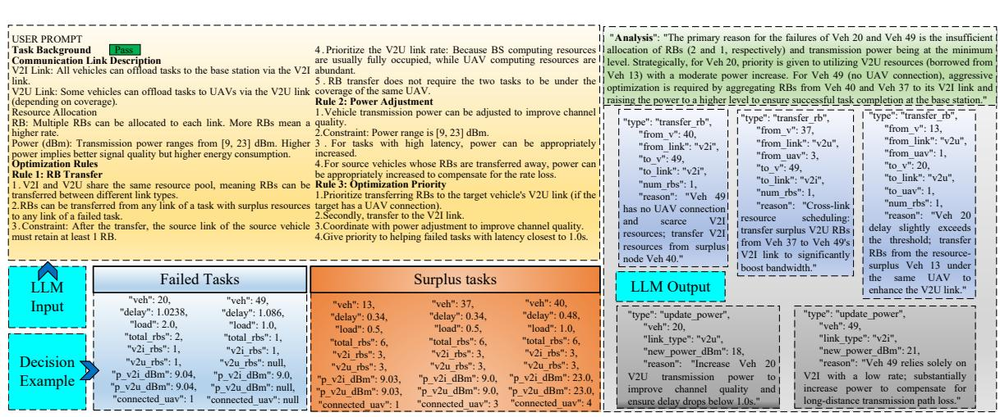  
Fig. 3 LLM Prompts and Decision Examples

The update of the Critic network is based on the Bellman optimality equation. For each sampled transition i, the target Q-value $y _ { i }$ is composed of the immediate reward from the environment and the discounted Q-value of the next state predicted by the target network:

$$
y _ { i } = r _ { i } + \gamma Q ^ { \prime } ( s _ { i + 1 } , \mu ^ { \prime } ( s _ { i + 1 } | \theta ^ { \mu ^ { \prime } } ) | \theta ^ { Q ^ { \prime } } )\tag{51}
$$

where $\gamma$ is the discount factor, and $\mu ^ { \prime }$ and $Q ^ { \prime }$ represent the target Actor and target Critic networks, respectively. The Critic network calculates the loss function by minimizing the Mean Squared Error (MSE) between the online network prediction and the target value:

$$
L ( \theta ^ { Q } ) = \frac { 1 } { B _ { b a t c h } } \sum _ { i = 1 } ^ { B _ { b a t c h } } \left( y _ { i } - Q ( s _ { i } , a _ { i } | \theta ^ { Q } ) \right) ^ { 2 }\tag{52}
$$

Subsequently, the parameters $\theta ^ { Q }$ of the Critic network are updated using the gradient descent method.

The update of the Actor network relies on the Deterministic Policy Gradient theorem. Its optimization objective is to find the policy parameters that maximize the value evaluated by the Critic network. Specifically, the algorithm fixes the parameters of the Critic network, uses the output of the Actor network as the action input to the Critic, and calculates the gradient of the Q-value with respect to the Actor network parameters $\theta ^ { \mu }$ via the chain rule:

$$
\nabla _ { \theta ^ { \mu } } J \approx \frac { 1 } { M } \sum _ { i = 1 } ^ { M } \nabla _ { a } Q ( s , a | \theta ^ { Q } ) | _ { s = s _ { i } , a = \mu ( s _ { i } ) } \cdot \nabla _ { \theta ^ { \mu } } \mu ( s | \theta ^ { \mu } ) | _ { s = s _ { i } }\tag{53}
$$

The Actor network is then updated using the gradient ascent method.

Finally, to ensure training stability, the target networks do not directly copy the parameters of the online networks but instead employ a Soft Update strategy. After each iteration, the target network parameters slowly track the changes in the online network parameters with a very small learning rate τ :

$$
\theta ^ { Q ^ { \prime } }  \tau \theta ^ { Q } + ( 1 - \tau ) \theta ^ { Q ^ { \prime } }\tag{54}
$$

$$
\theta ^ { \mu ^ { \prime } }  \tau \theta ^ { \mu } + ( 1 - \tau ) \theta ^ { \mu ^ { \prime } }\tag{55}
$$

Through the aforementioned interaction and alternating update process, the DRL agent gradually converges to an approximately optimal resource scheduling policy, thereby providing a high-quality initial allocation baseline for outlier assessment and long-tail task reallocation in the subsequent LLM stage.

2) LLM-Based Macro-Adjustment Method: As discussed, while DRL ensures efficient decision-making in typical scenarios, its limited exploration often causes severe performance degradation in long-tail or unexplored environments due to poor generalization. To overcome this inherent limitation, we integrate LLMs into our framework. Pre-trained on massive datasets, LLMs possess strong logical reasoning and generalization capabilities. Leveraged by In-Context Learning (ICL), LLMs can execute zero-shot or few-shot reasoning, demonstrating robust adaptability to novel tasks without retraining [41]. Furthermore, Chain-of-Thought (CoT) prompting enables transparent, human-like inference, providing strong interpretability for the scheduling decisions. Consequently, we propose an LLM-based macro-adjustment framework to monitor and refine DRL-generated policies, effectively alleviating the generalization bottleneck.

Within the alternating optimization framework, given the fixed UAV and vehicle positions, the DRL agent first determines the initial RB and transmit power allocations, followed by the LP-based task offloading scheme. Based on this initial allocation, the system estimates the task completion time for each vehicle to verify compliance with strict latency constraints. This evaluation rapidly identifies two extreme subsets: failed tasks (violating the latency threshold) and surplus tasks (completing well ahead of schedule with abundant redundant resources). Targeting these edge cases, the LLM acts as a centralized macro-scheduler to reallocate communication resources and fine-tune transmit powers. This semantic intervention mitigates resource imbalances and rescues failing tasks, ultimately maximizing the overall task success rate.

Despite the massive parameter scale of typical LLMs, deploying quantized lightweight models at the network edge has become increasingly viable. Furthermore, because our scheduling task relies on highly structured prompts, KV caching can be fully leveraged. By caching the attention keys and values of static prompt prefixes, the system eliminates redundant forward-pass computations during continuous invocations, thereby drastically reducing inference latency and computational overhead at the edge.

To instantiate this framework, a customized prompt template is designed to encode the specific networking constraints. Additionally, advanced large-scale LLMs are utilized offline to generate high-quality scheduling examples, providing fewshot guidance for the deployed edge model. Consequently, the input sequence is structured into three distinct components: the system prompt $( \mathcal { P } _ { s y s } ) _ { : }$ , the few-shot examples $( \mathcal { P } _ { e g } )$ , and the dynamic observation data $( \mathcal { P } _ { d a t a } )$ . This structured input is formally expressed as the concatenated token sequence X :

$$
\mathcal { X } = [ \mathcal { P } _ { s y s } \oplus \mathcal { P } _ { e g } \oplus \mathcal { P } _ { d a t a } ]\tag{56}
$$

where ⊕ denotes the token concatenation operation. The prompt instructions and examples $( \mathcal { P } _ { s y s } \oplus \mathcal { P } _ { e g } )$ typically occupy the vast majority of the context window and remain strictly static. Consequently, their KV cache is pre-computed and stored. The dynamic data portion $\mathcal { P } _ { d a t a }$ , formatted as serialized JSON arrays detailing the failed and surplus tasks, constitutes only a minimal fraction of the tokens, meaning the LLM only needs to compute the attention weights for this newly injected data.

Upon receiving the input sequence X , the LLM conducts contextual analysis and generates a set of adjustment actions alongside a brief reasoning analysis. Based on the system constraints, the LLM is authorized to execute two types of macroactions: RB Transfer and Power Update. For RB transfer, the LLM can intelligently shift resources across different links (e.g., from a surplus V2I link to a failing V2U link), under the hard constraint that the source link must retain at least one RB. For power updates, the transmit power of critically delayed links can be boosted within the feasible bounds $[ P _ { \operatorname* { m i n } } , P _ { \operatorname* { m a x } } ]$ to compensate for poor channel qualities. The output generation process is formulated as:

$$
\mathcal { A } _ { L L M } , \mathcal { R } _ { C o T } \sim \mathrm { L L M } ( \mathcal { X } )\tag{57}
$$

where $\boldsymbol { \mathcal { A } } _ { L L M }$ represents the parsed, strictly JSONformatted list of optimal actions (e.g., transfer\_rb, update\_power), and $\mathcal { R } _ { C o T }$ denotes the natural language rationale explaining the underlying optimization logic. Through this LLM-guided macro-adjustment, the system effectively compensates for the heuristic flaws of the DRL agent in edge-case scenarios, achieving a highly reliable and interpretable resource scheduling paradigm.

Fig. 3 presents the key prompts provided to the LLM alongside a concrete decision-making example. Given the length of the complete prompt, the figure highlights the core decision rules; detailed definitions of actions, the semantics of input data, and the decision background are available in the code repository linked earlier. As observed in the example, the LLM not only clearly specifies the actions to be executed but also articulates the rationales behind them. This significantly enhances the interpretability of the decision-making process, highlighting a unique advantage of utilizing LLMs.

## C. LP-Based Task Offloading Method

Once the UAV trajectory and initial resource allocation are determined, the communication link states are fixed. Consequently, the optimization variables are reduced to task offloading ratios and queuing delays. However, according to equations (24) and (25), queuing delay depends on the specific data arrival order, which is strictly coupled with offloading decisions. This coupling renders the queuing delay incapable of being expressed in a closed form, making the original problem non-convex.

To decouple these variables, we incorporate task offloading into an alternating optimization framework. We introduce an estimated queuing delay parameter $\hat { Q } _ { m } ^ { k }$ for vehicle m at node k (where $k \in \{ I , u \}$ represents the BS or UAV u). To ensure accurate estimation throughout the optimization process, $\hat { Q } _ { m } ^ { k }$ is defined as a piecewise function of the iteration index i:

$$
\hat { Q } _ { m } ^ { k } = \left\{ \begin{array} { l l } { \bar { Q } ^ { k } ( D _ { m } ) , } & { \mathrm { i f ~ } i = 0 } \\ { Q _ { m , \mathrm { p r e v } } ^ { k } , } & { \mathrm { i f ~ } i > 0 } \end{array} \right.\tag{58}
$$

where $Q _ { m , \mathrm { p r e v } } ^ { k }$ denotes the actual queuing delay calculated from the solution of the previous iteration. For the initialization phase $( i = 0 )$ , we employ a load-aware historical average. Let $\mathcal { Q } _ { h i s t } ^ { k } ( D )$ denote the set of historical queuing delays at node k under a specific task load D. The average queuing delay $\hat { Q } ^ { k } ( D _ { m } )$ corresponds to the current task load $D _ { m }$ of vehicle m, calculated as:

$$
\bar { Q } ^ { k } ( D _ { m } ) = \frac { 1 } { | \mathcal { Q } _ { h i s t } ^ { k } ( D _ { m } ) | } \sum _ { q \in \mathcal { Q } _ { h i s t } ^ { k } ( D _ { m } ) } q ,\tag{59}
$$

where | · | denotes the cardinality. During the iterative process $( i > 0 )$ , since the macroscopic load distribution at edge nodes remains relatively stable during LLM fine-tuning, the queuing delay from the previous LP solution serves as a valid estimate.

By fixing the queuing delays to the estimated values $\hat { Q } _ { m } ^ { I }$ and $\hat { Q } _ { m } ^ { u }$ , the overall optimization problem simplifies to a standard LP problem with respect to the offloading ratios γ:

$$
\operatorname* { m i n } _ { \gamma } \quad \omega _ { 1 } T _ { m } + \omega _ { 2 } E + \omega _ { 3 } \sum _ { m = 1 } ^ { M } \xi _ { m } ,\tag{60a}
$$

$$
\mathrm { s . t . } \quad \gamma _ { m } ^ { o } + \gamma _ { m } ^ { I } + \sum _ { u = 1 } ^ { U } \alpha _ { m } ^ { u } \gamma _ { m } ^ { u } = 1 , \ \forall m ,\tag{60b}
$$

$$
\sum _ { m = 1 } ^ { M } \alpha _ { m } ^ { u } D _ { m } \gamma _ { m } ^ { u } \leq D _ { \operatorname* { m a x } } ^ { u } , \ \forall u ,\tag{60c}
$$

$$
\sum _ { m = 1 } ^ { M } D _ { m } \gamma _ { m } ^ { I } \leq D _ { \operatorname* { m a x } } ^ { I } ,\tag{60d}
$$

$$
T _ { m } \geq \frac { D _ { m } c } { f _ { m } } \gamma _ { m } ^ { o } , \ \forall m ,\tag{60e}
$$

$$
T _ { m } \ge \left( \frac { D _ { m } } { R _ { m } ^ { I } } + \frac { D _ { m } c } { f _ { I } } \right) \gamma _ { m } ^ { I } + \hat { Q } _ { m } ^ { I } , \forall m ,\tag{60f}
$$

$$
T _ { m } \ge \sum _ { u = 1 } ^ { U } \left( \frac { D _ { m } } { R _ { m } ^ { u } } + \frac { D _ { m } c } { f _ { u } } \right) \gamma _ { m } ^ { u } + \hat { Q } _ { m } ^ { u } , \ \forall m ,\tag{60g}
$$

$$
T _ { m } \leq T _ { m } ^ { \mathrm { m a x } } + \xi _ { m } , \ \forall m ,\tag{60h}
$$

$$
\begin{array} { r } { T _ { m } , \xi _ { m } \geq 0 ; \ \gamma _ { m } ^ { o } , \gamma _ { m } ^ { I } , \gamma _ { m } ^ { u } \in [ 0 , 1 ] . } \end{array}\tag{60i}
$$

Where constraints (60c)–(60d) define the capacity limits. Constraint (60h) imposes latency thresholds with a slack variable $\xi _ { m }$ . Crucially, in constraints (60f) and (60g), $\hat { Q } _ { m } ^ { I }$ and $\hat { Q } _ { m } ^ { u }$ are constant parameters determined by Eq. (58), transforming the delay calculation into a linear Min-Max framework. Consequently, the problem can be efficiently solved using standard LP algorithms.

Algorithm 1 delineates the hierarchical execution flow of the proposed joint optimization framework. In each decision slot, the process commences with distributed trajectory planning, where UAV positions are updated via sequential convex optimization to adapt to the dynamic vehicle topology. Subsequently, the resource scheduling enters a closed-loop $\mathrm { ^ { \circ } D R L \mathrm { - } L P \mathrm { - } L L M \mathrm { - } L P ^ { \prime } }$ sequence. The DRL agent first generates provisional resource and power allocations, serving as the basis for a preliminary LP solution. This step serves a dual purpose: quantifying the intrinsic cost $\Psi _ { d r l }$ of the DRL policy and identifying long-tail failure tasks via estimated completion times. Consequently, the LLM performs semantic macroadjustments on the resource allocation, and the refined state drives a second LP solve to derive the final offloading ratios $\gamma ^ { * }$ . Crucially, during the network update phase, the reward signal stored in the replay buffer is strictly coupled with the DRL’s original action. This reward decoupling mechanism effectively prevents policy gradient bias caused by external LLM interventions, ensuring the stability and convergence of the reinforcement learning process.

## D. Convergence and Complexity Analysis

The proposed joint optimization framework is decoupled into two sequential stages: Block Coordinate Descent (BCD)- based UAV trajectory planning, and a hybrid DRL-LLM-LP closed-loop for resource and task scheduling. In the first stage, the multi-UAV cooperative trajectory problem is solved by sequentially optimizing each UAV’s trajectory while fixing the others, formulating each sub-problem as a SOCP. Since the objective function is lower-bounded within a compact feasible region and each SOCP is strictly convex, standard convex analysis guarantees that this sequential update monotonically converges to a local optimum.

Subsequently, with the trajectories fixed, the system minimizes the total cost ${ \mathcal { I } } ,$ which encompasses latency, energy, and penalties, through the iterative $\mathrm { D R L } \to \mathrm { L P } \to \mathrm { L L M } \to \mathrm { L P }$ execution loop. Although DRL and LLMs are fundamentally heuristic, the embedded LP guarantees the globally optimal offloading ratios $\gamma ^ { * }$ for any intermediate resource allocation state. Furthermore, the LLM is explicitly prompted to minimize the penalty $\xi _ { m }$ of long-tail tasks and only intervenes when performance bottlenecks are detected. This conditional semantic intervention probabilistically ensures the monotonic non-increase of ${ \mathcal { I } } .$ Given the lower-bounded nature of the physical constraints, the overall algorithm reliably converges to a stable solution within finite iterations.

The total computational overhead is decomposed into three components: trajectory planning, neural network inference, and linear programming. Let $L _ { t r a j }$ and $L _ { l o o p }$ denote the number of iterations for the trajectory and resource scheduling stages, respectively. First, solving the trajectory SOCP via the Interior Point Method (IPM) for a single UAV involves $O ( K )$ variables and $O ( K U )$ constraints, yielding a complexity of $\mathcal { O } ( K ^ { 3 . 5 } )$ ). Accounting for the vehicle-load-based objective construction, the total trajectory planning complexity scales as $\mathcal { O } ( L _ { t r a j } U ( K ^ { 3 . 5 } + M K ) )$ . Second, the DRL Actor network incurs a negligible inference overhead of $\mathcal { O } ( \sum n _ { l } n _ { l - 1 } )$ . For the LLM, adopting a Mixture-of-Experts (MoE) architecture (e.g., Qwen3-235B-A22B) significantly curtails the computational burden by activating only $P _ { a c t } \approx 2 2 \times 1 0 ^ { 9 }$ parameters per token. Furthermore, by leveraging KV caching to pre-compute static prompt attention, the inference complexity scales linearly only with the dynamic input and output tokens, culminating in $\mathcal { O } ( ( S _ { d y n } + S _ { o u t } ) P _ { a c t } )$ . Finally, solving the 3M-variable task offloading LP via IPM requires $\mathcal { O } ( M ^ { 3 . 5 } )$ operations. Executed twice per scheduling loop, this contributes $\mathsf { \bar { O } } ( M ^ { 3 . 5 } )$ ) per loop. In summary, the total computational complexity per decision slot is formulated as:

Algorithm 1: Joint Trajectory Control and Resource   
Scheduling based on DRL and LLM   
Input: Network topology, time slots $K ,$ vehicles M, UAVs   
U, LLM prompts $\mathcal { P } _ { s y s }$ and $\mathcal { P } _ { e g }$   
Output: Sequences of optimal T∗, $\mathbf { R } ^ { * } , \mathbf { P } ^ { * }$ , and $\gamma ^ { * } .$   
1 Initialize DDPG networks $\theta ^ { \mu } , \theta ^ { Q } , \bar { \theta } ^ { \mu ^ { \prime } } , \bar { \theta } ^ { Q ^ { \prime } }$ , replay buffer $\mathcal { D } ;$   
2 Pre-compute static LLM KV cache:   
$\mathcal { C } _ { K V } \doteq \mathrm { K V }$ Cache $( \mathcal { P } _ { s y s } \oplus \mathcal { P } _ { e g } ) ;$   
3 Initialize historical queuing delay estimates $\hat { \bf Q } ;$   
4 for $t = 1$ to K do   
5 // 1. Sequential UAV Optimization   
6 For $\mathbf { u } = 1$ to U, sequentially update position   
$( x _ { u } ( t ) , y _ { u } ( t ) , z _ { u } ( \boldsymbol { \hat { t } } ) ) \in C _ { u } ;$   
7 Update communication link states and channel qualities;   
8 $1 \hat { / } 2$ DRL-based Initial Scheduling   
9 Observe state $s _ { t } .$ , generate action $a _ { t } = \mu ( s _ { t } | \theta ^ { \mu } ) { \overset { \cdot } { + } } { \mathcal { N } } ;$   
10 Map $a _ { t }$ to initial resource allocation $\mathbf { R } _ { d r l }$ and power   
$\bar { \mathbf { P } _ { d r l } } ;$   
11 $/ \star$ Solve 1st $\mathrm { L P }$ to estimate times and   
extract delays for next steps \*/   
12 Solve LP (60) given $( \mathbf { R } _ { d r l } , \mathbf { P } _ { d r l } , \hat { \mathbf { Q } } )$ to obtain cost   
$\Psi _ { d r l } ,$ task completion times $\mathbf { T } _ { c o m p } ,$ and updated   
queuing delays ${ \bf \bar { Q } } _ { n e w } ;$   
13 Update $\hat { \mathbf { Q } } \gets \mathbf { Q } _ { n e w }$ for the subsequent LP optimization;   
14 $1 \dot { 7 } 3$ LLM-based Macro-Adjustment   
15 Identify failed\_tasks and surplus\_tasks based   
on Tcomp;   
16 if failed\_tasks $\neq \emptyset$ then   
17 Construct dynamic data prompt $\mathcal { P } _ { d a t a }$ and full   
sequence $\dot { \mathcal { X } } \gets [ \mathcal { P } _ { s y s } \hat { \oplus } \mathcal { P } _ { e g } \hat { \oplus } \mathcal { P } _ { d a t a } ] ;$   
18 Obtain macro-actions $\mathcal { A } _ { L L M } \sim \mathrm { L L M } ( \mathbf { \bar { \chi } } )$ leveraging   
${ \mathcal { C } } _ { K V } ;$   
19 Apply valid actions after constraint checking to   
obtain $\mathbf { R } _ { l l m } , \mathbf { P } _ { l l m } ;$   
20 else   
21 Retain initial allocations: $\mathbf { R } _ { l l m } \gets \mathbf { R } _ { d r l } .$   
$\mathbf { P } _ { l l m } \gets \mathbf { P } _ { d r l } ;$   
22 end   
23 /\* Solve 2nd LP using LLM-adjusted   
resources and updated delays $\star /$   
24 Solve LP (60) given $( \mathbf { R } _ { l l m } , \mathbf { P } _ { l l m } , \hat { \mathbf { Q } } )$ to obtain final $\gamma _ { t } ^ { * } ,$   
actual cost $\Psi _ { t } ^ { * } .$ , and final delays $\mathbf { Q } ^ { * }$ ;   
25 Update $\hat { \mathbf { Q } } \gets \mathbf { Q } ^ { * }$ for the next time slot $t + 1 ;$   
26 $1 7 4$ DDPG Network Update   
27 Store tuple $( s _ { t } , a _ { t } , r _ { t } = - \bar { \Psi _ { d r l } } , s _ { t + 1 } )$ into D if   
$| \mathcal { D } | \geq \bar { B } _ { b a t c h }$ then   
28 Sample mini-batch of size $\boldsymbol { B _ { b a t c h } }$ from $\mathcal { D } ,$ compute   
target $_ { y _ { i } ; }$   
29 Update Critic $\theta ^ { Q }$ by minimizing MSE loss $L ( \theta ^ { Q } )$   
30 Update Actor $\theta ^ { \mu }$ by maximizing policy gradient   
$\bar { \nabla } _ { \theta ^ { \mu } } J ;$   
31 Soft update target networks $\theta ^ { Q ^ { \prime } }$ and $\theta ^ { \mu ^ { \prime } } ;$   
32 end   
33 end   
34 return Sequence of $( \mathbf { T } ^ { * } , \mathbf { R } ^ { * } , \mathbf { P } ^ { * } , \boldsymbol { \gamma } ^ { * } ) ;$

$$
\begin{array} { c } { { C _ { t o t a l } \approx O \bigg ( L _ { t r a j } U ( K ^ { 3 . 5 } + M K ) + } } \\ { { { } } } \\ { { L _ { l o o p } \left[ \big ( S _ { d y n } + S _ { o u t } \big ) P _ { a c t } + 2 M ^ { 3 . 5 } \right] \bigg ) } } \end{array}\tag{61}
$$

Given that M, U, and K are finite constants and the MoE architecture significantly mitigates the computational burden of the LLM, the proposed algorithm demonstrates feasibility for deployment at the network edge while ensuring superior system performance.

The complexity analysis in this paper particularly focuses on the inference overhead of the LLM. To circumvent the stringent battery and computational limitations of UAVs, the LLM is explicitly deployed at the ground base station (BS) equipped with edge AI accelerators and powered by the main grid. Thus, its computational cost is completely decoupled from the energy budget of the UAVs. The computational complexity of a single LLM inference is drastically reduced through two key mechanisms. First, the Mixture-of-Experts (MoE) architecture of Qwen3-235B-A22B restricts the number of activated parameters per inference, denoted as $P _ { a c t } ,$ to approximately 22 billion, rather than utilizing the entire model’s parameter space. Second, by leveraging the KV caching mechanism, the system pre-computes the static prompts $( P _ { s y s }$ and $P _ { e g } )$ , which occupy the vast majority of the token length. Consequently, during each invocation, the actual forward computational load of the LLM is proportional only to the short length of the dynamic task data, $\boldsymbol { S _ { d y n } }$ , rather than scaling linearly with the full input sequence length. This ensures that the inference latency is compressed within the real-time tolerance of IoV networks.

At the operational level, the average invocation cost of the LLM is significantly lower than its theoretical upper bound. The system adopts an event-triggered strategy (Algorithm 1, Line 16), invoking the LLM only when the initial allocation by the DRL agent presents a risk of task failure. This design implies that the computational overhead of the LLM is intermittent, with its frequency directly correlated to the probability of the system entering long-tail, high-load states. In IoV networks, task timeouts can lead to severe consequences; hence, the system-level penalty is extremely high. Based on this analysis, the marginal computational cost introduced by the LLM, when compared to the benefits of avoiding massive timeout penalties, constitutes a remarkably positive trade-off in the cost-benefit analysis. Finally, the complexity of the proposed framework exhibits excellent forward scalability.

TABLE I: System Parameters
<table><tr><td>Parameter</td><td>Value</td><td>Parameter</td><td>Value</td></tr><tr><td>Number of vehicles</td><td>50</td><td>Carrier frequency</td><td>2.4 GHz</td></tr><tr><td>Number of UAVs</td><td>5</td><td>Parameter  $\omega _ { a }$ </td><td>9.61 [35]</td></tr><tr><td>Slot duration</td><td>1 s</td><td>Parameter ωb</td><td>0.16 [35]</td></tr><tr><td>UAV max horizon- tal movement</td><td>15 m</td><td>BS computation</td><td>9 GHz</td></tr><tr><td>UAV max vertical</td><td>10 m</td><td>frequency UAV computation</td><td>5 GHz</td></tr><tr><td>movement LoS angle</td><td>42.44°</td><td>frequency OBU frequency</td><td>0.5 GHz</td></tr><tr><td>UAV sensing range</td><td>[25] 70 m</td><td>Delay weight ω1</td><td>1</td></tr><tr><td>Min flight altitude</td><td>50 m</td><td>Energy weight ω2</td><td>0.001/0.02</td></tr><tr><td>Max flight altitude</td><td>100 m</td><td>Delay weight ω3</td><td>5</td></tr><tr><td>ηLoS</td><td>1 dB</td><td>Task deadline</td><td>1 s</td></tr><tr><td>ηNLoS</td><td>20 dB</td><td>Total bandwidth B</td><td>10 MHz</td></tr><tr><td>RB bandwidth</td><td>180 kHz</td><td>CPU cycles per bit</td><td>1000</td></tr><tr><td>Vehicle speed</td><td>10-15</td><td>Vehicle task size</td><td>0/0.5/1/2</td></tr><tr><td></td><td>m/s</td><td></td><td>Mb</td></tr><tr><td>Capacitance activa- tion coefficient</td><td> $1 0 ^ { - 2 7 }$ </td><td>Total load per slot</td><td>30-50 Mb</td></tr></table>

As model compression techniques, such as quantization and knowledge distillation, continue to mature, future smallerscale specialized models are expected to further lower the computational threshold for deploying this framework.

## IV. SIMULATION RESULTS

In this section, simulation experiments are conducted based on the considered high-density vehicular environment. The simulation platform is implemented in Python, with convex optimization problems solved using the cvxpy and linprog libraries. The LLM employed is the open-source Qwen3-235B-A22B. Numerical and visualization results verify the effectiveness of the proposed method. The main simulation parameters are summarized in Tab. I.

In the comparative experiments, UAV flight trajectory control is implemented using Convex Optimization (CVX), a Large Vision Model (LVM), and Multi-Agent Deep Q-Networks (MADQN). The resource allocation component compares our collaborative DDPG & LLM approach against a standalone DDPG baseline (ablation study). Task ratio allocation is performed using either the MADDPG algorithm or a LP algorithm. Corresponding to the three subproblems addressed in this paper, the combinations of comparison algorithms are configured as follows:

• Proposed: CVX (Trajectory) + DDPG & LLM (Resource) + LP (Task)

• DRL-Resource (No LLM): CVX + DDPG + LP

• MADQN-Traj: MADQN + DDPG + LP

• LVM-Traj: LVM + DDPG + LP

• Full-MADRL: MADQN + DDPG + MADDPG

• MADDPG-Task: CVX + DDPG + MADDPG

These combinations are utilized to decouple and evaluate the impact of different modules on overall system performance.

## A. UAV Path Planning Performance

To evaluate the performance of UAV path planning, in conjunction with Eq. (44) and comprehensively considering

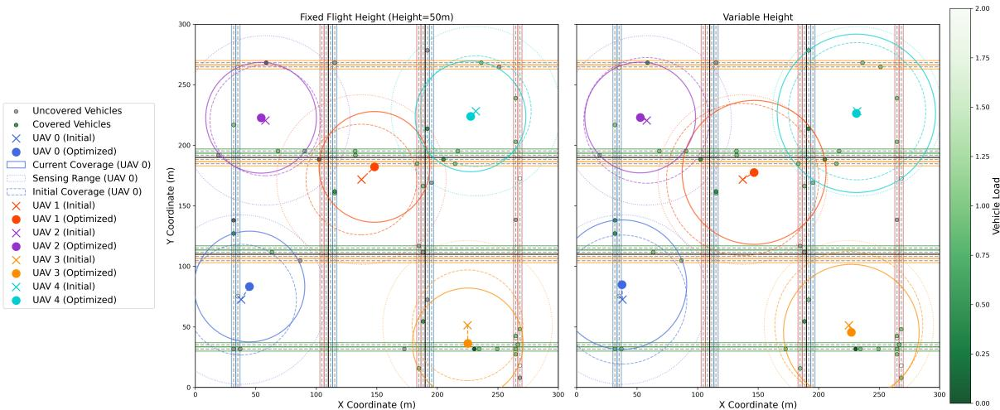  
Fig. 4 Comparison between fixed height (50m) and variable height strategies

the number of covered vehicles, UAV flight altitude, and flight energy consumption, the performance metric $R _ { t }$ is defined as:

$$
R _ { t } = \sum _ { j = 1 } ^ { M } s _ { j } ^ { l } - \omega _ { h } \sum _ { u = 1 } ^ { U } h _ { u } - \omega _ { e } E _ { f l i g h t } ,\tag{62}
$$

where $\omega _ { h }$ and $\omega _ { e }$ are weights for altitude penalty and energy consumption, respectively.

Fig. 4 illustrates the UAV positions and coverage under a single decision instance for both fixed and variable UAV altitude strategies. Roads in different directions are represented by distinct colors, and the optimization order follows the UAV indices sequentially. In the left subfigure, it is observed that with a fixed altitude and dispersed vehicle distribution, each UAV can cover only a small fraction of vehicles. Coverage is noticeably improved in the right subfigure, where UAVs tend to shrink their coverage radii to precisely encompass target vehicles, avoiding unnecessarily large coverage areas—as exemplified by UAV 1 (orange), UAV 2 (purple), and UAV 3 (yellow). Moreover, the flexibility afforded by altitude variation enables the algorithm to better identify vehicles near the coverage boundary, thereby optimizing the objective value $R _ { t }$ through altitude adjustments.

Fig. 5 depicts the flight trajectories of five UAVs over 20 consecutive time slots, marking the vehicle positions and UAV coverage at the final slot. It can be seen that UAVs tend to cruise within their respective local regions. This is because, when constructing the observation space for each UAV, we masked vehicles already covered by peers, implicitly promoting cooperative coverage among the swarm. Maintaining such a loosely distributed formation maximizes the total coverage area, allowing each UAV to capture local vehicle distribution changes and adjust its position accordingly.

Fig. 6 compares the performance of different trajectory planning algorithms under metric $R _ { t }$ . Due to fixed initial positions, the first optimization round typically involves significant adjustments in altitude and position, resulting in higher energy consumption and lower metric values; subsequent steps tend to stabilize. The CVX-based method significantly outperforms others, as convex optimization guarantees finding the global optimum. In contrast, LVM-based and MADQN-based methods perform worse, as learning-based approaches often converge to local optima. Under fixed altitude constraints, the performance gap between CVX and learning-based methods narrows, indicating that the decision space in the altitude dimension is critical for performance enhancement.

## B. Performance Comparison

Fig. 7 shows the average system task completion time under different total loads. The Proposed and DRL-Resource (No LLM) methods achieve the best performance. In the Proposed method, the LLM enhances fairness by reallocating communication resources for long-tail tasks, improving the task success rate. However, since this is a multi-objective problem, according to the Pareto principle, such adjustments inevitably lead to a slight increase in average delay compared to the DRL-Resource method. Trajectory planning methods based on LVM and MADQN perform slightly worse; as shown in Fig. 4, their inferior coverage quality compared to CVX leads to higher communication delays. Among the modules, the task offloading scheme has the most significant impact on delay. The LP-based method precisely solves for optimal allocation, resulting in lower delay, whereas DDPGbased methods struggle to find the optimum due to learning bottlenecks, yielding higher task completion latencies.

Fig. 8 compares the weighted normalized energy consumption of different methods (Light color: flight; Medium: computation; Dark: communication; Weights: 0.3:1:100). MADQN and LVM methods exhibit lower flight energy consumption because they tend to make conservative altitude adjustments, sacrificing coverage precision for energy savings. The MADDPGbased task allocation method incurs higher computation energy consumption as it tends to offload more tasks to highfrequency base stations. In contrast, the LP-based method balances energy and delay more effectively.

Fig. 9 shows the average task success rate, defined as the proportion of tasks completed within the deadline. As the total load per slot increases, the success rate of all methods decreases due to the limited total computing capacity of the environment. When the load approaches the capacity limit, base stations and some UAVs reach saturation, forcing some vehicles to compute locally and resulting in timeouts. Notably, the Proposed method significantly improves the success rate by using the LLM to reallocate resources for failed and surplus tasks, allowing potential failures to be offloaded earlier. Furthermore, the success rates of MADDPG and Full-MADRL combinations drop sharply with increasing load. This is because MADDPG-based allocation fails to strictly enforce queue capacity constraints, leading to inevitable task failures upon overflow.

Task Allocation Ratio (w2=0.001)  
Load Distribution (w2=0.001)  
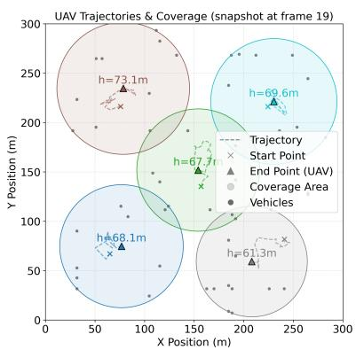  
Fig. 5 UAV historical movement trajectory

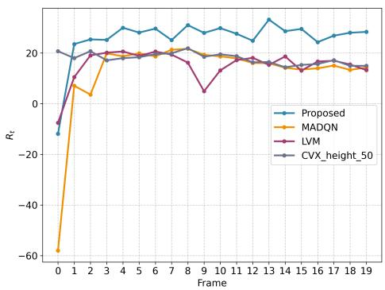  
Fig. 6 Average coverage metric comparison

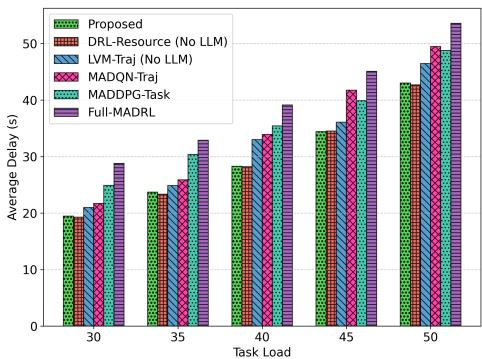  
Fig. 7 Delay vs. Load

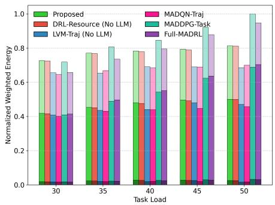  
Fig. 8 Energy vs. Load

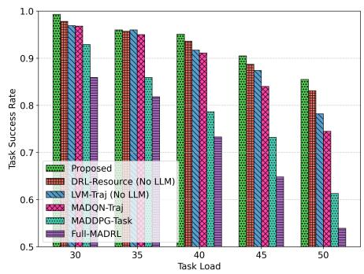  
Fig. 9 Success Rate vs. Load

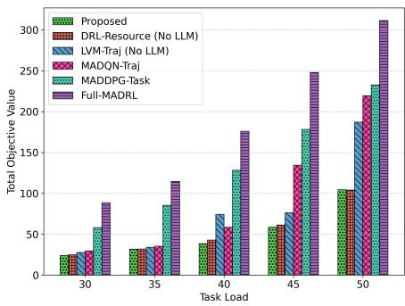  
Fig. 10 Total Objective vs. Load

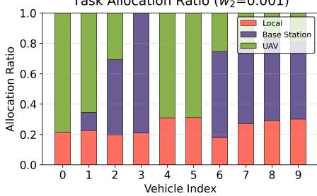  
(a) vehicle allocation ratios

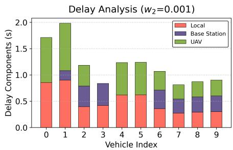  
(b) vehicle delay components

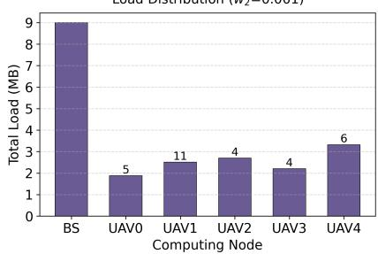  
(c) load distribution  
Fig. 11 Task Allocation Strategy with Emphasis on Delay

Fig. 10 compares different methods in terms of the total objective function value (36a). Given the multi-objective nature of the problem, LP-based methods perform better overall, as mathematical solvers are most effective at minimizing the Min-Max latency of components. The LVM-based method shows a sharp increase in objective value when the load reaches 40 Mb, corresponding to the rise in average task completion time in Fig. 7. The Proposed method achieves a higher success rate, translating to a smaller penalty for delay violations, and thus a lower total objective value.

## C. Analysis of Task Allocation Strategies

Fig. 11 and Fig. 12 illustrate the strategic differences in a single decision instance under varying weights for delay and energy consumption. Fig. 11 shows the allocation results when focusing solely on delay (energy weight ≈ 0). As seen in Fig. 11(c), the base station load quickly reaches its 9 Mb limit. Most vehicles prioritize allocating tasks to the base station; once full, tasks spill over to UAVs, and finally to local computation. In Fig. 11(b), the completion times for different parts of most vehicle tasks are equal, aligning with the intuition of minimizing the maximum completion time (Make-span) by balancing loads across nodes.

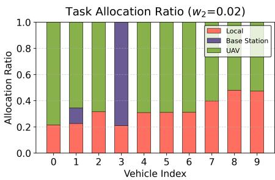  
(a) vehicle allocation ratios

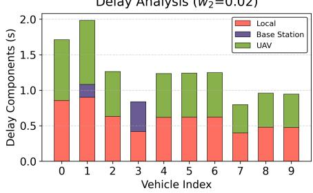  
(b) vehicle delay components

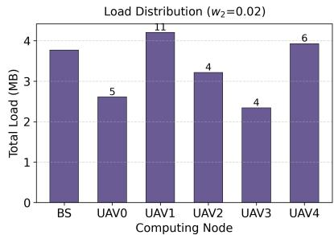  
(c) load distribution  
Fig. 12 Allocation Strategy with Emphasis on Energy Consumption

Fig. 12 shows the results when energy consumption is heavily weighted. The proportion of tasks assigned to UAVs increases significantly (Fig. 12(c)), while the base station load decreases. Fig. 12(a) shows that most vehicles allocate tasks exclusively to UAVs, bypassing the base station. However, Vehicle 3, located outside the UAV coverage area, is forced to offload to the base station, demonstrating the algorithm’s adaptability to topological constraints.

It is noteworthy that these experiments were conducted under a moderate load of 30 Mb. When the load increases to 50 Mb, the resulting strategies become identical regardless of weight settings. This is because, as the system approaches its capacity limit, the feasibility of balancing delay and energy is lost; all available computing resources must be fully utilized to avoid task failures.

## V. CONCLUSION

In this paper, we propose a joint optimization framework for 3D trajectory control, resource allocation, and task offloading in multi-UAV-assisted IoV systems. To address the coupling and non-convexity of the problem, we decompose it into three subproblems and solve them via a hierarchical execution flow. Specifically, a sequential distributed optimization algorithm based on SOCP is developed to optimize UAV trajectories under dynamic vehicle topologies. To overcome the generalization limitations of traditional DRL in longtail scenarios, we introduce an LLM-based macro-scheduler within an alternating optimization loop. This framework synergizes the high-efficiency initial scheduling of DRL with the semantic reasoning capabilities of LLMs, enabling precise resource reallocation for failed and surplus tasks. Crucially, a reward decoupling mechanism is implemented to ensure the training stability of the DRL agent under external interventions. Simulation results demonstrate that the proposed method significantly outperforms baseline algorithms (e.g., MADRL, MADQN) in terms of task success rate, system latency, and energy efficiency. Furthermore, the integration of KV caching and MoE architecture ensures the feasibility of deploying large-scale models at the network edge. Future work will explore the coordination of heterogeneous UAV swarms and the integration of multi-modal LLMs for complex urban semantic environment perception.

## REFERENCES

[1] A. Zanella, N. Bui, A. Castellani, L. Vangelista, and M. Zorzi, “Internet of Things for smart cities,” IEEE Internet Things J., vol. 1, no. 1, pp. 22–32, 2014.

[2] J. Chu, Q. Wu, P. Fan, W. Chen, K. Wang, N. Cheng, and K. B. Letaief, “V2X-assisted distributed computing and control framework for connected and automated CAVs under ramp merging scenario,” IEEE Trans. Mobile Comput., Early Access, 2026, doi: https://doi.org/10.1109/ TMC.2026.3650774.

[3] M. H. C. Garcia, A. Molina-Galan, M. Boban, J. Gozalvez, B. Coll-Perales, T. S¸ahin, and A. Kousaridas, “A tutorial on 5G NR V2X communications,” IEEE Commun. Surveys Tuts., vol. 23, no. 3, pp. 1972–2026, 2021.

[4] K. Abboud, H. A. Omar, and W. Zhuang, “Interworking of DSRC and cellular network technologies for V2X communications: A survey,” IEEE Trans. Veh. Technol., vol. 65, no. 12, pp. 9457–9470, 2016.

[5] Q. Wu, Y. Xie, P. Fan, D. Qin, K. Wang, and K. B. Letaief, “Large language model-based task offloading and resource allocation for digital twin edge computing networks,” IEEE Trans. Mobile Comput., Early Access, 2026, doi: https://doi.org/10.1109/TMC.2026.3664866.

[6] Y. Xie, Q. Wu, P. Fan, N. Cheng, W. Chen, J. Wang, and K. B. Letaief, “Resource allocation for twin maintenance and task processing in vehicular edge computing network,” IEEE Internet Things J., vol. 12, no. 15, pp. 32008–32021, Aug. 2025.

[7] P. Mach and Z. Becvar, “Mobile edge computing: A survey on architecture and computation offloading,” IEEE Commun. Surveys Tuts., vol. 19, no. 3, pp. 1628–1656, 2017.

[8] X. Xu, Q. Wu, P. Fan, K. Wang, N. Cheng, W. Chen, and K. B. Letaief, “Velocity-adaptive access scheme for semantic-aware vehicular networks: Joint fairness and AoI optimization,” IEEE Trans. Mobile Comput., Early Access, 2026, doi: https://doi.org/10.1109/TMC.2026. 3667698.

[9] X. Xu, Q. Wu, P. Fan, K. Wang, N. Cheng, W. Chen, and K. B. Letaief, “Enhanced velocity-adaptive scheme: Joint fair access and age of information optimization in vehicular networks,” IEEE Trans. Mobile Comput., vol. 25, no. 3, pp. 3488–3505, Mar. 2026.

[10] X. Wang, K. Tao, N. Cheng, Z. Yin, Z. Li, Y. Zhang, and X. Shen, “RadioDiff: An effective generative diffusion model for sampling-free dynamic radio map construction,” IEEE Trans. Cogn. Commun. Netw., vol. 11, no. 2, pp. 738–750, 2025.

[11] X. Wang, Q. Zhang, N. Cheng, R. Sun, Z. Li, S. Cui, and X. Shen, “RadioDiff-k2: Helmholtz equation informed generative diffusion model for multi-path aware radio map construction,” IEEE J. Sel. Areas Commun., vol. 44, pp. 2318–2333, 2026.

[12] M. B. Ameur, J. Chebil, J. B. Hadj Tahar, M. H. Habaebi, and H. Zormati, “Path loss prediction for V2I communications systems: A performance analysis of propagation models,” in Proc. Int. Microw. Antenna Symp. (IMAS), Marrakech, Morocco, 2024, pp. 1–5.

[13] Y. Zhao, Z. Li, N. Cheng, B. Hao, and X. Shen, “Joint UAV position and power optimization for accurate regional localization in space-air integrated localization network,” IEEE Internet Things J., vol. 8, no. 6, pp. 4841–4854, 2021.

[14] Y. Quan, N. Cheng, X. Wang, J. Shen, L. Ma, and Z. Yin, “Interpretable and secure trajectory optimization for UAV-assisted communication,” in Proc. IEEE/CIC Int. Conf. Commun. China (ICCC), Dalian, China, 2023, pp. 1–6.

[15] M. Yan, R. Xiong, Y. Wang, and C. Li, “Edge computing task offloading optimization for a UAV-assisted Internet of Vehicles via deep reinforcement learning,” IEEE Trans. Veh. Technol., vol. 73, no. 4, pp. 5647–5658, 2024.

[16] X. Liu, B. Lai, B. Lin, and V. C. M. Leung, “Joint communication and trajectory optimization for multi-UAV enabled mobile Internet of Vehicles,” IEEE Trans. Intell. Transp. Syst., vol. 23, no. 9, pp. 15 354– 15 366, 2022.

[17] Z. Wu, Z. Yang, C. Yang, J. Lin, Y. Liu, and X. Chen, “Joint deployment and trajectory optimization in UAV-assisted vehicular edge computing networks,” J. Commun. Netw., vol. 24, no. 1, pp. 47–58, 2022.

[18] Y. Wang, Z. Tang, A. Huang, H. Zhang, L. Chang, and J. Pan, “Placement of UAV-mounted edge servers for Internet of Vehicles,” IEEE Trans. Veh. Technol., vol. 73, no. 7, pp. 10 587–10 601, 2024.

[19] Z. Chen, Z. Huang, J. Zhang, H. Cheng, and J. Li, “Resource allocation and collaborative offloading in multi-UAV-assisted IoV with federated deep reinforcement learning,” IEEE Internet Things J., vol. 12, no. 5, pp. 4629–4640, 2025.

[20] Y. Liu, P. Lin, M. Zhang, Z. Zhang, and F. R. Yu, “Mobile-aware service offloading for UAV-assisted IoV: A multiagent tiny distributed learning approach,” IEEE Internet Things J., vol. 11, no. 12, pp. 21 191–21 201, 2024.

[21] F. Song, H. Xing, X. Wang, S. Luo, P. Dai, Z. Xiao, and B. Zhao, “Evolutionary multi-objective reinforcement learning based trajectory control and task offloading in UAV-assisted mobile edge computing,” IEEE Trans. Mobile Comput., vol. 22, no. 12, pp. 7387–7405, 2023.

[22] X. Hu, K.-K. Wong, K. Yang, and Z. Zheng, “UAV-assisted relaying and edge computing: Scheduling and trajectory optimization,” IEEE Trans. Wireless Commun., vol. 18, no. 10, pp. 4738–4752, 2019.

[23] Y. Xu, T. Zhang, D. Yang, Y. Liu, and M. Tao, “Joint resource and trajectory optimization for security in UAV-assisted MEC systems,” IEEE Trans. Commun., vol. 69, no. 1, pp. 573–588, 2021.

[24] P. A. Apostolopoulos, G. Fragkos, E. E. Tsiropoulou, and S. Papavassiliou, “Data offloading in UAV-assisted multi-access edge computing systems under resource uncertainty,” IEEE Trans. Mobile Comput., vol. 22, no. 1, pp. 175–190, 2023.

[25] N. Zhao, Z. Ye, Y. Pei, Y.-C. Liang, and D. Niyato, “Multi-agent deep reinforcement learning for task offloading in UAV-assisted mobile edge computing,” IEEE Trans. Wireless Commun., vol. 21, no. 9, pp. 6949– 6960, 2022.

[26] R. Zhong, X. Liu, Y. Liu, and Y. Chen, “Multi-agent reinforcement learning in NOMA-aided UAV networks for cellular offloading,” IEEE Trans. Wireless Commun., vol. 21, no. 3, pp. 1498–1512, 2022.

[27] Y. Xu, T. Zhang, Y. Liu, D. Yang, L. Xiao, and M. Tao, “UAVassisted MEC networks with aerial and ground cooperation,” IEEE Trans. Wireless Commun., vol. 20, no. 12, pp. 7712–7727, 2021.

[28] M. Hui, J. Chen, L. Yang, L. Lv, H. Jiang, and N. Al-Dhahir, “UAVassisted mobile edge computing: Optimal design of UAV altitude and task offloading,” IEEE Trans. Wireless Commun., vol. 23, no. 10, pp. 13 633–13 647, 2024.

[29] P. Qin, M. Fu, Y. Fu, and J. Wang, “Cooperative UAV trajectory design and resource allocation in blockchain-enabled secure aerial edge computing network,” IEEE Trans. Wireless Commun., vol. 25, pp. 195– 208, 2026.

[30] P. Qin, X. Wu, M. Fu, R. Ding, and Y. Fu, “Latency minimization resource allocation and trajectory optimization for UAV-assisted cachecomputing network with energy recharging,” IEEE Trans. Commun., vol. 73, no. 8, pp. 5715–5728, 2025.

[31] G. Sun, Y. Wang, Z. Sun, Q. Wu, J. Kang, D. Niyato, and V. C. M. Leung, “Multi-objective optimization for multi-UAV-assisted mobile edge computing,” IEEE Trans. Mobile Comput., vol. 23, no. 12, pp. 14 803–14 820, 2024.

[32] Z. Zhang, Q. Wu, P. Fan, N. Cheng, W. Chen, and K. B. Letaief, “DRLbased optimization for AoI and energy consumption in C-V2X enabled IoV,” IEEE Trans. Green Commun. Netw., vol. 9, no. 4, pp. 2144–2159, Dec. 2025, doi: https://doi.org/10.1109/TGCN.2025.3531902.

[33] X. Gu, Q. Wu, P. Fan, Q. Fan, N. Cheng, W. Chen, and K. B. Letaief, “DRL-based resource allocation for motion blur resistant federated selfsupervised learning in IoV,” IEEE Internet Things J., vol. 12, no. 6, pp. 7076–7085, Mar. 2025.

[34] H. Zhou, C. Hu, D. Yuan, Y. Yuan, D. Wu, X. Liu, and C. Zhang, “Large language model (LLM)-enabled in-context learning for wireless network optimization: A case study of power control,” arXiv preprint

arXiv:2408.00214, 2024.[Online]. Available: https://arxiv.org/abs/2408. 00214

[35] N. Lin, H. Tang, L. Zhao, S. Wan, A. Hawbani, and M. Guizani, “A PDDQNLP algorithm for energy efficient computation offloading in UAV-assisted MEC,” IEEE Trans. Wireless Commun., vol. 22, no. 12, pp. 8876–8890, 2023.

[36] M. Li, N. Cheng, J. Gao, Y. Wang, L. Zhao, and X. Shen, “Energyefficient UAV-assisted mobile edge computing: Resource allocation and trajectory optimization,” IEEE Trans. Veh. Technol., vol. 69, no. 3, pp. 3424–3438, 2020.

[37] A. Al-Hourani, S. Kandeepan, and S. Lardner, “Optimal LAP altitude for maximum coverage,” IEEE Wireless Commun. Lett., vol. 3, no. 6, pp. 569–572, 2014.

[38] Y. Zeng, J. Xu, and R. Zhang, “Energy minimization for wireless communication with rotary-wing UAV,” IEEE Trans. Wireless Commun., vol. 18, no. 4, pp. 2329–2345, 2019.

[39] J. K. Stolaroff, C. Samaras, E. R. O’Neill, A. Lubers, A. S. Mitchell, and D. Ceperley, “Energy use and life cycle greenhouse gas emissions of drones for commercial package delivery,” Nat. Commun., vol. 9, no. 1, Art. no. 409, 2018.

[40] R. I. Bor-Yaliniz, A. El-Keyi, and H. Yanikomeroglu, “Efficient 3-D placement of an aerial base station in next generation cellular networks,” in Proc. IEEE Int. Conf. Commun. (ICC), Kuala Lumpur, Malaysia, 2016, pp. 1–5.

[41] Q. Zhang, C. Hu, S. Upasani, B. Ma, F. Hong, V. Kamanuru, J. Rainton, C. Wu, M. Ji, H. Li, U. Thakker, J. Zou, and K. Olukotun, “Agentic context engineering: Evolving contexts for self-improving language models,” arXiv preprint arXiv:2510.04618, 2025. [Online]. Available: https://arxiv.org/abs/2510.04618