# Joint Positioning and Computation Offloading in Multi-UAV MEC for Low Latency Applications: A Proximal Policy Optimization Approach

Yuhui Wang , Student Member, IEEE, Junaid Farooq , Senior Member, IEEE, Hakim Ghazzai , Senior Member, IEEE, and Gianluca Setti , Fellow, IEEE

Abstract—Multi-access edge computing (MEC) has emerged as a proven solution for reducing communication latency and enhancing user experience in delay-sensitive applications by offloading computation-intensive tasks to edge servers. In future networks, uncrewed aerial vehicles (UAVs), with their flexible deployment and reliable communication capabilities, have the potential to be deployed as aerial MEC servers in areas lacking cellular infrastructure. However, the joint optimization of UAV placement and task offloading poses significant challenges due to the interdependence between communication latency, computational demands, and the resource limitations of UAVs. In this paper, we propose a novel joint optimization framework utilizing proximal policy optimization (PPO) to simultaneously address UAV placement and computation offloading in UAV-enabled MEC networks. The framework dynamically adapts to changing network conditions, minimizing end-to-end latency while balancing computational loads and energy consumption. Extensive simulations demonstrate that the proposed PPO-based approach achieves superior performance compared to conventional optimization methods, with significant improvements in system latency, resource utilization, and network resilience. This work contributes scalable, adaptive solutions for UAV-assisted MEC networks in dynamic environments, enabling robust support for mission-critical and latency-sensitive applications.

Index Terms—Mobile edge computing (MEC), uncrewed aerial vehicle (UAV), UAV positioning, computation offloading, bi-level optimization, proximal policy optimization (PPO).

## I. INTRODUCTION

T <sup>HE</sup> <sup>proliferation</sup> <sup>of</sup> <sup>the</sup> <sup>Internet</sup> <sup>of</sup> <sup>things</sup> <sup>(IoT)</sup> <sup>and</sup> <sup>the</sup> increasing adoption of 5G technology have exacerbated the demand for latency-sensitive applications such as augmented reality (AR), autonomous driving, live video streaming, and smart city surveillance, etc. These applications require ultra-low latency communication, substantial computational capabilities, and real-time responsiveness, posing significant challenges to existing mobile devices and network infrastructures [1], [2]. Multi-access edge computing (MEC) has emerged as a promising solution to address these challenges by offloading computational tasks to servers located closer to users, thereby reducing response times and conserving device energy [3], [4], [5].

While MEC deployment has shown great potential in urban areas with robust infrastructure, its implementation becomes challenging in regions with limited ground infrastructure, such as remote areas, disaster-stricken zones, or under-developed regions [6]. In addition, traditional MEC servers are not wellsuited to handle situations requiring rapid and dynamic deployment of computational resources, such as during large-scale events like concerts, sports games, or emergency response scenarios [7]. These events often experience sudden spikes in user density and demand, far exceeding the capabilities of static MEC setups. Uncrewed aerial vehicles (UAVs) have emerged as a viable solution to bridge this gap. UAVs act as flying edge servers, equipped with MEC capabilities, that can be deployed flexibly and on-demand [8], [9]. Their mobility, flexibility, and cost-effectiveness make them ideal for addressing scenarios where ground-based infrastructure is unavailable, insufficient, or impractical. UAVs can be rapidly deployed to areas of high demand, dynamically adapting to the spatial and temporal distribution of user equipment (UEs). For example, during a sports event, UAVs can provide localized computational resources, reducing latency and enhancing user experience. Similarly, in disaster recovery operations, UAVs can establish temporary networks to support emergency communications and processing needs.

However, the effective deployment of UAV-assisted MEC networks is not a straightforward task. UAVs are inherently resource-constrained, with limited computational capacity, energy reserves, and communication bandwidth. In addition, the dynamic nature of UAV operations and the variability of user demands make it difficult to optimize their placement and task allocation. A critical challenge lies in the interdependent nature of UAV positioning and task offloading, i.e., the locations of UAVs affect communication latency and task distribution, while the task allocation strategy impacts UAV resource utilization and battery consumption. These coupled optimization problems require sophisticated solutions that can adapt to changing network conditions and user requirements in real-time.

Existing studies on UAV-enabled MEC systems have primarily focused on optimizing task offloading, UAV placement, and energy efficiency using conventional optimization techniques, heuristic algorithms, or deep reinforcement learning (DRL) approaches [8], [9]. However, these methods often exhibit significant limitations when applied to large-scale, dynamic multi-UAV networks. Traditional optimization techniques, such as convex optimization, game theory, and heuristic algorithms, often rely on simplifying assumptions, such as static user distributions and single-UAV scenarios, which limit their practicality in highly dynamic, large-scale networks [10], [11]. These methods also struggle with high-dimensional and continuous action spaces, making them computationally expensive and inefficient for real-time UAV coordination. Recent advancements in DRL have introduced more adaptive solutions, but many existing approaches still rely on discrete state and action spaces. For example, in [12], a deep Q network (DQN)-based algorithm was proposed for priority-aware task offloading, optimizing UAV trajectory and resource allocation. However, their approach discretizes UAV mobility steps and adopts binary offloading decisions, where tasks are either fully offloaded or processed locally. While such discretization simplifies the problem, it limits scalability, precision, and flexibility, leading to sub-optimal task allocation and UAV placement in dynamic networks.

To overcome these limitations, we leverage proximal policy optimization (PPO), a state-of-the-art reinforcement learning algorithm, which is particularly well-suited for solving continuous and high-dimensional optimization problems in UAV-assisted MEC networks. Unlike traditional optimization methods and DQN-based approaches, PPO operates directly in a continuous action space, allowing for fine-grained UAV positioning and task allocation decisions [13]. Additionally, PPO’s clipped surrogate objective function ensures stable training and prevents drastic policy fluctuations, making it highly effective in real-time, dynamic environments [14]. Through extensive simulations, we demonstrate that our PPO-based framework dynamically adapts UAV positions and task allocation to minimize end-to-end latency, balance computational loads, and optimize resource utilization. The main contributions of this work are summarized as follows:

We propose a comprehensive joint optimization framework that addresses the interdependent problems of UAV deployment and task offloading, considering physical constraints such as limited energy and computational resources, as well as service requirements, including latency and task size.

We develop a reinforcement learning-based optimization algorithm using PPO to efficiently solve the joint optimization problem with continuous state and action spaces. The algorithm dynamically adapts to changes in network conditions and user demands, achieving significant improvements over traditional optimization techniques.

\- We conduct a comparison of the proposed PPO-based approach with a bi-level optimization method and a DQN approach, highlighting the superior performance of the proposed framework in terms of latency reduction, resource utilization, and robustness.

Through extensive simulations, we validate the effectiveness of the proposed framework in diverse operational scenarios, demonstrating improvements in latency, coverage, energy efficiency, and network resilience.

The remainder of this paper is organized as follows. Section II reviews related work on UAV-enabled MEC systems. Section III introduces the system model and problem formulation, followed by Section IV, which details the proposed PPObased optimization framework. Section V presents simulation results and performance analysis. Finally, Section VI concludes the paper and outlines potential directions for future research.

## II. RELATED WORK

Unlike traditional cloud computing, where data processing occurs at centralized data centers often far from the users [15], MEC offloads computation-intensive tasks to edge servers located at the network’s edge. This proximity significantly reduces the propagation delay and response times, which is critical for latency-sensitive applications like AR [16], autonomous vehicles [17], and real-time video processing [18]. In UAV-enabled MEC networks, where UAVs act as flying edge servers, additional flexibility and scalability are provided, allowing rapid deployment in dynamic environments or areas lacking ground infrastructure. UAV-enabled MEC networks has been widely studied in recent years with major focus on aspects such as computation task offloading management [19], [20], [21], UAV placement optimization [22], [23], [24], energy efficiency [4], [5], [25], and end-to-end delay minimization [26], [27], [28]. The main optimization methodologies can be categorized into the following aspects: 1) heuristic swarm algorithms; 2) DRL methods; 3) and convex optimization approaches. In [29] and [30], the authors studied the cooperative task offloading in multi-UAV swarm-based edge computing, aiming to minimize the overall task processing delays. They propose a swarm grouping algorithm to divide the roles of UAVs into communication and computation nodes respectively, and leverage a cooperative computation offloading algorithm to enhance the system energy efficiency and response time.

One critical issue in the UAV-enabled MEC networks is the optimization of UAV placement, tasked with maximizing coverage and ensuring robust connectivity in diverse environments [31], [32]. Challenges in this field include the dynamic environmental factors and mobility of users. To address these problems, [33] has studied the joint optimization of the number and placement of UAVs with dynamic user configurations and proposed a solution based on integer linear programming solvers. Their approach ensures coverage and backhaul connectivity with minimum number of UAVs. Another key challenge lies in the inherent limitations of UAV operational capacities such as battery and payload restrictions [34]. Researchers have used alternating optimization techniques to optimize UAV placement in cellular networks by balancing between energy consumption of UAVs against the QoS delivered to ground users [35], employing a multi-objective optimization approach to ensure equitable service distribution across all users. In another study [36], the authors have decoupled the joint optimization of 3D UAV placement and radio resource allocation into two sub-problems of UAV-user association and radio resource allocation for maximum per-UAV sum rates, and developed a framework based on iterative convex optimization to provide on-demand services. However, the aforementioned studies primarily focused on the access link aspects of UAV-enabled networks, lacking attention to the backhaul link between UAVs, which is vital for the overall effectiveness and scalability of UAV networks.

Other studies in literature have focused on the task offloading problem in UAV-enabled MEC systems, addressing various goals including enhanced energy efficiency [37], optimized processing latency [38], and resource utilization [39]. In [40], researchers have investigated the joint task offloading and service placement for UAV-enabled MEC systems, minimizing the long-term average delays and improving service experience ratio. The study proposed a solution based on Dinkelbach’s method and iterative optimization which enables low-complexity and real-time adaptive access control, service selection and resource allocation. Some other studies have developed an online resource allocation and task offloading solution for optimized network coverage and energy consumption [41]. Their work uses a stochastic optimization approach to formulate the joint optimization of UAV to user associations, task offloading and computation resource allocation. However, the authors utilized traditional optimization or heuristic algorithms to address the problem of resource allocation and task offloading of UAV-aided MEC networks, which usually require a substantial number of iterations and are not suitable to obtain real-time solutions for MEC systems, especially when the UAV positions and user requirements varies significantly due to the dynamic nature of the environment.

While there is extensive research on MEC networks and the strategic placement of UAVs, there remains a noticeable gap in studies for the joint optimization of UAV placement and task offloading within multi-UAV MEC networks, particularly in resilient UAV network formation for optimal end-to-end latency under limited UAV battery capacity and dynamic user demands. One of the primary challenges in this domain is the inherent complexity of coordinating multiple UAVs, each with limited computational resources and energy constraints, to ensure balanced load distribution and resilient network connectivity. Additionally, the dynamic nature of user demands and mobility further complicates the optimization process. As users move and their computational requirements fluctuate, the UAV network must continuously adapt to maintain service quality, which introduces significant complexity in maintaining optimal UAV placement and task allocation strategies. Moreover, the network topology of UAVs directly influences the efficiency of task offloading, as their positions determine communication latency and resource availability. Conversely, the task offloading strategy impacts the optimal UAV placement, as it dictates the load distribution and energy consumption across the network. This interdependent relationship creates a complex optimization challenge, particularly when considering the need for resilient UAV network formation that minimizes end-to-end latency while contending with the limited battery capacity of UAVs and the dynamic nature of user demands.

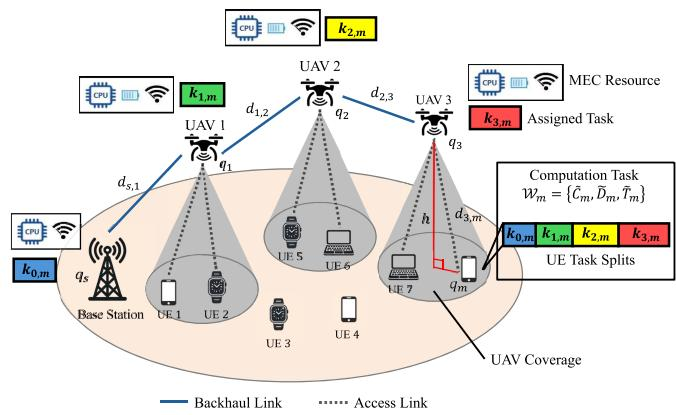  
Fig. 1. Overview of a UAV-assisted MEC system.

To address the challenges in the joint optimization problem, this paper introduces a PPO-based approach to jointly optimize UAV deployment and computation offloading in multi-UAV MEC networks. By formulating the problem at two interdependent levels, i.e., UAV deployment and task allocation, the proposed framework addresses the objectives of minimizing end-to-end latency under limited battery and computation capacity. Our proposed method is capable of balancing the computational loads and the energy consumption across the UAV network, and significantly enhances the overall responsiveness and resilience of the UAV-assisted MEC network compared to existing methods.

## III. SYSTEM MODEL

We consider a UAV-aided MEC network comprising a cellular base station (BS), denoted as $s ;$ a set of UAVs, represented by $\mathcal { U } = \{ 1 , 2 , \dots , U \}$ ; and a set of UEs, denoted as $\mathcal { M } =$ $\{ 1 , 2 , \ldots , M \}$ as shown in Fig. 1. Both the BS and the UAVs are equipped with two antennas, one dedicated to the access link (UAV-UE) and another for the backhaul link (UAV-UAV or UAV-BS). This configuration enables efficient spectrum utilization and reduces interference between access and backhaul links [42]. The ground BS is located at $q _ { s } = [ x _ { s } , y _ { s } , z _ { s } ] \in \mathbb { R } ^ { 3 }$ . The set of 3D locations of the UAVs is denoted by $\mathcal { Q } _ { \mathcal { U } } = \{ q _ { 1 } , q _ { 2 } , . . . , q _ { U } \}$ with each $q _ { u } = [ x _ { u } , y _ { u } , z _ { u } ] \in \mathbb { R } ^ { 3 }$ $u \in \mathcal { U }$ . On the other hand, <sup>= [ ]</sup>the UEs are located within a two-dimensional plane, and their positions are denoted by $q _ { m } = [ x _ { m } , y _ { m } , 0 ]$ $m \in \mathcal { M }$ . In modern IoT applications such as disaster response and smart agriculture, the UAVs are equipped with advanced sensors and communication capabilities, enabling them to accurately estimate or retrieve the positions of UEs [43]. Thus, we assume that the positions of the UEs are fixed and can be retrieved in real time by the UAV network.

Each UE is considered to have a computational task, denoted as $\mathcal { W } _ { m } = ( \tilde { C } _ { m } , \tilde { D } _ { m } , \tilde { T } _ { m } )$ $m \in { \mathcal { M } }$ , where ${ \tilde { C } } _ { m }$ represents the computational workload in terms of CPU cycles, $\tilde { D } _ { m }$ specifies the data size in bits, and $\ddot { T } _ { m }$ indicates the delay tolerance. Each UAV is considered to have a maximum battery capacity $\hat { E } _ { \mathrm { m a x } }$ and total computational capacity $\hat { C } _ { \mathrm { m a x } }$ . Additionally, we define the unit energy consumption for CPU processing per cycle as $P _ { c }$ and the unit energy consumption for data transmission per bit as $P _ { b }$ . The key notations used in this paper are summarized in Table I. In our framework, we make the fundamental assumption that each task $\mathcal { W } _ { m }$ can be split into at most $( U + 1 )$ task proportions denoted by ${ { K } _ { m } } = \left\{ { { k } _ { 0 , m } } , { { k } _ { 1 , m } } , \ldots , { { k } _ { U , m } } \right\}$ , with $0 \leq k _ { u , m } \leq$ $\begin{array} { r } { 1 , \sum _ { u } k _ { u , m } = 1 , \forall m \in \mathcal { M } } \end{array}$ representing the fraction of task <sup>1 = 1</sup>division offloaded to a particular node. Specifically, $k _ { 0 , m }$ refers to the task proportion offloaded to the BS and $\{ k _ { 1 , m } , \ldots , k _ { U , m } \}$ correspond to the task proportions offloaded to the UAVs. If no task split from UE <sup>m</sup> is offloaded to UAV $u ,$ then $k _ { u , m } = 0$ Compared with the UAVs located at the edge of the network, the BS offers higher computational capacity and unlimited power supply, but at the cost of potentially longer communication delays. For user <sup>m</sup> to allocate a task on server <sup>u</sup>, the corresponding backhaul path is denoted by $\mathcal { L } _ { u , m }$ , which represents the sequence of UAVs involved in relaying the task data to its destination node. The primary objective of this backhaul path is to minimize the total data transmission latency across the UAV network, and it can be determined by shortest path algorithms. This division allows the central network operator to flexibly determine the optimal distribution of task segments between the BS and the UAVs, enabling each task proportion to be allocated and executed independently and efficiently.

TABLE I LIST OF NOTATIONS
<table><tr><td rowspan=1 colspan=1>Symbol</td><td rowspan=1 colspan=1>Description</td></tr><tr><td rowspan=1 colspan=1> $\mathcal { U } = \{ 1 , 2 , \dots , U \}$ </td><td rowspan=1 colspan=1>Set of UAVs</td></tr><tr><td rowspan=1 colspan=1> $\mathcal { M } = \{ 1 , 2 , \dots , M \}$ </td><td rowspan=1 colspan=1>Set of ground users</td></tr><tr><td rowspan=1 colspan=1> $q _ { s } \in \mathbb { R } ^ { 2 }$ </td><td rowspan=1 colspan=1>Coordinate of ground BS</td></tr><tr><td rowspan=1 colspan=1> $y _ { m } \in \mathbb R ^ { 2 } , m \in \mathcal { M }$ </td><td rowspan=1 colspan=1>Coordinates of users</td></tr><tr><td rowspan=1 colspan=1> $q _ { u } \in \mathbb { R } ^ { 3 } , u \in \mathcal { U }$ </td><td rowspan=1 colspan=1>Coordinates of UAVs</td></tr><tr><td rowspan=1 colspan=1> $d _ { u , m } , u \in \mathcal { U } , m \in \mathcal { M }$ </td><td rowspan=1 colspan=1>Distance between UAV and user</td></tr><tr><td rowspan=1 colspan=1> $d _ { \mathrm { s } , u } , u \in \mathcal { U }$ </td><td rowspan=1 colspan=1>Distance between ground BS and UAV</td></tr><tr><td rowspan=1 colspan=1> $r$ </td><td rowspan=1 colspan=1>UAV BS communication range</td></tr><tr><td rowspan=1 colspan=1> $p _ { L o S } , p _ { N L o S }$ </td><td rowspan=1 colspan=1>Probability of line-of-sight/non-line-of-sight</td></tr><tr><td rowspan=1 colspan=1> $\vartheta , \xi$ </td><td rowspan=1 colspan=1>Environmental path-loss parameters</td></tr><tr><td rowspan=1 colspan=1> $\delta$ </td><td rowspan=1 colspan=1>Path-loss exponent</td></tr><tr><td rowspan=1 colspan=1> $\eta _ { L o s } , \eta _ { N L o s }$ </td><td rowspan=1 colspan=1>Additional average path-loss</td></tr><tr><td rowspan=1 colspan=1> $B _ { u }$ </td><td rowspan=1 colspan=1>Bandwidth of link between UAVs and users</td></tr><tr><td rowspan=1 colspan=1> $\boldsymbol { B } _ { \mathrm { s } }$ </td><td rowspan=1 colspan=1>Bandwidth of link between ground BS and UAV</td></tr><tr><td rowspan=1 colspan=1> $\mathrm { S N R } _ { u , m }$ </td><td rowspan=1 colspan=1>SNR of fronthaul link between UAV and user</td></tr><tr><td rowspan=1 colspan=1> $\mathrm { S N R } _ { u , u ^ { \prime } }$ </td><td rowspan=1 colspan=1>SNR of backhaul link between two UAVs</td></tr><tr><td rowspan=1 colspan=1> ${ r } _ { u , m }$ </td><td rowspan=1 colspan=1>Data rate of fronthaul link between UAV and user</td></tr><tr><td rowspan=1 colspan=1> $r _ { u , u ^ { \prime } }$ </td><td rowspan=1 colspan=1>Data rate of backhaul link between two UAVs</td></tr><tr><td rowspan=1 colspan=1> $\mathcal { W } _ { m } = ( \tilde { C } _ { m } , \tilde { D } _ { m } , \tilde { T } _ { m } )$ </td><td rowspan=1 colspan=1>Computation task</td></tr><tr><td rowspan=1 colspan=1> $k _ { u , m }$ </td><td rowspan=1 colspan=1>Task split from UE m on edge server u</td></tr><tr><td rowspan=1 colspan=1> $\alpha , \mu$ </td><td rowspan=1 colspan=1>Reward balancing parameter and learning rate</td></tr><tr><td rowspan=1 colspan=1> $\epsilon _ { \mathrm { m a x } } , \epsilon _ { \mathrm { m i n } } , \epsilon _ { \Delta }$ </td><td rowspan=1 colspan=1>Max, min and decaying epsilon parameter</td></tr></table>

## A. Channel Model

In this section, we present the channel models used to characterize the communication links in the UAV-enabled MEC network, focusing on both the air-to-ground (A2G) and air-to-air (A2A) scenarios. The A2G channel model, which describes the communication between UAVs and UEs, is influenced by both line-of-sight (LoS) and non-line-of-sight (NLoS) conditions, depending on environmental features and UAV altitude. Conversely, the A2A links between UAVs generally experience unobstructed LoS paths due to high-altitude operation.

1) A2G Path-Loss Model: To accurately model the path loss between the UAVs and UEs, we employ a probabilistic approach that accounts for both LoS and NLoS scenarios [33]. The probability of a LoS connection, $\mathrm { \mathit { P } _ { L o S } }$ , depends on multiple factors such as the elevation angle and environmental features, and can be represented by [44]:

$$
p _ { \mathrm { L o S } } = \frac { 1 } { 1 + \vartheta \exp \left( - \xi \frac { 1 8 0 } { \pi } \phi - \vartheta \right) } ,\tag{1}
$$

where $\vartheta$ and $\xi$ are constants depending on the environment and <sup>φ</sup> is the elevation angle. Thus, the probability of having an NLoS path is determined by $p _ { \mathrm { N L o S } } = 1 - p _ { \mathrm { L o S } }$ . Given the UAV $u \in \mathcal { U }$ and ground UE $m \in \mathcal { M }$ , the effective path loss $\mathrm { P L } _ { u , m }$ can be expressed as a weighted average in LoS and NLoS scenarios based on their respective probabilities:

$$
\mathrm { P L } _ { u , m } = 1 0 \log _ { 1 0 } { \left( \frac { 4 \pi f _ { c } d _ { u , m } } { c } \right) ^ { \delta } } + p _ { \mathrm { L o S } } \eta _ { \mathrm { L o S } } + p _ { \mathrm { N L o S } } \eta _ { \mathrm { N L o S } } ,\tag{2}
$$

where $d _ { u , m }$ represents the 3D distance between the user and the UAV. The constant <sup>c</sup> denotes the speed of light, $f _ { c }$ is the carrier frequency, and <sup>δ</sup> is the path-loss exponent. The first term in (2) represents the free-space path loss, while $\eta _ { \mathrm { L o S } }$ and $\eta _ { \mathrm { N L o S } }$ are the additional average losses for LoS and NLoS paths respectively.

2) A2A Path-Loss Model: For A2A communication between two UAVs <sup>u</sup> and $u ^ { \prime } ,$ , where UAVs operate at high altitudes with predominantly LoS conditions, we adopt a free-space path loss (FSPL) model described by [12]:

$$
\mathrm { F S P L } _ { u , u ^ { \prime } } = 2 0 \log _ { 1 0 } \left( \frac { 4 \pi f _ { a } d _ { u , u ^ { \prime } } } { c } \right) ,\tag{3}
$$

where $f _ { a }$ is the aerial channel frequency and $d _ { u , u ^ { \prime } }$ is the 3D distance between the UAVs.

## B. MEC Task Offloading Model

For a task split $k _ { u , m }$ to be executed by the UAV <sup>u</sup>, there are basically three steps: (i). the data transmission of the task from the UE <sup>m</sup> to the connected UAV $u ^ { \prime }$ through access link; (ii). the data transmission of the task between UAVs $u ^ { \prime }$ and $u ;$ (iii). the execution of the task on UAV <sup>u</sup>. The data transmission time from the UE <sup>m</sup> to the UAV <sup>u</sup> can be calculated as:

$$
T _ { m , u ^ { \prime } , u } ^ { A 2 G } = \frac { k _ { u , m } \tilde { D } _ { m } } { r _ { u ^ { \prime } , m } } ,\tag{4}
$$

where $\begin{array} { r } { r _ { u ^ { \prime } , m } = B \log _ { 2 } ( 1 + \frac { P _ { u ^ { \prime } } ^ { t } } { \mathrm { P L } _ { u ^ { \prime } , m } \sigma ^ { 2 } } ) } \end{array}$ is the A2G link data rates and $B$ is the link bandwidth. Similarly, the data transmission time for the A2A link between UAVs <sup>u</sup> and $u ^ { \prime }$ can be calculated as:

$$
T _ { m , u ^ { \prime } , u } ^ { A 2 A } = \frac { k _ { u , m } \tilde { D } _ { m } } { r _ { u , u ^ { \prime } } } ,\tag{5}
$$

where $\begin{array} { r } { r _ { u , u ^ { \prime } } = B \log _ { 2 } ( 1 + \frac { P _ { u } ^ { t } } { \mathrm { F S P L } _ { u . u ^ { \prime } } \sigma ^ { 2 } } ) } \end{array}$ is the A2A link data rates. Then the excecution time of the task on UAV <sup>u</sup> is expressed by:

$$
T _ { m , u ^ { \prime } , u } ^ { C } = \frac { k _ { u , m } \tilde { C } _ { m } } { C _ { u } } ,\tag{6}
$$

where $C _ { u }$ represents the processing speed of the CPU in cycles per second equipped on UAV <sup>u</sup>. Thus, the end-to-end task completion latency can be expressed by:

$$
T _ { m , u ^ { \prime } , u } = T _ { m , u ^ { \prime } , u } ^ { A 2 G } + T _ { m , u ^ { \prime } , u } ^ { A 2 A } + T _ { m , u ^ { \prime } , u } ^ { C } .\tag{7}
$$

We assume that each UE <sup>m</sup> is associated with the UAV $u ^ { \prime }$   
that provides the highest data rate to ensure the best access   
link quality. Accordingly, the expression for the end-to-end task   
completion latency can be represented as $T _ { u , m } = T _ { m , u ^ { \prime } , u } .$ , where   
u′ = argmax $r _ { i , m } , \forall i \in \mathcal { U }$ m

## C. Energy Consumption Model

In a UAV-aided MEC network, the total energy consumption of a UAV for processing a task proportion comprises three main components, i.e., data transmission energy, computational energy, and UAV aerodynamic energy.

1) Data Transmission Energy: The energy consumed for wireless data transmission depends on the amount of data offloaded and the unit transmission energy required for reliable communication. The transmission energy consumption for UAV <sup>u</sup> serving UE <sup>m</sup> is given by:

$$
E _ { u , m } ^ { T } = k _ { u , m } \tilde { D } _ { m } P _ { b } ,\tag{8}
$$

where $k _ { u , m }$ represents the proportion of the task assigned to $\mathrm { U A V } ~ u , \tilde { D } _ { m }$ denotes the data size of the offloaded task, and $P _ { b }$ is the energy consumption per unit of transmitted data.

2) Computational Energy: The computational energy required to execute the offloaded task at the UAV depends on the computational workload and the energy consumed per computation cycle. The CPU execution energy is given by:

$$
E _ { u , m } ^ { C } = k _ { u , m } \tilde { C } _ { m } P _ { c } ,\tag{9}
$$

where ${ \tilde { C } } _ { m }$ denotes the required computation workload in CPU cycles for processing the task, and $P _ { c }$ is the unit energy consumption per CPU cycle.

3) Aerodynamic Energy: UAV aerodynamic energy consists of both propulsion energy and hovering energy. In scenarios where UAVs must move frequently, propulsion energy is typically the dominant component. However, in our framework, UAVs do not move after reaching their optimal placement, making propulsion energy irrelevant to our optimization. Instead, we focus on hovering energy, which is required to keep UAVs airborne while processing and transmitting data. The hovering energy consumption is modeled as [45]:

$$
E _ { u , m } ^ { D } = T _ { u , m } P _ { h } ,\tag{10}
$$

where $T _ { u , m }$ represents the task processing time, and $P _ { h }$ is the constant energy consumption per unit time required to maintain UAV hovering.

4) Total Energy: The total energy consumption for processing the task proportion from UE <sup>m</sup> on UAV <sup>u</sup> is modeled as:

$$
E _ { u , m } = E _ { u , m } ^ { T } + E _ { u , m } ^ { C } + E _ { u , m } ^ { D } .\tag{11}
$$

Due to the limited battery energy of UAVs, the total energy consumption should be less than the energy budget set for the task, i.e., $\begin{array} { r } { \sum _ { m \in \mathcal { M } } E _ { u , m } \leq \hat { E } _ { \operatorname* { m a x } } , \forall u \in \mathcal { U } } \end{array}$

## D. Problem Formulation

In this section, we formulate the joint optimization problem for task assignment and UAV placement in a multi-UAV MEC network with the aim to minimize latency and optimize resource utilization. The problem involves determining the optimal task allocation to UAVs and their respective placement positions to enhance the overall performance of the network, with limitations on energy consumption and computational capacities. The problem can be formulated as:

$$
\mathbf { P 0 } : \operatorname* { m i n } _ { \mathcal { Q } _ { \boldsymbol { u } } , \boldsymbol { K } _ { \mathcal { M } } } \sum _ { \boldsymbol { u } \in \mathcal { U } , m \in \mathcal { M } } T _ { \boldsymbol { u } , m }\tag{12a}
$$

$$
\mathrm { s . t . } \quad \mathcal { Q } _ { \mathcal { U } } \in \operatorname { a r g m i n } _ { \{ q _ { 1 } , q _ { 2 } , . . . , q _ { U } \} } \sum _ { u \in \mathcal { U } , m \in \mathcal { M } } E _ { u , m } ,\tag{12b}
$$

$$
0 \leq k _ { u , m } \leq 1 , \forall u \in \mathcal { U } , m \in \mathcal { M } ,\tag{12c}
$$

$$
\sum _ { u \in \mathcal { U } } k _ { u , m } = 1 , ~ \forall m \in \mathcal { M } ,\tag{12d}
$$

$$
\sum _ { m \in \mathcal { M } } E _ { u , m } \leq \hat { E } _ { \operatorname* { m a x } } , \forall u \in \mathcal { U } ,\tag{12e}
$$

$$
\sum _ { m \in \mathcal { M } } k _ { u , m } C _ { m } \leq \hat { C } _ { \mathrm { m a x } } , \forall u \in \mathcal { U } ,\tag{12f}
$$

where constraint (12b) shows the lower-level problem to optimize the UAV placement $q _ { u }$ for minimum network energy consumption. Constraints (12c) and (12d) ensure that each task is fully allocated across the network and each task split cannot exceed the total or be negative. Constraints (12e) and (12f) guarantee that the energy consumption and computational workload for the UAV should be less than its capacity. The above problem is characterized as a mixed integer non-linear programming (MINLP) problem, which is inherently complex and has been shown to be NP-hard [46]. Hence, we employ a PPO-based reinforcement learning approach and achieve a scalable and adaptive solution.

## IV. DETERMINISTIC AND LEARNING-DRIVEN APPROACHES

In this section, we first introduce the bi-level optimization model as a baseline for the problem of joint optimization of UAV deployment and task offloading, and explain in detail our proposed framework based on PPO learning.

## A. Bi-Level Optimization Approach

As a baseline for performance comparison, we employ a bi-level optimization approach that decomposes the joint UAV placement and task offloading problem into a top-level problem (13) and a lower-level sub-problem (14). The top-level leader problem focuses on optimizing the task offloading strategy, determining the allocation of computational tasks among UAVs and the ground base station to minimize overall system latency. Given the task allocation from the top level, the lower-level follower problem then optimizes the UAV positioning to best support the chosen offloading strategy, adjusting the UAVs’ locations to enhance communication quality and reduce transmission delays. By iteratively solving the top-level and lower-level problems, the bi-level optimization approach effectively captures the hierarchical relationship between task offloading decisions and UAV placement, achieving an equilibrium that balances computational load distribution and efficient UAV deployment The top-level optimization problem for task offloading is formulated as:

$$
\mathbf { P 1 } : \operatorname* { m i n } _ { \boldsymbol { \mathcal { K } } _ { \mathcal { M } } } \sum _ { \boldsymbol { u } \in \mathcal { U } , m \in \mathcal { M } } T _ { \boldsymbol { u } , m }\tag{13a}
$$

$$
\mathrm { s . t . ~ } 0 \leq k _ { u , m } \leq 1 , \forall u \in \mathcal { U } , m \in \mathcal { M } ,\tag{13b}
$$

$$
\sum _ { u } k _ { u , m } = 1 , \forall m \in \mathcal { M } ,\tag{13c}
$$

$$
\sum _ { m \in \mathcal { M } } k _ { u , m } C _ { m } \leq \hat { C } _ { \mathrm { m a x } } , \forall u \in \mathcal { U } ,\tag{13d}
$$

where constraints (13b) and (13c) ensure that each task proportion is within the range (0,1) and that all task proportions are assigned to MEC servers. Constraint (13d) shows the physical limitation on the UAV’s computational capacity. The lower-level optimization problem for the UAV deployment is formulated as:

$$
\mathbf { P 2 } : \operatorname* { m i n } _ { \mathcal { Q } _ { \boldsymbol { u } } } \sum _ { \boldsymbol { u } \in \mathcal { U } , m \in \mathcal { M } } E _ { \boldsymbol { u } , m }\tag{14a}
$$

$$
\mathrm { s . t . } \sum _ { m \in \mathcal { M } } E _ { u , m } \leq \hat { E } _ { \operatorname* { m a x } } , \forall u \in \mathcal { U } ,\tag{14b}
$$

where constraint (14b) ensures that the energy consumption is less than the maximum battery capacity of the UAVs.

In Algorithm 1, we show the proposed algorithm for joint optimization of UAV deployment and task offloading employing a bi-level approach. The algorithm operates in an iterative fashion, beginning with an initial assignment of tasks and UAV positions with constraints on the boundary values. Then, in every iteration, the top-level optimization first determines the optimal distribution of task proportions based on the current UAV positions, aiming to optimize the overall network latency defined in (13). Following the lower-level decision on task offloading, the lower level responds by optimizing the spatial deployment of UAVs to further reduce the total network energy consumption defined in (14). Then, the updates are applied to the network and the UAV network is re-configured using Algorithm 2. This interaction between the task allocation and UAV deployment optimization is repeated iteratively, with each level refining its decisions based on the other. The process continues until that the system reaches an equilibrium point, when subsequent iterations yield negligible improvements in the objective functions.

Algorithm 1: Bi-Level Optimization Algorithm.   
1: Require:   
Location of ground BS $s ;$   
Set of ground users M; Set of UAVs U;   
Communication range <sup>r</sup>; UAV maximum step size $\gamma ;$   
2: Initialize:   
Adjacency matrix $A _ { i , j } = 0 , \ \forall i , j ;$   
Iteration step $t = 0 ;$   
<sup>= 0</sup>Precision threshold $\epsilon = 0 . 0 0 1 ;$   
Task splits $\begin{array} { r } { k _ { u , m } ^ { t } = \frac { 1 } { U } , \ : \forall u \in \mathcal { U } , m \in \mathcal { M } ; } \end{array}$ UAV   
positions $q _ { u } ^ { t } , \forall u \in \mathcal { U } .$   
3: Calculate the optimal task proportions $k _ { u , m } ^ { t + 1 }$ with   
constraints (13b), (13c) and (13d) using the gradient   
descent algorithm   
4: Each UAV <sup>u</sup> applies gradient descent algorithm to find   
the optimal position $\mathbf { \bar { { q } } } _ { u } ^ { t + 1 } , | | { { q } } _ { u } ^ { t + 1 } - { { q } } _ { u } ^ { t } | | \mathbf { \bar { \xi } } \leq \gamma$   
5: Reconfigure the network formation using Algorithm 2   
6: while $| | \bar { k } ^ { t + 1 } - k ^ { t } | | > \epsilon$ do   
7: Repeat step (3), (4) and (5)   
8: while $| | q ^ { t + 1 } - q ^ { t } | | > \epsilon$ do   
9: Repeat step (4), (5) and (6)   
10: end while   
11: end while   
12: Optimal <sup>k</sup> and <sup>q</sup> are obtained;

Algorithm 2: UAV Network Formation Algorithm.   
1: Input:   
Coordinates of the UAVs $q _ { u } , u \in \mathcal { U } ;$   
Ground BS S;   
Sets of UAVs U ;   
Network graph $\mathcal { G } ;$   
Communication range <sup>r</sup>.   
2: Initialize:   
Sets of explored nodes $l _ { x } = \{ S \}$   
Sets of unexplored nodes $l _ { u } \overset { \cdot } { = } \left\{ 1 , 2 , \ldots , \mathcal { U } \right\}$   
Adjacency matrix $A _ { i , j } = 0 , \ \forall i , j .$   
3: while $l _ { u } \neq \emptyset$ do   
<sup>=</sup>4: <sup>u</sup> ← node in $l _ { u }$ with minimum distance to node in $l _ { x }$   
5: $l _ { x } \gets l _ { x } \cup \{ u \}$   
6: $l _ { u } \gets l _ { u } \setminus \{ u \}$   
7: for all $v \in l _ { u }$ do   
8: $\mathbf { i f } \ \mathrm { d i s t } ( u , v ) < A _ { u , v }$ and dist $( u , v ) \leq r$ then   
9: $A _ { u , v }  \operatorname { d i s t } ( u , v )$   
10: $A _ { v , u }  A _ { u , v }$   
11: end if   
12: end for   
13: end while   
14: return <sup>A</sup>

## B. PPO-Based UAV Placement and Task Offloading

To overcome the limitations of bi-level optimization, we propose a PPO-based reinforcement learning framework for joint UAV placement and task offloading. In the sequel, we provide an overview of PPO preliminaries, define the state and action spaces for our system, design the reward functions guaranteeing effective placement and allocation, and finally present the proposed algorithm design.

```latex
Algorithm 3: PPO Training Process.
1: Initialize:
policy parameters $\theta ;$
Value function parameters $\phi ;$
Iteration step $t = 0 .$
2: for each iteration do
3: Collect a set of trajectories $\{ ( s _ { t } , a _ { t } , R _ { t } , s _ { t + 1 } ) \}$
<sup>(</sup>4: Compute advantage estimates $\hat { A } _ { t }$
5: Compute the target value $V _ { t } ^ { \mathrm { t a r g e t } } = R _ { t } + \gamma V _ { \phi } ( s _ { t + 1 } )$
6: Update the policy by maximizing the clipped objective
$\theta _ { t + 1 } = \operatorname { a r g m a x } _ { \theta } L ^ { \operatorname { C L I P } } ( \theta )$
<sup>= argmax ( )</sup>7: Update the value function by minimizing the
mean-squared error
$\begin{array} { r } { \phi _ { t + 1 } = \mathrm { a r g m i n } _ { \phi } \mathbb { E } _ { t } [ ( V _ { \phi } ( s _ { t } ) - V _ { t } ^ { \mathrm { t a r g e t } } ) ^ { 2 } ] } \end{array}$
8: end for
```

1) PPO Preliminaries: PPO is an actor-critic-based reinforcement learning algorithm known for its stability and efficiency in solving both continuous and discrete optimization problems. In the PPO framework, the actor network is responsible for learning and outputting the policy, which determines the probability distribution of actions given the current state. The critic network evaluates the policy’s performance by estimating the value function, which represents the expected cumulative reward from a given state. PPO works by sampling data through interactions with the environment and optimizing the policy for maximized cumulative rewards via gradient ascent. It improves upon traditional policy gradient methods by introducing a clipped surrogate objective that prevents excessively large policy updates, thus maintaining stability during training. These characteristics make PPO particularly suitable for dynamic and complex optimization tasks such as joint UAV placement and task offloading, where multiple decisions must be made in real-time under resource constraints. The objective function of PPO is defined by:

$$
L ^ { \mathrm { C L I P } } ( \boldsymbol { \theta } ) = \mathbb { E } _ { t } \left[ \operatorname* { m i n } \left( r _ { t } ( \boldsymbol { \theta } ) \boldsymbol { \hat { A } _ { t } } , \operatorname { c l i p } \left( r _ { t } ( \boldsymbol { \theta } ) , 1 - \epsilon , 1 + \epsilon \right) \boldsymbol { \hat { A } _ { t } } \right) \right] ,\tag{15}
$$

where $\begin{array} { r } { r _ { t } ( \theta ) = \frac { \pi _ { \theta } \left( a _ { t } | s _ { t } \right) } { \pi _ { \theta _ { \mathrm { o l d } } } \left( a _ { t } | s _ { t } \right) } } \end{array}$ is the probability ratio between the new policy $\pi _ { \theta }$ and the old policy $\pi _ { \theta _ { \mathrm { o l d } } } ; { \hat { A } } _ { t }$ is the advantage estimate at time step <sup>t</sup>, which measures how much better an action is compared to the baseline; <sup>	</sup> is a hyperparameter that controls how much the new policy is allowed to diverge from the old policy; $\mathrm { c l i p } ( r _ { t } ( \theta ) , 1 - \epsilon , 1 + \epsilon )$ ensures that the probability ratio $r _ { t } ( \theta )$ approximately equals to 1, thereby preventing large updates. The details of the PPO training processes are outlined in Algorithm 3.

In our proposed framework, we employ a centralized system manager to act as the PPO agent, responsible for jointly optimizing UAV positioning and task offloading decisions. The centralized manager has access to global state information, including UAV positions, computational capacities, user demands, and network conditions, enabling it to effectively coordinate the actions of all UAVs. By leveraging PPO, the system manager learns an optimal policy that balances task distribution and minimizes latency while adapting to dynamic changes in the network environment.

2) State and Action Spaces: To address the unpredictability of UE demands and dynamic network conditions, we reformulate the optimization problem as a Markov decision process (MDP) represented by the tuple $( \mathbb { S } , \mathbb { A } , \mathcal { P } , R )$ , where <sup>S</sup> is the state space, <sup>A</sup> is the action space, $\mathcal { P }$ represents the state transition probability and <sup>R</sup> is the reward function. We start by defining the state and action space for the PPO algorithm. In the problem of the joint optimization of UAV placement and computation offloading, the state space captures the essential parameters that impact the communication latency. Assume that the real-time UAV positions and task splits can be obtained by the system manager, we define the state space at iteration step <sup>t</sup> as:

$$
{ \boldsymbol { s } } _ { t } = [ \mathcal { Q } _ { \mathcal { U } } ^ { t } , { \boldsymbol { K } } _ { \mathcal { U } , \mathcal { M } } ^ { t } , { \boldsymbol { \mathcal { W } } } _ { \mathcal { M } } ^ { t } , \hat { E } _ { \mathcal { U } } ^ { t } , \hat { C } _ { \mathcal { U } } ^ { t } ] \in \mathbb { S } ,\tag{16}
$$

where $\mathcal { Q } _ { \mathcal { U } }$ denotes the set of coordinates of the UAVs, $\mathcal { K } _ { \mathcal { U } , \mathcal { M } }$ denotes the set of assigned task splits, $\mathcal { W } _ { \mathcal { M } }$ denotes the requested resources by the users, $\hat { E } _ { u }$ denotes the remaining battery level of UAVs, and $\hat { C } _ { M }$ denotes the available computational capacity of UAVs.

At any given iteration step <sup>t</sup>, the UAV selects an action $a _ { t }$ based on the current state $s _ { t } ,$ , transitions the environment into the next state $s _ { t + 1 }$ , and receives the immediate reward $R _ { t }$ . The state transition probability function is denoted as <sup>P</sup> $\mathbb { S } \times \mathbb { A } \times \mathbb { S }  [ 0 , 1 ]$ . The PPO algorithm learns these transitions through continuous interaction with the environment, enabling optimal task distribution strategies that minimize latency and balance computational loads in real time. The action space in the context of UAV-enabled MEC networks consists of two critical components, i.e., UAV positioning and task offloading decisions. The action $a _ { t }$ defines how each UAV should move in the three-dimensional space and how computational tasks should be distributed among the UAVs and the ground station. The action $a _ { t }$ is represented by:

$$
a _ { t } = [ a _ { \mathcal { U } } ^ { t } , a _ { \mathcal { K } } ^ { t } ] \in \mathbb { A } .\tag{17}
$$

The first component of the action space, $a _ { \mathcal { U } } ^ { t }$ , represents the movement of the UAVs, where the objective is to adjust their positions to optimize communication with the UEs and reduce latency. This movement is constrained by factors such as the UAV’s remaining battery level and the physical limits on UAV flight speed and altitude. The second component, $a _ { K } ^ { t } .$ , defines the task offloading decisions, where the UAVs determine how much of their computational load to offload to the ground base station or to neighboring UAVs. This decision is based on the current computational capacity and battery levels of the UAVs, as well as the task demands from the UEs. Together, these two actions allow for joint optimization of both UAV placement and computation offloading, aiming to minimize latency while ensuring efficient use of UAV resources. To ensure computation and energy feasibility, we incorporate a constraint-handling mechanism that enforces hard constraint projection during action selection. If the PPO agent proposes an action exceeding the UAV’s computation and energy budget, we proportionally scale down computational and energy consumption to keep it within feasible limits.

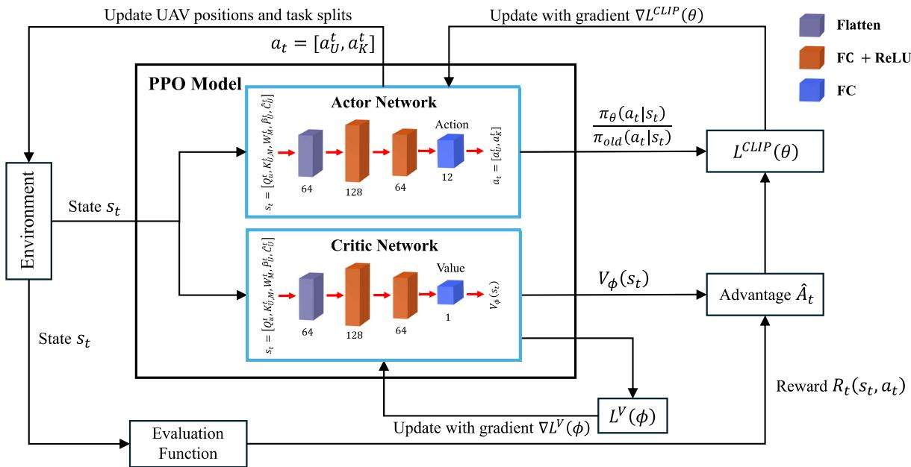  
Fig. 2. Architecture of the PPO-based framework for UAV placement and task offloading optimization. The actor network generates actions for UAV positions and task splits, while the critic network evaluates the actions using a value function.

3) Reward Function: To solve the formulated task offloading and UAV placement problem, the UAVs should minimize the total system costs while satisfying certain constraints, such as energy consumption and computational capacity. We design the reward function to reflect the objectives of $P _ { 0 }$ while allowing the PPO-based algorithm to explore optimal decision-making policies. Specifically, the first term in the reward function penalizes higher task execution time, aligning with the latency minimization objective in $P _ { 0 }$ . The second and third terms introduce penalties for exceeding energy and computational capacity limits, ensuring the learned policy does not violate these constraints. By carefully tuning the penalty parameters, we regulate the trade-off between constraint satisfaction and latency minimization, effectively guiding the PPO agent toward feasible and efficient task allocation strategies. Based on these considerations, the reward function is formulated as:

$$
\begin{array} { r } { R _ { t } ( s _ { t } , a _ { t } ) = \mathrm { ~ - ~ } \displaystyle \sum _ { u \in \mathcal { U } , m \in \mathcal { M } } T _ { u , m } - \sum _ { m \in \mathcal { M } } \eta _ { 1 } ( \hat { E } _ { \operatorname* { m a x } } - E _ { u , m } ) } \\ { - \displaystyle \sum _ { m \in \mathcal { M } } \eta _ { 2 } ( \hat { C } _ { \operatorname* { m a x } } - k _ { u , m } C _ { m } ) , \qquad ( 1 \dag \dag \dag , \hat { T } _ { \operatorname* { m a x } } + k _ { u , m } ) \dag } \end{array}\tag{8}
$$

where $\eta _ { 1 }$ and $\eta _ { 2 }$ denote the penalty parameters for unsatisfied energy consumption and computational capacity, respectively.

4) PPO-Based Algorithm Design: In the design of the PPObased algorithm, we adopt a decaying <sup>	</sup>-greedy exploration strategy to balance between exploration and exploitation while training the model. We start with a high <sup>	</sup> value to encourage exploration of the state-action space at the beginning of the learning process, and gradually reduce it as the agent accumulates more experience and knowledge. Specifically, a linear decay schedule is employed, where <sup>	</sup> is decreased linearly from an initial value of $\epsilon _ { \mathrm { m a x } } = 0 . 9 9$ to a final value of $\epsilon _ { \mathrm { m i n } } = 0 . 0 1$ over a pre-defined number of iterations. This approach allows the agent to prioritize exploration during the early stages of training and progressively focus on exploiting the acquired knowledge as the training advances. The chosen decay schedule is informed by prior experience and empirical evaluations, ensuring that the agent avoids excessive exploration and the risk of getting stuck in suboptimal policies while effectively leveraging its learned strategies.

The proposed PPO-based solution considers the high dimensional continuous action space of the UAV coordinates and task offloading decisions. The structure of the PPO model is shown in Fig. 2, and the details of the proposed solution are presented in Algorithm 4. At the beginning of the task, the set of ground users M, UAVs U and the task splits K are initialized. The actor and critic network models are initialized with the given input and output sizes. Parameters like learning rate $\mu ,$ discount factor <sup>γ</sup>, exploration factor <sup>	</sup>, and its decaying rate are given in Table II. The algorithm then proceeds through the episodes in a loop that runs until the total number of episodes is reached. In each episode, the UAV starts from the initial position and proceeds by selecting action $a _ { t } \in \mathcal A$ based on the <sup>	</sup>-greedy exploration policy. At each iteration, the signal-to-noise ratio (SNR) between various entities $\mathrm { S N R } _ { u , m } , \mathrm { S N R } _ { \mathrm { s } , u } , \mathrm { S N R } _ { \mathrm { s } , m }$ are updated and used to decide which UAV the user is connected with. With the UAV positions and the UAV to user association, the backhaul network formation algorithm utilizes breadth-first-search (BFS) to explore the possible connections between neighboring UAVs satisfying the certain SNR threshold, and generates the sequence of the backhaul link as in Algorithm 2. The UAV receives the list of response time of users $T _ { u , m }$ and receives a reward $R _ { t } ( s _ { t } , a _ { t } )$ based on (18). The system states $s _ { t } ,$ task splits K and UAV positions Q are updated. At last, the <sup>	</sup> value is decayed and the position of the UAV BS is updated. The process is updated until the maximum training iterations are reached and the algorithm converges to an optimal policy that achieve the maximum reward in the shortest path. The algorithm flow is illustrated in Fig. 2.

Algorithm 4: PPO-Based UAV Placement and Task   
Offloading.   
1: Initialize:   
2: Sets of ground users $\mathcal { M } ;$   
3: UAV initial position and initial state $q _ { u } ( 0 ) , s _ { 0 } ;$   
4: Initial ordering of the UAV network;   
5: Initialize the PPO networks;   
6: Set initial exploration rate: $\epsilon \gets \epsilon _ { \mathrm { m a x } } ;$   
7: Set current episode: $e = 0 ,$ , total episodes: $e _ { \operatorname* { m a x } } = 1 0 0 ;$   
8: Set current iteration: $i  0 ,$ total iterations: $i _ { \mathrm { m a x } }  1 0 0 ;$   
9: while $e < e _ { \mathrm { m a x } }$ do   
10: Increment episode: $e  e + 1$   
11: while $i < i _ { \mathrm { m a x } }$ do   
12: Increment iteration: $i \gets i + 1$   
13: Compute $\mathrm { S N R } _ { u , m } , \mathrm { S N R } _ { \mathrm { s } , u } , \mathrm { S N R } _ { \mathrm { s } , m }$   
14: if $\mathrm { ( S N R } _ { u , m } , \mathrm { S N R } _ { \mathrm { s } , u } \mathrm { ) } > \mathrm { S N R } _ { \mathrm { s } , m }$ then   
15: <sup>min( )</sup>User <sup>m</sup> connects to UAV.   
16: else   
17: User <sup>m</sup> connects to cellular BS.   
18: end if   
19: Update the connectivity of UAV network using the   
sequence of the connected UAV nodes from   
Algorithm 2.   
20: Generate random sample from Uniform <sup>,</sup> .   
21: if $\Lambda < \epsilon$ then   
22: <sup>Λ</sup>Select a random action $a _ { t }$ from action space.   
23: else   
24: Select action $a _ { t }$ generated by the actor model.   
25: end if   
26: Compute system reward $R _ { t } ( s _ { t } , a _ { t } )$   
27: Update system state: $s _ { t + 1 }$   
28: Update task splits K and UAV positions Q.   
29: Update system delay $T _ { u , m } ,$ , energy consumption   
$E _ { u , m }$ and computational capacity $C _ { m }$   
30: Reduce exploration rate: $\epsilon \gets \operatorname* { m a x } ( \epsilon _ { \operatorname* { m i n } } , \epsilon - \epsilon _ { \Delta } )$   
31: Compute $\dot { L } ^ { C L I P } ( \theta ) , L ^ { V } ( \mu )$ and update actor and   
critic models.   
32: end while   
33: end while

The computational complexity of the proposed algorithm can be determined based on three main components, i.e., the processing time of the PPO model output, the fronthaul user association time, and the backhaul formation time. First, the learning model processing time refers to the duration it takes for the PPO model to process a UAV state input and generate the actions. This duration is determined by the model architecture and is expressed by $\begin{array} { r } { \mathcal { O } ( \sum _ { l = 1 } ^ { L } N _ { l } N _ { l - 1 } ) } \end{array}$ [47], where <sup>L</sup> represents the number of layers of the neural network and $N _ { l }$ represents the number of neurons of layer <sup>l</sup>. Second, the fronthaul association involves assessing all possible combinations of users and UAVs, resulting in a time complexity of $\mathcal { O } ( M \cdot U )$ . Third, for determining the backhaul connectivity network, we employ an algorithm based on BFS, outlined in Algorithm 2. The time complexity of this algorithm is dependent on the number of UAVs and is expressed as $\mathcal { O } ( U ^ { 2 } )$ . In summary, the overall time complexity of the proposed UAV placement algorithm can be expressed as $\mathcal { O } ( \bar { M } \cdot \bar { U } + U ^ { 2 } + \bar { \sum _ { l = 1 } ^ { L } } N _ { l } N _ { l - 1 } )$ , reflecting the combined computational requirements of fronthaul association and backhaul formation.

TABLE II PARAMETER VALUES USED IN SIMULATIONS
<table><tr><td rowspan=1 colspan=1>Parameter</td><td rowspan=1 colspan=1>Value</td></tr><tr><td rowspan=1 colspan=1>Number of ground users, M</td><td rowspan=1 colspan=1>100</td></tr><tr><td rowspan=1 colspan=1>UAV BS communication range, r</td><td rowspan=1 colspan=1>500 m</td></tr><tr><td rowspan=1 colspan=1>Bandwidth of link between UAVs and users, $\overline { { B _ { u } } }$ </td><td rowspan=1 colspan=1>25 MHz</td></tr><tr><td rowspan=1 colspan=1>Bandwidth of link between cellular BS and $\overline { { \mathrm { U A V } , \boldsymbol { B } _ { \mathrm { s } } } }$ </td><td rowspan=1 colspan=1>25 MHz</td></tr><tr><td rowspan=1 colspan=1>Environmental path-loss parameters, $\overline { { \vartheta , \xi } }$ </td><td rowspan=1 colspan=1>4.88, 0.43</td></tr><tr><td rowspan=1 colspan=1>Path-loss exponent, δ</td><td rowspan=1 colspan=1>2.0</td></tr><tr><td rowspan=1 colspan=1>Additional average LoS path-loss, $\underline { { \eta _ { L o s } } }$ </td><td rowspan=1 colspan=1>0.1 dB</td></tr><tr><td rowspan=1 colspan=1>Additional average NLoS path-loss, $\underline { { \eta _ { N L o s } } }$ </td><td rowspan=1 colspan=1>21.0 dB</td></tr><tr><td rowspan=1 colspan=1>Unit energy cost for data transmission, $\overline { { P _ { b } } }$ </td><td rowspan=1 colspan=1>0.01 J/bit</td></tr><tr><td rowspan=1 colspan=1>Unit energy cost for task processing, $\overline { { P _ { c } } }$ </td><td rowspan=1 colspan=1> $\overline { { 1 0 ^ { - 1 0 } } }$ J/cycle</td></tr><tr><td rowspan=1 colspan=1>Computing capacity of $\overline { { \mathrm { U A V s , } \hat { C } _ { \mathrm { m a x } } } }$ </td><td rowspan=1 colspan=1>1 GHz</td></tr><tr><td rowspan=1 colspan=1>Energy capacity of UAVs, $\hat { E } _ { \mathrm { m a x } }$ </td><td rowspan=1 colspan=1>20 kJ</td></tr><tr><td rowspan=1 colspan=1>Reward penalty parameters $\underline { { \eta _ { 1 } , \eta _ { 2 } } }$ </td><td rowspan=1 colspan=1>0.5, 0.5</td></tr><tr><td rowspan=1 colspan=1>Learning rate, µ</td><td rowspan=1 colspan=1>0.01</td></tr><tr><td rowspan=1 colspan=1>Discount factor, γ</td><td rowspan=1 colspan=1>0.9</td></tr><tr><td rowspan=1 colspan=1>Maximum, minimum and decaying epsilon greedyparameters, $\underline { { \epsilon _ { \mathrm { m a x } } , \epsilon _ { \mathrm { m i n } } , \epsilon _ { \Delta } } }$ </td><td rowspan=1 colspan=1>0.99, 0.01, 0.01</td></tr></table>

## V. SIMULATION RESULTS

In this section, we present the simulation results to demonstrate the performance of the proposed PPO-based UAV placement algorithm.

## A. Experimental Setup

We perform a series of simulations in Python 3.9 environment using TensorFlow 2.11.0. Unless otherwise stated, we consider a simulation area of size 1 km × 1 km with a cellular base station located at [0,0,0] and two clusters of $M = 2 0$ ground users. The users are distributed according to 2D Gaussian distribution with a mean [40,60],[60,20] and a covariance matrix [[100,0],[0,50]], which is a realistic user distribution in post-disaster or remote areas. We deploy 3 UAVs with their initial positions set to $[ 0 , 0 , h ]$ . The communication range and the altitude for the <sup>[0 0 ]</sup>UAVs are set to $r = 1 0 0 \mathrm { m }$ and $h = 5 0 \mathrm { m }$ , which are designed for operations in suburban areas as per our prior work [48]. The bandwidth of the link between UAVs and users is set to be equivalent as the link between cellular BS and UAV for the simplicity of simulation. The chosen set of environmental path-loss parameters align with prevalent parameters utilized in similar studies. The path-loss exponent is set to $\delta = 2 . 0$ which adheres to the standard free-space propagation model [49]. In order to simulate the characteristics of a contemporary cellular network environment, the additional average LoS and NLoS path-loss follow the study in [50] and are tailored to $\eta _ { L o S }$ $\mathit { \Theta } = 0 .$ dB and $\eta _ { N L o S } = 2 1 . 0$ dB respectively. The learning rate and discount factor are tuned to $\mu = 0 . 0 1$ and $\gamma = 0 . 9$ during the training of the model, aiming to optimize the trade-off between swift convergence and stability, as well as temporal rewards against long-term gains [51]. As for the <sup>	</sup>-greedy exploration parameters, they are designed to achieve a balance between exploration and exploitation within the state space [52]. The main parameters of the simulation setting are listed in Table II.

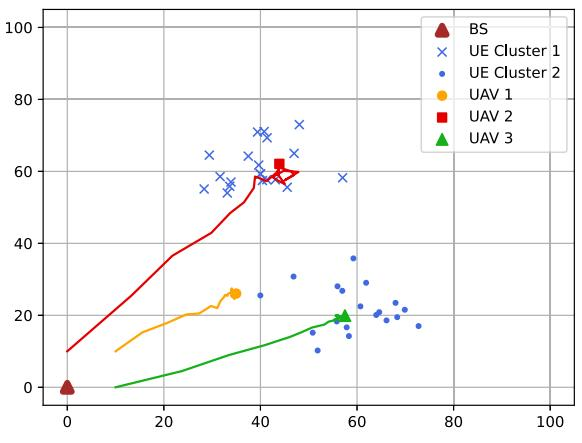  
(a)

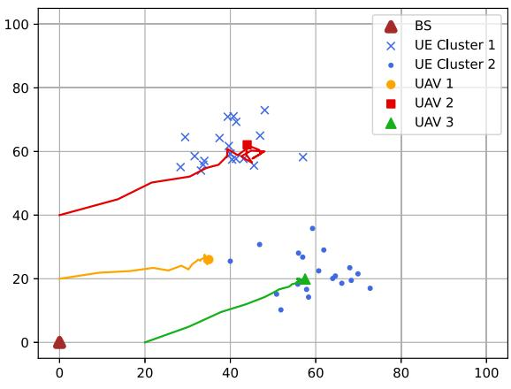  
(b)  
Fig. 3. Top view of the UAV placements and trajectories after training convergence with three UAVs. Fig. 3(a) and (b) show the results using different initial positions for UAVs. Two UAVs serve as the access point for the users, while the other UAV provides backhaul connection with the cellular BS.

## B. Performance Evaluation

In Fig. 3, we show the distribution of ground users and the top views of the UAV servers’ learned trajectories. In the illustrations, the red triangle represents the cellular BS, blue crosses and dots denote the ground users, and the solid lines indicate the learned UAV trajectories. In Fig. 3(a), the three UAVs initialize at [10,0], [10,10] and [0,10] respectively, and form a connected backhaul network between the cellular BS and the users. UAVs 2 and 3 provide direct connections to the ground users, achieving optimal positions at [42,58] and [59,22], respectively. Meanwhile, UAV 1 acts as a backhaul node to bridge the UAVs with the BS, learning its optimal position at [37,22]. In Fig. 3(b), the same trained model is applied with different initial positions for the UAVs. The model successfully adapts to achieve optimal placements, reaffirming its robustness and adaptability. The training reward curves over the episodes for the UAV MEC system are illustrated in Fig. 4. It can be shown that the UAVs continuously learn and update their policies to enhance the service latency of the users.

In Figs. 5 and 6, we show the dynamic evolution of the average percentage of task splits between the UAV servers and the BS for the two distinct UE clusters, Cluster 1 and Cluster 2, over the course of 1000 training episodes. In both cases, the task allocation percentages adjust significantly during the early training episodes, reflecting the PPO exploration phase where the algorithm learns to balance the task loads based on the communication and computation capabilities of the UAVs and the BS. As training progresses, the task split percentages gradually stabilize, demonstrating the convergence of the PPO algorithm. After approximately 800 training episodes, the results converge, with distinct allocations achieved for Cluster 1 and Cluster 2. This convergence indicates that the UAVs and BS have learned an optimal task allocation and UAV positioning strategy. In the converged UAV placement, UAV 2 is positioned near UE cluster 1, resulting in 80% of the task load from UEs in cluster 1 being offloaded to UAV 2, as shown in Fig. 5. Similarly, UAV 3 is positioned near UE cluster 2, leading to 80% of the task load from UEs in cluster 2 being offloaded to UAV 3, as depicted in Fig. 6. The results highlight the system’s capability to balance the task allocation between UAV and BS servers based on spatial and computational dynamics.

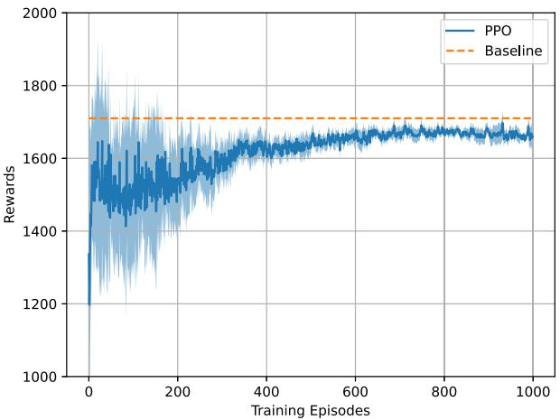  
Fig. 4. Evolution of training rewards over episodes for the PPO-based approach compared to the baseline.

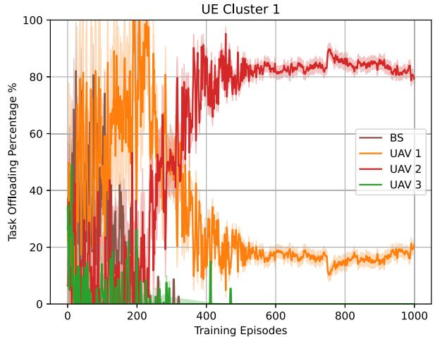  
Fig. 5. Evolution of task offloading percentage across training episodes for three UAVs for UEs in cluster 1. Each UAV dynamically adjusts its task allocation strategy to balance computational loads and improve overall network efficiency.

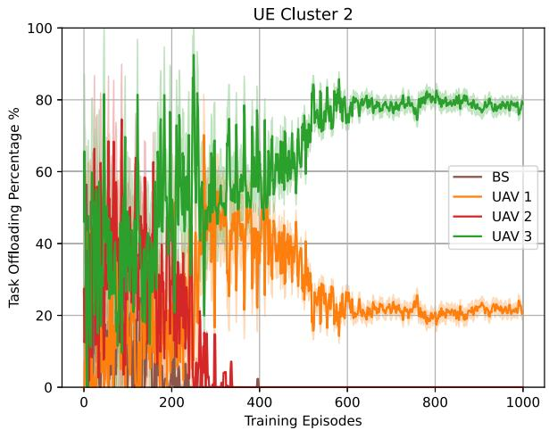  
Fig. 6. Evolution of task offloading percentage for three UAVs over training episodes for UEs in cluster 2. The PPO-based model converges effectively, achieving stable and optimal task offloading policies.

In Fig. 7 we show the task split distribution for UE Cluster 1 and UE Cluster 2 across testing steps, demonstrating the dynamic task allocation achieved by the proposed framework. The computational tasks are adaptively distributed among the BS and UAVs (UAV 1, UAV 2, UAV 3) based on network conditions and task requirements. For UE Cluster 1, the majority of tasks are assigned to UAV 2, reflecting its geographical proximity and computational capability, while UAV 1 takes on a smaller share, and minimal tasks are offloaded to the BS and UAV 3. Similarly, for UE Cluster 2, UAV 3 handles the bulk of the tasks, with UAV 1 supporting task allocation as needed. With the system stabilizing within 14 testing steps, the figure highlights the fast convergence speed of the task splits, showcases the framework’s ability to dynamically allocate tasks in response to varying network conditions and the efficiency of the optimization process.

The results in Fig. 8 highlight the resilience of the proposed model under scenarios involving 2, 3, and 4 UAVs, respectively. Each experiment spans 20 steps, with a random UAV failure introduced at the 13th step to simulate real-world disruptions such as hardware malfunctions or energy depletion. The UAVs are equipped with pretrained models, enabling rapid adaptation and reformation of the network. In the 2-UAV case, the failure of one UAV has a significant impact on network performance, as the remaining UAV must bear the entire task load and maintain connectivity. This results in a noticeable increase in latency postfailure. Despite this challenge, the proposed model allows the surviving UAV to quickly adapt, mitigating the latency increase to some extent. For the 3-UAV case, the impact of a single UAV failure is less severe. The remaining two UAVs redistribute the task load and reconfigure their positions to maintain network stability. The proposed model enables a swift recovery, with latency stabilizing a few steps after the failure event. In the 4-UAV case, the network exhibits the highest resilience. With three UAVs remaining operational after the failure, the system efficiently rebalances the task load and reconstructs the network with minimal latency increase. These results demonstrating the network’s ability to handle disruptions more effectively as redundancy increases

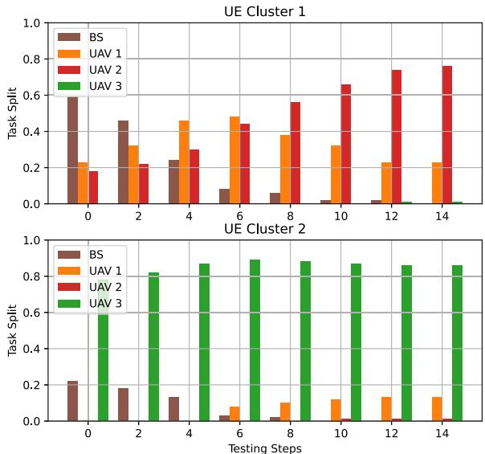

Fig. 7. Task split distribution for UE Cluster 1 and UE Cluster 2 across testing steps. The figure illustrates how computational tasks are dynamically allocated between the base station (BS) and UAVs (UAV 1, UAV 2, UAV 3) based on network conditions and task requirements, demonstrating adaptive task offloading in the proposed framework.  
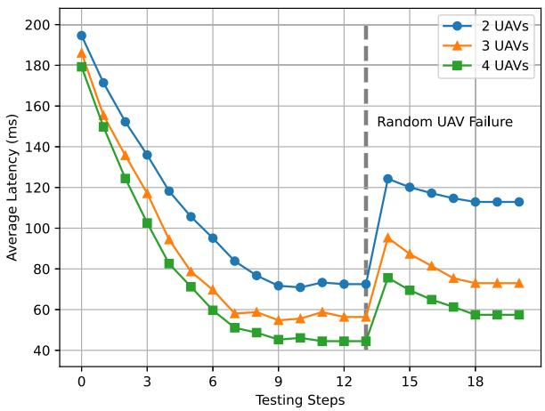  
Fig. 8. Average latency performance during testing with 2, 3, and 4 UAVs, including scenarios of random UAV failure. The PPO-based algorithm demonstrates resilience, recovering from disruptions and maintaining reduced latency.

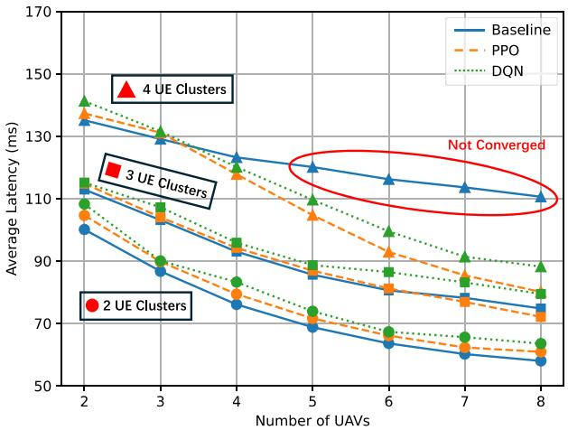  
Fig. 9. Performance comparison of the proposed method with the baseline method using different number of UAVs. Our proposed method achieves better average response latency in complex situations with more UAVs.

To highlight the performance of the proposed PPO learning based algorithm, we use the bi-level optimization approach presented in methodology as baseline and also compare the performance with the widely applied DQN. In Fig. 9, we compare the average response latency of the proposed model with the baseline and DQN model with respect to the number of UAVs. In the 2 UE clusters case, all methods show relatively close performance since the problem complexity is lower, and the task distribution and UAV placement are less demanding. In the 3 UE clusters case, as the number of UAVs increases, the task allocation and UAV placement become more intricate, introducing additional complexity in maintaining low latency. Here, the PPO method exhibits a more significant advantage, achieving better latency performance than both the baseline and DQN especially when the number of UAVs is larger than 7. In the 4-UAV case, the network becomes increasingly complex with a higher density of UAVs and task allocation requirements. The proposed PPO method consistently achieves the lowest average latency, while the baseline and DQN methods are unable to maintain optimal performance. Notably, as the number of UAVs exceeds 5, the baseline model fail to converge and the DQN model experiences a noticeable drop in performance. This result highlights the scalability of the PPO method and its superior capability in handling complex coordination and optimization tasks in multi-UAV MEC networks.

To compare the energy efficiency of our proposed model, we show in Fig. 10 the energy consumption comparison between the proposed PPO framework, the baseline method, and DQN under varying UAV computational capacities. As the computational capacity of UAVs increases, the energy consumption dynamics reveal the efficiency of different approaches. The proposed PPO method achieves near-optimal energy efficiency, maintaining energy consumption close to that of the baseline method, which represents a more rigid optimization framework. However, PPO also outperforms DQN significantly across all computational capacities, demonstrating its ability to balance task offloading and UAV positioning to minimize energy usage. These results highlight PPO’s effectiveness in leveraging computational resources efficiently under dynamic and challenging MEC network conditions, making it a robust solution for energy-sensitive applications.

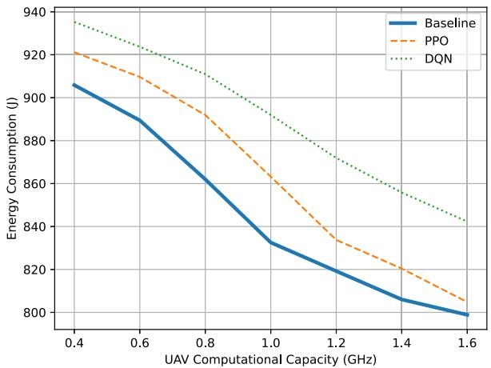

Fig. 10. Comparison of total energy consumption of the proposed framework with the baseline using different UAV computational capacity. Our proposed method achieves near-optimal energy efficiency compared with the baseline.  
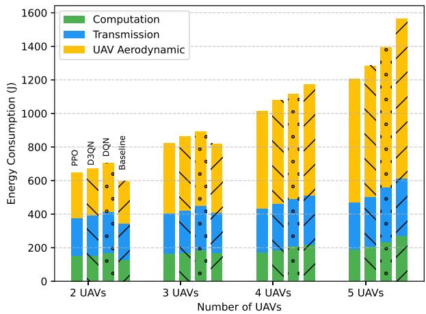  
Fig. 11. Comparison of computation, transmission, and UAV aerodynamic energy consumption of the proposed framework with the baseline methods for different numbers of UAVs.

In Fig. 11, we further analyze the energy consumption distribution across different numbers of UAVs in the network for the proposed PPO-based approach, and compare with the baseline DQN and the dueling double deep Q network (D3QN) [53]. The total energy consumption is categorized into three components: computation energy, transmission energy, and UAV hovering energy. As the number of UAVs increases from 2 to 5, the total energy consumption increases due to the additional UAVs for all three methods. When the number of UAVs is less than 3, the baseline approach consumes least energy. However, when the number of UAVs is larger 4, our PPO approach optimally balances task offloading and UAV positioning, and demonstrates lower total energy consumption compared to both the baseline and DQN methods. Notably, UAV hovering energy remains the dominant contributor to total energy consumption. The baseline and DQN methods exhibit increasingly higher computation and transmission costs, indicating inefficient resource utilization.

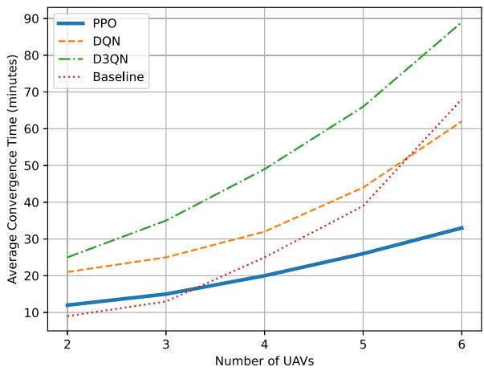  
Fig. 12. Comparison of the average convergence time of the proposed framework with the baseline using different numbers of UAVs.

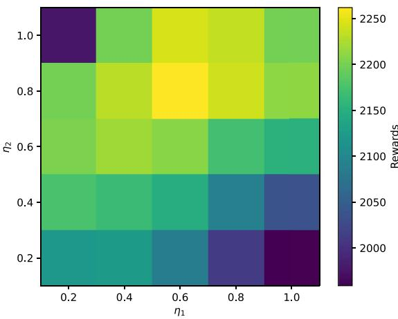  
Fig. 13. Influence of reward function parameters on the reward after convergence. The results show that an optimal balance between $\eta _ { 1 }$ and $\eta _ { 2 }$ leads to higher rewards.

These results highlight the potentials of the proposed framework in enhancing energy efficiency and scalability in multi-UAV MEC networks.

In Fig. 12, we compare the average convergence time of our proposed method with DQN, D3QN, and the baseline approach, as the number of UAVs increases from 2 to 6. The results indicate that the proposed PPO consistently achieves the fastest convergence, demonstrating its efficiency in learning optimal UAV positioning and task offloading policies. As the number of UAVs increases, the convergence time for all methods grows, reflecting the increased complexity of coordination in larger networks. However, DQN and D3QN exhibit significantly longer convergence times, particularly for networks with more UAVs, due to their reliance on discrete action spaces and inefficient exploration strategies. Notably, when the number of UAVs is less than 3, the baseline approach converges faster than the learningbased methods. However, as the number of UAVs increases, the baseline leads to a sharp rise in convergence time, demonstrating its lack of scalability in large decision spaces.

Fig. 13 illustrates the influence of the reward function parameters <sup>η</sup><sub>1</sub> and $\eta _ { 2 }$ on the final reward value after convergence. Here, $\eta _ { 1 }$ represents the penalty parameter for energy consumption, while $\eta _ { 2 }$ penalizes excessive computational resource usage. The results reveal a nonlinear relationship between the penalty parameters and the obtained rewards, demonstrating the effect of constraint enforcement on the learned policy. For low values of $\eta _ { 1 }$ and $\eta _ { 2 }$ , the PPO agent explores more aggressive task offloading and UAV positioning strategies, occasionally exceeding energy and computational limits. However, as $\eta _ { 1 }$ and $\eta _ { 2 }$ increase, the stronger penalties force the agent to adopt more conservative policies, ensuring constraint satisfaction. Notably, when only one of $\eta _ { 1 }$ or $\eta _ { 2 }$ is large while the other remains small, the reward drops significantly. This is because the optimization becomes imbalanced, with the agent prioritizing either energy consumption constraints or computational capacity constraints while neglecting the other. This highlights the importance of proper parameter tuning in reinforcement learning-based UAV task offloading optimization.

## VI. CONCLUSION

This paper proposed a dynamic joint optimization framework for UAV-assisted multi-access edge computing networks, focusing on minimizing end-to-end latency and optimizing resource utilization in challenging and dynamic environments. By leveraging proximal policy optimization, a reinforcement learning algorithm, the framework effectively addressed the coupled problems of UAV placement and computation task offloading. The proposed approach demonstrated the ability to dynamically adapt to varying user demands and network conditions, achieving significant improvements in latency reduction, energy efficiency, and computational load balancing. Extensive simulations validated the effectiveness of the PPO-based framework across diverse scenarios, including disaster recovery and dynamic urban operations. The results highlighted its superior performance compared to traditional optimization techniques, particularly in terms of resilience, scalability, and efficient resource utilization. Additionally, the adaptive nature of the framework positions it as a robust solution for real-time operation in UAV-enabled MEC networks.

Future work will focus on extending the proposed framework to incorporate dynamic user mobility, heterogeneous UAV capabilities, and distributed learning to further enhance scalability and adaptability. Investigating energy-efficient strategies and real-world deployment constraints will also be pivotal in advancing the practical applicability of UAV-assisted MEC systems.

## REFERENCES

[1] M. Bennis, M. Debbah, and H. V. Poor, “Ultrareliable and low-latency wireless communication: Tail, risk, and scale,” in Proc. IEEE, vol. 106, no. 10, pp. 1834–1853, Oct. 2018.

[2] K. Ali et al., “Raven: Vision-based connected vehicle safety platform using infrastructure sensing, 5G, and MEC,” IEEE Trans. Veh. Technol, vol. 73, no. 11, pp. 17290–17304, Nov. 2024.

[3] A. Filali, A. Abouaomar, S. Cherkaoui, A. Kobbane, and M. Guizani, “Multi-access edge computing: A survey,” IEEE Access, vol. 8, pp. 197017–197046, 2020.

[4] F. Pervez, A. Sultana, C. Yang, and L. Zhao, “Energy and latency efficient joint communication and computation optimization in a multi-UAVassisted MEC network,” IEEE Trans. Wireless Commun., vol. 23, no. 3, pp. 1728–1741, Mar. 2024.

[5] Y. Zeng, S. Chen, J. Li, Y. Cui, and J. Du, “Online optimization in UAVenabled MEC system: Minimizing long-term energy consumption under adapting to heterogeneous demands,” IEEE Internet Things J., vol. 11, no. 19, pp. 32143–32159, Oct. 2024.

[6] M. Hui, J. Chen, L. Yang, L. Lv, H. Jiang, and N. Al-Dhahir, “UAVassisted mobile edge computing: Optimal design of UAV altitude and task offloading,” IEEE Trans. Wireless Commun., vol. 23, no. 10, pp. 13633–13647, Oct. 2024.

[7] G. Sun et al., “Joint task offloading and resource allocation in aerialterrestrial UAV networks with edge and fog computing for post-disaster rescue,” IEEE Trans. Mobile Comput., vol. 23, no. 9, pp. 8582–8600, Sep. 2024.

[8] Z. Liu, J. Qi, Y. Shen, K. Ma, and X. Guan, “Maximizing energy efficiency in UAV-assisted NOMA–MEC networks,” IEEE Internet Things J., vol. 10, no. 24, pp. 22208–22222, Dec. 2023.

[9] F. H. Panahi and F. H. Panahi, “Reliable and energy-efficient UAV communications: A cost-aware perspective,” IEEE Trans. Mobile Comput., vol. 23, no. 5, pp. 4038–4049, May 2024.

[10] Z. Han, T. Zhou, T. Xu, and H. Hu, “Joint user association and deployment optimization for delay-minimized UAV-aided MEC networks,” IEEE Wireless Commun. Lett., vol. 12, no. 10, pp. 1791–1795, Oct. 2023.

[11] J. Tian, D. Wang, H. Zhang, and D. Wu, “Service satisfaction-oriented task offloading and UAV scheduling in UAV-enabled MEC networks,” IEEE Trans. Wireless Commun., vol. 22, no. 12, pp. 8949–8964, Dec. 2023.

[12] H. Hao, C. Xu, W. Zhang, S. Yang, and G.-M. Muntean, “Joint task offloading, resource allocation, and trajectory design for multi-UAV cooperative edge computing with task priority,” IEEE Trans. Mobile Comput., vol. 23, no. 9, pp. 8649–8663, Sep. 2024.

[13] H. Li, K. Xiong, Y. Lu, W. Chen, P. Fan, and K. B. Letaief, “Collaborative task offloading and resource allocation in small-cell MEC: A multi-agent PPO-based scheme,” IEEE Trans. Mobile Comput., vol. 24, no. 3, pp. 2346–2359, Mar. 2025.

[14] W. Lee and T. Kim, “Multiagent reinforcement learning in controlling offloading ratio and trajectory for multi-UAV mobile-edge computing,” IEEE Internet Things J., vol. 11, no. 2, pp. 3417–3429, Jan. 2024.

[15] Z. Shah, U. Javed, M. Naeem, S. Zeadally, and W. Ejaz, “Mobile edge computing (MEC)-enabled UAV placement and computation efficiency maximization in disaster scenario,” IEEE Trans. Veh. Technol, vol. 72, no. 10, pp. 13406–13416, Oct. 2023.

[16] G. Pan, H. Zhang, S. Xu, S. Zhang, and X. Chen, “Joint optimization of video-based AI inference tasks in MEC-assisted augmented reality systems,” IEEE Trans. Cogn. Commun. Netw., vol. 9, no. 2, pp. 479–493, Apr. 2023.

[17] Y. Sun, Z. Wu, K. Meng, and Y. Zheng, “Vehicular task offloading and job scheduling method based on cloud-edge computing,” IEEE Trans. Intell. Transp. Syst., vol. 24, no. 12, pp. 14651–14662, Dec. 2023.

[18] W. Ma and L. Mashayekhy, “Video offloading in mobile edge computing: Dealing with uncertainty,” IEEE Trans. Mobile Comput., vol. 23, no. 11, pp. 10251–10264, Nov. 2024.

[19] L. Wu, P. Sun, Z. Wang, Y. Li, and Y. Yang, “Computation offloading in multi-cell networks with collaborative edge-cloud computing: A game theoretic approach,” IEEE Trans. Mobile Comput., vol. 23, no. 3, pp. 2093–2106, Mar. 2024.

[20] H. Zhou, Z. Wang, G. Min, and H. Zhang, “UAV-aided computation offloading in mobile-edge computing networks: A Stackelberg game approach,” IEEE Internet Things J., vol. 10, no. 8, pp. 6622–6633, Apr. 2023.

[21] K. Wu, K.-W. Chin, and S. Soh, “UAVs deployment algorithms for maximizing Backhaul flow,” IEEE Syst. J., vol. 17, no. 4, pp. 5592–5603, Dec. 2023.

[22] Z. Rahimi, R. Ghanbari, A. H. Mohajerzadeh, H. Ahmadi, and M. Sookhak, “3D UAV BS positioning and Backhaul management in cellular network via stochastic optimization,” in Proc. IEEE Glob. Commun. Conf., 2022, pp. 2169–2175.

[23] D. Wang, Y. Bai, G. Huang, B. Song, and F. R. Yu, “Cache-aided MEC for IoT: Resource allocation using deep graph reinforcement learning,” IEEE Internet Things J., vol. 10, no. 13, pp. 11486–11496, Jul. 2023.

[24] N. Huang, C. Dou, Y. Wu, L. Qian, B. Lin, and H. Zhou, “Unmannedaerial-vehicle-aided integrated sensing and computation with mobile-edge computing,” IEEE Internet Things J., vol. 10, no. 19, pp. 16830–16844, Oct. 2023.

[25] Y. Zhang, Y. Gong, and Y. Guo, “Energy-efficient resource management for multi-UAV-enabled mobile edge computing,” IEEE Trans. Veh. Technol, vol. 73, no. 8, pp. 12026–12037, Aug. 2024.

[26] F. Chai, Q. Zhang, H. Yao, X. Xin, R. Gao, and M. Guizani, “Joint multitask offloading and resource allocation for mobile edge computing systems in satellite IoT,” IEEE Trans. Veh. Technol, vol. 72, no. 6, pp. 7783–7795, Jun. 2023.

[27] L. Wang, X. Deng, J. Gui, X. Chen, and S. Wan, “Microserviceoriented service placement for mobile edge computing in sustainable Internet of vehicles,” IEEE Trans. Intell. Transp. Syst., vol. 24, no. 9, pp. 10012–10026, Sep. 2023.

[28] N. Nouri, J. Abouei, A. R. Sepasian, M. Jaseemuddin, A. Anpalagan, and K. N. Plataniotis, “Three-dimensional multi-UAV placement and resource allocation for energy-efficient IoT communication,” IEEE Internet Things J., vol. 9, no. 3, pp. 2134–2152, Feb. 2022.

[29] W. Huang, H. Guo, and J. Liu, “Task offloading in UAV swarm-based edge computing: Grouping and role division,” in Proc. IEEE Glob. Commun. Conf., 2021, pp. 1–6.

[30] Y. Wang, H. Guo, and J. Liu, “Cooperative task offloading in UAV swarm-based edge computing,” in Proc. IEEE Glob. Commun. Conf., 2021, pp. 1–6.

[31] H. Li, P. Li, J. Xu, J. Chen, and Y. Zeng, “Derivative-free placement optimization for multi-UAV wireless networks with channel knowledge map,” in Proc. IEEE Int. Conf. Commun. Workshops, 2022, pp. 1029–1034.

[32] R. Chen, W. Cheng, Y. Ding, and B. Wang, “QoS-guaranteed multi-UAV coverage scheme for IoT communications with interference management,” IEEE Internet Things J., vol. 11, no. 3, pp. 4116–4126, Feb. 2024.

[33] J. Sabzehali, V. K. Shah, Q. Fan, B. Choudhury, L. Liu, and J. H. Reed, “Optimizing number, placement, and backhaul connectivity of multi-UAV networks,” IEEE Internet Things J., vol. 9, no. 21, pp. 21548–21560, Nov. 2022.

[34] M. Nikooroo, O. Esrafilian, Z. Becvar, and D. Gesbert, “Optimization of placement and resource allocation in UAV-aided multihop wireless networks,” IEEE Internet Things J., vol. 11, no. 11, pp. 20051–20071, Jun. 2024.

[35] Y. Liu, W. Huangfu, H. Zhou, H. Zhang, J. Liu, and K. Long, “Fair and energy-efficient coverage optimization for UAV placement problem in the cellular network,” IEEE Trans. Commun., vol. 70, no. 6, pp. 4222–4235, Jun. 2022.

[36] A. Mahmood, T. X. Vu, S. Chatzinotas, and B. Ottersten, “Joint optimization of 3D placement and radio resource allocation for per-UAV sum rate maximization,” IEEE Trans. Veh. Technol, vol. 72, no. 10, pp. 13094–13105, Oct. 2023.

[37] J. Du et al., “MADDPG-based joint service placement and task offloading in MEC empowered air–ground integrated networks,” IEEE Internet Things J., vol. 11, no. 6, pp. 10600–10615, Mar. 2024.

[38] N. Zhao, Z. Ye, Y. Pei, Y.-C. Liang, and D. Niyato, “Multi-agent deep reinforcement learning for task offloading in UAV-assisted mobile edge computing,” IEEE Trans. Wireless Commun., vol. 21, no. 9, pp. 6949–6960, Sep. 2022.

[39] Y. Deng, H. Zhang, X. Chen, and Y. Fang, “UAV-assisted MEC with an expandable computing resource pool: Rethinking the UAV deployment,” IEEE Wireless Commun., vol. 31, no. 5, pp. 110–116, Oct. 2024.

[40] X. Gao and L. Zhai, “Service experience oriented cooperative computing in cache-enabled UAVs assisted MEC networks,” IEEE Trans. Mobile Comput., vol. 23, no. 10, pp. 9721–9736, Oct. 2024.

[41] Y. Xu, T. Zhang, Y. Liu, D. Yang, L. Xiao, and M. Tao, “Cellular-connected multi-UAV MEC networks: An online stochastic optimization approach,” IEEE Trans. Commun., vol. 70, no. 10, pp. 6630–6647, Oct. 2022.

[42] X. Zhang, M. Peng, and C. Liu, “Impacts of antenna downtilt and backhaul connectivity on the UAV-enabled heterogeneous networks,” IEEE Trans. Wireless Commun., vol. 22, no. 6, pp. 4057–4073, Jun. 2023.

[43] Y. Qu et al., “Elastic collaborative edge intelligence for UAV swarm: Architecture, challenges, and opportunities,” IEEE Commun. Mag., vol. 62, no. 1, pp. 62–68, Jan. 2024.

[44] E. E. Haber, H. A. Alameddine, C. Assi, and S. Sharafeddine, “UAV-aided ultra-reliable low-latency computation offloading in future IoT networks,” IEEE Trans. Commun., vol. 69, no. 10, pp. 6838–6851, Oct. 2021.

[45] Y. Zhang, Z. Kuang, Y. Feng, and F. Hou, “Task offloading and trajectory optimization for secure communications in dynamic user multi-UAV MEC systems,” IEEE Trans. Mobile Comput., vol. 23, no. 12, pp. 14427–14440, Dec. 2024.

[46] Y. Shi, C. Yi, B. Chen, C. Yang, K. Zhu, and J. Cai, “Joint online optimization of data sampling rate and preprocessing mode for edge–cloud collaboration-enabled industrial IoT,” IEEE Internet Things J., vol. 9, no. 17, pp. 16402–16417, Sep. 2022.

[47] L. Zhang, B. Jabbari, and N. Ansari, “Deep reinforcement learning driven UAV-assisted edge computing,” IEEE Internet Things J., vol. 9, no. 24, pp. 25449–25459, Dec. 2022.

[48] Y. Wang and J. Farooq, “Optimal 3D placement for integrated access backhauling in UAV-assisted wireless networks using reinforcement learning,” in Proc. IEEE 20th Int. Conf. Mobile Ad Hoc Smart Syst., 2023, pp. 640–645.

[49] A. Al-Hourani and I. Guvenc, “On modeling satellite-to-ground path-loss in urban environments,” IEEE Commun. Lett., vol. 25, no. 3, pp. 696–700, Mar. 2021.

[50] S. A. Al-Ahmed, M. Z. Shakir, and S. A. R. Zaidi, “Optimal 3D UAV base station placement by considering autonomous coverage hole detection, wireless backhaul and user demand,” J. Commun. Netw., vol. 22, no. 6, pp. 467–475, 2020.

[51] S. Lim, H. Yu, and H. Lee, “Optimal tethered-UAV deployment in A2G communication networks: Multi-agent Q-learning approach,” IEEE Internet Things J., vol. 9, no. 19, pp. 18539–18549, Oct. 2022.

[52] S. Ouahouah, M. Bagaa, J. Prados-Garzon, and T. Taleb, “Deepreinforcement-learning-based collision avoidance in UAV environment,” IEEE Internet Things J., vol. 9, no. 6, pp. 4015–4030, Mar. 2022.

[53] Y. Wang and J. Farooq, “Deep-reinforcement-learning-based placement for integrated access backhauling in UAV-assisted wireless networks,” IEEE Internet Things J., vol. 11, no. 8, pp. 14727–14738, Apr. 2024.

  
Yuhui Wang (Student Member, IEEE) received the BEng degree in computer science from the Hong Kong University of Science and Technology (HKUST), Hong Kong, China, in 2019, and the MS degree in computer science from New York University (NYU), Brooklyn, NY, in 2021. He is currently working toward the PhD degree with the Department of Electrical and Computer Engineering, University of Michigan-Dearborn, USA. His research interests include mobile edge computing, machine learning, UAV networks, and Internet of Things.


Junaid Farooq (Senior Member IEEE) received the BS degree in electrical engineering from the School of Electrical Engineering and Computer Science (SEECS), National University of Sciences and Technology (NUST), Islamabad, Pakistan, in 2013, the MS degree in electrical engineering from the King Abdullah University of Science and Technology (KAUST), Thuwal, Saudi Arabia, in 2015, and the PhD degree in electrical engineering from the Tandon School of Engineering, New York University, Brooklyn, NY, in 2020. He was the recipient of the NYU University

wide Outstanding Dissertation Award in 2021. Currently, he is an assistant professor with the Department of Electrical and Computer Engineering, University of Michigan-Dearborn, USA. His research interests include optimization, security, and resilience of communication networks, cyber-physical systems, and the Internet of things.


Hakim Ghazzai (Senior Member, IEEE) received the diplome d’Ingenieur (hons.) degree in telecommunication engineering and the master’s degree in high-rate transmission systems from the Ecole Superieure des Communications de Tunis, Aryanah, Tunisia, in 2010 and 2011, respectively, and the PhD degree in electrical engineering from the King Abdullah University of Science and Technology (KAUST), Thuwal, Saudi Arabia, in 2015. He was a researcher scholar with the Qatar Mobility Innovations Center, Doha, Qatar; Karlstad University, Karlstad, Sweden;

and Stevens Institute of Technology, Hoboken, NJ, USA. He is currently a research scientist with KAUST. He has authored and co-authored more than 170 publications. His research interests include artificial intelligence enabled applications, Internet of Things, intelligent transportation systems, and mobile and wireless networks. He was the recipient of appreciation for an exemplary reviewer of the IEEE Wireless Communications Letters in 2016 and IEEE Communications Letters in 2017. Since 2019, he has been on the editorial board of the IEEE Communications Letters and the IEEE Open Journal of the Communications Society. Since 2020, he he has been on the Board of IoT and Sensor Networks (specialty section of Frontiers in Communications and Networks) as associate editor.


Gianluca Setti (Fellow, IEEE) received the DrEng (honors) and PhD degrees in electronic engineering from the University of Bologna, in 1992 and 1997, respectively. He was with the University of Ferrara (1997– 2017) and Politecnico di Torino (2017–2022) as a professor of electronics, signal and data processing. He held also several positions as visiting professor/scientist with École Polytechnique Fédérale de Lausanne, in 2002 and 2005, University of California San Diego in 2004, IBM in 2004 and 2007, and the University of Washington in 2008 and 2010. He is

the dean of the Computer, Electrical, Mathematical Sciences and Engineering Division and a professor of electrical and computer engineering with the King Abdullah University of Science and Technology, Thuwal, Saudi Arabia. His research interests include recurrent neural networks, electromagnetic compatibility, compressive sensing and statistical signal processing, biomedical circuits and systems, power electronics, Internet of Things, circuits and systems for machine learning, and applications of artificial intelligence techniques for anomaly detection and predictive maintenance. He served as the editor-in-chief of IEEE Transactions on Circuits and Systems—Part II (2006–2007) and of IEEE Transactions on Circuits and Systems—Part I (2008–2009). Since 2019, he has been the first non US editor-in-chief of the Proceedings of the IEEE, the flagship journal of the IEEE. In 2010, he served as IEEE CAS society president. In 2013–2014, he was the first non North-American vice president of the IEEE for Publication Services and Products. He was the recipient of several awards, including the 2004 IEEE CAS Society Darlington Award, 2013 IEEE CAS Society Meritorious Service Award, 2013 IEEE CAS Society Guillemin-Cauer Award, and the 2019 IEEE Transactions on Circuits and Systems Best Paper Award.