# Joint Trajectory Planning and Task Offloading in UAV-Assisted Inspection Networks: A Transformer-Based Approach

Ruibin Guo , Graduate Student Member, IEEE, Wei Quan , Senior Member, IEEE, Xinyu Huang , Member, IEEE, Yuming Zhang , Member, IEEE, Mingyuan Liu , Member, IEEE, Dong Yang , Member, IEEE, Hongke Zhang , Fellow, IEEE, and Xuemin Shen , Fellow, IEEE

Abstract—Uncrewed aerial vehicle (UAV) has emerged as a promising solution for automating railway inspections due to its high mobility, flexible deployment, and reduced labor cost. In this paper, we investigate UAV-assisted railway inspections, which include object recognition, humidity monitoring, and critical infrastructure modeling, each with distinct data volumes and computational requirements. Particularly, we introduce a UAV-assisted railway inspection framework. Different types of sensors are divided into several clusters. The UAV departs from the hive, flies over each cluster to collect their computational requirements, and performs task offloading before returning to the hive. This process is formulated as a joint optimization problem of trajectory planning and task offloading to minimize the weighted sum of latency and energy consumption. Considering the constrained computing and storage capabilities of UAVs, it is crucial but challenging to develop a lightweight yet high-performing solution for the multi-objective optimization problems. As such, a novel Artificial General Intelligence (AGI)-oriented Transformer (AoT) algorithm is proposed to solve the optimization problem. It uses an encoder-only architecture to process either sensor location or task features, and then directs the encoded outputs to different output heads to make decisions on UAV trajectory and task offloading. Simulation results demonstrate that the proposed AoT algorithm outperforms benchmark algorithms in terms of trajectory length and average offloading cost.

Index Terms—AGI-oriented, UAV-assisted inspection networks, shared-encoder transformer, trajectory planning, task offloading.

## I. INTRODUCTION

R EPLACING traditional manual inspections with uncrewedaerial vehicle (UAV)-assisted automated one in railway aerial vehicle (UAV)-assisted automated one in railway

Ruibin Guo, Wei Quan, Yuming Zhang, Mingyuan Liu, Dong Yang, and Hongke Zhang are with the School of Electronic and Information Engineering, Beijing Jiaotong University, Beijing 100044, China (e-mail: 20111022@bjtu .edu.cn; weiquan@bjtu.edu.cn; ymzhang3@bjtu.edu.cn; myliu@bjtu.edu. cn; dyang@bjtu.edu.cn; hkzhang@bjtu.edu.cn).

Xinyu Huang and Xuemin Shen are with the Department of Electrical and Computer Engineering, University of Waterloo, Waterloo, ON N2L 3G1, Canada (e-mail: x357huan@uwaterloo.ca; sshen@uwaterloo.ca).

Digital Object Identifier 10.1109/TMC.2025.3636717 industry can significantly enhance train operational safety [1], [2], [3]. Typical railway inspections comprise three aspects. First is the real-time recognition of foreign objects (debris) and unauthorized worker intrusions. Additionally, rainfall and soil moisture in mountainous areas near railway lines are needed to predict potential natural disasters. Data on critical railway infrastructure, e.g., bridges, should also be collected for shift or deformation detection. Manual inspections suffer from low efficiency and cannot promptly recognize construction workers or infrastructure breakdowns. Moreover, collecting environmental data in mountainous areas during harsh weather can pose significant safety risks to maintenance laborers [4], [5], [6]. By contrast, UAVs can provide flexible deployment and offer broad coverage of hard-to-reach areas. Combined with onboard or edge computing capabilities, UAVs can perform real-time data acquisition and analysis on-site, significantly improving operational efficiency. Cameras, rain gauge, humidity sensors, and light detection and ranging (LiDAR) systems are deployed at designated locations to collect localized data [7]. UAVs periodically interact with these ground devices to assist in uploading and processing the collected data. These data, generated by ground devices, require computation-intensive analysis and thus constitute the offloading tasks considered in this work. By appropriately offloading such tasks, the UAV-assisted inspection networks enables real-time monitoring for railway operations. In such networks, two tightly related decisions, where the UAV flies (trajectory) and where the computation happens (task offloading), significantly influence total inspection latency and energy consumption, motivating a joint optimization perspective.

As such, efficient trajectory planning and task offloading are crucial for overall performance [8], [9], [10]. The optimized trajectory can improve the UAV working efficiency. With a fixed cruising speed, a shorter path enables the UAV to reduce total mission latency for traversing all sensor nodes. The latency for UAV recharging at the hive is also reduced accordingly. As such, the UAV can achieve a higher inspection frequency within the same period. Effective task offloading can not only extend the lifespan of ground devices, but also improve inspection responsiveness and accuracy [11]. On the one hand, tasks such as digital twin modeling require substantial computational resources. Reasonable task offloading can prevent rapid hardware aging caused by prolonged high-intensity processing [12], [13], [14]. On the other hand, wireless sensors have limited energy and computational capability, which constrain their data analytics performance [15]. Proper task offloading preserves rapid processing under energy constraints, enhancing mission timeliness and the precision of defect discovery.

The Transformer has emerged as a promising solution for efficient trajectory planning and task offloading compared to traditional methods due to its advantages in long-range dependency modeling and parallel computation [16], [17], [18]. By leveraging the self-attention mechanism, the Transformer can effectively capture long-range dependencies between sensor nodes [19], [20]. Thus, it is less prone to getting stuck in local optima during trajectory planning compared with traditional algorithms. Additionally, conventional learning-based task offloading algorithms typically process task features sequentially, resulting in rapidly increasing computational complexity as the problem size grows [21]. In contrast, the Transformer is inherently designed for parallel processing and is able to analyze multiple task features simultaneously. As a result, the inference time for the Transformer grows at a much slower rate, providing a significant advantage in large-scale systems.

However, achieving efficient joint trajectory planning and task offloading with the Transformer still faces several challenges. First, the Transformer should possess multi-task generalization capabilities [22], known as artificial general intelligence (AGI). Deploying two separate Transformer algorithms on a UAV for trajectory planning and task offloading is inefficient and consumes excessive storage resources. Therefore, a single Transformer algorithm is needed to make joint optimization. This requires the Transformer to process variable-length inputs, i.e., inputs with varying numbers of elements along with diverse feature characteristics. Second, the Transformer should also deliver satisfying performance on specific tasks while maintaining generalization capability [23]. There is always a conflict between generalization and single-task performance. To achieve balance across different tasks, the Transformer may experience a decline in single-task performance. This necessitates architectural and training innovations of the Transformer to reduce interference between various tasks. Third, the AGI-oriented Transformer algorithm needs to be lightweight for deployment on resource-constrained devices [24]. Given the limited computation resources and energy of UAVs, the Transformer should minimize the number of its model parameters to reduce both inference latency and energy consumption. In short, the research gap is a lightweight, versatile algorithm that jointly optimizes trajectory and offloading decisions while delivering strong single-task performance.

To this end, in this paper, we propose an AGI-oriented Transformer (AoT) algorithm for UAV-assisted automated railway inspection networks, which adopts a shared-encoder architecture to perform efficient joint trajectory planning and task offloading, aiming at reducing overall latency and energy consumption of the inspection networks. The main contributions are as follows:

\- First, we design a UAV-assisted railway inspection framework. The framework defines the inspection tasks, sensor types, data features, and the interaction workflow among the hive, UAV, and sensor clusters. Within the framework, an inspection delay model is built to measure the total latency required for the UAV to traverse all sensors and for the sensors to complete computation tasks. Meanwhile, an energy consumption model is established to quantify the energy consumption of UAV flight, communication, and computation, as well as the energy consumed by sensors for communication and task processing.

\- Second, a joint optimization problem for trajectory planning and task offloading is formulated to minimize the weighted sum of overall inspection latency and total energy consumption under different resource constraints. The optimization problem is then transformed into a traveling salesman problem (TSP)-hybrid implicit Markov decision process (MDP) and an offloading MDP.

Third, we propose an AGI-oriented Transformer (AoT) algorithm to solve the joint optimization problem. The AoT algorithm adopts an encoder-only architecture to reduce the model parameters. The encoded representations from the encoder blocks are directed to different output heads as needed, including a Trajectory Planning Head and a Task Offloading Head. Instead of using a traditional decoder structure, the output heads are implemented as a multi-layer perceptron (MLP) for REINFORCE-based optimization. Simulation results validate the effectiveness of the proposed AoT algorithm in trajectory planning and task offloading.

The remainder of this paper is organized as follows. Related works are reviewed in Section II. The framework and system model of the UAV-assisted railway inspection networks are presented in Section III. The joint optimization problem is formulated and transformed in Section IV. An AoT algorithm is developed to solve the optimization problem in Section V, followed by simulation results in Section VI. Section VII concludes this paper.

## II. RELATED WORK

In recent years, extensive research has been conducted on UAV-assisted systems. A series of works focus on UAV trajectory planning to enhance UAV performance. Most works attempted to leverage new technologies to further improve the trajectory planning quality. To this end, Zhang et al. [25] designed a perception-aware-based UAV trajectory planner, which adopted generative adversarial self-imitation learning and classlevel instance-balancing expert buffer to achieve comparable flight costs and success rates with limited planning time. In [26], a 4D trajectory planning algorithm based on the Fast Marching Square (FM2) method was designed to plan a safe and shortest path for UAVs while avoiding obstacles. In addition, for UAV-assisted inspection networks, the low coverage rate caused by unsatisfactory trajectory quality is still the main challenge. Liu et al. [27] aimed at maximizing UAV target coverage rate of the industrial infrastructure and reducing latency via establishing a mathematical model under energy consumption and mapping efficiency constraints. Our work differentiates from the above works in methods to improve trajectory planning quality. By combining the Transformer with REINFORCE [28], we provide an ideal training baseline for the Transformer without the need to explicitly define an MDP, resulting in faster algorithm convergence.

Another line of work focuses on efficient task offloading for UAV-assisted systems. Existing works predominantly rely on heuristic algorithms and reinforcement learning (DRL)-based methods. Tian et al. [29] proposed a user-centric task offloading framework for UAV-enabled MEC networks and developed a genetic algorithm (GA)-based method to maximize user satisfaction. In [30], a collaborative mobile edge computing system with multiple UAVs and multiple edge clouds was investigated, in which a multi-agent DRL framework is designed to minimize the sum of execution latency and energy consumption. However, Transformer-based task offloading solutions in UAV-assisted networks remain largely unexplored. A relevant example can be found in the connected vehicle domain. In [31], Yan et al. investigated an efficient offloading approach for delay-sensitive and computationally demanding tasks to ensure the safe operation of connected vehicles. Different from the above works, our paper aims to provide a lightweight model for efficient deployment on resource-constrained UAVs. By adopting an encoder-only architecture, we significantly reduce the number of parameters, which in turn lowers both the computation latency and the inference complexity during UAV deployment.

Many researchers devoted to using the Transformer to enhance the UAV performance since its significant advantages in long-range dependency modeling and parallel computation. Zhu et al. [32] proposed a combined algorithm using weighted A∗ and Transformer to optimize UAV trajectory planning, aiming to minimize the total age of information collected by the UAV. In [33], a Transformer-aided multi-agent hybrid action framework was studied, in which the Transformer was used to extract motion features and then provide predictive action decisionmaking. As such, the deep neural networks are well partitioned for collaborative inference in UAV networks. However, few Transformer-based studies attempt to jointly address both trajectory planning and task offloading. In contrast, traditional heuristic algorithms have been widely used to solve both tasks simultaneously due to their simplicity. For instance, Wang et al. [34] proposed a bi-criterion ant colony optimization algorithm that simultaneously handles trajectory planning and task offloading to minimize the total cost, which achieved promising results. However, unlike the works using traditional algorithms, existing Transformer-based studies can only address either trajectory planning or task offloading, with few approaches attempting to solve both problems. Different from existing works, our AoT algorithm uses a shared encoder with identical parameters to process both sensor locations and task features, while specialized output heads refine the encoded information and make optimal decisions, enabling an AGI-oriented Transformer with strong multi-task capabilities.

## III. SYSTEM MODEL

In this section, we introduce the components and workflow of the UAV-assisted inspection framework. Then, the overall inspection latency and energy consumption are measured with

MAIN NOTATIONS AND DEFINITIONS  
TABLE I
<table><tr><td rowspan=1 colspan=1>Notation</td><td rowspan=1 colspan=1>Definition</td></tr><tr><td rowspan=1 colspan=1> $\mathcal { T } _ { n }$ </td><td rowspan=1 colspan=1>Tasks generated by sensors within the cluster n</td></tr><tr><td rowspan=1 colspan=1> $x _ { n }$ </td><td rowspan=1 colspan=1>Virtual access point of cluster n</td></tr><tr><td rowspan=1 colspan=1> $D _ { \mathrm { t o t a l } }$ </td><td rowspan=1 colspan=1>Total latency including UAV flight and task offloading</td></tr><tr><td rowspan=1 colspan=1> $E _ { \mathrm { t o t a l } }$ </td><td rowspan=1 colspan=1>Total energy consumption of flight and offloading</td></tr><tr><td rowspan=1 colspan=1> $t _ { n } ^ { i }$ </td><td rowspan=1 colspan=1>A task i generated in cluster n, i ∈ $\mathcal { T } _ { n }$ </td></tr><tr><td rowspan=1 colspan=1> $L ( \cdot )$ </td><td rowspan=1 colspan=1>Mapping function for virtual access point to its coordinate</td></tr><tr><td rowspan=1 colspan=1>f1, $f _ { \mathrm { u } } , \ f _ { \mathrm { h } }$ </td><td rowspan=1 colspan=1>CPU frequency of sensors, the UAV, and the hive</td></tr><tr><td rowspan=1 colspan=1> $\lambda _ { n } ^ { i }$ </td><td rowspan=1 colspan=1>Task offloading decision vector of $t _ { n } ^ { i }$ </td></tr><tr><td rowspan=1 colspan=1> $| h _ { \mathrm { p u } } | ^ { 2 }$ </td><td rowspan=1 colspan=1>Link channel gain, simplified as the same for all clusters</td></tr><tr><td rowspan=1 colspan=1> $P _ { \mathrm { l } } , \bar { P } _ { \mathrm { u } }$ </td><td rowspan=1 colspan=1>Transmission power of sensors and the UAV</td></tr><tr><td rowspan=1 colspan=1>κ1, κu, κh</td><td rowspan=1 colspan=1>Effective switched capacitance of sensors, UAV, and hive</td></tr></table>

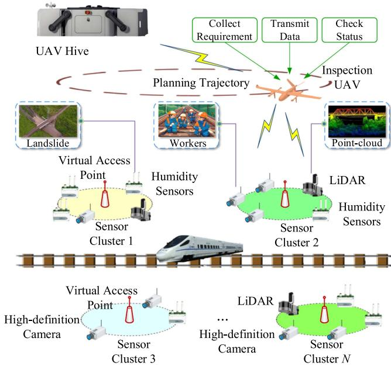  
Fig. 1. The UAV-assisted inspection framework.

the inspection delay model and the energy consumption model. The main notations and definitions used in this section are summarized in Table I.

## A. UAV-Assisted Inspection Framework

As shown in Fig. 1, the UAV-assisted inspection framework consists of three main components: the hive, the UAV, and various types of sensors. The hive serves two primary roles: providing recharging service for the UAV and functioning as an edge cloud server [35] to process computation tasks offloaded by the UAV. The UAV serves as a communication relay and a mobile edge computing server. If a task is offloaded to the hive, the UAV will forward the sensor data to the hive. Both trajectory planning and task offloading decisions are made by the UAV. Additionally, if the task is offloaded to the UAV, it should also perform the required computation.

The three types of tasks conducted by UAV-assisted inspection networks are denoted by the set $\mathcal { K } = \{ k _ { \mathrm { r } } , k _ { \mathrm { p } } , k _ { \mathrm { m } } \}$ , where $k _ { \mathrm { r } }$ represents recognizing intrusions of unauthorized worker and foreign objects, $k _ { \mathrm { p } }$ denotes predicting potential natural disasters in mountainous areas along railway lines, and $k _ { \mathrm { m } }$ corresponds to updating digital models of critical infrastructure like bridges and tunnels. Various types of sensors to conduct these tasks are as follows:

1) High-definition cameras: Cameras are used to detect unauthorized workers on the tracks and foreign objects intruding onto the railway (e.g., kites tangled in overhead contact lines). They typically generate high-resolution images and video frames, resulting in large data volumes. However, this data only requires simple recognition algorithms that can quickly figure out results with low computation complexity.

2) Rain gauge and humidity sensors: They are typically wireless sensors deployed in mountainous areas with limited energy. They are activated during extreme weather to collect data like rainfall and soil moisture, which will then be used to predict the likelihood of natural disasters like landslides. While the data they generate is usually measured in kilobytes, it requires complex analytical algorithms to extract meaningful patterns such as temporal sequences indicating soil saturation thresholds for natural disaster prediction.

3) LiDAR systems: This system uses LiDAR point cloud imaging to update digital models of critical infrastructure and detect deformations. Point cloud data requires substantial storage resources and must undergo a series of complex processing, including feature extraction and point cloud registration, leading to high computational complexity.

The workflow of the inspection framework is as follows. We consider a scenario where a hive h and a UAV u cover an inspection area. Different sets of sensors, including cameras $\mathcal { C } = \{ 1 , 2 , . . . C \}$ , rain gauges $\mathcal { R } = \{ 1 , 2 , . . . , R \}$ , and LiDARs $\mathcal { T } = \{ 1 , 2 , . . . , I \}$ , are grouped into clusters $\mathcal { N } = \{ 1 , 2 , . . . , N \}$ based on their spatial distribution. Each cluster contains a set of sensors $S _ { n } \subseteq \mathcal { C } \cup \mathcal { R } \cup \mathcal { T }$ composed of the aforementioned sensor types. Moreover, we define a spatial coherence assumption that all sensors within a cluster are geographically close to a reference location, named the UAV virtual access point. These virtual access points $\mathcal { X } = \{ x _ { 1 } , x _ { 2 } , . . . , x _ { N } \}$ are selected as the center of each cluster $n \in \mathcal N .$ . Each sensor $s \in S _ { n }$ should be located within the maximum allowable distance $D _ { \mathrm { m a x } }$ from its corresponding access point $x _ { n }$ , expressed as:

$$
| | L ( s ) - L ( x _ { n } ) | | \leq D _ { \operatorname* { m a x } } , s \in S _ { n } .\tag{1}
$$

Here, $L ( \cdot )$ denotes the 2D coordinates of a device and all clusters share the same $D _ { \mathrm { m a x } }$ . This spatial coherence assumption offers two key modeling advantages: (1) it simplifies UAV trajectory planning by enabling cluster-level hovering instead of point-topoint navigation, and (2) it allows for a uniform representation of sensor-to-UAV transmission rate and power within each cluster, since all sensors are at roughly the same distance from the UAV during data collection.

In this framework, we consider a large-sized rotary-wing UAV platform that is widely used in inspection scenarios. Such a UAV has a flight endurance of 50 minutes to 2 hours, a cruising speed of approximately 15 m/s, and a limited payload capacity. In addition, we assume that both the UAV–sensor and UAV-hive links operate over $^ { 5 \mathrm { ~ G ~ } }$ , which support parallel uplink transmissions and compatibility with existing terrestrial networks. During a single inspection, the UAV departs from the hive and plans a trajectory to visit each virtual access point. When the UAV reaches the cluster $n ,$ it will stay at the access point $x _ { n }$ for several minutes to collect sensor computational requirements, forward task data, and, if necessary, perform onboard computation. For each task generated within cluster $n ,$ denoted by the set $\mathcal { T } _ { n } = \{ 1 , 2 , . . . , T _ { n } \} , n \in \mathcal { N }$ , the UAV determines the appropriate offloading location with a decision vector $\lambda _ { n } ^ { i } = ( \lambda _ { n , i } ^ { \mathrm { l } } , \lambda _ { n , i } ^ { \mathrm { u } } , \lambda _ { n , i } ^ { \mathrm { h } } ) , i \in \mathcal { T } _ { n }$ . Here, each element $\lambda _ { n , i } ^ { 1 } ,$ $\lambda _ { n , i } ^ { \mathrm { u } }$ , and $\lambda _ { n , i } ^ { \mathrm { h } }$ is a binary indicator specifying whether the task n,i n,iis processed at the sensor, the UAV, or the hive, respectively. For instance, if the selected offloading location is the hive, then $\lambda _ { n , i } ^ { \mathrm { h } } = 1$ , while other elements are set to 0. In this case, the sensor transmits the data to the UAV, which then forwards it to the hive. After visiting all access points, the UAV returns to the hive for recharging, marking the end of the inspection cycle.

## B. Inspection Delay Model

The total latency $D _ { \mathrm { t o t a l } }$ of the UAV-assisted inspection networks consists of the UAV flight latency $D _ { \mathrm { f l y } }$ and the task offloading latency $D _ { \mathrm { o f f } }$ , where $D _ { \mathrm { o f f } }$ is calculated differently depending on the offloading location. In this subsection, we first present the derivation of offloading latency $D _ { \mathrm { o f f } } ^ { n , i }$ and energy consumption $E _ { \mathrm { o f f } } ^ { n , i }$ for a single task $t _ { n } ^ { i } , n \in \mathcal { N } , i \in \mathcal { T } _ { n }$ , and the total nlatency and energy consumption for all tasks will be calculated at the end.

1) UAV flight latency: Let $\pi _ { \mathfrak { p } } ~ = \{ \pi _ { \mathfrak { p } } ( 0 ) , ~ \pi _ { \mathfrak { p } } ( 1 ) , . . . ,$ $\pi _ { \mathfrak { p } } ( n ) , . . . , \pi _ { \mathfrak { p } } ( N + 1 ) \}$ denote the $\mathrm { U A V } _ { \mathrm { \Delta } }$ visiting strategy, where each $\pi _ { \mathfrak { p } } ( n ) \in \mathcal { X } \cup$ {hive}. The total flight latency is then calculated by (2):

$$
D _ { \mathrm { f l y } } = \sum _ { n = 0 } ^ { N } { \frac { | | L ( \pi _ { \mathrm { p } } ( n + 1 ) ) - L ( \pi _ { \mathrm { p } } ( n ) ) | | } { v } } ,\tag{2}
$$

where, v represents the UAV’s flying speed and is treated as a constant, and the output of $L ( \cdot )$ are 2D coordinates:

$$
L ( \cdot ) = ( X ( \cdot ) , Y ( \cdot ) ) .\tag{3}
$$

Here, $X ( \cdot )$ and $Y ( \cdot )$ are mapping functions that yield the horizontal and vertical coordinates of sensors or the hive, respectively. The function $| | \cdot | |$ computes the L2-norm between two nodes, representing the distance between different virtual access points. Note that the UAV departs from the hive and eventually returns to it for recharging. Therefore, the distance from the hive to the first visited point, as well as the distance from the last visited point back to the hive, should also be included in the total latency calculation.

2) Features of tasks: Before measuring the offloading delay, we need to quantify the task features relevant to latency computation. As mentioned before, this paper considers three types of tasks. Each kind of task includes three features: task type, data size and computation requirement. Let $k _ { n } ^ { i }$ denotes the type of a single task $t _ { n } ^ { i } ,$ and $\mathcal { S } _ { n } ^ { i }$ ndenotes the data size of each task $t _ { n } ^ { i }$ n nthat under the coverage of $x _ { n }$ . Data from humidity sensors nand LiDAR are collected periodically with nearly constant sizes and minor fluctuations. Furthermore, the data of high-definition cameras are usually segmented into standardized units with lower and upper bounds in the UAV-assisted inspection scenario. Thus, the data sizes of each type of task follow a truncated Gaussian distribution with different parameters [36], which is described as (4):

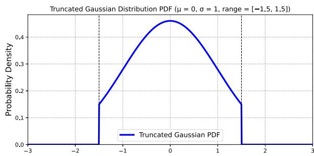  
Fig. 2. Probability density function of the truncated Gaussian distribution.

$$
\begin{array} { r } { \mathcal { S } _ { n } ^ { i } \sim \left\{ \begin{array} { l l } { \mathrm { T N } ( \mu _ { 1 } , \sigma _ { 1 } ^ { 2 } , [ g _ { 1 } ^ { \mathrm { m i n } } , g _ { 1 } ^ { \mathrm { m a x } } ] ) , \mathrm { i f } k _ { n } ^ { i } = k _ { \mathrm { r } } , } \\ { \mathrm { T N } ( \mu _ { 2 } , \sigma _ { 2 } ^ { 2 } , [ g _ { 2 } ^ { \mathrm { m i n } } , g _ { 2 } ^ { \mathrm { m a x } } ] ) , \mathrm { i f } k _ { n } ^ { i } = k _ { \mathrm { p } } , } \\ { \mathrm { T N } ( \mu _ { 3 } , \sigma _ { 3 } ^ { 2 } , [ g _ { 3 } ^ { \mathrm { m i n } } , g _ { 3 } ^ { \mathrm { m a x } } ] ) , \mathrm { i f } k _ { n } ^ { i } = k _ { \mathrm { m } } . } \end{array} \right. } \end{array}\tag{4}
$$

Here, $\mathcal { S } _ { n } ^ { i }$ is the size of task $t _ { n } ^ { i } .$ . Additionally, $g _ { 1 } ^ { \mathrm { m i n } } , g _ { 2 } ^ { \mathrm { m i n } }$ , and $g _ { 1 } ^ { \mathrm { m a x } }$ n n, etc., are constants that define the upper and lower bounds of data size for three types of tasks. Symbols $\mu 1 , \mu 2 ,$ , and σ , etc., are constants to describe the mean and variance of the Gaussian distribution for different tasks. The notation $\mathrm { T N } ( \cdot )$ represents the truncated Gaussian distribution function, defined by the following probability density function (PDF):

$$
p ( \mathcal { S } _ { n } ^ { i } ) = \left\{ \begin{array} { l l } { 1 } & { \mathrm { e x p } \left( - \frac { ( \mathcal { S } _ { n } ^ { i } - \mu ) ^ { 2 } } { 2 \sigma ^ { 2 } } \right) } \\ { \sigma \sqrt { 2 \pi } } & { \Phi \left( \frac { g ^ { \mathrm { m a x } } - \mu } { \sigma } \right) - \Phi \left( \frac { g ^ { \mathrm { m i n } } - \mu } { \sigma } \right) } \\ { \mathrm { i f } ~ \mathcal { S } _ { n } ^ { i } \in [ g ^ { \mathrm { m i n } } , g ^ { \mathrm { m a x } } ] , } \\ { 0 , ~ \mathrm { o t h e r w i s e } . } \end{array} \right.\tag{5}
$$

Here, $\mu , \sigma , g ^ { \mathrm { m i n } }$ , and $g ^ { \mathrm { m a x } }$ have the same meanings as defined in (4). Function $\Phi ( \cdot )$ denotes the cumulative distribution function Φ( )of the standard Gaussian distribution. For ease of understanding, we present an illustrative PDF of $p ( \mathcal { S } _ { n } ^ { i } )$ with $\mu = 0 , \sigma = 1$ $g ^ { \mathrm { m a x } } = 1 . 5$ , and $g ^ { \mathrm { m i n } } = - 1 . 5$ in Fig. 2.

In our model, while the data sizes of tasks within the same type varies, their computational requirements are assumed to be constant and are measured in central processing unit (CPU) cycles, denoted by $\mathcal { C } _ { r } , \mathcal { C } _ { p } ,$ and $\mathcal { C } _ { m } .$ , respectively. We use ${ \mathcal { C } } _ { n } ^ { i }$ to denote the computation requirement of task $t _ { n } ^ { i }$ n, which takes one of the three defined values.

3) Local offloading latency: In this scenario, the offloading latency $D _ { \mathrm { o f f } , \mathrm { l } } ^ { n , i }$ of task $t _ { n } ^ { i }$ is the time required to complete the computation on sensors, which is expressed as:

$$
D _ { \mathrm { o f f , l } } ^ { n , i } = \frac { \mathcal { C } _ { n } ^ { i } } { f _ { \mathrm { l } } } ,\tag{6}
$$

where $f _ { \mathrm { l } }$ is the CPU frequency of the sensor. We assume that three types of sensors have the same CPU frequency.

4) UAV Offloading latency: In this scenario, sensors send the data used for computation to the UAV, after which the UAV performs the computation and obtains the result. Note that the result is reported to the remote control center only when an anomaly is detected, so we only consider the latency and energy consumption of the process: sensor→ UAV. Therefore, the UAV offloading latency $\bar { D } _ { \mathrm { o f f , u } } ^ { n , i }$ consists of the transmission latency $D _ { \mathrm { t , S 2 U } } ^ { n , i }$ from sensors to UAV and the computation latency of the UAV $D _ { \mathrm { c , u } } ^ { n , i }$

$$
D _ { \mathrm { o f f , u } } ^ { n , i } = D _ { \mathrm { t , S 2 U } } ^ { n , i } + D _ { \mathrm { c , u } } ^ { n , i } .\tag{7}
$$

The computation latency of the UAV can be calculated by:

$$
D _ { \mathrm { c , u } } ^ { n , i } = \frac { \mathcal { C } _ { n } ^ { i } } { f _ { \mathrm { u } } } ,\tag{8}
$$

where $f _ { \mathrm { u } }$ is the CPU processing frequency of UAV. The data transmission latency can be calculated by:

$$
D _ { \mathrm { t , S 2 U } } ^ { n , i } = \frac { \mathcal { S } _ { n } ^ { i } } { R ^ { \mathrm { S 2 U } } } ,\tag{9}
$$

where $R ^ { \mathrm { S 2 U } }$ is the transmission rate between the sensor and the UAV, which is regarded as the same for all sensors and is calculated by:

$$
R ^ { \mathrm { S 2 U } } = B _ { \mathrm { p u } } \times \log _ { 2 } \Biggl ( 1 + \frac { P _ { l } \ | h _ { \mathrm { p u } } | ^ { 2 } } { N _ { 0 } B _ { \mathrm { p u } } } \Biggr ) .\tag{10}
$$

Here, $B _ { \mathrm { p u } }$ is the uplink bandwidth between a sensor and the UAV, and we assume that the bandwidth between all sensors and the UAV are all the same. $P _ { 1 }$ represents the sensor transmission power, it is also regarded as the same for all sensors. $N _ { 0 }$ is the channel noise power spectral density for the UAV. The link channel gain $| h _ { \mathrm { p u } } | ^ { 2 }$ between all sensors and the UAV is derived by:

$$
| h _ { \mathrm { p u } } | ^ { 2 } = \beta _ { 0 } \times H ^ { - \alpha } ,\tag{11}
$$

where $\beta _ { 0 }$ is path loss coefficient at the reference distance (typically 1 meter), H is the height of UAV, and α is the shared path loss exponent.

5) Hive offloading latency: In this scenario, data flows in the order of sensor→ UAV→ hive. Therefore, the hive offloading latency $D _ { \mathrm { o f f , h } } ^ { n , i }$ consists of the transmission latency from the sensor to UAV $D _ { \mathrm { t } , \mathrm { S } 2 \mathrm { U } } ^ { n , i } .$ , the latency from the UAV to hive $D _ { \mathrm { t , U 2 H } } ^ { n , i } .$ and the computation latency at the hive $D _ { \mathrm { c , h } } ^ { n , i }$

$$
D _ { \mathrm { o f f , h } } ^ { n , i } = D _ { \mathrm { t , S 2 U } } ^ { n , i } + D _ { \mathrm { t , U 2 H } } ^ { n , i } + D _ { \mathrm { c , h } } ^ { n , i } .\tag{12}
$$

Here, the transmission latency from the UAV to the hive $D _ { \mathrm { t , U 2 H } } ^ { n , i }$ is calculated by:

$$
D _ { \mathrm { t , U 2 H } } ^ { n , i } = \frac { \mathcal { S } _ { n } ^ { i } } { R ^ { \mathrm { U 2 H } } } ,\tag{13}
$$

where we assume that the transmission rate between the UAV and the hive $R ^ { \mathrm { U 2 H } }$ remains constant across different clusters. The computation latency $D _ { \mathrm { c , h } } ^ { n , i }$ is described as:

$$
D _ { \mathrm { c , h } } ^ { n , i } = \frac { \mathcal { C } _ { n } ^ { i } } { f _ { \mathrm { h } } } ,\tag{14}
$$

where $f _ { \mathrm { h } }$ is the CPU frequency of the hive. As such, we derive the offloading latency of a single task $t _ { n } ^ { i }$

## C. Energy Consumption Model

The energy consumption of the inspection networks $E _ { \mathrm { t o t a l } }$ includes the UAV flight consumption $E _ { \mathrm { f l y } }$ and the task offloading consumption $E _ { \mathrm { o f f } }$ , which is calculated as follows.

1) UAV flight consumption: Since the hovering time of the UAV at each cluster is fixed and not subject to optimization, we focus solely on the energy consumption $E _ { \mathrm { f l y } }$ incurred during its cruising, which is described as:

$$
E _ { \mathrm { f l y } } = \int _ { 0 } ^ { T } P _ { \mathrm { f l y } } { \big ( } v ( t ) { \big ) } d t \approx P _ { \mathrm { f l y } } ( v ) \times { \frac { \mathcal { L } } { v } } = P _ { \mathrm { f l y } } ( v ) \times D _ { \mathrm { f l y } } .\tag{15}
$$

Here, $\mathcal { L }$ denotes the trajectory length, calculated as $\begin{array} { r } { \sum _ { n = 0 } ^ { N } | | L ( \pi _ { \mathrm { p } } ( n + 1 ) ) - L ( \pi _ { \mathrm { p } } ( n ) ) | | } \end{array}$ . The UAV’s flight power $P _ { \mathrm { f l y } }$ ( ( + 1)) ( ( ))is a function of speed [37]. For simplification, we assume the UAV flies at a fixed speed, thus $P _ { \mathrm { f l y } } ( v )$ can be derived by:

$$
P _ { \mathrm { f l y } } = \frac { 1 } { 2 } \cdot C _ { \mathrm { d } } \cdot \rho \cdot A \cdot v ^ { 3 } ,\tag{16}
$$

where $C _ { \mathrm { d } }$ denotes the drag coefficient, $\rho$ is the air density, and A represents projected area of the UAV facing the airflow.

2) Local offloading consumption: In this scenario, local energy consumption $E _ { \mathrm { o f f } , 1 } ^ { \bar { n } , i }$ is given by (17):

$$
E _ { \mathrm { o f f } , 1 } ^ { n , i } = \kappa _ { 1 } \times \mathcal { C } _ { n } ^ { i } \times f _ { 1 } ^ { 2 } ,\tag{17}
$$

where $\kappa _ { \mathrm { l } }$ is the effective switched capacitance shared by all sensors, and ${ \mathcal { C } } _ { n } ^ { i }$ takes one of the values from $\mathcal { C } _ { r } , \mathcal { C } _ { p } ,$ , and $\mathcal { C } _ { m }$ n r pMoreover, (17) can be combined with (6) and rewritten as:

$$
\begin{array} { r l } & { E _ { \mathrm { { o f f } , 1 } } ^ { n , i } = \kappa _ { 1 } \mathcal { C } _ { n } ^ { i } f _ { 1 } ^ { 2 } } \\ & { \qquad = \kappa _ { 1 } \mathcal { C } _ { n } ^ { i } \left( \frac { \mathcal { C } _ { n } ^ { i } } { D _ { \mathrm { o f f } , 1 } ^ { n , i } } \right) ^ { 2 } } \\ & { \qquad = \kappa _ { 1 } \frac { ( \mathcal { C } _ { n } ^ { i } ) ^ { 3 } } { ( D _ { \mathrm { o f f } , 1 } ^ { n , i } ) ^ { 2 } } . } \end{array}\tag{18}
$$

As such, the energy consumption for local computing can be directly obtained from the result of (6).

3) UAV offloading consumption: The energy consumption for computing on the UAV $E _ { \mathrm { o f f , u } } ^ { n , i }$ consists of the transmission energy consumption $E _ { \mathrm { t } , \mathrm { S } 2 \mathrm { U } } ^ { n , i }$ of the sensor and the computation consumption $E _ { \mathrm { c , u } } ^ { n , i }$ of the UAV,

$$
\begin{array} { r l } & { E _ { \mathrm { o f f , u } } ^ { n , i } = E _ { \mathrm { t , S 2 U } } ^ { n , i } + E _ { \mathrm { c , u } } ^ { n , i } } \\ & { \qquad = \frac { \mathcal { S } _ { n } ^ { i } } { R ^ { \mathrm { S 2 U } } } \cdot P _ { 1 } + \kappa _ { \mathrm { u } } \times \mathcal { C } _ { n } ^ { i } \times f _ { \mathrm { u } } ^ { 2 } } \\ & { \qquad = \frac { \mathcal { S } _ { n } ^ { i } } { R ^ { \mathrm { S 2 U } } } \cdot P _ { 1 } + \kappa _ { \mathrm { u } } \frac { ( \mathcal { C } _ { n } ^ { i } ) ^ { 3 } } { ( D _ { \mathrm { c , u } } ^ { n , i } ) ^ { 2 } } . } \end{array}\tag{19}
$$

Here, $\kappa _ { \mathrm { u } }$ is the effective switched capacitance of the UAV. Based on the receiver sensitivity of UAV $P _ { \mathrm { t h } } ^ { \mathrm { u } }$ and the channel gain defined in (11), the required transmission power Pl of the sensor can be expressed as:

$$
P _ { \mathrm { l } } = \frac { P _ { \mathrm { t h } } ^ { \mathrm { u } } } { \vert h _ { \mathrm { p u } } \vert ^ { 2 } } = \frac { P _ { \mathrm { t h } } ^ { \mathrm { u } } } { \beta _ { 0 } \times H ^ { - \alpha } } = P _ { \mathrm { t h } } ^ { \mathrm { u } } \cdot \frac { H ^ { \alpha } } { \beta _ { 0 } } .\tag{20}
$$

By substituting the value of $P _ { 1 }$ into (19), the offloading consumption $E _ { \mathrm { o f f , u } } ^ { n , i }$ can be obtained.

4) Hive offloading consumption: When the computation is performed at the hive, the energy consumption $E _ { \mathrm { o f f } , \mathrm { h } } ^ { n , i }$ includes the transmission energy of the sensor $E _ { \mathrm { t } , \mathrm { S } 2 \mathrm { U } } ^ { n , i }$ and the transmission energy of UAV $E _ { \mathrm { t , U 2 H } } ^ { n , i } ,$ as well as the computation energy at the hive $E _ { \mathrm { c , h } } ^ { n , i }$ . Given the effective switched capacitance of the hive $\kappa _ { \mathrm { h } }$ , the $E _ { \mathrm { o f f } , \mathrm { h } } ^ { n , i }$ is calculated as:

$$
\begin{array} { r l } & { E _ { \mathrm { o f f , h } } ^ { n , i } = E _ { \mathrm { t , S 2 U } } ^ { n , i } + E _ { \mathrm { t , U 2 H } } ^ { n , i } + E _ { \mathrm { c , h } } ^ { n , i } } \\ & { \qquad \approx \displaystyle \frac { \mathcal { S } _ { n } ^ { i } } { R ^ { \mathrm { S 2 U } } } \cdot P _ { l } + \frac { \mathcal { S } _ { n } ^ { i } } { R ^ { \mathrm { U 2 H } } } \cdot \bar { P } _ { \mathrm { u } } + \kappa _ { \mathrm { h } } \times \mathcal { C } _ { n } ^ { i } \times f _ { \mathrm { h } } ^ { 2 } } \\ & { \qquad = \displaystyle \frac { \mathcal { S } _ { n } ^ { i } } { R ^ { \mathrm { S 2 U } } } \cdot P _ { \mathrm { t h } } ^ { \mathrm { u } } \cdot \frac { H ^ { \alpha } } { \beta _ { 0 } } + \frac { \mathcal { S } _ { n } ^ { i } } { R ^ { \mathrm { U 2 H } } } \cdot \bar { P } _ { \mathrm { u } } + \kappa _ { \mathrm { h } } \frac { ( \mathcal { C } _ { n } ^ { i } ) ^ { 3 } } { ( D _ { \mathrm { c , h } } ^ { n , i } ) ^ { 2 } } . } \end{array}\tag{21}
$$

As mentioned before, $R ^ { \mathrm { U 2 H } }$ is treated as a constant, which requires the UAV to dynamically adjust its transmission power at different clusters. In this paper, we reasonably simplify this variability by using an average value. Thus, the average transmission power $\bar { P } _ { \mathrm { u } }$ is described as:

$$
\bar { P } _ { \mathrm { u } } = \frac { P _ { \mathrm { t h } } ^ { \mathrm { h } } } { \left| h _ { \mathrm { u h } } \right| ^ { 2 } } = \frac { P _ { \mathrm { t h } } ^ { \mathrm { h } } } { \beta _ { 1 } \times \bar { d } ^ { - \alpha } } = P _ { \mathrm { t h } } ^ { \mathrm { h } } \cdot \frac { \bar { d } ^ { \alpha } } { \beta _ { 1 } } ,\tag{22}
$$

where $P _ { \mathrm { t h } } ^ { \mathrm { h } }$ is the receiver sensitivity of the hive, and $\beta _ { 1 }$ is the path loss coefficient under near line-of-sight (LoS) conditions for the UAV. In addition, we use the distance from the center of the inspection area to the hive to represent the UAV’s average communication distance, denoted as d.

## D. Total Latency and Energy Consumption

The total latency $D _ { \mathrm { t o t a l } }$ is calculated by summing the UAV flight latency $D _ { \mathrm { f l y } }$ and the offloading latency $D _ { \mathrm { o f f } } ^ { n , i }$ of all tasks across all clusters. The total energy consumption $E _ { \mathrm { t o t a l } }$ can be obtained in a similar manner, described as:

$$
\begin{array} { l } { { \displaystyle { \cal D } _ { \mathrm { t o t a l } } = { \cal D } _ { \mathrm { f l y } } + \sum _ { n = 1 } ^ { N } \sum _ { i = 1 } ^ { T _ { n } } \left( \lambda _ { n , i } ^ { \mathrm { l } } { \cal D } _ { \mathrm { o f f , l } } ^ { n , i } + \lambda _ { n , i } ^ { \mathrm { u } } { \cal D } _ { \mathrm { o f f , u } } ^ { n , i } \right. } } \\ { { \displaystyle \left. + \lambda _ { n , i } ^ { \mathrm { h } } { \cal D } _ { \mathrm { o f f , h } } ^ { n , i } \right) , } } \end{array}\tag{23}
$$

$$
\begin{array} { r l } { \displaystyle } & { E _ { \mathrm { t o t a l } } = E _ { \mathrm { f l y } } + \sum _ { n = 1 } ^ { N } \sum _ { i = 1 } ^ { T _ { n } } \left( \lambda _ { n , i } ^ { \mathrm { l } } E _ { \mathrm { o f f , \mathrm { l } } } ^ { n , i } + \lambda _ { n , i } ^ { \mathrm { u } } E _ { \mathrm { o f f , u } } ^ { n , i } \right. } \\ { \displaystyle } & { ~ + \left. \lambda _ { n , i } ^ { \mathrm { h } } E _ { \mathrm { o f f , h } } ^ { n , i } \right) . } \end{array}\tag{24}
$$

Equations (23) and (24) bridge the system model with the optimization problem, which depicts how the modeling results

of a single task are used to calculate the overall latency and energy consumption.

## IV. PROBLEM FORMULATION AND TRANSFORMATION

In this section, we formulate an optimization problem to make trajectory planning and offloading decisions and decompose it into a traveling salesman problem (TSP)-hybrid implicit Markov decision process (MDP) and an offloading MDP.

## A. Problem Formulation

Let $\pi _ { \mathrm { p } }$ denote the $\mathrm { U A V } _ { \mathrm { \Delta } }$ visiting strategy of virtual access points and the hive, $\pi _ { 0 } = \{ \lambda _ { n } ^ { i } \}$ denote the offloading decision for each task $t _ { n } ^ { i }$ . The goal of the optimization problem is to min-nimize the weighted sum of total latency and energy consumption subject to a set of constraints,

$$
\mathrm { P _ { 0 } } : \quad \operatorname* { m i n } _ { \pi _ { \mathrm { p } } , \pi _ { \mathrm { o } } } \quad \omega _ { D } \cdot D _ { \mathrm { t o t a l } } + \omega _ { E } \cdot E _ { \mathrm { t o t a l } }
$$

$$
{ \mathrm { s . t . } } \pi _ { \mathfrak { p } } ( n ) \in { \mathcal { X } } \cup \{ { \mathrm { h i v e } } \} , \pi _ { \mathfrak { p } } ( 0 ) = \pi _ { \mathfrak { p } } ( N + 1 ) = { \mathrm { h i v e } } ,\tag{25a}
$$

$$
\lambda _ { n , i } ^ { 1 } , \lambda _ { n , i } ^ { \mathrm { u } } , \lambda _ { n , i } ^ { \mathrm { h } } \in \{ 0 , 1 \} , \forall n \in N , i \in \mathcal { T } _ { n } ,\tag{25b}
$$

$$
\lambda _ { n , i } ^ { \mathrm { l } } + \lambda _ { n , i } ^ { \mathrm { u } } + \lambda _ { n , i } ^ { \mathrm { h } } = 1 , \forall n \in \mathcal { N } , i \in \mathcal { T } _ { n } ,\tag{25c}
$$

$$
\sum _ { n = 1 } ^ { N } \sum _ { i = 1 } ^ { T _ { n } } \lambda _ { n , i } ^ { \mathrm { u } } E _ { \mathrm { c , u } } ^ { n , i } \leq E _ { \mathrm { c , u } } ^ { \operatorname* { m a x } } ,\tag{25d}
$$

$$
D _ { \mathrm { o f f } } ^ { n , i } \leq D _ { \mathrm { o f f } } ^ { \mathrm { m a x } } , \quad \forall n \in \mathcal { N } , i \in \mathcal { T } _ { n } .\tag{25e}
$$

Constraint (25a) ensures the UAV to complete a closed-loop trajectory, and visit each cluster exactly once. Additionally, each task can only be completely offloaded to one location which is ensured by constraints (25b) and (25c). Constraint (25d) imposes a computation energy budget on the UAV, while (25e) guarantees that the offloading latency of any task does not exceed the maximum latency tolerance. Since energy (joules) and latency (seconds) differ in units and scales, we adopt a weighted sum formulation, in which the weights $\omega _ { D }$ and $\omega _ { E }$ normalize their impacts on the optimization problem.

## B. Problem Transformation

The flight latency and energy consumption of the UAV are relatively independent, and the visiting strategy $\pi _ { \mathfrak { p } }$ does not influence the task offloading decisions in problem $\mathrm { \mathrm { P _ { 0 } } } .$ Thus, the trajectory planning sub-problem can be transformed into a TSP.

$$
\begin{array} { r l } {  { \mathrm { P } _ { 1 } : } } & { \underset { \pi _ { \mathrm { p } } } { \mathrm { m i n } } } & { \displaystyle \sum _ { n = 0 } ^ { N } \| \pi _ { \mathrm { p } } ( n ) - \pi _ { \mathrm { p } } ( n + 1 ) \| } \\ & { \mathrm { s } . \mathrm { t } . ( 2 5 \mathrm { a } ) . } \end{array}\tag{26a}
$$

To guarantee the performance of the proposed AoT algorithm, we integrate the REINFORCE algorithm with the Transformer architecture and formulate a TSP-hybrid implicit MDP, which enhances the generalization and exploration capabilities. The goal of the hybrid TSP-MDP is to minimize the tour length via self-attention-based policy learning,

$$
\mathrm { P } _ { 1 } ^ { m } : \quad \operatorname* { m a x } _ { \pi _ { \mathrm { p } } ^ { \theta } } \mathbb { E } _ { \pi _ { \mathrm { p } } ^ { \theta } } \left[ \sum _ { n = 0 } ^ { N } \log \pi _ { \mathrm { p } } ^ { \theta } ( a _ { n } ^ { \mathrm { p } } \mid s _ { n } ^ { \mathrm { p } } ) \cdot r _ { n } ^ { \mathrm { p } } \right]\tag{27a}
$$

Here, $\pi _ { \mathfrak { p } } ^ { \theta }$ denotes the trajectory planning strategy generated by a neural network with a set of parameters $\theta ,$ and $r _ { n } ^ { \mathrm { p } }$ is defined as the negative value of the path length,

$$
r _ { n } ^ { \mathrm { p } } = - \| \pi _ { \mathrm { p } } ^ { \theta } ( n ) - \pi _ { \mathrm { p } } ^ { \theta } ( n + 1 ) \| .\tag{28}
$$

Unlike traditional MDPs, the state in the hybrid TSP-MDP is implicitly represented by the contextual embedding of the Transformer over locations and visited points. Additionally, the action is the selection of the next visiting access point $a _ { n } ^ { \mathrm { p } } \in$ $\{ x _ { 1 } , x _ { 2 } , \dotsc , x _ { N } , \mathrm { h i v e } \} \setminus \{ a _ { 0 } ^ { \mathrm { p } } , a _ { 1 } ^ { \mathrm { p } } , \dotsc , a _ { n - 1 } ^ { \mathrm { p } } \}$

nThe objective of the task offloading MDP is to minimize the weighted sum of delay and energy consumption across all tasks, which can be expressed as:

$$
\mathbf { P } _ { 2 } ^ { m } : \quad \operatorname* { m a x } _ { \pi _ { 0 } ^ { \theta ^ { \prime } } } \mathbb { E } _ { \pi _ { 0 } ^ { \theta ^ { \prime } } } \left[ \sum _ { n = 1 } ^ { N } \sum _ { i = 1 } ^ { T _ { n } } \log \pi _ { 0 } ^ { \theta ^ { \prime } } ( a _ { n } ^ { i } \mid s _ { n } ^ { i } ) \cdot r _ { n } ^ { i } \right]
$$

$$
\mathrm { s . t . } \quad ( 2 5 \mathrm { b } ) { - } ( 2 5 \mathrm { e } ) .\tag{29a}
$$

Here, $\pi _ { 0 } ^ { \theta ^ { \prime } }$ denotes the offloading decision generated by a neural network with parameters $\theta ^ { \prime } .$ , and the reward $r _ { n } ^ { i }$ is defined as the nnegative weighted sum of the offloading latency and energy consumption or an offloading failure penalty of task $t _ { n } ^ { i }$ , described as:

$$
r _ { n } ^ { i } = \left\{ \begin{array} { l l } { - ( \omega _ { D } D _ { \mathrm { o f f } } ^ { n , i } + \omega _ { E } E _ { \mathrm { o f f } } ^ { n , i } ) , } & { \mathrm { i f ~ } a _ { n } ^ { i } \mathrm { ~ i s ~ v a l i d , } } \\ { - 1 . 2 \times ( \omega _ { D } D _ { \mathrm { o f f } } ^ { n , i } + \omega _ { E } E _ { \mathrm { o f f } } ^ { n , i } ) , } & { \mathrm { o t h e r w i s e . } } \end{array} \right.\tag{30}
$$

The state consists of feature vectors of task $t _ { n } ^ { i }$ and UAV computation energy budget,

$$
\begin{array} { r } { s _ { n } ^ { i } = \left( k _ { n } ^ { i } , \mathcal { C } _ { n } ^ { i } , \mathcal { S } _ { n } ^ { i } , e _ { \mathrm { b g t } } ^ { n , i } \right) , } \end{array}\tag{31}
$$

where $k _ { n } ^ { i }$ denotes the type of task $t _ { n } ^ { i }$ and $e _ { \mathrm { b g t } } ^ { n , i }$ is the remaining budget for UAV computation. The action $\lambda _ { n } ^ { i }$ has been introduced before.

## V. AOT: AGI-ORIENTED TRANSFORMER ALGORITHM

In this section, we propose the AoT algorithm for making joint trajectory planning and task offloading decisions. We first present the architecture design of the AoT algorithm. Then, we describe the training procedure of AoT, followed by an analysis of the algorithm computational complexity.

## A. Architecture of the AoT Algorithm

As illustrated in Fig. 3, the architecture of the AoT algorithm consists of three main components: 1) variable-length input embedding, 2) shared encoder for trajectory planning and task offloading, and 3) dual output heads responsible for task-specific decision-making. In each component, we adopt specific designs to ensure that the algorithm remains lightweight while maintaining satisfying performance. The detailed description of each component is as follows.

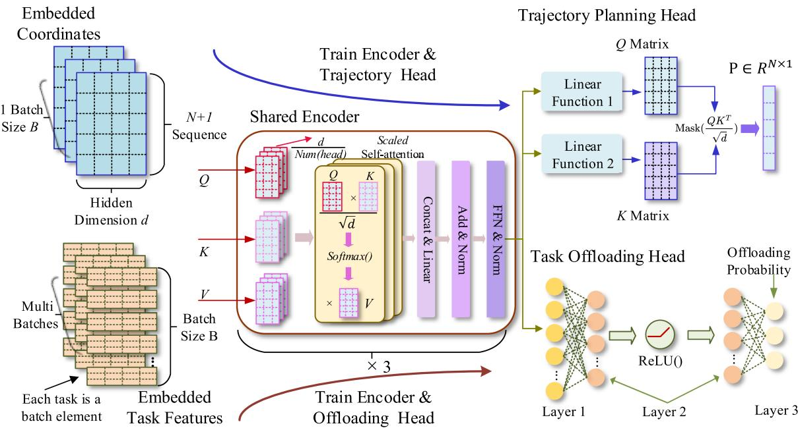  
Fig. 3. The architecture design of the AoT algorithm.

1) Input embedding: The AoT algorithm accepts two distinct types of input depending on the task. For trajectory planning, the input is a sequence of 2D coordinates representing the virtual access points of sensor clusters. These coordinates are linearly projected into high-dimensional vectors of size d using fully connected embedding layers. Note that the Transformer’s hidden dimension is set to d as well, i.e., the Q, K, and V matrices also have d dimensions. As shown in the upper left of Fig. 3, to reduce gradient variance and discover shorter trajectories within the same number of training episodes, we duplicate the coordinate sequence for $B _ { \mathrm { p } }$ times and form a training batch. This design yields $B _ { \mathrm { p } }$ parallel tours per training episode, allowing the model to explore multiple optimal or near-optimal trajectories simultaneously.

For task offloading, the input consists of the task type, features and UAV computation budget. The task type is embedded using a learnable embedding table, while others are processed by a linear layer. To prevent gradient explosion and mitigate the dominance of any single feature during training, all features are first normalized and then concatenated to form the final input for the encoder. Additionally, we split the long sequence of tasks into multiple shorter sequences to form batches, taking advantage of AoT’s capability to process all sequences within a batch in parallel, thereby improving computational efficiency.

2) Shared encoder: The core of our AoT algorithm is a shared Transformer encoder that encodes coordinates of access points and features of tasks with the same model parameters. The encoder consists of several stacked TransformerEncoder layers (our algorithm adopts 3 layers), each composed of a multihead self-attention (MHSA) module followed by a feedforward network (FFN) module. In the MHSA module, the attention operation computes contextualized representations by attending to all other tokens in the sequence. This captures global dependencies among locations (trajectory planning) or tasks (task offloading). In the FFN module, the output of the MHSA module passes through two linear layers and a ReLU(·) activation to enhance nonlinear feature transformation. The three identical encoder layers process the sequence hierarchically, each layer has an identical architecture with separate parameters. The final encoder output is a batch of sequences and is then forwarded to the corresponding output head.

3) Dual output heads: To adapt to the shared encoder representations for two distinct decision-making tasks, we add two independent output heads following the shared encoder. The trajectory planning head is designed to solve the TSP in an autoregressive manner. It takes the encoder output and applies an additional set of Q and K matrices to compute the adjacency score matrix A, which encodes pairwise transition scores between access points. To ensure valid point selection, the trajectory output head employs a masking mechanism that dynamically suppresses already visited nodes by assigning large negative values to their logits. Finally, it generates an attention score matrix using the softmax function, which serves as the basis for sampling during training.

The offloading head is implemented as a two-layer multi-layer perceptron (MLP). It takes the output of the encoder as input and passes through the MLP in the following way:

$$
z _ { n } ^ { i } = W _ { 2 } ( \mathrm { R e L U } ( W _ { 1 } h _ { n } ^ { i } + b _ { 1 } ) ) + b _ { 2 } , n \in \mathcal { N } , i \in \mathcal { T } _ { n } ,\tag{32}
$$

where $h _ { n } ^ { i }$ is the final encoded representation of task $t _ { n } ^ { i }$ by the n nencoder. The weights and bias of the first and second layer are denoted by $W _ { 1 } , W _ { 2 } , b _ { 1 } , b _ { 2 }$ , respectively. The final output logits $z _ { n } ^ { i } \in \mathbb { R } ^ { 3 }$ correspond to the three possible offloading choices: nsensors, the UAV, and the hive. It define a categorical distribution from which offloading actions are sampled.

Algorithm 1: Training Procedure of AoT Algorithm.   
Input: Access Points $\{ x _ { 1 } , . . . , x _ { N } \}$ , task set   
$\{ t _ { 1 } ^ { 1 } , . . . , t _ { n } ^ { i } , . . . , t _ { N } ^ { \hat { T } _ { n } } \}$ , UAV remaining   
computation budget $e _ { \mathrm { b g t } } ^ { u } ,$ and encoder settings:   
Output: The optimal trajectory $\mathcal { N } _ { \mathfrak { p } } ^ { * }$ and offloading   
decision for each task $\{ \lambda _ { n } ^ { i } \} ;$   
1 Initialize: encoder parameters $\theta _ { e }$ , parameters of   
trajectory planning head $\theta _ { t }$ and offloading head $\theta _ { o } ;$   
2 Phase I: Trajectory Planning Training;   
3 for episode = 1 to $E _ { 1 }$ do   
4 Set initial sequence {hive, $x _ { 1 } , . . . , x _ { N }$ , hive}; Repeat   
the initial sequence B times to form a batch,   
shuffle $\{ x _ { 0 } , . . . , x _ { N } \}$ for each sequence; Generate   
contextual representations for each sequence   
based on Eqs. (33) (34), and compute transition   
logits based on Eq. (35);   
5 Sample tours via REINFORCE and compute tour   
rewards based on Eq. (36);   
6 Update $\theta _ { e } , \theta _ { t }$ with loss ${ \mathcal { L } } _ { \mathrm { p } }$ based on Eq. (37);   
7 end   
8 Save parameters of encoder $\theta _ { e } ^ { 1 }$ and trajectory head $\theta _ { t } ;$   
9 Phase II: Task Offloading Training;   
10 for episode = 1 to $E _ { 2 }$ do   
11 foreach task batch do   
12 Normalize task features and UAV computatior   
budget via Eq. (38) ;   
13 Compute logits based on Eq. (32);   
14 Sample action $a _ { n } ^ { i } \sim \pi _ { 0 } ^ { \theta ^ { \prime } } ( a _ { n } ^ { i } | s _ { n } ^ { i } ) ;$   
15 if $a _ { t } = U A V$ and remaining $e _ { b g t } ^ { u } > 0$ then   
16 subtract the corresponding energy   
consumption to $e _ { \mathrm { b g t } } ^ { u }$ and obtain reward $r _ { n } ^ { i } ;$   
17 end   
18 else   
19 Apply penalty to reward via Eq. (30):   
20 end   
21 Update $\theta _ { e } , \theta _ { o }$ with $\scriptstyle { \mathcal { L } } _ { 0 }$ based on Eq. (39);   
22 end   
23 end   
24 Save encoder parameters $\theta _ { e } ^ { 2 }$ and offloading head $\theta _ { o } ;$   
25 Phase III: Joint Parameters Optimizing;   
26 encoder parameters $\theta _ { e } ^ { 3 } = \varepsilon \theta _ { e } ^ { 1 } + \bar { ( 1 - \varepsilon ) } \theta _ { e } ^ { 2 } ,$ , freeze $\theta _ { e } ^ { 3 } ;$   
27 for episode = 1 to $E _ { 3 }$ do   
28 | Repeat Phase I and Phase II, update $\theta _ { t }$ and $\theta _ { o } ;$   
29 end

In summary, each output head is trained independently using task-specific rewards, while benefiting from the shared encoder’s global representation capacity. This decoupled yet coordinated design allows the AoT algorithm to handle multiple tasks, showing the potential of AGI.

## B. Training Procedure of the AoT Algorithm

In this subsection, we illustrate the training procedure of the proposed AoT algorithm in detail, shown as Algorithm 1.

1) Initialization (Line 1): All learnable parameters of the AoT algorithm, including the encoder parameters $\theta _ { e }$ , the trajectory planning head $\theta _ { t } ,$ and the task offloading head $\theta _ { o }$ are initialized in this phase. The aforementioned parameters set θ corresponds to $\theta _ { e } + \theta _ { t }$ , and $\theta ^ { \prime }$ corresponds to $\theta _ { e } + \theta _ { o } .$ Additionally, the UAV’s computation budget, $e _ { \mathrm { b g t } } ^ { u } ,$ is set as $E _ { \mathrm { c } , u } ^ { \mathrm { m a x } }$ initially, and ,uTransformer hyperparameters (e.g., number of layers, hidden dimension d) are also configured.

2) Phase I (Lines 2–8): This phase trains the encoder and trajectory head by combining the REINFORCE algorithm. The $\mathrm { U A V } _ { \mathrm { \Delta } }$ trajectory is a closed loop starting and ending at the hive. The initial sequence is duplicated $B$ times with random shuffling to construct a training batch, enabling the model to explore multiple candidate trajectories per episode. The coordinate sequences are encoded using the Transformer encoder, where contextualized embeddings are computed as:

$$
h _ { m } ^ { f } = \mathcal { M } ( Q  h _ { m } ^ { f - 1 } , K , V  h _ { 1 : M } ^ { f - 1 } ) .\tag{33}
$$

Here $h _ { m } ^ { f }$ denotes the hidden state of the m-th token at the mf-th layer of the Transformer encoder and $\mathcal { M } ( \cdot )$ denotes the ( )multi-head attention mechanism. The query vector Q is obtained by applying a linear projection to the hidden representation $h _ { m } ^ { \bar { f } - 1 }$ of the m-th token from the previous encoder block layer, mwhile the key and value matrices K and V are derived from the representations of all M tokens $h _ { 1 : M } ^ { f - 1 }$ . The output $h _ { m } ^ { f }$ is then M mprocessed by an FFN equipped with residual connection, layer normalization, and nonlinear activation. Let LyNm · denote the standard layer normalization operation and ReLU · denote the rectified linear unit activation function. The FFN operation is formulated as:

$$
\begin{array} { r } { h _ { m } ^ { f } = \mathrm { L y N m } ( h _ { m } ^ { f } + W _ { 2 } ^ { f } \cdot \mathrm { R e L U } ( W _ { 1 } ^ { f } h _ { m } ^ { f } + b _ { 1 } ^ { f } ) + b _ { 2 } ^ { f } ) , } \end{array}\tag{34}
$$

where $W _ { 1 } ^ { f } , W _ { 2 } ^ { f } , b _ { 1 } ^ { f }$ , and $b _ { 2 } ^ { f }$ are the learnable parameters of the FFN in the f-th Transformer encoder layer. The final encoder outputs $h _ { n } ^ { i }$ derived from $h _ { m } ^ { f }$ step by step are fed into n mthe trajectory head, where another set of $Q$ and $K$ matrices compute the adjacency score matrix. A masking mechanism is applied to exclude already visited nodes, and a softmax() function generates the action distribution,

$$
\mathbf { P } = \mathrm { S o f t m a x } _ { \mathrm { r o w } } \left( \mathrm { M a s k } \left( { \frac { Q K ^ { T } } { \sqrt { d } } } \right) \right) .\tag{35}
$$

Here, Mask · denotes the operation of assigning a large negative value $( \mathrm { e . g . , - 1 0 ^ { 6 } } )$ to already visited nodes, while $\mathrm { S o f t m a x } _ { \mathrm { r o w } } ( \cdot )$ indicates applying the softmax function to a specific row of the score matrix. The next access point is sampled at each step according to the probability matrix P, forming a full trajectory. The total reward $R ^ { b }$ for each trajectory is calculated as:

$$
R ^ { b } = \sum _ { n = 0 } ^ { N } r _ { n } ^ { \mathrm { p } } .\tag{36}
$$

The loss is calculated by (37), where $\hat { R } ^ { b }$ denotes the highest reward within the current batch and $\pi _ { \mathfrak { p } } ^ { \theta , b }$ represents the entire trajectory generated by the policy $\pi _ { \mathfrak { p } } ^ { \theta }$ for the b-th instance in the

training batch,

$$
\mathcal { L } _ { \mathfrak { p } } ( \theta ) = - \frac { 1 } { B } \sum _ { b = 1 } ^ { B } \left[ \left( \sum _ { n = 0 } ^ { N } \log \pi _ { \mathfrak { p } } ^ { \theta , b } ( n ) \right) \cdot ( R ^ { b } - \hat { R } ^ { b } ) \right] .\tag{37}
$$

In each iteration, parameters are updated via gradient descent. After $E _ { 1 }$ episodes of training, the parameters of the encoder and the trajectory head are saved.

3) Phase II (Lines 9–24): This phase focuses on training the offloading head. For each task $t _ { n } ^ { i } .$ , computation requirement and ndata size are normalized using min-max scaling:

$$
x ^ { \mathrm { n o r m } } = \frac { x - x _ { \mathrm { m i n } } } { x _ { \mathrm { m a x } } - x _ { \mathrm { m i n } } } .\tag{38}
$$

Here, x can denote either of them, which are scaled to the range (0,1). After estimating the probability distribution and sampling actions, the offloading reward $r _ { n } ^ { i }$ for each task is obtained. The model parameters are updated by minimizing the loss ${ \mathcal { L } } _ { \mathrm { o } } ( \theta ^ { \prime } )$ ,

$$
\mathcal { L } _ { 0 } ( \theta ^ { \prime } ) = - \frac { 1 } { \sum _ { n = 1 } ^ { N } T _ { n } } \sum _ { n = 1 } ^ { N } \sum _ { i = 1 } ^ { T _ { n } } ( \log \pi _ { 0 } ^ { \theta ^ { \prime } } ( a _ { n } ^ { i } | s _ { n } ^ { i } ) r _ { n } ^ { i } ) .\tag{39}
$$

After training, the learned parameters of the encoder and the offloading head are stored for final fine-tuning.

4) Phase III (Lines 25–29): In this phase, we fuse encoder parameters obtained from both tasks. The final encoder parameters are linearly combined, as shown in Line 26, where $\varepsilon \in [ 0 , 1 ]$ bal-[0 1]ances the influence from the trajectory and offloading training. The combined encoder is frozen, and only the output heads $\theta _ { t }$ and $\theta _ { o }$ are updated in this phase. This joint fine-tuning strategy enhances cross-task generalization.

## C. Computational Complexity of the AoT Algorithm

In this subsection, we analyze the computational complexity of the AoT algorithm during inference. The computational complexity is evaluated separately for trajectory planning and task offloading. We assume that the encoder consists of F layers with an embedding dimension of d. Each FFN has a hidden dimension of $d / 2$

For inference of trajectory planning, the batch size is set to 1. Thus, the complexity of the embedding operation is $\mathcal { O } ( N \times d )$ ( )In a single-layer Transformer encoder, generating the Query Q, Key K, and Value V matrices requires $\mathcal { O } ( N \times d ^ { 2 } )$ . The attention mechanism, including attention score computation and weighted summation, costs $\mathcal { O } ( N ^ { 2 } \times d )$ , while the two linear transformations in the FFN layer contribute $\mathcal { O } ( N \times d ^ { 2 } )$ With F layers, the overall computational complexity is $\mathcal { O } ( F \times$ $( 2 N ^ { 2 } d + 2 N d ^ { 2 } ) \rangle$ . The computational complexity of the trajectory planning head includes the cost of generating the Q and K matrices and their multiplication, amounting to $\mathcal { O } ( N ^ { 2 } d +$ $N d ^ { 2 } )$ ( +. Therefore, the overall computational complexity for trajectory planning is $\mathcal { O } ( ( 2 F + 1 ) ( \bar { N } ^ { 2 } d + N d ^ { 2 } ) ) \tilde { \approx } \mathcal { O } ( \bar { N } ^ { 2 } )$ , with the dominant term arising from the attention score computation and matrix multiplications.

Next, we analyze the computational complexity of task offloading inference. Assume that cluster n generates $T _ { n }$ tasks and the UAV makes offloading decisions for $B _ { s }$ tasks in parallel. Based on earlier analysis, the computational complexity of making decisions for $B _ { s }$ tasks with a F -layer encoder is $\mathcal { O } ( F \times B _ { s } d ^ { 2 } )$ s. The Offloading Head, consisting of two fully connected layers, adds $\mathcal { O } ( B _ { s } d ^ { 2 } )$ . Hence, the total complexity for all tasks is $\begin{array} { r } { \sum _ { n = 1 } ^ { N } \left\lceil \frac { T _ { n } } { B s } \right\rceil \times \mathcal { O } ( ( F + 1 ) B _ { s } d ^ { 2 } ) \approx \mathcal { O } ( \sum _ { n = 1 } ^ { N } T _ { n } ) } \end{array}$ n BsIn addition, only N and $T _ { n }$ nare variables, other parameters are considered constants.

TABLE II  
SIMULATION AND THE AOT ALGORITHM PARAMETERS
<table><tr><td rowspan=1 colspan=1>Parameter</td><td rowspan=1 colspan=1>Value</td><td rowspan=1 colspan=1>Parameter</td><td rowspan=1 colspan=1>Value</td></tr><tr><td rowspan=1 colspan=1>Sensor CPU f1</td><td rowspan=1 colspan=1>0.5 GHz</td><td rowspan=1 colspan=1>Batch size</td><td rowspan=1 colspan=1>64</td></tr><tr><td rowspan=1 colspan=1>UAV CPU $f _ { \mathrm { u } }$ </td><td rowspan=1 colspan=1>1.5 GHz</td><td rowspan=1 colspan=1>Episodes</td><td rowspan=1 colspan=1>500</td></tr><tr><td rowspan=1 colspan=1>Hive CPU $\mathrm { \Delta } f _ { \mathrm { h } }$ </td><td rowspan=1 colspan=1>2.0 GHz</td><td rowspan=1 colspan=1>learning rate $l _ { r }$ </td><td rowspan=1 colspan=1> $1 0 ^ { - 4 }$ </td></tr><tr><td rowspan=1 colspan=1> $\kappa _ { \mathrm { l } }$ of sensors</td><td rowspan=1 colspan=1> $2 \times 1 0 ^ { - 2 5 }$ </td><td rowspan=1 colspan=1>Encoder layers</td><td rowspan=1 colspan=1>3</td></tr><tr><td rowspan=1 colspan=1> $\kappa _ { \mathrm { U } }$ of UAV</td><td rowspan=1 colspan=1> $2 \times 1 0 ^ { - 2 6 }$ </td><td rowspan=1 colspan=1>Attention heads</td><td rowspan=1 colspan=1>8</td></tr><tr><td rowspan=1 colspan=1> $\kappa _ { \mathrm { h } }$ of hive</td><td rowspan=1 colspan=1>1.25 × 10−27</td><td rowspan=1 colspan=1>Dimension d</td><td rowspan=1 colspan=1>128</td></tr><tr><td rowspan=1 colspan=1> $R ^ { \mathrm { S 2 U } }$ </td><td rowspan=1 colspan=1>5Mbps</td><td rowspan=1 colspan=1>MLP layers</td><td rowspan=1 colspan=1>3</td></tr><tr><td rowspan=1 colspan=1> $R ^ { \mathrm { U 2 H } }$ </td><td rowspan=1 colspan=1>30 Mbps</td><td rowspan=1 colspan=1>MLP neurons</td><td rowspan=1 colspan=1>[128, 64, 3]</td></tr></table>

## VI. SIMULATION RESULTS

In this section, extensive simulations are conducted to verify the performance of the proposed AoT algorithm for trajectory planning and task offloading.

## A. Simulation Setup

We consider a scenario where a UAV departs from a hive located at the origin (0,0) and visits [20, 30, 40, 50, 80, 100] clusters of sensors randomly distributed within a × meter area, and then returns to the hive for recharging. A total of 487 tasks are generated following Poisson and truncated Gaussian distributions. Specifically, target recognition tasks are sampled with an average of 125 tasks and data sizes ranging from 3 to 5 MB, risk prediction tasks average 300 with data sizes between 0.9 to 1.1 MB, and LiDAR modeling tasks average 75 with sizes from 8 to 12 MB. The corresponding computational requirements, $\mathcal { C } _ { r } , \mathcal { C } _ { p }$ , and $\mathcal { C } _ { m }$ are fixed at $5 \times \bar { 1 0 ^ { 6 } } , 1 \times \bar { 1 0 ^ { 7 } }$ , and $5 \times 1 0 ^ { 8 }$ CPU cycles, respectively [38].

The communication and computational capabilities of the sensors, UAV, and hive are configured as follows. The CPU frequencies of the sensor $f _ { \mathrm { l } } , \mathrm { U A V } \ f _ { \mathrm { u } } ,$ and hive $f _ { \mathrm { h } }$ are set to 0.5, 1.5, and $2 \mathrm { G H z } ,$ respectively [39]. The effective switched capacitance coefficients are configured as $\kappa _ { \mathrm { l } } = 2 \times 1 0 ^ { - 2 5 } , \kappa _ { \mathrm { u } } = 2 \times 1 0 ^ { - 2 6 }$ and $\kappa _ { \mathrm { h } } = 1 . 2 5 \times 1 0 ^ { - 2 7 }$ = 2 10 = 2 10, respectively [40]. For simplicity, we assume that each sensor can achieve a 5Mbps uplink transmission rate to the UAV with a fixed transmit power of 0.1 W [41], while the UAV is capable of transmitting data to the hive at 30Mbps using a transmit power of 0.2W. In addition, all experiments are implemented in Python 3.9 using PyTorch 1.12 and executed on a workstation equipped with an NVIDIA RTX 4060 GPU. The detailed communication and computation parameter settings are presented in Table II.

To facilitate efficient training of the AoT algorithm, the shared encoder is configured with 3 layers, consisting of 8 attention heads and a hidden dimension of 128. For trajectory planning, the algorithm is trained using a batch size of 64 over 500 episodes, where each episode generates 64 candidate trajectories based on a fixed coordinate layout. For task offloading, the output head is implemented as a three-layer MLP with 128, 64, and 3 neurons in each layer respectively [42], with ReLU(·) activations applied between layers. A batch size of 64 is also used for offloading, and the learning rate $l _ { r }$ for both output heads is set ras −3 to ensure stable convergence.

AoT TSP Solution: 9145.47  
AoT TSP Solution: 8295,17  
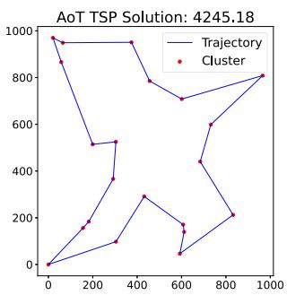  
(a) AoT Trajectory of 20 clusters.

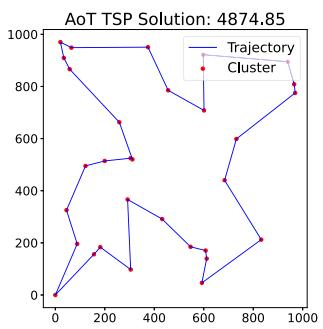  
(b) AoT Trajectory of 30 clusters.  
Fig. 4. Trajectory planning results by the AoT algorithm.

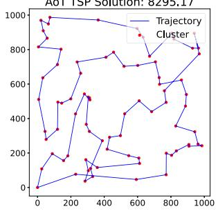  
(a) AoT Trajectory with 500 epochs

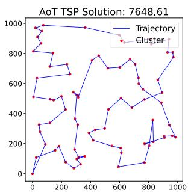  
(b) AoT Trajectory with 1000 epochs.

Fig. 5. Trajectory planning under 80 clusters with different training epochs.  
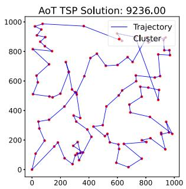  
(a) AoT Trajectory with batch size 12.

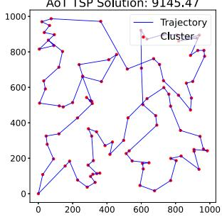  
(b) AoT Trajectory with batch size 16  
Fig. 6. Trajectory planning under 100 clusters with different batch sizes.

We compare the performance of the AoT algorithm with the following benchmark algorithms:

\- Heuristic: The Artificial Bee Colony (ABC) algorithm is used as baseline for trajectory planning. However, this algorithm is not suitable for task offloading.

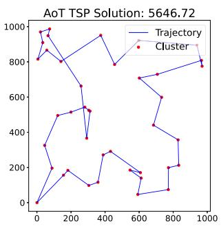  
(c) AoT Trajectory of 40 clusters.

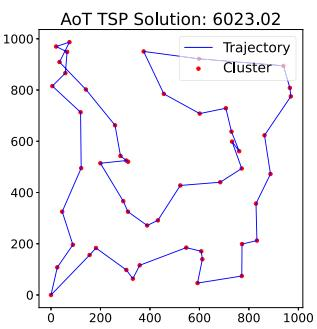  
(d) AoT Trajectory of 50 clusters

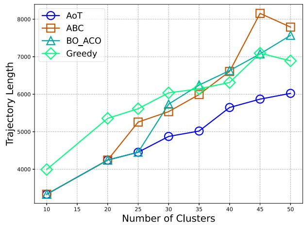  
Fig. 7. Trajectory length comparison under different number of clusters.

\- Value-based DRL: Dueling Double Deep Q-Network (D3QN) and Double Deep Q-Network (DDQN) are employed solely to solve the task offloading problem.

\- Recurrent Neural Network (RNN): RNN and its variants, Long Short-term Memory (LSTM) and Gated Recurrent Unit (GRU) algorithms, are used as alternative encoder modules.

\- BO\_ACO: Bi-Objective Ant Colony Optimization, a stateof-the-art UAV-assisted MEC algorithm that jointly optimizes UAV trajectory and task offloading by balancing energy consumption and computation latency.

\- Traditional Algorithm: The Greedy algorithm is used to solve the TSP problem, selecting the nearest unvisited cluster as the next hop.

## B. Evaluation of the AoT Algorithm on Trajectory Planning

1) UAV trajectory visualization: To intuitively demonstrate the performance of the proposed AoT algorithm in UAV trajectory planning, we visualize the optimized inspection trajectory under varying numbers of sensor clusters. As shown in Fig. 4(a)–(d), the number of clusters increases from 20 to 50. In Fig. 4(a), with 20 clusters, AoT generates a compact path with a total length of 4245.18 meters. As the number of clusters increases to 30 and 40, shown in Fig. 4(b) and (c), the trajectory lengths grow to 4874.85 and 5646.72 meters, respectively. Fig. 4(d) shows the AoT algorithm generates an optimal trajectory of 6023.02 meters with 50 clusters. In all, the AoT algorithm performs strong scalability and robustness, proving that the shared-encoder effectively captures global spatial dependencies among clusters.

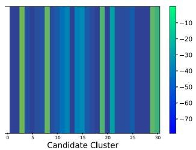  
(a) The Score Heat Map for Step 1.

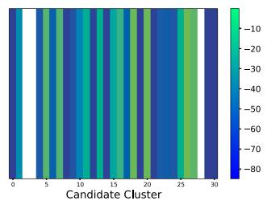  
(b) The Score Heat Map for Step 3

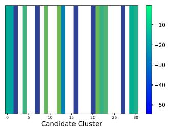  
(c) The Score Heat Map for Step 15.

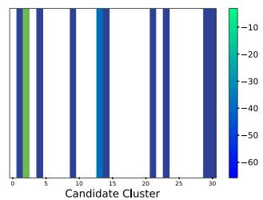  
(d) The Score Heat Map for Step 21.

Fig. 8. Heatmap of adjacency scores when the UAV is at different visiting points of the trajectory.  
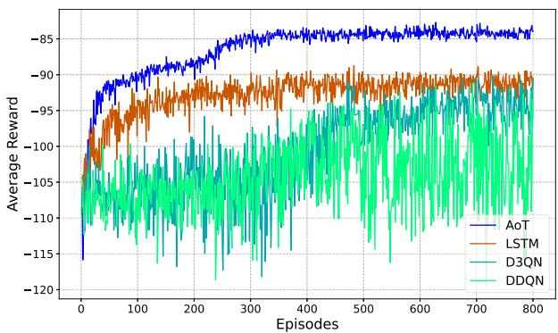  
Fig. 9. Convergence performance among different algorithms.

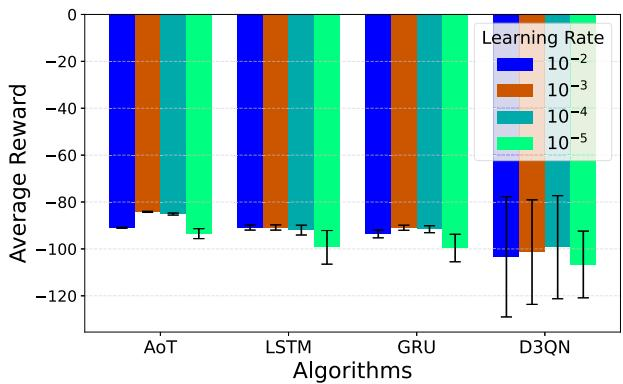  
Fig. 10. Reward comparison with respect to different learning rates.

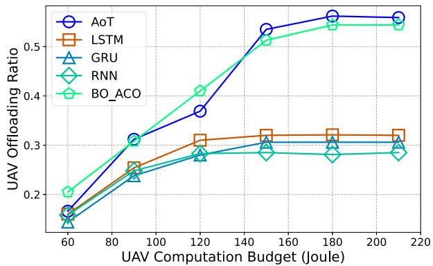  
Fig. 11. Task offloading ratio to UAV among different computation budgets.

However, we also observe that as the number of clusters increases, the AoT algorithm tends to produce only near-optimal trajectories. Once the number of clusters exceeds 40, the algorithm occasionally fails to identify the shortest paths between certain clusters. For instance, in Fig. 4(c), small loops appear in the upper-left and central-left regions, and in Fig. 4(d), similar loops emerge in the upper-left area. This is because a low learning rate is required to maintain stable training, while the number of nodes increases, the algorithm may have difficulty escaping local optima since the low learning rate limits its ability to explore more options. Increasing the number of training epochs could help alleviate this issue.

2) Scalability analysis: To evaluate the scalability of the proposed AoT algorithm, we conduct additional trajectory planning simulations under large-scale scenarios involving 80 and 100 clusters. The results are shown in Figs. 5 and 6. In Fig. 5, we evaluate the planning performance under 80 clusters with different training epochs. As shown in Fig. 5(a), with a batch size of 18, the AoT algorithm achieves a total path length of 8295.17 meters under 500 epochs, while increasing the epochs to 1000 significantly improves the path quality, reducing the total distance to 7648.61 meters, as shown in Fig. 5(b). Similarly, Fig. 6 shows the results for 100 clusters with 1000 epochs, where training with batch sizes 12 and 16 yields path lengths of 9236.00 meters and 9145.47 meters, as shown in Fig. 6(a) and (b), respectively.

Overall, the AoT algorithm demonstrates strong scalability, maintaining effective trajectory planning capabilities across hundreds of clusters. We also note that the primary bottleneck of AoT lies in the memory demand of the Transformer encoder, especially under large batch sizes and cluster numbers. While our current experiments are limited by laptop hardware, we expect that the algorithm will scale even more favorably on devices with larger GPU memory.

3) Trajectory length comparison: We also compare trajectory lengths across different algorithms to validate the efficiency of AoT. As shown in Fig. 7, AoT consistently achieves the shortest trajectories as the number of clusters increases. For example, with 45 clusters, AoT generates a trajectory of 5869.52 meters, while the Greedy and BO\_ACO algorithms produce longer paths of 7093.39 meters and 7075.64 meters, respectively. The ABC approach results in an even longer trajectory of 8154.82 meters. Compared to these baselines, AoT reduces the total path length by 28.02% over ABC, 14.87% over BO\_ACO, and 17.25% over Greedy. This performance gain is mainly attributed to AoT’s ability to capture global spatial dependencies via multi-head self-attention and to learn effective planning strategies through DRL. In addition, the Transformer’s parallel attention mechanism allows for more flexible and comprehensive exploration of the solution space, especially in complex routing scenarios.

4) Attention score over decision steps: To better analyze the selection mechanism of the next visiting cluster, we provide heatmaps of adjacency attention scores at four key steps. Fig. 8 shows the attention distributions in Steps 1, 3, 15, and 21, illustrating the algorithm’s focus shifts throughout the trajectory. At step 1 (Fig. 8(a)), the tour begins with a relatively uniform attention distribution, assigning non-negligible probabilities to most candidate clusters. By step 3 (Fig. 8(b)), the attention begins to concentrate on specific clusters. As the tour progresses to step 15 (Fig. 8(c)), a large portion of the clusters has already been visited, and this is reflected by the emergence of many zero-valued entries in the attention matrix. Finally, at step 21 (Fig. 8(d)), AoT focuses entirely on the few remaining unvisited clusters and makes deterministic decisions. This stepwise evolution demonstrates that AoT can dynamically adjust its attention distribution based on the current state. The integration of masking and self-attention enables AoT to effectively exclude previously visited clusters while maintaining sensitivity to global spatial structure.

## C. Evaluation of the AoT Algorithm on Task Offloading

1) Convergence speed: Fig. 9 shows the average reward curves across 800 training episodes. The AoT algorithm consistently outperforms the baselines, reaching an average reward of −85 around episode 300 and maintaining stable performance thereafter. In contrast, the LSTM-based encoder converges around episode 400. Both the D3QN and DDQN algorithms show even lower final performance, with their average rewards stabilizing below −95. These results highlight the advantage of AoT’s self-attention mechanism, which excels at capturing long-range dependencies between tasks and enables efficient parallel processing of task sequences.

2) Impact of learning rates: Fig. 10 evaluates the robustness of different algorithms across a range of learning rates, from $1 0 ^ { - 2 } ~ \mathrm { t o } ~ 1 0 ^ { - 5 }$ . The AoT algorithm consistently outperforms all baselines in terms of average reward, with its best performance achieved at $l r = 1 0 ^ { - 3 }$ , reaching a reward of −84.21. In con-= 10trast, LSTM and GRU show moderate sensitivity to learning rate changes, while D3QN performs poorly overall and suffers significant degradation when the learning rate is not properly tuned. The error bars represent the variance of rewards over the final 100 episodes, serving as an indicator of convergence stability. AoT displays the smallest error bars across all settings, demonstrating greater training stability. This advantage arises from AoT’s shared Transformer encoder with multi-head self-attention, which enables parallel token-wise processing and stable gradient propagation, thereby reducing sensitivity to step-size variations during optimization. Unlike sequential algorithms such as LSTM and GRU, the Transformer architecture eliminates recursive dependencies that tend to amplify gradient vanishing or explosion at extreme learning rates.

3) Impact of UAV computation budget: Fig. 11 shows a clear positive correlation between the computation energy budget and the UAV offloading ratio across all algorithms. At every budget level, the AoT algorithm consistently achieves the highest offloading ratio. For instance, with a budget of 180 joules, AoT offloads 56.2% of tasks to the UAV, while BO\_ACO, LSTM, GRU, and RNN reach 54.4%, 32.1%, 30.6%, and 28.1%, respectively. This behavior stems from AoT’s ability to jointly capture fine-grained task characteristics and their impact on offloading decisions. The encoder highlights patterns where UAV execution offers a trade-off between delay and energy consumption. Since UAVs provide a middle ground between high communication cost and high computing cost, the AoT algorithm effectively learns to prefer UAV offloading for tasks with moderate data size and computation demands.

## VII. CONCLUSION

In this paper, we have proposed an AGI-oriented Transformer (AoT) algorithm to minimize the weighted sum of latency and energy consumption in the UAV-assisted railway inspection networks. An encoder-only architecture has been designed to consider DRL and different output heads for joint trajectory planning and task offloading. The proposed AoT algorithm is a novel lightweight Transformer-based approach. The theoretical innovations in the architectural design and training mechanism are not only tailored for UAV-assisted inspection networks, but also applicable to a wide range of resource-constrained devices for solving multi-objective optimization problems. For the future work, we will design more specialized output heads for handling a wider variety of tasks to further enhance the AoT algorithm.

## REFERENCES

[1] L. Tong et al., “TriRNet: Real-time rail recognition network for UAV-Based railway inspection,” IEEE Trans. Intell. Transp. Syst., vol. 25, no. 5, pp. 3927–3943, May 2024.

[2] Y. Wu, P. Chen, Y. Qin, Y. Qian, F. Xu, and L. Jia, “Automatic railroad track components inspection using hybrid deep learning framework,” IEEE Trans. Instrum. Meas., vol. 72, 2023, Art. no. 5011415.

[3] D. Yang, J. Wang, F. Wu, L. Xiao, Y. Xu, and T. Zhang, “Energy efficient transmission strategy for mobile edge computing network in UAV-Based patrol inspection system,” IEEE Trans. Mobile Comput., vol. 23, no. 5, pp. 5984–5998, May 2024.

[4] J. Cui, Y. Qin, Y. Wu, C. Shao, and H. Yang, “Skip connection YOLO architecture for noise barrier defect detection using UAV-Based images in high-speed railway,” IEEE Trans. Intell. Transp. Syst., vol. 24, no. 11, pp. 12180–12195, Nov. 2023.

[5] Y. Zhao, Z. Li, N. Cheng, B. Hao, and X. Shen, “Joint UAV position and power optimization for accurate regional localization in space-air integrated localization network,” IEEE Internet Things J., vol. 8, no. 6, pp. 4841–4854, Mar. 2021.

[6] Z. Zhao et al., “Automatic potential safety hazard evaluation system for environment around high-speed railroad using hybrid U-shape learning architecture,” IEEE Trans. Intell. Transp. Syst., vol. 26, no. 1, pp. 1071– 1087, Jan. 2025.

[7] X. Shao, R. Zhang, Q. Jiang, and R. Schober, “6D movable antenna enhanced wireless network via discrete position and rotation optimization,” IEEE J. Sel. Areas Commun., vol. 43, no. 3, pp. 674–687, Mar. 2025.

[8] H. Guo, Y. Wang, J. Liu, and C. Liu, “Multi-UAV cooperative task offloading and resource allocation in 5G advanced and beyond,” IEEE Trans. Wireless Commun., vol. 23, no. 1, pp. 347–359, Jan. 2024.

[9] J. Huang, B. Wu, Q. Duan, L. Dong, and S. Yu, “A fast UAV trajectory planning framework in RIS-Assisted communication systems with accelerated learning via multithreading and federating,” IEEE Trans. Mobile Comput., vol. 24, no. 8, pp. 6870–6885, Aug. 2025.

[10] Y. Wang, M. Chen, C. Pan, K. Wang, and Y. Pan, “Joint optimization of UAV trajectory and sensor uploading powers for UAV-Assisted data collection in wireless sensor networks,” IEEE Internet Things J., vol. 9, no. 13, pp. 11214–11226, Jul. 2022.

[11] Y. Chen, J. Zhao, Y. Wu, J. Huang, and X. S. Shen, “Multi-user task offloading in UAV-Assisted LEO satellite edge computing: A game-theoretic approach,” IEEE Trans. Mobile Comput., vol. 24, no. 1, pp. 363–378, Jan. 2025.

[12] X. Huang, X. Qin, M. Li, C. Huang, and X. Shen, “Adaptive digital twin-assisted 3C management for QoE-Driven MSVS: A GAI-Based DRL approach,” IEEE Trans. Cogn. Commun. Netw., vol. 11, no. 2, pp. 858–872, Apr. 2025.

[13] Y. Zhao et al., “Joint content caching, service placement, and task offloading in UAV-Enabled mobile edge computing networks,” IEEE J. Sel. Areas Commun., vol. 43, no. 1, pp. 51–63, Jan. 2025.

[14] C. Hou and Q. Zhao, “Optimal task-offloading control for edge computing system with tasks offloaded and computed in sequence,” IEEE Trans. Autom. Sci. Eng., vol. 20, no. 2, pp. 1378–1392, Apr. 2023.

[15] N. Cheng et al., “Value-of-information optimization for object detectiondriven joint video transmission and processing in UAV-Enabled wireless networks,” IEEE J. Miniaturization Air Space Syst., vol. 6, no. 2, pp. 59–69, Jun. 2025.

[16] X. Deng et al., “Task offloading in internet of vehicles: A DRL-Based approach with representation learning for DAG scheduling,” IEEE Trans. Mobile Comput., vol. 24, no. 6, pp. 5045–5060, Jun. 2025.

[17] X. Sun, H. Ding, N. Li, X. Dong, J. Sun, and G. Zheng, “Intelligent fault diagnosis method for shearer rocker gear based on swin transformer and multiscale convolution parallel integration,” IEEE Trans. Instrum. Meas., vol. 74, 2025, Art. no. 3519816.

[18] X. Chen, H. Zhang, F. Zhao, Y. Cai, H. Wang, and Q. Ye, “Vehicle trajectory prediction based on intention-aware non-autoregressive transformer with multi-attention learning for internet of vehicles,” IEEE Trans. Instrum. Meas., vol. 71, 2022, Art. no. 2513912.

[19] X. Chen, H. Zhang, F. Deng, J. Liang, and J. Yang, “Stochastic nonautoregressive transformer-based multi-modal pedestrian trajectory prediction for intelligent vehicles,” IEEE Trans. Intell. Transp. Syst., vol. 25, no. 5, pp. 3561–3574, May 2024.

[20] T. Sun, S. Yin, L. Deng, and F. Richard Yu, “Reinforcement-learning-based trajectory design and phase-shift control in UAV-Mounted-RIS communications,” IEEE Trans. Mach. Learn. Commun. Netw., vol. 3, pp. 163–175, 2025.

[21] Y. Hou, Z. Wei, R. Zhang, X. Cheng, and L. Yang, “Hierarchical task offloading for vehicular fog computing based on multi-agent deep reinforcement learning,” IEEE Trans. Wireless Commun., vol. 23, no. 4, pp. 3074–3085, Apr. 2024.

[22] J. Zhou et al., “Reliability-optimal UAV-Assisted mobile edge computing: Joint resource allocation, data transmission scheduling and motion control,” IEEE Trans. Mobile Comput., vol. 24, no. 5, pp. 4217–4234, May 2025.

[23] J. Li, X. Ke, Z. Wang, J. Wan, and G. Tan, “CUTransNet: Transformers to make strong encoders for multi-task vision perception of autonomous driving,” in Proc. IEEE Int. Conf. Acoust. Speech Signal Process., 2024, pp. 7385–7389.

[24] L. Ren, H. Wang, T. Mo, and L. T. Yang, “A lightweight group transformerbased time series reduction network for edge intelligence and its application in industrial RUL prediction,” IEEE Trans. Neural Netw. Learn. Syst., vol. 36, no. 2, pp. 3720–3729, Feb. 2025.

[25] H. Zhang, J. Huo, Y. Huang, J. Cheng, and X. Li, “Perception-aware-based UAV trajectory planner via generative adversarial self-imitation learning from demonstrations,” IEEE Internet Things J., vol. 12, no. 3, pp. 3248– 3260, Feb. 2025.

[26] B. López, J. Muñoz, F. Quevedo, C. A. Monje, S. Garrido, and L. Moreno, “4D trajectory planning based on fast marching square for UAV teams,” IEEE Trans. Intell. Transp. Syst., vol. 25, no. 6, pp. 5703–5717, Jun. 2024.

[27] H. Liu, Y. P. Tsang, C. K. M. Lee, and C. H. Wu, “UAV trajectory planning via viewpoint resampling for autonomous remote inspection of industrial facilities,” IEEE Trans. Ind. Informat., vol. 20, no. 5, pp. 7492–7501, May 2024.

[28] R. J. Williams, “Simple statistical gradient-following algorithms for connectionist reinforcement learning,” Mach. Learn., vol. 8, pp. 229–256, 1992.

[29] J. Tian, D. Wang, H. Zhang, and D. Wu, “Service satisfaction-oriented task offloading and UAV scheduling in UAV-Enabled MEC networks,” IEEE Trans. Wireless Commun., vol. 22, no. 12, pp. 8949–8964, Dec. 2023.

[30] N. Zhao, Z. Ye, Y. Pei, Y.-C. Liang, and D. Niyato, “Multi-agent deep reinforcement learning for task offloading in UAV-Assisted mobile edge computing,” IEEE Trans. Wireless Commun., vol. 21, no. 9, pp. 6949–6960, Sep. 2022.

[31] M. Yan, R. Xiong, Y. Wang, and C. Li, “Edge computing task offloading optimization for a UAV-Assisted internet of vehicles via deep reinforcement learning,” IEEE Trans. Veh. Technol., vol. 73, no. 4, pp. 5647–5658, Apr. 2024.

[32] B. Zhu, E. Bedeer, H. H. Nguyen, R. Barton, and Z. Gao, “UAV trajectory planning for AoI-Minimal data collection in UAV-Aided IoT networks by transformer,” IEEE Trans. Wireless Commun., vol. 22, no. 2, pp. 1343– 1358, Feb. 2023.

[33] K. Gao et al., “Cooperative DNN partitioning in energy-harvesting and MEC-Enabled AAV networks,” IEEE Internet Things J., vol. 12, no. 13, pp. 24329–24344, Jul. 2025.

[34] Y. Wang, J. Zhu, H. Huang, and F. Xiao, “Bi-objective ant colony optimization for trajectory planning and task offloading in UAV-Assisted MEC systems,” IEEE Trans. Mobile Comput., vol. 23, no. 12, pp. 12360–12377, Dec. 2024.

[35] P. Arthurs, L. Gillam, P. Krause, N. Wang, K. Halder, and A. Mouzakitis, “A taxonomy and survey of edge cloud computing for intelligent transportation systems and connected vehicles,” IEEE Trans. Intell. Transp. Syst., vol. 23, no. 7, pp. 6206–6221, Jul. 2022.

[36] O. Karaku¸s, E. E. Kuruo˘glu, and A. Achim, “A generalized Gaussian extension to the Rician distribution for SAR image modeling,” IEEE Trans. Geosci. Remote Sens., vol. 60, 2022, Art. no. 5205615.

[37] N. Gao et al., “Energy model for UAV communications: Experimental validation and model generalization,” China Commun., vol. 18, no. 7, pp. 253–264, 2021.

[38] Z. Hu, F. Zeng, Z. Xiao, B. Fu, H. Jiang, and H. Chen, “Computation efficiency maximization and QoE-Provisioning in UAV-Enabled MEC communication systems,” IEEE Trans. Netw. Sci. Eng., vol. 8, no. 2, pp. 1630–1645, Second Quarter 2021.

[39] Z. Yang, C. Pan, K. Wang, and M. Shikh-Bahaei, “Energy efficient resource allocation in UAV-Enabled mobile edge computing networks,” IEEE Trans. Wireless Commun., vol. 18, no. 9, pp. 4576–4589, Sep. 2019.

[40] W. Mao, K. Xiong, Y. Lu, P. Fan, and Z. Ding, “Energy consumption minimization in secure multi-antenna UAV-assisted MEC networks with channel uncertainty,” IEEE Trans. Wireless Commun., vol. 22, no. 11, pp. 7185–7200, Nov. 2023.

[41] J. Wang, H. Zhang, X. Zhou, W. Liu, and D. Yuan, “Joint resource allocation and trajectory design for energy-efficient UAV assisted networks with user fairness guarantee,” IEEE Internet Things J., vol. 11, no. 13, pp. 23835–23849, Jul. 2024.

[42] Y. Liu, S. Xie, and Y. Zhang, “Cooperative offloading and resource management for UAV-enabled mobile edge computing in power IoT system,” IEEE Trans. Veh. Technol., vol. 69, no. 10, pp. 12229–12239, Oct. 2020.

  
Ruibin Guo (Graduate Student Member, IEEE) received the BE degree from the School of Electronic and Information Engineering, Beijing Jiaotong University, Beijing, China, in 2020, where he is currently working toward the PhD degree. Since January 2025, he has been a visiting PhD student with the Department of Electrical and Computer Engineering, University of Waterloo, Waterloo, ON, Canada. His research interests include computing power network, uncrewed aerial vehicles, deterministic communication, and AI-driven network resource management.

Wei Quan (Senior Member, IEEE) received the PhD degree in communication and information system from the Beijing University of Posts and Telecommunications (BUPT), Beijing, China, in 2014. He is currently a full professor with the School of Electronic and Information Engineering, Beijing Jiaotong University (BJTU), Beijing, China. He has coauthored more than 50 papers in prestigious international journals and conferences, including IEEE Journal on Selected Areas in Communications, IEEE Communications Magazine, IEEE Wireless Communications,

IEEE Network, IEEE Transactions on Vehicular Technology, and IEEE Communications Letters. His research interests focus on reliable transmission in mobile networks, vehicular networks, and Industrial IoT. He is an associate editor of IEEE Transactions on Vehicular Technology, Peer-to-Peer Networking and Applications, Journal of Internet Technology, and IEEE Access. He is a winner of the 2022 IEEE ComSoc Asia-Pacific Outstanding Young Researcher Award and a principal investigator (PI) of National Key Research and Development Program of China.

  
Xinyu Huang (Member, IEEE) received the BE degree from Qian Xuesen Experimental Class, Xidian University, Xi’an, China, in 2018, the MS degree in information and communications engineering from Xi’an Jiaotong University, Xi’an, China, in 2021, and the PhD degree in electrical and computer engineering from the University of Waterloo, Waterloo, ON, Canada, in 2025. His research interests include digital agents, multimedia communications, and network resource management.

Yuming Zhang (Member, IEEE) received the PhD degree in telecommunications and information system from the National Engineering Laboratory for Next Generation Internet Interconnection Devices, Beijing Jiaotong University, Beijing, China, in 2021. He served as a post-doctor with the School of Computer Science, Beijing University of Posts and Telecommunications, from 2021 to 2024. He is currently a lecturer with the School of Electronic and Information Engineering, Beijing Jiaotong University. His current research interests include UAV networks, mobile edge computing, queue theory, and machine learning.

Mingyuan Liu (Member, IEEE) received the PhD degree in information and communication engineering from Beijing Jiaotong University, Beijing, China, in 2023. He is currently a lecturer with the School of Electronic and Information Engineering, Beijing Jiaotong University. His research interests include future networks, software-defined networking, Internet of Things, and cybersecurity.

Dong Yang (Member, IEEE) received the PhD degree in communication engineering from the School of Electronic and Information Engineering, Beijing Jiaotong University, China, in 2008. From March 2009 to July 2010, he was a postdoctoral researcher with Jönköping University and ABB Corporate Research, Sweden, where he participated in the standardization and innovation of industrial wireless sensor networks. He is currently a full professor of Communication Engineering and the director of the Intelligent Industry Network Research Institute, Beijing

Jiaotong University. He has authored or co-authored more than 70 scientific publications in the field of network and communication technologies. More than 20 of his invention patents were licensed to ZTE. His current research interests include network architecture, the Internet of Things, wireless sensor networks, and data-driven network resource management. He has served as the co-chair for IEEE INFOCOM 2023 Workshop PerAI-6 G, the session chair for IEEE ICCT 2022, and a TPC member for IEEE MetaCom 2023. He has been serving as an associate editor of IEEE Transactions on Mobile Computing and an executive editor of the Transactions on Emerging Telecommunications Technologies (Wiley). He has served as the guest editor of the IEEE Transactions on Industrial Informatics in 2021.

Hongke Zhang (Fellow, IEEE) received the PhD degree in communication and information system from the University of Electronic Science and Technology of China, Chengdu, China, in 1992. He is currently a professor with the School of Electronic and Information Engineering, Beijing Jiaotong University, Beijing, China, where he currently directs the National Engineering Center of China on Mobile Specialized Network. He is also an academician of the China Engineering Academy. His current research interests include architecture and protocol design for the future

Internet and specialized networks. He currently serves as an associate editor of IEEE Transactions on Network and Service Management (TNSM) and IEEE Internet of Things Journal (IoTJ).

Xuemin (Sherman) Shen (Fellow, IEEE) received the PhD degree in electrical engineering from Rutgers University, New Brunswick, NJ, USA, in 1990. He is a University professor with the Department of Electrical and Computer Engineering, University of Waterloo, Canada. His research focuses on network resource management, wireless network security, Internet of Things, AI for networks, and vehicular networks. He is a registered professional engineer of Ontario, Canada, an Engineering Institute of Canada fellow, a Canadian Academy of Engineering fellow, a Royal Society of Canada fellow, a Chinese Academy of Engineering foreign member, an international fellow of the Engineering Academy of Japan, and a distinguished lecturer of the IEEE Vehicular Technology Society and Communications Society. He received “West Lake Friendship Award” from Zhejiang Province in 2023, President’s Excellence in Research from the University of Waterloo in 2022, the Canadian Award for Telecommunications Research from the Canadian Society of Information Theory (CSIT) in 2021, the R.A. Fessenden Award in 2019 from IEEE, Canada, Award of Merit from the Federation of Chinese Canadian Professionals (Ontario) in 2019, James Evans Avant Garde Award in 2018 from the IEEE Vehicular Technology Society, Joseph LoCicero Award in 2015 and Education Award in 2017 from the IEEE Communications Society (ComSoc), and Technical Recognition Award from Wireless Communications Technical Committee (2019) and AHSN Technical Committee (2013). He has also received the Excellent Graduate Supervision Award in 2006 from the University of Waterloo and the Premier’s Research Excellence Award (PREA) in 2003 from the Province of Ontario, Canada. He is the past president of the IEEE Communications Society. He was the vice president for Technical & Educational Activities, vice president for Publications, member-at-large on the Board of Governors, chair of the Distinguished Lecturer Selection Committee, and member of IEEE Fellow Selection Committee of the ComSoc. He served as the editor-in-chief of the IEEE Internet of Things Journal, IEEE Network, and IET Communications.