# Joint UAV 3D Deployment and Ground Device Association Optimizing for Multi-UAV-Aided MEC Heterogeneous Network

Yunfei Gao , Peng Wu , Xiaopeng Yuan , Member, IEEE, Yulin Hu , Senior Member, IEEE, Xiaoxiang Cao , and Anke Schmeink , Senior Member, IEEE

Abstract—We investigate a multi-uncrewed aerial vehicle (UAV)- aided mobile edge computing (MEC) system where UAVs provide to ground devices (GDs) comprehensive services, including communication, computation, and joint decision-making (CCJD). Specifically, the system is dynamic and heterogeneous, with time-varying task requests and UAVs of diverse capabilities, data processing requirements, and priorities. To enhance the task execution efficiency, we provide a joint optimization design that minimizes the average system operation time by optimizing UAVs’ threedimensional (3D) deployment and GDs association, while adhering to no-fly zones (NFZs) and obstacle constraints. Nevertheless, the formulated problem exhibits high non-convexity with a rapidly scaling complexity w.r.t. the number of both UAVs and GDs. To address the challenges, we propose an efficient and low-complexity learning-based approach accelerated by analytical characterizations on GD’s association to enhance algorithm convergence. First, we derive a closed-form solution for GD’s association based on the Lagrangian dual method and optimal transmission theory (OTT). We also analytically derive the performance gap between the closed-form association and the optimal exhaustive search-based solution. Theoretical analysis demonstrates that our proposed approach achieves substantial complexity reduction compared to exhaustive search, while almost achieving the same performance. Based on the characterized optimal association, we reformulate the original joint design problem equivalently into a UAV 3D deployment optimization problem without loss of optimality, which is further established as a Markov decision process (MDP). Afterwards, an efficient algorithm based on the proposed federated multi-agent deep reinforcement learning algorithm is proposed to solve the reformulated problem, where the reward function is designed based

on the closed-form GD’s association and its corresponding average delay, leveraging the dueling network architecture to enhance training stability and accelerate convergence. Finally, simulation results demonstrate the superior performance of the proposed method compared to the benchmarks.

Index Terms—Multi-UAV, 3D deployment and association, MEC, federated MADRL, no-fly zones.

## I. INTRODUCTION

I N RECENT years, the rapid development of mobile internet, massive amounts of data, raising higher demands on communication systems for real-time performance and reliability [1]. Mobile edge computing (MEC), which can reduce latency and alleviate core network load by deploying computing resources at the network edge, is regarded as a key technology and an essential enabler for future 6G systems [2], [3]. However, in dynamic environments such as post-disaster areas, remote mountainous regions and districts with damaged infrastructure, traditional ground base stations (BS) face challenges in rapid deployment and stable service maintenance, limiting the application of MEC. To address this issue, uncrewed aerial vehicle (UAVs) with high mobility [4], [5], [6], rapid response [7], [8], and on-demand deployment capabilities [9], [10], [11] are introduced into MEC systems to form an air–ground cooperative UAV-aided MEC network. By dynamically deploying UAVs as aerial MEC nodes, services can be quickly established when the ground networks are unavailable or the network coverage is insufficient [12], [13], assisting ground devices (GDs) with communication, computation, and joint decision-making (CCJD) tasks, thereby significantly enhancing the system’s adaptability, responsiveness, and service continuity.

For UAV-aided MEC systems, existing researches have demonstrated that determining appropriate deployment locations can enhance system performance in terms of MEC service coverage [14], energy efficiency [15], and latency [16], [17]. Several studies have investigated UAV deployment strategies for providing MEC services [18], [19], [20], [21], [22], [23], [24]. For instance, the work of [18] investigates a service satisfactionoriented task offloading and UAV scheduling problem in UAVenabled MEC networks. Besides, the user energy efficiency optimization in UAV-aided MEC system is studied in [19], where a Lyapunov-based stochastic optimization framework is employed to balance UAV energy consumption and queue stability. In addition, the authors in [20] explore a multi-UAV MEC system where the joint energy and latency costs are minimized by optimizing task offloading, UAV trajectories, and resource allocation through a layered iterative algorithm. The study in [21] proposes a parametrized dueling deep Q-network and linear programming algorithm that jointly optimizes UAV 3D trajectory, flight time, and offloading decisions to maximize energy efficiency and offloading fairness. The authors of work [22] study a UAV-assisted MEC network and propose a golden-section search method to maximize service coverage by jointly optimizing UAV altitude and task offloading probability under a successful edge computing probability constraint. The work of [23] decomposes the joint content delivery and sensing problem in UAV-enabled integrated sensing and communication networks into user grouping, UAV deployment, and precoder design subproblems, which are solved with iterative algorithms based on mean-shift clustering and successive convex approximation, in order to maximize system utility. Moreover, the authors of work [24] propose an alternating optimization approach for UAV deployment, user association, routing, and resource allocation in integrated access and backhaul networks to minimize overall system cost.

On the other hand, optimizing GDs’ association is also crucial in UAV-aided MEC systems. A well-designed association strategy not only affects link quality and task transmission delay, but also directly impacts resource allocation efficiency and overall system performance [25], [26], [27]. There also exist many studies on the association between UAVs and GDs [28], [29], [30], [31], [32], [33], [34]. In work [28], the authors propose a reinforcement learning-based approach to optimize energy-efficient GD association in UAV-assisted communications, aiming to improve the system sum rate while intelligently linking users to UAVs. The authors of work [29] present a DRL-based method to jointly optimize UAV deployment and device association for improved coverage, fairness, and throughput. In addition, the work of [30] proposes a UAV-aided MEC task offloading framework that minimizes average task delay by jointly optimizing GDs’ association and UAV deployment. To maximize energy efficiency, the work of [31] proposes an inverse soft-Q learningbased algorithm for joint multiple intelligent reflecting surfaces (multi-IRS) multi-GD association in UAV communications. The authors of [32], [33] propose a learning-based framework to optimize Multi-UAV placement and GD association, boosting the performance of the system. Moreover, to enhance spectral efficiency in non-orthogonal multiple access (NOMA) multi-UAV networks with imperfect successive interference cancellation (SIC), the work of [34] introduces an IRS-assisted optimization scheme that jointly designs GD association, power allocation, and beamforming using advanced convex optimization methods.

Although the above studies [18], [19], [20], [21], [22], [23], [24] have enhanced the performance of UAV MEC networks, they primarily address UAV deployment or task offloading in relatively static environments under simplified assumptions, such as fixed user locations and homogeneous computation demands, which makes them inadequate for dynamic and heterogeneous scenarios, where varying user locations, task arrivals, and computation requirements significantly increase the complexity of UAV deployment and task scheduling. In addition, most of these works adopt centralized algorithmic frameworks, which pose scalability challenges and introduce high communication overhead. In parallel, several studies [28], [29], [30], [31], [32], [33] have explored learning-based approaches to address the GD association problem; however, in large-scale dynamic environments, the state and action spaces grow exponentially, resulting in substantial training and inference overhead that hinders real-time deployment. Furthermore, while some research jointly optimizes UAV deployment, GD association, and other system parameters (e.g., power allocation, trajectory planning, and caching strategies), such methods often depend on problem decomposition or iterative optimization, making them susceptible to local optima and typically leading to slow convergence [30], [32], [34].

To the best of our knowledge, the low-complexity and fastconverging design for joint multi-UAV deployment and GDs association in practical UAV-aided MEC networks with high dynamics, heterogeneity and NFZs remains an open and challenging problem, which serves as the primary motivation of our work. In this work, we propose an efficient joint design for 3D multi-UAV deployment and UAV–GD association, explicitly considering the characteristics of heterogeneous and dynamic networks with NFZ constraints. Specifically, the model accounts for random GD task requests, diverse UAV computational capabilities, varying data processing requirements, and differentiated task priorities. The aim of this paper is to minimize the average task delay by optimizing the UAVs’ 3D location deployment and the GDs’ association. However, the formulated problem is non-convex and difficult to solve due to the dynamic environment induced by task randomness across different service stages. In addition, the algorithmic complexity grows exponentially with the number of UAVs and GDs, which severely impairs convergence speed. To address these challenges, we propose an efficient solution with low complexity, with the main contributions summarized as follows:

\- Dynamic system design for multi-UAV-aided MEC heterogeneous CCJD network: We consider a practical dynamic multi-UAV-aided MEC heterogeneous CCJD network architecture with NFZs, which is to the best of our knowledge, for the first time taking the randomness of GDs’ task requests, the heterogeneity of UAV computing capabilities, the diversity of data processing requirements, and the differences in task priorities into account. Based on these system characteristics, we formulate a joint optimization problem for UAVs 3D deployment and GDs association to minimize the average system delay.

Closed-form solution of GD’s association: To mitigate the design complexity, we derive a closed-form GD’s association solution based on the Lagrangian dual method and optimal transport theory (OTT), and rigorously prove its existence, uniqueness, and integrality. In addition, we also derive the upper bound on the performance gap between the closed-form solution and the optimal exhaustive search solution, showing that the proposed method can achieve near-optimal performance while significantly reducing computational complexity.

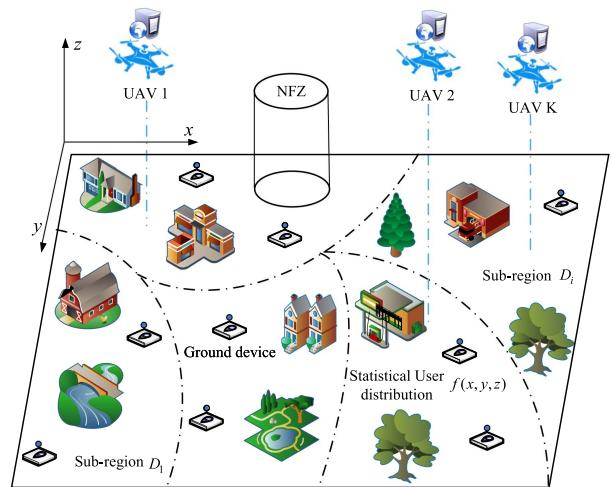  
Fig. 1. Multi-UAV-aided MEC heterogeneous networks.

\- A novel low-complexity and efficient method for UAVs 3D deployment: To solve the complicated non-convexity of the UAV 3D deployment problem in dynamic scenario, we propose a novel low-complexity and efficient method, namely federated multi-agent dueling DDQN with closed-form UAV–GD association (FMAD3QN-CUA). This method leverages the dueling network architecture to enhance training stability and accelerate convergence, while the reward function is designed based on the closed-form UAV–GD association and its corresponding average delay. Via simulation, the superior performance of the proposed method compared to the benchmarks is verified.

The remainder of this paper is organized as follows. Section II introduces the considered multi-UAV-aided MEC network and formulates the joint design problem. Section III presents a closed-form UAV–GD association solution with low complexity and near-optimal performance. Section IV proposes a novel low-complexity method to address the UAVs’ 3D deployment problem. Section V evaluates the proposed design algorithm via numerical results, and Section VI concludes the work.

## II. SYSTEM MODEL AND PROBLEM FORMULATION

In this section, we begin by presenting the system model, encompassing the task arrival model, the channel and communication model, as well as the computation and joint decision-making model. Subsequently, the optimization problem to be addressed is formulated.

## A. System Description

We consider a multi-UAV-aided MEC heterogeneous network with NFZs, which consists of K UAVs and U GDs, as shown in Fig. 1. Each UAV is deployed in 3D space as an aerial MEC node to assist GDs with CCJD tasks, while avoiding NFZs and obstacles, and covering all GDs within the 3D region $D \in \mathbb { R } ^ { 3 }$ The whole task operation process is divided into N service stages, where $n \in \{ 1 , 2 , . . . , N \}$ , as illustrated in Fig. 2. At the start of each service stage, GDs send task requests,1 and then UAVs collect data from them. Once the data collection is completed, multiple UAVs collaboratively perform computation and joint decision-making based on the collected data, and subsequently transmit the decision results back to the GDs. For instance, in IoT-based agricultural monitoring, numerous sensors are distributed across farmland to collect real-time data on humidity, temperature, soil moisture, and air pressure. Since these parameters are spatiotemporally correlated, joint analysis is performed only after all sensor data within a service stage are collected, ensuring accurate and reliable decisions. These data are offloaded to multiple UAV-assisted edge servers, which collaboratively process them to generate precise strategies for irrigation, fertilization, and pest control. We assume that the spatial locations of GDs follow a given statistical distribution $f ( x , y , z )$ [35], where x, y, and z represent the coordinates of a GD in the three-dimensional Cartesian space. In addition, each UAV has a different computational capability, and each GD has a different amount of data to offload for computation. Accordingly, we denote the computational capability of the kth UAV by $C _ { k } ,$ , and the amount of data that the uth GD needs to offload for computation at service stage n by $M _ { u , n }$ . The location of UAVs and GDs are represented using a 3D Cartesian coordinate system, where the location of UAV k at service stage n is denoted as $\mathbf { q } _ { k , n } ( x _ { k , n } , y _ { k , n } , z _ { k , n } )$ and the location of GD u at service stage n is denoted as $\mathbf { w } _ { u , n } ( x _ { u , n } , y _ { u , n } , z _ { u , n } )$ . In addition, we assume that the tasks of GDs have different computation priorities. The GD u with the priority p is denoted as $w _ { u , p } ,$ implying that tasks with higher priority should be processed first.

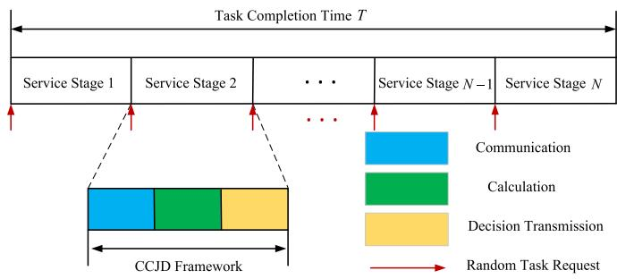  
Fig. 2. CCJD mechanism for multi-UAV-aided MEC heterogeneous networks.

## B. Task Arrival Model of GDs

In the considered system, at the start of the CCJD mechanism, each GD independently generates task requests in each service stage, as shown in Fig. 2. To realistically model the sporadic and heterogeneous nature of GDs demands in practical scenarios, we adopt a two-stage stochastic model that captures both the binary task generation decision and the continuous-valued task size. In particular, let $B _ { u } \in \{ 0 , 1 \}$ denote a binary indicator variable representing whether GD u initiates a task request in a given service stage. The variable $B _ { u }$ is modeled as a Bernoulli random variable, i.e.,

$$
B _ { u } \sim B e r n o u l l i ( v ) , v \in \{ 0 , 1 \} ,\tag{1}
$$

where υ denotes the probability that a GD becomes active and issues a task request.2 Conditional on $B _ { u } = 1$ , the size of the task generated by GD u, denoted by $M _ { u }$ , is assumed to follow a Gamma distribution:

$$
M _ { u } \sim G a m m a ( \chi , \vartheta ) ,\tag{2}
$$

where $\chi > 0$ and $\vartheta > 0$ represent the shape and scale parameters of the Gamma distribution, respectively. The corresponding probability density function (PDF) is given by:

$$
f _ { P } ( \iota ) = \frac { \iota ^ { \chi - 1 } e ^ { - \iota / \vartheta } } { \vartheta \colon \Gamma ( \chi ) } , \iota > 0 ,\tag{3}
$$

where $\Gamma ( \chi )$ is the Gamma function defined as:

$$
\Gamma ( \chi ) = \int _ { 0 } ^ { \infty } t ^ { \chi - 1 } e ^ { - t } d t .\tag{4}
$$

Thus, the actual task demand $D _ { u }$ of GD u is defined as the product of the task indicator and the task size:

$$
D _ { u } = B _ { u } v _ { u } .\tag{5}
$$

This results in a mixture distribution, where the overall probability distribution of $D _ { u }$ is given by:

$$
\mathrm { P r } ( D _ { u } = M _ { u } ) = \left\{ \begin{array} { l l } { { ( 1 - v ) \delta ( M _ { u } ) , } } & { { \mathrm { i f ~ } M _ { u } = 0 } } \\ { { v f _ { P } ( M _ { u } ) , } } & { { \mathrm { i f ~ } M _ { u } > 0 } } \end{array} , \right.\tag{6}
$$

Here, δ denotes the Dirac delta function, which assigns probability mass at zero, representing inactive GDs. The second case corresponds to active GDs whose task sizes follow the Gamma distribution.

## C. Channel and Communication Model

In this paper, the channels between UAVs and GDs are characterized by the probabilistic LoS model, which is determined by both LoS and NLoS connections. Let ${ a } _ { k , u , n }$ denote the connection state between UAV k and GD u, where $a _ { k , u , n } = 1$ denotes that the communication link is in the LoS state, while $a _ { k , u , n } = 0$ indicates that the communication link is in the NLoS state. The model is developed by performing large-scale blockage simulations based on the statistical characteristics of real Manhattan urban building distributions, followed by nonlinear regression to fit the simulation data [36], [37]. As a result, it provides a high-accuracy channel representation that captures the statistical properties observed in practical measurementbased environments. In our work, the UAV–GD communication operates at a carrier frequency of 2 GHz. This frequency selection is consistent with the typical 1–3 GHz operating band used in urban cellular measurement campaigns from which the probabilistic LoS/NLoS model in [37] was derived. In addition, using 2 GHz ensures coherence among the adopted probabilistic

LoS model, the path-loss characteristics of urban Manhattan environments, and practical deployment conditions of Internet of Things (IoT) networks. Therefore, adopting 2 GHz enables our channel modeling, parameterization, and performance evaluation to remain physically meaningful and engineering-relevant. The LoS connection between a UAV and a GD is primarily determined by the elevation angle $\theta _ { k , u , n }$ between UAV k and GD u, which can be expressed as

$$
\theta _ { k , u , n } = \frac { 1 8 0 } { \pi } \arctan \left( \frac { z _ { k , n } - z _ { u , n } } { \sqrt { \left( x _ { k , n } - x _ { u , n } \right) ^ { 2 } + \left( y _ { k , n } - y _ { u , n } \right) ^ { 2 } } } \right) .\tag{7}
$$

The existence probability of LoS connection can be represented as [37]

$$
P _ { k , u , n } ^ { L } = A _ { 3 } + \frac { A _ { 4 } } { 1 + e ^ { - ( A _ { 1 } + A _ { 2 } \theta _ { k , u , n } ) } } ,\tag{8}
$$

where $A _ { 1 } < 0 , A _ { 2 } > 0 , A _ { 3 } > 0$ , and $A _ { 4 } = 1 - A _ { 3 }$ are related to the environment and all of them are constant. In addition, the NLoS probability can be represened as $P _ { k , u , n } ^ { N } = \mathbb { P } ( a _ { k , u , n } =$ $1 ) = 1 - P _ { k , u , n } ^ { N }$ . The channel gain between UAV k and GD u at service stage n can be expressed as

$$
h _ { k , u , n } = a _ { k , u , n } h _ { k , u , n } ^ { L } + \left( 1 - a _ { k , u , n } \right) h _ { k , u , n } ^ { N } ,\tag{9}
$$

where $h _ { k , u , n } ^ { L } = \gamma _ { 0 } d _ { k , u , n } ^ { - \beta _ { L } }$ and $h _ { k , u , n } ^ { N } = \mu \gamma _ { 0 } d _ { k , u , n } ^ { - \beta _ { N } }$ are the channel power gains in the cases of LoS state and NLoS state, respectively. Hereby, $d _ { k , u , n }$ is the distance between the UAV k and GD u at service stage n, which can be expressed as

$$
d _ { k , u , n } = \sqrt { \left\| \mathbf { q } _ { k , n } - \mathbf { w } _ { u , n } \right\| ^ { 2 } } .\tag{10}
$$

The parameter $\gamma _ { 0 }$ within the equation $h _ { k , u , n } ^ { L }$ is the average channel power gain at the reference distance 1m and $\mu < 1$ represents the additional attenuation factor. The average pass loss exponents in LoS and NLoS states are denoted as $\beta _ { L }$ and $\beta _ { N }$ with $2 \le \beta _ { L } \le \beta _ { N } \le 4 .$ . To eliminate co-channel interference among UAV–GD communication links, the system is assumed to employ a frequency-division multiple access (FDMA) scheme. Under this scheme, the total bandwidth is divided into multiple non-overlapping sub-bands, and the GDs served by the same UAV within a service stage are assigned distinct sub-bands. This frequency-domain orthogonalization effectively suppresses mutual interference among GDs. Moreover, the instantaneous achievable rate $r _ { k , u , n }$ in (Mbps) is represented by

$$
r _ { k , u , n } = a _ { k , u , n } r _ { k , u , n } ^ { L } + \left( 1 - a _ { k , u , n } \right) r _ { k , u , n } ^ { N } .\tag{11}
$$

Here, $\begin{array} { r } { R _ { k , u , n } ^ { L } = B \log _ { 2 } \left( 1 + \frac { \beta _ { 0 } P } { d _ { k , u , n } ^ { \beta _ { L } } \sigma ^ { 2 } \Gamma } \right) , R _ { k , u , n } ^ { N } = B \log _ { 2 } } \end{array}$ $\begin{array} { r } { \left( 1 + \frac { \mu \beta _ { 0 } P } { d _ { k , u , n } ^ { \beta _ { N } } \sigma ^ { 2 } \Gamma } \right) } \end{array}$ are the achievable rate in the states of LoS k,u,nand NLoS, respectively. In addition, B is the transmission bandwidth of the system, and $P _ { k }$ and $P _ { u }$ are the transmission power of the UAV k and GD u, respectively. Moreover, $\sigma ^ { 2 }$ and $\Gamma > 1$ represent the receiver noise power and the signal-to-noise ratio (SNR). In particular, the channel power gain $h _ { k , u , n }$ is a random variable related to the randomly occurring LoS link and

NLoS link, and random scale fading. We adopt the method of averaging these two randomness sources, such that the expected achievable rate can be denoted as

$$
\mathbb { E } [ R _ { k , u , n } ] = P _ { k , u , n } ^ { L } R _ { k , u , n } ^ { L } + P _ { k , u , n } ^ { N } R _ { k , u , n } ^ { N } .\tag{12}
$$

Thus, time lengths for the data offloading and decision transmission at service stage n are respectively given by

$$
T _ { R , n } = \frac { M _ { u , n } } { R _ { k , u , n } } ,\tag{13}
$$

$$
T _ { D , n } = \frac { \Psi _ { k , n } } { R _ { k , u , n } } ,\tag{14}
$$

where $\Psi _ { k , n }$ is the data size of the decision made in service stage n for UAV k.

## D. Computing and Joint Decision-Making Model

Upon completing data uploads from their associated GDs, the UAVs initiate local processing. Because of their limited computational capability, UAVs cannot process multiple tasks in parallel. Consequently, all tasks arriving within the same service stage are placed into a task queue. To ensure that high-priority tasks are processed first,3 the UAV adopts a priority-weighted sorting mechanism followed by sequential task execution. Specifically, each pending task is evaluated using the following priorityweighted composite metric:

$$
\omega _ { u , p } \left( T _ { R , n } + T _ { D , n } + T _ { C , n } \right) ,\tag{15}
$$

where $\omega _ { u , p }$ denotes the priority weight of GD u with priority level $p ,$ and $T _ { C , n }$ represents the computation time required to process data of size $M _ { u , n }$ at service stage n. The computation time $T _ { C , n }$ is given by

$$
T _ { C , n } = \frac { M _ { u , n } L _ { k } } { C _ { k } } ,\tag{16}
$$

where $L _ { k }$ is the number of CPU cycles required by the MEC server to process 1 bit of data, and $C _ { k }$ denotes the MEC server’s computational capability. In particular, the composite cost in (15) jointly captures task urgency, data size, transmission latency, and computation time. The UAV sorts all queued tasks in ascending order of this metric and computes them sequentially according to the resulting priority order. This mechanism ensures that high-priority tasks are consistently processed ahead of lower-priority ones under high task loads, while remaining fully aligned with the system’s latency-minimization objective. After processing the data in a service phase, the UAVs make a joint decision based on all computed results and send it to the GDs. In scenarios such as IoT-based agricultural monitoring, the collected data typically exhibit spatial and temporal correlations, making it necessary to process data from all devices within a service phase before accurate and reliable decisions can be made. In our design, the time required for joint decision-making is assumed to be negligible.

## E. Problem Formulation

According to the above models, the average task delay of the system is expressed as

$$
\large { T = \frac { \displaystyle \sum _ { n = 1 } ^ { N } \sum _ { p = 1 } ^ { P } w _ { u , p } \sum _ { k = 1 D _ { k , n } } ^ { K } \iiint ( T _ { R , n } + T _ { D , n } + T _ { C , n } ) f ( x , y , z ) d x d y d z } { U } , }\tag{17}
$$

where $\mathbf { D } _ { k , n }$ represents the area of the GDs scheduled by the UAV k. In this work, we aim at minimizing the average task delay by optimizing the UAVs’ 3D location deployment and the GDs’ association while considering the priority of each GD and NFZs in the UAV-aided heterogeneous network where the problem can be formulated as

$$
\mathcal { P } 1 : \operatorname* { m i n } _ { \mathbf { D } _ { k , n } , \mathbf { Q } _ { k , n } } T\tag{18}
$$

$$
s . t . \ D _ { k , n } \cap D _ { k ^ { * } , n } = \emptyset , \forall k \neq k ^ { * } , \forall n ,\tag{18a}
$$

$$
\cup _ { k \in K } D _ { k , n } = D , \forall k , n ,\tag{18b}
$$

$$
\mathbf { q } _ { k , n } \in D \cap D _ { N F Z } , \forall k , n ,
$$

$$
\mathbf { w } _ { u , n } \in D , \forall u , n ,\tag{18c}
$$

(18d)

$$
\varphi _ { k , u } \in \{ 0 , 1 \} , \forall k ,\tag{18e}
$$

$$
\sum _ { k = 1 } ^ { K } \varphi _ { k , u } = 1 , \forall u ,\tag{18f}
$$

$$
x _ { \mathrm { m i n } } \leq x _ { k } \leq x _ { \mathrm { m a x } } , \forall u ,\tag{18g}
$$

$$
y _ { \mathrm { m i n } } \leq y _ { k } \leq y _ { \mathrm { m a x } } , \forall k ,\tag{18h}
$$

$$
h _ { \mathrm { m i n } } \leq z _ { k } \leq h _ { \mathrm { m a x } } , \forall k ,\tag{18i}
$$

where the constraint (18a) ensures that the GD association regions of different UAVs are non-overlapping; (18b) requires that the collective coverage of all UAVs encompasses the entire area; (18c) stipulates that UAV deployment locations must lie outside the NFZs; (18d) specifies that all GDs are located within region D ; (18e) enforces that the scheduling coefficient between each UAV and GD is binary (0 or 1) within a given service stage; (18f) guarantees that each GD is assigned to exactly one UAV; and (18g)–(18i) are the allowable deployment range of UAV k along the x-axe, y-axe, and z-axe, respectively.

Nevertheless, obtaining the optimal solution to problem P1 entails significant computational complexity and coordination overhead. The reasons are as follows. On the one hand, there exists a strong coupling between UAV deployment and GDs association. The UAVs’ 3D spatial locations directly influence the channel quality, i.e., path loss and LoS probability, which in turn affects the optimal GD’s association strategy. Meanwhile, GDs’ association demands (e.g., latency requirements) may compel UAVs to dynamically adjust their locations to enhance service quality. On the other hand, the joint optimization problem is inherently non-convex in a dynamic environment with NFZs where GDs’ requests and data volumes vary across service stages. Mathematically, it can be formulated as a mixed-integer non-convex programming (MINLP) problem, whose objective function is NP-hard, making it intractable for traditional optimization methods. The above challenges motivate us to decouple the problem into two low-complexity subproblems: the UAV– GD association problem and the 3D deployment problem of multiple UAVs.

Remark 1: A larger value of $w _ { u , p }$ indicates a higher priority for GD u, thereby increasing the weight of their task completion time in the system delay. During UAV deployment, UAVs are more likely to be positioned closer to higher-priority GDs. Similarly, in the GD association strategy, GDs with higher priority are more likely to be assigned to UAVs with greater computational capabilities.

## III. CLOSED-FORM SOLUTION FOR GDS’ ASSOCIATION

Existing GD association methods often suffer from high computational complexity, slow convergence, and no guarantee of global optimality. These methods typically employ iterative algorithms like gradient descent, greedy search, or genetic algorithms, which incur heavy computation and are hard to implement in real time, especially for large-scale networks. Their non-convex nature also makes them prone to local optima, limiting system performance. In the following, we derive a closed-form solution for the optimal GD’s association solution to minimize the average task delay, based on the Lagrangian dual method and OTT. This strategy can also be interpreted under the framework of OTT, where the goal is to find a GD-to-UAV mapping that minimizes the average transport cost in terms of task delay. For fixed the UAVs’ location, the subproblem of GD’s association can be expressed as:

$$
\mathcal { P } 2 : \operatorname* { m i n } _ { \mathbf { D } _ { k , n } } T\tag{19}
$$

$$
\mathrm { { s . t . } \ ( 1 8 a ) , ( 1 8 b ) , ( 1 8 d ) - ( 1 8 f ) . }\tag{19a}
$$

Next, we prove the existence of the optimal solution for problem P2. For convenience, we define $c ( \mathbf { q } _ { k , n } , \mathbf { w } _ { u , n } )$ as $c ( \mathbf { q } _ { k , n } , \mathbf { w } _ { u , n } ) \triangleq ( T _ { R , n } + T _ { D , n } + T _ { C , n } ) f ( \mathbf { w } _ { u , n } )$

Lemma 1: Given the deployment locations of UAVs $\mathbf { q } _ { k , n } , \mathbf { q } _ { k , n } \notin D _ { N F Z }$ , where the UAVs have heterogeneous computing capabilities $C _ { k }$ and the GDs task data sizes $M _ { u , n }$ vary, there exists optimal GD’s association strategy $D _ { k , n } ^ { * }$ that minimizes the average task delay of the system, i.e., the problem $\mathcal { P } 2$ has an optimal solution.

Proof: For the given GD location $\mathbf { w } _ { u , n } ( x _ { u , n } , y _ { u , n } , 0 )$ , the transmission rate $R ( \mathbf { w } _ { u , n } )$ is a continuous function of $\mathbf { w } _ { u , n } .$ In addition, the computation delay $\frac { M _ { u , n } L _ { k , n } } { C _ { k , n } }$ is a constant k,nthat does not affect the continuity of the average delay time. Thus, the average delay function remains continuous. We have lim in $\mathbf { \dot { w } } _ { u , n } {  } \mathbf { w } _ { u , n } ( 0 ) ^ { C } \big ( \mathbf { q } _ { k , n } , \mathbf { w } _ { u , n } \big ) \geq c \big ( \mathbf { q } _ { k , n } , \mathbf { w } _ { u , n } \big ( 0 \big ) \big )$ , so the delay cost function $c ( \mathbf { q } _ { k , n } , \mathbf { w } _ { u , n } )$ is lower semi-continuous. By Lemma 2, for continuously distributed GDs and discrete UAV service nodes, a lower semi-continuous cost function ensures the existence of an optimal transport mapping (GD association strategy). Thus, the optimal GD association $D _ { k , n } ^ { * }$ exists of problem P2. The Lemma 1 holds. 

Lemma 2: Given a source space $( D , f ( \mathbf { w } _ { u , n } ) )$ and a target space (K, ξk), where $\xi$ is a discrete probability measure, if the cost function $c ( \mathbf { q } _ { k , n } , \mathbf { w } _ { u , n } )$ is lower semi-continuous, then there exists an optimal transport strategy (GD association strategy) that minimizes the total cost $\begin{array} { r } { \iiint _ { D _ { k , n } } c ( \mathbf { q } _ { k , n } , \mathbf { w } _ { u , n } ) d \mathbf { w } _ { u , n } } \end{array}$

k,nProof: The GDs association problem can be formulated as a semi-discrete optimal transport problem, where the source space $\left( D _ { k , n } , f ( \mathbf { w } _ { u , n } ) \right)$ is a continuous probability distribution over the GD domain $D _ { k , n } .$ , and the target space (K, ξ) is a discrete probability measure over the UAV set K. The cost function $c ( \mathbf { q } _ { k , n } , \mathbf { w } _ { u , n } )$ is lower semi-continuous function and bounded from below. According to the existence theorem in optimal transport theory (Kantorovich formulation), if the source and target measures are probability measures and the cost function is lower semi-continuous, then there exists an optimal transport plan $D _ { k , n } ^ { * }$ that minimizes the total transport cost:

$$
\iiint \sum _ { D _ { k , n } } ^ { K } c ( \mathbf { q } _ { k , n } , \mathbf { w } _ { u , n } ) D _ { k , n } ^ { * } ( \mathbf { q } _ { k , n } , \mathbf { w } _ { u , n } ) d \mathbf { w } _ { u , n } ,\tag{20}
$$

subject to the marginal constraints:

$$
\sum _ { k = 1 } ^ { K } D _ { k , n } ^ { * } ( \mathbf { q } _ { k , n } , \mathbf { w } _ { u , n } ) = f ( \mathbf { w } _ { u , n } ) ,\tag{21}
$$

$$
\begin{array} { r l } {  { \int \displaylimits _ { \mathbf { \Omega } ^ { * } , n } D _ { k , n } ^ { * } ( \mathbf { q } _ { k , n } , \mathbf { w } _ { u , n } ) d \mathbf { w } _ { u , n } = \xi _ { k } . } } \end{array}\tag{22}
$$

This transport plan corresponds to a GD association strategy that minimizes the total expected cost. Hence, the existence of an optimal GD association strategy is guaranteed. 

Lemmas 1 and 2 have demonstrated the existence of the optimal solution for problem $\mathcal { P } 2$ . Next, we will prove the closed-form of the optimal solution for problem P2.

Lemma 3: In a heterogeneous UAV-assisted MEC network, given the set of UAV deployment locations $\mathbf { q } _ { k , n } , \mathbf { q } _ { k , n } \notin D _ { N F Z }$ the computation priorities $w _ { u , p }$ and GD task data sizes $M _ { u , n } ,$ the optimal region partitioning that minimizes the average delay satisfies the following condition:

$$
\begin{array} { r l r } & { } & { D _ { k } ^ { * } = \left\{ u \in U \bigg | \omega _ { u , p } \bigg ( \frac { M _ { u , n } } { R _ { k , n } } + \frac { \Psi } { R _ { k , n } } + \frac { M _ { u , n } L _ { k } } { C _ { k } } \bigg ) \right. } \\ & { } & \\ & { } & { \qquad \leq \omega _ { u , p } \bigg ( \frac { M _ { u , n } } { R _ { j , n } } + \frac { \Psi } { R _ { j , n } } + \frac { M _ { u , n } L _ { j } } { C _ { j } } \bigg ) , \forall j \neq k \bigg \} , } \end{array}\tag{23}
$$

and the closed-form solution of the GDs’ association can be expressed as

$$
\varphi _ { k , u } ^ { * } = \left\{ \begin{array} { l l } { 1 , \mathrm { i f } k = \arg \operatorname* { m i n } _ { k } ( w _ { u , p } ( \frac { M _ { u , n } } { R _ { k , n } } + \frac { \Psi } { R _ { k , n } } + \frac { M _ { u , n } L _ { k } } { C _ { k } } ) ) , } \\ { 0 , \mathrm { o t h e r w i s e } . } \end{array} \right.\tag{24}
$$

Proof: We reformulate the problem using variational principles. Define the indicator function $\varphi _ { k , u } \in \{ 0 , 1 \}$ to represent whether GD u is associated with UAV k, satisfying

$$
\sum _ { k = 1 } ^ { K } \varphi _ { k , u } = 1 .\tag{25}
$$

However, the GD association problem is an inherently nonconvex mixed-integer nonlinear programming problem with binary variables, which cannot be directly differentiated. To address this, we introduce a relaxation method and transform it into a probability variable, i.e., $0 \leqslant \varphi _ { k , u } \leqslant 1$ . Therefore, the GD’s allocation problem has become a convex problem about $\varphi _ { k , u }$ and satisfies the Slater condition. Then, we introduce a Lagrange multiplier λ to enforce the partition constraint. The total delay function over the region partitions is shown in (26) shown at the bottom of this page. The optimal condition obtained by taking the first derivative of $\varphi _ { k }$ can be expressed as

$$
\frac { \partial \mathcal { L } } { \partial \varphi _ { k , u } } = w _ { u , p } \left( \frac { M _ { u , n } } { R _ { k , n } } + \frac { \Psi } { R _ { k , n } } + \frac { M _ { u , n } L _ { k } } { C _ { k } } \right) f ( \mathbf { w } _ { u , n } ) - \lambda = 0 .\tag{27}
$$

For each UAV k, the optimal association must satisfy:

$$
w _ { u , p } T _ { u , p } ^ { k } = w _ { u , p } \left( { \frac { M _ { u , n } } { R _ { k , n } } } + { \frac { \Psi } { R _ { k , n } } } + { \frac { M _ { u , n } L _ { k } } { C _ { k } } } \right) = \lambda .\tag{28}
$$

Therefore, for the optimal association, GD u selects UAV k such that:

$$
k = \arg \operatorname* { m i n } _ { k } \left( w _ { u , p } \left( \frac { M _ { u , n } } { R _ { k , n } } + \frac { \Psi } { R _ { k , n } } + \frac { M _ { u , n } L _ { k } } { C _ { k } } \right) \right) .\tag{29}
$$

At the boundary between $D _ { k , n } ^ { * }$ and $D _ { j , n } ^ { * }$ , the Lagrange multiplier must satisfy

$$
\begin{array} { r l } & { \lambda = w _ { u , p } T _ { u , p } ^ { k } = w _ { u , p } T _ { u , p } ^ { j } } \\ & { \quad \Rightarrow w _ { u , p } \left( \cfrac { M _ { u , n } } { R _ { k , n } } + \cfrac { \Psi } { R _ { k , n } } + \cfrac { M _ { u , n } L _ { k } } { C _ { k } } \right) } \\ & { \quad \quad \quad = w _ { p } \left( \cfrac { M _ { u , n } } { R _ { j , n } } + \cfrac { \Psi } { R _ { j , n } } + \cfrac { M _ { u , n } L _ { j } } { C _ { j } } \right) . } \end{array}\tag{30}
$$

This indicates that on the boundary of the optimal partition, the delay for a GD assigned to any adjacent UAVs is equal. Furthermore, within region $D _ { k } , T _ { u , p } ^ { \bar { k } } < T _ { u , p } ^ { j }$ holds $\forall k \ne j$ . Based on Lemma 3, under this mechanism, GD association is jointly determined by UAV communication quality and computational capability: UAVs with better channel conditions reduce transmission delay, while those with higher computing frequency shorten processing time. Task priorities are incorporated through weighting, favoring high-priority tasks being assigned to UAVs with superior overall performance. Thus, Lemma 3 illustrates the joint optimal allocation of CCJD resources in multi-UAV MEC systems, revealing how tasks dynamically converge to the service nodes with the lowest overall cost under self-organizing conditions.

According to Lemma 4, the assignment coefficient $\varphi _ { k , u }$ for GD u is unique and takes an integer value. Therefore, we can utilize the thresholding method to project $\varphi _ { k , u }$ back to 0,1 variable, thereby obtaining the closed-form association solution given in (23). Based on the above analysis, the optimal region

partition $D _ { k } ^ { * }$ must satisfy

$$
c ( \mathbf { q } _ { k , n } , \mathbf { w } _ { u , n } ) \leq c ( \mathbf { q } _ { j , n } , \mathbf { w } _ { u , n } ) , \forall k \neq j ,\tag{31}
$$

which confirms the validity of Lemma 3. The proof of Lemma 3 is completed. 

Although Lemma 3 has derived the closed-form expression for UAV–GD association, it remains necessary to prove that this solution is the unique integer solution. The detailed proof is provided in Lemma 4.

Lemma 4: The GDs locations follow a continuous probability distribution $f ( \mathbf { w } _ { u , n } )$ , and the optimal solution $\varphi _ { k , u } ^ { * }$ to the relaxed problem must be an integer solution, meaning that for each GD $u ,$ there exists a unique $k ^ { * }$ such that

$$
\varphi _ { k ^ { * } , u } ^ { * } = 1 , \varphi _ { k , u } ^ { * } = 0 , \forall k \neq k ^ { * } .\tag{32}
$$

Proof: First, we prove the uniqueness of the solution. The original problem aims to minimize the weighted total delay. When the locations of UAVs are fixed, the delay for each GD becomes a constant value. Therefore, the objective function is linear with respect to $\varphi _ { k ^ { * } , u }$ . In linear programming problems, the optimal solution lies at a vertex (extreme point) of the feasible region. Moreover, the system parameters are heterogeneous, i.e., UAVs have different computational capabilities, GDs have different data sizes and priority levels, and the transmission rate varies continuously with GD location. As a result, for any GD u, there exists a unique UAV $k ^ { * }$ such that

$$
{ T } _ { u , p } ^ { k ^ { * } } < T _ { u , p } ^ { k } , \forall k ^ { * } \neq k .\tag{33}
$$

Otherwise, if there exist multiple UAVs $k ^ { * }$ and k such that the delays are equal, this equality would only hold over a set of measure zero, which can be neglected in practice.

The following proof utilizes contradiction to show that there exists an integer solution $\varphi _ { k ^ { * } , u }$ for GD u. Suppose, for the sake of contradiction, that there exists a non-integer solution $\varphi _ { k ^ { * } , u } ^ { * } \in$ (0, 1) for GD u, i.e.,

$$
\varphi _ { k ^ { * } , u } ^ { * } > 0 , \varphi _ { k , u } ^ { * } > 0 , \forall k ^ { * } \neq k .\tag{34}
$$

According to the previous proof, the solution is unique, i.e., $T _ { u , p } ^ { k ^ { * } } \neq T _ { u , p } ^ { \overline { { k } } } , \forall k ^ { * } \neq k$ . Without loss of generality, we assume $T _ { u , p } ^ { k ^ { * } } < T _ { u , p } ^ { k ^ { * } } , \forall k ^ { * } \neq k .$ . By decreasing $\varphi _ { k , u } ^ { * }$ by a small amount σ and increasing $\varphi _ { k ^ { * } , u } ^ { * }$ by the same amount $\sigma ,$ the total delay decreases, i.e.,

$$
\begin{array} { r l } & { \Delta T = ( \varphi _ { k ^ { * } , u } ^ { * } + \sigma ) T _ { u , p } ^ { k ^ { * } } + ( \varphi _ { k , u } ^ { * } - \sigma ) T _ { u , p } ^ { k } } \\ & { \qquad - ( \varphi _ { k ^ { * } , u } ^ { * } T _ { u , p } ^ { k ^ { * } } + \varphi _ { k , u } ^ { * } T _ { u , p } ^ { k } ) } \\ & { \qquad = \sigma ( T _ { u , p } ^ { k ^ { * } } - T _ { u , p } ^ { k } ) < 0 , } \end{array}\tag{35}
$$

which contradicts the assumption of optimality. Similarly, suppose $T _ { u , p } ^ { k ^ { * } } > T _ { u , p } ^ { k } , \forall k ^ { * } \neq k$ . Transferring a small weight from $\varphi _ { k ^ { * } , u } ^ { * } \mathrm { ~ t o ~ } \varphi _ { k , u } ^ { * }$ would also reduce the total delay, leading to a

$$
{ \mathcal { L } } = \sum _ { p = 1 } ^ { P } \omega _ { u , p } \sum _ { k = 1 } ^ { K } \iiint \varphi _ { k , u } \left( { \frac { M _ { u , n } } { R _ { k , n } } } + { \frac { \Psi } { R _ { k , n } } } + { \frac { M _ { u , n } L _ { k } } { C _ { k } } } \right) f ( \mathbf { w } _ { u , n } ) d \mathbf { w } _ { u , n } + \iiint \lambda \left( 1 - \sum _ { k = 1 } ^ { K } \varphi _ { k , u } \right) d \mathbf { w } _ { u , n } .\tag{26}
$$

contradiction. Therefore, the solution is both unique and integervalued. The proof of Lemma 4 is completed. 

To evaluate the performance gap between the derived closedform UAV–GD solution and the globally optimal association obtained via exhaustive search, we derive a theoretical upper bound on this gap. The detailed derivation is as follows:

Lemma 5: Let $T ^ { \mathrm { C F } }$ denote the task delay under the closedform GDs association strategy, and let $T ^ { \mathrm { { \scriptsize { O P T } } } }$ denote the task delay obtained by exhaustive search (optimal solution). Then the performance gap is upper bounded by:

$$
T ^ { \mathrm { C F } } - T ^ { \mathrm { O P T } } \leq \sum _ { u \in \mathcal { U } } \omega _ { u , p } \left[ M _ { u , n } \cdot \Delta _ { c } + \Psi \cdot \Delta _ { r } \right] ,\tag{36}
$$

where

$$
\Delta _ { c } = \left( \frac { 1 } { R _ { \operatorname* { m i n } } } - \frac { 1 } { R _ { \operatorname* { m a x } } } + \frac { L _ { \operatorname* { m a x } } } { C _ { \operatorname* { m i n } } } - \frac { L _ { \operatorname* { m i n } } } { C _ { \operatorname* { m a x } } } \right) ,\tag{37}
$$

$$
\Delta _ { r } = \left( \frac { 1 } { R _ { \mathrm { m i n } } } - \frac { 1 } { R _ { \mathrm { m a x } } } \right) .\tag{38}
$$

Here, $R _ { \mathrm { m i n } }$ and $R _ { \mathrm { m a x } }$ denote the minimum and maximum data transmission rates between UAVs and GDs, $L _ { \mathrm { m a x } } , L _ { \mathrm { m i n } }$ and $C _ { \mathrm { m a x } } , C _ { \mathrm { m i n } }$ represent the bounds on computation intensity and UAV computing capability, and Ψ is the decision data size.

Proof: Let $T _ { k , u }$ denote the delay for GD u when served by UAV k, i.e.,

$$
T _ { k , u } = { \omega } _ { u , p } \left( \frac { M _ { u , n } + \Psi } { R _ { k , u } } + \frac { M _ { u , n } L _ { k } } { C _ { k } } \right) .\tag{39}
$$

Let $k ^ { * }$ be the optimal UAV (in terms of minimal delay) and $k ^ { \prime }$ be the UAV selected by the closed-form solution. We define $\delta _ { u } = T _ { k ^ { \prime } , u } - T _ { k ^ { \ast } , u }$ . Then the GD-level delay gap is expressed in (40) shown at the bottom of this page. To upper bound the above expression, we apply the worst-case bounds:

$$
\frac { 1 } { R _ { k ^ { \prime } , u } } - \frac { 1 } { R _ { k ^ { * } , u } } \leq \frac { 1 } { R _ { \operatorname* { m i n } } } - \frac { 1 } { R _ { \operatorname* { m a x } } } = \Delta _ { r } ,\tag{41}
$$

$$
\frac { L _ { k ^ { \prime } } } { C _ { k ^ { \prime } } } - \frac { L _ { k ^ { * } } } { C _ { k ^ { * } } } \leq \frac { L _ { \operatorname* { m a x } } } { C _ { \operatorname* { m i n } } } - \frac { L _ { \operatorname* { m i n } } } { C _ { \operatorname* { m a x } } } = \Delta _ { c } ^ { \operatorname { c o m p } } .\tag{42}
$$

Define $\Delta _ { c } = \Delta _ { r } + \Delta _ { c } ^ { \mathrm { c o m p } }$ , we obtain the upper bound on $\delta _ { u } \colon$

$$
\delta _ { u } \leq \omega _ { u , p } \left[ M _ { u , n } \cdot \Delta _ { c } + \Psi \cdot \Delta _ { r } \right] .\tag{43}
$$

Finally, summing over all GDs $u \in \mathcal { U }$ gives:

$$
T ^ { \mathrm { C F } } - T ^ { \mathrm { O P T } } = \sum _ { u \in \mathcal { U } } \delta _ { u } \leq \sum _ { u \in \mathcal { U } } \omega _ { u , p } \left[ M _ { u , n } \cdot \Delta _ { c } + \Psi \cdot \Delta _ { r } \right] .
$$

The proof of Lemma 5 is completed.

(44)

In particular, the above result provides a theoretical guarantee on the worst-case performance loss of the proposed closed-form association strategy. Notably, the bound is linearly dependent on



GDs’ data size and priority weights, and inversely affected by channel and computing resource diversity. This demonstrates the robustness and efficiency of the proposed method in approximating the globally optimal solution with significantly reduced computational complexity.

## IV. MULTI-UAV 3D DEPLOYMENT OPTIMIZATION

In this section, we propose an efficient, low-complexity learning-based method to solve the 3D deployment problem of multiple UAVs, and analyze the computational complexity of the proposed algorithm.

## A. FMAD3QN-CUA Method for 3D Deployment Optimization

With the fixed GD’s association, the multi-UAV 3D deployment subproblem is given as

$$
\mathcal { P 3 } : \operatorname* { m i n } _ { \mathbf { Q } _ { k , n } } T\tag{45}
$$

$$
{ \mathrm { s . t . ~ } } ( 1 8 \mathrm { c } ) , ( 1 8 \mathrm { g } ) { - } ( 1 8 \mathrm { i } ) .\tag{45a}
$$

To solve the challenges of the non-convex and the dynamic environment of the subproblem of P3, we provide a federated multi-agent DRL approach. In the federated DRL framework, each UAV acts as an individual agent that interacts with the environment to obtain state information and selects actions based on a predefined policy. Upon taking an action, the UAV transitions to a new state and receives a corresponding reward. During the training process, each UAV continuously updates its policy to learn the optimal actions. The state set, action set, reward function, and state transition probability for the FMAD3QN-CUA can be expressed as follows.

\- State space $S _ { k } .$ : The state $s _ { k , n } \in S _ { k }$ of the UAV k represents its possible 3D location $[ x _ { k , n } , y _ { k , n } , z _ { k , n } ]$ within the given area. This means that the UAVs are allowed to freely explore the whole space during the training process.

\- Action space $A _ { k } \colon$ In our design, all UAVs have the same action space. Specifically, each action corresponds to a search direction for UAV deployment and is defined as $A _ { k } = [ a _ { 1 } , a _ { 2 } , a _ { 3 } , a _ { 4 } , a _ { 5 } , a _ { 6 } ]$ , where $a _ { 1 } = [ 1 , 0 , 0 ]$ represents searching forward from the current location, $a _ { 2 } = [ - 1 , 0 , 0 ]$ denotes searching backward, $a _ { 3 } = [ 0 , 1 , 0 ]$ replies searching to the left, $a _ { 4 } = [ 0 , - 1 , 0 ]$ denotes searching to the right, $a _ { 5 } = [ 0 , 0 , 1 ]$ ] represents searching upward, and $a _ { 6 } = [ 0 , 0 , - 1 ]$ denotes searching downward.

\- Reward function $r ( \mathbf { D } _ { k , n } , \mathbf { q } _ { k , n } )$ : The objective of the design is to determine the optimal locations of the UAVs, with the reward function designed to accurately evaluate the quality of the transition from the current state $\mathbf { q } _ { k , n } ( j )$ to the next state $\mathbf { q } _ { k , n } ( j + 1 )$ , where $j$ is the state index. This reward is formulated based on minimizing the average task

$$
\begin{array} { c } { { \delta _ { u } = w _ { u , p } \left[ \left( \displaystyle \frac { M _ { u , n } + \Psi } { R _ { k ^ { \prime } , u } } + \displaystyle \frac { M _ { u , n } L _ { k ^ { \prime } } } { C _ { k ^ { \prime } } } \right) - \left( \displaystyle \frac { M _ { u , n } + \Psi } { R _ { k ^ { * } , u } } + \displaystyle \frac { M _ { u , n } L _ { k ^ { * } } } { C _ { k ^ { * } } } \right) \right] } } \\ { { = w _ { u , p } \left[ \left( M _ { u , n } + \Psi \right) \left( \displaystyle \frac { 1 } { R _ { k ^ { \prime } , u } } - \displaystyle \frac { 1 } { R _ { k ^ { * } , u } } \right) + M _ { u , n } \left( \displaystyle \frac { L _ { k ^ { \prime } } } { C _ { k ^ { \prime } } } - \displaystyle \frac { L _ { k ^ { * } } } { C _ { k ^ { * } } } \right) \right] } } \end{array}\tag{40}
$$

completion time while ensuring that UAVs avoid entering NFZs. Specifically, a shorter task time yields a higher reward. In our work, the reward is defined as follows:

$$
r ( \mathbf { D } _ { k , n } , \mathbf { q } _ { k , n } ) = \left\{ \begin{array} { l l } { \vartheta , \mathrm { i f ~ } \mathrm { f l y ~ i n t o ~ N F Z s / c o l l i s i o n } } \\ { \varpi ( T _ { k , n } ( j ) - T _ { k , n } ( j + 1 ) ) , \mathrm { ~ e l s e } } \end{array} \right.\tag{46}
$$

where $\vartheta$ is a negative value which is utilized to penalize UAVs behaviors of entering NFZs and collision. In addition, $T _ { k , n } ( j ) - T _ { k , n } ( j + 1 )$ denotes the difference in the average task completion time when the UAV transitions from the current state $\mathbf { q } _ { k , n } ( j )$ to the next state $\mathbf { q } _ { k , n } ( j + 1 )$

\- State transition function $\eta _ { k } .$ : Denote the state transition function of UAV k at step $j$ during service stage n by $\eta _ { k , n } ( j ) ( \mathbf { q } _ { k , n } ( j + 1 ) | \mathbf { q } _ { k , n } ( j ) , a _ { k , n } ( j ) )$ ), which defines how UAV k transitions from location $\mathbf { q } _ { k , n } ( j )$ to location $\mathbf { q } _ { k , n } ( j + 1 )$ after executing action $a _ { k , n } ( j )$ . In our design, the state transition function of UAV k is defined as follows:

$$
\mathbf q _ { k , n } ( j + 1 ) = \mathbf q _ { k , n } ( j ) + a _ { k , n } ( j ) \nabla _ { d } ,\tag{47}
$$

where $\nabla _ { d }$ is the distance that the UAV k travel from location $\mathbf { q } _ { k , n } ( j )$ to location $\mathbf { q } _ { k , n } ( j + 1 )$ .

In our design framework, the dueling network architecture is strategically implemented to enhance decision-making capabilities. Specifically, this architecture introduces an innovative value decomposition mechanism, decoupling the Q-value function into a state-value function and an advantage function. This structure allows each UAV agent to more effectively evaluate the relative benefit of each action under a given state, especially in scenarios where actions have similar outcomes. By decoupling the value of a state from the impact of individual actions, the dueling network enhances learning stability and accelerates convergence during training. This is particularly beneficial in dynamic and uncertain environments such as UAV-assisted MEC systems. The Algorithm 1 also provides a detailed summary of the training process for the proposed method. Also, the algorithm consists of three steps, which are described as follows.

Local agent DRL model training: In our design, each UAV k acts as an agent that trains its local model parameters $\theta _ { k } ^ { e v a } , \theta _ { k } ^ { t a r }$ based on the data it collects, where $\theta _ { k } ^ { e v a }$ represents the evaluate network parameter and $\theta _ { k } ^ { t a r }$ denotes the target network parameter. At the initial stage, we establish a multi-UAV communication environment and initialize the parameters of each agent’s DRL network (lines 1-4). At step j of each training episode during service stage $n ,$ each UAV obtains its association GDs based on the closed-form solution UAV-GD association scheme and compute this step time cost (line 5-11). Each agent observes the state from its environment and selects an action based on a policy selection mechanism. To balance the exploitation of past experiences and the exploration of unknown environments, an ε-greedy strategy is adopted as the action selection mechanism. The action selection mechanism is denoted as

$$
a _ { k , n } ^ { * } = \left\{ \operatorname* { r a n d o m l y } _ { a _ { k , n } \in A _ { k } } { \mathrm { e l e c t e d f r o m A _ { k } , ~ p r o b a b i l i t y } } \varepsilon ; \right.\tag{48}
$$

where $\varepsilon$ is the exploration rate. In detail, during each action selection, the system generates a random number $\rho$ between 0 and 1. If $\rho < \varepsilon$ , UAV k randomly selects an action from the action set Ak. Otherwise, if $\rho \geq \varepsilon ,$ it selects the action that yields the maximum Q-value, i.e., arg $\begin{array} { r } { \operatorname* { m a x } _ { a _ { k , n } \in A _ { k } } Q ( s _ { k , n } , a _ { k , n } | \theta _ { k } ^ { e v a } ) } \end{array}$ . In particular, to balance exploration and exploitation, the parameter $\rho$ is gradually decreased as training episodes progress. This allows the UAV to explore more randomly in the early stages and gradually shift toward selecting actions with higher Q-values. This strategy improves learning stability, accelerates convergence, and helps the UAV avoid falling into local optima.

Upon executing $a _ { k , n } ^ { * } ,$ the corresponding reward $r ( \mathbf { D } _ { k , n } ^ { * } , \mathbf { q } _ { k , n } )$ and the next state $\mathbf { q } _ { k , n } ( j + 1 )$ are obtained. In addition, the experience tuples are stored in the replay buffer with a capacity C (line 12-15). After the training experience is stored in the buffer, each DRL agent samples a mini-batch of size $N _ { b a t c h }$ historical experience from the buffer C. In particular, the local DDQN network parameters are then optimized by minimizing the loss function $L ( \theta _ { k } ^ { e v a } )$ , which is

$$
L ( \theta _ { k } ^ { e v a } ) = E [ y _ { k , n } ^ { t a r } - Q ( s _ { k , n } ( j ) , a _ { k , n } ( j ) | \theta _ { k } ^ { e v a } ) ] ^ { 2 }\tag{49}
$$

where $\begin{array} { r } { y _ { k , n } ^ { t a r } = r [ s _ { k , n } ( j ) , a _ { k , n } ( j ) + \gamma \arg \operatorname* { m a x } _ { a _ { k , n } ^ { * } ( j ) \in A _ { k } } } \end{array}$ $Q ^ { * } ( s _ { k , n } ( j + 1 ) , a _ { k , n } ^ { * } ( j ) | \theta _ { k } ^ { t a r } ) ]$ Note that $\gamma \in ( 0 , 1 ]$ denotes the discount factor utilized for weighting future rewards. The target network parameter is copied from the evaluation network parameter every $N _ { Q }$ iteration, i.e., $\theta _ { k } ^ { t a r } = \theta _ { k } ^ { e v a }$ , which helps to smooth out fluctuations. Specifically, the design integrates a dueling network architecture into the DDQN framework, such that the Q-function of the evaluation network $Q ( s _ { k , n } ( j ) , a _ { k , n } ( j ) | \theta _ { k } ^ { e v a } )$ is redefined as

$$
\begin{array} { l } { { \displaystyle Q ( s _ { k , n } , a _ { k , n } | \theta _ { k } ^ { e v a } , \phi , \beta ) = V ( s _ { k , n } | \theta _ { k } ^ { e v a } , \beta ) + } } \\ { { \displaystyle A ( s _ { k , n } , a _ { k , n } | \theta _ { k } ^ { e v a } , \phi ) - \frac { 1 } { | A | } \sum _ { a _ { k , n } ^ { * } \in A } A ( s _ { k , n } , a _ { k , n } ^ { * } | \theta _ { k } ^ { e v a } , \phi ) , } } \end{array}\tag{50}
$$

where $V ( s _ { k , n } | \theta _ { k } ^ { e v a } , \beta )$ denotes the state-value function and $A ( s _ { k , n } , a _ { k , n } | \theta _ { k } ^ { e v a } , \phi )$ denotes the advantage function. The parameters $\theta _ { k } ^ { e v a }$ represent the shared layers of the evaluation network, while $\beta$ and $\phi$ correspond to the state-value and advantage streams, respectively. The term |A| denotes the cardinality of the discrete action space. This formulation follows the Dueling DQN architecture, where the action-value function Q is decomposed into a state-value and an advantage term with a mean normalization to ensure identifiability.

\- Federated aggregation process: During local training, each UAV uploads the model parameters of its evaluation network and target network to the central aggregation server every $A _ { g g }$ episodes. Once the central server receives the model parameters from all UAVs, it performs an aggregation process on the collected parameters (lines 25-26),

which can be represented as:

$$
\theta _ { k } ^ { e v a ^ { * } } = \sum _ { k = 1 } ^ { K } \frac { \theta _ { k } ^ { e v a } } { K } , \theta _ { k } ^ { t a r ^ { * } } = \sum _ { k = 1 } ^ { K } \frac { \theta _ { k } ^ { t a r } } { K } .\tag{51}
$$

Global model broadcasting: The central aggregation server broadcasts the global model parameters to each local UAV. Once a UAV receives these parameters, it assigns them to its local networks, i.e., $\theta _ { k } ^ { e v a } \stackrel { - } { = } \theta _ { k } ^ { e v a ^ { * } } , \theta _ { k } ^ { t a r } = \theta _ { k } ^ { \bar { t } a r ^ { * } }$ (line 27). We assume that this communication process is error-free, ensuring that the model parameters are received correctly. These three steps are repeated until the maximum number of episodes L is reached. Once the training process is complete, the optimized UAV deployment for each service stage and the optimal coordination strategy for each UAV can be obtained.

## B. Complexity Analysis

The proposed method consists of an outer FMAD3QN algorithm and an inner closed-form GD association solution. First, we analyze the computational complexity of the FMAD3QN. We assume that the neural network contains Y fully connected layers, and υ is the number of neurons in the y-th layer. In addition, we also assume that the dueling layer has $\boldsymbol { v } _ { d u e l i n g }$ neurons. For a single sample, the computational complexity of each time step can be denoted as $O ( \dot { \sum } _ { y = 0 } ^ { Y - 1 } v _ { y } v _ { y + 1 } \dot { + } v _ { Y } \dot { v } _ { d u e l i n g } )$ [38]. Thus, for $Y _ { e p }$ episode, $Y _ { s }$ service stage and K UAVs, the computational complexity of the FMAD3QN algorithm can be expressed as $\begin{array} { r } { O ( K Y _ { e p } Y _ { s } \frac { Y _ { e p } } { M ^ { A g g } } ( \sum _ { y = 0 } ^ { Y - 1 } v _ { y } v _ { y + 1 } + v _ { Y } v _ { d u e l i n g } ) ) } \end{array}$ where $M ^ { A g g }$ is the model parameter aggregation frequency. On the other hand, for the number of U GDs, the computational complexity of the closed-form GD association solution is $O ( K U )$ . Therefore, the overall computational complexity of the proposed method is $\begin{array} { r } { O ( K U M Y _ { e p } Y _ { s l o t } \frac { Y _ { e p } } { N ^ { A g g } } ( \sum _ { y = 0 } ^ { Y - 1 } v _ { y } v _ { y + 1 } + } \end{array}$ $v _ { Y } v _ { d u e l i n g } ) )$ . In particular, the closed-form solution for GD association proposed in this paper exhibits a significantly lower complexity of $O ( K U )$ compared to the exhaustive search method of $O ( K ^ { U } )$ . Critically, the proposed solution achieves near-optimal performance comparable to exhaustive search, as empirically established in Section V-C, which demonstrates the superiority of the proposed closed-form solution in terms of computational efficiency.

## V. NUMBER RESULTS

In this section, numerical results are presented to verify the proposed FMAD3QN-CUA scheme for UAVs’ 3D deployment and GDs’ association. In our design, the system region of interest is $3 0 0 \times 3 0 0 \mathrm { m } .$ , and the number of UAVs is $K = 3$ . The service stage is set 4in our design. The computation frequencies of the three UAVs are set to 2 GHz, 4 GHz, and 6 GHz, respectively, and the computing power of all UAVs is set to 1000 (Cycle/bit). The total number of GDs is 50, and the probability density function for GDs uniform distribution can be expressed as

$$
f ( x , y , 0 ) = \frac { 1 } { | \mathcal { D } | } ,\tag{52}
$$

Algorithm 1: FMAD3QN-CUA Algorithm for UAVs 3D   
Deployment and GDs Association.   
1: Initialize: global model parameter $\theta ^ { g l o b }$ , FL parameter   
aggregation frequency $A _ { g g }$   
2: for all UAV k do   
3: Initialize: the replay buffer $B _ { C }$ with space C, the   
parameters of D3QN evaluation network and target   
network $\theta _ { k } ^ { e v a } , \theta _ { k } ^ { t a r }$   
4: end for   
5: for episode $l = 1 , 2 , \ldots , L$ do   
6: for service stage $n = 1 , . . . , N ,$ do   
7: for agent $k = 1 , . . . , K ,$ do   
8: Initialize: the initial location of the $\mathrm { U A V s } { \bf q } _ { k } ( 0 )$   
the initial step $j = 0 .$   
9: while maximum step J do   
10: Obtaining the association between the UAVs and   
GDs based on the closed-form solution.   
11: Compute the average time needed to complete   
the subtask from the current location.   
12: Based on the ε-greedy policy, select an action $a _ { k } ^ { * }$   
from the set of possible actions $A _ { k }$   
13: The agent executes action $a _ { k } ^ { * } ,$ obtains the reward   
$r ( \mathbf { D } _ { k , n } ^ { * } , \mathbf { q } _ { k , n } )$ , and move to the next state   
$\mathbf { q } _ { k , n } ( j + 1 )$   
14: Stored   
$( \mathbf { q } _ { k , n } ( j ) , a _ { k , n } ^ { * } , r ( \mathbf { D } _ { k , n } ^ { * } , \mathbf { q } _ { k , n } ) , \mathbf { q } _ { k , n } ( j + 1 ) )$ to   
$C .$   
15: Sample a mini-batch historical experiences from   
C in a random way;   
16: Update the parameter $\theta _ { k } ^ { e v a }$ by minimizing the   
loss function given (49).   
17: Update $j  j + 1$   
18: end while   
19: end for   
20: end for   
21: if $\cdot _ { l / N _ { Q } }$ is an integer then   
22: Reset the target network parameters $\theta _ { k } ^ { t a r } = \theta _ { k } ^ { e v a }$   
23: end if   
24: if $l / M _ { A g g }$ is an integer then   
25: Each UAV k Upload $\theta _ { k } ^ { t a r } , \theta _ { k } ^ { e v a }$ to the aggregation   
center;   
26: The aggregation center aggregates the received   
model parameters $\theta _ { k } ^ { t a r } , \theta _ { k } ^ { e v a }$ based on (51) and send   
the new model parameters $\theta _ { k } ^ { t a r ^ { * } } , \theta _ { k } ^ { e v a ^ { * } }$ to all UAV;   
27: Each UAV k Set the network weights to the new   
parameters, i.e., $\theta _ { k } ^ { e v a } = \theta _ { k } ^ { e v a ^ { * } } , \theta _ { k } ^ { t a r } = \theta _ { k } ^ { t a r ^ { * } }$ ;   
28: end if   
29: end for

where D is the total area of the network. In addition, the GDs activity rate in each service phase is set to $\upsilon = 0 . 4 .$ , meaning that on average 40% of the GDs generate task requests in each service stage. This setting prevents the system from remaining persistently saturated and enables a more accurate evaluation of the algorithm’s performance and robustness under dynamic and non-uniform workloads. The actual data computation size $M _ { u , n }$ for each GD ranges from 0 to 50MB, following a Gamma distribution with a shape parameter of $\chi = 2 . 5$ and a scale parameter of $\vartheta = 1 2$ . This setting yields an average task size of 30 MB, which represents a reasonable computational load for UAV edge-computing nodes. It captures both lightweight sensor readings (potentially only a few kilobytes) and larger data such as aggregated packets, images, or short video segments. Consequently, it more accurately reflects the inherent heterogeneity of task data sizes, which is essential for evaluating the UAVs’ capability to allocate resources under diverse data workloads. Moreover, both the evaluation and target networks adopt an identical architecture comprising five hidden layers. The first four layers contain 256, 128, 64, and 32 neurons, respectively, followed by a dueling layer with 7 neurons. Among them, one neuron estimates the state-value, while the other six represent the action advantages corresponding to six possible actions. In addition, the channel parameters in (8) are set as $A _ { 1 } = - 0 . 4 5 6 8 , A _ { 2 } = 0 . 0 4 7 0 , A _ { 3 } = - 0 . 6 3 , A _ { 4 } = 1 . 6 3 ,$ The remaining channel parameters and network configuration settings are listed in Table I. In particular, the above channel parameters are derived from measurement-based statistical models.

TABLE I SIMULATION PARAMETERS
<table><tr><td rowspan=1 colspan=1>Parameters</td><td rowspan=1 colspan=1>Description</td><td rowspan=1 colspan=1>Value</td><td rowspan=1 colspan=1>Parameters</td><td rowspan=1 colspan=1>Description</td><td rowspan=1 colspan=1>Value</td></tr><tr><td rowspan=1 colspan=1> $P _ { k }$ </td><td rowspan=1 colspan=1>Transmitted power of UAVs</td><td rowspan=1 colspan=1>0.05(W)</td><td rowspan=1 colspan=1> $P _ { u }$ </td><td rowspan=1 colspan=1>Transmitted power of GDs</td><td rowspan=1 colspan=1>0.05(W)</td></tr><tr><td rowspan=1 colspan=1> $B$ </td><td rowspan=1 colspan=1>Total channel bandwidth</td><td rowspan=1 colspan=1>8(MHz)</td><td rowspan=1 colspan=1> $N _ { 0 }$ </td><td rowspan=1 colspan=1>Noise power</td><td rowspan=1 colspan=1>-109(dBm)</td></tr><tr><td rowspan=1 colspan=1> $\beta _ { 0 }$ </td><td rowspan=1 colspan=1>Average channel power gain</td><td rowspan=1 colspan=1>-60(dB)</td><td rowspan=1 colspan=1>Γ</td><td rowspan=1 colspan=1>The SNR gap</td><td rowspan=1 colspan=1>8.2(dB)</td></tr><tr><td rowspan=1 colspan=1> $\alpha _ { \mathit { N } }$ </td><td rowspan=1 colspan=1>Average path loss exponents (NLoS)</td><td rowspan=1 colspan=1>3.5 [37]</td><td rowspan=1 colspan=1> $\alpha _ { L }$ </td><td rowspan=1 colspan=1>Average path loss exponents (LoS)</td><td rowspan=1 colspan=1>2.5 [37]</td></tr><tr><td rowspan=1 colspan=1> $N _ { Q }$ </td><td rowspan=1 colspan=1>Update frequency for target network</td><td rowspan=1 colspan=1>10(episode)</td><td rowspan=1 colspan=1> $\mu$ </td><td rowspan=1 colspan=1>Additional attenuation factor</td><td rowspan=1 colspan=1>-20(dB)</td></tr><tr><td rowspan=1 colspan=1> $M _ { A g g }$ </td><td rowspan=1 colspan=1>Model aggregation frequency</td><td rowspan=1 colspan=1>20(episode)</td><td rowspan=1 colspan=1> $C$ </td><td rowspan=1 colspan=1>Replay buffer</td><td rowspan=1 colspan=1> $2 \times 1 0 ^ { 5 }$ </td></tr><tr><td rowspan=1 colspan=1> $\varepsilon$ </td><td rowspan=1 colspan=1>Initial exploration probability</td><td rowspan=1 colspan=1>0.999</td><td rowspan=1 colspan=1> $\alpha _ { \varepsilon }$ </td><td rowspan=1 colspan=1>Exploration decay rate</td><td rowspan=1 colspan=1>0.986</td></tr><tr><td rowspan=1 colspan=1> $Y _ { e p }$ </td><td rowspan=1 colspan=1>Maximum episodes</td><td rowspan=1 colspan=1>300</td><td rowspan=1 colspan=1> $J$ </td><td rowspan=1 colspan=1>The value of maximum step</td><td rowspan=1 colspan=1>100</td></tr><tr><td rowspan=1 colspan=1> $\vartheta$ </td><td rowspan=1 colspan=1>Reward parameter</td><td rowspan=1 colspan=1>-30</td><td rowspan=1 colspan=1>w</td><td rowspan=1 colspan=1>Reward parameter</td><td rowspan=1 colspan=1>60</td></tr></table>

In order to illustrate the advantages of the proposed scheme, we compare the performance under the proposed scheme (FMAD3QN-CUA) with the following benchmark schemes:

\- FMADDQN-CUA method: Multi-UAV deployment uses the federated multi-agent DDQN (FMADDQN) algorithm, and the association between UAVs and GDs is based on a closed-form GD’s association (CUA) scheme derived analytically.

\- FMAD3QN-VUA method: Multi-UAV deployment uses the FMAD3QN algorithm, and the association between UAVs and GDs is based on the Voronoi partitioning GD’s association (VUA) scheme.

\- FMAD3QN-KUA method: Multi-UAV deployment uses the FMAD3QN algorithm, and the association between UAVs and GDs is based on the K-means clustering GD’s association (KUA) scheme.

FMAD3QN-ESUA method: Multi-UAV deployment uses the FMAD3QN algorithm, and the association between UAVs and GDs is based on the exhaustive search GD’s association (ESUA) scheme.

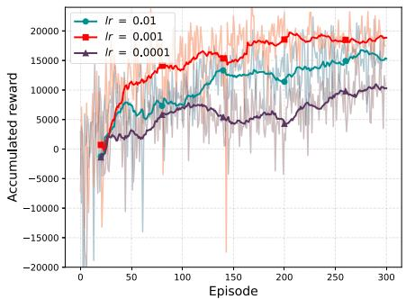  
Fig. 3. The accumulated reward versus learning rate.

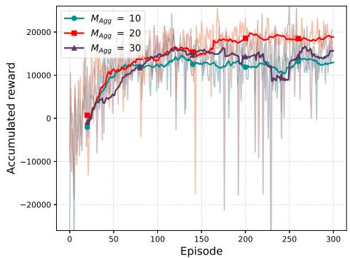  
Fig. 4. The accumulated reward versus aggregation frequency.

## A. Convergence Verification

Fig. 3 illustrates the convergence performance of the proposed FMAD3QN-CUA algorithm under different learning rates. It can be observed that as the learning rate increases, the cumulative reward initially increases and then decreases. Moreover, compared with learning rates of 0.0001 and 0.01, the reward curve converges faster when the learning rate is set to 0.01. This is because an excessively large learning rate may cause unstable updates and overshooting, while a too-small learning rate leads to slow learning, both of which hinder convergence and reduce overall performance. Thus, the learning rate is set to 0.001 in the proposed FMAD3QN-CUA algorithm.

Fig. 4 illustrates the reward performance of the proposed algorithm under different aggregation frequencies in FL. As the aggregation frequency $M _ { A g g }$ increases, the cumulative reward first increases and then decreases. The fastest convergence is achieved when the aggregation frequency is set to 20. The reason is that too frequent aggregation leads to insufficient local training and low information utilization, while too infrequent aggregation increases model divergence, making it difficult to align with the global optimization direction. From the aforementioned analysis, we set the aggregation frequency to 20 in our design.

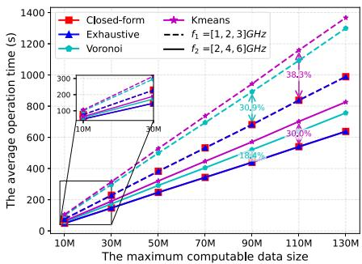  
Fig. 5. The average operation time versus the maximum computation data size. The parameters $f _ { 1 }$ and $f _ { 2 }$ denote the computation frequencies of the three UAVs.

## B. Superiority of the Proposed Closed-Form Association

To verify the superiority of the proposed closed-form association solution, we compare it with exhaustive search (optimal strategy), as well as baselines Voronoi-based method and Kmeans-based method. Fig. 5 illustrates the variation in system task completion time under different schemes. In this experiment, UAVs locations were randomly initialized and GD computation requests were generated according to the task request model. The simulation was repeated 10,000 times to compute the average task completion time for performance evaluation. From Fig. 5, it can be observed that the proposed closed-form GD association achieves the same performance as the optimal exhaustive search strategy and outperforms the Voronoi and Kmeans strategies. In contrast, the heuristic methods such as Voronoi and Kmeans show inferior performance, indicating less effective task allocation compared to the proposed method. This demonstrates that the proposed closed-form solution significantly reduces computational complexity while maintaining optimal performance. It is well-suited for practical deployments where timeliness and resource efficiency are critical.

Furthermore, it also can be observed that when the computation frequency of the three UAVs decreases from $f _ { 2 }$ to $f _ { 1 }$ , the performance of the proposed closed-form solution remains consistent with that of the optimal strategy. In contrast, the performance gaps between the closed-form solution and the Voronoi and Kmeans strategies increase (from 18.4% to 30.9%, and from 30% to 38.3%, respectively). This indicates that resource constraints have a significant impact on algorithm performance. In computationally constrained environments, heuristic methods often yield suboptimal task allocation, thereby inducing system performance degradation. Conversely, the proposed closedform solution consistently maintains optimal performance while demonstrating superior robustness, adaptability, and implementation viability.

TABLE II  
RUNTIME COMPARISON OF DIFFERENT METHODS
<table><tr><td rowspan=1 colspan=1>The number ofGDs</td><td rowspan=1 colspan=1>Closed-Formmethod (s)</td><td rowspan=1 colspan=1>Exhaustive searchmethod (s)</td></tr><tr><td rowspan=1 colspan=1>8</td><td rowspan=1 colspan=1>0.000343</td><td rowspan=1 colspan=1>0.003009</td></tr><tr><td rowspan=1 colspan=1>10</td><td rowspan=1 colspan=1>0.000352</td><td rowspan=1 colspan=1>0.036408</td></tr><tr><td rowspan=1 colspan=1>12</td><td rowspan=1 colspan=1>0.000369</td><td rowspan=1 colspan=1>0.379677</td></tr><tr><td rowspan=1 colspan=1>14</td><td rowspan=1 colspan=1>0.000371</td><td rowspan=1 colspan=1>4.047430</td></tr><tr><td rowspan=1 colspan=1>16</td><td rowspan=1 colspan=1>0.000392</td><td rowspan=1 colspan=1>38.968381</td></tr></table>

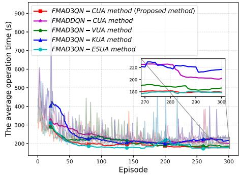  
Fig. 6. The average operation time versus different baselines.

Moreover, to evaluate the runtime advantages of the proposed scheme, we compared the closed-form solution with exhaustive search in terms of computational time. In the experiments, the number of UAVs was fixed at three, and for each test, 10,000 random user locations were generated to obtain the average runtime. As shown in Table II, the computational time of both methods increases as the number of GDs grows. However, the runtime of the closed-form solution remains nearly unchanged, rising only slightly from 0.000343 s to 0.000392 s. In contrast, exhaustive search exhibits an exponential growth pattern, with its runtime soaring from 0.003009 s to 38.968381 s — an increase of several orders of magnitude. This pronounced difference highlights the substantial advantages of the closed-form solution in largescale network scenarios. It not only guarantees reliable solution quality but also provides significantly higher computational efficiency, making it particularly suitable for UAV scheduling applications with stringent real-time requirements.

## C. Superiority of the Proposed FMAD3QN-CUA Method

Fig. 6 presents the performance comparison between the proposed FMAD3QN-CUA algorithm and several baseline methods. It can be observed that as the number of episodes increases, all algorithms converge to stable values, which further demonstrates the robustness of the proposed approach. Notably, the performance of FMAD3QN-CUA closely matches that of FMAD3QN-ESUA, while consistently outperforming the other baseline algorithms. This indicates the effectiveness of the proposed joint 3D deployment and GDs’ association strategy in improving task distribution and system efficiency. Moreover, although FMAD3QN-CUA and FMAD3QN-ESUA achieve similar final performance, the CUA method benefits from significantly lower computational complexity due to its closed-form GD association strategy, making it more suitable for real-time or resource-constrained deployments. In addition, the proposed FMAD3QN-CUA algorithm, which incorporates a dueling network structure, exhibits better training stability compared to the FMADDQN-CUA variant without the dueling mechanism. This highlights the advantage of integrating the dueling architecture, which enhances the precision of value estimation and accelerates learning convergence.

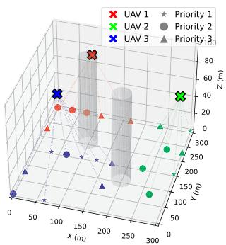  
(a) Service stage 1

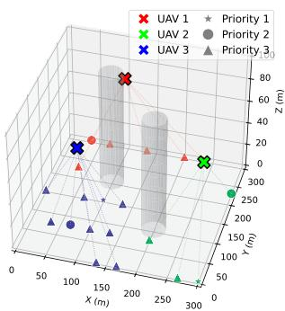  
(b) Service stage 2

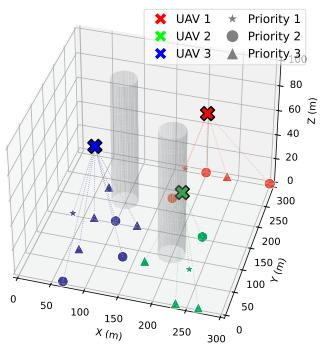  
(c) Service stage 3

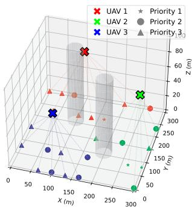  
(d) Service stage 4  
Fig. 7. Exhibition of UAVs’ 3D deployment and GDs’ association.

Moreover, Fig. 7 illustrates the proposed method’s 3D deployment of UAVs and their associations with GDs across different service stages, where the gray cylinders represent NFZs. It can be observed that during deployment, UAVs tend to prioritize proximity to high-priority (Priority 1) GDs. This is because prioritizing service for high-priority GDs minimizes operational duration, thereby optimizing system performance. In addition, the UAVs’ spatial locations vary across service stages while consistently avoiding NFZs, indicating that the proposed 3D deployment strategy is dynamic and adaptive. It adjusts UAV locations in real time based on GD distribution, task priority, and spatial constraints, achieving safe and efficient service coverage.

Fig. 8 further presents the statistics of GD’s associations across different priority levels and service stages, revealing the system’s intelligent task scheduling under heterogeneous computing resources. As shown in Fig. 8, Priority-1 GDs are predominantly associated with UAV3 (6 GHz), while mediumpriority GDs are mainly served by UAV2 (4 GHz), and UAV1 (2 GHz) is largely selected by low-priority GDs. This stratified association pattern reflects the underlying priority-weighted delay minimization rule: high-priority tasks suffer a larger penalty from processing latency and thus tend to connect to UAVs with stronger computational capabilities, which offer shorter computation times and lower weighted delays. As a result, high-performance UAVs naturally attract urgent tasks, whereas lower-performance UAVs primarily handle less time-critical workloads. In addition, it can be observed that UAV3 is assigned the largest number of GDs across the four service phases. This is because, compared with UAV1 and UAV2, UAV3 has greater computational capability, allowing it to process more GD data within the same task completion time. Furthermore, the proposed method integrates task priority, GD distribution, and computing heterogeneity on the basis of 3D spatial deployment, achieving efficient, intelligent multi-UAV cooperative scheduling, thus improving overall service quality and resource utilization efficiency.

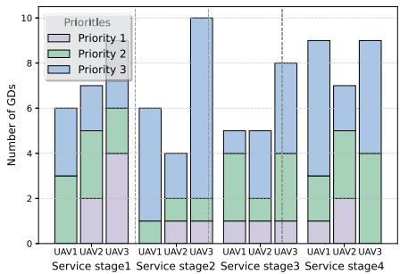  
Fig. 8. GDs associated with each UAV in different service stages.

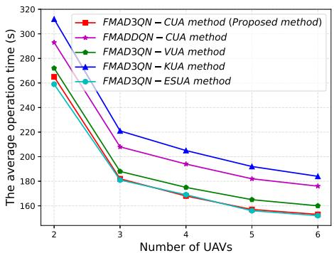  
Fig. 9. The average operation time versus different number of UAVs.

## D. Impact of Different Number of UAVs and NFZs

Fig. 9 illustrates the relationship between the average operation time and the number of UAVs for different methods. First, it can be observed that the average operation time gradually decreases as the number of UAVs increases. In addition, it can be observed that as the number of UAVs increases, the slope of the average operation time curve gradually flattens. This indicates that, for a finite amount of data, the average operation time tends to remain unchanged once the number of UAVs exceeds a certain threshold. Furthermore, the proposed FMAD3QN-CUA method achieves an average operation time comparable to that of the FMAD3QN-ESUA method, and consistently outperforms the other baseline methods. This further validates the effectiveness of the proposed method.

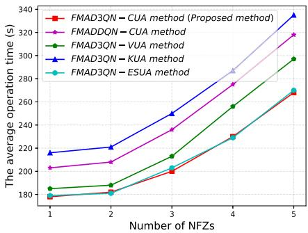  
Fig. 10. The average operation time versus different number of NFZs.

To further verify the robustness of the proposed scheme, we analyzed the changes in the average operation time under different NFZs scenarios. Fig. 10 shows the relationship between the average operation time and the number of NFZs for different methods. It can be observed that as the number of NFZs increases, the system’s average operation time gradually rises. This is mainly because the increase in NFZs reduces the safe flight space for UAVs, forcing them to take longer detours to complete tasks, which leads to higher operation times. In addition, as the number of NFZs grows, the proposed scheme (FMAD3QN-CUA) achieves performance comparable to the optimal GDs’ allocation method (FMAD3QN-ESUA), while clearly outperforming the other baseline methods. This further demonstrates that the proposed approach can maintain good performance and strong robustness even in complex multi-NFZ environments.

## VI. CONCLUSION

In this paper, we focused on a multi-UAV-aided MEC dynamic heterogeneous CCJD network with NFZs, while considering the various practical assumptions, i.e., the randomness of GDs’ task requests, the heterogeneity of UAV computing capabilities, the diversity of data processing requirements, and the differences in task priorities. We studied a multi-UAV 3D deployment and UAV-GD association problem aiming at minimizing the average delay of the system. To address the problem, we first derive a closed-form solution for GD’s association and then propose a novel low-complexity and efficient FMAD3QN-CUA method to deploy the 3D location of UAVs. Via simulation, we find out that the performance of the proposed closed-form GD’s association strategy is nearly identical to that of the optimal exhaustive search method, while significantly reducing computational complexity and outperforming other baselines. In addition, FMAD3QN-CUA with the dueling network architecture improves training stability and speeds up convergence by enhancing Q-value estimation. Moreover, the proposed 3D dynamic deployment strategy can flexibly adjust UAV locations according to task distribution and priority across different service stages, while effectively avoiding NFZs, thus ensuring safe and efficient service coverage.

Hereby, we finalize the conclusion by spotlighting the high extensibility of our work. In the multi-UAV-aided wireless MEC systems with larger-scale GDs or more practical deployment scenarios, the proposed methodology is expected to provide a scalable solution with reduced algorithmic complexity while maintaining near-optimal performance. In addition, the closedform GD’s association provides a theoretical foundation for efficient GD association while greatly reducing computational complexity. Such closed-form realization can serve as a practical guideline for various GD association designs that require low-latency decision-making in large-scale deployments. Moreover, the proposed DRL-based UAV 3D deployment method is adaptable to heterogeneous networks and can be extended to other multi-UAV heterogeneous systems, enabling scalable and efficient deployment in diverse operational scenarios.

In future work, we plan to incorporate meta-learning and graph neural networks to further enhance the UAVs’ capability for rapid adaptation to dynamic and previously unseen environments, thereby enabling more intelligent and fine-grained resource allocation with reduced computational overhead. Moreover, the proposed framework will be extended to ultra-dense integrated sensing, communication, and computing scenarios, with the objective of achieving theoretically grounded and practically efficient UAV deployment and coordination under multi-dimensional resource constraints.

## REFERENCES

[1] N. Cheng et al., “AI for UAV-assisted IoT applications: A comprehensive review,” IEEE Internet Things J., vol. 10, no. 16, pp. 14438–14461, Aug. 2023.

[2] Y. Jing, J. Wang, C. Jiang, and Y. Zhan, “Satellite MEC with federated learning: Architectures, technologies and challenges,” IEEE Netw., vol. 36, no. 5, pp. 106–112, Sep./Oct. 2022.

[3] Y. Liang, L. Xiao, D. Yang, Y. Liu, and T. Zhang, “Joint trajectory and resource optimization for UAV-aided two-way relay networks,” IEEE Trans. Veh. Technol., vol. 71, no. 1, pp. 639–652, Jan. 2022.

[4] Y. Zeng, R. Zhang, and T. J. Lim, “Wireless communications with unmanned aerial vehicles: Opportunities and challenges,” IEEE Commun. Mag., vol. 54, no. 5, pp. 36–42, May 2016.

[5] Y. Hu, P. Wu, X. Yuan, B. Li, H. Jiang, and W. Luo, “Joint trajectory design for unmanned marine cluster,” J. Electron. Inf. Technol., vol. 44, no. 3, pp. 890–898, 2022.

[6] Y. Gao, S. Wang, M. Liu, and Y. Hu, “Multi-agent reinforcement learning for UAVs 3D trajectory designing and mobile ground users scheduling with no-fly zones,” in Proc. IEEE/CIC Int. Conf. Commun. China, 2023, pp. 1–6.

[7] L. Ruan et al., “Energy-efficient multi-UAV coverage deployment in UAV networks: A game-theoretic framework,” China Commun., vol. 15, no. 10, pp. 194–209, Oct. 2018.

[8] P. Wu, X. Yuan, Y. Hu, and A. Schmeink, “UAV-enabled covert autonomous vehicular communication: Joint trajectory and resource allocation design,” IEEE Trans. Intell. Transp. Syst., vol. 26, no. 12, pp. 21769–21783, Dec. 2025.

[9] Z. Wang, L. Duan, and R. Zhang, “Adaptive deployment for UAV-aided communication networks,” IEEE Trans. Wireless Commun., vol. 18, no. 9, pp. 4531–4543, Sep. 2019.

[10] Y. Hu, X. Wen, X. Yuan, H. Jiang, J. Zhang, and L. Cheng, “3D unmanned aerial vehicle trajectory design for wireless power transfer,” J. Electron. Inf. Technol., vol. 44, no. 3, pp. 852–859, 2022.

[11] P. Wu, X. Yuan, Y. Hu, and A. Schmeink, “Joint power allocation and trajectory design for UAV-enabled covert communication,” IEEE Trans. Wireless Commun., vol. 23, no. 1, pp. 683–698, Jan. 2024.

[12] M. Asadpour, B. Van den Bergh, D. Giustiniano, K. A. Hummel, S. Pollin, and B. Plattner, “Micro aerial vehicle networks: An experimental analysis of challenges and opportunities,” IEEE Commun. Mag., vol. 52, no. 7, pp. 141–149, Jul. 2014.

[13] M. Mozaffari, W. Saad, M. Bennis, Y.-H. Nam, and M. Debbah, “A tutorial on UAVs for wireless networks: Applications, challenges, and open problems,” IEEE Commun. Surv. Tuts., vol. 21, no. 3, pp. 2334–2360, Third Quarter 2019.

[14] W. You, C. Dong, X. Cheng, X. Zhu, Q. Wu, and G. Chen, “Joint optimization of area coverage and mobile-edge computing with clustering for FANETs,” IEEE Internet Things J., vol. 8, no. 2, pp. 695–707, Jan. 2021.

[15] N. R. Kota and K. Naidu, “Minimizing energy consumption in H-NOMA based UAV-assisted MEC network,” IEEE Commun. Lett., vol. 27, no. 9, pp. 2536–2540, Sep. 2023.

[16] Q. Wu, M. Cui, G. Zhang, F. Wang, Q. Wu, and X. Chu, “Latency minimization for UAV-enabled URLLC-based mobile edge computing systems,” IEEE Trans. Wireless Commun, vol. 23, no. 4, pp. 3298–3311, Apr. 2024.

[17] Y. Gao, X. Yuan, D. Yang, Y. Hu, Y. Cao, and A. Schmeink, “UAV-assisted MEC system with mobile ground terminals: DRL-based joint terminal scheduling and UAV 3D trajectory design,” IEEE Trans. Veh. Technol., vol. 73, no. 7, pp. 10164–10180, Jul. 2024.

[18] J. Tian, D. Wang, H. Zhang, and D. Wu, “Service satisfaction-oriented task offloading and UAV scheduling in UAV-enabled MEC networks,” IEEE Trans. Wireless Commun., vol. 22, no. 12, pp. 8949–8964, Dec. 2023.

[19] Z. Yang, S. Bi, and Y.-J. A. Zhang, “Online trajectory and resource optimization for stochastic UAV-enabled MEC systems,” IEEE Trans. Wireless Commun., vol. 21, no. 7, pp. 5629–5643, Jul. 2022.

[20] F. Pervez, A. Sultana, C. Yang, and L. Zhao, “Energy and latency efficient joint communication and computation optimization in a multi-UAVassisted MEC network,” IEEE Trans. Wireless Commun., vol. 23, no. 3, pp. 1728–1741, Mar. 2024.

[21] N. Lin, H. Tang, L. Zhao, S. Wan, A. Hawbani, and M. Guizani, “A PDDQNLP algorithm for energy efficient computation offloading in UAV-assisted MEC,” IEEE Trans. Wireless Commun., vol. 22, no. 12, pp. 8876–8890, Dec. 2023.

[22] M. Hui, J. Chen, L. Yang, L. Lv, H. Jiang, and N. Al-Dhahir, “UAVassisted mobile edge computing: Optimal design of UAV altitude and task offloading,” IEEE Trans. Wireless Commun., vol. 23, no. 10, pp. 13633– 13647, Oct. 2024.

[23] G. A. Bayessa, R. Chai, C. Liang, D. Kumar Jain, and Q. Chen, “Joint UAV deployment and precoder optimization for multicasting and target sensing in UAV-assisted ISAC networks,” IEEE Internet Things J., vol. 11, no. 20, pp. 33392–33405, Oct. 2024.

[24] R. Chai, L. He, R. Sun, and Q. Chen, “System cost-oriented UAV deployment for integrated access and Backhaul networks,” IEEE Trans. Veh. Technol., vol. 73, no. 9, pp. 12858–12872, Sep. 2024.

[25] M. Ejaz et al., “Joint optimization of UAV deployment and task scheduling in multi-UAV enabled mobile edge computing systems,” IEEE Internet Things J., vol. 12, no. 18, pp. 37077–37093, Sep. 2025.

[26] L. Sun, Z. Liu, Z. Ning, J. Wang, and X. Fu, “Multi-agent Q-net enhanced coevolutionary algorithm for resource allocation in emergency humanmachine fusion UAV-MEC system,” IEEE Trans. Autom. Sci. Eng., vol. 22, pp. 4473–4489, 2025.

[27] Y. Gao, X. Yuan, D. Yang, Y. Hu, Y. Cao, and A. Schmeink, “UAV-assisted MEC system with mobile ground terminals: DRL-based joint terminal scheduling and UAV 3D trajectory design,” IEEE Trans. Veh. Technol., vol. 73, no. 7, pp. 10164–10180, Jul. 2024.

[28] Z. Kaleem, W. Khalid, A. Ahmad, H. Yu, A. M. Almasoud, and C. Yuen, “Reinforcement learning for energy-efficient user association in UAV-assisted cellular networks,” IEEE Trans. Aerosp. Electron. Syst., vol. 60, no. 2, pp. 2474–2481, Apr. 2024.

[29] X. Cheng, R. Jiang, H. Sang, G. Li, and B. He, “Joint optimization of multi-UAV deployment and user association via deep reinforcement learning for long-term communication coverage,” IEEE Trans. Instrum. Meas., vol. 73, 2024, Art. no. 5503613.

[30] Z. Han, T. Zhou, T. Xu, and H. Hu, “Joint user association and deployment optimization for delay-minimized UAV-aided MEC networks,” IEEE Wireless Commun. Lett., vol. 12, no. 10, pp. 1791–1795, Oct. 2023.

[31] Z. Ning et al., “Joint user association, interference cancellation, and power control for multi-IRS assisted UAV communications,” IEEE Trans. Wireless Commun., vol. 23, no. 10, pp. 13408–13423, Oct. 2024.

[32] B. Liu, C. Liu, and M. Peng, “Dynamic cache placement and trajectory design for UAV-assisted networks: A two-timescale deep reinforcement learning approach,” IEEE Trans. Veh. Technol., vol. 73, no. 4, pp. 5516–5530, Apr. 2024.

[33] M. G. Anany, M. M. Elmesalawy, I. I. Ibrahim, and A. M. A. El-Haleem, “Location and user association optimization in multiple radio access UAV-assisted heterogeneous IoT networks,” IEEE Access, vol. 12, pp. 59273–59288, 2024.

[34] N. Sehito et al., “Optimizing user association, power control, and beamforming for 6G multi-IRS multi-UAV NOMA communications in smart cities,” IEEE Trans. Consum. Electron., vol. 70, no. 3, pp. 5702–5710, Aug. 2024.

[35] L. Wang, H. Zhang, S. Guo, and D. Yuan, “Deployment and association of multiple UAVs in UAV-assisted cellular networks with the knowledge of statistical user position,” IEEE Trans. Wireless Commun., vol. 21, no. 8, pp. 6553–6567, Aug. 2022.

[36] International Telecommunication Union Radiocommunication Sector (ITU-R), “Propagation data and prediction methods required for the design of terrestrial broadband millimetric radio access systems operating in a frequency range of about 20–50 GHz,” ITU-R Recommendation P.1410, Geneva, Switzerland, 2003.

[37] C. You and R. Zhang, “Hybrid offline-online design for UAV-enabled data harvesting in probabilistic LoS channels,” IEEE Trans. Wireless Commun., vol. 19, no. 6, pp. 3753–3768, Jun. 2020.

[38] W. Zhang, Q. Wang, X. Liu, Y. Liu, and Y. Chen, “Three-dimension trajectory design for multi-UAV wireless network with deep reinforcement learning,” IEEE Trans. Veh. Technol., vol. 70, no. 1, pp. 600–612, Jan. 2021.

  
Yunfei Gao received the BSs degree in electronic information science and technology from the School of Physics and Electronic Engineering, Xinxiang College, Xinxiang, China, in 2018, and the MSc degree in electronic and communication engineering from Information Engineering School, Nanchang University, China, in 2022. He is currently working toward the PhD degree with the Electronic Information School, Wuhan University. His research interests include UAV communications, deep reinforcement learning, federated learning.

Peng Wu received the BSc degree in communication engineering from Wuhan University, China, in 2021. He is currently working toward the PhD degree with Wuhan University, Wuhan, China. His research interests include UAV-assisted wireless communication networks, trajectory design, and UAV positioning technology.

Xiaopeng Yuan (Member, IEEE) received the BSc degree in automation from the Beijing University of Aeronautics & Astronautics, China, in 2016, and the MSc and PhD degrees in electrical engineering and information technology from RWTH Aachen University, Germany, in 2019 and Mar. 2023, respectively. He is currently working as a senior researcher with INDA Institute, RWTH Aachen University, Germany. His research interests include UAV-assisted wireless network, wireless power transfer technique, ultra-reliable low-latency communication network,

and flexible antenna system. He is editor of the book ‘Reliable and Efficient Trajectory Design in UAV-Aided Wireless Networks’ and is now serving as an editor of the IEEE Transactions on Communications, and EURASIP Journal on Wireless Communications and Networking.

Yulin Hu (Senior Member, IEEE) received the MScEE degree from USTC, China, in 2011, and the PhDEE (hons.) degree from RWTH Aachen University. He successfully defended his dissertation of a joint PhD Program supervised by Prof. Anke Schmeink at RWTH Aachen University and Prof. James Gross at the KTH Royal Institute of Tecnology in December 2015. He was a post-doctoral research fellow with RWTH Aachen University from January 2016 to December 2016. He was a senior researcher and the team leader with Prof. Anke Schmeink in

ISEK Research Area with RWTH Aachen University. From May to July in 2017, he was a visiting scholar with Prof. M. Cenk Gursoy with Syracuse University, USA. He is currently a professor with the Electronic Information School, Wuhan University. His research interests include information theory and optimal design of wireless communication systems. He served as a TPC member for many conferences. He was a recipient of the IFIP/IEEE Wireless Days Student Travel Awards in 2012. He received the Best Paper Awards at IEEE ISWCS 2017 and IEEE PIMRC 2017. He served as the WSSS chair for IEEE SmartData 2022, the track co-chair for ICCCN 2023, and the Organizer and the chair for special sessions in IEEE ISWCS 2018, 2021, and 2023. He is an editor of several high-ranking journals, including the IEEE Transactions on Mobile Computing and IEEE Transactions on Vehicular Technology. He has been invited to contribute submissions to multiple conferences.

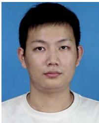

Xiaoxiang Cao received the master’s degree from the School of Environment and Spatial Informatics, China University of Mining and Technology, Xuzhou, China, in 2019, and the PhD degree from the LIESMRS, Wuhan University, China, in 2024. He is a post-doctoral researcher and a member of the Sensing, Navigation & Artificial Intelligence Lab (SNAIL), State Key Laboratory of Information Engineering in Surveying, Mapping and Remote Sensing (LIESMRS), Wuhan University, China. His current research interests include indoor positioning, activity recognization, and deep learning.

Anke Schmeink (Senior Member, IEEE) received the diploma degree in mathematics with a minor in medicine and the PhD degree in electrical engineering and information technology from RWTH Aachen University, Germany, in 2002 and 2006, respectively. She worked as a research scientist with Philips Research before joining RWTH Aachen University, in 2008, where she has been a professor since 2012. She spent several research visits with the University of Melbourne and the University of York. Her research interests include information theory, machine learn-

ing, data analytics, and optimization with focus on wireless communications and medical applications. She is a member of the Young Academy with the North Rhine-Westphalia Academy of Science.