# Joint UAV Placement and Dependent Task Offloading in Multi-UAV MEC Networks: A Graph Attention Enhanced DRL Approach

Cheng Zhan , Member, IEEE, Wei Liu, Kaifeng Song, Rongfei Fan , Member, IEEE, Jun Liu , Member, IEEE, and Han Hu , Member, IEEE

Abstract—Unmanned aerial vehicles (UAVs) have emerged as effective platforms for mobile edge computing (MEC), offering flexible and efficient computational support to ground users (GUs). Many practical applications, such as deep neural network inference tasks, generate subtasks with complex dependencies, significantly complicating scheduling and offloading decisions. In this paper, we study the joint optimization of UAV deployment, UAV-GU associations, and dependent task offloading decisions within a multi-UAV-enabled MEC system, aiming to minimize the end time of the overall tasks. The tasks generated by GUs are modeled using directed acyclic graphs (DAGs), explicitly capturing subtask dependencies and execution orders. To address the resulting complex optimization problem, we first propose a Joint Successive convex approximation and Penalty dual decomposition-based Optimization (JSPO) algorithm to determine the initial UAV deployment and UAV-GU associations. Next, we formulate the dependent task offloading decision process as a Markov decision process (MDP), which is solved by employing deep reinforcement learning (DRL). To effectively exploit the structural information within DAG tasks, we integrate a graph attention network (GAT) to provide enhanced state representations for DRL. JSPO and the DRL framework were executed in turns to gradually improve the performance. Extensive simulation results verify that our proposed framework significantly reduces the end time compared to existing methods, demonstrating its superiority in multi-UAV MEC systems.

Index Terms—Mobile edge computing (MEC), unmanned aerial vehicle (UAV) deployment, dependent task offloading, deep reinforcement learning (DRL), graph attention network (GAT).

## I. INTRODUCTION

W ITH the rapid development of 5 G infrastructure and theInternet of Things (IoT), innovative mobile applications Internet of Things (IoT), innovative mobile applications like augmented reality, autonomous driving, and smart healthcare systems have emerged [1]. These applications require fast, reliable connectivity and low-latency computing capabilities to provide seamless and real-time user experiences. However, many IoT devices are constrained by limited energy and computational resources, making it challenging to handle resourceintensive tasks locally. To address these challenges, mobile edge computing (MEC) has emerged as a promising solution [2], enabling devices to offload tasks to nearby edge servers, significantly reducing latency and alleviating the load on remote cloud infrastructure. Despite the advantages of MEC, its traditional static infrastructure faces significant limitations due to restricted coverage and fixed locations of edge servers. These geographical constraints can hinder service delivery, especially in remote or constrained environments. To overcome these limitations, unmanned aerial vehicle (UAV)-enabled MEC have been proposed as an innovative solution. UAVs offer flexible deployment, cost efficiency, and high mobility, allowing services to be deployed quickly to the areas where they are needed. Moreover, UAVs can establish direct line-of-sight (LoS) connections with ground users (GUs), enhancing connection stability and reliability while meeting quality-of-service (QoS) requirements [3].

In UAV-enabled MEC, resource-constrained GUs can offload computation-intensive tasks to UAV-mounted edge servers, alleviating their limitations in storage, battery life, and processing power. There are two offloading strategies commonly employed: partial offloading and binary offloading [4]. Partial offloading divides tasks into smaller components, allowing some to be processed locally and others to be offloaded to the UAV. However, partial offloading requires identifying meaningful partition points in the absence of clear computational boundaries, which is particularly challenging for complex tasks, and it increases synchronization costs between the GU and the UAV. On the other hand, binary offloading simplifies the decisionmaking process by requiring each task to be either entirely processed locally on the GU or completely offloaded to the UAV. This reduces complexity and synchronization overhead, offering better reliability. Therefore, we adopt binary offloading to simplify task management and enhance system reliability and efficiency. To ensure efficient communication between GUs and UAVs, optimizing the UAV deployment and the UAV-GU association is essential. Many existing works [5], [6], [7] have studied this optimization problem, emphasizing its importance in enhancing communication efficiency. However, they often assume simplified tasks and overlook the real-world dependencies among tasks that can impact offloading and execution decisions.

Modern mobile applications, such as deep neural networks and augmented reality [1], increasingly rely on dependent tasks, where a task can only begin once its preceding tasks have completed. These dependencies are common in computationintensive applications and pose significant challenges in UAVenabled MEC systems. One of the key challenges is determining the optimal execution order for these tasks. Delays in one subtask can result in waiting times for subsequent tasks, leading to inefficient use of computational resources and increased overall tasks end time. Existing studies [8], [9], [10], [11] determine task scheduling order based on heuristic priorities. However, this experience-based and intuitive method often misses better solutions. Additionally, task offloading in UAV-enabled systems adds another layer of complexity. To minimize communication overhead and avoid delay from waiting for predecessor tasks, it is critical to optimize offloading decisions, especially when the system must coordinate between GUs and UAVs. Efficient collaboration between local devices and UAVs is essential for maximizing parallel computation and minimizing data transfers, which directly affects both computation and communication efficiency. Recent works [12], [13], [14], [15], [16], [17] have employed reinforcement learning to make offloading decisions, but heuristic methods are still commonly used for task scheduling. Furthermore, in the context of UAV-enabled MEC systems, the UAV deployments and UAV-GU associations significantly impact the system’s communication environment. The location of UAVs and how they are associated with GUs directly affect data transfer rates and task offloading decisions, influencing both computation and communication efficiency. To ensure minimal the end time while considering task dependencies in UAV-enabled MEC systems, it is necessary to jointly optimize the UAV-GU association, UAV deployment positions, and task offloading decisions, which is challenging and has not been thoroughly investigated.

This paper investigates a multi-UAV-enabled MEC system for dependent tasks, where the UAV deployment, UAV-GU association, and task offloading are jointly optimized to minimize the end time for all tasks. The dependent tasks generated by GUs are modeled using a directed acyclic graph (DAG), with each node representing a subtask and the edges capturing the dependencies between them. The scheduling order and offloading decisions for each node are determined through deep reinforcement learning (DRL). To facilitate more effective learning from the DAGs, we integrate a graph attention network (GAT) into our framework. The GAT is trained in an unsupervised manner and acts as a plug-and-play module that provides a richer state representation for the DRL model, enhancing its ability to understand complex graph-based relationships. The main contributions of this paper are summarized as follows:

We propose a comprehensive multi-UAV-enabled MEC framework in which each UAV hosts an aerial edge server to serve GUs generating dependent tasks. A joint optimization problem is formulated by encompassing UAV deployment, UAV-GU association, and offloading decision, with the objective of minimizing the maximum end time.

We first simplify the original problem to establish an initial network configuration. Building on this, we develop an efficient iterative Joint Successive convex approximation and Penalty dual decomposition Optimization algorithm (JSPO), which iteratively refines UAV deployments and UAV-GU associations.

The task offloading process is modeled as a Markov decision process (MDP) and solved using a DRL framework with dueling double deep Q-network (D3QN). We enhance our approach by combining the GAT with an iterative feedback loop between the JSPO algorithm and the DRL framework. The GAT fully exploits the DAG structure to provide a comprehensive state representation.

Extensive simulations are conducted to validate the proposed approach. We analyze the task scheduling and offloading process, and investigate how bandwidth and task scale affect performance. The results show significant reductions in end time and improved resource utilization compared to existing benchmark methods.

## II. RELATED WORK

## A. Task Offloading in UAV-Enabled MEC

Task offloading in MEC networks has become a key research area as the demand for efficient processing of computation-intensive and latency-sensitive tasks increases. In [18], computational-intensive tasks generated by Internet of Health Things (IoHT) devices were offloaded to edge servers to reduce latency and improve energy efficiency, while meeting ultra reliable and low latency communication (URLLC) requirements. In [19], the authors studied task computation delay minimization in multi-edge-server MEC systems, focusing on optimizing transmission duration and workload offloading allocation. They proposed a two-stage solution and a deep reinforcement learning approach for dynamic channels to efficiently determine offloading decisions. The work in [20] tackled the challenge of maximizing QoE of users in a MEC network by jointly optimizing resource allocation and task offloading decisions. In [21], the authors proposed a DRL framework where the actor network uses a DNN to model the relationship between input states and binary offloading decisions.

With the rising popularity of UAVs, UAV-enabled MEC systems have emerged as a flexible solution in MEC networks [3]. The work in [5] proposed an alternating optimization algorithm to reduce computing delays in UAV-assisted MEC systems, focusing on task scheduling and resource management. The authors in [6] addressed latency minimization in UAV-enabled MEC systems, with a focus on ultra-reliable and low-latency links between ground devices and a UAV-carried MEC server. Furthermore, the work in [7] developed a multi-UAV-enabled

MEC system to minimize energy consumption through optimized UAV deployment and task scheduling, employing a two-layer optimization method integrating differential evolution and greedy algorithms. While these studies highlight the benefits of task offloading and the integration of UAVs in MEC systems, they often overlook the real-world dependencies between tasks, which can significantly impact application performance and resource allocation.

## B. Offloading Dependent Tasks

Offloading tasks that have interdependencies poses unique challenges because the execution order and data transmission between subtasks must be carefully coordinated. Many existing studies have tackled this problem using heuristic algorithms [8], [9] or heuristic-based reinforcement learning [12], [13], [14]. The authors in [8] focused on designing a heuristic rankingbased algorithm to efficiently assign dependent tasks, aiming to minimize the average makespan. The authors in [9] proposed a heuristic centralized DNN dependent task offloading algorithm that addresses the fine-grained partition and scheduling of multiple DNN tasks. However, it relies on estimating computation loads and data transfers using intuitive priority metrics. In [12], the authors proposed a DRL method based on an actor-critic framework to minimize delay and energy consumption. In [13], the authors minimized average response time and introduce a mobility-aware dependent task offloading scheme using a DRL-based algorithm. They also proposed an intuitive priority determination algorithm and sorts tasks based on three key metrics. In [14], a deep deterministic policy gradient (DDPG)- based approach was proposed to optimize offloading policies, starting with a migration-enabled multi-priority task sequencing algorithm that determines the execution order by introducing several priority metrics to minimize deadline violations.

There are also studies that focus on UAV-enabled MEC systems for offloading dependent tasks. In [10], the joint problem of offloading linearly dependent tasks, designing UAV trajectories, and allocating resources was addressed by decomposing the problem into two subproblems using a block coordinate descent (BCD) method. In [11], a task reconfiguration algorithm transforms the task call graph into multiple sequential layers to simplify the dependency structure, though this linearization may miss more suitable scheduling sequences. In [15], the focus is on optimizing UAV trajectories and scheduling DAG tasks to reduce latency and energy consumption, yet the critical interdependencies between tasks are not fully considered. In [16], a UAV-assisted offloading scheme for vehicular networks minimized average task execution delay and energy consumption by introducing an asynchronous federated DRL-based algorithm. In [17], a double deep Q-network (DDQN)-based task offloading scheme was proposed in UAV-assisted smart farms, where a predictable metric is used to implement a priority-based scheduling approach, ensuring that tasks are executed in the correct order.

In summary, most existing approaches rely on heuristic methods for task prioritization and scheduling, often basing decisions on estimates or intuitive metrics that do not fully capture the complex interdependencies among subtasks. Different from the existing work, we design jointly optimization framework for UAV deployment, UAV-ground user associations, and dependent task offloading, where a graph attention enhanced DRL approach is developed to more effectively minimize the end time of the overall tasks and enhance overall system performance.

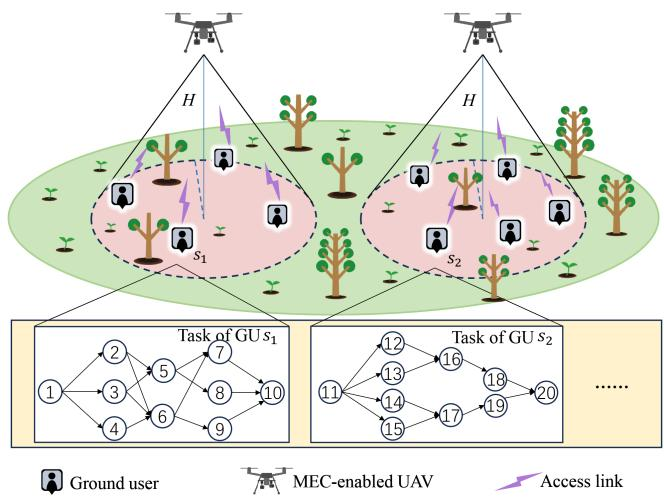  
Fig. 1. Scenario illustration of the multi-UAV-enabled MEC system.

TABLE I KEY NOTATIONS LIST
<table><tr><td rowspan=1 colspan=1>Notation</td><td rowspan=1 colspan=1>Description</td></tr><tr><td rowspan=1 colspan=1>M,K</td><td rowspan=1 colspan=1>Set of UAVs and set of GUs, respectively</td></tr><tr><td rowspan=1 colspan=1> $\underline { { \mathbf { q } _ { m } , \mathbf { w } _ { k } } }$ </td><td rowspan=1 colspan=1>Horizontal coordinates of UAV $u _ { m }$ and GU sk</td></tr><tr><td rowspan=1 colspan=1> $\underline { { a _ { k , m } } }$ </td><td rowspan=1 colspan=1>Association between GU sk and UAV um</td></tr><tr><td rowspan=1 colspan=1> $\overline { { G _ { k } } }$ </td><td rowspan=1 colspan=1>DAG representing the task of GU sk</td></tr><tr><td rowspan=1 colspan=1> $\underline { { c _ { i } } }$ </td><td rowspan=1 colspan=1>Computational load (in cycles) of subtask i</td></tr><tr><td rowspan=1 colspan=1> $d _ { i , j }$ </td><td rowspan=1 colspan=1>Size of data transferred from subtask i to subtask j</td></tr><tr><td rowspan=1 colspan=1> $f _ { m } , f _ { k }$ </td><td rowspan=1 colspan=1>Computation capability of UAV $u _ { m }$ and GU sk</td></tr><tr><td rowspan=1 colspan=1> $\overline { B }$ </td><td rowspan=1 colspan=1>Signal bandwidth</td></tr><tr><td rowspan=1 colspan=1> $\overline { { H } }$ </td><td rowspan=1 colspan=1>The UAV altitude</td></tr><tr><td rowspan=1 colspan=1> $\overline { { P _ { k } , P _ { m } } }$ </td><td rowspan=1 colspan=1>The transmit power of GU sk and UAV $u _ { m }$ </td></tr><tr><td rowspan=1 colspan=1> $\overline { { T F } }$ </td><td rowspan=1 colspan=1>The final end time of all tasks</td></tr><tr><td rowspan=1 colspan=1> $\hat { R } _ { k , m }$ </td><td rowspan=1 colspan=1>Uplink data rate from GU $s _ { k }$ to UAV $u _ { m }$ </td></tr><tr><td rowspan=1 colspan=1> $\dot { R } _ { m , k }$ </td><td rowspan=1 colspan=1>Downlink data rate from UAV $u _ { m }$ to GU $s _ { k }$ </td></tr><tr><td rowspan=1 colspan=1> $\overline { { \mathcal { E } } }$ </td><td rowspan=1 colspan=1>The overall scheduling and offloading plan</td></tr><tr><td rowspan=1 colspan=1> $x _ { i }$ </td><td rowspan=1 colspan=1>Binary offloading decision for subtask i</td></tr><tr><td rowspan=1 colspan=1>S(i), E(i)</td><td rowspan=1 colspan=1>Start time and execution time of subtask i</td></tr><tr><td rowspan=1 colspan=1> $\overline { { F ( i ) } }$ </td><td rowspan=1 colspan=1>End time of subtask i</td></tr><tr><td rowspan=1 colspan=1> $\overline { { T _ { n } } }$ </td><td rowspan=1 colspan=1>The end time of the first n scheduled subtasks</td></tr><tr><td rowspan=1 colspan=1> $\overline { { T F } }$ </td><td rowspan=1 colspan=1>The final end time of all tasks</td></tr><tr><td rowspan=1 colspan=1> $\hat { d } _ { k }$ </td><td rowspan=1 colspan=1>Data size to be uploaded for GU $s _ { k }$ in special scenario</td></tr><tr><td rowspan=1 colspan=1> $\overline { { d _ { k } } }$ </td><td rowspan=1 colspan=1>Data size to be downloaded for GU $s _ { k }$ in special scenario</td></tr></table>

## III. SYSTEM MODEL AND PROBLEM FORMULATION

## A. Network Model

As shown in Fig. 1, we consider a multi-UAV-enabled MEC system where each UAV is equipped with an edge server that provides computing service to a set of K GUs, which generate certain dependent tasks. Denote the set of GUs as $\mathcal { K } = \{ s _ { 1 } , s _ { 2 } , . . . , s _ { K } \}$ , where the horizontal coordinate of device $s _ { k } \in \mathcal { K }$ is represented by $\mathbf { w } _ { k } = [ x _ { k } , y _ { k } ] ^ { \mathrm { T } } \in \mathbb { R } ^ { 2 \times 1 }$ . For safety and simplicity considerations, we assume UAVs hover at a constant altitude with value H [22]. The set of UAVs is denoted as $\mathcal { M } = \{ u _ { 1 } , u _ { 2 } , . . . , u _ { M } \}$ , where the horizontal position of

UAV $u _ { m } \in \mathcal { M }$ is represented as $\mathbf { q } _ { m } = [ x _ { m } , y _ { m } ] ^ { \mathrm { T } } \in \mathbb { R } ^ { 2 \times 1 }$ . Define UAV-GU association variables $\{ a _ { k m } \}$ ], where $a _ { k m } \in \{ 0 , 1 \}$ $\forall k , m . a _ { k m } = 1 { \mathrm { i f } } \mathrm { G U } s _ { k }$ associates with UAV $u _ { m }$ ; otherwise, $a _ { k m } = 0$ = 1. Similar to [16], we assume that each GU associates with only one UAV, i.e., $\begin{array} { r } { \sum _ { m = 1 } ^ { M } { a _ { k m } } = 1 , \forall k } \end{array}$ , while a UAV can =1serve multiple GUs. The key notations used throughout this paper are summarized in Table I.

## B. Task Model

The computation task generated from $s _ { k }$ can be represented as a DAG $G _ { k } = ( V _ { k } , E _ { k } )$ , and the overall task graph G is defined as $\begin{array} { r } { G = \bigcup _ { k = 1 } ^ { K } G _ { k } . \ V _ { k } = \{ v _ { k , 1 } , v _ { k , 2 } , . . . , v _ { k , | V _ { k } | } \} } \end{array}$ is the set of =1nodes corresponding to the subtasks of $G _ { k } , E _ { k }$ denotes the set of dataflow edges. For an edge $( v _ { k , p } , v _ { k , q } ) \in E _ { k }$ , the subtask $v _ { k , p }$ is the predecessor of the subtask $v _ { k , q } .$ ). Thus, there are N subtasks in total for all GUs, where $\begin{array} { r } { N = \sum _ { k = 1 } ^ { K } | V _ { k } | } \end{array}$

=1To facilitate the discussion of the overall tasks generated by all GUs, each subtask is assigned an index i in the range $1 \leq$ $i \leq N$ . The index i uniquely identifies each subtask, allowing us to determine the GU $s _ { k }$ and the specific subtask $v _ { k , p } .$ . For each GU $s _ { k }$ , subtasks are indexed sequentially. If user $s _ { 1 }$ has $\left| V _ { 1 } \right|$ subtasks, subtasks for $s _ { 2 }$ start from $| V _ { 1 } | + 1$ , and so on. The subtask with index i corresponds to: k $\begin{array} { r } { \left\{ j \mid \sum _ { k = 1 } ^ { j } | V _ { k } | \geq \right. } \end{array}$ $i \}$ and $p = i - \textstyle \sum _ { k = 1 } ^ { k - 1 } | V _ { k } |$ . In simpler terms, k is the smallest =1integer where the cumulative number of subtasks from to k is at least $i ,$ and $p$ is the position of the subtask within $V _ { k }$ for the determined k. For example, consider the tasks in Fig. 1: If subtask 1 corresponds to $v _ { 1 , 1 }$ generated by GU $s _ { 1 }$ , then subtask 11 corresponds to $v _ { 2 , 1 }$ 1 1generated by GU $s _ { 2 }$

## C. Communication Model

Since UAVs are deployed at high altitudes, LoS connections can be established and dominate the communication channels [23]. Then, the channel gain between the UAV $u _ { m }$ and GU $s _ { k }$ is expressed as $h _ { k m } = \beta _ { 0 } d _ { k m } ^ { - \alpha }$ , where $\alpha \geq 2$ is the path-loss exponent, $\beta _ { 0 }$ is the channel power gain at the reference distance 1m, and $d _ { k m } = \sqrt { H ^ { 2 } + \| \mathbf { q } _ { m } - \mathbf { w } _ { k } \| ^ { 2 } }$ is the distance between the GU $s _ { k }$ and the UAV $u _ { m }$ . We assume that orthogonal channels are used for data transmission between GUs and their associated UAVs with no interference [24]. Subsequently, we delve into the details of the data transmission process.

1) Ground-to-Air Links: When a subtask is offloaded to the UAV, it involves transmitting dependency data from the predecessor subtasks that reside on the GU. The uplink data rate $\hat { R } _ { k , m }$ from GU $s _ { k }$ to UAV $u _ { m }$ is given by

$$
\hat { R } _ { k , m } = B \mathrm { l o g } _ { 2 } ( 1 + \frac { \gamma _ { k } } { ( H ^ { 2 } + \Vert \mathbf { q } _ { m } - \mathbf { w } _ { k } \Vert ^ { 2 } ) ^ { \alpha / 2 } } ) ,\tag{1}
$$

where B denotes the communication bandwidth, and $\begin{array} { r } { \gamma _ { k } \triangleq \frac { P _ { k } \beta _ { 0 } } { \sigma ^ { 2 } } } \end{array}$ represents the received signal-to-noise ratio (SNR) at 1m. Here $P _ { k }$ is the transmit power of $s _ { k }$ , and $\sigma ^ { 2 }$ denotes the background noise power.

2) Air-to-Ground Links: After UAV executes, each subtask outputs the necessary data for its successor subtasks. Downloading occurs when the subtask on the GU needs dependency data from its predecessor subtask on the UAV. The downlink data rate $\check { R } _ { m , k }$ from the UAV $u _ { m }$ to GU $s _ { k }$ is given by

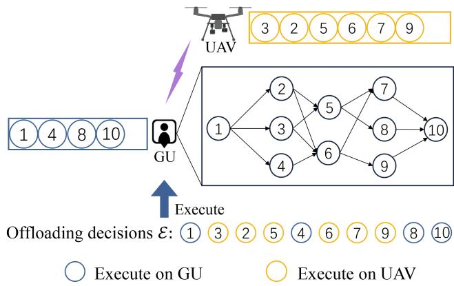  
Fig. 2. An example of how a single task is offloaded.

$$
\breve { R } _ { m , k } = B \log _ { 2 } \left( 1 + \frac { \gamma _ { m } } { ( H ^ { 2 } + \left\| \mathbf { q } _ { m } - \mathbf { w } _ { k } \right\| ^ { 2 } ) ^ { \alpha / 2 } } \right) ,\tag{2}
$$

where $\begin{array} { r } { \gamma _ { m } \triangleq \frac { P _ { m } \beta _ { 0 } } { \sigma ^ { 2 } } } \end{array}$ , and $P _ { m }$ is the transmission power of the UAV $u _ { m }$

## D. Task Scheduling Model

For the overall tasks with N subtasks, the scheduling plan, denoted as $\mathcal { E } ,$ is a permutation of the set $\{ ( i , x _ { i } ) \} _ { i = 1 } ^ { N }$ , where each tuple $( i , x _ { i } )$ ( ) =1indicates a scheduling decision for subtask i and its position and the permutation sequence determines the sequence of scheduling. Specifically, $x _ { i } = 1$ means the subtask i is offloaded to the associated UAV, while $x _ { i } = 0$ means it is executed locally. As illustrated in Fig. 2, consider an scheduling plan sequence where: (1) the system first chooses decision (1, 0). Subtask 1 is dispatched to the GU’s local queue; (2) the system then chooses (3, 1). Subtask 3 is dispatched to the UAV’s queue; (3) the system chooses (2, 1), offloading subtask 2 to the UAV’s queue;...;(10) the decision (10, 0) is chosen, and subtask indexed 10 is executed locally. The scheduling plan can be represented as $\mathcal { E } = \{ ( 1 , 0 ) , ( 3 , 1 ) , ( 2 , 1 ) , \dots , ( 1 0 , 0 ) \}$

According to the scheduling plan, the tasks of all GUs execute based on $\mathcal { E } .$ Moreover, define $T _ { n }$ as the maximum end time of the first n scheduled subtasks. Then, the end time of all tasks is denoted as $T F$ , which is the maximum end time of all N subtasks, and it is defined as

$$
T F = T _ { N } .\tag{3}
$$

## E. Latency Calculation Model

Since subtasks are executed on different devices, $T _ { n }$ is defined as the end time of the first n scheduled subtasks. Specifically, $T _ { n }$ is expressed as

$$
T _ { n } = \operatorname* { m a x } _ { i \in \mathcal { D } _ { n } } \{ F ( i ) \} ,\tag{4}
$$

where ${ \mathcal { D } } _ { n }$ is the set of the first n scheduled subtasks. $F ( i )$ is the end time of the subtask $i ,$ which is defined as

$$
F ( i ) = S ( i ) + E ( i ) ,\tag{5}
$$

where $S ( i )$ and $E ( i )$ represent the start and execution time of ( )the subtask $i ,$ ( ) respectively.

The execution time $E ( i )$ depends on the computation amount of the subtask i and the computation capability of the executing device, defined as

$$
E ( i ) = \frac { ( 1 - x _ { i } ) c _ { i } } { f _ { k } } + \sum _ { m = 1 } ^ { M } a _ { k m } \frac { x _ { i } c _ { i } } { f _ { m } } ,\tag{6}
$$

where $c _ { i }$ denotes the calculation amount for executing the subtask i. $f _ { k }$ and $f _ { m }$ represent the computation capabilities of the GU $s _ { k }$ and the UAV $u _ { m } .$ , respectively. It functions as a mathematical switch, where the first term applies if the subtask is processed locally $( x _ { i } = 0 )$ and the second term applies if it is offloaded $( x _ { i } = 1 )$

The start time $S ( i )$ is influenced by two key factors. The first is the arrival of results from all predecessors, which determines the data available time. The second is the availability of the assigned computing resource, which determines the resource available time. It is defined as

$$
\begin{array} { r } { S ( i ) = \operatorname* { m a x } \left\{ \underset { j \in p r e ( i ) } { \operatorname* { m a x } } \left\{ F ( j ) + H ( i , j ) \right\} , I ( i ) \right\} , } \end{array}\tag{7}
$$

where $p r e ( i )$ denotes the set of predecessor subtasks of subtask i. The first term, $\begin{array} { r } { \operatorname* { m a x } _ { j \in p r e ( i ) } \{ F ( j ) + H ( i , j ) \} } \end{array}$ , represents the data available time. This is the time when all necessary data from every predecessor subtask has arrived. The second term, $I ( i )$ , represents the resource available time, which is the time when the assigned processor becomes available. $H ( i , j )$ is the transmission latency of dependency data from subtask i to subtask j, given by

$$
H ( i , j ) = \frac { ( 1 - x _ { i } ) x _ { j } d _ { i , j } } { \sum _ { m = 1 } ^ { M } a _ { k m } \hat { R } _ { k , m } } + \frac { x _ { i } ( 1 - x _ { j } ) d _ { i , j } } { \sum _ { m = 1 } ^ { M } a _ { k m } \check { R } _ { m , k } } ,\tag{8}
$$

where $d _ { i , j }$ is the size of the data transfer from subtask i to subtask $j .$ . The first term calculates the uplink latency, while the second calculates the downlink latency. If both subtasks are on the same device, both terms become zero. Additionally, $I ( i )$ is the time when the device that executes subtask i becomes idle, which is defined as

$$
I ( i ) = ( 1 - x _ { i } ) I _ { k } + x _ { i } \sum _ { m = 1 } ^ { M } a _ { k m } I _ { m } .\tag{9}
$$

Here, $I _ { k }$ is the CPU idle time of the GU $s _ { k }$ , who generates subtask $i ,$ and $I _ { m }$ is the idle time of UAV $u _ { m }$ . Both $I _ { k }$ and $I _ { m }$ are updated after each subtask is completed.

For example, consider the start time $S ( 6 )$ for subtask 6 in Fig. 2, which is executed on the UAV. Its predecessors, subtasks 2 and 3, are also on the UAV, while subtask 4 is on the GU. For subtask 6 to start, two conditions must be met. First, all predecessor data must be ready. This means waiting for subtasks 2 and 3 to end, and for subtask 4 to end and have its data transmitted to the UAV. The moment the last of these data dependencies is fulfilled determines the data available time. Second, the UAV’s own processor must be free, which determines the resource available time.

## F. Problem Formulation

This paper aims to minimize the end time $T F$ for tasks of all GUs by jointly optimizing UAV deployment $\left\{ \mathbf { q } _ { m } \right\}$ , the user association $\{ a _ { k m } \}$ , and offloading plan $\mathcal { E } .$ . The problem is formulated as

$$
\begin{array} { r l } { ( \mathrm { P 1 } ) : } & { \underset { \{ \mathbf { q } _ { m } \} , \{ a _ { k m } \} , \mathcal { E } } { \operatorname* { m i n } } \quad T F } \\ { \mathrm { s . t . } } & { a _ { k m } \in \{ 0 , 1 \} , \forall k , m , } \end{array}\tag{10}
$$

$$
\sum _ { m = 1 } ^ { M } a _ { k m } = 1 , \forall k ,\tag{11}
$$

$$
x _ { i } \in \{ 0 , 1 \} , 1 \leq i \leq N ,\tag{12}
$$

$$
x _ { l } = 0 , l \in \mathcal { L } ,\tag{13}
$$

$$
S ( i ) \geq F ( j ) , \forall j \in p r e ( i ) ,\tag{14}
$$

$$
T F \geq F ( i ) , \forall i \in { 1 , \dots , N } ,\tag{15}
$$

where $\mathcal { L }$ is the set of start and end subtasks in all tasks. Constraint (13) indicates that these subtasks are executed locally due to user-interaction and device I/O tasks [25], such as capturing initial input or displaying a final result. Such operations are inherently tied to the GU and cannot be offloaded. Constraint (14) ensures the subtask is executed only after all its predecessor subtask have finished. Constraint (15) ensures that the overall task is completed only when all subtasks are finished. Problem (P1) is extremely complex due to the constraint relationships between subtasks and device heterogeneity. Moreover, the problem has several binary decision variables, which makes it challenging and prevents finding the exact optimal solution directly. Specifically, optimizing a task order requires evaluating all possible topological sortings of a DAG with n subtasks and e edges, resulting in a factorial time complexity of $O ( ( n + e ) \cdot n ! ) [ 2 6 ]$ Additionally, offloading each task to one of K heterogeneous devices introduces an exponential complexity of $O ( K ^ { n } )$ . Even when the task execution order and offloading is predetermined, the resulting problem remains a non-convex optimization, which is difficult to solve.

To make the problem more tractable, we first focus on a simplified but practical scenario in which all intermediate subtasks are offloaded to UAVs, while the start and end subtasks are executed locally on GU devices due to (13). This assumption enables a tractable two-stage decomposition of the problem. It allows us to decouple the complex joint optimization by first solving a more manageable subproblem: finding the foundational UAV deployment and user association based primarily on the communication costs associated with the offloaded intermediate tasks. This allows us to establish a stable and efficient network configuration using the JSPO algorithm. Furthermore, although we fix the scheduling of start and end subtasks to achieve tractability, this choice reflects real deployment constraints in UAV-enabled MEC. In typical use cases such as interactive sensing or actuation, initial data collection and final response must occur locally to avoid latency and reliability issues. The heavy computation stages in between are offloaded to UAVs that are prepositioned to ensure coverage and maintain reliable LoS connections. By capturing these considerations, our scenario remains tractable and clearly applicable to practical operations.

## IV. UAV DEPLOYMENT AND USER ASSOCIATION UNDER SPECIAL SCENARIO

## A. Special Scenario

Consider a special scenario where the subtask scheduling is predefined: intermediate subtasks are offloaded to UAVs, while the start and end subtasks are processed locally on GU devices. This approach simplifies the problem by reflecting practical constraints. Start and end subtasks typically require user interaction or immediate I/O operations, making local execution necessary to minimize latency and handle data effectively [9]. Meanwhile, offloading intermediate subtasks to UAVs capitalizes on their high-performance computing resources, reducing the end time of the overall tasks, particularly when GUs have limited computational capabilities. Additionally, this scenario mirrors real-world conditions, such as event-driven deployments where UAV networks are preconfigured to optimize coverage and connectivity.

Based on this setup, the problem (P1) is reformulated to minimize the end time $T F ^ { \prime }$ of overall tasks in this special scenario by jointly optimizing of UAV deployment and user association. For a given GU task $G _ { k }$ , the end time of the task, $T _ { k }$ , can be expressed as

$$
T _ { k } = T _ { k } ^ { \mathrm { l o c } } + T _ { k } ^ { \mathrm { t r a n } } + T _ { k } ^ { \mathrm { U A V } } ,\tag{16}
$$

where $T _ { k } ^ { \mathrm { l o c } }$ represents the time required to execute the start and end subtasks locally, and $T _ { k } ^ { \mathrm { U A V } }$ denotes the time for UAVs to execute all intermediate subtasks of task $G _ { k } . \ T _ { k } ^ { \mathrm { t r a n } }$ represents the time to upload the data generated by the start subtask and download the data required by the end subtask, which is given by

$$
T _ { k } ^ { \mathrm { t r a n } } = \frac { \hat { d } _ { k } } { \sum _ { m = 1 } ^ { M } a _ { k m } \hat { R } _ { k , m } } + \frac { \check { d } _ { k } } { \sum _ { m = 1 } ^ { M } a _ { k m } \check { R } _ { k , m } } ,\tag{17}
$$

where $\begin{array} { r } { \hat { d } _ { k } = \sum _ { j \in s u c ( v _ { k , 1 } ) } d _ { 1 , j } } \end{array}$ and $\begin{array} { r } { \check { d } _ { k } = \sum _ { j \in p r e ( v _ { k , | V _ { k } | } ) } d _ { j , | V _ { k } | } . } \end{array}$ representing the sizes of the data to be uploaded and downloaded, respectively. $s u c ( v _ { k , 1 } )$ is the set of successor subtasks of subtask $v _ { k , 1 }$

Since the execute time on UAVs $T _ { k } ^ { \mathrm { U A V } }$ is a constant value, it can be ignored in the such scenario. Moreover, $T _ { k } ^ { \mathrm { l o c } }$ is not affected by the optimization variables. Therefore, the problem reduces to minimizing $T _ { k } ^ { \mathrm { t r a n } }$ , which can be reformulated as

$$
\begin{array} { r l } { \mathrm { ( P 2 ) } : } & { \underset { \{ \mathbf { q } _ { m } \} , \{ a _ { k m } \} } { \mathrm { m i n } } \underset { s _ { k } \in \mathcal { K } } { \mathrm { m a x } } \left\{ \frac { \hat { d } _ { k } } { \sum _ { m = 1 } ^ { M } a _ { k m } \hat { R } _ { k , m } } \right. } \\ & { \left. + \frac { \check { d } _ { k } } { \sum _ { m = 1 } ^ { M } a _ { k m } \check { R } _ { k , m } } \right\} } \end{array}
$$

## s.t. (10), (11).

Note that the objective function in (P2) involves binary variables, complex rate expressions, and coupled variables. Thus (P1) is a mixed-integer non-convex optimization problem, which is difficult to solve directly. To address this challenge, we first decompose the problem (P2) into two sub-problems and propose corresponding solutions, i.e., SCA-based UAV deployment and PDD-based user association optimization. We then propose JSPO algorithm, where the two subproblems are alternately optimized until convergence is achieved.

## B. UAV Deployment Optimization

In this subsection, we focus on optimizing UAV deployment $\left\{ \mathbf { q } _ { m } \right\}$ with given user association $\{ a _ { k m } \}$ . The objective function in (P2) is non-convex and difficult to solve directly due to the rate expressions in the denominator. To make this problem tractable, the strategy is to reformulate it into a more structured form. We begin by introducing slack variables $\left\{ \hat { y } _ { k , m } \right\}$ and $\{ \check { y } _ { k , m } \}$ to ˆ ˇrepresent the uplink and downlink rates, and an overall variable $\Upsilon$ to represent the maximum transmission time. This allows us to separate the complex terms from the objective, leading to the following, more manageable problem formulation:

$$
\begin{array} { r l } & { ( \mathrm { { P 3 } } ) : \quad \displaystyle \operatorname* { m i n } _ { \Upsilon , \{ \mathbf { q } _ { m } \} } \Upsilon } \\ & { \mathrm { s . t . } \quad \displaystyle \frac { \hat { d } _ { k } } { \sum _ { m = 1 } ^ { M } a _ { k m } \hat { y } _ { k , m } } + \frac { \check { d } _ { k } } { \sum _ { m = 1 } ^ { M } a _ { k m } \check { y } _ { k , m } } \leq \Upsilon , \forall k , m , } \end{array}\tag{18}
$$

$$
\hat { R } _ { k , m } \geq \hat { y } _ { k , m } , \forall k , m ,\tag{19}
$$

$$
\check { R } _ { k , m } \geq \check { y } _ { k , m } , \forall k , m .\tag{20}
$$

It can be shown that the optimal solution to (P3) occurs when equality holds in constraints (19) and (20), which can be proven by contradiction. However, (P3) remains a non-convex optimization problem due to the non-convex constraints in (19) and (20). To tackle the non-convex constraints in (P3), we adopt the SCA method [27], which is an iterative optimization technique. The key idea of the SCA is to replace the non-convex components of the optimization problem with convex approximations, making it possible to solve the problem iteratively [28].

Note that $\hat { R } _ { k , m }$ and $\check { R } _ { k , m }$ are convex functions with respect to $\| \mathbf { q } _ { m } - \mathbf { w } _ { k } \| ^ { 2 }$ . Using a first-order Taylor expansion around the current local point $\mathbf { q } _ { m } ^ { r }$ at the r-th iteration, we derive a lower bound for the uplink rate $\hat { R } _ { k m } , \mathrm { i . e . }$ .,

$$
\begin{array} { r l r } {  { \hat { R } _ { k , m } \geq - \hat { \mathcal { A } } ( \| \mathbf { q } _ { m } - \mathbf { w } _ { k } \| ^ { 2 } - \| \mathbf { q } _ { m } ^ { r } - \mathbf { w } _ { k } \| ^ { 2 } ) + \hat { \mathcal { B } } } } \\ & { } & { \triangleq \hat { R } _ { k , m } ^ { l b } , } \end{array}\tag{21}
$$

where $\begin{array} { r } { \hat { \mathcal { A } } \triangleq \frac { B \gamma _ { k } ( \alpha / 2 ) \log _ { 2 } e } { \Omega ( \Omega ^ { \alpha / 2 } + \gamma _ { k } ) } , \hat { \mathcal { B } } \triangleq B \log _ { 2 } \left( 1 + \frac { \gamma _ { k } } { \Omega ^ { \alpha / 2 } } \right) } \end{array}$ , and $\Omega \triangleq$ $H ^ { 2 } + \| \mathbf { q } _ { m } ^ { r } - \mathbf { w } _ { k } \| ^ { 2 }$ . Similarly, the lower bound for the downlink rate $\check { R } _ { k m }$ is derived as

$$
\begin{array} { r l r } {  { \check { R } _ { k , m } \geq - \check { \mathcal { A } } ( \| \mathbf { q } _ { m } - \mathbf { w } _ { k } \| ^ { 2 } - \| \mathbf { q } _ { m } ^ { r } - \mathbf { w } _ { k } \| ^ { 2 } ) + \check { \mathcal { B } } } } \\ & { } & { \triangleq \check { R } _ { k , m } ^ { l b } , } \end{array}\tag{22}
$$

where $\begin{array} { r } { \check { \mathcal { A } } \triangleq \frac { B \gamma _ { m } ( \alpha / 2 ) \log _ { 2 } e } { \Omega ( \Omega ^ { \alpha / 2 } + \gamma _ { m } ) } , \check { \mathcal { B } } \triangleq B \log _ { 2 } \big ( 1 + \frac { \gamma _ { m } } { \Omega ^ { \alpha / 2 } } \big ) } \end{array}$ . Substitut-Ω(Ω + ) Ωing these lower bounds into problem (P3), the approximation problem becomes:

$$
( \mathrm { P 4 } ) : \operatorname* { m i n } _ { \Upsilon , \{ \mathbf { q } _ { m } \} } \Upsilon
$$

$$
\mathrm { s . t . } \quad \frac { \hat { d } _ { k } } { \sum _ { m = 1 } ^ { M } a _ { k m } \hat { y } _ { k , m } } + \frac { \check { d } _ { k } } { \sum _ { m = 1 } ^ { M } a _ { k m } \check { y } _ { k , m } } \leq \Upsilon , \forall k , m ,\tag{23}
$$

$$
\hat { R } _ { k , m } ^ { l b } \geq \hat { y } _ { k , m } , \forall k , m ,\tag{24}
$$

$$
\check { R } _ { k , m } ^ { l b } \geq \check { y } _ { k , m } , \forall k , m .\tag{25}
$$

Problem (P4) is a convex optimization problem and can be solved using CVX [29]. Furthermore, by substituting $\hat { R } _ { k m } , \check { R } _ { k m }$ with their respective lower bounds, any feasible solution to (P4) will also be feasible for (P3). Thus, the objective value of (P4) provides an upper bound for the objective value of (P3), ensuring that the solutions obtained from (P4) serve as valid approximations to the optimal solution of (P3).

## C. User Association Optimization

In this subsection, given the UAV deployment $\left\{ \mathbf { q } _ { m } \right\}$ , we focus on optimizing the user association $\{ a _ { k m } \}$ , which transforms problem (P1) into problem (P5):

$$
\begin{array} { r l } { \big ( \mathrm { P 5 } \big ) : } & { \displaystyle \operatorname* { m i n } _ { \{ a _ { k } m \} } \operatorname* { m a x } _ { s _ { k } \in K } \frac { \hat { d } _ { k } } { \sum _ { m = 1 } ^ { M } a _ { k m } \hat { R } _ { k , m } } + \frac { \check { d } _ { k } } { \sum _ { m = 1 } ^ { M } a _ { k m } \check { R } _ { k , m } } } \\ { \mathrm { s . t . } } & { ( 1 0 ) , ( 1 1 ) . } \end{array}
$$

To address the challenges posed by the binary constraints in (10) and (11), we first relax this integer constraint, allowing $\{ a _ { k m } \}$ to be a continuous variable. We achieve this by introducing a continuous auxiliary variable $\left\{ \hat { a } _ { \boldsymbol { k } m } \right\}$ and then adding constraints that force $\left\{ \hat { a } _ { \boldsymbol { k } m } \right\}$ to ultimately take on binary values (0 or 1) at the optimal solution. This reformulation allows us to apply powerful continuous optimization tools. The equivalent set of tractable algebraic conditions is suitable for continuous optimization methods:

$$
0 \leq \hat { a } _ { k m } \leq 1 ,\tag{26}
$$

$$
\sum _ { m = 1 } ^ { M } { a _ { m } ^ { \mathrm { T } } \mathbf { e } _ { k } } = 1 , \ a _ { m } ^ { \mathrm { T } } \mathbf { e } _ { k } = \hat { a } _ { k m } , \ a _ { m } ^ { \mathrm { T } } \mathbf { e } _ { k } ( \hat { a } _ { k m } - 1 ) = 0 ,\tag{27}
$$

where $\mathbf { \delta } \mathbf { a } _ { m } \triangleq [ a _ { 1 m } , \hdots , a _ { K m } ] ^ { \mathrm { T } }$ , and $\mathbf { e } _ { k }$ is the k-th column of the identity matrix $\mathbf { I } _ { K }$ . With these auxiliary variables, problem (P5) is now equivalent to:

$$
\begin{array} { r l } & { \bigl ( \mathrm { P 6 } \bigr ) : \underset { \{ a _ { k m } \} , \{ \hat { a } _ { k m } \} } { \operatorname* { m i n } } \underset { s _ { k } \in { \cal K } } { \operatorname* { m a x } } \frac { \hat { d } _ { k } } { \sum _ { m = 1 } ^ { M } a _ { k m } \hat { R } _ { k , m } } + \frac { \check { d } _ { k } } { \sum _ { m = 1 } ^ { M } a _ { k m } \check { R } _ { k , m } } } \\ & { \quad \mathrm { s . t . } ( 2 6 ) , ( 2 7 ) . } \end{array}
$$

In (P6), the variables $a _ { k m }$ are no longer restricted to be binary. To solve this, we develop a PDD-based algorithm, which uses a double-loop structure. The PDD framework [30] is employed incorporating a penalized version of the equality constraints in (27) and introducing a slack variable η into the objective function, and then we obtain the following augmented Lagrangian (AL) problem:

$$
\begin{array} { r l } { ( \mathbf { P } ^ { \gamma } ) : \underset { \{ a _ { k m } \} , \{ \hat { a } _ { k m } \} , \eta } { \operatorname* { m i n } } } & { \eta + \displaystyle \frac { 1 } { 2 \rho } \sum _ { k = 1 } ^ { K } \sum _ { m = 1 } ^ { M } | a _ { m } ^ { \mathrm { T } } \mathbf { e } _ { k } - \hat { a } _ { k m } + \rho \tilde { \lambda } _ { k m } | ^ { 2 } } \\ & { + \displaystyle \frac { 1 } { 2 \rho } \sum _ { k = 1 } ^ { K } \sum _ { m = 1 } ^ { M } | a _ { m } ^ { \mathrm { T } } \mathbf { e } _ { k } ( \hat { a } _ { k m } - 1 ) + \rho \bar { \lambda } _ { k m } | ^ { 2 } } \end{array}
$$

$$
+  \frac 1 { 2 \rho } \sum _ { k = 1 } ^ { K } | \sum _ { m = 1 } ^ { M } a _ { m } ^ { \mathrm { T } } \mathbf { e } _ { k } - 1 + \rho \hat { \lambda } _ { k } | ^ { 2 }
$$

$$
\begin{array} { r } { \mathrm { s . t . ~ 0 } \leq \hat { a } _ { k m } \leq 1 , } \end{array}\tag{28}
$$

$$
\frac { \hat { d } _ { k } } { \sum _ { m = 1 } ^ { M } a _ { k m } \hat { R } _ { k , m } } + \frac { \check { d } _ { k } } { \sum _ { m = 1 } ^ { M } a _ { k m } \check { R } _ { k , m } } \leq \eta ,\tag{29}
$$

where $\{ \tilde { \lambda } _ { k m } \} , \{ \bar { \lambda } _ { k m } \} , \{ \hat { \lambda } _ { k } \}$ are the Lagrange multipliers, and $\rho \in \mathbb { R } _ { + }$ denotes the penalty coefficient. Problems (P6) and (P7) are equivalent as $\rho \to 0$ , which is a key characteristic of the PDD framework. In the PDD-based algorithm, the inner loop solves the AL problem with fixed multipliers and penalty coefficient, while the outer loop updates the dual variables and reduces the penalty coefficient based on constraint violations. The optimization of the inner-loop variables $\{ a _ { \boldsymbol { k } m } \} , \{ \hat { a } _ { \boldsymbol { k } m } \}$ and η described as follows.

1) Optimization of $\left\{ \hat { a } _ { \boldsymbol { k } m } \right\}$ : The optimization of $\left\{ \hat { a } _ { \boldsymbol { k } m } \right\}$ is performed while fixing the other variables. The corresponding subproblem for $\left\{ \hat { a } _ { \boldsymbol { k } m } \right\}$ can be written as:

$$
\begin{array} { r l r } & { \left( \mathrm { P 8 } \right) : } & { \underset { \{ \hat { a } _ { k m } \} } { \operatorname* { m i n } } \frac { 1 } { 2 \rho } \left( \vert a _ { m } ^ { \mathrm { T } } \mathbf { e } _ { k } - \hat { a } _ { k m } + \rho \tilde { \lambda } _ { k m } \vert ^ { 2 } \right. } \\ & { } & { \left. + \vert a _ { m } ^ { \mathrm { T } } \mathbf { e } _ { k } ( \hat { a } _ { k m } - 1 ) + \rho \bar { \lambda } _ { k \iota } \vert ^ { 2 } \right) } \\ & { } & { \mathrm { s . t . } \quad 0 \leq \hat { a } _ { k m } \leq 1 . } \end{array}\tag{30}
$$

Problem (P8) presents a scalar quadratic objective function in terms of $\hat { a } _ { k m }$ . The unconstrained minimizer of the objective function can be directly determined from the first-order optimality condition:

$$
\hat { a } _ { k m } ^ { \prime } = \frac { \rho \tilde { \lambda } _ { k m } + a _ { k m } - \rho a _ { k m } \bar { \lambda } _ { k m } + a _ { k m } ^ { 2 } } { 1 + a _ { k m } ^ { 2 } } .\tag{31}
$$

Given the constraint $0 \leq \hat { a } _ { k m } \leq 1$ , the optimal solution for the constrained problem (P8) is obtained as follows:

$$
\hat { a } _ { k m } ^ { * } = \left\{ \begin{array} { l l } { 0 , } & { \hat { a } _ { k m } ^ { \prime } \le 0 , } \\ { \hat { a } _ { k m } ^ { \prime } , } & { 0 < \hat { a } _ { k m } ^ { \prime } < 1 , } \\ { 1 , } & { \hat { a } _ { k m } ^ { \prime } \ge 1 . } \end{array} \right. \forall k , m .\tag{32}
$$

2) Optimization of η and $\{ a _ { k m } \}$ : The subproblem for η and $\{ a _ { k m } \}$ can be expressed as:

$$
: \operatorname* { m i n } _ { \{ a _ { k m } \} , \eta } \eta + \frac { 1 } { 2 \rho } \sum _ { k = 1 } ^ { K } \sum _ { m = 1 } ^ { M } | a _ { m } ^ { \mathrm { T } } \mathbf { e } _ { k } - \hat { a } _ { k m } + \rho \tilde { \lambda } _ { k m } | ^ { 2 }\tag{(P9)}
$$

Algorithm 1: JSPO Algorithm for Problem (P2).   
1: Initialize $\overline { { \{ { \bf { q } } _ { m } ^ { 0 } \} , \{ a _ { k m } ^ { 0 } \} , \{ { \hat { a } } _ { k m } ^ { 0 } \} } }$ and dual variables   
$\{ \tilde { \lambda } _ { k m } , \bar { \lambda } _ { k m } , \hat { \lambda } _ { k } \} ^ { 0 } ;$ Set $r \gets 0 , t \gets 0 ;$   
2: repeat   
3: Given $\{ a _ { k m } ^ { r } \}$ and $\{ \mathbf { q } _ { m } ^ { r } \}$ , solve (P4) using CVX   
solver to obtain the optimal solution $\{ \mathbf { q } _ { m } ^ { r + 1 } \}$   
4: repeat   
5: repeat   
6: Update $\hat { a } _ { k m }$ according to (32);   
7: Update $a _ { k m } ^ { r }$ by solving (P9) by CVX;   
8: until The relative decrease in the objective value   
9: of (P7) is less than $\epsilon _ { 1 } ;$   
10: 1Calculate the constraint violation δ according to   
(37);   
11: if $\delta \leq \epsilon ^ { t }$ then   
12: Update dual variables according to (34)–(36);   
13: else   
14: Update $\rho ^ { t + 1 } = \tau \rho ^ { t } ;$   
15: end if   
16: Update $\epsilon ^ { t + 1 }  \tau \delta ,$ and $t \gets t + 1 ;$   
17: until The constraint violation δ less than $\epsilon _ { 2 } ;$   
18: Update $a _ { k m } ^ { r + 1 }  a _ { k m } ^ { r }$ , and $r  r + 1 ;$   
19: until The relative decrease in the objective value of   
(P2) is less than $\epsilon _ { 3 } .$

$$
\begin{array} { r l } & { + \displaystyle \frac { 1 } { 2 \rho } \sum _ { k = 1 } ^ { K } \displaystyle \sum _ { m = 1 } ^ { M } | a _ { m } ^ { \mathrm { T } } \mathbf { e } _ { k } ( \hat { a } _ { k m } - 1 ) + \rho \bar { \lambda } _ { k m } | ^ { 2 } } \\ & { + \displaystyle \frac { 1 } { 2 \rho } \sum _ { k = 1 } ^ { K } \left| \sum _ { m = 1 } ^ { M } a _ { m } ^ { \mathrm { T } } \mathbf { e } _ { k } - 1 + \rho \hat { \lambda } _ { k } \right| ^ { 2 } } \\ { \mathrm { s . t . } } & { \displaystyle \frac { \hat { d } _ { k } } { \sum _ { m = 1 } ^ { M } a _ { k m } \hat { R } _ { k , m } } + \frac { \check { d } _ { k } } { \sum _ { m = 1 } ^ { M } a _ { k m } \check { R } _ { k , m } } \leq \eta . } \end{array}\tag{33}
$$

The objective function in (P9) includes both linear and quadratic terms, while the constraint (33) remains convex. As a result, (P9) is a convex optimization problem and can be effectively solved using the CVX toolbox [29].

During the outer iteration of the PDD-based algorithm, the dual variables $\{ \tilde { \lambda } _ { k m } \} , \{ \bar { \lambda } _ { k m } \}$ and $\{ \hat { \lambda } _ { k } \}$ are updated according to

$$
\begin{array} { r } { \tilde { \lambda } _ { k m } ^ { t + 1 } = \tilde { \lambda } _ { k m } ^ { t } + ( { \boldsymbol a } _ { m } ^ { \mathrm { T } } { \boldsymbol \mathbf { e } _ { k } } - \hat { \boldsymbol { a } } _ { k m } ) / \rho ^ { t } , } \end{array}\tag{34}
$$

$$
\bar { \lambda } _ { k m } ^ { t + 1 } = \bar { \lambda } _ { k m } ^ { t } + ( { \bf { a } } _ { m } ^ { \mathrm { { T } } } { \bf { e } } _ { k } ( \hat { a } _ { k m } - 1 ) ) / { \rho ^ { t } } ,\tag{35}
$$

$$
\hat { \lambda } _ { k } ^ { t + 1 } = \hat { \lambda } _ { k } ^ { t } + \left( \sum _ { m = 1 } ^ { M } { a _ { m } ^ { \mathrm { T } } \mathbf { e } _ { k } } - 1 \right) / \rho ^ { t } .\tag{36}
$$

Here, t denotes the iteration number of the outer loop. The penalty parameter ρ is updated as $\rho ^ { t + 1 } = \tau \rho ^ { t }$ , where $0 < \tau < 1$ The constraint violation indicator δ is used to measure the extent

of equality constraint violations, and it is defined as

$$
\delta = \operatorname* { m a x } _ { k , m } \Bigg \{ | a _ { m } ^ { \mathrm { T } } \mathbf { e } _ { k } - \hat { a } _ { k m } | , | a _ { m } ^ { \mathrm { T } } \mathbf { e } _ { k } ( \hat { a } _ { k m } - 1 ) | , \left| \sum _ { m = 1 } ^ { M } a _ { m } ^ { \mathrm { T } } \mathbf { e } _ { k } - 1 \right| \Bigg \} .\tag{37}
$$

The PDD-based algorithm for user association optimization terminates when $\delta \leq \epsilon _ { 2 }$ , where $\epsilon _ { 2 }$ is the tolerance for constraint violation. Thus, the iterative solution process for UAV deployment and user association is outlined in Algorithm 1. Note that the overall complexity is dominated by solving the convex problem (P3) and (P9), which have complexities of $\bar { \mathcal { O } } ( M ^ { 3 . 5 } )$ and $\mathsf { \bar { O } } ( ( M K ) ^ { 3 . 5 } )$ , respectively. Thus, the total computational complexity of the Algorithm 1 is given by $\mathcal { O } ( I _ { 1 } I _ { 2 } I _ { 3 } M ^ { 3 . 5 } ( M K ) ^ { 3 . 5 } )$ , where $I _ { 1 } , I _ { 2 }$ and $I _ { 3 }$ are the number of iterations with the given solution accuracy $\epsilon _ { 1 } , \epsilon _ { 2 }$ and $\epsilon _ { 3 } ,$ , respectively.

## V. ADAPTIVE GAT FOR TASK OFFLOADING WITH D3QN

In this section, we first introduce the design of the GAT to encode the DAG structure of tasks into high-dimensional representations. Then, given the UAV positioning and user association derived in Section IV, the D3QN-based DRL scheduler is proposed to efficiently identify the optimal offloading decisions in dynamic and complex environments. Finally, the complete GAT-enhanced D3QN offloading (GATD3QN) algorithm is presented.

## A. GAT Encoder Design

Task scheduling for DAGs is particularly challenging due to the inherent dependencies and parallelism of the graph structure. Effective scheduling requires capturing the characteristics of the graph structure and node information. GAT [31], [32] as a specific type of graph neural network (GNN) offers significant advantages in graph-based tasks. GAT leverages an attention mechanism to aggregate the features of a node’s neighbors, updating its own features based on the graph structure captured by the adjacency matrix. Moreover, as the number of experience samples increases, GAT becomes more effective and generalizable. While GAT is effective at feature extraction from graph data, it comes with a higher computational cost due to its larger parameter set compared to conventional neural networks. To address this challenge, we propose pretraining a GAT encoder separately in an unsupervised learning. This pretraining enables the encoder to extract graph features, which are then translated into state vectors for further exploit in the following DRL. In this context, the GAT encodes a DAG of dependent tasks, where each node corresponds to a subtask. By extracting both node features and structural dependencies, the GAT enables a clear understanding of the subtasks and their dependencies, providing essential insights for the DRL model.

The GAT encoder consists of multiple stacked graph attention encoder layers. The input to the encoder is a set of node features, represented as

$$
\begin{array} { r } { { \pmb h } = \left\{ { \bf h } _ { 1 } , { \bf h } _ { 2 } , . . . , { \bf h } _ { N } \right\} , { \bf h } _ { i } \in \mathbb { R } ^ { F } , } \end{array}\tag{38}
$$

where $N$ is the number of nodes of the graph, $\mathbf { h } _ { i }$ is the feature vector of node $i ,$ and $F$ is the number of features for each node. Each layer of encoder generates new representations of nodes by utilizing the information from their neighbors. The relevance between nodes and their neighbors is calculated using a selfattention mechanism, where the attention weights are shared across nodes [31]. Specifically, in the l-th encoder layer, the relevance of a neighboring node $j$ to node i is computed as

$$
e _ { i j } ^ { ( l ) } = \mathrm { S i g m o i d } ( \mathrm { R e L U } ( \mathbf { a } ^ { ( l ) ^ { \mathrm { T } } } [ \mathbf { W } ^ { ( l ) } \mathbf { h } _ { i } ^ { ( l - 1 ) } | | \mathbf { W } ^ { ( l ) } \mathbf { h } _ { j } ^ { ( l - 1 ) } ] ) ) ,\tag{39}
$$

where $\mathbf { W } ^ { ( l ) } \in \mathbb { R } ^ { F ^ { ( l ) } \times F ^ { ( l - 1 ) } }$ and $\mathbf { a } ^ { ( l ) } \in \mathbb { R } ^ { F ^ { ( l ) } }$ are the trainable parameters of the l-th layer, ReLU denotes the leaky ReLU activation function, || represents the concatenation of two matrices, and Sigmoid is used for squashing the attention score. Next, we normalize the attention scores by using the softmax function:

$$
\alpha _ { i j } ^ { ( l ) } = \frac { \exp { \left( e _ { i j } ^ { ( l ) } \right) } } { \sum _ { k \in \mathcal { N } _ { i } } \exp { \left( e _ { i k } ^ { ( l ) } \right) } } ,\tag{40}
$$

where ${ \mathcal { N } } _ { i }$ represents the neighborhood of node i according to the adjacency matrix A.

Using the initial node features h, the representation of node i in layer l is updated as

$$
\mathbf { h } _ { i } ^ { ( l ) } = \sum _ { j \in \mathcal { N } _ { i } } \alpha _ { i j } ^ { ( l ) } \mathrm { R e L U } \left( \mathbf { W } ^ { ( l ) } \mathbf { h } _ { j } ^ { ( l - 1 ) } \right) .\tag{41}
$$

After passing through all L layers, the final representation of the overall task graph G is obtained as

$$
\hat { \boldsymbol { h } } = \boldsymbol { h } ^ { ( L ) } = \{ \hat { \mathbf { h } } _ { 1 } , \hat { \mathbf { h } } _ { 2 } , . . . , \hat { \mathbf { h } } _ { N } \} , \hat { \mathbf { h } } _ { i } \in \mathbb { R } ^ { F ^ { ( L ) } } .\tag{42}
$$

To ensure that the learned graph representations are effective, we evaluate the quality of the output representations. To this end, we use a decoder with a similar architecture to reverse the encoding process in an unsupervised manner. Specifically, each decoder layer reconstructs the node representations by leveraging the representations of neighboring nodes based on their relevance. The input to the decoder is $\hat { h } ,$ and the output of the l-th decoder layer is $\hat { h } ^ { ( l ) }$ . The final output of the decoder is obtain as

$$
\check { \pmb { h } } = \hat { \pmb { h } } ^ { ( L ) } = \{ \check { \bf h } _ { 1 } , \check { \bf h } _ { 2 } , \dots , \check { \bf h } _ { N } \} , \check { \bf h } _ { i } \in \mathbb { R } ^ { F } .\tag{43}
$$

We minimize the reconstruction loss of the node features to ensure effective feature extraction, i.e.,

$$
\mathrm { L o s s } _ { 1 } = \sum _ { i = 1 } ^ { N } \| \mathbf { h } _ { i } - \check { \mathbf { h } } _ { i } \| _ { 2 } .\tag{44}
$$

Additionally, even if there is no direct edge between two nodes, their representations should be similar if their features are similar. Therefore, we minimize the reconstruction loss of the graph structure by ensuring that the representations of neighboring nodes are close:

$$
\mathrm { L o s s } _ { 2 } = - \sum _ { i = 1 } ^ { N } \sum _ { j \in  { \mathcal { N } } _ { i } } \log \left( \frac { 1 } { 1 + \exp ( - \hat { \mathbf { h } } _ { i } ^ { \mathrm { T } } \hat { \mathbf { h } } _ { j } ) } \right) .\tag{45}
$$

TABLE II  
EXAMPLE OF THE SCHEDULING AND OFFLOADING PROCESS WITH 10 TASKS
<table><tr><td rowspan=1 colspan=1>t</td><td rowspan=1 colspan=1> $_ { o _ { t } }$ </td><td rowspan=1 colspan=1> $\overline { { \boldsymbol { \mathbf { \mathit { T } } } _ { t } } }$ </td><td rowspan=1 colspan=1> $\mathbf { \delta } \mathbf { a } _ { t }$ </td></tr><tr><td rowspan=1 colspan=1>0</td><td rowspan=1 colspan=1> $\overline { { ( - 1 , - 1 , - 1 , - 1 , - 1 , - 1 , . . . , - 1 ) } }$ </td><td rowspan=1 colspan=1> $0 \ : s$ </td><td rowspan=1 colspan=1> $\overline { { ( 1 , 0 ) } }$ </td></tr><tr><td rowspan=1 colspan=1>1</td><td rowspan=1 colspan=1> $( 0 , - 1 , - 1 , - 1 , - 1 , . . . , - 1 )$ </td><td rowspan=1 colspan=1>0.124 s</td><td rowspan=1 colspan=1>(3,1)</td></tr><tr><td rowspan=1 colspan=1>2</td><td rowspan=1 colspan=1> $( 0 , - 1 , 1 , - 1 , - 1 , . . . , - 1 )$ </td><td rowspan=1 colspan=1>0.215 s</td><td rowspan=1 colspan=1>(2,1)</td></tr><tr><td rowspan=1 colspan=1>3</td><td rowspan=1 colspan=1> $( 0 , 1 , 1 , - 1 , - 1 , . . . , - 1 )$ </td><td rowspan=1 colspan=1>0.292 s</td><td rowspan=1 colspan=1>(5,1)</td></tr><tr><td rowspan=1 colspan=1>4</td><td rowspan=1 colspan=1> $\overline { { ( 0 , 1 , 1 , - 1 , 1 , . . . , - 1 ) } }$ </td><td rowspan=1 colspan=1>0.292 s</td><td rowspan=1 colspan=1>(4,0)</td></tr><tr><td rowspan=1 colspan=1>…</td><td rowspan=1 colspan=1>∴</td><td rowspan=1 colspan=1>i</td><td rowspan=1 colspan=1>…</td></tr><tr><td rowspan=1 colspan=1>t</td><td rowspan=1 colspan=1> $o _ { t }$ </td><td rowspan=1 colspan=1> $\overline { { T _ { t } } }$ </td><td rowspan=1 colspan=1> $a _ { t }$ </td></tr><tr><td rowspan=1 colspan=1>…</td><td rowspan=1 colspan=1></td><td rowspan=1 colspan=1></td><td rowspan=1 colspan=1></td></tr><tr><td rowspan=1 colspan=1>10</td><td rowspan=1 colspan=1> $\overline { { ( 0 , 1 , 1 , 0 , 1 , . . . , 0 ) } }$ </td><td rowspan=1 colspan=1>0.684 s</td><td rowspan=1 colspan=1>–</td></tr></table>

The total loss function combines both the feature and structure reconstruction losses:

$$
\mathrm { L o s s = L o s s _ { 1 } + \lambda L o s s _ { 2 } } ,\tag{46}
$$

where λ is a regularization parameter.

## B. DRL Design

In this work, we proposed a D3QN-based task offloading method, which enables efficient identification of the optimal offloading strategy in complex environments. The D3QN algorithm separates the estimation of state values and statedependent action advantages, which are then intelligently combined through an aggregation layer to compute the action value function [33]. Compared to standard deep Q-network (DQN), the dueling architecture allows for more efficient learning of state value functions, while also being more robust to approximation errors, especially when the action value gaps between different actions in the same state are small [33], [34]. Additionally, double Q-learning has been widely adopted to address the overestimation bias caused by the maximum operation, utilizing two separate networks to handle action selection and value evaluation during bootstrapping [35].

Table II illustrates a scheduling and offloading process involving 10 subtasks, as shown in Fig. 2. To index the decision process, we introduce t, where $t \in [ 0 , N ]$ . While i indexes the subtasks, t represents the decision step at which the decision for each subtask i is made. The state of all subtasks is represented as a vector $( x _ { 1 } , x _ { 2 } , . . . , x _ { N } )$ , where $x _ { i }$ equals − for unoffloaded subtasks, 0 for locally executed subtasks, and 1 for offloaded subtasks. Initially, all subtasks are unoffloaded, so the state vector is $( - 1 , - 1 , - 1 , . . . , - 1 )$ . For example, af-( 1 1 1 1)ter scheduling and executing subtask 1 locally, the state updates to $( 0 , - 1 , - 1 , - 1 , - 1 , . . . , - 1 )$ with the execution time $T _ { 1 } = 0 . 1 2 4 ~ \mathrm { s }$ . When the subtask 3 is offloaded to the UAV for execution, the state becomes $( 0 , - 1 , 1 , - 1 , - 1 , . . . , - 1 )$ , and the execution time updates to $T _ { 2 } = 0 . 2 1 5 \mathrm { ~ s ~ }$ . This step-by-step process continues until all subtasks have been scheduled. Finally, when the state $o _ { 1 0 } = ( 0 , 1 , 1 , 0 , 1 , . . . , 0 )$ is reached, all subtasks are executed, and the end time of all subtasks is calculated as $T F = T _ { 1 0 } = 0 . 6 8 4 \mathrm { ~ s ~ }$ . Note that subtasks in the DAG are executed in parallel $( \mathrm { e . g . , } T _ { 3 } = T _ { 4 } = 0 . 2 9 2 \ \mathrm { s } )$ , meaning that the end time $T _ { t }$ corresponds to the maximum end time among the scheduled subtasks.

Algorithm 2: Calculation of $T _ { t }$   
1: Input: The t-th scheduling decision $( i , x _ { i } )$ in $\mathcal { E } ;$   
( )2: Denote the executing device of subtask i as d based on   
$x _ { i } ;$   
3: if $t = 0$ then   
4: = 0Initialize $\begin{array} { r } { \mathcal { D } _ { 0 } = \varnothing . } \end{array}$ , and $I _ { k } = I _ { m } = 0 , \forall k , m ;$   
5: else   
6: Obtain $\mathcal { D } _ { t - 1 }$ and $I ( i )$ according to (9);   
7: end if   
8: for each subtask $j$ in $p r e ( i )$ do   
9: ( ) Get the assigned device of subtask $j$ as $d ^ { \prime }$ based on   
$x _ { j } ;$   
10: if $\dot { d } = d ^ { \prime }$ then   
11: $H ( i , j ) = 0 ;$   
12: else   
13: Calculate $H ( i , j )$ according to (8);   
14: end if   
15: end for   
16: Calculate $S ( i ) , E ( i )$ and $F ( i )$ according to (7), (6),   
and (5);   
17: if $x _ { i } = 0$ then   
18: = 0Update $I _ { k } = F ( i )$   
19: else   
20: Get the associated UAV $u _ { m }$ based on $a _ { k m } ;$   
21: Update $I _ { m } = F ( i ) ;$   
22: end if   
23: Update $\mathcal { D } _ { t } = \mathcal { D } _ { t - 1 } \cup ( i , x _ { i } ) ;$   
24: = 1Output: Calculate $T _ { t }$ ( )according to (4).

To solve the task offloading problem, we model the system as a MDP, aiming to maximize the cumulative rewards. The corresponding state space, action space, and reward function are defined as follows.

State Space: State is the input of DRL and typically represents the system model, guiding the DRL agent’s actions. However, in this work, the system model includes a graph structure with both node-level and graph-level attributes, making it difficult to regularize the data. The GAT encoder addresses this by integrating graph structure attributes into node-level attributes, allowing a set of node attributes to represent the overall task state. We refer to the raw attributes as observations and the final DRL input as state, which is in a deeper feature representation and ultimately leads to a more accurate state-value function. We define the observation of tasks as

$$
\mathcal { O } _ { t } = \{ o _ { t } , \mathcal { O } _ { \mathrm { n o d e } } , \mathbf { A } \} ,\tag{47}
$$

where $o _ { t }$ indicates the state of all subtasks at decision step t and A is the adjacency matrix. $\mathcal { O } _ { \mathrm { n o d e } }$ is a set of attributes of subtasks, which consists of four attributes: 1) $c _ { i } { : }$ the calculation amount for executing the subtask $\begin{array} { r } { i \colon 2 ) \sum _ { j \in s u c ( i ) } d _ { i , j } \colon } \end{array}$ data size generated by subtask $i ; 3 )$ ( )in-degree; 4) out-degree.

Then, the state space is denoted as S, where $s _ { t } \in S$ represents the state at decision step t and is obtained by

$$
s _ { t } = { \mathrm { G A T E n c o d e r } } ( { \mathcal { O } } _ { t } ) .\tag{48}
$$

Action Space: The action space is denoted as ${ \mathcal { A } } =$ $\{ ( 1 , 0 ) , ( 1 , 1 ) , ( 2 , 0 ) , ( 2 , 1 ) , . . . , ( N , 0 ) , ( N , 1 ) \}$ , where an action $a _ { t } \in { \mathcal { A } }$ represents the offloading decision at decision step t. The next observation of all subtasks $o _ { t + 1 }$ is generated after executing action $a _ { t }$ at observation $o _ { t }$ . Specifically, if $a _ { t } = ( i , 1 )$ , the subtask i is offloaded, changing $x _ { i }$ from − to 1in $o _ { t + 1 } .$ As illustrated in Table II, after executing $a _ { 1 } = ( 3 , 1 )$ at $o _ { 1 } =$ $( 0 , - 1 , - 1 , - 1 , - 1 , . . . , - 1 )$ , the observation is transferred to $o _ { 2 } = ( 0 , - 1 , 1 , - 1 , - 1 , . . . , - 1 )$ . Then the next state $s _ { t + 1 }$ is obtained by (48). Once all actions are generated, a complete scheduling plan is formed. Note that certain scheduling operations are not permitted under specific conditions. Specifically, the following constraints must be met: (1) A subtask cannot be offloaded to the UAV if it is a start or end subtask that needs to be executed locally; (2) A subtask cannot be rescheduled once it has been executed; (3) Due to task dependencies, a subtask can only be executed after all its predecessors have been completed. To satisfy the above constraints, we use a node mask vector as in Fig. 3, which is determined based on the adjacency matrix A and the subtasks states $o _ { t }$ to filter out unavailable actions according to the three constrains mentioned above. The computation of the mask vector is based on the static task dependency graph represented by the adjacency matrix A, the dynamic state of all subtasks at the current step t represented by the observation vector $o _ { t }$ and the three constraints. This approach also ensures that the output dimension of the D3QN remains unchanged. After an action interacts with the environment, the node mask vector is updated along with the observation. The mask is updated at each step by checking two conditions for every subtask: whether it has already been scheduled, and whether all its predecessors are complete. For example, consider the task in Fig. 2. Initially, only subtask 1 meets these criteria, so the mask vector, which indicates task availability, would be True, False, False, . . . , restricting the agent’s first action. Once subtask 1 is scheduled, its position is set to False. Now, its successors, subtasks 2, 3, and 4, have their dependencies met and are unscheduled, so their corresponding positions in the mask are flipped to True. The updated mask becomes False, True, True, True, False, . . . . This process repeats at each step, dynamically pruning the action space and ensuring every selected action is valid according to the task dependencies.

Reward function: The reward function guides the D3QN agent to learn the optimal offloading plan to minimize overall tasks end time. At each decision step t, the agent makes an offloading decision based on the current state. The reward function is designed to directly guide the agent toward minimizing the total task completion time. At each decision step t, the agent’s action $a _ { t }$ updates the total accumulated latency to $T _ { t + 1 }$ . We define the immediate reward $r _ { t }$ as the negative change in this latency:

$$
r _ { t } = T _ { t } - T _ { t + 1 } ,\tag{49}
$$

where $r _ { t }$ is the reward after executing $a _ { t }$ at $s _ { t } , T _ { t }$ represents the accumulated latency at decision step t, and $T _ { t + 1 }$ represents the accumulated latency at decision step $t + 1$ . Thus, $T _ { t } - T _ { t + 1 }$ is non-positive. The absolute value of the reward represents the increase in latency due to the agent’s decision. Thus, the agent’s goal of maximizing the reward translates directly to making this value less negative and closer to zero. An ideal decision, such as executing a task in parallel without delaying the critical path, results in a reward of $\boldsymbol r _ { t } = 0$ . Taking Table II as an example, $r _ { 3 } = T _ { 3 } - T _ { 4 } = 0 . 2 9 2 - 0 . 2 9 2 = 0$ , which indicates that after executing the action at decision step 3, the end time remains unchanged. Thus, maximizing the rewards means minimizing the end time by ensuring that the increase in latency is minimized at each step. The calculation of $T _ { t }$ is detailed in Algorithm $2 .$

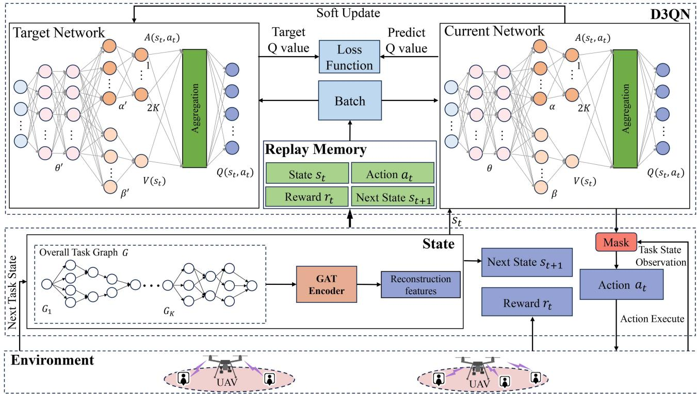  
Fig. 3. The architecture of the proposed algorithm.

The structure of D3QN is shown in Fig. 3. It is composed of two deep neural networks (i.e., current network and target network), each consisted of three layers and two streams. $\theta ,$ α and $\beta$ denote the parameters of the feature layer, the advantage layer, and the state-value layer, respectively, while the corresponding parameters in the target network are denoted as $\theta ^ { \prime } , \alpha ^ { \prime } .$ , and $\beta ^ { \prime }$ The top stream of each network, which consists of a feature layer and advantage layer, is denoted by $A ( s _ { t } , a _ { t } ; \theta , \alpha )$ and estimates the advantages for each action. While the bottom stream of each network, which consists of a feature layer and state-value layer, is denoted by $V ( s _ { t } , ; \theta , \beta )$ and estimates the state-value as a scalar value. The two separate streams are aggregated to produce state-action Q values for all actions, which are calculated as

$$
\begin{array} { r l } & { Q ( s _ { t } , a _ { t } ; \theta , \alpha , \beta ) = V ( s _ { t } ; \theta , \beta ) } \\ & { \qquad + \left( A ( s _ { t } , a _ { t } ; \theta , \alpha ) - \mathbb { E } [ A ( s _ { t } , a _ { t } ; \theta , \alpha ) ] \right) . } \end{array}\tag{50}
$$

After that, unavailable actions are filtered out to form a new action set ${ \mathcal { A } } ^ { \prime } .$ The action $a _ { t }$ is then selected from available actions as follows:

$$
a _ { t } = \arg \operatorname* { m a x } _ { a \in \mathcal { A } ^ { \prime } } Q ( s _ { t } , a ; \theta , \alpha , \beta ) .\tag{51}
$$

Meanwhile, -greedy policy is applied to balance exploration and exploitation. After taking the action $a _ { t } .$ , the agent receives the reward $r _ { t }$ and the next state $s _ { t + 1 }$ . The tuple $\left( { { s _ { t } } , { a _ { t } } , { r _ { t } } , { s _ { t + 1 } } } \right)$ from each step is stored in the replay memory. Once the memory capacity reaches a predefined threshold, the parameters of current network are updated, and the corresponding target Q value is calculated by

$$
y _ { t } = r _ { t } + \gamma Q ( s _ { t + 1 } , a ^ { * } ; \theta ^ { \prime } , \alpha ^ { \prime } , \beta ^ { \prime } ) ,\tag{52}
$$

where $\begin{array} { r } { a ^ { * } = \operatorname* { m a x } _ { a \in \mathcal { A } ^ { \prime \prime } } Q ( s _ { t + 1 } , a ; \theta , \alpha , \beta ) } \end{array}$ and $\gamma$ is discount factor. $\mathcal { A } ^ { \prime \prime }$ = max ( +1 ; )is the available action set corresponding to the state $s _ { t + 1 }$ Note that the target network with parameters $( \theta ^ { \prime } , \alpha ^ { \prime } , \beta ^ { \prime } )$ +1is used to evaluate the bootstrapping action in (52), while the Q-network with parameters $( \theta , \alpha , \beta )$ is used for action selection. To update ( )the current network, the TD error is minimized, which is defined as the difference between the target Q value and the predicted Q value. Accordingly, the loss function is defined as

$$
\mathcal { L } ( \theta , \alpha , \beta ) = [ y _ { t } - Q ( s _ { t } , a _ { t } ; \theta , \alpha , \beta ) ] ^ { 2 } .\tag{53}
$$

The parameters $( \theta , \alpha , \beta )$ are updated by applying gradient descent on the loss function. Additionally, the parameters of the target network $( \theta ^ { \prime } , \alpha ^ { \prime } , \beta ^ { \prime } )$ are then soft-updated every $Z$ iterations:

$$
\begin{array} { r } { \theta ^ { \prime }  ( 1 - \iota ) \theta ^ { \prime } + \iota \theta , } \\ { \alpha ^ { \prime }  ( 1 - \iota ) \alpha ^ { \prime } + \iota \alpha , } \\ { \beta ^ { \prime }  ( 1 - \iota ) \beta ^ { \prime } + \iota \beta . } \end{array}\tag{54}
$$

where $\iota \in [ 0 , 1 ]$ is a small constant that determines the update rate. This ensure stability in the learning process by preventing drastic changes in the target values. The main steps of the proposed GAT-enhanced D3QN task offloading algorithm are presented in Algorithm 3.

Algorithm 3: GAT-Enhanced D3QN Task Offloading.   
1: Initialize replay memory to capacity C, the discount   
factor $\gamma _ { : }$ , the learning rate ι, the current network with   
random parameters $\theta , \alpha , \beta ,$ and target network with   
parameters $\theta ^ { \prime }  \theta , \alpha ^ { \prime }  \alpha , \beta ^ { \prime }  \beta .$   
2: for episode 1 to max\_episode do   
3: =Initialize the initial task state $o _ { 0 } = \{ - 1 , . . . , - 1 \}$   
and end time $T _ { 0 } = 0 ;$   
4: 0 = 0Obtain the state s by GATEncoder in (48);   
5: for step $t = 1$ to $N$ do   
6: = 1Filter out the unavailable states from $\mathcal { A }$ by the   
mask vector, and select   
$a _ { t } = \arg \operatorname* { m a x } _ { a \in \mathcal { A } ^ { \prime } } Q ( s _ { t } , a ; \theta , \alpha , \beta )$ with -greedy   
policy;   
7: Execute action $a _ { t }$ and obtain end time $T _ { t + 1 } ;$   
8: Calculate the reward $r _ { t }$ +1by (49) and reach the next   
task state $o _ { t + 1 } ;$   
9: Obtain the next state $s _ { t + 1 }$ by applying   
GATEncoder to the task state $o _ { t + 1 } ;$   
10: Store transition $\left( { { s _ { t } } , { a _ { t } } , { r _ { t } } , { s _ { t + 1 } } } \right)$ +1in replay memory;   
11: ( Sample J transitions $( s _ { j } , a _ { j } , r _ { j } , s _ { j + 1 } )$ from replay   
memory;   
12: Calculate the target $\mathrm { Q }$ value $y _ { j }$ by (52);   
13: Update the parameters $\theta , \alpha , \beta$ of current network   
by the Adam optimizer according to the loss   
function: $\begin{array} { r } { \frac { 1 } { J } \sum _ { j = 1 } ^ { \tilde { J } } [ y _ { j } - Q ( s _ { j } , a _ { j } ; \theta , \alpha , \beta ) ] ^ { 2 } ; } \end{array}$   
14: =1Update the parameters $\theta ^ { \prime } , \alpha ^ { \prime } , \beta ^ { \prime }$ ; )]of target network   
every $Z$ iterations according to (54);   
15: Set $s _ { t } \gets s _ { t + 1 } .$   
16: end for   
17: end for

To further improve the performance of our proposed framework, we develop an iterative optimization process combining the JSPO algorithm and the GAT-enhanced D3QN method. Specifically, after obtaining initial UAV deployments and UAV-GU associations using the JSPO algorithm, we employ the GAT-enhanced D3QN algorithm to generate updated task offloading decisions. These offloading decisions provide updated data requirements between subtasks, reflecting the actual communication needs among GUs and UAVs. Subsequently, the refined data transfer information is fed back into the JSPO algorithm to perform another round of optimization. Through repeated iterations, the framework continuously adjusts and refines UAV positions, UAV-GU associations, and task offloading policies, converging progressively toward an suboptimal solution. The complete iterative optimization procedure is outlined in Algorithm 4.

## VI. PERFORMANCE EVALUATION

## A. Experiment Setup

1) Simulation parameters setting: The system includes K GUs and $M = 2 \ \mathrm { U A V s }$ acting as aerial edge servers.

Algorithm 4: Joint JSPO and GATD3QN Optimization for   
Solving Problem (P1).   
1: Initialize UAV deployment and UAV-GU associations   
using the JSPO algorithm as described in Section IV,   
setting iteration counter $r \gets 0 ;$   
2: repeat   
3: Given the current UAV deployment $\{ \mathbf { q } _ { m } ^ { r } \}$ and   
UAV-GU associations $\{ a _ { k m } ^ { r } \}$ , utilize the   
GAT-enhanced D3QN algorithm to optimize task   
offloading decisions, obtaining updated offloading   
decisions $\{ x _ { i } ^ { r + 1 } \}$   
$4 { : }$ Based on these updated offloading decisions, the   
corresponding data transfer information between   
tasks is recalculated and fed back into the JSPO   
algorithm;   
$5 { : }$ With the updated data transfer information, re-run   
JSPO to refine UAV deployments $\{ \mathbf { q } _ { m } ^ { r + 1 } \}$ and   
UAV-GU associations $\{ a _ { k m } ^ { r + 1 } \}$ , obtaining the   
improved configuration for the next iteration;   
6: Update $r \gets r + 1 ;$   
7: + 1until The relative decrease in objective value of (P1) is   
less than a threshold.

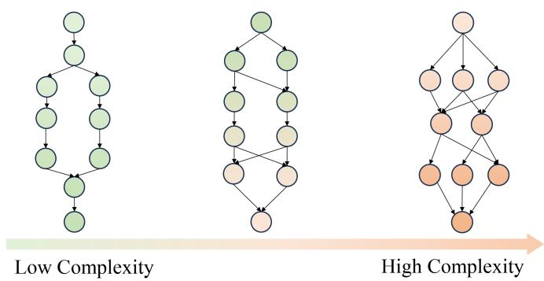  
Fig. 4. Different DAGs with 10 nodes under varying complexity levels.

The GUs are randomly distributed within a square area of $1 . 6 \times 1 . 6 \mathrm { k m ^ { 2 } }$ , while the UAVs hover at a fixed altitude of H  meters above the ground. Unless otherwise specified, each GU generates a task consisting of 10 subtasks. The computing capacities of the GUs and UAVs are 2.4 GHz and 4.5 GHz, respectively. The relevant channel parameters are specified as follows: $P _ { k } = 0 . 1 \mathrm { W } , \forall k , P _ { m } = 0 . 1 \mathrm { W } , \forall m , B = 1$ MHz, $\sigma ^ { 2 } = - 1 1 0$ dBm, β − dB, α . .

To evaluate our approach comprehensively, we generate diverse task structures using a DAG generator from [36]. Each node in the DAG represents a specific subtask. By adjusting the shape parameter α and regularity parameter $\beta ,$ we control the complexity of the DAG. A larger α results in a more linear structure, while a higher $\beta$ makes the graph more regular. Consequently, varying these parameters enables us to simulate different complexity levels of task dependencies. As illustrated in Fig. 4, we define complexity based on these parameters, showing that task dependencies become increasingly intricate as α decreases or $\beta$ decreases. Each DAG node and edge is with distinct characteristics. Specifically, the computational load $c _ { i }$ of subtask i is uniformly distributed between $1 0 ^ { 8 }$ and $5 \times 1 0 ^ { 8 }$ cycles. The data transmission size $d _ { i , j }$ required to transfer data between subtask i and its successor subtask $j \in \operatorname { s u c } ( i )$ is uniformly set within the range of 50 to 1000KB.

TABLE III  
NEURAL NETWORK ARCHITECTURE AND HYPERPARAMETERS
<table><tr><td rowspan=1 colspan=1>Parameter</td><td rowspan=1 colspan=1>Value</td></tr><tr><td rowspan=1 colspan=1>GAT Layers</td><td rowspan=1 colspan=1>2</td></tr><tr><td rowspan=1 colspan=1>GAT Hidden Layer dimensions</td><td rowspan=1 colspan=1>[64,64]</td></tr><tr><td rowspan=1 colspan=1>GAT Learning Rate</td><td rowspan=1 colspan=1>0.001</td></tr><tr><td rowspan=1 colspan=1>D3QN Layers</td><td rowspan=1 colspan=1>5</td></tr><tr><td rowspan=1 colspan=1>D3QN Hidden Layer dimensions</td><td rowspan=1 colspan=1>[512,256,128,128,2K+1]</td></tr><tr><td rowspan=1 colspan=1>D3QN Learning Rate</td><td rowspan=1 colspan=1>0.001</td></tr><tr><td rowspan=1 colspan=1>Batch Size</td><td rowspan=1 colspan=1>128</td></tr><tr><td rowspan=1 colspan=1>Discount Factor γ</td><td rowspan=1 colspan=1>0.9</td></tr><tr><td rowspan=1 colspan=1>Optimizer</td><td rowspan=1 colspan=1>Adam</td></tr><tr><td rowspan=1 colspan=1>Activation Function</td><td rowspan=1 colspan=1>ReLU</td></tr></table>

2) Neural Network structure: The detailed neural network structure used in our DRL model consists of five hidden layers. The first four hidden layers contain 512, 256, 128, and 128 neurons, respectively. The final hidden layer serves as the dueling layer and consists of $2 ^ { \sim } K + 1$ neurons: one neuron outputs the state value, while the remaining K neurons estimate advantage values corresponding to each action. These outputs are combined to produce action-value estimates for the K available offloading actions, as depicted in Fig. 2. Specific neural network structures and relevant training parameters for both the D3QN and the GAT are summarized in Table III.

## B. Time Complexity Analysis and Convergence Behavior

We have already analyzed the time complexity of the JSPO algorithm in Section IV. For the GAT-enhanced D3QN algorithm, the time complexity of the GAT-enhanced D3QN is influenced by the size of the state-action space, which grows as the number of subtasks increases. In our system model, each task is represented by a DAG, with each subtask corresponding to a node in the graph. The complexity of task offloading decisions depends on the number of nodes and edges in the DAG, as well as the structure of the dependencies between subtasks. To evaluate their performance, we measure the inference time of both GAT and DRL algorithms on a representative hardware platform (Intel Core i7-10700). As illustrated in Fig. 5, the inference time of both GAT and DRL algorithms increases as the number of subtasks increases from 5 to 20. However, even with 20 subtasks, the inference time remains approximately 0.1 seconds, a negligible overhead compared to the typical task execution durations. This result suggests that our proposed method maintains acceptable computational efficiency and is practically feasible for real-world scenarios.

2) Convergence Behavior: To evaluate the convergence behavior of our iterative optimization approach, we examine the convergence of the JSPO optimization process and the training convergence of the GAT-enhanced D3QN algorithm. First, the convergence of the JSPO algorithm is illustrated in Fig. 6(a). The result demonstrates the quick convergence of the JSPO algorithm. The maximum end time drops sharply in the first two iterations and then stabilizes, confirming its efficient convergence. Next, we evaluate the convergence performance of the proposed GAT-enhanced D3QN algorithm. For this purpose, we compare it with a baseline D3QN model that does not utilize GAT for state representation. Fig. 6(b) shows the training curves of both methods. Clearly, the GAT-enhanced D3QN algorithm converges more quickly and stably than the standard D3QN. The GAT-enhanced D3QN algorithm achieves a final reward that is approximately 12% higher than the D3QN, indicating a significantly more efficient offloading policy. Regarding the learning efficiency, a key observation is the rapid initial progress of the GAT-enhanced D3QN. It reaches the D3QN’s final performance level after only about 1,000 training episodes. While the D3QN model plateaus at this suboptimal level, our GAT-enhanced agent continues to learn and refine its policy, leveraging the GAT’s deeper understanding of the task structure to unlock further performance gains. This ability to avoid premature convergence and find a superior solution is a direct result of the GAT module’s capability to capture complex task dependencies. In contrast, the D3QN’s limited understanding causes it to get stuck in a local optimum, leading to an inferior policy.

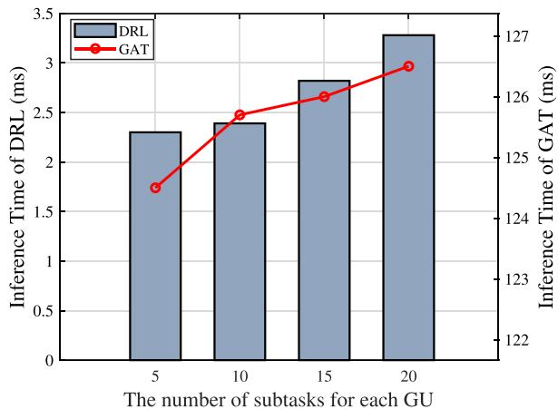  
Fig. 5. Impact of the number of subtasks on inference time of GAT and the DRL.

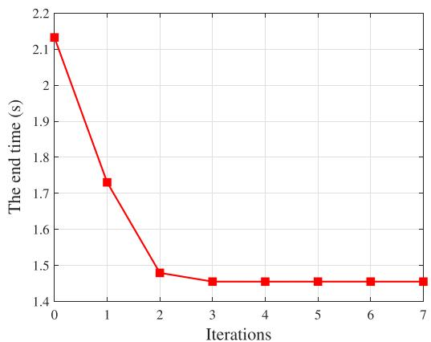  
(a) Convergence of the JSPO algorithm

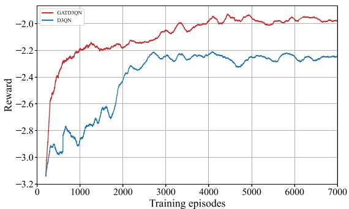  
(b) Convergence of the GAT-enhanced D3QN algorithm  
Fig. 6. Convergence performance of proposed algorithm.

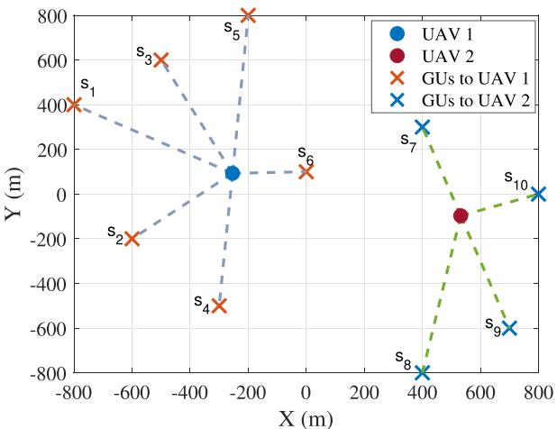  
Fig. 7. Optimized deployment and association with JSPO algorithm.

## C. Optimized Deployment and Association

Fig. 7 shows the optimized UAV deployments and UAV-GU associations by JSPO algorithm. This optimization considers the communication requirements of each user, such as data volume and transmission needs. As a result, the associations are adjusted to balance the system load, positioning the UAVs closer to GUs with higher communication costs, which effectively reduces the maximum end time.

To demonstrate the advantages of our solution and ensure fairness, the proposed JSPO and GATD3QN methods are compared separately with other optimization and offloading algorithms. Each method is evaluated against its respective benchmark to highlight its performance improvements. The following sections detail these comparisons, providing insights into the effectiveness of our approach in different scenarios.

For JSPO, the following benchmarks are considered:

\- K-Means [37]: GUs are clustered into M groups using Kmeans, with UAVs placed at the cluster centroids and GUs associating with the UAV in their cluster.

Random Deployment with Equal GUs (RDEG) [38]: UAVs are randomly deployed, and each UAV sequentially associates with its nearest GU. The process continues until all UAVs are associated with an approximately equal number of GUs. To mitigate performance variance arising from the UAV deployment, RDEG results are averaged through 100 runs.

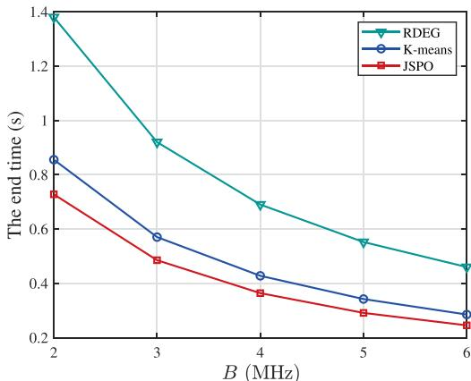  
(a) Impact of bandwidth.

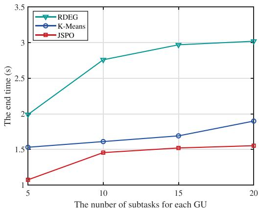  
(b) Impact of number of subtasks for each GU.  
Fig. 8. Performance comparison between the JSPO and other algorithms.

Fig. 8(a) compares the end time of the proposed JSPO algorithm with K-Means and RDEG schemes under varying bandwidth B. It is observed that JSPO consistently demonstrates the superior performance across all bandwidth levels. While RDEG shows a notable decline in end time as bandwidth B increases, it consistently underperforms compared to K-Means. This is because K-Means generates UAV deployment positions based on GU locations and incorporates global clustering, ensuring a more balanced distribution of resources. However, K-Means does not consider the differing data requirements of GUs, which leads to its inferior performance compared to JSPO.

In Fig. 8(b), it can be seen that the JSPO algorithm consistently demonstrates superior performance in terms of end time when compared to the benchmark methods. Similar to Fig. 8(a), the RDEG method, due to its fundamental assignment strategy, results in elevated end times. The K-Means approach which relies on clustering to deploy UAVs based on GU locations, does not account for the different data demands of each GU. This deficiency leads to its performance inferior to that of JSPO. Moreover, it is observed that as the number of subtasks for each GU increases, the end time does not show a significant increase. This is because the computation time of subtasks is treated as a constant and not included in the process of deployment and association optimization. Therefore, the increase in the number of subtasks does not lead to a significant increase in end time.

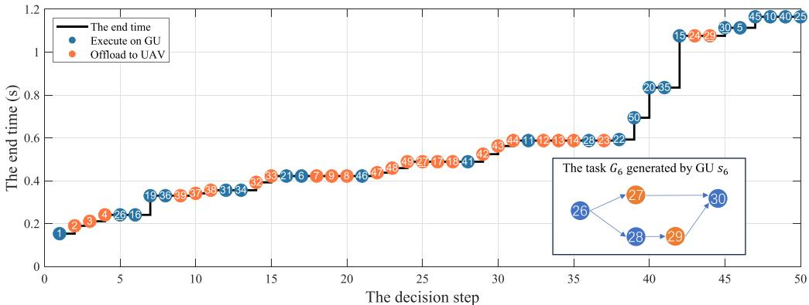  
Fig. 9. Optimized task scheduling and offloading decision.

## D. Optimized Task Scheduling and Offloading

For ease of presentation of the task scheduling and offloading process, we show the results where each task consists of 5 subtasks, totaling 50 subtasks for the entire setup. The scheduling and offloading results are illustrated in Fig. 9. It is observed that several subtasks appear on the same horizontal line and the end time does not increase. This is because these subtasks are being processed in parallel, allowing for more computation and transmission without causing an increase in the end time. This parallel processing significantly reduces both computation and communication delays, which is crucial to minimize the end time of tasks. However, towards the end of the graph, we observe a noticeable increase in the end time. This is due to the constraints imposed on the system: the final subtask must be processed locally. Despite the constraint that both the first and last subtasks must be executed locally, most of the remaining subtasks are still processed in parallel without unnecessary waiting or idle computation. This indicates that the proposed algorithm can effectively schedule and offload tasks while exploiting available computation opportunities. As a result, it reduces delays and avoids prolonging the end time. For example, consider task $G _ { 6 }$ generated by ${ \mathrm { G U } } s _ { 6 } ,$ which includes subtasks 26 to 30 as shown in Fig. 9. Although the first and last subtasks are executed locally due to the constraint, the execution of intermediate subtasks proceeds in parallel. Notably, none of these subtasks, except the final one, leads to an increase in end time. This illustrates how the algorithm leverages idle periods created by other high-latency tasks, thereby improving parallelism and overall efficiency.

Since our algorithm is based on DDQN, we focus on comparing it with DDQN-related reinforcement learning methods. The following benchmarks are considered:

\- Random offloading [10]: Subtasks are randomly offloaded to either the associated UAV or local computing in sequence.

\- Local computing [13]: All subtasks are executed locally without offloading.

\- DDQN [39]: Offloading decisions are determined using DDQN without GAT-based feature extraction.

\- D3QN [40]: Offloading decisions are determined using dueling DDQN without GAT-based feature extraction.

To assess the offloading performance, we also consider the impact of two key factors: the number of subtasks for each

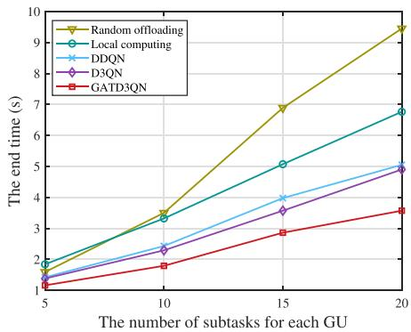  
(a) Impact of number of subtasks for each GU.

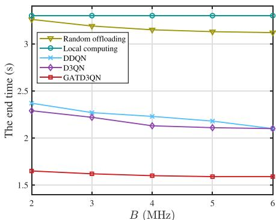  
(b) Impact of bandwidth  
Fig. 10. Performance comparison between the GATD3QN and other algorithms.

GU and the bandwidth B available for communication. Fig. 10 present the performance comparisons under varying numbers of subtasks and bandwidth levels, respectively.

In Fig. 10(a), it is observed that GATD3QN consistently outperforms the other benchmarks. Specifically, the local computing outperforms random offloading when the number of tasks increases. However, when the number of subtasks is small, random offloading shows slightly better performance than local computing. The reason is that with fewer subtasks, the task dependency structure is relatively simple, and the system experiences minimal delays in both computation and communication, which limits the effectiveness of further optimization. Additionally, random offloading has the opportunity to leverage the high computational power of UAVs. However, as the number of tasks increases, poor scheduling and offloading decisions can lead to significant waiting and delays, which cannot be fully mitigated by the computational advantages of UAVs. The D3QN performs slightly better than DDQN, which can be attributed to the dueling network structure. This structure improves training by separately estimating state values and action advantages, which helps the model make more informed decisions. However, both D3QN and DDQN still face limitations when dealing with complex task dependencies. Since they rely only on simple node-level state representations, they fail to capture both subtask features and the underlying structural relationships within the DAG. As the number of tasks increases and dependencies become more intricate, the advantage of GATD3QN becomes more pronounced.

In Fig. 10(b), we observe that increasing the bandwidth B reduces the end time across all schemes, except for the local execution baseline. Among them, GATD3QN consistently achieves the best performance. Compared to Fig. 8(a), where the end time decreases sharply with increasing bandwidth, the reduction in Fig. 10(b) is more moderate. This is because Fig. 8(a) primarily reflects the cost of data transmission between subtasks, while Fig. 10(b) includes the full process of scheduling and offloading dependent tasks, where computation and communication are more intertwined. GATD3QN initially benefits from increased bandwidth, but the performance gain gradually diminishes. This is because the model effectively schedules tasks in a parallel manner, overlapping computation and transmission where possible. As a result, further increases in bandwidth have a reduced impact on the end time, since many delays are already hidden by parallelism. The random offloading scheme performs better than the local computing baseline, as increased bandwidth helps reduce communication delays and enables partial use of UAV computing resources. However, it still falls short of DRL-based methods due to the absence of coordinated scheduling and offloading. Without a learned strategy, random decisions lead to increased queuing and idle time. Between the DRL-based baselines, D3QN outperforms DDQN, and both benefit from bandwidth increases. Nonetheless, both remain inferior to GATD3QN. Their limited ability to exploit task structures and subtask relationships prevents them from achieving the same level of parallelism. As a result, they suffer from higher computation waiting times and less efficient use of transmission opportunities compared to GATD3QN.

## VII. CONCLUSION

In this paper, we proposed an efficient multi-UAV-enabled MEC framework for dependent task offloading. We modeled tasks as DAGs to explicitly represent subtask dependencies and jointly optimized UAV deployment, UAV–GU associations, and task offloading decisions. To address this complex optimization problem, we first introduced the JSPO algorithm, integrating both PDD and SCA techniques to optimize initial UAV deployment and UAV–GU associations. Subsequently, we formulated the task offloading problem as an MDP and solved it using a GAT-enhanced D3QN algorithm. The integration of GAT enabled the D3QN framework to effectively capture intricate subtask dependencies within the DAG structure, resulting in improved offloading decisions and enhanced overall system performance. The optimization was conducted iteratively between JSPO and the DRL framework, progressively refining UAV deployment, associations, and offloading decisions. Extensive simulation results confirmed that our approach significantly reduces the end time compared with existing benchmarks.

## ACKNOWLEDGMENT

The authors also thank South West University Big Data Innovation Center for providing the computing resources.

## REFERENCES

[1] Y. Siriwardhana, P. Porambage, M. Liyanage, and M. Ylianttila, “A survey on mobile augmented reality with 5G mobile edge computing: Architectures, applications, and technical aspects,” IEEE Commun. Surveys Tuts., vol. 23, no. 2, pp. 1160–1192, Second Quarter 2021.

[2] Z. Zhou, Q. Wu, and X. Chen, “Online orchestration of cross-edge service function chaining for cost-efficient edge computing,” IEEE J. Sel. Areas Commun., vol. 37, no. 8, pp. 1866–1880, Aug. 2019.

[3] C. Zhan, H. Hu, Z. Liu, J. Wang, and R. Fan, “Interference-aware online optimization for cellular-connected multiple UAV networks with energy constraints,” IEEE Trans. Mobile Comput., vol. 23, no. 12, pp. 13804–13820, Dec. 2024.

[4] H. Han, C. Zhan, J. Lv, and C. Xu, “Energy minimization for cellularconnected aerial edge computing system with binary offloading,” IEEE Internet Thing J., vol. 11, no. 6, pp. 9558–9571, Mar. 2024.

[5] Y. Xu, T. Zhang, J. Loo, D. Yang, and L. Xiao, “Completion time minimization for UAV-assisted mobile-edge computing systems,” IEEE Trans. Veh. Technol., vol. 70, no. 11, pp. 12253–12259, Nov. 2021.

[6] Q. Wu, M. Cui, G. Zhang, F. Wang, Q. Wu, and X. Chu, “Latency minimization for UAV-enabled URLLC-based mobile edge computing systems,” IEEE Trans. Wireless Commun., vol. 23, no. 4, pp. 3298–3311, Apr. 2024.

[7] Y. Wang, Z.-Y. Ru, K. Wang, and P.-Q. Huang, “Joint deployment and task scheduling optimization for large-scale mobile users in multi-UAVenabled mobile edge computing,” IEEE Trans. Cybern., vol. 50, no. 9, pp. 3984–3997, Sep. 2020.

[8] J. Liu, J. Ren, Y. Zhang, X. Peng, Y. Zhang, and Y. Yang, “Efficient dependent task offloading for multiple applications in MEC-cloud system,” IEEE Trans. Mobile Comput., vol. 22, no. 4, pp. 2147–2162, Apr. 2023.

[9] M. Gao, R. Shen, L. Shi, W. Qi, J. Li, and Y. Li, “Task partitioning and offloading in DNN-task enabled mobile edge computing networks,” IEEE Trans. Mobile Comput., vol. 22, no. 4, pp. 2435–2445, Apr. 2023.

[10] B. Xu, Z. Kuang, J. Gao, L. Zhao, and C. Wu, “Joint offloading decision and trajectory design for UAV-enabled edge computing with task dependency,” IEEE Trans. Wireless Commun., vol. 22, no. 8, pp. 5043–5055, Aug. 2023.

[11] C. Feng, P. Han, X. Zhang, Q. Zhang, Y. Liu, and L. Guo, “Dependencyaware task reconfiguration and offloading in multi-access edge cloud networks,” IEEE Trans. Mobile Comput., vol. 23, no. 10, pp. 9271–9288, Oct. 2024.

[12] J. Fang, D. Qu, H. Chen, and Y. Liu, “Dependency-aware dynamic task offloading based on deep reinforcement learning in mobile-edge computing,” IEEE Trans. Netw. Service Manag., vol. 21, no. 2, pp. 1403–1415, Apr. 2024.

[13] L. Zhao et al., “MESON: A mobility-aware dependent task offloading scheme for urban vehicular edge computing,” IEEE Trans. Mobile Comput., vol. 23, no. 5, pp. 4259–4272, May 2024.

[14] S. Liu et al., “Dependent task scheduling and offloading for minimizing deadline violation ratio in mobile edge computing networks,” IEEE J. Sel. Areas Commun., vol. 41, no. 2, pp. 538–554, Feb. 2023.

[15] X. Wei, L. Cai, N. Wei, P. Zou, J. Zhang, and S. Subramaniam, “Joint UAV trajectory planning, DAG task scheduling, and service function deployment based on DRL in UAV-empowered edge computing,” IEEE Internet Thing J., vol. 10, no. 14, pp. 12826–12838, Jul. 2023.

[16] S. Shen, G. Shen, Z. Dai, K. Zhang, X. Kong, and J. Li, “Asynchronous federated deep-reinforcement-learning-based dependency task offloading for UAV-assisted vehicular networks,” IEEE Internet Thing J., vol. 11, no. 19, pp. 31561–31574, Oct. 2024.

[17] F. Khoramnejad, A. Syed, W. S. Kennedy, and M. Erol-Kantarci, “Energy and delay aware general task dependent offloading in UAV-aided smart farms,” IEEE Trans. Netw. Service Manag., vol. 21, no. 5, pp. 5033–5048, Oct. 2024.

[18] Z. Zhou et al., “Learning-based URLLC-aware task offloading for internet of health things,” IEEE J. Sel. Areas Commun., vol. 39, no. 2, pp. 396–410, Feb. 2021.

[19] B. Zhu, K. Chi, J. Liu, K. Yu, and S. Mumtaz, “Efficient offloading for minimizing task computation delay of NOMA-based multiaccess edge computing,” IEEE Trans. Commun., vol. 70, no. 5, pp. 3186–3203, May 2022.

[20] W. Chu, X. Jia, Z. Yu, J. C. Lui, and Y. Lin, “Joint service caching, resource allocation and task offloading for MEC-based networks: A multi-layer optimization approach,” IEEE Trans. Mobile Comput., vol. 23, no. 4, pp. 2958–2975, Apr. 2024.

[21] J. Yan, S. Bi, and Y. J. A. Zhang, “Offloading and resource allocation with general task graph in mobile edge computing: A deep reinforcement learning approach,” IEEE Trans. Wireless Commun., vol. 19, no. 8, pp. 5404–5419, Aug. 2020.

[22] C. Zhan, H. Hu, J. Wang, Z. Liu, and S. Mao, “Tradeoff between age of information and operation time for UAV sensing over multi-cell cellular networks,” IEEE Trans. Mobile Comput., vol. 23, no. 4, pp. 2976–2991, Apr. 2024.

[23] Z. Ning et al., “5G-Enabled UAV-to-community offloading: Joint trajectory design and task scheduling,” IEEE J. Sel. Areas Commun., vol. 39, no. 11, pp. 3306–3320, Nov. 2021.

[24] X. Jing, F. Liu, C. Masouros, and Y. Zeng, “ISAC from the sky: UAV trajectory design for joint communication and target localization,” IEEE Trans. Wireless Commun., vol. 23, no. 10, pp. 12857–12872, Oct. 2024.

[25] Y. Mao, C. You, J. Zhang, K. Huang, and K. B. Letaief, “A survey on mobile edge computing: The communication perspective,” IEEE Commun. Surveys Tuts., vol. 19, no. 4, pp. 2322–2358, Fourth Quarter 2017.

[26] Y. Inoue and S.-I. Minato, “An efficient method for indexing all topological orders of a directed graph,” in Proc. 25th Int. Symp. Algorithms Comput., 2014, pp. 103–114.

[27] C. Xu, C. Zhan, H. Yang, and L. Xiao, “Pareto-optimal aerial-ground energy minimization for aerial 3D mobile edge computing networks,” IEEE Trans. Veh. Technol., vol. 73, no. 5, pp. 7218–7233, May 2024.

[28] C. Zhan, H. Yan, R. Fan, H. Hu, S. Xu, and J. Yang, “Online energy and interference management for dynamic target tracking with cellular-connected UAV,” IEEE Trans. Mobile Comput., vol. 24, no. 6, pp. 5496–5510, Jun. 2025.

[29] S. Boyd and L. Vandenberghe, Convex Optimization. Cambridge, U.K.: Cambridge Univ. Press, 2004.

[30] Q. Shi and M. Hong, “Penalty dual decomposition method for nonsmooth nonconvex optimization–Part I: Algorithms and convergence analysis,” IEEE Trans. Signal Process., vol. 68, pp. 4108–4122, 2020.

[31] P. Veliˇckovi´c, G. Cucurull, A. Casanova, A. Romero, P. Lio, and Y. Bengio, “Graph attention networks,” in Proc. Int. Conf. Learn. Representations, 2018.

[32] S. Brody, U. Alon, and E. Yahav, “How attentive are graph attention networks?,” in Proc. Int. Conf. Learn. Representations, 2022.

[33] Z. Wang, T. Schaul, M. Hessel, H. Van Hasselt, M. Lanctot, and N. De Freitas, “Dueling network architectures for deep reinforcement learning,” in Proc. 33rd Int. Conf. Mach. Learn., 2016, pp. 1995–2003.

[34] Y. Zeng, X. Xu, S. Jin, and R. Zhang, “Simultaneous navigation and radio mapping for cellular-connected UAV with deep reinforcement learning,” IEEE Trans. Wireless Commun., vol. 20, no. 7, pp. 4205–4220, Jul. 2021.

[35] H. van Hasselt, A. Guez, and D. Silver, “Deep reinforcement learning with double Q-learning,” in Proc. AAAI Conf. Artif. Intell., 2016, pp. 2094–2100.

[36] H. Arabnejad and J. G. Barbosa, “List scheduling algorithm for heterogeneous systems by an optimistic cost table,” IEEE Trans. Parallel Distrib. Syst., vol. 25, no. 3, pp. 682–694, Mar. 2014.

[37] H. Guo, X. Zhou, J. Wang, J. Liu, and A. Benslimane, “Intelligent task offloading and resource allocation in digital twin based aerial computing networks,” IEEE J. Sel. Areas Commun., vol. 41, no. 10, pp. 3095–3110, Oct. 2023.

[38] J.-H. Kim, M.-C. Lee, and T.-S. Lee, “Generalized UAV deployment for UAV-assisted cellular networks,” IEEE Trans. Wireless Commun., vol. 23, no. 7, pp. 7894–7910, Jul. 2024.

[39] X. Chen, S. Hu, C. Yu, Z. Chen, and G. Min, “Real-time offloading for dependent and parallel tasks in cloud-edge environments using deep reinforcement learning,” IEEE Trans. Parallel Distrib. Syst., vol. 35, no. 3, pp. 391–404, Mar. 2024.

[40] C. Xu, P. Zhang, H. Yu, and Y. Li, “D3QN-based multi-priority computation offloading for time-sensitive and interference-limited industrial wireless networks,” IEEE Trans. Veh. Technol., vol. 73, no. 9, pp. 13682–13693, Sep. 2024.

Cheng Zhan (Member, IEEE) received the BEng and PhD degrees in computer science from the School of Computer Science, University of Science and Technology of China, Anhui, China, in 2006 and 2011, respectively. From 2009 to 2010, he was a research assistant with the Department of Computer Science, City University of Hong Kong. From 2016 to 2017, he was a visiting scholar with the Department of Electrical and Computer Engineering, National University of Singapore. He is currently an professor with the School of Computer and Information Science, South-

west University, China. His research interests include unmanned aerial vehicle communications, multimedia communications, wireless sensor networks, and network coding. He served as a TPC member for the IEEE ICC, GLOBECOM, WCNC, and UIC.

Wei Liu is currently working toward the master degree with the School of Computer and Information Science, Southwest University, Chongqing, China. His research interests include edge computing, computation offloading, and reinforcement learning.

Kaifeng Song received the BE degree from the Beijing Institute of Technology, China, in 2022. He is currently working toward the PhD degree with the School of Information and Electronics, Beijing Institute of Technology, China. His research interests include semantic communication and edge intelligence.

Rongfei Fan (Member, IEEE) received the BE degree in communication engineering from the Harbin Institute of Technology, Harbin, China, in 2007, and the PhD degree in electrical engineering from the University of Alberta, Edmonton, Alberta, Canada, in 2012. Since 2013, he has been a faculty member with the Beijing Institute of Technology, Beijing, China, where he is currently an associate professor with the School of Cyberspace Science and Technology. His research interests include edge computing, federated learning, resource allocation in wireless networks, and statistical signal processing.

Jun Liu (Member, IEEE) received the BEng degree in computer science from Wuhan University, China, in 2002, and the PhD degree in computer science and engineering from the University of Connecticut, USA, in 2013. Currently, he is a professor with the School of Electronic and Information Engineering, Beihang University, China. His major research focuses on underwater networking, synchronization, and localization. He is a member of the IEEE Computer Society.

Han Hu (Member, IEEE) received the BE and PhD degrees from the University of Science and Technology of China, China, in 2007 and 2012, respectively. He is currently a professor with the School of Information and Electronics, Beijing Institute of Technology, China. His research interests include multimedia networking, edge intelligence, and space-air-ground integrated network. He received several academic awards, including Best Paper Award of IEEE TCSVT 2019, Best Paper Award of IEEE Multimedia Magazine 2015, Best Paper Award of IEEE Globecom

2013, etc. He served as an associate editor of IEEE Transactions on Multimedia and Ad Hoc Networks, and a TPC member of Infocom, ACM MM, AAAI, IJCAI, etc.