# Joint UAVs Deployment and Resource Allocation for AoI-Aware RIS-Assisted UAV-USV MEC Network

Yangzhe Liao , Member, IEEE, Yuanyan Song , and Dan Song , Member, IEEE

Abstract—Age of information (AoI)-sensitive bidirectional computation tasks quality of service (QoS) for unmanned surface vehicles (USVs) is a critical issue in realizing ship-shore cooperative systems. In this paper, a reconfigurable intelligent surface (RIS)-assisted unmanned aerial vehicle (UAV)-USV mobile edge computing (MEC) network architecture is proposed, where one RIS-carried tethered UAV (TUAV) and rotary-wing UAVs (RUAVs) are cooperatively dispatched to serve USVs bidirectional data computation with average AoI (AAoI) constraint. The minimization of weighted sum USVs AAoI and RUAVs flight energy is formulated by jointly considering RUAVs service duration indicators, TUAVmounted RIS phase shift, TUAV hovering altitude, and RUAVs’ trajectories. A heursitic solution is proposed to address this minimized issue. In particular, a novel mixed linear quadratic Lyapunov framework is utilized to transform the original long-term stochastic problem into a list of deterministic single-slot problems. Then, each single-slot problem is divided into two subproblems. First, the subproblem of RUAVs’ trajectories is tackled by an enhanced whale optimization algorithm. Second, the subproblem of RUAVs service duration indicators, TUAV-mounted RIS phase shift and TUAV hovering altitude is addressed by an enhanced alternating optimization algorithm. The results demonstrate that the proposed heuristic solution reduces long-term RUAVs flight energy consumption by approximately 50% while maintaining satisfactory USVs AAoI.

Index Terms—Age of information, unmanned surface vehicle, reconfigurable intelligent surface, unmanned aerial vehicle, mobile edge computing.

## I. INTRODUCTION

## A. Research Background and Motivations

E <sup>STABLISHING</sup> <sup>a</sup> <sup>reliable</sup> <sup>inland</sup> <sup>waterway</sup> <sup>communica-</sup>tion is more complicated than terrestrial, offshore, and tion is more complicated than terrestrial, offshore, and satellite communications [1], [2], since it is difficult to deploy a sufficient number of terrestrial base stations (TBSs), seasonal weather effects and frequent extreme weather events. The inland waterway environments suffers from line of sight (LOS) and non-LOS (NLOS) propagation, simultaneously, leading to severe signal attenuation. With the rapid development of shipshore cooperative systems, unmanned surface vehicles (USVs) are extensively introduced as potential enabling techniques for robust inland waterway connectivity [3], [4]. Generally, USVs are equipped with advanced sensors and widely utilized in harsh environments and restricted water areas for diverse services and applications, such as data collection, intelligent navigation, and remote control Ref. [5], [6]. However, it is challenging for USVs with quality of service (QoS) when the computation task model is revolutionized from traditional one-way to bidirectional. The bidirectional computation task comprises two main issues, one is local data generation from the USV, the other is the remote data exchanging with the Internet. These two issues escalate with the introduction of Age of Information (AoI) constraints, since TBSs require frequent wireless updates from USVs to maintain real-time task execution status [7], [8]. Although USVs have been equipped with high-capacity batteries to prolong service duration, it is still challenging for USVs to achieve efficient data transmission in harsh inland waterway environments. How to provision USVs AoI-sensitive bidirectional computation tasks remains an open issue.

The programmable material and unmanned aerial vehicle (UAV) techniques promote the advent of reconfigurable intelligent surface (RIS)-assisted UAV-USV mobile edge computing (MEC) networks. This innovative paradigm promises to transform wireless inland waterway communications without requiring new telecommunication infrastructure, while RISassisted networks will effectively support bidirectional computation tasks with USVs [9], [10]. In addition, with the emergence of tethered UAVs (TUAVs), this type of novel UAVs can be connected to ground stations via tethers for long-duration missions compared to battery-powered UAVs, which typically operate for less than one hour. In this respect, large-scale RIS can be equipped with TUAVs to achieve network flexibility and coverage. However, it is still challenging for RIS-assisted UAV-USV MEC networks to provision USVs AoI-sensitive bidirectional computation tasks QoS with the assistance of cooperatively deployment of TUAV and untethered UAV. UAV flight energy consumption will be increased by using the suboptimal UAV deployment and RIS phase shift design [11], [12]. Then, TUAVs are restricted by tether length, inclination angle, and tangling risks, assuming fixed horizontal positions and minimum mobility [13]. While MEC servers can substitute most task execution latency from USVs, and TBSs can efficiently track USVs AoI, the issue of long-term trade-off between the USV AoI-sensitive task performance and UAV flight energy consumption still exists.

## B. Related Works

1) Data Transmission in Inland Waterway Environment: Wireless data transmissions between TBSs and USVs are necessary. It is demonstrated that the terrestrial obstructions near inland waterways create stronger multipath effects compared to open water surfaces [14], and the water surface reflections significantly impact channel characteristics and degrade transmission quality [15]. In addition, some comprehensive channel characteristics are analyzed by extensive field measurements in river environments [16], including path loss (PL), shadow fading, Doppler spread, fading caused by NLOS components, and delay spread. Furthermore, the wireless data transmission is modeled as the Rician fading channel [17], which accurately characterizes the statistical properties of fading caused by NLOS components for a robust framework design. Hence, it is found that the fading caused by NLOS components significantly impacts wireless data transmission quality in inland waterway environments, and the Rician fading channel will be referenced in this work.

Interference remains a fundamental challenge in wireless communications. Ref. [18] conducts the interference can be reduced by the antenna array designed for UAVs. In this way, the downlink interference from serving TBSs and uplink transmissions from mobile users will be monitored by UAVs to balance the interference performance. The LOS connection between UAVs and TBSs offers substantial benefits for interference mitigation through optimized inter-cell interference coordination schemes [19]. Aiming to eliminate co-channel interference, an interference cancellation strategy is proposed for UAV uplink data transmission [20]. Based on this strategy, an efficient resource allocation strategy is modified to eliminate various types of co-channel interference in multi-UAV networks [21]. Then, RIS-assisted transmission is investigated in multipath environments [22], aiming to prove that RIS-equipped receivers can exploit channel state information to maximize signal noise ratio (SNR). In this way, the presence of interference will be reduced by deploying a higher number of RIS elements. Ref. [23] further verifies that the intra-cluster interference can be prevented by using the orthogonal frequency division multiple access and time division multiple access when a single UAV serves multiple mobile users.

Recently, some research works have been conducted on nonorthogonal multiple access (NOMA) to support UAVs multiconnectivity by allowing sharing time and other resources via multiplexing techniques [24]. [25] proposes a multi-UAVassisted uplink NOMA network architecture and demonstrates that network throughput can be significantly improved by designing UAVs’ trajectories. Ref. [26] investigates sum-rate maximization in RIS-assisted multi-UAV NOMA network. The results show that network spectral efficiency can be remarkably enhanced by jointly considering UAVs’ trajectories and RIS phase shift. Ref. [27] reports that NOMA is one effective potential solution to achieve higher throughput in a singleinput multi-output (SIMO) scenario. Following this direction, [28] proposes a RIS-assisted SIMO-NOMA system architecture and formulates an uplink sum-rate maximization optimization problem. The result verifies that the network uplink sum-rate can be improved by carefully determining RIS phase shift and power allocation. [29] proposes a novel time division multiple access (TDMA)-NOMA MEC network architecture and points out that TBS transmission power allocation can be dynamically determined according to timeslot allocation to enhance network throughput. [30] analyzes network capacity of UAV-assisted TDMA-NOMA systems and reports that combining TDMA and NOMA can significantly reduce the complexity of interference mitigation. SIMO is another promising technique for enhancing the throughput of UAV communications as proposed in [31]. However, it is challenging to deploy SIMO-NOMA in RIS-assisted UAV-USV MEC network or multi-antenna UAVs since these emerging technologies suffer from limited payload, hardware-software complex architecture, extremely high economic costs and so forth.

2) The Energy Minimization of RIS-Assisted UAV MEC Network: The RIS technique significantly enhances wireless transmission quality through intelligent phase shift and reflection angle adjustment, while requiring minimal additional energy consumption. A RIS-assisted UAV MEC network is proposed in [32], where the UAV-mounted MEC provides computing services and surface-mounted RIS improves UAV-to-ground device communications. After that, [33] highlights that RIS can be fabricated with lightweight, conformal geometries, enabling direct UAV integration. This approach offers greater flexibility than fixed deployments and can significantly reduce UAV flight distances. Then, RIS-assisted UAV communication is investigated under mixed LOS/NLOS conditions with a fractional transform method to jointly optimize the UAV hovering altitude and RIS phase shifts [34]. The service duration is extended by formulating a task execution energy minimization problem for RIS-assisted UAV-USV networks in [11], which further optimizes UAVs’ trajectories, USV offloading decisions, and RIS phase shifts to reduce the UAV flight energy consumption. To reduce the substantial latency of RIS-assisted systems, an iterative solution combining Hungarian algorithm and whale optimization algorithm (WOA) for joint resource allocation and RIS phase shift adjustment [35]. A deep reinforcement learning (DRL)-based method is developed to balance the task execution energy consumption and latency by jointly optimizing UAVs trajectories and RIS phase shifts [36]. Similar work can also be found in [37], [38], [39]. The authors in [40] proved that the long-term energy minimization can be addressed by using the Lyapunov-based framework. The effectiveness of the Lyapunovbased framework to handle long-term constraints also can be found in [41], [42]. While these advanced algorithms show promising results for RIS-assisted networks, there are several limitations. First, most high-efficiency algorithms cannot be directly applied to long-term energy minimization problems due to extreme computational complexity. Moreover, the existing solutions still have challenges in real-world deployment and cannot guarantee long-term performance constraints.

3) Look Forward of AoI-Sensitive USVs Bidirectional Computation Tasks QoS Provisioning: Limited research addresses

AoI-QoS provisioning for USV bidirectional computation tasks. Recent work investigates the time-constrained execution of USV bidirectional tasks [43], where the input data must be processed within predetermined time windows, and UAV energy consumption is minimized through the task execution mode selection and UAV trajectory planning. Aiming to measure data freshness, the concept of USV AoI is emerging, which can be defined as the time elapsed from data generation at USV and the successful offloading to MEC server. As proved in [44], maintaining a satisfactory AoI is important to ensure the information freshness of the RIS-assisted data transmission system. The authors of [45] reported that AoI will be considerably reduced by advanced communication protocols and retransmission policies even under high packet loss conditions, such as first-come-firstserved and last-come-first-served. An alternative optimization algorithm is developed to ensure AoI requirements for ground devices by jointly optimizing the offloading strategy, transmission power, resource allocation, and UAV trajectory planning.

USV AoI assurance may become even more optimistic by deploying TUAVs, which can offer significant advantages in RIS-assisted UAV-USV MEC networks [12], [46], [47]. For instance, continuous power supply via tether connection to TBS, capability to support large-area RIS deployment, and reduced frequency of TBS-RIS information exchange. However, current UAV trajectory design and resource allocation methods have limitations when applied to AoI-aware RIS-assisted UAV-USV networks for bidirectional computation tasks. The existing works mainly consider the one-way data computation models and single-objective optimization approaches. Notably, critical research gaps persist in the joint optimization of UAV deployment and network resource allocation for AoI-sensitive bidirectional tasks, particularly in achieving the optimal tradeoff between maintaining USV data freshness and ensuring UAV flight energy efficiency. Hence, some novel optimization frameworks specifically designed for RIS-assisted UAV-USV networks supporting bidirectional computation tasks with USV AoI and long-term constraints should be explored to address these limitations.

## C. The Main Contributions

In this paper, TUAV and rotary-wing UAVs (RUAVs) are collaboratively dispatched to serve USVs AoI-sensitive bidirectional data computation. In particular, each USV bidirectional computation task is considered with two issues, i.e., the local data generation from the USV and the remote data exchanging with the Internet. In addition, TUAV and RUAVs are capable of dynamically adjusting their hovering altitude and trajectories, depending on channel conditions and USVs AoI dynamics. The main contributions are summarized as follows.

1) A new performance metric is introduced to quantify USVs locally generated data freshness, e.g., average AoI (AAoI), and a novel RIS-assisted UAV-USV MEC network architecture is proposed combining the RIS-mounted TUAV and RUAVs. Aiming to balance USVs AAoI and RUAVs service duration, the weighted sum of USVs AAoI and RUAVs flight energy consumption minimization problem are formulated by jointly considering RUAVs service duration indicators, TUAV-mounted RIS phase shift, TUAV hovering altitude, and RUAVs’ trajectories. This is a longterm stochastic optimization problem and is extremely challenging to be solved.

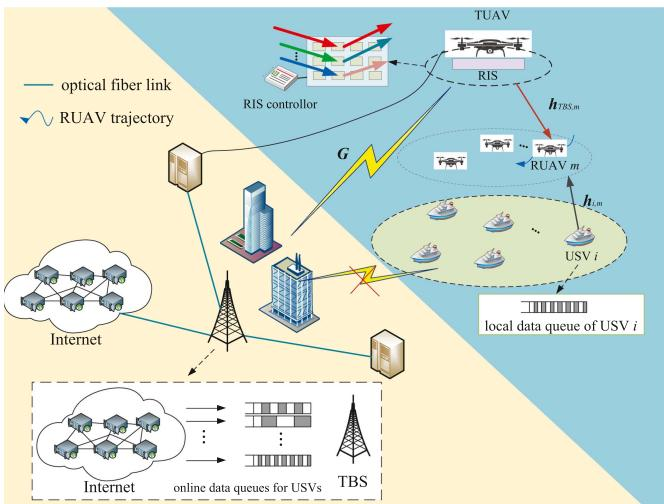  
Fig. 1. The proposed RIS-assisted UAV-USV MEC network.

2) A heuristic solution is proposed to solve the challenging optimization problem. First, a mixed linear and quadratic Lyapunov framework is utilized to transform the original long-term RUAVs power consumption constraints and USVs AAoI constraints into a list of single-slot deterministic constraints. Then, each single-slot optimization problem is decoupled into two subproblems, e.g., the RU-AVs’ trajectories subproblem and the joint RUAVs service duration indicators, TUAV-mounted RIS phase shift and TUAV hovering altitude subproblem. Each subproblem is tackled by the proposed enhanced WOA (EWOA) and enhanced alternating optimization algorithm (EAO). In this way, a feasible solution to the formulated problem is efficiently obtained. The results demonstrate that the proposed solution can significantly reduce RUAVs flight energy consumption while promising a lower USVs AAoI.

## II. SYSTEM MODEL AND PROBLEM FORMULATION

The proposed RIS-assisted UAV-USV MEC network is shown in Fig. 1, where one K RIS reflecting element TUAV and a set of M RUAVs are dispatched and dynamically form a virtual cluster with L-antenna TBS to support a set of I USVs bidirectional computation tasks QoS provisioning. Each RUAV is equipped with a MEC server with sufficient computing resources. During each equal-length time slot $t \in \mathcal T$ , each USV i generates bidirectional data to be executed, which can be expressed as $U _ { i } ( t ) \triangleq \{ D _ { i } ^ { l } ( t ) , W _ { i } ( t ) \}$ , where $D _ { i } ^ { l } ( t )$ denotes the input size (in bits) of local data generated by USV i itself and $W _ { i } ( t )$ represents the proportional coefficient of online data originating from the Internet. Moreover, each $U _ { i }$ is divisible and can partially offloaded by USV i to RUAV-mounted MEC server for execution. The direct link between TBS and each USV is severely blocked.

Data transmission between each USV and RUAV swarm follows TDMA and when RUAV swarm is serving one USV, NOMA technique is utilized for RUAVs to receive offloaded data from USV [29]. RUAV also refers to RUAV-mounted MEC server for the sake of simplicity.

The coordinates of TBS and each USV i can be denoted by $q _ { T B S } \triangleq [ x _ { T B S } , y _ { T B S } , 0 ]$ and $\boldsymbol { q } _ { i } \triangleq [ x _ { i } , y _ { i } , 0 ]$ , respectively. The coordinate of TUAV is denoted by $\mathop { q _ { T U A V } } ( t ) \triangleq$ $\left[ x _ { T U A V } , y _ { T U A V } , H _ { T U A V } ( t ) \right]$ ], where the horizontal coordinate (xTUAV , yTUAV ) is assumed as fixed and hovering altitude HTUAV is time-varying. Following [11], the coordinate of each RUAV is denoted by $\pmb q _ { m } ( t ) \triangleq [ x _ { m } ( t ) , y _ { m } ( t ) , H _ { R U A V } ]$ , which is supposed to fly at the fixed height $H _ { R U A V }$ with time-varying horizontal coordinates $\left( x _ { m } , y _ { m } \right)$ . Assume that the length of each time slot is sufficiently small, where the coordinates of TUAV and each RUAVs can be considered static. In the same manner with [48], RUAV flight energy consumption dominates its energy consumption and thus communication and computing energy consumption can be neglected. Following the approach adopted in [19], [20], the interference in both uplink and downlink data transmission is negligible.

## A. RIS-Assisted Data Transmission and AoI Dynamic Models

Let the length of each time slot be δ. Referring to [49], $\alpha _ { i } ( t )$ is defined as the RUAV service duration indicator, representing the time slot length allocated for the RUAV swarm to serve USV i. One has

$$
\mathcal { C } 1 : \alpha _ { i } ( t ) \geq 0 , i \in \mathcal { T } , t \in \mathcal { T } .\tag{1}
$$

In each time slot, $\alpha _ { i } ( t )$ should satisfy

$$
\mathcal { C } 2 : \sum _ { i \in \mathcal { T } } \alpha _ { i } ( t ) \leq \delta , t \in \mathcal { T } .\tag{2}
$$

Each USV i offloads its locally generated data to RUAV m for task execution. Referring to [17], the channel model between USV i and RUAV m is formulated as the Rician fading, with the channel gain is given by

$$
h _ { i , m } = \sqrt { \rho _ { 0 } d _ { i , m } ^ { - 2 } } \left( \sqrt { \frac { R _ { R U A V } } { R _ { R U A V } + 1 } } + \sqrt { \frac { 1 } { R _ { R U A V } + 1 } } g _ { i , m } ^ { N L O S } \right)
$$

$$
i \in \mathcal { I } , m \in \mathcal { M } ,\tag{3}
$$

where $\rho _ { 0 }$ is the reference channel gain for free-space PL, $d _ { i , m }$ indicates the distance between RUAV m and USV i, RRUAV represents the Rician coefficient of USV i → RUAV m channel, and $g _ { i , m } ^ { N L O S } \in \mathbb { C }$ is the fading caused by NLOS components [50]. The corresponding offloaded local data size is

$$
D _ { i , m } ^ { o } ( t ) = \alpha _ { i } ( t ) B _ { i } \mathrm { l o g } _ { 2 } \left( 1 + \frac { p _ { i } ^ { t r } | | h _ { i , m } | | ^ { 2 } } { \sigma ^ { 2 } } \right) ,\tag{4}
$$

where $B _ { i }$ and $p _ { i } ^ { t r }$ represent the allocated bandwidth and the transmission power for each USV i, respectively.

TBS can transmit the corresponding online data to each RUAV m via TUAV-mounted RIS simultaneously. The corresponding RIS phase shift in each time slot t can be denoted by $\pmb \theta ( t ) =$

$[ \theta _ { 1 } ( t ) , \theta _ { 2 } ( t ) , \ldots , \theta _ { k } ( t ) , \ldots , \theta _ { K } ( t ) ] ^ { T }$ , where each element of $\pmb \theta ( t )$ should satisfy

$$
\mathcal { C 3 } : \theta _ { k } ( t ) \in [ 0 , 2 \pi ] , k \in \{ 1 , 2 , \ldots , K \} , t \in \mathcal { T } .\tag{5}
$$

The reflection coefficient matrix of RIS can be expressed ${ \sf b y } \quad \quad \Theta ( t ) = \mathrm { d i a g } ( a ( 1 ) e ^ { j \theta _ { 1 } ( t ) } , a ( 2 ) e ^ { j \theta _ { 2 } ( t ) } , \dots ,$ $a ( \dot { k } ) e ^ { j \theta _ { 2 } ( t ) } , \dots \dot { , } a ( K ) e ^ { \dot { j \theta _ { K } } ( t ) } )$ ), where $a ( k ) , k \in \mathcal { K }$ represents the attenuation coefficient of the k-th RIS reflecting element.

Referring to [17], the baseband model of TBS and TBSmounted RIS is considered as a Rician fading channel. The corresponding fading simultaneously caused by LOS components and NLOS components are represented by $\mathbf { \bar { \rho } } _ { { g _ { T B S } ^ { L O S } } } ^ { L O S } \in \mathbb { C } ^ { L \times K }$ and $g _ { T B S } ^ { N L O S } \in \mathbb { C } ^ { L \times K }$ , respectively [50]. The baseband channel TBS <sup>g</sup>and TUAV-mounted RIS denoted by $G \in \mathbb { C } ^ { L \times K }$ is expressed as

$$
\begin{array} { c } { { G = \sqrt { \rho _ { 0 } d _ { T B S , R I S } ^ { - \beta _ { T B S } } } \left( \sqrt { \frac { R _ { T B S } } { R _ { T B S } + 1 } } g _ { T B S } ^ { L O S } \right. } } \\ { { \left. + \sqrt { \frac { 1 } { R _ { T B S } + 1 } } g _ { T B S } ^ { N L O S } \right) , } } \end{array}\tag{6}
$$

where dTBS,TUAV represents the distance between TBS and TUAV-mounted RIS, βTBS is the PL exponent, and $R _ { T B S }$ is the Rician coefficient [43].

Note that channel link of TBS → TUAV-mounted RIS suffers LOS and NLOS simultaneously [34]. The LOS probability of TBS → TUAV-mounted RIS link denoted by $P r o b _ { L O S } ( \theta _ { T B S } )$ can be represented by a function of channel elevation angle $\theta _ { T B S }$ , with $\begin{array} { r } { \theta _ { T B S } = \arctan ( \frac { H _ { T U A V } ( t ) } { \sqrt { ( x _ { T U A V } - x _ { T B S } ) ^ { 2 } + ( y _ { T U A V } - y _ { T B S } ) ^ { 2 } } } ) . } \end{array}$ One has

$$
P r o b _ { L O S } ( \theta _ { T B S } ) = \frac { 1 } { 1 + A _ { T B S } \mathrm { e } ^ { - B _ { T B S } ( \theta _ { T B S } - A _ { T B S } ) } } ,\tag{7}
$$

where $A _ { T B S }$ and $B _ { T B S }$ are environment-relevant constants. βTBS can be given as

$$
\beta _ { T B S } = P r o b _ { L O S } ( \theta _ { T B S } ) u _ { T B S } + v _ { T B S } ,\tag{8}
$$

where $u _ { T B S }$ and $v _ { T B S }$ are constants depending on wireless transmission environment.

Referring to [43], the communication link between TUAVmounted RIS and RUAV is considered with the LOS propagation. Let $\pmb { g } _ { T U A V , m } ^ { L O S } \in \mathbb { C } ^ { K \times 1 }$ be the fast fading channel between <sup>g</sup>TUAV-mounted RIS and each RUAV m. Denote baseband channel of TUAV-mounted RIS → RUAV m by $\pmb { h } _ { T U A V , m } \in \mathbb { R } ^ { K \times 1 }$ which is

$$
\begin{array} { r } { \pmb { h } _ { T U A V , m } = \sqrt { \rho _ { 0 } d _ { T U A V , m } ^ { - 2 } } \pmb { g } _ { T U A V , m } ^ { L O S } , } \end{array}\tag{9}
$$

where $d _ { T U A V , m }$ is the distance between TUAV-mounted RIS and RUAV m.

The corresponding downlink SNR of RUAV m is

$$
\gamma _ { m } ^ { d l } = \frac { p _ { T B S } ^ { t r } | | \pmb { w } _ { m } ^ { H } \left( \pmb { G } \Theta \pmb { h } _ { T U A V , m } \right) | | ^ { 2 } } { \sigma ^ { 2 } \pmb { w } _ { m } ^ { H } \pmb { w } _ { m } } , m \in \mathcal { M } ,\tag{10}
$$

where $p _ { T B S } ^ { t r }$ is the transmission power of TBS. $\boldsymbol { w } _ { m } \in \mathbb { R } ^ { L \times 1 }$ indicates TBS beamforming vector to serve RUAV m and $w _ { m } ^ { H }$ is the Hermitian matrix of ${ \pmb w } _ { m }$ [12].

The instantaneous RIS-assisted downlink channel capacity is

$$
C _ { T B S , m } ^ { d l } = B _ { T B S , m } ^ { d l } \mathrm { l o g } _ { 2 } ( 1 + \gamma _ { m } ^ { d l } ) , m \in \mathcal { M } ,\tag{11}
$$

where $B _ { T B S , m } ^ { d l }$ is the corresponding allocated downlink bandwidth for $\mathrm { R U A V } \ m$

The corresponding online data size can be given as

$$
\begin{array} { r } { D _ { m , i } ^ { d l } ( t ) = \alpha _ { i } ( t ) C _ { T B S , m } ^ { d l } , i \in \mathcal { I } , m \in \mathcal { M } , t \in \mathcal { T } . } \end{array}\tag{12}
$$

When RUAV swarm decides to serve USV i, RUAV m can receive offloaded local data from USV i and online data from TBS. Bidirectional data can only be executed by RUAV-mounted MEC when RUAV simultaneously caches USV local data and corresponding online data. To this respect, the size of successfully offloaded local data from USV i to RUAV m in each time slot t can be given as $\begin{array} { r } { n _ { i , m } ^ { t r } ( t ) = \operatorname* { m i n } \{ D _ { i , m } ^ { o } ( t ) , \frac { D _ { m , i } ^ { d l } ( t ) } { W _ { i } ( t ) } \} } \end{array}$

Denote the size of USV i local data queue backlog in time slot t by $Q _ { i } ( t ) , i \in \mathcal { I } , t \in \mathcal { T }$ . The queue dynamic of each USV i can be expressed $\mathrm { a s } ^ { 1 }$

$$
\begin{array} { r l r } {  { Q _ { i } ( t + 1 ) = \operatorname* { m a x } \{ Q _ { i } ( t ) - \sum _ { m \in \mathcal { M } } n _ { i , m } ^ { t r } ( t ) , 0 \} + D _ { i } ^ { l } ( t ) , } } \\ & { } & { \quad i \in \mathcal { T } , t \in \mathcal { T } . \quad \quad \quad ( } \end{array}\tag{13}
$$

In this paper, AAoI of each USV i is defined as the latency from $U _ { i } ( t )$ generation to its offloading to RUAVs for execution in each time slot t. Define $\Delta _ { i } ( t ) , i \in \mathcal { I }$ as AAoI of each USV i buffered local data in time slot t to indicate the latency from task generation to RUAVs execution. In particular, each newly buffered data $D _ { i } ^ { l } ( t )$ is set to 1 and successfully offloaded data $n _ { i , m } ^ { t r } ( t )$ decreases to 0. The evolution of AAoI of USV i can be given as

$$
\begin{array} { r l } & { \Delta _ { i } ( t + 1 ) } \\ & { \quad = \frac { \left( \Delta _ { i } ( t ) + 1 \right) \operatorname* { m a x } \{ Q _ { i } ( t ) - \sum _ { m \in { \mathcal { M } } } n _ { i , m } ^ { t r } ( t ) , 0 \} + D _ { i } ^ { l } ( t ) } { Q _ { i } ( t + 1 ) } , } \end{array}\tag{14}
$$

To maintain information freshness, AAoI of each USV i cannot exceed the predetermined threshold $\Delta _ { i } ^ { \mathrm { m a x } }$ . One has

$$
\mathcal { C } 4 : \Delta _ { i } ( t ) \leq \Delta _ { i } ^ { \operatorname* { m a x } } , i \in \mathcal { T } , t \in \mathcal { T } .\tag{15}
$$

## B. UAVs Operation Model

TUAV hovering altitude HTUAV should satisfy

$$
{ \mathcal { C } } 5 : H _ { T U A V } ^ { m i n } \leq H _ { T U A V } ( t ) \leq H _ { T U A V } ^ { \operatorname* { m a x } } , t \in { \mathcal { T } } ,\tag{16}
$$

where $H _ { T U A V } ^ { m i n }$ and $H _ { T U A V } ^ { \mathrm { m a x } }$ indicate the minimum and the maximum hovering altitude of TUAV, respectively.

Since each TUAV climb/descent rate cannot exceed the predetermined rate $\Delta H$ , one has

$$
\mathcal { C } 6 : \frac { | H _ { T U A V } ( t ) - H _ { T U A V } ( t - 1 ) | } { \delta } \leq \Delta H , t \in \mathcal { T } .\tag{17}
$$

Since the flight speed $v _ { m } ( t )$ of each RUAV m cannot exceed its maximum flight speed $v _ { m } ^ { \mathrm { m a x } }$ , one has

$$
\mathcal { C } 7 : v _ { m } ( t ) = \frac { \vert \vert q _ { m } ( t ) - q _ { m } ( t - 1 ) \vert \vert } { \delta } \leq v _ { m } ^ { \operatorname* { m a x } } , m \in \mathcal { M } , t \in \mathcal { T } .\tag{18}
$$

Since the steering angle $\Omega _ { m } ( t )$ of each RUAV m cannot exceed the maximum steering angle $\Omega _ { m } ^ { \mathrm { m a x } }$ , one has

$$
\begin{array} { r l r } {  { \mathcal { C } \otimes : \Omega _ { m } ( t ) } } \\ & { } & { = \operatorname { a r c c o s } ( \frac { ( q _ { m } ( t ) - q _ { m } ( t - 1 ) ) ( q _ { m } ( t - 1 ) - q _ { m } ( t - 2 ) ) } { | | q _ { m } ( t ) - q _ { m } ( t - 1 ) | | | | q _ { m } ( t - 1 ) - q _ { m } ( t - 2 ) | | | } ) } \\ & { } & { \leq \Omega _ { m } ^ { \operatorname* { m a x } } , m \in \mathcal { M } , t \in \mathcal { T } , \quad \quad \quad ( 1 9 ) } \end{array}
$$

where each RUAV m flight power $p _ { m } ( t )$ is represented by a function of its flight velocity $v _ { m } ( t )$ and velocity variation $\dot { v } _ { m } ( t )$ [53], as follows

$$
\begin{array} { l } { { \displaystyle p _ { m } ( t ) = A _ { 1 } \left( 1 + \frac { 3 v _ { m } ( t ) ^ { 2 } } { v _ { t i p } ^ { 2 } } \right) } } \\ { ~ + A _ { 2 } \left( \sqrt { \sqrt { A _ { 3 } + \frac { v _ { m } ( t ) ^ { 4 } } { 4 } } - \frac { v _ { m } ( t ) ^ { 2 } } { 2 } } \right. }  \\ { { \displaystyle \left. + A _ { 4 } v _ { m } ( t ) ^ { 3 } + \frac { 1 } { 2 } m _ { R U A V } \dot { v } _ { m } ^ { 2 } ( t ) , \right. } } \end{array}\tag{20}
$$

where $v _ { t i p }$ is RUAV rotor tip speed, the parameters $A _ { 1 } , \ldots , A _ { 4 }$ are constants related to RUAV structure and performance, the detailed information regarding $A _ { 1 } , \ldots , A _ { 4 }$ can be found in reference [48]. One should be aware that $A _ { 1 }$ and $A _ { 2 }$ of different RUAV models are related to fuselage drag ratio and rotor disc area, which may cause different wind resistance in real-world deployment [54]. mRUAV represents the RUAV mass. The RUAV velocity variation $\dot { v } _ { m } ( t )$ is given as

$$
\begin{array} { r l r } & { } & { \dot { v } _ { m } ( t ) = \sqrt { v _ { m } ^ { 2 } ( t ) + v _ { m } ^ { 2 } ( t - 1 ) - 2 v _ { m } ( t ) v _ { m } ( t - 1 ) \mathrm { c o s } ( \Omega _ { m } ( t ) ) } , } \\ & { } & { m \in \mathcal { M } , t \in \mathcal { T } . \qquad ( 2 1 ) } \end{array}
$$

Let the maximum long-term average power of each USV i be $p _ { i } ^ { a v e }$ , one has

$$
\mathcal { C } 9 : 0 \leq \operatorname* { l i m } _ { T  + \infty } \frac { 1 } { T } \sum _ { t \in \mathcal { T } } \mathbb { E } [ \frac { \alpha _ { i } ( t ) p _ { i } ^ { t r } } { \delta } ] \leq p _ { i } ^ { a v e } , i \in \mathcal { T } .\tag{22}
$$

## C. Problem Formulation

Aiming to jointly minimize USVs AAoI and RUAVs flight energy consumption considering a list of variables, e.g., RUAVs service duration indicators $\pmb { \alpha } \triangleq \{ \alpha _ { i } ( t ) , i \in \mathbb { Z } , t \in \mathcal { T } \}$ , TUAVmounted RIS phase shift $\pmb { \theta } \triangleq \{ \theta _ { k } ( t ) , k \in \mathcal { K } , t \in \mathcal { T } \}$ , TUAV hovering altitude $H \triangleq \{ H _ { T U A V } ( t ) , t \in \mathcal { T } \}$ and ${ \mathrm { R U A V s } } ^ { \prime }$ trajectories $\pmb { q } \triangleq \{ \pmb { q } _ { m } ( t ) , m \in \mathcal { M } , t \in \mathcal { T } \}$ , which can be mathematically formulated as

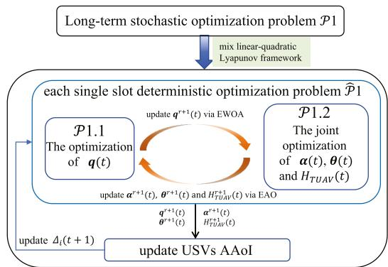  
Fig. 2. The overall framework to tackle P1.

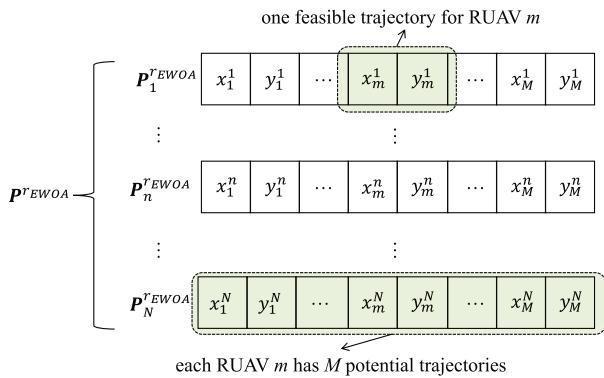  
Fig. 3. The proposed encoding mechanism.

$$
\begin{array} { r l r } { \ } & { \mathcal { P } 1 : \underset { \alpha , \theta , H , q T  + \infty } { \operatorname* { m i n } } \frac { \displaystyle \operatorname* { l i m } } { \displaystyle \operatorname* { l i m } } \frac { \displaystyle 1 } { \displaystyle T } \sum _ { t = 1 } ^ { T } \mathbb { E } [ X _ { w } \sum _ { i \in \mathcal { I } } \Delta _ { i } ( t ) + \sum _ { m \in \mathcal { M } } p _ { m } ( t ) ] , } & \\ & { \quad \quad \quad \quad \quad \mathcal { C } 1 - \mathcal { C } 9 , } & { ( 2 3 \mathrm { ~ } \forall \mathrm { ~ } 0 , 0 ) } \end{array}
$$

where $X _ { w }$ is the weighting parameter. P1 is considerably challenging to tackle owing to the following reasons. The existing highly efficient algorithms, such as learning-based optimization approaches and convex optimization, cannot be directly utilized to handle P1 due to the existence of USVs long-term power constraint C9. Moreover, RUAVs’ trajectories , TUAV hovering altitudes  and TUAV-mounted RIS phase shift  are closely coupled; the nature-inspired algorithms such as evolutionary algorithms are becoming inefficient in tackling P1 since the complexity of solving P1 may become excessively high.

## III. THE PROPOSED SOLUTION

The framework of the proposed heuristic solution is illustrated in Fig. 2. First, one auxiliary queue is introduced to transform C9 into the queue stability constraint and thus one can transform the original problem P1 into P<sup>ˆ</sup>1. Then, a novel mixed linear quadratic Lyapunov framework is utilized to decouple the long-term stochastic problem into a list of deterministic problems, where each of which can be further divided into two subproblems, e.g., P1.1 the optimization of RUAVs’ trajectories subproblem and P1.2 the joint optimization of RUAVs service duration indicators, TUAV-mounted RIS phase shift and TUAV hovering altitude subproblem. The EWOA algorithm is proposed to tackle P1.1 and obtain the feasible RUAV trajectory $\mathbf { \nabla } \mathbf { q } _ { m } ( t )$ ; Then, the proposed EAO algorithm is utilized to tackle $\mathcal { P } 1 . 2 .$ , which is capable of iteratively updating RUAV service duration indicator, RIS phase shift and TUAV hovering altitude. In this manner, one can efficiently obtain the feasible solution to P1.

## A. Lyapunov Optimization-Based Problem Transformation

Define auxiliary queue ${ \pmb { L } } _ { U S V } ( t ) \triangleq \{ { L } _ { 1 } ( t ) , { L } _ { 2 } ( t )$ $, \ldots , L _ { i } ( t ) , \ldots , L _ { I } ( t ) \} , t \in { \mathcal { T } } .$ <sup>L</sup>Then, one can transform C9 into a queue stability constraint. In this way, each queue dynamics of $\pmb { L } _ { U S V }$ can be expressed as

$$
L _ { i } ( t + 1 ) = \operatorname* { m a x } \{ L _ { i } ( t ) - \delta p _ { i } ^ { a v e } , 0 \} + \alpha _ { i } ( t ) p _ { i } ^ { t r } , i \in \mathcal { I } , t \in \mathcal { T } .\tag{24}
$$

The long-term power constraint of each USV i can be transformed into queue stability constraint of $L _ { i } ( t )$ , which can be expressed as

$$
\hat { \mathcal { C } } 9 : \operatorname* { l i m } _ { t  + \infty } \frac { \mathbb { E } [ L _ { i } ( t ) ] } { t } = 0 , i \in \mathcal { I } .\tag{25}
$$

In this way, P1 can be transformed into

$$
\begin{array} { r l r } & { \hat { \mathcal { P } } 1 : \displaystyle \operatorname* { m i n } _ { \alpha , \theta , H , q } } & { \operatorname* { l i m } _ { T  + \infty } \frac { 1 } { T } \sum _ { t = 1 } ^ { T } \mathbb { E } [ X _ { w } \sum _ { i \in \mathcal { I } } \Delta _ { i } ( t ) + \sum _ { m \in \mathcal { M } } p _ { m } ( t ) ] , } \\ & { \quad \quad \quad \quad \quad \quad \mathcal { C } 1 - \mathcal { C } 8 , \hat { \mathcal { C } } 9 . } & { ( 2 6 ) } \end{array}
$$

Lyapunov optimization-based method is utilized to divide $\hat { \mathcal { P } } 1$ into a list of deterministic optimization problems. Let $\Phi ( t ) \triangleq$ $\{ \Delta _ { i } ( t ) , L _ { i } ( t ) , i \in \mathcal { T } \}$ be the concatenated vector. However, the traditional quadratic Lyapunov function cannot be used to tackle C4. Inspired by [55], a novel mixed linear quadratic Lyapunov function is proposed. Define $U ( \Phi ( t ) )$ as the Lyapunov function of $\hat { \mathcal { P } } 1$ , which can be formulated as

$$
U ( \Phi ( t ) ) = \sum _ { i \in \mathcal { I } } \left( \Delta _ { i } ( t ) - \Delta _ { i } ^ { \operatorname* { m a x } } \right) + \frac { 1 } { 2 } L _ { i } ^ { 2 } ( t ) , t \in \mathcal { T } ,\tag{27}
$$

The corresponding conditional Lyapunov drift $\dot { U } ( \Phi ( t ) )$ can be given as

$$
\dot { U } ( \Phi ( t ) ) = \mathbb { E } \{ U ( \Phi ( t + 1 ) ) - U ( \Phi ( t ) ) | \Phi ( t ) \} , t \in \mathcal { T } .\tag{28}
$$

Define $W ( \Phi ( t ) )$ as the drift-plus-reward term of $\hat { \mathcal { P } } 1$ , which can be given as

$$
\begin{array} { l } { { \displaystyle W \left( \Phi ( t ) \right) } } \\ { ~ } \\ { { \displaystyle = \dot { U } \left( \Phi ( t ) \right) + V \mathbb { E } \left[ X _ { w } \sum _ { i \in \mathcal { T } } \Delta _ { i } ( t ) + \sum _ { m \in \mathcal { M } } p _ { m } ( t ) | \Phi ( t ) \right] , } } \end{array}\tag{29}
$$

where $V \geq 0$ is the control parameter.

Note that given any a $, b , c \geq 0$ , one has $( \operatorname* { m a x } \{ a - b , 0 \} ) ^ { 2 } \leq$ $a ^ { 2 } + b ^ { 2 } + c ^ { 2 } + 2 a ( { \overset { . } { c } } - b )$ . As such, the upper bound of $( L _ { i } ( t +$ $1 ) ^ { 2 }$ can be given as

$$
\begin{array} { r l } & { ( L _ { i } ( t + 1 ) ) ^ { 2 } } \\ & { \quad = \left( \operatorname* { m a x } \left\{ L _ { i } ( t ) - \delta p _ { i } ^ { a v e } , 0 \right\} + \alpha _ { i } ( t ) p _ { i } ^ { t r } \right) ^ { 2 } \leq L _ { i } ^ { 2 } ( t ) } \\ & { \quad \quad + \left( \delta p _ { i } ^ { a v e } \right) ^ { 2 } + \left( \alpha _ { i } ( t ) p _ { i } ^ { t r } \right) ^ { 2 } + 2 L _ { i } ( t ) \left( \alpha _ { i } ( t ) p _ { i } ^ { t r } - \delta p _ { i } ^ { a v e } \right) . } \end{array}\tag{30}
$$

According to (27), one can observe that the maximum value of $( \alpha _ { i } ( t ) p _ { i } ^ { t r } ) ^ { 2 }$ is $( \delta p _ { i } ^ { t r } ) ^ { 2 }$ , which can be obtained if and only if when $\alpha _ { i } ( t ) = \delta$ . Define $\begin{array} { r } { \omega _ { i } = \frac { 1 } { 2 } ( ( \delta p _ { i } ^ { t r } ) ^ { 2 } - 2 L _ { i } ( t ) \delta p _ { i } ^ { a v e } ) + } \end{array}$ $\Delta _ { i } ( t )$ . The upper bound of $W ( \bar { \mit \Phi } ( t ) )$ can be obtained, which can be given as

$$
\begin{array} { r l } { \{ W \left( \Phi ( t ) \right) \} ^ { u b } \triangleq \displaystyle \sum _ { i \in \mathbb { Z } } \omega _ { i } + \sum _ { i \in \mathbb { Z } } L _ { i } ( t ) \alpha _ { i } ( t ) p _ { i } ^ { t r } } & { } \\ { \quad - \frac { \Delta _ { i } ( t ) D _ { i } ^ { l } ( t ) } { \operatorname* { m a x } \{ Q _ { i } ( t ) - \sum _ { m \in \mathcal { M } } n _ { i , m } ^ { t r } ( t ) , 0 \} + D _ { i } ^ { l } ( t ) } } & { } \\ { \quad + V \left( X _ { w } \displaystyle \sum _ { i \in \mathbb { Z } } \Delta _ { i } ( t + 1 ) + \sum _ { m \in \mathcal { M } } p _ { m } ( t ) \right) . } \end{array}\tag{31}
$$

The long-term stochastic optimization problem $\hat { \mathcal { P } } 1$ can be transformed into a list of single-slot drift-plus-reward term upper bound minimization problems, where each single-slot deterministic optimization problem can be formulated as

$$
\begin{array} { r l } & { \overline { { \mathcal { P } } } 1 : \operatorname* { m i n } _ { \substack { \alpha ( t ) , \theta ( t ) , H _ { T U A V } ( t ) , q ( t ) } } \left\{ W ( \Phi ( t ) ) \right\} ^ { u b } } \\ & { ~ s . t . } \end{array}\tag{32}
$$

$\overline { { \mathcal { P } } } 1$ is still difficult to tackle since $H _ { T U A V }$ and $\pmb \theta ( t ) , \pmb q _ { m } ( t )$ and $p _ { m } ( t )$ are closely coupled. To tackle $\overline { { \mathcal { P } } } 1$ , we further decouple $\overline { { \mathcal { P } } } 1$ into two subproblems, where each of which can be efficiently solved by the proposed algorithms.

## B. The Optimization of (t)

Given feasible RUAV service duration indicator ${ \bf \alpha } _ { { \bf \alpha } } ( t )$ , TUAV hovering altitude $H _ { T U A V } ( t )$ and RIS phase shift vector $\pmb \theta ( t )$ $\overline { { \mathcal { P } } } 1$ can be reduced as

$$
\begin{array} { r l r } {  { \mathcal { P } 1 . 1 : \operatorname* { m i n } _ { \pmb { q } ( t ) } \sum _ { i \in \mathcal { I } } - \frac { \displaystyle ( V + X _ { w } ) \Delta _ { i } ( t ) D _ { i } ^ { l } ( t ) } { \operatorname* { m a x } \{ Q _ { i } ( t ) - \sum _ { m \in \mathcal { M } } n _ { i , m } ^ { t r } ( t ) , 0 \} + D _ { i } ^ { l } ( t ) } } } \\ & { } & { \quad + V \sum _ { m \in \mathcal { M } } p _ { m } ( t ) , } \end{array}
$$

s.t.

$$
{ \mathcal { C } } 7 - { \mathcal { C } } 8 .\tag{33}
$$

P1.1 is difficult to tackle due to the following reasons. The existence of $\operatorname* { m a x } \{ \cdot \}$ function and min $\{ \cdot \}$ function of $n _ { i , m } ^ { t r }$ makes the objective function of P1.1 non-smooth. Moreover, $p _ { m } ( t )$ is a non-convex function with respect to $\pmb q ( t )$ and thus P1.1 cannot be directly solved using the existing highly efficient algorithms such as convex optimization algorithm. Moreover, the complexity to solve P1.1 may become extremely high since $\mathbf { \nabla } \mathbf { q } _ { m } ( t )$ is closely coupled with $p _ { m } ( t )$ . Inspired by [35], EWOA is proposed to solve P1.1, where the significant steps, e.g., encoding, encircling prey, bubble net hunting, searching for prey, and analysis of boundary conditions, are introduced in detail.

Encoding: The proposed encoding mechanism is shown in Fig. 3. Let $\pmb { \mathcal { P } } ^ { r _ { E W O A } } = \{ \pmb { P } _ { 1 } ^ { r _ { E W O A } } , \dotsc , \pmb { P } _ { n } ^ { r _ { E W O A } } , \dotsc , \pmb { P } _ { N } ^ { r _ { E W O A } } \}$ <sup>P P P</sup>be the population in each generation rEWOA, where $\begin{array} { r l r } { { \bf P } _ { n } ^ { r _ { E W O A } } \cdot \stackrel {  } { = } } & { { } \{ q _ { 1 } ^ { n , r _ { E W O A } } , q _ { 2 } ^ { n , r _ { E W O A } } , \ldots , q _ { M } ^ { n , r _ { E W O A } } \} } \end{array}$ with $\pmb q _ { m } ^ { n , r _ { E W O A } } = [ x _ { m } ^ { n , r _ { E W O A } } , y _ { m } ^ { n , r _ { E W O A } } ]$ represents the corresponding <sup>q</sup>feasible $\mathbf { } q _ { m } ( t )$

<sup>q</sup>Encircling Prey: Define $f ( P _ { n } ^ { r _ { E W O A } } )$ as the fitness function, which can be given as

$$
\begin{array} { r l r } & { } & { f ( { P } _ { n } ^ { r _ { E W O A } } ) = \displaystyle \sum _ { i \in \mathcal { I } } \frac { ( V + X _ { w } ) \Delta _ { i } ( t ) D _ { i } ^ { l } ( t ) } { \operatorname* { m a x } \{ Q _ { i } ( t ) - \sum _ { m \in \mathcal { M } } n _ { i , m } ^ { t r } ( t ) , 0 \} + D _ { i } ^ { l } ( t ) } } \\ & { } & { ~ - V \displaystyle \sum _ { m \in \mathcal { M } } p _ { m } ( t ) | _ { q _ { m } ( t ) = q _ { m } ^ { n , r _ { E W O A } } , m \in \mathcal { M } } . \qquad ( 3 4 ) } \end{array}
$$

Define $\pmb { P } _ { n } ^ { r _ { E W O A } * } = \{ \pmb { q } _ { 1 } ^ { r _ { E W O A } * } , \pmb { q } _ { 2 } ^ { r _ { E W O A } * } , \dots , \pmb { q } _ { M } ^ { r _ { E W O A } * } \}$ be the op-<sup>P</sup>timal solution in $r _ { E W O A ^ { - } } \mathrm { t h }$ <sup>q q</sup>generation, where <sup>rEWOA∗</sup> should satisfy $f ( { P ^ { r _ { E W O A } * } } ) \geq f ( { P _ { n } ^ { r _ { E W O A } } } )$ <sup>P</sup>, ∀n ∈ N . Note that EWOA is capable of dynamically adjusting each $P _ { n } ^ { r _ { E W O A } }$ towards $P ^ { r _ { E W O A } * }$ . Define control parameters $\kappa ^ { r _ { E W O A } }$ and $\psi ^ { r _ { E W O A } }$ in each $r _ { E W O A }$ generation, where $\kappa ^ { r _ { E W O A } }$ decreases from 2 to 0 as the number of generations increases. ψ <sup>EWOA</sup> is a random number uniformly distributed between 0 and 1.

When $\kappa ^ { r _ { E W O A } } \geq 1 $ and $\psi ^ { r _ { E W O A } } \geq 0 . 5$ , one can update each $P _ { n } ^ { r _ { E W O A } }$ towards $P ^ { r _ { E W O A } * }$ using the following equations

$$
\left\{ \begin{array} { l l } { P _ { n } ^ { r _ { E W O A } + 1 } = P ^ { r _ { E W O A } , o p t } - A _ { 1 } D _ { n } , } \\ { A _ { 1 } = 2 \kappa ^ { r _ { E W O A } } r _ { 1 } - \kappa ^ { r _ { E W O A } } , } \\ { D _ { n } = | 2 r _ { 2 } P _ { n } ^ { r _ { E W O A } , o p t } - P _ { n } ^ { r _ { E W O A } } | , } \end{array} \right.\tag{35}
$$

where $P ^ { r _ { E W O A } , o p t } = P ^ { r _ { E W O A } * } . r _ { 1 }$ and r are randomly selected numbers uniformly distributed between 0 and 1.

Bubble Net Hunting: When $\kappa ^ { r _ { E W O A } } \geq 1 $ and $\psi ^ { r _ { E W O A } } \leq 0 . 5 $ one can update each $P _ { \it { n } } ^ { \it { r _ { E W O A } } }$ towards $P ^ { r _ { E W O A } * }$ in a spiral manner to simulate Bubble Net Hunting behavior of humpback whales, which can be expressed as

$$
\begin{array} { r } { \left\{ \begin{array} { l l } { P _ { n } ^ { r _ { E W O A } + 1 } = P ^ { r _ { E W O A } , o p t } + D _ { n } \mathrm { e } ^ { b l } \mathrm { c o s } ( 2 \pi l ) , } \\ { D _ { n } = | 2 r _ { 2 } P ^ { r _ { E W O A } , o p t } - P _ { n } ^ { r _ { E W O A } } | , } \end{array} \right. } \end{array}\tag{36}
$$

where $P ^ { r _ { E W O A } , o p t } = P ^ { r _ { E W O A } * }$ . bl denotes a constant to reflect the logarithmic spiral shape and l is a random number uniformly distributed between −1 and 1.

Searching for Prey: To enhance the global search capability, when $a ^ { r _ { E W O A } } \leq 1$ , one can update each $P _ { n } ^ { r _ { E W O A } }$ based on a randomly selected <sup>rEWOA,rand</sup> rather than $P ^ { r _ { E W O A } * }$ . When $a _ { r _ { E W O A } } < 1$ , one can update each $P _ { n } ^ { r _ { E W O A } }$ <sup>P</sup>towards <sup>rEWOA,rand</sup> <sup>P P</sup>according to (32), where <sup>rEWOA,opt</sup> = <sup>rEWOA,rand</sup> .

Analysis of Boundary Conditions: C7 − C8 define the feasible region as a sector. The spiral position update manner of Bubble Net Hunting may cause violation of $\mathcal { C 7 }$ and C8. To obtain feasible RUAV trajectory $\mathbf { \nabla } \mathbf { q } _ { m } ( t )$ , the boundary absorption method is utilized for $P _ { n } ^ { r _ { E W O A } }$ that cannot satisfy $\scriptscriptstyle \mathcal { C } 7$ and C8.

After obtain the feasible $P _ { n } ^ { r _ { E W O A } }$ , define $s _ { m } ^ { n } = | | \pmb q _ { m } ^ { n , r _ { E W O A } } \ -$ $\pmb { q } _ { m } ( t - 1 ) |$ | and $\begin{array} { r } { \hat { \Omega } _ { m } ^ { n } = \arctan \big ( \frac { y _ { m } ^ { n , r } E W O A - y _ { m } ( t - 1 ) } { x _ { m } ^ { n , r } E W O A - x _ { m } ( t - 1 ) } \big ) } \end{array}$ as the potential flight distance and the flight heading of $\mathrm { R U A V } \ m$ , respectively. Three constraint violation cases are investigated in this section, which are given in detail.

Case 1: When $\pmb { q } _ { m } ^ { n , r _ { E W O A } }$ only violate $\mathcal { C 7 } _ { \mathrm { ~ } }$ which can be $\mathbf { \vec { e } X \tilde { \mathbf { \theta } } } -$ pressed as $s _ { m } ^ { n } \geq \delta v _ { m } ^ { \operatorname* { m a x } }$ , the boundary absorption of $\pmb { q } _ { m } ^ { n , r _ { E W O A } }$ can be given as

$$
\hat { \pmb q } _ { m } ^ { n , r _ { E W O A } } = \frac { \delta v _ { m } ^ { \operatorname* { m a x } } } { s _ { m } ^ { n } } \pmb q _ { m } ^ { n , r _ { E W O A } } .\tag{37}
$$

Case 2: When $\pmb { q } _ { m } ^ { n , r _ { E W O A } }$ only violate $\mathcal { C } 8 .$ Let $\hat { \Omega } _ { m } ( t - 1 ) =$ arctan $\Big ( \frac { y _ { m } ( t - 1 ) - y _ { m } \big ( \dot { t } - 2 \big ) } { x _ { m } ( t - 1 ) - x _ { m } ( t - 2 ) } \Big )$ be the heading of RUAV m in timeslot $t - 1$ . If $\hat { \Omega } _ { m } ^ { n } - \hat { \Omega } _ { m } ( t - 1 ) > \Omega _ { m } ^ { \mathrm { m a x } }$ , the boundary absorption of $\pmb { q } _ { m } ^ { n , r _ { E W O A } }$ can be given as $\dot { \pmb q } _ { m } ^ { n , \dot { r } _ { E W O A } } = [ \dot { x } _ { m } ^ { n , r _ { E W O A } } , \dot { y } _ { m } ^ { n , r _ { E W O A } } ]$ where

$$
\begin{array} { r } { \left\{ \dot { x } _ { m } ^ { n , r _ { E W O A } } = x _ { m } ( t - 1 ) + s _ { m } ^ { n } \mathrm { c o s } ( \hat { \Omega } _ { m } ( t - 1 ) + \Omega _ { m } ^ { \operatorname* { m a x } } ) , \right. } \\ { \left. \dot { y } _ { m } ^ { n , r _ { E W O A } } = y _ { m } ( t - 1 ) + s _ { m } ^ { n } \mathrm { s i n } ( \hat { \Omega } _ { m } ( t - 1 ) + \Omega _ { m } ^ { \operatorname* { m a x } } ) . \right. } \end{array}\tag{38}
$$

When $\hat { \Omega } _ { m } ^ { n } - \hat { \Omega } _ { m } ( t - 1 ) > \Omega _ { m } ^ { \mathrm { m a x } }$ , the boundary absorption of $\pmb { q } _ { m } ^ { n , r _ { E W O A } }$ can be given as $\ddot { \pmb q } _ { m } ^ { n , r _ { E W O A } } = [ \ddot { x } _ { m } ^ { n , r _ { E W O A } } , \ddot { y } _ { m } ^ { n , r _ { E W O A } } ]$ <sup>q</sup>where

$$
\left\{ \ddot { x } _ { m } ^ { n , r _ { E W O A } } = x _ { m } ( t - 1 ) + s _ { m } ^ { n } \mathrm { c o s } ( \hat { \Omega } _ { m } ( t - 1 ) - \Omega _ { m } ^ { \operatorname* { m a x } } ) , \right.\tag{39}
$$

Case 3: When $\pmb { q } _ { m } ^ { n , r _ { E W O A } }$ simultaneously violate $\scriptscriptstyle \mathcal { C } 7$ and C8. When $\hat { \Omega } _ { m } ^ { n } - \hat { \Omega } _ { m } ( t - 1 ) > \Omega _ { m } ^ { \mathrm { m a x } }$ , the boundary absorption of $\pmb { q } _ { m } ^ { n , r _ { E W O A } }$ can be given as $\overline { { { q } } } _ { m } ^ { n , r _ { E W O A } } = [ \dot { x } _ { m } ^ { n , r _ { E W O A } } , \overline { { { y } } } _ { m } ^ { n , r _ { E W O A } } ] ,$ <sup>q</sup>where

$$
\begin{array} { r } { \left\{ \overline { { x } } _ { m } ^ { n , r _ { E W O A } } = x _ { m } ( t - 1 ) + \delta v _ { m } ^ { \operatorname* { m a x } } \mathrm { c o s } ( \hat { \Omega } _ { m } ( t - 1 ) + \Omega _ { m } ^ { \operatorname* { m a x } } ) , \right. } \\ { \left. \overline { { y } } _ { m } ^ { n , r _ { E W O A } } = y _ { m } ( t - 1 ) + \delta v _ { m } ^ { \operatorname* { m a x } } \mathrm { s i n } ( \hat { \Omega } _ { m } ( t - 1 ) + \Omega _ { m } ^ { \operatorname* { m a x } } ) . \right. } \end{array}\tag{40}
$$

When $\hat { \Omega } _ { m } ( t - 1 ) - \hat { \Omega } _ { m } ^ { n } > \Omega _ { m _ { - } } ^ { \operatorname* { m a x } }$ , the boundary absorption of $\pmb { q } _ { m } ^ { n , r _ { E W O A } }$ can be given as $\overline { { \overline { { q } } } } _ { m } ^ { n , \ - { _ { E W O A } } } = [ \overline { { \overline { { x } } } } _ { m } ^ { n , r \ - { _ { E W O A } } } , \overline { { \overline { { y } } } } _ { m } ^ { n , r _ { E W O A } } ] ,$ <sup>q</sup>where

$$
\begin{array} { r } { \{ \overline { { \overline { { x } } } } _ { m } ^ { n , r _ { E W O A } } = x _ { m } ( t - 1 ) + \delta v _ { m } ^ { \operatorname* { m a x } } \mathrm { c o s } ( \hat { \Omega } _ { m } ( t - 1 ) - \Omega _ { m } ^ { \operatorname* { m a x } } ) ,  } \\ {  \{ \overline { { y } } _ { m } ^ { n , r _ { E W O A } } = y _ { m } ( t - 1 ) + \delta v _ { m } ^ { \operatorname* { m a x } } \mathrm { s i n } ( \hat { \Omega } _ { m } ( t - 1 ) - \Omega _ { m } ^ { \operatorname* { m a x } } ) .  } \end{array}\tag{41}
$$

The proposed EWOA algorithm can be regarding reaching convergence when $r _ { E W O A } = r _ { E W O A } ^ { \mathrm { m a x } }$ , where $r _ { E W O A } ^ { \mathrm { m a x } }$ is the maximum number of iterations. In this manner, the best solution $P ^ { r _ { E W O A } ^ { \mathrm { m a x } } * }$ can be regarded as the feasible ${ \mathrm { R U A V s } } ^ { \prime }$ trajectories $\pmb q ( t )$ . The detailed information of the proposed EWOA algorithm is given in Algorithm 1.

## C. The Joint Optimization of $\mathbf { \alpha } \mathbf { \alpha } \mathbf { ( } t ) , \mathbf { \beta } \theta ( t )$ and $H _ { T U A V } ( t )$

Given feasible $\mathbf { } q ( t ) , \overline { { \mathcal { P } } } 1$ can be reduced as

$$
\begin{array} { r l } { \mathcal { P } 1 . 2 : \underset { \alpha ( t ) , \theta ( t ) , H _ { T U A V } ( t ) } { \operatorname* { m i n } } \sum _ { i \in \mathbb { Z } } L _ { i } ( t ) \alpha _ { i } ( t ) p _ { i } ^ { t r } } \\ { \quad } & { - \frac { \left( V + X _ { w } \right) \Delta _ { i } ( t ) D _ { i } ^ { l } ( t ) } { \operatorname* { m a x } \{ Q _ { i } ( t ) - \sum _ { m \in \mathcal { M } } n _ { i , m } ^ { t r } ( t ) , 0 \} + D _ { i } ^ { l } ( t ) } , } \end{array}
$$

```powershell
Algorithm 1: The framework of EWOA algorithm.
1 Initialize $r _ { E W O A } , \mathcal { P } , \kappa .$
2 while $\underline { { r _ { E W O A } } } \leq r _ { E W O A } ^ { m a x }$ do
3 if $\underline { { a ^ { r _ { E W O A } } \geq 1 } }$ then
4 Update $\overline { { P ^ { r } { \cal { H } } \cal { W } O A } } ^ { * }$ and $\psi ^ { r _ { E W O A } }$
5 if $\underline { { \psi ^ { r _ { E W O A } } \geq 0 . 5 } }$ then
6 Perform Encircling Prey to update each
$P _ { n } ^ { r _ { E W O A } }$
7 end
8 else
9 Perform Bubble Net Hunting to update
each $P _ { n } ^ { r _ { E W O A } }$
10 end
11 end
12 else
13 Update $P ^ { r _ { E W O A , r a n d } } .$
14 Perform Searching for Prey to update each
$P _ { n } ^ { r _ { E W O A } }$
15 end
16 Perform boundary absorption for $P _ { n } ^ { r _ { E W O A } }$ that
cannot satisfy C7 or C8.
17 Update $\kappa ^ { r _ { E W O A } \bullet + 1 }  \kappa ^ { r _ { E W O A } } - \frac { 2 } { r _ { E W O A } ^ { m a x } } .$
18 Update rEWOA $ r _ { E W O A } + 1 .$
19 end
```

$$
\mathcal { C } 1 - \mathcal { C } 3 , \mathcal { C } 5 - \mathcal { C } 6 .\tag{42}
$$

One can observe that $\mathcal { P } 1 . 2$ is difficult to tackle due to the non-smooth objective function. Define auxiliary variables $\lambda \triangleq$ $\{ \lambda _ { i } , i \in \mathcal { I } \}$ and $\pmb { \mu } \triangleq \{ \mu _ { i , m } , i \in \mathcal { I } , m \in \mathcal { M } \}$ , one can equivalently transform $\mathcal { P } 1 . 2$ into $\hat { \mathcal { P } } 1 . 2 \rangle$

$$
\begin{array} { l l } { \widehat { P } | 1 . 2 : \displaystyle { \operatorname* { m i n } _ { ( k ) , \ell \in \mathcal { W } ( \ell ) , \ H \cap \mathcal { W } ( \ell ) } \ \frac { \sum _ { i = 1 } ^ { m } \big \langle L ( \ell ) \big \rangle \alpha _ { i } ( t ) \big \rangle ^ { \ell } } { \ell ^ { - 2 } } } } & \\ { \qquad } & { \qquad - \left( V + X _ { w } \right) \frac { \Delta _ { i } ( t ) D _ { i } ^ { \ell } ( \ell ) } { \lambda _ { i } + D _ { i } ^ { \ell } ( \ell ) } } \\ { \mathrm { s . t . } \ } & { \qquad \mathcal { C } 1 - \mathcal { C } \Delta _ { i } \mathcal { C } \mathrm { S - } \mathcal { C } \mathrm { b } , } \\ { \ } & { \qquad \mathcal { C } | 0 . \ \gamma _ { i } \ \Sigma _ { i } \ \geq 0 , i \in \mathcal { Z } , } \\ { \ } & { \qquad \mathcal { C } 1 ! : \lambda _ { i } \ \geq \mathcal { Q } _ { i } ( t ) - \displaystyle { \operatorname* { m a x } _ { m \in \mathcal { A } } \mu _ { i } } \mathcal { C } , } \\ { \ } & { \qquad \mathcal { C } 1 2 : \mu _ { i , m } \leq D _ { m , i } ^ { m } ( \ell ) , i \in \mathcal { Z } , m \in \mathcal { A } , } \\ { \ } & { \qquad \mathcal { C } 1 3 : \mu _ { i , m } \leq D _ { m , i } ^ { m } ( \ell ) , i \in \mathcal { Z } , m \in \mathcal { M } . } \end{array}\tag{43}
$$

One can observe that $\hat { \mathcal { P } } 1 . 2$ is separable and can be efficiently solved by optimizing $\mathbf { \alpha } \mathbf { \alpha } \mathbf { \alpha } \mathbf { \alpha } \mathbf { \alpha } \mathbf { \alpha } \mathbf { \alpha } \mathbf { \alpha } \mathbf { \alpha } \mathbf { \alpha } \mathbf { \alpha } \mathbf { \alpha } \mathbf { \alpha } \mathbf { \alpha } \mathbf { \alpha } \mathbf { \alpha } \mathbf { \alpha } \mathbf { \alpha } \mathbf { \alpha } \mathbf { \alpha } \mathbf { \alpha } \mathbf { \alpha } \mathbf { \alpha } \mathbf { \alpha } \mathbf { \alpha } \mathbf { \alpha } \mathbf { \alpha } \mathbf { \alpha } \mathbf { \alpha } \mathbf { \alpha } \mathbf { \alpha } \mathbf { \alpha } \mathbf { \alpha } \mathbf { \alpha } \mathbf { \alpha } \mathbf { \alpha } \mathbf { \alpha } \mathbf { \alpha } \mathbf { \alpha } \mathbf { \alpha } \mathbf { \alpha } \mathbf { \alpha } \mathbf { \alpha } \mathbf { \alpha } \mathbf { \alpha } \mathbf { \alpha \alpha } \mathbf { \alpha } \mathbf { \alpha \alpha } \mathbf { \alpha \alpha } \mathbf { \alpha \alpha } \mathbf { \alpha \alpha } \mathbf { \alpha \alpha } \mathbf { \alpha \alpha } \mathbf { \alpha \alpha } \mathbf { \alpha \alpha } \mathbf { \alpha \alpha } \mathbf { \alpha \alpha \beta } \mathbf  \alpha \alpha \alpha \mathbf { \alpha } \alpha \mathbf { \alpha \alpha } \mathbf  \alpha \alpha \alpha \alpha \beta \alpha \alpha \beta \alpha \beta \alpha \alpha \beta \alpha \alpha \beta \alpha \alpha \beta \alpha \alpha \beta \alpha \alpha \delta \delta \delta \delta \delta \delta \delta \delta \delta \delta \delta \delta \delta \delta \delta \delta \delta \delta \delta \delta \delta \delta \delta \delta \delta \delta \delta \delta \delta \delta \delta \delta \delta \delta \delta \delta \delta \delta \delta \delta \delta \delta \delta \delta \delta \delta \delta \delta \delta \delta \delta \delta \delta \delta \delta \delta \delta \delta \delta \delta \delta \delta \delta \delta \delta \delta \delta \delta \delta \delta \delta \delta \delta \delta \delta \delta \delta \delta \delta \delta \delta \delta \delta \delta \delta \delta \delta \delta \delta \delta \delta \delta \delta \delta \delta \delta \delta \delta \delta \delta \delta \delta \delta \delta \delta \delta \delta \delta \delta \delta \delta \delta \delta \delta \delta \delta \delta \delta \delta \delta \delta \delta \delta \delta \delta \delta \delta \delta \delta \delta \delta \delta \delta \delta \delta \delta \delta \delta \delta \delta \delta \delta \delta$ and $H _ { T U A V } ( t )$ in an iterative manner. To tackle $\hat { \mathcal { P } } 1 . 2$ , EAO algorithm is proposed. In each iteration, let $\alpha ^ { r _ { E A O } } ( t ) , H ^ { r _ { E A O } } ( t )$ and $\theta ^ { r _ { E A O } } ( t )$ be the obtained feasible solution of ${ \hat { \mathcal { P } } } 1 . 2 .$ . The update mechanism of each optimization variable is given as follows.

The update of (t): Given feasible $H _ { T U A V } ^ { r _ { E A O } } ( t )$ and $\pmb { \theta } ^ { r _ { E A O } } ( t )$ $\hat { \mathcal { P } } 1 . 2$ can be reduced as

$$
\mathcal { P } 1 . 2 . 1 : \operatorname* { m i n } _ { \alpha ( t ) , \lambda , \mu } \ \sum _ { i \in \mathcal { I } } L _ { i } ( t ) \alpha _ { i } ( t ) p _ { i } ^ { t r } - ( V + X _ { w } ) \frac { \Delta _ { i } ( t ) D _ { i } ^ { l } ( t ) } { \lambda _ { i } + D _ { i } ^ { l } ( t ) }
$$

$$
c 1 - { \mathcal { C } } 2 , { \mathcal { C } } 1 0 - { \mathcal { C } } 1 3 .\tag{44}
$$

The object function of P1.2.1 is concave in respect to $\lambda _ { i } ,$ which can be efficiently solved by employing SCA [56]. Consequently, $\pmb { \alpha } ^ { r _ { E A O } + 1 } ( t )$ can be obtained.

The update of (t): Given feasible $\pmb { \alpha } _ { T U A V } ^ { r _ { E A O } } ( t )$ and $H _ { T U A V } ^ { r _ { E A O } } ( t ) , \hat { \mathcal { P } } 1 . 2$ can be reduced as

$$
\begin{array} { l } { \displaystyle \mathcal { P } 1 . 2 . 2 : \operatorname* { m i n } _ { \theta ( t ) , \lambda , \mu } \ - \sum _ { i \in \mathcal { I } } ( V + X _ { w } ) \frac { \Delta _ { i } ( t ) D _ { i } ^ { l } ( t ) } { \lambda _ { i } + D _ { i } ^ { l } ( t ) } } \\ { \displaystyle s . t . } \end{array}\tag{45}
$$

Note that (t) is closely coupled in logarithmic function as <sup>W</sup>i(<sup>t</sup>)<sup>μ</sup>i,m shown in C13. Let $\begin{array} { r } { \eta _ { i , m } ( \mu _ { i , m } ) = \frac { \sigma ^ { 2 } w _ { m } ^ { H } w _ { m } } { p _ { T B S } ^ { t r } } \Big ( 2 ^ { \frac { \iota \cdot \rho \cdot \rho ^ { - 1 } } { \alpha _ { i } ( t ) B _ { T B S , m } ^ { d l } } } - 1 \Big ) } \end{array}$ After remove irrelevant parameters according to (8)–(10), C13 can be rewritten as

$$
\mathring { \mathcal { C } } 1 3 : | | w _ { m } ^ { H } ( G \Theta h _ { T U A V , m } ) | | ^ { 2 } \geq \eta _ { i , m } ( \mu _ { i , m } ) , i \in \mathcal { I } , m \in \mathcal { M } .\tag{46}
$$

Let $\hat { \pmb { \theta } } ( t ) = [ a ( 1 ) e ^ { j \theta _ { 1 } ( t ) } , a ( 2 ) e ^ { j \theta _ { 2 } ( t ) } , \allowbreak . . . , a ( K ) e ^ { j \theta _ { K } ( t ) } ] ^ { T } \in$ $\mathbb { C } ^ { K \times 1 }$ and $\pmb { \Lambda _ { m } } = \pmb { w } _ { m } ^ { H } \pmb { G } \mathrm { d i a g } ( \pmb { h } _ { T U A V , m } ) \in \mathbb { C } ^ { 1 \times K }$ . In this way, ${ \pmb w } _ { m } ^ { H } ( G \Theta { \pmb h } _ { T U A V , m } )$ can be transformed into the following

$$
\begin{array} { r l } & { { \pmb w } _ { m } ^ { H } ( { \pmb G } { \Theta } h _ { T U A V , m } ) = { \pmb w } _ { m } ^ { H } { \pmb G } \mathrm { d i a g } ( { \hat { \pmb \theta } } ( t ) ) { \pmb h } _ { T U A V , m } } \\ & { \quad \quad \quad \quad \quad = { \pmb w } _ { m } ^ { H } { \pmb G } \mathrm { d i a g } ( { \pmb h } _ { T U A V , m } ) { \pmb \theta } ( t ) } \\ & { \quad \quad \quad \quad = { \pmb \Lambda } _ { m } { \hat { \pmb \theta } } ( t ) . } \end{array}\tag{47}
$$

According to [57], one can obtain the following equation

$$
\begin{array} { r l } & { \bigl | | w _ { m } ^ { H } ( G \Theta h _ { T U A V , m } ) | | ^ { 2 } = \hat { \pmb \theta } ^ { H } ( t ) \mathbf { \Lambda } _ { m } ^ { H } \mathbf { \Lambda } _ { m } \hat { \pmb \theta } ( t ) } \\ & { \qquad = \mathrm { t r } \left( \hat { \pmb \theta } ^ { H } ( t ) \mathbf { \Lambda } _ { m } ^ { H } \mathbf { \Lambda } _ { m } \hat { \pmb \theta } ( t ) \right) } \\ & { \qquad = \mathrm { t r } \left( \mathbf { \Lambda } _ { m } ^ { H } \mathbf { \Lambda } _ { m } \hat { \pmb \theta } ( t ) \hat { \pmb \theta } ^ { H } ( t ) \right) } \end{array}\tag{48}
$$

Let $\pmb { \Psi } = \hat { \pmb { \theta } } ( t ) \hat { \pmb { \theta } } ^ { H } ( t ) \in \mathbb { C } ^ { K \times K }$ , one has

$$
{ \mathcal { C } } 1 4 : \operatorname { R a n k } ( \Psi ) = 1 , \Psi \succeq 0 .\tag{49}
$$

As such, P1.2.2 can be transformed into

$$
\begin{array} { r l } & { \hat { \mathcal { P } } 1 . 2 . 2 : \displaystyle \operatorname* { m i n } _ { \Psi , \mu } ~ \sum _ { i \in \mathcal { I } } - Q _ { i } ( t ) \sum _ { m \in \mathcal { M } } \mu _ { i , m } } \\ & { } \\ & { s . t . ~ \overline { { \mathcal { C } } } 3 : [ \Psi ] _ { k , k } = a ^ { 2 } ( k ) , k \in \mathcal { K } , } \\ & { ~ \mathcal { C } 1 0 - \mathcal { C } 1 1 , } \\ & { ~ \overline { { \mathcal { C } } } 1 3 : \displaystyle \operatorname { t r } ( { \mathbf A } _ { m } ^ { H } { \mathbf A } _ { m } \Psi ) \geq \eta _ { i , m } , i \in \mathcal { I } , m \in \mathcal { M } , } \\ & { ~ \mathcal { C } 1 4 . } \end{array}\tag{50}
$$

$\hat { \mathcal { P } } 1 . 2 . 2$ is a non-convex optimization problem due to rank-one constraint in C14. We utilize the semidefinite relaxation (SDR)

method to relax C14 and then $\hat { \mathcal { P } } 1 . 2 . 2$ can be efficiently solved by CVX [58]. In this manner, $\pmb { \theta } ^ { r _ { E A O } + 1 } ( t )$ can be efficiently obtained.

The update of $H _ { T U A V } ( t )$ : Given feasible ${ \pmb { \alpha } } ( t )$ and $\mathbf { \boldsymbol { \theta } } ( t ) , \mathcal { P } \boldsymbol { 1 . 2 }$ can be reduced as

$$
\begin{array} { l } { \mathcal { P } 1 . 2 . 3 : \underset { H _ { T U A V } ( t ) , \mu , \lambda } { \mathrm { m i n } } \ \sum _ { i \in \mathcal { I } } - ( V + X _ { w } ) \frac { \Delta _ { i } ( t ) D _ { i } ^ { l } ( t ) } { \lambda _ { i } + D _ { i } ^ { l } ( t ) } } \\ { s . t . } \end{array}\tag{51}
$$

One can observe that P1.2.3 is a non-convex optimization problem due to the non-convexity of constraint C13 and concave object function. Inspired by [25], one can relax P1.2.3 into a convex optimization problem by considering convex approximation for C13. According to (6)–(10), C13 can be rewritten as

$$
\hat { \mathcal { C } } 1 3 : d _ { T B S , T U A V } ^ { - \beta _ { T B S } } d _ { T U A V , m } ^ { - 2 } \geq \zeta _ { i , m } ( \mu _ { i , m } ) ,\tag{52}
$$

where

$$
\zeta _ { i , m } ( \mu _ { i , m } ) = \frac { \sigma ^ { 2 } w _ { m } ^ { H } w _ { m } \left( 2 ^ { \frac { W _ { i } ( t ) \mu _ { i , m } } { \alpha _ { i } ( t ) B _ { T B S , m } ^ { d l } } } - 1 \right) } { p _ { T B S } ^ { t r } \rho _ { 0 } | | \mathbf { Y } _ { m } | | ^ { 2 } } ,\tag{53}
$$

Υm = <sup>H</sup><sub>m</sub>( R<sub>TBS</sub> LOS <sub>+</sub> <sup></sup> <sup>1</sup><sub>R</sub> <sup>NLOS</sup><sub>TBS</sub> ) <sup>LOS</sup><sub>TUA</sub> <sub>V ,m</sub> . $\hat { d } _ { T B S , T U A V } = \sqrt { ( x _ { T B S } - x _ { T U A V } ) ^ { 2 } + ( y _ { T B S } - y _ { T U A V } ) ^ { 2 } }$ and $\hat { d } _ { T U A V , m } = \sqrt { ( { x _ { T U A V } - x _ { m } ( t ) } ) ^ { 2 } + ( { y _ { T U A V } - y _ { m } ( t ) } ) ^ { 2 } }$ represent horizontal distance between TBS and TUAV, TUAV and RUAV m, respectively. C<sup>ˆ</sup>13 can be further transformed into

$$
\begin{array} { r l } & { \dot { \mathcal { C } } 1 3 : } \\ & { 2 \beta _ { T B S } \mathrm { l n } ( \hat { d } _ { T B S , T U A V } + H _ { T U A V } ^ { 2 } ( t ) ) } \\ & { ~ +  4 \mathrm { l n } ( \hat { d } _ { T U A V , m } ^ { 2 } + H _ { T U A V } ^ { 2 } ( t ) ) } \\ & { ~ + \mathrm { l n } \zeta _ { i , m } ( \mu _ { i , m } ) \leq 0 , i \in \mathcal { T } , m \in \mathcal { M } . } \end{array}\tag{54}
$$

Note that the widely used SCA cannot be utilized to construct convex approximation for C<sup>˙</sup>13 since $H _ { T U A V } ( t )$ is closely coupled in $\theta _ { T B S }$ . To tackle this challenging problem, a successive optimization method is proposed. By introduce auxiliary variable $\theta _ { T B S } , \mathcal { P } 1 . 2 . 3$ can be reformulated as

$$
\hat { \mathcal { P } } 1 . 2 . 3 : \operatorname* { m i n } _ { H _ { T U A V } ( t ) , \lambda , \mu , \theta _ { T B S } } \ \sum _ { i \in \mathcal { I } } - ( V + X _ { w } ) \frac { \Delta _ { i } ( t ) D _ { i } ^ { l } ( t ) } { \lambda _ { i } + D _ { i } ^ { l } ( t ) }
$$

$$
s . t . \qquad \quad \mathcal { C } 5 - \mathcal { C } 6 , \mathcal { C } 1 0 - \mathcal { C } 1 2 , \dot { \mathcal { C } } 1 3 ,\tag{55}
$$

One can successively optimize $H _ { T U A V } ( t )$ and $\theta _ { T B S }$ to obtain the feasible solution to $\hat { \mathcal { P } } 1 . 2 . 3$ . Define rSOM as the current generation of the proposed successive optimization algorithm. In each rSOM -th iteration of the proposed successive optimization method, let $H _ { T U A V } ^ { r _ { S O M } } ( t ) , \lambda ^ { r _ { S O M } } , \bar { \mu } ^ { r _ { S O M } }$ and $\theta _ { T B S } ^ { r _ { S O M } } ( t )$ be the obtained feasible solution to $\hat { \mathcal { P } } 1 . 2 . 3$

The optimization of $H _ { T U A V } ( t )$ : Given feasible $\theta _ { T B S } ^ { r _ { S O M } - 1 } ( t )$ $\hat { \mathcal { P } } 1 . 2 . 3$ can be reformulated as

$$
\begin{array} { c c } { \mathcal { P 1 . 2 . 3 . 1 : } \displaystyle { \operatorname* { m i n } _ { H _ { T U A V } ( t ) , \lambda , \mu , } \ \sum _ { i \in \mathcal { I } } - ( V + X _ { w } ) \frac { \Delta _ { i } ( t ) D _ { i } ^ { l } ( t ) } { \lambda _ { i } + D _ { i } ^ { l } ( t ) } } } \\ { \displaystyle { + \frac { \varepsilon } { 2 } \left( H _ { T U A V } ( t ) - \hat { d } _ { T B S , m } \mathrm { t a n } \left( \theta _ { T B S } ^ { r _ { S O M } - 1 } \right) \right) ^ { 2 } } } \\ { \mathrm { s . t . } \quad \quad \quad \quad \quad \quad \quad \quad \quad \quad \quad \quad \quad \quad \quad \quad \quad } \\ { \displaystyle \quad \quad \quad \quad \quad \quad \quad \quad \quad \quad \quad \quad \quad \quad \quad \quad \quad \quad \quad \quad \quad } \\ { \displaystyle \quad \quad \quad \quad \quad \quad \quad \quad \quad \quad \quad \quad \quad \quad \quad \quad \mathcal { C } 5 - \mathcal { C } 6 , \mathcal { C } 1 0 - \mathcal { C } 1 1 , \dot { \mathcal { C } } 1 3 }  \end{array}\tag{56}
$$

where ε is the penalty coefficient of C15. P1.2.3.1 is an nonconvex optimization problem due to the non-convexity of $\dot { \mathcal { C } } 1 3$ and concave object function. In this respect, one can utilize SCA to construct a convex approximation of $\dot { \mathcal { C } } 1 3$ . Moreover, $\zeta _ { i , m } ( \mu _ { i , m } )$ is concave with respect to $\  { _ { 2 } } ^ { \frac { W _ { i } ( t ) \mu _ { i , m } } { \alpha _ { i } ( t ) B _ { T B S , m } ^ { d l } } }$ and the upper bound of $\zeta _ { i , m }$ can be obtained using the first-order Taylor expansion, which can be given as

$$
\begin{array} { r l } & { \mathrm { l n } \zeta _ { i , m } ( \mu _ { i , m } ) \leq \mathrm { l n } \left( \frac { \sigma ^ { 2 } w _ { m } ^ { H } w _ { m } } { p _ { T B S } ^ { t r } \rho _ { 0 } | | \mathbf { Y } _ { m } | | ^ { 2 } } \right) + \mathrm { l n } \left( 2 ^ { \frac { W _ { i } ( t ) \mu _ { i , m } ^ { r } } { \alpha _ { i } ( t ) B _ { T B S , m } ^ { d l } } } - 1 \right) } \\ & { \qquad + \frac { 2 ^ { \frac { W _ { i } ( t ) \mu _ { i , m } } { \alpha _ { i } ( t ) B _ { T B S , m } ^ { d l } } } - 2 ^ { \frac { W _ { i } ( t ) \mu _ { i , m } ^ { r } } { \alpha _ { i , m } ( t ) B _ { T B S , m } ^ { d l } } } } { 2 ^ { \frac { W _ { i } ( t ) \mu _ { i , m } ^ { r } } { \alpha _ { i } ( t ) B _ { T B S , m } ^ { d l } } } - 1 } \qquad ( 5 7 } \end{array}
$$

Note that ln $( H _ { T U A V } ^ { 2 } ( t ) + \hat { d } _ { T B S , T U A V } ^ { 2 } )$ is concave with respect to $H _ { T U A V } ^ { 2 } ( t )$ and thus SCA can be utilized to construct convex approximation of C<sup>˙</sup>13. The upper bound of $\ln ( H _ { T U A V } ^ { 2 } ( t ) +$ $\hat { d } _ { T B S , T U A V } ^ { 2 } )$ can be given as

$$
\begin{array} { r l } & { \ln \left( H _ { T U A V } ^ { 2 } ( t ) + \hat { d } _ { T B S , T U A V } ^ { 2 } \right) } \\ & { \quad \le \ln \left( ( H _ { T U A V } ^ { r s o M } ( t ) ) ^ { 2 } + \hat { d } _ { T B S , T U A V } ^ { 2 } \right) } \\ & { \quad + \frac { 1 } { \left( H _ { T U A V } ^ { r s o M } ( t ) \right) ^ { 2 } + \hat { d } _ { T B S , T U A V } ^ { 2 } } } \\ & { \quad \times \left( \left( H _ { T U A V } ^ { 2 } ( t ) - ( H _ { T U A V } ^ { r s o M } ( t ) ) ^ { 2 } \right) \right. } \end{array}\tag{58}
$$

Note that the upper bound of $\ln ( H _ { T U A V } ^ { 2 } ( t ) + \hat { d } _ { T U A V , m } ^ { 2 } )$ can be obtained in the same fashion and is omitted due to limited space. As such, C<sup>˙</sup>13 can be transformed into a convex constraint, which can be given as

$$
\begin{array} { r l } & { \mathcal { C } 1 3 : } \\ & { \quad \{ 2 \beta _ { T B S } \ln ( H _ { T U A V } ^ { 2 } ( t ) + \hat { d } _ { T B S , T U A V } ^ { 2 } ) } \\ & { \quad + 4 \mathrm { l n } \left( H _ { T U A V } ^ { 2 } ( t ) + \hat { d } _ { T U A V , m } ^ { 2 } \right) } \\ & { \quad + \ln \zeta _ { i , m } ( \mu _ { i , m } ) \} ^ { u b } \leq 0 , i \in \mathcal { Z } , m \in \mathcal { M } . } \end{array}\tag{59}
$$

In this way, one can transform P1.2.3.1 into a convex optimization problem, which can be efficiently solved using CVX.

Algorithm 2: The framework of EAO algorithm.   
1 Initialize $r _ { E A O } , r _ { S O M } , \theta \ , H _ { T U A V }$ and $\theta _ { T B S } .$   
2 while $\underline { { r _ { E A O } } } \leq r _ { E A O } ^ { m a x }$ do   
3 Fix $\theta ^ { r _ { E A O } } ( t )$ and $H _ { T U A V } ^ { r _ { E A O } } ( t )$ , solve P1.2.1 and   
update $\pmb { \alpha } ^ { r _ { E A O } + 1 } ( t )$   
4 Fix $\pmb { \alpha } ^ { r _ { E A O } + 1 } ( t )$ and $H _ { T U A V } ^ { r _ { E A O } } ( t )$ , solve $\hat { \mathcal { P } } 1 . 2 . 2$ and   
update $\pmb { \theta } ^ { r _ { E A O } + 1 } ( t )$   
5 while $\underline { { r _ { S O M } } } \leq r _ { S O M } ^ { m a x }$ or   
$| H _ { T U A V } ^ { r _ { S O M } } ( t ) - H _ { T U A V } ^ { r _ { S O M } - 1 } ( t ) | > \epsilon _ { S O M }$ do   
6 Fix $\alpha ^ { r _ { E A O } + 1 } ( t ) , \theta ^ { r _ { E A O } + 1 } ( t )$ and $\theta _ { T B S } ^ { r _ { S M O } }$ , solve   
$\mathcal { P } 1 . 2 . 3 . 1 $ and obtain $H _ { T U A V } ^ { r _ { S O M } + 1 } ( t )$   
7 Fix $H _ { T U A V } ^ { r _ { S O M } + 1 } ( t )$ and $\mu ^ { r _ { S O M } + 1 }$ , solve P1.2.3.2   
and obtain $\theta _ { T B S } ^ { r _ { S O M } + 1 } ( t )$   
8 Update $H _ { T U A V } ^ { r _ { E A O } + 1 }  H _ { T U A V } ^ { r _ { S O M } + 1 } ( t )$   
9 Update rsom ← rsom + 1   
10 end   
11 Update $r _ { E A O }  r _ { E A O } + 1 .$   
12 end

The optimization of $\theta _ { T B S } .$ : Given feasible $H _ { T U A V } ^ { r s o M } ( t )$ and $\mu _ { i , m } ^ { r _ { S O M } } , \hat { \mathcal { P } } 1 . 2 . 3$ can be reduced as

$$
\begin{array} { r l } { \mathcal { P } 1 . 2 . 3 . 2 : \underset { \theta _ { T B S } } { \mathrm { m i n } } } & { \left( \theta _ { T B S } - \arctan \left( \frac { H _ { T U A V } ^ { r _ { S O M } } \left( t \right) } { \hat { d } _ { T B S , T U A V } } \right) \right) ^ { 2 } } \\ { s . t . } & { \dot { \mathcal { C } } 1 3 . } \end{array}\tag{60}
$$

One can see that $\dot { \mathcal { C } } 1 3$ is a non-convex constraint with respect to $\theta _ { T B S }$ and $\beta _ { T B S }$ is concave in respect to $\mathrm { e } ^ { - B _ { T B S } ( \theta _ { T B S } - A _ { T B S } ^ { ^ { \bullet } } ) }$ The upper bound of $\beta _ { T B S }$ can be given as (61) shown at the bottom of the next page.

Since $u _ { T B S }$ is a negative constant, $\dot { \mathcal { C } } 1 3$ can be transformed into a convex constraint, which can be given as

$$
\begin{array} { r l r } {  { \tilde { \mathcal { C } } \boldsymbol { 1 } 3 : 2 \{ \beta _ { T B S } \} ^ { u b } \ln \Big ( ( H _ { T U A V } ^ { r _ { S O M } } ( t ) ) ^ { 2 } + \hat { d } _ { T B S , T U A V } ^ { 2 } \Big ) } } \\ & { } & { + \boldsymbol { 4 } \mathrm { l n } ( ( H _ { T U A V } ^ { r _ { S O M } } ( t ) ) ^ { 2 } + \hat { d } _ { T U A V , m } ^ { 2 } ) + \mathrm { l n } \zeta _ { i , m } ( \mu _ { i , m } ^ { r _ { S O M } } ) \leq 0 , } \\ & { } & { i \in { \mathcal { I } } , m \in { \mathcal { M } } . } \end{array}\tag{2}
$$

Consequently, one can transform P1.2.3.2 into a convex problem and solve using CVX. Let $r _ { S O M } ^ { \operatorname* { m a x } }$ and $\epsilon _ { S O M }$ be the maximum number of iterations and error control parameters of the proposed successive optimization algorithm. One can update $H _ { T U A V } ^ { r _ { E A O } + 1 }$ via employing the obtained feasible $H _ { T U A V } ^ { r s o M }$ when $r _ { S O M } = r _ { S O M } ^ { \operatorname* { m a x } }$ or $\bar { | } H _ { T U A V } ^ { \bar { r } _ { S O M } } - H _ { T U A V } ^ { r _ { S O M } - 1 } | \leq \epsilon _ { S O M }$ . Let $r _ { E A O } ^ { \mathrm { m a x } }$ be the maximum number of iterations of the proposed EAO algorithm, which can be regarded as convergence when $r _ { E A O } = r _ { E A O } ^ { \operatorname* { m a x } }$ . The detailed information of the proposed EAO algorithm can be found in Algorithm 2.

The framework of the proposed solution is given in Algorithm 3. Let $r ^ { \mathrm { m a x } }$ be the predetermined maximum iteration number. It should be noted that each single-slot problem will be solved by the proposed solution, which is regarded as a convergence when $r = r ^ { \mathrm { m a x } }$ . The complexity of the proposed EWOA algorithm can be roughly given as $\mathcal { O } ( r _ { E W O A } ^ { \mathrm { m a x } } N )$ . The complexity of the proposed EAO algorithm can be roughly given as $\mathcal { O } ( r _ { E A O } ^ { \operatorname* { m a x } } ( I ^ { 3 . 5 } + K ^ { 3 . 5 } + \log \frac { 1 } { \epsilon _ { S O M } } ) )$ . As such, the complexity of Algorithm 3 can be expressed as $\mathcal { O } ( T r ^ { \operatorname* { m a x } } ( r _ { E W O A } ^ { \operatorname* { m a x } } N +$ $\begin{array} { r } { r _ { E A O } ^ { \operatorname* { m a x } } \bar { ( } I ^ { 3 . 5 } + K ^ { 3 . 5 } + \log \frac { \bar { 1 } } { \epsilon _ { S O M } } ) ) } \end{array}$

Algorithm 3: The framework of the proposed solution.   
1 Initialize $\Delta _ { i } , i \in \mathcal { I } , \ : L _ { i } , i \in \mathcal { I }$ and r   
2 for $t = 1 : T - 1$ do   
3 while $\underline { { r < r } } ^ { m a x }$ do   
4 Fix $\alpha ^ { r } ( t ) , \theta ^ { r } ( t )$ and $H _ { T U A V } ^ { r } ( t )$ , perform   
Algorithm 1 to obtain $\pmb q ^ { r + 1 } ( t )$   
5 Fix $\pmb q ^ { r + 1 } ( t )$ , perform Algorithm 2 to obtain   
$\pmb { \alpha } ^ { r + 1 } ( t ) , \pmb { \theta } ^ { r + 1 } ( t )$ and $H _ { T U A V } ^ { r + 1 } ( t ) .$   
6 Update $\Delta _ { i } ( t + 1 ) , i \in \mathcal { T } , \bar { L _ { i } } ( t + 1 ) , i \in \mathcal { T } .$   
7 Update $r  r + 1 .$   
8 end   
9 end

## IV. PERFORMANCE EVALUATION

Numerous key performance metrics of the proposed solution are demonstrated and compared with various selected benchmarks, e.g., differential evolution (DE) algorithm, fixed RUAV service duration (FRSD) algorithm, gradient descent (GD) algorithm and random phase (RP) algorithm. The simulation is conducted in MATLAB with CVX toolbox on a PC with Intel Core i7-12700 K and 16 GB RAM. The significant parameters are introduced as follows. USVs are randomly distributed in a square area of $1 5 0 \mathrm { ~ m ~ } \times \mathrm { ~ } 1 5 0 \mathrm { ~ m ~ }$ . The coordinate of TBS is set as [0,0,0] and the horizontal coordinate of TUAV is set as [50, 50]. Each USV → RUAV link and TUAV-mounted RIS → RUAV link is assumed as LOS while TBS → TUAV-mounted RIS link is assumed as simultaneously suffering LOS and NLOS conditions. The LOS probability related parameters are set as $\begin{array} { r } { A _ { T B S } = \frac { \pi } { 9 } } \end{array}$ and $B _ { T B S } = 2 .$ , respectively. The RIS element follows the full reflection and the attenuation coefficient of each RIS reflecting element is set as 1 [11]. The beamforming design for RIS-assisted data transmission and the optimal value of ${ \pmb w } _ { m }$ follows the reference [12]. Based on the real world measurement conducted in [15], the Rician factor $R _ { T B S }$ and $R _ { R U A V }$ are set as 4dB and 5dB, respectively. The key parameters are summarized in Table I. The introduction regarding the selected algorithms is given as follows.

DE algorithm: DE algorithm is utilized to optimize RUAVs trajectories as proposed in [59]. The optimization of RUAV service duration indicator, RIS phase shift vector and TUAV hovering altitude is identical to the proposed solution.

FRSD algorithm: FRSD algorithm equally allocates the service duration of each RUAV to serve USV in each timeslot as demonstrated in [60]. The optimization of RUAVs’ trajectories,

TABLE I  
THE SIGNIFICANT SIMULATION PARAMETERS
<table><tr><td>Definition</td><td>Notation</td><td>Value</td></tr><tr><td>Channel gain of  $\overline { { \mathrm { U S V ~ } i \to \mathrm { R U A V ~ } m } }$ </td><td>h0</td><td>-60 dB</td></tr><tr><td>RUAV m allocated bandwidth for USV i</td><td> $B _ { i }$ </td><td>0.1 MHz</td></tr><tr><td>TBS allocated bandwidth for RUAV m</td><td> $B _ { T B S , m } ^ { d l }$ </td><td>1 MHz</td></tr><tr><td>Transmission power of USV i</td><td> $p _ { i } ^ { t r }$ </td><td>5W</td></tr><tr><td>Maximum long-term average power of USV i</td><td> $\mathbf { \Delta } _ { p _ { i } ^ { a v e } } ^ { \bullet }$ </td><td>3W</td></tr><tr><td>Transmission power of TBS</td><td> $p _ { { r o s } } ^ { t r }$   $\overset { p _ { T B S } } { \mathop { r r m a x } }$ </td><td>20 W</td></tr><tr><td>Maximum hovering altitude of TUAV</td><td> $H _ { T U A V } ^ { m u x }$ </td><td>300 m</td></tr><tr><td>Minimum hovering altitude of TUAV</td><td> $H _ { T U A V } ^ { m u n }$ </td><td>50 m</td></tr><tr><td>Flight altitude of each RUAV</td><td> $H _ { R U A V }$ </td><td>25 m</td></tr><tr><td>Maximum flight speed of each RUAV m</td><td> $v _ { m } ^ { m a x }$ </td><td>10 m/s</td></tr><tr><td>Maximum steering angle of each RUAV m</td><td> $\Omega _ { m } ^ { \ddot { m } a x }$ </td><td>κ4</td></tr><tr><td>Number of time slots</td><td> $\ddot { T }$ </td><td> $5 \vec { 0 0 }$ </td></tr><tr><td>Maximum length of each time slot</td><td>8</td><td>0.2 s</td></tr></table>

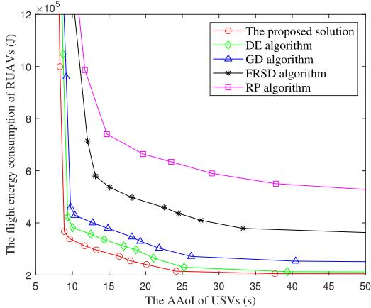  
Fig. 4. The trade-off between RUAVs flight energy consumption and AAoI.

RIS phase shift vector and TUAV hovering altitude is identical to the proposed solution.

GD algorithm: GD algorithm is utilized to optimize TUAV hovering altitude as proposed in [61]. The optimization of RUAVs’ trajectories, RUAV service duration indicator and RIS phase shift vector are identical to the proposed solution.

RP algorithm: The TUAV-mounted RIS phase shift vector is randomly determined as proposed in [12]. The optimization of RUAVs’ trajectories, RUAV service duration indicator and RIS phase shift vector are identical to the proposed solution.

Referring to [62], $X _ { w }$ is uniformly determined within the typical range [1, 10<sup>6</sup>] for performance comparison. In Fig. 4, the trade-off between RUAVs flight energy consumption and USVs AAoI is illustrated. The RUAVs flight energy consumption and USVs AAoI have a contradicting relation. It can be seen that the proposed solution shows the lowest RUAVs flight energy consumption under the same USVs AAoI. In particular, the proposed solution achieves RUAVs flight energy consumption and USVs AAoI at around $3 . 3 \times 1 0 ^ { 5 }$ J and 9.6 s, respectively.

$$
\begin{array} { c } { { \{ \beta _ { T B S } \} ^ { u b } = v _ { T B S } + \displaystyle \frac { u _ { T B S } } { 1 + A _ { T B S } \mathrm { e } ^ { - B _ { T B S } ( \theta _ { T B S } ^ { r s o M } - A _ { T B S } ) } } - \displaystyle \frac { u _ { T B S } A _ { T B S } } { ( 1 + A _ { T B S } \mathrm { e } ^ { - B _ { T B S } ( \theta _ { T B S } ^ { r s o M } - A _ { T B S } ) } ) ^ { 2 } } } } \\ { { \times \left( \mathrm { e } ^ { - B _ { T B S } ( \theta _ { T B S } - A _ { T B S } ) } - \mathrm { e } ^ { - B _ { T B S } ( \theta _ { T B S } ^ { r s o M } - A _ { T B S } ) } \right) } } \end{array}\tag{61}
$$

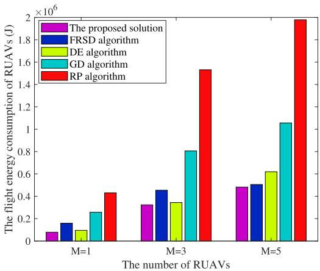  
Fig. 5. RUAVs flight energy consumption versus the typical number of RU-AVs.

Followed by DE algorithm and GD algorithm, with the corresponding value of $3 . 8 \times 1 0 ^ { 5 }$ J and $1 0 . 5 \mathrm { s } , 4 . 3 \times 1 0 ^ { 5 }$ J and 11.8s, respectively. RP algorithm presents the worst performance with RUAVs flight energy consumption at $6 . 6 \times 1 0 ^ { 5 }$ J and USVs AAoI at 19.6s. This is because the communication quality will be improved when RUAVs are closer to USVs. In this way, the flight distance of each RUAV will be significantly prolonged. One should note that RUAVs energy consumption may increase when the weighting parameter increases, while USVs AAoI decreases. This is due to the fact that the proposed solution emphasizes minimizing USVs AAoI rather than RUAVs flight energy consumption when $X _ { w }$ is large.

Note that the weighting parameter $X _ { w }$ can significantly influence the balance between RUAVs flight energy consumption and USVs AAoI and thus should be appropriately determined. Following [62], $X _ { m } = 1 0 ^ { 5 }$ is selected for further investigation. Fig. 5 demonstrates the relationship between RUAVs flight energy consumption and the different number of RUAVs. One can observe that the proposed solution realizes the lowest RUAV flight energy consumption compared with other selected benchmarks under the same number of RUAVs. In particular, the proposed solution realizes $7 . 8 \times 1 0 ^ { 4 } \mathrm { ~ J } , 3 . 2 \times 1 0 ^ { 5 }$ J and $4 . 8 \times 1 0 ^ { 5 }$ J when M = 1, 3 and 5, respectively. Followed by FRSD algorithm and DE algorithm with the corresponding value of $\mathbf { 1 . 6 \times 1 0 ^ { 5 } J , 4 . 5 \times 1 0 ^ { 5 } J , 5 . 1 \times 1 0 ^ { 5 } }$ J and $9 . 5 \times 1 0 ^ { 4 } \mathrm { J } , 3 . 4 \times 1 0 ^ { 5 }$ $\mathrm { J } , 6 . 2 \times 1 0 ^ { 5 }$ J, respectively. RP achieves the worst performance with the corresponding values of $4 . 3 \times 1 0 ^ { 5 } ~ \mathrm { J } , 1 . 5 \times 1 0 ^ { 6 }$ J and $2 . 0 \times 1 0 ^ { 6 } \ :$ J, respectively. This may involve the fact that the proposed solution can dynamically update RUAVs’ trajectories in each timeslot and thus the corresponding RUAVs propulsion power consumption can be significantly decreased. Moreover, the proposed solution can dynamically optimize TUAV hovering altitude in each timeslot to promise a higher LOS probability of TBS → TUAV-mounted RIS link. In this way, the data size of successfully offloaded tasks increases considerably.

The typical number of RUAVs, e.g., M = 3, is considered to analyze the trade-off between the RUAVs flight energy consumption and USVs transmission energy. Fig. 6 demonstrates RUAVs flight energy consumption under numerous typical values of V .

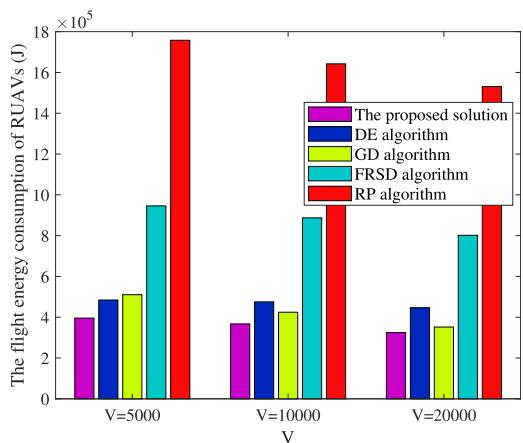  
Fig. 6. RUAVs flight energy consumption versus $V .$

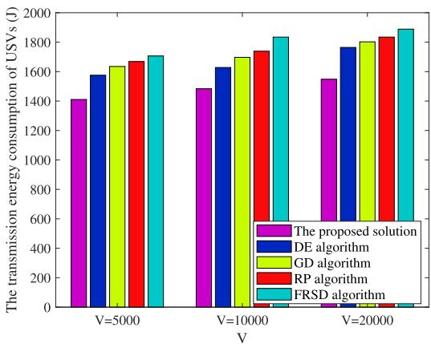  
Fig. 7. USVs transmission energy consumption versus $V .$

One can observe that RUAVS flight energy consumption of all algorithms decreases with V increases. In particular, the proposed solution achieves approximately $3 . 9 \times 1 0 ^ { 5 } ~ \mathrm { J } , 3 . 7 \times 1 0 ^ { 5 }$ J and $3 . 2 \times 1 0 ^ { 5 }$ J when $V = 5 0 0 0$ , 10000 and 20000, respectively. Followed by DE algorithm and GD algorithm, with the corresponding value of $4 . { \overset { \cdot } { 8 } } \times 1 0 ^ { 5 } ~ \mathbf { J } , 4 . 7 \times 1 { \overset { \cdot } { 0 } } ^ { 5 } ~ \mathbf { J } , 4 . 5 \times 1 0 ^ { 5 } ~ \mathbf { \underline { { 1 } } }$ J, and $\bar { 5 . 1 } \times 1 0 ^ { \bar { 5 } } { \bf J } , 4 . 2 \times 1 0 ^ { 5 } { \bf J } , 3 . 5 \times 1 0 ^ { 5 } { \bf J }$ , respectively. RP realizes the highest RUAVs flight energy consumption with around $\mathsf { L } . 7 \times 1 0 ^ { 6 } \mathsf { J } , 1 . 6 \times 1 0 ^ { 6 }$ J and $\mathrm { 1 . 5 \times 1 0 ^ { 6 } J }$ when $V = 5 0 0 0$ , 10000 and 20000, respectively.

Fig. 7 demonstrates USVs transmission energy consumption under different V . One can observe that USVs transmission energy consumption of all algorithms rises with V increases. In particular, the proposed solution achieves the lowest USVs transmission energy consumption around 1 $\mathbf { . 4 } \times 1 0 ^ { 3 } \mathbf { J } , 1 . 5 \times 1 0 ^ { 3 }$ J and $1 . 6 \times 1 0 ^ { 3 }$ J when V = 5000, 10000 and 20000, respectively. Followed by DE algorithm and GD algorithm, with the corresponding value of $1 . { \bar { 5 } } \times 1 0 ^ { 3 }$ J, 1.6 × 10<sup>3</sup> J, 1.7 × 10<sup>3</sup> J, and $1 . { \bar { 6 } } \times 1 0 ^ { \bar { 3 } }$ J, 1.7 × 10<sup>3</sup> J, 1.8 × 10<sup>3</sup> J, respectively. FRSD realizes the highest USVs transmission energy consumption with $1 . 7 \times 1 0 ^ { 3 } \mathrm { { \bar { J } } , 1 . 8 \times 1 0 ^ { 3 } \mathrm { { J } } }$ and $1 . 9 \times 1 0 ^ { 3 } \mathrm { J }$ when $V = 5 0 0 0$ 10000 and 20000, respectively. This phenomenon is attributed to the control parameter V in balancing the trade-off between the queue backlog of $\pmb { L } _ { U S V } ( t )$ and RUAV flight energy consumption and USVs AAoI. The proposed solution focuses on reducing RUAVs flight energy consumption rather than decreasing USVs transmission energy consumption when V is large. As a result, one can dynamically adjust the value of V to achieve the balance between RUAVs flight energy consumption and USVs transmission energy consumption.

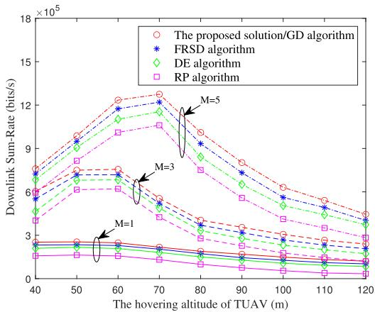  
Fig. 8. Downlink sum-rate versus TUAV hovering altitude.

The downlink sum-rate is defined as the achievable downlink sum-rate between TBS and RUAV swarm. Fig. 8 shows the downlink sum-rate under different typical TUAV hovering altitudes $H _ { T U A V }$ . One can see that the proposed solution can realize the highest downlink sum-rate in comparison with FRSD algorithm, DE algorithm and RP algorithm under the same TUAV hovering altitude. In particular, when $M = 5 ,$ , the proposed solution reaches the highest achievable downlink sum-rate with approximately $1 . 3 \times 1 0 ^ { 6 }$ bits/s and $6 . 3 \times 1 0 ^ { 5 }$ bits/s when $H _ { T U A V } = 6 0$ m and 100m, respectively. Followed by FRSD algorithm and DE algorithm, with the corresponding values of $1 . 2 \times 1 0 ^ { 6 }$ bits/s, $5 . 6 \times 1 0 ^ { 5 }$ bits/s and 1 $. 1 \times 1 0 ^ { 6 } \mathrm { b i t s } / \mathrm { s } , 5 . 0 \times 1 0 ^ { 5 }$ bits/s, respectively. This is because the proposed solution is capable of optimizing RUAVs’ trajectories and thus the distance between TUAV-mounted RIS and each RUAV can be considerably decreased. Moreover, one can realize that downlink sum-rate of all algorithms cannot always keep increasing with TUAV hovering altitude increases. The reason may involve the fact that TUAV with low hovering altitudes can simultaneously promise smaller LOS probability and less transmission distance between TBS and TUAV.

The typical number of RUAVs is set to $M = 3$ for further investigation. The USVs AAoI versus the number of USVs is demonstrated in Fig. 9. The USVs AAoI of all approaches is increased with the number of USVs. In particular, the proposed solution shows the lowest USVs AAoI at about 16s and 36s when I = 15 and 30, respectively. Followed by DE algorithm and GD algorithm with the corresponding values of 21s, 51s and 27s, 64s, respectively. RP algorithm presents the highest AAoI with 58s and 119s when I = 15 and 30, respectively. This is because the allocated time slot length of each USV is decreased with the larger number of USVs. In this way, the data size of successfully offloaded tasks significantly decreases, which leads to larger USVs AAoI.

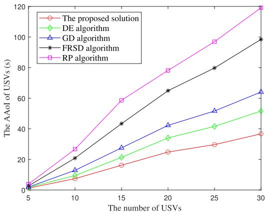  
Fig. 9. USVs AAoI versus the number of USVs.

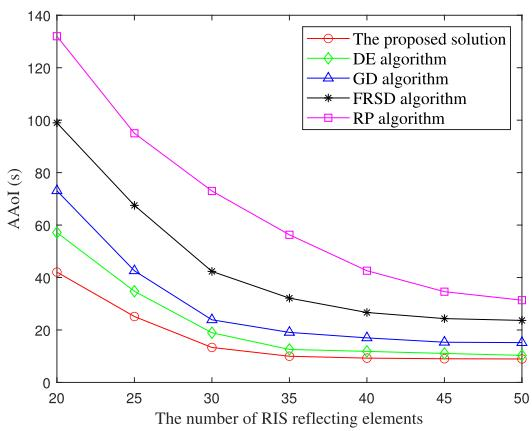  
Fig. 10. USVs AAoI versus RIS reflecting elements.

Fig. 10 shows USVs AAoI versus the different number of RIS reflecting elements. One can observe that USVs AAoI of all algorithms decreases with the increase in the number of RIS reflecting elements. In particular, the proposed solution achieves the lowest USVs AAoI with nearly 7.4 s and 4.2 s when $K = 3 0$ and 50, respectively. Followed by DE algorithm and FRSD algorithm, with the corresponding values of almost 9.4s, 5.5s and 12.8 s, 7.1s. GD algorithm realizes the highest USVs AAoI with 20.7s and 11.5s when $K = 3 0$ and 50, respectively. One should note that the proposed solution outperforms a number of the existing highly efficient algorithms as proposed in [61] since information delivery via TBS → TUAV-mounted RIS link may suffer additional transmission attenuation without designing appropriate TUAV hovering altitude. In this case, USVs online data transmission may suffer additional transmission latency and thus USVs AAoI deteriorates. Compared with RP algorithm, the proposed solution is dynamically optimized the RIS phase shift vector according to RUAVs’ trajectories and transmission link dynamics. In this way, the communication quality between the TBS and RUAV is significantly enhanced.

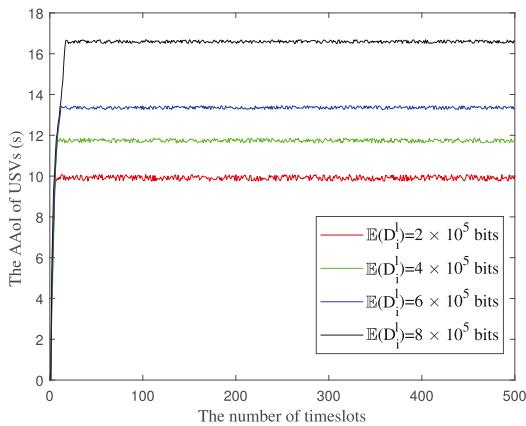  
Fig. 11. The evolution of USVs AAoI.

Fig. 11 plots the evolution of USVs AAoI of the proposed solution under different typical means of requesting bidirectional computation tasks of each USV i. One can observe that with the increase in timeslots, USVs AAoI rises and reaches the upper bound after realizing sufficient timeslots. In particular, when $\mathbb { E } ( D _ { i } ^ { l } ) = 2 \times 1 0 ^ { 5 } , 4 \times 1 0 ^ { 5 } , 6 \times 1 0 ^ { 5 }$ and $\mathrm { 8 \times 1 0 ^ { 5 } }$ bits, the corresponding USVs AAoI is around 10s, 12s, 14s and 17s, respectively. Moreover, one can see that USVs AAoI increases with the size of request bidirectional computation tasks of each USV i increases under the same number of timeslots. One should note that RUAVs may prolong their flight distance to satisfy USVs AAoI requirements; the data size of request bidirectional computation tasks of each USV should be considered to realize a satisfactory trade-off between USVs AAoI and RUAVs flight energy consumption.

Note that realizing efficient wireless data transmission and network energy minimization for AoI-aware RIS-assisted UAV-USV MEC network is challenging due to the following key reasons. It is difficult to promise satisfactory channel quality since wireless inland waterway communications suffer from LOS and NLOS simultaneously; the Rician factor is generally lower in comparison with typical terrestrial-based communication scenarios. Moreover, RUAV flight energy consumption and USVs AAoI are two contradictory requirements for AoI-aware RIS-assisted UAV-USV MEC network. The proposed solution is to cooperatively deploy TUAV and RUAVs, where TBS can transmit the online and USV-generated data to each RUAV via TUAV-mounted RIS, which brings numerous technical advantages to balance RUAVs flight energy consumption and USVs AAoI. First, RUAVs’ trajectories can be dynamically determined according to USVs AAoI; the distance between each RUAV and USV can be decreased while the channel quality of each USV → RUAV link can be significantly enhanced. Moreover, the proposed solution is capable of jointly optimizing TUAV hovering altitude and RIS phase shift, thereby enhancing the channel quality of each TBS → RUAV link. Furthermore, the proposed solution can dynamically optimize RUAVs service duration to achieve higher throughput between each USV and RUAV swarm. To sum up, the proposed solution can achieve lower RUAVs flight energy consumption and USVs AAoI in comparison to selected benchmark algorithms.

## V. CONCLUSION AND FUTURE WORK

This paper proposes a novel RIS-assisted UAV-USV MEC network architecture considering USV bidirectional computation tasks with AAoI constraints. The minimization of USVs AAoI and RUAVs flight energy consumption is formulated from the long-term perspective with a series of constraints, e.g., RUAVs service duration indicators, TUAV-mounted RIS phase shift, TUAV hovering altitude, USVs AAoI and long-term power constraint and RUAVs’ trajectories. A highly efficient heuristic solution is proposed to solve the formulated challenging problem. First, a novel Lyapunov framework transforms the original long-term stochastic optimization problem into various single-slot deterministic optimization problems. Then, one can decouple each single-slot optimization problem into two subproblems, and the proposed EWOA algorithm and EAO algorithm are used to solve RUAVs’ trajectories subproblem and the joint optimization of RUAV service duration, RIS phase shift and TUAV hovering altitude subproblem, respectively. In this manner, one can obtain the feasible solution to the challenging formulated problem efficiently. The results verify that the proposed solution can significantly reduce long-term RUAVs flight energy consumption while maintaining lower USVs AAoI in comparison with numerous selected widely used benchmarks.

In the future, we aim to quantify the dynamics of USVs bidirectional computation tasks by jointly considering physical space and virtual space interaction by using a digital twin (DT)- supported approach since it has been proved as an effective solution to monitor network status [63]. Moreover, one can focus on utilizing deep learning (DL) or multi-agent DRL-based schemes to enhance RIS-assisted UAV-USV MEC network utility and is expected to realize online training on UAVs deployment and RIS phase shift design according to USV mobility, channel quality, network resources, and hardware feasibility [41], [42], which is a novel approach to improving robustness of complex network. Another emerging research topic is achieving efficient data transmission in dynamic environments. For instance, one can collaborate with classification societies to develop unified RIS-assisted ship-to-shore communication protocols to promise packet loss and data traffic congestion [64] or conduct performance analysis regarding sum-rate and channel capacity of RIS-assisted multi-UAV NOMA networks or UAV-assisted RIS-SIMO systems [25], [28].

## REFERENCES

[1] Y. Liao, L. Liu, and Y. Ma, “Energy- and latency-efficient resource allocation for RIS-Assisted UAV-USV cooperative MEC network,” IEEE Trans. Green Commun. Netw., early access, Feb. 25, 2025, doi: 10.1109/TGCN.2025.3545458.

[2] C. Liu et al., “An enhanced RRT∗ Algorithm with biased sampling and dynamic stepsize strategy for ship route planning in the high-risk areas,” Ocean Eng., vol. 332, pp. 121466–121477, 2025.

[3] G. Shao, Y. Ma, R. Malekian, X. Yan, and Z. Li, “A novel cooperative platform design for coupled USV-UAV systems,” IEEE Trans. Ind. Informat., vol. 15, no. 9, pp. 4913–4922, Sep. 2019.

[4] R. Zhou et al., “Collision-free waterway segmentation for inland unmanned surface vehicles,” IEEE Trans. Instrum. Meas., vol. 71, 2022, Art. no. 5013416.

[5] S. He, M. Wang, S. Dai, and F. Luo, “Leader-follower formation control of USVs with prescribed performance and collision avoidance,” IEEE Trans. Ind. Informat., vol. 15, no. 1, pp. 572–581, Jan. 2019.

[6] H. Zeng, Z. Su, Q. Xu, K. Zhang, and Q. Ye, “Game theoretical incentive for USV fleet-assisted data sharing in maritime communication networks,” IEEE Trans. Netw. Sci. Eng., vol. 11, no. 2, pp. 1398–1412, Mar./Apr. 2024.

[7] H. Li, J. Zhang, H. Zhao, Y. Ni, J. Xiong, and J. Wei, “Joint optimization on trajectory, computation and communication resources in information freshness sensitive MEC system,” IEEE Trans. Veh. Technol., vol. 73, no. 3, pp. 4162–4177, Mar. 2024.

[8] S. Shen, H. Yang, K. Yang, K. Wang, and G. Zhang, “AoI-Aware joint resource allocation in multi-UAV aided multi-access edge computing systems,” IEEE Trans. Netw. Sci. Eng., vol. 11, no. 3, pp. 2596–2609, May/Jun. 2024.

[9] E. Björnson, Ö. Özdogan, and E. G. Larsson, “Intelligent reflecting surface versus decode-and-forward: How large surfaces are needed to beat relaying?,” IEEE Wireless Commun. Lett., vol. 9, no. 2, pp. 244–248, Feb. 2020.

[10] X. Pang, M. Sheng, N. Zhao, J. Tang, D. Niyato, and K. K. Wong, “When UAV meets IRS: Expanding air-ground networks via passive reflection,” IEEE Wireless Commun., vol. 28, no. 5, pp. 164–170, Oct. 2021.

[11] Q. Ai, X. Qiao, Y. Liao, and Q. Yu, “Joint optimization of USVs communication and computation resource in IRS-aided wireless inland ship MEC networks,” IEEE Trans. Green Commun. Netw., vol. 6, no. 2, pp. 1023–1036, Jun. 2022.

[12] Y. Liao, J. Liu, X. Chen, Y. Han, Q. Ai, and G.-M. Muntean, “Energy minimization of inland waterway USVs for IRS-Assisted hybrid UAV-Terrestrial MEC network,” IEEE Trans. Veh. Technol., vol. 73, no. 3, pp. 4121–4135, Mar. 2024.

[13] T. Ye, X. Yu, and X. Jia, “Dangerous area of tethered UAV due to impact,” IEEE Access, vol. 10, pp. 121152–121158, 2022.

[14] C. Li, J. Yu, W. Chen, K. Yang, and F. Li, “Shadowing correlation and a novel statistical model for inland river radio channel,” in Proc. IEEE Int. Conf. Commun., Shanghai, China, 2019, pp. 1–6.

[15] J. Yu et al., “Channel measurement and modeling of the small-scale fading characteristics for urban inland river environment,” IEEE Trans. Wireless Commun., vol. 19, no. 5, pp. 3376–3389, May 2020.

[16] Z. Wang, Z. Wang, G. Gong, C. Li, J. Yu, and W. Chen, “Measurementbased extraction and analysis of multipath component for suspension bridge scenarios,” in Proc. IEEE Int. Conf. Electron. Inf. Commun. Technol., Qingdao, China, 2023, pp. 841–845.

[17] G. Gong, B. Xu, W. Li, C. Li, J. Yu, and W. Chen, “Channel measurement based on ray tracing calibration and analysis for inland river environment,” in Proc. IEEE/CIC Int. Conf. Commun. China, Hangzhou, China, 2024, pp. 545–550.

[18] W. Tang, H. Zhang, Y. He, and M. Zhou, “Performance analysis of multiantenna UAV networks with 3D interference coordination,” IEEE Trans. Wireless Commun., vol. 21, no. 7, pp. 5145–5161, Jul. 2022.

[19] W. Mei and R. Zhang, “Aerial-ground interference mitigation for cellularconnected UAV,” IEEE Wireless Commun., vol. 28, no. 1, pp. 167–173, Feb. 2021.

[20] B. F. Beidas and R. I. Seshadri, “Advanced receiver strategy for co-channel interference in multibeam satellite systems,” in Proc. Adv. Satell. Multimedia Syst. Conf., Graz, Austria, 2020, pp. 1–8.

[21] L. Zhou, X. Chen, M. Hong, S. Jin, and Q. Shi, “Efficient resource allocation for multi-UAV communication against adjacent and co-channel interference,” IEEE Trans. Veh. Technol., vol. 70, no. 10, pp. 10222–10235, Oct. 2021.

[22] B. Ji, S. Wang, G. Zhang, J. Liu, and S. Mumtaz, “Performance analysis of RIS-assisted V2V communication under multipath interference,” Veh. Commun., vol. 45, no. 2, pp. 10096961–1006969, 2024.

[23] C. Zhang, L. Zhang, L. Zhu, T. Zhang, Z. Xiao, and X.-G. Xia, “3D deployment of multiple UAV-Mounted base stations for UAV communications,” IEEE Trans. Commun., vol. 69, no. 4, pp. 2473–2488, Apr. 2021.

[24] X. Pei, Y. Chen, M. Wen, H. Yu, E. Panayirci, and H. V. Poor, “Nextgeneration multiple access based on NOMA with power level modulation,” IEEE J. Sel. Areas Commun., vol. 40, no. 4, pp. 1072–1083, Apr. 2022.

[25] Y. Li, H. Zhang, K. Long, and A. Nallanathan, “Exploring sum rate maximization in UAV-based multi-IRS networks: IRS association, UAV altitude, and phase shift design,” IEEE Trans. Commun., vol. 70, no. 11, pp. 7764–7774, Nov. 2022.

[26] S. K. Singh, K. Agrawal, K. Singh, C.-P. Li, and Z. Ding, “NOMA enhanced hybrid RIS-UAV-Assisted full-duplex communication system with imperfect SIC and CSI,” IEEE Trans. Commun., vol. 70, no. 11, pp. 7609–7627, Nov. 2022.

[27] B. Clerckx et al., “A primer on rate-splitting multiple access: Tutorial, myths, and frequently asked questions,” IEEE J. Sel. Areas Commun., vol. 41, no. 5, pp. 1265–1308, May 2023.

[28] Y. Li et al., “Sum secrecy rate maximization for active RIS-Assisted uplink SIMO-NOMA networks,” IEEE Commun. Lett., vol. 28, no. 3, pp. 722–726, Mar. 2024.

[29] B. Lu, S. Lin, and J. Shi, “TDMA-NOMA based computation offloading for cognitive capacity harvesting networks with transmission order optimization,” IEEE Trans. Commun., vol. 70, no. 9, pp. 6355–6369, Sep. 2022.

[30] R. Priyambudi and Iskandar, “Capacity evaluation of hybrid TDMA-NOMA for high altitude platform systems,” in Proc. 9th Int. Conf. Wireless Telematics, Solo, Indonesia, 2023, pp. 1–4.

[31] J. Qian, J. Wang, X. Li, and S. Jin, “UAV-MIMO under wobbling: A comparative analysis of centralized and distributed implementations,” IEEE Trans. Commun., vol. 73, no. 8, pp. 6825–6839, Aug. 2025, doi: 10.1109/TCOMM.2025.3535886.

[32] X. Qin, Z. Song, T. Hou, W. Yu, J. Wang, and X. Sun, “Joint optimization of resource allocation, phase shift, and UAV trajectory for energy-efficient RIS-Assisted UAV-enabled MEC systems,” IEEE Trans. Green Commun. Netw., vol. 7, no. 4, pp. 1778–1792, Dec. 2023.

[33] M. Samir, M. Elhattab, C. Assi, S. Sharafeddine, and A. Ghrayeb, “Optimizing age of information through aerial reconfigurable intelligent surfaces: A deep reinforcement learning approach,” IEEE Trans. Veh. Technol., vol. 70, no. 4, pp. 3978–3983, Apr. 2021.

[34] T. Shafique, H. Tabassum, and E. Hossain, “Optimization of wireless relaying with flexible UAV-Borne reflecting surfaces,” IEEE Trans. Commun., vol. 69, no. 1, pp. 309–325, Jan. 2021.

[35] Y. M. Park, S. S. Hassan, Y. K. Tun, Z. Han, and C. S. Hong, “Joint resources and phase-shift optimization of MEC-enabled UAV in IRSassisted 6G THz networks,” in Proc. Netw. Operations Manage. Symp., Budapest, Hungary, 2022, pp. 1–7.

[36] H. Zhao, W. Sun, Y. Ni, W. Xia, G. Gui, and C. Zhu, “Deep deterministic policy gradient-based rate maximization for RIS-UAV-Assisted vehicular communication networks,” IEEE Trans. Intell. Transp. Syst., vol. 25, no. 11, pp. 15732–15744, Nov. 2024.

[37] S. S. Hassan, Y. Min Park, Y. K. Tun, W. Saad, Z. Han, and C. S. Hong, “3TO: THz-Enabled throughput and trajectory optimization of UAVs in 6G networks by proximal policy optimization deep reinforcement learning,” in Proc. IEEE Int. Conf. Commun., Seoul, Korea, 2022, pp. 5712–5718.

[38] Y. M. Park, S. S. Hassan, Y. K. Tun, Z. Han, and C. S. Hong, “Joint trajectory and resource optimization of MEC-Assisted UAVs in Sub-THz networks: A resources-based multi-agent proximal policy optimization DRL with attention mechanism,” IEEE Trans. Veh. Technol., vol. 73, no. 2, pp. 2003–2016, Feb. 2024.

[39] A. Mohajer, J. Hajipour, and V. C. M. Leung, “Dynamic offloading in mobile edge computing with traffic-aware network slicing and adaptive TD3 strategy,” IEEE Commun. Lett., vol. 29, no. 1, pp. 95–99, Jan. 2025.

[40] Z. Sheng, H. Hu, A. A. Nasir, Y. Fang, and D. B. da Costa, “Online trajectory planning and resource allocation of UAV-Enabled MEC networks empowered by RIS,” IEEE Trans. Green Commun. Netw., vol. 9, no. 3, pp. 1224–1238, Sep. 2025, doi: 10.1109/TGCN.2024.3503687.

[41] Y. Zeng, S. Chen, J. Li, Y. Cui, and J. Du, “Online optimization in UAVenabled MEC system: Minimizing long-term energy consumption under adapting to heterogeneous demands,” IEEE Internet Things J., vol. 11, no. 19, pp. 32143–32159, Oct. 2024.

[42] M. Zhao, R. Zhang, Z. He, and K. Li, “Joint optimization of trajectory, offloading, caching, and migration for UAV-Assisted MEC,” IEEE Trans. Mobile Comput., vol. 24, no. 3, pp. 1981–1998, Mar. 2025.

[43] Y. Liao, Y. Song, S. Xia, Y. Han, N. Xu, and X. Zhai, “Energy minimization of RIS-Assisted cooperative UAV-USV MEC network,” IEEE Internet Things J., vol. 11, no. 20, pp. 32490–32502, Oct. 2024.

[44] W. Qi, C. Yang, Q. Song, Y. Guan, L. Guo, and A. Jamalipour, “Minimizing age of information for hybrid UAV-RIS-Assisted vehicular networks,” IEEE Internet Things J., vol. 11, no. 10, pp. 17886–17895, May 2024.

[45] K. Chen and L. Huang, “Age-of-information in the presence of error,” in Proc. IEEE Int. Symp. Inf. Theory, Barcelona, Spain, 2016, pp. 2579–2583.

[46] B. E. Y. Belmekki and M.-S. Alouini, “Unleashing the potential of networked tethered flying platforms: Prospects, challenges, and applications,” IEEE Open J. Veh. Technol., vol. 3, pp. 278–320, 2022.

[47] M. Rivera, W. Jaafar, and H. Yanikomeroglu, “Optimization of RISassisted RSMA-enabled tethered-UAV communications,” in Proc. IEEE Globecom Workshops, Kuala Lumpur, Malaysia, 2023, pp. 227–232.

[48] Y. Liao, X. Chen, S. Xia, Q. Ai, and Q. Liu, “Energy minimization for UAV swarm-enabled wireless inland ship MEC network with time windows,” IEEE Trans. Green Commun. Netw., vol. 7, no. 2, pp. 594–608, Jun. 2023.

[49] Z. Yao, Q. Zhu, Y. Zhang, H. Huang, and M. Luo, “Minimizing long-term energy consumption in RIS-assisted AAV-enabled MEC network,” IEEE Internet Things J., vol. 12, no. 12, pp. 20942–20958, Jun. 2025.

[50] E. Björnson and Ö. T. Demir, Introduction to Multiple Antenna Communications and Reconfigurable Surfaces. Norwell, MA, USA: Now Publishers, 2024.

[51] X. Guo, B. Li, J. Wu, R. Zhang, and X. Cheng, “Joint uplink and downlink NOMA for UAV relaying network with multi-pair users,” IEEE Trans. Wireless Commun., vol. 23, no. 12, pp. 18549–18562, Dec. 2024.

[52] M. Bayraktar and G. M. Guvensen, “Adaptation of code-domain NOMA to SC-FDE based overloaded mmWave hybrid massive MIMO,” IEEE Commun. Lett., vol. 26, no. 3, pp. 667–671, Mar. 2022.

[53] R. Zhang, X. Pang, W. Lu, N. Zhao, Y. Chen, and D. Niyato, “Dual-UAV enabled secure data collection with propulsion limitation,” IEEE Trans. Wireless Commun., vol. 20, no. 11, pp. 7445–7459, Nov. 2021.

[54] Y. Hou, W. Huang, H. Zhou, F. Gu, Y. Chang, and Y. He, “Analysis on wind resistance index of multi-rotor UAV,” in Proc. Chin. Control And Decis. Conf., Nanchang, China, 2019, pp. 3693–3696.

[55] R. Li, C. Huang, X. Qin, and L. Yang, “AoI-delay tradeoff in mobile edge caching: A mixed-order drift-plus-penalty method,” in Proc. IEEE Int. Conf. Commun., Denver, USA, 2024, pp. 1225–1230.

[56] G. Even and N. Halabi, “Analysis of the min-sum algorithm for packing and covering problems via linear programming,” IEEE Trans. Inf. Theory, vol. 61, no. 10, pp. 5295–5305, Oct. 2015.

[57] M. Almekhlafi, M. A. Arfaoui, C. Assi, and A. Ghrayeb, “A low complexity passive beamforming design for reconfigurable intelligent surface (RIS) in 6 G networks,” IEEE Trans. Veh. Technol., vol. 72, no. 5, pp. 6309–6321, May 2023.

[58] M. Grant and S. Boyd, “CVX: Matlab software for disciplined convex programming, version 2.1,” 2014. [Online]. Available: https://cvxr.com/ cvx/citing/

[59] K. Xiang and Y. He, “UAV-assisted MEC system considering UAV trajectory and task offloading strategy,” in Proc. IEEE Int. Conf. Commun., Rome, Italy, 2023, pp. 4677–4682.

[60] Z. Yang, J. Hou, and M. Shikh-Bahaei, “Resource allocation in full duplex mobile-edge computation systems with NOMA and energy harvesting,” in Proc. IEEE Int. Conf. Commun., Shanghai, China, 2019, pp. 1–6.

[61] Q. Li et al., “UAV altitude, relay selection, and user association optimization for cooperative relay-transmission in UAV-IRS-Based THz networks,” IEEE Trans. Green Commun. Netw., vol. 8, no. 2, pp. 815–826, Jun. 2024.

[62] M. Ren, J. Chen, L. Yang, Y. Zhou, B. He, and H. Jiang, “Energy-delay tradeoff in helper-assisted NOMA-MEC systems: A four-sided matching algorithm,” IEEE Trans. Commun., vol. 72, no. 5, pp. 2835–2850, May 2024.

[63] B. Hazarika, K. Singh, C.-P. Li, A. Schmeink, and K. F. Tsang, “RADiT: Resource allocation in digital twin-driven UAV-Aided internet of vehicle networks,” IEEE J. Sel. Areas Commun., vol. 41, no. 11, pp. 3369–3385, Nov. 2023.

[64] D. Song, J. Ren, L. Wang, H. Wu, J. Chen, and G. Chen, “Two-component GMM source coding and optimization,” IEEE Trans. Intell. Transp. Syst., early access, May 16, 2025, doi: 10.1109/TITS.2025.3568227.