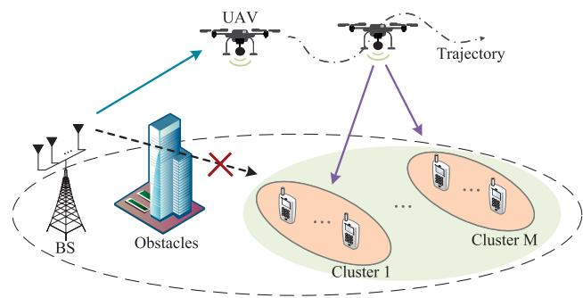
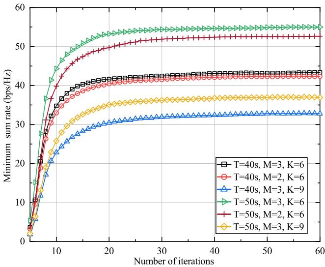
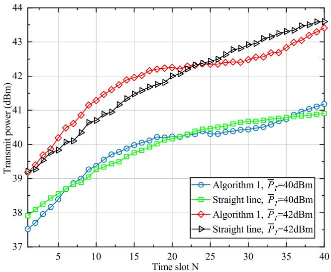
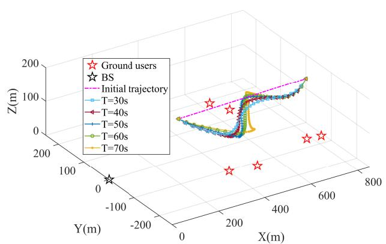
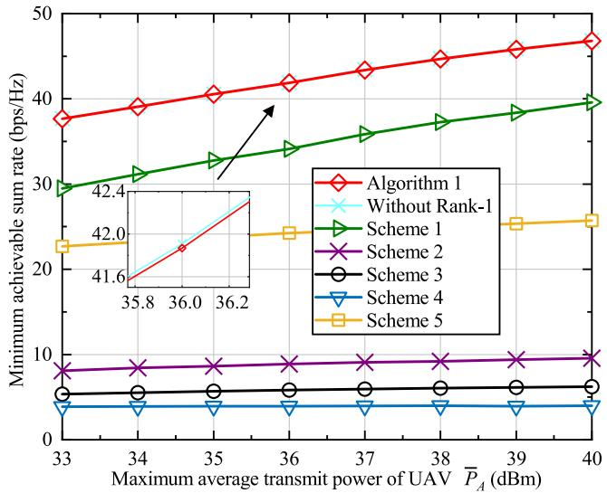
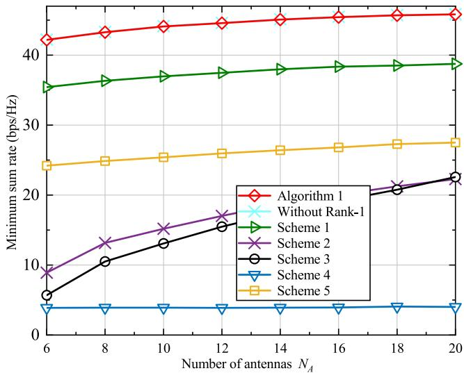
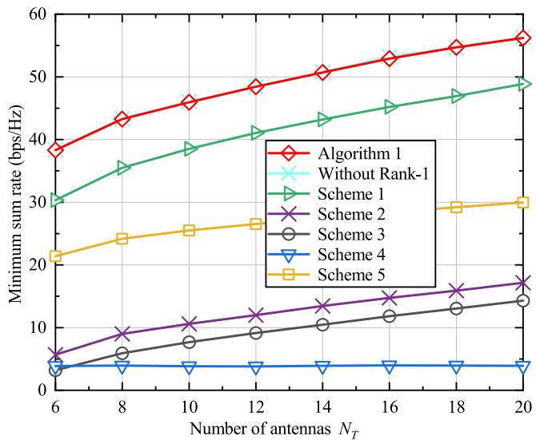
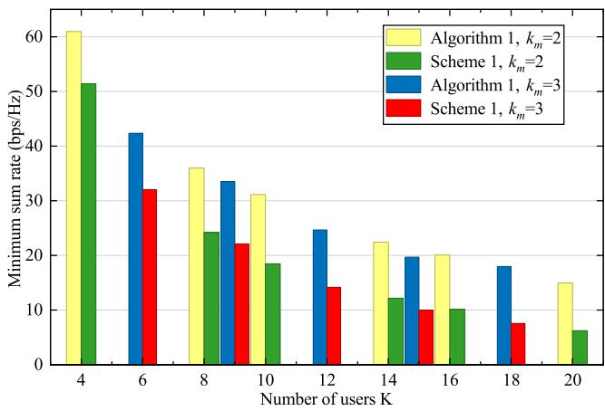
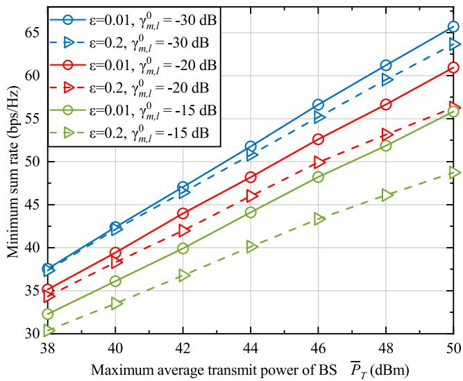

# Joint Beamforming, Power Control, and Trajectory Planning for NOMA-Based UAV Relaying System

Xiazhao Li , Laixian Peng , Haichao Wang , Xingyue Yu , Wendong Zhao, and Hai Wang

Abstract—Next-generation wireless communication networks are expected to support a large number of connections and full coverage capabilities. Unmanned aerial vehicle (UAV) and nonorthogonal multiple access (NOMA) techniques can be adopted due to their ability to expand the coverage area and enhance system capacity. In this paper, we propose an innovative NOMAbased UAV relaying system, where a UAV equipped with multiple antennas acts as a relay to provide service for multiple ground users. To address the rate fairness issue, we aim to maximize the minimum achievable sum rate among all users by jointly solving the problem of beamforming design, power control, and UAV trajectory planning subject to the power budget, QoS requirements as well as the UAV flight trajectory constraints. We then propose an alternating optimization algorithm based on successive convex approximation (SCA) and semidefinite relaxation (SDR) methods to jointly optimize the beamforming and power variables while dynamically controlling the UAV trajectory, thereby achieving reliable UAV relaying transmission. Simulation results demonstrate that, compared with the baseline designs, the proposed algorithm achieves a substantial improvement in the minimum achievable sum rate with satisfactory efficiency. Moreover, simulations reveal that the considered system tends to be interference-limited under stringent QoS requirements, especially when there is non-negligible residual interference caused by imperfect successive interference cancellation (SIC).

Index Terms—Multiple antenna, non-orthogonal multiple access (NOMA), relay, beamforming design, power control, UAV trajectory planning.

## I. INTRODUCTION

## A. Background

W <sup>ITH</sup> <sup>the</sup> <sup>emergence</sup> <sup>of</sup> <sup>novel</sup> <sup>large-scale</sup> <sup>communica-</sup> tion scenarios, such as emergency hot spots, smart industry, and intelligent Internet of Things (IoT), nextgeneration wireless networks are expected to exhibit several critical characteristics, such as massive access capability and high spectrum and energy efficiency [1]. In this context, the multiple-input multiple-output (MIMO) technique, which achieves high speed wireless communication via spatial degree-of-freedom (DoF), has been recognized as an essential technology for B5G and future 6G [2]. Additionally, the so-called non-orthogonal multiple access (NOMA) technique can enhance system capacity by allowing multiple users to occupy the same spectrum. At the same time, interference from sharing users is removed by utilizing the successive interference cancellation (SIC) technique. Therefore, NOMA combined with the multiple antennas technique has attracted significant attention due to its high communication capacity and strong ability of alleviating interference [3], [4]. Meanwhile, unmanned aerial vehicle (UAV)-assisted communication, thanks to its deployment flexibility and controllable mobility, has sparked considerable research in many application scenarios [5], [6]. Specifically, by controlling the deployment position and flight trajectory of UAVs, their strong line-of-sight (LoS) capability can be exploited to improve performance gains in terms of coverage and transmission capacity.

Despite these promising applications, several crucial issues remain to be addressed. Firstly, while NOMA tends to allocate more resources to users with weaker channel gains, this may result in the so-called far-near unfairness, i.e., the aim of allocating resources to weaker users is to satisfy the quality of service (QoS) requirements [7]. To tackle this issue, a general approach is to design the fairness metric and address internal performance conflicts by optimizing the resource allocation strategy. Secondly, NOMA integrated with the multiple antenna technique introduces additional functional interferences, which require careful beamforming design and a global power control strategy to enhance effective antenna gains and simultaneously alleviate multi-user interference [8]. Last but not least, the channel state information (CSI) of UAV links depends on its flight path, which inherently couples with both beamforming and transmit power. If the highly coupled problem cannot be solved effectively, the UAV technique will not be able to leverage its advantages in coverage extension and capacity enhancement, potentially leading to further performance degradation [9], [10]. These nontrivial challenges require further investigation in NOMA-based UAV systems.

## B. Related Works

By deploying multiple antennas, NOMA-based wireless networks can obtain additional spatial DoFs. Study [11] investigated beamforming and power control strategies in massive MIMO-NOMA with the objective of maximizing the rate and minimizing total power consumption. Then, the improvement of interference alleviation leveraging joint optimization was demonstrated. Further, a joint optimization scheme of beamforming, user clustering, and power allocation (PA) was proposed in [12], aiming to minimize the total transmit power based on branch-and-bound. However, the proposed joint optimization presents increased computational complexity. Among the prior studies on NOMA-based multiantenna systems, many of them have focused on throughput maximization [11], [13] or energy consumption optimization [9], [12], [14], whereas this may result in undesirable rate loss for weak users in NOMA systems. Therefore, the authors in [7] studied the problem of minimum rate maximization in MIMO-NOMA systems, which revealed that inter-beam interference cannot be completely eliminated through precoding, thereby demonstrating that MIMO-NOMA systems are interferencelimited under high signal-to-noise ratio (SNR) condition. Study [15] proposed a null-space-based beamforming design for the massive MIMO-NOMA system, and a dynamic PA strategy was explored to meet the preset fairness requirements. The aforementioned studies focus on the direct links between base station (BS) and users. With the development of relay technology, two-stage relay transmission has been widely used in NOMA systems to enhance connectivity capability. Study [16] analyzed the zero-forcing (ZF) and maximum ratio combining/maximum ratio transmission (MRC/MRT) precoding in relaying-aided massive NOMA systems. The author in [17] proposed a generalized singular value decompositionbased precoding scheme for the two-user MIMO-NOMA relay system, where a suboptimal PA strategy was designed to maximize the sum rate. Study [18] investigated the robust precoding security scheme in satellite NOMA communication, where a multi-antenna UAV served as a relay for legitimate users to improve security performance. However, the adopted fixed PA strategy limits the ability to coordinate intra-beam interference. A recent work [19] investigated the secrecy performance in a cooperative NOMA system assisted by a decode-and-forward (DF) relay. The decoding order and power allocation of NOMA users were determined to maximize the secrecy rate.

Leveraging its strong LoS characteristics, UAV communication has been widely integrated as a promising technology into advanced applications for next-generation wireless networks. Currently, a large number of studies have been devoted to controlling the mobility of UAV [5], [6], [20] and scheduling communication resources [21], [22] to enhance system performance. The authors in [23] proposed a precoding scheme for MIMO-NOMA UAV networks, where detection vectors and precoding based on ZF were designed to align the channels of intra-beam users and eliminate inter-beam interference, respectively. Study [24] proposed a deep reinforcement learning (DRL)-based approach to handle the UAV trajectory and resource allocation in NOMA-UAV networks, aiming to improve energy efficiency and fairness performance. A recent study [25] investigated the beamforming and UAV trajectory planning problems in NOMA-aided integrated sensing, communication, and computing networks. The authors proposed a DRL-based algorithm to maximize the system’s computing task volume. The results showed that their approach, compared with the convex approximation benchmark algorithm, significantly reduced the computational complexity with minimal performance loss. From another perspective, the optimization frameworks in [23] and [24], and [25] do not involve twostage relay transmission. In [26], a joint UAV height, channel, and power allocation problem for UAV-aided relay networks was formulated, where NOMA was combined with the DF protocol to improve the total data rate. Study [27] investigates the design of NOMA-based aerial relaying networks operating in DF relay mode, where the UAV location and the beamforming at both UAV and BS were determined to maximize the achievable sum rate. Additionally, among research on the performance analysis of NOMA-based UAV communication systems, study [28] analyzed the outage probability of NOMAbased UAV networks using stochastic geometry tools. Another work [29] analyzed the spectrum efficiency of a UAV-enabled massive MIMO-NOMA two-way relay system, where a UAV was employed with MRC/MRT precoding as a shared relay, and then the suboptimal power allocation solutions were obtained.

## C. Motivations and Contributions

However, the above research has not completely integrated NOMA with multi-antenna UAV relay, and the power control strategy in relay transmission has not been adequately developed. Although [18], [23], and [25] provide excellent solutions for beamforming design, most studies of UAV-aided NOMA consider the UAV to be an aerial base station [22], [23], [24], [25], and their optimization strategies cannot be directly applied to relay-assisted NOMA systems. The models in [9], [22], [24], and [27], and [30] consider power optimization and UAV mobility control, while the AF relay protocol and beamforming technique are not incorporated. In addition, extensive research has concentrated on throughput and energy efficiency optimization. As a result, an unacceptable loss in communication rate for weaker users may occur in NOMAbased systems. Furthermore, many existing studies rely on the LoS channel model or the simplified Rician fading model to optimize the UAV trajectory variables, which fails to accurately characterize the air-to-ground channel. Therefore, how to efficiently coordinate resource allocation and fully exploit the advantages of NOMA and UAV techniques remains an open research challenge.

Motivated by the above observations and discussions, we propose a novel aerial relay transmission scheme by seamlessly incorporating NOMA and multi-antenna UAV techniques. To improve the minimum rate performance, we develop a multi-dimensional resource optimization strategy based on a well-designed alternating optimization algorithm. The main contributions of this paper are summarized as follows

• To enhance the connectivity and adaptability of terrestrial wireless networks, we propose a novel NOMA-based UAV relaying system, where a multi-antenna UAV uses the AF protocol to relay signals from the BS to ground users, while NOMA is combined to improve system capacity and mitigate multi-user interference. To address the potential performance conflicts, our objective is to maximize the minimum sum rate of individual users by jointly solving the problems of UAV flight trajectory planning, beamforming design, and power control on both the BS and UAV sides while meeting the QoS requirements, average power budget, and UAV flight trajectory constraints.

  
Fig. 1. Downlink NOMA-based UAV relaying system.

• To tackle the highly coupled optimization variables in the max-min problem, we decompose the original problem into two subproblems. Specifically, we formulate beamforming design and power control as a joint optimization (JO) problem, where logarithmic transformation, semidefinite relaxation (SDR), and successive convex approximation (SCA) techniques are effectively integrated. Then, a simplified small-scale fading model is obtained from the previous iteration of the optimization, and the UAV trajectory optimization is effectively tackled utilizing the elaborately designed optimization methods.

Comprehensive comparative simulations are performed to evaluate the proposed algorithm against the baseline beamforming designs. The results demonstrate that the proposed algorithm can dynamically adjust the UAV trajectory to obtain better channel conditions, thereby improving the achievable rate while simultaneously guaranteeing fairness among users. Compared with no trajectory planning and baseline beamforming methods, a much higher minimum sum rate is always achieved. Additionally, the simulations reveal the impact of the number of antennas and power budget on the max-min sum rate performance, as well as the interference-limited characteristics of the UAV relaying system under specific conditions. These findings provide meaningful insights for the NOMA-UAV networks.

The rest of this article is organized as follows. We describe the system model and formulate the minimum sum rate maximization problem in Section II. The two subproblems are developed and solved based on the alternating algorithm in Section III, where the convergence and computational complexity of the proposed algorithm are discussed. Numerical results are shown and discussed in Section IV. Finally, the whole article is concluded in Section V.

## II. SYSTEM MODEL AND PROBLEM FORMULATION

Consider a downlink NOMA-based UAV relaying network as presented in Fig. 1. The system consists of a BS, equipped with a uniform linear array (ULA) of $N _ { T }$ antennas, and K single antenna ground users. Assume that the direct links between the BS and users are very poor for supporting effective communication due to blockage or enormous path loss fading. To enhance the system communication quality, a UAV is deployed as an aerial relay to transmit signals received from the BS to users by flying through a service airspace. The UAV is equipped with a ULA of $N _ { A }$ antennas and operates in amplify-and-forward (AF) mode to facilitate relay transmission. With the aim of implementing multiple antennas NOMA, users are partitioned into M spatial clusters, each of which comprises $k _ { m }$ users, i.e., $\begin{array} { r } { \sum _ { m = 1 } ^ { M } k _ { m } = K , m \in \mathcal { M } = } \end{array}$ [1, M ]. For the clustering strategy, the channel conditionsbased method is adopted to obtain the real-time clustering result [11]. Specifically, an $N _ { A } \times M$ unitary matrix is randomly generated, and the mth column of the matrix is adopted as the basic direction vector of cluster $m .$ . For any position of the UAV, we select each cluster with the closest direction for each user by comparing the M basic direction vectors. Particularly, it is assumed that the number of antennas at the UAV and the BS should satisfy $M \leq \ N _ { A } \leq \ N _ { T }$ , so as to guarantee the spatial degrees of freedom.

The UAV flies from the starting point to the ending point within a flight time T . At the end of T , the UAV needs to land at the final site for some practical reasons, such as recharging or status checking [31]. For tractability, T is evenly divided into N time slots. Let $\mathbf q _ { T } = \left[ x _ { T } , y _ { T } \right] ^ { T }$ and $\mathbf { q } _ { m , l } = \left[ x _ { m , l } , y _ { m , l } \right] ^ { T }$ represent the coordinates of the BS and the lth user in the mth cluster. Without loss of generality, the three-dimensional Cartesian coordinate system is considered, in which the horizontal and vertical coordinates of the UAV in time slot n can be denoted as ${ \bf q } [ n ] = [ x [ n ] , y [ n ] ] ^ { T }$ and z[n]. Then, the distance from the UAV to the BS and users in time slot n can be calculated as $d _ { T A } [ n ] = \sqrt { \| \mathbf { q } _ { T } - \mathbf { q } [ n ] \| ^ { 2 } + z ^ { 2 } [ n ] }$ and $d _ { m , l } [ n ] = { \sqrt { \| \mathbf { q } _ { m , l } - \mathbf { q } [ n ] \| ^ { 2 } + z ^ { 2 } [ n ] } }$ , respectively. Moreover, the UAV trajectory $\{ \mathbf { Q } \} = \{ \mathbf { q } [ n ] , z [ n ] \}$ $n = [ 1 , \dots , N ]$ should satisfy the following constraints

$$
\| { \bf q } [ n ] - { \bf q } [ n - 1 ] \| \leq \frac { V _ { h } ^ { \operatorname* { m a x } } T } { N } , n = 2 , \ldots , N ,\tag{1a}
$$

$$
| z [ n ] - z [ n - 1 ] | \leq \frac { V _ { v } ^ { \mathrm { m a x } } T } { N } , n = 2 , \ldots , N ,\tag{1b}
$$

$$
[ x _ { \mathrm { m i n } } , y _ { \mathrm { m i n } } ] \leq [ x [ n ] , y [ n ] ] \leq [ x _ { \mathrm { m a x } } , y _ { \mathrm { m a x } } ] , \forall n ,\tag{1c}
$$

$$
z _ { \mathrm { m i n } } \le z [ n ] \le z _ { \mathrm { m a x } } , \forall n ,\tag{1d}
$$

where $V _ { h } ^ { \mathrm { m a x } }$ and $V _ { v } ^ { \mathrm { m a x } }$ denote the maximum velocities of the UAV in the horizontal and vertical directions. The proposed UAV relay mobility model can be easily extended to cyclic or open trajectory scenarios.

## A. Channel Model

The attitude-dependent Rician channel model is adopted to model the channels from the UAV to users. Let $\mathbf { h } _ { m , l } [ n ] \in$ $\mathbb { C } ^ { N _ { A } \times 1 }$ denote the channel between the UAV and the lth user in the mth cluster in time slot $n ,$ which is given

by [32]

$$
\mathbf { h } _ { m , l } [ n ] = \sqrt { \frac { \beta _ { 0 } d _ { m , l } ^ { - \tau _ { 1 } } [ n ] } { { \mathcal { K } } _ { m , l } [ n ] + 1 } } \big ( \sqrt { { \mathcal { K } } _ { m , l } } \mathbf { h } _ { m , l } ^ { \mathrm { L o S } } [ n ] + \mathbf { h } _ { m , l } ^ { \mathrm { N L o S } } [ n ] \big ) ,\tag{2}
$$

where $\beta _ { 0 }$ is the reference channel gain at a distance of $1 \ \mathrm { m } , \ \tau _ { 1 }$ is the path loss exponent. $\mathbf { h } _ { m , l } ^ { \mathrm { { N L o S } } } [ n ]$ represents the non-LoS (NLoS) component obeying the complex Gaussian distribution with mean zero and unit variance. $\mathbf { h } _ { m , l } ^ { \mathrm { L o S } } [ n ]$ is the deterministic LoS component. We assume that the ULA at both the UAV and BS has half-wavelength antenna spacing. In this case, the LoS vector $\mathbf { h } _ { m , l } ^ { \mathrm { L o S } } [ n ]$ can be modeled as $\bar { \mathbf { h } } _ { m , l } ^ { \mathrm { L o S } } [ \bar { n } ] =$ $\left[ 1 , e ^ { - j \pi \sin \theta _ { m , l } \left[ n \right] } , \cdot \cdot \cdot , e ^ { - j \pi \left( N _ { A } - 1 \right) \sin \theta _ { m , l } \left[ n \right] \right] ^ { T } }$ , where $\theta _ { m , l } [ n ]$ denotes the LoS angle of the lth user in the mth cluster at time slot $n . \ K _ { m , l } [ n ]$ is the Rician factor of the corresponding channel, which is defined as

$$
\mathcal { K } _ { m , l } [ n ] = \frac { \mathbb { P } _ { m , l } ^ { \mathrm { L o S } } [ n ] } { 1 - \mathbb { P } _ { m , l } ^ { \mathrm { L o S } } [ n ] } ,\tag{3}
$$

where the probability of occurrence of the LoS path $\mathbb { P } _ { m , l } ^ { \mathrm { L o S } } [ n ]$ depending on the UAV height, horizontal distance, and propagation environment, is defined as [33] (4), as shown at the bottom of the page.

Here $d _ { 1 } [ n ] = \operatorname* { m a x } \left( \left( 2 9 4 . 0 5 \mathrm { l o g } _ { 1 0 } ( z [ n ] ) - 4 3 2 . 9 4 \right) , 1 8 \right)$ and $d _ { 2 } [ n ] = 2 3 3 . 9 8 \mathrm { l o g } _ { 1 0 } ( z [ n ] ) - \underline { { 0 . 9 5 } }$ are the functions of the UAV height [33]. $d _ { m , l } ^ { \mathrm { ( 2 D ) } } [ n ] = \sqrt { \| \mathbf { q } _ { m , l } - \mathbf { q } [ n ] \| ^ { 2 } }$ is the horizontal distance between the UAV and the corresponding ground user. Secondly, we focus on the channel gain from BS to UAV. Considering that the antenna array of the BS is generally located above the ground environment, it is believed that the LoS links are dominant [10]. Thus, the channel between the BS and UAV can be modeled as

$$
\mathbf { H } _ { T A } [ n ] = \sqrt { \beta _ { 0 } d _ { T A } ^ { - \tau _ { 2 } } [ n ] } \mathbf { h } _ { T A } ^ { \mathrm { L o S ( A ) } } [ n ] \mathbf { h } _ { T A } ^ { \mathrm { L o S ( D ) } } [ n ] ,\tag{5}
$$

where τ<sub>2</sub> is the path loss exponent from the BS to the UAV. Define $\varphi _ { T A } [ n ]$ and $\theta _ { T A } [ n ]$ as the elevation angle-of-arrival (AOA) and angleof-departure (AOD), respectively. Then, we have $\begin{array} { r l r } { \mathbf { h } _ { T A } ^ { \mathrm { L o S ( \dot { A } ) } } [ n ] } & { = } & { \left[ 1 , e ^ { - j \pi \sin \varphi _ { T A } [ n ] } , \dots , e ^ { - j \pi ( N _ { A } - 1 ) \sin \varphi _ { T A } [ n ] } \right] ^ { T } } \end{array}$ and $\mathbf { h } _ { T A } ^ { \mathrm { L o S ( D ) } } [ n ] = [ 1 , e ^ { - j \pi \sin \theta _ { T A } [ n ] } , \dots , e ^ { - j \pi ( N _ { T } - 1 ) \sin \theta _ { T A } [ n ] } ]$

In this study, BS is considered as the central node to implement optimization strategies. It is reasonably assumed that the BS is able to obtain the complete channel state information (CSI) of all nodes in the system via channel estimation and feedback techniques [10], [11], [30]. Additionally, the mobility-induced Doppler shifts are assumed to be constant over each time slot and can be completely compensated [34]. Therefore, we can direct our efforts towards the subsequent optimization tasks.

## B. Beamforming and SIC

Based on the insights of NOMA, the BS constructs the transmit signal via superposition coding and beamforming techniques. We define the beamforming matrix as $\mathbf { W } [ n ] =$ $[ \mathbf { w } _ { 1 } [ n ] , \ldots , \mathbf { w } _ { m } [ n ] , \ldots , \mathbf { w } _ { M } [ n ] ] \ \in \ \mathbb { C } ^ { \tilde { N } _ { T } \times M }$ , where $\mathbf { w } _ { m } [ n ]$ denotes the beamforming vector of the mth cluster, and the total BS transmit power is given by $\left. \mathbf { W } [ n ] \right. _ { F } ^ { 2 }$ . Subsequently, the signal received by the lth user in the mth cluster is expressed as

$$
\begin{array} { l r } { { \displaystyle y _ { m , l } [ n ] = \sqrt { P _ { r } } { \bf h } _ { m , l } ^ { H } [ n ] { \bf H } _ { T A } [ n ] \sum _ { m = 1 } ^ { M } { \bf w } _ { m } [ n ] \sum _ { l = 1 } ^ { k _ { m } } \sqrt { \alpha _ { m , l } [ n ] } s _ { m , l } } } \\ { { ~ + ~ \sqrt { P _ { r } } { \bf h } _ { m , l } ^ { H } [ n ] { \bf n } _ { A } + n _ { m , l } , ~ } } & { { ~ ( 6 ) } } \end{array}
$$

where $s _ { m , l }$ denotes the signal obeying independent identically distributed complex Gaussian random distribution with unit variance. $P _ { r }$ is the power amplification coefficient at the UAV relay. $\mathbf { n } _ { A }$ and $n _ { m , l }$ are the additive white Gaussian noise (AWGN) at the UAV and the corresponding user, which obey $\mathbf { n } _ { A } \sim { \mathcal { C N } } ( 0 , \sigma _ { A } ^ { 2 } \mathbf { I } _ { N _ { A } } )$ and $n _ { m , l } \sim \bar { \mathcal { C } } \mathcal { N } ( 0 , \bar { \sigma } _ { m , l } ^ { 2 } )$ , respectively. The power of intra-cluster users is dynamically adjusted utilizing the PA factor $\alpha _ { m , l } [ n ]$ , which follows

$$
\mathbf { 1 } ^ { T } \pmb { \alpha } _ { m } [ n ] = 1 , \forall n , m ,\tag{7}
$$

where ${ \pmb { \alpha } } _ { m } [ n ] = [ { \alpha } _ { m , 1 } [ n ] , \ldots , { \alpha } _ { m , k _ { m } } [ n ] ] ^ { T } , m \in \mathcal { M }$ denotes the PA vector for the mth cluster.

According to the NOMA principle, for a given clustering strategy, the decoding order of intra-cluster users is determined by their effective channel gains.<sup>1</sup> Specifically, assume that users in the mth cluster are sorted in a descending order by their effective channel gains, i.e., $\begin{array} { r } { \left| \mathbf { h } _ { m , 1 } ^ { H } [ n ] \mathbf { H } _ { T A } [ n ] \mathbf { \bar { w } } _ { m } [ n ] \right| ^ { 2 } \geq } \end{array}$ $\ldots \geq \left| \mathbf { h } _ { m , k _ { m } } ^ { H } [ n ] \mathbf { H } _ { T A } [ n ] \mathbf { w } _ { m } [ n ] \right| ^ { 2 }$ . In case of $j < l < i , i \le$ $k _ { m } , j \ \geq \ 1 , l \ = \ [ 1 , \ldots , k _ { m } ]$ , the lth user is able to decode and subtract the signal of the ith user before decoding its own signal, while the jth user acts as inherent interference with respect to the ith user. To guarantee the successful implementation of SIC, users with stronger effective channel gains are generally allocated lower power, which is

$$
\alpha _ { m , l } [ n ] < \alpha _ { m , l + 1 } [ n ] , \forall n , m , l = [ 1 , \dots k _ { m } - 1 ] .\tag{8}
$$

Due to hardware limitations, the SIC procedure cannot be perfectly carried out in practical communications, resulting in non-negligible residual interference. To facilitate quantitative

$$
\mathbb { P } _ { m , l } ^ { \mathrm { L o S } } [ n ] = \left\{ \begin{array} { l l } { \displaystyle \frac { d _ { 1 } [ n ] } { d _ { m , l } ^ { ( 2 \mathrm { D } ) } [ n ] } + \exp \left( \frac { - d _ { m , l } ^ { ( 2 \mathrm { D } ) } [ n ] } { d _ { 2 } [ n ] } \right) \left( 1 - \frac { d _ { 1 } [ n ] } { d _ { m , l } ^ { ( 2 \mathrm { D } ) } [ n ] } \right) , } & { \displaystyle d _ { m , l } ^ { ( 2 \mathrm { D } ) } [ n ] > d _ { 1 } [ n ] } \\ { 1 , } & { \displaystyle d _ { m , l } ^ { ( 2 \mathrm { D } ) } [ n ] \leq d _ { 1 } [ n ] . } \end{array} \right.\tag{4}
$$

analysis and further alleviate the impacts of imperfect SIC, we adopt a linear model to characterize the relationship between signal power and residual interference. Following the reports in [11] and [19], a constant $0 \leq \varepsilon _ { m , l } \leq 1$ is introduced to quantify the different levels of imperfect SIC. Then, for the lth user in the mth cluster, the post-SIC signal and the signal-tointerference-plus-noise ratio (SINR) can be respectively given by (9) and (10), as shown at the bottom of the page, where $\kappa _ { m , l } [ n ] = \sum _ { l ^ { \prime } = 1 } ^ { l - 1 } \alpha _ { m , l ^ { \prime } } [ n ] + \varepsilon _ { m , l } \sum _ { l ^ { \prime } = l + 1 } ^ { k _ { m } } \alpha _ { m , l ^ { \prime } } [ n ] .$

## C. Problem Formulation

In this work, we aim to maximize the minimum sum rate of all users while satisfying the constraints of power consumption, minimum QoS requirements, and UAV flight trajectory. This task involves multiple coupled problems, including beamforming design, power control, and trajectory planning, which not only guarantee the effective implementation of NOMA but also improve fairness among individual users. Consequently, the considered optimization task for the NOMA-based UAV relaying system can be formulated as the following max-min problem

$$
\begin{array} { r l } { \displaystyle ( \mathbf { P } \mathbf { I } ) : \operatorname* { m a x } _ { \{ \mathbf { Q } , \mathbf { W } , \rho , \mathbf { F } \} } \displaystyle \operatorname* { m i n } _ { \mathbf { m } = 1 } \sum _ { i = 1 } ^ { N } R _ { m , \mathbf { I } } [ u ] } & { } \\ { \displaystyle \mathrm { s . t . } \mathrm { C l } : ( 1 ) , } & { } \\ { \displaystyle \mathrm { C 2 : } \langle \boldsymbol { \mathcal { T } } , \boldsymbol { ( \mathcal { D } ) } , \boldsymbol { \mathcal { N } } , } \\ { \displaystyle \mathrm { C 3 : \frac { 1 } { N } \sum _ { n = 1 } ^ { N } \sum _ { m = 1 } ^ { M } \| \mathbf { w } _ { m } [ n ] \| ^ { 2 } \leq \bar { P } _ { T } , } } & { } \\ { \displaystyle \mathrm { C 4 : \frac { P _ { r } } { N } \sum _ { n = 1 } ^ { N } \sum _ { m = 1 } ^ { M } \| \mathbf { H } _ { T : \ell } [ n ] \mathbf { w } _ { m } [ n ] \| ^ { 2 } } } & { } \\ { \displaystyle + P _ { r } \sigma _ { A } ^ { 2 } \leq \bar { P } _ { A } , } & { } \\ { \displaystyle \mathrm { C 5 : \gamma _ { m , \ell } } \mu _ { B } \| \sum \gamma _ { m , \ell } \gamma _ { m , \ell } \gamma _ { m } \forall \mathcal { M } , } \end{array}\tag{11}
$$

where $R _ { m , l } [ n ] = \log _ { 2 } { ( 1 + \gamma _ { m , l } [ n ] ) }$ (in bps/Hz) is the achievable rate for the lth user in the mth cluster at time slot n, and ${ \pmb \alpha } [ n ] ~ = ~ [ { \pmb \alpha } _ { 1 } [ n ] , \dots , { \pmb \alpha } _ { M } [ n ] ]$ is the set of PA factors. Constraints C3 and C4 limit the average transmit power of the BS and the UAV, respectively. Constraint C5 guarantees the minimum SINR requirements of each user during the UAV flight duration. Note that P1 is non-convex due to mutually coupled variables, the second-order of beamforming vectors, and the fractional term in achievable rate. Moreover, the mobility of the UAV gives rise to a non-negligible effect on the small-scale fading of the relay channels, making it more difficult to solve (P1) directly. To address these challenges, an alternating optimization-based algorithm using SDR and SCA methods is proposed to tackle this issue.

## III. MINIMUM SUM RATE MAXIMIZATION

Since the effective channel gains of LoS links dynamically change with the movement of the UAV, the UAV trajectory is highly coupled with both the beamforming and power control variables, which makes it difficult to solve them simultaneously. Hence, alternating optimization is utilized to obtain the optimal value of each variable. Specifically, the original problem is decomposed into the following two subproblems: 1) Beamforming design and power control. 2) UAV trajectory planning. The non-convexity in each part is tackled by SDR and SCA techniques. The algorithm solves one subproblem while keeping the variables of the other fixed, then iterates until the preset tolerance is met. Finally, the convergence and complexity analysis of the algorithm are provided.

## A. Joint Beamforming Design and Power Control

Note that the objective function and constraints C3, C4, and C5 are non-convex due to the max-min function and quadratic terms. With a given UAV trajectory {Q}, the maxmin problem can be equivalently transformed into

$$
\begin{array} { r l r } {  { ( \mathrm { P } 2 ) : \quad \operatorname* { m a x } _ { \{ \mathbf { W } , \boldsymbol { \alpha } , \boldsymbol { P } _ { r } , t \} } t } } \\ & { } & { \mathrm { s . t . } \mathrm { C } 2 , \mathrm { C } 3 , \mathrm { C } 4 , \mathrm { C } 5 } \\ & { } & { \mathrm { C } 6 : \displaystyle \sum _ { n = 1 } ^ { N } R _ { m , l } [ n ] \geq t , \forall m , l , } \end{array}\tag{12}
$$

where t is introduced to be a lower bound of the minimum sum rate. To address the BS power control constraint C3, we define

$$
\mathbf { C } 3 . 1 : \sum _ { m = 1 } ^ { M } \left\| \mathbf { w } _ { m } [ n ] \right\| ^ { 2 } \leq e ^ { g _ { n } } , \forall n .\tag{13}
$$

$$
\begin{array} { r l r } & { } & { \tilde { g } _ { m , L } [ n ] = \underbrace { \sqrt { P } , \alpha _ { m , l } [ n ] \mathbf { h } _ { m , L } ^ { H } [ n ] \mathbf { H } _ { T , \lambda } [ n ] \mathbf { H } _ { T , \lambda } [ n ] \mathbf { w } _ { m , L } } _ { \mathrm { D s s i n e d ~ s i g n a l } } + \underbrace { \sqrt { P } , \mathbf { h } _ { m , L } ^ { H } [ n ] \mathbf { H } _ { T , \lambda } [ n ] \mathbf { W } _ { m , L } [ n ] \sum _ { \nu = l } ^ { l - 1 } \sqrt { \alpha _ { m , l } [ n ] } s _ { m , l } , } _ { \mathrm { I n e r e a l ~ i n f r a f ~ i n ~ \alpha ~ s h a s e ~ t r a t ~ \alpha ~ \lambda ~ \gamma ~ R e ~ } } + \underbrace { \sqrt { P } , \mathbf { h } _ { m , L } ^ { H } [ n ] \mathbf { h } _ { \lambda , \lambda } +   \alpha _ { m , l }  \lambda } _ { \mathrm { N o s e } } } \\ & { } & { + \underbrace { \sqrt { P } , \mathbf { h } _ { m , l } ^ { H } [ n ] \mathbf { H } _ { T , \lambda } [ n ] \sum _ { \nu = l } ^ { \nu } \sum _ { m } ^ { \nu }  \mathbf { w } _ { m ^ { \prime } } [ n ] \sum _ { \lambda = 1 } ^ { k _ { m ^ { \prime } } } \sqrt { \alpha _ { m ^ { \prime } , l } [ n ] } s _ { m ^ { \prime } , \lambda } + \underbrace { \sqrt { c _ { m , l } P } , \mathbf { h } _ { m , l } ^ { H } [ n ] \mathbf { H } _ { T , \lambda } [ n ] \mathbf { W } _ { m , L } [ n ] \sum _ { \nu = l } ^ { l - 1 } \sqrt { \alpha _ { m , l } [ n ] } s _ { m , l } , } _ { \mathrm { R e s i a n i ~ i n e r e t e r a c e ~ a p o r ~ t o r ~ \alpha ~ \gamma ~ ( ) } } , } _ { \mathrm { R e ~ s i a n i ~ i n e r e t e r a c e ~ s i a n ~ i n e r e t e c t s ~ S t C } } \ .  } \\ & { } &    \gamma _  m , L  \end{array}
$$

Afterwards, constraint C3 can be rewritten as the following inequality by taking logarithms on both sides

$$
{ \mathrm { C } } 3 . 2 : \log \left( \sum _ { n = 1 } ^ { N } e ^ { g _ { n } } \right) - \log \left( N \right) \leq \log \left( { \bar { P } } _ { T } \right) .\tag{14}
$$

Note that constraint C3.2 is convex since the log-sum-exp function is convex. Similarly, for constraint C4, we define

$$
\mathrm { C } 4 . 1 : P _ { r } \leq e ^ { r _ { a } } ,\tag{15}
$$

$$
\mathbf { C 4 . 2 : } \sum _ { m = 1 } ^ { M } \left\| \mathbf { H } _ { T A } [ n ] \mathbf { w } _ { m } [ n ] \right\| ^ { 2 } \leq e ^ { g _ { R , n } } , \forall n .\tag{16}
$$

Based on that, constraint C4 can be recast as

$$
{ \sf C } 4 . 3 : \log \left( \sum _ { n = 1 } ^ { N } e ^ { g _ { n } } + N \sigma _ { A } ^ { 2 } \right) + r _ { a } \leq \log \left( N \bar { \cal P } _ { A } \right) .\tag{17}
$$

To address the fractional SINR in constraint C5, we further define

$$
\begin{array} { r l } & { \mathrm { C 5 . 1 : } \alpha _ { m , l } [ n ] \ge e ^ { a _ { m l , n } } , \forall m , l , n , } \\ & { \mathrm { C 5 . 2 : } \alpha _ { m , l ^ { \prime } } [ n ] \le e ^ { a _ { m l ^ { \prime } , n } } , \forall m , n , l ^ { \prime } \ne l , } \\ & { \mathrm { C 5 . 3 : } \left| { \bf h } _ { m , l } ^ { H } [ n ] { \bf H } _ { T A } [ n ] { \bf w } _ { m } [ n ] \right| ^ { 2 } \ge e ^ { c _ { m l , n } } , \forall m , l , n , } \\ & { \mathrm { C 5 . 4 : } \left| { \bf h } _ { m , l } ^ { H } [ n ] { \bf H } _ { T A } [ n ] { \bf w } _ { m } [ n ] \right| ^ { 2 } \le e ^ { f _ { m l , n } } , \forall m , l , n , } \\ & { \mathrm { C 5 . 5 : } \displaystyle \sum _ { m ^ { \prime } \ne m } \left| { \bf h } _ { m , l } ^ { H } [ n ] { \bf H } _ { T A } [ n ] { \bf w } _ { m ^ { \prime } } [ n ] \right| ^ { 2 } \le e ^ { c _ { m ^ { \prime } l , n } } , \forall m , l , n , } \end{array}
$$

C5.6 : $P _ { r } \geq e ^ { r _ { b } }$

(18)

Proposition 1: A lower bound of the SINR $\gamma _ { m , l } [ n ]$ can be derived as $e ^ { a _ { m l , n } + c _ { m l , n } - u _ { m l , n } }$ , where $u _ { m l , n }$ is defined as

$$
\begin{array} { r } { \displaystyle \mathbf { C 5 . 7 } : \log \Big ( \sum _ { l ^ { \prime } = 1 } ^ { l - 1 } e ^ { a _ { m l ^ { \prime } , n } + f _ { m l , n } } + \varepsilon _ { m , l } \sum _ { l ^ { \prime } = l + 1 } ^ { k _ { m } } e ^ { a _ { m l ^ { \prime } , n } + f _ { m l , n } } } \\ { \displaystyle + e ^ { c _ { m ^ { \prime } l , n } } + \sigma _ { A } ^ { 2 } | \mathbf { h } _ { m , l } [ n ] | ^ { 2 } + \sigma _ { m , l } ^ { 2 } e ^ { - r _ { b } } \Big ) \leq u _ { m l , n } . } \end{array}\tag{19}
$$

Proof: See Appendix A



According to Proposition 1, constraint C5 can be converted into the following linear expression

$$
\mathbf { C 5 . 8 } : a _ { m l , n } + c _ { m l , n } - u _ { m l , n } \geq \log \gamma _ { m , l } ^ { 0 } .\tag{20}
$$

Regarding constraint C6, by applying Proposition 1 and introducing a slack variable $\xi _ { m l , n }$ , we reformulate it as follows

$$
{ \mathrm { C } } 6 . 1 : \sum _ { n = 1 } ^ { N } \log _ { 2 } { \big ( } 1 + \xi _ { m l , n } { \big ) } \geq t ,\tag{21}
$$

$$
\begin{array} { r } { \mathbf { C 6 . 2 : } a _ { m l , n } + c _ { m l , n } - u _ { m l , n } \geq \log \xi _ { m l , n } , \forall m , l , n . } \end{array}\tag{22}
$$

However, constraints C3.1, C4.2, and ${ \mathrm { C 5 . 3 } } \quad \sim { \mathrm C } 5 . 5$ are still non-convex. Given that semidefinite relaxation (SDR) is confirmed to be an effective method for optimizing beamforming in MIMO systems, we adopt SDR to handle the quadratic terms of the beamforming vector. Specifically, define matrix $\hat { \mathbf { W } } _ { m } [ n ] ~ = ~ \mathbf { w } _ { m } [ n ] \mathbf { w } _ { m } ^ { H } [ n ]$ with constraint rank $( \hat { \mathbf { W } } _ { m } [ n ] ) \ =$ 1 and $\hat { \bf W } _ { m } [ n ] ~ \succeq ~ 0 .$ . Let ${ \bf A } [ n ] = { \bf H } _ { T A } ^ { H } [ n ] \dot { { \bf H } } _ { T A } [ \dot { n } ]$ and ${ \bf B } _ { m , l } [ n ] ~ = ~ { \bf H } _ { T A } ^ { H } [ n ] { \bf h } _ { m , l } [ n ] { \bf h } _ { m , l } ^ { H } [ n ] { \bf H } _ { T A } [ n ]$ be the auxiliary matrices. Based on that, we have

$$
\begin{array} { r } { \| \mathbf { H } _ { T A } [ n ] \mathbf { w } _ { m } [ n ] \| ^ { 2 } = \mathrm { T r } ( \hat { \mathbf { W } } _ { m } [ n ] \mathbf { A } [ n ] ) , } \end{array}\tag{23a}
$$

$$
\left| \mathbf { h } _ { m , l } ^ { H } [ n ] \mathbf { H } _ { T A } [ n ] \mathbf { w } _ { m } [ n ] \right| ^ { 2 } = \operatorname { T r } ( \hat { \mathbf { W } } _ { m } [ n ] \mathbf { B } _ { m l , R } [ n ] ) .\tag{23b}
$$

Then, constraint C3.1, C4.2, and $\begin{array} { r l } { \mathrm { C 5 . 3 } } & { { } \sim \mathrm { C } 5 . 5 } \end{array}$ can be respectively recast as

$$
\begin{array} { r l } & { \displaystyle \Gamma ( 3 . 3 ; \sum _ { m = 1 } ^ { M } \mathbf { T r } ( \hat { \mathbf { W } } _ { m } [ n ] ) \leq e ^ { q _ { n } } , } \\ & { \displaystyle \Gamma ( 4 . 4 ; \sum _ { m = 1 } ^ { M } \mathbf { T r } ( \hat { \mathbf { W } } _ { m } [ n ] \mathbf { A } [ n ] ) \leq e ^ { q _ { R , n } } , } \\ & { \displaystyle \Gamma ( 5 . 9 ; \mathbf { I } \mathbf { \Omega } \mathbf { \Omega } \mathbf { \Omega } \mathbf { ; } \Gamma ( \hat { \mathbf { W } } _ { m } [ n ] \mathbf { B } _ { m , l } [ n ] ) \geq e ^ { c _ { m , l , n } } , } \\ & { \displaystyle \Gamma ( 5 . 1 0 ; \mathbf { T r } ( \hat { \mathbf { W } } _ { m } [ n ] \mathbf { B } _ { m , l } [ n ] ) \leq e ^ { f _ { m , l , n } } , } \\ & { \displaystyle \Gamma \mathrm { c . } 1 1 : \sum _ { m ^ { \prime } \neq m } \mathbf { T r } ( \hat { \mathbf { W } } _ { m ^ { \prime } } [ n ] \mathbf { B } _ { m , l } [ n ] ) \leq e ^ { c _ { m ^ { \prime } } t _ { l , n } } . } \end{array}\tag{24}
$$

It can be observed that C3.3, C4.1, C4.4, C5.2, C5.10, C5.11, and C6.2 remain non-convex. Since SCA is a powerful method to approach the local optimum for non-convex expressions, we adopt the SCA method to transform the original constraints into a series of solvable ones. Considering $e ^ { x _ { 0 } } ( x - x _ { 0 } + 1 )$ and log $\begin{array} { r } { x _ { 0 } + \frac { x - x _ { 0 } } { x _ { 0 } } } \end{array}$ provide a lower bound and an upper bound for the $e ^ { x }$ and log $x ,$ respectively. Let $g _ { n } ^ { ( i ) } , r _ { a } ^ { ( i ) } , g _ { R , n } ^ { \mathrm { ~ \tiny ~ { \cdot ~ } ~ } } a _ { m l ^ { \prime } , n } ^ { ( i ) } , f _ { m l , n } ^ { ( i ) } , c _ { m ^ { \prime } l , n } ^ { ( i ) } ,$ and $\dot { \xi } _ { m l , n } ^ { ( i ) }$ be the optimal solutions obtained in iteration i. Then, constraints C3.3, C4.1, C4.4, C5.2, C5.10, C5.11, and C6.2 can be transformed as the following linear expressions

$$
\begin{array} { r l } & { C : 3 + \underset { \ell = 0 } { \overset { \mathrm { S } } { \longrightarrow } } \underset { n \leq i } { \overset { \mathrm { N } } { \longrightarrow } } \underset { n \leq i } { \overset { \mathrm { N } } { \longrightarrow } } \underset { 0 } { \overset { \mathrm { N } } { \longrightarrow } } \underset { n \leq i } { \overset { \mathrm { N } } { \longrightarrow } } ( \underset { 0 } { \overset { \mathrm { S } } { \longrightarrow } } \underset { n \leq i } { \overset { \mathrm { N } } { \longrightarrow } } - \underset { 0 } { \overset { \mathrm { N } } { \longrightarrow } } - \underset { 0 } { \overset { \mathrm { N } } { \longrightarrow } } ) , } \\ & { C : 4 \delta : \underset { n \leq i } { \overset { \mathrm { S } } { \longrightarrow } } \underset { n \leq i } { \overset { \mathrm { N } } { \longrightarrow } } \underset { n \leq i } { \overset { \mathrm { N } } { \longrightarrow } } \underset { n \leq i } { \overset { \mathrm { N } } { \longrightarrow } } \underset { n \leq i } { \overset { \mathrm { N } } { \longrightarrow } } \underset { n \leq i } { \overset { \mathrm { N } } { \longrightarrow } } \underset { n \leq i } { \overset { \mathrm { N } } { \longrightarrow } } - \underset { 0 } { \overset { \mathrm { N } } { \longrightarrow } } - \underset { 0 } { \overset { \mathrm { N } } { \longrightarrow } } - \underset { 0 } { \overset { \mathrm { N } } { \longrightarrow } } - \underset { 0 } { \overset { \mathrm { N } } { \longrightarrow } } - \underset { 0 } { \overset { \mathrm { N } } { \longrightarrow } } - \underset { 0 } { \overset { \mathrm { N } } { \longrightarrow } } - \underset { 0 } { \overset { \mathrm { N } } { \longrightarrow } } - \underset { 0 } { \overset { \mathrm { N } } { \longrightarrow } } ) , } \\ &  C : 3 + 2 \underset { n \leq i } { \overset { \mathrm { N } } { \longrightarrow } } \underset { n \leq i } { \overset { \mathrm { N } } { \longrightarrow } } \underset { n \leq i } { \overset { \mathrm { S } } { \longrightarrow } } \underset { n \leq i } { \overset { \mathrm { N } } { \longrightarrow } } \underset { n \leq i }  \overset  \mathrm { N }  \end{array}
$$

$$
\begin{array} { r l r } {  { ( \mathrm { P 3 } ) : \qquad \operatorname* { m a x } } } \\ & { } & { \{ \begin{array} { c } { \hat { \mathbf { w } } _ { m } , \boldsymbol { \alpha } , P _ { r } , t } \\ { \mathbf { g } , \mathbf { a } , \mathbf { c } , \mathbf { f } , \mathbf { u } , \boldsymbol { \xi } , \mathbf { r } } \end{array} \} } \\ & { } & { \mathrm { s . t . } \ C 2 , \mathrm { C 3 . 2 } , \mathrm { C 3 . 4 } , } \\ & { } & { \mathrm { C 4 . 3 , C 4 . 5 , C 4 . 6 } , } \\ & { } & { \mathrm { C 5 . 1 , C 5 . 6 } \sim \mathrm { C 5 . 9 , C 5 . 1 2 } \sim \mathrm { C 5 . 1 4 } , } \end{array}
$$

$$
\begin{array} { l } { { \displaystyle \mathbb { C } 6 . 1 , 6 . 3 , } } \\ { { \displaystyle \mathbb { C } 7 : \hat { \mathbf { W } } _ { m } [ n ] \succeq 0 , } } \end{array}\tag{26}
$$

where $\begin{array} { r c l c r c l } { \textbf { g } } & { = } & { \{ g _ { n } , g _ { R , n } \} , \textbf { a } } & { = } & { \{ a _ { m l , n } , a _ { m l ^ { \prime } , n } \} , \textbf { c } } & { = } & { } \end{array}$ $\{ c _ { m l , n } , c _ { m ^ { \prime } l , n } \} , \textbf { f } = \{ f _ { m l , n } \} , \textbf { u } = \{ u _ { m l , n } \} , \textbf { \xi } = \{ \xi _ { m l , n } \}$ and $\textbf { r } = \{ r _ { a } , r _ { b } \}$ denote the variable sets introduced for relaxation. Thus, (P3) can be efficiently solved via SCA technique. It should be noted that we omit the rank-one constraint of $\hat { \mathbf { W } } _ { m } [ n ]$ . An additional procedure is required to recover $\mathbf { w } _ { m } [ n ]$ from $\hat { \mathbf { W } } _ { m } [ n ]$ . Specifically, the methods applied include standard Gaussian randomization or eigenvalue decomposition [36].

## B. Trajectory Planning

It is worth noting that the elevation angle is related to the UAV trajectory, and the angle-dependent variables are difficult to calculate using existing convex optimization approaches. To address this issue, a common practice is to simplify or omit small-scale fading effects when optimizing the UAV trajectory. In this context, we use the small-scale fading gain obtained from the previous iteration to convert the channel model into a more tractable form. Given the beamforming matrix $\hat { \mathbf { W } } _ { m }$ , PA factors α, and amplification coefficient $P _ { r }$ , the UAV trajectory optimization problem can be reformulated as

$$
{ \bf \Pi } ^ { ( \mathrm { P 4 } ) : \operatorname* { m a x } _ { \{ { \bf { Q } } , t \} } t }\tag{27}
$$

For constraints C4 and C5, by rearranging them according to (23), we have

$$
\begin{array} { r l } & { \displaystyle \mathbb { C } 4 . 7 : \sum _ { n = 1 } ^ { N } \sum _ { m = 1 } ^ { M } \mathrm { T r } \left( \hat { \mathbf { W } } _ { m } [ n ] \mathbf { A } [ n ] \right) \le \frac { N \bar { P } _ { A } } { P _ { r } } - N \sigma _ { A } ^ { 2 } , } \\ & { \displaystyle \mathbb { C } 5 . 1 5 : \mathrm { T r } \left( \hat { \mathbf { W } } _ { m } [ n ] \mathbf { B } _ { m , l } [ n ] \right) D _ { m , l } [ n ] } \\ & { \displaystyle \ge \sum _ { m ^ { \prime } \ne m } \mathrm { T r } \left( \hat { \mathbf { W } } _ { m ^ { \prime } } [ n ] \mathbf { B } _ { m , l } [ n ] \right) } \\ & { \quad \quad + \mathbf { h } _ { m , l } ^ { H } [ n ] \mathbf { h } _ { m , l } [ n ] \sigma _ { A } ^ { 2 } + \frac { \sigma _ { m , l } ^ { 2 } } { P _ { r } } , } \end{array}\tag{28}
$$

(29)

where $\begin{array} { r } { D _ { m , l } [ n ] = \frac { \alpha _ { m , l } [ n ] } { \gamma _ { m , l } ^ { 0 } } - \displaystyle \sum _ { l ^ { \prime } = 1 } ^ { l - 1 } \alpha _ { m , l ^ { \prime } } [ n ] - \varepsilon _ { m , l } \sum _ { l ^ { \prime } = l + 1 } ^ { k _ { m } } \alpha _ { m , l ^ { \prime } } [ n ] . } \end{array}$ Since problem (P1) is solved by the alternating optimization, we can simplify the small-scale fading effects when optimizing the UAV trajectory while simultaneously updating other variables based on the real-time CSI. According to the channel models in (2) and (5), we define $\begin{array} { r l r } { { \bf h } _ { m , l } [ n ] } & { { } = } & { \sqrt { d _ { m , l } ^ { - \tau _ { 1 } } [ n ] } \tilde { \bf h } _ { m , l } [ n ] } \end{array}$ and $\begin{array} { r l } { \mathbf { H } _ { T A } [ n ] } & { { } = } \end{array}$ $\sqrt { d _ { T A } ^ { - \tau _ { 2 } } [ n ] } \tilde { \mathbf { H } } _ { T A } [ n ]$ . Then, a series of auxiliary matrices can be introduced as $\tilde { \mathbf { A } } [ n ] = \Big ( \tilde { \mathbf { H } } _ { T A } ^ { ( i - 1 ) } [ n ] \Big ) ^ { H } \tilde { \mathbf { H } } _ { T A } ^ { ( i - 1 ) } [ n ] , \tilde { \mathbf { B } } _ { m , l } [ n ] =$ $\left( \left( \tilde { \mathbf { h } } _ { m , l } ^ { ( i - 1 ) } [ n ] \right) ^ { H } \tilde { \mathbf { H } } _ { T A } ^ { ( i - 1 ) } [ n ] \right) ^ { H } \left( \tilde { \mathbf { h } } _ { m , l } ^ { ( i - 1 ) } [ n ] \right) ^ { H } \tilde { \mathbf { H } } _ { T A } ^ { ( i - 1 ) } [ n ] ,$ and $\begin{array} { r l r } { \dot { \bf C } _ { m , l } [ n ] } & { = } & { \left( \tilde { \bf h } _ { m , l } ^ { ( i - 1 ) } [ n ] \right) ^ { H } \tilde { \bf h } _ { m , l } ^ { ( i - 1 ) } [ n ] . } \end{array}$ . Here $\tilde { \mathbf { h } } _ { m , l } ^ { ( i - 1 ) } [ n ]$ and $\tilde { \mathbf { H } } _ { T A _ { \alpha } } ^ { ( i - 1 ) } [ n ]$ denote the small-scale channel gains of $\tilde { \mathbf { h } } _ { m , l } [ n ]$ and $\tilde { \mathbf { H } } _ { T A } [ n ]$ obtained from the previous iteration. Further, we introduce slack variables $\begin{array} { r l r } { { \bf I } } & { { } = } & { \{ I _ { a } [ n ] , I _ { b } [ n ] \} } \end{array}$ and $\mathbf { Y } = \{ Y _ { a , m l } [ n ] , Y _ { b , m l } [ n ] \}$ . Then, we have

$$
\begin{array} { r l } & { \mathrm { C } 8 . 1 : d _ { T 4 } ^ { - \tau _ { 2 } } [ n ] \leq I _ { a } [ n ] , \forall n , } \\ & { \mathrm { C } 8 . 2 : d _ { m l } ^ { - \tau _ { 1 } } [ n ] \leq Y _ { a , m l } [ n ] , \forall m , l , n , } \\ & { \mathrm { C } 8 . 3 : d _ { T 4 } ^ { - \tau _ { 2 } } [ n ] \geq I _ { b } [ n ] , \forall n , } \\ & { \mathrm { C } 8 . 4 : d _ { m l } ^ { - \tau _ { 1 } } [ n ] \geq Y _ { b , m l } [ n ] , \forall m , l , n . } \end{array}\tag{30}
$$

Based on the above results, C4.7 and C5.15 can be further rewritten as follows

$$
{ \cal C } 4 . 8 : \sum _ { n = 1 } ^ { N } { \cal I } _ { a } [ n ] \sum _ { m = 1 } ^ { M } \mathrm { T r } \left( \hat { \bf W } _ { m } [ n ] \tilde { \bf A } [ n ] \right) \leq \frac { N \bar { \cal P } _ { A } } { { \cal P } _ { r } } - N \sigma _ { A } ^ { 2 } ,\tag{31}
$$

$$
\begin{array} { r l } & { \displaystyle \subset 5 . 1 6 : I _ { b } [ n ] Y _ { b , m l } [ n ] [ \mathrm { T r } ( \hat { \mathbf { W } } _ { m } [ n ] \tilde { \mathbf { B } } _ { m , l } [ n ] ) D _ { m , 1 } [ n ]  } \\ & { \quad \Big . - \displaystyle \sum _ { m ^ { \prime } \neq m } \mathrm { T r } ( \hat { \mathbf { W } } _ { m ^ { \prime } } [ n ] \tilde { \mathbf { B } } _ { m , l } [ n ] ) ] } \\ & { \quad \displaystyle \geq \sigma _ { A } ^ { 2 } \tilde { \mathbf { C } } _ { m , l } [ n ] Y _ { a , m l } [ n ] + \frac { \sigma _ { m , l } ^ { 2 } } { P _ { r } } . } \end{array}\tag{32}
$$

Constraint C4.8 is convex since its left side is a linear function of $I _ { a } [ n ]$ . To decouple constraint C5.16, leveraging the logarithmic transformation and the first-order Taylor expansion, it can be converted into a convex constraint as in (33), as shown at the bottom of the page, where $Y _ { a , m l } ^ { ( i ) } [ n ]$ is the solution of $Y _ { a , m l } [ n ]$ at iteration i.

To decouple the SINR $\gamma _ { m , l } [ n ]$ and the logarithmic function in constraint C6, we introduce the following proposition.

Proposition 2: Constraint C6 can be transformed into two convex constraints as in (34) and (35), with (35), as shown at the bottom of the next page.

$$
{ \cal C } 6 . 4 : \sum _ { n = 1 } ^ { N } \log _ { 2 } \left( 1 + \eta _ { m l , n } \right) \geq t , \forall m , l , n ,\tag{34}
$$

$$
\begin{array} { r l } & { \displaystyle \mathbb { C } 5 . 1 7 : \log { I _ { b } [ n ] } + \log { Y _ { b , m l } [ n ] } + \log \left[ \mathrm { T r } \left( \hat { \mathbf { W } } _ { m } [ n ] \bar { \mathbf { B } } _ { m , l } [ n ] \right) D _ { m , 1 } [ n ] - \sum _ { m ^ { \prime } \neq m } \mathrm { T r } \left( \hat { \mathbf { W } } _ { m ^ { \prime } } [ n ] \bar { \mathbf { B } } _ { m , l } [ n ] \right) \right] } \\ & { \displaystyle \qquad \geq \log \left( \sigma _ { A } ^ { 2 } \tilde { \mathbf { C } } _ { m , l } [ n ] Y _ { a , m l } ^ { ( i ) } [ n ] + \frac { \sigma _ { m , l } ^ { 2 } } { P _ { r } } \right) + \frac { \sigma _ { A } ^ { 2 } \tilde { \mathbf { C } } _ { m , l } [ n ] } { \sigma _ { A } ^ { 2 } \tilde { \mathbf { C } } _ { m , l } [ n ] Y _ { a , m l } ^ { ( i ) } [ n ] + \frac { \sigma _ { m , l } ^ { 2 } } { P _ { r } } } \left( Y _ { a , m l } [ n ] - Y _ { a , m l } ^ { ( i ) } [ n ] \right) . } \end{array}\tag{33}
$$

where we introduce the slack variable $\pmb { \eta } = \{ \eta _ { m l , n } \}$ and have the following expression

$$
\begin{array} { c } { { \displaystyle \hat { E } _ { m , l } [ n ] = \frac { \alpha _ { m , l } [ n ] } { \eta _ { m l , n } ^ { ( i ) } } - \frac { \alpha _ { m , l } [ n ] } { \left( \eta _ { m l , n } ^ { ( i ) } \right) ^ { 2 } } \left( \eta _ { m l , n } - \eta _ { m l , n } ^ { ( i ) } \right) } } \\ { { - \displaystyle \sum _ { l ^ { \prime } = 1 } ^ { l - 1 } \alpha _ { m , l ^ { \prime } } [ n ] - \varepsilon _ { m , l } \sum _ { l ^ { \prime } = l + 1 } ^ { k _ { m } } \alpha _ { m , l ^ { \prime } } [ n ] . } } \end{array}\tag{36}
$$

Proof: See Appendix B

For constraints C8.1 ∼ C8.4, we further expand them as

$$
\mathbf { C 8 . 5 : } \left\| \mathbf { q } _ { T } - \mathbf { q } [ n ] \right\| ^ { 2 } + z ^ { 2 } [ n ] - I _ { a } ^ { - 2 / \tau _ { 2 } } [ n ] \geq 0 ,
$$

$$
\mathbf { C 8 . 6 : } \left\| \mathbf { q } _ { m , l } - \mathbf { q } [ n ] \right\| ^ { 2 } + z ^ { 2 } [ n ] - Y _ { a , m l } ^ { - 2 / \tau _ { 1 } } [ n ] \geq 0 ,
$$

$$
\begin{array} { r } { \mathbf { C 8 . 7 : } \left\| \mathbf { q } _ { T } - \mathbf { q } [ n ] \right\| ^ { 2 } + z ^ { 2 } [ n ] - I _ { b } ^ { - 2 / \tau _ { 2 } } [ n ] \leq 0 , } \end{array}
$$

$$
\mathbf { C 8 . 8 : } \left\| \mathbf { q } _ { m , l } - \mathbf { q } [ n ] \right\| ^ { 2 } + z ^ { 2 } [ n ] - Y _ { b , m l } ^ { - 2 / \tau _ { 1 } } [ n ] \leq 0 .\tag{37}
$$

Note that the above four constraints are partially nonconvex with respect to $\{ \mathbf { q } [ n ] , z [ n ] \}$ and $\{ I _ { b } [ n ] , Y _ { b , m l } [ n ] \}$ . By performing the first-order Taylor expansion at given points $\mathbf { \bar { \{ q } }  ^ { ( i ) } [ n ] , z ^ { ( i ) } [ n ] \}$ and $\{ I _ { b } ^ { ( i ) } [ n ] , \mathbf { \dot { Y } } _ { b , m l } ^ { ( i ) } [ n ] \}$ , we obtain the jointly convex constraints as follows

$$
\begin{array} { r l } { \zeta \Phi \cdot ( | \Psi + \mathbf { B } | ^ { \alpha } | ^ { \alpha } | ^ { \alpha } | ^ { 2 } - t ^ { - 2 \alpha } ) ^ { \alpha } | \tilde { \mathbf { f } } ( \mathbf { f } ) - \mathbf { f } | ^ { \alpha } } & { = 0 , } \\ { + 2 ( | \Phi ^ { \alpha } | ^ { \alpha } | ^ { \alpha } | - \mathbf { u } _ { \alpha }  ^ { \alpha } ) ^ { \alpha } ( | \mathbf { f } | ^ { \alpha } | - \mathbf { q } ^ { \alpha + \frac { 1 } { \alpha } } | \mathbf { f } | ) | } & { = 0 , } \\ { + ( | \Phi ^ { \alpha } | ^ { \alpha } | ) ^ { \alpha } - 2 t ^ { \alpha } | \tilde { \mathbf { f } } ( \mathbf { f } | ^ { \alpha } | - \mathbf { f } ^ { \alpha + \frac { 1 } { \alpha } } | \mathbf { f } ^ { \alpha } | ) | \geq 0 , } & { } \\ { \zeta \exp ( 1 0 ) \cdot | \mathbf { f } | = 0 , } & { = t ^ { - 1 } \| \Phi ^ { \alpha } \| _ { \alpha } ^ { \alpha } | ^ { \alpha } | \mathbf { f } | ^ { \alpha } - \mathbf { f } ^ { \alpha + \frac { 1 } { \alpha } } | \mathbf { f } | ^ { \alpha } | } & { = 0 , } \\ & { + 2 ( | \Phi ^ { \alpha } | ^ { \alpha } ) \mathrm { i n } - \mathbf { u } _ { \alpha } | ^ { \alpha } ( | \Phi ^ { \alpha } | - \mathbf { q } ^ { \alpha + \frac { 1 } { \alpha } } | \mathbf { f } | ) | } & { = 0 , } \\ &  + ( | \Phi ^ { \alpha } | ^ { \alpha } | \mathbf { f } | ^ { \alpha } ) ^ { 2 } + 2 t ^ { \alpha } | \Phi ^ { \alpha } | ( | \Phi ^  \alpha  \end{array}\tag{38}
$$

Thus, (P4) can be solved by iteratively addressing the following optimization

$$
\begin{array} { r } { ( \mathrm { P } 5 ) : \underset { \{ \mathbf { Q } , \mathbf { I } , \mathbf { Y } , \eta , t \} } { \operatorname* { m a x } } t \quad \quad \quad \quad \quad \quad \quad \quad \quad } \\ { \mathrm { s . t . } ~ \mathrm { C 1 } , \mathrm { C 4 . 8 } , \mathrm { C 5 . 1 7 } , \mathrm { C 6 . 4 } , \mathrm { C 6 . 5 } , } \\ { \mathrm { C 8 . 9 } \sim \mathrm { C 8 . 1 2 } . \quad \quad \quad \quad } \end{array}\tag{39}
$$

## C. Alternating Algorithm

Based on the approaches above, the proposed max-min problem can be efficiently solved in an iterative manner using alternating optimization. The overall optimization algorithm is summarized in Algorithm 1. Since the SINR requirements are difficult to meet when beamforming and power allocation are not determined, we first solve problem (P3) with a given UAV trajectory. The feasible points of slack variables are derived based on the characteristic of the formulated optimization problem.

## D. Convergence and Complexity Analysis

The convergence of Algorithm 1 is proved as follows. Let $\mathbf { Q } ^ { ( i ) } , \hat { \mathbf { W } } _ { m } ^ { ( i ) } , \alpha ^ { ( i ) }$ , and ${ P _ { r } } ^ { ( i ) }$ be the optimal solutions to the formulated problem at the ith iteration. The optimized objective functions of (P1), (P3), and (P5) are defined as $\tilde { R _ { m i n } } \big ( \mathbf { Q } ^ { ( i ) } , \hat { \mathbf { W } } _ { m } ^ { ( i ) } , \pmb { \alpha } ^ { ( i ) } , P _ { r } ^ { ( i ) } \big ) , t _ { \mathrm { B F P C } } \big ( \mathbf { Q } ^ { ( i ) } , \hat { \mathbf { W } } _ { m } ^ { ( i ) } , \pmb { \alpha } ^ { ( i ) } , P _ { r } ^ { ( i ) } \big )$ and $t _ { \mathrm { t r a j } } \big ( \mathbf { Q } ^ { ( i ) } , \hat { \mathbf { W } } _ { m } ^ { ( i ) } , \boldsymbol { \alpha } ^ { ( i ) } , P _ { r } ^ { \phantom { ( i ) } ( i ) } \big )$ , respectively. In the step 5 of Algorithm $1 , \hat { \mathbf { W } } _ { m } ^ { ( i + 1 ) } , \alpha ^ { ( i + 1 ) }$ , and ${ P _ { r } } ^ { ( i + 1 ) }$ can be obtained for given $Q ^ { ( i ) }$ . Thus, we have

$$
\begin{array} { r l } & { R _ { m i n } \bigl ( \mathbf { Q } ^ { ( i ) } , \hat { \mathbf { W } } _ { m } ^ { ( i ) } , \pmb { \alpha } ^ { ( i ) } , P _ { r } ^ { ( i ) } \bigr ) } \\ & { = t _ { \mathrm { B F P A } } \bigl ( \mathbf { Q } ^ { ( i ) } , \hat { \mathbf { W } } _ { m } ^ { ( i ) } , \pmb { \alpha } ^ { ( i ) } , P _ { r } ^ { ( i ) } \bigr ) } \\ & { \leq t _ { \mathrm { B F P A } } \bigl ( \mathbf { Q } ^ { ( i ) } , \hat { \mathbf { W } } _ { m } ^ { ( i + 1 ) } , \pmb { \alpha } ^ { ( i + 1 ) } , P _ { r } ^ { ( i + 1 ) } \bigr ) . } \end{array}\tag{40}
$$

The equality of (40) holds because the max-min transformation and the first-order Taylor expansion are tight at the given points. Then, the same derivation can be obtained from the step 12 of Algorithm 1 as

$$
\begin{array} { r l } & { t _ { \mathrm { t r a j } } \big ( \mathbf Q ^ { ( i ) } , \hat { \mathbf W } _ { m } ^ { ( i + 1 ) } , \pmb { \alpha } ^ { ( i + 1 ) } , P _ { r } ^ { \mathrm { \Delta } ( i + 1 ) } \big ) } \\ & { \leq t _ { \mathrm { t r a j } } \big ( \mathbf Q ^ { ( i + 1 ) } , \hat { \mathbf W } _ { m } ^ { ( i + 1 ) } , \pmb { \alpha } ^ { ( i + 1 ) } , P _ { r } ^ { \mathrm { \Delta } ( i + 1 ) } \big ) . } \end{array}\tag{41}
$$

Since the objective functions of (P3) and (P5) are both lower bounds of (P1), we have

$$
\begin{array} { r l } & { t _ { \mathrm { t r a j } } \big ( \mathbf { Q } ^ { ( i + 1 ) } , \hat { \mathbf { W } } _ { m } ^ { ( i + 1 ) } , \pmb { \alpha } ^ { ( i + 1 ) } , P _ { r } ^ { \ ( i + 1 ) } \big ) } \\ & { \quad \leq R _ { m i n } \big ( \mathbf { Q } ^ { ( i + 1 ) } , \hat { \mathbf { W } } _ { m } ^ { ( i + 1 ) } , \pmb { \alpha } ^ { ( i + 1 ) } , P _ { r } ^ { \ ( i + 1 ) } \big ) , } \end{array}\tag{42}
$$

which indicates that the objective function of (P1) is monotonically non-decreasing over iterations. In addition, the convex constraints of Algorithm 1 do not change over iterations, and the optimized solutions of the ith iteration are the feasible points of the (i + 1)th iteration. Considering SCA constraints such as C5.12 in (P3), we have

$$
\alpha _ { m , l ^ { \prime } } ^ { ( i ) } [ n ] \leq e ^ { a _ { m l ^ { \prime } , n } ^ { ( i - 1 ) } } \left( a _ { m l ^ { \prime } , n } ^ { ( i ) } - a _ { m l ^ { \prime } , n } ^ { ( i - 1 ) } + 1 \right) ,\tag{43}
$$

$$
\begin{array} { r l } & { \mathrm { C } 6 . 5 : \log \ J _ { b } [ n ] + \log \ Y _ { b , m l } [ n ] + \log \left[ \mathrm { T r } \left( \hat { \mathbf { W } } _ { m } [ n ] \tilde { \mathbf { B } } _ { m , l } [ n ] \right) \hat { E } _ { m , l } [ n ] - \displaystyle \sum _ { m ^ { \prime } \neq m } \mathrm { T r } \left( \hat { \mathbf { W } } _ { m ^ { \prime } } [ n ] \tilde { \mathbf { B } } _ { m , l } [ n ] \right) \right] } \\ & { \qquad \geq \log \left( \sigma _ { A } ^ { 2 } \tilde { \mathbf { C } } _ { m , l } [ n ] Y _ { a , m l } ^ { ( i ) } [ n ] + \displaystyle \frac { \sigma _ { m , l } ^ { 2 } } { P _ { r } } \right) + \displaystyle \frac { \sigma _ { A } ^ { 2 } \tilde { \mathbf { C } } _ { m , l } [ n ] } { \sigma _ { A } ^ { 2 } \tilde { \mathbf { C } } _ { m , l } [ n ] Y _ { a , m l } ^ { ( i ) } [ n ] + \displaystyle \frac { \sigma _ { m , l } ^ { 2 } } { P _ { r } } \left( Y _ { a , m l } [ n ] - Y _ { a , m l } ^ { ( i ) } [ n ] \right) } . } \end{array}\tag{35}
$$

```latex
Algorithm 1 Minimum Sum Rate Maximization With Beam
forming Design, Power Control, and UAV Trajectory Planning
1 Initialization: Given the feasible points of
{g, a, c, f , u, r, ξ, I, Y, η}<sup>(0)</sup> and $\{ \mathbf { Q } \} ^ { ( 0 ) }$ . Set the
tolerance conditions.
2 repeat
3 $\mathrm { S e t } ~ i = 0$
4 repeat
5 With the given $\{ \mathbf { g } , \mathbf { r } , \mathbf { a } , \mathbf { f } , \mathbf { c } , \xi , \mathbf { Q } \} ^ { ( i ) }$
solve (P3) to obtain the optimal value
$\left\{ \Psi \right\} ^ { * } = \bigl \{ \mathbf { g } , \mathbf { r } , \mathbf { a } , \mathbf { f } , \mathbf { c } , \pm , \hat { \mathbf { W } } _ { m } , P _ { r } , \mathbf { \alpha } \mathbf { \hat { \alpha } } , \mathbf { \hat { t } } \bigr \} ^ { * }$
6 Update $\{ \dot { \Psi } \} ^ { ( i + 1 ) } = \{ \Psi \} ^ { * }$
7 Update $i = i + 1$
8 until Some tolerance conditions are met
9 Set $\bigl \{ \hat { \mathbf { W } } _ { m } , P _ { r } , \pmb { \alpha } \bigr \} ^ { ( 0 ) } = \bigl \{ \hat { \mathbf { W } } _ { m } , P _ { r } , \pmb { \alpha } \bigr \} ^ { ( i ) }$
10 Set $i = 0$
11 repeat
12 With the given $\left\{ \mathbf { I } , \mathbf { Y } , \eta , \mathbf { Q } , \hat { \mathbf { W } } _ { m } , P _ { r } , \alpha \right\} ^ { ( i ) }$ , solve
(P5) to obtain $\{ \dot { \boldsymbol { \Phi } } \} ^ { * } = \left\{ \mathbf { I } , \mathbf { Y } , \pmb { \eta } , \mathbf { Q } , t \right\} ^ { * }$
13 Update $\{ \Phi \} ^ { ( i + 1 ) } = \{ \Phi \} ^ { * }$
14 Update $i = i + 1$
15 until Some tolerance conditions are met
16 Set $\left\{ \mathbf { Q } \right\} ^ { ( 0 ) } = \left\{ \mathbf { Q } \right\} ^ { ( i ) }$
17 until Some tolerance conditions are met
18 Obtain the rank-one beamforming matrix from $\hat { \mathbf { W } } _ { m }$
19 Output: Optimal $\{ \mathbf { W } , \alpha , \mathbf { Q } , P _ { r } , t \}$
```

which is the first-order Taylor expansion of $e ^ { a _ { m l ^ { \prime } , n } ^ { ( i ) } }$ . Since $e ^ { a _ { m l ^ { \prime } , n } ^ { ( i ) } }$ is convex, we further have

$$
e ^ { a _ { m l ^ { \prime } , n } ^ { ( i - 1 ) } } \left( a _ { m l ^ { \prime } , n } ^ { ( i ) } - a _ { m l ^ { \prime } , n } ^ { ( i - 1 ) } + 1 \right) \leq e ^ { a _ { m l ^ { \prime } , n } ^ { ( i ) } } .\tag{44}
$$

The right side of (44) is equal to $e ^ { a _ { m l ^ { \prime } , n } ^ { ( i ) } } \left( a _ { m l ^ { \prime } , n } ^ { ( i ) } - a _ { m l ^ { \prime } , n } ^ { ( i ) } + 1 \right)$ Similarly, it can be proved that the solutions of (P3) in the ith iteration also satisfy the remaining constraints of (P3) in the (i + 1)th iteration. Moreover, since the minimum sum rate is bounded by the average transmit power and UAV flight time, Algorithm 1 is guaranteed to converge.

The main computational complexity of Algorithm 1 is solving (P3) and (P5). According to [30] and [32], the computational complexity of solving (P3) can be calculated as $\mathcal { O } \left( N _ { \mathrm { s u b 1 } } ^ { 3 . 5 } \right)$ , where $N _ { \mathrm { s u b l } }$ is the number of variables optimized in (P3). Considering the SCA procedure, the computational complexity of (P3) can be expressed as $\mathcal { C } _ { 1 } \ = \ O \left( \left( N _ { T } M N + 2 N K ^ { 2 } + 6 N K + 2 N + 4 \right) ^ { 3 . 5 } \right)$ . Similarly, the computational complexity of (P5) is $\begin{array} { r l } { { \ ' } C _ { 2 } } & { { } = } \end{array}$ $\mathcal { O } \left( \left( 3 K N + 5 N + 1 \right) ^ { 3 . 5 } \right)$ . Therefore, the overall complexity of Algorithm 1 can be calculated as $\mathcal { O } \left( I \left( I _ { 1 } \mathcal { C } _ { 1 } + I _ { 2 } \mathcal { C } _ { 2 } \right) \right)$ where I, $I _ { 1 } , \ I _ { 2 }$ is the number of iterations of external convergence for Algorithm 1 and internal convergence for subproblems (P3) and (P5), respectively.

## IV. NUMERICAL RESULTS

In this section, we present several crucial simulation results to verify the reliability of Algorithm 1 and its effectiveness in performance optimization. Unless otherwise specified, the simulation parameters are set as follows. The ground users are uniformly distributed within a circle centered at $[ 6 0 0 , 0 , 0 ] ^ { T }$ with a radius of 250 m. The locations of the BS, UAV starting point, and ending point are set as $[ 0 , 0 , 0 ] ^ { T }$ $[ 3 0 0 , 0 , 1 2 0 ] ^ { \overline { { T } } }$ , and $[ 8 5 0 , 0 , 1 3 0 ] ^ { T }$ , respectively. The movement of the UAV is restricted to a specific airspace with $[ x _ { \mathrm { m i n } } , y _ { \mathrm { m i n } } ] ~ = ~ [ 1 5 0 , - 2 5 0 ] , ~ [ x _ { \mathrm { m a x } } , y _ { \mathrm { m a x } } ] ~ = ~ [ 8 5 0 , 2 5 0 ]$ , and $[ H _ { \mathrm { m i n } } , H _ { \mathrm { m a x } } ] = [ 8 0 , 1 5 0 ]$ . The flight time T is set as 40 s with each time slot equal to one second. The UAV trajectory is initialized as a straight line connecting the starting and ending points. Other parameters used in the simulations are presented in Table I, which are based on existing studies [6], [10], [11], [25], [34], [37]. All simulations are run on a computer with an Intel i9-14900HX CPU @2.20GHz 5.8GHz and 32 GB RAM.

TABLE I  
MAIN PARAMETERS USED IN THE SIMULATION
<table><tr><td>Parameters</td><td>Value (Unit)</td></tr><tr><td>Number of BS array  $\overline { { N _ { T } } }$ </td><td>8</td></tr><tr><td>Number of UAV array  $N _ { A }$ </td><td>6</td></tr><tr><td>Number of ground users  $K$ </td><td>6</td></tr><tr><td>Number of clusters M</td><td>3</td></tr><tr><td>Maximum speed  $V _ { h } ^ { \mathrm { m a x } }$  , Vmax U</td><td>30 m/s</td></tr><tr><td>Reference channel gain  $\beta _ { 0 }$ </td><td>-30 dB</td></tr><tr><td>Path loss exponent  $\tau _ { 1 }$ </td><td>3</td></tr><tr><td>Path loss exponent  $\tau _ { 2 }$ </td><td> $2 . 2$ </td></tr><tr><td>BS Maximum average transmit power  $\hat { P } _ { T }$ </td><td>40 dBm</td></tr><tr><td>UAV Maximum average transmit power  $\bar { P } _ { A }$ </td><td>37 dBm</td></tr><tr><td>Noise power  $\sigma _ { A } ^ { 2 } , \sigma _ { m , l } ^ { 2 }$ </td><td>-60 dBm</td></tr><tr><td>Target  $\mathrm { S I N R } \ \gamma _ { m , l } ^ { 0 }$ </td><td>-30 dB</td></tr><tr><td>Imperfect SIC coefficient  ${ \varepsilon } _ { m , l }$ </td><td>0.01</td></tr></table>

To analyze the impacts of each optimization variable on system performance, three optimization methods are compared regarding the minimum sum rate (MSR) performance and runtime by incrementally introducing the formulated variables, as summarized in Table II. To ensure consistency in comparison, in the baseline method, the PA factor is set as $\{ \alpha _ { m , 1 } [ n ] = 0 . 4 , \alpha _ { m , 2 } [ n ] = 0 . 6 \}$ , and the number of users in each cluster is fixed to $k _ { m } = 2$ . The BFO method updates the baseline method via beamforming optimization in (P3). The PAO and TO methods apply PA factor optimization in (P3) and UAV trajectory optimization in (P5), respectively. The results show that the minimum sum rate performance of the proposed approaches degrades substantially as the number of users increases. Furthermore, it can be inferred that optimizing the PA factor significantly improves minimum sum rate performance due to adaptive NOMA users power control, especially in high user density scenarios.

The convergence performance of the proposed algorithm under several special scenarios is presented in Fig. 2. The observation is that the proposed algorithm converges within 40 iterations and maintains effectiveness with different UAV flight durations and clustering schemes. Additionally, it can be observed that the increase in ground users significantly impacts the minimum sum rate of the considered system.

Fig. 3 shows the optimized UAV trajectory under different flight durations. It can be observed that the UAV will fly downward in the direction of ground users and increase its flight speed until it reaches the minimum altitude. When approaching the area close to ground users, the UAV will gradually reduce its speed to extend its service time, which aims to improve communication capacity. Finally, the UAV will increase its altitude and flying speed until it reaches the ending point. Moreover, as the flight duration increases, the UAV demonstrates an expanded operational range to approach locations with better channel conditions. These trajectory trends demonstrate the benefits of trajectory design in enhancing system performance.

TABLE II  
PERFORMANCE COMPARISON OF THE PROPOSED APPROACHES
<table><tr><td colspan="10"></td><td colspan="3"></td></tr><tr><td colspan="2">Method</td><td colspan="2"></td><td colspan="2"></td><td colspan="2"></td><td colspan="2"></td><td colspan="2"></td><td colspan="2">12</td></tr><tr><td>BFO</td><td>PAO TO</td><td>MSR</td><td>Runtime</td><td>MSR</td><td>Runtime</td><td></td><td>MSR</td><td>Runtime</td><td>MSR</td><td>Runtime</td><td>MSR</td><td>Runtime</td></tr><tr><td>√</td><td></td><td></td><td>29.78</td><td>135</td><td>20.65</td><td>229</td><td>13.29</td><td>339</td><td>8.43</td><td>486</td><td>5.35</td><td>680</td></tr><tr><td>√</td><td></td><td></td><td>51.39</td><td>203</td><td>35.07</td><td>316</td><td>24.22</td><td>420</td><td>18.46</td><td>598</td><td>14.79</td><td>795</td></tr><tr><td>√</td><td>√ √ √</td><td></td><td>60.95</td><td>224</td><td>43.05</td><td>352</td><td>35.95</td><td>468</td><td>31.15</td><td>656</td><td>26.84</td><td>866</td></tr></table>

  
Fig. 2. The convergence of Algorithm 1 with different flight durations, number of clusters, and ground users.

Fig. 4. The BS transmit power versus time slot N with different $\bar { P } _ { T }$  


  
Fig. 3. UAV trajectory with different flight durations.

Fig. 4 presents the transmit power of the BS under different time slots n. The straight line represents no optimization of the UAV trajectory. As the UAV moves through the service airspace, the transmit power of the BS gradually increases and reaches its maximum at the point farthest from the BS. The transmit power of the BS increases steadily under the straight line scheme, while in Algorithm 1, it exhibits a fluctuating growth rate. The reason is that more power is allocated when the UAV moves through the dense user area to obtain a higher communication rate.

In terms of benchmarking, we evaluate the performance of Algorithm 1 by comparing several designs. Without Rank-1: The proposed algorithm ignores the Rank-one constraint of SDR solutions. Scheme 1: The UAV flies along the initial trajectory with beamforming design and power control optimized by Algorithm 1. Scheme 2: The ZF transmit beamforming design in [11] is applied with transmit power and UAV trajectory optimized by Algorithm 1. Scheme 3: The system utilizes OMA via space division multiple access (SDMA) beamforming. All other variables are optimized by Algorithm 1. Scheme 4: Employ the same method as in Scheme 2, but use MRC/MRT beamforming instead. Scheme 5: Adopt a fixed Power Allocation (PA) strategy defined by $\{ \alpha _ { m , 1 } [ n ] = 0 . 4 , \alpha _ { m , 2 } [ n ] = 0 . 6 \}$ , while all other variables are optimized by the proposed algorithm.<sup>2</sup>

Fig. 5 investigates the impact of the maximum average transmit power of the UAV on the minimum sum rate. It can be observed that Algorithm 1 always outperforms the benchmark schemes. Regarding the benchmark schemes using fixed beamforming or PA designs, the minimum sum rate decreases significantly, with Scheme 4 being the worst case. This is because MRC/MRT beamforming fails to eliminate inter-cluster interference. SDMA can be regarded as a special case of ZF beamforming when there is only one user in each cluster. Although both schemes are able to completely eliminate inter-cluster interference, the antenna array gains cannot be fully exploited compared to the optimized beamforming vectors. Scheme 5 exhibits a relatively lower growth rate, and the PA factor cannot be dynamically adapted according to the communication conditions of NOMA users, thereby reducing the fairness performance of NOMA users. In addition, the minimum sum rate obtained from the Gaussian randomization procedure technique approaches that without the rank-one constraint, which indicates that the optimized beamforming $\hat { \mathbf { W } } _ { m }$ is close to the rank-one solution.

  
Fig. 5. Comparison of the minimum sum rate of different schemes versus the maximum average transmit power of UAV.

  
Fig. 6. Comparison of the minimum sum rate for different schemes versus the number of UAV antennas $N _ { A }$

  
Fig. 7. Comparison of the minimum sum rate for different schemes versus the number of BS antennas $N _ { T }$

Figs. 6 and Fig. 7 show the effects of the number of UAV antennas $N _ { A }$ and BS antennas $N _ { T }$ on the minimum sum rate with different designs. In Fig. 6, the minimum sum rate increases slowly in Algorithm 1, and all designs will be asymptotically saturated as $N _ { A }$ increases. The reason is that the sum rate is constrained by the limited transmit power at the UAV and the limited communication resources at the BS. Moreover, Scheme 3 outperforms Scheme 2 in the high antenna array gain region with a faster growth rate of the minimum sum rate, which is due to the interference elimination capability of SDMA. Furthermore, it can be inferred that ZF combined with NOMA can reduce the complexity of designing transmit beams compared to the OMA approach and achieve better system performance with limited UAV antennas. Fig. 7 shows that the proposed algorithm exhibits significant performance advantages over other designs. In addition, with a finite relay power budget, increasing $N _ { T }$ is more effective than increasing $N _ { A }$ in improving the minimum sum rate of the proposed UAV relaying system.

Fig. 8 evaluates the system performance with a varying number of ground users. Specifically, the number of ground users in each cluster is fixed to $k _ { m } ~ = ~ 2$ and $k _ { m } ~ = ~ 3$ to cover a broader range of accessed users. As observed, the minimum sum rate decreases rapidly as the number of users increases, and the proposed algorithm consistently achieves better rate performance compared to Scheme 1. Notably, when the number of users $K$ increases from 15 to 16, the minimum sum rate does not decrease accordingly. This can be explained by the fact that as the number of users increases, the intra-cluster interference caused by SIC among NOMA users significantly affects the SINR performance. In such cases, reducing the number of users in each cluster, rather than decreasing the total number of clusters, can contribute to strengthening the system minimum sum rate performance.

  
Fig. 8. Comparison of the minimum sum rate of different schemes versus the number of users K.

  
Fig. 9. The minimum sum rate versus the maximum average transmit power of BS when $M = 2$

Given $M \ = \ 2 ,$ the effectiveness of Algorithm 1 under different imperfect SIC levels and minimum SINR constraints is examined in Fig. 9. The minimum sum rate shows a rapid increase as the maximum average power of the BS increases. In terms of minimum SINR ${ \bar { \gamma } } _ { m , l } ^ { 0 } ,$ the minimum sum rate is smaller when there is a larger $\gamma _ { m , l } ^ { 0 }$ value. The reason is that Algorithm 1 must allocate more resources to users with poor communication conditions in response to the increased QoS requirements, thereby reducing the ability to improve the overall sum rate. On the other hand, as the imperfect SIC coefficient ε increases, the growth rate of the minimum sum rate gradually decreases due to higher residual interference power, particularly when $\gamma _ { m , l } ^ { 0 } = - 2 0$ dB and $\gamma _ { m , l } ^ { 0 } = - 1 5 ~ \mathrm { d B }$ This indicates that the system is approaching the interferencelimited case under stricter QoS requirements when there is a non-negligible impact of imperfect SIC.

## V. CONCLUSION

This paper comprehensively investigates resource allocation and performance optimization in the NOMA-based UAV relay system. Specifically, the joint problem of beamforming design, power control strategy, and UAV trajectory planning is formulated to maximize the minimum sum rate of individual users subject to maximum average transmit power, minimum SINR requirements, and UAV mobility constraints. Subsequently, we propose an alternating optimization algorithm based on SCA and SDR, which effectively coordinates the highly coupled variables, thereby achieving fair relay transmission among users. Simulation results illustrate the effects of several key parameters on the max-min rate performance, as well as the significant improvement of the proposed algorithm in the minimum sum rate compared to the baseline methods. Furthermore, we conclude that the proposed system is interference-limited when there are stringent QoS requirements, particularly under imperfect SIC. These findings provide insightful guidelines for the design of NOMA-based UAV communication systems. In the future, we will extend our model to multi-UAV large-scale scenarios, and the UAV scheduling and resource allocation will be determined using a more efficient approach, such as deep reinforcement learning. Moreover, the effect of imperfect CSI can be further considered using a bounded error model.

## APPENDIX A PROOF OF PROPOSITION 1

By applying formulas $\begin{array} { r l } { { \bf C } 5 . 1 } & { { } \sim { \bf C } 5 . 6 , } \end{array}$ , the numerator and denominator of $\gamma _ { m , l } [ n ]$ can be converted into $e ^ { a _ { m l , n } + c _ { m l , n } }$ and $e ^ { c _ { m ^ { \prime } l , n } } + \sum _ { l ^ { \prime } = 1 } ^ { l - 1 } e ^ { a _ { m l ^ { \prime } , n } + f _ { m l , n } } + \varepsilon _ { m , l } \sum _ { l ^ { \prime } = l + 1 } ^ { k _ { m } } e ^ { a _ { m l ^ { \prime } , n } + f _ { m l , n } } +$ $\sigma _ { A } ^ { 2 } \Bigl | \mathbf h _ { m , l } [ n ] \Bigr | ^ { 2 } + \sigma _ { m , l } ^ { 2 } e ^ { - r _ { b } }$ , respectively. Considering that the denominator of $\gamma _ { m , l } [ n ]$ is difficult to address, we further define an upper bound of the denominator as

$$
\begin{array} { r l r } {  { \sum _ { l ^ { \prime } = 1 } ^ { l - 1 } e ^ { a _ { m l ^ { \prime } , n } + f _ { m l , n } } + \varepsilon _ { m , l } \sum _ { l ^ { \prime } = l + 1 } ^ { k _ { m } } e ^ { a _ { m l ^ { \prime } , n } + f _ { m l , n } } + e ^ { c _ { m ^ { \prime } l , n } } } } \\ & { } & { + \sigma _ { A } ^ { 2 } | \mathbf { h } _ { m , l } [ n ] | ^ { 2 } + \sigma _ { m , l } ^ { 2 } e ^ { - r _ { b } } \leq e ^ { u _ { m l , n } } . } \end{array}\tag{45}
$$

By taking the logarithm on both sides of (45), we have

$$
\begin{array} { l } { { \displaystyle \log \Big ( \sum _ { l ^ { \prime } = 1 } ^ { l - 1 } e ^ { a _ { m l ^ { \prime } , n } + f _ { m l , n } } + \varepsilon _ { m , l } \sum _ { l ^ { \prime } = l + 1 } ^ { k _ { m } } e ^ { a _ { m l ^ { \prime } , n } + f _ { m l , n } } } } \\ { { \quad \quad \quad + e ^ { c _ { m ^ { \prime } l , n } } + \sigma _ { A } ^ { 2 } | { \bf h } _ { m , l } [ n ] | ^ { 2 } + \sigma _ { m , l } ^ { 2 } e ^ { - r _ { b } } \Big ) \leq u _ { m l , n } . } } \end{array}\tag{46}
$$

Since a constraint is convex when a convex function is less than a concave one [35], (46) is jointly convex. Based on the above analysis, a lower bound of the SINR $\gamma _ { m , l } [ n ]$ can be derived as $e ^ { a _ { m l , n } + c _ { m l , n } - u _ { m l , n } }$ . The proof is completed.

## APPENDIX B PROOF OF PROPOSITION 2

Following the approach in C6.1 and C6.2, we introduce the slack variable $\eta \ = \ \left\{ \eta _ { m l , n } \right\}$ to equivalently transform constraint C6 as

$$
\sum _ { n = 1 } ^ { N } \log _ { 2 } { ( 1 + \eta _ { m l , n } ) } \geq t , \forall m , l , n ,\tag{47}
$$

$$
\mathrm { T r } \left( \hat { \mathbf { W } } _ { m } [ n ] \mathbf { B } _ { m , l } [ n ] \right) E _ { m , l } [ n ] - \sum _ { m ^ { \prime } \neq m } \mathrm { T r } \left( \hat { \mathbf { W } } _ { m ^ { \prime } } [ n ] \mathbf { B } _ { m , l } [ n ] \right)
$$

$$
\geq \sigma _ { A } ^ { 2 } \mathbf { h } _ { m , l } ^ { H } [ n ] \mathbf { h } _ { m , l } [ n ] + \frac { \sigma _ { m , l } ^ { 2 } } { P _ { r } } ,\tag{48}
$$

where $\begin{array} { r } { E _ { m , l } [ n ] = \frac { \alpha _ { m , l } [ n ] } { \eta _ { m l , n } } - \displaystyle \sum _ { l ^ { \prime } = 1 } ^ { l - 1 } \alpha _ { m , l ^ { \prime } } [ n ] - \varepsilon _ { m , l } \sum _ { l ^ { \prime } = l + 1 } ^ { k _ { m } } \alpha _ { m , l ^ { \prime } } [ n ] , } \end{array}$ Since (48) is non-convex due to the fractional term of $\eta _ { m l , n }$ in $E _ { m , l } [ n ]$ , a linear lower bound of $E _ { m , l } [ n ]$ can be obtained by performing the first-order Taylor expansion as

$$
\begin{array} { l } { { \cal { E } } _ { m , l } [ n ] \geq \hat { \cal { E } } _ { m , l } [ n ] } \\ { \quad \quad \quad = \displaystyle \frac { \alpha _ { m , l } [ n ] } { \eta _ { m l , n } ^ { ( i ) } } - \displaystyle \frac { \alpha _ { m , l } [ n ] } { \left( \eta _ { m l , n } ^ { ( i ) } \right) ^ { 2 } } \left( \eta _ { m l , n } - \eta _ { m l , n } ^ { ( i ) } \right) } \\ { \quad \quad \quad - \displaystyle \sum _ { l ^ { \prime } = 1 } ^ { l - 1 } \alpha _ { m , l ^ { \prime } } [ n ] - \varepsilon _ { m , l } \displaystyle \sum _ { l ^ { \prime } = l + 1 } ^ { k _ { m } } \alpha _ { m , l ^ { \prime } } [ n ] . } \end{array}\tag{49}
$$

Then, substituting $\hat { E } _ { m , l } [ n ]$ for $E _ { m , l } [ n ]$ and taking the logarithm on both sides of (48), we further have

$$
\begin{array} { l } { { \displaystyle \log I _ { b } [ n ] + \log Y _ { b , m l } [ n ] + \log \left[ \mathrm { T r } \left( \hat { \bf W } _ { m } [ n ] \tilde { \bf B } _ { m , l } [ n ] \right) \hat { \cal E } _ { m , l } [ n ] \right. } \ ~ } \\ { { \displaystyle ~ - \left. \sum _ { m ^ { \prime } \neq m } \mathrm { T r } \left( \hat { \bf W } _ { m ^ { \prime } } [ n ] \tilde { \bf B } _ { m , l } [ n ] \right) \right] } } \\ { { \displaystyle \geq \log \left( \sigma _ { A } ^ { 2 } \tilde { \bf C } _ { m , l } [ n ] Y _ { a , m l } [ n ] + \frac { \sigma _ { m , l } ^ { 2 } } { P _ { r } } \right) . \ ~ \ ~ } } \end{array}
$$

Finally, constraint C6.5 can be derived by using the firstorder Taylor expansion on the right side of (50) at the point $Y _ { a , m l } ^ { ( i ) } [ n ]$ . The proof is completed.

## REFERENCES

[1] C.-X. Wang et al., “On the road to 6G: Visions, requirements, key technologies, and testbeds,” IEEE Commun. Surveys Tuts., vol. 25, no. 2, pp. 905–974, 2nd Quart. 2023.

[2] Y. Liu, C. Ouyang, Z. Ding, and R. Schober, “The road to nextgeneration multiple access: A 50-year tutorial review,” Proc. IEEE, vol. 112, no. 9, pp. 1100–1148, Sep. 2024.

[3] Y. Liu et al., “Evolution of NOMA toward next generation multiple access (NGMA) for 6G,” IEEE J. Sel. Areas Commun., vol. 40, no. 4, pp. 1037–1071, Apr. 2022.

[4] A. Ahmed et al., “Unveiling the potential of NOMA: A journey to next-generation multiple access,” IEEE Commun. Surveys Tuts., vol. 27, no. 5, pp. 3099–3164, Oct. 2025.

[5] S. Zhao et al., “Exploiting NOMA transmissions in multi-UAV-assisted wireless networks: From aerial-RIS to mode-switching UAVs,” IEEE Trans. Wireless Commun., vol. 24, no. 3, pp. 2530–2544, Mar. 2025.

[6] B. Hengzhi et al., “Multi-hop UAV relay covert communication: A multiagent reinforcement learning approach,” Chin. J. Aeronaut., vol. 38, no. 10, Oct. 2025, Art. no. 103440.

[7] R. Jiao, L. Dai, W. Wang, F. Lyu, N. Cheng, and X. Shen, “Max-min fairness for beamspace MIMO-NOMA: From single-beam to multibeam,” IEEE Trans. Wireless Commun., vol. 21, no. 2, pp. 739–752, Feb. 2022.

[8] H. Zhang, H. Zhang, W. Liu, K. Long, J. Dong, and V. C. M. Leung, “Energy efficient user clustering, hybrid precoding and power optimization in terahertz MIMO-NOMA systems,” IEEE J. Sel. Areas Commun., vol. 38, no. 9, pp. 2074–2085, Sep. 2020.

[9] M. T. Nguyen and L. B. Le, “Multi-UAV trajectory control, resource allocation, and NOMA user pairing for uplink energy minimization,” IEEE Internet Things J., vol. 9, no. 23, pp. 23728–23740, Dec. 2022.

[10] T. Cheng, B. Wang, K. Cao, R. Dong, and D. Diao, “IRS-enabled secure G2A communications for UAV system with aerial eavesdropping,” IEEE Syst. J., vol. 17, no. 3, pp. 3670–3681, Sep. 2023.

[11] X. Chen, R. Jia, and D. W. K. Ng, “On the design of massive non-orthogonal multiple access with imperfect successive interference cancellation,” IEEE Trans. Commun., vol. 67, no. 3, pp. 2539–2551, Mar. 2019.

[12] S. Norouzi, B. Champagne, and Y. Cai, “Joint optimization framework for user clustering, downlink beamforming, and power allocation in MIMO NOMA systems,” IEEE Trans. Commun., vol. 71, no. 1, pp. 214–228, Jan. 2023.

[13] S. He et al., “Throughput maximization design for RIS-assisted WPCN-NOMA-based ISAC systems,” IEEE Trans. Commun., vol. 73, no. 8, pp. 6943–6957, Aug. 2025.

[14] Y. Song et al., “Energy efficiency optimization for PSOAM mode-groups based MIMO-NOMA systems,” IEEE Trans. Commun., vol. 70, no. 8, pp. 5679–5692, Aug. 2022.

[15] A. S. de Sena et al., “Massive MIMO-NOMA networks with imperfect SIC: Design and fairness enhancement,” IEEE Trans. Wireless Commun., vol. 19, no. 9, pp. 6100–6115, Sep. 2020.

[16] Y. Li and G. A. A. Baduge, “Relay-aided downlink massive MIMO NOMA with estimated CSI,” IEEE Trans. Veh. Technol., vol. 70, no. 3, pp. 2258–2271, Mar. 2021.

[17] C. Rao, Z. Ding, K. Cumanan, and X. Dai, “A GSVD-based precoding scheme for MIMO-NOMA relay transmission,” IEEE Internet Things J., vol. 11, no. 6, pp. 10266–10278, Mar. 2024.

[18] M. Huang et al., “Robust secure precoding for UAV-aided multi-beam satellite NOMA communications,” IEEE Trans. Veh. Technol., vol. 73, no. 6, pp. 8069–8082, Jun. 2024.

[19] I. Amin, D. Mishra, R. Saini, and S. A¨ıssa, “Power allocation and decoding order selection for secrecy fairness in downlink cooperative NOMA with untrusted receivers under imperfect SIC,” IEEE Trans. Inf. Forensics Security, vol. 19, pp. 9406–9418, 2024.

[20] J. Wei et al., “UAV covert communications in interweave cognitive radio network,” IEEE Trans. Cognit. Commun. Netw., vol. 12, pp. 1025–1038, 2026.

[21] Q. Huang, W. Wang, W. Lu, N. Zhao, A. Nallanathan, and X. Wang, “Throughput maximization for multi-cluster NOMA-UAV networks,” in Proc. GLOBECOM IEEE Global Commun. Conf., Rio de Janeiro, Brazil, Dec. 2022, pp. 3730–3735.

[22] W. Lu et al., “Secure NOMA-based UAV-MEC network towards a flying eavesdropper,” IEEE Trans. Commun., vol. 70, no. 5, pp. 3364–3376, May 2022.

[23] T. Hou, Y. Liu, Z. Song, X. Sun, and Y. Chen, “Multiple antenna aided NOMA in UAV networks: A stochastic geometry approach,” IEEE Trans. Commun., vol. 67, no. 2, pp. 1031–1044, Feb. 2019.

[24] B. I.-D. Ghomri, M. Y. Bendimerad, and F. T. Bendimerad, “DRLdriven optimization for energy efficiency and fairness in NOMA-UAV networks,” IEEE Commun. Lett., vol. 28, no. 5, pp. 1048–1052, May 2024.

[25] P. Qin, Y. Fu, Z. Yu, J. Zhang, and X. Zhao, “URLLC-aware trajectory plan and beamforming design for NOMA-aided UAV integrated sensing, communication, and computation networks,” IEEE Trans. Veh. Technol., vol. 74, no. 1, pp. 1610–1625, Jan. 2025.

[26] D. Zhai, H. Li, X. Tang, R. Zhang, Z. Ding, and F. R. Yu, “Height optimization and resource allocation for NOMA enhanced UAV-aided relay networks,” IEEE Trans. Commun., vol. 69, no. 2, pp. 962–975, Feb. 2021.

[27] A. Amhaz, M. Elhattab, S. Sharafeddine, and C. Assi, “UAV-assisted cooperative downlink NOMA: Deployment and resource allocation,” IEEE Trans. Veh. Technol., vol. 73, no. 9, pp. 13651–13664, Sep. 2024.

[28] T. Hou, Y. Liu, Z. Song, X. Sun, and Y. Chen, “UAV-toeverything (U2X) networks relying on NOMA: A stochastic geometry model,” IEEE Trans. Veh. Technol., vol. 69, no. 7, pp. 7558–7568, Jul. 2020.

[29] X. Li et al., “UAV-enabled multi-pair massive MIMO-NOMA relay systems with low-resolution ADCs/DACs,” IEEE Trans. Veh. Technol., vol. 73, no. 2, pp. 2171–2186, Feb. 2024.

[30] X. Guo, B. Li, J. Wu, R. Zhang, and X. Cheng, “Joint uplink and downlink NOMA for UAV relaying network with multi-pair users,” IEEE Trans. Wireless Commun., vol. 23, no. 12, pp. 18549–18562, Dec. 2024.

[31] W. Wang, X. Liu, and Z. Liu, “Joint beamforming and trajectory design for multi-antenna UAV-enabled ISAC,” IEEE Trans. Veh. Technol., early access, Aug. 20, 2025, doi: 10.1109/TVT.2025.3600883.

[32] Y. Yu, D. Li, B. Wang, Z. Yang, N. Zhao, and D. Niyato, “Joint beamforming and reflection optimization for NOMA-ISAC via IRS,” IEEE Trans. Wireless Commun., vol. 24, no. 2, pp. 1060–1073, Feb. 2025.

[33] V. Tentu, E. Sharma, D. N. Amudala, and R. Budhiraja, “UAV-enabled hardware-impaired spatially correlated cell-free massive MIMO systems: Analysis and energy efficiency optimization,” IEEE Trans. Commun., vol. 70, no. 4, pp. 2722–2741, Apr. 2022.

[34] C. Deng, X. Fang, and X. Wang, “Beamforming design and trajectory optimization for UAV-empowered adaptable integrated sensing and communication,” IEEE Trans. Wireless Commun., vol. 22, no. 11, pp. 8512–8526, Nov. 2023.

[35] R. He et al., “Joint power and beamformer optimization in multi-antenna relay covert system: Exploiting public users as shelter,” IEEE Trans. Wireless Commun., vol. 24, no. 1, pp. 385–400, Jan. 2025.

[36] Z.-Q. Luo, W.-K. Ma, A. So, Y. Ye, and S. Zhang, “Semidefinite relaxation of quadratic optimization problems,” IEEE Signal Process. Mag., vol. 27, no. 3, pp. 20–34, May 2010.

[37] M. Li, X. Tao, H. Wu, and N. Li, “Joint trajectory and resource optimization for covert communication in UAV-enabled relaying systems,” IEEE Trans. Veh. Technol., vol. 72, no. 4, pp. 5518–5523, Apr. 2023.


Xingyue Yu received the B.S. degree in electronic information engineering from Southwest University, Chongqing, China, in 2018, and the M.S. degree from the College of Communications Engineering, Army Engineering University of PLA, Nanjing, China. Her research interests include game theory and UAV communication networks.


Xiazhao Li received the B.S. degree in communication engineering from Xidian University, Xi’an, China, in 2017, and the M.S. degree in information and communication engineering from Air Force Engineering University, Xi’an, in 2019. He is currently pursuing the Ph.D. degree with the College of Communications Engineering, Army Engineering University of PLA, Nanjing, China. His research interests include non-orthogonal multiple access, UAV relaying communication, and convex optimization techniques.


Laixian Peng received the B.S. and Ph.D. degrees in telecom engineering from Nanjing Institute of Communications Engineering, Nanjing, China, in 1999 and 2004, respectively. Since 2008, he has been an Associate Professor with the PLA University of Science and Technology, Nanjing, where he was promoted as a Professor in 2016. His research interests include high-speed switching architectures and ad hoc networks and applications.


Wendong Zhao received the Ph.D. degree in computer technology from the Institute of Communications Engineering, PLA University of Science and Technology, Nanjing, China, in 2013. He is currently a Professor with the College of Communications Engineering, Army Engineering University of PLA, Nanjing. His research interests include computer networks, information systems, ad hoc network, and embedded systems.


Haichao Wang received the B.S. degree in electronic engineering and the Ph.D. degree in communications and information systems from the College of Communications Engineering, Army Engineering University of PLA, Nanjing, China, in 2014 and 2019, respectively. He is currently an Associate Professor with the College of Communications Engineering, Army Engineering University of PLA. His research interests include UAV communications, interference mitigation techniques, green communications, and convex optimization techniques.


Hai Wang received the Ph.D. degree from Nanjing Institute of Communications Engineering, Nanjing, China, in 1999. He is currently a Professor and a Ph.D. Supervisor of the Army Engineering University of PLA, Nanjing. His research interests include wireless networking, ad hoc networking, and vehicular communications technologies.