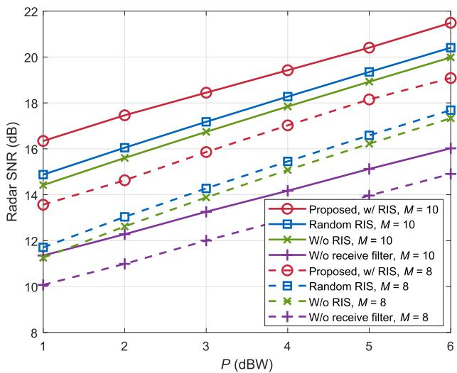
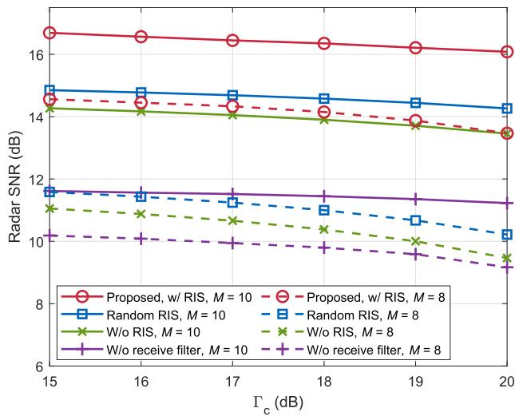
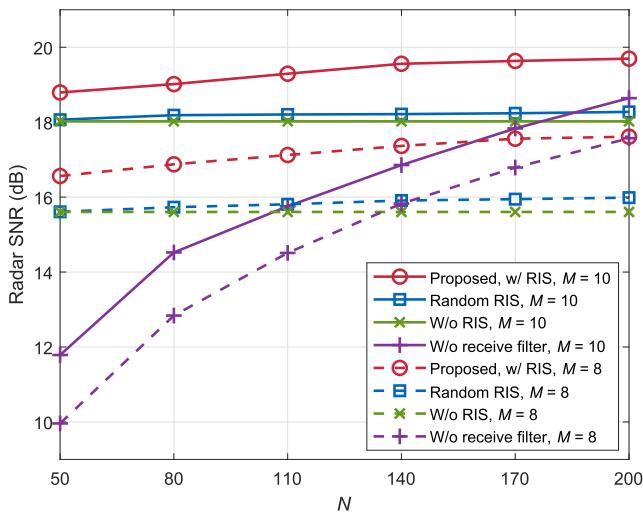

# Joint Beamforming and Reflection Design for Secure RIS-ISAC Systems

Jinjin Chu , Zhiping Lu,

Rang Liu , Graduate Student Member, IEEE,

Ming Li , Senior Member, IEEE, and Qian Liu , Member, IEEE

Abstract—This correspondence investigates a secure reconfigurable intelligent surface (RIS) aided integrated sensing and communication (ISAC) system where a base station (BS) simultaneously performs multi-user multiinput single-output (MU-MISO) secure communication and detects a malicious radar target. An RIS is leveraged to assist legitimate wireless communication. Dedicated sensing signal is transmitted with communication signal to enhance the sensing performance while preventing information leakage. The radar output signal-to-noise ratio (SNR) can be improved by jointly optimizing the transmit and reflection beamforming, and radar receive filter, while satisfying the communication performance requirement of each user, the secure transmission constraint, the power budget constraint, as well as the RIS reflecting coefficients restrict. An alternating optimization method is applied to decompose the non-convex multivariate coupling problem into three sub-problems. We then utilize semi-definite relaxation (SDR), fractional programming (FP), and majorization-minimization (MM) algorithms to solve the sub-problems iteratively. Simulation results reveal that the proposed secure RIS-ISAC scheme can offer 2 dB radar performance gain compared to the scheme without RIS.

Index Terms—Integrated sensing and communication (ISAC), physical layer security (PLS), reconfigurable intelligent surface (RIS).

# I. INTRODUCTION

Integrated sensing and communication (ISAC), which enables a fully-shared platform transmitting unified signals to simultaneously realize communication and radar sensing functionalities, has been perceived as a promising solution to ease the spectrum scarcity problem in the upcoming 6G era [1], [2], [3]. However, the information-carrying dual-functional signal poses a high security risk of being intercepted when the target is malicious, i.e., a potential eavesdropper. Undoubtedly, transmission security is of great concern in designing the waveform for ISAC systems.

Existing literature has proposed various approaches to guarantee the physical layer security (PLS) for ISAC systems. The coexisted strong radar signals were exploited as inherent jamming signals to interfere with eavesdroppers to ensure the physical layer security in [4]. The authors in [5] jointly optimized the artificial noise (AN) and transmit beamforming to implement ISAC secure transmissions. Considering

Manuscript received 18 February 2023; revised 20 July 2023; accepted 14 October 2023. Date of publication 27 October 2023; date of current version 14 March 2024. This work was supported in part by the National Natural Science Foundation of China under Grants 61971088, 62071083, and 62371090, in part by Liaoning Applied Basic Research Program under Grant 2023JH2/101300201, and in part by Dalian Science and Technology Innovation Project under Grant 2022JJ12GX014. The review of this article was coordinated by Dr. Maged Elkashlan. (Corresponding authors: Rang Liu; Ming Li.)

Jinjin Chu, Rang Liu, and Ming Li are with the School of Information and Communication Engineering, Dalian University of Technology, Dalian 116024, China (e-mail: jinjinchu@mail.dlut.edu.cn; rangl2@uci.edu; mli@dlut.edu.cn).

Zhiping Lu is with the State Key Laboratory of Wireless Mobile Communications, China Academy of Telecommunications Technology (CATT), Beijing 100191, China (e-mail: luzp@cict.com).

Qian Liu is with the School of Computer Science and Technology, Dalian University of Technology, Dalian 116024, China (e-mail: qianliu@dlut.edu.cn).

Digital Object Identifier 10.1109/TVT.2023.3328192

that AN causes additional power consumption, a symbol-level precoding design was proposed in [6] to utilize multi-user interference (MUI) to improve the communication quality-of-service (QoS) of users and disrupt the information interception of the malicious target. The authors in [7] proposed a novel design concept for ISAC systems, where the available resources are jointly optimized over a series of variable-length snapshots. However, in practical ISAC systems, when faced with severe channel degradation, the performance gain provided by the above methods is extremely limited. To address this problem, we need a new low-cost and low-energy paradigm to further improve the performance of secure ISAC systems.

Recent studies have revealed that reconfigurable intelligent surface (RIS) is a potentially revolutionary methodology to achieve this goal [8]. RIS is a software-controlled intelligent metasurface equipped with passive digitally-controlled reflecting elements that can intelligently adjust the phase-shift of the signals impinging on it, to create a favorable propagation environment [9] and provide additional optimization degrees of freedom (DoFs). In light of these advantages, deploying RIS in ISAC systems has attracted extensive research interests [10], [11], [12]. Specifically, employing RIS to mitigate the MUI was studied in [10]. However, simply eliminating MUI by minimizing the difference between the desired symbol and the received signal will greatly limit the flexibility of the transmit waveform design, thereby weakening the system performance. A complicated ISAC system model was considered in [11] that the base station (BS) serves multiple users while performing radar sensing functionality in a strong clutter environment. The authors in [12] investigated a secure RIS-aided ISAC system, where there is no direct link between the BS and the target due to blockages. The RIS is deployed to not only assist the legitimate communication, but also create a virtual LoS link for target sensing. Although the advancement of deploying RIS in ISAC systems has been confirmed in these works, the potential of RIS to improve radar sensing performance in secure ISAC systems where users are located in severe channel degradation environments has not been fully exploited.

In this correspondence, we study a secure RIS-ISAC system where the BS transmits signals for both radar target detection and secure communication. The deployment of RIS can create a more favorable propagation environment and offer additional design DoF for resolving severe channel fading, thus rendering the joint beamforming and reflection design proposed by this correspondence particularly appealing in practical implementation. Our aim is to maximize the radar output SNR, subject to the communication QoS requirement, the secure transmission constraint, the transmit power budget, as well as the reflecting coefficients restrict. Efficient algorithms based on block coordinate descent (BCD), semi-definite relaxation (SDR), fractional programming (FP), and majorization-minimization (MM) methods are proposed to tackle the non-convex optimization problem. Simulation results show that the deployment of RIS provides remarkable radar performance gain in secure ISAC systems.

# II. SYSTEM MODEL AND PROBLEM FORMULATION

# A. System Model

Consider a RIS-aided secure ISAC system, where a BS equipped with M transmit/receive antennas arranged as uniform linear array (ULA) serves K single-antenna legitimate users denoted by ${ \mathcal { K } } \triangleq \{ 1 , \ldots , K \}$ , while attempting to detect a point-like target simultaneously. $M \geq K$ should be satisfied to provide sufficient spatial DoF. The target also acts as a potential single-antenna eavesdropper. In addition, we assume that the legitimate users are located in a crowded area where pathloss is huge. To mitigate the severe channel degradation and efficiently assist legitimate communication, we deploy an N-element RIS in the vicinity of the legitimate users.

The joint radar-communication transmit signal is given by

$$
\mathbf {x} = \mathbf {W} _ {\mathrm{c}} \mathbf {s} _ {\mathrm{c}} + \mathbf {W} _ {\mathrm{r}} \mathbf {s} _ {\mathrm{r}}, \tag {1}
$$

where $\mathbf { s } _ { \mathrm { c } } \in \mathbb { C } ^ { K }$ includes the information symbols intended for the K legitimate communication users with $\mathbb { E } \{ \mathbf { s } _ { \mathrm { c } } \mathbf { s } _ { \mathrm { c } } ^ { H } \} = \mathbf { I } _ { K } , \mathbf { W } _ { \mathrm { c } } \in \mathbb { C } ^ { M \times K }$ denotes the corresponding communication beamformer, $\mathbf { s } _ { \mathrm { r } } \in \mathbb { C } ^ { M }$ contains M individual radar waveforms with $\mathbb { E } \{ \mathbf { s } _ { \mathrm { r } } \mathbf { s } _ { \mathrm { r } } ^ { H } \} = \mathbf { I } _ { M }$ , and $\mathbf { W } _ { \mathrm { r } } \in$ $\mathbb { C } ^ { M \times M }$ stands for the radar beamformer. Moreover, we define the overall symbol vector $\mathbf { s } \triangleq [ \mathbf { s } _ { \mathrm { c } } ^ { T } , \mathbf { s } _ { \mathrm { r } } ^ { T } ] ^ { T }$ and transmit beamforming matrix $\mathbf { W } \triangleq [ \mathbf { W } _ { \mathrm { c } } , \mathbf { W } _ { \mathrm { r } } ]$ for brevity.

1) Communication Model: The signal received at the k-th user is given by

$$
y _ {k} = (\mathbf {h} _ {\mathrm{d}, k} ^ {T} + \mathbf {h} _ {\mathrm{r}, k} ^ {T} \boldsymbol {\Phi} \mathbf {G}) \mathbf {W} \mathbf {s} + n _ {k}, \tag {2}
$$

where $\mathbf { h } _ { \mathrm { d } , k } \in \mathbb { C } ^ { M }$ denotes the channel between the BS and the k-th user, $\mathbf { h } _ { \mathrm { r } , k } \in \mathbb { C } ^ { N }$ denotes that between the RIS and the k-th user, and $\mathbf { G } \in \mathbb { C } ^ { \dot { N } \times M }$ denotes that between the BS and the RIS. Assume all communication channels are perfectly known by the BS via conventional uplink training methods. Although many channel estimation approaches have been proposed for RIS-assisted systems, it is still difficult to obtain CSI with limited overhead. In order to focus on the joint beamforming and reflection design problem, perfect CSI is assumed in this paper. The matrix $\Phi \triangleq \mathrm { d i a g } \{ \phi \}$ represents the RIS reflection matrix, where ${ \boldsymbol { \phi } } \triangleq [ \phi _ { 1 } , \phi _ { 2 } , \ldots , \phi _ { N } ] ^ { \hat { T } }$ denotes the reflection coefficients satisfying $| \phi _ { n } | \leq 1$ , ∀n. $n _ { k }$ represents the zero-mean additive white Gaussian noise (AWGN) at the k-th user with variance $\sigma _ { k } ^ { 2 }$ . Define $\mathbf { W } \triangleq \left[ \mathbf { w } _ { 1 } , \mathbf { w } _ { 2 } , \dots , \mathbf { w } _ { K + M } \right]$ ] with ${ \bf w } _ { k }$ denoting its k-th column. Thus, the received signal-to-interference-plus-noise ratio (SINR) at the k-th legitimate user can be written as

$$
\mathrm{SINR} _ {k} = \frac {\left| \mathbf {h} _ {k} ^ {T} (\phi) \mathbf {w} _ {k} \right| ^ {2}}{\sum_ {j \neq k} ^ {K + M} \left| \mathbf {h} _ {k} ^ {T} (\phi) \mathbf {w} _ {j} \right| ^ {2} + \sigma_ {k} ^ {2}}, \tag {3}
$$

where for conciseness we define the composite channel between the BS and the k-th user as $\mathbf { h } _ { k } ( \phi ) \triangleq \mathbf { h } _ { \mathrm { d } , k } + \mathbf { \bar { G } } ^ { T } \Phi \mathbf { h } _ { \mathrm { r } , k }$ .

2) Radar Model: For the radar system, we consider air target or distant target that is far from the users. Therefore, the propagation distances of the signals reflected by the RIS are far greater than that of the signals directly reflected by the target. In the sequel, the target echo signals reflected by RIS are extremely weak and almost have no contribution to the SNR of detecting the target, and can be neglected in optimizing. Thus, the received radar echo signals can be written as

$$
\mathbf {y} _ {\mathrm{r}} = \alpha \mathbf {a} _ {\mathrm{r}} (\theta_ {0}) \mathbf {a} _ {\mathrm{t}} ^ {T} (\theta_ {0}) \mathbf {W} \mathbf {s} + \mathbf {n} _ {\mathrm{r}}, \tag {4}
$$

where α depends on the target radar cross section (RCS) and the path-loss coefficient of the BS-target link, with ${ \mathbb E } \{ | \alpha | ^ { 2 } \} = \sigma _ { 0 } ^ { 2 } , n _ { \mathrm { { i } } }$ r stands for the zero-mean AWGN with variance $\sigma _ { \mathrm { r } } ^ { 2 } .$ . The vector $\mathbf { a } _ { \mathrm { t } } ( \theta _ { 0 } ) \triangleq$ $[ 1 , e ^ { j \pi \sin ( \theta _ { 0 } ) } , \ldots , e ^ { j \pi ( M - 1 ) \sin ( \theta _ { 0 } ) } ] ^ { T }$ stands for the steering vector for the transmit array at direction $\theta _ { 0 }$ . The steering vector for the receive array $\mathbf { a } _ { \mathrm { r } } ( \theta _ { 0 } ) \in \mathbb { C } ^ { M }$ is defined in the same way. To achieve satisfactory radar detection performance, the received echo signals are processed through a receive filter $\mathbf { u } \in \mathbb { C } ^ { M }$ , and yield

$$
\mathbf {u} ^ {H} \mathbf {y} _ {\mathrm{r}} = \alpha \mathbf {u} ^ {H} \mathbf {A W s} + \mathbf {u} ^ {H} \mathbf {n} _ {\mathrm{r}}, \tag {5}
$$

where we define $\mathbf { A } \triangleq \mathbf { a } _ { \mathrm { r } } ( \theta _ { 0 } ) \mathbf { a } _ { \mathrm { t } } ^ { T } ( \theta _ { 0 } )$ for brevity. The radar output SNR for target detection can thus be given by

$$
\mathrm{SNR} _ {\mathrm{r}} = \frac {\sigma_ {0} ^ {2} \sum_ {k = 1} ^ {K + M} | \mathbf {u} ^ {H} \mathbf {A} \mathbf {w} _ {k} | ^ {2}}{\sigma_ {\mathrm{r}} ^ {2} \mathbf {u} ^ {H} \mathbf {u}}. \tag {6}
$$

3) Security Model: The received signal at the eavesdropper is given as

$$
y _ {\mathrm{e}} = \mathbf {a} _ {\mathrm{t}} ^ {T} (\theta_ {0}) \mathbf {W} \mathbf {s} + n _ {\mathrm{e}}, \tag {7}
$$

where $n _ { \mathrm { e } }$ stands for the zero-mean AWGN with variance $\sigma _ { \mathrm { e } } ^ { 2 } .$ . The eavesdropping SINR on the k-th legitimate user is given by

$$
\mathrm{SINR} _ {\mathrm{e}, k} = \frac {\left| \mathbf {a} _ {\mathrm{t}} ^ {T} (\theta_ {0}) \mathbf {w} _ {k} \right| ^ {2}}{\sum_ {j \neq k} ^ {K + M} \left| \mathbf {a} _ {\mathrm{t}} ^ {T} (\theta_ {0}) \mathbf {w} _ {j} \right| ^ {2} + \sigma_ {\mathrm{e}} ^ {2}}. \tag {8}
$$

The eavesdropping SINR is a popular security performance metric. In specific, the eavesdropping SINR on legitimate users should be limited by a pre-defined threshold to ensure secure transmission.

# B. Problem Formulation

Our goal is to maximize the radar output SNR by jointly optimizing the transmit beamforming W, the radar receive filter u, and the reflection beamforming φ, under the communication performance requirement of each legitimate user, the secure transmission constraint, the transmit power budget, and the reflecting coefficients restrict. The optimization problem is formulated as

$$
\max _ {\mathbf {W}, \mathbf {u}, \phi} \quad \mathrm{SNR} _ {\mathrm{r}} \tag {9a}
$$

$$
\text { s.t. } \quad \mathrm{SINR} _ {k} \geq \Gamma_ {k}, k \in \mathcal {K}, \tag {9b}
$$

$$
\mathrm{SINR} _ {\mathrm{e}, k} \leq \Gamma_ {\mathrm{e}, k}, k \in \mathcal {K}, \tag {9c}
$$

$$
\left\| \mathbf {W} \right\| _ {F} ^ {2} \leq P, \tag {9d}
$$

$$
\left| \phi_ {n} \right| \leq 1, \forall n, \tag {9e}
$$

where $\Gamma _ { k }$ is the SINR requirement of the k-th legitimate user, $\Gamma _ { \mathrm { e } , k }$ is the eavesdropping SINR threshold for achieving the required secure transmission performance, and P stands for the transmit power budget. Problem (9) is highly non-convex because of the fractional terms and multivariate coupling in both the objective function (9a) and the SINR constraints (9b) and (9c). To tackle the challenging problem, the alternating optimization approach was first applied to decompose it into three sub-problems. We then utilize the SDR, FP, and MM methods to solve them iteratively.

# III. JOINT BEAMFORMING AND REFLECTION DESIGN

# A. Solver for W

With fixed u and φ, the sub-problem for optimizing W is formulated as

$$
\max _ {\mathbf {W}} \frac {\sigma_ {0} ^ {2} \sum_ {k = 1} ^ {K + M} \mathbf {u} ^ {H} \mathbf {A} \mathbf {w} _ {k} \mathbf {w} _ {k} ^ {H} \mathbf {A} ^ {H} \mathbf {u}}{\sigma_ {\mathrm{r}} ^ {2} \mathbf {u} ^ {H} \mathbf {u}} \tag {10a}
$$

$$
\text { s.t. } \frac {\mathbf {h} _ {k} ^ {T} (\phi) \mathbf {w} _ {k} \mathbf {w} _ {k} ^ {H} \mathbf {h} _ {k} ^ {*} (\phi)}{\sum_ {j \neq k} ^ {K + M} \mathbf {h} _ {k} ^ {T} (\phi) \mathbf {w} _ {j} \mathbf {w} _ {j} ^ {H} \mathbf {h} _ {k} ^ {*} (\phi) + \sigma_ {k} ^ {2}} \geq \Gamma_ {k}, k \in \mathcal {K}, \tag {10b}
$$

$$
\frac {\mathbf {a} _ {t} ^ {T} (\theta_ {0}) \mathbf {w} _ {k} \mathbf {w} _ {k} ^ {H} \mathbf {a} _ {t} ^ {*} (\theta_ {0})}{\sum_ {j \neq k} ^ {K + M} \mathbf {a} _ {t} ^ {T} (\theta_ {0}) \mathbf {w} _ {j} \mathbf {w} _ {j} ^ {H} \mathbf {a} _ {t} ^ {*} (\theta_ {0}) + \sigma_ {\mathrm{e}} ^ {2}} \leq \Gamma_ {\mathrm{e}, k},   k \in \mathcal {K}, \tag {10c}
$$

$$
\left\| \mathbf {W} \right\| _ {F} ^ {2} \leq P, \tag {10d}
$$

which is non-convex because of the complicated quadratic fractional objective function and SINR constraints. We start by introducing an auxiliary variable t to reformulate it into a more favorable form as

$$
\max _ {\mathbf {W}, t} t \tag {11a}
$$

$$
\text { s.t. } \quad \frac {\sigma_ {0} ^ {2} \sum_ {k = 1} ^ {K + M} \mathbf {u} ^ {H} \mathbf {A} \mathbf {w} _ {k} \mathbf {w} _ {k} ^ {H} \mathbf {A} ^ {H} \mathbf {u}}{\sigma_ {\mathrm{r}} ^ {2} \mathbf {u} ^ {H} \mathbf {u}} \geq t, \tag {11b}
$$

$$
(1 0 \mathrm{b}) - (1 0 \mathrm{d}). \tag {11c}
$$

The main difficulty in solving (11) is the quadratic terms with respect to variable ${ \bf w } _ { k }$ in constraints (11b), (10b) and (10c). The SDR method is a common technique to tackle this difficulty. Specifically, define $\mathbf { R } _ { k } \triangleq \mathbf { w } _ { k } \mathbf { w } _ { k } ^ { H } , k \in \mathcal { K }$ , which should satisfy $\mathbf { R } _ { k } = \mathbf { R } _ { k } ^ { H } , \mathbf { R } _ { k } \succeq 0 .$ , and $\mathrm { R a n k } ( \mathbf R _ { k } ) = 1$ . Moreover, to formulate the power constraint more concisely, we define $\mathbf { R } \triangleq \mathbf { W } \mathbf { W } ^ { H }$ . Then, the only non-convexity in solving (11) originates from rank constraints. In order to resolve the difficulty, we drop the rank-one constraints by applying the SDR method [4], [5], [6], [7], [9], [10] and consequently obtain the relaxed version of problem (11)

$$
\max _ {\mathbf {R}, \mathbf {R} _ {1}, \dots , \mathbf {R} _ {K}, t} t \tag {12a}
$$

$$
\text { s.t. } \frac {\sigma_ {0} ^ {2} \mathbf {u} ^ {H} \mathbf {A} \mathbf {R} \mathbf {A} ^ {H} \mathbf {u}}{\sigma_ {\mathrm{r}} ^ {2} \mathbf {u} ^ {H} \mathbf {u}} \geq t, \tag {12b}
$$

$$
(1 + \Gamma_ {k} ^ {- 1}) \mathbf {h} _ {k} ^ {T} (\phi) \mathbf {R} _ {k} \mathbf {h} _ {k} ^ {*} (\phi)
$$

$$
\geq \mathbf {h} _ {k} ^ {T} (\phi) \mathbf {R h} _ {k} ^ {*} (\phi) + \sigma_ {k} ^ {2}, k \in \mathcal {K}, \tag {12c}
$$

$$
(1 + \Gamma_ {\mathrm{e}, k} ^ {- 1}) \mathbf {a} _ {\mathrm{t}} ^ {T} (\theta_ {0}) \mathbf {R} _ {k} \mathbf {a} _ {\mathrm{t}} ^ {*} (\theta_ {0})
$$

$$
\leq \mathbf {a} _ {\mathrm{t}} ^ {T} (\theta_ {0}) \mathbf {R a} _ {\mathrm{t}} ^ {*} (\theta_ {0}) + \sigma_ {\mathrm{e}} ^ {2}, k \in \mathcal {K}, \tag {12d}
$$

$$
\mathrm{Tr} (\mathbf {R}) \leq P, \tag {12e}
$$

$$
\mathbf {R} \in \mathbb {S} _ {M}, \mathbf {R} _ {k} \in \mathbb {S} _ {M}, k \in \mathcal {K}, \tag {12f}
$$

$$
\mathbf {R} - \sum_ {k = 1} ^ {K} \mathbf {R} _ {k} \in \mathbb {S} _ {M}, \tag {12g}
$$

where we define the set of all $M \times M$ -dimensional Hermitian positive semidefinite matrices as $\mathbb { S } _ { M } \triangleq \left\{ \mathbf { S } | \mathbf { S } = \mathbf { S } ^ { H } , \mathbf { S } \succeq 0 \right\}$ for simplicity. Note that problem (12) is a semi-definite (SDP) problem and thus can be efficiently tackled by the interior point method. However, it may not lead to rank-one solutions. If the resulting $\mathbf { R } _ { k } , k \in { \mathcal { K } } .$ , satisfies the rank-one constraint, the optimal $\mathbf { w } _ { k } , k \in \mathcal { K }$ can be obtained by performing eigenvalue decomposition (EVD) on $\mathbf { R } _ { k } , k \in \mathcal { K }$ . Otherwise, the traditional Gaussian randomization approach is utilized to recover a rank-one solution based on $\mathbf { R } _ { k } , k \in \mathcal { K }$ . Then, with resulting R and $\mathbf { w } _ { k } .$ $k \in \mathcal { K }$ , we can obtain the radar beamforming matrix $\mathbf { W } _ { \mathrm { r } }$ by utilizing Cholesky decomposition based on

$$
\mathbf {W} _ {\mathrm{r}} \mathbf {W} _ {\mathrm{r}} ^ {H} = \mathbf {R} - \sum_ {k = 1} ^ {K} \mathbf {w} _ {k} \mathbf {w} _ {k} ^ {H}, \tag {13}
$$

where $\mathbf { W } _ { \mathrm { r } } = [ \mathbf { w } _ { K + 1 } , \dots , \mathbf { w } _ { K + M } ]$ ] can be obtained as a lower triangular matrix.

# B. Solver for u

Given W and φ, problem (9) can be rewritten as

$$
\max _ {\mathbf {u}} \frac {\sigma_ {0} ^ {2} \sum_ {k = 1} ^ {K + M} \mathbf {u} ^ {H} \mathbf {A} \mathbf {w} _ {k} \mathbf {w} _ {k} ^ {H} \mathbf {A} ^ {H} \mathbf {u}}{\sigma_ {\mathrm{r}} ^ {2} \mathbf {u} ^ {H} \mathbf {u}}, \tag {14}
$$

which is a typical Rayleigh quotient [4], whose optimal solution can be easily obtained as teigenvalue of the matrix $\begin{array} { r } { \sigma _ { 0 } ^ { 2 } \sum _ { k = 1 } ^ { K + M } \mathbf { A } \mathbf { w } _ { k } \mathbf { w } _ { k } ^ { H } \mathbf { \dot { A } } ^ { H } / \sigma _ { \mathrm { r } } ^ { \gtrless } } \end{array}$ to the largest.

# C. Solver for φ

After obtaining W and u, the objective of the problem (9) is determined, which makes the optimization problem for φ a feasibility check problem. In order to provide additional DoFs for solving another two variables, we propose to maximize the lower bound of communication SINRs to update φ. Thus, the sub-problem for optimizing φ is expressed as

$$
\max _ {\phi , z} z \tag {15a}
$$

$$
\text { s.t. } \quad \frac {\left| \mathbf {h} _ {k} ^ {T} (\phi) \mathbf {w} _ {k} \right| ^ {2}}{\sum_ {j \neq k} ^ {K + M} \left| \mathbf {h} _ {k} ^ {T} (\phi) \mathbf {w} _ {j} \right| ^ {2} + \sigma_ {k} ^ {2}} \geq z, k \in \mathcal {K}, \tag {15b}
$$

$$
\left| \phi_ {n} \right| \leq 1, \forall n. \tag {15c}
$$

However, the non-convex fractional constraint (15b) causes great difficulties in solving problem (15). Thus, we first propose to handle constraint (15b) by employing Dinkelbach’s transform to transform it into a more favorable polynomial expression [13]. To be specific, the fractional constraint (15b) can be converted into

$$
\left| \mathbf {h} _ {k} ^ {T} (\phi) \mathbf {w} _ {k} \right| ^ {2} - q _ {k} \left(\sum_ {j \neq k} ^ {K + M} \left| \mathbf {h} _ {k} ^ {T} (\phi) \mathbf {w} _ {j} \right| ^ {2} + \sigma_ {k} ^ {2}\right) \geq z, k \in \mathcal {K}, \tag {16}
$$

where we introduce auxiliary variables $q _ { k } , k \in \mathcal { K } ,$ , whose optimal value can be obtained as

$$
q _ {k} ^ {\star} = \frac {| \mathbf {h} _ {k} ^ {T} (\phi) \mathbf {w} _ {k} | ^ {2}}{\sum_ {j \neq k} ^ {K + M} | \mathbf {h} _ {k} ^ {T} (\phi) \mathbf {w} _ {j} | ^ {2} + \sigma_ {k} ^ {2}}, k \in \mathcal {K}. \tag {17}
$$

Then, for simplicity we define

$$
\mathbf {a} _ {k, j} \triangleq \operatorname{diag} (\mathbf {h} _ {\mathrm{r}, k} ^ {T}) \mathbf {G} \mathbf {w} _ {j},
$$

$$
b _ {k, j} \triangleq \mathbf {h} _ {\mathrm{d}, k} ^ {T} \mathbf {w} _ {j}, \tag {18}
$$

and reformulate the communication QoS constraint (16) as

$$
\left| \phi^ {T} \mathbf {a} _ {k, k} + b _ {k, k} \right| ^ {2} - q _ {k} \left(\sum_ {j \neq k} ^ {K + M} \left| \phi^ {T} \mathbf {a} _ {k, j} + b _ {k, j} \right| ^ {2} + \sigma_ {k} ^ {2}\right) \geq z. \tag {19}
$$

We observe that the quadratic function $| \phi ^ { T } \mathbf { a } _ { k , k } + b _ { k , k } | ^ { 2 }$ in (19) remains non-convex with respect to φ. To resolve this issue, we attempt to exploit the MM algorithm to pursue a convex surrogate function that locally lower bounds it. Utilizing the first-order Taylor expansion, the surrogate function of $\vert \boldsymbol { \phi } ^ { T } \mathbf { a } _ { k , k } + b _ { k , k } \vert ^ { 2 }$ at the i-th iteration is expressed as

$$
\begin{array}{l} \left| \boldsymbol {\phi} ^ {T} \mathbf {a} _ {k, k} + b _ {k, k} \right| ^ {2} \\ = \boldsymbol {\phi} ^ {T} \mathbf {a} _ {k, k} \mathbf {a} _ {k, k} ^ {H} \boldsymbol {\phi} ^ {*} + 2 \mathcal {R} \left\{b _ {k, k} \mathbf {a} _ {k, k} ^ {H} \boldsymbol {\phi} ^ {*} \right\} + | b _ {k, k} | ^ {2} \\ \geq \phi_ {i} ^ {T} \mathbf {a} _ {k, k} \mathbf {a} _ {k, k} ^ {H} \phi_ {i} ^ {*} + 2 \mathcal {R} \{\phi_ {i} ^ {T} \mathbf {a} _ {k, k} \mathbf {a} _ {k, k} ^ {H} (\phi^ {*} - \phi_ {i} ^ {*}) \} \\ + 2 \mathcal {R} \{b _ {k, k} \mathbf {a} _ {k, k} ^ {H} \phi^ {*} \} + | b _ {k, k} | ^ {2}. \tag {20} \\ \end{array}
$$

Plugging the result in (20) into (19), the communication QoS constraint in each iteration can be reformulated as

$$
2 \mathcal {R} \{\phi_ {i} ^ {T} \mathbf {a} _ {k, k} \mathbf {a} _ {k, k} ^ {H} (\phi^ {*} - \phi_ {i} ^ {*}) \} + 2 \mathcal {R} \{b _ {k, k} \mathbf {a} _ {k, k} ^ {H} \phi^ {*} \}
$$

$$
- q _ {k} \left(\sum_ {j \neq k} ^ {K + M} | \phi^ {T} \mathbf {a} _ {k, j} + b _ {k, j} | ^ {2}\right) + f _ {k} \geq z, k \in \mathcal {K}, \tag {21}
$$

Algorithm 1: Joint Transmit and Reflection Beamforming, and Radar Receive Filter Design Algorithm for Solving Problem (9).   
Input: $h_{d,k}$ , $h_{r,k}$ , $\forall k$ , $\Gamma_k$ , $\Gamma_{e,k}$ , $\sigma_k^2$ , $k \in K$ , G, $\mathbf{a}_t(\theta_0)$ , A, $\sigma_0^2$ , $\sigma_r^2$ , $\sigma_e^2$ , P.

Output: $W^*, u^*, \phi^*$ .

1: Initialize u, $\phi$ , and $q_k$ , $k \in K$ .

2: while The objective value (9a) does not converge do

3: Calculate R and $R_k$ , $k \in K$ by solving (12).

4: Update $W_c$ from $R_k$ , $k \in K$ by EVD or Gaussian randomization.

5: Update $W_r$ by Cholesky decomposition based on (13).

6: Update u by solving (14).

7: while no convergence do

8: Update $\phi$ by solving (22).

9: Update $q_k$ , $k \in K$ by (17).

10: end while

11: end while

12: Return $W^*, u^*, \phi^*$ .

where $f _ { k } \triangleq \phi _ { i } ^ { T } \mathbf { a } _ { k , k } \mathbf { a } _ { k , k } ^ { H } \phi _ { i } ^ { * } + | b _ { k , k } | ^ { 2 } - q _ { k } \sigma _ { k } ^ { 2 }$ . Thus, the optimization for the reflecting coefficients φ is converted to

$$
\max _ {\phi , z} z \tag {22a}
$$

$$
\text { s.t. } \quad (2 1), (1 5 c), \tag {22b}
$$

which is convex and can be readily solved.

# D. Initialization and Summary

In order to solve sub-problem (10), we investigate to properly initialize u and φ. For better radar detection performance, we initialize the radar receive filter as $\mathbf { u } = \mathbf { a } _ { \mathrm { r } } ( \theta _ { 0 } )$ via a phase alignment operation. Since the aim of deploying RIS is to improve the quality of the preferred channel to create a more favorable radio environment, φ is initialized by maximizing the channel power gain of the legitimate users, while guaranteeing the constant modulus constraint of each reflecting element [11].

Finally, the proposed transmit and reflection beamforming, and radar receive filter design algorithm for our considered secure RIS-ISAC system is straightforward. We summarize it in Algorithm 1. With appropriate initials of u and φ, problems (12), (14), and (22) are iteratively solved to update W, u, and $\phi ,$ respectively, until the objective value (9a) converges.

# IV. SIMULATION RESULTS

Simulation results are provided in this section to quantify the advantages of our proposed design for secure RIS-ISAC systems. We assume that the BS serves $K = 4$ legitimate users. The target is located at $\theta _ { 0 } = 1 0 ^ { \circ }$ and the RCS is 1. We set the noise power as $\sigma _ { \mathrm { r } } ^ { 2 } = \sigma _ { \mathrm { e } } ^ { 2 } =$ $\sigma _ { k } ^ { 2 } = - 8 0 \mathrm { d B m } , k \in \mathcal { K }$ . The SINR requirements are assumed to be the same for all legitimate users, $\mathrm { i . e . , } \Gamma _ { \mathrm { c } } = \Gamma _ { k } , k \in \mathcal { K }$ . The eavesdropping SINR threshold is set as $\Gamma _ { \mathrm { e } } = \Gamma _ { \mathrm { e } , k } = - 2 0 \mathrm { d } \mathrm { B } , k \in \mathcal { K }$ . The BS and RIS are respectively located at (0 m, 0 m) and (50 m, 0 m). The legitimate users are randomly generated on the circle of radius 3 m centered at the RIS and the distance of the BS-target link is $d _ { \mathrm { t } } = 1 0 \mathrm { m }$ . Moreover, we consider the Rician fading channel model for the BS-RIS and RIS-user links with a Rician factor of 3 dB, and the Rayleigh fading channel model for the BS-user link because of the rich-scatter environment.

line

| P (dBW) | Proposed, w/ RIS, M = 10 | Random RIS, M = 10 | W/o RIS, M = 10 | W/o receive filter, M = 10 | Proposed, w/ RIS, M = 8 | Random RIS, M = 8 | W/o RIS, M = 8 | W/o receive filter, M = 8 |
| ------- | ------------------------ | ------------------ | --------------- | -------------------------- | ----------------------- | ----------------- | -------------- | ------------------------- |
| 1       | 16.5                     | 14.8               | 14.5            | 11.5                       | 13.8                    | 12.0              | 11.5           | 10.0                      |
| 2       | 17.5                     | 16.0               | 15.5            | 12.5                       | 14.8                    | 13.0              | 12.5           | 11.0                      |
| 3       | 18.5                     | 17.0               | 16.5            | 13.5                       | 16.0                    | 14.0              | 13.5           | 12.0                      |
| 4       | 19.5                     | 18.0               | 17.5            | 14.5                       | 17.0                    | 15.0              | 14.5           | 13.0                      |
| 5       | 20.5                     | 19.0               | 18.5            | 15.5                       | 18.0                    | 16.0              | 15.5           | 14.0                      |
| 6       | 21.5                     | 20.0               | 19.5            | 16.5                       | 19.0                    | 17.0              | 16.5           | 15.0                      |

Fig. 1. Radar SNR versus transmit power budget $P \left( N = 1 2 8 , \Gamma _ { \mathrm { c } } = 2 0 \mathrm { d B } \right)$ .

line

| Γ_c (dB) | Proposed, w/ RIS, M = 10 | Proposed, w/ RIS, M = 8 | Random RIS, M = 10 | Random RIS, M = 8 | W/o RIS, M = 10 | W/o RIS, M = 8 | W/o receive filter, M = 10 | W/o receive filter, M = 8 |
| -------- | ------------------------ | ----------------------- | ------------------ | ----------------- | --------------- | -------------- | -------------------------- | ------------------------- |
| 15       | 16.5                     | 14.5                    | 14.8               | 14.5              | 11.2            | 11.0           | 10.2                       | 10.0                      |
| 16       | 16.3                     | 14.4                    | 14.7               | 14.4              | 11.1            | 10.9           | 10.1                       | 9.9                       |
| 17       | 16.2                     | 14.3                    | 14.6               | 14.3              | 11.0            | 10.8           | 10.0                       | 9.8                       |
| 18       | 16.1                     | 14.2                    | 14.5               | 14.2              | 10.9            | 10.7           | 9.9                        | 9.7                       |
| 19       | 16.0                     | 14.1                    | 14.4               | 14.1              | 10.8            | 10.6           | 9.8                        | 9.6                       |
| 20       | 15.9                     | 13.9                    | 14.3               | 13.9              | 9.7             | 9.5            | 9.5                        | 9.3                       |

Fig. 2. Radar SNR versus communication QoS requirement $\Gamma _ { \mathrm { c } } ~ ( N = 1 2 8 ,$ $P = 1 \mathrm { d B W } )$ .

The distance-dependent path-loss model is given as $C _ { 0 } ( d _ { 0 } / d ) ^ { \iota }$ , where $C _ { 0 } = - 3 0 \mathrm { d B } , d _ { 0 } = 1 \mathrm { m }$ , d denotes the link distance, and the path-loss exponent ι for the BS-RIS, RIS-user, and BS-user links is set as 2.3, 2.2, and 3.3, respectively. The BS-target link adopts the angle of arrival (AoA) model with a path-loss exponent of 2.7.

Fig. 1 presents the radar SNR versus the transmit power budget P . In addition to our proposed algorithm (denoted as “Proposed, w/RIS”), we also include the following three schemes for comparison: i) with random reflecting coefficients (“Random RIS”); ii) without RIS (“W/o $\mathrm { R I S ^ { \prime \prime } } ) ;$ iii) the design in [12] (“W/o receive filter”). It is shown that our proposed scheme achieves notably better radar SNR than without using RIS scheme, while the random RIS scheme only provides a marginal gain. Besides, since the joint design inherently allows for more DoFs to improve the radar SNR performance, our work achieves larger radar SNR than the scheme that only designs the transmit beamforming in [12]. Thanks to the additional spatial DoFs, the scenarios with M = 10 achieve better performance than their counterparts with $M = 8 .$

line

| N   | Proposed, w/ RIS, M = 10 | Random RIS, M = 10 | W/o RIS, M = 10 | W/o receive filter, M = 10 | Proposed, w/ RIS, M = 8 | Random RIS, M = 8 | W/o RIS, M = 8 | W/o receive filter, M = 8 |
| --- | ------------------------ | ------------------ | --------------- | -------------------------- | ----------------------- | ----------------- | -------------- | ------------------------- |
| 50  | 18.8                     | 18.0               | 16.5            | 12.0                       | 16.5                    | 15.5              | 15.5           | 10.0                      |
| 80  | 19.0                     | 18.0               | 16.5            | 14.5                       | 17.0                    | 15.5              | 15.5           | 12.5                      |
| 110 | 19.2                     | 18.0               | 16.5            | 15.5                       | 17.2                    | 15.5              | 15.5           | 14.5                      |
| 140 | 19.5                     | 18.0               | 16.5            | 16.5                       | 17.5                    | 15.5              | 15.5           | 16.5                      |
| 170 | 19.7                     | 18.0               | 16.5            | 17.5                       | 17.8                    | 15.5              | 15.5           | 17.5                      |
| 200 | 19.8                     | 18.0               | 16.5            | 18.5                       | 17.8                    | 15.5              | 15.5           | 17.8                      |

Fig. 3. Radar SNR versus number of reflecting elements N $( \Gamma _ { \mathrm { c } } = 2 0 ~ \mathrm { d B } . $ $P = 5 \mathrm { d B W } )$ .

Fig. 2 illustrates the radar SNR versus the communication QoS requirement $\Gamma _ { \mathrm { c } }$ . The radar SNR decreases with increasing communication QoS requirements. This is due to the fact that with a given total power budget, the stricter communication QoS requirements require more power for the communication beamforming and leave less power for the radar beamforming, which demonstrates the sensing and communication performance trade-off in ISAC systems. Moreover, under high communication requirements, we observe that the radar performance gain introduced by RIS is more pronounced with fewer antennas due to the considerable DoFs for optimizations.

The effect of the number of reflecting elements N in improving the radar SNR is unveiled in Fig. 3. As expected, a larger N provides more significant passive beamforming gain since they exploit more DoFs to manipulate the propagation environment. Moreover, we can see that the radar SNR of our proposed scheme improves considerably compared to the other schemes when the number of reflecting elements grows. It can be noted that when the number of N is less than 140, the radar SNR of our proposed scheme is significantly higher than that of the “W/o receive filter” scheme, which verifies that the proposed design can provide superior sensing performance gain even when the RIS has a lower number of reflecting elements. These results explicitly prove the significant role of RIS in improving the transmission security for ISAC systems.

# V. CONCLUSION

The joint design of transmit and reflection beamforming for secure RIS-ISAC systems was investigated in this paper. We formulated a radar output SNR maximization problem under the constraints of communication QoS, secure transmission, transmit power budget, and RIS reflection coefficients. The non-convex problem was solved by an SDR, FP, and MM based alternating optimization algorithm. Simulation results demonstrated that our proposed design achieves improved radar SNR performance, which verified the advantages of employing RIS in secure ISAC systems.

# REFERENCES

[1] F. Liu et al., “Integrated sensing and communications: Toward dualfunctional wireless networks for 6G and beyond,” IEEE J. Sel. Areas Commun., vol. 40, no. 6, pp. 1728–1767, Jun. 2022.   
[2] J. A. Zhang et al., “An overview of signal processing techniques for joint communication and radar sensing,” IEEE J. Sel. Topics Signal Process., vol. 15, no. 6, pp. 1295–1315, Nov. 2021.   
[3] R. Liu, M. Li, H. Luo, Q. Liu, and A. L. Swindlehurst, “Integrated sensing and communication with reconfigurable intelligent surfaces: Opportunities, applications, and future directions,” IEEE Wireless Commun., vol. 30, no. 1, pp. 50–57, Feb. 2023.   
[4] J. Chu, R. Liu, M. Li, Y. Liu, and Q. Liu, “Joint secure transmit beamforming designs for integrated sensing and communication systems,” IEEE Trans. Veh. Technol., vol. 72, no. 4, pp. 4778–4791, Apr. 2023.   
[5] N. Su, F. Liu, and C. Masouros, “Secure radar-communication systems with malicious targets: Integrating radar, communications and jamming functionalities,” IEEE Trans. Wireless Commun., vol. 20, no. 1, pp. 83–95, Jan. 2021.   
[6] N. Su, F. Liu, Z. Wei, Y.-F. Liu, and C. Masouros, “Secure dual-functional radar-communication transmission: Exploiting interference for resilience against target eavesdropping,” IEEE Trans. Wireless Commun., vol. 21, no. 9, pp. 7238–7252, Sep. 2022.   
[7] D. Xu, X. Yu, D. W. K. Ng, A. Schmeink, and R. Schober, “Robust and secure resource allocation for ISAC systems: A novel optimization framework for variable-length snapshots,” IEEE Trans. Commun., vol. 70, no. 12, pp. 8196–8214, Dec. 2022.   
[8] J. An et al., “Codebook-based solutions for reconfigurable intelligent surfaces and their open challenges,” IEEE Wireless Commun., early access, doi: 10.1109/MWC.010.2200312.   
[9] Q. Wu and R. Zhang, “Intelligent reflecting surface enhanced wireless network via joint active and passive beamforming,” IEEE Trans. Wireless Commun., vol. 18, no. 11, pp. 5394–5409, Nov. 2019.   
[10] X. Wang, Z. Fei, Z. Zheng, and J. Guo, “Joint waveform design and passive beamforming for RIS-assisted dual-functional radar-communication system,” IEEE Trans. Veh. Technol., vol. 70, no. 5, pp. 5131–5136, May 2021.   
[11] R. Liu, M. Li, Y. Liu, Q. Wu, and Q. Liu, “Joint transmit waveform and passive beamforming design for RIS-aided DFRC systems,” IEEE J. Sel. Topics Signal Process., vol. 16, no. 5, pp. 995–1010, Aug. 2022.   
[12] M. Hua, Q. Wu, W. Chen, O. A. Dobre, and A. L. Swindlehurst, “Secure intelligent reflecting surface aided integrated sensing and communication,” IEEE Trans. Wireless Commun., early access, doi: 10.1109/TWC.2023.3280179.   
[13] W. Dinkelbach, “On nonlinear fractional programming,” Manage. Sci., vol. 133, no. 7, pp. 492–498, Mar. 1967.