# Joint Beamforming and UAV Trajectory Optimization for Covert Communications in ISAC Networks

Dan Deng , Senior Member, IEEE, Wen Zhou , Member, IEEE, Xingwang Li , Senior Member, IEEE, Daniel Benevides da Costa , Senior Member, IEEE, Derrick Wing Kwan Ng , Fellow, IEEE, and Arumugam Nallanathan , Fellow, IEEE

Abstract— In this paper, we investigate the joint design of beamforming vectors and trajectory for unmanned aerial vehicles (UAVs) in integrated sensing and communications networks, aiming to maximize the achievable covert rate (ACR) for legitimate users against multiple passive wardens. Considering the worst-case scenario, where the wardens strategically select optimal decision thresholds, we derive the minimum detection error probability and incorporate covertness constraints within the beamforming scheme. Our approach entails formulating the design as a non-convex optimization problem for maximizing the average ACR along the UAV trajectory. The formulation takes into account various practical constraints, such as the maximum transmit power, UAV flight speed limitations, minimum beamforming gain towards sensing targets, and the detection probability threshold for wardens. To address this intricate problem, we propose a block coordinate descent-

based optimization algorithm. This algorithm alternates between updating beamforming vectors and UAV trajectories, offering a high-quality suboptimal solution to the original problem. Theoretical analyses reveal that when the detection probability threshold is sufficiently small, a linear correlation emerges between the maximum relative variation ratio in the average received signal power at wardens under two hypotheses and the detection probability. Furthermore, to enhance covertness against the wardens, it is necessary to either decrease the projection of information beamforming covariance matrix or increase the projection of sensing beamforming covariance matrix onto the subspace spanned by the eavesdropping channel vectors. Finally, extensive simulations are presented to validate the covert performance enhancements of our proposed methodology, compared with various baseline schemes adopting existing approaches.

Index Terms— Covert communications, integrated sensing and communications, joint optimization, UAV-assisted communications.

## I. INTRODUCTION

of wireless networks, fostering extensive connections and collaborations among smart devices [1]. This evolution brings forth exponential demands for information transmission and enhanced sensing capabilities, catalyzing substantial interest in integrated sensing and communications (ISAC) across diverse fields [2], [3]. Specifically, recent literature on ISAC networks presents valuable engineering insights. For instance, in [4], the utilization of echo signals from multiple base stations improved location estimation accuracy significantly compared to single base station scenarios. Additionally, the authors in [5] analyzed the estimation accuracy of positioning reference signals exploited for radar sensing in fifthgeneration (5G) wireless networks. Furthermore, recent studies explored the fusion of ISAC with emerging technologies. The authors in [6] introduced a penalty-based iterative method for optimal transceiver design in full-duplex ISAC networks, while [7] proposed a compressed sampling-based ISAC processing framework for high-resolution channel state estimation in massive MIMO. Additionally, [8] investigated a low-complexity location estimation algorithm leveraging an intelligent reflecting surface to enhance positioning

Digital Object Identifier 10.1109/TWC.2024.3503726 accuracy. On the other hand, in the domain of multiuser optical communications, [9] introduced a novel pulse sequence sensing and modulation scheme, exhibiting nearlyideal correlation properties. Furthermore, ISAC has also been investigated within non-orthogonal multiplex access [10] and reconfigurable intelligent surface networks [11], enhancing spectral and energy efficiency. Despite the fruitful research in the literature, e.g., [12] and [13], conventional terrestrial ISAC networks may encounter performance limitations due to complex environmental obstacles and scattering.

To broaden the application scenarios and overcome the foundational limitations of terrestrial communication nodes, UAVs have been utilized in aerial ISAC networks [14]. For instance, [15] proposed a periodic ISAC framework, maximizing achievable rates via joint design of beamforming vectors and UAV trajectory. Additionally, focusing on scenarios with mobile users, [16] introduced an artificial potential field analytic scheme that utilizes static force analysis, offering a continuous global optimal trajectory with lower complexity than discrete piece-wise solutions. Furthermore, for more effective wireless resource allocation, [17] designed a flexible slot structure that adaptively configures sensing intervals based on different scenarios for UAV-enabled ISAC networks. Also, in pursuit of maximizing energy efficiency, [18] tackled a multi-objective optimization problem exploiting an iterative successive convex approximation algorithm tailored for UAVenabled ISAC systems. Focusing on jointly optimizing user association and power allocation schemes, [19] utilized deep reinforcement learning to address sequential decision-making challenges within ISAC systems. Moreover, [20] delved into the effect of UAV altitude jittering on channel estimation within ISAC networks. While the research exploring the utilization of UAV in ISAC networks has generated a sequence of productive results [21], [22], this field continues to grapple with significant security challenges. In contrast to conventional terrestrial wireless communication paradigms, UAV-based networks faces an increased vulnerability to potential eavesdropping during data transmission. This susceptibility is primarily attributed to the utilization of high-quality communication channels inherent to UAVs, e.g., dominated line-of-sight (LoS) channels [23]. Therefore, ensuring covert operations in UAV networks becomes a critical requirement for preserving data security and confidentiality.

On the other hand, the inherent openness of wireless signals poses significant design challenges to ISAC networks [24]. In certain practical application scenarios, ensuring the security or covertness of wireless communications becomes crucial in ISAC system design. To this end, for addressing secure communications against mobile eavesdroppers in ISAC networks, [25] proposed an extended Kalman filtering-based iterative algorithm. This innovative approach optimized the UAV trajectory to maximize the secrecy rate for roaming users. In contrast to physical layer security technologies, covert communications ensure a low probability of being detected by concealing signal transmission from wardens. Thus, covert communications indeed offer heightened practicality and robustness when compared to conventional physical layer security measures. Specifically, a feasible strategy to hide the very existence of transmissions from malicious eavesdroppers involves masking the communication signal with radar or sensing signals [26]. The rationale for incorporating covert communications in ISAC networks is driven by the need for secure and efficient utilization of the limited wireless spectrum. ISAC networks, designed to integrate communication and sensing functionalities, lead to enhanced resource utilization and improved system performance. However, the dual use of the spectrum poses new challenges in terms of covertness and security, especially when sensitive information is transmitted over shared channels. To address these challenges, covert communication techniques, such as the use of low-power signaling or noise-like waveforms, have been proposed in the literature [27], [28]. These techniques complicate the task for wardens attempting to differentiate between legitimate transmissions and background noise. Consequently, this reduces the likelihood of successful eavesdropping, significantly bolstering the overall covertness of ISAC networks.

While existing literature has extensively explored numerous enabling technologies and resource optimization strategies for enabling covert communications or ISAC networks, only limited attention has been directed towards investigating the covertness of a UAV-mounted access point within ISAC networks. Indeed, introducing a multi-antenna UAV into ISAC networks offers increased flexibility for covert communications while expanding the service coverage area. In particular, UAV’s adaptable deployment allows for wider coverage of sensing regions and access to otherwise hardto-reach locations [29]. This heightened flexibility affords greater degrees of freedom for enabling effective covert communications. Additionally, the use of beamforming vectors through antenna arrays introduces further flexibility and can also be exploited to enhance the system’s covertness [30]. These advantages are pivotal for fully capitalizing on the potential covertness of ISAC networks. However, leveraging the combination of beamforming and UAV to enhance covert communications in ISAC networks brings forth considerable design challenges. Specifically, the design of beamforming vectors for both information and sensing signals at different positions along the UAV trajectory notably influences the achievable rates, sensing performance, and covertness against wardens. Moreover, the UAV trajectory directly impacts the beamforming vectors design, thereby influencing vital system metrics. Yet, the intricate coupling between beamforming vectors and trajectory introduces additional complexity to system design. Unfortunately, existing designs, e.g., [31] and [32], solely focusing on either the covertness or the joint trajectory and beamforming design for ISAC networks, fail to address these issues simultaneously. As such, achieving heightened covertness in ISAC networks demands an innovative, integrated approach to jointly design the beamforming schemes and UAV trajectory effectively.

Motivated by the aforementioned discussions, In the paper, we propose a joint beamforming and UAV trajectory design to enhance the covertness in ISAC system. Specifically, the joint parameters design is formulated as a complex non-convex optimization problem, aiming to maximize the average achievable covert rate (ACR) for a legitimate user. The inherent coupling between beamforming vectors and trajectory presents a design challenge, rendering the formulated problem unsolvable through direct methods. To address this, we propose a block coordinate descent (BCD)-based joint optimization algorithm, which optimizes the beamforming vectors and trajectory alternately. By adopting this approach, which incorporates efficient trade-offs between the beamforming vectors and trajectory, a guaranteed convergence towards an effective suboptimal solution to the initial problem can be achieved, offering improved performance compared with direct methods. This contributions of this paper are outlined below:

• Considering the covertness against multiple wardens, we formulate a joint beamforming and UAV trajectory optimization problem aimed at maximizing the ACR in ISAC networks while taking into account practical constraints such as flight speed, maximum transmit power, beamforming gain towards the sensing area.

• In scenario where wardens employ optimal detectors, we derive the optimal decision threshold and the corresponding detection error probability (DEP) at the wardens. Additionally, we impose pragmatic constraints on the UAV’s beamforming vectors to ensure a detection probability threshold at the wardens.

To tackle the intractability of the non-convex design problem, we propose an iterative BCD-based optimization algorithm. The proposed approach alternately optimizes the beamforming vectors and trajectory iteratively, which converges to an effective suboptimal solution to the original problem with low computational complexity.

The subsequent sections of this paper are structured as follows. Section II delineates the system model of the considered networks. Subsequently, the performance analysis of wardens’ DEP is conducted in Section III. The optimization problem formulation and the proposed solution are given in Section V. Section VI contains the simulation results and discussions, while the conclusion can be found in Section VII.

## A. Notations

For any matrix W, the notation $\mathbf { W } _ { [ t , s ] }$ represents the element in the tth row and sth column of matrix W. The transpose and conjugate transpose matrices of W are denoted by $\mathbf { \dot { W } } ^ { T }$ and $\mathbf { W } ^ { H }$ , respectively. The trace and rank of a square matrix B are denoted by trace(B) and rank(B), respectively. The notation $\mathbf B \succcurlyeq \mathbf 0$ indicates that B is positive semidefinite. For any vector a, the notation ∥a∥ denotes the Euclidean norm of a. For a complex number x, the expressions |x| and $x ^ { * }$ denote its absolute and conjugate values, respectively. For any sets $S _ { 1 }$ and $S _ { 2 } .$ , the notation $S _ { 1 } \backslash S _ { 2 }$ represents the set difference between two sets. $\mathcal { C } ^ { M \times N }$ and $\bar { \mathcal { R } } ^ { M \times N }$ denote the complex and real matrix space with dimensions $M \times N$ , respectively. The notation $\mathcal { C N } ( \mu , \sigma ^ { 2 } )$ represents the distribution of the complex Gaussian white noise with mean $\mu$ and variance $\sigma ^ { 2 }$ . The symbol arccos(·) is used to denote the inverse cosine function. The notation $\mathcal { E } ( \cdot )$ represents the expectation operation concerning a random variable. The notation $F ^ { - 1 } ( \cdot )$ denotes the inverse function of $F ( \cdot )$ , and the big-O notation, $f ( x ) = { \mathcal { O } } ( g ( x ) )$ ), indicates that $\operatorname* { l i m } _ { x \to \infty } \operatorname* { s u p } { \frac { | f ( x ) | } { g ( x ) } } < \infty$

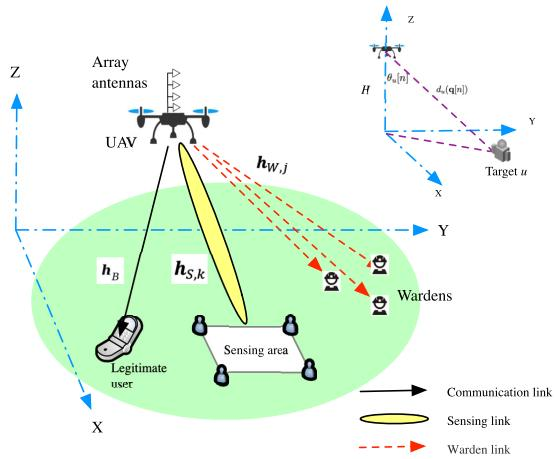  
Fig. 1. System model of covert ISAC networks.

## II. SYSTEM MODEL

As depicted in Fig. 1, the considered covert ISAC network comprises a single UAV-mounted access point equipped with an M-element vertical uniform linear antenna array, one legitimate ground user <sup>1</sup>, Bob, and K sensing targets denoted as $S _ { k } , k \in \mathcal { K } \triangleq \{ 1 , . . . , K \}$ , located within a defined sensing area. Additionally, there are J non-cooperative passive wardens denoted as $W _ { j } , j \in \mathcal { I } \triangleq \{ 1 , \dots , J \}$ . It is assumed that the ground user, sensing targets, and wardens are singleantenna devices [33], [34]. The UAV node flies from its initial three-dimension (3D) location q<sub>I</sub> to the final location q<sub>F</sub> at a constant altitude H [29], [35]. Besides, the UAV node emits sensing signals to achieve a predefined beamforming gain within the target area. Simultaneously, it endeavors to transmit information signals to the legitimate ground user while ensuring covertness against the wardens. In particular, the wardens continually monitors the received signal power transmitted by the UAV node, aiming to determine whether information signals are being transmitted to the legitimate ground user. For ease of analysis, the UAV node’s trajectory is evenly segmented into N orthogonal time slots. The duration of each slot is represented by $\begin{array} { r } { { \cal T } _ { s } ~ = ~ { \frac { \cal T } { \cal N } } } \end{array}$ , where T denotes the total duration of the trajectory. Note that increasing the number of time slots greatly enhances the precision of this segmentation. However, this refinement generally results in heightened computational complexity. Conversely, reducing the number of slots alleviates computational burden but sacrifices accuracy. On the other hand, the horizontal coordinates of the UAV trajectory and other nodes’ locations in the nth slot are denoted as $\mathbf { q } [ \bar { n } ] = ( x [ n ] , y [ n ] ) ^ { T } , n \in \mathcal { N }$ ≜ $\{ 1 , \ldots , N \}$ and $\mathbf { q } _ { u } [ n ] = ( x _ { u } [ n ] , y _ { u } [ n ] ) ^ { T } , n \in \mathcal { N }$ , respectively. The symbol u is used to denote any ground node, such as the legitimate user, the warden users or the sensing targets, i.e., $u \in \{ B , S _ { k } , W _ { j } , k \in \mathcal { K } , j \in \mathcal { I } \}$ . As such, the UAV trajectory can be defined as $\mathbf { q } \triangleq \{ \mathbf { q } [ n ] , n \in \mathcal { N } \}$ . Furthermore, the maximum flight speed of the UAV node, limited to $V _ { m }$ m/s, enforces specific constraints on the maximum displacement between two consecutive time slots along the flight trajectory as follows:

$$
\| \mathbf { q } [ n ] - \mathbf { q } [ n + 1 ] \| \leq V _ { m } T _ { s } , \quad n \in \mathcal { N } \setminus N .\tag{1}
$$

The proposed system setup is primarily designed for ISAC networks that handle the transmission of sensitive or private data, such as those found in intelligent transportation systems, smart cities, and industrial IoT. In specific UAV networks, there is a dual requirement to conduct state sensing of target nodes while simultaneously ensuring covert communication with authorized users against the wardens. To fulfill these multiple functions, the UAV’s mobility and multi-antenna beamforming technology can be strategically utilized to enhance the ISAC network’s covert communication capabilities. This system is particularly wellsuited for future air-ground communication networks with covert communication needs and can be integrated with emerging technologies such as NOMA and massive MIMO.

## A. Channel Model

Existing literature, such as [23], [36], and [37], indicate that when a UAV’s flight altitude is sufficiently high, the UAV wireless channel predominantly exhibits the LoS characteristics. In alignment with existing studies, e.g., [38], [39], and [40], this paper also employs an LoS channel model.

<sup>2</sup> Consequently, the wireless channel fading coefficients from the UAV to target u are expressed as:

$$
\mathbf { h } _ { u } [ n ] = \sqrt { \frac { \beta } { d _ { u } ^ { 2 } [ n ] } } \mathbf { a } _ { u } [ n ] .\tag{2}
$$

Here, $0 < \beta \leq 1$ represents the wireless channel power fading coefficient at the reference distance. The term $\begin{array} { r } { \dot { d } _ { u } ( \mathbf { q } [ n ] ) \stackrel { \Delta } { = } } \end{array}$ $\sqrt { \| \mathbf { q } [ n ] - \mathbf { q } _ { u } [ n ] \| ^ { 2 } + H ^ { 2 } }$ denotes the distance between the UAV and target u. ${ \mathbf { a } } _ { u } [ n ]$ represents the steering vector [32] defined as:

$$
\mathbf { a } _ { u } [ n ] = ( 1 , e ^ { j 2 \pi { \frac { d } { \lambda } } \cos \theta _ { u } [ n ] } , \ldots , e ^ { j 2 \pi { \frac { ( M - 1 ) d } { \lambda } } \cos \theta _ { u } [ n ] } ) ^ { T } ,\tag{3}
$$

where $\begin{array} { r } { \theta _ { u } [ n ] = \operatorname { a r c c o s } \frac { H } { d _ { u } ( \mathbf { q } [ n ] ) } } \end{array}$ , depicted in Fig. 1, denotes the steering angle of the node u in the nth time slot, defined as the angle between the z-axis and the line connecting node u and the UAV. The symbol d represents the distance between adjacent elements in the antenna array, and λ is the wavelength of the radio frequency signals transmitted by the UAV node.

Furthermore, the UAV node can accurately acquire channel state information (CSI) for legitimate ground users through uplink signals or feedback links. Additionally, with support from radar/sensing signals or the global positioning system (GPS), the UAV can determine the locations of sensing targets and subsequently calculate the corresponding CSI by using the LoS model, as shown in (2). These assumptions regarding feedback mechanisms and location information have been widely adopted in recent literature, such as [33], [40], and [42].

## B. Sensing and Communications Model

Accordingly, under the two hypotheses of sensing-only and ISAC scenarios [31], the transmitted signals by the UAV node are determined by:

$$
\mathbf { s } [ n ] = \left\{ \begin{array} { l l } { \mathbf { w } _ { r } [ n ] s _ { r } [ n ] , } & { \mathrm { H } _ { 0 } , } \\ { \mathbf { w } _ { r } [ n ] s _ { r } [ n ] + \mathbf { w } _ { c } [ n ] s _ { c } [ n ] , } & { \mathrm { H } _ { 1 } . } \end{array} \right.\tag{4}
$$

Here, $\mathrm { H } _ { 0 }$ is the null-hypothesis representing the transmission of only sensing signals, while $\mathrm { H } _ { 1 }$ is the alterative hypothesis indicating the transmission of information signals alongside the sensing signals. $\begin{array} { r l r } { s _ { r } [ n ] } & { { } \sim } & { { \mathcal C N } ( 0 , 1 ) } \end{array}$ and $s _ { c } [ n ] \sim$ $\mathcal { C N } ( 0 , 1 )$ represent the normalized sensing signals and the information signals transmitted by the UAV, respectively. ${ \mathbf w } _ { r } [ n ] \in \mathcal { C } ^ { M \times 1 }$ and ${ \mathbf w } _ { c } [ n ] \in \mathcal { C } ^ { M \times \bar { 1 } }$ denote the beamforming vectors for the sensing and information signals, respectively. In particular, $s _ { r } [ n ]$ and $s _ { c } [ n ]$ are statistically independent, i.e., $\mathcal { E } ( s _ { c } ^ { * } [ n ] s _ { r } [ k ] ) \dot { = } 0 \dot { , } \dot { } \dot { } \dot { } k$ . Given the limited maximum transmission power of the UAV node $P _ { m }$ , the power constraints are defined as:

$$
\| \mathbf { w } _ { r } [ n ] \| ^ { 2 } + \| \mathbf { w } _ { c } [ n ] \| ^ { 2 } \leq P _ { m } , \quad \forall n \in \mathcal { N } .\tag{5}
$$

Consequently, in the case of $\mathrm { H } _ { 1 }$ , the received signals at the legitimate user Bob in each time slot are given by:

$$
r _ { B } [ n ] = { \bf h } _ { B } ^ { H } [ n ] \big ( { \bf w } _ { r } [ n ] s _ { r } [ n ] + { \bf w } _ { c } [ n ] s _ { c } [ n ] \big ) + \nu _ { B } [ n ] ,\tag{6}
$$

where $\nu _ { B } [ n ] \sim \mathcal { C N } ( 0 , \sigma _ { b } ^ { 2 } )$ represents additive white Gaussian noise (AWGN) received by Bob with a power of $\sigma _ { b } ^ { 2 } .$ . To reduce the impact of the sensing signal on the communication links, the sensing signal can be modulated using a pseudorandom m sequence [43]. Specifically, the legitimate node first performs channel estimation on the sensing signal with the help of the pseudo-random m sequence, and then adopts the serial interference cancellation algorithm to subtract the sensing signal from the received signal. Moreover, assuming a perfect successive interference cancellation receiver [40] is adopted by Bob, the SNR of the legitimate link, i.e., $\gamma _ { B } [ n ]$ is calculated as:

$$
\begin{array} { l } { { \gamma _ { B } [ n ] = \frac { { \mathscr E } ( | h _ { B } ^ { H } [ n ] { \bf w } _ { c } [ n ] s _ { c } [ n ] | ^ { 2 } ) } { { \mathscr E } ( | \nu _ { B } [ n ] | ^ { 2 } ) } = \frac { | { \bf h } _ { B } ^ { H } [ n ] { \bf w } _ { c } [ n ] | ^ { 2 } } { \sigma _ { b } ^ { 2 } } } } \\ { { = \frac { { \bf h } _ { B } ^ { H } [ n ] { \bf W } _ { c } [ n ] { \bf h } _ { B } [ n ] } { \sigma _ { b } ^ { 2 } } , } } \end{array}\tag{7}
$$

where ${ \mathbf W } _ { c } [ n ] \triangleq { \mathbf w } _ { c } [ n ] { \mathbf w } _ { c } ^ { H } [ n ]$ represents the covariance matrix of $\mathbf { w } _ { c } [ n ]$ . Consequently, the achievable covert rate at Bob in each time slot is defined as:

$$
R _ { c } ( \mathbf { q } [ n ] , \mathbf { q } _ { B } , \mathbf { W } _ { c } [ n ] ) = \log _ { 2 } ( 1 + \gamma _ { B } [ n ] ) .\tag{8}
$$

On the other hand, both information signals and sensing signals are employed to enhance radar sensing capabilities within the specified sensing area [44]. Notably, there exist K sensing targets evenly distributed along the boundary of the sensing area [32]. Concerning the kth sensing target, denoted as $S _ { k } , k \in \mathcal { K }$ , the corresponding beamforming gain is expressed as:

$$
\begin{array} { r l } & { \psi _ { k } [ n ] = { \mathcal E } \Big ( \| { \mathbf a } _ { S _ { k } } ^ { H } [ n ] \big ( { \mathbf w } _ { r } [ n ] s _ { r } [ n ] + { \mathbf w } _ { c } [ n ] s _ { c } [ n ] \big ) \| ^ { 2 } \Big ) } \\ & { \qquad = { \mathbf a } _ { S _ { k } } ^ { H } [ n ] \big ( { \mathbf W } _ { r } [ n ] + { \mathbf W } _ { c } [ n ] \big ) { \mathbf a } _ { S _ { k } } [ n ] , } \end{array}\tag{9}
$$

where $\mathbf { W } _ { r } [ n ] \triangleq \mathbf { w } _ { r } [ n ] \mathbf { w } _ { r } ^ { H } [ n ]$

Note that similar with [32], it is assumed that the UAV node possesses prior knowledge of both the sensing area’s location. Considering the smoothness of electromagnetic signal intensity, we only need to analyze a sufficiently large number of sensing targets distributed along the boundary of the sensing area. Consequently, we can obtain the channel fading coefficients from the UAV to the sensing targets as given in (2). As such, to ensure effective sensing performance within the designated target area, the following sensing constraints are imposed:

$$
\psi _ { k } [ n ] \geq \Delta d _ { S _ { k } } ^ { 2 } ( \mathbf { q } [ n ] ) , \quad \forall n \in \mathcal { N } , \ k \in \mathcal { K } ,\tag{10}
$$

where $\Delta$ represents the predefined threshold for the beamforming gain directed at the sensing targets. This parameter signifies the minimum required level of beamforming gain to maintain effective sensing performance within the system.

## III. DETECTION PERFORMANCE OF WARDENS

Each warden, denoted as $W _ { j } ,$ , performs continuous monitoring of the wireless signals transmitted by the UAV node and determines whether the UAV is transmitting information signals to the legitimate user by detecting variations in the received signal power under the two hypotheses of sensing only and ISAC scenarios. Specifically, in the nth slot, the received signals at $W _ { j }$ are given by:

$$
\begin{array} { r l } & { r _ { W _ { j } } [ n ] = \mathbf { h } _ { W _ { j } } ^ { H } [ n ] \mathbf { s } [ n ] + \nu _ { W _ { j } } [ n ] } \\ & { \qquad = \left\{ \begin{array} { l l } { \mathbf { h } _ { W _ { j } } ^ { H } [ n ] \mathbf { w } _ { r } [ n ] s _ { r } [ n ] + \nu _ { W _ { j } } [ n ] , } \\ { \mathbf { h } _ { W _ { j } } ^ { H } [ n ] ( \mathbf { w } _ { r } [ n ] s _ { r } [ n ] + \mathbf { w } _ { c } [ n ] s _ { c } [ n ] ) + \nu _ { W _ { j } } [ n ] , } \end{array} \right. } \end{array}\tag{H<sub>0</sub>,}
$$

H<sub>1</sub>,

(11)

where $\nu _ { W _ { j } } [ n ] \sim \mathcal { C N } ( 0 , \sigma _ { w } ^ { 2 } )$ denotes the AWGN received at $W _ { j }$ . Thus, the average received signal power at $W _ { j }$ in both the sensing-only and ISAC scenarios can be expressed as:

$$
\begin{array} { r } { p _ { W _ { j } } [ n ] = \mathrm { E } ( | r _ { W _ { j } } [ n ] | ^ { 2 } ) = \left\{ \begin{array} { l l } { \lambda _ { j } ^ { 0 } [ n ] , } & { \mathrm { H } _ { 0 } , } \\ { \lambda _ { j } ^ { 1 } [ n ] , } & { \mathrm { H } _ { 1 } , } \end{array} \right. } \end{array}\tag{12}
$$

where

$$
\left\{ \begin{array} { l } { { \lambda _ { j } ^ { 0 } [ n ] = \mathbf { h } _ { W _ { j } } ^ { H } [ n ] \mathbf { W } _ { r } [ n ] \mathbf { h } _ { W _ { j } } [ n ] + \sigma _ { w } ^ { 2 } , } } \\ { { \lambda _ { j } ^ { 1 } [ n ] = \mathbf { h } _ { W _ { j } } ^ { H } [ n ] ( \mathbf { W } _ { r } [ n ] + \mathbf { W } _ { c } [ n ] ) \mathbf { h } _ { W _ { j } } [ n ] + \sigma _ { w } ^ { 2 } . } } \end{array} \right.\tag{13}
$$

In the worst-case scenario, it is assumed that the wardens employ an optimal detector. According to maximum likelihood criterion, the optimal detector is a likelihood ratio detector. By calculating the likelihood function, the average received power serves as a sufficient statistic. In the nth time slot, each warden $W _ { j }$ determines whether the UAV node is transmitting information signals by comparing the received power against a predefined decision threshold:

$$
| r _ { W _ { j } } [ n ] | ^ { 2 } \lesssim \tau [ n ] ,\tag{14}
$$

where $\tau [ n ]$ represents the predefined decision threshold, and $\mathrm { D } _ { 0 }$ and $\mathrm { D _ { 1 } }$ correspond to the decision outcomes for hypotheses $\mathrm { H } _ { 0 }$ and $\mathrm { H } _ { 1 }$ , respectively.

This paper specifically examines the worst-case scenario where wardens exploit the optimal decision threshold to minimize the DEP through the following theorem. This approach can establish a performance lower bound for system design, ensuring that the system can maintain its covert properties even against the most effective detection strategies. This method has also been widely adopted in recent works [35], [45]. Note that, when the wardens adopt some suboptimal detectors, the UAV can allocate more power to the communication users, thereby enhancing the system’s covert communication capability.

Theorem 1: In the worst-case scenario, the optimal decision threshold at $W _ { j }$ in each time slot is determined by:

$$
\tau _ { j } ^ { * } [ n ] = \lambda _ { j } ^ { 0 } [ n ] \frac { 1 + \mu _ { j } [ n ] } { \mu _ { j } [ n ] } \ln ( 1 + \mu _ { j } [ n ] ) ,\tag{15}
$$

where $\mu _ { j } [ n ]$ is defined as

$$
\mu _ { j } [ n ] = \frac { \lambda _ { j } ^ { 1 } [ n ] - \lambda _ { j } ^ { 0 } [ n ] } { \lambda _ { j } ^ { 0 } [ n ] } = \frac { \mathbf { h } _ { W _ { j } } ^ { H } [ n ] \mathbf { W } _ { c } [ n ] \mathbf { h } _ { W _ { j } } [ n ] } { \mathbf { h } _ { W _ { j } } ^ { H } [ n ] \mathbf { W } _ { r } [ n ] \mathbf { h } _ { W _ { j } } [ n ] + \sigma _ { w } ^ { 2 } } ,\tag{16}
$$

indicating the relative variation ratio in the average received signal power at $W _ { j }$ between the sensing-only and ISAC scenarios. The corresponding minimum detection error probability is expressed as:

$$
\begin{array} { r } { \xi _ { j } ^ { * } [ n ] = 1 + e ^ { - \frac { 1 + \mu _ { j } [ n ] } { \mu _ { j } [ n ] } \ln ( 1 + \mu _ { j } [ n ] ) } - e ^ { - \frac { 1 } { \mu _ { j } [ n ] } \ln ( 1 + \mu _ { j } [ n ] ) } \mathrm { . } } \\ { P r o o t { : } \mathrm { ~ } S e e \ A n n e n d i x \ A . \quad \quad } \end{array}
$$

Proof: See Appendix A.

(17)

Note that $\mu _ { j } [ n ]$ , defined in (16), also represents the ratio of the projection of the information beamforming covariance matrix ${ \mathbf W } _ { c } [ n ]$ onto the channel subspace spanned by ${ \mathbf { h } } _ { W _ { j } } [ n ]$ to the average received signal power in sensing-only scenario, defined in (13). The analytical expression in (17) enable us to formulate robust predictions and derive insightful conclusions regarding the detection performance at wardens. Building upon this, Theorem 1 lays the foundation for the below two important corollaries.

Corollary $\begin{array} { l } { \displaystyle { I \colon \xi _ { i } ^ { * } [ n ] } } \end{array}$ is a monotonically decreasing function concerning $\mu _ { j } [ n ] .$ . Let δ represent the detection probability threshold of the wardens. To guarantee the DEP constraints given by

$$
\xi _ { j } ^ { \ast } [ n ] \geq 1 - \delta , \quad \forall n \in \mathcal { N } , \ j \in \mathcal { I } ,\tag{18}
$$

the subsequent inequality must be satisfied:

$$
\mu _ { j } [ n ] \leq F ^ { - 1 } ( \delta ) \triangleq \mu _ { \operatorname* { m a x } } , \quad \forall n \in \mathcal { N } , \ j \in \mathcal { I } ,\tag{19}
$$

where $F ( x ) \triangleq x ( 1 + x ) ^ { - ( 1 + 1 / x ) } , x > 0 ,$ , and $\mu _ { \mathrm { m a x } }$ represents the maximum value of $\mu _ { j } [ n ]$

Proof: See Appendix B.

Corollary 2: When the detection probability threshold $o f$ the wardens is sufficiently low, i.e., $\delta  0 ,$ , we have

$$
\begin{array} { r } { \mu _ { \operatorname* { m a x } }  e \delta , \quad \mathrm { i f } \delta  0 . } \\ { P r o o f \colon S e e A p p e n d i x C . \qquad } \end{array}\tag{20}
$$

According to the aforementioned theorem and corollaries, the following remarks, which provide valuable insights into the covertness performance against the wardens, can be obtained.

Remark 1: It is essential to highlight that the minimum DEP of $W _ { j }$ in nth slot, i.e., $\xi _ { j } ^ { * } [ n ]$ , is governed by the relative variation ratio in the average received signal power at $W _ { j }$ between the sensing-only and ISAC scenarios. Given the wardens’ detection probability threshold, δ, the relative variation ratio in the average received signal power, i.e., $\mu _ { j } [ n ]$ as defined in (16), must remain below a specified threshold $\mu _ { \mathrm { m a x } }$ This threshold is a strictly monotonically increasing function of δ. Additionally, the numerical solution of $\mu _ { \mathrm { m a x } }$ can be obtained by adopting binary search algorithms or some other numerical search methods. Notably, when δ is sufficiently small, $\mu _ { \mathrm { m a x } }$ exhibits a linear relationship with δ.

Remark 2: To enhance the covertness against the wardens, it is necessary to either decrease the projection of the information beamforming covariance matrix ${ \mathbf W } _ { c } [ n ]$ or increase the projection of the sensing beamforming covariance matrix ${ \mathbf W } _ { r } [ n ]$ onto the channel subspace spanned by ${ \mathbf { h } } _ { W _ { j } } [ n ]$ . This approach serves as a guideline for balancing the trade-off between covertness and the achievable rates of legitimate users. Conversely, increasing the transmit power of the information beamforming vector can enhance the ACR for the legitimate user. Additionally, the relative distances among the UAV, wardens, and legitimate user demonstrates significant impacts on the system performance. Hence, this creates a trade-off in the design of beamforming schemes and trajectory, leading to the formulation of the optimization problem in the following section.

## IV. PROBLEM FORMULATION

Our goal is to maximize the average ACR for the legitimate user by jointly designing the UAV trajectory and beamforming vectors of the UAV node. To start with, we first define the average ACR along the trajectory ${ \bf q } ,$ denoted as $R ( \mathbf { q } )$ , which is given by:

$$
\begin{array} { l } {displaystyle { \cal R } ( { \bf q } ) = \frac { 1 } { N } \sum _ { n = 1 } ^ { N } { \cal R } _ { c } ( { \bf q } [ n ] , { \bf q } _ { B } , { \bf W } _ { c } [ n ] ) } \\ { \displaystyle ~ = \frac { 1 } { N } \sum _ { n = 1 } ^ { N } \log _ { 2 } { \Big ( 1 + \frac { { \bf h } _ { B } ^ { H } [ n ] { \bf W } _ { c } [ n ] { \bf h } _ { B } [ n ] } { \sigma _ { b } ^ { 2 } } \Big ) } . } \end{array}\tag{21}
$$

Besides, the design is formulated as an optimization problem considering several constraints: the flight speed constraints in (1), the transmit power constraints in (5), the sensing constraints in (10), as well as the covertness constraints in (19). We aim to optimize the beamforming vectors and trajectory while ensuring sufficiently low detection probabilities of wardens, satisfying the sensing gain prerequisites, and ultimately enhancing the system’s covert communications capabilities. Building upon these, the ISAC constrained average ACR maximization problem formulation is given as follows:

$$
( \mathrm { P 0 } ) \colon \operatorname* { m a x } _ { \{ \mathbf { w } _ { r } , \mathbf { w } _ { c } , \mathbf { q } \} } \ R ( \mathbf { q } )\tag{22}
$$

$$
\mathrm { s . t . } \quad \mathbf { q } [ 1 ] = \mathbf { q } _ { \mathrm { I } } , \quad \mathbf { q } [ N ] = \mathbf { q } _ { \mathrm { F } } ,\tag{22a}
$$

$$
\mathbf { q } [ n ] - \mathbf { q } [ n + 1 ] \| \leq V _ { m } T _ { s } , \quad n \in \mathcal { N } \setminus N ,\tag{22b}
$$

$$
\mathbf { w } _ { r } [ n ] \| ^ { 2 } + \| \mathbf { w } _ { c } [ n ] \| ^ { 2 } \leq P _ { m } , \quad \forall n ,\tag{22c}
$$

$$
\begin{array} { r l } & { \mathbf { a } _ { S _ { k } } ^ { H } [ n ] \big ( \mathbf { W } _ { r } [ n ] + \mathbf { W } _ { c } [ n ] \big ) \mathbf { a } _ { S _ { k } } [ n ] } \\ & { \geq \Delta d _ { S _ { k } } ^ { 2 } ( \mathbf { q } [ n ] ) , \quad \forall n , \ \forall k , } \\ & { \quad \mathbf { h } _ { W _ { j } } ^ { H } [ n ] \mathbf { W } _ { c } [ n ] \mathbf { h } _ { W _ { j } } [ n ] } \\ & { \quad \mathbf { \widehat { h } } _ { W _ { j } } ^ { H } [ n ] \mathbf { W } _ { r } [ n ] \mathbf { \widehat { h } } _ { W _ { j } } [ n ] + \sigma _ { w } ^ { 2 } } \leq \mu _ { \operatorname* { m a x } } , \ \forall n ,  \end{array}\tag{22d}
$$

∀j.

(22e)

Here, $\mathbf { w } _ { r } \triangleq \{ \mathbf { w } _ { r } [ n ] , n \in \mathcal { N } \}$ and $\mathbf { w } _ { c } \triangleq \{ \mathbf { w } _ { c } [ n ] , n \in \mathcal { N } \}$ In fact, solving problem (P0) in (22) directly is challenging due to the couplings between the beamforming vectors and the trajectory within the objective function. To address this, the following sections introduce a BCD-based approach, aiming to derive an effective suboptimal solution for problem (P0).

## V. ITERATIVE OPTIMIZATION ALGORITHM

To tackle problem (P0) in (22), we adopt a strategy of decomposition, dividing the original optimization challenge into two distinct sub-problems to handle the beamforming vectors and trajectory individually. Initially, with a fixed UAV trajectory, we focus on maximizing the ACR for each time slot. This is accomplished through an SDR-based algorithm [46] specifically designed for optimizing the beamforming vectors. Subsequently, an SCA-based algorithm [47] is employed to optimize the trajectory, leveraging the updated beamforming vectors obtained in the previous step. This stepwise approach enables the joint optimization of beamforming vectors and trajectory through an iterative BCD optimization method [32]. Through multiple iterations, this process progressively refines the beamforming vectors and trajectory, leading to convergence towards a suboptimal solution to problem (P0).

## A. Beamforming Vectors Optimization

Given a fixed UAV trajectory q[n], we employ an SDRbased method to determine the optimal beamforming vectors. This leads to the following sub-problem:

$$
\begin{array} { r l } { \mathrm { ( P 1 ) } \colon \displaystyle \operatorname* { m a x } _ { \{ \mathbf { w } _ { r } , \mathbf { w } _ { c } \} } } & { \displaystyle \frac { 1 } { N } \sum _ { n = 1 } ^ { N } \log _ { 2 } \Big ( 1 + \frac { \mathbf { h } _ { B } ^ { H } [ n ] \mathbf { W } _ { c } [ n ] \mathbf { h } _ { B } [ n ] } { \sigma _ { b } ^ { 2 } } \Big ) } \\ & { \mathrm { s } . \mathrm { t } . \quad ( 2 2 c ) , ( 2 2 d ) , ( 2 2 e ) . } \end{array}\tag{23}
$$

(22 a)

Obviously, the solutions for ${ \bf w } _ { r } [ n ]$ and $\mathbf { w } _ { c } [ n ]$ in (P1) are independent with each other across different time slots. Consequently, (P1) can be decomposed into N independent sub-problems that can be solved in parallel, each corresponding to a specific time slot. This approach enables us to focus on optimizing the beamforming vectors in individual time slots. By applying a similar procedure to all slots, we can effectively solve problem (P1). Specifically, with the known location of the UAV node, the beamforming vectors optimization subproblem can be formulated as

$$
( { \mathrm { P } } 2 ) { \colon } \operatorname* { m a x } _ { \{ \mathbf { w } _ { r } [ n ] , \mathbf { w } _ { c } [ n ] \} } ~ { \mathbf { h } } _ { B } ^ { H } [ n ] \mathbf { W } _ { c } [ n ] { \mathbf { h } } _ { B } [ n ]\tag{24}
$$

$$
\begin{array} { r } { \mathrm { s . t . } \quad \| \mathbf { w } _ { r } [ n ] \| ^ { 2 } + \| \mathbf { w } _ { c } [ n ] \| ^ { 2 } \leq P _ { m } , } \end{array}\tag{24a}
$$

$$
{ \mathbf { a } } _ { S _ { k } } ^ { H } [ n ] \bigl ( { \mathbf { W } } _ { r } [ n ] + { \mathbf { W } } _ { c } [ n ] \bigr ) { \mathbf { a } } _ { S _ { k } } [ n ]
$$

$$
\geq \Delta d _ { S _ { k } } ^ { 2 } ( \mathbf { q } [ n ] ) , \quad \forall k ,\tag{24b}
$$

$$
\frac { \mathbf { h } _ { W _ { j } } ^ { H } [ n ] \mathbf { W } _ { c } [ n ] \mathbf { h } _ { W _ { j } } [ n ] } { \mathbf { h } _ { W _ { j } } ^ { H } [ n ] \mathbf { W } _ { r } [ n ] \mathbf { h } _ { W _ { j } } [ n ] + \sigma _ { w } ^ { 2 } } \leq \mu _ { \operatorname* { m a x } } ,\tag{∀j.}
$$

(24c)

Due to the non-convexity of both the objective function in (24) and covert constraints in (24c), directly solving problem (P2) poses considerable challenges. To address this, we employ an SDR-based method in conjunction with the Gaussian randomization technique to tackle the optimization problem. Specifically, utilizing the semidefinite relaxation technique, problem (P2) can be equivalently reformulated as follows:

$$
\operatorname* { m a x } _ { \{ \mathbf { W } _ { r } [ n ] , \mathbf { W } _ { c } [ n ] \} } \mathbf { h } _ { B } ^ { H } [ n ] \mathbf { W } _ { c } [ n ] \mathbf { h } _ { B } [ n ]\tag{25}
$$

$$
\mathrm { s . t . } \quad \mathrm { t r a c e } ( \mathbf { W } _ { r } [ n ] ) + \mathrm { t r a c e } ( \mathbf { W } _ { c } [ n ] ) \leq P _ { m } ,\tag{25a}
$$

$$
{ \mathbf { a } } _ { S _ { k } } ^ { H } [ n ] \bigl ( { \mathbf { W } } _ { r } [ n ] + { \mathbf { W } } _ { c } [ n ] \bigr ) { \mathbf { a } } _ { S _ { k } } [ n ]
$$

$$
\geq \Delta d _ { S _ { k } } ^ { 2 } ( \mathbf { q } [ n ] ) , \quad \forall k ,\tag{25b}
$$

$$
\mathbf { h } _ { W _ { j } } ^ { H } [ n ] ( \mathbf { W } _ { c } [ n ] - \mu _ { \operatorname* { m a x } } \mathbf { W } _ { r } [ n ] ) \mathbf { h } _ { W _ { j } } [ n ]
$$

$$
\leq \mu _ { \mathrm { m a x } } \sigma _ { w } ^ { 2 } , \quad \forall j ,\tag{25c}
$$

$$
{ \bf W } _ { r } [ n ] \succeq { \bf 0 } , \quad { \bf W } _ { c } [ n ] \succeq { \bf 0 } ,\tag{25d}
$$

$$
\mathrm { r a n k } ( { \mathbf { W } _ { r } [ n ] } ) = 1 , \quad \mathrm { r a n k } ( { \mathbf { W } _ { c } [ n ] } ) = 1 .\tag{25e}
$$

As the rank constraints in (25e) render problem (P3) nonconvex, a relaxation approach is adopted [47]. By disregarding the rank-1 constraints, a relaxed problem of (P3) can be formulated as follows:

$$
( \mathrm { P 4 } ) \colon \operatorname* { m a x } _ { \{ \mathbf { W } _ { r } [ n ] , \mathbf { W } _ { c } [ n ] \} } \ \mathbf { h } _ { B } ^ { H } [ n ] \mathbf { W } _ { c } [ n ] \mathbf { h } _ { B } [ n ]\tag{26}
$$

$$
\begin{array} { r l } { \mathrm { s . t . } \ } & { { } ( 2 5 a ) , ( 2 5 b ) , ( 2 5 c ) , ( 2 5 d ) . } \end{array}\tag{26a}
$$

Thus, problem (P4) belongs to a SDR optimization problem that can be solved effectively by traditional convex program numerical solvers, e.g., CVX [48]. Similar with Proposition 4.1 in [32], we can establish that rank $( \mathbf { W } _ { c } ^ { * } [ n ] ) = 1$ , which directs as much power as possible to the legitimate user to increase the capacity of the communication link. On the other hand, the rank of sensing signals is generally $\mathbf { W } _ { r } ^ { * } [ n ] \ \geq \ 1$ In addition, if the rank of $\mathbf { \bar { W } } _ { r } ^ { * } [ n ]$ is also equal to 1, employing singular value decomposition facilitates the decomposition of $\mathbf { W } _ { r } ^ { * } [ n ]$ for recovering the associated beamforming vectors. Consequently, the acquired beamforming vectors serve as optimal solutions for (P3). However, if the rank of $\mathbf { W } _ { r } ^ { * } [ n ]$ exceeds 1, resorting to the classical Gaussian randomization procedure [47] becomes necessary to decompose $\mathbf { W } _ { r } ^ { * } [ n ]$ into the beamforming vector $\mathbf { w } _ { r } ^ { * } [ n ]$ . This approach provides an effective approximated solution to the rank-1 problem in (P3). Note that within the simulation detailed in Section VI, almost all of the beamforming optimization output matrices, i.e., $\mathbf { W } _ { r } ^ { * } [ n ]$ , demonstrate a rank of 1. Consequently, solving the beamforming vectors optimization sub-problem (P1) becomes achievable through an SDR-based optimization algorithm. The comprehensive optimization algorithm for addressing (P1) is presented in Algorithm 1.

This algorithm sequentially addresses each time slot n to solve problem (P1), acquiring the matrices $\mathbf { W } _ { r } ^ { * } [ n ]$ and $\mathbf { W } _ { c } ^ { * } [ n ]$ in each loop. It decomposes $\mathbf { W } _ { c } ^ { * } [ n ]$ into $\mathbf { w } _ { c } ^ { * } [ n ]$ using singular value decomposition. Depending on the rank condition of $\mathbf { W } _ { r } ^ { * } [ n ] , \ \mathbf { w } _ { r } ^ { * } [ n ]$ is obtained either via singular value decomposition or Gaussian randomization. Ultimately, the output consists of the resulting beamforming vectors $\mathbf { w } _ { r } ^ { * } [ n ]$ and $\mathbf { w } _ { c } ^ { * } [ n ]$ encompassing all time slots. Referring to [49], considering that (P4) involves $2 M ^ { 2 }$ optimization variables and $K + J + 1$ affine constraints, the estimation for the computational complexity is

Algorithm 1 SDR-Based Optimization Algorithm for (P1)   
Require: Given a fixed UAV trajectory $\mathbf { q } [ n ] , n \in { \mathcal { N } } .$   
1: for $n = 1$ to N do   
2: Solve problem (P4) to obtain $\mathbf { W } _ { r } ^ { * } [ n ]$ and $\mathbf { W } _ { c } ^ { * } [ n ]$   
Decompose $\mathbf { W } _ { c } ^ { * } [ n ]$ into $\mathbf { w } _ { c } ^ { * } [ n ]$ via singular value   
decomposition.   
3: if $\mathrm { r a n k } ( \mathbf { W } _ { r } ^ { * } [ n ] ) = 1$ then   
4: Obtain $\mathbf { w } _ { r } ^ { * } [ n ]$ through singular value decomposition.   
5: else   
6: Obtain $\mathbf { w } _ { r } ^ { * } [ n ]$ through Gaussian randomization pro  
cedure.   
7: end if   
8: end for   
9: Output: the overall results $\mathbf { w } _ { r } ^ { * } [ n ] , \mathbf { w } _ { c } ^ { * } [ n ] , \forall n \in \mathcal { N } .$

$$
\chi _ { P 1 } = { \cal N } \ln ( 1 / \epsilon ) \mathcal { O } ( 2 M ^ { 2 } + K + J + 1 ) ^ { 3 . 5 } ,\tag{27}
$$

where $\epsilon > 0$ represents the solution accuracy at convergence.

## B. Trajectory Optimization

In this section, we focus on optimizing the UAV trajectory while maintaining fixed beamforming vectors in each time slot, $\mathrm { i . e . , ~ } \mathbf { w } _ { r } [ n ] , \mathbf { w } _ { c } [ n ] , n \ \in \ \mathcal { N } _ { }$ , derived from (P1). Given established fixed beamforming vectors, the optimization subproblem for the UAV trajectory, aiming to maximize the average ACR, is formulated as:

$$
( \mathrm { P 5 } ) \colon \operatorname* { m a x } _ { \{ \mathbf { q } \} } R ( \mathbf { q } ) = \frac { 1 } { N } \sum _ { n = 1 } ^ { N } R _ { c } ( \mathbf { q } [ n ] , \mathbf { q } _ { B } , \mathbf { W } _ { c } [ n ] )\tag{28}
$$

$$
\mathrm { s . t . } \quad \mathbf { q } [ 1 ] = \mathbf { q } _ { \mathrm { I } } , \quad \mathbf { q } [ N ] = \mathbf { q } _ { \mathrm { F } } ,\tag{28a}
$$

$$
\| \mathbf { q } [ n ] - \mathbf { q } [ n + 1 ] \| \leq V _ { m } T _ { s } , \quad n \in \mathcal { N } \setminus N ,\tag{28b}
$$

$$
\begin{array} { r l } & { \mathbf { a } _ { S _ { k } } ^ { H } [ n ] \Big ( \mathbf { W } _ { r } [ n ] + \mathbf { W } _ { c } [ n ] \Big ) \mathbf { a } _ { S _ { k } } [ n ] } \\ & { \geq \Delta d _ { S _ { k } } ^ { 2 } ( \mathbf { q } [ n ] ) , \quad \forall n , \ \forall k , } \\ & { \mathbf { h } _ { W _ { j } } ^ { H } [ n ] \Big ( \mathbf { W } _ { c } [ n ] - \mu _ { \operatorname* { m a x } } \mathbf { W } _ { r } [ n ] \Big ) \mathbf { h } _ { W _ { j } } [ n ] } \\ & { \leq \mu _ { \operatorname* { m a x } } \sigma _ { w } ^ { 2 } , \quad \forall n , \ \forall j . } \end{array}\tag{28c}
$$

(28d)

This optimization problem (28) involves constraints related to the initial and final locations, flight speed, beamforming gain, and covert communications. Solving Problem (P5) presents a notable challenge due to the non-convexity of the objective function, further complicated by the sensing constraints (28c) and the covertness constraints (28d). To address this challenge, we employ an SCA-based algorithm to effectively tackle problem (P5). Further details on this approach are outlined below.

1) Approximation: For any Hermitian matrix W, we introduce the following definitions

$$
\begin{array} { r } { g ( \mathbf { q } [ n ] , \mathbf { q } _ { u } , \mathbf { W } ) \triangleq \mathbf { a } _ { u } ^ { H } [ n ] \mathbf { W } \mathbf { a } _ { u } [ n ] , } \end{array}\tag{29}
$$

and

$$
c ( \mathbf { q } [ n ] , \mathbf { q } _ { B } ) \triangleq \frac { \sigma _ { b } ^ { 2 } } { \beta } ( H ^ { 2 } + \| \mathbf { q } [ n ] - \mathbf { q } _ { B } \| ^ { 2 } ) .\tag{30}
$$

In additional, given a feasible local point, i.e., $\mathbf { q } ^ { l } [ n ]$ in the lth iteration of the SCA-based algorithm, substituting (3) into (29) and conducting a first-order Taylor expansion on $g ( \mathbf { q } [ n ] , \mathbf { q } _ { u } , \mathbf { W } )$ with respect to ${ \bf q } [ n ]$ , we obtain 3

$$
\begin{array} { r l r } { g ( \mathbf { q } [ n ] , \mathbf { q } _ { u } , \mathbf { W } ) \approx } & { } & \\ & { } & { \qquad + \Lambda _ { 1 } ( \mathbf { q } ^ { l } [ n ] , \mathbf { q } _ { u } , \mathbf { W } ) \cdot ( \mathbf { q } [ n ] - \mathbf { q } ^ { l } [ n ] ) } \\ & { } & { \qquad \triangleq { \hat { g } } ( \mathbf { q } [ n ] , \mathbf { q } _ { u } , \mathbf { W } ) , \qquad ( } \end{array}\tag{31}
$$

where

$$
\begin{array} { l } { { \displaystyle \pmb { \Lambda } _ { 1 } ( { \bf q } ^ { l } [ n ] , { \bf q } _ { u } , { \bf W } ) \triangleq \sum _ { s = t + 1 } ^ { M } \sum _ { t = 1 } ^ { M } \frac { 4 \pi d H } { \lambda ( d _ { u } ^ { l } [ n ] ) ^ { 3 } } \cdot ( { \bf q } ^ { l } [ n ] - { \bf q } _ { u } ) ^ { H } } \cdot } \\ { \times ( s - t ) | { \bf W } _ { [ t , s ] } | \sin \Big [ \phi _ { [ t , s ] } } \\ { { \displaystyle \quad + \frac { 2 \pi d H ( s - t ) } { \lambda d _ { u } ^ { l } [ n ] } \Big ] } , } \end{array}
$$

and

$$
d _ { u } ^ { l } [ n ] \triangleq \sqrt { H ^ { 2 } + \| \mathbf { q } ^ { l } [ n ] - \mathbf { q } _ { u } [ n ] \| ^ { 2 } } ,\tag{33}
$$

where $\phi _ { [ t , s ] }$ denotes the phase of $\mathbf { W } _ { [ t , s ] }$ . Similarly, a lower bound on $c ( \mathbf { q } [ n ] , \mathbf { q } _ { B } )$ can be obtained as follows:

$$
\begin{array} { r l } & { c ( \mathbf { q } [ n ] , \mathbf { q } _ { B } ) \geq c ( \mathbf { q } ^ { l } [ n ] , \mathbf { q } _ { B } ) } \\ & { \phantom { c c } + \mathbf { A } _ { 2 } ( \mathbf { q } ^ { l } [ n ] , \mathbf { q } _ { B } ) \cdot ( \mathbf { q } [ n ] - \mathbf { q } ^ { l } [ n ] ) } \\ & { \phantom { c c } \triangleq \hat { c } ( \mathbf { q } [ n ] , \mathbf { q } _ { B } ) , } \end{array}\tag{34}
$$

where

$$
\Lambda _ { 2 } ( { \bf q } ^ { l } [ n ] , { \bf q } _ { B } ) \triangleq \frac { \sigma _ { b } ^ { 2 } } { \beta } 2 ( { \bf q } ^ { l } [ n ] - { \bf q } _ { B } ) ^ { H } .\tag{35}
$$

Please note that the approximated versions, i.e., $\hat { g } (  { \mathbf { q } } [ n ] ,  { \mathbf { q } } _ { u } ,  { \mathbf { W } } )$ defined in (31) and ${ \hat { c } } ( \mathbf { q } [ n ] , \mathbf { q } _ { B } )$ defined in (34), exhibit linearity with respect to ${ \bf q } [ n ]$

2) Objective Function Transformation: The objective function of problem (P5) can be transformed following the same approach as the previously adopted approximations. According to the definitions in (2) and (21), the ACR in each time slot can be redefined as

$$
R _ { c } ( { \bf q } [ n ] , { \bf q } _ { B } , { \bf W } _ { c } [ n ] ) = \log _ { 2 } \Big [ 1 + { \frac { g ( { \bf q } [ n ] , { \bf W } _ { c } [ n ] , { \bf q } _ { B } ) } { c ( { \bf q } [ n ] , { \bf q } _ { B } ) } } \Big ] .\tag{36}
$$

Using a feasible local point $\mathbf { q } ^ { l } [ n ]$ , substituting (29) and (30) into (36), yields

$$
\begin{array} { r l } & { R _ { c } ( \mathbf { q } [ n ] , \mathbf { q } _ { B } , \mathbf { W } _ { c } [ n ] ) \approx R _ { c } ( \mathbf { q } ^ { l } [ n ] , \mathbf { q } _ { B } , \mathbf { W } _ { c } [ n ] ) } \\ & { ~ + ~ \Lambda _ { R } ( \mathbf { q } ^ { l } [ n ] , \mathbf { q } _ { B } , \mathbf { W } _ { c } [ n ] ) \cdot } \\ & { ~ ~ \times ~ ( \mathbf { q } [ n ] - \mathbf { q } ^ { l } [ n ] ) } \\ & { \triangleq \hat { R } _ { c } ( \mathbf { q } [ n ] , \mathbf { q } _ { B } , \mathbf { W } _ { c } [ n ] | \mathbf { q } ^ { l } [ n ] ) , } \end{array}\tag{37}
$$

<sup>3</sup>Note that $g ( \mathbf { q } [ n ] , \mathbf { q } _ { u } , \mathbf { W } )$ is non-convex with respect to ${ \bf q } [ n ]$ . Similar to [32], the effectiveness and precision of the first-order Taylor approximation in (31) is guaranteed by the maximum allowable trajectory variation $\zeta ^ { l } .$ , as will be defined in (43d). Specifically, maintaining a smaller trajectory variation $\zeta ^ { l }$ can reduce approximation errors, and conversely, a larger $\zeta ^ { l }$ may increase these errors.

with

$$
\begin{array} { r l } & { \mathbf { \Lambda } _ { R } ( \mathbf { q } ^ { l } [ n ] , \mathbf { q } _ { B } , \mathbf { W } _ { c } [ n ] ) } \\ & { \mathbf { \Lambda } \triangleq \frac { \log _ { 2 } e \Big ( \mathbf { \Lambda } _ { 1 } ( \mathbf { q } ^ { l } [ n ] , \mathbf { q } _ { B } , \mathbf { W } _ { c } [ n ] ) + \mathbf { \Lambda } _ { 2 } ( \mathbf { q } ^ { l } [ n ] , \mathbf { q } _ { B } ) \Big ) } { g ( \mathbf { q } ^ { l } [ n ] , \mathbf { q } _ { B } , \mathbf { W } _ { c } [ n ] ) + c ( \mathbf { q } ^ { l } [ n ] , \mathbf { q } _ { B } ) } } \\ & { \quad - \frac { \log _ { 2 } e \Big ( \mathbf { \Lambda } _ { 2 } ( \mathbf { q } ^ { l } [ n ] , \mathbf { q } _ { B } ) \Big ) } { c ( \mathbf { q } ^ { l } [ n ] , \mathbf { q } _ { B } ) } . } \end{array}\tag{38}
$$

The approximated version $\hat { R } _ { c } ( \cdot )$ in (37) is affine concerning q[n], simplifying the computational complexity of solving optimization problem (P5).

3) Sensing Constraints Transformation: Let us consider the sensing constraints in (28c) of problem (P5). By utilizing the definition in (29) and the approximation in (31), (28c) can be transformed as:

$$
\begin{array} { r l } & { \hat { g } \big ( \mathbf { q } [ n ] , \mathbf { q } _ { S _ { k } } , ( \mathbf { W } _ { r } [ n ] + \mathbf { W } _ { c } [ n ] ) \big ) \geq \Delta \big ( H ^ { 2 } + \| \mathbf { q } [ n ] } \\ & { \qquad - \mathbf { q } _ { S _ { k } } \| ^ { 2 } \big ) , \quad \forall n , \ \forall k . } \end{array}\tag{39}
$$

Since ${ \hat { g } } ( \cdot )$ is affine and the right-hand term of (39) is convex regarding q[n], the convexity of the constraints in (39) is established.

4) Covertness Constraints Transformation: Let us shift our focus towards the covertness constraints in (28d). Given a definition of the different matrix as ${ \bf W } _ { d } [ n ] \triangleq \big ( { \bf W } _ { c } [ n ] -$ $\mu _ { \operatorname* { m a x } } \mathbf { W } _ { r } [ n ] \Big )$ , we conclude that the different matrix maintains its Hermitian properties. Hence, the approximation presented in (31) can be employed in (28d). Consequently, the covertness constraints in (28d) can be equivalently transformed as

$$
g \big ( \mathbf { q } [ n ] , \mathbf { q } _ { W _ { j } } , \mathbf { W } _ { d } [ n ] \big ) \leq \frac { \mu _ { \operatorname* { m a x } } \sigma _ { w } ^ { 2 } } { \beta } d _ { W _ { j } } ^ { 2 } ( \mathbf { q } [ n ] ) , \quad \forall n , \ \forall j .\tag{40}
$$

Now, considering a local point $\mathbf { q } ^ { l } [ n ]$ and employing the first-order Taylor expansion on $d _ { W _ { i } } ^ { 2 } ( \mathbf { q } [ n ] )$ , we arrive at the following approximation:

$$
\begin{array} { r l } & { d _ { W _ { j } } ^ { 2 } ( { \bf q } [ n ] ) \geq d _ { W _ { j } } ^ { 2 } ( { \bf q } ^ { l } [ n ] ) } \\ & { \phantom { \sum } + 2 ( { \bf q } ^ { l } [ n ] - { \bf q } _ { W _ { j } } [ n ] ) ^ { H } ( { \bf q } [ n ] - { \bf q } ^ { l } [ n ] ) } \\ & { \phantom { \sum } \triangleq \hat { d } _ { W _ { j } } ^ { 2 } ( { \bf q } [ n ] ) . } \end{array}\tag{41}
$$

Substituting (31) and (41) into (40), we obtain:

$$
\hat { g } \big ( \mathbf { q } [ n ] , \mathbf { q } _ { W _ { j } } , \mathbf { W } _ { d } [ n ] \big ) \leq \frac { \mu _ { \operatorname* { m a x } } \sigma _ { w } ^ { 2 } } { \beta } \hat { d } _ { W _ { j } } ^ { 2 } ( \mathbf { q } [ n ] ) , \quad \forall n , \ \forall j .\tag{42}
$$

It is noteworthy that the constraints in (42) are affine with respect to ${ \bf q } [ n ]$

5) Overall Transformation: Leveraging the aforementioned transformations enables the utilization of the SCA-based optimization algorithm [40] to tackle problem (P5). Considering the lth iteration of the SCA, with a feasible local point $\mathbf { q } ^ { l } .$ problem (P5) can be approximated as the following problem:

(P6):

$$
\operatorname* { m a x } _ { \{ \mathbf { q } | \mathbf { q } ^ { l } \} } \hat { R } ( \mathbf { q } ) = \frac { 1 } { N } \sum _ { n = 1 } ^ { N } \hat { R } _ { c } ( \mathbf { q } [ n ] , \mathbf { q } _ { B } , \mathbf { W } _ { c } [ n ] )\tag{43}
$$

$$
\mathrm { s . t . } \quad \mathbf { q } [ 1 ] = \mathbf { q } _ { \mathrm { I } } , \quad \mathbf { q } [ N ] = \mathbf { q } _ { \mathrm { F } } ,\tag{43a}
$$

$$
\| \mathbf { q } [ n ] - \mathbf { q } [ n + 1 ] \| \leq V _ { m } T _ { s } , \quad n \in \mathcal { N } \setminus N ,\tag{43b}
$$

$$
( 3 9 ) , ( 4 2 ) ,\tag{43c}
$$

$$
\| \mathbf { q } [ n ] - \mathbf { q } ^ { l } [ n ] \| \leq \zeta ^ { l } , \quad \forall n \in \mathcal { N } .\tag{43d}
$$

Here, $\zeta ^ { l }$ denotes the maximum allowable trajectory variation to ensures the accuracy of the approximations in (39) and (42). By adjusting the value of $\dot { \zeta } ^ { \dot { l } }$ , we can guarantee that the objective function remains non-decreasing throughout the optimization process. Consequently, by carefully adjusting $\zeta ^ { \bar { l } } .$ , we can strike a balance between the accuracy of the approximations and the convergence of the optimization algorithm. Based on the above, we can reveals that the objective function in (43) appears linear, the trajectory constraints in (43a) follow a linear pattern, the flight speed constraints in (43b) exhibit convexity, the sensing constraints in (39) is convex, the covertness constraints in (42) are linear, and the constraints on trajectory variation in (43d) are convex. As a result, considering the feasible local points ${ \bf q } ^ { l } [ n ]$ , problem (P6) demonstrates convexity concerning q[n]. Consequently, classical convex optimization tools can effectively solve problem (P6).

Moreover, by iteratively solving problem (P6), a sequence of solutions $\mathbf { q } ^ { l * }$ can be guaranteed, resulting in progressively increasing the objective value for (P6). As the iterations progress, the SCA-based algorithm guarantees convergence in solving problem (P5). Overall, the details of the SCAbased iterative optimization method for problem (P5) are outlined in Algorithm 2. Specifically, we exploit the maximum number of iterations ${ l } _ { \mathrm { m a x } }$ and the minimum growth rate of the objective function $\kappa _ { \mathrm { m i n } }$ to determine whether the iteration process should terminate.

6) Convergence Analysis: Let us investigate the convergence behavior of Algorithm 2. In each iteration of the algorithm, the objective function exhibits non-decreasing behavior, i.e., $R ( \mathbf { q } ^ { l + 1 } ) \geq R ( \mathbf { q } ^ { l } )$ . The ACR in each time slot is a bounded function as the feasible solution set is compact and the objective function is well-defined. Moreover, to further ensure convergence, we consider the relative difference between the objective functions obtained from two consecutive iterations. This difference should not surpass a predefined threshold denoted as $\kappa _ { \mathrm { m i n } }$ . By imposing this constraint on the relative difference, we guarantee the convergence of Algorithm 2. Based on these observations and considerations, we can conclude that Algorithm 2 is indeed convergent towards to an effective solution as the number of iterations increases.

7) Complexity Analysis: Referring to [49], the computational complexity analysis for Algorithm 2 can be estimated considering the involvement of N optimization variables and $2 + N J$ affine constraints within problem (P6). The estimation for the computational complexity is given by:

$$
\chi _ { P 5 } = I _ { 2 } \ln ( 1 / \epsilon ) \mathcal { O } \big ( 2 + N ( J + 1 ) \big ) ^ { 3 . 5 } ,\tag{44}
$$

where $I _ { 2 }$ represents the number of iterations in Algorithm 2.

## C. Joint Optimization Algorithm

In this section, we employ an iterative BCD-based joint optimization algorithm, utilizing Algorithm 1 and

```latex
Algorithm 2 SCA-Based Optimization Algorithm for (P5)
Require: Initialize beamforming matrices
$\mathbf { W } _ { r } [ n ] , \mathbf { W } _ { c } [ n ] , n \in \mathcal { N } .$ Set ${ l } _ { \mathrm { m a x } }$ and $\kappa _ { \mathrm { m i n } } .$
1: Initialize the iteration index $l \ = \ 0 ,$ the UAV trajectory
$\mathbf { q } ^ { l } [ n ] , n \ \in \ \mathcal { N } ,$ the maximum trajectory variation $\zeta ^ { \bar { l } } .$
Calculate the objective function $R ( \mathbf { q } ^ { l } )$ in (28).
2: repeat
3: Given $\mathbf { q } ^ { l } ,$ adopt CVX to solve problem (P6) and obtain
$\mathbf { q } ^ { l * } .$
4: if the objective function $R ( \mathbf { q } ^ { l * } )$ in (28) increases then
5: $\mathbf { q } ^ { l + 1 } \doteq \mathbf { q } ^ { l * }$
6: else
7: Reduce the maximum trajectory variation by half
$\zeta ^ { l } = \zeta ^ { l } / 2 .$
8: if $\zeta ^ { l } > \dot { \zeta } _ { \mathrm { m i n } }$ then
9: Go to step 3.
10: else
11: Keep the trajectory unchanged $\mathbf { q } ^ { l + 1 } = \mathbf { q } ^ { l }$
12: end if
13: end if
14: Update: $l = l + 1 .$
15: Calculate the objective function $R ^ { l }$ in (28) and the
growth rate $\begin{array} { r } { \kappa ^ { l } \triangleq \frac { { R } ( { \bf q } ^ { l } ) - { R } ( { \bf q } ^ { l - 1 } ) } { { R } ( { \bf q } ^ { l - 1 } ) } } \end{array}$
16: until $l \geq l _ { \mathrm { m a x } }$ or $\kappa ^ { l } \leq \kappa _ { \mathrm { m i n } } .$
17: Output:final results $\mathbf { q } ^ { l } [ n ] , n \in { \mathcal { N } } .$
```

Algorithm 2 alternately, to solve problem (P0) outlined in (22). Firstly, with a fixed UAV trajectory, we optimize the beamforming vectors $\mathbf { w } _ { c } [ n ] , \mathbf { w } _ { r } [ n ] , \forall n \in \textit { N } .$ using Algorithm 1. Subsequently, utilizing the updated beamforming vectors, we optimize the UAV’s trajectory $\mathbf { q } [ n ] , \forall n \ \in \ { \mathcal { N } } .$ through Algorithm 2. Through multiple iterations, these steps are iteratively performed until convergence, leading the optimized beamforming vectors and the UAV’s trajectory to converge to an effective suboptimal solution for (P0). The iterative optimization algorithm for problem (P0) is detailed in Algorithm 3, where $t _ { \mathrm { m a x } }$ represents the maximum number of iterations, and $v _ { \mathrm { m i n } }$ denotes the minimum growth rate of the objective function in (22). Similar with Algorithm 2, we can easily prove the convergence of Algorithm 3. Notably, the computational complexity of problem (P0) is $\chi _ { P 0 } =$ $I _ { 3 } ( \chi _ { P 1 } + \chi _ { P 5 } )$ , where $I _ { 3 }$ denotes the number of iterations in Algorithm 3. This estimation accounts for the complexities involved in solving (P1) and (P5) iteratively within the optimization framework.

## VI. SIMULATION AND DISCUSSION

In this section, we evaluate the performance and accuracy of the iterative optimization algorithm through numerical simulations, followed by an in-depth discussion.

Similar with [32], our system operates within a 1000 m $\times \quad 1 0 0 0$ m square area, and the default parameters for the simulations are as follows: the flight altitude of the UAV node is H = 100 m [35]; the horizontal coordinate of the legitimate user is $[ 5 0 0 , 7 0 0 ] ^ { T } ;$ ; the size of the sensing area is 40 $\mathrm { ~ m ~ } \times \ 2 0$ m, bounded by coordinates: $[ 4 8 0 \bar { , } 0 ] ^ { T } , [ 5 0 0 , 0 ] ^ { T } , [ 5 2 0 , 0 ] ^ { T } , [ 4 8 0 , 2 0 ] ^ { T } , [ 5 0 \bar { 0 } , 2 0 ] ^ { T }$ and $[ 5 2 0 , 2 0 ] ^ { T }$ ; the number of sensing targets is $K = 6$ uniformly distributed along the boundary of the sensing area; the number of passive wardens is $J = 3 ,$ , positioned at horizontal coordinates $[ 0 , 1 0 0 0 ] ^ { T } , [ 5 0 0 , 1 0 0 0 ] ^ { T }$ , and $[ 1 0 0 0 , 1 0 0 0 ] ^ { T } ;$ ; the initial and the final locations of the UAV’s trajectory are $\mathbf { q } _ { \mathrm { I } } ~ = ~ [ 3 0 0 , 1 0 0 ] ^ { T }$ and $\mathbf { q } _ { \mathrm { F } } ~ = ~ [ 7 0 0 , 1 0 0 ] ^ { T }$ , respectively; the coordinate of the intermediate point of the $\mathrm { U A V } _ { \mathrm { \Delta } }$ trajectory is $\mathbf { q } _ { \mathrm { M } } = [ 5 0 0 , 3 0 0 ] ^ { T }$ ; the number of time slots is $N = 4 0 ;$ the duration of each time slot is $T _ { s } = 1 \ { \mathrm { s } } ;$ the maximum flight speed of the UAV is $V _ { m } = 4 0$ m/s; the central frequency of the wireless communication carrier is $f _ { c } = 2 \mathrm { G H z } ;$ the UAV’s antenna array follows a half-wavelength vertical uniform linear array distribution, i.e., $d = \lambda / 2$ , and comprises a total of $M = 1 6$ elements; the maximum transmit power of the UAV is $P _ { m } = - 3$ dBW; the received noise power at the legitimate user and the sensing targets is $\sigma _ { b } ^ { 2 } = \sigma _ { w } ^ { 2 } = - 1 1 0$ dBm; the wireless channel fading coefficient at the reference distance is $\beta = - 3 7 . 5$ dB; the minimum growth rates of the objective function in Algorithms 2 and 3 are $\kappa _ { \mathrm { m i n } } ~ = ~ 0 . 0 1$ and $v _ { \operatorname* { m i n } } ~ = ~ 0 . 0 1$ , respectively; the requisite beamforming gain is $\Delta \ = \ - 2 0$ dBm; the detection probability threshold of the wardens is $\delta \ = \ 0 . 0 1$ . Fig. 2 illustrates the topology of covert communications in ISAC networks alongside the trajectories. Taking into account the symmetry nature of the system’s topology, the initial flight trajectory of the UAV is configured in a symmetrical pattern. Specifically, the starting and ending locations are symmetrical with respect to the axis of symmetry, and the intermediate point is positioned on the axis of symmetry. Therefore, the UAV initiates from q<sub>I</sub>, passes through q<sub>M</sub>, and heads towards the final destination q<sub>F</sub>. The initial trajectory of the UAV forms a direct straight line from q<sub>I</sub> to q<sub>M</sub>, continuing towards $\mathbf { q } _ { \mathrm { F } }$ at a constant flight speed.

Algorithm 3 BCD-Based Optimization Algorithm for (P0)   
Require: Initialized UAV’s trajectory $\mathbf { q } ^ { 0 } [ n ] , n \in { \mathcal { N } } .$ . Set $t _ { \mathrm { m a x } }$   
and $v _ { \mathrm { m i n } }$   
1: Initialize the iteration index $t = 0 .$   
2: Obtain the initialized beamforming vectors   
$\{ \mathbf { w } _ { r } ^ { t } [ n ] , \mathbf { w } _ { c } ^ { t } [ n ] , n \in \mathcal { N } \}$ through Algorithm 1 with   
${ \bf q } ^ { t } [ n ] .$ Calculate the objective function $R ( \mathbf { q } ^ { t } , \mathbf { w } _ { r } ^ { t } , \mathbf { w } _ { c } ^ { t } )$   
in (22).   
3: repeat   
4: Given the fixed beamforming vectors $\{ \mathbf { w } _ { r } ^ { t } , \mathbf { w } _ { c } ^ { t } \}$ , solve   
problem (P5) through Algorithm 2 and obtain $\mathbf { q } ^ { t + 1 }$   
5: Given the updated trajectory $\mathbf { q } ^ { t + 1 }$ , solve problem   
(P1) through Algorithm 1 and obtain the updated   
beamforming vectors $\mathbf { w } _ { c } ^ { t + 1 } , \mathbf { w } _ { c } ^ { t + 1 }$   
6: Update: $t = t + 1 .$   
7: Calculate the objective function $R ( \mathbf { q } ^ { t + 1 } , \mathbf { w } _ { r } ^ { t + 1 } , \mathbf { w } _ { c } ^ { t + 1 } )$   
in (22) and the growth rate $\begin{array} { r } { v ^ { t } \triangleq \frac { R ( \mathbf { q } ^ { \bar { t } } ) - R ( \mathbf { q } ^ { \bar { t } - 1 } ) } { R ( \mathbf { q } ^ { t - 1 } ) } . } \end{array}$   
8: until $t \geq t _ { \mathrm { m a x } }$ or $v ^ { t } \leq v _ { \operatorname* { m i n } } .$   
9: Output: final results $\mathbf { q } ^ { t } [ n ] , \mathbf { w } _ { r } ^ { t } [ n ] , \mathbf { w } _ { c } ^ { t } [ n ] , n \in \mathcal { N } .$

Fig. 3 showcases the ACR performance across varied UAV positions under the default configuration, except for $\Delta = - 1 5$ dBm. The beamforming vectors derived leveraging Algorithm 1, are applied for each position. The scenario employs a 2D exhausting search method to find the UAV’s optimal position that maximizes the ACR for the legitimate user. In this context, the chosen optimal UAV position is $[ 5 0 0 , 6 0 0 ] ^ { T }$ , strategically placed between the wardens and the sensing area. This placement aims to accomplish dual objectives, i.e., ensuring the required beamforming gains towards the sensing targets while guaranteeing covert communications against the wardens. The UAV’s proximity to the sensing area is intentional to achieve the necessary beamforming gains. Simultaneously, the UAV maintains distance from the wardens to evade detection and preserve covert communications. This positioning strikes an optimal balance, effectively situating the UAV between the wardens and the sensing area to achieve both objectives.

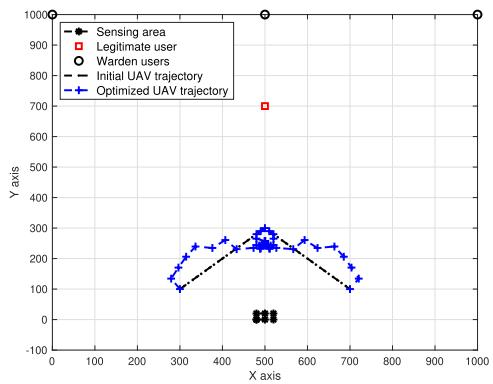  
Fig. 2. Topology and trajectories of the covert communications in ISAC networks.

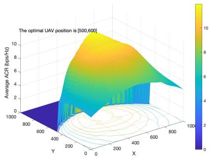

Fig. 3. ACR performance with different UAV positions.  
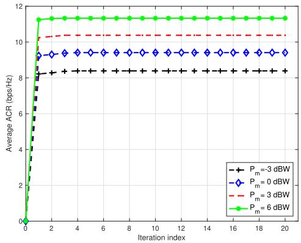  
Fig. 4. Average ACR verse the number of iterations with different transmit power budgets, $\mid P _ { m } ,$ , of the UAV.

The convergence of Algorithm 3 is illustrated in Fig. 4. Notably, after the fourth iteration, the average ACR of the legitimate user stabilizes. Following the steps outlined in Algorithm 3, the objective value obtained in each iteration consistently increases. Moreover, the solution set remains compact. As a result, Algorithm 3 converges after a specific number of iterations. Furthermore, the simulation results confirm the convergence of the proposed iterative algorithm. In addition, Fig. 4 illustrates the impact of varying the maximum transmit power $P _ { m }$ on the average ACR across different iteration numbers, ranging from −3 dBm to 6 dBm with a step of 3 dBm. The graph highlights a substantial improvement in the average ACR of the legitimate user as $P _ { m }$ increases. This enhancement is attributed to the relaxation of constraints on the power of the beamforming vectors due to the higher $P _ { m } .$ , resulting in improved ACR values at each time slot along the trajectory.

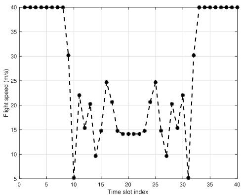

Fig. 5. Flight speed of the UAV at each time slot.  
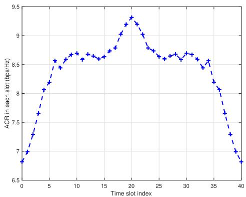

Fig. 6. ACR performance at each time slot.  
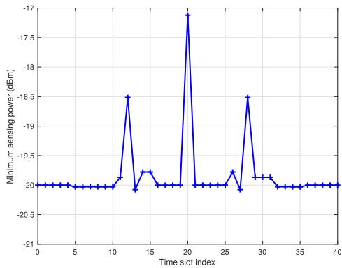  
Fig. 7. Minimum sensing power at each time slot.

Fig. 2 exhibits the optimized UAV’s trajectory, while Fig. 5 illustrates the associated UAV node’s flight speed at each time slot. Concurrently, Fig. 6 demonstrates the corresponding ACR of the legitimate user. The UAV’s trajectory showcases a symmetrical pattern. Specifically, in the initial eight time slots of the trajectory, the UAV heads towards the optimal dwell point within the trajectory, achieving the trajectory’s peak

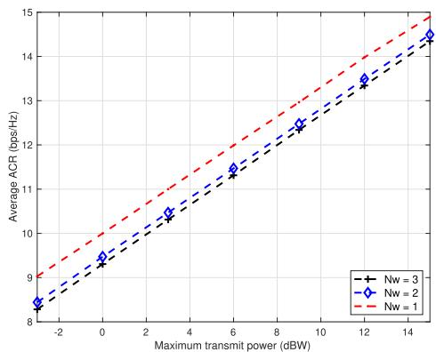  
Fig. 8. Average ACR verse the maximum transmit power with different number of wardens $N _ { W }$

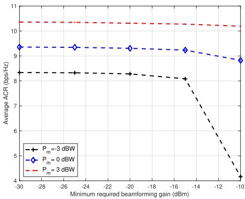  
Fig. 9. Average ACR verse the minimum required beamforming gain in the sensing area.

ACR, propelled by the maximum flight speed, $V _ { m }$ . Throughout the subsequent 24 time slots, the UAV hovers around the best point, ensuring the maximization of the average ACR along the trajectory. In the final eight time slots, the UAV proceeds towards the endpoint, with its maximum flight speed. The reason for this phenomenon is that, to enhance the system’s average ACR, the UAV needs to remain near the optimal dwell point for as long as possible and minimize time spent near the starting and ending points, where the ACR is lower. Consequently, the UAV will hover around the optimal dwell point for an extended period and will depart from the starting point at maximum speed during the iniiital time slots, as well as head towards the ending point during the final eight time slots. Furthermore, Fig. 7 shows the minimum sensing power received by the sensing targets. It is evident that, in each time slot, the beamforming gain satisfies the sensing constraints for all targets as specified in (10).

Fig. 8 illustrates the impact of the wardens’ number, denoted as $N _ { W }$ , on the average ACR across different transmit powers, denoted as $P _ { m }$ . In this setup, as $N _ { W }$ increases from 1 to 3, a significant decline in the average ACR is observed. This reduction is primarily attributed to the expanded surveillance coverage provided by multiple wardens, consequently impeding the UAV’s covert communications. As $N _ { W }$ rises, the probability of detection increases, leading to a decrease in the average ACR. Furthermore, under the same configuration, the average ACR exhibits a linear relationship with the logarithm of the maximum transmit power $P _ { m } .$

The impact of the beamforming gain threshold $\Delta$ on the sensing area is illustrated in Fig. 9. In this case, the beamforming gain threshold ∆ ranges from −30 dBm to 10 dBm in increments of 5 dBm. Concurrently, the maximum transmit power of the UAV node varies between −3 dBW and 3 dBW, with intervals of 3 dBW. A noticeable trend emerges where a higher required beamforming gain leads to a reduced average ACR, especially conspicuous as the transmission power nears the minimum requirement to satisfy the sensing constraints. This outcome arises due to the constraints on transmission power. When the available power is limited, nearly all of it is directed towards meeting the sensing constraints. Consequently, the power allocated for information beamforming vectors decreases, resulting in a diminished average ACR.

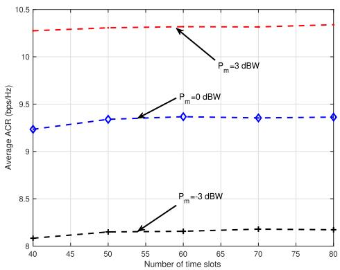  
Fig. 10. Average ACR verse the number of time slots N with different maximum transmit power.

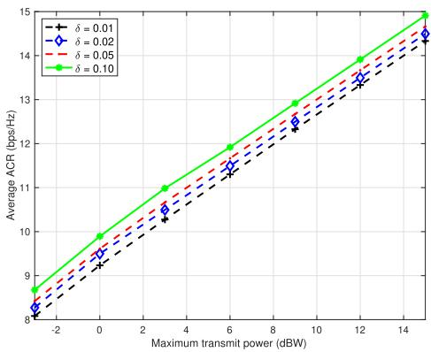  
Fig. 11. Average ACR verse the maximum transmit power with different detection probability threshold δ.

Fig. 10 exhibits the influence of the number of time slots N on the average ACR, considering the default configuration except for $\Delta \ = \ - 1 5$ dBm. In this case, the number of time slots N ranges from 40 to 80, with a step of 10. It is observed that the average ACR demonstrates an upward trend with increasing values of N, although the rise in the average ACR is relatively slight compared to the increment in $N .$ This observation stems from the UAV’s consistent endeavor to swiftly navigate towards the best position at its maximum flight speed during the initial and final phases of the trajectory. Consequently, when N is sufficiently large, the influence of its increment becomes less pronounced.

Fig. 11 illustrates the impact of the wardens’ detection probability threshold δ on the average ACR, using an identical configuration as in Fig. 10. The detection probability thresholds considered are $\delta = 0 . 0 1 , 0 . 0 2 , 0 . 0 5$ , and 0.10. The results clearly demonstrate that higher δ values correspond to an increased average ACR. Notably, setting $\delta = 0 . 1 0$ yields a performance improvement of 0.6 bps/Hz compared to $\delta =$ 0.01. This observation highlights a direct correlation between larger δ values and enhanced average ACR. This correlation is attributed to the relaxation of covertness constraints associated with higher δ values, allowing for more allocated power to the information beamforming vectors, which directly contributes to the improvement in average ACR. Although this increasement might appear modest, it is significant within the context of covert communication systems, where even small gains in data transmission rates can have a meaningful impact [29], [35], [45]. The relatively small visual change in the figure is due to the inherently conservative design of such systems, which prioritize maintaining covertness. Nonetheless, this improvement reflects the system’s ability to allocate power more efficiently as the detection probability threshold is relaxed, thereby enhancing overall performance.

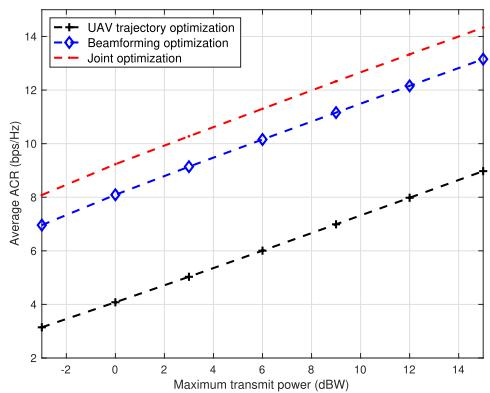  
Fig. 12. Comparison among different optimization algorithms.

Finally, the comparison among various optimization algorithms, illustrated in Fig. 12, involved two benchmark algorithms: UAV trajectory optimization and beamforming optimization. In particular, the UAV trajectory optimization scheme adopts Algorithm 2 with fixed beamforming vectors that equally split the transmit power into ${ \bf w } _ { c }$ and $\mathbf { w } _ { r } ,$ , while the beamforming optimization scheme adopts Algorithm 1 with a direct trajectory from the initial point to the final point. The findings indicate that the proposed joint optimization algorithm showcases superior performance, notably outperforming the UAV trajectory optimization. Compared with the benchmark algorithms, the joint optimization algorithm capitalizes on additional degrees of freedom introduced by the trajectory and beamforming vectors, significantly improving the average ACR. Specifically, when compared to the UAV trajectory optimization, the joint approach achieves a notable gain of 5.2 bps/Hz in the average ACR. Furthermore, it showcases about 1.1 bps/Hz improvement compared to the beamforming optimization algorithm.

## VII. CONCLUSION

In this paper, a joint optimization approach was introduced to enhance the covertness of ISAC networks. The networks configuration comprises a UAV node, a legitimate ground user, a group of sensing targets within a designated area, and multiple passive wardens. For addressing both sensing constraints within the target area and covertness considerations against multiple passive wardens, an optimization problem, which aims to maximize the average ACR of the legitimate user throughout the trajectory of the UAV node, was formulated. To tackle the formulated non-convex problem, an iterative BCD-based joint optimization method was proposed to obtain an effective suboptimal solution. Furthermore, to enhance covertness against the wardens, it is necessary to either decrease the projection of the information beamforming covariance matrix or increase the projection of the sensing beamforming covariance matrix onto the subspace spanned by the eavesdropping channel vectors. Numerical results demonstrated that the proposed joint optimization algorithm outperforms other benchmark schemes by a significant margin. Moreover, our future research will explore additional application scenarios, including intelligent reflecting surfaces aiding covert communications, as well as investigating the impacts of the small-scale channel fading on the system design and performance.

## APPENDIX A PROOF OF THEOREM 1

According to (11) and (12), $r _ { W _ { j } } [ n ]$ follows a Gaussian distribution under different hypotheses and the power of $r _ { W _ { j } } [ n ]$ follows an exponential distribution. This assumption has been widely adopted in recent research, such as [50]. Consequently, the cumulative density function (CDF) of $| r _ { W _ { j } } [ n ] | ^ { 2 }$ is represented as:

$$
F _ { | r _ { W _ { j } } [ n ] | ^ { 2 } } ( z ) = \left\{ \begin{array} { l l } { 1 - e ^ { - \frac { z } { \lambda _ { j } ^ { 0 } [ n ] } } , } & { \mathrm { H } _ { 0 } , } \\ { 1 - e ^ { - \frac { z } { \lambda _ { j } ^ { 1 } [ n ] } } , } & { \mathrm { H } _ { 1 } . } \end{array} \right.\tag{45}
$$

Then, the false alarm probability $P _ { \mathrm { F A } }$ is defined as:

$$
\begin{array} { r l } & { P _ { \mathrm { F A } } = \mathrm { P r } ( \mathrm { D } _ { 1 } | \mathrm { H } _ { 0 } ) = \mathrm { P r } ( | r _ { W _ { j } } [ n ] | ^ { 2 } > \tau _ { j } [ n ] | \mathrm { H } _ { 0 } ) } \\ & { \qquad = e ^ { - \frac { \tau _ { j } [ n ] } { \lambda _ { j } ^ { 0 } [ n ] } } , } \end{array}\tag{46}
$$

and the missed detection probability $P _ { \mathrm { M D } }$ is expressed as:

$$
\begin{array} { r l } & { P _ { \mathrm { M D } } = \mathrm { P r } ( \mathrm { D } _ { 0 } | \mathrm { H } _ { 1 } ) = \mathrm { P r } ( | r _ { W _ { j } } [ n ] | ^ { 2 } < \tau _ { j } [ n ] | \mathrm { H } _ { 1 } ) } \\ & { \qquad = 1 - e ^ { - \frac { \tau _ { j } [ n ] } { \lambda _ { j } ^ { 1 } [ n ] } } . } \end{array}\tag{47}
$$

Therefore, the total DEP is derived as:

$$
\xi _ { j } [ n ] = P _ { \mathrm { F A } } + P _ { \mathrm { M D } } = 1 + e ^ { - \frac { \tau _ { j } [ n ] } { \lambda _ { j } ^ { 0 } [ n ] } } - e ^ { - \frac { \tau _ { j } [ n ] } { \lambda _ { j } ^ { 1 } [ n ] } } .\tag{48}
$$

Note that, according to the total probability theory, the DEP can be expressed as $\xi _ { j } [ n ] = \mathrm { P r ( H _ { 0 } ) } P _ { \mathrm { F A } } + \mathrm { P r ( H _ { 1 } ) } P _ { \mathrm { M D } }$ In classical hypothesis testing, it is typically assumed that both hypotheses have equal prior probabilities, i.e., $\begin{array} { r l } { \mathrm { P r } ( \mathrm { H } _ { 0 } ) = } \end{array}$ $\mathrm { P r } ( \mathrm { H } _ { 1 } )$ , allowing the prior probabilities to be disregarded, as presented in (48). Consequently, the error probability sum, i.e., $\xi _ { j } [ n ] = P _ { \mathrm { F A } } + P _ { \mathrm { M D } }$ , effectively characterizes the detection performance of the wardens. This approach has been considered in recent works [26], [31], [35].

black It can be proved that $\xi _ { j } [ n ]$ is convex regarding $\tau _ { j } [ n ]$ Thus, to minimize the total DEP with fixed $\lambda _ { j } ^ { 0 } [ n ]$ and $\lambda _ { j } ^ { \bar { 1 } } [ n ]$ the first-order derivative of $\xi _ { j } [ n ]$ is set to zero. Therefore, the optimal decision threshold $\tau _ { j } ^ { * } [ n ]$ in (15) is obtained, and by substituting (15) into (48), the minimum DEP in (17) is obtained. Thus, Theorem 1 is proved.

## APPENDIX B PROOF OF COROLLARY 1

By substituting (18) into (17), we have

$$
F ( \mu _ { j } [ n ] ) \leq \delta .\tag{49}
$$

Next, we establish the monotonicity of $F ( x )$ . It is evident that $F ( x ) > 0 , \forall x > 0$ . Let $Z ( x ) =$ ln $F ( x )$ , by computing the first-order derivative on $Z ( x )$ , we obtain:

$$
{ \frac { \mathrm { d } Z } { \mathrm { d } x } } = { \frac { 1 } { x ^ { 2 } } } \ln ( 1 + x ) > 0 .\tag{50}
$$

Hence, $Z ( x )$ is strictly monotonically increasing. Additionally, considering the monotonic nature of the logarithmic function, $F ( x )$ also exhibits monotonic growth. Similarly, $\xi _ { j } ^ { * } [ n ]$ is monotonically decreasing concerning $\mu _ { j } [ n ]$ . Consequently, employing the inverse function operation on (49) confirms the validity of Corollary 1.

## APPENDIX C PROOF OF COROLLARY 2

We first perform a logarithmic operation on function $G ( x ) ~ = ~ ( 1 \stackrel { \cdot } { + } { x } ) ^ { - ( 1 + 1 / x ) }$ and by using the L’ospital rule, we have

$$
G ( x ) \to e ^ { - 1 } , \quad { \mathrm { i f ~ } } x \to 0 .\tag{51}
$$

Considering that $F ( x ) = x G ( x )$ , substituting (51) into $F ( x )$ Corollary 2 is proved.

## REFERENCES

[1] O. B. Akan, E. Dinc, M. Kuscu, O. Cetinkaya, and B. A. Bilgin, “Internet of Everything (IoE)–From molecules to the universe,” IEEE Commun. Mag., vol. 2, no. 1, pp. 1–7, Oct. 2023.

[2] A. Liu et al., “A survey on fundamental limits of integrated sensing and communication,” IEEE Commun. Surveys Tuts., vol. 24, no. 2, pp. 994–1034, 2nd Quart., 2022.

[3] M. Hua, Q. Wu, W. Chen, O. A. Dobre, and A. L. Swindlehurst, “Secure intelligent reflecting surface-aided integrated sensing and communication,” IEEE Trans. Wireless Commun., vol. 23, no. 1, pp. 575–591, Jan. 2024.

[4] Z. Wei et al., “Symbol-level integrated sensing and communication enabled multiple base stations cooperative sensing,” IEEE Trans. Veh. Technol., vol. 73, no. 1, pp. 724–738, Jan. 2024.

[5] Z. Wei et al., “5G PRS-based sensing: A sensing reference signal approach for joint sensing and communication system,” IEEE Trans. Veh. Technol., vol. 72, no. 3, pp. 3250–3263, Mar. 2023.

[6] Z. Liu, S. Aditya, H. Li, and B. Clerckx, “Joint transmit and receive beamforming design in full-duplex integrated sensing and communications,” IEEE J. Sel. Areas Commun., vol. 41, no. 9, pp. 2907–2919, Jun. 2023.

[7] Z. Gao et al., “Integrated sensing and communication with mmWave massive MIMO: A compressed sampling perspective,” IEEE Trans. Wireless Commun., vol. 22, no. 3, pp. 1745–1762, Mar. 2023.

[8] M. Hua, Q. Wu, W. Chen, Z. Fei, H. C. So, and C. Yuen, “Intelligent reflecting surface-assisted localization: Performance analysis and algorithm design,” IEEE Wireless Commun. Lett., vol. 13, no. 1, pp. 84–88, Jan. 2024.

[9] Y. Wen, F. Yang, J. Song, and Z. Han, “Pulse sequence sensing and pulse position modulation for optical integrated sensing and communication,” IEEE Commun. Lett., vol. 27, no. 6, pp. 1525–1529, Jun. 2023.

[10] Z. Cui, J. Hu, J. Cheng, and G. Li, “Multi-domain NOMA for ISAC: Utilizing the DOF in the delay-doppler domain,” IEEE Commun. Lett., vol. 27, no. 2, pp. 726–730, Feb. 2023.

[11] K. Zhong, J. Hu, C. Pan, M. Deng, and J. Fang, “Joint waveform and beamforming design for RIS-aided ISAC systems,” IEEE Signal Process. Lett., vol. 30, pp. 165–169, 2023.

[12] J. A. Zhang et al., “Enabling joint communication and radar sensing in mobile Networks—A survey,” IEEE Commun. Surveys Tuts., vol. 24, no. 1, pp. 306–345, 1st Quart., 2022.

[13] F. Liu, C. Masouros, A. Li, H. Sun, and L. Hanzo, “MU-MIMO communications with MIMO radar: From co-existence to joint transmission,” IEEE Trans. Wireless Commun., vol. 17, no. 4, pp. 2755–2770, Apr. 2018.

[14] K. Meng et al., “UAV-enabled integrated sensing and communication: Opportunities and challenges,” IEEE Wireless Commun., vol. 31, no. 2, pp. 1–9, Apr. 2023.

[15] K. Meng, Q. Wu, S. Ma, W. Chen, K. Wang, and J. Li, “Throughput maximization for UAV-enabled integrated periodic sensing and communication,” IEEE Trans. Wireless Commun., vol. 22, no. 1, pp. 671–687, Jan. 2023.

[16] Y. Li, X. Yuan, Y. Hu, J. Yang, and A. Schmeink, “Optimal UAV trajectory design for moving users in integrated sensing and communications networks,” IEEE Trans. Intell. Transp. Syst., vol. 24, no. 12, pp. 15113–15130, Dec. 2023, doi: 10.1109/TITS.2023.3300777.

[17] C. Deng, X. Fang, and X. Wang, “Beamforming design and trajectory optimization for UAV-empowered adaptable integrated sensing and communication,” IEEE Trans. Wireless Commun., vol. 22, no. 11, pp. 8512–8526, Nov. 2023.

[18] Y. Liu, S. Liu, X. Liu, Z. Liu, and T. S. Durrani, “Sensing fairnessbased energy efficiency optimization for uav enabled integrated sensing and communication,” IEEE Wireless Commun. Lett., vol. 12, no. 10, pp. 1702–1706, Oct. 2023.

[19] Y. Qin, Z. Zhang, X. Li, W. Huangfu, and H. Zhang, “Deep reinforcement learning based resource allocation and trajectory planning in integrated sensing and communications UAV network,” IEEE Trans. Wireless Commun., vol. 22, no. 11, pp. 8158–8169, Nov. 2023, doi: 10.1109/TWC.2023.3260304.

[20] J. Zhao, F. Gao, W. Jia, W. Yuan, and W. Jin, “Integrated sensing and communications for UAV communications with jittering effect,” IEEE Wireless Commun. Lett., vol. 12, no. 4, pp. 758–762, Apr. 2023.

[21] J. Mu, R. Zhang, Y. Cui, N. Gao, and X. Jing, “UAV meets integrated sensing and communication: Challenges and future directions,” IEEE Commun. Mag., vol. 61, no. 5, pp. 62–67, May 2023.

[22] Y. Cui, Z. Feng, Q. Zhang, Z. Wei, C. Xu, and P. Zhang, “Toward trusted and swift UAV communication: ISAC-enabled dual identity mapping,” IEEE Wireless Commun., vol. 30, no. 1, pp. 58–66, Feb. 2023.

[23] J. M. Meredith, “Technical specification group radio access network study on enhanced LTE support for aerial vehicles,” IEEE Trans. Veh. Technol., vol. 9, no. 1, pp. 1–20, Jun. 2017.

[24] X. Chen et al., “Covert communications: A comprehensive survey,” IEEE Commun. Surveys Tuts., vol. 25, no. 2, pp. 1173–1198, 2nd Quart., 2023.

[25] J. Wu, W. Yuan, and L. Hanzo, “When UAVs meet ISAC: Realtime trajectory design for secure communications,” IEEE Trans. Veh. Technol., vol. 72, no. 12, pp. 1–6, Dec. 2023.

[26] J. Hu, Q. Lin, S. Yan, X. Zhou, Y. Chen, and F. Shu, “Covert transmission via integrated sensing and communication systems,” IEEE Trans. Veh. Technol., vol. 73, no. 3, pp. 4441–4446, Mar. 2024.

[27] K. Shahzad, X. Zhou, S. Yan, J. Hu, F. Shu, and J. Li, “Achieving covert wireless communications using a full-duplex receiver,” IEEE Trans. Wireless Commun., vol. 17, no. 12, pp. 8517–8530, Dec. 2018.

[28] J. Hu, S. Yan, X. Zhou, F. Shu, and J. Li, “Covert wireless communications with channel inversion power control in Rayleigh fading,” IEEE Trans. Veh. Technol., vol. 68, no. 12, pp. 12135–12149, Dec. 2019.

[29] K. Meng, Q. Wu, S. Ma, W. Chen, and T. Q. S. Quek, “UAV trajectory and beamforming optimization for integrated periodic sensing and communication,” IEEE Wireless Commun. Lett., vol. 11, no. 6, pp. 1211–1215, Jun. 2022.

[30] F. Liu, Y.-F. Liu, A. Li, C. Masouros, and Y. C. Eldar, “Cramér-rao bound optimization for joint radar-communication beamforming,” IEEE Trans. Signal Process., vol. 70, pp. 240–253, 2022.

[31] S. Ma et al., “Covert beamforming design for integrated radar sensing and communication systems,” IEEE Trans. Wireless Commun., vol. 22, no. 1, pp. 718–731, Jan. 2023.

[32] Z. Lyu, G. Zhu, and J. Xu, “Joint maneuver and beamforming design for UAV-enabled integrated sensing and communication,” IEEE Trans. Wireless Commun., vol. 22, no. 4, pp. 2424–2440, Apr. 2023.

[33] W. Lu et al., “Secure NOMA-based UAV-MEC network towards a flying eavesdropper,” IEEE Trans. Commun., vol. 70, no. 5, pp. 3364–3376, May 2022.

[34] X. Zhang, J. Zhang, J. Xiong, L. Zhou, and J. Wei, “Energy-efficient Multi-UAV-Enabled multiaccess edge computing incorporating NOMA,” IEEE Internet Things J., vol. 7, no. 6, pp. 5613–5627, Jun. 2020.

[35] C. Wang et al., “Covert communication assisted by UAV-IRS,” IEEE Trans. Commun., vol. 71, no. 1, pp. 357–369, Jan. 2023.

[36] D. Deng et al., “Reinforcement learning based optimization on energy efficiency in UAV networks for IoT,” IEEE Internet Things J., vol. 10, no. 3, pp. 2767–2775, Feb. 2023.

[37] Y. Wu et al., “IRS-assisted covert communication with equal and unequal transmit prior probabilities,” IEEE Trans. Commun., vol. 72, no. 5, pp. 2897–2912, May 2024.

[38] L. Tao, W. Yang, S. Yan, D. Wu, X. Guan, and D. Chen, “Covert communication in downlink NOMA systems with random transmit power,” IEEE Wireless Commun. Lett., vol. 9, no. 11, pp. 1–20, Nov. 2020.

[39] N. Zhao et al., “Joint trajectory and precoding optimization for UAVassisted NOMA networks,” IEEE Trans. Commun., vol. 67, no. 5, pp. 3723–3735, May 2019.

[40] D. Deng, S. Dang, X. Li, D. W. K. Ng, and A. Nallanathan, “Joint optimization for covert communications in UAV-assisted NOMA networks,” IEEE Trans. Veh. Technol., vol. 73, no. 1, pp. 1012–1026, Jan. 2024.

[41] D. Zou, D. Deng, Y. Rao, X. Li, and K. Yu, “Relay selection for cooperative NOMA system over correlated fading channel,” Phys. Commun., vol. 35, Aug. 2019, Art. no. 100702.

[42] Y. Xu, T. Zhang, D. Yang, Y. Liu, and M. Tao, “Joint resource and trajectory optimization for security in UAV-assisted MEC systems,” IEEE Trans. Commun., vol. 69, no. 1, pp. 573–588, Jan. 2021.

[43] T. Rappaport, Wireless Communications Principles and Practice, 2nd ed., Upper Saddle River, NJ, USA: Prentice-Hall, 2002.

[44] F. Liu et al., “Integrated sensing and communications: Toward dualfunctional wireless networks for 6G and beyond,” IEEE J. Sel. Areas Commun., vol. 40, no. 6, pp. 1728–1767, Jun. 2022.

[45] X. Lu, S. Yan, W. Yang, M. Li, and D. W. K. Ng, “Covert communication with time uncertainty in time-critical wireless networks,” IEEE Trans Wireless Commun., vol. 22, no. 2, pp. 1116–1129, Feb. 2023.

[46] Z.-Q. Luo, W.-K. Ma, A. So, Y. Ye, and S. Zhang, “Semidefinite relaxation of quadratic optimization problems,” IEEE Signal Process. Mag., vol. 27, no. 3, pp. 20–34, May 2010.

[47] J. Si et al., “Covert transmission assisted by intelligent reflecting surface,” IEEE Trans. Commun., vol. 69, no. 8, pp. 5394–5408, Aug. 2021.

[48] M. Grant and S. Boyd. (2014). CVX: MATLAB Software for Disciplined Convex Programming, Version 2.1. [Online]. Available: http://cvxr.com/cvx

[49] N. D. Sidiropoulos, T. N. Davidson, and Z.-Q. Luo, “Transmit beamforming for physical-layer multicasting,” IEEE Trans. Signal Process., vol. 54, no. 6, pp. 2239–2251, Jun. 2006.

[50] Y. Li et al., “Performance analysis for covert communications under faster-than-Nyquist signaling,” IEEE Commun. Lett., vol. 26, no. 6, pp. 1240–1244, Jun. 2022.


Dan Deng (Senior Member, IEEE) received the bachelor’s and Ph.D. degrees from the University of Science and Technology of China, China, in 2003 and 2008, respectively. From 2008 to 2014, he was with Comba Telecom Ltd., Guangzhou, China, as the Director. Since 2014, he has been Guangzhou Panyu Polytechnic, Guangzhou, as a Full Professor. He has published more than 70 papers in international journals and conferences. Also, he holds 25 patents. His research interests include wireless communication and machine learning for signal processing in next-generation wireless communication systems. He has served as a member of technical program committees for several conferences.

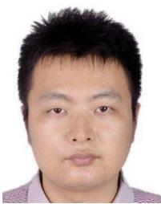  
Wen Zhou (Member, IEEE) received the Ph.D. degree in engineering from the Department of Electrical and Electronic Engineering (EEE), The University of Hong Kong, in 2010. He is currently with the School of Low-Altitude Equipment and Intelligent Control, Guangzhou Maritime University. His research interests include optimization designs in MIMO systems, information geometry in engineering, and forestry Internet of Things.


Xingwang Li (Senior Member, IEEE) received the M.Sc. degree from the University of Electronic Science and Technology of China, China, in 2010, and the Ph.D. degree from Beijing University of Posts and Telecommunications, Beijing, China, in 2015. From 2010 to 2012, he was with Comba Telecom Ltd., Guangzhou, China, as an Engineer. He spent one year as a Visiting Scholar at Queen’s University Belfast, Belfast, U.K., from 2017 to 2018. He is currently an Associate Professor with the School of Physics and Electronic Information

Engineering, Henan Polytechnic University, Jiaozuo, China. His research interests span wireless communication, intelligent transport systems, artificial intelligence, and the Internet of Things. He is on the Editorial Board of IEEE TRANSACTIONS ON INTELLIGENT TRANSPORTATION SYSTEMS, IEEE TRANSACTIONS ON VEHICULAR TECHNOLOGY, IEEE SYSTEMS JOURNAL, IEEE SENSORS JOURNAL, and Physical Communication. He served as a Guest Editor for the Special Issue on “Integrated Sensing and Communications (ISAC) for 6G IoE” of IEEE INTERNET OF THINGS JOURNAL, “Computational Intelligence and Advanced Learning for Next-Generation Industrial IoT” of IEEE TRANSACTIONS ON NETWORK SCIENCE AND ENGINEERING, and “AI-Driven Internet of Medical Things for Smart Healthcare Applications: Challenges, and Future Trends” of IEEE JOURNAL OF BIOMEDICAL AND HEALTH INFORMATICS. He served as a TPC Member for IEEE ICC and IEEE GLOBECOM.

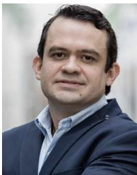

Daniel Benevides da Costa (Senior Member, IEEE) received the B.Sc. degree in telecommunications from the Military Institute of Engineering (IME), Rio de Janeiro, Brazil, in 2003, and the M.Sc. and Ph.D. degrees in electrical engineering, area: telecommunications, from the University of Campinas, São Paulo, Brazil, in 2006 and 2008, respectively. His Ph.D. thesis was awarded the Best Ph.D. Thesis in electrical engineering by the Brazilian Ministry of Education (CAPES) at the 2009 CAPES Thesis Contest. He is currently

a Distinguished University Professor at the Department of Electrical Engineering, King Fahd University of Petroleum and Minerals (KFUPM), Saudi Arabia. He is the Editor-in-Chief of the IEEE COMMUNICATIONS LETTERS. He has been recognized as World’s Top 2% Scientist by Stanford University (2021, 2022, and 2023) and has been ranked among 1% Top Scientists in the world in the broad field of electronics and electrical engineering in 2022 and 2023. He is also a Distinguished Speaker of the IEEE Vehicular Technology Society.


Derrick Wing Kwan Ng (Fellow, IEEE) received the bachelor’s (Hons.) and M.Phil. degrees in electronic engineering from The Hong Kong University of Science and Technology (HKUST), Hong Kong, in 2006 and 2008, respectively, and the Ph.D. degree from The University of British Columbia, Vancouver, BC, Canada, in November 2012.

He was a Senior Post-Doctoral Fellow with the Institute for Digital Communications, Friedrich-Alexander University Erlangen-Nurnberg (FAU), Germany. He is currently a Scientia Associate

Professor with The University of New South Wales, Sydney, NSW, Australia. His research interests include global optimization, integrated sensing and communication (ISAC), physical layer security, IRS-assisted communication, UAV-assisted communication, wireless information and power transfer, and green (energy-efficient) wireless communications. Since 2018, he has been listed as a Highly Cited Researcher by Clarivate Analytics (Web of Science). He was a recipient of Australian Research Council (ARC) Discovery Early Career Researcher Award in 2017; the IEEE Communications Society Leonard G. Abraham Prize in 2023; the IEEE Communications Society Stephen O. Rice Prize in 2022; the Best Paper Awards at the WCSP 2020 and WCSP 2021; the IEEE TCGCC Best Journal Paper Award in 2018; the INISCOM in 2018; the IEEE International Conference on Communications (ICC) in 2018, 2021, 2023, and 2024; the IEEE International Conference on Computing, Networking and Communications (ICNC) in 2016; the IEEE Wireless Communications and Networking Conference (WCNC) in 2012; the IEEE Global Telecommunication Conference (Globecom) in 2011, 2021, and 2023; and the IEEE Third International Conference on Communications and Networking in China in 2008. From January 2012 to December 2019, he served as an Editorial Assistant to the Editor-in-Chief of IEEE TRANSACTIONS ON COMMUNICATIONS. He is also an Editor of IEEE TRANSACTIONS ON COMMUNICATIONS and the Associate Editor-in-Chief of IEEE OPEN JOURNAL OF THE COMMUNICATIONS SOCIETY.


Arumugam Nallanathan (Fellow, IEEE) was an Assistant Professor with the Department of Electrical and Computer Engineering, National University of Singapore, from August 2000 to December 2007. He was with the Department of Informatics, King’s College London, from December 2007 to August 2017, where he was a Professor of wireless communications, from April 2013 to August 2017, and a Visiting Professor, from September 2017 to August 2020. He has been a Professor of wireless communications and the Head

of the Communication Systems Research (CSR) Group, School of Electronic Engineering and Computer Science, Queen Mary University of London, since September 2017. He has published nearly 700 technical papers in scientific journals and international conferences. His research interests include artificial intelligence for wireless systems, beyond 5G wireless networks, and the Internet of Things (IoT).

Dr. Nallanathan was a co-recipient of the Best Paper Award presented at the IEEE International Conference on Communications 2016 (ICC’2016), the IEEE Global Communications Conference 2017 (GLOBECOM’2017), the IEEE Vehicular Technology Conference 2018 (VTC’2018), and the IEEE Communications Society Leonard G. Abraham Prize in 2022. He is an IEEE Distinguished Lecturer. He has been selected as a Web of Science Highly Cited Researcher in 2016, 2022, 2023, and 2024. He received the IEEE Communications Society SPCE Outstanding Service Award in 2012 and the IEEE Communications Society RCC Outstanding Service Award in 2014. He served as the Chair for the Signal Processing and Communication Electronics Technical Committee of the IEEE Communications Society and the technical program chair and a member of technical program committees at numerous IEEE conferences. He was a Senior Editor of IEEE WIRELESS COMMUNICATIONS LETTERS and an Editor of IEEE TRANSACTIONS ON WIRELESS COMMUNICATIONS, IEEE TRANSACTIONS ON COMMUNICATIONS, IEEE TRANSACTIONS ON VEHICULAR TECHNOLOGY, and IEEE SIGNAL PROCESSING LETTERS.