# Joint Computation Offloading and Resource Allocation for Uncertain Maritime MEC via Cooperation of AAVs and Vessels

Jiahao You , Ziye Jia , Member, IEEE, Chao Dong , Senior Member, IEEE, Qihui Wu , Fellow, IEEE, and Zhu Han , Fellow, IEEE

Abstract—The computation demands from the maritime Internet of Things (MIoT) increase rapidly in recent years, and the autonomous aerial vehicles (AAVs) and vessels based multi-access edge computing (MEC) can fulfill these MIoT requirements. However, the uncertain maritime tasks present significant challenges of inefficient computation offloading and resource allocation. In this paper, we focus on the maritime computation offloading and resource allocation through the cooperation of AAVs and vessels, with consideration of uncertain tasks. Specifically, we propose a cooperative MEC framework for computation offloading and resource allocation, including MIoT devices, AAVs and vessels. Then, we formulate the optimization problem to minimize the total execution time. As for the uncertain MIoT tasks, we leverage Lyapunov optimization to tackle the unpredictable task arrivals and varying computational resource availability. By converting the long-term constraints into short-term constraints, we obtain a set of small-scale optimization problems. Further, considering the heterogeneity of actions and resources of AAVs and vessels, we reformulate the small-scale optimization problem into a Markov game (MG). Moreover, a heterogeneous-agent soft actor-critic is proposed to sequentially update various neural networks and effectively solve the MG problem. Finally, simulations are conducted to verify the effectiveness in addressing computational offloading and resource allocation.

Received 11 July 2024; revised 24 April 2025; accepted 17 June 2025. Date of publication 23 June 2025; date of current version 20 November 2025. This work was supported in part by the National Key R&D Program of China under Grant 2022YFB3104502, in part by the National Natural Science Foundation of China under Grant 62301251, in part by the Open Research Fund of National Mobile Communications Research Laboratory, Southeast University under Grant 2024D04, in part by the Aeronautical Science Foundation of China under Grant 2023Z071052007, in part by Young Elite Scientists Sponsorship Program by CAST under Grant 2023QNRC001, and in part by NSF under Grant ECCS-2302469 and Grant CMMI-2222810, in part by Toyota, in part by Amazon, and in part by Japan Science and Technology Agency (JST) Adopting Sustainable Partnerships for Innovative Research Ecosystem (ASPIRE) under Grant JPMJAP2326. The review of this article was coordinated by Dr. Jie Hu. (Corresponding author: Chao Dong.)

Jiahao You, Chao Dong, and Qihui Wu are with the College of Electronic and Information Engineering, Nanjing University of Aeronautics and Astronautics, Nanjing 211106, China (e-mail: yjiahao@nuaa.edu.cn; dch@nuaa.edu.cn; wuqihui@nuaa.edu.cn).

Ziye Jia is with the College of Electronic and Information Engineering, Nanjing University of Aeronautics and Astronautics, Nanjing 211106, China, and also with the National Mobile Communications Research Laboratory, Southeast University, Nanjing 211111, China (e-mail: jiaziye@nuaa.edu.cn).

Zhu Han is with the Department of Electrical and Computer Engineering, University of Houston, Houston, TX 77004 USA, and also with the Department of Computer Science and Engineering, Kyung Hee University, Seoul 446-701, South Korea (e-mail: hanzhu22@gmail.com).

Digital Object Identifier 10.1109/TVT.2025.3581970

Index Terms—Maritime Internet of Things, multi-access edge computing, autonomous aerial vehicle, task uncertainty, Lyapunov optimization, Markov game, heterogeneous-agent soft actor-critic.

# I. INTRODUCTION

N RECENT years, the increasing demands for global trade, I resource exploration, fisheries, and tourism drive the expansion of maritime activities [1]. Then, the maritime Internet of Things (MIoT) employs sensors and wireless networks to collect, transmit, analyze data, and enhance the intelligence of maritime management. However, most MIoT devices remain unexplored, due to complex and uncertain marine environment [2], [3], [4]. The MIoT devices face challenges such as varied communication environments, computational constraints, and limited energy resources. Some applications necessitate high data rates and low delay, particularly for sea lane monitoring and navigation assistance, which require real-time data processing and analysis abilities. Nevertheless, the limited communication and computing resources for maritime services present significant challenges. Fortunately, the multi-access edge computing (MEC) brings computing capabilities of AAVs and vessels to the network edge, and allows for faster data processing and reduced delay by bringing computation and storage closer to the data sources. Therefore, it is essential to integrate MEC technologies, leveraging the capabilities of AAVs and vessels [5], [6]. Such integration can optimize computation offloading and resource allocation, and enhance the efficiency and reliability of maritime services.

The AAV-assisted MEC provides an effective solution for MIoT devices to manage compute-intensive tasks by deploying computing resources at the network edge [7], [8]. However, the AAV based MEC faces restricted computational capacity [9], energy [10], and transmission power [11], [12]. Hence, it is challenging for AAVs to handle large MIoT data independently, and some tasks may encounter unacceptable delay [13]. Therefore, the cooperation between vessels and AAVs is an effective mechanism, in which vessels can provide more substantial computational resources and higher energy capacity. In detail, AAVs can handle a portion of MIoT tasks, typically involving data collection and preprocessing, and relay the computationintensive tasks to vessels for powerful MEC services [14], [15], [16]. However, the integration of heterogeneous resource devices is challenging due to varied capabilities and operational environments. Additionally, the uncertainty in maritime tasks complicates the resource management. Hence, the computation offloading and resource allocation in maritime environments face the following challenges.

- In maritime scenarios, computational tasks are uncertain due to unpredictable task arrivals and dynamic resource availability, which increase the complexity of computation offloading and resource allocation.   
- The cooperation between AAVs and vessels offers potential for enhanced MEC, but the heterogeneous devices bring challenges for cooperated resource allocation.

To overcome above challenges, we investigate the maritime MEC cooperated by AAVs and vessels. In detail, we propose a cooperative MEC framework for maritime network. Then, we formulate a resource allocation and computation offloading problem to minimize the total execution time, which is in the form of mixed-integer program (MIP) and NP-hard to solve, especially in large scale [17]. Considering the uncertain maritime tasks, we utilize the Lyapunov optimization to transform the original problem into a set of per-time-slot small-scale optimization problems. Subsequently, considering the heterogeneity of actions and resources of AAVs and vessels in the MEC environment, we reformulate the small-scale optimization problem as a Markov game (MG). Then, we design a heterogeneous-agent soft actor-critic (HASAC) algorithm to handle the MG problem. The main contributions of this paper are summarized as follows.

We propose a cooperative MEC framework for maritime MEC, in which MIoTs utilize the computational resources of AAVs and vessels. Besides, The framework considers task arrival times and the dynamic availability of computational resources under queue stability constraints.   
To address the uncertainty, we employ Lyapunov optimization to transform the long-term constraints on the execution time into per-time-slot small-scale problems. To handle the significant challenge of integrating heterogeneous resource devices, we reformulate the small-scale problem as a MG.   
- We design the HASAC algorithm to solve the problem of uncertainty and heterogeneity in maritime environment by combining soft policy iteration and reinforcement learning, to tackle the MG problem arising from the varied task demands and resource capabilities of AAVs and vessels.

The rest of the paper is organized as follows. Related works are discussed in Section II. The system model is detailed in Section III, followed by the problem formulation in Section IV. Subsequently, Section V introduces the HASAC algorithm. Numerical results are presented in Section VI, with conclusions drawn in Section VII.

# II. RELATED WORK

# A. AAV-Assisted Maritime MEC

In the maritime network, the integration of MEC is essential to enhance the system performance by providing low-delay, high-bandwidth services, and efficient resource management. For example, Liu et al. [18] design a two-layer AAV-enabled MEC network to optimize wireless network performance and minimize delay in maritime environments. They utilize reinforcement learning to optimize AAV trajectory and virtual machine configuration, to tackle the challenges of resource scarcity and delay sensitivity in maritime MEC. Due to the vulnerability of the line-of-sight communication channels in maritime networks, Lu et al. [19] introduce a secure communication scheme for AAV-relay-assisted maritime MEC networks. To address the issue of energy efficiency in AAV-assisted maritime MEC networks, [20] proposes a non-orthogonal multiple access-based MEC model and a two-layered algorithm to jointly optimize AAVs resource allocation and AAV trajectory. Dai et al. [21] propose a hybrid offshore and aerial-based MEC scheme, to handle the real-time data processing challenges in marine communication networks. Xu et al. [22] design an optimal offloading scheme using AAV-assisted maritime MEC, dynamically optimizing AAV trajectory, user scheduling, and resource allocation to minimize task execution time and improve the quality of service. However, these works do not focus on maximizing long-term network performance and uncertainty. In maritime MEC, the design of strategies should consider real-time uncertainties of environment, such as unpredictable task arrivals and dynamic availability of computational resources. Additionally, due to geographical constraints, the maritime communication and computing resources are limited, presenting challenges for resource allocation and computation offloading in maritime MEC.

# B. Uncertainty in MEC

The uncertainty reflects real-world unpredictability across a range of factors such as task arrival unpredictability, network condition instability, and task processing uncertainty. To tackle the task arrival unpredictability, Fan et al. [23] develop a novel resource allocation optimization method in MEC for uncertain computation loads, ensuring robust and efficient solutions with low-complexity algorithms. Mao et al. [24] propose the development of a successive convex approximation-based algorithm, to optimize various network parameters in the presence of channel uncertainties in MEC. In addition, Xia et al. [25] investigate the coordination between MEC and ultra-dense networks for Internet of Things, and propose algorithms based on game theory and stochastic programming to manage computation offloading and power distribution uncertainties. To address the uncertainty associated with task processing, Li et al. [26] present processing uncertainties in MEC computation offloading by formulating a chance-constrained program. Liu et al. [25] introduce game-theoretic and stochastic programming algorithms to achieve adaptive task offloading and power management, effectively handling user mobility and resource uncertainty. Ma et al. [27] tackle the challenges of video offloading in MEC under uncertainty due to dynamic device mobility, by proposing two uncertainty-aware approaches to enhance video quality and reduce service migration costs. However, these works do not study the uncertainties in the maritime environment. Hence, the factors such as the unpredictability of task arrivals and the dynamic nature of computational resources make the impact of uncertainty even more complex in the maritime environment.

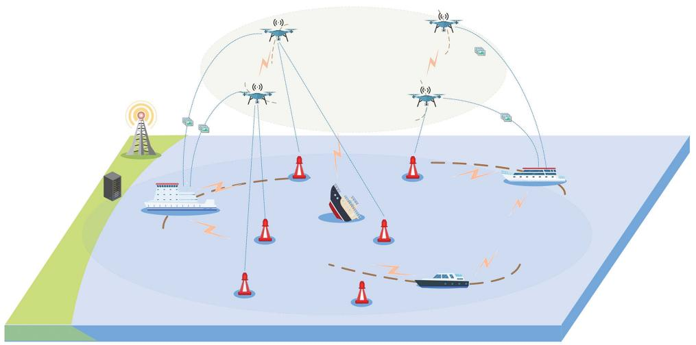

flowchart

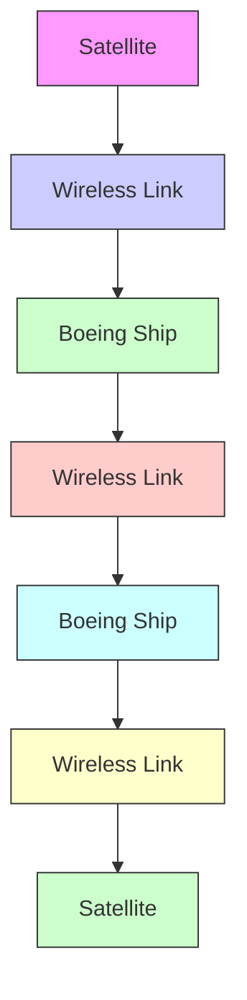

  
AAV

  
MIoT

  
GS

  
Communication link

  
Vessel

  
Cloud

  
Task

  
Computation offloading and resource allocation   
Fig. 1. System overview.

# C. Multi-Agent Reinforcement Learning (MARL) in MEC

The complexity and dynamic nature of space-air-ground integrated network, characterized by evolving network conditions, varied user demands, and multiple resource limitations, necessitate innovative approaches. MARL leverages network entities including satellites, AAVs, and ground stations as agents, enhancing learning and decision-making [28], [29]. Li et al. [29] explore MARL applications in emerging networks such as MEC, discussing the challenges, methodologies, and potentials to resolve complex issues. In the context of collaborative computation offloading and service caching in multi-cell MEC networks, Yao et al. [30] present a graph attention-based MARL algorithm, leveraging digital twin technology to boost simulations and analyses. Peng et al. [31] propose a multiagent deep deterministic policy gradient method for resource management in AAV-assisted vehicular networks, aiming for efficient allocation and offloading. Gao et al. [32] offer a decentralized attention-weighted recurrent multi-agent actor-critic solution for computation offloading in large-scale heterogeneous MEC, targeting enhanced task completion and reduced costs. These algorithms tackle various aspects of resource allocation and computation offloading in complex network environments. However, it lacks consideration for the heterogeneity of agents in maritime environments, which leads to suboptimal performance in real-world applications.

# III. SYSTEM MODEL

As shown in Fig. 1, the cooperative MEC framework consisting of AAVs, vessels, MIoT devices, and ground stations (GSs) is provided. In detail, GSs primarily transmit task commands to vessels and AAVs, and vessels are equipped with multiple receiving antennas and have powerful computing capabilities. Consequently, vessels can serve as computing devices for computation offloading and resource allocation. MIoT devices generate multiple tasks requiring computation. However, the limited computing and energy ability of MIoT devices may not complete the local computation. Therefore, AAVs collect data from MIoT devices for lightweight computing tasks, and can relay compute-intensive tasks to vessels. This hierarchical structure efficiently manage the distribution of computational demands between AAVs and vessels.

In detail, the system components comprise MIoTs, AAVs, and vessels. MIoTs, AAVs, and vessels are denoted by $\mathcal { M } = \{ 1 , 2 , 3$ , $\dots , I \} , \mathcal { U } = \{ 1 , 2 , 3 , \dots , J \}$ , and $\mathcal { V } = \{ 1 , 2 , 3 , \dots , K \}$ , respectively. Vessels are equipped with cilitate simultaneous communication w $N _ { k } ^ { m a x }$ tennas to fa-AAVs. Then, $N _ { k } ^ { m a x }$ the total time $\tau$ is segmented into $T$ periods, each spanning a duration of τ . Additionally, the positions of MIoTs, AAVs, and vessels are represented in a three dimensional cartesian coordinate system, i.e. $, l _ { i } ^ { m } ( t ) = ( x _ { i } ^ { m } ( t ) , y _ { i } ^ { m } ( t ) , h _ { i } ^ { m } ( t ) ) , l _ { j } ^ { u } ( t ) =$ $( x _ { j } ^ { u } ( t ) , y _ { j } ^ { u } ( t ) , h _ { j } ^ { u } ( t ) )$ , and $l _ { k } ^ { v } ( t ) = ( x _ { k } ^ { v } ( t ) , y _ { k } ^ { v } ( t ) , h _ { k } ^ { v } ( t ) )$ ( ) =, respec-( ( ) ( ) ( )) ( ) = ( ( ) ( ) ( ))tively. At time slot t, MIoT i generates tasks $A _ { i } ( t ) =$ $\{ d _ { i } ( t ) , c _ { i } ( t ) \}$ , where $d _ { i } ( t )$ ( ) =represents the data size in bits and $c _ { i } ( t )$ ) ( ) ( )indicates the required computation resources in CPU cycles per bit. To more accurately model the arrival of random events over time in real-world scenarios, we utilize a Poisson distribution for generating MIoT workloads, with a mean value of $\mathbb { E } ( A _ { i } ( t ) ) = \lambda _ { i }$ . It is assumed that at each time slot t, task $A _ { i } ( t )$ ( ( )) =arrives randomly at MIoT i for offloading.

( )The system operates within discrete time slots, with tasks generated by MIoT devices designated for offloading to either AAV j or vessel k. In addition, AAV j evaluates its operational capacity, current load, resource availability, and connectivity quality with MIoTs and vessels before offloading. It is worth noting that the availability of computational resources is dynamic, driven by the random arrival of tasks and the mobility of AAVs. Task arrivals lead to fluctuating computational demands, while the AAV movement affects their location, computational capacity, and connectivity with MIoTs. Based on this evaluation, $\mathrm { \ A A V } \ j$ proactively issues an offloading request to MIoT i. When receiving a task, AAV j determines whether it has sufficient computation resources for processing. If the computation resources are sufficient, AAV j processes the task, and otherwise it offloads the task to vessel k. In the system, AAVs and vessels communicate to exchange crucial information regarding task offloading, resource availability, and status updates. AAVs and vessels share their location data, computational capacity, and current task information to ensure optimal decision-making. AAVs transmit their available resources and offloading decisions to vessels, while vessels provide feedback on resource allocation and computational capacity. The example shows in Fig. 2.

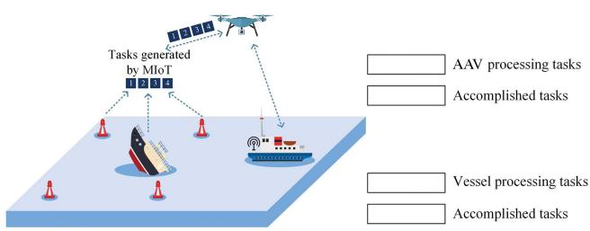

flowchart

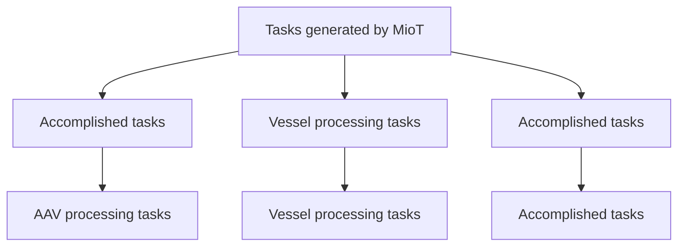

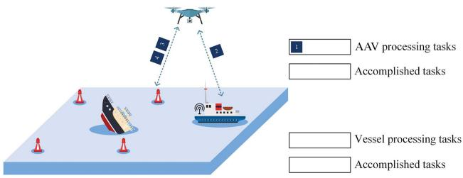

flowchart

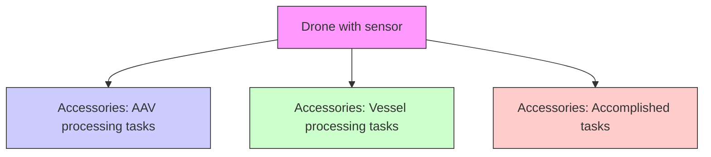

(b)

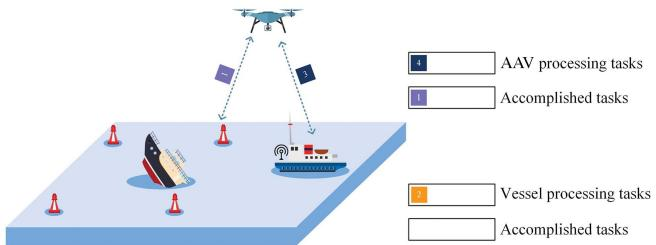

flowchart

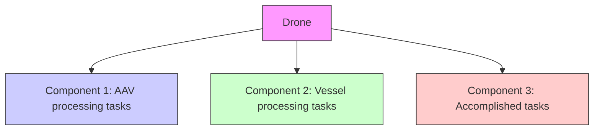

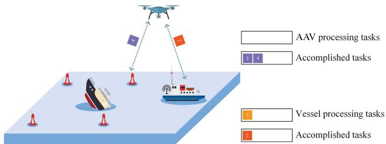

flowchart

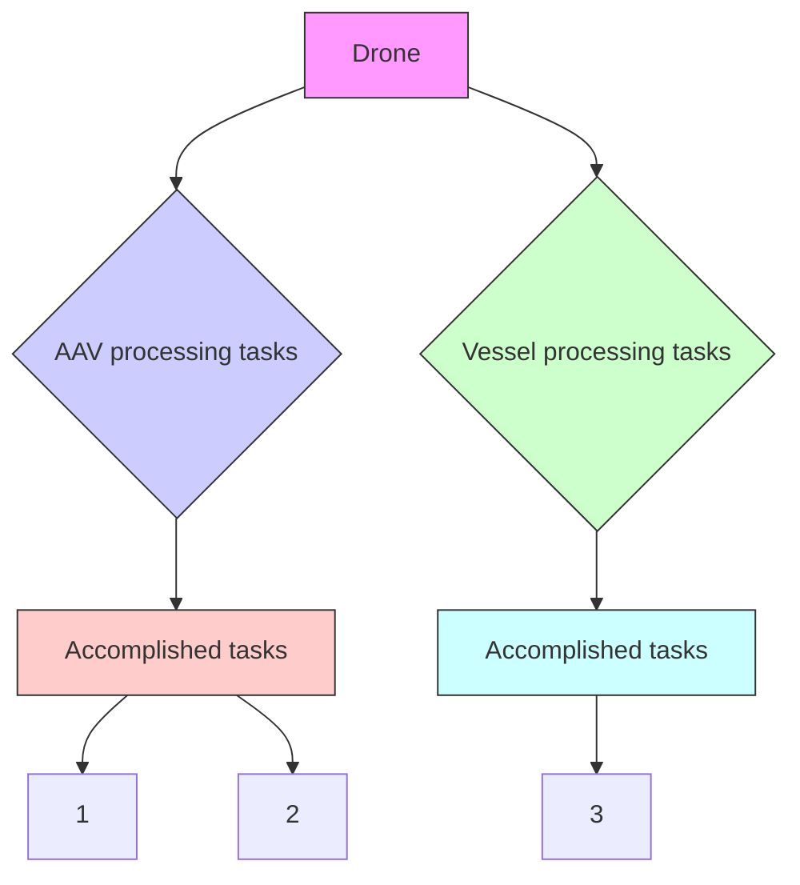

Fig. 2. An example of computation offloading and resource allocation. (a) Tasks are generated from MIoTs. (b) Task 1 is being processed on the AAV. Task 2 is offloaded to the vessel for processing. (c) Task 1 is completed and transmitted back to MIoT. Task 2 is being processed on the AAV. Task 3 is offloaded to the vessel for processing. Task 4 is being processed on the AAV. (d) Task 2 is completed and transmitted back to AAV. Task 3 is being processed on the vessel. Task 4 completion is returned to the MIoT.

It is noted that AAVs operate in a full-duplex mode, allowing for simultaneous task uploading and downloading, with the uploading time being significantly greater than the downloading time [33], [34]. As a result, the task backhaul time, which is primarily associated with the downloading process, becomes negligible in comparison to the uploading time and does not significantly impact the overall system performance.

# A. Communication Model

In this study, the considered MIoT devices are assumed to be deployed on or above the sea surface, such as buoys or surface sensors.

1) MIoT to AAV (M2U): The path loss from MIoT i to AAV j is modeled as

$$
\begin{array}{l} \xi_ {i, j} (t) = \frac {\zeta_ {L} - \zeta_ {N L}}{1 + \alpha \exp \{- \beta [ \gamma_ {i , j} (t) - \alpha \}} \\ + 2 0 \lg \left(\frac {4 \pi \| l _ {i} ^ {m} (t) - l _ {j} ^ {u} (t) \| \varphi_ {c}}{C _ {0}}\right) + \zeta_ {N L}, \tag {1} \\ \end{array}
$$

where

$$
\gamma_ {i, j} (t) = \arctan \left(\frac {\left| h _ {i} ^ {m} - h _ {j} ^ {u} \right|}{\left\| l _ {i} ^ {m} (t) - l _ {j} ^ {u} (t) \right\| _ {2}}\right). \tag {2}
$$

$\varphi _ { c }$ denotes the carrier frequency, and $C _ { 0 }$ represents the speed of light. $\zeta _ { L } , \zeta _ { N L } , \alpha _ { : }$ and $\beta$ are parameters characterizing the environment [15], [35].

Utilizing the Shannon formula, the average rate between MIoT i and AAV j is computed as

$$
R _ {i, j} ^ {m 2 u} (t) = o _ {i, j} (t) B _ {0} \log_ {2} \left(1 + \frac {P _ {i} ^ {m} \xi_ {i , j} (t)}{N _ {G}}\right), \tag {3}
$$

where $o _ { i , j } ( t ) = 1$ denotes that the task of MIoT i is offloaded to $\mathrm { \ A A V } \ j$ ( ) =at time slot t, and 0 otherwise. $B _ { 0 }$ is the bandwidth of the channel, $P _ { i } ^ { m }$ represents the transmitting power of MIoT i, and $N _ { G }$ indicates the power of the additive white Gaussian noise.

2) AAV to Vessel (U2V): Let L denote the number of orthogonal licensed channels provided by AAVs, each with bandwidth B. Then, the time-varying channel power gain from AAV j to vessel k for time slot t is expressed as

$$
G _ {j, k} (t) = G _ {0} (\| l _ {j} ^ {u} (t) - l _ {k} ^ {v} (t) \| _ {2}) ^ {- 2}, \tag {4}
$$

where $G _ { 0 }$ is the channel power gain when $| l _ { i } ^ { m } ( t ) - l _ { j } ^ { u } ( t ) |$ 2 equals ( ) ( )1-m [36], [37], [38]. Consequently, the transmission rate from AAV j to vessel k is

$$
R _ {j, k} ^ {u 2 v} (t) = \frac {s _ {j , k} (t) L B}{\sum_ {j \in J} s _ {j , k} (t)} \log_ {2} \left(1 + \frac {P _ {j , k} ^ {u} G _ {j , k} (t)}{N _ {G}}\right), \tag {5}
$$

where P u $P _ { j , k } ^ { u }$ denotes the transmission power of AAV j. Variable $s _ { j , k } = 1$ indicates that AAV j offloads a task to vessel k at time =slot t, and 0 otherwise.

# B. Computation Model

The computation offloading decision for MIoT i at time slot t is defined as

$$
o _ {i, j} (t) = \left\{ \begin{array}{l l} 1, & \text { if   MIoT } i \text {   offloaded   to   AAV } j, \\ 0, & \text { otherwise. } \end{array} \right. \tag {6}
$$

Each MIoT is limited to offloading its tasks to a single AAV, i.e.,

$$
\sum_ {j = 1} ^ {J} o _ {i, j} (t) \leq 1, \forall i \in I, t \in T. \tag {7}
$$

For $\mathrm { \ A A V \it _ j }$ at time slot t, the computation offloading decision is defined as

$$
s _ {j, k} (t) = \left\{ \begin{array}{l l} 1, & \text { if   AAV } j \text {   offloaded   to   vessel } k, \\ 0, & \text { otherwise. } \end{array} \right. \tag {8}
$$

It is crucial that each AAV is permitted to offload tasks to only one vessel per time slot, i.e.,

$$
\sum_ {k = 1} ^ {K} s _ {j, k} (t) \leq 1, \forall j \in J, t \in T. \tag {9}
$$

Hence, the backlog of MIoT i can be represented as

$$
Q _ {i} ^ {m} (t + 1) = \max \left\{Q _ {i} ^ {m} (t) - \sum_ {j = 1} ^ {J} \tau R _ {i, j} ^ {m 2 u} (t) + A _ {i} (t), 0 \right\}, \tag {10}
$$

where $\textstyle \sum _ { j = 1 } ^ { J } \tau R _ { i , j } ^ { m 2 u } ( t )$ indicates the amount of tasks leaving ( )MIoT i in time slot t. At time slot 0, let $Q _ { i } ^ { m } ( 0 ) = 0$ .

1) AAVs Based Computing: $f _ { j } ^ { u m a x }$ ( ) =is defined as AAV j total computing resource, with $f _ { i , j } ^ { u } ( t )$ denoting the resource allocated ( )to MIoT i during time slot t. Thus, task delay in time slot t includes both transmission and computation latencies, calculated as

$$
T ^ {u} (t) = \frac {d _ {i} (t)}{R _ {i , j} ^ {m 2 u} (t)} + \frac {d _ {i} (t) c _ {i} (t)}{f _ {i , j} ^ {u} (t)}. \tag {11}
$$

Furthermore, the computing resources allocated by $\mathbf { A A V } \ j$ to MIoT devices cannot exceed its total resources, i.e.,

$$
\sum_ {i = 1} ^ {I} f _ {i, j} ^ {u} (t) \leq f _ {j} ^ {u m a x}, \forall j \in J, t \in T. \tag {12}
$$

Besides, $\mathrm { \ A A V \it _ j }$ maintains a queue for tasks offloaded by MIoT i, with the backlog modeled as $Q _ { i } ^ { u } ( t )$ , i.e.,

$$
\begin{array}{l} Q _ {j} ^ {u} (t + 1) = \max \left\{Q _ {j} ^ {u} (t) - \sum_ {k = 1} ^ {K} \tau R _ {j, k} ^ {u 2 v} (t) \right. \\ \left. - \tau f _ {i, j} ^ {u} (t) + \sum_ {i = 1} ^ {I} \tau R _ {i, j} ^ {m 2 u} (t), 0 \right\}, \tag {13} \\ \end{array}
$$

where $\begin{array} { r } { \sum _ { k = 1 } ^ { K } \tau R _ { j , k } ^ { u 2 v } ( t ) } \end{array}$ means $\mathrm { \ A A V } \ j$ select vessel k for offloading in time slot $t , \checkmark f _ { i , j } ^ { u } ( t )$ indicates the amount of data processed of MIoT i by $\operatorname { A A V } j$ ( )in time slot t.

2) Vessels Based Computing: $f _ { k } ^ { v m a x }$ is defined as the computing resource of vessel $k ,$ and $f _ { j , k } ^ { v } ( t )$ represents the resource ( )allocated to AAV j task during time slot t. Besides, computation offloading to vessels includes three types of delay: transmission from MIoTs to AAVs, propagation from AAVs to vessels, and vessel computation. Hence, the total task delay is represented as

$$
T ^ {v} (t) = \frac {d _ {i} (t)}{R _ {i , j} ^ {m 2 u} (t)} + \frac {d _ {i} (t)}{R _ {j , k} ^ {u 2 v} (t)} + \frac {d _ {i} (t) c _ {i} (t)}{f _ {j , k} ^ {v} (t)}. \tag {14}
$$

The vessel total allocated computing resources for each AAV must not exceed its capacity, i.e.,

$$
\sum_ {j = 1} ^ {J} f _ {j, k} ^ {v} (t) \leq f _ {k} ^ {v m a x}, \forall k \in K, t \in T. \tag {15}
$$

Therefore, the tasks offloaded from AAVs are queued in the vessel server for computation. Then, we define the length of the task queue from AAVs offloading to vessel k as

$$
Q _ {k} ^ {v} (t + 1) = \max \left\{Q _ {k} ^ {v} (t) - \tau f _ {j, k} ^ {v} (t) + \sum_ {j = 1} ^ {J} \tau R _ {j, k} ^ {u 2 v} (t), 0 \right\}, \tag {16}
$$

where $\tau f _ { j , k } ^ { v } ( t )$ denotes the size of data computed by the vessel ( )servers at time slot $t , \mathrm { a n d } \tau R _ { j , k } ^ { u 2 v } ( t )$ represents the amount of task ( )data offloaded from AAV j to vessel k at time slot t. In addition, tasks offloaded to AAVs or vessels are processed following a first-come, first-served basis.

Derived from the preceding model, tasks can be processed on AAVs or vessels. Hence, the delay for MIoT i tasks in time slot t is represented as

$$
T _ {i} ^ {a} (t) = T ^ {u} (t) + T ^ {v} (t). \tag {17}
$$

Consequently, the cumulative time cost for all MIoT-generated tasks in time slot t is

$$
\Phi (t) = \sum_ {i = 1} ^ {I} T _ {i} ^ {a} (t). \tag {18}
$$

Then, the average time cost for all tasks is defined as

$$
\bar {\Phi} = \lim _ {T \rightarrow \infty} \frac {1}{T} \sum_ {t = 1} ^ {T} \mathbb {E} [ \Phi (t) ]. \tag {19}
$$

# IV. PROBLEM FORMULATION

The objective is to minimize the total execution time during computation offloading and resource allocation. As previously discussed, the computation offloading and resource allocation are organized into four distinct sets.

- $\mathcal { O } \mathrm { : }$ Computation offloading decisions from MIoTs to $\mathbf { A A V s } ;$ ;   
- $s \mathrm { : }$ Computation offloading decisions from AAVs to vessels;   
- $\mathcal { F } ^ { u . }$ : Computing resources allocated by AAVs to MIoTs;   
- $\mathcal { F } ^ { v }$ : Computing resources allocated by vessels to AAVs.

Consequently, the optimization problem is formulated as

$$
\mathscr {P} 0: \min _ {\mathcal {O}, \mathcal {S}, \mathcal {F} ^ {u}, \mathcal {F} ^ {v}} \lim _ {T \to \infty} \frac {1}{T} \sum_ {t = 1} ^ {T} \mathbb {E} [ \Phi (t) ],
$$

$$
\text { s   .   t   . } (6) - (9), (1 2), (1 5)
$$

$$
\lim _ {T \to \infty} \frac {1}{T} \sum_ {t = 1} ^ {T} \frac {Q _ {i} ^ {m} (t)}{t} = 0, \forall i \in \mathcal {M}, \tag {20a}
$$

$$
\lim _ {T \to \infty} \frac {1}{T} \sum_ {t = 1} ^ {T} \frac {Q _ {j} ^ {u} (t)}{t} = 0, \forall j \in \mathcal {U}, \tag {20b}
$$

$$
\lim _ {T \to \infty} \frac {1}{T} \sum_ {t = 1} ^ {T} \frac {Q _ {k} ^ {v} (t)}{t} = 0, \forall k \in \mathcal {V}. \tag {20c}
$$

Wherein, constraints (20a)–(20c) aim to ensure queue stability. Then, a strongly stable data queue is desirable since it ensures finite processing delay of each task [39], [40]. The solution of problem $\mathcal { P } 0$ is a significant challenge, since the short-term decisions impact long-term queuing delay performance, necessitating decisions making without future information.

# A. Problem Transformation

The Lyapunov optimization is employed to address the longterm stochastic problem. Then, we convert the long-term queuing delay constraints into queue stability constraints by introducing virtual queues [41]. Let $Q ( t ) = \{ Q _ { i } ^ { m } ( t ) , Q _ { j } ^ { u } ( t ) , Q _ { k } ^ { v } ( t ) \}$ ( ) = ( ) ( ) ( )represent the set of all queues. Hence, we define the quadratic Lyapunov function $L ( Q ( t ) )$ as

$$
L (Q (t)) = \frac {1}{2} \sum_ {i = 1} ^ {I} [ Q _ {i} ^ {m} (t) ] ^ {2} + \frac {1}{2} \sum_ {j = 1} ^ {J} [ Q _ {j} ^ {u} (t) ] ^ {2} + \frac {1}{2} \sum_ {j = 1} ^ {J} [ Q _ {k} ^ {v} (t) ] ^ {2}, \tag {21}
$$

where $L ( Q ( t ) )$ represents the system total queue congestion.

( ( ))A large backlog in the queue results in a significantly high $L ( Q ( t ) )$ value. Subsequently, the one-step conditional Lya-( ( ))punov drift $\Delta ( Q ( t ) )$ is defined as

$$
\Delta (Q (t)) = \mathbb {E} [ L (Q (t + 1)) - L (Q (t)) | Q (t) ]. \tag {22}
$$

Ensuring system queue stability necessitates a low Lyapunov function value. To minimize the total execution time while maintaining queue stability, the drift-plus-penalty for each time slot is $\Delta ( Q ( t ) ) + V \mathbb { E } [ \Phi ( t ) | Q ( t ) ]$ , where $V$ denotes the trade-off Δ( ( )) + [Φ( ) ( )]between the total execution time and Lyapunov drift. In detail, a higher $V$ value prioritizes reducing the total execution time, and a lower value focuses on minimizing the Lyapunov drift.

Given the computation offloading and computing resource decisions, along with the task arrival rate at time slot t, the driftplus-penalty inequality, derived from $V \geq 0$ , is

$$
\Delta (Q (t)) + V \mathbb {E} [ \Phi (t) | Q (t) ] \leq D + V \mathbb {E} [ \Phi (t) | Q (t) ]
$$

$$
+ \mathbb {E} \left\{\sum_ {i = 1} ^ {I} Q _ {i} ^ {m} (t) \left(A _ {i} (t) - \sum_ {j = 1} ^ {J} \tau R _ {i, j} ^ {m 2 u} (t)\right) \Bigg | Q (t) \right\}
$$

$$
+ \mathbb {E} \left\{\sum_ {j = 1} ^ {J} Q _ {j} ^ {u} (t) \left(\tau R _ {i, j} ^ {m 2 u} (t) \right. \right.
$$

$$
\left. \left. - \left(\sum_ {k = 1} ^ {K} \tau R _ {j, k} ^ {u 2 v} (t) - \tau f _ {i, j} ^ {u} (t)\right)\right) \mid Q (t) \right\}
$$

$$
+ \mathbb {E} \left\{\sum_ {k = 1} ^ {K} Q _ {k} ^ {v} (t) \left(\sum_ {j = 1} ^ {J} \tau R _ {j, k} ^ {u 2 v} (t) - \tau f _ {j, k} ^ {v} (t)\right) \bigg | Q (t) \right\}, \tag {23}
$$

in which

$$
\begin{array}{l} D = \frac {1}{2} \left\{\sum_ {i = 1} ^ {I} \left[ \tau R _ {j} ^ {\text { umax }} + (A _ {i} ^ {\text { max }}) ^ {2} \right] + \sum_ {j = 1} ^ {J} \left[ (\tau R _ {k} ^ {\text { vmax }} \right. \right. \\ \left. - \tau f _ {j} ^ {\text { max }}) ^ {2} + (\tau R _ {j} ^ {\text { umax }}) ^ {2} \right] + \sum_ {k = 1} ^ {K} \left[ (\tau R _ {v} ^ {\text { umax }}) ^ {2} - (\tau f _ {k} ^ {\text { vmax }}) ^ {2} \right] \Bigg \}. \tag {24} \\ \end{array}
$$

The detailed proof is in Appendix A.

Based on the above discussion, the stochastic optimization $\mathcal { P } 0$ is transformed to focus on minimizing the Lyapunov driftplus-penalty upper bound in each time slot t. Consequently, by disregarding the fixed term D, P0 is reformulated into a deterministic $\mathcal { P } 1$ , which is applicable to any time slot, i.e.,

$$
\mathscr {P} 1: \min _ {\mathcal {O}, \mathcal {S}, \mathcal {F} ^ {u}, \mathcal {F} ^ {v}} \mathcal {C} (\mathcal {O}, \mathcal {S}, \mathcal {F} ^ {u}, \mathcal {F} ^ {v}) =
$$

$$
\begin{array}{l} V \Phi (t) (\mathcal {O}, \mathcal {S}, \mathcal {F} ^ {u}, \mathcal {F} ^ {v}) - \sum_ {i = 1} ^ {I} Q _ {i} ^ {m} (t) \left(\sum_ {j = 1} ^ {J} \tau R _ {i, j} ^ {m 2 u} (t)\right) \\ + \sum_ {j = 1} ^ {J} Q _ {j} ^ {u} (t) \left(\tau R _ {i, j} ^ {m 2 u} (t) - \left(\sum_ {k = 1} ^ {K} \tau R _ {j, k} ^ {u 2 v} (t) \right. \right. \\ \left. - \tau f _ {i, j} ^ {u} (t)\right) + \sum_ {k = 1} ^ {K} Q _ {k} ^ {v} (t) \left(\sum_ {j = 1} ^ {J} \tau R _ {j, k} ^ {u 2 v} (t) - \tau f _ {j, k} ^ {v} (t)\right), \\ \end{array}
$$

$$
\text { s.t. } (6) - (9), (1 2), (1 5).
$$

Therefore, the solution of $\mathcal { P } 1$ depends on the current information. However, $\mathcal { P } 1$ presents a complex MIP and non-convex optimization problem, incorporating binary variables $\mathcal { O }$ and $s ,$ as well as continuous variables $\mathcal { F } ^ { u }$ and $\mathcal { F } ^ { v }$ . The non-convex objective function complicates deriving an optimal solution, especially due to the interplay among variables such as computation offloading and resource allocation in dynamic networks Hence, we design a HASAC scheme to effectively tackle this complexity.

# V. ALGORITHM DESIGN

# A. MG Framework

We optimize the computation offloading and resource allocation for MIoTs, AAVs, and vessels, to minimize the total execution time. Thus, the problem is formulated as a partially observable MG with J AAV agents and K vessel agents, totaling

$J + K$ agents. In particular, the interaction process for compu-+tation offloading and resource allocation is characterized by the tuple $\langle S , \{ \mathcal { O } _ { j } ^ { u } , \mathcal { O } _ { k } ^ { v } \} _ { j \in J , k \in K } , \{ A _ { j } ^ { u } , \mathcal { A } _ { k } ^ { v } \} _ { j \in J , k \in K } , \mathcal { R } , \gamma \rangle$ . Here, S represents the potential environmental states, including location and queue information for MIoTs, AAVs, and vessels, as well as current task infromation. $\mathcal { O } _ { j } ^ { u }$ and $\mathcal { O } _ { k } ^ { v }$ define the observation spaces for AAV agent $j$ and vessel agent $k ,$ respectively, with each agent observations constituting a subset of the environmental state $s ( t ) \in S . \mathcal { A } _ { i } ^ { u }$ and $\mathcal { A } _ { k } ^ { v }$ represent the action sets available ( )to AAV agent j and vessel agent k. At each state $s ( t ) \in S$ , AAV agent j and vessel agent k implement policies $\pi _ { j } ^ { u } : S  { \mathcal { A } } _ { j } ^ { u }$ and $\pi _ { k } ^ { v } : S  { \mathcal { A } } _ { k } ^ { v }$ :. R denotes the reward function, and γ represents :the discount factor. In the following, we detail the environmental state, observation space, action space, and reward function for AAVs and vessels for each time slot t [42].

1) Environment State Space: For each time slot t, the environmental state is denoted as $s ( t ) \in S$ . Apart from queue and ( )current task arrival information, s t encompasses positional ( )data of MIoTs, AAVs, and vessels. Thus, the state space $s ( t )$ is represented as

$$
s (t) = \{L ^ {m} (t), L ^ {u} (t), L ^ {v} (t), Q ^ {m} (t), Q ^ {u} (t), Q ^ {v} (t) \}, \tag {25}
$$

where $L ^ { m } ( t ) , L ^ { u } ( t ) , L ^ { v } ( t ) , Q ^ { m } ( t ) , Q ^ { u } ( t )$ , and $Q ^ { v } ( t )$ denote, ( ) ( ) ( ) ( ) ( ) ( )respectively, the location sets and backlog queues of MIoT devices, AAVs, and vessels at time slot t.

2) Observation Space: In the partially observable MEC environment, local observations for AAV agent j and vessel agent k at time slot t are detailed below.

a) AAV Agent Local Observation Space: For each time slot t, AAV agent j observes MIoTs and AAVs states, i.e.,

$$
\mathcal {O} _ {j} ^ {u} (t) = \{L ^ {m} (t), L ^ {u} (t), Q ^ {m} (t), Q ^ {u} (t) \}. \tag {26}
$$

b) Vessel Agent Local Observation Space: At each time slot t, vessel agent k observes AAVs and vessels states, i.e.,

$$
\mathcal {O} _ {k} ^ {v} (t) = \{L ^ {u} (t), L ^ {v} (t), Q ^ {u} (t), Q ^ {v} (t) \}. \tag {27}
$$

3) Action Space: In accordance with problem $\mathcal { P } 1$ and the associated observational data, each AAV and vessel make decisions of action from action spaces. For each time slot t, the action space of AAV agent $j$ is $A _ { j } ^ { u } = \{ \mathcal { O } , \mathcal { F } ^ { u } \}$ , where O indicates =AAV computation offloading decisions, and $\mathcal { F } ^ { u }$ denotes AAV resource allocation. At each time slot t, the action space of vessel agent k is $\mathcal { A } _ { k } ^ { v } = \{ \mathcal { S } , \mathcal { F } ^ { v } \}$ , where S represents vessel =computation offloading decisions, and $\mathcal { F } ^ { v }$ denotes the resource allocation set for vessels.

4) Reward Function: Following the coordinated actions of both AAVs and vessels, the environment provides a reward $r ( t )$ ( )to assess the effectiveness of joint actions. In accordance with the objectives in problem $\mathcal { P } 1$ , the primary goal of the agents is to minimize the total execution time, which is formulated as $\mathcal { C } ( \mathcal { O } , \mathcal { S } , \mathcal { F } ^ { u } , \mathcal { F } ^ { v } )$ . Therefore, the current system reward function ( )can be defined as

$$
r (t) = \mathcal {C} (\mathcal {O}, \mathcal {S}, \mathcal {F} ^ {u}, \mathcal {F} ^ {v}). \tag {28}
$$

# B. HASAC-Based Solution

The distinctive observation and action spaces for AAV and vessel agents often lead to instabilities in training and challenges in convergence [43], [44]. In Fig. 3, to handle the complexity of the MG involving $J + K$ agents, we integrate the soft +actor-critic algorithm and a cooperative multi-agent framework. In detail, by utilizing insights from the multi-agent advantage decomposition lemma, we employ a sequential update process to enhance collaboration among the heterogeneous multi-agent systems. In this process, each agent updates its policy one at a time in a fixed order. This method ensures that each agent update considers the most recent updates from the other agents, thereby preventing conflicting updates that could destabilize the learning process. The method is triggered by partitioning the collective advantage into sequential assessments, each considering the actions of prior agents. Then, a collaborative reward is allocated among all $J + K$ agents to achieve the optimization objective.

+As for a set of $J + K$ agents, denoted by $i _ { 1 : n } .$ , functioning +within state s and undertaking actions $\pmb { a } ^ { i _ { 1 : n } }$ , the multi-agent soft Q-function $Q _ { \pi } ^ { i _ { 1 : n } } ( s , \pmb { a } ^ { i _ { 1 : n } } )$ is defined, with $- i _ { 1 : n }$ representing the ( )complementary set of agents. This function quantifies expected cumulative discounted future rewards, denoting anticipated returns within the present state-action framework. Hence, the multi-agent soft Q-function is modeled as

$$
\begin{array}{l} Q _ {\boldsymbol {\pi}} ^ {i _ {1: n}} (s, \boldsymbol {a} ^ {i _ {1: n}}) \triangleq \mathbb {E} _ {\mathbf {a} ^ {- i _ {1: n}} \sim \boldsymbol {\pi} ^ {- i _ {1: n}}} \left[ Q _ {\boldsymbol {\pi}} (s, \boldsymbol {a} ^ {i _ {1: n}}, \mathbf {a} ^ {- i _ {1: n}}) \right. \\ \left. + \alpha \sum_ {i \in - i _ {1: n}} \mathcal {H} \left(\pi^ {i} (\cdot | s)\right) \right], \tag {29} \\ \end{array}
$$

where $\mathbb { E } _ { \mathbf { a } ^ { - i _ { 1 : n } } \sim \pi ^ { - i _ { 1 : n } } }$ represents the expected actions from agents outside $i _ { 1 : n } .$ , according to the strategy $\pi ^ { - i _ { 1 : n } }$ . The temperature parameter α adjusts the impact of entropy regularization during the optimization of the policy. $\begin{array} { r } { \sum _ { i \in - i _ { 1 : n } } \mathcal { H } ( \pi ^ { i } ( \cdot | s ) ) } \end{array}$ represents ( ( ))the sum of entropies of actions taken by all agents excluding $i _ { 1 : n }$ in state s.

The algorithm framework aims to design optimal strategies for computation offloading and resource allocation with minimized possible time cost. In detail, the long task completion time indicates suboptimal results, underscoring the current strategy limitations and the imperative for improvement. Furthermore, HASAC focuses on learning strategy parameters through the minimization of expected Kullback-Leibler (KL) divergence. Consequently, the joint policy is presented as

$$
\boldsymbol {\pi} _ {n e w} = \arg \min _ {\boldsymbol {\pi} ^ {\prime} \in \boldsymbol {\Pi}} \mathrm{D} _ {\mathrm{KL}} \left(\boldsymbol {\pi} ^ {\prime} (\cdot | s) \| \frac {\exp \left(\frac {1}{\alpha} Q _ {\boldsymbol {\pi} _ {o l d}} (s , \cdot)\right)}{Z _ {\boldsymbol {\pi} _ {o l d}} (s)}\right), \tag {30}
$$

where Π is the comprehensive set of feasible policies accessible to an agent. $\mathrm { D } _ { \mathrm { K L } }$ represents the KL divergence, an informa-Dtion projection that can conveniently map the improved policy onto the desired set of policies. $\pi ^ { \prime } ( \cdot | s )$ denotes the new policy probability distribution over actions, given the current state s. $\exp ( \cdot )$ is the exponential function. $Z ( \cdot )$ indicates to normalize exp( ) ( )the distribution, to adjust the exponential output of the soft Q-function to validate the target probability distribution.

The function approximators, specifically deep neural networks (DNNs), are utilized to model both the centralized soft Q-function $Q _ { \theta } ( s _ { t } , \mathbf { a } _ { t } )$ , and the decentralized policies $\pi _ { \phi ^ { i _ { \tau } } } ^ { i _ { n } }$ in for each agent $i _ { m }$ are parameterized by θ and $\phi ^ { i _ { n } }$ , respectively. The optimization of these networks proceeds via iterative application of stochastic gradient descent, focusing on minimizing the bellman residual for the Q-function, i.e.,

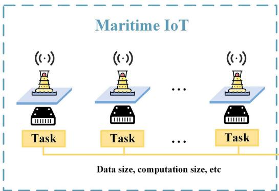

flowchart

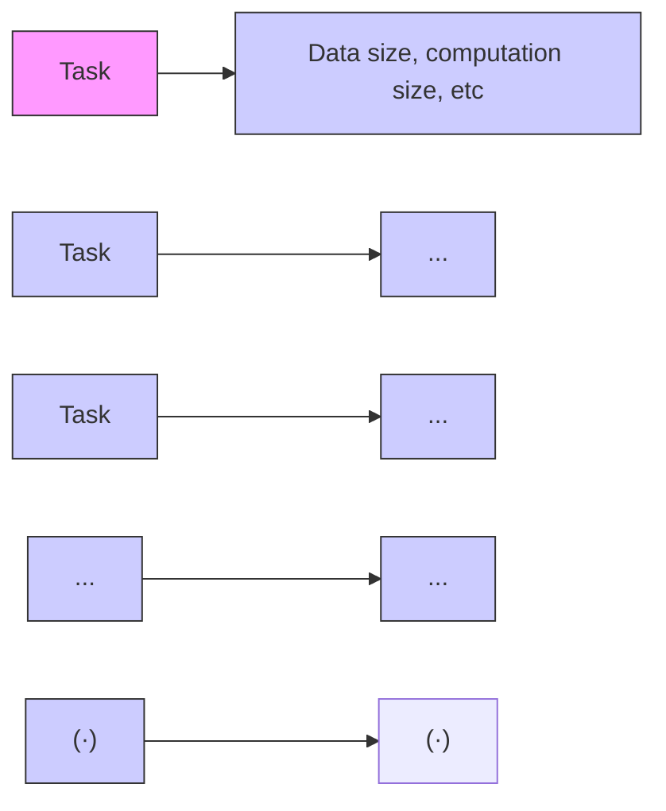

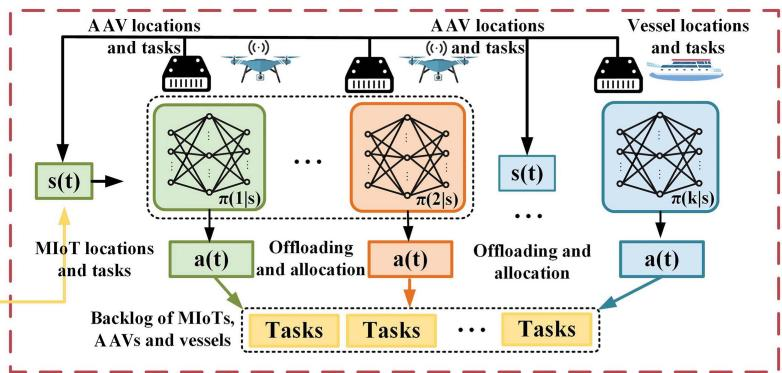

flowchart

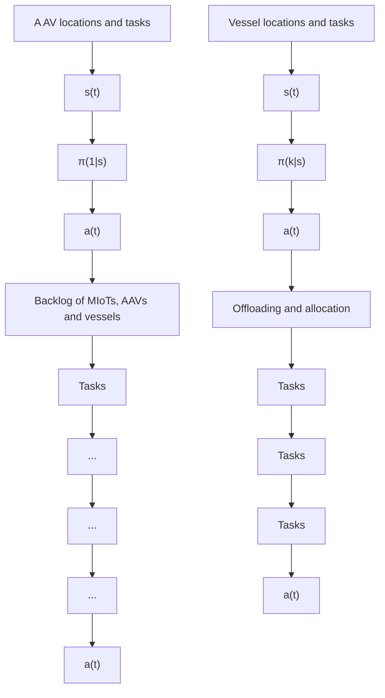

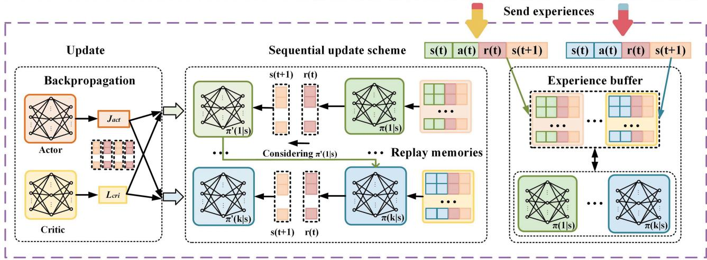

flowchart

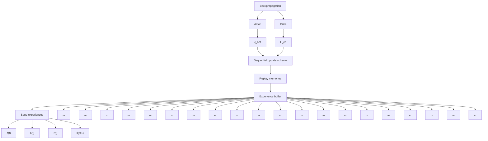

Fig. 3. The HASAC framework in uncertain maritime scenario.

$$
\begin{array}{l} J _ {Q} (\theta) = \mathbb {E} _ {\left(\mathrm{s} _ {t}, \mathbf {a} _ {t}\right) \sim \mathcal {D}} \left[ \frac {1}{2} \left(Q _ {\theta} \left(\mathrm{s} _ {t}, \mathbf {a} _ {t}\right) - \left(r \left(\mathrm{s} _ {t}, \mathbf {a} _ {t}\right) \right. \right. \right. \\ \left. + \gamma \mathbb {E} _ {\mathrm{s} _ {t + 1} \sim P} [ V _ {\bar {\theta}} (\mathrm{s} _ {t + 1}) ]) ^ {2} \right]. \tag {31} \\ \end{array}
$$

Here, D represents the replay buffer, utilized for storing historical experiences. The discount factor $\gamma$ measures the significance of future rewards, and $V _ { \bar { \theta } } ( \mathrm { s } _ { t + 1 } )$ estimates the value function of the subsequent state $\mathrm { S } _ { t + 1 } .$ ), parameterized by θ. sSpecifically, θ denotes the parameters of the target network, which is a delayed replica of the Q-network intended to stabilize the training process. Similarly, the parameters of the policy $\pi _ { \phi ^ { i _ { n } } } ^ { i _ { n } }$ φin are optimized by minimizing the expected KL divergence, which is expressed as

$$
J_{\pi_{i_{n}}}\big(\phi^{i_{n}}\big) = \mathbb{E}_{s_{t}\sim \mathcal{D}}\Bigg[\mathbb{E}_{a_{t}^{i:1:n - 1}\sim \pi_{\phi^{\text{new}}}^{i:1:n - 1},a_{t}^{i_{n}}\sim \pi_{\phi^{in}}^{i_{n}}}
$$

$$
\left. \left[ \alpha \log \pi_ {\phi^ {i n}} ^ {i _ {n}} (a _ {t} ^ {i _ {n}} | s _ {t}) - Q _ {\pi_ {\mathrm{old}}; \theta} ^ {i: 1: n} (s _ {t}, a _ {t} ^ {i: 1: n - 1}, a _ {t} ^ {i _ {n}}) \right] \right]. \tag {32}
$$

# C. HASAC Algorithm Implementation

As depicted in Algorithm 1, the centralized agent in each network includes the main network, target network, policy gradient, loss function, and replay memory. we utilize two soft Q-functions to mitigate positive bias in the policy improvement step and counteract overestimation. The actor manages learning the computation offloading and resource allocation strategies and generates actions based on the state via a fully connected network. Two evaluators are employed to assess the actor computation offloading and resource allocation strategy, to enhance the training efficiency. Similarly, the critic network is structured as a fully connected neural network, with neurons in both the actor and critic representing the inputs of states and actions, respectively. The replay memory stores historical experience information that is used to update the actor and critic, including actions, states, rewards, and subsequent states.

Algorithm 1: Heterogeneous-Agent Soft Actor-Critic.   
Require: Temperature parameter $\epsilon$ , Polyak coefficient $\iota$ , batch size B, number of agents n, episodes K, steps per episode J.

1: Initialize: Critic networks $\phi_{1}$ and $\phi_{2}$ , policy networks $\{\theta_{i}\}_{i\in\mathcal{N}}$ , replay buffer D, target parameters $\phi_{\text{targ},1} \leftarrow \phi_{1}$ , $\phi_{\text{targ},2} \leftarrow \phi_{2}$ .

2: for k = 0 to K - 1 do

3: for agent $i \in N$ , episode k, step j do

4: Observe state $o_{i}^{j}$ and select action $a_{i}^{j} \sim \pi_{\theta_{i}}(o_{i}^{j})$ .

5: Execute action $a_{i}^{j}$ in the environment.

6: Observe next state $o_{i,j+1}$ and reward $r_{i}^{j}$ .

7: Store $(o_{i,j}, a_{i}^{j}, r_{i}^{j}, o_{i,j+1})$ into D.

8: Sample a random batch of samples from D.

9: Compute the critic targets using (34).

10: end for

11: Update Q-functions by one step of gradient descent leveraging (33).

12: Randomly select a permutation of agents $i_{1:n}$ .

13: for agent $i_{m} = i_{1}, \ldots, i_{n}$ do

14: Update agent $i_{m}$ by using (35).

15: end for

16: Smoothly update the target critic network utilizing (36).

17: end for

To address the computational challenges associated with the HASAC algorithm, we separate the problem into two phases: centralized training and distributed execution [45], [46], [47]. During the training phase, the algorithm is trained centrally, allowing for intensive computation using high-performance computing resources. This phase can be performed offline, and the learned policies are stored for execution. In the execution phase, the algorithm is decentralized, with each AAV and vessel independently implementing the trained policies. This distribution of execution minimizes the computational load on individual agents and ensures that the system can scale efficiently in real-time operations.

During the training process, the agent initially collects local data (line 1). Specifically, each local state is transmitted during each training segment. Subsequently, the agent actor generates joint offloading and resource allocation actions based on the local state (line 4). Hence, the networked environment generates rewards based on the current action and state (lines 5-6). The tuples of actions, states, rewards, and subsequent states are stored in the replay memory D (line 7). Then, a batch of tuples B is randomly sampled from the replay memory D to update the network (line 8). The joint actions and local state are inputted into the critic main network for evaluation. Then, the critic target network is then updated based on its main network (line 9). In HASAC, the mean squared error serves as the loss function to train the Q critic network, utilizing the optimal Bellman equation (lines 11-12), given by

$$
\phi_ {i} = \arg \min _ {\phi_ {i}} \frac {1}{B} \sum_ {t} (y _ {t} - Q _ {\phi_ {i}} (s _ {t}, a _ {t})) ^ {2}, \tag {33}
$$

in which

$$
\begin{array}{l} y _ {t} = r + \gamma \left(\min _ {i = 1, 2} Q _ {\phi_ {\text { targ }, i}} (s _ {t + 1}, a _ {t + 1}) \right. \\ \left. - \alpha \sum_ {i = 1} ^ {n} \log \pi_ {\theta_ {i}} (a _ {i, t + 1} | o _ {i, t + 1})\right), \boldsymbol {a} _ {t + 1} \sim \boldsymbol {\pi} _ {\boldsymbol {\theta}} (\cdot | s _ {t + 1}). \tag {34} \\ \end{array}
$$

Then, the actor network is responsible for mapping the states to the actions. Hence, Its main task is to obtain the optimal policy by minimizing the KL divergence (line 14), i.e.,

$$
\theta_ {i _ {m}} ^ {\mathrm{new}} = \arg \max _ {\theta_ {i _ {m}}} \frac {1}{B} \sum_ {t} \left[ \min _ {i = 1, 2} Q _ {\phi_ {i}} \left(s _ {t}, a _ {i _ {m}} ^ {t - 1}, \left(a _ {i _ {1: m - 1}} ^ {t}\right), \right. \right.
$$

$$
\left. \left. a _ {i _ {m}} ^ {\theta_ {i _ {m}}}, a _ {i _ {m + 1: n}} ^ {t}\right) - \alpha \log \pi_ {\theta_ {i _ {m}}} ^ {\iota} \left(a _ {i _ {m}} ^ {\theta_ {i _ {m}}} \mid o _ {i _ {m}} ^ {t}\right) \right]. \tag {35}
$$

Finally, the target critic network is updated smoothly (line 16):

$$
\phi_ {\text { targ }, i} \leftarrow \rho \phi_ {\text { targ }, i} + (1 - \rho) \phi_ {i}. \tag {36}
$$

# VI. SIMULATION RESULTS

In this section, we evaluate the performance of the HASACbased computation offloading and resource allocation algorithm through extensive simulations. The algorithm is compared with the following benchmarks:

1) Heterogeneous-Agent Advantage Actor-Critic (HAA2C): The HAA2C algorithm [43] extends the advantage actor-critic framework to address decision-making challenges in heterogeneous multi-agent environments.   
2) Proximity Heuristic (PH): This algorithm assigns tasks based on physical proximity to computing resources, prioritizing the nearest device while balancing transmission costs with available computing power.   
3) Greedy Completion Time (GCT): A greedy algorithm that selects the device with the shortest estimated completion time for each task, considering the transmission, computation time, and resource load.   
4) Centralized Load Balancer (CLB): A global load balancing algorithm that distributes tasks to the least loaded resource, normalizing the current load by processing power to maximize system efficiency.   
5) Random Offloading (RO): A baseline algorithm that randomly assigns tasks to available resources (local, AAV, or vessel) without considering task requirements and system state.

# A. Parameter Setting

We consider a scenario within a 1, 000 m × 1, 000 m area, wherein 10 MIoT devices are deployed to generate tasks, and 6 AAVs along with 2 vessels are utilized for task processing. At each time slot, each MIoT device generates a computationintensive task. Subsequently, the resource allocation of AAVs and vessels based on predetermined actions to process these tasks. Concurrently, based on the offloading decisions, a predetermined number of tasks is offloaded to AAVs and vessels for execution. Detailed parameters are listed in Table II [38], [48], [49]. In each agent, the actor and the critics comprise an input layer, an output layer, and three hidden fully-connected layers. We summarize the hyperparameters of the HASAC implementation in Table II. During all simulations, we discretize the time horizon into time steps.

# B. Analysis of Hyperparameter Impact on Model Convergence

In this experiment, we analyze the impact of hyperparameters such as learning rate, hidden layer size, and activation function on model convergence. By comparing the training curves and final rewards under different settings, we evaluate the specific contribution of each hyperparameter configuration to model performance.

In Fig. 4(a), we present the training process under different learning rate settings. Larger learning rates (such as 0.001 and

TABLE I NOTATIONS USED THROUGHOUT THE PAPER 

<table><tr><td>Symbol</td><td>Description</td></tr><tr><td> $\mathcal{M},\mathcal{U},\mathcal{V}$ </td><td>Set of MIoTs, AAVs and vessels.</td></tr><tr><td>i,j,k</td><td>Index of MIoTs  $\mathcal{M}$ , AAVs  $\mathcal{U}$  and vessels  $\mathcal{V}$ .</td></tr><tr><td> $\mathcal{T},T,t,\tau$ </td><td>The total time, total number of time slot, index of time slot and a single time slot length.</td></tr><tr><td> $l_{i}^{m}(t),l_{j}^{u}(t),l_{k}^{v}(t)$ </td><td>Location of MIoTs, AAVs and vessels.</td></tr><tr><td> $d_{i}(t),c_{i}(t)$ </td><td>Data size and the amount of computation of the task  $A_{i}(t)$ .</td></tr><tr><td> $\xi_{i,j}(t)$ </td><td>Path loss from MIoT i to AAV j.</td></tr><tr><td> $\zeta_{L},\zeta_{NL},\alpha,\beta$ </td><td>Environmental parameters of MIoT i to AAV j.</td></tr><tr><td> $R_{i,j}^{m2u}(t),R_{j,k}^{u2v}(t)$ </td><td>The transmission rate between MIoT i and AAV j, and the transmission rate from AAV j to vessel k.</td></tr><tr><td> $G_{j,k}(t)$ </td><td>The channel power gain between AAV j to vessel k at time slot t.</td></tr><tr><td> $A_{i}(t)$ </td><td>The task arrived by MIoT i in time slot t.</td></tr><tr><td> $Q_{i}^{m}(t),Q_{j}^{u}(t),Q_{k}^{v}(t)$ </td><td>The backlog of MIoT i, AAV j and vessel k in time slot t.</td></tr><tr><td> $T^{u}(t),T^{v}(t)$ </td><td>The delay of tasks of AAV j in time slot t and the delay of tasks of vessel k in time slot t.</td></tr><tr><td> $\Phi(t)$ </td><td>The time total cost of all tasks generated by MIoTs in time slot t.</td></tr><tr><td> $o_{i,j}(t),s_{j,k}(t)$ </td><td>Offloading decision from MIoT i to AAV j and offloading decision from AAV j to vessel k.</td></tr><tr><td> $f_{i,j}^{u}(t),f_{j,k}^{v}(t)$ </td><td>The computing resource allocated by AAV j to MIoT i in time slot t and vessel k to AAV j in time slot t.</td></tr><tr><td> $\mathcal{O},\mathcal{S}$ </td><td>Set of offloading decision  $o_{i,j}(t)$  and  $s_{j,k}$ .</td></tr><tr><td> $\mathcal{F}^{u},\mathcal{F}^{v}$ </td><td>Set of computational resource allocation  $f_{i,j}^{u}(t)$  and  $f_{j,k}^{v}(t)$ .</td></tr></table>

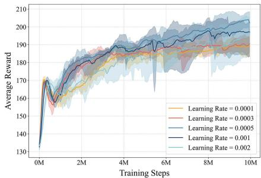

line

| Training Steps | Learning Rate = 0.0001 | Learning Rate = 0.0003 | Learning Rate = 0.0005 | Learning Rate = 0.001 | Learning Rate = 0.002 |
| -------------- | ---------------------- | ---------------------- | ---------------------- | --------------------- | --------------------- |
| 0M             | 130                    | 130                    | 130                    | 130                   | 130                   |
| 2M             | 170                    | 175                    | 178                    | 176                   | 174                   |
| 4M             | 185                    | 188                    | 190                    | 189                   | 187                   |
| 6M             | 195                    | 196                    | 198                    | 197                   | 195                   |
| 8M             | 200                    | 201                    | 202                    | 201                   | 200                   |
| 10M            | 205                    | 206                    | 207                    | 206                   | 205                   |

(a)

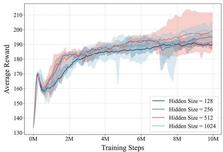

line

| Training Steps | Hidden Size = 128 | Hidden Size = 256 | Hidden Size = 512 | Hidden Size = 1024 |
| -------------- | ----------------- | ----------------- | ----------------- | ------------------ |
| 0M             | 130               | 130               | 130               | 130                |
| 2M             | 170               | 175               | 178               | 176                |
| 4M             | 185               | 188               | 190               | 189                |
| 6M             | 190               | 192               | 194               | 193                |
| 8M             | 195               | 196               | 198               | 197                |
| 10M            | 200               | 200               | 202               | 201                |

(b)

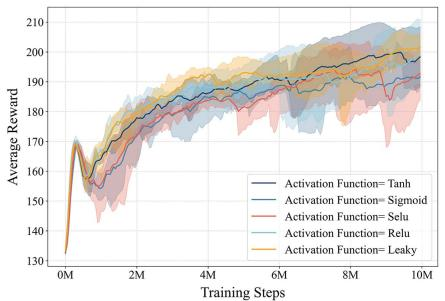

line

| Training Steps | Activation Function= Tanh | Activation Function= Sigmoid | Activation Function= Selu | Activation Function= Relu | Activation Function= Leaky |
| -------------- | ------------------------- | ---------------------------- | ------------------------- | ------------------------- | -------------------------- |
| 0M             | 130                       | 130                          | 130                       | 130                       | 130                        |
| 2M             | 180                       | 185                          | 175                       | 178                       | 182                        |
| 4M             | 190                       | 192                          | 185                       | 188                       | 190                        |
| 6M             | 200                       | 202                          | 195                       | 198                       | 200                        |
| 8M             | 205                       | 207                          | 200                       | 203                       | 205                        |
| 10M            | 210                       | 212                          | 205                       | 208                       | 210                        |

（c）  
Fig. 4. Impact of hyperparameter settings on the HASAC model performance: (a) Reward under different learning rates. (b) Reward under different hidden sizes. (c) Reward under different activation functions.

TABLE II SIMULATION PARAMETERS 

<table><tr><td>Parameter</td><td>Value</td><td>Parameter</td><td>Value</td></tr><tr><td> $\zeta_L$ </td><td>2.3</td><td> $\zeta_{NL}$ </td><td>34</td></tr><tr><td> $\alpha$ </td><td>5.0188</td><td> $\beta$ </td><td>0.3511</td></tr><tr><td> $h_i^m, h_j^u$ </td><td>0 m, 30 m</td><td> $\varphi_c$ </td><td>2 GHz</td></tr><tr><td> $C_0$ </td><td> $3 \times 10^8$  m/s</td><td> $B_0$ </td><td>1 MHz</td></tr><tr><td> $P_i^m$ </td><td>0.5 W</td><td> $N_G$ </td><td>-114 dBm</td></tr><tr><td> $G_0$ </td><td>-50 dB</td><td>L</td><td>2</td></tr><tr><td>B</td><td>20 MHz</td><td> $P_{j,k}^u$ </td><td>5 W</td></tr><tr><td> $\lambda_i$ </td><td>15</td><td> $c_i(t)$ </td><td>270 cycles/bit</td></tr><tr><td> $f_j^{umax}$ </td><td> $10^9$  cycles/s</td><td> $f_k^{vmax}$ </td><td> $10^{10}$  cycles/s</td></tr><tr><td>Learning rate</td><td> $5 \times 10^{-4}$ </td><td>Batch size</td><td>1024</td></tr><tr><td>Buffer size</td><td> $1 \times 10^6$ </td><td>Discount factor</td><td>0.99</td></tr><tr><td>Temperature  $\epsilon$ </td><td>0.001</td><td>Hidden sizes</td><td>[512, 512]</td></tr></table>

0.002) accelerate early convergence but also lead to larger fluctuations. In contrast, smaller learning rates (such as 0.0001 and 0.0003) converge more slowly but maintain a more stable training process. The optimal learning rate is set to 0.0005, which achieves higher average rewards in a shorter time while maintaining good stability.

Fig. 4(b) shows the effect of different hidden layer sizes on the model training. Smaller hidden layers (128 and 256) achieve faster training, but converge to lower rewards with greater variance. Larger hidden layers (512 and 1024) show higher final rewards, with the 512-layer network achieving a good balance between the convergence speed and final performance.

Fig. 4(c) compares the convergence behavior under different activation functions. The LeakyReLU activation function performs best across all settings, providing the smooth and rapid convergence. In contrast, Sigmoid and SELU perform poorly, leading to slower convergence and lower final rewards. Tanh and ReLU, while relatively close in performance, still cannot outperform LeakyReLU.

In conclusion, appropriate hyperparameter selections can significantly enhance model training efficiency and convergence performance. In this experiment, the combination of a learning rate of 0.0005, a hidden layer size of 512, and the LeakyReLU activation function achieved the best results.

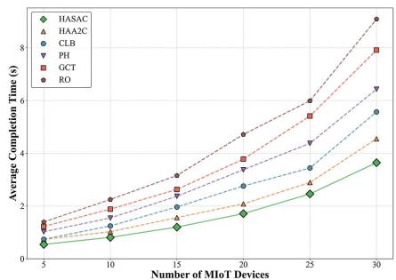

line

| Number of MIoT Devices | HASAC | HAA2C | CLB | PH | GCT | RO |
|---|---|---|---|---|---|---|
| 5 | 0.6 | 1.0 | 0.8 | 1.2 | 1.4 | 1.5 |
| 10 | 0.8 | 1.5 | 1.2 | 1.8 | 2.0 | 2.2 |
| 20 | 1.6 | 2.0 | 2.5 | 3.5 | 4.0 | 5.0 |
| 25 | 2.2 | 3.0 | 3.5 | 4.5 | 5.5 | 6.0 |
| 30 | 3.8 | 4.8 | 5.8 | 6.5 | 8.0 | 9.0 |

(a)

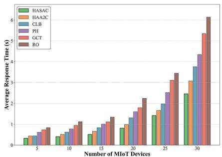

bar

| Number of MIoT Devices | HASAC | HAA2C | CLB | PH | GCT | RO |
|---|---|---|---|---|---|---|
| 5 | 0.3 | 0.4 | 0.5 | 0.6 | 0.7 | 0.8 |
| 10 | 0.4 | 0.5 | 0.6 | 0.7 | 0.8 | 1.0 |
| 15 | 0.5 | 0.6 | 0.7 | 0.8 | 0.9 | 1.2 |
| 20 | 0.7 | 0.8 | 1.0 | 1.2 | 1.5 | 2.2 |
| 25 | 1.4 | 1.6 | 1.9 | 2.5 | 3.1 | 3.4 |
| 30 | 2.5 | 3.1 | 3.7 | 4.4 | 5.3 | 6.1 |

(b)

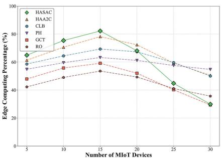

line

| Number of MIoT Devices | HASAC (%) | HAA2C (%) | CLB (%) | PH (%) | GCT (%) | RO (%) |
|---|---|---|---|---|---|---|
| 5 | 65 | 60 | 58 | 55 | 48 | 42 |
| 10 | 75 | 70 | 65 | 58 | 52 | 48 |
| 15 | 82 | 78 | 70 | 60 | 58 | 52 |
| 20 | 68 | 72 | 68 | 62 | 50 | 48 |
| 25 | 45 | 40 | 58 | 55 | 40 | 38 |
| 30 | 30 | 35 | 50 | 52 | 35 | 35 |

(c）  
Fig. 5. Performance with Different Numbers of MIoTs: (a) Average completion Time, (b) Average response time, (c) Edge computing percentage.

# C. Performance With Different Numbers of MIoTs

In this section, we evaluate the performance of the proposed HASAC-based computation offloading and resource allocation algorithm against five benchmark algorithms. The evaluation focuses on three key metrics: average completion time, average response time, and edge computing percentage.

As shown in Fig. 5(a), the average completion time increases for all algorithms as the number of MIoT devices grows from 5 to 30. HASAC consistently achieves the lowest completion time across all configurations. When the number of MIoT devices reaches 30, HASAC maintains an average completion time of approximately 3.5 seconds, significantly outperforming GCT and RO, which reach over 8 and 9 seconds, respectively. The gap widens as the workload increases, demonstrating HASAC’s superior task allocation strategy and its robustness to load escalation. CLB, PH, and HAA2C perform moderately, but their completion times increase more sharply than HASAC under heavy loads.

In Fig. 5(b), we observe the average response time. HASAC again achieves the lowest response time across all levels of MIoT density. Notably, while all algorithms show rising trends as the number of devices increases, HASAC’s growth remains more gradual. At 30 MIoTs, HASAC’s response time remains below 3 seconds, whereas RO exceeds 6 seconds and GCT reaches about 5.5 seconds. CLB and HAA2C also exhibit steady increases but stay in the mid-range (around 3-4 seconds). PH performs worse than HAA2C and CLB, indicating its limited ability to manage increased task demand.

Fig. 5(c) illustrates the edge computing percentage, reflecting the proportion of tasks offloaded to AAVs and vessels. HASAC demonstrates an early advantage, reaching a peak offloading rate of around 80% at 15 MIoT devices. However, as the number of devices continues to increase, its offloading ratio gradually decreases to approximately 30% at 30 devices, indicating resource saturation at the edge. HAA2C and CLB show more stable offloading percentages, maintaining around 60–65%, though never surpassing HASAC’s peak. PH, GCT, and RO trail significantly, with RO exhibiting the lowest utilization throughout—dropping to nearly 35% at higher MIoT counts. This suggests that HASAC not only utilizes edge resources more aggressively but also adapts better to varying computational loads.

In summary, HASAC outperforms all benchmark algorithms across three key metrics. It demonstrates shorter completion and response times, and higher edge computing utilization— especially under increasing MIoT task density. These results confirm that HASAC is highly efficient and scalable for dynamic maritime computation offloading scenarios.

# D. Performance With Different Numbers of AAV Devices

In this section, we evaluate the performance of the proposed HASAC-based computation offloading and resource allocation algorithm under varying numbers of AAVs. The comparison includes five benchmark algorithms. The evaluation focuses on three metrics: average completion time, average response time, and edge computing percentage.

As shown in Fig. 6(a), the average completion time decreases for all algorithms as the number of AAV devices increases from 2 to 10. HASAC consistently achieves the lowest completion time across all configurations. For example, with 10 AAVs, HASAC reduces the completion time to below 1 s, whereas GCT and RO remain above 1.5 seconds. The decrease in HASAC’s completion time is also steeper compared to HAA2C and CLB, reflecting its superior scalability in managing growing edge resources. PH also improves with more AAVs but lags behind the learning-based approaches.

In Fig. 6(b), HASAC maintains the lowest average response time across all AAV configurations. When the number of AAVs reaches 10, HASAC achieves a response time close to 0.2 seconds, which is significantly lower than that of GCT and RO, both of which exceed 0.5 s. HAA2C and CLB perform moderately well, yet their response times remain consistently higher than HASAC. RO shows the highest response delay, indicating poor adaptability to increased edge resources.

Fig. 6(c) shows the edge computing percentage, representing the proportion of tasks offloaded to AAVs and vessels. HASAC consistently achieves the highest offloading ratio, starting at around 55% with 2 AAVs and increasing to over 90% with 10 AAVs. HAA2C and CLB also improve, reaching approximately 85% and 80%, respectively. In contrast, PH, GCT, and RO show lower offloading ratios, with RO performing the worst across all AAV levels. This demonstrates HASAC’s stronger capability in leveraging available edge computing capacity.

In summary, HASAC outperforms all baseline algorithms in completion time, response time, and edge utilization. It adapts effectively to increased AAV density, optimizes task execution, and balances computational loads efficiently. These results validate HASAC’s robustness and scalability in dynamic maritime MEC environments with variable edge resource availability.

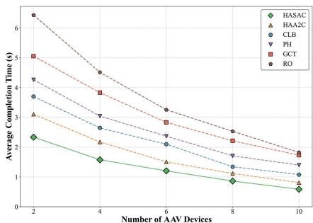

line

| Number of AAV Devices | HASAC | HAA2C | CLB | PH | GCT | RO |
|---|---|---|---|---|---|---|
| 2 | 2.3 | 3.0 | 3.8 | 4.5 | 5.0 | 6.5 |
| 4 | 1.6 | 2.2 | 2.7 | 3.0 | 4.0 | 4.5 |
| 6 | 1.2 | 1.5 | 2.0 | 2.5 | 3.0 | 3.5 |
| 8 | 0.9 | 1.2 | 1.4 | 1.8 | 2.5 | 2.8 |
| 10 | 0.6 | 0.9 | 1.1 | 1.4 | 2.0 | 1.9 |

(a)

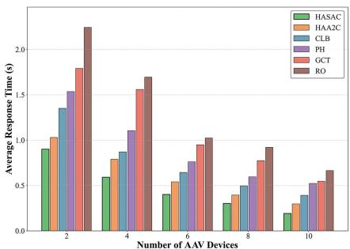

bar

| Number of AAV Devices | HASAC (s) | HAA2C (s) | CLB (s) | PH (s) | GCT (s) | RO (s) |
|---|---|---|---|---|---|---|
| 2 | 0.9 | 1.05 | 1.35 | 1.55 | 1.8 | 2.25 |
| 4 | 0.6 | 0.8 | 0.9 | 1.1 | 1.6 | 1.7 |
| 6 | 0.4 | 0.55 | 0.65 | 0.8 | 0.95 | 1.0 |
| 8 | 0.3 | 0.45 | 0.55 | 0.65 | 0.8 | 0.95 |
| 10 | 0.2 | 0.3 | 0.4 | 0.55 | 0.6 | 0.7 |

(b)

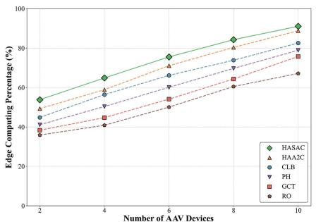

line

| Number of AAV Devices | HASAC (%) | HAA2C (%) | CLB (%) | PH (%) | GCT (%) | RO (%) |
|---|---|---|---|---|---|---|
| 2 | 54 | 50 | 45 | 43 | 40 | 37 |
| 4 | 65 | 60 | 55 | 50 | 45 | 42 |
| 6 | 75 | 70 | 65 | 60 | 55 | 50 |
| 8 | 85 | 80 | 75 | 70 | 65 | 60 |
| 10 | 92 | 88 | 82 | 78 | 75 | 68 |

(c）

Fig. 6. Performance with different numbers of AAV devices: (a) Average completion time, (b) Average response time, (c) Edge computing percentage.   
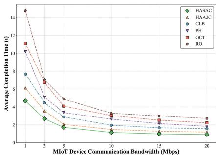

line

| MioT Device Communication Bandwidth (Mbps) | HASAC (s) | HAA2C (s) | CLB (s) | PH (s) | GCT (s) | RO (s) |
|---|---|---|---|---|---|---|
| 1 | 4.8 | 6.0 | 7.8 | 10.5 | 11.5 | 14.5 |
| 3 | 2.8 | 4.5 | 5.0 | 6.0 | 7.0 | 8.0 |
| 5 | 1.8 | 3.0 | 3.5 | 4.0 | 4.5 | 5.0 |
| 10 | 1.2 | 2.0 | 2.5 | 3.0 | 3.5 | 3.5 |
| 15 | 1.0 | 1.8 | 2.0 | 2.5 | 2.8 | 3.0 |
| 20 | 0.8 | 1.5 | 1.8 | 2.0 | 2.5 | 2.8 |

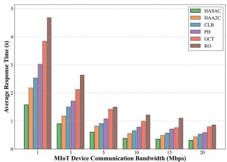

bar

| MIoT Device Communication Bandwidth (Mbps) | HASAC | HAA2C | CLB | PH | GCT | RO |
|---|---|---|---|---|---|---|
| 1 | 1.6 | 2.3 | 2.6 | 3.0 | 3.8 | 4.7 |
| 3 | 0.9 | 1.1 | 1.5 | 1.7 | 2.2 | 2.7 |
| 5 | 0.6 | 0.8 | 1.0 | 1.1 | 1.5 | 1.6 |
| 10 | 0.4 | 0.6 | 0.7 | 0.8 | 1.0 | 1.3 |
| 20 | 0.3 | 0.4 | 0.5 | 0.6 | 0.8 | 0.9 |

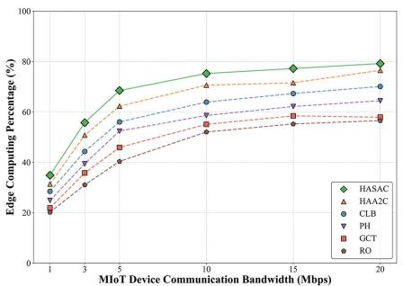

line

| MIoT Device Communication Bandwidth (Mbps) | HASAC (%) | HAA2C (%) | CLB (%) | PH (%) | GCT (%) | RO (%) |
|---|---|---|---|---|---|---|
| 1 | 35 | 30 | 28 | 25 | 22 | 20 |
| 3 | 55 | 48 | 45 | 40 | 35 | 30 |
| 5 | 68 | 60 | 55 | 50 | 45 | 40 |
| 10 | 75 | 70 | 65 | 60 | 55 | 50 |
| 15 | 77 | 72 | 68 | 62 | 58 | 55 |
| 20 | 78 | 75 | 70 | 65 | 60 | 58 |

Fig. 7. Performance with different MIoT device communication bandwidth: (a) Average completion time, (b) Average response time, (c) Edge computing percentage.

# E. Performance With Different MIoT Device Communication Bandwidth

In this section, we evaluate the performance of the proposed HASAC-based computation offloading and resource allocation algorithm under varying MIoT device communication bandwidths. We compare HASAC against five benchmark algorithms. The evaluation focuses on three key metrics: average completion time, average response time, and edge computing percentage.

Fig. 7(a) shows that the average completion time decreases for all algorithms as the communication bandwidth increases from 1 Mbps to 20 Mbps. HASAC consistently achieves the lowest completion time across all bandwidth levels. For example, at 1 Mbps, HASAC completes tasks in approximately 5 seconds, while RO and GCT exceed 10 seconds. As bandwidth improves, HASAC’s time drops below 1.5 seconds, significantly faster than all other algorithms. In contrast, RO and GCT reduce completion time more slowly due to inefficient task scheduling. HAA2C and CLB improve moderately but still fall behind HASAC, especially under high-bandwidth conditions.

Fig. 7(b) presents the average response time. HASAC maintains the lowest response time across all configurations, with response delay shrinking from around 1.8 seconds at 1 Mbps to less than 0.5 seconds at 20 Mbps. In comparison, RO and GCT remain above 2 seconds under low-bandwidth settings and only marginally improve at higher bandwidths. HAA2C and PH show moderate improvements, but their responsiveness does not match that of HASAC, particularly under bandwidthconstrained conditions. These results highlight HASAC’s superior ability to adapt to varying communication capacities.

Fig. 7(c) illustrates the edge computing percentage, representing the proportion of tasks offloaded to AAVs and vessels. HASAC consistently achieves the highest offloading percentage across all bandwidth levels, increasing from approximately 50% at 1 Mbps to nearly 90% at 20 Mbps. HAA2C and CLB show steady growth but plateau around 75–80%. PH, GCT, and RO lag behind significantly, with RO showing the lowest edge utilization (below 60%) even at maximum bandwidth. This demonstrates HASAC’s strong capability in leveraging high-bandwidth conditions to maximize edge resource usage.

In summary, HASAC outperforms all baseline algorithms across all bandwidth settings. It minimizes task execution time, reduces response delays, and maximizes edge computing utilization. These results confirm HASAC’s robustness and adaptability in dynamic communication environments where bandwidth availability significantly affects system performance.

# VII. CONCLUSION

In this paper, we concentrate on decision-making for maritime MEC by the cooperation of AAVs and vessels. Specifically, we propose a cooperative MEC framework for MEC to optimize computation offloading and resource allocation. Then, the collaborative computation offloading and resource allocation problem is modeled as a MG. Furthermore, we introduce a deep reinforcement learning-based heterogeneous agent soft actor-critic algorithm to address this issue, where each agent independently generates decisions on computation offloading and resource allocation to maximize long-term rewards. Simulation results demonstrate that our algorithm outperforms in aspects such as convergence, execution time, computation rate, offloaded data, and the percentage of task execution across various environmental conditions, effectively generating strategies to minimize the total execution time. Besides, the proposed algorithm consistently achieves superior performance under diverse environmental conditions.

# APPENDIX A

Let the real numbers $a , b ,$ and c be nonnegative, $d = \operatorname* { m a x } [ a -$ $b + c , 0 ]$ , then $d ^ { 2 } \leq a ^ { 2 } + b ^ { 2 } + c ^ { 2 } + 2 a ( c - b )$ = max[[50], we have

$$
\begin{array}{l} Q _ {i} ^ {m} (t + 1) \leq \left(Q _ {i} ^ {m} (t)\right) ^ {2} + \left(\sum_ {j = 1} ^ {J} \tau R _ {i, j} ^ {m 2 u} (t)\right) ^ {2} \\ + (A _ {i} (t)) ^ {2} + 2 Q _ {i} ^ {m} (t) \left(A _ {i} (t) - \sum_ {j = 1} ^ {J} \tau R _ {i, j} ^ {m 2 u} (t)\right), \tag {37} \\ \end{array}
$$

$$
Q _ {j} ^ {u} (t + 1) \leq (Q _ {j} ^ {u} (t)) ^ {2} + \left(\sum_ {k = 1} ^ {K} \tau R _ {j, k} ^ {u 2 v} (t) - \tau f _ {i, j} ^ {u} (t)\right) ^ {2}
$$

$$
+ \left(\sum_ {i = 1} ^ {I} \tau R _ {i, j} ^ {m 2 u} (t)\right) ^ {2} + 2 Q _ {j} ^ {u} (t) \left[ \sum_ {i = 1} ^ {I} \tau R _ {i, j} ^ {m 2 u} (t) \right.
$$

$$
\left. - \left(\sum_ {k = 1} ^ {K} \tau R _ {j, k} ^ {u 2 v} (t) - \tau f _ {i, j} ^ {u} (t)\right) \right], \tag {38}
$$

and

$$
\begin{array}{l} Q _ {k} ^ {v} (t + 1) \leq \left(Q _ {k} ^ {v} (t)\right) ^ {2} + \left(\tau f _ {j, k} ^ {v} (t)\right) ^ {2} + \left(\sum_ {j = 1} ^ {J} \tau R _ {j, k} ^ {u 2 v} (t)\right) ^ {2} \\ + 2 Q _ {k} ^ {v} (t) \left(\sum_ {j = 1} ^ {J} \tau R _ {j, k} ^ {u 2 v} (t) - \tau f _ {j, k} ^ {v} (t)\right). \tag {39} \\ \end{array}
$$

By substituting the above inequality and the Lyapunov function into the Lyapunov drift, we can obtain

$$
\Delta (Q (t)) = \mathbb {E} [ L (Q (t + 1)) - L (Q (t)) | Q (t) ]
$$

$$
\leq \frac {1}{2} \left\{\sum_ {i = 1} ^ {I} \left(\sum_ {j = 1} ^ {J} \tau R _ {i, j} ^ {m 2 u} (t)\right) ^ {2} + (A _ {i} (t)) ^ {2} \right.
$$

$$
+ \sum_ {j = 1} ^ {J} \left(\sum_ {k = 1} ^ {K} \tau R _ {j, k} ^ {u 2 v} (t) - \tau f _ {i, j} ^ {u} (t)\right) ^ {2} + \sum_ {k = 1} ^ {K} \left(\tau f _ {j, k} ^ {v} (t)\right) ^ {2}
$$

$$
\begin{array}{l} \left. + \left(\sum_ {i = 1} ^ {I} \tau R _ {i, j} ^ {m 2 u} (t)\right) ^ {2} + \left(\sum_ {j = 1} ^ {J} \tau R _ {j, k} ^ {u 2 v (t)}\right) ^ {2} \right\} \\ + \mathbb {E} \left\{\sum_ {i = 1} ^ {I} Q _ {i} ^ {m} (t) \left(A _ {i} (t) - \sum_ {j = 1} ^ {J} \tau R _ {i, j} ^ {m 2 u} (t)\right) \Bigg | Q (t) \right\} \\ + \mathbb {E} \left\{\sum_ {j = 1} ^ {J} Q _ {j} ^ {u} (t) \left(\tau R _ {i, j} ^ {m 2 u} (t) \right. \right. \\ \left. - \left. \left(\sum_ {k = 1} ^ {K} \tau R _ {j, k} ^ {u 2 v} (t) - \tau f _ {i, j} ^ {u} (t)\right)\right) \Bigg | Q (t) \right\} \\ + \mathbb {E} \left\{\sum_ {k = 1} ^ {K} Q _ {k} ^ {v} (t) \left(\sum_ {j = 1} ^ {J} \tau R _ {j, k} ^ {u 2 v} (t) - \tau f _ {j, k} ^ {v} (t)\right) \mid Q (t) \right\}. \tag {40} \\ \end{array}
$$

Given the transmission rate and task arrival rate constraints, it holds that $R _ { i , j } ^ { m 2 u } ( t ) \leq R _ { j } ^ { u m a x } , R _ { j , k } ^ { u 2 v } ( t ) \leq R _ { k } ^ { v m a x }$ , and $A _ { i } ( t ) \leq$ $A _ { i } ^ { m a x }$ ( ) ( ). Therefore, we can define the following equation

$$
\begin{array}{l} D = \\ \frac {1}{2} \left\{\sum_ {i = 1} ^ {I} \left[ \tau R _ {j} ^ {\text {   umax }} + (A _ {i} ^ {\text {   max }}) ^ {2} \right] + \sum_ {j = 1} ^ {J} \left[ (\tau R _ {k} ^ {\text {   vmax }} - \tau f _ {j} ^ {\text {   max }}) ^ {2} \right. \right. \\ \left. + \left. (\tau R _ {j} ^ {u m a x}) ^ {2} \right] + \sum_ {k = 1} ^ {K} \left[ (\tau R _ {v} ^ {u m a x}) ^ {2} - (\tau f _ {k} ^ {v m a x}) ^ {2} \right] \right\}. \tag {41} \\ \end{array}
$$

# REFERENCES

[1] T. Xia, M. M. Wang, J. Zhang, and L. Wang, “Maritime Internet of Things: Challenges and solutions,” IEEE Wireless Commun., vol. 27, no. 2, pp. 188–196, Apr. 2020.

[2] C. Zhu, W. Zhang, Y.-H. Chiang, N. Ye, L. Du, and J. An, “Softwaredefined maritime fog computing: Architecture, advantages, and feasibility,” IEEE Netw., vol. 36, no. 2, pp. 26–33, Mar. 2022.

[3] M. Jahanbakht, W. Xiang, L. Hanzo, and M. Rahimi Azghadi, “Internet of underwater things and big marine data analytics—A comprehensive survey,” IEEE Commun. Surveys Tuts., vol. 23, no. 2, pp. 904–956, Second Quarter 2021.

[4] Z. Wang, B. Lin, Q. Ye, Y. Fang, and X. Han, “Joint computation offloading and resource allocation for maritime MEC with energy harvesting,” IEEE Internet Things J., vol. 11, no. 11, pp. 19898–19913, Jun. 2024.

[5] C. Dong et al., “UAVs as an intelligent service: Boosting edge intelligence for air-ground integrated networks,” IEEE Netw., vol. 35, no. 4, pp. 167–175, Jul./Aug. 2021.

[6] Z. Jia et al., “Cooperative cognitive dynamic system in UAV swarms: Reconfigurable mechanism and framework,” IEEE Veh. Technol. Mag., vol. 19, no. 3, pp. 90–101, Sep. 2024.

[7] T. Yang et al., “Multi-armed bandits learning for task offloading in maritime edge intelligence networks,” IEEE Trans. Veh. Technol., vol. 71, no. 4, pp. 4212–4224, Apr. 2022.

[8] N. Zhao, Z. Ye, Y. Pei, Y.-C. Liang, and D. Niyato, “Multi-agent deep reinforcement learning for task offloading in UAV-assisted mobile edge computing,” IEEE Trans. Wireless Commun., vol. 21, no. 9, pp. 6949–6960, Sep. 2022.

[9] F. Pervez, A. Sultana, C. Yang, and L. Zhao, “Energy and latency efficient joint communication and computation optimization in a multi-UAVassisted MEC network,” IEEE Trans. Wireless Commun., vol. 23, no. 3, pp. 1728–1741, Mar. 2024.

[10] N. Lin, H. Tang, L. Zhao, S. Wan, A. Hawbani, and M. Guizani, “A PDDQNLP algorithm for energy efficient computation offloading in UAV-assisted MEC,” IEEE Trans. Wireless Commun., vol. 22, no. 12, pp. 8876–8890, Dec. 2023.   
[11] T. Z. H. Ernest and A. S. Madhukumar, “Computation offloading in MEC-enabled IoV networks: Average energy efficiency analysis and learning-based maximization,” IEEE Trans. Mobile Comput., vol. 23, no. 5, pp. 6074–6087, May 2024.   
[12] B. Li, J. Liao, W. Wu, and Y. Li, “Cintelligent reflecting surface assisted secure computation of wireless powered MEC system,” IEEE Trans. Mobile Comput., vol. 23, no. 4, pp. 3048–3059, Apr. 2024.   
[13] Q. Wu, M. Cui, G. Zhang, F. Wang, Q. Wu, and X. Chu, “Latency minimization for UAV-enabled URLLC-based mobile edge computing systems,” IEEE Trans. Wireless Commun., vol. 23, no. 4, pp. 3298–3311, Apr. 2024.   
[14] X. Dai, Z. Xiao, H. Jiang, and J. C. S. Lui, “UAV-assisted task offloading in vehicular edge computing networks,” IEEE Trans Mobile Comput, vol. 23, no. 4, pp. 2520–2534, Apr. 2024.   
[15] Y. Wang, W. Feng, J. Wang, and T. Q. S. Quek, “Hybrid satellite-UAVterrestrial networks for 6G ubiquitous coverage: A maritime communications perspective,” IEEE J. Sel. Areas Commun., vol. 39, no. 11, pp. 3475–3490, Nov. 2021.   
[16] Z. Jia, M. Sheng, J. Li, D. Niyato, and Z. Han, “LEO-satellite-assisted UAV: Joint trajectory and data collection for internet of remote things in 6G aerial access networks,” IEEE Internet Things J., vol. 8, no. 12, pp. 9814–9826, Jun. 2021.   
[17] K. Shuai, Y. Miao, K. Hwang, and Z. Li, “Transfer reinforcement learning for adaptive task offloading over distributed edge clouds,” IEEE Trans. Cloud Comput., vol. 11, no. 2, pp. 2175–2187, Apr./Jun. 2023.   
[18] Y. Liu, J. Yan, and X. Zhao, “Deep reinforcement learning based latency minimization for mobile edge computing with virtualization in maritime UAV communication network,” IEEE Trans. Veh. Technol., vol. 71, no. 4, pp. 4225–4236, Apr. 2022.   
[19] F. Lu et al., “Resource and trajectory optimization for UAV-relayassisted secure maritime MEC,” IEEE Trans. Commun., vol. 72, no. 3, pp. 1641–1652, Mar. 2024.   
[20] L. P. Qian, H. Zhang, Q. Wang, Y. Wu, and B. Lin, “Joint multi-domain resource allocation and trajectory optimization in UAV-assisted maritime IoT networks,” IEEE Internet Things J., vol. 10, no. 1, pp. 539–552, Jan. 2023.   
[21] M. Dai et al., “Latency minimization oriented hybrid offshore and aerial-based multi-access computation offloading for marine communication networks,” IEEE Trans. Commun., vol. 71, no. 11, pp. 6482–6498, Nov. 2023.   
[22] W. Xu, Z. Song, Z. Gao, L. Lai, Y. Sun, and W. Luo, “Latency-aware MIoT service strategy in UAV-assisted dynamic MMEC environment,” IEEE Internet Things J., vol. 11, no. 12, pp. 22220–22231, Jun. 2024.   
[23] R. Fan, B. Liang, S. Zuo, H. Hu, H. Jiang, and N. Zhang, “Robust task offloading and resource allocation in mobile edge computing with uncertain distribution of computation burden,” IEEE Trans Commun, vol. 71, no. 7, pp. 4283–4299, Jul. 2023.   
[24] W. Mao, K. Xiong, Y. Lu, P. Fan, and Z. Ding, “Energy consumption minimization in secure multi-antenna UAV-assisted MEC networks with channel uncertainty,” IEEE Trans. Wireless Commun., vol. 22, no. 11, pp. 7185–7200, Nov. 2023.   
[25] S. Xia, Z. Yao, Y. Li, Z. Xing, and S. Mao, “Distributed computing and networking coordination for task offloading under uncertainties,” IEEE Trans. Mobile Comput., vol. 23, no. 5, pp. 5280–5294, May 2024.   
[26] S. Li, C. Li, Y. Huang, B. A. Jalaian, Y. T. Hou, and W. Lou, “Enhancing resilience in mobile edge computing under processing uncertainty,” IEEE J. Sel. Areas Commun., vol. 41, no. 3, pp. 659–674, Mar. 2023.   
[27] W. Ma and L. Mashayekhy, “Video offloading in mobile edge computing: Dealing with uncertainty,” IEEE Trans. Mobile Comput., vol. 23, no. 11, pp. 10251–10264, Nov. 2024.   
[28] A. Feriani and E. Hossain, “Single and multi-agent deep reinforcement learning for AI-enabled wireless networks: A tutorial,” IEEE Commun. Surveys Tuts., vol. 23, no. 2, pp. 1226–1252 Second Quarter 2021.   
[29] T. Li et al., “Applications of multi-agent reinforcement learning in future internet: A comprehensive survey,” IEEE Commun. Surveys Tuts., vol. 24, no. 2, pp. 1240–1279, Second Quarter 2022.   
[30] Z. Yao, S. Xia, Y. Li, and G. Wu, “Cooperative task offloading and service caching for digital twin edge networks: A graph attention multi-agent reinforcement learning approach,” IEEE J. Sel. Areas Commun., vol. 41, no. 11, pp. 3401–3413, Nov. 2023.   
[31] H. Peng and X. Shen, “Multi-agent reinforcement learning based resource management in MEC- and UAV-assisted vehicular networks,” IEEE J. Sel. Areas Commun., vol. 39, no. 1, pp. 131–141, Jan. 2021.

[32] Z. Gao, L. Yang, and Y. Dai, “Large-scale computation offloading using a multi-agent reinforcement learning in heterogeneous multi-access edge computing,” IEEE Trans. Mob. Comput., vol. 22, no. 6, pp. 3425–3443, Jun. 2023.   
[33] S. Gonzalez-Diaz et al., “Integrating fronthaul and backhaul networks: Transport challenges and feasibility results,” IEEE Trans. Mobile Comput., vol. 20, no. 2, pp. 533–549, Feb. 2021.   
[34] B. Tezergil and E. Onur, “Wireless backhaul in 5G and beyond: Issues, challenges and opportunities,” IEEE Commun. Surveys Tuts., vol. 24, no. 4, pp. 2579–2632, Fourth Quarter 2022.   
[35] Z. Jia, M. Sheng, J. Li, D. Zhou, and Z. Han, “Joint HAP access and HAP satellite backhaul in 6G: Matching game-based approaches,” IEEE J. Sel. Areas Commun., vol. 39, no. 4, pp. 1147–1159, Aug. 2021.   
[36] F. Zhou, Y. Wu, R. Q. Hu, and Y. Qian, “Computation rate maximization in UAV-enabled wireless-powered mobile-edge computing systems,” IEEE J. Sel. Areas Commun., vol. 36, no. 9, pp. 1927–1941, Sep. 2018.   
[37] Q. Luo, T. H. Luan, W. Shi, and P. Fan, “Deep reinforcement learning based computation offloading and trajectory planning for multi-UAV cooperative target search,” IEEE J. Sel. Areas Commun., vol. 41, no. 2, pp. 504–520, Feb. 2023.   
[38] Z. Jia, Q. Wu, C. Dong, C. Yuen, and Z. Han, “Hierarchical aerial computing for Internet of Things via cooperation of HAPs and UAVs,” IEEE Internet Things J., vol. 10, no. 7, pp. 504–520, Apr. 2022.   
[39] M. Neely, Stochastic Network Optimization With Application to Communication and Queueing Systems, vol. 3. San Rafael, CA, USA: Morgan & Claypool, 2010.   
[40] S. Bi, L. Huang, H. Wang, and Y.-J. A. Zhang, “Lyapunov-guided deep reinforcement learning for stable online computation offloading in mobileedge computing networks,” IEEE Trans. Wireless Commun., vol. 20, no. 11, pp. 7519–7537, Nov. 2021.   
[41] H. Wu, J. Chen, T. N. Nguyen, and H. Tang, “Lyapunov-guided delayaware energy efficient offloading in IIoT-MEC systems,” IEEE Trans. Ind. Inform., vol. 19, no. 2, pp. 2117–2128, Feb. 2023.   
[42] Y. Bai, H. Zhao, X. Zhang, Z. Chang, R. Jäntti, and K. Yang, “Toward autonomous multi-UAV wireless network: A survey of reinforcement learning-based approaches,” IEEE Commun. Surveys Tuts., vol. 25, no. 4, pp. 3038–3067, Fourth Quarter 2023.   
[43] Y. Zhong, J. G. Kuba, X. Feng, S. Hu, J. Ji, and Y. Yang, “Heterogeneousagent reinforcement learning,” J. Mach. Learn. Res., vol. 25, no. 32, pp. 1–67, Jan. 2024.   
[44] J. G. Kuba et al., “Settling the variance of multi-agent policy gradients,” in Proc. 35th Annu. Conf. Neural Inf. Process. Syst., 2021, pp. 13458-13470.   
[45] L. Qin, H. Lu, Y. Chen, B. Chong, and F. Wu, “Toward decentralized task offloading and resource allocation in user-centric MEC,” IEEE Trans. Mobile Comput., vol. 23, no. 12, pp. 11807–11823, Dec. 2024.   
[46] J. Song, Q. Song, Y. Kang, L. Guo, and A. Jamalipour, “QoE-driven distributed resource optimization for mixed reality in dynamic TDD systems,” IEEE Trans. Commun., vol. 70, no. 11, pp. 7294–7306, Nov. 2022.   
[47] Y. Xiao, Y. Song, and J. Liu, “Collaborative multi-agent deep reinforcement learning for energy-efficient resource allocation in heterogeneous mobile edge computing networks,” IEEE Trans. Wireless Commun., vol. 23, no. 6, pp. 6653–6668, Jun. 2024.   
[48] J. You, Z. Jia, C. Dong, L. He, Y. Cao, and Q. Wu, “Computation offloading for uncertain marine tasks by cooperation of UAVs and vessels,” in Proc. IEEE Int. Conf. Commun., Rome, Italy, 2023, pp. 666–671.   
[49] A. R. Heidarpour, M. R. Heidarpour, M. Ardakani, C. Tellambura, and M. Uysal, “Soft actor–critic-based computation offloading in multiuser MEC-enabled IoT—A lifetime maximization perspective,” IEEE Internet Things J., vol. 10, no. 20, pp. 17571–17584, Oct. 2023.   
[50] S. P. Boyd and L. Vandenberghe, Convex Optimization. Cambridge, U.K.: Cambridge Univ. Press, 2004.

natural_image

Portrait of a young man wearing glasses and a white shirt (no text or symbols visible)

Jiahao You is currently working toward the Ph.D. degree with the School of Electronic and Information Engineering, Nanjing University of Aeronautics and Astronautics, Nanjing, China. His research interests include deep reinforcement learning and its applications in computation offloading and resource allocation, edge computing, low-altitude intelligent networks, and AAV trajectory planning.

natural_image

Portrait of a smiling person wearing glasses and a bright yellow top (no visible text or symbols)

Ziye Jia (Member, IEEE) received the B.E., M.S., and Ph.D. degrees in communication and information systems from Xidian University, Xi’an, China, in 2012, 2015, and 2021, respectively. From 2018 to 2020, she was a Visiting Ph.D. degree Student with the Department of Electrical and Computer Engineering, University of Houston, Houston, TX, USA. She is currently an Associate Professor with the Key Laboratory of Dynamic Cognitive System of Electromagnetic Spectrum Space, Ministry of Industry and Information Technology, Nanjing University of Aeronautics and Astronautics, Nanjing, China. Her research interests include space-air-ground networks, aerial access networks, AAV networking, resource optimization, and machine learning.

natural_image

Portrait of a man wearing a dark jacket (no text or symbols visible)

Chao Dong (Senior Member, IEEE) received the Ph.D. degree in communication engineering from the PLA University of Science and Technology, China, in 2007. He is currently a Full Professor with the College of Electronic and Information Engineering, Nanjing University of Aeronautics and Astronautics, Nanjing, China. His research interests include D2D communications, AAVs swarm networking, and anti-jamming network protocol.

natural_image

Portrait of a smiling man wearing a black turtleneck (no text or symbols visible)

Zhu Han (Fellow, IEEE) received the B.S. degree in electronic engineering from Tsinghua University, Beijing, China, in 1997, and the M.S. and Ph.D. degrees in electrical and computer engineering from the University of Maryland, College Park, MD, USA, in 1999 and 2003, respectively. From 2000 to 2002, he was an R&D Engineer with JDSU, Germantown, MD, USA. From 2003 to 2006, he was a Research Associate with the University of Maryland. From 2006 to 2008, he was an Assistant Professor with Boise State University, Boise, ID, USA. He is currently a John and Rebecca Moores Professor with Electrical and Computer Engineering Department and also with Computer Science Department, University of Houston, Houston, TX, USA. His research interests include wireless resource allocation and management, wireless communications and networking, quantum computing, data science, smart grid, carbon neutralization, security and privacy, and focuses on the novel game-theory related concepts critical to enabling efficient and distributive use of wireless networks with limited resources. Dr. Han was the recipient of the NSF Career Award in 2010, Fred W. Ellersick Prize of the IEEE Communication Society in 2011, EURASIP Best Paper Award for the Journal on Advances in Signal Processing in 2015, IEEE Leonard G. Abraham Prize in the field of Communications Systems (Best Paper Award in IEEE JSAC) in 2016, IEEE Vehicular Technology Society 2022 Best Land Transportation Paper Award, and several Best Paper awards in IEEE conferences, and 2021 IEEE Kiyo Tomiyasu Award (an IEEE Field Award), for outstanding early to mid-career contributions to technologies holding the promise of innovative applications, with the following citation: “for contributions to game theory and distributed management of autonomous communication networks.” Since 2017, he has been a 1% highly cited Researcher according to Web of Science. From 2015 to 2018, he was an IEEE Communications Society Distinguished Lecturer and ACM Distinguished Speaker from 2022 to 2025, has been AAAS Fellow since 2019, and ACM Fellow since 2024.

natural_image

Portrait of a man in formal attire with glasses against a blue background (no text or symbols visible)

Qihui Wu (Fellow, IEEE) received the B.S. degree in communications engineering and the M.S. and Ph.D. degrees in communications and information systems from the Institute of Communications Engineering, Nanjing, China, in 1994, 1997, and 2000, respectively. From 2003 to 2005, he was a Postdoctoral Research Associate with Southeast University, Nanjing. From 2005 to 2007, he was an Associate Professor with the College of Communications Engineering, PLA University of Science and Technology, Nanjing, where he was a Full Professor, from 2008 to 2016.

From March 2011 to September 2011, he was an Advanced Visiting Scholar with the Stevens Institute of Technology, Hoboken, NJ, USA. Since May 2016, he has been a Full Professor with the College of Electronic and Information Engineering, Nanjing University of Aeronautics and Astronautics, Nanjing. His research interests include wireless communications and statistical signal processing, with an emphasis on system design of software defined radio, cognitive radio, and smart radio.