# Joint Computation and Communication Design for UAV-Assisted Mobile Edge Computing in IoT

Tiankui Zhang , Senior Member, IEEE, Yu Xu, Jonathan Loo , Dingcheng Yang , and Lin Xiao

Abstract—Unmanned aerial vehicle (UAV)-assisted mobile edge computing (MEC) system is a prominent concept, where a UAV equipped with an MEC server is deployed to serve a number of terminal devices (TDs) of Internet of Things in a finite period. In this article, each TD has a certain latency-critical computation task in each time slot to complete. Three computation strategies can be available to each TD. First, each TD can operate local computing by itself. Second, each TD can partially offload task bits to the UAV for computing. Third, each TD can choose to offload task bits to access point via UAV relaying. We propose a new optimization problem formulation that aims to minimize the total energy consumption including communication-related energy, computation-related energy and UAV’s flight energy by optimizing the bits allocation, time slot scheduling, and power allocation as well as UAV trajectory design. As the formulated problem is nonconvex and difficult to find the optimal solution, we propose to solve the problem by two parts, and obtain the near optimal solution by the Lagrangian duality method and successive convex approximation technique, respectively. By analysis, the proposed algorithm can be guaranteed to converge within a dozen of iterations. Finally, numerical results are given to validate the proposed algorithm, which is verified to be efficient and superior to the other benchmark cases.

Index Terms—Internet of Things (IoT), mobile edge computing (MEC), resource allocation, trajectory optimization, unmanned aerial vehicle (UAV) communication.

# I. INTRODUCTION

R ECENTLY, with the advancement in Internet of Things(IoT) technology, various up-to-date applications, e.g., the augmented reality, virtual reality, autonomous driving, and agriculture monitoring, are changing our experience. Some terminal devices (TDs) related to the IoT such as smart phones, monitoring sensors, and wearable devices spring up in our life [1], [2].

Manuscript received September 21, 2019; accepted October 15, 2019. Date of publication October 21, 2019; date of current version April 13, 2020. This work was supported by National Natural Science Foundation of China under Grant 61971060 and Grant 61703197. Paper no. TII-19-4330. (Corresponding author: Lin Xiao.)

T. Zhang and Y. Xu are with the School of Information and Communication Engineering, Beijing University of Posts and Telecommunications, Beijing 100876, China (e-mail: zhangtiankui@bupt.edu.cn; xuyu56@bupt.edu.cn).

J. Loo is with the School of Computing and Engineering, University of West London, London W5 5RF, U.K. (e-mail: jonathan.loo@uwl.ac.uk).

D. Yang and L. Xiao are with the Information Engineering School, Nanchang University, Nanchang 330031, China (e-mail: yangdingcheng@ ncu.edu.cn; xiaolin@ncu.edu.cn).

Color versions of one or more of the figures in this article are available online at http://ieeexplore.ieee.org.

Digital Object Identifier 10.1109/TII.2019.2948406

However, the computation demands for IoT devices are also becoming higher while the computing capacity of these devices is limited. Mobile edge computing (MEC) is considered as a new technology to overcome the limitations by providing cloud-like computing. By deploying computing resource in close proximity to IoT devices [i.e., locating MEC servers at a wireless access point (AP) or base station], it can efficiently reduce the delay and save the computation resource at these devices by the way of computation task offloading [3], [4]. Therefore, MEC has the potential to provide the service of solving the computationintensive and latency-critical tasks for devices. In general, the MEC server deployment is fixed, which means that it cannot exploit its mobility to move closer to TDs, by which the latency or energy consumption of the devices would be further reduced.

# A. Motivations and Related Works

Due to the high flexible mobility, unmanned aerial vehicle (UAV) has attracted significant research interest in academia [5]–[9]. In wireless communications, UAV has been applied in various scenarios, such as nonorthogonal multiple access networks [10], mmWave communications [11], and caching [12], [13]. Also, the three-dimensional (3-D) coverage performance for cellular network-connected UAVs that act as aerial users is also investigated in [14]. In addition, UAV relaying [15]–[17] is also an important application that can efficiently expand the communication coverage. By utilizing UAV as a relay, two users with communication channel blocked can be linked. This gives a new method to help local resource-limited users access to the remote resources.

The new setup by utilizing UAV to assist computing in MEC systems poses new opportunities to solve the challenges in communication and computation design, and several prior related works have been done for this [18]–[28]. Specifically, the work in [18] considers that a UAV is deployed to provide computation service for TDs, and a minimization problem of sum of the maximum delay among users is proposed by optimizing the offloading ratio, users scheduling, and UAV trajectory. In [19], the computation rate maximization problem in a UAV-assisted MEC is investigated. Zhang et al. [20] focus on minimizing the average weighted energy consumption of TDs, and the optimal solution is obtained by decomposing the primal problem into three subproblems. Hua et al. [21] investigated computation energy consumption of mobile terminal minimization problem, but the UAV trajectory is not optimized. Hua et al. [23] considered a UAV to help TD offload bits, the TD can compute locally as well as can offload bits to the UAV. Besides, Hua et al. [24] and [25] studied the UAV energy minimization problem and task completion time minimization problem in cellular-connected UAV MEC systems, respectively. Bai et al. [26] focused on the security in UAV-assisted MEC systems, where a potential passive eavesdropper can capture the offloading bits from the UAV to AP via eavesdropping channel. Also, Du et al. [27] studied the energy efficiency of the UAV in an MEC system, by minimizing the hovering energy and computation energy of the UAV. In addition, Qian et al. [28] studied the problem described as the offloading bits from users to UAV maximization, subject to each user’s quality of service. These existing works related to UAV-assisted MEC systems mainly focus on the computing bits offloading only between UAV(s) and users. Different from the existing works, we propose a framework in which the UAV acts as a relay to assist bits offloading for TDs. Specifically, the UAV can not only provide the computation service but also can provide the communication service for TDs by forwarding the received bits to AP for remote computation. Thus, our proposed framework further enhances the computing ability of the MEC systems, as compared with the existing works.

# B. Contributions

The UAV-assisted MEC systems in IoT are studied in this article, in which the UAV is considered as a helper that not only helps computing the bits offloaded from TDs but also acts as a decode-and-forward (DF) relay to assist task bits transmit from TDs to AP. The reason that the UAV relay operates DF protocol is because DF relay can effectively eliminate the noise interference in the original signal, thus contributing to enhance the signal quality received by the destination device, as compared to amplify-and-forward relay. Considering the practical terrible channel environment between the TDs and remote AP, and in order to clearly shed light on the essence of our proposed system, it is assumed that the direct communication links between TDs and AP are blocked. Also, the total energy on UAV is enough to support propulsion and complete the task during the period. These TDs need to process their collected data, such as the video file, temperature information, and movement data, they need to transmit a part of task bits to the UAV for processing if they are unable to compute locally. For a given period, each TD needs to complete the required latency-critical task in per time slot. In addition, considering the AP is located on the ground, it can be equipped with a or several powerful MEC server(s). Thus, the maximum computing rate at the AP would be much larger than the bits offloading rate from the UAV in our setup. Therefore, it is reasonable to assume that the computing time at AP in each time slot is neglectable. Our goal is to minimize the sum energy of communication-related energy, computation-related energy, and UAV’s flight energy subject to the constraints on communication and computation resource allocation, computation causality constraint, and UAV trajectory design. In our design, the UAV’s mobility is restricted by the maximum speed and initial/final location, and it serves the TDs in an orthogonal frequency-division multiple access (OFDMA) manner. In summary, the main contributions of this article are presented as follows.

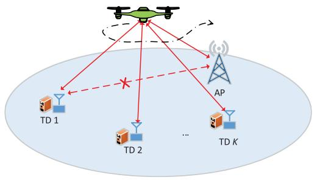

<details>
<summary>flowchart</summary>

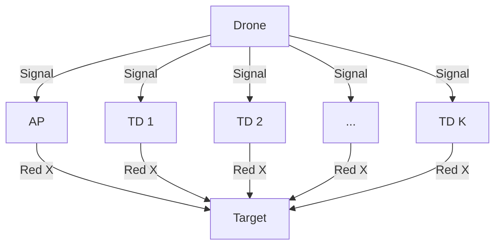
</details>

Fig. 1. Illustration of a UAV-enabled MEC system.

1) We propose a new framework of UAV-assisted MEC system in IoT. Our proposed framework fills the gap that jointly considers the task offloading strategy and UAV relay communication in MEC systems, which provides useful insights and guidelines for designing the similar problems in practice. In our design, the required computation bits can be computed by TDs locally, or offloaded to the UAV for computing. Besides, the required task bits also can be transmitted to the AP for computing via UAV relaying. This mode can further expand the computation resource scale and provide a new opportunity to solve the challenges in traditional MEC systems.   
2) In our proposed design, we formulate a total energy consumption minimization problem, by optimizing the computation bits allocation, time slot scheduling, transmit power allocation, and UAV trajectory. A problem decomposition method is adopted to tackle the nonconvex problem in two parts that are solved by the Lagrangian duality method and successive convex approximation (SCA) technique, respectively.   
3) We present the numerical results that show the superiorities of our proposed design, as compared with other benchmark designs. On the one hand, the proposed algorithm can be guaranteed to converge within a dozen of iterations. On the other hand, the total energy consumption obtained by the proposed algorithm is always lowest, indicating the significant effectiveness of our design.

# II. SYSTEM MODEL AND PROBLEM FORMULATION

Consider a UAV-assisted MEC system in IoT as shown in Fig. 1, where a UAV is deployed as a mobile DF relaying over an area of interest. The UAV is dispatched to help computation bits of TDs that are denoted by a set ${ \cal K } = \{ 1 , 2 , . . . , K \}$ transmit =to AP equipped with MEC functionality for computing. For convenience, we use the notation $u _ { k }$ to denote TD k in this article. Meanwhile, the UAV is also equipped with an MEC server to provide computation operation for TDs. The UAV, each TD and AP are assumed to be equipped with one single antenna, respectively. Without loss of any generality, we assume that the UAV flies from an initial location ${ \bf q } _ { 0 }$ to final location $\mathbf { q } _ { F } .$ . The flight altitude is fixed at H that effectively avoids any collisions. The period time for the UAV flight is expressed by T . Considering a 3-D Cartesian coordinate system, the UAV’s location projected on the horizontal plane in any time instant t ∈ 0, T can be represented by $\mathbf { q } ( t ) = \{ x ( t ) , y ( t ) \}$ . In addition, the locations of AP and each $\mathrm { T D } k \in \mathcal { K }$ are fixed at $\mathbf { w _ { a } } = ( x _ { a } , y _ { a } )$ and $\mathbf { w _ { k } } = ( x _ { k } , y _ { k } )$ = ( ), respectively. For convenience, we use = ( )sufficiently small constant $\delta _ { t }$ to divide the period T into N slots with equal size, which are expressed by a set $\mathcal { N } = \{ 1 , 2 , . . . , N \}$ . =In each time slot, the UAV can be considered to be static. Thus, the UAV’s location in any time slot $n \in \mathcal N$ can be denoted by ${ \bf q } [ n ] = \{ x [ n ] , y [ n ] \}$ , with $\mathbf { q } ( t ) = \mathbf { q } ( \delta _ { t } n ) = \mathbf { q } [ n ]$ . Hence, the [ ] = [ ] [ ] ( ) = ( ) = [ ]distance between the TD k and UAV/helper in each time slot $n \in \mathcal N$ can be denoted by $d _ { u _ { k } h } [ n ] = \sqrt { H ^ { 2 } + | | \mathbf { q } [ n ] - \mathbf { w _ { k } } | | ^ { 2 } } .$ [ ] = + [ ]where || · || denotes Euclidean norm. Similarly, the distance between the UAV and AP in each time slot can be denoted by $d _ { h a } [ n ] = \sqrt { H ^ { 2 } + | | \mathbf { q } [ n ] - \mathbf { w _ { a } } | | ^ { 2 } }$ .

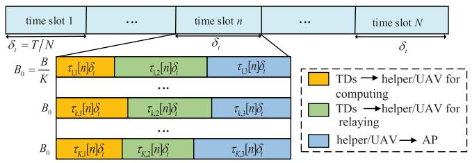

<details>
<summary>flowchart</summary>

```mermaid
graph TD
    A["time slot 1"] -->|δt = T/N| B["B0 = B/K"]
    C["..."] --> D["..."]
    E["time slot n"] --> F["B0 = τk1[n"]δi]
    G["..."] --> H["τk2[n"]δi]
    I["..."] --> J["τk3[n"]δi]
    K["..."] --> L["τk4[n"]δi]
    M["..."] --> N["τk5[n"]δi]
    O["..."] --> P["..."]
    Q["time slot N"] --> R["B0 = τk1nδi"]
    S["..."] --> T["τk2nδi"]
    U["..."] --> V["τk3nδi"]
    W["..."] --> X["..."]
    Y["TDs → helper/UAV for computing"]
    Z["TDs → helper/UAV for relaying"]
    AA["helper/UAV → AP"]
```
</details>

Fig. 2. Illustration of computation bits offloading protocol.

[ ] =For each $\mathrm { T D } k \in { \cal K } ,$ ] it has a latency-critical computation task requirement in each time slot $n \in \mathcal N$ , i.e., each user needs to complete at least $L _ { k , n } ^ { \mathrm { m i n } }$ bits of computation task in each time slot the computation bits to the UAV via wireless transmit for either computing or relaying. Let $l _ { u , k } [ n ] , l _ { h , k } [ n ]$ , and $l _ { a , k } [ n ]$ denote [ ] [ ] [ ]the amount of computation bits allocated for local computing, offloading to UAV for computing and offloading to AP for computing via relaying (or offloading to UAV for relaying) in each time slot, respectively. Thus we have

$$
l _ {u, k} [ n ] \geq 0, l _ {h, k} [ n ] \geq 0, l _ {a, k} [ n ] \geq 0 \tag {1}
$$

$$
l _ {u, k} [ n ] + l _ {h, k} [ n ] + l _ {a, k} [ n ] \geq L _ {k, n} ^ {\min} \quad \forall k, n. \tag {2}
$$

# A. Communication Model

Note that the delay and energy consumption for results sending back from UAV to TDs and that from AP to UAV are omitted since the size of results is much smaller than offloaded data size [19], [25]. As shown in Fig. 2, we consider a computation bits offloading protocol of each TD. Specifically, in each time slot $n \in \mathcal N .$ , the TDs can offload their tasks to the UAV for computing. It is assumed that the wireless channel between the UAV and TD k is dominated by line of sight (LoS) link [19], [29], hence the channels between the UAV and TDs and that between the UAV and AP are modeled by the free space path loss model. Thus, the channel power gain from TD k to UAV is given as

$$
h _ {u _ {k} h} [ n ] = \beta_ {0} d _ {u _ {k} h} ^ {- 2} [ n ] = \frac {\beta_ {0}}{H ^ {2} + | | \mathbf {q} [ n ] - \mathbf {w} _ {\mathbf {k}} | | ^ {2}} \tag {3}
$$

where $\beta _ { 0 }$ denotes the channel gain at the reference distance $d _ { 0 } = 1$ m. Besides, the TDs also can offload their tasks to AP =via UAV. Thus, the channel power gain from the UAV to AP is obtained as

$$
h _ {h a} [ n ] = \beta_ {0} d _ {h a} ^ {- 2} [ n ] = \frac {\beta_ {0}}{H ^ {2} + | | \mathbf {q} [ n ] - \mathbf {w} _ {\mathbf {a}} | | ^ {2}}. \tag {4}
$$

In Fig. 2, for each TD $k ,$ each time slot $n \in \mathcal N$ is divided into three subslots that are dedicated to be allocated for bits offloading to UAV for computing, bits offloading to UAV for relaying, and bits forwarding to AP from UAV, respectively. The size of each subslot is determined by variable $\tau _ { k , m } [ n ]$ , with $m = \{ 1 , 2 , 3 \}$ [, which satisfies the following constraints:

$$
\sum_ {m = 1} ^ {3} \tau_ {k, m} [ n ] \leq 1 \quad \forall k, n \tag {5}
$$

$$
0 \leq \tau_ {k, m} [ n ] \leq 1 \quad \forall k, n, m = \{1, 2, 3 \}. \tag {6}
$$

It is assumed that an OFDMA is applied in the system. The total available bandwidth B is equally divided into K subcarriers with size of $\begin{array} { r } { B _ { 0 } = \frac { B } { K } } \end{array}$ for each TD. The transmit power of TD = k for offloading bits to UAV for computing in each time slot n is denoted by $p _ { k , 1 } [ n ]$ . Therefore, the achievable offloading rate [ ]in bits-per-second (b/s) from the TD k to UAV for computing is denoted as

$$
\begin{array}{l} r _ {u h} \left(p _ {k, 1} [ n ], \mathbf {q} [ n ]\right) \\ = B _ {0} \log_ {2} \left(1 + \frac {p _ {k , 1} [ n ] h _ {u _ {k} h} [ n ]}{N _ {0} B _ {0}}\right) \\ = B _ {0} \log_ {2} \left(1 + \frac {p _ {k , 1} [ n ] \gamma_ {0}}{| | \mathbf {q} [ n ] - \mathbf {w} _ {k} [ n ] | | ^ {2} + H ^ {2}}\right) \forall k, n, \tag {7} \\ \end{array}
$$

where $\begin{array} { r } { \gamma _ { 0 } = \frac { \beta _ { 0 } } { N _ { 0 } B _ { 0 } } } \end{array}$ denotes the reference received signal-to-noise = ratio (SNR) at UAV for $d _ { 0 } = 1$ meter, and $N _ { 0 }$ denotes noise =power dense at the UAV. Assume that the transmit power of TD k to UAV for relaying in the second subslot with duration of $\delta _ { t } \tau _ { k , 2 } [ n ]$ is denoted by $p _ { k , 2 } [ n ]$ . Thus, the achievable offloading [ ] [ ]rate in b/s from the TD k to UAV for relaying is given as

$$
\begin{array}{l} r _ {u h} \left(p _ {k, 2} [ n ], \mathbf {q} [ n ]\right) \\ = B _ {0} \log_ {2} \left(1 + \frac {p _ {k , 2} [ n ] h _ {u _ {k} h} [ n ]}{N _ {0} B _ {0}}\right) \\ = B _ {0} \log_ {2} \left(1 + \frac {p _ {k , 2} [ n ] \gamma_ {0}}{| | \mathbf {q} [ n ] - \mathbf {w} _ {k} [ n ] | | ^ {2} + H ^ {2}}\right) \quad \forall k, n. \tag {8} \\ \end{array}
$$

Similarly, the achievable forwarding rate from the UAV to AP in b/s is given as

$$
\begin{array}{l} r _ {h a} \left(p _ {k, 3} [ n ], \mathbf {q} [ n ]\right) \\ = B _ {0} \log_ {2} \left(1 + \frac {p _ {k , 3} [ n ] h _ {h a} [ n ]}{N _ {1} B _ {0}}\right) \\ = B _ {0} \log_ {2} \left(1 + \frac {p _ {k , 3} [ n ] \gamma_ {1}}{| | \mathbf {q} [ n ] - \mathbf {w} _ {a} [ n ] | | ^ {2} + H ^ {2}}\right) \quad \forall k, n \tag {9} \\ \end{array}
$$

where γ1 $\begin{array} { r } { \gamma _ { 1 } = \frac { \beta _ { 0 } } { N _ { 1 } B _ { 0 } } } \end{array}$ denotes the reference received SNR at AP for $d _ { 0 } = 1$ = m, and ${ \check { N _ { 1 } } }$ denotes noise power dense at AP.

=In addition, we assume that the UAV is able to store the unprocessed offloading bits from TDs in its memory if the offloading rate exceeds its computing ability. Consequently, we can obtain the following computation causality condition:

$$
\sum_ {i = 1} ^ {n} l _ {h, k} [ i ] \leq \sum_ {i = 1} ^ {n} \delta_ {t} \tau_ {k, 1} [ n ] r _ {u h} (p _ {k, 1} [ n ], \mathbf {q} [ n ]) \quad \forall k, n. \tag {10}
$$

Assuming that the processing delay at the DF relay is one subslot, the computing bits $l _ { a , k } [ n ]$ should satisfy the expression shown below

$$
l _ {a, k} [ n ] \leq \min (\delta_ {t} \tau_ {k, 2} [ n ] r _ {u h} (p _ {k, 2} [ n ], \mathbf {q} [ n ]), \delta_ {t} \tau_ {k, 3} [ n ] r _ {h a}
$$

$$
\times (p _ {k, 3} [ n ], \mathbf {q} [ n ])) \quad \forall k, n. \tag {11}
$$

In this model, the total communication-related energy consumption is considered, given by

$$
E _ {\mathrm{comm}} = \delta_ {t} \sum_ {m = 1} ^ {3} \sum_ {n = 1} ^ {N} \sum_ {k = 1} ^ {K} \left(\tau_ {k, m} [ n ] p _ {k, m} [ n ]\right). \tag {12}
$$

# B. Computation Model

Let $c _ { u } ^ { k } > 0$ denote the required CPU cycles for computing each one bit at the user $k ,$ and $\kappa _ { u } ^ { k } > 0$ represent the effective capacitance coefficient effected by chip architecture at TD k [30]. It is assumed that all TDs have same CPU cycles and capacitance coefficient, i.e., $c _ { u } ^ { k } = c _ { u } , \kappa _ { u } ^ { k } = \kappa _ { u }$ ∀k. In order to = =help TDs complete computation tasks in each time slot, as shown in (2), we assume that the CPU cycles and capacitance coefficient of the MEC server at the UAV are $c _ { h } > 0$ and $\kappa _ { h } > 0$ , respectively. In addition, the computation capacity of the AP is assumed to be sufficiently powerful so that the computing time at the AP can be negligible in our setup. The maximum CPU frequency at each TD and UAV is denoted by $f _ { u } ^ { \operatorname* { m a x } }$ and $f _ { h } ^ { \operatorname* { m a x } }$ fh , respectively. As a result, in any time slot, we have

$$
c _ {u} l _ {u, k} [ n ] \leq \delta_ {t} f _ {u} ^ {\max} \quad \forall k, n \tag {13}
$$

$$
c _ {h} l _ {h, k} [ n ] \leq \delta_ {t} \bar {f} _ {h} ^ {\max} \quad \forall k, n \tag {14}
$$

where $\begin{array} { r } { \bar { f } _ { h } ^ { \operatorname* { m a x } } = \frac { \bar { f } _ { h } ^ { \operatorname* { m a x } } } { K } } \end{array}$ indicates that the total frequency of the UAV =is equally divided into K parts that are allocated to each TD, respectively. Based on [25], the energy consumption in each time slot for local computing is expressed as

$$
E _ {\text { comp }} ^ {u, k} [ n ] = \frac {k _ {u} (c _ {u} l _ {u , k} [ n ]) ^ {3}}{\delta_ {t} ^ {2}} \quad \forall k, n. \tag {15}
$$

Similarly, the energy consumption in each time slot for UAV computing is expressed as

$$
E _ {\text { comp }} ^ {h} [ n ] = \sum_ {k = 1} ^ {K} \left(\frac {k _ {h} \left(c _ {h} l _ {h , k} [ n ]\right) ^ {3}}{\delta_ {t} ^ {2}}\right) \quad \forall n \tag {16}
$$

it is worth mentioning that in the first time slot of $n = 1$ , the available time duration for UAV computing is $\left( \delta _ { t } - \delta _ { t } \tau _ { k , 1 } [ 1 ] \right) \mathrm { s } .$ However, considering the time slot size $\delta _ { t }$ ( [ ])in our design is chosen to be quite small so that we have $\delta _ { t } \tau _ { k , 1 } [ 1 ] \ll T$ . Thus, [the computing time for the UAV in first time slot $n = 1$ can be approximated to be $\delta _ { t }$ =. As a result, the total computation-related energy consumption can be denoted as

$$
E _ {\text { comp }} = \sum_ {n = 1} ^ {N} \sum_ {k = 1} ^ {K} E _ {\text { comp }} ^ {u, k} [ n ] + \sum_ {n = 1} ^ {N} E _ {\text { comp }} ^ {h} [ n ]. \tag {17}
$$

TABLE I SYSTEM PARAMETERS FOR NUMERICAL SIMULATION 

<table><tr><td>Symbolic Meaning</td><td>Symbol and Value</td></tr><tr><td>Altitude of UAV</td><td> $H = 20 \text{ m}$ </td></tr><tr><td>Amount of TDs</td><td> $K = 3$ </td></tr><tr><td>Maximum speed</td><td> $V_{max} = 20 \text{ m/s}$ </td></tr><tr><td>Initial location of UAV</td><td> $\mathbf{q}_{0} = [-20, -20] \text{ m}$ </td></tr><tr><td>Final location of UAV</td><td> $\mathbf{q}_{F} = [20, -20] \text{ m}$ </td></tr><tr><td>Time slot size</td><td> $\delta_{t} = 0.2 \text{ s}$ </td></tr><tr><td>Maximum instantaneous power of each users for offloading</td><td> $P_{u}^{max} = 35 \text{ dBm}$ </td></tr><tr><td>Maximum instantaneous power of UAV</td><td> $P_{h}^{max} = 35 \text{ dBm}$ </td></tr><tr><td>Noise power spectrum density</td><td> $N_{0} = N_{1} = -130 \text{ dBm/Hz}$ </td></tr><tr><td>Reference channel power</td><td> $\beta_{0} = -50 \text{ dB}$ </td></tr><tr><td>Communication bandwidth</td><td> $B = 10 \text{ MHz}$ </td></tr><tr><td>Maximum CPU frequency of each TD</td><td> $f_{u}^{max} = 2 \text{ GHz}$ </td></tr><tr><td>Maximum CPU frequency of UAV</td><td> $f_{h}^{max} = 3 \text{ GHz}$ </td></tr><tr><td>Required CPU cycles per bit computation at TD</td><td> $c_{u} = 10^{3} \text{ cycles/bit}$ </td></tr><tr><td>Required CPU cycles per bit computation at UAV</td><td> $c_{h} = 10^{3} \text{ cycles/bit}$ </td></tr><tr><td>CPU capacitance coefficient of each TD</td><td> $k_{u} = 10^{-27}$ </td></tr><tr><td>CPU capacitance coefficient of UAV</td><td> $k_{h} = 10^{-27}$ </td></tr><tr><td>Weight</td><td> $w = 0.01$ </td></tr><tr><td>Tip speed of the rotor blade</td><td> $U_{tip} = 120 \text{ m/s}$ </td></tr><tr><td>Rotor disc area</td><td> $A = 0.503 \text{ m}^{2}$ </td></tr><tr><td>Air density</td><td> $\rho = 1.225 (\text{kg/m}^{3})$ </td></tr><tr><td>Rotor solidity</td><td> $s = 0.05$ </td></tr><tr><td>Fuselage drag ratio</td><td> $d_{0} = 0.3$ </td></tr><tr><td>Mean rotor induced velocity in hover</td><td> $v_{0} = 4.03$ </td></tr><tr><td>Blade profile power in hovering status</td><td> $P_{0} = 158.76 \text{ w}$ </td></tr><tr><td>Induced power in hovering status</td><td> $P_{i} = 88.63 \text{ w}$ </td></tr></table>

# C. UAV Mobility and Flight Energy Consumption Model

In the proposed system, an altitude-fixed rotary-wing UAV is considered. In practice, this UAV flies from an initial location to a final location, during which its speed is constrained by a maximum speed $V _ { \mathrm { m a x } }$ . Hence, we have

$$
\mathbf {q} [ 1 ] = \mathbf {q} _ {0} \tag {18a}
$$

$$
\mathbf {q} [ N + 1 ] = \mathbf {q} _ {F} \tag {18b}
$$

$$
\left| \left| \mathbf {q} [ n + 1 ] - \mathbf {q} [ n ] \right| \right| ^ {2} \leq \left(\delta_ {t} V _ {\max}\right) ^ {2} \quad \forall n. \tag {18c}
$$

Based on [31], the power consumption of flight for rotarywing UAV is modeled as

$$
\begin{array}{l} P \left(\left| \left| \mathbf {v} [ n ] \right| \right|\right) = P _ {0} \left(1 + \frac {3 \left| \left| \mathbf {v} [ n ] \right| \right| ^ {2}}{U _ {t i p} ^ {2}}\right) \\ + P _ {i} \left(\sqrt {1 + \frac {| | \mathbf {v} [ n ] | | ^ {4}}{4 v _ {0} ^ {4}}} - \frac {| | \mathbf {v} [ n ] | | ^ {2}}{2 v _ {0} ^ {2}}\right) ^ {\frac {1}{2}} \\ + \frac {1}{2} d _ {0} \rho s A | | \mathbf {v} [ n ] | | ^ {3} \quad \forall n \in \mathcal {N}, \tag {19} \\ \end{array}
$$

where $P _ { 0 }$ and $P _ { i }$ represent the blade profile power and induced power in hovering status, respectively. The other parameters of $U _ { t i p } , v _ { 0 } , d _ { 0 } , \rho ,$ s, and $A$ related to the UAV’s aerodynamics are given in Table I in Section IV based on the work [31]. To achieve the $\mathrm { U A V } _ { \mathrm { \Delta } }$ peed v n , we have

$$
\mathbf {v} [ n ] = \frac {\mathbf {q} [ n + 1 ] - \mathbf {q} [ n ]}{\delta_ {t}} \quad \forall n \in \mathcal {N}. \tag {20}
$$

Thus, the UAV’s flight energy consumption during the period time is expressed as

$$
E _ {f l y} = \delta_ {t} \sum_ {n = 1} ^ {N} P (| | \mathbf {v} [ n ] | |) \quad \forall n \in \mathcal {N}. \tag {21}
$$

# D. Problem Formulation

According to the discussion above, we formulate the objective problem as a sum of communication-related energy consumption and computation-related energy consumption minimization, which is subjected to task allocation, time slot scheduling, transmit power allocation, and UAV trajectory design. Specifically, the problem is formulated as

$$
0 \leq p _ {k, 1} [ n ] \leq P _ {u} ^ {\max} \quad \forall k, n \tag {22a}
$$

$$
0 \leq p _ {k, 2} [ n ] \leq P _ {u} ^ {\max} \quad \forall k, n \tag {22b}
$$

$$
0 \leq p _ {k, 3} [ n ] \leq P _ {h} ^ {\max} \quad \forall k, n \tag {22c}
$$

where ${ \bf L } = \{ l _ { u , k } [ n ] , l _ { h , k } [ n ] , l _ { a , k } [ n ] \} , \tau = \{ \tau _ { k , m } [ n ] \} _ { m = 1 } ^ { 3 } , { \bf P } =$ $\{ p _ { k , i } [ n ] \} _ { i = 1 } ^ { 3 } , \mathbf { Q } = \{ \mathbf { q } [ n ] , \mathbf { v } [ n ] \} _ { n = 1 } ^ { N } , P _ { u } ^ { \mathrm { m a x } } ,$ u , and $P _ { h } ^ { \mathrm { m a x } }$ =stand for [ ] = [ ] [ ]the maximum transmit power at each TD and $\mathrm { U A V } ,$ respectively. Like [19], let w denote the given weight with regard to the UAV’s flight energy consumption to ensure the fairness for TDs.

Obviously, problem (P1) is a nonconvex problem due to the nonconvexity in the constraints (10) and (11) as well as in the objective function. To tackle this, the primal problem (P1) is decomposed into two manageable subproblems, which are analyzed in the following sections.

# III. ENERGY MINIMIZATION WITH FIXED TRAJECTORY

For any given UAV trajectory Q, and let $E _ { k , m } [ n ] =$ $t _ { k , m } [ n ] p _ { k , m } [ n ]$ and $t _ { k , m } [ n ] = \delta _ { t } \tau _ { k , m } [ n ]$ , with $m = \{ 1 , 2 , 3 \}$ =. [ ] [ ] [ ] = [ ] =The primal problem (P1) is formulated as problem (P2)

$( \mathrm { P 2 } ) \colon \operatorname* { m i n } _ { \mathbf { L } , t , \mathbf { E } } \sum _ { n = 1 } ^ { N } \sum _ { k = 1 } ^ { K } \bigg ( E _ { k , 1 } [ n ] + E _ { k , 2 } [ n ] + E _ { k , 3 } [ n ]$

$$
\left. + \frac {k _ {u} (c _ {u} l _ {u , k} [ n ]) ^ {3}}{\delta_ {t} ^ {2}} + \frac {k _ {h} (c _ {h} l _ {h , k} [ n ]) ^ {3}}{\delta_ {t} ^ {2}}\right)
$$

$\mathrm { s . t . } \quad \sum _ { i = 1 } ^ { n } l _ { h , k } [ i ] \leq \sum _ { i = 1 } ^ { n } t _ { k , 1 } [ i ] r _ { u h } \left( \frac { E _ { k , 1 } [ i ] } { t _ { k , 1 } [ i ] } \right) \quad \forall k , n$ (23a)

$$
l _ {a, k} [ n ] \leq t _ {k, 2} [ n ] r _ {u h} \left(\frac {E _ {k , 2} [ n ]}{t _ {k , 2} [ n ]}\right) \quad \forall k, n \tag {23b}
$$

$$
l _ {a, k} [ n ] \leq t _ {k, 3} [ n ] r _ {h a} \left(\frac {E _ {k , 3} [ n ]}{t _ {k , 3} [ n ]}\right) \quad \forall k, n \tag {23c}
$$

$$
l _ {u, k} [ n ] + l _ {h, k} [ n ] + l _ {a, k} [ n ] \geq L _ {k, n} ^ {\min} \quad \forall k, n \tag {23d}
$$

$$
c _ {u} l _ {u, k} [ n ] \leq \delta_ {t} f _ {u} ^ {\max} \quad \forall k, n \tag {23e}
$$

$$
c _ {h} l _ {h, k} [ n ] \leq \delta_ {t} \bar {f} _ {h} ^ {\max} \quad \forall k, n \tag {23f}
$$

$$
0 \leq E _ {k, 1} [ n ] \leq t _ {k, 1} [ n ] P _ {u} ^ {\max} \quad \forall k, n \tag {23g}
$$

$$
0 \leq E _ {k, 2} [ n ] \leq t _ {k, 2} [ n ] P _ {u} ^ {\max} \quad \forall k, n \tag {23h}
$$

$$
0 \leq E _ {k, 3} [ n ] \leq t _ {k, 3} [ n ] P _ {h} ^ {\max} \quad \forall k, n \tag {23i}
$$

$$
l _ {u, k} [ n ] \geq 0, l _ {h, k} [ n ] \geq 0, l _ {a, k} [ n ] \geq 0 \quad \forall k, n \tag {23j}
$$

$$
\sum_ {m = 1} ^ {3} t _ {k, m} [ n ] \leq \delta_ {t} \quad \forall k, n, m = \{1, 2, 3 \} \tag {23k}
$$

$$
0 \leq t _ {k, m} [ n ] \leq \delta_ {t} \quad \forall k, n, m = \{1, 2, 3 \} \tag {231}
$$

where $\mathbf { E } = \{ E _ { k , m } [ n ] \} _ { m = 1 } ^ { 3 }$ and $\mathbf { t } = \{ t _ { k , m } [ n ] \} _ { m = 1 } ^ { 3 }$

= [ ] = [ ]Lemma 1: Problem (P2) is a convex problem.

Proof: First, the objective function of problem (P2) is convex with respect to E, $l _ { u , k } [ n ]$ and $l _ { h , k } [ n ]$ . Then, it can be easy [ ] [ ]to find that the expressions in constraints (23d)–(23l) are linear. $\begin{array} { r } { f ( x , t ) = t \log ( 1 + \frac { x } { t } ) } \end{array}$ with $t > 0$ , is concave [32]. There-( ) = log(fore, the expressions $\begin{array} { r l } {  { t _ { k , 1 } [ i ] r _ { u h } \big ( \frac { E _ { k , 1 } [ i ] } { t _ { k , 1 } [ i ] } \big ) , t _ { k , 2 } [ n ] r _ { u h } \big ( \frac { E _ { k , 2 } [ n ] } { t _ { k , 2 } [ n ] } \big ) } \quad } & { { } } \end{array}$ , and tk,3 n rha  Ek,3[n]tk,3[n] $\begin{array} { r } { t _ { k , 3 } [ n ] r _ { h a } \big ( \frac { E _ { k , 3 } [ n ] } { t _ { k , 3 } [ n ] } \big ) } \end{array}$ , respectively, in constraints $( 2 3 \mathrm { a } ) \mathrm { - } ( 2 3 \mathrm { c } )$ are concave. Thus, problem (P2) is proofed to be convex.

In order to achieve the closed-form solutions and give more insights into the proposed problem (P2), we choose the Lagrange duality method to solve this problem in this article. By introducing the non-negative dual variables $\lambda _ { k , n } , \mu _ { k , n } , \nu _ { k , n } ,$ $\omega _ { k , n }$ and $\eta _ { k , n }$ that are corresponding to the constraints (23a)– (23d) and (23k), respectively, and let $\lambda = \{ \lambda _ { k , n } \} , \mu = \{ \mu _ { k , n } \}$ , $\pmb { \nu } = \{ \nu _ { k , n } \} , \omega = \{ \omega _ { k , n } \}$ , and $\pmb { \eta } = \{ \eta _ { k , n } \}$ =, then the Lagrange = =function of problem (P2) is

$$
\mathcal {L} (\mathbf {L}, \mathbf {t}, \mathbf {E}, \boldsymbol {\lambda}, \boldsymbol {\mu}, \boldsymbol {\nu}, \boldsymbol {\omega}, \boldsymbol {\eta}) = \sum_ {n = 1} ^ {N} \sum_ {k = 1} ^ {K} E _ {k, 1} [ n ] + \sum_ {n = 1} ^ {N} \sum_ {k = 1} ^ {K} E _ {k, 2} [ n ]
$$

$$
+ \sum_ {n = 1} ^ {N} \sum_ {k = 1} ^ {K} E _ {k, 3} [ n ] + \sum_ {n = 1} ^ {N} \sum_ {k = 1} ^ {K} \frac {k _ {u} (c _ {u} l _ {u , k} [ n ]) ^ {3}}{\delta_ {t} ^ {2}}
$$

$$
+ \sum_ {n = 1} ^ {N} \sum_ {k = 1} ^ {K} \frac {k _ {h} \left(c _ {h} l _ {h , k} [ n ]\right) ^ {3}}{\delta_ {t} ^ {2}} + \sum_ {n = 1} ^ {N} \sum_ {k = 1} ^ {K} \left(\hat {\lambda} _ {k, n} - \omega_ {k, n}\right) l _ {h, k} [ n ]
$$

$$
- \sum_ {n = 1} ^ {N} \sum_ {k = 1} ^ {K} \hat {\lambda} _ {k, n} t _ {k, 1} [ n ] r _ {u h} \left(\frac {E _ {k , 1} [ n ]}{t _ {k , 1} [ n ]}\right) + \sum_ {n = 1} ^ {N} \sum_ {k = 1} ^ {K} \eta_ {k, n} t _ {k, 1} [ n ]
$$

$$
+ \sum_ {n = 1} ^ {N} \sum_ {k = 1} ^ {K} \left(\mu_ {k, n} + \nu_ {k, n} - \omega_ {k, n}\right) l _ {a, k} [ n ] + \sum_ {n = 1} ^ {N} \sum_ {k = 1} ^ {K} \eta_ {k, n} t _ {k, 2} [ n ]
$$

$$
- \sum_ {n = 1} ^ {N} \sum_ {k = 1} ^ {K} \mu_ {k, n} t _ {k, 2} [ n ] r _ {u h} \left(\frac {E _ {k , 2} [ n ]}{t _ {k , 2} [ n ]}\right) + \sum_ {n = 1} ^ {N} \sum_ {k = 1} ^ {K} \eta_ {k, n} t _ {k, 3} [ n ]
$$

$$
- \sum_ {n = 1} ^ {N} \sum_ {k = 1} ^ {K} \nu_ {k, n} t _ {k, 3} [ n ] r _ {h a} \left(\frac {E _ {k , 3} [ n ]}{t _ {k , 3} [ n ]}\right) - \sum_ {n = 1} ^ {N} \sum_ {k = 1} ^ {K} \omega_ {k, n} l _ {u, k} [ n ]
$$

$$
+ \sum_ {n = 1} ^ {N} \sum_ {k = 1} ^ {K} \omega_ {k, n} L _ {k, n} ^ {\min} - \sum_ {n = 1} ^ {N} \sum_ {k = 1} ^ {K} \eta_ {k, n} \delta_ {t}. \tag {24}
$$

In (24), note that $\hat { \lambda } _ { k , n }$ is a new defined parameter that satisfies $\begin{array} { r } { \hat { \lambda } _ { k , n } = \sum _ { i = n } ^ { N } \lambda _ { k , i } } \end{array}$ ˆk,n . Thus, the dual function of problem (P2) can be denoted by $g ( \lambda , \mu , \nu , \omega , \eta )$ , given as

$$
g (\boldsymbol {\lambda}, \boldsymbol {\mu}, \boldsymbol {\nu}, \boldsymbol {\omega}, \boldsymbol {\eta}) = \min _ {\mathbf {L}, t, \mathbf {E}} \mathcal {L} (\mathbf {L}, t, \mathbf {E}, \boldsymbol {\lambda}, \boldsymbol {\mu}, \boldsymbol {\nu}, \boldsymbol {\omega}, \boldsymbol {\eta})
$$

${ \mathrm { s . t . } } ( 2 3 \mathrm { e } ) { - } ( 2 3 \mathrm { j } ) , ( 2 3 \mathrm { l } ) .$ (25)

Lemma 2: In order to make $g ( \lambda , \mu , \nu , \omega , \eta )$ bounded, the expression of $( \mu _ { k , n } + \nu _ { k , n } - \omega _ { k , n } ) \geq 0$ ) must hold.

( + )Proof: Lemma 2 can be shown by contradiction. Assume that $( \mu _ { k , n } + \nu _ { k , n } - \omega _ { k , n } ) < 0$ , thus the value of $l _ { a , n } [ n ]$ would $ + \infty$ + ) [ ]in order to minimize the objective function. Thus, the +value of dual function $g ( \lambda , \mu , \nu , \omega , \eta )$ would be minus infinity. This lemma is proved.

As a result, the dual problem of problem (P2) can be written as

$\operatorname { ( D 2 ) } \colon \operatorname* { m a x } _ { \mathbf { \lambda } _ { \lambda , \mu , \nu , \omega , \eta } } g \left( \lambda , \mu , \nu , \omega , \eta \right)$

$\mathrm { s . t . } \qquad \lambda \succeq 0 , \mu \succeq 0 , \nu \succeq 0 , \omega \succeq 0 , \eta \succeq 0$ (26a)

$( \mu _ { k , n } + \nu _ { k , n } - \omega _ { k , n } ) \geq 0 \forall k , n .$ (26b)

Due to problem (P2) is convex, the Slater’s condition can be satisfied [32] and, thus, the strong duality holds between (P2) and (D2). Thus, we can obtain the optimal solution of problem (P2) by solving its dual problem, i.e., problem (D2).

# A. Obtaining $g ( \lambda , \mu , \nu , \omega , \eta )$ by Solving Problem (25)

For any given value of $( \lambda , \mu , \nu , \omega , \eta )$ in the feasible set of ( )problem (D2), the dual function can be obtained by solving problem (25). Note the problem (25) can be decomposed into KN independent subproblems, and each one is further decomposed into several subproblems as follows:

$( \mathrm { L 1 } ) \colon \operatorname* { m i n } _ { \substack { t _ { k , 1 } [ n ] , E _ { k , 1 } [ n ] } } \quad E _ { k , 1 } [ n ] - \hat { \lambda } _ { k , n } t _ { k , 1 } [ n ] r _ { u h } \left( \frac { E _ { k , 1 } [ n ] } { t _ { k , 1 } [ n ] } \right)$

$$
+ \eta_ {k, n} t _ {k, 1} [ n ]
$$

$\mathrm { s . t . ~ } 0 \leq E _ { k , 1 } [ n ] \leq t _ { k , 1 } [ n ] P _ { u } ^ { \mathrm { m a x } } \quad \forall k , n$ (27a)

$0 \leq t _ { k , 1 } [ n ] \leq \delta _ { t } \forall k , n .$ (27b)

$( \mathrm { L } 2 ) \colon \operatorname* { m i n } _ { \substack { t _ { k , 2 } [ n ] , E _ { k , 2 } [ n ] } } \quad E _ { k , 2 } [ n ] - \mu _ { k , n } t _ { k , 2 } [ n ] r _ { u h } \left( \frac { E _ { k , 2 } [ n ] } { t _ { k , 2 } [ n ] } \right)$

$$
+ \eta_ {k, n} t _ {k, 2} [ n ]
$$

$\mathrm { s . t . ~ } 0 \leq E _ { k , 2 } [ n ] \leq t _ { k , 2 } [ n ] P _ { u } ^ { \operatorname* { m a x } }$ (28a)

$0 \leq t _ { k , 2 } [ n ] \leq \delta _ { t } .$ (28b)

$( \mathrm { L 3 } ) \colon \operatorname* { m i n } _ { \substack { t _ { k , 3 } [ n ] , E _ { k , 3 } [ n ] } } \quad E _ { k , 3 } [ n ] - \nu _ { k , n } t _ { k , 3 } [ n ] r _ { h a } \left( \frac { E _ { k , 3 } [ n ] } { t _ { k , 3 } [ n ] } \right)$

$$
+ \eta_ {k, n} t _ {k, 3} [ n ]
$$

$\mathrm { s . t . ~ } 0 \leq E _ { k , 3 } [ n ] \leq t _ { k , 3 } [ n ] P _ { h } ^ { \operatorname* { m a x } }$ (29a)

$0 \leq t _ { k , 3 } [ n ] \leq \delta _ { t } .$ (29b)

$( \mathrm { L } 4 ) \colon \operatorname* { m i n } _ { l _ { u , k } \left[ n \right] } \quad \frac { k _ { u } \left( c _ { u } l _ { u , k } [ n ] \right) ^ { 3 } } { \delta _ { t } ^ { 2 } } - \omega _ { k , n } l _ { u , k }  { [ n ] }$

$\begin{array} { r l } { \mathrm { s . t . ~ } } & { { } l _ { u , k } [ n ] \geq 0 } \end{array}$ (30a)

$c _ { u } l _ { u , k } [ n ] \leq \delta _ { t } f _ { u } ^ { \operatorname* { m a x } } .$ (30b)

$\left( \mathrm { L 5 } \right) \colon \operatorname* { m i n } _ { l _ { h , k } \left[ n \right] } \ \frac { k _ { h } \left( c _ { h } l _ { h , k } \left[ n \right] \right) ^ { 3 } } { \delta _ { t } ^ { 2 } } + \left( \hat { \lambda } _ { k , n } - \omega _ { k , n } \right) l _ { h , k } \left[ n \right]$

$\begin{array} { r l } { \mathrm { s . t . ~ } } & { { } l _ { h , k } [ n ] \geq 0 } \end{array}$ (31a)

$c _ { u } l _ { h , k } [ n ] \leq \delta _ { t } \bar { f } _ { h } ^ { \operatorname* { m a x } } .$ (31b)

$( \mathrm { L 6 } ) \colon \operatorname* { m i n } _ { l _ { a , k } [ n ] } \quad ( \mu _ { k , n } + \nu _ { k , n } - \omega _ { k , n } ) l _ { a , k } [ n ]$

$\mathrm { s . t . } \quad l _ { a , k } [ n ] \geq 0 .$ (32)

For these subproblems, they are all convex so that their solutions satisfy the Karush–Kuhn–Tucker (KKT) conditions.

Lemma 3: By solving subproblem (L1) with KKT, the optimal solution can be denoted as

$E _ { k , 1 } ^ { * } [ n ] = p _ { k , 1 } ^ { * } [ n ] t _ { k , 1 } ^ { * } [ n ] ,$ (33a)

$p _ { k , 1 } ^ { * } [ n ] = \left[ { \frac { \hat { \lambda } _ { k , n } B _ { 0 } } { \ln 2 } } - { \frac { 1 } { \bar { \gamma } _ { 0 } } } \right] _ { 0 } ^ { P _ { u } ^ { \mathrm { m a x } } }$ P max (33b)

$t _ { k , 1 } ^ { * } [ n ] \left\{ \begin{array} { l l } { = \delta _ { t } , } & { \mathrm { i f ~ } p _ { k , 1 } ^ { * } [ n ] - \hat { \lambda } _ { k , n } r _ { u h } \left( p _ { k , 1 } ^ { * } [ n ] \right) + \eta _ { k , n } < 0 } \\ { \epsilon [ 0 , \delta _ { t } ] , } & { \mathrm { i f ~ } p _ { k , 1 } ^ { * } [ n ] - \hat { \lambda } _ { k , n } r _ { u h } \left( p _ { k , 1 } ^ { * } [ n ] \right) + \eta _ { k , n } ^ { n } = 0 . } \\ { = 0 , } & { \mathrm { i f ~ } p _ { k , 1 } ^ { * } [ n ] - \hat { \lambda } _ { k , n } r _ { u h } \left( p _ { k , 1 } ^ { * } [ n ] \right) + \eta _ { k , n } > 0 } \end{array} \right.$ (33c)

Proof: See Appendix A.

The solutions to the subproblems (L2)–(L6) are given in Lemmas 4–8, respectively, and the proofs of these problems are omitted here due to the similar KKT method applied in the Lemma 3.

Lemma 4: By solving subproblem (L2) with KKT, the optimal solution can be denoted as

$E _ { k , 2 } ^ { * } [ n ] = p _ { k , 2 } ^ { * } [ n ] t _ { k , 2 } ^ { * } [ n ]$ (34a)

$p _ { k , 2 } ^ { * } [ n ] = \left[ \frac { \mu _ { k , n } B _ { 0 } } { \ln { 2 } } - \frac { 1 } { \bar { \gamma } _ { 0 } } \right] _ { 0 } ^ { P _ { u } ^ { \mathrm { m a x } } }$ P max (34b)

$t _ { k , 2 } ^ { * } [ n ] \left\{ \begin{array} { l l } { = \delta _ { t } , } & { \mathrm { i f ~ } p _ { k , 2 } ^ { * } [ n ] - \mu _ { k , n } r _ { u h } \left( p _ { k , 2 } ^ { * } [ n ] \right) + \eta _ { k , n } < 0 } \\ { \epsilon [ 0 , \delta _ { t } ] , } & { \mathrm { i f ~ } p _ { k , 2 } ^ { * } [ n ] - \mu _ { k , n } r _ { u h } \left( p _ { k , 2 } ^ { * } [ n ] \right) + \eta _ { k , n } ^ { n } = 0 . } \\ { = 0 , } & { \mathrm { i f ~ } p _ { k , 2 } ^ { * } [ n ] - \mu _ { k , n } r _ { u h } \left( p _ { k , 2 } ^ { * } [ n ] \right) + \eta _ { k , n } > 0 } \end{array} \right.$ (34c)

Lemma 5: By solving subproblem (L3) with KKT, the optimal solution can be denoted as

$E _ { k , 3 } ^ { * } [ n ] = p _ { k , 3 } ^ { * } [ n ] t _ { k , 3 } ^ { * } [ n ]$ (35a)

$p _ { k , 3 } ^ { * } [ n ] = \left[ \frac { \nu _ { k , n } B _ { 0 } } { \ln 2 } - \frac { 1 } { \bar { \gamma } _ { 1 } } \right] _ { 0 } ^ { P _ { h } ^ { \mathrm { m a x } } }$ P max (35b)

$$
t _ {k, 3} ^ {*} [ n ] \left\{ \begin{array}{l l} = \delta_ {t}, & \text { if } p _ {k, 3} ^ {*} [ n ] - \nu_ {k, n} r _ {h a} \left(p _ {k, 3} ^ {*} [ n ]\right) + \eta_ {k, n} <   0 \\ \epsilon [ 0, \delta_ {t} ], & \text { if } p _ {k, 3} ^ {*} [ n ] - \nu_ {k, n} r _ {h a} \left(p _ {k, 3} ^ {*} [ n ]\right) + \eta_ {k, n} = 0 \\ = 0, & \text { if } p _ {k, 3} ^ {*} [ n ] - \nu_ {k, n} r _ {h a} \left(p _ {k, 3} ^ {*} [ n ]\right) + \eta_ {k, n} > 0 \end{array} \right. \tag {35c}
$$

where γ1  γ1||q[n]−wa[n]||2+H2 . $\begin{array} { r } { \bar { \gamma } _ { 1 } = \frac { \gamma _ { 1 } } { \lvert | \mathbf q [ n ] - \mathbf w _ { a } [ n ] \rvert / 2 + H ^ { 2 } } } \end{array}$

Lemma 6: By solving subproblem (L4) with KKT, the optimal solution can be denoted as

$$
l _ {u, k} ^ {*} [ n ] = \delta_ {t} \left[ \sqrt {\frac {\omega_ {k , n}}{3 \kappa_ {u} c _ {u} ^ {3}}} \right] _ {0} ^ {\frac {f _ {u} ^ {\max}}{c _ {u}}}. \tag {36}
$$

Lemma 7: By solving subproblem (L5) with KKT, the optimal solution can be denoted as

$$
l _ {h, k} ^ {*} [ n ] \left\{ \begin{array}{l l} = \delta_ {t} \left[ \sqrt {\frac {\omega_ {k , n} - \hat {\lambda} _ {k , n}}{3 \kappa_ {h} c _ {h} ^ {3}}} \right] _ {0} ^ {\frac {\bar {f} _ {h} ^ {\max}}{c _ {h}}}, & \text { if } \omega_ {k, n} - \hat {\lambda} _ {k, n} \geq 0 \\ = 0, & \text { if } \omega_ {k, n} - \hat {\lambda} _ {k, n} <   0 \end{array} . \right. \tag {37}
$$

Lemma 8: By solving subproblem (L6) with KKT, the optimal solution can be denoted as

$$
l _ {a, k} ^ {*} [ n ] \left\{ \begin{array}{l l} = 0, & \text { if } \mu_ {k, n} + \nu_ {k, n} - \omega_ {k, n} > 0 \\ = a, & \text { if } \mu_ {k, n} + \nu_ {k, n} - \omega_ {k, n} = 0 \end{array} \right. \tag {38}
$$

where a represent any non-negative constant.

Based on the duality method, it can be seen from Lemma 3–5 that the offloading strategy depends on the channel quality between the UAV and TDs or that between the UAV and AP. For example, the expression (35b) indicates that the UAV would help TDs forward the task bits to AP if the distance between the UAV and AP is smaller than a threshold, i.e., $\begin{array} { r } { d _ { h a } [ n ] \leq \sqrt { \frac { \nu _ { k , n } B _ { 0 } } { \ln 2 } \bar { \gamma } _ { 1 } } } \end{array}$ νk,nB0 γ1. [ ] ¯Moreover, from Lemmas 6 and 7, we can know that TDs would choose to perform bits offloading to UAV for computing when the local computation task exceed the amount of $\sqrt { \frac { \hat { \lambda } _ { k , n } } { 3 \kappa _ { h } c _ { h } ^ { 3 } } } \delta _ { t }$ ˆλk,n Otherwise, the TDs only operate local computing.

# B. Obtaining $( \lambda , \mu , \nu , \omega , \eta )$ by Solving Problem (D2)

After obtaining $( \mathbf { L } ^ { * } , \mathbf { t } ^ { * } , \mathbf { E } ^ { * } )$ for given $( \lambda , \mu , \nu , \omega , \eta )$ , we, ( ) ( )then, can obtain the optimal dual variables by solving problem (D2), denoted by $( \lambda ^ { * } , \mu ^ { * } , \nu ^ { * } , \omega ^ { * } , \eta ^ { * } )$ . Considering ( )problem (D2) is nondifferentiable in general, this motivates us to use the ellipsoid method [33] to solve problem (D2). Specifically, the subgradient of the objective function can be represented by $( \Delta \lambda ^ { T } , \Delta \mu ^ { T } , \Delta \nu ^ { T } , \Delta \omega ^ { \bar { T } } , \Delta \eta ^ { T } ) ^ { T }$ , in which the vectors $\Delta \lambda , \Delta \mu , \Delta \nu , \Delta \omega , \Delta \eta$ Δ Δ )are respectively given as

$$
\Delta \boldsymbol {\lambda} = \sum_ {i = 1} ^ {n} l _ {h, k} [ i ] - \sum_ {i = 1} ^ {n} t _ {k, 1} [ i ] r _ {u h} \left(\frac {E _ {k , 1} [ i ]}{t _ {k , 1} [ i ]}\right) \quad \forall k, n \tag {39a}
$$

$$
\Delta \boldsymbol {\mu} = l _ {a, k} [ n ] - t _ {k, 2} [ n ] r _ {u h} \left(\frac {E _ {k , 2} [ n ]}{t _ {k , 2} [ n ]}\right) \quad \forall k, n \tag {39b}
$$

$$
\Delta \boldsymbol {\nu} = l _ {a, k} [ n ] - t _ {k, 3} [ n ] r _ {u h} \left(\frac {E _ {k , 3} [ n ]}{t _ {k , 3} [ n ]}\right) \quad \forall k, n \tag {39c}
$$

$$
\Delta \omega = L _ {k, n} ^ {\min} - l _ {u, k} [ n ] - l _ {h, k} [ n ] - l _ {a, k} [ n ] \quad \forall k, n \tag {39d}
$$

$$
\Delta \boldsymbol {\eta} = t _ {k, 1} [ n ] + t _ {k, 2} [ n ] + t _ {k, 3} [ n ] - \delta_ {t} \quad \forall k, n. \tag {39e}
$$

Algorithm 1: A Dual Algorithm to Optimally Solve (P2).   
1: Initialization: $\lambda, \mu, \nu, \omega, \eta$ , and the ellipsoid.
2: repeat
3: Based on Lemma 3–8, obtain $\mathbf{L}^*, \mathbf{t}^*, \mathbf{E}^*$ .
4: By solving problem (D2), obtain the subgradients of the objective functions and constraints.
5: Update $\lambda, \mu, \nu, \omega, \eta$ based on ellipsoid method.
6: until $\lambda, \mu, \nu, \omega$ and $\eta$ converge.
7: Let $(\lambda^*, \mu^*, \nu^*, \omega^*, \eta^*) \leftarrow (\lambda, \mu, \nu, \omega, \eta)$ .
8: Obtain $p_{k,m}^{*}[n], m = \{1, 2, 3\}, l_{u,k}^{*}[n], l_{h,k}^{*}[n]$ based on Lemmas 3–8, and then obtain optimal $t_{k,m}^{*}[n], m = \{1, 2, 3\}$ and $l_{a,k}^{*}[n]$ by solving problem (40).

# C. Constructing Optimal Solution to Problem (P2)

Due to the nonuniqueness of $t _ { k , m } ^ { * } [ n ] , m = \{ 1 , 2 , 3 \}$ and $l _ { a , k } ^ { * } [ n ]$ [ ] =, an extra step is needed to construct the optimal solution [ ]to problem (P2). From Lemmas 3–8, the obtained solutions $p _ { k , m } ^ { * } [ n ] , m = \{ 1 , 2 , 3 \} , \ : l _ { u , k } ^ { * } [ n ] , \ : l _ { h , k } ^ { * } [ n ]$ are unique. By substi-[ ] = [ ] [ ]tuting these parameters in problem (P2), we have

$$
\min _ {l _ {a, k} [ n ], \boldsymbol {t}, \mathbf {E}} \sum_ {n = 1} ^ {N} \sum_ {k = 1} ^ {K} E _ {k, 1} [ n ] + E _ {k, 2} [ n ] + E _ {k, 3} [ n ] \tag {40a}
$$

s.t. 23g – 23l (40b)

$$
\sum_ {i = 1} ^ {n} l _ {h, k} ^ {*} [ i ] \leq \sum_ {i = 1} ^ {n} t _ {k, 1} [ i ] r _ {u h} \left(p _ {k, 1} ^ {*} [ i ]\right) \quad \forall k, n \tag {40c}
$$

$$
l _ {a, k} [ n ] \leq t _ {k, 2} [ n ] r _ {u h} \left(p _ {k, 2} ^ {*} [ n ]\right) \quad \forall k, n \tag {40d}
$$

$$
l _ {a, k} [ n ] \leq t _ {k, 3} [ n ] r _ {h a} \left(p _ {k, 3} ^ {*} [ n ]\right) \quad \forall k, n \tag {40e}
$$

$$
l _ {u, k} ^ {*} [ n ] + l _ {h, k} ^ {*} [ n ] + l _ {a, k} [ n ] \geq L _ {k, n} ^ {\text { min }} \quad \forall k, n. \tag {40f}
$$

By solving the linear programming problem (40), the optimal solution to primal problem (P2) is obtained. The details for solving problem (P2) is summarized in Algorithm 1.

# IV. ENERGY MINIMIZATION WITH TRAJECTORY OPTIMIZATION

In this section, the UAV trajectory is designed to further decrease the total energy consumption. Based on $\{ \mathbf { p } ^ { * } , \mathbf { E } ^ { * } , \mathbf { t } ^ { * } \}$ obtained by solving Algorithm 1, where p∗ satisfies $\begin{array} { r } { \mathbf { p } ^ { * } = \frac { \mathbf { E } ^ { * } } { \mathbf { t } ^ { * } } } \end{array}$ , the =energy minimization problem by optimizing the UAV trajectory is formulated as

$$
\begin{array}{l} \text {(P3)} \colon \min _ {\mathbf {L}, \mathbf {Q}} \quad \sum_ {n = 1} ^ {N} \sum_ {k = 1} ^ {K} \frac {k _ {u} \left(c _ {u} l _ {u , k} [ n ]\right) ^ {3}}{\delta_ {t} ^ {2}} + \frac {k _ {h} \left(c _ {h} l _ {h , k} [ n ]\right) ^ {3}}{\delta_ {t} ^ {2}} \\ + w \delta_ {t} \sum_ {n = 1} ^ {N} P (| | \mathbf {v} [ n ] | |) \\ \end{array}
$$

$$
\text { s.t. } \quad (1 8 \mathrm{a}) - (1 8 \mathrm{c}), (2 0), (2 3 \mathrm{e}) - (2 3 \mathrm{g}), (2 3 \mathrm{j})
$$

$$
\sum_ {i = 1} ^ {n} l _ {h, k} [ i ] \leq \sum_ {i = 1} ^ {n} t _ {k, 1} ^ {*} [ i ] B _ {0} \log_ {2} \left(1 + \frac {p _ {k , 1} ^ {*} [ i ] \gamma_ {0}}{| | \mathbf {q} [ i ] - \mathbf {w} _ {k} | | ^ {2} + H ^ {2}}\right) \tag {41a}
$$

$$
l _ {a, k} [ n ] \leq t _ {k, 2} ^ {*} [ n ] B _ {0} \log_ {2} \left(1 + \frac {p _ {k , 2} ^ {*} [ n ] \gamma_ {0}}{| | \mathbf {q} [ n ] - \mathbf {w} _ {k} | | ^ {2} + H ^ {2}}\right) \tag {41b}
$$

$$
l _ {a, k} [ n ] \leq t _ {k, 3} ^ {*} [ n ] B _ {0} \log_ {2} \left(1 + \frac {p _ {k , 3} ^ {*} [ n ] \gamma_ {0}}{| | \mathbf {q} [ n ] - \mathbf {w} _ {a} | | ^ {2} + H ^ {2}}\right). \tag {41c}
$$

It can be seen from problem (P3) that the objective function is nonconvex and the expressions in (41a)–(41c) are nonconvex with respect to ${ \bf q } [ n ]$ . Hence, problem (P3) belongs to a noncon-[ ]vex optimization problem that is challenging to be solved. To tackle the nonconvexity, the SCA technique is applied.

To tackle the nonconvexity of the function $P ( | | \mathbf { v } [ n ] | )$ in the ( [ ] )objective function, we first introduce the slack variable $v _ { n } \geq$ $| | \mathbf { v } [ n ] | |$ , thus the expression in (19) can be rewritten as

$$
\begin{array}{l} P (v _ {n}) = P _ {0} \left(1 + \frac {3 v _ {n} ^ {2}}{U _ {t i p} ^ {2}}\right) + P _ {i} \left(\sqrt {1 + \frac {v _ {n} ^ {4}}{4 v _ {0} ^ {4}}} - \frac {v _ {n} ^ {2}}{2 v _ {0} ^ {2}}\right) ^ {\frac {1}{2}} \\ + \frac {1}{2} d _ {0} \rho s A V _ {n} ^ {3} \quad \forall n \in \mathcal {N}. \tag {42} \\ \end{array}
$$

Note that the second term in (42) is still nonconvex. By introducing another slack variable $\begin{array} { r } { u _ { n } ^ { 2 } \ge \sqrt { 1 + \frac { v _ { n } ^ { 4 } } { 4 v _ { 0 } ^ { 4 } } } - \frac { v _ { n } ^ { 2 } } { 2 v _ { 0 } ^ { 2 } } } \end{array}$ v2n , we can readily obtain the expression as

$$
\frac {1}{u _ {n} ^ {2}} \leq u _ {n} ^ {2} + \frac {v _ {n} ^ {2}}{v _ {0} ^ {2}} \quad \forall n \in \mathcal {N} \tag {43}
$$

then for given any local point $\{ v _ { n , j } , u _ { n , j } \}$ (j denotes jth iteration), the right-hand side (RHS) of (43) can be lower-bounded via the first-order Taylor expansion as it is jointly convex with respect to $v _ { n }$ and $u _ { n } \ [ 3 2 ]$ . Let $\chi _ { n } ^ { l b }$ denote this lower bound function, which is expressed as

$$
\begin{array}{l} \chi_ {n} ^ {l b} \triangleq (u _ {n, j}) ^ {2} + 2 u _ {n, j} (u _ {n} - u _ {n, j}) + (v _ {n, j}) ^ {2} \frac {1}{v _ {0} ^ {2}} \\ + \frac {2 v _ {n , j}}{v _ {0} ^ {2}} (v _ {n} - v _ {n, j}) \quad \forall n \in \mathcal {N}. \tag {44} \\ \end{array}
$$

Based on the discussion above, the UAV’s flight energy consumption can be approximately expressed as a convex function, i.e.,

$$
P _ {\text { appro }} (v _ {n}) = P _ {0} \left(1 + \frac {3 v _ {n} ^ {2}}{U _ {t i p} ^ {2}}\right) + P _ {i} u _ {n} + \frac {1}{2} d _ {0} \rho s A v _ {n} ^ {3}. \tag {45}
$$

Considering the expression of $\begin{array} { r } { \log _ { 2 } ( 1 + \frac { p _ { k , 1 } ^ { * } [ i ] \gamma _ { 0 } } { \| \mathbf { q } [ i ] - \mathbf { w } _ { k } \| ^ { 2 } + H ^ { 2 } } ) } \end{array}$ in RHS of (41a), it is nonconvex with respect to q i . How-[ ]ever, it can be still deemed as a convex expression if taking $| | \mathbf { q } [ i ] - \mathbf { w } _ { k } | | ^ { 2 }$ as a whole. Hence, for any given local point $\{ \mathbf { q } _ { j } [ n ] \}$ , the lower bound function of the RHS of expression [ ]in (41a) can be denoted by $\varphi _ { k , 1 } ^ { l b } [ i ]$ , given in (46).

[ ]Similarly, for any given local point $\{ \mathbf { q } _ { j } [ n ] \}$ , the RHSs of [ ]the inequalities in (41b) and (41c) can be also lower-bounded. The corresponding lower bound functions can be derived, as expressed in (46), (47), and (48) shown at the bottom of this page, respectively.

By replacing the derived lower bound functions and the approximately convex expression into problem (P3), we can obtain

$$
\begin{array}{l} \text {(P3.1)} \colon \min _ {\mathbf {L}, \boldsymbol {Q}, v _ {n}, u _ {n}} \sum_ {n = 1} ^ {N} \sum_ {k = 1} ^ {K} \frac {k _ {u} \left(c _ {u} l _ {u , k} [ n ]\right) ^ {3}}{\delta_ {t} ^ {2}} + \frac {k _ {h} \left(c _ {h} l _ {h , k} [ n ]\right) ^ {3}}{\delta_ {t} ^ {2}} \\ + w \delta_ {t} \sum_ {n = 1} ^ {N} P _ {\text { appro }} (v _ {n}) \\ \end{array}
$$

$$
\text { s   .   t   . } \quad (1 8 \mathrm{a}) - (1 8 \mathrm{c}), (2 0), (2 3 \mathrm{e}) - (2 3 \mathrm{g}), (2 3 \mathrm{j})
$$

$$
\sum_ {i = 1} ^ {n} l _ {h, k} [ i ] \leq \sum_ {i = 1} ^ {n} t _ {k, 1} ^ {*} [ i ] B _ {0} \varphi_ {k, 1} ^ {l b} [ i ] \quad \forall k, n \tag {49a}
$$

$$
l _ {a, k} [ n ] \leq t _ {k, 2} ^ {*} [ n ] B _ {0} \varphi_ {k, 2} ^ {l b} [ n ] \quad \forall k, n \tag {49b}
$$

$$
l _ {a, k} [ n ] \leq t _ {k, 3} ^ {*} [ n ] B _ {0} \varphi_ {k, 3} ^ {l b} [ n ] \quad \forall k, n \tag {49c}
$$

$$
v _ {n} ^ {2} \geq | | \mathbf {v} [ n ] | | ^ {2}, n \in \mathcal {N} \tag {49d}
$$

$$
\chi_ {n} ^ {l b} \geq \frac {1}{u _ {n} ^ {2}}, n \in \mathcal {N}. \tag {49e}
$$

It can be readily proved that the optimal solution always makes equality hold in (49b), (49c), and (49e). Also, the equality must holds in the causality condition (49a) for $n = N$ . Hence, the =problem (P3.1) is equivalent to (P3). Obviously, Problem (P3.1) is convex that can be solved by standard convex optimization tools, such as CVX [34].

In summary, an overall iterative algorithm that jointly optimizes computation bits allocation, power allocation, time slot scheduling, and UAV trajectory can be derived to solve the primal problem (P1), as summarized in Algorithm 2. Algorithm 2 consists of the duality method and SCA technology, at least a locally optimal solution always can be achieved by the proposed joint optimization algorithm.

Here, we briefly give the complexity analysis for the proposed algorithms. For each iteration of Algorithm 2, it consists of solving Algorithm 1 and optimizing UAV trajectory with CVX.

$$
\varphi_ {k, 1} ^ {l b} [ i ] = \log_ {2} \left(1 + \frac {p _ {k , 1} ^ {*} [ i ] \gamma_ {0}}{| | \mathbf {q} _ {j} [ i ] - \mathbf {w} _ {k} | | ^ {2} + H ^ {2}}\right) - \frac {\log_ {2} (e) p _ {k , 1} ^ {*} [ i ] \gamma_ {0} \left(| | \mathbf {q} [ i ] - \mathbf {w} _ {k} | | ^ {2} - | | \mathbf {q} _ {j} [ i ] - \mathbf {w} _ {k} | | ^ {2}\right)}{(| | \mathbf {q} _ {j} [ i ] - \mathbf {w} _ {k} | | ^ {2} + H ^ {2}) (| | \mathbf {q} _ {j} [ i ] - \mathbf {w} _ {k} | | ^ {2} + H ^ {2} + p _ {k , 1} ^ {*} [ i ] \gamma_ {0})} \tag {46}
$$

$$
\varphi_ {k, 2} ^ {l b} [ n ] = \log_ {2} \left(1 + \frac {p _ {k , 2} ^ {*} [ n ] \gamma_ {0}}{| | \mathbf {q} _ {j} [ n ] - \mathbf {w} _ {k} | | ^ {2} + H ^ {2}}\right) - \frac {\log_ {2} (e) p _ {k , 2} ^ {*} [ i ] \gamma_ {0} \left(| | \mathbf {q} [ n ] - \mathbf {w} _ {k} | | ^ {2} - | | \mathbf {q} _ {j} [ n ] - \mathbf {w} _ {k} | | ^ {2}\right)}{(| | \mathbf {q} _ {j} [ n ] - \mathbf {w} _ {k} | | ^ {2} + H ^ {2}) (| | \mathbf {q} _ {j} [ n ] - \mathbf {w} _ {k} | | ^ {2} + H ^ {2} + p _ {k , 2} ^ {*} [ n ] \gamma_ {0})} \tag {47}
$$

$$
\varphi_ {k, 3} ^ {l b} [ n ] = \log_ {2} \left(1 + \frac {p _ {k , 3} ^ {*} [ n ] \gamma_ {1}}{| | \mathbf {q} _ {j} [ n ] - \mathbf {w} _ {a} | | ^ {2} + H ^ {2}}\right) - \frac {\log_ {2} (e) p _ {k , 3} ^ {*} [ i ] \gamma_ {1} \left(| | \mathbf {q} [ n ] - \mathbf {w} _ {a} | | ^ {2} - | | \mathbf {q} _ {j} [ n ] - \mathbf {w} _ {a} | | ^ {2}\right)}{(| | \mathbf {q} _ {j} [ n ] - \mathbf {w} _ {a} | | ^ {2} + H ^ {2}) (| | \mathbf {q} _ {j} [ n ] - \mathbf {w} _ {a} | | ^ {2} + H ^ {2} + p _ {k , 3} ^ {*} [ n ] \gamma_ {0})} \tag {48}
$$

Algorithm 2: The Overall Iterative Algorithm to Solve (P1).   
1: Given UAV initial local point $\{q_{j}[n]\}$ , $\{v_{n,j}\}$ and $\{u_{n,j}\}$ , let iteration j = 0.
2: repeat
3: With $\{q_{j}[n]\}$ , solve (P2) based on Algorithm 1 and obtain $\{p^{*}, E^{*}, t^{*}\}$ .
4: With $\{p^{*}, E^{*}, t^{*}\}$ and $\{q_{j}[n]\}$ , solve problem (P3.1), and obtain optimized trajectory denoted by $\{q_{j}^{*}[n]\}$ , $\{v_{n,j}^{*}\}$ and $\{u_{n,j}^{*}\}$ via CVX.
5: Update $\{q_{j+1}[n]\} \leftarrow \{q_{j}^{*}[n]\}$ , $\{v_{n,j}\} \leftarrow \{v_{n,j}^{*}\}$ , $\{u_{n,j}\} \leftarrow \{u_{n,j}^{*}\}$ .
6: Update $j \leftarrow j + 1$ .
7: until The objective value converges.

The computation complexity of Algorithm 1 mainly depends on the loop, i.e., step 3) to step 5) of Algorithm 1. Note that the complexity of ellipsoid method is $\mathcal { O } \bar { ( } K ^ { 2 } ~ N ^ { 2 } )$ [32], [33]. ( )Thus, the complexities of steps 3), 4), and 5) of Algorithm 1 are $\mathcal { O } ( K N ) , \mathcal { O } ( K N )$ , and $\mathcal { O } ( K ^ { \bar { 2 } }  N ^ { 2 } )$ , respectively. As a result, the ( ) ( ) ( )total complexity for the Algorithm 1 is $\mathcal { O } ( K ^ { 4 }  N ^ { 4 } )$ .

# V. NUMERICAL RESULTS

In this section, the numerical results are presented to validate our proposed design. The vector $\mathbf L _ { m } \in \mathbb { R } ^ { 1 \times 3 }$ is utilized to represent the set of required computation bits, in which the kth entry stands for the required computation task for TD k in per time slot. The details of parameter setup are shown in Table I.

Note that in order to illustrate the effectiveness of our proposed design, several other benchmark cases are designed as follows.

1) Straight flight design: In this case, the UAV flies from the given initial location to final location following a straight trajectory.   
2) No AP design: In this case, the task bits of TDs are computed without AP cooperation.   
3) Only relaying design: In this case, the UAV can only act as a relay to assist task bits transmit from TDs to AP.   
4) No UAV cooperation design: In this case, the task bits can only be computed locally at each TD. Note that for the convenience of fair comparison with the other designs, the minimum UAV’s flight power consumption with the maximum-endurance speed $V _ { m e } .$ , as described in [31], is adopted in this design.

Fig. 3 shows the convergence performance of the proposed Algorithm 2, in which three cases with different computation requirements are given to compare under the period $T = 6 \mathrm { ~ s ~ }$ . =This figure shows that the proposed algorithm is guaranteed to converge nearly within 15 iterations, indicating that the proposed algorithm is highly efficient.

Fig. 4 shows the total energy consumption including communication-related energy and computation-related energy as well as the weighted UAV flight energy versus the period T for task requirement $\mathbf { L } _ { m } = ( 0 . 4 , 0 . 4 , 0 . 4 )$ Mbits. It can be observed = ( )that the energy costed by no UAV cooperation design increases sharply with T increasing. The other designs achieve a more

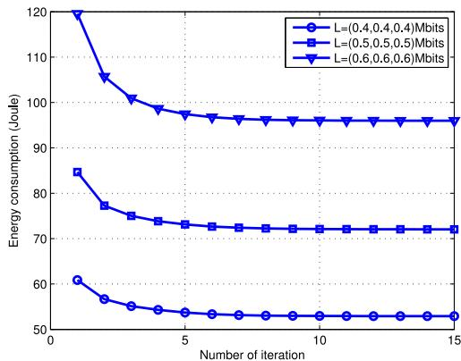

<details>
<summary>line</summary>

| Number of iteration | L=(0.4,0.4,0.4)Mbits | L=(0.5,0.5,0.5)Mbits | L=(0.6,0.6,0.6)Mbits |
| ------------------- | --------------------- | --------------------- | --------------------- |
| 0                   | 61                    | 85                    | 120                   |
| 1                   | 57                    | 78                    | 108                   |
| 2                   | 55                    | 75                    | 102                   |
| 3                   | 54                    | 74                    | 99                    |
| 4                   | 53                    | 73                    | 98                    |
| 5                   | 53                    | 72                    | 97                    |
| 6                   | 53                    | 72                    | 97                    |
| 7                   | 53                    | 72                    | 97                    |
| 8                   | 53                    | 72                    | 97                    |
| 9                   | 53                    | 72                    | 97                    |
| 10                  | 53                    | 72                    | 97                    |
| 11                  | 53                    | 72                    | 97                    |
| 12                  | 53                    | 72                    | 97                    |
| 13                  | 53                    | 72                    | 97                    |
| 14                  | 53                    | 72                    | 97                    |
| 15                  | 53                    | 72                    | 97                    |
</details>

Fig. 3. Convergence of the proposed algorithm for period $T = 6 \ : \mathsf { s }$

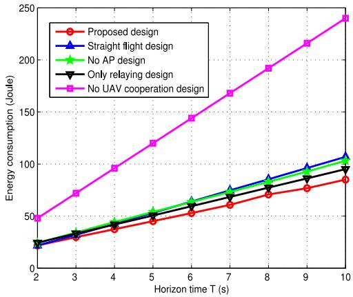

<details>
<summary>line</summary>

| Horizon time T (s) | Proposed design | Straight flight design | No AP design | Only relaying design | No UAV cooperation design |
| ------------------ | --------------- | ---------------------- | ------------ | -------------------- | -------------------------- |
| 2                  | 20              | 20                     | 20           | 20                   | 50                         |
| 3                  | 30              | 30                     | 30           | 30                   | 70                         |
| 4                  | 40              | 40                     | 40           | 40                   | 100                        |
| 5                  | 50              | 50                     | 50           | 50                   | 120                        |
| 6                  | 60              | 60                     | 60           | 60                   | 140                        |
| 7                  | 70              | 70                     | 70           | 70                   | 160                        |
| 8                  | 80              | 80                     | 80           | 80                   | 180                        |
| 9                  | 90              | 90                     | 90           | 90                   | 210                        |
| 10                 | 100             | 100                    | 100          | 100                  | 240                        |
</details>

Fig. 4. Energy consumption versus period T .

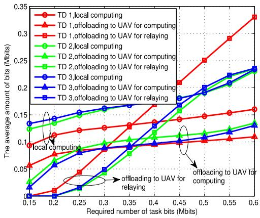

<details>
<summary>line</summary>

| Required number of task bits (Mbits) | TD 1,local computing | TD 1,offloading to UAV for computing | TD 1,offloading to UAV for relaying | TD 2,local computing | TD 2,offloading to UAV for computing | TD 2,offloading to UAV for relaying | TD 3,local computing | TD 3,offloading to UAV for computing | TD 3,offloading to UAV for relaying |
| ------------------------------------- | --------------------- | -------------------------------------- | ------------------------------------ | --------------------- | -------------------------------------- | ------------------------------------ | --------------------- | -------------------------------------- | ------------------------------------ |
| 0.15                                  | 0.09                  | 0.07                                   | 0.05                                 | 0.13                  | 0.08                                   | 0.06                                 | 0.14                  | 0.12                                   | 0.10                                 |
| 0.2                                   | 0.11                  | 0.09                                   | 0.07                                 | 0.14                  | 0.10                                   | 0.08                                 | 0.15                  | 0.13                                   | 0.11                                 |
| 0.25                                  | 0.12                  | 0.10                                   | 0.08                                 | 0.15                  | 0.11                                   | 0.09                                 | 0.16                  | 0.14                                   | 0.12                                 |
| 0.3                                   | 0.13                  | 0.11                                   | 0.09                                 | 0.16                  | 0.12                                   | 0.10                                 | 0.17                  | 0.15                                   | 0.13                                 |
| 0.35                                  | 0.14                  | 0.12                                   | 0.10                                 | 0.17                  | 0.13                                   | 0.11                                 | 0.18                  | 0.16                                   | 0.14                                 |
| 0.4                                   | 0.15                  | 0.13                                   | 0.11                                 | 0.18                  | 0.14                                   | 0.12                                 | 0.19                  | 0.17                                   | 0.15                                 |
| 0.45                                  | 0.16                  | 0.14                                   | 0.12                                 | 0.19                  | 0.15                                   | 0.13                                 | 0.20                  | 0.18                                   | 0.16                                 |
| 0.5                                   | 0.17                  | 0.15                                   | 0.13                                 | 0.20                  | 0.16                                   | 0.14                                 | 0.21                  | 0.19                                   | 0.17                                 |
| 0.55                                  | 0.18                  | 0.16                                   | 0.14                                 | 0.21                  | 0.17                                   | 0.15                                 | 0.22                  | 0.20                                   | 0.18                                 |
| 0.6                                   | 0.23                  | 0.17                                   | 0.15                                 | 0.22                  | 0.18                                   | 0.16                                 | 0.23                  | 0.21                                   | 0.19                                 |
</details>

Fig. 5. Average computing bits versus task requirement.

smaller value of energy consumption compared with no UAV cooperation design, this is because that the UAV as a helper can help bits offloading. In addition, it can be also observed that the proposed design always outperforms the other designs due to joint computation and communication design as well as trajectory optimization.

Fig. 5 illustrates the average bits that are respectively computed at each TD, UAV, and AP for different task requirements during $T = 6 \mathrm { s }$ . Besides, for convenience of analysis, the number of the required task bits for each TD is same, and the value is shown at x-coordinate axis in this picture. From Fig. 5, it can be seen that the AP is not necessary to join to help computation for TDs at a small value of task requirement, because the computation ability of TDs and UAV is sufficient to deal with. With the value of task requirement increasing, the UAV would tend to transmit part of computation bits to AP at the cost of certain time and energy, this is deserved and reasonable especially for a large value of task requirement since it can help release much computation resources of both TDs and UAV, so as to reduce the total energy consumption.

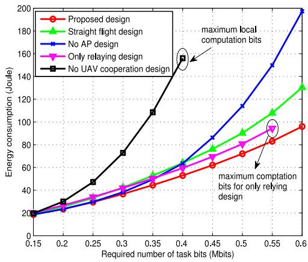

<details>
<summary>line</summary>

| Required number of task bits (Mbits) | Proposed design | Straight flight design | No AP design | Only relaying design | No UAV cooperation design |
| ------------------------------------- | --------------- | ---------------------- | ------------ | -------------------- | -------------------------- |
| 0.15                                  | 20              | 20                     | 20           | 20                   | 20                         |
| 0.2                                   | 30              | 30                     | 30           | 30                   | 30                         |
| 0.25                                  | 40              | 40                     | 40           | 40                   | 40                         |
| 0.3                                   | 50              | 50                     | 50           | 50                   | 50                         |
| 0.35                                  | 60              | 60                     | 60           | 60                   | 60                         |
| 0.4                                   | 70              | 70                     | 70           | 70                   | 70                         |
| 0.45                                  | 80              | 80                     | 80           | 80                   | 80                         |
| 0.5                                   | 90              | 90                     | 90           | 90                   | 90                         |
| 0.55                                  | 100             | 100                    | 100          | 100                  | 100                        |
| 0.6                                   | 110             | 110                    | 110          | 110                  | 110                        |
</details>

Fig. 6. Energy consumption versus task requirement.

Fig. 6 shows the total energy consumption versus different required task bits under $T = 6 \ \mathrm { s } .$ It is observed that the pro-=posed design always achieves the best performance compared with other designs, and the advantages of our proposed design becomes much more evident with the value of task requirement of each TD increasing. In addition, we can find that the no UAV cooperation design is subject to a maximum computation ability obtained by $\frac { \delta _ { t } f _ { u } ^ { \mathrm { m a x } } } { c _ { u } }$ cu in (13). It is worth noting that the no relaying design is also subject to a maximum computation ability (infeasible for requirement of 0.6 Mbits/TD/slot as shown in this picture). For the no AP design, it can be seen that it costs a large amount of energy for a large value of task requirement; there are two main reasons for it. First, in this design, the AP does not help compute; and the second is because with the task bits increasing, the energy consumption increases with regard to the cube of required task bits, as shown in (15) and (16). Last but not the least, due to the trajectory pattern being fixed, the straight flight design is limited on mobility exploitation compared with the proposed design, which causes a lager energy consumption.

Fig. 7(a) plots the UAV trajectory for different periods T under fixed task requirement. It can be observed that, with the increase in the value of T , the UAV can exploit its mobility so as to seek for the optimal location in each time slot. Furthermore, it also can be observed that for a small period $( \mathrm { e . g . , } T = 3 \mathrm { s } )$ , the trajectory =tends to be in proximity to TD 2 and TD 3, which enhance the communication links. While for a larger period (e.g., $T = 6$ s and $T = 7 \ { \mathrm { s } } )$ =, the UAV trajectory would tend to be stable, it =first flies with maximum speed and, then, slows down, even tends to hover over a fixed point that can optimally balance the relationship between local computing and bits offloading. Fig. 7(b) plots the UAV trajectory for different task requirement under the period $T = 6 \ \mathrm { s } .$ . It can be seen that the number of =required computation bits for each TD has a great effect on the UAV trajectory exploitation. Intuitively, the UAV always flies closer to the TD with high demand for computing. This is readily comprehended that the TD with large numbers of required computation bits is eager to offload its computation bits to UAV for computing or relaying, hence the UAV should fly closer to the user so as to reduce the pathloss.

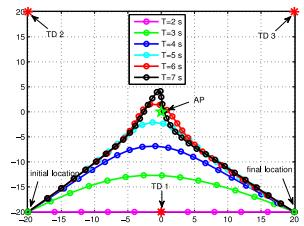

<details>
<summary>line</summary>

| Time Interval | Value |
| ------------- | ----- |
| T=2 s         | 20    |
| T=3 s         | 15    |
| T=4 s         | 10    |
| T=5 s         | 5     |
| T=6 s         | 0     |
| T=7 s         | -5    |
| Initial Location | -15   |
| AP            | 5     |
| Final Location | -15   |
</details>

(a)

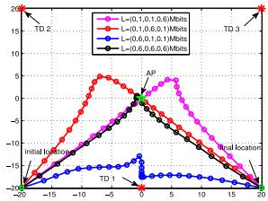

<details>
<summary>line</summary>

| X-axis | L=(0.1,0.1,0.6)Mbits | L=(0.6,0.1)Mbits | L=(0.8,0.1,0.5)Mbits | L=(0.6,0.6,0.5)Mbits |
|---|---|---|---|---|
| -20 | -15 | -15 | -15 | -15 |
| -15 | -10 | -10 | -10 | -10 |
| -10 | -5 | 0 | 5 | 0 |
| -5 | 0 | 5 | 10 | 5 |
| 0 | 5 | 0 | 0 | 0 |
| 5 | 10 | -5 | -5 | -5 |
| 10 | 5 | -10 | -10 | -10 |
| 15 | 0 | -15 | -15 | -15 |
| 20 | -5 | -20 | -20 | -20 |
</details>

(b)

Fig. 7. Optimized UAV trajectory: (a) Different period T under $\mathbf { L } _ { m } =$ (0.4, 0.4, 0.4) Mbits. (b) Different task requirement $\mathbf { L } _ { m }$ under $T = 6$ s.   
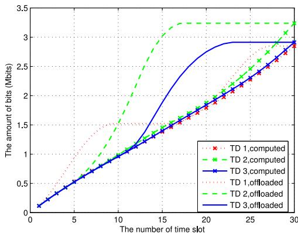

<details>
<summary>line</summary>

| The number of time slot | TD 1, computed | TD 2, computed | TD 3, computed | TD 1, offloaded | TD 2, offloaded | TD 3, offloaded |
| ----------------------- | -------------- | -------------- | -------------- | --------------- | --------------- | --------------- |
| 0                       | 0.0            | 0.0            | 0.0            | 0.0             | 0.0             | 0.0             |
| 5                       | 0.5            | 0.5            | 0.5            | 0.5             | 0.5             | 0.5             |
| 10                      | 1.0            | 1.0            | 1.0            | 1.0             | 1.0             | 1.0             |
| 15                      | 1.5            | 1.5            | 1.5            | 1.5             | 1.5             | 1.5             |
| 20                      | 2.0            | 2.0            | 2.0            | 2.0             | 2.0             | 2.0             |
| 25                      | 2.5            | 2.5            | 2.5            | 2.5             | 2.5             | 2.5             |
| 30                      | 3.0            | 3.0            | 3.0            | 3.0             | 3.0             | 3.0             |
</details>

Fig. 8. Accumulated task bits offloaded and computed by UAV for each TD.

In Fig. 8, curves about the accumulated numbers of bits computed by the UAV and that offloaded to the UAV for computing for each TD are plotted. The required task and period in this case are set as $\mathbf { L } _ { m } = ( 0 . 4 , 0 . 4 , 0 . 4 )$ Mbits and $T = 6 \ : \mathrm { s }$ , respectively. = ( ) =From this picture, it is interesting to observe that each TD offloads its task bits to the UAV deciding on the channel quality and task requirement. Specifically, at the beginning, the UAV is more closer to TD 1, then TD 1 offloads great numbers of task bits to it. When the UAV flies closer to TD 2 and TD 3, it receives much more bits offloaded by TD 2 and TD 3, during which the TD 1 would reduce the offloading rate or even stop offloading for the purpose of releasing more time resource for TD 2 and TD 3, until the numbers of computed bits by the UAV are accumulated near to the sum of offloaded bits before. This mechanism can make the system resources including communication resource and computation resource utilized sufficiently. What is more, from Fig. 8, we can see that at the last time slot, i.e., $n = N$ , =the total computed bits for each TD at the UAV equals to the total received bits offloaded from the TD, which validates that the equality must hold in (10) for $n = N$ .

# VI. CONCLUSION

In this article, we investigated a new UAV-assisted MEC system, in which the UAV could help computing the latency-critical task bits offloaded by TDs. Also, the UAV was able to act as a relay to help computation bits offload from TDs to AP. The sum of communication-related and computation-related energy as well as the UAV’s flight energy was minimized by jointly optimizing the computation bits allocation, time slot scheduling, power allocation, and UAV trajectory. The proposed problem was decomposed into two subproblems that were solved by the Lagrangian duality method and SCA technique, respectively. Then, an iterative algorithm was proposed to solve the primal problem. The numerical results validated the effectiveness of our proposed algorithm and showed the superiority of our proposed design, as compared to the other benchmark designs.

# APPENDIX

# PROOF OF LEMMA 3

The Lagrangian of subproblem (L1) is given as

$$
\begin{array}{l} \mathcal {L} _ {1} (\Xi) = E _ {k, 1} [ n ] - \hat {\lambda} _ {k, n} t _ {k, 1} [ n ] r _ {u h} \left(\frac {E _ {k , 1} [ n ]}{t _ {k , 1} [ n ]}\right) + \eta_ {k, n} t _ {k, 1} [ n ] \\ - a E _ {k, 1} [ n ] + b \left(E _ {k, 1} [ n ] - t _ {k, 1} [ n ] P _ {u} ^ {\text { max }}\right) - c t _ {k, 1} [ n ] \\ + d \left(t _ {k, 1} [ n ] - \delta_ {t}\right) \tag {50} \\ \end{array}
$$

where  is the set denoted $\mathrm { b y } \Xi = ( a _ { k , 1 } ^ { n } , b _ { k , 1 } ^ { n } , c _ { k , 1 } ^ { n } , d _ { k , 1 } ^ { n } )$ , with $a _ { k , 1 } ^ { n } , \ b _ { k , 1 } ^ { n } , \ c _ { k , 1 } ^ { n } ,$ , and $d _ { k , 1 } ^ { n }$ Ξ = ( )representing the non-negative Lagrange multipliers with regard to the $E _ { k , 1 } [ n ] \geq 0 , E _ { k , 1 } [ n ] \leq$ $t _ { k , 1 } [ n ] P _ { u } ^ { \mathrm { m a x } } , t _ { k , 1 } [ n ] \geq 0$ , and $t _ { k , 1 } [ n ] \leq \delta _ { t }$ [ ] [ ], respectively. Thus, [ ] [ ]the derivations of $\mathcal { L } _ { 1 } ( \Xi )$ [ ]with respect to $E _ { k , 1 } [ n ]$ can be expressed as

$$
\frac {\partial \mathcal {L} _ {1} (\Xi)}{\partial E _ {k , 1} [ n ]} = 1 - \frac {\hat {\lambda} _ {k , n} B _ {0}}{\ln 2} \frac {\bar {\gamma} _ {0}}{1 + \frac {E _ {k , 1} [ n ] \bar {\gamma} _ {0}}{t _ {k , 1} [ n ]}} - a _ {k, 1} ^ {n} + b _ {k, 1} ^ {n}. \tag {51}
$$

Based on KKT, the complementary slackness conditions are given by $a _ { k , 1 } ^ { n } E _ { k , 1 } [ n ] = 0 , b _ { k , 1 } ^ { n } ( E _ { k , 1 } [ n ] - t _ { k , 1 } [ n ] P _ { u } ^ { \operatorname* { m a x } } ) = 0$ , $c _ { k , 1 } ^ { n } t _ { k , 1 } [ n ] = 0 .$ , and e ca $d _ { k , 1 } ^ { n } ( t _ { k , 1 } [ n ] ^ { ^ { \prime } } - \delta _ { t } ) = 0 .$ [ ] ) =. Let the derivationb). By substituting $\begin{array} { r } { \frac { \partial \mathcal { L } _ { 1 } ( \Xi ) } { \partial { E } _ { k , 1 } [ n ] } = 0 } \end{array}$ (33a) into subproblem (L1), the optimal $t _ { k , 1 } ^ { * } [ n ]$ can be easily obtained. Hence, the Lemma is proved.

# REFERENCES

[1] M. Chiang and T. Zhang, “Fog and IoT: An overview of research opportunities,” IEEE Internet Things J., vol. 3, no. 6, pp. 854–864, Dec. 2016.   
[2] C. Barreiros, E. Veas, and V. Pammer, “Can a green thumb make a difference?: Using a nature metaphor to communicate the sensor information of a coffee machine,” IEEE Consum. Electron. Mag., vol. 7, no. 3, pp. 90–98, May 2018.   
[3] S. Sarkar, S. Chatterjee, and S. Misra, “Assessment of the suitability of fog computing in the context of Internet of Things,” IEEE Trans. Cloud Comput., vol. 6, no. 1, pp. 46–59, Jan. 2015.   
[4] Y. Mao, C. You, Jun Zhang, K. Huang, and K. B. Letaief, “A survey on mobile edge computing: The communication perspective,” IEEE Commun. Surv. Tuts, vol. 19, no. 4, pp. 2322–2358, 4th Quart., 2017.   
[5] Y. Zeng, R. Zhang, and T. J. Lim, “Wireless communications with unmanned aerial vehicles: Opportunities and challenges,” IEEE Commun. Mag., vol. 54, no. 5, pp. 36–42, May 2016.

[6] F. Wu, D. Yang, L. Xiao, and L. Cuthbert, “Energy consumption and completion time tradeoff in rotary-wing UAV Enabled WPCN,” IEEE Access, vol. 7, pp. 79617–79635, Jun. 2019.   
[7] Y. Xu, L. Xiao, D. Yang, Q. Wu, and L. Cuthbert, “Throughput maximization in multi-UAV enabled communication systems with difference consideration,” IEEE Access, vol. 6, pp. 55291–55301, Sep. 2018.   
[8] N. Zhao, W. Lu, M. Sheng, Y. Chen, J. Tang, F. R. Yu, and Kai-Kit Wong, “UAV-assisted emergency networks in disasters,” IEEE Wireless Commun., vol. 26, no. 1, pp. 45–51, Feb. 2019.   
[9] Y. Zhu, G. Zheng, and Kai-Kit Wong, “Blockchain-empowered decentralized storage in air-to-ground industrial networks,” IEEE Trans. Ind. Informat., vol. 15, no. 6, pp. 3593–3601, Jun. 2019.   
[10] N. Zhao et al., “Joint trajectory and precoding optimization for UAVassisted NOMA networks,” IEEE Trans. Commun., vol. 67, no. 5, pp. 3723–3735, May 2019.   
[11] Y. Zhu, G. Zheng, and M. Fitch, “Secrecy rate analysis of UAV-Enabled mmWave networks using matrn hardcore point processes,” IEEE J. Sel. Areas Commun., vol. 36, no. 7, pp. 1397–1409, Jul. 2018.   
[12] M. Chen, M. Mozaffari, W. Saad, C. Yin, M. Debbah, and C. S. Hong, “Caching in the sky: Proactive deployment of cache-enabled unmanned aerial vehicles for optimized quality-of-experience,” IEEE J. Sel. Areas Commun., vol. 35, no. 5, pp. 1046–1061, May 2017.   
[13] M. Chen, W. Saad, and C. Yin, “Liquid state machine learning for resource and cache management in LTE-U unmanned aerial vehicle (UAV) networks,” IEEE Trans. Wireless Commun., vol. 18, no. 3, pp. 1504–1517, Mar. 2019.   
[14] J. Lyu and R. Zhang, “Network-connected UAV: 3-D system modeling and coverage performance analysis,” IEEE Internet Things J., vol. 6, no. 4, pp. 7048–7060, Aug. 2019.   
[15] Y. Zeng, R. Zhang, and T. J. Lim, “Throughput maximization for UAVenabled mobile relaying systems,” IEEE Trans. Commun., vol. 64, no. 12, pp. 4983C–4996, Dec. 2016.   
[16] S. Zhang, H. Zhang, Q. He, K. Bian, and L. Song, “Joint trajectory and power optimization for UAV relay networks,” IEEE Wireless Commun. Lett., vol. 22 no. 1, pp. 161–164, Jan. 2018.   
[17] L. Fan, N. Zhao, X. Lei, Q. Chen, N. Yang, and G. K. Karagiannidis, “Outage probability and optimal cache placement for multiple amplifyand-forward relay networks,” IEEE Trans. Veh. Technol., vol. 67, no. 12, pp. 12373–12378, Dec. 2018.   
[18] Q. Hu, Y. Cai, G. Yu, Z. Qin, M. Zhao, and G. Ye Li, “Joint offloading and trajectory design for UAV-enabled mobile edge computing systems,” IEEE Internet Things J., vol. 6, no. 2, pp. 1879–1892, Apr. 2019.   
[19] F. Zhou, Y. Wu, R. Q. Hu, and Y. Qian, “Computation rate maximization in UAV-enabled wireless-powered mobile-edge computing systems,” IEEE J. Sel. Areas Commun., vol. 36, no. 9, pp. 1927–1941, Sep. 2018.   
[20] J. Zhang et al., “Stochastic computation offloading and trajectory scheduling for UAV-assisted mobile edge computing,” IEEE Internet Things J., vol. 6, no. 2, pp. 3688C–3699, Apr. 2019.   
[21] M. Hua, Y. Wang, Z. Zhang, C. Li, Y. Huang, and Lu. Yang, “Optimal resource partitioning and bit allocation for UAV-enabled mobile edge computing,” in Proc IEEE 88th Veh. Techn. Conf., Chicago, IL, USA, Aug. 2018, pp. 1–6.   
[22] J. Xiong, H. TDo, and J. Liu, “Task offloading in UAV-aided edge computing: bit allocation and trajectory optimization,” IEEE Commun. Lett., vol. 23, no. 3, pp. 538–541, Mar. 2019.   
[23] M. Hua, Y. Wang, C. Li, Y. Huang, and L. Yang, “UAV-aided mobile edge computing systems with one by one access scheme,” IEEE Trans. Green Commun. Netw., vol. 3, no. 3, pp. 664–678, Sep. 2019.   
[24] M. Hua, Y. Huang, Y. Sun, Y. Wang, and L. Yang, “Energy optimization for cellular-connected UAV mobile edge computing systems,” in Proc IEEE Int. Conf. Commun. Syst., Chengdu, China, Dec. 2018, pp. 1–6.   
[25] X. Cao, J. Xu, and R. Zhang, “Mobile edge computing for cellularconnected UAV: Computation offloading and trajectory optimization,” in Proc IEEE 19th Int. Workshop Sign. Proc. Adv. Wireless Commun., Kalamata, Greece, Jun. 2018, pp. 1–5.   
[26] T. Bai, J. Wang, Y. Ren, and L. Hanzo, “Energy-efficient computation offloading for secure UAV-edge-computing systems,” IEEE Trans. Veh. Techn., vol. 68, no. 6, pp. 6074–6087, Jun. 2019.   
[27] Y. Du, K. Wang, K. Y., and G. Zhang, “Energy-Efficient Resource Allocation in UAV Based MEC System for IoT Devices,” in Proc IEEE Global Commun. Conf., Abu Dhabi, United Arab Emirate, Dec. 2018, pp. 1–6.   
[28] Y. Qian, F. Wang, J. Li, L. Shi, K. Cai, and F. Shu, “User association and path planning for UAV-aided mobile edge computing with energy restriction,” IEEE Commun. Lett., vol. 8, no. 5, pp. 1312–1315, Oct. 2019.

[29] D. Yang, Q. Wu, Y. Zeng, and R. Zhang, “Energy tradeoff in ground-to-UAV communication via trajectory design,” IEEE Trans. Veh. Technol., vol. 67, no. 7, pp. 6721–6726, Jul. 2018.   
[30] T. D. Burd and R. W. Brodersen, “Processor design for portable systems,” J. VLSI Signal Process. Syst., vol. 13, no. 2-3, pp. 203–221, Aug. 1996.   
[31] Y. Zeng, J. Xu, and R. Zhang, “Energy minimization for wireless communication with rotary-wing UAV,” IEEE Trans. Wireless Commun., vol. 18, no. 4, pp. 2329–2345, Apr. 2019.   
[32] S. Boyd and L. Vandenberghe, Convex Optimization, Cambridge, U.K.: Cambridge Univ. Press, Mar. 2004.   
[33] S. Boyd, “Ellipsoid method,” Stanford Univ., Stanford, CA, USA. [Online]. Available: https://web.stanford.edu/class/ee364b/lectures/ ellipsoid method slides.pdf   
[34] M. Grant and S. Boyd, “CVX: MATLAB software for disciplined convex programming,” 2016. [Online]. Available: https://cvxr.com/cvx


<details>
<summary>natural_image</summary>

Portrait of a smiling man in formal attire (no text or symbols visible)
</details>

Jonathan Loo received the M.Sc. degree in electronics (with distinction) and the Ph.D. degree in electronics and communications from the University of Hertfordshire, Hertfordshire, U.K., in 1998 and 2003, respectively.

Between 2003 and 2010, he was a Lecturer in Multimedia Communications with the School of Engineering and Design, Brunel University, Uxbridge, U.K. Between June 2010 and May 2017, he was an Associate Professor in Communication Networks with the School of Science and Technology, Middlesex University, London, U.K. Since June 2017, he is a Chair Professor in Computing and Communication Engineering with the School of Computing and Engineering, University of West London, London, U.K. His research interests include machine learning and AI, information centric networking, wireless/mobile networks, network security, wireless communications, and Internet of Things/cyberphysical systems.

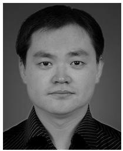

<details>
<summary>natural_image</summary>

Portrait photo of a man in formal attire (no text or symbols visible)
</details>

Tiankui Zhang (M’10–SM’15) received the B.S. degree in communication engineering and the Ph.D. degree in information and communication engineering from the Beijing University of Posts and Telecommunications (BUPT), Beijing, China, in 2003 and 2008, respectively.

He is currently an Associate Professor with the School of Information and Communication Engineering, BUPT. He had published more than 100 papers including journal papers on IEEE JOURNAL ON SELECTED AREAS IN COMMUNI-

CATIONS, IEEE TRANSACTION ON COMMUNICATIONS, etc., and conference papers, such as IEEE GLOBECOM and IEEE ICC. His research interests include wireless communication networks, mobile edge computing and caching, signal processing for wireless communications, content centric wireless networks.


<details>
<summary>natural_image</summary>

Portrait of a smiling man wearing glasses and a checkered shirt (no text or symbols visible)
</details>

Dingcheng Yang received the B.S. degree in electronic engineering and the Ph.D. degree in space physics from Wuhan University, Wuhan, China, in 2006 and 2012, respectively.

He is currently an Associate Professor with the Information Engineering School, Nanchang University, Nanchang, China. He had published more than 50 papers including journal papers on IEEE TRANSACTIONS ON VEHICULAR TECH-NOLOGY, etc. and conference papers such as IEEE GLOBECOM. His research interests include cooperation communications, IoT/cyber-physical systems, UAV communications, and wireless resource management.


<details>
<summary>natural_image</summary>

Portrait of a man wearing glasses and a suit (no text or symbols visible)
</details>

Yu Xu received the B.S. degree in electronic information engineering from the Information Engineering School, Jiangxi University of Science and Technology, Ganzhou, China, in 2015, and the M.S. degree in information and communication engineering from the Information Engineering School, Nanchang University, Nanchang, China, in 2019. He is currently working toward the Ph.D. degree in information and communication engineering with the School of Information and Communication Engineering, Beijing

University of Posts and Telecommunications, Beijing, China. His research interests include mobile edge computing, UAV communications and wireless resource management.

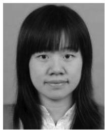

<details>
<summary>natural_image</summary>

Portrait photo of a woman with long hair and bangs (no text or symbols visible)
</details>

Lin Xiao received the Ph.D. degree in electronic engineering from the School of Electronic Engineering and Computer Science, Queen Mary University of London, London, U.K., in 2010.

After that, she worked in China Academy of Telecommunication Research, MITT for one year. She is currently a Professor with the Information Engineering School, Nanchang University, Nanchang, China. Her research interests include wireless communication and networks, in particular, UAV network planning and

optimization, radio resource management, relay, and cooperation communication.