# Joint Content Caching, Service Placement, and Task Offloading in UAV-Enabled Mobile Edge Computing Networks

Youhan Zhao, Student Member, IEEE, Chenxi Liu , Senior Member, IEEE, Xiaoling Hu , Member, IEEE, Jianhua He, Mugen Peng , Fellow, IEEE, Derrick Wing Kwan Ng , Fellow, IEEE, and Tony Q. S. Quek , Fellow, IEEE

Abstract— In this paper, we consider an unmanned aerial vehicle (UAV)-enabled mobile edge computing (MEC) network, where multiple UAVs with caching and computation functionalities are deployed to satisfy the heterogeneous content and service requests from the user equipments (UEs). In order to comprehensively characterize the capability of our considered network in satisfying the UEs’ requests, we define the weighted sum of the content cache hit ratio and the service delay shrinkage ratio as the average quality-of-experience (QoE) of our network and adopt it as the performance metric. Through analysis, we show how the average QoE of our network is dependent on the content cache and service placement decisions at the UAVs, as well as the computation task offloading decisions at the UEs, thus enabling us to formulate an average QoE maximization problem, subject to practical constraints on the UAVs’ caching and computation capabilities. To solve this NP-hard problem, we decompose it into two sub-problems, namely, the content cache and service placement optimization sub-problem and the task offloading optimization sub-problem. Gibbs samplingbased and matching game-based algorithms are proposed to efficiently solve these sub-problems iteratively. Via numerical results, we validate the effectiveness of our proposed algorithms. Compared to various benchmarks, we demonstrate that our proposed algorithms can significantly improve the average QoE

Manuscript received 7 March 2024; revised 30 June 2024; accepted 5 August 2024. Date of publication 13 September 2024; date of current version 18 December 2024. This work was supported in part by the National Key Research and Development Program of China under Grant 2021YFB2900200; in part by the National Natural Science Foundation of China under Grant 62201084; in part by the Young Elite Scientist Sponsorship Program by China Institute of Communications; and in part by the National Research Foundation, Singapore, and Infocomm Media Development Authority under its Future Communications Research and Development Program. (Corresponding authors: Chenxi Liu; Tony Q. S. Quek.)

Youhan Zhao, Chenxi Liu, Xiaoling Hu, and Mugen Peng are with the State Key Laboratory of Networking and Switching Technology, Beijing University of Posts and Telecommunications, Beijing 100876, China (e-mail: zhaoyouhan@bupt.edu.cn; chenxi.liu@bupt.edu.cn; xiaolinghu@bupt.edu.cn; pmg@bupt.edu.cn).

Jianhua He is with the Technology and Engineering Center for Space Utilization, Chinese Academy of Sciences, Beijing 100094, China (e-mail: hejianhua@csu.ac.cn).

Derrick Wing Kwan Ng is with the School of Electrical Engineering and Telecommunications, University of New South Wales, Sydney, NSW 2052, Australia (e-mail: w.k.ng@unsw.edu.au).

Tony Q. S. Quek is with the Information Systems Technology and Design Pillar, Singapore University of Technology and Design, Singapore 487372, and also with the Yonsei Frontier Laboratory, Yonsei University, Seoul 03722, South Korea (e-mail: tonyquek@sutd.edu.sg).

Digital Object Identifier 10.1109/JSAC.2024.3460049

of our considered network, especially when the caching and computation resources of the UAVs are limited.

Index Terms— Content caching, service placement, task offloading, UAV networks, mobile edge computing.

# I. INTRODUCTION

HE integrated ground-air-space networks have been envisioned as a pivotal component of the sixth-generation wireless networks, providing ubiquitous and seamless services for the devices across the globe [1]. In the integrated groundair-space networks, unmanned aerial vehicle (UAV)-enabled communications play an important role, due to the advantages such as high mobility, strong line-of-sight (LoS) links, and on-demand deployment [2]. In terms of applications, UAVenabled live streaming [3], virtual/augmented reality (VR/AR) [4], and emergency communications [5] are just a few examples.

On the other hand, mobile edge computing (MEC) has been regarded as a promising solution to meet the everincrease demands for computation, by shifting computation functionalities from remote cloud to the network edge in proximity to the user equipments (UEs) [6], [7]. Against this background, significant research efforts have been devoted to developing efficient MEC schemes that improve the qualityof-experience (QoE) of the UEs [8], [9], [10], [11], [12], [13], [14]. In these works, task offloading and service placement are two key design issues. In particular, task offloading refers to the scenarios where the UEs offload their computation tasks to the network edge, while service placement refers to the scenarios where the edge nodes need to be placed with certain applications (and the related libraries/databases) a priori in order to process the tasks offloaded by the UEs. Considering the scenarios of task offloading, the scheduling and offloading decisions for tasks updated by time-sensitive applications were jointly optimized in [8] to minimize the age of information (AoI) of the system. In [9], a computation task migration scheme among the MEC servers was proposed for minimizing the total delay of task completion. In [10], a graph neural network-based scheme was proposed to balance the computation load among the MEC servers. Note that in order to achieve efficient task offloading, it is presumed that the edge nodes have cached the corresponding services/applications for processing certain computation tasks [11], [12], making the service placement an equally important design aspect as task offloading, while has been receiving less attention. In [13] and [14], the service placement problem was considered in the ultra-dense small cell networks, in which service placement and computation offloading decisions were jointly optimized to minimize the computation delay cost and energy consumption.

Motivated by the benefits of the UAV-enabled communications and MEC, integrating MEC techniques into the UAV-enabled networks has been receiving significant research attention [15], [16], [17], [18], [19]. Specifically, in [15], a computation offloading and resource allocation problem was considered in the UAV-enabled MEC system. A Paretooptimal solution was proposed to achieve the trade-off between the UAVs’ energy consumption and task completion delay. In [16], a UAV-enabled wireless powered cooperative MEC system was considered. In this system, a UAV equipped with an energy transmitter and an MEC server provides both energy and computing services to the sensors. The frequency of the central processing unit (CPU) at the UAV, the UAV’s trajectory, the offloading decision, and the transmit power were jointly optimized to minimize the total required energy of the UAV. In [17], the UAV-mounted edge servers were considered to be dispatched to the appropriate hover locations for geographically merging tasks in several hotspot areas. An online dispatching algorithm was proposed to improve the resource utilization. In [18], the UAV’s trajectories, the task offloading decisions, and computation frequency allocation were jointly optimized to minimize the computation delay. In [19], a joint user association, power control, and computation capacity allocation optimization problem was investigated, aiming at minimizing the total energy consumption in a UAV-assisted MEC network,.

The aforementioned works considering the UAV-enabled MEC networks [15], [16], [17], [18], [19] mainly focused on task offloading optimization in the UAV networks. Service placement in the UAV networks has so far drawn little attention. Perhaps the most related work is that of [20]. In [20], the service placement and computation offloading decisions were jointly optimized in the UAV networks, considering different time scales between the service placement decision and the computation offloading decision. A common assumption in these works (i.e., [15], [16], [17], [18], [19], [20]) is that the UEs have the same type of request (request the contents, or the service & task offloading). This assumption, however, is less likely to be valid in realworld implementations. In fact, in practice, the UEs may have heterogeneous requests, such as the content requests and the service requests. For example, in applications such as MECenabled VR/AR [21] and three-dimensional (3D) simultaneous localization and mapping (SLAM) [22], the UEs need to obtain the contents from the MEC server and require computation services for data processing as well. In such cases, the existing schemes focusing on fulfilling the single type of requests become less applicable. Therefore, it is significant to develop novel schemes for UAV-enabled MEC networks with the UEs of heterogeneous service requests.

Inspired by the above observations, in this paper, we consider a UAV-enabled MEC network, in which multiple UAVs of caching and computation capabilities are deployed to provide communication and computation services for the UEs of heterogeneous content and service requests. In order to advance the understanding of caching and computation offloading in such systems, we address three fundamental questions in this paper, as follows.

1) “How to support the UEs’ heterogeneous content and service requests in the UAV-enabled MEC systems?” To tackle this question, we establish a framework for supporting the heterogeneous content and service requests from the UEs. In this framework, contents and services are cached a priori at the UAVs with limited storage and computation resources. As such, the UEs of content requests can obtain the required contents by accessing to corresponding feasible UAVs, while the UEs of service requests can either offload the computation tasks to the feasible UAVs or process the tasks locally.

2) “How to characterize the performance of the UAVenabled MEC systems in satisfying the UEs’ heterogeneous content and service requests?” To address this question, we define the weighted sum of the content cache hit ratio and the service delay shrinkage ratio as the average QoE of our considered network and adopt it as the performance metric. Note that the average QoE allows us for simultaneously characterizing the capability of our network in satisfying the UEs’ heterogeneous content and service requests. Moreover, through analysis, we reveal that the average QoE is determined by the content cache and service placement decisions at the UAVs, as well as the task offloading decisions at the UEs.

3) “How to improve the average QoE of the UAV-enabled MEC systems?” To answer this question, we formulate an average QoE maximization problem, subject to practical constraints on the UAVs’ caching and computation capabilities. To solve this non-convex problem, we decompose it into two sub-problems, namely, the content cache and service placement optimization sub-problem and the task offloading optimization subproblem. Gibbs sampling-based and matching gamebased algorithms are designed to solve these two subproblems efficiently. Via numerical results, we verify the effectiveness of our proposed algorithms through comparisons with various benchmarks, and show that our algorithms can achieve almost the same average QoE as an upper bound obtained from exhaustive search, especially when the caching and computation resources at the UAVs are limited.

The remainder of this paper is organized as follows. Section II presents the system model and formulates the considered problem. Section III proposes the joint content cache, service placement, and task offloading design. In Section VI, numerical results are provided. Finally, Section V draws the conclusion. Unless otherwise specified, the notations used throughout this paper is listed in Table I.

TABLE I LIST OF NOTATIONS 

<table><tr><td>Notation</td><td>Definition</td></tr><tr><td> $\mathcal{U}$ </td><td>Set of UAVs</td></tr><tr><td> $\mathcal{M}$ </td><td>Set of ground UEs</td></tr><tr><td> $\mu_{m,u}$ </td><td>Indicator of the wireless coverage of UE-UAV pair</td></tr><tr><td> $\mathcal{F}$ </td><td>Set of contents</td></tr><tr><td> $\mathcal{K}$ </td><td>Set of services</td></tr><tr><td> $\text{St}_u$ </td><td>Storage capacity of UAV</td></tr><tr><td> $c_f$ </td><td>Size of each content</td></tr><tr><td> $c_k$ </td><td>Size of each service</td></tr><tr><td> $\psi_m$ </td><td>Request generated by UE m</td></tr><tr><td> $g_{m,f}$ </td><td>Indicator of whether content f is requested by UE m</td></tr><tr><td> $g_{m,k}$ </td><td>Indicator of whether service k is requested by UE m</td></tr><tr><td> $q_m$ </td><td>Indicator of the request type</td></tr><tr><td> $x_{u,f}$ </td><td>Indicator of whether UAV u has content f in its cache</td></tr><tr><td> $x_{u,k}$ </td><td>Indicator of whether UAV u has service k in its cache</td></tr><tr><td> $\mathcal{V}_m^k$ </td><td>Set of the tasks of request  $\psi_m$  using the k-th service</td></tr><tr><td> $\zeta_m$ </td><td>Set of the instructions amount of tasks</td></tr><tr><td> $\xi_m$ </td><td>Set of the data size of tasks</td></tr><tr><td> $v_{m,n}^k$ </td><td>Each task n in  $\mathcal{V}_m^k$ </td></tr><tr><td> $y_{m,n,u}^k$ </td><td>Indicator of whether task  $v_{m,n}^k$  is offloaded to UAV u</td></tr><tr><td> $Core_u$ </td><td>the number of the CPU cores of UAV u</td></tr><tr><td> $\mathbf{X}_{\mathcal{F}}$ </td><td>Content cache decisions of all UAVs</td></tr><tr><td> $\mathbf{X}_{\mathcal{K}}$ </td><td>Service placement decisions of all UAVs</td></tr><tr><td> $\text{Pr}_h$ </td><td>Content cache hit ratio</td></tr><tr><td> $T_m$ </td><td>Total delay of completing service request  $\psi_m$ </td></tr><tr><td> $t_{m,n}$ </td><td>Total delay of completing task  $v_{m,n}^k$ </td></tr><tr><td> $d_{m,n}^{\text{ul}}$ </td><td>The uplink transmission delay of task  $v_{m,n}^k$ </td></tr><tr><td> $d_{m,n}^{\text{pr}}$ </td><td>The processing delay of task  $v_{m,n}^k$ </td></tr><tr><td> $d_{m,n}^{\text{dl}}$ </td><td>The downlink transmission delay of task  $v_{m,n}^k$ </td></tr><tr><td> $r_{m,u}$ </td><td>The uplink transmission rate from UE m to UAV u</td></tr><tr><td> $f_u$ </td><td>Maximum CPU frequency of UAV u</td></tr><tr><td> $f_m$ </td><td>Maximum CPU frequency of UE m</td></tr><tr><td> $\text{Pr}_s$ </td><td>Service delay shrinkage ratio</td></tr><tr><td> $E_{\text{max}}$ </td><td>UAV u&#x27;s energy capacity for computation</td></tr><tr><td> $E_{u}^{\text{pr}}$ </td><td>UAV u&#x27;s energy consumption for computation</td></tr><tr><td>Q</td><td>Average QoE of the UEs</td></tr></table>

# II. SYSTEM MODEL AND PROBLEM FORMULATION

# A. Network Model

We consider a UAV-enabled MEC network, as shown in Fig. 1, in which multiple UAVs, serving as base stations (BSs), provide communication and computation services for the ground UEs. The set of the UAVs and the set of the ground UEs are denoted by $\mathcal { U } = \{ 1 , 2 , \dots , U \}$ and $\mathcal { M } =$ $\{ 1 , 2 , \ldots , M \}$ , respectively. We consider that a specific UE m can generate two types of request, namely, content request and service request. Specifically, the content request represents that UE m needs certain files, while the service request

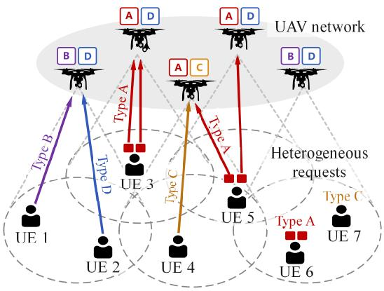

<details>
<summary>flowchart</summary>

```mermaid
graph TD
    subgraph_Node1["UE 1"]
        A1["A"] --> B1["D"]
        A2["A"] --> B2["D"]
        A3["A"] --> B3["D"]
        A4["A"] --> B4["D"]
        A5["A"] --> B5["D"]
        A6["A"] --> B6["D"]
        A7["A"] --> B7["D"]
        A8["A"] --> B8["D"]
        A9["A"] --> B9["D"]
        A10["A"] --> B10["D"]
        A11["A"] --> B11["D"]
        A12["A"] --> B12["D"]
        A13["A"] --> B13["D"]
        A14["A"] --> B14["D"]
        A15["A"] --> B15["D"]
        A16["A"] --> B16["D"]
        A17["A"] --> B17["D"]
        A18["A"] --> B18["D"]
        A19["A"] --> B19["D"]
        A20["A"] --> B20["D"]
        A21["A"] --> B21["D"]
        A22["A"] --> B22["D"]
        A23["A"] --> B23["D"]
        A24["A"] --> B24["D"]
        A25["A"] --> B25["D"]
        A26["A"] --> B26["D"]
        A27["A"] --> B27["D"]
        A28["A"] --> B28["D"]
        A29["A"] --> B29["D"]
        A30["A"] --> B30["D"]
        A31["A"] --> B31["D"]
        A32["A"] --> B32["D"]
        A33["A"] --> B33["D"]
        A34["A"] --> B34["D"]
        A35["A"] --> B35["D"]
        A36["A"] --> B36["D"]
        A37["A"] --> B37["D"]
        A38["A"] --> B38["D"]
        A39["A"] --> B39["D"]
        A40["A"] --> B40["D"]
        A41["A"] --> B41["D"]
        A42["A"] --> B42["D"]
        A43["A"] --> B43["D"]
        A44["A"] --> B44["D"]
        A45["A"] --> B45["D"]
        A46["A"] --> B46["D"]
        A47["A"] --> B47["D"]
        A48["A"] --> B48["D"]
        A49["A"] --> B49["D"]
        A50["A"] --> B50["D"]
        A51["A"] --> B51["D"]
        A52["A"] --> B52["D"]
        A53["A"] --> B53["D"]
        A54["A"] --> B54["D"]
        A55["A"] --> B55["D"]
        A56["A"] --> B56["D"]
        A57["A"] --> B57["D"]
        A58["A"] --> B58["D"]
        A59["A"] --> B59["D"]
        A60["A"] --> B60["D"]
        A61["A"] --> B61["D"]
        A62["A"] --> B62["D"]
        A63["A"] --> B63["D"]
        A64["A"] --> B64["D"]
        A65["A"] --> B65["D"]
        A66["A"] --> B66["D"]
        A67["A"] --> B67["D"]
        A68["A"] --> B68["D"]
        A69["A"] --> B69["D"]
        A70["A"] --> B70["D"]
        A71["A"] --> B71["D"]
        A72["A"] --> B72["D"]
        A73["A"] --> B73["D"]
        A74["A"] --> B74["D"]
        A75["A"] --> B75["D"]
        A76["A"] --> B76["D"]
        A77["A"] --> B77["D"]
        A78["A"] --> B78["D"]
        A79["A"] --> B79["D"]
        A80["A"] --> B80["D"]
        A81["A"] --> B81["D"]
        A82["A"] --> B82["D"]
        A83["A"] --> B83["D"]
        A84["A"] --> B84["D"]
        A85["A"] --> B85["D"]
        A86["A"] --> B86["D"]
        A87["A"] --> B87["D"]
        A88["A"] --> B88["D"]
        A89["A"] --> B89["D"]
    end
    subgraph HeterogeneousRequests[Type C\nType D\nType E\nType F\nType G\nType H\nType I\nType J\nType K\nType L\nType M\nType N\nType O\nType P\nType Q\nType R\nType S\nType T\nType U\nType V\nType W\nType X\nType Y\nType Z\nType AA\nType AB\nType AC\nType AD\nType AE\nType AF\nType AG\nType AH\nType AI\nType AJ\nType AK\nType AL\nType AM\nType AN\nType AO\nType AP\nType AQ\nType AR\nType AS\nType AT\nType AU\nType AV\nType AW\nType AX\nType AZ\nType BA\nType BB\nType BC\nType BD\nType BE\nType BF\nType BG\nType BH\nType BI\nType BJ\nType BK\nType BL\nType BM\nType BN\nType BO\nType BP\nType BPB\nType BPQ\nType BPQY\nType BPZ\NATP\NATP\NATP\NATP\NATP\NATP\NATP\NATP\NATP\NATP\NATP\NATP\NATP\NATP\NATP\NATP\NATP\NATP\NATP\NATP\NATP\NATP\NATP\NATP\NATP\NATp
    end
```
</details>

Fig. 1. Illustration of our considered UAV-enabled MEC networks, in which the UEs are of heterogeneous content and service requests. Here, A represents the content cached at the UAVs, while B, C, and D represent different services placed at the UAVs.

represents that UE m has certain computation tasks to be completed using specific applications. Due to the limited storage and computation capabilities, for the content request, we consider that UE m needs to obtain the required files from the UAVs that are within its communication range and have the required contents cached a priori. While for the service request, UE m can choose to either compute the tasks locally or offload to the UAVs that are within its communication range and have the services deployed a priori. We note that UE m can obtain a required content from a single UAV only, while it can offload its computation tasks to multiple UAVs that have the service. We also note that each UAV can provide content and computation services for multiple UEs simultaneously. In addition, we consider that each UAV-UE pair is assigned to distinct subchannel for establishing the corresponding downlink and uplink. This setup eliminates co-channel interference during communication, and channel allocation issues are not addressed in this paper. Moreover, we consider a maximum coverage for the UAVs, and denote the wireless coverage information of all the UAV-UE pairs by the matrix $\textbf { \em A } = \ \left[ \mu _ { m , u } \right] _ { M \times U }$ , where $\mu _ { m , u }$ is a binary variable. If $\mu _ { m , u } ~ = ~ 1$ , UE m is within the coverage of UAV u. Otherwise, UE m is beyond the coverage of UAV u. We assume that the coverage information A is known to all the UEs.

# B. Cache Model

In this subsection, we detail the cache model of the UAVs. We denote the set of contents, the size of each content, the set of services, and the size of each service by ${ \mathcal { F } } =$ $\{ 1 , 2 , \ldots , F \} , c _ { f } , \mathcal { K } = \{ 1 , 2 , \ldots , K \}$ and $c _ { k } ,$ respectively. In practice, different contents can correspond to different popular music/videos, while different services correspond to different applications (and the related libraries/databases), such as VR/AR and mobile gaming. As such, a content (service) differs from the other contents (services) by the type and the size. We consider that UAV u has a storage capacity, denoted by $\mathbf { S t } _ { u } , ~ u ~ \in ~ \mathcal { U } .$ As such, before providing communication and computation services, UAV u needs to judiciously select its cached contents and services in order to maximize the performance of the considered network. That is, the following storage constraint should be satisfied for UAV u, given by

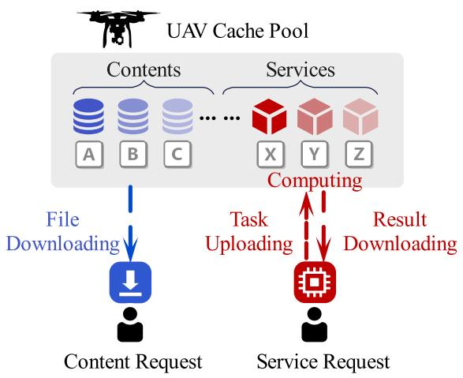

<details>
<summary>flowchart</summary>

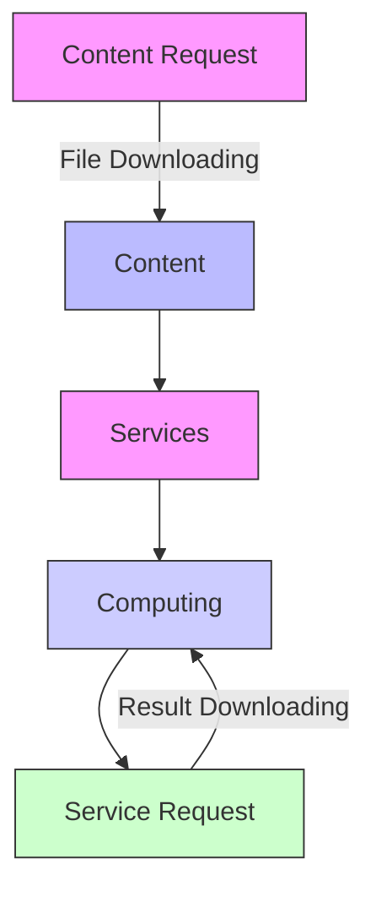
</details>

Fig. 2. Illustration of request model in our considered network.

$$
\sum_ {f = 1} ^ {F} x _ {u, f} c _ {f} + \sum_ {k = 1} ^ {K} x _ {u, k} c _ {k} \leq \mathrm{St} _ {u}, \forall u \in \mathcal {U}, \tag {1}
$$

where $x _ { u , f }$ and $x _ { u , k }$ are binary variables. $x _ { u , f } = 1 ( x _ { u , k } = 1 )$ denotes that the content f (the service k) is cached at UAV u. Otherwise, the content $f$ (the service k) is not cached at UAV u.

# C. Request Model

In this subsection, we present the request model of our considered network, as illustrated in Fig. 2. Specifically, we denote $\psi _ { m }$ as the request generated by UE m. We consider that $\psi _ { m }$ can either be a content request or a service request. Denote $g _ { m , f } ~ \in ~ \{ 0 , 1 \} ~ ( \ g _ { m , k } ~ \in ~ \{ 0 , 1 \} )$ as the indicator of whether content f (service k) is requested by UE $m ,$ we express the constraint on UE m’s request as

$$
\sum_ {f = 1} ^ {F} g _ {m, f} q _ {m} + \sum_ {k = 1} ^ {K} g _ {m, k} (1 - q _ {m}) \leq 1, \forall m \in \mathcal {M}, \tag {2}
$$

where $q _ { m } \in \{ 0 , 1 \}$ denotes the indicator of the request type. If $q _ { m } = 1$ , ψm is a content request. Otherwise, $\psi _ { m }$ is a service request.

Next, we present the process of handling the UEs’ requests.

1) Content Request: For the case where $\psi _ { m }$ is a content request, i.e., $q _ { m } = 1$ , request $\psi _ { m }$ is satisfied when UE m can download the request content f from a specific UAV u that has content f in its cache. Meanwhile, UE m needs to be within the coverage of UAV $u ,$ i.e. $x _ { u , f } = 1$ and $\mu _ { m , u } = 1$ . Otherwise, request $\psi _ { m }$ is not satisfied.

$q _ { m } = 0$ 2) Service Request: When m, in order to satisfy request $\psi _ { m } ^ { k }$ is a service request, i.e., $\psi _ { m } ^ { k }$ , several independent tasks need to be completed. For instance, $\psi _ { m } ^ { k }$ can be a request for VR service from UE m. As such, multiple independent computation tasks (e.g., image processing, tracking, and alignment) need to be completed for providing immersive

experience to UE m [23]. We further represent ${ \psi } _ { m } ^ { k }$ using a parameter tuple, given by $\psi _ { m } ^ { k } ~ = ~ \left. \nu _ { m } ^ { k } , \zeta _ { m } ^ { k } , \pmb { \xi } _ { m } ^ { k } \right.$ , where $\mathcal { V } _ { m } ^ { k } ~ = ~ \{ 1 , 2 , . . . , V _ { m , N } ^ { k } \}$ denotes the set of computation tasks required for completing $\zeta _ { m } ^ { k } = \{ \bar { 1 } , 2 , . . . , \zeta _ { m , N } ^ { k } \}$ m  denotes the set of the total number $\psi _ { m }$ using the k-th service, of instructions (in CPU cycles) needed to complete tasks in $\gamma _ { m } ^ { k }$ , and $\pmb { \xi } _ { m } ^ { k } = \{ 1 , 2 , \dots , \overset { \cdot } { \xi } _ { m , N } ^ { k } \}$ denotes the set of task data sizes (in bits).

We consider thatcomputation tasks in quest are c $\psi _ { m } ^ { k }$ is satisfiedleted. Denote the as $\gamma _ { m } ^ { k }$ $v _ { m , n } ^ { k } \in \mathcal { V } _ { m } ^ { k }$ a task n in $\gamma _ { m } ^ { k }$ , UE m can choose either compute it locally or offload it to its associated UAV that cached the k-th service.1 We note that UE m can offload the computation tasks to multiple UAVs when these UAVs are accessible and deployed with the k-th service, i.e., $x _ { u , k } = 1$ and $\mu _ { m , u } = 1$ .

We use ykm,n,u $y _ { m , n , u } ^ { k } ~ \in ~ \{ 0 , 1 \}$ to represent whether the computation task $v _ { m , n } ^ { k }$ is offloaded to UAV u. As such, we have

$$
\sum_ {u = 1} ^ {U} y _ {m, n, u} ^ {k} \leq 1, \forall v _ {m, n} ^ {k} \in \mathcal {V} _ {m} ^ {k}. \tag {3}
$$

Note that $\begin{array} { r } { \sum _ { u = 1 } ^ { U } { y _ { m , n , u } ^ { k } } \ = \ 0 } \end{array}$ indicates that task $v _ { m , n } ^ { k }$ is computed locally at UE m.

For UAV $u ,$ it can provide computation services to multiple tasks satisfying the constraint on its computation capability, represented by the number of CPU cores, i.e., $C o r e _ { u } .$ Mathematically, this constraint can be expressed as

$$
\sum_ {m = 1} ^ {M} \sum_ {k = 1} ^ {K} \sum_ {n = 1} ^ {N} y _ {m, n, u} ^ {k} \leq C o r e _ {u}, \forall u \in \mathcal {U}. \tag {4}
$$

# D. Performance Metrics

In this subsection, we present the performance metrics adopted in this work. Specifically, we use the content cache hit ratio to evaluate the effectiveness of our considered UAVenabled MEC network in satisfying the UEs’ content requests. The content cache hit ratio is defined as the ratio between the number of successfully responded content requests and the total number of content requests from all the UEs, given a content cache decision $\boldsymbol { X } _ { \mathcal { F } } = [ x _ { u , f } ] _ { U \times F }$ . Mathematically, the content cache hit ratio can be expressed as [24]

$$
\begin{array}{l} \operatorname * {P r} _ {\mathrm{h}} (X _ {\mathcal {F}}) \\ = \frac {\sum_ {m = 1} ^ {M} \min \left\{1 , \sum_ {u = 1} ^ {U} \sum_ {f = 1} ^ {F} \mu_ {m , u} q _ {m} g _ {m , f} x _ {u , f} \right\}}{\sum_ {m = 1} ^ {M} q _ {m}}, \tag {5} \\ \end{array}
$$

where min $\begin{array} { r l r } { \{ 1 , \sum _ { u = 1 } ^ { U } \sum _ { f = 1 } ^ { F } \mu _ { m , u } q _ { m } g _ { m , f } x _ { u , f } \} } & { { } \in } & { \{ 0 , 1 \} } \end{array}$ 1F successfully responded by at least one UAV. Note that, since the denominator cannot be zero,UE has the content request, i.e., $\textstyle \sum _ { m = 1 } ^ { M } q _ { m } \geq 1$ at at least one.

Next, we focus on evaluating the effectiveness of our considered UAV-enabled MEC network in satisfying the UEs’ service requests. To this end, we define the total delay of

1Note that this assumption is commonly adopted in the works considering service placement in MEC systems [14].

completing request $\psi _ { m } ^ { k }$ as the maximum delay among the total delay of completing the tasks in request $\psi _ { m } ^ { k } ,$ , given by

$$
T _ {m} = \max _ {n} t _ {m, n}, \forall v _ {m, n} ^ {k} \in \mathcal {V} _ {m} ^ {k}, \tag {6}
$$

where $t _ { m , n }$ denotes the total delay of completing task $v _ { m , n } ^ { k }$ in request $\psi _ { m } ^ { k }$ , given by

$$
t _ {m, n} = d _ {m, n} ^ {\mathrm{ul}} + d _ {m, n} ^ {\mathrm{pr}} + d _ {m, n} ^ {\mathrm{dl}}. \tag {7}
$$

In (8), $d _ { m , n } ^ { \mathrm { u l } } , d _ { m , n } ^ { \mathrm { p r } } .$ , and $d _ { m , n } ^ { \mathrm { d l } }$ represent the uplink transmission delay of task $v _ { m , n } ^ { k } ,$ the processing delay of task $v _ { m , n } ^ { k } ,$ , and the downlink transmission time of the processing result of task $v _ { m , n } ^ { k }$ , respectively. Due to that the size of the processing result is in general much smaller than the size of the task, we ignore $d _ { m , n } ^ { \mathrm { d l } }$ in $t _ { m , n }$ (as in [14]). As such, $t _ { m , n }$ can be re-expressed as

$$
t _ {m, n} = d _ {m, n} ^ {\mathrm{ul}} + d _ {m, n} ^ {\mathrm{pr}}. \tag {8}
$$

Then, we express the uplink transmission time of task $v _ { m , n } ^ { k } ,$ i.e., dulm,n, as $\mathrm { i . e . , ~ } d _ { m , n } ^ { \mathrm { u l } } ,$

$$
\begin{array}{l} d _ {m, n} ^ {\mathrm{ul}} \\ = \left\{ \begin{array}{l l} \sum_ {u = 1} ^ {U} y _ {m, n, u} \frac {\xi_ {m , n} ^ {k}}{r _ {m , u}}, & \text { if   } \sum_ {u = 1} ^ {U} y _ {m, n, u} = 1, \\ 0, & \text { otherwise. } \end{array} \right. \tag {9} \\ \end{array}
$$

In (9), $d _ { m , n } ^ { \mathrm { u l } } = 0$ when UE m processes task $v _ { m , n } ^ { k }$ locally. In addition, $r _ { m , u }$ denotes the uplink transmission rate from UE m to UAV u, given by

$$
r _ {m, u} = W \log_ {2} (1 + \gamma_ {m, u}). \tag {10}
$$

In (10), W represents the bandwidth allocated to the subchannel between UE m and UAV u, and $\begin{array} { r } { \gamma _ { m , u } = \frac { P _ { m } d _ { m , u } ^ { - \eta } } { \sigma _ { 0 } ^ { 2 } } } \end{array}$ represents the signal-to-noise ratio (SNR) of the subchannel between UE m and UAV $u . ^ { 2 }$ Here, $P _ { m } , d _ { m , u } , \eta ,$ and $\sigma _ { 0 } ^ { 2 }$ denote the transmit power of UE m, the distance between UE m and UAV $u ,$ the path loss exponent, and the thermal noise power, respectively.

$v _ { m , n } ^ { k }$

$$
\begin{array}{l} d _ {m, n} ^ {\mathrm{pr}} \\ = \left\{ \begin{array}{l l} \sum_ {u = 1} ^ {U} y _ {m, n, u} \frac {\zeta_ {m , n} ^ {k}}{f _ {u}}, & \text { if   } \sum_ {u = 1} ^ {U} y _ {m, n, u} = 1, \\ \frac {\zeta_ {m , n} ^ {k}}{f _ {m}}, & \text { otherwise }, \end{array} \right. \tag {11} \\ \end{array}
$$

where $f _ { u }$ and $f _ { m }$ denote the maximum CPU frequency of UAV u and that of UE m, respectively.

Based on (6)–(11), we adopt the service delay shrinkage ratio as the performance metric to evaluate the effectiveness of our considered UAV-enabled MEC network in satisfying 2Note that, in (10), we consider a LoS dominant communication environment. As such, small-scale fading is not taken into account (as in [18] and [19]). However, we would like to clarify that our framework can be readily extended to the scenario where both large-scale fading and small-scale fading exist.

the UEs’ service requests, expressed as

$$
\operatorname * {P r} _ {\mathrm{s}} (\boldsymbol {X} _ {\mathcal {F}}, \boldsymbol {X} _ {\mathcal {K}}, \boldsymbol {Y}) = \frac {1}{M} \sum_ {m = 1} ^ {M} (1 - \frac {T _ {m}}{T _ {m , \mathrm{L}}}), \tag {12}
$$

where $\begin{array} { r c l } { X _ { \mathcal { K } } } & { = } & { [ x _ { u , k } ] _ { U \times K } } \end{array}$ denotes the service placement decision, decision $\pmb { Y } = [ y _ { m , n , u } ]$ task offloading represents the $\begin{array} { r } { \dot { T } _ { m , \mathrm { L } } = \sum _ { n = 1 } ^ { N } \zeta _ { m , n } ^ { k } / f _ { m } } \end{array}$ total delay of request $\psi _ { m } ^ { k }$ if all the tasks are processed locally. We note that the service delay shrinkage ratio in (12) is a suitable performance metric for our considered network, since it quantifies the delay performance improvement by employing the service placement decisions at the UAVs and task offloading decisions for the UEs.

Moreover, we consider an energy consumption constraint on UAV u for processing the service requests from the UEs, expressed as

$$
E _ {u} ^ {\mathrm{pr}} \leq E _ {\max}, \forall u \in \mathcal {U}, \tag {13}
$$

where $E _ { \mathrm { m a x } }$ denotes UAV u’s energy capacity for computation, and $E _ { u } ^ { \mathrm { p r } }$ denotes UAV u’s energy consumption for computation, given by [20]

$$
E _ {u} ^ {\mathrm{pr}} = \kappa_ {u} \sum_ {m = 1} ^ {M} \sum_ {n = 1} ^ {N} y _ {m, n, u} \zeta_ {m, n} ^ {k}. \tag {14}
$$

In (14), $\kappa _ { u }$ is the unit energy consumption when UAV u processes the tasks with CPU core frequency $f _ { u }$ , and $\begin{array} { r } { \sum _ { m } ^ { \bar { M } } \sum _ { n } ^ { | \nu _ { m } | } y _ { m , n , u } \zeta _ { m , n } ^ { k } } \end{array}$ is the total number of CPU cycles required for processing the tasks at UAV u.

In our considered networks, both content requests and service requests from the UEs need to be satisfied. In order to comprehensively characterize the UEs’ level of satisfaction on the services provided by the UAVs, we develop a novel performance metric, termed as the average QoE of the UEs. In particular, the average QoE of the UEs is defined as the weighted sum of the content cache hit ratio and the service delay shrinkage ratio of service placement, given by

$$
\begin{array}{l} Q \left(\boldsymbol {X} _ {\mathcal {F}}, \boldsymbol {X} _ {\mathcal {K}}, \boldsymbol {Y}\right) \\ = \alpha \operatorname * {P r} _ {\mathrm{h}} \left(\boldsymbol {X} _ {\mathcal {F}}\right) + (1 - \alpha) \operatorname * {P r} _ {\mathrm{s}} \left(\boldsymbol {X} _ {\mathcal {F}}, \boldsymbol {X} _ {\mathcal {K}}, \boldsymbol {Y}\right), \tag {15} \\ \end{array}
$$

where $\alpha ~ \in ~ [ 0 , 1 ]$ denotes the weight of the content cache hit ratio. Note that the average QoE of the UEs in (15) is a general performance metric, since it can evaluate the performance of the networks with both content requests and service requests. By tuning the value of α, we can adjust the impacts of the content cache decision, the service placement decision, and the task offloading decision on $Q \left( X _ { \mathcal { F } } , X _ { \mathcal { K } } , Y \right)$ . Note also, the average QoE quantifies the ratio of the actual average performance that a network provides for satisfying the UEs’ heterogeneous content and service requests to the network’s capacity of satisfying such requests. More specifically, if $Q \left( { \cal X } _ { \mathcal { F } } , { \cal X } _ { \kappa } , { \cal Y } \right) \ = \ 0$ , it means that $\mathrm { P r } _ { \mathrm { h } } \left( \mathbf { X } _ { \mathcal { F } } \right) ~ = ~ 0$ and $\mathrm { P r } _ { \mathrm { h } } \left( \mathbf { X } _ { \mathcal { F } } , \mathbf { X } _ { \mathcal { K } } , \mathbf { Y } \right) \ = \ 0$ , indicating that all the requested contents and services are not deployed at the UAVs. If $Q \left( { \pmb X } _ { \mathcal { F } } , { \pmb X } _ { \kappa } , { \pmb Y } \right) \ = \ \mathrm { ~ 1 ~ }$ , it means that $\mathrm { P r } _ { \mathrm { h } } \left( \mathbf { X } _ { \mathcal { F } } \right) = 1$ and $\mathrm { P r } _ { \mathrm { h } } \left( \mathbf { X } _ { \mathcal { F } } , \mathbf { X } _ { \mathcal { K } } , \mathbf { Y } \right) = 1$ , implying that all the requested contents are deployed at the feasible UAVs and the requested service can be satisfied with no delay. This case of $Q \left( X _ { \mathcal { F } } , X _ { \mathcal { K } } , Y \right) = 1$ can be regarded as an upper bound on our considered network’s capability of satisfying the UEs’ heterogeneous content and service requests.

# E. Problem Formulation

The goal of our work is to optimize the content cache and service placement decisions of the UAVs, as well as the task offloading decisions of the UEs, such that the average QoE of the UEs is maximized, while simultaneously satisfying practical constraints on the UAVs’ storage capacity, computation capacity, and the energy consumption.3 Our goal is mathematically formulated as

$$
\mathbf {P 1}: \max _ {\boldsymbol {X} _ {\mathcal {F}}, \boldsymbol {X} _ {\mathcal {K}}, \boldsymbol {Y}} Q \left(\boldsymbol {X} _ {\mathcal {F}}, \boldsymbol {X} _ {\mathcal {K}}, \boldsymbol {Y}\right) \tag {16}
$$

$$
\mathbf {s}. \mathbf {t}. \quad q _ {m} \in \{0, 1 \}, \forall m \in \mathcal {M}, \tag {16a}
$$

$$
\sum_ {f = 1} ^ {F} g _ {m, f} q _ {m} + \sum_ {k = 1} ^ {K} g _ {m, k} (1 - q _ {m}) \leq 1,
$$

$$
\forall m \in \mathcal {M}, \tag {16b}
$$

$$
\sum_ {f = 1} ^ {F} x _ {u, f} c _ {f} + \sum_ {k = 1} ^ {K} x _ {u, k} c _ {k} \leq \mathrm{St} _ {u}, \forall u \in \mathcal {U}, \tag {16c}
$$

$$
\sum_ {u = 1} ^ {U} y _ {m, n, u} ^ {k} \leq 1, \forall v _ {m, n} ^ {k} \in \mathcal {V} _ {m}, \tag {16d}
$$

$$
\sum_ {m = 1} ^ {M} \sum_ {k = 1} ^ {K} \sum_ {n = 1} ^ {N} y _ {m, n, u} ^ {k} \leq C o r e _ {u}, \forall u \in \mathcal {U}, (1 6 \mathrm{e})
$$

$$
E _ {u} ^ {\mathrm{pr}} \leq E _ {\max}, \forall u \in \mathcal {U}. \tag {16f}
$$

In (16), constraint (16a) specifies whether a request is a content request or a service request. Constraint (16b) restricts that UE m can generate at most one content request or one service request. Constraint (16c) imposes the storage capacity constraint on UAV $u . ^ { 4 }$ Constraint (16d) indicates that each task in a service request can be processed either locally or offloaded to at most one UAV. Constraint (16e) represents that the number of tasks processed simultaneously by a UAV cannot exceed its number of CPU cores.5 Finally, constraint (16f)

3Note that the delay constraint is not considered in (16), since the service delay shrinkage ratio in the average QoE in fact quantifies the delay performance improvement of employing the service placement decisions at the UAVs and the task offloading decisions of the UEs. However, we note that the delay is a pivotal constraint in the MEC systems and would like to consider its impact on the performances of the MEC systems in our future works.

4Note that the data size of task vkm,n, i.e., $v _ { m , n } ^ { k } ,$ $\xi _ { m , n } ^ { k } ,$ is not involved in the storage capacity constraint (16c). This is because, unlike the files (e.g., popular music/videos) and services (e.g., the applications and the related libraries/databases) stored at the UAVs that require long-term memory, the data of task $v _ { m , n } ^ { k }$ generally corresponds to the executable source code of task $v _ { m , n } ^ { k }$ that only temporarily occupies the CPU’s random access memory (RAM). Once task $v _ { m , n } ^ { k }$ is completed, its data will be dropped and will not be stored at the UAVs.

5Note that the number of instructions needed for task is not involved in the computation capability constraint (16 $v _ { m , n } ^ { k } ,$ i.e.,  is b $\zeta _ { m , n } ^ { k } ,$ once task $v _ { m , n } ^ { k }$ is offloaded to UAV u, it occupies one CPU core of UAV u.

Then, the value of $\zeta _ { m , n } ^ { k }$ only affects the processing delay of task $v _ { m , n } ^ { k } .$

imposes the computation energy consumption constraint on each UAV.

We note that Problem P1 in (16) is mathematically intractable, due to the coupled content cache, service placement, and task offloading variables in the objective function and non-convex constraints. Traditionally, this problem is solved using the exhaustive search method, which can be computation- and time-consuming, especially when the scale of the network, the number of contents, and the number of services become relatively large. To resolve this issue, we propose simple-yet-efficient design that can judiciously determine the content cache and service placement decisions at the UAVs, as well as the task offloading decision at the UEs. The details of our proposed design will be presented in Section III.

# III. PROPOSED JOINT CONTENT CACHING, SERVICE PLACEMENT AND TASK OFFLOADING DESIGN

In this section, we propose a novel design that solves P1 in (16). Specifically, we first decompose P1 into two subproblems, namely, a content cache and service placement decision optimization sub-problem and a task offloading decision sub-problem. Then, we propose novel Gibbs sampling-based and matching-based algorithms that iteratively solve the caching decision optimization sub-problem and the task offloading decision sub-problem, respectively.

# A. Content Caching and Service Placement Decision Optimization Sub-Problem

We first focus on the caching decision optimization subproblem for a given task offloading decision Y¯ . To this end, we re-express P1 for a given $\bar { \mathbf { Y } }$ as

$$
\mathbf {P 2 :} \max _ {\boldsymbol {X} _ {\mathcal {F}}, \boldsymbol {X} _ {\mathcal {K}}} Q \left(\boldsymbol {X} _ {\mathcal {F}}, \boldsymbol {X} _ {\mathcal {K}}, \bar {\boldsymbol {Y}}\right)
$$

$$
\mathbf {s}. \mathbf {t}. \quad (1 6 a), (1 6 b), (1 6 c). \tag {17}
$$

We note that Problem P2 in (17) is still a mixed integer linear programming problem. Solving such a problem is computationally challenging if employing traditional centralized methods, e.g., generalized Benders decomposition [25] and Lagrangian decomposition [26]. To address this issue, we propose a Gibbs sampling-based algorithm [27], which works in a decentralized and low-complexity manner.

In our proposed Gibbs sampling-based algorithm, we consider the UAVs providing contents and services as an undirected graph, denoted by G. In G, UAV u and UAV $u ^ { \prime }$ is connected by an edge if there exist common UEs within their corresponding coverage. Then, the undirected graph G may be partitioned into multiple connected subgraphs based on the information of edges between all the UAVs. The decision changes of UAV u may have an impact on the decisions of all the other UAVs belonging to the same connected subgraph as u.

We denote the content cache and service placement decisions of UAV u as $\begin{array} { r l r } { { \pmb x } _ { u } } & { { } = } & { \left( { \pmb x } _ { u , f } , { \pmb x } _ { u , k } \right) } \end{array}$ , where $\begin{array} { r l r } { \mathbf { x } _ { u , f } } & { { } \ } & { = { } \ \quad ( x _ { u , 1 } , \ x _ { u , 2 } , \ \ldots , \ x _ { u , F } ) } \end{array}$ and $\begin{array} { r l r l } { \pmb { x } _ { u , k } } & { { } } & { = } \end{array}$ $( x _ { u , 1 } , \ x _ { u , 2 } , \ . \ . . , \ x _ { u , K } )$ . Then, we define all the possible values of the decision vector $\mathbf { \boldsymbol { x } } _ { u }$ satisfying (16c) as the feasible decision space of content cache and service placement of UAV $u ,$ denoted by $\begin{array} { r } { \mathcal { X } _ { u } ~ = ~ \{ \pmb { x } _ { u } \vert \sum _ { f = 1 } ^ { F } x _ { u , f } c _ { f } \} \overset { \cdot } { + } \sum _ { k = 1 } ^ { K } x _ { u , k } c _ { k } ~ \leq } \end{array}$ $\mathrm { S t } _ { u } \}$ . Then, the feasible decision space of content cache and service placement for all the UAVs can be represented by $\pmb { \chi } = \{ \mathcal { X } _ { 1 } , \mathcal { X } _ { 2 } , \ldots , \mathcal { X } _ { U } \}$ . We express the joint posterior distribution of decision updating at UAV u as [14]

$$
\operatorname * {P r} \left(\boldsymbol {x} _ {u} \rightarrow \tilde {\boldsymbol {x}} _ {u}\right) = \left[ 1 + \exp \left[ \frac {Q \left(\boldsymbol {x} _ {u}\right) - Q \left(\tilde {\boldsymbol {x}} _ {u}\right)}{\tau} \right]\right] ^ {- 1}, \tag {18}
$$

where $\tau$ is a smoothing factor $( \tau ~ > ~ 0 )$ used to balance exploration and exploitation (i.e., the randomness of content cache and service placement decision updates).

Using (15) and (18), our Gibbs sampling-based algorithm can be applied for content cache and service placement decision optimization, the details of which will be presented at the end of Section III-B.

# B. Task Offloading Decision Optimization Sub-Problem

Next, we focus on the task offloading decision optimization sub-problem for given $\bar { X } _ { \mathcal { F } }$ and $\bar { X } _ { \kappa }$ . In this case, Problem P1 in (16) can be expressed as

$$
\mathbf {P 3}: \max _ {\boldsymbol {Y}} Q (\bar {\boldsymbol {X}} _ {\mathcal {F}}, \bar {\boldsymbol {X}} _ {\mathcal {K}}, Y)
$$

$$
\mathbf {s}. \mathbf {t}. \quad (1 6 d), (1 6 e), (1 6 f). \tag {19}
$$

In order to solve P3 in (19), we model it as a constrained many-to-one matching game [28]. Specifically, we denote the computation tasks of the UEs’ service requests by V. Then, we can model the task offloading decision optimization subproblem as a bidirectional matching process between V and the set of UAVs, i.e., U .

To this end, we construct a bipartite graph based on sets V and U. In this graph, an edge connects a node $v \in \mathcal V$ and a node $u \in \mathcal { U }$ if and only if UAV u has a service placed for task $v ,$ and the UE that generates task v is within the coverage of UAV u. That is, node $i \in \{ u , v \}$ , can only select a matching partner from its neighboring node set $\mathcal { N } _ { j } , j \in \{ u , v \} , j \neq i .$ .

Then, we define L as a matching function, satisfying the following conditions:

1) $L \left( v \right) \subseteq \mathcal { N } _ { v } L \left( u \right) \subseteq \mathcal { N } _ { u } ,$ ,   
2) $| L \left( v \right) | \leq 1 ,$   
3) $\begin{array} { r } { | L \left( u \right) | \leq C o r e _ { u } , } \end{array}$   
4) L (v) = u if and only ${ \mathrm { i f ~ } } v \in L ( u )$ .

Condition 1) implies that a specific task can only be matched with the UAVs, and a specific UAV can only be matched with the tasks; Condition 2) and 3) represent that each task v can be matched with at most one UAV, and the number of tasks matched with the same UAV u is limited by its number of computational unit core count $C o r e _ { u } ,$ respectively; Condition 4) indicates that if task v is matched with UAV u, then UAV u is also matched with task $v ,$ and vice versa.

After constructing the bipartite graph, we initialize the matching process according to the matching function L. This initialization can be efficiently implemented using the Hungarian algorithm [29] in polynomial time. Then, we construct a preference list for each task, denoted by $\mathcal { C P } _ { v } .$ . Specifically, we express the total delay of completing task v offloaded to UAV u as $D _ { v } ( u ) \ = \ t _ { m , n }$ when $v \ = \ v _ { m , n } .$ As such, if $D _ { v } ( u ) < D _ { v } ( u ^ { \prime } )$ , task v prefers to being offloaded to UAV $u ^ { \prime }$ over UAV u. Similarly, we construct a preference list for each UAV, denoted by $\mathcal { S P } _ { u } .$ . We also denote the set of tasks matched with UAV u by $\mathcal { T } _ { u }$ . Then, the total delay of completing all the tasks offloaded to UAV u as $D _ { u } ( T _ { u } ) = \operatorname* { m a x } _ { v \in T _ { u } } D _ { v } ( u )$ . If $D _ { u } ( T _ { u } ) \ < \ D _ { u } ( T _ { u } ^ { \prime } )$ , UAV u prefers to being matching with the tasks $\mathcal { T } _ { u }$ over $\mathcal { T } _ { u } ^ { \prime }$ .

According to the preference lists of tasks and UAVs, we can complete the matching games as follows. First, each task chooses its corresponding most preferred UAV based on its preference list. If the chosen UAV can process this task, it will be added to the UAV’s match task set (we term this operation as matching transfer). Otherwise, this task fails to be matched in this round. Second, the tasks perform the swap operations, defined as

$$
\begin{array}{l} L _ {v} ^ {v ^ {\prime}} = \left\{L - \left\{\left(v, L (v)\right), \left(v ^ {\prime}, L \left(v ^ {\prime}\right)\right) \right\} \right\} \\ \cup \left\{(v, L (v ^ {\prime})), (v ^ {\prime}, L (v)) \right\}, \tag {20} \\ \end{array}
$$

where $\langle v , v ^ { \prime } \rangle$ is a feasible swap-pair, satisfying the following conditions:

where $b _ { q }$ represents the index of service request that the task $q \in \mathcal V$ belonging to. In the swap operations, the matched UAVs of two tasks swap to reduce the total delay of satisfying the service requests. The swap operations stop until the entire matching process reaches a stable state. We note that there may be cases where a task v is not matched with any UAV $( \mathbf { i . e . , \ } L ( v ) = \oslash )$ . In such cases, task v is processed locally. The detailed procedures of our proposed matching game based algorithm for task offloading optimization are summarized in Algorithm 1.

Convergence and complexity analysis of Algorithm 1: We note that Algorithm 1 is guaranteed to converge since it is based on the swap operations. As per the definition of the feasible swap-pair, we can always find a swap operation after which no further swap-pair can be found to reduce the total delay of satisfying a service request (please refer to [30] for more details on how the matching game converges to a two-sided exchange stable matching state).

We note that the computational complexity of Algorithm is mainly from performing the Hungarian algorithm, constructing the preference lists for all the tasks and UAVs, the transfer and swap operations. In the following, we analyze their complexities respectively. The complexity of Hungarian algorithm is O(U V ) [29], since it connects all V tasks and U UAVs in order to construct the bipartite graph. The computational complexity for constructing preference lists for all tasks and UAVs is ${ \mathcal { O } } ( U ^ { 2 } V )$ [31]. Since in Algorithm 1, we set the number of maximum swap operations between a feasible swap pair $\langle v , v ^ { \prime } \rangle$ as 2. As such, the complexity of transfer and swap operations is $\mathcal { O } ( V ^ { 2 } )$ [32]. Based on the above analysis, we note that the complexity of Algorithm 1 is max $\{ \mathcal { O } \dot { ( } U ^ { 2 } V ) , \mathcal { O } \left( V ^ { 2 } \right) \}$ .

Algorithm 1 Matching Game-Based Algorithm for Task Offloading Decision Optimization   
Input: UAVs' service placement decision $X_{\mathcal{K}}$ , UEs' service requests.

1 Initialize the matching game utilizing the Hungarian algorithm. Construct the preference list $\mathcal{CP}_v$ and $\mathcal{SP}_u$ for task $v$ and UAV $u, v \in \mathcal{V}$ , $u \in \mathcal{U}$ , respectively.

2 repeat

3    for each task $v \in \mathcal{V}$ do

4    task $v$ sends a transfer request to its most preferred UAV (which has not reject it before) in $\mathcal{CP}_v$ .

5    end

6    for each UAV $u \in \mathcal{U}$ do

7    if UAV $u$ receives transfer requests then

8    UAV $u$ accepts the tasks according to its preference list $\mathcal{SP}_u$ and its number of CPU units, then, reject the others.

9    end

10    end

11 until there are no new transfer requests;

12 Initialize the number of swapping operations between task $v$ and $v'$ as zero, i.e., $\mathcal{ST}_{v,v'} \leftarrow 0, \forall v, v' \in \mathcal{V}$ ;

13 for a feasible swap-pair task $\langle v, v' \rangle$ do

14    if $\mathcal{ST}_{v,v'} + \mathcal{ST}_{v',v} < 2$ then

15 $L \leftarrow L_v'$ ;

16 $\mathcal{ST}_{v,v'} \leftarrow \mathcal{ST}_{v,v'} + 1$ .

17    end

18 end

19 return Task offloading decision Y.

Finally, we present our proposed joint content cache, service placement, and task offloading design, as shown in Algorithm 2. We note that, in Algorithm 2, the Gibbs sampling-based algorithm is embedded. Specifically, the Gibbs sampling-based algorithm randomly selects a UAV u and a new content cache and service placement decision $\tilde { \mathbf { x } } _ { u }$ from $\mathcal { X } _ { u }$ (Step 6-7). After calculating the QoE $Q ( \tilde { X } _ { \mathcal { F } } , \tilde { X } _ { \mathcal { K } } , \bar { Y } )$ (Step 11), the content cache and service placement decision of UAV u, i.e., ${ \mathbf { } } x _ { u } ,$ is updated by $\tilde { \mathbf { \ b { x } } } _ { u }$ with probability η and remains unchanged with probability 1−η (Step 12-13). Finally, the updated content cache and service placement decision of UAV u $( \mathrm { i } . \mathrm { e } . , \pmb { x } _ { u } )$ are broadcasted to other UAVs in the connected subgraph of u (Step 14).

Convergence and complexity analysis of Algorithm 2: We note that Algorithm 2 is an iterative algorithm based on Gibbs sampling and Algorithm 1. Specifically, in each iteration, Gibbs sampling is first performed to update the content cache and service placement decisions. Based on these decisions, Algorithm 1 is then executed to determine the task offloading decisions for satisfying the service requests. Due to the fact that both Gibbs sampling and Algorithm 1 are guaranteed to converge (please refer to [13] for more detailed convergence analysis on Gibbs sampling), we note that Algorithm 2 is guaranteed to converge as well. Note also Gibbs sampling is of linear complexity (i.e., O(1)) [13]. As such, the complexity of Algorithm 2 is mainly determined by the number of iterations in Algorithm 2 (denoted by I) and the complexity of Algorithm 1 $( \mathrm { i . e . , m a x } \{ \mathcal { O } ( U ^ { 2 } V ) , \mathcal { O } ( V ^ { 2 } ) \} )$ . Then, we can obtain that the complexity of Algorithm 2 is max $\{ \mathcal { O } ( I U ^ { 2 } V ) , \mathcal { O } ( I V ^ { 2 } ) \}$ .

Algorithm 2 Joint Content Cache, Service Placement and Task Offloading Design
Input: UEs' requests ψ, the status of UAV network.
1 Initialize $X_{\mathcal{F}}, X_{\mathcal{K}}$ and Y as zero matrices.
2 for each UAV u ∈ U do
3 Build the set of all feasible content cache and service placement decisions $\mathcal{X}_{u}$ for UAV u.
4 end
5 repeat
6 Randomly pick a UAV u ∈ U;
7 Randomly select a new content cache and service placement decision $\tilde{x}_{u}$ in set $\mathcal{X}_{u}$ ;
8 if $\tilde{x}_{u} \neq x_{u}$ then
9 Calculate Q( $\tilde{X}_{\mathcal{F}}, \tilde{X}_{\mathcal{K}}, \bar{Y}$ ) about the connected subgraph of UAV u based on the original decisions;
10 Obtain the decisions $\tilde{X}_{\mathcal{F}}, \tilde{X}_{\mathcal{K}}$ with $\tilde{x}_{u,i}$ ;
11 Calculate Q( $\tilde{X}_{\mathcal{F}}, \tilde{X}_{\mathcal{K}}, \bar{Y}$ ) using (15);
12 Calculate η = Pr ( $x_{u} \to \tilde{x}_{u}$ );
13 Update ( $\tilde{X}_{\mathcal{F}}, \tilde{X}_{\mathcal{K}}$ ) using ( $\tilde{X}_{\mathcal{F}}, \tilde{X}_{\mathcal{K}}$ ) with probability η;
14 Broadcast the updated decisions ( $X_{\mathcal{F}}, X_{\mathcal{K}}$ ) to all other UAVs belonging to the same connected subgraph as u;
15 Update Y for the updated $X_{\mathcal{F}}, X_{\mathcal{K}}$ using Algorithm 1.
16 Calculate Q'(X_F, X_K, Y) with the updated decisions using (15).
17 end
18 until |Q'(X_F, X_K, Y) - Q( $\tilde{X}_{\mathcal{F}}, \tilde{X}_{\mathcal{K}}, \bar{Y}$ )| ≤ ε for Nε consecutive iterations, where ε > 0 is a small constant;
19 return Optimal $X_{\mathcal{F}}, X_{\mathcal{K}}, Y$ .

# IV. NUMERICAL RESULTS

In this section, we provide numerical results to validate the effectiveness of our proposed algorithms. Without loss of generality, we consider a simulating area of 3000 m×2000 m, in which 13 UAVs and 63 UEs are deployed, as shown in Fig. 3. The locations of the UAVs and UEs are randomly uniformly generated according to certain point processes. The altitude and coverage radius of the UAVs are set as 450 m. In addition, we consider 6 contents and 2 services. Each UE randomly uniformly requests these contents and services with probability 2/3 and 1/3, respectively. The simulation performances are obtained by averaging over

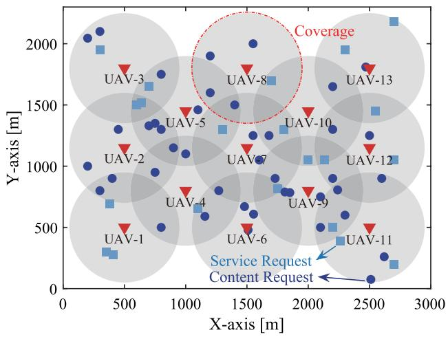  
Fig. 3. Illustration of the simulating area, in which the UAVs and UEs are spatially randomly deployed.

TABLE II LIST OF SIMULATION PARAMETERS 

<table><tr><td>Parameters</td><td>Values</td></tr><tr><td>Altitude of UAVs,  $z$ </td><td>450 m</td></tr><tr><td>UAV storage space,  $St_i$ </td><td>2000 MB</td></tr><tr><td>Size of service- $k$ ,  $c_k$ </td><td>[400, 900] MB</td></tr><tr><td>CPU frequency at UAV,  $f_u$ </td><td>1 GHz</td></tr><tr><td>CPU frequency at UE,  $f_m$ </td><td>0.1 GHz</td></tr><tr><td>Number of tasks for service requests</td><td>[2, 3]</td></tr><tr><td>Size of task  $v_{m,n}^k$ ,  $\xi_{m,n}^k$ </td><td>[40, 50] MB</td></tr><tr><td>Instructions amount of task  $v_{m,n}^k$ ,  $\zeta_{m,n}^k$ </td><td>[3, 5] Gcycles</td></tr><tr><td>Unit computing energy consumption,  $\kappa$ </td><td> $10^{-25}$ </td></tr><tr><td>Energy limit for UAV computation,  $E_{\text{max}}$ </td><td> $2 \times 10^{3}$  J</td></tr><tr><td>Wireless bandwidth of subchannel  $W$ </td><td>1 MHz</td></tr><tr><td>Signal transmission power of UE  $P_m^{\text{tr}}$ </td><td>0.1 W</td></tr><tr><td>Noise power  $\sigma_0^2$ </td><td>-110 dBm</td></tr></table>

1000 simulations.6 Unless otherwise specified, the simulation parameters used throughout the simulations are listed in Table II.

We first verify the convergence of our proposed algorithm. In this figure, we plot the average QoE achieved by Algorithm 2 versus the number of iterations for different values of τ . Recall that τ is a smoothing factor balancing exploration and exploitation of the proposed algorithm. A larger value of τ indicates that Algorithm 2 tends to explore more, while a smaller value of τ indicates that Algorithm 2 tends to exploit more. Different values of τ are selected for comparison purpose, i.e., $\tau \in \{ 5 , 1 0 , 1 0 0 , 2 0 / \ln t \}$ . Note that for the case of $2 0 / \ln t .$ , the value of τ varies as the number of iterations increases. In addition, we provide an performance upper bound achieved by exhaustive search. We first see

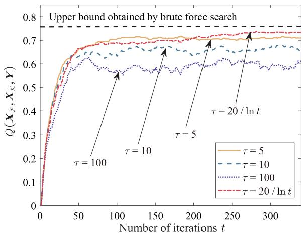

<details>
<summary>line</summary>

| Number of iterations t | τ = 5 | τ = 10 | τ = 100 | τ = 20 / ln t |
| ---------------------- | ----- | ------ | ------- | ------------- |
| 0                      | 0.0   | 0.0    | 0.0     | 0.0           |
| 50                     | ~0.65 | ~0.62  | ~0.60   | ~0.68         |
| 100                    | ~0.70 | ~0.68  | ~0.58   | ~0.72         |
| 150                    | ~0.71 | ~0.69  | ~0.59   | ~0.73         |
| 200                    | ~0.72 | ~0.68  | ~0.60   | ~0.74         |
| 250                    | ~0.73 | ~0.67  | ~0.61   | ~0.75         |
| 300                    | ~0.74 | ~0.66  | ~0.62   | ~0.76         |
</details>

Fig. 4. Average QoE versus the number of iterations for different values of τ with $\alpha = 0 . { \bar { 5 } }$ .

that, for different values of τ , the average QoE achieved by our proposed algorithm converges. We also see that, the performance of our algorithm improves as the value of τ reduces from 100 to 5. Moreover, we see that with $\tau = 2 0 \ln t ,$ the average QoE achieved by our algorithm can approach the upper bound, indicating that the performance of our algorithm can be significantly improved by judiciously selecting the value of τ .

In Fig. 5, we examine the effectiveness of Algorithm 1. Specifically, we plot the service delay shrinkage ratio (i.e., Prs $( X _ { \mathcal { F } } , X _ { \kappa } , Y ) )$ versus the number of CPU cores per UAV. Two schemes are considered, i.e., Algorithm 1 and the greedy scheme. In the greedy scheme, each UE offloads its tasks to the feasible UAV with optimal computation capabilities and link quality. When multiple tasks conflict with each other, they are randomly selected based on the corresponding UAV’s computing capabilities. The tasks that are not selected will be offloaded to other UAVs. The process stops until all the tasks are either offloaded or processed locally. We observe that the service delay shrinkage ratio achieved by both schemes increases as the number of CPU cores per UAV increases, implying that task offloading can significantly accelerate the completion of the service requests. In addition, we observe that Algorithm 1 achieves a higher service delay shrinkage ratio than the greedy scheme. The performance gap becomes more profound when the number of CPU cores per UAV increases. This observation once again validates that the collaborations among the UAVs can significantly improve the service delay shrinkage ratio, leading to the increase in the average QoE of our considered UAV networks.

Next, we verify the effectiveness of our proposed Algorithm 2 in Fig. 6. In this figure, we compare the average QoE, the content cache hit ratio, and the service delay shrinkage ratio achieved by Algorithm 2 with three benchmark schemes, namely, non-cooperative (NCO) scheme, content-first (CF) scheme, and service-first (SF) scheme, respectively. These benchmark scheme work as follows:

1) NCO scheme: In this scheme, each UAV works independently and does not collaborate with the other UAVs. Specifically, each UAV performs an exhaustive

6Although not shown, we note that the average performances of our proposed design and other benchmark schemes become stabilized when the number of simulations is larger than 500. As such, setting the number of simulations as 1000 is sufficient.

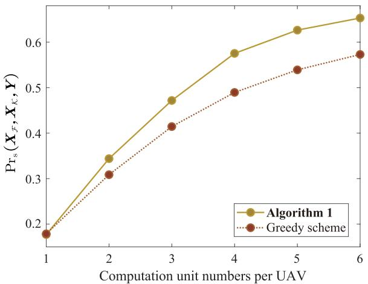

<details>
<summary>line</summary>

| Computation unit numbers per UAV | Algorithm 1 | Greedy scheme |
| -------------------------------- | ----------- | ------------- |
| 1                                | 0.18        | 0.18          |
| 2                                | 0.34        | 0.31          |
| 3                                | 0.47        | 0.41          |
| 4                                | 0.57        | 0.49          |
| 5                                | 0.63        | 0.54          |
| 6                                | 0.67        | 0.57          |
</details>

Fig. 5. Service delay shrinkage ratio versus the number of CPU cores per UAV.

search to go through its every feasible content cache and service placement decision, and then selects the optimal decision that provides the largest average QoE for the UEs within its coverage. Meanwhile, the UEs’ computation tasks are uniformly offloaded to the feasible UAVs.

2) CF scheme: In this scheme, the content requests are of higher priorities than the service requests. As such, all the UAVs made their decisions aiming at maximizing the content cache hit ratio of our considered UAV networks.   
3) SF scheme: In this scheme, the service requests are of higher priorities than the content requests. As such, all the UAVs made their decisions aiming at optimize the service delay shrinkage ratio of the considered UAV networks.

We see that, compared to NCO scheme, Algorithm 2 achieves almost the same content cache hit ratio, while achieving significant better service delay shrinkage ratio performance, resulting in 30% improvement in terms of the average QoE. This is because, the UAVs collaborate in Algorithm 2 while do not collaborate in NCO scheme. This collaborations among the UAVs significantly improve the service delay shrinkage ratio, while having little impacts on the content cache hit ratio. In particular, the computation tasks for satisfying a service request of UE m can be offloaded to multiple feasible UAVs, while UE m can obtain a requested content from a single UAV only. We also see that, although CF scheme and SF scheme can achieve higher content cache hit ratio and higher service delay shrinkage ratio than Algorithm 2, respectively, their average QoEs are significantly worse than that of our algorithm, indicating that the system performance can be degraded if the UEs’ requests are not properly prioritized.

In Fig. 7, we examine the impacts of storage capacity of UAV (i.e., Stu) on the average QoE achieved by Algorithm 2 and three benchmark schemes. In this figure, we see that the average QoE achieved by four schemes increases as the values of $\mathrm { S t } _ { u } ,$ and Algorithm 2 outperforms three benchmark schemes. We also see that, as the value of $\mathrm { S t } _ { u }$ increases, the average QoE achieved by theses schemes converge to a certain value, showing how our algorithm can be useful when the computation resources at the UAVs are limited.

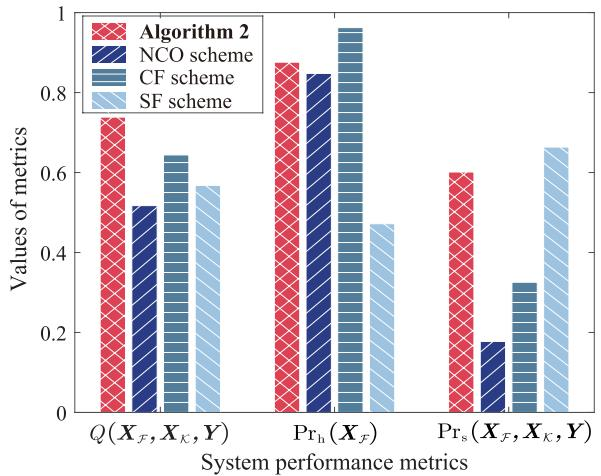

<details>
<summary>bar</summary>

| System performance metrics | Algorithm 2 | NCO scheme | CF scheme | SF scheme |
|---|---|---|---|---|
| Q(X_F, X_K, Y) | 0.75 | 0.52 | 0.64 | 0.57 |
| Pr_h(X_F) | 0.88 | 0.85 | 0.97 | 0.47 |
| Pr_s(X_F, X_K, Y) | 0.60 | 0.18 | 0.33 | 0.66 |
</details>

Fig. 6. Performance comparisons between Algorithm 3 and three benchmark schemes with $\tau = 2 0 /$ ln t and α = 0.5.

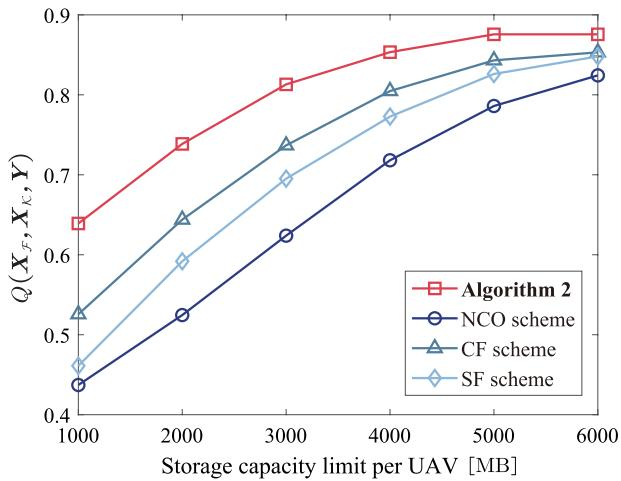

<details>
<summary>line</summary>

| Storage capacity limit per UAV [MB] | Algorithm 2 | NCO scheme | CF scheme | SF scheme |
| ----------------------------------- | ----------- | ---------- | --------- | --------- |
| 1000                                | 0.64        | 0.44       | 0.53      | 0.47      |
| 2000                                | 0.74        | 0.53       | 0.65      | 0.60      |
| 3000                                | 0.82        | 0.63       | 0.74      | 0.70      |
| 4000                                | 0.86        | 0.72       | 0.81      | 0.78      |
| 5000                                | 0.88        | 0.79       | 0.85      | 0.83      |
| 6000                                | 0.88        | 0.83       | 0.86      | 0.85      |
</details>

Fig. 7. Average QoE versus the storage capacity of UAV with $\tau = 2 0 /$ ln t and $\alpha = 0 . 5$ .

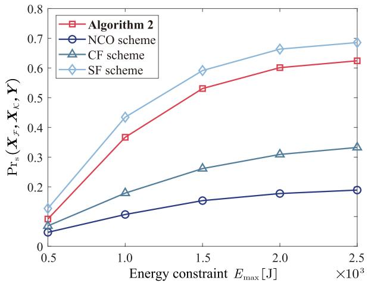

<details>
<summary>line</summary>

| Energy constraint E_max [J] ×10³ | Algorithm 2 | NCO scheme | CF scheme | SF scheme |
| -------------------------------- | ----------- | ---------- | --------- | --------- |
| 0.5                              | 0.1         | 0.05       | 0.08      | 0.15      |
| 1.0                              | 0.37        | 0.1        | 0.18      | 0.43      |
| 1.5                              | 0.53        | 0.16       | 0.26      | 0.6       |
| 2.0                              | 0.6         | 0.18       | 0.31      | 0.67      |
| 2.5                              | 0.63        | 0.19       | 0.33      | 0.69      |
</details>

Fig. 8. Service delay shrinkage ratio versus energy constraint at the UAVs with $\tau = 2 0 /$ ln t and $\alpha = 0 . { \bar { 5 } }$ .

In Fig. 8, we examine the impacts of energy constraint $E _ { \mathrm { m a x } }$ on the service delay shrinkage ratio for different schemes. In this figure, we observe that $\mathrm { P r } _ { \mathrm { s } } ( X _ { \mathcal { F } } , X _ { \mathcal { K } } , Y )$ increases as the value of $E _ { \mathrm { m a x } }$ , indicating that the service requests from the UEs can be better satisfied the UAVs allocate more energy for computation consumption. In addition, we see that the performance improvement of Algorithm 2 and SF scheme are significant, while that of CF scheme and NCO scheme is less profound. This is due to the fact that CF scheme allocates the service requests with less priorities and NCO scheme does not exploit the collaboration gain among the UAVs. Moreover, we see that the service delay shrinkage ratio achieved by Algorithm 2 is slight lower than that achieved by SF scheme. This is because Algorithm 2 balances between the content cache hit ratio and the service delay shrinkage ratio, while SF scheme priorities the service requests.

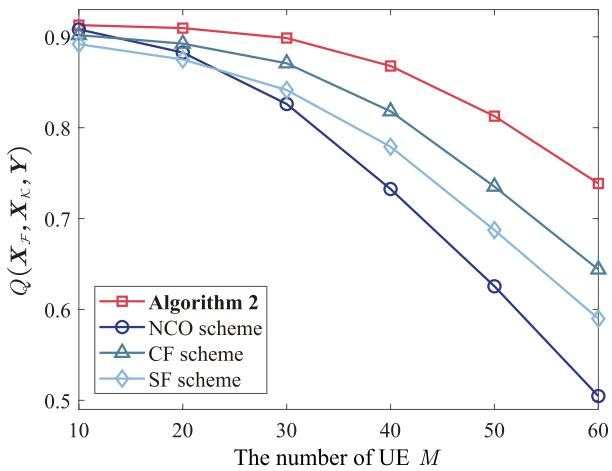

<details>
<summary>line</summary>

| The number of UE M | Algorithm 2 | NCO scheme | CF scheme | SF scheme |
| ------------------ | ----------- | ---------- | --------- | --------- |
| 10                 | 0.91        | 0.90       | 0.90      | 0.89      |
| 20                 | 0.90        | 0.89       | 0.89      | 0.88      |
| 30                 | 0.89        | 0.83       | 0.87      | 0.84      |
| 40                 | 0.87        | 0.73       | 0.82      | 0.78      |
| 50                 | 0.81        | 0.63       | 0.74      | 0.69      |
| 60                 | 0.74        | 0.51       | 0.65      | 0.59      |
</details>

Fig. 9. Average QoE versus the number of UEs with the number of UAVs $U = 1 3 , \tau = \tilde { 2 0 } /$ ln t and $\alpha = 0 . 5$ .

In Fig. 9, we examine how the number of UEs (i.e., M ) impacts the performances of different schemes. Specifically, we plot the average QoE achieved by different schemes versus M ranging from 10 to 60. For a fixed value of M, the locations of UEs are randomly uniformly distributed according to a certain point process. We first observe that the average QoE achieved by all the schemes decreases as M increases. This is because, the number of requests increases as M increases. With limited caching and computation resources of the UAVs, an increased number of UEs’ requests leads to the reduced content cache hit ratio and the service delay shrinkage ratio, which consequently degrade the average QoE. We also observe that, the average QoE achieved by our Algorithm 2 consistently outperforms three benchmark schemes as M increases, confirming once again how the proposed scheme can enhance the capability of our considered systems in satisfying the UEs’ heterogeneous content and service requests.

Finally, in Fig. 10, we examine the impacts of the number of UAVs (i.e., U) on the average QoE achieved by different schemes. Specifically, we divide the simulating area into U grids. Each UAV is randomly deployed within each grid. Note that such deployment strategy of the UAVs is suitable for providing coverage for the randomly uniformly deployed UEs. In this figure, we observe that the average of QoE achieved by different schemes increases with the number of UAVs. This is because the considered system has more caching and computation resources with more UAVs, which in turn improves the capability of our system in satisfying the UE’s requests. We also see that, although Algorithm 2 outperforms other benchmark schemes for different values of U, the average QoE achieved by all the schemes gradually approaches 1 as the value of U becomes relatively large, indicating how the UEs’ requests can be satisfied with perfect experience when our system has sufficient caching and computation resources.

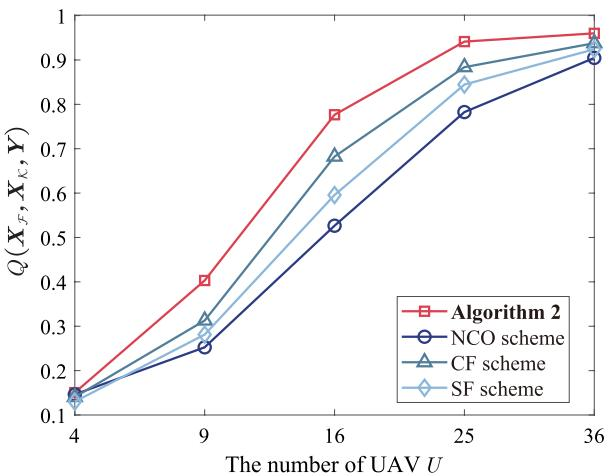

<details>
<summary>line</summary>

| The number of UAV U | Algorithm 2 | NCO scheme | CF scheme | SF scheme |
| ------------------- | ----------- | ---------- | --------- | --------- |
| 4                   | 0.15        | 0.15       | 0.15      | 0.15      |
| 9                   | 0.40        | 0.25       | 0.30      | 0.28      |
| 16                  | 0.78        | 0.53       | 0.70      | 0.60      |
| 25                  | 0.95        | 0.78       | 0.88      | 0.85      |
| 36                  | 0.97        | 0.91       | 0.93      | 0.92      |
</details>

Fig. 10. Average QoE versus the number of UAVs with the number of UEs $\bar { M } = 6 3 , \tau = \bar { 2 0 } /$ ln t and α = 0.5.

# V. CONCLUSION

In this paper, we considered a UAV-enabled MEC network, in which multiple UAVs with caching and computation capabilities are deployed to satisfy the content and service requests generated by the UEs. We adopted the weighted sum of the content cache ratio and the service delay shrinkage ratio as the performance metric (termed as the average QoE) to evaluate the capability of our considered network in satisfying the UEs’ requests. We proposed simple-yet-efficient algorithms that jointly optimize the content cache and service placement decisions at the UAV, as well as the task offloading decisions at the UEs, such that the average QoE can be maximized. Numerical results verified the effectiveness of our proposed algorithms. Moreover, we show how the average QoE of our considered network can be significantly improved compared to various benchmark schemes, especially when the caching and computation capabilities of the UAVs are constrained.

# REFERENCES

[1] A. Daurembekova and H. D. Schotten, “Opportunities and limitations of space-air-ground integrated network in 6G systems,” in Proc. IEEE 34th Annu. Int. Symp. Pers., Indoor Mobile Radio Commun. (PIMRC), Toronto, ON, Canada, Sep. 2023, pp. 1–7.   
[2] K. Meng et al., “UAV-enabled integrated sensing and communication: Opportunities and challenges,” IEEE Wireless Commun., vol. 31, no. 2, pp. 97–104, Aug. 2024.   
[3] L. A. B. Burhanuddin, X. Liu, Y. Deng, U. Challita, and A. Zahemszky, “QoE optimization for live video streaming in UAV-to-UAV communications via deep reinforcement learning,” IEEE Trans. Veh. Technol., vol. 71, no. 5, pp. 5358–5370, May 2022.   
[4] M. Chen, W. Saad, and C. Yin, “Deep learning for 360◦ content transmission in UAV-enabled virtual reality,” in Proc. IEEE Int. Conf. Commun. (ICC), Shanghai, China, May 2019, pp. 1–6.

[5] C. Chen, T. Zhang, W. Xu, X. Yang, and Y. Wang, “Multi-UAV cooperation based edge computing offloading in emergency communication networks,” in Proc. IEEE Wireless Commun. Netw. Conf. (WCNC), Glasgow, U.K., Mar. 2023, pp. 1–6.   
[6] Y. Mao, C. You, J. Zhang, K. Huang, and K. B. Letaief, “A survey on mobile edge computing: The communication perspective,” IEEE Commun. Surveys Tuts., vol. 19, no. 4, pp. 2322–2358, 4th Quart., 2017.   
[7] H. Zhang, L. Feng, X. Liu, K. Long, and G. K. Karagiannidis, “User scheduling and task offloading in multi-tier computing 6G vehicular network,” IEEE J. Sel. Areas Commun., vol. 41, no. 2, pp. 446–456, Feb. 2023.   
[8] X. He, S. Wang, X. Wang, S. Xu, and J. Ren, “Age-based scheduling for monitoring and control applications in mobile edge computing systems,” in Proc. IEEE Conf. Comput. Commun. (INFOCOM), London, U.K., May 2022, pp. 1009–1018.   
[9] T. Kim, S. Chen, Y. Im, X. Zhang, S. Ha, and C. Joe-Wong, “MoDEMS: Optimizing edge computing migrations for user mobility,” in Proc. IEEE/ACM 29th Int. Symp. Quality Service (IWQOS), London, U.K., Jun. 2021, pp. 1–2.   
[10] V. Farhadi et al., “Service placement and request scheduling for dataintensive applications in edge clouds,” IEEE/ACM Trans. Netw., vol. 29, no. 2, pp. 779–792, Apr. 2021.   
[11] Y. Gao, H. Guan, Z. Qi, Y. Hou, and L. Liu, “A multi-objective ant colony system algorithm for virtual machine placement in cloud computing,” J. Comput. Syst. Sci., vol. 79, no. 8, pp. 1230–1242, Dec. 2013.   
[12] L. Yang, J. Cao, G. Liang, and X. Han, “Cost aware service placement and load dispatching in mobile cloud systems,” IEEE Trans. Comput., vol. 65, no. 5, pp. 1440–1452, May 2016.   
[13] J. Xu, L. Chen, and P. Zhou, “Joint service caching and task offloading for mobile edge computing in dense networks,” in Proc. IEEE Conf. Comput. Commun. (INFOCOM), Honolulu, HI, USA, Apr. 2018.   
[14] L. Chen, C. Shen, P. Zhou, and J. Xu, “Collaborative service placement for edge computing in dense small cell networks,” IEEE Trans. Mobile Comput., vol. 20, no. 2, pp. 377–390, Feb. 2021.   
[15] C. Zhan, H. Hu, X. Sui, Z. Liu, and D. Niyato, “Completion time and energy optimization in the UAV-enabled mobile-edge computing system,” IEEE Internet Things J., vol. 7, no. 8, pp. 7808–7822, Aug. 2020.   
[16] Y. Liu, K. Xiong, Q. Ni, P. Fan, and K. B. Letaief, “UAV-assisted wireless powered cooperative mobile edge computing: Joint offloading, CPU control, and trajectory optimization,” IEEE Internet Things J., vol. 7, no. 4, pp. 2777–2790, Apr. 2020.   
[17] J. Wang, K. Liu, and J. Pan, “Online UAV-mounted edge server dispatching for mobile-to-mobile edge computing,” IEEE Internet Things J., vol. 7, no. 2, pp. 1375–1386, Feb. 2020.   
[18] L. Shen, “User experience oriented task computation for UAV-assisted MEC system,” in Proc. IEEE Conf. Comput. Commun. (INFOCOM), London, United Kingdom, May 2022, pp. 1549–1558.   
[19] J. Zhang et al., “Stochastic computation offloading and trajectory scheduling for UAV-assisted mobile edge computing,” IEEE Internet Things J., vol. 6, no. 2, pp. 3688–3699, Dec. 2019.   
[20] R. Zhou, X. Wu, H. Tan, and R. Zhang, “Two time-scale joint service caching and task offloading for UAV-assisted mobile edge computing,” in Proc. IEEE Conf. Comput. Commun. (INFOCOM), London, U.K., May 2022, pp. 1189–1198.   
[21] X. Liu and Y. Deng, “Learning-based prediction, rendering and association optimization for MEC-enabled wireless virtual reality (VR) networks,” IEEE Trans. Wireless Commun., vol. 20, no. 10, pp. 6356–6370, Oct. 2021.   
[22] D. Lan et al., “Task partitioning and orchestration on heterogeneous edge platforms: The case of vision applications,” IEEE Internet Things J., vol. 9, no. 10, pp. 7418–7432, May 2022.   
[23] T. Dang, C. Liu, and M. Peng, “Low-latency mobile virtual reality content delivery for unmanned aerial vehicle-enabled wireless networks with energy constraints,” IEEE Trans. Veh. Technol., vol. 72, no. 2, pp. 2189–2201, Feb. 2023.   
[24] X. Chen, L. He, S. Xu, S. Hu, Q. Li, and G. Liu, “Hit ratio driven mobile edge caching scheme for video on demand services,” in Proc. IEEE Int. Conf. Multimedia Expo (ICME), Shanghai, China, Jul. 2019, pp. 1702–1707.   
[25] A. M. Geoffrion, “Generalized benders decomposition,” J. Optim. Theory Appl., vol. 10, no. 4, pp. 237–260, 1972.

[26] A. Billionnet and É. Soutif, “An exact method based on Lagrangian decomposition for the 0–1 quadratic knapsack problem,” Eur. J. Oper. Res., vol. 157, no. 3, pp. 565–575, Sep. 2004.   
[27] C. P. Robert and G. Casella, Monte Carlo Optimization. New York, NY, USA: Springer, 2004.   
[28] Y. Gu, W. Saad, M. Bennis, M. Debbah, and Z. Han, “Matching theory for future wireless networks: Fundamentals and applications,” IEEE Commun. Mag., vol. 53, no. 5, pp. 52–59, May 2015.   
[29] H. W. Kuhn, “The Hungarian method for the assignment problem,” Nav. Res. Logistics Quart., vol. 2, pp. 83–97, Mar. 1955.   
[30] J. Zhao, Y. Liu, K. K. Chai, A. Nallanathan, Y. Chen, and Z. Han, “Spectrum allocation and power control for non-orthogonal multiple access in HetNets,” IEEE Trans. Wireless Commun., vol. 16, no. 9, pp. 5825–5837, Sep. 2017.   
[31] Y. Ai, G. Qiu, C. Liu, and Y. Sun, “Joint resource allocation and admission control in sliced fog radio access networks,” China Commun., vol. 17, no. 8, pp. 14–30, Aug. 2020.   
[32] B. Liu, C. Liu, M. Peng, Y. Liu, and S. Yan, “Resource allocation for non-orthogonal multiple access-enabled fog radio access networks,” IEEE Trans. Wireless Commun., vol. 19, no. 6, pp. 3867–3878, Jun. 2020.

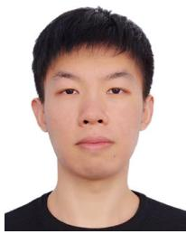

<details>
<summary>natural_image</summary>

Portrait photo of a young man in a black shirt (no text or symbols visible)
</details>

Youhan Zhao (Student Member, IEEE) received the B.E. degree in electronics and information engineering from Dalian Jiaotong University, Dalian, China, in 2022. He is currently pursuing the master’s degree with the State Key Laboratory of Networking and Switching Technology, Beijing University of Posts and Telecommunications, Beijing, China. His research interests include resource allocation in wireless networks, mobile edge computation, and unmanned aerial vehicle-enabled communications.


<details>
<summary>natural_image</summary>

Portrait photo of a man in business attire (no text or symbols visible)
</details>

Chenxi Liu (Senior Member, IEEE) received the B.E. degree from Central South University, Changsha, China, in 2010, and the Ph.D. degree from the University of New South Wales, Sydney, Australia, in 2016. From 2017 to 2019, he was a Post-Doctoral Research Fellow with Singapore University of Technology and Design. Since 2019, he has been with Beijing University of Posts and Telecommunications, where he is currently an Associate Professor. His research interests include wireless security, unmanned aerial vehicle-enabled

wireless networks, and network intelligence. He received the Best Paper Awards from IEEE ICC 2022, WCSP 2023, and IEEE/CIC ICCC 2024. He is serving as an Editor for IEEE WIRELESS COMMUNICATIONS LETTERS.


<details>
<summary>natural_image</summary>

Portrait photo of a woman in a light blue collared shirt (no text or symbols visible)
</details>

Xiaoling Hu (Member, IEEE) received the B.S. degree in electronics and information engineering from Dalian University of Technology, Dalian, China, in 2016, and the Ph.D. degree in information and communication engineering from Zhejiang University, Hangzhou, China, in 2021. She is currently an Associate Professor with Beijing University of Posts and Telecommunications, Beijing, China. Her research interests include reconfigurable intelligent surface (RIS), integrated sensing and communication (ISAC), wireless sensing, massive MIMO, and

mmWave. She was a recipient of the Best Paper Awards from IEEE ICC 2019, IEEE GLOBECOM 2020, IEEE ICC 2022, WCSP 2023, and IEEE/CIC ICCC 2024.


<details>
<summary>natural_image</summary>

Portrait of a young man wearing glasses and a black shirt (no text or symbols visible)
</details>

Jianhua He received the B.Sc. degree from Central South University, Changsha, China, in 2010, and the Ph.D. degree from the University of Chinese Academy of Sciences, Beijing, China, in 2023. He is currently an Assistant Researcher with the Technology and Engineering Center for Space Utilization, Chinese Academy of Sciences. His research interests include space information networks and edge intelligent computing.


<details>
<summary>natural_image</summary>

Portrait of a man wearing glasses and a dark jacket (no text or symbols visible)
</details>

Mugen Peng (Fellow, IEEE) received the Ph.D. degree in communication and information systems from Beijing University of Posts and Telecommunications (BUPT), Beijing, China, in 2005.

Afterward, he joined BUPT, where he has been the Dean of the School of Information and Communication Engineering since June 2020 and the Deputy Director of the State Key Laboratory of Networking and Switching Technology since October 2018. In 2014, he was an Academic Visiting Fellow with Princeton University, USA. He has authored and co-authored more than 150 refereed IEEE journal articles and more than 250 conference proceedings papers. His main research interests include wireless communication theory, radio signal processing, cooperative communication, cloud communication, and the Internet of Things. He was a recipient of the 2018 Heinrich Hertz Prize Paper Award, the 2014 IEEE ComSoc AP Outstanding Young Researcher Award, and the Best Paper Award in IEEE ICC 2022, ICCC 2020, IEEE WCNC 2015, and JCN 2016. He is currently or has been on the Editorial/Associate Editorial Board of IEEE NETWORK, IEEE Communications Magazine, IEEE INTERNET OF THINGS JOURNAL, IEEE TRANSACTIONS ON VEHICULAR TECHNOLOGY, IEEE TRANSACTIONS ON NETWORK SCIENCE AND ENGINEERING, Intelligent and Converged Networks, and Digital Communications and Networks (DCN).


<details>
<summary>natural_image</summary>

Portrait of a young man wearing glasses and a suit (no visible text or symbols)
</details>

Derrick Wing Kwan Ng (Fellow, IEEE) received the bachelor’s (Hons.) and Master of Philosophy degrees in electronic engineering from The Hong Kong University of Science and Technology, Hong Kong, in 2006 and 2008, respectively, and the Ph.D. degree from The University of British Columbia, Vancouver, BC, Canada, in November 2012.

He was a Senior Post-Doctoral Fellow with the Institute for Digital Communications, Friedrich-Alexander-Universität Erlangen-Nürnberg, Erlangen, Germany. He is currently working as a Sci-

entia Associate Professor with the University of New South Wales, Sydney, NSW, Australia. His research interests include convex and nonconvex optimization, physical-layer security, IRS-assisted communication, UAVassisted communication, wireless information and power transfer, and green (energy-efficient) wireless communications. He received Australian Research Council Discovery Early Career Researcher Award in 2017, the IEEE Communications Society Stephen O. Rice Prize in 2022, the Best Paper Awards from WCSP in 2020 and 2021, the IEEE TCGCC Best Journal Paper Award in 2018, INISCOM 2018, the IEEE International Conference on Communications in 2018 and 2021, the IEEE International Conference on Computing, Networking and Communications 2016, the IEEE Wireless Communications and Networking Conference 2012, the IEEE Global Telecommunication Conference in 2011 and 2021, and the IEEE Third International Conference on Communications and Networking in China in 2008. He has been listed as a Highly Cited Researcher by Clarivate Analytics (Web of Science) since 2018. He served as an Editorial Assistant to the Editor-in-Chief for IEEE TRANSACTIONS ON COMMUNICATIONS from January 2012 to December 2019. He serves as an Editor for IEEE TRANSACTIONS ON COMMUNICATIONS and IEEE TRANSACTIONS ON WIRELESS COMMUNICATIONS and an Area Editor for IEEE OPEN JOURNAL OF THE COMMUNICATIONS SOCIETY.


<details>
<summary>natural_image</summary>

Portrait of a smiling man in a blue striped shirt (no text or symbols visible)
</details>

Tony Q. S. Quek (Fellow, IEEE) received the B.E. and M.E. degrees in electrical and electronics engineering from Tokyo Institute of Technology in 1998 and 2000, respectively, and the Ph.D. degree in electrical engineering and computer science from Massachusetts Institute of Technology in 2008.

Currently, he is the Cheng Tsang Man Chair Professor of Singapore University of Technology and Design (SUTD) and a ST Engineering Distinguished Professor. He is the Director of the Future Communications Research and Development

Program, the Head of ISTD Pillar, and the Deputy Director of the SUTD-ZJU IDEA. His current research interests include wireless communications and networking, network intelligence, non-terrestrial networks, open radio access networks, and 6G.

Dr. Quek is a WWRF Fellow and a fellow of the Academy of Engineering Singapore. He has served as a member for the Technical Program Committee and the symposium chair for a number of international conferences. He was honored with the 2008 Philip Yeo Prize for Outstanding Achievement in Research, the 2012 IEEE William R. Bennett Prize, the 2015 SUTD Outstanding Education Awards–Excellence in Research, the 2016 IEEE Signal Processing Society Young Author Best Paper Award, the 2017 CTTC Early Achievement Award, the 2017 IEEE ComSoc AP Outstanding Paper Award, the 2020 IEEE Communications Society Young Author Best Paper Award, the 2020 IEEE Stephen O. Rice Prize, the 2020 Nokia Visiting Professor, and the 2022 IEEE Signal Processing Society Best Paper Award. He has been actively involved in organizing and chairing sessions. He serves as an Area Editor for IEEE TRANSACTIONS ON WIRELESS COMMUNICATIONS.