# Joint Data Caching and Computation Offloading in UAV-Assisted Internet of Vehicles via Federated Deep Reinforcement Learning

Jiwei Huang , Senior Member, IEEE, Man Zhang , Jiangyuan Wan, Ying Chen , Senior Member, IEEE, and Ning Zhang , Senior Member, IEEE

Abstract—Due to the dense buildings around the macro base stations (MBSes) and the hotspot requests within particular area (e.g., traffic intersections), it is a challenging task for Quality of Service (QoS) guarantee in Internet of Vehicle (IoV). To address these challenges, unmanned aerial vehicles (UAVs) can be integrated into mobile edge computing (MEC) for IoV by leveraging their advantages of mobile flexibility, low price, and line-of-sight (LoS) communication links. In this paper, we establish a joint UAVassisted IoV scenario, where both UAVs and MBSes can provide computation and data caching services for smart vehicles. Then, we formulate a joint optimization problem for dynamic data caching and computation offloading, aiming to minimize the average task processing delay and maximize the UAV cache hit ratio. By applying deep reinforcement learning (DRL) techniques, we design an intelligent data caching and computation offloading (IDCCO) algorithm to deal with large-scale and continuous state and action spaces. Furthermore, in order to accelerate the convergence speed of DRL model training while protecting the privacy of original user data in IoV, we propose a distributed training mechanism based on Federated Learning (FL), where the DRL model training is performed locally on UAV and global parameter aggregation is performed on MBS. Finally, extensive experiments are conducted, and the experimental results demonstrate the superiority of our approach over several comparative algorithms in shortening the training time, reducing the task processing delay, and maximizing the cache hit ratio.

Index Terms—Computational offloading, data caching, federated deep reinforcement learning, Internet of Vehicle, mobile edge computing, unmanned aerial vehicles.

Manuscript received 9 October 2023; revised 11 March 2024 and 14 May 2024; accepted 18 June 2024. Date of publication 18 July 2024; date of current version 7 November 2024. This work was supported in part by the National Key Research and Development Program of China under Grant 2022YFD2001000 and Grant 2022YFD2001002, in part by Beijing Natural Science Foundation under Grant L232050, in part by the Project of Cultivation for young top-motch Talents of Beijing Municipal Institutions under Grant BPHR202203225, and in part by Young Elite Scientists Sponsorship Program by BAST under Grant BYESS2023031. The review of this article was coordinated by Dr. Lin X. Cai. (Corresponding author: Ying Chen.)

Jiwei Huang, Man Zhang, and Jiangyuan Wan are with the Beijing Key Laboratory of Petroleum Data Mining, China University of Petroleum, Beijing 102249, China (e-mail: huangjw@cup.edu.cn; manzhang0902@163.com; cup\_wjy1225@163.com).

Ying Chen is with the Computer School, Beijing Information Science and Technology University, Beijing 100101, China (e-mail: chenying@ bistu.edu.cn).

Ning Zhang is with the University of Windsor, Windsor, ON N9B 3P4, Canada (e-mail: ning.zhang@uwindsor.ca).

Digital Object Identifier 10.1109/TVT.2024.3429507

# I. INTRODUCTION

W ITH the rapid evolution of Internet of Vehicle (IoV), amultitude of vehicular applications have emerged to pro- multitude of vehicular applications have emerged to provide diverse services, such as intelligent navigation, in-vehicle games, virtual reality and entertainment videos [1]. Most of these applications have high demand on the computing and storage capacity of vehicles, but the current computing capacity and storage capacity of vehicles are limited. To address this limitation, mobile edge computing (MEC) emerges as a viable solution, which integrates task collection, computing and storage services at the edge of the networks by deploying edge servers (ESes) in the base stations (BSes) [2], [3]. Despite the potential benefits of MEC in empowering IoV [4], certain challenges persist when ESes are statically deployed on macro base stations (MBSes). For example, in urban areas, the communication links between the MBS and vehicles may be interfered by dense buildings, resulting in unstable communication and task processing. In addition, at traffic intersections with heavy traffic flow, the burst of huge simultaneous task arrivals makes it difficult for ESes to process the tasks in a timely manner. Therefore, a more flexible strategy of deploying the edge servers is urgently required.

In recent years, unmanned aerial vehicles (UAVs) have been widely used in MEC due to their advantages of mobile flexibility, low price, and line-of-sight (LoS) communication links [5], [6], [7]. In the IoV, UAVs equipped with ES can be flexibly deployed in request hotspots (e.g., traffic intersections) to assist the MBS in providing computing and storage services for vehicles. Unlike edge servers on the ground, the communication links between UAVs and vehicles are usually LoS links, which are not interfered by buildings. With the assistance of UAVs, computational tasks from vehicles can be flexibly offloaded to either the MBSes or UAVs according to the current network state. An optimal strategy of dynamic computation offloading is critical to the end-to-end performance of UAV-assisted MEC in IoV. Meanwhile, existing in-vehicle applications are data-intensive and large amounts of data (e.g., codes, databases, trained AI models, etc.) has to be stored in ES. Due to the limited storage capacity of its embedded system, UAV can only store part of the data [8], and thus it has to dynamically choose the most popular data for caching in UAV-assisted IoV.

For data-intensive tasks, existing data caching algorithms can be divided into two categories, including traditional methods and learning-based approaches. Traditional methods are based on convex optimization or probabilistic modeling. However, as various attributes (such as content popularity and user mobility) in IoV are dynamic, these traditional strategies are difficult to adapt to the dynamic environment. Moreover, obtaining the necessary global information in reality poses significant challenges. To address these limitations, recent research works apply advanced machine learning (ML) technologies including deep reinforcement learning (DRL) [9], multilayer perceptrons (MP) and convolutional neural networks (CNN) [10] to dynamically predict the data popularity for data caching. However, most of them employ centralized learning algorithms, leading to the following issues. As the number of users increases, data transmission and model training will consume excessive communication and computation resources [11]. In addition, the increase of training data also makes the training of centralized learning model more and more difficult. Finally, the transmission of user data raises concerns about potential personal privacy leakage. Therefore, it is essential to devise a solution to obtain the optimal global data caching strategy with high efficiency and low cost in dynamic scenarios while protecting user privacy for IoV.

To address the above problems, we propose an intelligent data caching and computation offloading algorithm that combines DRL and federated learning (FL), namely Fed-IDCCO. Basically, the procedure of our approach is to iteratively execute the follow three steps. Firstly, heterogeneous task information of vehicles is sent to UAVs, meanwhile, each UAV collects task information within its coverage area and trains DRL models individually based on the task information and the current environmental network state. Secondly, after each round of training, the updated parameters of each UAV’s DRL model are transmitted to the MBS. Upon receiving the data from UAVs, the MBS aggregates all the received DRL model parameters using a federated averaging scheme. Thirdly, the UAVs download the aggregated parameters from MBS to update their local DRL models, with which the data caching and computation offloading can be optimized and the DRL model can be trained in the subsequent iterations.

The contribution of this paper is mainly three-fold as follows.

1) We present a UAV-assisted vehicular edge computing network, where vehicles on the road generate heterogeneous data-intensive tasks, UAVs hover over traffic intersections and the MBS covers the entire area. Both UAVs and the MBS can provide data caching and computation offloading services for vehicles. Furthermore, we formulate a joint optimization problem for data caching and computation offloading with the objectives of minimizing the task average processing delay and maximize the UAV cache hit ratio.

2) In addressing the dynamic nature of the IoV, we account for various factors such as the time-varying computational resources available of ES, vehicle mobility, and regional prevalent data dynamics. To solve the large-scale dynamic scenario problem, we propose a DRL-based algorithm, which can effectively solve the Markov Decision Process (MDP) space explosion problem caused by the dynamic

scenario and obtain the optimal data caching and computation offloading strategy.

3) Recognizing the significance of user privacy and the need to expedite model training convergence, we propose a distributed training mechanism based on FL. Experimental results show that our Fed-IDCCO algorithm can effectively reduce the average task processing delay and maximize the UAV cache hit ratio in dynamic network scenarios compared with several baseline algorithms, while accelerating the convergence speed of the DRL model compared with the centralized approaches.

The remainder of this paper is organized as follows. Section II describes the system model and formulates an optimization problem for data caching and computation offloading. Section III designs the IDCCO algorithm, and proposes a distributed framework for IDCCO using FL architecture. Section IV shows the experimental results. Section V discusses the related work. Finally, Section VI concludes this paper.

# II. SYSTEM MODEL AND PROBLEM FORMULATION

In this section, we firstly present the UAV-assisted IoV system, followed by the detailed system model, including caching model and offloading model. Then, we formulate an optimization problem of joint data caching and computation offloading for UAV-assisted IoV. For convenience, the key notations used are summarized in Table I.

# A. Network Architecture

As shown in Fig. 1, we consider an edge-computing vehicle network scenario consisting of one MBS, U UAVs and N vehicles. Please note that, for IoV systems with multiple MBSes, we can divide the system into several sub-systems in each of which there is only one MBS, and then solve the caching and offloading problem simultaneously. The sets of UAVs and vehicles are denoted by $\mathcal { U } = \{ 1 , 2 , . . . , U \}$ and $\mathcal { N } = \{ 1 , 2 , . . . , N \}$ , respectively. We assume that the coverage areas of UAVs do not overlap, and each UAV approximately covers the same number of vehicles, i.e., $| \mathcal { N } _ { 1 } | = | \mathcal { N } _ { 2 } | = . . . = | \mathcal { N } _ { u } | = N / U$ . Both the = = = =MBS and UAVs have caching and computing capabilities to provide services to vehicles. The MBS statically stores all the data requested by the vehicle tasks, while UAVs can only cache part of the data due to their limited storage space. UAVs need to download new data from the MBS to replace the outdated data for updating cache. We divide time into a set of discrete time slots $\mathcal { T } = \{ 1 , 2 , . . . , t , . . . \}$ , and the length of each time slot is set to $l _ { t }$ =. We assume that each vehicle $n \ ( n \in \mathcal { N } )$ in system continuously generates a data-intensive task in each time slot t $( t \in \tau )$ .

The specific disposal process of each vehicle task is as follows: (1) The UAV calculates the popularity of each pre-cached data in the coverage area. Each vehicle generates data-intensive tasks with different computational/data resource requirements at each time slot t, and the vehicle sends the resource requirement information of this task to the UAV; (2) The DRL model in the UAV makes computational offloading and data caching decisions based on the data popularity, task information, environmental network state, etc. and sends them back to the vehicle; and (3) The UAV chooses to cache the appropriate types of data while determining the computational resources allocated to each vehicle. After the vehicle receives the offloading strategy, the tasks will be sent to UAV or the MBS for processing through wireless link.

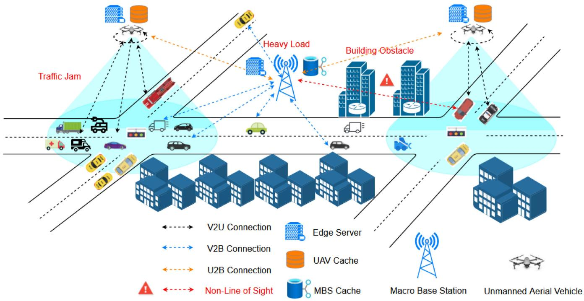

<details>
<summary>flowchart</summary>

```mermaid
graph TD
    A["Traffic Jam"] --> B["Heavy Load"]
    B --> C["Building Obstacle"]
    C --> D["Macro Base Station"]
    D --> E["Unmanned Aerial Vehicle"]
    F["V2U Connection"] --> B
    G["V2B Connection"] --> B
    H["U2B Connection"] --> B
    I["Edge Server"] --> B
    J["UAV Cache"] --> B
    K["Non-Line of Sight"] --> B
    L["MBS Cache"] --> B
    M["Vehicle"] --> B
    N["Truck"] --> B
    O["Truck"] --> B
    P["Truck"] --> B
    Q["Truck"] --> B
    R["Truck"] --> B
    S["Truck"] --> B
    T["Truck"] --> B
    U["Truck"] --> B
    V["Truck"] --> B
    W["Truck"] --> B
    X["Truck"] --> B
    Y["Truck"] --> B
    Z["Truck"] --> B
    AA["Truck"] --> B
    AB["Truck"] --> B
    AC["Truck"] --> B
    AD["Truck"] --> B
    AE["Truck"] --> B
    AF["Truck"] --> B
    AG["Truck"] --> B
    AH["Truck"] --> B
    AI["Truck"] --> B
    AJ["Truck"] --> B
    AK["Truck"] --> B
    AL["Truck"] --> B
    AM["Truck"] --> B
    AN["Truck"] --> B
    AO["Truck"] --> B
    AP["Truck"] --> B
    AQ["Truck"] --> B
    AR["Truck"] --> B
    AS["Truck"] --> B
    AT["Truck"] --> B
    AU["Truck"] --> B
    AV["Truck"] --> B
    AW["Truck"] --> B
    AX["Truck"] --> B
    AY["Traffic Jam"] --> AZ["Heavy Load"]
    AZ --> BA["Building Obstacle"]
    BA --> BB["Macro Base Station"]
    BB --> BC["Unmanned Aerial Vehicle"]
```
</details>

Fig. 1. System architecture.

# B. Caching Model

To provide computing and caching services for various vehicle applications, such as HD videos, augmented/virtual reality and intelligent navigation, UAVs should pre-cache the data needed for computing, including trained ML models, program code bases, and databases. We assume that there are $F$ types of data which are needed for computation. The data set is denoted by in $\mathcal { F } = \{ 1 , 2 , . . . , F \}$ $u \in \mathcal { U }$ . The seoted by $X _ { u } ^ { t } = \{ x _ { u , 1 } ^ { t } , x _ { u , 2 } ^ { t } , . . . , x _ { u , f } ^ { t } \}$ f data. The =popularity of data f at UAV u is denoted by $p _ { f } ^ { u }$ , which is a key metric for evaluating the frequency of data requests, following the Mandelbrot-Zipf (MZipf) distribution [12], [13]. Then, $p _ { f } ^ { u }$ is given by

$$
p _ {f} ^ {u} = \frac {I _ {u} (f) ^ {- z _ {u}}}{\sum_ {u \in \mathcal {U}} I _ {u} (f) ^ {- z _ {u}}}, \tag {1}
$$

where $I _ { u } ( f )$ indicates the rank of data f in descending order ( )of its popularity within the coverage area of UAV u, and $z _ { u }$ is a skewness factor in the range of [0.6, 1.2] [14]. The larger $z _ { u }$ is, the fewer popular data in UAV u is requested by vehicles. By taking popularity into account, caching policy can more accurately predict which data is most likely to be requested in the future.

At time slot t, the binary decision variable of whether UAV u caches data f is expressed as

$$
x _ {u, f} ^ {t} = \left\{ \begin{array}{l l} 1 & , \text { data   } f \text {   is   cached   by   UAV   } u, \\ 0 & , \text { otherwise. } \end{array} \right. \tag {2}
$$

Due to the limited memory capacity of UAVs, only part of hotspot data can be cached in UAVs. The size of data f is denoted as $l _ { f }$ . The data caching decision $x _ { u , f } ^ { t }$ of UAV u is limited by the size of the UAV memory size $L _ { u }$ at time slot t. Such constrains can be expressed as follows

$$
\sum_ {f = 1} ^ {F} l _ {f} x _ {u, f} ^ {t} \leq L _ {u}. \tag {3}
$$

UAVs need to be flexible in deciding which data should be cached based on changing network conditions. Thus, our first optimization objective is to maximize the UAV cache hit ratio. At time slot t, the cache hit ratio $H _ { u } ^ { t }$ within the coverage area of UAV u can be expressed as

$$
H _ {u} ^ {t} = \frac {\sum_ {n \in \mathcal {N} _ {u}} h _ {n} ^ {t}}{N / U}, \forall u \in \mathcal {U}, \tag {4}
$$

where $h _ { n } ^ { t }$ serves as an indicator function of whether a request for vehicle n hits or not. Provided that the contents of UAV cache have been determined, we assume that the data type of the request is f . If the data $f$ has been cached in the UAV at this point, i.e., $x _ { u , f } ^ { t } = 1$ , then it is considered as a hit and there is $h _ { n } ^ { t } = 1$ =, otherwise $h _ { n } ^ { t } = 0$ .

TABLE I MAIN NOTATIONS 

<table><tr><td>Notation</td><td>Explanation</td></tr><tr><td>U</td><td>the number of UAVs</td></tr><tr><td>N</td><td>the number of vehicles</td></tr><tr><td>F</td><td>the number of types of data</td></tr><tr><td> $p_{f}^{u}$ </td><td>the popularity of the data f at UAV u</td></tr><tr><td> $z_{u}$ </td><td>Mzipf skewness factor</td></tr><tr><td> $x_{u,f}^{t}$ </td><td>the cache state of f type of data in UAV u</td></tr><tr><td> $l_{f}$ </td><td>the size of data f</td></tr><tr><td> $H_{u}^{t}$ </td><td>the cache hit ratio within the coverage area of UAV u</td></tr><tr><td> $s_{n}^{t}$ </td><td>the size of input task</td></tr><tr><td> $c_{n}^{t}$ </td><td>the required number of CPU cycles of task</td></tr><tr><td> $k_{n}^{t}$ </td><td>the index of the requested data</td></tr><tr><td> $f_{u}^{t}, f_{m}^{t}$ </td><td>the total computation resource of UAV u and MBS m at time slot t</td></tr><tr><td> $a_{n}^{t}$ </td><td>the offloading indicator for vehicle n at time slot t</td></tr><tr><td> $\gamma_{u,n}^{t}$ </td><td>the proportion of computation resources of UAV u allocated to task n at time slot t</td></tr><tr><td> $B_{u}, B_{m}$ </td><td>the bandwidth of the UAV u and the MBS m</td></tr><tr><td> $p_{n}, p_{m}$ </td><td>the transmission power of vehicle n and MBS m</td></tr><tr><td> $D_{n,u}(t), D_{n,m}(t), D_{m,u}(t)$ </td><td>the distance between vehicle n, UAV u and MBS m at time slot t</td></tr><tr><td> $R_{n,u}(t), R_{n,m}(t), R_{m,u}(t)$ </td><td>the data transmission rate between vehicle n, UAV u and MBS m at time slot t</td></tr><tr><td> $T_{n}^{UAV}(t), T_{n}^{MBS}(t)$ </td><td>the overall processing delay if the task of vehicle n is offloaded to UAV or MBS at time slot t</td></tr></table>

# C. Offloading Model

We assume that each vehicle n will generate a data-intensive task at each time slot t, which is represented by

$$
\pi_ {n} ^ {t} = \left(s _ {n} ^ {t}, c _ {n} ^ {t}, k _ {n} ^ {t}\right), k _ {n} ^ {t} \in \mathcal {F}, \tag {5}
$$

where $s _ { n } ^ { t }$ is the total size of task data (input parameters and program code), $c _ { n } ^ { t }$ is the total CPU cycle required to process the task, and $k _ { n } ^ { t }$ is the index of data required for task processing.

The task offloading decision process is divided into three steps: (1) Vehicle n generates a task and sends the attribute triplet $\boldsymbol { \pi } _ { n } ^ { t }$ to the DRL agent of UAV u. (2) The DRL agent makes offloading decision $\boldsymbol { a } _ { n } ^ { t }$ according to the resources required by task $\boldsymbol { \pi } _ { n } ^ { t }$ , UAV cache state $X _ { u } ^ { t }$ and network environment state including vehicle locations and current available resources. (3) UAV u sends the offloading decision $\boldsymbol { a } _ { n } ^ { t }$ back to vehicle n. Due to small amount of data during the communication processes in steps (1) and (3), the communication delays can be ignored. The binary task offloading variable of task $\boldsymbol { \pi } _ { n } ^ { t }$ at time slot t can be represented by

$$
a _ {n} ^ {t} = \left\{ \begin{array}{l l} 1, & \text { task   is   offloaded   to   UAV } u, \\ 0, & \text { task   is   offloaded   to   MBS } m. \end{array} \right. \tag {6}
$$

If the task of vehicle n is scheduled to UAV u, vehicle n must be within the coverage of UAV u.

# 1) Computation Model:

a) UAV computing: When $\boldsymbol { a } _ { n } ^ { t }$ is 1, task $\boldsymbol { \pi } _ { n } ^ { t }$ will be offloaded to UAV u. At each time slot t, UAV u needs to process multiple tasks from vehicles within its coverage area simultaneously. However, due to limited computation resources of UAVs, sources for each task. We use UAVs need to efficiently allocate part of their computation re- $\gamma _ { u , n } ^ { t }$ to represent the proportion of computation resources of UAV u allocated to task $\boldsymbol { \pi } _ { n } ^ { t }$ . Then, the computation delay of task $\boldsymbol { \pi } _ { n } ^ { t }$ processed by UAV u is expressed as

$$
T _ {n, u} ^ {\text { comp }} (t) = \frac {c _ {n} ^ {t}}{\gamma_ {u , n} ^ {t} f _ {u} ^ {t}}, \tag {7}
$$

where $f _ { u } ^ { t }$ is the total computation resource of UAV u at time slot t, and $\gamma _ { u , n } ^ { t }$ is a continuous variable ranging from 0 to 1.

b) MBS computing: When $\boldsymbol { a } _ { n } ^ { t }$ is 0, task $\boldsymbol { \pi } _ { n } ^ { t }$ will be offloaded to MBS m. We assume that the MBS processes tasks in a serial manner. The computation delay of task $\boldsymbol { \pi } _ { n } ^ { t }$ processed by MBS m is expressed as

$$
T _ {n, m} ^ {\text { comp }} (t) = \frac {c _ {n} ^ {t}}{f _ {m} ^ {t}}, \tag {8}
$$

where $f _ { m } ^ { t }$ is the total computation resource of MBS m at time slot t.

The processing delay of a vehicle’s task generally consists of four parts: (1) communication delay of offloading the task to UAVs or the MBS; (2) computation delay of processing the task; (3) data downloading delay due to UAV cache missing; and (4) down-link delay for returning the computation result. However, (4) is usually ignored, because most applications return results that are much smaller than the input data. In addition, the down-link rate is typically several times higher than the upload link rate.

2) Communication Model: If the communication link between two equipments is unobstructed, we define the state of the communication link as Line of Sight (LoS); otherwise, it is defined as Non-Line of Sight (NLoS) [15]. In our work, we assume that the communication links between a vehicle to a UAV (V2U) and MBS to UAVs (M2U) are LoS. Due to large number of buildings around the MBS, the channel state between a vehicle and MBS is set to NLoS.

a) Vehicle to UAV: In this paper, in order to address the request overloading at the traffic intersections, UAVs are deployed above the intersections and hover at a fixed height H. Thus, the position of UAV u can be considered fixed which is denoted as $( X _ { u } , Y _ { u } , H )$ . The position of vehicle n is denoted as $( X _ { n } ^ { t } , Y _ { n } ^ { t } )$ ( ). According to Euclidean formula, we obtain the ( )horizontal distance between vehicle n and UAV u at time slot t as follows

$$
D _ {n, u} (t) = \sqrt {(X _ {u} - X _ {n} ^ {t}) ^ {2} + (Y _ {u} - Y _ {n} ^ {t}) ^ {2} + H ^ {2}}. \tag {9}
$$

The data transmission rate of offloading the task from vehicle n to UAV u can be calculated by

$$
R _ {n, u} (t) = B _ {n, u} \log_ {2} \left(1 + \frac {p _ {n} g _ {0} G _ {0}}{\sigma^ {2} (D _ {n , u} (t)) ^ {\beta_ {1}}}\right), \tag {10}
$$

where $B _ { n , u }$ is the spectrum bandwidth of vehicle to UAV (V2U) communication channel, $p _ { n }$ is the transmission power of vehicle n, g0 is the channel power gain at a distance of 1 m, $G _ { 0 } \approx 2 . 2 8 4 6$ [16], $\beta _ { 1 }$ is the path loss exponent, and $\sigma ^ { 2 }$ is the white Gaussian noise. In the above formula, we assume that all vehicles access UAV u through Orthogonal Frequency Division Multiple Access (OFDMA) with spectrum resource allocation, and different V2U links do not interfere with each other. The coverage areas between UAVs do not overlap, so there will be no interference between UAVs. According to (10), the transmission delay from vehicle n to UAV u is given by

$$
T _ {n, u} ^ {\text { comm }} (t) = \frac {s _ {n} ^ {t}}{R _ {n , u} (t)}. \tag {11}
$$

b) Vehicle to MBS: Similar to (10), the transmission rate from vehicle n to the MBS can be calculated by

$$
R _ {n, m} (t) = B _ {n, m} \log_ {2} (1 + \frac {p _ {n} g _ {0} G _ {0}}{\sigma^ {2} \beta_ {2} (D _ {n , m} (t)) ^ {\beta_ {1}}}), \tag {12}
$$

where $B _ { n , m }$ is the spectrum bandwidth of vehicle to MBS (V2B) communication channel, $D _ { n , m } ( t )$ is the distance between ( )vehicle n and the MBS m at time slot t, and $\beta _ { 2 }$ is an additional attenuation factor caused by NLoS links. We assume that the V2B channels also use OFDMA, so there is no interference among V2B channels. According to (12), the transmission delay from vehicle n to the MBS is expressed by

$$
T _ {n, m} ^ {\text { comm }} (t) = \frac {s _ {n} ^ {t}}{R _ {n , m} (t)}. \tag {13}
$$

c) MBS to UAV: Due to the memory limit of UAVs, a UAV can only cache part of all data needed for computation, so UAV u needs to download data f from the MBS requested by $\boldsymbol { \pi } _ { n } ^ { t }$ when cache missed. Similar to (10), the transmission rate from the MBS to UAV u is expressed as

$$
R _ {m, u} (t) = B _ {m, u} \log_ {2} \left(1 + \frac {p _ {n} g _ {0} G _ {0}}{\sigma^ {2} (D _ {m , u} (t)) ^ {\beta_ {1}}}\right), \tag {14}
$$

where $B _ { m , u }$ is the spectrum bandwidth of MBS to UAV (B2U) communication channel, and $D _ { m , u }$ is the fixed distance between MBS m and UAV u. According to (12), the downloading delay from the MBS to UAV u for data f is expressed by

$$
T _ {m, u, f} ^ {\text { down }} (t) = \frac {l _ {f}}{R _ {m , u} (t)}. \tag {15}
$$

Based on (7), (11) and (15), if task $\boldsymbol { \pi } _ { n } ^ { t }$ of vehicle n is offloaded to UAVs at time slot t, its overall processing delay is given by

$$
T _ {n} ^ {U A V} (t) = T _ {n, u} ^ {\text { comm }} (t) + T _ {n, u} ^ {\text { comp }} (t) + \left(1 - x _ {u, f} ^ {t}\right) T _ {m, u, f} ^ {\text { down }} (t),
$$

$$
x _ {u, f} ^ {t} \in \{0, 1 \}, \forall n \in \mathcal {N}, \forall u \in \mathcal {U}, \forall f \in \mathcal {F}. \tag {16}
$$

Based on (8) and (13), if task $\pi _ { n } ^ { t }$ of vehicle n is offloaded to the MBS at time slot t, its overall processing delay is given by

$$
T _ {n} ^ {M B S} (t) = T _ {n, m} ^ {c o m m} (t) + T _ {n, m} ^ {c o m p} (t), \forall n \in \mathcal {N}. \tag {17}
$$

To sum up, at time slot t, the total delay of processing task $\boldsymbol { \pi } _ { n } ^ { t }$ from vehicle n is expressed by

$$
T _ {n} (t) = a _ {n} ^ {t} T _ {n} ^ {U A V} (t) + \left(1 - a _ {n} ^ {t}\right) T _ {n} ^ {M B S} (t), \forall n \in \mathcal {N}. \tag {18}
$$

# D. Problem Formulation

We aim to minimize the average processing delay of all tasks and maximize the cache hit ratio of all UAVs, simultaneously unifying the scale by setting a weight factor λ. We jointly optimize data caching decisions $X = \{ x _ { u , f } ^ { t } \} _ { u \in \mathcal { U } , f \in \mathcal { F } }$ , vehicle task offloading decisions $A = \{ a _ { n } ^ { t } \} _ { n \in \mathcal { N } }$ , and UAV computing resource allocation $\Gamma = \{ \gamma _ { u , n } ^ { t } \} _ { n \in \mathcal { N } , u \in \mathcal { U } }$ . Then, the Joint Data Γ =Caching and Computation Offloading (JDCCO) problem can be mathematically formulated as

$$
\min _ {x _ {u, f} ^ {t}, a _ {n} ^ {t}, \gamma_ {u, n} ^ {t}} \frac {1}{T} \sum_ {t = 1} ^ {T} \left[ \sum_ {u = 1} ^ {U} \lambda (1 - H _ {u} ^ {t}) + \sum_ {n = 1} ^ {N _ {u}} T _ {n} (t) \right], \tag {19}
$$

$$
\text { s.t. } \quad \mathrm{C1}: \sum_ {\mathrm{n} \in \mathcal {N} _ {\mathrm{u}}} \gamma_ {\mathrm{u}, \mathrm{n}} ^ {\mathrm{t}} = 1, 0 \leq \gamma_ {\mathrm{u}, \mathrm{n}} ^ {\mathrm{t}} \leq 1, \tag {20}
$$

$$
C 2: \sum_ {f = 1} ^ {F} l _ {f} x _ {u, f} ^ {t} \leq L _ {u}, \tag {21}
$$

$$
C 3: T _ {n} (t) \leq l _ {t}, \tag {22}
$$

$$
C 4: a _ {n} ^ {t} \in \{0, 1 \}, x _ {u, f} ^ {t} \in \{0, 1 \},
$$

$$
\forall n \in \mathcal {N} _ {u}, \forall u \in \mathcal {U}, \forall f \in \mathcal {F} \tag {23}
$$

C1 ensures that the computation resource slicing proportion of UAV u should be in range 0 to 1. C2 illustrates that the total size of data cached by UAV cannot exceed its memory capacity. C3 shows that the average processing delay of task $\boldsymbol { \pi } _ { n } ^ { t }$ is bounded by the slot length $l _ { t }$ . Finally, C4 corresponds to the ranges of involved variables.

Due to the non-convex objective function, constraints and mixed integer variables, JDCCO problem is a non-convex mixed integer nonlinear programming problem. This type of optimization problem is difficult to solve in reasonable time using traditional mathematical methods (e.g., convex optimization, etc.), and DRL is well suited for this type of problem. In the next section, we will present how we can use DRL to solve this problem.

# III. FEDERATED DRL-ENABLED DATA CACHING ANDCOMPUTATION OFFLOADING SCHEME

In this section, we propose a federated intelligent data caching and computation offloading strategy based on federated deep reinforcement learning (FDRL). The FDRL agent can make the optimal caching and computation offloading strategy based on the task information of vehicles, the popularity of the requested data in each UAV’s coverage area, and the current network environment.

# A. MDP Model

In order to solve the JDCCO problem practically, we firstly have to formulate the original dynamic problem as a Markov Decision Process (MDP). The MDP model is generally represented by a 4-tuple S, A, T , R . Here, S represents the system ( )states, and A indicates the system actions. $\mathcal { T } = p ( s _ { t + 1 } \vert s _ { t } , a _ { t } )$ = ( )is the state transition probability, but T is difficult to obtain in practice. R is the reward of executing an action based on a state. The MDP model of JDCCO problem can be expressed as follows.

# 1) State Space S:

$$
s _ {u} (t) = \{s _ {1} ^ {t}, s _ {2} ^ {t}, \ldots , s _ {n} ^ {t},
$$

$$
c _ {1} ^ {t}, c _ {2} ^ {t}, \ldots , c _ {n} ^ {t}, k _ {1} ^ {t}, k _ {2} ^ {t}, \ldots , k _ {n} ^ {t},
$$

$$
X _ {1} ^ {t}, X _ {2} ^ {t}, \ldots , X _ {n} ^ {t}, Y _ {1} ^ {t}, Y _ {2} ^ {t}, \ldots , Y _ {n} ^ {t},
$$

$$
f _ {u} ^ {t}, f _ {m} ^ {t}, p _ {1} ^ {u}, p _ {2} ^ {u}, \ldots , p _ {f} ^ {u} \},
$$

$$
\forall n \in \mathcal {N} _ {u}, \forall f \in \mathcal {F}, \tag {24}
$$

where $s _ { n } ^ { t }$ is the total size of task $\pi _ { n } ^ { t } , c _ { n } ^ { t }$ is the total CPU cycle required to process task $\pi _ { n } ^ { t } , k _ { n } ^ { t }$ is the index of data required by task $\pi _ { n } ^ { t } , X _ { n } ^ { t }$ and $Y _ { n } ^ { t }$ are two-dimensional coordinate position of vehicle $n , f _ { u } ^ { t }$ and $f _ { m } ^ { t }$ are the available computing resources of UAV u and MBS m, respectively, $p _ { f } ^ { u }$ means the content popularity of data $f$ under UAV u.

# 2) Action Space A:

$$
a _ {u} (t) = \{x _ {u, 1} ^ {t}, x _ {u, 2} ^ {t}, \dots , x _ {u, f} ^ {t},
$$

$$
a _ {1} ^ {t}, a _ {2} ^ {t}, \dots , a _ {n} ^ {t},
$$

$$
\left. \gamma_ {u, 1} ^ {t}, \gamma_ {u, 2} ^ {t}, \dots , \gamma_ {u, n} ^ {t} \right\},
$$

$$
\forall n \in \mathcal {N} _ {u}, \forall f \in \mathcal {F}, \tag {25}
$$

where $x _ { u , f } ^ { t }$ is the binary decision variable of whether UAV u caches data $f , a _ { n } ^ { t }$ is the binary task offloading variable of task $\boldsymbol { \pi } _ { n } ^ { t }$ , and $\gamma _ { u , n } ^ { t }$ is the proportion of computation resources of UAV u allocated to task $\boldsymbol { \pi } _ { n } ^ { t }$ .

3) Reward R: When the current state of UAV u is $s _ { u } ( t )$ , the DRL agent in UAV u will get a reward $r _ { u } ( t )$ ( )after performing action $a _ { u } ( t )$ ( ). Based on (19), the DRL agent needs to minimize ( )the task processing delay and maximize the UAV cache hit ratio. In addition, we need to add a large positive numerical penalty $P _ { u } ( t )$ to the reward function when environmental constraints ( )(21) and (22) are not met. Therefore, we design the reward function consisting of utility function and QoS penalty as follows.

$$
r _ {u} (t) = \lambda (1 - H _ {u} ^ {t}) + \sum_ {n = 1} ^ {N _ {u}} T _ {n} (t) + P _ {u} (t). \tag {26}
$$

In our work, DRL agents are deployed on UAVs. According to (24) and (25), the available computing resources in the state space $s _ { u } ( t )$ and the resource allocation ratios in the action space $a _ { u } ( t )$ ( )are continuous variables, and it is hard to decompose ( )these continuous into discrete ones. The Twin Delayed Deep Deterministic policy gradient (TD3) algorithm is suitable for handling problems with large-scale and continuous state and action space. Therefore, we take advantage of the TD3 algorithm to solve our problem, and the agents can make real-time decisions effectively.

Each DRL agent of UAV u maintains two types of neural networks, including main networks and target networks. For each type of the neural networks, there are an actor network and two critic networks [17]. The parameters of actor network and critic network from main network are denoted by $\phi , \theta _ { 1 } , \theta _ { 2 }$ . The parameters of actor network and critic networks from target networks are denoted by $\phi ^ { \prime } , \theta _ { 1 } ^ { \prime } , \theta _ { 2 } ^ { \prime }$ . The actor network aims to maximize the cumulative expected rewards by gradient ascent, which can choose either critic network to calculate the Q value. While the critic networks are updated by minimizing the error between the current value of Q and the target value of Q.

First, the DRL agent of UAV u observes the current system state $s _ { u } ( t )$ . The state $s _ { u } ( t )$ is input into the actor network of ( ) ( )main networks, and then we can obtain the action $a _ { u } ( t )$ from the output layer of actor network, where the strategy $\pi _ { \phi }$ )is used to obtain action $a ( t )$ , i.e.,

$$
a _ {u} (t) = \pi_ {\phi} (s _ {u} (t)) + \epsilon , \epsilon \sim \mathcal {N} (0, \tau), \tag {27}
$$

where  is the noise which can increase exploration of DRL model.  follows normal distribution with mean value equal to 0 and variance equal to $\tau ,$ , after DRL agent executes action $a _ { u } ( t )$ obtained from (27), the current system state is updated ( )from $s _ { u } ( t )$ to $s _ { u } ( t + 1 )$ . Then, based on state $s _ { u } ( t )$ and action $a _ { u } ( t )$ ( ) ( + ), DRL agent can get the reward $r _ { u } ( t )$ ( )for executing action $a _ { u } ( t )$ in state $s _ { u } ( t )$ ( ). Finally, DRL agent stores the quadruple $\{ s _ { u } ( t ) , a _ { u } ( t ) , s _ { u } ( t + 1 ) , r _ { u } ( t ) \}$ into replay memory for speed-( ) ( ) ( + ) ( )ing up model convergence. The parameter updating process of actor network uses deterministic policy gradient updating, which is expressed as

$$
\nabla_ {\phi} J (\phi) = N ^ {- 1} \sum \nabla_ {a} Q _ {\theta_ {1}} (s, a) | _ {a = \pi_ {\phi} (s)} \nabla_ {\phi} \pi_ {\phi} (s), \tag {28}
$$

where $Q _ { \theta _ { 1 } }$ is the $Q$ value of the first critic network in main network. Furthermore, the parameters of main critic networks are updated by following formula:

$$
\theta_ {i} = \underset {\theta_ {i}} {\arg \min} N ^ {- 1} \sum (y - Q _ {\theta_ {i}} (s, a)) ^ {2}, \tag {29}
$$

where $Q _ { \theta _ { i } } ( s , a )$ is the current value of $Q , y$ is the target value of $Q$ ( )calculated by target critic networks. The framework of our DRL-based approach is illustrated by Fig. 2. Formally, Algorithm 1 shows the detailed procedures.

# B. Federated-DRL Algorithm for Intelligent Data Caching and Computation Offloading

As described in the above subsection, DRL can dynamically and efficiently get the optimal data caching and compute the offloading strategy. However, most existing DRL-based approaches have the following limitations.

(1) The convergence process is slow because of the large amount of data used for centralized training.   
(2) If the user data is uploaded to the MBS for centralized training, the transmission of large-scale data between MBS and

Intelligent Data Caching and Computation Offloading algorithm   
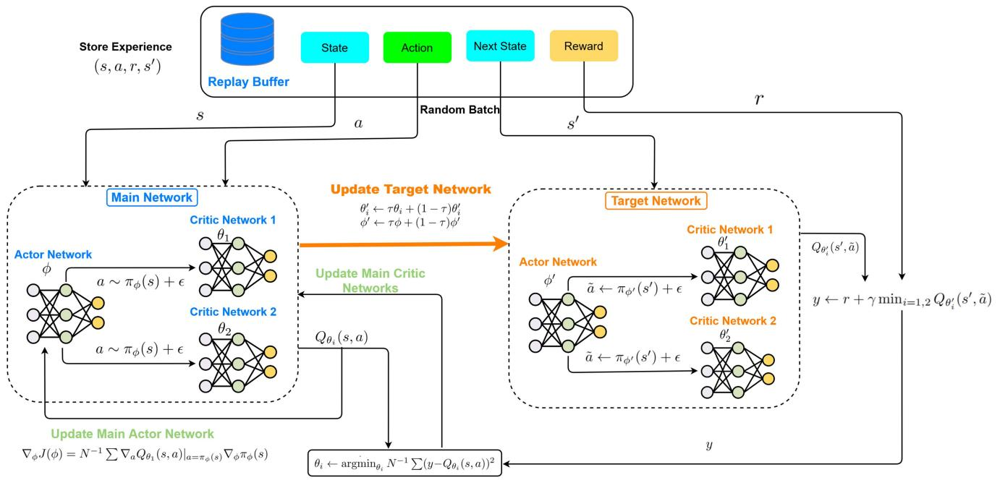

<details>
<summary>flowchart</summary>

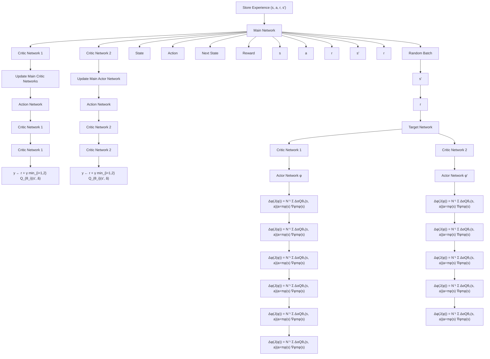
</details>

Fig. 2. Framework of IDCCO algorithm.

Algorithm 1: Intelligent Data Caching and Computation Offloading Algorithm (IDCCO).   
Input: Training episode number N; training step number T;
replay memory size D; batch size S; target smoothing
coefficient $\eta$ ; exploration noise $\epsilon$ ; learning rates of actor
networks and critic networks $l_{a}, l_{c}$ ; two actor networks'
weights $\phi, \phi'$ ; four critic networks' weights $\theta_{1}, \theta_{2}, \theta_{1}', \theta_{2}'$ Output: $a_{n}^{t}$ : decisions for tasks offloading of vehicles in $N_{u}; x_{u,f}^{t}$ : decisions for data caching of UAV u; $\gamma_{u,n}^{t}$ :
decisions for computing resources allocating of UAV u.
1: for episode $\leftarrow$ 1 to N do
2: Initialize environment parameters, get initial state $s_{0}$ 3: for step $\leftarrow$ 1 to T do
4: Obtain action $a_{u}(t)$ using (27)
5: Execute action $a_{u}(t)$ 6: Obtain the next state $s_{u}(t+1)$ and reward $r_{u}(t)$ 7: Store transition $\langle s_{u}(t), a_{u}(t), s_{u}(t+1), r_{u}(t) \rangle$ into
8: replay memory D
9: if step $\geq S$ then
10: Randomly sample N experience from replay
11: memory
12: Update $\phi$ with (28)
13: Update $\theta_{1}$ and $\theta_{2}$ with (29)
14: Update target networks with $\eta = 0.005$ :
15: $\phi' \leftarrow \eta\phi + (1 - \eta)\phi'$ 16: $\theta_{i}' \leftarrow \eta\theta_{i} + (1 - \eta)\theta_{i}'$ 17: end if
18: end for
19: end for

vehicles is likely to bring high costs and is also limited by bandwidth. Furthermore, the central server has limited computation power and is difficult to meet the training needs of large amounts of data [18].

(3) Uploading users’ data to the central server may lead to users’ privacy security issues [19], [20].

Therefore, the centralized training either on UAVs or the MBS is not pratical in IoV. To address the above problems, we put forward an intelligent data caching and computation offloading algorithm based on FL, namely Fed-IDCCO. In our approach, the DRL agents can be trained in a distributed manner, each of which can maintain its data locally without revealing any user private information to the MBS on the Internet. We set the data in each UAV to be independent and identically distributed, which also improves the training speed.

The model training process is illustrated in Fig. 3. First, during each training process round i, UAVs download the global DRL network parameters $W ( i )$ from the MBS. Then, each UAV locally trains the DRL agent by local data within the coverage area and upload the updated local DRL model weights $W _ { u } ( i ) , u \in \mathcal { U }$ ( )to the MBS. Finally, the MBS performs federated average aggregation on the received parameters to obtain an updated global model $W ( i + 1 )$ . The specific parameter aggregation process is ( + )shown by (30) as follows.

$$
W (i + 1) = \frac {1}{U} \sum_ {u = 1} ^ {U} W _ {u} (i). \tag {30}
$$

MBS sends the updated global model to each local model to continue training, and repeats the above process until each

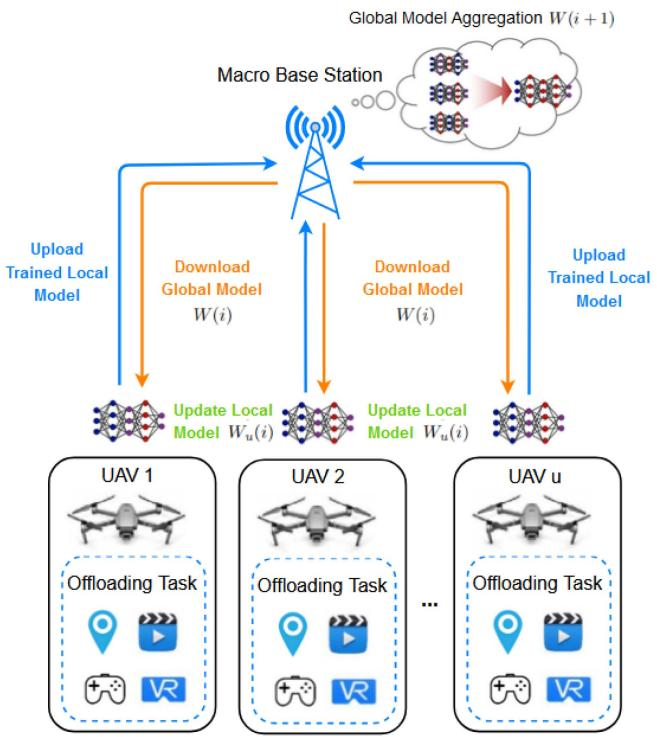

<details>
<summary>flowchart</summary>

```mermaid
graph TD
    A["Macro Base Station"] -->|Download Global Model W(i)| B["UAV 1"]
    A -->|Download Global Model W(i)| C["UAV 2"]
    A -->|Download Global Model W(i)| D["UAV u"]
    B --> E["Update Local Model W_u(i)"]
    C --> F["Update Local Model W_u(i)"]
    D --> G["Update Local Model W_i"]
    E --> H["Global Model Aggregation W(i+1)"]
    F --> H
    G --> H
    style A fill:#f9f,stroke:#333
    style B fill:#ccf,stroke:#333
    style C fill:#ccf,stroke:#333
    style D fill:#ccf,stroke:#333
    style E fill:#cfc,stroke:#333
    style F fill:#cfc,stroke:#333
    style G fill:#cfc,stroke:#333
    style H fill:#fcc,stroke:#333
```
</details>

Fig. 3. FL-based model training.

# Algorithm 2: Federated IDCCO Algorithm.

#

1: Number of iterations $N _ { f }$   
2: MBS side: Global DRL model weights W 0 at the beginning of decision-making period   
3: UAV side:Local DRL model weights $W _ { u } ( 0 ) , \forall u \in \mathcal { U }$ at the beginning of decision-making period

# Output: Trained DRL model weights of DRL models in UAVs and the MBS

4: for iteration $i \gets 1$ to $N _ { f }$ do   
5: for each $U A V \gets 1$ to U do   
6: Download global DRL model weights W i from the MBS   
7: set $W _ { u } ( i ) = W ( i )$   
8: ( ) = ( ) Update local DRL model weights $W _ { u } ( i )$ according to Algorithm 1   
9: Upload the trained weights $W _ { u } ( i )$ to the MBS

10: end for

11: MBS receives all trained weights $W _ { u } ( i ) \ ( \forall u \in \mathcal { U } )$

( )12: MBS executes federated aggregation based on (30)

13: end for

agent obtains the optimal and stable reward, which ensures the convergence of the global model. Meanwhile, the independent and identically distributed data makes the aggregation of models simpler, which helps to improve the convergence speed and performance of the Fed-IDCCO algorithm. The detailed procedures are shown in Algorithm 2.

In the following, we analyze the computational complexity of the two proposed algorithms. For Algorithm 1, in each episode, there are $N _ { u }$ vehicles in the coverage area of UAV u and each

vehicle generates a task. Also there are F types of data that each task can request. The actors and critics in the DRL model are four-layer fully connected neural networks containing two hidden layers denoted as $( L _ { 1 } , L _ { 2 } )$ . According to (24) and (25), the ( )dimension of the state space is $5 N _ { u } + F + 2$ , and the dimension of the action space is $2 N _ { u } + F$ + +. Therefore, the complexity of obtaining an action is $O ( ( 5 N _ { u } + F + 2 ) L _ { 1 } + L _ { 1 } L _ { 2 } + ( 2 N _ { u } +$ $F ) L _ { 2 } )$ (( + + ) + + ( +. In our experiments, the size of the hidden layers is set ) )to be fixed, so the complexity of obtaining an action can be expressed as $O ( N _ { u } + F )$ . Similarly, the computational complexity ( + )of the network training process is $O ( N _ { u } + F )$ . Assuming that T ( + )steps are trained in a episode, the time complexity of Algorithm 1 with N episodes can be obtained as $O ( N T ( N _ { u } + F ) )$ .

( ( + ))In Algorithm 2, each UAV updates the local DRL model using Algorithm 1. In the remaining steps, model uploading, downloading, and parameter aggregation are done in constantlevel time. We set the number of UAVs to U and the number of iterations to $N _ { f }$ . Finally, the time complexity of Algorithm 2 is $O ( N T U N _ { f } ( \Breve { N } _ { u } + F ) )$ .

# IV. PERFORMANCE EVALUATION

In this section, we conduct simulation experiments to evaluate the performance of the proposed scheme. We use real-world data collected from taxis in the city of Shanghai to construct the simulation scenarios, and compare the performance of our approach with other baseline algorithms. Experimental results will be discussed in detail.

# A. Experimental Settings

We simulate an IoV scenario in the city of Shanghai in China. A dataset collected from taxis is used in our experiments to simulate the movement of the vehicles [21]. The dataset includes more than 7 million pieces of trajectory data collected from 4,316 taxis in Shanghai, where each piece of data contains information such as vehicle ID, time, latitude, longitude, and speed. According to the dataset, we generate the user requests with different data processing requirements at different locations.

In the experiments, we consider an MBS covering two intersections (hotspots), with a UAV deployed above each intersection to handle bursty requests during rush hours. When the MBS covers multiple intersections, our model can be extended accordingly by modifying the parameters of the number of UAVs. The number of vehicles in the coverage area of each UAV ranges from [20,70]. We assume the number of types of data ranges from [10,40]. Other specific key parameters are shown in Table II. Our experiments are conducted on NVIDIA GTX 1060 GPU with 6 GB memory. The experiment uses Python 3.6 and PyTorch 1.9 to build neural networks and train DRL models.

The actors and critics in the DRL model are four-layer fully connected neural networks containing one input layer, two hidden layers and one output layer. The two hidden layers are composed of 200 and 300 neurons respectively. The activation function between the two hidden layers is the rectifying linear unit (ReLU). We use adam optimizer to update neural network parameters. Other specific key parameters of DRL model are shown in Table III.

TABLE II EXPERIMENTAL SETTINGS OF UAV-ASSISTED IOV SIMULATIONS 

<table><tr><td>Definitions</td><td>Notations</td><td>Value</td></tr><tr><td>number of UAV</td><td> $U$ </td><td>2</td></tr><tr><td>number of types of data</td><td> $F$ </td><td>10~40</td></tr><tr><td>length of one time slot</td><td> $l_t$ </td><td>1s</td></tr><tr><td>size of data  $f$ </td><td> $l_f$ </td><td> $0.2L_u \sim 0.4L_u$ </td></tr><tr><td>Mzipf skewness factor</td><td> $z_u$ </td><td>0.5 [14]</td></tr><tr><td>input task size</td><td> $s_n^t$ </td><td>5MB~10MB</td></tr><tr><td>required number of CPU cycles of task</td><td> $c_n^t$ </td><td> $10^8 \sim 10^9$ </td></tr><tr><td>fixed altitude of UAVs</td><td> $H$ </td><td>100m [22]</td></tr><tr><td>bandwidth of UAV</td><td> $B_u$ </td><td>10MHz</td></tr><tr><td>transmission power of vehicle</td><td> $p_n$ </td><td>1W [23]</td></tr><tr><td>channel power gain at a distance of 1m</td><td> $g_0$ </td><td> $1.42 \times 10^{-4}$  [16]</td></tr><tr><td>gaussian white noise</td><td> $\sigma^2$ </td><td>-100dBm</td></tr><tr><td>path loss exponent</td><td> $\beta_1$ </td><td>3</td></tr><tr><td>additional attenuation factor caused by NLoS links</td><td> $\beta_2$ </td><td>0.01 [15]</td></tr><tr><td>bandwidth of the MBS</td><td> $B_m$ </td><td>40MHz</td></tr><tr><td>transmission power of MBS</td><td> $p_m$ </td><td>10W</td></tr></table>

TABLE III IDCCO PARAMETERS SETTING 

<table><tr><td>Definitions</td><td>Notations</td><td>Value</td></tr><tr><td>learning rate of actor networks</td><td> $l_a$ </td><td>0.001</td></tr><tr><td>learning rate of critic networks</td><td> $l_c$ </td><td>0.0001</td></tr><tr><td>target smoothing coefficient</td><td> $\eta$ </td><td>0.005</td></tr><tr><td>reply buffer size</td><td>D</td><td>5000</td></tr><tr><td>batch size</td><td>S</td><td>64</td></tr><tr><td>exploration noise</td><td> $\epsilon$ </td><td>0.03</td></tr></table>

In our work, we first compare the convergence performance of Fed-IDCCO with centerlized IDCCO. Then we compare the performance of Fed-IDCCO with five baseline algorithms on average task processing delay and UAV cache hit ratio. The baseline algorithms are as follows.

- Offload to UAV: All vehicle tasks are processed by UAVs.   
Offload to MBS: All vehicle tasks are processed by the MBS.   
- Least Recently Used (LRU): The data that has not been used recently will be replaced.   
- Least Frequently Used (LFU): The least recently used data will be replaced.   
- First In First Out (FIFO): The first data to enter the cache will be replaced.   
- Random: Randomly select data and put them into the cache every episode.   
Optimal (OPT): The UAVs know the data to be requested at the next time slot t  1 in advance for caching, which has the highest cache hit ratio.

# B. Experimental Results

First, we demonstrate the loss function between Fed-IDCCO algorithm and centralized IDCCO algorithm, which is denoted as the average of the reward function of all agents over all time slots, as shown in Fig. 4. After 50 episodes, Fed-IDCCO algorithm and centralized IDCCO algorithm converged to the stable value, but Fed-IDCCO algorithm reached the stable value faster than centralized IDCCO algorithm. This shows that the Fed-IDCCO algorithm has better performance in terms of stability and fast convergence speed, which may be attributed to the less training data on each UAV. In addition, the parameter aggregation of FL also speeds up the training process of DRL model on each UAV.

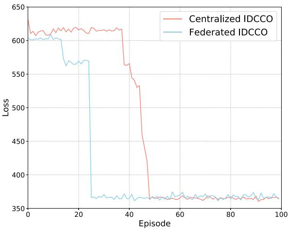

<details>
<summary>line</summary>

| Episode | Centralized IDCCO | Federated IDCCO |
| ------- | ----------------- | --------------- |
| 0       | 630               | 600             |
| 10      | 610               | 605             |
| 20      | 615               | 570             |
| 30      | 615               | 370             |
| 40      | 560               | 370             |
| 50      | 370               | 375             |
| 60      | 370               | 375             |
| 70      | 370               | 375             |
| 80      | 370               | 375             |
| 90      | 370               | 375             |
| 100     | 370               | 375             |
</details>

Fig. 4. Loss function between Fed-IDCCO and centralized IDCCO.

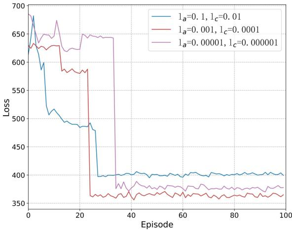

<details>
<summary>line</summary>

| Episode | Loss (l_a=0.1, l_c=0.01) | Loss (l_a=0.001, l_c=0.0001) | Loss (l_a=0.00001, l_c=0.000001) |
| ------- | ------------------------ | ---------------------------- | --------------------------------- |
| 0       | 680                      | 630                          | 650                               |
| 20      | 490                      | 580                          | 650                               |
| 40      | 400                      | 360                          | 380                               |
| 60      | 405                      | 365                          | 375                               |
| 80      | 405                      | 365                          | 375                               |
| 100     | 405                      | 365                          | 375                               |
</details>

Fig. 5. Loss function under different learning rates.

Fig. 5 shows the effect of different learning rates on the convergence of the algorithm in actor and critic networks. The Fed-IDCCO algorithm converges fastest and has the lowest system loss when $l _ { a } = 0 . 0 0 1$ and $l _ { c } = 0 . 0 0 0 1$ , eventually dropping =to around 360. When $l _ { a } = 0 . 0 0 0 0 1$ and $l _ { c } = 0 . 0 0 0 0 0 1$ , the loss = =function of the algorithm is slow to change, indicating that the convergence is slow and the computational cost will be relatively large. With the settings of $l _ { a } = 0 . 1$ and $l _ { c } = 0 . 0 1$ , = =the learning rate is too large, causing the model parameters to skip the minimum of the loss function during the update process, resulting in a failure to converge to the optimal solution.

Fig. 6 shows the cache hit ratios under different UAV cache capacities, where the UAV cache capacity ranges from 50 to

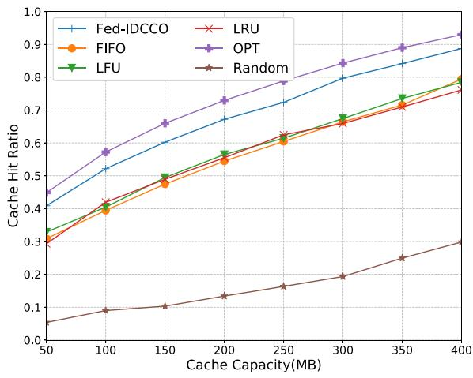

<details>
<summary>line</summary>

| Cache Capacity(MB) | Fed-IDCCO | LRU  | FIFO | OPT  | LFU  | Random |
| ------------------ | --------- | ---- | ---- | ---- | ---- | ------ |
| 50                 | 0.4       | 0.3  | 0.3  | 0.45 | 0.35 | 0.05   |
| 100                | 0.5       | 0.4  | 0.4  | 0.55 | 0.4  | 0.08   |
| 150                | 0.6       | 0.5  | 0.5  | 0.65 | 0.5  | 0.1    |
| 200                | 0.7       | 0.6  | 0.6  | 0.75 | 0.6  | 0.12   |
| 250                | 0.75      | 0.65 | 0.65 | 0.8  | 0.65 | 0.15   |
| 300                | 0.8       | 0.7  | 0.7  | 0.85 | 0.7  | 0.2    |
| 350                | 0.85      | 0.75 | 0.75 | 0.9  | 0.75 | 0.25   |
| 400                | 0.9       | 0.8  | 0.8  | 0.95 | 0.8  | 0.3    |
</details>

Fig. 6. Cache hit ratio with different cache capacity.

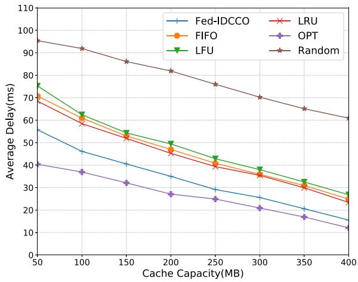

<details>
<summary>line</summary>

| Cache Capacity(MB) | Fed-IDCCO | FIFO  | LFU   | LRU   | OPT   | Random |
| ------------------ | --------- | ----- | ----- | ----- | ----- | ------ |
| 50                 | 56        | 70    | 76    | 70    | 41    | 96     |
| 100                | 47        | 60    | 63    | 60    | 38    | 92     |
| 150                | 42        | 55    | 56    | 55    | 33    | 86     |
| 200                | 36        | 50    | 50    | 50    | 28    | 82     |
| 250                | 30        | 42    | 44    | 42    | 25    | 76     |
| 300                | 26        | 38    | 39    | 38    | 22    | 70     |
| 350                | 22        | 32    | 34    | 32    | 18    | 64     |
| 400                | 18        | 28    | 28    | 28    | 14    | 60     |
</details>

Fig. 7. Average delay with different cache capacity.

400. The Fed-IDCCO algorithm improves the hit rate by an average of 19.6%, 20.3%, 18.1%, and 3 times compared to LRU, FIFO, LFU, and Random, second only to OPT algorithm. With the increase of cache capacity, the cache hit ratios of various algorithms increase, because the larger UAV cache capacity means that more popular data can be cached, resulting in less data replacement process in the UAVs’ storages.

Similar to Fig. 6, Fig. 7 shows the average task processing delays under different UAV cache capacities. The Fed-IDCCO algorithm is always better than LRU, LFU, FIFO, and Random, with an average reduction in task processing delay of 25.1%, 27.6%, 30.7%, and 60.1%, second only to OPT algorithm. The random algorithm has the highest average task processing delay. With the increase of cache capacity, the average task processing delays of all algorithms decrease, because as the UAV cache hit ratio becomes higher and higher, the UAV downloads less data from the MBS when cache misses.

Figs. 8 and 9 show the UAV cache hit ratios and average task processing delays for different numbers of data. Our proposed algorithm improves the hit rate by an average of 22%, 31.2%, 32.1% and 4.5 times, and reduces the latency by an average of 20.3%, 18.5%, 19.6% and 46.1% compared to LRU, FIFO, LFU and Random. With the increase of the number of data, the delays of all algorithms increase and the cache hit ratios decrease. Because the storages of UAVs are fixed, more and more types of data lead to the proportion of hotspot data that UAVs can cache becomes lower and lower, which indirectly leads to the increase of the process of UAVs downloading data from the MBS. In addition, the performance of our Fed-IDCCO algorithm always has the best performance. It shows that our Fed-IDCCO algorithm can flexibly adjust the offloading strategy according to the number of data to minimize the task processing delay and maximize the UAV cache hit ratio.

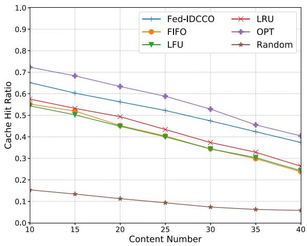

<details>
<summary>line</summary>

| Content Number | Fed-IDCCO | LRU   | FIFO  | OPT   | LFU   | Random |
| -------------- | --------- | ----- | ----- | ----- | ----- | ------ |
| 10             | 0.65      | 0.58  | 0.57  | 0.73  | 0.56  | 0.16   |
| 15             | 0.62      | 0.54  | 0.53  | 0.69  | 0.51  | 0.14   |
| 20             | 0.58      | 0.50  | 0.47  | 0.64  | 0.45  | 0.12   |
| 25             | 0.54      | 0.44  | 0.41  | 0.60  | 0.40  | 0.10   |
| 30             | 0.50      | 0.38  | 0.35  | 0.53  | 0.34  | 0.08   |
| 35             | 0.45      | 0.32  | 0.30  | 0.46  | 0.29  | 0.06   |
| 40             | 0.38      | 0.26  | 0.24  | 0.41  | 0.24  | 0.05   |
</details>

Fig. 8. Cache hit ratio with different numbers of data.

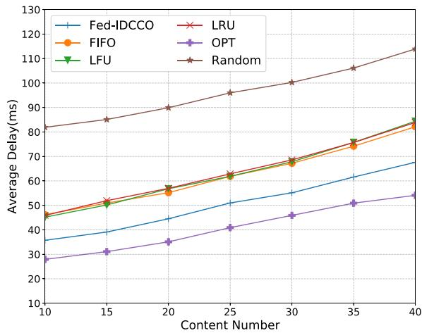

<details>
<summary>line</summary>

| Content Number | Fed-IDCCO | FIFO  | LFU   | LRU   | OPT   | Random |
| -------------- | --------- | ----- | ----- | ----- | ----- | ------ |
| 10             | 35        | 45    | 45    | 45    | 28    | 82     |
| 15             | 38        | 50    | 50    | 50    | 30    | 85     |
| 20             | 45        | 55    | 55    | 55    | 35    | 90     |
| 25             | 50        | 60    | 60    | 60    | 40    | 95     |
| 30             | 55        | 65    | 65    | 65    | 45    | 100    |
| 35             | 60        | 70    | 70    | 70    | 50    | 105    |
| 40             | 65        | 75    | 75    | 75    | 55    | 110    |
</details>

Fig. 9. Average delay with different numbers of data.

Figs. 10 and 11 show the network performance for different computation resources of UAVs and the MBS. The performance of Fed-IDCCO algorithm is better than UAV computing and MBS computing algorithms. Because the Fed-IDCCO algorithm can make offloading decisions flexibly based on the available computational resources of both UAVs and the MBS, it always offloads the task to the MEC server with abundant computational resource. In summary, the Fed-IDCCO algorithm is able to find the optimal offloading strategy in any complex network environment.

Fig. 12 shows the cache hit ratios for different number of vehicles within the coverage area of one UAV. The result shows that the cache hit ratio increases with the number of vehicles for all algorithms except the random algorithm. This is because as the UAVs cover more vehicles, these vehicles provide more data for the training of the DRL model, therefore, the DRL model is better able to learn the global prevalence of the data. In addition, our Fed-IDCCO algorithm has the highest cache hit ratio in all cases except for the OPT algorithm. Compared to LRU, FIFO and LFU, the cache hit rate is improved by 19.1%, 21.8% and 14.7% on average. And compared to Random algorithm, the performance of our algorithm is doubled. All these results show that the Fed-IDCCO algorithm can make the optimal caching decisions for any number of vehicles.

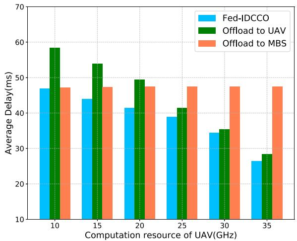

<details>
<summary>bar</summary>

| Computation resource of UAV(GHz) | Fed-IDCCO | Offload to UAV | Offload to MBS |
|---|---|---|---|
| 10 | 47 | 58.5 | 47 |
| 15 | 44 | 53.8 | 47.2 |
| 20 | 41.6 | 49.5 | 47.3 |
| 25 | 38.9 | 41.4 | 47.4 |
| 30 | 34.3 | 35.5 | 47.4 |
| 35 | 26.5 | 28.4 | 47.3 |
</details>

Fig. 10. Average delay with different computation resource of UAV.

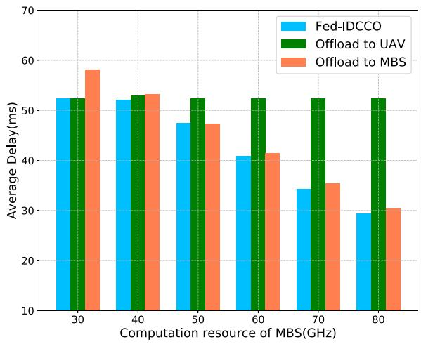

<details>
<summary>bar</summary>

| Computation resource of MBS(GHz) | Fed-IDCCO | Offload to UAV | Offload to MBS |
| --------------------------------- | --------- | -------------- | -------------- |
| 30                                | 52.5      | 52.5           | 58.0           |
| 40                                | 52.0      | 53.0           | 53.5           |
| 50                                | 47.5      | 52.5           | 47.0           |
| 60                                | 41.0      | 52.5           | 41.5           |
| 70                                | 34.5      | 52.5           | 35.5           |
| 80                                | 29.5      | 52.5           | 30.5           |
</details>

Fig. 11. Average delay with different computation resource of MBS.

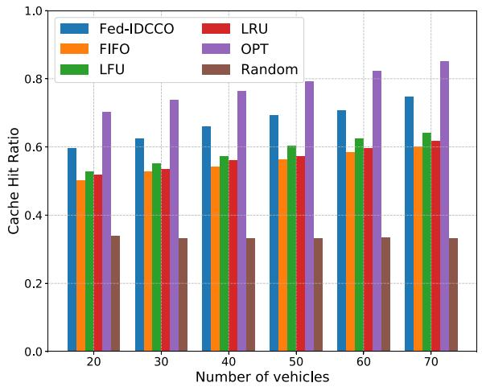

<details>
<summary>bar</summary>

| Number of vehicles | Fed-IDCCO | LRU   | FIFO  | OPT   | Random |
| ------------------ | --------- | ----- | ----- | ----- | ------ |
| 20                 | 0.60      | 0.52  | 0.50  | 0.70  | 0.34   |
| 30                 | 0.63      | 0.54  | 0.53  | 0.74  | 0.33   |
| 40                 | 0.66      | 0.56  | 0.54  | 0.77  | 0.33   |
| 50                 | 0.69      | 0.57  | 0.56  | 0.80  | 0.33   |
| 60                 | 0.71      | 0.59  | 0.58  | 0.83  | 0.33   |
| 70                 | 0.75      | 0.62  | 0.60  | 0.86  | 0.33   |
</details>

Fig. 12. Cache hit ratio with different numbers of vehicles.

# V. RELATED WORK

In recent years, UAVs have been increasingly used as infrastructure service facilities in edge computing scenarios because of their low price, high flexibility, easy deployment and line-ofsight links. UAVs carrying edge servers can be deployed in hot request areas (e.g., intersections) and areas where infrastructure is lacking. UAVs can provide services such as communication, computation and storage for devices in the coverage area. There has been a lot of work related to the study of UAV-assisted edge computing.

Chen et al. [24] proposed a hybrid computing model, including UAV, edge layer, cloud type, to introduce UAV in edge computing/cloud computing to ensure high quality of service (QoS) of user tasks. Hu et al. [25] constructed an intelligent edge computing scenario for UAV-assisted mobile edge computing. The goal is to reduce the task delay by jointly optimizing the mobile trajectory and calculating the unloading ratio under the constraints of discrete variables, UAV energy consumption and moving trajectory. Du et al. [26] proposed a joint optimization problem for the computing resource allocation of edge servers, UAV charging and hovering time and heterogeneous task execution sequence, which effectively reduced the total energy consumption of UAV task processing. With the same energy consumption target, Sun et al. [27] constructed a UAV-assisted edge computing framework. They solved this problem by optimizing server CPU frequency, computing offloading strategy and UAV moving route. Hu et al. [28] studied a UAV-assisted mobile edge computation problem, which uses an alternating optimization algorithm to minimize the overall energy consumption of UAVs and terminals under constraints such as task order, bandwidth splitting, and movement trajectory. Zhang et al. [29] studied the trajectory and communication and computing resource allocation of UAVs optimized for disaster rescue scenarios, with the goal of maximizing the average total QoE. Seid et al. [30] proposed a multi-agent method to minimize long-term network computing cost in the scenario of multi-UAV clusters, and obtained the optimal task offloading and resource allocation scheme under service quality constraints. Chen et al. [31] studied the problem of energy consumption minimization of UAV deployed with MEC server, and proposed a hybrid heuristic optimization algorithm to improve the optimization efficiency of the algorithm. Ke et al. [32] proposed a joint auxiliary edge server model of UAV and macro station, in which both UAV and macro station can continuously collect renewable energy, and proposed a distributed computing offloading scheme based on deep reinforcement Learning (DCODRL). The goal is to minimize the weighted average cost of task processing.

UAVs equipped with storage resources can provide caching services for vehicles in the coverage area. UAVs caching the most frequently requested part of data from vehicles can effectively reduce the processing latency of vehicle tasks, and there has been a lot of works studying the caching problem in UAVs.

Lin et al. [33] constructs a UAV-assisted edge computing scenario, where edge servers are deployed on each UAV to serve devices on the ground, and studies an optimization problem for joint task offloading, resource allocation, content caching and UAV movement trajectory. Wang et al. [34] considers a dynamic cellular network scenario for UAVs with mobility and data requests. In order to cope with the dynamic environment, a cache placement and content delivery algorithm based on DRL is proposed. Anokye et al. [35] uses content request and random waypoint user movement model to predict the UAV’s movement trajectory and caching strategy, and the algorithm uses deep reinforcement learning. Wu et al. [36] constructed a communication network capable of caching data, in which the UAV provides charging and caching servers for mobile users, and proposed a joint data caching and movement trajectory algorithm based on DRL. Wang et al. [37] proposed a novel caching strategy to cache popular data in advance on UAVs and user devices to reduce repeated data transfers in end-to-end supported UAVs networks, and proposed a cache placement optimization algorithm based on deep reinforcement learning to determine the caching strategy. Chen et al. [38] proposed a computational offloading policy for IoT devices to satisfy multiple constraints such as computational resource constraints, latency constraints, and energy consumption constraints, so as to achieve the goal of minimizing the total QoS cost of all devices.

Different from the above works, the UAVs in our scenario can provide caching service for vehicles, and the UAV caching hotspot request data can effectively reduce the processing delay of the task and improve the task processing efficiency. In addition, we fully consider the dynamic of the network environment and vehicle mobility. In our approach, we build intelligent algorithms based on FL and DRL, which not only obtain long-term optimal data caching and computation offloading strategy in dynamic network environment, but also allow DRL models to converge faster while protecting user privacy.

# VI. CONCLUSION

In this paper, we consider a UAV-MBS-assisted mobile edge computing scenario for IoV. We study the joint data caching and computation offloading to minimize the task-average processing delay and maximize the UAV cache ratio. We design a distributed intelligent algorithm based on DRL and FL to obtain the optimal data caching and computation offloading strategy. The training process can be accelerated in a parallel manner without transmitting any user-sensitive data to the core network. Extensive experiments are constructed based on real-world dataset, and the experimental results validate the efficiency and the superiority of the proposed approach to several baseline algorithms.

For the future work, we will consider load balancing among multiple UAVs to further improve the system performance. Moreover, considering the battery of UAVs is limited, how to maximize the processing of user tasks with limited battery capacity is also a challenging problem.

# REFERENCES

[1] G. Karagiannis et al., “Vehicular Networking: A survey and tutorial on requirements, architectures, challenges, standards and solutions,” IEEE Commun. Surveys Tuts., vol. 13, no. 4, pp. 584–616, Fourthquarter 2011.   
[2] Y. Chen, J. Xu, Y. Wu, J. Gao, and L. Zhao, “Dynamic task offloading and resource allocation for NOMA-aided mobile edge computing: An energy efficient design,” IEEE Trans. Serv. Comput., early access, Mar. 12, 2024, doi: 10.1109/TSC.2024.3376240.   
[3] M. Li, J. Gao, L. Zhao, and X. Shen, “Deep reinforcement learning for collaborative edge computing in vehicular networks,” IEEE Trans. Cogn. Commun. Netw., vol. 6, no. 4, pp. 1122–1135, Dec. 2020.   
[4] Y. Chen, F. Zhao, X. Chen, and Y. Wu, “Efficient multi-vehicle task offloading for mobile edge computing in 6G networks,” IEEE Trans. Veh. Technol., vol. 71, no. 5, pp. 4584–4595, May 2022.   
[5] W. Qi, Q. Song, L. Guo, and A. Jamalipour, “Energy-efficient resource allocation for UAV-assisted vehicular networks with spectrum sharing,” IEEE Trans. Veh. Technol., vol. 71, no. 7, pp. 7691–7702, Jul. 2022.   
[6] J. Huang, F. Liu, and J. Zhang, “Multi-dimensional QoS evaluation and optimization of mobile edge computing for IoT: A survey,” Chin. J. Electron., vol. 33, no. 4, pp. 859–874, 2024.   
[7] J. Lu et al., “SIC-STIA-IS: An interference management scheme for the UAV-assisted heterogeneous network,” in Proc. IEEE 2023 Int. Conf. Commun., 2023, pp. 672–678.   
[8] J. Xu, L. Chen, and P. Zhou, “Joint service caching and task offloading for mobile edge computing in dense networks,” in Proc. IEEE 2018 Conf. Comput. Commun., 2018, pp. 207–215.   
[9] Z. Ning et al., “Joint computing and caching in 5G-envisioned internet of vehicles: A deep reinforcement learning-based traffic control system,” IEEE Trans. Intell. Transp. Syst., vol. 22, no. 8, pp. 5201–5212, Aug. 2021.   
[10] A. Ndikumana, N. H. Tran, D. H. Kim, K. T. Kim, and C. S. Hong, “Deep learning based caching for self-driving cars in multi-access edge computing,” IEEE Trans. Intell. Transp. Syst., vol. 22, no. 5, pp. 2862–2877, May 2021.   
[11] Y. Chen, K. Li, Y. Wu, J. Huang, and L. Zhao, “Energy efficient task offloading and resource allocation in air-ground integrated MEC systems: A distributed online approach,” IEEE Trans. Mobile Comput., vol. 23, no. 8, pp. 8129–8142, Aug. 2024.   
[12] X. Wang, C. Wang, X. Li, V. C. M. Leung, and T. Taleb, “Federated deep reinforcement learning for Internet of Things with decentralized cooperative edge caching,” IEEE Internet Things J., vol. 7, no. 10, pp. 9441–9455, Oct. 2020.   
[13] J. Ji, K. Zhu, and L. Cai, “Trajectory and communication design for cache-enabled UAVs in cellular networks: A deep reinforcement learning approach,” IEEE Trans. Mobile Comput., vol. 22, no. 10, pp. 6190–6204, Oct. 2023.   
[14] L. Zhao, Y. Ran, H. Wang, J. Wang, and J. Luo, “Towards cooperative caching for vehicular networks with multi-level federated reinforcement learning,” in Proc. IEEE 2021 Int. Conf. Commun., 2021, pp. 1–6.   
[15] M. Zhu, X.-Y. Liu, and A. Walid, “Deep reinforcement learning for unmanned aerial vehicle-assisted vehicular networks,” 2019, arXiv:1906.05015.   
[16] Y. Qu et al., “Service provisioning for UAV-enabled mobile edge computing,” IEEE J. Sel. Areas Commun., vol. 39, no. 11, pp. 3287–3305, Nov. 2021.   
[17] X. Wang, H. Shi, Y. Li, Z. Qian, and Z. Han, “Energy efficiency resource management for D2D-NOMA enabled network: A Dinkelbach combined twin delayed deterministic policy gradient approach,” IEEE Trans. Veh. Technol., vol. 72, no. 9, pp. 11756–11771, Sep. 2023.   
[18] J. Huang et al., “Incentive mechanism design of federated learning for recommendation systems in MEC,” IEEE Trans. Consum. Electron., vol. 70, no. 1, pp. 2596–2607, Feb. 2024.   
[19] X. Li, L. Lu, W. Ni, A. Jamalipour, D. Zhang, and H. Du, “Federated multi-agent deep reinforcement learning for resource allocation of vehicleto-vehicle communications,” IEEE Trans. Veh. Technol., vol. 71, no. 8, pp. 8810–8824, Aug. 2022.   
[20] Z. Wang, Q. Hu, Z. Xiong, Y. Liu, and D. Niyato, “Resource optimization for blockchain-based federated learning in mobile edge computing,” IEEE Internet Things J., vol. 11, no. 9, pp. 15166–15178, May 2024.

[21] S. Liu, Y. Liu, L. M. Ni, J. Fan, and M. Li, “Towards mobility-based clustering,” in Proc. ACM SIGKDD Int. Conf. Knowl. Discov. Data Mining, 2010, pp. 919–927.   
[22] L. Yang, H. Yao, J. Wang, C. Jiang, A. Benslimane, and Y. Liu, “Multi-UAV-enabled load-balance mobile-edge computing for IoT networks,” IEEE Internet Things J., vol. 7, no. 8, pp. 6898–6908, Aug. 2020.   
[23] H. Peng and X. Shen, “Multi-agent reinforcement learning based resource management in MEC-and UAV-assisted vehicular networks,” IEEE J. Sel. Areas Commun., vol. 39, no. 1, pp. 131–141, Jan. 2021.   
[24] W. Chen, B. Liu, H. Huang, S. Guo, and Z. Zheng, “When UAV swarm meets edge-cloud computing: The QoS perspective,” IEEE Netw., vol. 33, no. 2, pp. 36–43, Mar./Apr. 2019.   
[25] Q. Hu, Y. Cai, G. Yu, Z. Qin, M. Zhao, and G. Y. Li, “Joint offloading and trajectory design for UAV-enabled mobile edge computing systems,” IEEE Internet Things J., vol. 6, no. 2, pp. 1879–1892, Apr. 2019.   
[26] Y. Du, K. Yang, K. Wang, G. Zhang, Y. Zhao, and D. Chen, “Joint resources and workflow scheduling in UAV-enabled wirelessly-powered MEC for IoT systems,” IEEE Trans. Veh. Technol., vol. 68, no. 10, pp. 10187–10200, Oct. 2019.   
[27] C. Sun, W. Ni, and X. Wang, “Joint computation offloading and trajectory planning for UAV-assisted edge computing,” IEEE Trans. Wireless Commun., vol. 20, no. 8, pp. 5343–5358, Aug. 2021.   
[28] X. Hu, K.-K. Wong, K. Yang, and Z. Zheng, “UAV-assisted relaying and edge computing: Scheduling and trajectory optimization,” IEEE Trans. Wireless Commun., vol. 18, no. 10, pp. 4738–4752, Oct. 2019.   
[29] L. Zhang, B. Jabbari, and N. Ansari, “Deep reinforcement learning driven UAV-assisted edge computing,” IEEE Internet Things J., vol. 9, no. 24, pp. 25449–25459, Dec. 2022.   
[30] A. M. Seid, G. O. Boateng, B. Mareri, G. Sun, and W. Jiang, “Multi-agent DRL for task offloading and resource allocation in multi-UAV enabled IoT edge network,” IEEE Trans. Netw. Service Manag., vol. 18, no. 4, pp. 4531–4547, Dec. 2021.

[31] Y. Chen, D. Pi, S. Yang, Y. Xu, J. Chen, and A. W. Mohamed, “HNIO: A hybrid nature-inspired optimization algorithm for energy minimization in UAV-assisted mobile edge computing,” IEEE Trans. Netw. Service Manag., vol. 19, no. 3, pp. 3264–3275, Sep. 2022.   
[32] H. Ke, H. Wang, W. Sun, and H. Sun, “Adaptive computation offloading policy for multi-access edge computing in heterogeneous wireless networks,” IEEE Trans. Netw. Service Manag., vol. 19, no. 1, pp. 289–305, Mar. 2022.   
[33] N. Lin, H. Qin, J. Shi, and L. Zhao, “Deep reinforcement learning empowered multiple UAVs-assisted caching and offloading optimization in D2D wireless networks,” in Proc. 19th ACM Int. Conf. Comput. Front., 2022, pp. 150–158.   
[34] Z. Wang, T. Zhang, Y. Liu, and W. Xu, “Deep reinforcement learning for caching placement and content delivery in UAV NOMA networks,” in Proc. IEEE 2020 Int. Conf. Wireless Commun. Signal Process., 2020, pp. 406–411.   
[35] S. Anokye, D. Ayepah-Mensah, A. M. Seid, G. O. Boateng, and G. Sun, “Deep reinforcement learning-based mobility-aware UAV content caching and placement in mobile edge networks,” IEEE Syst. J., vol. 16, no. 1, pp. 275–286, Mar. 2022.   
[36] C. Wu, S. Shi, S. Gu, L. Zhang, and X. Gu, “Deep reinforcement learningbased content placement and trajectory design in urban cache-enabled UAV networks,” Wireless Commun. Mobile Comput., vol. 2020, pp. 1–11, 2020.   
[37] D. Wang, Q. Liu, J. Tian, Y. Zhi, J. Qiao, and J. Bian, “Deep reinforcement learning for caching in D2D-enabled UAV-relaying networks,” in Proc. IEEE/CIC 2021 Int. Conf. Commun. China, 2021, pp. 635–640.   
[38] Y. Chen, J. Hu, J. Zhao, and G. Min, “QoS-aware computation offloading in LEO satellite edge computing for IoT: A game-theoretical approach,” Chin. J. Electron., vol. 33, no. 4, pp. 875–885, 2024.