# Joint Deployment, User Association, and Power Allocation for Data Collection in UAV-Assisted Wireless Sensor Networks

Yanping Liu , Kunkun Zhang, Xuming Fang , Senior Member, IEEE, Ming Xiao , Senior Member, IEEE, Fuhong Song , Qing Xue , Senior Member, IEEE, Yaping Cui , and Changfeng Ding , Member, IEEE

Abstract—In recent years, uncrewed aerial vehicles (UAVs) have become increasingly prevalent for collecting environmental data from various wireless sensors. However, existing research on employing UAVs to collect data from wireless sensors has often ignored the heterogeneous requirements of sensors. In this paper, we investigate joint deployment, user association, and power allocation for data collection in the UAV-assisted wireless sensor network to accommodate the heterogeneous requirements of sensors, where a novel satisfaction function is designed for three types of sensors, including sensors with delay requirements, sensors with energy consumption requirements, and sensors with both delay and energy consumption requirements. Leveraging the satisfaction function, we formulate the

optimization problem aimed at jointly optimizing the positions of UAVs, the association between sensors and UAVs, and the power allocation of sensors to maximize overall satisfaction of sensors. In order to effectively address the considered problem, we decompose it into two subproblems, i.e., joint UAV deployment and user association subproblem, and transmission power allocation subproblem. An enhanced human evolutionary algorithm is developed to tackle the joint UAV deployment and user association subproblem, and the Lagrange dual method and gradient descent method are employed to solve the transmission power allocation subproblem. The suboptimal solution is achieved by iteratively addressing the two subproblems until convergence of the proposed enhanced Lagrange and gradient descent-based human evolutionary optimization algorithm is attained. Extensive simulations demonstrate the effectiveness of the proposed algorithm in enhancing overall satisfaction of sensors, underscoring its significant advantages in managing heterogeneous network environments.

Index Terms—UAV deployment, user association, power allocation, data collection, wireless sensor networks.

## I. INTRODUCTION

works (WSNs), their significance has become increasingly evident across various domains, including smart cities, industrial automation, environmental monitoring, smart agricultural management, and health monitoring [1], [2], [3], [4]. The collection of data from wireless sensors is a critical task in these domains, especially for data collection in emergency, rescue, or video surveillance scenarios, which however poses great challenges for traditional sensor networks. This is mainly due to the fact that traditional communication networks may not be available in these special scenarios, and each sensor needs not only to transmit its own data but also to relay the data from other nodes to the fusion center via multihop self-organizing transmissions [5]. Consequently, the above transmission mechanism may cause rapid battery depletion and possibly the loss of multi-hop connections [6]. Fortunately, due to the flexible deployment capabilities and high mobility, uncrewed aerial vehicles (UAVs) offer a novel solution for data collection in scenarios where traditional communication networks are not available [7]. By optimizing the location or flight path of UAVs, the probability of establishing lineof-sight (LoS) connections between UAVs and sensors can be significantly increased. This boost will help to improve communication quality and coverage, particularly in harsh

Digital Object Identifier 10.1109/TWC.2026.3694771 or remote environments [8], [9], [10], [11]. In recent years, a large number of studies on UAV-assisted wireless sensor networks for data collection have emerged, which mainly concentrated on optimizing energy consumption [12], [13], minimizing completion time [14], [15], and jointly optimizing both energy consumption and completion time [16], [17]. Nevertheless, all these studies ignored the differences among sensors in wireless sensor networks in terms of hardware capabilities, task requirements, and endurance. Furthermore, they have not addressed the heterogeneity of requirements caused by these differences. Given the different optimization objectives of sensors due to their heterogeneous requirements, the key challenge lies in how to jointly optimize the performance of sensors with differing objectives. Therefore, designing a more flexible and efficient data collection scheme that accommodates the heterogeneous requirements of sensors is a key technical issue for the data collection in UAV-assisted wireless sensor networks, where traditional communication networks are not available.

## A. Related Works

With the increasing prevalence of UAV technology, the application of UAVs for collecting data from wireless sensors has been extensively explored across various fields [18], [19], [20]. Specifically, Ma et al. in [18] achieved efficient and reliable data collection without infrastructure support by optimizing satellite selection, UAV trajectory, as well as bandwidth and transmission power allocation for sensors through the integration of UAVs with low-earth orbit satellites. Kuang et al. in [19] proposed an innovative framework for smart agriculture that combines data application layers, sensor networks, and data collection via UAVs, significantly enhancing the flexibility and efficiency of agricultural monitoring. Wan et al. in [20] utilized UAVs as temporary relay stations during disaster scenarios, successfully achieving real-time disaster data collection through a deep reinforcement learning approach based on an attention mechanism for multi-UAV scheduling. Although these studies have demonstrated the potential benefits of UAVassisted data collection in wireless sensor networks, none have addressed the heterogeneous requirements present in actual wireless sensor environments.

In real-world wireless sensor networks, data collection from sensors frequently encounters a variety of heterogeneous requirements and environments. Given the increasing importance of heterogeneity in data acquisition systems, researchers have proposed numerous resource management schemes tailored to heterogeneous scenarios [21], [22], [23], [24], [25]. Chen and Tang in [21] introduced a UAV-assisted data collection framework designed for dynamic and heterogeneous wireless sensor networks. This framework considers the heterogeneity of sensors concerning hardware specifications, task types, and geographical locations. It dynamically determines the operational mode of each sensor by establishing an energy threshold. Yang et al. in [22] argued that heterogeneous wireless sensor networks comprise various types of sensors that may differ significantly in computing power, communication capabilities, power supply options, monitoring modes, and data generation rates. To address the challenges associated with asynchronous data collection in these networks while minimizing energy consumption and ensuring timely data retrieval, they employed graph attention networks combined with deep reinforcement learning algorithms to develop a dynamic path planning strategy. Li et al. in [23] emphasized the diverse types and quantities of IoT devices, highlighting that the volume of data they generate varies significantly. For example, a temperature sensor may transmit only a small amount of textual data, whereas a surveillance camera can produce substantial video data. This heterogeneity in data presents challenges for effective collection and processing. The literature introduces an innovative clustering algorithm designed to efficiently gather Internet of Things (IoT) device data in UAV-assisted wireless communication networks. Chen et al. in [24] proposed a trajectory optimization design method aimed at minimizing the information of age (AoI) under worst-case scenarios across all points of interest. Their approach considers factors such as data generation time, variability in cellular network coverage, UAV flight speed, and heterogeneous task requirements associated with data collection mission. Lohan and Mishra in [25] investigated the optimal resource allo cation problem aimed at maximizing user service capacity in UAV-aided wireless networks, while addressing varying requirements related to different data rates and coverage demands. The studies on heterogeneous scenarios referenced in the aforementioned literature mainly focused on hetero geneity arising from variations in sensor hardware, task types, and locations. However, discussions surrounding demand heterogeneity remain relatively limited. Consequently, this paper aims to investigate the design of a unified satisfaction model, formulate an optimization problem and develop an efficient solution for addressing the heterogeneous requirements of sensors in the wireless sensor network, which comprises three types of sensors with distinct priorities: some sensors prioritize optimizing transmission time [26], others aim to minimize energy consumption during transmission [21], while the rest try to balance transmission time and energy consumption. Although some satisfaction models have been proposed for various communication scenarios in existing studies, such as the satisfaction model in non-orthogonal multiple access [27], spectrum sharing [28], and mobile edge computing [29], these satisfaction models did not consider the heterogeneous requirements in wireless sensor networks.

## B. Contributions and Organization

Motivated by the observations above, we investigate joint UAV deployment, user association, and power allocation for data collection in the UAV-assisted wireless sensor network to enhance satisfaction levels of sensors with consideration of the heterogeneous requirements of sensors, where a novel satisfaction function is designed to address the heterogeneous requirements of sensors. The proposed algorithm can provide a reference framework to solve complex non-convex optimization problems that involve both discrete and continuous variables. The contributions of this paper are summarized as follows.

• A novel satisfaction function is designed for three categories of sensors, each characterized by heterogeneous requirements related to delay, energy consumption, or both. Taking into account the constraints imposed by transmission power limitations for each sensor, the number of sensors that can be simultaneously served by each UAV, as well as quality of service (QoS) and safe distance constraints between any two UAVs, an optimization problem is formulated with the objective of maximizing overall satisfaction of all sensors in the wireless sensor network.

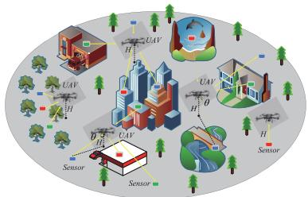  
Fig. 1. System model.

To effectively tackle the considered optimization problem, we partition it into two subproblems, i.e., joint UAV deployment and user association subproblem, and transmission power allocation subproblem. By carefully integrating the follower operator of the sparrow optimization algorithm and the bubble operator of the whale optimization algorithm into the human evolutionary algorithm, an enhanced human evolutionary algorithm capable of accommodating both continuous and discrete binary variables is developed to address the first subproblem, and the Lagrange dual method in conjunction with gradient descent techniques is integrated into individual utility function to solve the second subproblem. The suboptimal solution is achieved through an iterative process that involves solving the two subproblems until convergence of the algorithm is attained.

Extensive simulation results demonstrate both the convergence and effectiveness of the proposed algorithm. Furthermore, the results also indicate that: 1) the proposed algorithm achieves significantly higher satisfaction levels than comparison algorithms; 2) deploying additional UAVs and increasing bandwidth can enhance the satisfaction of sensors; 3) the proposed satisfaction model is well-suited to meet the diverse requirements of sensors in heterogeneous environments, where delay and energy consumption thresholds substantially influence system satisfaction.

The remainder of this article is structured as follows. Section II presents the system model and formulates the problem. Section III elaborates on the details of the proposed solution. Section IV presents the simulation results along with a comprehensive analysis. Finally, Section V concludes this article.

## II. SYSTEM MODEL AND PROBLEM FORMULATION

## A. System Overview

We consider a UAV-assisted data collection network for emergency, rescue or video surveillance scenarios, as illustrated in Fig. 1, which comprises U sensors and M UAVs. Let $\mathcal { U } = \{ 1 , \dots , u , \dots , U \}$ and $\mathcal { M } = \{ 1 , \dots , m , \dots , M \}$ denote the sets of sensors and UAVs, respectively. Although there are various types of sensors in the UAV-assisted data collection network with heterogeneous requirements [30], we mainly focus on three key types of sensors, i.e., latency-sensitive sensors, which prioritize the optimization of transmission time [26]; energy consumption-sensitive sensors, which aim to minimize energy consumption during transmission [21]; and dual-sensitive sensors, which seek to balance both latency and energy consumption. The reason is due to the fact that time-effectiveness and energy-efficiency are the two most important factors to be considered in emergency, rescue or video surveillance applications [31], and are also major concerns in conventional data collection networks [30]. The information set for sensor u can be denoted as

$$
T _ { u } = ( x _ { u } , y _ { u } , D _ { u } , Q _ { u } ) ,\tag{1}
$$

where $( x _ { u } , y _ { u } )$ denotes the location of sensor u, $D _ { u }$ represents the amount of data required to be transmitted by sensor u, and $Q _ { u }$ is used to categorize sensors based on their heterogeneous requirements. Specifically, $Q _ { u } = 1$ denotes that sensor u is energy-sensitive, $Q _ { u } ~ = ~ 0$ indicates that sensor u is delaysensitive, and $Q _ { u } = - 1$ represents that sensor u is sensitive to both energy consumption and delay. The three-dimensional coordinates of UAV m can be denoted as $( x _ { m } , y _ { m } , h _ { m } )$ . The key notations used in this paper are summarized in Table I.

## B. Channel Model

If there is a LoS path between a UAV and a sensor, the communication quality will be usually improved, leading to increasing the transmission rate. On the contrary, the presence of obstacles such as buildings or other barriers will seriously affect communication quality, resulting in significant signal attenuation, and thus reduce the transmission rate and reliability. In practical scenarios, non-line-of-sight (NLoS) links are often inevitable. Therefore, this study takes into account both LoS and NLoS transmissions, and the path losses for LoS and NLoS links between sensor u and UAV m can be respectively given by [32]:

$$
c _ { u , m } ^ { l o s } = 2 0 \log \left( \frac { 4 \pi f _ { c } d _ { u , m } } { c } \right) + \eta _ { l o s } ,\tag{2}
$$

and

$$
c _ { u , m } ^ { n l o s } = 2 0 \log \left( \frac { 4 \pi f _ { c } d _ { u , m } } { c } \right) + \eta _ { n l o s } ,\tag{3}
$$

where $d _ { u , m } = { \sqrt { ( x _ { u } - x _ { m } ) ^ { 2 } + ( y _ { u } - y _ { m } ) ^ { 2 } + h _ { m } ^ { 2 } } }$ represents the distance between sensor u and UAV m, and $\eta _ { l o s }$ and $\eta _ { n l o s }$ are the additional attenuation factors for LoS link and NLoS link, respectively. The probability of LoS transmission between sensor u and UAV m is given by

$$
p _ { u , m } ^ { l o s } = \frac { 1 } { 1 + \varrho \exp ( - \vartheta [ \Theta _ { u , m } - \varrho ] ) }\tag{4}
$$

where $\varrho$ and $\vartheta$ represent the environmental parameters that capture the impact of the environment on the communication link, and $\Theta _ { u , m }$ denotes the elevation angle with $\begin{array} { r } { \Theta _ { u , m } = \frac { 1 8 0 } { \pi } \times } \end{array}$ tan $\displaystyle { } ^ { - 1 } \left( { \frac { h _ { m } } { d _ { u , m } ^ { h } } } \right)$ , in which $d _ { u , m } ^ { h } = \sqrt { ( x _ { u } - x _ { m } ) ^ { 2 } + ( y _ { u } - y _ { m } ) ^ { 2 } }$ represents the horizontal distance between sensor u and UAV m. Thus, the probability of NLoS transmission is denoted by $p _ { u , m } ^ { n l o s } = 1 - p _ { u , m } ^ { l o s }$ . According to [32], the average path loss can be given by

TABLE I  
SUMMARY OF KEY NOTATIONS
<table><tr><td rowspan=1 colspan=1>Symbol</td><td rowspan=1 colspan=1>Definition</td></tr><tr><td rowspan=1 colspan=1>U</td><td rowspan=1 colspan=1>Set of sensors</td></tr><tr><td rowspan=1 colspan=1>M</td><td rowspan=1 colspan=1>Set of UAVs</td></tr><tr><td rowspan=1 colspan=1>U</td><td rowspan=1 colspan=1>Number of sensors</td></tr><tr><td rowspan=1 colspan=1>M</td><td rowspan=1 colspan=1>Number of UAVs</td></tr><tr><td rowspan=1 colspan=1> $T _ { u }$ </td><td rowspan=1 colspan=1>Information set of sensor u</td></tr><tr><td rowspan=1 colspan=1> $\underline { { x } } _ { u }$ </td><td rowspan=1 colspan=1>x-axis coordinate of sensor u</td></tr><tr><td rowspan=1 colspan=1> $\underline { { y _ { u } } }$ </td><td rowspan=1 colspan=1>y-axis coordinate of sensor u</td></tr><tr><td rowspan=1 colspan=1> $D _ { u }$ </td><td rowspan=1 colspan=1>Amount of data required to be transmitted by the sensor u</td></tr><tr><td rowspan=1 colspan=1> $Q _ { u }$ </td><td rowspan=1 colspan=1>Parameter categorizing sensors based on heterogeneous requirements</td></tr><tr><td rowspan=1 colspan=1> $\overline { { M ^ { \mathrm { t h } } } }$ </td><td rowspan=1 colspan=1>Maximum number of sensors served by each UAV simultaneously</td></tr><tr><td rowspan=1 colspan=1> $\overline { { c _ { \mathrm { + } } ^ { l o s } } }$ m</td><td rowspan=1 colspan=1>Path loss for the LoS link between sensor u and UAV m</td></tr><tr><td rowspan=1 colspan=1> $\underline { { c _ { u , m } ^ { \prime \imath \imath \upsilon s } } }$ </td><td rowspan=1 colspan=1>Path loss for the NLoS link between sensor u and UAV m</td></tr><tr><td rowspan=1 colspan=1> $\underline { { \eta _ { l o s } } }$ </td><td rowspan=1 colspan=1>Additional attenuation factors for the LoS link</td></tr><tr><td rowspan=1 colspan=1>ηnlos</td><td rowspan=1 colspan=1>Additional attenuation factors for the NLoS link</td></tr><tr><td rowspan=1 colspan=1> $d _ { u , m }$ </td><td rowspan=1 colspan=1>Distance between sensor u to UAV m</td></tr><tr><td rowspan=1 colspan=1> $h _ { m }$ </td><td rowspan=1 colspan=1>Height of UAV m</td></tr><tr><td rowspan=1 colspan=1> $\overline { { p _ { u , m } ^ { l o s } } }$ </td><td rowspan=1 colspan=1>Probability of LoS link between sensor u and UAV m</td></tr><tr><td rowspan=1 colspan=1> $\underline { { p _ { u , m } ^ { n l o s } } }$ </td><td rowspan=1 colspan=1>Probability of NLoS link between sensor u and UAV m</td></tr><tr><td rowspan=1 colspan=1> $\underline { { \overline { { c } } } } _ { u , m }$ </td><td rowspan=1 colspan=1>Average path loss between sensor u and UAV m</td></tr><tr><td rowspan=1 colspan=1> $\underline { { \overline { { g } } } } _ { u , m }$ </td><td rowspan=1 colspan=1>Average channel gain between sensor u and UAV m</td></tr><tr><td rowspan=1 colspan=1>92</td><td rowspan=1 colspan=1>Noise power at receivers</td></tr><tr><td rowspan=1 colspan=1> ${ \underline { { \boldsymbol { I } _ { u , m } } } }$ </td><td rowspan=1 colspan=1>Interference power experienced by sensor u</td></tr><tr><td rowspan=1 colspan=1> $\underline { { r _ { u } } }$ </td><td rowspan=1 colspan=1>Uplink data transmission rate of sensor u</td></tr><tr><td rowspan=1 colspan=1> $t _ { u }$ </td><td rowspan=1 colspan=1>Uplink data uploading latency for sensor u</td></tr><tr><td rowspan=1 colspan=1>eu</td><td rowspan=1 colspan=1>Uplink energy consumption for sensor u</td></tr><tr><td rowspan=1 colspan=1>th</td><td rowspan=1 colspan=1>Uplink data uploading latency threshold for sensor u</td></tr><tr><td rowspan=1 colspan=1>eth</td><td rowspan=1 colspan=1>Uplink energy consumption threshold for sensor u</td></tr><tr><td rowspan=1 colspan=1>pu</td><td rowspan=1 colspan=1>Transmitting power of sensor u</td></tr><tr><td rowspan=1 colspan=1> $S _ { u }$ </td><td rowspan=1 colspan=1>Satisfaction of sensor u</td></tr><tr><td rowspan=1 colspan=1>au,m</td><td rowspan=1 colspan=1>Binary association variable between sensor u and UAV m</td></tr><tr><td rowspan=1 colspan=1> $\zeta _ { 1 }$ </td><td rowspan=1 colspan=1>Weighting factor for latency criteria</td></tr><tr><td rowspan=1 colspan=1> $\zeta _ { 2 }$ </td><td rowspan=1 colspan=1>Weighting factor for energy consumption criteria</td></tr><tr><td rowspan=1 colspan=1> $\overline { { p _ { u } ^ { t h } } }$ </td><td rowspan=1 colspan=1>Maximum transmit power of the sensor u</td></tr><tr><td rowspan=1 colspan=1> $\overbrace { r _ { n } ^ { t h } }$ </td><td rowspan=1 colspan=1>Minimum rate required by the sensor u</td></tr><tr><td rowspan=1 colspan=1> $\overbrace { d } ^ { t h }$ </td><td rowspan=1 colspan=1>Safe distance required between any two UAVs</td></tr><tr><td rowspan=1 colspan=1> $\overline { { \boldsymbol X _ { k } ^ { t } } }$ </td><td rowspan=1 colspan=1>k-th individual at iteration t in the population</td></tr><tr><td rowspan=1 colspan=1> $X _ { b e s t }$ </td><td rowspan=1 colspan=1>Global best position in the population</td></tr><tr><td rowspan=1 colspan=1> $X _ { w o r s t } ^ { \tau }$ </td><td rowspan=1 colspan=1>Individual with the worst fitness at the t-th iteration</td></tr><tr><td rowspan=1 colspan=1> $X _ { k , d } ^ { t }$ </td><td rowspan=1 colspan=1>The d-th dimension of the k-th individual at the t-th iteration</td></tr><tr><td rowspan=1 colspan=1> $\varPhi$ </td><td rowspan=1 colspan=1>Parameter capturing the task urgency of sensors</td></tr><tr><td rowspan=1 colspan=1> $\overline { { B } }$ </td><td rowspan=1 colspan=1>Communication bandwidth</td></tr><tr><td rowspan=1 colspan=1> $N _ { 0 }$ </td><td rowspan=1 colspan=1>Thermal noise density</td></tr><tr><td rowspan=1 colspan=1> $f _ { c }$ </td><td rowspan=1 colspan=1>Carrier frequency</td></tr><tr><td rowspan=1 colspan=1> $^ c$ </td><td rowspan=1 colspan=1>Speed of light</td></tr><tr><td rowspan=1 colspan=1> $\underline { s } { u } , \underline { m }$ </td><td rowspan=1 colspan=1>SINR between sensor u and UAV m</td></tr><tr><td rowspan=1 colspan=1> $X _ { m e a n } ^ { t }$ </td><td rowspan=1 colspan=1>Average position of the population at t-th iteration.</td></tr></table>

$$
\begin{array} { r } { \bar { c } _ { u , m } = c _ { u , m } ^ { l o s } p _ { u , m } ^ { l o s } + c _ { u , m } ^ { n l o s } p _ { u , m } ^ { n l o s } . } \end{array}\tag{5}
$$

Then, the average channel gain between sensor u and UAV m is expressed as $\overline { { g } } _ { u , m } ~ = ~ 1 0 ^ { - \frac { \overline { { c } } _ { u , m } } { 1 0 } }$ . Let $\boldsymbol { a } _ { u , m }$ be an indicator variable that represents the association status between sensor u and UAV m. If $a _ { u , m } = 1$ , it indicates that sensor u is associated with UAV m, otherwise $a _ { u , m } = 0$ Assuming all transmission links connected to UAV m share the same channel, the uplink signal-to-interference-plus-noise ratio (SINR) between sensor u and its associated UAV m can be expressed as

$$
s _ { u , m } = \frac { p _ { u } \overline { { { g } } } _ { u , m } } { I _ { u , m } + \sigma ^ { 2 } } ,\tag{6}
$$

where $p _ { u }$ is the transmission power of sensor u, $I _ { u , m } =$ $\sum { \textit { p } } _ { j } { \overline { { g } } } _ { j , m }$ is the interference power experienced by sen-$ { j } \in \mathcal { U } ,  { j } \neq u$ sor u, and $\sigma ^ { 2 } ~ = ~ B N _ { 0 }$ denotes the noise power, where B represents the communication bandwidth and $N _ { 0 }$ is thermal noise density. Therefore, the uplink data transmission rate of sensor u is $r _ { u } = \ \sum \ a _ { u , m } B \log _ { 2 } ( 1 + s _ { u , m } )$

During the uplink transmission process, the data uploading latency and energy consumption for sensor u served by UAV m can be respectively given by

$$
t _ { u } = \frac { D _ { u } } { r _ { u } } , \forall u ,
$$

and

(7)

$$
e _ { u } = t _ { u } p _ { u } , \forall u .\tag{8}
$$

## C. Satisfaction Model

Sigmoid function was widely used to characterize the nonlinear relationship between user satisfaction and service indicators, better reflecting the user’s perception of service quality in real scenarios [28], [33]. To accommodate the heterogeneous requirements of various sensors, a novel satisfaction metric is defined for the three types of sensors under consideration where the sigmoid function is employed to quantify the satisfaction of sensor u, as shown by equations (9)-(11):

$$
S _ { u } ^ { Q _ { u } = 0 } ( t _ { u } ) = \frac { 1 } { 1 + \exp ^ { - \phi ( t _ { u } ^ { t h } - t _ { u } ) } } ,\tag{9}
$$

$$
S _ { u } ^ { Q _ { u } = 1 } ( e _ { u } ) = \frac { 1 } { 1 + \exp ^ { - \phi ( e _ { u } ^ { t h } - e _ { u } ) } } ,
$$

$$
S _ { u } ^ { Q _ { u } = - 1 } ( t _ { u } , e _ { u } ) = \zeta _ { 1 } S _ { u } ^ { Q _ { u } = 0 } ( t _ { u } ) + \zeta _ { 2 } S _ { u } ^ { Q _ { u } = 1 } ( e _ { u } ) ,\tag{10}
$$

(11)

where Φ represents the urgency of the sensor’s task [34]. Unlike [28], [33], we integrate the heterogeneous requirements of sensors into our satisfaction metric. Specifically, when $Q _ { u } = 0$ , the satisfaction of sensor u is defined by equation (9), where $Q _ { u } = 0$ indicates that the sensor is highly sensitive to latency, prioritizing low-latency data transmission for timely responses. In this case, $t _ { u }$ represents the latency of sensor $u ,$ and $t _ { u } ^ { \mathrm { t h } }$ is the latency threshold. The lower the latency, the higher the sensor satisfaction, and when the latency exceeds the threshold, satisfaction drops sharply. When $Q _ { u } ~ = ~ 1$ sensor u has a heightened sensitivity to energy consumption, and its satisfaction is determined by equation (10), where $e _ { u }$ represents the energy consumption, and $e _ { u } ^ { \mathrm { t h } }$ is the energy consumption threshold. In (10), the Sigmoid function characterizes the relationship between energy consumption and satisfaction, with lower energy consumption leading to higher satisfaction. When $Q _ { u } = - 1$ , sensor u considers both latency and energy consumption criteria, with satisfaction determined by equation (11). Additionally, $\zeta _ { 1 }$ and $\zeta _ { 2 }$ denote the weighting factors for latency and energy consumption, respectively, satisfying $\zeta _ { 1 } + \zeta _ { 2 } = 1$ [34]. In this case, the satisfaction should be calculated by balancing both transmission latency and energy consumption rather than only optimizing transmission latency or energy consumption. The impact of parameter Φ and delay/energy consumption thresholds on the satisfaction of sensor u is presented in Fig. 2. It can be seen from Fig. 2 that regardless of which type of sensors among the three, optimizing the designed satisfaction function can effectively enhance the performance indicators of various sensors of interest. Therefore, the designed satisfaction function is reasonable. It can be also observed that Φ has a large effect on the satisfaction of sensor u. Meanwhile, the satisfaction function exhibits a greater rate of change at the delay/energy consumption thresholds as $\varPhi$ increases. Furthermore, it can be found that both delay and energy consumption thresholds have similar effects on the satisfaction of sensor u. Taking the delay threshold as an example, as the delay threshold increases, there is a noticeable shift of the curve to the right, which indicates that for a given transmission latency, an increase in the delay threshold corresponds to a higher satisfaction for the sensor. Note that although only three types of sensors are considered in this work, if there are other types of sensors, corresponding satisfaction functions can still be designed similar to equations (9) - (11), and then the satisfaction of various types of sensors can be jointly optimized.

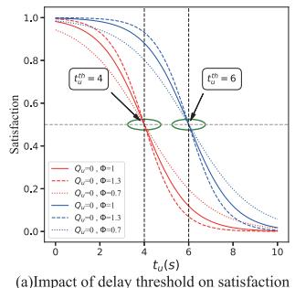

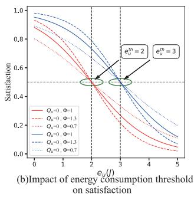  
Fig. 2. Impact of $\varPhi$ and delay/energy consumption thresholds on the satisfaction of sensor u.

## D. Problem Formulation

We aim to maximize the overall satisfaction of sensors by jointly optimizing deployment of UAVs, association between sensors and UAVs, and transmission power allocation of sensors, while taking into account the heterogeneous requirements of sensors. Therefore, the optimization problem can be formulated as

$$
\begin{array} { r l r l } & { P 1 : } & { \underset { \{ x _ { m } , y _ { m } , h _ { m } , a _ { u , m } , p _ { u } \} } { \mathrm { m a x } } \underset { u \in \mathcal { U } } { \sum } S _ { u } } \\ & { } & { \mathrm { s . t . } \ C 1 : a _ { u , m } \in \{ 0 , 1 \} , } & { \forall u \in \mathcal { U } , m \in \mathcal { M } } \\ & { } & { C 2 : \sum _ { m = 1 } ^ { U } a _ { u , m } \leq M ^ { t h } , \forall m \in \mathcal { M } } \\ & { } & { C 3 : \sum _ { m = 1 } ^ { U } a _ { u , m } = 1 , \quad \forall u \in \mathcal { U } } \\ & { } & { C 4 : p _ { u } \leq p _ { u } ^ { t h } , \quad } & { \forall u \in \mathcal { U } } \\ & { } & { C 5 : r _ { u } \geq r _ { u } ^ { t h } , \quad } & { \forall u \in \mathcal { U } } \\ & { } & { C 6 : h _ { m } \leq h _ { m } ^ { t h } , \quad } & { \forall m \in \mathcal { M } } \\ & { } & { C 7 : d _ { m _ { 1 } , m _ { 2 } } ^ { m } \geq d ^ { t h } , \quad } & { \forall m _ { 1 } \in \mathcal { M } , m _ { 2 } \in \mathcal { M } , } \end{array}\tag{12}
$$

where constraint C1 provides the range of association variables between UAVs and sensors. Constraint C2 indicates that each UAV may serve at most $M ^ { t h }$ sensors simultaneously due to actual hardware limitations. Constraint C3 specifies that each sensor is permitted to associate with only one UAV. Constraint C4 imposes limits on transmission power for each sensor. Constraint C5 indicates that a minimum rate must be achieved between each sensor and its associated UAV to ensure reliable data transmission. Constraint C6 ensures that the flight altitude of each UAV remains in a specified range. Constraint C7 states that a safe distance is required between any two UAVs to prevent potential collisions. Due to the limited number of sensors served by each UAV simultaneously, the association process between sensors and UAVs has strong coupling characteristics. At the same time, changes in the position of UAVs will affect the satisfaction of each sensor, further exacerbating the coupling in the association process. Therefore, it is necessary to design an efficient algorithm to jointly optimize deployment of UAVs, association between sensors and UAVs, and transmission power allocation of sensors for improving the overall satisfaction of sensors. In optimization problem (12), the reason for summing the satisfaction levels of each sensor is that the output of Sigmoid function is normalized to the range between 0 and 1. This normalization ensures that the satisfaction values of all sensors share the same value range, allowing them to be directly summed without being influenced by differences in value ranges.

## III. PROPOSED SOLUTION

The optimization problem P 1 is a mixed-integer nonlinear programming problem that involves both binary and continuous variables, as well as non-convex objective function and nonlinear constraints, which make it challenging to solve by using conventional methods. To effectively address problem $_ { p 1 }$ , we will design the enhanced Lagrange and gradient descent-based human evolutionary optimization algorithm (ELGHEOA) by combining heuristic algorithms with traditional Lagrangian methods, to efficiently obtain the solution, where we decompose it into two subproblems, namely the UAV deployment and user association subproblem, and transmission power allocation subproblem. For the first subproblem, we use the proposed Enhanced Human Evolutionary Optimization Algorithm (EHEOA) to search its optimal solution. For tackling the second subproblem, we utilize Lagrangian and gradient descent methods to obtain its solution. The solution of the original problem is obtained by iteratively solving the above two subproblems.

## A. Human Evolutionary Optimization Algorithm

Although there are many swarm intelligence optimization algorithms, they show weak global exploration capabilities on complex problems and are prone to fall into local optimal solutions. The Human Evolutionary Optimization Algorithm (HEOA) is a novel swarm intelligence optimization algorithm that appears in 2024, which shows robust performance and strong potential for finding global optimal solutions in many test functions and engineering problems [35]. Therefore, we propose the EHEOA to search its optimal solution. In HEOA, the optimal solution is searched by simulating human capabilities for exploration, adaptation, and exploitation in complex environments. HEOA consists of two phases, i.e., the human exploration phase and the human development phase. During the human exploration phase, a uniform strategy is used to find the optimal solution. In the stage of human development, the optimal solution is searched through collaborative optimization among roles such as leader, explorer, follower and loser. This mechanism effectively mimics the dynamic interplay of cooperation and competition observed in human societies. Next, we will present a detailed overview of each stage of HEOA.

1) Population initialization stage: HEOA initializes the population using logistic chaos mapping to simulate the chaotic phase at the onset of human evolution. This process takes into account both boundaries of the search space and the population size K. The k-th individual in the population can be initialized by

$$
X _ { k } ^ { 0 } = ( u b - l b ) \cdot r _ { k } + l b ,\tag{13}
$$

with

$$
r _ { k } = a \cdot r _ { k - 1 } \cdot ( 1 - r _ { k - 1 } ) , \forall k \in \{ 1 , 2 , \ldots , K \} ,\tag{14}
$$

where $0 \leq r _ { 0 } \leq 1 , a = 4 ,$ , ub and lb respectively represent the upper bound and lower bound of the search space.

2) Human exploration stage: In the human exploration phase, each individual tends to adopt a unified search strategy due to the need of facing unexplored areas and limited knowledge. This phase is known as the first quarter of the maximum number of iterations, during which the behavior can be described as

$$
\begin{array} { l } { { \displaystyle X _ { k } ^ { t + 1 } } \ ~ } \\ { { \displaystyle ~ = 0 . 2 \left( 1 - \frac { t } { T ^ { m a x } } \right) ^ { 2 } \cdot ( X _ { k } ^ { t } - X _ { m e a n } ^ { t } ) \cdot \mathrm { L e v y } ( D ) } } \\ { { \displaystyle ~ + X _ { b e s t } \cdot \left( 1 - \frac { t } { T ^ { m a x } } \right) + ( X _ { m e a n } ^ { t } ) - X _ { b e s t } ) \cdot \lfloor \frac { \mathrm { r a n d } } { \mathrm { j p } } \rfloor \mathrm { j p } , } } \end{array}\tag{15}
$$

in which t is the current iteration index, $\begin{array} { r l } { X _ { m e a n } ^ { t } } & { { } = } \end{array}$ $\textstyle { \frac { 1 } { K } } \sum _ { k = 1 } ^ { K } X _ { k } ^ { t }$ denotes the average position of the population at t-th iteration, $X _ { b e s t }$ is the global best position, $\begin{array} { r } { \mathrm { L e v y } ( D ) = { \frac { \mu \delta } { \nu } } } \end{array}$ is a random number following the Levy distribution that simulates the complex nature of knowledge acquisition and spiral development during the human exploration phase with $\begin{array} { r l r } { \delta } & { { } = } & { \left( \frac { \Gamma \left( 1 + \gamma \right) \cdot \sin \left( \frac { \gamma \pi } { 2 } \right) } { \Gamma \left( \frac { 1 + \gamma } { 2 } \right) \cdot \gamma \cdot 2 ^ { \frac { 1 + \gamma } { 2 } } } \right) } \end{array}$ 1+γ where Γ(·) denotes the gamma function, $\tilde { \mu } ~ \sim ~ N ( 0 , D ) , ~ \nu ~ \sim ~ N ( 0 , D )$ , and $\gamma \ = \ 1 . 5$ Meanwhile, $\begin{array} { r } { \mathrm { j p ~ = ~ \frac { m e a n ( \it l b , u b ) } { \it t . } \in ~ ( 1 0 0 , 2 0 0 0 ) ~ } } \end{array}$ is a jump coefficient, which is designed to enhance the dispersion of search locations.

3)Human development stage: During the human development phase, HEOA classifies the population into four roles, namely leaders, explorers, followers, and losers. Each role employs a specific search strategy and collaborates to pursue the optimal solution. Leaders possess extensive knowledge and are typically located in the most promising regions.

Consequently, individuals in the top 30% of fitness values are designated as leaders, which are responsible for exploring and identifying the most advantageous areas for human development. The mathematical model of leaders is formulated as

$$
X _ { k } ^ { t + 1 } = \left\{ \begin{array} { l l } { \xi \cdot X _ { k } ^ { t } \cdot \exp \left( \frac { - t } { \mathrm { r a n d } \cdot T ^ { m a x } } \right) , \mathrm { i f } \ R < A } \\ { \xi \cdot X _ { k } ^ { t } + \mathrm { r a n d n } \cdot \mathrm { o n e s } ( 1 , D ) , \mathrm { i f } \ R \geq A , } \end{array} \right.\tag{16}
$$

where $\begin{array} { l l l } { \xi } & { = } & { 0 . 2 \cos \left( { \frac { \pi } { 2 } } \left( 1 - { \frac { t } { T ^ { m a x } } } \right) \right) } \end{array}$ denotes an adaptive weighting coefficient, randn denotes a random number following a standard normal distribution, ones(1, D) is a D-dimensional row vector with all elements being 1, A is the evaluation of the situation, rand and R are random numbers within the range [0,1], where R indicates the complexity associated with the situation of leaders.

Explorers play a crucial role in the pursuit of unknown territory, striving to find the potential globally optimal solution. In the HEOA algorithm, individuals who rank in the top 30% to 80% with respect to fitness are designed as explorers. The mathematical model for explorers can be given by

$$
X _ { k } ^ { t + 1 } = \mathrm { r a n d n } \cdot \mathrm { e x p } \left( { \frac { ( X _ { w o r s t } ^ { t } ) ^ { 2 } - ( X _ { k } ^ { t } ) ^ { 2 } } { k ^ { 2 } } } \right) ,\tag{17}
$$

where $k ~ \in ~ [ K \cdot 3 0 \% , K \cdot 8 0 \% ] .$ , and $X _ { w o r s t } ^ { t }$ denotes the individual with the worst fitness in the population at the t-th iteration.

Followers align themselves with the guidance of leaders exhibiting the highest fitness levels and emulate their behaviors. The top 80% to 90% of the individuals with respect to fitness is designed as followers. The search strategy for followers can be given by

$$
X _ { k } ^ { t + 1 } = X _ { k } ^ { t } + 0 . 2 \cos \left( \frac { \pi } { 2 } \left( 1 - \frac { t } { T ^ { m a x } } \right) \right) \cdot \mathrm { { r a n d } } \cdot ( X _ { b e s t } ^ { t } - X _ { k } ^ { t } ) ,\tag{18}
$$

where $X _ { b e s t } ^ { t }$ denotes the individual with the best fitness in the population at the t-th iteration.

The individuals who fail to adapt to societal demands are designed as losers, corresponding to the individuals in the 90% to 100% in terms of fitness, and may be subject to elimination. The population will be replenished by reproduction in environments to foster human development. The model for population replenishment can be formulated as

$$
X _ { k } ^ { t + 1 } = X _ { b e s t } + \mathrm { r a n d n } \cdot ( X _ { b e s t } - X _ { k } ^ { t } ) .\tag{19}
$$

Whenever a new individual is generated, it is crucial to verify whether each dimension of that individual remains within the preset boundaries. If any dimension does exceed these boundaries, boundary control should be performed to ensure that the search remains within the search space. In other words, if $X _ { k , d } ^ { t + 1 } < l b ,$ then $X _ { k , d } ^ { t + 1 } = l b$ . While if $X _ { k , d } ^ { t + 1 } > u b ,$ then $X _ { k , d } ^ { t + 1 } = u b$ . Based on the preceding analysis, the details of HEOA are summarized in Algorithm 1.

B. Enhanced Human Evolutionary Optimization Algorithm (EHEOA)

The HEOA, like other swarm intelligence optimization algorithms, faces limitations in its global search capabilities and is susceptible to becoming trapped in local optima when addressing complex problems. To address these challenges, two strategies will be introduced to enhance the performance of HEOA. During the human development phase, leaders play a crucial role in searching for the optimal solution. However, extensive experimentation has demonstrated that the adaptive weight coefficient 0.2 cos $\begin{array} { r } { \left( \frac { \pi } { 2 } \left( 1 - \frac { t } { t ^ { m a x } } \right) \right) } \end{array}$  is not well-suited for the scenarios addressed in this study. Furthermore, when $R < A$ within the leader population, a significant deficiency in exploration capabilities becomes apparent. To address this issue, inspired by the Whale Optimization Algorithm (WOA) in [37], a spiral strategy that utilizes a logarithmic function for adjusting both step size and direction, is introduced for leaders to facilitate rapid coverage of global space and allow penetration into local regions. This approach significantly improves the global exploration capability and increases the possibility of finding the global optimum, thus effectively reducing the risk of falling into the local optimum. The improved mathematical formulations for leaders and followers can be respectively given by

Algorithm 1 Human Evolutionary Optimization Algorithm   
(HEOA)   
1: Initialize parameters: $K , D , l b , u b , T ^ { m a x } , t = 1 .$   
2: Initialize the population $X ^ { 0 }$ using equation (13), calculate   
the fitness values for all individuals, and sort them in order   
of their respective fitness scores.   
3: Record the global best solution, the current best solution,   
the current worst solution, and the average solution of the   
current population.   
4: repeat   
5: if $\begin{array} { r } { t \le \frac { 1 } { 4 } T _ { m a x } } \end{array}$ then   
6: Update the positions of all individuals according to   
(15).   
7: else   
8: Update the positions of leaders according to (16).   
Update the positions of explorers according to (17).   
Update the positions of followers according to (18).   
Update the positions of losers according to (19).   
9: end if   
10: Perform boundary control and calculate the fitness   
values of new individuals, sort them accordingly, and   
update the information in step 3.   
11: $t = t + 1 .$   
12: until $t \geq T ^ { m a x }$

$$
X _ { k } ^ { t + 1 } = \left\{ \begin{array} { l l } { X _ { k } ^ { t } \cdot \exp ( b I ) \cdot \cos ( 2 \pi l ) , } & { \mathrm { i f ~ } R < A } \\ { X _ { k } ^ { t } + \mathrm { r a n d n } \cdot \mathrm { o n e s } ( 1 , D ) , } & { \mathrm { i f ~ } R \geq A } \end{array} \right.\tag{20}
$$

and

$$
X _ { k } ^ { t + 1 } = X _ { k } ^ { t } + \mathrm { r a n d } \cdot ( X _ { b e s t } - X _ { k } ^ { t } ) ,\tag{21}
$$

where b is a constant that captures the spiral shape, I is a random number in the range of [-1,1], and $l = 2 \cdot \mathrm { r a n d - 1 }$ has two functions: 1) it represents the extent to which $X _ { k } ^ { t + 1 }$ converges towards $X _ { b e s t } .$ , and 2) it regulates the exploratory behaviors of individuals in the entire logarithmic spiral space. During each iteration of EHEOA, each individual is randomly assigned a distinct l to ensure diverse exploratory behavior in the spiral space.

Explorers depend on inferior solutions in the population to update information. The adjustment strategy based on inferior solutions helps individuals avoid falling into locally worst regions, which however has significant drawbacks. Firstly, this strategy mainly relies on position of the worst solution for local adjustments with small step sizes, thus constraining the global exploration capabilities of explorers. Secondly, an over-reliance by followers on the worst solution reduces their autonomous exploration abilities, resulting in convergence of population behavior and a reduction in diversity. Additionally, in the later stages of iteration, if individuals in the population are already close to the global optimal solution, adjustments based on the worst solution will slow down the convergence speed, since the step sizes of individuals are small and adjustment directions are mainly influenced by the worst solution, thereby failing to fully utilize the information from the optimal solution to accelerate convergence. To address these challenges, this paper integrates followers from the Sparrow Search Algorithm (SSA) [38] to bolster the exploration capabilities of explorers. The mathematical expression is thus expressed as

$$
X _ { k } ^ { t + 1 } = \left\{ \begin{array} { l l } { \mathrm { r a n d n } \cdot \exp \left( \displaystyle \frac { X _ { w o r s t } - X _ { k } ^ { t } } { k ^ { 2 } } \right) , } & \\ { \mathrm { i f } \ k \in ( K \cdot 5 5 \% , K \cdot 8 0 \% ) } \\ { \displaystyle X _ { b e s t } ^ { t } + | X _ { k } ^ { t } - X _ { b e s t } | \cdot A ^ { + } L , } & \\ { \mathrm { i f } \ k \in [ K \cdot 3 0 \% , K \cdot 5 5 \% ] } \end{array} \right.\tag{22}
$$

where A is a $1 \times D$ matrix with each element randomly being $1 ~ \mathrm { o r } - 1 , A ^ { + } = A ^ { T } ( A A ^ { T } ) ^ { - 1 }$ , and L is ${ \textbf { a } } 1 \times D$ matrix with all elements equal to 1. The top 50% of explorers adjust their positions based on the optimal solution of explorers and the global optimal solution during the t-th iteration, while the bottom 50% of explorers maintain their original exploration strategy. Unlike the literature [31], we take into account both the global optimal information and the optimal information from the previous iteration in (22). This approach enhances the exploration capability of the population.

Since problem P 1 involves a number of binary variables, specifically the association variables between UAVs and sensors, relying only on continuous HEOA proves to be ineffective. Consequently, we will enhance HEOA to accommodate both continuous real-valued variables and discrete binary variables. To achieve this, we design a transfer mechanism for each individual by employing the S-shaped function to convert the continuous values in each individual k that represent the associations between UAVs and sensors, into discrete outputs of 0 or 1. The transfer function can be given by

$$
b _ { k , d } ^ { t } = \mathcal { F } _ { 1 } ( X _ { k , d } ^ { t } , { p } _ { k , d } ^ { t } ) , \forall d \in [ 3 M + 1 , D ] ,\tag{23}
$$

where d represents the dimension that requires binary mapping for each individual in the population, $X _ { k , d } ^ { t }$ represents the real value in d-dimension for individual k at t-th iteration in the population, $p _ { k , d } ^ { t }$ denotes the probability of corresponding dimension after S-shape mapping, $b _ { k , d } ^ { t }$ denotes the binary outcome after applying binary mapping to this dimension, and

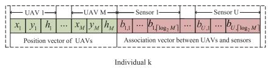  
Fig. 3. Representation of each individual in ELGHEOA.

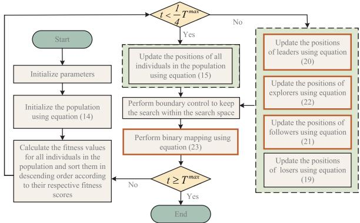  
Fig. 4. Detailed process of the proposed EHEOA.

$D = 3 M + U \times \lceil \log _ { 2 } M \rceil$ , where d·e denotes rounding up operation.

The mapping process comprises two steps: S-shape mapping and binary mapping. First, $X _ { k , d } ^ { t }$ is transformed into a probability value $p _ { k , d } ^ { t }$ through S-shaped function according to (24):

$$
p _ { k , d } ^ { t } = \frac { 1 } { 1 + \exp ( - 1 0 ( X _ { k , d } ^ { t } - 0 . 5 ) ) } .\tag{24}
$$

Next, the probability $p _ { k , d } ^ { t }$ is mapped to a binary value $b _ { k , d } ^ { t }$ in accordance with (25):

$$
b _ { k , d } ^ { t } = \left\{ \begin{array} { l l } { 1 , } & { \mathrm { i f ~ } p _ { k , d } ^ { t } \ge 0 . 5 } \\ { 0 , } & { \mathrm { i f ~ } p _ { k , d } ^ { t } < 0 . 5 . } \end{array} \right.\tag{25}
$$

In order to effectively utilize the proposed EHEOA to address the UAV deployment and association between UAVs and sensors in problem P1, we need to encode the individuals in the population. In this study, the representation of each individual is shown in Fig. 3. The first 3M bits represent the deployment positions of UAVs in the network, where each group of three bits specifies the position of a UAV, namely its three-dimensional coordinates. The remaining $D - 3 M$ bits correspond to the associations between UAVs and sensors, where each $\lceil \log _ { 2 } M \rceil$ bits denotes the UAV number associated with a specific sensor. For the d-th position of individual k with $d \in \mathsf { \Gamma } [ 3 M + 1 , D ]$ , the following rule can be used to determine which sensor it belongs to. If d−3M can be divided by $\lceil \log _ { 2 } M \rceil$ , then the corresponding sensor $\begin{array} { r } { u = \frac { d - 3 M } { \lceil \log _ { 2 } M \rceil } } \end{array}$ , and the corresponding bit for sensor u is $s = \lceil \log _ { 2 } \dot { M } \rceil ^ { \sim }$ . While if $d - 3 M$ cannot be divided by $\lceil \log _ { 2 } M \rceil$ , the corresponding sensor $\begin{array} { l c l } { { u } } & { { = } } & { { \left\lfloor { \frac { \displaystyle d - 3 { \cal M } } { \displaystyle \lceil \log _ { 2 } { \cal M } \rceil } } \right\rfloor ~ + ~ 1 } } \end{array}$ where b·c denotes the floor operation, and the corresponding bit for sensor u can be denoted as $s = \mathrm { m o d } ( d - 3 M , \lceil \log _ { 2 } M \rceil )$ , where $\bmod { \left( x , y \right) }$ denotes the remainder of dividing x by y. Therefore, the s-th bit for sensor u in individual k at the t-th iteration can be expressed as $b _ { u , s } = b _ { k , d } ^ { t }$ . Meanwhile, the UAV mm that is associated with sensor u can be expressed as

$$
m m = b _ { u , 1 } 2 ^ { \lceil \log _ { 2 } M \rceil - 1 } + \ldots + b _ { u , \lceil \log _ { 2 } M \rceil } 2 ^ { 0 } + 1 ,\tag{26}
$$

which indicates that $a _ { u , m } = 1$ if $m = m m$ , and $a _ { u , m } = 0$ otherwise. It is worth noting that mm cannot exceed M, otherwise, mm should be forced to be the number of the UAV with the least associated sensors in the network. In order to evaluate the quality of each individual in the EHEOA algorithm with consideration of constraints in optimization problem P1, the fitness function can be designed as

$$
\begin{array} { r l } & { \mathcal { F } _ { 2 } ( X _ { k } ^ { t } ) } \\ & { = \displaystyle \sum _ { u \in \mathcal { U } } S _ { u } - \alpha \bigg \{ \displaystyle \sum _ { m = 1 } ^ { M } \big [ \operatorname* { m a x } \left( 0 , \displaystyle \sum _ { u = 1 } ^ { U } a _ { u , m } - M ^ { t h } \right) } \\ & { \quad + \operatorname* { m a x } ( 0 , h _ { m } - h _ { m } ^ { t h } ) \big ] + \displaystyle \sum _ { u = 1 } ^ { U } \big [ \operatorname* { m a x } ( 0 , p _ { u } - p _ { u } ^ { t h } ) } \\ & { \quad + \operatorname* { m a x } ( 0 , r _ { u } - r _ { u } ^ { t h } ) \big ] + \displaystyle \sum _ { m _ { 1 } \in \mathcal { M } , \operatorname* { m a x } \big ( 0 , d _ { m _ { 1 } , m _ { 2 } } ^ { m _ { 1 } \ne m _ { 2 } } - d ^ { t h } \big ) } \bigg \} , } \end{array}\tag{27}
$$

where α is a positive punishment factor. Fig. 4 shows the detailed process of the proposed EHEOA.

## C. Performance Analysis of EHEOA in Solving Continuous and Discrete Problems

To analyze the effectiveness of the proposed EHEOA in continuous problems, we selected 18 classic test functions for verification, which cover unimodal functions, multimodal functions and fixed-dimensional functions [36]. Several classic intelligent optimization algorithms were used to demonstrate the effectiveness of the proposed EHEOA, including WOA [37], SSA [38], Butterfly Optimization Algorithm (BOA) [39], Slime Mould Algorithm (SMA) [40], Particle Swarm Optimization (PSO), and HEOA. The experiments were performed on single-peak and multi-peak functions with a dimensionality of 30, while the fixed-dimension function was set to two dimensions (2D). The optimization results of algorithms, averaged over 20 runs with 500 iterations, are presented in Table II, including both the mean values and standard deviations.

The primary purpose of using unimodal functions is to evaluate the basic search capabilities and convergence speed of each algorithm for simple optimization problems. Experimental results show that among the six unimodal test functions, EHEOA successfully reached optimal solutions with a standard deviation of zero for the Sphere, Sum-Squares, Powell, and Zakharov functions. This demonstrates that EHEOA can quickly converge to the global optimal solution for simple optimization problems and its search process is highly stable and unaffected by random factors. Furthermore, The optimization accuracy of EHEOA on all unimodal test functions outperform the comparison algorithms, demonstrating its significant advantage in basic optimization tasks. For simple multimodal functions, which exhibit multiple local minima, the algorithm’s global search capabilities and ability to escape local optima were examined. Experimental results show that

TABLE II  
MEAN AND STANDARD DEVIATION OF ALGORITHMS ON TEST FUNCTIONS
<table><tr><td>Function</td><td>Metric</td><td>EHEOA</td><td>HEOA</td><td>PSO</td><td>SMA</td><td>SSA</td><td>WOA</td><td>BOA</td><td></td></tr><tr><td rowspan="3">Sphere</td><td>Mean</td><td>0.00E + 00</td><td>1.32E - 258</td><td>1.61E 04</td><td>1.39E - 315</td><td>9.27E - 11</td><td>4.08E</td><td>-20</td><td>4.25E - 12</td></tr><tr><td>Std</td><td>0.00E + 00</td><td>0.00E + 00</td><td>3.12E 04</td><td>0.00E + 00</td><td>2.76E- 10</td><td>6.50E 一</td><td>-20</td><td>4.32E-12</td></tr><tr><td>Mean</td><td>0.00E + 00</td><td>1.14E -147</td><td>1.88E E-06</td><td>6.96E - 277</td><td>2.35E-07</td><td>5.08E -20</td><td></td><td>3.45E-15</td></tr><tr><td rowspan="3">Sum-Squares Zakharov</td><td>Std</td><td>0.00E + 00</td><td>3.41E -147</td><td>2.16E - 06</td><td>0.00E + 00</td><td>7.00E- 07</td><td>1.50E - 19</td><td></td><td>6.78E-15</td></tr><tr><td>Mean</td><td>0.00E + 00</td><td>6.68E E-154</td><td>2.06E + 01</td><td>6.25E - 309</td><td>7.77E - 08</td><td>9.20E - 01</td><td></td><td>1.23E - 08</td></tr><tr><td>Std</td><td>0.00E + 00</td><td>2.01E - 153</td><td>1.69E + 01</td><td>0.00E + 00</td><td>1.78E - 07</td><td>2.35E + 00</td><td></td><td>3.75E - 08</td></tr><tr><td rowspan="2">Dixon-Price</td><td>Mean</td><td>9.08E- 02</td><td>2.42E -01</td><td>2.36E - 01</td><td>3.09E - 01</td><td>2.41E - 01</td><td>3.78E - 01</td><td></td><td>5.65E - 01</td></tr><tr><td>Std</td><td>5.30E - 02</td><td>1.08E - 03</td><td>1.00E - 01</td><td>5.63E - 02</td><td>8.78E - 04</td><td>9.43E - 02</td><td></td><td>4.32E - 02</td></tr><tr><td rowspan="2">Powell</td><td>Mean</td><td>0.00E + 00</td><td>7.46E - 245</td><td>1.48E + 01</td><td>4.88E - 301</td><td>1.71E - 09</td><td>1.16E - 08</td><td></td><td>5.67E - 10</td></tr><tr><td>Std</td><td>0.00E + 00</td><td>0.00E + 00</td><td>3.22E + 01</td><td>0.00E + 00</td><td>3.40E - 09</td><td>2.29E - 08</td><td></td><td>1.12E - 09</td></tr><tr><td rowspan="2">Trid</td><td>Mean</td><td>-1.28E + 03</td><td>-4.70E + 02</td><td>-5.04E + 02</td><td>-5.04E + 02</td><td>-4.96E + 02</td><td>-5.00E + 02</td><td></td><td>-4.98E + 02</td></tr><tr><td>Std</td><td>1.03E + 02</td><td>0.00E + 00</td><td>9.98E - 01</td><td>1.88E - 01</td><td>9.82E + 00</td><td>2.04E + 00</td><td></td><td>8.05E + 00</td></tr><tr><td rowspan="3">Rastrigin</td><td>Mean</td><td>0.00E + 00</td><td>0.00E + 00</td><td>5.33E + 01</td><td>0.00E + 00</td><td>3.20E- 08</td><td>4.55E - 14</td><td></td><td>2.15E-12</td></tr><tr><td>Std</td><td>0.00E + 00</td><td>0.00E + 00</td><td>1.48E + 01</td><td>0.00E + 00</td><td>6.20E - 08</td><td>4.25E-14</td><td></td><td>7.02E -12</td></tr><tr><td>Mean</td><td>4.44E - 16</td><td>4.44E - 16</td><td>2.23E + 00</td><td>4.44E - 16</td><td>2.05E - 06</td><td></td><td></td><td>8.95E-12</td></tr><tr><td rowspan="3">Ackley Griewank</td><td>Std</td><td>0.00E + 00</td><td>0.00E + 00</td><td>1.50E + 00</td><td>0.00E + 00</td><td>5.37E - 06</td><td>1.43E - 10 3.18E - 10</td><td></td><td>1.78E - 11</td></tr><tr><td>Mean</td><td>0.00E + 00</td><td>8.42E - 12</td><td>2.01E - 02</td><td>6.42E - 11</td><td>4.93E - 11</td><td>3.45E - 03</td><td></td><td></td></tr><tr><td>Std</td><td>0.00E + 00</td><td>3.05E - 11</td><td>2.28E - 02</td><td>4.35E - 10</td><td>1.46E - 10</td><td></td><td></td><td>4.14E - 11 1.45E - 11</td></tr><tr><td rowspan="3">Schwefel</td><td>Mean</td><td>3.81E + 05</td><td>5.86E + 02</td><td>5.15E + 03</td><td>3.67E + 03</td><td>5.15E + 03</td><td>1.04E - 02 5.19E + 03</td><td></td><td></td></tr><tr><td>Std</td><td>8.31E + 05</td><td>8.24E + 01</td><td>8.06E + 02</td><td>4.12E + 02</td><td>2.35E + 03</td><td>3.34E + 02</td><td></td><td>4.85E + 03</td></tr><tr><td>Mean</td><td>2.39E -07</td><td>1.79E -06</td><td>5.03E + 00</td><td>1.35E - 01</td><td></td><td></td><td></td><td>3.45E + 02</td></tr><tr><td rowspan="3">Levy</td><td>Std</td><td>2.50E -07</td><td>2.20E -06</td><td>3.62E + 00</td><td></td><td>1.41E - 05</td><td>1.67E + 00</td><td></td><td>2.02E - 01</td></tr><tr><td>Mean</td><td>2.30E -05</td><td>1.24E -03</td><td>7.04E + 01</td><td>1.05E - 01</td><td>1.47E - 05</td><td>1.83E - 01</td><td></td><td>4.32E - 02</td></tr><tr><td>Std</td><td>2.81E -05</td><td>2.27E -03</td><td>4.81E + 01</td><td>2.85E + 01</td><td>2.19E- 03</td><td>2.73E + 01</td><td></td><td>7.22E + 01</td></tr><tr><td rowspan="3">Booth</td><td>Mean</td><td>0.00E + 00</td><td>1.21E + 00</td><td>2.42E 01</td><td>1.05E -01</td><td>2.63E -03</td><td>6.88E -01</td><td></td><td>2.45E + 00</td></tr><tr><td>Std</td><td>0.00E + 00</td><td>7.51E -01</td><td>3.49E</td><td>5.63E -10</td><td>1.77E</td><td>-06 2.57E</td><td>-06</td><td>4.75E- 08</td></tr><tr><td>Mean</td><td>0.00E + 00</td><td>9.68E -120</td><td>E-01 9.91E -41</td><td>7.92E- 10</td><td>8.65E- 07</td><td>3.29E- 06</td><td></td><td>2.45E - 08</td></tr><tr><td rowspan="3">Matyas</td><td>Std</td><td>0.00E + 00</td><td></td><td></td><td>0.00E + 00</td><td>3.87E -12</td><td>2.83E - 155</td><td></td><td>1.65E - 15</td></tr><tr><td>Mean</td><td>-1.58E + 00</td><td>2.90E - 119</td><td>2.89E - 40</td><td>0.00E + 00</td><td>1.16E- 11</td><td></td><td>5.27E - 155</td><td>3.95E - 15</td></tr><tr><td>Std</td><td>2.84E - 01</td><td>-3.40E + 00 6.17E - 01</td><td>-1.91E + 00</td><td>-1.91E + 00</td><td>-1.91E + 00</td><td>-1.91E + 00</td><td></td><td>-1.91E + 00</td></tr><tr><td rowspan="3">ThreE-Hump-Camel</td><td></td><td></td><td></td><td>0.00E + 00</td><td>1.23E - 13</td><td>3.35E - 10</td><td>1.97E - 10</td><td></td><td>5.26E - 13</td></tr><tr><td>Mean</td><td>0.00E + 00</td><td>1.25E - 94</td><td>1.83E - 45</td><td>3.53E - 45</td><td>1.04E - 12</td><td></td><td>6.54E - 155</td><td>5.15E - 45</td></tr><tr><td>Std</td><td>0.00E + 00</td><td>3.76E - 94</td><td>3.37E - 45</td><td>4.07E - 45</td><td>2.55E - 12</td><td>1.96E - 154</td><td></td><td>4.32E - 45</td></tr><tr><td rowspan="3">Six-Hump-Camel</td><td>Mean</td><td>-1.01E + 00</td><td>-1.03E + 00</td><td>-1.03E + 00</td><td>-1.03E + 00</td><td>-1.03E + 00</td><td>-1.03E + 00</td><td></td><td>-1.03E + 00</td></tr><tr><td>Std</td><td>5.97E-06</td><td>3.09E -02</td><td>2.22E - 16</td><td>5.20E -11</td><td>2.97E- 06</td><td>6.73E-08</td><td></td><td>3.75E-11</td></tr><tr><td>Mean</td><td>0.00E + 00</td><td>3.25E- 01</td><td>6.49E - 04</td><td>2.57E-09</td><td>2.86E- 07</td><td>2.88E-07</td><td></td><td>4.15E - 08</td></tr><tr><td rowspan="2">Beale</td><td>Std</td><td>0.00E + 00</td><td>3.96E - 01</td><td>6.57E - 04</td><td>4.94E - 09</td><td>3.21E- 07</td><td>3.78E-07</td><td></td><td>1.35E- 08</td></tr><tr><td></td><td></td><td></td><td></td><td></td><td></td><td></td><td></td><td></td></tr></table>

EHEOA successfully achieves optimality with a standard deviation of zero on the Rastrigin and Griewank functions. For the Schwefel, Rosenbrock, and Levy functions, EHEOA achieves the highest optimization accuracy with a low standard deviation, outperforming the comparison algorithms. This demonstrates that EHEOA can effectively perform a global search and successfully escape local optima when faced with complex optimization problems with multiple local minima. For the 2D test functions, which include both unimodal and multimodal functions, EHEOA achieves optimality on the Booth and Matyas unimodal 2D functions, and exhibits strong variance stability. For the remaining four multimodal 2D functions, EHEOA outperforms the comparison algorithms on the Three-Hump Camel, Six-Hump Camel, and Beale functions, achieving optimality in the Three-Hump Camel and Beale test functions. This demonstrates that EHEOA can effectively escape local optima, conduct a global search, and find the global optimal solution when faced with complex multimodal functions.

To analyze the performance of the EHEOA for discrete problems, experiments were conducted on feature selection problem using eight classic datasets from the UCI machine learning repository [41]. The selected datasets contain varying numbers of features and instances, representing a variety of problem types. For each dataset, the data was randomly partitioned into training, validation, and test sets using crossvalidation. A feature selection wrapper method based on the K-Nearest Neighbor (KNN) classifier with K = 5 was employed for experiments [42]. During the training process, the position of each EHEOA individual represented a feature subset. Furthermore, the binary versions of HEOA, PSO, SMA, SSA, WOA, and BOA were used for benchmark comparison to demonstrate the effectiveness of the proposed EHEOA in discrete problems. For the feature selection problem, given that the datasets are all for classification tasks, the optimal feature subset was selected by constructing a fitness function that minimizes both the error rate and the number of selected features [43]. The fitness function can be expressed as

$$
{ \mathrm { F i t n e s s } } = \gamma E _ { R } ( D ) + \delta { \frac { | R | } { | C | } } ,\tag{28}
$$

where $E _ { R } ( D )$ is the error rate, |R| is the size of the selected feature subset, |C| is the total number of features, $\gamma \in [ 0 , 1 ]$ and $\delta = 1 - \gamma$ are constants controlling the importance of classification accuracy and feature reduction, respectively.

The experimental results are presented in Tables III, where $\gamma = 0 . 9 9$ for experiments. It can be observed that the EHEOA exhibited the best performance in feature selection tasks across eight classification datasets. Specifically, EHEOA achieved the highest average fitness values on seven datasets: Breast

TABLE III  
AVERAGE FITNESS VALUES ON DIFFERENT DATASETS
<table><tr><td>Dataset</td><td>EHEOA</td><td>HEOA</td><td>PSO</td><td>SMA</td><td>SSA</td><td>WOA</td><td>BOA</td></tr><tr><td>Breast Cancer</td><td>0.0149</td><td>0.0363</td><td>0.0149</td><td>0.0166</td><td>0.0288</td><td>0.0149</td><td>0.0244</td></tr><tr><td>Wine</td><td>0.0038</td><td>0.0237</td><td>0.0038</td><td>0.0046</td><td>0.0237</td><td>0.0038</td><td>0.0062</td></tr><tr><td>Digits</td><td>0.0200</td><td>0.0288</td><td>0.0128</td><td>0.0307</td><td>0.0393</td><td>0.02040.0254</td><td></td></tr><tr><td>Diabetes</td><td>0.2060</td><td>0.2442</td><td></td><td>0.2114 0.1995</td><td>0.2273</td><td>0.19950.1995</td><td></td></tr><tr><td>Zoo</td><td>0.0035</td><td>0.0038</td><td></td><td>0.00440.0038</td><td>0.0063</td><td>0.00440.0038</td><td></td></tr><tr><td>House Votes</td><td>0.0119</td><td>0.0201</td><td></td><td>0.0176 0.0113</td><td></td><td>0.02580.01190.0126</td><td></td></tr><tr><td>Lymphography</td><td>0.4648</td><td>0.5324</td><td></td><td></td><td></td><td>0.4862 0.4687 0.5544 0.5077 0.5116</td><td></td></tr><tr><td>Primary Tumor</td><td>0.1994</td><td>0.2491</td><td></td><td></td><td></td><td>0.20620.23710.24120.22680.2176</td><td></td></tr></table>

TABLE IV

MAIN SIMULATION PARAMETERS
<table><tr><td rowspan=1 colspan=1>Parameter</td><td rowspan=1 colspan=1>Description</td><td rowspan=1 colspan=1>Value</td></tr><tr><td rowspan=1 colspan=1>C</td><td rowspan=1 colspan=1>Speed of light (m/s)</td><td rowspan=1 colspan=1>3 × 108</td></tr><tr><td rowspan=1 colspan=1>f</td><td rowspan=1 colspan=1>Carrier frequency (GHz)</td><td rowspan=1 colspan=1>2</td></tr><tr><td rowspan=1 colspan=1>N0</td><td rowspan=1 colspan=1>Thermal noise density (dBm/Hz)</td><td rowspan=1 colspan=1>-174</td></tr><tr><td rowspan=1 colspan=1>B</td><td rowspan=1 colspan=1>Communication bandwidth (MHz)</td><td rowspan=1 colspan=1>20 [46]</td></tr><tr><td rowspan=1 colspan=1>ρ,θ</td><td rowspan=1 colspan=1>Environmental constants</td><td rowspan=1 colspan=1>11.95,0.136</td></tr><tr><td rowspan=1 colspan=1>ηlos</td><td rowspan=1 colspan=1>Attenuation factor for LoS links (dB)</td><td rowspan=1 colspan=1>3</td></tr><tr><td rowspan=1 colspan=1>ηnlos</td><td rowspan=1 colspan=1>Attenuation factor for NLoS links (dB)</td><td rowspan=1 colspan=1>23</td></tr><tr><td rowspan=1 colspan=1>dth</td><td rowspan=1 colspan=1>Minimum safe distance between any two UAVs (m)</td><td rowspan=1 colspan=1>10</td></tr><tr><td rowspan=1 colspan=1>pth</td><td rowspan=1 colspan=1>Minimum communication rate (Mbps)</td><td rowspan=1 colspan=1>5 [46]</td></tr><tr><td rowspan=1 colspan=1>tth</td><td rowspan=1 colspan=1>Maximum tolerable delay threshold of sensors (s)</td><td rowspan=1 colspan=1>30 [48]</td></tr><tr><td rowspan=1 colspan=1>eth</td><td rowspan=1 colspan=1>Maximum tolerable energy consumption threshold of sensors (J)</td><td rowspan=1 colspan=1>15 [48]</td></tr><tr><td rowspan=1 colspan=1>Mth</td><td rowspan=1 colspan=1>Maximum number of served sensors for each UAV</td><td rowspan=1 colspan=1>5</td></tr><tr><td rowspan=1 colspan=1>D</td><td rowspan=1 colspan=1>Initial data size of sensors (M B)</td><td rowspan=1 colspan=1>10 [47]</td></tr><tr><td rowspan=1 colspan=1>Φ</td><td rowspan=1 colspan=1>Task urgency</td><td rowspan=1 colspan=1>1</td></tr><tr><td rowspan=1 colspan=1>S1, ζ2</td><td rowspan=1 colspan=1>weighting factors</td><td rowspan=1 colspan=1>0.5</td></tr></table>

Cancer, Wine, Digits, Zoo, House Votes, Lymphography, and Primary Tumors. These results indicate that EHEOA attained the highest classification accuracy and demonstrated superior feature selection capabilities. In contrast, although PSO and WOA are comparable to EHEOA on certain datasets (such as Breast Cancer, Wine, and House Votes), their overall stability is subpar. Overall, EHEOA shows significant advantages and robust generalization ability in feature selection tasks, further validating its excellent performance on discrete problems. From the performance analysis in this subsection, it can be observed that the proposed EHEOA algorithm significantly outperforms the comparison algorithms in many aspects, indicating that EHEOA has good application potential in solving continuous and discrete problems.

## D. Lagrangian Dual Method and Gradient Descent Method Based Power Allocation Algorithm

For given positions of UAVs and association between sensors and UAVs established through EHEOA, the problem P 1 can be reformulated into the following power allocation subproblem:

$$
\begin{array} { r l r } { \mathbf { P } \mathrm { 2 } : \displaystyle \operatorname* { m a x } _ { \{ p _ { u } \} } \sum _ { u \in \mathcal { U } } S _ { u } } & \\ { \mathrm { s . t . } \quad C 1 : \quad p _ { u } \leq p _ { u } ^ { t h } , \quad \forall u } & \\ { \quad \quad \quad \quad C 2 : \quad r _ { u } \geq r _ { u } ^ { t h } , \quad \forall u . } & \end{array}\tag{29}
$$

To address problem $P 2 .$ , the original nonlinear programming problem is first transformed into a more tractable problem using the Lagrangian dual method. Subsequently, the gradient descent method is employed to obtain the optimal solution that satisfies the Karush-Kuhn-Tucker (KKT) conditions [44]. The

Lagrangian function of problem $\mathbf { \nabla } _ { \mathbf { \mathcal { P } } 2 }$ is shown in equation (31), shown at the bottom of the next page, and the dual problem is then given by

$$
D ( \mu _ { u } , \nu _ { u } ) = \operatorname* { m a x } _ { \{ p _ { u } \} } L ( p _ { u } , \mu _ { u } , \nu _ { u } ) ,\tag{30}
$$

KKT conditions are necessary conditions for the optimal solution of a nonlinear programming problem, which require that the solution to the dual problem satisfies the following conditions:

$$
\left\{ \begin{array} { l l } { \frac { \varphi L } { \varphi p _ { u } } \leq 0 , p _ { u } \geq 0 , p _ { u } \frac { \varphi L } { \varphi p _ { u } } = 0 , } \\ { \frac { \varphi L } { \varphi \mu _ { u } } \leq 0 , \mu _ { u } \geq 0 , \mu _ { u } \frac { \varphi L } { \varphi \mu _ { u } } = 0 , } \\ { \frac { \varphi L } { \varphi \nu _ { u } } \leq 0 , \nu _ { u } \geq 0 , \nu _ { u } \frac { \varphi L } { \varphi \nu _ { u } } = 0 . } \end{array} \right.\tag{32}
$$

We assume that there are H sensors with $Q _ { u } = 0 , T$ sensors with $Q _ { u } = 1$ , and Y sensors with $Q _ { u } = - 1$ , and $H { + } T { + } Y =$ $U ,$ , where their corresponding sets are respectively denoted as H, T , and ${ \mathcal { V } } ,$ satisfying $\mathcal { H } \cup \mathcal { T } \cup \mathcal { Y } = \mathcal { U }$ . When employing the gradient descent method to derive the optimal solution that complies with the KKT conditions, we can express the transmission power of each type of sensors at i-th iteration as

$$
p _ { h } ^ { i } = \left[ p _ { h } ^ { i - 1 } + \beta \frac { \varphi L } { \varphi p _ { h } } \right] ^ { + } ,\tag{33}
$$

$$
p _ { t } ^ { i } = \left[ p _ { t } ^ { i - 1 } + \beta \frac { \varphi L } { \varphi p _ { t } } \right] ^ { + } ,\tag{34}
$$

$$
p _ { y } ^ { i } = \left[ p _ { y } ^ { i - 1 } + \beta \frac { \varphi L } { \varphi p _ { y } } \right] ^ { + } ,\tag{35}
$$

where $\beta$ represents the step size, and $[ x ] ^ { + } = \operatorname* { m a x } \{ x , 0 \}$

During each iteration, after updating the transmission power of sensors, the multipliers can be updated as

$$
\mu _ { h } ^ { i } = [ \mu _ { h } ^ { i - 1 } - \varkappa ( p _ { h } ^ { i } - p _ { h } ^ { t h } ) ] ^ { + } ,
$$

$$
\mu _ { t } ^ { i } = [ \mu _ { t } ^ { i - 1 } - \varkappa ( p _ { t } ^ { i } - p _ { t } ^ { t h } ) ] ^ { + } ,\tag{36}
$$

(37)

$$
\mu _ { y } ^ { i } = [ \mu _ { y } ^ { i - 1 } - \varkappa ( p _ { y } ^ { i } - p _ { y } ^ { t h } ) ] ^ { + } ,\tag{38}
$$

$$
\nu _ { h } ^ { i } = [ \nu _ { h } ^ { i - 1 } - \aleph ( r _ { h } ^ { t h } - B \log _ { 2 } ( ( 1 + s _ { h , m } ^ { i } ) ] ^ { + } ,\tag{39}
$$

$$
\nu _ { t } ^ { i } = [ \nu _ { t } ^ { i - 1 } - \aleph ( r _ { t } ^ { t h } - B \log _ { 2 } ( ( 1 + s _ { t , m } ^ { i } ) ] ^ { + } ,\tag{40}
$$

$$
\nu _ { y } ^ { i } = [ \nu _ { y } ^ { i - 1 } - \aleph ( r _ { y } ^ { t h } - B \log _ { 2 } ( ( 1 + s _ { y , m } ^ { i } ) ] ^ { + } .\tag{41}
$$

where κ and ℵ are non-negative steps.

Based on the analysis presented above, the proposed power allocation algorithm are summarized in Algorithm 2.

## E. Enhanced Lagrange and Gradient Descent-Based Human Evolutionary Optimization Algorithm (ELGHEOA)

The proposed ELGHEOA is summarized in Algorithm $^ { 3 , }$ where the solution to the subproblem of joint UAV deployment and association between sensors and UAVs is obtained by the EHEOA algorithm, and the subproblem for transmission power allocation of sensors is determined by the proposed Algorithm 2 for given UAV positions and association between sensors and UAVs. During each iteration of ELGHEOA, the fitness of each individual is calculated based on the new power allocation policy, and then the global best solution, current best solution, current worst solution, and average solution of the population are updated according to the fitness values of individuals. The algorithm is repeated until convergence is achieved. Finally, the optimal individual, along with its corresponding transmission power policy for sensors, offers the solution to problem P1.

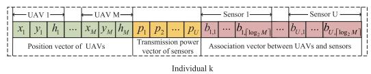  
Fig. 5. Representation of each individual in comparison algorithms.

## F. Complexity Analysis

During each iteration, the proposed ELGHEOA involves a series of operations, including updating positions of individuals, performing boundary control, updating transmission power of sensors, and sorting population. The time complexity for updating positions and performing boundary control is $O ( K D )$ , where K denotes the population size, and D represents the dimensionality of each individual in the population of ELGHEOA. The time complexity for updating the transmission power of sensors is $O ( K S ^ { m a x } U )$ , where $S ^ { m a x }$ indicates the maximum number of iterations in Algorithm 2. The time complexity for sorting the population is given by O(K log K). Therefore, the total time complexity of the ELGHEOA algorithm is expressed as $O ( T ^ { m a x } ( K D + K S ^ { m a x } U + K \log K ) )$ , where $T ^ { m a x }$ refers to the number of iterations in the proposed ELGHEOA. The space complexity of the ELGHEOA is mainly determined by the storage requirements for intermediate variables and dimensionality of the population. Given that storage capacity scales with the population size and the dimensionality of each individual, the space complexity can be approximated as $O ( K D )$ .

## IV. SIMULATION RESULTS AND ANALYSIS

In this section, we present simulations to validate effectiveness of the proposed ELGHEOA in the UAV-assisted wireless sensor network from various perspectives, including comparing the convergence of ELGHEOA and other algorithms, and analyzing the impact of number of UAVs, communication bandwidth, data size of sensors, delay and energy consumption thresholds, and different deployment strategies on overall satisfaction of sensors. To demonstrate the superiority of the proposed ELGHEOA, the following algorithms are selected as comparison algorithms: WOA, SSA, BOA, SMA, PSO, HEOA, and EHEOA, where each of them was configured with a population size of 100 and a maximum of 300 iterations. The association variables between UAVs and sensors in each algorithm are mapped according to (23), and the representation of each individual in comparative algorithms is shown in Fig. 5. All algorithms are implemented on the Python platform, with each algorithm executed 20 times to calculate the average values for reducing random variations. We assume that all sensors in the network are randomly distributed within a 1 km×1 km square area [48]. Meanwhile, there is a maximum flight altitude of 400 meters for each UAV. Unless otherwise specified, the total number of sensors is 20, and the ratio of three types of sensors is set to 7 : 7 : 6. Other main simulation parameters are listed in Table IV.

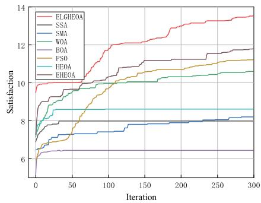  
Fig. 6. Convergence curves for different algorithms.

Fig. 6 illustrates the average convergence of various algo rithms, with $m \ = \ 7$ and all algorithms utilizing the same chaotic initialization method for population initialization. It can be found that the proposed ELGHEOA provides a significantly higher level of satisfaction compared to other algorithms. This remarkable performance can be attributed

$$
\begin{array} { r l } & { L ( \gamma , \mu , \nu ) } \\ &  = \displaystyle \sum _ { s \in \mathcal { C } } \xi _ { s } + \sum _ { \mu \in \mathcal { C } } \mu _ { s } ( \eta _ { s } ^ { h _ { \nu } } - p _ { s \} ) + \sum _ { s \in \mathcal { C } } p _ { s } ( \gamma _ { s } - \gamma _ { s } ^ { h _ { \nu } } ) } \\ & { = \displaystyle \sum _ { s \in \mathcal { C } } \sum _ { \mu _ { s } = 0 } ^ { S _ { \mu } h _ { \nu } } ( \frac { D _ { \mu _ { s } } } { \alpha _ { s } - \mu _ { s } \beta _ { s } \mu _ { s } } \frac { D _ { \mu _ { s } \nu } } { \gamma _ { s } ^ { h _ { \nu } } \alpha _ { s } } ) + \sum _ { \ell \in \mathcal { C } } \nu _ { \ell } ^ { S _ { \ell } - 1 } ( \frac { D _ { \mu _ { s } \nu } } { \alpha _ { \ell } \kappa _ { s } } \frac { D _ { \eta _ { s } \nu } } { \mu _ { s } \mu _ { s } } \frac { \gamma _ { s } } { \gamma _ { s } ^ { h _ { \nu } } \alpha _ { s } } ) } \\ &  \quad + \displaystyle \sum _ { s \in \mathcal { C } } \zeta _ { s } \zeta _ { s } ^ { S _ { \nu } = 0 } ( \frac { D _ { \mu _ { s } } } { \alpha _ { s } , \mu _ { s } \beta _ { s } } \frac { D _ { \nu _ { \nu _ { \mu } } } } { \gamma _ { s } ^ { h _ { \nu } } \alpha _ { s } } ( 1 + \frac { D _ { \nu _ { \mu _ { s } \nu } } } { \sum _ { s \in \mathcal { A } } \mu _ { s } \alpha _ { s } \beta _ { s } \mu _ { s } } \frac { \gamma _ { s } } { \gamma _ { s } ^ { h _ { \nu } } \alpha _ { s } } ) ) + \sum _ { \nu \in \mathcal { C } } \zeta _ { s } \zeta _ { s } ^ { S _ { \nu } = \nu } ( \frac  D _   \end{array}\tag{31}
$$

Algorithm 2 Power Allocation Algorithm   
1: Initialize parameters: $I ^ { m a x } , \varepsilon , \mu _ { u } ^ { 0 } , \nu _ { u } ^ { 0 } , p _ { u } ^ { 0 } , \beta , \varkappa , \aleph , i = 1$   
2: repeat   
3: Update $p _ { h } ^ { i } , p _ { t } ^ { i } , p _ { y } ^ { i }$ according to (33)-(35).   
4: Update Lagrange multipliers $\mu _ { h } ^ { i } , \mu _ { t } ^ { i } , \mu _ { y } ^ { i }$ according to   
(36)-(38).   
5: Update Lagrange multipliers $\nu _ { h } ^ { i } , \nu _ { t } ^ { i } , \nu _ { y } ^ { i }$ according to   
(39)-(41).   
6: if $| p _ { u } ^ { i - 1 } - p _ { u } ^ { i } | \leq \varepsilon$ then   
7: break   
8: else   
9: Update $i = i + 1 .$   
10: end if   
11: until $i \geq I ^ { m a x }$

Algorithm 3 Enhanced Lagrange and Gradient Descent-Based   
Human Evolutionary Optimization Algorithm (ELGHEOA)   
1: Initialize parameters: K, D, lb, ub, T max, t = 1.   
2: Initialize the population using equation (13), calculate the   
fitness values for all individuals, and sort them in order   
of their respective fitness scores.   
3: Record the global best solution, current best solution,   
current worst solution, and the average solution of current   
population.   
4: repeat   
5: if $\begin{array} { r } { t \le \frac { 1 } { 4 } T _ { m a x } } \end{array}$ then   
6: Update the positions of all individuals in the popu  
lation according to (15).   
7: else   
8: Update the positions of leaders according to (20),   
Update the positions of explorers according to (22).   
Update the positions of followers according to (21).   
Update the positions of losers according to (19).   
9: end if   
10: Perform binary mapping according to (23).   
11: for each individual $X _ { k }$ in the population do   
12: Update the transmission power of each sensor cor  
responding to individual $X _ { k }$ in accordance with   
Algorithm 2.   
13: end for   
14: Calculate the fitness values of new individuals, sort   
them accordingly, and update the information in step   
3.   
15: Update $t = t + 1 .$   
16: until $t \geq T ^ { m a x }$

to ELGHEOA’s effective optimization of power allocation among sensors, as well as the positioning of UAVs and their associations with sensors. Such optimization results in a substantially improved initial value, providing a superior starting point relative to comparison algorithms. Fig. 7 presents a detailed topology depicting the optimal positions of seven UAVs and their corresponding associations with sensors.

Fig. 8 provides the influence of number of UAVs on overall satisfaction of sensors in the data collection network. It can be observed that the proposed ELGHEOA outperforms other algorithms significantly. Furthermore, the results indicate a marked improvement in satisfaction of sensors as the number of UAVs increases. This enhancement is due to the greater association opportunities afforded by an increasing number of UAVs, which reduces interference in the network during data collection process.

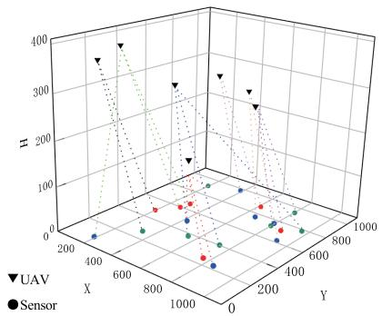

Fig. 7. Positions of UAVs and sensors, and associations between $\mathrm { U A V s }$ and sensors.  
日 ELGHEOA  
SSA 日  
Δ SMA 日  
WOA  
D BOA 日  
4 PS0   
0 HEOA 白Q OV  
习  
A   
10  
日 D  
8 44 44 41 01   
A  
6  
A  
A  
  
4 5 6 7 8  
Number of UAVs

Fig. 8. Impact of the number of UAVs on satisfaction.  
20 à  
日  
  
18   
日  
  
16 QVA8  
14 日 - ELGHEOA  
SSA  
7 Δ SMA  
豆 WOA  
12 BOA  
8 A PS0  
HEOA  
EHEOA  
10  
4 5 6 7 8  
Number of UAVs  
Fig. 9. Impact of the number of UAVs on the average number of served sensors.

Fig. 9 presents the impact of number of UAVs on average quantity of served sensors. It can be observed that the increase of UAVs results in a large increase in the number of sensor available to accommodate. This improvement is mainly due to the expanded coverage area facilitated by increased UAVs, which allows for a better service for more sensors. The proposed algorithm always outperforms comparative algorithms in terms of the average number of sensors served by UAVs, which implies that the proposed algorithm can achieve a better solution to provide better network coverage for sensors.

Fig. 10 shows the boxplots that illustrate the performance of different algorithms under different numbers of UAVs, where the results have shown that irrespective of the number of UAVs, the proposed ELGHEOA always achieves higher satisfaction than other algorithms. Furthermore, the ELGHEOA provides a more concentrated solution distribution compared to other algorithms, with this concentration increasing as the number of UAVs increases. This indicates that a greater number of UAVs enable ELGHEOA to identify more stable solutions. These findings demonstrate the significant optimization capability and robustness of ELGHEOA in addressing optimization problem P 1, and the excellent performance of ELGHEOA under diverse scales of UAV deployment scenarios. Further observation can be found that although the EHEOA algorithm does not always surpass all comparative algorithms, it exhibits a marked improvement in performance over the HEOA algorithm, thereby validating the effectiveness of the proposed enhancement strategies. When the power allocation algorithm proposed in this paper is combined with the EHEOA $( \mathrm { i . e . }$ , the proposed ELGHEOA), the overall satisfaction is significantly better than those of other algorithms. This outcome further corroborates both the efficacy of these enhancement strategies and power allocation approach, enabling ELGHEOA to consistently achieve high system satisfaction.

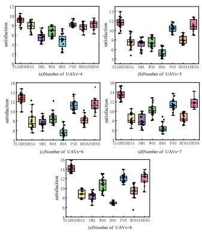  
Fig. 10. Comparison of convergence boxplots for different algorithms under different numbers of UAVs.

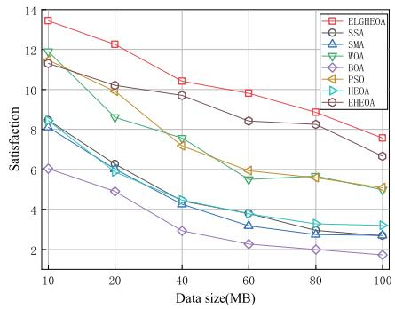  
Fig. 11. Impact of different uniform data sizes on satisfaction.

For further verifying the effectiveness of the proposed ELGHEOA, we will concentrate on analyzing the effects of the following factors on satisfaction: data transmission size of sensors, communication bandwidth, as well as delay and energy consumption thresholds, while maintaining a fixed number of UAVs at seven.

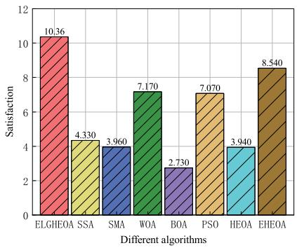  
Fig. 12. Satisfaction comparison of different algorithms.

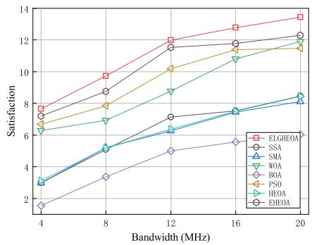  
Fig. 13. Impact of different bandwidths on satisfaction.

Fig. 11 illustrates the impact of uniform data size on system satisfaction, with $r _ { u } ^ { t h } = 1 5$ joules and $t _ { u } ^ { t h } = 3 0$ seconds. The data size of all sensors was uniformly set to 10MB to 100MB. We can find that as the data size increases, the satisfaction gradually declines. This is due to the fact that larger data sizes increased transmission time and energy consumption, which adversely affects the overall satisfaction of sensors. This observation indicates the significant influence of data sizes on the overall satisfaction of sensors.

Fig. 12 provides satisfaction comparison of different algorithms under random data sizes of sensors, where the data sizes are randomly generated in the range of 10MB to 100MB, following a uniform distribution. The results indicate that the ELGHEOA algorithm achieves the highest satisfaction among all algorithms and significantly outperforms other algorithms. The satisfaction performance of the proposed EHEOA is slightly worse than that of the proposed ELGHEOA. These results indicate the superior optimization capability of the proposed ELGHEOA in managing heterogeneous sensor data sizes, thus effectively enhancing overall satisfaction.

Fig. 13 presents the effect of different communication bandwidths on satisfaction. It can be found that as system bandwidth increases, the satisfaction of sensors is also improved correspondingly. This is due to the fact that higher bandwidth provides higher data transmission rate, which can reduce transmission latency and energy consumption, resulting in a notable increase in satisfaction. Furthermore, the increased bandwidth can also alleviate network congestion, thus enhancing the stability and reliability of data transmission.

Fig. 14 and Fig. 15 provide the impact of different delay thresholds on satisfaction and the effect of different energy consumption thresholds on satisfaction, respectively. In Fig. 14, the maximum tolerable energy consumption threshold is fixed at 15 joules, and in Fig. 15, the maximum tolerable delay threshold is set at 30 seconds. The results show that when one party is fixed and the threshold of other party increases, the satisfaction also increases. This is because under the given data size and channel conditions, the data upload delay $t _ { u }$ and energy consumption $e _ { u }$ of sensor u should generally not change with the change of delay threshold and energy consumption threshold. In this case, as the threshold increases, the denominators in formulas (9) and (10) decrease, resulting in an increase of satisfaction.

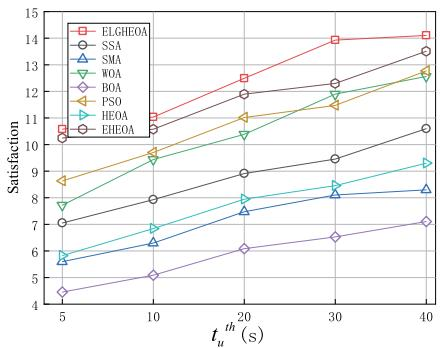  
Fig. 14. Impact of different delay thresholds on satisfaction.

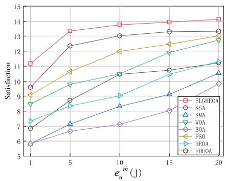  
Fig. 15. Impact of different energy consumption thresholds on satisfaction.

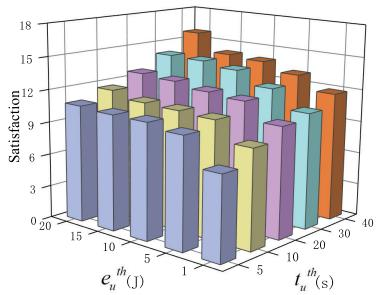  
Fig. 16. Impact of delay and energy consumption thresholds on satisfaction.

Fig. 16 shows the impact of delay and energy consumption thresholds on satisfaction under ELGHEOA algorithm. The results show that with the increase of two thresholds, the system satisfaction increases significantly, which indicates that in practical applications, reasonable consideration of the two thresholds is very important to improve system satisfaction.

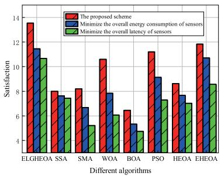  
Fig. 17. Satisfaction comparison for different optimization schemes under different algorithms.

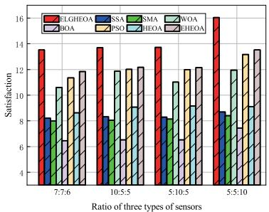  
Fig. 18. Impact of different ratios for three types of sensors on satisfaction.

Fig. 17 presents the satisfaction comparison for different optimization schemes under different algorithms, where two comparison schemes are considered: minimizing the total transmission latency of sensors [49] and minimizing the total energy consumption of sensors [50], while maintaining the same constraints as those in optimization problem P 1. It’s worth noting that in the three schemes, all sensors must be served, and the solutions to optimization objectives are evaluated in the satisfaction model proposed in this work. It can be seen that satisfaction of the proposed scheme is better than the two comparative strategies regardless of the adopted solving algorithm. This is because the proposed scheme takes into account the delay requirements of delay-sensitive sensors as well as the energy requirements of energy-sensitive sensors under heterogeneous requirements of sensors. Meanwhile, it can be also found that the proposed ELGHEOA significantly outperforms other algorithms in all optimization schemes.

Fig. 18 illustrates the impact of different ratios for three types of sensors on satisfaction. The results indicate that these ratios significantly influences satisfaction. Specifically, when the ratio of energy-sensitive, delay-sensitive, and dual-sensitive sensors is set to 10:5:5 or 5:10:5, the satisfaction shows a notable improvement. When the proportion of dual-sensitive sensors further increases, as for the 5:5:10 configuration, system satisfaction improves more substantially. Additionally, the proposed algorithm consistently achieves the best performance across all configurations, demonstrating its robustness on different ratios for three types of sensors.

Fig. 19 presents satisfaction comparison of different algorithms under fixed power allocation strategy with $p _ { u } = 0 . 5$ watts. The results indicate that the EHEOA algorithm achieves better satisfaction compared to the baseline algorithms under the same constraint. However, compared with the results in Fig. 8 where both EHEOA and ELGHEOA algorithms operate with power optimization, the satisfaction under fixed power allocation strategy is significantly lower. This further confirms the necessity of jointly optimizing UAV deployment, user association and power allocation to improve the system satisfaction.

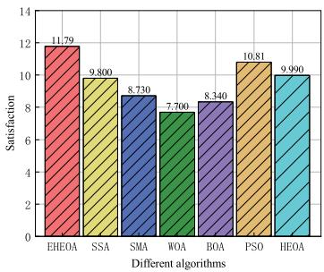  
Fig. 19. Satisfaction comparison of different algorithms under fixed power allocation scheme.

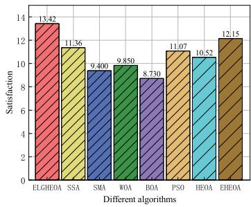  
Fig. 20. Satisfaction comparison of different algorithms under fixed UAV deployment and fixed sensor association.

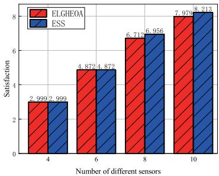  
Fig. 21. Satisfaction comparison between ELGHEOA and exhaustive search scheme for sensor association.

Fig. 20 illustrates satisfaction comparison of different algorithms under fixed UAV positions and fixed association between UAVs and sensors, where the UAV deployment and sensor association are obtained by EHEOA. The results show that all algorithms achieve significant improvements in system satisfaction compared to those results in Fig. 19. Specifically, the proposed ELGHEOA algorithm achieves a 13.83% improvement in system satisfaction relative to the best performance of the EHEOA algorithm under fixed power allocation strategy. This improvement is mainly attributed to the effectiveness of Algorithm 2 in optimizing power allocation of sensors, allowing different types of sensors to obtain more appropriate power allocation scheme. Likewise, the EHEOA algorithm also demonstrates strong optimization capabilities under this setting, outperforming other baseline algorithms. These results further demonstrate the effectiveness of the proposed ELGHEOA algorithm and also highlight the advantages of Algorithm 2 in power allocation of sensors.

Fig. 21 presents the satisfaction comparison between ELGHEOA and exhaustive search scheme (ESS) for sensor association, where the number of UAV is set to 2. It can be found that when the number of sensors is 4 or 6, the proposed ELGHEOA can reach the optimal solution, while as the number of sensors increases, the performance of ELGHEOA is slightly worse than that of ESS. Specifically, when the number of sensors is 10, the satisfaction of ELGHEOA is only 2.8% lower than that of ESS, which demonstrates effectiveness of the proposed ELGHEOA algorithm.

## V. CONCLUSION

In this paper, we investigated joint UAV deployment, user association, and transmission power allocation for data collection in UAV-assisted wireless sensor networks, where a novel satisfaction function was developed for adapting to the heterogeneous requirements of sensors. To effectively address the challenging problem, we decomposed it into two subproblems. The first one was formulated as an optimization problem concentrated on UAV deployment and user association, and an enhanced human evolutionary optimization algorithm was developed to efficiently derive its solution. The second subproblem focused on the power allocation of sensors, and a combination of Lagrangian duality and gradient descent methods were employed to obtain the optimal power allocation policy. By alternately solving the two subproblems, we proposed an enhanced Lagrangian gradient-based human evolutionary optimization algorithm that yields a suboptimal solution for the considered problem. Extensive simulations were provided to demonstrate effectiveness of the proposed ELGHEOA in improving satisfaction of sensors, which indicates its significant advantages in managing heterogeneous network environments.

## REFERENCES

[1] N. C. Luong, D. T. Hoang, P. Wang, D. Niyato, D. I. Kim, and Z. Han, “Data collection and wireless communication in Internet of Things (IoT) using economic analysis and pricing models: A survey,” IEEE Commun. Surveys Tuts., vol. 18, no. 4, pp. 2546–2590, 4th Quart., 2016.

[2] Z. Jia, M. Sheng, J. Li, D. Niyato, and Z. Han, “LEO-satellite-assisted UAV: Joint trajectory and data collection for Internet of Remote Things in 6G aerial access networks,” IEEE Internet Things J., vol. 8, no. 12, pp. 9814–9826, Jun. 2021.

[3] W. Wang, N. Zhao, L. Chen, X. Liu, Y. Chen, and D. Niyato, “UAVassisted time-efficient data collection via uplink NOMA,” IEEE Trans Commun., vol. 69, no. 11, pp. 7851–7863, Nov. 2021.

[4] H. Xie, T. Zhang, X. Xu, D. Yang, and Y. Liu, “Joint sensing, communication, and computation in UAV-assisted systems,” IEEE Internet Things J., vol. 11, no. 18, pp. 29412–29426, Sep. 2024.

[5] Y. Zhang, L. Liu, M. Wang, J. Wu, and H. Huang, “An improved routing protocol for raw data collection in multihop wireless sensor networks,” Comput. Commun., vol. 188, pp. 66–80, Apr. 2022.

[6] J. Gong, T.-H. Chang, C. Shen, and X. Chen, “Flight time minimization of UAV for data collection over wireless sensor networks,” IEEE J. Sel. Areas Commun., vol. 36, no. 9, pp. 1942–1954, Sep. 2018.

[7] L. Wang, H. Zhang, S. Guo, and D. Yuan, “Deployment and association of multiple UAVs in UAV-assisted cellular networks with the knowledge of statistical user position,” IEEE Trans. Wireless Commun., vol. 21, no. 8, pp. 6553–6567, Aug. 2022.

[8] J. Ji, K. Zhu, D. Niyato, and R. Wang, “Joint cache placement, flight trajectory, and transmission power optimization for multi-UAV assisted wireless networks,” IEEE Trans. Wireless Commun., vol. 19, no. 8, pp. 5389–5403, Aug. 2020.

[9] Y. Liu et al., “Latency optimization for multi-UAV-assisted task offloading in air-ground integrated millimeter-wave networks,” IEEE Trans. Wireless Commun., vol. 23, no. 10, pp. 13359–13376, Oct. 2024.

[10] F. Song, M. Deng, H. Xing, Y. Liu, F. Ye, and Z. Xiao, “Energy-efficient trajectory optimization with wireless charging in UAV-assisted MEC based on multi-objective reinforcement learning,” IEEE Trans. Mobile Comput., vol. 23, no. 12, pp. 10867–10884, Dec. 2024.

[11] S. Zhang, H. Zhang, Z. Han, H. V. Poor, and L. Song, “Age of information in a cellular Internet of UAVs: Sensing and communication trade-off design,” IEEE Trans. Wireless Commun., vol. 19, no. 10, pp. 6578–6592, Oct. 2020.

[12] G. Chen, X. B. Zhai, and C. Li, “Joint optimization of trajectory and user association via reinforcement learning for UAV-aided data collection in wireless networks,” IEEE Trans. Wireless Commun., vol. 22, no. 5, pp. 3128–3143, May 2023.

[13] D. Zhai, C. Wang, R. Zhang, H. Cao, and F. R. Yu, “Energy-saving deployment optimization and resource management for UAV-assisted wireless sensor networks with NOMA,” IEEE Trans. Veh. Technol., vol. 71, no. 6, pp. 6609–6623, Jun. 2022.

[14] C. Zhan and Y. Zeng, “Completion time minimization for multi-UAV-enabled data collection,” IEEE Trans. Wireless Commun., vol. 18, no. 10, pp. 4859–4872, Oct. 2019.

[15] Z. Wang, G. Zhang, Q. Wang, K. Wang, and K. Yang, “Completion time minimization in wireless-powered UAV-assisted data collection system,” IEEE Commun. Lett., vol. 25, no. 6, pp. 1954–1958, Jun. 2021.

[16] T. Wang, X. Pang, J. Tang, N. Zhao, X. Zhang, and X. Wang, “Time and energy efficient data collection via UAV,” Sci. China Inf. Sci., vol. 65, no. 8, Aug. 2022, Art. no. 182302.

[17] R. Jia, Q. Fu, Z. Zheng, G. Zhang, and M. Li, “Energy and time tradeoff optimization for multi-UAV enabled data collection of IoT devices,” IEEE/ACM Trans. Netw., vol. 32, no. 6, pp. 5172–5187, Dec. 2024.

[18] T. Ma et al., “UAV-LEO integrated backbone: A ubiquitous data collection approach for B5G Internet of Remote Things networks,” IEEE J. Sel. Areas Commun., vol. 39, no. 11, pp. 3491–3505, Nov. 2021.

[19] H. Kuang, H. Cao, X. Li, and H. Cheng, “A framework for multi-event data collection using unmanned aerial vehicle aided Internet of Things in smart agriculture,” in Proc. IEEE 2nd Int. Conf. Inf. Technol., Big Data Artif. Intell. (ICIBA), vol. 2, Dec. 2021, pp. 174–177.

[20] P. Wan, G. Xu, J. Chen, and Y. Zhou, “Deep reinforcement learning enabled multi-UAV scheduling for disaster data collection with time-varying value,” IEEE Trans. Intell. Transp. Syst., vol. 25, no. 7, pp. 6691–6702, Jul. 2024.

[21] J. Chen and J. Tang, “UAV-assisted data collection for dynamic and heterogeneous wireless sensor networks,” IEEE Wireless Commun. Lett., vol. 11, no. 6, pp. 1288–1292, Jun. 2022.

[22] M. Yang, N. Liu, Y. Feng, H. Gong, X. Wang, and M. Liu, “Dynamic mobile sink path planning for unsynchronized data collection in heterogeneous wireless sensor networks,” IEEE Sensors J., vol. 23, no. 17, pp. 20310–20320, Sep. 2023.

[23] D. Li, S. Xu, and Y. Li, “Massive heterogeneous data collecting in UAV-assisted wireless IoT networks,” IET Commun., vol. 17, no. 14, pp. 1706–1720, Jun. 2023.

[24] G. Chen, C. Cheng, X. Xu, and Y. Zeng, “Minimizing the age of information for data collection by cellular-connected UAV,” IEEE Trans. Veh. Technol., vol. 72, no. 7, pp. 9631–9635, Jul. 2023.

[25] P. Lohan and D. Mishra, “Utility-aware optimal resource allocation protocol for UAV-assisted small cells with heterogeneous coverage demands,” IEEE Trans. Wireless Commun., vol. 19, no. 2, pp. 1221–1236, Feb. 2020.

[26] Q. Zhang, H. Wang, and Z. Feng, “Three-sided matching game based joint bandwidth and caching resource allocation for UAVs,” in Proc. IEEE/CIC Int. Conf. Commun. China (ICCC), Xiamen, China, Jul. 2021, pp. 183–188.

[27] J. Cui, Y. Liu, Z. Ding, P. Fan, and A. Nallanathan, “QoEbased resource allocation for multi-cell NOMA networks,” IEEE Trans. Wireless Commun., vol. 17, no. 9, pp. 6160–6176, Sep. 2018.

[28] H. Song, X. Fang, and C.-X. Wang, “Cost-reliability tradeoff in licensed and unlicensed spectra interoperable networks with guaranteed user data rate requirements,” IEEE J. Sel. Areas Commun., vol. 35, no. 1, pp. 200–214, Jan. 2017.

[29] J. Tian, D. Wang, H. Zhang, and D. Wu, “Service satisfaction-oriented task offloading and UAV scheduling in UAV-enabled MEC networks,” IEEE Trans. Wireless Commun., vol. 22, no. 12, pp. 8949–8964, Dec. 2023.

[30] Z. Wei et al., “UAV-assisted data collection for Internet of Things: A survey,” IEEE Internet Things J., vol. 9, no. 17, pp. 15460–15483, Sep. 2022.

[31] M. Dong, K. Ota, L. T. Yang, S. Chang, H. Zhu, and Z. Zhou, “Mobile agent-based energy-aware and user-centric data collection in wireless sensor networks,” Comput. Netw., vol. 74, pp. 58–70, Dec. 2014.

[32] J. Yao and N. Ansari, “QoS-aware machine learning task offloading and power control in Internet of Drones,” IEEE Internet Things J., vol. 10, no. 7, pp. 6100–6110, Apr. 2023.

[33] Q. V. Do et al., “Learning-based QoE optimization for green edge computing networks with aerial servers,” IEEE Trans. Green Commun. Netw., vol. 28, no. 4, pp. 1234–1245, Apr. 2024.

[34] X. Yu, D. Wu, D. Liu, H. Wang, and Z. Qin, “The heterogeneous demands satisfaction in IoT network: air-ground collaborative deployment,” IEEE Trans. Veh. Technol., vol. 70, no. 12, pp. 12713–12724, Dec. 2021.

[35] J. Lian and G. Hui, “Human evolutionary optimization algorithm,” Expert Syst. Appl., vol. 241, May 2024, Art. no. 122638.

[36] A. Elmogy, H. Miqrish, W. Elawady, and H. El-Ghaish, “ANWOA: An adaptive nonlinear whale optimization algorithm for high-dimensional optimization problems,” Neural Comput. Appl., vol. 35, no. 30, pp. 22671–22686, Oct. 2023.

[37] S. Mirjalili and A. Lewis, “The whale optimization algorithm,” Adv. Eng. Softw., vol. 95, pp. 51–67, May 2016.

[38] J. Xue and B. Shen, “A novel swarm intelligence optimization approach: Sparrow search algorithm,” Syst. Sci. Control Eng., vol. 8, no. 1, pp. 22–34, Jan. 2020.

[39] S. Arora and S. Singh, “Butterfly optimization algorithm: A novel approach for global optimization,” Soft Comput., vol. 23, no. 3, pp. 715–734, Feb. 2019.

[40] S. Li, H. Chen, M. Wang, A. A. Heidari, and S. Mirjalili, “Slime mould algorithm: A new method for stochastic optimization,” Future Gener. Comput. Syst., vol. 111, pp. 300–323, Oct. 2020.

[41] A.-D. Li, B. Xue, and M. Zhang, “Improved binary particle swarm optimization for feature selection with new initialization and search space reduction strategies,” Appl. Soft Comput., vol. 106, Jul. 2021, Art. no. 107302.

[42] Q. Al-Tashi, S. J. A. Kadir, H. M. Rais, S. Mirjalili, and H. Alhussian, “Binary optimization using hybrid grey wolf optimization for feature selection,” IEEE Access, vol. 7, pp. 39496–39508, 2019.

[43] E. Emary, H. M. Zawbaa, and A. E. Hassanien, “Binary grey wolf optimization approaches for feature selection,” Neurocomputing, vol. 172, pp. 371–381, Jan. 2016.

[44] Z. Zhang, D. Wu, W. Xu, J. Shang, Z. Feng, and P. Zhang, “UAV-enabled multiple traffic backhaul based on multiple RANs: A batch-arrivalqueuing-inspired approach,” IEEE Access, vol. 7, pp. 161437–161448, 2019.

[45] M. Wang, J. Wang, Y. Kai, F. Xia, X. Zeng, and F. Liu, “User association and power allocation in multi-connectivity enabled millimeter-wave networks with limited backhaul,” IEEE Open J. Commun. Soc., vol. 4, pp. 1761–1773, 2023.

[46] M. Wang, Y. Long, S. Gong, and J. Xu, “Adaptive network formation and trajectory optimization for multi-UAV-assisted wireless data offloading,” in Proc. IEEE 23rd Int. Conf. High Perform. Comput. Commun., Feb. 2021, pp. 961–967.

[47] Y. Wang et al., “Multi-UAV collaborative data collection for IoT devices powered by battery,” in Proc. IEEE Wireless Commun. Netw. Conf. (WCNC), May 2020, pp. 1–6.

[48] Y. Wang, M. Chen, C. Pan, K. Wang, and Y. Pan, “Joint optimization of UAV trajectory and sensor uploading powers for UAV-assisted data collection in wireless sensor networks,” IEEE Internet Things J., vol. 9, no. 13, pp. 11214–11226, Jul. 2022.

[49] T. Wang, Z. Liu, L. Xu, and L. Wang, “An efficient and robust UAVs’ path planning approach for timely data collection in wireless sensor networks,” in Proc. IEEE Wireless Commun. Netw. Conf. (WCNC), Austin, TX, USA, Apr. 2022, pp. 914–919.

[50] S. Zhang, R. Cao, and Z. Jiang, “Energy-efficient data collection and trajectory design for UAV-enabled wireless sensor network,” in Proc. IEEE 5th Int. Conf. Electron. Technol. (ICET), Chengdu, China, May 2022, pp. 933–938.

Yanping Liu received the B.E. degree in electronic and information engineering and the M.E. degree in communication engineering from Chongqing University, Chongqing, China, in 2006 and 2009, respectively, and the Ph.D. degree in information and communication engineering from Southwest Jiaotong University, Chengdu, China, in 2018. He is currently an Associate Professor with the College of Big Data Statistics, Guizhou University of Finance and Economics, Guiyang, China. His research interests focus on game theory, machine learning theory, big data statistical analysis, and optimization theory for radio resource management in future wireless networks.

Kunkun Zhang received the B.E. degree in big data management and application in 2023. He is currently pursuing the M.S. degree with Guizhou University of Finance and Economics, Guiyang, China. His research interests include 6G communications, uncrewed aerial vehicle-assisted wireless sensor networks, and swarm intelligence algorithms.

Xuming Fang (Senior Member, IEEE) received the B.E. degree in electrical engineering, the M.E. degree in computer engineering, and the Ph.D. degree in communication engineering from Southwest Jiaotong University, Chengdu, China, in 1984, 1989, and 1999, respectively. He was a Faculty Member with the Department of Electrical Engineering, Tongji University, Shanghai, China, in September 1984. He then joined the School of Information Science and Technology, Southwest Jiaotong University, where he has been a Professor since

2001, and the Chair of the Department of Communication Engineering since 2006. He held visiting positions with the Institute of Railway Technology, Technical University of Berlin, Berlin, Germany, from 1998 to 1999; and with the Center for Advanced Telecommunication Systems and Services, The University of Texas at Dallas, Richardson, from 2000 to 2001. He has, to his credit, around 200 high-quality research papers in journals and conference publications. He has authored or co-authored five books or textbooks. His research interests include wireless broadband access control, radio resource management, multihop relay networks, and broadband wireless access for high speed railway. He is the Chair of the IEEE Vehicular Technology Society of Chengdu Chapter, and an Editor of IEEE TRANSACTIONS ON VEHICULAR TECHNOLOGY.

Fuhong Song received the M.Eng. degree in computer technology and the Ph.D. degree in computer science and technology from Southwest Jiaotong University, Chengdu, China, in 2018 and 2022, respectively. He is currently an Associate Professor with the School of Information, Guizhou University of Finance and Economics. His research interests include edge computing, multi-objective optimization, and reinforcement learning.

Ming Xiao (Senior Member, IEEE) received the bachelor’s and master’s degrees in engineering from the University of Electronic Science and Technology of China, Chengdu, China, in 1997 and 2002, respectively, and the Ph.D. degree from the Chalmers University of Technology, Goteborg, Swe-¨ den, in November 2007. From 1997 to 1999, he was a Network and a Software Engineer with China Telecom. From 2000 to 2002, he also held a position with Sichuan Communications Administration. Since November 2007, he has been with the School of Electrical Engineering, Royal Institute of Technology, Sweden, where he is currently a Professor in communications theory. He received Best Paper Awards at the International Conference on Wireless Communications and Signal Processing in 2010 and the IEEE International Conference on Computer Communication Networks in 2011. He received Chinese Government Award for Outstanding Self-Financed Students Studying Aborad in March 2007, the Hans Werthen Grant from the Royal Swedish Academy of Engineering Science (IVA) in March 2006, and the Ericsson Research Funding from Ericsson in 2010. Since 2012, he has been an Associate Editor of IEEE TRANSACTIONS ON COMMUNICATIONS, IEEE COMMUNICATIONS LETTERS (a Senior Editor, since January 2015), and IEEE WIRELESS COMMUNICATIONS LETTERS.

Qing Xue (Senior Member, IEEE) received the B.E. degree in communication engineering from University of Jinan in 2011 and the Ph.D. degree in information and communication engineering from Southwest Jiaotong University in 2018. She joined as a Lecturer with the School of Communications and Information Engineering, Chongqing University of Posts and Telecommunications, in 2018. From December 2019 to January 2024, she was a Post-Doctoral Fellow with the National Key Laboratory of Wireless Communications, University of Electronic Science and Technology of China. From December 2021 to November 2023, she was also a Post-Doctoral Fellow with the State Key Laboratory of Internet of Things for Smart City, University of Macau, under Macao Young Scholars Program. Her research interests include millimeter wave communications, intelligent wireless networking, and resource management in mobile networks.

Yaping Cui received the M.S. degree in communication and information system and the Ph.D. degree in traffic information engineering and control from Southwest Jiaotong University, Chengdu, China, in 2011 and 2017, respectively. From 2011 to 2012, he was a Baseband Algorithm Engineer with ZTE Corporation, Shenzhen, China. In 2017, he joined the School of Communication and Information Engineering, Chongqing University of Posts and Telecommunications, Chongqing, China, where he is currently an Associate Professor. His research interests include smart communications, mobile edge computing, and network function virtualization for vehicular networks.

Changfeng Ding (Member, IEEE) received the Ph.D. degree in information and communication engineering from Southeast University, Nanjing, China, in 2023. He is currently with Nanjing University of Posts and Telecommunications, Nanjing, China. His current research interests include applications of MIMO communications, mobile edge computing, ISAC, and satellite communications.