# Joint Deployment and Resource Allocation Design for JRC-Enabled Multi-UAV Cooperative Systems

Lingyun Zhou , Chunyong Yang , Senior Member, IEEE, Yongqiang Cui , Member, IEEE,

Rongqing Zhang , Member, IEEE, Zhongxiang Wei , Senior Member, IEEE, and Qingjiang Shi , Member, IEEE

Abstract—In recent years, joint radar and communication (JRC) systems have garnered significant attention due to their enhanced equipment utilization and high spectrum efficiency. This paper investigates a JRC-enabled multi-UAV cooperative system, where multiple UAVs concurrently execute communication tasks for communication users (CUs) and perception tasks for sensed targets (STs) distributed across a specified region. To strike the trade-off between the communication performance and sensing accuracy, we formulate a weighted performance optimization problem aimed at simultaneously maximizing the data transmission for CUs and minimizing the squared position error bound (SPEB) for STs, by jointly optimizing user association and channel assignment, power allocation, as well as UAV deployment. To effectively address this challenging problem, we initially recast the non-differentiable objective function into a more tractable and interpretable form with the aid of smooth approximation techniques. Subsequently, by virtue of the specific

Qingjiang Shi is with the School of Computer Science and Technology, Tongji University, Shanghai 201804, China, and also with Shenzhen Research Institute of Big Data, Shenzhen 518172, China (e-mail: shiqj@tongji.edu.cn).

Digital Object Identifier 10.1109/TWC.2025.3635277

problem structure, we decompose the original joint optimization problem and develop an iterative method to optimize each subproblem sequentially. Extensive simulations demonstrate the significant performance gains of the proposed design compared to other benchmark schemes.

Index Terms—Joint radar and communication, multi-UAV cooperative system, resource allocation, deployment optimization.

## I. INTRODUCTION

HE evolving electromagnetic field, characterized by heightened mobility, intense confrontations, and increasingly complex information structures, imposes new requirements on the communication and sensing capabilities of the systems [1], [2]. In this context, unmanned aerial vehicles (UAVs) have emerged as pivotal assets due to their flexibil ity in maneuvering, line-of-sight (LoS) links, and extensive coverage capabilities [3], [4]. The coordinated deployment of multiple UAVs facilitates task execution across diverse spatial regions, significantly extending communication distances and sensing ranges. This effective collaboration not only mitigates the limitations of individual UAVs, but also enhances the overall network’s resilience and fault tolerance, thereby facilitating more cost-effective task completion [5]. In particular, collaborative communication among multiple UAVs is essential for achieving autonomous decision-making, providing crucial support for command and control, information sharing, and collaborative operations [6]. Meanwhile, collaborative perception is critical for environmental understanding and realtime situational analysis, offering fundamental support for situational awareness, target detection, and enemy warning [7]. Given these compelling features, multi-UAV communication and sensing technologies have attracted significant interest across industrial applications and academic research [8], [9]. Based on the specific functionalities of multi-UAV systems, the existing literature broadly categorizes research into two primary domains: multi-UAV collaborative communication and multi-UAV collaborative sensing. Equipped with advanced transceiving antennas, multi-UAV communication systems not only facilitate high-quality service delivery for terrestrial users, but also allow precise control by ground control units (GCUs) for executing various tasks. For instance, to deliver connectivity options to remote terminals for disaster recovery and hazard detection, the authors of [10] investigated an advanced multi-UAV relay approach designed to extend the coverage and enhance the capacity of terrestrial cellular

Rongqing Zhang is with the Intelligent Transportation Thrust, The Hong Kong University of Science and Technology (Guangzhou), Guangzhou 511453, China (e-mail: rongqingz@tongji.edu.cn).

networks. To enhance the quality of service (QoS) and alleviate data traffic in multi-UAV assisted communication systems, the authors in [11] introduced a flexible load balancing mechanism to minimize the maximum remaining data transmission of the UAV swarm by jointly optimizing user association, time assignment, and flight trajectory. In [12], a combined channel assignment and power control problem was formulated to combat interference and ensure reliable signal reception within a multi-UAV uplink communication system, where multiple UAVs are managed by a GCU to perform tasks with varying priorities. On the other hand, equipped with intelligent sensors, multi-UAV perception systems can function as aerial radars, enabling precise detection of ground targets and providing vital support for environmental security. Specifically, the authors of [13] studied a multi-UAV 3-D collaborative trajectory optimization framework, where multiple UAVs act as tracking radars to minimize multi-target location measurement errors, subject to time-varying speed constraints, collision constraints, and obstacle/target/threat avoidance constraints. Additionally, a cooperative multi-UAV network platform and angle of arrival (AOA)-based localization architecture was proposed in [14], where a distributed trajectory planning strategy based on the gradient descent algorithm was designed to enhance target localization accuracy. Despite significant advancements in these areas, large-scale UAV deployments—where certain UAVs are dedicated to communication and others to sensing—inevitably incurs substantial hardware costs and resource expenditures. Furthermore, such extensive deployment is prone to self-interference, which adversely affects the system performance.

The integration of radar and communication functionalities into a single device, referred to as joint radar and communication (JRC) technology, represents a significant advancement with considerable benefits for multi-UAV coordination systems [15], [16]. First, the JRC system effectively consolidates radar spectrum resources, thereby expanding the frequency range available to individual UAVs. This enhanced spectrum utilization significantly improves the efficiency of existing communication systems. Second, by merging sense and communication capabilities within a single UAV platform, the JRC system reduces hardware costs while improving operational flexibility. This integration allows for a more streamlined and cost-effective deployment of UAVs in various applications. Third, the concurrent design of communication and radar functions within the same device facilitates effective collaboration on both components, leading to higher mission success rates across diverse operational scenarios. As a result, JRC technology has attracted extensive attention across various fields. The studies presented in [17] and [18] addressed the issue of minimizing power consumption in JRC-enabled multi-UAV systems. To enhance communication performance while satisfying radar sensing requirements, the authors in [19] proposed a framework that jointly optimizes UAV placement and beamforming. Similarly, the authors in [20] concentrated on a related problem, aiming to maximize network utility under the localization Cramer-Rao Bound (CRB) constraint through the´ joint optimization of user scheduling, UAV deployments and power control. Finally, the study in [21] investigated a JRCenabled multi-UAV cooperative detection system, achieving improvements in sensing accuracy and geographic fairness through the optimization of channel allocation, transmit power, and path planning.

While previous studies have proposed valuable strategies to enhance the performance of JRC-enabled multi-UAV systems, few have comprehensively explored the general scenario in which multiple UAVs simultaneously communicate with multiple users and sense multiple targets. Such a complex scenario involves several critical factors that need careful consideration: Firstly, due to capacity limitations and energy bottlenecks, UAVs must accurately determine transmission users and promptly transmit signals, which requires effective user association and load balancing strategies. Secondly, given the complexities of electromagnetic environment, the variability of communication links, and the heterogeneity of network architectures, the concurrent utilization of limited resources for both communication and radar functions inevitably results in substantial co-channel interference. Consequently, it is imperative to develop robust channel assignment and power allocation methods to enhance communication reliability and sensing accuracy. Thirdly, the deployment positions of multi ple UAVs significantly impact both communication reliability and radar efficiency. Thus, it is essential to explore the optimal deployment approach that effectively balances communication and sensing performance.

Motivated by the above factors, this paper concentrates on resource coordination and deployment optimization for reliable communication and accurate detection in a JRC-enabled multi-UAV network. In particular, we investigate an advanced network architecture that utilizes a multi-UAV platform for both communication and radar functions, aiming to enhance propagation accuracy for communication users (CUs) and sensed targets (STs). This enhancement is achieved through the joint optimization of user association and channel assignment, power allocation, as well as UAV deployment, resulting in improved communication and sensing capabilities. Such an optimization problem is practically attractive but challenging to solve globally due to the non-convex and non-smooth nature of the objective function, and the intricate constraints involved. The key contributions of our work are summarized as follows:

• We investigate a challenging yet practical scenario involving a JRC-enabled multi-UAV cooperative system, where multiple UAVs concurrently serve various CUs while collaboratively localizing several STs distributed across the regions. To improve overall network performance, we formulate a realistic communication and sensing tradeoff problem aimed at simultaneously increasing data transmission for CUs and reducing the squared position error bound (SPEB) for STs, by jointly optimizing user association and channel assignment, power allocation, as well as UAV deployment.

To effectively solve this challenging problem, we initially recast the non-differentiable objective function into a more tractable and interpretable form with the aid of smooth approximation techniques. Subsequently, by virtue of the specific problem structure, we decompose the original joint optimization problem and develop an iterative strategy by leveraging the alternating optimization (AO) algorithm to optimize each subproblem separately.

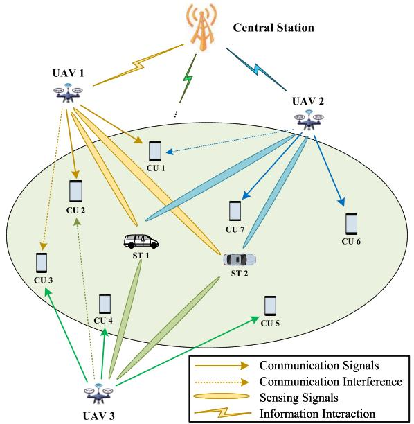  
Fig. 1. An illustration of a JRC-enabled multi-UAV cooperative scenario, where UAVs simultaneously serve multiple CUs while collaboratively detect various STs.

Extensive experiments are conducted under various system parameters. The simulation outcomes distinctly show the effectiveness of the proposed scheme in improving data transmission efficiency and sensing accuracy, whilst also offering crucial insights and design principles for practical JRC-enabled multi-UAV systems.

The remainder of this paper is organized as follows: Section II outlines the JRC-enabled multi-UAV cooperative scenario and details the formulation of the associated optimization problem. In Section III, we introduce a low-complexity iterative algorithm designed to effectively tackle the problem. Section IV presents the analytical results and evaluates the algorithm’s performance through extensive numerical simulations. Finally, Section V summarizes the key findings and draws conclusions from the research.

## II. SYSTEM MODEL AND PROBLEM FORMULATION

Refer to Fig. 1, we consider a JRC-enabled multi-UAV cooperative scenario involving the following components: 1) One central station; 2) K identically dual-functional UAVs, denoted by $k ~ \in ~ { \mathcal { K } } ~ \triangleq ~ \{ 1 , 2 , \cdots , K \} ; ~ 3 )$ $N _ { c }$ CUs, represented by $i \in \mathcal { T } \triangleq \{ 1 , 2 , \cdot \cdot \cdot , N _ { c } \}$ , receiving signals from the corresponding UAV; and 4) $N _ { s }$ STs, indexed by $j \in \mathcal { I } \triangleq \{ 1 , 2 , \cdot \cdot \cdot , N _ { s } \}$ , which are localized by the UAVs. Each UAV is fitted with a communication-radar unit capable of performing data transmission and radar sensing simultaneously at different frequencies to eliminate interference [22], [23]. To reduce unnecessary energy consumption caused by frequent altitude switches, UAVs are typically maintained at a consistent altitude. Here, we assume each UAV operates at an appropriate altitude H to optimize both communication and sensing accuracy. Let $\textbf { Q } \triangleq [ \pmb { q } _ { 1 } , \pmb { q } _ { 2 } , \ldots , \pmb { q } _ { K } ] \in \mathbb { R } ^ { 3 \times K }$ represent the deployment matrix, where $\mathbf { \Psi } _ { \mathbf { q } _ { k } } \mathbf { \Psi } = \left[ x _ { k } , y _ { k } , H \right] ^ { T }$ denotes the coordinates of the k-th UAV. Meanwhile, we define the location of the CU i and ST j as $\pmb { q } _ { i } ^ { \mathrm { c } } = \left[ x _ { i } ^ { \mathrm { c } } , y _ { i } ^ { \mathrm { c } } , 0 \right] ^ { T }$ and $\pmb { q } _ { j } ^ { \mathrm { s } } = \left[ x _ { j } ^ { \mathrm { s } } , y _ { j } ^ { \mathrm { s } } , 0 \right] ^ { T }$ , respectively.

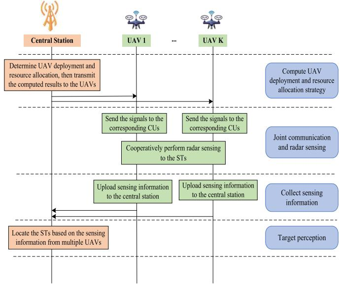  
Fig. 2. Multi-UAV cooperatively communication and radar sensing protocol.

The detailed protocol for multi-UAV cooperative communication and radar sensing is illustrated in Fig. 2. We consider a centralized JRC-enabled multi-UAV cooperative system, where the central station periodically performs strategic scheduling of UAV deployment and resource allocation. Once optimized decisions are made, each UAV executes the assigned positions and resource configurations. During operation, each UAV communicates with its associated CUs while simultaneously performing radar sensing using its own transmitted signals. Specifically, each UAV can receive echo signals directly reflected by the STs. After the sensing process is completed, all UAVs upload their collected data to the central station, which then processes the information to determine the relative positions of the STs.

In parallel, each UAV periodically reports its environmental and system status to the central station, enabling synchronized updates to deployment and resource allocation decisions. This centralized architecture enhances coordination among UAVs within the swarm and optimizes resource utilization, thereby improving overall system efficiency and adaptability. To ensure strict data synchronization among multiple UAVs, we establish a comprehensive multi-stage mechanism:

• Initial Calibration: During the setup phase, a standardized calibration procedure is conducted to precisely align UAV operational parameters, establishing a unified baseline essential for data consistency.

• Real-time Synchronization: During mission execution, a centralized control system continuously tracks UAV positions and states using high-precision global positioning system (GPS) and inertial measurement unit (IMU)

devices. This mechanism maintains precise spatiotemporal alignment and prevents drift or desynchronization.

• Inter-UAV Communication: A robust communication protocol supports high-frequency data exchange among UAVs, enabling them to share real-time operational states and spatial coordinates. This continuous information flow allows dynamic adjustments, ensuring system-wide synchronization under varying operational conditions.

This paper aims to enhance the system’s communication performance for CUs and sensing accuracy for STs by optimizing UAV placement and resource allocation. To achieve this, an effective optimization procedure is required. Before formalizing the problem, we first introduce the communication and sensing models for the multi-UAV system.

## A. Communication Model

In our proposed scenario, each UAV is designed to use its beams to perform dual functions: the main beam is used for perception, while the sub-beam is dedicated to communication [21]. Accordingly, the power allocated for both communication and sensing functions must comply with the UAV’s total power constraints. To minimize mutual interference between sensing and communication, the multi-UAV system adopts spectrum partitioning, where each function is assigned distinct and possibly orthogonal spectral resources (e.g., orthogonal subcarriers or separated frequency bands) [24]. In many practical situations, the number of CUs greatly exceeds the number of STs. To ensure adequate perception performance for the multiple STs, we assume that sufficient bandwidth is reserved for the sensing function, and therefore, we do not consider channel assignment for sensing purposes. As for the communication function, this paper considers a frequency division multiple access (FDMA) communication system. The total available bandwidth, denoted as W , is evenly divided into M orthogonal, non-overlapping subchannels for communication for CUs, represented by $\mathcal { M } \triangleq \{ 1 , 2 , \cdots , M \}$ . For clarity, we refer to subchannel m of UAV k as $S \mathcal { C } _ { m k }$ . We use a binary variable $a _ { i m k }$ to indicate the association between CUs and subchannels, and define $\mathcal { A } \ = \ \{ a _ { i m k } , \forall i , m , k \}$ as the matrix representing CU-subchannel allocations. The variable $a _ { i m k } = 1$ signifies that subchannel $S \mathcal { C } _ { m k }$ is assigned to CU i; otherwise, $a _ { i m k } = 0$

Considering the practical limitations of the available frequency spectrum, it is assumed that each CU can occupy only one channel for communication in each time slot. Concurrently, each UAV’s subchannel can be allocated to at most one CU. These requirements impose the following constraints:

$$
\sum _ { m = 1 } ^ { M } \sum _ { k = 1 } ^ { K } a _ { i m k } = 1 , \quad \forall i \in \mathbb { Z } ,\tag{1}
$$

$$
\sum _ { i = 1 } ^ { N _ { c } } a _ { i m k } \leq 1 , \quad \forall m \in \mathcal { M } , k \in \mathcal { K } ,\tag{2}
$$

$$
a _ { i m k } \in \{ 0 , 1 \} , \quad \forall i \in \mathcal { T } , m \in \mathcal { M } , k \in \mathcal { K } .\tag{3}
$$

Before determining the UAV deployment and resource allocation, it is crucial to acquire the channel state information (CSI) between UAVs and CUs. Given that the network under consideration is quasi-static, the communication channels between UAVs and CUs remain relatively stable. This stability enables the use of channel estimation methods based on previously received pilot signals to obtain the CSI [5]. In the described scenario, since UAVs operate at a moderate altitude, the transmission channel between CUs and UAVs is primarily characterized by LoS links. Consequently, the freespace path loss model is appropriate for characterizing the communication channel [25]. Let $d _ { i k } ^ { \mathrm { c } }$ denote the distance from the k-th UAV to the i-th CU, which is given by

$$
d _ { i k } ^ { \mathrm { c } } = \lVert \mathbf { q } _ { k } - \mathbf { q } _ { i } ^ { \mathrm { c } } \rVert _ { 2 } .\tag{4}
$$

Thus, we can obtain the channel power gain from UAV k to CU i as1

$$
h _ { i k } = \frac { \alpha _ { i k } ^ { 0 } } { \left( d _ { i k } ^ { \mathrm { c } } \right) ^ { 2 } } ,\tag{5}
$$

with $\alpha _ { i k } ^ { 0 }$ representing the channel power at the reference distance $d _ { i k } ^ { \mathrm { c } } =$ 1m. The detailed expression is

$$
\alpha _ { i k } ^ { 0 } = \frac { G _ { k } ^ { \mathrm { T } } G _ { i } ^ { \mathrm { R , c } } \lambda ^ { 2 } } { \left( 4 \pi \right) ^ { 2 } } ,\tag{6}
$$

where $G _ { k } ^ { \mathrm { T } }$ and $G _ { i } ^ { \mathrm { R , c } }$ represent the transmit antenna gain of UAV k and receive antenna gain of CU i, respectively. The carrier wavelength λ is given by $\textstyle \lambda = { \frac { c } { f _ { c } } }$ , where c denotes the speed of light and $f _ { c }$ is the carrier frequency. As a result, the received SINR of CU i on $S \mathcal { C } _ { m k }$ can be given by

$$
\gamma _ { i m k } ^ { \mathrm { c } } = \frac { a _ { i m k } p _ { m k } ^ { \mathrm { c } } h _ { i k } } { \displaystyle \sum _ { l = k } ^ { K } p _ { m l } ^ { \mathrm { c } } h _ { i l } + \sigma _ { 0 } ^ { 2 } } ,\tag{7}
$$

where $p _ { m k } ^ { \mathrm { c } }$ denotes the transmitting power allocated to CU on subchannel $S \mathcal { C } _ { m k }$ , and $\sigma _ { 0 } ^ { 2 }$ represents the noise power at the receiver. According to the Shannon capacity theorem, the achievable data rate that CU i can receive from the multi-UAV system is expressed as

$$
R _ { i } ^ { \mathrm { c } } = \sum _ { m = 1 } ^ { M } { \sum _ { k = 1 } ^ { K } { \frac { W } { M } \log _ { 2 } { ( 1 + \gamma _ { i m k } ^ { \mathrm { c } } ) } } } .\tag{8}
$$

To ensure fairness in UAV service for all CUs, our system is designed to improve the lower bound of information transmission rates across all CUs. This can be articulated by

$$
\Psi ^ { \mathrm { c } } = \operatorname* { m i n } \left\{ R _ { 1 } ^ { \mathrm { c } } , \ldots , R _ { i } ^ { \mathrm { c } } , \ldots , R _ { N _ { c } } ^ { \mathrm { c } } \right\} .\tag{9}
$$

## B. Sensing Model

In our proposed cooperative perception framework, UAVs transmit electromagnetic waves into a designated probing area and capture the reflected signals from potential targets. By measuring the round-trip delay of these echoes, UAVs estimate the distance parameters and apply statistical hypothesis testing to determine whether a detected echo corresponds to a valid ST, thereby achieving precise localization.2 To further mitigate the influence of multipath interference—such as reflections, diffraction, and scattering—on radar detection, we incorporate selective interference mitigation techniques as discussed in [29]. Additionally, echoes exhibiting delay-angle mismatches or statistical inconsistencies are naturally excluded from the detection results, further reducing the likelihood of false alarms caused by reflections from other UAVs. Mathematically, the distance from k-th UAV to j-th ST is defined as

$$
d _ { j k } ^ { \mathrm { s } } = \left. \pmb { q } _ { k } - \pmb { q } _ { j } ^ { \mathrm { s } } \right. _ { 2 } .\tag{10}
$$

Alternatively, this distance can also be represented using the signal’s two-way propagation delay $\tau _ { j k } ^ { \mathrm { s } }$ as

$$
d _ { j k } ^ { \mathrm { s } } = \frac { \tau _ { j k } ^ { \mathrm { s } } \cdot c } { 2 } ,\tag{11}
$$

where $\tau _ { j k } ^ { \mathrm { s } }$ is the round-trip delay of the signal traveling from the k-th UAV to the j-th ST and back. By evaluating the propagation delays between the transmitted signals and their corresponding echoes, UAVs can precisely determine the distances from the deployment site to each ST.

Estimation accuracy is affected by synchronization errors, measurement noise, and data loss from communication disruptions, leading to significant deviations. Thus, in practice, the measured distance is defined as

$$
\begin{array} { r } { \widetilde { d } _ { j k } ^ { \mathrm { s } } = { d } _ { j k } ^ { \mathrm { s } } + w _ { j k } ^ { \tau } , } \end{array}\tag{12}
$$

where $w _ { j k } ^ { \tau }$ denotes the Gaussian noise with zero mean and a specific variance $\left( \sigma _ { j k } ^ { \tau } \right) ^ { 2 }$ . For analytical convenience, we define the estimated distance measurement vector for ST j as $\tilde { \mathbf { d } } _ { j } ^ { \mathrm { s } } =$ $\begin{array} { r } { \left[ \widetilde { d } _ { j 1 } ^ { \mathrm { s } } , \ldots \widetilde { d } _ { j k } ^ { \mathrm { s } } , \ldots , \widetilde { d } _ { j K } ^ { \mathrm { s } } \right] ^ { T } } \end{array}$

It is important to note that $\left( \sigma _ { j k } ^ { \tau } \right) ^ { 2 }$ is inversely proportional to the SINR of the echo signal received by the k-th UAV from the j-th ST. The SINR $\gamma _ { j k } ^ { \mathrm { s } }$ is formulated as

$$
\gamma _ { j k } ^ { \mathrm { s } } = \frac { p _ { j k } ^ { \mathrm { s } } G _ { \mathrm { p } } g _ { j k } } { \sigma _ { 0 } ^ { 2 } } ,\tag{13}
$$

where $p _ { j k } ^ { \mathrm { s } }$ is the transmit power of UAV k to ST j. $G _ { \mathrm { p } }$ indicates the signal processing gain at the UAV receive side. $g _ { j k }$ represents the two-way channel power gain between the j-th ST and the k-th UAV, which is shown by

$$
g _ { j k } = \frac { \beta _ { j k } ^ { 0 } } { \left( d _ { j k } ^ { \mathrm { s } } \right) ^ { 4 } } ,\tag{14}
$$

where $\beta _ { j k } ^ { 0 }$ represents the channel power at the reference distance $\dot { d } _ { j k } ^ { \mathrm { s } } = 1 \mathrm { m }$ , which can be expressed as

$$
\beta _ { j k } ^ { 0 } = \frac { G _ { k } ^ { \mathrm { T } } G _ { j } ^ { \mathrm { R , s } } \sigma _ { \mathrm { r c s } } \lambda ^ { 2 } } { \left( 4 \pi \right) ^ { 3 } } ,\tag{15}
$$

with $G _ { j } ^ { \mathrm { R , s } }$ denoting the receive gain of ST j, and $\sigma _ { \mathrm { r c s } }$ representing the Radar Cross-Section (RCS).

Accordingly, the variance $\left( \sigma _ { j k } ^ { \tau } \right) ^ { 2 }$ can be remarked as [26]:

$$
\left( \sigma _ { j k } ^ { \tau } \right) ^ { 2 } = \frac { a \sigma _ { 0 } ^ { 2 } } { p _ { j k } ^ { \mathrm { s } } G _ { \mathrm { p } } g _ { j k } } ,\tag{16}
$$

where a is a constant related to the environmental noise.

To evaluate the performance of an estimator, the mean squared error (MSE) metric, denoted as $\epsilon ^ { 2 } = \mathbb { E } \left\lceil \left\| \mathbf { q } _ { j } ^ { \mathrm { s } } - \widehat { \mathbf { q } } _ { j } ^ { \mathrm { s } } \right\| ^ { 2 } \right\rceil$ is often used. Nevertheless, deriving a closed-form expression for the MSE can be difficult, and directly minimizing the MSE is typically impractical. Instead, we use the CRB, which provides a lower bound for the MSE of an unbiased estimator. We now formulate the CRB for the estimates $\widehat { x } _ { j } ^ { \mathrm { s } }$ and $\widehat { y } _ { j } ^ { \mathrm { s } }$ $( j = 1 , \ldots , N _ { s } )$ . Here, the CRB for the p-th element of a vector q corresponds to the $p \textmd { - }$ th diagonal element of the CRB matrix for q. Therefore, the first step is to compute the CRB matrix for $\widehat { \mathbf { q } } _ { j } ^ { \mathrm { s } }$ , denoted as

$$
\begin{array} { r } { \mathbf { C } \mathbf { R } \mathbf { B } _ { j } ^ { \mathbf { q } _ { j } ^ { \mathrm { s } } } = \left[ \mathbf { J } _ { j } ^ { \mathbf { q } _ { j } ^ { \mathrm { s } } } \right] ^ { - 1 } \in \mathbb { R } ^ { 2 \times 2 } , } \end{array}\tag{17}
$$

where $\mathbf { J } _ { i } ^ { \mathbf { q } _ { j } ^ { \mathrm { s } } } \in \mathbb { R } ^ { 2 \times 2 }$ is the corresponding Fisher information matrix (FIM) associated with $\mathbf { q } _ { j } ^ { \mathrm { s } }$

In many cases, when directly computing the FIM for specific parameters is challenging, an effective alternative is to compute it for related parameters and derive the original FIM. Now we start by constructing the FIM based on the distances between the j-th ST and multiple UAVs, denoted as $\mathbf { J } _ { i } ^ { \mathbf { d } _ { j } ^ { \mathrm { s } } } \in \mathbb { R } ^ { K \times K }$ . Next, we derive the FIM $\mathbf { J } _ { j } ^ { \mathbf { q } _ { j } ^ { \mathrm { s } } }$ by applying the chain rule, as shown in the following expression

$$
\mathbf { J } _ { j } ^ { \mathbf { q } _ { j } ^ { \mathrm { s } } } = \mathbf { Q } _ { j } \mathbf { J } _ { j } ^ { \mathbf { d } _ { j } ^ { \mathrm { s } } } \left[ \mathbf { Q } _ { j } \right] ^ { T } ,\tag{18}
$$

where $\mathbf { Q } _ { j } ~ \in ~ \mathbb { R } ^ { 2 \times K }$ is the corresponding Jacobian matrix, which can be written by

$$
\mathbf { Q } _ { j } = \left[ \frac { x _ { 1 } - x _ { j } ^ { \mathrm { s } } } { d _ { j 1 } ^ { \mathrm { s } } } \quad \ldots \quad \frac { x _ { k } - x _ { j } ^ { \mathrm { s } } } { d _ { j k } ^ { \mathrm { s } } } \quad \ldots \quad \frac { x _ { K } - x _ { j } ^ { \mathrm { s } } } { d _ { j K } ^ { \mathrm { s } } } \right] .\tag{19}
$$

Clearly, the mean of $\widetilde { d } _ { j k } ^ { \mathrm { s } }$ is $d _ { j k } ^ { \mathrm { s } } .$ , and its covariance $\left( \sigma _ { j k } ^ { \tau } \right) ^ { 2 }$ both depend on $d _ { j k } ^ { \mathrm { s } }$ . Consequently, $\widetilde { \mathbf { d } } _ { j } ^ { \mathrm { s } }$ obeys the following distribution as

$$
\widetilde { \mathbf { d } } _ { j } ^ { \mathrm { s } } \sim \mathcal { N } \left( \mathbf { d } _ { j } ^ { \mathrm { s } } , \mathbf { C } _ { j } ^ { \mathrm { s } } \right) ,\tag{20}
$$

with ${ \bf C } _ { j } ^ { \mathrm { s } }$ is a diagonal matrix in the form of

$$
\mathbf { C } _ { j } ^ { \mathrm { s } } = \frac { a \sigma _ { 0 } ^ { 2 } } { p _ { j k } ^ { \mathrm { s } } G _ { \mathrm { p } } \beta _ { 0 } } \mathrm { d i a g } \left( \left[ d _ { j 1 } ^ { \mathrm { s } } \right] ^ { 4 } , \dots , \left[ d _ { j K } ^ { \mathrm { s } } \right] ^ { 4 } \right) .\tag{21}
$$

For each parameter within a vector, when both its measurement mean and covariance are functions of the same variable, the FIM for that vector can be determined using equation (3.31) from [33]. Accordingly, we can bravely derive $\hat { \mathbf { J } } _ { j } ^ { \mathbf { d } _ { j } ^ { \mathrm { s } } }$ , as illustrated by (22), shown at the bottom of the next page.

By inserting (19) and (22) into (18), we can calculate the CRB matrix of $\widehat { \mathbf { q } } _ { j }$ by

$$
\mathbf { C R B } _ { j } ^ { \mathbf { q } _ { j } ^ { \mathrm { s } } } = [ \mathbf { J } _ { j } ^ { \mathbf { q } _ { j } ^ { \mathrm { s } } } ] ^ { - 1 } = \frac { 1 } { \Theta _ { j } ^ { \mathrm { a } } \Theta _ { j } ^ { \mathrm { b } } - ( \Theta _ { j } ^ { \mathrm { c } } ) ^ { 2 } } [ \Theta _ { j } ^ { \mathrm { b } }  \quad \Theta _ { j } ^ { \mathrm { c } } ] ,\tag{23}
$$

where $\Theta _ { j } ^ { \mathrm { a } } , \Theta _ { j } ^ { \mathrm { b } }$ , and Θcj are detailed in (24)-(26), shown at the bottom of the page.

The CRB of $\widehat { x } _ { j } ^ { \mathrm { s } }$ and $\widehat { y } _ { j } ^ { \mathrm { s } }$ correspond to the diagonal elements of $\mathbf { C R B } _ { j } ^ { \mathbf { q } _ { j } ^ { \mathrm { s } } }$ , as shown by

$$
\mathrm { C R B } _ { j } ^ { \mathrm { x } } = \frac { \Theta _ { j } ^ { \mathrm { b } } } { \Theta _ { j } ^ { \mathrm { a } } \Theta _ { j } ^ { \mathrm { b } } - \left( \Theta _ { j } ^ { \mathrm { c } } \right) ^ { 2 } } ,\tag{27}
$$

$$
\mathrm { C R B } _ { j } ^ { \mathrm { y } } = \frac { \Theta _ { j } ^ { \mathrm { a } } } { \Theta _ { j } ^ { \mathrm { a } } \Theta _ { j } ^ { \mathrm { b } } - \left( \Theta _ { j } ^ { \mathrm { c } } \right) ^ { 2 } } .\tag{28}
$$

Here, we use the SPEB, which is the trace of CRB, to assess the localization accuracy [34]. This can be expressed as

$$
\psi _ { j } ^ { \mathrm { s } } = \frac { \Theta _ { j } ^ { \mathrm { b } } + \Theta _ { j } ^ { \mathrm { a } } } { \Theta _ { j } ^ { \mathrm { a } } \Theta _ { j } ^ { \mathrm { b } } - \left( \Theta _ { j } ^ { \mathrm { c } } \right) ^ { 2 } } .\tag{29}
$$

Similar to the previous subsection, to ensure fairness in multi-UAV sensing across STs, our system aims to minimize the SPEB upper bound for all STs. This can be expressed as

$$
\Psi ^ { \mathrm { s } } = \operatorname* { m a x } \left\{ \psi _ { 1 } ^ { \mathrm { s } } , \ldots , \psi _ { j } ^ { \mathrm { s } } , \ldots , \psi _ { N _ { s } } ^ { \mathrm { s } } \right\} .\tag{30}
$$

## C. Problem Formulation

The data rate of the CUs and the SPEB of the STs are two pivotal performance metrics for evaluating our JRC-enabled multi-UAV system. Notably, higher values of $\Psi ^ { \mathrm { c } }$ (reflecting improved communication) or lower values of $\Psi ^ { \mathrm { s } }$ (indicating enhanced sensing) correspond to better overall performance. To balance their differing units, we introduce weighting factors $\omega _ { 1 }$ and ω2 $( \omega _ { 1 } , \omega _ { 2 } > 0 )$ and use the expression $\omega _ { 1 } \Psi ^ { \mathrm { c } } - \omega _ { 2 } \Psi ^ { \mathrm { s } }$ to balance the trade-off between communication and sensing efficiency. With this approach, our goal is to enhance the overall network performance by jointly optimizing UAVs deployment (i.e., Q), communication user association and channel assignment $( \mathrm { i . e . , ~ } \mathbf { A } ) .$ , and power allocation (i.e., P). This optimization problem can be formulated as follows

$$
\operatorname* { m a x } _ { \mathbf { A } , \mathbf { P } , \mathbf { Q } } ~ \omega _ { 1 } \Psi ^ { \mathrm { c } } - \omega _ { 2 } \Psi ^ { \mathrm { s } }\tag{31a}
$$

$$
\mathrm { s . t . } \sum _ { m = 1 } ^ { M } \sum _ { k = 1 } ^ { K } a _ { i m k } = 1 , \quad \forall i \in \mathbb { Z } ,\tag{31b}
$$

$$
\sum _ { i = 1 } ^ { N _ { c } } a _ { i m k } \leq 1 , \quad \forall m \in \mathcal { M } , k \in \mathcal { K } ,\tag{31c}
$$

$$
a _ { i m k } \in \{ 0 , 1 \} , \quad \forall i \in \mathcal { I } , m \in \mathcal { M } , k \in \mathcal { K } ,
$$

$$
p _ { m k } ^ { \mathrm { c } } \ge 0 , \quad \forall m \in \mathcal { M } , k \in \mathcal { K } ,\tag{31d}
$$

(31e)

$$
p _ { j k } ^ { \mathrm { s } } \ge 0 , \quad \forall j \in \mathcal { I } , k \in \mathcal { K } ,\tag{31f}
$$

$$
\sum _ { j = 1 } ^ { N _ { s } } p _ { j k } ^ { \mathrm { s } } + \sum _ { m = 1 } ^ { M } p _ { m k } ^ { \mathrm { c } } \leq p _ { k } ^ { \operatorname* { m a x } } , \quad \forall k \in \mathcal { K } ,\tag{31g}
$$

$$
\left\| \mathbf { q } _ { k } - \mathbf { q } _ { \nu } \right\| ^ { 2 } \geq d _ { \operatorname* { m i n } } ^ { 2 } , \quad k \neq \nu ,\tag{31h}
$$

$$
\left\| \mathbf { q } _ { k } - \mathbf { q } _ { \nu } \right\| ^ { 2 } \leq d _ { \operatorname* { m a x } } ^ { 2 } , \quad k \neq \nu .\tag{31i}
$$

wherein a larger $\omega _ { 1 }$ gives more weight to communication, while a higher $\omega _ { 2 }$ prioritizes sensing in the multi-UAV optimization design. Given the practical limitations of the available frequency spectrum, (31b) ensures that each CU can occupy only a single channel for UAV communication in each time slot, and (31c) restricts each UAV’s subchannel to being allocated to at most one CU. Moreover, due to energy consumption limitations, constraint (31g) limits the total power used for both communication and perception by each UAV. Finally, (31h) enforces a collision avoidance requirement, mandating a minimum separation distance $d _ { \mathrm { m i n } }$ between any two UAVs, while (31i) defines the maximum allowable communication range $d _ { \mathrm { m a x } }$ between UAVs.

Notice that the problem defined in (31) presents several significant challenges that make finding an optimal solution complex. First, the objective function involves a complex interplay between the channel assignment matrix A, the power allocation matrix P, and the placement location matrix Q, complicating direct optimization. Moreover, the max-min fairness criterion introduces both non-differentiability and non-

$$
\left[ \mathbf { J } _ { j } ^ { \mathbf { d } _ { j } ^ { \mathsf { s } } } \right] _ { p , q } = \left[ \frac { \partial \mathbf { d } _ { j } ^ { \mathsf { s } } } { \partial d _ { j p } ^ { \mathsf { s } } } \right] ^ { T } \left[ \mathbf { C } _ { j } ^ { \mathsf { s } } \right] ^ { - 1 } \left[ \frac { \partial \mathbf { d } _ { j } ^ { \mathsf { s } } } { \partial d _ { j q } ^ { \mathsf { s } } } \right] + \frac { 1 } { 2 } \mathrm { t r } \left[ \left[ \mathbf { C } _ { j } ^ { \mathsf { s } } \right] ^ { - 1 } \frac { \partial \left[ \mathbf { C } _ { j } ^ { \mathsf { s } } \right] } { \partial d _ { j p } ^ { \mathsf { s } } } \left[ \mathbf { C } _ { j } ^ { \mathsf { s } } \right] ^ { - 1 } \frac { \partial \left[ \mathbf { C } _ { j } ^ { \mathsf { s } } \right] } { \partial d _ { j q } ^ { \mathsf { s } } } \right] , \quad p , q = 1 , \hdots , K ,\tag{22}
$$

$$
\Theta _ { j } ^ { \mathrm { a } } = \sum _ { k = 1 } ^ { K } \left\{ \frac { p _ { j k } ^ { \mathrm { s } } G _ { \mathrm { p } } \beta _ { 0 } } { a \sigma _ { 0 } ^ { 2 } } \frac { \left( x _ { k } - x _ { j } ^ { \mathrm { s } } \right) ^ { 2 } } { \left[ d _ { j k } ^ { \mathrm { s } } \right] ^ { 6 } } + \frac { 8 \left( x _ { k } - x _ { j } ^ { \mathrm { s } } \right) ^ { 2 } } { \left[ d _ { j k } ^ { \mathrm { s } } \right] ^ { 4 } } \right\} ,\tag{24}
$$

$$
\Theta _ { j } ^ { \mathrm { b } } = \sum _ { k = 1 } ^ { K } \left\{ \frac { p _ { j k } ^ { \mathrm { s } } G _ { \mathrm { p } } \beta _ { 0 } } { a \sigma _ { 0 } ^ { 2 } } \frac { \left( y _ { k } - y _ { j } ^ { \mathrm { s } } \right) ^ { 2 } } { \left[ d _ { j k } ^ { \mathrm { s } } \right] ^ { 6 } } + \frac { 8 \left( y _ { k } - y _ { j } ^ { \mathrm { s } } \right) ^ { 2 } } { \left[ d _ { j k } ^ { \mathrm { s } } \right] ^ { 4 } } \right\} ,\tag{25}
$$

$$
\Theta _ { j } ^ { \mathrm { c } } = \sum _ { k = 1 } ^ { K } \left\{ \frac { p _ { j k } ^ { \mathrm { s } } G _ { \mathrm { p } } \beta _ { 0 } } { a \sigma _ { 0 } ^ { 2 } } \frac { \left( x _ { k } - x _ { j } ^ { \mathrm { s } } \right) \left( y _ { k } - y _ { j } ^ { \mathrm { s } } \right) } { \left[ d _ { j k } ^ { \mathrm { s } } \right] ^ { 6 } } + \frac { 8 \left( x _ { k } - x _ { j } ^ { \mathrm { s } } \right) \left( y _ { k } - y _ { j } ^ { \mathrm { s } } \right) } { \left[ d _ { j k } ^ { \mathrm { s } } \right] ^ { 4 } } \right\} .\tag{26}
$$

convexity, further exacerbating the problem’s computational intractability. Additionally, the channel assignment indicator $a _ { i m k }$ is a discrete binary variable, rendering the feasible set inherently non-convex. As a result, these factors result in a mixed-integer nonlinear programming (MINLP) problem, which is well known to be NP-hard. To address these challenges, the subsequent sections present a suite of tailored optimization algorithms that reformulate the objective function, enhance tractability, and improve computational efficiency.

## III. PROPOSED SOLUTION

In this section, we will introduce a powerful approach for addressing problem (31). To handle the non-differentiable nature of the objective function, we reformulate the problem into a more tractable and interpretable form with the aid of smooth approximation techniques. Subsequently, we present an iterative method by leveraging the AO algorithm. In the proposed approach, the user association and channel assignment matrix A, power allocation matrix P, and deployment location matrix Q are sequentially optimized while keeping the other variables fixed. Specifically, the algorithm proceeds through three steps until convergence: In the first step, with P and Q fixed, A is updated by using the convex optimization tools. The second step involves updating P by the descent direction search method, keeping A and Q fixed. In the third step, Q is optimized based on the joint spectral clustering and Gibbs sampling algorithm, with A and P held constant. The detailed optimization procedure is outlined below.

## A. Problem Transformation

The difficulty now lies in addressing the non-smooth components of the objective function arising from (9) and (30). To tackle this challenge, we hereby consider to adopt the log–sum–exp (LSE) as a smooth approximation for the objective function in (31), using the following lemma.

Lemma 1: According to the smooth approximation technique from [35], the following inequality is established:

$$
\operatorname* { m a x } { \big \{ } x _ { 1 } , \ldots , x _ { K } { \big \} } \leq f ( x ) \leq \operatorname* { m a x } { \big \{ } x _ { 1 } , \ldots , x _ { K } { \big \} } + \mu \log K ,\tag{32}
$$

where

$$
f ( x ) { = } { \mu } \log \left( \sum _ { k = 1 } ^ { K } \exp \left( \frac { x _ { k } } { \mu } \right) \right) ,\tag{33}
$$

with a sufficiently small positive constant $\mu > 0$ . Thus, we have

$$
f ( x ) \approx \operatorname* { m a x } \left\{ x _ { 1 } , \dots , x _ { K } \right\} .\tag{34}
$$

Based on Lemma 3.1, we can approximate

$$
\begin{array} { r l r } { \mathrm { ~ } } & { { } } & { - \Psi ^ { \mathrm { c } } = - \operatorname* { m i n } \left\{ R _ { 1 } ^ { \mathrm { c } } , \dots , R _ { i } ^ { \mathrm { c } } , \dots , R _ { N _ { c } } ^ { \mathrm { c } } \right\} } \\ { \mathrm { ~ } } & { { } } & { \approx \mu \log \left( \displaystyle \sum _ { i = 1 } ^ { N _ { c } } \exp \left( \frac { - R _ { i } ^ { \mathrm { c } } } { \mu } \right) \right) , } \end{array}\tag{35}
$$

and

$$
\Psi ^ { \mathrm { s } } = \operatorname* { m a x } \left\{ \psi _ { 1 } ^ { \mathrm { s } } , \ldots , \psi _ { j } ^ { \mathrm { s } } , \ldots , \psi _ { N _ { s } } ^ { \mathrm { s } } \right\} \approx \mu \log \left( \sum _ { j = 1 } ^ { N _ { s } } \exp \left( \frac { \psi _ { j } ^ { \mathrm { s } } } { \mu } \right) \right) .\tag{36}
$$

Using the above approximation, we can systematically construct the following mathematical expression to reformulate the objective function of (31) as

$$
\begin{array} { l } { { \displaystyle f _ { \mu } ( { \bf A } , { \bf P } , { \bf Q } ) } \ ~ } \\ { { \displaystyle \triangleq \omega _ { 2 } \mu \log \left( \sum _ { j = 1 } ^ { N _ { s } } \exp \left( \frac { \psi _ { j } ^ { \mathrm { s } } } { \mu } \right) \right) + \omega _ { 1 } \mu \log \left( \sum _ { i = 1 } ^ { N _ { c } } \exp \left( \frac { - R _ { i } ^ { \mathrm { c } } } { \mu } \right) \right) } \ ~ } \\ { { \displaystyle \approx \omega _ { 2 } \Psi ^ { \mathrm { s } } - \omega _ { 1 } \Psi ^ { \mathrm { c } } } \ ~ } \end{array}\tag{7}
$$

As a result, the original optimization problem can be approximated and reformulated as follows

$$
\begin{array} { r l r } & { \underset { { \bf A } , { \bf P } , { \bf Q } } { \operatorname* { m i n } } } & { f _ { \mu } ( { \bf A } , { \bf P } , { \bf Q } ) } \\ & { \mathrm { s . t . } ~ ( 3 4 { \bf b } ) , ~ ( 3 4 { \bf c } ) , ~ ( 3 4 { \bf d } ) , ~ ( 3 4 { \bf e } ) , ~ ( 3 4 { \bf f } ) , ~ ( 3 4 { \bf g } ) , ~ ( 3 4 { \bf h } ) , ~ ( 3 4 { \bf i } ) . } \end{array}\tag{8a}
$$

(38b)

In the sequel, we will elaborate on the AO algorithm to alternatively optimize the formulated problem (38).

## B. User Association and Channel Assignment Optimization

In this subsection, we thoroughly outline the procedure for effectively implementing step 1 of our proposed AO algorithm, specifically focusing on solving the following problem while keeping the matrices P and Q fixed:

$$
\operatorname* { m i n } _ { \mathbf { A } } \ f _ { \mu } ( \mathbf { A } , \mathbf { P } , \mathbf { Q } )\tag{39a}
$$

$$
\mathrm { s . t . } \sum _ { m = 1 } ^ { M } \sum _ { k = 1 } ^ { K } a _ { i m k } = 1 , \quad \forall i \in \mathbb { Z } ,\tag{39b}
$$

$$
\sum _ { i = 1 } ^ { N _ { c } } a _ { i m k } \leq 1 , \quad \forall m \in \mathcal { M } , k \in \mathcal { K } ,\tag{39c}
$$

$$
a _ { i m k } \in \{ 0 , 1 \} , \quad \forall i \in \mathcal { T } , m \in \mathcal { M } , k \in \mathcal { K } .\tag{39d}
$$

It is readily seen that the user association and channel assignment problem constitutes an integer linear programming (ILP) issue, efficiently solved by existing optimization tools like MOSEK [36]. Here, we introduce an implicit enumeration method. Initially, all variables are set to 0 to evaluate the objective function $f _ { \mu } \left( { \bf A } , { \bf P } , { \bf Q } \right)$ and verify constraints. Then, we branch each variable by alternating between 0 and 1 in succession. At each branch, only the variable satisfying constraints and yielding a smaller $f _ { \mu } \left( { \bf A } , { \bf P } , { \bf Q } \right)$ is retained, continuing until all variables are assigned. This approach substantially reduces the number of variable combinations, thus accelerating the calculation.

## C. Power Allocation Optimization

Given a specific set of user associations and channel assignments A, as well as UAV deployment locations Q, the

multi-UAV power allocation problem in (38) can be optimized by addressing the following problem:

$$
\operatorname* { m i n } _ { \mathbf { P } } \ f _ { \mu } ( \mathbf { A } , \mathbf { P } , \mathbf { Q } )\tag{40a}
$$

$$
\mathrm { s . t . } \ p _ { m k } ^ { \mathrm { c } } \geq 0 , \quad \forall m \in \mathcal { M } , k \in \mathcal { K } ,\tag{40b}
$$

$$
p _ { j k } ^ { \mathrm { s } } \ge 0 , \quad \forall j \in \mathcal { I } , k \in \mathcal { K } ,\tag{40c}
$$

$$
\sum _ { j = 1 } ^ { N _ { s } } p _ { j k } ^ { \mathrm { s } } + \sum _ { m = 1 } ^ { M } p _ { m k } ^ { \mathrm { c } } \leq p _ { k } ^ { \operatorname* { m a x } } , \quad \forall k \in \mathcal { K } .\tag{40d}
$$

The primary challenge stems from the non-convexity feature of problem (40). It can be observed that the objective function is non-convex, while all constraints are convex. Hence, for any given feasible point $\mathbf { P ^ { \prime } }$ , we can approximate the objective function $f _ { \mu } ( { \bf A } , { \bf P } , { \bf Q } )$ by its first-order Taylor expansion as

$$
f _ { \mu } ( \mathbf { A } , \mathbf { P } , \mathbf { Q } ) \approx f _ { \mu } ( \mathbf { A } , \mathbf { P } ^ { \prime } , \mathbf { Q } ) + \nabla _ { \mathbf { P } } f _ { \mu } \left( \mathbf { A } , \mathbf { P } ^ { \prime } , \mathbf { Q } \right) ^ { T } \left( \mathbf { P } - \mathbf { P } ^ { \prime } \right) ,\tag{41}
$$

where $\nabla _ { \mathbf { P } } f _ { \mu } \left( \cdot \right)$ indicates the gradient of $f _ { \mu } \left( \cdot \right)$ with respect to P. This approximation provides a descent direction for the objective function. By iteratively searching along this direction, we can progressively converge to a local optimal solution for problem (40). The problem can be iteratively reformulated as follows

$$
\operatorname* { m i n } _ { \mathbf { P } } \ f _ { \mu } \left( \mathbf { A } , \mathbf { P } ^ { l - 1 } , \mathbf { Q } \right) + \nabla _ { \mathbf { P } } f _ { \mu } \left( \mathbf { A } , \mathbf { P } ^ { l - 1 } , \mathbf { Q } \right) ^ { T } \left( \mathbf { P } - \mathbf { P } ^ { l - 1 } \right)\tag{42a}
$$

s.t. (43b), (43c), (43d).

(42b)

Here, $\mathbf { P } ^ { l - 1 }$ denotes the value of P from the $( l - 1 )$ )-th iteration. It is not difficult to see that both the objective function and all constrains in (42) are convex. Thus, the optimal solution $\mathbf { P } ^ { * }$ can be found using optimization tools like CVX. In each iteration, the descent direction is $\mathbf { P ^ { * } } - \mathbf { P } ^ { l - 1 }$ Then we can update P by moving in this direction with a stepsize η, yielding a new estimate $\mathbf { P } ^ { l }$ by

$$
\mathbf { P } ^ { l } = \mathbf { P } ^ { l - 1 } + \eta ^ { * } \left( \mathbf { P } ^ { * } - \mathbf { P } ^ { l - 1 } \right) ,\tag{43}
$$

where $\eta ^ { * }$ is the stepsize that minimizes $f _ { \mu } ( { \bf A } , { \bf P } , { \bf Q } )$ in (40). In summary, the proposed descent direction search algorithm for solving problem (40) iteratively optimizes power allocation by updating P along the gradient direction, thereby ensuring convergence to a locally optimal solution. We can summarize the proposed method in Algorithm 1.

## D. Deployment Location Optimization

This subsection details the process of optimizing UAV deployment within our iterative algorithm, specifically solving the following problem when A and P are held constant:

$$
\operatorname* { m i n } _ { \mathbf { Q } } \ f _ { \mu } ( \mathbf { A } , \mathbf { P } , \mathbf { Q } )
$$

$$
\mathrm { s . t . } \left\| \mathbf { q } _ { k } - \mathbf { q } _ { \nu } \right\| ^ { 2 } \geq d _ { \operatorname* { m i n } } ^ { 2 } , \quad k \neq \nu ,\tag{44a}
$$

(44b)

$$
\left\| \mathbf { q } _ { k } - \mathbf { q } _ { \nu } \right\| ^ { 2 } \leq d _ { \operatorname* { m a x } } ^ { 2 } , \quad k \neq \nu .\tag{44c}
$$

The main challenge arises from the vast number of possible UAV configurations, making the determination of optimal positions highly complex. Although an exhaustive search across all possible deployment locations could theoretically resolve this issue, it is computationally prohibitive and impractical for real-world JCR-enabled multi-UAV scenarios. To address this, we propose a powerful strategy that integrates spectral clustering and Gibbs sampling algorithm, facilitating the efficient deployment of multiple UAVs and improving the overall communication and radar capabilities of the network.

Algorithm 1 The Descent Direction Search Method for Prob  
lem (40)   
1: Initialize $\mathbf { P } ^ { 0 }$ , set maximum iteration count $T _ { 1 , \mathrm { m a x } } .$ , and   
let $l = 1 ;$   
2: repeat   
3: Formulate problem (42), compute $\mathbf { P } ^ { * }$ via CVX tool;   
4: For $\eta = 0 : \Delta _ { \eta } : \dot { \ O } ($ 1   
5: Obtain function value $f _ { \mu } ( { \bf A } , { \bf P } , { \bf Q } )$ , where $\mathbf { P } { = } \mathbf { P } ^ { l - 1 } +$   
$\eta \big ( \mathbf { P } ^ { * } - \mathbf { P } ^ { l - 1 } \big )$   
6: End   
7: Find $\eta$ that minimizes $f _ { \mu } \left( \mathbf { A } , \mathbf { P } , \mathbf { Q } \right)$ and record it as $\eta ^ { * } ;$   
8: Update $\mathbf { P } ^ { l }$ via (43);   
9: Set $l = l + 1 ;$   
10: until $f _ { \mu } \left( { \bf A } , { \bf P } ^ { l } , { \bf Q } \right) \ge f _ { \mu } \left( { \bf A } , { \bf P } ^ { l - 1 } , { \bf Q } \right)$ , or the maximum   
iteration number is reached.

Since the transmission channels from UAVs to ground nodes (CUs and STs) are primarily dominated by LoS links, the physical distance between them becomes a crucial factor influencing communication and sensing accuracy. Intuitively, the closer a UAV is to the CU (or ST), the better the performance in communication and sensing. To optimize this, we employ the spectral clustering algorithm based on the location similarities of all ground nodes. Specifically, the algorithm forms clusters of ground nodes according to their distance similarity matrix and determines UAV positions based on the centers of these clusters, as detailed in [37].

Even though the spectral clustering algorithm offers an ideal solution for multi-UAV deployment, it still encounters the following issues: Firstly, spectral clustering primarily focuses on deployment based on all nodes (i.e., CUs and STs) without adequately balancing the specific performance weights of communication and sensing. Secondly, the positions determined by spectral clustering may violate the UAVs’ distance constraints. Consequently, we use spectral clustering as the initial step for the multi-UAV deployment scheme. Building on this, we propose a powerful algorithm, known as Gibbs sampling [38], to dynamically adjust UAV positions, thereby achieving an optimal deployment strategy. The Gibbs sampling approach incrementally develops a sub-optimal strategy for UAV deployment. This algorithm involves iteratively updating the UAV positions, producing a sequence of samples that establish a Markov chain. During each iteration t, the algorithm conducts K sub-iterations, where each $\mathrm { U A V } \mathbf { \hat { s } }$ position is alternately revised to a new location. This revision is guided by a customized transition probability, while keeping the positions of the remaining UAVs held fixed. The specifics of the strategy’s implementation are detailed below:

First, we partition the multi-UAV deployable area D into numerous small, equally sized rectangular zones, referred to as $\tau .$ . These zones form the state space for potential UAV positions. In this context, we denote the position of UAV k during the l-th sub-iteration of the t-th iteration as $\mathbf { \Delta } \mathbf { } q _ { k } ^ { l } ( t ) \in \mathcal { T }$ , and also representing the positions of all UAVs as $\pmb { \mathcal { Q } } ^ { l } ( t ) = \{ \pmb { q } _ { 1 } ^ { l } ( t ) , \cdots , \pmb { q } _ { K } ^ { l } ( t ) \}$ . Additionally, the notation $\pmb { \mathcal { Q } } _ { - k } ^ { l } ( t ) = \{ \pmb { q } _ { 1 } ^ { l } ( t ) , \cdots , \pmb { q } _ { k - 1 } ^ { l } ( t ) , \pmb { q } _ { k + 1 } ^ { l } ( t ) , \cdots , \pmb { q } _ { K } ^ { l } ( t ) \}$ indicates the placement state excluding the k-th UAV. Thus, a typical realization of the multi-UAV deployment $\pmb { \mathcal { Q } } ^ { l } ( t )$ can be expressed as $\pmb { Q } ^ { l } ( t ) \in \mathcal { T } ^ { K } \triangleq \mathcal { T } \times \cdots \times \overset { \cdot } { \mathbb { Z } } .$ . Finally, the system {zK   
state transition probability from sub-iteration $l - 1$ to l in the tth iteration is denoted as $\operatorname* { P r } \left\lceil \pmb { \mathcal { Q } } ^ { l } ( t ) \mid \pmb { \mathcal { Q } } ^ { l - 1 } ( t ) \right\rceil , l = 2 , \cdots , K$

The purpose of problem (44) is to enhance the joint communication and sensing performance, by designing the optimal UAV placement. We achieve this by iteratively constructing a Markov chain to update UAV positions, as described below.

• Initialization: Set initial multi-UAV deployment locations $\pmb { \mathcal { Q } } ^ { 1 } ( t ) = \pmb { Q } ^ { 1 } ( t )$ with $t = 1$

Sub-iteration: With distance constraints (44b) and (44c) satisfied, we iteratively update each $\mathrm { U A V } ^ { \ , } \mathbf { s }$ position while keeping the others fixed. Specifically, in each subiteration, the l-th UAV’s location is adjusted according to the transition probability defined as follows:

$$
\begin{array} { r l } & { \operatorname* { P r } \Big [ \pmb { Q } ^ { l } ( t ) = \pmb { Q } ^ { l } ( t ) \ | \ \pmb { Q } ^ { l - 1 } ( t ) = \pmb { Q } ^ { l - 1 } ( t ) \Big ] } \\ & { = \mathbb { I } \left[ \pmb { Q } _ { - l } ^ { l } ( t ) = \pmb { Q } _ { - l } ^ { l - 1 } ( t ) \right] } \\ & { \quad \times \frac { e ^ { - \rho f _ { \mu } \left( \mathbf { A } , \mathbf { P } , \pmb { Q } ^ { l } ( t ) \right) } } { \sum _ { \tilde { Q } ^ { l } ( t ) \in \mathcal { T } ^ { M } } e ^ { - \rho f _ { \mu } \left( \mathbf { A } , \mathbf { P } , \tilde { \pmb { Q } } ^ { l } ( t ) \right) } } , \quad \forall \pmb { Q } ^ { l } ( t ) \in \mathcal { T } ^ { K } , } \end{array}\tag{45}
$$

with $\rho \geq 0$ is a positive constant, and $\mathbb { I } [ \cdot ]$ denotes the indicator function. We can see that in each sub-iteration, the transition probability for updating a UAV’s position is influenced by both its individual utility and the utility of all potential configurations, $\tilde { \boldsymbol { Q } } ^ { l } ( t ) \in \dot { \mathcal { T } } ^ { K }$

• Repeat: Repeat the iterative procedure until the algorithm achieves convergence.

However, we notice that the proposed algorithm becomes computationally intensive as the state space enlarges. The reason is that, in each sub-iteration, the approach must compute all possible transition probabilities that meet the condition of ${ Q } _ { - l } ^ { l { ' } } ( t ) \ = \ Q _ { - l } ^ { l - 1 } ( t )$ . To address this issue, we propose an enhanced Gibbs sampling algorithm that considerably reduces computational complexity. The core strategy involves limiting the search space for each UAV from the entire state space $\tau$ to two specific sub-spaces: $\mathcal { X } _ { l } ( t )$ and Yl(t), ensuring the constraints (44b) and (44c) are satisfied. The first sub-space, $\mathcal { X } _ { l } ( t )$ , comprises the current position of the selected UAV, $\pmb q _ { l - 1 } ^ { l } ( t )$ , along with the four adjacent positions (up, down, left, right). The second sub-space, $y _ { l } ( t )$ , includes $\tau \ll | T |$ random positions sampled from the remaining space $\mathcal { T } \backslash \mathcal { X } _ { l } ( t )$ . Consequently, the transition probability in (45) can be simplified as

$$
\begin{array} { r l } & { \operatorname* { P r } \Big [ \pmb { Q } ^ { l } ( t ) = \pmb { Q } ^ { l } ( t ) \ | \ \pmb { Q } ^ { l - 1 } ( t ) = \pmb { Q } ^ { l - 1 } ( t ) \Big ] } \\ & { = \mathbb { I } \left[ \pmb { Q } _ { - l } ^ { l } ( t ) = \pmb { Q } _ { - l } ^ { l - 1 } ( t ) \right] \times \mathbb { I } \left[ \pmb { q } _ { l } ^ { l } ( t ) \in ( \mathcal { X } _ { l } ( t ) \cup \mathcal { Y } _ { l } ( t ) ) \right] } \\ & { \quad \times \frac { e ^ { - \rho f _ { \mu } \left( \mathbf { A } , \mathbf { P } , \pmb { Q } ^ { l } ( t ) \right) } } { \sum _ { \tilde { Q } ^ { l } ( t ) \in \mathcal { T } ^ { M } } e ^ { - \rho f _ { \mu } \left( \mathbf { A } , \mathbf { P } , \tilde { \pmb { Q } } ^ { l } ( t ) \right) } } , \quad \forall \pmb { Q } ^ { l } ( t ) \in \mathcal { T } ^ { K } . } \end{array}\tag{46}
$$

It is observed that the set $\mathcal { X } _ { l } ( t )$ is designed for quick neighborhood searches to identify better local solutions, while $y _ { l } ( t )$ facilitates the exploration of potentially better locations through random selection across the entire state space. Nevertheless, our simulations reveal that the transition strategy outlined in (46) can occasionally lead to undesirable numerical outcomes, i.e., the UAVs might have a certain probability of moving towards the positions that could increase the objective function, potentially preventing the algorithm from achieving monotonic convergence. Here, we modify the transfer scheme in our numerical examples by restricting each UAV’s search space to only those subspaces within $( \mathcal { X } _ { l } ( t ) \cup \mathcal { Y } _ { l } ( t ) )$ that are likely to decrease the objective function of (44). This adjustment ensures that the objective values produced by our proposed sampling algorithm form a non-increasing sequence.

Algorithm 2 Proposed Algorithm for Problem (31)   
1: Initialize $\overline { { \{ { \bf A } ^ { 0 } , { \bf P } ^ { 0 } , { \bf Q } ^ { 0 } \} } }$ , and set the maximum iteration   
limit $T _ { 2 , \mathrm { m a x } } . \mathrm { L e t } l = 0 .$   
2: Apply smooth approximation algorithm to construct new   
problem (38).   
3: repeat   
4: Solve problem (39) for the given $\{ \mathbf { Q } ^ { l } , \mathbf { P } ^ { l } \}$ , and let   
$\mathbf { A } ^ { l + 1 } \overset { \cdot } { = } \mathbf { A } ^ { * }$   
5: Apply Algorithm 1 to tackle problem (40) with input   
$\{ \bar { \mathbf { A } } ^ { l + 1 } , \bar { \mathbf { Q } ^ { l } } \}$ , and get $\mathbf { P } ^ { l + 1 } = \mathbf { \dot { P } } ^ { * }$   
6: Find optimal $\mathbf { Q } ^ { * }$ in problem (44) with the given   
$\{ \mathbf { A } ^ { l + 1 } , \mathbf { \bar { P } } ^ { l + 1 } \}$ , and set $\mathbf { Q } ^ { l + 1 } = \mathbf { Q } ^ { * }$   
7: Increment $l \stackrel { } { = } l + 1$   
8: until the objective value has converged, or the maximum   
number of iterations is achieved.

## E. Overall Description

Here, we present the overall algorithm detailed in Algorithm 2. Specifically, the initialization begins with applying spectral clustering to the ground nodes (CUs and STs), which determines the initial UAV deployment $\mathbf { Q } ^ { 0 }$ by placing UAVs at the centers of spatially compact user clusters. Subsequently, the user association and channel assignment matrix ${ \bf A } ^ { 0 }$ is constructed in two steps: first, each user is associated with its nearest UAV according to the clustering result; then, a round-robin scheme is adopted to allocate communication channels among the users served by each UAV, ensuring fairness and efficiency. Finally, given $\mathbf { Q } ^ { 0 }$ and $\mathbf { A } ^ { 0 } ,$ , the initial power allocation $\mathbf { P } ^ { 0 }$ is obtained by solving the corresponding subproblem (e.g., problem (40)) with other variables held fixed. During the iterations of the AO algorithm, the user association and channel assignment A, power allocation P, and deployment location Q are optimized alternately while keeping the others fixed. It is evident that Lines 4 to 6 in Algorithm 2 are specifically designed to guarantee that the objective function does not increase after each iteration. By sequentially optimizing one variable at a time while holding the others constant, the algorithm effectively reduces or maintains the objective function value, leading to a non-increasing trend in the objective function over iteration procedure. To clearly illustrate the execution process of our proposed algorithm, we have provided a flowchart in Fig. 3.

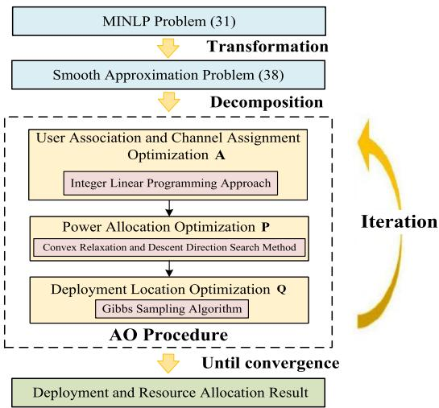  
Fig. 3. Algorithm flowchart.

Now we analyze the computational complexity of the proposed algorithm. It is observed that the proposed algorithm consists of three main components, each executed once during every outer iteration. Accordingly, we analyze the per-iteration computational complexity of each subproblem. Specifically, the worst-case computational complexity of the user association and channel assignment problem, under the proposed implicit enumeration-based method, is $\mathcal { O } ( ( M K ) ^ { N _ { c } } )$ . For the power allocation subproblem, solved via the descent direction search method, the per-iteration complexity is $\mathcal { O } ( T _ { 1 } ( K ( M + N _ { s } ) ) ^ { 3 } )$ , where $T _ { 1 }$ denotes the number of iterations. The UAV deployment optimization relies on the Gibbs sampling method, yielding a complexity of $\mathcal { O } ( K N _ { 1 } T _ { 3 } )$ , where $T _ { 3 }$ is the number of iterations in the Gibbs sampler and $N _ { 1 }$ is the size of the reduced candidate location set. Based on the above analysis, the overall computational complexity of the proposed AO algorithm can be expressed as $\mathcal { O } \left( \bar { T } _ { 2 } \left( ( \dot { M } K ) ^ { N _ { c } } \dot { + } \bar { T _ { 1 } } ( K ( M + \bar { N _ { s } } ) ) ^ { 3 } + K N _ { 1 } T _ { 3 } \right) \right)$ , where $T _ { 2 }$ is the number of outer AO iterations. It is worth noting that, in contrast to other conventional approaches such as bruteforce search (which incurs exponential complexity) or genetic algorithms (which typically require large population sizes and many generations to converge), the proposed algorithm offers a more favorable trade-off between computational scalability and solution quality.

Regarding the convergence of the problem formulation, it becomes clear that by approximating the original problem with a smooth reformulation, we achieve a more tractable optimization process. When the parameter $\mu$ approaches zero, the reformulated problem (38) converges to the original problem (31). This AO algorithm ensures that the objective value of the reformulated problem remains non-increasing, thereby preserving the approximate monotonicity of the objective function in (31). The convergence behavior of Algorithm 2 is depicted in Fig. 4, validating its stable and reliable performance.

TABLE I  
SIMULATION PARAMETERS
<table><tr><td rowspan=1 colspan=1>Parameters</td><td rowspan=1 colspan=1>Value</td></tr><tr><td rowspan=1 colspan=1>UAV altitude H</td><td rowspan=1 colspan=1>100 m</td></tr><tr><td rowspan=1 colspan=1>Collision avoidance distance $d _ { \mathrm { m i n } }$ </td><td rowspan=1 colspan=1>20 m</td></tr><tr><td rowspan=1 colspan=1>Maximum UAV distance $d _ { \mathrm { m a x } }$ </td><td rowspan=1 colspan=1>200 m</td></tr><tr><td rowspan=1 colspan=1>Center frequency $f _ { c }$ </td><td rowspan=1 colspan=1>2.4 GHz</td></tr><tr><td rowspan=1 colspan=1>Bandwidth W</td><td rowspan=1 colspan=1>40 MHz</td></tr><tr><td rowspan=1 colspan=1>Maximum UAV power $p _ { k } ^ { \mathrm { m a x } }$ </td><td rowspan=1 colspan=1>0.1 W</td></tr><tr><td rowspan=1 colspan=1>Signal processing gain $\overline { { G _ { k } ^ { \mathrm { P } } } }$ </td><td rowspan=1 colspan=1>10 dBi</td></tr><tr><td rowspan=1 colspan=1>Radar receiving antenna gain $G _ { j } ^ { \mathrm { R , s } }$ </td><td rowspan=1 colspan=1>13 dBi</td></tr><tr><td rowspan=1 colspan=1>Radar cross-section $\sigma _ { \mathrm { r c s } }$ </td><td rowspan=1 colspan=1> $\overline { { 0 . 2 5 \mathrm { ~ m } ^ { 2 } } }$ </td></tr><tr><td rowspan=1 colspan=1>Communication transmitting antenna gains $\overline { { G _ { k } ^ { \mathrm { T } } } }$ </td><td rowspan=1 colspan=1>10 dBi</td></tr><tr><td rowspan=1 colspan=1>Communication receiving antenna gains $G _ { i } ^ { \mathrm { R , c } }$ </td><td rowspan=1 colspan=1>10 dBi</td></tr><tr><td rowspan=1 colspan=1>Noise variance $\sigma _ { 0 } ^ { 2 }$ </td><td rowspan=1 colspan=1>-110 dBm</td></tr></table>

Remark 1: While in practical multi-UAV cooperative scenarios, the timescale for resource allocation typically differs substantially from that of UAV movement, our proposed AO algorithm can support multi-timescale operation with suitable adaptations. By incorporating these modifications, the algorithm achieves flexible adaptability: UAV positions (via solving (44)) can be updated at coarse-grained intervals, while resource allocation (via solving (39) and (40)) undergoes multiple refinements within each deployment cycle. This mechanism ensures that UAV positions remain effective across varying resource allocation configurations, thereby enhancing the adaptability of our approach in real-world applications.

## IV. NUMERICAL RESULTS

This section presents the numerical simulations to verify the efficacy of the proposed algorithm. We simulate a JRC-enabled multi-UAV cooperative scenario where the CUs and STs are randomly distributed in a 2-dimensional area of $1 \times 1 ~ \mathrm { k m ^ { 2 } }$ while the UAV swarm hovers at the altitude of $H = 1 0 0 \mathrm { m }$ to perform data transmission and radar sensing for the ground nodes. The UAVs maintain a separation distance ranging from a minimum of 20 meters to a maximum of 200 meters. The system parameters for radar and communication include a maximum transmit power $p _ { k } ^ { \mathrm { m a x } } = 0 . 1$ W and a bandwidth W = 40 MHz, operating at a frequency $f _ { c }$ as 2.4 GHz [39]. Sensing-specific parameters are as follows: a signal processing gain $G _ { k } ^ { \mathrm { P } }$ of 10 dBi, a receiving antenna gain $\hat { G } _ { j } ^ { \mathrm { R , s } }$ of 13 dBi, and a radar cross-section $\sigma _ { \mathrm { r c s } }$ of $0 . 2 5 ~ \mathrm { ~ m ^ { 2 } ~ } [ 2 1 ]$ . For communication, both the transmitting and receiving antenna gains $( G _ { k } ^ { \mathrm { T } }$ and $G _ { i } ^ { \mathrm { R , c } } )$ are set to 10 dBi. A comprehensive list of simulation parameters is provided in Table I.

## A. Convergence Evaluation

We first examine the convergence performance of the proposed design with the following parameters: $K = 3 ~ \mathrm { U A V s }$ $N _ { c } \ = \ 3 \ \mathrm { C U s } , \ N _ { s } \ = \ 1 \ \mathrm { S T } , \ M \ = \ 5$ available channels, loaded on July 05,2026 at 10:56:44 UTC from IEEE Xplore. Restrictions apply

(a) K = 3, Nc = 8, Ns = 1, M = 10, and (b) $K = 3 , N _ { c } = 8 , N _ { s } = 2 , M = 1 0 ,$ and (c) $K = 3 , N _ { c } = 8 , N _ { s } = 1 , M = 1 0 ,$ , and weight factors $\omega _ { 1 } = 1 ,$ ω2 = 2 weight factors $\omega _ { 1 } = 1 , \omega _ { 2 } = 2$ weight factors $\omega _ { 1 } = 1 , \omega _ { 2 } = 5$  
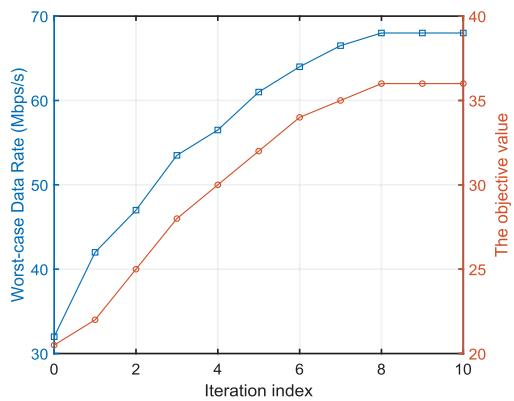  
(a) Communication performance and the objective value

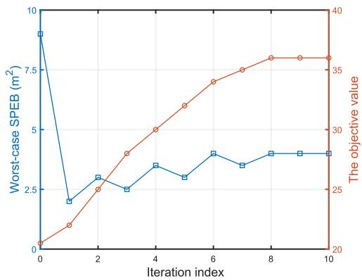  
(b) Sensing performance and the objective value

Fig. 4. The convergence behavior of the proposed design when K = 3, Nc = 3, Ns = 1, M = 5, and $\omega _ { 1 } = \omega _ { 2 } = 0 . 5$  
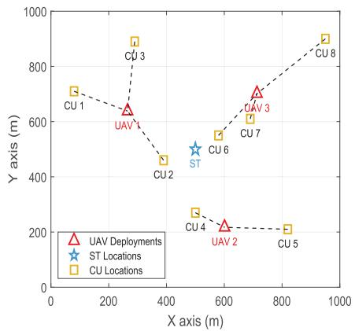

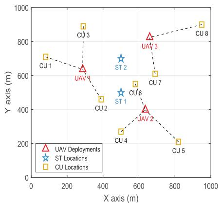

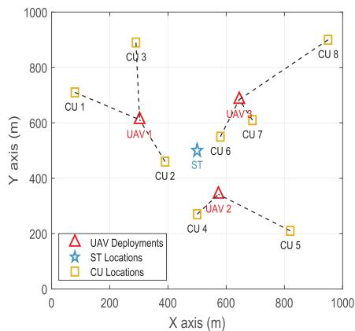  
Fig. 5. Cooperative communication and sensing by multiple UAVs in various scenarios.

and weight factors $\omega _ { 1 } ~ = ~ \omega _ { 2 } ~ = ~ 0 . 5$ . The objective value curves in Fig. 4 indicate that our proposed algorithm achieves stable convergence. Specifically, the objective value rapidly increases with the number of iterations and stabilizes within 8 to 10 iterations. Additionally, as shown in Fig. 4(a), the overall communication performance of multi-UAV improves progressively with each iteration. This observation is intuitive because, as the algorithm advances, UAVs gradually approach the CUs and are more likely to allocate better communication resources, thereby resulting in more favorable communication links and enhanced transmission rates. However, it can be observed from Fig. 4(b) that the worse-case SPEB value does not consistently decrease with increasing iterations. This phenomenon arises due to the adoption of a weighted sum optimization objective function in our problem formulation, where communication performance is the primary focus in the generated scenario of ${ \boldsymbol { \omega } } _ { 1 } = { \boldsymbol { \omega } } _ { 2 }$

## B. UAV Deployment and Trade-off in Sensing-Communication Performance

Fig. 5 illustrates the multi-UAV deployment strategies employed by the proposed design across various cooperative communication and sensing scenarios. From Fig. 5(a), it can be observed that each UAV is strategically deployed in an optimal position to communicate with the nearby CUs. Due to the limited communication resources of each UAV, the number of CUs served by each UAV is relatively balanced, thereby optimizing the overall performance of all CUs. Meanwhile, it is interesting to note that the three UAVs are evenly distributed in their deployment positions while localizing the same target. This observation underscores the importance of considering angle diversity in location estimation, as coordinate estimation requires utilizing one-dimensional measurements to achieve a two-dimensional estimate.

In Fig. 5(b), an additional ST has been introduced based on Fig. 5(a). To enhance the overall sensing accuracy for all STs, we can observe that the deployment positions of $\mathrm { U A V _ { 2 } }$ and $\mathrm { U A V _ { 3 } }$ have undergone significant adjustments, with $\mathrm { U A V _ { 2 } }$ moving upwards and $\mathrm { U A V _ { 3 } }$ shifting to the left. This strategic repositioning optimizes the sensing coverage and improves the proximity to the new ST. However, compared to Fig. 5(a), the CU association strategy has also changed: $\mathrm { C U } _ { 6 }$ is now served by $\mathrm { U A V _ { 2 } } .$ which is closer, rather than by $\mathrm { U A V _ { 3 } }$

To proceed, we turn to explore the effect of weight factors $( \omega _ { 1 } , \omega _ { 2 } )$ on overall communication and sensing performance of the network. Fig. 5(c) shows the impact of increasing the sensing weight factor to enhance the relative importance of perception performance within the network. As observed, compared to Fig. 5(a), the UAVs in Fig. 5(c) are deployed closer to the ST, resulting in improved observation quality and enhanced positioning accuracy. What’s more, Fig. 6 reveals the communication and perception quality versus the associated weight factors ratio $\omega _ { 1 } / \omega _ { 2 }$ under different available power for the proposed design. We can observe that a higher $\omega _ { 1 } / \omega _ { 2 }$ indicates a stronger emphasis on communication performance in the UAVs’ optimization, whereas a lower $\omega _ { 1 } / \omega _ { 2 }$ shifts the focus on sensing performance. Meanwhile, it can be seen that the weighting factor has a more pronounced impact on sensing than on communication. Specifically, the worst-case SPEB with $\omega _ { 1 } / \omega _ { 2 } = 5$ is almost 3 times higher than when $\omega _ { 1 } / \omega _ { 2 } = 0 . 2$ , while the increase in worst-case transmitted data rate remains below 10%. Additionally, as the maximum available power increases, sensing accuracy improves more rapidly than communication data rate. These results also verify the efficiency of the proposed design in adapting to varying task urgencies and its improved ability to balance communication and sensing performance, thereby providing greater flexibility to the JRC-enabled multi-UAV system.

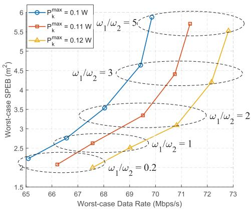  
Fig. 6. The impact of weight factors $( \omega _ { 1 } , \omega _ { 2 } )$ on overall communication and sensing performance when K = 3, $N _ { c } = 3$ $N _ { s } = 1$ and $M = 5 .$

## C. System Performance With Various Scenario

To illustrate the benefits of our proposed multi-UAV cooperative communication and sensing strategy (referred to as the Proposed design), we introduce the following conventional and heuristic benchmark algorithms for comparison:

Balanced User Association and Round-Robin Channel Assignment (BUA-RRCA) design: The BUA-RRCA scheme balances user association across multiple UAVs to ensure equitable distribution. It employs a round-robin method for channel assignment [40]. Additionally, the power allocation and deployment locations are optimized in the same manner as the proposed design.

Equal power allocation (EPA) design: In the EPA design, the UAV’s maximum available power is evenly split, with half allocated to communication and the other half to sensing [26]. Under this design, the UAV’s channel assignment, power allocation, and deployment positions are determined using the algorithm proposed in the paper.

• Spectral Clustering (SC)-based placement design: This design optimizes the multi-UAV deployment with the aid of spectral clustering algorithm as detailed in [20]. The other resource allocation approach, however, remains consistent with the approach as the proposed design.

• Uniform placement design: In this scheme, the UAVs are uniformly distributed across the entire region as in [20], while the other resource allocation strategy remains the same as in the proposed design.

In the simulations, the CUs and STs are assumed to be randomly distributed across the ground. The deployment and resource allocation of multiple UAVs are optimized using the proposed algorithms to maximize the overall communication and sensing performance of the network. To ensure fairness and statistical reliability, each result presented in the figures is averaged over 100 independent trials with different random spatial configurations.

Fig. 7(a) shows the communication performance across the network for different schemes with varying numbers of CUs, given K = 3, M = 10, and $\omega _ { 1 } = \omega _ { 2 } = 1$ . It can be seen that in the proposed algorithms, the worst-case data rate exhibits a decreasing trend when the number of CUs increases. The reason for this outcome is that the system’s limited capacity leads to reduced communication resources allocated to each CU as their number grows. Moreover, when the number of CUs $N _ { c }$ exceeds the number of available channels M, substantial interference arises between CUs and other UAVs, severely deteriorating the communication performance. Additionally, we notice that the proposed design outperforms all the other competing schemes across various scenarios. Two primary factors contribute to this outcome: First, our proposed design further optimizes the SC-based placement strategy, resulting in a superior deployment of multiple UAVs compared to the other placement strategies. Second, our algorithm optimally leverages the network’s radio resources by integrating power allocation and channel assignment, thereby ensuring improved performance fairness among the CUs in the network.

Fig. 7(b) depicts the worst-case SPEB among all STs for varying numbers of STs. It is evident that, given the independence of sensing performance from communication channel assignment, both the proposed design and the BUA-RRCA design exhibit equivalent perception accuracy. Furthermore, it can be observed that as the number of STs increases, the SPEB value obtained from different algorithms also rise. This accuracy decrease is attributed for UAVs to coordinate and balance sensing fairness performance across multiple STs. For instance, when the number of STs increases from 1 to 2 and the STs are widely spaced apart, the UAVs must ensure balanced positioning accuracy for both ${ \mathrm { S T s } } ,$ resulting in a reduction in overall performance. On the other hand, since our proposed design aims to jointly optimize communication and sensing performance, both the distribution of STs and the distance between STs and CUs significantly influence sensing accuracy. Finally, one can see that our proposed design demonstrates superior positioning accuracy, compared to the other three algorithms. This superiority is due to the high-quality UAV placement and efficient allocation of sensing power, both of which are crucial for the precise localization of STs.

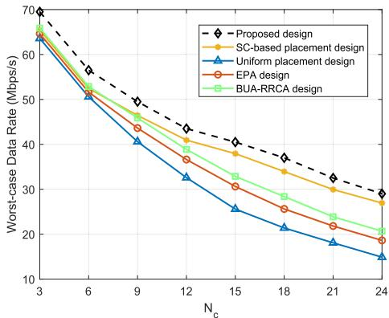  
(a) Number of CUs

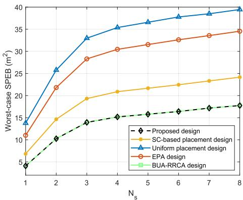  
(b) Number of STs

Fig. 7. The communication and sensing performance for varying $N _ { c }$ and $N _ { s }$ when $K = 3 , M = 1 0 ,$ and $\omega _ { 1 } = \omega _ { 2 } = 1$  
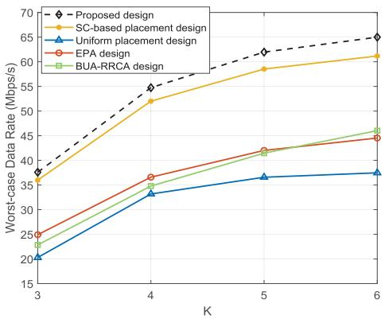  
(a) Number of UAVs

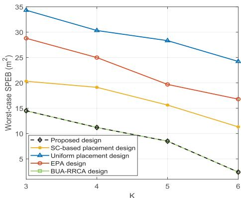  
(b) Number of UAVs  
Fig. 8. The communication and sensing performance versus the number of UAVs when $N _ { c } = 1 5 ,$ Ns = 6, M = 10, and $\omega _ { 1 } = \omega _ { 2 } = 1$

At last, we examine the impact of varying numbers of UAVs on communication and sensing performance. As illustrated in Fig. 8(a), all schemes show improved communication performance with more UAVs, due to enhanced resource availability and spatial diversity. Specifically, the performance disparity between the EPA design and our proposed approach becomes more pronounced as the number of UAVs increases. This trend suggests that with a greater number of UAVs, additional power can be allocated to CUs, thereby improving signal transmission quality. Meanwhile, it is evident that the communication performance of our proposed design outperforms that of the BUA-RRCA design, which can be attributed to our algorithm’s ability to reduce interference through effective user association and channel allocation. This principle is further demonstrated in Fig. 8(b). As shown, a greater number of UAVs increases available sensing power and expands the observation angle, thereby improving the joint positioning accuracy of the STs. In conclusion, these results robustly confirm the effectiveness of the proposed design, showcasing its enhanced flexibility in developing JRC-enabled multi-UAV cooperative systems.

## V. CONCLUSION

In this paper, we have focused on resource coordination and deployment optimization for reliable communication and accurate detection in a JRC-enabled multi-UAV network. Our objective is to maximize the data transmission for CUs and minimize the SPEB for STs, by jointly optimizing user association and channel assignment, power allocation, as well as UAV deployment. To address the formulated non-differentiable and non-convex problem, we reframe it into a tractable form with the aid of smooth approximation techniques. Subsequently, we decompose the restructured problem and propose an iterative AO algorithm to optimize each subproblem sequentially. Extensive simulations verify the effectiveness of our proposed design. This paper aims to shed more light on the performance and methodology of JRC-enabled multi-UAV systems, and also explores potential extensions to practical applications, including adaptive resource coordination in dynamic scenarios, intelligent trajectory optimization for moving UAVs and users, as well as distributed target localization in real-world multi-UAV scenarios.

## REFERENCES

[1] J. Chen, B. Zhou, F. Zhao, and S. Qiu, “Finite-difference time-domain analysis of the electromagnetic environment in a reinforced concrete structure when struck by lightning,” IEEE Trans. Electromagn. Compat., vol. 52, no. 4, pp. 914–920, Nov. 2010.

[2] Z. Wei, P. Wang, A. P. Petropulu, C. Masouros, and S. Sun, “Physical layer anonymous communications in trustworthy 6G: Fundamentals, recent advances, and future trends,” IEEE Wireless Commun., vol. 32, no. 2, pp. 26–32, Apr. 2025.

[3] A. Fotouhi et al., “Survey on UAV cellular communications: Practical aspects, standardization advancements, regulation, and security challenges,” IEEE Commun. Surveys Tuts., vol. 21, no. 4, pp. 3417–3442, 4th Quart., 2019.

[4] B. Li, Z. Fei, and Y. Zhang, “UAV communications for 5G and beyond: Recent advances and future trends,” IEEE Internet Things J., vol. 6, no. 2, pp. 2241–2263, Apr. 2019.

[5] I. Valiulahi and C. Masouros, “Multi-UAV deployment for throughput maximization in the presence of co-channel interference,” IEEE Internet Things J., vol. 8, no. 5, pp. 3605–3618, Mar. 2021.

[6] W. Mei, Q. Wu, and R. Zhang, “Cellular-connected UAV: Uplink association, power control and interference coordination,” IEEE Trans. Wireless Commun., vol. 18, no. 11, pp. 5380–5393, Nov. 2019.

[7] K. Meng, X. He, Q. Wu, and D. Li, “Multi-UAV collaborative sensing and communication: Joint task allocation and power optimization,” IEEE Trans. Wireless Commun., vol. 22, no. 6, pp. 4232–4246, Jun. 2023.

[8] Y. Jiang et al., “Network-level performance analysis for air-ground integrated sensing and communication,” IEEE Trans. Wireless Commun., vol. 24, no. 8, pp. 6931–6946, Aug. 2025.

[9] Y. Jiang et al., “Integrated sensing and communication for low altitude economy: Opportunities and challenges,” IEEE Commun. Mag., early access, Apr. 7, 2025, doi: 10.1109/MCOM.001.2400685.

[10] M. A. Abd-Elmagid and H. S. Dhillon, “Average peak age-ofinformation minimization in UAV-assisted IoT networks,” IEEE Trans. Veh. Technol., vol. 68, no. 2, pp. 2003–2008, Feb. 2019.

[11] Y. Shen, B. Li, R. Zhang, X. Cheng, and L. Yang, “A flexible load balancing scheme in multi-UAV-enabled wireless networks,” IEEE Trans. Veh. Technol., vol. 73, no. 6, pp. 9205–9210, Jun. 2024, doi: 10.1109/ TVT.2024.3356753.

[12] L. Zhou, X. Chen, M. Hong, S. Jin, and Q. Shi, “Efficient resource allocation for multi-UAV communication against adjacent and cochannel interference,” IEEE Trans. Veh. Technol., vol. 70, no. 10, pp. 10222–10235, Oct. 2021.

[13] J. Dai, W. Pu, J. Yan, Q. Shi, and H. Liu, “Multi-UAV collaborative trajectory optimization for asynchronous 3-D passive multitarget tracking,” IEEE Trans. Geosci. Remote Sens., vol. 61, 2023, Art. no. 5101116, doi: 10.1109/TGRS.2023.3239952.

[14] S. Xu, K. Dogancay, and H. Hmam, “Distributed path optimization of multiple UAVs for AOA target localization,” in Proc. IEEE Int. Conf. Acoust., Speech Signal Process. (ICASSP), Shanghai, China, Mar. 2016, pp. 3141–3145.

[15] N. C. Luong, X. Lu, D. T. Hoang, D. Niyato, and D. I. Kim, “Radio resource management in joint radar and communication: A comprehensive survey,” 2020, arXiv:2007.13146.

[16] Z. Feng, Z. Fang, Z. Wei, X. Chen, Z. Quan, and D. Ji, “Joint radar and communication: A survey,” China Commun., vol. 17, no. 1, pp. 1–27, Jan. 2020.

[17] Y. Liu, Z. Wei, C. Yan, Z. Feng, and G. L. Stuber, “Effective capacity based power allocation for the coexistence of an integrated radar and communication system and a commercial communication system,” IEEE Access, vol. 8, pp. 58629–58644, 2020.

[18] Y. Liu, Z. Wei, Z. Feng, and G. L. Stuber, “Effective capacity based resource allocation for an integrated radar and communications system,” in Proc. IEEE Wireless Commun. Netw. Conf. (WCNC), Seoul, South Korea, May 2020, pp. 1–5.

[19] Z. Lyu, G. Zhu, and J. Xu, “Joint maneuver and beamforming design for UAV-enabled integrated sensing and communication,” IEEE Trans. Wireless Commun., vol. 22, no. 4, pp. 2424–2440, Apr. 2023.

[20] X. Wang, Z. Fei, J. A. Zhang, J. Huang, and J. Yuan, “Constrained utility maximization in dual-functional radar-communication multi-UAV networks,” IEEE Trans. Commun., vol. 69, no. 4, pp. 2660–2672, Apr. 2021.

[21] T. Zhang, K. Zhu, S. Zheng, D. Niyato, and N. C. Luong, “Trajectory design and power control for joint radar and communication enabled multi-UAV cooperative detection systems,” IEEE Trans. Commun., vol. 71, no. 1, pp. 158–172, Jan. 2023.

[22] C. Aydogdu, M. F. Keskin, N. Garcia, H. Wymeersch, and D. W. Bliss, “RadChat: Spectrum sharing for automotive radar interference mitigation,” IEEE Trans. Intell. Transp. Syst., vol. 22, no. 1, pp. 416–429, Jan. 2021.

[23] P. Ren, A. Munari, and M. Petrova, “Performance tradeoffs of joint radar-communication networks,” IEEE Wireless Commun. Lett., vol. 8, no. 1, pp. 165–168, Feb. 2019.

[24] J. Yan, H. Liu, B. Jiu, Z. Liu, and Z. Bao, “Joint detection and tracking processing algorithm for target tracking in multiple radar system,” IEEE Sensors J., vol. 15, no. 11, pp. 6534–6541, Nov. 2015.

[25] Y. Zeng, J. Xu, and R. Zhang, “Energy minimization for wireless communication with rotary-wing UAV,” IEEE Trans. Wireless Commun., vol. 18, no. 4, pp. 2329–2345, Apr. 2019.

[26] X. Jing, F. Liu, C. Masouros, and Y. Zeng, “ISAC from the sky: UAV trajectory design for joint communication and target localization,” IEEE Trans. Wireless Commun., vol. 23, no. 10, pp. 12857–12872, Oct. 2024.

[27] K. Meng, Q. Wu, S. Ma, W. Chen, K. Wang, and J. Li, “Throughput maximization for UAV-enabled integrated periodic sensing and communication,” IEEE Trans. Wireless Commun., vol. 22, no. 1, pp. 671–687, Jan. 2023.

[28] Y. Liu, S. Liu, X. Liu, Z. Liu, and T. S. Durrani, “Sensing fairnessbased energy efficiency optimization for UAV enabled integrated sensing and communication,” IEEE Wireless Commun. Lett., vol. 12, no. 10, pp. 1702–1706, Oct. 2023.

[29] Y. L. Sit, C. Sturm, and T. Zwick, “Interference cancellation for dynamic range improvement in an OFDM joint radar and communication system,” in Proc. 8th Eur. Radar Conf., Oct. 2011, pp. 333–336.

[30] C. Baquero Barneto et al., “Full-duplex OFDM radar with LTE and 5G NR waveforms: Challenges, solutions, and measurements,” IEEE Trans. Microw. Theory Techn., vol. 67, no. 10, pp. 4042–4054, Oct. 2019.

[31] M. Biedka, Y. E. Wang, Q. M. Xu, and Y. Li, “Full-duplex RF front ends: From antennas and circulators to leakage cancellation,” IEEE Microw. Mag., vol. 20, no. 2, pp. 44–55, Feb. 2019.

[32] S. A. Hassani, A. Guevara, K. Parashar, A. Bourdoux, B. van Liempd, and S. Pollin, “An in-band full-duplex transceiver for simultaneous communication and environmental sensing,” in Proc. 52nd Asilomar Conf. Signals, Syst., Comput., Oct. 2018, pp. 1389–1394.

[33] Steven M. Kay, Fundamentals of Statistical Signal Processing: Estimation Theory. Upper Saddle River, NJ, USA: Prentice-Hall, 1993, pp. 15–67.

[34] H. Zhao, N. Zhang, and Y. Shen, “Beamspace direct localization for large-scale antenna array systems,” IEEE Trans. Signal Process., vol. 68, pp. 3529–3544, 2020.

[35] S. P. Boyd and L. Vandenberghe, Convex Optimization. Cambridge, U.K.: Cambridge Univ. Press, 2004.

[36] MOSEK ApS.(2019). Introducing the MOSEK Optimization Suite 8.1.0.82. [Online]. Available: https://docs.mosek.com/8.1/intro/ index.html

[37] U. von Luxburg, “A tutorial on spectral clustering,” Statist. Comput., vol. 17, no. 4, pp. 395–416, Dec. 2007.

[38] J. Odencrantz, P. Bremaud, and P. Bremaud, “Markov chains: Gibbs´ fields, Monte Carlo simulation, and queues,” Technometrics, vol. 42, no. 4, p. 438, Nov. 2000.

[39] X. Zhou, L. Huang, T. Ye, and W. Sun, “Computation bits maximization in UAV-assisted MEC networks with fairness constraint,” IEEE Internet Things J., vol. 9, no. 21, pp. 20997–21009, Nov. 2022.

[40] Q. Ye, B. Rong, Y. Chen, M. Al-Shalash, C. Caramanis, and J. G. Andrews, “User association for load balancing in heterogeneous cellular networks,” IEEE Trans. Wireless Commun., vol. 12, no. 6, pp. 2706–2716, Jun. 2013.

Lingyun Zhou received the B.S. degree from the School of Communication and Information Engineering, Chongqing University of Posts and Telecommunications (CQUPT), in 2015, the M.S. degree from the National Key Laboratory of Science and Technology on Communication, University of Electronic Science and Technology of China (UESTC), in 2018, and the Ph.D. degree from the School of Software Engineering, Tongji University, in 2023.

Currently, he is with Hubei Key Laboratory of Intelligent Wireless Communications, South-Central Minzu University, Wuhan. His current research interests include unmanned aerial vehicle communications, optimization theory, and wireless localization.

Chunyong Yang (Senior Member, IEEE) received the Ph.D. degree from the Huazhong University of Science and Technology, Wuhan, China, in 2005.

He is currently a Professor with South-Central Minzu University, Wuhan. He has been the Dean of the College of Electronics and Information Engineering, South-central Minzu University, since 2018. He has been the Deputy Director of the Academic Committee with the College of Electronics and Information Engineering, since 2019. His research interests focus on optical wireless communication.

Yongqiang Cui (Member, IEEE) received the B.S., M.S., and Ph.D. degrees from Wuhan University. He is currently an Associate Professor with the College of Electronic and Information Engineering, South-Central Minzu University, Wuhan, China. His research interests encompass radar systems and signal processing, electromagnetic detection and countermeasure technology, and multifunctional integrated technology. His primary focus lies in the realm of millimeter-wave radar, synthetic aperture radar, and distributed systems.

Rongqing Zhang (Member, IEEE) received the B.S. and Ph.D. degrees (Hons.) from Peking University, Beijing, China, in 2009 and 2014, respectively. Currently, he is an Associate Professor with The Hong Kong University of Science and Technology (HKUST) (Guangzhou), Guangzhou, China. Before joining HKUST, he held faculty positions with Tongji University and Colorado State University. He has authored and co-authored three monographs and more than 200 papers in top journals and conferences. His research interests include vehicu-

lar communications and networking, low-altitude vehicular networks, and connected intelligence. He received three Best Paper Awards at IEEE ICC 2016, GLOBECOM 2018, and ICC 2019. He also received the 2017 First-Class Prize in Natural Science of Ministry of Education of China, the 2023 First-Class Prize in Natural Science of Chinese Association of Automation, and the 2023 First-Class Prize in Natural Science of China Institute of Communications. Currently, he is serving as the Secretary General for the Connected Intelligence Committee of Chinese Association of Automation, the Vice-Chair for the Information Services Committee of IEEE ComSoc Asian–Pacific Board, and an Associate Editor for IEEE TRANSACTIONS ON VEHICULAR TECHNOLOGY and IET Communications.

Zhongxiang Wei (Senior Member, IEEE) received the Ph.D. degree in electrical and electronics engineering from the University of Liverpool, Liverpool, U.K., in 2017. From March 2016 to March 2017, he was a Research Assistant with the Institution for Infocomm Research, A\*STAR, Singapore. From March 2018 to March 2021, he was a Research Associate with University College London. He is currently an Associate Professor with the College of Electronic and Information Engineering, Tongji University, China. He has authored or co-authored more than 100 research papers published on top-tier journals and international conferences. His research interests include trustworthy 6G, MIMO communications, and algorithm design. He was a recipient of Shanghai Leading Talent Program (Young Scientist) in 2021, the best Paper Award of IEEE IWCMC in 2024, the Outstanding Self-Financed Students Abroad in 2018, the Standford World Top 2% Scientist in 2025, and the A\*STAR Research Attachment Program (ARAP) in 2016. He has acted as the Track Chair/Tutorial Speaker of various international conferences, such as IEEE ICC/GLOBECOM/ICASSP/VTC, and has acted as the Guest Editor of IEEE INTERNET OF THINGS JOURNAL, IEEE OPEN JOURNAL ON VEHICULAR TECHNOLOGY, and IEEE OPEN JOURNAL ON COMMUNICATION SOCIETY.

Qingjiang Shi (Member, IEEE) received the Ph.D. degree in electronic engineering from Shanghai Jiao Tong University, Shanghai, China, in 2011. From 2009 to 2010, he visited Prof. Z.-Q. (Tom) Luo’s research group with the University of Minnesota, Twin Cities. In 2011, he was a Research Scientist with the Bell Laboratories China. From 2012, he was with the School of Information and Science Technology, Zhejiang Sci-Tech University. From 2016 to 2017, he was a Research Fellow with Iowa State University, USA. Since 2018, he has been a

Professor with the School of Computer Science and Technology, Tongji University. He has published more than 100 IEEE journals and filed about 50 national patents. His research interests include algorithm design and analysis with applications in machine learning, signal processing and wireless networks. He was a recipient of the IEEE Signal Processing Society Best Paper Award in 2022, the Second Prize of Zhejiang Provincial Natural Science Award in 2023, the Excellent Technical Cooperation Award from Huawei Wireless Network Product Line in 2024, the Second Prize of Huawei Technical Cooperation Achievement Transformation Award in 2022, the Huawei Outstanding Technical Achievement Award in 2021, the Golden Medal at the 46th International Exhibition of Inventions of Geneva in 2018, the First Prize of Science and Technology Award from China Institute of Communications in 2017, the National Excellent Doctoral Dissertation Nomination Award in 2013, Shanghai Excellent Doctoral Dissertation Award in 2012, and the Best Paper Award from the IEEE PIMRC’09 Conference. He was an Associate Editor of IEEE TRANSACTIONS ON SIGNAL PROCESSING.