# Joint Deployment and Task Scheduling Optimization for Large-Scale Mobile Users in Multi-UAV-Enabled Mobile Edge Computing

Yong Wang , Senior Member, IEEE, Zhi-Yang Ru, Kezhi Wang , Member, IEEE, and Pei-Qiu Huang

Abstract—This article establishes a new multiunmanned aerial vehicle (multi-UAV)-enabled mobile edge computing (MEC) system, where a number of unmanned aerial vehicles (UAVs) are deployed as flying edge clouds for large-scale mobile users. In this system, we need to optimize the deployment of UAVs, by considering their number and locations. At the same time, to provide good services for all mobile users, it is necessary to optimize task scheduling. Specifically, for each mobile user, we need to determine whether its task is executed locally or on a UAV (i.e., offloading decision), and how many resources should be allocated (i.e., resource allocation). This article presents a two-layer optimization method for jointly optimizing the deployment of UAVs and task scheduling, with the aim of minimizing system energy consumption. By analyzing this system, we obtain the following property: the number of UAVs should be as small as possible under the condition that all tasks can be completed. Based on this property, in the upper layer, we propose a differential evolution algorithm with an elimination operator to optimize the deployment of UAVs, in which each individual represents a UAV’s location and the entire population represents an entire deployment of UAVs. During the evolution, we first determine the maximum number of UAVs. Subsequently, the elimination operator gradually reduces the number of UAVs until at least one task cannot be executed under delay constraints. This process achieves an adaptive adjustment of the number of UAVs. In the lower layer, based on the given deployment of UAVs, we transform the task scheduling into a 0-1 integer programming problem. Due to the large-scale characteristic of this 0-1 integer programming problem, we propose an efficient greedy algorithm to obtain the near-optimal solution with much less time. The effectiveness of the proposed two-layer optimization method and the established

Manuscript received January 5, 2019; revised May 10, 2019; accepted August 12, 2019. Date of publication September 11, 2019; date of current version August 18, 2020. This work was supported in part by the Innovation-Driven Plan in Central South University under Grant 2018CX010, in part by the National Natural Science Foundation of China under Grant 61673397 and Grant 61976225, in part by the Hunan Provincial Natural Science Fund for Distinguished Young Scholars under Grant 2016JJ1018, and in part by the Beijing Advanced Innovation Center for Intelligent Robots and Systems under Grant 2018IRS06. This article was recommended by Associate Editor M. Zhang. (Corresponding author: Kezhi Wang.)

Y. Wang, Z.-Y. Ru, and P.-Q. Huang are with the School of Automation, Central South University, Changsha 410083, China (e-mail: ywang@csu.edu.cn; zhiyang.ru@csu.edu.cn; pqhuang@csu.edu.cn).

K. Wang is with the Department of Computer and Information Sciences, Northumbria University, Newcastle upon Tyne NE1 8ST, U.K. (e-mail: kezhi.wang@northumbria.ac.uk).

Color versions of one or more of the figures in this article are available online at http://ieeexplore.ieee.org.

Digital Object Identifier 10.1109/TCYB.2019.2935466

multi-UAV-enabled MEC system is demonstrated on ten instances with up to 1000 mobile users.

Index Terms—Deployment, differential evolution (DE), mobile edge computing (MEC), multiunmanned aerial vehicle (multi-UAV), task scheduling, two-layer optimization.

# I. INTRODUCTION

W ITH THE increasing popularity of mobile devices,more and more new types of mobile applications have more and more new types of mobile applications have emerged, such as mobile online gaming [1] and speech recognition [2]. However, these applications are sensitive to latency and require considerable computational resources. Due to the physical limitations, such as battery power and computation resources, it poses a great challenge for mobile devices to execute these applications [3].

Mobile edge computing (MEC), which deploys servers to the network edge [4], [5], has been considered as a promising technology to address this challenge. In MEC, mobile devices can offload their tasks to the servers close to them. Compared with mobile cloud computing, MEC consumes less transmission time and energy due to a shorter transmission distance. However, the locations of MEC servers are usually fixed and cannot be flexibly changed according to the needs of mobile users, which limits the MEC’s capability.

In recent years, unmanned aerial vehicles (UAVs) have received extensive attention in wireless communications [6]–[8]. For example, UAVs have been used in areas with limited communication infrastructures, such as in developing countries or mountainous areas, as well as in earthquake response, emergency rescue, and battlefield communication [9]. Very recently, a UAV-enabled MEC wireless-powered system has been studied in [10], in which an MEC server is mounted on a UAV (i.e., a flying edge cloud). This kind of system can provide two advantages: 1) due to the higher altitude, the flying edge cloud can provide better line-of-sight links to mobile users with a higher probability and 2) since the UAV can be flexibly deployed, it can further shorten the transmission distance. Overall, this kind of system can provide better services to mobile users. Therefore, the use of UAVs is expected to play an important role in improving the performance of MEC.

However, the current study in [10] only considers one UAV. A question which arises naturally is whether we can deploy multiple UAVs simultaneously to serve mobile users. Compared with a single UAV, multiple UAVs can support more tasks within a shorter time, which can remarkably boost the applications of MEC in emergency and complicated scenarios. To this end, we make the first attempt to investigate a new multi-UAV-enabled MEC system, where multiple UAVs are employed to serve large-scale mobile users on the ground in a given area. To minimize this system’s energy consumption while meeting the needs of all mobile users, there exist two key issues to be addressed: 1) the deployment of UAVs and 2) task scheduling. Specifically, the purpose of the deployment of UAVs is to determine the number and locations of UAVs. In addition, task scheduling includes two aspects: 1) the offloading decision and 2) resource allocation. The former aims at determining whether a task is executed locally or is offloaded to a UAV. Subsequently, the latter decides how many resources should be allocated to this task.

Actually, the deployment of a single UAV/multiple UAVs and the task scheduling in MEC have been extensively studied individually in wireless communications. Next, we briefly introduce them.

1) Deployment of a Single UAV/Multiple UAVs: Fan et al. [11] researched the node placement of a UAV relaying system, with the aim of maximizing the system throughput. Bor-Yaliniz et al. [12] optimized the placement of a UAV to maximize the revenue of the network. Mozaffari et al. [13] designed the efficient deployment of multiple UAVs as wireless base stations, in which the total coverage area and the coverage lifetime of UAVs are maximized. Mozaffari et al. [14] investigated the placement of UAVs for data collection from ground Internet of Things devices. Lyu et al. [15] presented the placement of UAVs to supply distributed ground terminals with wireless coverage, ensuring that each ground terminal can be served by at least one UAV. Sharma et al. [16] introduced the assignment of UAVs over geographical areas to meet high traffic demands. Mozaffari et al. [17] deployed a UAV as a flying base station to provide wireless communications to an area.

2) Task Scheduling: Some researchers have focused on either the offloading decision or the resource allocation in task scheduling of MEC. For example, Zhang et al. [18] proposed an energy-efficient offloading decision mechanism for MEC in 5G heterogeneous networks. Lyu et al. [19] designed a selective offloading decision scheme in MEC to minimize the energy consumption of Internet of Things devices. Wang et al. [20] optimized the resource allocation in MEC by means of a unifying framework for the power-performance tradeoff of a mobile service provider. You et al. [21] investigated the resource allocation for a multiuser MEC system based on time-division multiple access and orthogonal frequency-division multiple access. Recently, much attention has been paid to optimize the offloading decision and resource allocation in MEC simultaneously. For instance, Mao et al. [22] presented an effective computation offloading strategy for a green MEC system with

energy harvesting devices by optimizing the offloading decision and the resource allocation simultaneously. Zhang et al. [23] suggested the simultaneous offloading decision and resource allocation optimization in MEC to minimize the energy consumption and monetary cost from the mobile terminals’ perspective. Kan et al. [24] introduced the offloading decision and the resource allocation of the MEC server considering the variety of tasks’ requirements.

From this introduction, it is clear that the joint optimization of the deployment of UAVs and task scheduling remains scarce in current studies. Moreover, in MEC, large-scale mobile users have rarely been taken into consideration. Due to the fact that the system developed in this article involves both multi-UAVenabled MEC and mobile users, we must jointly optimize the deployment of UAVs and task scheduling. To the best of our knowledge, this article is the first attempt to investigate joint deployment and task scheduling optimization for large-scale mobile users in a multi-UAV-enabled MEC system.

The main contributions of this article are summarized as follows.

1) A new multi-UAV-enabled MEC system is proposed, where multiple UAVs are used as flying edge clouds for large-scale mobile users. This system can further develop the capability of traditional MEC systems by using multiple UAVs.

2) A two-layer optimization method called ToDeTaS is proposed to jointly optimize the deployment of UAVs and task scheduling, with the purpose of minimizing the system energy consumption. Specifically, we optimize four aspects: the number and locations of UAVs, the offloading decision, and the resource allocation.

3) In the upper layer, a differential evolution (DE) algorithm with an elimination operator is presented to optimize the deployment of UAVs. We encode a UAV’s location into an individual and the entire population represents an entire deployment of UAVs. After analyzing this system, to achieve the minimum energy consumption, we should give a priority to the number of UAVs under the condition that all tasks can be completed. Based on this property, we first determine the maximum number of UAVs, and gradually reduce the number by the elimination operator if all tasks can be completed. In principle, the number of UAVs is adaptively adjusted by the elimination operator and the locations of UAVs are optimized by DE.

4) With respect to a given deployment of UAVs in the upper layer, the task scheduling in the lower layer is transformed into a 0-1 integer programming problem. To reduce the computational time for the large-scale 0-1 integer programming problem, an efficient greedy algorithm is proposed to obtain the near-optimal solution.

5) Extensive experiments have been carried out on ten instances with up to 1000 mobile users. The experimental results demonstrate the effectiveness of ToDeTaS and the multi-UAV-enabled MEC system.

The remainder of this article is organized as follows. Section II introduces the model and problem formulation of the proposed system. Section III describes the details of our proposed ToDeTaS. Section IV gives the experimental studies. Section V discusses two issues. Finally, Section VI concludes this article.

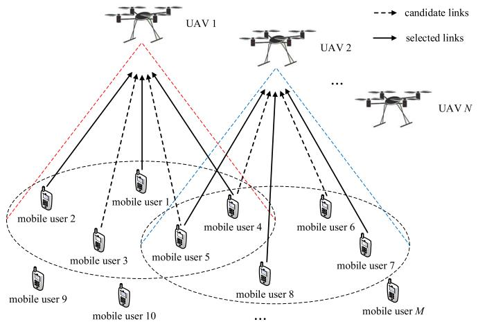

<details>
<summary>flowchart</summary>

```mermaid
graph TD
    UAV1[" UAV 1 "] -->|candidate links| UAV2[" UAV 2 "]
    UAV1 -->|selected links| UAVN[" UAV N "]
    UAV2 -->|candidate links| UAV1
    UAV2 -->|selected links| UAV3[" UAV 3 "]
    UAV2 -->|candidate links| UAV4[" UAV 4 "]
    UAV2 -->|selected links| UAV5[" UAV 5 "]
    UAV2 -->|candidate links| UAV6[" UAV 6 "]
    UAV2 -->|selected links| UAV7[" UAV 7 "]
    UAV2 -->|candidate links| UAV8[" UAV 8 "]
    UAV2 -->|selected links| UAV9[" UAV 9 "]
    UAV2 -->|candidate links| UAV10[" UAV 10 "]
    UAV2 -->|selected links| UAV11[" UAV 11 "]
    UAV2 -->|candidate links| UAV12[" UAV 12 "]
    UAV2 -->|selected links| UAV13[" UAV 13 "]
    UAV2 -->|candidate links| UAV14[" UAV 14 "]
    UAV2 -->|selected links| UAV15[" UAV 15 "]
    UAV2 -->|candidate links| UAV16[" UAV 16 "]
    UAV2 -->|selected links| UAV17[" UAV 17 "]
    UAV2 -->|candidate links| UAV18[" UAV 18 "]
    UAV2 -->|selected links| UAV19[" UAV 19 "]
    UAV2 -->|candidate links| UAV20[" UAV 20 "]
    UAV2 -->|selected links| UAV21[" UAV 21 "]
    UAV2 -->|candidate links| UAV22[" UAV 22 "]
    UAV2 -->|selected links| UAV23[" UAV 23 "]
    UAV2 -->|candidate links| UAV24[" UAV 24 "]
    UAV2 -->|selected links| UAV25[" UAV 25 "]
    UAV2 -->|candidate links| UAV26[" UAV 26 "]
    UAV2 -->|selected links| UAV27[" UAV 27 "]
    UAV2 -->|candidate links| UAV28[" UAV 28 "]
    UAV2 -->|selected links| UAV29[" UAV 29 "]
    UAV2 -->|candidate links| UAV30[" UAV 30 "]
    UAV2 -->|selected links| UAV31[" UAV 31 "]
    UAV2 -->|candidate links| UAV32[" UAV 32 "]
    UAV2 -->|selected links| UAV33[" UAV 33 "]
    UAV2 -->|candidate links| UAV34[" UAV 34 "]
    UAV2 -->|selected links| UAV35[" UAV 35 "]
    UAV2 -->|candidate links| UAV36[" UAV 36 "]
    UAV2 -->|selected links| UAV37[" UAV 37 "]
    UAV2 -->|candidate links| UAV38[" UAV 38 "]
    UAV2 -->|selected links| UAV39[" UAV 39 "]
    UAV2 -->|candidate links| UAV40[" UAV 40 "]
    UAV2 -->|selected links| UAV41[" UAV 41 "]
    UAV2 -->|candidate links| UAV42[" UAV 42 "]
    UAV2 -->|selected links| UAV43[" UAV 43 "]
    UAV2 -->|candidate links| UAV44[" UAV 44 "]
    UAV2 -->|selected links| UAV45[" UAV 45 "]
    UAV2 -->|candidate links| UAV46[" UAV 46 "]
    UAV2 -->|selected links| UAV47[" UAV 47 "]
    UAV2 -->|candidate links| UAV48[" UAV 48 "]
    UAV2 -->|selected links| UAV49[" UAV 49 "]
    UAV2 -->|candidate links| UAV50[" UAV 50 "]
    UAV2 -->|selected links| UAV51[" UAV 51 "]
    UAV2 -->|candidate links| UAV52[" UAV 52 "]
    UAV2 -->|selected links| UAV53[" UAV 53 "]
    UAV2 -->|candidate links| UAV54[" UAV 54 "]
    UAV2 -->|selected links| UAV55[" UAV 55 "]
    UAV2 -->|candidate links| UAV56[" UAV 56 "]
    UAV2 -->|selected links| UAV57[" UAV 57 "]
    UAV2 -->|candidate links| UAV58[" UAV 58 "]
    UAV2 -->|selected links| UAV59[" UAV 59 "]
    UAV2 -->|candidate links| UAV60[" UAV 60 "]
    UAV2 -->|selected links| UAV61[" UAV 61 "]
    UAV2 -->|candidate links| UAV62[" UAV 62 "]
    UAV2 -->|selected links| UAV63[" UAV 63 "]
    UAE_1["Mobile user 1"] <--> EUA["Candidate links"]
    UAE_1 <--> EUB["Selected links"]
    
    style UAE_1 fill:#f9f,stroke:#333
    style UAE_1 fill:#ccf,stroke:#333
    style UAE_1 fill:#cfc,stroke:#333
    style UAE_1 fill:#fcc,stroke:#333
    style UAE_1 fill:#ffc,stroke:#333
    style UAE_1 fill:#cfc,stroke:#333
    style UAE_1 fill:#fcc,stroke:#333
    style UAE_1 fill:#ffc,stroke:#333
    style UAE_1 fill:#cfc,stroke:#333
    style UAE_1 fill:#fcc,stroke:#333
    style UAE_1 fill:#ffc,stroke:#333
```
```
</details>

Fig. 1. Multi-UAV-enabled MEC system consisting of M mobile users and N UAVs. As shown in this figure, the tasks of mobile users 1, 2, and 4 are executed on UAV 1; the tasks of mobile users 5, 7, and 8 are executed on UAV 2; and the remaining tasks are executed locally.

# II. SYSTEM MODEL AND PROBLEM FORMULATION

As shown in Fig. 1, we consider a multi-UAV-enabled MEC system consisting of M mobile users denoted as $\mathcal { M } =$ $\{ 1 , 2 , \dots , M \}$ and N UAVs denoted as $\mathcal { N } = \{ 1 , 2 , \dots , N \}$ . In this system, $( x _ { i } , y _ { i } , 0 )$ is the 3-D coordinate of mobile user i $( i \in \mathcal { M } )$ . In addition, we assume that each mobile user i has a task $U _ { i }$ to be executed. Specifically, $U _ { i }$ can be described as $U _ { i } = ( C _ { i } , D _ { i } )$ , where $C _ { i }$ describes the total number of the CPU cycles for completing $U _ { i } ,$ , and $D _ { i }$ denotes the size of input data of mobile user i. Note that $M , x _ { i } , y _ { i } , C _ { i } ,$ and $D _ { i }$ can be known a priori. As for N UAVs, we assume that they are equipped with directional antennas of fixed beamwidth θ. These UAVs are flying at a constant altitude H and the location of UAV j $( j \in \mathcal { N } )$ is represented by $( X _ { j } , Y _ { j } , H )$ . It is worth noting that N, Xj, and $Y _ { j }$ cannot be obtained in advance.

In this system, UAVs are used as flying edge clouds. Therefore, each task can be executed on its own mobile device or one of UAVs. As a result, each task has $( N + 1 )$ execution patterns denoted as ${ \cal K } = \{ 0 , 1 , \ldots , N \}$ . Specifically, $k = 0 \ ( k \in \mathcal { K } )$ indicates that a task is executed on its own mobile device and $k > 0$ indicates that a task is executed on UAV k. Furthermore, we assume that N UAVs serve all mobile users via frequency-division multiple access with an equal bandwidth allocation. In this article, we define matrix a to denote the offloading decision, where $a _ { i , k } = 1 \mathrm { ~ } ( i \in \mathcal { M }$ and $k \in \mathcal { K } )$ if $U _ { i }$ is executed in pattern $k ;$ otherwise, $a _ { i , k } = 0$ . For example, in Fig. $1 , \ U _ { 1 } , \ U _ { 2 }$ , and $U _ { 4 }$ are executed on UAV 1; U5, U7, and $U _ { 8 }$ are executed on UAV 2; and the remaining tasks are executed locally. As a result, $a _ { 1 , 1 } , a _ { 2 , 1 } , a _ { 4 , 1 } , a _ { 5 , 2 } , a _ { 7 , 2 } , a _ { 8 , 2 } , a _ { 3 , 0 } , a _ { 6 , 0 } , a _ { 9 , 0 } , a _ { 1 0 , 0 } ,$ and $a _ { M , 0 } = 1$ , and the remaining is equal to zero. In addition, we define another matrix f to denote the resource allocation, where $f _ { i , k } \mathrm { ~ } ( i \in \mathcal { M }$ and $k \in \mathcal { K } )$ is the computation resources allocated to $U _ { i }$ in pattern k.

In our system, there are three models: 1) the local execution model; 2) the MEC execution model; and 3) the UAV hover model.

# A. Local Execution Model

When $U _ { i }$ is executed on its own mobile device, the time spent to complete it is defined as [25]

$$
T _ {i, 0} ^ {L} = \frac {C _ {i}}{f _ {i , 0}}, \forall i \in \mathcal {M}. \tag {1}
$$

In addition, the energy used to complete $U _ { i }$ is given as [26]

$$
E _ {i, 0} ^ {L} = \eta_ {1} (f _ {i, 0}) ^ {\nu - 1} C _ {i}, \forall i \in \mathcal {M} \tag {2}
$$

where $\eta _ { 1 }$ is the effective switched capacitance and v is a positive constant.

# B. MEC Execution Model

When a task is executed on a UAV, this task is first transmitted to the UAV, and then it is executed by the MEC server on the UAV. After execution, the result is returned to the mobile user.

For mobile user i, its horizontal distance to UAV j is given as

$$
d _ {i, j} ^ {M U} = \sqrt {(x _ {i} - X _ {j}) ^ {2} + (y _ {i} - Y _ {j}) ^ {2}}
$$

$$
\forall i \in \mathcal {M}, j \in \mathcal {N}. \tag {3}
$$

Obviously, if $U _ { i }$ is executed on UAV j, mobile user i must be within the coverage area of UAV j. That is, the following constraint should be satisfied [27]:

$$
C 1: a _ {i, k} d _ {i, j} ^ {M U} \leq R, \forall i \in \mathcal {M}, j \in \mathcal {N}, k = j \tag {4}
$$

where R is the coverage radius of each UAV and R = H tan θ.

The distance between two UAVs is expressed as

$$
d _ {j _ {1}, j _ {2}} ^ {U U} = \sqrt {\left(X _ {j _ {1}} - X _ {j _ {2}}\right) ^ {2} + \left(Y _ {j _ {1}} - Y _ {j _ {2}}\right) ^ {2}}
$$

$$
\forall j _ {1}, j _ {2} \in \mathcal {N}, j _ {1} \neq j _ {2}. \tag {5}
$$

Note that any two UAVs must maintain a minimum distance $d _ { m i n } ^ { U U }$ to avoid collision; thus, another constraint holds [28]

$$
C 2: d _ {j _ {1}, j _ {2}} ^ {U U} \geq d _ {\min} ^ {U U}, \forall j _ {1}, j _ {2} \in \mathcal {N}, j _ {1} \neq j _ {2}. \tag {6}
$$

Due to the computational capability limitations of an MEC server, each UAV can only execute at most $n _ { m a x }$ tasks. That is [29]

$$
C 3: \sum_ {i = 1} ^ {M} a _ {i, k} \leq n _ {\max}, \forall i \in \mathcal {M}, k \in \mathcal {K} \backslash \{0 \}. \tag {7}
$$

The uplink data rate of $U _ { i }$ in pattern k is given as [30]

$$
r _ {i, k} = B \log_ {2} \left(1 + \frac {P \beta_ {0} G _ {0}}{N _ {0} B \theta^ {2} \left(\left(d _ {i , j} ^ {M U}\right) ^ {2} + H ^ {2}\right)}\right)
$$

$$
\forall i \in \mathcal {M}, j \in \mathcal {N}, k = j, \tag {8}
$$

where B is the channel bandwidth, P denotes the transmission power of each mobile device, $\beta _ { 0 }$ is the channel power gain at the reference distance, $G _ { 0 }$ is a positive constant, and $N _ { 0 }$ is the noise power spectrum density.

Then, the total time for completing $U _ { i }$ includes the transmission time and the computational time on UAV j [31]

$$
T _ {i, k} ^ {M} = \frac {D _ {i}}{r _ {i , k}} + \frac {C _ {i}}{f _ {i , k}}, \forall i \in \mathcal {M}, k = j. \tag {9}
$$

In addition, the total energy used to complete $U _ { i }$ includes the transmission energy and the computation energy on UAV j [32]

$$
E _ {i, k} ^ {M} = P \frac {D _ {i}}{r _ {i , k}} + \eta_ {2} (f _ {i, k}) ^ {\nu - 1} C _ {i}, \forall i \in \mathcal {M}, k = j \tag {10}
$$

where $\eta _ { 2 }$ is the effective switched capacitance.

Similar to [29], we assume that the output of the task can be returned to the mobile user with negligible transmission delay.

# C. UAV Hover Model

When a UAV hovers at its fixed location for some time, the energy for it to hover is expressed as

$$
E ^ {H} = P _ {0} T \tag {11}
$$

where $P _ { 0 }$ and T are the hover power and the hover time, respectively.

Considering that this system contains both multi-UAVenabled MEC and mobile users, we need to jointly optimize the deployment of UAVs and the task scheduling to minimize the system energy consumption, which includes the energy to complete all tasks in the local computation patten or the MEC computation patten and the energy for UAVs’ hover. The joint deployment and task scheduling optimization problem can be formulated as

$$
\min _ {N, X _ {j}, Y _ {j}, a _ {i, k}, f _ {i, k}} \sum_ {i = 1} ^ {M} \left(a _ {i, 0} E _ {i, 0} ^ {L} + \sum_ {k = 1} ^ {N} a _ {i, k} E _ {i, k} ^ {M}\right) + \beta N E ^ {H}
$$

$\mathrm { s . t . } C 1 : a _ { i , k } d _ { i , j } ^ { M U } \leq R$ s.t. C1 : ai,kdMUi,j

$$
\forall i \in \mathcal {M}, j \in \mathcal {N}, k = j
$$

$$
\forall i \in \mathcal {M}, k \in \mathcal {K} \backslash \{0 \}
$$

$C 4 : \sum _ { k = 0 } ^ { N } a _ { i , k } = 1 , \forall i \in \mathcal { M } , k \in \mathcal { K }$

$C 5 : f _ { i , k } > 0 , \forall a _ { i , k } = 1 , i \in \mathcal { M } , k \in \mathcal { K }$

$C 6 : f _ { i , k } = 0 , \forall a _ { i , k } = 0 , i \in \mathcal { M } , k \in \mathcal { K }$

$C 7 : a _ { i , 0 } T _ { i , 0 } ^ { L } \leq T , \ \forall i \in \mathcal { M }$

$C 8 : a _ { i , k } T _ { i , k } ^ { M } \le T , \ \forall i \in \mathcal { M } , \ k \in \mathcal { K } \backslash \{ 0 \}$ (12)

where C4 ensures that all tasks are executed and each task can only be executed in one pattern; C5 and C6 denote that if $U _ { i }$ is executed in pattern $k , f _ { i , k }$ is greater than 0; otherwise, it is equal to $0 ; C 7$ and C8 are delay constraints for each task; and $\beta$ is a weight coefficient and set to 1 in this article.

# III. PROPOSED APPROACH

# A. Motivation

From the introduction in Section II, it is clear that (12) is a nonconvex nonlinear optimization problem. Therefore, traditional optimization methods cannot solve it. Evolutionary algorithms (EAs) have the potential to address it since they are a kind of population-based heuristic search methods that does not need the gradient information. However, EAs will face the following three issues when solving (12).

1) In (12), we need to optimize the number of UAVs (N), the location of $\operatorname { U A V } _ { \mathbf { \alpha } } { j } \ ( X _ { j }$ and $Y _ { j } )$ , and the offloading decision $( a _ { i , k } )$ and the resource allocation $( f _ { i , k } )$ for mobile user i. Therefore, $( 2 ( N + M ) + 1 )$ decision variables must be optimized. It is evident that the number of decision variables increases with the increase of M and/or N. Due to the fact that we consider a large number of mobile users in this article, obviously, this is a large-scale optimization problem for EAs [33], [34]. For example, if we consider 1000 mobile users and 100 UAVs, the number of decision variables is 2201.

2) Equation (12) includes an integer decision variable (N), continuous decision variables $( X _ { j } , \ Y _ { j } ,$ and $f _ { i , k } ) .$ , and binary decision variables $( a _ { i , k } )$ . Thus, it is an optimization problem with mixed decision variables. In the evolutionary computation community, it is a challenging task to solve optimization problems with mixed decision variables [35].

3) The deployment of UAVs and task scheduling are closely coupled. On the one hand, the available execution patterns of a task depend on the deployment of UAVs. This is because a task should be located in the coverage area of a UAV if it is expected to be executed on this UAV. On the other hand, for a given deployment of UAVs, its performance cannot be accurately assessed unless the corresponding task scheduling is optimal.

Therefore, it is inefficient to optimize (12) directly by EAs. In this article, we propose a two-layer optimization method called ToDeTaS, which decomposes (12) into a two-layer optimization problem. To be specific, the upper layer optimizes the deployment of UAVs and the lower layer optimizes the task scheduling. ToDeTaS provides the following technical advantages.

1) In the upper layer, the deployment of UAVs originally involves (2N + 1) decision variables. We propose a new encoding mechanism, by which there are only two decision variables in the deployment of UAVs. In addition, in the lower layer, there are originally 2M decision variables. For a given deployment of UAVs, the resource allocation in the task scheduling can be obtained through simple derivations. As a result, there are indeed M decision variables in the lower layer. Therefore, the original large-scale optimization problem is decomposed into two optimization problems that can be solved much easier than the original one because they have fewer decision variables.

2) In the upper layer, the optimization problem includes an integer decision variable [N in (12)] and continuous decision variables $[ X _ { j }$ and $Y _ { j }$ in (12)]. As analyzed later, the integer decision variable can be removed by our new encoding mechanism. In addition, the optimization problem in the lower layer includes binary decision variables $[ a _ { i , k }$ in (12)] and continuous decision variables $[ f _ { i , k }$ in (12)]. Note that the optimal $f _ { i , k }$ in (12) can be easily obtained without any optimization. Therefore, the original optimization problem with mixed decision variables is divided into an optimization problem with continuous decision variables $[ X _ { j }$ and $Y _ { j }$ in (12)] in the upper layer and an optimization problem with binary decision variables $[ a _ { i , k }$ in (12)] in the lower layer. Thus, there do not exist any mixed decision variables in the two-layer optimization problem.

3) In ToDeTaS, we first generate a deployment in the upper layer. Based on the given deployment, it is easy to determine feasible execution patterns of each task; thus, we can obtain the feasible offloading decision with a higher probability. By optimizing task scheduling in the lower layer, we can accurately assess the performance of the deployment of UAVs. Therefore, the upper layer promotes the feasibility of the lower layer, and the lower layer enhances the accuracy of the performance evaluation of the upper layer. As a result, we achieve the joint deployment and task scheduling optimization.

In summary, ToDeTaS is able to address the three aforementioned issues and provides a promising way to use EAs to solve (12).

# B. ToDeTaS

When traditional EAs optimize the deployment of UAVs in the upper layer, each individual is usually an entire deployment. As introduced in Section II, UAV $j ~ \in ~ \mathcal { N } )$ is represented by $( X _ { j } , Y _ { j } , H )$ , and $X _ { j }$ and $Y _ { j }$ should be optimized. In addition, the number of UAVs is N. Thus, the length of each individual in traditional EAs is 2N. Due to the fact that the number of UAVs should be optimized during the evolution, N may change from one generation to another generation. Therefore, in traditional EAs, each individual has a variable length. Under this condition, the deployment of UAVs is a variable-length optimization problem. Currently, it is very challenging for EAs to cope with variable-length optimization problems [36].

We find an interesting phenomenon in the deployment of UAVs: each UAV has two decision variables $( \mathrm { i } . \mathrm { e } . , X _ { j }$ and $Y _ { j }$ $( j \in \mathcal { N } )$ in the x-axis and y-axis, respectively), and all elements in $\{ X _ { 1 } , \ldots , X _ { N } \}$ have the same upper and lower bounds, as well as all elements in $\{ Y _ { 1 } , \ldots , Y _ { N } \}$ . Based on this observation and inspired by Wang et al. [37], we propose a new encoding mechanism: the location of each UAV is encoded into an individual and the entire population denotes an entire deployment, as shown in Fig. 2. This encoding mechanism has the following advantages: 1) each individual has a fixed length during the evolution, rather than a variable length and 2) the length of each individual is equal to two, which means the deployment of UAVs is optimized in a very low-dimensional search space, that is, two.

The general framework of ToDeTaS is presented in Algorithm 1. First, we generate an initial population P with N individuals (i.e., an initial deployment of UAVs) by Algorithm 2. Afterward, we calculate the offloading decision a and the resource allocation f according to P by Algorithm 5. Subsequently, we evaluate the system energy consumption of {N, , a, f}. During the evolution, if {N, , a, f} is feasible, which means that all tasks can be executed under delay constraints, the elimination operator is implemented in Algorithm 3 to consistently delete one individual until $\{ N , \mathcal { P } , \mathbf { a } , \mathbf { f } \}$ is infeasible. Then, we apply DE to produce an offspring population . Each individual in  is used to update {N, , a, f} via Algorithm 4. On the one hand, if the updated {N, , a, f} is infeasible, we will check num\_inf , which denotes the consecutive infeasible number of {N, , a, f}. If num\_inf reaches a predefined threshold value (i.e., 1000 in this article), which indicates that N cannot be reduced any more, {N, P, a, f} will return to its last feasible status and we will optimize { , a, f} by DE. On the other hand, if the updated {N, P, a, f} is feasible, we will implement the elimination operator on it. The above process continues until the maximum number of fitness evaluations $( F E s _ { m a x } )$ is met.

Algorithm 1 General Framework of ToDeTaS   
1: $N = N_{max}$ ; // N denotes the number of UAVs and $N_{max}$ denotes the maximum number of UAVs;
2: Generate an initial population P with N individuals (i.e., an initial deployment of UAVs) by Algorithm 2;
3: Calculate the offloading decision a and the resource allocation f according to P through Algorithm 5;
4: Evaluate the system energy consumption of $\{N, P, a, f\}$ ;
5: FEs = 1; // FEs denotes the number of fitness evaluations
6: flag = 0 and num_inf = 0; // flag is the optimization status and num_inf denotes the consecutive infeasible number of $\{N, P, a, f\}$ 7: while FEs < FEs $_{max}$ do
8: while flag = 0 and $\{N, P, a, f\}$ is feasible do
9: $\{N_{temp}, P_{temp}, a_{temp}, f_{temp}\} = \{N, P, a, f\}$ ;
10: Perform the elimination operator by Algorithm 3;
11: end while
12: Implement the mutation and crossover operators of DE to produce an offspring population Q;
13: for i = 1, ..., N do
14: Utilize the ith individual in Q to update $\{N, P, a, f\}$ via the updating operator in Algorithm 4;
15: if $\{N, P, a, f\}$ is infeasible then
16: num_inf = num_inf + 1;
17: if num_inf = 1000 then
18: flag = 1;
19: Return $\{N, P, a, f\}$ to its last feasible status, i.e., $\{N, P, a, f\} = \{N_{temp}, P_{temp}, a_{temp}, f_{temp}\}$ ;
20: Break;
21: end if
22: end if
23: if flag = 0 and $\{N, P, a, f\}$ is feasible then
24: num_inf = 0;
25: Break;
26: end if
27: end for
28: end while
29: return $\{N, P, a, f\}$

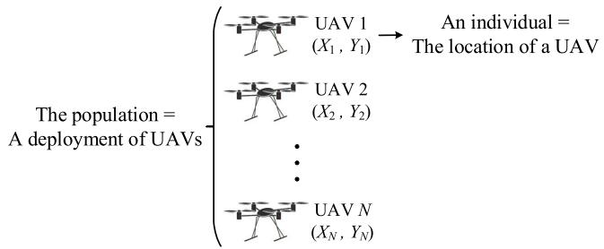

<details>
<summary>text_image</summary>

The population =
A deployment of UAVs
UAV 1
(X₁, Y₁) → An individual =
The location of a UAV
UAV 2
(X₂, Y₂)
...
UAV N
(Xₙ, Yₙ)
</details>

Fig. 2. Encoding mechanism in this article for the deployment of UAVs.

Algorithm 2 Initialization   
1: num_vio = 0;
2: Generate a location for the first UAV randomly and put it into P;
3: for j = 2 to N do
4:    Generate a location for the jth UAV randomly;
5:    if the jth UAV satisfies C2 in (12) then
6:    Put it into P;
7:    num_vio = 0;
8:    else
9:    num_vio = num_vio + 1;
10:    if num_vio > 200 then
11:    Clear P and go to Step 1;
12:    end if
13:    Go to Step 4;
14:    end if
15: end for
16: return P

In principle, this article achieves the joint deployment and task scheduling optimization through optimizing a 4-tuple: $\{ N , \mathcal { P } , \mathbf { a } , \mathbf { f } \}$ . Moreover, once num\_inf = 1000, the optimal value of N is obtained. Under this condition, both steps 8–11 (i.e., the elimination operator) and steps 15–26 are unnecessary, and we only concentrate on the optimization of { , a, f} by DE (i.e., steps 12–14 and 27).

It is noteworthy that the deployment of UAVs in the upper layer depends on Algorithms 3 and 4, and the task scheduling in the lower layer depends on Algorithm 5.

# C. Initialization

Algorithm 2 introduces the initialization of , which contains the locations of N UAVs. First, we randomly generate a location for the first UAV and put it into . After that, we generate a location for the second UAV. If this UAV satisfies C2 in (12), which suggests that the distance between the first and second UAVs is not smaller than $d _ { m i n } ^ { U U }$ and they will not collide, then we put it into P. Otherwise, the generation of the location of the second UAV is unsuccessful. Under this condition, if the consecutive unsuccessful number is bigger than 200, we restart the initialization; otherwise, the location of the second UAV is regenerated by step 4. Subsequently, we execute the above process on the third UAV and so forth. Finally, all UAVs’ locations are successfully generated and an initial deployment of UAVs is obtained (i.e., P).

# D. Upper-Layer Optimization

The aim of the upper-layer optimization is to determine the optimal deployment of UAVs, in other words, the optimal number and locations of UAVs. In ToDeTaS, the number of UAVs is equal to the population size of $\mathcal { P } \ ( \mathrm { i . e . , } N )$ . Therefore, the optimization of the number of UAVs is equivalent to the adjustment of N. By analyzing the multi-UAV-enabled MEC system proposed in this article, the following property is obtained.

Property 1: The number of UAVs should be as small as possible under the condition that all tasks can be executed under delay constraints.

Algorithm 3 Elimination Operator   
1: Choose two individuals with the minimum Euclidean distance from $\mathcal{P}$ , then calculate their second minimum Euclidean distances and delete the one with smaller second minimum Euclidean distance from $\mathcal{P}$ . If they have the same second minimum Euclidean distance, then we calculate their third minimum Euclidean distances and so forth;  
2: $N = N - 1$ ;  
3: Calculate $\mathbf{a}$ and $\mathbf{f}$ according to $\mathcal{P}$ based on Algorithm 5;  
4: Evaluate the system energy consumption of $\{N, \mathcal{P}, \mathbf{a}, \mathbf{f}\}$ ;  
5: $FEs = FEs + 1$ ;  
6: return $\{N, \mathcal{P}, \mathbf{a}, \mathbf{f}\}$ and $FEs$

Algorithm 4 Updating Operator   
1: Utilize the ith individual in Q to replace a randomly selected individual in P and obtain a new population R;
2: if R satisfies C2 in (12) then
3: Calculate the offloading decision $a'$ and the resource allocation $f'$ according to R based on Algorithm 5;
4: Evaluate the system energy consumption of $\{N, R, a', f'\}$ ;
5: $FEs = FEs + 1$ ;
6: Denote the numbers of completed tasks of $\{N, R, a', f'\}$ and $\{N, P, a, f\}$ as $NC\_R$ and $NC\_P$ , respectively, and denote the energy consumption of $\{N, R, a', f'\}$ and $\{N, P, a, f\}$ as $EC\_R$ and $EC\_P$ , respectively;
7: if $NC\_R > NC\_P$ then
8: $\{N, P, a, f\} = \{N, R, a', f'\}$ ;
9: else if $NC\_R == NC\_P == M$ and $EC\_R < EC\_P$ then
10: $\{N, P, a, f\} = \{N, R, a', f'\}$ ;
11: end if
12: end if
13: return $\{N, P, a, f\}$ and FEs

We analyze the rationality of this property in the Appendix. Based on this property, the population size of P is adjusted as follows: we first set the initial N as the maximum number of UAVs $( N _ { m a x } = M / n _ { m a x } )$ , and then N is gradually decreased by the elimination operator in Algorithm 3 until at least one task cannot be executed under delay constraints. As shown in Algorithm 3, in each time, we only delete one individual from . A question is which individual should be deleted. In this article, we consider that the most crowded individual should be deleted. It is because the UAV corresponding to this individual may be redundant, thus adding system energy consumption.

The second issue in the upper-layer optimization is to determine the optimal locations of UAVs, which is achieved by making use of DE. In this article, a classical DE version, DE/rand/1/bin [38], is adopted. For the ith individual $\vec { x } _ { i } =$ $( x _ { i , 1 } , x _ { i , 2 } ) \ ( i \in \{ 1 , . . . , N \} )$ in , the mutation and crossover operators of DE/rand/1/bin are introduced as follows:

$$
\vec {v} _ {i} = \vec {x} _ {r 1} + F * (\vec {x} _ {r 2} - \vec {x} _ {r 3}) \tag {13}
$$

$$
u _ {i, j} = \left\{ \begin{array}{l l} v _ {i, j}, & \text { if   } r a n d _ {j} (0, 1) \leq C R \text { or } j = j _ {\text { rand }} \\ x _ {i, j}, & \text { otherwise } \end{array} \right. \tag {14}
$$

where $i \ \in \ \{ 1 , \ldots , N \} ; \ j \ \in \ \{ 1 , 2 \} ; \ { \vec { x } } _ { r 1 } , \ { \vec { x } } _ { r 2 }$ , and $\vec { x } _ { r 3 }$ are the three mutually distinct individuals randomly selected from $\mathcal { P } ;$ $\vec { \nu } _ { i } ~ = ~ ( \nu _ { i , 1 } , \nu _ { i , 2 } )$ and $\vec { u } _ { i } ~ = ~ ( u _ { i , 1 } , u _ { i , 2 } )$ are the mutant vector and the trial vector, respectively; $u _ { i , j } , \\nu _ { i , j }$ , and $x _ { i , j }$ are the jth dimension of u	i, ${ \vec { \nu } } _ { i } .$ and ${ \vec { x } } _ { i } .$ , respectively; $F$ is the scaling factor; $j _ { r a n d }$ is an integer randomly selected between 1 and 2 to ensure that $\vec { u } _ { i }$ is different from $\vec { x } _ { i }$ in at least one dimension; randj(0, 1) denotes a uniformly distributed random number between 0 and 1 for each $j ;$ and CR is the crossover control parameter.

Algorithm 5 Task Scheduling   
1: Calculate f based on the given P;
2: Divide the tasks into three categories. Suppose that the first, second, and third categories have $M_{1}, M_{2}$ , and $M_{3}$ tasks, respectively;
3: Initialize a = 0 in (20);
4: For the tasks in the first category, $a_{1,0} = \cdots = a_{M_{1},0} = 1$ ;
5: $A = \{1, \ldots, M_{2}\}$ ;
6: while $A \neq \emptyset$ do
7: Choose the task with the minimum number of candidate patterns in the second category (denoted as the sth task);
8: Suppose that this task has $n_{s}$ candidate patterns and the corresponding minimum energy consumption of these $n_{s}$ candidate patterns is: $E_{s,1}^{\star}, \ldots, E_{s,n_{s}}^{\star}$ ;
9: The candidate pattern with $min(E_{s,1}^{\star}, \ldots, E_{s,n_{s}}^{\star})$ is selected, denoted as $c_{s}$ .
10: $a_{M_{1}+s.c_{s}} = 1$ in a and $A = A \setminus \{s\}$ ;
11: The number of tasks that the $c_{s}$ th UAV can serve is reduced by one, and the candidate pattern sets of the rest of the tasks in A are updated;
12: if the candidate pattern sets of all the tasks in A are empty then
13: Break;
14: end if
15: end while
16: $B = \{1, \ldots, M_{3}\}$ ;
17: while $B \neq \emptyset$ do
18: Suppose that $U_{i} (i = 1, \ldots, |B|)$ in the third category has $n_{i}$ candidate patterns, and the corresponding minimum energy consumption of these $n_{i}$ candidate patterns is: $E_{i,1}^{\star}, \ldots, E_{i,n_{i}}^{\star}$ ;
19: Normalize $n_{i}$ and $(E_{i,1}^{\star}, \ldots, E_{i,n_{i}}^{\star})$ of $U_{i} (i = 1, \ldots, |B|)$ : $nor(n_{i})$ and $(nor(E_{i,1}^{\star}), \ldots, nor(E_{i,n_{i}}^{\star}))$ ;
20: Compute $nor(n_{i}) * nor(E_{i,1}^{\star}), \ldots, nor(n_{i}) * nor(E_{i,n_{i}}^{\star})$ for $U_{i} (i = 1, \ldots, |B|)$ . Thus, we can obtain $\sum_{i=1}^{|B|} n_{i}$ values. By selecting the minimum value, we can determine the corresponding task (denoted as the sth task in the third category) and pattern (denoted as $c_{s}$ );
21: $a_{M_{1}+M_{2}+s.c_{s}} = 1$ in a and $B = B \setminus \{s\}$ ;
22: if $U_{s}$ is executed on a UAV then
23: The number of tasks that this UAV can serve is reduced by one, and the candidate pattern sets of the rest of the tasks in B are updated;
24: end if
25: end while
26: return {a, f}

During the evolution, DE is implemented on P to produce an offspring population . Thereafter, each individual in is utilized to replace a randomly selected individual in $\mathcal { P } ;$ thus,  is updated, denoted as . For , if it satisfies C2 in (12), we compute the offloading decision a and the resource allocation f  . If {N, R, a , f  } can execute more tasks under delay constraints than {N, P, a, f}, or if both of them can execute all tasks under delay constraints and the system energy consumption of {N, R, a , f  } is less than that of {N, P , a, f}, then {N, P, a, f} is replaced with {N, R, a , f  }. The updating operator is given in Algorithm 4.

Regarding steps 15–22 and 23–26 in Algorithm 1, we would like to give the following remarks.

1) Steps 15–22: flag represents the optimization status. Specifically, flag = 0 denotes that the elimination operator can be implemented; instead, flag = 1 denotes that the elimination operator will not be used any more. If {N, , a, f} is still infeasible after 1000 consecutive updates, we consider that N cannot be reduced and the optimal number of UAVs has been found (i.e., N + 1). Thus, we let flag = 1. Under this condition, the followings steps will be applied: {N, P, a, f} returns to its last feasible status, the elimination operator is no longer

used, and we continue to take advantage of the updating operator to optimize ${ \mathcal P } ,$ that is, the locations of UAVs.

2) Steps 23–26: If flag = 0 and {N, P, a, f} is feasible, the updating operator breaks and the elimination operator is implemented on {N, , a, f} to further reduce N.

Overall, in the upper-layer optimization, the number of UAVs is optimized by the elimination operator and the locations of UAVs are optimized by the updating operator. Moreover, steps 15–22 and 23–26 control the switch between the elimination operator and the updating operator.

# E. Lower-Layer Optimization

The lower-layer optimization aims to optimize the task scheduling under a given deployment of UAVs, including the offloading decision and the resource allocation. For a given deployment of UAVs, N, $X _ { j } , ~ Y _ { j } ~ ( j ~ \in \mathcal { N } )$ , and $E ^ { H }$ are fixed in (12). In addition, this deployment must satisfy C2 in (12) since if it does not satisfy C2, it cannot enter the population as shown in step 2 of Algorithm 4. Therefore, we only need to focus on $a _ { i , k }$ and $f _ { i , k } \mathrm { ~ } ( i \in \mathcal { M }$ and $k \in \mathcal { K } )$ in (12). By substituting (2) and (10), which are related to $f _ { i , k } ,$ , to (12), the lower-layer optimization problem can be expressed as

$$
\min _ {a _ {i, k}, f _ {i, k}} \sum_ {i = 1} ^ {M} \left(a _ {i, 0} \eta_ {1} (f _ {i, 0}) ^ {v - 1} C _ {i} \right.
$$

$$
\left. + \sum_ {k = 1} ^ {N} a _ {i, k} \left(P \frac {D _ {i}}{r _ {i , k}} + \eta_ {2} (f _ {i, k}) ^ {\nu - 1} C _ {i}\right)\right)
$$

s.t. C1, C3, C4, C5, C6, C7, and C8. (15)

It can be seen from (15) that the more the computation resources consumed to complete a task under a certain pattern $( \mathrm { i . e . , ~ } f _ { i , k } )$ , the greater the energy consumption [the objective function in (15)]. It is because the energy consumption increases monotonously with the increase of $f _ { i , k } .$ . Therefore, to minimize the energy consumption, $f _ { i , k }$ should be as small as possible. However, when $U _ { i }$ is executed in pattern k, to ensure that delay constraints C7 and C8 are satisfied, $f _ { i , k }$ must not be smaller than a minimum value, which can be calculated based on C7 and C8.

Substituting (1) and (9) to C7 and C8, respectively, one can obtain that:

1) when $U _ { i }$ is executed in pattern 0

$$
f _ {i, 0} \geq \frac {C _ {i}}{T}, \forall i \in \mathcal {M} \tag {16}
$$

2) when $U _ { i }$ is executed in pattern k

$$
f _ {i, k} \geq \frac {C _ {i}}{T - \frac {D _ {i}}{r _ {i , k}}}, \forall i \in \mathcal {M}, k \in \mathcal {K} \backslash \{0 \}. \tag {17}
$$

From (16) and (17), the minimum computation resources are $( C _ { i } / T )$ and $[ C _ { i } / ( T - ( D _ { i } / r _ { i , k } ) ) ]$ , respectively, when $U _ { i }$ is executed in pattern 0 and the other patterns. Thus, each element of the optimal resource allocation f can be given as

$$
f _ {i, k} ^ {\star} = \left\{ \begin{array}{l l} \frac {C _ {i}}{T}, & \text { if   } a _ {i, k} = 1, k = 0 \\ \frac {C _ {i}}{T - \frac {D _ {i}}{r _ {i , k}}}, & \text { if   } a _ {i, k} = 1, k > 0, \forall i \in \mathcal {M}, k \in \mathcal {K}. \\ 0, & \text { otherwise } \end{array} \right. \tag {18}
$$

After obtaining the optimal resource allocation, C5, C6, C7, and C8 are satisfied, and then we can rewrite the lower-layer optimization problem again by substituting (18) to (15)

$$
\begin{array}{l} \min _ {a _ {i, k}} \sum_ {i = 1} ^ {M} \left(a _ {i, 0} \eta_ {1} \left(f _ {i, 0} ^ {\star}\right) ^ {\nu - 1} C _ {i} \right. \\ \left. + \sum_ {k = 1} ^ {N} a _ {i, k} \left(P \frac {D _ {i}}{r _ {i , k}} + \eta_ {2} \left(f _ {i, k} ^ {\star}\right) ^ {v - 1} C _ {i}\right)\right) \\ \end{array}
$$

s.t. C1, C3, and C4. (19)

Remark 1: As mentioned in the Appendix, $E _ { i , k } ^ { \star }$ represents the minimum energy to complete $U _ { i } ~ ( i \in \mathcal { M } )$ in pattern k (k ∈ K). Actually, $E _ { i , 0 } ^ { \star } = \eta _ { 1 } ( f _ { i , 0 } ^ { \star } ) ^ { \nu - 1 } C _ { i } .$ , and $E _ { i , k } ^ { \star } = P ( D _ { i } / r _ { i , k } ) +$ $\eta _ { 2 } ( f _ { i , k } ^ { \star } ) ^ { \nu - 1 } C _ { i } , \ k \in \mathcal { K } \backslash \{ 0 \}$ .

As can be seen, we only need to optimize $a _ { i , k } ;$ thus, (19) is a 0-1 integer programming problem since $a _ { i , k } ~ = ~ 0$ or 1. Although classical mathematical programming methods, such as the branch-and-bound algorithm [39], can be used to solve (19), they are time-consuming due to the largescale characteristic in this article. To this end, we propose a greedy algorithm to efficiently obtain the near-optimal solution of (19).

First, we define a candidate pattern set for each task.

1) This task can be executed in each candidate pattern under delay constraints.   
2) If pattern 0 is one of the candidate patterns, then the energy consumption of any other candidate pattern is less than that of pattern 0.

Subsequently, all tasks are divided into three categories.

1) The tasks’ candidate pattern sets only contain pattern 0.   
2) The tasks’ candidate pattern sets do not contain pattern 0.   
3) The tasks’ candidate pattern sets contain both pattern 0 and other patterns.

Suppose that there are $M _ { 1 } , M _ { 2 }$ , and $M _ { 3 }$ tasks in the first, second, and third categories, respectively. Then, offloading decision a is expressed in the following, each element of which is initialized to be zero:

$$
\mathbf {a} = \left( \begin{array}{c c c c} a _ {1, 0} & a _ {1, 1} & \dots & a _ {1, N} \\ \vdots & \vdots & \vdots & \vdots \\ a _ {M _ {1}, 0} & a _ {M _ {1}, 1} & \dots & a _ {M _ {1}, N} \\ a _ {M _ {1} + 1, 0} & a _ {M _ {1} + 1, 1} & \dots & a _ {M _ {1} + 1, N} \\ \vdots & \vdots & \vdots & \vdots \\ a _ {M _ {1} + M _ {2}, 0} & a _ {M _ {1} + M _ {2}, 1} & \dots & a _ {M _ {1} + M _ {2}, N} \\ a _ {M _ {1} + M _ {2} + 1, 0} & a _ {M _ {1} + M _ {2} + 1, 1} & \dots & a _ {M _ {1} + M _ {2} + 1, N} \\ \vdots & \vdots & \vdots & \vdots \\ a _ {M _ {1} + M _ {2} + M _ {3}, 0} & a _ {M _ {1} + M _ {2} + M _ {3}, 1} & \dots & a _ {M _ {1} + M _ {2} + M _ {3}, N} \end{array} \right). \tag {20}
$$

We give the priorities of these three categories in the descending order. The tasks in the first category have the highest priority. This is because they are executed locally (i.e., $a _ { 1 , 0 } = \dotsb = a _ { M _ { 1 } , 0 } = 1 )$ and do not consume any computation resources from MEC servers on UAVs. Since the tasks in the second category can only be executed on UAVs, we need to give them the second highest priority, with the aim of completing as many tasks as possible. In addition, the tasks in the third category can be executed locally in the worst case. Therefore, they have the lowest priority.

Next, we determine the offloading decision for the tasks in the second and third categories.

1) The offloading decision for the tasks in the second category is given in steps 5–15 in Algorithm 5. When determining which task to execute, we first select the task with the minimum number of candidate patterns, the aim of which is to complete all tasks with a higher probability. Afterward, we choose one of the candidate patterns of this task by considering their minimum energy consumption.

2) The offloading decision for the tasks in the third category is given in steps 16–25 in Algorithm 5. When determining which task to execute, we consider the number of candidate patterns and the energy consumption simultaneously. We prefer the tasks with fewer candidate patterns and less energy consumption; thus, all tasks can be completed with the system energy consumption being as little as possible.

Remark 2: Only in the second category, some tasks may not be executed under delay constraints. For the other two categories, all tasks can be definitely completed.

Remark 3: In Algorithm 4, it is necessary to compute the number of completed tasks. Note that the number of uncompleted tasks is equal to the number of the remaining tasks in A when Algorithm 5 terminates, that is, the number of rows in a, in which all the elements are zero.

# F. Discussion

The proposed ToDeTaS has the following characteristics.

1) This article optimizes a 4-tuple: {N, P, a, f} to minimize the energy consumption of the proposed multi-UAVenabled MEC system.   
2) By mining the specific-knowledge of this system, we propose a new encoding mechanism and adaptively adjust population size N (i.e., the number of UAVs).   
3) DE serves as the search engine to optimize P, that is, the locations of UAVs.   
4) By exploiting the correlation between the upper layer and the lower layer, for a given deployment of UAVs in the upper layer, we directly derive the optimal f and propose a greedy algorithm to efficiently optimize a.   
5) ToDeTaS includes few parameters: the scaling factor F and the crossover control parameter CR in DE. Moreover, due to the low-dimensional search space, F and CR are not sensitive.

The novelties of this article can be summarized as follows.

1) This article is the first attempt to establish a multi-UAVenabled MEC system to serve large-scale mobile users.   
2) An optimization problem is formulated to jointly optimize the deployment of UAVs and the task scheduling. The main challenges of this optimization problem are two-fold: a) large-scale mixed decision variables and

TABLE I PARAMETER SETTINGS IN THE MULTI-UAV-ENABLED MEC SYSTEM PROPOSED IN THIS ARTICLE 

<table><tr><td>Parameter</td><td>Value</td><td>Parameter</td><td>Value</td></tr><tr><td> $C_i$ ,  $i \in \mathcal{M}$ </td><td>[16, 1600]MCycles</td><td> $d_{min}^{UU}$ </td><td>10m</td></tr><tr><td> $D_i$ ,  $i \in \mathcal{M}$ </td><td>[10, 1000]KB</td><td> $n_{max}$ </td><td>10</td></tr><tr><td>H</td><td>100m</td><td>B</td><td>1MHz</td></tr><tr><td>θ</td><td> $\frac{\pi}{4}$ </td><td>P</td><td>1W</td></tr><tr><td> $f_{i,0}$ ,  $i \in \mathcal{M}$ </td><td>[0, 0.8]GHz</td><td> $\beta_0$ </td><td> $1.42 \times 10^{-4}$ </td></tr><tr><td> $f_{i,k}$ ,  $i \in \mathcal{M}$ ,  $k \in \mathcal{K} \setminus \{0\}$ </td><td>[0, 10]GHz</td><td> $G_0$ </td><td>2.2846</td></tr><tr><td> $\eta_1$ </td><td> $10^{-27}$ </td><td> $N_0$ </td><td> $10^{-20}\text{W/Hz}$ </td></tr><tr><td> $\eta_2$ </td><td> $10^{-28}$ </td><td> $P_0$ </td><td>1000W</td></tr><tr><td>v</td><td>3</td><td>T</td><td>1s</td></tr></table>

b) strong coupling between the deployment of UAVs and the task scheduling.

3) We propose a new two-layer optimization method called ToDeTaS. The two-layer structure is able to deal with large-scale decision variables and strong coupling between the deployment of UAVs and the task scheduling. Moreover, in the upper layer, an integer decision variable (i.e., the number of UAVs) and continuous decision variables (i.e., the locations of UAVs) are handled by a new encoding mechanism and an elimination operator, and in the lower layer, binary decision variables (i.e., offloading decision of each mobile user) and continuous decision variables (i.e., resource allocation of each mobile user) are tackled by an efficient greedy algorithm. Therefore, ToDeTaS can also address the challenge caused by the mixed decision variables.

# IV. EXPERIMENTAL STUDY

# A. Experimental Settings

The parameter settings of the proposed multi-UAV-enabled MEC system are given in Table I [30], [40], [41]. In addition, we applied ten instances with different numbers of mobile users to study the performance of ToDeTaS: $M \ =$ 100, 200, . . . , 1000. We assumed that all mobile users were distributed in square areas with different side lengths, as shown in Table II.

The proposed ToDeTaS includes two parameters, which were set as follows: $F = 0 . 9$ and $C R = 0 . 9$ . The maximum number of fitness evaluations $( F E s _ { m a x } )$ was set to 10 000 and 30 independent runs were implemented on ToDeTaS.

In order to compare the performance of different algorithms, three performance indicators were employed.

1) The first performance indicator was the average number of completed tasks and the standard deviation over 30 independent runs (denoted as “Mean $\mathrm { N C } ^ { \mathrm { , , } }$ and “Std Dev”).   
2) The second performance indicator was the success rate (denoted as SR), which means the percentage of successful runs over 30 independent runs. A run is successful if all tasks can be completed when an algorithm ends.   
3) If SR of an algorithm is equal to 100%, then we compute the system energy consumption via (12) (denoted as EC). Thus, the third performance indicator was the average system energy consumption $( \mathrm { i . e . , ~ } ( 1 / 3 0 ) \sum _ { i = 1 } ^ { 3 0 } \mathrm { E C } _ { i }$ , where $\mathrm { E C } _ { i }$ represents the system energy consumption of

TABLE II SIDE LENGTHS OF SQUARE AREAS WITH DIFFERENT NUMBERS OF MOBILE USERS 

<table><tr><td>M</td><td>100</td><td>200</td><td>300</td><td>400</td><td>500</td></tr><tr><td>Side Length (m)</td><td>320</td><td>450</td><td>550</td><td>640</td><td>710</td></tr><tr><td>M</td><td>600</td><td>700</td><td>800</td><td>900</td><td>1000</td></tr><tr><td>Side Length (m)</td><td>780</td><td>840</td><td>900</td><td>950</td><td>1000</td></tr></table>

TABLE III EXPERIMENTAL RESULTS OF DE-VND AND TODE-VND IN TERMS OF MEAN NC AND SR 

<table><tr><td rowspan="2">M</td><td colspan="2">DE-VND</td><td colspan="2">ToDE-VND</td></tr><tr><td>Mean NC (Std Dev)</td><td>SR</td><td>Mean NC (Std Dev)</td><td>SR</td></tr><tr><td>100</td><td>43.07 (1.39)</td><td>0.00%</td><td>100.00 (0.00)</td><td>100.00%</td></tr><tr><td>200</td><td>81.07 (3.41)</td><td>0.00%</td><td>200.00 (0.00)</td><td>100.00%</td></tr><tr><td>300</td><td>105.37 (8.86)</td><td>0.00%</td><td>300.00 (0.00)</td><td>100.00%</td></tr><tr><td>400</td><td>129.13 (12.53)</td><td>0.00%</td><td>399.97 (0.18)</td><td>96.67%</td></tr><tr><td>500</td><td>145.20 (19.00)</td><td>0.00%</td><td>499.63 (0.48)</td><td>63.33%</td></tr><tr><td>600</td><td>163.23 (22.38)</td><td>0.00%</td><td>598.67 (0.75)</td><td>6.67%</td></tr><tr><td>700</td><td>182.90 (31.13)</td><td>0.00%</td><td>698.47 (0.88)</td><td>13.33%</td></tr><tr><td>800</td><td>199.87 (37.86)</td><td>0.00%</td><td>797.33 (1.01)</td><td>0.00%</td></tr><tr><td>900</td><td>228.13 (44.69)</td><td>0.00%</td><td>897.03 (0.84)</td><td>0.00%</td></tr><tr><td>1000</td><td>247.87 (53.49)</td><td>0.00%</td><td>997.17 (1.07)</td><td>0.00%</td></tr></table>

the ith independent run) and the standard deviation over 30 independent runs (denoted as Mean EC and Std Dev).

# B. Effectiveness of Two-Layer Optimization

We handle the joint deployment and task scheduling optimization by a two-layer optimization. Moreover, we optimize the deployment of UAVs and task scheduling in the upper and lower layers, respectively. To verify the effectiveness of the two-layer optimization, we solved (12) by a single-layer optimization method proposed in [42]. The method in [42] is designed to solve optimization problems with a variable number of dimensions, in which different individuals in the population have different lengths, and the length of each individual is updated according to a probabilitybased way. As pointed out in Section III-B, the deployment of UAVs is a variable-length optimization problem due to the fact that the optimal number of UAVs is unknown. Therefore, the method in [42] was chosen to solve (12) as a single-layer optimization method in this article. Note that we made a simple revision to this method by replacing particle swarm optimization with DE as the search engine. The resultant method was called DE-VND. In DE-VND, each initial individual included a deployment of UAVs as well as task scheduling, both of them were randomly generated. In addition, we designed a two-layer version of DE-VND, called ToDE-VND. In ToDE-VND, the deployment of UAVs in the upper layer was the same with DE-VND; however, the task scheduling in the lower layer was the same with ToDeTaS.

The performance of DE-VND was compared with that of ToDE-VND on the ten instances. In the experiments, DE-VND and ToDE-VND had the same parameter settings: the population size was set to 100; the probabilities p1 to 	xi, p2 to ${ \vec { x } } _ { r 1 } .$ , p3 to $\vec { x } _ { r 2 }$ , and $p _ { 4 } ~ \mathrm { t o } ~ \vec { x } _ { r 3 }$ were set to 0.25, 0.25, 0.25 and 0.25, respectively; $F = 0 . 9 , C R = 0 . 9 , F E s _ { m a x } = 1 0 0 0 0$ , and 30 independent runs were implemented. The experimental results in terms of mean NC and SR are summarized in Table III.

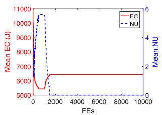

<details>
<summary>line</summary>

| FEs  | Mean EC (J) | Mean NU |
| ---- | ----------- | ------- |
| 0    | 11000       | 6       |
| 2000 | 6000        | 1       |
| 4000 | 6000        | 1       |
| 6000 | 6000        | 1       |
| 8000 | 6000        | 1       |
| 10000| 6000        | 1       |
</details>

(a)

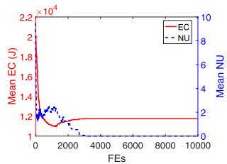

<details>
<summary>line</summary>

| FEs   | Mean EC (J) | Mean NU |
|-------|-------------|---------|
| 0     | 2.2e4       | 8       |
| 1000  | 1.2e4       | 2       |
| 2000  | 1.1e4       | 1       |
| 3000  | 1.1e4       | 0.5     |
| 4000  | 1.1e4       | 0.3     |
| 5000  | 1.1e4       | 0.2     |
| 6000  | 1.1e4       | 0.1     |
| 7000  | 1.1e4       | 0.05    |
| 8000  | 1.1e4       | 0.03    |
| 9000  | 1.1e4       | 0.02    |
| 10000 | 1.1e4       | 0.01    |
</details>

(b)

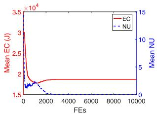

<details>
<summary>line</summary>

| FEs   | Mean EC (J) | Mean NU |
|-------|-------------|---------|
| 0     | 3.0e4       | 15      |
| 1000  | 1.8e4       | 5       |
| 2000  | 1.7e4       | 2       |
| 3000  | 1.6e4       | 1       |
| 4000  | 1.6e4       | 0.5     |
| 5000  | 1.6e4       | 0.2     |
| 6000  | 1.6e4       | 0.1     |
| 7000  | 1.6e4       | 0.05    |
| 8000  | 1.6e4       | 0.02    |
| 9000  | 1.6e4       | 0.01    |
| 10000 | 1.6e4       | 0.005   |
</details>

(c）

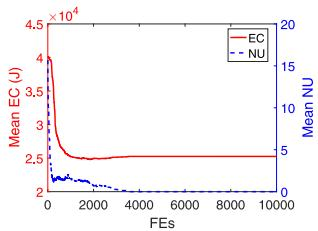

<details>
<summary>line</summary>

| FEs   | Mean EC (J) | Mean NU |
|-------|-------------|---------|
| 0     | 4.5e+04     | 20      |
| 2000  | 2.5e+04     | 5       |
| 4000  | 2.5e+04     | 5       |
| 6000  | 2.5e+04     | 5       |
| 8000  | 2.5e+04     | 5       |
| 10000 | 2.5e+04     | 5       |
</details>

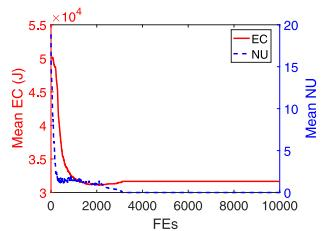

<details>
<summary>line</summary>

| FEs   | Mean EC (J) | Mean NU |
|-------|-------------|---------|
| 0     | 5.5e4       | 20      |
| 10000 | 3.0e4       | 0       |
</details>

(e)

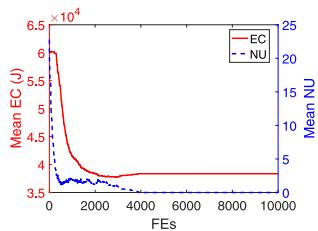

<details>
<summary>line</summary>

| FEs   | Mean EC (U) | Mean NU |
|-------|-------------|---------|
| 0     | 6.5e4       | 25      |
| 1000  | 4.0e4       | 10      |
| 2000  | 3.5e4       | 5       |
| 3000  | 3.5e4       | 2       |
| 4000  | 3.5e4       | 1       |
| 5000  | 3.5e4       | 0.5     |
| 6000  | 3.5e4       | 0.2     |
| 7000  | 3.5e4       | 0.1     |
| 8000  | 3.5e4       | 0.05    |
| 9000  | 3.5e4       | 0.02    |
| 10000 | 3.5e4       | 0.01    |
</details>

(f)

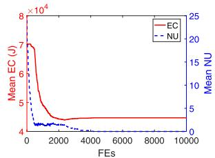

<details>
<summary>line</summary>

| FEs   | Mean EC (J) | Mean NU |
|-------|-------------|---------|
| 0     | 7e4         | 25      |
| 2000  | 4e4         | 5       |
| 4000  | 4e4         | 2       |
| 6000  | 4e4         | 1       |
| 8000  | 4e4         | 0.5     |
| 10000 | 4e4         | 0.2     |
</details>

(g）

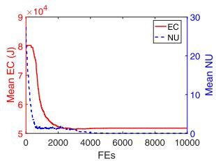

<details>
<summary>line</summary>

| FEs  | Mean EC (J) | Mean NU |
| ---- | ----------- | ------- |
| 0    | 8e4         | 30      |
| 2000 | 5e4         | 10      |
| 4000 | 5e4         | 5       |
| 6000 | 5e4         | 2       |
| 8000 | 5e4         | 1       |
| 10000| 5e4         | 0.5     |
</details>

(h）

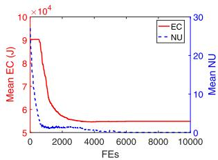

<details>
<summary>line</summary>

| FEs  | Mean EC (J) | Mean NU |
| ---- | ----------- | ------- |
| 0    | 90000       | 30      |
| 2000 | 60000       | 10      |
| 4000 | 55000       | 5       |
| 6000 | 53000       | 2       |
| 8000 | 52000       | 1       |
| 10000| 51000       | 0       |
</details>

i

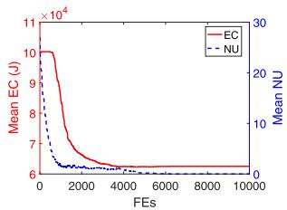

<details>
<summary>line</summary>

| FEs  | Mean EC (J) | Mean NU |
| ---- | ----------- | ------- |
| 0    | 10000       | 30      |
| 2000 | 6000        | 10      |
| 4000 | 6000        | 5       |
| 6000 | 6000        | 2       |
| 8000 | 6000        | 1       |
| 10000| 6000        | 1       |
</details>

(i   
Fig. 3. Evolution of the mean EC (J) and the mean NU provided by ToDeTaS on the ten instances. (a) M = 100. (b) M = 200. (c) M = 300. (d) M = 400. (e) M = 500. (f) M = 600. (g) M = 700. (h) M = 800. (i) M = 900. (j) M = 1000.

From Table III, as far as the mean NC is concerned, ToDE-VND is significantly better than DE-VND on all instances. In addition, ToDE-VDE provides higher SR than DE-VND from M = 100 to 700. Moreover, when $M \ = \ 1 0 0 , \ 2 0 0 .$ and 300, ToDE-VND achieves 100% SR. The superiority of ToDE-VND against DE-VND can be attributed to two aspects: 1) by the two-layer optimization, (12) is decomposed into two optimization problems in the upper and lower layers with fewer numbers of decision variables and 2) in ToDE-VND, the lower layer is generated based on the upper layer, which in turn enhances the accuracy of the evaluation of the upper layer; thus, the correlation between the upper and lower layers has been considered. However, in DE-VND, the deployment of UAVs and task scheduling are optimized independently. In this case, on the one hand, for a given deployment of UAVs, the probability that all tasks can be completed in the task scheduling remarkably decreases. On the other hand, we cannot provide an accurate evaluation of the deployment of UAVs based on the corresponding task scheduling. The aforementioned discussion verifies the effectiveness of the two-layer optimization, which is the main motivation of this article.

# C. Effectiveness of Upper-Layer Optimization

The difference between ToDE-VND and ToDeTaS is the upper-layer optimization. To be specific, ToDE-VND and ToDeTaS have different encoding mechanisms and different ways to deal with the variable-length optimization problem in (12). Hence, by comparing ToDE-VND with ToDeTaS, we can study the effectiveness of the upper-layer optimization. It can be seen from Section IV-B that ToDE-VND and ToDeTaS have the same parameter settings.

Table IV reports the experimental results derived from ToDE-VND and ToDeTaS in terms of mean NC, SR, and mean EC. When M = 100, 200, and 300, both ToDE-VND and ToDeTaS can complete all tasks and provide 100% SR. Under this condition, we compared their mean EC. It is clear that the mean EC values resulting from ToDeTaS are significantly smaller than those of ToDE-VND. In addition, for the remaining instances, ToDeTaS succeeds in completing all tasks consistently. In contrast, ToDE-VND’s SR is smaller than 100% on each instance. More importantly, ToDE-VND fails to complete all tasks in each run for the instances with a larger number of mobile users, that is, M = 800, 900, and 1000. The reason why ToDeTaS performs better than ToDE-VND is straightforward: the former searches for the optimal deployment of UAVs in the search space with a much lower dimension compared with the latter. Moreover, ToDeTaS encodes the location of a UAV into an individual, thus transforming a variable-length optimization problem into a fixed-length one. It is noteworthy that ToDeTaS adopts an elimination operator to adaptively adjust the population size. As a result, an important parameter, that is, the population size, has been eliminated.

Fig. 3 plots the evolution of the mean EC and the mean number of uncompleted tasks (denoted as mean NU) provided by ToDeTaS over 30 independent runs on the ten instances. As shown in Fig. 3, ToDeTaS can consistently complete all tasks and converge after 5000 fitness evaluations.

TABLE IV EXPERIMENTAL RESULTS OF TODE-VND AND TODETAS IN TERMS OF MEAN NC, SR, AND MEAN EC (J) 

<table><tr><td rowspan="2">M</td><td colspan="3">ToDE-VND</td><td colspan="3">ToDeTaS</td></tr><tr><td>Mean NC (Std Dev)</td><td>SR</td><td>Mean EC (Std Dev)</td><td>Mean NC (Std Dev)</td><td>SR</td><td>Mean EC (Std Dev)</td></tr><tr><td>100</td><td>100.00 (0.00)</td><td>100.00%</td><td>7568.24 (498.52)</td><td>100.00 (0.00)</td><td>100.00%</td><td>6435.16 (489.34)</td></tr><tr><td>200</td><td>200.00 (0.00)</td><td>100.00%</td><td>17361.06 (640.21)</td><td>200.00 (0.00)</td><td>100.00%</td><td>11761.12 (861.58)</td></tr><tr><td>300</td><td>300.00 (0.00)</td><td>100.00%</td><td>27821.53 (1030.27)</td><td>300.00 (0.00)</td><td>100.00%</td><td>18654.89 (1144.66)</td></tr><tr><td>400</td><td>399.97 (0.18)</td><td>96.67%</td><td>/</td><td>400.00 (0.00)</td><td>100.00%</td><td>25252.44 (1498.72)</td></tr><tr><td>500</td><td>499.63 (0.48)</td><td>63.33%</td><td>/</td><td>500.00 (0.00)</td><td>100.00%</td><td>31657.92 (1585.73)</td></tr><tr><td>600</td><td>598.67 (0.75)</td><td>6.67%</td><td>/</td><td>600.00 (0.00)</td><td>100.00%</td><td>38360.55 (1713.31)</td></tr><tr><td>700</td><td>698.47 (0.88)</td><td>13.33%</td><td>/</td><td>700.00 (0.00)</td><td>100.00%</td><td>44710.19 (1687.06)</td></tr><tr><td>800</td><td>797.33 (1.01)</td><td>0.00%</td><td>/</td><td>800.00 (0.00)</td><td>100.00%</td><td>51811.82 (2523.99)</td></tr><tr><td>900</td><td>897.03 (0.84)</td><td>0.00%</td><td>/</td><td>900.00 (0.00)</td><td>100.00%</td><td>54858.37 (1817.12)</td></tr><tr><td>1000</td><td>997.17 (1.07)</td><td>0.00%</td><td>/</td><td>1000.00 (0.00)</td><td>100.00%</td><td>62516.68 (2471.07)</td></tr></table>

TABLE V EXPERIMENTAL RESULTS OF TODETAS-BB AND TODETAS IN TERMS OF MEAN EC (J) AND MEAN RUNTIME (S) 

<table><tr><td rowspan="2">M</td><td colspan="2">Mean EC (Std Dev)</td><td colspan="2">Mean Runtime</td></tr><tr><td>ToDeTaS-BB</td><td>ToDeTaS</td><td>ToDeTaS-BB</td><td>ToDeTaS</td></tr><tr><td>100</td><td>6536.17 (499.98)</td><td>6435.16 (489.34)</td><td>93.60</td><td>4.56</td></tr><tr><td>200</td><td>11763.66 (862.13)</td><td>11761.12 (861.58)</td><td>141.87</td><td>9.52</td></tr><tr><td>300</td><td>18326.72 (1054.57)</td><td>18654.89 (1144.66)</td><td>250.86</td><td>21.05</td></tr><tr><td>400</td><td>24093.02 (1224.23)</td><td>25252.44 (1498.72)</td><td>435.97</td><td>42.42</td></tr><tr><td>500</td><td>30298.00 (1383.99)</td><td>31657.92 (1585.73)</td><td>726.57</td><td>67.30</td></tr><tr><td>600</td><td>36501.72 (1715.53)</td><td>38360.55 (1713.31)</td><td>1166.16</td><td>106.31</td></tr><tr><td>700</td><td>41486.40 (1610.91)</td><td>44710.19 (1687.06)</td><td>1741.31</td><td>150.84</td></tr><tr><td>800</td><td>48690.46 (2906.08)</td><td>51811.82 (2523.99)</td><td>2603.06</td><td>213.90</td></tr><tr><td>900</td><td>52204.68 (1913.62)</td><td>54858.37 (1817.12)</td><td>3562.85</td><td>251.45</td></tr><tr><td>1000</td><td>58499.03 (2587.03)</td><td>62516.68 (2471.07)</td><td>4915.91</td><td>329.12</td></tr><tr><td>/</td><td>/</td><td>/</td><td>MAR</td><td>13.22</td></tr></table>

# D. Effectiveness of Lower-Layer Optimization

The lower-layer optimization involves the offloading decision and resource allocation. Although in ToDeTaS, the resource allocation can be determined by simple mathematical derivations, the offloading decision is still a large-scale 0-1 integer programming problem due to a large number of mobile users in this article. To reduce the computational time complexity, we propose a greedy algorithm to solve this problem. One may be interested in the performance difference between our greedy algorithm and other classical mathematical programming methods. To this end, we designed a variant of ToDeTaS, called ToDeTaS-BB, in which the offloading decision was solved by the branch-and-bound algorithm [39]. We implemented the branch-and-bound algorithm via the MATLAB toolbox.

The experimental results of ToDeTaS and ToDeTaS-BB are presented in Table V in terms of mean EC and mean runtime. We can observe from Table V that from M = 300 to 1000, overall, ToDeTaS-BB provides slightly less mean EC than ToDeTaS. It is largely because the branch-and-bound algorithm can generate a better offloading decision than the greedy algorithm and improve the accuracy of evaluation for the upper layer. It is interesting to note that ToDeTaS is better than ToDeTaS-BB in terms of the mean EC for a small number of mobile users, that is, $M = 1 0 0$ and 200. This phenomenon is not difficult to understand since for a small number of mobile users, the greedy algorithm is able to generate a highquality offloading decision. In addition, the branch-and-bound algorithm cannot guarantee the absolute optimal offloading decision in the MATLAB toolbox.

With respect to the mean runtime, it is obvious that ToDeTaS performs much faster than ToDeTaS-BB. In this article, we defined the mean accelerator rate (MAR) of ToDeTaS against ToDeTaS-BB

$$
\mathrm{MAR} = \frac {1}{1 0} \sum_ {i = 1} ^ {1 0} \frac {T 1 _ {i}}{T 2 _ {i}} \tag {21}
$$

where $T 1 _ { i }$ and $T 2 _ { i }$ represent the runtime of ToDeTaS-BB and ToDeTaS on the ith instance, respectively. As shown in Table V, ToDeTaS is on average 13.22 times more efficient than its competitor. After a task is executed, the computational time complexity of the greedy algorithm in Algorithm 5 depends mainly on updating the candidate pattern sets of the remaining tasks in steps 11 and 23, which requires MN judgements in the worst case. Due to the fact that there are M tasks, the computational time complexity of the greedy algorithm is $O ( M ^ { 2 } N )$ in the worst case. In contrast, the computational time complexity of the branch-and-bound algorithm is $O ( ( N + 1 ) ^ { M } )$ . Therefore, we can conclude that the greedy algorithm can efficiently optimize the offloading decision with only a slight sacrifice of the system energy consumption, compared with the branch-and-bound algorithm.

# E. Effectiveness of Our Multi-UAV-Enabled MEC System

Finally, we compared two algorithms—ToDeTaS-L and ToDeTaS-M—with ToDeTaS to verify the effectiveness of our multi-UAV-enabled MEC system. For ToDeTaS-L and ToDeTaS-M, all tasks can only be executed locally and on UAVs, respectively. However, for ToDeTaS, a task can be executed locally or on a UAV.

Table VI shows the experimental results of ToDeTaS-L, ToDeTaS-M, and ToDeTaS in terms of mean NC over 30 independent runs. As depicted in Table VI, both ToDeTaS-L and ToDeTaS-M cannot successfully complete all tasks on any instance. However, ToDeTaS has the capability to complete all tasks on all ten instances. The poor performance of ToDeTaS-L and ToDeTaS-M can be explained as follows. For ToDeTaS-L, if a mobile device cannot complete its task due to the lack of enough computational resources, then ToDeTaS-L will fail. In addition, for ToDeTaS-M, due to the nonuniform distribution of mobile users, some tasks may not be covered by any UAV; thus, ToDeTaS-M may fail. In principle, ToDeTaS can alleviate the limitations of these two algorithms.

TABLE VI EXPERIMENTAL RESULTS OF TODETAS-L, TODETAS-M, AND TODETAS IN TERMS OF MEAN NC 

<table><tr><td rowspan="2">M</td><td colspan="3">Mean NC</td></tr><tr><td>ToDeTaS-L</td><td>ToDeTaS-M</td><td>ToDeTaS</td></tr><tr><td>100</td><td>42.00</td><td>99.83</td><td>100.00</td></tr><tr><td>200</td><td>103.00</td><td>199.20</td><td>200.00</td></tr><tr><td>300</td><td>149.00</td><td>298.63</td><td>300.00</td></tr><tr><td>400</td><td>200.00</td><td>397.53</td><td>400.00</td></tr><tr><td>500</td><td>244.00</td><td>496.57</td><td>500.00</td></tr><tr><td>600</td><td>283.00</td><td>595.67</td><td>600.00</td></tr><tr><td>700</td><td>334.00</td><td>693.77</td><td>700.00</td></tr><tr><td>800</td><td>378.00</td><td>792.20</td><td>800.00</td></tr><tr><td>900</td><td>455.00</td><td>891.23</td><td>900.00</td></tr><tr><td>1000</td><td>515.00</td><td>989.00</td><td>1000.00</td></tr></table>

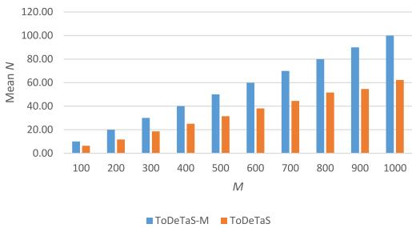

<details>
<summary>bar</summary>

| M | ToDeTaS-M (Mean N) | ToDeTaS (Mean N) |
|---|---|---|
| 100 | 10.0 | 8.0 |
| 200 | 20.0 | 12.0 |
| 300 | 30.0 | 18.0 |
| 400 | 40.0 | 25.0 |
| 500 | 50.0 | 32.0 |
| 600 | 60.0 | 38.0 |
| 700 | 70.0 | 45.0 |
| 800 | 80.0 | 52.0 |
| 900 | 90.0 | 55.0 |
| 1000 | 100.0 | 62.0 |
</details>

Fig. 4. Experimental results of ToDeTaS-M and ToDeTaS in terms of mean N.

Note that the mean NC values provided by ToDeTaS-M are close to those of ToDeTaS in Table VI. In order to further identify the performance difference, we compared the mean number of UAVs (i.e., mean N) of ToDeTaS-M and ToDeTaS on the ten instances. Fig. 4 shows the experimental results. From Fig. 4, ToDeTaS is able to complete all tasks while requiring considerably fewer UAVs than ToDeTaS-M on each instance. This is because about 40% of the tasks can be executed locally under delay constraints according to the parameter settings in Table I. Therefore, ToDeTaS is capable of reducing about 40% of UAVs compared with ToDeTaS-M. This comparison confirms the effectiveness of our multi-UAV-enabled MEC system.

# V. DISCUSSION

# A. On Hyper-Heuristic Approaches for the Task Scheduling in the Lower Layer

One may be interested in whether hyper-heuristic approaches (e.g., genetic programming and particle swarm optimization) can work better for the task scheduling in the lower layer. There is no doubt that hyper-heuristic approaches are able to solve the task scheduling in the lower layer and may even obtain a better solution than our greedy algorithm. However, the computational time complexity of a hyperheuristic approach is significantly higher than that of our greedy algorithm. This is because a hyper-heuristic approach searches for the optimal solution via an iterative way. In this article, we adopted a two-layer optimization method. Obviously, if the computational time complexity of the lowerlayer optimization method is high, it is impossible to apply the two-layer optimization method in the large-scale scenarios. Moreover, as can be seen from the experimental studies in Section IV, our greedy algorithm exhibits good performance. Overall, by considering the tradeoff between the computational time complexity and accuracy, we made use of a greedy algorithm to optimize the task scheduling in the lower layer.

# B. On Dynamic Environment

Although we only consider the static environment in this article, a dynamic environment can also be applied to our system. We will explain this from the following two aspects.

1) If $x _ { i } , y _ { i } , C _ { i } ,$ , and $D _ { i } \ ( i \in \mathcal { M } )$ change in different time slots, then we can use ToDeTaS to jointly reoptimize the deployment of UAVs and the task scheduling in each time slot.   
2) If $x _ { i } , y _ { i } , C _ { i } .$ , and $D _ { i }$ change within a time slot, then we can tighten the delay constraints [i.e., C7 and C8 in (12)] to make the task executed in the time duration less than T.

# VI. CONCLUSION

This article proposed a new multi-UAV-enabled MEC system to enhance the performance of traditional MEC systems by making use of multiple UAVs. In this system, it is necessary to jointly optimize the deployment of UAVs and task scheduling. When EAs are employed to solve this joint optimization problem, they face two issues: large-scale search space and mixed decision variables. Moreover, they usually ignore the correlation between the deployment of UAVs and task scheduling. In this article, we proposed a two-layer optimization method, called ToDeTaS, which considered the deployment of UAVs as the upper-layer optimization problem and the task scheduling as the lower-layer optimization problem. For the upper-layer optimization, a new encoding mechanism was suggested, which encoded the location of a UAV into an individual; thus, the entire population represented an entire deployment and the number of UAVs was equal to the population size. Then, DE served as the search engine and an elimination operator was designed to adaptively tune the population size. In the lower-layer optimization, for a given deployment of UAVs, we first determined the resource allocation, and then optimized the offloading decision by a greedy algorithm.

Overall, ToDeTaS has the following three advantages.

1) Compared with the original joint optimization problem, the optimization problems in the upper and lower layers have fewer decision variables, therefore reducing the dimension of the search space.

2) ToDeTaS avoids mixed decision variables by the new encoding mechanism, the elimination operator, and the derivation of resource allocation.   
3) The correlation between the deployment of UAVs and the task scheduling is fully taken into consideration. Specifically, the upper layer makes the lower layer more likely to complete all tasks, and the lower layer improves the accuracy of the evaluation of the upper layer.

The performance of ToDeTaS was investigated by ten instances with up to 1000 mobile users. We also demonstrated the effectiveness of the two-layer optimization and the proposed system by various performance indicators.

The source code can be downloaded from Y. Wang’s homepage: http://www.escience.cn/people/yongwang1.

# APPENDIX

Suppose that the minimum energy to execute $U _ { i } ~ ( i \in \mathcal { M } )$ under its delay constraints in pattern k $( k \in \mathcal { K } )$ is $E _ { i , k } ^ { \star }$ . Note that $E _ { i , k } ^ { \star }$ may change with different deployments of UAVs. We are interested in identifying the maximum energy improvement for $U _ { i }$ in different deployments of UAVs, denoted as $\Delta E _ { i } ^ { \star }$ . If $U _ { i }$ can be executed locally and if the minimum energy to complete $U _ { i }$ can be improved by offloading it to a UAV, then the maximum energy improvement should be less than $E _ { i , 0 } ^ { \star } ,$ , that is, $\Delta E _ { i } ^ { \star } < E _ { i . 0 } ^ { \star } = \eta _ { 1 } ( f _ { i . 0 } ^ { \star } ) ^ { \nu - 1 } C _ { i }$ , where $f _ { i , 0 } ^ { \star }$ is defined in (18). In addition, if Ui cannot be executed locally, then suppose that it is executed on UAV j. When mobile user i has the shortest distance with UAV j (i.e., mobile user i is located directly below UAV j), we can obtain the ideal minimum energy to complete $U _ { i } \colon E _ { i , k , m i n } ^ { \star } = P [ D _ { i } / ( r _ { i , k , m a x } ) ] + \eta _ { 2 } ( f _ { i , k } ^ { \star } ) ^ { \nu - 1 } C _ { i } ( k = j )$ , where ri,k,mis equal to $B \mathrm { l o g } _ { 2 } ( 1 + [ ( P \beta _ { 0 } G _ { 0 } ) / ( N _ { 0 } B \theta ^ { 2 } ( ( d _ { i , j , m i n } ^ { M U } ) ^ { 2 } + H ^ { 2 } ) ) ] )$ $f _ { i , k } ^ { \star }$ is defined in (18), and $d _ { i , j , m i n } ^ { M U } = 0 .$ . On the other hand, when mobile user i has the longest distance with UAV j (i.e., mobile user i is located on the boundary of the area covered by UAV j), we can obtain the ideal maximum energy to complete $U _ { i } \colon E _ { i , k , m a x } ^ { \star } = P [ D _ { i } / ( r _ { i , k , m i n } ) ] + \eta _ { 2 } ( f _ { i , k } ^ { \star } ) ^ { \nu - 1 } C _ { i } ( k = j )$ , $B \mathrm { l o g } _ { 2 } ( \dot { 1 } + [ ( P \beta _ { 0 } G _ { 0 } ) / ( N _ { 0 } B \theta ^ { 2 } ( ( d _ { i , j , m a x } ^ { M U } ) ^ { 2 } + H ^ { 2 } ) ) ] )$ $d _ { i , j , m a x } ^ { M U } = H$ $\Delta E _ { i } ^ { \star } ~ =$ $E _ { i , k , m a x } ^ { \star } - E _ { i , k , m i n } ^ { \star } ~ ( k = j )$

According to the parameter settings in Table I, we can derive that Mi=1 $\Sigma _ { i = 1 } ^ { M } \bar { \Delta E _ { i } ^ { \star } } < \bar { E ^ { H } }$ , which means that the maximum energy improvement of all tasks in different deployments of UAVs is less than the energy to hover a UAV. That is, although adding a UAV can reduce the energy to complete all tasks [i.e., the first term of the objective function of (12)], the total system energy consumption [i.e., the objective function of (12)] will definitely add. Therefore, if all tasks can be executed under delay constraints, we should use as few UAVs as possible, which is Property 1.

# REFERENCES

[1] J. O. B. Soh and B. C. Y. Tan, “Mobile gaming,” Commun. ACM, vol. 51, no. 3, pp. 35–39, Mar. 2008.   
[2] J. Cohen, “Embedded speech recognition applications in mobile phones: Status, trends, and challenges,” in Proc. IEEE Int. Conf. Acoust. Speech Signal Process., Las Vegas, NV, USA, 2008, pp. 5352–5355.   
[3] R. Q. Hu and Y. Qian, “An energy efficient and spectrum efficient wireless heterogeneous network framework for 5G systems,” IEEE Commun. Mag., vol. 52, no. 5, pp. 94–101, May 2014.   
[4] P. Mach and Z. Becvar, “Mobile edge computing: A survey on architecture and computation offloading,” IEEE Commun. Surveys Tuts., vol. 19, no. 3, pp. 1628–1656, 3rd Quart., 2017.   
[5] X. Sun and N. Ansari, “EdgeIoT: Mobile Edge computing for the Internet of Things,” IEEE Commun. Mag., vol. 54, no. 12, pp. 22–29, Dec. 2016.

[6] M. Mozaffari, W. Saad, M. Bennis, and M. Debbah, “Drone small cells in the clouds: Design, deployment and performance analysis,” in Proc. IEEE Glob. Commun. Conf. (GLOBECOM), San Diego, CA, USA, 2015, pp. 1–6.   
[7] Z. Wu, H. Kumar, and A. Davari, “Performance evaluation of OFDM transmission in UAV wireless communication,” in Proc. 37th Southeastern Symp. Syst. Theory (SSST), Tuskegee, AL, USA, 2005, pp. 6–10.   
[8] Y. Zhou, J. Li, L. Lamont, and C.-A. Rabbath, “Modeling of packet dropout for UAV wireless communications,” in Proc. Int. Conf. Comput. Netw. Commun. (ICNC), 2012, pp. 677–682.   
[9] Y. Zeng, R. Zhang, and T. J. Lim, “Wireless communications with unmanned aerial vehicles: Opportunities and challenges,” IEEE Commun. Mag., vol. 54, no. 5, pp. 36–42, May 2016.   
[10] F. Zhou, Y. Wu, R. Q. Hu, and Y. Qian, “Computation rate maximization in UAV-enabled wireless-powered mobile-edge computing systems,” IEEE J. Sel. Areas Commun., vol. 36, no. 9, pp. 1927–1941, Sep. 2018.   
[11] R. Fan, J. Cui, S. Jin, K. Yang, and J. An, “Optimal node placement and resource allocation for UAV relaying network,” IEEE Commun. Lett., vol. 22, no. 4, pp. 808–811, Apr. 2018.   
[12] R. I. Bor-Yaliniz, A. El-Keyi, and H. Yanikomeroglu, “Efficient 3-D placement of an aerial base station in next generation cellular networks,” in Proc. IEEE Int. Conf. Commun. (ICC), Kuala Lumpur, Malaysia, 2016, pp. 1–5.   
[13] M. Mozaffari, W. Saad, M. Bennis, and M. Debbah, “Efficient deployment of multiple unmanned aerial vehicles for optimal wireless coverage,” IEEE Commun. Lett., vol. 20, no. 8, pp. 1647–1650, Aug. 2016.   
[14] M. Mozaffari, W. Saad, M. Bennis, and M. Debbah, “Mobile unmanned aerial vehicles (UAVs) for energy-efficient Internet of Things communications,” IEEE Trans. Wireless Commun., vol. 16, no. 11, pp. 7574–7589, Nov. 2017.   
[15] J. Lyu, Y. Zeng, R. Zhang, and T. J. Lim, “Placement optimization of UAV-mounted mobile base stations,” IEEE Commun. Lett., vol. 21, no. 3, pp. 604–607, Mar. 2017.   
[16] V. Sharma, M. Bennis, and R. Kumar, “UAV-assisted heterogeneous networks for capacity enhancement,” IEEE Commun. Lett., vol. 20, no. 6, pp. 1207–1210, Jun. 2016.   
[17] M. Mozaffari, W. Saad, M. Bennis, and M. Debbah, “Unmanned aerial vehicle with underlaid device-to-device communications: Performance and tradeoffs,” IEEE Trans. Wireless Commun., vol. 15, no. 6, pp. 3949–3963, Jun. 2016.   
[18] K. Zhang et al., “Energy-efficient offloading for mobile edge computing in 5G heterogeneous networks,” IEEE Access, vol. 4, pp. 5896–5907, 2016.   
[19] X. Lyu et al., “Selective offloading in mobile edge computing for the green Internet of Things,” IEEE Netw., vol. 32, no. 1, pp. 54–60, Jan./Feb. 2018.   
[20] X. Wang et al., “Dynamic resource scheduling in mobile edge cloud with cloud radio access network,” IEEE Trans. Parallel Distrib. Syst., vol. 29, no. 11, pp. 2429–2445, Nov. 2018.   
[21] C. You, K. Huang, H. Chae, and B.-H. Kim, “Energy-efficient resource allocation for mobile-edge computation offloading,” IEEE Trans. Wireless Commun., vol. 16, no. 3, pp. 1397–1411, Mar. 2017.   
[22] Y. Mao, J. Zhang, and K. B. Letaief, “Dynamic computation offloading for mobile-edge computing with energy harvesting devices,” IEEE J. Sel. Areas Commun., vol. 34, no. 12, pp. 3590–3605, Dec. 2016.   
[23] J. Zhang et al., “Joint offloading and resource allocation optimization for mobile edge computing,” in Proc. IEEE Glob. Commun. Conf. (GLOBECOM), Singapore, 2017, pp. 1–6.   
[24] T.-Y. Kan, Y. Chiang, and H.-Y. Wei, “Task offloading and resource allocation in mobile-edge computing system,” in Proc. 27th Wireless Opt. Commun. Conf. (WOCC), Hualien, Taiwan, 2018, pp. 1–4.   
[25] K. Wang, K. Yang, and C. S. Magurawalage, “Joint energy minimization and resource allocation in C-RAN with mobile cloud,” IEEE Trans. Cloud Comput., vol. 6, no. 3, pp. 760–770, Jul./Sep. 2018.   
[26] J. Zhang et al., “Energy-latency trade-off for energy-aware offloading in mobile edge computing networks,” IEEE Internet Things J., vol. 5, no. 4, pp. 2633–2645, Aug. 2018.   
[27] M. Alzenad, A. El-Keyi, and H. Yanikomeroglu, “3D placement of an unmanned aerial vehicle base station for maximum coverage of users with different QoS requirements,” IEEE Wireless Commun. Lett., vol. 6, no. 4, pp. 434–437, Sep. 2017.   
[28] Q. Wu, Y. Zeng, and R. Zhang, “Joint trajectory and communication design for multi-UAV enabled wireless networks,” IEEE Trans. Wireless Commun., vol. 17, no. 3, pp. 2109–2121, Mar. 2018.

[29] X. Chen, L. Jiao, W. Li, and X. Fu, “Efficient multi-user computation offloading for mobile-edge cloud computing,” IEEE/ACM Trans. Netw., vol. 24, no. 5, pp. 2795–2808, Oct. 2016.   
[30] H. He, S. Zhang, Y. Zeng, and R. Zhang, “Joint altitude and beamwidth optimization for UAV-enabled multiuser communications,” IEEE Commun. Lett., vol. 22, no. 2, pp. 344–347, Feb. 2018.   
[31] C. Wang, C. Liang, F. R. Yu, Q. Chen, and L. Tang, “Computation offloading and resource allocation in wireless cellular networks with mobile edge computing,” IEEE Trans. Wireless Commun., vol. 16, no. 8, pp. 4924–4938, Aug. 2017.   
[32] X. Chen, “Decentralized computation offloading game for mobile cloud computing,” IEEE Trans. Parallel Distrib. Syst., vol. 26, no. 4, pp. 974–983, Apr. 2015.   
[33] Z. Yang, K. Tang, and X. Yao, “Large scale evolutionary optimization using cooperative coevolution,” Inf. Sci., vol. 178, no. 15, pp. 2985–2999, Aug. 2008.   
[34] M. N. Omidvar, X. Li, Y. Mei, and X. Yao, “Cooperative co-evolution with differential grouping for large scale optimization,” IEEE Trans. Evol. Comput., vol. 18, no. 3, pp. 378–393, Jun. 2014.   
[35] T. Liao, K. Socha, M. A. Montes De Oca, T. Stutzle, and M. Dorigo, “Ant colony optimization for mixed-variable optimization problems,” IEEE Trans. Evol. Comput., vol. 18, no. 4, pp. 503–518, Aug. 2014.   
[36] B. Hutt and K. Warwick, “Synapsing variable-length crossover: Meaningful crossover for variable-length genomes,” IEEE Trans. Evol. Comput., vol. 11, no. 1, pp. 118–131, Feb. 2007.   
[37] Y. Wang, H. Liu, H. Long, Z. Zhang, and S. Yang, “Differential evolution with a new encoding mechanism for optimizing wind farm layout,” IEEE Trans. Ind. Inf., vol. 14, no. 3, pp. 1040–1054, Mar. 2018.   
[38] R. Storn and K. Price, “Differential evolution—A simple and efficient heuristic for global optimization over continuous spaces,” J. Glob. Optim., vol. 11, no. 4, pp. 341–359, Dec. 1997.   
[39] G. T. Ross and R. M. Soland, “A branch and bound algorithm for the generalized assignment problem,” Math. Program., vol. 8, no. 1, pp. 91–103, Dec. 1975.   
[40] J. Li, H. Gao, T. Lv, and Y. Lu, “Deep reinforcement learning based computation offloading and resource allocation for MEC,” in Proc. IEEE Wireless Commun. Netw. Conf. (WCNC), Barcelona, Spain, 2018, pp. 1–6.   
[41] S. Jeong, O. Simeone, and J. Kang, “Mobile edge computing via a UAVmounted cloudlet: Optimization of bit allocation and path planning,” IEEE Trans. Veh. Technol., vol. 67, no. 3, pp. 2049–2063, Mar. 2018.   
[42] P. Kadlec and V. Šedenka, “Particle swarm optimization for problems ˇ with variable number of dimensions,” Eng. Optim., vol. 50, no. 3, pp. 382–399, Mar. 2018.


<details>
<summary>natural_image</summary>

Portrait of a man wearing glasses and a suit (no text or symbols visible)
</details>

Zhi-Yang Ru received the B.S. degree in automation from Xiangtan University, Xiangtan, China, in 2016. He is currently pursuing the M.S. degree in control science and engineering with Central South University, Changsha, China.

His current research interests include evolutionary computation and mobile edge computing.


<details>
<summary>natural_image</summary>

Portrait of a smiling man in formal attire (no text or symbols visible)
</details>

Kezhi Wang (M’15) received the B.E. and M.E. degrees in automation from Chongqing University, Chongqing, China, in 2008 and 2011, respectively, and the Ph.D. degree in engineering from the University of Warwick, Coventry, U.K., in 2015.

He was a Senior Research Officer with the University of Essex, Colchester, U.K. He is currently a Lecturer with the Department of Computer and Information Sciences, Northumbria University, Newcastle upon Tyne, U.K. His current research interests include wireless communication, mobile

edge computing, and artificial intelligence.


<details>
<summary>natural_image</summary>

Portrait photo of a man in formal attire (no text or symbols visible)
</details>

Yong Wang (M’08–SM’17) received the Ph.D. degree in control science and engineering from Central South University, Changsha, China, in 2011.

He is a Professor with the School of Automation, Central South University. His current research interests include theory, algorithm design, and interdisciplinary applications of computational intelligence.

Prof. Wang was a Web of Science Highly Cited Researcher in Computer Science in 2017 and 2018. He is an Associate Editor of the Swarm and

Evolutionary Computation.


<details>
<summary>natural_image</summary>

Portrait of a young man wearing glasses and a T-shirt (no text or symbols visible)
</details>

Pei-Qiu Huang received the B.S. degree in automation and the M.S. degree in control theory and control engineering from Northeastern University, Shenyang, China, in 2014 and 2017, respectively. He is currently pursuing the Ph.D. degree in control science and engineering with the Central South University, Changsha, China.

His current research interests include evolutionary computation, bilevel optimization, and mobile edge computing.