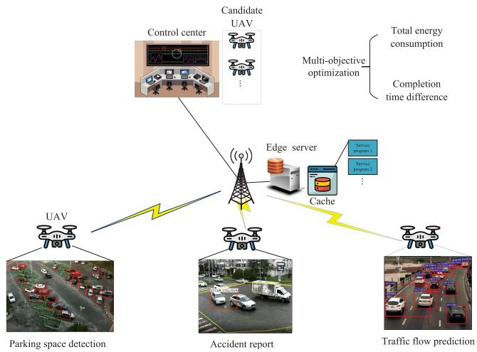
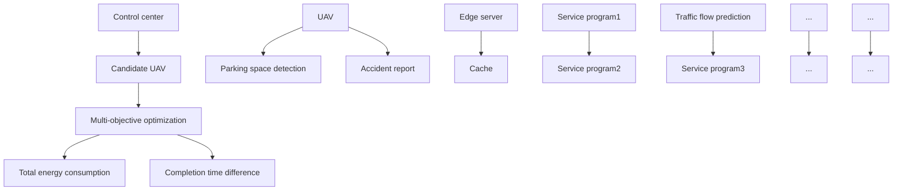
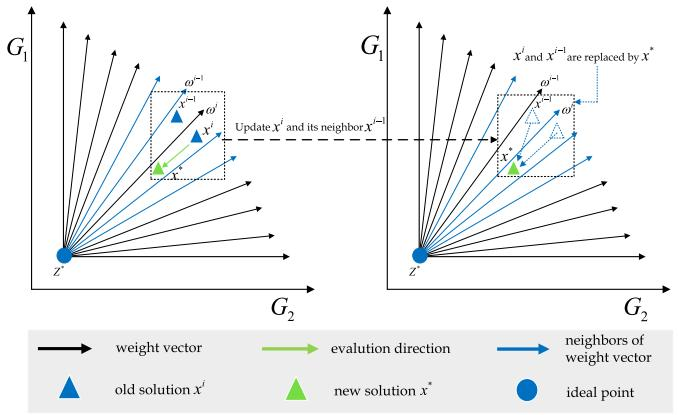
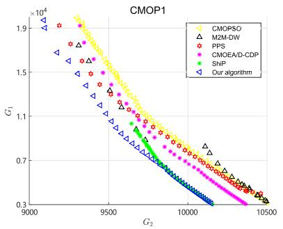
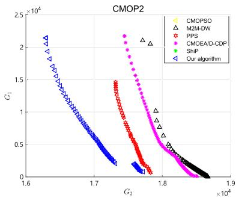
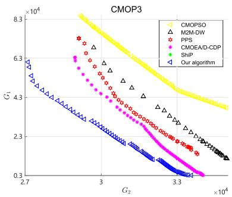
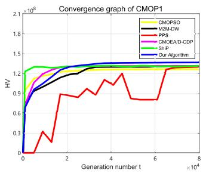
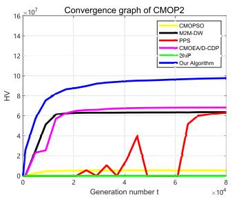
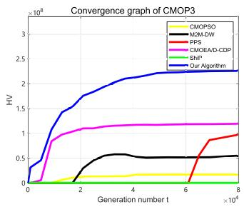
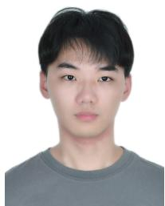

# Joint Energy and Completion Time Difference Minimization for UAV-Enabled Intelligent Transportation Systems: A Constrained Multi-Objective Optimization Approach

Chaoda Peng , Member, IEEE, Zexiong Wu, Xumin Huang , Yuan Wu , Senior Member, IEEE, Jiawen Kang, Senior Member, IEEE, Qiong Huang , and Shengli Xie , Fellow, IEEE

Abstract— An unmanned aerial vehicle (UAV)-enabled intelligent transportation system utilizes a set of UAVs to collect and process surveillance data for transportation management. Subsequently, the processing results of the UAVs are transmitted to a control center that makes a centralized transportation management decision based on the fusion of all processing results. When performing the monitoring tasks, the UAVs can access to an edge server for offloading. To reduce the energy consumption and improve the fusion performance, the control center schedules the UAVs to perform the tasks in an energy-efficient manner while synchronizing the completion time of the UAVs. As a result, the control center studies a constrained multi-objective optimization problem (CMOP), in which two objectives, i.e., the total energy consumption of the UAVs and total completion time difference among the UAVs, are simultaneously considered. To tackle the CMOP, we develop an improved constrained multi-objective evolutionary algorithm. Particularly, we design an improved genetic operator and repairing constraint-handling technique to improve the overall performance of the proposed algorithm in seeking Pareto optimal solutions for the CMOP. Numerical results demonstrate that compared with the baseline algorithms, the proposed algorithm has great advantages in finding better solutions with the enhanced diversity and convergence for the CMOP.

Manuscript received 17 July 2023; revised 17 February 2024 and 20 April 2024; accepted 22 April 2024. Date of publication 14 May 2024; date of current version 4 October 2024. This work was supported in part by the National Natural Science Foundation of China under Grant 62202177, Grant 62001125, and Grant 62102099; in part by the National Key Research and Development Program of China under Grant 2020YFB1807802; in part by Guangzhou Basic Research Program under Grant 2023A04J0340 and Grant 202201010576; in part by the Science and Technology Development Fund of Macau, SAR, under Grant 0158/2022/A; and in part by MYRG-GRG2023- 00083-IOTSC-UMDF. The Associate Editor for this article was L. Wang. (Corresponding authors: Xumin Huang; Yuan Wu.)

Chaoda Peng, Zexiong Wu, and Qiong Huang are with the College of Mathematics and Informatics, South China Agricultural University, Guangzhou 510642, China (e-mail: ChaodaPeng@scau.edu.cn; zexiongwu@stu.scau.edu.cn; qhuang@scau.edu.cn).

Xumin Huang is with the School of Automation, Guangdong University of Technology, Guangzhou 510006, China, and also with the State Key Laboratory of Internet of Things for Smart City, University of Macau, Taipa, Macau, China (e-mail: huangxu\_min@163.com).

Yuan Wu is with the State Key Laboratory of Internet of Things for Smart City and the Department of Computer and Information Science, University of Macau, Taipa, Macau, China (e-mail: yuanwu@um.edu.mo).

Jiawen Kang and Shengli Xie are with the School of Automation, Guangdong University of Technology, Guangzhou 510006, China (e-mail: kavinkang@gdut.edu.cn; shlxie@gdut.edu.cn).

Digital Object Identifier 10.1109/TITS.2024.3395993

Index Terms— UAV-enabled intelligent transportation system, energy optimization, time difference minimization, constrained multi-objective optimization, evolutionary algorithm.

# I. INTRODUCTION

NTELLIGENT Transportation System (ITS) relies on recent advances in the area of Internet of Things (IoT) to facilitate data collection, data analysis, and information fusion for improving the transportation management. Due to great advantages of easy deployment, flexible mobility, and lower cost, unmanned aerial vehicles (UAVs) have been widely applied in diverse IoT services and applications, e.g., performing data collection on land [1] or over the sea [2], providing aerial edge computing [3], [4], or acting as aerial base stations [5], [6] for ground IoT devices. UAVs can also be scheduled to support diverse traffic surveillance applications in ITS [7]. In UAV-enabled ITS, UAVs serve as aerial agents for accident reporting, flying police eyes to track target vehicles, and airborne cameras to monitor traffic flow and road conditions [8]. In a mission planning period, a control center employs a set of UAVs to reach specific monitoring locations and stay hovering to collect and process the surveillance data. Besides, mobile edge computing brings cloud computing capability closer to IoT devices and deploys an edge server at the network edge to support computation offloading with lower service latency, less bandwidth consumption, and improved data security [9]. When processing a monitoring task, a UAV can locally perform or access a nearby edge server to offload the task. Subsequently, data processing results are transmitted to the control center for the fusion. To ensure the overall performance of the mission planning, the control center should consider a joint optimization problem of UAV association, task offloading, and resource allocation for UAV-enabled ITS.

However, a number of challenges still need to be addressed. First, different UAVs have obvious differences in flight distance and parameters, hardware configuration, and energy consumption profiles while different task executions necessitate different monitoring locations, service programs, computing workloads, and time. The association between the UAVs and tasks is optimized to reduce the total energy consumption of the UAVs (i.e., the first objective denoted as $G _ { 1 } )$ . Second, the control center aims at facilitating the unified scheduling of UAVs and particularly considers the total completion time difference among all employed UAVs (i.e., the second objective denoted as $G _ { 2 } )$ . In the conventional multi-UAV-enabled mobile edge computing, the joint optimization problem of task offloading and resource allocation between multiple UAVs and the edge server has been investigated for the mission planning period, according to different optimization objectives. In the previous works, different UAVs are selected to perform the tasks within different deadlines, and data processing results of different tasks are independently utilized. But the control center in UAV-enabled ITS necessitates to fuse the data processing results of all UAVs to make a centralized transportation management decision. To alleviate the negative effect of temporal asynchronization on the fusion performance, the control center would like to simultaneously receive the data processing results from the UAVs. To this end, an effective method is required to reduce the total completion time difference among all employed UAVs. This harmonization also ensures that the employed UAVs concurrently enter the standby state for quickly joining the next mission together such that the control center can always handle sufficient UAVs on demand in each mission planing period. Thus, the control center have two objectives $G _ { 1 }$ and $G _ { 2 }$ that are jointly optimized. Last but not least, the control center necessitates a set of solutions rather than a single one to handle different tradeoffs between the two objectives. We are motivated to study a multi-objective optimization problem involving with the two objectives such that a variety of solutions can be provided to satisfy diverse preferences of the control center. To the best of our knowledge, such a multi-objective optimization problem has not been investigated yet in the community of UAV-enabled ITS.

To address the above challenges, we study the joint optimization of energy consumption and completion time difference for UAV-enabled ITS from a multi-objective optimization perspective. In a mission planning period, the control center has a set of standby UAVs for the executions of several monitoring tasks. UAVs are dispatched to depart from their start locations and reach to specific monitoring locations to perform the associated tasks. To facilitate the task processing, a part of the tasks are offloaded to the nearest edge server while the residual ones are locally performed. For the above system model, we investigate a constrained multi-objective optimization problem (CMOP) that involves the simultaneous optimization of the two objectives $G _ { 1 }$ and $G _ { 2 } .$ , which are presented to achieve the energy-efficient data collection and processing, and balance time consumption for the employed UAVs, respectively. In the CMOP, we also consider feasible constraints regarding UAV association, task offloading, and resource allocation.

Solving the CMOP requires an efficient algorithm to seek a set of Pareto optimal solutions by satisfying the constraints, where a Pareto optimal solution refers to a solution which no improvement can be made in one objective without worsening the other objectives [10]. In practice, we obtain the non-dominated solutions to approximate the Pareto optimal solutions. More details of the above two kinds of solutions are shown in Section IV. Evolutionary algorithms have been widely developed for solving different CMOPs over the past decades, owing to the inherent characteristics such as easy implementation without the need for gradient information and the capacity of finding global optima [10], [11]. In an evolutionary algorithm, genetic operators and constrainthandling techniques are two fundamental components that significantly affect the performance of the algorithm in terms of obtaining a set of Pareto optimal solutions [12], [13]. To address the studied CMOP, we develop a constrained multi-objective evolutionary algorithm based on an improved genetic operator and repairing constraint-handling technique under the framework of CMOEA/D-CDP [14]. The improved genetic operator based on the data types of the optimized decision variables is designed to enhance the search ability of the proposed algorithm. The repairing constraint-handling technique is designed to convert infeasible solutions into feasible ones, accelerating the convergence of the proposed algorithm towards feasibility. The main contributions of this paper are summarized as follows:

• We present a multi-source information fusion system model for UAV-enabled ITS where the control center dispatches a set of UAVs to perform the monitoring tasks. In a mission planning period, the UAVs collect the surveillance data and collaborate with the edge server to generate the data processing results. Then the results are gathered to the control center for the fusion.   
• We study a CMOP to achieve the simultaneous optimization on the task and UAV sides. To facilitate the unified scheduling of the UAVs, UAV association, task offloading, and resource allocation are jointly optimized to complete the monitoring tasks in an energy-efficient manner while achieving the time balancing among all employed UAVs.   
• We propose a constrained multi-objective evolutionary algorithm with an improved genetic operator and repairing constraint-handling technique to address the CMOP. The numerical results demonstrate that compared with the baseline algorithms, the proposed algorithm has great advantages in seeking a set of better non-dominated solutions with the enhanced diversity and convergence for the CMOP.

The remainder of this paper is organized as follows. Section II provides a comprehensive overview of recent works. Section III presents the system model and formulates a CMOP for UAV-enabled ITS. Section IV introduces the proposed algorithm based on CMOEA/D-CDP to solve the CMOP. The simulations and performance evaluations are shown in Section V. Section VI concludes this paper.

# II. RELATED WORK

# A. UAV-Enabled ITS

Research efforts have been devoted to a variety of optimization schemes for UAV-enabled ITS. For example, a UAV can be applied as an aerial base station to assist the terrestrial communication and perform computational tasks for vehicles. UAVs were scheduled to serve mobile vehicles along an optimal path and enhance the downlink throughput of the Internet of Vehicles (IoV). A UAV was assumed to serve a single vehicle in a time slot, where the association between the vehicles and UAVs with the power allocations was optimized to improve the UAV-to-vehicle communication performance [15]. A stable relay selection problem was generated when a UAV becomes a relay for IoV routing protocols. Considering dynamic mobility and reputation values of all UAVs, the problem was tackled by using a matching game theoretic approach [16]. UAV-assisted communication was exploited to provide continuous line-of-sight (LoS) links to vehicles when they prepared to offload the tasks to other vehicles or nearby edge servers [17]. UAVs could be employed as flying base stations with caching capability to improve the efficiency of data dissemination and facilitate the file sharing process among the vehicles [18].

Besides, the UAV deployment enables ground vehicles to gain aerial computing services. Computation-intensive tasks in ITS environment were first collected by task gathering nodes, and a UAV flied above the nodes to process the tasks together [19]. Furthermore, a UAV was assigned with a dual role, i.e., task performer and mobile relay, where the UAV was scheduled to process offloading tasks of some vehicles, in the meantime, played as a mobile relay that helps forward offloading tasks of some vehicles to the nearest edge server [20]. When providing aerial computing for platooning vehicles, the UAV can receive energy replenishment from the vehicles when necessary [21]. In UAV-assisted aerial computing networks, UAVs may harvest available computing resources from the surrounding entities to enhance the computing capabilities. In this regard, UAVs served as mobile data collectors in smart cities can offload the data to proper vehicles for remote processing. The optimal matching between UAVs and vehicles was investigated by modeling the transaction process of offloading data as a bargaining game [22]. The similar problem was studied in a post-disaster rescue scenario [23]. In UAVenabled traffic monitoring, network nodes with idle resources were employed to complete a part of computational tasks from the UAVs [24].

# B. Multi-Objective Optimization for UAV Scheduling

Nowadays, UAV scheduling has been investigated from a multi-objective optimization perspective in diverse applications. Multiple UAVs were scheduled for data collection, and a multi-objective optimization problem of UAV deployment was studied to optimize the network-wide uplink throughput while reducing the total energy consumption of all UAVs [25]. In [26], the UAVs were scheduled for collaborative beamforming, and the tradeoff between the data transmission performance and energy consumption was also tackled by using a multi-objective optimization approach. In [27], a single UAV was dispatched to charge a set of sensor nodes that further utilized the harvested energy to submit sensory data to the UAV. The achievable sum rate of all nodes in the uplink and the total transmit power of the UAV in the downlink were simultaneously optimized. Compared with the above works, the following works consider the mobility of a UAV. In [28], the UAV was scheduled to successively visit target devices with the fly-hover-fly trajectory. When staying hovering, the UAV performed the data collection and wireless charging tasks. The control policies of the UAV over multiple objectives was addressed by using a deep reinforcement learning algorithm. The authors considered three objectives for the UAV but transformed the original multi-objective optimization problem into a single-objective optimization problem by a weighting-sum method. With the increasing problem size, it is difficult to determine the weighting parameters among the objectives. In [29], the UAV was deployed to sequentially visit the specific waypoints, and perform offloading tasks for local users. Subsequently, the joint optimization of energy-efficient offloading and safe path planning for the UAV was studied by a multi-objective evolutionary algorithm.

# C. Performance Comparison

Compared with the previous works, we aim at scheduling the UAVs to collaboratively perform the tasks in an energy-efficient manner while minimizing the total completion time difference among the UAVs using a multi-objective optimization approach. Most of the previous works study a UAV-enabled task offloading system where the UAVs perform the tasks that are completely unassociated with each other, and output results of the tasks are independently utilized. Different from the works, our work considers a UAV-enabled multi-source information fusion system where all data processing results of the UAVs need to be integrated together and be temporally aligned before the fusion. The control center expects the UAVs to complete the task processing in a synchronized manner such that the temporal aligning operation on the data processing results is facilitated to ensure the fusion performance. As a result, our work formulates a CMOP to simultaneously minimize the total energy consumption of the UAVs and total completion time difference among the employed UAVs. After that, we develop a constrained multi-objective evolutionary algorithm under the framework of CMOEA/D-CDP to tackle the CMOP. An improved genetic operator and repairing constraint-handling technique are designed to improve the performance of the proposed algorithm in terms of the convergence and diversity of the non-dominated solutions.

# III. SYSTEM MODEL AND PROBLEM FORMULATION

# A. System Model

As shown in Fig. 1, a control center refers to different information at the different traffic junctions to make a centralized transportation management decision. According to the detection demand, the control center dispatches sufficient UAVs to hover above a number of interesting ground locations and collect the surveillance data, e.g., image and video. For example, camera-equipped UAVs are scheduled to detect free parking spaces in a parking area, issue an accident report of an intersection, and predict the dynamic traffic flow in a highway. The UAVs further collaborate with an edge server to process the data to acquire available information that is gathered to the control center for the multi-source data fusion. We provide more details of the network entities as follows:

• Edge server: The edge server provides service caching for UAV-enabled ITS. Each monitoring task is associated with a surveillance service, in which the task is run by a service program, including executable.EXE files, library, and database. A UAV can be assigned with an arbitrary task in different mission planning periods. The UAV with limited storage space is difficult to store all service programs in advance. As an option, the control center caches popular service programs on an edge server co-located with a base station and stores the residual ones on a remote cloud server. Subsequently, the UAVs retrieve the service programs from the edge/cloud servers when necessary.

flowchart

Fig. 1. UAV-enabled ITS.

• UAV: A UAV is responsible for the data collection and processing. When the UAV is assigned with a monitoring task, the UAV flies to the monitoring location at a constant velocity, and stays hovering to gather sufficient surveillance data. After that, the UAV can locally process the collected data by requesting the service program from the edge server, or directly transmit the data to the edge server for remote processing. If the data processing task necessitates heavy workloads, it is more suitable to let the UAV offload the task to the edge server so as to avoid the large task execution delay.   
• Control center: The control center is a centralized manager that is responsible for the unified scheduling of the UAVs. The control center holds prior knowledge of any UAV, e.g., energy consumption profile, to achieve the energy-efficient task processing by properly assigning the tasks to the UAVs and allocating the available bandwidth/computing resources among them. In addition, the control center collects all data processing results of the UAVs for the fusion and performs the temporal aligning operation to alleviate the negative effect of temporal asynchronization on the fusion performance. This motivates the control center to take into account the total completion time difference among all employed UAVs instead of the specific task completion time of any UAV. As mentioned above, the control center has two objectives, i.e., $G _ { 1 }$ and $G _ { 1 }$ . The control center adopts a multi-objective optimization method to realize the two objectives according to different preferences between them.

# B. Mathematical Model

We provide basic mathematical formulations on a UAV and the edge sever as follows.

The control center has I standby UAVs, where a UAV is indexed by $i , \ 1 \ \leq \ i \ \leq \ I$ . There are J monitoring tasks corresponding to J monitoring locations. A monitoring task/location is indexed by $j , 1 \le j \le J$ and $I \geq J$ in general. For the UAV scheduling, we introduce two binary decisions xi and $y _ { i , j } .$ xi refers to offloading decision of UAV i such that $x _ { i } = 1$ means UAV i accesses the edge server for computation offloading, while $x _ { i } = 0$ means UAV i locally processes the given task. $y _ { i , j }$ refers to the association between UAV i and task $j . \ y _ { i , j } \ = \ 1$ means that UAV i is scheduled to reach monitoring location j , while $y _ { i , j } = 0$ means the UAV is not scheduled to perform task j. To reach a desired location, UAV i flies at a constant velocity $v _ { i }$ . According to the evaluation method in [30], flying power of the UAV denoted as $P _ { i } ^ { F }$ is expressed by

$$
P _ {i} ^ {F} = c _ {1} v _ {i} ^ {3} + \frac {c _ {2}}{v _ {i}}, \tag {1}
$$

where $c _ { 1 }$ and $c _ { 2 }$ are two coefficients. Considering the straightline flight, flying time of the UAV for reaching monitoring location j is calculated by $t _ { i , j } ^ { F } = d _ { i , j } / v _ { i }$ F , where $d _ { i , j }$ is the distance between start location of UAV i and monitoring location j. We also consider a constant hovering power of UAV i denoted as $P _ { i } ^ { H }$ when the UAV stays hovering.

When $y _ { i , j } = 1$ , we introduce the communication and energy models of UAV i. In the data collection process, sampling frequency is $s _ { i }$ data samples per second, and sensing power is $\bar { P } _ { i } ^ { S }$ . The UAV needs to collect $\alpha _ { j }$ data samples such that the sensing time of the UAV is $t _ { i , j } ^ { S } = \alpha _ { j } / s _ { i }$ . When UAV i keeps the stable hovering state at the monitoring location $j ,$ the communication channel between the UAV and the nearest base station is dominated by a line-of-sight link. Similar to the work [31], we neglect the impact of channel impairments such as shadowing or small-scale fading, and let the channel power gain between the UAV and the nearest base station follow a free-space path loss model as $g _ { 0 } d _ { j } ^ { - 2 }$ , where $g _ { 0 }$ denotes the channel power at the reference distance of 1 meter and $d _ { j }$ is the distance between monitoring location j and the base station. Furthermore, we adopt frequency division multiple access to avoid the co-channel interference among multiple UAVs when they simultaneously communicate with the base station. Using the Shannon principle, we measure the achievable uplink and downlink rates of UAV i at the monitoring location j by

$$
\left\{ \begin{array}{l} r _ {i, j} ^ {U L} = b _ {i} \log_ {2} (1 + \frac {p _ {i} ^ {T X} g _ {0} d _ {j} ^ {- 2}}{N _ {0}}) = b _ {i} k _ {i, j} ^ {U L}, \\ r _ {i, j} ^ {D L} = b _ {i} \log_ {2} (1 + \frac {p _ {B S} ^ {T X} g _ {0} d _ {j} ^ {- 2}}{N _ {0}}) = b _ {i} k _ {i, j} ^ {D L}, \end{array} \right. \tag {2}
$$

where $b _ { i }$ is the available bandwidth; $p _ { i } ^ { T X }$ and $p _ { B S } ^ { T X }$ are the transmit power of the UAV and base station, respectively; $N _ { 0 }$ is the noise power spectrum density. After collecting sufficient data as the input data, the UAV generates a data processing task with computational workloads $W _ { j }$ . It is noted that compared with the input data size, the output data size is much smaller. Both the time and energy consumption of delivering the output data are neglected.

If $x _ { i } \ = \ 0 .$ , we denote this case as $^ { 6 6 } \mathrm { L } ^ { 9 }$ . Since the UAV chooses to locally process the task, it retrieves the service program from the edge server or the cloud server. When the UAV downloads the service program, the data transmission time and energy consumption are

$$
\left\{ \begin{array}{l} t _ {i, j} ^ {C O M, L} = \frac {\beta_ {j}}{r _ {i , j} ^ {D L}} + (1 - \gamma_ {j}) \frac {\beta_ {j}}{r _ {E S}}, \\ e _ {i, j} ^ {C O M, L} = p _ {i} ^ {R X} \frac {D _ {j}}{r _ {i , j} ^ {D L}}, \end{array} \right. \tag {3}
$$

where $\beta _ { j }$ is the data size of the service program; $\gamma _ { j }$ is a binary indicator where $\gamma _ { j } ~ = ~ 1$ means the service program is cached on the edge server, and $\gamma _ { j } ~ = ~ 0$ means that the service program is stored on the cloud server; rE S refers to the data rate between the edge server and cloud server; $p _ { i } ^ { R X }$ is the receive power of the UAV. It is noted that we neglect the wired data transmission time between the edge server and base station. In the case $^ { \ 6 } \mathrm { L } ^ { \ 3 }$ , the workload processing time of UAV i and energy consumption are

$$
\left\{ \begin{array}{l} t _ {i, j} ^ {C M P, L} = \frac {W _ {j}}{f _ {i} ^ {L}}, \\ e _ {i, j} ^ {C M P, L} = \kappa_ {i} (f _ {i} ^ {L}) ^ {2} W _ {j}, \end{array} \right. \tag {4}
$$

where $f _ { i } ^ { L }$ is computing capability of UAV i and $\kappa _ { i }$ is a hardware parameter on the effective switched capacitance depending on the chip architecture. We calculate the total time consumption and total energy consumption of UAV i for completing task $j ,$ which are expressed by $T _ { i , j } ^ { L }$ and $E _ { i , j } ^ { L } ,$ respectively. They are given as follows:

$$
\left\{ \begin{array}{l} T _ {i, j} ^ {L} = t _ {i, j} ^ {F} + T _ {i, j} ^ {H, L}, \\ T _ {i, j} ^ {H, L} = t _ {i, j} ^ {S} + t _ {i, j} ^ {C O M, L} + t _ {i, j} ^ {C M P, L}, \\ E _ {i, j} ^ {L} = P _ {i} ^ {F} t _ {i, j} ^ {F} + P _ {i} ^ {S} t _ {i, j} ^ {S} + e _ {i, j} ^ {C O M, L} + e _ {i, j} ^ {C M P, L} + P _ {i} ^ {H} T _ {i, j} ^ {H, L}, \end{array} \right. \tag {5}
$$

where $T _ { i , j } ^ { H , L }$ refers to the hovering time of the UAV with respect to $\dot { x } _ { i } = 0$ .

If $x _ { i } ~ = ~ 1$ , we denote this case as $\mathbf { \ddot { \psi } } _ { \mathbf { \vec { \nabla } } } ( 0 ^ { \circ } )$ where the UAV chooses to offload the task. When the UAV transmits the input data, the data transmission time of the UAV and workload processing time on the edge server are

$$
\left\{ \begin{array}{l} t _ {i, j} ^ {C O M, O} = \frac {\alpha_ {j}}{r _ {i , j} ^ {U L}}, \\ t _ {i, j} ^ {C M P, O} = (1 - \gamma_ {j}) \frac {\beta_ {j}}{r ^ {E S}} + \frac {W _ {j}}{f _ {i} ^ {O}}, \end{array} \right. \tag {6}
$$

where $f _ { i } ^ { O }$ is the computing capability of the edge server allocated to this offloading task. The energy consumption of the UAV and that of the edge server are

$$
\left\{ \begin{array}{l} e _ {i, j} ^ {C O M, O} = p _ {i} ^ {T X} \frac {\alpha_ {j}}{r _ {i , j} ^ {U L}}, \\ e _ {i, j} ^ {C M P, O} = \kappa_ {E S} (f _ {i} ^ {O}) ^ {2} W _ {j}. \end{array} \right. \tag {7}
$$

In the case $\mathbf { \ddot { \tau } } ^ { 6 6 } \mathbf { O } ^ { 7 } ;$ , the total time consumption and energy consumption of UAV i for completing the task j are expressed by $T _ { i , j } ^ { O }$ and $E _ { i , j } ^ { O }$ , respectively. They are given as follows:

$$
\left\{ \begin{array}{l} T _ {i, j} ^ {O} = t _ {i, j} ^ {F} + T _ {i, j} ^ {H, O}, \\ T _ {i, j} ^ {H, O} = t _ {i, j} ^ {S} + t _ {i, j} ^ {C O M, O} + t _ {i, j} ^ {C M P, O}, \\ E _ {i, j} ^ {O} = P _ {i} ^ {F} t _ {i, j} ^ {F} + P _ {i} ^ {S} t _ {i, j} ^ {S} + e _ {i, j} ^ {C O M, O} + e _ {i, j} ^ {C M P, O} + P _ {i} ^ {H} T _ {i, j} ^ {H, O}, \end{array} \right. \tag {8}
$$

where $\kappa _ { E S }$ is the hardware parameter of the edge server and $T _ { i , j } ^ { H , O }$ refers to the hovering time of the UAV when $x _ { i } = 1$ . For the edge server, we pay attention to the energy consumption of performing the offloading workloads.

# C. Problem Formulation

In this study, we investigate how to schedule the UAVs to reach all monitoring locations, and further preform the offloading optimizations to simultaneously minimize the total energy consumption of the UAVs and the total completion time difference among the employed UAVs while satisfying the feasible constraints. As mentioned above, the two objectives are denoted as $G _ { 1 }$ and $G _ { 2 }$ , respectively. To achieve the satisfactory tradeoffs between $G _ { 1 }$ and $G _ { 2 }$ , we study the joint optimization problem of UAV association, task offloading, and resource allocation problem from a multi-objective optimization perspective.

We define a decision variable vector as $\begin{array} { r l } { \mathbf { X } } & { { } = } \end{array}$ $\{ x _ { i } , y _ { i , j } , b _ { i } , f _ { i } ^ { O } \} _ { \forall i , j }$ . Given x, we calculate $G _ { 1 }$ by

$$
G _ {1} (\mathbf {x}) = \sum_ {1 \leq j \leq J} \sum_ {1 \leq i \leq I} y _ {i, j} [ (1 - x _ {i}) E _ {i, j} ^ {L} + x _ {i} E _ {i, j} ^ {O} ]. \tag {9}
$$

Let a subset ${ \mathcal { S } } \subseteq \{ 1 , 2 , \cdots , I \}$ represent the set of J selected UAVs, $\begin{array} { r } { S = \{ i | \sum _ { \forall j } y _ { i , j } = 1 , 1 \le i \le I \} } \end{array}$ . For a $\mathrm { U A V } \ i \in \mathcal S$ we calculate the completion time by

$$
\tau_ {i} = \sum_ {1 \leq j \leq J} y _ {i, j} [ (1 - x _ {i}) T _ {i, j} ^ {L} + x _ {i} T _ {i, j} ^ {O} ], i \in \mathcal {S}. \tag {10}
$$

During each mission planning period, the control center gathers data processing results from all employed UAVs for the fusion. The fusion performance at the control center is influenced by the differences in completion time of different tasks assigned to different UAVs. Besides, when the total completion time difference among the employed UAVs is reduced, the control center can promptly adopt the unified scheduling of the UAVs for the next mission planning period. Hence, the control center aims to balance the total completion time difference among the employed UAVs, which is expressed by $G _ { 2 }$ as follows:

$$
G _ {2} (\mathbf {x}) = \sum_ {i \in \mathcal {S}} \frac {\left| \tau_ {i} - \hat {\tau} \right|}{\vartheta}, \tag {11}
$$

where $\hat { \tau }$ is the average value of $\{ \tau _ { i } \} _ { \forall i \in { \cal S } }$ and ϑ is a presetting reference value.

As a result, we formulate a CMOP for the control center as follows:

$$
\min \left\{ \begin{array}{l} G _ {1} (\mathbf {x}), \\ G _ {2} (\mathbf {x}), \end{array} \right.
$$

$\mathrm { s . t . } C _ { 1 } : \sum _ { 1 \leq i \leq I } y _ { i , j } \leq 1 , \forall i ,$ 1≤i ≤I

$$
C _ {2}: \sum_ {1 \leq j \leq J} y _ {i, j} = 1, \quad \forall j,
$$

$$
C _ {3}: \sum_ {1 \leq j \leq J} \sum_ {1 \leq i \leq I} y _ {i, j} b _ {i} \leq B,
$$

$$
C _ {4}: \sum_ {1 \leq j \leq J} ^ {J} \sum_ {1 \leq i \leq I} y _ {i, j} x _ {i} f _ {i} ^ {E S} \leq F,
$$

$$
C _ {5}: \sum_ {1 \leq j \leq J} \sum_ {1 \leq i \leq I} [ y _ {i, j} (\beta_ {j} + x _ {i} \alpha_ {i}) ] \leq S,
$$

$$
C _ {6}: x _ {i} \in [ 0, 1 ], y _ {i, j} \in [ 0, 1 ], b _ {i} \geq 0, f _ {i} ^ {o} \geq 0, \quad \forall i. \tag {12}
$$

Feasible solutions are derived when several constraints are satisfied. The constraint $( C _ { 1 } )$ ensures that a single UAV is allocated with one task at most. The constraint $( C _ { 2 } )$ ensures that each task is completed. The constraint $( C _ { 3 } )$ ensures that the total bandwidth of all selected UAVs is smaller than a upper bound B, where B is the entire available bandwidth of the base station. The constraint $( C _ { 4 } )$ ensures that the total number of computing resources allocated to those UAVs with offloading requests is smaller than a upper bound F, where F is the maximal computing capability of the edge server. The constraint $( C _ { 5 } )$ ensures that in the worst case, the total data storage of all the selected UAVs involving with the offloading input data and requested service programs is smaller than a upper bound S, where S is the storage capacity of the edge server. The constraint $( C _ { 6 } )$ ensures the feasible domain of the decision variables $x _ { i } , y _ { i , j } , b _ { i }$ , and $f _ { i } ^ { O }$ , respectively.

It is noted that the above problem is a typical multiobjective optimization problem. Some previous works about the UAV networks, $\mathrm { e . g . }$ , [28], also study the multi-objective optimization problems and propose to transform them into single-objective ones by using the weighting method. However, weighting the objectives is not beneficial to achieve the simultaneous optimization of multiple conflicted objectives, since the weighting method is not suitable to seek a set of distinct Pareto optimal solutions for the multi-objective optimization problems with non-convex Pareto fronts. The weighting method is not applied in this paper. Moreover, the control center as the decision maker necessitates a set of solutions rather than only one solution to handle different tradeoffs among the objectives according to different preferences. Thus, we are motivated to apply a multi-objective optimization approach for the control center.

# IV. PROPOSED ALGORITHM

# A. Preliminary Study

To tackle the proposed CMOP, we propose a multi-objective evolutionary algorithm with an improved genetic operator to seek promising solutions by adaptively disturbing the decision variables according to their data types and a repairing constraint-handling technique to convert infeasible solutions into feasible ones. The proposed algorithm follows the framework of the decomposition-based constrained multi-objective evolutionary algorithm (CMOEA/D-CDP) [14]. Prior to introducing the proposed algorithm, we present a preliminary study to show some basic concepts of constrained multi-objective optimization and give a brief introduction of CMOEA/D-CDP.

A typical CMOP is expressed as follows:

$$
\min \mathcal {G} (\mathbf {x}) = (G _ {1} (\mathbf {x}), G _ {2} (\mathbf {x}), \dots , G _ {m} (\mathbf {x})) ^ {T},
$$

$$
\text { s.t. } \quad g _ {i} (\mathbf {x}) \leq 0, \quad i = 1, 2, \dots , q,
$$

$$
h _ {i} (\mathbf {x}) = 0, \quad i = q + 1, \dots , p,
$$

$$
\mathbf {x} \in \mathbb {D}, \tag {13}
$$

where x is a vector in the decision variable space D, G(x) is an objective vector that consists of m objective functions, $g _ { i } ( \mathbf { x } ) \leq 0$ and $h _ { i } ( \mathbf { x } ) = 0$ are inequality constraints and equality constraints, respectively. p is the total number of the inequality constraints and equality constraints. The degree of constraint violation $C V ( \mathbf { x } )$ of an individual x is given by Eq. (14).

$$
C V (\mathbf {x}) = \sum_ {i = 1} ^ {p} c v _ {i} (\mathbf {x}), \tag {14}
$$

$$
c v _ {i} (\mathbf {x}) = \left\{ \begin{array}{l l} \max \left\{0, g _ {i} (\mathbf {x}) \right\}, & i = 1, 2, \dots , q, \\ \max \left\{0, | h _ {i} (\mathbf {x}) | - \delta \right\}, & i = q + 1, \dots , p, \end{array} \right. \tag {15}
$$

where δ is a small value which means the tolerance value for equality constraints. It is notable that $C V ( \mathbf { x } ) \geq 0 .$ . If $C V ( \mathbf { x } ) =$ 0, x is a feasible solution. Otherwise, x is an infeasible solution.

The superiority of one solution over another one is defined by the Pareto dominance, as given in Eq. (16). A solution is called a Pareto optimal solution when no other solution can dominate it (see Definition 2). It is worth noting that the optimal solutions found by multi-objective optimization algorithms, e.g., evolutionary algorithms, are the approximae Pareto optimal solutions [14]. In the context of multi-objective optimization, the approximate Pareto optimal solutions obtained by an algorithm are also called non-dominated solutions. The set of Pareto optimal solutions in objective space and decision space is called Pareto front (see Definition 3) and Pareto optimal solution set (see Definition 4), respectively.

Definition 1 (Pareto dominance): For two solutions $\mathbf { X } , \mathbf { y } \in$ D, if x and y satisfy the following relation:

$$
\left\{ \begin{array}{l l} G _ {i} (\mathbf {x}) \leq G _ {i} (\mathbf {y}), & \forall i \in \{1, 2, \dots , m \}, \\ G _ {i} (\mathbf {x}) <   G _ {i} (\mathbf {y}), & \exists i \in \{1, 2, \dots , m \}, \end{array} \right. \tag {16}
$$

x is said to dominate y, denotes as $\mathbf { X } < _ { d } \mathbf { y } .$

Definition 2 (Pareto optimal solution): For a solution $\mathbf { x } ^ { * } ,$ if there is no any solution $\mathbf { y } \in \mathbb { D }$ that $\mathbf { y } < _ { d } \mathbf { x } ^ { * } , \mathbf { x } ^ { * }$ is called as a Pareto optimal solution.

Definition 3 (Pareto optimal solution set): The set of all $\mathbf { x } ^ { * }$ in D is called Pareto optimal solution set.

Definition 4 (Pareto front): The set of all $\mathcal { G } ( \mathbf { x } ^ { * } )$ is called Pareto front.

The decomposition-based multi-objective evolutionary algorithm (MOEA/D) is a well-known method for addressing multi-objective optimization problems, due to its capacity to preserve population diversity and its lower computational complexity. Furthermore, it has been enhanced with CDP to tackle different CMOPs, yielding a new algorithm called CMOEA/D-CDP. CDP is used for the comparison between two solutions according to the feasibility and fitness. For any two solutions x, y ∈D, x is better than y if one of the conditions holds:

text_image

G₁
ω⁻¹
x⁻¹
ωⁱ
Update xⁱ and its neighbor x⁻¹
G₂
G₁
xⁱ and x⁻¹ are replaced by x*
z⁻
z⁻
weighted vector
evaluation direction
neighbors of
weight vector
old solution xⁱ
new solution x*
ideal point

Fig. 2. Illustration of CMOEA/D-CDP.

• If x is feasible, and y is infeasible.   
• If x and y are feasible, and x has smaller fitness.   
• If x and y are infeasible, and x has smaller constraint violation.

The primary concept behind CMOEA/D-CDP, as demonstrated in Fig. 2, is to decompose a CMOP into a series of scalar sub-problems, and solve them collaboratively. This is achieved by a set of N well-distributed weight vectors (V) denoted as $\omega ^ { 1 } , \omega ^ { 2 } , \cdots , \omega ^ { N }$ , where N is the population size. In this context, each weight vector corresponds to a sub-problem. CMOEA/D-CDP utilizes a neighborhood information mechanism to enhance population evolution. It establishes neighborhood relationships among the subproblems by identifying the T nearest weight vectors to each sub-problem using Euclidean distance. In the updating scheme, each new individual updates its neighbors using a decomposition-based method, e.g., Achievement Scalarizing Function (ASF), as given in Eq. (17). To preserve population diversity during evolution process, CMOEA/D-CDP maintains a manner by selecting the mating parents either from the corresponding neighbors of an individual or the entire population based on the probability δ. Additionally, the algorithm updates the neighbors of each individual at most nr times.

$$
A S F \left(\mathbf {x} ^ {n} | \omega^ {n}\right) = \max \left(\frac {G _ {i} \left(\mathbf {x} ^ {n}\right) - z _ {i} ^ {*}}{\omega^ {n}}, 1 \leq i \leq m\right), \tag {17}
$$

where $\mathbf { z } ^ { * } = \left( z _ { 1 } ^ { * } , \cdots , z _ { m } ^ { * } \right)$ is the ideal point used to shift the population to the first quadrant, $z _ { i } ^ { * }$ is the minimum value found so far for objective $G _ { i }$ . The main parameter settings of CMOEA/D-CDP, as suggested in [14], are given in Table I.

# B. Representation of Encoding Scheme

The solution to Problem (12) is encoded as a mixed integer-float individual, as shown in Fig. 3. An individual is divided into three parts based on their data types,

TABLE I MAIN PARAMETER SETTINGS IN CMOEA/D-CDP 

<table><tr><td>Parameter</td><td colspan="7">Description</td><td colspan="4">Suggested value</td></tr><tr><td> $\mathbb{V}$ </td><td colspan="7">Set of all the weight vectors</td><td colspan="4">Uniformly sampled from a hyperplane</td></tr><tr><td> $\mathbb{B}_i$ </td><td colspan="7">Set of the neighbors of  $\omega^i$ </td><td colspan="4">Tclosest weight vectors to  $\omega^i$ </td></tr><tr><td>T</td><td colspan="7">Neighborhood size</td><td colspan="4">0.1N</td></tr><tr><td>δ</td><td colspan="7">Probability of selecting manner for the mating parents</td><td colspan="4">0.9</td></tr><tr><td> $n_r$ </td><td colspan="7">Times of updating neighbors</td><td colspan="4">0.01N</td></tr></table>

Fig. 3. Illustration of genetic encoding scheme.

i.e., integer or float. The first part (denoted as uni t1) is $\{ \rho _ { 1 } , \rho _ { 2 } , \cdots , \rho _ { J } \}$ , where $\rho _ { j }$ is an integer variable representing the index of a UAV that handles the j-th task. The second part (denoted as uni t2) is $\{ x _ { 1 } , x _ { 2 } , \cdots , x _ { J } \}$ , where $x _ { j }$ is a binary variable indicating whether the UAV offloads the task to the edge server or not. The third part (denoted as uni t3) is $\{ b _ { 1 } , b _ { 2 } , \cdot \cdot \cdot , b _ { J } , f _ { 1 } , f _ { 2 } , \cdot \cdot \cdot , f _ { J } \}$ , where $b _ { j }$ and $f _ { j }$ are float variable representing the assigned bandwidth and computing speed to the ρ j -th UAV, respectively. To this end, the decision variable to Problem (12) is represented as $\begin{array} { l l l } { { \bf x } } & { { = } } & { { ( \rho _ { 1 } , \ldots , \rho _ { J } , x _ { 1 } , \cdots , x _ { J } , b _ { 1 } , \cdots , b _ { J } , f _ { 1 } , \cdots , f _ { J } ) } } \end{array}$ . Throughout this study, $\chi _ { i }$ implies the i -th element of x.

Under this genetic encoding scheme, each region is guaranteed to assign at least one UAV. The constraints $C _ { 1 }$ and $C _ { 2 }$ are equally transformed to the following constraint:

$$
C _ {7}: \sum_ {j = 1} ^ {J} I F _ {i, j} = 1, \tag {18}
$$

$$
I F _ {i, j} = \left\{ \begin{array}{l l} 1, & \text { if } \rho_ {i} = \rho_ {j}, \\ 0, & \text { otherwise }, \end{array} \right. \tag {19}
$$

where $I F _ { i , j }$ is equal to 1 when $\rho _ { i } = \rho _ { j }$ holds, and 0 otherwise. It is clear that the aforementioned constraint is met when each UAV is assigned to only one region, provided that it is selected to assist in executing the task associated with that region. In the context of evolutionary algorithm, the constraint $C _ { 6 }$ is taken as the decision variable boundary constraint, meaning that each solution is ensured to be within the range of the decision variable boundary.

# C. Proposed Algorithm

To improve the solution performance, we revise the conventional CMOEA/D-CDP by exploiting an improved genetic operator and repairing constraint-handling technique. The improved genetic operator is beneficial to seek promising solutions by adaptively disturbing the decision variables $\{ \rho _ { i } , x _ { i } , b _ { i } , f _ { i } \} _ { \forall i }$ according to their data types. The repairing constraint-handling technique is beneficial to improve the convergence performance of the proposed algorithm towards feasibility. Our algorithm is executed generation by generation, as presented in Algorithm 1.

Algorithm 1 The Proposed Algorithm Framework   
Input: The population size: N,
the neighborhood size: T,
the probability of selecting manner for the mating parents: δ,
the times of updating neighbors: $n_{r}$ Output: The final population $P_{t}$ 1 Initialize a set of N evenly distributed weight vectors $V \leftarrow \{\omega^{1}, \omega^{2}, \cdots, \omega^{N}\}$ ;

2 Initialize $B_{i}$ by finding the T closest vectors to the weight vector $\omega^{i}, i = 1, 2, \cdots, N$ ;

3 Initialize a population $P_{1}$ with size N;

4 Initialize the ideal point $z^{*}$ based on $P_{1}$ ;

5 $t \leftarrow 1$ ;

6 while $t \leq T_{max}$ do

7    for $i \leftarrow 1$ to N do

8    if rand < δ then

9 $\omega^{r1}, \omega^{r2}, \omega^{r3} \leftarrow$ three randomly selected weight vectors in $B_{i}$ ;

10 $x^{r1}, x^{r2}, x^{r3} \leftarrow$ three mating individuals from $P_{t}$ , corresponding to $\omega^{r1}, \omega^{r2}, \omega^{r3}$ ;

11    else

12 $x^{r1}, x^{r2}, x^{r3} \leftarrow$ three randomly selected mating individuals from $P_{t}$ ;

13    end

14 $x^{*} \leftarrow Algorithm 2(x^{i}, x^{r1}, x^{r2}, x^{r3})$ ;

15    Update $z^{*}$ with $x^{*}$ ;

16    v ← 0;

17    while v < $n_{r}$ do

18 $\omega' \leftarrow$ a randomly selected weight vector in $B_{i}$ ;

19    Update the solution in $P_{t}$ corresponding to $\omega'$ with $x^{*}$ in terms of CDP;

20    v ← v + 1;

21    end

22    ( $x^{*}, P_{t}$ ) ← Algorithm 3 ( $x^{*}, B_{i}, P_{t}$ );

23 $P_{t+1} \leftarrow P_{t}$ ;

24    t ← t + 1;

25    end

26 end

27 return $P_{t}$

At the beginning of the proposed algorithm (see Lines $1 - 5 )$ , it initializes a set of N weight vectors V, where weight vectors are evenly distributed on the hyperplane, as in [14]. An initial population $\mathbb { P } _ { 1 } = \left\{ \rho _ { i } ^ { j } , x _ { i } ^ { j } , b _ { i } ^ { j } , \dot { f } _ { i } ^ { j } \right\} _ { \forall i , j }$ is also produced, where ∀i, j $\rho _ { i } ^ { j }$ is the index of the UAV, $x _ { i } ^ { j }$ is the offloading decision, $b _ { i } ^ { j }$ is the assigned bandwidth, and $f _ { i } ^ { j }$ is the assigned computing speed, all of which pertain to the i -th task of the j -th individual. The parameters related to CMOEA/D-CDP are set at the same time. In this study, the maximum generation number is taken as the stopping criterion.

Subsequently, the proposed algorithm enters the loop. It maintains a population $\mathbb { P } _ { t }$ with size N at each generation. Therein, each individual $\mathbf { x } ^ { i }$ participates in genetic operations with its mating parents that are chosen either from the neighbors of $\mathbf { x } ^ { i }$ or from the whole population according to CMOEA/D-CDP. As a result, a new individual $\mathbf { x } ^ { * }$ is produced (see Lines 8-13). The detail of the genetic operations is presented in Algorithm 2. At the same time, $\mathbf { x } ^ { * }$ is used to update its neighbors at most $n _ { r }$ in terms of CDP (see Lines 16-21). When comparing two individuals via CDP, as described in Section $\mathrm { { I V } } { \cdot } \mathrm { { A } } .$ the fitness refers to the ASF value, as defined in Eq. (17). Subsequently, a repairing constraint-handling technique is applied to $\mathbf { x } ^ { * }$ when this individual violates the constraints of Problem (12) (see Line 22). It is worth noting that the proposed algorithm aims to obtain Pareto optimal solutions in a greedy manner to fix infeasible solutions to feasible solutions by utilizing the constraint information in Problem (12). The detail of the repairing constraint-handling technique is presented in Algorithm 3.

When the generation number t reaches the maximum generation number $T _ { m a x } ,$ the proposed algorithm stops and takes all the feasible non-dominated solutions in $\mathbb { P } _ { t }$ as the Pareto optimal solutions. Otherwise, it goes back to Line $^ { 6 . }$

# D. Proposed Improved Genetic Operator

In this subsection, we introduce the detail of the improved genetic operator. As described in Section IV-B, an individual consists of three parts where the first two parts, i.e., uni t1 and uni t2, are discrete, while the third part, i.e., uni t3, is continuous. An improved genetic operator is designed to deal with different data types of the decision variables in this study. The pseudo-code is presented in Algorithm 2.

The differential evolutionary operator (DE) called DE/ current-to-rand/1 [29] and polynomial mutation operator [32] are adopted due to their effectiveness on solving CMOPs. When performing DE/current-to-rand/1, as given in Eq. (20), it requires three mating parents that are randomly chosen either from the neighbors or from the whole population (see Lines 8-13 in Algorithm 1) for each individual xi . As a result, a new individual $\mathbf { y } = \{ \rho _ { i } , x _ { i } , b _ { i } , f _ { i } \} _ { \forall i }$ is generated, in which y has J new assigned UAVs with the corresponding offloading decisions, assigned bandwidth, and computing speed.

$$
\mathbf {y} = \mathbf {x} ^ {i} + \mathcal {F} (\mathbf {x} ^ {r 1} - \mathbf {x} ^ {i}) + \mathcal {F} (\mathbf {x} ^ {r 2} - \mathbf {x} ^ {r 3}), \tag {20}
$$

where $\mathcal { F }$ is the DE control parameter, its value is within [0, 1]. After the DE operation, if an element of y is out of boundary constraint, it is randomly fixed back to its inside boundary.

Subsequently, a mutation operation is performed on y. Since the structure of y is composed of three parts, i.e., uni t1, uni t2, and $u n i t _ { 3 } ,$ three different ways of mutating y are executed accordingly (see Lines 5-24). Each element of y executes the mutation operation with a probability C R. For the k-th element of ${ \bf y } ,$ if it is in uni t1, either replacing a used UAV with a unused UAV or swapping two randomly chosen tasks of y is performed with equal probability (see Lines 5-18). If it is in uni t2, the element is a binary variable. The value of $\chi _ { k }$ is flipped from 1 to 0 and vice versa (see Lines 19-21).

Algorithm 2 The Improved Genetic Operation   
Input: A solution: $x^{i}$ ,
the three mating individuals: $x^{r1}$ , $x^{r2}$ , $x^{r3}$ Output: An offspring: $x^{*}$ 1 y ← a new individual generated by $x^{i}$ with $x^{r1}$ , $x^{r2}$ , and $x^{r3}$ according to Eq. (20);

2 y ← a solution obtained by fixing it back to the boundary constraints;

3 for k ← 1 to 4J do

4 if rand < CR then

5 if $\chi_{k} \in unit_{1}$ then

6 if rand < 0.5 then

7 $\rho_{i_{k}}' \leftarrow$ a randomly chosen index of an unused UAV based on y;

8 $x_{i_{k}}', b_{i_{k}}', f_{i_{k}}' \leftarrow$ the values randomly generated within their domains;

9 /*Replace $\rho_{i_{k}}$ , $x_{i_{k}}$ , $b_{i_{k}}$ , $f_{i_{k}}$ with $\rho_{i_{k}}', x_{i_{k}}', b_{i_{k}}', f_{i_{k}}' */$ 10 $\rho_{i_{k}}$ , $x_{i_{k}}$ , $b_{i_{k}}$ , $f_{i_{k}} \leftarrow \rho_{i_{k}}', x_{i_{k}}', b_{i_{k}}', f_{i_{k}}';$ 11 else

12 $p_{1}$ , $p_{2} \leftarrow$ two randomly selected different indexes in [1, J];

13 /*Swap $\rho_{i_{p_{1}}}$ , $x_{i_{p_{1}}}$ , $b_{i_{p_{1}}}$ , $f_{i_{p_{1}}}$ and $\rho_{i_{p_{2}}}$ , $x_{i_{p_{2}}}$ , $b_{i_{p_{2}}}$ , $f_{i_{p_{2}}} */$ 14 $\rho_{t}^{*}$ , $x_{t}^{*}$ , $b_{t}^{*}$ , $f_{t}^{*} \leftarrow \rho_{i_{p_{1}}}$ , $x_{i_{p_{1}}}$ , $b_{i_{p_{1}}}$ , $f_{i_{p_{1}}}$ ;

15 $\rho_{i_{p_{1}}}$ , $x_{i_{p_{1}}}$ , $b_{i_{p_{1}}}$ , $f_{i_{p_{1}}} \leftarrow \rho_{i_{p_2}}, x_{i_{p_2}}, b_{i_{p_2}}, f_{i_{p_2}};$ 16 $\rho_{i_{p_2}}, x_{i_{p_2}}, b_{i_{p_2}}, f_{i_{p_2}} \leftarrow \rho_t^*, x_t^*, b_t^*, f_t^*;$ 17 end

18 end

19 if $\chi_k \in unit_2$ then

20 $\chi_k \leftarrow 1 - \chi_k;$ 21 end

22 if $\chi_k \in unit_3$ then

23 $\chi_k^{new} \leftarrow$ a decision generated by the polynomial mutation operator on $\chi_k;$ 24 end

25 end

26 end

27 y ← a solution obtained by fixing it back to the boundary constraints;

28 $x^{*} \leftarrow y;$ 29 return $x^{*}$

While if it is in uni $t _ { 3 } ,$ the polynomial mutation is used as it is a continuous variable. The polynomial mutation is given as follows:

$$
\chi_ {k} ^ {\text { new }} = \left\{ \begin{array}{l l} y _ {k} + \sigma_ {k} (U _ {k} - L _ {k}), & \text { if   } r a n d <   C R, \\ y _ {k}, & \text { otherwise }, \end{array} \right. \tag {21}
$$

$$
\sigma_ {k} = \left\{ \begin{array}{l l} (2 * r a n d) ^ {\frac {1}{\eta + 1}} - 1, & \text { if   } r a n d <   0. 5, \\ 1 - (2 - 2 * r a n d) ^ {\frac {1}{\eta + 1}}, & \text { otherwise }, \end{array} \right. \tag {22}
$$

where r and is a uniformly random number from [0, 1], η is the distribution index, and C R is another DE operator parameter whose value is in [0, 1]. $U _ { k }$ and $L _ { k }$ are the upper boundary and lower boundary of the k-th element of y, respectively. After the mutation operation, if an element of y is out of boundary constraint, it is randomly replaced with a value from its inside boundary.

Algorithm 3 Proposed Repairing Constraint-Handling Technique   
Input: A solution: $x^{*}$ ,
the set of the neighbors of $\omega^{i}$ : $B_{i}$ ,
the current population: $P_{t}$ Output: A repaired solution: $x^{*}$ ,
an updated population: $P_{t}$ 1 Calculate the constraint violations $C_{7}$ , $C_{3}-C_{5}$ of $x^{*}$ on Problem (12);

2 while $C_{7}(x^{*}) \neq 1$ do

3 for $i \leftarrow 1$ to J do

4 I $\leftarrow$ the UAV indexes regarding the rest of tasks having the same index with $\rho_{i}$ ;

5 Replace the UAV indexes in I with randomly selected indexes associated with the unused UAVs;

6 end

7 end

8 if $C_{3}(x^{*}) > 0$ then

9 $B_{r} \leftarrow$ a randomly generated value in (0, B];

10 $b_{1}^{new}, b_{2}^{new}, \cdots, b_{J}^{new} \leftarrow$ a random division of $B_{r}$ into J parts;

11 $b_{1}, b_{2}, \cdots, b_{J} \leftarrow b_{1}^{new}, b_{2}^{new}, \cdots, b_{J}^{new}$ ;

12 end

13 if $C_{4}(x^{*}) > 0$ then

14 $F_{r} \leftarrow$ a random value in (0, F];

15 $f_{1}^{new}, f_{2}^{new}, \cdots, f_{J}^{new} \leftarrow$ a random division of $F_{r}$ into J parts;

16 $f_{1}, f_{2}, \cdots, f_{J} \leftarrow f_{1}^{new}, f_{2}^{new}, \cdots, f_{J}^{new}$ ;

17 end

18 while $C_{5}(x^{*}) > 0$ do

19 $x_{j} \leftarrow$ a random decision in $x^{*}$ with the value of 1;

20 $x_{j} \leftarrow 0$ ;

21 end

22 Update $z^{*}$ with $x^{*}$ ;

23 $v \leftarrow 0$ ;

24 while v < n_r do

25 $\omega' \leftarrow$ a randomly selected weight vector in $B_{i}$ ;

26 Update the solution in $P_{t}$ corresponding to $\omega'$ with $x^{*}$ in terms of CDP;

27 $v \leftarrow v + 1$ ;

28 end

29 return ( $x^{*}, P_{t}$ )

# E. Proposed Repairing Constraint-Handling Technique

This subsection introduces the proposed repairing constraint-handling technique that can convert infeasible solutions into feasible ones. The pseudo-code is presented in

# Algorithm 3.

TABLE IICOMMONLY UTILIZED SIMULATION PARAMETERSAMONG THE THREE CMOPS

<table><tr><td>Parameter</td><td>Description</td><td>setting</td></tr><tr><td> $I$ </td><td>Number of UAVs</td><td>10</td></tr><tr><td> $c_1$ </td><td>Coefficient regarding UAV flying power</td><td> $9.26 \times 10^{-4}$ </td></tr><tr><td> $c_2$ </td><td>Coefficient regarding UAV flying power</td><td>2250</td></tr><tr><td> $\alpha_j$ </td><td>Input data size of task  $j$ </td><td>[5.5, 10] Megabytes</td></tr><tr><td> $W_j$ </td><td>Computational workload of task  $j$ </td><td>[1,2] Giga CPU cycles</td></tr><tr><td> $\beta_j$ </td><td>Data size of service program of task  $j$ </td><td>[5,20] Megabytes</td></tr><tr><td> $v_i$ </td><td>Flying speed of UAV  $i$ </td><td>[10,50] m/s</td></tr><tr><td> $d_{i,j}$ </td><td>Distance between UAV  $i$  and monitoring location  $j$ </td><td>[50,100] m</td></tr><tr><td> $P_i^H$ </td><td>Hovering power of UAV  $i$ </td><td>[50,60] W</td></tr><tr><td> $s_i$ </td><td>Data samples per second of UAV  $i$ </td><td>[3.75,6.25] Megabytes/s</td></tr><tr><td> $p_i^S$ </td><td>Sensing power of UAV  $i$ </td><td>[1.125,6.25] W</td></tr><tr><td> $k_{i,j}^{U L}$ </td><td>Coefficient regarding uplink data rate of UAV  $i$  at monitoring location  $j$ </td><td>[1.125,2.5] Megabytes</td></tr><tr><td> $k_{i,j}^{D L}$ </td><td>Coefficient regarding downlink data rate of UAV  $i$  at monitoring location  $j$ </td><td>[1.125,2.5] Megabytes</td></tr><tr><td> $p_i^{RX}$ </td><td>Receive and transmit power of UAV  $i$ </td><td>[0.1,0.2] W</td></tr><tr><td> $p_i^{TX}$ </td><td>Transmit power of UAV  $i$ </td><td>[0.1,0.2] W</td></tr><tr><td> $\kappa_i$ </td><td>Hardware parameter of UAV  $i$ </td><td> $[1,5] \times 10^{-27} \text{W} \cdot \text{s}^3$ </td></tr><tr><td> $\kappa_{ES}$ </td><td>Hardware parameter of the edge serve</td><td> $10^{-26} \text{W} \cdot \text{s}^3$ </td></tr><tr><td> $r_{ES}$ </td><td>Data rate between the edge server and cloud server</td><td>1.125 Megabytes/s</td></tr><tr><td> $\vartheta$ </td><td>Reference value</td><td> $10^{-3}$ </td></tr></table>

An offspring $\mathbf { x } ^ { * }$ is produced after the genetic operation. When $\mathbf { x } ^ { * }$ has positive degree of constraint violations, it implies that it violates some constraints related to Problem (12). For example, $\mathbf { x } ^ { * }$ is infeasible when one UAV is sent to execute multiple tasks. A repairing constraint-handling technique is designed to fix it back to feasibility one by one constraint.

When $\mathbf { x } ^ { * }$ violates the constraint $C _ { 7 } .$ , it is apparent that the constraint can be easily handled by substituting the duplicate UAVs with the unused UAVs (see Lines 2-7). When $\mathbf { x } ^ { * }$ violates the constraint $C _ { 3 } .$ , the bandwidth $B _ { r }$ is firstly generated, and is divided into J parts that are used to replace the bandwidth of $\mathbf { x } ^ { * }$ (see Lines 8-12). When it violates the constraint $C _ { 4 }$ , the same mechanism is used to restrict the total usage of computing speed without exceeding F for the J tasks (see Lines 13-17). When it violates the constraint $C _ { 5 }$ , the tasks for offloading are randomly changed to process the task locally one by one till the constraint is satisfied (see Lines 18-21).

# V. EXPERIMENTAL STUDIES

# A. Parameter Settings and Test Instances

We perform extensive simulation experiments to evaluate the overall performance of the proposed algorithm for UAVenabled ITS. We pay attention to an application scenario of UAV-enabled ITS where UAVs run lightweight object detection models such as SSD-MobileNet and Yolo-tiny-v3 for traffic surveillance. The current models are of only several tens of megabytes that are suitable to be deployed on general embedded devices like UAVs. For example, proper models are optimized to have rather small model sizes while not sacrificing the detection accuracy. After that, they are efficiently deployed for vehicle detection [33] and crowd density detection [34] in the ITS environment. We further consider three case studies, leading to three CMOPs. The commonly utilized parameter settings for a UAV i , task $j ,$ and the edge server in the three cases are presented in Table II, while the distinctive parameter settings are presented in Table III. In Algorithm 1, three parameters for the genetic operators are set as follows: $F = 0 . 5 , C R = 0 . 1$ , and $\eta = 2 1$ . During

TABLE IIISIMULATION PARAMETERS AMONG THE THREE CMOPS

<table><tr><td rowspan="2">Parameters</td><td rowspan="2">Description</td><td colspan="3">Suggested value</td></tr><tr><td>CMOP1</td><td>CMOP2</td><td>CMOP3</td></tr><tr><td> $J$ </td><td>Number of monitoring tasks</td><td>4</td><td>6</td><td>8</td></tr><tr><td> $B$ </td><td>Maximum bandwidth  $B$ </td><td>10 MHz</td><td>20 MHz</td><td>25 MHz</td></tr><tr><td> $F$ </td><td>Maximum computing speed  $F$ </td><td>5 GHz</td><td>10 GHz</td><td>15 GHz</td></tr><tr><td> $S$ </td><td>Maximum data storage  $S$ </td><td>70 Megabytes</td><td>100 Megabytes</td><td>110 Megabytes</td></tr><tr><td> $\gamma$ </td><td>Caching decisions of the service programs</td><td>[0, 1, 0, 1]</td><td>[0, 0, 1, 0, 1, 1]</td><td>[0, 0, 1, 0, 1, 0, 0, 1]</td></tr></table>

TABLE IV COMPUTATIONAL COMPLEXITY OF THE SIX ALGORITHMS 

<table><tr><td>Algorithm</td><td>Computational complexity</td></tr><tr><td>CMOPSO</td><td> $O(mN^{2}JT_{max})$ </td></tr><tr><td>M2M-DW</td><td> $O(mNJT_{max})$ </td></tr><tr><td>PPS</td><td> $O(mNn_{r}JT_{max})$ </td></tr><tr><td>CMOEA/D-CDP</td><td> $O(mNn_{r}JT_{max})$ </td></tr><tr><td>ShiP</td><td> $O(mN^{2}JT_{max})$ </td></tr><tr><td>Our Algorithm</td><td> $O(mNn_{r}JT_{max})$ </td></tr></table>

the comparison experiments, we conduct 30 independent runs of six algorithms, each with a population size $N = 1 0 0$ . The termination condition $T _ { m a x }$ is set to 800.

# B. Performance Comparison

Meta-heuristic algorithms, such as particle swarm optimization algorithm [35] and evolutionary algorithm [36], are the promising methodologies for solving the proposed CMOP. In this study, we compare the proposed algorithm with five algorithms particularly designed for CMOPs, i.e., M2M-DW [37], PPS [32], CMOEAD-CDP [14], ShiP [38], and CMOPSO [39]. We compare the performance of all algorithms on the proposed CMOP with the three different parameter settings, as presented in Table III. The computational complexities of the six algorithms are shown in Table IV, where m is the number of objectives, N is the size of the population, J is the number of tasks, $n _ { r }$ is the times of updating neighbors, and $T _ { m a x }$ is the maximum generation number. As illustrated in Table IV, the baseline algorithms such as CMOPSO and ShiP exhibit a computational complexity of $O ( m N ^ { 2 } J T _ { \operatorname* { m a x } } )$ . This complexity arises from their utilization of non-dominated sorting and crowding distance to select individuals during the evolutionary process. In contrast, the proposed algorithm leverages the framework of CMOEA/D-CDP, wherein each offspring is updated a maximum of $n _ { r }$ times, leading to a complexity of $O ( m N n _ { r } J T _ { \operatorname* { m a x } } )$ . Given that $n _ { r }$ is typically smaller than N , the computational complexities of PPS, CMOEAD-CDP, and the proposed algorithm are comparatively lower.

To evaluate the performance of the algorithms, we adopt two commonly utilized performance metrics, i.e., inverted generational distance (IGD) [29] and hypervolume (HV) [32], and focus on their mean values and standard deviation (STD). To calculate the aforementioned performance metrics, we consider 100 feasible non-dominated solutions from the final population.

IGD can measure the distance between the approximate Pareto front generated by an algorithm and the true Pareto front. It is defined as the average shortest distance from each solution in the true Pareto front to the approximate Pareto front. The smaller IGD value implies that the algorithm obtains a better approximate Pareto front. The calculation of IGD is shown as follows:

$$
I G D _ {t} \left(\mathbb {P F} ^ {*}, \mathbb {P F} _ {t}\right) = \frac {\sum_ {\mathbf {x} \in \mathbb {P F} ^ {*}} d (\mathbf {x} , \mathbb {P F} _ {t})}{\| \mathbb {P F} ^ {*} \|}, \tag {23}
$$

where $\mathbb { P } \mathbb { F } ^ { * }$ represents the true Pareto front, $\mathbb { P } \mathbb { F } _ { t }$ represents the Pareto front obtained by an algorithm at generation t, and d(x, PFt ) is the Euclidean distance between individual x in $\mathbb { P } \mathbb { F } ^ { * }$ and the closest individual in $\mathbb { P } \mathbb { F } _ { t }$ to x. Given that the true Pareto front of the CMOPs is unknown, we use the Pareto front generated by the proposed algorithm as a proxy. The Pareto front is subsequently adjusted slightly to the bottom-left to serve as the reference Pareto front for all algorithms.

HV can measure the convergence and diversity of the population generated by an algorithm. It is defined as the volume covered by a reference point and the obtained Pareto front. The larger HV value implies that the algorithm obtains a better approximate Pareto front. The calculation of HV is shown as follows:

$$
H V _ {t} = \text { volume } \left(\bigcup_ {i = 1} ^ {| \mathbb {P F} _ {t} |} v _ {i}\right), \tag {24}
$$

where vi represents a hypercube associated each individual $\mathbf { x } _ { i }$ in $\mathbb { P } \mathbb { F } _ { t }$ and a reference point. The reference point for the three cases is set to [15000, 25000], [20000, 30000], and [33000, 65000], respectively.

Table V shows comparison results of the six compared algorithms on the three CMOPs. The performance of the algorithms is measured by the mean values and STD of IGD and HV, respectively. We find that compared to ShiP, the proposed algorithm yields an approximate 69% decrease in the mean value of IGD and approximate 4% increase in the mean value of HV. The proposed algorithm achieves the best results among the six algorithms, as highlighted in Table V. The proposed algorithm obtains the highest mean HV and the lowest mean IGD on each CMOP. Compared with the baseline algorithms, the proposed algorithm can seek a set of better distributed and better converged non-dominated solutions. As a result, the control center can make a wider choice among the obtained solutions regarding the preferences on the two objectives $G _ { 1 }$ and $G _ { 2 }$ .

Figs. 4-6 illustrate the non-dominated solutions of the six algorithms obtained at the median run in terms of HV. The vertical axis represents the first objective $G _ { 1 }$ while the horizontal axis represents the second objective $G _ { 2 } .$ . From the figures, the proposed algorithm is superior to all baseline algorithms. As for CMOP1, we can observe that the proposed algorithm finds more approximate Pareto front than the compared algorithms with respect to less completion time difference and energy consumption. Although ShiP achieves a part of similar approximate Pareto front with the proposed algorithm, the proposed algorithm finds a wider range of non-dominated solutions. As for CMOP2 and CMOP3, the proposed algorithm outperforms the baseline algorithms, and consistently finds better non-dominated solutions for Problem (12). The above results demonstrate the effectiveness and superiority of the proposed algorithm on all considered test instances.

line

| Method         | G2     | G1     |
| -------------- | ------ | ------ |
| CMOPSO         | 9000   | 1.9e4  |
| CMOPSO         | 9500   | 1.5e4  |
| CMOPSO         | 10000  | 1.0e4  |
| CMOPSO         | 10500  | 0.3e4  |
| M2M-DW         | 9000   | 1.9e4  |
| M2M-DW         | 9500   | 1.4e4  |
| M2M-DW         | 10000  | 0.7e4  |
| M2M-DW         | 10500  | 0.3e4  |
| PPS            | 9000   | 1.9e4  |
| PPS            | 9500   | 1.3e4  |
| PPS            | 10000  | 0.6e4  |
| PPS            | 10500  | 0.3e4  |
| CMOEA/D-CDP    | 9000   | 1.9e4  |
| CMOEA/D-CDP    | 9500   | 1.2e4  |
| CMOEA/D-CDP    | 10000  | 0.5e4  |
| CMOEA/D-CDP    | 10500  | 0.3e4  |
| ShiP           | 9000   | 1.9e4  |
| ShiP           | 9500   | 1.2e4  |
| ShiP           | 10000  | 0.5e4  |
| ShiP           | 10500  | 0.3e4  |
| Our algorithm   | 9000   | 1.9e4  |
| Our algorithm   | 9500   | 1.2e4  |
| Our algorithm   | 10000  | 0.5e4  |
| Our algorithm   | 10500  | 0.3e4  |

Fig. 4. Obtained non-dominated solutions of CMOP1.

scatter

| Algorithm       | G2 (×10⁴) | G1 (×10⁴) |
| --------------- | --------- | --------- |
| CMOPSO          | 1.75      | 2.1       |
| M2M-DW          | 1.78      | 1.0       |
| PPS             | 1.76      | 1.4       |
| CMOEA/D-CDP     | 1.79      | 2.2       |
| ShIP            | 1.80      | 0.5       |
| Our algorithm   | 1.65      | 2.0       |

Fig. 5. Obtained non-dominated solutions of CMOP2.

line

| Method          | G2 (×10⁴) | G1 (×10⁴) |
| --------------- | --------- | --------- |
| CMOPSO          | 2.7       | 8.3       |
| CMOPSO          | 3.0       | 6.3       |
| CMOPSO          | 3.3       | 4.3       |
| M2M-DW          | 2.7       | 8.3       |
| M2M-DW          | 3.0       | 6.3       |
| M2M-DW          | 3.3       | 4.3       |
| PPS             | 2.7       | 8.3       |
| PPS             | 3.0       | 6.3       |
| PPS             | 3.3       | 4.3       |
| CMOEA/D-CDP     | 2.7       | 8.3       |
| CMOEA/D-CDP     | 3.0       | 6.3       |
| CMOEA/D-CDP     | 3.3       | 4.3       |
| ShiP            | 2.7       | 8.3       |
| ShiP            | 3.0       | 6.3       |
| ShiP            | 3.3       | 4.3       |
| Our algorithm   | 2.7       | 8.3       |
| Our algorithm   | 3.0       | 6.3       |
| Our algorithm   | 3.3       | 4.3       |

Fig. 6. Obtained non-dominated solutions of CMOP3.

Fig. 7 presents the convergence graphs of the six algorithms on the three CMOPs at the median run in terms of HV. The horizontal axis represents the generation number t while the vertical axis represents the HV. Although a small number of monitoring tasks are required to handle in CMOP1, we find that the proposed algorithm works slightly better than CMOPSO, M2M-DW, CMOEA/D-CDP, and ShiP. The advantage of the proposed algorithm is further shown by the results on CMOP2 and CMOP3, where more monitoring tasks are required, and the constraints in Problem (12) are more difficult to satisfy compared with CMOP1. To enhance solution performance, the proposed algorithm designs an improved genetic operator for enhancing search capabilities, along with a repairing constraint-handling technique that utilizes constraint information to transform infeasible solutions into feasible ones, thereby accelerating the convergence of the proposed algorithm. Unlike the baseline algorithms that underutilize constraint information, the proposed algorithm achieves superior results. For example, in CMOP2, our investigations demonstrate that the proposed algorithm attains a notably enhanced solution performance, as evidenced by a reduced mean value of IGD and an augmented mean value of HV. Specifically, the mean value of HV exhibits a remarkable increase of approximately 26%, attributing this notable improvement directly to the utilization of the improved genetic operator and the repairing constraint-handling technique.

TABLE V COMPARISON RESULTS OF SIX COMPARED ALGORITHMS 

<table><tr><td rowspan="2">Algorithm</td><td colspan="2">CMOP1</td><td colspan="2">CMOP2</td><td colspan="2">CMOP3</td></tr><tr><td>IGD</td><td>HV</td><td>IGD</td><td>HV</td><td>IGD</td><td>HV</td></tr><tr><td>CMOPSO</td><td>5.21e+02(2.08e+02)</td><td>1.28e+08(5.43e+06)</td><td>6.70e+03(5.21e+03)</td><td>4.19e+07(3.28e+07)</td><td>1.41e+04(1.02e+04)</td><td>8.35e+07(6.27e+07)</td></tr><tr><td>DW</td><td>6.35e+02(2.06e+02)</td><td>1.30e+08(5.20e+06)</td><td>2.22e+03(9.60e+02)</td><td>5.39e+07(2.08e+07)</td><td>6.70e+03(6.82e+03)</td><td>7.86e+07(5.56e+07)</td></tr><tr><td>PPS</td><td>6.43e+02(3.58e+02)</td><td>1.28e+08(8.68e+06)</td><td>2.69e+03(2.87e+03)</td><td>6.73e+07(1.56e+07)</td><td>4.59e+03(2.46e+03)</td><td>1.08e+08(4.73e+07)</td></tr><tr><td>CMOEA/D-CDP</td><td>5.55e+02(2.49e+02)</td><td>1.30e+08(6.41e+06)</td><td>1.41e+03(7.47e+02)</td><td>7.35e+07(1.72e+07)</td><td>3.10e+03(1.66e+03)</td><td>1.11e+08(5.11e+07)</td></tr><tr><td>ShiP</td><td>1.03e+03(7.75e+02)</td><td>1.29e+08(1.01e+07)</td><td>5.21e+03(0.00e+00)</td><td>5.71e+07(0.00e+00)</td><td>0.00e+00(0.00e+00)</td><td>0.00e+00(0.00e+00)</td></tr><tr><td>Our Algorithm</td><td>3.18e+02(6.34e+01)</td><td>1.36e+08(1.12e+06)</td><td>4.24e+02(9.98e+01)</td><td>9.97e+07(2.41e+06)</td><td>1.08e+03(2.14e+02)</td><td>2.18e+08(8.84e+06)</td></tr></table>

line

| Generation number t (×10⁶) | CMOPSO | M2M-DW | PPS | CMOEA/D-CDP | SHIP | Our Algorithm |
| -------------------------- | ------ | ------ | --- | ----------- | ---- | ------------ |
| 0                          | 0.0    | 0.0    | 0.0 | 0.0         | 0.0  | 0.0          |
| 1                          | 0.9    | 0.9    | 0.9 | 1.2         | 1.2  | 1.2          |
| 2                          | 1.2    | 1.2    | 1.2 | 1.3         | 1.3  | 1.3          |
| 3                          | 1.2    | 1.2    | 1.2 | 1.3         | 1.3  | 1.3          |
| 4                          | 1.2    | 1.2    | 1.2 | 1.3         | 1.3  | 1.3          |
| 5                          | 1.2    | 1.2    | 1.2 | 1.3         | 1.3  | 1.3          |
| 6                          | 1.2    | 1.2    | 1.2 | 1.3         | 1.3  | 1.3          |
| 7                          | 1.2    | 1.2    | 1.2 | 1.3         | 1.3  | 1.3          |
| 8                          | 1.2    | 1.2    | 1.2 | 1.3         | 1.3  | 1.3          |
| 9                          | 1.2    | 1.2    | 1.2 | 1.3         | 1.3  | 1.3          |
| 10                         | 1.2    | 1.2    | 1.2 | 1.3         | 1.3  | 1.3          |
| 11                         | 1.2    | 1.2    | 1.2 | 1.3         | 1.3  | 1.3          |
| 12                         | 1.2    | 1.2    | 1.2 | 1.3         | 1.3  | 1.3          |
| 13                         | 1.2    | 1.2    | 1.2 | 1.3         | 1.3  | 1.3          |
| 14                         | 1.2    | 1.2    | 1.2 | 1.3         | 1.3  | 1.3          |
| 15                         | 1.2    | 1.2    | 1.2 | 1.3         | 1.3  | 1.3          |
| 16                         | 1.2    | 1.2    | 1.2 | 1.3         | 1.3  | 1.3          |
| 17                         | 1.2    | 1.2    | 1.2 | 1.3         | 1.3  | 1.3          |
| 18                         | 1.2    | 1.2    | 1.2 | 1.3         | 1.3  | 1.3          |
| 19                         | 1.2    | 1.2    | 1.2 | 1.3         | 1.3  | 1.3          |
| 20                         | 1.2    | 1.2    | 1.2 | 1.3         | 1.3  | 1.3          |
| ...                        | ...    | ...    | ... | ...         | ...   | ...          |
| ...                        | ...    | ...    | ... | ...         | ...   | ...          |
| ...                        | ...    | ...    | ... | ...         | ...   | ...          |
| ...                        | ...    | ...    | ... | ...         | ...   | ...          |
| ...                        | ...    | ...    | ... | ...         | ...   | ...          |
| ...                        | ...    | ...    | ... | ...          | ...   | ...          |
| ...                        | ...    | ...    | ... | ...          | ...   | ...          |
| ...                        | ...    | ...    | ... | ...          | ...   | ...          |
| ...                        | ...    | ...    | ... | ...          | ...   | ...          |
| ...                        | ...    | ...    | ... | ...          | ...   | ...          |
| ...                        | ...    | ...     | ... | ...         | ...   | ...          |
| ...                        | ...    | ...    | ... | ...         | ...   | ...          |
| ...                        | ...    | ...    | ... | ...         | ...   | ...          |
| ...                        | ...    | ...    | ... | ...         | ...   | ...          |
| ...                        | ...    | ...    | ... | ...         | ...   | ...          |
| ...                        = [0, -]              #0, ..., [9, -]      ]        ]            ]            ]                [0, -]                [9, -]               [9, -]              [9, -]              [9, -]              [9, -]              [9, -]              [9, -]              [9, -]              [9, -]              [9, -]              [9, -]              [9, -]              [9, -]              [9, -]              [9, -]              [9, -]              [9, -]              [9, -]              [9, .]             ]        ]        ]            ]            ]            [9, -]                [9, -]               [9, -]               [9, -]               [9, -]               [9, -]               [9, -]               [9, -]               [9, -]               [9, -]               [9, -]               [9, -]              [9, -]              [9, -]              [9, -]              [9, -]              [9, -]              [9, -]              [9, -]              [9, -]              [9, -]              [9, -]              [9, -]              [9, -]              [9, -]              [9, -]              [9, .]             ]            ]            ]            ]            [9, .]                [9, .]                [9, .]                [9, .]                [9, .]                [9, .]                [9, .]                [9, .]                [9, .]                [9, .]                [9, .]                [9, .]                [9, .]                [9, .]              [9, .]              [9, .]              [9, .]              [9, .]              [9, .]              [9, .]              [9, .]              [9, .]              [9, .]              [9, .]              [9, .]              [9, .]              [9, .]              [9, .]              [9, .]              [9, .]              [9, -.}]                  ]            ]            [9, .]                [9, .]                [9, .]                [9, .]                [9, .]                [9, .]                [9, .]                [9, .]                [9, .]                [9, .]                [9, .]                [9, .]                [9, .]                [9, .]                [9, .]              <LOD criteria>                  ]            <LOD criteria>                  <LOD criteria>                  <LOD criteria>                  <LOD criteria>                  <LOD criteria>                  <LOD criteria>                  <LOD criteria>                  <LOD criteria>                  <LOD criteria>                  <LOD criteria>                  <LOD criteria>                  <LOD criteria>                  <LOD criteria>                  <LOD criteria>                  <LOD criteria>                  <LOD criteria>                  <LOD criteria>                  <LOD criteries>                   <LOD criteria>                   <LOD criteria>                   <LOD criteria>                   <LOD criteria>                   <LOD criteria>                   <LOD criteria>                   <LOD criteria>                   <LOD criteria>                   <LOD criteria>                   <LOD criteria>                   <LOD criteria>                   <LOD criteria>                   <LOD criteria>                   <LOD criteria>                   <LOD criteria>                   <LOD criteria>                   <LOD criteria>                   < loD criteria>                    <LOD criteria>                    <LOD criteria>                    <LOD criteria>                    <LOD criteria>                    <LOD criteria>                    <LOD criteria>                    <LOD criteria>                    <LOD criteria>                    <LOD criteria>                    <LOD criteria>                    <LOD criteria>                    <LOD criteria>                    <LOD criteria>                    <LOD criteria>                    <LOD criteria>                    <LOD criteria>                    <LOD criteria>                   <LOD criteria>                    <LOD criteria>                    <LOD criteria>                    <LOD criteria>                    <LOD criteria>                    <LOD criteria>                    <LOD criteria>                    <LOD criteria>                    <LOD criteria>                    <LOD criteria>                    <LOD criteria>                    <LOD criteria>                    <LOD criteria>                    <LOD criteria>                    <LOD criteria>                    <LOD criteria>                    <LOD Criteria>                   <LOD Criteria>                   <LOD Criteria>                   <LOD Criteria>                   <LOD Criteria>                   <LOD Criteria>                   <LOD Criteria>                   <LOD Criteria>                   <LOD Criteria>                   <LOD Criteria>                   <LOD Criteria>                   <LOD Criteria>                   <LOD Criteria>                   <LOD Criteria>                   <LOD Criteria>                   <LOD Criteria>                   <LOD Criteria>                   <LOD Codes>                     <LOD Codes>                     <LOD Codes>                     <LOD Codes>                     <LOD Codes>                     <LOD Codes>                     <LOD Codes>                     <LOD Codes>                     <LOD Codes>                     <LOD Codes>                     <LOD Codes>                     <LOD Codes>                     <LOD Codes>                     <LOD Codes>                     <LOD Codes>                     <LOD Codes>                     <LOD Codes>                     <LOD Values >                      |
| Note: The numbers provided for each generation are estimated based on the generated code from the code execution of the code generation process.

line

| Generation number t | CMOPSO | M2M-DW | PPS | CMOEAD-CDP | SVIP | Our Algorithm |
| ------------------- | ------ | ------ | --- | ---------- | ---- | ------------- |
| 0                   | 0      | 0      | 0   | 0          | 0    | 0             |
| 2                   | ~0     | ~6     | ~6  | ~6         | ~0   | ~9            |
| 4                   | ~0     | ~6     | ~6  | ~6         | ~4   | ~9.5          |
| 6                   | ~0     | ~6     | ~6  | ~6         | ~6   | ~9.8          |
| 8                   | ~0     | ~6     | ~6  | ~6         | ~6   | ~9.9          |

line

| Generation number t | CMOSO | M2M-DW | PPS | CMOEAD-CDP | GHN* | Our Algorithm |
| ------------------- | ----- | ------ | --- | ---------- | ---- | ------------ |
| 0                   | 0     | 0      | 0   | 0          | 0    | 0            |
| 2                   | 0.1   | 0.5    | 1.0 | 1.0        | 0.1  | 1.5          |
| 6                   | 0.1   | 0.5    | 1.0 | 1.0        | 0.1  | 2.0          |
| 8                   | 0.1   | 0.5    | 1.0 | 1.0        | 0.1  | 2.2          |
| 10                  | 0.1   | 0.5    | 1.0 | 1.0        | 0.1  | 2.3          |

Fig. 7. Convergence graphs of the six algorithms on the three CMOPs at the median run in terms of HV.

TABLE VI COMPARISON OF OUR ALGORITHM WITH AND WITHOUT THE IMPROVED GENETIC OPERATION 

<table><tr><td></td><td>IGD</td><td>HV</td></tr><tr><td>Yes</td><td>4.24e+02(9.98e+01)</td><td>9.97e+07(2.41e+06)</td></tr><tr><td>No</td><td>9.52e+02(3.97e+02)</td><td>8.49e+07(1.12e+07)</td></tr></table>

# C. Investigation of the Improved Genetic Operator

We study the impact of the improved genetic operator on the performance improvements of the proposed algorithm.

In this experiment, we consider CMOP2 to investigate the effectiveness of the improved genetic operator. The proposed algorithm can adopt the improved genetic operator (denoted as “Yes”) or the original genetic operator (denoted as “No”). It is noted that the original genetic operator uses DE/current-torand/1 and the polynomial mutation. The comparative results are presented in Table VI. The improved genetic operator is based on our encoding scheme in Section IV-B, in which the design enables the proposed algorithm to effectively explore promising regions and seek superior solutions. As a result, the mean value of IGD decreases by approximately 55%, and the mean value of HV increases by approximately 15%. This demonstrates that the improved genetic operator can enhance the ability of the proposed algorithm for seeking Pareto optimal solutions.

TABLE VII COMPARISON OF OUR ALGORITHM WITH AND WITHOUT PROPOSED REPAIRING CONSTRAINT-HANDLING TECHNIQUE 

<table><tr><td></td><td>IGD</td><td>HV</td></tr><tr><td>Yes</td><td>4.24e+02(9.98e+01)</td><td>9.97e+07(2.41e+06)</td></tr><tr><td>No</td><td>5.34e+02(1.60e+02)</td><td>9.69e+07(3.79e+06)</td></tr></table>

# D. Investigation of the Repairing Constraint-Handling Technique

In this experiment, we also consider CMOP2 to investigate the effectiveness of the proposed repairing constraint handling technique. This design enables the proposed algorithm to effectively convert infeasible solutions into feasible ones. From Table VII, we observe that the mean value of IGD decreases by approximately 20% while the mean value of HV increases by approximately 2%. This demonstrates that the repairing constraint-handling technique can enhance the ability of the proposed algorithm in handling constraints.

# VI. CONCLUSION

We investigated the joint minimization of energy consumption and completion time difference for UAV-enabled ITS by using a constrained multi-objective optimization approach. UAVs were employed to collect and process the surveillance data with the help of the edge server. In the formulated CMOP, we aimed at simultaneously achieving the energyefficient data collection and processing, and reducing the total completion time difference among the employed UAVs. We jointly optimized the UAV association, task offloading, and resource allocation. To tackle the CMOP, we adopted a constrained decomposition-based multi-objective evolutionary algorithm. To obtain high-quality solutions, we designed the improved genetic operator to seek more promising solutions and repairing constraint-handling technique to accelerate the proposed algorithm convergence towards feasibility. Extensive numerical results demonstrated that compared with the baseline algorithms, the proposed algorithm achieved the better non-dominated solutions on different test instances. In the future, we will consider the real implementation of UAVenabled ITS applications such as road traffic monitoring, and discuss the joint optimization of trajectory planning and computation offloading.

# REFERENCES

[1] T. Ma et al., “UAV-LEO integrated backbone: A ubiquitous data collection approach for B5G Internet of Remote Things networks,” IEEE J. Sel. Areas Commun., vol. 39, no. 11, pp. 3491–3505, Nov. 2021.   
[2] X.-H. Lin et al., “Joint optimization of resource allocation and flight trajectory for UAV-IoT underwater detecting systems,” IEEE Trans. Veh. Technol., vol. 72, no. 12, pp. 16482–16498, Dec. 2023.   
[3] J. Xu, K. Ota, and M. Dong, “Aerial edge computing: Flying attitudeaware collaboration for multi-UAV,” IEEE Trans. Mobile Comput., vol. 22, no. 10, pp. 5706–5718, Oct. 2023.   
[4] W. Lu et al., “Secure NOMA-based UAV-MEC network towards a flying eavesdropper,” IEEE Trans. Commun., vol. 70, no. 5, pp. 3364–3376, May 2022.   
[5] Z. Chang, H. Deng, L. You, G. Min, S. Garg, and G. Kaddoum, “Trajectory design and resource allocation for multi-UAV networks: Deep reinforcement learning approaches,” IEEE Trans. Netw. Sci. Eng., vol. 10, no. 5, pp. 2940–2951, Sep./Oct. 2023.   
[6] M. Dai, Y. Wu, L. Qian, Z. Su, B. Lin, and N. Chen, “UAV-assisted multi-access computation offloading via hybrid NOMA and FDMA in marine networks,” IEEE Trans. Netw. Sci. Eng., vol. 10, no. 1, pp. 113–127, Jan. 2023.   
[7] F. Outay, H. A. Mengash, and M. Adnan, “Applications of unmanned aerial vehicle (UAV) in road safety, traffic and highway infrastructure management: Recent advances and challenges,” Transp. Res. A, Policy Pract., vol. 141, pp. 116–129, Nov. 2020.   
[8] H. Menouar, I. Guvenc, K. Akkaya, A. S. Uluagac, A. Kadri, and A. Tuncer, “UAV-enabled intelligent transportation systems for the smart city: Applications and challenges,” IEEE Commun. Mag., vol. 55, no. 3, pp. 22–28, Mar. 2017.   
[9] X. Hu, L. Wang, K.-K. Wong, M. Tao, Y. Zhang, and Z. Zheng, “Edge and central cloud computing: A perfect pairing for high energy efficiency and low-latency,” IEEE Trans. Wireless Commun., vol. 19, no. 2, pp. 1070–1083, Feb. 2020.   
[10] Y. Xiang, X. Yang, H. Huang, and J. Wang, “Balancing constraints and objectives by considering problem types in constrained multiobjective optimization,” IEEE Trans. Cybern., vol. 53, no. 1, pp. 88–101, Jan. 2023.   
[11] Z. Zhang, Z. Hao, and H. Huang, “Hybrid swarm-based optimization algorithm of GA & VNS for nurse scheduling problem,” in Information Computing and Applications, B. Liu and C. Chai, Eds. Berlin, Germany: Springer, 2011, pp. 375–382.   
[12] K. Qiao et al., “Dynamic auxiliary task-based evolutionary multitasking for constrained multiobjective optimization,” IEEE Trans. Evol. Comput., vol. 27, no. 3, pp. 642–656, Jun. 2023.

[13] M. Zuo, D. Gong, Y. Wang, X. Ye, B. Zeng, and F. Meng, “Process knowledge-guided autonomous evolutionary optimization for constrained multiobjective problems,” IEEE Trans. Evol. Comput., vol. 28, no. 1, pp. 193–207, Feb. 2024.   
[14] M. A. Jan and R. A. Khanum, “A study of two penalty-parameterless constraint handling techniques in the framework of MOEA/D,” Appl. Soft Comput., vol. 13, no. 1, pp. 128–148, Jan. 2013.   
[15] X. Liu, B. Lai, B. Lin, and V. C. M. Leung, “Joint communication and trajectory optimization for multi-UAV enabled mobile Internet of Vehicles,” IEEE Trans. Intell. Transp. Syst., vol. 23, no. 9, pp. 15354–15366, Sep. 2022.   
[16] H. Abualola, H. Otrok, H. Barada, M. Al-Qutayri, and Y. Al-Hammadi, “Matching game theoretical model for stable relay selection in a UAVassisted Internet of Vehicles,” Veh. Commun., vol. 27, Jan. 2021, Art. no. 100290.   
[17] J. Hu, C. Chen, L. Cai, M. R. Khosravi, Q. Pei, and S. Wan, “UAVassisted vehicular edge computing for the 6G Internet of Vehicles: Architecture, intelligence, and challenges,” IEEE Commun. Stand. Mag., vol. 5, no. 2, pp. 12–18, Jun. 2021.   
[18] R. Zhang, R. Lu, X. Cheng, N. Wang, and L. Yang, “A UAV-enabled data dissemination protocol with proactive caching and file sharing in V2X networks,” IEEE Trans. Commun., vol. 69, no. 6, pp. 3930–3942, Jun. 2021.   
[19] R. Liu, A. Liu, Z. Qu, and N. N. Xiong, “An UAV-enabled intelligent connected transportation system with 6G communications for Internet of Vehicles,” IEEE Trans. Intell. Transp. Syst., vol. 24, no. 2, pp. 2045–2059, Feb. 2023.   
[20] L. Zhao, K. Yang, Z. Tan, X. Li, S. Sharma, and Z. Liu, “A novel cost optimization strategy for SDN-enabled UAV-assisted vehicular computation offloading,” IEEE Trans. Intell. Transp. Syst., vol. 22, no. 6, pp. 3664–3674, Jun. 2021.   
[21] Y. Liu et al., “Joint communication and computation resource scheduling of a UAV-assisted mobile edge computing system for platooning vehicles,” IEEE Trans. Intell. Transp. Syst., vol. 23, no. 7, pp. 8435–8450, Jul. 2021.   
[22] M. Dai, Z. Su, Q. Xu, and N. Zhang, “Vehicle assisted computing offloading for unmanned aerial vehicles in smart city,” IEEE Trans. Intell. Transp. Syst., vol. 22, no. 3, pp. 1932–1944, Mar. 2021.   
[23] Y. Wang et al., “Task offloading for post-disaster rescue in unmanned aerial vehicles networks,” IEEE/ACM Trans. Netw., vol. 30, no. 4, pp. 1525–1539, Aug. 2022.   
[24] A. Alioua, H.-E. Djeghri, M. E. T. Cherif, S.-M. Senouci, and H. Sedjelmaci, “UAVs for traffic monitoring: A sequential game-based computation offloading/sharing approach,” Comput. Netw., vol. 177, Aug. 2020, Art. no. 107273.   
[25] L. Liu, A. Wang, G. Sun, and J. Li, “Multiobjective optimization for improving throughput and energy efficiency in UAV-enabled IoT,” IEEE Internet Things J., vol. 9, no. 20, pp. 20763–20777, Oct. 2022.   
[26] G. Sun, J. Li, Y. Liu, S. Liang, and H. Kang, “Time and energy minimization communications based on collaborative beamforming for UAV networks: A multi-objective optimization method,” IEEE J. Sel. Areas Commun., vol. 39, no. 11, pp. 3555–3572, Nov. 2021.   
[27] S. M. Hashir, A. Mehrabi, M. R. Mili, M. J. Emadi, D. W. K. Ng, and I. Krikidis, “Performance trade-off in UAV-aided wireless-powered communication networks via multi-objective optimization,” IEEE Trans. Veh. Technol., vol. 70, no. 12, pp. 13430–13435, Dec. 2021.   
[28] Y. Yu, J. Tang, J. Huang, X. Zhang, D. K. C. So, and K.-K. Wong, “Multi-objective optimization for UAV-assisted wireless powered IoT networks based on extended DDPG algorithm,” IEEE Trans. Commun., vol. 69, no. 9, pp. 6361–6374, Sep. 2021.   
[29] C. Peng, X. Huang, Y. Wu, and J. Kang, “Constrained multi-objective optimization for UAV-enabled mobile edge computing: Offloading optimization and path planning,” IEEE Wireless Commun. Lett., vol. 11, no. 4, pp. 861–865, Apr. 2022.   
[30] Y. Zeng and R. Zhang, “Energy-efficient UAV communication with trajectory optimization,” IEEE Trans. Wireless Commun., vol. 16, no. 6, pp. 3747–3760, Jun. 2017.   
[31] Q. Tang, Z. Yu, C. Jin, J. Wang, Z. Liao, and Y. Luo, “Completed tasks number maximization in UAV-assisted mobile relay communication system,” Comput. Commun., vol. 187, pp. 20–34, Apr. 2022.   
[32] Z. Fan et al., “Push and pull search for solving constrained multiobjective optimization problems,” Swarm Evol. Comput., vol. 44, pp. 665–679, Feb. 2019.

[33] W. Y. B. Lim et al., “Towards federated learning in UAV-enabled Internet of Vehicles: A multi-dimensional contract-matching approach,” IEEE Trans. Intell. Transp. Syst., vol. 22, no. 8, pp. 5140–5154, Aug. 2021.   
[34] S. Wang, Z. Pu, Q. Li, and Y. Wang, “Estimating crowd density with edge intelligence based on lightweight convolutional neural networks,” Expert Syst. Appl., vol. 206, Nov. 2022, Art. no. 117823.   
[35] W.-N. Chen, J. Zhang, H. Chung, W.-L. Zhong, W.-G. Wu, and Y. H. Shi, “A novel set-based particle swarm optimization method for discrete optimization problems,” IEEE Trans. Evol. Comput., vol. 14, no. 2, pp. 278–300, Apr. 2010.   
[36] H. Huang, Y. Xu, Y. Xiang, and Z. Hao, “Correlation-based dynamic allocation scheme of fitness evaluations for constrained evolutionary optimization,” IEEE Trans. Evol. Comput., early access, 2024, doi: 10.1109/TEVC.2023.3302897.   
[37] C. Peng, H.-L. Liu, and E. D. Goodman, “A cooperative evolutionary framework based on an improved version of directed weight vectors for constrained multiobjective optimization with deceptive constraints,” IEEE Trans. Cybern., vol. 51, no. 11, pp. 5546–5558, Nov. 2021.   
[38] Z. Ma and Y. Wang, “Shift-based penalty for evolutionary constrained multiobjective optimization and its application,” IEEE Trans. Cybern., vol. 53, no. 1, pp. 18–30, Jan. 2023.   
[39] X. Zhang, X. Zheng, R. Cheng, J. Qiu, and Y. Jin, “A competitive mechanism based multi-objective particle swarm optimizer with fast convergence,” Inf. Sci., vol. 427, pp. 63–76, Feb. 2018.

natural_image

Portrait photo of a man in a blue collared shirt (no text or symbols visible)

Chaoda Peng (Member, IEEE) received the Ph.D. degree from the School of Automation, Guangdong University of Technology, Guangzhou, China, in 2019. He was a Visiting Ph.D. Student with the Department of Electrical and Computer Engineering, Michigan State University, East Lansing, MI, USA. He is currently with the College of Mathematics and Informatics, South China Agricultural University, Guangzhou. His current research interests include constrained evolutionary multi-objective optimization, UAV path planning, and mobile edge computing.

natural_image

Portrait photo of a young man with short dark hair wearing a gray shirt (no text or symbols visible)

Zexiong Wu is currently pursuing the B.S. degree in mathematics and applied mathematics with South China Agricultural University. His research interests include mobile edge computing, evolutionary computation, and multi-objective optimization.

natural_image

Portrait photo of a man in a white polo shirt against a blue background (no text or symbols visible)

Xumin Huang received the Ph.D. degree from Guangdong University of Technology, China, in 2019. He is currently an Associate Professor with the School of Automation, Guangdong University of Technology. He is also a Macau Young Scholar with the State Key Laboratory of Internet of Things for Smart City, University of Macau, Macau, China. His research interests include resource and service optimizations for connected vehicles, the Internet of Things, blockchain, and edge intelligence.

natural_image

Portrait of a man wearing glasses and a light blue polo shirt (no text or symbols visible)

Yuan Wu (Senior Member, IEEE) received the Ph.D. degree in electronic and computer engineering from The Hong Kong University of Science and Technology in 2010. He is currently an Associate Professor with the State Key Laboratory of Internet of Things for Smart City and the Department of Computer and Information Science, University of Macau, Macau, China. His research interests include resource management for wireless networks, edge computing and edge intelligence, and integrated sensing and communication. He received the Best Paper Award from IEEE ICC’2016, IEEE TCGCC’2017, IWCMC’2021, and WCNC’2023. He served as the Track/Symposium Co-Chair for IEEE VTC’2017-Fall, VTC’2021-Spring, VTC’2022-Spring, and ICCC’2023. He is on the Editorial Board of IEEE TRANSACTIONS ON VEHICULAR TECHNOL-OGY, IEEE TRANSACTIONS ON NETWORK SCIENCE AND ENGINEERING, and IEEE INTERNET OF THINGS JOURNAL.

natural_image

Portrait of a man wearing glasses and a white shirt with tie against a blue background (no text or symbols visible)

Jiawen Kang (Senior Member, IEEE) received the Ph.D. degree from Guangdong University of Technology, China, in 2018. He was a Post-Doctoral Researcher with Nanyang Technological University, Singapore, from 2018 to 2021. He is currently a Professor with Guangdong University of Technology. His main research interests include blockchain, security, and privacy protection in wireless communications and networking.

natural_image

Portrait photo of a man against a blue background (no text or symbols visible)

Qiong Huang received the Ph.D. degree from the City University of Hong Kong in 2010. He is currently a Professor with the College of Mathematics and Informatics, South China Agricultural University, Guangzhou, China. He has published more than 170 research papers in international conferences and journals. His research interests include information security and intelligent agriculture. He served as a program committee member for many international conferences.

natural_image

Portrait of a middle-aged man wearing a plaid shirt (no text or symbols visible)

Shengli Xie (Fellow, IEEE) received the B.S. degree in mathematics from Jilin University, Changchun, China, in 1983, the M.S. degree in mathematics from Central China Normal University, Wuhan, China, in 1995, and the Ph.D. degree in control theory and applications from the South China University of Technology, Guangzhou, China, in 1997. He is currently a Full Professor and the Head of the Institute of Intelligent Information Processing, Guangdong University of Technology, Guangzhou. He has coauthored two books and more than 150 research papers

in refereed journals and conference proceedings. His research interests include blind signal processing, machine learning, and the Internet of Things. He is a Foreign Full Member (an Academician) of Russian Academy of Engineering. He received the Second Prize of the National Natural Science Award of China in 2009. He was awarded the Highly Cited Researcher in 2020. He is an Associate Editor of IEEE TRANSACTIONS ON SYSTEMS, MAN, AND CYBERNETICS: SYSTEMS.