# Joint Maneuver and Beamforming Design for UAV-Enabled Integrated Sensing and Communication

Zhonghao Lyu , Graduate Student Member, IEEE, Guangxu Zhu , Member, IEEE, and Jie Xu , Senior Member, IEEE

Abstract— This paper studies the unmanned aerial vehicle (UAV)-enabled integrated sensing and communication (ISAC), in which UAVs are dispatched as aerial dual-functional access points (APs) that can exploit the UAV maneuver control and strong line-of-sight (LoS) air-to-ground (A2G) links for efficient communication and sensing. In particular, we consider that one UAV-AP, equipped with a vertically placed uniform linear array (ULA), sends combined information and sensing signals to communicate with multiple users and at the same time sense potential targets at interested areas on the ground. Under this setup, we consider two scenarios with quasi-stationary and fully mobile UAVs, in which the UAV is deployed at an optimizable location over the whole ISAC mission period and can fly over different locations during the ISAC mission period, respectively. For the two scenarios, our objective is to jointly design the UAV maneuver (deployment location or flight trajectory) and the transmit beamforming, for maximizing the weighted sum-rate throughput of communication users, while ensuring the sensing beampattern gain requirements, subject to the transmit power and flight constraints. However, due to the ULA consideration at the UAV, the two formulated problems are highly non-convex and very difficult to be optimally solved, as the UAV’s location/trajectory variables are involved on the exponent parts of each entry in the steering vectors, and are closely coupled with the transmit beamforming vectors. To tackle this issue, we propose efficient algorithms to find their suboptimal but high-quality

solutions, by using various techniques from convex and nonconvex optimization. Finally, numerical results are provided to validate the superiority of our proposed designs as compared to various benchmark schemes with heuristic maneuver designs. It is shown that the joint maneuver and transmit beamforming design efficiently balances the inherent tradeoff between sensing and communication with regards to different beampattern gain thresholds.

Index Terms— Integrated sensing and communication (ISAC), unmanned aerial vehicle (UAV), maneuver control, uniform linear array (ULA), transmit beamforming, optimization.

## I. INTRODUCTION

environment- and location-aware intelligent applications such as auto-driving, remote healthcare, and smart industry. To support these applications, 5G-and-beyond networks are expected to provide high-precision sensing capabilities, in addition to conventional wireless communication services [2]. Towards this end, integrated sensing and communication (ISAC) [3], [4] (a.k.a. radar-communication (RadCom) [5], dual-functional radar communication (DFRC) [6], [7], joint communication and radar sensing (JCAS) [2]) has recently been recognized as one of the key technologies that has attracted tremendous research interests from both academia and industry [2], [3], [4], [5], [6], [7], [8], [9], [10], [11], [12]. ISAC provides various advantages over conventional wireless networks with communication functionality only or with separately designed radar and communication [13], [14], [15]. First, ISAC allows wireless infrastructures and scarce spectrum resources to be seamlessly shared for the dual use of both sensing and communication, thus leading to significantly enhanced spectrum, energy, and hardware utilization efficiency. Next, with the on-going deployment of millimeter wave and massive multiple-input-multiple-output (MIMO), the communication signals become very effective in providing ultra-high sensing accuracy and resolution [16]. Furthermore, the integrated sensing functionality can also benefit the communication design [3], e.g., the sensory data can be leveraged to facilitate the beam training in vehicle-to-everything (V2X) networks [5].

The use of multi-antenna or MIMO has played an important role in both sensing and communication (see, e.g., [17], [18] and the references therein). Motivated by them, the MIMO

ISAC with transmit beamforming has become a hot research topic recently (e.g., [3], [4], [5], [6], [7], [8], [9], [10]). For instance, the authors in [8] considered to reuse the communication signals for sensing, in which the information beamforming is designed to minimize the sensing beampattern matching error, while ensuring the communication performance in terms of the minimally required signal-to-interference-plus-noise ratio (SINR) at each user. Besides reusing information signals for ISAC, the authors in [7] and [9] proposed to additionally send dedicated sensing signals, which are able to provide more degrees of freedom (DoFs) for sensing, thus leading to further enhanced communication and sensing performances. However, these prior works mainly focused on the MIMO ISAC in terrestrial networks, which faces inherent limitations, especially for sensing. First, the target detection and parameters estimation in sensing generally depend on the explicit line-ofsight (LoS) links between sensing transceivers (e.g., ISAC base stations (BSs) or access points (APs)) and targets. However, there normally exist many surrounding obstacles and scatters on the ground, which may block the LoS links and create many non-LoS (NLoS) signal paths or clutters, thus making sensing difficult or even infeasible. Next, large signal power is generally required to achieve high-precision sensing at long distances, but the terrestrial BSs/APs are generally with limited transmit power. In this case, if the targets are located far away from BSs/APs, then the sensing performance may seriously degrade due to the severe round-trip propagation power loss of the echoed signals.

Driven by the recent development of unmanned aerial vehicle (UAV)-enabled wireless communications [19], we expect that UAVs can also be utilized as a new type of aerial ISAC platforms to relieve the above limitations, especially for emergence scenarios after disasters or at temporary hot-spot areas in outdoor. First, due to the relatively high altitude of UAVs, it is highly likely that there exist strong LoS components for the air-to-ground (A2G) links [20], [21], [22], [23], [24], which are thus a natural fit for sensing. On the other hand, due to the fully-controllable mobility, UAVs can either be deployed as quasi-stationary APs (e.g., [25], [26]) or dispatched as fully mobile APs (e.g., [30], [31], [32]) close to the interested areas with targets, thus relieving the high-power requirements for sensing. In the literature, there have been various prior works investigating UAV-enabled wireless communications under different setups, such as relaying [27], [28], [29], interfering networks [30], [31], multiple access [32] and broadcast channels [33], and energy efficient communications [34], [35], [36]. Along this direction, the joint UAV trajectory and communication design is critical to enhance the communication performance. Moreover, the multi-antenna or MIMO techniques have also been integrated in UAV-enabled communication systems to enhance the system spectrum efficiency and network coverage by exploiting the spatial multiplexing and beamforming gains [37]. In this case, the UAV’s deployment and trajectory designs should be optimized jointly with the transmit beamforming [38], [39], [40], [41]. On the other hand, there has been another line of research studying the UAV-enabled wireless sensing [42], [43], [44], [45]. For instance, the UAV synthetic aperture radar (SAR) has been widely implemented nowadays, in which the Doppler shift arising from the relative movement between the UAV and the target is exploited to improve the azimuth resolution (e.g., [42], [43], [44]). Despite the above separate research progress in UAV-enabled communication and UAVenabled sensing, the research on UAV-enabled ISAC is still in its infancy stage. In particular, how to jointly design the ISAC and the deployment location or flight trajectory of the UAV to enhance sensing and communication performances is an appealing yet challenging problem, especially when the UAV is equipped with multiple antennas and the A2G channels become LoS. This thus motivates our work in this paper.

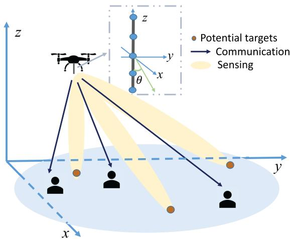  
Fig. 1. Illustration of the UAV-enabled ISAC system with a ULA vertically placed at the UAV.

This paper studies a UAV-enabled ISAC system as shown in Fig. 1, in which a UAV equipped with a vertically placed uniform linear array (ULA) is employed as an aerial dual-functional AP for efficient ISAC. Particularly, the UAV sends combined information and sensing signals to communicate with multiple users and perform radar sensing towards potential targets at the same time. Under this setup, we aim to design the UAV maneuver jointly with the transmit beamforming for optimizing the communication performance while guaranteeing the radar sensing requirements. The main results of the paper are summarized as follows.

• First, we consider the quasi-stationary UAV scenario, where the UAV is fixed at an optimizable location to perform ISAC over the whole mission period. We aim at maximizing the weighted sum-rate throughput of the users via jointly optimizing the UAV’s deployment location, as well as the transmit information and sensing beamforming, subject to the transmit power constraint and sensing beampattern gain requirements. Although the above problem is non-convex and difficult to be optimally solved due to the close coupling between the UAV’s deployment location and the transmit beamforming, we find a suboptimal but high-quality solution via using the techniques of successive convex approximation (SCA) [46] and semidefinite relaxation (SDR) [47], together with a two-dimensional (2D) location search.

• Next, we consider the fully mobile UAV scenario, where the UAV flies from the predetermined initial to final locations over the ISAC mission period. In this case, we design the UAV’s trajectory, jointly with the information and sensing beamforming over time to maximize the average weighted sum-rate throughput of communication users, subject to the sensing beampattern gain and transmit power constraints over time, as well as practical flight constraints. However, the joint UAV trajectory and beamforming problem is even more challenging to solve, as the UAV trajectory variables are further involved on the exponent parts of the steering vectors, which is difficult to handle. To tackle this issue, we propose an efficient algorithm by adopting the alternating optimization together with trust-region-based SCA, in which the non-convex weighted sum rate and beampattern gain functions are approximated as their first-order Taylor expansion, and the trust region is imposed to control the accuracy of such approximation.

• Finally, numerical results are presented to validate the performance of our proposed designs versus benchmark schemes with heuristic maneuver designs. It is shown that when the sensing beampattern gain threshold is high, the UAV should be deployed close to or fly towards the sensing area. In this case, the communication users with same angle of departure (AoD) or distance as the sensing area will be served with high priority, as the designed transmit signal beams are steered towards them simultaneously. By contrast, if the sensing beampattern gain threshold is low, then the UAV is deployed or flies close to an optimized location that is close to but not exactly above the users. In this case, the users with diverse AoDs (distances) with the UAV are served simultaneously with less inter-user interference, thus enhancing the communication rate. These results show that the UAV’s deployment and trajectory designs play an important role in balancing the inherent sensing-communication performance tradeoff.

The remainder of this paper is organized as follows. Section II introduces the system model of UAV-enabled ISAC system. Section III formulates the sensing-constrained weighted sum rate maximization problems of interest, and checks their feasibilities. Sections IV and V address the weighted sum rate maximization problems for two scenarios with quasi-stationary and mobile UAVs, respectively. Section VI provides numerical results to demonstrate the efficiency of our proposed designs. Section VII concludes this paper.

Notations: Boldface letters refer to vectors (lower case) or matrices (upper case). For an arbitrary-sized matrix <sup>A</sup>, rank(<sup>A</sup>), $A ^ { \mathrm { i f } } , A ^ { \mathrm { T } }$ , and $[ A ] _ { p , q }$ denote its rank, conjugate transpose, transpose, and the element in the <sup>p</sup>-th row and $q -$ th column, respectively. For a square matrix $B , \ \mathrm { t r } ( B )$ and $B ^ { - 1 }$ denote its trace and inverse, respectively, and $B \succeq 0$ means that <sup>B</sup> is positive semidefinite. <sup>I</sup> denotes an identity matrix, and 0 denotes an all-zero matrix. $\mathbb { C } ^ { M \times N }$ denotes the space of $M \times N$ complex matrices. $\mathbb { E } ( \cdot )$ denotes the statistical expectation.  ·  denotes the Euclidean norm of a complex vector, and | · | denotes the magnitude of a complex number.

## II. SYSTEM MODEL

We consider a UAV-enabled ISAC system as shown in Fig. 1, in which a UAV is dispatched as an aerial dual-functional AP to perform downlink communication with $K \_ 1$ ground users and radar sensing towards potential ground targets at the same time. Let ${ \mathcal { K } } \triangleq \{ 1 , \ldots , K \}$ denote the set of ground communication users. It is assumed that each communication user is equipped with one single receive antenna,<sup>1</sup> and the UAV is equipped with a ULA with <sup>M</sup> antennas that are placed vertically to the horizontal plane, similarly as in [48], [49], and [50]. Notice that the vertical ULA placement is considered at the UAV to facilitate the technical derivation, since in this case the $\mathrm { U A V } _ { \mathrm { \Delta } }$ orientation is irrelevant to the AoD of the radiated communication and sensing signal beams, thus simplifying the UAV’s trajectory design.<sup>2</sup>

We consider a finite ISAC mission period ${ \mathcal { T } } \ { \stackrel { \triangle } { = } } \ [ 0 , T ]$ with duration $T > 0 ,$ , which is discretized into <sup>N</sup> time slots each with duration $\begin{array} { r } { \varDelta _ { t } = T / N . } \end{array}$ Let $\mathcal { N } \triangleq \{ 1 , \dots N \}$ denote the set of time slots. Here, $\varDelta _ { t }$ is chosen to be sufficiently small, during which the UAV’s location is assumed to be approximately unchanged to facilitate the trajectory and beamforming design for $\mathrm { I S A C } . ^ { 3 }$ We consider a three-dimensional (3D) Cartesian coordinate system, where the location of each user $k ~ \in ~ \mathcal { K }$ is fixed at $( x _ { k } , y _ { k } , 0 )$ with $\textbf { \em u } _ { k } ~ = ~ \left( x _ { k } , y _ { k } \right)$ denoting its horizontal location. Let $( x [ n ] , y [ n ] , H )$ denote the time-varying location of the UAV at time slot $n \in \mathcal N .$ , where ${ \pmb q } [ n ] = ( x [ n ] , y [ n ] )$ denotes its horizontal location, and <sup>H</sup> denotes its flying altitude that is fixed over time, as widely adopted in prior works on UAV communications (e.g., [27], [28], [29], [30], [31], [32], [33]).

We consider that the UAV transmits information signals for users, together with dedicated sensing signals that can provide additional design DoFs for facilitating the sensing [7], [8], [9]. In particular, consider one particular time slot $n \in$ N . Let $s _ { k } [ n ]$ denote the desired information signal by user $k \in \mathcal { K } , \tilde { \pmb { w _ { k } } [ n ] } \in \mathbb { C } ^ { M \times 1 }$ denote the corresponding transmit beamforming vector, and $\pmb { \mathscr { s } } _ { 0 } [ n ] ~ \in ~ \mathbb { C } ^ { M \times 1 }$ denote the dedicated radar sensing signal at slot <sup>n</sup>. It is assumed that the communication signals $\{ s _ { k } [ n ] \} _ { k = 1 } ^ { K }$ are independent circularly symmetric complex Gaussian (CSCG) random variables with zero mean and unit variance, i.e., $s _ { k } [ n ] \sim \mathcal { C N } ( 0 , 1 )$ , and the dedicated sensing signal $s _ { 0 } [ n ]$ is an independently generated random vector with zero mean and covariance matrix $\mathbf { \delta } R _ { s } [ n ] =$ $\mathbb { E } ( s _ { 0 } [ n ] s _ { 0 } ^ { \mathrm { H } } [ n ] ) \succeq \mathbf { 0 }$ . Accordingly, the transmitted signal by the UAV at time slot <sup>n</sup> is given by

$$
{ \pmb x } [ n ] = \sum _ { k = 1 } ^ { K } { \pmb w } _ { k } [ n ] s _ { k } [ n ] + { \pmb s } _ { 0 } [ n ] , \forall n \in \mathcal { N } .\tag{1}
$$

Notice that in (1) we consider the general multi-beam transmission for the dedicated radar signal $s _ { 0 } [ n ]$ , which is different from the single-beam transmission for information-bearing signals. Accordingly, $R _ { s } [ n ]$ is of general rank, i.e., we have rank $\mathbf { \langle } R _ { s } [ n ] { \rangle } = N _ { s }$ with $0 \leq N _ { s } \leq M$ . This consideration corresponds to forming a set of $N _ { s }$ radar signal beams at slot $n ,$ which can be obtained via the eigenvalue decomposition (EVD) of $R _ { s } [ n ]$ . The average transmit power by the UAV at time slot <sup>n</sup> is denoted as $\begin{array} { r } { \bar { \mathbb { E } } ( \| \pmb { x } [ n ] \| ^ { 2 } ) \stackrel {  } { = } \sum _ { k = 1 } ^ { K } \| \pmb { w } _ { k } [ n ] \| ^ { 2 } + } \end{array}$ $\mathrm { t r } ( R _ { s } [ n ] )$ . Suppose that the maximum transmit power at the UAV is $P _ { \mathrm { m a x } }$ . We thus have the transmit power constraints as

$$
\sum _ { k = 1 } ^ { K } \| w _ { k } [ n ] \| ^ { 2 } + \mathrm { t r } ( \pmb { R _ { s } } [ n ] ) \leq P _ { \operatorname* { m a x } } , \forall n \in \mathcal N .\tag{2}
$$

First, we consider the information reception at the <sup>K</sup> users. Due to the relatively high altitude of the UAV, there generally exists a strong LoS link between the UAV and each ground user. As such, in this paper we consider the LoS channel model,<sup>4</sup> based on which the channel vector from the UAV to user <sup>k</sup> at time slot <sup>n</sup> is denoted as

$$
\begin{array} { l } { \displaystyle h _ { k } ( { \pmb q } [ n ] , { \pmb u } _ { k } ) = \sqrt { \beta d ^ { - 2 } ( { \pmb q } [ n ] , \pmb u _ { k } ) } { \pmb a } ( { \pmb q } [ n ] , { \pmb u } _ { k } ) } \\ { \displaystyle = \sqrt { \frac { \beta } { H ^ { 2 } + \| { \pmb q } [ n ] - { \pmb u } _ { k } \| ^ { 2 } } } { \pmb a } ( { \pmb q } [ n ] , { \pmb u } _ { k } ) , } \end{array}\tag{3}
$$

where $\beta$ denotes the channel power gain at a reference distance $d _ { 0 } \ = \ 1 \ m , \ d ( \pmb { q } [ n ] , \pmb { u } _ { k } ) \ = \ \sqrt { H ^ { 2 } + \| \pmb { q } [ n ] - \pmb { u } _ { k } \| ^ { 2 } }$ denotes the distance between the UAV and user <sup>k</sup> at slot $n ,$ and ${ \pmb a } ( { \pmb q } [ n ] , { \pmb u } _ { k } )$ denotes the steering vector towards user <sup>k</sup>. More specifically, the steering vector ${ \pmb a } ( { \pmb q } [ n ] , { \pmb u } _ { k } )$ is expressed as

$$
\begin{array} { r l } & { a ( \boldsymbol { q } [ n ] , \boldsymbol { u } _ { k } ) } \\ & { \quad = \left[ 1 , e ^ { j 2 \pi \frac { d } { \lambda } \cos \theta ( \boldsymbol { q } [ n ] , \boldsymbol { u } _ { k } ) } , \dots , e ^ { j 2 \pi \frac { d } { \lambda } ( M - 1 ) \cos \theta ( \boldsymbol { q } [ n ] , \boldsymbol { u } _ { k } ) } \right] ^ { \mathrm { T } } , } \end{array}\tag{4}
$$

where <sup>λ</sup> and <sup>d</sup> denote the carrier wavelength and the spacing between two adjacent antennas, respectively, and $\theta ( \pmb q [ n ] , \pmb u _ { k } )$ denotes the AoD corresponding to user <sup>k</sup> with<sup>5</sup>

$$
\theta ( \pmb { q } [ n ] , \pmb { u } _ { k } ) = \operatorname { a r c c o s } \frac { H } { \sqrt { \| \pmb { q } [ n ] - \pmb { u } _ { k } \| ^ { 2 } + H ^ { 2 } } } .\tag{5}
$$

As a result, the received signal by user <sup>k</sup> at slot <sup>n</sup> is given as

$$
\begin{array} { l } { \displaystyle z _ { k } [ n ] = h _ { k } ^ { \mathrm { H } } ( \boldsymbol { q } [ n ] , \boldsymbol { u } _ { k } ) \boldsymbol { x } [ n ] + v _ { k } [ n ] } \\ { \displaystyle \quad = h _ { k } ^ { \mathrm { H } } ( \boldsymbol { q } [ n ] , \boldsymbol { u } _ { k } ) \left( \sum _ { k = 1 } ^ { K } w _ { k } [ n ] s _ { k } [ n ] + s _ { 0 } [ n ] \right) + v _ { k } [ n ] , } \end{array}\tag{6}
$$

where $v _ { k } [ n ] \sim \mathcal { C N } ( 0 , \sigma _ { k } ^ { 2 } )$ denotes the additive white Gaussian noise (AWGN) at the receiver of user <sup>k</sup>.

It is observed from (6) that each ground user <sup>k</sup> suffers from not only the co-channel interference induced by other users desired information signals $\{ s _ { i } [ n ] \} _ { i \neq k }$ , but also that by the dedicated radar signal $s _ { 0 } [ n ]$ . Therefore, the received SINR by user <sup>k</sup> at time slot <sup>n</sup> is (7), shown at the bottom of the next page. Under the Gaussian signalling, the achievable rate by user <sup>k</sup> at slot <sup>n</sup> (in bits-per-second-per-Hertz (bps/Hz)) is

$$
r _ { k } [ n ] = \log _ { 2 } ( 1 + \gamma _ { k } ( q [ n ] , \{ w _ { i } [ n ] \} , R _ { s } [ n ] ) ) .\tag{8}
$$

Next, we consider the radar sensing towards potential targets at the interested area. In particular, suppose that the UAV aims to sense potential targets at a finite number of <sup>J</sup> locations on the ground, whose horizontal locations are denoted by $\begin{array} { r } { m _ { j } \mathrm { ^ { \circ } s , } } \end{array}$ $j \in \mathcal { I } \triangleq \{ 1 , . . . , J \}$ . Accordingly, we adopt the transmit beampattern gains towards these directions/locations as the sensing performance metric, which depict the transmit power distribution towards these angles that is designed based on specific radar sensing tasks. In practice, enhancing the beampattern gain essentially implies improved radar sensing performance $( \mathrm { e . g . }$ ., in terms of detection probability or estimation error) towards these directions [3]. In particular, the values of $\overrightarrow { m _ { j } } \overrightarrow { \mathrm { : } }$ s are predetermined based on the specific sensing tasks at the UAV. For instance, if the UAV performs the detection task without knowing the presence and thus locations of potential targets, then $\overrightarrow { m _ { j } \mathrm { ~ s ~ } }$ can be set as uniformly sampled positions over the whole area of interest. By contrast, if the UAV performs the tracking task with the targets’ locations roughly known a-priori, then $\mathbf { \vec { \nabla } } m _ { j } \mathbf { \bar { \nabla } } \mathbf { \vec { s } }$ can be set as the possible locations of these targets for facilitating the tracking. In general, a larger value of <sup>J</sup> may be needed for more accurate sensing, but at the cost of higher computational complexity. Notice that similarly as in prior works (e.g., [7], [8], [9]), we consider that the communication signals $\{ s _ { k } [ n ] \} _ { k = 1 } ^ { K }$ and the dedicated sensing signal $s _ { 0 } [ n ]$ are jointly exploited for sensing. In this case, the transmit beampattern gain towards location $m _ { j }$ is

$$
\begin{array} { r l } & { \zeta ( \boldsymbol { q } [ n ] , \boldsymbol { m } _ { j } ) } \\ & { \ = \mathbb { E } [ \left| a ^ { \mathrm { H } } ( \boldsymbol { q } [ n ] , \boldsymbol { m } _ { j } ) \boldsymbol { x } [ n ] \right| ^ { 2 } ] } \\ & { \ = a ^ { \mathrm { H } } ( \boldsymbol { q } [ n ] , \boldsymbol { m } _ { j } ) \left( \displaystyle \sum _ { k = 1 } ^ { K } { \boldsymbol { w } _ { k } [ n ] \boldsymbol { w } _ { k } ^ { H } [ n ] + \boldsymbol { R } _ { s } [ n ] } \right) a ( \boldsymbol { q } [ n ] , \boldsymbol { m } _ { j } ) , } \end{array}\tag{9}
$$

where ${ \pmb a } ( { \pmb q } [ n ] , m _ { j } )$ denotes the steering vector as defined in $( 4 ) . ^ { 6 }$

## III. PROBLEM FORMULATION AND FEASIBILITY CHECKING

## A. Problem Formulation

Our objective is to maximize the communication rate performance at multiple ground users while ensuring the sensing requirements by considering two scenarios with quasi-stationary and mobile UAVs, in which the UAV stays at one single optimized location and can freely move from one location to another over the whole mission period, respectively.

First, we consider the quasi-stationary UAV scenario, in which the UAV is fixed at an optimizable location $q =$ $( x ^ { \mathrm { q } } , y ^ { \mathrm { q } } )$ over the whole mission duration, i.e., ${ \pmb q } [ n ] = { \pmb q } , \forall n \in$ $\mathcal { N } . ^ { 7 }$ In this scenario, the time index <sup>n</sup> is discarded for notational convenience. Our objective is to maximize the weighted sum rate $\scriptstyle \sum _ { k = 1 } ^ { K } \alpha _ { k } r _ { k }$ with $r _ { k }$ given in (8), while guaranteeing the sensing performance at a given set of locations $m _ { 1 } , m _ { 2 } , \dots , m _ { J } ,$ by jointly optimizing the information and sensing beamforming vectors $\{ { w } _ { k } \}$ and $\scriptstyle { \mathbf { } } R _ { s }$ as well as the UAV’s deployment location <sup>q</sup>. Here, $\alpha _ { k }$ denotes the weight of each user <sup>k</sup> controlling the fairness among these users, where a larger value of $\alpha _ { k }$ means that user <sup>k</sup> has a higher priority in rate maximization. In order to properly illuminate potential targets at interested areas, the transmit beampattern gain at each interested sensing location $m _ { j }$ should be no less than a certain threshold that is proportional to the square of the UAV’s distance with that location $d ( \pmb { q } , \pmb { m } _ { j } ) \ ( \mathrm { i . e . , } \ d ^ { 2 } ( \pmb { q } , \pmb { m } _ { j } ) \Gamma$ with Γ being a predetermined threshold).<sup>8</sup> As a result, the sensing constrained weighted sum rate maximization problem in the quasi-stationary UAV scenario is formulated as (P1), where (10a) and (10b), shown at the bottom of the next page, denote the sensing beampattern gain requirements and the transmit power constraint, respectively. Notice that problem (P1) is quite challenging to be optimally solved, as the objective function is non-concave and the constraints in (10a) is non-convex, due to the coupling between the UAV’s deployment location and the transmit beamforming. We will address problem (P1) in Section IV.<sup>9</sup>

Next, we consider the fully mobile UAV scenario. Suppose that $\hat { \pmb q } ^ { \mathrm { I } } \ = \ ( { \boldsymbol x } ^ { \mathrm { I } } , { \boldsymbol y } ^ { \mathrm { I } } )$ and $\hat { \pmb q } ^ { \mathrm { F } } \ = \ ( \ b x ^ { \mathrm { F } } , \pmb y ^ { \mathrm { F } } )$ denote the initial and final horizontal locations of the UAV, which are pre-determined depending on the UAV mission. Let $\tilde { V } _ { \mathrm { m a x } }$ denote the maximum flight speed, and $V _ { \operatorname* { m a x } } = \tilde { V } _ { \operatorname* { m a x } } \Delta _ { t }$ denote the UAV’s maximum displacement over two consecutive slots. As a result, we have the following flight constraints on the UAV:

$$
\begin{array} { r } { \pmb q [ 1 ] = \hat { \pmb q } ^ { \mathrm { I } } , } \end{array}
$$

$$
\begin{array} { r } { \pmb q [ N ] = \hat { \pmb q } ^ { \mathrm { F } } , } \end{array}\tag{11}
$$

$$
\lVert \boldsymbol { q } [ n + 1 ] - \boldsymbol { q } [ n ] \rVert \leq V _ { \operatorname* { m a x } } , \forall n \in \mathcal { N } \backslash \{ N \} .\tag{12}
$$

(13)

In this scenario, our objective is to maximize the average weighted sum-rate throughput $\begin{array} { r } { \frac { 1 } { N } \sum _ { n = 1 } ^ { N } \sum _ { k = 1 } ^ { K } \alpha _ { k } r _ { k } [ n ] } \end{array}$ by jointly optimizing the UAV’s trajectory $\{ { \pmb q } [ n ] \}$ , as well as the transmit information and sensing beamforming $\{ { w } _ { k } [ n ] , { R } _ { s } [ n ] \}$ , subject to the sensing requirements and transmit power constraints over different time slots, as well as the UAV’s flight constraints in (11), (12), and (13). Accordingly, the sensing-constrained weighted sum rate maximization problem via joint trajectory and beamforming optimization is formulated as

$$
\begin{array} { r l r } {  { \operatorname* { m a x } _ { n , \lfloor \Psi \rfloor \in \mathbb { R } , \Psi } \frac { 1 } { N } \sum _ { n = 1 } ^ { N } \sum _ { k = 1 } ^ { K } \alpha _ { k } \log _ { 2 } ( 1 + \gamma _ { k } ( q | n ] , } } \\ & { } & { \lbrace \boldsymbol { w } _ { 3 } | n \rbrace , N _ { s } | n ] \rbrace } \\ & { } & { \mathrm { s . t . } ~ a ^ { \mathbb { I } } ( q | n ] , m _ { j } ) ( \sum _ { k = 1 } ^ { K } w _ { k } [ n ] w _ { k } ^ { \mathbb { I } } [ n ] + R _ { s } [ n ] ) } \\ & { } & { a ( q [ n ] , m _ { j } ) \ge d ^ { 2 } ( q | n ] , m _ { j } ) \Gamma , ~ \forall j \in \mathcal { I } , } \\ & { } & { \sum _ { k = 1 } ^ { K } \| \boldsymbol { w } _ { k } [ n ] \| ^ { 2 } + \mathrm { t r } ( R _ { s } [ n ] ) \le P _ { \operatorname* { m a x } } , } \\ & { } & { \forall m \in \mathcal { N } } \\ & { } & { ( 1 1 ) , ( 1 2 ) , \mathrm { a n d } ~ ( 1 3 ) , } \end{array}\tag{P2) :}
$$

where $\gamma _ { k } ( \pmb q [ n ] , \{ \pmb w _ { i } [ n ] \} , \pmb R _ { s } [ n ] )$ denotes the received SINR by user <sup>k</sup> at time slot <sup>n</sup> given in (7). Notice that problem (P2) is even more difficult to be solved than (P1) due to the involvement of more UAV trajectory variables on the exponent parts of the steering vectors. We will address problem (P2) in Section V.

## B. Feasibility Checking for (P1) and (P2)

Before proceeding to solve problems (P1) and (P2), we first check their feasibility. This is equivalent to solving the following two feasibility problems, respectively.

$$
\begin{array} { r l } { ( \mathrm { F P 1 } ) \colon } & { \mathrm { f n d } \ \{ w _ { k } \} , R _ { s } , q } \\ & { \mathrm { s . t . } \ ( 1 0 \mathrm { a } ) , \ ( 1 0 \mathrm { b } ) , \ \mathrm { a n d } \ R _ { s } \succeq \mathbf { 0 } . } \\ { ( \mathrm { F P 2 } ) \colon } & { \mathrm { f n d } \ \{ w _ { k } [ n ] , R _ { s } [ n ] , q [ n ] \} } \\ & { \mathrm { s . t . } \ R _ { s } [ n ] \succeq \mathbf { 0 } , \forall n \in \mathcal { N } } \\ & { \quad \ ( 1 1 ) , \ ( 1 2 ) , \ ( 1 3 ) , \ ( 1 4 \mathrm { a } ) , \ \mathrm { a n d } \ ( 1 4 \mathrm { b } ) } \end{array}\tag{15}
$$

$$
\gamma _ { k } ( q [ n ] , \{ w _ { i } [ n ] \} , R _ { s } [ n ] ) = \frac { \Big | h _ { k } ^ { \mathrm { H } } ( q [ n ] , u _ { k } ) w _ { k } [ n ] \Big | ^ { 2 } } { \displaystyle \sum _ { i = 1 , \atop i \neq k } ^ { K } \Big | h _ { k } ^ { \mathrm { H } } ( q [ n ] , u _ { k } ) w _ { i } [ n ] \Big | ^ { 2 } + h _ { k } ^ { \mathrm { H } } ( q [ n ] , u _ { k } ) R _ { s } [ n ] h _ { k } ( q [ n ] , u _ { k } ) + \sigma _ { k } ^ { 2 } } .\tag{7}
$$

First, we consider problem (FP1). It can be shown that solving problem (FP1) is equivalent to solving the following problem with only sensing signals, by setting $\pmb { w } _ { k } = 0 , \forall k \in \mathcal { K }$

(FP3): find <sup>R</sup><sub>s</sub><sup>,</sup> <sup>q</sup>

$$
\mathrm { s . t . } \ \pmb { a } ^ { \mathrm { H } } ( \pmb { q } , \pmb { m } _ { j } ) \pmb { R } _ { s } \pmb { a } ( \pmb { q } , \pmb { m } _ { j } )
$$

$$
\geq d ^ { 2 } ( q , m _ { j } ) \Gamma , \forall j \in \mathcal { I }\tag{16a}
$$

$$
\mathrm { t r } ( { \pmb R } _ { s } ) \le P _ { \mathrm { m a x } }\tag{16b}
$$

$$
\begin{array} { r } { R _ { s } \succeq \mathbf { 0 } . } \end{array}\tag{16c}
$$

The equivalence between (FP1) and (FP3) can be validated by using the fact that for any feasible solution $\{ w _ { k } \} , R _ { s } ,$ , and <sup>q</sup> to (FP1), we can always construct an equivalent solution $\begin{array} { r } { \{ \tilde { \pmb { w } } _ { k } = 0 , \forall k \} , \tilde { \pmb { R } } _ { s } = \sum _ { k = 1 } ^ { K } { \pmb { w } } _ { k } { \pmb { w } } _ { k } ^ { \mathrm { H } } + \pmb { R } _ { s } , } \end{array}$ and $\tilde { \pmb q } = { \pmb q }$ that is feasible for both (FP1) and (FP3). Next, problem (FP3) can be solved by first solving the following problem (FP4) via optimizing $\scriptstyle { \mathbf { } } R _ { s }$ under any given $^ { q , }$ and then adopting a 2D location search on <sup>q</sup> over the whole interested area. As long as there exists one location <sup>q</sup> such that problem (FP4) is feasible, it follows that problem (FP3) and thus problems (FP1) and (P1) are feasible.

$$
\begin{array} { r l } { ( \mathrm { F P 4 } ) \colon } & { \mathrm { ~ f i n d ~ } R _ { s } } \\ & { \mathrm { s . t . ~ } ( 1 6 \mathrm { a } ) , ( 1 6 \mathrm { b } ) , \mathrm { a n d ~ } ( 1 6 \mathrm { c } ) . } \end{array}
$$

As problem (FP4) is a convex semi-definite program (SDP), it can be solved via standard convex optimization tools such as CVX [51]. Therefore, problem (FP1) is solved.

Next, we consider problem (FP2) for the mobile UAV scenario. Notice that by solving (FP3), we already find a set of UAV locations ${ \mathcal { Q } } ^ { \mathrm { h } }$ in the interested area such that the sensing constraints in (10a) can be ensured (i.e., problem (FP4) is feasible when the UAV is located at any location in set $\mathcal { Q } ^ { \mathrm { h } } )$ . Based on this, checking the feasibility of (FP2) is equivalent to checking whether there exists a feasible UAV trajectory in ${ \mathcal { Q } } ^ { \mathrm { h } }$ connecting the initial and final locations while satisfying the flight speed constraints. This is implemented based on the graph theory [52], as detailed in the following.

More specifically, solving (FP2) is equivalent to checking whether there exists a path between the two nodes $\hat { \pmb q } ^ { \mathrm { I } }$ and $\hat { \pmb q } ^ { \breve { \mathrm { F } } }$ with distance less than $V _ { \mathrm { m a x } } N$ , which corresponds to a typical reachability problem in graph theory that can be solved via the depth-first search (DFS) method [52]. Towards this end, we first construct an undirected graph Ξ with respect to the nodes in ${ \mathcal { Q } } ^ { \mathrm { h } }$ . Specifically, for each node in ${ \mathcal { Q } } ^ { \mathrm { h } }$ , we calculate its distance with all other nodes. If the distance between any two nodes is smaller than $V _ { \mathrm { m a x } }$ , then we connect them with an edge weighted by their distance. Next, we employ the DFS method to find a set $\mathcal { Q } ^ { \mathrm { c } }$ of connected components starting from $\hat { \pmb q } ^ { \mathrm { I } }$ , which is detailed as follows. First, in the initialization, we divide the nodes in ${ \mathcal { Q } } ^ { \mathrm { h } }$ into two disjoint sets ${ \mathcal { Q } } ^ { \mathrm { c } } = \emptyset$ and $\mathcal { Q } ^ { \mathrm { n } } = \mathcal { Q } ^ { \mathrm { h } }$ containing nodes that are visited and not visited, respectively, and establish a stack $\Upsilon$ to store the nodes to be visited. Here, the initial location $\hat { \pmb q } ^ { \mathrm { I } }$ is put on the top of stack Υ. Next, we implement the following iterations to update $\mathcal { Q } ^ { \mathrm { c } }$ and ${ \mathcal { Q } } ^ { \mathrm { n } }$ . In each iteration, we first take the top item $\pmb { q } _ { t }$ of Υ and add to $\mathcal { Q } ^ { \mathrm { c } }$ , and then add unvisited adjacent nodes of $\pmb { q } _ { t }$ (the nodes connected with $\pmb q _ { t }$ and not in $\mathcal { Q } ^ { \mathrm { c } } )$ to the top of the stack Υ. The iteration terminates until stack Υ is empty and a set $\mathcal { Q } ^ { \mathrm { c } }$ of connected components starting from $\hat { \pmb q } ^ { \mathrm { I } }$ is obtained. In the constructed set $\mathcal { Q } ^ { \mathrm { c } }$ , any two nodes are reachable $( \mathrm { i . e . }$ , at least one path exists between them). Based on the constructed $\mathcal { Q } ^ { \mathrm { c } }$ it can be concluded that if the final location $\hat { \pmb q } ^ { \mathrm { F } }$ is included in $\mathcal { Q } ^ { \mathrm { c } }$ , then there exists at least one feasible trajectory solution to problem (FP2) and thus (P2). Otherwise, problems (FP2) and (P2) are infeasible. Therefore, problem (FP2) is solved. In the following sections, we focus on the cases when problems (P1) and (P2) are feasible.

## IV. PROPOSED SOLUTION TO PROBLEM (P1) FOR QUASI-STATIONARY UAV SCENARIO

In this section, we propose an efficient algorithm to find a suboptimal but high-quality solution to problem (P1), in which we adopt the SCA to optimize the information and sensing beamforming vectors $( \mathrm { i } . \mathrm { e } . , \ \{ w _ { k } \}$ and $\mathbf { \mathit { R } } _ { s } )$ under any given UAV deployment location $\mathbf { \delta q } ,$ and then use the 2D search to find an optimized $\pmb q$ that achieves the maximum weighted sum rate value. In the following, we focus our study on the optimization of $\{ w _ { k } \}$ and $R _ { s }$ under given <sup>q</sup>, which corresponds to solving problem (P3), shown at the bottom of the next page. Note that the objective in (P3) is still non-convex, thus making it difficult to be optimally solved in general. In the following, we deal with this issue by using the techniques of SDR and SCA.

First, we define $\mathbf { \mathbf { { W } } } _ { k } ~ = ~ \mathbf { \mathbf { { w } } } _ { k } \mathbf { \mathbf { { w } } } _ { k } ^ { \mathrm { H } }$ , where $W _ { k } ~ \succeq ~ 0$ and rank $( W _ { k } ) \le 1$ . By replacing ${ \mathbf { } } w _ { k } w _ { k } ^ { \mathrm { H } }$ with $\boldsymbol { W } _ { k }$ , problem (P3) is reformulated as

(P4) :

$$
\operatorname* { m a x } _ { \{ W _ { k } \succeq 0 \} , \atop { R _ { s } \succeq 0 } } \sum _ { k = 1 } ^ { K } \alpha _ { k } \hat { r } _ { k } \big ( \{ W _ { k } \} , R _ { s } \big )
$$

$$
\mathrm { s . t . } \ \pmb { a } ^ { \mathrm { H } } ( \pmb { q } , \pmb { m } _ { j } ) \left( \sum _ { k = 1 } ^ { K } W _ { k } + \pmb { R } _ { s } \right) \pmb { a } ( \pmb { q } , \pmb { m } _ { j } )
$$

$$
\geq d ^ { 2 } ( \pmb { q } , \pmb { m } _ { j } ) \Gamma , \forall j \in \mathcal { I }\tag{17a}
$$

$$
\sum _ { k = 1 } ^ { K } \mathrm { t r } ( W _ { k } ) + \mathrm { t r } ( \mathbf { { \cal R } } _ { s } ) \leq P _ { \operatorname* { m a x } }
$$

$$
\mathrm { r a n k } ( W _ { k } ) \leq 1 , \forall k \in \mathcal { K } ,\tag{17b}
$$

(17c)

$$
\begin{array} { r l } & { ( \mathrm { P 1 } ) : \quad \displaystyle \operatorname* { m a x } _ { \mathrm { f } \quad \scriptscriptstyle ( w _ { k } ) , \mathrm { q } } \sum _ { k = 1 } ^ { K } \alpha _ { k } \mathrm { l o g } _ { 2 } \left( 1 + \frac { \left| h _ { k } ^ { \mathrm { H } } ( \boldsymbol { q } , \boldsymbol { u } _ { k } ) w _ { k } \right| ^ { 2 } } { \sum _ { i = 1 , i \neq k } ^ { K } \left| h _ { k } ^ { \mathrm { H } } ( \boldsymbol { q } , \boldsymbol { u } _ { k } ) w _ { i } \right| ^ { 2 } + h _ { k } ^ { \mathrm { H } } ( \boldsymbol { q } , \boldsymbol { u } _ { k } ) R _ { s } h _ { k } ( \boldsymbol { q } , \boldsymbol { u } _ { k } ) + \sigma _ { k } ^ { 2 } } \right) } \\ & { \mathrm { s . t . } \ a ^ { \mathrm { H } } ( \boldsymbol { q } , \boldsymbol { m } _ { j } ) \left( \sum _ { k = 1 } ^ { K } w _ { k } w _ { k } ^ { \mathrm { H } } + R _ { s } \right) a ( \boldsymbol { q } , \boldsymbol { m } _ { j } ) \geq d ^ { 2 } ( \boldsymbol { q } , \boldsymbol { m } _ { j } ) \Gamma , \forall j \in \mathcal { I } } \\ & { \qquad \sum _ { k = 1 } ^ { K } \| w _ { k } \| ^ { 2 } + \mathrm { t r } ( R _ { s } ) \leq P _ { \operatorname* { m a x } } } \end{array}\tag{10a}
$$

(10b)

where $\hat { r } _ { k } ( \{ W _ { k } \} , R _ { s } )$ is defined in (18), shown at the bottom of the page. Note that problem (P4) is still non-convex, due to the non-concave objective function and the rank constraints in (17c).

Next, we use the SCA to address problem (P4) by approximating the non-concave objective function as a concave one, which is implemented in an iterative manner. Consider each iteration $l \geq 1$ , in which the local point is denoted by $\{ W _ { k } ^ { ( l ) } \}$ and $R _ { s } ^ { ( l ) }$ . It then follows that

$$
\begin{array} { r l } & { \hat { r } _ { k } ( \{ W _ { k } \} , R _ { s } ) } \\ & { \quad = \log _ { 2 } \left( \sum _ { i = 1 } ^ { K } \mathrm { t r } \Big ( h _ { k } ( q , u _ { k } ) h _ { k } ^ { \mathrm { H } } ( q , u _ { k } ) W _ { i } \Big ) \right. } \\ & { \quad \quad \left. + \mathrm { t r } \Big ( h _ { k } ( q , u _ { k } ) h _ { k } ^ { \mathrm { H } } ( q , u _ { k } ) R _ { s } \Big ) + \sigma ^ { 2 } \right) } \\ & { \quad \quad - \log _ { 2 } \left( \sum _ { i = 1 , i \neq k } ^ { K } \mathrm { t r } \Big ( h _ { k } ( q , u _ { k } ) h _ { k } ^ { \mathrm { H } } ( q , u _ { k } ) W _ { i } \Big ) \right. } \\ & { \quad \quad \quad \left. + \mathrm { t r } \Big ( h _ { k } ( q , u _ { k } ) h _ { k } ^ { \mathrm { H } } ( q , u _ { k } ) R _ { s } \Big ) + \sigma ^ { 2 } \right) } \end{array}\tag{19}
$$

$$
\begin{array} { r l } & { \geq \log _ { 2 } \left( \sum _ { i = 1 } ^ { K } \mathrm { t r } \left( h _ { k } ( q , u _ { k } ) h _ { k } ^ { \mathrm { H } } ( q , u _ { k } ) W _ { i } \right) \right. } \\ & { \quad + \left. \mathrm { t r } \left( h _ { k } ( q , u _ { k } ) h _ { k } ^ { \mathrm { H } } ( q , u _ { k } ) R _ { s } \right) + \sigma ^ { 2 } \right) } \\ & { \quad - \left( a _ { k } ^ { ( l ) } + \sum _ { i = 1 , i \neq k } ^ { K } \mathrm { t r } \big ( B _ { k } ^ { ( l ) } ( W _ { i } - W _ { i } ^ { ( l ) } ) \big ) \right. } \\ & { \quad \left. + \mathrm { t r } \big ( B _ { k } ^ { ( l ) } ( R _ { s } - R _ { s } ^ { ( l ) } ) \big ) \right) \triangleq \bar { r } _ { k } ^ { ( l ) } ( \{ W _ { k } \} , R _ { s } ) , } \end{array}\tag{20}
$$

where

$$
\begin{array} { r l } & { \boldsymbol { a } _ { k } ^ { ( l ) } = \log _ { 2 } \bigg ( { \sum _ { i = 1 , i \neq k } ^ { K } \mathrm { t r } \big ( h _ { k } ( \boldsymbol { q } , \boldsymbol { u } _ { k } ) \boldsymbol { h } _ { k } ^ { \mathrm { H } } ( \boldsymbol { q } , \boldsymbol { u } _ { k } ) \boldsymbol { W } _ { i } ^ { ( l ) } \big ) } } \\ & { \qquad + \mathrm { t r } \bigg ( h _ { k } ( \boldsymbol { q } , \boldsymbol { u } _ { k } ) \boldsymbol { h } _ { k } ^ { \mathrm { H } } ( \boldsymbol { q } , \boldsymbol { u } _ { k } ) \boldsymbol { R } _ { s } ^ { ( l ) } \bigg ) + \sigma ^ { 2 } \bigg ) , \qquad } \end{array}\tag{21}
$$

$B _ { k } ^ { ( l ) }$ is defined as in (22), shown at the bottom of the next page.

Here, the formula in (19) has a concave-minus-concave form, and (20) follows by implementing the first-order Taylor expansion on the second concave term in (19). Accordingly, by replacing $\hat { r } _ { k } ( \{ W _ { k } \} , R _ { s } )$ as its lower bound $\bar { r } _ { k } ^ { ( l ) } ( \{ W _ { k } \} , R _ { s } )$ , problem (P4) is approximated as the following problem (P5.<sup>l</sup>) in the <sup>l</sup>-th iteration of SCA.

$$
\begin{array} { r l } & { \underset { \{ W _ { k } \succeq \mathbf { 0 } \} , R _ { s } \succeq \mathbf { 0 } } { \operatorname* { m a x } } \sum _ { k = 1 } ^ { K } \alpha _ { k } \bar { r } _ { k } ^ { ( l ) } ( \{ W _ { k } \} , R _ { s } ) } \\ & { \quad \quad \mathrm { s . t . ~ ( l 7 a ) , ~ ( l 7 b ) , ~ a n d ~ ( l 7 c ) . } } \end{array}\tag{P5.<sup>l</sup>) :}
$$

Next, we deal with the non-convex rank constraints in (17c) in problem (P5.<sup>l</sup>) via the idea of SDR. In particular, we relax the rank constraints in (17c) and express the relaxed problem as (SDR5.<sup>l</sup>). Note that problem (SDR5.<sup>l</sup>) is a convex SDP and thus can be solved optimally by convex optimization solvers such as CVX. Let $\{ \dot { W } _ { k } ^ { ( l ) } \}$ and $\dot { R } _ { s } ^ { ( l ) }$ denote the obtained solution to problem (SDR5.<sup>l</sup>). In particular, if rank $( \dot { W } _ { \boldsymbol { k } _ { \mathrm { s } } } ^ { ( l ) } ) \leq$ 1 $\forall k \in \mathcal { K }$ , then the SDR is tight, i.e., $\{ \dot { W } _ { k } ^ { ( l ) } \}$ and $\dot { R } _ { s } ^ { ( l ) }$ are also optimal for problem (P5.<sup>l</sup>). Otherwise, we need to further construct the rank-one solution of $\{ W _ { k } \}$ for (P5.<sup>l</sup>) via additional procedures such as the Gaussian randomization [47]. Fortunately, the following proposition shows that there always exists an optimal rank-one solution of $\{ W _ { k } \}$ to (SDR5.<sup>l</sup>), and thus the Gaussian randomization is not needed to solve problem (P5.<sup>l</sup>).

Proposition 4.1: There always exists a globally optimal solution to problem (SDR5.<sup>l</sup>), denoted as $\{ \bar { W } _ { k } ^ { ( l ) } \}$ and $\bar { R } _ { s } ^ { ( l ) }$ such that

$$
\mathrm { r a n k } ( \bar { \mathbfcal W } _ { k } ^ { ( l ) } ) = 1 , \forall k \in \mathcal { K } .
$$

Proof: See Appendix A.

Therefore, by iteratively solving problem (SDR5.<sup>l</sup>) and thus (P5.<sup>l</sup>), we can obtain a series of solutions $\{ \bar { W } _ { k } ^ { ( l ) } \} ^ { \flat } \flat \Sigma ^ { \prime }$ and $\bar { R } _ { s } ^ { ( l ) } \mathrm { , }$ which lead to monotonically non-decreasing objective values for (P4) and thus (P3). Therefore, the convergence of the SCAand-SDR-based algorithm for solving problem (P3) is ensured.

Remark 4.1: It is worth noting that the proposed design principles based on LoS channels can be applied to other stochastic A2G channel models (such as Rician fading and probabilistic LoS channels). In this case, the instantaneous channel vectors, denoted by $\tilde { h } _ { k } ( q , u _ { k } ) \mathrm { ' s }$ , become random vectors, whose probability density functions depend on the elevation angles between the UAV and ground users. For instance, as the angle becomes smaller, the <sup>K</sup>-factor will become larger for Rician fading channels [24] and the LoS probability will increase for probabilistic LoS channels [34]. In this case, the average weighted sum rate becomes (23), shown at the bottom of the next page, where the expectation is taken over $\tilde { h } _ { k } ( q , u _ { k } ) \mathrm { { ' s } }$ . Accordingly, we can still use the SCAand-SDR-based algorithm to maximize the average weighted sum rate, in which the first-order Taylor expansion can be utilized to approximate the formula in (23). Towards this end, the calculation of expectation (via Monte-Calor methods) is inevitable, which, however, may lead to heavy computational cost. Alternatively, we can view the solution of (P1) based on

$$
\hat { r } _ { k } ( \{ W _ { k } \} , R _ { s } ) = \log _ { 2 } \left( 1 + \frac { \mathrm { t r } \left( h _ { k } ( q , u _ { k } ) h _ { k } ^ { \mathrm { H } } ( q , u _ { k } ) W _ { k } \right) } { \sum _ { i = 1 , i \ne k } ^ { K } \mathrm { t r } \left( h _ { k } ( q , u _ { k } ) h _ { k } ^ { \mathrm { H } } ( q , u _ { k } ) W _ { i } \right) + \mathrm { t r } \left( h _ { k } ( q , u _ { k } ) h _ { k } ^ { \mathrm { H } } ( q , u _ { k } ) R _ { s } \right) + \sigma ^ { 2 } } \right)\tag{18}
$$

$$
\begin{array} { r l } & { \underset { \{ w _ { k } \} , R _ { s } \geq 0 } { \operatorname* { m a x } } \sum _ { k = 1 } ^ { K } \alpha _ { k } \mathrm { l o g } _ { 2 } \left( 1 + \frac { | h _ { k } ^ { \mathrm { H } } ( q , u _ { k } ) w _ { k } | ^ { 2 } } { \sum _ { i = 1 , i \neq k } ^ { K } | h _ { k } ^ { \mathrm { H } } ( q , u _ { k } ) w _ { i } | ^ { 2 } + h _ { k } ^ { \mathrm { H } } ( q , u _ { k } ) R _ { s } h _ { k } ( q , u _ { k } ) + \sigma ^ { 2 } } \right) } \\ & { \mathrm { s . t . } \ \mathrm { ( 1 0 a ) } \ \mathrm { a n d } \ \mathrm { ( 1 0 b ) } } \end{array}\tag{P3) :}
$$

the LoS channels as an approximate solution to the problem considering stochastic channel models, and such approximations become more accurate when the <sup>K</sup>-factor is larger for Rician fading channel or the LoS probability is higher for probabilistic LoS channel.

## V. PROPOSED SOLUTION TO PROBLEM (P2) FOR MOBILE UAV SCENARIO

This section addresses problem (P2) for the mobile UAV scenario by using the alternating optimization together with SCA. Specifically, the alternating optimization based approach is implemented in an iterative manner. In each iteration, we first optimize the information beamforming vectors $\{ \boldsymbol { w } _ { k } [ \boldsymbol { n } ] \}$ and the sensing covariance matrix $\{ R _ { s } [ n ] \}$ with given UAV trajectory $\{ { \pmb q } [ n ] \}$ , and then optimize the UAV trajectory $\{ { \pmb q } [ n ] \}$ with updated $\{ \boldsymbol { w } _ { k } [ \boldsymbol { n } ] \}$ and $\{ R _ { s } [ n ] \}$ }, as detailed in the sequel.

## A. Transmit Information and Sensing Beamforming Optimization

First, we consider the optimization of information beamforming vectors $\{ \boldsymbol { w } _ { k } [ n ] \}$ and sensing covariance matrix $\{ R _ { s } [ n ] \}$ in problem (P2) under given trajectory $\{ { \pmb q } [ n ] \}$ , for which the optimization problem becomes

$$
\begin{array} { r l } { { \mathrm { ( P 6 ) } \colon } } & { { \underset { \{ \substack { { \scriptscriptstyle { \Psi _ { k } } } [ n ] } \subseteq 0 \} } { \mathrm { m a x } } } } & { { \displaystyle \sum _ { n = 1 } ^ { N } \sum _ { k = 1 } ^ { K } \alpha _ { k } \mathrm { l o g } _ { 2 } ( 1 + \gamma _ { k } ( \pmb q [ n ] , } } \\ & { { \quad \qquad \{ \pmb w _ { i } [ n ] \} , \pmb R _ { s } [ n ] ) ) } } \\ & { { \mathrm { s . t . ~ } \big ( 1 4 \mathrm { a } \big ) \mathrm { ~ a n d ~ } \big ( 1 4 \mathrm { b } \big ) . } } \end{array}
$$

It is observed from problem (P6) that with fixed UAV locations $\{ { \pmb q } [ n ] \}$ , the solutions of $w _ { k } [ n ]$ and ${ \cal R } _ { s } [ n ]$ at different time slots are independent with each other, and therefore, the optimization of $\{ \boldsymbol { w } _ { k } [ \boldsymbol { n } ] \}$ and $\{ R _ { s } [ n ] \}$ over different time slots <sup>n</sup>’s can be decoupled. In this case, problem (P6) can be equivalently decomposed into a number of <sup>N</sup> subproblems as follows each for one time slot <sup>n</sup>.

$$
\begin{array} { r l } { ( \mathrm { P } 7 . n ) \colon } & { \underset { \pmb { k } _ { s } [ n ] \subseteq 0 \atop \pmb { k } _ { s } [ n ] \subseteq \mathbf { 0 } \atop } \sum _ { k = 1 } ^ { K } \alpha _ { k } \mathrm { l o g } _ { 2 } ( 1 + \gamma _ { k } ( \pmb { q } [ n ] , } \\ & { \qquad \{ \pmb { w } _ { i } [ n ] \} , \pmb { R } _ { s } [ n ] ) ) } \\ & { \mathrm { s . t . ~ } \big ( 1 4 \mathrm { a } \big ) \mathrm { ~ a n d ~ } ( 1 4 \mathrm { b } ) . } \end{array}
$$

Note that each subproblem (P7.<sup>n</sup>) has the same form of problem (P3) with the UAV location given as <sup>q</sup>[<sup>n</sup>] (instead of <sup>q</sup> in (P3)), and can thus be similarly solved via the SCA-and-SDR-based algorithm in Section IV. By implementing this algorithm <sup>N</sup> times each for one slot, problem (P6) is solved, for which the details are omitted for brevity.

## B. UAV Trajectory Optimization

Next, we optimize the UAV’s trajectory $\{ { \pmb q } [ n ] \}$ under given $\{ \boldsymbol { w } _ { k } [ n ] \}$ and $\{ R _ { s } [ n ] \}$ , for which the optimization problem is expressed as problem (P8), in which the channel vectors $h _ { k } ( \pmb q [ n ] , \pmb u _ { k } ) ^ { * } \mathrm { s }$ are explicitly rewritten as $\sqrt { \beta / ( H ^ { 2 } + \| \pmb { q } [ n ] - \pmb { u } _ { k } \| ^ { 2 } ) } \pmb { a } ( \pmb { q } [ n ] , \pmb { u } _ { k } )$ based on (3).

Note that problem (P8) is difficult to be solved optimally due to the non-concave objective function and the non-convex constraints in (24), shown at the bottom of the next page, in which the trajectory variables $\{ { \pmb q } [ n ] \}$ are involved in the steering vector ${ \pmb a } ( { \pmb q } [ n ] , { \pmb u } _ { k } )$ . To deal with the highly non-convex problem (P8), in the following, we propose a trustregion-based SCA algorithm.

For notational convenience, we express $\begin{array} { r l } { W _ { i } [ n ] } & { { } = } \end{array}$ ${ \pmb w } _ { i } [ n ] { \pmb w } _ { i } ^ { \mathrm { H } } [ n ]$ and $\begin{array} { r l r } { { \cal G } [ n ] } & { { } = } & { \sum _ { k = 1 } ^ { K } { w _ { k } [ \bar { n } ] } w _ { k } ^ { H } [ n ] + \bar { { \cal R } } _ { s } [ n ] . } \end{array}$ Accordingly, we denote the entries in the <sup>p</sup>-th row and <sup>q</sup>-th column of $W _ { i } [ n ] , \ R _ { s } [ n ]$ , and $G [ n ]$ as $\left[ W _ { i } [ n ] \right] _ { p , q } ,$ $[ R _ { s } [ n ] ] _ { v , a } .$ and $\left[ G [ n ] \right] _ { n , a } ,$ whose magnitudes are denoted by $\mathbf { \bar { \rho } } _ { \vert } \mathbf { \bar { \rho } } _ { W _ { i } \lbrack n \rbrack } \mathbf { \bar { \rho } } _ { p , q } ^ { \ast } \vert , \mathbf { \Phi } \vert \lbrack \mathbf { \bar { R } } _ { s } \lbrack n \rbrack \rbrack _ { p , q } ^ { - \prime \prime } \vert$ , and $\big | \big [ G [ n ] \big ] _ { p , q } \big |$ , and phases are denoted by $\begin{array} { r } { \theta _ { p , q } ^ { \mathrm { X } _ { i } } [ n ] , \theta _ { p , q } ^ { \mathrm { R } } [ n ] } \end{array}$ , and $\theta _ { p , q } ^ { \mathrm { G } } [ n ]$ , respectively. Then we re-express the objective function of (P8) as

$$
\begin{array} { l } { { \displaystyle \hat { R } _ { k } [ n ] = \log _ { 2 } \left( \sum _ { i = 1 } ^ { K } \eta \left( W _ { i } [ n ] , d ( \boldsymbol { q } [ n ] , \boldsymbol { u } _ { k } ) \right) \right. } } \\ { { \displaystyle \qquad + \left. \mu \left( R _ { s } [ n ] , d ( \boldsymbol { q } [ n ] , \boldsymbol { u } _ { k } ) \right) + \frac { \sigma ^ { 2 } } \beta d ^ { 2 } ( \boldsymbol { q } [ n ] , \boldsymbol { u } _ { k } ) \right) } } \\ { { \displaystyle \qquad - \log _ { 2 } \left( \sum _ { i = 1 , i \neq k } ^ { K } \eta \left( W _ { i } [ n ] , d ( \boldsymbol { q } [ n ] , \boldsymbol { u } _ { k } ) \right) \right. } } \\ { { \displaystyle \qquad \left. + \mu \left( R _ { s } [ n ] , d ( \boldsymbol { q } [ n ] , \boldsymbol { u } _ { k } ) \right) + \frac { \sigma ^ { 2 } } \beta d ^ { 2 } ( \boldsymbol { q } [ n ] , \boldsymbol { u } _ { k } ) \right) , } } \end{array}\tag{25}
$$

where

$$
\begin{array} { l } { \displaystyle \eta \left( W _ { i } [ n ] , d ( q [ n ] , u _ { k } ) \right) } \\ { \displaystyle \quad = \sum _ { \alpha = 1 } ^ { M } \left[ W _ { i } [ n ] \right] _ { \alpha , \alpha } + 2 \sum _ { p = 1 } ^ { M } \sum _ { q = p + 1 } ^ { M } \left| \left[ W _ { i } [ n ] \right] _ { p , q } \right| } \\ { \displaystyle \qquad \times \cos \left( \theta _ { p , q } ^ { N } [ n ] + 2 \pi \frac { d } { \lambda } ( q - p ) \frac { { { \cal H } } } { d ( q [ n ] , u _ { k } ) } \right) , } \\ { \displaystyle \mu \left( R _ { s } [ n ] , d ( q [ n ] , u _ { k } ) \right) } \\ { \displaystyle \quad = \sum _ { \alpha = 1 } ^ { M } \left[ R _ { s } [ n ] \right] _ { \alpha , \alpha } + 2 \sum _ { p = 1 } ^ { M } \sum _ { q = p + 1 } ^ { M } \left| \left[ R _ { s } [ n ] \right] _ { p , q } \right| } \\ { \displaystyle \qquad \times \cos \left( \theta _ { p , q } ^ { N } [ n ] + 2 \pi \frac { d } { \lambda } ( q - p ) \frac { { { \cal H } } } { d ( q [ n ] , u _ { k } ) } \right) . } \end{array}\tag{26}
$$

(27)

$$
\begin{array} { r l } & { \boldsymbol B _ { k } ^ { ( l ) } = \frac { \log _ { 2 } ( e ) h _ { k } ( \boldsymbol q , \boldsymbol u _ { k } ) h _ { k } ^ { \mathrm { H } } ( \boldsymbol q , \boldsymbol u _ { k } ) } { \sum _ { i = 1 , i \neq k } ^ { K } \mathrm { t r } \left( h _ { k } ( \boldsymbol q , \boldsymbol u _ { k } ) h _ { k } ^ { \mathrm { H } } ( \boldsymbol q , \boldsymbol u _ { k } ) W _ { i } ^ { ( l ) } \right) + \mathrm { t r } \left( h _ { k } ( \boldsymbol q , \boldsymbol u _ { k } ) h _ { k } ^ { \mathrm { H } } ( \boldsymbol q , \boldsymbol u _ { k } ) \boldsymbol R _ { s } ^ { ( l ) } \right) + \sigma ^ { 2 } } } \\ & { \qquad \sum _ { k = 1 } ^ { K } \alpha _ { k } \mathbb { E } \left[ \log _ { 2 } \left( 1 + \frac { \left| \tilde { h } _ { k } ^ { \mathrm { H } } ( \boldsymbol q , \boldsymbol u _ { k } ) w _ { k } \right| ^ { 2 } } { \sum _ { i = 1 , i \neq k } ^ { K } \left| \tilde { h } _ { k } ^ { \mathrm { H } } ( \boldsymbol q , \boldsymbol u _ { k } ) w _ { i } \right| ^ { 2 } + \tilde { h } _ { k } ^ { \mathrm { H } } ( \boldsymbol q , \boldsymbol u _ { k } ) R _ { s } \tilde { h } _ { k } ( \boldsymbol q , \boldsymbol u _ { k } ) + \sigma _ { k } ^ { 2 } } \right) \right] } \end{array}\tag{22}
$$

(23)

Note that the derivation of (25) is presented in Appendix B. Similarly, we also re-express the non-convex constraints in (24) as

$$
\begin{array} { r l r } {  { \sum _ { \alpha = 1 } ^ { M } [ { \pmb { G } } [ n ] ] _ { \alpha , \alpha } + 2 \sum _ { p = 1 } ^ { M } \sum _ { q = p + 1 } ^ { M }  [ { \pmb { G } } [ n ] ] _ { p , q }  } } \\ & { } & { \times \cos \bigg ( \theta _ { p , q } ^ { \mathrm { G } } [ n ] + \frac { 2 \pi d ( q - p ) H } { \lambda d ( q [ n ] , m _ { j } ) } \bigg ) \geq \Gamma d ^ { 2 } ( { \pmb q } [ n ] , { \pmb m } _ { j } ) . } \end{array}\tag{28}
$$

Now, we are ready to present the trust-region-based SCA algorithm, which is implemented in an iterative manner. Consider a particular iteration $l \geq 1$ with local trajectory point $\pmb q ^ { ( l ) } [ n ]$ . First, we deal with the non-concave objective function in (25), which is approximated as follows based on its first-order Taylor expansion.

$$
\begin{array} { r } { \hat { R } _ { k } [ n ] \approx \bar { R } _ { k } ^ { ( l ) } [ n ] \stackrel { \Delta } { = } c _ { k } ^ { ( l ) } [ n ] + { \cal d } _ { k } ^ { ( l ) } { } ^ { \mathrm { H } } [ n ] ( \pmb { q } [ n ] - \pmb { q } ^ { ( l ) } [ n ] ) , } \end{array}\tag{29}
$$

where

$$
\begin{array} { l } { { \displaystyle c _ { k } ^ { ( l ) } [ n ] = \log _ { 2 } \left( \sum _ { i = 1 } ^ { K } \eta \big ( W _ { i } [ n ] , d ( q ^ { ( l ) } [ n ] , u _ { k } ) \big ) \right. } } \\ { { \displaystyle ~ + \left. \mu \big ( R _ { s } [ n ] , d ( q ^ { ( l ) } [ n ] , u _ { k } ) \big ) + \frac { \sigma ^ { 2 } } \beta d ^ { 2 } ( q ^ { ( l ) } [ n ] , u _ { k } ) \right) } } \\ { { \displaystyle ~ - \log _ { 2 } \left( \sum _ { i = 1 , i \neq k } ^ { K } \eta \big ( W _ { i } [ n ] , d ( q ^ { ( l ) } [ n ] , u _ { k } ) \big ) \right. } } \\ { { \displaystyle ~ \left. + \mu \big ( R _ { s } [ n ] , d ( q ^ { ( l ) } [ n ] , u _ { k } ) \big ) + \frac { \sigma ^ { 2 } } \beta d ^ { 2 } ( q ^ { ( l ) } [ n ] , u _ { k } ) \right) , } } \end{array}\tag{30}
$$

$$
\begin{array} { l } { \displaystyle d _ { k } ^ { ( l ) } [ n ] = \frac { \log _ { 2 } ( e ) } { e _ { k } [ n ] } ( \sum _ { i = 1 } ^ { K } \gamma \big ( W _ { i } [ n ] , d ( q ^ { ( l ) } [ n ] , u _ { k } ) \big )  } \\ { \displaystyle  + \omega \big ( R _ { s } [ n ] , d ( q ^ { ( l ) } [ n ] , u _ { k } ) \big ) + \frac { \sigma ^ { 2 } } { \beta } ( q ^ { ( l ) } [ n ] - u _ { k } \big ) ) } \\ { \displaystyle  - \frac { \log _ { 2 } ( e ) } { f _ { k } [ n ] } ( \sum _ { i = 1 , i \neq k } ^ { K } \gamma ( W _ { i } [ n ] , d ( q ^ { ( l ) } [ n ] , u _ { k } ) )   } \\ { \displaystyle   + \omega \big ( R _ { s } [ n ] , d ( q ^ { ( l ) } [ n ] , u _ { k } ) \big ) + \frac { \sigma ^ { 2 } } { \beta } ( q ^ { ( l ) } [ n ] - u _ { k } \big ) ) , } \end{array}\tag{31}
$$

$$
\begin{array} { l } { \displaystyle \mathrm { w i t h } } \\ { \displaystyle \gamma \left( W _ { i } [ n ] , d ( \boldsymbol { q } ^ { ( l ) } [ n ] , \boldsymbol { u } _ { k } ) \right) } \\ { \displaystyle = \sum _ { p = 1 } ^ { M } \sum _ { q = p + 1 } ^ { M } 4 \pi \big | \left[ W _ { i } [ n ] \right] _ { p , q } \big | \sin \left( \theta _ { p , q } ^ { \mathrm { W } _ { i } } [ n ] + 2 \pi \frac { d } { \lambda } ( q - p ) \right. } \end{array}
$$

$$
\begin{array} { r l r } & { } & { \times _ { \mathcal { G } _ { \phi } } q _ { \phi } ^ { ( \phi ) } ( q _ { \phi } , \mathbf { u } ) \} , \ \mathcal { G } _ { \phi } ( \theta , \mathbf { u } ) } \\ & { } & { \times \langle q _ { \phi } ^ { ( \phi ) } ( q _ { \phi } , \mathbf { u } ) \rangle , } \\ & { } & { \times \langle q _ { \phi } ^ { ( \phi ) } ( q _ { \phi } , \mathbf { u } ) \rangle , } \\ & { } & { \times \langle q _ { \phi } ^ { ( \phi ) } ( q _ { \phi } , \mathbf { u } ) \rangle , } \\ & { } & { \times \langle q _ { \phi } ^ { ( \phi ) } ( q _ { \phi } , \mathbf { u } ) \rangle , } \\ & { } & { \times \frac { 1 } { \mathcal { G } _ { \phi } } \frac { \rho _ { \phi } } { \rho _ { \phi } } \langle q _ { \phi } | B _ { \phi \phi } \rangle , } \\ & { } & { \times \langle q _ { \phi } q _ { \phi } ^ { ( \phi ) } ( q _ { \phi } , \mathbf { u } ) \rangle , } \\ & { } & { \times \langle q _ { \phi } q _ { \phi } ^ { ( \phi ) } ( q _ { \phi } , \mathbf { u } ) \rangle , } \\ & { } & { \times \langle q _ { \phi } q _ { \phi } ^ { ( \phi ) } ( q _ { \phi } , \mathbf { u } ) \rangle , } \\ & { } & { \times \langle q _ { \phi } q _ { \phi } ^ { ( \phi ) } ( q _ { \phi } , \mathbf { u } ) \rangle , } \\ & { } & { \times \langle q _ { \phi } q _ { \phi } ^ { ( \phi ) } ( q _ { \phi } , \mathbf { u } ) \rangle , } \\ & { } & { \times \langle q _ { \phi } q _ { \phi } ^ { ( \phi ) } ( q _ { \phi } , \mathbf { u } ) \rangle , } \\ & { } & { \times \langle q _ { \phi } q _ { \phi } ^ { ( \phi ) } ( q _ { \phi } , \mathbf { u } ) \rangle , } \\ & { } &  \times \langle q _ { \phi } ^  ( \ \end{array}
$$

Next, we deal with the non-convex constraints in (28). Similarly as for (29), we approximate the left-hand-side of (28) based on its first-order Taylor expansion at local point $\pmb q ^ { ( l ) } [ n ]$ , and accordingly re-express (28) as

$$
h _ { j } ^ { ( l ) } [ n ] { + } { \dot { \pmb { i } } _ { j } ^ { ( l ) } } ^ { \mathrm { H } } [ n ] ( { \pmb q } [ n ] { - } { \pmb q } ^ { ( l ) } [ n ] ) \geq \Gamma ( H ^ { 2 } { + } \| { \pmb q } [ n ] - { \pmb m } _ { j } \| ^ { 2 } ) ,\tag{36}
$$

where

$$
\begin{array} { l } { { \displaystyle h _ { j } ^ { ( l ) } [ n ] = \sum _ { \alpha = 1 } ^ { M } \left[ G [ n ] \right] _ { \alpha , \alpha } + 2 \sum _ { p = 1 } ^ { M } \sum _ { q = p + 1 } ^ { M } \left. \left[ G [ n ] \right] _ { p , q } \right. } } \\ { { \displaystyle ~ \times \cos \bigg ( \theta _ { p , q } ^ { \mathrm { G } } [ n ] + 2 \pi \frac { d } { \lambda } ( q - p ) \frac { H } { d ( q ^ { ( l ) } [ n ] , m _ { j } ) } \bigg ) } , } \end{array}\tag{37}
$$

$$
\begin{array} { r l } & { i _ { j } ^ { ( l ) } [ n ] = \displaystyle \sum _ { p = 1 } ^ { M } \sum _ { q = p + 1 } ^ { M } 4 \pi \big | \big [ \boldsymbol { G } [ n ] \big ] _ { p , q } \big | \mathrm { s i n } } \\ & { \qquad \times \left( \theta _ { p , q } ^ { \mathrm { G } } [ n ] + \frac { 2 \pi d ( q - p ) H } { \lambda d ( q ^ { ( l ) } [ n ] , m _ { j } ) } \right) } \\ & { \qquad \times \frac { d ( q - p ) H } { \lambda d ^ { 3 } ( q ^ { ( l ) } [ n ] , m _ { j } ) } ( q ^ { ( l ) } [ n ] - m _ { j } ) . } \end{array}\tag{38}
$$

(P8) :

$$
\begin{array}{c} \operatorname* { m a x } _ { \{ q | n \} } \sum _ { n = 1 } ^ { N } \sum _ { k = 1 } ^ { K } \alpha _ { k } \log _ { 2 } \left( 1 + \frac { \frac { \beta | a ^ { \mathrm { H } } ( q | n ) , u _ { k } ) w _ { k } [ n ] | ^ { 2 } } { H ^ { 2 } + \| q [ n ] - u _ { k } \| ^ { 2 } } } { \sum _ { i = 1 , i \neq k } ^ { K } \frac { \beta | a ^ { \mathrm { H } } ( q | n ) , u _ { k } \rangle w _ { k } [ n ] | ^ { 2 } } { H ^ { 2 } + \| q [ n ] - u _ { k } \| ^ { 2 } } + \frac { \beta a ^ { \mathrm { H } } ( q | n ) , u _ { k } ) R _ { s } [ n ] a ( q [ n ] , u _ { k } ) } { H ^ { 2 } + \| q [ n ] - u _ { k } \| ^ { 2 } } + \sigma ^ { 2 } \right) }  \\ { \mathrm { s . t . ~ } a ^ { \mathrm { H } } ( q [ n ] , m _ { j } ) \left( \sum _ { k = 1 } ^ { K } w _ { k } [ n ] w _ { k } ^ { \mathrm { H } } [ n ] + R _ { s } [ n ] \right) a ( q [ n ] , m _ { j } ) \ge \Gamma ( H ^ { 2 } + \| q [ n ] - m _ { j } \| ^ { 2 } ) , \forall j \in \mathcal { N } } \end{array}
$$

(11)<sup>,</sup> (12)<sup>,</sup> and (13)

(24)

So far, we approximate the non-concave objective function in (25) as a linear one in (29), and the non-convex constraints in (28) as convex ones in (36). To ensure the approximation accuracy, we impose a series of trust region constraints as

$$
\| \pmb { q } ^ { ( l ) } [ n ] - \pmb { q } ^ { ( l - 1 ) } [ n ] \| \leq \psi ^ { ( l ) } , \forall n \in \mathcal { N } ,\tag{39}
$$

where $\psi ^ { ( l ) }$ denotes the radius of the trust region.

Finally, by replacing the non-concave objective function in (25) and the non-convex constraints (28) as their approximate forms in (29) and (36), respectively, and adding the trust region constraints in (39), we obtain the approximated convex version of problem (P8) in the <sup>l</sup>-th iteration as problem (P9.<sup>l</sup>) in the following, which can be optimally solved via CVX efficiently.

$$
\begin{array} { r l } { ( \mathrm { P 9 . } l ) \colon } & { \underset { \{ q [ n ] \} } { \operatorname* { m a x } } \ : \sum _ { n = 1 } ^ { N } \sum _ { k = 1 } ^ { K } \alpha _ { k } \bar { R } _ { k } ^ { ( l ) } [ n ] } \\ & { \mathrm { s . t . } \ : ( 3 6 ) , \ : ( 3 9 ) , \ : ( 1 1 ) , \ : ( 1 2 ) , \ : \mathrm { a n d } \ : ( 1 3 ) . } \end{array}
$$

In summary, by solving a series of problems in (P9.<sup>l</sup>) over iteration <sup>l</sup>’s, we can obtain an optimized solution to problem (P8). Notice that theoretically, if the radius of trust region $\psi ^ { ( l ) }$ is chosen to be sufficiently small, then the convergence of the iteration can always be ensured [53]. In practical implementation, if the objective value of (P8) after solving (P9.<sup>l</sup>) in each iteration <sup>l</sup> is not reduced as compared to that in the previous round, then we reduce the radius of the trust region as $\psi ^ { ( l ) } = \psi ^ { ( l ) } / 2$ and resolve (P9.<sup>l</sup>) again. The iteration will terminate when $\dot { \psi } ^ { ( l ) }$ is lower than a given threshold <sup>ς</sup>ˆ.

```latex
Algorithm 1 Overall Algorithm for Solving Problem (P2)
1: Initialize the information beamforming vectors $\{ \bar { w } _ { k } ^ { ( 0 ) } [ n ] \}$
the dedicated sensing signal covariance matrix $\{ \bar { R } _ { s } ^ { ( 0 ) } [ n ] \}$
and the UAV trajectory $\overline { { \{ \hat { \pmb q } ^ { ( 0 ) } [ n ] \} } }$ ; Set $o = 1$
2: repeat
**Optimizing information and sensing beamforming**
3: Solve problem (P6) under local point
$\{ \bar { \pmb w } _ { k _ { \mathrm { ~ \tiny ~ . ~ } } } ^ { ( o - 1 ) } [ n ] , \bar { \pmb R } _ { s } ^ { ( o - 1 ) } [ n ] , \hat { \pmb q } ^ { ( o - 1 ) } [ n ] \}$ to obtain $\{ \dot { W } _ { k } ^ { ( o ) } [ n ] \}$
$\dot { R } _ { s } ^ { ( o ) } [ n ] \}$
4: Reconstruct $\{ \bar { W } _ { k } ^ { ( o ) } [ n ] , \bar { R } _ { s } ^ { ( o ) } [ n ] \}$ (and correspondingly
$\{ \bar { \pmb { w } } _ { k } ^ { ( o ) } [ n ] \} )$ based on proposition 4.1.
**********Optimizing the UAV trajectory**********
5: Let $l = 1 , \ \dot { \{ \bf \langle } { q ^ { ( l - 1 ) } [ \ddot { n } ] } \rangle  = \{ \hat { { \pmb q } } ^ { ( o - 1 ) } [ n ] \}$
6: repeat
7: Obtain $\{ \pmb q ^ { ( l ) * } [ n ] \}$ by solving problem (P9.<sup>l</sup>) under
local point $\{ \bar { \pmb q } ^ { ( l - 1 ) } [ n ] , \bar { \pmb W } _ { k } ^ { ( o ) } [ n ] , \bar { \pmb R } _ { s } ^ { ( o ) } [ n ] \}$
8: if the objective value of problem (P8) increases then
9: $\{ { \pmb q } ^ { ( l ) } [ \bar { n } ] \} = \{ { \pmb q } ^ { ( l ) * } [ n ] \} , l = l + 1 .$
10: else
11: Execute $\psi ^ { ( l ) } = \psi ^ { ( l ) } / 2 .$
12: end if
13: until $\psi ^ { ( l ) } < \hat { \varsigma }$
14: Update $\{ { \hat { \pmb q } } ^ { ( o ) } [ n ] \} = \{ { \pmb q } ^ { ( l ) } [ n ] \} , o = o + 1 .$
15: until the increase of the objective value is below a thresh
old <sup>ς</sup>¯.
```

Finally, by combining the transmit beamforming solution in Section V-A and the UAV trajectory optimization in

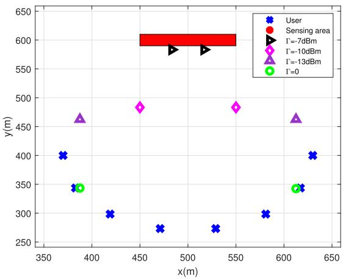  
Fig. 2. Simulation setup and the obtained deployment locations of the UAV under the different values of <sup>Γ</sup>.

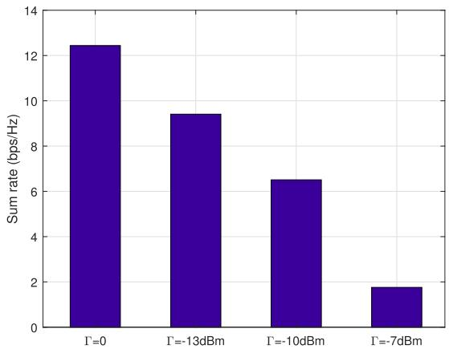  
Fig. 3. The communication sum rate versus the sensing beampattern threshold <sup>Γ</sup>.

Section V-B, the overall alternating-optimization-based algorithm for solving problem (P2) is presented in Algorithm 1, in which the index <sup>o</sup> is used to denote the outer iteration of alternating optimization. Consider each outer iteration $o \geq 1$ It has been shown that the SCA-and-SDR-based algorithm can lead to a converged transmit beamforming solution to problem (P6) (similarly as that for (P3)), and the trust-regionbased SCA algorithm can lead to a converged UAV trajectory solution to problem (P8). By combining the two facts, the objective value of (P2) is monotonically non-decreasing after each outer iteration <sup>o</sup> of alternating optimization. Since the objective value of problem (P2) is upper bounded by a finite value, the convergence of Algorithm 1 can be guaranteed, as shown in Fig. 5 in Section VI next..<sup>10</sup>

## VI. NUMERICAL RESULTS

This section presents numerical results to validate the performance of our proposed UAV-enabled ISAC designs. In the simulation, we consider an area of 1 km × 1 km with $K = 8$ ground users and <sup>J</sup> = 18 sample locations in the interested sensing area, as shown in Fig. 2. Unless otherwise stated, we set the antenna spacing as $d = \lambda / 2$ , the number of antennas at the UAV as $M = 1 2$ , and the beampattern gain threshold $\Gamma = 5 \mathrm { e ^ { - 5 } ~ W ~ ( - 1 3 ~ d B m ) }$ . We also set the UAV’s maximum horizontal flight speed as $\tilde { V } _ { \mathrm { m a x } } = 3 0 ~ \mathrm { m / s } .$ , flight altitude as $H = 1 0 0 \mathrm { m }$ , and maximum transmit power as $P _ { \mathrm { m a x } } = 0 . 5 ~ \mathrm { W } .$ In addition, we set the noise power at each user receiver as $\sigma _ { k } ^ { 2 } = - 1 1 0$ dBm, and the channel power gain at the reference distance $d _ { 0 } = 1$ m as $\beta = - 6 0$ dB. Furthermore, we set the users’ rate weights are $\alpha _ { k } = 1 , \forall k \in \mathcal { K }$ , such that their sum rate is considered as the communication performance metric.

## A. Quasi-Stationary UAV Scenario

First, we consider the quasi-stationary UAV scenario, for which the following benchmark schemes are considered for performance comparison.

• Communication only: The UAV designs its deployment location and transmit information and sensing beamforming to optimize the communication performance only, by ignoring the sensing requirements. This corresponds to solving problem (P1) by setting the sensing beampattern threshold as $\Gamma = 0$

• Sensing only: The UAV only performs the sensing task without the communication needs. In this case, the UAV aims to maximize the minimum beampattern gain weighted by the squared distance $d ^ { 2 } ( \pmb { q } , \pmb { m } _ { j } )$ , by optimizing the deployment location $\pmb q$ and the sensing covariance matrix $\mathbf { \delta } _ { R _ { s } }$ . This corresponds to solving the following problem:

$$
\begin{array} { r l } { ( { \mathrm { P 1 0 } } ) \colon \ } & { \displaystyle \operatorname* { m a x } _ { { R _ { s } \succeq 0 } , q } \ \operatorname* { m i n } _ { j \in \mathcal { T } } \ \frac { 1 } { d ^ { 2 } ( q , m _ { j } ) } { a ^ { \mathrm { H } } ( q , m _ { j } ) } } \\ & { \quad \times \ R _ { s } { a ( q , m _ { j } ) } } \\ & { \quad \mathrm { s . t . ~ t r } ( { R _ { s } } ) \leq P _ { \operatorname* { m a x } } , } \end{array}\tag{40}
$$

which can be solved similarly as problem (P1), for which the details are omitted for brevity.

Fig. 2 and Fig. 3 show the obtained UAV deployment locations and the correspondingly achieved sum rates under different values of sensing beampattern threshold Γ. First, it is observed that two symmetric UAV deployment locations are obtained under each realization with different Γ. This is intuitive, as the sensing area and communication users are deployed in a symmetric manner in our setup. It is also observed that as Γ increases (e.g., from 0 to −7 dBm), the UAV is deployed closer to the sensing area, but further away from the communication users, thus leading to decreased communication sum rate.

Fig. 4 shows the obtained deployment locations of UAV and the corresponding (receive) beampattern gains in space. First, for sensing only design in Fig. 4(a), the UAV is observed to be deployed at the center of the sensing area, and the sensing power exactly covers the whole sensing area, thanks to the properly designed sensing beams in this case. Next, for the communication only design in 4(b), it is observed that the UAV is deployed above the communication users, and the UAV’s transmission power is radiated towards users in order to efficiently perform the task of communication. Finally, for our proposed ISAC design in Fig. 4(c), it is observed that the UAV is deployed between the users and the sensing area. Moreover, the beampattern gains in Fig. 4(c) are observed to be more uniformly distributed as compared to those in Fig. 4(a) and Fig. 4(b) to well balance the tradeoff between communication and sensing performances.

## B. Mobile UAV Scenario

Next, we consider the mobile UAV scenario. Before the performance comparison, we first show the convergence behavior of the proposed algorithm in Fig. 5. It can be observed that the average sum rate achieved by our proposed design increases quickly with the number of iterations and the algorithm converges in about 12 iterations.

Then the following benchmark schemes are considered for performance comparison.

• Straight flight (SF): The UAV flies from the initial location $\hat { \pmb q } ^ { \mathrm { I } }$ to the final location $\hat { \pmb q } ^ { \mathrm { F } }$ straightly by using the constant speed of $\lVert \hat { \pmb q } ^ { \mathrm { F } } - \hat { \pmb q } ^ { \mathrm { I } } \rVert / T$ . Accordingly, we optimize the information and sensing beamforming $\{ \boldsymbol { w } _ { k } [ \boldsymbol { n } ] \}$ } and $\{ R _ { s } [ n ] \}$ via solving problem (P6) under such predetermined SF trajectory.

• Fly-hover-fly (FHF): The UAV first flies straightly from the initial location $\hat { \pmb q } ^ { \mathrm { I } }$ to the optimized hovering location obtained from problem (P3) at the maximum speed $\tilde { V } _ { \mathrm { m a x } } ,$ then hovers at this point, and finally flies straightly towards the final location $\hat { \pmb q } ^ { \mathrm { F } }$ also at speed $\tilde { V } _ { \mathrm { m a x } } .$ . Under such FHF trajectory, we optimize $\{ \boldsymbol { w } _ { k } [ n ] \}$ and $\{ R _ { s } [ n ] \}$ via solving problem (P6). Notice that such FHF trajectory is utilized as the initialization trajectory for our proposed Algorithm 1.

• Communication only: The UAV only performs the communication task. This corresponds to solving problem (P2) by setting $\Gamma = 0$

• Sensing only: The UAV only performs the sensing task. In this case, we aim to optimize the UAV’s trajectory jointly with the sensing beamforming to maximize the weighted minimum beampattern gain, for which the optimization problem is formulated as

$$
\begin{array} { r l } { ( { \mathrm { P 1 1 } } ) \colon } & { \underset { \{ R _ { s } [ n ] \succeq 0 , \atop { q [ n ] } \} } { \operatorname* { m a x } } \underset { j \in \mathcal { I } } { \operatorname* { m i n } } \frac { { \pmb { a } } ^ { \mathrm { H } } ( { \pmb { q } } [ n ] , m _ { j } ) { \pmb { R } } _ { s } [ n ] { \pmb { a } } ( { \pmb { q } } [ n ] , m _ { j } ) } { d ^ { 2 } ( { \pmb { q } } [ n ] , m _ { j } ) } } \\ & { \mathrm { ~ s . t . ~ t r } ( { \pmb { R } } _ { s } [ n ] ) \leq P _ { \operatorname* { m a x } } , \forall n \in \mathcal { N } } \\ & { \mathrm { ~ ( 1 1 ) , ~ ( 1 2 ) , ~ a n d ~ ( 1 3 ) . } } \end{array}
$$

Problem (P11) can be solved similarly as problem (P2), for which the details are omitted for brevity.

Fig. 6 shows the obtained UAV flight trajectories under different designs. For the design with sensing only, it is observed that the UAV flies towards the center of the sensing area to maximize the beampattern gains therein. For our proposed ISAC designs, it is observed that as Γ reduces from −13 dBm to 0, the UAV flies much closer to the users to increase the communication rate while satisfying the sensing requirements. More specifically, when Γ is sufficiently small $( \mathrm { i . e . , } \Gamma = - 4 0 ~ \mathrm { d B m ) }$ , the obtained UAV trajectory is observed to be identical to that with communication only. This shows that in this case, the sensing requirements can be easily ensured by reusing the information signals that are dedicatedly designed for rate maximization.

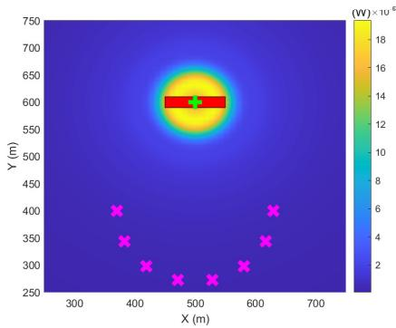  
(a) Sensing only.

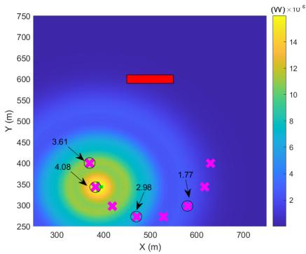  
(b) Communication only.

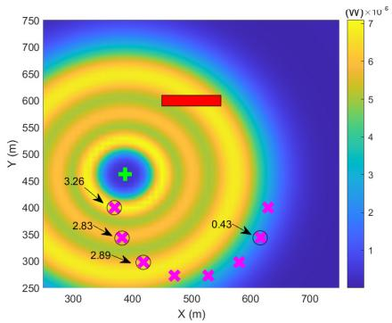  
(c) Proposed ISAC design.

Fig. 4. Obtained deployment locations and corresponding beampattern gains in space under different designs, where the red rectangle denotes the sensing area, the green $" + "$ denotes the obtained deployment location of the UAV, the carmine denotes the location of each communication user, and the number associated with each user corresponds to its communication rate (in bps/Hz) if served.  
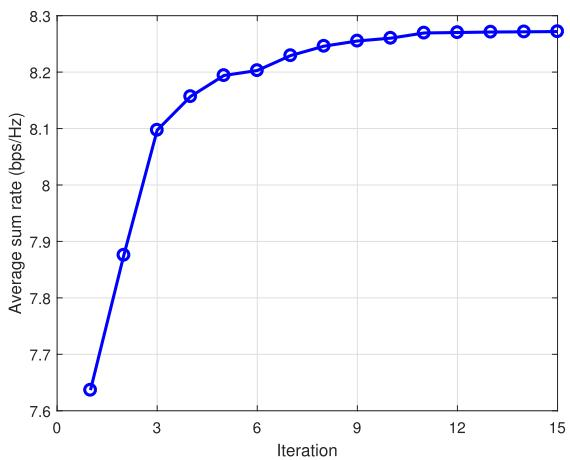  
Fig. 5. Convergence behavior of the proposed trust-region-based SCA algorithm for solving problem (P2).

Figs. 7, 8, and 9 show the obtained (receive) beampattern gains in space at specifically chosen time slots for the sensing only design, our proposed ISAC design, and the communication only design, respectively. First, for the sensing only and communication only designs in Figs. 7 and 9, the similar observations can be made as those from Figs. 4(a) and 4(b) in the quasi-stationary UAV scenario. Next, for our proposed ISAC design in Fig. 8, it is observed that the transmission energy is properly radiated to circles with different radius for covering both sensing areas and communication users, thus balancing their performance tradeoff.

Fig. 6. Obtained trajectories under different designs.  
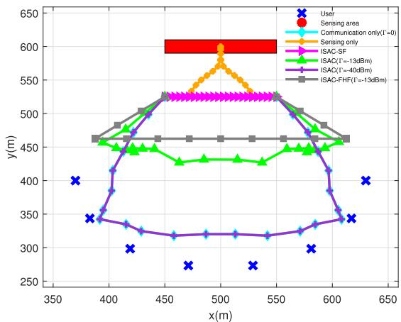

It is also interesting to discuss the instantaneous communication rates achieved by different users in Figs. 8 and 9. It is observed that the users with distinct distances with the UAV are likely to be served simultaneously to achieve optimized sum rate. This is due to the fact that with vertically deployed ULA at the UAV, the users at distinct distances with the UAV would have more diverse AoDs with each other, thus resulting in less co-channel interference that is beneficial for the multi-user MIMO communication.

Fig. 10 shows the average sum rate at users versus the beampattern gain threshold Γ with <sup>M</sup> = 16. It is observed that as Γ increases, the average sum rate decreases for all the three schemes, as the UAV needs to spend more transmission power for taking care of sensing. It is also observed that the proposed ISAC design and the FHF design significantly outperform the SF design. This shows the benefit of our proposed optimization for UAV trajectory and deployment (hovering) location. As Γ becomes large, it is observed that the performance gap among three designs significantly reduces. This is due to the fact that in this case, the feasible flight region for ensuring the sensing requirement would become limited, thus limiting the design DoF in trajectory optimization. By contrast, as Γ becomes small, the average sum rate is observed to asymptotically reach the upper bound by communication only. This is because that the majority of the transmit power is allocated to maximize the communication rate, and the sensing requirements can be easily ensured by reusing the information signals.

Fig. 11 shows the average sum rate versus the number of antennas <sup>M</sup> at the UAV, where we set $\Gamma = - 3 0$ dBm. It is observed that our proposed ISAC design and the FHF design outperform the SF design. More specifically, when <sup>M</sup> becomes large, the average sum rates by our proposed ISAC design and the FHF design are observed to increase almost in a linear manner, while that by the SF design is observed to saturate. This is due to the fact that with proper trajectory or hovering location optimization, the UAV can enjoy narrower beams provided by more antennas to increase the information signal power while better mitigating the inter-user interference.

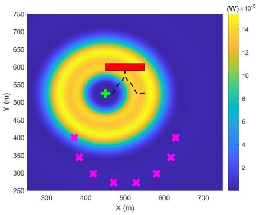  
(a) $n = 1$

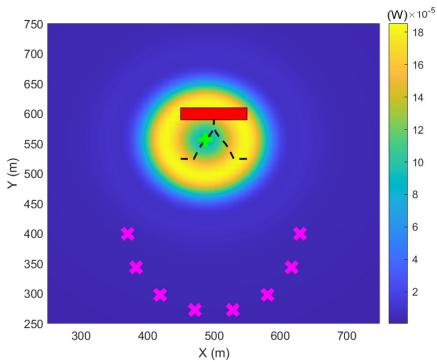  
(b) n = 6

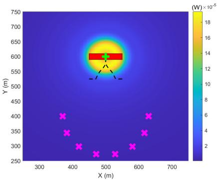  
(c) $n = 1 2$

Fig. 7. Achieved beampattern gains in space under the sensing only design at specifically chosen time slots $n = 1 , 6 , 1 2 ,$ , respectively, where the red rectangle denotes the sensing area, the black dashes line denotes the UAV’s flight trajectory, the green $" + "$ denotes the UAV’s location at the specified time slot, and the carmine $\because \times \ '$ denotes the location of each user.  
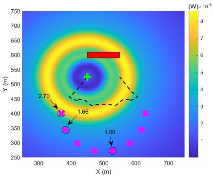  
(a) $n = 1$

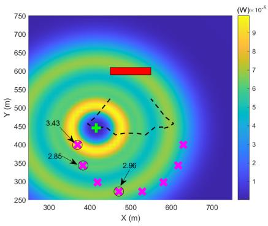  
(b) $n = 6$

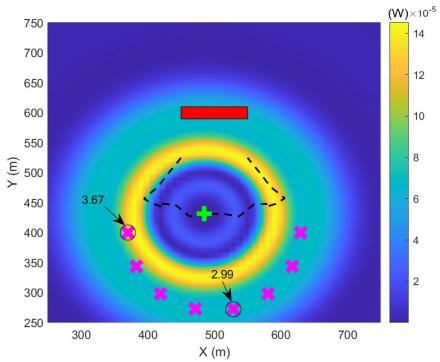  
(c) $n = 1 2$

Fig. 8. Achieved beampattern gains in space under the proposed ISAC design at specifically chosen time slots $n = 1 , 6 , 1 2 ,$ , respectively, with the beampattern gain threshold $\Gamma = - 1 3$ <sup>dBm</sup>, where the red rectangle denotes the sensing area, the black dashes line denotes the UAV’s flight trajectory, the green $" + "$ denotes the UAV’s location at the specified time slot, the carmine $\because \times \ '$ denotes the location of each user, and the number associated with each user corresponds to its communication rate (in bps/Hz) if served.  
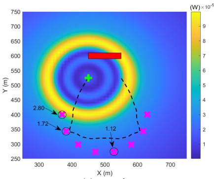  
(a) n = 1

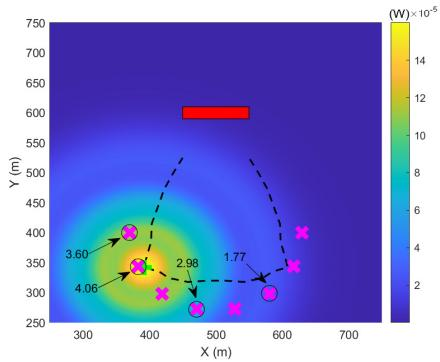  
(b) $n = 8$

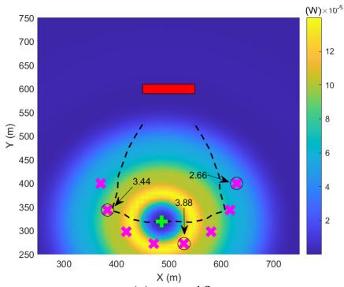  
(c) $n = 1 2$  
Fig. 9. Achieved beampattern gains in space under the communication only design at specifically chosen time slots $n = 1 , 8 , 1 2 ,$ respectively, where the red rectangle denotes the sensing area, the black dashes line denotes the UAV’s flight trajectory, the green $" + "$ denotes the $\mathrm { U A V } _ { \mathrm { \Delta } }$ location at the specified time slot, the carmine $\ ' _ { \times } \ '$ denotes the location of each user, and the number associated with each user corresponds to its communication rate (in bps/Hz) if served.

## VII. CONCLUDING REMARKS

This paper considered a novel UAV-enabled ISAC system, where the UAV acts as an aerial dual-functional AP to simultaneously communicate with multiple users and perform radar sensing towards an interested area. We exploited the UAV’s mobility to improve the communication data rate throughput while ensuring the sensing requirements. Under two scenarios with quasi-stationary and mobile UAVs, we designed the

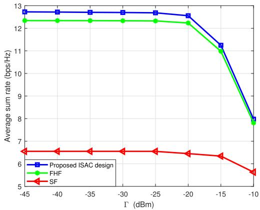  
Fig. 10. The average sum rate versus the beampattern gain threshold <sup>Γ</sup>.

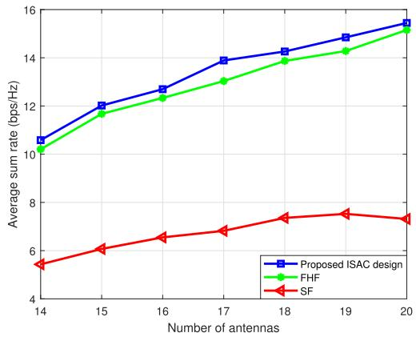  
Fig. 11. The average sum rate versus the number of transmit antennas <sup>M</sup> at UAV.

UAV’s placement and trajectory jointly with the transmit information and sensing beamforming. We proposed efficient algorithms to solve the highly non-convex sensing-constrained rate maximization problems, by using techniques from convex and non-convex optimization. Numerical results showed that our proposed designs significantly outperform other benchmark schemes. Due to the space limitation, there are other important issues that are undressed but worth pursuing in future work. We discuss these issues in the following.

• 3D UAV placement/trajectory optimization: This paper considered the 2D UAV deployment/trajectory design under LoS channels. How to extend it to the 3D UAV deployment/trajectory design [20] under probabilistic LoS or Rician fading channels is an interesting problem. In this case, the UAV flight altitude may affect the LoS probability [34] or Rician factor [24] (see Remark 4.1), and thus affect the average weighted sum rate. Therefore, the UAV flight altitude becomes an additional DoF that can be optimized jointly with the horizontal trajectory and transmit beamforming design for enhancing the system performance.

• Multi-UAV-enabled ISAC: While this paper considered a single-UAV-enabled ISAC system, in practical wireless networks multiple UAVs may be needed to cover a large area to provide ubiquitous ISAC services. In this case, different UAVs sharing the same spectrum resources may cause severe co-channel interference among each other that may degrade both sensing and communication performance. Therefore, new interference management designs among different UAVs are important for tackling such interference issue. In addition, different UAVs can also cooperate in communication via coordinated multipoint (CoMP) and cooperate in sensing via distributed MIMO radar [54] or multi-static radar [55] for further enhancing the network performance.

• Case with mobile users/targets: In practice, each user or sensing targets may move from one location to another over the whole mission duration. In order to apply the joint deployment/trajectory and transmit beamforming design in this case, it is important to track and predict their movements over time (via, e.g., ISAC). However, this may lead to certain prediction errors, so online optimization technique is further needed to refine the deployment/trajectory and transmit beamforming designs.

Other antenna configurations: This paper considered vertically deployed ULA at the UAV for the ease of analysis, and how to extend our design to other antenna configurations (e.g., horizontally placed uniform planar array (UPA)) is another interesting direction. In this case, the UAV’s orientation will affect the steering vectors and become an additional design DoF (which is closely coupled with trajectory variables) for improving the ISAC performance.

• Large-scale networks with random user/target distributions: This paper considered the operation of a single-UAV-enabled ISAC system, by assuming the users locations to be known a priori to facilitate the deployment and trajectory design. How to analyze and optimize large-scale UAV-enabled ISAC networks with random user/target distributions is also important to further pursue. In this case, the stochastic geometry may be applied by assuming proper user/target distributions (e.g., homogeneous poisson point processes (HPPP)) [20].

## APPENDIX

## A. Proof of Proposition 1

For notational convenience, we omit the superscript (<sup>l</sup>) in the following. Suppose that $\{ \dot { W } _ { k } \}$ and $\dot { R } _ { s }$ denote the obtained optimal solution to problem (SDR5.<sup>l</sup>). Based on them, we then construct a new solution $\{ \hat W _ { k } \}$ and $\bar { \mathbfcal R } _ { s }$ (and the corresponding $\{ \bar { \pmb { w } } _ { k } \} )$ as

$$
\bar { \pmb { w } } _ { k } = ( \pmb { h } _ { k } ^ { \mathrm { H } } ( \pmb { q } , \pmb { u } _ { k } ) \dot { W } _ { k } \pmb { h } _ { k } ( \pmb { q } , \pmb { u } _ { k } ) ) ^ { - 1 / 2 } \dot { W } _ { k } \pmb { h } _ { k } ( \pmb { q } , \pmb { u } _ { k } ) ,\tag{42}
$$

$$
\bar { \pmb { W } } _ { k } = \bar { \pmb { w } } _ { k } \bar { \pmb { w } } _ { k } ^ { \mathrm { H } } ,\tag{43}
$$

$$
\bar { \pmb { R } } _ { s } = \sum _ { k = 1 } ^ { K } \dot { \pmb { W } } _ { k } + \dot { \pmb { R } } _ { s } - \sum _ { k = 1 } ^ { K } \bar { \pmb { W } } _ { k } .\tag{44}
$$

In the following, we show that $\{ \hat W _ { k } \}$ and $\bar { \mathbfcal R } _ { s }$ are optimal for problem (SDR5.<sup>l</sup>). It is evident that $\left\{ \hat W _ { k } \right\}$ are positive semidefinite and rank-one. Also, according to (44), the constraints for beampattern gain in (17a) and those in transmit power in (17b) hold for $\{ \hat W _ { k } \}$ and $\bar { \mathbfcal R } _ { s }$

$$
\log _ { 2 } \bigg ( \frac { \sum _ { i = 1 } ^ { K } \mathrm { t r } \big ( W _ { i } [ n ] A ( q [ n ] , u _ { k } ) \big ) + \mathrm { t r } \big ( R _ { s } [ n ] A ( q [ n ] , u _ { k } ) \big ) + \frac { \sigma ^ { 2 } } { \beta } ( H ^ { 2 } + \| q [ n ] - u _ { k } \| ^ { 2 } ) } { \sum _ { i = 1 , i \ne k } ^ { K } \mathrm { t r } \big ( W _ { i } [ n ] A ( q [ n ] , u _ { k } ) \big ) + \mathrm { t r } \big ( R _ { s } [ n ] A ( q [ n ] , u _ { k } ) \big ) + \frac { \sigma ^ { 2 } } { \beta } ( H ^ { 2 } + \| q [ n ] - u _ { k } \| ^ { 2 } ) } \bigg )\tag{51}
$$

Next, we show that $\bar { R } _ { s }$ is positive semidefinite. For any $\pmb { r } \in \mathbb { C } ^ { M \times 1 }$ , it holds that

$$
\begin{array} { r l } & { { \boldsymbol { r } } ^ { \mathrm { H } } \left( \dot { \boldsymbol { W } } _ { k } - \bar { \boldsymbol { W } } _ { k } \right) { \boldsymbol { r } } } \\ & { \quad = { \boldsymbol { r } } ^ { \mathrm { H } } \dot { \boldsymbol { W } } _ { k } { \boldsymbol { r } } } \\ & { \qquad - \Big ( \boldsymbol { h } _ { k } ^ { \mathrm { H } } ( \boldsymbol { q } , { \boldsymbol { u } } _ { k } ) \dot { \boldsymbol { W } } _ { k } { \boldsymbol { h } } _ { k } ( \boldsymbol { q } , { \boldsymbol { u } } _ { k } ) \Big ) ^ { - 1 } \Big | { \boldsymbol { r } } ^ { \mathrm { H } } \dot { \boldsymbol { W } } _ { k } { \boldsymbol { h } } _ { k } ( \boldsymbol { q } , { \boldsymbol { u } } _ { k } ) \Big | ^ { 2 } , } \\ & { \qquad \quad \forall k \in \mathcal { K } . } \end{array}\tag{45}
$$

According to the Cauchy-Schwarz inequality, we have

$$
\begin{array} { r l } & { \Big | r ^ { \mathrm { H } } \dot { W } _ { k } h _ { k } ( q , u _ { k } ) \Big | ^ { 2 } } \\ & { \quad = \Big | r ^ { \mathrm { H } } \dot { w } _ { k } \dot { w } _ { k } ^ { \mathrm { H } } h _ { k } ( q , u _ { k } ) \Big | ^ { 2 } } \\ & { \quad \le \big | r ^ { \mathrm { H } } \dot { w } _ { k } \big | ^ { 2 } \Big | h _ { k } ^ { \mathrm { H } } ( q , u _ { k } ) \dot { w } _ { k } \Big | ^ { 2 } } \\ & { \quad = \big ( r ^ { \mathrm { H } } \dot { W } _ { k } r \big ) \Big ( h _ { k } ^ { \mathrm { H } } ( q , u _ { k } ) \dot { W } _ { k } h _ { k } ( q , u _ { k } ) \Big ) . } \end{array}\tag{46}
$$

Thus, we have

$$
r ^ { \mathrm { H } } ( \dot { W } _ { k } - \bar { W } _ { k } ) r \geq 0 , \forall k \in \mathcal { K } .\tag{47}
$$

According to (47), we have $\dot { \pmb { W } } _ { k } - \hat { \pmb { W } } _ { k } \succeq 0$ . Based on this fact together with $\dot { R } _ { s } \succeq 0 .$ , it follows that $\begin{array} { r } { \bar { \pmb { R } } _ { s } = \sum _ { k = 1 } ^ { K } \pmb { \dot { W } } _ { k } + } \end{array}$ $\begin{array} { r } { \dot { \pmb { R } } _ { s } - \sum _ { k = 1 } ^ { K } \pmb { \bar { W } } _ { k } } \end{array}$ should be positive semidefinite.

Then, we show that the objective value achieved by $\{ \hat W _ { k } \}$ and $\bar { R } _ { s }$ remains same as that by $\{ \dot { W } _ { k } \}$ and $\dot { R } _ { s }$ . One can first derive that

$$
\begin{array} { r l } & { \boldsymbol { h } _ { k } ^ { \mathrm { H } } ( \boldsymbol { q } , \boldsymbol { u } _ { k } ) \bar { \boldsymbol { W } } _ { k } \boldsymbol { h } _ { k } ( \boldsymbol { q } , \boldsymbol { u } _ { k } ) } \\ & { \quad = \boldsymbol { h } _ { k } ^ { \mathrm { H } } ( \boldsymbol { q } , \boldsymbol { u } _ { k } ) \bar { \boldsymbol { w } } _ { k } \bar { \boldsymbol { w } } _ { k } ^ { H } \boldsymbol { h } _ { k } ( \boldsymbol { q } , \boldsymbol { u } _ { k } ) } \\ & { \quad = \boldsymbol { h } _ { k } ^ { \mathrm { H } } ( \boldsymbol { q } , \boldsymbol { u } _ { k } ) \dot { \boldsymbol { W } } _ { k } \boldsymbol { h } _ { k } ( \boldsymbol { q } , \boldsymbol { u } _ { k } ) , \forall k \in \mathcal { K } . } \end{array}\tag{48}
$$

By substituting (44) into the first term of $\bar { r } _ { k } ( \{ W _ { k } \} , R _ { s } )$ we have

$$
\begin{array} { r l } & { \sum _ { k = 1 } ^ { K } \Bigg ( \log _ { 2 } \bigg ( { \sum _ { i = 1 } ^ { K } h _ { k } ^ { \mathrm { H } } ( q , u _ { k } ) \bar { W } _ { i } h _ { k } ( q , u _ { k } ) } } \\ & { \mathrm { ~ \ ~ \ } + h _ { k } ^ { \mathrm { H } } ( q , u _ { k } ) \bar { R } _ { s } h _ { k } ( q , u _ { k } ) + \sigma ^ { 2 } \bigg ) \Bigg ) } \\ & { \ = \sum _ { k = 1 } ^ { K } \bigg ( \log _ { 2 } \bigg ( { \sum _ { i = 1 } ^ { K } h _ { k } ^ { \mathrm { H } } ( q , u _ { k } ) \hat { W } _ { i } h _ { k } ( q , u _ { k } ) } } \\ & { \mathrm { \ ~ \ ~ \ } + h _ { k } ^ { \mathrm { H } } ( q , u _ { k } ) \hat { R } _ { s } h _ { k } ( q , u _ { k } ) + \sigma ^ { 2 } \bigg ) \bigg ) . } \end{array}\tag{49}
$$

For the second term of $\bar { r } _ { k } ( \{ W _ { k } \} , R _ { s } )$ , we have

$$
\begin{array} { l } { { \displaystyle \sum _ { k = 1 } ^ { K } \left( a _ { k } + \sum _ { i = 1 , \atop i \neq k } ^ { K } \mathrm { t r } ( { \bf B } _ { k } ( { \bar { \bf W } } _ { i } - { \bf W } _ { i } ) ) \mathrm { t r } ( { \bf B } _ { k } ( { \bar { \bf R } } _ { s } - { \bf R } _ { s } ) ) \right) } } \\ { ~ = \displaystyle \sum _ { k = 1 } ^ { K } \left( a _ { k } + \sum _ { i } ^ { K } \frac { \log _ { 2 } ( e ) } { 2 ^ { a _ { k } } } \mathrm { h } _ { k } ^ { \mathrm { H } } ( { \bf q } , { \bf u } _ { k } ) ( { \bar { \bf W } } _ { i } - { \bf W } _ { i } ) \mathrm { h } _ { k } ( { \bf q } , { \bf u } _ { k } ) \right. } \\ { ~ \displaystyle \left. - \frac { \log _ { 2 } ( e ) } { 2 ^ { a _ { k } } } \mathrm { h } _ { k } ^ { \mathrm { H } } ( { \bf q } , { \bf u } _ { k } ) ( { \bar { \bf W } } _ { k } - { \bf W } _ { k } ) \mathrm { h } _ { k } ( { \bf q } , { \bf u } _ { k } ) \right. } \end{array}
$$

$$
\begin{array} { l } { { \displaystyle \left. + \frac { \log _ { 2 } ( e ) } { 2 ^ { a _ { k } } } { \bf h } _ { k } ^ { \mathrm { H } } ( { \bf q } , { \bf u } _ { k } ) ( \bar { \bf R } _ { s } - { \bf R } _ { s } ) { \bf h } _ { k } ( { \bf q } , { \bf u } _ { k } ) \right) } } \ ~  \\ { { \displaystyle = \sum _ { k = 1 } ^ { K } \left( a _ { k } + \sum _ { i = 1 } ^ { K } \frac { \log _ { 2 } ( e ) } { 2 ^ { a _ { k } } } { \bf h } _ { k } ^ { \mathrm { H } } ( { \bf q } , { \bf u } _ { k } ) ( \dot { \bf W } _ { i } - { \bf W } _ { i } ) { \bf h } _ { k } ( { \bf q } , { \bf u } _ { k } ) \right. } \ ~ } \\ { { \displaystyle \left. + \frac { \log _ { 2 } ( e ) } { 2 ^ { a _ { k } } } { \bf h } _ { k } ^ { \mathrm { H } } ( { \bf q } , { \bf u } _ { k } ) ( \dot { \bf R } _ { s } - { \bf R } _ { s } ) { \bf h } _ { k } ( { \bf q } , { \bf u } _ { k } ) \right) } . \qquad ( 5 0 ) }  \end{array}
$$

By combining (49) and (50), it holds that the objective value remains the same. By combining the facts above, it is verified that $\{ \hat W _ { k } \}$ and $\bar { \mathbfcal R } _ { s }$ is also the optimal solution to (SDR5.<sup>l</sup>). This thus completes the proof.

## B. Detailed Derivation Procedure for (25)

First, we denote $\pmb { A } ( \pmb { q } [ n ] , \pmb { u } _ { k } ) = \pmb { a } ( \pmb { q } [ n ] , \pmb { u } _ { k } ) \pmb { a } ^ { \mathrm { H } } ( \pmb { q } [ n ] , \pmb { u } _ { k } )$ Accordingly, the objective function in (P8) is rewritten as (51). Next, the entry in the <sup>p</sup>-th row and $q \cdot$ -th column of ${ \bf \cal A } ( \mathbfit { q } [ \mathcal { n } ] , \it { u } _ { k } )$ is given as

$$
\begin{array} { r } { \left[ A ( { q } [ n ] , { \boldsymbol { u } } _ { k } ) \right] _ { p , q } = \mathrm { e } ^ { j 2 \pi \frac { d } { \lambda } ( p - q ) \frac { H } { \sqrt { H ^ { 2 } + \| { \boldsymbol { q } } [ n ] - { \boldsymbol { u } } _ { k } \| ^ { 2 } } } } . } \end{array}\tag{52}
$$

It is observed from (52) that $W _ { i } [ n ]$ and ${ \bf \cal A } ( \mathbfit { q } [ \mathcal { n } ] , \it { u } _ { k } )$ are hermitian, and thus we have

$$
\begin{array} { l } { { \displaystyle \mathrm { t r } \big ( W _ { i } [ n ] A ( q [ n ] , u _ { k } ) \big ) } } \\ { ~ = \sum _ { p = 1 } ^ { M } \sum _ { q = 1 } ^ { M } \big [ W _ { i } [ n ] \big ] _ { p , q } \mathrm { e } ^ { j 2 \pi \frac { d } { \lambda } ( q - p ) \frac { M } { d ( q [ n ] , u _ { k } ) } } } \\ { ~ = \displaystyle \sum _ { \alpha = 1 } ^ { M } \big [ W _ { i } [ n ] \big ] _ { \alpha , \alpha } + 2 \sum _ { p = 1 } ^ { M } \sum _ { q = p + 1 } ^ { M } \big | \big [ W _ { i } [ n ] \big ] _ { p , q } \big | } \\ { ~ \times \cos \bigg ( \theta _ { p , q } ^ { \mathrm { W } } [ n ] + 2 \pi \frac { d } { \lambda } ( q - p ) \frac { H } { d ( q [ n ] , u _ { k } ) } \bigg ) . } \end{array}\tag{53}
$$

By substituting (53) into (51), (25) is finally obtained.

## REFERENCES

[1] Z. Lyu, G. Zhu, and J. Xu, “Joint trajectory and beamforming design for UAV-enabled integrated sensing and communication,” in Proc. IEEE Int. Conf. Commun., May 2022, pp. 1593–1598.

[2] J. A. Zhang et al., “Enabling joint communication and radar sensing in mobile networks—A survey,” IEEE Commun. Surveys Tuts., vol. 24, no. 1, pp. 306–345, Oct. 2022.

[3] F. Liu et al., “Integrated sensing and communications: Toward dualfunctional wireless networks for 6G and beyond,” IEEE J. Sel. Areas Commun., vol. 40, no. 6, pp. 1728–1767, Jun. 2022.

[4] F. Liu, C. Masouros, A. P. Petropulu, H. Griffiths, and L. Hanzo, “Joint radar and communication design: Applications, state-of-the-art, and the road ahead,” IEEE Trans. Commun., vol. 68, no. 6, pp. 3834–3862, Jun. 2020.

[5] W. Yuan, F. Liu, C. Masouros, J. Yuan, D. W. K. Ng, and N. Gonzalez-Prelcic, “Bayesian predictive beamforming for vehicular networks: A low-overhead joint radar-communication approach,” IEEE Trans. Wireless Commun., vol. 20, no. 3, pp. 1442–1456, Mar. 2021.

[6] C. Xu, B. Clerckx, S. Chen, Y. Mao, and J. Zhang, “Rate-splitting multiple access for multi-antenna joint radar and communications,” IEEE J. Sel. Topics Signal Process., vol. 15, no. 6, pp. 1332–1347, Nov. 2021.

[7] X. Liu, T. Huang, N. Shlezinger, Y. Liu, J. Zhou, and Y. C. Eldar, “Joint transmit beamforming for multiuser MIMO communications and MIMO radar,” IEEE Trans. Signal Process., vol. 68, pp. 3929–3944, 2020.

[8] F. Liu, C. Masouros, A. Li, H. Sun, and L. Hanzo, “MU-MIMO communications with MIMO radar: From co-existence to joint transmission,” IEEE Trans. Wireless Commun., vol. 17, no. 4, pp. 2755–2770, Apr. 2018.

[9] H. Hua, J. Xu, and T. X. Han, “Optimal transmit beamforming for integrated sensing and communication,” 2021, arXiv:2104.11871.

[10] Y. Luo, J. A. Zhang, X. Huang, W. Ni, and J. Pan, “Optimization and quantization of multibeam beamforming vector for joint communication and radio sensing,” IEEE Trans. Commun., vol. 67, no. 9, pp. 6468–6482, Sep. 2019.

[11] A Research Outlook Towards 6G, Ericsson, Stockholm, Sweden, 2020.

[12] C. Cordeiro. (Jul. 2020). Next-Generation Wi-Fi: WiFi 7 and Beyond. Intel Corporation. [Online]. Available: https://www.intel.com/ content/dam/www/public/us/en/documents/pdf/wifi-7-and-beyond.pdf

[13] R. Saruthirathanaworakun, J. M. Peha, and L. M. Correia, “Opportunistic sharing between rotating radar and cellular,” IEEE J. Sel. Areas Commun., vol. 30, no. 10, pp. 1900–1910, Nov. 2012.

[14] J. A. Mahal, A. Khawar, A. Abdelhadi, and T. C. Clancy, “Spectral coexistence of MIMO radar and MIMO cellular system,” IEEE Trans. Aerosp. Electron. Syst., vol. 53, no. 2, pp. 655–668, Apr. 2017.

[15] S. Sodagari, A. Khawar, T. C. Clancy, and R. McGwier, “A projection based approach for radar and telecommunication systems coexistence,” in Proc. IEEE Global Commun. Conf. (GLOBECOM), Dec. 2012, pp. 5010–5014.

[16] Y. Wang, Y. Zhang, Z. Tian, G. Leus, and G. Zhang, “Super-resolution channel estimation for arbitrary arrays in hybrid millimeter-wave massive MIMO systems,” IEEE J. Sel. Topics Signal Process., vol. 13, no. 5, pp. 947–960, Sep. 2019.

[17] J. Li and P. Stoica, “MIMO radar with colocated antennas,” IEEE Signal Process. Mag., vol. 24, no. 5, pp. 106–114, Oct. 2007.

[18] W. R. Heath, Jr., and A. Lozano, Foundations of MIMO Communication. Cambridge, U.K.: Cambridge Univ. Press, 2018.

[19] Q. Wu et al., “A comprehensive overview on 5G-and-beyond networks with UAVs: From communications to sensing and intelligence,” IEEE J. Sel. Areas Commun., vol. 39, no. 10, pp. 2912–2945, Oct. 2021.

[20] M. Mozaffari, W. Saad, M. Bennis, Y.-H. Nam, and M. Debbah, “A tutorial on UAVs for wireless networks: Applications, challenges, and open problems,” IEEE Commun. Surveys Tuts., vol. 21, no. 3, pp. 2334–2360, 3rd Quart., 2019.

[21] R. Amorim, H. Nguyen, P. Mogensen, I. Z. Kovács, J. Wigard, and T. B. Sørensen, “Radio channel modeling for UAV communication over cellular networks,” IEEE Wireless Commun. Lett., vol. 6, no. 4, pp. 514–517, Aug. 2017.

[22] A. A. Khuwaja, Y. Chen, N. Zhao, M.-S. Alouini, and P. Dobbins, “A survey of channel modeling for UAV communications,” IEEE Commun. Surveys Tuts., vol. 20, no. 4, pp. 2804–2821, 4th Quart., 2018.

[23] S. D. Muruganathan et al., “An overview of 3GPP release-15 study on enhanced LTE support for connected drones,” IEEE Commun. Standards Mag., vol. 5, no. 4, pp. 140–146, Dec. 2021.

[24] D. W. Matolak and R. Sun, “Air–ground channel characterization for unmanned aircraft systems—Part III: The suburban and near-urban environments,” IEEE Trans. Veh. Technol., vol. 66, no. 8, pp. 6607–6618, Aug. 2017.

[25] When COWs Fly: AT&T Sending LTE Signals From Drones. Accessed: Feb. 21, 2017. [Online]. Available: https://about.att.com/ innovationblog/cows\_fly

[26] EE Pioneers ‘Air Mast’ Technology for Rural Mobile Coverage and Disaster Recovery. Accessed: Feb. 21, 2017. [Online]. Available: https://newsroom.ee.co.uk/eepioneers-air-mast-technology-for-ruralmobile-coverage-and-disasterrecovery/

[27] Y. Zeng et al., “Throughput maximization for UAV-enabled mobile relaying systems,” IEEE Trans. Commun., vol. 64, no. 12, pp. 4983–4996, Dec. 2016.

[28] J. Chen and D. Gesbert, “Efficient local map search algorithms for the placement of flying relays,” IEEE Trans. Wireless Commun., vol. 19, no. 2, pp. 1305–1319, Feb. 2020.

[29] H. Wang, J. Wang, G. Ding, J. Chen, Y. Li, and Z. Han, “Spectrum sharing planning for full-duplex UAV relaying systems with underlaid D2D communications,” IEEE J. Sel. Areas Commun., vol. 36, no. 9, pp. 1986–1999, Sep. 2018.

[30] Q. Wu, Y. Zeng, and R. Zhang, “Joint trajectory and communication design for multi-UAV enabled wireless networks,” IEEE Trans. Wireless Commun., vol. 17, no. 3, pp. 2109–2121, Mar. 2018.

[31] R. Han, Y. Wen, L. Bai, J. Liu, and J. Choi, “Rate splitting on mobile edge computing for UAV-aided IoT systems,” IEEE Trans. Cognit. Commun. Netw., vol. 6, no. 4, pp. 1193–1203, Dec. 2020.

[32] P. Li and J. Xu, “Fundamental rate limits of UAV-enabled multiple access channel with trajectory optimization,” IEEE Trans. Wireless Commun., vol. 19, no. 1, pp. 458–474, Jan. 2020.

[33] Q. Wu, J. Xu, and R. Zhang, “Capacity characterization of UAV-enabled two-user broadcast channel,” IEEE J. Sel. Areas Commun., vol. 36, no. 9, pp. 1955–1971, Sep. 2018.

[34] Y. Zeng, J. Xu, and R. Zhang, “Energy minimization for wireless communication with rotary-wing UAV,” IEEE Trans. Wireless Commun., vol. 18, no. 4, pp. 2329–2345, Apr. 2019.

[35] S. Shakoor, Z. Kaleem, D.-T. Do, O. A. Dobre, and A. Jamalipour, “Joint optimization of UAV 3-D placement and path-loss factor for energyefficient maximal coverage,” IEEE Internet Things J., vol. 8, no. 12, pp. 9776–9786, Jun. 2021.

[36] T. Zhang, G. Liu, H. Zhang, W. Kang, G. K. Karagiannidis, and A. Nallanathan, “Energy-efficient resource allocation and trajectory design for UAV relaying systems,” IEEE Trans. Commun., vol. 68, no. 10, pp. 6483–6498, Oct. 2020.

[37] Z. Xiao et al., “A survey on millimeter-wave beamforming enabled UAV communications and networking,” IEEE Commun. Surveys Tuts., vol. 24, no. 1, pp. 557–610, Nov. 2022.

[38] Z. Xiao, H. Dong, L. Bai, D. O. Wu, and X.-G. Xia, “Unmanned aerial vehicle base station (UAV-BS) deployment with millimeter-wave beamforming,” IEEE Internet Things J., vol. 7, no. 2, pp. 1336–1349, Feb. 2020.

[39] J. Zhang, Y. Zeng, and R. Zhang, “Multi-antenna UAV data harvesting: Joint trajectory and communication optimization,” J. Commun. Inf. Netw., vol. 5, no. 1, pp. 86–99, Apr. 2020.

[40] L. Liu, S. Zhang, and R. Zhang, “CoMP in the sky: UAV placement and movement optimization for multi-user communications,” IEEE Trans. Commun., vol. 67, no. 8, pp. 5645–5658, Aug. 2019.

[41] D. Xu, Y. Sun, D. W. K. Ng, and R. Schober, “Multiuser MISO UAV communications in uncertain environments with no-fly zones: Robust trajectory and resource allocation design,” IEEE Trans. Commun., vol. 68, no. 5, pp. 3153–3172, May 2020.

[42] H. Essen, W. Johannes, S. Stanko, R. Sommer, A. Wahlen, and J. Wilcke, “High resolution W-band UAV SAR,” in Proc. IEEE Int. Geosci. Remote Sens. Symp., Jul. 2012, pp. 5033–5036.

[43] A. G. Fore et al., “UAV SAR polarimetric calibration,” IEEE Trans. Geosci. Remote Sens., vol. 53, no. 6, pp. 3481–3491, Jun. 2015.

[44] Z. Sun, J. Wu, J. Yang, Y. Huang, C. Li, and D. Li, “Path planning for GEO-UAV bistatic SAR using constrained adaptive multiobjective differential evolution,” IEEE Trans. Geosci. Remote Sens., vol. 54, no. 11, pp. 6444–6457, Nov. 2016.

[45] F. Koohifar, A. Kumbhar, and I. Guvenc, “Receding horizon multi-UAV cooperative tracking of moving RF source,” IEEE Commun. Lett., vol. 21, no. 6, pp. 1433–1436, Jun. 2017.

[46] Q. T. Dinh and M. Diehl, “Local convergence of sequential convex programming for nonconvex optimization,” in Recent Advances in Optimization and Its Applications in Engineering. Berlin, Germany: Springer, 2010, pp. 93–102.

[47] Z. Luo, W. Ma, A. So, Y. Ye, and S. Zhang, “Semidefinite relaxation of quadratic optimization problems,” IEEE Signal Process. Mag., vol. 27, no. 3, pp. 2150–2162, Apr. 2014.

[48] X. Yuan, Y. Hu, and A. Schmeink, “Joint design of UAV trajectory and directional antenna orientation in UAV-enabled wireless power transfer networks,” IEEE J. Sel. Areas Commun., vol. 39, no. 10, pp. 3081–3096, Oct. 2021.

[49] M. Badi, J. Wensowitch, D. Rajan, and J. Camp, “Experimentally analyzing diverse antenna placements and orientations for UAV communications,” IEEE Trans. Veh. Technol., vol. 69, no. 12, pp. 14989–15004, Dec. 2020.

[50] M. T. Dabiri, H. Safi, S. Parsaeefard, and W. Saad, “Analytical channel models for millimeter wave UAV networks under hovering fluctuations,” IEEE Trans. Wireless Commun., vol. 19, no. 4, pp. 2868–2883, Apr. 2020.

[51] M. Grand and S. Boyd. (2016). CVX: MATLAB Software for Disciplined Convex Programming. [Online]. Available: http://cvxr.com/cvx

[52] J. A. Bondy and U. S. R. Murty, Graph Theory With Applications. London, U.K.: Macmillan, 1976.

[53] A. R. Conn, N. I. M. Gould, and P. L. Toint, Trust-Region Methods. Philadelphia, PA, USA: SIAM, 2000.

[54] Y. Huang, Y. Fang, X. Li, and J. Xu, “Coordinated power control for network integrated sensing and communication,” IEEE Trans. Veh. Technol., early access, Jul. 27, 2022, doi: 10.1109/TVT.2022.3194139.

[55] F. Fioranelli, M. Ritchie, H. Griffiths, and H. Borrion, “Classification of loaded/unloaded micro-drones using multistatic radar,” Electron. Lett., vol. 51, no. 22, pp. 1813–1815, Oct. 2015.

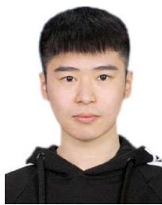

Zhonghao Lyu (Graduate Student Member, IEEE) received the B.Eng. degree from the Dalian University of Technology, Dalian, China, in 2018, and the M.Eng. degree from the University of Science and Technology of China, Hefei, China, in 2021. He is currently pursuing the Ph.D. degree with the School of Science and Engineering (SSE) and the Future Network of Intelligence Institute (FNii), The Chinese University of Hong Kong (Shenzhen), Shenzhen, China. He is also a Visiting Student at the Shenzhen Research Institute of Big Data, Shenzhen.

His research interests include UAV communications, integrated sensing and communication, and edge intelligence.


Guangxu Zhu (Member, IEEE) received the B.Eng. and M.Eng. degrees from Zhejiang University and the Ph.D. degree from The University of Hong Kong in 2019. He is currently a Research Scientist with the Shenzhen Research Institute of Big Data. His research interests include edge intelligence, distributed machine learning, 5G technologies, such as massive MIMO, mmWave communication, and wirelessly powered communications. He was a recipient of the Hong Kong Postgraduate Fellowship (HKPF), the Outstanding Ph.D. Thesis Award from

HKU, and the Best Paper Award from WCSP 2013. He was invited to be a Co-Chair for the “MAC and cross-layer design” track in IEEE PIMRC 2021.


Jie Xu (Senior Member, IEEE) received the B.E. and Ph.D. degrees from the University of Science and Technology of China in 2007 and 2012, respectively. From 2012 to 2014, he was a Research Fellow with the Department of Electrical and Computer Engineering, National University of Singapore. From 2015 to 2016, he was a Post-Doctoral Research Fellow with the Engineering Systems and Design Pillar, Singapore University of Technology and Design. From 2016 to 2019, he was a Professor with the School of Information Engineering,

Guangdong University of Technology, China. He is currently an Associate Professor with the School of Science and Engineering, The Chinese University of Hong Kong, Shenzhen, China. His research interests include wireless communications, wireless information and power transfer, UAV communications, edge computing and intelligence, and integrated sensing and communication (ISAC). He was a recipient of the 2017 IEEE Signal Processing Society Young Author Best Paper Award, the IEEE/CIC ICCC 2019 Best Paper Award, the 2019 IEEE Communications Society Asia-Pacific Outstanding Young Researcher Award, and the 2019 Wireless Communications Technical Committee Outstanding Young Researcher Award. He is the Symposium Co-Chair of the IEEE GLOBECOM 2019 Wireless Communications Symposium, the Workshop Co-Chair of several IEEE ICC and GLOBECOM workshops, the Tutorial Co-Chair of the IEEE/CIC ICCC 2019, and the Vice Co-Chair of the IEEE Emerging Technology Initiative (ETI) on ISAC. He served or is serving as an Editor for the IEEE TRANSACTIONS ON WIRELESS COMMUNICATIONS, IEEE TRANSACTIONS ON COMMUNICATIONS, IEEE WIRELESS COMMUNICATIONS LETTERS, and Journal of Communications and Information Networks, an Associate Editor of IEEE ACCESS, and a Guest Editor of the IEEE WIRELESS COMMUNICATIONS, IEEE JOURNAL ON SELECTED AREAS IN COMMUNICATIONS, and Science China Information Sciences.