# Joint Multi-Domain Resource Allocation and Trajectory Optimization in UAV-Assisted Maritime IoT Networks

Li Ping Qian , Senior Member, IEEE, Hongsen Zhang, Qian Wang , Member, IEEE, Yuan Wu , Senior Member, IEEE, and Bin Lin , Senior Member, IEEE

Abstract—The integration of Maritime Internet of Things (M-IoT) technology and unmanned aerial/surface vehicles (UAVs/USVs) has been emerging as a promising navigational information technique in intelligent ocean systems. In this article, we consider the UAV-assisted M-IoT network where USVs offload computation-intensive maritime tasks via non-orthogonal multiple access (NOMA) to the UAV equipped with the mobileedge computing (MEC) server subject to the UAV mobility. To improve the energy efficiency of offloading transmission and workload computation, we focus on minimizing the total energy consumption by jointly optimizing the USVs’ offloaded workload, transmit power, computation resource allocation, as well as the UAV trajectory subject to the USVs’ latency requirements. Despite the nature of mixed discrete and non-convex programming of the formulated problem, we exploit the vertical decomposition and propose a two-layered algorithm for solving it efficiently. Specifically, the top-layered algorithm is proposed to solve the problem of optimizing the UAV trajectory based on the idea of deep reinforcement learning (DRL), and the underlying algorithm is proposed to optimize the underlying multidomain resource allocation problem based on the idea of the Lagrangian multiplier method. Numerical results are provided to validate the effectiveness of our proposed algorithms as well as the performance advantage of NOMA-enabled computation offloading in terms of overall energy consumption.

Manuscript received 21 May 2022; revised 10 July 2022; accepted 15 August 2022. Date of publication 23 August 2022; date of current version 22 December 2022. This work was supported in part by the Intergovernmental International Cooperation in Science and Technology Innovation Program under Grant 2019YFE0111600; in part by the National Natural Science Foundation of China under Grant 62122069, Grant 62072490, Grant 62071431, Grant 51939001, and Grant 61971083; in part by the Zhejiang Provincial Natural Science Foundation of China under Grant LR17F010002; in part by the Liaoning Revitalization Talents Program under Grant XLYC2002078; in part by the Major Key Project of PCL under Grant PCL2021A03-1; in part by the Science and Technology Development Fund of Macau under Grant 0060/2019/A1 and Grant 0162/2019/A3; in part by the FDCT-MOST Joint Project under Grant 0066/2019/AMJ; and in part by the Research Grant of University of Macau under Grant MYRG2020-00107- IOTSC. (Corresponding author: Li Ping Qian.)

Li Ping Qian, Hongsen Zhang, and Qian Wang are with the College of Information Engineering, Zhejiang University of Technology, Hangzhou 310023, China (e-mail: lpqian@zjut.edu.cn; wangqian18@ zjut.edu.cn).

Yuan Wu is with the State Key Laboratory of Internet of Things for Smart City and the Department of Computer Information Science, University of Macau, Macau, China, and also with Zhuhai UM Science and Technology Research Institute, Zhuhai 519031, China (e-mail: yuanwu@um.edu.mo).

Bin Lin is with the Department of Communication Engineering, Dalian Maritime University, Dalian 116026, China, and also with the Network Communication Research Centre, Peng Cheng Laboratory, Shenzhen 518052, China (e-mail: binlin@dlmu.edu.cn).

Digital Object Identifier 10.1109/JIOT.2022.3201017

Index Terms—Maritime Internet of Things (M-IoT), mobileedge computing (MEC), multidomain resource allocation, nonorthogonal multiple access (NOMA), unmanned aerial vehicle (UAV) trajectory optimization.

# I. INTRODUCTION

HE Internet of Things (IoT) has promoted the rapid development of various applications, such as smart metering, smart manufacturing, smart city/ocean, automatic driving, health monitoring, and many others (see a recent survey in [1]). As a representative IoT application, the Maritime IoT (M-IoT) has been emerging as a promising networking technique for maritime environmental monitoring, underwater biological monitoring, tactical monitoring, and aquaculture monitoring [2]. With the advancement of unmanned surface vehicles (USVs), it has been explored as a type of M-IoT devices for ever-increasing maritime activities [3]. Given the example of a vessel tracking application, MarineTraffic collects and reports almost 520 million automatic identification system messages daily, which involve the positions, courses, and speeds of vessels traveling on the ocean [4]. However, considering the inflexible energy replenishment and limited spectrum resources, it is challenging for USVs to deal with a massive amount of computation-intensive maritime data in an energy-efficient and low-latency way [5].

To cope with these challenges, the integration of unmanned aerial vehicle communication (UAV-C), mobile-edge computing (MEC), and non-orthogonal multiple access (NOMA) has been envisioned to bring enormous potential benefits to the M-IoT. MEC, which deploys a sufficient amount of computation resources at the edge of wireless networks (e.g., macro/micro base stations or access points), can offer cloud computing capabilities to the computation-intensive maritime services [6], [7]. For the USVs deployed in the pelagic zone, they would suffer severe transmission energy consumption when offloading the computation-intensive tasks to the onshore MEC units far from USVs, and severe computation energy consumption when computing these tasks locally. Besides, the USVs are inflexible to replenish energy when deployed in the pelagic zone. To address these shortages, the unmanned aerial vehicle (UAV) can be exploited as portable MEC units in close proximity to USVs for the task computation and data acquisition due to the benefits of mobility, flexibility, and maneuverability [8], [9]. Through offloading parts of computation-intensive tasks from USVs to MEC units equipped in the UAV, the latency in completing the task computation as well as the transmission and computation energy consumption can be efficiently reduced for USVs. However, the scarcity of spectrum resource leads to a heavy pressure on the efficient data transmission between the UAV and massive USVs, and a degraded quality of experience in terms of transmission delay and packet loss consequently. The NOMA scheme thus can be used to serve multiple USVs on the same frequency–time resource simultaneously through the non-orthogonal resource allocation in the power domain to address the MEC offloading issue [10].

Thanks to the great potentials, the paradigms of MEC, NOMA, and UAV-C have attracted lots of research efforts in the past years [11], [12], [13], [14], [15], [16], [17], [18], [19], [20]. For example, to study the NOMA-assisted MEC network, Huang et al. [11] investigated the joint task offloading and resource allocation for achieving both channel diversity and computing diversity. Ding et al. [12] addressed the joint optimization issue of the power and time allocation for decreasing the energy consumption of computation offloading. Due to the maneuverability of UAVs, the integration of UAV-C and MEC can further improve the computation offloading performance [13], [14]. Yang et al. [13] minimized the total energy consumption by jointly optimizing user association, power control, computation resource allocation, and UAVs’ locations for UAV-enabled MEC networks. Zhang and Ansari [14] utilized the UAV as a computing node as well as a relay node to improve the average user latency in the UAV-aided MEC network and minimized the average latency of all users by jointly optimizing the UAV placement, the UE association, and the communication resource assignment. Chen et al. [15] minimized the energy consumption of task offloading while guaranteeing the average queue length by dynamically adjusting offloading decisions in MEC for IoT. To increase the connectivity of users, the user grouping has been studied for NOMA systems [16], [17].

As the aerial base station, the UAV is subject to the additional propulsion power consumption for maintaining its suspension and motion, and thus it is of practical interest to improve the system performance by optimizing the UAV trajectory for UAV-assisted MEC networks. For example, Zhang et al. [18] maximized the energy efficiency by iteratively optimizing the UAV trajectory. Li et al. [19] maximized the UAV energy efficiency by jointly optimizing the UAV trajectory, the user transmit power, and the computation load allocation. Hu et al. [20] proposed the penalty dual decomposition-based algorithm to minimize the maximum delay among all users by jointly optimizing the UAV trajectory, the ratio of task offloading, and the user scheduling.

Despite the tremendous efforts have been devoted to UAVassisted MEC networks [11], [12], [13], [14], [15], [16], [17], [18], [19], [20], the minimization of total energy consumption has not been yet studied for UAV-assisted M-IoT networks, in the multidomain (e.g., power, time, computation, and spatial) resource optimization framework of transmit power, task offloading ratio, computation resource allocation, and UAV trajectory. Due to the limited energy supply of UAVs and USVs, it is crucial to prolong their lifetime by minimizing the total energy consumption. Driven by the considerations aforementioned, the goal of our work is to minimize the total energy consumption of UAVs and USVs by jointly optimizing the communication and computation resource allocation, and the UAV trajectory as well. Noticeably, in the UAV-assisted terrestrial network, the IoT devices can be fixed in place, and thus the UAV only acquires the initial locations of IoT devices when performing the resource allocation and UAV trajectory optimization. On the contrary, in the UAV-assisted maritime network, the USVs are usually floating in a region due to the random influence of weather, ocean conditions, etc. It implies that the UAV has to frequently update the USVs’ location information before making decisions. We summarize the main contributions as follows.

1) Problem Formulation: We first propose a NOMA-based MEC model for the UAV-assisted M-IoT system that provides USVs with the low-latency and reliable computing services. We then formulate the total energy consumption minimization problem based on the proposed system model, which jointly optimizes the USVs’ transmit power, task offloading ratio, computation resource allocation, and the UAV trajectory as well.

2) Efficient Algorithm Design: Despite the strict nonconvexity of the formulated joint optimization problem, we identify the hidden convexity of resource allocation under the given UAV trajectory and analytically characterize the optimal USVs’ resource allocation decisions consequently. By exploiting this feature, an efficient layered algorithm is proposed to obtain the optimal solution to the joint optimization problem, in which the resource allocation and UAV trajectory are alternately optimized. Specifically, the optimal resource allocation decisions are achieved in the closed-form expression based on the Lagrange dual method and the idea of gradient descent. Furthermore, a deep deterministic policy gradient (DDPG) algorithm is developed to find the optimal UAV trajectory on the basis of the proposed resource allocation optimization algorithm.

3) Performance Evaluation: Extensive simulation results are provided to evaluate the performance of our algorithms proposed for the UAV-assisted M-IoT system. Specifically, the simulations show that the tradeoff between the time complexity and the optimality can be gained by tuning the simulation parameters. Furthermore, it is validated that the proposed layered optimization algorithm can effectively reduce the whole M-IoT network’s total energy consumption, in comparison with the existing algorithms.

The remainder of this article is organized as follows. We review the related studies in Section II. We present the UAV-assisted M-IoT network model and problem formulation in Section III. Section IV presents a two-layered algorithm to solve the proposed optimization problem efficiently. The performance of the proposed algorithm is evaluated through extensive simulations in Section V. Finally, we conclude this work and discuss the future direction.

# II. RELATED WORK

Driven by the potential benefits, many research efforts have been done on NOMA, MEC, and UAV-C recently. Considering this work focused on the NOMA-based MEC model for the UAV-assisted M-IoT system, we elaborate on the related studies on NOMA-enabled MEC and UAV trajectory optimization in this section.

Studies on NOMA-MEC: A proper joint management of NOMA and MEC has been explored to improve the performance of computation and communication. There have been many studies on investigating the integration of MEC and NOMA [21], [22], [23], [24]. For example, Qian et al. [21] proposed an optimal algorithm for the NOMA-MEC-assisted IoT network to obtain the optimal the successive interference cancelation (SIC) ordering and computation resource allocation. Fang et al. [22] studied a multiuser NOMA-MEC network and proposed a low complexity algorithm to solve the task delay minimization by optimizing the task partition ratio and transmit power. Li et al. [23] investigated how to exploit the cooperative mechanism between NOMA user pairs to enhance the security of the NOMA-MEC system. Wu et al. [24] maximized the minimum anti-eavesdropping ability for uplink NOMA users in the context of the worst case secrecy rate requirements and limited transmit power budgets for the uplink NOMA-MEC network. Fang et al. [25] proposed a low complexity algorithm to minimize the total energy consumption by considering the task assignment, power allocation, and user association for the multiuser NOMA-MEC network. With the rapid development of artificial intelligence (AI), many studies have been done to further exploit the potentials of NOMA and MEC by designing disparate learning schemes [26], [27], [28]. Tuong et al. [26] utilized the deep Q-network and actor–critic network to reduce effectively the computational overhead by jointly optimizing the computation offloading policy and channel resource allocation in a NOMA-MEC network. Qian et al. [27] proposed a cross-entropy algorithm based on the probabilistic learning, to find the optimal pairing of vehicular computing-users in NOMA-aided vehicular edge computing networks. Li et al. [28] proposed a deep-learning-based intelligent offloading scheme to minimize the total energy consumption in dual-connectivity and NOMA-assisted computation offloading systems.

Studies on UAV Trajectory Optimization: There have been extensive studies recently done to address a variety of challenges in UAV-C networks. Due to the attractive advantages of UAVs in terms of their flexible movement and easy deployment, the integration of UAV-C with MEC can further enhance the computational performance [20], [29], [30], [31], [32], [33]. Designing the optimal trajectory of the UAV is not only one of the research challenges but also a significant problem to overcome in practice. Yu et al. [29] proposed an efficient algorithm based on the successive convex approximation to minimize the weighted sum of the service delay of all IoT devices and UAV energy consumption, by jointly optimizing the UAV position, resource allocation, and task splitting decisions. Ji et al. [30] developed alternating iterative algorithms based on the block alternating descent method to minimize the weighted-sum energy consumption of the UAV and user devices, by jointly optimizing the UAV trajectory and computation resource allocation subject to the number of computation bits. The UAV’s velocity has an enormous influence on its own energy consumption. Thus, Zeng and Zhang [31] investigated a point-to-point communication link between the UAV and a ground user, and the UAV’s trajectory was optimized under a UAV’s energy consumption model at different speeds. Mei et al. [32] proposed a block coordinate descent algorithm to minimize the overall energy consumption of the UAV, by optimizing the resource allocation and UAV trajectory. Hu et al. [20] proposed a novel penalty dual decompositionbased algorithm to minimize the sum of the maximum delay among all the users, by jointly optimizing the UAV trajectory, task offloading ratio, and user scheduling. Zhang et al. [33] minimized the total energy consumption via the Lagrangian duality method, by optimizing the bits allocation, time slot scheduling, and power allocation as well as UAV trajectory. Zhang et al. [34] investigated an energy-efficient UAV-assisted MEC framework in which multiple UAVs are deployed as edge servers to provide computation offloading to terrestrial users in NOMA. Also, the AI-based methods have drawn lots of research interests to exploit the NOMA and MECbased in the UAV communications [35], [36]. For example, a deep reinforcement learning (DRL) algorithm was proposed in [35] to improve the performance of UAV communications by jointly optimizing the UAV trajectory, transmit power, and power reflection coefficients. Yin and Yu [36] proposed the multiagent reinforcement learning algorithm to optimize both overall and fairness throughput.

These previous works mainly focused on optimizing the multidomain resource allocation for MEC-enabled communication systems with/without the aid of UAVs. To the best of our knowledge, the total energy consumption minimization has not been studied for the UAV-assisted M-IoT network in which USVs offload the computation-intensive tasks to the hovering UAV in the NOMA.

# III. SYSTEM MODEL AND PROBLEM FORMULATION

# A. System Model

In this article, we consider a NOMA-based UAV-assisted M-IoT MEC system as illustrated in Fig. 1, which consists of a UAV and a group of USVs sailing on the sea denoted as $\mathcal { N } = \{ 1 , \dots , N \}$ . Every USV has a computing processor which can compute simple tasks locally. The UAV equipped with powerful MEC units is deployed in the air as an aerial base station to collect and process the computation-intensive tasks offloaded from USVs. The power-domain NOMA is applied for the computation offloading from the USVs to the UAV. To be specific, all USVs associated with the UAV offload their computation-intensive tasks on the same frequency–time resource simultaneously to the UAV for the lower task execution latency, and then the task signals of all USVs are decoded by successively canceling the co-channel interference at the

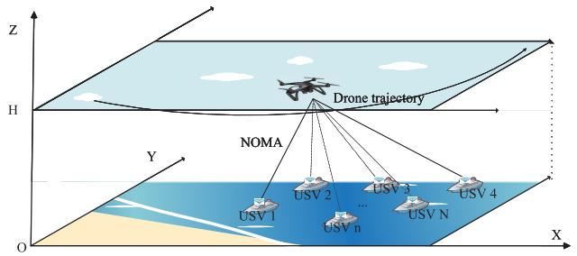

<details>
<summary>flowchart</summary>

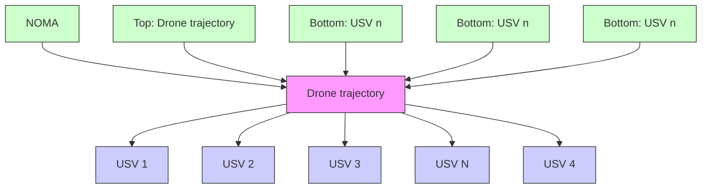
</details>

Fig. 1. NOMA-based UAV-assisted M-IoT network consisting of a UAV flying in the air and a group of USVs sailing on the sea, in which all USVs can offload their computation-intensive tasks to the UAV for the lower task execution latency in NOMA.

UAV. In order to execute the offloaded computation-intensive tasks more efficiently, the UAV flies at a fixed altitude level height H above the sea surface for the task collection during the time duration T. To represent the UAV trajectory, we divide the time duration T into M equal-length time slots, each denoted by $m \in \mathcal { M } = \{ 1 , \dotsc , M \}$ . We use the 3-D Cartesian coordinate system to represent the locations of USVs and UAV, and set the z-coordinate of the sea surface to be 0. We define the coordinate of the nth USV1 in the mth time slot as $q _ { n m } = ( x _ { n m } , y _ { n m } , z _ { n m } )$ , where $x _ { n m } , y _ { n m } .$ , and $z _ { n m }$ mean the x-coordinate, y-coordinate, and z-coordinate in the mth time slot, respectively. The location of UAV in the mth time slot is denoted by $U _ { m } = ( X _ { m } , Y _ { m } , H )$ , where $X _ { m }$ and $Y _ { m }$ mean the x-coordinate and y-coordinate of UAV in the mth time slot, respectively.

# B. Problem Formulation

Due to the air-to-ocean channel, the propagation between the UAV and USA can be considered as the Line-of-Sight (LoS) propagation. Thus, the channel gain between the nth USV and the UAV in the mth time slot can be represented as

$$
h _ {n m} = \frac {h _ {0}}{\| U _ {m} - q _ {n m} \| ^ {2} + H ^ {2}} \forall n \in \mathcal {N} \tag {1}
$$

where $h _ { 0 }$ denotes the channel gain of LoS propagation at the reference distance $d _ { 0 } = 1 \mathrm { ~ m ~ }$ . In NOMA, we adopt the successive cancelation ordering in the descending ordering of channel gains. That is, the task signals from the USV with the highest channel gain would be decoded first. Specifically, when decoding the task signals from the USV $n ,$ the task signals from other USVs with lower channel gains are regarded as the co-channel interference. Let $p _ { n m }$ be the USV n’s transmit power in the mth time slot. Based on the Shannon capacity formula, the data rate of the USV n in the mth time slot is expressed as

$$
R _ {n m} = W _ {m} \log \left(1 + \frac {h _ {n m} p _ {n m}}{\sum_ {\forall j : h _ {j m} \leq h _ {n m} \& j \in \mathcal {N}} h _ {j m} p _ {j m} + n _ {0}}\right) \forall n \in \mathcal {N} \tag {2}
$$

1In this article, we assume that the USVs frequently send their location data obtained by the global positioning system (GPS) to the UAV, and thus the UAV knows the locations of USVs a priori before making resource allocation and offloading decisions.

where $W _ { m }$ denotes the bandwidth used in the mth time slot, and n0 denotes the power of additive Gaussian noise at the UAV. Suppose that every USV n has a $B _ { n } \mathrm { - } \mathrm { b i t }$ computationintensive tasks, which can be computed locally or offloaded to the UAV for the computation. Let $\gamma _ { n }$ denote the ratio of computation-intensive task offloaded from the USV n to the UAV. We use $B _ { n m }$ to indicate the number of bits offloaded by the USV n in the mth time slot, which satisfies

$$
\gamma_ {n} B _ {n} = \sum_ {m = 1} ^ {M} \frac {T}{M} R _ {n m}. \tag {3}
$$

By (2) and (3), we have

$$
\sum_ {m = 1} ^ {M} W _ {m} \log \left(1 + \frac {h _ {n m} p _ {n m}}{\sum_ {\forall j : h _ {j m} \leq h _ {n m} \& j \in \mathcal {N}} h _ {j m} p _ {j m} + n _ {0}}\right) = \frac {M}{T} \gamma_ {n} B _ {n}. \tag {4}
$$

The USVs and UAV will execute the task data computing individually. Let $C _ { s n }$ denote the USV n’s computing capability. The local computation time of the USV n can be expressed as

$$
T _ {s n} = \frac {(1 - \gamma_ {n}) s _ {n} B _ {n}}{C _ {s n}} \forall n \in \mathcal {N} \tag {5}
$$

where $s _ { n }$ denotes the number of cycles needed by the USV n for computing each bit. Let $C _ { a n }$ denote the UAV’s computation resource allocated to compute the task from the USV n, which is subject to the UAV’s computing capacity $C _ { \mathrm { m a x } }$ , i.e.,

$$
\sum_ {n = 1} ^ {N} C _ {a n} \leq C _ {\max}. \tag {6}
$$

Correspondingly, the computation time needed to compute the task from the USV n satisfies

$$
T _ {a c} = \frac {\gamma_ {n} s _ {a} B _ {n}}{C _ {a n}} \forall n \in \mathcal {N} \tag {7}
$$

where $s _ { a }$ denotes the number of cycles of computing each bit in the UAV. Let $E _ { t n }$ and $E _ { c n }$ indicate the transmission and computation energy consumption of the USV n, satisfying

$$
E _ {t n} = \sum_ {m = 1} ^ {M} p _ {n m} T / M \forall n \in \mathcal {N} \tag {8}
$$

and

$$
E _ {c n} = l _ {n} (1 - \gamma_ {n}) s _ {n} C _ {s n} ^ {2} B _ {n} \forall n \in \mathcal {N} \tag {9}
$$

respectively. Here, $l _ { n }$ denotes the effective switched capacitance of USV n [37]. Let $\hat { E } _ { c }$ denote the UAV’s computation energy consumption, satisfying

$$
\hat {E} _ {c} = l _ {v} \sum_ {n = 1} ^ {N} \gamma_ {n} s _ {a} C _ {a n} ^ {2} B _ {n} \tag {10}
$$

where $l _ { \nu }$ denotes the UAVs effective switched capacitance. Let $\nu _ { m }$ denote the UAV’s velocity in the mth time slot, i.e.,

$$
v _ {m} = \frac {\| U _ {m} - U _ {m - 1} \| M}{T} \forall m \in \mathcal {M}. \tag {11}
$$

We use $\hat { E } _ { f }$ to indicate the UAV’s propulsion energy consumption, i.e.,

$$
\begin{array}{l} \hat {E} _ {f} = \sum_ {m = 1} ^ {M} \left(\rho_ {1} v _ {m} ^ {3} + \frac {\rho_ {2}}{v _ {m}}\right) \\ = \sum_ {m = 1} ^ {M} \left(\rho_ {1} \left(\frac {\| U _ {m} - U _ {m - 1} \| M}{T}\right) ^ {3} + \frac {T \rho_ {2}}{\| U _ {m} - U _ {m - 1} \| M}\right) \tag {12} \\ \end{array}
$$

where $\rho _ { 1 }$ and $\rho _ { 2 }$ are the parameters related to the aircrafts weight, wing area, air density, etc. [38]. We aim to minimize the total energy consumption of the considered UAV-assisted M-IoT system subject to the execution latency constraint and computation resource capacity. Mathematically, we formulate the joint optimization problem in the following form, denoted by OECM:

(OECM):

$$
\min _ {\boldsymbol {\gamma}, \boldsymbol {p}, \boldsymbol {C}, \boldsymbol {U}} \hat {E} _ {c} + \sum_ {n = 1} ^ {N} (E _ {t n} + E _ {c n}) + \hat {E} _ {f} \tag {13a}
$$

s.t. constraints (4), (6) (13b)

$$
0 \leq \gamma_ {n} \leq 1 \forall n \in \mathcal {N} \forall m \in \mathcal {M} \tag {13c}
$$

$$
0 \leq \frac {\| U _ {m} - U _ {m - 1} \| M}{T} \leq v _ {\max} \forall m \in \mathcal {M} (1 3 d)
$$

$$
0 \leq p _ {n m} \leq P _ {n} ^ {\max} \forall n \in \mathcal {N} \tag {13e}
$$

$$
\max \{T _ {s n}, T + T _ {a c} \} \leq T _ {\max} \forall n \in \mathcal {N} \tag {13f}
$$

$$
C _ {a n} \geq 0 \forall n \in \mathcal {N} \tag {13g}
$$

where γ , p, C, and U denote the vectors of $\gamma _ { n } ^ { \prime s } , p _ { n m } ^ { \prime s } , C _ { a n } ^ { \prime s } .$ and $U _ { m } ^ { \prime s } ,$ respectively. We explain the formulation of Problem (OECM) as follows. Constraint (13c) denotes the scope of the ratio of computation-intensive task offloaded from the USV n to the UAV. Constraints (13d) and (13e) mean that the UAV’s flight velocity and the transmission power of the USV n are subject to the maximum allowable value $\nu _ { \mathrm { m a x } }$ and $P _ { n } ^ { \mathrm { m a x } }$ , respectively. Constraint (13f) means that to perform the efficient task computation, each USV must meet the maximum execution latency requirement $T _ { \mathrm { m a x } }$ . Constraint (13g) limits the scope of the UAV’s computing capacity. Note that due to the UAV trajectory optimization, Theorem 1 shows the NP-hardness of the optimization Problem (OECM).

Theorem 1: The optimization problem (13) is NP-hard.

Proof: The optimization problem jointly optimizes the UAV trajectory and multidimensional resource allocation. Given the UAV trajectory, the optimization of resource allocation is to find the root of polynomial equations, and thus it is convex. However, the UAV trajectory optimization is equivalent to the traveling salesman problem, which is NPhard. Thus, it follows that the optimization problem in (13) is NP-hard.

Considering the NP-hardness, Problem (OECM) is challenging to solve in general. To address this difficulty, we explore the layered feature of Problem (OECM) and adopt a decomposition approach for solving it in the following section.

# IV. PROBLEM TRANSFORMATION AND DECOMPOSITION

Due to its NP-hardness, Problem (OECM) is challenging to solve due to the existence of the UAV trajectory optimization. In this section, we first transform Problem (OECM) into an equivalent optimization problem through reparameterization. Then, we propose a double-layered decomposition approach for solving Problem (OECM-E).

# A. Equivalent Transformations

To make Problem (OECM) tractable, we first transform it into an equivalent optimization problem by introducing a new variable $x _ { n m } .$ . Specifically, the variable $x _ { n m }$ means the SINR received from the USV n, satisfying

$$
x _ {n m} = \frac {h _ {n m} p _ {n m}}{\sum_ {\forall j : h _ {j m} \leq h _ {n m} \& j \in \mathcal {N}} h _ {j m} p _ {j m} + n _ {0}}. \tag {14}
$$

By (14), $p _ { n m }$ can be rewritten as

$$
p _ {n m} = \frac {n _ {0} x _ {n m} \prod_ {\forall j : h _ {j m} \leq h _ {n m} \& j \in \mathcal {N}} (1 + x _ {j m})}{h _ {n m}}. \tag {15}
$$

It implies that (13e) can be rewritten as

$$
0 \leq \frac {n _ {0} x _ {n m} \prod_ {\forall j : h _ {j m} \leq h _ {n m} \& j \in \mathcal {N}} (1 + x _ {j m})}{h _ {n m}} \leq P _ {n} ^ {\max} \tag {16}
$$

and (13f) can be rewritten as

$$
\max _ {n} \left\{\frac {(1 - \gamma_ {n}) S _ {n} B _ {n}}{C _ {s n}}, T + \frac {\gamma_ {n} S _ {a} B _ {n}}{C _ {a n}} \right\} \leq T _ {\max}. \tag {17}
$$

Since the transmit power of USV n increases with the increase of $x _ { j m } ^ { \prime s }$ over j, (4) can be rewritten as

$$
\sum_ {m = 1} ^ {M} W _ {m} \log (1 + x _ {n m}) \geq \frac {M}{T} \gamma_ {n} B _ {n} \forall n \in \mathcal {N}. \tag {18}
$$

With the above transformations, we can transform the original Problem (OECM) into the following equivalent form:

(OECM − E):

$$
\begin{array}{l} \min _ {\boldsymbol {\gamma}, \boldsymbol {x}, \boldsymbol {C}, \boldsymbol {U}} \sum_ {n = 1} ^ {N} \left(\frac {T}{M} \sum_ {m = 1} ^ {M} \frac {n _ {0} x _ {n m} \prod_ {\forall j : h _ {j m} \leq h _ {n m} \& j \in \mathcal {N}} (1 + x _ {j m})}{h _ {n m}} + E _ {c n}\right) \\ + \hat {E} _ {c} + \hat {E} _ {f} \\ \end{array}
$$

s.t. constraints (13d), (16)−(18)

$$
\begin{array}{l} \sum_ {n = 1} ^ {N} C _ {a n} \leq C _ {\max} \\ 0 \leq \gamma_ {n} \leq 1, x _ {n m} \geq 0, C _ {a n} \geq 0 \forall n \in \mathcal {N} \forall m \in \mathcal {M} (1 9) \\ \end{array}
$$

where x means the vector of $x _ { n m } ^ { \prime s } .$

# B. Layered Approach for Solving Problem (OECM-E)

We propose a double-layered decomposition approach to solve Problem (OECM-E), which includes 1) a subproblem for optimizing (x, C) given UAV trajectory U and offloading ratio vector γ and 2) a top-problem for further optimizing U and γ based on the subproblem output.

1) Subproblem for Optimizing $( x , C ) { \mathrm { . } }$ Supposing that the UAV trajectory U and offloading ratio vector γ are given in advance, we first consider the following subproblem which optimizes (x, C):

# (OECM-E-Sub):

$$
\begin{array}{l} E (\boldsymbol {\gamma}, \boldsymbol {U}) = \min _ {\boldsymbol {x}, \boldsymbol {C}} \sum_ {n = 1} ^ {N} \left(\frac {T}{M} \sum_ {m = 1} ^ {M} \frac {n _ {0} x _ {n m} \prod_ {\forall j : h _ {j m} \leq h _ {n m} \& j \in \mathcal {N}} (1 + x _ {j m})}{h _ {n m}}\right) \\ + \hat {E} _ {c} \\ \end{array}
$$

s.t. constraints (16), (18)

$$
T + \frac {\gamma_ {n} S _ {a} B _ {n}}{C _ {a n}} \leq T _ {\mathrm{max}}
$$

$$
\sum_ {n = 1} ^ {N} C _ {a n} \leq C _ {\max}
$$

$$
x _ {n m} \geq 0, C _ {a n} \geq 0 \forall n \in \mathcal {N} \forall m \in \mathcal {M}. \tag {20}
$$

We emphasize that since the trajectory U and offloading ratio vector γ are fixed in Problem (OECM-E), the propulsion energy consumption $\hat { E } _ { f }$ and the USV n’s computation energy consumption $E _ { c n }$ are fixed and the objective function of Problem (OECM-E-Sub) stems from the previous two terms of (13a) before. Theorem 2 shows the optimization Problem (OECM-E-Sub) can be transformed into a convex optimization problem.

Theorem 2: The optimization Problem (OECM-E-Sub) can be transformed into a convex optimization problem through the one-to-one logarithmic domain and range transformation.

Proof: According to the geometric programming, we use the logarithmic function to transform the objective function and constraint conditions to transform the optimization problem (20) into a convex optimization problem. We use $\tilde { x } _ { n m }$ and $\tilde { C } _ { a n }$ to denote the logarithmic transformation of $x _ { n m }$ and $C _ { a n } ,$ respectively, i.e., $\begin{array} { c c l } { { \tilde { x } _ { n m } } } & { { = } } & { { \log x _ { n m } } } \end{array}$ and $\tilde { C } _ { a n } ~ = ~ \log C _ { a n } .$ . Therefore, given the UAV trajectory $\pmb { U }$ and offloading ratio vector $\gamma ,$ , Problem (OECM-E-Sub) can be equivalently transformed into the following Problem (OECM-E-Sub-Log):

# (OECM-E-Sub-Log):

$$
\begin{array}{l} E (\boldsymbol {\gamma}, \boldsymbol {U}) = \min _ {\tilde {\mathbf {x}}, \tilde {\boldsymbol {C}}} \log \sum_ {n = 1} ^ {N} \left(\frac {T}{M} \sum_ {m = 1} ^ {M} \frac {\prod_ {\forall j : h _ {j m} \leq h _ {n m} \& j \in \mathcal {N}} \left(1 + e ^ {\tilde {x} _ {j m}}\right)}{h _ {n m}} n _ {0} e ^ {\tilde {x} _ {n m}} \right. \\ \left. + l _ {v} \gamma_ {n} B _ {n} s _ {a} e ^ {2 \tilde {C} _ {a n}}\right) \tag {21a} \\ \end{array}
$$

$$
\text { s.t. } \log \left(\sum_ {n = 1} ^ {N} e ^ {\tilde {C} _ {a n}}\right) \leq \log C _ {\max} \tag {21b}
$$

$$
\log \left(\frac {\gamma_ {n} S _ {a} B _ {n}}{T _ {\max} - T}\right) \leq \tilde {C} _ {a n} \tag {21c}
$$

$$
\tilde {x} _ {n m} + \sum_ {\forall j: h _ {j m} \leq h _ {n m} \& j \in \mathcal {N}} \log \left(1 + e ^ {\tilde {x} _ {j m}}\right)
$$

$$
\leq \log \frac {h _ {n m} P _ {n} ^ {\max}}{n _ {0}} \tag {21d}
$$

$$
\log \left(\frac {M}{T} \gamma_ {n} B _ {n}\right) \leq \log \left(\sum_ {m = 1} ^ {M} W _ {m} \log \left(1 + e ^ {\tilde {x} _ {n m}}\right)\right). \tag {21e}
$$

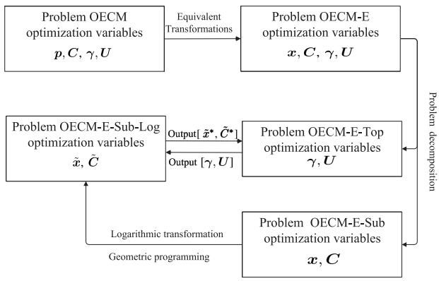

<details>
<summary>flowchart</summary>

```mermaid
graph TD
    A["Problem OEM optimization variables p, C, γ, U"] -->|Equivalent Transformations| B["Problem OEM-E optimization variables x, C, γ, U"]
    B --> C["Problem OEM-E-Top optimization variables γ, U"]
    C --> D["Problem OEM-E-Sub optimization variables x, C"]
    D --> E["Logarithmic transformation Geometric programming"]
    E --> F["Problem decomposition"]
    F --> A
    C --> G["Output [x̃*, Č*"]]
    G --> H["Output [γ, U"]]
    H --> D
```
</details>

$\mathrm { F i g . } 2 .$ Transformation and decomposition of Problem (OECM). (a) Problem (OECM) is converted into an equivalent optimization Problem (OECM-E) through reparameterization. (b) Double-layered decomposition approach is proposed to solve: the convex subproblem for optimizing (x˜, C˜ ), and non-convex top-problem for optimizing (γ , U).

By the property of the geometric programming, the transformed objective function (21a) and (21b), (21c) and (21d) are convex. Further, the function log $\begin{array} { r } { ( \sum _ { m = 1 } ^ { M } W \log ( 1 + e ^ { \tilde { x } _ { n m } } ) ) } \end{array}$ is concave, and thus (21e) is convex. Consequently, the Problem (OECM-E-Sub-Log) is convex.

2) Top-Problem for Optimizing $( \gamma , U ) .$ With $E ( \pmb { \gamma } , \pmb { U } )$ output from the subproblem before, we further optimize the UAV trajectory U and offloading ratio vector γ , which corresponds to the following Top-problem:

# (OECM-E-Top):

$$
\min _ {\boldsymbol {\gamma}, \boldsymbol {U}} E (\boldsymbol {\gamma}, \boldsymbol {U}) + \sum_ {n = 1} ^ {N} E _ {c n} + \hat {E} _ {f}
$$

$\mathrm { s . t . } 0 \leq \gamma _ { n } \leq 1$

$$
\frac {(1 - \gamma_ {n}) S _ {n} B _ {n}}{C _ {s n}} \leq T _ {\max}
$$

$$
0 \leq \frac {\| U _ {m} - U _ {m - 1} \| M}{T} \leq v _ {\max} \forall m \in \mathcal {M}. \tag {22}
$$

The advantage of the above-layered approach is as follows. By exploiting the convex nature of Problem (OECM-E-Sub), we can derive its optimal solution (x, C) with the convex optimization arguments. Considering the NP-hardness of UAV trajectory and offloading ratio $( \gamma , U )$ optimization, we propose a DRL-based algorithm for solving Problem (OECM-E-Top). In summary, Fig. 2 shows the process of the equivalent transformation and double-layered decomposition about Problem (OECM).

# V. ALGORITHM DESIGN

In this section, we aim to find the optimal transmit power, task offloading ratio, computation resource allocation, and UAV trajectory by optimizing multiple mutual-coupling variables in Problem (OECM-E) sequentially in the doublelayered decomposition framework. We first develop an efficient optimal algorithm to solve Problem (OECM-E-Sub) based on the primal–dual arguments, and further find the optimal UAV trajectory and offloading ratio vector of Problem (OECM-E-Top) in the DRL framework.

# A. Multidimensional Resource Optimization (Sub-Algorithm)

Due to the convex nature (Theorem 2), the resource allocation variables $( \tilde { \pmb { x } } , \tilde { \pmb { C } } )$ can be optimized by the KKT method. Specifically, we first have the Lagrangian of the Problem (OECM-E-Sub-Log) as (23)

$$
\begin{array}{l} \mathcal {L} = \mathcal {L} (\tilde {\boldsymbol {x}}, \tilde {\boldsymbol {C}}, \boldsymbol {\varphi}, \xi , \boldsymbol {\varrho}, \boldsymbol {\psi}) \\ = \log \sum_ {n = 1} ^ {N} \left(\frac {T}{M} \sum_ {m = 1} ^ {M} \frac {n _ {0} e ^ {\tilde {x} _ {n m}} \prod_ {\forall j : h _ {j m} \leq h _ {n m} \& j \in \mathcal {N}} \left(1 + e ^ {\tilde {x} _ {j m}}\right)}{h _ {n m}} \right. \\ \left. \right. + \left. l _ {v} \gamma_ {n} B _ {n} s _ {a} e ^ {2 \tilde {C} _ {a n}}\right) \\ + \sum_ {n = 1} ^ {N} \varphi_ {n m} \left(\tilde {x} _ {n m} - \log \frac {h _ {n m} P _ {n} ^ {\max}}{n _ {0}} \right. \\ \left. + \sum_ {\forall j: h _ {j m} \leq h _ {n m} \& j \in \mathcal {N}} \log \left(1 + e ^ {\tilde {x} _ {j m}}\right)\right) \\ + \xi \left(\log \left(\sum_ {n = 1} ^ {N} e ^ {\tilde {C} _ {a n}}\right) - \log C _ {\max}\right) \\ + \sum_ {n = 1} ^ {N} \varrho_ {n m} \left(\log \left(\frac {M}{T} \gamma_ {n} B _ {n}\right) \right. \\ - \log \left(\sum_ {m = 1} ^ {M} W _ {m} \log \left(1 + e ^ {\tilde {x} _ {n m}}\right)\right) \\ + \sum_ {n = 1} ^ {N} \psi_ {n m} \left(\log \left(\frac {\gamma_ {n} S _ {a} B _ {n}}{T _ {\max} - T}\right) - \tilde {C} _ {a n}\right) \tag {23} \\ \end{array}
$$

where $\varphi , \xi , \varrho ,$ , and ψ represent the vector of $\varphi _ { n m } , \xi , \varrho _ { n m } .$ and $\psi _ { n m } .$ . Also, $\varphi _ { n m } \geq 0 , \xi \geq 0 , \varrho _ { n m } \geq 0 ,$ , and $\psi _ { n m } \geq 0$ are the Lagrange multipliers corresponding to (21b)–(21e), respectively. Then, we minimize the Lagrangian function  (23) and maximize the Lagrangian dual function g(λ, ϕ, ξ, , ψ )

$$
g (\boldsymbol {\varphi}, \xi , \boldsymbol {\varrho}, \boldsymbol {\psi}) = \min _ {\tilde {x}, \tilde {C}} \mathcal {L} \left(\tilde {x}, \tilde {C}, \boldsymbol {\varphi}, \xi , \boldsymbol {\varrho}, \boldsymbol {\psi}\right) \tag {24}
$$

and

$$
\begin{array}{l} \max _ {\xi} g (\varphi , \xi , \varrho , \psi) \\ \varphi , \xi , \varrho , \psi \\ \text { s.t. } \varphi_ {n m} \geq 0, \xi \geq 0, \varrho_ {n m} \geq 0, \psi_ {n m} \geq 0. \tag {25} \\ \end{array}
$$

Considering the convex nature, we propose the optimal allocation algorithm to solve (24) and (25) on the basis of the gradient descent method and the subgradient method. In particular, the proposed algorithm has three key ingredients at each iteration j as follows.

1) Determine a descent direction of the optimization variables in (24).   
2) Update the optimization variables in (24) by the linear search.   
3) Update the multiplier variables in (25) by the subgradient method.

In the following, we would introduce the specific details of the proposed resource allocation algorithm.

First, the objective function (21a) in the optimization Problem (OECM-E-Sub-Log) is expressed as log $\Theta ( \tilde { \pmb { x } } , \tilde { \pmb { C } } )$ . We have the first-order derivatives of the Lagrangian function $\pmb { \mathcal { L } }$ over x˜ and $\tilde { c }$ as follows:

$$
\begin{array}{l} \frac {\partial \mathcal {L}}{\partial \tilde {x} _ {n m}} = \frac {n _ {0} T}{M \Theta (\tilde {\boldsymbol {x}} , \tilde {\boldsymbol {C}})} \sum_ {m = 1} ^ {M} \left(\frac {e ^ {\tilde {x} _ {n m}} \prod_ {\forall j : h _ {j m} \leq h _ {n m} \& j \in \mathcal {N}} (1 + e ^ {\tilde {x} _ {j m}})}{h _ {n m}} \right. \\ \left. + \sum_ {\forall i: h _ {i m} \geq h _ {n m} \& i \in \mathcal {N}} \frac {e ^ {\tilde {x} _ {i m} + \tilde {x} _ {n m}} \prod_ {\forall j : h _ {j m} \leq h _ {i m} \& j \neq n \& j \in \mathcal {N}} \left(1 + e ^ {\tilde {x} _ {j m}}\right)}{h _ {n m}}\right) \\ + \frac {\varrho_ {n m} e ^ {\tilde {x} _ {n m}}}{W _ {m} \log (1 + e ^ {\tilde {x} _ {n m}}) (1 + e ^ {\tilde {x} _ {n m}})} \\ + \varphi_ {n m} + \frac {e ^ {\tilde {x} _ {n m}}}{\left(1 + e ^ {\tilde {x} _ {n m}}\right)} \sum_ {i = 1} ^ {n - 1} \varphi_ {i m} \tag {26} \\ \end{array}
$$

$$
\frac {\partial \mathcal {L}}{\partial \tilde {C} _ {a n}} = \frac {2 l _ {v} \gamma_ {n} s _ {a} B _ {n} e ^ {2 \tilde {C} _ {a n}}}{\Theta (\tilde {\boldsymbol {x}} , \tilde {\boldsymbol {C}})} + \xi \frac {e ^ {\tilde {C} _ {a n}}}{\sum_ {i = 1} ^ {N} e ^ {\tilde {C} _ {a i}}} - \psi_ {n m}. \tag {27}
$$

Second, let x˜ (j−1) and C˜ (j−1) $\tilde { \pmb { x } } ^ { ( j - 1 ) }$ $\tilde { \pmb { C } } ^ { ( j - 1 ) }$ represent the updated variables of (24) at the (j − 1)th iteration, and ${ \pmb { \varphi } } ^ { ( j - 1 ) }$ , ξ (j−1) , $\pmb { \varrho } ^ { ( j - 1 ) }$ , and $\pmb { \psi } ^ { ( j - 1 ) }$ represent the updated Lagrangian multiplier number of (24) at the $( j \mathrm { ~ - ~ } 1 ) !$ th iteration. Therefore, the decreasing directions of the optimized variables in (24) can be expressed as

$$
\Delta_ {\tilde {x} _ {n m}} ^ {(j)} = - \frac {\partial \mathcal {L}}{\partial \tilde {x} _ {n m}} \big | _ {\tilde {\boldsymbol {x}} ^ {(j - 1)}, \tilde {\boldsymbol {C}} ^ {(j - 1)}, \boldsymbol {\varphi} ^ {(j - 1)}, \boldsymbol {\varrho} ^ {(j - 1)}}
$$

$$
\Delta_ {\tilde {C} _ {a n}} ^ {(j)} = - \frac {\partial \mathcal {L}}{\partial \tilde {C} _ {a n}} \left| _ {\tilde {\boldsymbol {x}} ^ {(j - 1)}, \tilde {\boldsymbol {C}} ^ {(j - 1)}, \xi^ {(j - 1)}, \boldsymbol {\psi} ^ {(j - 1)}}. \right. \tag {28}
$$

Third, we update the optimization variables in (24) as $\tilde { \pmb { x } } ^ { ( j ) }$ and $\tilde { c } ^ { ( j ) }$ by linear search at the jth iteration, i.e.,

$$
\tilde {x} _ {n m} ^ {(j)} = \tilde {x} _ {n m} ^ {(j - 1)} + \kappa^ {(j)} \Delta_ {\tilde {x} _ {n m}} ^ {(j)} \forall n \in N
$$

$$
\tilde {C} _ {a n} ^ {(j)} = \tilde {C} _ {a n} ^ {(j - 1)} + \kappa^ {(j)} \Delta_ {\tilde {C} _ {a n}} ^ {(j)} \forall n \in N. \tag {29}
$$

Here, $\kappa ^ { ( j ) }$ represents the step size at the jth iteration, which is allowed to be different when updating $\tilde { \pmb { x } } ^ { ( j ) }$ and $\tilde { \boldsymbol { c } } ^ { ( j ) }$ .

Fourth, the multiplier variables are updated to $\pmb { \varphi } ^ { ( j ) } , \pmb { \xi } ^ { ( j ) }$ , $\pmb { \varrho } ^ { ( j ) }$ , and $\pmb { \psi } ^ { ( j ) }$ through the subgradient method at the jth iteration. Correspondingly, the updated multiplier variables are expressed as follows:

$$
\begin{array}{l} \varphi_ {n m} ^ {(j)} = \left[ \varphi_ {n m} ^ {(j - 1)} + \nu^ {(j)} \left(\tilde {x} _ {n m} ^ {(j)} + \log \left(1 + e ^ {\tilde {x} _ {n m} ^ {(j)}}\right) \right. \right. \\ \left. \left. - \log \frac {P _ {n} ^ {\max} h _ {n m}}{n _ {0}}\right) \right] _ {0} \\ \xi^ {(j)} = \left[ \xi^ {(j - 1)} + \nu^ {(j)} \left(\log \left(\sum_ {n = 1} ^ {N} e ^ {\tilde {C} _ {a n} ^ {(j)}}\right) - \log C _ {\max}\right) \right] _ {0} \\ \varrho_ {n m} ^ {(j)} = \left[ \varrho_ {n m} ^ {(j - 1)} + \nu^ {(j)} \left(\log \left(\frac {M}{T} \gamma_ {n} B _ {n}\right) \right. \right. \\ \left. \left. - \log \left(\sum_ {m = 1} ^ {M} W _ {m} \log \left(1 + e ^ {\tilde {x} _ {n m} ^ {(j)}}\right)\right)\right) \right] _ {0} \\ \psi_ {n m} ^ {(j)} = \left[ \psi_ {n m} ^ {(j - 1)} + \nu^ {(j)} \left(\log \left(\frac {\gamma_ {n} S _ {a} B _ {n}}{T _ {\max} - T}\right) - \tilde {C} _ {a n} ^ {(j)}\right) \right] _ {0}. \tag {30} \\ \end{array}
$$

# Algorithm 1 Algorithm for Solving the Underlying Optimization Problem (OECM-E-Sub-Log) (Sub-Algorithm)

1: Initialization: Randomly choose feasible original variables (i.e., x˜ ( $( \mathrm { i } . \mathrm { e } . , \tilde { { \pmb x } } ^ { ( 0 ) }$ 0) and C˜ (0) ) $\tilde { \mathbf { \pmb { c } } } ^ { ( 0 ) } )$ and feasible Lagrange multiplier vectors $( \mathrm { i . e . , } \varphi ^ { ( 0 ) } , \xi ^ { ( 0 ) } , \varrho ^ { ( 0 ) } , \psi ^ { ( 0 ) } )$ . Set $j = 1$ .   
2: repeat   
3: Update the descent direction of the original variables $\Delta _ { \tilde { x } _ { n m } } ^ { ( j ) ^ { \bullet } }$ x˜nm and (j) $\Delta _ { \tilde { C } _ { a n } } ^ { ( j ) }$ C˜ an by (28).   
4: Update $\tilde { \pmb { x } } ^ { ( j ) }$ and $\tilde { \mathbf { \Lambda } } \tilde { c } ^ { ( j ) }$ by (29).   
5: Update $\pmb { \varphi } ^ { ( j ) } , \xi ^ { ( j ) } , \pmb { \varrho } ^ { ( j ) }$ , and $\pmb { \psi } ^ { ( j ) }$ by (30).   
6: Set $j = j + 1 .$   
7: until Meet the stopping criterion, i.e., $\| [ \Delta _ { \tilde { x } } ^ { ( j ) } , \Delta _ { \tilde { c } } ^ { ( j ) } ] \| _ { 2 } \leq \epsilon$   
8: Get the optimal solution $[ \tilde { x } ^ { * } , \tilde { C } ^ { * } ]$ of Problem (OECM-E-Sub-Log), i.e., [ x˜ (j−1) , C˜ (j−1) ]. $[ \tilde { \pmb { x } } ^ { ( j - 1 ) } , \tilde { \pmb { c } } ^ { ( j - 1 ) } ]$

Here, $\nu ^ { ( j ) }$ means the step size at the jth iteration, which is allowed to be different when updating $\varphi ^ { ( j ) } , \xi ^ { ( j ) } , \varrho ^ { ( j ) }$ , and $\pmb { \psi } ^ { ( j ) }$ .

Finally, we can repeat the procedure above until the stopping criterion, defined as $\| [ \Delta _ { \tilde { \pmb { x } } } ^ { ( j ) } , \Delta _ { \tilde { \pmb { c } } } ^ { ( j ) } ] \| _ { 2 } \leq \epsilon$ j) , (j)C˜ ]2 ≤ , is satisfied. Here,  C is a small enough positive constant, as well as $\Delta _ { \tilde { \pmb { x } } } ^ { ( j ) }$ ) and (j)˜ $\Delta _ { \tilde { c } } ^ { ( j ) }$ are the vectors of (j) $\Delta _ { \tilde { x } _ { n m } } ^ { ( j ) }$ an d (j) , $\Delta _ { \tilde { C } _ { a n } } ^ { ( j ) }$ respectively.

According to the steps above, we would propose the following Sub-Algorithm (i.e., Algorithm 1) to solve the underlying optimization Problem (OECM-E-Sub-log), and obtain the optimal value of $\tilde { \pmb { x } } ^ { ( * ) }$ and $\tilde { \pmb { c } } ^ { ( * ) }$ (∗) . Accordingly, we can obtain the optimal power allocation $\pmb { p } ^ { * }$ by replacing $\dot { e } ^ { ( \tilde { { \pmb x } } ^ { * } ) }$ with x in (15), and the optimal computation resource allocation $C ^ { * }$ satisfying $c ^ { * } = e ^ { ( \tilde { C } ^ { * } ) }$ .

# B. UAV Trajectory and Offloading Ratio Optimization (Top-Algorithm)

We solve Problem (OECM-E-Top) based on the solution of Problem (OECM-E-Sub). Specifically, after the resource allocation (x˜, C˜ ) has been optimized by the proposed Sub-Algorithm, we would propose a DRL-based algorithm (i.e., Top-Algorithm) to solve the Problem (OECM-E-Top), whose key idea mainly comes from the DDPG algorithm.

The proposed Top-Algorithm can be expressed as a threetuple $\langle S , A , r \rangle$ . In particular, the symbol $s$ means the state space, in which the state at the kth-round trajectory update can be expressed as $s _ { k } = \{ \tilde { { \boldsymbol { x } } } _ { k } ^ { * } , \tilde { { \boldsymbol { C } } } _ { k } ^ { * } , V _ { k } \}$ . Here, $( \hat { \ b { x } } _ { k } ^ { * } , \tilde { \ b { C } } _ { k } ^ { * } )$ means the optimal solution to Problem (OECM-E-Sub-Log) obtained by the Sub-Algorithm when the (k − 1)th-round trajectory and offloading ratio (i.e., $U _ { k - 1 }$ and $\gamma _ { k - 1 } )$ is given, and $V _ { k }$ means the locations of all USVs at the kth-round trajectory update. The symbol  means the action space, in which the action in the kth-round trajectory update can be expressed as ${ \pmb a } _ { k } =$ $\{ U _ { k } , \gamma _ { k } \}$ in the kth-round trajectory update. The symbol r energy consumption, i.e., means the reward function, which can be calculated as the $\begin{array} { r } { r _ { k } ( \pmb { a } _ { k } , \pmb { s } _ { k } ) = E ( \pmb { \gamma } _ { k } , \pmb { U } _ { k } ) + \sum _ { n = 1 } ^ { N } E _ { c n } + } \end{array}$ $\hat { E } _ { f }$ in the kth-round trajectory update, due to the total energy consumption minimization.

As shown in Fig. 3, the framework of the proposed algorithm consists of the environment entity, online network, target network, and replay buffer R. The environment entity is to sense the environment state $\pmb { s } _ { k }$ in the kth-round trajectory update. The online network and target network are composed of the actor network and critic network, respectively. The online actor network is to obtain the optimal policy μ, and the action $\pmb { a } _ { k }$ according to the state $\pmb { S } _ { k }$ accordingly. The online critic network is to obtain the action value function, which is used to update the weights of the online network. The goal of the target network is to update the weights of the online network. Notably, the online network and target network have the same structures. The replay buffer is used to store the transition $( s _ { k } , { \pmb a } _ { k } , r _ { k } , s _ { k + 1 } )$ . Therefore, there are three key ingredients at each trajectory update as follows for the proposed algorithm.

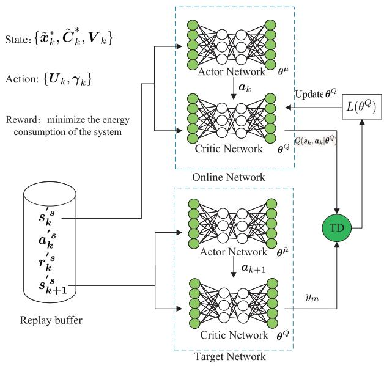

<details>
<summary>flowchart</summary>

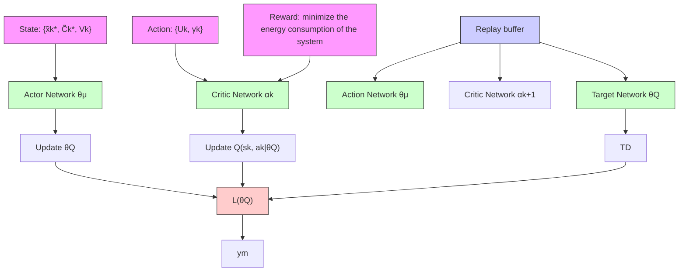
</details>

Fig. 3. Framework of the proposed algorithm.

1) Action Selection: Find the optimal action $\pmb { a } _ { k }$ by the online actor network with the weights $\pmb \theta ^ { \mu }$ in the kthround trajectory update.   
2) Action-Value Update: Update the evaluated action-value function $Q ( s _ { k } , \pmb { a } _ { k } | \pmb { \theta } ^ { Q } )$ by the online critic network with the weights ${ \pmb \theta } ^ { Q }$ in the kth-round trajectory update.   
3) Gradient Update and Weight Update: Update the weight gradients of actor and critic in order to obtain a better action selection policy.

In the following, we introduce every key ingredient of the proposed optimization algorithm over the actor–critic architecture.

1) Action Selection: The deterministic policy μ generated by the online actor network determines the current action $\pmb { a } _ { k }$

$$
\boldsymbol {a} _ {k} = \boldsymbol {\mu} (s _ {k} | \boldsymbol {\theta} ^ {\boldsymbol {\mu}}) \tag {31}
$$

where $\pmb \theta ^ { \mu }$ represents the weights of the online actor network. That is, we input the state $\pmb { S } _ { k }$ in the online actor network, and we have $\pmb { a } _ { k }$ as the output.

2) Action-Value Update: After the action ${ \pmb a } _ { k }$ is determined, the environmental state is moved to $\mathbf { \boldsymbol { s } } _ { k + 1 } ,$ , and the real immediate reward value obtained is $r _ { k }$ . Then, we can obtain the action value function as follows:

Algorithm 2 Algorithm for Solving the Top-Level Problem (OECM-Top) (Top-Algorithm)   
1: Input: Training sample length K; learning rate for actor network $\alpha_{\mu}$ , learning rate for critic network $\alpha_{Q}$ ; discount factor $\varsigma$ , soft update factor $\delta$ ; replay buffer R, mini-batch size N.
2: Output: the UAV trajectory U and the ratio of tasks offloaded $\gamma$ .
3: Initialize the replay buffer R.
4: Randomly initialize online critic network and actor with the weights $\theta^{Q}$ and $\theta^{\mu}$ , respectively.
5: Initialize the target critic network and actor network with the weights $\theta^{\hat{Q}} \leftarrow \theta^{Q}, \theta^{\hat{\mu}} \leftarrow \theta^{\mu}$ , respectively.
6: Receive initial observation state $s_{1}$ .
7: for each episode $k=1,\cdots,K$ do
8: Obtain the state $s_{k}=\{\tilde{x}_{k}^{*},\tilde{C}_{k}^{*},V_{k}\}$ .
9: Select the action $a_{k}=\mu(s_{k}|\theta^{\mu})$ by the online actor network.
10: Update $\tilde{x}_{k+1}^{*}$ and $\tilde{C}_{k+1}^{*}$ by the Sub-Algorithm based on the action $a_{k}$ , obtain the reward $r_{k}$ , and observe the new state $s_{k+1}$ .
11: if the replay buffer is not full then
12: Store the transition ( $s_{k},a_{k},r_{k},s_{k+1}$ ) in the buffer.
13: else
14: Randomly replace a transition in the buffer with ( $s_{k},a_{k},r_{k},s_{k+1}$ ).
15: end if
16: Sample a random minibatch of transitions ( $s_{i},a_{i},r_{i},s_{i+1}$ ) from R.
17: Update the weights $\theta^{\mu}$ and $\theta^{Q}$ by (34) and (37), respectively.
18: Update the weights $\theta^{\hat{\mu}}$ and $\theta^{\hat{Q}}$ by (38) and (39), respectively.
19: end for

$$
\begin{array}{l} Q \left(\boldsymbol {s} _ {k}, \boldsymbol {a} _ {k} \mid \boldsymbol {\theta} ^ {Q}\right) = \mathbb {E} _ {\boldsymbol {s} _ {k + 1} \sim \rho^ {\mu}} \left[ r _ {k} \left(\boldsymbol {s} _ {k}, \boldsymbol {a} _ {k}\right) \right. \\ \left. + \varsigma Q \left(s _ {k + 1}, a _ {k + 1} \mid \boldsymbol {\theta} ^ {Q}\right) \right] \tag {32} \\ \end{array}
$$

by the online critic network with the weights $\pmb { \theta } ^ { Q } .$ Here, $s \in [ 0 , 1 )$ is the discounting factor in reinforcement learning that represents the uncertainty of future revenue, $\rho ^ { \mu }$ is the distribution of $\mathbf { \boldsymbol { s } } _ { k + 1 }$ under the policy μ, and $\mathbb { E } [ \cdot ]$ means the expectation.

3) Gradient Update and Weight Update: The weights $\pmb \theta ^ { \mu }$ of the online actor network are updated by the gradients of action value function $Q ( s , a | \pmb \theta ^ { Q } )$ and action policy $\mu ( s | \pmb \theta ^ { \mu } )$ [i.e., $\nabla _ { \pmb { a } } Q ( \pmb { s } , \pmb { a } | \pmb { \theta } ^ { Q } )$ and $\nabla _ { \pmb { \theta } ^ { \mu } } \pmb { \mu } ( s | \pmb { \theta } ^ { \mu } ) ]$ based on the gradient method. Specifically, the gradient of $\pmb \theta ^ { \mu }$ can be expressed as

$$
\nabla_ {\boldsymbol {\theta} ^ {\mu}} J = \frac {1}{G} \sum_ {i = 1} ^ {N} \left[ \nabla_ {\alpha} Q (s, \boldsymbol {a} | \boldsymbol {\theta} ^ {Q}) | _ {s _ {i}, \boldsymbol {\mu} (s _ {i})} \nabla_ {\boldsymbol {\theta} ^ {\mu}} \boldsymbol {\mu} (s | \boldsymbol {\theta} ^ {\mu}) | _ {s _ {i}} \right] \tag {33}
$$

where $\pmb { s } _ { i } ^ { \prime s }$ and $\pmb { a } _ { i } ^ { \prime s }$ mean the states and actions stored in the replay buffer $R ,$ and G means the number of transitions selected from the replay buffer. Correspondingly, the weights $\pmb \theta ^ { \mu }$ are updated as

$$
\theta^ {\mu} = \theta^ {\mu} + \alpha_ {\mu} \nabla_ {\theta^ {\mu}} J \tag {34}
$$

where $\alpha _ { \pmb { \mu } }$ means the learning rate of the online actor network. The online critic network ${ \pmb \theta } ^ { \breve { Q } }$ is updated based on the gradient method by minimizing the loss, which is expressed as

$$
L \left(\boldsymbol {\theta} ^ {Q}\right) = E _ {s _ {i} \sim Q ^ {\mu}} \left[ \left(Q \left(s _ {i}, \boldsymbol {a} _ {i} \mid \boldsymbol {\theta} ^ {Q}\right) - y _ {m}\right) ^ {2} \right] \tag {35}
$$

where $\varrho ^ { \mu }$ represents the distribution of $\mathbf { } _ { \mathbf { } } \mathbf { \sigma } \mathbf { } \mathbf { } \mathbf { s } _ { i }$ under the policy μ. Besides, the target function $y _ { m }$ is defined as follows:

$$
y _ {m} = r _ {i} \left(\boldsymbol {s} _ {i}, \boldsymbol {a} _ {i}\right) + \varsigma \hat {Q} \left(\boldsymbol {s} _ {i + 1}, \hat {\boldsymbol {\mu}} \left(\boldsymbol {s} _ {i + 1} \mid \boldsymbol {\theta} ^ {\hat {\boldsymbol {\mu}}}\right) \mid \boldsymbol {\theta} ^ {\hat {Q}}\right) \tag {36}
$$

where $r _ { i } ^ { ' s }$ means the rewards stored in the replay buffer after K trajectory updates. The symbols ${ \pmb \theta } ^ { \hat { Q } }$ and $\pmb { \theta } ^ { \hat { \mu } }$ mean the weights of the target critic network and target actor network, respectively. Besides, $\hat { Q } ( \cdot | \pmb \theta ^ { \hat { Q } } )$ and $\hat { \pmb { \mu } } ( \cdot | \pmb { \theta } ^ { \hat { \pmb { \mu } } } )$ mean the action value function and action policy obtained by the target critic network and actor network, respectively. Correspondingly, the weights of the online critic network are updated as

$$
\boldsymbol {\theta} ^ {Q} = \boldsymbol {\theta} ^ {Q} + \alpha_ {Q} \nabla_ {\boldsymbol {\theta} ^ {Q}} L (\boldsymbol {\theta} ^ {Q}) \tag {37}
$$

where $\alpha _ { Q }$ means the learning rate of the online critic network. The target network has the same structure as the online network, and thus the weights of the target actor network and critic network are updated as

$$
\boldsymbol {\theta} ^ {\hat {\mu}} \leftarrow \delta \boldsymbol {\theta} ^ {\mu} + (1 - \delta) \boldsymbol {\theta} ^ {\hat {\mu}} \tag {38}
$$

and

$$
\boldsymbol {\theta} ^ {\hat {Q}} \leftarrow \delta \boldsymbol {\theta} ^ {Q} + (1 - \delta) \boldsymbol {\theta} ^ {\hat {Q}} \tag {39}
$$

respectively. Here, δ is a hyperparameter between 0 and 1 (usually close to 0).

Having introduced all the key ingredients, we present the Top-Algorithm as shown in Algorithm 2. In the following, we discuss the computational complexity of Top-Algorithm. Note that the proposed algorithm is based on the reinforcement learning, and the actor network and critic network need to be, respectively, updated for once in each episode for the UAV-aided NOMA communication network. Thus, the computational complexity of the proposed algorithm is $O ( K ( F _ { a } L _ { a } + F _ { a } ) + K ( F _ { c } L _ { c } + F _ { c } ) )$ , where K means the number of episodes and $F _ { a } , F _ { c } , L _ { a } ,$ and $L _ { c }$ mean the number of units in each hidden layer of the actor network and critic network and the number of hidden layers of the actor network and critic network, respectively. Note that the optimal solution to Problem (OECM) can be obtained by performing the Sub-Algorithm and Top-Algorithm alternately.

# VI. NUMERICAL RESULTS

In this section, we validate the performance of the proposed algorithms through a set of simulations. Referring to the parameter settings in [39], we set the simulation parameters in Table I. In the following simulations, we consider a set of UAV-assisted M-IoT network topologies as shown in Fig. 4, where all USVs are randomly deployed in a UAV with the center point being (1000 m, 1000 m, 0 m) and the radius being 1000 m, and the starting point of UAV is (1000 m, 1000 m, 100 m).

TABLE I PARAMETERS OF THE SYSTEM 

<table><tr><td>Simulation parameters</td><td>Value chosen</td></tr><tr><td>Radius of sea area</td><td>2km</td></tr><tr><td>Moving radius of USVs</td><td>50m</td></tr><tr><td>Channel bandwidth capacity, W</td><td>1MHz</td></tr><tr><td>Noise power spectral density, $N_0$ </td><td>-110dB</td></tr><tr><td>UAV altitude, H</td><td>100</td></tr><tr><td>The number of UAV</td><td>1</td></tr><tr><td>The number of USVs</td><td>4~16</td></tr><tr><td>Upper limit of transmitted power(USV)</td><td>1W</td></tr><tr><td>Aerial computing capacity, $C_{\text{max}}$ </td><td>500MHz</td></tr><tr><td>Local computing capacity, $C_{sn}$ </td><td>10~20MHz</td></tr><tr><td>The reference channel gain,  $h_0$ </td><td>-30dB</td></tr><tr><td>The computation-intensive tasks,  $B_n$ </td><td>10Mbit</td></tr><tr><td>Coefficient,  $\delta_1$  and  $\delta_2$ </td><td> $10^{-12}$ </td></tr><tr><td>The time duration, T</td><td>50s</td></tr><tr><td>The maximum time latency,  $T_{\text{max}}$ </td><td>60s</td></tr><tr><td>The length of time slot, M</td><td>50</td></tr><tr><td>Error tolerance, ε</td><td>0.01</td></tr><tr><td>Step size at the sth iteration, κ</td><td> $10^{-3}$ </td></tr><tr><td>Step size at the sth iteration, v</td><td> $10^{-4}$ </td></tr><tr><td>Discount coefficient, ζ</td><td>0.95</td></tr><tr><td>Soft replacement value, δ</td><td>0.01</td></tr><tr><td>Learning rate of online actor network,  $α_\mu$ </td><td>0.001</td></tr><tr><td>Earning rate of online critic network,  $α_Q$ </td><td>0.002</td></tr><tr><td>Iterative rounds, K</td><td>1500</td></tr></table>

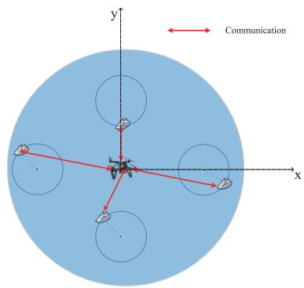

<details>
<summary>text_image</summary>

y
Communication
x
</details>

Fig. 4. Network topology used for Example 1.

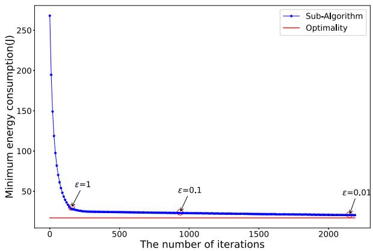  
Fig. 5. Time complexity and optimality of the proposed Sub-Algorithm.

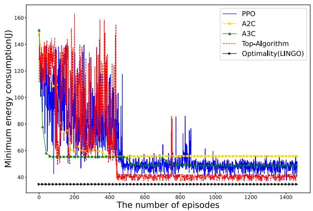

<details>
<summary>line</summary>

| The number of episodes | PPO   | A2C   | A3C   | Top-Algorithm | Optimality(LINGO) |
| ---------------------- | ----- | ----- | ----- | ------------- | ----------------- |
| 0                      | 140   | 50    | 150   | 140           | 40                |
| 200                    | 130   | 50    | 55    | 130           | 40                |
| 400                    | 120   | 50    | 55    | 120           | 40                |
| 600                    | 50    | 50    | 50    | 50            | 40                |
| 800                    | 50    | 50    | 50    | 50            | 40                |
| 1000                   | 50    | 50    | 50    | 50            | 40                |
| 1200                   | 50    | 50    | 50    | 50            | 40                |
| 1400                   | 50    | 50    | 50    | 50            | 40                |
</details>

Fig. 6. Time complexity and optimality of our proposed Top-Algorithm in comparison with the optimality and different DRL algorithms (i.e., PPO, A2C, and A3C). The Top-Algorithm, PPO, A2C, and A3C take 3.46, 2.34, 2.47, and 2.15 s in each episode, respectively. The LINGO takes 353.4 min to obtain the optimal solution.

# A. Global Optimality and Time Complexity

Example 1: In this simulation example, we want to verify the global optimality and time complexity of the proposed Sub-Algorithm and the proposed Top-Algorithm, when the number of USVs is set to be 4 in Fig. 4. Specifically, all four USVs float in four 50-m-radius planes with the center points being (500 m, 1000 m, 0 m), (1000 m, 1500 m, 0 m), (1500 m, 1000 m, 0 m), and (1000 m, 500 m, 0 m), respectively.

Fig. 5 reveals that the energy consumption approaches a constant with the increase of the number of iterations. It implies that the Sub-Algorithm can converge until the stopping criterion of [(j)x˜ , $\bar { \Delta } _ { \tilde { x } } ^ { ( j ) } , \Delta _ { \tilde { c } } ^ { ( j ) } ] \| _ { 2 } \leq \epsilon$ is satisfied. Also, we can find from Fig. 5 that the number of iterations needed for the convergence increases with the decrease of , while the obtained energy consumption more approaches the optimality. It implies that we can strike a tradeoff between the time complexity and optimality by tuning the parameter .

The proposed Top-Algorithm is a learning-driven algorithm, and it can achieve a suboptimal solution rather than the optimal solution. To verify the effectiveness of the Top-Algorithm, we compare it with the global optimality obtained by the software LINGO, and also with some existing DRL algorithms (i.e., PPO, A2C, and A3C) in Fig. 6. We can see that the proposed Top-Algorithm can converge after around 500 iterations and achieve 88% of the optimality, while effectively reducing the computational complexity in comparison with LINGO.

# B. Trajectory Optimization

Example 2: In this simulation example, we want to show the optimal trajectory obtained by alternately running the Sub-Algorithm and Top-Algorithm for the network topology considered in Example 1.

We plot the UAV trajectories obtained at episode 1, episode 150, episode 300, and episode 600 in Fig. 7. As shown in Fig. 7(a), the UAV flies randomly to seek a trajectory for less energy consumption in the first episode. Thus, the UAV might fly over a certain USV, i.e., USV 3. When running the algorithms continuously, the UAV would fly over more USVs, e.g.,

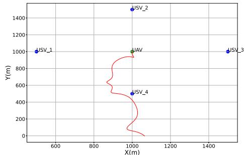  
(a)

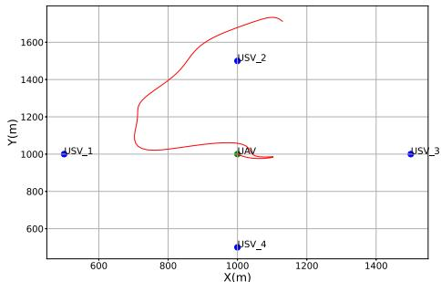

<details>
<summary>scatter</summary>

| Point | X(m) | Y(m) |
|---|---|---|
| JSV_1 | 500 | 1000 |
| JSV_2 | 1050 | 1500 |
| JSV_3 | 1480 | 1000 |
| JSV_4 | 950 | 550 |
The chart displays a single red curve connecting four labeled points along the X-axis. The Y-axis values are explicitly labeled as 'Y(m)' but not directly plotted on the graph.
</details>

(b)

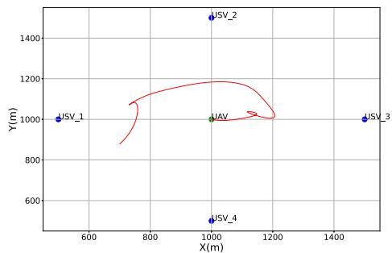

<details>
<summary>scatter</summary>

| Point | X (m) | Y (m) |
|---|---|---|
| USV_1 | 500 | 1000 |
| USV_2 | 1000 | 1500 |
| USV_3 | 1500 | 1000 |
| USV_4 | 1000 | 500 |
The red path is a curved trajectory, suggesting a dynamic or iterative movement around the origin. No explicit numerical values are provided for the plotted points.
</details>

(c)

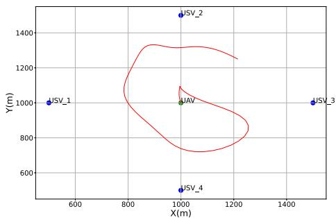

<details>
<summary>scatter</summary>

| Point | X (m) | Y (m) |
|---|---|---|
| JSV_1 | 500 | 1000 |
| JSV_2 | 1000 | 1500 |
| JSV_3 | 1500 | 1000 |
| JSV_4 | 900 | 500 |
The contour lines are not explicitly labeled but are used to indicate a possible area or level of interest within the plotted region. The x-axis is labeled 'X(m)' and the y-axis is labeled 'Y(m)'.
</details>

(d)

Fig. 7. UAV trajectory varies with time for the network topology in Fig. 4. (a) 1st episode. (b) 150th episode. (c) 300th episode. (d) 600th episode.   
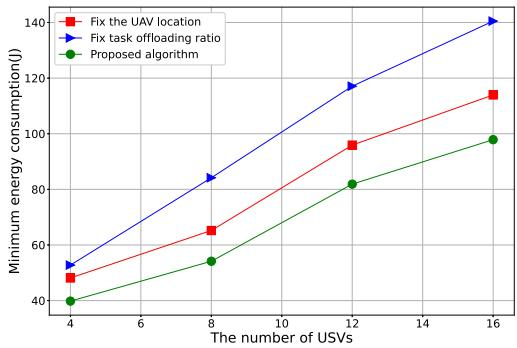

<details>
<summary>line</summary>

| The number of USVs | Fix the UAV location | Fix task offloading ratio | Proposed algorithm |
| ------------------ | -------------------- | ------------------------- | ------------------ |
| 4                  | 50                   | 50                        | 40                 |
| 8                  | 65                   | 85                        | 55                 |
| 12                 | 95                   | 115                       | 80                 |
| 16                 | 115                  | 140                       | 98                 |
</details>

Fig. 8. Minimum total energy consumption obtained by the former two schemes and the proposed algorithm at different densities of USVs, in which the computing capacity is set to be 10 MHz for each USV.

USV 3 and USV 4 in episode 300, and all USVs in episode 600, which can be seen in Fig. 7(c) and (d). These observations imply that the optimal UAV trajectory is nearly a closed loop covering all USVs.

# C. Performance Comparison

To the best of our knowledge, there is no algorithm proposed for the same target in the literature. For the comparison with our proposed joint optimization algorithm, we introduce three baseline schemes: communication and computation resource allocation with fixed UAV trajectory or offloading ratio, and frequency-division multiple access (FDMA). The first baseline scheme means that the energy consumption is minimized when the UAV is hovering at the starting point as a base station to collect and process the computation-intensive tasks offloaded from the USVs. The second baseline scheme means the energy consumption is minimized when the offloading of each USV is given. The last baseline scheme means we compare the NOMA performance with other OMA transmission scheme, e.g., FDMA. In the simulation, we evaluate the obtained total energy consumption as the performance criteria of the three schemes. In the following performance comparison, we first compare our proposed algorithm with the former two baseline schemes in which the UAV trajectory or offloading ratio is given. Then, we compare our proposed algorithm with the FDMA scheme.

Example 3 (Performance Comparison With the Former Two Schemes): We consider a set of UAV-assisted M-IoT network topologies, where we randomly deploy 4–16 USVs in a plane with the center point being (1000 m, 1000 m, 0 m) and the radius being 1000 m, and each USV floats in a 50-m-radius plane. We vary the computing capacity of each USV from 10 to 20 MHz. In the first baseline scheme, the location of the UAV is fixed at the starting point (1000 m, 1000 m, 100 m). In the second baseline scheme, we set the offloading ratio of each USV to be 0.5. Other simulation parameters are the same as those in Example 1.

Fig. 8 shows that as the number of USVs increases, the obtained total energy consumption increases for the three schemes. It can also be seen that the proposed algorithm always outperforms the other two baseline schemes. Compared with the other two baseline schemes, our proposed algorithm can reduce the total energy consumption by 13.8% and 37.3% on average, respectively. Fig. 9 shows that with the increase of local computing capacity, the total energy consumption obtained by the three schemes increases. Also, our proposed algorithm can achieve the minimum total energy consumption. Compared with the other two baseline schemes, our proposed algorithm can reduce the total energy consumption by 37.7% and 48.3% on average, respectively. These observations imply that for minimizing the total energy consumption of the NOMA-based UAV-assisted M-IoT MEC system, it is of practical meaning to jointly optimize the jointly optimizing the USVs’ offloaded workload, transmit power, computation resource allocation, as well as the UAV trajectory.

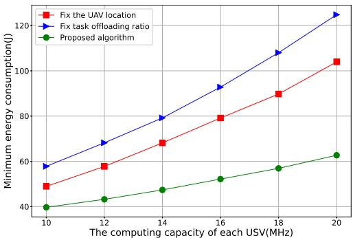

<details>
<summary>line</summary>

| The computing capacity of each USV(MHz) | Fix the UAV location | Fix task offloading ratio | Proposed algorithm |
| --------------------------------------- | -------------------- | ------------------------- | ------------------ |
| 10                                      | 50                   | 60                        | 40                 |
| 12                                      | 58                   | 70                        | 43                 |
| 14                                      | 68                   | 80                        | 47                 |
| 16                                      | 80                   | 92                        | 52                 |
| 18                                      | 90                   | 108                       | 57                 |
| 20                                      | 104                  | 124                       | 63                 |
</details>

Fig. 9. Minimum total energy consumption obtained by the former two schemes and the proposed algorithm under different computing capacity for the 4-USV network topology.

Example 4 (Performance Comparison With the FDMA): In this simulation example, we want to verify the efficiency of NOMA-enabled computation offloading, in comparison with the FDMA, when varying the number of USVs and USVs’ computing capacity. When adopting FDMA, the dedicated bandwidth (1 MHz) is equally allocated to all USVs, and all optimization variables are the same as these considered in our system model. Other simulation parameters are the same as those in Example 3.

From Fig. 10, we can see that the total energy consumption increases with the increase of the number of USVs for the NOMA and FDMA. Also, it is straightforward that more energy is consumed for computing more workload for both multiple access schemes. Noticeably, the NOMA always outperforms the FDMA in terms of total energy consumption. In comparison with FDMA, the NOMA can reduce the total energy consumption by 36.7% on average. Fig. 11 shows the minimum total energy consumption obtained by the two multiple access schemes when varying the computing capacity of each USV from 10 to 20 MHz. From Fig. 11, we find that the total energy consumption increases as the USVs’computing capacity and the number of USVs increase for the two multiple access schemes. Moreover, in comparison with FDMA, the total energy consumption in NOMA is reduced by 17.6% on average. These observations imply the NOMA would be an efficient multiple access scheme that can applied to the UAV-assisted M-IoT MEC system.

# VII. CONCLUSION

In this article, we have studied the joint optimization of power control, task offloading ratio, computation resource allocation, and UAV trajectory that minimizes the total energy consumption for the UAV-assisted M-IoT network in the NOMA manner. By exploiting the hidden convexity of this optimization problem, we have proposed an efficient doublelayered decomposition algorithm to obtain the optimal solution. Specifically, in our proposed algorithms, we first designed the primal–dual-based Lagrangian minimization algorithm to obtain the optimal solution to the multidimensional resource optimization subproblem. Then, we designed the DRL-based algorithm to obtain the optimal UAV trajectory and USVs’ task offloading ratios. The simulation results have been provided to validate the effectiveness of the proposed algorithms. In future work, we will study the secure computation offloading. Specifically, we will apply the cooperative jamming and user grouping to improve the communication security and efficiency when offloading the computation-intensive tasks.

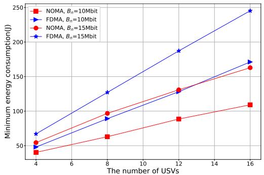

<details>
<summary>line</summary>

| The number of USVs | NOMA, Bₙ=10Mbit | FDMA, Bₙ=10Mbit | NOMA, Bₙ=15Mbit | FDMA, Bₙ=15Mbit |
| ------------------ | --------------- | --------------- | --------------- | --------------- |
| 4                  | 40              | 60              | 50              | 70              |
| 8                  | 60              | 90              | 95              | 130             |
| 12                 | 85              | 130             | 130             | 190             |
| 16                 | 110             | 170             | 160             | 245             |
</details>

Fig. 10. Minimum total energy consumption obtained in the NOMA and FDMA manners at different densities of USVs.   
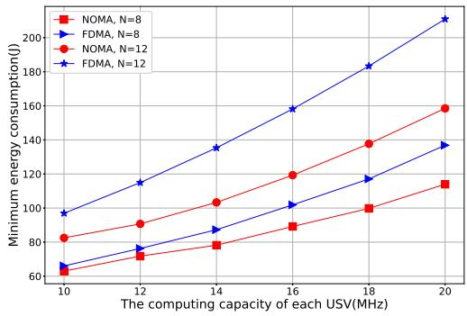

<details>
<summary>line</summary>

| The computing capacity of each USV(MHz) | NOMA, N=8 | FDMA, N=8 | NOMA, N=12 | FDMA, N=12 |
| ---------------------------------------- | --------- | --------- | ---------- | ---------- |
| 10                                       | 65        | 70        | 85         | 95         |
| 12                                       | 70        | 75        | 90         | 110        |
| 14                                       | 75        | 80        | 100        | 135        |
| 16                                       | 85        | 95        | 120        | 160        |
| 18                                       | 100       | 115       | 140        | 185        |
| 20                                       | 115       | 135       | 160        | 210        |
</details>

Fig. 11. Minimum total energy consumption obtained by the two multiple access schemes when varying the computing capacity of each USV from 10 to 20 MHz.

# REFERENCES

[1] S. Verma, Y. Kawamoto, Z. M. Fadlullah, H. Nishiyama, and N. Kato, “A survey on network methodologies for real-time analytics of massive IoT data and open research issues,” IEEE Commun. Surveys Tuts., vol. 19, no. 3, pp. 1457–1477, 3rd Quart., 2017.   
[2] M. M. Wang, J. Zhang, and X. You, “Machine-type communication for maritime Internet of Things: A design,” IEEE Commun. Surveys Tuts., vol. 22, no. 4, pp. 2550–2585, 4th Quart., 2020.   
[3] T. Yang et al., “Two-stage offloading optimization for energy-latency tradeoff with mobile edge computing in maritime Internet of Things,” IEEE Internet Things J., vol. 7, no. 7, pp. 5954–5963, Jul. 2020.   
[4] N. Perobelli. “Marine traffic—A day in numbers.” Marinetraffic. Jun. 2016. [Online]. Available: https://www.marinetraffic.com/blog/a-da y-in-numbers   
[5] C. Hu, Y. Pu, F. Yang, R. Zhao, A. Alrawais, and T. Xiang, “Secure and efficient data collection and storage of IoT in smart ocean,” IEEE Internet Things J., vol. 7, no. 10, pp. 9980–9994, Oct. 2020.   
[6] C. Wang, Y. He, F. R. Yu, Q. Chen, and L. Tang, “Integration of networking, caching, and computing in wireless systems: A survey, some research issues, and challenges,” IEEE Commun. Surveys Tuts., vol. 20, no. 1, pp. 7–38, 1st Quart., 2018.

[7] Y. Chen, W. Gu, and K. Li, “Dynamic task offloading for Internet of Things in mobile edge computing via deep reinforcement learning,” Int. J. Commun. Syst., to be published.   
[8] Y. Liu, S. Xie, and Y. Zhang, “Cooperative offloading and resource management for UAV-enabled mobile edge computing in power IoT system,” IEEE Trans. Vel. Technol., vol. 69, no. 10, pp. 12229–12239, Oct. 2020.   
[9] Q. Wang, H. Dai, Q. Wang, M. K. Shukla, W. Zhang, and C. G. Soares, “On connectivity of UAV-assisted data acquisition for underwater Internet of Things,” IEEE Internet Things J., vol. 7, no. 6, pp. 5371–5385, Jun. 2020.   
[10] Z. Ding, P. Fan, and H. V. Poor, “Impact of non-orthogonal multiple access on the offloading of mobile edge computing,” IEEE Trans. Commun., vol. 67, no. 1, pp. 375–390, Jan. 2019.   
[11] Y. Huang, Y. Liu, and F. Chen, “NOMA-aided mobile edge computing via user cooperation,” IEEE Trans. Commun., vol. 68, no. 4, pp. 2221–2235, Apr. 2020.   
[12] Z. Ding, J. Xu, O. A. Dobre, and H. V. Poor, “Joint power and time allocation for NOMA-MEC offloading,” IEEE Trans. Vel. Technol., vol. 68, no. 6, pp. 6207–6211, Jun. 2019.   
[13] Z. Yang, C. Pan, K. Wang, and M. Shikh-Bahaei, “Energy efficient resource allocation in UAV-enabled mobile edge computing networks,” IEEE Trans. Wireless Commun., vol. 18, no. 9, pp. 4576–4589, Sep. 2019.   
[14] L. Zhang and N. Ansari, “Latency-aware IoT service provisioning in UAV-aided mobile-edge computing networks,” IEEE Internet Things J., vol. 7, no. 10, pp. 10573–10580, Oct. 2020.   
[15] Y. Chen, N. Zhang, Y. Zhang, X. Chen, W. Wu, and X. S. Shen, “Energy efficient dynamic offloading in mobile edge computing for Internet of Things,” IEEE Trans. Cloud Comput., vol. 9, no. 3, pp. 1050–1060, Jul.–Sep. 2021.   
[16] Y. Fu, M. Zhang, L. Salaun, C. W. Sung, and C. S. Chen, “Zero-forcing oriented power minimization for multi-cell MISO-NOMA systems: A joint user grouping, beamforming, and power control perspective,” IEEE J. Sel. Areas Commun., vol. 38, no. 8, pp. 1925–1940, Aug. 2020.   
[17] Y. Fu, L. Salan, C. W. Sung, and C. S. Chen, “Subcarrier and power allocation for the downlink of multicarrier NOMA systems,” IEEE Trans. Veh. Technol., vol. 67, no. 12, pp. 11833–11847, Dec. 2018.   
[18] J. Zhang et al., “Stochastic computation offloading and trajectory scheduling for UAV-assisted mobile edge computing,” IEEE Internet Things J., vol. 6, no. 2, pp. 3688–3699, Apr. 2019.   
[19] M. Li, N. Cheng, J. Gao, Y. Wang, L. Zhao, and X. Shen, “Energydfficient UAV-assisted mobile edge computing: Resource allocation and trajectory optimization,” IEEE Trans. Veh. Technol., vol. 69, no. 3, pp. 3424–3438, Mar. 2020.   
[20] Q. Hu, Y. Cai, G. Yu, Z. Qin, M. Zhao, and G. Y. Li, “Joint offloading and trajectory design for UAV-enabled mobile edge computing systems,” IEEE Internet Things J., vol. 6, no. 2, pp. 1879–1892, Apr. 2019.   
[21] L. P. Qian, A. Feng, Y. Huang, Y. Wu, B. Ji, and Z. Shi, “Optimal SIC ordering and computation resource allocation in MEC-aware NOMA NB-IoT networks,” IEEE Internet Things J., vol. 6, no. 2, pp. 2806–2816, Apr. 2019.   
[22] F. Fang, Y. Xu, Z. Ding, C. Shen, M. Peng, and G. K. Karagiannidis, “Optimal resource allocation for delay minimization in NOMA-MEC networks,” IEEE Trans. Wireless Commun., vol. 68, no. 12, pp. 7867–7881, Dec. 2020.   
[23] B. Li, W. Wu, W. Zhao, and H. Zhang, “Security enhancement with a hybrid cooperative NOMA scheme for MEC system,” IEEE Trans. Veh. Technol., vol. 70, no. 3, pp. 2635–2648, Mar. 2021.   
[24] W. Wu, X. Wang, F. Zhou, K. Wong, C. Li, and B. Wang, “Resource allocation for enhancing offloading security in NOMA-enabled MEC networks,” IEEE Internet Syst. J., vol. 15, no. 3, pp. 3789–3792, Sep. 2021.   
[25] F. Fang, K. Wang, Z. Ding, and V. C. M. Leung, “Energyefficient resource allocation for NOMA-MEC networks with imperfect CSI,” IEEE Trans. Wireless Commun., vol. 69, no. 5, pp. 3436–3449, May 2021.   
[26] V. D. Tuong, T. P. Truong, T.-V. Nguyen, W. Noh, and S. Cho, “Partial computation offloading in NOMA-assisted mobile edge computing systems using deep reinforcement learning,” IEEE Internet Things J., vol. 8, no. 17, pp. 13196–13208, Sep. 2021.   
[27] L. Qian, Y. Wu, N. Yu, F. Jiang, H. Zhou, and T. Q. S. Quek, “Learning driven NOMA assisted vehicular edge computing via underlay spectrum sharing,” IEEE Trans. Veh. Technol., vol. 70, no. 1, pp. 977–992, Jan. 2021.

[28] C. Li, H. Wang, and R. Song, “Intelligent offloading for NOMA-assisted MEC via dual connectivity,” IEEE Internet Things J., vol. 8, no. 4, pp. 2802–2813, Feb. 2021.   
[29] Z. Yu, Y. Gong, S. Gong, and Y. Guo, “Joint task offloading and resource allocation in UAV-enabled mobile edge computing,” IEEE Internet Things J., vol. 7, no. 4, pp. 3147–3159, Apr. 2020.   
[30] J. Ji, K. Zhu, C. Yi, and D. Niyato, “Energy consumption minimization in UAV-assisted mobile-edge computing systems: Joint resource allocation and trajectory design,” IEEE Internet Things J., vol. 8, no. 10, pp. 8570–8584, May 2021.   
[31] Y. Zeng and R. Zhang, “Energy-efficient UAV communication with trajectory optimization,” IEEE Trans. Wireless Commun., vol. 16, no. 6, pp. 3747–3760, Jun. 2017.   
[32] H. Mei, K. Yang, Q. Liu, and K. Wang, “Joint trajectory-resource optimization in UAV-enabled edge-cloud system with virtualized mobile clone,” IEEE Internet Things J., vol. 7, no. 7, pp. 5906–5921, Jul. 2020.   
[33] T. Zhang, Y. Xu, J. Loo, D. Yang, and L. Xiao, “Joint computation and communication design for UAV-assisted mobile edge computing in IoT,” IEEE Trans. Ind. Informat., vol. 16, no. 8, pp. 5505–5516, Aug. 2020.   
[34] X. Zhang, J. Zhang, J. Xiong, L. Zhou, and J. Wei, “Energy-efficient multi-UAV-enabled multiaccess edge computing incorporating NOMA,” IEEE Internet Things J., vol. 7, no. 6, pp. 5613–5627, Jun. 2020.   
[35] Y. Li, S. Zhang, F. Ye, T. Jiang, and Y. Li, “A UAV path planning method based on deep reinforcement learning,” in Proc. IEEE USNC-CNC-URSI North Amer. Radio Sci. Meeting (Joint AP-S Symp.), 2020, pp. 93–94.   
[36] S. Yin and F. R. Yu, “Resource allocation and trajectory design in UAVaided cellular networks based on multi-agent reinforcement learning,” IEEE Internet Things J., vol. 9, no. 4, pp. 2933–2943, Feb. 2022.   
[37] L. Kuang, X. Chen, C. Jiang, H. Zhang, and S. Wu, “Radio resource management in future terrestrial-satellite communication networks,” IEEE Trans. Commun., vol. 24, no. 5, pp. 81–87, Oct. 2017.   
[38] Y. Zeng, J. Xu, and R. Zhang, “Energy minimization for wireless communication with rotary-wing UAV,” IEEE Trans. Wireless Commun., vol. 18, no. 4, pp. 2329–2345, Apr. 2019.   
[39] Y. Wang et al., “Trajectory design for UAV-based Internet of Things data collection: A deep reinforcement learning approach,” IEEE Internet Things J., vol. 9, no. 5, pp. 3899–3912, Mar. 2022.


<details>
<summary>natural_image</summary>

Portrait of a woman with short hair and glasses (no text or symbols visible)
</details>

Li Ping Qian (Senior Member, IEEE) received the Ph.D. degree in information engineering from the Chinese University of Hong Hong, Hong Hong, in 2010.

She worked as a Postdoctoral Research Associate with the Chinese University of Hong Kong from 2010 to 2011. Since 2011, she has been with the College of Information Engineering, Zhejiang University of Technology, Hangzhou, China, where she is currently a Full Professor. From 2016 to 2017, she was a Visiting Scholar with the Broadband

Communications Research Group, ECE Department, University of Waterloo, Waterloo, ON, Canada. Her research interests include wireless communication and networking, resource management in wireless networks, massive IoT, mobile-edge computing, emerging multiple access techniques, and machinelearning-oriented toward wireless communications.

Prof. Qian was a co-recipient of the IEEE Marconi Prize Paper Award in Wireless Communications in 2011, the Best Paper Award from IEEE ICC 2016, the Best Paper Award from IEEE Communication Society GCCTC 2017, and the Best Paper Award from the Digital Communications and Networking in 2021. She is currently on the editorial board of IET Communications.


<details>
<summary>natural_image</summary>

Portrait of a young man in a collared shirt (no text or symbols visible)
</details>

Hongsen Zhang received the B.E. degree in automation from Jinan University, Guangzhou, China, in 2020. He is currently pursuing the master’s degree with the College of Information Engineering, Zhejiang University of Technology, Hangzhou, China.

His current research interests focus on nonorthogonal multiple access and mobile-edge computing.


<details>
<summary>natural_image</summary>

Portrait of a woman with shoulder-length hair wearing a blazer (no text or symbols visible)
</details>

Qian Wang (Member, IEEE) received the B.Eng. degree in communications engineering from Harbin Engineering University, Harbin, China, in 2012, and the Ph.D. degree in electrical and computer engineering from the National University of Singapore, Singapore, in 2017.

From 2017 to 2019, she worked as a Research Engineer with the Central Research Institute, Huawei 2012 Lab, Shenzhen, China, where she contributed to IEEE 802.11ad/ay standards. She is currently a Research Associate Professor with the

College of Information Engineering, Zhejiang University of Technology, Hangzhou, China. Her research interests mainly involve in communication and information theory, signal processing algorithms, network optimization, and security analysis.

Dr. Wang received the honor of President’s Graduate Fellowship from the National University of Singapore. She is also a member of the Optical Society of America and a Senior Member of China Communication Society.


<details>
<summary>natural_image</summary>

Portrait of a woman in a dark collared shirt (no text or symbols visible)
</details>

Bin Lin (Senior Member, IEEE) received the B.S. and M.S. degrees from Dalian Maritime University, Dalian, China, in 1999 and 2003, respectively, and the Ph.D. degree from the Broadband Communications Research Group, Department of Electrical and Computer Engineering, University of Waterloo, Waterloo, ON, Canada, in 2009.

She is currently a Full Professor with the Department of Information Science and Technology, Dalian Maritime University. From 2015 to 2016, she was a Visiting Scholar with George Washington

University, Washington, DC, USA. Her current research interests include wireless communications, network dimensioning and optimization, resource allocation, artificial intelligence, maritime communication networks, edge/cloud computing, wireless sensor networks, and Internet of Things.

Dr. Lin is an Associate Editor for IET Communications.


<details>
<summary>natural_image</summary>

Portrait of a man wearing glasses (no text or symbols visible)
</details>

Yuan Wu (Senior Member, IEEE) received the Ph.D. degree in electronic and computer engineering from Hong Kong University of Science and Technology, Hong Kong, China, in 2010.

He is currently an Associate Professor with the State Key Laboratory of Internet of Things for Smart City, University of Macau, Macau, China, where he is also with the Department of Computer and Information Science. From 2016 to 2017, he was a Visiting Scholar with the Department of Electrical and Computer Engineering, University of Waterloo,

Waterloo, ON, Canada. His research interests include resource management for wireless networks, green communications and computing, mobile-edge computing, and edge intelligence.

Dr. Wu was a recipient of the Best Paper Award from the IEEE International Conference on Communications in 2016, and the Best Paper Award from the IEEE Technical Committee on Green Communications and Computing in 2017. He is currently on the editorial boards of IEEE TRANSACTIONS ON VEHICULAR TECHNOLOGY, IEEE TRANSACTIONS ON NETWORK SCIENCE AND ENGINEERING, IEEE INTERNET OF THINGS JOURNAL, IEEE OPEN JOURNAL OF THE COMMUNICATIONS SOCIETY, and China Communications.