# Joint Offloading and Trajectory Design for UAV-Enabled Mobile Edge Computing Systems

Qiyu Hu, Yunlong Cai , Senior Member, IEEE, Guanding Yu , Senior Member, IEEE, Zhijin Qin , Member, IEEE, Minjian Zhao, Member, IEEE, and Geoffrey Ye Li, Fellow, IEEE

Abstract—Unmanned aerial vehicles (UAVs) have been considered in wireless communication systems to provide high-quality services for their low cost and high maneuverability. This paper addresses a UAV-aided mobile edge computing system, where a number of ground users are served by a moving UAV equipped with computing resources. Each user has computing tasks to complete, which can be separated into two parts: one portion is offloaded to the UAV and the remaining part is implemented locally. The UAV moves around above the ground users and provides computing service in an orthogonal multiple access manner over time. For each time period, we aim to minimize the sum of the maximum delay among all the users in each time slot by jointly optimizing the UAV trajectory, the ratio of offloading tasks, and the user scheduling variables, subject to the discrete binary constraints, the energy consumption constraints, and the UAV trajectory constraints. This problem has highly nonconvex objective function and constraints. Therefore, we equivalently convert it into a better tractable form based on introducing the auxiliary variables, and then propose a novel penalty dual decomposition-based algorithm to handle the resulting problem. Furthermore, we develop a simplified l0-norm algorithm with much reduced complexity. Besides, we also extend our algorithm to minimize the average delay. Simulation results illustrate that the proposed algorithms significantly outperform the benchmarks.

Index Terms—Internet of Things, low-delay control, mobile edge computing (MEC), trajectory optimization, unmanned aerial vehicle (UAV) communications.

Manuscript received April 29, 2018; revised September 30, 2018; accepted October 24, 2018. Date of publication October 31, 2018; date of current version May 8, 2019. The work of Y. Cai was supported in part by the National Natural Science Foundation of China under Grant 61471319 and in part by the Fundamental Research Funds for the Central Universities. The work of G. Yu was supported in part by the Open Research Fund of State Key Laboratory of Integrated Services Networks, Xidian University under Grant ISN18-13. The work of M. Zhao was supported in part by the National Natural Science Foundation of China under Grant 91538103 and in part by the Fundamental Research Funds for the Central Universities under Grant 2018FZA5006. (Corresponding author: Yunlong Cai.)

Q. Hu and G. Yu are with the College of Information Science and Electronic Engineering, Zhejiang University, Hangzhou 310027, China, and also with the State Key Laboratory of Integrated Services Networks, Xidian University, Xi’an 710071, China (e-mail: qiyhu@zju.edu.cn; yuguanding@zju.edu.cn).

Y. Cai and M. Zhao are with the College of Information Science and Electronic Engineering, Zhejiang University, Hangzhou 310027, China (e-mail: ylcai@zju.edu.cn; mjzhao@zju.edu.cn).

Z. Qin is with the School of Electronic Engineering and Computer Science, Queen Mary University of London, London E1 4NS, U.K. (e-mail: z.qin@qmul.ac.uk).

G. Y. Li is with the School of Electrical and Computer Engineering, Georgia Institute of Technology, Atlanta, GA 30062 USA (e-mail: liye@ece.gatech.edu).

Digital Object Identifier 10.1109/JIOT.2018.2878876

# I. INTRODUCTION

R ECENTLY, the increasing number of mobile devices,e.g., smart phones and Google glasses, makes the computation-intensive applications, e.g., video calls, virtual reality, and online games pervasive [1]. However, the limited computation resources and battery budget make it difficult for mobile devices to provide satisfactory quality of experience (QoE) [2]. Although feeding the computing tasks to a centralized server can mitigate this problem, it leads to congestion and high delay in networks. By equipping the base station (BS) with computing resources, the centralized server is gradually replaced with network edge servers recently. Mobile edge computing (MEC) appeared as a prospective solution has received great attention [3]. By offloading the computing tasks to the nearby BS, the network overhead and execution latency can be significantly reduced.

There have been a number of studies on MEC techniques [4]–[9]. They aim at minimizing the device latency and energy consumption by optimizing the computing resources allocation scheme between mobile users and MEC servers [4]. Wang et al. [5] have proposed an ADMM-based algorithm to optimize the computing resource allocation and data uploading in wireless networks with MEC. You et al. [6] have investigated resource allocation policies for orthogonal frequencydivision multiple access-based MEC systems. Mao et al. [7] have proposed a resource allocation algorithm for multitasking MEC systems to minimize the execution delay under the given transmit power. Zhang et al. [8] have developed an offloading strategy to reduce the energy consumption under the delay constraints. To handle the energy-delay tradeoff problem, Liu et al. [9] have proposed a random arrival model for data offloading in multiuser MEC systems. The tradeoff problem with different kinds of computing tasks in MEC systems has been discussed in [10] and [11]. However, the existing MEC techniques cannot handle the scenario that the communication facilities are sparsely distributed or the number of mobile users increases dramatically.1

In the past decade, people have paid much attention to unmanned aerial vehicles (UAVs) due to their mobility, flexibility, and maneuverability [12]. To seize the growing opportunity, extensive studies have been dedicated to applying UAVs to various kinds of communication platforms [13]. The main

1In the scenario of sparsely distributed BSs and dramatically increasing mobile users, the UAVs equipped with the computing resources can help improve the users’ computing efficiency due to their mobility.

applications can be roughly divided into two categories: 1) static-UAV networks, e.g., aerial BSs [14], [15] and UAV-aided coverage [16], [17] and 2) mobile-UAV networks, e.g., flying computing cloudlets [18],2 UAV-aided data collection [19], [20], and mobile relays [21]. In static-UAV networks, UAVs are usually applied to support the ground communications and provide seamless coverage for their serving areas [22]. Generally, UAVs always keep stationary and act as aerial BSs, which is especially useful when infrastructures are damaged or communication traffics are congested [23]. Besides, it is a prospective idea to apply UAVs as aerial BSs to improve the efficiency of current communication systems. In mobile UAV-networks, the high mobility of UAVs can be fully exploited and the communication performance is improved based on user scheduling and UAV trajectory design [24]–[26], [28]. In [24], UAV flies to collect the required data reliably from sensor nodes with minimum energy consumption. Wu et al. [25] have developed a joint trajectory and user scheduling algorithm to maximize the minimum user throughput for multi-UAV enabled systems. Zeng and Zhang [26] have studied an energy-efficient UAV-aided communication system, where the communication efficiency and the energy consumption constraints of the UAV are considered. Liu et al. [27] have investigated the multi-UAV enabled multiuser system, where each UAV forwards its received signals from all ground users to a central processor for joint decoding. Zhan et al. [28] have applied UAVs as mobile relays, which provide reliable wireless connectivity among several distant users in adversarial environments, such as military operations. More recently, instead of using UAVs as BSs, they are treated as users and [29] has considered the trajectory design for cellular-connected UAVs.

Despite the ample researches and applications, there are many challenges in UAV-aided communication systems. Due to the limited battery capacity and the multiuser interference, the performance of UAVs are quite limited. Thus, trajectory design and user scheduling within a given time period are very important. Moreover, to the best of our knowledge, UAV-enabled MEC systems has not been well investigated.

In this paper, we consider a UAV-aided MEC system, in which a number of ground users are served by a moving UAV equipped with computing resources. Each user has separable computing tasks to complete, which can be separated into two parts: one portion is offloaded to the UAV for processing, and the remaining part is implemented locally. The UAV can move around above the ground users and provide computing service in an orthogonal multiple access manner over time. For each time period, we aim at minimizing the sum of the maximum delay among all the users in each time slot by jointly optimizing the ratio of offloading tasks, the scheduling variables of users, and the UAV trajectory, subject to the discrete binary constraints of scheduling variables, the energy consumption constraints, and the UAV trajectory constraints.

As most of optimization problems in wireless networks, this optimization problem is complicated and with discrete binary variables and highly coupling nonconvex constraints. To deal with the mixed-integer nonconvex problem, we involve a set of equality constraints and auxiliary variables, and then transform the problem into a tractable formulation. In particular, the discrete binary constraints are equivalently converted to a number of equality constraints. Inspired by the penalty dual decomposition (PDD) optimization framework [30], we develop a novel PDD-based algorithm to handle the resulting problem and jointly optimize the ratio of offloading tasks, the binary user scheduling variables, and the UAV trajectory. In particular, we dualize and penalize the equality constraints into the objective function as augmented Lagrangian (AL) items. Then, the AL problem can be solved by the proposed PDD-based algorithm, which contains two-layer iteration. In the inner loop, we adopt a concave-convex procedure (CCCP) [32] algorithm to update the optimized variables. In the outer loop, we update the AL multipliers and the penalty factor. Furthermore, we propose a simplified $l _ { 0 } .$ -norm algorithm, which has much lower computational complexity. Besides, we also extend our algorithm to a different objective function, which minimizes the average delay among all the users in one period.

The rest of this paper is structured as follows. Section II briefly depicts the system model for UAV-aided MEC systems and formulates the optimization problem. Section III demonstrates the PDD-based algorithm. Section IV develops a simplified l0-norm algorithm with much reduced complexity and provides detailed computational complexity analysis. The extension to a different objective function with average delay is shown in Section V. The simulation results are shown in Section VI, which validate the superiority of the proposed algorithms. Finally, the conclusions are drawn in Section VII.

Notations: In this paper, scalars are denoted by lower case or italic letters, vectors are denoted by boldface lower case, and matrices are denoted by boldface upper case letters. An all zero vector is denoted by 0. For a vector $\mathbf { a } , \ \mathbf { a } ^ { \mathrm { T } }$ denotes its transpose, and a denotes its Euclidean norm. The space of m × n real matrices is expressed as Rm×n, and the set of positive (negative) real numbers is denoted by R+ (R−).

# II. SYSTEM MODEL AND PROBLEM FORMULATION

In this section, we first introduce the system model for UAVaided MEC systems. Afterward, the optimization problem is formulated.

# A. System Model

We consider a UAV-aided MEC system as illustrated in Fig. 1, which consists of a UAV-mounted cloudlet and K ground users denoted as ${ \mathcal { K } } \triangleq \{ 1 , 2 , \ldots , K \}$ . The UAV flies around above the ground users to provide computing service. Each user offloads a portion of its computing tasks to the UAV and carries out the rest locally. The MEC server on the UAV has more powerful computing capability than the users, thus these K users tend to offload the computing tasks to the UAV in order to obtain low latency. In the considered network, the ground users have the following two models.

2The study of [18] aims at minimizing the mobile energy consumption while satisfying the QoE. The UAV provides offloading service by the frequency division duplex (FDD) method in [18]. Besides, the user scheduling is not considered in [18], and the successive convex approximation (SCA) strategy can be applied to deal with the optimization problem.

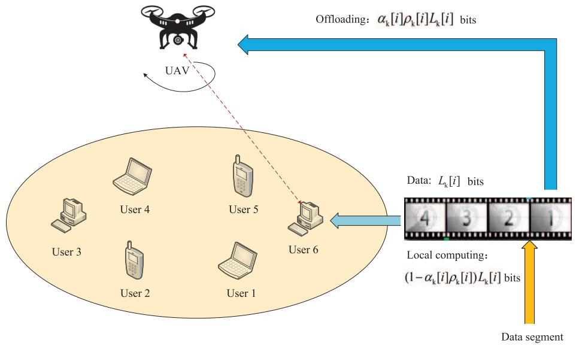

<details>
<summary>flowchart</summary>

```mermaid
graph TD
    A["User 1"] --> B["User 2"]
    B --> C["User 3"]
    C --> D["User 4"]
    D --> E["User 5"]
    E --> F["User 6"]
    F --> G["Offloading: α_k[i"]ρ_k["i"]L_k["i"] bits]
    G --> H["Data: L_k[i"] bits]
    H --> I["Local computing: (1−α_k[i"]ρ_k["i"])L_k["i"] bits]
    I --> J["Data segment"]
    J --> K["UAV"]
    K --> A
```
</details>

Fig. 1. UAV-aided MEC system.

1) Communication Model: These K users offload their computing tasks to the UAV using the periodic time-division multiple access. The period T contains $N > K$ time slots, which is indexed by $i \in \mathcal { T } \triangleq \{ 1 , \dots , N \}$ . The value of T significantly affects the system performance. A large value of T offers more time resources for the UAV to fly closer to its serving user, which leads to better channel quality and higher transmission rate.

Without loss of generality, we construct a 3-D Cartesian coordinate system model, in which the horizon coordinate of ground user k is given by ${ \bf w } _ { k } = [ x _ { k } , y _ { k } ] ^ { \mathrm { T } } \in \mathbb { R } ^ { 2 \times 1 } , k \in \mathcal { K }$ . We assume that the UAV flies at a fixed height H above the ground. Its horizon trajectory q[i] over time slot i can be characterized by the discrete time locations $\mathbf { q } [ i ] = [ x [ i ]$ , $y [ i ] ] ^ { \mathrm { T } } \in \mathbb { R } ^ { 2 \times 1 } , i \in \mathcal { T }$ . Suppose that the ground users’ locations can be detected by the UAV via a synthetic aperture radar or an optical camera on the UAV. Let us assume that $\Delta \triangleq ( T / N )$ denotes the time slot length, which should be sufficiently small. Since the UAV moves a small distance within each time slot, the channel gain can be approximately sampled within each time slot. The maximum speed of the UAV is denoted as $V _ { \mathrm { m a x } }$ . Then the UAV’s trajectory constraints are given by

$$
\mathbf {q} [ 1 ] = \mathbf {q} [ N ] \tag {1}
$$

$$
\frac {\| \mathbf {q} [ i + 1 ] - \mathbf {q} [ i ] \|}{\Delta} \leq V _ {\max}, i \in \mathcal {T} \tag {2}
$$

where (1) indicates that the UAV should go back to its initial position at the end of period T for providing the computing service to the users in cycles. Constraint (2) denotes that the flying speed of the UAV cannot exceed its maximum speed. The energy consumption of the UAV caused by flying is related to its speed. Thus, at each time slot i, we construct the energy consumption model for UAV flight as

$$
E ^ {\text { fly }} [ i ] \triangleq \kappa \| v [ i ] \| ^ {2} \quad \forall i \in \mathcal {T} \tag {3}
$$

where $\| \nu [ i ] \| \triangleq [ ( \| \mathbf { q } [ i + 1 ] - \mathbf { q } [ i ] \| ) / \Delta ]$ denotes the flying speed of the UAV at time slot $i , \ \kappa = 0 . 5 M \Delta$ and M is relevant to the UAV’s payload [18].

For the UAV-aided networks, as the altitude of the UAV is much higher than that of the ground users, the line-of-sight channels of the UAV communication links are much more predominant than other channel impairments, such as small scale fading or shadowing. Moreover, the Doppler frequency shift caused by the UAV mobility is assumed to be compensated at the receivers. Therefore, the channel gain from the UAV to user k at given time slot i can be described as the free-space path loss model

$$
h _ {k} [ i ] \triangleq \mu_ {0} d _ {k} ^ {- 2} [ i ] = \frac {\mu_ {0}}{H ^ {2} + \| \mathbf {q} [ i ] - \mathbf {w} _ {k} \| ^ {2}} \tag {4}
$$

where $\mu _ { 0 }$ represents the channel gain at the reference distance $d _ { 0 } = 1$ m and $d _ { k } [ i ]$ denotes the distance between user k and the UAV at time slot i. It is assumed that the UAV is able to serve up to one user at a time slot to avoid interference and data crosstalk. Therefore, we introduce discrete binary user scheduling variables $\{ \alpha _ { k } [ i ] , k \in \mathcal { K } , i \in \mathcal { T } \}$ to indicate the status of the UAV, namely, $\alpha _ { k } [ i ] = 1$ denotes that the UAV provides computing service for user k at time slot i; otherwise, $\alpha _ { k } [ i ] = 0$ . It yields the following constraints for the user scheduling variables:

$$
\sum_ {k = 1} ^ {K} \alpha_ {k} [ i ] \leq 1 \quad \forall i \tag {5}
$$

$$
\alpha_ {k} [ i ] \in \{0, 1 \} \quad \forall k, i. \tag {6}
$$

Then, the transmission rate of user k at time slot i is expressed as

$$
R _ {k} [ i ] = \log_ {2} \left(1 + \frac {P h _ {k} [ i ]}{\sigma^ {2}}\right) \tag {7}
$$

where $\sigma ^ { 2 }$ denotes the noise power at the UAV. As the UAV offers computing service for up to one user at each time slot, the interference among different channels could be ignored. We assume that the ground user always transmits at its maximum power to improve the signal-to-noise ratio, which is denoted as P.

2) Computing Model: We define variables $\{ 0 ~ \le ~ \rho _ { k } [ i ] ~ \le$ $1 , k \in \mathcal { K } , i \in \mathcal { T } \}$ to indicate the ratio of data offloaded to the UAV in time slot i. Whereas, $1 - \rho _ { k } [ i ]$ represents the ratio of data for user k to process locally in time slot i. We characterize the computation tasks at user k in each time slot i by $L _ { k } [ i ]$ bits and assume that $s _ { k }$ denotes the required number of CPU cycles for each user k in order to execute each bit. In each time slot, the UAV chooses a user to provide computing service according to the fairness among users. Note that $^ { c _ { 1 , k } }$ and $^ { c _ { 2 , k } }$ represent the computing capability of the UAV when serving user k and the local computing capability at user $k ,$ respectively, and B stands for the transmission bandwidth. In the considered networks, we have the following two computing models.

a) Local computing: For the local computing approach, the computational tasks are performed locally at ground users. The computation tasks in local CPU of user k at time slot i are denoted by $( 1 - \alpha _ { k } [ i ] \rho _ { k } [ i ] ) L _ { k }$ . As in [33], we model the power consumption of CPU in user k as $P _ { k } ^ { \mathrm { l o c a l } } [ i ] = r c _ { 2 , k } ^ { 3 } ,$ , where r denotes the coefficient depending on the chip architecture that is decided by the practical measurement [7]. The local computation execution time $t _ { k } ^ { \mathrm { l o c a l } } [ i ]$ is denoted as

$$
t _ {k} ^ {\text { local }} [ i ] = \frac {(1 - \alpha_ {k} [ i ] \rho_ {k} [ i ]) L _ {k} [ i ] s _ {k}}{c _ {2 , k}}. \tag {8}
$$

The energy consumption of local computation $E _ { k } ^ { \mathrm { l o c a l } } [ i ]$ is

$$
E _ {k} ^ {\text { local }} [ i ] = P _ {k} ^ {\text { local }} [ i ] t _ {k} ^ {\text { local }} [ i ] = r (1 - \alpha_ {k} [ i ] \rho_ {k} [ i ]) L _ {k} [ i ] s _ {k} c _ {2, k} ^ {2}. \tag {9}
$$

b) UAV-aided edge computing: Based on the communication model mentioned above, the delay and the energy consumption for offloading the tasks of user k at time slot i are given by

$$
t _ {k} ^ {\text { trans }} [ i ] = \frac {\alpha_ {k} [ i ] \rho_ {k} [ i ] L _ {k} [ i ]}{R _ {k} [ i ] B} \tag {10}
$$

and

$$
E _ {k} ^ {\text { trans }} [ i ] = P t _ {k} ^ {\text { trans }} [ i ] = P \frac {\alpha_ {k} [ i ] \rho_ {k} [ i ] L _ {k} [ i ]}{R _ {k} [ i ] B} \tag {11}
$$

respectively. The UAV would execute the computation tasks after offloading. The computing time of the UAV is shown

$$
t _ {k} ^ {\mathrm{UAV}} [ i ] = \frac {\alpha_ {k} [ i ] \rho_ {k} [ i ] L _ {k} [ i ] s _ {k}}{c _ {1 , k}}. \tag {12}
$$

Similarly, the energy consumption caused by the computation of the UAV’s CPU is expressed as

$$
E _ {k} ^ {\mathrm{UAV}} [ i ] = P _ {k} ^ {\mathrm{UAV}} [ i ] t _ {k} ^ {\mathrm{UAV}} [ i ] = r ^ {\prime} \alpha_ {k} [ i ] \rho_ {k} [ i ] L _ {k} [ i ] s _ {k} c _ {1, k} ^ {2} \tag {13}
$$

where $r ^ { \prime }$ denotes the coefficient depending on the chip architecture of the UAV.

# B. Problem Formulation

According to the UAV-aided system model mentioned above, we formulate the problem in this section. We assume that the local computing and the UAV computing can process simultaneously. The delay of the user served by the UAV depends on the maximum value of the following two items: 1) the offloading time plus the computing time of the UAV, which is denoted as $t _ { k } ^ { \mathrm { t r a n s } } [ i ] + t _ { k } ^ { \mathrm { U A V } } [ $ [i] and 2) the local computing time $t _ { k } ^ { \mathrm { l o c a l } } [ i ]$ . The UAV sends the computation results back to its serving user in the same time slot, then it leaves for the next location. Since the data size of the computing results is much smaller as compared to the offloaded data, the delay, and energy consumption caused by sending results back to user k can be negligible. Obviously, the delay of the user that is not served by the UAV is the local computing time. To ensure fairness and timeliness, we aim to minimize the sum of the maximum delay among all the users in each time slot during a period T by jointly optimizing the ratio of offloading tasks, the user scheduling variables, and the trajectory of the UAV. Therefore, the optimization problem is expressed in (14), shown at the bottom of the next page.

Constraint (14g) ensures the communication quality for offloading. Constraints (14h) and (14i) guarantee that the energy consumption of the users and the UAV cannot exceed the energy stored in the battery in one period, where $\epsilon _ { 1 }$ and $\epsilon _ { 2 }$ denote the battery energy budget of each user and the UAV, respectively. Problem (14) is a mixed integer nonconvex problem, which is challenging since it contains discrete binary variables $\alpha _ { k } [ i ]$ and the highly coupling constraints.

# III. PENALTY DUAL DECOMPOSITION-BASED ALGORITHM

In this part, we apply the PDD framework, as presented in Appendix A, to handle problem (14). First, we introduce a set of auxiliary variables and equality constraints to deal with the highly coupling constraints and the discrete binary variables $\alpha _ { k } [ i ]$ , where an alternative formulation to (14) is achieved. Moreover, we combine the set of AL terms into the objective function. Then the effective CCCP algorithm is applied to deal with the AL problem in the inner loop. Particularly, we employ the linearization technique to approximate the nonconvex constraints and convert the AL problem into a better tractable form. Afterward, the optimized variables in the AL problem are divided into two blocks, which can be optimized successively. Furthermore, the AL multipliers and the penalty factor are updated in the outer loop.

# A. Augmented Lagrangian Problem

The original problem is intractable since there are many discrete binary variables αk[i] and highly coupling constraints. First, we can equivalently transform constraint (14c) into the equality constraints by introducing auxiliary variables $\{ \tilde { \alpha } _ { k } [ i ] , k \in \mathcal { K } , i \in \mathcal { T } \}$ as

$$
\alpha_ {k} [ i ] (\tilde {\alpha} _ {k} [ i ] - 1) = 0 \quad \forall k, i \tag {15a}
$$

$$
\alpha_ {k} [ i ] - \tilde {\alpha} _ {k} [ i ] = 0 \quad \forall k, i. \tag {15b}
$$

Then, we introduce a number of auxiliary variables $\{ t _ { k } [ i ] , \hat { t } _ { k } [ i ] , \phi _ { k } [ i ] , \gamma _ { k } [ i ] , \beta _ { k } [ i ] , \tilde { t } [ i ] , k \in \mathcal { K } , i \in \mathcal { T } \}$ to deal with the coupling constraints. Problem (14) can be equivalently converted into (16), where $\mathcal { Z } \quad \triangleq$ $\begin{array} { r l } { \{ \alpha _ { k } [ i ] , { \bf q } [ i ] , \rho _ { k } [ i ] , \tilde { \alpha } _ { k } [ i ] , t _ { k } [ i ] , \gamma _ { k } [ i ] , \tilde { t } [ i ] , \beta _ { k } [ i ] , \hat { t } _ { k } [ i ] , \phi _ { k } [ i ] , k } & { { } \in \mathcal { C } . } \end{array}$

$$
\mathcal {K}, i \in \mathcal {T} \}
$$

$$
\min _ {\mathcal {Z}} \sum_ {i = 1} ^ {N} \tilde {t} [ i ] \tag {16a}
$$

$$
\text { s.t. } \alpha_ {k} [ i ] t _ {k} [ i ] \leq \tilde {t} [ i ] \quad \forall k, i \tag {16b}
$$

$$
\frac {1}{B} \rho_ {k} [ i ] L _ {k} [ i ] \hat {t} _ {k} [ i ] + \frac {\rho_ {k} [ i ] L _ {k} [ i ] s _ {k}}{c _ {1 , k}} \leq t _ {k} [ i ] \quad \forall k, i \tag {16c}
$$

$$
\beta_ {k} [ i ] \hat {t} _ {k} [ i ] \geq 1 \quad \forall k, i \tag {16d}
$$

$$
\alpha_ {k} [ i ] \rho_ {k} [ i ] \geq \gamma_ {k} [ i ] \quad \forall k, i \tag {16e}
$$

$$
\frac {(1 - \gamma_ {k} [ i ]) L _ {k} [ i ] s _ {k}}{c _ {2 , k}} \leq \tilde {t} [ i ] \quad \forall k, i \tag {16f}
$$

$$
\log \left(1 + \frac {1}{\phi_ {k} [ i ]}\right) \geq \beta_ {k} [ i ] \quad \forall k, i \tag {16g}
$$

$$
\frac {H ^ {2} + \| \mathbf {q} [ i ] - \mathbf {w} _ {k} \| ^ {2}}{\phi_ {k} [ i ]} \leq \frac {P \mu_ {0}}{\sigma^ {2}} \quad \forall k, i \tag {16h}
$$

$$
\alpha_ {k} [ i ] \nu \leq \beta_ {k} [ i ] \quad \forall k, i \tag {16i}
$$

$$
\sum_ {i = 1} ^ {N} \left(\frac {1}{B} P \gamma_ {k} [ i ] \hat {t} _ {k} [ i ] L _ {k} [ i ] \right.
$$

$$
\left. + r \left(1 - \gamma_ {k} [ i ]\right) L _ {k} [ i ] s _ {k} c _ {2, k} ^ {2}\right) \leq \epsilon_ {1} \quad \forall k \tag {16j}
$$

$$
\sum_ {i = 1} ^ {N} \sum_ {k = 1} ^ {K} r ^ {\prime} \alpha_ {k} [ i ] \rho_ {k} [ i ] L _ {k} [ i ] s _ {k} c _ {1, k} ^ {2} + \sum_ {i = 1} ^ {N} \kappa \| v [ i ] \| ^ {2} \leq \epsilon_ {2} \tag {16k}
$$

$$
\alpha_ {k} [ i ] \left(\tilde {\alpha} _ {k} [ i ] - 1\right) = 0, \alpha_ {k} [ i ] - \tilde {\alpha} _ {k} [ i ] = 0 \quad \forall k, i \tag {16l}
$$

$$
(1 4 \mathrm{b}) - (1 4 \mathrm{f}). \tag {16m}
$$

The detailed steps of the problem transformation are presented in Appendix B. The equality constraints (16l) can be dualized and penalized into the objective function as the AL terms. In this way, the AL problem is reformulated in (17), shown at the bottom of the next page.

We augment the objective function with AL multiplier $\{ \lambda _ { 1 , k , i } , \lambda _ { 2 , k , i } \} , k \in \mathcal { K } , i \in \mathcal { T }$ and a penalty factor $\varrho ~ \in ~ \mathbb { R } _ { + }$ .

Problems (16) and (17) are equivalent when $\varrho \to 0 .$ . The PDDbased algorithm has a double-loop structure. The inner loop optimizes the variables by handling problem (17) with fixed AL multipliers and the penalty factor while the outer loop updates the AL multipliers and the penalty factor.

# B. Proposed CCCP Algorithm in the Inner Loop

It is difficult to handle problem (17) directly due to the highly nonconvex constraints and the objective function. We approximate the nonconvex constraints with the aid of linearization.

Let us first deal with constraint (16k). It can be expressed by

$$
\begin{array}{l} \sum_ {i = 1} ^ {N} \kappa \| v [ i ] \| ^ {2} \\ + \sum_ {i = 1} ^ {N} \sum_ {k = 1} ^ {K} r ^ {\prime} \left(\left(\frac {\alpha_ {k} [ i ] + \rho_ {k} [ i ]}{2} \sqrt {L _ {k} [ i ]}\right) ^ {2} \right. \\ \left. - \left(\frac {\alpha_ {k} [ i ] - \rho_ {k} [ i ]}{2} \sqrt {L _ {k} [ i ]}\right) ^ {2}\right) s _ {k} c _ {1, k} ^ {2} \leq \epsilon_ {2}. \tag {18} \\ \end{array}
$$

We define $u ( \mathbf { z } _ { k } [ i ] ) \triangleq ( [ ( \alpha _ { k } [ i ] - \rho _ { k } [ i ] ) / 2 ] \sqrt { L _ { k } [ i ] } ) ^ { 2 } , w ( \mathbf { z } _ { k } [ i ] ) \triangleq$ $( [ ( \alpha _ { k } [ i ] ~ + ~ \rho _ { k } [ i ] ) / 2 ] \sqrt { L _ { k } [ i ] } ) ^ { 2 }$ and $\begin{array} { r l r } { x [ i ] } & { { } \triangleq } & { [ ( \kappa \Vert \nu [ i ] \Vert ^ { 2 } - } \end{array}$ $\epsilon _ { 2 } ) / ( r ^ { \prime } s _ { k } c _ { 1 , k } ^ { 2 } ) ] .$ , where $\begin{array} { r l r } { { \bf z } _ { k } [ i ] } & { { } \triangleq } & { [ \alpha _ { k } [ i ] , \rho _ { k } [ i ] ] ^ { \mathrm { T } } \quad \in \quad \mathbb { R } ^ { 2 \times 1 } } \end{array}$ . Thus, (18) can be rewritten as a difference of convex constraint

$$
\sum_ {i = 1} ^ {N} \sum_ {k = 1} ^ {K} (w (\mathbf {z} _ {k} [ i ]) - u (\mathbf {z} _ {k} [ i ])) + \sum_ {i = 1} ^ {N} x [ i ] \leq 0. \tag {19}
$$

Then, we use its first order Taylor expansion around the current point $\mathbf { z } _ { k } ^ { m } [ i ]$ , denoted as $\hat { u } ( { \mathbf { z } _ { k } ^ { m } [ i ] } , { \mathbf { z } _ { k } [ i ] } )$ , to approximate the differentiable function $u ( { \bf z } _ { k } [ i ] )$ in the mth iteration. According to [32], $\hat { u } ( \mathbf { z } _ { k } ^ { m } [ i ] , \mathbf { z } _ { k } [ i ] )$ can be rewritten as

$$
\hat {u} \left(\mathbf {z} _ {k} ^ {m} [ i ], \mathbf {z} _ {k} [ i ]\right) = u \left(\mathbf {z} _ {k} ^ {m} [ i ]\right) + \nabla u ^ {\mathrm{T}} \left(\mathbf {z} _ {k} ^ {m} [ i ]\right) \left(\mathbf {z} _ {k} [ i ] - \mathbf {z} _ {k} ^ {m} [ i ]\right) \tag {20}
$$

$$
\min _ {\left\{\alpha_ {k} [ i ], \mathbf {q} [ i ], \rho_ {k} [ i ] \right\}} \sum_ {i = 1} ^ {N} \max _ {\forall k} \left\{\max \left\{\left(t _ {k} ^ {\text { trans }} [ i ] + t _ {k} ^ {\mathrm{UAV}} [ i ]\right), t _ {k} ^ {\text { local }} [ i ] \right\} \right\} \tag {14a}
$$

$$
\text { s.t. } \sum_ {k = 1} ^ {K} \alpha_ {k} [ i ] \leq 1 \quad \forall i \tag {14b}
$$

$$
\alpha_ {k} [ i ] \in \{0, 1 \} \quad \forall k, i \tag {14c}
$$

$$
0 \leq \rho_ {k} [ i ] \leq 1 \quad \forall k, i \tag {14d}
$$

$$
\mathbf {q} [ 1 ] = \mathbf {q} [ N ] \tag {14e}
$$

$$
\frac {\| \mathbf {q} [ i + 1 ] - \mathbf {q} [ i ] \|}{\Delta} \leq V _ {\max}, i \in \mathcal {T} \tag {14f}
$$

$$
R _ {k} [ i ] \geq \alpha_ {k} [ i ] \nu \quad \forall k, i \tag {14g}
$$

$$
\sum_ {i = 1} ^ {N} \left(E _ {k} ^ {\text { trans }} [ i ] + E _ {k} ^ {\text { local }} [ i ]\right) \leq \epsilon_ {1} \quad \forall k \tag {14h}
$$

$$
\sum_ {i = 1} ^ {N} \sum_ {k = 1} ^ {K} E _ {k} ^ {\mathrm{UAV}} [ i ] + \sum_ {i = 1} ^ {N} E ^ {\text { fly }} [ i ] \leq \epsilon_ {2} \tag {14i}
$$

where $\nabla u ^ { \mathrm { T } } ( \mathbf { z } _ { k } ^ { m } [ i ] )$ denotes the derivative of $u ^ { \mathrm { T } } ( \mathbf { z } _ { k } ^ { m } [ i ] )$ as

$$
\begin{array}{l} \bigtriangledown u ^ {\mathrm{T}} \left(\mathbf {z} _ {k} ^ {m} [ i ]\right) = \left[ \left(\frac {\left(\alpha_ {k} ^ {m} [ i ] - \rho_ {k} ^ {m} [ i ]\right) L _ {k} [ i ]}{2}\right) \right. \\ \left. \times \left(- \frac {\left(\alpha_ {k} ^ {m} [ i ] - \rho_ {k} ^ {m} [ i ]\right) L _ {k} [ i ]}{2}\right) \right]. \tag {21} \\ \end{array}
$$

Here, we skip the details of the computation for $\hat { u } ( { \mathbf { z } _ { k } ^ { m } [ i ] } , { \mathbf { z } _ { k } [ i ] } )$ . It should be noted that $\hat { u } ( \mathbf { z } _ { k } ^ { m } [ i ] , \mathbf { z } _ { k } [ i ] )$ is an affine function of ${ \mathbf z } _ { k } [ i ]$ . We define h as

$$
\begin{array}{l} h \triangleq \sum_ {i = 1} ^ {N} \sum_ {k = 1} ^ {K} \frac {\left(\alpha_ {k} ^ {m} [ i ] - \rho_ {k} ^ {m} [ i ]\right) \left(\alpha_ {k} [ i ] - \rho_ {k} [ i ]\right)}{2} L _ {k} [ i ] \\ + \frac {\epsilon_ {2}}{r ^ {\prime} s _ {k} c _ {1 , k} ^ {2}} \quad \forall k, i. \tag {22} \\ \end{array}
$$

Then, we can rewrite the constraint (16k) as the SOCP form in (23), as shown at the bottom of the next page.

Other nonconvex constraints (16b)–(16e) and (16j) can be dealt with similarly. In this way, problem (17) can be transformed into (24), shown at the bottom of the next page, where

$$
J _ {k} [ i ] \triangleq \frac {\left(\alpha_ {k} ^ {m} [ i ] - t _ {k} ^ {m} [ i ]\right) \left(\alpha_ {k} [ i ] - t _ {k} [ i ]\right)}{2} + \tilde {t} [ i ] \quad \forall k, i \tag {25a}
$$

$$
\begin{array}{l} d _ {k} [ i ] \triangleq \frac {t _ {k} [ i ] B}{L _ {k} [ i ]} - \frac {\rho_ {k} [ i ] s _ {k} B}{c _ {1 , k}} \\ + \frac {\left(\rho_ {k} ^ {m} [ i ] - \hat {t _ {k}} ^ {m} [ i ]\right) \left(\rho_ {k} [ i ] - \hat {t _ {k}} [ i ]\right)}{2} \quad \forall k, i \tag {25b} \\ \end{array}
$$

$$
e _ {k} [ i ] \triangleq \frac {\left(\beta_ {k} ^ {m} [ i ] + \hat {t} _ {k} ^ {m} [ i ]\right) \left(\beta_ {k} [ i ] + \hat {t} _ {k} [ i ]\right)}{2} - 1 \quad \forall k, i \tag {25c}
$$

$$
f _ {k} [ i ] \triangleq \frac {\left(\alpha_ {k} ^ {m} [ i ] + \rho_ {k} ^ {m} [ i ]\right) \left(\alpha_ {k} [ i ] + \rho_ {k} [ i ]\right)}{2} - \gamma_ {k} [ i ] \quad \forall k, i \tag {25d}
$$

$$
\begin{array}{l} g _ {k} \triangleq \sum_ {i = 1} ^ {N} \left(\frac {\left(\gamma_ {k} ^ {m} [ i ] - \hat {t _ {k}} ^ {m} [ i ]\right) \left(\gamma_ {k} [ i ] - \hat {t _ {k}} [ i ]\right)}{2} \right. \\ \left. - \frac {B r (1 - \gamma_ {k} [ i ]) s _ {k} c _ {2 , k} ^ {2}}{P}\right) L _ {k} [ i ] + \frac {\epsilon_ {1} B}{P} \quad \forall k. \tag {25e} \\ \end{array}
$$

Note that (24h) is added to speed up the convergence while without affecting the optimality of this problem. Then, we divide the optimized variables of problem (24) into two blocks. In the first block, we fix the other variables to optimize { ˜αk[i]}. Then the subproblem of the first block is given by

$$
\begin{array}{l} \min _ {\{\tilde {\alpha} _ {k} [ i ] \}} \frac {1}{2 \varrho} \sum_ {i = 1} ^ {N} \sum_ {k = 1} ^ {K} \left(\| \alpha_ {k} [ i ] (\tilde {\alpha} _ {k} [ i ] - 1) + \varrho \lambda_ {1, k, i} \| ^ {2} \right. \\ \left. + \left\| \alpha_ {k} [ i ] - \tilde {\alpha} _ {k} [ i ] + \varrho \lambda_ {2, k, i} \right\| ^ {2}\right). \tag {26} \\ \end{array}
$$

Algorithm 1 Proposed CCCP Algorithm in the Inner Loop 

<table><tr><td>Initialize</td><td>original</td><td>variables</td><td> $\mathcal{Z}^{0}$ </td><td>=</td></tr><tr><td colspan="5"> $\{\tilde{i}[i], \alpha_{k}[i], \mathbf{q}[i], \rho_{k}[i], \beta_{k}[i], t_{k}[i], \hat{t}_{k}[i], \phi_{k}[i], \gamma_{k}[i], k \in \mathcal{K}, i \in \mathcal{T}\}$ , set the tolerance of accuracy  $\varsigma_{1}$ , the maximum iteration number  $N_{\text{max}}$ , and the current iteration number  $m = 0$ .</td></tr></table>

# repeat

1. Update $\tilde { \alpha } _ { k } ^ { m } [ i ]$ based on (27);   
2. Update ${ \dot { \mathcal { Z } } } ^ { m }$ based on solving (28);   
3. $m = m + 1 .$

until the difference between consecutive values of the objective function (24a) is under $\varsigma _ { 1 }$ or $m \geq N _ { \mathrm { m a x } } .$ .

The closed-form solution of (26) is denoted as

$$
\tilde {\alpha} _ {k} [ i ] = \frac {\alpha_ {k} ^ {2} [ i ] + \alpha_ {k} [ i ] - \varrho \lambda_ {1 , k , i} \alpha_ {k} [ i ] + \varrho \lambda_ {2 , k , i}}{\alpha_ {k} ^ {2} [ i ] + 1} \quad \forall k, i. \tag {27}
$$

In the second block, we optimize the rest variables by fixing $\{ \tilde { \alpha } _ { k } [ i ] \}$ , then we have the subproblem shown in (28) as shown at the bottom of the next page. Problem (28) is in convex form and can be solved by using the CVX solver [37]. In the iterative process of each inner loop, we alternately optimize the variables in the two blocks. The details of the proposed CCCP algorithm are presented in Algorithm 1.

# C. Proposed PDD-Based Algorithm

In the outer loop of the PDD-based algorithm, the AL multipliers $\{ \lambda _ { 1 , k , i } , \lambda _ { 2 , k , i } \} , k \in \mathcal { K } , i \in \mathcal { T }$ are updated by the following expressions:

$$
\lambda_ {1, k, i} ^ {n + 1} = \lambda_ {1, k, i} ^ {n} + \frac {1}{\varrho^ {n}} (\alpha_ {k} [ i ] (\tilde {\alpha} _ {k} [ i ] - 1)) \quad \forall k, i \tag {29a}
$$

$$
\lambda_ {2, k, i} ^ {n + 1} = \lambda_ {2, k, i} ^ {n} + \frac {1}{\varrho^ {n}} (\alpha_ {k} [ i ] - \tilde {\alpha} _ {k} [ i ]) \quad \forall k, i \tag {29b}
$$

where superscript n indicates the number of outer iteration. We introduce the constraint violation indicator $\mathbf { h } ( \mathcal { Z } ^ { n } )$ , which is shown below to measure the violation of the equality constraints and indicate the termination of the algorithm

$$
\mathbf {h} \left(\mathcal {Z} ^ {n}\right) = \max \left\{\| \alpha_ {k} [ i ] \left(\tilde {\alpha} _ {k} [ i ] - 1\right) \| ^ {2}, \| \alpha_ {k} [ i ] - \tilde {\alpha} _ {k} [ i ] \| ^ {2} \right\} \quad \forall k, i. \tag {30}
$$

The details of the PDD-based algorithm to handle problem (17) are shown in Algorithm 2. The inner loop algorithm “optimize $( P ( \varrho ^ { n } , \lambda ^ { n } ) , \mathbf { x } ^ { n - 1 } , \varsigma _ { 2 } ^ { n } ) ^ { , , }$ is replaced with the algorithm shown in Algorithm 1, which means starting from $\mathbf { x } ^ { n - 1 }$ , it calls an iterative optimization process to handle the

$$
\begin{array}{l} \min _ {\mathcal {Z}} \sum_ {i = 1} ^ {N} \tilde {t} [ i ] + \frac {1}{2 \varrho} \sum_ {i = 1} ^ {N} \sum_ {k = 1} ^ {K} \left(\left\| \alpha_ {k} [ i ] (\tilde {\alpha} _ {k} [ i ] - 1) + \varrho \lambda_ {1, k, i} \right\| ^ {2} + \left\| \alpha_ {k} [ i ] - \tilde {\alpha} _ {k} [ i ] + \varrho \lambda_ {2, k, i} \right\| ^ {2}\right) (17a) \\ \text { s.t. } 0 \leq \alpha_ {k} [ i ] \leq 1 \quad \forall k, i (17b) \\ (1 4 \mathrm{b}), (1 4 \mathrm{d}) - (1 4 \mathrm{f}), (1 6 \mathrm{b}) - (1 6 \mathrm{k}) (17c) \\ \end{array}
$$

AL problem (24) to some accuracy $S _ { 2 } ^ { n } .$ . Based on the discussion of [30], the PDD-based algorithm has a guaranteed convergence to a KKT (stationary) point of problem (16).

# IV. SIMPLIFIED ALGORITHM

To reduce the computational complexity, we propose a simplified algorithm based on $l _ { 0 } .$ -norm approximation to solve problem (16). Furthermore, the computational complexity of the proposed algorithms is also analyzed.

# A. Simplified Algorithm

Note that the most difficult and time-consuming part in the algorithm design is how to deal with binary constraints (14b) and (14c). In the PDD-based algorithm, we introduce a set of equality constraints to handle the binary constraints, which leads to its double-loop structure. In this section, we design a simplified algorithm by applying l0-norm to approximate the binary constraints, which has a single-loop structure.

We define the variables $\{ { \pmb { \alpha } } [ i ] \in \mathbb { R } ^ { k \times 1 } \} , i \in \mathcal { T }$ as α[i] - $[ \alpha _ { 1 } [ i ] , \alpha _ { 2 } [ i ] , \ldots , \alpha _ { k } [ i ] ] ^ { \mathrm { T } }$ , and use l0-norm of α[i], i.e.,α[i]0, to denote the number of nonzero elements in vector α[i]. The binary constraints (14b) and (14c) indicate that no more than one user is served by the UAV at a time slot, which means $\| { \pmb { \alpha } } [ i ] \| _ { 0 }$ should be less than or equal to 1. Furthermore, we relax the set of binary variables $\alpha _ { k } [ i ]$ into a set of continuous variables between 0 and 1 in the real domain. Thus, constraints (14b) and (14c) can be approximated as

$$
\| \boldsymbol {\alpha} [ i ] \| _ {0} \leq 1 \quad \forall i \tag {31}
$$

$$
0 \leq \alpha_ {k} [ i ] \leq 1 \quad \forall k, i. \tag {32}
$$

Constraints (31) and (32) guarantee that the UAV serves no more than one user at a time slot. According to [35] and [36], the $l _ { 0 } { \mathrm { - n o r m } }$ can be approximated as $l _ { 1 } { \mathrm { - n o r m } }$ , i.e., α[i]1.

Based on the CCCP technique and the auxiliary variables as illustrated in Section III, the original problem can be

$$
\left\| \left[ \frac {(\alpha_ {1} [ 1 ] + \rho_ {1} [ 1 ]) \sqrt {L _ {1} [ 1 ]}}{2}, \frac {\left(\alpha_ {1} ^ {m} [ 1 ] - \rho_ {1} ^ {m} [ 1 ]\right) \sqrt {L _ {1} [ 1 ]}}{2}, \dots , \frac {(\alpha_ {K} [ N ] + \rho_ {K} [ N ]) \sqrt {L _ {K} [ N ]}}{2} \right. \right.
$$

$$
\left. \frac {\left(\alpha_ {K} ^ {m} [ N ] - \rho_ {K} ^ {m} [ N ]\right) \sqrt {L _ {K} [ N ]}}{2}, \sqrt {\frac {\kappa}{r ^ {\prime} s _ {k} c _ {1 , k} ^ {2}}} v (1), \dots , \sqrt {\frac {\kappa}{r ^ {\prime} s _ {k} c _ {1 , k} ^ {2}}} v (N), \frac {h - 1}{2} \right] \| \leq \frac {h + 1}{2} \tag {23}
$$

$$
\min _ {\mathcal {Z}} \sum_ {i = 1} ^ {N} \tilde {t} [ i ] + \frac {1}{2 \varrho} \sum_ {i = 1} ^ {N} \sum_ {k = 1} ^ {K} \left(\left\| \alpha_ {k} [ i ] (\tilde {\alpha} _ {k} [ i ] - 1) + \varrho \lambda_ {1, k, i} \right\| ^ {2} + \left\| \alpha_ {k} [ i ] - \tilde {\alpha} _ {k} [ i ] + \varrho \lambda_ {2, k, i} \right\| ^ {2}\right) \tag {24a}
$$

$$
\text { s.t. } \left\| \left[ \frac {\alpha_ {k} [ i ] + t _ {k} [ i ]}{2}, \frac {\alpha_ {k} ^ {m} [ i ] - t _ {k} ^ {m} [ i ]}{2}, \frac {J _ {k} [ i ] - 1}{2} \right] \right\| \leq \frac {J _ {k} [ i ] + 1}{2} \quad \forall k, i \tag {24b}
$$

$$
\left\| \left[ \frac {\rho_ {k} [ i ] + \hat {t} _ {k} [ i ]}{2}, \frac {\rho_ {k} ^ {m} [ i ] - \hat {t} _ {k} ^ {m} [ i ]}{2}, \frac {d _ {k} [ i ] - 1}{2} \right] \right\| \leq \frac {d _ {k} [ i ] + 1}{2} \quad \forall k, i \tag {24c}
$$

$$
\left\| \left[ \frac {\beta_ {k} [ i ] - \hat {t} _ {k} [ i ]}{2}, \frac {\beta_ {k} ^ {m} [ i ] + \hat {t} _ {k} ^ {m} [ i ]}{2}, \frac {e _ {k} [ i ] - 1}{2} \right] \right\| \leq \frac {e _ {k} [ i ] + 1}{2} \quad \forall k, i \tag {24d}
$$

$$
\left\| \left[ \frac {\alpha_ {k} [ i ] - \rho_ {k} [ i ]}{2}, \frac {\alpha_ {k} ^ {m} [ i ] + \rho_ {k} ^ {m} [ i ]}{2}, \frac {f _ {k} [ i ] - 1}{2} \right] \right\| \leq \frac {f _ {k} [ i ] + 1}{2} \quad \forall k, i \tag {24e}
$$

$$
\left\| \left[ \frac {g _ {k} - 1}{2}, \frac {\big (\gamma_ {k} [ 1 ] + \hat {t} _ {k} [ 1 ] \big) \sqrt {L _ {k} [ 1 ]}}{2}, \frac {\big (\gamma_ {k} ^ {m} [ 1 ] - \hat {t} _ {k} ^ {m} [ 1 ] \big) \sqrt {L _ {k} [ 1 ]}}{2}, \dots \right. \right.
$$

$$
\left. \frac {\left(\gamma_ {k} [ N ] + \hat {t} _ {k} [ N ]\right) \sqrt {L _ {k} [ N ]}}{2}, \frac {\left(\gamma_ {k} ^ {m} [ N ] - \hat {t} _ {k} ^ {m} [ N ]\right) \sqrt {L _ {k} [ N ]}}{2} \right] \| \leq \frac {g _ {k} + 1}{2} \quad \forall k \tag {24f}
$$

$$
\log (1 + \phi_ {k} [ i ]) - \left(\log \left(\phi_ {k} ^ {m} [ i ]\right) + \left(\frac {1}{\phi_ {k} ^ {m} [ i ] \ln 2}\right) \left(\phi_ {k} [ i ] - \phi_ {k} ^ {m} [ i ]\right)\right) \geq \beta_ {k} [ i ] \quad \forall k, i \tag {24g}
$$

$$
0 \leq \alpha_ {k} [ i ] \leq 1 \quad \forall k, i \tag {24h}
$$

$$
(1 4 \mathrm{b}), (1 4 \mathrm{d}) - (1 4 \mathrm{f}), (1 6 \mathrm{f}), (1 6 \mathrm{h}), (1 6 \mathrm{i}) (2 3) \tag {24i}
$$

$$
\min _ {\mathcal {Z} \backslash \tilde {\alpha} _ {k} [ i ]} \sum_ {i = 1} ^ {N} \tilde {t} [ i ] + \frac {1}{2 \varrho} \sum_ {i = 1} ^ {N} \sum_ {k = 1} ^ {K} \left(\left\| \alpha_ {k} [ i ] (\tilde {\alpha} _ {k} [ i ] - 1) + \varrho \lambda_ {1, k, i} \right\| ^ {2} + \left\| \alpha_ {k} [ i ] - \tilde {\alpha} _ {k} [ i ] + \varrho \lambda_ {2, k, i} \right\| ^ {2}\right) \tag {28a}
$$

$$
\text { s   .   t   . } (2 4 \mathrm{b}) - (2 4 \mathrm{i}) \tag {28b}
$$

Algorithm 2 Proposed PDD-Based Algorithm   
Initialize $x^{0}$ , AL multipliers $\lambda^{0}$ , penalty factor $\varrho^{0} > 0$ , and set $\varsigma_{2}$ , $\varsigma_{3}$ , 0 < c < 1, $\eta^{0} > 0$ , the current iteration number in the outer loop n = 0, and the maximum iteration number $N_{max}$ .
repeat
    1. Update $\mathbf{x}^{n}=optimize(P(\varrho^{n},\boldsymbol{\lambda}^{n}),\mathbf{x}^{n-1},\varsigma_{2}^{n})$ ;
    if $\|\mathbf{h}(\mathbf{x}^{n})\|_{\infty}\leq\eta^{n}$ then
    Update AL multipliers according to (29), $\varrho^{n+1}=\varrho^{n}$ . // case1: AL method, and $\mathbf{h}(\mathbf{x}^{n})$ are the equation constraints here.
    else $\lambda^{n+1}=\lambda^{n}$ , update $\varrho^{n+1}$ by decreasing $\varrho^{n}:\varrho^{n+1}=c\varrho^{n}$ . // case2: penalty method.
    end if
    2. $\eta^{n+1}=0.7\|\mathbf{h}(\mathbf{x}^{n})\|_{\infty}$ ;
    3. $n=n+1;$ until the termination criterion is met: $\|h(x^{n})\|_{\infty}<\varsigma_{3}$ or $n\geq N_{max}$ .

converted to

$$
\min _ {\mathcal {Z} \backslash \tilde {\alpha} _ {k} [ i ]} \sum_ {i = 1} ^ {N} \tilde {t} [ i ] \tag {33a}
$$

$$
\text { s.t. } \quad \| \boldsymbol {\alpha} [ i ] \| _ {1} \leq 1 \quad \forall i \tag {33b}
$$

$$
(2 4 \mathrm{b}) - (2 4 \mathrm{i}). \tag {33c}
$$

Problem (33) can be solved by the CVX solver [37]. Although this approximation ensures that most of elements in the column vector α[i] to be zero, it can not guarantee all the optimized elements in α[i] to be 0 or 1. So we select the maximum element in column vector α[i] and set the value to 1 while setting the remaining elements to zero. The details of the simplified algorithm are shown in Algorithm 3.

# B. Computational Complexity Analysis

In this section, the computational complexity of the proposed algorithms is analyzed [34].

The complexity of the PDD-based algorithm is determined by handling problem (28) $I _ { 1 } I _ { 2 }$ times, where $I _ { 1 }$ and $I _ { 2 }$ represent the numbers of iterations in the inner loop and outer loop, respectively. The SoC constraints dominate the main complexity and the complexity on dealing with problem (26) is negligible as it recognizes a closed-form solution. Note that problem (28) contains $4 K N + K + 1$ SoC constraints, which involves 4KN SoCs with dimension 4, K SoCs with dimension 2N + 2, and 1 SoC with dimension $2 K N + N + 2$ . It involves 6KN + 2N variables, thus the number of variables $n _ { 1 }$ can be approximated by O(6KN). Taking the SoC constraints (24c) as an example, here we have KN SoC constraints and the dimension of each constraint is 4. Thus, according to [34], the complexity on dealing with (24c) is given by $4 ^ { 2 } K N$ . The complexity of the remaining part can be obtained by following the same approach, which is shown in Table I.

The complexity of the simplified l0-norm algorithm is determined by handling problem (33) $I _ { 3 }$ times, where $I _ { 3 }$ represents the number of iterations. Problem (33) involves $4 K N + K + 1$ SoC constraints, which contains 4KN SoCs with dimension 4, K SoCs with dimension 2N + 2, and 1 SoC with dimension $2 K N + N + 2$ . It involves 6KN + 2N variables, thus the number of variables $n _ { 2 }$ is approximated by O(6KN). Similarly, we can obtain the complexity for the simplified algorithm shown in Table I. It is worth noting that the complexity of the simplified algorithm is much lower than that of the proposed PDD-based algorithm.3

# V. EXTENSION TO THE AVERAGE DELAY

In this section, we extend the proposed PDD-based algorithm and the simplified l0-norm algorithm in Sections III and IV to optimize the delay in each time slot to the scenario of the average delay. Let us consider the following objective function:

$$
\min _ {\left\{\alpha_ {k} [ i ], \mathbf {q} [ i ], \rho_ {k} [ i ] \right\}} \max _ {\forall k} \sum_ {i = 1} ^ {N} \max \left\{\left(t _ {k} ^ {\text { trans }} [ i ] + t _ {k} ^ {\mathrm{UAV}} [ i ]\right), t _ {k} ^ {\text { local }} [ i ] \right\}. \tag {34}
$$

The difference between (14a) and (34) is that (14a) aims at minimizing the sum of maximum delay among all the users in each time slot, while (34) minimizes the maximum delay among all the users in one period, $\mathrm { i . e . , }$ the average delay. By introducing auxiliary variables {t, ˜t[i], $\beta _ { k } [ i ] , t _ { k } [ i ] , \hat { t } _ { k } [ i ] , \phi _ { k } [ i ] , \gamma _ { k } [ i ] , k \in \mathcal { K } , i \in \mathcal { T } \}$ , the problem with objective function (34) can be converted into (35) as shown

$$
\min _ {\mathcal {X}} t \tag {35a}
$$

$$
\text { s.t. } \sum_ {i = 1} ^ {N} \tilde {t} _ {k} [ i ] \leq t \quad \forall k \tag {35b}
$$

$$
\alpha_ {k} [ i ] t _ {k} [ i ] \leq \tilde {t} _ {k} [ i ] \quad \forall k, i \tag {35c}
$$

$$
\frac {(1 - \gamma_ {k} [ i ]) L _ {k} [ i ] s _ {k}}{c _ {2 , k}} \leq \tilde {t} _ {k} [ i ] \quad \forall k, i \tag {35d}
$$

$$
(1 6 \mathrm{c}) - (1 6 \mathrm{e}), (1 6 \mathrm{g}) - (1 6 \mathrm{m}) \tag {35e}
$$

where ${ \mathcal { X } } \ \triangleq \ \{ t , \alpha _ { k } [ i ] , \mathbf { q } [ i ] , \rho _ { k } [ i ] , { \tilde { \alpha } } _ { k } [ i ] , t _ { k } [ i ] , \gamma _ { k } [ i ] , { \tilde { t } } _ { k } [ i ] , \beta _ { k } [ i ] , $ , $\hat { t } _ { k } [ i ] , \phi _ { k } [ i ] , k \in \mathcal { K } , i \in \mathcal { T } \}$ . The problem (35) can be solved similarly by following the proposed PDD-based and simplified $l _ { 0 } .$ -norm algorithms shown in Sections III and IV.

3According to the simulation results, when the UAV serves eight ground users, and the number of time slots are set to be 600, we obtain $I _ { 1 } = 3 0 ,$ , $I _ { 2 } = 1 0 ,$ and $I _ { 3 } = 4 0 ,$ , respectively. When the UAV serves four ground users, and the number of time slots are set to be 200, we obtain $I _ { 1 } = 2 0 , I _ { 2 } = 5 ,$ , and $I _ { 3 } = 2 5 ,$ , accordingly.

# Algorithm 3 Proposed Simplified l0-Norm Algorithm

Initialize original variables $\mathcal { Z } ^ { 0 } \ = \ \{ \tilde { t } [ i ] , \alpha _ { k } [ i ] , \mathbf { q } [ i ] , \rho _ { k } [ i ] , \beta _ { k } [ i ] , t _ { k } [ i ] , \hat { t } _ { k } [ i ] , \phi _ { k } [ i ] , \gamma _ { k } [ i ] \} , k \in \mathcal { K } , i \ \in \ \mathcal { T }$ , set the tolerance of accuracy $\varsigma _ { 4 }$ , the maximum iteration number $N _ { \mathrm { m a x } }$ , and the current iteration number $m = 0 .$ .

# repeat

1. Update ${ \mathcal { Z } } ^ { m }$ based on solving (33);   
2. $m = m + 1 .$

until the difference between consecutive values of the objective function (33a) is under ${ \zeta } 4 ~ \mathrm { { o r } } ~ m \ge { N _ { \mathrm { { m a x } } } }$ . Then we pick the maximum element in the column vector α[i] and set the value to be 1, while the remaining elements are set to be zero.

TABLE I COMPLEXITY ANALYSIS FOR THE PROPOSED ALGORITHMS 

<table><tr><td>Algorithms</td><td>Complexity Order</td></tr><tr><td>PDD-based algorithm</td><td> $I_1I_2O\left(n_1\sqrt{2(4KN+K+1)}\cdot(64KN+4K(N+1)^2+(2KN+N+2)^2+n_1^2)\right), \ n_1 = O(6KN)$ </td></tr><tr><td>Simplified algorithm</td><td> $I_3O\left(n_2\sqrt{2(4KN+K+1)}\cdot(64KN+4K(N+1)^2+(2KN+N+2)^2+n_2^2)\right), \ n_2 = O(6KN)$ </td></tr></table>

These two objective functions lead to different system performance. The average delay of a user during a period in (34) is smaller than that in (14a) while the delay jitter of each user in a period in (34) is larger than that in (14a). It is mainly because (34) aims at minimizing the average delay of each user in one period, whereas that in (14a) ensures the delay in each time slot. When the users’ requirement of the timeliness is high, such as video conference and video surveillance, applying (14a) is more reasonable. In the scenes with low real-time requirements but high requirements of the average delay, such as watching the online video, applying (34) is better.

# VI. NUMERICAL RESULTS

In this section, we present simulation results to evaluate the performance and efficiency of the proposed algorithms. We consider a UAV-aided MEC system, where $K = 8$ ground users are distributed in a 2-D area of $2 \times 2 \mathrm { k m } ^ { 2 }$ randomly [25]. The channel power gain is set to be $\mu _ { 0 } = - 5 0$ dB at the reference distance $d _ { 0 } = 1$ m. The receiver noise power is assumed to be $\sigma ^ { 2 } = - 1 0 0$ dBm. For each user, the task size $L _ { k }$ follows the uniform distribution over $[ 1 \times 1 0 ^ { 7 } , 5 \times 1 0 ^ { 7 } ]$ (bits). We set $s _ { k } = 1 0 ^ { 3 }$ cycles/bit and $r = r ^ { \prime } = 1 0 ^ { - 2 7 }$ . The computing capability of the UAV $c _ { 1 , k } = 1 2 0 0$ MHz, $k = 1 , 2 , \ldots , 8$ while that of each user $_ { c _ { 2 , k } }$ is randomly distributed within [300, 400] MHz. The maximum transmission power of the users and the maximum speed of the UAV are $P = 3 0$ dBm and $V _ { \mathrm { m a x } } = 5 0$ m/s, respectively. The transmission bandwidth is assumed to be $B = 1$ MHz. The battery energy of the UAV is $\epsilon _ { 1 } = 0 . 0 1 k W { \cdot } h$ while that of each user is $\epsilon _ { 2 } = 0 . 0 0 1$ kW · h. Here, we assume that the UAV flies at a fixed height $H = 1 0 0$ m. The threshold in the PDD-based algorithm is assumed to be $\varsigma _ { 3 } = 1 0 ^ { - 8 }$ . The initial circular trajectory of the UAV q[i] is given in [25].

Fig. 2 shows an example of the UAV’s flying trajectories optimized by the proposed PDD-based algorithm with different values of period, T. The inflight range of the UAV is small when T is short, e.g., T = 30 s, and the UAV is far away from the ground users when offloading data. As T grows, the radius of the trajectory increases and the communication quality improves due to shorter distance between the UAV and its

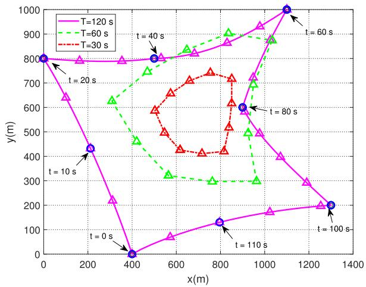  
Fig. 2. Illustration of the optimal UAV trajectories with different values of period T. The trajectory of $\bar { T = 3 0 }$ s is sampled every $2 . 5 \ \mathrm { s } ,$ while the others are sampled every 5 s. The sampled points of the UAV locations are marked with - while the locations of ground users are marked with ◦.

serving user. When T is sufficiently large, the UAV can access all users in sequence, even keeps stationary above its serving user for several time slots. Meanwhile, the UAV’s trajectory is a large closed loop that connects all the users’ locations. From Fig. 2, better performance can be achieved if the UAV can fly in a larger period of time to provide more freedom for the UAV to adjust its trajectory and location.

To give a more detailed illustration, we show the speed of the UAV in a period of time for $T = 1 2 0 ~ \mathrm { s }$ in Fig. 3. From the figure, the speed of UAV would reduce to zero in some time slots. The UAV is exactly located above its serving user during these time intervals, and it would keep stationary to gather more data in better channel condition. On the other hand, when the UAV leaves one user for the next, it will not fly with the maximum speed since there is a tradeoff between the flying speed and the energy consumption.

In what follows, we analyze a special scenario, where the UAV serves a group of ground users with the same size of computing tasks but different computing capabilities. We assume $K = 8$ ground users randomly located within a 2-D area of $2 \times 2 ~ \mathrm { k m } ^ { 2 }$ . Each of them has the same size of computing tasks as $L _ { k } \ = \ 1 \times 1 0 ^ { 7 }$ bits, $k = 1 , 2 , \ldots , 8 .$ They have different computing capabilities, i.e., $c _ { 2 , 1 } = c _ { 2 , 8 } = 2 0 0$ MHz, $c _ { 2 , 2 } = c _ { 2 , 3 } = 4 0 0$ MHz, $c _ { 2 , 4 } = c _ { 2 , 5 } = 6 0 0$ MHz, and $c _ { 2 , 6 } = c _ { 2 , 7 } = 1 2 0 0 \ : \mathrm { M H z }$ . The other parameters are same as the parameters mentioned above. In Table II, we show the number of time slots served by the UAV and the ratio of offloading data for each user. From the table, users 1 and 8 are allocated with the most time slots while users 6 and 7 are allocated with the least time slots. Meanwhile, the ratio of the offloading data has the same trends as that of the allocated number of time slots. This is very intuitive since users with smaller local computing capability may offload more data to the UAV and correspondingly requires more time slots for transmission.

TABLE IISIMULATION RESULTS OF THE SPECIAL CASE

<table><tr><td>User index</td><td>1</td><td>2</td><td>3</td><td>4</td><td>5</td><td>6</td><td>7</td><td>8</td></tr><tr><td>Number of time slots served by the UAV</td><td>82</td><td>37</td><td>37</td><td>16</td><td>16</td><td>5</td><td>5</td><td>82</td></tr><tr><td>Ratio of the offloading data</td><td>61.33%</td><td>26.67%</td><td>26.67%</td><td>10.33%</td><td>10.33%</td><td>2.78%</td><td>2.78%</td><td>61.33%</td></tr></table>

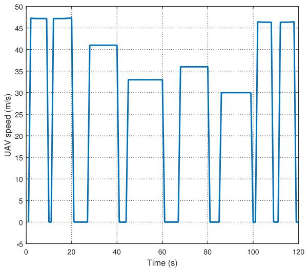

<details>
<summary>line</summary>

| Time (s) | UAV speed (m/s) |
| -------- | --------------- |
| 0        | 47              |
| 10       | 0               |
| 15       | 47              |
| 20       | 47              |
| 30       | 0               |
| 35       | 41              |
| 40       | 0               |
| 45       | 33              |
| 50       | 33              |
| 60       | 0               |
| 65       | 36              |
| 70       | 36              |
| 75       | 0               |
| 80       | 30              |
| 85       | 0               |
| 90       | 30              |
| 95       | 0               |
| 100      | 47              |
| 105      | 0               |
| 110      | 47              |
| 115      | 0               |
| 120      | 47              |
</details>

Fig. 3. Speed of UAV in a period for $T = 1 2 0 ~ \mathrm { s }$ .

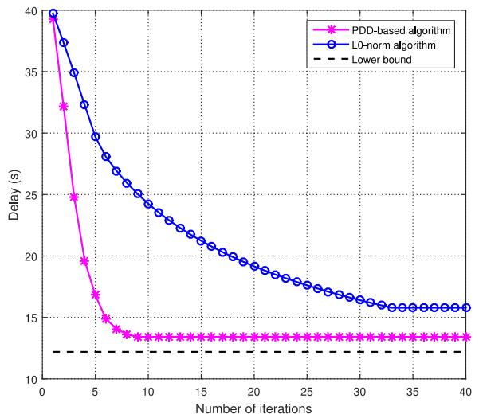

<details>
<summary>line</summary>

| Number of iterations | PDD-based algorithm | L0-norm algorithm |
| -------------------- | ------------------- | ----------------- |
| 0                    | 40.0                | 40.0              |
| 2                    | 32.0                | 38.0              |
| 4                    | 25.0                | 35.0              |
| 6                    | 17.0                | 30.0              |
| 8                    | 14.0                | 27.0              |
| 10                   | 13.5                | 25.0              |
| 12                   | 13.5                | 24.0              |
| 14                   | 13.5                | 23.0              |
| 16                   | 13.5                | 22.0              |
| 18                   | 13.5                | 21.5              |
| 20                   | 13.5                | 21.0              |
| 22                   | 13.5                | 20.5              |
| 24                   | 13.5                | 20.0              |
| 26                   | 13.5                | 19.5              |
| 28                   | 13.5                | 19.0              |
| 30                   | 13.5                | 18.5              |
| 32                   | 13.5                | 18.0              |
| 34                   | 13.5                | 17.5              |
| 36                   | 13.5                | 17.0              |
| 38                   | 13.5                | 16.5              |
| 40                   | 13.5                | 16.0              |
</details>

Fig. 4. Time delay simulated by PDD and l0-norm algorithm with $T = 2 4 0 \mathrm { s } .$ .

In Fig. 4, we compare the optimal time delay achieved by the PDD-based algorithm with the simplified l0-norm algorithm. The lower bound in the figure is achieved by setting T and $V _ { \mathrm { m a x } }$ as sufficiently large so that the UAV’s flying time between users can be neglected, and it can provide offloading service for the ground users sequentially when it is exactly above its serving user. From the figure, we see that the PDD-based algorithm converges at around ten iterations while the l0-norm algorithm converges after 40 iterations. However, the PDD-based algorithm contains two nested loops, whereas the l0-norm algorithm only has one loop. Besides, the PDDbased algorithm achieves a lower optimized delay than the l0-norm algorithm, which demonstrates its superiority.

Fig. 5 shows the relationship between the value of constraint violation indicator, $\mathbf { h } ( \mathcal { Z } ^ { n } )$ in (30), and the number of iterations in the proposed PDD-based algorithm. From the $\mathrm { f i g \mathrm { - } }$ ure, $\mathbf { h } ( \mathcal { Z } ^ { n } )$ decreases to $1 0 ^ { - 1 0 }$ after 20 iterations, which shows the fast convergence rate of the penalty items. It validates the efficiency of the proposed PDD-based algorithm when dealing with the equality constraints. At the beginning, the penalty

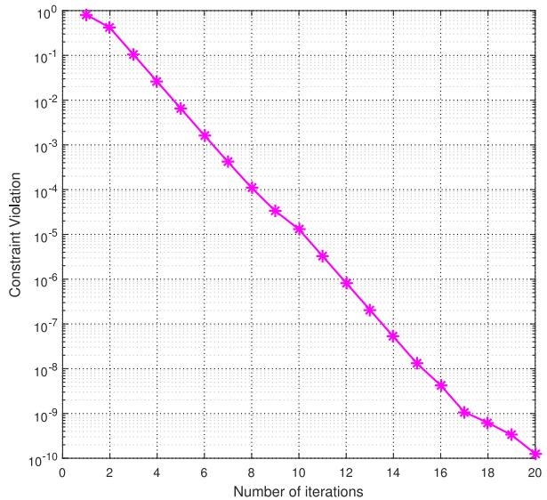

<details>
<summary>line</summary>

| Number of iterations | Constraint Violation |
| -------------------- | -------------------- |
| 1                    | 1.0                  |
| 2                    | 0.5                  |
| 3                    | 0.1                  |
| 4                    | 0.01                 |
| 5                    | 0.001                |
| 6                    | 0.0001               |
| 7                    | 0.00001              |
| 8                    | 0.000001             |
| 9                    | 0.0000001            |
| 10                   | 0.00000001           |
| 11                   | 0.000000001          |
| 12                   | 0.0000000001         |
| 13                   | 0.00000000001        |
| 14                   | 0.000000000001       |
| 15                   | 0.0000000000001      |
| 16                   | 0.00000000000001     |
| 17                   | 0.000000000000001    |
| 18                   | 0.0000000000000001   |
| 19                   | 0.00000000000000001  |
| 20                   | 0.00000000000000001  |
</details>

Fig. 5. Penalty of constraints violation with $T = 1 2 0$ s.

value is high since the initial value of each variable violates the equality constraints a lot. With the increase of the iteration number, the AL multiplier, λ, increases while the penalty coefficient 
 decreases, which causes that the weight of penalty item increases with the objective function item ˜t[i]. Therefore, the results would not violate the equality constraints too much. After about 20 iterations, the penalty value is less than $1 0 ^ { - 1 0 }$ , which means that the discrete binary variables $\alpha _ { k } [ i ]$ are very close to 0 or 1, and all the equality constraints penalized into the objective function are well satisfied.

In what follows, we compare the optimized delay performance achieved by the following schemes.

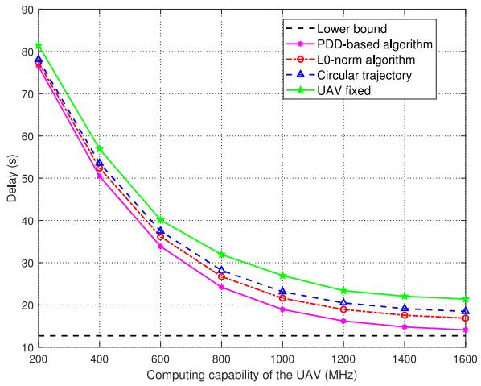

<details>
<summary>line</summary>

| Computing capability of the UAV (MHz) | Lower bound | PDD-based algorithm | L0-norm algorithm | Circular trajectory | UAV fixed |
| ------------------------------------- | ----------- | ------------------- | ----------------- | ------------------- | --------- |
| 200                                   | 10          | 78                  | 78                | 78                  | 81        |
| 400                                   | 10          | 51                  | 51                | 53                  | 57        |
| 600                                   | 10          | 34                  | 34                | 37                  | 40        |
| 800                                   | 10          | 24                  | 26                | 28                  | 32        |
| 1000                                  | 10          | 19                  | 21                | 23                  | 26        |
| 1200                                  | 10          | 16                  | 17                | 20                  | 23        |
| 1400                                  | 10          | 15                  | 16                | 19                  | 22        |
| 1600                                  | 10          | 14                  | 15                | 18                  | 21        |
</details>

Fig. 6. Time delay versus computing capability of the UAV with $T = 1 2 0 ~ \mathrm { s }$ .

1) The proposed PDD-based algorithm optimizing all variables including user scheduling variables $\alpha _ { k } [ i ]$ , the trajectory of the UAV q[i], and the ratio of offloading data $\rho _ { k } [ i ]$ .   
2) The proposed simplified l0-norm algorithm.   
3) The PDD-based algorithm optimizing αk[i] and $\rho _ { k } [ i ] ,$ where the trajectory of the UAV is a circle [25].   
4) The PDD-based algorithm optimizing αk[i] and $\rho _ { k } [ i ]$ while keeping UAV fixed at a stationary point, e.g., the geometry center of the users.

Fig. 6 illustrates the time delay versus computing capability of the UAV with $T = 1 2 0 ~ \mathrm { s }$ and P = 30 dBm. The lower bound in the figure is calculated when the computing capability of the UAV is sufficiently large. With the increase of the $\mathrm { U A V } _ { \mathrm { \Delta } }$ computing capability, the users would offload more data to the UAV, which leads to the decrease on the optimal time delay. Both the PDD-based algorithm and the simplified l0-norm algorithm outperform the other two schemes, i.e., the UAV with circular trajectory and fixed location. When the UAV flies in a circular trajectory, the users that are not located along the circle have worse channel conditions. Thus, more time slots would be allocated to these users, which leads to low efficiency. By contrast, the PDD-based algorithm shows the best performance. However, as discussed before, the computational complexity of the PDD-based algorithm is relatively high since it requires two nested loops of iterations. In this sense, the simplified l0-norm algorithm achieves a good balance between the delay performance and the computational complexity.

Fig. 7 shows the time delay versus transmission power of the users with the time period $T = 1 2 0$ s and the UAV’s computing capability $c _ { 1 , k } = 1 2 0 0$ MHz. When the transmission power is small, e.g., 21 dBm, the transmission rate is low, thus the users prefer to compute locally no matter how fast the UAV’s computing capability is. In this case, the delay is large in all four schemes. When the transmission power increases, the transmission rate also increases, which leads to the time delay decreases monotonically since the users would offload more data to the UAV. The lower bound is computed when the transmission power is sufficiently large. From the figure, the superiority of the proposed PDD-based algorithm and the l0-norm algorithm is demonstrated once again.

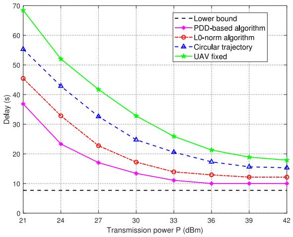

<details>
<summary>line</summary>

| Transmission power P (dBm) | Lower bound | PDD-based algorithm | L0-norm algorithm | Circular trajectory | UAV fixed |
| -------------------------- | ----------- | ------------------- | ----------------- | ------------------- | --------- |
| 21                         | 8           | 38                  | 46                | 56                  | 70        |
| 24                         | 8           | 24                  | 34                | 44                  | 52        |
| 27                         | 8           | 18                  | 23                | 33                  | 42        |
| 30                         | 8           | 14                  | 18                | 25                  | 33        |
| 33                         | 8           | 12                  | 15                | 21                  | 26        |
| 36                         | 8           | 10                  | 13                | 18                  | 21        |
| 39                         | 8           | 10                  | 12                | 16                  | 19        |
| 42                         | 8           | 10                  | 12                | 16                  | 18        |
</details>

Fig. 7. Time delay versus transmission power of the users with $T = 1 2 0$ s.

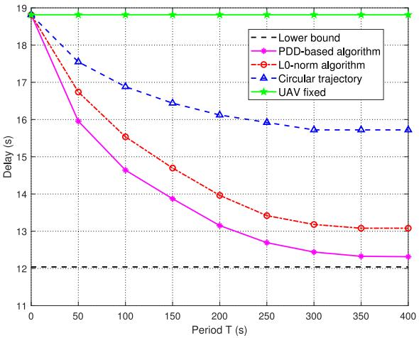

<details>
<summary>line</summary>

| Period T (s) | Lower bound | PDD-based algorithm | L0-norm algorithm | Circular trajectory | UAV fixed |
| ------------ | ----------- | ------------------- | ----------------- | ------------------- | --------- |
| 0            | 12.0        | 18.5                | 18.5              | 18.5                | 19.0      |
| 50           | 12.0        | 16.0                | 16.8              | 17.5                | 19.0      |
| 100          | 12.0        | 14.5                | 15.5              | 17.0                | 19.0      |
| 150          | 12.0        | 13.8                | 14.8              | 16.5                | 19.0      |
| 200          | 12.0        | 13.2                | 14.0              | 16.0                | 19.0      |
| 250          | 12.0        | 12.8                | 13.5              | 15.8                | 19.0      |
| 300          | 12.0        | 12.5                | 13.2              | 15.7                | 19.0      |
| 350          | 12.0        | 12.3                | 13.1              | 15.6                | 19.0      |
| 400          | 12.0        | 12.2                | 13.0              | 15.5                | 19.0      |
</details>

Fig. 8. Time delay with different values of period T.

Fig. 8 illustrates the time delay with different values of period, T, where the transmission power $P = 3 0$ dBm and the UAV’s computing capability $c _ { 1 , k } = 1 2 0 0$ MHz. When the period T is small, the UAV would hover in a small range, which is far away from the served users. In this situation, the delay would be very large since users would offload small portion of data to the UAV due to low transmission rate. When the period T increases, the UAV would have more freedom to fly near its serving user to obtain better channel conditions, and more data could be offloaded to the UAV, leading to the decrease of the delay performance. As T goes large enough, the optimized delay of all algorithms converges. The lower bound is calculated when T is sufficiently large. Nevertheless, the PDD-based algorithm still achieves the best performance, and the l0-norm algorithm performs better than the benchmark schemes, i.e., UAV with circular trajectory or fixed location.

In Fig. 9, we compare each user’s time delay in one period for schemes corresponding to different objective functions. The red full line stands for objective function (14a) while the blue dotted line corresponds to objective function (34). It is obvious that the user’s average delay in (34) is lower than that in (14a), while each user’s delay jitter corresponding to (34) is larger than that in (14a) within one period.

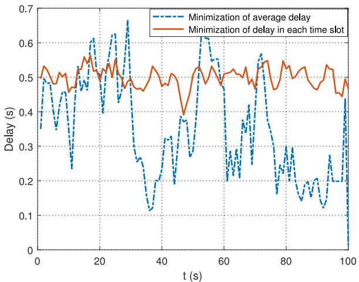

<details>
<summary>line</summary>

| t (s) | Minimization of average delay (s) | Minimization of delay in each time slot (s) |
|-------|-----------------------------------|---------------------------------------------|
| 0     | 0.5                               | 0.5                                         |
| 10    | 0.4                               | 0.5                                         |
| 20    | 0.6                               | 0.5                                         |
| 30    | 0.7                               | 0.5                                         |
| 40    | 0.3                               | 0.5                                         |
| 50    | 0.6                               | 0.5                                         |
| 60    | 0.5                               | 0.5                                         |
| 70    | 0.4                               | 0.5                                         |
| 80    | 0.3                               | 0.5                                         |
| 90    | 0.2                               | 0.5                                         |
| 100   | 0.1                               | 0.5                                         |
</details>

Fig. 9. Time delay of each user in one period for different schemes.   
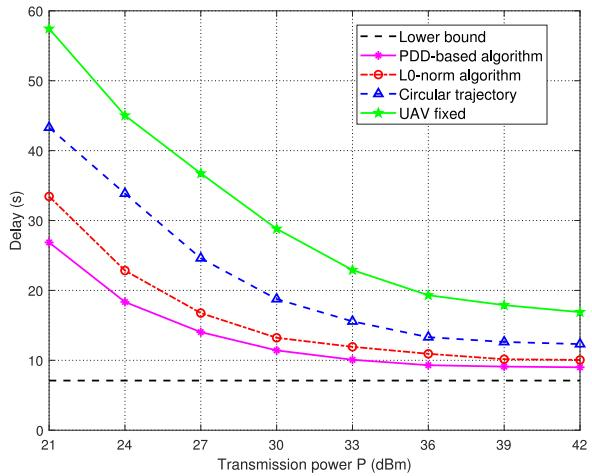

<details>
<summary>line</summary>

| Transmission power P (dBm) | Lower bound | PDD-based algorithm | L0-norm algorithm | Circular trajectory | UAV fixed |
| -------------------------- | ----------- | ------------------- | ----------------- | ------------------- | --------- |
| 21                         | 7           | 28                  | 33                | 43                  | 58        |
| 24                         | 7           | 19                  | 23                | 34                  | 45        |
| 27                         | 7           | 14                  | 17                | 25                  | 37        |
| 30                         | 7           | 12                  | 14                | 19                  | 29        |
| 33                         | 7           | 10                  | 12                | 16                  | 23        |
| 36                         | 7           | 9                   | 11                | 14                  | 19        |
| 39                         | 7           | 9                   | 10                | 13                  | 18        |
| 42                         | 7           | 9                   | 10                | 13                  | 17        |
</details>

Fig. 10. Time delay versus the transmission power in the case of $T = 1 2 0 ~ \mathrm { { s } }$ s for objective function (34).

Fig. 10 shows the average time delay versus the transmission power in the case of time period $T = 1 2 0 ~ \mathrm { s }$ for objective function (34), where we set the UAV’s computing capability $c _ { 1 , k } = 1 2 0 0 ~ \mathrm { M H z }$ . When the transmission power is small, e.g., 21 dBm, the transmission rate is low, thus the users prefer to compute locally. In this case, the delay is large in all the analyzed algorithms. The transmission rate increases with transmission power, which leads to the time delay decreases monotonically since the users would offload more data to the UAV. From the figure, the superiority of the proposed PDDbased algorithm and the $l _ { 0 } { \mathrm { - n o r m } }$ algorithm is demonstrated once again. The trend of the curves is similar to that of objective function (14a). It is apparent that the average delay of the system corresponding to objective function (34) is smaller than that of (14a).

# VII. CONCLUSION

In this paper, we have investigated a UAV-aided MEC system, where a number of ground users are served by a moving UAV equipped with computing resources. We aim at minimizing the sum of the maximum delay among all the users in each time slot by jointly optimizing the ratio of offloading tasks, trajectory of the UAV, and user scheduling variables. To handle this challenging problem with coupling constraints and discrete binary variables, a number of auxiliary variables are introduced to convert the original problem into a mathematically tractable form. Then, we develop a novel PDD-based algorithm by leveraging the AL method and the CCCP algorithm. Furthermore, we have developed a simplified l0-norm algorithm with much lower computational complexity. Besides, we also extend our algorithm to minimize the average delay. Our simulation results have validated that the computation performance of users can be effectively improved with the help of a moving UAV. Moreover, the delay performance and convergence rate of the proposed PDD-based algorithm have also been verified.

# APPENDIX A

# BRIEF REVIEW OF PROPOSED PDD APPROACH

In this Appendix, we briefly review the general framework of the PDD method. It is an algorithmic framework that can solve nonconvex problems with coupling constraints. Consider the following problem:

$$
\min _ {\mathbf {x} \in \boldsymbol {\mathcal {X}}} f (\mathbf {x}) \tag {36a}
$$

$$
\text { s.t. } \quad \mathbf {h} (\mathbf {x}) = \mathbf {0} \tag {36b}
$$

$$
\mathbf {g} (\mathbf {x}) \leq \mathbf {0} \tag {36c}
$$

where the feasible set $\pmb { \mathcal { X } } \in \mathbb { R } ^ { n }$ is a closed convex set, and f (x) is a scalar continuously differentiable function. As for the constraints, h(x) $\in \mathbb { R } ^ { p \times 1 }$ is a vector of p continuously differentiable functions; $\mathbf { g } ( \mathbf { x } ) \in \mathbb { R } ^ { q \times 1 }$ is a vector of $q$ continuously differentiable but possibly nonconvex functions. In order to deal with the equality constraints, we handle the AL problem as shown below iteratively

$$
P \left(\varrho^ {n}, \boldsymbol {\lambda} ^ {n}\right): \min _ {\mathbf {x} \in \boldsymbol {\chi}} \left\{L _ {n} (\mathbf {x}) \triangleq f (\mathbf {x}) + \boldsymbol {\lambda} ^ {n T} \mathbf {h} (\mathbf {x}) + \frac {1}{2 \varrho^ {n}} \| \mathbf {h} (\mathbf {x}) \| ^ {2} \right\} \tag {37a}
$$

$$
\text { s.t. } \quad \mathbf {g} (\mathbf {x} ^ {n}) \leq \mathbf {0} \tag {37b}
$$

where $L _ { n } ( \mathbf { x } )$ is the AL function with AL multiplier $\mathsf { \lambda } ^ { \lambda ^ { n } }$ and penalty factor $\varrho ^ { n }$ , and n denotes the current iteration number. In particular, solving problem (37) produces an identical solution to the problem (36) when $\varrho \to 0$ [30].

The framework of the PDD method is shown in Algorithm 2, which shows a double-loop structure. The inner loop deals with the AL problem (37) while the outer loop aims at updating the AL multiplier or the penalty factor according to the value of the constraint violation indicator. The detailed discussion about the convergence can be found in [30] and [31], which demonstrates that the solution obtained by the PDD method can guarantee to converge to a KKT (stationary) point of problem (36) ultimately.

# APPENDIX B

# PROOF THE EQUIVALENCY BETWEEN (14) AND (16)

The objective function in (14) is difficult to couple with due to the maximization. So we introduce the auxiliary variables ˜t[i] to convert the objective function into

$$
\min _ {\left\{\alpha_ {k} [ i ], q [ i ], \rho_ {k} [ i ], \tilde {t} [ i ] \right\}} \sum_ {i = 1} ^ {N} \tilde {t} [ i ]. \tag {38}
$$

Meanwhile, we add the following constraints:

$$
\alpha_ {k} [ i ] \left(\frac {\rho_ {k} [ i ] L _ {k} [ i ]}{R _ {k} [ i ] B} + \frac {\rho_ {k} [ i ] L _ {k} [ i ] s _ {k}}{c _ {1 , k}}\right) \leq \tilde {t} [ i ] \quad \forall k, i \tag {39a}
$$

$$
\frac {(1 - \alpha_ {k} [ i ] \rho_ {k} [ i ]) L _ {k} [ i ] s _ {k}}{c _ {2 , k}} \leq \tilde {t} [ i ] \quad \forall k, i. \tag {39b}
$$

Constraint (39a) has coupling variables and the denominator contains variables $R _ { k } [ i ]$ . By introducing the auxiliary variables $t _ { k } [ i ]$ , constraint (39a) can be equivalently transformed into

$$
\frac {\rho_ {k} [ i ] L _ {k} [ i ]}{R _ {k} [ i ] B} + \frac {\rho_ {k} [ i ] L _ {k} [ i ] s _ {k}}{c _ {1 , k}} \leq t _ {k} [ i ] \quad \forall k, i \tag {40a}
$$

$$
\alpha_ {k} [ i ] t _ {k} [ i ] \leq \tilde {t} [ i ] \quad \forall k, i. \tag {40b}
$$

We further introduce the auxiliary variables $t _ { k } [ i ] , \beta _ { k } [ i ]$ to convert constraint (40a) into

$$
\beta_ {k} [ i ] \leq R _ {k} [ i ] \quad \forall k, i \tag {41}
$$

$$
(1 6 \mathrm{c}) \text {   and   } (1 6 \mathrm{d}). \tag {42}
$$

To deal with the coupling variables $\alpha _ { k } [ i ] \rho _ { k } [ i ]$ , we introduce auxiliary variables γk[i] to convert constraint (39b) into (16e) and (16f). Constraint (41) still contains variables in the denominator according to (7), we can utilize φk[i] to transform constraint (41) into (16g) and (16h) in a similar way. Furthermore, constraints (16i)–(16k) can be obtained similarly.

# REFERENCES

[1] J. Gubbi, R. Buyya, S. Marusic, and M. Palaniswami, “Internet of Things (IoT): A vision, architectural elements, and future directions,” Future Generat. Comput. Syst., vol. 29, no. 7, pp. 1645–1660, 2013.   
[2] A. R. Khan, M. Othman, S. A. Madani, and S. U. Khan, “A survey of mobile cloud computing application models,” IEEE Commun. Surveys Tuts., vol. 16, no. 1, pp. 393–413, 1st Quart., 2014.   
[3] K. Kumar, J. Liu, Y.-H. Lu, and B. Bhargava, “A survey of computation offloading for mobile systems,” Mobile Netw. Appl., vol. 18, no. 1, pp. 129–140, Feb. 2013.   
[4] X. Chen, L. Jiao, W. Li, and X. Fu, “Efficient multi-user computation offloading for mobile-edge cloud computing,” IEEE Trans. Netw., vol. 24, no. 5, pp. 2795–2808, Oct. 2016.   
[5] C. Wang, C. Liang, F. Richard Yu, Q. Chen, and L. Tang, “Computation offloading and resource allocation in wireless cellular networks with mobile edge computing,” IEEE Trans. Wireless Commun., vol. 16, no. 8, pp. 4924–4938, Aug. 2017.   
[6] C. You, K. Huang, H. Chae, and B.-H. Kim, “Energy-efficient resource allocation for mobile-edge computation offloading,” IEEE Trans. Wireless Commun., vol. 16, no. 3, pp. 1397–1411, Mar. 2017.   
[7] Y. Mao, J. Zhang, and K. B. Letaief, “Dynamic computation offloading for mobile-edge computing with energy harvesting devices,” IEEE J. Sel. Areas Commun., vol. 34, no. 12, pp. 3590–3605, Dec. 2016.   
[8] W. Zhang et al., “Energy-optimal mobile cloud computing under stochastic wireless channel,” IEEE Trans. Wireless Commun., vol. 12, no. 9, pp. 4569–4581, Sep. 2013.   
[9] J. Liu, Y. Mao, J. Zhang, and K. B. Letaief, “Delay-optimal computation task scheduling for mobile-edge computing systems,” in Proc. IEEE Int. Symp. Inf. Theory (ISIT), Barcelona, Spain, Jul. 2016, pp. 1451–1455.

[10] J. Kwak, Y. Kim, J. Lee, and S. Chong, “DREAM: Dynamic resource and task allocation for energy minimization in mobile cloud systems,” IEEE J. Sel. Areas Commun., vol. 33, no. 12, pp. 2510–2523, Dec. 2015.   
[11] Z. Jiang and S. Mao, “Energy delay trade-off in cloud offloading for mutli-core mobile devices,” in Proc. IEEE Glob. Commun. Conf. (GLOBECOM), San Diego, CA, USA, Dec. 2015, pp. 1–6.   
[12] LTE Unmanned Aircraft Systems-Trial Report, Qualcomm Technol., Inc., San Diego, CA, USA, May 2017.   
[13] Y. Zeng, R. Zhang, and T. J. Lim, “Wireless communications with unmanned aerial vehicles: Opportunities and challenges,” IEEE Commun. Mag., vol. 54, no. 5, pp. 36–42, May 2016.   
[14] M. Mozaffari, W. Saad, M. Bennis, and M. Debbah, “Unmanned aerial vehicle with underlaid device-to-device communications: Performance and tradeoffs,” IEEE Trans. Wireless Commun., vol. 15, no. 6, pp. 3949–3963, Jun. 2016.   
[15] L. Liu, S. Zhang, and R. Zhang, “Multi-beam UAV communication in cellular uplink: Cooperative interference cancellation and sum-rate maximization,” IEEE Trans. Wireless Commun., submitted for publication. [Online]. Available: https://arxiv.org/abs/1808.00189   
[16] J. Lyu, Y. Zeng, R. Zhang, and T. J. Lim, “Placement optimization of UAV-mounted mobile base stations,” IEEE Commun. Lett., vol. 21, no. 3, pp. 604–607, Mar. 2017.   
[17] M. Mozaffari, W. Saad, M. Bennis, and M. Debbah, “Efficient deployment of multiple unmanned aerial vehicles for optimal wireless coverage,” IEEE Commun. Lett., vol. 20, no. 8, pp. 1647–1650, Aug. 2016.   
[18] S. Jeong, O. Simeone, and J. Kang, “Mobile edge computing via a UAVmounted cloudlet: Optimization of bit allocation and path planning,” IEEE Trans. Veh. Technol., vol. 67, no. 3, pp. 2049–2063, Mar. 2018. [Online]. Available: arXiv preprint arXiv:1609.05362   
[19] J. Lyu, Y. Zeng, and R. Zhang, “Cyclical multiple access in UAV-aided communications: A throughput-delay tradeoff,” IEEE Wireless Commun. Lett., vol. 5, no. 6, pp. 600–603, Dec. 2016.   
[20] F. Cui, Y. Cai, Z. Qin, M. Zhao, and G. Y. Li, “Multiple access for mobile-UAV enabled networks: Joint trajectory design and resource allocation,” IEEE Trans. Commun., submitted for publication.   
[21] Y. Zeng, R. Zhang, and T. J. Lim, “Throughput maximization for UAV-enabled mobile relaying systems,” IEEE Trans. Commun., vol. 64, no. 12, pp. 4983–4996, Dec. 2016.   
[22] M. Kobayashi, “Experience of infrastructure damage caused by the great east Japan earthquake and countermeasures against future disasters,” IEEE Commun. Mag., vol. 52, no. 3, pp. 23–29, Mar. 2014.   
[23] A. Merwaday and I. Guvenc, “UAV assisted heterogeneous networks for public safety communications,” in Proc. IEEE Wireless Commun. Netw. Conf. (WCNC), New Orleans, LA, USA, Mar. 2015, pp. 329–334.   
[24] C. Zhan, Y. Zeng, and R. Zhang, “Energy-efficient data collection in UAV enabled wireless sensor network,” IEEE Wireless Commun. Lett., vol. 7, no. 3, pp. 328–331, Jun. 2018. [Online]. Available: https://arxiv.org/abs/1708.00221   
[25] Q. Wu, Y. Zeng, and R. Zhang, “Joint trajectory and communication design for multi-UAV enabled wireless networks,” IEEE Trans. Wireless Commun., vol. 17, no. 3, pp. 2109–2121, Mar. 2018. [Online]. Available: arXiv preprint arXiv: 1705.02723   
[26] Y. Zeng and R. Zhang, “Energy-efficient UAV communication with trajectory optimization,” IEEE Trans. Wireless Commun., vol. 16, no. 6, pp. 3747–3760, Jun. 2017.   
[27] L. Liu, S. Zhang, and R. Zhang, “CoMP in the sky: UAV placement and movement optimization for multi-user communication,” IEEE Trans. Wireless Commun., submitted for publication. [Online]. Available: https://arxiv.org/abs/1802.10371   
[28] P. Zhan, K. Yu, and A. L. Swindlehurst, “Wireless relay communications with unmanned aerial vehicles: Performance and optimization,” IEEE Trans. Aerosp. Electron. Syst., vol. 47, no. 3, pp. 2068–2085, Jul. 2011.   
[29] S. Zhang, Y. Zeng, and R. Zhang, “Cellular-enabled UAV communication: A connectivity constrained trajectory optimization perspective,” IEEE Trans. Commun., submitted for publication. [Online]. Available: https://arxiv.org/abs/1805.07182   
[30] Q. Shi, M. Hong, X. Fu, and T.-H. Chang, “Penalty dual decomposition method for nonsmooth nonconvex optimization.” [Online]. Available: https://arxiv.org/abs/1712.04767   
[31] Q. Shi and M. Hong, “Penalty dual decomposition method with application in signal processing,” in Proc. Int. Conf. Acoust. Speech Signal Process. (ICASSP), Mar. 2017, pp. 4059–4063.   
[32] A. L. Yuille and A. Rangarajan, “The concave-convex procedure,” Neural Comput., vol. 15, no. 4, pp. 915–936, Apr. 2003.   
[33] Y. Wang, M. Sheng, X. Wang, L. Wang, and J. Li, “Mobile-edge computing: Partial computation offloading using dynamic voltage scaling,” IEEE Trans. Commun., vol. 64, no. 10, pp. 4268–4282, Oct. 2016.

[34] K.-Y. Wang, A. M.-C. So, T.-H. Chang, W.-K. Ma, and C.-Y. Chi, “Outage constrained robust transmit optimization for multiuser MISO downlinks: Tractable approximations by conic optimization,” IEEE Trans. Signal Process., vol. 62, no. 21, pp. 5690–5705, Nov. 2014.   
[35] R. C. de Lamare and R. Sampaio-Neto, “Sparsity-aware adaptive algorithms based on alternating optimization and shrinkage,” IEEE Signal Process. Lett., vol. 21, no. 2, pp. 225–229, Feb. 2014.   
[36] Z. Qin, Y. Gao, M. D. Plumbley, and C. G. Parini, “Wideband spectrum sensing on real-time signals at sub-Nyquist sampling rates in single and cooperative multiple nodes,” IEEE Trans. Signal Process., vol. 64, no. 12, pp. 3106–3117, Jun. 2016.   
[37] CVXR Inc. (Sep. 2012). CVX: MATLAB Software for Disciplined Convex Programming. [Online]. Available: http://cvxr.com/cvx   
[38] S. P. Boyd and L. Vandenberghe, Convex Optimization. Cambridge, U.K.: Cambridge Univ. Press, 2004.   
[39] A. Ruszczynski, Nonlinear Optimization. Princeton, NJ, USA: Princeton Univ. Press, 2011.

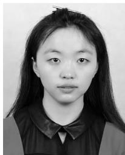

<details>
<summary>natural_image</summary>

Portrait of a young woman with long hair and a bow tie (no text or symbols visible)
</details>

Zhijin Qin (S’13–M’16) received the B.S. degree from the Queen Mary University of London (QMUL), London, U.K., and the Beijing University of Posts and Telecommunications, Beijing, China, in 2012, and the Ph.D. degree in electronic engineering from QMUL, in 2016.

She has been a Lecturer (an Assistant Professor) with the School of Electronic Engineering and Computer Science, QMUL since 2018. She was with Imperial College London, London, as a Post-Doctoral Research Associate from 2016 to

2017. She was with Lancaster University, Lancashire, as a Lecturer from 2017 to 2018. Her current research interest includes machine learning and compressive sensing in wireless communications and Internet of Things networks.

Dr. Qin was a recipient of the Best Paper Award from IEEE GLOBECOM 2017. She is an Associate Editor of IEEE COMMUNICATIONS LETTERS.


<details>
<summary>natural_image</summary>

Portrait photo of a young man in a collared shirt (no text or symbols visible)
</details>

Qiyu Hu received the B.S.E. degree in information engineering from Zhejiang University, Hangzhou, China, in 2018, where he is currently pursuing the Ph.D. degree at the College of Information Science and Electronic Engineering.

His current research interests include unmanned aerial vehicle communications, machine learning, and mobile edge computing.

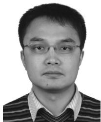

<details>
<summary>natural_image</summary>

Portrait of a man wearing glasses and a striped shirt (no text or symbols visible)
</details>

Yunlong Cai (S’07–M’10–SM’16) received the Ph.D. degree in electronic engineering from the University of York, York, U.K., in 2010.

From 2010 to 2011, he was a Post-Doctoral Fellow with the Electronics and Communications Laboratory, Conservatoire National des Arts et Métiers, Paris, France. Since 2011, he has been with the College of Information Science and Electronic Engineering, Zhejiang University, Hangzhou, China, where he is currently an Associate Professor. From 2016 to 2017, he was a Visiting Scholar with

the School of Electrical and Computer Engineering, Georgia Institute of Technology, Atlanta, GA, USA. His current research interests include transceiver design for multiple-antenna systems, sensor array processing, adaptive filtering, full-duplex communications, cooperative and relay communications, and wireless information and energy transfer.

Dr. Cai is an Associate Editor of IEEE SIGNAL PROCESSING LETTERS.


<details>
<summary>natural_image</summary>

Portrait of a smiling man wearing glasses, outdoors with mountainous background (no text or symbols visible)
</details>

Guanding Yu (S’05–M’07–SM’13) received the B.E. and Ph.D. degrees in communication engineering from Zhejiang University, Hangzhou, China, in 2001 and 2006, respectively.

In 2006, he joined Zhejiang University, where is currently a Professor with the College of Information and Electronic Engineering. From 2013 to 2015, he was also a Visiting Professor with the School of Electrical and Computer Engineering, Georgia Institute of Technology, Atlanta, GA, USA. His current research interests include 5G communications

and networks, mobile edge computing, and machine learning for wireless networks.

Dr. Yu was a recipient of the 2016 IEEE ComSoc Asia–Pacific Outstanding Young Researcher Award. He regularly sits on the Technical Program Committee (TPC) boards of prominent IEEE conferences such as ICC, GLOBECOM, and VTC. He also serves as the Symposium Co-Chair for IEEE Globecom 2019 and the Track Chair for IEEE VTC 2019’Fall. He has served as a Guest Editor of IEEE Communications Magazine’s “Special Issue on Full-Duplex Communications,” an Editor of the IEEE JOURNAL ON SELECTED AREAS IN COMMUNICATIONS Series on Green Communications and Networking, and a lead Guest Editor of the IEEE Wireless Communications Magazine’s “Special Issue on LTE in Unlicensed Spectrum,” and an Editor of IEEE ACCESS. He is currently serving as an Editor of the IEEE TRANSACTIONS ON GREEN COMMUNICATIONS AND NETWORKING and IEEE WIRELESS COMMUNICATIONS LETTERS.


<details>
<summary>natural_image</summary>

Portrait of a man wearing glasses and a zip-up sweater (no text or symbols visible)
</details>

Minjian Zhao (M’10) received the M.Sc. and Ph.D. degrees in communication and information systems from Zhejiang University, Hangzhou, China, in 2000 and 2003, respectively.

He was a Visiting Scholar with the University of York, York, U.K., in 2010. He is currently a Professor and the Deputy Director of the College of Information Science and Electronic Engineering, Zhejiang University. His current research interests include modulation theory, channel estimation and equalization, MIMO, signal processing for wire-

less communications, antijamming technology for wireless transmission and networking, and communication SoC chip design.


<details>
<summary>natural_image</summary>

Portrait of a man in formal attire with a tie (no visible text or symbols)
</details>

Geoffrey Ye Li (S’93–M’95–SM’97–F’06) received the B.S.E. and M.S.E. degrees from the Department of Wireless Engineering, Nanjing Institute of Technology, Nanjing, China, in 1983 and 1986, respectively, and the Ph.D. degree from the Department of Electrical Engineering, Auburn University, Auburn, AL, USA, in 1994.

He was a Teaching Assistant and then a Lecturer with Southeast University, Nanjing, from 1986 to 1991, a Research and Teaching Assistant with Auburn University, from 1991 to 1994, and a Post-

Doctoral Research Associate with the University of Maryland at College Park, College Park, MD, USA, from 1994 to 1996. He was with AT&T Labs— Research, Red Bank, NJ, USA, as a Senior and then a Principal Technical Staff Member from 1996 to 2000. Since 2000, he has been with the School of Electrical and Computer Engineering, Georgia Institute of Technology, Atlanta, GA, USA, as an Associate Professor and then a Full Professor. His current research interests include statistical signal processing and machine learning for wireless communications. He has authored or co-authored over 200 journal papers in addition to over 40 granted patents and many conference papers in the above areas. His publications have been cited over 33 000 times and he has been recognized as the World’s Most Influential Scientific Mind.

Dr. Li was a recipient of the Awarded IEEE Fellow for his contributions to signal processing for wireless communications in 2005 and the Highly Cited Researcher Award by Thomson Reuters almost every year, the 2010 IEEE ComSoc Stephen O. Rice Prize Paper Award, the 2013 IEEE VTS James Evans Avant Garde Award, the 2014 IEEE VTS Jack Neubauer Memorial Award, the 2017 IEEE ComSoc Award for Advances in Communication, the 2017 IEEE SPS Donald G. Fink Overview Paper Award, the 2015 Distinguished Faculty Achievement Award from the School of Electrical and Computer Engineering, Georgia Institute of Technology. He has been involved in editorial activities for over 20 technical journals for the IEEE, including being the Founding Editor-in-Chief of IEEE 5G Tech Focus. He has organized and chaired many international conferences, including as the Technical Program Vice-Chair of IEEE ICC’03, the Technical Program Co-Chair of IEEE SPAWC’11, the General Chair of IEEE GlobalSIP’14, and the Technical Program Co-Chair of IEEE VTC’16 (Spring).