# Joint Optimization of Delay and Power Efficiency of Neighbor Discovery in UAV Networks

Hao Fan , Zhe Song , Xuanhe Yang , Tingting Li , Shuai Wang , Senior Member, IEEE, Chee Yen Leow , Senior Member, IEEE, Gaofeng Pan , Senior Member, IEEE, and Dusit Niyato , Fellow, IEEE

Abstract—Efficient and reliable neighbor discovery is critical for Uncrewed Aerial Vehicle (UAV) networks equipped with directional antennas, particularly in dynamic and energy-constrained environments. We present a novel optimization framework that jointly minimizes delay and power consumption using the powerdelay product as the optimization metric. The framework is formulated for both synchronous and asynchronous schemes, leveraging upper-bound metrics and a convex-concave procedure to achieve tractable convex formulations. Simulation results validate the theoretical models and show significant improvements over baseline methods. We also conducted real-world experiments, where our method reduced power-delay product by 11% compared to the baseline, though the dual-sector hardware configuration limited the achievable gains. This work provides a comprehensive solution for UAV neighbor discovery, with high potential for scalability in more complex and dynamic environments.

Index Terms—Neighbor discovery, UAV networks, directional antennas, power efficiency.

## I. INTRODUCTION

ingly utilized in applications such as surveillance, disaster response, and search and rescue, where reliable and efficient communication is essential to ensure coordination in dynamic and mission-critical environments [1], [2], [3], [4], [5]. Ensuring long-range and interference-free communication is often critical in these networks. To address these needs, directional antennas have emerged as a preferred solution due to their ability to enhance communication range and mitigate interference through focused beamforming [5], [6], [7], [8], [9]. These properties make directional antennas particularly advantageous in UAV networks.

Neighbor discovery is an essential process in UAV networks, enabling UAVs to identify and establish links with nearby nodes. Efficient neighbor discovery is crucial for maintaining network connectivity and responsiveness, particularly in dynamic environments where rapid topology changes are common. To enhance communication efficiency, UAV networks often employ directional antennas. However, while these antennas offer significant performance improvements, they also introduce challenges to the neighbor discovery process. Unlike networks with omnidirectional antennas, nodes with directional antennas require precise beam alignment procedures, which significantly increases discovery delay [10], [11], [12]. This can hinder the network’s ability to maintain timely communication, which is vital for mission-critical tasks.

In addition to discovery delay, UAVs face constraints imposed by limited energy resources, making power consumption a significant concern in UAV networks [13]. Excessive power consumption during the neighbor discovery phase can drastically reduce the operational lifetime of UAVs, compromising the network’s overall effectiveness. There exists an inherent trade-off between discovery speed and energy efficiency [14], as reducing delay conserves energy by reducing active transmission time, while achieving faster discovery often requires a more proactive transmission strategy, leading to increased power consumption. Explicit consideration of power consumption is essential for achieving substantial and consistent energy savings, as minimizing energy consumption plays a key role in extending UAV operational longevity. Although power efficiency is of great importance, most studies on UAV networks focus on optimizing discovery delay, while power consumption, especially with directional antennas, has received little attention. This gap highlights the need for integrated approaches that jointly optimize both metrics.

This paper addresses the gap by proposing a novel optimization framework for the joint optimization of delay and power consumption of neighbor discovery in UAV networks with directional antennas. The key contributions of this work are as follows:

\- Comprehensive Framework for Heterogeneous Networks: We develop a unified framework for both synchronous and asynchronous network configurations, supporting heterogeneous networks where nodes may have different communication capabilities and energy constraints.

\- Modeling Power Consumption and Discovery Delay with Directional Antennas: We analyze the power consumption using Markov chains, while discovery delay is formulated through order statistics to accurately capture the stochastic nature of the neighbor discovery process involving directional antennas.

\- Joint Optimization via Upper Bound Approach: We derive an upper bound on the power-delay product to enable efficient joint optimization, providing a balanced solution for minimizing both discovery delay and power consumption.

\- Consideration of Link Breakage and Mobility: We incorporate additional probability distributions to model potential link breakage and node mobility, resulting in a more robust representation of dynamic UAV environments.

\- Experimental Validation in a Controlled Environment: We conducted real-world experiments using a low-power dual-RF system to emulate a UAV with directional antennas, validating the framework’s effectiveness and applicability to real-world UAV networks.

By addressing both discovery delay and power consumption, this work offers a comprehensive and efficient solution to the neighbor discovery problem in UAV networks. The proposed optimization framework ensures both timely communication and power-efficient operation, representing a significant contribution to UAV communication protocol design in dynamic, energy-constrained environments.

This paper is organized as follows. Section II reviews related work. Section III describes the system model and key assumptions. Section IV formulates the objective functions and presents the optimization framework, solving the synchronous case via geometric programming (GP) and the asynchronous case via a convex-concave procedure (CCP). Section V addresses practical issues such as node mobility and link breakage. Section VI presents simulation results to evaluate the proposed framework. Section VII provides experimental validation, demonstrating the effectiveness of the proposed method in real-world conditions. Finally, Section VIII concludes the paper and outlines future research directions.

## II. RELATED WORK

The problem of neighbor discovery in wireless networks with directional antennas was initially formulated in [15]. Later work modeled the neighbor discovery process as a coupon collector problem [16], providing a probabilistic framework to understand the discovery dynamics. However, this model was limited to homogeneous networks, assuming all nodes have identical capabilities—specifically, initiating transmissions with the same probability and steering beams uniformly. Many subsequent studies use similar assumptions [17], [18], [19], [20], [21], [22], [23]. Although the homogeneous assumption simplifies analysis and enables direct modeling, it fails to capture realworld diversity in node capabilities, including communication range, processing power, and energy resources. Nevertheless, it has been widely adopted in the literature due to its analytical convenience.

The coupon collector model has been generalized to heterogeneous networks by formulating the neighbor discovery process as a non-uniform coupon collector problem [24], enabling a more realistic analysis applicable to networks with varying node capabilities. However, this work primarily focused on synchronous systems, where nodes operate under a common time reference, leaving the asynchronous case unaddressed. Asynchronous systems are particularly important in UAV networks, as dynamic environments lead to frequent link disruptions, making perfect synchronization unrealistic.

Optimizing discovery delay generally involves increasing the probability of successful discovery while minimizing unnecessary discovery attempts. Early studies [20], [25] propose feedback mechanisms to dynamically adjust the transmission probability of discovery requests, thereby reducing collisions. However, these methods were tailored for homogeneous networks and do not generalize well to heterogeneous settings. Other research efforts [26], [27] adopted a similar methodology using machine learning techniques instead of traditional feedback mechanisms. Although these approaches are potentially applicable in heterogeneous networks by modeling the discovery process from a single node’s perspective, they require a slotted framework with global synchronization. Our work, in contrast, addresses both synchronous and asynchronous scenarios.

Some researchers accelerate the discovery process by leveraging advanced physical layer techniques or signal processing algorithms. For example, [28] employs multipacket reception technology to reduce collisions and allow simultaneous discovery of multiple nodes. A subsequent approach [29] further improves performance by incorporating successive interference cancellation algorithms. Although these methods significantly speed up the discovery process, they also impose additional hardware requirements, which may not be suitable for constrained platforms such as UAV networks.

Most prior research has primarily focused on optimizing discovery delay. While reducing discovery delay is important for maintaining connectivity, explicit consideration of power consumption is necessary for energy-constrained UAVs, as power efficiency is critical for extending operational longevity. Research on neighbor discovery has largely overlooked power efficiency in the context of directional antennas. Some studies have considered power consumption as an optimization factor in the neighbor discovery process [1], but these works typically do not address the unique challenges posed by directional antennas. Given that UAVs are often energy-constrained, optimizing power consumption during neighbor discovery is critical for extending operational longevity and ensuring mission success.

Our work addresses these gaps by proposing a unified framework that employs order statistics to analyze discovery delay in both synchronous and asynchronous systems. Building on this analysis, we design two schemes tailored to different synchronization conditions, highlighting the framework’s ability to adapt across diverse UAV networking scenarios. Furthermore, we incorporate power consumption as a central optimization factor, making this, to the best of our knowledge, the first approach to jointly address discovery delay and power consumption in neighbor discovery with directional antennas for heterogeneous UAV networks.

TABLE I KEY NOTATIONS
<table><tr><td>Ω</td><td>Set of nodes</td></tr><tr><td> $\Omega _ { i }$ </td><td>Set of neighbors of node i</td></tr><tr><td> $\Omega _ { i , \theta }$ </td><td>Set of neighbors of node i in sector θ</td></tr><tr><td> $\theta _ { i , j }$ </td><td>Sector of node i directed at node j</td></tr><tr><td> $s _ { i , \theta }$ </td><td>Probability that node i steers to sector θ</td></tr><tr><td> $r _ { i , \theta }$ </td><td>Probability that node i is in the receiving state while steering to sector θ</td></tr><tr><td> $\lambda _ { i }$ </td><td>Transmission rate of node i</td></tr><tr><td> $\lambda _ { i , j }$ </td><td>Transmission rate from node i to node j</td></tr><tr><td> ${ \lambda } _ { i , j } ^ { * }$ </td><td>Effective arrival rate successfully received at node j from node i</td></tr><tr><td> $\Lambda _ { i }$ </td><td>Aggregate arrival rate at node i, i.e.,  $\begin{array} { r } { \Lambda _ { i } = \sum _ { j \in \Omega _ { i } } \lambda _ { j , i } } \end{array}$ </td></tr><tr><td> $P _ { i } ^ { ( t ) }$ </td><td>Transmit power of node i</td></tr><tr><td> $P _ { i } ^ { ( r ) }$ </td><td>Receiving power of node ¿</td></tr><tr><td> $P _ { i } ^ { ( l ) }$ </td><td>Listening power of node i</td></tr><tr><td> ${ \bar { P } } _ { i }$ </td><td>Average power of node ¿</td></tr><tr><td> $s$ </td><td>Collection of sector selection probabilities, i.e.,  $\{ s _ { i , \theta } \mid i \in \Omega , \theta \in \Theta _ { i } \}$ </td></tr><tr><td> $\mathcal { R }$ </td><td>Collection of reception probabilities, i.e.,  $\{ r _ { i , \theta } \ | \ i \in \mathring \Omega , \theta \in \mathring \Theta _ { i } \}$ </td></tr><tr><td> $\mathcal { L }$ </td><td>Collection of transmission rates, i.e.,  $\{ \lambda _ { i } \mid i \in \Omega \}$ </td></tr><tr><td> $D _ { i , j }$ </td><td>Delay for node i to discover node j</td></tr><tr><td> $D _ { i }$ </td><td>Total delay for node i to discover all neighbors,</td></tr><tr><td> $C _ { i }$ </td><td> $i . e . , \operatorname* { m a x } _ { j \in \Omega _ { i } } D _ { i , j }$  4t Power-delay product of node  $i , i . e . , D _ { i } \bar { P } _ { i }$ </td></tr></table>

## III. SYSTEM MODEL

## A. Network Model and Assumptions

We consider a distributed heterogeneous wireless ad hoc network in which all nodes are equipped with directional antennas. Let $\Omega = \{ 1 , 2 , \dots , N \}$ denote the set of all nodes in the network, where $N : = | \Omega |$ is the total number of nodes. For each node , the surrounding space is partitioned into sectors $\Theta _ { i } = \{ 1 , 2 , \dots , M _ { i } \}$ according to its antenna/beam settings, Θi =where $M _ { i } : = | \Theta _ { i } |$ denotes the number of sectors for node .

Additionally, we make the following assumptions about the nodes.

\- Unique node ID: Each node has a globally unique ID, which is used for mutual identification between nodes.

\- Half-duplex model assumption: The nodes’ radio transceivers operate in a half-duplex mode, allowing either transmission or reception at any given time.

\- Antenna model assumption: Each node operates in a single sector at a time, allowing either transmission or reception within that sector.

\- Line-of-sight communication assumption: Communication between nodes occurs only via line-of-sight, e.g., can communicate with node $j$ only through a single sector directed at node , denoted by $\theta _ { i , j }$ , and vice versa. As UAVs operate at high altitudes, where minimal obstructions make line-of-sight communication dominant [30].

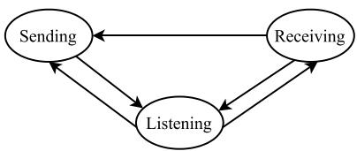  
Fig. 1. State transitions of node power modes.

\- Collision model assumption: The acquisition effect is neglected. Any simultaneous reception of two or more signals at a node is considered a collision, and none of the received information can be recovered.

The set of potential neighbors of node is denoted by $\Omega _ { i } .$ with $\Omega _ { i , \theta }$ denoting the set of possible neighbors of node in sector $\theta , \theta \in \Theta _ { i }$ , such that $\begin{array} { r } { \Omega _ { i } = \bigcup _ { \theta } \Omega _ { i , \theta } } \end{array}$ i. Neighbor discovery θis the process in which each node identifies all its neighbors in $\Omega _ { i }$ . Nodes discover neighbors through beam scanning. The following subsections formulate optimization models for both synchronous and asynchronous scanning schemes based on the above assumptions.

## B. Joint Modeling of Power and Delay

We aim to optimize both power consumption and delay in the neighbor discovery process. To this end, we first model these two metrics separately to capture their stochastic characteristics. We then integrate them using the power-delay product (PDP) [14], a unified measure that inherently balances energy use and discovery delay. Defined as the product of average power and discovery delay, the PDP quantifies the effective energy cost of neighbor discovery. It characterizes how efficiently energy is used to achieve timely discovery, providing a single, physically meaningful measure of overall efficiency.

1) State-Transition-Based Power Model: Following the approach in [31], the power consumption of nodes is defined by three power states: transmission state $S ^ { ( t ) }$ , reception state $S ^ { ( r ) }$ and listening state $S ^ { ( l ) }$ . The transitions between these states are illustrated in Fig. 1. In the transmission state, a node actively sends neighbor discovery requests within its operating sector and switches to the listening state after transmission. In the reception state, the node detects incoming signals in its operating sector and initiates reception, remaining in this state for the signal duration unless it switches modes according to the scan scheme. In the listening state, the node passively monitors the sector and can either switch to the reception state upon detecting a signal, or to the transmission state, depending on the scan scheme.

For any node , the power consumption in the three states is denoted by $P _ { i } ^ { ( t ) } , P _ { i } ^ { ( \bar { r } ) }$ , and $P _ { i } ^ { ( l ) }$ , respectively. The average i i ipower consumption of node  during the neighbor discovery process can be expressed as

$$
\bar { P } _ { i } = \mathbb { P } ( S _ { i } ^ { ( t ) } ) P _ { i } ^ { ( t ) } + \mathbb { P } ( S _ { i } ^ { ( r ) } ) P _ { i } ^ { ( r ) } + \mathbb { P } ( S _ { i } ^ { ( l ) } ) P _ { i } ^ { ( l ) } ,\tag{1}
$$

where the probabilities satisfy $\mathbb { P } ( S _ { i } ^ { ( t ) } ) + \mathbb { P } ( S _ { i } ^ { ( r ) } ) + \mathbb { P } ( S _ { i } ^ { ( l ) } ) =$ i i i. In practical scenarios, the power consumption in the

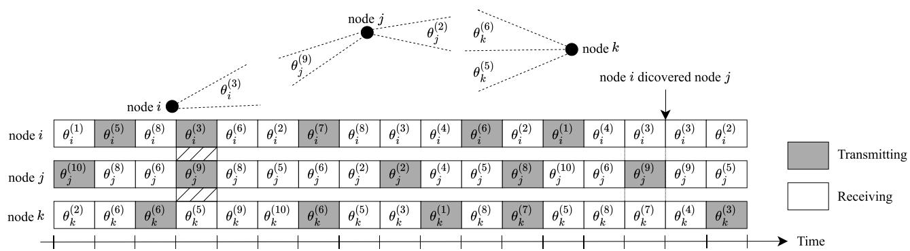  
Fig. 2. A synchronous scan example of a three-node clique.

(2)

listening state is typically the lowest, $i . e . , P _ { i } ^ { ( l ) }$ is minimal. Let $P _ { i } ^ { ( t ) } = P _ { i } ^ { * ( t ) } + P _ { i } ^ { ( l ) }$ and $P _ { i } ^ { ( r ) } = P _ { i } ^ { * ( r ) } + \bar { P _ { i } ^ { ( l ) } }$ , the expression i i i i i ifor average power consumption simplifies to

2) Synchronous Scan Scheme: In the synchronous scan scheme, time is slotted with duration equal to the neighbor discovery request period . Nodes operate in a Slotted-ALOHA-τlike manner [15]: in each slot, each node independently steers to an operating sector and decides whether to send a neighbor discovery request or listen for incoming requests. Let and $Y _ { i }$ denote the random variables corresponding to node $i \gamma _ { \mathrm { s } }$ transmis-ision/listening decision and sector selection respectively, where $X _ { i } = 0$ means node chooses to listen and $X _ { i } = 1$ means it transmits. We define

(3)

$$
\bar { P } _ { i } = \mathbb { P } ( S _ { i } ^ { ( t ) } ) P _ { i } ^ { * ( t ) } + \mathbb { P } ( S _ { i } ^ { ( r ) } ) P _ { i } ^ { * ( r ) } + P _ { i } ^ { ( l ) } .\tag{4}
$$

and the probability that node chooses to transmit in sector is

$$
\bar { r } _ { i , \theta } : = 1 - r _ { i , \theta } ,\tag{5}
$$

Fig. 2 illustrates a three-node neighbor discovery example using the synchronous scan scheme. For successful neighbor discovery between two nodes in the synchronous scheme, the following conditions must be satisfied.

\- Sector alignment: The operating sectors of the nodes must be aligned. Specifically, for any node and node $j ,$ both must be operating in sectors facing each other, $i . e .$ , node operates in $\theta _ { i , j }$ while node operates in $\theta _ { j , i }$ . The probability of this alignment is $s _ { i , \theta _ { i , j } } s _ { j , \theta _ { j , i } }$

$$
r _ { i , \theta } : = \mathbb { P } ( X _ { i } = 0 \mid Y _ { i } = \theta ) ,
$$

$$
s _ { i , \theta } : = \mathbb { P } ( Y _ { i } = \theta ) , \sum _ { \theta \in \Theta _ { i } } s _ { i , \theta } = 1 ,
$$

\- Complementary node states: The discovering node must be in the transmission state, while the discovered node must be in the listening state, monitoring the corresponding sector. For node to discover node , the probability of complementary pairing is $r _ { i , \theta _ { i , j } } \bar { r } _ { j , \theta _ { j , i } } .$

\- No interference: Interference occurs if node receives more than one signal in the same slot. For node to successfully discover node , no other node sends a request to node in this slot. The probability of no interference is $\prod _ { k \in \Omega _ { i , \theta _ { i , j } } } \bigl ( 1 - \bar { r } _ { k , \theta _ { k , i } } s _ { k , \theta _ { k , i } } \bigr )$

Given these conditions, the probability that node  successfully discovers node $j$ in a slot is given by

$$
{ \begin{array} { l } { p _ { i , j } = s _ { i , \theta _ { i , j } } s _ { j , \theta _ { j , i } } r _ { i , \theta _ { i , j } } { \bar { r } } _ { j , \theta _ { j , i } } } \\ { \cdot \displaystyle \prod _ { k \in \Omega _ { i , \theta _ { i , j } } } \left( 1 - { \bar { r } } _ { k , \theta _ { k , i } } s _ { k , \theta _ { k , i } } \right) . } \end{array} }\tag{6}
$$

3) Asynchronous Scan Scheme: In the asynchronous scan model, there is no global time synchronization. Nodes send neighbor discovery requests in a manner similar to the Pure-ALOHA protocol [16]. Before each transmission, a node independently selects an operating sector. After transmission, the node remains in the selected sector and listens for a random interval before initiating the next request. Since this process is inherently random, the listening interval for node is typically modeled as an exponentially distributed random variable with rate parameter $1 / \lambda _ { i } ,$ , where $\lambda _ { i }$ is the transmission rate of node , normalized by the neighbor discovery request duration .

τFig. 3 illustrates a three-node network operating under the asynchronous scan scheme. For successful neighbor discovery, the same three conditions as in the synchronous scheme must also be met. Our framework adopts the same node behavior as in [15], assuming that when $\tau \ll 1 / \lambda _ { i } , i \in \Omega$ , the transmission process can be approximated as Poisson. Although this assumption allows potential overlap between consecutive transmissions of a single node, the deviation is negligible in practice because the inter-transmission interval is typically much longer than the packet duration , ensuring low collision probability and maintaining system operability. Under this condition, independent node operations collectively exhibit the memoryless property of a Poisson process. This modeling approach has been validated and widely adopted in prior research, $e . g .$ ., [19], [21], [25]. The arrival rate of neighbor discovery requests from node  to node $j$ is given by

$$
\lambda _ { i , j } = s _ { i , \theta _ { i , j } } s _ { j , \theta _ { j , i } } \lambda _ { i } ,\tag{7}
$$

and the aggregate arrival rate at node is given by

$$
\Lambda _ { i } = \sum _ { j \in \Omega _ { i } } s _ { i , \theta _ { i , j } } s _ { j , \theta _ { j , i } } \lambda _ { j } .\tag{8}
$$

The probability that node successfully receives a neighbor discovery request equals the probability that no other request

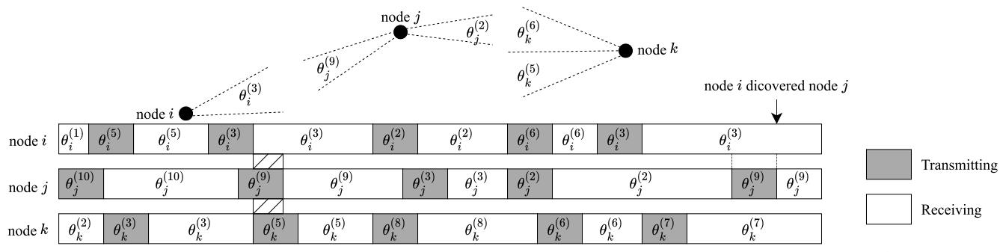  
Fig. 3. An asynchronous scan example of a three-node clique.

arrives in the same sector within a  interval, i.e., the probability that the inter-arrival time $\Delta T _ { i }$ is greater than . Therefore, we define

$$
p _ { i } : = \mathbb { P } ( \Delta T _ { i } > 2 \tau ) = e ^ { - 2 \left( \lambda _ { i } + \Lambda _ { i } \right) } .\tag{9}
$$

## C. Objective Function

In this section, we follow [14] and adopt the power-delay product, which couples discovery time with power consumption. Minimizing the PDP provides a unified objective that captures the trade-off between the two metrics.

Let the random variable $D _ { i }$ denote the discovery delay for node $i ,$ defined as

$$
D _ { i } : = \operatorname* { m a x } _ { j \in \Omega _ { i } } D _ { i , j } .\tag{10}
$$

The PDP for node is then defined as

$$
C _ { i } : = D _ { i } \bar { P } _ { i } ,\tag{11}
$$

where $\bar { P } _ { i }$ is the average power consumption of node .

To evaluate the neighbor discovery efficiency across the entire network, we mainly focus on two key metrics: (i) the average PDP across all nodes, $\textstyle { \frac { 1 } { N } } \sum _ { i \in \Omega } C _ { i }$ , and (ii) the maximum PDP across the network, $\operatorname { 1 a x } _ { i \in \Omega } C _ { i } .$ . Since both expressions are random variables, we focus on their expectations, which provide deterministic and analytically tractable objectives.

For the average PDP, the objective is defined as

$$
\bar { C } : = \frac { 1 } { N } \sum _ { i \in \Omega } \mathbb { E } [ C _ { i } ] .\tag{12}
$$

For the maximum PDP objective, computing E $\mathrm { \Omega } _ { \mathrm { i } \in \Omega } C _ { i } ]$ directly is intractable. However, since the function is convex, Jensen’s inequality implies $\tau _ { i \in \Omega } \mathbb { E } [ C _ { i } ] \leq \mathbb { E } [ \operatorname* { m a x } _ { i \in \Omega } C _ { i } ]$ maxi [Ci] [maxiBased on this relaxation, we adopt the following definition

$$
C _ { \operatorname* { m a x } } : = \operatorname* { m a x } _ { i \in \Omega } \mathbb { E } [ C _ { i } ] .\tag{13}
$$

## IV. OPTIMIZATION

In the previous sections, we established the basic problem formulation and defined the objective functions in terms of the PDP, $C _ { i }$ , with components $\bar { P } _ { i }$ and $D _ { i }$ . In this section, we derive explicit expressions for these components under both synchronous and asynchronous scan schemes. Specifically, $\bar { P } _ { i }$ is obtained using a Markov chain model, while the distribution of the discovery delay $D _ { i }$ is characterized to compute $\mathbb { E } [ D _ { i } ]$ . To enable tractable optimization, we further develop the upper bounds for $\mathbb { E } [ C _ { i } ]$ and reformulate them into tractable forms amenable to GP and CCP. These approximations preserve solution quality while ensuring computational feasibility.

## A. Average Power Consumption

1) Average Power Under the Synchronous Scan Scheme: In the synchronous scan scheme, power consumption can be analyzed using a discrete Markov chain. Let $\pi =$ $\left[ \pi _ { C _ { i } ^ { \left( t \right) } } , \pi _ { C _ { i } ^ { \left( r \right) } } , \pi _ { C _ { i } ^ { \left( l \right) } } \right]$ denote the steady-state probability distri-C C Cbution of the Markov chain. The stationary probabilities are obtained as

$$
\pi _ { C _ { i } ^ { ( t ) } } = \sum _ { \theta \in \Theta _ { i } } s _ { i , \theta } \bar { r } _ { i , \theta } ,\tag{14}
$$

$$
\pi _ { C _ { i } ^ { ( r ) } } = \sum _ { \theta \in \Theta _ { i } } s _ { i , \theta } r _ { i , \theta } \left( 1 - \prod _ { j \in \Omega _ { i , \theta } } a _ { j , i } \right) ,\tag{15}
$$

$$
\pi _ { C _ { i } ^ { ( l ) } } = \sum _ { \theta \in \Theta _ { i } } s _ { i , \theta } r _ { i , \theta } \prod _ { j \in \Omega _ { i , \theta } } a _ { j , i } ,\tag{16}
$$

where $a _ { j , i }$ denotes the probability of node not sending a request to node  in a slot, given by $a _ { j , i } = 1 - s _ { j , \theta _ { j , i } } \bar { r } _ { j , \theta _ { j , i } } .$ i aj,i = 1 sj,θ r¯j,θUsing the definition of average power consumption in (2), the average power consumption of node  under the synchronous scan scheme can be expressed as

$$
\begin{array} { r l r } {  { \bar { P _ { i } } = P _ { i } ^ { * ( t ) } \sum _ { \theta \in \Theta _ { i } } s _ { i , \theta } \bar { r } _ { i , \theta } + P _ { i } ^ { ( l ) } } } \\ & { } & \\ & { } & { \quad + P _ { i } ^ { * ( r ) } \sum _ { \theta \in \Theta _ { i } } s _ { i , \theta } r _ { i , \theta } ( 1 - \prod _ { j \in \Omega _ { i , \theta } } a _ { j , i } ) . } \end{array}\tag{17}
$$

2) Average Power Under the Asynchronous Scan Scheme: The average power consumption in the asynchronous scan scheme is modeled using a continuous-time Markov chain. The corresponding state transition diagram is shown in Fig. 4, from which the transition rate matrix is defined as

$$
\mathbf { Q } = \left[ \begin{array} { c c c c c c } { - 1 } & { 1 } & { 0 } & { 0 } & { \cdots } \\ { \lambda _ { i } } & { - ( \lambda _ { i } + \Lambda _ { i } ) } & { \Lambda _ { i } } & { 0 } & { \cdots } \\ { \lambda _ { i } } & { 1 } & { - ( \lambda _ { i } + \Lambda _ { i } + 1 ) } & { \Lambda _ { i } } & { \cdots } \\ { \vdots } & { \vdots } & { \vdots } & { \vdots } & { \ddots } \end{array} \right] .\tag{18}
$$

Let the steady-state probability distribution be $\pi = [ \pi _ { { S _ { i } ^ { ( t ) } } } , \pi _ { { S _ { i } ^ { ( l ) } } }$ $\pi _ { S _ { i } ^ { ( r _ { 1 } ) } } , \pi _ { S _ { i } ^ { ( r _ { 2 } ) } } , \pi _ { S _ { i } ^ { ( r _ { 3 } ) } } , \cdot \cdot \cdot \Big ]$ . By solving the equilibrium condition $\pi \mathbf { Q } = 0$ together with the normalization condition $\pi \mathbf { 1 } ^ { T } = 1$ , the steady-state probabilities are obtained as

$$
\pi _ { S _ { i } ^ { ( t ) } } = \frac { \lambda _ { i } } { 1 + \lambda _ { i } } ,\tag{19}
$$

$$
\pi _ { S _ { i } ^ { ( r _ { k } ) } } = \left( \frac { \Lambda _ { i } } { 1 + \lambda _ { i } + \Lambda _ { i } } \right) ^ { k } \frac { 1 } { 1 + \lambda _ { i } + \Lambda _ { i } } , k \geq 1 ,\tag{20}
$$

$$
\pi _ { S _ { i } ^ { ( l ) } } = \frac { 1 } { 1 + \lambda _ { i } + \Lambda _ { i } } .\tag{21}
$$

Accordingly, the probabilities of being in each state are given by $\begin{array} { r } { \mathbb { P } ( S _ { i } ^ { ( t ) } ) = \pi _ { S _ { i } ^ { ( t ) } } , \mathbb { P } ( S _ { i } ^ { ( r ) } ) = \sum _ { k = 1 } ^ { \infty } \pi _ { S _ { i } ^ { ( r _ { k } ) } } } \end{array}$ , and $\mathbb { P } ( S _ { i } ^ { ( l ) } ) = \pi _ { S _ { i } ^ { ( l ) } }$ S S SAnalogously, the average power consumption under the asynchronous scan scheme is given by

$$
\bar { P } _ { i } = \frac { P _ { i } ^ { ( t ) } \lambda _ { i } } { 1 + \lambda _ { i } } + \frac { P _ { i } ^ { ( r ) } \Lambda _ { i } } { ( 1 + \lambda _ { i } ) ( 1 + \lambda _ { i } + \Lambda _ { i } ) } + \frac { P _ { i } ^ { ( l ) } } { 1 + \lambda _ { i } + \Lambda _ { i } } .\tag{22}
$$

## B. Expected Discovery Delay

Evaluating the discovery delay requires analyzing the random variables $\{ D _ { i , j } , \ j \in \Omega _ { i } , \ i \in \Omega \}$ . Strictly speaking, these variables are not independent. However, we observe that the dependence becomes negligible as the number of nodes and sectors increases. Following [25], we adopt the common assumption of independence for analytical tractability. Under this assumption, the expected discovery delay $\mathbb { E } [ D _ { i } ]$ reduces to the expected maximum of independent random variables, corresponding to the largest order statistic.

a) Expected Delay under Synchronous Scan Scheme: In the synchronous scan scheme, a successful discovery is determined by the collective decisions of all nodes in a slot. The discovery delay $D _ { i , j }$ , which counts the number of slots until discovery (each slot of duration $\tau )$ , can be modeled as a geometric random variable, $i . e . , D _ { i , j } \sim \mathrm { G e o m e t r i c a l } ( p _ { i , j } )$ . According to Di,j (pi,j )the results from [32], the probability density function of $D _ { i }$ is given by

$$
\begin{array} { c l } { f _ { D _ { i } } ( k ) = \displaystyle \sum _ { m = 0 } ^ { N _ { i } - 1 } \frac { 1 } { ( N _ { i } - 1 - m ) ! ( m + 1 ) ! } } \\ { \cdot \mathrm { p e r m } \left[ \frac { F _ { i , j _ { 1 } } ( k - ) } { \vdots } \qquad } & { f _ { i , j _ { 1 } } ( k ) \atop \vdots } \\ { \frac { F _ { i , j _ { N _ { i } } } ( k - ) } { N _ { i } - 1 - m } \ } & { \underbrace { f _ { i , j _ { N _ { i } } } ( k ) } _ { m + 1 } \right] } \end{array}
$$

$$
= \sum _ { m = 1 } ^ { N _ { i } } \sum _ { \beta _ { i } \in B _ { i , m } } { ( - 1 ) ^ { m - 1 } q _ { \beta _ { i } } ^ { k - 1 } ( 1 - q _ { \beta _ { i } } ) } ,\tag{23}
$$

where perm · denotes the permanent of a square matrix. The terms in the expression are defined as follows:

$q _ { i , j _ { n } } = 1 - p _ { i , j _ { n } }$ , the complement of the success probabil-qi,ity $p _ { i , j _ { n } } ,$

$\begin{array} { r } { \dot { F _ { i , j _ { n } } } ( \ddot { k } - ) = \mathbb { P } ( D _ { i , j _ { n } } < k ) = 1 - q _ { i , j _ { n } } ^ { k - 1 } } \end{array}$ , the cumulative Fi,j (k ) =probability of $D _ { i , j _ { \imath } }$ ,j < k) = 1 qi,jstrictly below (i.e., the left-limit of the CDF at $k ) .$

$f _ { i , j _ { n } } ( k ) = q _ { i , j _ { n } } ^ { k - 1 } p _ { i , j _ { n } } , 1 \leq n \leq N _ { i }$ , the probability mass fi,j (k) =function of $\ddot { D _ { i , j _ { n } } } ;$

$B _ { i , m } = \{ \beta _ { i } \mid \bar { \beta } _ { i } \in 2 ^ { \Omega _ { i } } , | \beta _ { i } | = m \}$ , the set of all - Bi,m = βi βielement subsets of $\Omega _ { i }$

$\begin{array} { r } { q _ { \beta _ { i } } = \prod _ { j \in \beta _ { i } } ( 1 - p _ { i , j } ) } \end{array}$ , the joint complement probability jfor subset $\beta _ { i }$

From the probability distribution of $D _ { i } ,$ the expected delay is obtained as

$$
\begin{array} { r l } & { \mathbb { E } [ D _ { i } ] = \displaystyle \sum _ { m = 1 } ^ { N _ { i } } \sum _ { \beta _ { i } \in B _ { i , m } } ( - 1 ) ^ { m - 1 } \frac { 1 } { 1 - q _ { \beta _ { i } } } } \\ & { \qquad = \displaystyle \sum _ { j \in \Omega _ { i } } \frac { 1 } { 1 - q _ { i , j } } - \sum _ { j , k \in \Omega _ { i } } \frac { 1 } { 1 - q _ { i , j } q _ { i , k } } + \cdots } \\ & { \qquad + ( - 1 ) ^ { N _ { i } - 1 } \frac { 1 } { 1 - \prod _ { j \in \Omega _ { i } } q _ { i , j } } . } \end{array}\tag{24}
$$

b) Expected Delay under Asynchronous Scan Scheme: As in the synchronous scheme, the expected discovery delay under the asynchronous scheme is computed from the distribution of max $\{ D _ { i , j } , j \in \Omega _ { i } \}$ . Based on (7) and (9), the successful arrival rate of neighbor discovery requests from node $j$ to node  is

$$
{ \lambda } _ { j , i } ^ { * } = { \lambda } _ { j , i } e ^ { - 2 \left( { \lambda } _ { i } + { \Lambda } _ { i } \right) } .\tag{25}
$$

Thus, the discovery delay $D _ { i , j }$ , measured in units of $\tau _ { \ast }$ for node  to discover node $j ,$ Di,j τ can be modeled as an exponentially distributed random variable, $i . e . , D _ { i , j }$ ∼ Exponential $( \lambda _ { j , i } ^ { * } )$ . Following [33], the probability density function of $D _ { i }$ j,iis given as

$$
\begin{array} { r l } & { f _ { P , \lambda } ( t ) = \cfrac { 1 } { ( N _ { \ell } - 1 ) ! } \displaystyle \sum _ { j \in \mathcal { E } _ { \ell } } \left( \lambda _ { j , j } ^ { \star } e ^ { - i \mathcal { E } _ { j , j } ^ { \lambda } } \mathrm { p r e m } \left[ \frac { 1 - e ^ { - i \mathcal { E } _ { j , j } ^ { \lambda } t } } { \lambda _ { j } } \right] \right) } \\ & { \quad = \displaystyle \sum _ { j \in \mathcal { E } _ { \ell } } \lambda _ { j , j } ^ { \star } e ^ { - i \mathcal { E } _ { j , j } ^ { \lambda } } , \quad \mathrm { ~ H ~ } ( 1 - e ^ { - i \mathcal { E } _ { j , j } ^ { \lambda } t } ) } \\ & { \quad = \displaystyle \sum _ { j \in \mathcal { E } _ { \ell } } \lambda _ { j } ^ { \star } e ^ { - i \mathcal { E } _ { j , j } ^ { \lambda } } , \quad \mathrm { ~ H ~ O ~ } ( 1 - e ^ { - i \mathcal { E } _ { j , j } ^ { \lambda } t } ) } \\ & { \quad = \displaystyle \sum _ { j \in \mathcal { E } _ { \ell } } e ^ { - i \mathcal { E } _ { j , j } ^ { \lambda } t } - \displaystyle \sum _ { j \in \mathcal { E } _ { \ell } } \left( \lambda _ { j , j } ^ { \star } e ^ { - i \mathcal { E } _ { j , j } ^ { \lambda } t } + \lambda _ { j , j } ^ { \star } e ^ { - i ( \mathcal { E } _ { j , j } ^ { \lambda } + \lambda _ { j , j } ^ { \star } ) } + \cdots \right) } \\ & { \quad \quad \quad \quad \quad \quad \quad \quad \quad \quad \quad \quad \quad \quad \quad \quad \quad \quad \quad \quad \quad \quad \quad \quad \quad \quad } \\ & { \quad \quad \quad \quad \quad \quad \quad \quad \quad \quad \quad \quad \quad \quad \quad \quad \quad \quad \quad \quad \quad \quad \quad \quad \quad \quad \quad \quad \quad \quad \quad \left. ( 2 6 - i \mathcal { E } _ { j , j } ) e ^ { - i \mathcal { E } _ { j , j } ^ { \lambda } t } \right| ^ { 2 } } \\ &  \quad \ \end{array}
$$

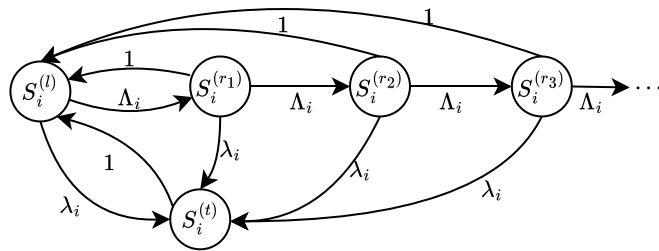  
Fig. 4. Asynchronous power model state transition diagram.

Similarly, the expected discovery delay under the asynchronous scheme is

$$
\begin{array} { c } { { \displaystyle \mathbb { E } [ D _ { i } ] = \sum _ { j \in \Omega _ { i } } \frac { 1 } { \lambda _ { j , i } ^ { * } } - \sum _ { j , k \in \Omega _ { i } } \frac { 1 } { \lambda _ { j , i } ^ { * } + \lambda _ { k , i } ^ { * } } + \cdot \cdot \cdot } } \\ { { + \left( - 1 \right) ^ { N _ { i } - 1 } \displaystyle \frac { 1 } { \sum _ { j \in \Omega _ { i } } \lambda _ { j , i } ^ { * } } . } } \end{array}\tag{27}
$$

## C. Upper Bounds

As seen in (24) and (27), the delay expressions grow exponentially in complexity with the number of nodes, posing significant computational challenges. To enable tractable optimization, we introduce an upper bound on these expressions and use it to define new metrics that serve as practical objectives.

According to (11), we have $\mathbb { E } [ C _ { i } ] = \mathbb { E } [ D _ { i } ] \bar { P } _ { i }$ . Since the computational complexity is largely determined by $\mathbb { E } [ D _ { i } ]$ , we focus on deriving an upper bound for this term. In the case of (24), the exact expansion involves higher-order terms of order $O ( p _ { i , j } p _ { i , k } )$ , whose contribution decays geometrically as the number of nodes and sectors increases. Thus, we adopt a first-order approximation, yielding

$$
\begin{array} { r c l } { \displaystyle \mathbb { E } [ D _ { i } ] \approx } & { \displaystyle \sum _ { j \in \Omega _ { i } } \frac { 1 } { p _ { i , j } } - \sum _ { j , k \in \Omega _ { i } } \frac { 1 } { p _ { i , j } + p _ { i , k } } + \cdot \cdot \cdot } \\ & & { \quad \quad \quad + ( - 1 ) ^ { N _ { i } - 1 } \frac { 1 } { \sum _ { j \in \Omega _ { i } } p _ { i , j } } . } \end{array}\tag{28}
$$

Let $p _ { i , j } ^ { ( \mathrm { m i n } ) } : = \mathrm { m i n } _ { j \in \Omega _ { i } } p _ { i , j }$ . As shown in [24], the expected pi,j :=discovery delay $\mathbb { E } [ D _ { i } ]$ can be bounded as

$$
\mathbb { E } [ D _ { i } ] \leq \frac { 1 } { p _ { i , j } ^ { ( \operatorname* { m i n } ) } } \sum _ { k = 1 } ^ { N _ { i } } \frac { ( - 1 ) ^ { k - 1 } } { k } \binom { N _ { i } } { k } .\tag{29}
$$

We make use of the harmonic-number binomial identity,

$$
\sum _ { k = 1 } ^ { n } { \frac { ( - 1 ) ^ { k - 1 } } { k } } { \binom { n } { k } } = \sum _ { k = 1 } ^ { n } { \frac { 1 } { k } } .\tag{30}
$$

The right-hand side of (30) is the -th harmonic number, commonly denoted by $H _ { n }$ n. Thus, the upper bound for $\mathbb { E } [ D _ { i } ]$ under the synchronous scan scheme simplifies to

$$
\mathbb { E } [ D _ { i } ] \leq { \frac { H _ { N _ { i } } } { p _ { i , j } ^ { ( \operatorname* { m i n } ) } } } .\tag{31}
$$

The expressions for the discovery delay under the synchronous (28) and asynchronous (27) schemes share a similar form.

By defining $\begin{array} { r } { \lambda _ { j , i } ^ { * ( \mathrm { m i n } ) } : = \operatorname* { m i n } _ { j \in \Omega _ { i } } \lambda _ { j , i } ^ { * } } \end{array}$ , an analogous upper bound for $\mathbb { E } [ D _ { i } ]$ j,i j,iin the asynchronous case can be obtained as

$$
\mathbb { E } [ D _ { i } ] \leq \frac { H _ { N _ { i } } } { \lambda _ { j , i } ^ { * ( \operatorname* { m i n } ) } } .\tag{32}
$$

## D. Optimization of Neighbor Discovery

We now formulate optimization methods to jointly reduce discovery delay and power consumption in neighbor discovery. The objective is to determine optimal parameter sets $\{ r _ { i , \theta } , s _ { i , \theta } , \lambda _ { i } \}$ that minimize the PDP metrics. Since neither (12) nor (13) yields a tractable problem, we introduce upper-bound-based metrics that lead to more manageable formulations. For the synchronous scheme, these formulations can be cast as GP problems, while for the asynchronous scheme they can be efficiently addressed using a CCP-based algorithm. This approach enables practical optimization for both cases.

By substituting the upper bounds of $\mathbb { E } [ D _ { i } ]$ into the definitions of $\bar { C }$ and $C _ { \mathrm { m a x } }$ , we obtain the following optimization problems for the synchronous scan scheme:

$$
\mathop { \operatorname* { m i n i m i z e } } _ { \mathcal { R } , \mathcal { S } } \ : \ : \frac { 1 } { N } \sum _ { i \in \Omega } \operatorname* { m a x } _ { j \in \Omega _ { i } } \frac { H _ { N _ { i } } } { p _ { i , j } } \bar { P } _ { i } ,\tag{33}
$$

and

$$
\operatorname* { m i n i m i z e } _ { \mathcal { R } , \mathcal { S } } \quad \operatorname* { m a x } _ { i \in \Omega , j \in \Omega _ { i } } \frac { H _ { N _ { i } } } { p _ { i , j } } \bar { P } _ { i } ,\tag{34}
$$

where R and $\boldsymbol { \mathcal { S } }$ represent the collections of all values for $r _ { i , \theta }$ and $s _ { i , \theta } ,$ respectively. For the asynchronous scan scheme, the optimization problems become

$$
\mathop { \operatorname* { m i n i m i z e } } _ { \mathcal { L } , \mathcal { S } } ~ \frac { 1 } { N } \sum _ { i \in \Omega } \mathop { \operatorname* { m a x } } _ { j \in \Omega _ { i } } \frac { H _ { N _ { i } } } { \lambda _ { j , i } ^ { * } } \bar { P } _ { i } ,\tag{35}
$$

and

$$
\operatorname* { m i n i m i z e } _ { \mathcal { L } , \mathcal { S } } \quad \operatorname* { m a x } _ { i \in \Omega , j \in \Omega _ { i } } \frac { H _ { N _ { i } } } { \lambda _ { j , i } ^ { * } } \bar { P } _ { i } .\tag{36}
$$

Here, L represents the collection for all $\lambda _ { i }$ . These objectives are not immediately convex, as they involve reciprocals and exponentials of posynomials. The synchronous objectives can be reformulated as GP problems through appropriate relaxations, whereas the asynchronous objectives can be solved using a CCP-based algorithm to handle their non-convexity.

a) Optimization for Synchronous Scheme: To demonstrate the GP reformulation, we focus on the objective in (33); the same procedure can be extended to (34).

By introducing intermediate variables $a _ { i , \theta _ { i , j } }$ and $b _ { i , \theta }$ we reformulate (33) as

avgPDP :

$$
\begin{array} { r l } { \mathrm { m i n i m i z e } _ { \mathcal { R } , S } } & { \displaystyle \sum _ { i \in \Omega _ { i } } \operatorname* { m a x } _ { j \in \Omega _ { i } } \frac { H _ { N _ { i } } } { t _ { i , \theta _ { i , j } } \bar { t } _ { j , \theta _ { j , i } } \prod _ { { k \in \Omega _ { i , \theta _ { i , j } } } \atop { k \neq j } } a _ { { k , i } } } a _ { { k , i } } } \end{array}
$$

(t)  (r)  (l)   
∈Θi ∈Θi   
subject to ${ r _ { i , \theta } } + { \bar { r } } _ { i , \theta } \le 1 , { r _ { i , \theta } } , { \bar { r } } _ { i , \theta } \in [ 0 , 1 ]$   
 ≤   ∈   
∈Θi   
i,j  i,j i,j  i,j  i,j i,j   
j,i ≤     ≤  (37)   
∈Ωi,θ

Here, the objective function in (37) is expressed as the ratio of a posynomial to a monomial, and all constraints are either posynomial inequalities or monomial equalities. Hence, the problem conforms to the structure of a general GP problem.

b) Optimization for Asynchronous Scheme: For the asynchronous case, the objectives in (35) and (36) are reformulated as differences of convex (DC) functions and solved using the CCP framework.

To this end, we apply a logarithmic change of variables, letting $u _ { i } = \log \lambda _ { i }$ and $\boldsymbol { v } _ { i , \theta } = \log \boldsymbol { s } _ { i , \theta }$ . The constraints are rewritten as

$$
\log \left( \sum _ { \theta \in \Theta _ { i } } e ^ { v _ { i , \theta } } \right) \leq 0 , \forall i \in \Omega ,\tag{38}
$$

$$
u _ { i } \leq 0 , \forall i \in \Omega .\tag{39}
$$

Let $u _ { i , j } = \log \lambda _ { i , j }$ , the aggregate arrival rate becomes $\Lambda _ { i } =$ $\textstyle \sum _ { j \in \Omega _ { i } } e ^ { u _ { j , i } }$ . The objective $C _ { i }$ can then be decomposed as

$$
\begin{array} { r l } & { \log C _ { i } = \log \Big ( P _ { i } ^ { ( t ) } e ^ { u _ { i } } ( 1 + e ^ { u _ { i } } + \Lambda _ { i } ) + P _ { i } ^ { ( r ) } \Lambda _ { i } + P _ { i } ^ { ( l ) } ( 1 + e ^ { u _ { i } } ) \Big ) } \\ & { \qquad \underbrace { + \log H _ { N _ { i } } + 2 e ^ { u _ { i } } + 2 \Lambda _ { i } - u _ { j , i } } _ { g _ { i , j } ( \mathcal { U } , \mathcal { V } ) } } \\ & { \qquad - \underbrace { \left( \log \left( 1 + e ^ { u _ { i } } \right) + \log \left( 1 + e ^ { u _ { i } } + \Lambda _ { i } \right) \right) } _ { h _ { i } ( \mathcal { U } , \mathcal { V } ) } , \qquad ( 4 0 ) } \end{array}
$$

where $g _ { i , j } ( \mathcal { U } , \mathcal { V } )$ and $h _ { i } ( \mathcal { U } , \mathcal { V } )$ are convex functions of the transformed variables ${ \mathcal { U } } = \{ u _ { i } , u _ { i , j } \}$ and $\mathcal { V } = \{ v _ { i , \theta } \}$ . This decomposition confirms the DC structure required by CCP.

CCP does not guarantee a global optimum and is sensitive to initialization. To address this, we first solve auxiliary convex problems that optimize the average and maximum delays, respectively:

an

41)

$$
\begin{array} { r l } & { \mathrm { a v g . D e l a y : } } \\ & { \mathrm { m i n i m i z e } _ { u , v } } \\ & { \mathrm { s u b j e c t t o } \quad \displaystyle \sum _ { i \in \Omega } \operatorname* { m a x } _ { j \in \Omega _ { i } } \left( \log H _ { N _ { i } } + 2 e ^ { u _ { i } } + 2 \Lambda _ { i } - u _ { j , i } \right) } \\ & { \mathrm { ( 4 ) } } \\ & { \mathrm { ( 4 ) } } \\ & { \mathrm { { a n } ( b ) e c t t o } \quad \displaystyle ( 3 8 ) , ( 3 9 ) , } \\ & { \mathrm { ( 4 ) } } \\ & { \mathrm { { m a x D e l a y : } } } \\ & { \mathrm { { m i n i m i z e } } _ { u , v } \quad \displaystyle \sum _ { i \in \Omega _ { i } \in \Omega _ { i } } \left( \log H _ { N _ { i } } + 2 e ^ { u _ { i } } + 2 \Lambda _ { i } - u _ { j , i } \right) } \\ & { \mathrm { ( 4 ) } } \\ & { \mathrm { ( 4 ) } } \end{array}\tag{42}
$$

Algorithm 1: CCP for PDP Optimization.   
Require: Neighbor information, tolerance .   
Ensure: Solution $x ^ { \star } = ( \mathcal { U } ^ { \star } , \mathcal { V } ^ { \star } )$   
x = ( , )1: Initialize ← , 0 ← Solve (41) or (42).   
2: repeat   
3: for each DC constraint do   
4: Compute the gradient of $h _ { i } ( x )$ at $x ^ { ( k ) } \colon \nabla h _ { i } ( x ^ { ( k ) } )$   
5: Construct the surrogate convex constraint:   
$g _ { i , j } ( x ) - \nabla h _ { i } ( x ^ { ( k ) } ) ^ { T } ( x - x ^ { ( k ) } ) \leq t _ { i }$ (43)   
6: end for   
7: Solve the convex optimization subproblem:   
(k+1) ←    s.t. (43) (38) (39)   
minU V   
8: Update $k  k + 1 .$   
9: until $| t ^ { ( k ) } - t ^ { ( k - 1 ) } | \leq \epsilon$ or maximum iterations   
treached   
10: return ← ( ).

These auxiliary problems provide delay-optimal starting points for CCP. Since PDP couples delay and power, such initialization anchors the optimization around its dominant component, leading to faster convergence and improved solution quality. The complete CCP procedure is summarized in Algorithm 1, where auxiliary variables $t _ { i }$ and  are introduced as part of an epigraph reformulation. For (35), $\begin{array} { r } { t = \frac { 1 } { N } \log \left( \sum _ { i \in \Omega } e ^ { \bar { t } _ { i } } \right) } \end{array}$ ; for $( 3 6 ) , t = \operatorname* { m a x } _ { i \in \Omega } e ^ { t _ { i } }$

Through these reformulations, the original non-convex PDP optimization problems in (33)–(35) are reduced to either GP formulations (for the synchronous case) or sequences of convex subproblems (for the asynchronous case). Such problems can be solved efficiently using standard optimization solvers, e.g., MOSEK, ensuring both tractability and solution quality.

## V. MODELING FOR PRACTICAL CONSTRAINTS

In practical applications, a priori information used in optimization, such as the potential neighbor sets $\Omega _ { i } ,$ can be unre-Ωiliable due to channel fading or changes in network topology caused by node mobility. This section generalizes the model to account for link breakage and node mobility, analyzing the problem from a robustness perspective.

## A. Link Breakage

Channel shadowing can significantly attenuate the received signal power at a node, leading to potential link breakage. At high frequencies, additional factors such as rain and fog further degrade communication performance. Consequently, the actual neighbor set $\Omega _ { i } ^ { * }$ may be smaller than the potential neighbor set $\Omega _ { i }$ i. To capture this effect, we introduce a link persistence probability $\gamma ( i , j )$ , which represents the likelihood that a link between node  and its potential neighbor  remains available. This probabilistic model provides a more robust representation of the dynamic nature of communication links. It is defined as

$$
\gamma ( i , j ) = \mathbb { P } ( X _ { L _ { i , j } } \leq X _ { \mathrm { o u t } } ) ,\tag{44}
$$

where $X _ { L _ { i , j } }$ is the random variable describing the fading of the XLchannel between nodes and , and $X _ { \mathrm { o u t } }$ is the threshold for link breakage.

Incorporating $\gamma ( i , j )$ into the system model, the probability of successful neighbor discovery under the synchronous scan scheme, originally given in (6), becomes

$$
\begin{array} { r l } & { p _ { i , j } = \gamma ( i , j ) \gamma ( j , i ) s _ { i , \theta _ { i , j } } s _ { j , \theta _ { j , i } } r _ { i , \theta _ { i , j } } \bar { r } _ { j , \theta _ { j , i } } } \\ & { \qquad \cdot \displaystyle \prod _ { k \in \Omega _ { i , \theta _ { i , j } } } \left( 1 - \gamma ( k , i ) \bar { r } _ { k , \theta _ { k , i } } s _ { k , \theta _ { k , i } } \right) . } \end{array}\tag{45}
$$

Similarly, the traffic rate from node $j$ to node in the asyn-jchronous scheme, as defined in (7), becomes

$$
\lambda _ { j , i } = \gamma ( i , j ) \gamma ( j , i ) s _ { i , \theta _ { i , j } } s _ { j , \theta _ { j , i } } \lambda _ { j } .\tag{46}
$$

Since $\gamma ( i , j ) \geq 0 .$ , we redefine the auxiliary term as $a _ { j , i } =$ $1 - \gamma ( i , j ) s _ { j , \theta _ { j , i } } \bar { r } _ { j , \theta _ { j , i } } ,$ , so that (45) retains the product form in terms of $a _ { j , i }$ . With this adjustment, both (45) and (46) preserve the general posynomial structure. Thus, the synchronous optimization problems (33) and (34) remain within the framework of GP and can be solved using standard GP solvers. For the asynchronous case, (35) and (36) continue to be solvable via the CCP-based algorithm in Algorithm 1 after applying the logarithmic transformation.

## B. Node Mobility

Node mobility continuously reshapes the network topology, and the effects become even more pronounced in the presence of small-scale fading. If the neighbor sets $\Omega _ { i , \theta }$ are not updated promptly, outdated topology information can degrade optimization performance. To address this, we introduce a diffusion model that spreads the pairing relationship between nodes across adjacent sectors, thereby mitigating the impact of sudden topology changes. Specifically, we define $\Theta _ { i , j }$ as the set of sectors where node $j$ may potentially reside relative to node . A probability distribution $\zeta _ { i , j } ( \theta )$ is then assigned to quantify the likelihood of node $j$ being located in sector ,

$$
\zeta _ { i , j } ( \theta ) = \mathbb { P } ( j \in \Omega _ { i , \theta } ) , \theta \in \Theta _ { i , j } ,\tag{47}
$$

subject to the normalization condition $\begin{array} { r } { \sum _ { \theta \in \Theta _ { i , j } } \zeta _ { i , j } ( \theta ) = 1 } \end{array}$

θ ζi,j(θ) = 1With this diffusion distribution, the probability of successful discovery under the synchronous scheme is updated as

$$
\begin{array} { l } { { \displaystyle p _ { i , j } = \sum _ { \theta _ { i } \in \Theta _ { i , j } } \zeta _ { i , j } ( \theta _ { i } ) s _ { i , \theta _ { i } } r _ { i , \theta _ { i } } \cdot \sum _ { \theta _ { j } \in \Theta _ { j , i } } \zeta _ { j , i } ( \theta _ { j } ) s _ { j , \theta _ { j } } \bar { r } _ { j , \theta _ { j } } } } \\ { { \displaystyle \quad \cdot \prod _ { k \in \Omega _ { i , \theta _ { i } } } \left( 1 - \zeta _ { i , k } ( \theta _ { i } ) \sum _ { \theta _ { k } \in \Theta _ { k , i } } \zeta _ { k , i } ( \theta _ { k } ) \bar { r } _ { k , \theta _ { k } } s _ { k , \theta _ { k } } \right) } , } \end{array}\tag{48}
$$

and the traffic rate under the asynchronous scheme becomes

$$
\lambda _ { j , i } = \sum _ { \theta _ { i } \in \Theta _ { i , j } } \zeta _ { i , j } ( \theta _ { i } ) s _ { i , \theta _ { i } } \cdot \sum _ { \theta _ { j } \in \Theta _ { j , i } } \zeta _ { j , i } ( \theta _ { j } ) s _ { j , \theta _ { j } } \lambda _ { j } .\tag{49}
$$

Analogously, these updated formulations preserve the overall problem structure, ensuring that the optimization methods introduced in Section IV-D remain applicable.

Both extensions are fully compatible with the established optimization framework. From a complexity perspective, the link breakage model introduces no additional computational burden, as it merely rescales the coefficients of existing posynomials. Meanwhile, the mobility-aware model results in quadratic growth with respect to the sector uncertainty range $| \Theta _ { i , j } | ,$ , since the diffusion mechanism involves double summation. Letting denote the average uncertainty range (number of sectors), the overall complexity increases from $O ( T _ { \mathrm { o r i g } } ) \tan O ( F ^ { 2 } T _ { \mathrm { o r i g } } )$ . This increase is purely multiplicative and remains modest for typical scenarios, becoming significant only in highly dynamic networks where large uncertainty spreads amplify computational overhead.

## VI. SIMULATION

In this section, we validate the proposed theoretical models and optimization methods through simulation. The accuracy of the mathematical formulations for the neighbor discovery PDP is evaluated under both synchronous and asynchronous schemes. We further analyze the effects of the average number of neighbors and antenna sectors on discovery performance, as well as the performance differences among the considered objective functions.

The simulations are conducted using OMNeT++, emulating a network of 36 nodes, each with a fixed communication range of 1.5 km. The transmit, receiving, and listening power levels are set to $P ^ { ( t ) } = 1 2 \mathrm { W } , P ^ { ( r ) } = 8 \mathrm { W } .$ , and $P ^ { ( l ) } = 2 \mathrm { \ W } _ { : }$ , respectively. Node deployments are generated according to the target average neighbor count. For each configuration, 2048 independent topologies are simulated, and each topology is repeated 8 times with different random seeds to ensure statistical reliability.

## A. Validation of Formulation

To validate the analytical derivations in Section ${ \mathrm { I V } } ,$ we conduct simulations to verify the theoretical expressions for the neighbor discovery time $\mathbb { E } [ D _ { i } ] .$ , average power $\bar { P } _ { i }$ , and average PDP $\mathbb { E } [ C _ { i } ]$ [Di]. Nodes are configured with $s _ { i , \theta } = 1 / M ,$ $\bar { r } _ { i , \theta } = 0 . 1$ , and $\lambda _ { i } = 0 . 1$ . Each metric is evaluated under varying numbers of neighbors $N = 2 , 3 , \dots , 1 5$ and antenna sectors $M = 4 , 8 , 1 2 , 1 6$

Fig. 5(a) and (d) present the simulation results for expected discovery delay $\mathbb { E } [ D _ { i } ]$ . As shown in Fig. 5(a), the simulation outcomes closely match the theoretical predictions for the synchronous scheme across various antenna sector configurations, validating the accuracy of the derived expressions. In Fig. 5(d), small deviations appear as the number of neighbors increases, but the simulated trends remain consistent with the analytical results. These discrepancies stem from the approximation introduced by the Poisson process assumption. Specifically, while a node’s transmission intervals follow an exponential distribution with rate $\lambda _ { i } ,$ the nonzero packet duration slightly reduces the effective transmission rate. This effect becomes more evident with a larger number of neighbors, leading to the observed gap.

Fig. 5(b) and (e) show that the average power consumption $\bar { P } _ { i }$ increases approximately linearly with the number of neighbors, with a steeper slope as the number of antenna sectors increases.

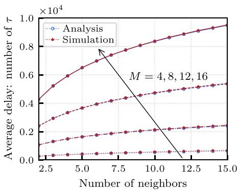  
(a)

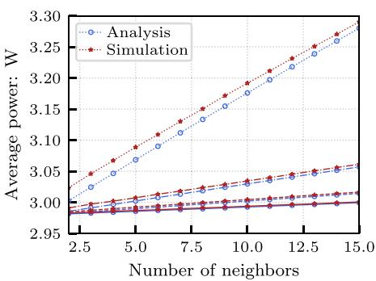  
(b)

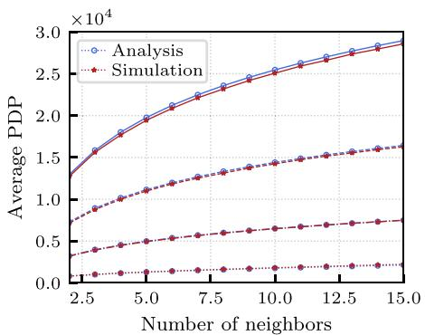  
(c)

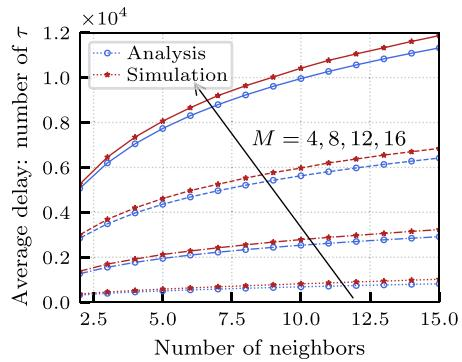  
(d)

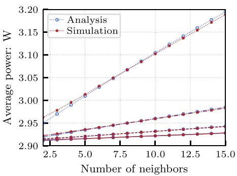  
(e)

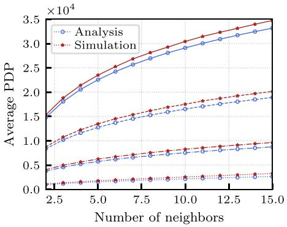  
(f)  
Fig. 5. Comparison of theoretical and simulated results for key performance metrics in neighbor discovery. Subplots (a) and (d) show average discovery delay, (b) and (e) show average node power, and (c) and (f) show average PDP, for the synchronous (top row) and asynchronous (bottom row) models. Each curve pair corresponds to a different number of antenna sectors, $e . g . , M = \breve { 4 } , 8 , 1 2$ , 16, with the x-axis showing the average number of neighbors.

Minor deviations in both slope and intercept are observed between the theoretical predictions and simulation outcomes under the synchronous case, but the theoretical model still provides an accurate and practical approximation.

As shown in Fig. 5(c) and (f), the discrepancies observed in $\mathbb { E } [ D _ { i } ]$ and $\bar { P } _ { i }$ have negligible impact on the average PDP, $\mathbb { E } [ C _ { i } ]$ . Theoretical and simulated results exhibit strong agreement, indicating that the proposed analytical models effectively capture the system behavior. Importantly, these minor discrepancies do not affect the optimization performance, as the overall trends and relative parameter sensitivities remain consistent. This is further verified in the subsequent simulations demonstrating the robustness of the proposed optimization framework.

## B. Performance of Optimization

The performance of the proposed optimization approaches is evaluated using two key metrics: average PDP, , and maximum $\mathrm { P D P , } C _ { \mathrm { m a x } }$ . Simulations are conducted with $M = 8$ beam sectors, considering both synchronous and asynchronous schemes. For comprehensive assessment, we compare the results with two alternative optimization objectives: minimizing the average expected delay, $\begin{array} { r } { \frac { \mathrm { ~ \hat { ~ } { ~ 1 ~ } ~ } } { N } \sum _ { i \in \Omega } \mathbb { E } [ D _ { i } ] } \end{array}$ , and minimizing the maximum Nexpected delay, $\mathbf { \boldsymbol { x } } _ { i \in \Omega } \mathbb { E } [ D _ { i } ]$ . These optimization objectives are denoted as avgDelay and maxDelay respectively. Since all proposed optimization schemes leverage a priori information about potential neighbors, i.e., $\{ \Omega _ { i , \theta } \mid \theta \in \Theta _ { i } , i \in \Omega \}$ , we also benchmark against the method in [25], which develops an analytical relationship between discovery delay and the control parameters, $e . g . , s$ and R or $\mathcal { L } .$ under uniform and homogeneous assumptions. This baseline approach, denoted as noinfo, provides a reference to quantify the performance gain from leveraging spatial neighbor knowledge.

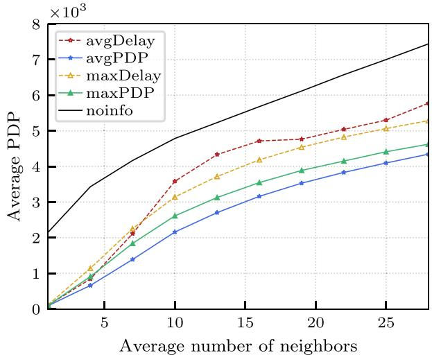  
Fig. 6. Average PDP, C¯, versus the average number of neighbors in the synchronous scenario.

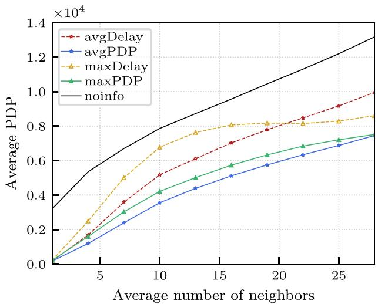  
Fig. 7. Average PDP, C¯, versus the average number of neighbors in the asynchronous scenario.

Figs. 6 and 7 show the variation of the average PDP, , with respect to the average number of neighbors under the synchronous and asynchronous scenarios, respectively. The proposed optimizations, avgPDP and maxPDP, consistently achieve lower PDP values than the alternative approaches in both cases, with avgPDP slightly outperforming maxPDP and attaining the minimum value as expected. Unsurprisingly, all schemes leveraging a priori neighbor information outperform the baseline noinfo, confirming the advantage of incorporating such information.

Notably, maxDelay performs better than avgDelay in sparse networks, but this trend reverses as the node density increases, with avgDelay overtaking maxDelay. This reversal is more pronounced in the asynchronous case, where higher densities reduce the impact of the worst-case node on the average PDP, indicating that delay is not the sole factor affecting power consumption in neighbor discovery. Additionally, as the network density increases, the performance gap between avgPDP and maxPDP gradually narrows, and the two formulations eventually converge. This convergence occurs because, in dense networks, nodes tend to have a comparable number of neighbors across all sectors, reducing directional diversity. Consequently, the antenna’s directional properties become less influential, and the overall topology asymptotically approaches a uniform configuration.

Figs. 8 and 9 illustrate the trends of maximum PDP, $C _ { \mathrm { m a x } } ,$ versus the average number of neighbors for the synchronous and asynchronous cases, respectively. The proposed optimizations, maxPDP and avgPDP, generally outperform the baseline noinfo. However, leveraging a priori neighbor information does not always guarantee better performance. For example, avgDelay performs worse than noinfo beyond a certain node intensity, indicating that delay-focused optimization becomes less effective in highly dense networks. maxPDP and $a \nu g P D P$ exhibit comparable performance, but a slight gap emerges at higher node intensities, where maxPDP achieves lower $C _ { \mathrm { m a x } }$ . This divergence emphasizes the growing importance of optimizing for the worst-case node in dense networks, where outliers exert greater influence on system-wide performance. The same trend appears for avgDelay and maxDelay, though the difference between them is more pronounced.

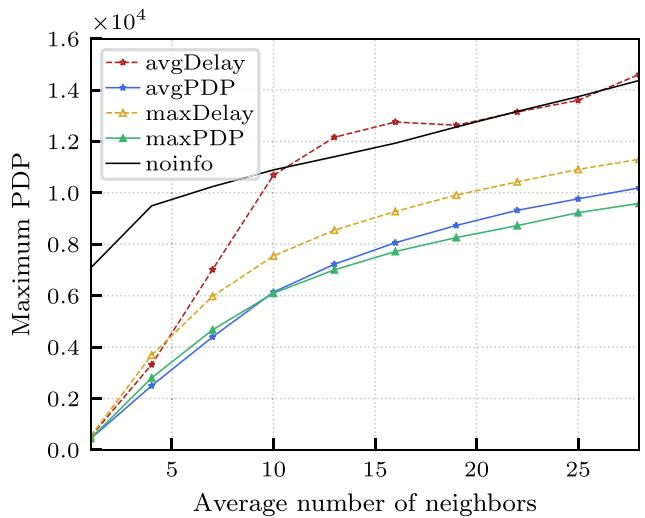  
Fig. 8. Maximum PDP, $C _ { \mathrm { m a x } } ,$ , versus the average number of neighbors in the synchronous scenario.

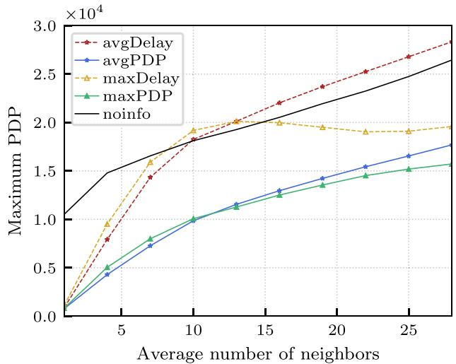  
Fig. 9. Maximum PDP, $C _ { \mathrm { m a x } } .$ , versus the average number of neighbors in the asynchronous scenario.

Across Figs. 6–9, both $\bar { C }$ and $C _ { \mathrm { m a x } }$ under the delay-only objectives, avgDelay and maxDelay, show a non-monotonic relationship with node density. At low densities, proactive transmissions reduce discovery delay and improve PDP. As the network becomes denser, the same aggressiveness leads to frequent collisions, increasing both delay and power consumption, and causing PDP to deteriorate. Beyond a certain density, the steering distributions $s _ { i , \theta }$ approach uniformity, and delay becomes mainly influenced by $r _ { i , \theta }$ and $\lambda _ { i } .$ . The optimization then shifts toward collision avoidance, reducing transmission activity, lowering power consumption, and improving PDP once again. This trend reveals a density-dependent trade-off between delay and power.

In contrast, the proposed avgPDP and maxPDP optimizations maintain a balanced adaptation between delay reduction and energy efficiency. As node density increases, they moderate transmission rates, avoiding excessive collisions and achieving consistently better PDP performance across all network scales.

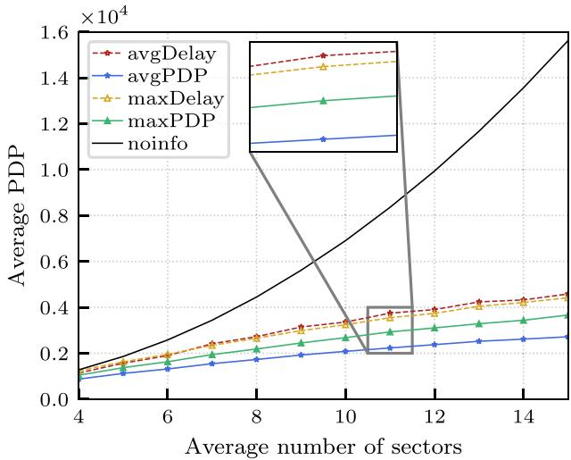  
Fig. 10. Average PDP, C¯, versus the average number of sectors in the synchronous scenario.

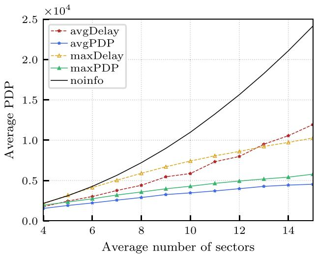  
Fig. 11. Average PDP, C¯, versus the average number of sectors in the synchronous scenario.

Building on the previous analysis of node density, we now examine the impact of antenna sector count on neighbor discovery performance. Figs. 10 and 11 depict the relationship between the average PDP, , and the number of antenna sectors under synchronous and asynchronous schemes, respectively. The average number of neighbors is fixed at 8 in these simulations. As the number of sectors increases, the baseline method noinfo exhibits a steep, near-exponential rise in PDP. In contrast, the proposed optimization schemes, avgPDP and maxPDP, display a linear growth trend, indicating both scalability and stability as the number of sectors increases. This linearity reflects the adaptive nature of the framework: by leveraging neighbor distribution information and optimizing directional probabilities, the proposed schemes effectively suppress redundant transmissions and mitigate sector misalignment, even as the search space expands.

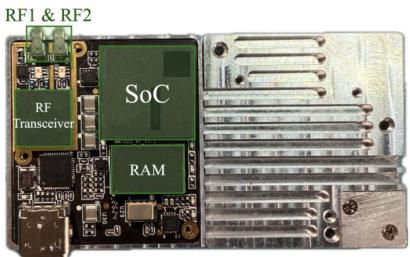  
Fig. 12. Hardware configuration of the experimental low-power dual-RF system.

This consistent performance trend demonstrates the practicality of the proposed framework in highresolution beamforming scenarios, where finer angular resolution typically increases discovery overhead.

Notably, as the number of sectors increases, the performance curves of avgDelay and maxDelay intersect in the asynchronous case, reflecting the growing difficulty of delay-only objectives in managing the expanded directional search space. Finer sectorization leads to increased directional sparsity and a higher risk of beam misalignment—factors that delay-only strategies fail to account for. This behavior is consistent with earlier observations in dense node deployments, where delay-only optimization resulted in unstable and inefficient performance due to frequent collisions and excessive power usage. Taken together, these findings highlight the inherent imbalance of delay-only optimization: it lacks the stability and scalability required for more diverse or dense network scenarios. In contrast, the proposed PDP-optimized schemes maintain robust performance across a wide range of configurations by jointly optimizing delay and power consumption.

Overall, the simulation results confirm that the proposed PDPbased optimization schemes offer stable and efficient performance across a wide range of network configurations. By jointly considering both delay and power consumption, these methods adapt effectively to variations in node density, sector resolution, and synchronization mode. Such adaptability is particularly valuable in UAV networks, where dynamic environments and heterogeneous hardware require neighbor discovery strategies that are both energy-aware and scalable.

## VII. EXPERIMENTAL EVALUATION

To validate the proposed optimization method under realworld conditions, we conducted experiments using a low-power dual-RF system. Each node was equipped with a system-onchip (SoC) and a dual-channel RF transceiver, with only one transceiver channel active at a time. The dual-RF system emulated a UAV node operating over two directional antenna sectors. The SoC, based on an ARM processor and an FPGA, executed the neighbor discovery algorithm and periodically recorded performance metrics, including power consumption and discovery delay. Fig. 12 shows the hardware configuration.

The experiment was conducted in an anechoic chamber to eliminate external interference and ensure the results accurately reflect network performance. As shown in Fig. 13, the setup involved a network of four nodes, each equipped with two directional antennas. Node 0, designated as the primary data collection point, was placed at the center of the setup. To ensure full coverage for Node 0, it was equipped with three directional antennas, with an additional antenna connected to RF channel 1 through a power divider. This setup allowed us to evaluate both interference-limited and interference-free discovery scenarios, as two neighbors shared a sector while the third occupied a separate one.

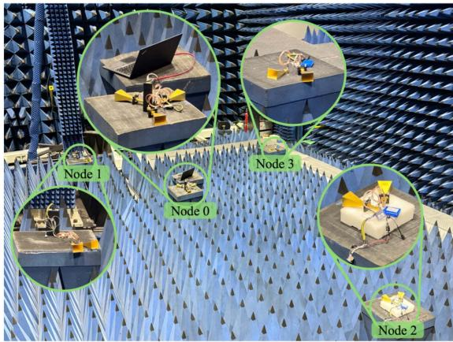  
Fig. 13. Experimental setup and network topology in the anechoic chamber, showing four nodes with two sectors each. Node 0 is the primary data collection point.

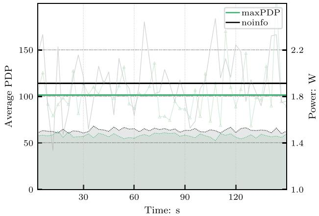  
Fig. 14. Experimental results for Node 0, showing the average power consumption and PDP over a 150-second period. The shaded dotted line shows power consumption, the faded line indicates PDP, and the solid lines mark the final average PDP for noinfo and maxPDP.

Given the absence of global synchronization, the system was evaluated under the asynchronous scan scheme. Each neighbor discovery request lasted 5 milliseconds, consistent with the simulation settings. The optimized parameters for each method, i.e., L and S, were preloaded into the system.

To estimate power consumption, we employed a powerlevel-based measurement approach. Since directly measuring instantaneous power draw is challenging, we first pre-measured the typical power levels under different operational states $( S ^ { ( t ) }$ $S ^ { ( r ) } , \bar { S } ^ { ( l ) } )$ . The ARM processor recorded the system state every millisecond and computed a time-averaged power estimate over a 1-second interval. The typical power consumption for the experimental node was 2.3 W in $S ^ { ( t ) }$ , 1.9 W in $S ^ { ( r ) }$ , and 1.2 W in $\bar { S } ^ { ( l ) }$

TABLE II  
ANALYTICAL AND EXPERIMENTAL PDP AT NODE 0
<table><tr><td>Objective</td><td>Simulation (Analytical)</td><td>Experiment</td><td>Rel. Dev.</td></tr><tr><td>maxPDP</td><td>81.03</td><td>101.31</td><td>+25.0%</td></tr><tr><td>noinfo</td><td>128.15</td><td>113.81</td><td>-11.2%</td></tr></table>

As shown in Fig. 14, the maxPDP scheme consistently achieves lower average power consumption and lower average PDP compared to the noinfo baseline. In particular, maxPDP reduced PDP by an average of 11% at Node 0, validating the effectiveness of our method and demonstrating its advantage in achieving both time- and power-efficient neighbor discovery. The limited directional resolution of the two-sector setup and the network’s sparsity together constrain the observed improvement. Nonetheless, these constraints also highlight the potential for greater gains in more complex configurations.

To further quantify the consistency between analytical predictions and experimental observations, Table II compares the measured and simulated power-delay products (PDP) at Node 0, along with the relative deviation defined as

$$
{ \mathrm { R e l . ~ D e v . } } = { \frac { | { \mathrm { m e a s u r e d - a n a l y t i c a l } } | } { \mathrm { a n a l y t i c a l } } } \times 1 0 0 \%\tag{50}
$$

As shown in Table II, the experimental ranking is consistent with the simulation; for instance, maxPDP achieves lower PDP than noinfo, confirming that the proposed optimization maintains its intended power-delay tradeoff on real hardware. The magnitude and sign of the deviations can be attributed to two primary differences between analytical assumptions and real receiver behavior:

1) Collision modeling versus frame-level capture: The analytical model treats any signal overlap as a collision, whereas real receivers can decode partially overlapped frames through preamble detection and forward error correction (FEC). This capture capability benefits the more aggressive noinfo baseline, which transmits more frequently and thus achieves a smaller measured PDP (−11.2% ) than the analytical estimate.

2) Frame-synchronous reception and early termination: In simulation, a node remains in the receiving state for the entire signal duration. On hardware, reception is framesynchronous; if acquisition fails, the radio terminates early and returns to listening, which reduces average reception time but increases discovery retries. This behavior slightly penalizes the more conservative maxPDP scheme, resulting in a higher experimental PDP ( 25.0% ) compared to the analytical prediction.

Minor factors such as hardware switching latency and finite logging resolution also contribute to the observed deviation. Overall, the results confirm that the analytical framework predicts the relative performance trend and that the proposed optimization remains effective under real-world conditions.

As demonstrated in Fig. 11, the performance gap between maxPDP and noinfo increases exponentially as the number of sectors grows, suggesting even greater efficiency gains in more advanced antenna configurations. Though this experiment provides a controlled validation of the proposed framework, it still offers meaningful hardware evidence that the optimized parameters achieve the intended power-delay tradeoff on real devices. The mobility-aware modeling, incorporating link persistence and sector diffusion, ensures that the framework remains applicable under flight-induced channel variations and dynamic topology changes. To further extend this study, large-scale outdoor experiments with actual UAV platforms are planned to evaluate scalability and robustness under realistic flight conditions.

## VIII. CONCLUSION

In this paper, we have proposed an effective approach for optimizing neighbor discovery in UAV networks equipped with directional antennas. By jointly modeling power consumption and discovery delay, we have addressed the dual challenges of minimizing energy usage and reducing discovery delay. We reformulate the optimization problem using an upper-bound-based metric for the synchronous case and introduced a CCP to handle the asynchronous case, transforming both into tractable convex problems. This reformulation enables significant improvements in the joint metric of power consumption and discovery delay. Simulation results validated the theoretical models and the effectiveness of the proposed optimization methods. The optimization consistently outperformed other approaches and exhibited robustness and scalability across varying network densities and antenna configurations. Experimental results have further confirmed the practicality of our framework in real-world settings.

Despite these promising results, the proposed methods require a priori knowledge of the entire network, limiting their adaptability. Future work should focus on developing more adaptive techniques that can operate with partial or no a priori information, enhancing flexibility in scenarios where such knowledge cannot be assumed. The proposed framework can also be extended to other domains where energy-efficient communication is essential, providing a foundation for future advancements in UAV and wireless ad hoc networks. Additionally, future research should refine the power model to account for mode-switching overhead, as frequent state transitions may introduce non-negligible overhead in practical implementations. Exploring network mobility and the challenges posed by rapidly evolving topologies will further advance the adaptability and robustness of the proposed framework, opening new possibilities for UAV communication optimization in complex and dynamic environments.

## ACKNOWLEDGMENT

The authors express their sincere gratitude to the Anechoic Chamber of the Beijing Institute of Technology for providing the experimental facilities and technical resources necessary for this work.

## REFERENCES

[1] B. Yang, M. Liu, and Z. Li, “Rendezvous on the fly: Efficient neighbor discovery for autonomous UAVs,” IEEE J. Sel. Areas Commun., vol. 36, no. 9, pp. 2032–2044, Sep. 2018.

[2] M. Khan, S. Bhunia, M. Yuksel, and L. C. Kane, “Line-of-sight discovery in 3D using highly directional transceivers,” IEEE Trans. Mobile Comput., vol. 18, no. 12, pp. 2885–2898, Dec. 2019.

[3] O. S. Oubbati, A. Lakas, P. Lorenz, M. Atiquzzaman, and A. Jamalipour, “Leveraging communicating UAVs for emergency vehicle guidance in urban areas,” IEEE Trans. Emerg. Topics Comput., vol. 9, no. 2, pp. 1070–1082, Apr.–Jun. 2021.

[4] X.-y. Hong, N. Lv, and Z.-y. Ren, “Oblivious neighbor discovery algorithms in airborne networks with directional multi-antenna,” Ad Hoc Netw., vol. 141, Mar. 2023, Art. no. 103074.

[5] Y. Zhu, M. Liu, Y. Chen, S. Sun, and Z. Li, “SkyOrbs: A fast 3-D directional neighbor discovery algorithm for UAV networks,” IEEE Trans. Mobile Comput., vol. 23, no. 12, pp. 14768–14786, Dec. 2024.

[6] H. Li and Z. Xu, “Self-adaptive neighbor discovery in mobile ad hoc networks with directional antennas,” in Proc. IEEE Int. Conf. Commun Workshops, Kansas City, MO, USA, May 2018, pp. 1–6.

[7] Z. Xiao et al., “A survey on millimeter-wave beamforming enabled UAV communications and networking,” IEEE Commun. Surv. Tuts., vol. 24, no. 1, pp. 557–610, Jan.–Mar. 2022.

[8] Z. Wei, Y. Liang, Z. Meng, Z. Feng, K. Han, and H. Wu, “Fast neighbor discovery for wireless ad hoc network with successive interference cancellation,” IEEE Trans. Veh. Technol., vol. 73, no. 1, pp. 1322–1336, Jan. 2024.

[9] Y. Song, S. Wang, G. Pan, and Z. Song, “A multi-token-based directional neighbor discovery algorithm for FANETs,” IEEE Trans. Commun., vol. 73, no. 4, pp. 2786–2800, Apr. 2025.

[10] A. Zhou, W. Tang, X. Zhang, and H. Ma, “FastND: Accelerating directional neighbor discovery for 60-GHz millimeter-wave wireless networks,” IEEE/ACM Trans. Netw., vol. 26, no. 5, pp. 2282–2295, Oct. 2018.

[11] Y. Wang, T. Zhang, S. Mao, and T. S. Rappaport, “Directional neighbor discovery in mmWave wireless networks,” Digit. Commun. Netw., vol. 7, no. 1, pp. 1–15, Feb. 2021.

[12] H. Lan, G. Liu, W. Wang, C. Liang, and Z. Ma, “Three-dimensional scanbased algorithm for directional neighbor discovery in ad hoc networks,” Int. J. Commun. Syst., vol. 36, no. 10, Jul. 2023, Art. no. e5496.

[13] F. Xiong et al., “Energy-saving data aggregation for multi-UAV system,” IEEE Trans. Veh. Technol., vol. 69, no. 8, pp. 9002–9016, Aug. 2020.

[14] A. Kandhalu, K. Lakshmanan, and R. Rajkumar, “U-connect: A lowlatency energy-efficient asynchronous neighbor discovery protocol,” in Proc. 9th ACM/IEEE Int. Conf. Inf. Process. Sens. Netw., Stockholm, Sweden, Apr. 2010, pp. 350–361.

[15] S. Vasudevan, J. Kurose, and D. Towsley, “On neighbor discovery in wireless networks with directional antennas,” in Proc. IEEE 24th Annu. Jt. Conf. IEEE Comput. Commun. Soc., vol. 4, Mar. 2005, pp. 2502–2512.

[16] S. Vasudevan, D. Towsley, D. Goeckel, and R. Khalili, “Neighbor discovery in wireless networks and the coupon collector’s problem,” in Proc. 15th Annu. Int. Conf. Mob. Comput. Netw., Beijing, China, Sep. 2009, pp. 181–192.

[17] Ö. Gencay Mutlu, Z. Genç, and E. Onur, “Sector scanning attempts for nonisolation in directional 60 GHz networks,” IEEE Commun. Lett., vol. 14, no. 9, pp. 845–847, Sep. 2010.

[18] H. Cai, B. Liu, L. Gui, and M.-Y. Wu, “Neighbor discovery algorithms in wireless networks using directional antennas,” in Proc. IEEE Int. Conf. Commun., Ottawa, ON, Canada, Jun. 2012, pp. 767–772.

[19] F. Tian, R. Q. Hu, Y. Qian, B. Rong, B. Liu, and L. Gui, “Pure asynchronous neighbor discovery algorithms in ad hoc networks using directional antennas,” in Proc. IEEE Glob. Commun. Conf., Atlanta, GA, USA, Dec. 2013, pp. 498–503.

[20] H. Cai and T. Wolf, “On 2-way neighbor discovery in wireless networks with directional antennas,” in Proc. IEEE Conf. Comput. Commun., Apr. 2015, pp. 702–710.

[21] T. Feng, L. Bo, H. Cai, H. Zhou, and G. Lin, “Practical asynchronous neighbor discovery in ad hoc networks with directional antennas,” IEEE Trans. Veh. Technol., vol. 65, no. 5, pp. 3614–3627, May 2016.

[22] B. El Khamlichi, D. H. N. Nguyen, J. El Abbadi, N. W. Rowe, and S. Kumar, “Collision-aware neighbor discovery with directional antennas,” in Proc. Int. Conf. Comput. Netw. Commun., Mar. 2018, pp. 220–225.

[23] W. Bai et al., “Cognitive neighbor discovery with directional antennas in self-organizing IoT networks,” IEEE Internet Things J., vol. 8, no. 8, pp. 6865–6877, Apr. 2021.

[24] D. Burghal, A. S. Tehrani, and A. F. Molisch, “On expected neighbor discovery time with prior information: Modeling, bounds and optimization,” IEEE Trans. Wireless Commun., vol. 17, no. 1, pp. 339–351, Jan. 2018.

[25] S. Vasudevan, M. Adler, D. Goeckel, and D. Towsley, “Efficient algorithms for neighbor discovery in wireless networks,” IEEE/ACM Trans. Netw., vol. 21, no. 1, pp. 69–83, Feb. 2013.

[26] B. El Khamlichi, D. H. N. Nguyen, J. El Abbadi, N. W. Rowe, and S. Kumar, “Learning automaton-based neighbor discovery for wireless networks using directional antennas,” IEEE Wireless Commun. Lett., vol. 8, no. 1, pp. 69–72, Feb. 2019.

[27] J. Jiang, S. Wang, G. Han, and H. Wang, “Reinforcement-learningbased adaptive neighbor discovery algorithm for directional transmissionenabled Internet of Underwater Things,” IEEE Internet Things J., vol. 10, no. 10, pp. 9038–9048, May 2023.

[28] A. Russell, S. Vasudevan, B. Wang, W. Zeng, X. Chen, and W. Wei, “Neighbor discovery in wireless networks with multipacket reception,” IEEE Trans. Parallel Distrib. Syst., vol. 26, no. 7, pp. 1984–1998, Jul. 2015.

[29] Z. Wei, Q. Chen, H. Yang, H. Wu, Z. Feng, and F. Ning, “Neighbor discovery for VANET with gossip mechanism and multipacket reception,” IEEE Internet Things J., vol. 9, no. 13, pp. 10502–10515, Jul. 2022.

[30] Y. Zeng, Q. Wu, and R. Zhang, “Accessing from the sky: A tutorial on UAV communications for 5G and beyond,” Proc. IEEE, vol. 107, no. 12, pp. 2327–2375, Dec. 2019.

[31] H.-Y. Zhou, D.-Y. Luo, Y. Gao, and D.-C. Zuo, “Modeling of node energy consumption for wireless sensor networks,” Wirel. Sens. Netw., vol. 3, no. 1, pp. 18–23, 2011.

[32] K. Davies and A. Dembi´nska, “Computing moments of discrete order statistics from non-identical distributions,” J. Comput. Appl. Math., vol. 328, pp. 340–354, Jan. 2018.

[33] R. B. Bapat and M. I. Beg, “Order statistics for nonidentically distributed variables and permanents,” Sankhy¯a Ser. A, vol. 51, no. 1, pp. 79–93, 1989.

  
Hao Fan received the BEng degree in electrical engineering in 2021 from the Beijing Institute of Technology, Beijing, China, where he is currently working toward the PhD degree with the School of Cyberspace Science and Technology. His research interests include UAV communications, flying ad hoc networks, and secure networking.

  
Zhe Song received the bachelor’s and master’s degrees in 2009 and 2012, respectively, from the School of Information and Electronics, Beijing Institute of Technology, Beijing, China, where she is currently working toward the PhD degree. Her research interests include satellite communications, UAV communications, and networking.

  
Xuanhe Yang received the PhD degree in information and communication engineering from the Beijing Institute of Technology, Beijing, China, in 2023. His research interests include spread spectrum signal processing, satellite communication, IoT technology, and physical-layer security.

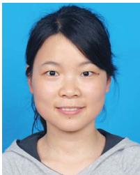

Tingting Li received the BSc degree in mathematics and applied mathematics and the PhD degree in computational mathematics from Chongqing University, Chongqing, China, in 2006 and 2012, respectively. In Jul. 2012, she joined the School of Mathematics and Statistics, Southwest University, Chongqing, where she is currently an associate professor. Her research focuses on statistics and its applications.

Shuai Wang (Senior Member, IEEE) received the PhD degree in communications systems from the Beijing Institute of Technology (BIT), Beijing, China, in 2012. He joined the Faculty of the School of Information and Electronics, BIT. In 2021, he joined the School of Cyberspace Science and Technology, BIT, as a member of its Founding Faculty, where he has been appointed as the chair professor of cyberspace security technology. His research interests include satellite communications, anti-interference communications, and datalink technologies for various aero and space platforms. He was the editor of IEEE Wireless Communications Letters and is the editor of IEEE Communications Letters and China Communications.

Chee Yen Leow (Senior Member, IEEE) received the BEng degree in computer engineering from Universiti Teknologi Malaysia (UTM), in 2007, and the PhD degree in wireless communications from Imperial College London, in 2011. He is currently an associate professor with the Faculty of Ele Engineering and a research fellow with the Wireless Communication Centre, UTM. He is also a secretary with IMT and Future Networks Working Group, under the Malaysian Technical Standards Forum Berhad to accelerate the adoption of 5G IMT-2020 in Malaysia. In addition, he regularly conducts short courses on 5G and IoT for the telecommunications industry. His research interests include non-orthogonal multiple access, drone communications, intelligent surfaces, advanced MIMO, millimeter-wave communications, prototype development using software-defined radio for beyond 5G, and Internet of Things applications. Dr. Leow’s IEEE papers were the recipient of the IEEE Malaysia ComSoc/VTS Joint Chapter Best Paper awards in 2016, 2017, 2021, and 2022, and the IEEE Malaysia AP/MTT/EMC Joint Chapter Best Paper awards in 2017, 2018, 2021, 2022, and 2024, and was recognized as an exemplary editor of IEEE Wireless Communications Letters in 2025. He is also chairs the IEEE Malaysia ComSoc/VTS Joint Chapter. He is a chartered engineer (CEng) registered with the Engineering Council, U.K., and a professional technologist with the Malaysia Board of Technologists.

Gaofeng Pan (Senior Member, IEEE) received the BSc degree in communication engineering from Zhengzhou University, Zhengzhou, China, in 2005, and the PhD degree in communication and information systems from Southwest Jiaotong University, Chengdu, China, in 2011. He is currently with the School of Cyberspace Science and Technology, Beijing Institute of Technology, China, as a professor. His research interests include special topics in communications theory, signal processing, and protocol design. He is also the leading guest editor of IEEE

Journal on Selected Areas in Communications, and editor for several jounals, such as IEEE Transactions on Communications, and IEEE Transactions on Green Communications and Networking.

Dusit Niyato (Fellow, IEEE) received the BEng degree from the King Mongkuts Institute of Technology Ladkrabang, Thailand, and the PhD degree in electrical and computer engineering from the University of Manitoba, Canada. He is also a professor with the College of Computing and Data Science, Nanyang Technological University, Singapore. His research interests include the areas of mobile generative AI, edge intelligence, quantum computing and networking, and incentive mechanism design.