# Joint Optimization of Trajectory, Offloading, Caching, and Migration for UAV-Assisted MEC

Mingxiong Zhao , Member, IEEE, Rongqian Zhang, Zhenli He , Senior Member, IEEE, and Keqin Li , Fellow, IEEE

Abstract—UAV-assisted MEC revolutionizes edge computing by deploying UAVs for real-time data processing in areas lacking infrastructure, supporting a wide range of applications from emergency responses to smart cities. Unlike edge servers, UAVs face substantial computational constraints, necessitating a comprehensive strategy that integrates UAV trajectory with task offloading, caching, and migration. Existing studies often overlook the synergy among these strategies, impacting their overall effectiveness. Furthermore, the focus on content pre-caching overlooks task caching’s critical role in addressing high computational demands with limited UAV resources. This research aims to jointly optimize UAV trajectories and task management strategies, including offloading, caching, and migration. Utilizing the Lyapunov optimization framework, we break down the complex optimization problem into manageable subproblems: UAV placement, user-UAV association, task offloading, scheduling, and bandwidth allocation, addressed iteratively using the Block Coordinate Descent method. Specifically, the scheduling subproblem is transformed into a nonconvex quadratically constrained quadratic programming problem, managed effectively through semidefinite relaxation and a probabilistic mapping approach. Our simulations show that this integrated approach significantly boosts system throughput and reduces execution times compared to conventional methods. This study enhances the understanding of the interplay between UAV trajectory planning and task management, offering vital theoretical insights for advancing UAV-assisted MEC systems.

Index Terms—Caching, Lyapunov optimization, migration, offloading, scheduling cost, trajectory, UAV-assisted MEC.

Received 16 March 2024; revised 30 September 2024; accepted 23 October 2024. Date of publication 28 October 2024; date of current version 5 February 2025. This work was supported in part by the National Natural Science Foundation of China under Grant 62361056 and Grant 62362068, in part by the Applied Basic Research Foundation of Yunnan Province under Grant 202201AT070156, Grant 202201AT070203, Grant 202301AT070194, and Grant 202301AT070422, in part by the Open Foundation of Yunnan Key Laboratory of Software Engineering under Grant 2023SE208, and in part by the Open Foundation of Yunnan Key Laboratory of Smart City in Cyberspace Security under Grant 202105AG070010-ZN-10. Recommended for acceptance by A. Garcia-Saavedra. (Corresponding author: Zhenli He.)

Mingxiong Zhao and Zhenli He are with the Engineering Research Center of Cyberspace, Yunnan Key Laboratory of Software Engineering, Kunming 650091, China, and also with the School of Software, Yunnan University, Kunming 650091, China (e-mail: jimmyzmx@gmail.com; hezl@ynu.edu.cn).

Rongqian Zhang is with the School of Information Science and Engineering, Yunnan University, Kunming 650091, China (e-mail: zhangrongqian@ stu.ynu.edu.cn).

Keqin Li is with the Department of Computer Science, State University of New York, New Paltz, NY 12561 USA (e-mail: lik@newpaltz.edu).

This article has supplementary downloadable material available at https://doi.org/10.1109/TMC.2024.3486995, provided by the authors.

Digital Object Identifier 10.1109/TMC.2024.3486995

# I. INTRODUCTION

# A. Motivation

S MOBILE Edge Computing (MEC) becomes increasingly prevalent, it signifies a critical advancement in computational efficiency at the network’s edge. The advent of UAV-assisted MEC systems emerges as a key evolution [1]. This shift not only enhances the capabilities of traditional MEC infrastructures but also offers a revolutionary approach to overcome the inherent constraints of ground-based MEC deployments. UAV-assisted MEC enables real-time data analytics for precision agriculture, rapid emergency responses for public safety, and advanced urban planning for smart cities. The adaptive nature of UAVs to meet varying computational demands enables the provision of real-time processing power in areas previously limited by infrastructure. Integrating UAV-assisted MEC with burgeoning sectors like the Internet of Things (IoT), virtual reality (VR), and live streaming promises a leap towards a more agile and efficient computational paradigm [2].

However, this integration presents complex challenges, primarily due to UAVs’ limited computational resources and communication coverage, as well as user mobility. Achieving optimal resource utilization requires a comprehensive strategy that seamlessly integrates UAV trajectory control, strategic task offloading, caching, and migration techniques. The complexity arises from the interdependencies among these strategies. For instance, decisions on UAV trajectory directly impact the efficiency of task offloading, while approaches to caching and migration significantly influence subsequent UAV positioning. This complex interplay necessitates advanced optimization techniques to effectively harmonize these strategies, highlighting the challenge of designing an efficient UAV-assisted MEC network.

Existing research efforts have explored various aspects of this challenge, albeit often in isolation. Joint optimization studies of UAV trajectories and task offloading focus on improving communication efficiency, reducing energy consumption, and optimizing computational resource allocation to enhance mobile edge computing performance [3]. Concurrently, task migration and caching strategies have been investigated to alleviate computational burdens and enhance system responsiveness [4], [5]. Despite these advancements, the literature reveals a notable gap: the tendency to overlook the synergistic potential among different strategies, which could limit their collective effectiveness. Moreover, existing studies on caching strategies within UAV-assisted MEC primarily focus on hot data or content pre-caching, such as videos, images, and audio, neglecting the crucial aspect of computational task caching. This oversight is significant as computational task caching plays a vital role in addressing the contradiction between intense computational demands and severely limited computational resources. By incorporating computational task caching mechanisms, the probability of service denial events can be significantly reduced, thereby further improving system throughput, request acceptance rate, and response speed.

This paper seeks to bridge this gap by examining the complex relationships among UAV trajectory control, computational offloading, task migration, and caching strategies within the UAV-assisted MEC framework, with a particular focus on the underexplored area of computational task caching. By adopting a holistic optimization approach, this research aims to elucidate the intricate dynamics of these strategies and their cumulative impact on system performance, thereby contributing both to the theoretical understanding of these interactions and providing practical insights to inform the architectural development of future UAV-assisted MEC systems.

# B. Our Contributions

In this study, we explore the joint optimization of UAV trajectories and task-related strategies, including offloading, caching, and migration, within UAV-assisted MEC environments to enhance system throughput. We examine the relationship between UAV trajectory control and task management strategies. By applying the Lyapunov method, we balance minimizing system costs with maximizing throughput, addressing the challenge of optimizing interconnected variables using the Block Coordinate Descent (BCD) method. Our experimental results highlight the effectiveness of our comprehensive framework in improving system throughput while meeting scheduling cost constraints. Our contributions include:

We establish a multi-UAV, multi-user, and multi-time slot MEC system model that captures the evolution of user tasks over time and integrates these tasks with UAV trajectory planning for optimal scheduling operations. We then formally define the optimization problem addressed in this paper.   
We propose an online optimization algorithm based on the Lyapunov method to address the optimization problem. This approach deconstructs the complex original problem into a manageable single time slot scenario, enabling a strategic equilibrium between task scheduling costs and system throughput.   
- We develop a suite of algorithms to address the single time slot challenge as outlined by the Lyapunov method. This suite includes a task scheduling-oriented UAV deployment algorithm, a system-adaptive task offloading algorithm, and a multi-coupled binary integer programming solution derived from the semi-positive definite quadratically constrained quadratic programming (QCQP) problem. These algorithms facilitate critical task scheduling decisions, significantly influenced by UAV trajectory optimization. Consequently, we utilize task migration and caching data as heuristic indicators to refine UAV trajectories, focusing

on determining the optimal deployment locations for each time slot.

We execute a thorough complexity analysis of our proposed algorithm, supplemented by experimental simulations and comparative evaluations. These investigations not only affirm the robustness of our theoretical model but also emphasize the distinct advantage of our specialized approach over traditional algorithms.

This paper is structured as follows: Section II reviews the literature. Section III models the scenarios and defines the optimization problem. Section IV introduces a Lyapunov-based algorithm for simplifying the problem per time slice. Section V details a BCD strategy, addressing sub-problems related to UAV trajectory and task management. Sections VI and VII describe the proposed algorithms and analyze their performance. The paper concludes in Section VIII.

# II. RELATED WORK

This section reviews the existing work related to our study. Due to space constraints, a more detailed analysis of the related work discussed is available in Section I of the supplementary material, available online.

# A. Joint Optimization of UAV Trajectories and Task Offloading

In UAV-assisted MEC networks, task offloading involves transferring intensive or sensitive tasks from ground devices to UAVs or indirectly to edge servers, with methods categorized into binary and partial offloading. Managing UAV flight paths effectively is crucial due to their high mobility, which ensures optimal service quality and offloading efficiency. The authors in [6] enhanced load balancing and reduced energy consumption through strategic UAV trajectory optimization. In [7], the authors improved system performance using a deep reinforcement learning approach that synchronizes task offloading and UAV trajectory planning. The authors in [8] optimized task processing fairness and energy efficiency by fine-tuning offloading strategies and flight paths.

Dynamic resource allocation between UAVs and edge computing resources is essential for efficient task offloading. The authors in [9] developed methods to minimize energy usage while optimizing offloading and resource allocation, utilizing advanced programming techniques. Integrated strategies for UAV trajectory and resource management, as discussed in [3], [10], [11], quickly adapt to network conditions, thereby enhancing offloading efficiency and system performance.

Despite these advancements, a critical challenge persists: UAVs’ limited computing resources, compared to traditional edge servers, often result in service denials post-offloading due to insufficient capacity. To address this, enhancing computing capacity through innovative offloading, caching, and migration strategies is crucial to overcoming the inherent limitations of UAVs and ensuring robust MEC service delivery.

# B. Optimization of Caching in UAV-Assisted MEC Networks

Network load fluctuations necessitate effective caching strategies in MEC systems to enhance overall efficiency. The authors in [5] devised computational offloading and caching strategies that reduce UAV operational times by utilizing temporary task storage. Similarly, the authors in [12] and [13] integrated task offloading with resource allocation to optimize energy consumption and reduce latency. Further advancing this approach, the authors in [14] implemented a cloud-edge architecture where UAVs and cloud systems collaboratively provide efficient caching and computational services.

Economic and operational enhancements are also crucial. For instance, the authors in [15] optimized content caching in 5G networks to improve profitability through incentive mechanisms. In [16], the authors introduced a neural-blockchain method for on-demand caching, which enhances mobile edge communication reliability. These innovations not only address the operational challenges associated with UAVs’ limited computational capacities but also pave the way for more advanced MEC systems.

However, the strategic use of caching to optimize task processing during peak times remains under-explored. Current research primarily focuses on performance metrics such as cache hit rates and specific applications like content streaming [17], [18], [19], [20], [21], [22]. Investigating the potential to cache time-sensitive tasks during computational peaks and processing them as capacity allows could significantly enhance system responsiveness. Moreover, further exploration into the interplay between caching, UAV trajectory planning, and task offloading could lead to substantial improvements in MEC system performance.

# C. Optimization of Migration in UAV-Assisted MEC Networks

UAVs utilize onboard computational resources to dynamically process tasks. When tasks exceed their capabilities, migrating them to other UAVs or servers with sufficient resources becomes essential. The authors in [4], [23], and [24] illustrate systems that enhance processing efficiency through inter-UAV task migration, reducing latency and supporting applications with complex dependencies. Additionally, the authors in [2] developed a system that integrates UAVs with terrestrial base stations to optimize resource allocation and reduce latency, addressing the energy demands of mobile users.

However, existing literature often overlooks the complex interactions among UAV trajectory control, task caching, migration, and offloading. An in-depth exploration of these dynamics could substantially improve the efficiency and performance of MEC networks. Integrating trajectory optimization with robust task management can enhance UAV operations, making them more responsive and energy-efficient, especially in dynamic environments. This approach necessitates advanced algorithms capable of adapting to evolving conditions, ensuring optimal UAV performance across varying network scenarios.

Our research significantly diverges from existing studies in UAV-assisted MEC networks, characterized by the following unique aspects:

\- We introduce a task caching mechanism for UAVs, allowing them to cache tasks in addition to performing computations and migrations. This approach mitigates computational burdens, prevents task accumulation, and ensures efficient task processing over time.

Recognizing the dynamics between offloading, computation, migration, and caching, we develop dynamic scheduling and caching strategies for UAVs using Lyapunov optimization. This method optimizes system throughput and manages scheduling costs while considering computational needs, task latency, and UAVs’ energy and caching capacities.   
We present a UAV deployment algorithm designed for a single time slot, aiming to significantly boost system throughput. We innovate by combining UAV trajectory planning with task scheduling strategies, enhancing the K-means algorithm with heuristic considerations such as task migration and caching. This results in adaptive UAV deployment for each time slot, optimizing trajectories.

To the best of our knowledge, this is the first attempt to propose a dynamic task scheduling strategy which comprehensively incorporates UAV trajectory, task offloading, migration, and caching within a UAV-assisted MEC framework.

# III. SYSTEM MODEL AND PROBLEM FORMULATION

This section details the service scenarios addressed and rigorously formalizes the optimization problem. Symbols and their definitions can be found in Section II of the supplementary material, available online.

# A. Service Scenario

The service scenario in our system involves multiple UAVs and mobile users within overlapping regions. Users freely transmit data using Frequency Division Multiple Access (FDMA) technology, while UAVs dynamically allocate computing services across these areas.

For conciseness, let $\mathcal { U } = \{ 1 , 2 , \dots , U \}$ denote the set of UAVs, and $\mathcal { T } = \{ 1 , 2 , \hdots , I \}$ represent the set of mobile users with computing demands. To address the unpredictable mobility of users, we employ a discrete-time slot model, as previously explored in [11], [25], [26]. The total duration D is segmented into τ discrete time slots, indexed by $\mathcal { T } = \{ 0 , 1 , \dots , t , \dots , \tau - 1 \}$ , where t represents each time slot. Hence, the UAV trajectory can be depicted as $\mathcal { Q } _ { u } = \{ \pmb q _ { u } ( 0 ) , \pmb q _ { u } ( 1 ) , \dots , \pmb q _ { u } ( t ) , \dots , \pmb q _ { u } ( \tau -$ 1)}, where $\pmb { q } _ { u } ^ { \mathrm { U A V } } ( t )$ denotes the UAV’s position at time slot t. In each time slot, every user may generate a task based on their demand. These tasks are then associated with the UAV currently covering them, denoted by $s _ { i , u } ( t ) = 1$ , indicating that user i is associated with UAV u during time slot t. A non-association is represented by $s _ { i , u } ( t ) = 0$ . The task generated by user i at time slot $t , l _ { i } ( t )$ , is characterized by two parameters: $\{ e _ { i } ( t ) , w _ { i } ( t ) \}$ , which represent the amount of input data and the required computing resource for processing, respectively.

At time slot t, user i faces a decision regarding task offloading to UAV u, denoted by $z _ { i , u } ( t ) = 1$ . Conversely, $z _ { i , u } ( t ) = 0$ indicates the decision not to offload during that time slot. It is assumed that the task must be offloaded to UAVs for computation assistance in the same time slot it is generated. Denote $a _ { i , u } ( t )$ as the computation assignment. Specifically, $a _ { i , u } ( t ) = 1$ signifies that the task $l _ { i } ( t )$ is being processed by UAV u. Otherwise, $a _ { i , u } ( t ) = 0 .$ At each time slot, both users and UAVs possess the capability to initiate task-processing requests. This flexibility arises from the constraint that UAVs, with limited resources, may migrate tasks to subsequent UAVs for processing. Complementing computation and migration, tasks can also be cached on UAVs, and these cached tasks will be processed in the subsequent time slot.

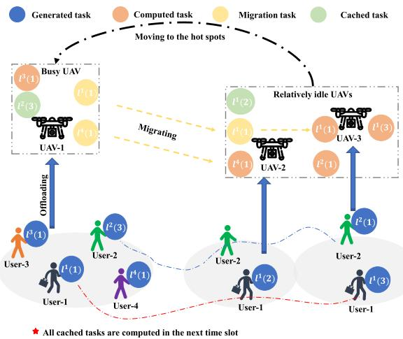

flowchart

Fig. 1. System service scenario.

Fig. 1 illustrates the decision-making processes for task offloading, computation, migration, and caching in a scenario with four users across three time slots. User-1 and User-2 generate tasks while moving randomly, whereas User-3 and User-4, staying within UAV-1’s coverage, generate tasks $\{ l ^ { 1 } ( 1 ) , l ^ { 3 } ( 1 ) , l ^ { 4 } \bar { ( 1 ) } \}$ at the initial time slot. Initially, tasks from User-1, User-3, and User-4 are offloaded to UAV-1, where $l ^ { 3 } ( 1 )$ is processed immediately, and $\{ l ^ { 1 } ( 1 ) , l ^ { 4 } ( 1 ) \}$ are migrated to UAV-2 due to computational constraints. In the second time slot, User-1’s task is cached at UAV-2 before processing, while $l ^ { 4 } ( 1 )$ is computed and $l ^ { 1 } ( 1 )$ is sent to UAV-3 for further processing. By the third time slot, User-1, now under UAV-3’s coverage, generates $l ^ { 1 } ( 3 )$ , which is processed along with previously offloaded tasks. If User-3 and User-4 generate additional tasks in future time slots, UAV-2 and UAV-3 relocate to this hotspot to address the computation deficiency.

# B. Communication Model

After outlining the service scenario, we explore the communication model that facilitates interactions among UAVs and between UAVs and mobile users.

The positions of user i and UAV u at time slot t are described using the vectors $\pmb { q } _ { i } ( t ) = ( x _ { i } ( t ) , y _ { i } ( t ) , 0 ) ^ { T }$ and $\begin{array} { r l } { \mathbf { \nabla } \pmb { q } _ { u } ^ { \mathrm { U A V } } ( t ) = } \end{array}$ $( x _ { u } ( t ) , y _ { u } ( t ) , h _ { u } ) ^ { T }$ , respectively. Here, $x _ { i } ( t )$ and $y _ { i } ( t )$ represent the horizontal coordinates of user i, who is assumed to be at a constant altitude of 0. Similarly, the UAV’s position is given by $x _ { u } ( t )$ and $y _ { u } ( t )$ in the horizontal plane, with a constant altitude denoted by $h _ { u }$ . The distances between UAV u and user i, as well as between UAV u and another UAV $u ^ { \prime } .$ are calculated as $d _ { i , u } ( t ) = \lVert \pmb { q } _ { u } ^ { \mathrm { U A V } } ( t ) - \pmb { q } _ { i } ( t ) \rVert$ and $d _ { u u ^ { \prime } } ( t ) =$ $\| \pmb { q } _ { u } ^ { \mathrm { U A V } } ( t ) - \pmb { q } _ { u ^ { \prime } } ^ { \mathrm { U A V } } ( t ) \|$ qUAVu- (t), respectively.

Considering the considerable likelihood of encountering nonline-of-sight (NLoS) paths in air-to-ground communications within 3D environments, the channel model for UAV-to-ground transmissions is designed to encompass both line-of-sight (LoS) and NLoS path loss probabilities [27]. In contrast, the channel model for UAV-to-UAV communications primarily operates under the assumption of LoS connections. The specifications for channel gains associated with LoS and NLoS links are detailed as $\begin{array} { r } { g _ { i , u } ^ { \mathrm { L o S } } \bar { ( t ) } = \frac { g _ { 0 } } { ( d _ { i , u } ( t ) ) ^ { \bar { \iota } } } , \ g _ { u u ^ { \prime } } ^ { \mathrm { L o S } } ( t ) = \frac { g _ { 0 } } { ( d _ { u u ^ { \prime } } ( t ) ) ^ { \bar { \iota } } } } \end{array}$ g i,u (di,u(t))ι˜ , (duu- (t))ι˜ , and giu $g _ { i , u } ^ { \mathrm { N L o S } } ( t ) =$ gNLoSi,u (t) = kg0(di,u(t))ι˜ , respectively. Here, k is the NLoS attenuation factor, ˜ι $\frac { k g _ { 0 } } { \left( d _ { i , u } ( t ) \right) ^ { \bar { \iota } } }$ is the path loss exponent, and $g _ { 0 }$ denotes the channel gain at a reference distance $d _ { 0 } = 1 m$ .

1) UAVs and Their Users: The composite channel gain between UAV u and its corresponding user i combines both LoS and NLoS components, given as $\begin{array} { r } { \overline { { g _ { i , u } ( t ) } } = \frac { \hat { P } _ { i , u } ^ { \mathrm { L o S } } ( t ) g _ { 0 } } { \left( d _ { i , u } ( t ) \right) ^ { \tilde { \iota } } } } \end{array}$ , where $\hat { P } _ { i , u } ^ { \mathrm { L o S } } ( t ) = P _ { i , u } ^ { \mathrm { L o S } } ( t ) + [ 1 - P _ { i , u } ^ { \mathrm { L o S } } ( t ) ]$ k denotes the adjusted LoS nel with $k < 1$ . Moreover, $\begin{array} { r } { P _ { i , u } ^ { \mathrm { L o S } } ( t ) = \frac { 1 } { 1 + \alpha \exp ( - \beta ( \theta _ { i , u } ( t ) - \alpha ) ) } } \end{array}$ S (t) = 11+α exp(−β(θi,u(t)−α)) is the probability of LoS [28], where α and $\beta$ represent environmental constants tailored to specific settings (urban, suburban, high-rise city, rural, etc.), and $\theta _ { i , u } ( t ) =$ 180π arctan $\left( \frac { h _ { u } } { \| ( x _ { u } ( t ) , y _ { \underline { { u } } } ( t ) ) - ( x _ { i } ( t ) , y _ { i } ( t ) ) \| } \right)$ is the elevation angle from the user to the UAV.

In this case, the data transmission rate between the user and the UAV is given as $\begin{array} { r } { r _ { i , u } ( t ) = B _ { i } ( t ) \log _ { 2 } ( 1 + \frac { p _ { i } ( t ) g _ { i , u } ( t ) } { N _ { 0 } B ^ { i } ( t ) } ) } \end{array}$ , where $B _ { i } ( t )$ is a fixed bandwidth allocated to user $i , p _ { i } ( t )$ denotes the user’s transmission power in time slot t, and $N _ { 0 }$ is the noise spectral density.

2) UAV To UAV: With bandwidth allocation between UAVs contingent upon migration demands, the transmission rate between them, primarily influenced by the prevailing LoS connections, is given by $\begin{array} { r } { r _ { i , u u ^ { \prime } } ( t ) = b _ { i , u u ^ { \prime } } ( t ) B \log _ { 2 } ( 1 + \frac { p _ { u } ( t ) g _ { u u ^ { \prime } } ^ { \mathrm { L o S } } ( t ) } { N _ { 0 } b _ { i , u u ^ { \prime } } ( t ) B } ) } \end{array}$ pu(t)gLoSuu- ( , where $b _ { i , u u ^ { \prime } } ( t )$ represents the proportion of bandwidth allocated to user i for its task migration between UAVs, $p _ { u } ( t )$ denotes the transmission power of the UAV, and B represents the total bandwidth available between UAVs.

# C. Scheduling Model

Our scheduling model considers migrating or caching tasks for deferred processing when immediate execution on UAVs is not feasible.

We define $m _ { i , u u ^ { \prime } } ( t ) \in \{ 0 , 1 \}$ to indicate whether UAV u migrates task $l _ { i } ( t )$ to UAV u- in time slot t, and $o _ { i , u } ( t ) \in \{ 0 , 1 \}$ to signify whether the task of user i is cached on UAV u in time slot t. The set $\mathcal { T } _ { m } ^ { u } ( t )$ identifies tasks on UAV u that are awaiting migration, denoted by $\mathcal { T } _ { m } ^ { u }$ for simplicity. The number of tasks in this set at time slot t is determined by the following expression

$$
\begin{array}{l} I _ {m} ^ {u} (t) = \sum_ {i \in \mathcal {I} _ {s}} z _ {i, u} (t) + \sum_ {i \in \mathcal {I} _ {z}} \sum_ {u ^ {\prime} \in \mathcal {U} \backslash \{u \}} m _ {u ^ {\prime} u} ^ {i} (t - 1) \\ - \sum_ {i \in \mathcal {I} _ {z}} a _ {i, u} (t) - \sum_ {i \in \mathcal {I} _ {z}} o _ {i, u} (t), \tag {1} \\ \end{array}
$$

where $\mathcal { T } _ { s }$ and $\mathcal { T } _ { z }$ represent the sets of users with tasks associated and offloaded to the system, respectively. Additionally, it is important to note that task i stored on UAV u will occupy the amount of cache space, denoted as $o _ { i , u } ( t ) e _ { i , u } ( t )$ .

Once offloading is complete, the system evaluates computation, caching, and migration decisions, prioritizing task latency and UAV energy consumption. The scheduling cost is represented as

$$
c _ {i, u} (t) = \varpi_ {1} D _ {i, u} (t) + \varpi_ {2} E _ {i, u} (t), \tag {2}
$$

where  acts as a balancing parameter between delay and energy consumption. In this context, $D _ { i , u } ( t )$ encompasses the delay incurred during transmission, computation, and caching,

$$
\begin{array}{l} D _ {i, u} (t) = \sum_ {u ^ {\prime} \in \mathcal {U} \backslash \{u \}} m _ {i, u u ^ {\prime}} (t) \frac {e _ {i , u} (t)}{r _ {i , u u ^ {\prime}} (t)} \\ + a _ {i, u} (t) \frac {e _ {i , u} (t)}{w _ {i , u} (t)} + o _ {i, u} (t) \frac {D}{\tau}, \tag {3} \\ \end{array}
$$

where $e _ { i , u } ( t ) = e _ { i } ( t )$ and $w _ { i , u } ( t ) = w _ { i } ( t )$ , signifying that the quantity of input data and the necessary number of CPU cycles for the user’s task remain constant. Here, $u ^ { \prime }$ is employed to denote the specific UAV responsible for processing that task.

Moreover, $E _ { i , u } ( t )$ quantifies additional energy consumption resulting from task scheduling, expressed by

$$
\begin{array}{l} E _ {i, u} (t) = \sum_ {u ^ {\prime} \in \mathcal {U} \backslash \{u \}} m _ {i, u u ^ {\prime}} (t) p _ {u} (t) \frac {e _ {i , u} (t)}{r _ {i , u u ^ {\prime}} (t)} \\ + a _ {i, u} (t) \eta_ {c} \frac {e _ {i , u} (t)}{w _ {i , u} (t)} + o _ {i, u} (t) \eta_ {o} \frac {D}{\tau}, \tag {4} \\ \end{array}
$$

where $\eta _ { c }$ and $\eta _ { o }$ represent the energy consumption coefficients for UAV computation and caching, respectively [29], [30].

Given the cost advantage of caching over computation and migration, yet with limited UAV cache space, the system endeavors to achieve long-term stability in cache space [11]:

$$
\lim _ {\tau \rightarrow \infty} \frac {1}{\tau} \sum_ {t \in \mathcal {T}} \mathbb {E} \left\{O _ {u} (t) \right\} \leq \infty , \forall u, \tag {5}
$$

where $O _ { u } ( t )$ aggregates the occupied space for tasks cached on UAV u, given by

$$
O _ {u} (t) = \sum_ {i \in \mathcal {I} _ {o}} o _ {i, u} (t) e _ {i, u} (t), \tag {6}
$$

where $\mathcal { T } _ { o }$ is the set of cache tasks, and $\mathcal { T } _ { o } \subset \mathcal { T } _ { z }$ . Notice that a task is exclusively either computed, cached by the UAV, or migrated to the next UAV. Consequently, $a _ { i , u } ( t ) , m _ { i , u u ^ { \prime } } ( t )$ , and $o _ { i , u } ( t )$ cannot all be equal to 1 within the same time slot.

Moreover, the scheduling cost must comply with a budget constraint

$$
\lim _ {\tau \rightarrow \infty} \frac {1}{\tau} \sum_ {t \in \mathcal {T}} \mathbb {E} \left\{C _ {u} (t) \right\} \leq \tilde {C}, \forall u, \tag {7}
$$

where $\tilde { C }$ signifies the system’s average long-term cost budget, and $C _ { u } ( t )$ consolidates individual task costs for UAV u, expressed as

$$
C _ {u} (t) = \sum_ {i \in \mathcal {I} _ {z}} c _ {i, u} (t). \tag {8}
$$

# D. Problem Formulation

This paper aims to enhance the system’s long-term average service quantity (throughput) [25]. We achieve this through a comprehensive optimization of task association, offloading, computation, migration, caching, bandwidth allocation, and UAV trajectories. The problem of maximizing long-term average service quantity is mathematically formulated as

$$
\mathcal {P}: \max_ {\substack {\boldsymbol {Q}, \boldsymbol {S}, \boldsymbol {Z},\\\boldsymbol {A}, \mathrm{M}, \boldsymbol {O}, \mathrm{B}}} \lim_ {\tau \rightarrow \infty} \frac {1}{\tau} \sum_ {t \in \mathcal {T}} \mathbb {E} \left\{Y \left(z _ {i, u} (t)\right) \right\} \tag{9a}
$$

$$
\text { s.t. } s _ {i, u} (t) \in \{0, 1 \}, \forall i \in \mathcal {I}, \forall u, \tag {9b}
$$

$$
z _ {i, u} (t) \in \{0, 1 \}, \forall i \in \mathcal {I} _ {s}, \forall u, \tag {9c}
$$

$$
a _ {i, u} (t) \in \{0, 1 \}, \forall i \in \mathcal {I} _ {z}, \forall u, \tag {9d}
$$

$$
m _ {i, u u ^ {\prime}} (t) \in \{0, 1 \}, \forall i \in \mathcal {I} _ {z}, \forall u, u ^ {\prime} \in \mathcal {U} \backslash \{u \}, \tag {9e}
$$

$$
o _ {i, u} (t) \in \{0, 1 \}, \forall i \in \mathcal {I} _ {z}, \forall u, \tag {9f}
$$

$$
\sum_ {u \in \mathcal {U}} z _ {i, u} (t) \leq 1,   \forall i \in \mathcal {I}, \tag {9g}
$$

$$
\sum_ {u ^ {\prime} \in \mathcal {U} \backslash \{u \}} m _ {i, u u ^ {\prime}} (t) + a _ {i, u} (t) + o _ {i, u} (t) = 1, \forall i \in \mathcal {I} _ {z}, \forall u, \tag {9h}
$$

$$
z _ {i, u} (t) \leq s _ {i, u} (t), \forall i \in \mathcal {I}, \forall u, \tag {9i}
$$

$$
z _ {i, u} (t) \frac {e _ {i , u} (t)}{r _ {i , u} (t)} + \sum_ {u ^ {\prime} \in \mathcal {U} \backslash \{u \}} m _ {i, u u ^ {\prime}} (t) \frac {e _ {i , u} (t)}{r _ {i , u u ^ {\prime}}}
$$

$$
+ a _ {i, u} (t) \frac {e _ {i , u} (t)}{w _ {i , u} (t)} \leq \frac {D}{\tau}, \forall i \in \mathcal {I} _ {s}, \forall u, \tag {9j}
$$

$$
\sum_ {i \in \mathcal {I} _ {m} ^ {u}} b _ {i, u u ^ {\prime}} (t) \leq 1, \forall u, u ^ {\prime}, \tag {9k}
$$

$$
\sum_ {i \in \mathcal {I} _ {z}} a _ {i, u} (t) w _ {i, u} (t) \leq W _ {u} ^ {a} (t), \forall u, \tag {91}
$$

$$
\lim _ {\tau \rightarrow \infty} \frac {1}{\tau} \sum_ {t \in \mathcal {T}} \mathbb {E} \left\{O _ {u} (t) \right\} \leq \infty , \forall u, \tag {9m}
$$

$$
\lim _ {\tau \rightarrow \infty} \frac {1}{\tau} \sum_ {t \in \mathcal {T}} \mathbb {E} \left\{C _ {u} (t) \right\} \leq \tilde {C}, \forall u, \tag {9n}
$$

where $\begin{array} { r } { Y ( z _ { i , u } ( t ) ) = \sum _ { u \in \mathcal { U } } \sum _ { i \in \mathcal { T } _ { s } } z _ { i , u } ( t ) } \end{array}$ represents the longterm system throughput. Define $Z \triangleq \{ z _ { i , u } \} \in \mathbb { R } ^ { U \times I }$ , A - $\{ a _ { i , u } \} \in \mathbb { R } ^ { U \times I }$ , M - {mi,uu- } ∈ RI×U×(U−1), $O \triangleq \{ o _ { i , u } \} \in$ $\mathbb { R } ^ { U \times I }$ , and $\mathsf { B } \triangleq \{ b _ { i , u u ^ { \prime } } \} \in \mathbb { R } ^ { I _ { m } \times U \times ( U - 1 ) }$ , where ‘(t)’ is omitted for simplicity. Moreover, we further define $\pmb { Q } \triangleq \{ \pmb { q } _ { u } \} \in \mathbb { R } ^ { U \times 3 }$ , and $S \triangleq \{ \stackrel { \cdot } { s _ { i , u } } \} \in \mathbb { R } ^ { U \times I }$ as the deployments of UAVs and the User-UAV association, respectively.

To be specific, constraint (9g) ensures each task is offloaded to a single UAV, while (9h) mandates that a task in any time slot must choose among computation, migration, and caching. Constraint (9i) dictates that a task is offloaded to the same UAV with which the user is associated, influenced by $s _ { i , u }$ and UAV trajectories. According to (9j), tasks must be offloaded and processed within the same time slot, assuming negligible cache writing time [30], [31].

Bandwidth allocation for task migration among UAVs is limited by (9k), while (9l) ensures the total computational load on a UAV at time $t , \ W _ { u } ^ { a } ( t )$ , does not exceed its capacity, defined as $W _ { u } ^ { a } ( t ) = W _ { u } - W _ { u } ^ { o } ( t )$ , where $W _ { u }$ is the UAV’s total computing capacity, and $W _ { u } ^ { o } ( t )$ is the load from ongoing caching tasks, determined by previous decisions, i.e., $W _ { u } ^ { o } ( t ) = o _ { i , u } ( t - 1 ) w _ { i , u } ( t - 1 )$ . Given the dynamic nature of user requests, optimization focuses on maximizing long-term system utility within a set cost budget. Constraint (9m) ensures cache stability, and (9n) maintains scheduling cost, balancing migration, caching, and computation decisions [32], [33], [34]. Constraint (9g) mandates that tasks can only be offloaded to a single UAV. Constraint (9h) requires that a task in the same time slot must choose among computation, migration, and caching. Constraint (9i) ensures that user tasks are offloaded to the same UAV with which the user is associated. According to (9j), tasks must be offloaded and processed within the current time slot, assuming that cache usage occupies the entire time slice, thus not constrained. Bandwidth allocation must comply with (9k). Constraint (9l) stipulates that the total computational load on a UAV must not exceed its available capacity, defined as $W _ { u } ^ { a } ( t ) = W _ { u } - W _ { u } ^ { o } ( t )$ , where $W _ { u }$ represents the UAV’s total computing power and $W _ { u } ^ { o } ( t )$ represents the load from ongoing caching tasks. This load is determined by the caching decision from the previous time slot and is calculated as $W _ { u } ^ { o } ( t ) = o _ { i , u } ( t - 1 ) w _ { i , u } ( t - 1 )$ .

Given the unpredictable nature of user service requests, optimizing long-term system utility within a long-term cost budget is common practice. Constraint (9m) ensures cache stability, while the scheduling cost must satisfy (9n). Stability in scheduling cost is crucial for balancing decisions related to migration, caching, and computation.

# IV. LYAPUNOV-BASED ONLINE OPTIMIZATION FRAMEWORK

To address the complexity of problem P, particularly its long-term objectives and constraints (9m) and (9n), we employ the Lyapunov optimization technique. This reduces the dynamic problem to a single-time slot, making it more manageable and computationally feasible [11], [25], [35].

For managing long-term scheduling costs and enhancing task scheduling efficiency, a virtual queue $G _ { u } ( t )$ is introduced for each UAV. This queue tracks the accumulated scheduling costs, reflecting any excess or deficit for UAV u at time slot t. The update mechanism for this virtual queue is defined as

$$
G _ {u} (t + 1) = \max \{G _ {u} (t) + C _ {u} (t) - \tilde {C}, 0 \}, \tag {10}
$$

initiated with $G _ { u } ( 0 ) = 0$ . Concurrently, the actual cache queue $\Omega _ { u } ( t + 1 )$ ) functions to temporarily store tasks on each UAV, represented as

$$
\Omega_ {u} (t + 1) = \max \{\Omega_ {u} (t) + O _ {u} (t) - \tilde {O} _ {u} (t), 0 \}, \tag {11}
$$

with $\tilde { O } _ { u } ( 0 ) = 0$ , and $\begin{array} { r } { \tilde { O } _ { u } ( t ) = \sum _ { i \in \mathcal { T } _ { o } } o _ { i , u } ( t - 1 ) e _ { i , u } ( t - 1 ) } \end{array}$ . Notice that $\tilde { O } _ { u } ( t )$ reflecting decisions from the previous slot affects the current slot’s caching state.

With a set of U UAVs in the system, each maintaining a queue, the composite vector of scheduling costs and cache space is

$$
\Theta (t) = ([ G _ {u} (t), \Omega_ {u} (t) ] _ {u \in \mathcal {U}}). \tag {12}
$$

The quadratic Lyapunov drift plus function indicating the system queue status is given as

$$
\mathbb {L} (\Theta (t)) = \frac {1}{2} \left[ \sum_ {u \in \mathcal {U}} G _ {u} (t) ^ {2} + \Omega_ {u} (t) ^ {2} \right], \tag {13}
$$

which reflects the system’s queue backlog with lower values indicating greater stability. The Lyapunov drift, capturing the expected change in the Lyapunov function from one slot to the next, is given as

$$
\Delta (\Theta (t)) = \mathbb {E} \left\{\mathbb {L} (\Theta (t + 1)) - \mathbb {L} (\Theta (t)) | \Theta (t) \right\}. \tag {14}
$$

This framework simplifies complex long-term objectives into sequential single-time slot decisions, improving the manageability and effectiveness of scheduling. Our attention then shifts to the one-slot conditional Lyapunov drift, which is associated with the scheduling cost and cache queue backlog, as constrained in the following lemma.

Lemma 1: The one-slot conditional Lyapunov drift of the scheduling cost and cache queue backlog has an upper bound function, given as

$$
\begin{array}{l} \Delta (\Theta (t)) \leq F + \sum_ {u \in \mathcal {U}} G _ {u} (t) \mathbb {E} \{[ C _ {u} (t) - \tilde {C} ] | \Theta (t) \} \\ + \Omega_ {u} (t) \mathbb {E} \{O _ {u} (t) - \tilde {O} _ {u} (t) | \Theta (t) \}, \tag {15} \\ \end{array}
$$

where F is a constant given in proof of the lemma.

Proof: The proof of Lemma 1 is provided in Section III of the supplementary material, available online, due to space constraints. 

Accordingly, the optimization objective is formulated as the Lyapunov drift plus a penalty function, with the upper bound expressed as

$$
\begin{array}{l} \Delta (\Theta (t)) - V \mathbb {E} \{Y (z _ {i, u} (t)) | \Theta (t) \} \leq F \\ + \sum_ {u \in \mathcal {U}} G _ {u} (t) \mathbb {E} \left\{C _ {u} (t) - \tilde {C} | \Theta (t) \right\} - V \mathbb {E} \left\{Y \left(z _ {i, u} (t)\right) | \Theta (t) \right\} \\ + \Omega_ {u} (t) \mathbb {E} \{O _ {u} (t) - \tilde {O} _ {u} (t) | \Theta (t) \}, \tag {16} \\ \end{array}
$$

where V is a control parameter that balances queue stability and system service quantity. The system dynamically adjusts V based on the current queue backlog, allowing a nuanced trade-off between service quantity and stability.

Proof: Due to space constraints, the analysis and proof of the Lyapunov drift-plus-penalty can be found in Section III of the supplementary material, available online. 

Streamlining this inequality refines the optimization objective for a single time slot to minimizing the upper bound function. Where minimizing the conditional expectation of chance guides this approach, the solution seeks to minimize the upper bound without incorporating expectations [25]. The resulting optimization problem for a single time slot is thus formulated as

$$
\begin{array}{l} \min_{\substack{\boldsymbol {Q},\boldsymbol {S},\boldsymbol {Z},\\ \boldsymbol {A},\mathsf{M},\boldsymbol {O},\mathsf{B}}}\Gamma +\sum_{u\in \mathcal{U}}G_{u}(t)C_{u}(t) + \Omega_{u}(t)O_{u}(t) - VY(z_{i,u}(t)) \\ \mathcal {P} ^ {\prime}: \text {   s.t.   } (9 \mathrm{c}) - (9 \mathrm{l}), \tag {17a} \\ \end{array}
$$

where $\begin{array} { r } { \Gamma = - [ \sum _ { u \in \mathcal { U } } G _ { u } ( t ) \tilde { C } + \Omega _ { u } ( t ) \tilde { O } _ { u } ( t ) ] } \end{array}$ remains constant within time slot t.

Building upon the preceding discussion, Algorithm 1 intricately delineates Lyapunov online control process. Subsequently, in the following section, we introduce an algorithm aimed at optimizing scheduling decisions and refining the UAV trajectory, ultimately maximizing system service quantity.

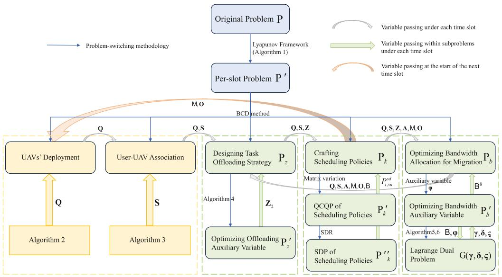

flowchart

Fig. 2. Proposed solution framework and interrelation of optimization subproblems.

Algorithm 1: Lyapunov Online Control Process.   
Input: Given control parameter V, constant $\Gamma$ , scheduling cost budget $\tilde{C}$ , and computing capacity $W_{u}$ Output: Scheduling cost queue $G_{u}(t+1)$ and cache queue $\Omega_{u}(t+1)$ 1: Initialize $G_{u}(0)$ , $\Omega_{u}(0)$ and $\tilde{O}_{u}(0)$ to 0;

2: for each $t \in T$ do

3: Solve $P'$ to obtain the solution of each variable;

4: for each $u \in U$ do

5: Calculate $C_{u}(t)$ and $O_{u}(t)$ based on (2) and (6);

6: Update $G_{u}(t+1)$ based on (10);

7: Obtain $\tilde{O}_{u}(t)$ based on $o_{i,u}(t-1)$ and $e_{i,u}(t-1)$ ;

8: Update $\Omega_{u}(t+1)$ based on (11);

9: end for

10: end for

# V. OPTIMIZATION ALGORITHM FOR PER-SLOT PROBLEM

In tackling the Lyapunov-transformed single-time slot problem $\mathcal { P } ^ { \prime }$ , we employ the BCD technique [30], [36] to simultaneously design a spectrum of crucial variables: UAVs’ deployment Q, task offloading strategies $z ,$ and scheduling policies {A, M, O}, along with migration bandwidth allocation B. As a result, $\mathcal { P } ^ { \prime }$ is decomposed into four distinct parts: 1) Customizing the initialization schemes for UAVs’ deployment and User-UAV association, 2) Designing the optimal task offloading strategy $\mathcal { P } _ { z } , 3 )$ Crafting effective task scheduling policies $\mathcal { P } _ { k }$ , and 4) Fine-tuning bandwidth allocation for migration ${ \mathcal { P } } _ { b } ,$ , to maximize overall system throughput in an iterative manner, as shown in the Fig. 2. Due to space limitations, the interdependencies among the sub-problems are detailed in Section IV of the supplementary material, available online.

# A. Initialization for UAVs’ Deployment and User-UAV Association

In this subsection, we aim to develop a strategic plan for UAV deployment and establish the association between users and UAVs, creating a feasible initialization environment for each time slot. The problem is formulated as follows:

$$
\mathcal {P} _ {q}: \min _ {\boldsymbol {Q}, \boldsymbol {S}} \sum_ {u \in \mathcal {U}} G _ {u} (t) C _ {u} (t)
$$

$$
\text { s   .   t   . } (9 \mathrm{b}), (9 \mathrm{i}), (9 \mathrm{j}). \tag {18a}
$$

Given the unpredictable nature of user movements and task requests, UAV deployment at the beginning of each time slot initially bypasses specific constraints to focus on enhancing system throughput. Subsequent subproblems will address the constraints for $\mathcal { P } _ { q } .$ . This approach ensures that while the initial UAV deployment centers on maximizing system throughput without immediate consideration of constraints, later adjustments and decisions are made to strictly adhere to the necessary constraints, thereby maintaining the integrity of ${ \mathcal { P } } _ { q } ^ { \phantom { \dagger } }$ s constraints. It’s important to note that the UAV deployment at the outset of each time slot is intricately linked to the migration and caching status of tasks from the preceding time slot within the system.

1) Deploying UAVs: Upon examining $\mathcal { P } ^ { \prime }$ in connection with (17), it becomes evident that the deployment of UAVs is intricately tied to constraint (9j), which predominantly influences both the offloading rate from users to UAVs and the transmission rate for migration between UAVs. Furthermore, a more effective deployment of UAVs provides flexibility in designing other variables in subsequent optimizations, ultimately leading to a higher quantity of services for the system.

In practical scenarios, UAVs are strategically deployed in close proximity to users to efficiently address their taskprocessing needs, ensuring timely service provision. It’s evident that a well-planned UAV deployment strategy can significantly enhance user access, accommodating as many tasks as possible and potentially improving system throughput. Furthermore, decisions related to task migration and caching, as indicated by (3) and (4), offer valuable insights into task or user distribution. An increase in the frequency of task migration among UAVs or caching for future computation may indicate a shortage of UAVs to serve areas with high user density, potentially leading to a reduction in system throughput. Additionally, such actions contribute to higher scheduling costs, as indicated by (2). Therefore, optimizing UAV deployment is essential to enhance system performance and reduce scheduling costs. Following this, some meaningful conclusions can be drawn regarding task caching and migration:

The impact of task caching on UAV trajectories: Significant task caching on a UAV indicates its operation in a highdemand area, where the local computational requirements exceed the UAV’s immediate processing capabilities. Consequently, a higher concentration of UAVs is necessary in such locations to adequately manage the workload. UAVs tasked with extensive caches should remain within their designated service zones to ensure continuous and effective support to dependent users.   
The impact of task migration on UAV trajectory: Frequent task migration by a UAV suggests a strong likelihood of its sustained presence in a particular area to serve local users. Conversely, for users whose tasks are consistently transferred to other UAVs, the reliability of continuous service from the initial UAV is diminished. This dynamic calls for a strategic balance in UAV deployment, ensuring stability in service provision while accommodating the flexible redistribution of tasks.

Motivated by the analyses presented above, our objective is to enhance system throughput through task-scheduling-oriented deployment of UAVs. To achieve this, we introduce $I _ { u } ^ { \mathrm { M O } }$ as an indicator for the quantity of tasks to be migrated and cached, which guides UAV deployment for the next time slot. Leveraging the effectiveness of the K-means clustering algorithm, renowned for its application in user-location-based UAV deployment [37], [38], [39], we propose the task-scheduling-oriented deployment of UAVs, detailed in Algorithm 2. In particular, lines 15-16 of the algorithm suggest that users with cached tasks are less likely to become the next clustering center. This adjustment is made by updating the corresponding weight $\varpi _ { i , u } ^ { c }$ based on the value of $I _ { u } ^ { \mathrm { M O } }$ , resulting in its reduction as indicated in lines 13 and 16. Conversely, lines 17-19 imply that users with a higher number of migrated tasks are more likely to become the next center. This is because the related weight $\varpi _ { i , u } ^ { c }$ is multiplied by the number of migration tasks for that user $U _ { i } ^ { m }$ within a given time period, increasing the probability of being selected as the next clustering center. Therefore, UAVs will move to specified locations at the next time slot, i.e., the newly generated clustering centers.

2) Determining User-UAV Association Relationship: In this subsection, our primary objective is to formalize the association relationship between users and UAVs. This becomes particularly crucial as UAV positions are initially assigned randomly and are subsequently influenced by user requests according to Section V-A1, directly impacting their service range. Furthermore, since users’ task requests are generated randomly in each time slot, a pivotal decision lies in determining user associations within the UAV coverage for the current time slot. Specifically, this decision significantly affects the overall service capacity of the system.

To address this challenge, we propose employing the Distance Probability Rounding Method (DPRM) outlined in Algorithm 3 to determine the association decision $s _ { i , u } ( t )$ . For simplicity, we denote $S = \{ s _ { i , u } \} \in \mathbb { R } ^ { I \times U }$ . The set $\Pi _ { i } ( t )$ is defined as the group of UAVs covering user i during time slot t. Essentially, user i can access any UAV within that set during time slot t. In this context, the probability for user i to be associated with UAV u at time slot t, is defined as $\begin{array} { r } { \mathsf { p } _ { i , u } ^ { s } ( t ) = [ 1 - \frac { d _ { i , u } ( t ) } { \tilde { r } _ { u } ( t ) } ] } \end{array}$ ]. This probability is applicable to users within overlapping UAV coverage areas. Here, $\tilde { r } _ { u } ( t )$ represents the maximum coverage distance of UAV u at time slot t. The probability reflects the relative likelihood that a user remains within the coverage of a UAV, considering their respective positions.

Notice that constraint (9g) is addressed during the process of establishing the User-UAV association relationship, specifically from Step 6 to Step 9 of Algorithm 3. Additionally, the set $\mathcal { T } _ { s }$ , comprising users with tasks associated to UAVs, is derived following the procedure outlined in Step 11 of Algorithm 3.

# B. Designing Task Offloading Strategy

Establishing a robust User-UAV association is pivotal for optimal task offloading to UAVs, enhancing overall system service quality. Upon task association, it enters the dynamic waiting queue $\mathcal { T } _ { s }$ satisfying constraint (9i) with $s _ { i , u } = 1$ for $\forall i \in \mathcal { T } _ { s }$ , its length fluctuating with each time slot. Crucially, if the decision to offload the user’s task is determined, it is incorporated into the pending queue $\mathcal { T } _ { z }$ . Following this, tasks within $\mathcal { T } _ { z }$ undergo scheduling for computation, migration, and caching. The dynamic nature of $\mathcal { T } _ { z }$ and the imperative for task offloading, guided by constraints (9h), define the task offloading problem $\mathcal { P } _ { z }$ as follows:

$$
\begin{array}{l} \mathcal {P} _ {z}: \min _ {\mathbf {Z}} - V Y (z _ {i, u} (t)) \\ \text { s.t. } (9 \mathrm{c}), (9 \mathrm{i}), (9 \mathrm{j}). \tag {19a} \\ \end{array}
$$

This formulation constitutes a binary integer programming problem. It is crucial to note that the task offloading strategy must adhere to constraints (9i) and (9j), ensuring both task accessibility and the completion of offloading and scheduling processing within the current time slot. Constraint (9j) can be further rewritten as

$$
z _ {i, u} (t) \leq \frac {D _ {s} r _ {i , u} (t)}{e _ {i , u} (t)}, \forall i \in \mathcal {I} _ {s}, \forall u, \tag {20}
$$

where $\begin{array} { r } { D _ { s } \triangleq \frac { D } { \tau } - m _ { i , u u ^ { \prime } } ( t ) \frac { e _ { i , u } ( t ) } { r _ { i , u u ^ { \prime } } ( t ) } - a _ { i , u } ( t ) \frac { e _ { i , u } ( t ) } { w _ { i , u } ( t ) } } \end{array}$ . In conformity with constraint (9c), we introduce an intermediary variable denoted as $z _ { i , u , 1 } ( t )$ . If the condition on the right-hand side (RHS) of (20) holds true, i.e., Dsri,u(t) ≥ 1, then zi,u,1(t) is set $\begin{array} { r } { \frac { D _ { s } r _ { i , u } ( t ) } { e _ { i , u } ( t ) } \geq 1 } \end{array}$ $z _ { i , u , 1 } ( t )$ to 1. This signifies that the task is deemed eligible for offloading and can be efficiently processed within a single time slot.

In the pursuit of our primary goal within the original problem $\mathcal { P } ^ { \prime } .$ , which is to minimize costs such as scheduling and caching queues while maximizing system throughput, the value of $z _ { i , u } ( t )$ holds a pivotal role. It directly influences system throughput and indirectly affects scheduling costs. However, the direct determination of $z _ { i , u } ( t )$ based solely on $z _ { i , u , 1 } ( t )$ does not ensure the optimal achievement of our overarching objective. This is because optimizing $z _ { i , u , 1 } ( t )$ alone may not lead to the most effective solution for minimizing costs and maximizing system throughput across the entire system. Moreover, the subsequent optimizations for other variables cannot further enhance system performance

Algorithm 2: Task-Scheduling-Oriented UAV Deployment (TSOUD).   
Input: Given migration decision M(t-1), caching decision O(t-1) for the previous time slot, and the positions for users at the horizontal plane for the current time slot $q_{i}^{H}(t)$ , $\forall i$ .

Output: The deployment for UAVs $q_{u}^{\mathrm{UAV}}(t)$ , $\forall u$ .

1: Initialize the set of clustering centers with $0 \in R^{2}$ for all entries in $Q^{c} \triangleq \{q_{1}^{c}, q_{2}^{c}, \ldots, q_{U}^{c}\}$ ;

2: Calculate the number of tasks for migration and caching with respect to the users within the coverage of UAV u, $I_{u}^{MO}$ , $\forall u$ ;

3: for each UAV u do

4: if $I_{u}^{MO} == 0$ then

5: Randomly select user i's position $q_{i}^{H}(t)$ , $\forall i$ as the first clustering center $q_{1}^{c}$ , and add it to $Q^{c}$ ;

6: else

7: Set the position of UAV u with the largest $I_{u}^{MO}$ as the first clustering center $q_{1}^{c}$ , and add it to $Q^{c}$ ;

8: end if

9: end for

10: while The number of non-zero entries in set $q_{c}$ is less than U do

11: for each user i do

12: Calculate $d_{i,u}^{H} = \min_{u \in \mathcal{U}} \|q_{i}^{H}(t) - q_{u}^{c}\|$ ;

13: Set the weight of clustering center as $\varpi_{i,u}^{c} = d_{i,u}^{H}$ ;

14: for each UAV u do

15: if $o_{i,u}(t-1) == 1$ then

16: Set $\varpi_{i,u}^{c} = \frac{1}{I_{u}^{MO}}\varpi_{i,u}^{c}$ ;

17: else $m_{i,uu'}(t-1) == 1$ 18: Set the counter of migration for user i

19: Set $\varpi_{i,u}^{c} = U_{i}^{m}(t-1) + 1$ ;

20: end if

21: end for

22: end for

23: Calculate the probability for user i being the clustering center $P_{i,u}^{c} = \frac{\varpi_{i,u}^{c}}{\sum_{i \in I}\varpi_{i,u}^{c}}$ ;

24: Set the position of the user $\hat{i}$ referring to $\hat{i} = \arg\max_{i \in I} P_{i,u}^{c}$ as the next clustering center, and add the corresponding $q_{\hat{i}}$ to $Q^{c}$ ;

25: end while

26: repeat

27: Assign users to their corresponding nearest clustering center according to $Q^{c}$ , forming U clusters;

28: Update the locations of cluster centroids for each cluster with the mean of associated users' coordinates in that cluster based on the K-means method, and set it as $q_{u}^{\mathrm{UAV}}(t)$ ;

29: until Convergence

30: return The deployment for UAVs $q_{u}^{\mathrm{UAV}}(t)$ , $\forall u$ .

Algorithm 3: Distance Probability Rounding Method.   
Input: Given $q_{i}$ and $q_{u}^{UAV}$ for user i and for UAV u, and the distance between them $d_{i,u}(t)$ Output: User-UAV association relationship S

1: Get the set of UAVs covering user i, $\Pi_{i}(t)$ , and their corresponding covering radiuses $\tilde{r}_{u}(t)$ , $\forall u \in \Pi_{i}(t)$ ;

2: for each $i \in I$ do

3: for each $u \in \Pi^{i}(t)$ do

4: Set $s_{i,u}(t) = 1$ ;

5: end for

6: if user i accesses to more than two UAVs, i.e., $\sum_{u \in U} s_{i,u}(t) > 1$ then

7: if $\hat{u} = \arg\max_{u} \{p_{i,u}^{s}\}$ , set $s_{i,\hat{u}}(t) = 1$ then

8: Set $s_{i,u}(t) = 0$ , $\forall u \in U \setminus \{\hat{u}\}$ ;

9: end if

10: end if

11: Put i into $I_{s}$ with $s_{i,\hat{u}}(t) = 1$ ;

12: end for

13: return S

To overcome this challenge, we introduce an auxiliary variable, $z _ { i , u , 2 } ( t )$ . This additional variable undergoes iterative optimization alongside the remaining variables, fostering a collaborative effort to effectively serve the overall objective. This variable serves to “partially” determine the value of $z _ { i , u } ( t )$ and must satisfy $0 \leq z _ { i , u , 2 } ( t ) \leq 1$ , providing more flexibility for optimizing other variables. Additionally, it needs to meet the practical condition of eligibility for upload, expressed as $z _ { i , u , 2 } ( t ) \leq z _ { i , u , 1 } ( t )$ . Consequently, $\mathcal { P } _ { z }$ can be further expressed as the following convex problem $\mathcal { P } _ { z } ^ { \prime }$ related with $z _ { i , u , 2 } ( t )$ , given as

$$
\mathcal {P} _ {z} ^ {\prime}: \min _ {\mathbf {Z} _ {2}} - V Y (z _ {i, u, 2} (t)) \tag {21a}
$$

$$
\text { s.t. } 0 \leq z _ {i, u, 2} (t) \leq 1, \forall i \in \mathcal {I} _ {s}, \forall u, \tag {21b}
$$

$$
z _ {i, u, 2} (t) \leq z _ {i, u, 1} (t), \forall i \in \mathcal {I} _ {s}, \forall u, \tag {21c}
$$

where $Z _ { 2 } \triangleq \{ z _ { i , u , 2 } \} \in \mathbb { R } ^ { U \times I }$ , and the obtained $z _ { i , u , 2 } ^ { \star }$ is within the continuous interval [0,1]. Notice that when $z _ { i , u , 2 } ^ { \star } > 0 , z _ { i , u , 1 }$ will be 1 to satisfy constraint (21c), and thus meet the constraints (9i) and (9j) of $\mathcal { P } _ { z }$ . Therefore, we set an expected value for $z _ { i , u , 2 } ^ { \star }$ to make constraint (21c) more flexible for the maximization of the system’s service quantity. When $z _ { i , u , 2 } ^ { \star }$ is greater than or equal to 	, we set the value of $z _ { i , u }$ to 1. Meanwhile, we examine the influence of varying expected values on system throughput and scheduling cost in Section V of the supporting material. Accordingly, we can design the task offloading strategy based on the obtained $Z _ { 2 } ,$ the details of which are given in Algorithm 4.

Notice that the set $\mathcal { T } _ { z }$ , comprising users with tasks offloaded to UAVs, is derived following the procedure outlined in Step 15 of Algorithm 4.

Algorithm 4: Designing Task Offloading Strategy.   
Input: Given association relationship $s_{i,u}(t)$ referring to Section V-A2, the amount of input data for task $e_{i,u}(t)$ and transmission rate $r_{i,u}(t)$ under current time slots

Output: Task offloading strategy Z

1: Calculate $\frac{D_{s}r_{i,u}(t)}{e_{i,u}(t)}$ according to the RHS of (20);
2: for each $i \in I_{s}$ do
3:    for each $u \in U$ do
4:    if $\frac{D_{s}r_{i,u}(t)}{e_{i,u}(t)} \geq 1$ then
5:    Set $z_{i,u,1}(t) = 1$ ;
6:    end if
7:    end for
8: end for
9: Optimize $z_{i,u,2}(t)$ according to $P_{z}'$ ;
10: for each $i \in I_{s}$ do
11:    for each $u \in U$ do
12:    if $z_{i,u,2}^{\star}(t) \geq \epsilon$ then
13:    Set $z_{i,u}(t) = 1$ ;
14:    end if
15:    Put i into $I_{z}$ with $z_{i,u}(t) = 1$ ;
16: end for
17: end for
18: return Z

# C. Crafting Scheduling Policies

Due to the random generation of users’ task requests and potential limitations in UAV computation capabilities within their coverage areas, especially with bursted tasks, the necessity for a scheduling operation arises. This operation significantly influences the system’s service quantity performance. The scheduling decisions encompass variables associated with user task computing, migration, and caching, and are determined by solving the outlined subproblem $\mathcal { P } _ { k }$ , outlined as

$$
\mathcal {P} _ {k}: \min _ {\boldsymbol {A}, \boldsymbol {O}, \mathrm{M}} \sum_ {u \in \mathcal {U}} G _ {u} (t) C _ {u} (t) + \Omega_ {u} (t) O _ {u} (t) \tag {22a}
$$

s.t. (9d)–(9f), (9h), (9l),

$$
\begin{array}{l} z _ {i, u} (t) \frac {e _ {i , u} (t)}{r _ {i , u} (t)} + \sum_ {u ^ {\prime} \in \mathcal {U} \backslash \{u \}} m _ {i, u u ^ {\prime}} (t) \frac {e _ {i , u} (t)}{r _ {i , u u ^ {\prime}}} \\ + a _ {i, u} (t) \frac {e _ {i , u} (t)}{w _ {i , u} (t)} \leq \frac {D}{\tau}, \forall i \in \mathcal {I} _ {z}, \forall u, \tag {22b} \\ \end{array}
$$

which is characterized by three distinct decision variables, poses a mixed-integer programming challenge and is acknowledged as NP-hard. Consequently, formulating scheduling policies for the offloaded tasks during time slot t becomes a complex task. To tackle this challenge, we transform $\mathcal { P } _ { k }$ into a quadratically constrained quadratic programming (QCQP) problem.

To facilitate the procedures of solving $\mathcal { P } _ { k }$ , we rewrite its objective function as

$$
\lambda_ {u} = \sum_ {i \in \mathcal {I} _ {z}} \lambda_ {i, u} \triangleq G _ {u} (t) C _ {u} (t) + \Omega_ {u} (t) O _ {u} (t). \tag {23}
$$

Incorporating (6) and (8), (23) can be further expressed as

$$
\lambda_ {u} = \sum_ {i \in \mathcal {I} _ {z}} G _ {u} (t) c _ {i, u} (t) + \sum_ {i \in \mathcal {I} _ {o}} \Omega_ {u} (t) o _ {i, u} (t) e _ {i, u} (t), \tag {24}
$$

where the second term can be reformulated as $\begin{array} { r l } { \sum _ { i \in \mathcal { T } _ { z } } \Omega _ { u } ( t ) o _ { i , u } ( t ) e _ { i , u } ( t ) } & { { } } \end{array}$ with $\mathcal { T } _ { o } \subset \mathcal { T } _ { z }$ , and some tasks may not be cached with $o _ { i , u } ( t ) = 0$ . Following this, we have $\lambda _ { i , u } ( t ) = G _ { u } ( t ) c _ { i , u } ( t ) + \Omega _ { u } ( t ) e _ { i , u } o _ { i , u } ( t )$ , which can be rewritten as follows with the help of (2)

$$
\begin{array}{l} \lambda_ {i, u} (t) = \sum_ {u ^ {\prime} \in \mathcal {U} \backslash \{u \}} m _ {i, u u ^ {\prime}} (t) \rho_ {i, u u ^ {\prime}, 1} (t) \\ + a _ {i, u} (t) \rho_ {i, u, 2} (t) + o _ {i, u} (t) \rho_ {i, u, 3} (t), \tag {25} \\ \end{array}
$$

where

$$
\rho_ {i, u u ^ {\prime}, 1} (t) = \frac {G _ {u} (t) e _ {i , u} (t)}{r _ {i , u u ^ {\prime}} (t)} \left[ \varpi_ {1} + \varpi_ {2} p _ {u} (t) \right],
$$

$$
\rho_ {i, u, 2} (t) = \frac {G _ {u} (t) e _ {i , u} (t)}{w _ {i , u} (t)} (\varpi_ {1} + \varpi_ {2} \eta_ {c}),
$$

$$
\rho_ {i, u, 3} (t) = G _ {u} (t) \left(\varpi_ {1} \frac {D}{\tau} + \varpi_ {2} \eta_ {o} \frac {D}{\tau}\right) + \Omega_ {u} (t) e _ {i, u} (t).
$$

To enhance clarity, we introduce the variable vector $\phi _ { i , u } ( t )$ and the auxiliary vector ${ \boldsymbol { v } } _ { i , u } ( t )$ , given as

$$
\begin{array}{l} \phi_ {i, u} (t) \triangleq [ m _ {i, u 1} (t); \dots ; m _ {i, u u ^ {\prime}} (t); \dots ; m _ {i, u U} (t); \\ \left. a _ {i, u} (t); o _ {i, u} (t) \right], \forall u ^ {\prime} \in \mathcal {U} \backslash \{u \}, \forall i, \tag {26} \\ \end{array}
$$

and

$$
\begin{array}{l} \boldsymbol {v} _ {i, u} (t) \triangleq [ \rho_ {i, u 1, 1} (t); \dots ; \rho_ {i, u u ^ {\prime}, 1} (t); \dots ; \rho_ {i, u U, 1} (t); \\ \left. \rho_ {i, u, 2} (t); \rho_ {i, u, 3} (t) \right], \forall u ^ {\prime} \in \mathcal {U} \backslash \{u \}, \forall i, \tag {27} \\ \end{array}
$$

where $\phi _ { i , u } ( t ) \in \mathbb { R } ^ { U + 1 }$ and ${ \pmb v } _ { i , u } ( t ) \in \mathbb { R } ^ { U + 1 }$ .

Following this, we have

$$
\phi_ {i} (t) = \left[ \phi_ {i, 1} (t); \dots ; \phi_ {i, u} (t); \dots ; \phi_ {i, U} (t) \right], \forall i \in \mathcal {I} _ {z}, \tag {28}
$$

$$
\boldsymbol {v} _ {i} (t) = \left[ \boldsymbol {v} _ {i, 1} (t); \dots ; \boldsymbol {v} _ {i, u} (t); \dots ; \boldsymbol {v} _ {i, U} (t) \right], \forall i \in \mathcal {I} _ {z}, \tag {29}
$$

where $\phi _ { i } ( t ) , \pmb { v } _ { i } ( t ) \in \mathbb { R } ^ { ( U + 1 ) U }$ , ∀t. With the aid of these introduced vectors, the second term of (22a) is rewritten as

$$
\sum_ {u \in \mathcal {U}} G _ {u} (t) C _ {u} (t) + \Omega_ {u} (t) O _ {u} (t) = \sum_ {i \in \mathcal {I} _ {z}} \boldsymbol {\phi} _ {i} ^ {T} (t) \boldsymbol {v} _ {i} (t). \tag {30}
$$

We then replace the integer constraints (9d)–(9f) with quadratic forms

$$
a _ {i, u} (t) (a _ {i, u} (t) - 1) = 0, \forall i \in \mathcal {I} _ {z}, u, \tag {31}
$$

$$
m _ {i, u u ^ {\prime}} (t) (m _ {i, u u ^ {\prime}} (t) - 1) = 0, \forall i \in \mathcal {I} _ {z}, \forall u, \forall u ^ {\prime} \in \mathcal {U} \backslash \{u \}, \tag {32}
$$

$$
o _ {i, u} (t) \left(o _ {i, u} (t) - 1\right) = 0, \forall i \in \mathcal {I} _ {z}, u, \tag {33}
$$

and reformulate these constraints as

$$
\phi_ {i} ^ {T} (t) \mathrm{diag} (\boldsymbol {\chi} _ {n}) \phi_ {i} - \boldsymbol {\chi} _ {n} ^ {T} \phi_ {i} = 0, \forall i \in \mathcal {I} _ {z}, \tag {34}
$$

where $x _ { n }$ is a $( U + 1 ) U \times 1$ standard unit vector with the nth entry being 1, and $n \in \mathcal N$ with $\mathcal { N } = \{ 1 , 2 , \ldots , ( U + 1 ) U \}$ . Subsequently, we transform the sum-to-one constraint (9h) into the following constraint

$$
\phi_ {i} ^ {T} (t) \chi_ {u} ^ {e} (t) = 1, \forall i \in \mathcal {I} _ {z}, \forall u, \tag {35}
$$

where $\boldsymbol { \chi } _ { u } ^ { e } ( t ) \in \mathbb { R } ^ { ( U + 1 ) U }$ , and

$$
\chi_ {u} ^ {e} (t) \triangleq \left[ \underbrace {\mathbf {0} _ {U + 1} ; \dots ; \mathbf {0} _ {U + 1}} _ {u - 1}; \mathbf {1} _ {U + 1}; \underbrace {\mathbf {0} _ {U + 1} ; \dots} _ {U - (u - 2)} \right], \tag {36}
$$

where ${ \mathbf { 0 } } _ { U + 1 } , { \mathbf { 1 } } _ { U + 1 } \in \mathbb { R } ^ { U + 1 }$ .

Similarly, the auxiliary vector ${ \chi _ { i , u } ^ { d } ( t ) }$ is given as

$$
\boldsymbol {\chi} _ {i, u} ^ {d} (t) \triangleq \left[ \frac {e _ {i , u} (t)}{r _ {i , u 1} (t)}; \dots ; \frac {e _ {i , u} (t)}{r _ {i , u u ^ {\prime}} (t)}; \dots ; \frac {e _ {i , u} (t)}{r _ {i , u U} (t)}; \frac {e _ {i , u} (t)}{w _ {i , u} (t)}; 0 \right], \tag {37}
$$

where $\boldsymbol { \chi } _ { i , u } ^ { d } ( t ) \in \mathbb { R } ^ { U + 1 }$ , and $u ^ { \prime } \in \mathcal { U } \backslash \{ u \}$ , and thus we can further replace constraint (22b) with

$$
\phi_ {i} ^ {T} (t) \boldsymbol {\chi} _ {u} ^ {d} (t) \leq D _ {i, u} ^ {z} (t), \forall i \in \mathcal {I} _ {z}, \forall u, \tag {38}
$$

where Dzi,u(t) = Dτ − zi,u(t) ei,u(t)ri,u(t) , and χdu(t) is given as $\begin{array} { r } { D _ { i , u } ^ { z } ( t ) = \frac { D } { \tau } - z _ { i , u } ( t ) \frac { e _ { i , u } ( t ) } { r _ { i , u } ( t ) } } \end{array}$ $\chi _ { u } ^ { d } ( t )$

$$
\boldsymbol {\chi} _ {u} ^ {d} (t) = \left[ \underbrace {\mathbf {0} _ {U + 1} ; \dots ; \mathbf {0} _ {U + 1}} _ {u - 1}; \boldsymbol {\chi} _ {i, u} ^ {d} (t); \underbrace {\mathbf {0} _ {U + 1} ; \dots} _ {U - (u - 2)} \right], \tag {39}
$$

and χd (t) ∈ R(U+1)U . $\boldsymbol { \chi } _ { u } ^ { d } ( t ) \in \mathbb { R } ^ { ( U + 1 ) U }$

Moreover, another auxiliary vector $\chi _ { i , u } ^ { a } ( t )$ is introduced as

$$
\boldsymbol {\chi} _ {i, u} ^ {a} (t) \triangleq \left[ \mathbf {0} _ {U - 1}; w _ {i, u} (t); 0 \right], \forall i \in \mathcal {I} _ {z}, \forall u, \tag {40}
$$

where ${ \bf 0 } _ { U - 1 } \in \mathbb { R } ^ { U - 1 }$ and $\boldsymbol { \chi } _ { i , u } ^ { a } ( t ) \in \mathbb { R } ^ { U + 1 }$ . Thus, we have

$$
\chi_ {u} ^ {a} (t) = \left[ \underbrace {\mathbf {0} _ {U + 1} ; \dots ; \mathbf {0} _ {U + 1}} _ {u - 1}; \chi_ {i, u} ^ {a} (t); \underbrace {\mathbf {0} _ {U + 1} ; \dots} _ {U - (u - 2)} \right], \tag {41}
$$

where $\boldsymbol { \chi } _ { u } ^ { a } ( t ) \in \mathbb { R } ^ { ( U + 1 ) U }$ . Following this, constraint (9l) can be expressed as

$$
\sum_ {i \in \mathcal {I} _ {z}} \phi_ {i} ^ {T} (t) \boldsymbol {\chi} _ {u} ^ {a} (t) \leq W _ {u} ^ {a} (t), \forall u. \tag {42}
$$

Introducing the further definition $\pmb { \kappa } _ { i } \triangleq [ \phi _ { i } ; 1 ] \in \mathbb { R } ^ { U ( U + 1 ) + 1 }$ , in conjunction with the matrix expressions mentioned earlier, allows for a simplification of the problem. With some mathematic manipulations, we can rewrite $\mathcal { P } _ { k } ^ { \prime }$ into the following equivalent homogeneous separable QCQP formulation, given as

$$
\mathcal {P} _ {k} ^ {\prime}: \min _ {\boldsymbol {\kappa}} \sum_ {i \in \mathcal {I} _ {z}} \boldsymbol {\kappa} _ {i} ^ {T} \boldsymbol {J} _ {i} \boldsymbol {\kappa} _ {i} \tag {43a}
$$

$$
\text { s.t. } \boldsymbol {\kappa} _ {i} ^ {T} \boldsymbol {J} _ {n} ^ {1} \boldsymbol {\kappa} _ {i} = 0, \forall i \in \mathcal {I} _ {z}, \tag {43b}
$$

$$
\boldsymbol {\kappa} _ {i} ^ {T} \boldsymbol {J} _ {u} ^ {e} \boldsymbol {\kappa} _ {i} = 1, \forall i \in \mathcal {I} _ {z}, \forall u, \tag {43c}
$$

$$
\sum_ {i \in \mathcal {I} _ {z}} \boldsymbol {\kappa} _ {i} ^ {T} \boldsymbol {J} _ {u} ^ {d} \boldsymbol {\kappa} _ {i} \leq D _ {i, u} ^ {z} (t),   \forall i \in \mathcal {I} _ {z}, \forall u, \tag {43d}
$$

$$
\sum_ {i \in \mathcal {I} _ {z}} \boldsymbol {\kappa} _ {i} ^ {T} \boldsymbol {J} _ {u} ^ {a} \boldsymbol {\kappa} _ {i} \leq W _ {u} ^ {a} (t), \forall u, \tag {43e}
$$

$$
\boldsymbol {K} _ {i} \succeq 0, \forall i \in \mathcal {I} _ {z} \cup \{0 \}, \forall u \in \mathcal {U} \cup \{0 \}, \tag {43f}
$$

where

$$
\boldsymbol {J} _ {i} \triangleq \left[ \begin{array}{c c} \boldsymbol {0} & \frac {1}{2} \boldsymbol {v} _ {i} (t) \\ \frac {1}{2} \boldsymbol {v} _ {i} ^ {T} (t) & 0 \end{array} \right], \boldsymbol {J} _ {n} ^ {1} \triangleq \left[ \begin{array}{c c} \mathrm{diag} (\boldsymbol {\chi} _ {\mathrm{n}}) & - \frac {1}{2} \boldsymbol {\chi} _ {n} \\ - \frac {1}{2} \boldsymbol {\chi} _ {n} ^ {T} & 0 \end{array} \right], \forall n,
$$

$$
\boldsymbol {J} _ {u} ^ {e} \triangleq \left[ \begin{array}{c c} \boldsymbol {0} & \frac {1}{2} \boldsymbol {\chi} _ {u} ^ {e} \\ \frac {1}{2} (\boldsymbol {\chi} _ {u} ^ {e}) ^ {T} & 0 \end{array} \right], \boldsymbol {J} _ {u} ^ {d} \triangleq \left[ \begin{array}{c c} \boldsymbol {0} & \frac {1}{2} \boldsymbol {\chi} _ {u} ^ {d} \\ \frac {1}{2} (\boldsymbol {\chi} _ {u} ^ {d}) ^ {T} & 0 \end{array} \right], \forall u,
$$

$$
\boldsymbol {J} _ {u} ^ {a} \triangleq \left[ \begin{array}{c c} \boldsymbol {0} & \frac {1}{2} \boldsymbol {\chi} _ {u} ^ {a} \\ \frac {1}{2} (\boldsymbol {\chi} _ {u} ^ {a}) ^ {T} & 0 \end{array} \right], \forall u.
$$

Upon scrutinizing $\mathcal { P } _ { k } ^ { \prime }$ , it becomes apparent that each constraint in $\mathcal { P } _ { k }$ is directly associated with a specific matrix representation in $\mathcal { P } _ { k } ^ { \prime }$ . It is essential to emphasize that all variables under consideration in this study are inherently positive, thereby naturally satisfying the constraint (43f). Consequently, $\mathcal { P } _ { k } ^ { \prime }$ is essentially equivalent to the original problem $\mathcal { P } _ { k }$ .

However, it is crucial to note that the optimization problem $\mathcal { P } _ { k } ^ { \prime }$ encapsulates a non-convex separable QCQP challenge, typically falling under the NP-hard category. To tackle this, we can employ a separable Semidefinite Relaxation (SDR) method, transforming $\mathcal { P } _ { k } ^ { \prime }$ into a separable semidefinite programming (SDP) problem. With the help of $K _ { i } \triangleq \kappa _ { i } \pmb { \kappa } _ { i } ^ { T }$ , we have the following equivalent formulations for the left-hand side of equations in constraints of $\mathcal { P } _ { k } ^ { \prime }$ , given as

$$
\boldsymbol {\kappa} _ {i} ^ {T} \boldsymbol {J} \boldsymbol {\kappa} _ {i} = \mathrm{Tr} (\boldsymbol {J} \boldsymbol {\kappa} _ {i} \boldsymbol {\kappa} _ {i} ^ {T}) = \mathrm{Tr} (\boldsymbol {J} \boldsymbol {K} _ {i}),   \forall i \in \mathcal {I} _ {z}, \tag {44}
$$

$$
\operatorname{rank} \left(\boldsymbol {K} _ {i}\right) = 1, \forall i \in \mathcal {I} _ {z}, \tag {45}
$$

where $K _ { i } \in \mathbb { R } ^ { [ U ( U + 1 ) + 1 ] \times [ U ( U + 1 ) + 1 ] }$ . Moreover, J can be $\mathbf { \mathcal { J } } _ { i }$ , ${ J } _ { n } ^ { 1 } , \ { J } _ { u } ^ { e } , \ { J } _ { u } ^ { d } ,$ , and $\boldsymbol { J _ { u } ^ { a } }$ . By omitting the rank-one constraint rank $( K _ { i } ) = 1$ , we transform $\mathcal { P } _ { k } ^ { \prime }$ into the following separable SDP problem

$$
\mathcal {P} _ {k} ^ {\prime \prime}: \min _ {\mathcal {K}} \sum_ {i \in \mathcal {I} _ {z}} \mathrm{Tr} (\boldsymbol {J} _ {i} \boldsymbol {K} _ {i}) \tag {46a}
$$

$$
\mathrm{s.t.} (4 3 \mathrm{f}),
$$

$$
\mathrm{Tr} (\boldsymbol {J} _ {n} ^ {1} \boldsymbol {K} _ {i}) = 0,   \forall i \in \mathcal {I} _ {z}, \tag {46b}
$$

$$
\operatorname{Tr} \left(\boldsymbol {J} _ {u} ^ {e} \boldsymbol {K} _ {i}\right) = 1, \forall i \in \mathcal {I} _ {z}, \forall u, \tag {46c}
$$

$$
\operatorname{Tr} \left(\boldsymbol {J} _ {u} ^ {d} \boldsymbol {K} _ {i}\right) \leq D _ {i, u} ^ {z} (t), \forall i \in \mathcal {I} _ {z}, \forall u, \tag {46d}
$$

$$
\sum_ {i \in \mathcal {I} _ {z}} \mathrm{Tr} (\boldsymbol {J} _ {u} ^ {a} \boldsymbol {K} _ {i}) \leq W _ {u} ^ {a} (t),   \forall u, \tag {46e}
$$

$$
\boldsymbol {K} _ {i} ((U + 1) U + 1, (U + 1) U + 1) = 1, \forall i \in \mathcal {I} _ {z}, \tag {46f}
$$

where $\mathcal { K } = \{ K _ { i } \} \in \mathbb { R } ^ { I _ { z } \times [ U ( U + 1 ) + 1 ] \times [ U ( U + 1 ) + 1 ] }$ . Constraint (46f) comes from the equation $K _ { i } \triangleq \kappa _ { i } \pmb { \kappa } _ { i } ^ { T } , \forall i \in \mathcal { T } _ { z }$ . It is worth noting that $\mathcal { P } _ { k } ^ { \prime \prime }$ can be efficiently addressed using solvers such as CVX and MOSEK, and we denote $\boldsymbol { \mathcal { K } ^ { \star } }$ as the optimal solution of $\mathcal { P } _ { k } ^ { \prime \prime } .$ . However, this solution may not serve as a feasible solution for the original optimization problem $\mathcal { P } _ { k }$ . In this scenario, the task at hand is to recover the scheduling decision variable $\phi _ { i }$ from $K _ { i } ^ { \star } , \forall i \in \mathcal { T } _ { z }$ . To achieve this, we propose a method based on the high probability selection to determine our binary decision variable.

To obtain binary decision variables through randomization, we adopt a methodological approach as outlined in [40] to achieve an integer solution. Upon examining $\kappa _ { i }$ , it becomes apparent that its last row adheres to the condition K $( ( U + 1 ) U +$ $1 , n ) = \kappa _ { i } ( n ) , \forall i \in \mathcal { T } _ { z }$ . Consequently, we can leverage the values of $K _ { i } ^ { \star } ( ( U + 1 ) U + 1 , n )$ to reconstruct the binary variables $\kappa _ { i } ( n )$ , ∀n. Regarding the values of $K _ { i } ^ { \star } ( ( U + 1 ) U + 1 , n )$ , the following lemma is presented as

Lemma 2: For the optimal solution $\boldsymbol { \mathcal { K } ^ { \star } }$ of $\mathcal { P } _ { k } ^ { \prime \prime } .$ the values $\boldsymbol { K _ { i } } ^ { \star } ( ( U + 1 ) U + 1 , n )$ lie within the interval $[ 0 , 1 ] , \forall i \in$ $\mathcal { T } _ { z } , \ \forall n$ .

Proof: The proof of Lemma 2 is provided in Section VI of the supplementary material, available online, due to space constraints. □

Building on Lemma 2, we employ a probabilistic mapping method to ascertain $\phi _ { i } ( t )$ . The values of $K _ { i } ^ { \star } ( ( U + 1 ) U + 1 , : )$ are interpreted as the probability that $\mathbf { 1 } ^ { T } \phi _ { i } ( t ) = \mathrm { 1 }$ . Define $\nu _ { i , u } ( t )$ as

$$
\boldsymbol {\nu} _ {i, u} (t) \triangleq \left[ \nu_ {i, u 1} ^ {m} (t); \nu_ {i, u 2} ^ {m} (t); \dots ; \nu_ {i, u u ^ {\prime}} ^ {m} (t); \dots ; \nu_ {i, u U} ^ {m} (t); \right.
$$

$$
\left. \nu_ {i, u} ^ {a} (t); \nu_ {i, u} ^ {o} (t) \right], u ^ {\prime} \in \mathcal {U} \backslash \{u \} \tag {47}
$$

where $\pmb { \nu } _ { i , u } \in \mathbb { R } ^ { U + 1 }$ , and

$$
\boldsymbol {\nu} _ {i} (t) = \left[ \boldsymbol {\nu} _ {i, 1} (t); \dots ; \boldsymbol {\nu} _ {i, u} (t); \dots ; \boldsymbol {\nu} _ {i, U} (t) \right], \forall i \in \mathcal {I} _ {z}, \tag {48}
$$

where $\pmb { \nu } _ { i } ( t ) \in \mathbb { R } ^ { ( U + 1 ) U }$ . Following this, we have

$$
\boldsymbol {\nu} _ {i} (t) \triangleq [ \boldsymbol {K} _ {i} ^ {\star} ((U + 1) U + 1, 1); \boldsymbol {K} _ {i} ^ {\star} ((U + 1) U + 1, 2);
$$

$$
\dots ; \boldsymbol {K} _ {i} ^ {\star} ((U + 1) U + 1, (U + 1) U - 2); \boldsymbol {K} _ {i} ^ {\star} ((U + 1) U
$$

$$
+ 1, (U + 1) U - 1); \boldsymbol {K} _ {i} ^ {\star} ((U + 1) U + 1, (U + 1) U) ]. \tag {49}
$$

We reconstruct $\phi _ { i , u } ( t )$ using $\nu _ { i , u } ( t )$ as marginal probabilities, ensuring compliance with constraint (9h). This gives rise to our proposed probabilistic randomization method, outlined as follows. To ensure coherence between scheduling decision and offloading strategy, we set the probability of scheduling decision $\Xi _ { i , u }$ for user i’s task as

$$
\Xi_ {i, u 1} ^ {m} = z _ {i, u} \nu_ {i, u 1} ^ {m} (1 - \nu_ {i, u 2} ^ {m}) \dots (1 - \nu_ {i, u U} ^ {m}) (1 - \nu_ {i, u} ^ {a}) (1 - \nu_ {i, u} ^ {o}),
$$

$$
\Xi_ {i, u 2} ^ {m} = z _ {i, u} (1 - \nu_ {i, u 1} ^ {m}) \nu_ {i, u 2} ^ {m} \dots (1 - \nu_ {i, u U} ^ {m}) (1 - \nu_ {i, u} ^ {a}) (1 - \nu_ {i, u} ^ {o}),
$$

$$
\Xi_ {i, u U} ^ {m} = z _ {i, u} (1 - \nu_ {i, u 1} ^ {m}) (1 - \nu_ {i, u 2} ^ {m}) \dots \nu_ {i, u U} ^ {m} (1 - \nu_ {i, u} ^ {a}) (1 - \nu_ {i, u} ^ {o}),
$$

$$
\Xi_ {i, u} ^ {a} = z _ {i, u} (1 - \nu_ {i, u 1} ^ {m}) (1 - \nu_ {i, u 2} ^ {m}) \dots (1 - \nu_ {i, u U} ^ {m}) \nu_ {i, u} ^ {a} (1 - \nu_ {i, u} ^ {o}),
$$

$$
\Xi_ {i, u} ^ {o} = z _ {i, u} \left(1 - \nu_ {i, u 1} ^ {m}\right) \left(1 - \nu_ {i, u 2} ^ {m}\right) \dots \left(1 - \nu_ {i, u U} ^ {m}\right) \left(1 - \nu_ {i, u} ^ {a}\right) \nu_ {i, u} ^ {o}, \tag {50}
$$

where the probability $\Xi _ { i , u }$ is non-zero only when $z _ { i , u } =$ 1, signifying that the related scheduling decision is activated. Specifically, the scheduling decision is made by UAV u only if user i offloads its task to UAV u. Following this condition, we normalize the probability associated with the corresponding scheduling decision as $\begin{array} { r } { P _ { i , s u } ^ { s d } = \frac { \Xi _ { i , s u } ^ { s d } } { \Xi _ { i , n u ^ { \prime } } ^ { m } + \Xi _ { i , u } ^ { a } + \Xi _ { i , u } ^ { o } } , s d \in \{ m , a , o \} , s u \in \{ u u ^ { \prime } , u \} } \end{array}$ +Ξa , satisi,uu- . fying P mi,u1 $P _ { i , u 1 } ^ { m ^ { * }  \cdots } + P _ { i , u 2 } ^ { m } + \cdots + P _ { i , u U } ^ { m } + P _ { i , u } ^ { a } + P _ { i , u } ^ { o } = 1$

Notice that we apply the probability reduction method, setting the element with the highest probability sd $P _ { i , s u } ^ { s d }$ to 1 to guide scheduling decisions. Specifically, if $o _ { i , u } ( t ) = 1$ , it signifies that user i’s task is directed to the caching queue $\mathcal { T } _ { o }$ . Likewise, if $m _ { i , u u ^ { \prime } } ( t ) = 1$ , the task is assigned to both the waiting queue $\mathcal { T } _ { z }$ and the pending forwarding queue $\mathcal { T } _ { m } ^ { u }$ at UAV u. For a clear understanding, a numerical example detailing this process is provided in Section VI of the supplementary material, available online, due to space constraints.

# D. Optimizing Bandwidth Allocation for Migration

Given the recently established scheduling policies, allocating bandwidth to migrate redundant tasks to idle UAVs for subsequent processing within their latency requirements becomes paramount. This approach expands the system’s service capacity. Consequently, the associated subproblem concerning bandwidth allocation can be formulated as follows

$$
\mathcal {P} _ {b}: \min _ {\mathsf {B}} \sum_ {u \in \mathcal {U}} G _ {u} (t) C _ {u} (t)
$$

$$
\text { s   .   t   . } (9 \mathrm{k}), (2 2 \mathrm{b}). \tag {51a}
$$

which is a convex problem. While solvers like CVX and MOSEK can readily handle $\mathcal { P } _ { b }$ , we leverage the primal-dual method to gain deeper insights into the optimal bandwidth allocation $\mathsf { B } ^ { \star }$ , drawing inspiration from the pioneering works [36], [41]. However, a direct transformation of the primal domain of $\mathcal { P } _ { b }$ into the dual domain is not feasible due to the presence of $r _ { i , u u ^ { \prime } } ( t )$ in the denominator, and its form renders the problem more intractable. Therefore, we introduce a new non-negative auxiliary variable $\varphi \triangleq \{ \varphi _ { 1 } ; \dots ; \varphi _ { u } ; \dots ; \varphi _ { U } \}$ , where $\varphi _ { u } \triangleq \{ \varphi _ { i , u u ^ { \prime } } \} , \forall u ^ { \prime } .$ , transforming $\mathcal { P } _ { b }$ into the following problem

$$
\mathcal {P} _ {b} ^ {\prime}: \min _ {\mathrm{B}, \varphi} \sum_ {u \in \mathcal {U}} \tilde {G} _ {u} (t) \sum_ {i \in \mathcal {I} _ {z}} \sum_ {u ^ {\prime} \in \mathcal {U} \backslash \{u \}} \frac {m _ {i , u u ^ {\prime}} (t) e _ {i , u} (t)}{\varphi_ {i , u u ^ {\prime}} (t)} \tag {52a}
$$

$$
\text { s.t. } \sum_ {u ^ {\prime} \in \mathcal {U} \backslash \{u \}} \frac {m _ {i , u u ^ {\prime}} (t) e _ {i , u} (t)}{\varphi_ {i , u u ^ {\prime}} (t)} \leq D _ {i, u} ^ {a} (t), \forall i \in \mathcal {I} _ {m} ^ {u}, \forall u, \tag {52b}
$$

$$
\sum_ {i \in \mathcal {I} _ {m} ^ {u}} b _ {i, u u ^ {\prime}} (t) \leq 1, \forall u, u ^ {\prime}, \tag {52c}
$$

$$
0 <   \varphi_ {i, u u ^ {\prime}} (t) \leq r _ {i, u u ^ {\prime}} (t), \forall i \in \mathcal {I} _ {m} ^ {u}, \forall u, u ^ {\prime}, \tag {52d}
$$

where $\tilde { G } _ { u } ( t ) = G _ { u } ( t ) [ \varpi _ { 1 } + \varpi _ { 2 } p _ { u } ( t ) ]$ , and $D _ { i , u } ^ { a } ( t ) =$ $\begin{array} { r } { \frac { D } { \tau } - z _ { i , u } ( t ) \frac { e _ { i , u } ( t ) } { r _ { i , u } ( t ) } - a _ { i , u } ( t ) \frac { e _ { i , u } ( t ) } { w _ { i , u } ( t ) } } \end{array}$ . The Lagrange function for this problem is given at the top of next page, where $\gamma \triangleq \{ \gamma _ { i u } \}$ , $\delta \triangleq \{ \delta _ { u u ^ { \prime } } \}$ , and $\mathsf { \Omega } \mathsf { S } \triangleq \left\{ \mathsf { \varsigma } _ { i , u u ^ { \prime } } \right\}$ , ∀u, $u ^ { \prime }$ are the non-negative Lagrange multipliers corresponding to the relevant constraints (53) shown at the bottom of this page.

Consider B as the set of all possible B satisfying the constraint $b _ { i , u u ^ { \prime } } > 0 .$ , and let Φ be the set of all possible $\varphi$ satisfying the constraint $\varphi _ { i , u u ^ { \prime } } > 0$ . The corresponding Lagrange dual function can be defined as

$$
\mathcal {G} (\boldsymbol {\gamma}, \boldsymbol {\delta}, \varsigma) = \min _ {\mathrm{B} \in \mathcal {B}, \boldsymbol {\varphi} \in \Phi} \mathcal {L} (\mathrm{B}, \boldsymbol {\varphi}, \boldsymbol {\gamma}, \boldsymbol {\delta}, \varsigma), \tag {54}
$$

and consequently, the dual problem can be formulated as

$$
\max \mathcal {G} (\boldsymbol {\gamma}, \boldsymbol {\delta}, \varsigma)
$$

$$
\text { s.t. } \delta \succeq 0, \varsigma \succeq 0, \gamma \succeq 0. \tag {55a}
$$

In the following, our objective is to determine the optimal bandwidth allocation $\mathsf { B } ^ { \star }$ , given a set of auxiliary variables represented by $\varphi$ and Lagrange multipliers $( \gamma , \delta , \varsigma )$ . Initially, we seek to find the optimal B. Subsequently, we update the

Lagrange multipliers using the gradient descent method. Finally, we iterate through the process to update the auxiliary variables.

1) Bandwidth Allocation Optimization: Employing the Karush-kuhn-Tucker (KKT) conditions, the following condition is both necessary and sufficient for bandwidth allocation optimality, given as

$$
\begin{array}{l} \frac {\partial \mathcal {L} (\mathrm{B} , \varphi , \boldsymbol {\gamma} , \boldsymbol {\delta} , \boldsymbol {\varsigma})}{\partial b _ {i , u u ^ {\prime}} (t)} = \delta_ {u u ^ {\prime}} - \varsigma_ {i, u u ^ {\prime}} \left[ B \log_ {2} \left(1 + \frac {p _ {u} (t) g _ {u u ^ {\prime}} ^ {\mathrm{LoS}} (t)}{N _ {0} b _ {i , u u ^ {\prime}} (t) B}\right) \right. \\ \left. - \frac {p _ {u} (t) g _ {u u ^ {\prime}} ^ {\mathrm{LoS}} (t)}{N _ {0} b _ {i , u u ^ {\prime}} (t) \left(1 + \frac {p _ {u} (t) g _ {u u ^ {\prime}} ^ {\mathrm{LoS}} (t)}{N _ {0} b _ {i , u u ^ {\prime}} (t) B}\right) \ln 2} \right] = 0, \tag {56} \\ \end{array}
$$

which can be solved by MATLAB. Due to the inherent complexity in obtaining the closed-form solution for $b _ { i , u u ^ { \prime } } ( t )$ , we propose an alternative approach to derive such solutions for all $i , u , u ^ { \prime }$ by making the assumption of a high Signal-to-Noise Ratio (SNR). This assumption allows us to explore and gain additional insights into the interplay between bandwidth allocation and various other variables.

Proposition 1: In the high SNR regime, the optimal bandwidth allocation can be directly inferred from (56) under the assumption $\begin{array} { r } { \left( 1 + \frac { p _ { u } ( t ) g _ { u u ^ { \prime } } ^ { \mathrm { L o S } } ( t ) } { N _ { 0 } b _ { i , u u ^ { \prime } } ( t ) B } \right) ^ { * } \approx \frac { p _ { u } ( t ) g _ { u u ^ { \prime } } ^ { \mathrm { L o S } } ( t ) } { N _ { 0 } b _ { i , u u ^ { \prime } } ( t ) B } } \end{array}$ uu- N0bi,uu- (t)B , yielding

$$
b _ {i, u u ^ {\prime}} ^ {\star} (t) = \frac {p _ {u} (t) g _ {u u ^ {\prime}} ^ {\mathrm{LoS}} (t)}{N _ {0} B} \cdot 2 ^ {- \frac {\delta_ {u u ^ {\prime}}}{\varsigma_ {i , u u ^ {\prime}} B} - \frac {1}{\ln 2}}. \tag {57}
$$

Remark 1: The high SNR approximation, a widely employed technique in the literature [36], [42], has been previously highlighted. It is evident that in such scenarios, UAV u would logically allocate a greater bandwidth $b _ { i , u u ^ { \prime } } ^ { \star } ( t )$ for user i to facilitate the seamless migration of its data to UAV u- in cases where the inter-UAV channel quality is superior.

Finding a closed-form solution for the optimal $b _ { i , u u ^ { \prime } } ^ { \star } ( t )$ from (56) is challenging. Fortunately, we can resort to the following proposition to obtain $b _ { i , u u ^ { \prime } } ^ { \star } ( t )$ .

Proposition 2: L is a convex function of $b _ { i , u u ^ { \prime } } ( t )$ .

Proof: The analysis and proof of this proposition are provided in Section VII of the supplementary material, available online, due to space constraints. 

Since L is a convex function of $b _ { i , u u ^ { \prime } }$ , we can determine the optimal bandwidth allocation using a bisection method [36]. Due to the convex nature of $\mathcal { L }$ and the monotonically increasing behavior of $\frac { \partial \mathcal { L } } { \partial b _ { i , u u ^ { \prime } } ( t ) }$ with respect to $b _ { i , u u ^ { \prime } } ( t )$ , the bisection method proves effective within the range $0 \leq b _ { i , u u ^ { \prime } } ( t ) \leq 1$ for finding the optimal solution. Algorithm 5 provides a detailed outline of this approach.

2) Auxiliary Variable Update: Subsequently, with the newly determined $\mathsf { B } ^ { \star }$ in the previous parts, we try to find the optimal auxiliary variable $\varphi _ { i , u u ^ { \prime } } { ^ { \star } }$ , which can be solved via the following optimization problem

Algorithm 5: Bisection Method.   
Input: Given task offloading strategies ${ \overline { { Z , } } }$ scheduling policies $\{ A , { \mathsf { M } } , O \}$ , and the trajectories of UAVs $Q .$ .   
Output: Bandwidth allocation for migration $\mathsf { B } ^ { \star }$ .   
1: for each $u \in U$ do
2:    for each $i \in I_{m}^{u}$ do
3:    Initialize $b_{i,uu'}^{\mathrm{LB}} = 0$ and $b_{i,uu'}^{\mathrm{UB}} = 1$ ;
4:    repeat
5:    Set $b_{i,uu'}(t) = \frac{1}{2}(b_{i,uu'}^{\mathrm{LB}} + b_{i,uu'}^{\mathrm{UB}})$ ;
6:    Compute $\frac{\partial\mathcal{L}}{\partial b_{i,uu'}(t)}$ according to (56);
7:    if $\frac{\partial\mathcal{L}}{\partial b_{i,uu'}(t)} > 0$ then
8:    Set $b_{i,uu'}^{\mathrm{UB}} = b_{i,uu'}(t)$ ;
9:    else
10:    Set $b_{i,uu'}^{\mathrm{LB}} = b_{i,uu'}(t)$ .
11:    end if
12:    until $\|\frac{\partial\mathcal{L}}{\partial b_{i,uu'}(t)}\| \leq \psi_1$ .
13:    end for
14: end for
15: return the optimal $b_{i,uu'}^{\star}$ .

$$
\mathcal {P} _ {b} ^ {\prime \prime}: \min _ {\varphi} \sum_ {u \in \mathcal {U}} \tilde {G} _ {u} (t) \sum_ {i \in \mathcal {I} _ {z}} \sum_ {u ^ {\prime} \in \mathcal {U} \backslash \{u \}} \frac {m _ {i , u u ^ {\prime}} (t) e _ {i , u} (t)}{\varphi_ {i , u u ^ {\prime}} (t)} \tag {58a}
$$

s.t. (52b),

$$
0 <   \varphi_ {i, u u ^ {\prime}} (t) \leq r _ {i, u u ^ {\prime}} ^ {\star} (t), \forall i \in \mathcal {I} _ {m} ^ {u}, \forall u, u ^ {\prime}, \tag {58b}
$$

where

$$
r _ {i, u u ^ {\prime}} ^ {\star} (t) = b _ {i, u u ^ {\prime}} ^ {\star} (t) B \log_ {2} \left(1 + \frac {p _ {u} (t) g _ {u u ^ {\prime}} ^ {\mathrm{LoS}} (t)}{N _ {0} b _ {i , u u ^ {\prime}} ^ {\star} (t) B}\right). \tag {59}
$$

It is evident that $\mathcal { P } _ { b } ^ { \prime \prime }$ can be further decomposed into $U I _ { m } ^ { u }$ independent subproblems, each corresponding to a User-UAV pair, $\forall i \in \mathcal { I } _ { m } ^ { u }$ , ∀u, given by

$$
\mathcal {P} _ {b} ^ {\prime \prime \prime}: \min _ {\varphi} \tilde {G} _ {u} (t) \sum_ {u ^ {\prime} \in \mathcal {U} \backslash \{u \}} \frac {m _ {i , u u ^ {\prime}} (t) e _ {i , u} (t)}{\varphi_ {i , u u ^ {\prime}} (t)} \tag {60a}
$$

$$
\text { s.t. } \sum_ {u ^ {\prime} \in \mathcal {U} \backslash \{u \}} \frac {m _ {i , u u ^ {\prime}} (t) e _ {i , u} (t)}{\varphi_ {i , u u ^ {\prime}} (t)} \leq D _ {i, u} ^ {a} (t), \tag {60b}
$$

$$
0 <   \varphi_ {i, u u ^ {\prime}} (t) \leq r _ {i, u u ^ {\prime}} ^ {\star} (t), \forall u ^ {\prime}, \tag {60c}
$$

where the optimal auxiliary variable $\varphi _ { i , u u ^ { \prime } } ^ { \star } ( t )$ can be obtained by the following theorem.

$$
\begin{array}{l} \mathcal {L} (\mathsf {B}, \varphi , \boldsymbol {\gamma}, \delta , \varsigma) = \sum_ {u \in \mathcal {U}} \sum_ {i \in \mathcal {I} _ {m} ^ {u}} \left[ \tilde {G} _ {u} (t) + \gamma_ {i, u} \right] \sum_ {u ^ {\prime} \in \mathcal {U} \backslash \{u \}} \frac {m _ {i , u u ^ {\prime}} (t) e _ {i , u} (t)}{\varphi_ {i , u u ^ {\prime}} (t)} - \sum_ {u \in \mathcal {U}} \sum_ {i \in \mathcal {I} _ {z}} \gamma_ {i, u} D _ {i, u} ^ {a} (t) \\ + \sum_ {u \in \mathcal {U}} \sum_ {u ^ {\prime} \in \mathcal {U} \backslash \{u \}} \delta_ {u u ^ {\prime}} \left[ \sum_ {i \in \mathcal {I} _ {m} ^ {u}} b _ {i, u u ^ {\prime}} (t) - 1 \right] + \sum_ {u \in \mathcal {U}} \sum_ {u ^ {\prime} \in \mathcal {U} \backslash \{u \}} \sum_ {i \in \mathcal {I} _ {m} ^ {u}} \varsigma_ {i, u u ^ {\prime}} \left[ \varphi_ {i, u u ^ {\prime}} (t) - r _ {i, u u ^ {\prime}} (t) \right]. \tag {53} \\ \end{array}
$$

Algorithm 6: Optimizing Bandwidth Allocation for Migration. 

<table><tr><td colspan="2">Initialization: Given task offloading strategies Z, scheduling policies {A, M, O}, and the trajectories of UAVs Q.</td></tr><tr><td colspan="2">1: repeat (from 1 to 7)</td></tr><tr><td colspan="2">2: repeat (from 2 to 5)</td></tr><tr><td colspan="2">3: Execute Algorithm 5 to determine B*;</td></tr><tr><td colspan="2">4: Update  $\varphi^*$  based on (61);</td></tr><tr><td colspan="2">5: until Lagrange function converges.</td></tr><tr><td colspan="2">6: Update  $\gamma$ ,  $\delta$ , and  $\varsigma$ ;</td></tr><tr><td colspan="2">7: until  $\gamma$ ,  $\delta$ ,  $\varsigma$  converge.</td></tr></table>

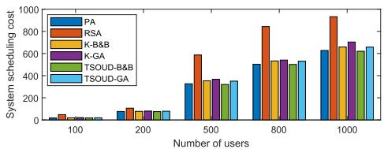

bar

| Number of users | PA   | RSA  | K-B&B | K-GA  | TSoud-B&B | TSoud-GA |
| --------------- | ---- | ---- | ----- | ----- | --------- | -------- |
| 100             | 20   | 50   | 30    | 40    | 25        | 35       |
| 200             | 80   | 120  | 90    | 100   | 75        | 110      |
| 500             | 350  | 600  | 450   | 480   | 380       | 420      |
| 800             | 500  | 850  | 550   | 580   | 520       | 560      |
| 1000            | 650  | 950  | 680   | 720   | 650       | 680      |

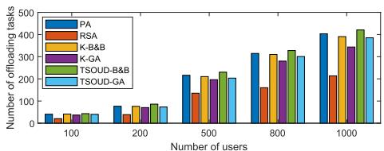

bar

| Number of users | PA   | RSA  | K-B&B | K-GA | TSOUD-B&B | TSOUD-GA |
| --------------- | ---- | ---- | ----- | ---- | --------- | -------- |
| 100             | 50   | 30   | 40    | 50   | 60        | 70       |
| 200             | 80   | 60   | 90    | 100  | 110       | 120      |
| 500             | 220  | 150  | 200   | 210  | 230       | 240      |
| 800             | 330  | 180  | 320   | 330  | 350       | 360      |
| 1000            | 420  | 220  | 410   | 420  | 440       | 450      |

Fig. 3. Comparative analysis of different algorithms on scheduling costs and system throughput.

Theorem 1: With the obtained $b _ { i , u u ^ { \prime } } ^ { \star } ( t )$ , ∀u- , the optimal auxiliary variable $\varphi _ { i , u u ^ { \prime } } ^ { \star } ( t )$ can be given as

$$
\varphi_ {i, u u ^ {\prime}} ^ {\star} (t) = \left\{ \begin{array}{l l} \varphi_ {i, u u ^ {\prime}} ^ {o} (t), & \text { if   } 0 <   \varphi_ {i, u u ^ {\prime}} ^ {o} (t) \leq r _ {i, u u ^ {\prime}} ^ {\star} (t), \\ r _ {i, u u ^ {\prime}} ^ {\star} (t), & \text { otherwise }, \end{array} \right. \tag {61}
$$

Proof: The analysis and proof of this theorem are provided in Section VII of the supplementary material, available online, due to space constraints. 

3) Lagrange Multipliers Update: In this part, with $\mathsf { B } ^ { \star }$ and $\varphi ^ { \star }$ acquired, we proceed to address the dual problem presented in (55). This problem, being convex in nature, allows for the updating of γ, δ, and ς through the subgradient method.

# VI. COMPREHENSIVE ALGORITHM STRATEGY

In this section, we employ the Lyapunov framework to address individual time slot challenges, culminating in the development of the Proposed Algorithm (PA), as delineated in Algorithm 7.

The PA focuses on UAV deployment and scheduling, incorporating the TSOUD deployment algorithm and QCQP & SDR scheduling decision method. We crafted a series of experimental scenarios to evaluate these components against the PA. Results are depicted in Fig. 3 and Table I. For a detailed discussion, constrained by space, please see Section VIII of the supplementary material, available online.

TABLE I RUNNING TIME (S) 

<table><tr><td>Number of users</td><td>PA</td><td>RSA</td><td>K-B&amp;B</td><td>K-GA</td><td>TSOUD -B&amp;B</td><td>TSOUD -GA</td></tr><tr><td>100</td><td>0.22</td><td>0.28</td><td>0.35</td><td>0.28</td><td>0.36</td><td>0.24</td></tr><tr><td>200</td><td>0.64</td><td>0.28</td><td>0.77</td><td>0.65</td><td>0.79</td><td>0.56</td></tr><tr><td>500</td><td>1.50</td><td>0.31</td><td>7.48</td><td>4.01</td><td>6.97</td><td>3.24</td></tr><tr><td>800</td><td>2.81</td><td>0.33</td><td>12.08</td><td>7.12</td><td>13.97</td><td>7.39</td></tr><tr><td>1000</td><td>3.72</td><td>0.36</td><td>18.85</td><td>9.34</td><td>18.54</td><td>8.30</td></tr></table>

TABLE II EXPERIMENT PARAMETERS 

<table><tr><td>System parameters</td><td>Values</td></tr><tr><td>Offloading bandwidth  $B_i(t)$ </td><td>1 MHz</td></tr><tr><td>Total bandwidth during task migration  $B$ </td><td>20 MHz</td></tr><tr><td>The duration of system</td><td>200 s</td></tr><tr><td>The number of time slots</td><td>200</td></tr><tr><td>Transmission power at UAV  $p_u$ </td><td>0.5 W</td></tr><tr><td>Transmission power at user  $p_i$ </td><td>0.2 W</td></tr><tr><td>Noise power spectrum density  $N_0$ </td><td>-180 dBm/Hz</td></tr><tr><td>Channel gain at  $d_0 = 1\text{m}$ </td><td>60 dB</td></tr><tr><td>Path loss exponent  $\tilde{\iota}$ </td><td>2.3</td></tr><tr><td>NLoS attenuation  $k$ </td><td>0.2</td></tr><tr><td>NLoS environmental constants  $\alpha, \beta$ </td><td>11.95, 0.14</td></tr><tr><td>UAV maximum coverage distance  $\tilde{r}_u$ </td><td>180 m</td></tr><tr><td>UAV altitude  $h_u$ </td><td>60 m</td></tr><tr><td>UAV computing coefficient  $\eta_c$ </td><td> $10^{-12}$ </td></tr><tr><td>UAV caching coefficient  $\eta_o$ </td><td> $10^{-15}$ </td></tr><tr><td>UAV computing resource  $W_u$ </td><td>1 GHz</td></tr><tr><td>UAV average long-term cost budget</td><td>20</td></tr></table>

# VII. EXPERIMENT AND DISCUSSION

In this section, we conduct simulation experiments to assess the feasibility of the scenario and the efficacy of the proposed method.

It is important to note that the experiments were conducted on a desktop PC equipped with an Intel(R) Core(TM) i7-12700F 2.1GHz processor and 32GB of RAM. The execution environments used for these experiments included MATLAB R2021a with CVX and YALMIP, and Pycharm 2023.2.3 with Pytorch 1.12.0. We deploy three UAVs to serve 100 mobile users within a designated $5 0 0 m \times 5 0 0$ m area. User movements are random, with speeds ranging from 0.5 m/s to 1 $m / s$ , and tasks, varying between 1 and 3 Mbits in size, are generated at each time slot following a Bernoulli distribution. Each task requires 1 to 3 cycles per bit, with a fixed computational allocation of 1 to 3MHz. The UAV deployment adheres to the methodologies described in Section V, ensuring consistent simulation parameters across different scales, as detailed in Table II. The value of $\eta _ { c }$ is determined based on the energy consumption factor [30]. Additionally, the scheduling cost weight, $c _ { u }$ , balances delay and energy consumption at a ratio of 4:6, configured as $\varpi _ { 1 } = 0 . 4 , \varpi _ { 2 } =$ 0.6. The magnitude of these weights dynamically adjusts in response to computational, migration, and caching decisions: $\varpi _ { 1 } = 1 0 ^ { 0 } , \varpi _ { 2 } = 1 0 ^ { 1 }$ for computation; $\varpi _ { 1 } = 1 0 ^ { 0 } , \varpi _ { 2 } = 1 0 ^ { 1 2 }$ for migration; and $\varpi _ { 1 } = 1 0 ^ { 0 } , \varpi _ { 2 } = 1 0 ^ { 1 4 }$ for caching.

# A. UAV Deployment

As depicted in Fig. 4, users randomly generate tasks in each time slot, and the UAVs cater to these tasks within their service ranges. To enhance task service coverage, UAVs adjust their positions following user movements. Given the users’ limited speed, their relative positions within a span of 100 time slots do not exceed a 100m square area, indicating that each UAV continues to serve most of its initial users during movement. Additionally, the UAVs’ speed allows them to reach the deployment locations determined by the algorithm for each time slot.

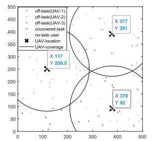

scatter

| Task Type | UAV-Coverage |
| :--- | :--- |
| off-task(UAV-1) | 377 |
| off-task(UAV-2) | 391 |
| off-task(UAV-3) | 379 |
| no-task user | 250.5 |
X 117
Y 250.5

(a) The 1-st Time Slot

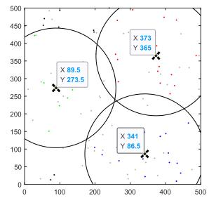

scatter

| X    | Y    |
| ---- | ---- |
| 89.5 | 273.5 |
| 373  | 365  |
| 341  | 86.5 |

(b) The 25-th Time Slot

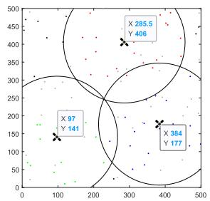

scatter

| X    | Y    |
| ---- | ---- |
| 97   | 141  |
| 285.5| 406  |
| 384  | 177  |

(c) The 50-th Time Slot

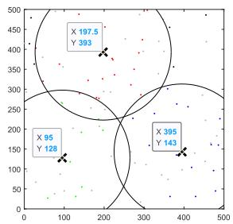

scatter

| X    | Y   |
| ---- | --- |
| 95   | 128 |
| 197.5| 383 |
| 395  | 143 |

(d) The 100-th Time Slot   
Fig. 4. UAV deployment and task offloading across various time slots.

Furthermore, to assess the impact of UAV trajectory optimization on system objectives, we introduce two alternative schemes for comparison with our proposed algorithm:

- K-means++ Location: This method employs the K - means++ algorithm to cluster user locations for each time slot. The resulting cluster centers serve as the deployment locations for UAVs, defining their trajectories.   
Random Location: This approach sets the UAVs’ initial positions and assigns their movement speeds randomly between 10m/s and 20m/s. Consequently, this method determines the UAVs’ trajectories and deployment positions for each time slot.

According to Fig. 5, our proposed algorithm boosts system throughput by 10%-45% and decreases scheduling costs by 15%-30%, surpassing the K-means++ and random deployment methods. Furthermore, to examine how variations in user characteristics and network conditions affect system performance, we conducted a series of experiments, detailed in Section IX of the supplementary material, available online, due to space constraints.

# B. Task Scheduling

In our experiments, we analyze task dynamics for three users over eleven discrete time slots, as illustrated in Fig. 6. User-1 initiates five tasks throughout this period, all successfully offloaded and processed. The tasks from the first time slot are offloaded to the third UAV, while those from the second time slot are uploaded to the second UAV and processed in the third slot. Tasks initially assigned to the third UAV in the fourth time slot are later migrated to the second UAV for processing in the fifth slot. Tasks directed to the third UAV in the seventh time slot are subsequently moved to the second UAV and, due to processing constraints, further migrated to the first UAV in the eighth time slot. These tasks are cached in the ninth time slot and processed in the eleventh slot. For clarity and due to space limitations, a detailed table of task dynamics is included in Section IX of the supplementary material, available online.

Algorithm 7: Proposed Algorithm.   
Input: Initial queue status $G_{u}(0)$ and $\Omega_{u}(0)$ , we set $L(t)=0$ , and denote $L_{max}$ as the maximum number of iterations.

Output: Solutions $\{Q, S, Z, A, M, O, B\}$ .

1: Initialize the number of time slot, user count, UAV count;

2: for each time slot t do

3: Generate random user positions;

4: Generate task requests for users;

5: Execute Algorithm 1 update Lyapunov queue $G_{u}(t)$ and $\Omega_{u}(t)$ ;

6: Execute Algorithm 2 for UAV deployment Q;

7: Execute Algorithm 3 to determine S;

8: repeat (from 8 to 15)

9: Execute Algorithm 4 to optimize Z in the $\mathcal{I}_{z}(t)$ ;

10: Utilize QCQP method to optimize A, M, O for offloaded tasks;

11: for each user $i \in I_{m}^{u}$ do

12: Determine transmission bandwidth between UAVs using Algorithm 6;

13: end for

14: $L(t) = L(t) + 1$ ;

15: until the difference of successive values of the objective function is less than $\epsilon_{1}$ or $L(t) > L_{max}$ ;

16: Store the feasible solution for the current time slot;

17: end for

18: return Feasible solutions for all time slots.

Fig. 7 offer insights into the system’s efficiency regarding task association, offloading, migration, computing, and caching. The task completion rate initially increases, then decreases, and finally stabilizes, reflecting the system’s early resource abundance, which prevents task queuing. However, the necessity to process cached tasks consumes computational resources, reducing the processing capacity in subsequent time slots. After queue backlog occurs, the system adjusts its scheduling decisions from the 40th time slot to maintain stability. The baseline in the figure represents the average task processing rate by UAVs dedicated solely to computation, without migration or caching. The analysis reveals that our proposed approach significantly boosts the system’s long-term average task access frequency.

# C. Lyapunov Framework

Fig. 8 demonstrates the inverse relationship between the Lyapunov penalty factor V and system throughput: as V increases, system throughput declines and the queue backlog grows, underscoring V ’s role as a regulatory mechanism in the objective function to balance system accessibility with queue congestion. The relationship between system access and queue backlog stabilizes within the range [O(1/V ), O(V )], typically after approximately 100 time slots, indicating a harmonization in system dynamics. Additionally, the Lyapunov online optimization framework is well-suited for maintaining queue stability. Due to space constraints, corresponding experimental results are detailed in Section X of the supplementary material, available online.

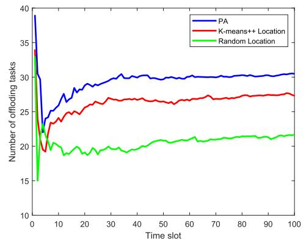

line

| Time slot | PA   | K-means++ Location | Random Location |
| --------- | ---- | ------------------ | --------------- |
| 0         | 39   | 35                 | 15              |
| 10        | 28   | 24                 | 19              |
| 20        | 29   | 26                 | 19              |
| 30        | 30   | 27                 | 20              |
| 40        | 30   | 27                 | 20              |
| 50        | 30   | 27                 | 21              |
| 60        | 30   | 27                 | 21              |
| 70        | 30   | 27                 | 21              |
| 80        | 30   | 27                 | 21              |
| 90        | 30   | 27                 | 21              |
| 100       | 30   | 27                 | 21              |

(a) System Throughput   
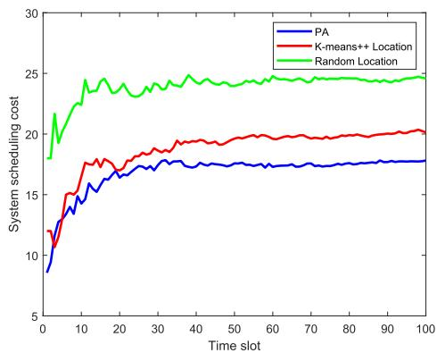

line

| Time slot | PA    | K-means++ Location | Random Location |
| --------- | ----- | ------------------ | --------------- |
| 0         | 9.0   | 12.0               | 18.0            |
| 10        | 16.0  | 17.0               | 24.0            |
| 20        | 17.0  | 18.0               | 24.5            |
| 30        | 17.5  | 19.0               | 24.5            |
| 40        | 17.5  | 19.5               | 24.5            |
| 50        | 17.5  | 19.5               | 24.5            |
| 60        | 17.5  | 19.5               | 24.5            |
| 70        | 17.5  | 19.5               | 24.5            |
| 80        | 17.5  | 19.5               | 24.5            |
| 90        | 17.5  | 19.5               | 24.5            |
| 100       | 17.5  | 20.0               | 24.5            |

(b) System Scheduling Cost

Fig. 5. Comparative analysis of different UAV deployment methods on scheduling costs and system throughput.   
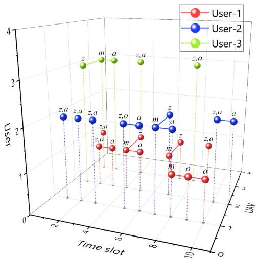

scatter

| Time slot | User-1 | User-2 | User-3 |
| --------- | ------ | ------ | ------ |
| 2         |        |        |        |
| 4         |        |        | z      |
| 6         |        |        | m      |
| 8         |        |        | a      |
| 10        |        |        | z      |
| 10        |        |        | a      |

Fig. 6. The state of user tasks.

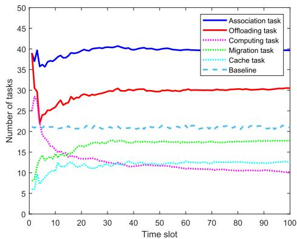

line

| Time slot | Association task | Offloading task | Computing task | Migration task | Cache task | Baseline |
| --------- | ---------------- | --------------- | -------------- | -------------- | ---------- | -------- |
| 0         | 40               | 25              | 25             | 15             | 10         | 22       |
| 10        | 38               | 28              | 15             | 16             | 12         | 22       |
| 20        | 40               | 30              | 14             | 17             | 13         | 22       |
| 30        | 40               | 30              | 13             | 17             | 13         | 22       |
| 40        | 40               | 30              | 13             | 17             | 13         | 22       |
| 50        | 40               | 30              | 13             | 17             | 13         | 22       |
| 60        | 40               | 30              | 13             | 17             | 13         | 22       |
| 70        | 40               | 30              | 13             | 17             | 13         | 22       |
| 80        | 40               | 30              | 13             | 17             | 13         | 22       |
| 90        | 40               | 30              | 13             | 17             | 13         | 22       |
| 100       | 40               | 30              | 13             | 17             | 13         | 22       |

Fig. 7. Task association and scheduling volume.   
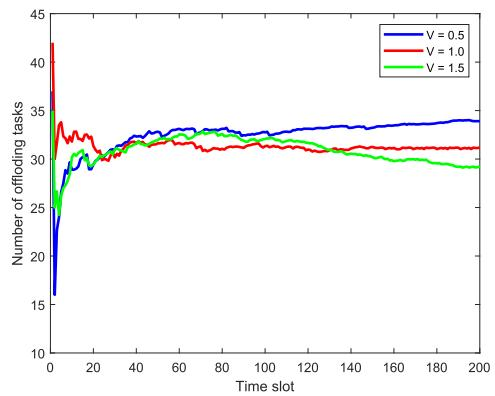

line

| Time slot | V = 0.5 | V = 1.0 | V = 1.5 |
| --------- | ------- | ------- | ------- |
| 0         | 16      | 34      | 42      |
| 20        | 30      | 31      | 30      |
| 40        | 33      | 32      | 32      |
| 60        | 33      | 32      | 33      |
| 80        | 33      | 32      | 33      |
| 100       | 33      | 32      | 32      |
| 120       | 33      | 32      | 31      |
| 140       | 33      | 32      | 31      |
| 160       | 33      | 32      | 30      |
| 180       | 33      | 32      | 30      |
| 200       | 33      | 32      | 29      |

(a) Impact of Lyapunov Penalty Factors(V） on SystemThroughput

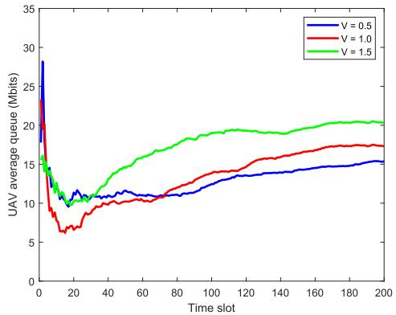

line

| Time slot | V = 0.5 | V = 1.0 | V = 1.5 |
| --------- | ------- | ------- | ------- |
| 0         | 28.0    | 24.0    | 16.0    |
| 20        | 11.0    | 7.0     | 10.0    |
| 40        | 11.5    | 9.0     | 13.0    |
| 60        | 11.0    | 10.0    | 16.0    |
| 80        | 11.5    | 12.0    | 18.0    |
| 100       | 12.0    | 13.0    | 19.0    |
| 120       | 13.0    | 14.0    | 20.0    |
| 140       | 13.5    | 15.0    | 20.5    |
| 160       | 14.0    | 16.0    | 21.0    |
| 180       | 14.5    | 17.0    | 21.5    |
| 200       | 15.0    | 17.5    | 22.0    |

(b)Impact of Lyapunov Penalty Factors (V） on SystemQueue Backlog  
Fig. 8. Comparative analysis of the impact of Lyapunov penalty factors (V) on system throughput and system queue backlog.

To evaluate the stability and effectiveness of the Lyapunov framework for online optimization problems, we compared it with reinforcement learning frameworks such as DDPG, A2C, and PPO. DDPG is utilized as an offline learning framework, whereas A2C and PPO are applied in online settings. Nevertheless, certain limitations were observed due to the intrinsic properties of these reinforcement learning frameworks during experimentation, summarized as follows.

\- Dimension Fixing: The reinforcement learning framework imposes a fixed output dimension per total time slot, where each decision variable remains static regardless of queue dynamics. Thus, each queue requires a preset maximum dimension of $1 \times I ,$ , resulting in high space complexity.

Multi-hop Migration Limitations: The fixed dimensions of the action space in our reinforcement learning framework, particularly the 1 × I migration queue, limit multi-hop migrations. Our setup includes two 1 × I migration queues, allowing up to two migrations per task. Tasks requiring more migrations are discarded, which negatively impacts system throughput.   
. Constraint Satisfaction Issues: In the reinforcement learning framework, all constraints are transformed into rewards, which does not effectively ensure their satisfaction. Increasing penalty terms has proven insufficient for guaranteeing constraints like (9j) and (9l). Consequently, tasks that do not meet these constraints are discarded from throughput calculations.   
Queue Stability Concerns: Due to the minimal caching costs imposed by constraint (19 m), the cache queue experiences significant variability, which the reinforcement learning framework cannot stabilize, potentially leading to an infinite backlog.   
Convergence Challenges: The original problem’s complexity, featuring five interdependent binary variables, longterm infinite constraints, and UAV deployment linked to scheduling decisions, hinders convergence within the reinforcement learning framework. Despite numerous trials across various models, outcomes remain suboptimal. Due to space constraints, detailed experimental results are provided in Section X of supplementary material, available online.

# VIII. CONCLUSION AND FUTURE WORK

In this paper, we harness UAV-assisted MEC to enhance the real-time data processing capabilities of edge computing within infrastructure deployments effectively. Our methodology addresses the often-overlooked synergistic effects between strategies by co-optimizing the UAV’s trajectory, task offloading, caching, and migration strategies. Utilizing the Lyapunov optimization framework and BCD method, we decompose the problem into subproblems: UAV deployment and User-UAV association, task offloading optimization, scheduling optimization, and bandwidth optimization within a single time slot. The first three subproblems are tackled using specialized algorithms, while the complex scheduling problem is transformed into a non-convex constrained quadratic programming problem, efficiently solved by semidefinite relaxation and probabilistic mapping methods. Experimental results indicate that our approach enhances system throughput by 10%-45%, reduces scheduling costs by 15%- 30%, and cuts algorithm execution time by 8%-37% compared to conventional algorithms, providing a deeper insight into the dynamic interplay between UAV trajectory planning and task management.

While our research has primarily focused on optimizing operational efficiencies under standard conditions, it has not addressed network disruptions or communication failures. Moving forward, we plan to tackle two significant challenges identified in our studies. First, we will explore scenarios where UAVs unexpectedly run low on battery or exit the network due to mechanical failures, to enhance their operational reliability and resilience. Second, we aim to develop solutions that improve UAV communication in dense urban areas, particularly addressing the challenges posed by high-rise buildings and mixed LoS/NLoS conditions. Our efforts will concentrate on advancing UAV coordination and ensuring robust communication in complex urban environments.

# REFERENCES

[1] X. Diao, X. Guan, and Y. Cai, “Joint offloading and trajectory optimization for complex status updates in UAV-assisted Internet of Things,” IEEE Internet Things J., vol. 9, no. 23, pp. 23 881–23 896, Dec. 2022.   
[2] Y. K. Tun, T. N. Dang, K. Kim, M. Alsenwi, W. Saad, and C. S. Hong, “Collaboration in the sky: A distributed framework for task offloading and resource allocation in multi-access edge computing,” IEEE Internet Things J., vol. 9, no. 23, pp. 24 221–24 235, Dec. 2022.   
[3] B. Liu, Y. Wan, F. Zhou, Q. Wu, and R. Q. Hu, “Resource allocation and trajectory design for MISO UAV-assisted MEC networks,” IEEE Trans. Veh. Technol., vol. 71, no. 5, pp. 4933–4948, May 2022.   
[4] H. Guo, Y. Wang, J. Liu, and C. Liu, “Multi-UAV cooperative task offloading and resource allocation in 5G advanced and beyond,” IEEE Trans. Wireless Commun., vol. 23, no. 1, pp. 347–359, Jan. 2024.   
[5] L. Bao, J. Luo, H. Bao, Y. Hao, and M. Zhao, “Cooperative computation and cache scheduling for UAV-enabled MEC networks,” IEEE Trans. Green Commun. Netw., vol. 6, no. 2, pp. 965–978, Jun. 2022.   
[6] D. Wang, J. Tian, H. Zhang, and D. Wu, “Task offloading and trajectory scheduling for UAV-enabled MEC networks: An optimal transport theory perspective,” IEEE Wireless Commun. Lett., vol. 11, no. 1, pp. 150–154, Jan. 2022.   
[7] P. Qin, Y. Fu, Y. Xie, K. Wu, X. Zhang, and X. Zhao, “Multi-agent learning-based optimal task offloading and UAV trajectory planning for AGIN-power IoT,” IEEE Trans. Commun., vol. 71, no. 7, pp. 4005–4017, Jul. 2023.   
[8] Y. He, Y. Gan, H. Cui, and M. Guizani, “Fairness-based 3-D Multi-UAV trajectory optimization in multi-UAV-assisted MEC system,” IEEE Internet Things J., vol. 10, no. 13, pp. 11 383–11 395, Jul. 2023.   
[9] B. Xu, Z. Kuang, J. Gao, L. Zhao, and C. Wu, “Joint offloading decision and trajectory design for UAV-enabled edge computing with task dependency,” IEEE Trans. Wireless Commun., vol. 22, no. 8, pp. 5043–5055, Aug. 2023.   
[10] X. Zhou, L. Huang, T. Ye, and W. Sun, “Computation bits maximization in UAV-assisted MEC networks with fairness constraint,” IEEE Internet Things J., vol. 9, no. 21, pp. 20 997–21 009, Nov. 2022.   
[11] Z. Yang, S. Bi, and Y.-J. A. Zhang, “Online trajectory and resource optimization for stochastic UAV-enabled MEC systems,” IEEE Trans. Wireless Commun., vol. 21, no. 7, pp. 5629–5643, Jul. 2022.   
[12] L. Liu, X. Yuan, N. Zhang, D. Chen, K. Yu, and A. Taherkordi, “Joint computation offloading and data caching in multi-access edge computing enabled Internet of Vehicles,” IEEE Trans. Veh. Technol., vol. 72, no. 11, pp. 14 939–14 954, Nov. 2023.   
[13] Z. Chen, W. Yi, A. S. Alam, and A. Nallanathan, “Dynamic task software caching-assisted computation offloading for multi-access edge computing,” IEEE Trans. Commun., vol. 70, no. 10, pp. 6950–6965, Oct. 2022.   
[14] B. Liu, C. Liu, and M. Peng, “Computation offloading and resource allocation in unmanned aerial vehicle networks,” IEEE Trans. Veh. Technol., vol. 72, no. 4, pp. 4981–4995, Apr. 2023.   
[15] J. Li, S. Chu, F. Shu, J. Wu, and D. N. K. Jayakody, “Contract-based smallcell caching for data disseminations in ultra-dense cellular networks,” IEEE Trans. Mobile Comput., vol. 18, no. 5, pp. 1042–1053, May 2019.   
[16] V. Sharma, I. You, D. N. K. Jayakody, D. G. Reina, and K.-K. R. Choo, “Neural-blockchain-based ultrareliable caching for edge-enabled UAV networks,” IEEE Trans. Ind. Inform., vol. 15, no. 10, pp. 5723–5736, Oct. 2019.   
[17] Y. Wu, S. Tang, L. Zhang, L. Fan, X. Lei, and X. Chen, “Resilient machine learning based semantic-aware MEC networks for sustainable next-G consumer electronics,” IEEE Trans. Consum. Electron., vol. 70, no. 1, pp. 2188–2199, Feb. 2024.   
[18] S. Yang, J. Liu, F. Zhang, F. Li, X. Chen, and X. Fu, “Caching-enabled computation offloading in multi-region MEC network via deep reinforcement learning,” IEEE Internet Things J., vol. 9, no. 21, pp. 21 086–21 098, Nov. 2022.

[19] J. Chen, H. Xing, X. Lin, A. Nallanathan, and S. Bi, “Joint resource allocation and cache placement for location-aware multi-user mobile-edge computing,” IEEE Internet Things J., vol. 9, no. 24, pp. 25 698–25 714, Dec. 2022.   
[20] Y. Bai, D. Wang, and B. Song, “A knowledge graph-based cooperative caching scheme in MEC-enabled heterogeneous networks,” in Proc. IEEE Glob. Commun. Conf., Rio de Janeiro, Brazil, 2022, pp. 5959–5964.   
[21] T. N. Dang, A. Manzoor, Y. K. Tun, S. M. A. Kazmi, Z. Han, and C. S. Hong, “A contract-theory-based incentive mechanism for UAV-enabled VR-based services in 5G and beyond,” IEEE Internet Things J., vol. 10, no. 18, pp. 16 465–16 479, Sep. 2023.   
[22] Y. Chen, M. Liu, B. Ai, Y. Wang, and S. Sun, “Adaptive bitrate video caching in UAV-assisted MEC networks based on distributionally robust optimization,” IEEE Trans. Mobile Comput., vol. 23, no. 5, pp. 5245–5259, May 2024.   
[23] Z. Bai, Y. Lin, Y. Cao, and W. Wang, “Delay-aware cooperative task offloading for multi-UAV enabled edge-cloud computing,” IEEE Trans. Mobile Comput., vol. 23, no. 2, pp. 1034–1049, Feb. 2024.   
[24] X. Huang et al., “Joint interdependent task scheduling and energy balancing for multi-UAV-enabled aerial edge computing: A multiobjective optimization approach,” IEEE Internet Things J., vol. 10, no. 23, pp. 20 368–20 382, Dec. 2023.   
[25] X. Chen et al., “Dynamic service migration and request routing for microservice in multicell mobile-edge computing,” IEEE Internet Things J., vol. 9, no. 15, pp. 13 126–13 143, Aug. 2022.   
[26] I. Labriji et al., “Mobility aware and dynamic migration of MEC services for the Internet of Vehicles,” IEEE Trans. Netw. Service Manag., vol. 18, no. 1, pp. 570–584, Mar. 2021.   
[27] Z. Liao, Y. Ma, J. Huang, J. Wang, and J. Wang, “HOTSPOT: A UAVassisted dynamic mobility-aware offloading for mobile-edge computing in 3-D space,” IEEE Internet Things J., vol. 8, no. 13, pp. 10 940–10 952, Jul. 2021.   
[28] J. Li et al., “Joint optimization on trajectory, altitude, velocity, and link scheduling for minimum mission time in UAV-aided data collection,” IEEE Internet Things J., vol. 7, no. 2, pp. 1464–1475, Feb. 2020.   
[29] H. Xiao, Z. Hu, K. Yang, Y. Du, and D. Chen, “An energy-aware joint routing and task allocation algorithm in MEC systems assisted by multiple UAVs,” in Proc. Int. Wireless Commun. Mobile Comput., Limassol, Cyprus, 2020, pp. 1654–1659.   
[30] M. Zhao, W. Li, L. Bao, J. Luo, Z. He, and D. Liu, “Fairness-aware task scheduling and resource allocation in UAV-enabled mobile edge computing networks,” IEEE Trans. Green Commun. Netw., vol. 5, no. 4, pp. 2174–2187, Dec. 2021.   
[31] H. Mei, K. Yang, Q. Liu, and K. Wang, “Joint trajectory-resource optimization in UAV-enabled edge-cloud system with virtualized mobile clone,” IEEE Internet Things J., vol. 7, no. 7, pp. 5906–5921, Jul. 2020.   
[32] M. Guo, W. Wang, X. Huang, Y. Chen, L. Zhang, and L. Chen, “Lyapunovbased partial computation offloading for multiple mobile devices enabled by harvested energy in MEC,” IEEE Internet Things J., vol. 9, no. 11, pp. 9025–9035, Jun. 2022.   
[33] Z. Tong, J. Cai, J. Mei, K. Li, and K. Li, “Dynamic energy-saving offloading strategy guided by Lyapunov optimization for IoT devices,” IEEE Internet Things J., vol. 9, no. 20, pp. 19 903–19 915, Oct. 2022.   
[34] J. Su, Z. Liu, Y.-A. Xie, Y. Li, K. Ma, and X. Guan, “UEE-delay balanced online resource optimization for cooperative MEC-enabled task offloading in dynamic vehicular networks,” IEEE Internet Things J., vol. 11, no. 7, pp. 11496–11507, Apr. 2024.   
[35] H. Hu, Q. Wang, R. Q. Hu, and H. Zhu, “Mobility-aware offloading and resource allocation in a MEC-enabled IoT network with energy harvesting,” IEEE Internet Things J., vol. 8, no. 24, pp. 17 541–17 556, Dec. 2021.   
[36] M. Zhao et al., “Energy-aware task offloading and resource allocation for time-sensitive services in mobile edge computing systems,” IEEE Trans. Veh. Technol., vol. 70, no. 10, pp. 10 925–109 403, Oct. 2021.   
[37] F. Li, C. He, X. Li, J. Peng, and K. Yang, “Geometric analysis-based 3D anti-block UAV deployment for mmWave communications,” IEEE Commun. Lett., vol. 26, no. 11, pp. 2799–2803, Nov. 2022.   
[38] J. Luo, J. Song, F.-C. Zheng, L. Gao, and T. Wang, “User-centric UAV deployment and content placement in cache-enabled multi-UAV networks,” IEEE Trans. Veh. Technol., vol. 71, no. 5, pp. 5656–5660, May 2022.   
[39] J. Wang et al., “Multiple unmanned-aerial-vehicles deployment and user pairing for nonorthogonal multiple access schemes,” IEEE Internet Things J., vol. 8, no. 3, pp. 1883–1895, Feb. 2021.   
[40] M.-H. Chen, M. Dong, and B. Liang, “Resource sharing of a computing access point for multi-user mobile cloud offloading with delay constraints,” IEEE Trans. Mobile Comput., vol. 17, no. 12, pp. 2868–2881, Dec. 2018.

[41] M. Zhao, H. Bao, L. Yin, J. Yao, and T. Q. Quek, “Secrecy offloading rate maximization for multi-access mobile edge computing networks,” IEEE Commun. Lett., vol. 25, no. 12, pp. 3800–3804, Dec. 2021. [42] D. Tse and P. Viswanath, Fundamentals of Wireless Communication. Cambridge, U.K.: Cambridge Univ. Press, 2005.

natural_image

Portrait of a smiling man in a suit and tie (no visible text or symbols)

Mingxiong Zhao (Member, IEEE) received the BS degree in electrical engineering and the PhD degree in information and communication engineering from the South China University of Technology (SCUT), Guangzhou, China, in 2011 and 2016, respectively. He was a visiting PhD student with the University of Minnesota (UMN), Twin Cities, MN, USA, from 2012 to 2013 and the Singapore University of Technology and Design (SUTD), Singapore, from 2015 to 2016, respectively. Currently, he is a full professor and the Donglu Young Scholar with Yunnan University

(YNU), Kunming, China, where he also serves as the director of Cybersecurity Department with the School of Software. His current research interests include network security, mobile edge computing, and edge AI techniques.

natural_image

Portrait of a smiling young woman wearing a school uniform and red tie (no visible text or symbols)

Rongqian Zhang received the MS degree in software engineering from Yunnan University (YNU), Kunming, China, in 2024. She is currently working toward the PhD degree in information and communication engineering with the School of Information Science and Engineering, YNU. Her current research interests center on mobile edge computing, focusing on UAVassisted MEC networks, MEC network security, and task scheduling strategies in MEC networks.

natural_image

Portrait photo of a man in a black shirt (no text or symbols visible)

Zhenli He (Senior Member, IEEE) received the MS degree in software engineering and the PhD degree in systems analysis and integration from Yunnan University (YNU), Kunming, China, in 2012 and 2015, respectively. He was a postdoctoral researcher with Hunan University (HNU), Changsha, China, from 2019 to 2021. He is currently an associate professor and the deputy head with the Department of Software Engineering, School of Software, YNU. His current research interests include edge computing, energyefficient computing, heterogeneous computing, and

edge AI techniques.

natural_image

Portrait of a man in formal attire with glasses (no visible text or symbols)

Keqin Li (Fellow, IEEE) received the BS degree in computer science from Tsinghua University, in 1985, and the PhD degree in computer science from the University of Houston, in 1990. He is currently a SUNY distinguished professor with the State University of New York and a National distinguished professor with Hunan University (China). He has authored or co-authored more than 950 journal articles, book chapters, and refereed conference papers. He received several best paper awards from international conferences including PDPTA-1996, NAECON-1997,

IPDPS-2000, ISPA-2016, NPC-2019, ISPA-2019, and CPSCom-2022. He holds nearly 70 patents announced or authorized by the Chinese National Intellectual Property Administration. He is among the world’s top five most influential scientists in parallel and distributed computing in terms of single-year and career-long impacts based on a composite indicator of the Scopus citation database. He was a 2017 recipient of the Albert Nelson Marquis Lifetime Achievement Award for being listed in Marquis Who’s Who in Science and Engineering, Who’s Who in America, Who’s Who in the World, and Who’s Who in American Education for more than twenty consecutive years. He received the Distinguished Alumnus Award from the Computer Science Department, University of Houston in 2018. He received the IEEE TCCLD Research Impact Award from the IEEE CS Technical Committee on Cloud Computing in 2022 and the IEEE TCSVC Research Innovation Award from the IEEE CS Technical Community on Services Computing in 2023. He is a member of the SUNY Distinguished Academy. He is an AAAS fellow, and an AAIA fellow. He is a member of Academia Europaea (Academician of the Academy of Europe).