# Joint Optimization of UAV-Carried IRS for Urban Low Altitude mmWave Communications With Deep Reinforcement Learning

Wenwen Xie, Geng Sun , Senior Member, IEEE, Bei Liu, Jiahui Li , Member, IEEE, Jiacheng Wang , Member, IEEE, Hongyang Du, Member, IEEE, Dusit Niyato , Fellow, IEEE, and Dong In Kim , Life Fellow, IEEE

Abstract—Emerging technologies in sixth generation (6G) of wireless communications, such as terahertz communication and ultra-massive multiple-input multiple-output, present promising prospects. Despite the high data rate potential of millimeter wave communications, millimeter wave (mmWave) communications in urban low altitude economy (LAE) environments are constrained by challenges such as signal attenuation and multipath interference. Specially, in urban environments, mmWave communication experiences significant attenuation due to buildings, owing to its short wavelength, which necessitates developing innovative approaches to improve the robustness of such communications in LAE networking. In this paper, we explore the use of an uncrewed aerial vehicle (UAV)-carried intelligent reflecting surface (IRS) to support low altitude mmWave communication.Specifically, we consider a typical urban low altitude communication scenario where a

Received 31 December 2024; revised 10 June 2025; accepted 17 August 2025. Date of publication 19 August 2025; date of current version 3 December 2025. This work was supported in part by the National Natural Science Foundation of China under Grant 62272194, and Grant 62471200, in part by the Science and Technology Development Plan Project of Jilin Province under Grant 20250101027JJ, in part by the Postdoctoral Fellowship Program of CPSF under Grant GZC20240592, in part by China Postdoctoral Science Foundation General Fund under Grant 2024M761123, in part by the Scientific Research Project of Jilin Provincial Department of Education under Grant JJKH20250117KJ, and in part by the National Research Foundation of Korea (NRF) Grant funded by the Korean Government (MSIT) under Grant 2021R1A2C2007638. An earlier version of this paper was presented in part at the IEEE ICC 2024 [doi: 10.1109/ICC51166.2024.10622564]. Recommended for acceptance by Y. Zeng. (Corresponding authors: Geng Sun; Jiahui Li.)

Wenwen Xie, Bei Liu, and Jiahui Li are with the College of Computer Science and Technology, Jilin University, Changchun 130012, China (e-mail: xieww22@mails.jlu.edu.cn; liubei0630@foxmail.com; lijiahui@jlu.edu.cn).

Jiacheng Wang and Dusit Niyato are with the College of Computing and Data Science, Nanyang Technological University, Singapore 639798 (e-mail: jiacheng.wang@ntu.edu.sg; dniyato@ntu.edu.sg).

Hongyang Du is with the Department of Electrical and Electronic Engineering, The University of Hong Kong, Hong Kong, SAR, China (e-mail: duhy@eee.hku.hk).

Dong In Kim is with the Department of Electrical and Computer Engineering, Sungkyunkwan University, Suwon 16419, South Korea (e-mail: dongin@skku.edu).

This article has supplementary downloadable material available at https://doi. org/10.1109/TMC.2025.3600682, provided by the authors.

This article has supplementary downloadable material available at https://doi.org/10.1109/TMC.2025.3600682, provided by the authors.

Digital Object Identifier 10.1109/TMC.2025.3600682

UAV-carried IRS establishes a line-of-sight (LoS) channel between the mobile users and a source user (SU) despite the presence of obstacles. Subsequently, we formulate an optimization problem aimed at maximizing the transmission rates and minimizing the energy consumption of the UAV by jointly optimizing phase shifts of the IRS and UAV trajectory. Given the non-convex nature of the problem and its high dynamics, we propose a deep reinforcement learning-based approach incorporating neural episodic control, long short-term memory, and an IRS phase shift control method to enhance the stability and accelerate the convergence. Simulation results show that the proposed algorithm effectively resolves the problem and surpasses other benchmark algorithms in various performances.

Index Terms—Deep reinforcement learning, intelligent reflecting surface, phase shift optimization, UAV.

## I. INTRODUCTION

Geng Sun is with the College of Computer Science and Technology, Jilin University, Changchun 130012, China, also with the Key Laboratory of Symbolic Computation and Knowledge Engineering of Ministry of Education, Jilin University, Changchun 130012, China, and also with the College of Computing and Data Science, Nanyang Technological University, Singapore 639798 (e-mail: sungeng@jlu.edu.cn).

research endeavors [2]. Specifically, several pivotal technologies have captured significant attention, including terahertz communication [3], ultra-massive multiple-input multiple-output [4], uncrewed aerial vehicle (UAV)-assisted wireless communications [5], and space-air-ground integrated networks [6]. These technologies are capable of achieving high data rates [7], offering substantial bandwidth, and reducing interference, which can further promote great prosperity for low altitude economy (LAE) networking. However, millimeter wave communications, integral to these technologies, confront significant challenges, such as the restricted communication ranges and severe multipath effects, particularly in urban environments with extensive obstacles. Therefore, it is crucial to reconstruct the channel conditions to mitigate the effects of these obstacles for improving the robustness of such low altitude mmWave communications.

Intelligent reflecting surface (IRS) is gaining recognition as an emerging technology, and it has the potential to address the aforementioned issues [8]. Specifically, an IRS consists of numerous tiny programmable reflecting elements, which can adjust their phase to alter the propagation direction and improve channel quality, thereby optimizing wireless signal transmission without the need for extra transmitters. As such, the IRS can be considered to be a passive relay to provide additional transmission paths and concentrate signal energy, which contributes to improving transmission performance and mitigating channel fading.

Specifically, owing to the ability of IRS to reshape the wireless propagation environment, many existing works further considered IRS-assisted mmWave communications [9], [10], [11], which can improve the signal coverage and channel quality while providing higher bandwidth capacity and lower latency. Moreover, thanks to UAV mobility, UAV-carried IRS can be flexibly deployed at suitable locations to further improve link quality, leading to better transmission performance under dynamic channel conditions. Therefore, UAV-carried IRS-assisted wireless communications have gained a lot of research interest [12], [13], which can provide more flexible communication services in complex urban scenarios. These above works primarily focused on the scenarios involving static terrestrial terminals or IRS deployments, and it is beneficial to explore how to mitigate the negative impact of wireless link blockages caused by mobile users and dense urban building distributions on system transmission rates. Motivated by this, we seek to model the mobility pattern of users and distribution of urban buildings, and thus consider a UAV-carried IRS-assisted terrestrial mobile user mmWave communication system in the urban scenario.

However, designing such a communication system faces several significant challenges. First, to maximize the transmission rate of all mobile users and maintain the transmission fairness, the position of the UAV needs to be adjusted in real-time based on the user positions and distribution of buildings, which may increase the UAV energy consumption. In this case, it is challenging to achieve a reasonable trade-off between system transmission rate, communication fairness, and UAV propulsion energy consumption by jointly optimizing the UAV trajectory and IRS phase shifts. Second, the highly dynamic nature of the system, which is due to the time-varying channel conditions and the mobility of both users and UAV-carried IRS, significantly limits the applicability of offline approaches such as convex optimization or evolutionary methods. Third, real-time adjustment of IRS phase shift configurations is essential to maintain optimal transmission rates. However, this process is significantly challenged by the high-dimensional continuous nature of IRS phase shifts, which creates an expansive decision space that complicates the search for efficient solutions. Finally, the trajectory of the UAV should be adjusted in the considered system, which will exhibit significant long-term temporal dependencies, where each decision influences both future system states and subsequent decision-making. This characteristic necessitates the proposing of a method capable of effectively addressing both the high dynamics and long-term dependencies inherent in the system.

Accordingly, we propose a novel online method with robust dependency-capturing capabilities to improve the transmission rates and energy efficiency in the UAV-carried IRS mmWave mobile communication system. The main contributions of our work are summarized as follows:

UAV-carried IRS MmWave mobile communication system: We consider a UAV-carried IRS-assisted mobile mmWave communication system in the low-altitude urban scenario. Specifically, we introduce a UAV-carried

IRS to flexibly reshape the wireless propagation environment based on the locations of mobile users and the distribution of obstacles, thereby improving the channel quality between the source user (SU) and mobile users. Such a system can be deployed in urban scenarios, such as smart transportation and mobile robot applications.

\- Joint optimization problem formulation of UAV trajectory and IRS beamforming: We aim to achieve a trade-off between the transmission metric and energy efficiency while maintaining communication fairness to ensure the communication experience for all users. As such, we formulate a multi-objective optimization problem to simultaneously maximize the total transmission rates, maximize the Jain’s fairness index, and minimize UAV propulsion energy consumption by controlling UAV trajectory and IRS phase-shift configuration. Given the non-convexity and dynamic nature of this optimization problem, as well as the long-term temporal dependencies in the decision process, solving this problem is particularly challenging.

Enhanced deep reinforcement learning-based approach: Conventional optimization algorithms struggle to effectively handle the dynamics of the system, which makes it unsuitable for solving the formulated optimization problem in the considered system. In this case, we propose a DRL-based approach, namely, enhanced proximal policy optimization (EPPO). Specifically, EPPO introduces neural episodic control to transform the continuous state space into a discrete grid-based abstract representation, thereby accelerating the learning process. Moreover, we integrate the mogrifier long short term memory (LSTM) into the actor network to achieve a stronger ability to capture long-term dependencies between states and actions [14]. Finally, we employ an IRS phase shift control strategy to optimize the high-dimensional and continuous IRS phase shifts, which can reduce the dimension of the action space, thereby improving the DRL training speed.

\- Performance evaluation: Extensive simulation results show that the EPPO algorithm outperforms other DRL algorithms in terms of transmission rate and energy efficiency. Moreover, we further explore the performance of the EPPO algorithm under different parameter settings, such as the number of IRS reflection elements and the number of mobile users. The results show that the proposed EPPO algorithm performs well under different settings.

The rest of the structure of this paper is organized as follows. Section II reviews some key related works. Section III presents the models and problem formulation. Section IV introduces the proposed EPPO algorithm. Simulation results are presented in Section V. More additional conditions are discussed in Section VI. Finally, the paper is concluded in Section VII.

## II. RELATED WORK

In our work, we aim to use a UAV-carried IRS to aid LAE networking by optimizing the UAV trajectory and IRS parameters. In the following, we will primarily present some key related works to illustrate the novelty of our research.

## A. IRS-Assisted Communications

Owing to IRS capabilities in wireless environment reconfiguration coupled with eco-friendly and cost-effective advantages, IRS-assisted communications have gained significant research interest. For example, the authors in [15] investigated the IRSassisted downlink communication system, and demonstrated that IRS cascaded links can be used to provide higher quality communication services for the terrestrial users. In [16], the authors discussed the feasibility of IRS-assisted two-way communication and designed a corresponding system involving two users by utilizing full-duplex technology. Moreover, some existing works focused on the IRS-assisted mmWave communication due to the high transmission rate and low transmission latency of mmWave technology. For instance, in [9], the authors investigated an IRS-assisted robust and secure mmWave downlink transmission scheme, which can improve transmission security and transmission rates by adapting to the system dynamics. In [10], the authors explored IRS-assisted cognitive communication of the mmWave base station, which solved the issues of limited mmWave communication performance under the spectrum scarcity. In addition, the authors in [17] considered a multi-IRS-assisted multi-cell mmWave cellular network, and showed excellent spectrum efficiency compared with no IRS assistance.

Some existing works utilized UAV-carried IRS to achieve more flexible wireless communications, which is a more challenging task due to the introduction of stronger dynamics. For example, the authors in [12], [13] considered UAV-carried IRS as a relay to assist the satellite to communicate with terrestrial users, which can improve the reliability of long-distance transmission. The authors in [18] introduced a UAV-carried IRS-assisted secure communication scheme, which can enhance the confidentiality of terrestrial communication through flexible IRS deployment. In addition, in [19], the authors studied a UAVcarried IRS-assisted downlink mmWave communication system and demonstrated that UAV-carried IRS can achieve higher LoS link probability compared with fixed IRS deployment. In [20], the authors used random geometry to provide a performance analysis framework for UAV-carried IRS cluster-assisted mmWave cellular networks, and indicated that the UAV-carried IRS can improve the coverage of mmWave cellular networks.

However, most existing studies only consider static IRS deployment or stationary terrestrial users. The main challenges of mmWave communications in urban scenarios stem from dense building distributions and user mobility, which necessitate flexible, mobile IRS solutions capable of adjusting deployment positions in real time based on environmental conditions. Few research efforts have investigated such dynamic systems.

## B. Optimization Objectives of IRS-Assisted Communications

Given that the communication quality and energy saving requirements, some existing works focused on the optimization of transmission rate and energy consumption in IRS-assisted wireless communication systems. For example, the authors in [21] investigated a UAV-carried IRS-aided cell-free wireless communication system, and maximized the weighted transmission rate through joint optimization of UAV deployment and active/passive beamforming. In [22], the authors derived a closed-form expression for the signal-to-noise ratio (SNR) by the UAV attitude fluctuation in the UAV-carried IRS-assisted mmWave communication, revealing the filtering effect of fluctuations on the maximum SNR. Moreover, the authors in [23], [24] investigated an IRS-assisted down link communication scenario, and minimized the total transmit power by jointly optimizing the beamforming matrix of the base station and IRS response matrix. In [25], the authors used UAV-carried IRS to expand the signal coverage of mmWave base station and attempted to minimize the UAV flight energy consumption while covering more hot spots.

Moreover, some existing works optimized the energy efficiency of UAV-IRS communication systems, defined as the ratio of transmission rate to total system energy consumption. For example, the authors in [26] investigated a multi-IRS-assisted UAV communication system serving multiple terrestrial users, where joint optimization of the UAV trajectory, IRS phase shifts, and resource allocation was performed to maximize the system energy efficiency. Similarly, in [27], the authors utilized multiple UAV-carried IRSs to enhance the LoS communication between the users and base station in the presence of obstacles, and then formulated a joint optimization problem of IRS deployment, IRS reflection element states, and phase shifts, and power control to maximize the system energy efficiency. Moreover, the authors in [12], [13] considered a similar optimization problem formulation to improve the energy efficiency in the UAV-carries-IRS-assisted mmWave communication systems.

Nonetheless, the aforementioned studies primarily focus on optimizing transmission rates and energy consumption, while overlooking communication fairness among terrestrial users in IRS-assisted multi-user communication scenarios. This may restrict their applicability in systems requiring equitable communication access for all users, such as emergency communications networks, where service equality is essential.

## C. Optimization Methods for IRS-Assisted Communications

Currently, researchers adopted various optimization algorithms to solve the optimization problems in IRS-assisted wireless communication systems. For example, the authors in [28] utilized the bisection search, closed-form phase shifting, and convex approximation methods to maximize the throughput of the IRS-assisted cognitive UAV network. The authors in [29] considered an IRS-assisted wireless powered communication network, and proposed two schemes based on Stackelberg game theory to improve the utility of the power base station and transmitter. In [30], the authors proposed a covariance matrix adaptation evolution strategy to maximize the sum rate of the multi-IRS-assisted communication system for single user and multiple users, respectively.

Moreover, DRL is also widely used in IRS-assisted wireless systems due to its adaptability to dynamic environments. For example, the authors in [31] proposed a deep post-decision state-deterministic policy gradient algorithm to maximize the worst-case secrecy of the hybrid IRS-assisted secure satellite downlink communication system. In [32], the authors employed the deep Q-Network and deep deterministic policy gradient (DDPG) algorithm to optimize the continuous UAV trajectory and discrete UAV trajectory for maximizing the energy efficiency in the IRS-assisted UAV communication system, respectively. In addition, the authors in [33] adopted the DDPG algorithm to solve the energy-efficiency maximization problem in the IRS-assisted mobile edge computing system.

However, conventional optimization algorithms such as convex optimization and evolutionary algorithms typically rely on precise environmental priori knowledge, which limits their effectiveness in dynamic environments. Moreover, although DRL is generally suitable for solving dynamic optimization problems, the standard DRL optimization algorithms employed in the aforementioned works may fail to adequately address the strong temporal correlations inherent in our considered system [34], where current actions significantly impact future states across extended time horizons.

## D. Summary

In summary, the distinctions between our work and previous research can be outlined as follows. First, certain previous studies overlooked potential obstacles, which may reduce the likelihood of establishing strong LoS links during low altitude mmWave communications. Second, many works did not integrate the mobility of the UAV with the IRS. Third, the optimization methods of these studies did not adequately manage the trade-offs between immediate and long-term benefits. Different from the existing works, we consider a UAV-carried IRS mmWave communication system in urban low altitude communication scenarios and seek to investigate an online highperformance algorithm capable of addressing the dynamics and uncertainty of the system.

## III. SYSTEM MODEL

In this section, we first present the overview of the considered UAV-carried IRS mmWave communication system in urban low altitude communication scenarios. Then, we detail the UAV energy consumption and communication models to derive the decision variables of transmission performance and energy efficiency of the system. The main notations used in this paper are summarized in Table I.

## A. System Overview

As shown in Fig. 1, we consider a mmWave communication system consisting of an SU, a UAV-carried IRS with M $M _ { r } \times M _ { c }$ reflecting elements, and mobile users. Specifically, the SU and mobile users are both in an urban low altitude communication scenario, which means that their direct links are easily blocked by obstacles. In this case, a UAV-carried IRS is dispatched to establish the links from the SU to each user. As such, the signal will first reach the reflection element of the IRS, and then be reflected by the IRS to the mobile user. Since large high-rise buildings cause severe path loss and high attenuation, we considered that the LoS links between the SU and the users are unavailable if there are any obstacles in the middle. Moreover, akin to [35], [36], we consider that the SU and mobile users do not employ MIMO, because the highly dynamic nature of the urban low-altitude economic scenario may compromise robustness with its introduction. Note that this model can be easily extended to the MIMO systems by embedding the existing MIMO methods [37], [38].

TABLE I MAIN NOTATIONS
<table><tr><td rowspan=1 colspan=1>Notation</td><td rowspan=1 colspan=1>Definition</td></tr><tr><td rowspan=1 colspan=1> $\overline { { a _ { t } ^ { x } , a _ { t } ^ { y } , a _ { t } ^ { z } } }$ </td><td rowspan=1 colspan=1>Flying distances of UAV in time slot t</td></tr><tr><td rowspan=1 colspan=1> $d _ { \mathrm { 0 } }$ </td><td rowspan=1 colspan=1>Drag ratio</td></tr><tr><td rowspan=1 colspan=1> $\overline { { d _ { t } ^ { S I } } }$ </td><td rowspan=1 colspan=1>Distance between SU and IRS in time slot t</td></tr><tr><td rowspan=1 colspan=1> $\overline { { d _ { t } ^ { I E } } }$ </td><td rowspan=1 colspan=1>Distance between IRS and user in time slot t</td></tr><tr><td rowspan=1 colspan=1> $D ^ { m a x }$ </td><td rowspan=1 colspan=1>Maximal flying distances of UAV</td></tr><tr><td rowspan=1 colspan=1> $g _ { t }$ </td><td rowspan=1 colspan=1>Channel gain of SU-IRS link in time slot t</td></tr><tr><td rowspan=1 colspan=1> $G$ </td><td rowspan=1 colspan=1>Rotor disc area</td></tr><tr><td rowspan=1 colspan=1> $h _ { t }$ </td><td rowspan=1 colspan=1>Channel gain of IRS-user link in time slot t</td></tr><tr><td rowspan=1 colspan=1> $M _ { r } , M _ { c }$ </td><td rowspan=1 colspan=1>The number of reflecting elements of IRSin each row and column</td></tr><tr><td rowspan=1 colspan=1> $n$ </td><td rowspan=1 colspan=1>Total number of users</td></tr><tr><td rowspan=1 colspan=1> $P , \sigma ^ { 2 } , B$ </td><td rowspan=1 colspan=1>Transmission power, noise power, bandwidth</td></tr><tr><td rowspan=1 colspan=1> $R _ { t }$ </td><td rowspan=1 colspan=1>Data rate of SU-IRS-user link in time slot t</td></tr><tr><td rowspan=1 colspan=1> $s$ </td><td rowspan=1 colspan=1>The rotor solidity</td></tr><tr><td rowspan=1 colspan=1> $t , T , \mathcal { T }$ </td><td rowspan=1 colspan=1>The index, the number, and the setof time slots</td></tr><tr><td rowspan=1 colspan=1> $t _ { d }$ </td><td rowspan=1 colspan=1>Time duration of time slot</td></tr><tr><td rowspan=1 colspan=1> $U _ { t i p }$ </td><td rowspan=1 colspan=1>Tip speed of the rotor blade</td></tr><tr><td rowspan=1 colspan=1>v0</td><td rowspan=1 colspan=1>Mean rotor induced velocity in hover</td></tr><tr><td rowspan=1 colspan=1> $\overline { { { x ^ { S U } , y ^ { S U } , z ^ { S U } } } }$ </td><td rowspan=1 colspan=1>Coordinate of SU</td></tr><tr><td rowspan=1 colspan=1> $\overline { { x _ { t } ^ { I R S } , y _ { t } ^ { I R S } , z _ { t } ^ { I R S } } }$ </td><td rowspan=1 colspan=1>Coordinate of UAV-carried IRS in time slot t</td></tr><tr><td rowspan=1 colspan=1> $\overline { { x _ { u , t } ^ { U E } , y _ { u , t } ^ { U E } , z _ { u , t } ^ { U E } } }$ </td><td rowspan=1 colspan=1>Coordinate of the u-th user in time slot t</td></tr><tr><td rowspan=1 colspan=1> $\overline { { X ^ { m i n } , X ^ { m a x } } }$ </td><td rowspan=1 colspan=1>Border of target area on the x-axis</td></tr><tr><td rowspan=1 colspan=1> $\overline { { Y ^ { m i n } , Y ^ { m a x } } }$ </td><td rowspan=1 colspan=1>Border of target area on the y-axis</td></tr><tr><td rowspan=1 colspan=1> $Z ^ { m i n } , Z ^ { m a x }$ </td><td rowspan=1 colspan=1>The minimal, maximal offlying altitude of UAV</td></tr><tr><td rowspan=1 colspan=1> $\alpha$ </td><td rowspan=1 colspan=1>Air density</td></tr><tr><td rowspan=1 colspan=1> $\Theta _ { t }$ </td><td rowspan=1 colspan=1>Phase shift matrix of IRS in time slot t</td></tr></table>

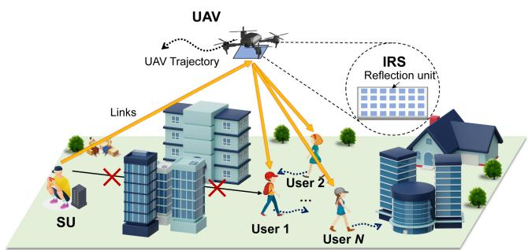  
Fig. 1. UAV-carried IRS-aided mmWave communication system in urban low altitude communication scenarios. In this system, the SU adopts mmWave communication technology to communicate with multiple mobile users, and UAV-carried IRS is deployed to mitigate the blocking effect of obstacles for enhancing the communication quality.

We consider a discrete-time system evolving over time slots $\mathcal { T } \triangleq \{ 1 , 2 , \dots , T \}$ , where the length of the time period is equal to $t _ { d }$ seconds. For the sake of simplicity, we consider the user to be served with a time-division-multiple-access (TDMA) mode. Without loss of generality, we consider a Cartesian coordinate system, where the locations of the SU, UAV-carried IRS and the u-th user at time slot t are represented $\begin{array} { r l } { \mathrm { a s } \ } & { { } \mathbf { c } ^ { S U } \triangleq [ x ^ { S U } , y ^ { S U } , z ^ { S U } ] , \quad \mathbf { c } _ { t } ^ { I R S } \triangleq [ x _ { t } ^ { I R S } , y _ { t } ^ { I \dot { R S } } , z _ { t } ^ { I R S } ] } \end{array}$ $\mathbf { c } _ { u , t } ^ { U E } \triangleq [ x _ { u , t } ^ { U E } , y _ { u , t } ^ { U E } , z _ { u , t } ^ { U E } ]$ , respectively.

Due to the mobility of the user, the UAV-carried IRS needs to change its position to achieve better communication performance. In the following, we will introduce the SU-IRS-user communication models, and then present the UAV mobile and energy cost models.

## B. Communication Model

We consider the Rician fading channels for the communication links between the SU and IRS as well as between the IRS and the user, because IRS can transform Rayleigh/fast fading into Rician/slow fading to achieve ultra-high reliability [8]. Since the location of the UAV-carried IRS and the user varies with time, the path loss between the SU and UAV-carried IRS and the path loss between the UAV-carried IRS and u-th user in time slot t are given by $\Psi _ { t } ^ { S I } = \beta ( D ) + 1 0 n \log _ { 1 0 } ( d _ { t } ^ { S I } / D )$ and $\Psi _ { u , t } ^ { I E } = \beta ( D ) \overset { \cdot } { + } 1 0 n \overset { \cdot } { \log _ { 1 0 } } ( d _ { u , t / } ^ { I E } \dot { D } )$ [39], respectively, where $d _ { 0 }$ is the reference distance, and $\dot { \beta ( D ) }$ is the reference path loss at ( )a reference distance D. Moreover, n is the path loss exponent, which determines the rate of signal strength decay with distance.

Following this, we use $g _ { t } \in \mathbb { C } ^ { M \times 1 }$ to denote the downlink channel vector from the SU to the UAV-carried IRS, and $h _ { u , t } \in$ $\mathbb { C } ^ { M \times 1 }$ to denote the downlink channel vector from the UAVcarried IRS to the user in time slot t, which are respectively given by

$$
g _ { t } = \Psi _ { t } ^ { S I } \left( \sqrt { \frac { k } { 1 + k } } \widetilde { g } _ { t } ^ { L o S } + \sqrt { \frac { 1 } { 1 + k } } \widetilde { g } _ { t } ^ { N L o S } \right) ,\tag{1}
$$

$$
h _ { u , t } = \Psi _ { u , t } ^ { I E } \left( \sqrt { \frac { k } { 1 + k } } \widetilde { h } _ { u , t } ^ { L o S } + \sqrt { \frac { 1 } { 1 + k } } \widetilde { h } _ { u , t } ^ { N L o S } \right) ,\tag{2}
$$

where k is the Rician factor, $\Psi _ { u , t } ^ { I E }$ and $\Psi _ { t } ^ { S I }$ are the path loss Ψ Ψfrom the UAV-carried IRS to the user and the path loss from the SU to the UAV-carried IRS, respectively. Moreover, the non-LoS (NLoS) part of channel $\widetilde { h } _ { u , t } ^ { N L o S }$ and $\widetilde { g } _ { t } ^ { N L o S }$ are generally modeled as $i . i . d .$ standard Gaussian distributions. The LoS part of channel $\widetilde { h } _ { u , t } ^ { L o S }$ and $\widetilde { g } _ { t } ^ { L o S }$ are related to the locations of the SU, the UAV-carried IRS, and the u-th user. Furthermore, we use $\varphi _ { t } ^ { S I }$ and $\psi _ { t } ^ { S I }$ to denote the azimuth and elevation angles of arrival (AoA) from the SU to the UAV-carried IRS, $\varphi _ { u , t } ^ { I E }$ and $\psi _ { u , t } ^ { I E }$ to denote the azimuth and elevation angles of departure (AoD). Then, the LoS channel $\widetilde { h } _ { u , t } ^ { L o S }$ and $\widetilde { g } _ { t } ^ { L o S }$ can be expressed as follows [18]:

$$
\widetilde { g } _ { t } ^ { L o S } = [ 1 , \dots , e ^ { \frac { 2 \pi j l } { \lambda } \{ m _ { c } \sin { ( \varphi _ { t } ^ { S I } ) } \cos { ( \psi _ { t } ^ { S I } ) } + m _ { r } \sin { ( \psi _ { t } ^ { S I } ) } \} } ,
$$

$$
e ^ { \frac { 2 \pi j } { \lambda } \left\{ \left( M _ { c } - 1 \right) \sin { ( \varphi _ { t } ^ { S I } ) } \cos { ( \psi _ { t } ^ { S I } ) } + \left( M _ { r } - 1 \right) \sin { ( \psi _ { t } ^ { S I } ) } \right\} } ] ,\tag{3}
$$

$$
\widetilde { h } _ { u , t } ^ { L o S } = [ 1 , \dots , e ^ { \frac { 2 \pi j l } { \lambda } \{ m _ { c } \sin { ( \varphi _ { u , t } ^ { I E } ) } \cos { ( \psi _ { u , t } ^ { I E } ) } + m _ { r } \sin { ( \psi _ { u , t } ^ { I E } ) } \} } , \dots ,
$$

$$
e ^ { \frac { 2 \pi j l } { \lambda } \{ \left( M _ { c } - 1 \right) \sin { ( \varphi _ { u , t } ^ { I E } ) } \cos { ( \psi _ { u , t } ^ { I E } ) } + \left( M _ { r } - 1 \right) \sin { ( \psi _ { u , t } ^ { I E } ) } \} } ] ,\tag{4}
$$

where l is the distance between two adjacent reflecting elements of the UAV-carried IRS, λ is the carrier wavelength, $m _ { r }$ is the row index of reflecting elements and $m _ { c }$ is the column index of reflecting elements. Moreover, $M _ { r }$ is the total number of reflecting elements in a row and $M _ { c }$ is the total number of reflecting elements in a column.

Finally, we let $\Theta _ { t } = \mathrm { d i a g } \{ e ^ { j \omega _ { 1 , t } } , e ^ { j \omega _ { 2 , t } } , \dots , e ^ { j \omega _ { M , t } } \}$ be the reflection coefficients at the UAV-carried IRS, where $\omega _ { i , t } \in$ $[ - \pi , \pi )$ is the phase shift of the i-th element. Then, the achievable data rate $R _ { u , t }$ at the u-th user in the time slot t can be expressed as follows:

$$
R _ { u , t } = B \log _ { 2 } { \left( 1 + \frac { P g _ { t } ^ { T } \Theta _ { t } h _ { u , t } } { B \sigma ^ { 2 } } \right) } ,\tag{5}
$$

where $P$ and $\sigma ^ { 2 }$ are the transmit power and noise power, respectively. Moreover, $B$ is the bandwidth.

Note that we can obtain the channel state information of the considered system by utilizing the existing mature methods, such as channel estimation methods based on three-dimensional (3D) geometric positioning and channel estimation methods based on random beamforming. See Appendix A in the supplemental material for details.

## C. UAV Mobile and Energy Cost Models

In each time slot, the UAV moves with a flying action $a _ { t } \triangleq$ $[ a _ { t } ^ { x } , a _ { t } ^ { y } , a _ { t } ^ { z } ]$ . Thus, the coordinate of the UAV in time slot t is calculated by $\mathbf { c } _ { t } ^ { U A V } = \mathbf { c } _ { t - 1 } ^ { U A V } + a _ { t }$ . The distance between the = +SU and UAV-carried IRS in time slot t is expressed as $d _ { t } ^ { S I } =$ $\| \mathbf { c } ^ { S U } - \mathbf { c } _ { t } ^ { I R S } \|$ =. Similarly, the distance between the UAV-carried IRS and u-th user is $d _ { u , t } ^ { I \dot { E } } = \| \mathbf { c } _ { t } ^ { I R S } - \mathbf { c } _ { u , t } ^ { U E } \|$

Then, we introduce the following energy cost model for the mobile UAV. Specifically, the main energy consumption of the UAV is propulsion energy consumption since the UAV is used to carry the IRS to reflect signals and does not participate in the communication process. Thus, for a rotary UAV flying in a threedimensional (3D) space, the propulsion energy consumption in time slot t is represented as follows [32]:

$$
\begin{array} { r l r } { \mathrm { ~ } } & { { } } & { E _ { t } = \left( P _ { B } \left( 1 + \frac { 3 ( v _ { t } ^ { h } ) ^ { 2 } } { U _ { t i p } ^ { 2 } } \right) + P _ { I } \left( \sqrt { 1 + \frac { ( v _ { t } ^ { h } ) ^ { 4 } } { 4 v _ { 0 } ^ { 4 } } } - \frac { ( v _ { t } ^ { h } ) ^ { 2 } } { 2 v _ { 0 } ^ { 2 } } \right) ^ { \frac { 1 } { 2 } } \right. } \\ { \mathrm { ~ } } & { { } } & { \left. + \frac { 1 } { 2 } d _ { 0 } \alpha s G \big ( v _ { t } ^ { h } \big ) ^ { 3 } + m g v _ { t } ^ { v } \right) t _ { d } , \qquad ( 6 ) } \end{array}
$$

where the constants $P _ { B }$ and $P _ { I }$ represent the blade profile power and induced power in hovering status, respectively. The tip speed of the rotor blade is denoted by $U _ { t i p }$ , and $v _ { 0 }$ refers to the mean rotor-induced velocity during hover. The fuselage drag ratio and rotor solidity are represented by $d _ { 0 }$ and s, respectively, while α and G denote air density and rotor disc area, respectively. Additionally, m stands for the total mass of the UAV and IRS, and $g$ is the gravitational acceleration. The horizontal and vertical velocities of the UAV in time slot t are denoted by $v _ { t } ^ { h } = \sqrt { ( a _ { t } ^ { x } ) ^ { 2 } + ( a _ { t } ^ { y } ) ^ { 2 } } / t _ { d }$ and $v _ { t } ^ { v } = | a _ { t } ^ { z } | / t _ { d }$ , and $t _ { d }$ is the time duration.

As can be seen, the UAV flight speed is the main controllable variable in (6) that affects the energy consumption, and the others can be considered as parameters related to the environment and the UAV itself. In this case, in the considered system with fixed time-slot duration, the UAV displacement per time slot determines the flight speed, which means that the UAV displacement is a crucial optimization variable.

Notably, we assume that the UAV can fly flexibly and adaptively within the target area in the considered urban scenario to maintain the relatively stable transmission and improve the transmission rates [40]. However, the UAV may required to follow the regulated paths in the urban scenario, such as involving a no-fly zone, which is further discussed in detail in Appendix G.

## D. Problem Formulation

In this work, the system focuses on two primary goals which are optimizing the transmission rate and minimizing the energy consumption of the UAVs. However, in multi-user scenarios, a UAV-carried IRS may serve only a few users, which can result in high transmission rates for some and low transmission rates for others. This imbalance may degrade the overall system performance and negatively impact user experience. Therefore, we seek to define a new objective function that can jointly optimize the transmission performance, energy efficiency, and fairness as the optimization objective.

Specifically, we first introduce Jain’s fairness index [41], a metric used to evaluate the fairness of resource allocation, to ensure that all users achieve reasonable transmission rates. By balancing the data rates among users, this metric can maximize the overall system transmission rate while minimizing the rate differences among users. In particular, the fairness coefficient ξ is defined as follows:

$$
\xi = \frac { ( \sum _ { i = 1 } ^ { n } R _ { i , t } ) ^ { 2 } } { n \sum _ { i = 1 } ^ { n } R _ { i , t } ^ { 2 } } \in \left[ \frac { 1 } { n } , 1 \right] ,\tag{7}
$$

where n represents the total number of users. Then, we combine Jain’s fairness index with transmission rate and energy consumption, and thus define the fairness rate energy consumption ratio as the optimization objective. The fairness rate energy consumption ratio at the tth time slot is given by

$$
F _ { t } = \frac { \sum _ { i = 1 } ^ { n } \xi R _ { i , t } } { E _ { t } } .\tag{8}
$$

As can be seen, we aim to maximize the long-term average transmission rates, transmission fairness and energy consumption instead of instantaneous values to improve the transmission metrics and energy efficiency over the timeline. To achieve this, the phase adjustments of the IRS and the flight path of the UAV over the timeline should be jointly controlled to improve the average transmission rates and fairness. Moreover, to optimize the average energy consumption of the UAV, we need to plan the trajectory of the UAV across time slots to minimize the overall energy usage. As such, the following decision variables need to be jointly determined: $( i ) \Theta = \{ \Theta _ { t } | t \in \mathcal { T } \}$ , a diagonal matrix representing the reflection coefficients of the UAV-carried IRS for different time periods; (ii) $A = \{ [ a _ { t } ^ { x } , a _ { t } ^ { y } , a _ { t } ^ { z } ] | t \in \mathcal { T } \}$ , a matrix representing the control parameters of the UAV, which denotes its spatial displacement at different time intervals.

Following this, the corresponding joint optimization problem is formulated as follows:

$$
\operatorname* { m a x } _ { \Theta , A } ~ \sum _ { t = 1 } ^ { T } F _ { t }\tag{9a}
$$

$$
\mathrm { s . t . } C 1 : 0 \leq d _ { t } ^ { I R S } \leq D ^ { \operatorname* { m a x } }
$$

$$
C 2 : X ^ { \operatorname* { m i n } } \leq x _ { t } ^ { I R S } \leq X ^ { \operatorname* { m a x } }\tag{9b}
$$

(9c)

$$
C 3 : Y ^ { \operatorname* { m i n } } \leq y _ { t } ^ { I R S } \leq Y ^ { \operatorname* { m a x } }\tag{9d}
$$

$$
C 4 : Z ^ { \operatorname* { m i n } } \leq z _ { t } ^ { I R S } \leq Z ^ { \operatorname* { m a x } }\tag{9e}
$$

$$
C 5 : - \pi \le \omega _ { i , t } < \pi , i = 1 , \ldots , M\tag{9f}
$$

where $d _ { t } ^ { I R S } = \| c _ { t } ^ { I R S } - c _ { t - 1 } ^ { I R S } \|$ represents the flying distance of =the UAV-carried IRS, and (9b) represents the constraint on the flying distance per second. Moreover, (9c), (9d), and (9e) define the permissible flight areas for the UAV-carried IRS, with any flight outside these areas considered a boundary violation. In addition, (9f) restricts the range of phase shifts available to the UAV-carried IRS. Note that this problem is non-convex, and the non-convexity arises from the reflection coefficients Θ. Specifically, since the LoS links need to be reconstructed based on the current position, the value range for Θ is constrained by the current location, resulting in the selection space for Θ nonconvex. Moreover, even if we only consider the IRS optimizing in case other variables are known, the simplified problem can be reduced as a non-convex quadratically constrained quadratic program (QCOP), which is proven to be an NP-hard problem [8]. Thus, the formulated problem is also NP-hard and cannot be solved in polynomial time.

## IV. DRL-BASED APPROACH

In this section, we propose a DRL-based approach to solve our joint optimization problem. To this end, we first show the motivations for using DRL and reformulate the problem as a markov decision process (MDP). Then, we introduce the proposed EPPO algorithm with several improvements.

## A. Motivations for Using DRL and MDP Formulation

Our formulated problem is dynamic and uncertain since it involves a highly unpredictable environment, where factors such as obstacles, UAV mobility, and user position can change rapidly. Moreover, the UAV-carried IRS system also exhibits high requirements for real-time response. Thus, the commonly used static optimization methods, such as convex or non-convex optimization, are not suitable for this problem [42], [43], [44]. In this case, DRL methods can support real-time decision making by observing instantaneous environment information, which allows the DRL agent to swiftly adapt to the dynamic and uncertain environment and offer robust solutions. Thus, we seek to adopt the DRL method to solve our optimization problem.

To this end, we first reformulate the optimization problem shown in (9) as an MDP. Mathematically, an MDP is a tuple $( S , { \mathcal { A } } , { \mathcal { P } } , R , \gamma )$ which are state space, action space, state transition probability, reward function, and discount factor, respectively. Among them, state, action, and reward are the most important components which are detailed as follows.

1) State Space: The state space is designed to encompass critical spatial factors that impact system performance. Specifically, the coordinates of the UAV and the u-th user are contained since these parameters affect the channel conditions. As such, the state $s _ { t }$ is given by $s _ { t } = \{ \mathbf { c } _ { t } ^ { U A V } , \mathbf { c } _ { u , t } ^ { U E } \}$

2) Action Space: In our system, the UAV can adjust the position to achieve better channel conditions. Moreover, the UAV-carried IRS also can turn its parameters in terms of phase shifts and reflection angles, which can be computed by the coordinates of the SU, the UAV, and the user. As such, the action of agent $a _ { t }$ is represented as $a _ { t } = \{ a _ { t } ^ { x } , a _ { t } ^ { y } , a _ { t } ^ { z } \}$ , where $a _ { t } ^ { x }$ $a _ { t } ^ { y }$ and $a _ { t } ^ { z }$ are the flight distance of UAV along the x, y, and z axes.

3) Reward Function: A well-designed reward function contributes to problem-solving, which is critical. As such, the reward function incorporates both our optimization objective and the associated constraints, as outlined in (10). Specifically, this function motivates the UAV to achieve better transmission rates through high LoS probabilities while minimizing the energy consumption within the available areas, i.e.,

$$
\begin{array} { r } { \left\{ { r _ { t } } = \xi R _ { u , t } / E _ { t } - p _ { o } \mathrm { { i f } L o S \ l i n k } \right. } \\ { r _ { t } = 0 \mathrm { { i f } N L o S \ l i n k . } } \end{array}\tag{10}
$$

where $p _ { o }$ is the out-of-bounds penalty, and ξ is Jain’s Fairness Index. Moreover, the zero-reward penalty in the reward function prompts the DRL agent to learn a UAV trajectory planning strategy that can avoid transmission link blockage, which subsequently improves transmission rates and mitigate effects of channel fading. In what follows, we aim to propose a DRL algorithm to handle this reformulated MDP.

## B. PPO Algorithm

In this work, we aim to consider PPO as the solving framework. Specifically, PPO [45] is a state-of-the-art reinforcement learning algorithm based on policy. This type of policy-based algorithm will generate a policy network $\pi _ { \theta }$ to make decisions in the abovementioned MDP. Thus, the objective of PPO is to improve the policy parameters for achieving high state values, i.e.,

$$
J ( \theta ) = \mathbb { E } _ { \tau \sim \pi _ { \theta } } \left[ \sum _ { t = 1 } ^ { T } r _ { t } \right] .\tag{11}
$$

Policy gradient methods face a limitation in sample efficiency. This inefficiency stems from the need to sample multiple complete trajectories $\tau ,$ which is computationally expensive, particularly in the scenarios involving high-dimensional state spaces or continuous action spaces. To mitigate this, the actor-critic method is introduced, thereby improving sample efficiency. Specifically, the actor-critic method incorporates a value function, referred to as the critic, which assesses the effectiveness of the current action. This assessment is then used to guide updates to the actor network in a more efficient manner. The actor-critic method aims to maximize the objective of the actor while minimizing the loss function of the critic. A hyperparameter $\beta _ { b }$ is used to balance the actor and critic network during the learning process. i.e.,

$$
J ( \theta , V ) = J _ { a c t o r } ( \theta ) - \beta _ { b } J _ { c r i t i c } ( V ) ,\tag{12}
$$

where $J _ { a c t o r } ( \theta ) = \mathbb { E } _ { \tau \sim \pi _ { \theta } } [ \sum _ { t = 1 } ^ { T }$ ∇θ $\pi _ { \boldsymbol { \theta } } ( a _ { t } | s _ { t } ) A ^ { \pi _ { \boldsymbol { \theta } } } ( s _ { t } , a _ { t } ) ]$ In (12), ∇θ $\pi _ { \boldsymbol { \theta } } \big ( a _ { t } | \boldsymbol { s } _ { t } \big )$ represents the policy gradient with respect to the parameter θ, and $A ^ { \pi _ { \theta } } ( s _ { t } , a _ { t } )$ denotes the advantage ( )function used to estimate the benefit of taking a specific action relative to the average action. This advantage function can be either the temporal difference error or an estimate derived from the value function. Moreover, the critic network seeks to minimize the square of the temporal difference error, where $\gamma$ is the discount factor, and $V ( s _ { t } )$ represents the state value estimate by the critic, $\begin{array} { r } { J _ { c r i t i c } ( V ) = \mathbb { E } _ { \tau } [ \sum _ { t = 1 } ^ { T } \frac { 1 } { 2 } ( r _ { t } + \gamma V ( s _ { t + 1 } ) - V ( s _ { t } ) ) ^ { 2 } ] } \end{array}$

Trust region policy optimization (TRPO) is an enhancement of the policy gradient algorithm within the actor-critic framework. Specifically, TRPO introduces a trust region to ensure that each parameter update does not cause excessive policy changes, thereby enhancing the algorithmic stability. This approach reduces the risk of introducing overly large policy variations during updates, which can lead to learning instability. The objective function of TRPO comprises two components: one is for the objective of the actor and another one is for the constraint term that restricts policy changes. The overall objective function of TRPO is expressed as follows:

$$
\begin{array} { r l } { \operatorname* { m a x } } & { { } J ( \theta ) = \mathbb { E } _ { \tau \sim \pi _ { \theta } } \left[ \sum _ { t = 1 } ^ { T } \nabla _ { \theta } \log \pi _ { \theta } ( a _ { t } | s _ { t } ) A ^ { \pi _ { \theta } } ( s _ { t } , a _ { t } ) \right] , } \end{array}
$$

$$
\begin{array} { r } { \mathrm { s . t . } \quad \mathbb { E } _ { \tau \sim \pi _ { \theta _ { o l d } } } \left[ D ( \pi _ { \theta _ { o l d } } ( \cdot | s ) | | \pi _ { \theta } ( \cdot | s ) ) \right] \leq \delta , } \end{array}\tag{13}
$$

where δ is a pre-defined threshold and $D ( \cdot | | \cdot )$ represents Kullback-Leibler divergence.

PPO imposes a limit on the proportion between the probabilities of the new and previous policies, ensuring that policy updates are within a safe and bounded range. To this end, PPO improves the policy using a surrogate objective that constrains policy updates. Let $A _ { \pi _ { \theta } }$ be the advantage function, then the constraint can be expressed as follows:

$$
L ^ { c l i p } ( \theta ) = \mathbb { E } _ { t } [ \operatorname* { m i n } ( \rho _ { t } ( \theta ) A _ { \pi _ { \theta } } ( s _ { t } , a _ { t } ) , \rho _ { t } ^ { c l i p } ( \theta ) A _ { \pi _ { \theta } } ( s _ { t } , a _ { t } ) ) ] ,\tag{14}
$$

where θ represents the policy parameters, $\rho _ { t } ( \theta )$ is the ratio of new and old policy probabilities, and $\rho _ { t } ^ { c l i p } ( \theta ) = c l i p ( \rho _ { t } ( \theta ) , 1 -$ $\epsilon , 1 + \epsilon )$ is a clipped value of $\rho _ { t } ( \theta )$ , where  is a hyperparameter that controls the size of the policy update. As such, PPO combines this surrogate objective with multiple epochs of data to iteratively update the policy while avoiding large policy deviations, resulting in stable learning.

However, the instantaneous variation of the reward function may be large in our MDP. Thus, it is hard for conventional PPO to catch the policy in the short term, which causes PPO to exhibit slow convergence. In this case, we aim to improve the PPO alforithm so that it better aligns with our MDP in the following.

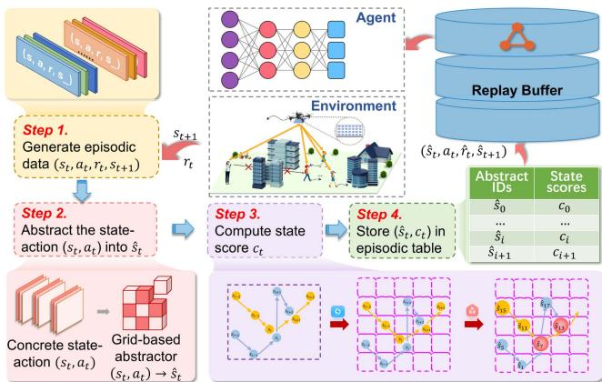  
Fig. 2. The overview of NECSA.

## C. Ehanced PPO

An improved version of the PPO algorithm, referred to as EPPO, is introduced in this subsection. Specifically, the large and continuously changing dynamic state space poses a convergence challenge for the algorithm, as it struggles to generalize and adapt to such a complex environment. Moreover, our considered system evolves over time, where the actions taken at each time step have a lasting impact on subsequent states and actions. Therefore, the agent is required to understand the relationships and influences that span across extended periods for accurate predictions and decision-making. However, PPO is not well-suited to capture these long-term dependencies between states and actions. Additionally, the vast and multi-dimensional action space increases exploration difficulty and computational complexity, making it harder for the algorithm to efficiently learn an optimal policy. Thus, EPPO integrates three essential enhancements which are

\- Neural episodic control with state abstraction (NECSA): NECSA is to reduce the state and action space, simplifying and accelerating the learning process.

\- Mogrifier LSTM: Mogrifier LSTM can handle longsequence dependencies, enabling the algorithm to learn better.

\- IRS phase shift control strategy: IRS phase shift control strategy can reduce the dimension of the action space.

They are detailed as follows.

1) Neural Episodic Control With State Abstraction: First, we introduce NECSA [46] mechanism into our EPPO algorithm to speed up the convergence. Fig. 2 illustrates that NECSA is mainly composed of three essential components that are the state abstractor, the episodic table, and the replay buffer. First, to enhance the learning efficiency of the agent in continuous state space, NECSA introduces an abstract state mechanism, designed to transform the continuous state space into discrete grid-based abstract representations. Specifically, the K-dimensional state space $\mathbb { R } ^ { K }$ contains infinite concrete states, and the abstract state mechanism splits each dimension of the state space into N equal intervals, which divides the state space into $\mathbf { \dot { N } } ^ { K }$ grids. In this case, each actual state obtained by the agent during training falls into a corresponding grid, and the states residing in the same grid share the same abstract state, thereby achieving discretization of the continuous state space.

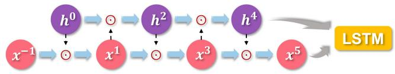  
Fig. 3. Mogrifier LSTM with 5 rounds of updates.

Second, the episodic table stores scores linked to abstract states, which are continuously updated as the agent interacts with the environment. Finally, the memory buffer stores past experiences, allowing the agent to compare its current state with these memories for improved learning. As an improvement of PPO algorithm, NECSA takes a transition $( s _ { t } , a _ { t } , r _ { t } , s _ { t + 1 } )$ from the environment and processes it using the three mentioned modules. Subsequently, it generates a new transition $( s _ { t } , a _ { t } , \hat { r } _ { t } , s _ { t + 1 } )$ where $\hat { r } _ { t }$ ˆrepresents an intrinsic reward calculated based on the episodic table and the original reward $r _ { t } .$ . Specifically, the revised reward for the abstract state $\hat { s } _ { t }$ in time slot t is defined as $\begin{array} { r } { \hat { r } _ { t } = r _ { t } + \left( c _ { i } - \frac { \sum _ { m = 0 } ^ { M } c _ { m } } { M } \right) } \end{array}$ , where M represents the the total number of abstract states, and $c _ { i }$ represents the score of the current abstract state, which can be considered as the average of historical total rewards earned by the traces which contain the $\hat { s } _ { t }$ . This reward revision enhances the learning process by providing more precise and informative feedback to the agent, ultimately improving its performance.

2) Mogrifier LSTM: In the considered system, the current decision has a profound impact on the subsequent environmental state and action selection, which indicates that the considered system has long-term dependencies. Notably, while the standard LSTM can capture long-term dependencies, the variant mogrifier LSTM [14] models long-term dependencies more effectively over longer time slots due to its iterative modulation mechanism. Specifically, mogrifier LSTM introduces an innovative computation step before the standard LSTM operation. This process is depicted in Fig. 3, where inputs x and h undergo interactive transformations in an alternating method. Moreover,  represents the element-wise product. Mogrifier LSTM enhances the actor neural network of PPO. The actor neural network is designed as a deep neural network, combining a multi-layer perceptron and a mogrifier LSTM, producing action probabilities from the given observed environment state. In addition, the critic neural network remains unchanged. As such, we use mogrifier LSTM to enhance the ability of the agent to capture longterm dependency and predict future environment conditions based on historical state information, which facilitates improving the transmission performance of the considered dynamic system.

3) IRS Phase Shift Control Strategy: To further facilitate the convergence, a low-complexity strategy is proposed to optimize the phase shifts of the UAV-carried IRS, aiming to maximize user data rate using the known coordinates of both the UAV and the user at time slot t. The optimal phase shift $\omega _ { i , t }$ is denoted

Algorithm 1: EPPO.   
1: Initialize the parameter θ of actor neural network and the   
parameter φ of critic neural network;   
2: Initialize the parameter of actor\_old neural network   
$\theta _ { o l d }  \theta ;$   
3: Initialize the episodic memory $C$   
4: for $E p i s o d e = 1 , \dots , N ^ { e p s }$ do   
= 15: Reset the environment and initialize state $s _ { t } ;$   
6: for Time slot $t = 1 , \dots , T$ do   
7: Obtain state $s _ { t } ;$   
8: Select action $a _ { t } = \{ a _ { t } ^ { x } , a _ { t } ^ { y } , a _ { t } ^ { z } \} \{$   
9: Execute action $a _ { t } ;$   
10: Calculate the energy consumption of UAV $E _ { t }$ from   
Eq. (6);   
11: Obtain the optimized phase shifts of UAV-carried   
IRS according to Section IV-C3;   
12: Calculated $r _ { t }$ according to Eq. (10);   
13: Revised reward $\hat { r } _ { t } = N E C S A ( [ s _ { t } , a _ { t } , r _ { t } , s _ { t + 1 } ] , C )$   
14: Store transition $\left[ s _ { t } , a _ { t } , \hat { r } _ { t } , s _ { t + 1 } \right]$ into experience   
replay buffer;   
15: if Size(replay buffer) batch size then   
16: Copy parameter of actor neural network to   
actor\_old neural network $\theta _ { o l d }  \theta ;$   
17: for epoch $K _ { e } = 1 , \ldots , K$ do   
18: Update the parameter θ and parameter $\phi ;$   
19: Empty the replay buffer;

as [47]:

$$
\begin{array} { c } { { \omega _ { i , t } = { \displaystyle \frac { 2 \pi l } { \lambda } \{ ( m _ { c } - 1 ) \sin \varphi _ { t } ^ { I E } \cos \psi _ { t } ^ { I E } + ( m _ { r } - 1 ) \sin \psi _ { t } ^ { I E } } } } \\ { { + ( m _ { c } - 1 ) \sin \varphi _ { t } ^ { S I } \cos \psi _ { t } ^ { S I } + ( m _ { r } - 1 ) \sin \psi _ { t } ^ { S I } \} , } } \end{array}\tag{15}
$$

where $m _ { c }$ and $m _ { r }$ represent the column and row indices of the ith element in the UAV-carried IRS, respectively. PPO includes a process for learning the phase shifts of UAV-carried IRS, which expands the action space and slows down the convergence. In contrast, the IRS phase control strategy can effectively reduce the action space by calculating the phase shifts using (15). Specifically, the original action space of $( M _ { r } \times M _ { c } + 3 )$ is ( + 3)reduced to 3. Moreover, the IRS phase shift control strategy can configure the phase shift matrix in real time due to the lowcomplexity nature, thus ensuring that the system can respond to channel changes immediately to improve the transmission rates and mitigate channel fading

4) Main Steps of EPPO Algorithm: As depicted in Fig. 4, EPPO employs two neural networks, i.e., an actor neural network which is responsible for policy learning, and a critic neural network that estimates the state value function and the advantage function. To ensure the stable policy updates, EPPO maintains an actor\_old network with identical parameters to calculate the clipping ratio. The current state $s _ { t }$ is fed into the neural network to generate action $a _ { t }$ . Following the execution of this action, the environment yields a corresponding reward $r _ { t } .$ creating a transition. This transition is updated by the NECSA module and then added to the replay buffer, which is used for neural network training.

The main steps of the proposed EPPO algorithm are shown in Algorithm 1. Specifically, the EPPO algorithm begins by initializing the actor and critic neural network parameters, along with the episodic memory. Then, EPPO proceeds to execute episodes of interactions with the environment. Within each episode, it resets the environment and state, and for each time slot, the algorithm selects actions, optimizes UAV-carried IRS phase shifts, calculates UAV energy consumption, computes rewards, and revises rewards using the NECSA module. Next, the transitions are saved in an experience replay buffer for further use. When the number of transitions in the replay buffer reaches the predefined batch size, the algorithm updates the actor and critic neural network parameters through multiple training epochs, ensuring convergence. This process repeats until all specified episodes are completed, and the algorithm continuously refines its policy for reinforcement learning tasks.

## D. Complexity Analysis

In this section, we analyze the computational and space complexity of EPPO during training and execution phases.

Training phase: The computational complexity of EPPO is $\mathcal { O } ( | \theta _ { A } | + | \phi _ { C } | + N ^ { e p s } T | \theta _ { A } | + N ^ { e p s } T N ^ { n e c } V + K ( | \theta _ { A } | +$ $\left| \phi _ { C } | \right) )$ in the training phase, which can be summarized as follows:

\- Network initialize: This phase includes the initialization of network parameters. The corresponding computational complexity is given by $\mathcal { O } ( \vert \theta _ { A } \vert + \vert \phi _ { C } \vert )$ , where $| \theta _ { A } |$ and |φC| represent the number of parameters in the actor and critic networks, respectively.

\- Action sampling: In this phase, actions are generated based on the current state, with the associated complexity given by $\mathcal { O } ( N ^ { e p s } T | \theta _ { A } | )$ . Here, $N ^ { e p s }$ represents the total number of training episodes, and $T$ refers to the length of time slot set $\tau$

\- Replay buffer collection: The complexity of collecting state transitions in the replay buffer is $\mathcal { O } ( N ^ { e p s } T N ^ { n e c } V )$ , where $N ^ { n e c }$ is the computational complexity of NECSA and V indicates the complexity associated with environment interaction.

\- Network update: The network parameters undergo K updates during the updating phase. As a result, the complexity for this phase is calculated as $\mathcal { O } ( K ( | \theta _ { A } | + | \phi _ { C } | ) )$ .

During training, the space complexity for EPPO is given by $\mathcal { O } ( | \theta _ { A } | + | \phi _ { C } | + D _ { r } ( 3 | s | + 2 | a | + 3 ) )$ , where $D _ { r }$ denotes the size of the replay buffer, and $| s |$ and |a| correspond to the dimensions of the state and action spaces, respectively. This space complexity also includes the size of the neural network parameters and the replay buffer that stores the tuples of $( s _ { t } , a _ { t } , r _ { t } , s _ { t + 1 } )$ . The complexity of other algorithms can be found in Table II.

Execution phase: In the execution phase, the computational complexity associated with EPPO is $\mathcal { O } ( | \theta _ { A } | )$ , which is primarily due to the actor network inferring actions based on the current state. Note that the space complexity in this phase is also $\mathcal { O } ( | \theta _ { A } | )$

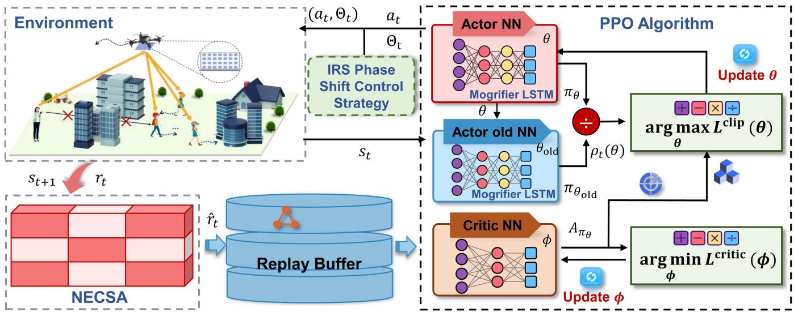  
Fig. 4. The framework of the proposed EPPO. Specifically, NECSA is employed to reduce the dimensionality of the state space, thereby accelerating the learning process. Moreover, mogrifier LSTM is integrated into the actor network to capture long-term sequential dependencies, thereby enhancing the decision-making capabilities of the algorithm. Moreover, the IRS phase control strategy directly computes IRS phase shifts, which significantly reduces the action space dimensionality and consequently improves training efficiency.

TABLE II  
COMPLEXITY COMPARISON OF DIFFERENT ALGORITHMS
<table><tr><td>Algorithm</td><td></td><td>Computational complexity</td><td></td><td>Space complexity</td><td></td><td></td></tr><tr><td>EPPO</td><td></td><td> $\overline { { \mathcal { O } ( \lvert \theta _ { A } \rvert + \lvert \phi _ { C } \rvert + N ^ { e p s } \dot { T } \rvert \theta _ { A } \rvert + N ^ { e p s } T \dot { N } ^ { n e c } \dot { V } + K ( \lvert \theta _ { A } \rvert + \lvert \phi _ { C } \rvert ) ) } }$ </td><td></td><td></td><td></td><td> $\overline { { \mathcal { O } ( | \theta _ { A } | + | \dot { \phi } _ { C } | + D _ { r } ( 3 | s | + 2 | a | + 3 ) ) } }$ </td></tr><tr><td>DDPG</td><td></td><td> $\mathcal { O } ( 2 | \theta _ { A } | + 2 | \phi _ { C } | + N ^ { e p s } T | \theta _ { A } | + N ^ { e p s } T V + K ( 2 | \theta _ { A } | + 2 | \phi _ { C } | ) )$ </td><td></td><td></td><td></td><td> $\mathcal { O } ( 2 | \theta _ { A } | + 2 | \phi _ { C } | + D _ { r } ( 2 | s | + | a | + 2 ) )$ </td></tr><tr><td>TD3</td><td></td><td> $\mathcal { O } ( 2 | \theta _ { A } | + 4 | \dot { \phi } _ { C } | + N ^ { e p s } T | \theta _ { A } | + N ^ { e p s } T V + K ( 2 | \theta _ { A } | + 4 | \dot { \phi } _ { C } | ) )$ </td><td></td><td></td><td></td><td> $\mathcal { O } ( 2 | \theta _ { A } | + 4 | \phi _ { C } | + D _ { r } ( 2 | s | + | a | + 2 ) )$ </td></tr><tr><td>SAC</td><td></td><td> $\mathcal { O } ( | \theta _ { A } | + 4 | \phi _ { C } | + N ^ { e p s } T | \theta _ { A } | + N ^ { e p s } T V + K \dot { ( } | \dot { \theta } _ { A } | \dot { + } 4 | \dot { \phi } _ { C } | ) )$ </td><td></td><td></td><td></td><td> $\mathcal { O } ( | \theta _ { A } | + 4 | \phi _ { C } | + D _ { r } ( 2 | s | + | a | + 2 ) )$ </td></tr><tr><td>PPO</td><td></td><td> $\mathcal { \dot { O } } ( | \theta _ { A } | + | \phi _ { C } | + N ^ { e p s } T | \theta _ { A } | + N ^ { e p s } T V + K ( | \theta _ { A } | + | \phi _ { C } | ) )$ </td><td></td><td></td><td></td><td> $\mathcal { O } \dot { ( } | \theta _ { A } | + | \phi _ { C } | + D _ { r } ( 2 | s | + | a | + 2 ) \big )$ </td></tr></table>

## E. System Deployment

In this subsection, a feasible deployment method is introduced to implement the system. In our considered system, the SU acts as the DRL agent to control the movement of the UAV-carried IRS by performing the proposed EPPO algorithm, where the link between SU and UAV can be viewed as wireless backhaul so that the UAV can be controlled by the SU. Moreover, the UAV acts as the IRS agent to manage the phase shift adjustment of the IRS. The system deployment is divided into two phases, i.e., positioning phase and transmission phase. The detailed process is as follows:

Positioning phase: Since the position of the UAV in each time slot is computed and controlled by the SU, the positioning phase mainly focuses on acquiring the location of the mobile user. In this case, some existing works have addressed user positioning issues in mmWave communication scenarios [48], [49]. For instance, the positioning of mobile users in IRS-assisted mmWave communication systems is investigated in [49], where the authors proposed a random beamforming and maximum likelihood estimation method to estimate some key parameters such as the AoA and AoD, enabling centimeter-level positioning accuracy for the mobile user. Therefore, such methods can be applied in the positioning phase to obtain the location of the mobile user.

\- Transmission phase: According to the location of the mobile user obtained in the positioning phase, the SU can control the trajectory of the UAV in the next time slot by performing our proposed EPPO algorithm based on the observed environment state. Moreover, Given the UAV’s limited energy and computational resources, the UAV can be installed a low-power lightweight field-programmable gate array (FPGA) to control the phase shifts of the IRS [50] referred to (15). Note that the complexity of phase computation is extremely low and the FPGA is lightweight, making it feasible for the energy-limited and computationlimited UAV. Accordingly, once the UAV trajectory and IRS phase shifts are determined, the data transmission process is then completed.

## V. SIMULATION RESULTS AND ANALYSIS

In this section, we present the simulation results and analyses. We first introduce the simulation setting and benchmarks, and then provide the simulation results.

## A. Simulation Setups

We consider a typical dense urban low altitude communication scenario with multiple lanes and intersections. The UAV flies within the airspace above a square area. The area is divided into a $3 \times 3$ grid, with each grid cell measuring 10 m in length. Inside each grid cell, 8 buildings are randomly placed, and the gaps between the grid cells represent roads, each 10 m wide. Our coordinate system places the bottom left corner of the city as the origin, with SU coordinates at (-200, 0, 25) and the initial coordinates of the user at (305, 205, 0). In the multi-user scenario, the initial coordinates for the three users are (305, 205, 0), (305, 405, 0), and (305, 105, 0), respectively. Following this, the UAV is deployed randomly in a valid city area for each episode, while the user follows the road. Other parameters can be found in Table III and follow reference [32].

TABLE III SIMULATION PARAMETERS
<table><tr><td rowspan=1 colspan=1>Parameter</td><td rowspan=1 colspan=1>Value</td><td rowspan=1 colspan=1>Parameter</td><td rowspan=1 colspan=1>Value</td></tr><tr><td rowspan=1 colspan=1> $\overline { { Z ^ { m i n } } }$ </td><td rowspan=1 colspan=1>80 m</td><td rowspan=1 colspan=1> $\overline { { Z ^ { m a x } } }$ </td><td rowspan=1 colspan=1>120 m</td></tr><tr><td rowspan=1 colspan=1> $X ^ { m i n }$ </td><td rowspan=1 colspan=1>0 m</td><td rowspan=1 colspan=1> $X ^ { m a x }$ </td><td rowspan=1 colspan=1>620 m</td></tr><tr><td rowspan=1 colspan=1>Ymin</td><td rowspan=1 colspan=1>0 m</td><td rowspan=1 colspan=1> $Y ^ { m a x }$ </td><td rowspan=1 colspan=1>620 m</td></tr><tr><td rowspan=1 colspan=1> $T$ </td><td rowspan=1 colspan=1>300</td><td rowspan=1 colspan=1> $D ^ { m a x }$ </td><td rowspan=1 colspan=1>30</td></tr><tr><td rowspan=1 colspan=1> $P _ { B }$ </td><td rowspan=1 colspan=1>199.4</td><td rowspan=1 colspan=1> $P _ { I }$ </td><td rowspan=1 colspan=1>88.66</td></tr><tr><td rowspan=1 colspan=1>m</td><td rowspan=1 colspan=1>2 kg</td><td rowspan=1 colspan=1>g</td><td rowspan=1 colspan=1>9.8N/kg</td></tr><tr><td rowspan=1 colspan=1> $U _ { t i p }$ </td><td rowspan=1 colspan=1>120 m/s</td><td rowspan=1 colspan=1>v0</td><td rowspan=1 colspan=1>4.03</td></tr><tr><td rowspan=1 colspan=1> $d _ { \mathrm { 0 } }$ </td><td rowspan=1 colspan=1>0.6</td><td rowspan=1 colspan=1>α</td><td rowspan=1 colspan=1>1.225 $\overline { { { \mathrm { k g } } / { \mathrm { m } } ^ { 3 } } }$ </td></tr><tr><td rowspan=1 colspan=1> $s$ </td><td rowspan=1 colspan=1>0.05</td><td rowspan=1 colspan=1>G</td><td rowspan=1 colspan=1> $\overline { { 0 . 5 3 \mathrm { m } ^ { 2 } } }$ </td></tr><tr><td rowspan=1 colspan=1> $t _ { d }$ </td><td rowspan=1 colspan=1>1 s</td><td rowspan=1 colspan=1>D</td><td rowspan=1 colspan=1>1 m</td></tr><tr><td rowspan=1 colspan=1> $\beta ( D )$ </td><td rowspan=1 colspan=1>30 dB</td><td rowspan=1 colspan=1>n</td><td rowspan=1 colspan=1>2.2</td></tr><tr><td rowspan=1 colspan=1> $l$ </td><td rowspan=1 colspan=1>λ/2</td><td rowspan=1 colspan=1> $P$ </td><td rowspan=1 colspan=1>15 W</td></tr><tr><td rowspan=1 colspan=1> $\overline { { { \sigma } ^ { 2 } } }$ </td><td rowspan=1 colspan=1>-174 dBm/Hz</td><td rowspan=1 colspan=1>B</td><td rowspan=1 colspan=1>2MHz</td></tr><tr><td rowspan=1 colspan=1> $N ^ { e p s }$ </td><td rowspan=1 colspan=1>3000</td><td rowspan=1 colspan=1>γ</td><td rowspan=1 colspan=1>0.99</td></tr><tr><td rowspan=1 colspan=1> $p _ { o }$ </td><td rowspan=1 colspan=1>0.04</td><td rowspan=1 colspan=1>€</td><td rowspan=1 colspan=1>0.02</td></tr></table>

For comparison, we utilize deep DDPG [51], twin delayed deep deterministic policy gradient (TD3) [52], soft actor-critic (SAC) [53], and proximal policy optimization (PPO) [45] as benchmark methods.

\- DDPG: DDPG is a DRL algorithm designed for solving problems in high dimensional states and continuous action spaces. Specifically, it utilizes a deterministic policy to estimate the optimal policy while maintaining a target network to stabilize training.

\- TD3: TD3 is an improved version of DDPG, and it introduces two Q-networks to reduce overestimation errors and employs a double delayed strategy to enhance training stability. TD3 is particularly robust in high-noise and uncertain environments, improving the accuracy of Q-value estimates.

\- SAC: SAC is a DRL algorithm that leverages the maximum entropy principle to encourage the agent to explore the action space. Specifically, it introduces the concept of Soft Q-Value and entropy to balance exploration and exploitation, making it suitable for highly uncertain environments. SAC exhibits strong exploration capabilities and can adaptively adjust the trade-off between exploration and exploitation.

\- PPO: PPO is an on-policy reinforcement learning algorithm, and it adopts a probabilistic policy and updates policy parameters through proximal optimization, resulting in high stability. PPO can dynamically adjust the learning rate during training to enhance robustness.

## B. Optimization Results in Single-User Scenario

In this subsection, we first verify the performance of the proposed EPPO in the single-user scenario. Note that the single-user scenario serves as a foundational analysis that allows us to isolate and analyze the core dynamics of the proposed method in a controlled environment.

1) Comparison Results: Fig. 5(a) illustrates the cumulative rewards for each episode of EPPO in comparison to other benchmark algorithms. In the initial stage, the rewards for all algorithms exhibit instability due to the poor performance of the UAV. This instability may arise from situations where the UAV flies outside the boundaries or reaches positions where it cannot establish LoS links. Subsequently, as the algorithms approach convergence, the rewards progressively rise and stabilize, indicating that an optimal strategy has been found.

Moreover, the reward of the EPPO algorithm experiences substantial improvement during the mid-training phase. This phenomenon can be attributed to the energy consumption of the UAV, which will be explained in the following part. Additionally, this figure clearly shows that the EPPO algorithm achieves higher rewards, faster convergence, and improved stability compared to other algorithms. This can be explained by several factors. First, the IRS phase shift control strategy enhances the communication rate. Second, the integration of mogrifier LSTM strengthens the temporal information, thereby accelerating algorithm convergence. Third, the inclusion of NECSA reduces the likelihood of the UAV entering prohibited areas. Finally, according to (10), this also accounts for the improvement of the EPPO reward. In summary, the EPPO algorithm improves data rates and mitigates excessive energy consumption.

We plot the average rate for the EPPO algorithm and other benchmark algorithms in Fig. 5(b) to illustrate the communication performance.. As can be seen, the proposed EPPO algorithm consistently maintains higher average data rates compared to other benchmark algorithms. The other algorithms initially exhibit low average rates, while as the algorithms converge, the average rates gradually increase to reach a stable value, which is still lower than that of EPPO. This can be explained by the fact that while the benchmark algorithms need to learn IRS phase shifts, EPPO does not require this phase shift learning process. The IRS phase control strategy computes phase shifts with greater precision.

Furthermore, we evaluate the performance of these algorithms in solving the formulated problem with the energy consumption of the UAV in Fig. 5(c). As shown, during the training process of all algorithms, the energy consumption of the UAV converges to a stable state with low energy consumption. Note that the proposed EPPO algorithm outperforms other algorithms in terms of energy consumption performance, which indicates that the UAV trajectory planning is more reasonable. Moreover, we observe that EPPO algorithm optimizes the UAV energy consumption around 250 J, which corresponds to just a 0.77% deviation from the theoretical minimum (i.e., 248.09 J when the horizontal flight speed of the UAV is 9.8 m/s). These simulation results confirm that the EPPO algorithm can successfully optimize the UAV speed to around the maximum endurance speed corresponding to the best UAV endurance performance due to its adaptability, thereby enabling the UAV to achieve near-optimal endurance performance.

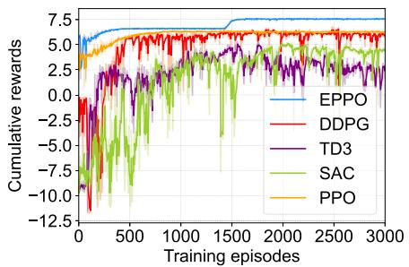  
(a)

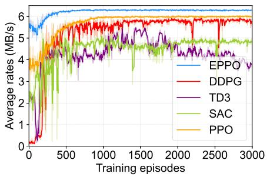  
(b)

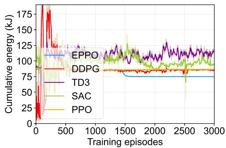  
(c)  
Fig. 5. Training results in the single-user scenario. (a) Cumulative rewards training curve. (b) Average rate training curve. (c) Cumulative energy consumption training curve.

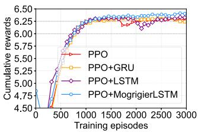  
(a)

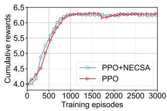  
(b)

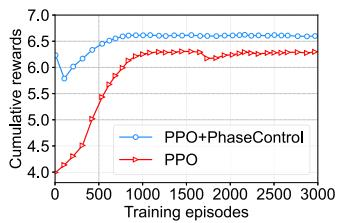  
(c)

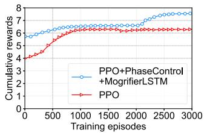  
(d)  
Fig. 6. Ablation simulation results in the single-user scenario. (a) Comparison of mogrifier LSTM, LSTM and GRU. (b) Comparison of PPO and PPO with NECSA. (c) Comparison of PPO and PPO with IRS phase shift control. (d) Comparison of PPO and PPO with IRS phase shift control and mogrifier LSTM.

2) Ablation Simulation Results: Following this, we present comprehensive simulation results that illustrate the performance enhancements achieved through the integration of each individual improvement on the original algorithm. To verify the effectiveness of mogrifier LSTM, the conventional LSTM and GRU are introduced in this simulation. Fig. 6(a) illustrates the rewards when PPO is combined with different LSTM networks. Mogrifier LSTM provides slight improvements in both convergence speed and final rewards. On the contrary, PPO with LSTM and PPO with GRU exhibit similar performance to the conventional PPO algorithm, without any notable improvement. This phenomenon occurs because the adopted mogrifier LSTM can more efficiently capture the long-term dependency in the considered system, which helps the agent to make more reasonable and accurate decisions.

Fig. 6(b) shows the comparison between PPO and PPO with NECSA. Specifically, PPO with NECSA converges around the 750th episode, whereas PPO requires more time to converge. It is evident from the figure that the addition of NECSA results in an accelerated convergence speed for PPO. This is because NECSA maps continuous states to higher-level abstract states, enabling the agent to learn and generalize more efficiently. Moreover, Fig. 6(c) compares the capacity of PPO and PPO with IRS phase shift control. Clearly, PPO with IRS phase shift control shows a significant improvement in rewards. This result demonstrates the effectiveness of the IRS phase shift control strategy, which contributes to enhancing the communication data rate. Additionally, both IRS phase shift control and mogrifier LSTM exhibit favorable effects not only when used individually but also when combined, resulting in unexpected improvements. As shown in Fig. 6(d), after the joint utilization of IRS phase shift control strategy and mogrifier LSTM, the algorithm experiences an improvement in rewards during the later stages of training, as explained in Fig. 5(c) earlier.

3) Trajectory Visualization Results: Finally, we present the 3D trajectory plot obtained by the EPPO algorithm for the UAV. Fig. 7 shows the trajectory of UAV-carried IRS in single-user scenario. As can be seen, the UAV carries an IRS that initiates its service to the user from the upper-left corner, flying towards optimal positions to establish LoS links with both the user and the SU, thereby enhancing communication performance. Once the UAV identifies the appropriate location, it gradually approaches the user, as discussed in [8], which is a reasonable approach.

4) Training and Decision Time Results: The training time and decision time are important metrics to evaluate the performance of algorithms. Specifically, the training time refers to the total time required for the algorithm training, with a shorter time indicating lower computational complexity. Meanwhile, the decision time refers to the time required for the well-trained agent to interact with the environment and make a round of decisions using the actor network, with a shorter time suggesting better real-time performance and easier deployment of the algorithm.

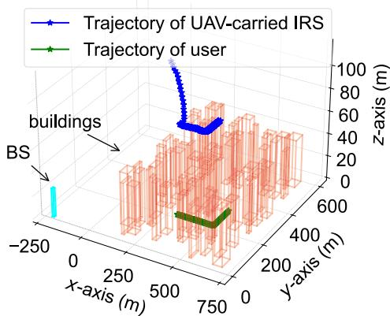  
Fig. 7. 3D trajectories of the UAV for single user.

TABLE IV  
TRAINING TIME AND DECISION TIME OF DIFFERENT ALGORITHMS
<table><tr><td rowspan=1 colspan=1>Algorithm</td><td rowspan=1 colspan=1>Training Time (h)</td><td rowspan=1 colspan=1>Decision Time (ms)</td></tr><tr><td rowspan=1 colspan=1>EPPO</td><td rowspan=1 colspan=1>1.575</td><td rowspan=1 colspan=1>1.7</td></tr><tr><td rowspan=1 colspan=1>DDPG</td><td rowspan=1 colspan=1>1.004</td><td rowspan=1 colspan=1>1.2</td></tr><tr><td rowspan=1 colspan=1>TD3</td><td rowspan=1 colspan=1>1.528</td><td rowspan=1 colspan=1>1.3</td></tr><tr><td rowspan=1 colspan=1>SAC</td><td rowspan=1 colspan=1>2.049</td><td rowspan=1 colspan=1>1.5</td></tr><tr><td rowspan=1 colspan=1>PPO</td><td rowspan=1 colspan=1>0.751</td><td rowspan=1 colspan=1>1.3</td></tr></table>

Table IV shows the the training time and decision time of all comparison algorithms. As can be seen, the proposed EPPO algorithm requires more training time than the original PPO algorithm, primarily due to the introduction of improvement factors, which increase the computational complexity of the algorithm. Combined with the training rewards shown in Fig. 5, we find that EPPO achieves a 20.33% improvement in reward over original PPO despite the increased training time cost, which demonstrates the effectiveness of the proposed improvement factors. Similarly, further comparative analysis reveals that EPPO achieves a remarkable 205.42% improvement in reward with only a 3.08% increase in training time compared to TD3, while delivering a 28.16% improvement in reward despite a 56.87% increase in training time cost compared to DDPG. These results demonstrate that the proposed method can achieve a significant reward improvement with only a slight increase in training time, which indicates that the proposed method achieves outstanding decision-making accuracy with reasonable computation complexity. In addition, we observe that the decision time of the proposed EPPO algorithm is short and very close to other algorithms, which indicates that the proposed method can be effectively deployed in practical scenarios.

These results demonstrate that the training time and decision time of the proposed optimization algorithm are in the same order of magnitude as other comparison algorithms, while its decision accuracy is greatly improved, which makes it more suitable for applications that require high-precision real-time decision-making.

## C. Optimization Results in Multi-User Scenario

In this subsection, the multi-user scenario is simulated to evaluate the performance of the proposed framework under more realistic and challenging conditions. Unlike the single-user scenario, the multi-user scenario introduces additional complexity due to the movements of the users and the need for efficient resource allocation among multiple competing users. Note that this case incorporates the Jain’s fairness index.

1) Comparison Results: Fig. 8(a) offers a clear comparison of the five algorithms previously mentioned with respect to cumulative reward. As seen in the figure, during the early training stages, the proposed EPPO algorithm experiences slight fluctuations while maintaining a higher reward level, while the conventional PPO algorithm performs slightly worse than EPPO. In contrast, SAC, TD3, and DDPG exhibit significant fluctuations at a lower reward level. As the iterations progress, the performance of EPPO significantly outperforms other algorithms. This is because EPPO significantly reduces the probability of the UAV encountering out-of-bounds occurrences and reduces the out-of-bounds penalties as shown in Fig. 9, thereby raising the lower limit of rewards in the early stages of training. This performance advantage stems from our novel integration of the NECSA mechanism and mogrifier LSTM architecture, which effectively handles the multidimensional optimization challenges present in multi-user environments. Subsequently, the Jain’s fairness index indirectly guides the UAV to locations with fairness, which allows the IRS to better serve users and enhance cumulative rewards.

Additionally, to validate the effectiveness of EPPO, we also plot the training curves for the data rate of each user. Specifically, Fig. 8(b) illustrates the data rate for the first user, with the EPPO algorithm achieving slightly higher rates than PPO and outperforming other algorithms. In Fig. 8(c)–(f), the data rates of other users under different algorithms are depicted, which show a trend similar to that of the first user. EPPO exhibits better performance in convergence speed, data rate, and stability compared to PPO. This is attributed to the Jain’s fairness index, which guides the UAV towards a region with similar benefits but with a favor for fairness, thereby enhancing the data rate for the third user and strengthening communication stability for this user.

Fig. 8(g) presents the performance of various algorithms in terms of UAV energy consumption. The SAC algorithm stabilizes at a relatively high energy consumption with continuous training, while DDPG and TD3 show an initial increase in energy consumption, followed by stabilization in a low range, and PPO and EPPO exhibit smooth and stable convergence to a low value. Notably, EPPO follows a similar trend to PPO but converges to an even lower level of energy consumption. This is because the Jain’s fairness index encourages the system to intelligently utilize resources, guiding the UAV to locations with similar communication benefits but better fairness. This reduces the probability of the UAV flying to places where LoS links cannot be established, thereby reducing the UAV energy consumption.

2) Trajectory Visualization Results: Fig. 10(a)–(d) illustrate the UAV trajectory in multi-user scenarios. The results show that the UAV gradually approaches and hovers over multiple users from the edge position over time, such that dynamically balancing proximity to multiple users to optimize both transmission rates and energy efficiency. There are two reasons for the continuous hovering of UAV during this process. First, hovering at a certain speed consumes less energy than staying stationary in the air. Second, the UAV constantly adjusts its position to ensure fairness for every user.

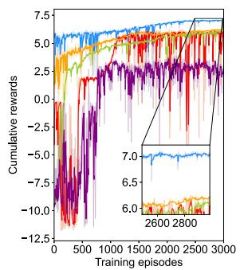  
(a)

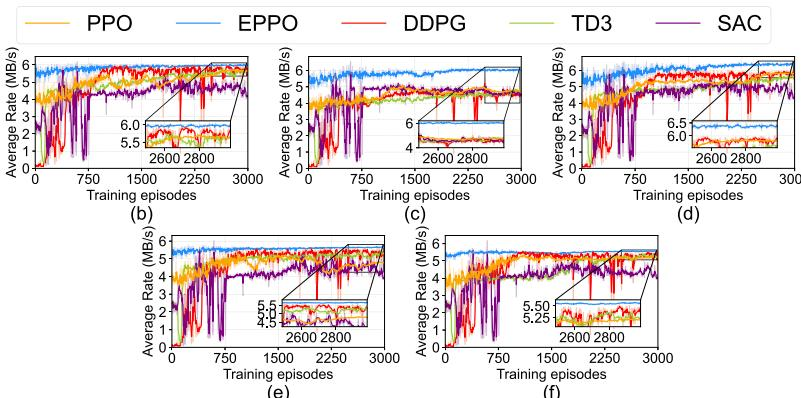  
(e)  
(f)

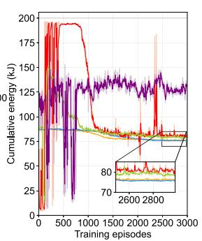  
(g)  
Fig. 8. Muti-user training result. (a) Cumulative reward training curve. (b) Average rate training curve for the first user. (c) Average rate training curve for the second user. (d) Average rate training curve for the third user. (e) Average rate training curve for the fourth user. (f) Average rate training curve for the fifth user. (g) Cumulative energy training curve.

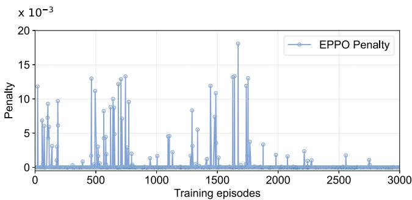  
Fig. 9. Average penalty curve in muti-user scenario.

3) Impacts of Simulation Parameters: Fig. 11(a) and (b) illustrate the impact of IRS reflection element numbers on the performance of the EPPO algorithm. As can be seen, the transmission rates increase with the number of IRS reflecting elements. This phenomenon occurs because a larger number of IRS reflecting elements enhances the IRS passive beamforming gain, thereby improving the channel quality for users and consequently increasing the transmission rates. With an increase in the number of reflecting elements, the convergence speed for UAV energy consumption in the EPPO algorithm improves slightly, while energy consumption also decreases slightly.

Fig. 12(a) and (b) show the impact of different numbers of users on the EPPO algorithm. It can be observed that the average rate of the system changes as the number of users varies. In our considered scenario, the base station communicates with users in a predefined order. In this case, the differences in average rate are likely influenced by the spatial distribution of the users and the optimized UAV trajectory. Specifically, as the number of users increases, certain users in dense urban low altitude communication scenarios may be blocked by buildings. At the same time, the optimized position of the UAV-carried IRS may fail to provide a LoS link to these blocked users, resulting in fluctuations in the average rate. Moreover, the number of users has a relatively small effect on the energy consumption of the UAV. As well known, there exists a speed at which the energy consumption is minimized. Fig. 12(b) shows that the UAV has learned to fly around speed at which the energy consumption is the lowest.

In summary, EPPO consistently exceeds the performance of other algorithms regarding cumulative rewards, data rates, and energy efficiency in multi-user scenarios, while the Jain’s fairness index improves fairness and resource utilization.

## VI. DISCUSSION

In this section, we further discuss the performance of the proposed approach in specific cases and provide solutions to mitigate the risk of UAV energy depletion, and the details are as follows:

Impacts of discrete IRS phase shift case on the proposed approach: The proposed approach possesses considerable extensibility and maintains its effectiveness even when applied to scenarios involving discrete IRS phase-shift configurations, and the details are presented in Appendix B.

Impacts of battery limitations, recharging intervals, UAV endurance, wind effect, and flight limitations on UAV energy consumption: First, the battery limitations, recharging intervals, and UAV endurance have no effect on the UAV energy consumption optimization, since our adopted UAV energy consumption model (i.e., (6)) is closely related to the UAV speed and is essentially independent of these factors above, and the details are discussed in Appendixes C and I. Second, we further introduce a new UAV energy consumption model with wind effect, and the simulation results demonstrate that the proposed algorithm remains effective even under challenging wind conditions, with specific details on the adopted new energy model and simulations provided in Appendix D. Finally, the proposed algorithm remains effective even in the presence of UAV flight limitations (e.g., speed constraints), and see Appendix E for details.

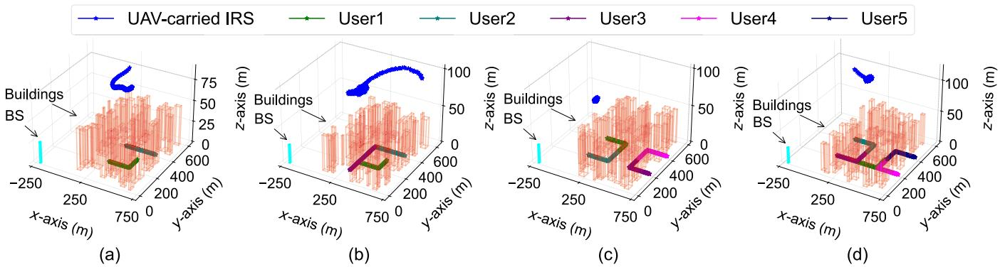  
Fig. 10. 3D trajectories of the UAV under different numbers of users. (a) Trajectory of UAV for 2 users. (b) Trajectory of UAV for 3 users. (c) Trajectory of UAV for 4 users. (d) Trajectory of UAV for 5 users.

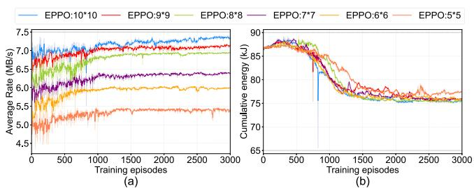  
Fig. 11. The impacts for different IRS reflection element numbers. (a) Average rate curve of different IRS reflection element numbers. (b) Cumulative energy curve of different IRS reflection element numbers.

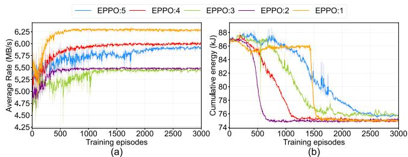  
Fig. 12. The impacts for different user numbers. (a) Average rate curve of different user number. (b) Cumulative energy curve of different user numbers.

\- Approach availability in multi UAV-multi user scenario: The proposed approach can be extended and remain effective in multi UAV-multi user scenarios by utilizing a clustering algorithm to group multiple terrestrial users. The detailed analysis and simulation results are shown in Appendix F.

\- Impacts of UAV and terrestrial user mobility models on the proposed approach: First, the proposed approach remains applicable even when faced with a specific case where the UAV is required to follow a regulated flight path (e.g., in the presence of a no-fly zone), with details provided in Appendix G. Moreover, the proposed approach is still effective when the terrestrial users move randomly due to its independence from user motion characteristics, and the detailed discussion is provided in Appendix H.

\- Solutions for addressing UAV energy depletion: We further provide several feasible solutions to mitigate the risk of UAV energy depletion, including the natural resource charging approach, the laser charging approach, and the multi-UAV collaborative replacement mechanism. See Appendix I (Available online) for details.

## VII. CONCLUSION

In this paper, the UAV-carried IRS mmWave communication system has been investigated to address the challenges posed by obstacles blocking direct links between the SU and users in urban low altitude communication scenarios. By leveraging a UAV to carry an IRS, we effectively rebuilt communication links in such scenarios. Specifically, we formulated a joint optimization problem aimed at maximizing data rate and minimizing UAV energy consumption, while the problem is characterized by its high real-time and dynamic complexity. To tackle this, we proposed an EPPO algorithm that incorporating several enhancements such as neural episodic control, improved LSTM, and IRS phase shift control to boost stability and convergence speed. Simulation results confirmed the effectiveness of the EPPO algorithm, showing better performance than other benchmarks, especially in enhancing communication rates and reducing energy consumption.

## REFERENCES

[1] G. Sun, B. Liu, J. Li, S. Liang, H. Pan, and X. Zheng, “Enabling urban mmWave communications with UAV-carried IRS via deep reinforcement learning,” in Proc. IEEE Int. Conf. Commun., 2024, pp. 4985–4990.

[2] C. Wang et al., “On the road to 6G: Visions, requirements, key technologies, and testbeds,” IEEE Commun. Surveys. Tut., vol. 25, no. 2, pp. 905–974, Secondquarter 2023.

[3] I. F. Akyildiz, C. Han, Z. Hu, S. Nie, and J. M. Jornet, “Terahertz band communication: An old problem revisited and research directions for the next decade,” IEEE Trans. Commun., vol. 70, no. 6, pp. 4250–4285, Jun. 2022.

[4] B. Ning et al., “Beamforming technologies for ultra-massive MIMO in terahertz communications,” IEEE Open J. Commun. Soc., vol. 4, pp. 614–658, 2023.

[5] C. Zhang et al., “UAV swarm-enabled collaborative secure relay communications with time-domain colluding eavesdropper,” IEEE Trans. Mobile Comput., vol. 23, no. 9, pp. 8601–8619, Sep. 2024.

[6] F. Wang, D. Jiang, Z. Wang, J. Chen, and T. Q. S. Quek, “Seamless handover in LEO based non-terrestrial networks: Service continuity and optimization,” IEEE Trans. Commun., vol. 71, no. 2, pp. 1008–1023, Feb. 2023.

[7] F. Wang, D. Jiang, Z. Wang, J. Chen, and T. Q. S. Quek, “Dynamic networking for continuable transmission optimization in LEO satellite networks,” IEEE Trans. Veh. Technol., vol. 72, no. 5, pp. 6639–6653, May 2023.

[8] Q. Wu, S. Zhang, B. Zheng, C. You, and R. Zhang, “Intelligent reflecting surface-aided wireless communications: A tutorial,” IEEE Trans. Commun., vol. 69, no. 5, pp. 3313–3351, May 2021.

[9] X. Guo, Y. Chen, and Y. Wang, “Learning-based robust and secure transmission for reconfigurable intelligent surface aided millimeter wave UAV communications,” IEEE Wireless Commun. Lett., vol. 10, no. 8, pp. 1795–1799, Aug. 2021.

[10] X. Wu, J. Ma, C. Gu, X. Xue, and X. Zeng, “Robust secure transmission design for IRS-assisted mmWave cognitive radio networks,” IEEE Trans. Veh. Technol., vol. 71, no. 8, pp. 8441–8456, Aug. 2022.

[11] Z. Lian et al., “Physics-based channel modeling for IRS-assisted mmWave communication systems,” IEEE Trans. Commun., vol. 72, no. 5, pp. 2687–2700, May 2024.

[12] K. Guo, M. Wu, X. Li, Z. Lin, and T. A. Tsiftsis, “Joint trajectory and beamforming optimization for federated DRL-aided space-aerialterrestrial relay networks with RIS and RSMA,” IEEE Trans. Wireless Commun., vol. 23, no. 12, pp. 18456–18471, Dec. 2024.

[13] M. Wu et al., “Deep reinforcement learning-based energy efficiency optimization for RIS-aided integrated satellite-aerial-terrestrial relay networks,” IEEE Trans. Commun., vol. 72, no. 7, pp. 4163–4178, Jul. 2024.

[14] G. Melis, T. Kociský, and P. Blunsom, “Mogrifier LSTM,” in Proc. Int. Conf. Learn. Representations, 2020.

[15] X. Zhang, H. Zhang, W. Du, K. Long, and A. Nallanathan, “IRS empowered UAV wireless communication with resource allocation, reflecting design and trajectory optimization,” IEEE Trans. Wireless Commun., vol. 21, no. 10, pp. 7867–7880, Oct. 2022.

[16] C. N. Efrem and I. Krikidis, “Joint IRS location and size optimization in multi-IRS aided two-way full-duplex communication systems,” IEEE Trans. Wireless Commun., vol. 22, no. 10, pp. 6518–6533, Oct. 2023.

[17] E. M. Taghavi, R. Hashemi, A. Alizadeh, N. Rajatheva, M. Vu, and M. Latva-aho, “Joint active-passive beamforming and user association in IRSassisted mmWave cellular networks,” IEEE Trans. Veh. Technol., vol. 72, no. 8, pp. 10448–10461, Aug. 2023.

[18] W. Wei, X. Pang, J. Tang, N. Zhao, X. Wang, and A. Nallanathan, “Secure transmission design for aerial IRS assisted wireless networks,” IEEE Trans. Commun., vol. 71, no. 6, pp. 3528–3540, Jun. 2023.

[19] Q. Zhang, W. Saad, and M. Bennis, “Reflections in the sky: Millimeter wave communication with UAV-carried intelligent reflectors,” in Proc. IEEE Glob. Commun. Conf., 2019, pp. 1–6.

[20] N. Deng et al., “Enhancing millimeter wave cellular networks via UAV-borne aerial IRS swarms,” IEEE Trans. Commun., vol. 72, no. 1, pp. 524–538, Jan. 2024.

[21] X. Song et al., “Enhancing cell-free network: Joint beamforming and location optimization via UAV-IRS,” IEEE Trans. Veh. Technol., vol. 74, no. 1, pp. 1196–1208, Jan. 2025.

[22] B. Xiong, Z. Zhang, C. Pan, and J. Wang, “Performance analysis of aerial RIS auxiliary mmWave mobile communications with UAV fluctuation,” IEEE Wireless Commun. Lett., vol. 13, no. 4, pp. 1183–1187, Apr. 2024.

[23] R. Li, B. Guo, M. Tao, Y. Liu, and W. Yu, “Joint design of hybrid beamforming and reflection coefficients in RIS-aided mmWave MIMO systems,” IEEE Trans. Commun., vol. 70, no. 4, pp. 2404–2416, Apr. 2022.

[24] T. Liu, S. Zhang, X. Qu, L. Yang, C. Li, and Y. Chen, “Joint optimization for IRS-assisted self-powered IoT in 5G mmWave networks,” IEEE Trans. Mobile Comput., vol. 24, no. 8, pp. 7092–7106, Aug. 2025.

[25] E. M. Mohamed, S. Hashima, and K. Hatano, “Energy aware multiarmed bandit for millimeter wave-based UAV mounted RIS networks,” IEEE Wireless Commun. Lett., vol. 11, no. 6, pp. 1293–1297, Jun. 2022.

[26] Z. Ning et al., “Joint user association, interference cancellation, and power control for multi-IRS assisted UAV communications,” IEEE Trans. Wireless Commun., vol. 23, no. 10, pp. 13408–13423, Oct. 2024.

[27] Z. Huang, Z. Kuang, S. Lin, F. Hou, and A. Liu, “Energy-efficient joint trajectory and reflecting design in IRS-enabled UAV edge computing,” IEEE Internet Things J., vol. 11, no. 12, pp. 21872–21884, Jun. 2024.

[28] Q. Deng, G. Yu, X. Liang, F. Shu, and J. Wang, “IRS-assisted cognitive UAV networks: Joint sensing duration, passive beamforming, and 3-D location optimization,” IEEE Internet Things J., vol. 11, no. 2, pp. 2767–2782, Jan. 2024.

[29] L. Zhai, Y. Zou, J. Zhu, and H. Guo, “A Stackelberg game approach for IRS-aided WPCN multicast systems,” IEEE Trans. Wireless Commun., vol. 21, no. 5, pp. 3249–3262, May 2022.

[30] T. Yin et al., “Joint active and passive beamforming optimization for multi-IRS-assisted wireless communication systems: A covariance matrix adaptation evolution strategy,” IEEE Trans. Veh. Technol., vol. 72, no. 7, pp. 9281–9292, Jul. 2023.

[31] Q. T. Ngo, K. T. Phan, A. Mahmood, and W. Xiang, “Hybrid IRS-assisted secure satellite downlink communications: A fast deep reinforcement learning approach,” IEEE Trans. Emerg. Topics Comput. Intell., vol. 8, no. 4, pp. 2858–2869, Aug. 2024.

[32] L. Wang, K. Wang, C. Pan, and N. Aslam, “Joint trajectory and passive beamforming design for intelligent reflecting surface-aided UAV communications: A deep reinforcement learning approach,” IEEE Trans. Mobile Comput., vol. 22, no. 11, pp. 6543–6553, Nov. 2023.

[33] T. Zhang, H. Wen, Y. Jiang, and J. Tang, “Deep-reinforcement-learningbased IRS for cooperative jamming networks under edge computing,” IEEE Internet Things J., vol. 10, no. 10, pp. 8996–9006, May 2023.

[34] G. Liang, J. Hu, Y. Zhao, and K. Yang, “Intelligent link adaptation for integrated data and energy transfer: An enhanced DRL approach for longterm constraints,” IEEE Trans. Commun., vol. 72, no. 11, pp. 6956–6972, Nov. 2024.

[35] H. Du, J. Zhang, J. Cheng, and B. Ai, “Millimeter wave communications with reconfigurable intelligent surfaces: Performance analysis and optimization,” IEEE Trans. Commun., vol. 69, no. 4, pp. 2752–2768, Apr. 2021.

[36] J. Ye, A. Kammoun, and M. Alouini, “Reconfigurable intelligent surface enabled interference nulling and signal power maximization in mmWave bands,” IEEE Trans. Wireless Commun., vol. 21, no. 11, pp. 9096–9113, Nov. 2022.

[37] B. Zheng, C. You, and R. Zhang, “Double-IRS assisted multi-user MIMO: Cooperative passive beamforming design,” IEEE Trans. Wireless Commun., vol. 20, no. 7, pp. 4513–4526, Jul. 2021.

[38] R. Zhang, W. Tan, S. Li, and M. Tang, “Channel estimation for IRSassisted mmWave massive MIMO systems in mixed-ADC architecture,” IEEE Internet Things J., vol. 11, no. 6, pp. 9969–9978, Mar. 2024.

[39] T. Jiang, H. V. Cheng, and W. Yu, “Learning to reflect and to beamform for intelligent reflecting surface with implicit channel estimation,” IEEE J. Sel. Areas Commun., vol. 39, no. 7, pp. 1931–1945, Jul. 2021.

[40] J. Zhao, L. Yu, K. Cai, Y. Zhu, and Z. Han, “RIS-aided ground-aerial NOMA communications: A distributionally robust DRL approach,” IEEE J. Sel. Areas Commun., vol. 40, no. 4, pp. 1287–1301, Apr. 2022.

[41] R. K. Jain, D.-M. W. Chiu, and W. R. Hawe, “A quantitative measure of fairness and discrimination,” Eastern Res. Lab., Digit. Equip. Corporation, Hudson, MA, USA, vol. 21, 1984, Art. no. 1.

[42] F. Wang, D. Jiang, Z. Wang, and S. Mumtaz, “Service continuity based data delivery optimization in satellite-terrestrial networks,” IEEE Trans. Veh. Technol., vol. 72, no. 10, pp. 13604–13617, Oct. 2023.

[43] J. Li, G. Sun, L. Duan, and Q. Wu, “Multi-objective optimization for UAV swarm-assisted IoT with virtual antenna arrays,” IEEE Trans. Mobile Comput., vol. 23, no. 5, pp. 4890–4907, May 2024, doi: 10.1109/TMC.2023.3298888.

[44] Z. Li, Z. Chen, X. Wei, S. Gao, C. Ren, and T. Q. S. Quek, “HPFL-CN: Communication-efficient hierarchical personalized federated edge learning via complex network feature clustering,” in Proc. Annu. IEEE Int. Conf. Sens., Commun., Netw., 2022, pp. 325–333.

[45] J. Schulman, F. Wolski, P. Dhariwal, A. Radford, and O. Klimov, “Proximal policy optimization algorithms,” 2017, arXiv:1707.06347.

[46] Z. Li et al., “Neural episodic control with state abstraction,” in Proc. Int. Conf. Learn. Representations, 2023.

[47] Z. Wei et al., “Sum-rate maximization for IRS-assisted UAV OFDMA communication systems,” IEEE Trans. Wireless Commun., vol. 20, no. 4, pp. 2530–2550, Apr. 2021.

[48] X. Peng, X. Hu, J. Gao, R. Jin, X. Chen, and C. Zhong, “Integrated localization and communication for IRS-assisted multi-user mmWave MIMO systems,” IEEE Trans. Commun., vol. 72, no. 8, pp. 4725–4740, Aug. 2024.

[49] W. Wang and W. Zhang, “Joint beam training and positioning for intelligent reflecting surfaces assisted millimeter wave communications,” IEEE Trans. Wireless Commun., vol. 20, no. 10, pp. 6282–6297, Oct. 2021.

[50] J. Wang, S. Han, J. Li, and C. Li, “IRS-enabled monostatic backscatter MIMO communication design for V2I networks,” IEEE Trans. Veh. Technol., vol. 73, no. 12, pp. 19287–19298, Dec. 2024.

[51] T. P. Lillicrap, J. J. Hunt, A. Pritzel, and N. Heess, “Continuous control with deep reinforcement learning,” in Proc. Int. Conf. Learn. Representations, 2016.

[52] S. Fujimoto, H. v. Hoof, and D. Meger, “Addressing function approximation error in actor-critic methods,” in Proc. Int. Conf. Mach. Learn., 2018, vol. 80, pp. 1582–1591.

[53] T. Haarnoja, A. Zhou, and P. Abbeel, “Soft actor-critic: Off-policy maximum entropy deep reinforcement learning with a stochastic actor,” in Proc. Int. Conf. Mach. Learn., 2018, vol. 80, pp. 1861–1870.

  
Wenwen Xie received the BS degree in computer science and technology from the Hefei University of Technology, Hefei, China, in 2022. She is currently working toward the MS degree in computer science and technology with Jilin University, Changchun, China. Her research interests include UAV communications, IRS beamforming, and deep reinforcement learning.

Jiacheng Wang (Member, IEEE) received the PhD degree from the School of Communication and Information Engineering, Chongqing University of Posts and Telecommunications, Chongqing, China. He is currently a research associate in computer science and engineering with Nanyang Technological University, Singapore. His research interests include wireless sensing, semantic communications, and metaverse.

Geng Sun (Senior Member, IEEE) received the BS degree in communication engineering from Dalian Polytechnic University, and the PhD degree in computer science and technology from Jilin University, in 2011 and 2018, respectively. He is currently a Professor with the College of Computer Science and Technology, Jilin University, Changchun, China. He was a visiting researcher with the School of Electrical and Computer Engineering, Georgia Institute of Technology, USA. He is currently working as a visiting scholar with the College of Computing and

Hongyang Du (Member, IEEE) received the BEng degree from the Beijing Jiaotong University, China, and the PhD degree from the Nanyang Technological University, Singapore. He is currently an assistant professor with the Department of Electrical and Electronic Engineering, The University of Hong Kong, where he directs the Network Intelligence and Computing Ecosystem (NICE) Laboratory. He was the editor-in-chief assistant (2022-2024) and editor (2025-Present) of IEEE Communications Surveys & Tutorials, the editor of IEEE Transactions on Commu-

Jiahui Li (Member, IEEE) received the BS degree in software engineering, and the MS and PhD degrees in computer science and technology from Jilin University, Changchun, China, in 2018, 2021, and 2024, respectively. He was a visiting PhD student with the Singapore University of Technology and Design (SUTD). He is currently an assistant researcher with the College of Computer Science and Technology, Jilin University. His current research focuses on integrated air-ground networks, UAV networks, wireless energy transfer.

Data Science, Nanyang Technological University, Singapore. He has authored or coauthored more than 100 high-quality IEEE papers. He was the associate editor of IEEE Transactions on Vehicular Technology, IEEE Transactions on Network Science and Engineering, and IEEE Networking Letters. He was also the lead guest editors of special issues for IEEE Transactions on Network Science and IEEE Internet of Things Journal.

nications, IEEE Transactions on Vehicular Technology, IEEE Open Journal of the Communications Society, and the guest editor for IEEE Vehicular Technology Magazine.

Bei Liu received the BS degree in software engineering from Jilin University in 2021. He is currently working towards the MS degree with the College of Computer Science and Technology, Jilin University. His research interests include intelligent reflecting surface, and deep reinforcement learning.

Dusit Niyato (Fellow, IEEE) received the BEng degree from the King Mongkuts Institute of Technology Ladkrabang (KMITL), Thailand, in 1999, and the PhD degree in electrical and computer engineering from the University of Manitoba, Canada, in 2008. He is currently a Professor with the School of Computer Science and Engineering, Nanyang Technological University, Singapore. His research interests include the Internet of Things (IoT), machine learning, and incentive mechanism design.

Dong In Kim (Life Fellow, IEEE) received the PhD degree in electrical engineering from the University of Southern California, Los Angeles, CA, USA, in 1990. He was a tenured professor with the School of Engineering Science, Simon Fraser University, Burnaby, BC, Canada. He is currently a distinguished professor with the College of Information and Communication Engineering, Sungkyunkwan University, Suwon, South Korea. He is a fellow of the Korean Academy of Science and Technology and a member of the National Academy of Engineering of Korea.

He was the first recipient of the NRF of Korea Engineering Research Center in Wireless Communications for RF Energy Harvesting from 2014 to 2021, 2023 IEEE ComSoc Best Survey Paper Award and 2022 IEEE Best Land Transportation Paper Award. He was selected the 2019 recipient of the IEEE ComSoc Joseph LoCicero Award for Exemplary Service to Publications. He was the general chair of the IEEE ICC 2022, Seoul. Since 2001, he has been an editor, an editor at Large, and an area editor of Wireless Communications I for IEEE Transactions on Communications. From 2002 to 2011, he was an editor and a founding area editor of Cross-Layer Design and Optimization for IEEE Transactions on Wireless Communications. From 2008 to 2011, he was the co-editor- in-Chief for the IEEE/KICS Journal of Communications and Networks. He was also the founding editor-in-chief for the IEEE Wireless Communications Letters from 2012 to 2015. He has been listed as a 2020/2022 Highly Cited Researcher by Clarivate Analytics.