# Joint Optimization of UAV Deployment and Ground Users Clustering in Air-Ground Networks: A Hierarchical Coalition-Formation Game Approach

Haoran Du , Runfeng Chen , Tianyao Zhong , Zhifeng Hou , Yuli Zhang , Dianxiong Liu , Haichao Wang , and Yuhua Xu

Abstract—With the development of communication technology, uncrewed aerial vehicles (UAVs) have been widely used to enhance ground communication services. However, the limited number of UAVs and the massive data requirements of ground users (GUs) restrict information transmission in air-ground networks. To satisfy the requirements of more GUs and reduce the communication overhead of GUs, this paper investigates a joint deployment of UAVs and GUs clustering optimization for collective data acquisition in air-ground networks. In light of the problem’s complexity, this paper builds a hierarchical game, where the outer game is modeled as a UAV deployment game and the inner game is modeled as a coalition formation game. A Pareto order under resource constraints is proposed in the inner game to enable more GUs to join the coalition set. The outer game is proven to have at least one Nash equilibrium (NE), and the inner game is proven to have at least one stable coalition partition. To obtain the stable solution of the hierarchical game, a joint optimization algorithm for UAV deployment and GUs clustering based on the partial space adaptive play and best response algorithm is proposed. Specially, in light of the impact of data requirements among GUs, a GU processing sequence is designed, and the coalition merging and exchange mechanism is improved in the coalition formation algorithm. Simulation results show that the proposed algorithm performs better than traditional methods, with a performance improvement of around 10% in scenarios involving around fifty GUs.

Index Terms—Air-ground networks, uncrewed aerial vehicle (UAV) deployment, ground users (GUs) clustering, potential game, coalition formation game.

## I. INTRODUCTION

N recent years, uncrewed aerial vehicles (UAVs) serv-I ing as aerial base stations have attracted considerable attention with great flexibility and low deployment costs. Compared to traditional single-UAV networks, multi-UAV collaborative coverage can significantly enhance network performance [1], [2], [3], [4]. As the number of ground users (GUs) increases, the limited number of UAVs and their hardware constraints make it challenging to meet the diverse data requirements of GUs. Forwarding cooperation among GUs is an efective approach to addressing this problem [5], [6], [7], [8]. In practical scenarios, GUs close to each other often have similar data requirements [9], [10], [11], [12]. However, existing forwarding cooperation mechanisms mainly focus on improving service efectiveness for GUs while ignoring data similarity among GUs, leading to redundant forwarding and additional communication overhead. To improve the data transmission and reduce the communication overhead, it is meaningful to optimize the forwarding cooperation mechanism for GUs in UAV-assisted networks.

To reduce the overhead incurred by GUs during the data acquisition process, GUs with the same data requirements collaborate to download data from UAVs and share the download overhead [13], [14], [15]. However, data acquisition in air-ground networks faces several challenges. First, there is a complex coupling between the deployment positions of UAVs and the cooperative relationships among GUs, and the joint decision space is so large that it is dificult to find the optimal solution directly. Second, GUs usually prioritize minimizing their own overhead when acquiring data. Because collaborative factors are not adequately considered, diferent GUs may adopt conflicting cooperation strategies, thus afecting the efectiveness of cooperation among GUs. Therefore, it is essential to further explore the joint optimization of UAV deployment and GU forwarding cooperation.

To resolve the above challenges, this paper introduces a clustering method for air-ground networks to optimize cooperation among GUs, and proposes a joint UAV deployment and GUs clustering optimization problem. The problem is modeled as a hierarchical game, where the outer is modeled as the UAV deployment game, and the inner is modeled as the coalition formation game (CFG). A Pareto order under resource constraints is proposed in the inner game to enable more GUs to join the coalition set. A joint optimization algorithm for UAV deployment and GUs clustering is designed to achieve a stable solution. Especially in the process of GU coalition formation, a GU processing sequence is designed, and a merging and exchange algorithm between coalitions is modified based on

GUs data requirements similarity, which efectively improves the performance of the coalition formation algorithm.

The main contributions of this paper are concluded as follows:

• A framework for cooperative data acquisition by GUs in UAV networks: GUs form coalitions based on data requirements similarity and the deployment strategies of UAVs. Subsequently, UAVs establish communication links with the ground users serving as cluster heads in each cluster.

• A hierarchical coalition-formation game approach: This approach is divided into two parts: the outer game is the UAV deployment game, and the inner game is the coalition formation game (CFG). A Pareto order under resource constraints is proposed in the inner game to enable more GUs to join the coalition set. The outer game is proven to have at least one Nash equilibrium (NE), and the inner game is proven to have at least one stable coalition partition.

• A joint optimization algorithm for UAV deployment and GUs clustering: In light of the fact that existing coalition formation algorithms cannot serve more GUs when the base-station communication range is limited, this paper proposes improvements to the coalition formation algorithm. First, a merging and exchange algorithm between coalitions is enhanced based on the similarity of data requirements among GUs. Furthermore, a GU processing sequence is designed to increase the number of GUs served, thereby improving the efectiveness of the coalition formation algorithm. Finally, a comprehensive joint optimization algorithm is proposed based on the partial space adaptive play (PSAP) and best response (BR) algorithms. The simulation results demonstrate that the joint optimization algorithm is efective and performs well in air-ground networks.

The rest of this paper is organized as follows: Section II reviews previous related work. Section III describes the system model for the data acquisition process of GUs. Section IV provides game proof and details of the joint optimization algorithm. Section V discusses the simulation results. Eventually, in section VI provides conclusion.

## II. RELATED WORK

The deployment of UAVs has been extensively studied in the literature. Compared with single UAV deployment, multi-UAV deployment enhances air-ground network performance through cooperation among UAVs. The author in [16] proposes a joint optimization method that considers the communication fairness index of GUs and system throughput, aiming to improve long-term communication coverage. To further explore UAV deployment and GU association strategies based on statistical GU locations, the paper in [17] focuses on minimizing the uplink transmission power of both users and UAVs. In [18], the authors optimize the horizontal positions and altitudes deployment of UAVs through hierarchical strategies, thereby balancing communication coverage and transmission power consumption while aiming to reduce the number of

UAVs deployed. Based on previous research, [19] considers adjustable wireless coverage height and no-fly zone constraints, optimizing energy consumption during deployment to maximize the remaining energy of UAVs. However, most existing research relies on UAVs alone to improve network performance. This reliance consumes more network resources and leads to lower resource utilization, which limits practical applicability. Therefore, this paper further considers the GU forwarding cooperation mechanism and optimizes it to reduce communication overhead in air-ground networks.

On the one hand, some studies have focused on the impact of ground user forwarding cooperation on network performance. The author in [5] investigates an edge network architecture based on UAV and user terminal collaborative caching in hotspot areas. By jointly optimizing terminal cache configurations, UAV flight trajectories, and caching strategies, the paper improves video transmission quality and cache resource utilization. In [6], the authors explore emergency scenarios, where UAV deployment positions, hotspot user bandwidth allocation, and multi-hop routing paths are jointly optimized to maximize GU cumulative utility while ensuring communication quality fairness. In [7], the authors further examine task ofloading optimization based on device collaboration in UAV-assisted IoT networks, efectively reducing network latency and energy consumption through joint control of UAV trajectory, transmission power, and computation resource allocation. The author in [8] studies the downlink transmission model in air-ground networks, improving the efective service ratio for GUs through single-hop transmission among them. These studies demonstrate that GU cooperative forwarding enables resource sharing and improves network performance. However, existing research typically simplifies forwarding cost modeling within utility functions and lacks precise models for repeated forwarding and multi-GU cooperative forwarding. This paper clusters GUs with similar data requirements to download data from UAVs and then forwards the data within each cluster to meet individual GU needs. The forwarding mechanism is jointly optimized to reduce redundant downloads and forwarding, thereby lowering system’s communication overhead.

On the other hand, researchers have also focused on optimizing data transmission through data similarity to reduce system overhead. The author in [13] proposes a resource allocation optimization method based on data similarity, improving communication eficiency by optimizing the data transmission and selection mechanisms of UAVs. In [14], the authors introduce a new method based on fine-grained spatial data correlation, which reduces redundant data transmission and lowers energy consumption by optimizing the spatial and temporal correlation of sensor data. The author in [15] presents a context-aware group-buying mechanism based on content similarity, lowering data costs through data sharing among GUs. These methods have shown good results in different scenarios. However, due to the dynamic nature of UAV deployment, GUs must consider the impact of UAV placement during data transmission, which makes it dificult to directly apply these optimization strategies to air–ground scenarios. Therefore, this paper jointly considers UAV placement and GU cooperative forwarding and optimizes them together, enabling more GUs to be efectively served by UAVs while reducing the overall communication overhead.

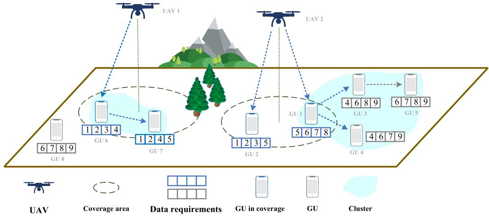  
Fig. 1. Example of the system model with 2 UAVs and 8 GUs. Each GU can obtain data in two ways: (i) GU covered by a UAV can directly obtain data from the UAV. (ii) GU can join a cluster based on data requirements similarity, where the cluster head obtains data from the UAV and forwards it to the other GUs within the cluster.

## III. SYSTEM MODEL AND PROBLEM FORMULATION

In Fig. 1, there are multiple GUs and several UAVs. GUs have diverse data requirements, such as video streams, image files, and audio streams. Due to the limited coverage of UAVs, only a small number of GUs can acquire data directly from UAVs. In light of the similar data requirements of GUs, this paper employs clustering to enhance cooperation. Specifically, the cluster head downloads the required data from UAVs and caches them, then forwards the downloaded data to GUs within the same cluster. The cluster members share the communication overhead of data downloading and forwarding based on their individual data requirements, which efectively reduces the data acquisition overhead of GUs [15].

The system is comprised of M UAVs and N static GUs, expressed as $\mathcal { M } ~ = ~ \{ 1 , 2 , \dotsc , M \}$ and $\mathcal { N } ~ = ~ \{ 1 , 2 , \dotsc , N \}$ respectively. The flying height of UAVs is denoted as $h ,$ and GUs are located in the same horizontal plane. Assuming that the channel resources are suficient, the co-frequency interference of wireless communications is neglected. The task area is discretized into two dimensions, and the coordinates of GU n and UAV m are represented as $c _ { n } = \{ x _ { n } , y _ { n } , 0 \}$ $\forall n \in \mathcal N$ and $J _ { m } = \{ x _ { m } , y _ { m } , h \}$ ∀m ∈ M.

## A. The Air-to-Ground Communication Model

Compared with the free space path loss model commonly used in UAV-to-UAV communication [20], [21], the communication links from UAVs to GUs are more complex. The air-to-ground communication link is modeled by line-of-sight (LoS) and non-line-of-sight (NLoS) links. The probability of LoS link is expressed as [22]:

$$
p _ { m , n } ^ { \mathrm { L o S } } = \frac { 1 } { 1 + \zeta _ { 2 } \exp \left( - \zeta _ { 1 } \left[ \varphi ( d _ { n } ^ { m } , h ) - \zeta _ { 2 } \right] \right) } ,\tag{1}
$$

where $\zeta _ { 1 }$ and $\zeta _ { 2 }$ are environmental impact factors, which depends such as building density and topography. $\varphi ( d _ { n } ^ { m }$ h)

represents the elevation angle (measured in “degree”), which is given by:

$$
\varphi ( d _ { n } ^ { m } , h ) = \arctan { \frac { h } { d _ { n } ^ { m } } } ,\tag{2}
$$

where $d _ { n } ^ { m }$ is the distance from UAV m to GU n. The probability of NLoS communication link between UAV m and GU n is: $p _ { m , n } ^ { \mathrm { N L o S } } = 1 - p _ { m , n } ^ { \mathrm { L o S } } .$

, ,The communication path loss from UAV m to the GU n is expressed as [23]:

$$
\begin{array} { r } { \left\{ \begin{array} { l l } { { \cal L } _ { m , n } ^ { \mathrm { L o S } } = \left( \displaystyle \frac { 4 \pi f _ { m } d _ { n } ^ { m } } { c _ { 0 } } \right) ^ { 2 } \mu _ { \mathrm { L o S } } , } & { \mathrm { f o r ~ L o S ~ l i n k } } \\ { { \cal L } _ { m , n } ^ { \mathrm { N L o S } } = \left( \displaystyle \frac { 4 \pi f _ { m } d _ { n } ^ { m } } { c _ { 0 } } \right) ^ { 2 } \mu _ { \mathrm { N L o S } } , } & { \mathrm { f o r ~ N L o S ~ l i n k } , } \end{array} \right. } \end{array}\tag{3}
$$

where $f _ { m }$ is the carrier frequency for transmitting data from all UAVs, $c _ { 0 }$ is light speed, $\mu _ { \mathrm { L o S } }$ and $\mu _ { \mathrm { N L o S } }$ are the attenuation factors for the LoS and NLoS links, respectively.

The same hardware performance is assumed for all UAVs, the antenna gain of UAV m is given as [24]:

$$
G _ { m , n } = \left\{ \begin{array} { l l } { G _ { t } , } & { \frac { - \theta _ { t } } { 2 } \leq \theta _ { m , n } \leq \frac { \theta _ { t } } { 2 } } \\ { \frac { 1 } { \sin ^ { 2 } ( 3 \pi / 2 \sqrt { N _ { 0 } } ) } , } & { \mathrm { o t h e r w i s e } , } \end{array} \right.\tag{4}
$$

where $\theta _ { t }$ is beam width of the main lobe, $\theta _ { m , n }$ is the complementary of $\varphi ( d _ { n } ^ { m } , h )$ , G is the main lobe gain, and $N _ { 0 }$ is the number of antennas.

The signal-to-noise ratio (SNR) at GU n for the signal from UAV m can be expressed as [23]:

$$
\gamma _ { n , m } ^ { \mathrm { U 2 G } } = \frac { P _ { 0 } G _ { m , n } E [ | \widetilde { h _ { 0 } } | ^ { 2 } ] } { \left( L _ { m , n } ^ { \mathrm { L o S } } p _ { m , n } ^ { \mathrm { L o S } } + L _ { m , n } ^ { \mathrm { N L o S } } p _ { m , n } ^ { \mathrm { N L o S } } \right) \sigma ^ { 2 } } ,\tag{5}
$$

where $P _ { 0 }$ is the communication power of UAVs, $\sigma ^ { 2 }$ is the variance of additive white Gaussian noise, and $\widetilde { h _ { 0 } }$ is the smallscale fading in air-to-ground communication links, which is satisfied as $E [ | \widetilde { h _ { 0 } } | ^ { 2 } ] = \bar { 1 }$ [25].

Based on the above analysis, the data transmission rate from UAV m to GU n is obtained as:

$$
R _ { n , m } ^ { \mathrm { U 2 G } } = B \mathrm { l o g } _ { 2 } \left( 1 + \gamma _ { n , m } ^ { \mathrm { U 2 G } } \right) ,\tag{6}
$$

where B is the bandwidth of channels between UAVs and GUs.

According to [8]System model., $R _ { t h }$ is used to judge whether GUs successfully receives data. If the receiving data rate GU n from UAV m is higher than $R _ { t h } ,$ , it indicates that GU n can receive the data sent by UAV m, i.e., UAV m can efectively cover GU n. GUs aprefer to communicate with UAVs that ofer higher communication rates. Therefore, the set of GUs that are efectively covered by UAVs is defined as:

$$
\mathcal { A } = \left\{ n | \exists m \in \mathcal { M } , R _ { m , n } ^ { \mathrm { U 2 G } } > R _ { t h } , n \in \mathcal { N } \right\} ,\tag{7}
$$

the set of GUs that are not efectively covered by UAVs is defined as:

$$
\mathcal { B } = \left\{ n \vert \forall m \in \mathcal { M } , R _ { m , n } ^ { \mathrm { U 2 G } } \leq R _ { t h } , n \in \mathcal { N } \right\} .\tag{8}
$$

If a GU is in set A, it can download data from UAVs directly, and its per-unit download overhead is denoted as $\nu _ { d }$ Additionally, it can lead other GUs to form a cluster. The GU as cluster head assists cluster members in acquiring data. GUs who are cluster members should have a certain degree of data similarity with the cluster head.

The cluster with GU $n _ { 1 }$ serving as the cluster head is denoted as $R _ { n _ { 1 } }$ . The overhead of a GU in the cluster is directly influenced by the similarity between the GU and its cluster. To calculate the data similarity, each data requirement of the GU needs to be compared one by one with the data requirements of other GUs in the cluster. For example, if GU $n _ { 2 }$ belongs to the cluster $R _ { n _ { 1 } }$ , the similarity of each data requirement of GU $n _ { 2 }$ in the cluster $R _ { n _ { 1 } }$ can be expressed as:

$$
{ \varepsilon } _ { n _ { 2 } } \left( { { R } _ { { n } _ { 1 } } } \right) = \left\{ \varepsilon  _ { { n } _ { 2 } 1 } , { \varepsilon } _ { { n } _ { 2 } 2 } , \ldots , { \varepsilon } _ { { n } _ { 2 } { { l } _ { { n } _ { 2 } } } } \right\} ,\tag{9}
$$

where $l _ { n 2 }$ is GU $n _ { 2 }$ data requirements length, $\varepsilon _ { n _ { 2 } i }$ is the similarity of the i-th data requirement of GU $n _ { 2 }$

To better understand $\varepsilon _ { n _ { 2 } } \left( { \cal R } _ { n _ { 1 } } \right)$ , an example in Fig. 1 is εshown: In the cluster of four GUs, the data requirements of GU 5 are (6 7 8 9), and those of GUs 1, 3, and 4 are (5 6 7 8), (4 6 8 9) and (4 6 7 9), respectively. Compared to the data requirements of other GUs in the cluster, the data similarity of GU 5 in the cluster is (3 2 2 2).

, , ,The overhead of downloading unit data by the cluster head is equally shared among all cluster members who require the data. The overhead of downloading data for GU $n _ { 2 }$ is expressed as follows:

$$
D _ { n _ { 2 } } = \left\{ \begin{array} { l l } { { \displaystyle \sum _ { i = 1 } ^ { l _ { n _ { 2 } } } } \frac { \nu _ { d } } { \varepsilon _ { n _ { 2 } i } + 1 } } & { l \left( R _ { n _ { 1 } } \right) \leq L _ { \operatorname* { m a x } } } \\ { l _ { n _ { 2 } } \nu _ { d } } & { l \left( R _ { n _ { 1 } } \right) > L _ { \operatorname* { m a x } } , n \in \mathcal { A } } \\ { 0 } & { l \left( R _ { n _ { 1 } } \right) > L _ { \operatorname* { m a x } } , n \in \mathcal { B } , } \end{array} \right.\tag{10}
$$

where $l \left( R _ { n _ { 1 } } \right)$ is the cluster $R _ { n _ { 1 } }$ data requirements length, the maximum data length GU n as the cluster head can receive is $L _ { \operatorname* { m a x } } . \mathrm { ~ H ~ } l \left( R _ { n _ { 1 } } \right) \leq L _ { \operatorname* { m a x } }$ , the cluster head can download data for all members. Otherwise, the head of cluster $R _ { n _ { 1 } }$ is unable to download data for all cluster members. In this case, only GUs that belong to set A within the cluster can download data at the original overhead, while other GUs in the cluster are unable to download data.

To illustrate the overhead associated with data downloads, an example in Fig. 1 is shown: Four GUs have formed a cluster, with data requirements of (5 6 7 8), (4 6 7 9), (4 6 8 9), and (6 7 8 9), respectively. For data , , , , , , , , ,5, as only GU 1 requires it, that GU 1 undertakes the entire download overhead. For data $^ { 6 , }$ since four GUs all require it, the overhead is equally shared, with each GU incurring $( 1 / 4 ) \nu _ { d }$

## B. The Ground-to-Ground Communication Model

In light of the likelihood that GUs that successfully receive data will share it with others, their communication relationships should be evaluated. The communication between GUs is mainly NLoS links [23]. Assuming the same hardware properties are used by all GUs, the SNR between GU $n _ { 1 }$ and GU $n _ { 2 }$ is expressed as follows:

$$
\gamma _ { n _ { 1 } , n _ { 2 } } ^ { \mathrm { G 2 G } } = \beta _ { 1 } \frac { P _ { 1 } d _ { n _ { 1 } , n _ { 2 } } ^ { - \alpha _ { 1 } } E [ | \widetilde { h _ { 1 } } | ^ { 2 } ] } { \sigma ^ { 2 } } , \quad \forall n _ { 1 } , n _ { 2 } \in N ,\tag{11}
$$

where $\beta _ { 1 }$ is the channel gain between GUs at a distance of one meter, $P _ { 1 }$ is the communication power of GUs, $\alpha _ { 1 }$ is path loss factor for communication between GUs, $d _ { n _ { 1 } , n _ { 2 } }$ is the distance between GU $n _ { 1 }$ and GU $n _ { 2 } , \ \widetilde { h _ { 1 } }$ is the smallscale fading in ground-to-ground communication links. Based on NLoS characteristics, this fading is modeled as Rayleigh fading and satisfied as $E [ | \widetilde { h _ { 1 } } | ^ { 2 } ] = 1$

Similar to formula (6), the data transmission rate between GU $n _ { 1 }$ and GU $n _ { 2 }$ is expressed as:

$$
R _ { n _ { 1 } , n _ { 2 } } ^ { \mathrm { G 2 G } } = B \mathrm { l o g } _ { 2 } \left( 1 + \gamma _ { n _ { 1 } , n _ { 2 } } ^ { \mathrm { G 2 G } } \right) , \quad \forall n _ { 1 } , n _ { 2 } \in \mathcal { N } .\tag{12}
$$

GUs in set B request data from GUs in set A. The information rate threshold is denoted as $R _ { t h }$ . To prevent congestion during data forwarding, if the information rate between a relay GU and a receiving GU exceeds $R _ { t h } ,$ , the receiving GU is considered to have successfully received the data, i.e., the neighbor relation is established between GUs.

Based on these relations and their data requirements, GUs are divided into multiple clusters, and each cluster head is responsible for transmitting data to its members. Inspired by [26], the flooding mechanism is exploited by each cluster head to establish reliable transmission paths and deliver data to its members.

Assuming that GU $n _ { 2 }$ is a member of the cluster, its forwarding overhead is determined by its position within the cluster and can be categorized into three cases. Case I: If GU $n _ { 2 }$ is the source node, it is responsible only for forwarding data to the next level of members, and the forwarding overhead is shared between GU $n _ { 2 }$ and the members at the next level who receive the data. Case II: If GU $n _ { 2 }$ is a terminal node, it only needs to receive data from the member at the previous level, and the forwarding overhead is shared between GU $n _ { 2 } .$ , the member at the previous level sending the data, and other GUs receiving data from the same member. Case III: If GU $n _ { 2 }$ is neither the source node nor a terminal node, it should both receive data from the previous level and forward data to the next level, and its forwarding overhead is the sum of those in Cases I and II.

The overhead of forwarding data for GU $n _ { 2 }$ is denoted by formula (13), where the overhead of each data forwarding action is denoted as $\nu _ { s }$ . The number of next-level GUs for GU $n _ { 2 }$ is denoted as |LowNode(n )|, and the number of GUs that receive data from the same GU as GU $n _ { 2 }$ is denoted as |OtherNode(n )|.

In Fig. 1, GU 1 serves as a cluster head and needs to download data containing data 4-9. The value of $l ( R _ { 1 } )$ is 6. Take GU 3 as an example: |LowNode(3)| is 1, including GU 5. |OtherNode(3)| is 2, including GU 3 and GU 4. The calculation method is identical for other GUs. According to the formula (13), as shown at the bottom of the page, the data forwarding overhead for GU 1 and GU 4 is $2 \nu _ { s }$ , for GU 5 is $3 \nu _ { s } ,$ for GU 3 is $( 2 + 3 ) \nu _ { s } = 5 \nu _ { s }$ s.

## C. Problem Formulation

In practical environments, due to limitations in communication distance and cluster capacity, some GUs in the set $\boldsymbol { B }$ are unable to successfully obtain their required data. The indicator showing whether GU n has obtained the required data is expressed as:

$$
\lambda _ { n } = \left\{ \begin{array} { l l } { 1 } & { n \in C l u s t e r \ o r \ n \in \mathcal { A } } \\ { 0 } & { o t h e r s , } \end{array} \right.\tag{14}
$$

only $\lambda _ { n } ~ = ~ 1$ means that GU n obtains its required data λsuccessfully.

In the communication process, it is significant for GUs to receive data successfully. Additionally, it is important to consider the overhead of obtaining the data [15]. Therefore, the utility function is designed as follows:

$$
\eta _ { n } = \lambda _ { n } \left[ 1 - \alpha \left( D _ { n } + F _ { n } \right) \right] ,\tag{15}
$$

where the parameter is a positive weight coeficient. For GU $n ,$ α on the one hand, it is important to ensure access to the required data as much as possible; on the other hand, it is necessary to reduce the overhead of data acquisition.

In summary, the deployment of UAVs and the clustering strategy of GUs are key factors that afect the utility of each GU. The two strategies are denoted by $J = ( J _ { 1 } , J _ { 2 } , \ldots , J _ { M } )$ and $A = ( a _ { 1 } , a _ { 2 } , \dotsc , a _ { N } )$ , respectively. The global optimization goal is designed as follows:

$$
U ( J , A ) = \sum _ { n \in { \cal N } } \eta _ { n } ( J , A ) .\tag{16}
$$

Thus, the optimization problem is modeled as:

$$
\begin{array} { r l } { \displaystyle \operatorname* { m a x } _ { \{ J _ { i } \} _ { i \in \mathcal { M } } , \{ A _ { n } \} _ { n \in \mathcal { N } } } \sum _ { n \in \mathcal { N } } \eta _ { n } ( J , A ) } & { } \\ { \mathrm { s . t . ~ } C 1 : 0 < x _ { m } < L _ { 0 } , \quad \forall m \in \mathcal { M } } \end{array}
$$

$$
\begin{array} { r l } & { C 2 : 0 < y _ { m } < L _ { 0 } , \quad \forall m \in \mathcal { M } } \\ & { C 3 : l _ { n } \cdot \nu _ { d } > D _ { n } + F _ { n } , \quad \forall n \in \mathcal { A } , } \end{array}\tag{17}
$$

where C1 and C2 define task areas based on the locations of GUs, C3 represents that the total overhead for GUs in set A to obtain data after joining the clusters is less than downloading data independently.

To maximize the optimization goal, the problem of joint optimization of the deployment of UAVs and the cooperative relationship among GUs needs to be solved. There are two aspects to consider: First, the strategy space is huge for cooperative relationships among GUs, and obtaining a stable coalition partition is dificult. Second, the deployment of UAVs determines which GUs are included in set A, thereby influencing the efectiveness of cooperation among GUs. Therefore, this problem is complex and challenging to solve by traditional approaches. In the following, this paper proposes a joint optimization approach for UAV deployment and GUs clustering to solve the above problems.

## IV. GAME ANALYSIS AND ALGORITHM DESIGN

Game theory is applicable to situations with multiple decision-making agents, where their interdependent decisions involve complex coupling relationships. Due to the complex coupling between the deployment strategies of UAVs and the clustering strategies of GUs, this paper builds a hierarchical game model. As shown in Fig. 2, the outer game is used to determine the deployment strategies of UAVs, and the corresponding clustering strategies of GUs are obtained by the inner coalition formation game. By the hierarchical game analysis, it is proven that there exist optimal deployment strategies of UAVs that maximize the total utility of GUs, and clustering strategies of GUs always exist when the deployment strategies of UAVs are determined.

To enhance the total utility of GUs, this paper proposes a joint optimization algorithm and the inner algorithm is improved based on the traditional coalition formation algorithm. On the one hand, the GU processing sequence is optimized to allow more GUs to join the coalition set and receive the required data from UAVs. On the other hand, coalition merging and exchange mechanism is optimized to improve the data similarity among GUs in the same coalition. As a result, more GUs receive the required data and the overall communication overhead of GUs is further reduced.

## A. Inner: Coalition Formation Game

There are some common methods applied to GUs clustering, such as K-means [27] and Thomas [28] clustering method. However, these methods overlook the actual benefits to GUs.

$$
F _ { n _ { 2 } } = { \left\{ \begin{array} { l l } { l ( R _ { n _ { 1 } } ) \nu _ { s } { \frac { 1 } { 1 + | L o w N o d e ( n _ { 2 } ) | } } } & { n _ { 2 } { \mathrm { ~ i s ~ a ~ s o u r c e ~ n o d e } } } \\ { l ( R _ { n _ { 1 } } ) \nu _ { s } { \frac { 1 } { 1 + | O t h e r N o d e ( n _ { 2 } ) | } } } & { n _ { 2 } { \mathrm { ~ i s ~ a ~ t e r m i n a l ~ n o d e } } } \\ { l ( R _ { n _ { 1 } } ) \nu _ { s } \left( { \frac { 1 } { 1 + | L o w N o d e ( n _ { 2 } ) | } } + { \frac { 1 } { 1 + | O t h e r N o d e ( n _ { 2 } ) | } } \right) } & { { \mathrm { o t h e r s } } , } \end{array} \right. }\tag{13}
$$

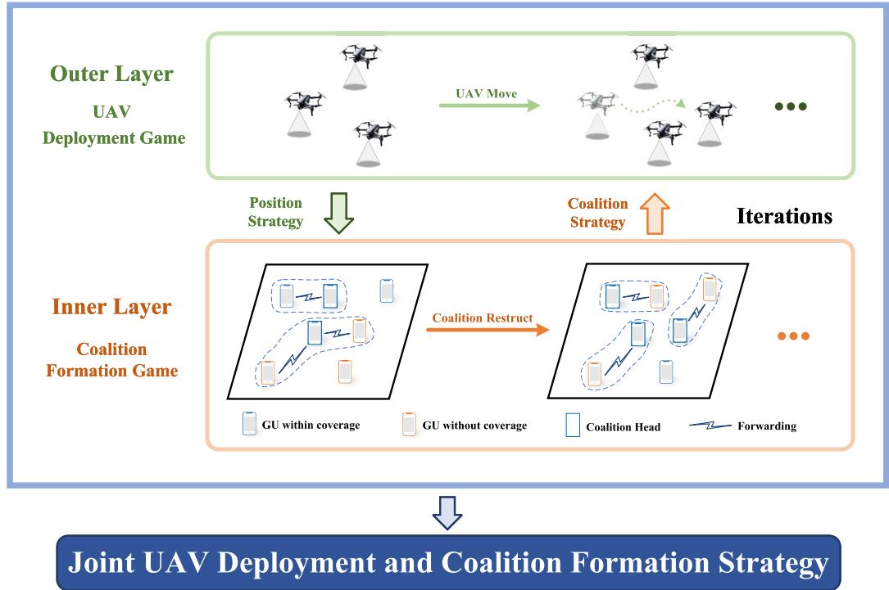  
Fig. 2. Diagram of the hierarchical game framework, where the outer game is modeled as a UAV deployment game and the inner game is modeled as a coalition formation game.

Therefore, this paper introduces CFG [29] in the inner analysis, allowing GUs to explore clustering strategies that are more beneficial for improving their utility.

The inner game is expressed $\begin{array} { r l r l } { \mathrm { a s } } & { { } } & { \mathcal { G } _ { 1 } } & { { } \quad } & { = } \end{array}$ $\{ \mathcal N , \{ \lambda _ { n } \} _ { n \in \mathcal N } , \{ a _ { n } \} _ { n \in \mathcal N } , \{ u _ { n } \} _ { n \in \mathcal N } , E , \mathcal C \mathcal O _ { R } \}$ N denotes the , λ , , , ,set of inner game player, i.e., the set of GUs. $\lambda _ { n }$ λindicates whether GU n obtains its required data successfully. $a _ { n }$ is the coalition formation strategy of GU $n , a _ { - n } = \left( a _ { 1 } , a _ { 2 } , \ldots , a _ { n - 1 } , a _ { n + 1 } , \ldots , a _ { N } \right)$ is the strategy set , , . . . , , , . . . ,of coalition formation for GUs except GU n. E is the topology of GUs in the task area. $\mathcal { C O } _ { R }$ is a coalition set containing R coalitions, which is denoted as $\mathcal { C O } _ { R } = \{ C O _ { 1 } , C O _ { 2 } , \ldots , C O _ { R } \}$ , , . . . ,“Coalition” refers to “Cluster” in the following description. In the inner game G1, UAV deployment adjustments are not considered in the coalition strategies analysis of GUs. Assuming that the deployment strategies of UAVs are a function of the coalition strategies of GUs, which is expressed as:

$$
\eta _ { 2 n } \left( a _ { n } , a _ { - n } \right) = \eta _ { 2 n } \left( a _ { n } , a _ { - n } , J \left( A \right) \right) = \eta _ { n } \left( a _ { n } , a _ { - n } , J \left( A \right) \right) .\tag{18}
$$

Furthermore, in light of the mutual influence among the coalition strategies of GUs, the utility of each GU is defined as a function of the coalition strategies of all GUs. The utility of GU n is expressed as $u _ { n } \left( a _ { n } , a _ { - n } \right) = \eta _ { 2 n } \left( a _ { n } , a _ { - n } \right)$ . The inner optimization goal is expressed as:

$$
\operatorname* { m a x m i z e } _ { n \in N } u _ { n } ( a _ { n } , a _ { - n } ) .\tag{19}
$$

Noted that in the inner game, no GU can belong to two coalitions simultaneously. The following conditions hold are expressed as:

$$
C O _ { i } \cap C O _ { j } = \emptyset , \forall C O _ { i } , C O _ { j } \in \mathcal { C O } _ { R } , C O _ { i } \neq C O _ { j } .\tag{20}
$$

Each GU joins a coalition based on the preference order, which is defined as follows:

Definition 1 (Preference Order [15]): For GU n, given coalition $C O _ { i }$ and $C O _ { j } ,$ , if GU n would obtain more benefit by joining coalition $C O _ { i } ,$ , the preference order of GU n is as follows:

$$
C O _ { i } \mathrm { { \sim } } _ { n } C O _ { j } , \forall C O _ { i } , C O _ { j } \in \mathcal { C O } _ { R } ,\tag{21}
$$

the definition can be extended to establish preference relations between GU n and more coalitions.

There are three common preference order in [15]. Based on fairness for each GU, their joining or leaving should not diminish the utility of other GUs. The corresponding definition is as follows:

Definition 2 (Pareto Order): Based on Definition 1, GU n is in the coalition $C O _ { j }$ . If GU n wants to join the coalition COi, the following relationship will be established:

$$
\begin{array} { r } { C O _ { i } \succ _ { n } C O _ { j } \Leftrightarrow \eta _ { 2 n } ( C O _ { i } ) > \eta _ { 2 n } ( C O _ { j } ) \wedge } \\ { \eta _ { 2 w } ( C O _ { i } ) \geq \eta _ { 2 w } ( C O _ { i } \backslash n ) , w \in C O _ { i } \backslash n \wedge } \\ { \eta _ { 2 w } ( C O _ { j } \backslash n ) \geq \eta _ { 2 w } \left( C O _ { j } \right) , w \in C O _ { j } \backslash n . } \end{array}\tag{22}
$$

According to the Pareto order, GUs can select and transfer to the coalition to increase their utility. However, in air-ground networks, due to the limited coverage of UAVs, only GUs within the coverage area are able to initiate coalitions and improve utility based on the Pareto order. GUs outside the coverage area cannot directly join other coalitions to improve utility since they are not qualified to initiate coalitions. To address this problem, this paper proposes the Pareto order under resource constraints, aiming to enable more GUs to join coalitions and achieve utility improvement, which is defined as follows:

Definition 3 (Pareto Order Under Resource Constraints): Due to the limited resources, only GUs in set A can initiate a coalition. If GU n is not in set A and has not belonged to July 05,2026 at 12:05:13 UTC from IEEE Xplore. Restrictions apply.

any coalition, it wishes to join the coalition $C O _ { i }$ , the following relationship should be satisfied:

$$
\begin{array} { c } { { n \in C O _ { i } \Leftrightarrow \eta _ { 2 n } \left( C O _ { i } \right) > 0 , C O _ { i } \cap \mathcal { A } \ne \emptyset } } \\ { { \mathrm { } \wedge \eta _ { 2 w } \left( C O _ { i } \right) > \eta _ { 2 w } \left( C O _ { i } \backslash n \right) , w \in C O _ { i } \backslash n . } } \end{array}\tag{23}
$$

Definition 4 (Stable Coalition Partition): If no GU has an interest in adjusting its coalition strategy under the current preference order, it proves that the current coalition partition is stable [29]. The preference order used in this paper is the Pareto order, which following formula is expressed as [30]:

$$
\lnot \left( C O _ { i } \lnot _ { n } C O _ { j } , \forall n \in C O _ { j } , \forall C O _ { i } , C O _ { j } \in \mathcal { C O } _ { R } \right) .\tag{24}
$$

This paper discusses the existence of a stable coalition partition in the inner game $\mathcal { G } _ { 1 }$ based on Definitions 2 and $^ { 3 . }$ It is proven that when the deployment strategies of UAVs are determined, there exists at least one stable coalition partition corresponding to the coalition formation strategies of GUs. The detailed proof of the stable coalition partition in the inner game $\mathcal { G } _ { 1 }$ is as follows:

Theorem 1: In the inner game $\mathcal { G } _ { 1 } .$ , when the deployment strategies of UAVs are determined, there is always at least one stable coalition partition corresponding to the coalition formation strategies of GUs.

Proof: In order to enable more GUs to join the coalition set, the specific applications of the two orders are as follows. First, the Pareto order under resource constraints is used to attract more GUs who are not covered by UAVs to join a coalition, so that the conditions for applying the Pareto order under resource constraints are satisfied. Then, the coalition partition is improved by the Pareto order. From the optimization results, on the one hand, according to the formula (10) and (15), the maximum utility for each GU and the number of GUs are finite, the total utility of GUs in the coalition set exists a maximum. On the other hand, during the optimization of the coalition partition based on the Pareto order, it always moves towards increasing the total utility of GUs. According to the monotone bounded convergence theorem [31], there is at least one coalition partition where no GU can increase its utility based on the Pareto order. According to Definitions 2 and 4, the coalition partition obtained by the Pareto order is a stable coalition partition.

The game $\mathcal { G } _ { 1 }$ has proven that when the deployment strategies of UAVs are determined, the coalition formation strategies of GUs have at least one stable coalition partition. Therefore, an algorithm needs to be designed to make the coalition strategies of GUs converge to a stable coalition partition when the deployment strategies of UAVs are determined. Due to the limitations of traditional coalition formation algorithms in air-ground networks, this paper improves the algorithms to enhance the total utility of GUs.

Traditional coalition formation algorithms consist of two core mechanisms: coalition joining mechanism and coalition merging and exchange mechanism [15]. In the coalition joining mechanism, GUs establish connections with neighboring coalitions in a specific order and select the most beneficial coalition to join under communication distance constraints. The coalition merging and exchange mechanism is divided into two parts. On the one hand, the algorithm explores the possibility of merging neighbor coalitions, implementing the merger when Pareto order is satisfied; on the other hand, when merge is not feasible, the algorithm attempts to exchange GUs between coalitions under communication distance constraints, evaluating the feasibility of exchange schemes through Pareto order.

However, in scenarios with limited coverage of UAVs, traditional coalition formation algorithms face two major limitations. First, the coalition optimization mechanism fails to fully utilize the similarity of data requirements among GUs, resulting in limited improvement in total utility and lower operation success rates. Second, the coalition joining mechanism fails to incorporate more uncovered GUs into coalitions. In light of these challenges, this section proposes improvements to both mechanisms.

This paper introduces a coalition matching method with similar data requirements before merging and exchange between GUs. First, the matching process determines coalition data requirements based on each GU’s data requirements, and each coalition prioritizes its neighbors based on the similarity of data requirements to determine the preference list. Then, an unmatched coalition is randomly selected and attempts to match with another coalition according to its preference list. The receiving coalition accepts the request if it has no current match. Otherwise, it evaluates the request with its current match coalition based on the preference list to determine the better pairing. After multiple matching iterations, a set of matched coalition pairs is obtained. Then merging and exchange operations are performed separately for each coalition pair. The detailed of this matching procedure is presented in Algorithm 1.

Subsequently, this paper conducts a comprehensive evaluation of the coalition formation algorithm. Compared to traditional coalition formation algorithms, this paper focuses on enabling more GUs to join coalitions. To achieve this goal, the GU processing sequence is adjusted as follows: (i) Only GUs who are not in any coalition and have neighbors in existing coalitions are processed first. This gives priority to external GUs who are more likely to join current coalitions. (ii) Within the above sequence, GUs are sorted by the number of neighboring coalitions, from the fewest to the most. This allows GUs with limited options to act earlier, which helps reduce conflicts and improve coalition participation. The details of the improved coalition formation algorithm can be found in Algorithm 2.

The following verified the convergence of Algorithm 2:

Theorem 2: The proposed GUs coalition formation algorithm under UAVs limited coverage eventually can converge to a stable coalition partition of the inner game $\mathcal { G } _ { 1 }$

Proof: In the coalition formation process, GUs employ the BR algorithm, where each GU tries to join other coalitions based on utility maximization under the Pareto order and the Pareto order under resource constrains. By multiple iterations, a stable coalition partition is achieved. To further optimize the coalition partition, Algorithm 1 matches coalitions by data similarity between coalitions, improving the efectiveness of coalition merging and exchange. The optimized coalition partition increases the data similarity among GUs within each coalition. Compared with the pre-optimization partition, the optimized coalition partition can accommodate more GUs. Therefore, the process continues to explore a stable coalition partition by allowing GUs to join other coalitions. Eventually, no GU can increase its utility through either the coalition joining mechanism or the coalition merging and exchange mechanism, thus achieving a stable coalition partition.

Algorithm 1 Coalitions Merging and Exchange Algorithm   
Based on GUs Data Requirements Similarity   
Input: The coalition set $\overline { { { \mathcal { C } } { \mathcal { O } } _ { R } } }$   
The UAVs deployment strategies $\{ J _ { m } \} _ { m \in \mathcal { M } } ;$   
The GUs network topology relationship $G _ { \mathcal { N } }$   
The GUs data requirements $\{ l _ { n } \} _ { n \in \mathcal { N } } ;$   
Output: The GUs coalition formation strategies $A ;$   
The GUs total utility $U \left( J _ { m } , J _ { - m } \right) ;$   
1 Identify the neighborhood between coalitions;   
2 Each coalition prioritizes its neighboring coalitions   
based on $\{ l _ { n } \} _ { n \in \mathcal { N } }$ to determine the preference list   
3 All coalitions are free, the free set is denoted as $\mathcal { C O } _ { \mathcal { F } } ;$   
4 while exist free coalitions do   
5 Randomly selects a coalition $C O _ { p } \subset \mathcal { C O } _ { \mathcal { F } }$ , match   
it with a coalition $C O _ { q }$ according to its   
preference list;   
6 if $C O _ { q }$ has matched with $C O _ { s }$ then   
7 if $C O _ { p }$ has a higher priority compared to $C O _ { s }$   
in $\bar { C O } _ { q }$ 's preference list then   
8 $C O _ { q }$ accept $C O _ { p }$ and reject $C O _ { s } ;$   
9 $C O _ { s }$ is restored to its free status, and its   
preference list is updated by removing   
$C O _ { q } ;$   
10 if $C \bar { O } _ { s }$ 's preference list is cleared then   
11 $C O _ { s }$ failed to match, changing the   
status to non-free;   
12 end   
13 else   
14 $C O _ { q }$ accept $C O _ { s }$ and reject $C O _ { p } ;$   
15 $C O _ { p }$ updated its preference list by   
removing $C O _ { q } ;$   
16 if $C O _ { p } { } ^ { \prime } s$ preference list is cleared then   
17 $C O _ { p }$ failed to match, changing the   
status to non-free;   
18 end   
19 end   
20 else   
21 $C O _ { p }$ and $C O _ { q }$ are matched, changing their   
status to non-free;   
22 end   
23 end   
24 Obtain the coalition matching set ${ \mathcal { M C O } } ,$ which   
contains $Q _ { 3 }$ pairs of coalitions;   
25 for $q _ { 3 } = 1 : 1 : Q _ { 3 }$ do   
26 Select two coalitions $C O _ { i }$ and $C O _ { j }$ in $\mathcal { M C O } \left( q _ { 3 } \right)$   
and converge into one coalition;   
27 if compliance is true then   
28 The two coalitions have successfully converged;   
29 else   
30 Try to exchange subsets of the same length   
from the coalitions $s u _ { t } \subset C O _ { t } , \ t \in i , j ;$   
31 end   
32 end

Algorithm 2 GUs Coalition Formation Algorithm Under   
UAVs Limited Coverage   
Input: The UAVs deployment strategies $\{ J _ { m } \} _ { m \in \mathcal { M } } ;$   
The GUs network topology relationship $G _ { \mathcal { N } } ;$   
The GUs data requirements $\{ l _ { n } \} _ { n \in \mathcal { N } } ;$   
Iteration factor $q _ { 2 } = 1 ; Q _ { 2 } ;$   
Output: The GUs coalition formation strategies $A ;$   
The GUs total utility $U ( J _ { m } , J _ { - m } ) ;$   
1 Identify the GUs neighborhood set $\{ { \mathcal { P } } _ { n } \} _ { n \in { \mathcal { N } } }$ and the   
GUs set $\mathcal { A }$ and B by the formula (7) and (8);   
2 each GU in set A forms a separate coalition;   
3 while $q _ { 2 } \leq Q _ { 2 }$ do   
4 Identify the GUs set $\{ { \mathcal { C } } | { \mathcal { C } } \in { \mathcal { C } } { \mathcal { O } } _ { R } \}$ in the coalition,   
and their neighborhood set $\{ \mathcal { D } | \mathcal { D } \in B \}$   
5 Generate a GU sequence in two steps: (i) prioritize   
D over C; (ii) sort GUs by neighbor count, from   
fewer to most;   
6 The total number of GUs in $\mathcal { D } \cup \mathcal { C }$ is W;   
7 for $w = 1 : 1 : \mathcal { W }$ do   
8 Select a GU n,from the GU processing   
sequence and identify its neighborhood   
coalition set   
$P _ { n } \left( C O \right) = \left\{ C O _ { 1 } , C O _ { 2 } , \dots , C O _ { k } \right\}$ , and   
calculate its utlilty by trying to join the   
coalitions $u _ { n } \left( C O \right) =$   
$\left\{ \eta _ { 2 n } \left( C O _ { 1 } \right) , \eta _ { 2 n } \left( C O _ { 2 } \right) , \ldots , \eta _ { 2 n } \left( C O _ { k } \right) \right\} ;$   
9 Select the coalition which corresponding the   
maximum utility for GU n;   
10 if compliance is true then   
11 The GU n successfully joined the coalition   
and jumped out of the for loop;   
12 end   
13 end   
14 if all GUs cannot enhance their utility by joining   
neighboring coalitions then   
15 The GUs coalition formation strategies are   
updated by Algorithm 1;   
16 end   
17 $q _ { 2 } = q _ { 2 } + 1 ;$   
18 end

Additionally, the proposed algorithm mainly relies on the coalition joining mechanism corresponding to the Pareto order and the Pareto order under resource constrains. The coalition merging and exchange mechanism is used only to optimize the coalition partition without violating the Pareto order. Furthermore, the optimized coalition partition can theoretically be obtained through the coalition joining mechanism. Therefore, the stable coalition partition obtained by the proposed algorithm is also a stable partition of the inner game $\mathcal { G } _ { 1 }$ 

In this subsection, the clustering strategies of GUs are modeled as the coalition formation game, and it is proven that a stable coalition partition always exists when the deployment strategies of UAVs are determined. Then, the traditional coalition formation algorithm is improved. First, the merging and exchange mechanism in Algorithm 1 is optimized to increase the data requirements similarity among cluster members. Next, Algorithm 2 is designed to determine the GU processing sequence so that more GUs can join the clusters and receive the required data from the UAVs. It should be noted that Algorithm 1 is part of Algorithm 2, and running Algorithm 2 allows more GUs to join the clusters, while increasing the data requirements similarity among cluster members, thus improving the total utility of GUs.

## B. Outer: UAV Deployment Game

According to the inner game $\mathcal { G } _ { 1 } .$ , a stable coalition partition always exists when the deployment strategies of UAVs are determined, the utility of GU n is a function of the deployment strategies of UAVs, which is expressed as:

$$
\eta _ { 1 n } ( J _ { m } , J _ { - m } ) = \eta _ { 1 n } ( J _ { m } , J _ { - m } , A ( J ) ) = \eta _ { n } ( J _ { m } , J _ { - m } , A ( J ) ) ,\tag{25}
$$

where $J _ { m }$ denotes the deployment strategy of UAV m.

Furthermore, the global optimization problem by the formula (17) is converted to a function of the deployment strategies of UAVs, which is expressed as:

$$
\begin{array} { l } { \displaystyle \operatorname* { m a x } \sum _ { n \in \mathcal { N } } \eta _ { 1 n } \left( J _ { m } , J _ { - m } \right) } \\ { \displaystyle = \sum _ { n \in \mathcal { N } } \eta _ { n } \left( J _ { m } , J _ { - m } , A \left( J \right) \right) = \sum _ { n \in \mathcal { N } } \eta _ { n } \left( J , A \left( J \right) \right) . } \end{array}\tag{26}
$$

To obtain the optimal deployment strategies of UAVs, this paper models the global optimization problem as a UAV deployment game in the outer game. The outer game is expressed as ${ \mathcal G } _ { 2 } = \{ { \mathcal M } , \{ J _ { m } \} _ { m \in { \mathcal M } } , \{ u _ { m } \} _ { m \in { \mathcal M } } \}$ . M denotes the set of outer game player, i.e, the set of UAVs. $J _ { m }$ denotes the strategy of outer game player m, i.e, the deployment strategy of UAV m, from the formula (17), $\forall J _ { m } \in \mathcal { Q } ,$ Q is the airspace at a height of h above the ground mission area, UAVs will explore their deployment strategies in the airspace. $u _ { m }$ denotes the utility of outer game player m, i.e., the utility of UAV m.

Inspired by [8], the marginal utility is used to represent the utility of UAV m, which is expressed as:

$$
\begin{array} { l } { { \displaystyle { u _ { m } ( J _ { m } , J _ { - m } ) } } \ ~ } \\ { { \displaystyle = U \left( J _ { m } , J _ { - m } , A \left( J \right) \right) - U \left( J _ { m } , J _ { - m } , A \left( J \right) \right) \vert _ { J _ { m } = 0 } } } \\ { { \displaystyle = \sum _ { n \in \mathcal { N } } \eta _ { 1 n } ( J _ { m } , J _ { - m } ) - \sum _ { n \in \mathcal { N } } \eta _ { 1 n } ( J _ { m } , J _ { - m } ) \vert _ { J _ { m } = 0 } } , } \end{array}\tag{27}
$$

where $J _ { - m } = ( J _ { 1 } , J _ { 2 } , \ldots J _ { m - 1 } , J _ { m + 1 } , \ldots , J _ { M } )$ is the strategy set , , . . . , , . . . ,of deployment for UAVs except UAV m, A (J) is the strategy set of coalition formation for GUs. The outer optimization goal is expressed as:

$$
\operatorname* { m a x m i z e } _ { m \in \mathcal { M } } u _ { m } ( J _ { m } , J _ { - m } ) , \forall J _ { m } \in \mathcal { Q } .\tag{28}
$$

To determine the stability of the current game solution, a Nash equilibrium (NE) is defined as follows:

Definition 5 (Nash Equilibrium [23]): A game $\mathcal { G } ^ { \mathrm { ~ ~ } } =$ $\{ \mathcal { M } , \mathcal { Q } , \{ J _ { m } \} _ { m \in \mathcal { M } } , \{ u _ { m } \} _ { m \in M } \}$ , where $\mathcal { M } = \{ 1 , 2 , . . , M \}$ is the set of users, Q is the strategy set of users, $J _ { m }$ is the strategy of user m, $\forall J _ { m } \in \mathcal { Q } , \ u _ { m }$ is the utility of user $m ,$ which is determined by the user m strategy $J _ { m }$ and the other users strategy $J _ { - m } = \left( J _ { 1 } , J _ { 2 } , \ldots , J _ { m - 1 } , J _ { m + 1 } , \ldots , J _ { M } \right)$ . If any user in set $\mathcal { M }$ , , . . . , , , . . . ,does not obtain better utility by unilaterally changing its own strategy, the game G will arrive Nash Equilibrium point, which is expressed as:

$$
u _ { m } ( J _ { m } ^ { \ast } , J _ { - m } ^ { \ast } ) \geq u _ { m } ( J _ { m } , J _ { - m } ^ { \ast } ) , \forall m \in \mathcal { M } ,\tag{29}
$$

where $\left( J _ { 1 } ^ { * } , J _ { 2 } ^ { * } , \ldots , J _ { M } ^ { * } \right)$ is the game Nash Equilibrium.

To determine the existence of Nash equilibrium (NE), an exact potential game (EPG) is defined as follows:

Definition 6 (Exact Potential Game [32]): A game $\mathcal { G }$ is an exact potential game if there exists a potential function satisfying:

$$
\begin{array} { r l } & { u _ { m } \left( J _ { m } ^ { * } , J _ { - m } \right) - u _ { m } \left( J _ { m } , J _ { - m } \right) } \\ & { = \phi \left( J _ { m } ^ { * } , J _ { - m } \right) - \phi \left( J _ { m } , J _ { - m } \right) . } \end{array}\tag{30}
$$

If the game is proven to an EPG, two useful properties will be obtained:

• The EPG exists at least one NE.

• The best NE corresponds to the optimal solution of the potential function.

Theorem 3: The outer game $\mathcal { G } _ { 2 }$ is an EPG that has at least one NE. Furthermore, the best NE of $\mathcal { G } _ { 2 }$ corresponds to the optimal deployment strategies of UAVs.

Proof: This paper defines the potential function as follows:

$$
\phi \left( J _ { m } , J _ { - m } \right) = \sum _ { n \in \cal N } \eta _ { 1 n } ( J _ { m } , J _ { - m } ) ,\tag{31}
$$

which is exactly the total utility of all GUs when the strategy set for the deployment of UAVs is determined.

If the deployment strategy of UAV m is updated from $J _ { m }$ to ${ \bar { J } _ { m } }$ , the change of potential function is:

$$
\begin{array} { l } { \displaystyle \phi \left( \bar { J } _ { m } , J _ { - m } \right) - \phi \left( J _ { m } , J _ { - m } \right) } \\ { \displaystyle \quad = \sum _ { n \in \mathcal { N } } \eta _ { 1 n } ( \bar { J } _ { m } , J _ { - m } ) - \sum _ { n \in \mathcal { N } } \eta _ { 1 n } ( J _ { m } , J _ { - m } ) . } \end{array}\tag{32}
$$

Additionally, the change of the utility of UAV m is:

$$
\begin{array} { r l } & { u _ { m } ( \bar { J } _ { m } , J _ { - m } ) - u _ { m } ( J _ { m } , J _ { - m } ) } \\ & { = \left[ \displaystyle \sum _ { n \in \mathcal { N } } \eta _ { 1 n } ( \bar { J } _ { m } , J _ { - m } ) - \displaystyle \sum _ { n \in \mathcal { N } } \eta _ { 1 n } ( \bar { J } _ { m } , J _ { - m } ) | _ { \bar { J } _ { n } = \theta } \right] } \\ & { \quad - \displaystyle \left[ \displaystyle \sum _ { n \in \mathcal { N } } \eta _ { 1 n } ( J _ { m } , J _ { - m } ) - \displaystyle \sum _ { n \in \mathcal { N } } \eta _ { 1 n } ( J _ { m } , J _ { - m } ) | _ { J _ { m } = \theta } \right] } \\ & { = \displaystyle \sum _ { n \in \mathcal { N } } \eta _ { 1 n } ( \bar { J } _ { m } , J _ { - m } ) - \displaystyle \sum _ { n \in \mathcal { N } } \eta _ { 1 n } ( J _ { m } , J _ { - m } ) , } \end{array}\tag{33}
$$

where both $\sum _ { n \in \mathcal { N } } \eta _ { 1 n } ( \bar { J } _ { m } , J _ { - m } ) | _ { \bar { J } _ { m } = 0 }$ and $\sum _ { n \in \mathcal { N } } \eta _ { 1 n } ( J _ { m } , J _ { - m } ) | _ { J _ { m } = 0 }$ are unrelated to the deployment strategy of UAV m.

Algorithm 3 Joint Optimization Algorithm for UAV Deploy  
ment and GUs Clustering   
Input: The UAVs deployment strategies $\{ J _ { m } \} _ { m \in \mathcal { M } } ;$   
The UAVs strategies space $\mathcal { Q } ;$   
Iteration factor $q _ { 1 } = 1 ; Q _ { 1 } ;$   
Output: The UAVs deployment strategies $J ;$   
The GUs coalition formation strategies $A ;$   
1 Calculate the utility of the GUs within the cluster set   
$U \left( J _ { m } , J _ { - m } \right)$ and $U \left( J _ { m } , J _ { - m } \right) \mid _ { J _ { m } = \emptyset }$ in the   
Algorithm 2;   
2 while $q _ { 1 } \leq Q _ { 1 }$ do   
3 UAV m is randomly selected from the UAVs set   
$\mathcal { M } ,$ the UAV m deployment strategy is $J _ { m } \left( q _ { 1 } \right) ;$   
4 Randomly select s deployment strategies from the   
UAVs deployment strategies space $\mathcal { Q }$ that differ   
from the current one. The deployment strategy of   
UAV m is separately replaced with   
$\{ J _ { 1 } , J _ { 2 } , \ldots , J _ { s } \}$ , while the remaining UAVs   
deployment strategies remain unchanged;   
5 Input the replaced the deployment strategy of UAV   
m into Algorithm 2 to obtain the utility   
$u _ { m } \left( \bar { J } _ { m } , J _ { - m } \right)$ , where   
$\bar { J } _ { m } \in \{ J _ { m } \left( q _ { 1 } \right) , J _ { 1 } , J _ { 2 } , . . . , J _ { s } \} ;$   
6 The UAV m probabilistically determines its   
deployment strategy:   
$P _ { r } \left[ J _ { m } \left( q _ { 1 } + 1 \right) = d _ { m } \right] =$   
exp $\{ \beta u _ { m } \left( d _ { m } , J _ { - m } \right) \}$   
$\sum _ { \bar { J } _ { m } \in \{ J _ { m } \left( q _ { 1 } \right) , J _ { 1 } , J _ { 2 } , \ldots , J _ { s } \} } \exp \left\{ \beta u _ { m } \left( \bar { J } _ { m } , J _ { - m } \right) \right\}$   
(34)   
where $d _ { m } \in \left\{ J _ { m } \left( q _ { 1 } \right) , J _ { 1 } , J _ { 2 } , . . . , J _ { s } \right\}$ , β is a   
learning factor for the PSAP algorithm. To ensure   
the algorithm convergence, factor $\beta$ increases as   
the number of iterations increases;   
7 The other UAV deployment strategies remain   
unchanged $J _ { - m } \left( q _ { 1 } + 1 \right) = J _ { - m } \left( q _ { 1 } \right) ;$   
8 $q _ { 1 } = q _ { 1 } + 1 ;$   
9 end

Compared with the formula (32) and (33), the equation is obtained as:

$$
\begin{array} { r c l } { { } } & { { } } & { { u _ { m } \left( \bar { J } _ { m } , J _ { - m } \right) - u _ { m } \left( J _ { m } , J _ { - m } \right) } } \\ { { } } & { { } } & { { = \phi \left( \bar { J } _ { m } , J _ { - m } \right) - \phi \left( J _ { m } , J _ { - m } \right) . } } \end{array}\tag{35}
$$

According to Definition $^ { 6 , }$ the UAV deployment game is an EPG that has at least one NE. Additionally, the potential function by the formula (31) is the same as the global optimization problem by the formula (26), the maximum utility of the potential function corresponds to the maximum value of the optimization objection. According to the properties of EPG, when the best NE is reached, the total utility of GUs will be maximized, and the UAV deployment problem will receive the optimal solution. 

The game model $\mathcal { G } _ { 2 }$ has at least one NE. When UAV m deployment strategy changes, the coalition formation strategies of GUs are adjusted, and UAV m utility value also changes accordingly. To obtain the optimal deployment strategies of UAVs and the corresponding coalition formation strategies of GUs, this paper designs a joint optimization algorithm for UAV deployment and GUs clustering, with specific details provided in Algorithm 3. To ensure the optimal deployment strategies of UAVs, the PSAP algorithm [8] is introduced in Algorithm 3.

The following verified the convergence and optimization of Algorithm 3:

Theorem 4: With a suficient large $\beta ,$ the proposed joint optimization algorithm for UAV deployment and GUs clustering asymptotically converge to the best NE. Thus, the optimal deployment strategies of UAVs are determined.

Proof: The deployment positions of UAVs are concentrated in a finite two-dimensional discrete space, and it can be inferred that the game $\mathcal { G } _ { 2 }$ is a finite strategy game. When the deployment strategies of UAVs are determined, running Algorithm 2 will result in the corresponding coalition formation strategies of GUs. Therefore, the utility corresponding to each deployment strategy set of UAVs in the outer game is unique. This paper proves through Theorem 3 that game $\mathcal { G } _ { 2 }$ is an EPG. Since the PSAP algorithm is incorporated into the proposed joint optimization algorithm, according to the methodology presented in [8] (see Theorem 4 and Theorem 5 therein), when the factor $\beta$ is suficiently large, the proposed joint optimization algorithm makes the game players asymptotically converge to the best NE.

Due to the fact that the best NE of $\mathcal { G } _ { 2 }$ corresponds to the optimal deployment strategies of UAVs has been proven in Theorem 3, the optimal deployment strategies of UAVs are also determined. 

The joint optimization algorithm determines the optimal deployment strategies of UAVs. Since the inner-layer algorithm in this paper only finds a better stable coalition partition, the final global utility is not global optimal. However, compared to the traditional coalition formation algorithm, the inner-layer algorithm improves the overall utility of GUs in air-ground networks. Relevant theoretical analysis has been explained in the inner-layer algorithm. To better demonstrate the advantages of the proposed algorithm, further validate efectiveness of the proposed algorithm will be carried out in the subsequent simulations.

## C. Complexity Analysis

There are three proposed algorithms. Algorithms 1 and 2 determine the clustering strategies of GUs when the deployment strategies of UAVs are known. Algorithm 3 is a joint optimization algorithm. This subsection first analyzes the computational complexity of the GUs clustering algorithms. Then, the computational complexity of the joint optimization algorithm is analyzed.

According to Algorithms 1 and 2, the process of forming clusters for GUs includes three steps: coalition joining, coalition matching, and coalition merging and exchange. Each step is analyzed under the worst-case condition. The computational complexity for each step is described in the following analysis.

• Step 1 (coalition joining): A GU processing sequence is generated according to the predefined priority. Then, each GU attempts to join nearby coalitions by the GU processing sequence, and the coalition strategy is updated by the best response. The computational complexity is $\mathcal { O } ( C _ { 1 } N ^ { 2 } ) . ~ C _ { 1 }$ is a constant, which depends on the time required for a GU to attempt joining a nearby coalition.

• Step 2 (coalition matching): Each coalition creates a preference list based on the similarity of data requirements. Then, each coalition tries to select a matched coalition based on its preference list. The computational complexity is $\mathcal { O } ( C _ { 2 } R ^ { 2 } ) , C _ { 2 }$ is a constant, which depends on the time required for comparing data requirements similarity between coalitions. R is the total number of coalitions.

• Step 3 (coalition merging and exchange): Each pair of matched coalitions first attempt to merge into a single coalition. If the merge fails, they try to exchange the same number of GUs. The computational complexity is $\mathcal { O } \left( C _ { 3 } \frac { N ^ { 2 } } { R } \right) . C _ { 3 }$ is a constant, which is determined by the time required for coalitions to attempt GU exchange.

The total computational complexity of the GU coalition formation algorithms are expressed as:

$$
\Theta _ { c o a } = Q _ { 2 } \left( \mathcal { O } \left( C _ { 1 } N ^ { 2 } \right) + \mathcal { O } \left( C _ { 2 } R ^ { 2 } \right) + \mathcal { O } \left( C _ { 3 } \frac { N ^ { 2 } } { R } \right) \right) ,\tag{36}
$$

where $Q _ { 2 }$ is the total number of iterations in Algorithm 2.

Referring to [8], the computational complexity of the joint optimization algorithm is expressed as:

$$
\Theta _ { j o \mathrm { i n t } } = Q _ { 1 } \left( s \left( \Theta _ { c o a } + \mathcal { O } \left( C _ { 4 } \right) \right) + \mathcal { O } \left( C _ { 5 } \right) \right) ,\tag{37}
$$

where $Q _ { 1 }$ is the total number of iterations in Algorithm $3 , s$ is the number of deployment strategies explored by UAVs in each iteration. $C _ { 4 }$ and $C _ { 5 }$ are constants, which are determined by the formulas (27) and (34) respectively.

## V. SIMULATIONS AND DISCUSSIONS

The structure of this section is shown as follows: Section V-A shows the simulation parameters. Section V-B provides an example analysis of the simulation results. Section V-C shows and discusses the convergence results. Section V-D shows and discusses the performance results. To analyze the convergence and performance, 100 independent experiments are conducted on the simulation scenario in MAT-LAB R2018b and the simulation result is the average value.

## A. Scenario Parameters Setting

The parameter settings are classified into communication and overhead parameters, with their details summarized in Table I.

Firstly, we assume that there are 3 UAVs executing coverage missions in the 1km × 1km air-ground network. There are 20 GUs randomly and uniformly distributed in the task area. The scenario parameter settings refer to [33] and [34], and the International Telecommunication Union (ITU-R) [35], where the environmental impact factors are $( \zeta _ { 1 } , \zeta _ { 2 } ) = ( 1 1 . 9 5 , 0 . 1 3 6 )$ respectively, the noise power is $n _ { 0 } = - 1 6 9 d B m / H z .$ , the height of UAVs is $h = 1 0 0 m .$ , the power for each UAV to transmit data is $P _ { 0 } = 0 . 0 1 w ,$ , the carrier frequency is $f _ { m } = 2 G H z$ , the link loss factors are $( \mu _ { L o s } , \mu _ { N L o s } ) = ( 3 d B , 2 3 d B )$ respectively, the channel bandwidth is $B = 1 M H z$ , the number of antennas is $N _ { 0 } = 8$ , the beamwidth is $\theta _ { t } = 9 0 ^ { ^ { \circ } }$ , the main lobe gain is $G _ { t } = 6 . 3 1 d B$ θ, the data forwarding power for each GU is $P _ { 1 } =$ .0 01w, the channel power gain is $\beta _ { 1 } = - 3 0 d B$ , the transmission path loss factor among the GUs is $\alpha _ { 1 } = 3$ , the information rate threshold is $R _ { t h } = 4 . 5 \mathrm { M b i t / s }$

TABLE I  
PARAMETERS SETTING
<table><tr><td rowspan=1 colspan=1>Parameter</td><td rowspan=1 colspan=1>Value</td><td rowspan=1 colspan=1>Parameter</td><td rowspan=1 colspan=1>Value</td></tr><tr><td rowspan=1 colspan=1>Area</td><td rowspan=1 colspan=1>1km × 1km</td><td rowspan=1 colspan=1> $G _ { t }$ </td><td rowspan=1 colspan=1>6.31dB</td></tr><tr><td rowspan=1 colspan=1>(ζ1, ζ2)</td><td rowspan=1 colspan=1>(11.95, 0.136)</td><td rowspan=1 colspan=1> $P _ { 1 }$ </td><td rowspan=1 colspan=1>0.01w</td></tr><tr><td rowspan=1 colspan=1> $n _ { 0 }$ </td><td rowspan=1 colspan=1>-169dBm/Hz</td><td rowspan=1 colspan=1> $\beta _ { 1 }$ </td><td rowspan=1 colspan=1>-30dB</td></tr><tr><td rowspan=1 colspan=1> $h$ </td><td rowspan=1 colspan=1>100m</td><td rowspan=1 colspan=1> $\alpha _ { 1 }$ </td><td rowspan=1 colspan=1>3</td></tr><tr><td rowspan=1 colspan=1> $P _ { 0 }$ </td><td rowspan=1 colspan=1>0.01w</td><td rowspan=1 colspan=1> $D _ { \mathrm { m a x } }$ </td><td rowspan=1 colspan=1>500</td></tr><tr><td rowspan=1 colspan=1> $f _ { m }$ </td><td rowspan=1 colspan=1>2GHz</td><td rowspan=1 colspan=1> $l _ { n }$ </td><td rowspan=1 colspan=1>100</td></tr><tr><td rowspan=1 colspan=1> $( \mu _ { L o s } , \mu _ { N L o s } )$ </td><td rowspan=1 colspan=1>(3dB, 23dB)</td><td rowspan=1 colspan=1> $L _ { \mathrm { m a x } }$ </td><td rowspan=1 colspan=1>300</td></tr><tr><td rowspan=1 colspan=1>B</td><td rowspan=1 colspan=1>1MHz</td><td rowspan=1 colspan=1> $v _ { d }$ </td><td rowspan=1 colspan=1>1</td></tr><tr><td rowspan=1 colspan=1> $N _ { 0 }$ </td><td rowspan=1 colspan=1>8</td><td rowspan=1 colspan=1> $v _ { s }$ </td><td rowspan=1 colspan=1>0.05</td></tr><tr><td rowspan=1 colspan=1> $\theta _ { t }$ </td><td rowspan=1 colspan=1>90°</td><td rowspan=1 colspan=1>α</td><td rowspan=1 colspan=1>0.006</td></tr></table>

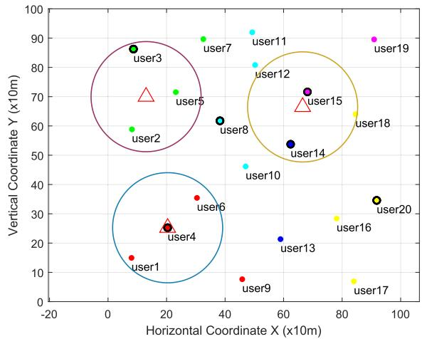  
Fig. 3. Initial state of the system.

Then, the relevant parameters for coalition formation among GUs are defined. Referring to [15], the total diverse data requirements of GUs is $D _ { \mathrm { m a x } } = 5 0 0$ , the diverse data requirements for each GU is $l _ { n } ~ = ~ 1 0 0$ , each GU can handle a maximum diverse data requirements of $L _ { \mathrm { m a x } } \ = \ 3 0 0$ , the downloading unit data overhead from the UAVs by the GUs is $\nu _ { d } = 1$ , the GUs forwarding unit data overhead is $\nu _ { s } = 0 . 0 5$ the positive weight coeficient is $\alpha = 0 . 0 0 6$

## B. Examples of Joint Optimization Efects

The initial state is shown in Fig. 3. Each UAV is represented by a red triangle, with a circle around each UAV indicating its efective coverage range. Points indicate the locations of GUs, and points of the same color signify GUs in the same coalition. Points outlined in black identify the coalition heads. Initially, GUs autonomously form coalitions and each coalition elects a head, and UAVs try to cover as many coalition heads as possible. Fig. 3 illustrates that not all coalition heads are fully covered by UAVs.

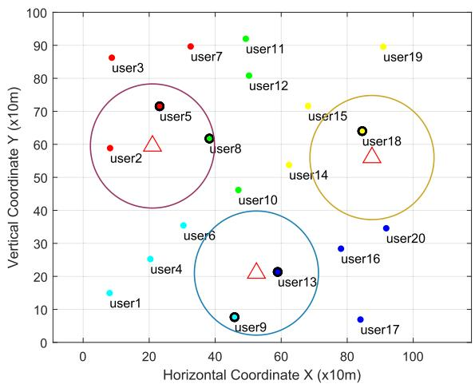

Fig. 4. Final state of the system.  
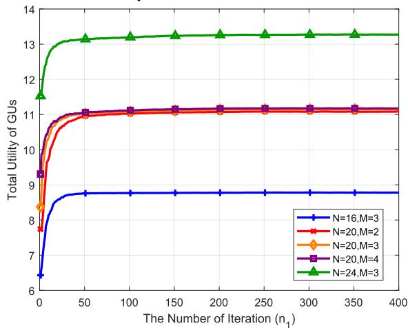  
Fig. 5. Convergence performance under diferent networks.

The final state is shown in Fig. 4, where all coalition heads are efectively covered by UAVs, confirming that the mission area coalitions are valid. Compared to Fig. 3, more GUs are included within the efective coalitions. These results validate that GUs cooperate within coalitions to allow more members to collect the required data under the limited UAV coverage.

## C. Convergence Analysis

In the initial phase of the proposed joint optimization algorithm, the limited number of deployed UAVs leads to lower total utility for GUs. As iterations progress, UAVs continuously explore and adjust their deployments, leading to an upward trend in total utility for GUs. As shown in Fig. 5, during the initial exploration of UAV deployments, UAVs may adopt less efective deployment strategies, causing slight fluctuations in the convergence curves. Over suficient iterations, all curves eventually converge smoothly.

Additionally, Fig. 5 illustrates that when the number of GUs is 20, the final utility is similar across diferent numbers of UAVs, indicating that the proposed algorithm can efectively meet the requirements of GUs even with fewer UAVs. However, a smaller number of UAVs results in a limited coverage area, requiring more precise UAV deployment and additional adjustments to achieve higher total utility. When there are 3 UAVs, the fixed task area and increased number of GUs enable UAVs to cover more GUs. This results in the formation of more coalitions within the scenario to meet the needs of the GUs. Consequently, a higher number of GUs leads to increased utility in convergence.

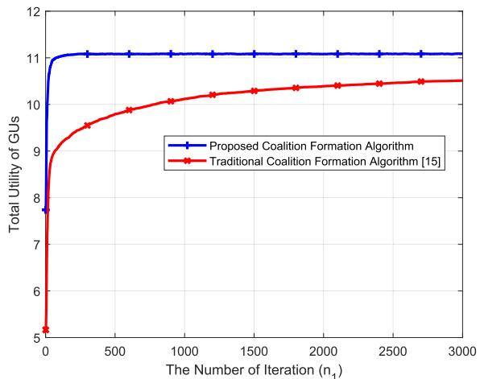  
Fig. 6. Convergence advantage under small number of UAVs.

To validate the advantages of the proposed algorithm, this section introduces a traditional coalition formation algorithm [15] as a comparison. To ensure fairness in the comparison, only the inner-layer algorithm is replaced by the traditional coalition formation algorithm, while all other components remain the same. Fig. 6 illustrates the convergence results when there are 2 UAVs, clearly demonstrating the superior convergence performance of the proposed algorithm. In situations with limited UAVs, the proposed algorithm efectively solves the data acquisition problem by optimizing the collaborative approach between GUs. It is concluded that the NE is reached with fewer exploration iterations by proposed approach.

## D. Performance Analysis

This section conducts a performance analysis of the proposed joint optimization algorithm, and the specific arrangements as follows: Section V-D.1 compares the proposed coalition formation algorithm with the traditional coalition formation algorithm under the same inner-outer hierarchical approach, demonstrating the performance advantages of the joint optimization algorithm when the number of GUs is large. Sections V-D.2 to V-D.4 analyze the impact of factors like the number of UAVs, GUs, and data forwarding overhead on the total utility of GUs. Although the proposed algorithm in the inner-outer hierarchical approach can achieve better total utility for GUs, it does have certain requirements for computational resources. Therefore, this section introduces an upper-lower hierarchical approach [36] to enable the application of the proposed algorithm even when computational resources are limited. This paper compared the two approaches with the classic CHKmeans algorithm and the non-hierarchical method, which further validated the performance advantages of the proposed algorithm.

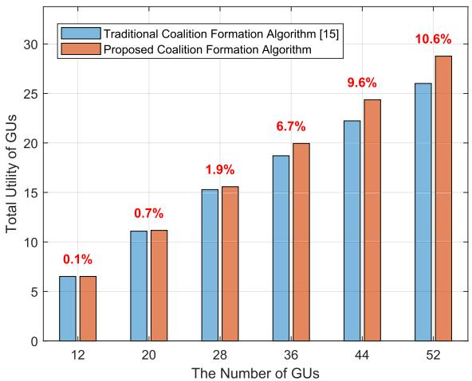  
Fig. 7. Utility advantage under diferent numbers of GUs.

The comparison algorithms corresponding to the two hierarchical approaches are as follows:

UAV Deployment & GUs Coalition Formation: The algorithm adopts the upper-lower hierarchical approach [36]. First, it determines the deployment of UAVs based on the PSAP algorithm to coverage the maximum number of GUs. Second, it forms coalitions among GUs by Algorithm 2 to enhance the efectiveness of coalition formation. The algorithm has lower computational complexity and is suitable for situations where computational resources are limited.

UAV Deployment & GUs CHKmeans: The algorithm also adopts the upper-lower hierarchical approach [36]. In light of the unsupervised nature of the K-means algorithm, this paper divides the approach into two steps. First, GUs employ the K-means algorithm and the Calinski-Harabasz index to form coalitions among GUs. Then, the PSAP algorithm updates the deployment of UAVs to maximize coverage of coalition heads.

UAV Deployment Approach Without GUs Coalition Formation: The algorithm uses PSAP algorithm to update the deployment of UAVs to cover the maximum number of GUs without considering the coalition formation of GUs. The algorithm enables a comparative analysis of the performance efects of the coalition formation of GUs under diferent factors.

1) Comparison of Coalition Formation Algorithms: Fig. 7 illustrates the performance comparison between the two algorithms. The red value indicates the percentage increase in utility of the proposed algorithm compared to traditional algorithms under diferent numbers of GUs. As the number of GUs increases, the proposed joint optimization algorithm demonstrates a more pronounced improvement in total utility for GUs. This improvement occurs because the proposed coalition formation algorithm focuses on enabling more GUs to join coalitions, making this advantage especially significant in scenarios with a large number of GUs. Additionally, a higher number of GUs enables the formation of more coalitions. During the merging and exchange process, the proposed algorithm leverages data similarity to create more coalition matching, further amplifying its advantage. According to the simulation results shown in Fig. 7, the proposed joint optimization algorithm achieves an approximate 10% improvement in total utility for GUs.

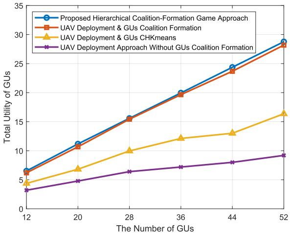

Fig. 8. Total utility of networks under diferent number of GUs.  
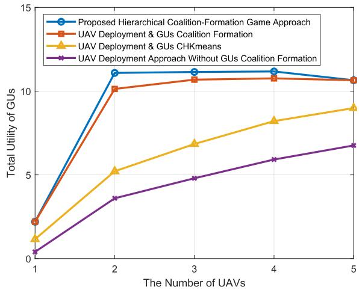  
Fig. 9. Total utility of networks under diferent number of UAVs.

2) Impact of the Number of GUs: Fig. 8 shows total utility of networks with diferent number of GUs under diferent hierarchical approaches. As the number of GUs increases, the total utility also rises. The algorithms based on both the proposed hierarchical coalition-formation game approach and the approach of UAV Deployment & GUs Coalition Formation show superior performance, confirming the advantages of hierarchical approaches. In the comparison between the two, the proposed hierarchical coalition-formation game approach performs slightly better, indicating that both the number of GUs covered by UAVs and the cooperative relationships among GUs are essential to further enhancing utility. UAV Deployment & GUs CHKmeans also adopts a hierarchical approach, but it focuses on communication distance during the coalition formation process and does not efectively integrate the similarity of data requirements among GUs. Therefore, its performance is not as good as that of the other two algorithms.

3) Impact of the Number of UAVs: Fig. 9 shows total utility of networks with diferent number of UAVs under diferent hierarchical approaches. When the number of UAVs is less than 5, all coalition heads in the initial coalition cannot be covered, necessitating the use of Algorithm 3 for optimization.

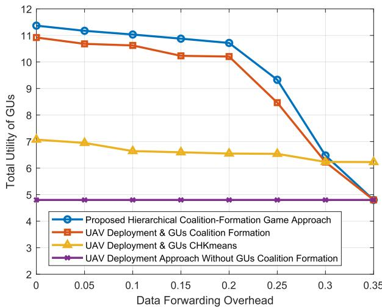  
Fig. 10. Total utility of networks under diferent forwarding overhead.

With a single UAV, the limited number of GUs that each coalition can accommodate prevents some GUs from receiving data, leading to a lower total utility for GUs. As the number of UAVs increases from 2 to 4, the proposed hierarchical coalitionformation game approach achieves higher utility for GUs, indicating it efectively addresses the problem of insuficient number of UAVs. In contrast, the approach of UAV Deployment & GUs Coalition Formation and UAV Deployment & GUs CHKmeans show a steady improvement in utility as the number of UAVs increases, but their performance is slightly limited by the weaker coupling between the deployment of UAVs and the coalition formation of GUs.

4) Impact of Forwarding Overhead: Fig. 10 shows total utility of networks with diferent forwarding overhead under diferent hierarchical approaches. As the forwarding overhead increases, the total utility of GUs obtained by the algorithms based on the four approaches shows a downward trend. This decline happens because more forwarding overhead increases the overhead of coalition formation. When the forwarding overhead exceeds 0.2, the total utility of GUs obtained by all algorithms except UAV Deployment & GUs CHKmeans declines rapidly. This is because the coalition formation algorithm expands its size gradually. When the coalition size has fewer members, the forwarding overhead that needs to be borne is relatively large, leading to a weaker willingness to cooperate with other GUs. Consequently, the scale of coalition formation is restricted. When the forwarding overhead reaches 0.35, the coalition size for the other algorithms is restricted to a single GU, resulting in the same utility for other three algorithms. For UAV Deployment & GUs CHKmeans, initially groups GUs into coalitions before determining whether the coalition is feasible, thereby making it less constrained by the forwarding overhead. It should be noted that the proposed algorithm only falls short when the forwarding overhead reaches extremely high values. Therefore, it still demonstrates a good adaptability to the forwarding overhead.

## VI. CONCLUSION

This paper studied the joint optimization problem of UAV deployment and GUs clustering, which was modeled as a hierarchical game. The outer game was the UAV deployment game, and the inner game was the coalition formation game. The hierarchical game was proven to have at least one stable solution, and an algorithm was designed to obtain the stable solution. Simulation results showed the efectiveness of the proposed algorithm and demonstrated the advantages of the method in which GUs obtained data from UAVs by forming coalitions.

## REFERENCES

[1] R. Chen et al., “Joint channel access and power control optimization in large-scale UAV networks: A hierarchical mean field game approach,” IEEE Trans. Veh. Technol., vol. 72, no. 2, pp. 1982–1996, Feb. 2023.

[2] Z. Hou et al., “Joint IRS selection and passive beamforming in multiple IRS-UAV-enhanced anti-jamming D2D communication networks,” IEEE Internet Things J., vol. 10, no. 22, pp. 19558–19569, Nov. 2023.

[3] L. Luo, R. Sun, R. Chai, and Q. Chen, “Cost-eficient UAV deployment and content placement for cellular systems with D2D communications,” IEEE Syst. J., vol. 17, no. 4, pp. 5405–5416, Dec. 2023.

[4] N. Lin, Y. Liu, L. Zhao, D. O. Wu, and Y. Wang, “An adaptive UAV deployment scheme for emergency networking,” IEEE Trans. Wireless Commun., vol. 21, no. 4, pp. 2383–2398, Apr. 2022.

[5] T. Zhang, Y. Wang, W. Yi, Y. Liu, and A. Nallanathan, “Joint optimization of caching placement and trajectory for UAV-D2D networks,” IEEE Trans. Commun., vol. 70, no. 8, pp. 5514–5527, Aug. 2022.

[6] Q. Shen et al., “Fair communications in UAV networks for rescue applications,” IEEE Internet Things J., vol. 10, no. 23, pp. 21013–21025, Dec. 2023.

[7] X. Huang, X. Yang, Q. Chen, and J. Zhang, “Task ofloading optimization for UAV-assisted fog-enabled Internet of Things networks,” IEEE Internet Things J., vol. 9, no. 2, pp. 1082–1094, Jan. 2022.

[8] T. Zhong et al., “Joint UAV deployment and ground user forwarding optimization for air-ground networks: A hierarchical potential game approach,” China Commun., submitted for publication.

[9] M. Cha, H. Kwak, P. Rodriguez, Y.-Y. Ahn, and S. Moon, “I tube, you tube, everybody tubes: Analyzing the world’s largest user generated content video system,” in Proc. 7th ACM SIGCOMM Conf. Internet Meas., New York, NY, USA, 2007, pp. 1–14, doi: 10.1145/1298306.1298309.

[10] H. Zhou et al., “ChainCluster: Engineering a cooperative content distribution framework for highway vehicular communications,” IEEE Trans Intell. Transp. Syst., vol. 15, no. 6, pp. 2644–2657, Dec. 2014.

[11] T. Wang, L. Song, Z. Han, and B. Jiao, “Dynamic popular content distribution in vehicular networks using coalition formation games,” IEEE J. Sel. Areas Commun., vol. 31, no. 9, pp. 538–547, Sep. 2013.

[12] Z. Li et al., “Watching videos from everywhere: A study of the PPTV mobile VoD system,” in Proc. Internet Meas. Conf., Nov. 2012, pp. 185–198.

[13] L. Ruan, J. Chen, Q. Guo, X. Zhang, Y. Zhang, and D. Liu, “Group buying-based data transmission in flying ad-hoc networks: A coalition game approach,” Information, vol. 9, no. 10, p. 253, Oct. 2018. [Online]. Available: https://www.mdpi.com/2078-2489/9/10/253

[14] Z. Guo et al., “Minimizing redundant sensing data transmissions in energy-harvesting sensor networks via exploring spatial data correlations,” IEEE Internet Things J., vol. 8, no. 1, pp. 512–527, Jan. 2021.

[15] Y. Zhang et al., “Context awareness group buying in D2D networks: A coalition formation game-theoretic approach,” IEEE Trans. Veh. Technol., vol. 67, no. 12, pp. 12259–12272, Dec. 2018.

[16] X. Cheng, R. Jiang, H. Sang, G. Li, and B. He, “Joint optimization of multi-UAV deployment and user association via deep reinforcement learning for long-term communication coverage,” IEEE Trans. Instrum. Meas., vol. 73, pp. 1–13, 2024.

[17] L. Wang, H. Zhang, S. Guo, and D. Yuan, “Deployment and association of multiple UAVs in UAV-assisted cellular networks with the knowledge of statistical user position,” IEEE Trans. Wireless Commun., vol. 21, no. 8, pp. 6553–6567, Aug. 2022.

[18] Q. Zeng, Y. Jia, C. Li, and L. Liu, “3-D deployment of UAV-BSs for efective communication coverage,” IEEE Internet Things J., vol. 11, no. 14, pp. 25162–25172, Jul. 2024.

[19] X. Zhang and L. Duan, “Energy-saving deployment algorithms of UAV swarm for sustainable wireless coverage,” IEEE Trans. Veh. Technol., vol. 69, no. 9, pp. 10320–10335, Sep. 2020.

[20] H. Li, H. Wang, X. Zheng, J. Gu, X. Guan, and H. Liu, “Topology optimization for UAV swarm communication with jamming,” IEEE Commun. Lett., vol. 29, no. 5, pp. 983–987, May 2025.

[21] B. Hengzhi et al., “Multi-hop UAV relay covert communication: A multiagent reinforcement learning approach,” Chin. J. Aeronaut., vol. 38, no. 10, Oct. 2025, Art. no. 103440.

[22] A. A. Khuwaja, Y. Chen, N. Zhao, M.-S. Alouini, and P. Dobbins, “A survey of channel modeling for UAV communications,” IEEE Commun. Surveys Tuts., vol. 20, no. 4, pp. 2804–2821, 4th Quart., 2018.

[23] D. Liu et al., “Opportunistic data collection in cognitive wireless sensor networks: Air-ground collaborative online planning,” IEEE Internet Things J., vol. 7, no. 9, pp. 8837–8851, Sep. 2020.

[24] K. Venugopal, M. C. Valenti, and R. W. Heath Jr., “Interference in finitesized highly dense millimeter wave networks,” in Proc. Inf. Theory Appl. Workshop (ITA), Feb. 2015, pp. 175–180.

[25] C. Zhan, Y. Zeng, and R. Zhang, “Energy-eficient data collection in UAV enabled wireless sensor network,” IEEE Wireless Commun. Lett., vol. 7, no. 3, pp. 328–331, Jun. 2018.

[26] J. Lipman, P. Boustead, and J. Chicharo, “Reliable optimised flooding in ad hoc networks,” in Proc. IEEE 6th Circuits Syst. Symp. Emerg. Technol., Frontiers Mobile Wireless Commun., Apr. 2004, pp. 521–524.

[27] L. Yang, D. Wu, Y. Cai, X. Shi, and Y. Wu, “Learning-based user clustering and link allocation for content recommendation based on D2D multicast communications,” IEEE Trans. Multimedia, vol. 22, no. 8, pp. 2111–2125, Aug. 2020.

[28] T. Zeng, O. Semiari, W. Saad, and M. T. Thai, “Spatial motifs for deviceto-device network analysis in cellular networks,” IEEE Trans. Commun., vol. 67, no. 8, pp. 5474–5489, Aug. 2019.

[29] W. Saad, Z. Han, M. Debbah, A. Hjorungnes, and T. Basar, “Coalitional game theory for communication networks,” IEEE Signal Process. Mag., vol. 26, no. 5, pp. 77–97, Sep. 2009.

[30] T. Genin and S. Aknine, “Constraining self-interested agents to guarantee Pareto optimality in multiagent coalition formation problem,” in Proc. IEEE/WIC/ACM Int. Conf. Web Intell. Intell. Agent Technol., vol. 2, Aug. 2011, pp. 369–372.

[31] A. M. Rubinov, “Monotonic analysis: Convergence of sequences of monotone functions,” Optimization, vol. 52, no. 6, pp. 673–692, Dec. 2003.

[32] T. Zhang, Y. Wang, Z. Ma, and L. Kong, “Task assignment in UAVenabled front jammer swarm: A coalition formation game approach,” IEEE Trans. Aerosp. Electron. Syst., vol. 59, no. 6, pp. 9562–9575, Dec. 2023.

[33] D. Liu et al., “Opportunistic utilization of dynamic multi-UAV in deviceto-device communication networks,” IEEE Trans. Cognit. Commun. Netw., vol. 6, no. 3, pp. 1069–1083, Sep. 2020.

[34] H. Wang, J. Wang, G. Ding, L. Wang, T. A. Tsiftsis, and P. K. Sharma, “Resource allocation for energy harvesting-powered D2D communication underlaying UAV-assisted networks,” IEEE Trans. Green Commun. Netw., vol. 2, no. 1, pp. 14–24, Mar. 2018.

[35] Propagation Data and Prediction Methods for the Design of Terrestrial Broadband Millimetric Radio Access Systems, document ITU P.1410-2, 2003.

[36] L. Ruan et al., “Energy-eficient multi-UAV coverage deployment in UAV networks: A game-theoretic framework,” China Commun., vol. 15, no. 10, pp. 194–209, Oct. 2018.

  
Haoran Du received the B.S. degree from Shijiazhuang Tiedao University, Shijiazhang, China, in 2022. He is currently pursuing the M.S. degree with the Army Engineering University of PLA. His current research interests include UAV communication, resource allocation, and game theory.

Runfeng Chen received the B.E. degree in communication engineering and the Ph.D. degree in communications engineering and information system from the Army Engineering University of PLA, Nanjing, China, in 2018 and 2023, respectively. He is currently with the College of Communication Engineering, Army Engineering University of PLA. His current research interests include uncrewed aerial vehicle communication, mean field game, and collective intelligence.

Tianyao Zhong received the B.S. and M.S. degrees from the Army Engineering University of PLA, Nanjing, China, in 2020 and 2022, respectively, where he is currently pursuing the Ph.D. degree. His current research interests include UAV communication, resource allocation, and game theory.

Zhifeng Hou received the B.S. and M.E. degrees from the Army Engineering University of PLA, Nanjing, China, in 2018 and 2022, respectively, where he is currently pursuing the Ph.D. degree with the College of Communications Engineering. His current research interests include the Internet of Things, intelligent reflecting surface, uncrewed aerial vehicle, wireless communications, and reinforcement learning.

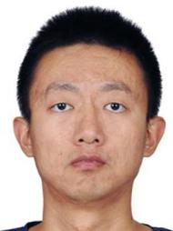

Yuli Zhang received the Ph.D. degree in communication engineering from the College of Communication Engineering, Army Engineering University of PLA, Nanjing, China, in 2018. He is currently with the Intelligent Gaming and Decision-Making Laboratory, Beijing, China. His research interests include spectrum resource allocation, spectrum markets, and game theory.

Dianxiong Liu received the B.E. degree in communication engineering from South China Normal University, Guangzhou, China, in 2014, and the M.S. degree in communication engineering and the Ph.D. degree from the College of Communications Engineering, Army Engineering University of PLA, Nanjing, China, in 2017 and 2020, respectively. He is currently with the Institute of Systems Engineering, Academy of Military Sciences, Beijing, China. His research interests include resource allocation, cognitive radio networks, uncrewed aerial vehicle communication networks, and game theory.

Haichao Wang received the B.S. degree in electronic engineering and the Ph.D. degree in communications and information systems from the College of Communications Engineering, Army Engineering University of PLA, in 2014 and 2019, respectively. His research interests include UAV communications, interference mitigation techniques, green communications, and convex optimization techniques.

Yuhua Xu received the B.S. degree in communications engineering and the Ph.D. degree in communications and information systems from the Army Engineering University of PLA, Nanjing, China, in 2006 and 2014, respectively. He is currently a Professor with the College of Communications Engineering, Army Engineering University of PLA. He has published several papers in international conferences and reputed journals in his research area. His research interests include UAV communication networks, opportunistic spectrum

access, learning theory, and distributed optimization techniques for wireless communications. He received the Certificate of Appreciation as Exemplary Reviewer of the IEEE COMMUNICATIONS LETTERS in 2011 and 2012, respectively. He was selected to receive the IEEE Signal Processing Society 2015 Young Author Best Paper Award and the Funds for Distinguished Young Scholars of Jiangsu Province in 2016.