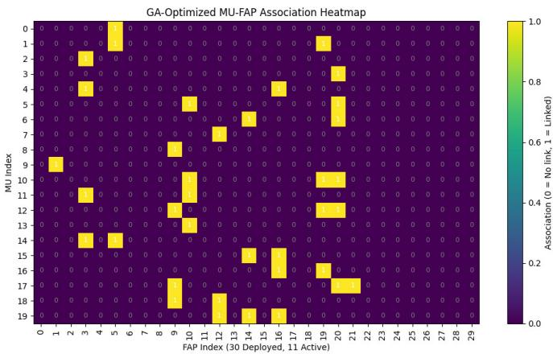
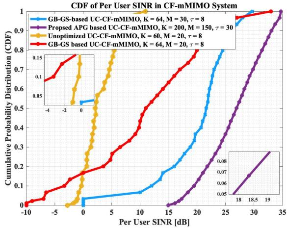
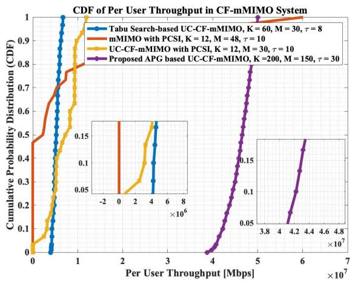
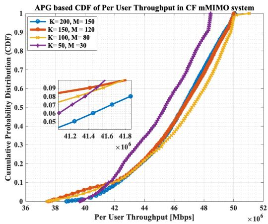
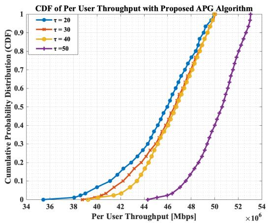
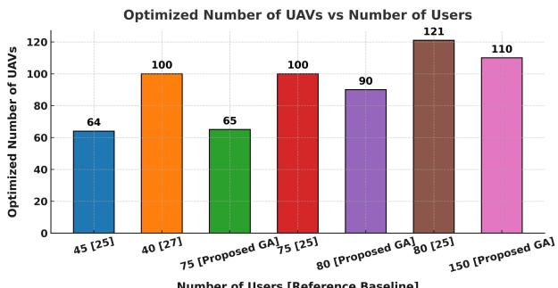
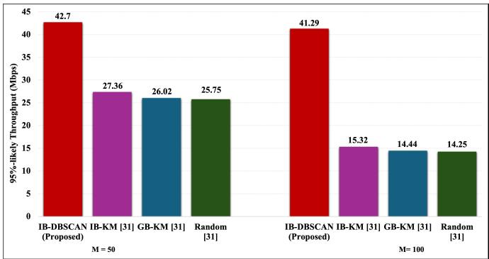
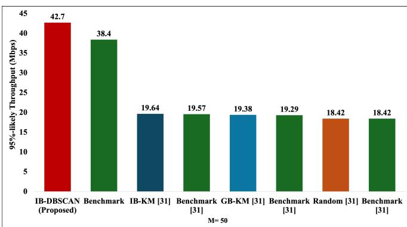
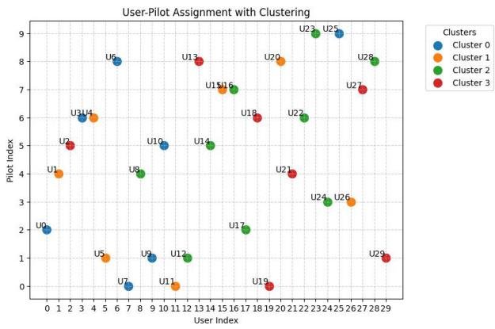

# Joint Optimization of UAV Trajectory, Transmit Power, and User Association in Aerial-Terrestrial Cell-Free Massive MIMO Network

Syed Ammad Ali Shah , Student Member, IEEE, Xavier N. Fernando , Senior Member, IEEE, and Rasha Kashef , Senior Member, IEEE

Abstract—Unmanned aerial vehicle (UAV)-mounted flying access points (FAPs) require a Cell Free massive Multiple-Input-Multiple-Output (CF-mMIMO) architecture to avoid frequent handovers while offering enhanced spectral and coverage gains. However, its practical deployment faces challenges such as mutual interference, pilot contamination, and UAV deployment overhead—particularly under dense user scenarios. This paper presents a comprehensive optimization framework for massive access in UAV-enabled CF-mMIMO systems aimed at maximizing per-user throughput by optimizing the UAV transmission power and trajectory, reducing pilot contamination, and reducing the number of required UAVs. We propose a novel threestage optimization framework that jointly addresses these issues. First, we formulate a non-convex optimization problem for joint UAV trajectory and power control and solve it using an Accelerated Proximal Gradient (APG) method. Then, we propose a Genetic Algorithm (GA)-based user-UAV association strategy that evolves optimal association patterns under load balancing and interference-aware constraints while reducing deployment overhead. Finally, we introduce an interferenceaware Density-Based Spatial Clustering of Applications with Noise (IB-DBSCAN) algorithm for pilot assignment, which clusters users based on both spatial and interference metrics, followed by a fairness-driven pilot allocation scheme. The complexity and convergence of proposed algorithms are presented as well. Simulation results demonstrate that the proposed framework significantly improves 95%-likely per-user Signal-to-Interference-Plus-Noise Ratio (SINR) and throughput, while reducing UAV usage by over 40%. The integration of trajectory control, association, and clustering provides a scalable and interferenceresilient solution for next-generation aerial-terrestrial wireless networks.

Index Terms—Cell-free massive MIMO, trajectory optimization, accelerated proximal gradient, DBSCAN clustering, pilot assignment, genetic algorithm, power control.

## I. INTRODUCTION

ERIAL-TERRESTRIAL networks rapidly emerge, with unmanned aerial vehicles (UAVs) serving as flying

Digital Object Identifier 10.1109/TWC.2026.3685988 access points (FAPs). Conventional cellular approaches are not suitable here due to perceived high inter-cell interference and unnecessary frequent handover overheads. User-centric cellfree massive multiple-input multiple-output (UC-CF-mMIMO) architecture is an excellent solution here due to its ability to deliver satisfactory quality of service (QoS) uniformly, including to edge users without frequent handovers and intercell interference [1]. In the UC-CF-mMIMO system, a large number of randomly distributed FAPs collaboratively serve a small set of mobile users (MUs) across the same timefrequency resources, eliminating the need for conventional base station based cell boundaries [2]. These FAPs are interconnected through a backhaul network to a central processing unit (CPU) [1], which manages the communication between the MUs and the FAPs.

An efficient resource allocation can be achieved in the FAPbased UC-CF-mMIMO system by optimizing factors such as FAP trajectory [3], MU-FAP association [4], transmission power control [5] and pilot assignment [6]. In UC-CFmMIMO approach, the channels between FAPs and MUs can be semi-orthogonal to each other [1]. Time-division duplex (TDD) operation is typically employed in UC-CF-mMIMO [7] systems, where obtaining accurate channel state information (CSI) for all the MUs at the FAPs is essential. The FAPs estimate the channels by using the uplink pilot signals [8], [9], [10]. However, the limited durations of coherence intervals in wireless fading channels restrict the number of orthogonal training pilots available to all MUs which leads to pilot reuse. The pilot reuse introduces pilot contamination, which significantly degrades system performance and becomes a major bottleneck for UC-CF-mMIMO system [11], [12].

The usage of UAVs as FAPs in the UC-CF-mMIMO system brings unique challenges such as FAPs change their trajectories based on the surrounding environment and the meager onboard energy and computational resources. The trajectory decisions severely affect the communication link between the FAPs and MUs which, in turn, impacts system performance.

In FAP-based UC-CF-mMIMO systems, joint power control with MU association, power control with FAPs trajectory optimization and power control with pilot assignment schemes are described in the literature which are discussed in Section I-A. However, the joint optimization problems formulated in these studies are mixed-integer programming problems and are solved using iterative algorithms which possess high computational cost in large UC-CF-mMIMO systems. The main objective of this paper is to jointly optimize the power control, FAP selection and trajectory with an efficient pilot assignment scheme to improve the average MU throughput in FAP-based UC-CF-mMIMO system with low computational complexity.

## A. Previous Work and Research Gap

In this section, we review some of the significant research conducted in the UC-CF-mMIMO system to improve power control, MU association, UAV trajectory, and pilot assignment.

1) User Association and Power Control: In [13], an exact penalty-based method with alternating descent was combined with successive convex approximation (SCA) to optimize power and access point (AP) association for maximizing spectral efficiency (SE) in CF-mMIMO, while an accelerated projected gradient (APG) algorithm was applied for low-complexity large-scale optimization. In [14], the authors extended this work by integrating federated learning with APG for optimal user selection under favorable link conditions. Further, [15] addressed both small- and large-scale CF-mMIMO systems. For small-scale scenarios, SCA maximized sum spectral efficiency given a maximum number of users and fixed per AP transmit power, while a convolutional neural network (CNN)-based JointCFNet was proposed to learn the mapping between large-scale fading coefficients (LSFCs), power control, and MU association to reduce complexity. For large-scale systems, APG combined with alternating descent addressed the high complexity of SCA-based convex solvers. In [16], the binary MU-AP association problem was converted into a convex form using an exact penalty-based method, and the LSFC-based power control was solved via the APG algorithm. Additionally, APG was applied to minimize eavesdropping SE, enhancing security while meeting SE requirements for legitimate users. In [17], the LSFC-based APG algorithm was employed to maximize average SE, ensure user fairness, and optimize the minimum rate across all MUs.

In [18], the authors proposed a Deep Deterministic Policy Gradient (DDPG)-based power control algorithm to achieve the best tradeoff between network performance and required learning complexity. The proposed DDPG outperforms Advantage Actor-critic (A2C), DDPG with one critic and Deep Q-Network (DQN), both in terms of sum-rate and number of QoS satisfied MUs. In [19], an LSFC-based AP association scheme was proposed where each AP serves MUs with the strongest LSFCs; however, the impact of AP-MU association on SE was not addressed, focusing instead on auction-based pilot assignment. In [20], DQN was applied for power control in a heterogeneous network with ground and aerial users to jointly maximize SE.

In [21], the authors investigated the impact of fronthaul capacity limitations in UAV-assisted CF-mmIMO system. The authors proposed a framework where multi-antenna UAVs act as distributed aerial APs to jointly serve ground users. They evaluated 3GPP functional split Options 7.2 and 8, [22], [23] and minimize the maximum UAV power consumption to achieve better Signal-to-Interference-Plus-Noise Ratio (SINR) using a CVX-MOSEK solver. The results showed that mmWave fronthaul links outperform sub-6 GHz ones, achieving higher SINR and lower power usage, particularly under Option 8. However, this study does not consider the non-convexity of the problem in detail and does not implement any mechanism to optimize the UAV association matrix to optimize the number of UAVs required to serve a MU. This paper focused only on power optimization to improve SINR.

2) UAV Trajectory Optimization and Power Control: In [24], the authors implemented the gradient-based (GB) algorithm with simulated annealing (SA) to update the UAV horizontal position with respect to MU position to achieve better local-average SINR and GB convergence, which in turn increases SE. The authors extended this work in [25] to improve the SE of the CF-mMIMO system by implementing a combination of GB and Gibbs sampling (GS) algorithms to handle the non-convex UAV deployment problem where a subset of UAVs serve the MUs. The results are compared with square grid-based deployment. In [26], the authors proposed the GB-GS-based UAVs deployment optimization, and MU power optimization and UAV power control by implementing the SCA method. In [27], the authors jointly optimize the power allocation and UAV circular flight trajectory to maximize the minimum downlink MU rate in the CF-mMIMO system. MUs are clustered using the K-means clustering algorithm. In [28], the authors jointly optimize the three-dimensional(3D) UAV trajectory and power allocation using the SCA and the max-min power allocation method, respectively. In [29], the authors focused on UAV power control problem but completely ignored the impact of UAVs trajectories on the UAV association based on the MU distance and power requirement.

3) Pilot Assignment and Power Control: In [30], pilot length, allocation, and power control were jointly optimized using the Dsatur algorithm to maximize the weighted sum rate. In [31], a location-based pilot assignment (LPA) scheme was proposed, dividing the coverage area into smaller regions based on the MU distribution to assign pilot subsets and mitigate pilot contamination. In [1], a greedy pilot assignment iteratively updated the MU with the lowest uplink rate but often converged to local optima. In [32], an interferenceaware user-group pilot assignment (IA-UG) was introduced, where initial random grouping is refined by swapping MUs between highest and lowest interference groups. In [33], copilot interference was computed using the normalized AP contribution to MUs signal strength. In [34] and [35], usergroup based and interference-based K-means (IB-KM) pilot assignment schemes were proposed, where serving APs are selected via partial large-scale fading decoding (LSFD). IB-KM clusters MUs into circular groups based on distance and AP associations; as distance between co-pilot users served by the same AP decreases, copilot interference increases.

4) Research Gap and Main Contributions: Several iterative joint power control and MU association schemes have been proposed in [13], [14], [15], [16], [17], [19], [20], and [21]. However, these methods often converge to local minima and suffer from high computational complexity as AP and MU count grow in large-scale CF-mMIMO systems. To mitigate this, MU association and power control issues are decoupled, despite their interdependence. Furthermore, existing SCA and APG methods assume static system models, ignoring dynamics such as MU mobility, interference variations, and load balancing. Also, frequent AP coordination for updating associations and power control leads to significant communication overhead and delays in large-scale deployments.

For example, the K-means unsupervised clustering in [27] deploys UAVs at cluster centers but overlooks the number of UAVs needed per cluster and fails when clusters form obtuse shapes, violating the cell-free concept. It also assumes MU are always within a UAV range and, forms impractical circular clusters. This requires a priori definition of cluster counts, which is unsuitable for dynamic CF-mMIMO. In [34] and [35], interference-based K-means clustering assigns pilots to avoid intra-cluster contamination but assumes that intercluster pilot interference can be mitigated by maintaining fixed distances between MUs, which is impractical due to MUs mobility. Moreover, these works neglect joint MUs-AP association and fail to model complex non-convex user groupings influenced by interference, channel fluctuations, and AP topology, resulting in suboptimal clustering, scheduling, and poor system performance.

In this paper, we extended our work in [36] to maximize peruser throughput with optimal power and trajectory control and pilot assignment in a UAV-enabled UC-CF-mMIMO system with low UAV count. The main contributions are:

1) A joint APG-based framework is proposed to optimize transmit power and 3D trajectories of UAVs in UC-CFmMIMO. The gradient-based iterative structure ensures fast and smooth convergence, while accounting for UAV mobility constraints and QoS requirements. Closed-form gradients with extrapolated updates ensure scalability for dense MU deployments. To ensure practical deployment feasibility, the proposed system adopts the 3GPP Option 8 [22], [23] functional split for fronthaul architecture, wherein UAVs perform Radio Frequency (RF)-level processing and CPUs handle baseband computation.

2) A Genetic algorithm (GA)-based FAP association scheme, independent of SINR convexity and differentiability, is developed. The GA optimizes the MU-FAP association matrix under the given constraints while adaptively determining a minimal FAP count to meet the QoS. The fitness function incorporates load balancing, sparsity, and interference awareness, enabling FAPs to serve multiple MUs.

3) A novel Inter-user Density-Based Spatial Clustering of Applications with Noise (IB-DBSCAN) algorithm is developed for MU clustering and pilot assignment. This incorporates similarity metrics and adaptively forms interference-aware clusters while filtering outliers. In addition, the fairness penalty prevents pilot reuse among closely located or highly interfering MUs.

4) These techniques are integrated into a three-stage optimization pipeline: (i) APG-based power and trajectory control, (ii) GA-based MU-FAP association, and (iii) IB-DBSCAN clustering and pilot assignment. Simulations in realistic FAP deployments demonstrate significant improvements in 95%-likely throughput, SINR, FAP count reduction, and pilot reuse efficiency over conventional SCA, random, and K-means-based methods.

## II. THE COMMUNICATION PROCESS

We consider an aerial UC-CF-mMIMO system with M MUs and K FAPs [36]. We adopt a single-antenna model per FAP because UC-CF-mMIMO achieves its gain primarily through the large-scale cooperation of many distributed FAPs and not through multiple antennas on each FAP. This choice is consistent with existing CF-mMIMO literature and is motivated by UAV hardware/power constraints, analytical tractability, and scalability [21], [25], [26]. These MUs and FAPs are arbitrarily distributed in the geographical areas of $L \times L \ \mathrm { K m } ^ { 2 }$ . We consider 3D Cartesian coordinate system where the coordinates of FAP k at time t are $\begin{array} { r l } { \mathbf { s } _ { k } ( t ) } & { { } = } \end{array}$ $[ x _ { k } ( t ) , y _ { k } ( t ) , H _ { k } ( t ) ]$ . Here, $x _ { k } ( t ) , y _ { k } ( t )$ represents the horizontal position of the FAP and $H _ { k }$ is the variable height of the FAP, The position of MU m at time t is $\mathbf { s } _ { m } = [ x _ { m } ( t ) , y _ { m } ( t ) ]$ Hence, the horizontal distance $d _ { m , k }$ between FAP k and MU m is given as $d _ { m , k } = \sqrt { ( x _ { k } ( t ) - x _ { m } ( t ) ) ^ { 2 } + ( y _ { k } ( t ) - y _ { m } ( t ) ) ^ { 2 } }$ The coefficient of the channel between $m ^ { t h }$ MU and the $k ^ { t h }$ FAP is considered as $h _ { m , k }$ . The channel coefficient follows a Rician distribution with a dominant line-of-sight (LoS) component and a Rayleigh-distributed small-scale fading component. Accordingly, we have [36], [37] [Sec.3.4.1]:

$$
h _ { m , k } = \sqrt { \frac { \beta _ { m , k } h _ { k } ( \theta _ { m , k } ) } { d _ { m , k } ^ { \kappa } ( K _ { m , k } + 1 ) } } \left( \sqrt { K _ { m , k } } e ^ { j \psi _ { m , k } } + b _ { m , k } \right)\tag{1}
$$

where, $\beta _ { m , k }$ is the path loss coefficient between $m ^ { t h }$ FAP and $k ^ { t h }$ MU and κ is the path loss exponent. The Rician K-factor, $K _ { m , k }$ is given by $K _ { m , k } ~ = ~ \stackrel { . } { A } _ { 1 } e ^ { A _ { 2 } \arcsin \left( \frac { H _ { k } } { d _ { m , k } } \right) }$ where $A _ { 1 }$ and A<sub>2</sub> are environment-dependent parameters [36]. The $b _ { m , k } \sim \mathcal { N } _ { \mathbb { C } } ( 0 , 1 )$ is a zero-mean, unit-variance complex Gaussian small-scale fading parameter and $\psi _ { m , k }$ is the phase rotation of LOS component. The antenna gain at $k ^ { t h }$ FAP depends on the FAP height and horizontal distance between FAP and the MU and is given as:

$$
h _ { k } ( \theta _ { m , k } ) = h _ { k } ( d _ { m , k } ) = 2 ( \varrho _ { k } + 1 ) \cdot \frac { H _ { k } ^ { \varrho _ { k } } } { d _ { m , k } ^ { \varrho _ { k } } }\tag{2}
$$

where the parameter % controls the trade-off between gain and directivity. If the FAP accurately tracks the LOS phase, the small-scale fading component is modeled as complex Gaussian random variable $h _ { m , k } \sim \mathcal { N } _ { \mathbb { C } } ( 0 , r _ { m , k } )$ with $r _ { m , k } = \mathbb { E } \{ | h _ { m , k } - $ $\bar { h } _ { m , k } | ^ { 2 } \} = 2 ( \varrho _ { k } + 1 ) \beta _ { m , k } \cdot d _ { m , k } ^ { - ( \varrho _ { k } + \kappa ) } \cdot H _ { k } ^ { \varrho _ { k } }$ . We assume that LOS phase component is modeled as uniformly distributed random variable with $\psi _ { m , k } \sim \mathcal { U } [ 0 , 2 \pi ]$ . This results in the mean LoS component to be $\bar { h } _ { m , k } = 0$ which ensures that the fading follows a Rayleigh model with variance $r _ { m , k }$ given as:

$$
r _ { m , k } = \mathbb { E } \{ | h _ { m , k } | ^ { 2 } \} = 2 ( \varrho _ { k } + 1 ) \cdot \beta _ { m , k } \cdot d _ { m , k } ^ { - ( \varrho _ { k } + \kappa ) } \cdot H _ { k } ^ { \varrho _ { k } }\tag{3}
$$

## A. Uplink Data Transmission

The communication in UC-CF-mMIMO system starts with all the MUs transmitting orthogonal pilot sequences of length $\tau _ { p }$ for uplink channel coefficient estimation [36]. The channel coherence time is denoted by $\tau _ { c }$ where it must be ensured that $\tau _ { p } < \tau _ { c }$ . Let $\varphi _ { m } \in \mathbb { C } ^ { \tau \times 1 }$ be the $\tau _ { p }$ -dimensional pilot sequence assigned to the $m ^ { t h }$ MU, where $\| \varphi _ { m } \| ^ { 2 } = 1$ . During the uplink pilot transmission phase, all M MUs transmit pilot sequences to all K FAPs. Upon reception of the pilots at a FAP, the observation at $k ^ { t h }$ FAP is,

$$
\chi _ { k } ^ { p } = \sum _ { m = 1 } ^ { M } h _ { m , k } \varphi _ { m } \sqrt { \eta _ { t } ^ { m } } + \mathbf { n } _ { k }\tag{4}
$$

where, $\eta _ { t } ^ { m }$ is the pilot power of MU m during the training phase and $\mathbf { n } _ { k } \sim \mathcal { C N } ( 0 , \sigma ^ { 2 } \mathbf { I } )$ , where $\sigma$ is the additive white Gaussian noise variance. The number of orthogonal pilots is necessarily limited, i.e. $\tau _ { p } < M$ , which causes pilot contamination. Let $S _ { m }$ denote the set of MUs that share the same pilot sequence with MU m including MU m itself. The $k ^ { \mathrm { { t h } } }$ FAP projects the received pilot vector $x _ { k }$ onto the pilot sequence $\varphi _ { m } \mathrm { . }$ , which yields the scalar observation $\hat { \chi } _ { k } ^ { p } = \varphi _ { m } ^ { H } \chi _ { k }$ . This projection isolates the components of the received signal that are correlated with $\varphi _ { m } ,$ removing the interference from orthogonal pilots while retaining contamination from MU in $S _ { m }$ and produces the MMSE channel estimate of $h _ { m , k }$ as $\hat { h } _ { m } ^ { k }$ [36]

$$
\hat { h } _ { m , k } = \frac { \mathbb { E } \{ ( \chi _ { k } ^ { p } ) ^ { * } \cdot h _ { m , k } \} } { \mathbb { E } \{ | \chi _ { k } ^ { p } | ^ { 2 } \} } \cdot \chi _ { k } ^ { p }\tag{5}
$$

Expanding the expectations, the closed-form MMSE estimate is obtained as

$$
\hat { h } _ { m , k } = \frac { \sqrt { \tau _ { p } \cdot \eta _ { t } ^ { m } } \cdot r _ { m , k } } { \sum _ { i \in \mathcal { S } _ { m } } \eta _ { t } ^ { i } \tau _ { p } \cdot r _ { i , k } + \sigma ^ { 2 } } \cdot \hat { \mathcal { X } } _ { k } ^ { p }\tag{6}
$$

The average power of the estimated channel, representing the estimation accuracy, is given by,

$$
\gamma _ { m , k } = \mathbb { E } \{ | \hat { h } _ { m , k } | ^ { 2 } \} = \frac { \eta _ { t } ^ { m } \cdot \tau _ { p } \cdot r _ { m , k } ^ { 2 } } { \sum _ { i \in \mathcal { S } _ { m } } \eta _ { t } ^ { i } \cdot \tau _ { p } \cdot r _ { i , k } + \sigma ^ { 2 } }\tag{7}
$$

In $( 7 ) , \ r _ { m , k } ^ { 2 }$ in the numerator is the correlation of $h _ { m , k }$ with itself. The denominator is an expectation of the sum of variances and not the squared sum of the variances. The channel estimation error, $\tilde { h } _ { m , k } = h _ { m , k } - \hat { h } _ { m , k }$ , is uncorrelated with $\hat { h } _ { m , k }$ and satisfies $c _ { m , k } = { \mathbb E } \{ | \bar { h } _ { m , k } | ^ { 2 } \} = r _ { m , k } - \gamma _ { m , k } ,$ where $c _ { m , k }$ is the variance of the estimation error for $m ^ { t h }$ MU at $k ^ { t h }$ FAP. For FAP-MU association, we introduce a binary matrix $\mathbf { U } _ { k , m } ^ { s } ~ = ~ ( \mathbf { u } _ { 1 , 1 } ^ { s } , \ldots , \mathbf { u } _ { N _ { k } , N _ { m } } ^ { s } ) ~ \in ~ \mathbb { Z } _ { 2 } ^ { N _ { K } \times N _ { M } }$ where:

$$
[ \mathbf { u } ^ { s } ] = { \left\{ \begin{array} { l l } { 1 } & { { \mathrm { i f ~ } } \mathrm { F A P ~ } k { \mathrm { ~ a n d ~ M U ~ } } m { \mathrm { ~ a r e ~ a s s o c i a t e d } } } \\ { 0 } & { { \mathrm { o t h e r w i s e } } } \end{array} \right. }\tag{8}
$$

$N _ { m }$ is the number of MUs and $N _ { k }$ is the number of FAPs in the system. Since a MU can be served by multiple FAPs, there can be multiple 1<sup>0</sup>s in each column of $\mathbf { U } _ { k , m } ^ { s }$ corresponding to a single MU. The sum of elements in each column represents the number of FAPs assigned to each MU. The number of FAPs (column of the association matrix), $\mathcal { F } _ { m }$ , assigned to a MU m is represented as: $\begin{array} { r } { \mathcal { F } _ { m } = \sum _ { k = 1 } ^ { N _ { k } } \boldsymbol { u } ^ { s } \ge 1 } \end{array}$ . This sum is greater than 1 in most cases, indicating that MU m is served by more than one FAP and ensures that at any point in time at least one FAP is serving the MU. Similarly, the number of

MUs, $\nu _ { k }$ associated with one FAP is: $\begin{array} { r } { \mathcal { V } _ { k } = \sum _ { m = 1 } ^ { N _ { m } } u ^ { s } } \end{array}$ . This sum can be greater than 1, indicating that a FAP k serves more than one MU. The total number of MUs served by a FAP k is constrained by the $\mathrm { F A P } ^ { \bullet } \mathbf { s }$ power capacity and the total power allocated to it. In a given uplink time-frequency resource, the channel matrix is $\mathbf { H } = ( \mathbf { h } _ { 1 } , \dots , \mathbf { h } _ { M } )$ , where, $ { \mathbf { h } } _ { m } \in \mathbb { C } ^ { M \times 1 }$ is the channel vector from the $m ^ { t h }$ MU to all FAPs. Considering Eq. (6), the channel matrix can be decomposed as $\mathbf { H } = { \hat { \mathbf { H } } } +$ H<sup>˜</sup> , where H<sup>ˆ</sup> is the channel estimate matrix based on pilot transmissions and H<sup>˜</sup> is the channel error matrix due to noise and pilot contamination. At the central processing point, the observations from all K FAPs can be pooled into the vector,

$$
\mathbf { z } = \mathbf { U } ^ { s } \circ \hat { \mathbf { H } } \mathbf { y } \underbrace { + \left( \mathbf { U } ^ { s } \circ \tilde { \mathbf { H } } + \mathbf { U } ^ { i } \circ \mathbf { H } \right) \mathbf { y } + \mathbf { n } } _ { \mathrm { n o i s e ~ + ~ d i s r e g a r d e d ~ F A P ~ i n t e r f e r e n c e : w } }\tag{9}
$$

where $( \mathbf { U } ^ { s } \circ \hat { \mathbf { H } } ) ( \mathbf { y } )$ is the desired received signal based on the estimated channel matrix, $( \mathbf { U } ^ { s } \circ \tilde { \mathbf { H } } + \bar { \mathbf { U } ^ { i } } \circ \mathbf { H } ) ( \mathbf { y } )$ is the interference from channel estimation errors and other FAPs, $\mathbf w _ { k } \sim \mathcal { C N } ( 0 , \sigma ^ { 2 } \mathbf I )$ is the additive white noise modeled as complex Gaussian, ◦ denotes Hadamard product and $\mathbf { y } = ( \sqrt { \vartheta _ { 1 } } s _ { 1 } , \ldots , \sqrt { \vartheta _ { M } } s _ { M } ) ^ { \top }$ is the transmitted signal vector from the MUs, $s _ { m }$ is the symbol having unit power and $\vartheta _ { m }$ is the power control coefficient between MU m and FAP k.

The noise-plus-interference has the covariance matrix: $\Sigma =$ $\mathbb { E } \{ \mathbf { w } \mathbf { w } ^ { * } \} = \mathbf { \bar { B } } _ { 1 } + \mathbf { B } _ { 2 } + \sigma ^ { 2 } \mathbf { I }$ , where, B<sub>1</sub> captures the interference caused by channel estimation error and $\mathbf { B } _ { 2 }$ is the interference caused by the other FAPs and are given as

$$
\begin{array} { r l } & { \mathbf { B } _ { 1 } = \mathbb { E } \left\{ \left( \mathbf { U } ^ { s } \circ \tilde { \mathbf { H } } \mathbf { y } \right) \left( \mathbf { U } ^ { s } \circ \tilde { \mathbf { H } } \mathbf { y } \right) ^ { * } \right\} } \\ & { \qquad = \dim \operatorname* { d i a g } \left\{ \displaystyle \sum _ { m \in \mathcal { V } _ { 1 } } c _ { m , 1 } \vartheta _ { m } , \dotsc , \sum _ { m \in \mathcal { V } _ { K } } c _ { m , K } \vartheta _ { k } \right\} } \\ & { \mathbf { B } _ { 2 } = \mathbb { E } \left\{ \left( \mathbf { U } ^ { i } \circ \mathbf { H } \mathbf { y } \right) \left( \mathbf { U } ^ { i } \circ \mathbf { H } \mathbf { y } \right) ^ { * } \right\} } \\ & { \qquad = \dim \operatorname* { d i a g } \left\{ \displaystyle \sum _ { m \not \in \mathcal { V } _ { 1 } } r _ { m , 1 } \vartheta _ { m } , \dotsc , \sum _ { m \not \in \mathcal { V } _ { K } } r _ { m , K } \vartheta _ { m } \right\} } \end{array}\tag{10}
$$

(11)

In (10), the expectation operator $\mathbb { E } \{ . \}$ extracts the variance of interference at each FAP. The expectation results in a diagonal matrix because we assume that the interference caused by estimation errors at one FAP is uncorrelated with errors at other FAPs. So, the diagonal of $B _ { 1 }$ shows that the estimation error interference at $k ^ { t h }$ FAP depends on the sum of estimation error variances weighted by the transmission power of the MUs it serves. In (11), $B _ { 2 }$ accounts for the inter-FAP interference as the sum of the received power from all MUs that are not assigned to the $k ^ { t h }$ FAP and $U ^ { i }$ is the inverse association matrix which represents MUs that are not assigned to the given FAP. The instantaneous SINR achieved by MU m is:

$$
\Gamma _ { m } = \hat { \mathbf { h } } _ { m } ^ { * } \left( \sum _ { i \neq m } ( \mathbf { u } _ { m , i } ^ { \mathrm { s } } \circ \hat { \mathbf { h } } _ { i } ) ( \mathbf { u } _ { m , i } ^ { \mathrm { s } } \circ \hat { \mathbf { h } } _ { i } ) ^ { * } \boldsymbol { \vartheta } _ { i } + \pmb { \Sigma } _ { m } \right) ^ { - 1 } \cdot \hat { \mathbf { h } } _ { m } \boldsymbol { \vartheta } _ { m }\tag{12}
$$

The expectation of the SINR over the small-scale fading yields the local-average SINR given as:

$$
\Lambda _ { m } = \mathbb { E } \{ \Gamma _ { m } \} = \sum _ { k \in \mathcal { F } _ { m } } \frac { \big ( \sqrt { \gamma _ { m , k } \cdot \vartheta _ { m } } \big ) ^ { 2 } } { \sum _ { i \in \mathcal { V } _ { k } } r _ { i , k } \vartheta _ { i } - \gamma _ { m , k } \vartheta _ { m } + \sigma ^ { 2 } }\tag{13}
$$

The channel estimation overhead is considered to define the per-user throughput as:

$$
\mathcal { R } _ { m } ( \vartheta ) = B \left( \frac { 1 - \tau _ { p } / \tau _ { c } } { 2 } \right) \log _ { 2 } ( 1 + \Lambda _ { m } )\tag{14}
$$

where B represents the bandwidth and $\frac { \tau _ { p } } { \tau _ { c } }$ is the pilot overhead which indicates that in CF-mMIMO systems, only a fraction of the coherence interval is dedicated to uplink training.

## III. PROBLEM FORMULATION

The system throughput in (14) can be improved by increasing the number of FAPs deployed in the system. However, it increases the FAP deployment and power consumption cost significantly. To address this question, we formulate the system’s throughput maximization problem in the FAP based UC-CF-mMIMO system with the objective of obtaining the optimum FAP-MU associations to minimize the number of FAPs, the power control coefficients and FAP trajectories to satisfy the system throughput requirement. We formulate an optimization problem as:

$$
\operatorname* { m a x } _ { \vartheta , s , \mathcal { U } } \quad \sum _ { m \in \mathcal { M } } \mathcal { R } _ { m } ( \vartheta )\tag{15}
$$

$$
\mathrm { s . t . } \sum _ { k = 1 } ^ { N _ { k } } \mathcal { R } _ { m } ( \boldsymbol { \vartheta } ) \cdot \mathcal { U } _ { k , m } \geq \mathcal { R } _ { m } ^ { \mathrm { r e q } } , \quad \forall m\tag{15a}
$$

$$
\mathcal { F } _ { m } = \sum _ { k = 1 } ^ { N _ { k } } u _ { k , m } \ge 1 , \quad \forall m\tag{15b}
$$

$$
\sum _ { k = 1 } ^ { N _ { k } } u _ { k , m } \leq \gamma _ { k } ^ { \operatorname* { m a x } } , \quad \forall m\tag{15c}
$$

$$
\vartheta _ { m , k } ^ { \mathrm { a l l o c a t e d } } = \sum _ { m = 1 } ^ { N _ { m } } \vartheta _ { k , m } \cdot \mathcal { U } _ { k , m } ^ { s } \leq \vartheta _ { \mathrm { m a x } } , \quad \forall k\tag{15d}
$$

$$
s _ { k _ { \mathrm { m i n } } } ( t ) \leq s _ { k } ( t ) \leq s _ { k _ { \mathrm { m a x } } } ( t ) , \quad \forall k , t\tag{15e}
$$

In constraint (15a) $\mathcal { R } _ { m } ( \vartheta )$ is the throughput that FAP k can provide to MU m and $\mathcal { R } _ { m } ^ { r e q }$ is the throughput requirement of the $m ^ { t h }$ MU. The constraint (15b) ensures that there must be one FAP serving a MU in the system. The constraint (15c) ensures that a FAP should not exceed its allowed capacity and limits the number of MUs a FAP can serve. Constraint (15d) does not allow a FAP to exceed its power capacity and serve all the MUs fairly. Constraint (15e) allows FAPs to follow the flight inside the defined horizontal and vertical boundaries.

The FAP trajectory variables are encompassed within $\gamma _ { m , k }$ and $r _ { i , k }$ . The $\gamma _ { m , k }$ is dependent on the pilot sequences assignment. Therefore, the FAP trajectory optimization is transformed by the pilot assignment, power allocation on pilot and data, and the trajectory parameters.

```latex
Algorithm 1 Accelerated Proximal Gradient Algorithm (APG)
for Power Control and FAP Trajectory Optimization
1: Inputs: $t ^ { ( 0 ) } = 0 , t ^ { ( 1 ) } = 1$ , random ${ \tilde { \mu } } ^ { ( 0 ) } , = \mu ^ { ( 0 ) } \in { \hat { \mathcal { G } } } ,$
$\alpha _ { \mu } > 0 , \alpha _ { \tilde { \mu } } > 0 , \tilde { \mu } ^ { ( 1 ) } = \mu ^ { ( 1 ) } = \mu ^ { ( 0 ) } , \zeta ^ { ( 0 ) } , p ^ { ( 1 ) } = 1$
$q ^ { \mathrm { i } } = f ( \mu ^ { ( 1 ) } ) , N _ { \mathrm { m a x } } , \Delta$ and 
2: for $k = 1 , 2 , \ldots$ . do
3: update $\bar { \mu } ^ { ( k ) }$ and $\tilde { \mu } ^ { ( k + 1 ) }$ using (23) and (27).
4: $\begin{array} { r l } & { \mathbf { i } \mathbf { \dot { f } } ^ { \prime } f ( \tilde { \mu } ^ { ( k + 1 ) } ) et { } { ' } { \sum } _ { q } ( k ) - \zeta | | \mathbf { \check { \mu } } ^ { ( k + 1 ) } - \tilde { \mu } ^ { ( k ) } | | } \\ & { \mu ^ { ( k + 1 ) } = \tilde { \mu } ^ { ( k + 1 ) } . } \end{array}$ then set
5: else Update $\hat { \mu } ^ { ( k + 1 ) }$ using (33) and $\mu ^ { ( k + 1 ) }$ using (34)
6: end if
7: Update momentum parameter $t ^ { ( k + 1 ) }$ as per Eq. (26)
8: Compute relaxed thresholds and update $p ^ { ( k + 1 ) }$ and
$q ^ { ( k + \ 1 ) }$ using (28) and (29):
9: Until $\begin{array} { r } { \frac { g ( \vartheta ^ { ( k ) } ) - g ( \vartheta ^ { ( k - 1 ) } ) } { q ( \vartheta ^ { ( k ) } ) } \leq \epsilon } \end{array}$
10: Increase $\mathcal { V } \overline { { = } } \mathcal { V } \times \Delta$
11: Until Converge
12: end for
```

## A. APG Based Solution for Trajectory and Power Control

In (15), the logarithmic dependence on SINR makes the problem non-convex, preventing closed-form expressions for $\mathcal { R } _ { m } ( \vartheta )$ . The interference summation in the denominator of (13) makes constraint (15a) non-separable, while FAP trajectories and power control remain coupled in both numerator and denominator. To address this, the APG algorithm reformulates the throughput constraint into a closed-form solvable structure, jointly optimizing power and trajectory through proximal operators that decompose the problem into sub-problems with closed-form updates. Fixing the FAP-MU association removes non-smooth binary constraints, accelerating convergence. A penalty term is incorporated to handle non-convex constraints, which grows if violations persist, steering the solution toward feasibility without complex projection steps.

$$
Q _ { 1 } ( \vartheta ) \triangleq \sum _ { k \in K } \sum _ { m \in \mathcal { M } } \operatorname* { m a x } \left( 0 , \sum _ { m \in \mathcal { M } } \vartheta _ { k , m } - \vartheta _ { \operatorname* { m a x } } \right) ^ { 2 } \leq 0\tag{16}
$$

$$
Q _ { 2 } ( s , \vartheta ) \triangleq \sum _ { k \in \mathcal { K } } \left[ \operatorname* { m a x } \left( 0 , \mathcal { R } _ { k } ^ { r e q } - \mathcal { R } _ { k } ( s _ { k } , \vartheta _ { m , k } ) \right) \right] ^ { 2 } \leq 0\tag{17}
$$

$$
Q _ { 3 a } ( s , \vartheta ) \triangleq \sum _ { k \in K } \left[ \operatorname* { m a x } \left( 0 , 1 - \sum _ { m \in \mathcal { M } } \vartheta _ { m k } \right) \right] ^ { 2 } \leq 0\tag{18}
$$

$$
Q _ { 3 b } ( s ) \overset { \overset { T } { = } } \sum _ { t = 1 } ^ { T } \left[ \operatorname* { m a x } \big ( 0 , \lVert s _ { k } ( t + 1 ) - s _ { k } ( t ) \rVert ^ { 2 } - V _ { \operatorname* { m a x } } ^ { 2 } \big ) \right] ^ { 2 } \leq 0\tag{19}
$$

$$
\begin{array} { l l } { \mathrm { w h e r e ~ } \ \| s _ { k } ( t + 1 ) - s _ { k } ( t ) \| ^ { 2 } = \ \left( x _ { k } ( t + 1 ) - x _ { k } ( t ) \right) ^ { 2 } + } \\ { \left( y _ { k } ( t + 1 ) - y _ { k } ( t ) \right) ^ { 2 } + \left( H _ { k } ( t + 1 ) - H _ { k } ( t ) \right) ^ { 2 } } \end{array}
$$

$$
\begin{array} { r } { Q _ { 4 } ( s , \vartheta ) \triangleq \displaystyle \sum _ { m \in { \cal { M } } } \left[ \operatorname* { m a x } \left( 0 , \displaystyle \sum _ { k \in { \cal K } } \vartheta _ { m , k } S _ { m } ( s _ { k } , \vartheta ) - \vartheta _ { \operatorname* { m a x } } \right) \right] ^ { 2 } } \\ { \leq 0 . } \end{array}
$$

where $Q _ { 1 } ( \vartheta )$ ensures the power control feasibility, $Q _ { 2 } ( s , \vartheta )$ ensures that FAP meets the throughput requirements of a MU,

$Q _ { 3 a }$ ensures that each FAP is serving at least one MU at any point in time, $Q _ { 3 b }$ ensures FAP trajectory remains smooth in 3D and $Q _ { 4 } ( s , \vartheta )$ makes sure that a FAP does not exceed from its capacity.

$$
\begin{array} { r l } { \underset { \mu } { m i n } \ g ( \vartheta ) } & { { } \triangleq - \displaystyle \sum _ { m \in \mathcal { M } } \mathcal { R } _ { m } ( \vartheta ) } \end{array}\tag{21}
$$

s.t (15b), (15c), (15d), (16), (17), (18), (19), (20) (21a)

where $\boldsymbol { \mu } \triangleq [ \boldsymbol { \vartheta } ^ { T } , \boldsymbol { s } ^ { T } ] ^ { T }$ . Let $\hat { \mathcal { G } } \triangleq \{ ( 1 5 \mathrm { b } ) , \ ( 1 5 \mathrm { c } ) , \ ( 1 5 \mathrm { d } ) , $ (16), (17), (18), (19), (20)} be the convex feasible set of (21). We consider the following problem:

$$
\operatorname* { m } _ { \mu \in { \hat { \mathcal { G } } } } f ( \mu )\tag{22}
$$

where $f ( \mu ) \triangleq g ( \vartheta ) + \mathcal { V } [ \zeta _ { 1 } Q _ { 1 } ( \vartheta ) + \zeta _ { 2 } Q _ { 2 } ( s , \vartheta ) + \zeta _ { 3 } Q _ { 3 a } ( \vartheta , s ) +$ $\zeta _ { 3 b } Q _ { 4 } ( s ) + \zeta _ { 3 b } Q _ { 4 } ( s , \vartheta ) ]$ is the Lagrangian of (21). We consider that the parameter $\zeta$ is not fixed and ensures that the constraint violations are gradually eliminated over iterations. If the algorithm violates the constraints, the penalty weight, $\zeta ,$ increases to enforce feasibility. The essential steps to solve (21) are outlined in algorithm 1.

$$
\begin{array} { c } { { \displaystyle \bar { \mu } _ { ( k ) } = \mu _ { ( k ) } + \frac { t ^ { ( k - 1 ) } } { t ^ { ( k ) } } ( \tilde { \mu } ^ { ( k ) } - \mu ^ { ( k ) } ) } } \\ { { + \displaystyle \frac { t ^ { ( k - 1 ) } - 1 } { t ^ { ( k ) } } ( \mu ^ { ( k ) } - \mu ^ { ( k - 1 ) } ) } } \end{array}\tag{23}
$$

The Eq (23) calculates the extrapolated values of $\mu$ using a momentum term $t ^ { k }$ for FAP trajectories and power control coefficients jointly using the following trajectory and power control coefficient formulas for accelerating the convergence of the algorithm:

$$
\mu _ { s } ^ { k } = \mu _ { s } ^ { k } + \frac { t ^ { k - 1 } } { t ^ { k } } \left( \tilde { \mu } _ { s } ^ { k } - \mu _ { s } ^ { k } \right) + \frac { t ^ { k - 1 } - 1 } { t ^ { k } } \left( \mu _ { s } ^ { k } - \mu _ { s } ^ { k - 1 } \right)\tag{24}
$$

$$
\mu _ { \vartheta } ^ { k } = \mu _ { \vartheta } ^ { k } + \frac { t ^ { k - 1 } } { t ^ { k } } \left( \tilde { \mu } _ { \vartheta } ^ { k } - \mu _ { \vartheta } ^ { k } \right) + \frac { t ^ { k - 1 } - 1 } { t ^ { k } } \left( \mu _ { \vartheta } ^ { k } - \mu _ { \vartheta } ^ { k - 1 } \right)\tag{25}
$$

The power control coefficients and trajectories are updated based on their previous two iterations to speed up convergence. The momentum parameter $t ^ { k }$ ensures momentum grows over iterations, improving the algorithm’s convergence speed and is calculated as:

$$
t ^ { ( k + 1 ) } = \frac { 1 + \sqrt { 4 ( t ^ { ( k ) } ) ^ { 2 } + 1 } } { 2 }\tag{26}
$$

Finally, the projection of the updated point $( y ~ = ~ \bar { \mu } ^ { ( k ) } ~ -$ $\alpha _ { \bar { \mu } } \nabla f ( \bar { \mu } ^ { ( k ) } ) \big )$ onto the feasible set $\hat { \mathcal G }$ gives:

$$
\tilde { \mu } ^ { ( k + 1 ) } = \mathcal { P } _ { \hat { \mathcal { G } } } ( \bar { \mu } ^ { ( k ) } - \alpha _ { \bar { \mu } } \nabla f ( \bar { \mu } ^ { ( k ) } ) ) ,\tag{27}
$$

where $\mathcal { P } _ { \hat { \mathcal { G } } } ( z )$ is the operator of projecting y on ${ \hat { \mathcal { G } } } .$ The algorithm iteratively updates the variable $\bar { \mu } ^ { ( k ) }$ by taking gradient-based steps of size $\bar { \mu } ^ { ( k ) }$ and moving along the descent direction. To ensure stable convergence of the objective function, the APG algorithm employs diminishing step sizes defined as $\begin{array} { r } { \alpha ^ { ( t ) } = \frac { \alpha _ { 0 } } { 1 + \beta t } } \end{array}$ to ensure stable convergence of the objective function. The FAP positions and power coefficients are iteratively updated until the relative change in the objective value satisfies $\left| \mathcal { L } ^ { ( t + 1 ) } - \mathcal { L } ^ { ( t ) } \right| / \mathcal { L } ^ { ( t ) } < \bar { 1 0 } ^ { - 3 }$ , indicating convergence. The non-convexity of $f ( \mu )$ does not necessarily allow the updated objective value $\overset { \cdot } { f } ( \overset { \cdot } { \mu } ^ { ( k + 1 ) } )$ to improve the objective function if $f ( { \tilde { \mu } } ^ { ( k + 1 ) } ) ~ > ~ { \tilde { f } } ( \mu ^ { k } )$ . Nevertheless, to accelerate the convergence, we accept $\ddot { \mu } ^ { ( k + 1 ) } = \tilde { \mu } ^ { k + 1 }$ only if the objective function value satisfies $( \stackrel { \cdot } { \mu } ^ { ( k + 1 ) } ) \leq q ^ { ( k ) }$ , where $q ^ { ( k ) }$ is the relaxed threshold derived from $f ( \mu )$ , ensuring it remains close to the previous objective value. The weighted average $q ^ { ( k ) }$ of the past objective values is defined as:

$$
q ^ { ( k ) } = \frac { \sum _ { k = 1 } ^ { \kappa } \xi ^ { ( \kappa - k ) } f ( \mu ^ { ( k ) } ) } { \sum _ { k = 1 } ^ { \kappa } \xi ^ { ( \kappa - k ) } }\tag{28}
$$

where $\xi \in [ 0 , 1 )$ is a weighting parameter. In each iteration $q ^ { ( k + 1 ) }$ can be computed as

$$
\boldsymbol { p } ^ { ( k + 1 ) } = \xi \boldsymbol { p } ^ { ( k ) } + 1\tag{29}
$$

where $p ^ { ( k + 1 ) }$ determines whether the updated point $\tilde { \mu } ^ { ( k + 1 ) }$ should be accepted based on the function value. It accumulates

$$
q ^ { ( k + 1 ) } = \frac { \xi p ^ { ( k ) } q ^ { ( k ) } + f ( \mu ^ { ( k ) } ) } { p ^ { ( k + 1 ) } } ,\tag{30}
$$

over iterations and effectively discounts the old function values in the weighted averaging process of computing $\textstyle q ^ { ( k + 1 ) }$ where the initialization values are $\mathsf { \bar { q } } ^ { ( 1 ) } = f ( \mu ^ { ( 1 ) } )$ and $\bar { p } ^ { ( \bar { 1 } ) } = 1$ Another point is computed with step size $\alpha _ { \mu }$ as:

$$
\hat { \boldsymbol { \mu } } ^ { ( k + 1 ) } = \mathcal { P } _ { \hat { \mathcal { G } } } ( \boldsymbol { \mu } ^ { ( k ) } - \alpha _ { \mu } \nabla f ( \boldsymbol { \mu } ^ { ( k ) } ) )\tag{33}
$$

In the next step, the objective values of $\tilde { \mu } ^ { ( k + 1 ) }$ and $\hat { \mu } ^ { ( k + 1 ) }$ are used to update $\mu ^ { ( k + 1 ) }$ as:

$$
\begin{array} { r } { \mu ^ { ( k + 1 ) } = \left\{ \tilde { \mu } ^ { ( k + 1 ) } , \mathrm { i f } f ( \tilde { \mu } ^ { ( k + 1 ) } ) \leq f ( \hat { \mu } ^ { ( k + 1 ) } ) \right. } \\ { \left. \hat { \mu } ^ { ( k + 1 ) } , \mathrm { o t h e r w i s e } . \right. } \end{array}\tag{34}
$$

The feasible set $\hat { \mathcal G }$ is bounded and ensures that $f ( \mu )$ is Lipschitz continuous or $f ( \mu )$ has continuous gradient. That is, there exists a constant $L _ { f }$ , i.e,

$$
\| \nabla f ( w ) - \nabla f ( v ) \| \leq L _ { f } \| w - v \| , \quad \forall w , v \in \hat { \mathcal { G } }\tag{35}
$$

here, w and v are two different points, and $\nabla f ( w )$ and $\nabla f ( \boldsymbol { v } )$ are the gradients of the objective function $f ( \mu )$ evaluated at these points. Theoretically, $\begin{array} { r } { \alpha _ { \bar { v } } \ < \ \frac { 1 } { L _ { f } } } \end{array}$ and $\begin{array} { r } { \alpha _ { v } \ < \ \frac { 1 } { L _ { f } } } \end{array}$ are the sufficient but not necessary conditions for the convergence of APG algorithm. In addition to this, it is hard to find the best Lipschitz constant of $f ( \mu )$ . For these reasons, we keep

$$
\frac { \partial f ( \mu ) } { \partial \vartheta } = \left[ \left( \frac { \partial f } { \partial \vartheta _ { 1 } } \right) ^ { \top } , . . . , \left( \frac { \partial f } { \partial \vartheta _ { K } } \right) ^ { \top } \right] ^ { \top } , \quad \frac { \partial f ( \mu ) } { \partial s } = \left[ \left( \frac { \partial f } { \partial s _ { 1 } } \right) ^ { \top } , . . . , \left( \frac { \partial f } { \partial s _ { K } } \right) ^ { \top } \right] ^ { \top } .\tag{31}
$$

$$
\frac { \partial f } { \partial \vartheta _ { m , k } } = - \sum _ { i \in M } \frac { \partial \mathcal { R } _ { i } } { \partial \vartheta _ { m , k } } \ : + \ : y \frac { \partial Q } { \partial \vartheta _ { m , k } } , \frac { \partial f } { \partial s _ { m , k } } = - \sum _ { i \in M } \frac { \partial \mathcal { R } _ { i } } { \partial s _ { m , k } } \ : + \ : y \frac { \partial Q } { \partial s _ { m , k } } .\tag{32}
$$

the values of $\alpha _ { \bar { \mu } }$ and $\alpha _ { \mu }$ sufficiently small and achieve the convergence for the APG Algorithm. We solve the projection on $\hat { \mathcal G }$ in (23) and (27) by optimizing the power control coefficients ϑ and the FAP trajectories s.

$$
\mathcal { P } _ { \hat { G } } ( \mu ) : \rvert _ { \mu \in \mathbb { R } ^ { 2 K M \times 1 } } \Vert \mu - w \Vert ^ { 2 }\tag{36}
$$

$$
{ \mathrm { s . t . } } ( 1 5 { \mathrm { b } } ) , ( 1 5 { \mathrm { c } } ) , ( 1 5 { \mathrm { d } } ) , ( 1 6 ) , ( 1 7 ) ( 1 8 ) , ( 1 9 ) , ( 2 0 )\tag{36a}
$$

$$
\begin{array} { r l } { m i n } & { { } \| \vartheta _ { k } - w _ { 1 , k } \| ^ { 2 } } \\ { \vartheta _ { k } \in \mathbb { R } ^ { K M \times 1 } } & { { } \| \vartheta _ { k } - w _ { 1 , k } \| ^ { 2 } } \end{array}\tag{37}
$$

$$
\begin{array} { r } { \mathrm { s . t . } \quad \lVert \boldsymbol { \vartheta } _ { k } \rVert _ { 2 } \leq 1 , \quad \boldsymbol { \vartheta } _ { k } \geq 0 } \end{array}\tag{37a}
$$

$$
\begin{array} { r l } { { m i n } } & { { } \| s _ { k } - w _ { 2 , k } \| ^ { 2 } } \end{array}\tag{38}
$$

$$
\mathrm { s . t . } \ \| s _ { k } \| _ { 2 } \leq \gamma _ { k } ^ { \hat { m } a x } , s _ { k } \geq s _ { m i n } , s _ { k } \leq s _ { m a x }\tag{38a}
$$

$$
\vartheta _ { k } = \frac { 1 } { \operatorname* { m a x } ( 1 , \| [ w _ { 1 , k } ] _ { 0 + } \| ) } [ w _ { 1 , k } ] _ { 0 + }\tag{39}
$$

$$
s _ { k } = \left[ \frac { \sqrt { V _ { k } ^ { m a x } } } { \operatorname* { m a x } \left( \sqrt { V _ { m } ^ { m a x } } , \| [ w _ { 2 , k } ] _ { 0 + } \| \right) } [ w _ { 2 , k } ] _ { 0 + } \right] _ { 1 }\tag{40}
$$

In (39), $w _ { 1 , k }$ is the unconstrained update for the power control variable $\vartheta , [ w _ { 1 , k } ] _ { 0 + }$ ensures non-negativity being projected onto the feasible region and the normalization factor ma $\mathrm { x } ( 1 , \| [ w _ { 1 , k } ] _ { 0 + } \| )$ ) ensures that $| \vartheta _ { k } | | _ { 2 } \leq 1$ to keep the power control variables in their allowable limits. In $( 4 0 ) , w _ { 2 , k }$ is the unconstrained update for the trajectory variable $s _ { k } , \ [ w _ { 2 , k } ] _ { 0 + }$ keeps the velocity non zero (projecting on to the feasible region), max $( \sqrt { { V } _ { m } ^ { m a x } } , \| [ w _ { 2 , k } ] \bar { \ l _ { 0 + } } \| )$ normalizes the trajectory within the feasible velocity range $V _ { k } ^ { m a x }$ and $[ . ] _ { 1 - }$ keeps trajectory within the upper and lower bounds to avoid any abrupt movement. The gradients of $f ( \mu )$ with respect to $\vartheta$ and s are given in (31) and (32), shown at the bottom of the previous page.

The distance, $d _ { m k } .$ , between MU and FAP, FAP height $H _ { k }$ and the LSFC $\beta$ impact $r _ { m k }$ and $\gamma _ { m k }$ which are part of the SINR expression in (13). So, any changes in the trajectories directly influence the throughput R of the MUs. For this reason, we calculate the $\frac { \partial \breve { f ( \mu ) } } { \partial s _ { m k } }$ w.r.t. horizontal coordinates $s _ { k }$ , height $H _ { k }$ and $d _ { m , k }$ . In (46), shown at the bottom of the page, we find $\begin{array} { r } { \frac { \partial \gamma _ { m , k } } { \partial \mathbf { r } _ { \mathbf { k } } } , \ \frac { \partial r _ { i , k } } { \partial \mathbf { s } _ { \mathbf { k } } } , \ \frac { \partial \gamma _ { m , k } } { \partial \mathbf { H } _ { \mathbf { k } } } , \ \frac { \partial r _ { i , k } } { \partial \mathbf { H } _ { \mathbf { k } } } } \end{array}$ . as the gradient of $\gamma _ { m , k }$ w.r.t $s _ { k }$ depends on them:

$$
\frac { \partial \gamma _ { m , k } } { \partial s _ { k } } = \frac { \partial \gamma _ { m , k } } { \partial r _ { m , k } } \frac { \partial r _ { m , k } } { \partial d _ { m , k } } \frac { \partial d _ { m , k } } { \partial s _ { k } } + \sum _ { i \in S _ { m } } \frac { \partial \gamma _ { m , k } } { \partial r _ { i , m } } \frac { \partial r _ { i , m } } { \partial d _ { i , m } } \frac { \partial d _ { i , m } } { \partial s _ { k } }\tag{41}
$$

Similarly, derivative of throughput w.r.t $s _ { k }$ and $\vartheta _ { m , k }$

$$
\frac { \partial \mathcal { R } _ { m } } { \partial s _ { k } } = \frac { B ( 1 - \tau _ { p } / \tau _ { c } ) } { 2 \ln ( 2 ) } \cdot \frac { 1 } { 1 + \Lambda _ { m } } \frac { \partial \Lambda _ { m } } { \partial s _ { m , k } }\tag{42}
$$

$$
\frac { \partial \mathcal { R } _ { m } } { \partial \vartheta _ { m , k } } = \frac { B ( 1 - \tau _ { p } / \tau _ { c } ) } { 2 \ln ( 2 ) } \cdot \frac { 1 } { 1 + \Lambda _ { m } } \cdot \frac { \partial \Lambda _ { m } } { \partial \vartheta _ { m , k } }\tag{43}
$$

The derivative of $R _ { m }$ w.r.t $s _ { k }$ and $\vartheta _ { m , k }$ are given in (47), shown at the bottom of the page. The gradients of the penalty functions $Q _ { 1 } , Q _ { 2 } , Q _ { 3 a } , Q _ { 3 b } , Q _ { 4 }$ w.r.t the power control coefficients $\vartheta$ and FAP trajectories $s _ { k }$ are derived in (49), shown at the bottom of the next page, which in turn gives total gradient of $Q ( \mu ) _ { \mathrm { t o t a l } }$ w.r.t FAP trajectory s<sub>k</sub>:

$$
\begin{array} { r l } & { \frac { \partial Q ( \boldsymbol { \mu } ) _ { \mathrm { l o u t } } } { \partial s _ { k } } } \\ & { = \displaystyle \sum _ { m \in M } \left[ - 2 \left( \mathcal { R } _ { m } ^ { \mathrm { r e q } } - \mathcal { R } _ { m } \right) \frac { \partial \mathcal { R } _ { m } } { \partial s _ { k } } \right] } \\ & { \quad + \displaystyle \sum _ { t = 1 } ^ { T } \left[ 2 \big ( \| s _ { k } ( t + 1 ) } \\ & { \quad - s _ { k } ( t ) \| ^ { 2 } - V _ { \operatorname* { m a x } } ^ { 2 } \big ) \cdot 2 \big ( s _ { k } ( t + 1 ) - s _ { k } ( t ) \big ) \right] } \\ & { \quad + \displaystyle \sum _ { m \in M } \Bigg [ 2 \left( \sum _ { y ^ { t } \in \mathcal { K } _ { m , k } } \mathcal { R } _ { m } - \partial _ { \operatorname* { m a x } } \right) \frac { \partial \mathcal { R } _ { m } } { \partial s _ { k } } \Bigg ] } \end{array}\tag{44}
$$

Total gradient of $Q ( \mu ) _ { \mathrm { t o t a l } } \mathrm { w . r . t }$ power control coefficients $\vartheta _ { m , k }$

$$
\begin{array} { r l } & { \frac { \partial Q ( \mu ) _ { \mathrm { t o t a l } } } { \partial \vartheta _ { m , k } } } \\ & { = \displaystyle \sum _ { m \in \mathcal { M } } \left[ 2 \left( \displaystyle \sum _ { m ^ { \prime } \in \mathcal { M } } \vartheta _ { k , m ^ { \prime } } - \vartheta _ { \operatorname* { m a x } } \right) \right] } \\ & { \quad + \displaystyle \sum _ { m \in \mathcal { M } } \left[ - 2 \big ( \mathcal { R } _ { m } ^ { \mathrm { r e q } } - \mathcal { R } _ { m } \big ) \frac { \partial \mathcal { R } _ { m } } { \partial \vartheta _ { m , k } } \right] } \end{array}
$$

$$
\begin{array} { r l } & { \frac { \partial \Lambda _ { m } } { \partial s _ { k } } = \sum _ { k \in \mathcal { X } _ { m } } ^ { \nu _ { m } } \frac { \partial } { \partial s _ { k } } ( \underset { ( \sum \gamma _ { k } , \nu _ { k } , \partial _ { t } , \nu _ { k } , \partial _ { t } , \sigma _ { i } , \sigma _ { j } ) ^ { 2 } } { \sum _ { k \in \mathcal { X } _ { m } } } , \quad \frac { \partial \Lambda _ { m } } { \partial M _ { k } } = \sum _ { k \in \mathcal { X } _ { m } } ^ { \nu _ { m } } \frac { \partial } { \partial M _ { k } } ( \underset { \sum \gamma _ { k } , \nu _ { k } , \partial _ { t } , \gamma _ { i } , \sigma _ { i } - \gamma _ { m , k } , \vartheta _ { m } + \sigma ^ { 2 } } { \sum _ { k \in \mathcal { X } _ { m } } } )  } \\ & {  \frac { \partial \gamma _ { m , k } } { \partial \gamma _ { k , k } } = \{ \begin{array} { l l } { \frac { \eta _ { k } ^ { \prime } \tau _ { \gamma } \tau _ { k , k } \partial _ { t } \cdot ( 2 \cdot \sum _ { k \in \mathcal { X } _ { m } } \sqrt { \tau _ { i } \gamma _ { m , k , k } } + 2 \sigma ^ { 2 } ) ^ { 2 } } { ( \sum _ { k \in \mathcal { X } _ { m } } \sqrt { \tau _ { i } \gamma _ { m , k } } + \sigma ^ { 2 } ) ^ { 2 } } , \quad } & { \hat { \omega } = m , } \\ { - \frac { \eta _ { k } ^ { \prime } \eta _ { k } ^ { \prime } \tau _ { k , k } ^ { \prime } } { ( \sum _ { k \in \mathcal { X } _ { m } } \sqrt { \tau _ { i } \gamma _ { m , k } } + \sigma ^ { 2 } ) ^ { 2 } } , \quad } & { \hat { \omega } \neq m , } \end{array}  } \\ &  \frac { \partial \gamma _ { m , k } } { \partial q _ { k } } = \sum _  ( \sum _  j  \end{array}\tag{46}
$$

(47)

$$
\begin{array} { l } { \displaystyle + \sum _ { m \in \mathcal { M } } \left[ - 2 \left( 1 - \sum _ { m ^ { \prime } \in \mathcal { M } } \vartheta _ { m ^ { \prime } , k } \right) \right] } \\ { \displaystyle + \sum _ { m \in \mathcal { M } } \left[ 2 \left( \sum _ { k ^ { \prime } \in \mathcal { K } } \vartheta _ { m , k ^ { \prime } } \mathcal { R } _ { m } - \vartheta _ { \operatorname* { m a x } } \right) \mathcal { R } _ { m } \right] } \end{array}\tag{45}
$$

## B. Dynamic FAP-Mu Association

We implemented the GA algorithm to achieve the optimal number of FAPs required to optimize each MU’s throughput. The GA algorithm is extensively used in the wireless communication field. It has been implemented to solve variety of problems related to resource allocation [35], [38], UAVs location optimization [39]. The uniqueness of our GA-based MU-FAP association lies in its joint optimization of user mapping and UAV minimization using a SINR-aware, loadconstrained, and interference-aware fitness function. Unlike conventional GA approaches that assume static topologies or fixed UAV counts, our design dynamically evolves the network topology and enables resource-efficient UAV deactivation without compromising user throughput. GA algorithm [40], [41] is inspired by the genetic evolution which executes the following steps, amended further based on our specific problem for optimal performance.

1) Initial Population: Generate an initial population randomly consisting of some candidate solutions called Chromosome, ensuring that the following constraints are taken care of: MUs should be assigned to at least one FAP, as per their throughput demand and each FAP must serve MUs such that its total transmit power remains below $\vartheta _ { \mathrm { m a x } }$

2) Chromosome: Each chromosome represents a MU-FAP assignment over time as a binary matrix $U _ { k , m } ^ { s }$ of size $N _ { k }$ , where each element $u _ { k , m }$ of the matrix represents the assignment of FAP k to MU m. Each chromosome consists of set of genes. The number of MU $N _ { m }$ attached to a FAP, and the number of FAPs $N _ { k }$ serving a MU represent the genes.

3) Fitness Function: For each individual in population, the fitness function evaluates a chromosome and outputs the fitness value based on total throughput while enforcing the violation constraints. For this purpose, the fitness function in $( \mathrm { i } . \mathrm { e } . \mathcal { R } _ { m } )$ is further modified based on penalties for constraints (15a), (15b), (15c) and (15d) violation:

Fitness

$$
\begin{array} { l } { { \displaystyle = \sum _ { m = 1 } ^ { N _ { m } } \sum _ { k = 1 } ^ { N _ { k } } { \mathcal R } _ { m } \big ( \vartheta _ { k } , s _ { k } \big ) u _ { k , m } - \lambda _ { 1 } \sum _ { m = 1 } ^ { N _ { m } } \operatorname* { m a x } \big ( 0 , \mathcal { R } _ { m } ^ { \mathrm { r e q } } - T _ { m } \big ) } } \\ { { \displaystyle ~ - \lambda _ { 2 } \sum _ { m = 1 } ^ { N _ { m } } ( U _ { m } - C _ { m } ) ^ { 2 } - \lambda _ { 3 } \sum _ { k } \operatorname* { m a x } \big ( 0 , \vartheta _ { k } - \vartheta _ { \mathrm { m a x } } \big ) } } \\ { { \displaystyle ~ - \lambda _ { 4 } \sum _ { k } \operatorname* { m a x } \big ( 0 , \mathcal { V } _ { k } - \mathcal { V } _ { k } ^ { \mathrm { m a x } } \big ) } } \end{array}
$$

where $T _ { m } \triangleq \sum _ { k = 1 } ^ { N _ { k } } \mathcal { R } _ { m } ( \vartheta _ { k } , s _ { k } ) u _ { k , m } , U _ { m } \triangleq \sum _ { k = 1 } ^ { N _ { k } } u _ { k , m } , C _ { m } \triangleq$ min $\left( \lceil \mathcal { R } _ { m } ^ { \mathrm { r e q } } / \mathcal { R } _ { k } ^ { \mathrm { m a x } } \rceil , N _ { k } \right)$ where, first term in Eq. (48) is the total throughput, $\mathcal { R } _ { m } ( \vartheta _ { k } ^ { ' } , s _ { k } )$ from FAP k serving MU m. The second term penalizes MU throughput violations. The third term penalizes excessive MU assignments to a FAP $( \mathcal { V } _ { k } ^ { \mathrm { m a x } } )$ ). The Fourth term includes penalties for exceeding the maximum power for each FAP $\vartheta _ { m }$ and fifth term penalizes FAPs exceeding MU capacity. The penalty weights factors λ in Eq. (48) to control the impact of constraint violations. $\lambda _ { 1 }$ is strongly enforces the MU $\mathcal { R } _ { m } ^ { \mathrm { r e q } }$ requirement. A higher $\lambda _ { 2 }$ discourages over-assignment of FAPs to a single MU. A higher $\lambda _ { 3 }$ makes power violations more costly, forcing the algorithm to prioritize feasible power consumption solutions. A higher makes FAP overloads more undesirable.

$$
N _ { m } \times \quad \lambda _ { 4 }
$$

4) Selection: From the given population, a subset of chromosomes is selected as the parents of next generation. To ensure that the fitness function follows strict constraints, we implemented the tournament selection as it prioritizes feasible

$$
\begin{array} { r l } & { \frac { \partial \mathbf { Q } _ { 1 } } { \partial \theta _ { n , k } } = \{ \begin{array} { l l } { \displaystyle \sum _ { ( 0 , n ^ { \prime } \times A ) } \sum _ { \widetilde { \theta } = \pi } \phi _ { n ^ { \prime } , \widetilde { \epsilon } } - \phi _ { n \alpha ^ { \prime } } } \\ { \displaystyle \frac { \partial \mathbf { Q } _ { 1 } } { \partial \theta _ { n , k } } - \phi _ { n \alpha ^ { \prime } , \widetilde { \epsilon } } } \end{array} \} , \quad \begin{array} { r l } & { \mathrm { Z e r } \otimes \ e _ { \widetilde { \theta } } \cdot \mathbf { \Sigma } \otimes \widetilde { \theta } _ { n ^ { \prime } , \widetilde { \epsilon } } } \\ & { \mathrm { i n } \ e x \otimes \widetilde { \theta } _ { n ^ { \prime } , \widetilde { \epsilon } } } \end{array} , } \\ &  \frac { \partial \mathbf { Q } _ { 2 } } { \partial \theta _ { n , k } } = \{ \begin{array} { l l } { - \displaystyle 2 ( \sum _ { i = 1 } ^ { n ^ { \prime } \infty } - \widetilde { \theta } _ { n \alpha ^ { \prime } , i } ) \frac { \partial \widetilde { \theta } _ { n , k } } { \partial \theta _ { n , k } } , } & { \mathrm { Z e r } \otimes \widetilde { \theta } _ { n ^ { \prime } , i } ^ { \alpha } } \\ { 0 , } & { \mathrm { e t h e r w i s e } , } \end{array}  \quad \frac { \partial \mathbf { Q } _ { 2 } } { \partial \theta _ { n , k } } = \{ \begin{array} { l l } { \displaystyle \sum _ { ( 0 , n ^ { \prime } \infty ) } \widetilde { \mathbf { \Psi } } _ { n _ { n , k } } \delta _ { n , k ^ { \prime } } ^ { ( \widetilde { \mathbf { H } } ) } } & { \displaystyle \frac { \partial \mathbf { R } _ { n , k } } { \partial \theta _ { k ^ { \prime } , \widetilde { \epsilon } } } \cdot \widetilde { \mathbf { \Psi } } _ { n _ { n ^ { \prime } , k ^ { \prime } } } ^ { ( \widetilde { \mathbf { H } } ) } } \\ { 0 , } &  \mathrm  o t h e r \end{array} \end{array}\tag{49}
$$

Algorithm 2 Genetic Algorithm for FAP-MU Assignment   
1: Input: $\overline { { N _ { m } , N _ { k } } }$ , R: computed in Algorithm (1), $\vartheta _ { \mathrm { m a x } } ,$   
$\mathcal { R } _ { m } ^ { \mathrm { r e q } } , \lambda _ { 1 } , \lambda _ { 2 } , G _ { \mathrm { m a x } } , \mathcal { P } _ { c } , \mathcal { P } _ { m } , \mathcal { E } _ { r } \colon$   
2: Output: Optimal FAP-MU binary assignment matrix.   
3: Initialize population with random FAP-MU assignments   
respecting constraints   
4: for each individual in population do   
5: Evaluate fitness function using (48)   
6: end for   
7: Set generation counter $g \gets 0$   
8: while $g < G _ { \mathrm { m a x } }$ do   
9: Select parent solutions using Tournament Selection   
10: Apply Two-Point Crossover with probability $\mathcal { P } _ { c }$ to   
selected parents   
11: Apply Constraint-Aware guided Bit-Flip Mutation with   
probability $\mathcal { P } _ { m }$   
12: Preserve the best ${ \mathcal { E } } _ { r }$ solutions from the current and   
offspring populations   
13: Evaluate fitness of the new population using (48)   
14: Stop if ANY of the following hold:   
(1) $g \geq G _ { \mathrm { m a x } }$ (Max Generations Reached)   
(2) A feasible solution meets all constraints and   
achieves near-optimal throughput   
15: Increment generation counter $g  g + 1$   
16: end while   
17: Return: Best individual as optimal FAP-MU assignment

solutions and eliminates the infeasible MU-FAP assignments dynamically over generations and GA converges efficiently.

5) Crossover: The crossover allows the GA algorithm not to trap in local minimum during the selection process. We implemented two-point crossover as it allows diversity to avoid premature convergence, explores more combinations of assignments, and handles multiple constraints, ensuring a better mix of genes. Two parents $( U _ { i } , U _ { j } )$ chromosomes are randomly selected from the population. Then, two random crossover points are selected along the chromosome length to decide which section of genetic material will be swapped between the parents. The genes (MU-FAP assignments) between the two crossover points are exchanged between the two parents to produce two offspring. The resulting offspring inherit a combination of genes from both parents, maintaining genetic diversity while preserving beneficial gene sequences.

6) Mutation: We apply the constraint-aware guided mutation technique that intelligently selects which genes to mutate based on their impact on solution quality and constraint satisfaction. It biases the mutation process toward changes that improve the proposed fitness function based on MU-FAP association constraints. Each gene $u _ { k , m }$ has a mutation probability given as:

$$
\mathcal { P } _ { m } ( u _ { k , m } ) = \alpha _ { 1 } \cdot F _ { m } + \alpha _ { 2 } \cdot C _ { m } + \alpha _ { 3 } \cdot L _ { m }\tag{50}
$$

where $F _ { m }$ is the fitness impact (how much the current assignment contributes to total throughput), $C _ { m }$ is the constraint violation penalty (higher penalty means lower mutation probability), $L _ { m }$ is the load balancing factor (favors underloaded FAPs over overloaded ones) and $\alpha _ { 1 } , \alpha _ { 2 } , \alpha _ { 3 }$ are the hyperparameters. Instead of fixing the mutation rate ${ \mathcal { P } } _ { m } ,$ the guided mutation dynamically adjusts $\mathcal { P } _ { m }$ based on the constraint satisfaction. The mutation rate adaptation is:

  
Fig. 1. GA based optimized FAP association matrix $U _ { k , m } ^ { s } .$ Here, $u _ { k , m } ~ =$ 1 (yellow) represents an FAP association and $u _ { k , m } \stackrel { \cdot \cdot } { = } 0$ means no FAP association to the user.

$$
\mathcal { P } _ { m } = \mathcal { P } _ { m } ^ { b a s e } \times e ^ { - \beta \cdot V }\tag{51}
$$

where $\mathcal { P } _ { m } ^ { b a s e }$ is the initial mutation probability set to 0.05, V is the total constraint violation score and $\beta$ is the scaling factor to control the $\mathcal { P } _ { m }$ variation based on the constraint violation.

7) Replacement: After crossover and mutation, evaluate the fitness of the offspring. Select the best solutions from the parents and offspring to form the next generation.

8) Termination: The algorithm terminates when: The maximum number of generations is reached, or the fitness of the population stabilizes (i.e., no significant improvement over several generations).

Figure 1 visually represents a GA-based MU–FAP association matrix for a single iteration (chromosome) of the optimization process. For instance, MU 19 is associated with three FAPs, and FAP 19 is serving four MUs, reflecting the algorithm’s many-to-many connectivity design.

## C. IB-DBSCAN Clustering for Pilot Assignment

This section proposes an inter-cell interference-aware DBSCAN-based MU clustering algorithm for pilot assignment in UC-CF-mMIMO systems. The algorithm groups MUs into spatial clusters $C _ { 1 } , C _ { 2 } , . . . , C _ { j , k }$ . However, when a cluster contains more than $\tau _ { p }$ MUs, pilot reuse within the same cluster leads to strong inter-MU interference. Similarly, if MUs in different clusters share the same FAP, intra-user interference can occur. To mitigate this, over-sized clusters are recursively split to ensure $| C _ { l } | \le \tau _ { p }$ . The DBSCAN procedure clusters MUs based on local density, and our method assigns distinct pilots per cluster while resolving co-pilot conflicts through MU-FAP re-association.

1) DBSCAN-Based MU Clustering: Initially, DBSCAN clustering is applied to MUs based on their spatial distribution. For each unvisited MU $m _ { i } ,$ find all MUs $m _ { l }$ within a radius ε and mark them as core MUs that are allowed to make clusters. The neighbors MU $m _ { i }$ are defined as:

$$
\begin{array} { r l } & { \mathrm { N e i g h b o r s } ( m _ { i } ) = \{ m _ { l } \mid \Vert \mathbf { m } _ { i } - \mathbf { m } _ { l } \Vert _ { 2 } \leq \varepsilon \} , } \\ & { \vert \mathrm { N e i g h b o r s } ( m _ { i } ) \vert \ge \mathbf { M U s } _ { \mathrm { m i n } } ~ } \end{array}\tag{52}
$$

where $m _ { i }$ is marked as a core MU and recursively add its neighbors to the cluster. In case, |Neighbors $\begin{array} { r } { ( m _ { i } ) | < \mathbf { M } \mathbf { U } \mathbf { s } _ { m i n } , } \end{array}$ none of its neighbors is a core MU, then $m _ { i }$ is marked as noise. At the end of this step, DBSCAN outputs clusters $\{ C _ { 1 } , C _ { 2 } , . . . , C _ { L } \}$

2) Cluster Size Adjustment: To avoid pilot contamination, each cluster should not contain more MUs than the number of available pilots $( \tau _ { p } )$ . In case $| C _ { L } | > \tau _ { p }$ , we split the cluster into sub-clusters $\{ C _ { k , 1 } , C _ { k , 2 } , \ldots \}$ 2 such that $| C _ { k , i } | \leq \tau _ { p } ,$ ∀i.

3) Pilot Assignment to MUs Within a Cluster: Each cluster is randomly assigned a unique set of mutually orthogonal pilots, and these pilots are further assigned to the MUs in the cluster $P _ { C _ { l } } = \{ p _ { 1 } , p _ { 2 } , . . . , p _ { \left| C _ { l } \right| } \}$ . This resolves the inter-MU interference by assigning the unique pilot to each MU within a cluster. Moreover, the algorithm identifies Intra-user interference cases where two MUs in different clusters share the same pilot and are associated with the same FAP.

4) Resolving Intra-MU Interference: To mitigate intra-MU interference, we perform MU-FAP re-association for the MUs associated with same FAP and sharing the same pilot. For each interfering MU pair $( m _ { i } , m _ { l } )$ , if $m _ { i }$ and $m _ { l }$ are associated with the same FAP $k _ { j }$ but belong to different clusters, $P ( m _ { i } ) =$ $P ( m _ { l } ) = p ,$ we identify an alternative FAP $k _ { j } ^ { \prime } \neq k _ { j }$ for one of the MUs:

$$
k _ { j } ^ { \prime } = \arg \operatorname* { m i n } _ { k \in \mathcal { K } } \| \mathbf { m } _ { l } - \mathbf { k } \| _ { 2 }\tag{53}
$$

ensures $k _ { j } ^ { \prime }$ has no MUs with pilot $p$ and update MU-FAP association:

$$
A [ l , j ^ { \prime } ] = 1 , \quad A [ l , j ] = 0\tag{54}
$$

5) Output Final Results: The algorithm returns the final MU clusters $\{ C _ { j , k } \}$ , conflict-free pilot assignments and the updated MU-FAP association matrix A.

## D. Complexity Analysis

For joint FAP trajectory and power control optimization, each FAP serves M MUs and each MU is associated with K FAPs. The interference and SINR gradient computations scale as O(MK) while the derivative of SINR $\Lambda _ { m }$ with respect to FAP trajectory scales as $\mathcal { O } ( M K ^ { 2 } )$ . In each iteration of the APG algorithm, the projection steps onto the feasible power and trajectory sets incur $\mathcal O ( K )$ complexity. Therefore, the per-iteration complexity becomes $\mathcal { O } ( N _ { i t e r } M K ^ { 2 } )$ . In GA algorithm, the initial population consists of P random FAP-MU associations, resulting in an initialization complexity of $\mathcal { O } ( P M K )$ . Each individual’s fitness evaluation, scales to O(P MK) per generation. Selection, crossover, mutation, and elitism operations together contribute an additional $\mathcal { O } ( P M )$ complexity per generation. Therefore, the overall complexity of the GA across $G _ { m a x }$ generations is $\mathcal { O } ( G _ { m a x } P M K )$ . In IB-DBSCAN algorithm, each cluster is checked to ensure $M \leq$ $\tau _ { p } .$ . In case of $M \gg \tau _ { p } ,$ , we split and sort the MUs based on the spatial distance from the FAPs which takes O(M log M)

```latex
Algorithm 3 IB-DBSCAN Clustering for Pilot Assignment
1: Input: $\mathbf { u } \in \mathbb { R } ^ { 2 } , \mathbf { v } \in \mathbb { R } ^ { 3 } , A [ i , j ] , \tau _ { p } , \varepsilon ,$ min MUs
2: Output: Clusters $\{ C _ { j , k } \}$ , conflict-free pilot assignments.
3: for each unvisited MU $m _ { i } \colon$ do
4: Find neighbors within radius ε from $m _ { i }$ Eq. (52):
5: if Neighbors $( m _ { i } ) \geq$ min MUs then
6: mark $m _ { i }$ as core and recursively add neighbors.
7: else
8: Mark as noise
9: end if
10: end for
11: Output clusters $( C _ { 1 } , C _ { 2 } , . . . , C _ { L } )$ and noise MUs.
12: for each cluster $C _ { L } \mathbf { : }$ do
13: if $\begin{array} { r l r } { | C _ { L } | } & { { } > } & { \tau _ { p } , } \end{array}$ then split $C _ { L }$ into sub
clusters, $\{ C _ { k , 1 } , C _ { k , 2 } , \ldots \}$ such that: $| C _ { k , i } | \leq \tau _ { p } ,$ ∀i.
14: end if
15: end for
16: for each $C _ { l }$ do:
17: assign unique pilots to MUs
18: for each FAP $k _ { j }$ do, cross-cluster co-pilot MUs and
identify an alternative FAP.
19: end for
20: end for
21: for each conflict pair $( m _ { i } , m _ { l } ) \colon$ do
22: Identify an alternative FAP $k _ { j } ^ { \prime } \neq k _ { j }$ for one of the
MUs $( m _ { l } )$ using Eq. 53 with no MUs using pilot $p$
23: Update the MU-FAP association Eq. 54.
24: end for
25: Repeat until all conflicts are resolved.
```

while pilot assignment within each cluster has a complexity of $\mathcal { O } ( M )$ . Interference detection and MU re-association across K FAPs has complexity of $\mathcal { O } ( K M )$ . The final complexity of our proposed algorithm is O(M log $M + K M )$ .

## IV. SIMULATION RESULTS AND DISCUSSION

To evaluate the performance of the proposed APG-based joint FAP trajectory and power control optimization, combined with GA-based FAP-MU association and interference-aware DBSCAN MU clustering, simulations were carried out for large-scale UC-CF-mMIMO systems over a 500×500 m<sup>2</sup> area. Initial MU and FAP locations are drawn from uniform spatial distributions. Periodic boundary conditions were applied to mitigate edge effects. The FAP trajectories are optimized over a short 10 second epoch, representing a local repositioning period rather than a full-flight mission, with FAP velocity constrained to $v _ { m a x } = 1 5 ~ m / s$ . MU mobility follows a low-speed random-waypoint model (1.5 m/s), enabling moderate position updates within each epoch to emulate quasi-static yet timevarying network conditions. Various network configurations were simulated by varying the number of MUs and FAPs, while maintaining $K \gg M$ . The simulation parameters are listed in Table II. All experiments were implemented in Python and executed on Google Colab using an Intel Xeon CPU (2 vCPUs) with 13 GB of RAM.

TABLE I  
MATHEMATICAL NOTATIONS
<table><tr><td rowspan=1 colspan=1>Notation</td><td rowspan=1 colspan=1>Description</td><td rowspan=1 colspan=1>Notation</td><td rowspan=1 colspan=1>Description</td></tr><tr><td rowspan=1 colspan=1>M, K</td><td rowspan=1 colspan=1>Sets of MUs and FAPs</td><td rowspan=1 colspan=1> $\boldsymbol { h } _ { m , k }$ </td><td rowspan=1 colspan=1>Channel gain between MU m and FAP k</td></tr><tr><td rowspan=1 colspan=1> $\beta _ { m , k }$ </td><td rowspan=1 colspan=1>Path loss coefficient</td><td rowspan=1 colspan=1> $\varrho _ { k }$ </td><td rowspan=1 colspan=1>Beam directivity-gain trade-off</td></tr><tr><td rowspan=1 colspan=1> $\overline { { H _ { k } } }$ </td><td rowspan=1 colspan=1>Altitude of FAP k</td><td rowspan=1 colspan=1> $( x _ { k } , y _ { k } )$ </td><td rowspan=1 colspan=1>Horizontal coordinates of FAP k</td></tr><tr><td rowspan=1 colspan=1> $( x _ { m } , y _ { m } )$ </td><td rowspan=1 colspan=1>Horizontal coordinates of MU m</td><td rowspan=1 colspan=1> $d _ { m , k }$ </td><td rowspan=1 colspan=1>3-D distance between MU m and FAP k</td></tr><tr><td rowspan=1 colspan=1> $K _ { m , k } ,$  A1,  $A _ { 2 } ,$  $\psi _ { m } , b _ { m , k }$ </td><td rowspan=1 colspan=1>Rician factor; environment parameters; phase rota-tion of LOS; small scale fading,</td><td rowspan=1 colspan=1> $\chi _ { k } ^ { p } , \hat { \chi } _ { k } ^ { p }$ </td><td rowspan=1 colspan=1>Pilot signal at FAP k and its projection on $\varphi _ { m }$ </td></tr><tr><td rowspan=1 colspan=1> $\tau _ { c } , \tau _ { p }$ </td><td rowspan=1 colspan=1>Channel coherence and pilot length</td><td rowspan=1 colspan=1> $\overline { { \mu _ { s } ^ { ( k ) } , \mu _ { \eta } ^ { ( k ) } , t ^ { ( k ) } } }$ </td><td rowspan=1 colspan=1>Extrapolated trajectory/power variables, momentum</td></tr><tr><td rowspan=1 colspan=1> $r _ { m , k }$ </td><td rowspan=1 colspan=1>LSFC (avg. power)</td><td rowspan=1 colspan=1> $\alpha _ { \bar { \mu } } , \mathcal { P } _ { \hat { \mathcal { G } } }$ </td><td rowspan=1 colspan=1>APG step size and projection operator</td></tr><tr><td rowspan=1 colspan=1> $\underline { { \gamma _ { m , k } } }$ </td><td rowspan=1 colspan=1>Avg. channel-estimate power</td><td rowspan=1 colspan=1> $\boldsymbol { q } ^ { ( k ) } , p ^ { ( k ) }$ </td><td rowspan=1 colspan=1>Objective tracker (running average, weight)</td></tr><tr><td rowspan=1 colspan=1> $h _ { m } , \hat { H } , \tilde { H }$ </td><td rowspan=1 colspan=1>Channel, channel estimate and error matrices</td><td rowspan=1 colspan=1> $P _ { c } , P _ { m } , P _ { m } ^ { b a s e }$ </td><td rowspan=1 colspan=1>crossover, mutation and base mutation probabilities</td></tr><tr><td rowspan=1 colspan=1> $\varphi _ { m } , \eta _ { t } ^ { m }$ </td><td rowspan=1 colspan=1>Pilot sequence, transmit power of MU m</td><td rowspan=1 colspan=1> $\overline { { \{ \lambda _ { 1 } , . . . , \lambda _ { 4 } \} } }$ </td><td rowspan=1 colspan=1>Penalty weights in GA fitness</td></tr><tr><td rowspan=1 colspan=1> $\overline { { \mathbf { U } _ { k , m } ^ { s } , \ : N _ { m } , \ : N _ { k } } }$ </td><td rowspan=1 colspan=1>FAP-MU association; No. of MUs/FAPs</td><td rowspan=1 colspan=1> $\overline { { \{ C _ { 1 } , \ldots , C _ { L } \} } } ,$  $m _ { l }$ </td><td rowspan=1 colspan=1>DBSCAN clusters and neighbor MU index</td></tr><tr><td rowspan=1 colspan=1> $\boxed { \gamma _ { k } , \gamma _ { k } ^ { \mathrm { m a x } } }$ </td><td rowspan=1 colspan=1>Active and max. MUs per FAP</td><td rowspan=1 colspan=1> $\overline { { F _ { m } , C _ { m } , L _ { m } } }$ </td><td rowspan=1 colspan=1>Fitness, constraint, and load-balancing factors</td></tr><tr><td rowspan=1 colspan=1> $z , y , \vartheta _ { m } , s _ { m }$ </td><td rowspan=1 colspan=1>Observation vector from all K FAPs, transmittedsignal vector, power coefficients, and symbols forMU m</td><td rowspan=1 colspan=1> $\{ \alpha _ { 1 } , \alpha _ { 2 } , \alpha _ { 3 } \}$ </td><td rowspan=1 colspan=1>Mutation-probability hyperparameters</td></tr><tr><td rowspan=1 colspan=1> $\overline { { \Gamma _ { m } , \Lambda _ { m } , \mathcal { R } _ { m } } }$ </td><td rowspan=1 colspan=1>Instantaneous/expected SINR and throughput</td><td rowspan=1 colspan=1> $\overline { { \epsilon , { \cal P } _ { C _ { L } } } }$ </td><td rowspan=1 colspan=1>DBSCAN radius, pilot set for cluster $\overline { { C _ { L } } }$ </td></tr><tr><td rowspan=1 colspan=1> $Q _ { 1 } ,$   Q2, Q3a, $Q _ { 3 b } , Q _ { 4 }$ </td><td rowspan=1 colspan=1>Penalty functions for power, rate, connectivity,trajectory, and capacity</td><td rowspan=1 colspan=1> $\overline { { \zeta , \mathcal { V } } }$ </td><td rowspan=1 colspan=1>Penalty weight and Lagrange multiplier</td></tr><tr><td rowspan=1 colspan=1>g</td><td rowspan=1 colspan=1>Convex feasible set in APG</td><td rowspan=1 colspan=1> $g , G _ { \mathrm { m a x } }$ </td><td rowspan=1 colspan=1>GA generation index and limit</td></tr></table>

TABLE II  
SIMULATION PARAMETERS
<table><tr><td rowspan=1 colspan=1>Parameter</td><td rowspan=1 colspan=1>Value</td><td rowspan=1 colspan=1>Parameter</td><td rowspan=1 colspan=1>Value</td></tr><tr><td rowspan=1 colspan=1>Number of MUs, M</td><td rowspan=1 colspan=1>[10,20,...,150]</td><td rowspan=1 colspan=1>Number of FAPs, K</td><td rowspan=1 colspan=1> $[ 1 0 , 2 0 , . . . , 2 0 0 ]$ </td></tr><tr><td rowspan=1 colspan=1>Antennas per FAP, N</td><td rowspan=1 colspan=1>1</td><td rowspan=1 colspan=1>Tp</td><td rowspan=1 colspan=1> $< M$ </td></tr><tr><td rowspan=1 colspan=1>FAP         height $( H _ { \operatorname* { m a x } } , H _ { \operatorname* { m i n } } )$ </td><td rowspan=1 colspan=1>110 m, 70 m</td><td rowspan=1 colspan=1>Safe FAP spacing, $d _ { \mathrm { m i n } }$ </td><td rowspan=1 colspan=1>2 m</td></tr><tr><td rowspan=1 colspan=1>Flight duration</td><td rowspan=1 colspan=1>10s</td><td rowspan=1 colspan=1>Pilot/Data power, ηm</td><td rowspan=1 colspan=1>40 dBm</td></tr><tr><td rowspan=1 colspan=1> $\beta _ { m , k }$ </td><td rowspan=1 colspan=1>-30 dB</td><td rowspan=1 colspan=1>Path-loss exp.κ</td><td rowspan=1 colspan=1>1.5</td></tr><tr><td rowspan=1 colspan=1> $( A _ { 1 } , A _ { 2 } )$ </td><td rowspan=1 colspan=1>2.0, 6.4</td><td rowspan=1 colspan=1>Beamwidth $\alpha _ { k }$ </td><td rowspan=1 colspan=1>2</td></tr><tr><td rowspan=1 colspan=1>Carrier freq. f</td><td rowspan=1 colspan=1>2GHz</td><td rowspan=1 colspan=1>Bandwidth B</td><td rowspan=1 colspan=1>20MHz</td></tr><tr><td rowspan=1 colspan=1>Noise power $\overline { { \sigma ^ { 2 } } }$ </td><td rowspan=1 colspan=1>-180 dBm/Hz</td><td rowspan=1 colspan=1> $\tau _ { C }$ </td><td rowspan=1 colspan=1>1000 symbols</td></tr><tr><td rowspan=1 colspan=1>Min. MU throughput</td><td rowspan=1 colspan=1>1.0 Mbps</td><td rowspan=1 colspan=1> $\{ \lambda _ { 1 } . . \lambda _ { 4 } \}$ </td><td rowspan=1 colspan=1>1.0</td></tr><tr><td rowspan=1 colspan=1> $\mathcal { P } _ { m }$ </td><td rowspan=1 colspan=1>0.05</td><td rowspan=1 colspan=1> $F _ { m } , C _ { m }$ </td><td rowspan=1 colspan=1>0.5, 70–110 m</td></tr><tr><td rowspan=1 colspan=1> $L _ { m }$ </td><td rowspan=1 colspan=1>4-8 FAPs</td><td rowspan=1 colspan=1> $\alpha _ { 1 } , \alpha _ { 2 } , \alpha _ { 3 }$ </td><td rowspan=1 colspan=1>0.9,1.0,0.2</td></tr></table>

We compare the proposed APG-based joint trajectory and power control algorithm with: (i) GB-GS-based UC-CF-mMIMO, (ii) unoptimized UC-CF-mMIMO, (iii) Tabu search-based UC-CF-mMIMO, (iv) UC-CF-mMIMO with perfect CSI (PCSI), and (v) mMIMO with PCSI, as shown in Figures 2 and 3. Subsequently, we evaluated the proposed system under varying numbers of FAPs, MUs, and pilots, reporting the cumulative distribution function (CDF) of per-MU throughput in Figures 4 and 5. Fig. 2, presents the CDF of per-MU SINR for K = 100 FAPs, M = 80 MUs, and $\tau _ { p } = 3 0$ . The proposed APG algorithm achieves a 95%-likely SINR of approximately 18 dB, significantly outperforming GB-GS (' 9 dB), gradient-based optimization (' −3 dB), and unoptimized UC-CF-mMIMO (' −1 dB). The superior SINR performance is due to the dynamic trajectory and power control optimization that effectively mitigates inter-user and inter-cell interference under pilot limitations.

## A. SINR and Throughput per MU

  
Fig. 2. CDF of per-user SINR with different algorithms.

In Fig. 3, we evaluate per-MU throughput for $K \_ { } =$ 200 FAPs, M = 150 MUs, and $\tau _ { p } = 3 0$ . The APG-based scheme achieves 95%-likely throughput exceeding 40 Mbps, with a median around 43 Mbps, while the baseline Tabu search, mMIMO with PCSI, and UC-CF-mMIMO with PCSI yield 95%-likely throughput between 0–5 Mbps (K = 12, 60; $M \ : = \ : 3 0 , 4 8 )$ . This substantial gain reflects the benefits of jointly optimized FAP placement and power control in dense deployments. Fig. 4 illustrates the CDF of per-user throughput under varying FAP densities. While the throughput gain appears marginal as the number of FAPs increases, this behavior is practically meaningful in UC-CF-mMIMO systems. Even modest improvements at the 95%-likely throughput level ensure enhanced QoS for edge MUs. Furthermore, the limited increase observed at high FAP densities is expected, since the system becomes interference-limited and suffers from pilot contamination, thereby exhibiting saturation effects. Fig. 4 highlights that deploying random numbers of additional FAPs does not improve throughput significantly, and highlights the importance of our joint optimization framework for achieving efficient and scalable UAV deployments.

  
Fig. 3. CDF of per-user net throughput with different algorithms.

  
Fig. 4. CDF of per-user net Throughput for $\tau _ { p } = 3 0$ for different numbers of FAPs (K) and MUs (M) with the proposed APG algorithm.

Fig. 5 presents the CDF of per-user throughput for the proposed APG-based joint FAP trajectory and power control optimization under varying pilot sequence lengths $( \tau _ { p } ~ = 2 0 )$ 30, 40, 50), with 200 FAPs and 150 MUs. Increasing $\tau _ { p }$ improves throughput by mitigating pilot contamination and enhancing channel estimation accuracy. At $\tau _ { p } ~ = ~ 5 0$ , the 95%-likely throughput reaches 47 Mbps, compared to 39–43 Mbps for lower $\tau _ { p }$ values. However, larger $\tau _ { p }$ also reduces the available data transmission time, increasing latency under small coherence time. These results confirm the critical role pilot sequence plays when combined with trajectory and power optimization in maximizing UC-CF-mMIMO performance, particularly in dense deployments.

## B. Genetic Algorithm Based FAP and Mu Association

Fig. 6 compares the optimized number of FAPs required under different MU densities for our proposed GA approach and prior baselines [25] and [27]. The x-axis indicates the number of MUs (with reference studies shown in brackets), and the y-axis shows the corresponding optimized FAP count. The figure demonstrates that the proposed GA consistently activates fewer FAPs while maintaining throughput constraints—for example, for 75 MUs the GA requires only 65 FAPs compared to 100 FAPs for 40 MUs in [25], and for 80 MUs, 90 FAPs compared to 121 in [25]. The non-linear growth of FAP activation confirms that the GA efficiently minimizes redundant deployments while ensuring adequate capacity and energy efficiency as MU density increases.



Fig. 5. CDF of per-user net Throughput varying pilot lengths for $K = 2 0 0$ and M = 150 with the proposed APG algorithm.  
  
Fig. 6. Comparison of the number of active FAPs required to meet throughput constraints for a given MU count for different algorithms.

## C. IB-DBSCAN Clustering With Pilot Assignment

We denote Interference-Based DBSCAN, Interference-Based K-Means, Geography-Based K-Means, and Random pilot assignment (RPA) as “IB-DBSCAN”, “IB-KM”, “GB-KM”, and “Random” [34], respectively. GB-KM clusters MUs based on their geographic locations, while IB-KM uses MU-FAP distances to form clusters.

Fig. 7 shows the 95%-likely per-user throughput for IB-DBSCAN compared with IB-KM, GB-KM, and Random [34]. For M = 50, IB-DBSCAN (with $K \ = \ 8 0 \ \mathrm { \ F A P s }$ single-antenna) achieves 56% higher throughput than baseline models, which are implemented with K = 100 FAPs, each having four antennas. As M increases, IB-DBSCAN maintains its performance, while baseline models degrade. At M = 100, increasing the number of FAPs preserves IB-DBSCAN’s performance. In case of GB-KM, the limited improvement implies that geographic separation alone does not adequately reflect interference zones in CF-mMIMO, particularly when user-AP associations are non-uniform. AS compared to Kmeans, IB-DBSCAN provides superior reliability for the worst-off users in the network without explicitly selecting MUs with the strongest channels by interference-aware pilot grouping.

  
Fig. 7. Comparison of 95%-likely Throughput achieved by (i) proposed IB-DBSCAN (ii) IB-KM (iii) GB-KM (iv) RPA.

  
Fig. 8. Comparison of 95%-likely Throughput achieved by (i) proposed IB-DBSCAN(ii) IB-KM (iii) GB-KM (iv) RPA. with Benchmark technique.

In Fig. 8, even with fewer FAPs than baselines for M = 50, IB-DBSCAN achieves a superior 95%-likely throughput of 42.7 Mbps. IB-KM reaches 19.64 Mbps (vs. 19.57 Mbps benchmark), showing some interference awareness but limited by fixed spherical clusters. GB-KM achieves 19.38 Mbps (vs. 19.29 Mbps benchmark), indicating that geographic proximity alone poorly captures interference zones in CF-mMIMO. Random assignment performs worst at 18.42 Mbps, matching its benchmark, reflecting its inability to mitigate pilot contamination or form meaningful clusters.

## D. IB-DBSCAN Based Pilot Assignment

Fig. 9 illustrates the pilot assignment for M = 30 MUs and K = 50 FAPs using the proposed DBSCAN clustering. With $\tau _ { p } = 1 0$ , DBSCAN forms four clusters, each containing seven or more MUs $( < ~ \tau _ { p } )$ , ensuring no two MUs in the same cluster share the same pilot, thereby avoiding intracluster pilot contamination. MUs are grouped based on spatial density, as indicated by different colors. The x-axis shows MU indices, and the y-axis represents pilot indices assigned to each MU. Pilots are uniquely assigned within each FAP coverage zone to minimize contamination, improving SINR as discussed earlier. The pilot indices are evenly distributed across clusters, enabling efficient reuse while limiting cochannel interference. The interference-aware DBSCAN allows pilot reuse only when MUs are spatially separated, further reducing intra-cell interference probability.

  
Fig. 9. Proposed DBSCAN- based Pilot assignment per cluster with $\tau _ { p } = 1 0 ,$ $\dot { K ^ { \prime } } = 5 0 , \dot { M } = 3 0 , \epsilon = 1 6 .$ number of samples = 4.

TABLE III  
ABLATION OF SUB-PROBLEMS AT M = 150, K = 200
<table><tr><td>Variant</td><td>95%-likely rate [Mbps]</td><td>Improvement (%)</td></tr><tr><td>GA association only</td><td>37</td><td></td></tr><tr><td>GA + APG power only</td><td>37.5</td><td>1.35%</td></tr><tr><td>GA + APG trajectory only</td><td>39.7</td><td>7.29%</td></tr><tr><td>GA + IB - DBSCAN pilots only</td><td>38.3</td><td>3.5%</td></tr><tr><td>Full: GA + APG (pow+traj) + IB - DBSCAN</td><td>44.3</td><td>16.4%</td></tr></table>

Table III summarizes the individual and combined impact of the three sub-problems. Incorporating APG-based power control offers a modest gain of 1.35%, while the trajectory refinement further boosts the 95%-likely rate by 7.29%. The IB-DBSCAN pilot assignment mitigates pilot contamination, contributing 3.5% additional improvement. When all modules are integrated, the joint framework achieves a 16.4% overall gain, demonstrating that most of the throughput enhancement originates from the GA association, with complementary benefits from APG and DBSCAN refinements.

## V. CONCLUSION

This paper presented a three-stage optimization framework to enhance performance and scalability in UAV-enabled UC-CF-mMIMO systems. The proposed approach jointly optimizes MU throughput, pilot contamination, and FAP resource utilization. An APG-based joint power–trajectory optimization enables FAPs to adapt positions and transmit power dynamically, improving SINR under mobility constraints. The GA-based user association efficiently identifies optimal MU–FAP mappings and reduces FAP deployment without QoS loss. The IB-DBSCAN MU clustering minimizes pilot reuse among interference-prone MUs, improving throughput fairness. Simulation results demonstrate that the integrated framework outperforms conventional PCSI, gradient-based, and K-means clustering schemes in both efficiency and scalability, providing a strong foundation for interference-aware and resource-efficient UAV-assisted CF-mMIMO systems. This work assumes a functional split aligned with Option 8 [22], [23], where UAVs handle RF processing and CPUs manage baseband functions. Although this simplifies modeling, Option 8 entails higher fronthaul capacity and power overhead from I/Q transport and centralized processing. Moreover, UAV energy consumption, fronthaul/backhaul constraints, and latency were not explicitly analyzed—factors critical to practical UAV-enabled CF-mMIMO deployment. Future work will extend this study to incorporate these aspects and evaluate alternative functional splits (e.g., Options 2 and 3) offering reduced fronthaul load.

## REFERENCES

[1] H. Q. Ngo, A. Ashikhmin, H. Yang, E. G. Larsson, and T. L. Marzetta, “Cell-free massive MIMO versus small cells,” IEEE Trans. Wireless Commun., vol. 16, no. 3, pp. 1834–1850, Mar. 2017.

[2] S. A. A. Shah, X. Fernando, and R. Kashef, “A survey on artificialintelligence-based Internet of Vehicles utilizing unmanned aerial vehicles,” Drones, vol. 8, no. 8, p. 353, Jul. 2024, doi: 10.3390/ drones8080353.

[3] M. M. Abdelhakam, M. M. Elmesalawy, I. I. Ibrahim, and S. G. Sayed, “Joint trajectory and CoMP clustering optimization in UAV-assisted cellular systems: A coalition formation game approach,” EURASIP J. Wireless Commun. Netw., vol. 2023, no. 1, p. 93, Sep. 2023.

[4] C. Qiu, Z. Wei, X. Yuan, Z. Feng, and P. Zhang, “Multiple UAVmounted base station placement and user association with joint fronthaul and backhaul optimization,” IEEE Trans. Commun., vol. 68, no. 9, pp. 5864–5877, Sep. 2020.

[5] S. Buzzi, C. D’Andrea, A. Zappone, and C. D’Elia, “User-centric 5G cellular networks: Resource allocation and comparison with the cellfree massive MIMO approach,” IEEE Trans. Wireless Commun., vol. 19, no. 2, pp. 1250–1264, Feb. 2020.

[6] M. Attarifar, A. Abbasfar, and A. Lozano, “Random vs structured pilot assignment in cell-free massive MIMO wireless networks,” in Proc. IEEE Int. Conf. Commun. Workshops (ICC Workshops), Kansas City, MO, USA, May 2018, pp. 1–6.

[7] D. Maryopi, M. Bashar, and A. Burr, “On the uplink throughput of zero forcing in cell-free massive MIMO with coarse quantization,” IEEE Trans. Veh. Technol., vol. 68, no. 7, pp. 7220–7224, Jul. 2019.

[8] Y. Jin, J. Zhang, S. Jin, and B. Ai, “Channel estimation for cell-free mmWave massive MIMO through deep learning,” IEEE Trans. Veh. Technol., vol. 68, no. 10, pp. 10325–10329, Oct. 2019.

[9] H. Huang, J. Yang, H. Huang, Y. Song, and G. Gui, “Deep learning for super-resolution channel estimation and DOA estimation based massive MIMO system,” IEEE Trans. Veh. Technol., vol. 67, no. 9, pp. 8549–8560, Sep. 2018.

[10] J. Zhang, S. Chen, Y. Lin, J. Zheng, B. Ai, and L. Hanzo, “Cell-free massive MIMO: A new next-generation paradigm,” IEEE Access, vol. 7, pp. 99878–99888, 2019.

[11] H. Huang, Y. Song, J. Yang, G. Gui, and F. Adachi, “Deep-learningbased millimeter-wave massive MIMO for hybrid precoding,” IEEE Trans. Veh. Technol., vol. 68, no. 3, pp. 3027–3032, Mar. 2019.

[12] W. Fan, J. Zhang, E. Bjornson, S. Chen, and Z. Zhong, “Performance analysis of cell-free massive MIMO over spatially correlated fading channels,” in Proc. IEEE Int. Conf. Commun. (ICC), Shanghai, China, May 2019, pp. 1–6.

[13] C. Hao, T. T. Vu, H. Q. Ngo, M. N. Dao, X. Dang, and M. Matthaiou, “User association and power control in cell-free massive MIMO with the APG method,” in Proc. 31st Eur. Signal Process. Conf. (EUSIPCO), Helsinki, Finland, Sep. 2023, pp. 1469–1473.

[14] T. T. Vu, D. T. Ngo, H. Q. Ngo, M. N. Dao, N. H. Tran, and R. H. Middleton, “Joint resource allocation to minimize execution time of federated learning in cell-free massive MIMO,” IEEE Internet Things J., vol. 9, no. 21, pp. 21736–21750, Nov. 2022.

[15] C. Hao et al., “Joint user association and power control for cell-free massive MIMO,” IEEE Internet Things J., vol. 11, no. 9, pp. 15823–15841, May 2024.

[16] Y. S. Atiya, Z. Mobini, H. Q. Ngo, and M. Matthaiou, “Joint power optimization and AP selection for secure cell-free massive MIMO,” in Proc. IEEE Wireless Commun. Netw. Conf. (WCNC), Dubai, United Arab Emirates, Apr. 2024, pp. 1–6.

[17] M. Farooq, H. Q. Ngo, E.-K. Hong, and L.-N. Tran, “Utility maximization for large-scale cell-free massive MIMO downlink,” IEEE Trans. Commun., vol. 69, no. 10, pp. 7050–7062, Oct. 2021.

[18] X. Zhang, M. Kaneko, V. An Le, and Y. Ji, “Deep reinforcement learning-based uplink power control in cell-free massive MIMO,” in Proc. IEEE 20th Consum. Commun. Netw. Conf. (CCNC), Las Vegas, NV, USA, Jan. 2023, pp. 567–572.

[19] M. Sarker and A. O. Fapojuwo, “Access point-user association and auction algorithm-based pilot assignment schemes for cell-free massive MIMO systems,” IEEE Syst. J., vol. 17, no. 3, pp. 4301–4312, Sep. 2023.

[20] J. Li et al., “Low altitude 3-D coverage performance analysis of cellfree RAN for 6G systems,” IEEE Trans. Veh. Technol., vol. 72, no. 12, pp. 16163–16176, Dec. 2023.

[21] R.R. Neetu et al., “UAV-based cell-free massive MIMO: Joint placement and power optimization under fronthaul capacity limitations,” 2025, arXiv:2502.04846.

[22] R. Campana, C. Amatetti, and A. Vanelli-Coralli, “RAN functional splits in NTN: Architectures and challenges,” 2023, arXiv:2309.14810.

[23] L. M. P. Larsen, A. Checko, and H. L. Christiansen, “A survey of the functional splits proposed for 5G mobile crosshaul networks,” IEEE Commun. Surveys Tuts., vol. 21, no. 1, pp. 146–172, 1st Quart., 2019, doi: 10.1109/COMST.2018.2868805.

[24] C. Diaz-Vilor, A. Lozano, and H. Jafarkhani, “On the deployment problem in cell-free UAV networks,” in Proc. IEEE Global Commun. Conf. (GLOBECOM), Dec. 2021, pp. 1–6.

[25] C. Diaz-Vilor, A. Lozano, and H. Jafarkhani, “Cell-free UAV networks: Asymptotic analysis and deployment optimization,” IEEE Trans. Wireless Commun., vol. 22, no. 5, pp. 3055–3070, May 2023.

[26] C. Diaz-Vilor, A. Lozano, and H. Jafarkhani, “Cell-free UAV networks with wireless fronthaul: Analysis and optimization,” IEEE Trans. Wireless Commun., vol. 23, no. 3, pp. 2054–2069, Mar. 2024.

[27] J. An and F. Zhao, “Trajectory optimization and power allocation algorithm in MBS-assisted cell-free massive MIMO systems,” IEEE Access, vol. 9, pp. 30417–30425, 2021.

[28] J. Yao, C. Zhong, Z. Liu, and J. Xu, “3D trajectory optimization for secure UAV communication with CoMP reception,” in Proc. IEEE Global Commun. Conf. (GLOBECOM), Dec. 2019, pp. 1–6.

[29] C. D’Andrea, A. Garcia-Rodriguez, G. Geraci, L. G. Giordano, and S. Buzzi, “Cell-free massive MIMO for UAV communications,” in Proc. IEEE Int. Conf. Commun. Workshops (ICC Workshops), Shanghai, China, May 2019, pp. 1–6.

[30] Q. Peng, H. Ren, M. Dong, M. Elkashlan, K.-K. Wong, and L. Hanzo, “Resource allocation for cell-free massive MIMO-aided URLLC systems relying on pilot sharing,” IEEE J. Sel. Areas Commun., vol. 41, no. 7, pp. 2193–2207, Jul. 2023.

[31] T. H. Nguyen, L. T. Phan, and T. Van Chien, “An efficient locationbased pilot assignment in cell-free massive MIMO,” ICT Exp., vol. 9, no. 5, pp. 795–802, Oct. 2023.

[32] S. K. Singh, Y. Chakravarthy, and A. K. Sah, “An interference aware user-group pilot assignment for cell-free massive MIMO systems,” IEEE Wireless Commun. Lett., vol. 12, no. 7, pp. 1169–1173, Jul. 2023.

[33] L. Zhang, S. Yang, and Z. Han, “Pilot assignment for cell-free massive MIMO: A spectral clustering approach,” IEEE Wireless Commun. Lett., vol. 13, no. 1, pp. 243–247, Jan. 2024.

[34] S. Chen, J. Zhang, E. Bjornson, J. Zhang, and B. Ai, “Structured massive¨ access for scalable cell-free massive MIMO systems,” IEEE J. Sel. Areas Commun., vol. 39, no. 4, pp. 1086–1100, Apr. 2021.

[35] V. Mittal, H. Tabassum, and E. Hossain, “Deployment cost-aware UAV and BS collaboration in cell-free integrated aerial-terrestrial networks,” IEEE Trans. Mobile Comput., vol. 23, no. 8, pp. 8033–8049, Aug. 2024, doi: 10.1109/TMC.2023.3341809.

[36] S. A. A. Shah, X. Fernando, and R. Kashef, “Joint trajectory and pilot assignment optimization for UAV enabled cell-free massive MIMO,” in Proc. IEEE Int. Conf. Commun. Workshops (ICC Workshops), Montreal, QC, Canada, Jun. 2025, pp. 1876–1881, doi: 10.1109/ ICCWORKSHOPS67674.2025.11162381.

[37] R. W. Heath and A. Lozano, Foundations of MIMO Communication. Cambridge, U.K.: Cambridge Univ. Press, 2019.

[38] X. Qi, S. Khattak, A. Zaib, and I. Khan, “Energy efficient resource allocation for 5G heterogeneous networks using genetic algorithm,” IEEE Access, vol. 9, pp. 160510–160520, 2021.

[39] J. You, S. Jung, J. Seo, and J. Kang, “Energy-efficient 3-D placement of an unmanned aerial vehicle base station with antenna tilting,” IEEE Commun. Lett., vol. 24, no. 6, pp. 1323–1327, Jun. 2020.

[40] M. Mitchell, An Introduction to Genetic Algorithms. Cambridge, MA, USA: MIT Press, 1998.

[41] D. Goldberg, Genetic Algorithms in Search, Optimization and Machine Learning. Boston, MA, USA: Addison-Wesley, 1989.


Syed Ammad Ali Shah (Student Member, IEEE) received the B.Sc. degree in electrical engineering from the University of Engineering and Technology (UET), Lahore, Pakistan, the M.Sc. degree in mobile and personal communications from King’s College London, U.K., and the M.A.Sc. degree in electrical and computer engineering from Toronto Metropolitan University (TMU), Toronto, ON, Canada, where he is currently pursuing the Ph.D. degree.

His research focuses on channel modeling of 5G/6G communication systems and channel estima-

tion. His research interests include UAV-enabled cell-free massive MIMO systems, wireless communications, artificial intelligence for wireless networks, large language models (LLMs), and generative AI for intelligent network optimization, mobile edge computing, and resource allocation for next-generation communication systems.


Xavier N. Fernando (Senior Member, IEEE) was born in Sri Lanka. He received the B.Sc.Eng. degree (Hons.) in electrical engineering from the University of Peradeniya, Sri Lanka, in 1992, the master’s degree in telecommunications from Asian Institute of Technology, Thailand, in 1994, and the Ph.D. degree in electrical and computer engineering from the University of Calgary, Canada, in 2001.

He was a Research and Development Engineer with AT&T, Thailand, from 1994 to 1997. He was a Visiting Scholar with the Institute of Advanced

Telecommunications (IAT), U.K., in 2008; and visiting a MAPNET Fellow with Aston University, U.K., in 2014. He has been a Professor with Toronto Metropolitan University (TMU) since 2001. He is the Founding Director of the TMU Intelligent Communication and Computing Laboratory and received over 3.5 Million research funding so far. He is a licensed Professional Engineer in ON, Canada. He served as the TMU Board of Governors from 2011 to 2012. He has published three books and co-authored over 300 articles and book chapters. His current research interests include wireless communication, machine learning, the IoT, and positioning.

Dr. Fernando won 30 awards and prizes so far including, the Professional Engineers Ontario Award in 2016, the IEEE Microwave Theory and Techniques Society Prize in 2010, the Sarnoff Symposium Prize in 2009, the Opto-Canada Best Poster Prize in 2003, and the CCECE Best Paper Prize in 2001. He received the Ryerson University Service Excellence Award in 2012 and a finalist for Canadian Top Immigrant Award in 2012. He was the Fulbright Canada Research Chair in 2025. He was an Associate Editor of IEEE INTERNET OF THINGS. He was a Program Evaluator of ABET, USA. He has been the organizing/steering/technical program committees of many conferences. He was an IEEE Communications Society Distinguished Lecturer and delivered over 100 invited talks worldwide.

  
Rasha Kashef (Senior Member, IEEE) is currently an Associate Professor with the Department of Electrical, Computer, and Biomedical Engineering, Toronto Metropolitan University (TMU), Canada. She is also the Director of the Internet of Things Analytics (IoTA) Laboratory and a licensed Professional Engineer, ON, Canada. Her research interests include data science, machine learning, big data, the Internet of Things (IoT), smart systems, operations research, management science, healthcare analytics, autonomous systems, and distributed computing.