# Joint Optimization of UAV Trajectory and Number of Reflecting Elements for UAV-Mounted Intelligent Reflecting Surface-Assisted Data Collection in Wireless Sensor Networks Under Transmission Prioritized Scheme

Hong Zhao , Hongbin Chen , Shichao Li , and Ling Zhan

Abstract—To address the non-line-of-sight (NLOS) transmission challenge between wireless sensor nodes (SNs) and a fusion center in smart agriculture, the uncrewed aerial vehicle (UAV)- mounted intelligent reflecting surfaces (IRS) is applied to assist data collection in wireless sensor networks in this paper. The flyhover-communicate protocol (FHCP) is considered, where the UAV visits a set of hovering positions and communicates with one corresponding SN while hovering at each position. The optimization problem of making a trade-of between spectrum and energy eficiency (EE) under the transmission prioritized scheme (TPS) in FHCP is analyzed. For the single-SN case, the problem is decomposed into two sub-problems: UAV trajectory and number of reflecting elements (NoRE) optimization. For the multi-SN case, it is decomposed into three sub-optimization problems: user association, NoRE, and UAV trajectory planning. An eficient alternating optimization algorithm incorporating the genetic algorithm, conditional judgment-binary search algorithm, and successive convex approximation algorithm are applied to tackle this problem. Simulation results indicate that the TPS efectively increases EE compared with that when the UAV hovers directly above each SN.

Index Terms—Wireless sensor networks, uncrewed aerial vehicle, intelligent reflecting surface, energy eficiency, trajectory planning.

## I. INTRODUCTION

N SMART agriculture, information related to farmland or crops, such as temperature, humidity, and light intensity is

Received 28 September 2024; revised 22 June 2025; accepted 7 January 2026. Date of publication 16 January 2026; date of current version 27 January 2026. This work was supported in part by the Joint International Research Laboratory of Spatio-Temporal Information and Intelligent Location Services under Grant C25GAH34 and Grant C25GAH33; in part by the Opening Project of Guangxi Wireless Broadband Communication and Signal Processing Key Laboratory under Grant Gui Ke AD25069102; in part by the Key Laboratory of Cognitive Radio and Information Processing, Ministry of Education of China, under Grant CRKL220108; in part by the Doctoral Research Foundation of Guilin University of Electronic Technology under Grant UF23038Y; in part by the Bagui Youth Top Talent Project; in part by Guangxi Key Research and Development Program under Grant AB25069510; in part by the Open Fund of State Key Laboratory of Information Photonics and Optical Communications (Beijing University of Posts and Telecommunications), P. R. China under Grant IPOC2024B07; and in part by Guangxi Key Laboratory of Precision Navigation Technology and Application under Grant DH202309. The editor coordinating the review of this article was A. Arafa. (Corresponding author: Shichao Li.)

The authors are with Guangxi Key Laboratory of Wireless Wideband Communication and Signal Processing, Guilin University of Electronic Technology, Guilin 541004, China (e-mail: zhaohong@guet.edu.cn; chbscut@guet.edu.cn; shichaoli@guet.edu.cn; zhanling@guet.edu.cn).

Digital Object Identifier 10.1109/TGCN.2026.3654945 collected and analyzed to lay the foundation for farmland managers to develop more accurate management plans and provide a guarantee for normal crop growth [1]. The information can be easily collected by deploying sensor nodes (SNs) [2], and the SNs deliver data to the fusion center (FC) for analysis and processing. For mountainous and hilly areas, there is no line-of-sight (LOS) path between SNs and the FC afected by obstacles, which is not conducive to data transmission, and it is necessary to take some auxiliary means, e.g., uncrewed aerial vehicle (UAV), etc.

In recent years, UAV technology has achieved significant advancements. Capitalizing on its exceptional mobility, UAVs were deployed as mobile base stations (BSs) or relays [3], [4], [5] in the existing literature to transmit data to FC, thereby addressing non-line-of-sight (NLOS) path challenges between SNs to FC [6]. However, due to the limited battery capacity of UAVs and the fact that propulsion energy constitutes their primary energy consumption [7]. The UAVs trajectories should be appropriately designed. To address this issue, existing literature has optimized UAV trajectory through methods including Iterative algorithms (e.g., block coordinate descent (BCD), successive convex approximation (SCA)), heuristic algorithms, reinforcement learning (including deep reinforcement learning), recursive algorithms [8], [9], etc.

Iterative algorithms typically adjust only one variable per iteration, solving diferent variables alternately or progressively tightening conditions to approximate the optimal solution [10], [11]. While efective for converting non-convex problems into tractable convex optimizations, they often incur high computational complexity and may converge to local optima. Heuristic algorithms generate feasible solutions under certain constraints, from which optimal solutions are selected. Common heuristic algorithms include ant colony algorithm, simulated annealing algorithm, cuckoo search algorithm [12], [13], [14], [15], etc. These algorithms efectively reduce the computational complexity, resulting in trajectories that may disregard UAV maneuverability constraints. Reinforcement learning (RL), a machine learning algorithm, continuously updates models using new data [16], [17]. RL leverages both historical data and environment exploration to obtain new data, which often sufers from low learning eficiency. Recursion algorithms decompose original problems into solvable sub-problems, deriving global optimum from sub-solutions [18], [19]. These approaches reduce computational complexity at the cost of additional space overhead. To sum up, existing

UAV trajectory planning algorithms exhibit distinct advantages and disadvantages, necessitating scenario-specific selection.

However, these trajectory optimization methods primarily address propulsion energy reduction but cannot overcome a fundamental limitation: when UAVs carry active communication payloads (e.g., relays or BS), the onboard electronics consume substantial energy, which is all provided by UAVs, consequently restricting operational duration and flight range.

Fortunately, intelligent reflecting surfaces (IRS) composed of numerous low-cost, ultra-thin, lightweight reflecting elements - can manipulate the amplitude and phase of incident signals to redirect them to designated locations. Compared to mobile BS or active relays, the IRS ofers lower energy consumption and easier deployment. By integrating IRS with UAV mobility, UAV-mounted IRS (U-m IRS) can assist SNs in transmitting data to the FC. Building on this concept, [20], [21] explored the deployment of IRS on a UAV for SNs to FC signal transmission. In existing U-m IRS-assisted wireless communication research, improving system energy eficiency (EE) is a primary focus. Optimization problems are typically decomposed into several sub-optimization problems solved via methods like BCD, SCA, and iterative optimization. By optimizing UAV trajectory, IRS phase shift and SN power maximized key metrics, including EE, spectrum eficiency (SE), or minimum achievable rate [21], [22], [23]. Furthermore, these methods can be combined with reinforcement learning [24], energy-eficient UAV deployment algorithms [25], etc., to maximize minimum user channel gain or improve information freshness [26].

EE refers to the ratio of the achievable rate to the power consumption of the communication system, which is an important metric of communication system performance. Existing research on U-m IRS in wireless sensor networks (WSNs) data collection mainly focuses on maximizing the achievable rate, minimizing UAV flight time, and minimizing energy consumption through optimization of UAV trajectory, IRS phase shift, and sensor power. However, existing studies rarely consider the trade-of between EE and SE. Moreover, the number of reflecting elements (NoRE) is also an important factor afecting EE of U-m IRS assisting WSN data collection.

This paper adopts the Fly-Hover-Communicate protocol (FHCP), which is easily implemented in practice. Under FHCP, the IRS operates exclusively while the UAV is hovering, and only one corresponding SN is allowed to transmit data at each hovering position. To ensure the information from SNs can be fully transmitted, the UAV must complete the data transmission during hovering, namely the transmission prioritized scheme (TPS) in this paper. To achieve a tradeof between EE and SE, it is necessary to optimize UAV trajectory and NoRE in IRS. We propose an alternating optimization algorithm to jointly optimize UAV trajectory and IRS in NoRE to make a trade-of between EE and SE. Finally, compare them with the scheme where the UAV hovers directly above the SNs (DDaS). The main contributions are as follows:

(1) We establish the U-m IRS-assisted data collection model in WSNs, derive system SE and EE expressions, and formulate the optimization problem. For scenarios with NLOS paths between SNs and the FC, the U-m IRS assists SNs’ signal transmission to the

FC. System modeling comprehensively considers UAV energy-constrained, system SE, and IRS NoRE. The system EE is expressed as a function of UAV trajectory and NoRE, and the optimization problem when making a trade-of between EE and SE is proposed.

(2) For single-SN scenarios, under TPS where the amount of data transmitted is fixed, we formulate the UAV trajectory and NoRE optimization problem for making the trade-of between EE and SE. Given the UAV trajectory, the Conditional Judgment-Binary Search (CJ-BS) algorithm determines optimal NoRE. Given NoRE, we transform the problem into a convex optimization problem through mathematical transformations and introducing relaxation variables, solving UAV trajectory via the SCA algorithm. An alternating optimization algorithm jointly optimizes the NoRE and UAV trajectory. Finally, the convergence is analyzed.

(3) For multiple-SN scenarios, the optimization problem under TPS is also proposed. Since the problem is NPhard, we decompose it into three sub-problems: user association, NoRE optimization, and UAV trajectory optimization. We develop an alternating optimization algorithm where the genetic algorithm solves user association when given UAV trajectory and NoRE; The CJ-BS algorithm determines optimal NoRE when given UAV trajectory and user association; The SCA algorithm optimizes UAV trajectory when given NoRE and user association. Finally, the convergence of the algorithm is analyzed.

(4) Simulations are carried out to evaluate the proposed algorithm. The UAV trajectory, optimal NoRE, system SE, UAV hovering time, and system EE in both single-SN and multiple-SN scenarios under TPS are analyzed and compared with DDaS to verify the algorithms efectiveness.

The structure of this paper is organized as follows: Section II introduces the system model and proposes the optimization problem when making a trade-of between EE and SE. Section III presents the optimization problem and solutions under TPS in both single-SN and multiple-SN scenarios. Section IV is numerical analysis. Section V is the conclusion.

For ease of reading, the main notations defined in this paper are summarized in Table I.

## II. SYSTEM MODEL AND PROBLEM FORMULATION A. System Model

In this paper, the system model of data collection assisted by a U-m IRS in WSNs is shown in Fig. 1. K sensors are deployed on the ground, which are denoted by set $\mathbf { K } = \{ 1 , 2 , \cdots , K \}$ Throughout the whole process, these sensors are fixed and their positions are known. Their horizontal coordinates are defined as: $\mathbf { S } _ { k } ~ \in ~ \mathbb { R } ^ { 2 \times 1 }$ . Due to the long distance and obstructions between the FC and the SNs, no LOS path exists between them. The FC coordinate is set to $\textbf { D } = ~ \{ 0 , 0 , 0 \}$ . A rotary-, ,wing U-m IRS flies to a set of hovering positions to transmit signals from the SNs to the FC. IRS contains N reflecting elements. Define that $N _ { k } \in \{ 1 , 2 , \cdots , N \}$ is the NoRE required for communication by the k-th sensor.

We consider the FHCP, each hovering position corresponds to communicating with only one SN. The UAV flies at a constant altitude of $H ,$ which satisfies safety requirements. In a subsequent analysis of the UAV trajectory, the flight altitude is no longer optimized. The UAV trajectory projected onto the horizontal plane is denoted as $\mathbf { q } ( t ) \dot { \in } \mathbb { R } ^ { 2 \times \mathbf { \dot { l } } }$ , with $0 \leq t \leq T _ { c } ,$ where $T _ { c }$ is the mission’s aggregate completion time. The maximum UAV velocity is denoted as $V _ { \mathrm { m a x } }$ in meter/second (m/s), and then we have the constraint $\lvert | \dot { \mathbf { q } } ( t ) \rvert | \leq V _ { \mathrm { m a x } }$ , ∀t. The time-dependent distance between the UAV and the k-th sensor is $d _ { U S , k } ( t ) = \ \sqrt { H ^ { 2 } + \| \mathbf { q } ( t ) - \mathbf { S } _ { k } \| ^ { 2 } }$ , while the distance between the UAV and FC is given by $d _ { U F } ( t ) = \sqrt { H ^ { 2 } + \Vert \mathbf { q } ( t ) \Vert ^ { 2 } }$

TABLE I DEFINED NOTATIONS
<table><tr><td rowspan=1 colspan=1>Notation</td><td rowspan=1 colspan=1>Description</td></tr><tr><td rowspan=1 colspan=1>pk</td><td rowspan=1 colspan=1>The transmit power of each SN</td></tr><tr><td rowspan=1 colspan=1> $\rho _ { 0 }$ </td><td rowspan=1 colspan=1>The average channel power gain at a referencedistance of 1 meter</td></tr><tr><td rowspan=1 colspan=1> $\overline { { \underline { { T _ { h o v } } } } }$ </td><td rowspan=1 colspan=1>The hovering time of the UAV</td></tr><tr><td rowspan=1 colspan=1> $\overline { { T _ { p } } }$ </td><td rowspan=1 colspan=1>The propulsion time of the UAV</td></tr><tr><td rowspan=1 colspan=1> $\overline { { R _ { k } } }$ </td><td rowspan=1 colspan=1>The instantaneous achievable rate in bits per second(bps) of the k-th sensor</td></tr><tr><td rowspan=1 colspan=1> $\overline { { B } }$ </td><td rowspan=1 colspan=1>The bandwidth of the system</td></tr><tr><td rowspan=1 colspan=1> $\overline { { \boldsymbol { P } _ { s , k } } }$ </td><td rowspan=1 colspan=1>The k-th SN&#x27;s inherent power consumption</td></tr><tr><td rowspan=1 colspan=1> $P _ { d , k }$ </td><td rowspan=1 colspan=1>The inherent power consumption of the FC</td></tr><tr><td rowspan=1 colspan=1> $E _ { h o v }$ </td><td rowspan=1 colspan=1>The system power consumption when the UAVhovers</td></tr><tr><td rowspan=1 colspan=1> $\overline { { E _ { p } } }$ </td><td rowspan=1 colspan=1>The UAV&#x27;s propulsion energy consumption</td></tr><tr><td rowspan=1 colspan=1> $\overline { { P _ { I R S } } }$ </td><td rowspan=1 colspan=1>The power consumption when each reflectingelement in IRS provides the phase shift</td></tr><tr><td rowspan=1 colspan=1> $\overline { { V _ { \mathrm { m a x } } } }$ </td><td rowspan=1 colspan=1>The UAV&#x27;s maximum speed</td></tr><tr><td rowspan=1 colspan=1> $\underline { { P _ { k , \operatorname* { m a x } } } }$ </td><td rowspan=1 colspan=1>The total power consumption limit of the k-th SN</td></tr><tr><td rowspan=1 colspan=1> $\overline { { E U A V , \operatorname* { m a x } } }$ </td><td rowspan=1 colspan=1>The power consumption limit of the UAV</td></tr></table>

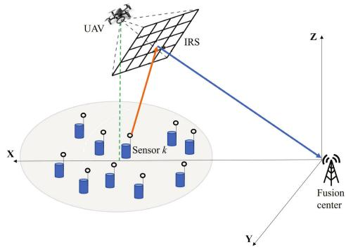  
Fig. 1. The system model of data collection assisted by the U-m IRS in WSNs.

For the k-th sensor, the signal received by the FC can be expressed as

$$
y _ { k } = \mathbf { g } _ { F C } ^ { H } \Theta \mathbf { g } _ { k } \sqrt { p _ { k } } x + \omega _ { k } .\tag{1}
$$

where $p _ { k }$ is the transmitted signal power of the k-th sensor. Without loss of generality, assuming that $E \left( x \right) = 0 , E \left( x ^ { 2 } \right) = 1$ $\omega _ { k } \ \sim \ C N \left( 0 , \sigma _ { k } ^ { 2 } \right)$ is a Gaussian noise with zero-mean and ωvariance $\sigma _ { k } ^ { 2 } \cdot \bullet _ { F C } ^ { \hat { H } ^ { ' } } = \big [ g _ { 1 , F C } , g _ { 2 , F C } , \allowbreak \cdots , g _ { N , F C } \big ] , \ : \ : \mathbf { g } _ { F C } ^ { H } \in \mathbb { C } ^ { 1 \times N } ;$ $\mathbf { g } _ { k } \ = \ \left[ g _ { k , 1 } , g _ { k , 2 } , \cdot \cdot \cdot , g _ { k , N } \right] ^ { H } , \ \mathbf { g } _ { k } \ \in \ \mathbb { C } ^ { N \times 1 }$ . Define $\theta _ { n } ~ = ~ e ^ { j \theta _ { n } }$ $\Theta = d \bar { i } a g [ \theta _ { 1 } , \theta _ { 2 } , \cdot \cdot \cdot \theta _ { N } ] . \bar { \theta } _ { n } \in [ 0 , 2 \pi )$ θis the phase shift of the n-th reflecting element.

The instantaneous achievable rate of the k-th sensor can be expressed as

$$
R _ { k } = B { \log _ { 2 } } \left( 1 + \frac { { p _ { k } } { \left( { \sum _ { n = 1 } ^ { N _ { k } } { \left| g _ { n , F C } g _ { k , n } \right| } } \right) ^ { 2 } } } { { \sigma ^ { 2 } } } \right) .\tag{2}
$$

The SE of the k-th sensor can be expressed as

$$
S E _ { k } = \log _ { 2 } \left( 1 + \frac { { p _ { k } { \left( \sum _ { n = 1 } ^ { N _ { k } } { \left| g _ { n , F C } g _ { k , n } \right| } \right) } ^ { 2 } } } { \sigma ^ { 2 } } \right) .\tag{3}
$$

At this point, the phase shift of the reflecting element can be expressed as [27]:

$$
\theta _ { n } = - \arg ( g _ { n , F C } g _ { k , n } ) .\tag{4}
$$

In addition, $g _ { n , F C }$ and $g _ { k , n }$ obey the Gaussian distribution, so $\left| g _ { n , F C } \right|$ and $\left| g _ { k , n } \right|$ obey the Rice distribution, and the channel power gain of the main path is much larger than that of the other paths.

The channel power gain can be expressed as [28]

$$
g _ { \boldsymbol { k } , n } = \sqrt { \rho _ { 0 } d _ { \boldsymbol { k } , n } ^ { - \alpha } } S _ { \boldsymbol { k } } .\tag{5}
$$

where $\rho _ { 0 } ~ = ~ ( 4 \pi f _ { c } / c ) ^ { - 2 }$ is the average channel power gain ρ πat a reference distance of 1 meter (m), $d _ { k , n }$ represents the ,distance from the k-th SN to the n-th reflecting element. represents the path loss exponent (typically $\alpha \ge 2$ in the Rician channel). $\varsigma _ { k }$ αdescribes the small-scale Rayleigh fading component, which is an exponential variable that follows independent and identical distribution, satisfying $E \left( \vert \varsigma _ { k } \vert ^ { 2 } \right) = 1$

ςBased on the existing assumptions, only one corresponding sensor transmits data while the UAV hovers at each hovering position, no sensor communicates during UAV movement. We define the user association as a binary variable $\lambda _ { k } ( t ) \in$ $\left\{ 0 , 1 \right\} , t \in \left[ 0 , T _ { c } \right]$ λ, when the k-th sensor is transmitting data, $\lambda _ { k } ( t ) = 1$ , otherwise, $\lambda _ { k } ( t ) = 0$ . So we can get $\sum _ { k = 1 } ^ { K } \lambda _ { k } ( t ) \leq 1 , \forall t \in$ $[ 0 , T _ { c } ]$

Thus, the aggregated communication throughput of the k-th sensor is expressed as a function of UAV trajectory q(t), the NoRE used $N _ { k } ,$ and $\lambda _ { k } ( t )$

$$
\begin{array} { r l } & { \mathcal { Q } _ { k } ( \{ \mathbf { q } ( t ) \} , N _ { k } , \lambda _ { k } ( t ) ) } \\ & { = \displaystyle \int _ { 0 } ^ { T _ { c } } \lambda _ { k } ( t ) B \log _ { 2 } } \\ & { \quad \left( 1 + \frac { p _ { k } \left( \sum _ { n = 1 } ^ { N _ { k } } | g _ { n , \mathrm { F C } } ( \{ \mathbf { q } ( t ) \} ) g _ { k , n } ( \{ \mathbf { q } ( t ) \} ) | \right) ^ { 2 } } { \sigma ^ { 2 } } \right) d t . } \end{array}\tag{6}
$$

The aggregated communication throughput of the whole communication system can be expressed as (7), shown at the bottom of the next page.

## B. The System Energy Consumption

The total energy consumption of the entire communication system mainly includes the UAV flying energy consumption, the UAV hovering energy consumption, the energy consumption of each SN, the energy consumption of the reflecting elements in the IRS while providing phase shifts, and the inherent energy consumption of the FC when receiving signal.

The power consumption of a rotary-wing UAV can be expressed as [9], [29]

$$
\begin{array} { r l } & { P ( V ) = P _ { \mathrm { b l } } \big ( 1 + 3 V ^ { 2 } / U _ { \mathrm { t i p } } ^ { 2 } \big ) } \\ & { \qquad + \ P _ { \mathrm { i n d } } \bigg ( \sqrt { 1 + V ^ { 4 } / ( 4 \nu _ { 0 } ^ { 4 } ) } - V ^ { 2 } / ( 2 \nu _ { 0 } ^ { 2 } ) \bigg ) ^ { 1 / 2 } } \\ & { \qquad + \frac { 1 } { 2 } d _ { 0 } \rho s A V ^ { 3 } . } \end{array}\tag{8}
$$

where $P _ { b l }$ and $P _ { i n d }$ indicate the airfoil power and induced power in hovering, respectively. V denotes the UAV speed, and $U _ { t i p }$ is the rotor tip speed. v0 is the average rotor-induced speed in hovering. d0 represents the fuselage drag ratio. $\rho$ is the air density, s is the rotor solidity, and A is the rotor disk area [29].

When the UAV hovers, $V ~ = ~ 0$ , and the UAV power consumption simplifies to $P _ { b l } + P _ { i n d }$

When given the UAV trajectory q(t), the propulsion energy consumption is expressed as

$$
E _ { p } ( \{ \mathbf { q } ( t ) \} ) = \int _ { 0 } ^ { T _ { c } } P ( \| \nu ( t ) \| ) d t .\tag{9}
$$

where $\nu ( t ) \overset { \Delta } { = } \dot { \mathbf { q } } ( t )$ represents the UAV speed, and ${ \dot { \mathbf { q } } } ( t )$ denotes the first-order derivative with respect to time t.

The total system energy consumption can be expressed as (10), shown at the bottom of the page, where $P _ { I R S }$ is the power consumption when a single IRS reflecting element provides phase shift,  denotes the power amplifier eficiency, $P _ { s , k }$ is the k-th sensor’s inherent power consumption, and $P _ { d , k }$ ,is the inherent power consumption of the FC.

The energy required by the UAV is shown in (11), at the bottom of the page, the system EE can be expressed as (12), shown at the bottom of the next page.

## C. Problem Formulation for EE

Based on the preceding analysis, the trade-of optimization problem between EE and SE is formulated as

$$
( \mathrm { P 1 } ) \operatorname* { m a x } _ { \{ \mathbf { q } ( t ) \} , N _ { k } , \lambda _ { k } ( t ) } E E { E } _ { t o t a l } ( \{ \mathbf { q } ( t ) \} , N _ { k } , { \lambda } _ { k } ( t ) )\tag{13}
$$

$$
\mathrm { s . t . } \frac { Q _ { k } ( \{ { \bf q } ( t ) \} , N _ { k } , \lambda _ { k } ( t ) ) } { T _ { h o \nu , k } } \ge R _ { k , \mathrm { m i n } } , \forall k\tag{13a}
$$

$$
\lVert \dot { \mathbf { q } } ( t ) \rVert \leq V _ { \operatorname* { m a x } } , \forall t \in [ 0 , T _ { c } ]\tag{13b}
$$

$$
\sum _ { k = 1 } ^ { K } \lambda _ { k } ( t ) \leq 1 , \forall t \in [ 0 , T _ { c } ]\tag{13c}
$$

$$
\lambda _ { k } ( t ) \in \left\{ 0 , 1 \right\} , \forall k , t \in [ 0 , T _ { c } ]\tag{13d}
$$

$$
{ \bf q } ( 0 ) = { \bf q } _ { I } , { \bf q } ( T _ { c } ) = { \bf q } _ { F }\tag{13e}
$$

$$
E _ { U A V , t o t a l } ( \{ \mathbf { q } ( t ) \} , N _ { k } , \lambda _ { k } ( t ) ) \leq E _ { U A V , \operatorname* { m a x } }\tag{13f}
$$

$$
\eta p _ { k } + P _ { s , k } \le P _ { k , \operatorname* { m a x } }\tag{13g}
$$

where (13a) represents the minimum SE requirement, ensuring complete data transmission from the SN within the designated hovering time, equivalent to the throughput lower bound. (13b) enforces the UAV’s maximum speed constraint. (13c) and (13d) represent the state of sensor $k ,$ where data transmission occurs only when $\lambda _ { k } ( t ) = 1$ , otherwise, $\lambda _ { k } ( t ) = 0$ . (13e) bounds λthe UAV trajectory range, with $\mathbf { q } _ { I }$ and $\mathbf { q } _ { F }$ denoting the flight start and end points respectively. (13f) represents the UAV energy limit, while (13g) represents the per-SN power limit.

According to the EE definition, it is related to transmitted data amount and system energy consumption. In problem (P1), the UAV trajectory {q(t)} and user association $\lambda _ { k } ( t )$ are time-dependent continuous functions, involving an infinite number of optimization variables. The NoRE $N _ { k }$ requiring optimization also varies with $\{ \mathbf { q } ( t ) \}$ and $\lambda _ { k } ( t )$ , along with

$$
Q _ { \mathrm { t o t a l } } ( \{ \mathbf { q } ( t ) \} , N _ { k } , \lambda _ { k } ( t ) ) = \sum _ { k = 1 } ^ { K } \int _ { 0 } ^ { T _ { \epsilon } } \lambda _ { k } ( t ) B \log _ { 2 } \left( 1 + \frac { p _ { k } \left( \sum _ { n = 1 } ^ { N _ { k } } | g _ { n , \mathrm { F C } } ( \{ \mathbf { q } ( t ) \} ) g _ { k , n } ( \{ \mathbf { q } ( t ) \} ) | \right) ^ { 2 } } { \sigma ^ { 2 } } \right) d t .\tag{7}
$$

$$
\begin{array} { r l } & { E _ { t o r a l } ( \{ \mathbf { q } ( t ) \} , N _ { k } , \lambda _ { k } ( t ) ) = E _ { p } ( \{ \mathbf { q } ( t ) \} ) + \displaystyle \int _ { 0 } ^ { T _ { c } } ( N _ { k } P _ { I R S } + \eta p _ { k } + P _ { s , k } + P _ { d , k } + P _ { b I } + P _ { i n d } ) \sum _ { k = 1 } ^ { K } ( \lambda _ { k } ( t ) ) d t } \\ & { \quad \quad \quad = \underbrace { E _ { p } ( \{ \mathbf { q } ( t ) \} ) + \displaystyle \int _ { 0 } ^ { T _ { c } } N _ { k } P _ { I R S } + P _ { b I } + P _ { i n d } \sum _ { k = 1 } ^ { K } ( \lambda _ { k } ( t ) ) d t } _ { \mathrm { T h e ~ e n e r g y o n s u m p i o n ~ ( U A N ~ } } + \displaystyle \int _ { 0 } ^ { T _ { c } } ( \eta p _ { k } + P _ { s , k } + P _ { d , k } ) \sum _ { k = 1 } ^ { K } ( \lambda _ { k } ( t ) ) d t } \\ & { \quad \quad \quad = E _ { U M V , t o t a l } ( \{ \mathbf { q } ( t ) \} , N _ { k } , \lambda _ { k } ( t ) ) + \displaystyle \int _ { 0 } ^ { T _ { c } } ( \eta p _ { k } + P _ { s , k } + P _ { d , k } ) \sum _ { k = 1 } ^ { K } ( \lambda _ { k } ( t ) ) d t } \end{array}\tag{10}
$$

$$
E _ { U A V , t o t a l } ( \{ \mathbf { q } ( t ) \} , N _ { k } , \lambda _ { k } ( t ) ) = E _ { p } ( \{ \mathbf { q } ( t ) \} ) + \int _ { 0 } ^ { T _ { c } } N _ { k } P _ { I R S } + P _ { b l } + P _ { i n d } \sum _ { k = 1 } ^ { K } ( \lambda _ { k } ( t ) ) d t\tag{11}
$$

non-convex constraints in (13a) and binary constraints in (13d). Therefore, (P1) constitutes a non-convex mixed-integer nonlinear programming problem that is challenging to solve directly.

To facilitate solving the proposed optimization problem, this paper adopts the TPS under FHCP, which requires each SN to complete its data transmission during UAV hovering. The UAV ceases hovering upon task completion and proceeds directly to the next hover point. This is an easily implementable approach in practice. Consequently, (P1) reduces to a problem with a finite set of optimization variables related only to NoRE, the number of ${ \mathrm { S N s } } ,$ and the UAV hovering location. Subsequent sections analyze system performance under TPS under FHCP.

## III. SOLVING OPTIMIZATION PROBLEM (P1) UNDER TPS

This paper adopts FHCP with time division multiple access (TDMA) communication. During hovering, IRS only serves one corresponding SN for data transmission, while other SNs do not transmit data. This approach simplifies hardware implementation (particularly for mobile IRS), and its advantage is that the IRS phase shift needn’t constantly change. Consequently, the optimization problem (P1) reduces to determining the UAV trajectory and optimal NoRE per SN. Following the simplicity-to-complexity principle, we first analyze single-SN scenarios before extending to multi-SN scenarios, presenting respective solution methods.

## A. The TPS for One SN Based on FHCP

For single-SN scenarios, there is only one hover position, so problem (P1) simplifies to find the optimal hovering position and NoRE. For clearer variable distinction, let $K = 1$ , where subscripts change synchronously. Given the fixed SN location, signal transmission distance can be directly calculated once the hovering position is determined. The UAV trajectory comprises movement from the starting point to the hovering position, followed by movement from the hovering position to the endpoint. During hovering, the SN transmits signals to the FC via IRS. In other words, for single-SN scenarios, $\lambda _ { k } ( t ) = 1$ only during UAV hovering, otherwise $\lambda _ { k } ( t ) = 0 .$

λThe selection of the hovering position is crucial for solving (P1). It directly influences two key factors: 1) UAV flight distance, which determines the UAV energy consumption. 2) Signal transmission distance comprising the SN-to-IRS and IRS-to-FC paths, where excessive distance causes severe signal attenuation. Furthermore, the hovering position afects the required NoRE. For any hovering position, achieving the minimum SE demands varying NoRE, consequently impacting system EE. Thus, optimal hovering position selection is essential for UAV trajectory optimization.

Assuming the hovering position is $\tilde { \mathbf { q } } ( t )$ , the NoRE used by the SN is $\tilde { N } ( \tilde { N } \leq N )$ , and the data amount is $\tilde { Q } ( \tilde { Q } \geq Q _ { \mathrm { m i n } } )$ then the hovering time $T _ { h o \nu } ( T _ { h o \nu } < T _ { c } )$ can be expressed as

$$
T _ { h o \nu } = \frac { \tilde { Q } } { B \mathrm { l o g } _ { 2 } \left( 1 + \frac { p _ { 1 } \left( \sum _ { n = 1 } ^ { \tilde { N } } \left| g _ { n , F C } ( \{ \tilde { \bf q } ( t ) \} ) g _ { 1 , n } ( \{ \tilde { \bf q } ( t ) \} ) \right| \right) ^ { 2 } } { \sigma ^ { 2 } } \right) } .\tag{14}
$$

The system energy consumption during UAV hovering can be expressed as

$$
\begin{array} { r l } & { E _ { \mathrm { h o v } } ( T _ { \mathrm { h o v } } ) = T _ { \mathrm { h o v } } ( \tilde { N } P _ { \mathrm { I R S } } + \eta p _ { 1 } + P _ { s , 1 } + P _ { d , 1 } ) } \\ & { ~ + T _ { \mathrm { h o v } } ( P _ { \mathrm { b l } } + P _ { \mathrm { i n d } } ) . } \end{array}\tag{15}
$$

Let the UAV propulsion time be $T _ { p } ,$ , and the UAV propulsion distance $D _ { p }$ can be written as a function of $T _ { p }$ and V (t), i.e., the propulsion distances $\begin{array} { r } { D _ { p } ( T _ { p } , \{ V ( t ) \} ) = \int _ { 0 } ^ { T _ { p } } } \end{array}$ V(t)dt.

The UAV propulsion energy consumption can be expressed as

$$
E _ { p } ( T _ { p } , \{ V ( t ) \} ) = \int _ { 0 } ^ { T _ { p } } P ( V ( t ) ) d t .\tag{16}
$$

The total system energy consumption can be expressed as (17), shown at the bottom of the next page.

In [29], the maximum-range (MR) speed denoted as $V _ { m r }$ which is the optimal UAV speed that maximizes the total traveling distance with any given onboard energy E. $V _ { m r }$ can be found from the plot of propulsion power $P ( V )$ versus UAV speed. Substituting $V = V _ { m r }$ yields the MR propulsion energy consumption per unit traveling distance in Joule/meter $E _ { p } ^ { m r }$

$$
E _ { p } ^ { m r } \triangleq \frac { P ( V _ { m r } ) } { V _ { m r } } .\tag{18}
$$

The total system energy consumption comprises the UAV hovering energy consumption and propulsion energy consumption, which is related to UAV trajectory q˜ (t) and NoRE N˜ . Assuming the UAV flight distance is $D _ { u a v } ,$ so the total system energy consumption is expressed as a function of q˜ (t) and $\tilde { N } ,$ which is shown in (19), at the bottom of the next page, where $P _ { 1 , e l s e } = \eta p _ { 1 } + P _ { s , 1 } + P _ { d , 1 } + P _ { b l } + P _ { i n d } . ~ \mathrm { A s }$ can be seen from the above equation that $D _ { u a \nu } E _ { p } ^ { m r }$ in $E _ { t o t a l } ( \tilde { N } .$ {q˜ (t)}) is only related to $\widetilde { \mathbf { q } } ( t ) ,$ , while $T _ { h o \nu } ( \tilde { N } P _ { I R S } \dot { + } P _ { 1 , e l s e } )$ is related to q˜ (t) and N˜ .

During data collection, the SN transmits data exclusively while the UAV hovers, all the data needs to be fully transmitted, which requires the UAV to hover for a certain time. Upon completing the required data amount transfer, the UAV proceeds to the FC. This approach ensures that the FC can collect all the data from the SN while saving UAV flight time

$$
\begin{array} { l } { E E _ { t o t a l } ( \{ \mathbf { q } ( t ) \} , N _ { k } , \lambda _ { k } ( t ) ) = \frac { Q _ { t o t a l } ( \{ \mathbf { q } ( t ) \} , N _ { k } , \lambda _ { k } ( t ) ) } { E _ { t o t a l } ( \{ \mathbf { q } ( t ) \} , N _ { k } , \lambda _ { k } ( t ) ) } } \\ { = \frac { \displaystyle \sum _ { k = 1 } ^ { K } \int _ { 0 } ^ { T _ { c } } \lambda _ { k } ( t ) B \log _ { 2 } ( 1 + \frac { p _ { k } \Big ( \sum _ { n = 1 } ^ { N _ { k } } \big | \mathfrak { s } _ { n , r } \mathbf { c } ( \{ \mathbf { q } ( t ) \} ) \mathfrak { s } _ { k , n } ( \{ \mathbf { q } ( t ) \} ) \big | ^ { 2 } ) } { \sigma ^ { 2 } } ) d t } { E _ { p } ( \{ \mathbf { q } ( t ) \} ) + \int _ { 0 } ^ { T _ { c } } ( N _ { k } P _ { I R S } + \eta p _ { k } + P _ { s , k } + P _ { d , k } + P _ { b l } + P _ { i n d } ) \sum _ { k = 1 } ^ { K } ( \lambda _ { k } ( t ) ) d t } } \end{array}\tag{12}
$$

and reducing system energy consumption. Consequently, for a given data amount $\tilde { Q } , ( \bar { \bf P } \bar { 1 } )$ can be transformed into

$$
( \mathrm { P } 2 ) \operatorname* { m i n } _ { \{ \tilde { \mathbf { q } } ( t ) \} , \tilde { N } } E _ { t o t a l } ( \tilde { N } , \{ \tilde { \mathbf { q } } ( t ) \} )\tag{20}
$$

$$
\mathrm { s . t . } ~ ( 1 3 \mathrm { a } ) \cdot ( 1 3 \mathrm { b } ) , ( 1 3 \mathrm { e } ) \cdot ( 1 3 \mathrm { g } )
$$

$$
\tilde { N } \leq N\tag{20a}
$$

In (P2), $T _ { h o \nu } ( \tilde { N } _ { k } P _ { I R S } + P _ { k , e l s e } )$ can be expressed as (21), shown at the bottom of the page.

Problem (P2) involves two variables {q(t)}, and ${ \tilde { N } } .$ Due to the non-convex constraint (13a), (P2) is non-convex. Furthermore, high coupling exists between these two variables in both the objective function of (P2) and constraint (13f), while $\tilde { N }$ must be a positive integer. Consequently, traditional convex optimization methods cannot guarantee a global optimal solution. To solve this eficiently, we decouple (P2) into two independent sub-problems: 1) Given UAV trajectory to optimize the NoRE; 2) Given NoRE to optimize UAV trajectory. We propose an alternating optimization method to obtain a high-quality suboptimal solution, which will be analyzed sequentially.

1) When the UAV hovering position {q(t)} is determined, the UAV flight distance $D _ { u a \nu }$ is determined, the propulsion energy becomes fixed, and $D _ { u a \nu } E _ { p } ^ { m r }$ is consequently determined. (P2) reduces to solving for the optimal NoRE N˜ in (21). Therefore, problem (P2) becomes

$$
( \mathrm { P 2 . 1 } ) \underset { \tilde { N } } { \mathrm { m i n } } T _ { h o v } ( \tilde { N } P _ { I R S } + P _ { 1 , e l s e } )\tag{22}
$$

Our previous study [30] established that EE is a unimodal function of $\tilde { N } .$ The optimal $\tilde { N }$ can be eficiently solved via the CJ-BS algorithm. Subject to constraints (13a) and (20a), we first identify the feasible range of NoRE. Within this range, we determine whether the objective function exhibits: monotonically increasing, monotonically decreasing, or initial decrease followed by increase. The optimal NoRE N˜ is then solved according to these functional properties. The specific solution procedure is as follows:

(1) Initialize parameters: SNs transmit power, NoRE, minimum achievable rate, etc.

(2) Determine the feasible range $\underline { { N } } \le \tilde { N } \le \overline { { N } }$ of NoRE N˜ for reflecting elements satisfying constraints (13a), (13f), and (20a), where $\overline { { N } }$ is the maximum feasible NoRE, and N is the minimum feasible NoRE.

(3) Let the objective function be $F = T _ { h o \nu } ( \tilde { N } P _ { I R S } +$ $P _ { 1 , e l s e } )$ . Determine the monotonicity of F. Based on ,our prior work [30], F is a unimodal with respect to $\bar { \tilde { N } } .$ . If $F \left( { \overline { { N } } } \right) \ \leq \ F \left( { \overline { { N } } } - 1 \right)$ , F is monotonically decreasing, so $\tilde { N } ^ { * } = \overline { { N } }$ . If $F \left( \underline { { { N } } } \right) \le F \left( \underline { { { N } } } + 1 \right)$ , F is monotonically increasing, so $\tilde { N } ^ { * } = \underline { { \tilde { N } } } .$ . Otherwise, if $F$ is neither monotonically decreasing nor monotonically increasing, then F will first decrease and then increase and there is only a single minimum value. Then the NoRE is solved by CJ-BS.

(4) Obtain optimal NoRE corresponding to minimum F.

The specific processes are provided in Algorithm 1 [30]. 2) With the optimal NoRE $\tilde { N }$ determined, (P2) reduces to UAV trajectory optimization. Under FHCP, this is equivalent to finding the optimal hovering position $\{ \tilde { \mathbf { q } } ^ { * } ( t ) \}$ that maximizes the objective function.

For a single-SN case, only one hovering position exists. So the UAV flight distance $D _ { U A V }$ is equal to the distance from the starting point to the hovering position plus the distance from the hovering position to the endpoint, namely $\| \tilde { \mathbf { q } } ( t ) - \mathbf { q } _ { I } \| +$ $| | \mathbf { q } _ { F } - \tilde { \mathbf { q } } ( t ) | |$ . The UAV propulsion energy consumption can be obtained as $( \lVert \tilde { { \bf { q } } } ( t ) - { \bf { q } } _ { I } \rVert + \lVert { \bf { q } } _ { F } - \tilde { { \bf { q } } } ( t ) \rVert ) E _ { p } ^ { m \prime }$

From (2) and (5), R({q(t)}) is inversely proportional to $d _ { S U } ^ { \alpha } d _ { U F } ^ { \alpha } ,$ where $d _ { S U }$ is the SN-UAV distance, and $d _ { U F }$ is the UAV-FC distance. Given the IRS’s negligible size relative to transmission distances. For fixed $\tilde { N } _ { k }$ , maximizing $R ( \{ \tilde { \mathbf { q } } ( t ) \} )$ requires minimizing $d _ { S U } ^ { \alpha } d _ { U F } ^ { \alpha }$ . According to (2), we can set $\begin{array} { r } { \left| g _ { n , F C } ( \{ \tilde { \mathbf { q } } ( t ) \} ) g _ { 1 , n } ( \{ \tilde { \mathbf { q } } ( t ) \} ) \right| ^ { - } = \frac { h _ { n } } { ( d _ { S U } d _ { U F } ) ^ { \frac { \alpha } { 2 } } } , R ( \{ \mathbf { q } ( t ) \} ) } \end{array}$ can be written as

$$
R ( \{ \tilde { \mathbf { q } } ( t ) \} ) = B \mathrm { l o g } _ { 2 } \left( 1 + \frac { p _ { k } \left( \sum _ { n = 1 } ^ { \tilde { N } } h _ { n } \right) ^ { 2 } } { \sigma ^ { 2 } \left( d _ { S U } d _ { U F } \right) ^ { \alpha } } \right) .\tag{23}
$$

Since $d _ { S U } ^ { 2 } , d _ { U F } ^ { 2 } , d _ { S U } ^ { 4 } , d _ { U F } ^ { 4 }$ are non-negative, it is shown in , , ,[21] that they are convex functions of {q(t)}.

Proof: See the Appendix.

$$
E _ { t o t a l } ( T _ { h o v } , T _ { p } , \{ V ( t ) \} ) = T _ { h o v } ( \tilde { N } P _ { I R S } + \eta p _ { 1 } + P _ { s , 1 } + P _ { d , 1 } ) + T _ { h o v } ( P _ { b l } + P _ { i n d } ) + \int _ { 0 } ^ { T _ { p } } P ( V ( t ) ) d t .\tag{17}
$$

$$
\begin{array} { r l } & { E _ { t o t a l } ( \tilde { N } , \{ \tilde { q } ( t ) \} ) = T _ { h o v } ( \tilde { N } P _ { I R S } + \eta p _ { 1 } + P _ { s , 1 } + P _ { d , 1 } ) + T _ { h o v } ( P _ { b l } + P _ { i n d } ) + D _ { u a v } E _ { p } ^ { m r } } \\ & { \qquad = D _ { u a v } E _ { p } ^ { m r } + T _ { h o v } ( \tilde { N } P _ { I R S } + P _ { 1 , e l s e } ) . } \end{array}\tag{19}
$$

$$
T _ { h o v } ( \tilde { N } P _ { I R S } + P _ { 1 , e l s e } ) = \frac { \tilde { Q } \tilde { N } P _ { I R S } + P _ { 1 , e l s e } } { B \log _ { 2 } \left( 1 + \frac { p _ { 1 } \left( \sum _ { \omega _ { 1 } , r \in \{ \tilde { \{ \bf q } } ( t ) \} \cup _ { I , n } , ( \tilde { \{ \bf q } \right)} ( t ) ) \}  ^ { 2 } \right)} { \sigma ^ { 2 } }   = \frac { \tilde { N } \tilde { Q } P _ { I R S } + \tilde { Q } P _ { 1 , e l s e } } { B \log _ { 2 } \left( 1 + \frac { p _ { 1 } \left( \frac { S } { \sum _ { \omega _ { 1 } , r \in \{ \tilde { \{ \bf q } } ( t ) \} \cup _ { I , n } , ( \tilde { \{ \bf q } } ( t ) ) \} \right)}  ^ { 2 } \right)} { \sigma ^ { 2 } }   .\tag{21}
$$

Algorithm 1 CJ-BS Algorithm for Solving (P2.1)   
1: Initialization: Given {q(t)}. Calculate the range of the   
NoRE N and $\overline { { N } }$ under the constraints (13a), (13f), and   
(20a). Let the objective function be $F = T _ { h o \nu } ( \tilde { N } P _ { I R S } +$   
$P _ { 1 , e l s e } ) .$   
,2: for ${ \tilde { N } } = \underline { { N } } : 1 : \overline { { N } }$   
3: if $F \left( { \overline { { N } } } \right) { \overline { { \leq } } } F \left( { \overline { { N } } } - 1 \right)$   
4: $F _ { \mathrm { m i n } } \left( { \tilde { N } } \right) = F ( { \overline { { N } } } ) ;$   
5: ${ \tilde { N } } ^ { * } = { \overline { { N } } } ;$   
6: else if $F \left( { \underline { { N } } } \right) \leq F \left( { \underline { { N } } } + 1 \right)$   
7: $F _ { \mathrm { m i n } } \left( { \tilde { N } } \right) { \stackrel { \cdot } { = } } { \tilde { F } } \left( { \underline { { N } } } \right) ;$   
8: $\tilde { N } ^ { * } = \underline { { N } } ;$   
9: else   
10: Solve $\tilde { N } ^ { * }$ by the Binary Search algorithm.   
11: $F _ { \mathrm { m i n } } \left( \tilde { N } \right) = \mathrm { \bar { \it F } } \left( \tilde { N } ^ { * } \right) ;$ ;   
12: end   
13: end   
14: Output the optimal solution $\tilde { N } = \tilde { N } ^ { * }$

Algorithm 2 SCA-Based Algorithm for Solving (P2.3)   
1: Initialization: Initialize $\tilde { Q } , T _ { c } , \tilde { N } ,$ the tolerance . Set the   
UAV initial hovering location $\{ \widetilde { \mathbf { q } } ^ { ( 0 ) } ( t ) \}$ and the iteration   
number $l \ = \ 0 .$ Let the optimized objective function be   
$\begin{array} { r } { F = ( \| \tilde { \mathbf { q } } ( t ) - \mathbf { q } _ { I } \| + \| \mathbf { q } _ { F } - \tilde { \mathbf { q } } ( t ) \| ) E _ { p } ^ { m r } + \frac { \tilde { Q } } { \varsigma } \tilde { N } P _ { I R S } + P _ { 1 , e l s e } . } \end{array}$   
2: repeat   
3: Solve the convex problem (P2.3) and obtain the optimal   
solution as ${ \bf q } ^ { * } ( t )$   
4: Update the local point as $\tilde { \mathbf { q } } ^ { ( l + 1 ) } ( t ) = \mathbf { q } ^ { * } ( t ) .$   
5: Update $l = l + 1 .$   
6: If $F ^ { ( l + 1 ) } > F ^ { ( l ) } , \tilde { \mathbf { q } } ^ { ( l + 1 ) } ( t ) = \tilde { \mathbf { q } } ^ { ( l ) } ( t ) ;$ break.   
7: Until: $\left\| F ^ { ( l + 1 ) } - \bar { F } ^ { ( l ) } \right\| \leq \varepsilon .$   
ε8: Output: the optimal solution $\tilde { \mathbf { q } } ^ { * } ( t ) = \tilde { \mathbf { q } } ^ { ( l + 1 ) } ( t ) .$

Since $d _ { S U } ^ { 2 } d _ { U F } ^ { 2 }$ is a non-convex function of {q˜ (t)}, (P2) is not a convex function about {q˜ (t)}. To transform problem (P2) into a convex function concerning {q˜ (t)}, enabling solution via convex optimization methods, we introduce two relaxation variables $u _ { S U }$ and $\nu _ { U F }$ , and let $\delta = p _ { k } \left( \sum _ { n = 1 } ^ { \tilde { N } } h _ { n } \right) ^ { 2 } / \sigma ^ { 2 }$ , then (P2) becomes

$$
\begin{array} { r l } & { ( \mathbf { P } ^ { 2 . 2 } ) \underset { u _ { S U } , v _ { U } } { \operatorname* { m i n } } [ t ] (  \tilde { \mathbf { q } } ( t ) - \mathbf { q } _ { I }  +  \mathbf { q } _ { F } - \tilde { \mathbf { q } } ( t )  ) E _ { p } ^ { m r } } \\ & { \qquad + \frac { \tilde { Q } \tilde { N } P _ { \mathrm { I R S } } + P _ { \mathrm { I , e l s e } } } { B \log _ { 2 } ( 1 + \frac { \delta } { u _ { S U } v _ { U } } ) } } \\ & { \qquad \mathrm { s . t . } ( 1 3 \mathrm { a } ) - ( 1 3 \mathrm { b } ) , \ ( 1 3 \mathrm { e } ) - ( 1 3 \mathrm { g } ) , \ ( 2 0 \mathrm { a } ) } \\ & { \qquad u _ { S U } ^ { 2 / \alpha } \geq d _ { S U } ^ { 2 } } \\ & { \qquad v _ { U F } ^ { 2 / \alpha } \geq d _ { U F } ^ { 2 } } \end{array}\tag{24}
$$

(24a)

(24b)

To obtain the optimal solution for (P2.2), all the constraints in (24a) and (24b) must be satisfied with strict equality. For this purpose, we introduce another relaxation variable to replace $\begin{array} { r } { \dot { B } \dot { \log _ { 2 } } \left( 1 + \frac { \delta } { u _ { S U } \nu _ { U F } } \right) } \end{array}$ . The first-order Taylor expansion of a convex function is a lower bound of its function at any point. Let $u _ { S U } ^ { ( l ) } , \nu _ { U F } ^ { ( l ) }$ be the l-iteration of the given points $u _ { S U }$ and $\nu _ { U F }$ respectively. The global lower bound of $\begin{array} { r } { B \log _ { 2 } \left( 1 + \frac { \delta } { u _ { S U } \nu _ { U F } } \right) } \end{array}$ is

Algorithm 3 Iterative Algorithm for Solving (P2)   
1: Initialization: Initialize $\tilde { Q } , T _ { c } ,$ the tolerance . Set the   
initial hovering position of the UAV $\{ \widetilde { \mathbf { q } } ^ { ( 0 ) } ( t ) \}$ , and the   
NoRE $\tilde { N } ^ { ( 0 ) }$ , and the iteration number $\kappa _ { 1 } = 0 .$   
2: repeat   
3: According to the value of $\widetilde { \mathbf { q } } ^ { ( \kappa _ { 1 } ) } ( t ) .$ , the CJ-BS algorithm is   
used to obtain $\tilde { N } ^ { * }$   
4: Update $\tilde { N } ^ { ( \kappa _ { 1 } ) } = \tilde { N } ^ { * }$   
5: According to (19), calculate $E _ { t o t a l } ( \tilde { N } ^ { ( \kappa _ { 1 } ) } , \left\{ \tilde { \mathbf { q } } ^ { ( \kappa _ { 1 } ) } ( t ) \right\} )$   
6: According to the value of $\tilde { N } ^ { ( \kappa _ { 1 } ) }$ , solve the convex problem   
(P2.3) and obtain the optimal solution as ${ \bf q } ^ { * } ( t )$   
7: Update the local point as $\tilde { \mathbf { q } } ^ { ( \kappa _ { 1 } + 1 ) } ( t ) = \mathbf { q } ^ { * } ( t ) .$   
8: According to (19), calculate $E _ { t o t a l } ( \tilde { N } ^ { ( \kappa _ { 1 } ) } , \{ \tilde { \mathbf { q } } ^ { ( \kappa _ { 1 } + 1 ) } ( t ) \} )$   
9: If   
$E _ { t o t a l } ( \tilde { N } ^ { ( \kappa _ { 1 } ) } , \left\{ \tilde { \mathbf { q } } ^ { ( \kappa _ { 1 } + 1 ) } ( t ) \right\} ) > E _ { t o t a l } ( \tilde { N } ^ { ( \kappa _ { 1 } ) } , \left\{ \tilde { \mathbf { q } } ^ { ( \kappa _ { 1 } ) } ( t ) \right\} ) ,$   
we set $\tilde { \mathbf { q } } ^ { ( \kappa _ { 1 } + 1 ) } ( t ) = \tilde { \mathbf { q } } ^ { ( \tilde { \kappa _ { 1 } } ) } ( t ) , \tilde { N } ^ { ( \kappa _ { 1 } + 1 ) } = \tilde { N } ^ { ( \kappa _ { 1 } ) } ;$ break.   
10: Update $\kappa _ { 1 } = \kappa _ { 1 } + 1 .$   
11: Until:   
$\big | E _ { t o t a l } ( \tilde { N } ^ { ( \kappa _ { 1 } ) } , \big \{ \tilde { \mathbf { q } } ^ { ( \kappa _ { 1 } + 1 ) } ( t ) \big \} ) - E _ { t o t a l } ( \tilde { N } ^ { ( \kappa _ { 1 } ) } , \big \{ \tilde { \mathbf { q } } ^ { ( \kappa _ { 1 } ) } ( t ) \big \} ) \big | \leq \varepsilon .$   
,12: Output the optimal solution $\tilde { \mathbf { q } } ^ { * } ( t ) \dot { \mathbf { \Psi } } = \tilde { \mathbf { q } } ^ { ( \kappa _ { 1 } + 1 ) } ( t ) .$ $\tilde { N } ^ { * } \ =$   
$\tilde { N } ^ { ( \kappa _ { 1 } + 1 ) }$

$$
B \log _ { 2 } \bigl ( 1 + \delta / ( u _ { S U } \nu _ { U F } ) \bigr )
$$

$$
\begin{array} { r } { \ge B \log _ { 2 } \bigl ( 1 + \delta / ( u _ { { S U } } ^ { ( l ) } \nu _ { { U F } } ^ { ( l ) } ) \bigr ) - \beta \biggl ( \frac { u _ { { S U } } - u _ { { S U } } ^ { ( l ) } } { u _ { { S U } } ^ { ( l ) } } + \frac { \nu _ { { U F } } - \nu _ { { U F } } ^ { ( l ) } } { \nu _ { { U F } } ^ { ( l ) } } \biggr ) . } \end{array}\tag{25}
$$

$$
\begin{array} { r } { \beta = \frac { B \delta \log _ { 2 } ^ { e } } { u _ { S U I } ^ { ( l ) } \nu _ { I I F } ^ { ( l ) } + \delta } . } \end{array}
$$

δAccording to the above formula, the optimization problem (P2.2) can be rewritten as

$$
[ t ] \big ( | | \tilde { \mathbf { q } } ( t ) - \mathbf { q } _ { I } | | + | | \mathbf { q } _ { F } - \tilde { \mathbf { q } } ( t ) | | \big ) E _ { p } ^ { m r }
$$

$$
+ \frac { \tilde { Q } } { \varsigma } \tilde { N } P _ { I R S } + P _ { 1 , e l s e }\tag{26}
$$

$$
\varsigma \leq B \log _ { 2 } \left( 1 + \frac { \delta } { u _ { S U } ^ { ( l ) } \nu _ { U F } ^ { ( l ) } } \right)
$$

$$
- \beta \left( \frac { u _ { S U } - u _ { S U } ^ { ( l ) } } { u _ { S U } ^ { ( l ) } } + \frac { \nu _ { U F } - \nu _ { U F } ^ { ( l ) } } { \nu _ { U F } ^ { ( l ) } } \right)\tag{26a}
$$

(26b)

The objective function in the optimization problem (P2.3) is a convex function, and its constraint conditions are also convex functions, so it is a linear convex optimization problem, which can be eficiently solved by existing convex optimal toolboxes such as CVX. To obtain the updated hovering position $\{ \mathbf { q } ^ { ( l ) } ( t ) \}$ the SCA algorithm is used for iterative solution, as shown in Algorithm 2.

From the optimization problem (P2) and (23), it can be seen that (P2) is a nonlinear fractional programming problem. Based on the analysis of solving the optimal NoRE N˜ when given the UAV hovering position {q(t)}, and solving the UAV hovering position {q(t)} when given the optimal NoRE N˜ , we apply an iterative algorithm to optimize {q(t)} and ${ \tilde { N } } .$ . See Algorithm 3 for details.

(P2) is to solve the minimum value of the objective function. From Algorithm 3, it can be seen that for a given $\widetilde { \mathbf { q } } ^ { ( \kappa _ { 1 } ) } ( t )$ , the CJ-BS algorithm for solving $\tilde { N } ^ { ( \kappa _ { 1 } ) }$ is based on the principle of minimizing the objective function. On this basis, for a given $\tilde { N } ^ { ( \kappa _ { 1 } ) }$ , using the SCA algorithm to solve $\widetilde { \mathbf { q } } ^ { ( \kappa _ { 1 } + 1 ) } ( t )$ is also based on the principle of minimizing the objective function. Our goal is to reduce energy consumption continuously, therefore, if the power consumption increases after being updated, the UAV hovering position will no longer be updated. Additionally, the constraints on task completion time, total NoRE in IRS, and UAV energy ensure the convergence of Algorithm 3.

According to Algorithm 3, the overall complexity is dominated by the complexities of the two sub-optimization problems (P2.1) and (P2.3). For (P2.1), the complexity of the CJ-BS algorithm is $\mathrm { O } ( \mathrm { l o g } _ { 2 } ^ { N } )$ . For (P2.3), its complexity is $\mathrm { O } ( ( 2 N ) ^ { 3 . 5 } \log _ { 2 } ^ { \overline { { 1 } } / \varepsilon } )$ , where is the accuracy of the SCA method εfor solving the problem. The total complexity of Algorithm 3 is $0 ( \kappa _ { 1 } ( \log _ { 2 } ^ { N } + ( 2 K N ) ^ { 3 . 5 } \log _ { 2 } ^ { 1 / \varepsilon } ) )$ ), where $\kappa _ { 1 }$ is the number of iterations of Algorithm 3.

## B. TPS for Multiple SNs Based on FHCP

Building on the single-SN analysis, this subsection extends TPS to multi-sensor scenarios prevalent in practical smart agriculture. Unlike single-SN cases, multiple SNs necessitate multiple UAV hovering positions, each requiring distinct optimal NoRE. Furthermore, diferent hover point access sequences generate distinct UAV trajectories, yielding varying system EE. Consequently, multi-SN optimization requires joint consideration of three NP-hard elements: user association, each hovering position, and NoRE allocation per SN.

The U-m IRS serves one corresponding SN at each hovering position, assuming the UAV hovering position corresponding to the k-th SN is $\widetilde { \mathbf { q } } _ { k } ( t )$ . The NoRE used by the k-th SN is $\tilde { N } _ { k } ( \tilde { N } _ { k } \leq N )$ , the data amount transmitted is $\tilde { Q } _ { k } ( \tilde { Q } _ { k } \geq Q _ { \operatorname* { m i n } , k } )$ the hovering time $T _ { h o \nu , k } \left( \sum _ { k = 1 } ^ { K } T _ { h o \nu , k } < T _ { c } \right)$ can be expressed as

$$
T _ { \mathrm { h o v } , k } = \frac { \tilde { Q } _ { k } } { B \log _ { 2 } \left( 1 + \frac { p _ { k } \left( \sum _ { n = 1 } ^ { \tilde { N } _ { k } } | g _ { n , \mathrm { F C } } ( \{ \tilde { \mathbf { q } } _ { k } ( t ) \} ) g _ { k , n } ( \{ \tilde { \mathbf { q } } _ { k } ( t ) \} ) | \right) ^ { 2 } } { \sigma ^ { 2 } } \right) } .\tag{27}
$$

The energy consumption of the system at the k-th hovering position can be expressed as

$$
\begin{array} { r l } & { E _ { h o \nu , k } ( T _ { h o \nu , k } ) } \\ & { = T _ { h o \nu , k } ( \tilde { N } _ { k } P _ { I R S } + \eta p _ { k } + P _ { s , k } + P _ { d , k } ) } \\ & { \quad + T _ { h o \nu , k } ( P _ { b l } + P _ { i n d } ) } \\ & { = T _ { h o \nu , k } ( \tilde { N } _ { k } P _ { I R S } + P _ { e l s e } ) . } \end{array}\tag{28}
$$

The total system energy consumption can be expressed as

$$
\begin{array} { l } { { \displaystyle E _ { t o t a l } ( \{ \tilde { q } _ { k } ( t ) \} , \tilde { N } _ { k } , \lambda _ { k } ( t ) ) } \ ~ } \\ { { \displaystyle = D _ { u a v } E _ { p } ^ { m r } + \int _ { t = 0 } ^ { T _ { c } } \left( \sum _ { k = 1 } ^ { K } E _ { h o v , k } ( T _ { h o v , k } ) \right) \lambda _ { k } ( t ) d t } . } \end{array}\tag{29}
$$

The total system EE can be expressed as (30), shown at the bottom of the next page. Where $P _ { k , e l s e } = \eta p _ { k } + P _ { s , k } + P _ { d , k } +$ $P _ { b l } + P _ { i n d }$

Algorithm 4 Iterative Algorithm for Solving (P3)   
1: Initialization: Initialize $\tilde { Q } _ { k } , \ T _ { c } ,$ the tolerance . Set the   
initial hovering location of the UAV $\left\{ \widetilde { \mathbf { q } } _ { k } ^ { ( 0 ) } ( t ) \right\}$ , the NoRE   
$\tilde { N } _ { k } ^ { ( 0 ) }$ , the user association $\lambda _ { k } ^ { ( 0 ) } ( t )$ , and the iteration number   
$\kappa _ { 2 } = 0 .$   
2: repeat   
3: According to (29), calculate   
$E _ { t o t a l } ( \left\{ \tilde { \mathbf { q } } _ { k } ^ { ( \bar { \kappa _ { 2 } } ) } ( t ) \right\} , \tilde { N } _ { k } ^ { ( \kappa _ { 2 } ) } , \lambda _ { k } ^ { ( \kappa _ { 2 } ) } ( t ) ) .$   
4: According to the values of $\left\{ \widetilde { \mathbf { q } } _ { k } ^ { ( \kappa _ { 2 } ) } ( t ) \right\}$ and $\tilde { N } _ { k } ^ { ( \kappa _ { 2 } ) }$ , the genetic   
algorithm is used to obtain $\mathop { \lambda } _ { k } ^ { ( \kappa _ { 2 } + 1 ) } ( t ) .$   
5: Based on the values of $\lambda _ { k } ^ { ( \kappa _ { 2 } + 1 ) } ( t )$ and $\left\{ \widetilde { \mathbf { q } } _ { k } ^ { ( \kappa _ { 2 } ) } ( t ) \right\}$ , the CJ-BS   
algorithm is used to obtain $\tilde { N } _ { k } ^ { ( \kappa _ { 2 } + 1 ) }$   
6: Based on the values of $\lambda _ { k } ^ { ( \kappa _ { 2 } + \widetilde { 1 } ) } ( t )$ and $\tilde { N } _ { k } ^ { ( \kappa _ { 2 } + 1 ) }$ , the SCA   
method is used to obtain $\left\{ \widetilde { \mathbf { q } } _ { k } ^ { ( \kappa _ { 2 } + 1 ) } ( t ) \right\}$   
7: According to (29), calculate   
$E _ { t o t a l } ( \left\{ \tilde { \mathbf { q } } _ { k } ^ { ( \tilde { \kappa _ { 2 } } + 1 ) } ( t ) \right\} , \tilde { N } _ { k } ^ { ( \kappa _ { 2 } + 1 ) } , \lambda _ { k } ^ { ( \kappa _ { 2 } + 1 ) } ( t ) ) .$   
8: If $E _ { \mathrm { t o t a l } } ( \{ \tilde { \mathbf { q } } _ { k } ^ { ( \kappa _ { 2 } + 1 ) } ( t ) \} , \tilde { N } _ { k } ^ { ( \kappa _ { 2 } + 1 ) } , \lambda _ { k } ^ { ( \kappa _ { 2 } + 1 ) } ( t ) )$ >   
$E _ { \mathrm { t o t a l } } ( \{ \tilde { \mathbf { q } } _ { k } ^ { ( \kappa _ { 2 } ) } ( t ) \} , \tilde { N } _ { k } ^ { ( \dot { \kappa } _ { 2 } ) } , \lambda _ { k } ^ { ( \kappa _ { 2 } ) } ( t ) ) ,$ we set   
$\lambda _ { k } ^ { ( \kappa _ { 2 } + 1 ) } \big ( \tilde { t } ) = \lambda _ { k } ^ { ( \kappa _ { 2 } ) } \big ( t ) , \hat { N } _ { k } ^ { ( \kappa _ { 2 } + 1 ) } = \tilde { N } _ { k } ^ { ( \kappa _ { 2 } ) } , \tilde { \mathbf { q } } _ { k } ^ { ( \kappa _ { 2 } + 1 ) } ( t ) = \tilde { \mathbf { q } } _ { k } ^ { ( \kappa _ { 2 } ) } ( t ) ;$   
λbreak.   
9: Update $\kappa _ { 2 } = \kappa _ { 2 } + 1 .$   
10: Until:   
$\begin{array} { r l r } { | E _ { \mathrm { t o t a l } } ( \{ \widetilde { \mathbf { q } } _ { k } ^ { ( \kappa _ { 2 } + 1 ) } ( t ) \} , \widetilde { N } _ { k } ^ { ( \kappa _ { 2 } + 1 ) } , \lambda _ { k } ^ { ( \kappa _ { 2 } + 1 ) } ( t ) ) } & { - } & { E _ { \mathrm { t o t a l } } \left( \{ \widetilde { \mathbf { q } } _ { k } ^ { ( \kappa _ { 2 } ) } ( t ) \} , \right. } \end{array}$   
$\tilde { N } _ { k } ^ { ( \kappa _ { 2 } ) } , \lambda _ { k } ^ { ( \kappa _ { 2 } ) } ( t ) \Big ) \mid \leq \varepsilon .$   
11: Output: The optimal solution is $\begin{array} { r l } { \left\{ \widetilde { \mathbf { q } } _ { k } ^ { * } ( t ) \right\} } & { { } = } \end{array}$   
$\left\{ \widetilde { \mathbf { q } } _ { k } ^ { ( \kappa _ { 2 } + 1 ) } ( t ) \right\} , \tilde { N } _ { k } ^ { * } = \tilde { N } _ { k } ^ { ( \kappa _ { 2 } + 1 ) } , \lambda ^ { * } { } _ { k } ( t ) = \lambda _ { k } ^ { ( \kappa _ { 2 } + 1 ) } ( t ) .$

Since $\sum _ { k = 1 } ^ { K } \tilde { \mathcal { Q } } _ { k }$ is known, (P1) can be transformed into

$$
\begin{array} { r l r } {  { ( \mathrm { P 3 } ) \operatorname* { m i n } _ { \{ \tilde { \mathbf { q } } _ { k } ( t ) \} , \tilde { N } _ { k } , \lambda _ { k } ( t ) } E _ { t o t a l } ( \{ \tilde { \mathbf { q } } _ { k } ( t ) \} , \tilde { N } _ { k } , \lambda _ { k } ( t ) ) } } \\ & { } & { \mathrm { s . t . } ~ ( 1 3 \mathbf { b } ) - ( 1 3 \mathbf { g } ) } \\ & { } & { \tilde { N } _ { k } \leq N } \end{array}\tag{31}
$$

(31a)

Since the constraint (13a) is non-convex, problem (P3) is non-convex. Furthermore, the optimization variables $\{ \tilde { \mathbf { q } } _ { k } ( t ) \} , \tilde { N } _ { k } , \lambda _ { k } ( t )$ are highly coupled in both the objective , , λfunction of (P3) and constraint (13f). Additionally, (13d) is a set of binary variables, and N˜ must be positive integers. As (P3) is a non-convex mixed-integer nonlinear programming problem that cannot be solved directly, we adopt a strategy of decomposing the original problem into three sub-problems according to each optimization variable. When $\{ \widetilde { \mathbf { q } } _ { k } ( t ) \}$ and $\tilde { N } _ { k }$ are given, $\lambda _ { k } ( t )$ is solved by the genetic algorithm. When $\{ \widetilde { \mathbf { q } } _ { k } ( t ) \}$ and $\lambda _ { k } ( t )$ are given, $\check { \tilde { N } } _ { k }$ is solved by the CJ-BS algorithm. When $\tilde { N } _ { k }$ and $\lambda _ { k } ( t )$ are given, $\{ \widetilde { \mathbf { q } } _ { k } ( t ) \}$ is solved by the SCA algorithm.

1) User Association Optimization: When given $\{ \widetilde { \mathbf { q } } _ { k } ( t ) \}$ and $\tilde { N } _ { k } , \ \sum _ { k = 1 } ^ { K } T _ { h o \nu , k } ( \tilde { N } _ { k } P _ { I R S } + P _ { k , e l s e } )$ is a fixed value. Therefore, $\lambda _ { k } ( t )$ afects $D _ { u a \nu } E _ { p } ^ { m r }$ , and diferent hovering orders result in λdiferent UAV flight distances. Therefore, the optimization

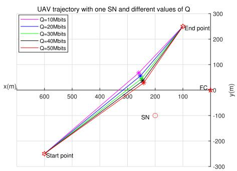  
Fig. 2. Optimized UAV trajectory for a single SN under the TPS.

problem to solve $\lambda _ { k } ( t )$ is

$$
( \operatorname { P 3 . 1 } ) \operatorname* { m i n } _ { \pi ( k ) } \sum _ { k = 1 } ^ { K } \left\| q _ { \pi ( k + 1 ) } ( t ) - q _ { \pi ( k ) } ( t ) \right\|\tag{32}
$$

where (k) is the visited order of the hovering positions. Thus, πproblem (P3.1) seeks the minimum flight distance for the UAV to traverse all hovering locations from start to end point, given predetermined hovering locations. (P3.1) is a typical TSP problem that can be solved by the genetic algorithm to obtain $\lambda _ { k } ( t )$ . This algorithm guarantees rapid convergence and significantly reduces computation time.

2) The Optimization of the NoRE: When given $\lambda _ { k } ( t )$ and the UAV trajectory $\tilde { \mathbf { q } } ( t ) , D _ { u a \nu } E _ { p } ^ { m r }$ λis fixed. Therefore, (P3) can be rewritten as

$$
( \mathrm { P 3 . 2 } ) \operatorname* { m i n } _ { \tilde { N } _ { k } } \sum _ { k = 1 } ^ { K } T _ { h o v , k } ( \tilde { N } _ { k } P _ { I R S } + P _ { k , e l s e } )\tag{33}
$$

The objective function in (P3.2) can be expressed as

$$
\begin{array} { l } { \displaystyle \sum _ { k = 1 } ^ { K } T _ { \mathrm { h o v } , k } ( \tilde { N } _ { k } P _ { \mathrm { I R S } } + P _ { k , \mathrm { e l s e } } ) } \\ { = \displaystyle \sum _ { k = 1 } ^ { K } \frac { \tilde { Q } _ { k } ( \tilde { N } _ { k } P _ { \mathrm { I R S } } + P _ { k , \mathrm { e l s e } } ) } { B \log _ { 2 } \left( 1 + \frac { p _ { k } \left( \sum _ { n = 1 } ^ { \tilde { N } _ { k } } | g _ { n , \mathrm { F C } } ( \{ \tilde { \mathbf { q } } _ { k } ( t ) \} ) g _ { k , n } ( \{ \tilde { \mathbf { q } } _ { k } ( t ) \} ) | \right) ^ { 2 } } { \sigma ^ { 2 } } \right) } . } \end{array}\tag{34}
$$

We have demonstrated in our previous work [30] that for a single sensor, EE is a unimodal function of the NoRE, so the CJ-BS algorithm can be used to solve the maximum EE of the system. Similarly, the minimum value corresponding to each SN k in (34) can be solved to obtain the optimal NoRE. This approach guarantees finding the global optimum solution, requires fewer iterations, and achieves faster computation speed.

3) The Optimization of the UAV Trajectory: When given $\tilde { N } _ { k }$ and $\lambda _ { k } ( t )$ , (P3) becomes solving for the UAV hovering positions corresponding to each SN. Referring to the single-SN case, to handle non-convex constraints, the relaxation variables $u _ { K , S U } , \nu _ { K , U F }$ , and $\varsigma _ { \mathrm { k } }$ are introduced. With the above manipulations, the optimization problem can be expressed as

$$
\begin{array} { l } { { ( { \bf P } ^ { 3 . 3 } ) \displaystyle \operatorname* { m i n } _ { \varsigma _ { k } , u _ { k , S U } , \nu _ { k , U } _ { F } } \sum _ { k = 0 } ^ { K } \| \tilde { \bf q } _ { \pi } ( k + 1 ) - \tilde { \bf q } _ { \pi } ( k ) \| E _ { p } ^ { m r } } } \\ { { \displaystyle \qquad + \sum _ { k = 1 } ^ { K } \frac { \tilde { Q } _ { k } } { \varsigma _ { k } } \tilde { N } _ { k } P _ { I R S } + P _ { k , e l s e } } } \\ { { \displaystyle \qquad \mathrm { s . t . ~ } ( 1 3 { \bf b } ) , ~ ( 1 3 { \bf e } ) - ( 1 3 { \bf g } ) , ~ ( 2 6 { \bf a } ) - ( 2 6 { \bf b } ) , ~ ( 3 1 { \bf a } ) } } \end{array}\tag{35}
$$

According to the analysis of (P2.3), for (P3.3), it can be seen that when $\tilde { N } _ { k }$ and $\lambda _ { k } ( t )$ are given, the optimization problem is convex. Therefore, Algorithm 2 is used to solve $\{ \widetilde { \mathbf { q } } _ { k } ( t ) \}$ and the solution of (P3.3) can be obtained. This method has fewer iterations and a fast computing time, achieving rapid convergence.

Based on the above analysis, an alternating optimization algorithm is proposed to find the solution of (P3). The algorithm process can be found in Algorithm 4.

Algorithm 4 is iterated step by step according to the above analysis to solve (P3). Each iteration is a sub-optimization problem. To prevent infinite loops, step 8 imposes termination conditions: If the updated energy consumption increases, the loop terminates to ensure monotonic convergence.

From Algorithm 4, it can be seen that the complexity of the entire process is determined by the complexity of three suboptimization problems (P3.1) - (P3.3). For (P3.1), it is a linear programming problem with complexity $K N ^ { 2 }$ . For (P3.2), CJ-BS algorithm with complexity of $\mathrm { O } ( \dot { K } \log _ { 2 } ^ { N } )$ . For (P3.3), its complexity is $\mathrm { O } ( ( 2 K N ) ^ { 3 . 5 } \log _ { 2 } ^ { \bar { 1 } / \varepsilon } )$ , where is the accuracy of the SCA. The total complexity of Algorithm 4 is $\mathrm { O } ( \kappa _ { 2 } ( K N ^ { 2 } +$ $K \log _ { 2 } ^ { N } + ( 2 K N ) ^ { 3 . 5 } \log _ { 2 } ^ { 1 / \varepsilon } ) )$ , where $\kappa _ { 2 }$ is the number of iterations of Algorithm 4.

## IV. NUMERICAL RESULTS

## A. Parameter Settings

In this section, the simulations are carried out to evaluate the performance of the proposed U-m IRS-assisted data collection

$$
\begin{array} { r l } & { E E _ { t o t a l } ( \{ \tilde { \mathbf { q } } _ { k } ( t ) \} , \tilde { N } _ { k } , \lambda _ { k } ( t ) ) = \frac { \underset { k = 1 } { \overset { K } { \sum } } \tilde { Q } _ { k } } { D _ { u a v } E _ { p } ^ { m r } + \int _ { t = 0 } ^ { T _ { c } } \left( \underset { k = 1 } { \overset { K } { \sum } } E _ { h o v , k } ( T _ { h o v , k } ) \right) \lambda _ { k } ( t ) d t } } \\ & { \quad \quad \quad \quad \quad \quad \quad \quad \quad \quad \quad \quad \quad \quad \quad \quad \quad \quad \quad \quad \quad \quad \quad \quad \frac { K } { k = 1 } \tilde { Q } _ { k } } \\ & { \quad \quad \quad \quad \quad \quad \quad \quad \quad \quad \quad \quad \quad \quad \quad \quad \quad \quad \quad \quad \quad \quad \quad \quad \quad \quad \quad \quad \quad \quad \quad \quad \quad \quad \quad } \\ & { \quad \quad \quad \quad \quad \quad \quad \quad \quad \quad \quad \quad \quad \quad \quad \quad \quad \quad \quad \quad \quad \quad \quad \quad \quad \quad \quad \quad \quad \quad \quad \quad \quad \quad \quad \quad \quad } \\ & { \quad \quad \quad \quad \quad \quad \quad \quad \quad \quad \quad \quad \quad \quad \quad \quad \quad \quad \quad \quad \quad \quad \quad \quad \quad \quad \quad \quad \quad \quad \quad \quad \quad \quad \quad \quad \quad \quad \quad \quad \quad \quad } \\ & { \quad \quad \quad \quad \quad \quad \quad \quad \quad \quad \quad \quad \quad \quad \quad \quad \quad \quad \quad \quad \quad \quad \quad \quad \quad \quad \quad \quad \quad \quad \quad \quad \quad \quad \quad \quad \quad \quad \quad \quad \quad \quad \quad \quad \quad \quad } \end{array} .\tag{30}
$$

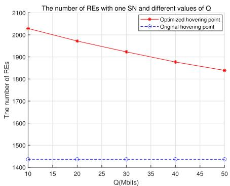  
(a)

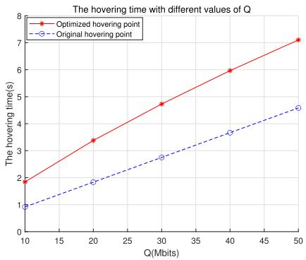  
(c)  
(b)  
Fig. 3. Comparisons of the optimal NoRE, SE, UAV hovering time, and system EE for the SN under TPS.

(d)  
TABLE II  
PARAMETER SETUP
<table><tr><td rowspan=1 colspan=1>Parameters</td><td rowspan=1 colspan=1>Values</td></tr><tr><td rowspan=1 colspan=1>Noise power at the receiving end</td><td rowspan=1 colspan=1> $\sigma ^ { 2 } = - 1 0 0 0 \mathrm { B m } \ [ 3 2 ]$ </td></tr><tr><td rowspan=1 colspan=1>The FC&#x27;s inherent power consumption ofthe circuit at each time slot</td><td rowspan=1 colspan=1> $\overline { { P _ { d , k } = 1 0 \mathrm { d } \mathrm { B m } \ [ 3 3 ] } }$ </td></tr><tr><td rowspan=1 colspan=1>The k-th sensor&#x27;s inherent powerconsumption of the circuit at each time slot</td><td rowspan=1 colspan=1> $\overline { { P _ { s , k } = 1 0 \mathrm { d } \mathrm { B } \mathrm { m } } }$ </td></tr><tr><td rowspan=1 colspan=1>The transmit power of each SN</td><td rowspan=1 colspan=1> $\overline { { p _ { k } = 0 . 1 \mathrm { W } \ [ 3 4 ] } }$ </td></tr><tr><td rowspan=1 colspan=1>The efficiency of the power amplifier at thetransmitter (SN)</td><td rowspan=1 colspan=1> $\overline { { \eta = 1 . 2 } }$ </td></tr><tr><td rowspan=1 colspan=1>The maximum power limit of each SN</td><td rowspan=1 colspan=1> $\overline { { P _ { k , \mathrm { m a x } } = 1 \mathrm { W } \ [ 3 3 ] } }$ </td></tr><tr><td rowspan=1 colspan=1>The flight height of the UAV</td><td rowspan=1 colspan=1>80 m</td></tr><tr><td rowspan=1 colspan=1>The maximum power limit of the UAV</td><td rowspan=1 colspan=1> $\frac { P _ { U A V , \operatorname* { m a x } } = 1 0 0 \mathrm { W } \ [ 3 2 ] } { 5 0 \times 5 0 }$ </td></tr><tr><td rowspan=1 colspan=1>The NoRE of the IRS mounted on the UAV</td><td rowspan=1 colspan=1>50×50</td></tr><tr><td rowspan=1 colspan=1>The power consumption of each reflectingelement in the IRS when providing thephase shift</td><td rowspan=1 colspan=1> $\overline { { P _ { I R S } = 5 \mathrm { m W } \ [ 3 1 ] } }$ </td></tr><tr><td rowspan=1 colspan=1>The MR speed of the UAV</td><td rowspan=1 colspan=1> $V _ { m r } = 1 8 . 3 m / s [ 3 5 ]$ </td></tr><tr><td rowspan=1 colspan=1>The maximum speed of the UAV</td><td rowspan=1 colspan=1> $\overline { { V _ { m a x } = 3 0 m / s } }$ </td></tr><tr><td rowspan=1 colspan=1>The path loss at the reference distance of 1meter</td><td rowspan=1 colspan=1> $\overline { { \rho _ { 0 } = - 3 0 \mathrm { d } \mathrm { B } } }$ </td></tr><tr><td rowspan=1 colspan=1>The path loss exponent</td><td rowspan=1 colspan=1> $\overline { { \alpha _ { t } = 2 . 2 , \alpha _ { r } = 2 . 8 \ [ 3 1 ] } }$ </td></tr><tr><td rowspan=1 colspan=1>The minimum achievable rate limit</td><td rowspan=1 colspan=1> $\overline { { R _ { \mathrm { m i n } } = 1 \mathrm { M b p s } } }$ </td></tr><tr><td rowspan=1 colspan=1>The bandwidth</td><td rowspan=1 colspan=1> $\overline { { B = 2 \mathrm { M H z } } }$ </td></tr></table>

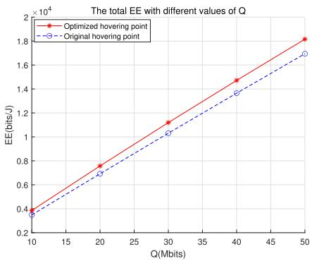

in WSN. The findings validate the theoretical analysis and the efectiveness of the Matlab simulations. For clarity, we separately analyze the UAV trajectory, optimal NoRE, the EE, etc. in both single-SN and multi-SN scenarios, and compare them with DDaS.

The specific parameter settings are set as follows. Specifically, the FC is located at the coordinate origin $\left[ x _ { d } , y _ { d } , 0 \right] =$ [0 0 0]. Assume that K = 5 SNs are randomly generated locations within a $5 0 0 \times 5 0 0$ area. The center point of this region is located on the X-axis. The UAV flight altitude H is 80 meters, the flight initial and final points are located in the lower left corner and upper right corner of the region, and the plane coordinates are $\mathbf { q } _ { I } = [ 6 0 0 , 2 5 0 ]$ $\mathbf { q } _ { F } = [ 1 0 0 , - 2 5 0 ]$ respectively. The IRS size is small compared to the transmission distance, its coordinates are approximated as collocated with the UAV’s position. The initial UAV hovering position is set directly above each SN. The parameters associated with the UAV propulsion power are consistent with Table I in [29]. Refer to [31] for the calculation process of channel power gain. The main parameters used are summarized in Table II.

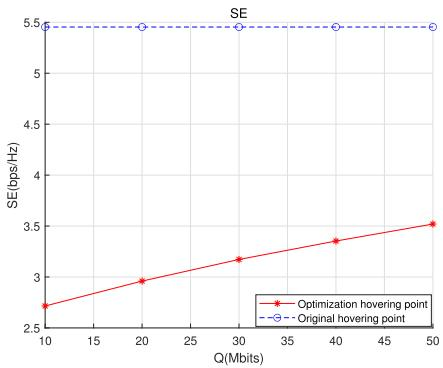

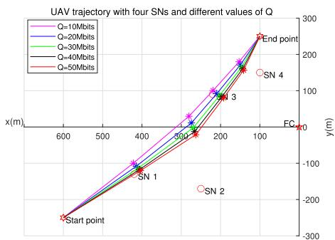  
Fig. 4. The optimized UAV trajectory with multiple SNs under TPS.

## B. System Performance Analysis of TPS in Single-SN Scenarios

In the predefined area, one SN is randomly selected for data transmission, with its coordinates fixed at [200, −100,0].

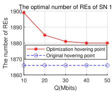

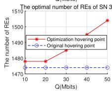

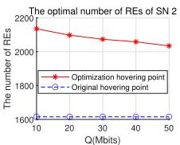

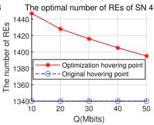  
(a)

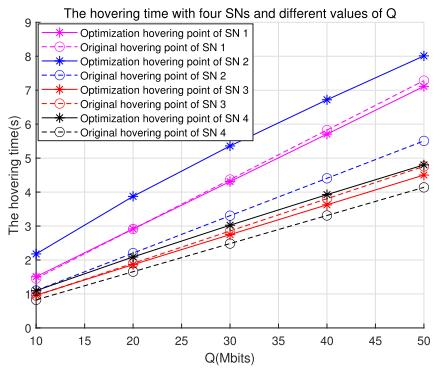

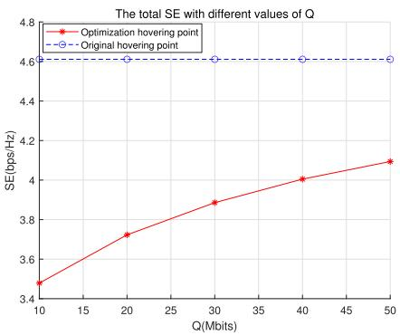  
(c)

(b)  
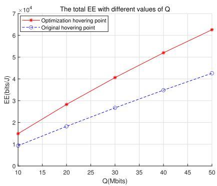  
(d)  
Fig. 5. Comparisons of the optimal NoRE, hovering time, system SE, and EE for multi-SN under TPS.

For the single-SN case, the UAV only has one hovering position during its flight. Under the TPS, we analyze the UAV trajectory, optimal NoRE, system SE, hovering time, and EE for varying transmission data amount (10Mbits, 20Mbits, 30Mbits, 40Mbits, and 50Mbits).

Fig. 2 shows that with a small transmitted data amount, the UAV trajectory approximates a straight line. The hovering positions are nearly aligned along the straight path from the starting point to the endpoint. As the data amount increases, the signal transmission distance gradually decreases. According to (7), reducing the signal transmission distance is an efective strategy when transmitting large data amount. To achieve this, the UAV can fly closer to its associated SN for communication. While this increases the flight distance, it enhances the total system transmitted data amount, thereby improving the system EE.

Fig. 3(a): The optimized UAV hovering position requires more reflecting elements than DDaS. This occurs because the UAV hovering position is farther from the SN, resulting in a longer signal transmission distance. To satisfy the minimum achievable rate and data transmission requirements, more NoRE are necessary. For DDaS, according to the CJ-BS algorithm, the system EE increases proportionally with the transmitted data amount, even as the data amount grows. Consequently, the NoRE required remains constant across varying data amount. Ref. [36] confirms that deploying over 2000 NoRE is feasible in size.

Fig. 3(b): DDaS achieves higher SE than the optimized position. This occurs because the signal transmission distance is shorter under DDaS. According to (3), the shorter distance leads to improved SE.

Fig. 3(c) demonstrates that the optimized UAV hovering position requires longer hovering time than DDaS. That is because, for a fixed data amount, lower SE at the optimized position necessitates extended hovering time to ensure complete data transmission.

Fig. 3(d): The optimized UAV trajectory achieves higher EE (1.07 times) than DDaS. This improvement stems from the reduced flight distance of the optimized trajectory, which decreases UAV propulsion energy consumption and lowers total system energy consumption, thereby improving system EE. This result validates the efectiveness of Algorithm 3.

## C. System Performance of Multiple SNs Under the TPS

In a given area, four SNs are selected randomly for data transmission, with their coordinates fixed at [420,-130,0], [250,-170,0], [220,90,0], and [120,200,0]. Each SN corresponds to one UAV hovering position. Under TPS, the UAV trajectory, optimal NoRE, system SE, UAV hovering time, and EE for transmission data amounts of 10 Mbits, 20 Mbits, 30 Mbits, 40 Mbits, and 50 Mbits are analyzed. These results are compared with DDAS.

In Fig. 4, for small data amounts, the optimized UAV trajectory approaches a straight line between the starting/endpoint. As the data amount increases, the signal transmission distance becomes smaller, thereby improving the system EE. Due to total UAV energy constraints, the optimized hovering positions cannot always align above each SN, and may even be far away (e.g., SN 2 is significantly ofset).

In Fig. 5(a), when making a trade-of between EE and SE, the optimized scheme requires more NoRE than DDaS.

The diference in NoRE is related to the signal transmission distance and the iteration count of the alternating optimized algorithm. Increasing NoRE influences both the system achievable rate and UAV hovering time to some extent. Crucially, our optimization goal is to maximize overall system EE under SE constraints. For a multi-SN scenario, it does not imply that per-SN being optimal can achieve the maximum EE of the entire system. Although NoRE increases for individual SN (e.g., SN 3) after optimization, most SNs exhibit reduced NoRE usage. Crucially, total system EE reaches its optimum–achieving our design objective.

Fig. 5(b) shows that hovering time increases with data amount. At 50 Mbits, the optimized hovering positions of SN 1 and SN 3 require less hovering time than DDaS. For SN 1, although the signal transmission distance slightly increases compared to DDaS, it requires more NoRE, thereby increasing the transmission rate and reducing the UAV hovering time. For SN 3, the optimized hovering position not only reduces the signal transmission distance but also increases the NoRE compared to DDaS, resulting in a higher transmission rate and thus reducing the UAV hovering time. For SN 2 and SN 4 versus DDaS, although the NoRE is increased after optimization, the signal transmission distance is longer, making the transmission rate smaller and the hovering time increased.

Fig. 5(c) shows that the optimized system SE is lower than DDaS. According to Fig. 5(b), the total hovering time optimized is greater than the DDaS. For the same total data amount to be transmitted, the longer the hovering time of UAV, the smaller the system SE.

In Fig. 5(d), the optimized system EE is 1.43 times higher than DDaS, indicating the efectiveness of Algorithm 4. Although the optimized system SE is smaller than DDaS, as shown in Fig. 5(c), the UAV traverses shorter distances, significantly reducing the system energy consumption and ultimately improving the system EE.

## V. CONCLUSION

This paper investigates the optimization of UAV trajectory and NoRE for data collection in U-m IRS-assisted WSNs under TPS. First, the system model was analyzed, and the EE-SE trade-of optimization problem was formulated. Starting with single-SN scenarios, the optimization problem was decomposed into two sub-problems: UAV trajectory optimization with fixed NoRE and NoRE optimization with fixed UAV trajectory. These sub-problems were solved using the CJ-BS algorithm and SCA algorithm, respectively. Then, extending to multi-SN scenarios, the optimization problem was decomposed into three sub-problems: user association, NoRE, and UAV trajectory. The genetic algorithm, CJ-BS, and SCA algorithm were developed to optimize them alternately, and the convergence analysis was analyzed. Simulation results showed that compared with DDaS: In single-SN cases, the optimized UAV trajectory has a shorter flight distance. Although the system SE has decreased, EE has increased 1.07 times. In multi-SN scenarios, the proposed method shortens flight distance and enhances EE 1.43 times versus DDaS, validating the algorithm’s efectiveness.

In the data collection assisted by the U-m IRS in WSNs, the TPS ensures the complete transmission of all the data from the sensors. In the actual scenario, it is also necessary to consider the hover prioritized scheme (HPS), that is, the UAV hovers at each hovering position for a certain time, which is also convenient for the operation of the UAV. In the HPS, the optimization of the UAV trajectory and NoRE to make a tradeof between EE and SE should also be considered, which is diferent from the TPS, and further analysis is needed.

## APPENDIX

The coordinate of the SN is $\left[ x _ { S } , y _ { s } , 0 \right]$ , the coordinate of the UAV’s position q˜ (t) at time t are $\left[ x _ { U } ( t ) , y _ { U } ( t ) , H \right]$ , and the , ,FC is located at the origin of the coordinate axis.

We can obtain

$$
d _ { S U } ^ { 2 } = ( x _ { U } ( t ) - x _ { S } ) ^ { 2 } + ( y _ { U } ( t ) - y _ { S } ) ^ { 2 } + H ^ { 2 }\tag{A1}
$$

$$
d _ { U F } ^ { 2 } = ( x _ { U } ( t ) ) ^ { 2 } + ( y _ { U } ( t ) ) ^ { 2 } + H ^ { 2 }\tag{A2}
$$

$$
d _ { S U } ^ { 2 } d _ { U F } ^ { 2 } = \left( ( x _ { U } ( t ) - x _ { S } ) ^ { 2 } + ( y _ { U } ( t ) - y _ { S } ) ^ { 2 } + H ^ { 2 } \right)
$$

$$
\big ( ( x _ { U } ( t ) ) ^ { 2 } + ( y _ { U } ( t ) ) ^ { 2 } + H ^ { 2 } \big )\tag{A3}
$$

$$
\frac { \partial d _ { S U } ^ { 2 } d _ { U F } ^ { 2 } } { \partial ^ { 2 } x _ { U } ( t ) } = 2 d _ { U F } ^ { 2 } + 2 d _ { S U } ^ { 2 } + 8 x _ { U } ( t ) ( x _ { U } ( t ) - x _ { S } )\tag{A4}
$$

$$
\frac { \partial d _ { S U } ^ { 2 } d _ { U F } ^ { 2 } } { \partial ^ { 2 } y _ { U } ( t ) } = 2 d _ { U F } ^ { 2 } + 2 d _ { S U } ^ { 2 } + 8 y _ { U } ( t ) ( y _ { U } ( t ) - y _ { S } )\tag{A5}
$$

$$
\frac { \partial d _ { S U } ^ { 2 } d _ { U F } ^ { 2 } } { \partial x _ { U } ( t ) \partial y _ { U } ( t ) } = 4 y _ { U } ( t ) ( x _ { U } ( t ) - x _ { S } ) + 4 x _ { U } ( t ) ( y _ { U } ( t ) - y _ { S } )\tag{A6}
$$

From $( \mathrm { A } 4 ) \mathrm { ~ - ~ } ( \mathrm { A } 6 )$ , it can be seen that although $d _ { U F } ^ { 2 } \geq 0 ,$ $d _ { S U } ^ { 2 } \geq 0 ,$ , but $( x _ { U } ( t ) - x _ { S } )$ and $( y _ { U } ( t ) - y _ { S } )$ may be less than 0. Their sum, i.e., $( \mathrm { A } 4 ) \mathrm { ~ - ~ } ( \mathrm { A } 6 )$ cannot be guarantee to always be greater than 0, which varies with the variation of q˜ (t). Therefore, $d _ { S U } ^ { 2 } d _ { U F } ^ { 2 }$ is a non-convex function of q˜ (t).

## REFERENCES

[1] D. Huo, A. W. Malik, S. D. Ravana, A. U. Rahman, and I. Ahmedy, “Mapping smart farming: Addressing agricultural challenges in datadriven era,” Renew. Sustain. Energy Rev., vol. 189, Jan. 2024, Art. no. 113858.

[2] S. Cesco, P. Sambo, M. Borin, B. Basso, G. Orzes, and F. Mazzetto, “Smart agriculture and digital twins: Applications and challenges in a vision of sustainability,” Eur. J. Agronomy, vol. 146, May 2023, Art. no. 126809.

[3] X. Xia, S. M. M. Fattah, and M. A. Babar, “A survey on UAV-enabled edge computing: Resource management perspective,” ACM Comput. Surveys, vol. 56, no. 3, pp. 1–36, Mar. 2024.

[4] H. Di, X. Zhu, Z. Liu, and X. Tu, “Joint blocklength and trajectory optimizations for URLLC-enabled UAV relay system,” IEEE Commun. Lett., vol. 28, no. 1, pp. 118–122, Jan. 2024.

[5] S. Li et al., “Maximizing network throughput in heterogeneous UAV networks,” IEEE/ACM Trans. Netw., vol. 32, no. 3, pp. 2128–2142, Jun. 2024.

[6] J. T. A. Rose, C. A. Subasini, F. S. F. Vinnarasi, and S. P. Karuppiah, “Power allocation for enhancing energy eficiency in unmanned aerial vehicle networks,” Int. J. Commun. Syst., vol. 37, no. 4, Mar. 2024.

[7] N. Lin, Y. Fan, L. Zhao, X. Li, and M. Guizani, “GREEN: A global energy eficiency maximization strategy for multi-UAV enabled communication systems,” IEEE Trans. Mobile Comput., vol. 22, no. 12, pp. 7104–7120, Dec. 2023.

[8] H. Jin et al., “A survey of energy eficient methods for UAV communication,” Veh. Commun., vol. 41, Jun. 2023, Art. no. 100594.

[9] Y. Zeng, Q. Wu, and R. Zhang, “Accessing from the sky: A tutorial on UAV communications for 5G and beyond,” Proc. IEEE, vol. 107, no. 12, pp. 2327–2375, Dec. 2019.

[10] X. Tang, W. Wang, H. He, and R. Zhang, “Energy-eficient data collection for UAV-assisted IoT: Joint trajectory and resource optimization,” Chin. J. Aeronaut., vol. 39, no. 9, pp. 15–25, Sep. 2022.

[11] Y. Wang, M. Chen, C. Pan, K. Wang, and Y. Pan, “Joint optimization of UAV trajectory and sensor uploading powers for UAV-assisted data collection in wireless sensor networks,” IEEE Internet Things J., vol. 9, no. 13, pp. 11214–11226, Jul. 2022.

[12] D.-H. Tran, T. X. Vu, S. Chatzinotas, S. ShahbazPanahi, and B. Ottersten, “Coarse trajectory design for energy minimization in UAVenabled,” IEEE Trans. Veh. Technol., vol. 69, no. 9, pp. 9483–9496, Sep. 2020.

[13] A. A. Al-Habob, O. A. Dobre, S. Muhaidat, and H. V. Poor, “Energyeficient information placement and delivery using UAVs,” IEEE Internet Things J., vol. 10, no. 1, pp. 357–366, Jan. 2023.

[14] O. Rodr´ıguez-Abreo, F.-J. Ornelas-Rodr´ıguez, A. Ram´ırez-Pedraza, J. B. Hurtado-Ramos, and J.-J. Gonzalez-Barbosa, “Backstepping con-´ trol for a UAV-manipulator tuned by cuckoo search algorithm,” Robot Auto. Syst., vol. 147, Jan. 2022, Art. no. 103910.

[15] L. Xu et al., “Optimization of 3D trajectory of UAV patrol inspection transmission tower based on hybrid genetic-simulated annealing algorithm,” in Proc. Int. Symp. New Energy Elect. Technol., vol. 1017, Mar. 2023, pp. 841–848.

[16] Z. Chang, H. Deng, L. You, G. Min, S. Garg, and G. Kaddoum, “Trajectory design and resource allocation for multi-UAV networks: Deep reinforcement learning approaches,” IEEE Trans. Netw. Sci. Eng., vol. 10, no. 5, pp. 2940–2951, Sep. 2023.

[17] R. Liu et al., “DRL-UTPS: DRL-based trajectory planning for unmanned aerial vehicles for data collection in dynamic IoT network,” IEEE Trans. Intell. Vehicles, vol. 8, no. 2, pp. 1204–1218, Feb. 2023.

[18] B. Xu, Z. Kuang, J. Gao, L. Zhao, and C. Wu, “Joint ofloading decision and trajectory design for UAV-enabled edge computing with task dependency,” IEEE Trans. Wireless Commun., vol. 22, no. 8, pp. 5043–5055, Aug. 2023.

[19] H.-C. Tsai, Y.-W. P. Hong, and J.-P. Sheu, “Completion time minimization for UAV-enabled surveillance over multiple restricted regions,” IEEE Trans. Mobile Comput., vol. 22, no. 12, pp. 6907–6920, Dec. 2023.

[20] A. M. Nazar, M. Y. Selim, and A. E. Kamal, “Mounting RIS panels on tethered and untethered UAVs: A survey,” Arabian J. Sci. Eng., vol. 49, no. 3, pp. 2857–2885, Mar. 2024.

[21] K. Li, K. Zhao, M. F. Khan, P.-H. Ho, and L. Peng, “UAV-mounted intelligent reflecting surface (IRS) MISO communications,” in Proc. Int. Conf. Netw. Netw. Appl. (NaNA), Dec. 2022, pp. 62–66.

[22] X. Song, Y. Zhao, Z. Wu, Z. Yang, and J. Tang, “Joint trajectory and communication design for IRS-assisted UAV networks,” IEEE Wireless Commun. Lett., vol. 11, no. 7, pp. 1538–1542, Jul. 2022.

[23] Y. Liu, F. Han, and S. Zhao, “Flexible and reliable multiuser SWIPT IoT network enhanced by UAV-mounted intelligent reflecting surface,” IEEE Trans. Rel., vol. 71, no. 2, pp. 1092–1103, Jun. 2022.

[24] Y. Mei, C. Liu, Y. Song, G. Wang, and H. Liang, “Multi-agent reinforcement learning based transmission scheme for IRS-assisted multi-UAV systems,” IET Commun., vol. 17, no. 17, pp. 2019–2029, Aug. 2023.

[25] Y. Yao, K. Lv, S. Huang, X. Li, and W. Xiang, “UAV trajectory and energy eficiency optimization in RIS-assisted multi-user air-to-ground communications networks,” Drones, vol. 7, no. 4, p. 272, Apr. 2023.

[26] W. Lyu, Y. Xiu, S. Yang, P. L. Yeoh, Y. Li, and Z. Zhang, “Weighted sum age of information minimization in wireless networks with aerial IRS,” IEEE Trans. Veh. Technol., vol. 72, no. 4, pp. 5390–5394, Apr. 2023.

[27] M. Mustaghfirin, K. Singh, S. Biswas, and W.-J. Huang, “Performance analysis of intelligent reflecting surface-assisted multi-users communication networks,” Electronics, vol. 10, no. 17, p. 2084, Aug. 2021.

[28] B. Shang, E. S. Bentley, and L. Liu, “UAV swarm-enabled aerial reconfigurable intelligent surface: Modeling, analysis, and optimization,” IEEE Trans. Commun., vol. 71, no. 6, pp. 3621–3636, Jun. 2023.

[29] Y. Zeng, J. Xu, and R. Zhang, “Energy minimization for wireless communication with rotary-wing UAV,” IEEE Trans. Wireless Commun., vol. 18, no. 4, pp. 2329–2345, Apr. 2019.

[30] H. Zhao, H. Chen, F. Tan, and L. Zhan, “Optimum number of reflecting elements for UAV-mounted intelligent reflecting surface-assisted data collection in wireless sensor network,” IEEE Sensors J., vol. 24, no. 14, pp. 23062–23074, Jul. 2024.

[31] N. T. Nguyen, Q.-D. Vu, K. Lee, and M. Juntti, “Hybrid relay-reflecting intelligent surface-assisted wireless communications,” IEEE Trans. Veh. Technol., vol. 71, no. 6, pp. 6228–6244, Jun. 2022.

[32] J. Pei, H. Chen, and L. Shu, “UAV-assisted connectivity enhancement algorithms for multiple isolated sensor networks in agricultural Internet of Things,” Comput. Netw., vol. 207, Apr. 2022, Art. no. 108854.

[33] D. Li, “How many reflecting elements are needed for energy - and spectral-eficient intelligent reflecting surface-assisted communication,” IEEE Trans. Commun., vol. 70, no. 2, pp. 1320–1331, Feb. 2022.

[34] C. Zhan, Y. Zeng, and R. Zhang, “Energy-eficient data collection in UAV enabled wireless sensor network,” IEEE Wireless Commun. Lett., vol. 7, no. 3, pp. 328–331, Jun. 2018.

[35] H. Ren, Z. Zhang, Z. Peng, L. Li, and C. Pan, “Energy minimization in RIS-assisted UAV-enabled wireless power transfer systems,” IEEE Internet Things J., vol. 10, no. 7, pp. 5794–5809, Apr. 2023.

[36] W. Tang et al., “Wireless communications with programmable metasurface: Transceiver design and experimental results,” China Commun., vol. 16, no. 5, pp. 46–61, May 2019.

Hong Zhao received the M.S. degree in software engineering from the University of Electronic Science and Technology of China in 2011. She is currently pursuing the Ph.D. degree with the School of Information and Communication, Guilin University of Electronic Technology, Guilin, China. She is also a Lecturer with the School of Information and Communication, Guilin University of Electronic Technology. Her current research interests include reconfigurable intelligent surfaces, UAV communications, and the Internet of Things networks.

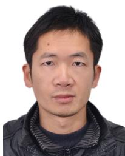

Hongbin Chen received the B.E. degree in electronic and information engineering from Nanjing University of Posts and Telecommunications, Nanjing, China, in 2004, and the Ph.D. degree in circuits and systems from the South China University of Technology, Guangzhou, China, in 2009. From October 2006 to May 2008, he was a Research Assistant with the Department of Electronic and Information Engineering, The Hong Kong Polytechnic University, Hong Kong. From March 2014 to April 2014, he was a Research Associate with the

Department of Electronic and Information Engineering. From May 2015 to May 2016, he was a Visiting Scholar with the Department of Electrical and Computer Engineering, National University of Singapore, Singapore. He is currently a Professor with the School of Information and Communication, Guilin University of Electronic Technology, Guilin, China. His research interests include energy-eficient wireless communications.

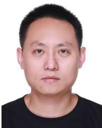

Shichao Li received the Ph.D. degree in communication and information systems from Beijing Jiaotong University, Beijing, China, in 2019. From 2022 to 2024, he was a Post-Doctoral Research Fellow supported by the Chinese Scholarship Council with Singapore University of Technology and Design, Singapore. He is currently an Associate Professor with the School of Information and Communication, Guilin University of Electronic Technology, Guilin, China. His main research interests include mobile edge computing, vehicular networks, high mobility

broadband wireless communications, wireless resource allocation, and cloud radio access networks. He is on the editorial board of the Discover Applied Sciences (Springer). He has served as a TPC Member for IEEE VTC2025- Spring, IEEE Globecom2024, IEEE VTC2023-Spring, IEEE VTC2021-Fall, and IEEE VTC2020-Fall.

Ling Zhan received the M.S. degree in signal and information processing and the Ph.D. degree from Guilin University of Electronic Technology, Guilin, China, in 2010 and 2022, respectively. He is currently a Lecturer with the School of Information and Communication, Guilin University of Electronic Technology. His research interests focus on visible light communication and the Internet of Things.