# Joint Optimization on Trajectory and Velocity for Minimum Completion Time in UAV-Enabled Wireless-Powered WSN

Jing Guo , Feihang Qiu , Lei Lei , Member, IEEE, and Xu Zhang , Member, IEEE

Abstract—Uncrewed aerial vehicle (UAV) has been regarded as an eficient approach for enabling battery-less wireless sensor network (WSN). In this article, an energy-limited UAV is utilized to complete the information collection task of a group of batteryless sensor nodes (SNs) in a fly-while-communication scheme. A joint trajectory and velocity optimization framework decomposes the completion time minimization problem into three subproblems: cluster head selection and sorting (P1), smooth trajectory planning (P2), and velocity optimization (P3). With the cluster heads selected by an energy-based clustering algorithm, a Bspline-based trajectory of UAV is designed and optimized. Then, the velocity optimization is implemented to fulfill the communication demand of SNs and the energy consumption constraint of the UAV. Numerical results reveal that the proposed algorithm adjusts the velocity during communication and allocates more fly-while-communication time to meet diferent communication demands. The task completion time of the proposed method is 43% shorter than that of the fly-hover-communication-based method and is 15% shorter than that of the Bezier curve-based´ method.

Index Terms—B-spline, joint optimization, minimum completion time, UAV-enabled WSN, wireless powered.

## I. INTRODUCTION

(IoT), wireless sensor network (WSN) have been widely used in many fields such as smart cities, environmental monitoring, resource exploration and agricultural production [1]. Uncrewed aerial vehicles (UAVs) have been introduced as the sources of mobile energy to enable WSN, and through trajectory planning and resource scheduling of UAVs, the lifetime of WSNs is extended [2]. Many existing works of UAV-enabled WSN mainly focus on three aspects: minimizing the UAV energy consumption [3], [4], [5], maximizing sensor network throughput [6], [7], [8], and minimizing the task completion time [9], [10], [11]. Optimizing the task completion time improves the energy eficiency of the UAV and can also improve the lifetime of WSN by saving the usage time of ground sensor nodes (SNs). In many real-time demanding scenarios, such as in emergency rescue, the task completion time is particularly important. The direct influences on the task completion time are flight trajectory and flight velocity, both of which have complex coupling relationships with UAV energy consumption and network throughput [12], [13], [14].

Fly-hover-communication and fly-while-communication are the two primary operational schemes for UAVs. In the flyhover-communication scheme, the UAV transfers energy and information by hovering directly above each SN, traversing them sequentially along a non-smooth trajectory [15]. In contrast, the fly-while-communication scheme performs energy and information transfer over a segment of a smooth flight trajectory. While this may increase the energy cost of the communication itself, it significantly reduces the overall flight energy consumption [16]. The ability of UAVs to deliver radio-frequency energy over a distance allows them to serve multiple SNs simultaneously. Consequently, task-completion time can be minimized through joint trajectory and velocity optimization within the fly-while-communication mode.

## A. Related Work

Minimizing the task completion time for UAV-enabled WSNs requires simultaneous trajectory and velocity optimization, which is typically nonlinear and non-convex. Two prevalent schemes for UAV trajectories are fly-hovercommunication and fly-while-communication. In the flyhover-communication scheme [10], [17], [18], the UAV follows a point-to-point path and communicates with sensor nodes (SNs) only while hovering. This results in a non-smooth trajectory, often leading to increased path length, frequent turns, and wasted time and energy. In contrast, smooth trajectories can reduce UAV energy consumption by minimizing transitions between hovering and moving states. While Bezier´ curve-based smooth path optimization has been investigated [19], [20], the constraints required to ensure trajectory continuity can limit adaptability [21], [22], [23]. The B-spline curve, a generalization of the Bezier curve, retains strong´ convex hull properties and derivative characteristics while ofering natural smoothness and continuity at the connections between curve segments. Consequently, a growing number of planning frameworks have adopted B-spline curves for trajectory representation [24], [25], [26]. In [27] and [28], the authors analyze the joint minimization of completion time and energy consumption, considering the impact of velocity on energy depletion.

The UAV can transmit energy and information with a group of SNs, which can efectively reduce the task completion time through SNs clustering and velocity optimization. In [14], multiple SNs are represented by cluster heads, and a shorter trajectory is obtained. In [29] and [30], the efect of diferent speeds on completion time and energy consumption is verified, and the efect of UAV velocity and node communication time on network throughput is explored. In [31], [32], and [33], the problem of balancing RF energy sent between UAV and SNs is investigated to minimize the weighted sum of air-ground energy by jointly optimizing UAV trajectory and wake-up time. Compared with clustering into points, spreading the clustering points into energy and information transmission regions can cover a larger range of energy requirements and can better optimize UAV energy consumption, sensor network throughput, and task completion time.

## B. Motivation and Contributions

The task completion time is highly correlated with trajectory and velocity. In order to fulfill the communication demand of SNs with limited on-board energy of the UAV, there is a tradeof between trajectory planning and velocity optimization. This paper focuses on the joint optimization of trajectory and velocity to minimize task completion time by deploying a flywhile-communication scheme. First, energy and information transmission regions based on the clustering results of SNs are defined. Second, a smooth trajectory is optimized within the energy and information transmission regions to minimize task completion time for fulfilling the communication demands of SNs. The main contributions of this paper are as follows:

• It constructs the energy and information transmission regions by clustering the ground sensor nodes, and selects the cluster points obtained by clustering as the initial control points of the B-spline. The smoothing trajectory within the energy and information transmission regions as an initial trajectory increases the coverage eficiency.

• Velocity and trajectory are correlated in the timeminimum problem, and it utilizes the genetic algorithm to solve the order and control points of the Bspline, and obtains the optimal velocity and trajectory with an alternating optimization framework to minimize task completion time for fulfilling the communication demands of SNs.

• Experiments demonstrate that the framework efectively reduces the task completion time under diferent network demands by increasing the velocity in the region as well as the smoothness of the trajectory. The algorithm is on average 43% shorter than the hovering communication method and 15% shorter than the Bezier curve based´ method in terms of the task completion time.

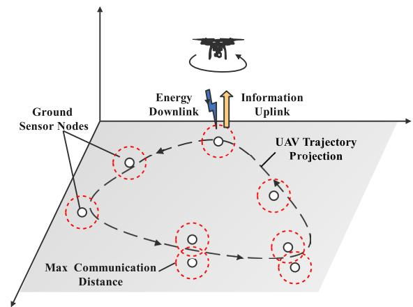  
Fig. 1. System model of a UAV-enabled wireless powered WSN.

## II. SYSTEM MODEL

In Fig. 1, the UAV flies at a fixed altitude of H, transfers RF energy to SNs in the downlink and collects data information from SNs in the uplink [14], [34]. The WSN consists of multiple SNs distributed in the two-dimensional plane $\boldsymbol \mathbb { O } ~ = ~ [ O _ { 1 } , O _ { 2 } , \ldots , O _ { N } ] ^ { \mathbf { T } }$ , O is the set of SNs, N is , , . . . ,the number of SNs and n is the serial number of SNs. The horizontal coordinate of the SN with serial number n is represented by $O _ { n } = \left[ x _ { n } , y _ { n } \right] , n \in N$ . During task completion time T , the position of the UAV at time t is represented as $q _ { m } \left( t \right) = \left[ x _ { m } \left( t \right) , y _ { m } \left( t \right) \right]$ The black dashed line in the plane is the projection of the trajectory, and the red dashed circle denotes the max communication distance of the SN. The velocity of the UAV $\nu _ { m }$ is less than the maximum velocity.

$$
\nu _ { m } = \lVert q _ { m } ( t ) \rVert \leq V _ { \operatorname* { m a x } } , \forall m , \forall t \in [ 0 , T ]\tag{1}
$$

The UAV starts at the starting point, traversals the SNs for energy transferring and information collection, and eventually returns back to the starting point.

$$
q _ { m } ( T ) = q _ { m } ( 0 )\tag{2}
$$

During task completion time T , $h _ { n , m } ( t )$ is the channel power gain between UAV and SN at moment t.

$$
h _ { n , m } ( t ) = \frac { \beta _ { 0 } } { D _ { n , m } ^ { 2 } ( t ) } = \frac { \beta _ { 0 } } { H ^ { 2 } + \| q _ { m } ( t ) - O _ { n } \| ^ { 2 } }\tag{3}
$$

where $D _ { n , m }$ is the distance from the sensor position of n serial number to the UAV position of m serial number, $\beta _ { 0 }$ is the channel power gain at 1 meter, H is the altitude of the UAV. In order to simplify the system, a linear energy harvesting models is adopted [35]. The UAV transfers RF power $P _ { t }$ to activate the SNs, and $E _ { n }$ is the energy collected by the n-th SN.

$$
E _ { n } = \int _ { 0 } ^ { T } \varphi _ { n } \left( t \right) h _ { n , m } P _ { t } d t , \ \varphi _ { n } \in \{ 0 , 1 \}\tag{4}
$$

where $\varphi _ { n } \left( t \right)$ is the energy harvesting correlation function of the n-th SN with the UAV at moment t. At time t, $\varphi _ { n } \ = 1$ means that the n-th SN is harvesting energy from the UAV where the distance between UAV position $q _ { m } ^ { \mathrm { t r } }$ and node $O _ { n }$ is less than the maximum transmission distance $D _ { t r }$ . Otherwise, $\varphi _ { n } \ = 0$ indicates no harvesting happens.

$$
\Vert q _ { m } ^ { \mathrm { t r } } ( t ) - O _ { n } \Vert \leq D _ { \mathrm { t r } } , \quad q _ { m } ^ { \mathrm { t r } } ( t ) \in q _ { m } ( t ) , \varphi _ { n } = 1\tag{5}
$$

In order to complete the task, the throughput of each SN should be greater than the communication demand of SN $S _ { k } .$

$$
\int _ { 0 } ^ { T } \varphi _ { n } ( t ) R _ { n , m } ( t ) d t \geq S _ { k } , \forall k , \varphi _ { n } ( t ) \in \{ 0 , 1 \}\tag{6}
$$

where $R _ { n , m } ( t )$ is the throughput rate in bits per second (bps) between the SN and the UAV at time t.

$$
\begin{array} { l } { \displaystyle R _ { n , m } ( t ) = B \log _ { 2 } \left( 1 + \frac { P _ { n } h _ { n , m } ( t ) } { \sigma ^ { 2 } } \right) } \\ { = B \log _ { 2 } \left( 1 + \frac { \gamma _ { k } } { H ^ { 2 } + \vert \vert q _ { m } ( t ) - O _ { n } \vert \vert ^ { 2 } } \right) } \end{array}\tag{7}
$$

where B is the channel bandwidth assigned per UAV in hertz (Hz), $\sigma ^ { 2 }$ is the noise power at the UAV, and $\begin{array} { r } { \gamma _ { k } \ = \ \frac { P _ { n } \beta _ { 0 } } { \sigma ^ { 2 } } } \end{array}$ is σthe received signal-to-noise ratio at a distance of 1 meter, $\beta _ { 0 }$ is the channel power gain at a distance of 1 meter, $P _ { n } = \alpha E _ { n } , 0 < \alpha < 1$ is the transmitted power of the SN, $\alpha = 3 0 \%$ , < α < is the conversion eficiency of radio frequency to direct current (RF-DC) [36].

It is worth noting that since the energy consumption and time of UAV take-of and landing are fixed, we exclude this part of energy consumption and time. During task completion time $T ,$ the sum of motion energy $E _ { m } ^ { u }$ and RF energy $E _ { p t }$ must be less than the UAV on-board energy :

$$
{ \cal E } _ { m } ^ { u } + { \cal E } _ { p t } \leq \varepsilon\tag{8}
$$

where $E _ { p t }$ is discreted:

$$
E _ { p t } = \int _ { 0 } ^ { T } \varphi _ { n } \left( t \right) P _ { t } d t , \ \varphi _ { n } \in \{ 0 , 1 \}\tag{9}
$$

This paper employs a rotorcraft propulsion model [12], and adopts smooth acceleration and deceleration profiles to reduce power peaks. The motion energy consumption $E _ { m } ^ { u }$ of the UAV is related with the velocity.

$$
\begin{array} { l } { { \displaystyle E _ { m } ^ { u } \left( \{ \nu _ { m } ( t ) \} \right) } \ ~ } \\ { { \displaystyle = \int _ { 0 } ^ { T } \left( P _ { 0 } + \frac { 3 P _ { 0 } \left. \nu _ { m } ( t ) \right. ^ { 2 } } { U _ { t i p } ^ { 2 } } + \frac { 1 } { 2 } d _ { 0 } \rho s A \left. \nu _ { m } ( t ) \right. ^ { 3 } \right) } } \\ { { \displaystyle ~ + P _ { i } \left( \sqrt { 1 + \frac { \left. \nu _ { m } ( t ) \right. ^ { 4 } } { 4 \nu _ { 0 } ^ { 4 } } } - \frac { \left. \nu _ { m } ( t ) \right. ^ { 2 } } { 2 \nu _ { 0 } ^ { 2 } } \right) ^ { \frac { 1 } { 2 } } d t } } \end{array}\tag{10}
$$

where $P _ { 0 }$ is the profile power, $P _ { i }$ is the induced power, $d _ { 0 }$ is the body drag ratio, $\rho$ is the air density, $U _ { t i p }$ is the tip velocity of the rotor blades, v0 is the average induced velocity of the rotor in hover, A is the rotor disc area, s is the rotor solidity.

The goal of this paper is to minimize the task completion time, while satisfying the node communication demands $S _ { k }$ with limited on-board energy . The key notions are listed in Table I for easy reference. The problem is mathematically expressed as follows:

$$
\begin{array} { c } { { ( \mathrm { P } ) \colon \operatorname* { m i n } \quad T } } \\ { { s . t . ~ ( 1 ) , ( 2 ) , ( 5 ) , ( 6 ) , ( 8 ) } } \end{array}
$$

SUMMARY OF KEY NOTATIONS  
TABLE I
<table><tr><td rowspan=1 colspan=1>Notation</td><td rowspan=1 colspan=1>Description</td></tr><tr><td rowspan=1 colspan=1>N</td><td rowspan=1 colspan=1>The number of SNs</td></tr><tr><td rowspan=1 colspan=1>0</td><td rowspan=1 colspan=1>The set of SNs</td></tr><tr><td rowspan=1 colspan=1> $O _ { n }$ </td><td rowspan=1 colspan=1>The (2D) coordinates of an SN</td></tr><tr><td rowspan=1 colspan=1> $m$ </td><td rowspan=1 colspan=1>The index of UAV waypoints</td></tr><tr><td rowspan=1 colspan=1> $q _ { m }$ </td><td rowspan=1 colspan=1>The (2D) coordinates of the UAV at moment</td></tr><tr><td rowspan=1 colspan=1> $H$ </td><td rowspan=1 colspan=1>The altitude of the UAV</td></tr><tr><td rowspan=1 colspan=1> $P _ { t }$ </td><td rowspan=1 colspan=1>The transmit power of UAV</td></tr><tr><td rowspan=1 colspan=1> $P _ { n }$ </td><td rowspan=1 colspan=1>The transmit power of n-th SN</td></tr><tr><td rowspan=1 colspan=1> $T$ </td><td rowspan=1 colspan=1>task completion time required for the UAV</td></tr><tr><td rowspan=1 colspan=1> $h _ { n , m }$ </td><td rowspan=1 colspan=1>The channel power gain between the SN and the UAV</td></tr><tr><td rowspan=1 colspan=1> $\varphi _ { n }$ </td><td rowspan=1 colspan=1>The energy harvesting correlation of the SN and UAV</td></tr><tr><td rowspan=1 colspan=1> $E _ { n }$ </td><td rowspan=1 colspan=1>Energy collected by the n-th SN</td></tr><tr><td rowspan=1 colspan=1>B</td><td rowspan=1 colspan=1>The channel bandwidth</td></tr><tr><td rowspan=1 colspan=1> $S _ { k }$ </td><td rowspan=1 colspan=1>The communication demand of each SN</td></tr><tr><td rowspan=1 colspan=1>ε</td><td rowspan=1 colspan=1>Maximum on-board energy</td></tr></table>

## III. PROPOSED SOLUTION

In the fly-and-communicate strategy, the UAV wirelessly transmits RF energy to multiple sensor nodes while planning a smooth flight path to reduce motion-related energy consumption and optimizing its speed to accelerate task completion, as shown in Fig. 2. The original problem (P) is discretized into a simplified version (P0), then further divided into three interrelated subproblems: cluster head selection and ordering (P1), smooth trajectory planning (P2), and speed optimization (P3). The system first clusters the area based on the maximum service radius of UAV. Due to RF energy attenuation, the UAV may have varying efective coverage, afecting the clustering result (P1). The geometric centers of the clusters are selected as cluster heads, defining the visiting order and initial control points for B-spline trajectory generation (P2). The number and spatial distribution of cluster heads determine the spline degree and segment length, influencing the subsequent speed optimization (P3). This progressive constraint-driven framework efectively manages interdependencies between subproblems and avoids local optima better than the common anti-local-minimum strategies used in [13]. A larger number of cluster heads leads to longer and more complex trajectories with increased fly-only time, whereas fewer cluster heads yield shorter and smoother paths, but may require flywhile-communication time due to extended communication distances.

## A. Problem Discretization (P0)

The task completion time T consists of two parts, the flyonly time $T ^ { f }$ and the fly-while-communication time $T ^ { s }$

$$
T = T ^ { f } + T ^ { s }\tag{11}
$$

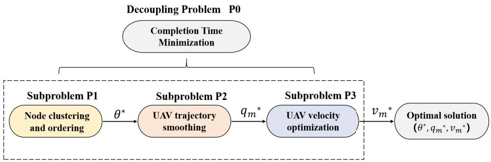  
Fig. 2. The block diagram of the proposed algorithm.

T is cut into time slots of equal length $K = [ k _ { 1 } , k _ { 2 } , \ldots k _ { T } ]$ , and $\delta _ { k }$ is the length of time slot. The constraints (1) and (2) can be discretized into:

$$
\| \nu _ { m } [ k ] \| = \frac { | | q _ { m } [ k + 1 ] - q _ { m } [ k ] | | } { \delta _ { k } } \leq V _ { \operatorname* { m a x } }
$$

$$
\forall m , \forall k \in [ 0 , T _ { m } ]\tag{12}
$$

$$
q _ { m } [ k _ { T } ] = q _ { m } [ 0 ]\tag{13}
$$

The energy harvesting correclation $\varphi _ { n } ( t )$ in (4) is discretized as a matrix $\varphi _ { n , k }$

$$
\varphi _ { n , k } = \left[ \begin{array} { c c c } { \varphi _ { 1 , 1 } } & { \cdots } & { \varphi _ { 1 , k _ { T } } } \\ { \vdots } & { \ddots } & { \vdots } \\ { \varphi _ { n , 1 } } & { \cdots } & { \varphi _ { n , k _ { T } } } \end{array} \right] _ { N \times k _ { T } }\tag{14}
$$

The sum of communicating time with SNs is less than the task completion time T .

$$
\sum _ { k = 1 } ^ { k _ { T } } \varphi _ { n , k } < T , \forall n\tag{15}
$$

The number of SNs that can communicate with the UAV at any k moments is less than or equal to N.

$$
\sum _ { n = 1 } ^ { N } \varphi _ { n , k } \leq N , \forall k\tag{16}
$$

The constraints (5) can be discretized.

$$
\begin{array} { r } { \Vert q _ { m } ^ { \mathrm { t r } } [ k ] - O _ { n } \Vert \leq D _ { \mathrm { t r } } , \quad q _ { m } ^ { \mathrm { t r } } [ k ] \in q _ { m } [ k ] , \varphi _ { n , k } = 1 } \end{array}\tag{17}
$$

where $q _ { m } ^ { \mathrm { t r } } [ k ]$ are the coordinates of the transmitted energy at the k-th moment. Then the trajectory of the UAV $q _ { m }$ within the task completion time $T$ is discreted:

$$
\begin{array} { c } { { q _ { m } = q _ { | G _ { m } | } + q _ { | G _ { n } | } , } } \\ { { \ } } \\ { { \displaystyle \{ | G _ { m } | = \{ \varphi _ { n , k } \mid \varphi _ { n , k } = 0 \}  } }  \\ { {   | G _ { n } | = \{ \varphi _ { n , k } \mid \varphi _ { n , k } = 1 \}  } } \end{array}\tag{18}
$$

where $| G _ { m } |$ is the set of trajectories for the flight and $| G _ { n } |$ is the set of trajectories communicates with the SN. Within $| G _ { n } | .$ , the SNs harvest energy and transmit more than $S _ { k }$ information.

$$
\sum _ { t = 0 } ^ { k _ { T } } \varphi _ { n , k } R _ { n , m } [ k ] \geq S _ { k } , \forall n , \varphi _ { n , k } \in \{ 0 , 1 \}\tag{19}
$$

The fly-while-communication time $T ^ { s }$ is obtained.

$$
T ^ { s } = \delta _ { k } \sum _ { n = 1 } ^ { N } \left| G _ { n } \right|\tag{20}
$$

The fly-only time $T ^ { f }$ is also calculated.

$$
T ^ { f } = \frac { \sum _ { m = 1 } ^ { M } \left\| q _ { | G _ { m } | } [ k ] - q _ { | G _ { m } | } [ k - 1 ] \right\| } { V _ { \operatorname* { m a x } } }\tag{21}
$$

The overall energy consumption of a UAV must be less than the limited battery capacity.

$$
E _ { m } ^ { u } \left( \left\{ \nu _ { m } [ k ] \right\} \right) + E _ { p t } \left( \varphi _ { n , k } \right) \leq \varepsilon\tag{22}
$$

where the RF energy ${ E } _ { p t } \left( \varphi _ { n , k } \right)$ and motion energy $E _ { m } ^ { u } \left( \{ \nu _ { m } [ k ] \} \right)$ are defined. Since the acceleration and deceleration phases take up a relatively short period of time throughout the entire flight mission, their impact on the total energy consumption is limited. The control system of the UAV adopts smooth acceleration and deceleration curves, so the influence of acceleration on system energy consumption is ignored [12].

$$
\begin{array} { l } { \displaystyle E _ { p t } \left( \varphi _ { n , k } \right) = \sum _ { k = 0 } ^ { k _ { r } } \varphi _ { n , k } P _ { t } } \\ { \displaystyle E _ { m } ^ { u } \left( \left\{ \nu _ { m } [ k ] \right\} \right) } \\ { = \sum _ { k = 1 } ^ { k _ { r } } \delta _ { k } \left( P _ { 0 } + \frac { 3 P _ { 0 } \| \nu _ { m } [ k ] \| ^ { 2 } } { U _ { t i p } ^ { 2 } } + \frac { 1 } { 2 } d _ { 0 } \rho s A \left\| \nu _ { m } [ k ] \right\| ^ { 3 } \right) } \\ { + \sum _ { k = 1 } ^ { k _ { T } } \delta _ { k } P _ { i } \left( \sqrt { 1 + \frac { \| \nu _ { m } [ k ] \| ^ { 4 } } { 4 \nu _ { 0 } ^ { 4 } } } - \frac { \| \nu _ { m } [ k ] \| ^ { 2 } } { 2 \nu _ { 0 } ^ { 2 } } \right) ^ { \frac { 1 } { 2 } } } \end{array}\tag{23}
$$

(24)

The original problem (P) is finally discretized into problem (P0).

$$
\begin{array} { c } { { ( { \mathrm { P 0 } } ) : \displaystyle { \operatorname* { m i n } _ { \{ \theta \} , \{ q _ { m } [ k ] \} , \{ \nu _ { m } [ k ] \} } } T ^ { f } + T ^ { s } } } \\ { { \mathrm { s . t . ~ } ( 1 2 ) , ( 1 3 ) , ( 1 5 ) , ( 1 6 ) , ( 1 7 ) , ( 1 8 ) , ( 1 9 ) , ( 2 2 ) } } \end{array}
$$

## B. Energy-Based Clustering and Ordering Algorithm (P1)

As UAV can transfer energy to multiple SNs within a range, a group of SNs could be clustered, as shown in Fig. 3. During the communication process between UAV and multiple sensor nodes, we adopt the Time Division Multiple Access (TDMA) mechanism for channel access management. The boundary of clustering for each SN is defined as the circle where the harvested power is just over the activation power threshold $P _ { t h }$ Constraint (17) is further expressed as the activation radius Γ of the SN [37].

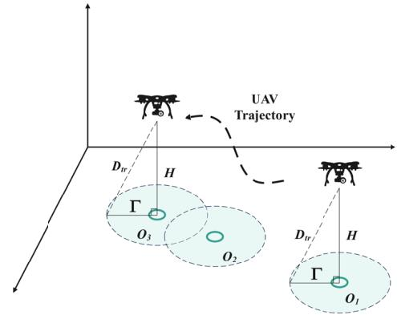  
Fig. 3. The relationship between max communication distance Γ and maximum transmission distance $D _ { t r }$

$$
\begin{array} { l } { \Gamma = \parallel D _ { t r } - H \parallel } \\ { = \parallel a r g m a x ( P _ { t h } ) - H \parallel } \end{array}\tag{25}
$$

where argmax(∗) is the argument value when the function is maximized. The boundaries of SNs in WSN are divided according to Γ. A matrix variable $I _ { m , n } \in \{ 0 , 1 \}$ is defined to indicate whether node n belongs to cluster m, and nodes within a cluster are called adjacent nodes.

$$
\begin{array} { r l } { { I _ { m , n } } } & { { } { I _ { m , n } } } \\ { \ } & { { } = \left\{ 1 , \quad 0 < \left\| w _ { m , i } - w _ { m , j } \right\| \le 2 \Gamma _ { } , \exists m \in W , \forall i , j \in N \right. } \\ { \ } & { { } = \left\{ 0 , \quad \left\| w _ { m , i } - w _ { m , j } \right\| > 2 \Gamma _ { } \right. } \end{array}\tag{26}
$$

$Q ^ { T }$ is the column sum of matrix $I _ { m , n }$ , and it is the number of nodes contained in a cluster.

$$
\boldsymbol { Q } ^ { T } = \mathrm { \ C o l S u m s \ } ( { \boldsymbol { I } } ) = \left[ \begin{array} { c } { \sum _ { j = 1 } ^ { m } I _ { j 1 } } \\ { \sum _ { j = 1 } ^ { m } I _ { j 2 } } \\ { \vdots } \\ { \sum _ { j = 1 } ^ { m } I _ { j m } } \end{array} \right] _ { m \times 1 }\tag{27}
$$

L is the row sum of matrix $I _ { m , n } .$ It is the constraint that each ,node belongs to only one cluster.

$$
{ \begin{array} { r l } & { L = { \mathrm { R o w S u m s ~ } } ( I ) } \\ & { \quad = { \bigl [ } \sum _ { i = 1 } ^ { m } I _ { i 1 } \quad \sum _ { i = 1 } ^ { m } I _ { i 2 } \quad \cdots \quad \sum _ { i = 1 } ^ { m } I _ { i n } { \bigr ] } _ { 1 \times n } } \\ & { \quad = 1 _ { 1 \times n } } \end{array} }\tag{28}
$$

The determination of the number of clusters follows the principle of minimizing the number of clusters while maximizing node coverage rate with defined cluster radius, achieving a balance between coverage completeness and energy eficiency under communication and energy constraints. The goal of clustering is to maximize the number of nodes in the cluster $Q ^ { T }$ as much as possible while satisfying the constraints L. Hence, problem (P1) is defined.

$$
( \mathrm { P 1 } ) \operatorname* { m i n } _ { \{ I _ { m , n } \} } \sum _ { i = 1 } ^ { m } \frac { 1 } { Q ^ { T } }
$$

Cluster heads are determined by the geometric centers of their respective clusters without considering communication cost and energy/communication demand. The path planning problem of selected cluster heads can be formulated as a Traveling Salesman Problem (TSP) [38]. This is optimized using a genetic algorithm, which ofers stronger global search capabilities than deterministic algorithms. In this approach, the visiting order of cities is encoded as chromosomes, and the fitness is defined as the reciprocal of the total path length. Through processes such as initialization, selection, crossover, and mutation, the algorithm converges toward the shortest path. The optimal visiting sequence is denoted as $\theta ^ { * } = [ w _ { 1 } , w _ { 2 } , \ldots , w _ { m } ]$ Though this choice may not always be optimal, it provides a globally reasonable initial solution for subsequent trajectory and speed optimization. By contrast, selecting cluster heads based on the highest communication/energy demands or minimized communication costs, while achieving local energy savings and yielding a representative set of visitation points for problem (P1) that prioritizes communication cost and energy/communication demand—particularly in non-uniform or sparse sensor deployments—may conversely constrain the feasible range for subsequent trajectory optimization between cluster head nodes, potentially leading to an increase in the task completion time.

## C. Trajectory Smoothing Optimization (P2)

With the optimal clustering solution $\left\{ I _ { n , m } ^ { * } \right\}$ and the optimal node cluster travelling order solution $\{ \theta ^ { * } \}$ ,}, a B-spline method based trajectory of the UAV $q _ { m } [ k ]$ is represented [39].

$$
\begin{array} { r l } { { \mathcal { I } } _ { m } [ k ] = \left[ B _ { i \sim p d + 1 , p \ d } ( u ) \quad B _ { i \sim p d + 2 , p \ d } ( u ) \quad \cdots \quad B _ { i , p \ d } ( u ) \right] } \\ { \times \left[ \begin{array} { c } { P _ { i - p d + 1 } ^ { - } } \\ { P _ { i - p d + 2 } ^ { - } } \\ { \vdots } \\ { P _ { i } } \end{array} \right] } \\ { = \left[ 1 \quad u \quad u ^ { 2 } \quad \cdots \quad u ^ { p d - 1 } \right] M ^ { k } ( i ) \left[ \begin{array} { c } { P _ { i - p d + 1 } } \\ { P _ { i - p d + 2 } } \\ { \vdots } \\ { P _ { i } } \end{array} \right] } & { { } ( 2 \mathbb { S } ^ { d } ) } \end{array}\tag{9}
$$

where pd is the order of the B-spline, P is the cluster head in $\left\{ I _ { n , m } ^ { * } \right\}$ , B(u) is B-spline basis function, $M ^ { k } ( i )$ is referred ,to as the i-th basis matrix of B-spline basis functions, u is the node vector of the B-spline function, $\tau _ { i }$ and $\tau _ { i + 1 }$ are the neighboring nodes in the node vector, respectively, and t is the current parameter value.

$$
u = \frac { ( t - \tau _ { i } ) } { \left( \tau _ { i + 1 } - \tau _ { i } \right) } \quad u \in [ 0 , 1 ]\tag{30}
$$

An afine transformation matrix $G ^ { T } \ = \ \left[ \bf { g } _ { 0 } , \bf { g } _ { 1 } , \dots , \bf { g } _ { n } \right]$ is used to adjust the control points and then to deform the trajectory.

$$
\begin{array} { r l } & { P ^ { j + 1 } = \mathbf { G } ^ { T ^ { j } } \oplus P ^ { j } } \\ & { \qquad = \left\{ \mathbf { g } _ { 1 } ^ { j } \oplus p _ { 0 } ^ { j + 1 } , \ \mathbf { g } _ { 1 } ^ { j } \oplus p _ { 1 } ^ { j + 1 } \ldots , \mathbf { g } _ { n } ^ { j } \oplus p _ { n } ^ { j + 1 } \right\} , j > 0 } \end{array}\tag{31}
$$

where $P ^ { j }$ is the i-th travel points with $G ^ { T }$ deformation, ⊕ is the afine transformation operation method. Then the coordinates of the B-spline of the corresponding curve can be written as:

q jm[k]

$$
\mathbf { \Psi } = \left[ \begin{array} { c c c c c c } { 1 } & { u } & { u ^ { 2 } } & { \cdots } & { u ^ { k - 1 } } \end{array} \right] M ^ { k } ( i ) \left[ \begin{array} { c } { \mathbf { g } _ { 1 } ^ { j } \oplus P _ { i - p d + 1 } ^ { j } } \\ { \mathbf { g } _ { 2 } ^ { j } \oplus P _ { i - p d + 2 } ^ { j } } \\ { \vdots } \\ { \mathbf { g } _ { i } ^ { j } \oplus P _ { i } ^ { j } } \end{array} \right]\tag{32}
$$

In order to ensure that the UAV can successfully return to the departure point, the first and last control points must be the same.

$$
\mathbf { g } _ { i } ^ { j } \oplus P _ { i } ^ { j } = \mathbf { g } _ { 1 } ^ { j } \oplus P _ { i - p d + 1 } ^ { j }\tag{33}
$$

The path length L is defined as the distance traveled by the UAV along the B-spline trajectory from the starting point to the end point:

$$
L = \sum _ { m = 1 } ^ { M } \big \| q _ { | G _ { m } | } [ k ] - q _ { | G _ { m } | } [ k - 1 ] \big \|\tag{34}
$$

$q _ { | G _ { m } | } [ k ]$ is the point of the trajectory at parameter index k, M is the total number of path segments, and ||·|| shows the Euclidean distance. The fly-only time $T ^ { f }$ is positively correlated to the length of the trajectory in case the velocity is fixed to $V _ { m a x } .$

$$
T ^ { f } = { \frac { L } { V _ { \operatorname* { m a x } } } }\tag{35}
$$

The fly-while-communication time $T ^ { s }$ is related to the channel and communication demands $S _ { k }$

$$
T ^ { s } = \sum _ { n = 1 } ^ { N } \frac { S _ { k } } { R \left( q _ { \left| G _ { n } \right| } \right) }\tag{36}
$$

where $R \left( q _ { | G _ { n } | } \right)$ is the result of the calculation of $q _ { | G _ { n } | }$ equation (19). The subproblem (P2) can be written as follows:

$$
\begin{array} { r } { ( \mathrm { P } 2 ) : \underset { \{ G \} \{ p d \} } { \operatorname* { m i n } } T ^ { f } + T ^ { s } \qquad } \\ { \mathrm { s . t . } ( 1 7 ) , ( 1 8 ) , ( 3 1 ) , ( 3 2 ) , ( 3 3 ) . } \end{array}
$$

The variable transformation matrix {G∗} and the order of B-spline $\{ p d ^ { * } \}$ can be obtained by the genetic algorithm and the optimal trajectory $\{ { q _ { m } } ^ { * } \}$ can be obtained in equation (30).

The path length is normalized based on the shortest path of the TSP:

$$
L _ { n o r m } = \frac { L } { L _ { T S P } }\tag{37}
$$

$L _ { T S P }$ is the shortest path obtained by solving the TSP. For a discrete sequence of B-spline control points, the acceleration at each trajectory point can be calculated using diferential approximation and then summed:

$$
S = \sum _ { k } ^ { K } | | q _ { m } [ k + 1 ] - 2 q _ { m } [ k ] + q _ { m } [ k - 1 ] | | ^ { 2 }\tag{38}
$$

Then smoothness cost normalization:

$$
S _ { n o r m } = \frac { S } { S _ { m a x } }\tag{39}
$$

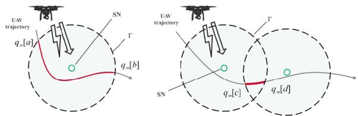  
Fig. 4. Velocity optimization for single SN and two adjacent SNs.

where $S _ { m a x }$ is the trajectory with the highest curvature in the iterative population. The energy consumption is normalized as

$$
E _ { n o r m } = \frac { E _ { m } ^ { u } } { \varepsilon }\tag{40}
$$

where $E _ { m } ^ { u }$ is the energy consumption, and  is on-board energy. We optimized the three metrics as a weighted sum (Fitness). The initial population is evaluated with the Fitness calculated from P2, followed by a constraint-based screening to eliminate invalid solutions by applying constraints (17), (18), (31), (32) and (33).

$$
F i t n e s s = w _ { 1 } L _ { n o r m } + w _ { 2 } S _ { n o r m } + w _ { 3 } E _ { n o r m }\tag{41}
$$

## D. Velocity Optimization (P3)

Under the trajectory $\{ { q _ { m } } ^ { * } \}$ , the trajectories during the communication between UAV and SNs are segmented via equation (18). As shown in Fig. 4, the trajectory of fly-only and fly-while-communication are shown for single SN and two adjacent SNs. The black dashed line is the maximum communication range of SNs, and the red line is the trajectory of UAV fly-while-communication with SNs. In the case of a single SN, the trajectory segment is throughout the entire communication range, and in the case of multiple SNs, the trajectory segment is taken to be cross-overlapping, so that multiple SNs are served at the same time, $q _ { m } [ a ]$ is the start point and $q _ { m } [ b ]$ is the end point.

The segmentation of the trajectories during communication is written as:

$$
D _ { | G _ { n } | } = q _ { | G _ { n } | } ^ { * } \left[ k + 1 \right] - q _ { | G _ { n } | } ^ { * } \left[ k \right]\tag{42}
$$

where $q _ { | G _ { n } | } ^ { * } [ k + 1 ]$ and $q _ { | G _ { n } | } ^ { * } \left[ k \right]$ are the position of the UAV at time $k + \mathrm { i }$ and $k ,$ respectively. $D _ { | G _ { n } | }$ is the communication trajectory distance for the n-th cluster, $\nu _ { | G _ { n } | }$ is the velocity under that cluster, and $T _ { | G _ { n } | } ^ { s }$ is the time for the fly-communication part of the trajectory.

$$
T _ { | G _ { n } | } ^ { s } \leq \frac { D _ { | G _ { n } | } } { \nu _ { | G _ { n } | } }\tag{43}
$$

The segmentation of the trajectories during only-fly is written as:

$$
D _ { | G _ { m } | } = q _ { | G _ { m } | } ^ { * } \left[ k + 1 \right] - q _ { | G _ { m } | } ^ { * } \left[ k \right]\tag{44}
$$

where $q _ { | G _ { m } | } ^ { * } [ k + 1 ]$ and $q _ { | G _ { m } | } ^ { * } \left[ k \right]$ are the position of the UAV at time $k { \mathord { + } } 1$ and $k ,$ respectively. $D _ { | G _ { m } | }$ is the distance of the m-th flight trajectory, $\nu _ { | G _ { m } | }$ is the velocity under that flight trajectory, and $T _ { | G _ { m } | } ^ { f }$ is the time for the fly-only part of trajectory.

$$
T _ { | G _ { m } | } ^ { f } \leq { \frac { D _ { | G _ { m } | } } { \nu _ { | G _ { m } | } } }\tag{45}
$$

TABLE II  
KEY SIMULATION PARAMETERS
<table><tr><td>The Notation</td><td>Physical Meaning</td><td>Value</td></tr><tr><td> $H$ </td><td>UAV height</td><td>5 m</td></tr><tr><td> $U _ { t i p }$ </td><td>UAV leaf tip velocity</td><td>100 m/s</td></tr><tr><td> $v _ { 0 }$ </td><td>Average induced rotor velocity in hover</td><td>4m/s</td></tr><tr><td> $d _ { \mathrm { 0 } }$ </td><td>UAV coefficient</td><td>0.6</td></tr><tr><td> $A$ </td><td>UAV wingspan</td><td>0.5 m</td></tr><tr><td> $\rho$ </td><td>Air density</td><td> $1 . 2 2 5 \mathrm { k g / m ^ { 3 } }$ </td></tr><tr><td> $B$ </td><td>Total channel bandwidth</td><td>1 MHZ</td></tr><tr><td> $\sigma ^ { 2 }$ </td><td>Noise power spectral density</td><td>-100 dbm</td></tr><tr><td> $P _ { t }$ </td><td>UAV transmission power</td><td>1 W</td></tr><tr><td> $P s$ </td><td>Population size</td><td>500</td></tr><tr><td> $M i$ </td><td>Maximum number of iterations</td><td>300</td></tr><tr><td> $C p$ </td><td>Crossover probability</td><td>0.8</td></tr><tr><td> $M p$ </td><td>Mutation probability</td><td>0.1</td></tr><tr><td> $w _ { 1 }$ </td><td>Trajectory Length Weighting Factor</td><td>0.5</td></tr><tr><td> $w _ { 2 }$ </td><td>Smoothness Weighting Factor</td><td>0.3</td></tr><tr><td> $w _ { 3 }$ </td><td>Energy consumption weighting factor</td><td>0.2</td></tr></table>

Problem (P3) is written as follows:

$$
\begin{array} { r l } & { ( \mathrm { P 3 } ) \colon \underset { \{ \nu _ { m } [ k ] \} } { \operatorname* { m i n } } \quad T _ { | G _ { m } | } ^ { f } + T _ { | G _ { n } | } ^ { s } } \\ & { \qquad \mathrm { s . t . ~ } ( 1 8 ) , ( 4 2 ) , ( 4 3 ) , ( 4 4 ) , ( 4 5 ) . } \end{array}
$$

By treating the inequality constraints (37) and (39) as equalities, subproblem P3 becomes a convex optimization problem. After solving (P3) above, the smoothing trajectory and related velocity are jointly optimized, and the optimal solutions $\{ \theta ^ { * } \}$ $\{ { q _ { m } } ^ { * } \}$ and $\{ { \nu _ { m } } ^ { * } \}$ are obtained.

## IV. SIMULATION RESULT

A UAV-enabled WSN with multiple SNs is considered, the SNs are distributed randomly within a two-dimensional plane of 1 km ×1 km. The UAV starts the task from $O _ { 1 }$ , traveling all other SNs and eventually returns to $O _ { 1 }$ . The parameters of system and the genetic algorithm, including population size, number of iterations, crossover probability, and mutation probability, are shown in Table II. The mutation operation is random two-point exchange, and the fitness function combines the path length, trajectory smoothness and energy consumption weighting to minimize.

## A. Basic Results

The trajectories of the UAV when communication demand $S _ { k }$ are at 1 Mbits and 30 Mbits after solving subproblems (P1) and (P2) are shown in Fig. 5. The SNs within the circle range of $D _ { t r }$ will be clustered as adjacent nodes, such as $O _ { 3 }$ and $O _ { 4 } .$ . The UAV communicates with SNs when the trajectories are within the circle range of $D _ { t r } .$ For a cluster of SNs, the UAV chooses to pass between the two SNs to balance the transmission eficiency and then get a shorter communication time. As the communication demand $S _ { k }$ increases, the flight radius increases, and the UAV chooses to move closer to the SNs or even passes over some SNs to get a better channel gain. With the trajectories above, the velocities of the UAV are obtain by solving subproblem (P3), it is shown in Fig. 6.

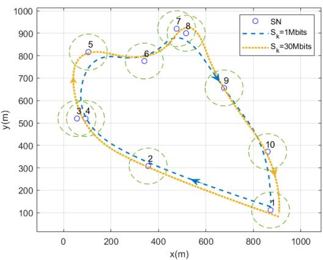  
Fig. 5. The trajectory projection of proposed method in diferent communication demands: with higher demand, the trajectory is closer to the SN for communication.

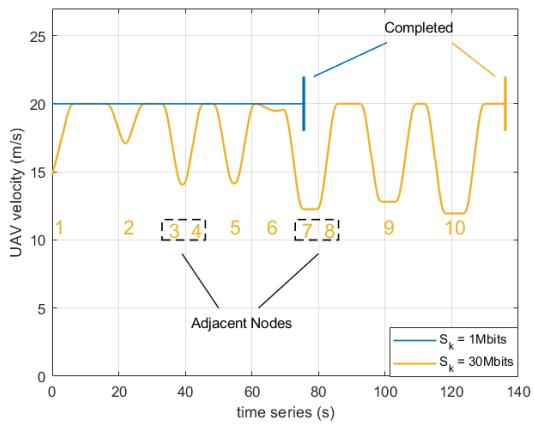  
Fig. 6. The UAV velocity of proposed method in diferent communication demands: with higher demand, UAV reduces its velocity to meet it.

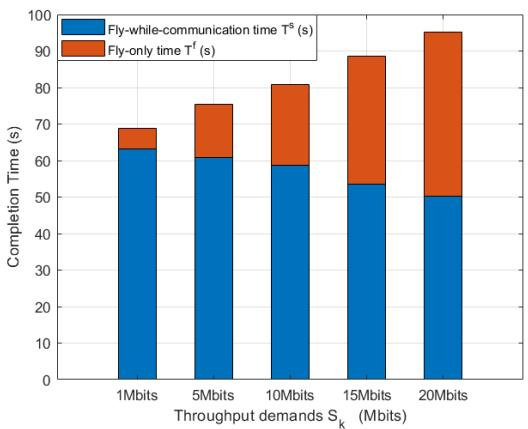  
Fig. 7. The fly-only time $T ^ { f }$ and the fly-while-communication time $T ^ { s }$ for diferent throughput demands: with higher demand, the higher the percentage of communication time.

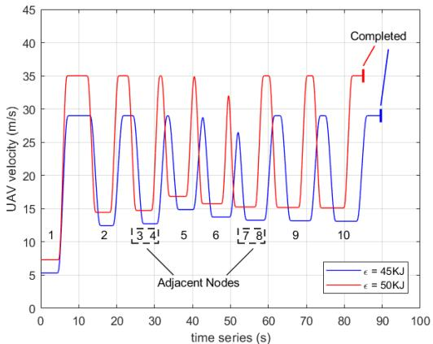

Fig. 8. With diferent on-board energies, flight velocity changes with time series: higher onboard energy, higher velocity.  
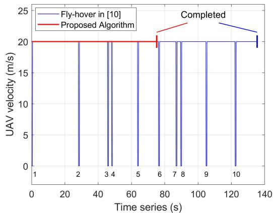  
Fig. 9. $S _ { k } ~ = ~ 5$ Mbits, UAV flight velocity changes with time series, in diferent algorithms: higher velocity, longer high-velocity flight time, and shorter completion time.

When the communication demand is lower, the velocity of the UAV is more stable and faster, which results in shorter completion times. When the communication demand is higher, the UAV reduces its velocity to meet the demand, which results in a longer task completion time. In Fig. 7, the task completion time $T ,$ the fly-only time $T ^ { f }$ , and the fly-whilecommunication $T ^ { s }$ in diferent communication demands $S _ { k }$ are shown. When the $S _ { k }$ is 1 Mbits, $T ^ { f }$ occupies most part of $T .$ With the increase of $S _ { k } ,$ the task completion time increases. The percentage of $T ^ { s }$ becomes higher, while the percentage of $T ^ { f }$ becomes less, as the UAV allocates more time for communication. In Fig. 8, the velocity of the UAV and the task completion time for $S _ { k } ~ = 1 5$ Mbits are shown. It can be observed that the proposed algorithm adjusts the velocity of the UAV with the on-board energy constraint. After the SNs are clustered, adjacent nodes, such as $O _ { 3 }$ and $O _ { 4 } , O _ { 7 }$ and $O _ { 8 } .$ , will be communicated together to reduce task complection time. With a higher on-board energy , the average velocity of the UAV increases, and then the task completion time is shorter.

## B. Algorithms Comparison

First, the proposed method is compared with the fly-hovercommunication method proposed in [10]. Fig. 9 and Fig. 10 show the communication time of SNs and the velocity of UAV at $S _ { k } ~ = 5$ Mbits, respectively. In the fly-hover-communication scheme, the UAV hovers over SN with a velocity equal to zero and fulfills communication demand within a short time slot, which is represented by the blue solid line. In the fly-whilecommunication scheme, the UAV communicates with SN at a longer time slot, and the velocity is constant. As a result, the task completion time of the proposed method is shorter than it of [10]. Fig. 11 and Fig. 12 show the communication time of SNs and the velocity of UAV at $S _ { k } ~ = 3 0 ~ \mathrm { M b i t s }$ , respectively. Compared to the fly-hover-communication scheme, the UAV communicates with SN with a longer time slot and keeps the velocity higher in the fly-while-communication scheme. $O _ { 3 } , O _ { 4 }$ and $O _ { 7 } { , } O _ { 8 }$ are two adjacent groups. At a higher $S _ { k } ,$ the UAV of the proposed method still maintains a high velocity, while it of [10] takes more time for hovering status. In Fig. 10, the communication time of SN under the algorithm of [10] increases significantly while it of the proposed algorithm remains stable. The proposed method has good communication utilization and high velocity for tasks with both high and low communication demands, and then the completion time is shorter.

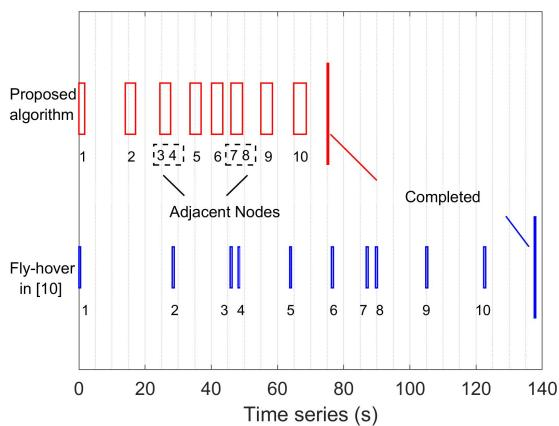  
Fig. 10. $S _ { k } ~ = 5$ Mbits, UAV communication time changes with time series, in diferent algorithms: longer communication time.

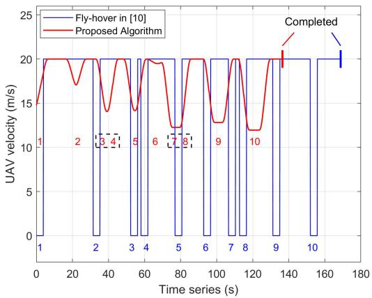  
Fig. 11. $S _ { k } ~ = 3 0$ Mbits, UAV flight velocity changes with time series, in diferent methods: fewer starts and stops, more consistent velocity, shorter completion time.

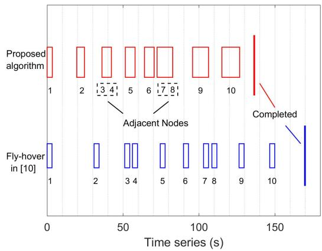  
Fig. 12. $S _ { k } ~ = ~ 3 0$ Mbits, UAV communication time changes with time series, in diferent method: higher percentage of communication time, shorter completion time.

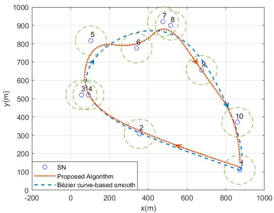  
Fig. 13. Trajectory projection of proposed method and Bezier curve-based´ smoothing: better trajectory adaptation.

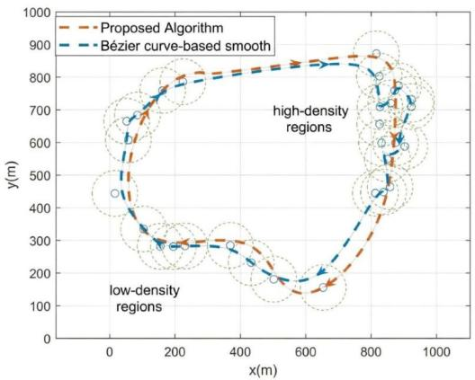  
Fig. 14. Diferent density distributions, the proposed method produces trajectory projections and Bezier curve-based smoothing that are smoother´ and more adaptative.

Fig. 13 and Fig. 14 show the comparison between the proposed method and Bezier curve-based smoothing method at´ $S _ { k } ~ = 1 0 ~ \mathrm { M b i t s }$ , respectively. Bezier curve-based trajectory is´ farther away from the nodes, which brings longer transmission time. The flight distance based on the proposed algorithm is a little longer than it is based on Bezier curve-based´ smoothing, but it is closer to the nodes so as to have a shorter communication time. Bezier curves are globally influenced by´ all control points, while B-splines ofer local control, providing advantages for fine-tuning UAV trajectories. Mathematically, B-splines inherently ensure continuity of first and second derivatives, making them superior to Bezier curves for smooth´ turning. In Fig. 15, the proposed algorithm converges faster than Bezier curve-based smoothing, and the task completion´ time of the proposed algorithm is better than that of Bezier´ curve-based smoothing.

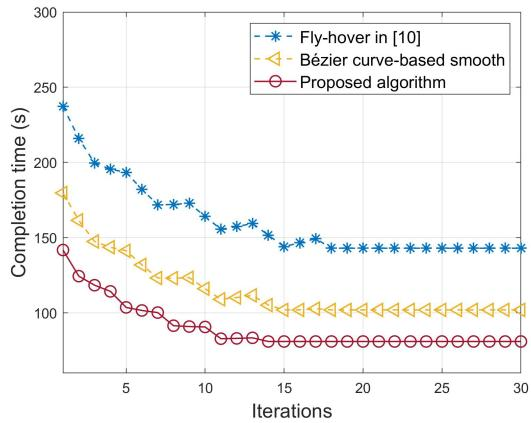  
Fig. 15. The comparison of convergence velocity between the proposed method and Bezier curve-based smoothing: faster convergence, better con-´ vergence results.

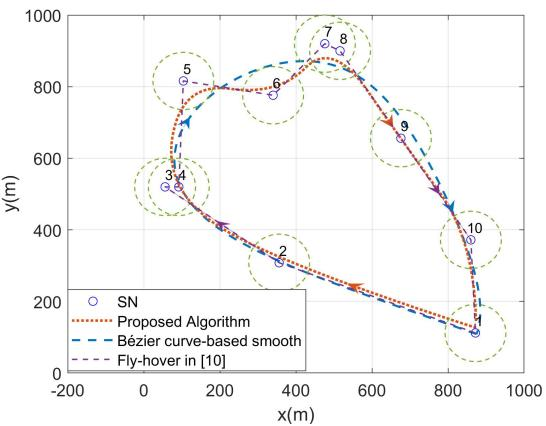  
Fig. 16. The trajectory projection of the proposed method and benchmarks.

The comparison of trajectory projection between the proposed method and benchmarks at $\begin{array} { r l r } { S _ { k } } & { { } = } & { 1 0 } \end{array}$ Mbits are shown in Fig. 16. The proposed method has better balance between trajectory smoothness and adaptability than the benchmark scheme. In $O _ { 5 } , ~ O _ { 6 } , ~ O _ { 7 }$ and $O _ { 8 }$ local area, the proposed method has better trajectory fitting performance, resulting in better channels and lower energy consumption. Fig. 17 shows the comparison among [10], Bezier curve-based´ smoothing method, and the proposed method at four diferent $S _ { k } .$ The completion time of the fly-hover-communication method is longer, and of the fly-while-communication methods, such as the Bezier curve-based method and the proposed´ method is short. The proposed method outperforms the benchmark schemes in minimizing the task completion time. When $S _ { k }$ increases, the increase of completion time at fly-hover-communication scheme is relatively less, as the flight time remaines constant and the hovering time increases $S _ { k }$ With $S _ { k }$ increasing, the limitation of Bezier curve-based trajec-´ tory is obvious. The task completion time is highly influenced by $S _ { k }$ , which leads to a sharp increase of completion time and excellent trajectory smoothing. For the proposed algorithm, at both high and low $S _ { k } ,$ the time can be reduced by adjusting the trajectory and task velocity. Because of the excellent smoothing and local adjustability, it has excellent performance for meeting various needs of nodes.

TABLE III  
COMPARISON OF TRAJECTORY PLANNING COMPLEXITY UNDER DIFFERENT NUMBERS OF NODES
<table><tr><td>Numbers of nodes n</td><td>Bézier curves  $O ( m \cdot n ^ { 2 } )$ </td><td>Proposed algorithm  $O ( m \cdot ( k + \log _ { 2 } n ) )$ </td><td>Fly-hover O(n)</td></tr><tr><td>5</td><td>2,500</td><td>721</td><td>5</td></tr><tr><td>10</td><td>10,000</td><td>1,331</td><td>10</td></tr><tr><td>20</td><td>40,000</td><td>1,964</td><td>20</td></tr><tr><td>50</td><td>250,000</td><td>2,643</td><td>50</td></tr><tr><td>100</td><td>1,000,000</td><td>3,321</td><td>100</td></tr><tr><td>200</td><td>4,000,000</td><td>4,000</td><td>200</td></tr></table>

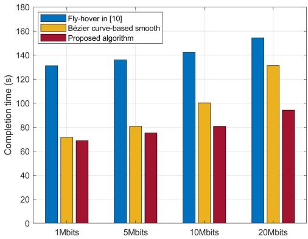  
Fig. 17. Comparison of task completion time, diferent algorithms and diferent energy demands: various demands, shorter completion times.

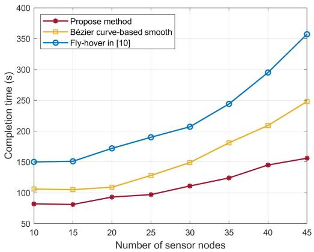  
Fig. 18. Comparison of task completion time, diferent algorithms and diferent energy demands: various demands, shorter completion times.

Fig. 18 shows that as the number of nodes increases, the completion times of all three methods rise, reflecting that the task volume and path complexity increase with the increase of nodes. The propose method has the slowest growth and the best performance. Especially when the nodes are dense, it is significantly superior to the Fly-hover and Bezier methods.´ The computational complexity of Bezier curves is primarily´ influenced by their global nature, with each sample point requiring $O ( n ^ { 2 } )$ operations. The overall complexity is $O ( m \cdot n ^ { 2 } )$ making them ineficient when the number of control points is large. In contrast, the proposed algorithm exhibits good locality, requiring at most k non-zero basis functions per node. Their pointwise complexity is $O ( k + \log n )$ , which leads to a total complexity of $O ( m \cdot ( k + \log n ) )$ . The fly-hover method simply connects nodes linearly without interpolation, with a complexity of O(n). The computational complexity is shown in Table III.

## V. CONCLUSION

This paper minimizes the task completion time by optimizing the trajectory and velocity of an energy-limited UAV. A joint trajectory and velocity optimization framework in a flywhile-communication scheme is proposed to decompose the complex task completion time minimization problem into three subproblems: cluster heads selection and sorting (P1), smooth trajectory planning (P2), and velocity optimization (P3). First, the visiting order of clustered heads is obtained. Second, the trajectory of the UAV is achieved via B-spline method. Finally, the velocity of the UAV is optimized to meet communication demand constraints and the UAV energy consumption constraints. Simulation results indicate the proposed algorithm allocates required fly-while-communication time and adjusts the velocity during communication to meet diferent communication demands. The proposed method outperforms existing benchmarks, such as the fly-hover-communication method and the Bezier curve-based method, on minimization of task´ completion time. In terms of task completion time, the proposed algorithm is 43% shorter than fly-hover-communication method on average and 15% shorter than Bezier curve-based´ method. The hardware constraints of a single UAV limit its operational eficiency, making the collaborative parallelization of multiple UAVs [41] an efective means to reduce overall mission time. The dynamic allocation of tasks and real-time adjustment of trajectories thus become crucial for managing operations in complex and dynamic environments.

## REFERENCES

[1] X. Zhang, H.-X. Li, and H. S.-H. Chung, “Setup-independent UHF RFID sensing technique using multidimensional diferential measurement,” IEEE Internet Things J., vol. 8, no. 13, pp. 10509–10517, Jul. 2021.

[2] J. Guo, S. Yang, Z. Yang, L. Lei, and X. Zhang, “Energybalanced path optimization of UAV-assisted wireless power and information system,” Wireless Netw., vol. 28, no. 5, pp. 2047–2059, Jul. 2022.

[3] B. Zhu, E. Bedeer, H. H. Nguyen, R. Barton, and J. Henry, “UAV trajectory planning in wireless sensor networks for energy consumption minimization by deep reinforcement learning,” IEEE Trans. Veh. Technol., vol. 70, no. 9, pp. 9540–9554, Sep. 2021.

[4] H.-T. Ye, X. Kang, J. Joung, and Y.-C. Liang, “Optimization for wireless-powered IoT networks enabled by an energy-limited UAV under practical energy consumption model,” IEEE Wireless Commun. Lett., vol. 10, no. 3, pp. 567–571, Mar. 2021.

[5] C. Zhan and Y. Zeng, “Energy minimization for cellular-connected UAV: From optimization to deep reinforcement learning,” IEEE Trans. Wireless Commun., vol. 21, no. 7, pp. 5541–5555, Jul. 2022.

[6] H. Li and X. Zhao, “Throughput maximization with energy harvesting in UAV-assisted cognitive mobile relay networks,” IEEE Trans. Cognit. Commun. Netw., vol. 7, no. 1, pp. 197–209, Mar. 2021.

[7] D. Ma, Z. Feng, and Y. Qin, “Optimization of throughput maximization of UAV as mobile relay communication system,” in Proc. Int. Conf. Virtual Reality Intell. Syst. (ICVRIS), Jul. 2020, pp. 798–801.

[8] X. Guo, B. Li, J. Cong, and R. Zhang, “Throughput maximization in a UAV-enabled two-way relaying system with multi-pair users,” IEEE Commun. Lett., vol. 25, no. 8, pp. 2693–2697, Aug. 2021.

[9] Z. Wang, G. Zhang, Q. Wang, K. Wang, and K. Yang, “Completion time minimization in wireless-powered UAV-assisted data collection system,” IEEE Commun. Lett., vol. 25, no. 6, pp. 1954–1958, Jun. 2021.

[10] C. Zhan and Y. Zeng, “Completion time minimization for multi-UAV-enabled data collection,” IEEE Trans. Wireless Commun., vol. 18, no. 10, pp. 4859–4872, Oct. 2019.

[11] S. Zhang, W. Liu, and N. Ansari, “Completion time minimization for data collection in a UAV-enabled IoT network: A deep reinforcement learning approach,” IEEE Trans. Veh. Technol., vol. 72, no. 11, pp. 14734–14742, Nov. 2023.

[12] Y. Zeng, J. Xu, and R. Zhang, “Energy minimization for wireless communication with rotary-wing UAV,” IEEE Trans. Wireless Commun., vol. 18, no. 4, pp. 2329–2345, Apr. 2019.

[13] Z. He et al., “Energy minimization for UAV-enabled wireless power transfer and relay networks,” IEEE Internet Things J., vol. 10, no. 21, pp. 19141–19152, Nov. 2023.

[14] X. Yuan, Y. Hu, J. Zhang, and A. Schmeink, “Joint user scheduling and UAV trajectory design on completion time minimization for UAVaided data collection,” IEEE Trans. Wireless Commun., vol. 22, no. 6, pp. 3884–3898, Jun. 2023.

[15] R. Chai, Y. Gao, R. Sun, L. Zhao, and Q. Chen, “Time-oriented joint clustering and UAV trajectory planning in UAV-assisted WSNs: Leveraging parallel transmission and variable velocity scheme,” IEEE Trans. Intell. Transp. Syst., vol. 24, no. 11, pp. 12092–12106, Nov. 2023.

[16] T. Shafique, H. Tabassum, and E. Hossain, “End-to-end energy-eficiency and reliability of UAV-assisted wireless data ferrying,” IEEE Trans. Commun., vol. 68, no. 3, pp. 1822–1837, Mar. 2020.

[17] C. Hao, Y. Chen, Z. Mai, G. Chen, and M. Yang, “Joint optimization on trajectory, transmission and time for efective data acquisition in UAVenabled IoT,” IEEE Trans. Veh. Technol., vol. 71, no. 7, pp. 7371–7384, Jul. 2022.

[18] S. T. Muntaha, S. A. Hassan, H. Jung, and M. S. Hossain, “Energy eficiency and hover time optimization in UAV-based HetNets,” IEEE Trans. Intell. Transp. Syst., vol. 22, no. 8, pp. 5103–5111, Aug. 2021.

[19] J. Faigl and P. Va´ea, “Surveillance planning with B ˇ ezier curves,” ´ IEEE Robot. Autom. Lett., vol. 3, no. 2, pp. 750–757, Feb. 2018.

[20] M. Qi, L. Dou, and B. Xin, “3D smooth trajectory planning for UAVs under navigation relayed by multiple stations using Bezier curves,”´ Electronics, vol. 12, no. 11, p. 2358, May 2023.

[21] L. Wang and Y. Guo, “Speed adaptive robot trajectory generation based on derivative property of B-spline curve,” IEEE Robot. Autom. Lett., vol. 8, no. 4, pp. 1905–1911, Apr. 2023.

[22] H. Wang, J. Wang, G. Ding, J. Chen, and J. Yang, “Completion time minimization for turning angle-constrained UAV-to-UAV communications,” IEEE Trans. Veh. Technol., vol. 69, no. 4, pp. 4569–4574, Apr. 2020.

[23] H. Shi et al., “Trajectory optimization for UAV-assisted communications based on hierarchical reinforcement learning,” IEEE Sensors J., vol. 25, no. 21, pp. 40820–40833, Nov. 2025.

[24] C. Kheireddine, A. Yassine, S. Fawzi, and M. Khalil, “A robust synergetic controller for quadrotor obstacle avoidance using Bezier curve´ versus B-spline trajectory generation,” Intell. Service Robot., vol. 15, no. 1, pp. 143–152, Mar. 2022.

[25] J. Tordesillas and J. P. How, “MADER: Trajectory planner in multiagent and dynamic environments,” IEEE Trans. Robot., vol. 38, no. 1, pp. 463–476, Feb. 2022.

[26] B. Li, Q. Li, Y. Zeng, Y. Rong, and R. Zhang, “3D trajectory optimization for energy-eficient UAV communication: A control design perspective,” IEEE Trans. Wireless Commun., vol. 21, no. 6, pp. 4579–4593, Jun. 2022.

[27] C. Zhan, H. Hu, X. Sui, Z. Liu, and D. Niyato, “Completion time and energy optimization in the UAV-enabled mobile-edge computing system,” IEEE Internet Things J., vol. 7, no. 8, pp. 7808–7822, Aug. 2020.

[28] Y. Xu, T. Zhang, J. Loo, D. Yang, and L. Xiao, “Completion time minimization for UAV-assisted mobile-edge computing systems,” IEEE Trans. Veh. Technol., vol. 70, no. 11, pp. 12253–12259, Nov. 2021.

[29] Y. Zeng, X. Xu, and R. Zhang, “Trajectory design for completion time minimization in UAV-enabled multicasting,” IEEE Trans. Wireless Commun., vol. 17, no. 4, pp. 2233–2246, Apr. 2018.

[30] Y. Emami, B. Wei, K. Li, W. Ni, and E. Tovar, “Joint communication scheduling and velocity control in multi-UAV-assisted sensor networks: A deep reinforcement learning approach,” IEEE Trans. Veh. Technol., vol. 70, no. 10, pp. 10986–10998, Oct. 2021.

[31] J. Li et al., “Joint optimization on trajectory, altitude, velocity, and link scheduling for minimum mission time in UAV-aided data collection,” IEEE Internet Things J., vol. 7, no. 2, pp. 1464–1475, Feb. 2020.

[32] C. Zhan and Y. Zeng, “Aerial–ground cost tradeof for multi-UAVenabled data collection in wireless sensor networks,” IEEE Trans. Commun., vol. 68, no. 3, pp. 1937–1950, Mar. 2020.

[33] M. Li, S. He, and H. Li, “Minimizing mission completion time of UAVs by jointly optimizing the flight and data collection trajectory in UAV-enabled WSNs,” IEEE Internet Things J., vol. 9, no. 15, pp. 13498–13510, Aug. 2022.

[34] L. Xie, X. Cao, J. Xu, and R. Zhang, “UAV-enabled wireless power transfer: A tutorial overview,” IEEE Trans. Green Commun. Netw., vol. 5, no. 4, pp. 2042–2064, Dec. 2021.

[35] Z. Liu, X. Liu, V. C. M. Leung, and T. S. Durrani, “Energy-eficient resource allocation for dual-NOMA-UAV assisted Internet of Things,” IEEE Trans. Veh. Technol., vol. 72, no. 3, pp. 3532–3543, Mar. 2023.

[36] D. Khan et al., “An eficient reconfigurable RF-DC converter with wide input power range for RF energy harvesting,” IEEE Access, vol. 8, pp. 79310–79318, 2020.

[37] Y. Wang, G. Sun, G. Yang, and X. Ding, “XgBoosted neighbor referring in low-duty-cycle wireless sensor networks,” IEEE Internet Things J., vol. 8, no. 5, pp. 3446–3461, Mar. 2021.

[38] L. Liu, X. Wang, X. Yang, H. Liu, J. Li, and P. Wang, “Path planning techniques for mobile robots: Review and prospect,” Expert Syst. Appl., vol. 227, Oct. 2023, Art. no. 120254. [Online]. Available: https:// www.sciencedirect.com/science/article/pii/S095741742300756X

[39] K. Qin, “General matrix representations for B-splines,” in Proc. 6th Pacific Conf. Comput. Graph. Appl., May 1998, pp. 37–43.

[40] J. Gu, H. Wang, G. Ding, Y. Xu, Z. Xue, and H. Zhou, “Energyconstrained completion time minimization in UAV-enabled Internet of Things,” IEEE Internet Things J., vol. 7, no. 6, pp. 5491–5503, Jun. 2020.

[41] J. Chen, X. Li, B. Cai, J. He, Y. Ma, and J. Liu, “A reinforcementlearning-based energy charging strategy for agricultural Internet of Things with multi-UAV-assisted WRSN,” IEEE Internet Things J., vol. 12, no. 23, pp. 49022–49035, Dec. 2025.

Jing Guo received the Ph.D. degree in control theory and control engineering from Zhejiang University, Hangzhou, China, in 2011. In 2011, she was an Assistant Researcher in Shenzhen, China. In 2012, she joined Foshan University, China, where she is currently an Associate Professor with the Department of Automation. From 2017 to 2018, she was a Guest Researcher with the Engineering and Technology Institute Groningen, University of Groningen. Her research interests include control of multi-agent and network systems, distributed decision-making and coordination, wireless networks, and cooperation optimization.

  
Feihang Qiu received the B.E. degree in automation and the M.E. degree in control engineering from Foshan University, Foshan, China, in 2022 and 2025, respectively. His research interests include UAV trajectory planning and robotics control.

Lei Lei (Member, IEEE) received the B.E. degree in naval architecture and ocean engineering from Harbin Engineering University, Harbin, China, in 2016, the M.E. degree in mechanical engineering from the Huazhong University of Science and Engineering, Wuhan, China, in 2019, and the Ph.D. degree in systems engineering from The City University of Hong Kong, Hong Kong, in 2024. He is currently a Post-Doctoral Fellow with the Department of Mechanical and Automation Engineering, The Chinese University of Hong Kong. His research interests include underwater robots, ocean big data, and robotics learning and control.

Xu Zhang (Member, IEEE) received the B.E. degree in communication engineering from the University of Electronic Science and Technology of China, Chengdu, China, in 2006, the M.E. degree in electromagnetic field and microwave technology from Beijing University of Posts and Telecommunications, Beijing, China, in 2009, and the Ph.D. degrees from Central South University, Changsha, China, and The City University of Hong Kong, Hong Kong. He is currently a Research Assistant Professor with the School of Automation and Intelligent Manufacturing, Southern University of Science and Technology, China. His current research interests include radio frequency identification, smart sensing, and the Internet of Things.