# Joint Power and Trajectory Optimization for UAV-Enabled ISAC SAR Imaging

Xianglong Lv , Student Member, IEEE, Rongke Liu , Senior Member, IEEE, Quanyu Meng , and Yunshuo Zang

Abstract—Integrated sensing and communication (ISAC) and uncrewed aerial vehicle (UAV) technologies are developing rapidly. UAV-based ISAC technology can enhance various communication-assisted sensing applications, such as synthetic aperture radar (SAR) imaging. However, in the current research on UAV SAR imaging optimizations, the system model does not fully represent real scenarios, and the performance of nonconvex optimization algorithms is unsatisfactory. In this paper, we propose a joint power and trajectory optimization method for a UAV-enabled ISAC SAR imaging system. First, we propose a comprehensive system model that considers realistic scenarios. The adjustable mission duration, 2-D resolution, and resolution fairness are included. Then we form the optimization problem, decompose it into a two-layer optimization, and propose a twolayer successive programming (TLSP) method to solve it. In the first layer, we optimize the communication parts subject to the complex motion and communication constraints with a gradientbased sequential quadratic programming (SQP) method. In the second layer, we modify the stochastic model-based Bayesian optimization method to handle optimization incorporating highly nonconvex sensing metrics. Simulations demonstrate that the TLSP method can achieve at least 27.41% performance improvement compared to baseline methods and maintain optimal energy consumption and resolution fairness with a different emphasis on energy versus sensing.

Index Terms—Integrated sensing and communication (ISAC), uncrewed aerial vehicle (UAV), synthetic aperture radar (SAR), power and trajectory optimization.

## I. INTRODUCTION

## A. Motivations & Related Work

ogy, future beyond 5G and 6G communication systems are envisioned to transcend communication-only scenarios by integrating sensing functionality as a basic service [1], [2]. Therefore, integrated sensing and communication (ISAC)

technology has attracted significant attention [3]. ISAC brings mutual performance improvements through spectrum sharing, hardware co-design, joint signal processing, and information fusion [4], [5]. Inspired by the coordination gains enabled by ISAC technology, communication-assisted sensing has attracted significant attention in recent years [6], [7].

Meanwhile, the high mobility, portable deployment, and low-cost characteristics of rapidly developing uncrewed aerial vehicles (UAVs) bring great advantages for the application of ISAC [8]. For example, the mobility of UAVs can extend the coverage of sensing and provide more flexible observational perspectives to enhance sensing accuracy. Besides, the ISAC technology can also reduce the UAV load weight and release spectrum congestion [9]. Therefore, the UAV-enabled ISAC is garnering increasing attention [10]. The UAV-enabled ISAC can provide various communication-assisted sensing services, especially the synthetic aperture radar (SAR) imaging [11], [12]. Using the synthetic aperture techniques, we can integrate a series of consecutive observations from different positions to obtain a better spatial resolution [13]. This method can further exploit UAV mobility to improve sensing accuracy compared with conventional sensing methods, and can support various applications such as surveillance, disaster management, geographical mapping, etc [8], [14].

As the energy resources on the UAV are limited, and the position can significantly affect both communication and sensing performance, optimizing the power and trajectory of the UAV becomes an important but challenging research direction [9], [15]. There has been some research considering the power and trajectory optimization of UAV sensing missions [16], [17], [18]. A geostationary-Earth-orbit (GEO) illuminator and UAV cooperated bistatic SAR imaging system is proposed in [19], and a path planning method based on differential evolution (DE) is proposed to solve a multiobjective optimization that considers energy consumption, sensing performance, and data transmission. A UAV navigation method is proposed in [20] to guarantee the imaging resolution of a moving target. A multistatic UAV SAR imaging system is proposed in [21], and the trajectory is optimized with a heuristic path optimization method. The coexistence of UAV monostatic SAR imaging and aerial communication service for user equipment (UE) is considered in [22], and the author proposed a joint user scheduling, power allocation, and trajectory design method based on successive convex approximation (SCA) and block coordinate descent (BCD). In [23], the author proposed an ISAC system that employs a base station (BS) and a UAV for imaging, and adopted the SCA and BCD to get the optimal trajectory and power allocation. In [24], the author proposed a bistatic SAR imaging and data uploading system with a BS and a UAV, along with an SCA method to minimize the UAV energy consumption.

TABLE I  
COMPARISON WITH SEVERAL RELATED WORKS
<table><tr><td rowspan=1 colspan=1>Refer-ence</td><td rowspan=1 colspan=1>Optimization objective</td><td rowspan=1 colspan=1>ISAC scheme</td><td rowspan=1 colspan=1>Communicationmodel</td><td rowspan=1 colspan=1>Sensing metrics</td><td rowspan=1 colspan=1>Energy consumptionmodel</td><td rowspan=1 colspan=1>Missionduration</td><td rowspan=1 colspan=1>Algorithm</td></tr><tr><td rowspan=1 colspan=1>[19]</td><td rowspan=1 colspan=1>Multi-objective with navigation,sensing performance, and datatransmission</td><td rowspan=1 colspan=1>Separatedcommunication andsensing subsystem</td><td rowspan=1 colspan=1>UAV-BS sensingdata uploading</td><td rowspan=1 colspan=1>2D resolutionevaluator</td><td rowspan=1 colspan=1>Propulsion power</td><td rowspan=1 colspan=1></td><td rowspan=1 colspan=1>Heuristic algorithm:EMOEA-KnGS</td></tr><tr><td rowspan=1 colspan=1>[20]</td><td rowspan=1 colspan=1>UAV navigation</td><td rowspan=1 colspan=1>Communicationassisted sensing</td><td rowspan=1 colspan=1></td><td rowspan=1 colspan=1>Separated rangeand azimuthresolution</td><td rowspan=1 colspan=1></td><td rowspan=1 colspan=1>Fixed</td><td rowspan=1 colspan=1>UAV navigation law</td></tr><tr><td rowspan=1 colspan=1>[21]</td><td rowspan=1 colspan=1>Multi-objective with navigationand resolution</td><td rowspan=1 colspan=1></td><td rowspan=1 colspan=1></td><td rowspan=1 colspan=1>Azimuthresolution</td><td rowspan=1 colspan=1>Trajectory length</td><td rowspan=1 colspan=1></td><td rowspan=1 colspan=1>Heuristic search</td></tr><tr><td rowspan=1 colspan=1>[22]</td><td rowspan=1 colspan=1>Minimum user throughput andsum throughput</td><td rowspan=1 colspan=1>Separatedcommunication andsensing subsystem</td><td rowspan=1 colspan=1>UAV-UEcommunicationservice</td><td rowspan=1 colspan=1>Azimuthresolution</td><td rowspan=1 colspan=1>Communication power</td><td rowspan=1 colspan=1>Fixed</td><td rowspan=1 colspan=1>Gradient basedalgorithm: SCA +BCD</td></tr><tr><td rowspan=1 colspan=1>[23]</td><td rowspan=1 colspan=1>Energy consumption</td><td rowspan=1 colspan=1>Communicationassisted sensing</td><td rowspan=1 colspan=1></td><td rowspan=1 colspan=1>Separated rangeand azimuthresolution</td><td rowspan=1 colspan=1>Propulsion power</td><td rowspan=1 colspan=1>Fixed</td><td rowspan=1 colspan=1>Gradient basedalgorithm: SCA +BCD</td></tr><tr><td rowspan=1 colspan=1>[24]</td><td rowspan=1 colspan=1>Energy consumption</td><td rowspan=1 colspan=1>Communicationassisted sensing</td><td rowspan=1 colspan=1>UAV-BS sensingdata uploading</td><td rowspan=1 colspan=1>Separated rangeand azimuthresolution</td><td rowspan=1 colspan=1>Propulsion andcommunication power</td><td rowspan=1 colspan=1>Fixed</td><td rowspan=1 colspan=1>Gradient basedalgorithm: SCA</td></tr><tr><td rowspan=1 colspan=1>Ourwork</td><td rowspan=1 colspan=1>Energy consumption andsensing performance withtradeoff</td><td rowspan=1 colspan=1>Communicationassisted sensing</td><td rowspan=1 colspan=1>UAV-BS sensingdata uploading</td><td rowspan=1 colspan=1>2D resolutionwith resolutionfairness</td><td rowspan=1 colspan=1>Propulsion, dataprocessing, andcommunication power</td><td rowspan=1 colspan=1>Adjustable</td><td rowspan=1 colspan=1>Gradient and stochasticmodel based algorithm:TLSP</td></tr></table>

However, there are still two issues to be addressed in the current work. Firstly, the system model needs further refinements to address the system characteristics under the ISAC scheme and realistic scenarios. For example, the ISAC scheme is not considered in [21], and is not fully addressed in [19] and [22] as the UAV uses two separate systems for imaging and data transmission. In [20] and [23], although the communicationassist-sensing scenario is considered, the communication part is not taken into consideration. The comprehensive energy consumption model that includes propulsion, communication, and sensing data processing power is not considered in these works. In [20], [21], [22], [23], and [24], the 2D resolution that incorporates both range and azimuth resolution, and the angle between them, is not considered. Furthermore, all of the research above has not considered the adjustable mission duration of the UAV, which brings defects for energy efficiency optimization and is not realistic in practice. Secondly, the optimization method should be improved to address more complex scenarios. The heuristic methods, such as DE and Particle Swarm Optimization (PSO), struggle to handle complex constraints. Therefore, their feasibility in problems with high dimensions and complex nonconvex constraints is limited. The gradient-based methods, such as the SCA, approximate the model with convex problems and use the convex optimization algorithms to successively solve them. These methods are sensitive to the nonconvexity of the original problem and usually fall in suboptimal points for highly nonconvex cases. As a result, a comprehensive system model and an algorithm that can deal with complex nonconvex optimizations are required.

## B. Contributions

Motivated by the above issues, we propose a general UAVenabled ISAC SAR imaging system model and a two-layer successive programming (TLSP) method for the joint power and trajectory optimization of the UAV. The comparison between our work and the related works is shown in Table I. Here the notation ’-’ implies that this item is not mentioned in the corresponding work. The main contributions of our work are summarized as follows.

Firstly, we comprehensively consider practical scenarios and propose a BS and UAV cooperative ISAC SAR imaging system model. Specifically, the UAV collects the reflected downlink signals from the area and uploads sensing data to the BS for SAR imaging during the mission. The ISAC scheme and communication-sensing relations are considered through the communication-assisted sensing design. The 2D resolution and the resolution fairness are considered to better evaluate the sensing performance. We also model the duration of the task as a variable to enhance the adaptability of optimization and make it more realistic. In the optimization problem, a hyperparameter is introduced to adjust the emphasis on energy consumption versus sensing performance.

Secondly, we propose a two-layer successive programming (TLSP) algorithm that combines gradient and stochastic-based principles to optimize the UAV power and trajectory. By segmenting the trajectory, we decompose the objective function and constraints, transforming the original problem into a two-layer optimization. In the first layer, we use a sequential quadratic programming (SQP) based method to handle the complex motion and communication constraints. In the second layer, we use a modified Bayesian optimization method to deal with nonconvex sensing metrics. We employ multi-start, nonoptimal descent, and correlation-based point selection methods to enhance algorithm performance.

• Finally, we conduct extensive simulations to evaluate the performance and behavior of the proposed TLSP algorithm. The TLSP algorithm can stably converge in different scenarios, and hyperparameter adjustments can effectively adjust its focus between sensing performance and energy consumption. In the comparison with multiple baseline algorithms, the TLSP algorithm shows at least 27.41% optimization performance improvement, while maintaining optimal energy consumption and resolution fairness under different hyperparameter settings.

TABLE II  
DEFINITION OF IMPORTANT NOTATIONS
<table><tr><td rowspan=1 colspan=1>Notation</td><td rowspan=1 colspan=1>Definition</td></tr><tr><td rowspan=1 colspan=1>fmission</td><td rowspan=1 colspan=1>Optimization objective function</td></tr><tr><td rowspan=1 colspan=1>Qsens , Psens</td><td rowspan=1 colspan=1>Sensing performance function and its weight</td></tr><tr><td rowspan=1 colspan=1> $\overline { { M } }$ </td><td rowspan=1 colspan=1>Number of sensing tasks</td></tr><tr><td rowspan=1 colspan=1> $\overline { { E _ { c } ^ { m } } }$ </td><td rowspan=1 colspan=1>Energy consumption of m-th communication segment</td></tr><tr><td rowspan=1 colspan=1> $\frac { \omega } { E _ { s } ^ { m } }$ </td><td rowspan=1 colspan=1>Energy consumption of m-th sensing segment</td></tr><tr><td rowspan=1 colspan=1> $\overline { { S _ { c } , S _ { r } } }$ </td><td rowspan=1 colspan=1>Parameter sets for communication and sensing</td></tr><tr><td rowspan=1 colspan=1> $\mathbf { r } _ { a } ^ { i }$ </td><td rowspan=1 colspan=1>The i-th sensing area center</td></tr><tr><td rowspan=1 colspan=1> $\overline { { P _ { \mathrm { f l y } } } }$ </td><td rowspan=1 colspan=1>UAV propulsion power</td></tr><tr><td rowspan=1 colspan=1> $\overline { { A _ { \mathrm { r e s } } ^ { m } , A _ { 0 } } }$ </td><td rowspan=1 colspan=1>Resolution of m-th sensing task and the threshold</td></tr><tr><td rowspan=1 colspan=1> $\overline { { \Gamma _ { 0 } , H _ { 0 } , \mathcal { R } _ { 0 } } }$ </td><td rowspan=1 colspan=1>Minimum SNR, sensing height, and communication rate</td></tr><tr><td rowspan=1 colspan=1> $\overline { { P _ { \mathrm { c o m m } } ^ { \mathrm { m a x } } , v _ { \mathrm { m a x } } } }$ </td><td rowspan=1 colspan=1>Maximum UAV communication power and velocity</td></tr><tr><td rowspan=1 colspan=1> $\overline { { { \bf r } _ { c } ^ { m } [ n ] , } }$  $v _ { c } ^ { m } [ n ]$ </td><td rowspan=1 colspan=1>The UAV position and velocityin time slot n of m-th communication segment</td></tr><tr><td rowspan=1 colspan=1> ${ \overline { { P _ { \mathrm { c o m m } } ^ { m } [ n ] } } } ,$  $\mathcal { R } _ { c } ^ { m } [ n ]$ </td><td rowspan=1 colspan=1>The UAV transmit power and communication ratein time slot n of m-th communication segment</td></tr><tr><td rowspan=1 colspan=1> $\overline { { \Delta t _ { c } ^ { m } } }$ </td><td rowspan=1 colspan=1>Time slot length of m-th communication segment</td></tr><tr><td rowspan=1 colspan=1> $\overline { { \mathbf { r } _ { s } ^ { m } , \mathbf { r } _ { e } ^ { m } } }$ </td><td rowspan=1 colspan=1>Start and end position of the m-th sensing segment</td></tr><tr><td rowspan=1 colspan=1> $\overline { { v _ { s } ^ { m } } }$ </td><td rowspan=1 colspan=1>Velocity of the UAV in the m-th sensing segment</td></tr><tr><td rowspan=1 colspan=1> $\frac { \omega } { \mathcal { D } _ { s } ^ { m } }$ </td><td rowspan=1 colspan=1>Amount of sensing data in the m-th sensing segment</td></tr></table>

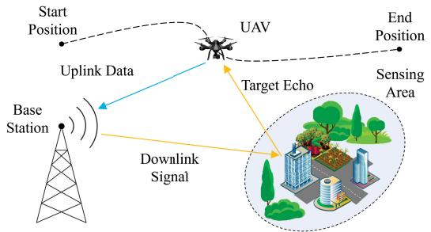  
Fig. 1. System structure of the proposed ISAC system.

## C. Orgnization & Notations

The rest of this paper is organized as follows. The system model is proposed in Section II. In Section III, we derive performance metrics and constraints to formulate the optimization problem. The original problem is decomposed into two layers and solved with the proposed TLSP method in Section IV. We conduct comprehensive simulations in Section V to evaluate the effectiveness of the proposed method. Finally, we conclude this paper and discuss future research directions in Section VI.

Notations: Unless otherwise stated, matrices, vectors, and scalars are denoted by bold uppercase letters (i.e. A), bold lowercase letters (i.e. a), and normal fonts (i.e. a). The notation k · k denotes the Frobenius norm, and diag(a) denotes the diagonal matrix formed from the vector a. The definition of important notations in this paper is presented in Table II.

## II. SYSTEM MODEL

In this paper, we consider a UAV-enabled ISAC imaging system as shown in Fig. 1. In this system, a BS transmits the ISAC downlink signal, providing communication services while acting as a sensing transmitter. Here we consider the communication-assist-sensing scheme, i.e., the communication transmit signal plays the role as sensing transmit signal simultaneously. A UAV receives the target echoes from M sensing areas during its flight, and uploads the sensing data to the BS for SAR imaging. The BS locates at ${ \bf r } _ { \mathrm { B S } } = ( x _ { \mathrm { B S } } , y _ { \mathrm { B S } } , z _ { \mathrm { B S } } )$ , and the UAV position is ${ \bf r } _ { \mathrm { U A V } } ( t ) = ( x _ { \mathrm { U A V } } ( t ) , y _ { \mathrm { U A V } } ( t ) , z _ { \mathrm { U A V } } ( t ) )$ at time t. The center of the i-th sensing area is $\mathbf { r } _ { a } ^ { i } = ( x _ { a } ^ { i } , y _ { a } ^ { i } , z _ { a } ^ { i } )$ Normally, we assume that the sensing area is on the ground, then $z _ { a } ^ { i } = 0$

In this model, the UAV takes off from the start position, conducts the sensing and communication missions sequentially during its flight, and finally reaches the end position. In the sensing mission, the UAV collects target echoes from the sensing area, processes the echo data, and stores the sensing data for image processing in its memory card during the flight. Normally, the UAV flies at a constant altitude and speed to get a stable flight, which can improve image quality and simplify signal processing [23], [25]. Therefore, we assume that during the sensing mission, the UAV flies at a fixed velocity parallel to the ground plane. Here we perform sampling along a continuous UAV trajectory based on the “stop-and-go” model [26], [27]. In this model, the UAV receives target echoes with a frequency $f _ { a } ,$ , and the duration of each echo is $T _ { w } .$ Then the UAV conducts range compression for target echoes based on the demodulation information of the downlink signal, and generates the sensing data by sampling the range profile from the compressed target echoes. In the communication mission, the UAV sends the communication uplink signal and uploads the sensing data to the BS during the flight. Due to the limited storage on the UAV, sensing data uploading should be completed during the communication mission, i.e., before the next sensing mission starts or the total flight finishes.

Here we considered a bistatic structure in this model, but it can also be extended to multistatic cases. For example, in a multiple-BS or multiple-UAV collaboration scenario, such as the multistatic SAR case, we can add coverage of different BSs and replace the bistatic resolution by the multistatic resolution to get a multistatic system model.

## A. UAV Motion Model

We denote the velocity of the UAV at time t as $\mathbf { v } ( t )$ and consider a time slot of $\Delta t ,$ , then the UAV motion model is

$$
\mathbf { r } _ { \mathrm { U A V } } ( t + \Delta t ) - \mathbf { r } _ { \mathrm { U A V } } ( t ) = \mathbf { v } ( t ) \Delta t .\tag{1}
$$

Here we adopt the constant velocity model, which means we assume the velocity does not change in each slot. The UAV velocity constraint is $0 \leq \| \mathbf { v } ( t ) \| \leq v _ { m a x }$ , where $v _ { m a x }$ is the maximum velocity.

The propulsion power consumption is related to the flying mode of the UAV [28]. In our model, the UAV keeps flying during the communication and SAR sensing process. For a rotary-wing UAV, the propulsion power consumption in the flying mode is given in [29]

$$
\begin{array} { l r } { \displaystyle { P _ { \mathrm { f l y } } \big ( \| { \bf v } \| \big ) = P _ { 0 } \left( 1 + \frac { 3 \| { \bf v } \| ^ { 2 } } { U _ { \mathrm { t i p } } ^ { 2 } } \right) + P _ { 1 } \left( \sqrt { 1 + \frac { \| { \bf v } \| ^ { 4 } } { 4 v _ { 0 } ^ { 4 } } } - \frac { \| { \bf v } \| ^ { 2 } } { 2 v _ { 0 } ^ { 2 } } \right) ^ { \frac 1 2 } } }  \\ { \displaystyle { ~ + \frac { 1 } { 2 } d _ { 0 } \rho _ { \mathrm { a i r } } s _ { \mathrm { r o t o r } } A _ { \mathrm { r o t o r } } \| { \bf v } \| ^ { 3 } , } } & { \displaystyle { ( 2 ) } } \end{array}
$$

where $P _ { 0 }$ and $P _ { 1 }$ are the blade profile power and induced power in the hovering status, respectively. $U _ { \mathrm { t i p } }$ denotes the tip speed of the rotor blade, $v _ { 0 }$ is the mean rotor induced velocity in hover, $d _ { 0 }$ and $\rho _ { \mathrm { a i r } }$ are the fuselage drag ratio and air density, $s _ { \mathrm { r o t o r } }$ and $A _ { \mathrm { r o t o r } }$ are the rotor solidity and rotor disc area.

## B. Wireless Communication Model

In the communication model, we focus on channel gain and capacity, without incorporating detailed waveform design or signal structure, for flexibility and simplicity. Let $f _ { c }$ and B denote the carrier frequency and signal bandwidth, respectively. We suppose the communication channel between the UAV and the BS mainly consists of the Line-Of-Sight (LOS) component [19], [30], then the channel gain at time t is

$$
h ( t ) = \frac { G _ { \mathrm { B S } } ^ { \mathrm { a } } G _ { \mathrm { U A V } } ^ { \mathrm { a } } \lambda ^ { 2 } } { ( 4 \pi ) ^ { 2 } d _ { \mathrm { c o m m } } ^ { 2 } ( t ) } ,\tag{3}
$$

where $d _ { \mathrm { c o m m } } ( t ) = \| \mathbf { r } _ { \mathrm { B S } } - \mathbf { r } _ { \mathrm { U A V } } ( t ) \|$ is the distance between the BS and the UAV, $\begin{array} { r } { \lambda = \frac { c } { f _ { c } } } \end{array}$ is the wavelength, c is the speed of light, $G _ { \mathrm { B S } } ^ { \mathrm { a } }$ and $G _ { \mathrm { U A V } } ^ { \mathrm { a } }$ are the antenna gains of the BS and the UAV at the communication direction respectively.

Consider the UAV uploads the sensing data with the communication power $P _ { \mathrm { c o m m } } ( t )$ . Then the channel capacity, i.e., the maximum achievable communication rate is

$$
\begin{array} { r } { \mathcal { R } _ { c } ( t ) = B \log _ { 2 } \left( 1 + \frac { P _ { \mathrm { c o m m } } ( t ) h ( t ) } { N _ { 0 } B } \right) } \\ { = B \log _ { 2 } \left( 1 + \frac { P _ { \mathrm { c o m m } } ( t ) \gamma _ { c } } { d _ { \mathrm { c o m m } } ^ { 2 } ( t ) } \right) , } \end{array}\tag{4}
$$

where $N _ { 0 }$ is the power spectrum density of additive white Gaussian noise (AWGN) and $\begin{array} { r } { \gamma _ { c } = \frac { G _ { \mathrm { B S } } ^ { \mathrm { a } } G _ { \mathrm { U A V } } ^ { \mathrm { a } } \lambda ^ { 2 } } { ( 4 \pi ) ^ { 2 } N _ { 0 } B } } \end{array}$

## C. SAR Sensing Model

In the SAR sensing model, we assume that targets are fixed on the ground for clarity in theoretical analysis. This is consistent with the existing UAV-based SAR imaging implementations, where static targets like buildings and terrains are often the primary focus [31], [32]. Collaborating with technologies such as moving target indicator (MTI), this model can be easily extended to the dynamic case. Here we also focus on the system model and exclude the details of SAR signal processing, such as the treatment of range-Doppler coupling and clutter.

According to the radar equation, the path loss of the received echo for a target located at ${ \bf r } = ( x , y , z )$ is

$$
l ( { \bf r } , t ) = \frac { G _ { \mathrm { B S } } ^ { \mathrm { g } } G _ { \mathrm { U A V } } ^ { \mathrm { g } } \lambda ^ { 2 } } { ( 4 \pi ) ^ { 3 } d _ { \mathrm { T x } } ^ { 2 } ( { \bf r } ) d _ { \mathrm { R x } } ^ { 2 } ( { \bf r } , t ) } ,\tag{5}
$$

where $G _ { \mathrm { B S } } ^ { \mathrm { g } }$ and $G _ { \mathrm { U A V } } ^ { \mathrm { g } }$ are the antenna gains of the BS and the UAV at the sensing direction, $d _ { \mathrm { T x } } ( \mathbf { r } ) \mathbf { \Sigma } = \mathbf { \Sigma } \Vert \mathbf { r } - \mathbf { r } _ { \mathrm { B S } } \Vert$ and $d _ { \mathrm { R x } } ( \mathbf { r } , t ) = \Vert \mathbf { r } - \mathbf { r } _ { \mathrm { U A V } } ( t ) \Vert$ are the distance of the BS and the UAV from the target respectively.

Denote the transmit power of the BS as $P _ { B S } ^ { c }$ and the radar cross section (RCS) of the target as σ , the signal-to-noise ratio (SNR) after range compression is

$$
\Gamma _ { r } ( \mathbf { r } , t ) = \frac { P _ { \mathrm { B S } } ^ { c } l ( \mathbf { r } , t ) \sigma _ { \mathrm { R C S } } T _ { w } } { N _ { 0 } } .\tag{6}
$$

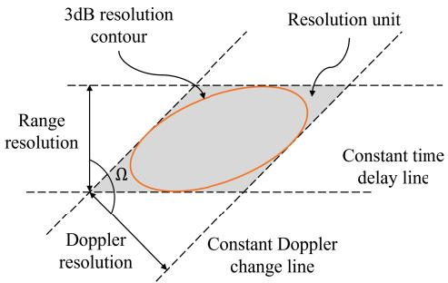  
Fig. 2. Resolution unit of the SAR image.

The UAV stores the range profile samples and uploads them to the BS for azimuth compression to get the final images. Here we assume the processor on the UAV keeps working for range compression and other essential data processing during the sensing process with the power $P _ { \mathfrak { p } }$ rocess.

The data rate during the sensing mission is

$$
\mathcal { R } _ { s } = f _ { a } \cdot \frac { R _ { r } f _ { s } } { c } \cdot N _ { q } .\tag{7}
$$

Here $f _ { s }$ is the range profile sample rate, which is slightly larger than the signal bandwidth B. The quantity $N _ { q }$ is the number of bits to quantize the baseband signal, and $R _ { r }$ is the length of the range profile stored for azimuth processing, which is normally comparable to the size of the observation area.

The resolution of the SAR image can be represented by the resolution unit [12], [33], which is shown in Fig. 2. The resolution unit is an approximation of the 3 dB resolution contour in the image for an ideal point target, and it is jointly determined by the range and Doppler resolution.

The range resolution and its direction are

$$
\delta _ { r } ( { \bf r } ) = \frac { c } { B \| ( \mathbf { e } _ { \mathrm { B S } } ( { \bf r } ) + \mathbf { e } _ { \mathrm { U A V } } ( { \bf r } , t _ { 0 } ) ) { \bf P } \| } ,\tag{8a}
$$

$$
\mathbf { e } _ { r } ( \mathbf { r } ) = \frac { ( \mathbf { e } _ { \mathrm { B S } } ( \mathbf { r } ) + \mathbf { e } _ { \mathrm { U A V } } ( \mathbf { r } , t _ { 0 } ) ) \mathbf { P } } { \lVert ( \mathbf { e } _ { \mathrm { B S } } ( \mathbf { r } ) + \mathbf { e } _ { \mathrm { U A V } } ( \mathbf { r } , t _ { 0 } ) ) \mathbf { P } \rVert } .\tag{8b}
$$

Here $\begin{array} { r } { \mathbf { e } _ { \mathrm { B S } } ( \mathbf { r } ) = \frac { \mathbf { r } - \mathbf { r } _ { \mathrm { B S } } } { \Vert \mathbf { r } - \mathbf { r } _ { \mathrm { B S } } \Vert } } \end{array}$ and $\begin{array} { r } { \mathbf { e } _ { \mathrm { U A V } } ( \mathbf { r } , t ) = \frac { \mathbf { r } - \mathbf { r } _ { \mathrm { U A V } } ( t ) } { \| \mathbf { r } - \mathbf { r } _ { \mathrm { U A V } } ( t ) \| } } \end{array}$ are the unit vectors from the BS and the UAV to the target respectively, $t _ { 0 }$ is the time that the UAV crosses the synthetic aperture center. The matrix $\mathbf { P } = I _ { 3 \times 3 } - \mathbf { e } _ { \mathrm { z } } ^ { T } \mathbf { e } _ { \mathrm { z } }$ is the projection matrix corresponding to the horizontal plane, where $\mathbf { e } _ { \mathrm { z } } = ( 0 , 0 , 1 )$

The length and direction of the Doppler resolution, also known as azimuth resolution, are

$$
\delta _ { f } ( { \bf r } ) = \frac { \lambda } { \int _ { t _ { 1 } } ^ { t _ { 2 } } \| \omega _ { \mathrm { U A V } } ( { \bf r } , t ) { \bf P } \| \mathrm d t } ,\tag{9a}
$$

$$
\mathbf { e } _ { f } ( \mathbf { r } ) = \frac { \omega _ { \mathrm { U A V } } ( \mathbf { r } , t _ { 0 } ) \mathbf { P } } { \left\| \omega _ { \mathrm { U A V } } ( \mathbf { r } , t _ { 0 } ) \mathbf { P } \right\| } .\tag{9b}
$$

Here $\begin{array} { r } { \omega _ { \mathrm { U A V } } ( { \bf r } , t ) = \frac { { \bf v } ( t ) ( I _ { 3 \times 3 } - { \bf e } _ { \mathrm { U A V } } ( { \bf r } , t ) ^ { T } { \bf e } _ { \mathrm { U A V } } ( { \bf r } , t ) ) } { \left\| { \bf r } - { \bf r } _ { \mathrm { U A V } } ( t ) \right\| } } \end{array}$ is the angular velocity of the UAV, $t _ { 1 }$ and $t _ { 2 }$ are the start and end time of synthetic aperture observartion.

Finally, the resolution unit area is

$$
\mathcal { A } _ { \mathrm { r e s } } ( { \bf r } ) = \frac { \delta _ { r } ( { \bf r } ) \delta _ { f } ( { \bf r } ) } { \sin \Omega } ,\tag{10}
$$

where $\Omega = \operatorname { a r c c o s } ( \mathbf { e } _ { r } ( \mathbf { r } ) \cdot \mathbf { e } _ { f } ( \mathbf { r } ) ^ { T } )$ is the angle between the range and Doppler resolution. More detailed discussions on the resolution are presented in Appendix.

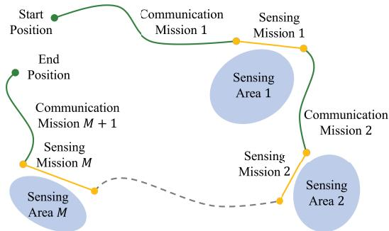  
Fig. 3. Trajectory segmentation.

## III. PROBLEM FORMULATION

## A. The Trajectory Segmentation

In our system model, the UAV conducts the communication and sensing tasks consecutively. Therefore, we can segment the overall trajectory into associated communication and sensing parts. For example, the UAV trajectory traversing M sensing areas contains M sensing trajectories and $M + 1$ communication trajectories, which is shown in Fig. 3.

With this segmentation method, the UAV trajectory is partitioned into different correlated segments. Then we will discuss the sensing and communication trajectory segments and derive the optimization problem based on them.

## B. The Sensing Trajectory Segments

As we assume the UAV flies with a constant speed during one sensing mission to guarantee image quality, a sensing trajectory segment can be determined with the corresponding start and end points, as well as the velocity. For the m-th sensing mission, we set its start point as $\mathbf { r } _ { s } ^ { m }$ and end point as ${ \bf r } _ { e } ^ { m }$ . Noticing that the flying direction is determined by the above two points, we only need to consider the velocity magnitude $v _ { s } ^ { m }$ . Because the UAV conducts the imaging task at a constant altitude $H ^ { m }$ , we have $\mathbf { r } _ { s } ^ { m } ( 3 ) = \mathbf { r } _ { e } ^ { m } ( 3 ) = H ^ { m }$ Therefore, the m-th sensing mission can be defined with $\mathbf { s } _ { m } = ( \mathbf { r } _ { s } ^ { m } ( 1 ) , \mathbf { r } _ { s } ^ { m } ( 2 ) , \mathbf { r } _ { e } ^ { m } , v _ { s } ^ { m } )$ . We denote the set of sensing variables as $\begin{array} { r } { \mathcal { S } _ { r } = \{ \mathbf { s } _ { m } \} _ { m = 1 } ^ { M } . } \end{array}$

The total duration of the m-th sensing mission is $T _ { s } ^ { m } =$ $\frac { \| \mathbf { r } _ { e } ^ { m } - \mathbf { r } _ { s } ^ { m } \| } { v _ { s } ^ { m } }$ . If we denote the start time as 0, the time UAV crosses synthetic aperture center is $\frac { T _ { s } ^ { m } } { 2 }$ and the trajectory is $\mathbf { r } _ { \mathrm { U A V } } \big ( t _ { s } ^ { m } \big ) \ = \ \frac { 1 } { T _ { \mathrm { - } } ^ { m } } \big ( \big ( 1 \ - \ t _ { s } ^ { m } \big ) \mathbf { r } _ { s } ^ { m } \ + \ t _ { s } ^ { \tilde { m } } \mathbf { r } _ { e } ^ { m } \big )$ . Therefore, we can substitute these expressions into (8)-(10) to compute the resolution. Normally, we characterize the sensing performance of the area by the performance at the center $\mathbf { r } _ { a } ^ { m }$ . We use ${ \mathcal { A } } _ { \mathrm { r e s } } ^ { m }$ to denote the image resolution of the m-th sensing area.

To evaluate the overall sensing performance, we define a sensing performance function, which is

$$
Q _ { \mathrm { s e n s } } = \frac { 1 } { \mathcal { A } _ { 0 } } \cdot ( \overline { { \mathcal { A } _ { \mathrm { r e s } } } } + \sigma _ { \mathrm { r e s } } ) ,\tag{11}
$$

where $\overline { { \mathcal { A } _ { \mathrm { r e s } } } }$ is the mean of $\lbrace \mathcal { A } _ { \mathrm { r e s } } ^ { m } \rbrace _ { m = 1 } ^ { M } , \ \sigma _ { \mathrm { r e s } } ^ { 2 }$ is the variance, and $\mathcal { A } _ { 0 }$ is a predefined maximum resolution. This sensing performance can be improved with both resolution enhancement and inter-regional resolution disparity reduction.

In order to ensure that the target echoes can be received, the minimum power of received echoes should be greater than the system sensitivity. Normally, we set an SNR threshold $\Gamma _ { 0 }$ for the echo of a target with an RCS of $\sigma _ { 0 }$ . That means we expect that echoes of targets with the RCS larger than $\sigma _ { 0 }$ can be received with an SNR of at least $\Gamma _ { 0 }$ . This constraint can be expressed as

$$
\frac { P _ { \mathrm { B S } } ^ { c } l ( \mathbf { r } _ { a } ^ { m } , t _ { s } ^ { m } ) \sigma _ { 0 } T _ { w } } { N _ { 0 } } \geq \Gamma _ { 0 } , m = 1 , . . . , M ,\tag{12}
$$

where $l ( \mathbf { r } _ { a } ^ { m } , t _ { s } ^ { m } )$ is calculated from (5). Besides, to ensure the imaging coverage, the minimum height constraint of the UAV should be satisfied, i.e., $H ^ { m } \geq H _ { 0 }$

During the m-th sensing mission, the energy consumption of the UAV is

$$
E _ { s } ^ { m } = ( P _ { \mathrm { f l y } } ( | v _ { s } ^ { m } | ) + P _ { \mathrm { p r o c e s s } } ) T _ { s } ^ { m } .\tag{13}
$$

The amount of sensing data is

$$
\mathcal { D } _ { s } ^ { m } = \mathcal { R } _ { s } ^ { m } T _ { s } ^ { m } ,\tag{14}
$$

where $\begin{array} { r } { \mathcal { R } _ { s } ^ { m } = f _ { a } \cdot \frac { R _ { r } ^ { m } f _ { s } } { c } \cdot N _ { q } } \end{array}$ is the sensing data rate during the m-th sensing mission.

## C. The Communication Trajectory Segments

In the communication mission, the UAV flies from its start position to the end position and uploads data to the BS simultaneously. For the m-th communication mission, its start position is $\mathbf { r } _ { e } ^ { m - 1 }$ and end position is $\mathbf { r } _ { s } ^ { m }$ . Here we denote the start and end position of the total trajectory as ${ \bf r } _ { e } ^ { 0 }$ and $\mathbf { r } _ { s } ^ { M + 1 }$ respectively. For computation convenience, we discretize the m-th communication trajectory segment into $N ^ { m } + 1$ slots with time interval $\Delta t _ { c } ^ { m }$ . Then according to the motion model (1), the mobility constraint is

$$
\| \mathbf { r } _ { c } ^ { m } [ n + 1 ] - \mathbf { r } _ { c } ^ { m } [ n ] \| ^ { 2 } = ( v _ { c } ^ { m } [ n ] \Delta t _ { c } ^ { m } ) ^ { 2 } , n = 1 , . . . , N ^ { m } .\tag{15}
$$

Here $\mathbf { r } _ { c } ^ { m } [ n ]$ is the position of UAV at the n-th slot, $v _ { c } ^ { m } [ n ]$ is the corresponding magnitude of velocity. As the direction of velocity is determined by the discretized position, we omit it and use the vector norm to simplify the constraint. The square in (15) is to ensure the derivability.

In the data backhaul process, the transmission rate of sensing data cannot exceed the communication capacity [34]. Therefore, to complete data transmission, the total channel capacity of the subsequent communication trajectory segment should be larger than the amount of data acquired in the previous sensing trajectory segment. Besides, to ensure the connectivity and transmission stability between the UAV and BS in case of unstable channel environments, the maximum achievable data rate should maintain a given margin $\mathcal { R } _ { 0 }$ . Then the communication rate constraints are

$$
\mathcal { R } _ { c } ^ { m } [ n ] \geq \mathcal { R } _ { 0 } , \qquad \forall m , n ,\tag{16a}
$$

$$
\sum _ { n = 1 } ^ { N ^ { m } } ( \mathcal { R } _ { c } ^ { m } [ n ] - \mathcal { R } _ { 0 } ) \Delta t _ { c } ^ { m } \geq \mathcal { D } _ { s } ^ { m - 1 } , \ \forall m .\tag{16b}
$$

Here we set $\mathcal { D } _ { s } ^ { 0 } = 0$ . The inequality (16b) represents the data relation between sequential communication and sensing tasks. The discretized data rate is

$$
\mathcal { R } _ { c } ^ { m } [ n ] = B \log _ { 2 } \left( 1 + \frac { P _ { \mathrm { c o m m } } ^ { m } [ n ] \gamma _ { c } } { \| \mathbf { r } _ { \mathrm { B S } } - \mathbf { r } _ { c } ^ { m } [ n ] \| ^ { 2 } } \right) .\tag{17}
$$

The energy consumption is

$$
E _ { c } ^ { m } = \sum _ { n = 1 } ^ { N ^ { m } } ( P _ { \mathrm { f l y } } ( | v _ { c } ^ { m } [ n ] | ) + P _ { \mathrm { c o m m } } ^ { m } [ n ] ) \Delta t _ { c } ^ { m } ,\tag{18}
$$

where $P _ { \mathrm { c o m m } } ^ { m } [ n ]$ is the discretized UAV communication power in the n-th slot.

We denote the set of variables in the m-th communication mission as $\begin{array} { r c l } { S _ { c } ^ { m } } & { = } & { \{ \mathbf { r } _ { c } ^ { m } [ n ] , v _ { c } ^ { m } [ n ] , P _ { \mathrm { c o m m } } ^ { m } [ n ] \} _ { n = 1 } ^ { N ^ { m } } \cup . } \end{array} \{ \Delta t _ { c } ^ { m } \}$ Then the set of communication variables are $\bar { S _ { c } } = \cup _ { m = 1 } ^ { M + 1 } \bar { S _ { c } ^ { m } }$

## D. The Overall Optimization Problem

There are two main requirements for the optimization. Firstly, we aim to minimize the energy consumption given the resolution requirements. Secondly, we aim to improve the resolution with as little energy cost as possible. Therefore, we derive a flexible objective function that can change the emphasis on energy consumption versus sensing performance through adjustable hyperparameters. This objective function is

$$
f _ { \mathrm { m i s s i o n } } = ( \rho _ { \mathrm { s e n s } } Q _ { \mathrm { s e n s } } + 1 ) \cdot \left( \sum _ { m = 1 } ^ { M } E _ { s } ^ { m } + \sum _ { m = 1 } ^ { M + 1 } E _ { c } ^ { m } \right) .\tag{19}
$$

Here the hyperparameter $\rho _ { \mathrm { s e n s } }$ can adjust the sensing performance weight in the optimization. For $\rho _ { \mathrm { s e n s } } = 0 , \ f _ { \mathrm { m i s s i o n } }$ becomes the energy consumption. As $\rho _ { \mathrm { s e n s } }$ increases, the optimization will pay more attention to sensing performance.

Finally, the optimization problem can be expressed as

$$
\operatorname* { m i n } _ { S _ { r } , S _ { c } } \quad f _ { \mathrm { m i s s i o n } }\tag{20a}
$$

$$
s . t . \quad 0 \leq v _ { s } ^ { m } \leq v _ { \operatorname* { m a x } } , \forall m ,\tag{20b}
$$

$$
0 \leq v _ { c } ^ { m } [ n ] \leq v _ { \operatorname* { m a x } } , \forall m , n ,\tag{20c}
$$

$$
0 \leq P _ { \mathrm { c o m m } } ^ { m } [ n ] \leq P _ { \mathrm { c o m m } } ^ { \mathrm { m a x } } , \forall m , n ,\tag{20d}
$$

$$
\Delta t _ { c } ^ { m } \ge 0 , \forall m ,\tag{20e}
$$

$$
\mathbf { r } _ { c } ^ { m } [ 1 ] = \mathbf { r } _ { e } ^ { m - 1 } , \forall m ,\tag{20f}
$$

$$
\mathbf { r } _ { c } ^ { m } [ N ^ { m } + 1 ] = \mathbf { r } _ { s } ^ { m } , \forall m ,\tag{20g}
$$

$$
H ^ { m } \geq H _ { 0 } , \forall m ,\tag{20h}
$$

$$
\mathcal { A } _ { \mathrm { r e s } } ^ { m } \leq \mathcal { A } _ { 0 } , \forall m ,
$$

$$
( 1 2 ) , ( 1 5 ) , ( 1 6 ) .\tag{20i}
$$

Here $v _ { \mathrm { m a x } }$ nication power of the UAV, respectively. The constraints (16b), (20f), and (20g) represent relations between successive communication and sensing trajectory segments, corresponding to the data transmission and trajectory continuity requirements.

This optimization problem (20) is highly non-convex because that the objective $f _ { \mathrm { m i s s i o n } }$ , the constraints (15), (16b), and (20i) are non-convex. We decompose it into two-layer subproblems and solve it iteratively in the next section.

## IV. PROPOSED TLSP ALGORITHM

The original optimization problem is highly non-convex, and the differentiation of the objective function is complex. So it is hard to use gradient-based methods to solve it. Besides, it has a large number of variables and constraints, which raises heavy computation and convergence burdens for random searching. Therefore, we propose a Two-Layer Sequential Programming (TLSP) method to solve it efficiently. Firstly, we decompose the problem (20) into two-layer subproblems. Then we solve the first layer subproblem with the SQP-based algorithm. Finally, we solve the second layer subproblem with a modified Bayesian optimization method. The solution is obtained with the combination of two-layer optimizations.

## A. Problem Decomposition

As the problem (20) is complex to solve, we consider transforming it into a simplified form. Because there are many trajectory sample points in the communication segments, $S _ { c }$ contains more variables than $S _ { r }$ . Most of the constraints are also related to $\textstyle S _ { c } ,$ , i.e., (15), (16), and (20c)-(20g). Furthermore, the functions related to $S _ { c }$ have explicit expressions, which are easy to compute and differentiate. In contrast, $\boldsymbol { A } _ { \mathrm { r e s } }$ and $Q _ { \mathrm { s e n s } }$ have implicit expressions and are complex to compute. Therefore, we consider decomposing the two parts with different properties.

Considering $S _ { c }$ and $S _ { r }$ are coupled in the constraints (16b), (20f), and (20g), we cannot optimize them separately. Therefore, we consider fixing one and optimizing the other. Here we observe that the sensing metrics $\mathcal { A } _ { \mathrm { r e s } }$ and $Q _ { \mathrm { s e n s } }$ are completely defined with the position parameters in $S _ { r }$ , so they cannot be optimized with fixed $S _ { r }$ . Besides, all position parameters in $S _ { r }$ can be determined with (20f) and (20g), so the sensing metric cannot be optimized when $ { \boldsymbol { S } } _ { c }$ is fixed. Therefore, the alternating optimization method is not practical. As a result, we consider to firstly fix $S _ { r }$ and optimize $\textstyle S _ { c } ,$ then optimize $S _ { r }$ while regarding the optimized $ { \boldsymbol { S } } _ { c }$ as functions of $S _ { r }$ . The optimization of $ { \boldsymbol { S } } _ { c }$ and $S _ { r }$ forms the first and second layer subproblems, respectively.

To derive the two-layer subproblems, we first consider decomposing the objective function $f _ { \mathrm { m i s s i o n } }$ into communication and sensing-related parts. Here $Q \mathrm { { s e n s } }$ and $E _ { s } ^ { m }$ in fmission are defined by $S _ { r }$ , while $E _ { c } ^ { m }$ is defined by $\textstyle S _ { c } .$ We can define $\begin{array} { r } { f _ { 1 } ( S _ { r } ) = \rho _ { \mathrm { s e n s } } Q _ { \mathrm { s e n s } } + 1 , f _ { 2 } ( \bar { S } _ { r } ) = ( \rho _ { \mathrm { s e n s } } Q _ { \mathrm { s e n s } } + 1 ) \cdot \sum _ { m = 1 } ^ { M } E _ { s } ^ { m } } \end{array}$ and $\begin{array} { r } { f _ { 3 } ( S _ { c } ) = \sum _ { m = 1 } ^ { M + 1 } E _ { c } ^ { m } } \end{array}$ . Then we have

$$
f _ { \mathrm { m i s s i o n } } ( S _ { r } , S _ { c } ) = f _ { 2 } ( S _ { r } ) + f _ { 1 } ( S _ { r } ) f _ { 3 } ( S _ { c } ) .\tag{21}
$$

Fixing ${ \cal { S } } _ { r } ,$ the optimum is obtained only if $f _ { 3 } ( S _ { c } )$ achieves optimum. So we can form the first layer subproblem as

$$
\begin{array} { r l } { \underset { \mathcal { S } _ { c } } { \operatorname* { m i n } } } & { { } \displaystyle \sum _ { m = 1 } ^ { M + 1 } E _ { c } ^ { m } } \\ { s . t . } & { { } ( 1 5 ) , ( 1 6 ) , ( 2 0 c ) , ( 2 0 d ) , ( 2 0 e ) , ( 2 0 f ) , ( 2 0 g ) . } \end{array}\tag{22a}
$$

After conducting the first layer optimization, the optimal solution $S _ { c } ^ { o p t }$ is determined by $S _ { r }$ . Therefore, the objective of the overall problem becomes a function of $S _ { r }$ . Then we can optimize $S _ { r }$ to get the optimal solution. We set $f ( S _ { r } ) ~ = ~ - f _ { \mathrm { m i s s i o n } } ( S _ { r } , S _ { c } ^ { o p t } ( S _ { r } ) )$ and form the second-layer optimization subproblem as

$$
\begin{array} { r l } { \underset { s _ { r } } { \operatorname* { m a x } } } & { { } f } \\ { s . t . } & { { } ( 1 2 ) , ( 2 0 b ) , ( 2 0 h ) , ( 2 0 i ) . } \end{array}\tag{23a}
$$

Here we transfer minimization into maximization to be compatible with the algorithm in Section IV-C later.

After the optimization of two layers, we can get the optimization result of the original problem (20). From (21), if the problem (20) achieves the global optimal at $( S _ { r } ^ { * } , S _ { c } ^ { * } )$ , the first-layer subproblem (22) must achieves the global optimal at $S _ { c } ^ { * }$ with the fixed $S _ { r } ^ { * }$ . So we have $S _ { c } ^ { * } ~ = ~ S _ { c } ^ { o p t } ( S _ { r } ^ { * } )$ Then from the definition of global optimal, $S _ { r } ^ { * }$ is the global optimum of the second-layer subproblem (23). Therefore, the decomposed problem and original problem share an identical global optimum.

Although this global optimum is not easy to find because both layers are still non-convex, the original problem is simplified through this decomposition. As a result, we can design appropriate methods for the two layers based on their properties and integrate the advantages of different methods to achieve better performance. In the following sections, we will present the methods to solve the two-layer subproblems.

## B. SQP-Based Algorithm for the First Layer

In the first layer subproblem (22), the objective, constraints, and variables are separated for each communication task. Therefore, we decompose (22) into $M + 1$ subproblems. In the subproblems, we transform (16a) and (16b) into the form $\| \mathbf { r } _ { \mathrm { B S } } - \mathbf { r } _ { c } ^ { m } [ n ] \| ^ { 2 } - l _ { c } \cdot P _ { \mathrm { c o m m } } ^ { m } [ n ] \leq 0$ and $\begin{array} { r l } { ~ } & { { } - \sum _ { n = 1 } ^ { N ^ { m } } \mathcal { R } _ { c } ^ { m } [ n ] + } \end{array}$ $\begin{array} { r } { N ^ { m } \mathcal { R } _ { 0 } + \frac { \mathcal { D } _ { s } ^ { m - 1 } } { \Delta t _ { c } ^ { m } } \leq 0 } \end{array}$ respectively. Here we set $\begin{array} { r } { l _ { c } = \frac { \gamma _ { c } } { \mathrm { \Omega } _ { \mathrm { p } } ^ { \mathcal { R } _ { 0 } } \mathrm { \Omega } _ { \mathrm { ~ - ~ } 1 } ^ { \mathcal { R } } } } \end{array}$ . We also transpose (20c) into the squared form $( v _ { c } ^ { m } [ n ] ) ^ { \breve { 2 } } - { \breve { v } } _ { \mathrm { m a x } } ^ { 2 } \leq$ 0 as only the absolute value or square of $v _ { c } ^ { m } [ n ]$ is used here. These expression transforms are intended to simplify the constraints and make the differentiation convenient later. As variables $\mathbf { r } _ { c } ^ { m } [ 1 ]$ and $\mathbf { r } _ { c } ^ { m } [ N ^ { m } + 1 ]$ are fixed according to constraints (20f) and (20g), we can fix their value, then omit them and these constraints later. The above simplifications can eliminate $N ^ { m } + 6$ constraints, thus simplifying the optimization. Here we assume $\mathbf { x } _ { m } \in \mathbb { R } ^ { ( 5 N ^ { m } - 2 ) ^ { \frac { 1 } { \alpha } } \mathrm { 1 } }$ is the vector form of all the variables in $\boldsymbol { S } _ { c } ^ { m }$ , which is

$$
\begin{array} { c } { { { \bf x } _ { m } = [ { \bf r } _ { c } ^ { m } [ 2 ] , . . . , { \bf r } _ { c } ^ { m } [ N ^ { m } ] , v _ { c } ^ { m } [ 1 ] , . . . , v _ { c } ^ { m } [ N ^ { m } ] , } } \\ { { { \cal P } _ { \mathrm { c o m m } } ^ { m } [ 1 ] , . . . , { \cal P } _ { \mathrm { c o m m } } ^ { m } [ N ^ { m } ] , \Delta t _ { c } ^ { m } ] ^ { T } . } } \end{array}\tag{24}
$$

Then the m-th subproblem is

$$
\operatorname* { m i n } _ { \mathbf { x } _ { m } } ~ E _ { c } ^ { m }\tag{25a}
$$

$$
\begin{array} { r l } { s . t . } & { { } \| \mathbf { r } _ { c } ^ { m } [ n + 1 ] - \mathbf { r } _ { c } ^ { m } [ n ] \| ^ { 2 } - ( v _ { c } ^ { m } [ n ] \Delta t _ { c } ^ { m } ) ^ { 2 } = 0 , \forall n , } \end{array}\tag{25b}
$$

$$
( v _ { c } ^ { m } [ n ] ) ^ { 2 } - v _ { \mathrm { { m a x } } } ^ { 2 } \leq 0 , \forall n ,\tag{25c}
$$

$$
- \ P _ { \mathrm { c o m m } } ^ { m } [ n ] \leq 0 , \forall n ,
$$

$$
P _ { \mathrm { c o m m } } ^ { m } [ n ] - P _ { \mathrm { c o m m } } ^ { \mathrm { m a x } } \leq 0 , \forall n ,\tag{25d}
$$

(25e)

$$
\| \mathbf { r } _ { \mathrm { B S } } - \mathbf { r } _ { c } ^ { m } [ n ] \| ^ { 2 } - l _ { c } \cdot P _ { \mathrm { c o m m } } ^ { m } [ n ] \leq 0 , \forall n ,\tag{25f}
$$

$$
- \sum _ { n = 1 } ^ { N ^ { m } } \mathcal { R } _ { c } ^ { m } [ n ] + N ^ { m } \mathcal { R } _ { 0 } + \frac { \mathcal { D } _ { s } ^ { m - 1 } } { \Delta t _ { c } ^ { m } } \leq 0 ,
$$

$$
- \Delta t _ { c } ^ { m } \leq 0 .\tag{25g}
$$

(25h)

This problem is still non-convex, as (25a), (25b), and (25g) are non-convex. However, these non-convex parts come from the multiplication and division of variables and the square root function. Therefore, the curves of these non-convex parts will be relatively regular and easy to handle. Besides, all functions are explicit and smooth in problem (25), so we can easily conduct differentiation and approximate them locally. This property improves the efficiency of gradient-based methods. Furthermore, as the bottom layer of the two-layer optimization structure, problem (25) must be solved in every iteration of the second layer. So we have to use optimization algorithms that can converge efficiently. Considering the relatively large number of variables and constraints in (25), conducting random searching will be inefficient. Therefore, we consider using the SQP-based method that exploits the gradient information.

The SQP-type method can transform the original optimization into a series of convex quadratic programming problems and solve them iteratively to get a suboptimal solution. These quadratic programming subproblems are formed with a quadratic objective function and linear constraints that are approximations of the original objective function and constraints based on their gradients, respectively. For secondorder continuously differentiable problems, given a reasonable starting point, SQP-type methods can efficiently converge to a local optimum while strictly satisfying all constraints, and this convergence rate could be superlinear [35], [36]. Therefore, an SQP-based method is suitable for solving (25). In this paper, we use a modified algorithm based on the Byrd-Omojokun trust-region SQP method.

To simplify the notations in the following discussions, we use $C _ { 1 , m } ^ { n } , . . . , C _ { 5 , m } ^ { n } , \ C _ { 6 , m } .$ , and $C _ { 7 , m }$ to denote the functions on the left side of (25b)-(25h). We define the vector forms of the equality and inequality constraints in problem (25) as $\mathbf { C } _ { \mathrm { e q , m } } ^ { \mathrm { ~ \tiny ~ \bar { ~ } { ~ m ~ } ~ } } = \mathbf { \partial } [ C _ { 1 , m } ^ { 1 } , . . . , \bar { C } _ { 1 , m } ^ { N ^ { m } } ] ^ { T }$ and $\mathbf { C } _ { \mathrm { n e q , m } } \ =$ $[ C _ { 2 , m } ^ { 1 } , . . . , C _ { 2 , m } ^ { N ^ { m } } , . . . , C _ { 5 , m } ^ { 1 } , . . . , C _ { 5 , m } ^ { N ^ { m } } , C _ { 6 , m } , C _ { 7 , m } ] ^ { T }$ , respectively. Then this subproblem can be written as

$$
\operatorname* { m i n } _ { \mathbf { x } _ { m } } ~ E _ { c } ^ { m }\tag{26a}
$$

$$
\begin{array} { r } { s . t . \quad \mathbf { C } _ { \mathrm { e q , m } } = \mathbf { 0 } , } \end{array}\tag{26b}
$$

$$
\mathbf { C } _ { \mathrm { n e q , ~ m ~ } } \leq \mathbf { 0 } .\tag{26c}
$$

Consider the k-th step, where we have obtained the solution $\mathbf { x } _ { m } ^ { ( k ) }$ and want to compute the step $\mathbf { d } _ { m } ^ { ( k ) }$ under the trust region constraint $\Delta _ { k }$ . To guarantee the feasibility, we first compute the slack variables by solving the normal subproblem

$$
\begin{array} { r l } { \underset { \mathbf { v } _ { m } } { \operatorname* { m i n } } } & { { } \| \mathbf { r } _ { \mathrm { e q , m } } ^ { ( k ) } ( \mathbf { v } _ { m } ) \| _ { 2 } ^ { 2 } + \| \operatorname* { m a x } \{ \mathbf { r } _ { \mathrm { n e q , m } } ^ { ( k ) } ( \mathbf { v } _ { m } ) , \mathbf { 0 } \} \| _ { 2 } ^ { 2 } } \end{array}\tag{27a}
$$

$$
\begin{array} { r l } { s . t . } & { { } \| \mathbf { v } _ { m } \| _ { \infty } \leq \rho _ { s } \Delta _ { k } , } \end{array}\tag{27b}
$$

The variable $0 < \rho _ { s } < 1$ is a scale factor that reduces the trust region. The function $\mathbf { r } _ { \mathrm { e q } , \mathrm { ~ m ~ } } ^ { ( k ) }$ and ${ \bf r } _ { \mathrm { n e q , ~ m ~ } } ^ { ( k ) }$ are

$$
\begin{array} { r } { \mathbf { r } _ { \mathrm { e q , m } } ^ { ( k ) } ( \mathbf { v } _ { m } ) = ( \mathbf { A } _ { \mathrm { e q , m } } ^ { ( k ) } ) ^ { T } \mathbf { v } _ { m } + \mathbf { C } _ { \mathrm { e q , m } } ^ { ( k ) } , } \end{array}\tag{28a}
$$

$$
\begin{array} { r } { \mathbf { r } _ { \mathrm { n e q } , \mathrm { ~ m ~ } } ^ { ( k ) } ( \mathbf { v } _ { m } ) = ( \mathbf { A } _ { \mathrm { n e q } , \mathrm { ~ m ~ } } ^ { ( k ) } ) ^ { T } \mathbf { v } _ { m } + \mathbf { C } _ { \mathrm { n e q } , \mathrm { ~ m ~ } } ^ { ( k ) } , } \end{array}\tag{28b}
$$

where the matrices $\begin{array} { r l r } { \mathbf { A } _ { \mathrm { e q , m } } ^ { ( k ) } } & { { } = } & { [ \nabla \mathbf { C } _ { \mathrm { e q , m } } ( \mathbf { x } _ { m } ^ { ( k ) } ) ] ^ { T } } \end{array}$ and $\mathbf { A } _ { \mathrm { n e q } } ^ { ( k ) } \ = \ [ \nabla \mathbf { C } _ { \mathrm { n e q , ~ m } } ( \mathbf { x } _ { m } ^ { ( k ) } ) ] ^ { T }$ are the gradients of $\mathbf { C } _ { \mathrm { e q } , \mathrm { ~ m ~ } }$ and $\mathbf { C } _ { \mathrm { n e q , ~ m ~ } }$ respectively. The vectors $\mathbf { C } _ { \mathrm { e q } , \mathrm { ~ m ~ } } ^ { ( k ) }$ and $\mathbf { C } _ { \mathrm { n e q , ~ m ~ } } ^ { ( k ) }$ denote $\mathbf { C } _ { \mathrm { e q , m } } ( \mathbf { x } _ { m } ^ { ( k ) } )$ and $\mathbf { C } _ { \mathrm { n e q } , \mathrm { ~ m } } ( \mathbf { x } _ { m } ^ { ( k ) } )$ , respectively.

The problem (27) is convex, so it can be solved with general convex optimization methods. We denote the solultion of (27) as $\mathbf { v } _ { m } ^ { ( k ) }$ . Then the SQP subproblem is

$$
\operatorname* { m i n } _ { \mathbf { d } _ { m } } \quad ( \mathbf { g } ^ { ( k ) } ) ^ { T } \mathbf { d } _ { m } + \frac { 1 } { 2 } \mathbf { d } _ { m } ^ { T } \mathbf { B } _ { m } ^ { ( k ) } \mathbf { d } _ { m }\tag{29a}
$$

$$
\begin{array} { r l } { s . t . } & { { } \mathbf { r } _ { \mathrm { e q , m } } ^ { ( k ) } ( \mathbf { d } _ { m } ) = \mathbf { r } _ { \mathrm { e q , m } } ^ { ( k ) } ( \mathbf { v } _ { m } ^ { ( k ) } ) , } \end{array}\tag{29b}
$$

$$
\mathbf { r } _ { \mathrm { n e q } , \mathrm { m } } ^ { ( k ) } ( \mathbf { d } _ { m } ) \leq \operatorname* { m a x } \{ \mathbf { r } _ { \mathrm { n e q } , \mathrm { m } } ^ { ( k ) } ( \mathbf { v } _ { m } ^ { ( k ) } ) , \mathbf { 0 } \} .\tag{29c}
$$

$$
\| \mathbf { d } _ { m } \| _ { \infty } \leq \Delta _ { k } ,\tag{29d}
$$

where $\mathbf { g } ^ { ( k ) } = \nabla E _ { c } ^ { m } ( \mathbf { x } _ { m } ^ { ( k ) } )$ , and $\mathbf { B } _ { m } ^ { ( k ) }$ is the Hessian matrix derived with quasi-Newton aproximation. In this algorithm, we use the BFGS method to compute $\mathbf { B } _ { m } ^ { ( k ) }$ . As $\mathbf { B } _ { m } ^ { \left( k \right) }$ generated by this method is positive-definite, problem (29) is a convex quadratic programming, which can be solved through convex optimization methods such as the active set method or interior point method while monitoring the trust region constraint (29d). We denote the solution of (29) as $\mathbf { d } _ { m } ^ { ( k ) }$ and corresponding Lagrange multiplier as $\bar { \lambda } _ { m } ^ { ( \bar { k } ) }$ . Here the Lagrange function is

$$
L _ { m } ( \mathbf { x } _ { m } , \mathbf { \lambda } _ { m } ) = E _ { c } ^ { m } ( \mathbf { x } _ { m } ) + \lambda _ { m } ^ { T } \cdot [ \mathbf { C } _ { \mathrm { e q , \ : m } } ^ { T } , \mathbf { C } _ { \mathrm { n e q , \ : m } } ^ { T } ] ^ { T } .\tag{30}
$$

To evaluate the step $\mathbf { d } _ { m } ^ { ( k ) }$ , we define the penalty function as

$$
\varphi ( \mathbf { x } _ { m } , \sigma _ { m } ) = E _ { c } ^ { m } ( \mathbf { x } _ { m } ) + \sigma _ { m } \zeta _ { m } ( \mathbf { x } _ { m } ) ,\tag{31}
$$

where $\sigma _ { m }$ is the penalty parameter, and $\zeta _ { m } (  { \mathbf { x } } _ { m } )$ is the merit function. The expression of $\zeta _ { m } (  { \mathbf { x } } _ { m } )$ is

$$
\zeta _ { m } ( \mathbf { x } _ { m } ) = \| [ \mathbf { C } _ { \mathrm { e q , \mathrm { m } } } ( \mathbf { x } _ { m } ) ^ { T } , \mathrm { m a x } \{ \mathbf { C } _ { \mathrm { n e q , \mathrm { m } } } ( \mathbf { x } _ { m } ) , \mathbf { 0 } \} ^ { T } ] \| _ { 2 } .\tag{32}
$$

The penalty term $\sigma _ { m } \zeta _ { m } ( { \bf x } _ { m } )$ in (31) controls the degree to which the solution $\mathbf { x } _ { m }$ violates the constraints. The penalty parameter $\sigma _ { m }$ should be efficiently large such that the value of $\varphi ( \mathbf { x } _ { m } , \sigma _ { m } )$ decreases at the new solution. So we predict the decrement with the approximation $q _ { m } ^ { ( k ) } ( \mathbf { d } _ { m } )$ , which is

$$
q _ { m } ^ { ( k ) } ( \mathbf { d } _ { m } ) = ( \mathbf { g } ^ { ( k ) } ) ^ { T } \mathbf { d } _ { m } + \frac { 1 } { 2 } \mathbf { d } _ { m } ^ { T } \mathbf { B } _ { m } ^ { ( k ) } \mathbf { d } _ { m } + \sigma _ { m } p _ { m } ( \mathbf { d } _ { m } ) .\tag{33}
$$

Here $\begin{array} { r l r } { p _ { m } ( \mathbf { d } _ { m } ) } & { = } & { \| [ \mathbf { r } _ { \mathrm { e q , m } } ^ { ( k ) } ( \mathbf { d } _ { m } ) ^ { T } , \mathrm { m a x } \{ \mathbf { r } _ { \mathrm { n e q , m } } ^ { ( k ) } ( \mathbf { d } _ { m } ) , \mathbf { 0 } \} ^ { T } ] \| _ { 2 } . } \end{array}$ Due to the use of slack variables in (29), we can always guarantee that $q _ { m } ^ { ( k ) } ( \mathbf { 0 } ) - q _ { m } ^ { ( k ) } ( \mathbf { d } _ { m } ^ { ( k ) } ) \geq 0$ with sufficiently large $\bar { \sigma } _ { m } ^ { ( k ) }$ . The $\sigma _ { m } ^ { ( k ) }$ can be derived with the inequality

$$
q _ { m } ^ { ( k ) } ( \mathbf { 0 } ) - q _ { m } ^ { ( k ) } ( \mathbf { d } _ { m } ^ { ( k ) } ) \geq \eta _ { \mathrm { d } } \sigma _ { m } ^ { ( k ) } [ p _ { m } ( \mathbf { 0 } ) - p _ { m } ( \mathbf { d } _ { m } ^ { ( k ) } ) ] ,\tag{34}
$$

where $0 < \eta _ { \mathrm { d } } < 1$ is a scale factor. As we introduced the slack terms in (29), this inequality always holds for sufficiently large $\sigma _ { m } ^ { ( k ) }$ [37]. Then we compute the descent ratio

$$
\rho _ { m } ^ { ( k ) } = \frac { \varphi ( \mathbf { x } _ { m } ^ { ( k ) } , \sigma _ { m } ^ { ( k ) } ) - \varphi ( \mathbf { x } _ { m } ^ { ( k ) } + \mathbf { d } _ { m } ^ { ( k ) } , \sigma _ { m } ^ { ( k ) } ) } { q _ { m } ^ { ( k ) } ( \mathbf { 0 } ) - q _ { m } ^ { ( k ) } ( \mathbf { d } _ { m } ^ { ( k ) } ) } ,\tag{35}
$$

which is the ratio between actual and predicted descent.

Because of the high-nonconvex function in our problem, it is hard to predict whether the line search or the trust region step is better. So we propose to use the mixed step to improve the stability of the algorithm. If $\rho _ { m } ^ { ( k ) } > 0$ , we can set $\alpha _ { m } ^ { k } = 1$ and the step $\mathbf { s } _ { m } ^ { ( k ) } = \mathbf { d } _ { m } ^ { ( k ) }$ . For the case that $\rho _ { m } ^ { ( k ) } \leq 0 ;$ , the trust region is invalid, so we use the line search method to update $\mathbf { \bar { x } } _ { m } ^ { ( k ) }$ instead. Here we use the Goldstein line search method to find the step $\mathbf { s } _ { m } ^ { ( k ) }$ in the steepest descent direction $- \nabla _ { \mathbf { x } } \varphi ( \mathbf { x } _ { m } ^ { ( k ) } )$ That means, we find a $\mathbf { s } _ { m } ^ { ( \hat { k } ) } = - \alpha _ { m } ^ { k } \nabla _ { \mathbf { x } } \varphi ( \mathbf { x } _ { m } ^ { ( k ) } , \sigma _ { m } ^ { ( k ) } )$ such that

$$
\varphi ^ { ( k ) } + \eta _ { \mathsf { g } } \alpha _ { m } ^ { k } u _ { k } \le \varphi ( \mathbf { x } _ { m } ^ { ( k ) } + \mathbf { s } _ { m } ^ { ( k ) } , \sigma _ { m } ^ { ( k ) } ) \le \varphi ^ { ( k ) }
$$

$$
+ ( 1 - \eta _ { \mathrm { g } } ) \alpha _ { m } ^ { k } u _ { k } ,\tag{36}
$$

for a $\alpha _ { m } ^ { k } \ > \ 0$ with a given threshold $0 ~ < ~ \eta _ { \mathrm { g } } ~ < ~ \frac { 1 } { 2 }$ . Here $\varphi ^ { ( k ) } = \varphi ( \mathbf { x } _ { m } ^ { ( k ) } , \sigma _ { m } ^ { ( k ) } )$ and $\begin{array} { r } { u _ { k } = - \| \nabla _ { \mathbf { x } } \varphi ( \mathbf { x } _ { m } ^ { ( k ) } , \sigma _ { m } ^ { ( \bar { k } ) } ) \| _ { 2 } ^ { 2 } . } \end{array}$

Further more, if $\rho _ { m } ^ { ( k ) }$ is also larger than a given threshold $0 \leq \rho _ { \mathrm { m i n } } \leq 1$ , we can extend the trust region, i.e. set $\Delta _ { k + 1 } =$ $\frac { \Delta _ { k } } { \gamma _ { \mathrm { s c a l e } } }$ . Here $0 < \gamma _ { \mathrm { s c a l e } } < 1$ . Otherwise, we set $\Delta _ { k + 1 } = \gamma _ { \mathrm { s c a l e } } \Delta _ { k }$

Finally, the variables are updated with $\mathbf { x } _ { m } ^ { ( k + 1 ) } = \mathbf { x } _ { m } ^ { ( k ) } + \mathbf { s } _ { m } ^ { ( k ) }$ The Lagrange multiplier is updated with $\lambda _ { m } ^ { ( k + 1 ) } = \alpha _ { m } ^ { k } \lambda _ { m } ^ { ( k ) } +$ $( 1 - \alpha _ { m } ^ { k } ) \lambda _ { m } ^ { ( k ) }$ . Then we update $\mathbf { B } _ { m } ^ { ( k ) }$ with the BFGS method modified by Powell. We first compute

$$
\widetilde { \mathbf { y } _ { m } ^ { ( k ) } } = \nabla _ { x } L _ { m } ( \mathbf { x } _ { m } ^ { ( k + 1 ) } , \pmb { \lambda } _ { m } ^ { ( k + 1 ) } ) - \nabla _ { x } L _ { m } ( \mathbf { x } _ { m } ^ { ( k ) } , \pmb { \lambda } _ { m } ^ { ( k + 1 ) } ) ,\tag{37}
$$

and update it with

$$
\mathbf { y } _ { m } ^ { ( k ) } = \left\{ \begin{array} { l l } { \widetilde { \mathbf { y } ^ { ( k ) } } , \quad \mathrm { i f ~ } \mathbf { s } _ { m } ^ { ( k ) } \widetilde { \mathbf { y } ^ { ( k ) } } \geq 0 . 2 \mathbf { s } _ { m } ^ { ( k ) } } & { ^ T \mathbf { B } _ { m } ^ { ( k ) } \mathbf { s } _ { m } ^ { ( k ) } ; } \\ { \theta _ { m } ^ { k } \widetilde { \mathbf { y } ^ { ( k ) } } + ( 1 - \theta _ { m } ^ { k } ) \mathbf { B } _ { m } ^ { ( k ) } \mathbf { s } _ { m } ^ { ( k ) } , \quad \mathrm { O t h e r w i s e } . } \end{array} \right.\tag{38}
$$

Here $\begin{array} { r } { \theta _ { m } ^ { k } = \frac { 0 . 8 \mathbf { s } _ { m } ^ { ( k ) } { } ^ { T } \mathbf { B } _ { m } ^ { ( k ) } \mathbf { s } _ { m } ^ { ( k ) } } { \mathbf { s } _ { m } ^ { ( k ) } { } ^ { T } \mathbf { B } _ { m } ^ { ( k ) } \mathbf { s } _ { m } ^ { ( k ) } - \mathbf { s } _ { m } ^ { ( k ) } { } ^ { T } \widetilde { \mathbf { y } ^ { ( k ) } } } } \end{array}$ . Next we update $\mathbf { B } _ { m } ^ { ( k ) }$ with the BFGS formula

$$
\mathbf { B } _ { m } ^ { ( k + 1 ) } = \mathbf { B } _ { m } ^ { ( k ) } - { \frac { \mathbf { B } _ { m } ^ { ( k ) } \mathbf { s } _ { m } ^ { ( k ) } \mathbf { s } _ { m } ^ { ( k ) } ^ { T } \mathbf { B } _ { m } ^ { ( k ) } } { \mathbf { s } _ { m } ^ { ( k ) } \mathbf { B } _ { m } ^ { ( k ) } \mathbf { s } _ { m } ^ { ( k ) } } } + { \frac { \mathbf { y } _ { m } ^ { ( k ) } \mathbf { y } _ { m } ^ { ( k ) ^ { T } } } { \mathbf { s } _ { m } ^ { ( k ) ^ { T } } \mathbf { y } _ { m } ^ { ( k ) } } } .\tag{39}
$$

The iteration is stopped if the absolute value of both the penalty descent $\Delta \varphi _ { m } ^ { ( k + 1 ) } = \varphi ( \mathbf { x } _ { m } ^ { ( k ) } , \sigma _ { m } ^ { ( k ) } ) - \varphi ( \mathbf { x } _ { m } ^ { ( k + 1 ) } , \sigma _ { m } ^ { ( k ) } )$ and the objective descent $\Delta f _ { m } ^ { ( \dot { k } + \dot { 1 } ) } = E _ { c } ^ { m } \big ( \mathbf { x } _ { m } ^ { ( k ) } \big ) - E _ { c } ^ { m } \big ( \mathbf { x } _ { m } ^ { ( k + 1 ) } \big )$ are smaller than the given threshold . The procedure is summarized in Algorithm 1.

## C. Modified Bayesian Optimization for the Second Layer

In this section, we rewrite the variables in $S _ { r }$ into the vector form $\mathbf { c } = [ \mathbf { s } _ { 1 } ^ { T } , . . . , \mathbf { s } _ { M } ^ { T } ] ^ { T } \in \mathbb { R } ^ { 6 M \times 1 }$ for simplification in later discussions. Then the subproblem (23) can be written as

$$
\operatorname* { m a x } _ { \mathbf { c } } \quad f\tag{40a}
$$

$$
s . t . \quad 0 \leq v _ { s } ^ { m } \leq v _ { \operatorname* { m a x } } , m = 1 , \dots , M ,\tag{40b}
$$

$$
H ^ { m } \geq H _ { 0 } , m = 1 , . . . , M ,\tag{40c}
$$

$$
\begin{array} { r } { \mathcal { A } _ { \mathrm { r e s } } ^ { m } \leq \mathcal { A } _ { 0 } , m = 1 , . . . , M , } \end{array}\tag{40d}
$$

$$
\frac { P _ { \mathrm { B S } } ^ { c } l ( \mathbf { r } _ { a } ^ { m } , t _ { s } ^ { m } ) \sigma _ { 0 } T _ { w } } { N _ { 0 } } \geq \Gamma _ { 0 } , m = 1 , . . . , M .\tag{40e}
$$

The objective function $f$ in (40) is implicit and expensive to compute as it contains the optimization result of (22). Besides, as an optimization result of a non-convex problem, it is potentially highly non-convex. Therefore, the gradient of $f$ is expensive and may not be useful for optimization. July 05,2026 at 11:37:14 UTC from IEEE Xplore. Restrictions apply.

Algorithm 1 The SQP-Based Algorithm for Solving (22)   
1: Input: Initial values $\mathbf { x } _ { m } ^ { ( 0 ) } , \hphantom { x } _ { m } ^ { ( 0 ) } , \mathbf { B } _ { m } ^ { ( 0 ) } , m = 1 , . . . , M + 1$   
parameters $\Delta _ { \mathrm { 0 } } , \eta _ { \mathrm { d } } , \rho _ { s } , \rho _ { \mathrm { m i r } }$ n, γscale, $\eta _ { \mathrm { d } } , \epsilon ,$ and $S _ { r }$   
2: Output: The optimum $S _ { c } ^ { o p t } .$   
3: for $m = 1$ to $M + 1$ do   
4: while $| \Delta \varphi _ { m } ^ { ( k ) } | > \epsilon$ or $| \Delta f _ { m } ^ { ( k ) } | > \epsilon$ do   
5: Solve the normal subproblem (27) and get $\mathbf { v } _ { m } ^ { ( k ) }$   
6: Obtain the candidate step $\mathbf { d } _ { m } ^ { ( k ) }$ and Lagrange multi  
plier $\widetilde { \lambda _ { m } ^ { ( k ) } }$ by solving the SQP subproblem (29);   
7: Find a sufficiently large $\sigma _ { m } ^ { ( k ) }$ that satisfies (34);   
8: Compute the descent ratio $\bar { \rho } _ { m } ^ { ( k ) }$ in (35);   
9: if $\rho _ { m } ^ { ( \bar { k } ) } > 0$ then   
10: Set $\boldsymbol \alpha _ { m } ^ { k } = 1 , \mathbf s _ { m } ^ { ( k ) } = \mathbf { d } _ { m } ^ { ( k ) } ;$   
11: if $\rho _ { m } ^ { ( k ) } > \rho _ { \mathrm { m i n } }$ then   
12: Set $\begin{array} { r } { \Delta _ { k + 1 } = \frac { \Delta _ { k } } { \gamma _ { \mathrm { s c a l e } } } } \end{array}$   
13: end if   
14: else   
15: Compute $\alpha _ { m } ^ { k }$ and corresponding $\mathbf { s } _ { m } ^ { ( k ) }$ that satisfy   
(36) using the Goldstein line search method;   
16: Set $\Delta _ { k + 1 } = \gamma _ { \mathrm { s c a l e } } \Delta _ { k } ;$   
17: end if   
18: Set $\begin{array} { r } { \widetilde { \mathbf { x } _ { m } ^ { ( k + 1 ) } } = \mathbf { x } _ { m } ^ { ( k ) } + \mathbf { s } _ { m } ^ { ( k ) } , \pmb { \lambda } _ { m } ^ { ( k + 1 ) } = \alpha _ { m } ^ { k } \widetilde { \pmb { \lambda } _ { m } ^ { ( k ) } } + ( 1 - } \end{array}$   
$\alpha _ { m } ^ { k } ) \lambda _ { m } ^ { ( k ) } ;$   
19: Compute $\mathbf { y } _ { m } ^ { ( k ) } .$ and $\mathbf { B } _ { m } ^ { ( k + 1 ) }$ following (37)-(39);   
20: Compute $\Delta \varphi _ { m } ^ { ( k + 1 ) }$ and $\Delta f _ { m } ^ { ( k + 1 ) }$ ;   
21: Set $k = k + 1 ;$   
22: end while   
23: Set $\mathbf { x } _ { m } ^ { o p t } = \mathbf { x } _ { m } ^ { ( k ) }$ and transform it into $S _ { c } ^ { m , o p t } ;$   
24: end for   
25: return $\textstyle S _ { c } ^ { o p t } = \bigcup _ { m = 1 } ^ { M + 1 } S _ { c } ^ { m , o p t }$

As a result, the gradient-based methods are inefficient for solving it. Furthermore, ordinary optimization methods that use random samples, such as DE or PSO, will use hundreds of samples in each iteration, which significantly increases the computational burden. Although we expect to use as many samples as possible to improve the performance of the algorithm, the expensive computation cost urges us to consider optimization methods that use the samples as efficiently as possible. The Bayesian optimization is a specialized method for solving optimization problems with expensive evaluation costs. In expensive-to-evaluate scenarios, the surrogate model of Bayesian optimization and intelligent sampling strategy gives it unparalleled sample efficiency [38], [39]. As a result, we consider optimizing (40) based on a modified Bayesian optimization method.

The Bayesian optimization uses a surrogate model to fit the objective function. Here we use the Gaussian process model. In the Gaussian process model, the objective function values $\mathbf { f } _ { t } = [ f _ { 1 } , . . . , f _ { t } ] ^ { \hat { T } }$ corresponding to sampled points $\mathbf { c } _ { 1 } , . . . , \mathbf { c } _ { t }$ are fitted as jointly Gaussian variables $\mathbf { f } \sim { \mathcal { N } } ( \mathbf { 0 } , \mathbf { K } _ { t } + \sigma _ { n } ^ { 2 } \mathbf { I } _ { t } )$ The covariance matrix $\mathbf { K } _ { t }$ is determined by $\mathbf { c } _ { 1 } , . . . , \mathbf { c } _ { t }$ through the kernel function $\mathbf { K } _ { t } ( i , j ) = k ( \mathbf { c } _ { i } , \mathbf { c } _ { j } )$ . The noise $\sigma _ { n } ^ { 2 }$ in the model can represent computation error in our optimization process. In this paper, we use the squared expotential kernel $k ( \mathbf { c } _ { i } , \mathbf { c } _ { j } ) = \exp \left( - { \textstyle { \frac { 1 } { 2 } } } ( \mathbf { c } _ { i } - \mathbf { c } _ { j } ) ^ { T } \mathrm { d i a g } ( \boldsymbol { \beta } ) ^ { - 2 } ( \mathbf { c } _ { i } - \mathbf { c } _ { j } ) \right)$ . Here $\beta$ is the parameter that controls the relevance between function values in different sampled points. Normally, we set $\beta$ as the replications of M identical $\bar { \boldsymbol { \beta } } _ { 0 } \in \mathbb { R } ^ { 6 \times 1 }$ to ensure consistence between different imaging trajectory segments.

Given t samples, the distribution of the function value $f _ { t + 1 }$ at the new point $\mathbf { c } _ { t + 1 }$ can be derived through the conditional probability [40]. From the property of the Gaussian process, $\mathbf { f } _ { t }$ and $f _ { t + 1 }$ are jointly Gaussian. Then we have

$$
\left( \begin{array} { c } { \mathbf { f } _ { t } } \\ { f _ { t + 1 } } \end{array} \right) \sim \mathcal { N } \left( \mathbf { 0 } , \left[ \begin{array} { c c } { \mathbf { K } _ { t } + \sigma _ { n } ^ { 2 } \mathbf { I } _ { t } } & { \mathbf { k } _ { t } } \\ { \mathbf { k } _ { t } ^ { T } } & { k _ { t + 1 , t + 1 } + \sigma _ { n } ^ { 2 } } \end{array} \right] \right) ,\tag{41}
$$

where ${ \bf k } _ { t } = [ k ( { \bf c } _ { t + 1 } , { \bf c } _ { 1 } ) , . . . , k ( { \bf c } _ { t + 1 } , { \bf c } _ { t } ) ] ^ { T }$ and $k _ { t + 1 , t + 1 } =$ $k ( \mathbf { c } _ { t + 1 } , \mathbf { c } _ { t + 1 } )$ . From the property of Gaussian distribution, we have $f _ { t + 1 } \sim \mathcal N ( \mu _ { t + 1 } , \sigma _ { t + 1 } ^ { 2 } )$ and

$$
\mu _ { t + 1 } ( \mathbf { c } _ { t + 1 } ) = \mathbf { k } _ { t } ^ { T } ( \mathbf { K } _ { t } + \sigma _ { n } ^ { 2 } \mathbf { I } _ { t } ) ^ { - 1 } \mathbf { f } _ { t } ,\tag{42a}
$$

$$
\sigma _ { t + 1 } ^ { 2 } ( \mathbf { c } _ { t + 1 } ) = k _ { t + 1 , t + 1 } + \sigma _ { n } ^ { 2 } - \mathbf { k } _ { t } ^ { T } ( \mathbf { K } _ { t } + \sigma _ { n } ^ { 2 } \mathbf { I } _ { t } ) ^ { - 1 } \mathbf { k } _ { t } .\tag{42b}
$$

In order to find a good sample point, we use the expected improvement (EI) for evaluation [41]. The EI is the expectation of the amount by which a new observation is predicted to exceed the current best value by at least a threshold, which is defined as

$$
E I _ { t } ( \mathbf { c } _ { t + 1 } ) = \mathbb { E } [ \operatorname* { m a x } \{ 0 , f ( \mathbf { c } _ { t + 1 } ) - f ^ { + } - \zeta \} | \mathbf { f } _ { t } , \{ \mathbf { c } _ { i } \} _ { i = 1 } ^ { t } ] ,\tag{43}
$$

where $f ^ { + } ~ = ~ \operatorname* { m a x } \{ f _ { 1 } , . . . , f _ { t } \}$ , and $\zeta \geq 0$ is the allowed minimum improvement. The $E I _ { t } ( { \bf c } _ { t + 1 } )$ is positive if it is expected that $f ( \mathbf { c } _ { t + 1 } )$ can be larger than $f ^ { + } + \zeta ,$ , and the larger $E I _ { t }$ implies larger improvement is expected. Substituting the conditional distribution (42) into (43), we can get the expression of EI as [40] and [41]

$$
E I _ { t } ( \mathbf { c } _ { t + 1 } ) = \sigma _ { t + 1 } [ u \Phi ( u ) + \phi ( u ) ] ,\tag{44}
$$

where $\begin{array} { r } { u = \frac { \mu _ { t + 1 } - f ^ { + } - \zeta } { \sigma _ { t + 1 } } , \Phi ( u ) } \end{array}$ and $\phi ( u )$ are the cumulative distribution function (CDF) and probability density distribution (PDF) of the standard normal distribution $\mathcal { N } ( 0 , 1 )$ respectively.

In the t-th iteration process, we find a point that maximizes the EI and satisfies the constraints (40b)-(40e) in the given region $\Omega _ { t }$ . The region $\Omega _ { t }$ is defined with the center $\mathbf { c } ^ { + }$ and radius $r _ { t }$ such that $\Omega _ { t } = \{ \mathbf { c } | | \mathbf { c } - \mathbf { c } ^ { + } | ^ { 2 } \preceq r _ { t } \pmb \beta ^ { 2 } \}$ . The center is the current optimal solution, i.e., $f ^ { + } = f ( \mathbf { c } ^ { + } )$ . The solution is $\mathbf { c } _ { t + 1 }$ and the corresponding maximum EI is $E I _ { t } ^ { \mathrm { m a x } }$

After $\mathbf { c } _ { t + 1 }$ is determined, we compute $f _ { t + 1 } = f ( \mathbf { c } _ { t + 1 } )$ set $\mathbf { f } _ { t + 1 } = [ \mathbf { f } _ { t } ^ { T } , f _ { t + 1 } ] ^ { T }$ and $\mathbf { K } _ { t + 1 } = \left\lceil \mathbf { K } _ { t } \qquad \mathbf { k } _ { t } \right\rceil$ . If $f _ { t + 1 } > f ^ { + } , f ^ { + }$ and $\mathbf { c } ^ { + }$ is updated. If the difference between $\mathbf { c } ^ { + }$ and $\mathbf { c } _ { t + 1 }$ is sufficiently large, i.e. $| \mathbf { c } _ { t + 1 } - \mathbf { c } ^ { + } | ^ { 2 } \succeq \rho _ { l } r _ { t } \beta ^ { 2 }$ the radius is extended with $r _ { t + 1 } ~ = ~ \rho _ { b } r _ { t }$ , otherwise we set $r _ { t + 1 } = r _ { t } .$ . Here $0 \le \rho _ { l } \le 1$ and $\rho _ { b } > 1$ . If $f _ { t + 1 } < f ^ { + }$ , the radius is reduced with $\begin{array} { r } { r _ { t + 1 } = \frac { r _ { t } } { \rho _ { h } } . } \end{array}$ . The iteration stops when $E I _ { t - 1 } ^ { m a x }$ is less than the threshold $E I _ { m i n }$ . This procedure is summarized in Algorithm 2.

Although this basic optimization method can solve the problem (20), it is not efficient enough. We can only evaluate one point in an iteration, which reduces the optimization performance. Besides, as the EI is only an expectation of the objective function improvement, there is no necessity to find its optimal value precisely. Furthermore, the algorithm complexity increases rapidly as the number of samples increases. Therefore, we modify Algorithm 2 and propose the TLSP method to further improve the performance.

Algorithm 2 The Basic Optimization Method for Solving (20)   
1: Input: The parameters $\beta _ { 0 } , \sigma _ { n } , \zeta , \rho _ { l } , \rho _ { b } , E I _ { m i n } , r _ { 1 }$   
2: Output: The minimizer $S _ { r } ^ { o p t }$ and $S _ { c } ^ { o p t } .$   
3: Generate $\mathbf { c } _ { 1 }$ in the feasible region and compute corre  
sponding $S _ { c } ^ { ( 1 ) } , \mathbf { f } _ { 1 } , \mathbf { K } _ { 1 }$ , set $t = 1 ;$   
4: while $E I _ { t - 1 } ^ { m a x } > E I _ { m i n }$ do   
5: Find $E I _ { t } ^ { m a x }$ and corresponding $\mathbf { c } _ { t + 1 }$ that satisfies   
(40b)-(40e) in the region $\Omega _ { t } ;$   
6: Solve (22) with given $\mathbf { c } _ { t + 1 }$ , get corresponding $S _ { c } ^ { ( t + 1 ) }$   
7: Compute $f _ { t + 1 } , \mathbf k _ { t } , k ( \mathbf c _ { t + 1 } , \mathbf c _ { t + 1 } )$ , update $\mathbf { f } _ { t + 1 } , \mathbf { K } _ { t + 1 } ;$   
8: if $f _ { t + 1 } > f ^ { + }$ then   
9: if $\| \mathbf { c } _ { t + 1 } - \mathbf { c } ^ { + } \| \geq \rho _ { l } r _ { t }$ then   
10: Set $r _ { t + 1 } = \rho _ { b } r _ { t } ;$   
11: else   
12: Set $r _ { t + 1 } = r _ { t } ;$   
13: end if   
14: Set $f ^ { + } = f _ { t + 1 } , \mathbf { c } ^ { + } = \mathbf { c } _ { t + 1 } , S _ { c } ^ { o p t } = S _ { c } ^ { ( t + 1 ) } ,$   
15: else   
16: Set $\begin{array} { r } { r _ { t + 1 } = \frac { r _ { t } } { \rho _ { b } } } \end{array}$   
17: end if   
18: Set $t = t + 1 ;$   
19: end while   
20: Set $\mathbf { c } ^ { o p t } = \mathbf { c } ^ { + }$ and transform it into $S _ { r } ^ { o p t }$   
21: return $S _ { r } ^ { o p t } , S _ { c } ^ { o p t } .$

In the TLSP method, we propose the multi-start and non-optimal descent methods for the point selection. In the iteration, we randomly select $p _ { s }$ feasible points in $\Omega _ { t }$ using Latin Hypercube Sampling (LHS). Then we compute the EIs of these points and select $p _ { e }$ points with higher EIs for evaluation, instead of only one optimal point. In this process, we use k-means clustering and select the points in different clusters to improve the diversity. After that, we compute the objective function value at these points in parallel and add them to the Gaussian process model, then update $f ^ { + }$ $\mathbf { c } ^ { + }$ , and $r _ { t }$

Besides, to reduce the algorithm complexity, we propose the correlation-based point selection method for evaluating the model locally, $\mathrm { i . e . }$ , only the points near $\Omega _ { t }$ are added to the model to form $\mathbf { K } _ { t }$ and $\mathbf { f } _ { t } .$ In this method, we set a threshold $\kappa > 0$ to evaluate the relation between the sampled points and the points in $\Omega _ { t }$ . The point $\mathbf { c } _ { t ^ { \prime } }$ to form the model in the t-th iteration should satisfy the correlation requirements

$$
\operatorname* { m a x } _ { \mathbf { c } \in \Omega _ { t } } \{ k ( \mathbf { c } , \mathbf { c } _ { t ^ { \prime } } ) \} \leq \kappa .\tag{45}
$$

This selection can exclude sampled points with less correlation, thus reducing the complexity. This is especially useful when the optimal point is far from the initial points, where the algorithm has a long search path and many points have little correlation with the final result. We summarize the TLSP method in the Algorithm 3.

Algorithm 3 The TLSP Method for Solving (20)   
1: Input: Parameters $\beta _ { 0 } , \sigma _ { n } , \zeta , \rho _ { l } , \rho _ { b } , E I _ { m i n } , p _ { s } , p _ { e } , \kappa , r _ { 1 }$   
2: Output: The minimizer $S _ { r } ^ { o p t }$ and $S _ { c } ^ { o p t }$   
3: Generate $p _ { s }$ feasible points and compute corresponding   
objective function values, set $t = 1 ;$   
4: while $E I _ { t - 1 } ^ { m a x } > E I _ { m i n }$ do   
5: Choose the sampled points satisfying (45) to form the   
t-th model, get $\mathbf { f } _ { t }$ and $\mathbf { K } _ { t } ;$   
6: Find $p _ { s }$ feasible points $\{ \mathbf { c } _ { t + 1 } ^ { ( k ) } \} _ { k = 1 } ^ { p _ { s } }$ in $\Omega _ { t }$ using LHS;   
7: Compute $\{ E I _ { t } ( \mathbf { c } _ { t + 1 } ^ { ( k ) } ) \} _ { k = 1 } ^ { p _ { s } } ,$ choose $p _ { e }$ points $\{ \mathbf { c } _ { t + 1 } ^ { ( s ) } \} _ { s = 1 } ^ { p _ { e } }$   
from different clusters with higher EIs and define the   
maximum EI as $E I _ { t } ^ { m a x } ;$   
8: Use Algorithm 1 to solve (22) given $\{ \mathbf { c } _ { t + 1 } ^ { ( s ) } \} _ { s = 1 } ^ { p _ { e } } .$ , com  
pute $\{ f ( \mathbf { c } _ { t + 1 } ^ { ( s ) } ) \} _ { s = 1 } ^ { p _ { e } } ,$ , update $\mathbf { f } _ { t + 1 }$ and ${ \bf K } _ { t + 1 } ;$   
9: Denote ft+1 = max $\{ f ( \mathbf { c } _ { t + 1 } ^ { ( s ) } ) \} _ { s = 1 } ^ { p _ { e } }$ and set the corre  
sponding point as $\mathbf { c } _ { t + 1 } ;$   
10: Compute $r _ { t + 1 }$ and update $f ^ { + } , \mathbf { c } ^ { + } , S _ { c } ^ { o p t }$ , t following the   
steps in lines 8-18 in the Algorithm 2;   
11: end while   
12: Set $\mathbf { c } ^ { o p t } = \mathbf { c } ^ { + }$ , transform it into $S _ { r } ^ { o p t } ;$   
13: return $S _ { r } ^ { o p t } , S _ { c } ^ { o p t } .$

The problem dimension of the second layer is 6M, where M is the number of sensing tasks. Generally, the single imaging area for aerial-based SAR is not smaller than several hundred meters [11], [31]. As the imaging areas in our system model are separated, the UAV may fly kilometers during each sensing task. Therefore, considering the limited energy resources, the UAV is expected to conduct several sensing tasks during one flight in normal cases. Recent research shows that ordinary Gaussian process-based Bayesian optimization can handle problems with 150 or more dimensions with robust initialization [42]. Additionally, in our TLSP method, we also introduced the scale parameter $\rho _ { b }$ to decrease the search region in iterations, ensuring the algorithm always converges. Thus the TLSP method is effective to solve the formulated optimization problem. Here it should be noted that, for highdimensional cases, the probability of convergence to a local optimum may increase as the problem becomes more complex. Nonetheless, given the high computational cost of evaluating $f ,$ this method is still practical considering its efficiency in using sample points.

## D. Complexity Analysis

We first consider the complexity of Algorithm 1. From [43], [44], the complexity for solving SQP subproblem (27) and (29) is $\begin{array} { r } { \mathcal { O } \left( ( N ^ { m } ) ^ { \bar { 3 . 5 } } \log ^ { - } \left( \frac { 1 } { \epsilon _ { s u b } } \right) \right) } \end{array}$ . Here $\epsilon _ { s u b }$ is the accuracy of the solution. Denote the iterations for m-th communication trajectory segmentation as $L _ { m }$ , the complexity of the Algorithm 1 is $\begin{array} { r l } { ~ } & { { } \stackrel { \cdot } { \mathcal { O } } \left( \left. \sum _ { m = 1 } ^ { M + 1 } L _ { m } ( N ^ { m } ) ^ { 3 . 5 } \right. \log \left( \frac { 1 } { \epsilon _ { s u b } } \right) \right) } \end{array}$

For the Algorithm 2, the computation complexity of the EI computation and model update process in the $L _ { b ^ { - } } \mathrm { t h }$ iteration is $\mathcal { O } ( L _ { b } ^ { 3 } )$ . If we assume the Bayesian optimization converges after $L _ { b }$ iterations, the total computation complexity is $\begin{array} { r } { \mathcal { O } \left( \left( \sum _ { m = 1 } ^ { M + 1 } L _ { m } ( N ^ { m } ) ^ { 3 . 5 } \right) \log \left( \frac { 1 } { \epsilon _ { s u b } } \right) \dot { L _ { b } } + L _ { b } ^ { 4 } \right) } \end{array}$

TABLE III  
SIMULATION PARAMETERS
<table><tr><td rowspan=1 colspan=1>Parameter</td><td rowspan=1 colspan=1>Value</td></tr><tr><td rowspan=1 colspan=1>Carrier frequency &amp; Signal Bandwidth $\overline { { ( f _ { c } , B ) } }$ </td><td rowspan=1 colspan=1>2.4 GHz, 100 MHz</td></tr><tr><td rowspan=1 colspan=1>Transmit Power of BS $\overline { { ( P _ { \mathrm { B S } } ^ { c } ) } }$ </td><td rowspan=1 colspan=1>40 dBm</td></tr><tr><td rowspan=1 colspan=1>Maximum Transmit Power of $\frac { \overline { { \mathbf { U A V } \left( P _ { \mathrm { c o m s } } ^ { \mathrm { m a x } } \right) } } } { \mathbf { U A V } \left( P _ { \mathrm { c o m m } } ^ { \mathrm { m a x } } \right) }$ </td><td rowspan=1 colspan=1>37 dBm</td></tr><tr><td rowspan=1 colspan=1>Position of BS (rBs)</td><td rowspan=1 colspan=1> $\overline { { ( 0 , 0 , 5 0 ) ~ \mathrm { { m } } } }$ </td></tr><tr><td rowspan=1 colspan=1>Start Position of the $\overline { { \mathrm { U A V } \ ( \mathbf { r } _ { e } ^ { 0 } ) } }$ </td><td rowspan=1 colspan=1>(−1,4,0) km</td></tr><tr><td rowspan=1 colspan=1>End Position of the $\overline { { \mathrm { U A V } \ ( \mathbf { r } _ { s } ^ { M + 1 } ) } }$ </td><td rowspan=1 colspan=1> $( - 1 , - 2 . 5 , 0 ) \ \mathrm { k m }$ </td></tr><tr><td rowspan=1 colspan=1>Sensing Area Center $( \mathbf { r } _ { a } ^ { i } , i = 1 , \dots , M )$ </td><td rowspan=1 colspan=1> $\overline { { ( 1 . 5 , 4 , 0 ) , ( 1 , 2 , 0 ) , } }$  $( 3 , 0 , 0 ) , ( \mathrm { i } , - 2 , 0 ) \ \mathrm { k m }$ </td></tr><tr><td rowspan=1 colspan=1>BS Antenna Gain $\overline { { ( G _ { \mathrm { B S } } ^ { \mathrm { a } } , G _ { \mathrm { B S } } ^ { \mathrm { g } } ) } }$ </td><td rowspan=1 colspan=1> $\overline { { 1 5 \ \mathrm { d B i } , - 5 \ \mathrm { d B i } } }$ </td></tr><tr><td rowspan=1 colspan=1>UAV Antenna Gain $\overline { { ( G _ { \mathrm { U A V } } ^ { \mathrm { a } } , G _ { \mathrm { U A V } } ^ { \mathrm { g } } ) } }$ </td><td rowspan=1 colspan=1> $\overline { { \mathrm { ~ 5 ~ d B i , ~ 5 ~ d B i } } }$ </td></tr><tr><td rowspan=1 colspan=1>SNR and Target RCS Threshold $( \Gamma _ { 0 } , \sigma _ { 0 } )$ </td><td rowspan=1 colspan=1> $\overline { { 0 \mathrm { \ d B } , 0 . 1 \mathrm { \ m } ^ { 2 } } }$ </td></tr><tr><td rowspan=1 colspan=1>Blade Profile and Induced Power $\overline { { ( P _ { 0 } , P _ { 1 } ) } }$ </td><td rowspan=1 colspan=1>9.98 W, 88.62 W</td></tr><tr><td rowspan=1 colspan=1>Tip Speed of the Rotor Blade $\overline { { ( U _ { \mathrm { t i p } } ) } }$ </td><td rowspan=1 colspan=1>60 m/s</td></tr><tr><td rowspan=1 colspan=1>Mean Rotor Induced Velocity (vo)</td><td rowspan=1 colspan=1>4.03 m/s</td></tr><tr><td rowspan=1 colspan=1>Fuselage Drag Ratio and Air Density $( d _ { 0 } , \rho _ { \mathrm { a i r } } )$ </td><td rowspan=1 colspan=1> $\overline { { 0 . 6 , 1 . 2 2 5 \mathrm { ~ k g } / \mathrm { m } ^ { 3 } } }$ </td></tr><tr><td rowspan=1 colspan=1>Rotor Solidity and Disc Area $\underline { { ( s _ { \mathrm { r o t o r } } , A _ { \mathrm { r o t o r } } ) } }$ </td><td rowspan=1 colspan=1> $\overline { { 0 . 0 5 , 0 . 5 0 3 ~ \mathrm { m } ^ { 2 } } }$ </td></tr><tr><td rowspan=1 colspan=1>Noise Power Spectrum Density (N0)</td><td rowspan=1 colspan=1>-169.0 dBm/Hz</td></tr><tr><td rowspan=1 colspan=1>Maximum Speed of UAV $\overline { { ( v _ { \mathrm { m a x } } ) } }$ </td><td rowspan=1 colspan=1>25 m/s</td></tr><tr><td rowspan=1 colspan=1>Expected Resolution $\overline { { ( \mathcal { A } _ { 0 } ) } }$ </td><td rowspan=1 colspan=1> $\overline { { 0 . 5 \mathrm { ~ m } ^ { 2 } } }$ </td></tr><tr><td rowspan=1 colspan=1>Range and Azimuth Sample Rate $\overline { { ( f _ { a } , f _ { s } ) } }$ </td><td rowspan=1 colspan=1>120 MHz, 1 kHz</td></tr><tr><td rowspan=1 colspan=1>Range Length and Quantization Bit $\overline { { ( R _ { r } , N _ { q } ) } }$ </td><td rowspan=1 colspan=1>500 m, 32 bit</td></tr><tr><td rowspan=1 colspan=1>Minimum Height and Rate $( H _ { 0 } , \mathcal { R } _ { 0 } )$ </td><td rowspan=1 colspan=1>100 m, 100 Mbit/s</td></tr><tr><td rowspan=1 colspan=1>Algorithm 1 Parameters $( \Delta _ { \mathrm { 0 } } , \eta _ { \mathrm { d } } , \rho _ { s } , \rho _ { \mathrm { m i n } } , \gamma _ { \mathrm { s c a l e } } , \eta _ { \mathrm { d } } , \epsilon )$ </td><td rowspan=1 colspan=1> $^ { 1 , 0 . 2 , 0 . 8 , 0 . 6 1 8 , }$  $0 . 5 , 0 . 1 , 0 . 5$ </td></tr><tr><td rowspan=1 colspan=1> $\mathrm { A l g o r i t h m \ 2 \ a n d \ 3 \ P a r a m e t e r s }$  $( \beta _ { 0 } , \sigma _ { n } , \zeta , \rho _ { l } , \rho _ { b } , E I _ { m i n } , p _ { s } , p _ { e } , \kappa , r _ { 1 } )$ </td><td rowspan=1 colspan=1> $[ 1 0 , 1 0 , 1 0 , 1 0 , 2 . 5 , 0 . 5 ]$  $\times \sqrt { M } , 2 , 1 0 , 0 . 5 , 1 . 2 7 ,$  $1 0 , 3 0 0 , 8 , 1 0 ^ { - 1 6 } , 1 0$ </td></tr></table>

For the Algorithm 3, if the total iteration number $L _ { p }$ is small, the complexity is $\begin{array} { r } { \mathcal { O } \left( \left( \sum _ { m = 1 } ^ { M + 1 } L _ { m } ( \dot { N ^ { m } } ) ^ { 3 . 5 } \right) \log \left( \frac { 1 } { \epsilon _ { s u b } } \right) \times p _ { e } L _ { p } + p _ { s } p _ { e } ^ { 3 } L _ { p } ^ { 4 } \right) } \end{array}$ $\mathrm { ~ I ~ f ~ } \ \dot { L } _ { p }$ is large, as we only select the points with high correlations, the total number of sampled points in the Gaussian process model will not increase without bounds. So assuming the upper bound of the point number is $L ^ { \mathrm { m a x } }$ , the computation complexity is $\begin{array} { r } { { \mathcal O } \left( \left( \sum _ { m = 1 } ^ { M + 1 } L _ { m } ( N ^ { m } ) ^ { 3 . 5 } \right) \log \left( \frac { 1 } { \epsilon _ { s u b } } \right) \times p _ { e } L _ { p } + ( L ^ { \mathrm { m a x } } ) ^ { 3 } p _ { s } L _ { p } \right) } \end{array}$ Here the order of $L _ { p }$ is reduced from 4 to 1 for sufficiently large $L _ { p }$ by selecting sampled points locally for the Gaussian process model, thus reducing algorithm complexity under a large number of iterations.

## V. SIMULATION RESULTS

In this section, we evaluate the performance of our algorithm in a simulated scenario. The simulation parameters are listed in Table III. These parameters are configured based on real-world settings in [22], [23], [29], and [45]. Unless otherwise stated, the corresponding parameters are employed in all following simulations.

## A. Behavior of the TLSP Algorithm

Firstly, we present the convergence curves of the proposed TLSP algorithm under different $\rho _ { \mathrm { s e n s } }$ settings and dimensions in Fig. 4. The result of 20 Monte Carlo simulations is presented for each setting. The dark lines and light areas represent the average and range of $f _ { \mathrm { m i s s i o n } }$ , respectively. Here the curves from individual simulations were aligned to a common length by extending them with their respective final optimal values after convergence to facilitate comparison. In Fig. 4a, we present results with different $\rho _ { \mathrm { s e n s } } .$ Here the proposed algorithm can converge to the optimal under different $\rho _ { \mathrm { s e n s } }$ settings in about 200 iterations, and the standard deviation of the optimal is less than 3% of its average value. These results show that the TLSP method can stably converge under different settings.

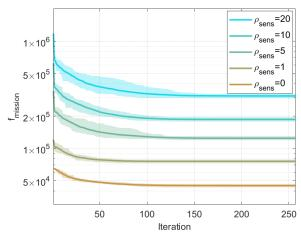

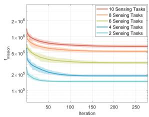  
(a) Different $\rho _ { \mathrm { s e n s } }$ settings.  
(b) Different dimensions.

Fig. 4. Convergence of the TLSP algorithm in different scenarios.  
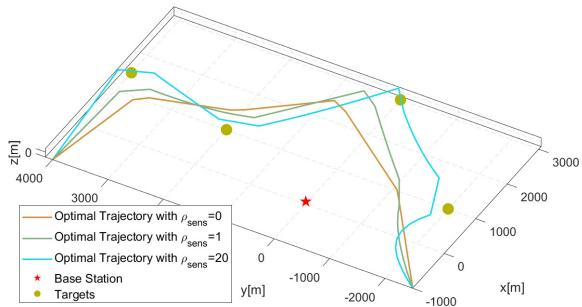  
Fig. 5. Optimal UAV trajectory.

In Fig. 4b, we consider the convergence under different dimensions through changing the number of sensing tasks M from 2 to 10 while holding $\rho _ { \mathrm { s e n s } } ~ = ~ 1 0$ . Here we use the robust initialization that $\beta _ { 0 }$ increases proportionally with $\sqrt { M }$ as noted in [42]. With the increment of sensing tasks, the dimension in the second layer increases from 12 to 60. From the result, the convergence of the TLSP method is ensured with the dimension increment, which shows its resistance to dimension changes. Although the problem becomes more complex with dimension increases, the TLSP method can still converge in about 250 iterations with the standard deviation of optimal value less than 4%. This variation is relatively small compared to the dimension increment, which provides a strong indication of its applicability to higher-dimensional cases.

Fig. 5 shows the optimal UAV trajectory with different $\rho _ { \mathrm { s e n s } }$ settings. In Fig. 6, we use the special cases of $\rho _ { \mathrm { s e n s } } ~ = ~ 0$ and $\rho _ { \mathrm { s e n s } } ~ = ~ 2 0$ to analyze the relation between sensing performance and the power consumption, communication rate, and UAV trajectory characteristics in detail. In these results, the case $\rho _ { \mathrm { s e n s } } = 0$ represents the scenario in which we aim to minimize the UAV energy consumption with the worst sensing performance constraint. As $\rho _ { \mathrm { s e n s } }$ increases, we pay more attention to the sensing performance improvement. In the optimal energy consumption case with $\rho _ { \mathrm { s e n s } } = 0$ , the UAV successively conducts sensing and communication missions with a relatively short trajectory and optimal velocity to save energy. The overall trajectory is relatively straight to minimize energy consumption under resolution constraints. As $\rho _ { \mathrm { s e n s } }$ increases, the UAV gradually approaches targets and improves the sensing geometry structures to enhance the resolution, and we can observe that the flight duration increases to improve the sensing performance. Therefore, the UAV consumes more time and energy, as is shown in Fig. 6a. Besides, the UAV consumes more resources on sensing missions and acquires more sensing data. These changes increase the communication burden, increasing the communication power and rate in Fig. 6b and 6c. To complete data uploading efficiently, the UAV not only adopts a curved trajectory closer to the BS as shown in Fig. 5 but also slows down the flight speed to ensure sufficient data transmission time as shown in Fig. 6c. With these adjustments, the UAV can improve resolution with optimal energy efficiency.

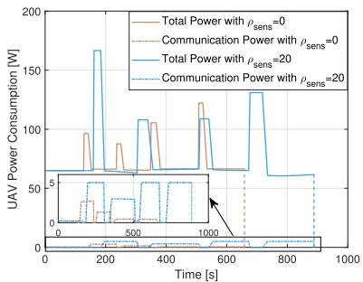  
(a) Instantaneous UAV power.

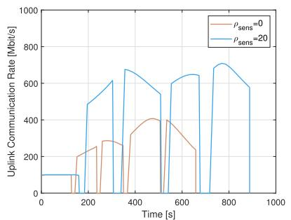  
(b) Instantaneous UAV uplink communication rate

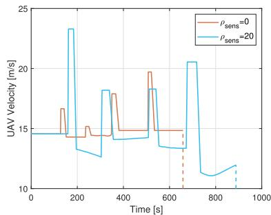  
(c) Instantaneous UAV velocity

Fig. 6. UAV power, velocity, and communication rate variation in the mission.  
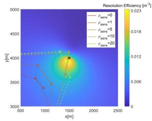  
(a) Target 1.

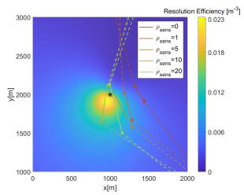  
(b) Target 2.

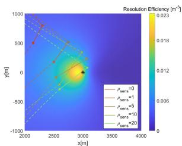  
(c) Target 3.

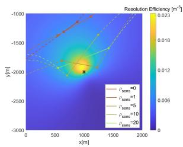  
(d) Target 4.  
Fig. 7. Resolution efficiency of the optimal trajectory with different $\rho _ { \mathrm { s e n s } } .$

The imaging trajectory with different $\rho _ { \mathrm { s e n s } }$ is shown in Fig. 7. For clarity, we have only drawn the planar view. Here the resolution efficiency $\alpha _ { \mathrm { r e s } }$ is defined in (50). The larger resolution efficiency implies a better geometric structure for imaging. The black asterisks represent the targets located at the center of imaging areas, the solid lines represent the imaging trajectory segments, and the dashed lines represent communication segments. It can be observed that the UAV trajectory does not necessarily fall in the region with optimal sensing performance, as the imaging geometry structure is set to obtain appropriate resolution while minimizing the overall energy consumption. For lower sensing performance weights, the trajectory falls far away from the region with higher resolution efficiency to achieve lower energy consumption. As the weight increases, the trajectory and the velocity direction gradually approach the optimal, and the aperture becomes larger to get better sensing performance.

## B. Superiority of the TLSP Algorithm

In this section, we evaluate the superiority of our algorithm over three baseline methods with Monte Carlo simulations for each $\rho _ { \mathrm { s e n s } }$ setting. Here the TLSP is our proposed method in Algorithm 3, and the BasicOpt method is our proposed basic optimization method in Algorithm 2. The detailed information about the baseline methods is as follows. The SCA method is a gradient-based optimization method widely used in UAV energy and trajectory optimization. Here we use differentiation to approximate the original problem with convex subproblems locally and solve them iteratively with the interior point method as in [22]. The PSO method is a typical heuristic algorithm. In our PSO implementation, the algorithm parameters are set based on related works [46], [47], [48]. The population size is 256, and the maximum number of iterations is 500. We set the inertia weight w to 0.73 and the learning coefficient to 1.5 for both the individual learning coefficient $c _ { 1 }$ and the global learning coefficient $c _ { 2 }$ In order to handle the complex constraints in (20), we add a penalty term in the iteration process to force the particles to move toward feasible regions. This term is the constraint violation multiplied by 1000. Besides, a gradually tightening constraint violation tolerance and a particle update method that prioritizes feasibility are employed within the iterative process to drive convergence toward feasible regions. To confirm the effectiveness of combining gradient-based and stochastic model-based optimization in different layers, we replace the second layer of our method with the SQP algorithm to form a Two-layer SQP (TLSQP) method as a baseline.

The optimal function values and constraint violations of different methods are shown in Fig. 8. The constraint violation is defined as

$$
\mathcal { V } = \sum | c _ { \mathrm { e q } } ^ { \star } | + \sum | \operatorname* { m a x } \{ c _ { \mathrm { n e q } } ^ { \star } , 0 \} | ,\tag{46}
$$

where $c _ { \mathrm { e q } } ^ { \star }$ and $c _ { \mathrm { n e q } } ^ { \star }$ are the values of equality and inequality constraints at the optimal point. These constraints are defined in (20). This metric can evaluate the feasibility of the solution. A solution is feasible if its constraint violation is almost zero.

In Fig. 8, the TLSP method achieves the best performance while guaranteeing convergence in all cases. Here the black error bars indicate the standard deviation of the indicators, and the bar chart represents their average values in 20 Monte Carlo simulations. The gradient-based methods SCA and TLSQP are deterministic methods, thus have no variance in different simulations. For TLSP, the maximum standard deviation of $f _ { \mathrm { m i s s i o n } }$ is 3% of its average value among different $\rho _ { \mathrm { s e n s } }$ settings. This number is 21% and 13% for PSO and BasicOpt, respectively. Among the methods with randomness, the TLSP shows the smallest variance. In these methods, PSO is the only algorithm that fails to converge to feasible regions, despite the application of multiple techniques to handle the constraints. This is because our problem contains a large number of constraints, especially many nonconvex ones, which creates a complex feasible region that is difficult for the particles to locate feasible points. Besides, the high-dimensional search space further reduces the efficiency of random search in PSO. As a result, the PSO excessively samples in the infeasible region, which makes it difficult to find feasible solutions. When $\rho _ { \mathrm { s e n s } }$ is small, i.e., $\rho _ { \mathrm { s e n s } } = 0$ and $\rho _ { \mathrm { s e n s } } = 1$ , the SCA and TLSQP methods both converge to the local optimum near the start point. This is because for small $\rho _ { \mathrm { s e n s } }$ values, the optimal falls near the boundary of the constraint (20i). The nonconvexity of the resolution function increases the likelihood of local optima and makes the algorithm easier to converge to a suboptimal solution.

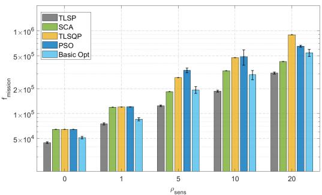  
(a) Optimal function value.

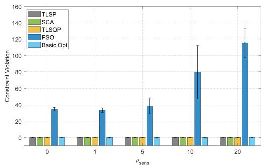  
(b) Constraint violation.  
Fig. 8. Optimization performance comparison.

The superiority of TLSP over baseline methods shows the effectiveness of our design. Through problem decomposition, we simplify the optimization and avoid convergence failures that occur in the PSO. The properties of the two subproblems make them easier to solve by the gradient-based method and the stochastic model-based method, respectively. Therefore, the TLSP method with the targeted treatment for each layer can perform better than the TLSQP. Introduction of the stochastic model in TLSP improves its ability to escape local optima, contributing to its superiority over SCA. The TLSP also shows better optimization results and smaller variance than the basic optimization method. This shows that the multi-start and non-optimal descent methods, as well as the correlation-based point selection, can further improve the performance. In conclusion, across all $\rho _ { \mathrm { s e n s } }$ values, the TLSP method achieves a minimum optimization performance improvement of 27.41% in the average $f _ { \mathrm { m i s s i o n } }$ compared to the baselines.

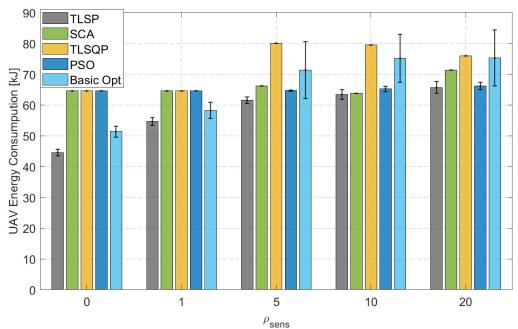  
(a) Overall energy consumption.

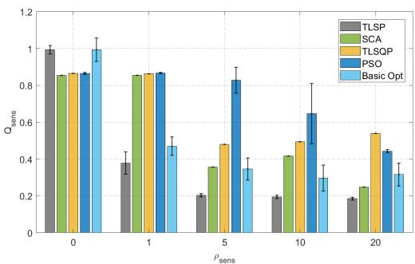  
(b) Overall sensing performance.  
Fig. 9. Energy consumption and sensing performance comparison.

In Fig. 9, we present the optimal energy consumption and sensing performance in simulations. Here the error bars and bar charts also indicate the standard deviations and mean values, respectively. From the results, the TLSP method also outperforms all other methods in terms of energy consumption and sensing performance with low variance. The maximum standard deviation of optimal energy consumption and sensing performance obtained with TLSP in different $\rho _ { \mathrm { s e n s } }$ settings is 3% and 16% of their average values. This is also smaller than the 18% and 25% in PSO, as well as the 13% and 24% in BasicOpt. Specifically, the TLSP method achieves minimum energy consumption in all $\rho _ { \mathrm { s e n s } }$ settings. For the case of $\rho _ { \mathrm { s e n s } } = 0$ , it obtains the minimum energy consumption while ensuring the resolution of all targets fairly. For the case with $\rho _ { \mathrm { s e n s } } \ > \ 0 .$ , the sensing performance obtained with the TLSP method increases more rapidly and is the best among all algorithms. These results demonstrate that the proposed TLSP method can effectively handle the resolution-related nonconvex parts in optimization, and adequately balance sensing performance and energy consumption.

Fig. 10 shows the target resolution with different $\rho _ { \mathrm { s e n s } }$ in a single simulation. Here the bar chart represents the average resolution, with black error bars indicating the maximum and minimum values. For $\rho _ { \mathrm { s e n s } } = 0$ and $\rho _ { \mathrm { s e n s } } = 1$ , TLSP is the only method that ensures the resolution fairness for different targets. As $\rho _ { \mathrm { s e n s } }$ increases, the resolution obtained with the TLSP method increases more rapidly and achieves the best sensing performance most quickly. This result shows that the TLSP method obtains better sensing performance through improving resolution as much as possible while balancing it among different targets.

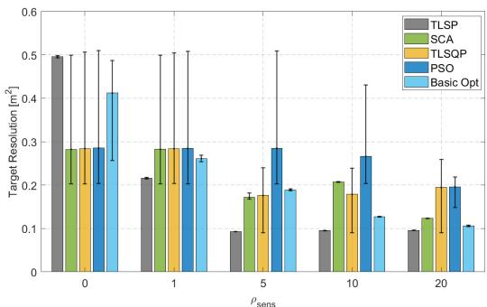

Fig. 10. Comparison of target resolution.  
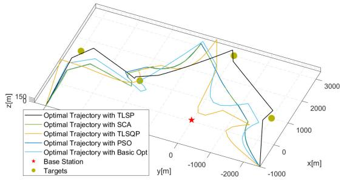  
(a) UAV flight trajectory.

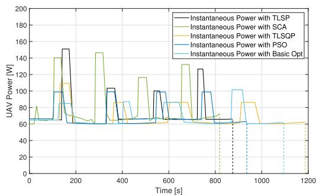  
(b) UAV instantaneous power.  
Fig. 11. Comparison of UAV flight trajectory and power.

From the optimization results of TLSP in Fig. 9 and Fig. 10, we can also observe that as $\rho _ { \mathrm { s e n s } }$ increases, the energy consumption increases while the sensing performance is improved. This shows the ability of $\rho _ { \mathrm { s e n s } }$ to adjust the emphasis of optimization. The effect of $\rho _ { \mathrm { s e n s } }$ gradually vanishes as it increases, because the system gradually approaches its limit for efficiently sensing. In practice, we can gradually increase $\rho _ { \mathrm { s e n s } }$ until its effect vanishes to improve the imaging performance as much as possible while guaranteeing energy efficiency.

Fig. 11 represents the UAV flight trajectory and instantaneous power obtained by these methods for the case of $\rho _ { \mathrm { s e n s } } = 1 0$ . As shown in Fig. 11a, the TLSP method obtains the best result as it finds the trajectory that has a better imaging geometry structure and shorter flight path. In Fig. 11b, we can see that a shorter flight duration does not necessarily mean less energy consumption. The result of the TLSP method achieves less energy consumption than SCA by optimizing energy allocation between communication and sensing tasks with the adaptive flight duration control.

## VI. CONCLUSION AND FUTURE WORK

In this paper, we proposed a joint power and trajectory optimization method for the UAV-enabled ISAC SAR imaging system. We proposed the system model based on the comprehensive consideration of practical scenarios. The ISAC scheme, communication-sensing relations, 2D resolution and its fairness, as well as mission duration, were taken into consideration. We formed the optimization problem that can adjust the emphasis between imaging performance and energy consumption. To solve this problem, we decomposed it into a two-layer optimization and proposed the TLSP method. Based on the analysis of the characteristics of two-layer subproblems, we proposed to use an SQP-based algorithm to optimize communication parts given sensing parameters in the first layer, and a modified Bayesian optimization to handle the nonconvex sensing metrics in the second layer. The multi-start, non-optimal descent, and correlation-based point selection methods are proposed to enhance algorithm performance. Simulations with different sensing weights showed that the focus of the algorithm can be modified through hyperparameter adjustments. The comparison against baselines including SCA, PSO, and TLSQP demonstrated that the TLSP method achieves at least 27.41% higher optimization performance while maintaining optimal energy consumption and resolution fairness.

In our work, the coverage constraint of the BS is treated softly through the communication capacity and sensing SNR. But in realistic scenarios, the BS coverage will be more complex. To address this issue, we consider the collaboration with a coverage map or channel knowledge map in optimization to enhance the practical application in future work. Further improvements of the system model could also be considered in the future, such as a more accurate propulsion power model including acceleration losses. Considering waveform design in this system is also an important direction in the future, as an appropriate transmission waveform can further improve the system performance and reduce the energy consumption of both the BS and UAV. Besides, several issues in the system extension to multistatic cases are important to be addressed in the future. The allocation of multiple BSs for different tasks and the potential handover remain to be considered. For multiple UAVs, the resource allocation for communication transmission and the assignment of UAVs for each imaging area should be addressed. With the optimization considering the above concerns, this framework can handle more complex cases in future work.

## APPENDIX

## THE RESOLUTION ANALYSIS OF BISTATIC IMAGING

In this appendix, we analyze the resolution in detail and discuss the requirements for optimal resolution. For the fixed velocity and small aperture, the variance of $\mathbf { e _ { U A V } }$ and $\mathbf { r } _ { \mathrm { U A V } }$ to t are small and can be omitted. Therefore, we can assume that $\mathbf { e _ { U A V } }$ and $\mathbf { r } _ { \mathrm { U A V } }$ are invariant with t. Then for a fixed target at the position r, we can omit r and t in the expression of the resolution unit in the latter discussions.

Then the area of the resolution unit can be rewritten into the new form as $\begin{array} { r } { \mathcal { A } _ { \mathrm { r e s } } ~ = ~ \frac { \delta _ { r } \delta _ { f } } { \sqrt { 1 - ( \mathbf { e } _ { r } \mathbf { e } _ { f } ^ { T } ) ^ { 2 } } } } \end{array}$ . The range resolution becomes $\begin{array} { r } { \delta _ { r } \ = \ \frac { c } { B \| ( \mathbf { e } _ { \mathrm { B S } } + \mathbf { e } _ { \mathrm { U A V } } ) \mathbf { P } \| } } \end{array}$ , and its direction is $\begin{array} { r l } { \mathbf { e } _ { r } } & { { } = } \end{array}$ $\frac { ( \mathbf { e } _ { \mathrm { B S } } + \mathbf { e } _ { \mathrm { U A V } } ) \mathbf { P } } { \| ( \mathbf { e } _ { \mathrm { B S } } + \mathbf { e } _ { \mathrm { U A V } } ) \mathbf { P } \| }$ . The Doppler resoltion can be simplified to the form $\begin{array} { r } { \delta _ { f } = \frac { \lambda } { t _ { s } \| \omega _ { \mathrm { U A V } } \mathbf { P } \| } } \end{array}$ and its direction is $\begin{array} { r } { \mathbf { e } _ { f } = \frac { \omega _ { \mathrm { U A V } } \mathbf { P } } { \left\| \omega _ { \mathrm { U A V } } \mathbf { P } \right\| } } \end{array}$ , where $t _ { s } = t _ { 2 } - t _ { 1 }$ . Then the resolution becomes

$$
\mathcal { A } _ { \mathrm { r e s } } = \frac { \lambda c } { B t _ { s } } \cdot \frac { 1 } { \left\| ( \mathbf { e } _ { \mathrm { B S } } + \mathbf { e } _ { \mathrm { U A V } } ) \mathbf { P } \right\| } \cdot \frac { 1 } { \vert \omega _ { \mathrm { U A V } } \mathbf { Q } \mathbf { e } _ { r } ^ { T } \vert } ,\tag{47}
$$

where $\mathbf { Q } = \mathrm { d i a g } \left( \left( { \begin{array} { 1 } { 0 } \end{array} } - 1 \right) , 0 \right)$ is the rotation matrix on the plane such that $\mathbf { x } \mathbf { Q x } ^ { T } \overset { \cdot \cdot } { = } 0$ for any vector $\mathbf { x } \in \mathbb { R } ^ { 1 \times 3 }$ . We have the properties that ${ \mathbf { Q } } ^ { T } = - { \mathbf { Q } } , \dot { \mathbf { P } } ^ { T } = \mathbf { P }$ , and $\mathbf { Q P } = \mathbf { P Q } = \mathbf { Q }$

If we denote $\begin{array} { r } { v = \| \mathbf { v } \| , \mathbf { e } _ { v } = \frac { \mathbf { v } } { \| \mathbf { v } \| } } \end{array}$ , and $R _ { \mathrm { U A V } } = \Vert \mathbf { r } - \mathbf { r } _ { \mathrm { U A V } } \Vert ,$ we have $\begin{array} { r l r } { \omega _ { \mathrm { U A V } } } & { { } = } & { \frac { v } { R _ { \mathrm { U A V } } } \mathrm {  ~ \cdot ~ } { \bf e } _ { v } \big ( \ddot { I } _ { 3 \times 3 } - { \bf e } _ { \mathrm { U A V } } ^ { T } { \bf e } _ { \mathrm { U A V } } \big ) } \end{array}$ . Then the resolution can be rewritten as

$$
\mathcal { A } _ { \mathrm { r e s } } = \frac { \rho _ { \mathrm { r e s } } } { \left\| \left( \mathbf { e } _ { \mathrm { B S } } + \mathbf { e } _ { \mathrm { U A V } } \right) \mathbf { P } \right\| } \cdot \frac { 1 } { \left| \mathbf { e } _ { v } \left( I _ { 3 \times 3 } - \mathbf { e } _ { \mathrm { U A V } } ^ { T } \mathbf { e } _ { \mathrm { U A V } } \right) \mathbf { Q } \mathbf { e } _ { r } ^ { T } \right| } .\tag{48}
$$

Here $\begin{array} { r } { \rho _ { \mathrm { r e s } } ~ = ~ \frac { \lambda c R _ { \mathrm { U A V } } } { B v t _ { \mathrm { s } } } } \end{array}$ . In this expression, we can adjust the geometry-related vector $\mathbf { e } _ { v }$ and $\mathbf { e _ { U A V } }$ to improve the resolution. Firstly, we consider fix $\mathbf { e _ { U A V } }$ and adjust $\mathbf { e } _ { v }$ . The optimal resolution occurs when $\mathbf { e } _ { v }$ is parallel with $\mathbf { e } _ { r } \mathbf { Q } ( I _ { 3 \times 3 } - \mathbf { e } _ { \mathrm { U A V } } ^ { T } \mathbf { e } _ { \mathrm { U A V } } )$ Noticed that this vector is the component of $ { \mathbf { e } } _ { r }  { \mathbf { Q } }$ that is perpendicular to $\mathbf { e _ { U A V } }$ , we can write the optimal resolution under this condition as

$$
\widetilde { \mathcal { A } _ { \mathrm { r e s } } } = \rho _ { \mathrm { r e s } } \cdot \frac { 1 } { \sqrt { \| ( \mathbf { e } _ { \mathrm { B S } } + \mathbf { e } _ { \mathrm { U A V } } ) \mathbf { P } \| ^ { 2 } - ( \mathbf { e } _ { \mathrm { B S } } \mathbf { Q } \mathbf { e } _ { \mathrm { U A V } } ^ { T } ) ^ { 2 } } } .\tag{49}
$$

This expression represents the optimum resolution that can be achieved given a fixed synthetic aperture center. As this resolution is dependent on the aperture length $v t _ { s } ,$ we define the resolution efficiency as

$$
\alpha _ { \mathrm { r e s } } = \frac { \boldsymbol { B } \cdot \sqrt { \| ( \mathbf { e } _ { \mathrm { B S } } + \mathbf { e } _ { \mathrm { U A V } } ) \mathbf { P } \| ^ { 2 } - ( \mathbf { e } _ { \mathrm { B S } } \mathbf { Q } \mathbf { e } _ { \mathrm { U A V } } ^ { T } ) ^ { 2 } } } { \lambda c R _ { \mathrm { U A V } } } .\tag{50}
$$

This metric represents the potential to get a better resolution for a certain geometric structure. The larger resolution efficiency denotes a better geometry structure. Especially, for a UAV flies with the optimal velocity direction at every position in the imaging trajectory, we have $\begin{array} { r } { \mathcal { A } _ { \mathrm { r e s } } = \frac { 1 } { \int \alpha _ { \mathrm { r e s } } \mathrm { d } s } } \end{array}$ , where s is the length of the trajectory.

Then we consider the optimal geometric structure for imaging. If $\| \mathbf { e } _ { \mathrm { U A V } } \mathbf { P } \|$ is fixed, i.e., the elevation angle of the UAV is fixed, the optimal resolution is obtained when $\mathbf { e } _ { \mathrm { B S } } \mathbf { P }$ and $\mathbf { e } _ { \mathrm { U A V } } \mathbf { P }$ are in the same direction. If we denote the elevation angle of the UAV as $\varphi _ { \mathrm { U A V } }$ , the optimal resolution is

$$
\mathcal { A } _ { \mathrm { r e s } } ^ { \mathrm { o p t } } = \frac { \lambda c R _ { \mathrm { U A V } } } { B v t _ { s } } \cdot \frac { 1 } { \lVert \mathbf { e } _ { \mathrm { B S } } \mathbf { P } \rVert + \cos \varphi _ { \mathrm { U A V } } } ,\tag{51}
$$

and the optimality is obtained when

$$
\mathbf { e } _ { \mathrm { U A V } } \mathbf { P } = { \frac { \cos \varphi _ { \mathrm { U A V } } } { \left\| \mathbf { e } _ { \mathrm { B S } } \mathbf { P } \right\| } } \cdot \mathbf { e } _ { \mathrm { B S } } \mathbf { P } ,\tag{52a}
$$

$$
\begin{array} { r } { \mathbf { e } _ { v } = \pm \mathbf { e } _ { \mathrm { U A V } } \mathbf { Q } . } \end{array}\tag{52b}
$$

Here we can see that the optimal UAV velocity is parallel to the ground plane because ${ \bf e } _ { v } ( 3 ) = 0$ , so the UAV flies at a constant altitude.

## REFERENCES

[1] S. Lu et al., “Integrated sensing and communications: Recent advances and ten open challenges,” IEEE Internet Things J., vol. 11, no. 11, pp. 19094–19120, Jun. 2024.

[2] A. Liu et al., “A survey on fundamental limits of integrated sensing and communication,” IEEE Commun. Surveys Tuts., vol. 24, no. 2, pp. 994–1034, 2nd Quart., 2022.

[3] M. Chafii, L. Bariah, S. Muhaidat, and M. Debbah, “Twelve scientific challenges for 6G: Rethinking the foundations of communications theory,” IEEE Commun. Surveys Tuts., vol. 25, no. 2, pp. 868–904, 2nd Quart., 2023.

[4] F. Liu et al., “Integrated sensing and communications: Toward dualfunctional wireless networks for 6G and beyond,” IEEE J. Sel. Areas Commun., vol. 40, no. 6, pp. 1728–1767, Jun. 2022.

[5] Z. Wei et al., “Integrated sensing and communication signals toward 5G-A and 6G: A survey,” IEEE Internet Things J., vol. 10, no. 13, pp. 11068–11092, Jul. 2023.

[6] A. Kaushik et al., “Integrated sensing and communications for IoT: Synergies with key 6G technology enablers,” IEEE Internet Things Mag., vol. 7, no. 5, pp. 136–143, Sep. 2024.

[7] X. Cheng et al., “Intelligent multi-modal sensing-communication integration: Synesthesia of machines,” IEEE Commun. Surveys Tuts., vol. 26, no. 1, pp. 258–301, 1st Quart., 2024.

[8] J. Mu, R. Zhang, Y. Cui, N. Gao, and X. Jing, “UAV meets integrated sensing and communication: Challenges and future directions,” IEEE Commun. Mag., vol. 61, no. 5, pp. 62–67, May 2023.

[9] K. Meng et al., “UAV-enabled integrated sensing and communication: Opportunities and challenges,” IEEE Wireless Commun., vol. 31, no. 2, pp. 97–104, Apr. 2024.

[10] Q. Wu et al., “A comprehensive overview on 5G-and-beyond networks with UAVs: From communications to sensing and intelligence,” IEEE J. Sel. Areas Commun., vol. 39, no. 10, pp. 2912–2945, Oct. 2021.

[11] S. Moro, F. Linsalata, M. Manzoni, M. Magarini, and S. Tebaldini, “Exploring ISAC technology for UAV SAR imaging,” in Proc. IEEE Int. Conf. Commun., Denver, CO, USA, Jun. 2024, pp. 1582–1587.

[12] X. Lv et al., “Enhanced sensing in 6G NTN: Imaging with LEO satellite and UAV communication network,” IEEE Sensors J., vol. 25, no. 17, pp. 33005–33021, Sep. 2025.

[13] A. Moreira, P. Prats-Iraola, M. Younis, G. Krieger, I. Hajnsek, and K. P. Papathanassiou, “A tutorial on synthetic aperture radar,” IEEE Geosci. Remote Sens. Mag., vol. 1, no. 1, pp. 6–43, Mar. 2013.

[14] B. Sun, B. Tan, M. Ashraf, M. Valkama, and E. S. Lohan, “Embedding the localization and imaging functions in mobile systems: An airport surveillance use case,” IEEE Open J. Commun. Soc., vol. 3, pp. 1656–1671, 2022.

[15] B. Li, Z. Fei, and Y. Zhang, “UAV communications for 5G and beyond: Recent advances and future trends,” IEEE Internet Things J., vol. 6, no. 2, pp. 2241–2263, Apr. 2019.

[16] M. Samir, S. Sharafeddine, C. M. Assi, T. M. Nguyen, and A. Ghrayeb, “UAV trajectory planning for data collection from time-constrained IoT devices,” IEEE Trans. Wireless Commun., vol. 19, no. 1, pp. 34–46, Jan. 2020.

[17] X. Jing, F. Liu, C. Masouros, and Y. Zeng, “ISAC from the sky: UAV trajectory design for joint communication and target localization,” IEEE Trans. Wireless Commun., vol. 23, no. 10, pp. 12857–12872, Oct. 2024.

[18] M.-A. Lahmeri, V. Mustieles-Perez, M. Vossiek, G. Krieger, and´ R. Schober, “UAV formation and resource allocation optimization for communication-assisted 3D InSAR sensing,” IEEE Trans. Commun., vol. 73, no. 8, pp. 5788–5804, Aug. 2025.

[19] Z. Sun, J. Wu, G. G. Yen, Z. Lu, and J. Yang, “Performance analysis and system implementation for energy-efficient passive UAV radar imaging system,” IEEE Trans. Veh. Technol., vol. 72, no. 8, pp. 9938–9955, Aug. 2023.

[20] A. V. Savkin, W. Ni, and M. Eskandari, “Effective UAV navigation for cellular-assisted radio sensing, imaging, and tracking,” IEEE Trans. Veh. Technol., vol. 72, no. 10, pp. 13729–13733, Oct. 2023.

[21] F. Xu et al., “Heuristic path planning method for multistatic UAV-borne SAR imaging system,” IEEE J. Sel. Topics Appl. Earth Observ. Remote Sens., vol. 14, pp. 8522–8536, 2021.

[22] Z. Liu et al., “Joint user scheduling, power allocation, and trajectory design for joint synthetic aperture radar and communication UAV systems,” IEEE Trans. Veh. Technol., vol. 74, no. 2, pp. 3006–3016, Feb. 2025.

[23] S. Hu, X. Yuan, W. Ni, and X. Wang, “Trajectory planning of cellularconnected UAV for communication-assisted radar sensing,” IEEE Trans. Commun., vol. 70, no. 9, pp. 6385–6396, Sep. 2022.

[24] D. Liu, Y. Gao, S. Hu, W. Ni, and X. Wang, “Trajectory design for integrated sensing and communication enabled by cellular-connected UAV,” IEEE Wireless Commun. Lett., vol. 13, no. 7, pp. 1973–1977, Jul. 2024.

[25] Z. Wang, F. Liu, T. Zeng, and S. He, “A high-frequency motion error compensation algorithm based on multiple errors separation in BiSAR onboard mini-UAVs,” IEEE Trans. Geosci. Remote Sens., vol. 60, 2022, Art. no. 5223013.

[26] I. G. Cumming and F. H. Wong, Digital Processing of Synthetic Aperture Radar Data: Algorithms and Implementation (Artech House Remote Sensing Library). Boston, MA, USA: Artech House, 2005.

[27] H. Breit, T. Fritz, U. Balss, M. Lachaise, A. Niedermeier, and M. Vonavka, “TerraSAR-X SAR processing and products,” IEEE Trans. Geosci. Remote Sens., vol. 48, no. 2, pp. 727–740, Feb. 2010.

[28] A. Khalili, A. Rezaei, D. Xu, and R. Schober, “Energy-aware resource allocation and trajectory design for UAV-enabled ISAC,” in Proc. GLOBECOM IEEE Global Commun. Conf., Kuala Lumpur, Malaysia, Dec. 2023, pp. 4193–4198.

[29] Y. Zeng, J. Xu, and R. Zhang, “Energy minimization for wireless communication with rotary-wing UAV,” IEEE Trans. Wireless Commun., vol. 18, no. 4, pp. 2329–2345, Apr. 2019.

[30] Y. Wang, M. Chen, C. Pan, K. Wang, and Y. Pan, “Joint optimization of UAV trajectory and sensor uploading powers for UAV-assisted data collection in wireless sensor networks,” IEEE Internet Things J., vol. 9, no. 13, pp. 11214–11226, Jul. 2022.

[31] M. Lort, A. Aguasca, C. Lopez-Martinez, and T. M. Marin, “Initial evaluation of SAR capabilities in UAV multicopter platforms,” IEEE J. Sel. Topics Appl. Earth Observ. Remote Sens., vol. 11, no. 1, pp. 127–140, Jan. 2018.

[32] Y. Wang et al., “First demonstration of single-pass distributed SAR tomographic imaging with a P-band UAV SAR prototype,” IEEE Trans. Geosci. Remote Sens., vol. 60, 2022, Art. no. 5238618.

[33] A. Moccia and A. Renga, “Spatial resolution of bistatic synthetic aperture radar: Impact of acquisition geometry on imaging performance,” IEEE Trans. Geosci. Remote Sens., vol. 49, no. 10, pp. 3487–3503, Oct. 2011.

[34] A. Khalili, A. Rezaei, D. Xu, F. Dressler, and R. Schober, “Efficient UAV hovering, resource allocation, and trajectory design for ISAC with limited backhaul capacity,” IEEE Trans. Wireless Commun., vol. 23, no. 11, pp. 17635–17650, Nov. 2024.

[35] S. J. Wright, “Modifying SQP for degenerate problems,” SIAM J. Optim., vol. 13, no. 2, pp. 470–497, Jan. 2002.

[36] P. E. Gill, V. Kungurtsev, and D. P. Robinson, “A stabilized SQP method: Global convergence,” IMA J. Numer. Anal., vol. 37, no. 1, pp. 407–443, Jan. 2017.

[37] J. Dong, J. Shi, S. Wang, Y. Xue, and S. Liu, “A trust-region algorithm for equality-constrained optimization via a reduced dimension approach,” J. Comput. Appl. Math., vol. 152, nos. 1–2, pp. 99–118, Mar. 2003.

[38] B. Shahriari, K. Swersky, Z. Wang, R. P. Adams, and N. de Freitas, “Taking the human out of the loop: A review of Bayesian optimization,” Proc. IEEE, vol. 104, no. 1, pp. 148–175, Jan. 2016.

[39] Y. Huang, J. Sun, and Y. Tian, “A Bayesian optimization method for finding the worst-case scenarios of autonomous vehicles,” IEEE Trans. Intell. Transp. Syst., vol. 26, no. 1, pp. 529–543, Jan. 2025.

[40] W. Na, K. Liu, H. Cai, W. Zhang, H. Xie, and D. Jin, “Efficient EM optimization exploiting parallel local sampling strategy and Bayesian optimization for microwave applications,” IEEE Microw. Wireless Compon. Lett., vol. 31, no. 10, pp. 1103–1106, Oct. 2021.

[41] J. Bergstra, R. Bardenet, Y. Bengio, and B. Kegl, “Algorithms for hyper-´ parameter optimization,” in Proc. 24th Int. Conf. Neural Inf. Process. Syst. Red Hook, NY, USA: Curran Associates, 2011, pp. 2546–2554.

[42] Z. Xu, H. Wang, J. M. Phillips, and S. Zhe, “Standard Gaussian process is all you need for high-dimensional Bayesian optimization,” in Proc. 13th Int. Conf. Learn. Represent. (ICLR), Singapore, Apr. 2025, pp. 94842–94862.

[43] S. J. Wright, Primal-Dual Interior-Point Methods. Philadelphia, PA, USA: Society for Industrial and Applied Mathematics, Jan. 1997.

[44] S. P. Boyd and L. Vandenberghe, Convex Optimization. Cambridge, U.K.: Cambridge Univ. Press, 2004.

[45] S. Gu, C. Luo, Y. Luo, and X. Ma, “Jointly optimize throughput and localization accuracy: UAV trajectory design for multiuser integrated communication and sensing,” IEEE Internet Things J., vol. 11, no. 24, pp. 39497–39511, Dec. 2024.

[46] V. Roberge, M. Tarbouchi, and G. Labonte, “Comparison of parallel genetic algorithm and particle swarm optimization for real-time UAV path planning,” IEEE Trans. Ind. Informat., vol. 9, no. 1, pp. 132–141, Feb. 2013.

[47] Z. Yu, Z. Si, X. Li, D. Wang, and H. Song, “A novel hybrid particle swarm optimization algorithm for path planning of UAVs,” IEEE Internet Things J., vol. 9, no. 22, pp. 22547–22558, Nov. 2022.

[48] C. Huang, H. Ma, X. Zhou, and W. Deng, “Cooperative path planning of multiple unmanned aerial vehicles using cylinder vector particle swarm optimization with gene targeting,” IEEE Sensors J., vol. 25, no. 5, pp. 8470–8480, Mar. 2025.

Xianglong Lv (Student Member, IEEE) received the B.S. degree in mathematics from Beihang University, Beijing, China, in 2022, where he is currently pursuing the Ph.D. degree with the School of Electronic and Information Engineering.

His current research interests include B5G/6G mobile communication systems, wireless sensing, integrated sensing and communication, and its application to Internet of Things networks.

Rongke Liu (Senior Member, IEEE) received the B.S. and Ph.D. degrees from Beihang University, Beijing, China, in 1996 and 2002, respectively.

He was a Visiting Professor with Florida Institute of Technology, Melbourne, FL, USA, in 2006; The University of Tokyo, Japan, in 2015; and The University of Edinburgh, U.K., in 2018. He is currentl a Full Professor with the School of Electronics and Information Engineering and the President with Shenzhen Institute, Beihang University. He received the support of the New Century Excellent Talents

Program from the Minister of Education, China. He has attended many special programs, such as China Terrestrial Digital Broadcast Standard. His research interests include wireless communication, channel coding, and aerospace communication.

Quanyu Meng received the B.S. degree in communication engineering from the School of Information and Computer Science, Taiyuan University of Technology (TYUT), in 2021. He is currently pursuing the Ph.D. degree with the School of Electronic and Information Engineering, Beihang University, China.

His research interests include integrated sensing and communications (ISAC), non-terrestrial networks (NTNs), with a particular emphasis on uncrewed aerial vehicle (UAV) applications, local-

ization and navigation technologies, and their implementations in 6G networks and the Internet of Things (IoT).

Yunshuo Zang received the B.S. degree in electrical and information engineering from Zhejiang University, Hangzhou, China, in 2019. He is currently pursuing the Ph.D. degree with the School of Electronic and Information Engineering, Beihang University.

His research interests include synthetic aperture imaging, waveform designing, target detection, application of these technologies to 5G, and the Internet of Things networks.