Received 29 May 2021; accepted 7 June 2021. Date of publication 14 June 2021; date of current version 1 July 2021. The review of this article was arranged by Editor Wen Chen.

Digital Object Identifier 10.1109/OJVT.2021.3089083

# Joint RAN Slicing and Computation Offloading for Autonomous Vehicular Networks: A Learning-Assisted Hierarchical Approach

QIANG YE 1 (Member, IEEE), WEISEN SHI 2 (Student Member, IEEE), KAIGE QU 2 (Member, IEEE), HONGLI HE 3 (Member, IEEE), WEIHUA ZHUANG 2 (Fellow, IEEE), AND XUEMIN SHEN 2 (Fellow, IEEE)

1 Department of Electrical and Computer Engineering, and Technology, Minnesota State University, Mankato, MN 56001 USA 2 Department of Electrical and Computer Engineering, University of Waterloo, Waterloo, ON N2L 3G1, Canada 3 College of Information Science & Electronic Engineering, Zhejiang University, Hangzhou 310027, China

CORRESPONDING AUTHOR: KAIGE QU (e-mail: k2qu@uwaterloo.ca).

This work was supported by research grants from the Natural Sciences and Engineering Research Council (NSERC) of Canada and by the Faculty Research Grant (FRG) 211597 at Minnesota State University, Mankato. This article was presented in part at the IEEE ICC 2021 [1].

ABSTRACT In this paper, a two-timescale radio access network (RAN) slicing and computing task offloading problem is investigated for a cloud-enabled autonomous vehicular network (C-AVN). We aim at jointly maximizing the communication and computing resource utilization with diverse quality-of-service (QoS) guarantee for autonomous driving tasks. Specifically, to capture the small-timescale network dynamics, a computing task scheduling problem is formulated as a stochastic optimization program, for maximizing the long-term network-wide computation load balancing with minimum task offloading variations. Due to the large problem size and unavailable network state transition probabilities, we employ cooperative multi-agent deep Q-learning (MA-DQL) with fingerprint to solve the problem by learning the set of stationary task offloading policies with stabilized convergence. Given the task offloading decisions, we further study a RAN slicing problem in a large timescale, which is formulated as a convex optimization program. We focus on optimizing the radio resource slicing ratios among base stations, to maximize the aggregate network utility with statistical QoS provisioning for autonomous driving tasks. Based on the impact of radio resource slicing on computation load balancing, we propose a two-timescale hierarchical optimization framework to maximize both communication and computing resource utilization. Extensive simulation results are provided to demonstrate the effectiveness of the proposed framework in comparison with state-of-the-art schemes.

INDEX TERMS Autonomous vehicular networks, computing task offloading, RAN slicing, resource sharing, task scheduling, cooperative multi-agent deep Q-learning, learning-assisted hierarchical approach, diverse QoS provisioning.

# I. INTRODUCTION

Future intelligent transportation systems are envisioned to have more and more autonomous driving vehicles (AVs) operated on the roads with increased levels of automation (e.g., levels 3–5) [2]. The development and commercialization of AVs are essential for intelligent navigation, efficient traffic management, and driving safety. In recent years, both automotive industry and research community have been investigating how to increase the AV automation levels by using advanced sensing technologies, such as vision-based cameras, light detection and ranging (LiDAR), and radio detection and ranging (RADAR) [2]–[4]. To execute different autonomous driving tasks (e.g., vehicle localization, object detection and tracking, and data fusion), the raw data sensed from the surrounding environment needs to be processed/computed, in form of computing tasks, to extract useful information for vehicles to perform responsive operations, such as lane changing, acceleration/deceleration, and route planning. With an increasing amount of sensed data, the computation demands can overwhelm the on-board processing capacity, leading to prolonged computation responsiveness and excessive power consumption.

Computation offloading remains a promising way to release the AV on-board computation burden [5], where the generated tasks are offloaded through wireless communications, e.g., cellular vehicle-to-everything (C-V2X) communications [6], to high-performance edge computing (HPC) servers. The computation output is fed back to each AV to facilitate proper vehicle operations. To enhance the edge computing performance, existing studies mainly focus on how to determine the optimal decisions between local on-board processing and task offloading. The objective is to maximize the aggregate network utility for computation offloading under quality-of-service (QoS) constraints [7], [8] or minimize the edge computing cost in terms of offloading latency or energy consumption [9], [10]. To further reduce the communication delay, migrating computing tasks to nearby vehicles with available computation resources through vehicle-to-vehicle (V2V) communications is studied [7], [11]. Many existing proposals focus on a single-layer edge computing platform with one edge node (or a group of servers) connected to a single wireless base station (BS). To deal with an increasing number of AVs with high mobility, a multi-tier networking architecture, e.g., macro-cell BSs (MBSs) underlaid by smallcell BSs (SBSs), connected to multi-layers of edge computing servers, is desired to enhance communication coverage with high computation capabilities. Under this architecture, one of the fundamental research issues is how to determine a task offloading policy to balance the network-wide computation load among edge servers in a long run such that the overall computing resource utilization is maximized. Existing works often formulate the computation load balancing problem as a one-time optimization program, to maximize the network utility for balanced load [12] or minimize the difference of task offloading levels among edge servers [13]. However, to achieve long-term computation load balancing, the task offloading decisions need to be determined over sequential scheduling slots (in the scale of milliseconds). Solving oneshot optimization problems over small-timescale scheduling slots is computational intractable. Moreover, for load balancing, the cost of task offloading changes among servers over consecutive slots needs to be considered.

On the other hand, how radio resources are allocated to support task offloading can affect the overall computing resource utilization. Tasks for autonomous driving often have diverse service quality requirements. For example, each task needs to be processed within certain delay bound and also requires a minimum rate of being fed to the processing engine [2]. If the allocation of radio resources cannot support the offloading in meeting task transmission rate, latency, or reliability requirements, a balanced computation load may not be achieved. In [11], a joint communication and computing time allocation problem for cooperative computation offloading is studied for vehicular networks, where resources for task offloading, local task execution, and vehicle-assisted task migration are jointly optimized to achieve the overall maximal reliability for task computation. Most existing studies aim at offloading tasks with QoS satisfaction (e.g., in terms of offloading rate [7], task transmission latency [8], [12], [14], and transmission reliability [11]), while how radio resource allocation affects the computation offloading performance needs to be investigated. With more AVs generating an increasing number of tasks to be offloaded, how to improve the overall communication resource utilization to support computation offloading is essential to further enhance the edge computing performance. By enabling resource sharing among BSs, radio access network (RAN) slicing remains a promising approach to facilitate more fine-grained resource orchestration for better utilization and QoS isolation [15], [16]. Through network function virtualization (NFV), radio resources are virtualized and aggregated as a resource pool, centrally managed by a software-defined networking (SDN)-enabled resource slicing controller. The controller slices the pooled resources among BSs, based on network traffic load conditions and QoS requirements. There exist studies on how to slice the radio resources for supporting different vehicular services, by maximizing 1) the number of admitted service requests [17], 2) the combination of spectrum efficiency and service satisfaction ratio [18], or 3) the satisfaction of service delay and information freshness [19]. Joint RAN slicing and computing workload allocation is studied in [20], for minimizing the overall system cost of allocating the two-dimensional resources with task offloading delay and queueing stability constraints.

To explicitly characterize the impact of radio resource slicing on balancing the computation load such that both communication and computing resource utilization can be maximized, in this paper, we present a two-timescale RAN slicing and computing task scheduling framework for a cloudenabled autonomous vehicular network (C-AVN). Specifically, to capture small-timescale network dynamics and characterize the relation between the network traffic load and task offloading policy, we formulate the computing task scheduling problem as an MDP with constraints on communication latency and computation capacity. The objective is to maximize long-term network-wide computation load balancing with minimal task offloading variations among edge servers. We employ a cooperative multi-agent deep Q-learning (MA-DQL) framework with fingerprint to learn a stationary offloading policy. Given the task offloading decisions, we further formulate a large-timescale RAN slicing problem as a convex optimization program to determine radio resource slicing ratios at BSs that maximize the overall communication resource utilization with statistical QoS guarantee. Due to the correlation between the problems of two timescales, a joint optimization framework is established to determine the radio resource slicing ratios for computation load balancing, and a learning-assisted algorithm is designed to iteratively solve the problem with convergence. Extensive simulation results demonstrate that the proposed framework outperforms benchmark schemes, in terms of communication and computing resource utilization with QoS guarantee and adaptation to AV traffic load variations.

TABLE I Important Parameters and Symbols 

<table><tr><td>Symbol</td><td>Definition</td></tr><tr><td> $a_{k,z,t}$ </td><td>Task offloading action in zone z of  $S_k$  at slot t</td></tr><tr><td> $a_{k,z}$ </td><td>Stationary task offloading policy in zone z of  $S_k$ </td></tr><tr><td> $\mathcal{A}_{k,t}$ </td><td>Task offloading actions under agent k</td></tr><tr><td> $C_k$ </td><td>Computation capacity on the edge server connected to  $S_k$ </td></tr><tr><td> $C_t$ </td><td>Total cost of computation load balancing at slot t</td></tr><tr><td>D</td><td>Task offloading latency requirement</td></tr><tr><td> $f_{k,z}$ </td><td>Average fraction of radio resources reserved for AVs in zone z of  $S_k$ </td></tr><tr><td>H</td><td>Computing task size</td></tr><tr><td> $I_{k,z,t}$ </td><td>Uplink SINR/SNR for an AV in zone z of  $S_k$  at slot t</td></tr><tr><td> $L_{k,t}$ </td><td>Computation load associated with  $S_k$  at slot t</td></tr><tr><td> $M_{k,z}$ </td><td>Average number of AVs in zone z of  $S_k$  in a planning window</td></tr><tr><td> $M_{\text{max}}$ </td><td>Maximum number of AVs in each road zone</td></tr><tr><td> $N_{k,z,t}$ </td><td>Number of active AVs in zone z of  $S_k$  at slot t</td></tr><tr><td> $\mathcal{O}_{k,t}^{(f)}$ </td><td>Augmented local observation under agent k at slot t</td></tr><tr><td>p</td><td>AV activation probability</td></tr><tr><td> $P_k$ </td><td>Uplink transmission power for AVs under  $S_k$ </td></tr><tr><td> $S_k$ </td><td>The k th BS under consideration</td></tr><tr><td>T</td><td>The duration of a task scheduling slot</td></tr><tr><td> $v_{k,z}$ </td><td>The mean AV velocity in zone z of  $S_k$  in a planning window</td></tr><tr><td>W</td><td>Aggregated radio resources from all BSs</td></tr><tr><td> $W_m(W_s)$ </td><td>Pre-configured radio resources on MBS (SBS)</td></tr><tr><td>L</td><td>Number of learning steps in each episode</td></tr><tr><td>K</td><td>Total number of learning episodes for each agent</td></tr><tr><td> $\mathcal{Z}_k$ </td><td>Set of road zone indexes under  $S_k$ </td></tr><tr><td>φ</td><td>Computation intensity</td></tr><tr><td>ε</td><td>Delay violation probability bound</td></tr><tr><td>λ</td><td>Average task generation rate from an AV</td></tr><tr><td> $\varepsilon_{-k}$ </td><td>Set of exploration rates except agent k</td></tr><tr><td> $e_{-k}$ </td><td>Set of learning episode iteration numbers except agent k</td></tr><tr><td> $\theta_k(\theta_k)$ </td><td>Evaluation (Target) DQN parameters</td></tr><tr><td> $\gamma_k$ </td><td>Ratio of sliced radio resources on  $S_k$ </td></tr></table>

The rest of this paper is organized as follows. The system model under consideration is described in Section II. In Section III, the formulations for the two-timescale RAN slicing and computing task scheduling problems are presented, respectively, followed by a joint optimization framework for maximizing the communication and computing resource utilization. In Section IV, the small-timescale task scheduling problem is solved based on cooperative MA-DQL, upon which a learning-assisted method is proposed to iteratively solve the joint optimization problem. Extensive simulation results are presented in Section V, and concluding remarks are given in Section VI. Important parameters and symbols throughout the paper are listed in Table I.

# II. SYSTEM MODEL

# A. NETWORK MODEL

We consider a two-tier uplink C-AVN, as shown in Fig. 1. A macro-cell is deployed in the first network tier with a single MBS, $S _ { 0 } ,$ located at the cell center to provide a wide area communication coverage for AVs on a road segment. The macro-cell is underlaid by n small cells, centered at $\mathrm { S B S s } , S _ { 1 } , S _ { 2 } , . . . , S _ { n } ,$ , respectively, in the second tier within the macro-cell’s coverage near the road to enhance the network capacity. Set $\boldsymbol { B } = \{ S _ { 0 } , S _ { 1 } , . . . , S _ { n } \}$ is used to denote all the BSs under consideration. A two-layer edge computing infrastructure is attached to the BSs to provide near-the-vehicle computing capabilities [21]. Specifically, in the upper layer, a main server is connected to the MBS to provide intensive computation capacity; in the lower layer, there are n local servers equipped with lightweight computing resources, each of which is physically connected to an SBS and is centrally managed by the main server through wired links, to extend the

computation coverage to nearby AVs. The servers host virtualized radio processing and resource management functions, e.g., baseband processing units (BBUs) and radio resource control (RRC) migrated from the MBS and SBSs, through a network function virtualization (NFV) platform, e.g., Hypervisor [22].

Depending on the levels of network operation, there is a potential split of virtualized network functions (VNFs) mounted on the main and local servers. The centralized radio resource management (cRRM) function, e.g., RRC, that requires the coordination among BSs for network-level resource slicing, the traffic engineering (TE) function, and the mobility management (MM) function are hosted in the main server, whereas low-power distributed RRM (dRRM) functions for local resource allocation and task scheduling (TS) among vehicles under an SBS are placed at local servers. An SDNenabled RAN slicing controller is also hosted in the main server to make control decisions for the cRRM function based on the global network information. The network-wide radio resources are abstracted as a centralized resource pool which is then partitioned into resource slices reserved for different BSs in support of task transmissions.

AVs move on the road segment and enter/leave the road as time passes. We assume that each AV is within the coverages of the MBS and one of the SBSs, and is connected to both BSs.1 Time is partitioned into scheduling slots of constant duration T . In each slot, a portion of generated computing tasks from different AVs are offloaded to the edge servers through their connected BSs to mitigate the on-board computation load. An AV with tasks to be scheduled for offloading is referred to as active AV. The task offloading decisions2 for active AVs are made by the BSs providing the coverages based on instantaneous network state information, e.g., task generation status, vehicular traffic load, and inter-cell interference due to uplink task transmissions. For modeling tractability, we partition the road segment under the MBS into Z road zones whose indexes are represented by set $\mathcal { Z } _ { 0 } = \{ 0 , 1 , . . . , Z - 1 \}$ , and the task offloading decisions for all active AVs (if any) in a zone at a scheduling slot are assumed identical. Denote $\mathcal { Z } _ { k } ( \subset \mathcal { Z } _ { 0 } )$ as the subset of zone indexes under SBS $S _ { k } \left( k = 1 , 2 , . . . , n \right)$ . As the length of each scheduling slot is usually short (in the timescale of milliseconds), the number of active AVs in zone z of $S _ { k }$ at slot t is assumed unchanged, denoted as $N _ { k , z , t } . \ \mathrm { A t }$ each time slot, BSs collect the updated task generation status from their covered AVs to determine $N _ { k , z , t }$ . Each AV also periodically sends its location information to the main server through the MBS. When AVs move across different BS coverage areas, the MM function in the main server is triggered for the connection handover to maintain the continuity of task offloading.

Radio resource reservation is conducted in a largetimescale planning stage, where the pooled radio resources are sliced among BSs over planning time windows based on network traffic load conditions. Each window is composed of an integer number of scheduling slots. In a small-timescale operation stage, certain types of tasks generated from active AVs in each scheduling slot are offloaded to selected BSs, and radio resources on the BSs are also allocated to each active AV for task transmission. As the length of each planning window is usually in a large timescale (e.g., hours), the average number of AVs in road zone z of $S _ { k } \left( k = 0 , 1 , . . . , n \right)$ , denoted by $M _ { k , z }$ , within one window time is assumed constant [20], but can vary between consecutive windows to reflect large-timescale vehicular traffic load dynamics. A macroscopic fluid-flow vehicular mobility model [23] is adopted to describe the relation between the mean velocity for AVs in zone z of $S _ { k } ,$ , denoted by $v _ { k , z }$ , and $M _ { k , z }$ in one planning window, given by

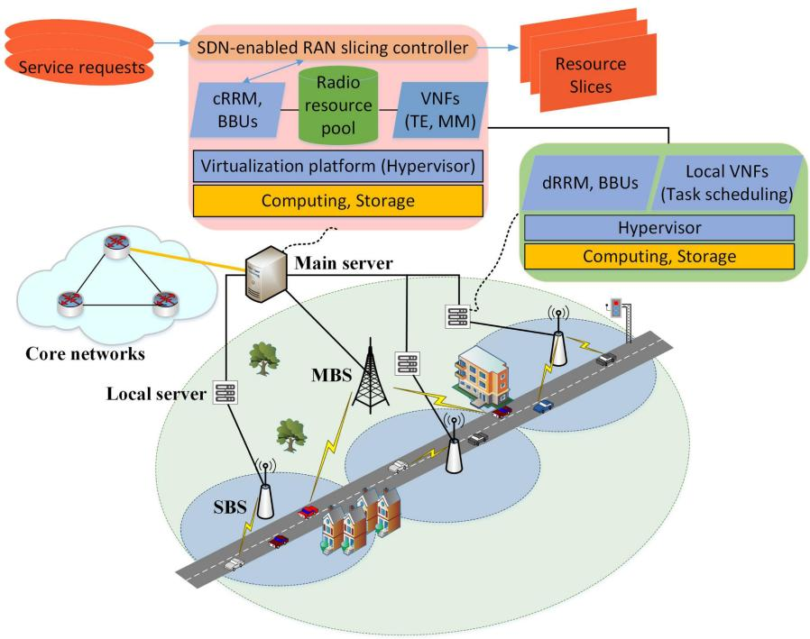

flowchart

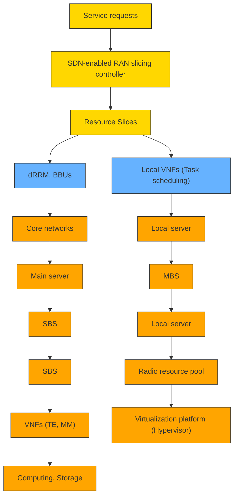

FIGURE. 1. An illustration of the two-tier C-AVN with layered edge computing.

$$
v _ {k, z} = v _ {\text { lim }} \left(1 - \frac {M _ {k , z}}{M _ {\text { max }}}\right) \tag {1}
$$

where $v _ { \mathrm { l i m } }$ denotes the driving speed limit for each AV on the road, and $M _ { \mathrm { m a x } }$ is the maximum number of AVs in each road zone. From (1), the variation of $M _ { k , \astrosun }$ z is caused by the change of AV velocities in each road zone over planning windows.

# B. COMPUTING TASK MODEL

Two types of autonomous driving computing tasks are considered to be offloaded to an edge server for enhanced processing efficiency: object detection and data fusion [2], [3], while other tasks (e.g., object tracking, vehicle localization) are executed on AVs. For object detection, each generated task is to extract the coordinates of detected objects; For data

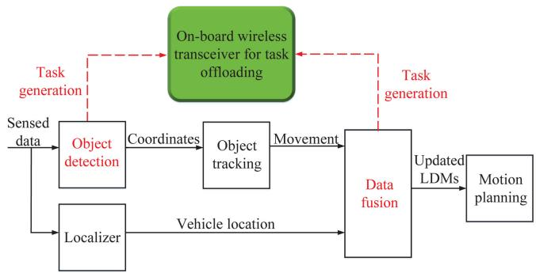

flowchart

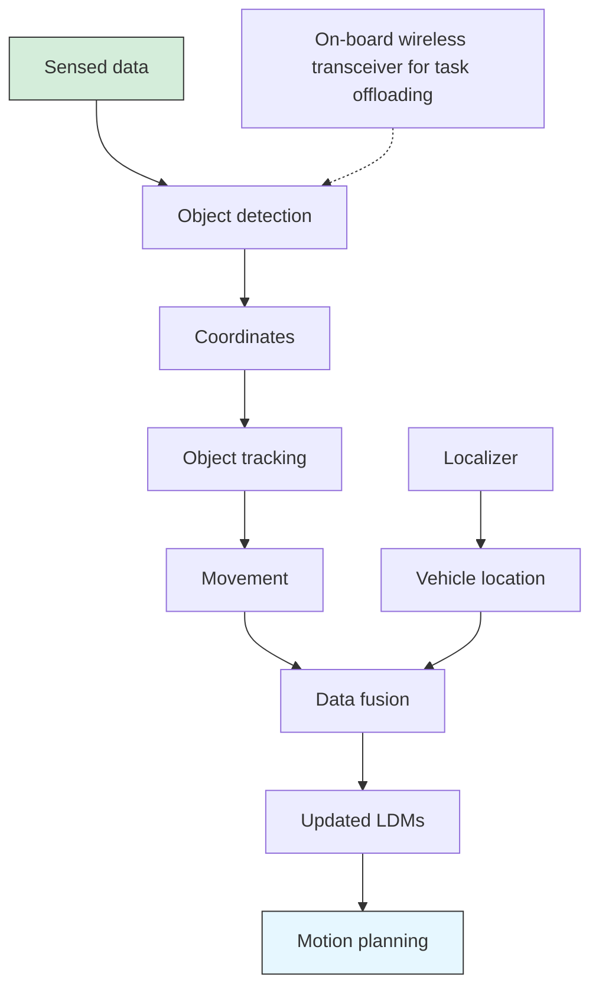

FIGURE. 2. An illustration of main functional modules for autonomous driving with computation offloading.

fusion, the extracted object coordinates associated with their moving trajectories are combined with the obtained vehicle location, which are further processed in the data fusion module to predict three-dimensional (3D) coordinates in a local dynamic map (LDM) for AV motion planning [3]. The basic work-flow for autonomous driving is illustrated in Fig. 2.

Each computing task is assumed to have a fixed size of H bits and a latency bound requirement, D, which is set to equal the scheduling slot duration, T , indicating how fast the system should respond to network changes. As shown in Fig. 2, task processing in the data fusion module is dependent on the output from the object detection/tracking module and the localizer, where each computing task is processed in parallel. Thus, the task generation rate at the data fusion module is considered two times that at the object detection module. In addition, each task has a minimum frame rate requirement for processing (i.e., the rate of feeding tasks into the processing engine), denoted by $R _ { \mathrm { m i n } }$ , which guarantees a minimum frequency of updating the LDMs to keep up with the real-time environment [2].

As the duration of each scheduling slot is small (e.g., 50 ms to 100 ms), we assume that there is at most one computing task generated from each AV at the beginning of each scheduling slot [24]. The task generation at each slot is assumed to follow the Bernoulli distribution with probability $p$ which is also the AV activation probability. Thus, the average overall task arrival rate at an AV is given by

$$
\lambda = \frac {p}{T}. \tag {2}
$$

Suppose that a transmission buffer space is allocated for task offloading, and each generated object detection or data fusion task is put into the transmission buffer to be offloaded through a single on-board wireless transceiver as shown in Fig. 2. Each task needs to be processed within the scheduling slot duration; otherwise, it will be discarded [9], [14]. Denote $C _ { k } \left( k = 0 , 1 , . . . , n \right)$ as the computation capacity (in the unit of CPU cycles per second) of the edge server connected to BS $S _ { k }$ , and ϕ as the computation intensity, i.e., the number of CPU cycles required to process one information bit. As the amount of computation resources on edge servers are usually much greater than on AVs and the computation output is usually small in size, the bottleneck in terms of latency is likely to be the transmission time consumed for offloading each task. In comparison, the processing delay for each offloaded task and the delay of transmitting the computation output back to AVs are negligible [9], [24], [25].

# C. COMMUNICATION MODEL

Before the network operation starts, the MBS and each of the SBSs are pre-configured a set of orthogonal radio resources for uplink transmission, the amounts of which are denoted by $W _ { \mathrm { m } }$ and $W _ { \mathrm { s } } ,$ , respectively. With non-overlapped communication coverages, all the SBSs reuse the same portion of radio resources to exploit the resource multiplexing gain under controlled inter-cell interference.

Based on the Shannon capacity formula, the uplink transmission rate from each AV in zone z to BS $S _ { k }$ at scheduling slot t is calculated as

$$
r _ {k, z, t} = \frac {W _ {k}}{\sum_ {z \in \mathcal {Z} _ {k}} N _ {k , z , t} a _ {k , z , t}} \log_ {2} (1 + I _ {k, z, t}), z \in \mathcal {Z} _ {k}, S _ {k} \in \mathcal {B} \tag {3}
$$

where $W _ { k } = W _ { \mathrm { m } }$ , if $k = 0 ,$ , and $W _ { k } = W _ { \mathrm { s } } $ otherwise, with the radio resources on $S _ { k }$ equally partitioned and allocated among active AVs associated with $S _ { k }$ for task offloading at slot $t , \ a _ { k , z , t }$ is the object detection or data fusion task offloading indicator for active AVs in zone z of $S _ { k }$ at slot $t ,$ , which equals 1 when the tasks are offloaded to $S _ { k }$ and 0 otherwise, and $I _ { k , z , t }$ denotes the uplink signal-to-noise ratio (SNR) or the uplink signal-tointerference-plus-noise ratio (SINR), respectively, given by

$$
I _ {k, z, t} = \frac {P _ {k} G _ {k , z , t} \alpha_ {k , t}}{\sigma^ {2}}, \text {   if   } k = 0 \tag {4}
$$

or

$$
I _ {k, z, t} = \frac {P _ {k} G _ {k , z , t} \alpha_ {k , t}}{\sum_ {j = \{1 , 2 , \dots , n \} , j \neq k} P _ {j} G _ {k , z ^ {\prime} , t} \alpha_ {j , t} + \sigma^ {2}}, z ^ {\prime} \in \mathcal {Z} _ {j}, \text {   if   } k \neq 0. \tag {5}
$$

In (4) and $( 5 ) , P _ { k }$ denotes the uplink transmission power which is assumed identical and fixed for all AVs under $S _ { k }$ within one planning window, $G _ { k , z , t }$ denotes the uplink channel gain from an active AV in zone z to $S _ { k }$ at slot t , including path loss and log-normal shadowing, averaged over a group of active AVs in the zone, $\alpha _ { k , i }$ follows an exponential distribution with unit mean, denoting small-scale Rayleigh fading component under $S _ { k }$ at slot t [26], [27], and $\sigma ^ { 2 }$ is the average background noise power. For analysis tractability, we assume that radio resources are allocated to active AVs in each slot such that the inter-small-cell interference for an active AV in zone z of $S _ { k }$ only comes from uplink transmissions from active AVs (if any) in zone $z ^ { \prime }$ with the same zone position under every other SBS $( \mathrm { i } . \mathrm { e } . , z ^ { \prime }$ modulo $| \mathcal { Z } _ { j } |$ | equals z modulo $| \mathcal { Z } _ { k } | )$ ).

# III. JOINT RAN SLICING AND COMPUTING TASK SCHEDULING FRAMEWORK

In this section, we formulate a joint RAN slicing and computing task scheduling problem as a two-timescale optimization framework: For the small-timescale task scheduling, our objective is to determine the AV task offloading decisions over scheduling slots, to balance the network-wide computation load with controlled task offloading changes; For the largetimescale RAN slicing, we aim at optimizing the networklevel radio resource slicing ratios in each planning window, to maximize the overall radio resource utilization while meeting diverse QoS requirements. Due to the correlation between the two-timescale problems, a hierarchical optimization framework is established to jointly maximize the communication and computing resource utilization.

# A. SMALL-TIMESCALE COMPUTING TASK SCHEDULING

We first calculate the computation load of the server connected to $S _ { k } \left( k = 0 , 1 , . . . , n \right)$ at scheduling slot t as

$$
L _ {k, t} = \frac {\sum_ {z \in \mathcal {Z} _ {k}} N _ {k , z , t} a _ {k , z , t} \varphi H}{C _ {k} T}. \tag {6}
$$

The cost of having imbalanced computation load among the servers at slot t , denoted as $C _ { 1 , t }$ , is represented by the maximum instantaneous computation level [28]. That is,

$$
C _ {1, t} = \max _ {S _ {k} \in \mathcal {B}} \left\{L _ {k, t} \right\}. \tag {7}
$$

The cost of switching task offloading decisions from slot $( t -$ 1) to slot t, denoted as $C _ { 2 , t }$ , between the MBS and one of the SBSs for AVs in all road zones is calculated by counting the total number of offloading switching events, given by

$$
C _ {2, t} = \sum_ {S _ {k} \in \mathcal {B}} \sum_ {z \in \mathcal {Z} _ {k}} \sum_ {l \in \mathcal {B} ^ {\prime} \backslash S _ {k}} a _ {k, z, t} a _ {l, z, t} \tag {8}
$$

where $B ^ { \prime }$ is the set including the MBS and the SBS covering zone z. Therefore, the total cost of computation load balancing by taking into account the task offloading switching cost at slot t is a weighted sum of $C _ { 1 , t }$ and $C _ { 2 , t } { } ;$ , given by

$$
C _ {t} = \beta C _ {1, t} + (1 - \beta) C _ {2, t} \tag {9}
$$

where $\beta$ is a real-valued weighting factor between 0 and 1.

Our overall objective is to achieve computation load balancing among BSs with minimal task offloading variations. To capture the small-timescale network state transitions and model the relation between states and offloading policies, we describe the task scheduling problem as an MDP formulation. The MDP formulation is represented by a four-dimensional tuple at scheduling slot t, which includes a set of network states, $S _ { t }$ , task offloading actions, $\mathbf { } A _ { t }$ , from active AVs in all road zones, state transition probabilities, $P ( S _ { t + 1 } | S _ { t } , \mathcal { A } _ { t } )$ , and an instantaneous reward function, $R ( S _ { t } , A _ { t } )$ , defined on states and actions. Specifically, to characterize the impact of network dynamics on the computation load balancing cost, $S _ { t }$ is designed to include the numbers of active AVs, $\mathcal { N } _ { t }$ , under the BS coverages, the set of uplink SINR (or SNR), $\mathcal { T } _ { t }$ , for active AVs in all road zones, and the set of task offloading actions, $\mathcal { A } _ { t - 1 }$ , taken in slot (t − 1).

The state transitions from t to (t + 1) include the updates on 1) the AV active statuses in each road zone that lead to the changes of $\mathcal { N } _ { t }$ and $\mathcal { T } _ { t }$ to $\mathcal { N } _ { t + 1 }$ and $\mathcal { T } _ { t + 1 }$ , and 2) the task offloading actions from $\mathcal { A } _ { t - 1 }$ to $\boldsymbol { A } _ { t }$ . The problem objective is to determine a set of stationary policies (i.e., probabilities of choosing actions given each of the network states), denoted by $\pi ^ { * } ( { \mathcal { A } } | S )$ , that maximize the accumulated system reward over time, where $\boldsymbol { s }$ and are steady states and actions when t is large. The formulation also includes computation capacity and task offloading latency constraints in each scheduling slot. Based on the MDP, the problem is presented as a stochastic optimization framework, given by

$$
\text {(P1)}: \min _ {\boldsymbol {\pi}} \mathbb {E} \left[ \frac {1}{L} \sum_ {t = 1} ^ {L} C (\mathcal {S} _ {t}) \bigg | \boldsymbol {\pi} \right]
$$

$$
\text { s.t. } \left\{ \begin{array}{l l} \sum_ {S _ {l} \in \mathcal {B} ^ {\prime}} a _ {l, z, t} \leq 1,   z \in \mathcal {Z} _ {k}, S _ {k} \in \mathcal {B} & (1 0 \mathrm{a}) \\ \sum_ {z \in \mathcal {Z} _ {k}} N _ {k, z, t} a _ {k, z, t} \leq \frac {C _ {k} T}{\varphi H}, S _ {k} \in \mathcal {B} & (1 0 \mathrm{b}) \\ \frac {H}{r _ {k , z , t}} a _ {k, z, t} \leq D,   z \in \mathcal {Z} _ {k}, S _ {k} \in \mathcal {B} & (1 0 \mathrm{c}) \end{array} \right.
$$

where L is a large positive integer number, constraint (10a) indicates that active AVs in zone z offload tasks to either the MBS or the SBS covering the zone at each slot, constraint (10b) indicates the per-slot computation load on each server cannot exceed its capacity, and constraint (10c) denotes the per-slot offloading latency for each object detection or data fusion task should be bounded.

In (P1), the state and action dimensions are calculated as $\textstyle 3 \cdot \sum _ { k = 0 } ^ { n } | { \mathcal { Z } } _ { k } |$ and $\scriptstyle \sum _ { k = 0 } ^ { n } | { \mathcal { Z } } _ { k } |$ , respectively, where | · | denotes set cardinality. As the dimensions increase with n, both the state and action spaces can be large. In addition, the state transition probabilities can be difficult to obtain. Therefore, the conventional value-iteration based MDP algorithms may not be applied in solving the formulated problem [9]. We develop a deep reinforcement learning (DRL)-based framework to learn the optimal task offloading policies by iteratively interacting with the network environment (see details in Section IV).

# B. LARGE-TIMESCALE RADIO RESOURCE SLICING

For the small-timescale computing task scheduling, we optimize the task offloading decisions over scheduling slots to achieve computation load balancing with minimal task offloading changes. It is observed in our preliminary work that the offloading variations should be small $( \mathrm { e . g . }$ , about 10 switching events over a 1000 time-slot window for a C-AVN covering 10 road zones) [1], which indicates that a stationary policy should select a fixed BS (either the MBS or one of the SBSs) for offloading tasks over sequential slots for all active AVs in one road zone. Therefore, given the stationary task offloading policy, we further optimize the network-level radio resource slicing among BSs to maximize the overall communication resource utilization in one planning window, while guaranteeing diverse QoS for different autonomous driving tasks.

Based on the stationary task offloading policy, we calculate the average uplink transmission rate, $r _ { k , z } ,$ from an AV in zone z to BS $S _ { k } \left( k = 0 , 1 , . . . , n \right)$ , given by

$$
r _ {k, z} = \frac {W \gamma_ {k} f _ {k , z} R _ {k , z}}{M _ {k , z}} \tag {11}
$$

where $W ( = W _ { \mathrm { { m } } } + W _ { \mathrm { { s } } } )$ is the overall radio resources abstracted from all BSs, $\gamma _ { k }$ is the ratio of radio resources sliced for $S _ { k } , f _ { k , z }$ is the average fraction of radio resources reserved for $\mathrm { A V s }$ in zone z of $S _ { k }$ . As the SBSs reuse the same portion of radio resources, the slicing ratios, γ $( i = 1 , 2 , . . . , n )$ , are the same for all the SBSs. In (11), $R _ { k , z }$ is the uplink spectrum efficiency averaged over L scheduling slots, based on the task offloading decision ${ a } _ { k , z , t } ,$ , given by

$$
R _ {k, z} = \frac {1}{L} \sum_ {t = 1} ^ {L} a _ {k, z, t} \log_ {2} (1 + I _ {k, z, t}). \tag {12}
$$

Let $a _ { k , z }$ denote the stationary task offloading policy for AVs in zone z of $S _ { k }$ in a planning window. As in [12], [29], we choose a logarithm function, a concave function with diminishing marginal utility, to describe the average network utility obtained when tasks are offloaded from an AV in zone z of $S _ { k }$ . That is,

$$
\mathcal {U} (r _ {k, z}) = \log (r _ {k, z}). \tag {13}
$$

As indicated in Subsection II-B, the probability of task generation at an AV in each slot follows a Bernoulli distribution.

Since the number of scheduling slots in a planning window is usually large, the task generation can be described as a Binomial process, which is further approximated to a Poisson process with the rate parameter, λ, as given in (2). We apply the effective bandwidth theory [30] in calculating the minimum average uplink task transmission rate (in the unit of bit per second) to guarantee a task offloading delay bound in a statistical way, given by [29]

$$
r _ {\min} = - \frac {H \log \epsilon}{D \log \left(1 - \frac {\log \epsilon}{\lambda D}\right)} \tag {14}
$$

where  is the delay violation probability bound which is a small value. If the average uplink task transmission rate is at least $r _ { \mathrm { m i n } }$ , the delay violation probability is bounded by . In addition, the minimum frame rate requirement, $R _ { \mathrm { m i n } }$ , for transmitting tasks is set to equal the average task generation rate λ. That is,

$$
R _ {\min} = \lambda H. \tag {15}
$$

The complete formulation of the large-timescale RAN slicing problem is presented as

$$
\text {(P2)}: \max _ {\gamma_ {k}, f _ {k, z}} \sum_ {S _ {k} \in \mathcal {B}} \sum_ {z \in \mathcal {Z} _ {k}} M _ {k, z} a _ {k, z} \mathcal {U} (r _ {k, z})
$$

$$
\text { s.t. } \left\{ \begin{array}{l l} a _ {k, z} \left(r _ {k, z} - r _ {\min}\right) \geq 0,   z \in \mathcal {Z} _ {k}, S _ {k} \in \mathcal {B} & \text {(16a)} \\ a _ {k, z} \left(r _ {k, z} - R _ {\min}\right) \geq 0,   z \in \mathcal {Z} _ {k}, S _ {k} \in \mathcal {B} & \text {(16b)} \\ \sum_ {z \in \mathcal {Z} _ {k}} a _ {k, z} f _ {k, z} = 1,   S _ {k} \in \mathcal {B} & \text {(16c)} \\ f _ {k, z} \in (0, 1),   z \in \mathcal {Z} _ {k}, S _ {k} \in \mathcal {B} & \text {(16d)} \\ \gamma_ {0} + \gamma_ {i} = 1,   i \in \{1, 2, \dots , n \} & \text {(16e)} \\ \gamma_ {k} \in (0, 1),   k \in \{0, 1, \dots , n \}. & \text {(16f)} \end{array} \right.
$$

By maximizing the aggregate network utility for task offloading, the objective of (P2) is to determine the optimal ratios, γk, of sliced radio resources on $S _ { k }$ , and the average fraction of radio resources, $f _ { k , z }$ , reserved for AVs in zone z of $S _ { k } .$ , given $a _ { k , z }$ and $M _ { k , z } ;$ , for statistical QoS guarantee. In (P2), constraint (16a) guarantees a probabilistic delay bound for task offloading, constraint (16b) provides the minimum frame rate guarantee for transmitting tasks, constraint (16c) indicates that radio resources on $S _ { k }$ are only reserved for AVs under its coverage, and slicing ratio constraint (16e) indicates that all the SBSs reuse the same portion of sliced resources.

To solve (P2), we first determine optimal $f _ { k , z }$ as a function of $\boldsymbol { a } _ { k , z } ,$ and then the problem is transformed to a convex optimization problem with decision variables $\gamma _ { k }$ (see details in Subsection IV-B).

# C. JOINT RAN SLICING AND COMPUTING TASK SCHEDULING FRAMEWORK

From the two-timescale problem formulations, whether the optimal task offloading policy can be obtained from (P1) depends on how radio resources are sliced among the BSs. If the radio resources are not properly sliced, the network-wide computation load balancing may not be reached, due to the possible violation of task transmission delay constraint in (10c). The radio resource slicing ratios on each BS need to be optimized as in (P2) for balanced computing task offloading. Therefore, the two-timescale problems (P1) and (P2) should be solved together to obtain a set of optimal slicing ratios for computation load balancing such that the communication and computing resource utilization is jointly maximized.

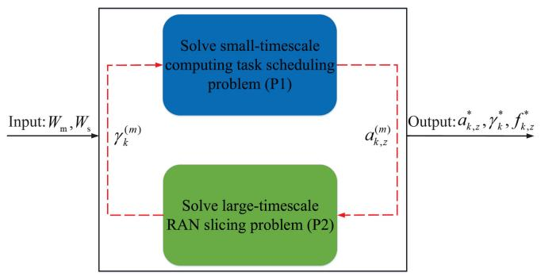

flowchart

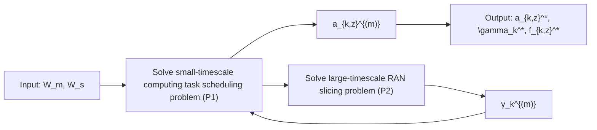

FIGURE. 3. Joint RAN slicing and computing task scheduling framework.

Here, we present a joint RAN slicing and computing task scheduling problem framework, as shown in Fig. 3, to determine the optimal stationary task offloading policy, $a _ { k , z } ^ { * } ,$ , and the optimal radio resource slicing ratios, $\gamma _ { k } ^ { * }$ , with the average fractions of radio resources, $f _ { k , z } ^ { * } ,$ k , reserved for AVs in each road zone. Initially, the radio resources on the BSs, $W _ { \mathrm { m } }$ and $W _ { \mathrm { s } } .$ , are pre-configured as input parameters to the computing task scheduling problem (P1). After (P1) is solved at the first iteration, the task offloading policy, $\begin{array} { r } { \dot { a } _ { k , z } ^ { ( 1 ) } , } \end{array}$ is obtained and fed into the RAN slicing probleradio resource slicing ratios, $\gamma _ { k } ^ { ( 1 ) }$ 2) to, and $f _ { k , z } ^ { ( 1 ) }$ e for the updated, for maximizing the overall radio resource utilization under current offloading policy. With $\gamma _ { k } ^ { ( 1 ) }$ , the second iteration starts by solving (P1) and (P2) sequentially again to determine $a _ { k , z } ^ { ( 2 ) } , \gamma _ { k } ^ { ( 2 ) }$ ), and $f _ { k , z } ^ { ( 2 ) }$ . The whole process repeats until in the m th iteration, the obtained task offloading policy a(m)k,z $a _ { k , z } ^ { ( m ) }$ is close to a(m−k,z $a _ { k , z } ^ { ( m - 1 ) }$ , which indicates the convergence is reached. The output from (P1) and (P2) is the set of optimal solutions, $\gamma _ { k } ^ { \ast } , f _ { k , z } ^ { \ast } ,$ , and $a _ { k , z } ^ { * } .$ k k,z, that jointly maximize the radio resource and computing resource utilization. We discuss in detail in Subsection IV-B how the joint optimal solutions are obtained by solving the two-timescale problems with convergence guarantee. In the proposed framework, the number of task offloading decision changes over sequential scheduling slots is minimized to reduce the offloading switching cost. However, with variations of $M _ { k , z }$ due to AV mobility change over planning windows, the optimal task offloading policy, $a _ { k , z } ^ { * } ,$ and optimal radio resource slicing ratios, $\gamma _ { k } ^ { * }$ , are updated accordingly to adapt to the large-timescale traffic load dynamics in each road zone (see simulation results in Subsection V-A). When moving across road zones, AVs may need to change the offloading policy according to $a _ { k , z } ^ { * }$ to maintain the maximal computing resource utilization.

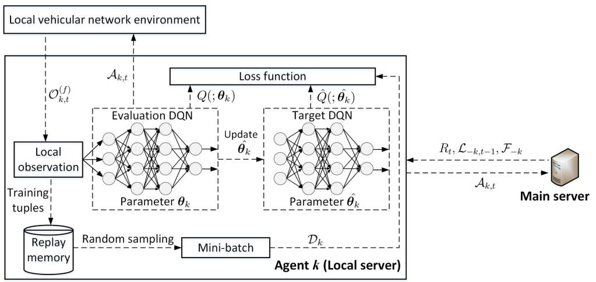

flowchart

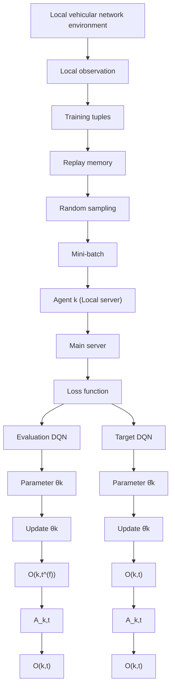

FIGURE. 4. The proposed cooperative MA-DQL framework with fingerprint.

# IV. LEARNING-ASSISTED HIERARCHICAL APPROACH

In this section, we present a learning-assisted approach to solve the two-timescale RAN slicing and computing task scheduling problems for joint optimal solutions.

# A. COOPERATIVE MA-DQL FOR TASK SCHEDULING

As stated in Subsection III-A, the small-timescale computing task scheduling problem, (P1), has a large state space and likely lacks information of state transition probabilities. Therefore, we consider to employ a DQL based method to approximate the functional relation (i.e., action-value function) between each state-action pair and reward (i.e., Q-value) using deep neural networks (DNNs) [31]. The Q-values under each state are obtained for different actions, and the best action can be chosen to maximize the long-term accumulated reward. Specifically, the Q-value for each state-action pair is iteratively updated using the Bellman equation, given by [32]

$$
\begin{array}{l} Q \left(\mathcal {S} _ {t}, \mathcal {A} _ {t}\right) = (1 - \eta) Q \left(\mathcal {S} _ {t}, \mathcal {A} _ {t}\right) \\ + \eta \left[ R (\mathcal {S} _ {t}, \mathcal {A} _ {t}) + \rho \max _ {\mathcal {A} _ {t + 1}} Q (\mathcal {S} _ {t + 1}, \mathcal {A} _ {t + 1}) \right] \tag {17} \\ \end{array}
$$

where η denotes the learning rate and $\rho$ is the future reward discounted factor per learning step. If a single-agent DQL is adopted, the learning module needs to be located in the main server and collects real-time network-wide state information in each road zone over task scheduling slots, leading to large signaling overhead due to the wide macro-cell coverage area. Further, the size of action space increases with n and $\lvert \mathcal { Z } _ { k } \rvert$ , which can degrade DQL performance. With the layered edge computing architecture, we develop an MA-DQL framework with reduced local network state and action spaces. In the proposed framework shown in Fig. 4, the local servers act as learning agents to cooperatively learn the optimal task offloading decisions. Each agent maintains its own learning module to iteratively train the parameters of two deep Qnetworks (DQNs), i.e., evaluation Q-network and target Qnetwork, to determine a set of optimal Q-values based on local observation on the network environment. Specifically, each agent takes task offloading actions for AVs under its local SBS coverage at a scheduling slot. All the agents’ actions are synchronized at the main server to calculate a joint system reward which is then sent back to the agents to create DQN training samples.

Cooperative MA-DQL module design: The local observation under agent $k ( k = 1 , 2 , . . . , n )$ at scheduling slot t, denoted by ${ \mathcal { O } } _ { k , t }$ , is a function of the global network state $S _ { t }$ , given by

$$
\mathcal {O} _ {k, t} = \mathscr {F} (\mathcal {S} _ {t}, k) = \left\{\mathcal {N} _ {k, t}, \mathcal {I} _ {k, t}, \mathcal {A} _ {k, t - 1} \right\} \tag {18}
$$

where $\mathcal { F } ( \cdot )$ denotes the function mapping, $\mathcal { N } _ { k , t } = \{ N _ { k , z , t } , z \in$ $\mathcal { Z } _ { k } \} , \mathcal { T } _ { k , t } = \{ I _ { 0 , z , t } , I _ { k , z , t } , z \in \mathcal { Z } _ { k } \}$ }, and $\mathcal { A } _ { k , t - 1 } = \{ a _ { k , z , t - 1 } , z \in$ $\mathcal { Z } _ { k } \}$ . Based on ${ \mathcal { O } } _ { k , t }$ , agent k takes task offloading actions, $\boldsymbol { \mathcal { A } } _ { k , t }$ , for AVs in road zones under SBS $S _ { k }$ , denoted by

$$
\mathcal {A} _ {k, t} = \{a _ {k, z, t}, z \in \mathcal {Z} _ {k} \}. \tag {19}
$$

The actions taken at slot t from all the agents are synchronized at the main server to determine a joint system reward $R _ { t }$ , calculated as

$$
\begin{array}{l} R _ {t} = - C _ {t} - E _ {1} \sum_ {S _ {k} \in \mathcal {B}} \mathbb {1} \left(\sum_ {z \in \mathcal {Z} _ {k}} N _ {k, z, t} a _ {k, z, t} > \frac {C _ {k} T}{\varphi H}\right) \\ - E _ {2} \sum_ {S _ {k} \in \mathcal {B}} \sum_ {z \in \mathcal {Z} _ {k}} 1 \left(\frac {H}{r _ {k , z , t}} a _ {k, z, t} > D\right) \tag {20} \\ \end{array}
$$

where $E _ { 1 }$ and $E _ { 2 }$ denote the penalties if constraints (10b) and (10c) are violated in (P1), and 1(·) is an indicator function which equals 1 if condition is satisfied and 0 otherwise. In (20), $R _ { t }$ is expressed as a negative function of the computation load balancing cost with penalties of violating computation capacity and task offloading latency constraints. With Rt feeding back to each agent, the learning tuple, $[ \mathcal { O } _ { k , t } , \mathcal { A } _ { k , t } , R _ { t } , \mathcal { O } _ { k , t + 1 } ]$ , for agent k is generated and stored in the agent’s replay memory. The replay buffer is randomly sampled at the end of each learning episode to iteratively train the evaluation and target DQN parameters, $\pmb \theta _ { k }$ and $\widehat { \pmb { \theta } _ { k } }$ , to approximate the action-value function $\boldsymbol { Q } ( \mathcal { O } _ { k , t } , \mathcal { A } _ { k , t } )$ . This process is called experience replay. However, the designed cooperative MA-DQL module faces non-stationary performance caused by two issues: 1) The learning tuples generated at each agent cannot reflect the complete dynamics of the environment that the agent learns; 2) Each agent does not track policy updates of the other agents that affect network environment dynamics. To solve the non-stationarity issues, we revisit the local observation design of each agent to include additional information to stabilize the learning performance.

Augmented observation with fingerprint: The first issue causing non-stationarity comes from the partially-observable network environment seen by each agent. If $Q ( : \pmb \theta _ { k } )$ is learned based on global state transitions, the real network dynamics can be captured. However, it is infeasible to share the complete information of every agent’s updated local observation in each scheduling slot, due to large amount of information exchange and simultaneous actions taken from all the agents. Therefore, we create an approximated fully-observable multiagent setting, where each agent k shares its computation load ratio, $L _ { k , t - 1 }$ , at the end of previous slot (t − 1) to all the other agents through the main server. As a function of $\mathcal { N } _ { k , t - 1 }$ and $\mathscr { A } _ { k , t - 1 } , \mathscr { L } _ { k , t - 1 }$ reflects the up-to-date local state of agent k at an aggregate level. Likewise, agent k gets the aggregate local state information from all the other agents (including the main server), denoted by set $\mathcal { L } _ { - k , t - 1 }$ , where the subscript −k indicates the set of indexes except agent k. Thus, the augmented observation to approximate a fully-observable environment for agent k at slot t is designed as

$$
\mathcal {O} _ {k, t} ^ {(f)} = \{\mathcal {O} _ {k, t}, \mathcal {L} _ {- k, t - 1} \}. \tag {21}
$$

To solve the second non-stationarity issue, we add two indicators to each DQN training sample of agent k, i.e., rate of exploration, $\pmb { \varepsilon } _ { - k }$ , and learning episode iteration number, $\boldsymbol { e } _ { - k }$ , shared by the other agents to track their updated policies, as the policy of each agent is a function of its learning exploration rate and iteration number. The rate of exploration for each agent is updated once every learning episode. These two indicators are referred to as low-dimensional fingerprint on the agents’ full policies except agent k, given by [33]

$$
\mathcal {F} _ {- k} = \{\boldsymbol {\varepsilon} _ {- k}, \boldsymbol {e} _ {- k} \}. \tag {22}
$$

Using lightweight $\mathcal { F } _ { - k }$ to reflect the full policies, $\pi _ { - k }$ , has low complexity, which indicates where along the learning path the current training sample is originated from.

Cooperative MA-DQL algorithm: An episodic learning setting is considered, where each agent sets a total number of K learning episodes, each consisting of L learning steps. The vehicular network environment is initialized, including AV traffic patterns, BS and edge computing parameter configuration, and wireless channel realization. In each learning step, every agent makes task offloading decisions based on the augmented network observation. The actions taken by all the agents are synchronized at the main server in current time step to calculate a joint system reward fed back to each agent. The actions also lead to the transition of network observation to the next time step. A learning tuple (sample) is then created to train the DQN parameters of an agent.

$$
\begin{array}{l} L (\pmb {\theta} _ {k}) = \sum_ {t \in \mathcal {T} _ {k}} \frac {\pmb {\pi} _ {- k} (\mathcal {A} _ {- k , t _ {r}} | O _ {k , t _ {r}} ^ {(f)})}{\pmb {\pi} _ {- k} (\mathcal {A} _ {- k , t} | O _ {k , t} ^ {(f)})} \\ \times \left[ R _ {t} + \rho \max _ {\mathcal {A} _ {k, t + 1}} \hat {Q} (\mathcal {O} _ {k, t + 1} ^ {(f)}, \mathcal {A} _ {k, t + 1}; \hat {\boldsymbol {\theta}} _ {k}) - Q (\mathcal {O} _ {k, t} ^ {(f)}, \mathcal {A} _ {k, t}; \boldsymbol {\theta} _ {k}) \right] ^ {2}. \tag {23} \\ \end{array}
$$

After multiple episodes of training, the set of optimal DQN parameters are converged to calculate the optimal Q-values. Specifically, for agent k, the action set, $\boldsymbol { \mathcal { A } } _ { k , t }$ , is taken under the network observation, ( f ) $\mathcal { O } _ { k , t } ^ { ( f ) }$ , at learning step t according to the ε-greedy policy. Then, an augmented state transition training sample, [ ( f ) , $[ \mathcal { O } _ { k , t } ^ { ( f ) } , \mathcal { A } _ { k , t } , R _ { t } , \mathcal { O } _ { k , t + 1 } ^ { ( f ) } , \mathcal { F } _ { - k } ]$ O( f )k,t+1, F−k ], is collected and stored in its replay memory $\mathcal { T } _ { k }$ . Since agent k knows the other agents’ policies and treats them as part of the network environment, an importance sampling method is used to train the offenvironment using learning tuples gathered in different time steps to stabilize the experience replay [33]: In each episode, a mini-bath, $\mathcal { D } _ { k }$ , of training samples are randomly selected from $\mathcal { T } _ { k }$ at the time of reply, denoted by $t _ { r } .$ , to train the evaluation DQN parameter $\pmb \theta _ { k }$ by minimizing an importance weighted loss function based on stochastic gradient descent [33], [34], given in (23). In (23), $\mathcal { T } _ { k }$ indicates the set of time instants when the training samples in $\mathcal { D } _ { k }$ were generated, $\pi _ { - k } ( \mathcal { A } _ { - k , t } | O _ { k , t } ^ { ( f ) } )$ denotes a joint policy on the augmented observation in slot t for all the agents except agent k, which can be estimated using $\mathcal { F } _ { - k }$ , and $Q ( : \pmb \theta _ { k } )$ and $\hat { Q } ( ; \hat { \pmb \theta _ { k } } )$ denote $Q \cdot$ -value functions approximated by the evaluation and target DQN parameters $\pmb \theta _ { k }$ and $\widehat { \pmb { \theta } _ { k } }$ , respectively. After every J episodes, $\pmb \theta _ { k }$ is copied to $\widehat { \pmb { \theta } _ { k } }$ to update the target network parameters. The detailed cooperative MA-DQL algorithm is presented in Algorithm 1.

Proposition 1: The convergence of the proposed cooperative MA-DQL algorithm in solving (P1) is enhanced by using the off-environment importance sampling on augmented DQN training tuples to stabilize the experience replay.

The proof of Proposition 1 is provided in Appendix A.

Note that the proposed algorithm is operated in two stages: centralized DQN training and distributed implementation [26], [27]. In the first stage, Algorithm 1 is executed among the learning agents cooperatively to generate joint system reward in each learning step for training their individual DQN parameters. After optimal $\pmb { \theta } _ { k } \left( k = 1 , 2 , . . . , n \right)$ are obtained, each agent implements its own trained DQL module independently in the second stage, where the task offloading actions that generate the optimal Q-values are taken under every local observation. When the AV traffic load changes significantly due to vehicle mobility variations over planning windows, the centralized DQN training is invoked again and the whole process is repeated to update the optimal DQN parameters of all the agents to adapt to the vehicular traffic load variations.

Algorithm 1: Cooperative MA-DQL Algorithm for Task Offloading.   
Initialize: Network environment, evaluation and target DQN parameters, replay memory size
1 for every episode do
2 Initialize vehicular traffic and network state;
3 for any learning step t do
4    for any agent k do
5    Take action $\mathcal{A}_{k,t}$ based on $\mathcal{O}_{k,t}^{(f)}$ following the $\varepsilon$ -greedy policy;
6    end
7    Observe joint action $A_t$ to determine $R_t$ ;
8    Update the network observation as $\mathcal{O}_{k,t+1}^{(f)}$ ;
9    for any agent k do
10    Store the augmented learning tuple $\left[\mathcal{O}_{k,t}^{(f)},\mathcal{A}_{k,t},R_t,\mathcal{O}_{k,t+1}^{(f)},\mathcal{F}_{-k}\right]$ in $J_k$ ;
11 $\mathcal{O}_{k,t}^{(f)}\leftarrow\mathcal{O}_{k,t+1}^{(f)};$ 12 $t\leftarrow t+1;$ 13    end
14 end
15 for any agent k do
16    Select randomly a min-batch, $D_k$ , of transition samples from $J_k$ ;
17    Train the evaluation DQN parameter $\theta_k$ by minimizing the weighted loss function in (23);
18    Update $\hat{\theta}_k$ as $\theta_k$ every J learning episodes;
19 end
20 end

# B. HIERARCHICAL SOLUTION FOR JOINT OPTIMIZATION

In the proposed two-timescale joint framework, problems (P1) and (P2) are cooperatively solved in an iterative manner for the optimal task offloading policy and the optimal radio resource slicing ratios. In this subsection, we discuss how (P2) is solved using the convex optimization technique and how the joint optimal solutions are iteratively obtained with convergence guarantee.

For solving (P2), we first express $f _ { k , : }$ z as a function of $a _ { k , z } .$ . Given $\gamma _ { k }$ and $a _ { k , z }$ , (P2) is decoupled into (n + 1) subproblems, since each BS independently reserves radio resources for AVs in each zone under its coverage. The subproblem for BS $S _ { k } \left( k = 0 , 1 , . . . , n \right)$ is formulated as

$$
\begin{array}{l} \text {(SP2)}: \max _ {f _ {k, z}} \sum_ {z \in \mathcal {Z} _ {k}} M _ {k, z} a _ {k, z} \log \left(\frac {W \gamma_ {k} f _ {k , z} R _ {k , z}}{M _ {k , z}}\right) \\ \text { s.t. } \left\{ \begin{array}{l l} \sum_ {z \in \mathcal {Z} _ {k}} a _ {k, z} f _ {k, z} = 1 & \text {(24a)} \\ f _ {k, z} \in (0, 1) & \text {(24b)} \end{array} \right. \\ \end{array}
$$

Proposition 2: Given the stationary task offloading policy ${ a } _ { k , z } .$ , the optimal average fraction of radio resources reserved from $S _ { k }$ for AVs in zone z is given by

$$
f _ {k, z} ^ {*} = \left\{ \begin{array}{l} \frac {M _ {k , z}}{\sum_ {z \in \mathcal {Z} _ {k}} M _ {k , z} a _ {k , z}}, \text {   if   } a _ {k, z} = 1 \\ 0, \text {   otherwise. } \end{array} \right. \tag {25}
$$

The proof of Proposition 2 is given in Appendix B. By substituting (25) into (P2), the problem is transformed to

$$
\text {(P3)}: \max _ {\gamma_ {k}} \sum_ {S _ {k} \in \mathcal {B}} \sum_ {z \in \mathcal {Z} _ {k}} M _ {k, z} a _ {k, z} \log (\gamma_ {k})
$$

$$
\mathrm{s.t.} (1 6 \mathrm{a}), (1 6 \mathrm{b}), (1 6 \mathrm{e}), (1 6 \mathrm{f})
$$

where radio resource slicing ratios, $\gamma _ { k } ( k = 0 , 1 , . . . , n )$ , are the decision variables. Given $a _ { k , z } , ( \mathrm { P } 3 )$ is a standard convex optimization problem and the CVX optimization toolbox [35] is used to solve (P3) efficiently for a set of optimal solutions.

As mentioned in Subsection III-C, if the initial sliced resources on the MBS and SBSs cannot support the transmission of scheduled computing tasks with delay satisfaction, the optimal stationary task offloading policy for a network-wide balanced computation load may not be obtained directly by solving (P1). Therefore, we propose to iteratively solve (P1) and (P3) in sequence to adjust the radio resource slicing ratios for achieving the optimal task offloading policy with QoS guarantee such that the communication and computing resource utilization is jointly maximized. Specifically, in the first iteration, (P1) is solved for $\boldsymbol { a } _ { k , \ast }$ which is then fed into (P3) as input to solve for $\gamma _ { k }$ . If we incorporate constraints (16e) and (16f) into the objective function of (P3), the objective becomes a function of single variable $\gamma _ { 0 }$ or $\gamma _ { i } ( i = 1 , . . . , n )$ . Thus, the maximum of the objective function is reached when

$$
\gamma_ {0} = \frac {\sum_ {z \in \mathcal {Z} _ {0}} M _ {0 , z} a _ {0 , z}}{\sum_ {S _ {k} \in \mathcal {B}} \sum_ {z \in \mathcal {Z} _ {k}} M _ {k , z} a _ {k , z}}. \tag {26}
$$

Although the optimal value in (26) may not be achieved under the delay and throughput constraints (16a) and (16b), it is clearly seen from (26) that by solving (P3), the ratios of sliced radio resources on the MBS and the SBSs are adjusted in proportion to the computation loads transmitted to the BSs. Therefore, even if the pre-configured $W _ { \mathrm { m } }$ and $W _ { \mathrm { s } }$ can be imbalanced, $\gamma _ { k } ( k = 0 , 1 , . . . , n )$ are gradually optimized, by solving (P1) and (P3) iteratively, for the transmission of scheduled computing tasks to achieve network-wide computation load balancing with per-slot delay guarantee. In such a way, the optimal stationary task offloading policy and the optimal radio resource slicing ratios among the BSs are jointly obtained. The convergence of solving (P1) is achieved according to Proposition 1 and the convergence of solving (P3) is also guaranteed based on the convex optimization problem property [36]. A detailed algorithm of the proposed learningassisted hierarchical solution for solving the two-timescale RAN slicing and computing task offloading problem is presented in Algorithm 2.

Algorithm 2: Learning-Assisted Hierarchical Solution for Joint Optimization. 

<table><tr><td colspan="2">Input: Initialize network and service parameters, including  $W_m$ ,  $W_s$ ,  $D$ ,  $\epsilon$ ,  $\lambda$ ,  $p$ ,  $H$ ,  $M_{k,z}$ ,  $M_{\text{max}}$ , and set iteration number  $m$  as 0.</td></tr><tr><td colspan="2">Output: A set of optimal solutions for the stationary task offloading policy,  $a_{k,z}^*$ , the radio resource slicing ratios,  $\gamma_k^*(k \in \{0,1,...,n\})$ , and the average fraction of radio resources reserved for AVs in each road zone,  $f_{k,z}^*$ .</td></tr><tr><td colspan="2">1 do</td></tr><tr><td>2</td><td> $m \leftarrow m + 1$ ;</td></tr><tr><td>3</td><td>Update the sliced radio resources on BSs at the beginning of iteration  $m$  based on  $\gamma_k^{(m-1)}$  obtained in iteration  $(m - 1)$ ;</td></tr><tr><td>4</td><td>With  $\gamma_k^{(m-1)}$ , run Algorithm 1 to determine the stationary task offloading policy  $a_{k,z}^{(m)}$ ;</td></tr><tr><td>5</td><td>Determine  $f_{k,z}^{(m)}$  based on  $a_{k,z}^{(m)}$  as in (25);</td></tr><tr><td>6</td><td>Given  $a_{k,z}^{(m)}$  and  $f_{k,z}^{(m)}$ , solve (P3) to obtain radio resource slicing ratios  $\gamma_k^{(m)}$  in iteration  $m$ ;</td></tr><tr><td>7</td><td>while  $a_{k,z}^{(m)} \neq a_{k,z}^{(m-1)}$  for AVs under any  $S_k$ ;</td></tr></table>

The time complexity of Algorithm 2 is analyzed as follows: Suppose the convergence is reached after running Algorithm 2 for N iterations. In each iteration, Algorithm 1 is first executed with the time complexity of O(KL) to create DQN learning tuples and O(K ) to train the DQN parameter $\pmb \theta _ { k }$ for agent k. As all the agents train their individual DQL modules in parallel, the overall time complexity of Algorithm 1 is given by $O ( K L ) + O ( K ) = O ( K L )$ . Then, problem (P3) with 2 decision variables is efficiently solved using a standard convex optimization algorithm (e.g., interior-point method [36]) with constant time complexity. Therefore, the total time complexity of Algorithm 2 is calculated as O(NKL).

# V. SIMULATION RESULTS

Computer simulations are conducted to demonstrate the effectiveness of the proposed joint RAN slicing and computing task scheduling framework. Algorithm 1 is implemented in Python 3.7 IDE with TensorFlow 1.14.0. A two-lane bidirectional road segment of 1.5 km is created using the Simulation of Urban MObility (SUMO) traffic simulator [37], with real vehicular traffic trace loaded from a provincial roadway in Xinjiang, China. Each AV is driven on the road with the moving speed set in-between 20 m/s and 28 m/s. One MBS and three SBSs are deployed with minimum distances of 20 m and 10 m away from the road to provide the communication radiuses of 750 m and 250 m, respectively. The road segment is partitioned into 15 zones, 5 zones under each SBS coverage. The maximum number, $M _ { \mathrm { m a x } } .$ , of AVs in each road zone is set as 40. The uplink transmission power from each AV to the MBS and one of the SBSs are set as 500 mW and 200 mW, respectively. The amount of aggregated radio resources, W , is set to 20 MHz. The computation capacities on the main

TABLE II Network and Learning Parameters 

<table><tr><td>System parameters</td><td>Values</td><td>Learning parameters</td><td>Values</td></tr><tr><td>Task size (H)</td><td>5000 bits</td><td>Learning rate</td><td> $10^{-3}$ </td></tr><tr><td>Noise power</td><td>-104 dBm</td><td>Discount factor</td><td>0.9</td></tr><tr><td>Slot time/delay bound</td><td>50 ms</td><td>Exploration rate</td><td>0.9999</td></tr><tr><td>Path loss exponent</td><td>3.5</td><td>Exploration decay</td><td>0.0001</td></tr><tr><td>Log-normal shadowing</td><td>-30 dB</td><td>Replay buffer size</td><td>5000</td></tr><tr><td>AV active probability</td><td>0.6</td><td>Mini-batch size</td><td>64</td></tr><tr><td>Task loss rate bound</td><td> $10^{-3}$ </td><td>Steps per episode</td><td>2000</td></tr><tr><td>Penalty ( $P_1/P_2$ )</td><td>2000/10000</td><td>Replace episodes (J)</td><td>40</td></tr></table>

server and each of the local servers are configured as 3.6 GHz (CPU cycles per second) and 2.4 GHz, respectively, with the computation intensity of 300 cycles per bit. Each local server is equipped with a DQL module where two DNNs are created to represent the evaluation and target DQNs. Each DNN is composed of three (fully-connected) hidden layers with (128, 64, 64) neurons between the input and output layers, and the ReLu non-linear activation function is used for each hidden layer. At each learning epoch, the ε-greedy policy is adopted with the initial rate of exploration and the exploration rate decay step size set as 0.9999 and 0.0001. Since ε is updated every 4 episodes in the simulation, the total learning episodes is set around 40000 to ensure a thorough exploration on the action set. Other simulation parameters are summarized in Table II.

In each iteration of Algorithm 2, (P3) is solved in MATALB R2016b with the CVX optimization toolbox [35], where different network/service parameters are also initiated. The average task arrival rate, λ, and the task offloading policy, ak,z, from (P1) are obtained as input in solving (P3). We first evaluate the performance of the proposed joint RAN slicing and task scheduling framework, which is further compared with a computation-load-balancing-based task offloading scheme in our preliminary work [1] and two other benchmark schemes [14], [38]. We focus on the performance evaluation in terms of maximum computation load ratio among edge servers, number of task offloading switching events, adaptation to vehicular traffic load variation, satisfaction of diverse QoS requirements, and aggregate network utility.

# A. PERFORMANCE EVALUATION

We first evaluate the convergence of the proposed cooperative MA-DQL algorithm in solving (P1), where the initial radio resource slicing ratios for the MBS and each SBS are set as 0.6 and 0.4 $( W _ { \mathrm { m } } = 1 2 $ MHz and $W _ { \mathrm { s } } = 8 \ : \mathrm { M H z ) }$ , respectively, and the average number of AVs in each road zone is around 8. From Fig. 5, it is observed that the per-episode average reward starts to converge at around 36000 episodes without the offloading latency and computation capacity constraint violation. In comparison, the learning performance continues to fluctuate for the cooperative MA-DQL without fingerprint added even after a thorough exploration on the action set. Fig. 6(a) shows how the per-step maximum computation load ratio averaged over the last learning episode converges to the optimal solution by running Algorithm 2. However, the iteration pattern towards convergence depends on the initial ratios of sliced radio resources among BSs. If the initial slicing ratios on the MBS and each of the SBSs match with the proportions of computation capacities provided on the main and local servers, respectively, the maximum computation load ratio approaches the optimal solution with fast convergence. Correspondingly, the radio resource slicing ratios are iteratively adjusted proportional to the current computation loads scheduled on the servers until the maximum computation load ratio stays unchanged, as shown in Fig. 6(b). We can see from Fig. 6(a) that better load balancing is achieved with an increase of weighting factor $\beta$ which prioritizes balancing the computation load over controlling the task offloading variations.

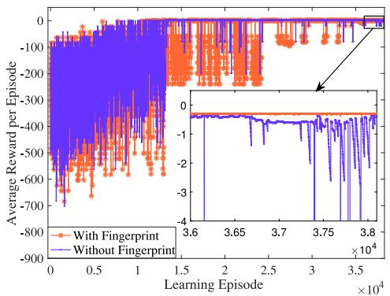

line

| Learning Episode | With Fingerprint Average Reward per Episode | Without Fingerprint Average Reward per Episode |
| ---------------- | --------------------------------------------- | ------------------------------------------------- |
| 0                | -700                                          | -700                                              |
| 1.5e4            | -200                                          | -200                                              |
| 3.6e4            | -100                                          | -100                                              |
| 3.7e4            | -50                                           | -50                                               |
| 3.8e4            | 0                                             | 0                                                 |

FIGURE. 5. Comparison of learning performance between the cooperative MA-DQL with fingerprint v.s. without fingerprint (β = 0.5).

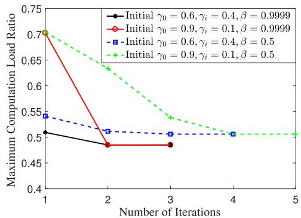

line

| Number of Iterations | Initial γ₀ = 0.6, γᵢ = 0.4, β = 0.9999 | Initial γ₀ = 0.9, γᵢ = 0.1, β = 0.9999 | Initial γ₀ = 0.6, γᵢ = 0.4, β = 0.5 | Initial γ₀ = 0.9, γᵢ = 0.1, β = 0.5 |
| -------------------- | ---------------------------------------- | ---------------------------------------- | ------------------------------------ | ------------------------------------ |
| 1                    | 0.51                                     | 0.70                                     | 0.55                                 | 0.70                                 |
| 2                    | 0.48                                     | 0.48                                     | 0.51                                 | 0.63                                 |
| 3                    | 0.48                                     | 0.48                                     | 0.51                                 | 0.54                                 |
| 4                    | 0.48                                     | 0.48                                     | 0.51                                 | 0.51                                 |
| 5                    | 0.48                                     | 0.48                                     | 0.51                                 | 0.51                                 |

(a)

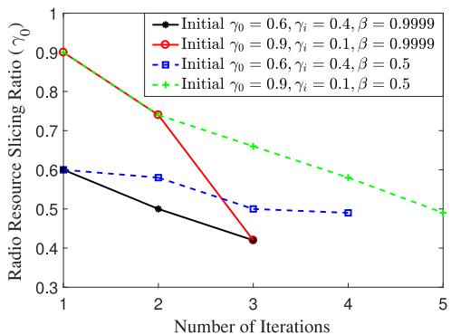

line

| Number of Iterations | Initial γ₀ = 0.6, γᵢ = 0.4, β = 0.9999 | Initial γ₀ = 0.9, γᵢ = 0.1, β = 0.9999 | Initial γ₀ = 0.6, γᵢ = 0.4, β = 0.5 | Initial γ₀ = 0.9, γᵢ = 0.1, β = 0.5 |
| -------------------- | -------------------------------------- | -------------------------------------- | ---------------------------------- | ---------------------------------- |
| 1                    | 0.6                                    | 0.9                                    | 0.6                                | 0.9                                |
| 2                    | 0.5                                    | 0.75                                   | 0.58                               | 0.75                               |
| 3                    | 0.42                                   | 0.42                                   | 0.5                                | 0.65                               |
| 4                    | -                                      | -                                      | 0.5                                | 0.58                               |
| 5                    | -                                      | -                                      | -                                  | 0.5                                |

FIGURE. 6. Iteration of (a) maximum computation load ratio and (b) radio resource slicing ratio in Algorithm 2.

Figs. 7(a)–7(b) and Figs. 7(d)-7(e) show the stationary task offloading policies (i.e., number of road zones associated with different BSs for task offloading from AVs) in each iteration of Algorithm 2 under different $\beta$ and initial radio resource slicing ratios. In each iteration, the task offloading policy is determined based on the sliced radio resources obtained from the previous iteration. Initially, the zone-BS association policy may not reflect a balanced computation offloading due to imbalanced radio resource pre-configuration. However, the radio resource slicing ratios are gradually adjusted in proportion to the computation load distribution in each algorithm iteration, as displayed in Fig. 6(b), which eventually lead to a converged association policy for task offloading (i.e., the association policy stays unchanged between consecutive algorithm iterations). It can also be seen from Fig. 7(a)-7(b) that the optimal computation load balancing is achieved when $\beta = 0 . 9 9 9 9$ by sacrificing slightly more task offloading variations than that in the case of $\beta = 0 . 5 .$ . In both cases, the total number of task offloading switching events averaged over the last three learning episodes at the end of each iteration is controlled, as shown in Figs. 7(c)-7(f), which is less than 20 within a 2000 time-step learning episode for AVs in all road zones.

The aggregate network utility for task offloading is evaluated in Fig. 8. As the radio resource slicing ratios are iteratively adjusted for achieving balanced computation load, the aggregate network utility is increased accordingly until the maximum utility is reached when the optimal task offloading policy is obtained at the last iteration of Algorithm 2. Fig. 9 demonstrates the adaptation of the proposed framework with network-wide AV traffic load variations due to vehicle mobility change over planning windows. The set of optimal radio resource slicing ratios are adjusted by adapting to AV traffic load conditions to maintain consistently balanced computation load among edge servers.

# B. PERFORMANCE COMPARISON

We compare the performance of the proposed framework $( \beta = 0 . 9 9 9 9 , M _ { k , z } = 8 )$ with 1) a computation-loadbalancing-oriented task offloading framework without radio resource slicing $( W _ { \mathrm { m } } = 1 4 \ : \mathrm { M H z } .$ , $W _ { \mathrm { s } } = 6 \mathrm { M H z } )$ [1], 2) a reinforcement learning (RL)-based task transmission rate maximization scheme with certain level of computation load balancing [38], and 3) an SINR-maximization-based offloading selection policy to maximize the overall spectrum efficiency for per-slot task offloading [14]. The maximum computation load ratio and the average number of task offloading switching events per scheduling slot are compared in Fig. 10. As the proposed framework jointly maximizes the communication and computing resource utilization, the optimal computation load balancing is achieved with controlled task offloading variations. In comparison, the task offloading framework without radio resource slicing also achieves a balanced computation load which, however, is not optimal due to the imbalanced radio resource pre-configuration among BSs. The RL-based rate maximization scheme aims at maximizing the networkwide task transmission rate in a long run, while maintaining certain degree of wireless traffic load balancing with frequent offloading variations. The SINR maximization scheme sacrifices both computation load balancing and number of offloading switching events to achieve highest spectrum efficiency for per-slot task offloading.

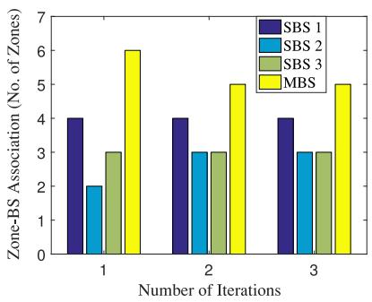

bar

| Number of Iterations | SBS 1 | SBS 2 | SBS 3 | MBS |
| -------------------- | ----- | ----- | ----- | --- |
| 1                    | 4.0   | 2.0   | 3.0   | 6.0 |
| 2                    | 4.0   | 3.0   | 3.0   | 5.0 |
| 3                    | 4.0   | 3.0   | 3.0   | 5.0 |

(a) Zone-BS association policy (β= 0.9999,initial slicing ratios: 0.6,0.4).

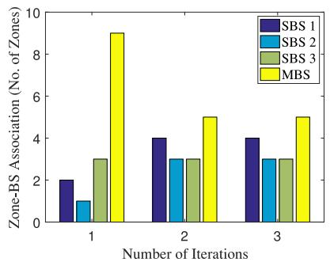

bar

| Number of Iterations | SBS 1 | SBS 2 | SBS 3 | MBS |
| -------------------- | ----- | ----- | ----- | --- |
| 1                    | 2     | 1     | 3     | 9   |
| 2                    | 4     | 3     | 3     | 5   |
| 3                    | 4     | 3     | 3     | 5   |

(b) Zone-BS association policy (β= 0.9999,initial slicing ratios: 0.9,0.1).

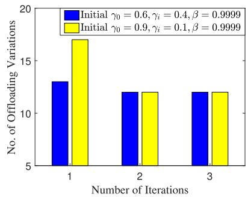

bar

| Number of Iterations | Initial γ₀=0.6, γᵢ=0.4, β=0.9999 | Initial γ₀=0.9, γᵢ=0.1, β=0.9999 |
| --------------------- | ---------------------------------- | ---------------------------------- |
| 1                     | 13                                 | 17                                 |
| 2                     | 12                                 | 12                                 |
| 3                     | 12                                 | 12                                 |

(c) Total number of task offloading variations per episode (β= 0.9999).

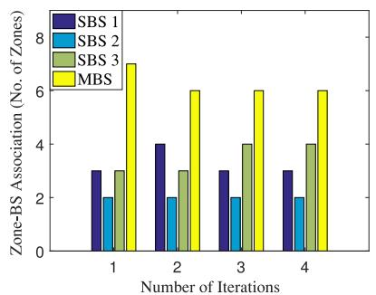

bar

| Number of Iterations | SBS 1 | SBS 2 | SBS 3 | MBS |
| -------------------- | ----- | ----- | ----- | --- |
| 1                    | 3     | 2     | 3     | 7   |
| 2                    | 4     | 2     | 3     | 6   |
| 3                    | 3     | 2     | 4     | 6   |
| 4                    | 3     | 2     | 4     | 6   |

(d) Zone-BS association policy (β=0.5,initial slicing ratios:O.6,0.4)

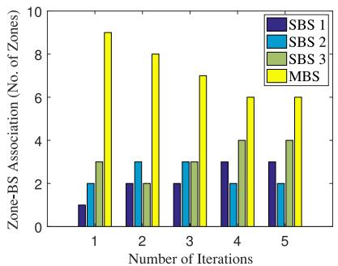

bar

| Number of Iterations | SBS 1 | SBS 2 | SBS 3 | MBS |
| -------------------- | ----- | ----- | ----- | --- |
| 1                    | 1     | 2     | 3     | 9   |
| 2                    | 2     | 3     | 2     | 8   |
| 3                    | 2     | 3     | 3     | 7   |
| 4                    | 3     | 2     | 4     | 6   |
| 5                    | 3     | 2     | 4     | 6   |

(e) Zone-BS association policy (β = O.5,initial slicing ratios: O.9,0.1).

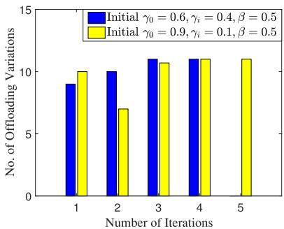

bar

| Number of Iterations | Initial γ₀ = 0.6, γᵢ = 0.4, β = 0.5 | Initial γ₀ = 0.9, γᵢ = 0.1, β = 0.5 |
| -------------------- | ----------------------------------- | ----------------------------------- |
| 1                    | 9.0                                 | 10.0                                |
| 2                    | 10.0                                | 7.0                                 |
| 3                    | 11.0                                | 10.5                                |
| 4                    | 11.0                                | 11.0                                |
| 5                    | 11.0                                | 11.0                                |

(f) Total number of task ofloading variations per episode (β= 0.5).

FIGURE. 7. Stationary task offloading policy and total number of task offloading switching events per learning episode.   
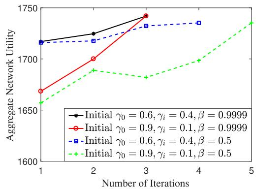

line

| Number of Iterations | Initial γ₀=0.6, γᵢ=0.4, β=0.9999 | Initial γ₀=0.9, γᵢ=0.1, β=0.9999 | Initial γ₀=0.6, γᵢ=0.4, β=0.5 | Initial γ₀=0.9, γᵢ=0.1, β=0.5 |
| -------------------- | ---------------------------------- | ---------------------------------- | ------------------------------ | ------------------------------ |
| 1                    | 1720                               | 1670                               | 1720                           | 1660                           |
| 2                    | 1730                               | 1700                               | 1725                           | 1685                           |
| 3                    | 1745                               | 1745                               | 1735                           | 1680                           |
| 4                    | -                                  | -                                  | 1735                           | 1700                           |
| 5                    | -                                  | -                                  | -                              | 1735                           |

FIGURE. 8. Iteration of aggregate network utility.

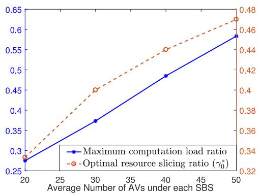

line

| Average Number of AVs under each SBS | Maximum computation load ratio | Optimal resource slicing ratio (γ₀*) |
| ------------------------------------ | ------------------------------- | ------------------------------------- |
| 20                                   | 0.28                            | 0.34                                  |
| 30                                   | 0.38                            | 0.40                                  |
| 40                                   | 0.49                            | 0.45                                  |
| 50                                   | 0.59                            | 0.48                                  |

FIGURE. 9. Adaptation of maximum computation load ratio and optimal radio resource slicing ratio γ∗ (after Algorithm 2 converges) to different AV traffic load conditions (β = 0.9999).

Fig. 11(a) shows a comparison of maximum task offloading latency between the proposed framework and RL-based rate maximization scheme. Both schemes guarantee a bounded maximum task offloading latency. A comparison of network throughput is shown in Fig. 11(b). With the maximized communication resource utilization, the overall network throughput achieved by the proposed framework is the highest, whereas the load-balancing-based task offloading scheme without radio resource slicing attains slightly lower throughput than the other schemes. The aggregate network utility is compared in Fig. 12, where the proposed framework achieves the highest utility because of joint maximization of radio resource and computation resource utilization. In contrast, the other schemes either maximize the utilization of a single resource type or sacrifice the computation load balancing for increased performance gain, resulting in an overall utility drop.

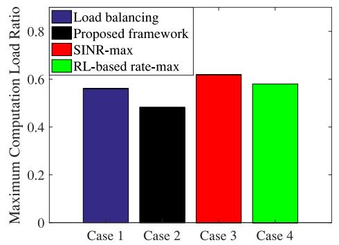

bar

| Case    | Load balancing | Proposed framework | SINR-max | RL-based rate-max |
| ------- | -------------- | ------------------ | -------- | ----------------- |
| Case 1  | 0.57           | -                  | -        | -                 |
| Case 2  | -              | 0.48               | -        | -                 |
| Case 3  | -              | -                  | 0.62     | -                 |
| Case 4  | -              | -                  | -        | 0.58              |

(a)   
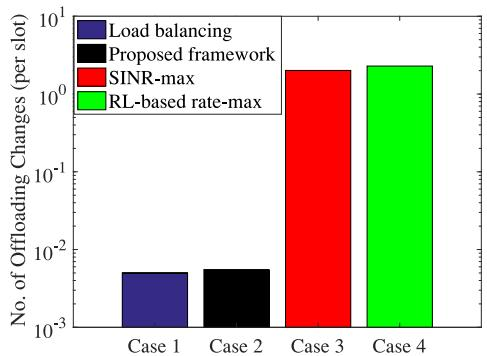

bar

| Case    | No. of Offloading Changes (per slot) |
| ------- | ------------------------------------- |
| Case 1  | 0.01                                  |
| Case 2  | 0.01                                  |
| Case 3  | 1.0                                   |
| Case 4  | 1.0                                   |

(b)   
FIGURE. 10. Comparison of (a) maximum computation load ratio and (b) per-slot task offloading changes.

# VI. CONCLUSION

In this paper, two-timescale RAN slicing and computation offloading are jointly studied in a C-AVN in support of diverse autonomous driving tasks. To capture small-timescale network dynamics, a computing task scheduling problem is formulated as a stochastic optimization program with constraints on task offloading latency and computation capacity. The objective is to achieve the network-wide computation load balancing with controlled task offloading variations among edge servers. To deal with the large problem size with potentially unknown state transition probabilities, we develop a cooperative MA-DQL framework with fingerprint to learn the stationary task offloading policy with stabilized learning performance. Given the task offloading policy in a planning window, a large-timescale RAN slicing problem is further investigated to maximize the overall radio resource utilization with statistical QoS guarantee for different autonomous driving tasks. Due to the correlation between the problems of two timescales, a joint optimization framework is established to maximize the communication and computing resource utilization, where a learning-assisted hierarchical approach is designed to iteratively adjust the radio resource slicing ratios for the optimal computation load balancing. Extensive simulation results are provided to demonstrate the efficacy and advantages of the proposed framework, compared with existing proposals, in achieving balanced computation load with minimal task offloading variations, maximal communication resource utilization, diverse QoS provisioning, and performance adaptation to AV traffic load dynamics.

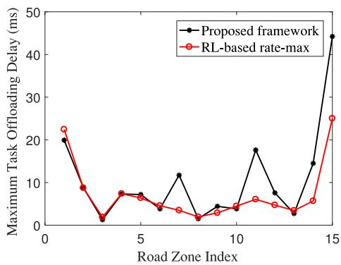

line

| Road Zone Index | Proposed framework | RL-based rate-max |
| --------------- | ------------------ | ----------------- |
| 0               | 20                 | 23                |
| 1               | 20                 | 9                 |
| 2               | 2                  | 8                 |
| 3               | 7                  | 7                 |
| 4               | 7                  | 6                 |
| 5               | 5                  | 5                 |
| 6               | 12                 | 4                 |
| 7               | 2                  | 3                 |
| 8               | 5                  | 4                 |
| 9               | 5                  | 5                 |
| 10              | 18                 | 6                 |
| 11              | 8                  | 5                 |
| 12              | 3                  | 4                 |
| 13              | 15                 | 6                 |
| 14              | 45                 | 25                |
| 15              | 45                 | 25                |

(a) Comparison of maximum task offloading latency.   
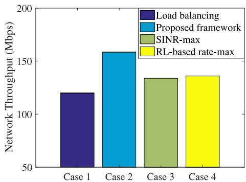

bar

| Case    | Network Throughput (Mbps) |
| ------- | ------------------------- |
| Case 1  | 120                       |
| Case 2  | 160                       |
| Case 3  | 135                       |
| Case 4  | 135                       |

(b) Comparison of network throughput.   
FIGURE. 11. Comparison of task offloading latency and network throughput.

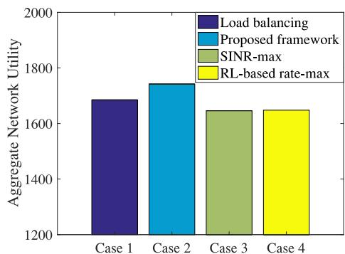

bar

| Case    | Load balancing | Proposed framework | SINR-max | RL-based rate-max |
| ------- | -------------- | ------------------ | -------- | ----------------- |
| Case 1  | 1680           | -                  | -        | -                 |
| Case 2  | -              | 1750               | -        | -                 |
| Case 3  | -              | -                  | 1650     | -                 |
| Case 4  | -              | -                  | -        | 1650              |

FIGURE. 12. Comparison of aggregate network utility.

# APPENDIX A

# PROOF OF PROPOSITION 1

The learning convergence in a fully-observable multi-agent DQL setting is enhanced by using the off-environment importance sampling [33]. Specifically, for agent k, if the Q-function is defined on the augmented observation in (21) that approximates fully-observable network states, the Bellman equation for calculating the optimal Q-value conditioned on all the other agents’ policies is expressed as

$$
\begin{array}{l} Q ^ {*} (O _ {k} ^ {(f)}, \mathcal {A} _ {k} | \boldsymbol {\pi} _ {- k}) = \sum_ {\mathcal {A} _ {- k}} \boldsymbol {\pi} _ {- k} (\mathcal {A} _ {- k} | O _ {k} ^ {(f)}) [ R (O _ {k} ^ {(f)}, \mathcal {A} _ {k}, \mathcal {A} _ {- k}) \\ + \rho \sum_ {O _ {k} ^ {\prime (f)}} P \left(O _ {k} ^ {\prime (f)} \mid O _ {k} ^ {(f)}, \mathcal {A} _ {k}, \mathcal {A} _ {- k}\right) \max _ {\mathcal {A} _ {k} ^ {\prime}} Q ^ {*} \left(O _ {k} ^ {\prime (f)}, \mathcal {A} _ {k} ^ {\prime}\right) ] \tag {27} \\ \end{array}
$$

where time index t is omitted for presentation clarity, and $O _ { k } ^ { \prime ( f ) }$ and $\mathcal { A } _ { k } ^ { \prime }$ denote the observation and action transitioned to the next time slot for agent k. In (27), the non-stationarity comes from the changing of the other agents’ policies, $\pi _ { - k } ,$ over time as agent k learns. If $\pmb { \pi } _ { - k }$ can be consistently captured or estimated, the optimal Q-value is learned to obtain the stationary policy for agent $k ,$ where the learning performance is guaranteed, similar to the case of single agent DQL. The ε-greedy policy is adopted in the DQL module of each agent to take actions, where agent k at each scheduling slot chooses a random action in the action space with exploration rate $\varepsilon _ { k }$ and selects the optimal action with probability $( 1 - \varepsilon _ { k } )$ that achieves the maximum Q-value in current iteration. Also, $\varepsilon _ { k }$ is consistently decreased in each learning episode $e _ { k }$ , with a fixed decaying step size of δ. Clearly, policy $\pi _ { k }$ for agent k is function of $\varepsilon _ { k }$ and $e _ { k }$ . Likewise, the designed fingerprint, $\mathcal { F } _ { - k }$ , in (22) reflects the full policies, $\pmb { \pi } _ { - k }$ , of all the other agents. Therefore, at each time instant of collecting augmented state transition tuple for agent k, $\mathcal { F } _ { - k }$ is always recorded to estimate $\pi _ { - k }$ used for the importance sampling. At the time of replay, we learn the off-environment iteratively by minimizing $L ( \pmb \theta _ { k } )$ to train $\pmb \theta _ { k }$ that approximates the optimal action-value function in (27).

# APPENPIXB

# PROOF OF PROPOSITION 2

Given $a _ { k , z }$ and $\gamma _ { k }$ , (SP2) is reformulated as

$$
\left(\mathrm{SP2} ^ {\prime}\right): \max _ {f _ {k, z}} \sum_ {z \in \mathcal {Z} _ {k} ^ {\prime}} M _ {k, z} \log (f _ {k, z}) \tag {28}
$$

$$
\text { s.t. } \left\{ \begin{array}{l l} \sum_ {z \in \mathcal {Z} _ {k} ^ {\prime}} f _ {k, z} = 1 & \text {(29a)} \\ f _ {k, z} \in (0, 1) & \text {(29b)} \end{array} \right.
$$

where $\mathcal { Z } _ { k } ^ { \prime } = \{ z \in \mathcal { Z } _ { k } | a _ { k , z } = 1 \}$ . It is clear that (SP2 ) is a concave maximization problem with affine equality and inequality constraints satisfying the Slater’s condition [36]. Therefore, the Karush-Kuhn-Tucker (KKT) conditions can be applied in solving (SP2 ) for both primal and dual optimal solutions with zero duality gap [36]. Specifically, a set of $( | \mathcal { Z } _ { k } ^ { \prime } | + 1 )$ KKT equations with $( | \mathcal { Z } _ { k } ^ { \prime } | + 1 )$ variables are expressed as

$$
\left\{ \begin{array}{l} \nabla \mathcal {H} (\mathbf {F} _ {k}) + \nu \cdot \mathbf {1} = 0 \\ \mathbf {1} ^ {\mathrm{T}} \mathbf {F} _ {k} = 1 \end{array} \right. \tag {30}
$$

where ${ \bf F } _ { k } = [ f _ { k , z } ] \in \mathbb { R } ^ { | \mathcal { Z } _ { k } ^ { \prime } | }$ is the decision variable vector of $( \mathrm { S P } 2 ^ { \prime } ) , \mathcal { H } ( \mathbf { F } _ { k } )$ denotes the objective function of (SP2 ), ∇ is the gradient operator, T is the vector/matrix transpose, 1 denotes the $| \mathcal { Z } _ { k } ^ { \prime } |$ |-dimension vector with all elements one, and ν is the Lagrange multiplier associated with equality constraint (29a). By solving the equation array in (30), the primal and dual optimal solutions for (SP2 ) are obtained, respectively, as

$$
f _ {k, z} ^ {*} = \frac {M _ {k , z}}{\sum_ {z \in \mathcal {Z} _ {k} ^ {\prime}} M _ {k , z}} \tag {31}
$$

and

$$
\nu^ {*} = - \sum_ {z \in \mathcal {Z} _ {k} ^ {\prime}} M _ {k, z} \tag {32}
$$

which ends the proof.

# REFERENCES

[1] Q. Ye, W. Shi, K. Qu, H. He, W. Zhuang, and X. Shen, “Learning-based computing task offloading for autonomous driving: A load balancing perspective,” in Proc. ICC, 2021, pp. 1–6.   
[2] S.-C. Lin et al., “The architectural implications of autonomous driving: Constraints and acceleration,” in Proc. ASPLOS, 2018, pp. 751–766.   
[3] S. Kuutti, S. Fallah, K. Katsaros, M. Dianati, F. Mccullough, and A. Mouzakitis, “A survey of the state-of-the-art localization techniques and their potentials for autonomous vehicle applications,” IEEE Internet Things J., vol. 5, no. 2, pp. 829–846, Apr. 2018.   
[4] R. Hussain and S. Zeadally, “Autonomous cars: Research results, issues, and future challenges,” IEEE Commun. Surv. Tut., vol. 21, no. 2, pp. 1275–1313, Apr.–Jun. 2019.   
[5] W. Zhuang, Q. Ye, F. Lyu, N. Cheng, and J. Ren, “SDN/NFVempowered future IoV with enhanced communication, computing, and caching,” Proc. IEEE, vol. 108, no. 2, pp. 274–291, Feb. 2020.   
[6] R. Molina-Masegosa and J. Gozalvez, “LTE-V for sidelink 5G V2X vehicular communications: A new 5G technology for short-range vehicleto-everything communications,” IEEE Veh. Technol. Mag., vol. 12, no. 4, pp. 30–39, Dec. 2017.   
[7] Y. Liu, H. Yu, S. Xie, and Y. Zhang, “Deep reinforcement learning for offloading and resource allocation in vehicle edge computing and networks,” IEEE Trans. Veh. Technol., vol. 68, no. 11, pp. 11 158–11 168, Nov. 2019.   
[8] J. Zhao, Q. Li, Y. Gong, and K. Zhang, “Computation offloading and resource allocation for cloud assisted mobile edge computing in vehicular networks,” IEEE Trans. Veh. Technol., vol. 68, no. 8, pp. 7944–7956, Aug. 2019.   
[9] Y. Mao, J. Zhang, and K. B. Letaief, “Dynamic computation offloading for mobile-edge computing with energy harvesting devices,” IEEE J. Sel. Areas Commun., vol. 34, no. 12, pp. 3590–3605, Dec. 2016.   
[10] J. Yan, S. Bi, Y. J. Zhang, and M. Tao, “Optimal task offloading and resource allocation in mobile-edge computing with inter-user task dependency,” IEEE Trans. Wireless Commun., vol. 19, no. 1, pp. 235–250, Jan. 2020.   
[11] J. Zhou, D. Tian, Y. Wang, Z. Sheng, X. Duan, and V. C. Leung, “Reliability-optimal cooperative communication and computing in connected vehicle systems,” IEEE Trans. Mobile Comput., vol. 19, no. 5, pp. 1216–1232, May 2020.   
[12] Y. Dai, D. Xu, S. Maharjan, and Y. Zhang, “Joint load balancing and offloading in vehicular edge computing and networks,” IEEE Internet Things J., vol. 6, no. 3, pp. 4377–4387, Jun. 2019.

[13] L. Yang, H. Yao, J. Wang, C. Jiang, A. Benslimane, and Y. Liu, “Multi-UAV-enabled load-balance mobile-edge computing for IoT networks,” IEEE Internet Things J., vol. 7, no. 8, pp. 6898–6908, Aug. 2020.   
[14] J. Zhang, H. Guo, J. Liu, and Y. Zhang, “Task offloading in vehicular edge computing networks: A load-balancing solution,” IEEE Trans. Veh. Technol., vol. 69, no. 2, pp. 2092–2104, Feb. 2020.   
[15] X. Shen et al., “AI-assisted network-slicing based next-generation wireless networks,” IEEE Open J. Veh. Technol., vol. 1, pp. 45–66, Jan. 2020.   
[16] Q. Ye, J. Li, K. Qu, W. Zhuang, X. Shen, and X. Li, “End-to-end quality of service in 5G networks: Examining the effectiveness of a network slicing framework,” IEEE Veh. Technol. Mag., vol. 13, no. 2, pp. 65–74, Jun. 2018.   
[17] F. Lyu et al., “Service-oriented dynamic resource slicing and optimization for space-air-ground integrated vehicular networks,” IEEE Trans. Intell. Transp. Syst., early access , doi:10.1109/TITS.2021.3070542.   
[18] Y. Hua, R. Li, Z. Zhao, X. Chen, and H. Zhang, “GAN-powered deep distributional reinforcement learning for resource management in network slicing,” IEEE J. Sel. Areas Commun., vol. 38, no. 2, pp. 334–349, Feb. 2020.   
[19] S. Zhang, H. Luo, J. Li, W. Shi, and X. Shen, “Hierarchical soft slicing to meet multi-dimensional QoS demand in cache-enabled vehicular networks,” IEEE Trans. Wireless Commun., vol. 19, no. 3, pp. 2150–2162, Mar. 2020.   
[20] W. Wu et al., “Dynamic RAN slicing for service-oriented vehicular networks via constrained learning,” IEEE J. Sel. Areas Commun., vol. 39, no. 7, pp. 2076–2089, Jul. 2021, doi:10.1109/JSAC.2020.3041405.   
[21] M. Kourtis et al., “A cloud-enabled small cell architecture in 5G networks for broadcast/multicast services,” IEEE Trans. Broadcast., vol. 65, no. 2, pp. 414–424, Jun. 2019.   
[22] M. Richart, J. Baliosian, J. Serrat, and J.-L. Gorricho, “Resource slicing in virtual wireless networks: A survey,” IEEE Trans. Netw. Serv. Manage., vol. 13, no. 3, pp. 462–476, Sep. 2016.   
[23] W. L. Tan, W. C. Lau, O. Yue, and T. H. Hui, “Analytical models and performance evaluation of drive-thru internet systems,” IEEE J. Sel. Areas Commun., vol. 29, no. 1, pp. 207–222, Jan. 2011.   
[24] H. He, H. Shan, A. Huang, Q. Ye, and W. Zhuang, “Edge-aided computing and transmission scheduling for LTE-U-enabled IoT,” IEEE Trans. Wireless Commun., vol. 19, no. 12, pp. 7881–7896, Dec. 2020.   
[25] L. Huang, S. Bi, and Y.-J. A. Zhang, “Deep reinforcement learning for online computation offloading in wireless powered mobile-edge computing networks,” IEEE Trans. Mobile Comput., vol. 19, no. 11, pp. 2581–2593, Nov. 2020.   
[26] L. Liang, H. Ye, and G. Y. Li, “Spectrum sharing in vehicular networks based on multi-agent reinforcement learning,” IEEE J. Sel. Areas Commun., vol. 37, no. 10, pp. 2282–2292, Oct. 2019.   
[27] Y. S. Nasir and D. Guo, “Multi-agent deep reinforcement learning for dynamic power allocation in wireless networks,” IEEE J. Sel. Areas Commun., vol. 37, no. 10, pp. 2239–2250, Oct. 2019.   
[28] K. Qu, W. Zhuang, X. Shen, X. Li, and J. Rao, “Dynamic resource scaling for VNF over nonstationary traffic: A learning approach,” IEEE Trans. Cogn. Commun. Netw., vol. 7, no. 2, pp. 648–662, Jun. 2021, doi:10.1109/TCCN.2020.3018157.   
[29] Q. Ye, W. Zhuang, S. Zhang, A. Jin, X. Shen, and X. Li, “Dynamic radio resource slicing for a two-tier heterogeneous wireless network,” IEEE Trans. Veh. Technol., vol. 67, no. 10, pp. 9896–9910, Oct. 2018.   
[30] D. Wu and R. Negi, “Effective capacity: A wireless link model for support of quality of service,” IEEE Trans. Wireless Commun., vol. 2, no. 4, pp. 630–643, Jul. 2003.   
[31] V. Mnih et al., “Human-level control through deep reinforcement learning,” Nature, vol. 518, no. 7540, pp. 529–533, 2015.   
[32] C. J. Watkins and P. Dayan, “Q-learning,” Mach. Learn., vol. 8, no. 3/4, pp. 279–292, 1992.   
[33] J. Foerster et al., “Stabilising experience replay for deep multi-agent reinforcement learning,” in Proc. ICML, 2017, pp. 1146–1155.   
[34] A. OroojlooyJadid and D. Hajinezhad, “A review of cooperative multiagent deep reinforcement learning,” 2019, arXiv:1908.03963. [Online]. Available: http://arxiv.org/abs/1908.03963   
[35] “CVX 2.0,” [Online]. Available: http://cvxr.com/cvx/   
[36] S. P. Boyd and L. Vandenberghe, Convex Optimization. Cambridge, U.K.: Cambridge Univ. Press, 2004.   
[37] “SUMO 1.7.0,” [Online]. Available: https://www.eclipse.org/sumo/

[38] Z. Li, C. Wang, and C. Jiang, “User association for load balancing in vehicular networks: An online reinforcement learning approach,” IEEE Trans. Intell. Transp. Syst., vol. 18, no. 8, pp. 2217–2228, Aug. 2017.

natural_image

Portrait of a man wearing glasses and a collared shirt (no text or symbols visible)

QIANG YE (Member, IEEE) received the Ph.D. degree in electrical and computer engineering from the University of Waterloo, Waterloo, ON, Canada, in 2016. From December 2016 to September 2019, he was a Postdoctoral Fellow and a Research Associate with the Department of Electrical and Computer Engineering, University of Waterloo. Since September 2019, he has been an Assistant Professor with the Department of Electrical and Computer Engineering and Technology, Minnesota State University, Mankato, MN, USA. His research

interests include network slicing for 5G networks, edge intelligence for autonomous vehicular networks, artificial intelligence for future networking, protocol design, and performance analysis for the Internet of Things. He was a Technical Program Committee (TPC) Members for several international conferences, including the IEEE GLOBECOM’20, VTC’17, VTC’20, and IC-PADS’20. He is the Editors of the International Journal of Distributed Sensor Networks (SAGE Publishing) and Wireless Networks (SpringerNature), and an Area Editor of the Encyclopedia of Wireless Networks (SpringerNature).

natural_image

Portrait photo of a man wearing a red plaid shirt (no text or symbols visible)

WEISEN SHI (Student Member, IEEE) received the B.S. degree in electrical and computer engineering from Tianjin University, Tianjin, China, in 2013, the M.S. degree in electrical and computer engineering from the Beijing University of Posts and Telecommunications, Beijing, China, in 2016, and the Ph.D. degree in electrical and computer engineering from the Department of Electrical and Computer Engineering, University of Waterloo, Waterloo, ON, Canada, in 2020. His research interests include space-air-ground integrated networks,

UAV communication and networking, and RAN slicing.

natural_image

Portrait of a woman wearing glasses and formal attire (no text or symbols visible)

KAIGE QU (Member, IEEE) received the B.Sc. degree in communication engineering from Shandong University, Jinan, China, in 2013, the M.Sc. degree in integrated circuits engineering and electrical engineering from Tsinghua University, Beijing, China, and KU Leuven, Leuven, Belgium, respectively, in 2016, and the Ph.D. degree in electrical and computer engineering from the University of Waterloo, Waterloo, ON, Canada, in 2020. She is currently a Postdoctoral Fellow with the University of Waterloo. Her research interests in-

clude resource allocation in SDN/NFV-enabled networks, mobile edge computing, artificial intelligence for networking, and networking for artificial intelligence.

natural_image

Portrait of a young man wearing glasses and a hoodie (no visible text or symbols)

HONGLI HE (Member, IEEE) received the B.Sc. and the Ph.D. degrees in information and communication engineering from Zhejiang University, Hangzhou, China, in 2014 and 2020, respectively. His research interests include vehicular ad hoc networks, cellular networks over unlicensed spectrum, edge computing, and deep reinforcement learning in wireless communication.

natural_image

Portrait of a smiling woman with short black hair and glasses, wearing a striped shirt (no text or symbols visible)

WEIHUA ZHUANG (Fellow, IEEE) has been with the Department of Electrical and Computer Engineering, University of Waterloo, Waterloo, ON, Canada, since 1993, where she is currently a Professor and a Tier I Canada Research Chair of wireless communication networks. She was the Technical Program Symposia Chair of the IEEE GLOBE-COM 2011 and the Technical Program Chair or Co-Chair of the IEEE VTC in 2016 and 2017. She is a Fellow of the Royal Society of Canada, the Canadian Academy of Engineering, and the Engineering Institute of Canada. She is an Elected Member of the Board of Governors and VP Publications of the IEEE Vehicular Technology Society. From 2008 to 2011, she was an IEEE Communications Society Distinguished Lecturer. From 2007 to 2013, she was the Editor-in-Chief of the IEEE TRANSACTIONS ON VEHICULAR TECHNOLOGY. She was the recipient of the 2017 Technical Recognition Award from the IEEE Communications Society Ad Hoc and Sensor Networks Technical Committee, and several best paper awards from IEEE conferences.

natural_image

Portrait of a middle-aged man in a light blue shirt (no text or symbols visible)

XUEMIN (SHERMAN) SHEN (Fellow, IEEE) received the Ph.D. degree in electrical engineering from Rutgers University, New Brunswick, NJ, USA, in 1990. He is currently a University Professor with the Department of Electrical and Computer Engineering, University of Waterloo, Waterloo, ON, Canada. His research interests include network resource management, wireless network security, Internet of Things, 5G and beyond, and vehicular ad hoc and sensor networks. He is a registered Professional Engineer of Ontario, Canada, an Engineering Institute of Canada Fellow, a Canadian Academy of Engineering Fellow, a Royal Society of Canada Fellow, a Chinese Academy of Engineering Foreign Fellow, and a Distinguished Lecturer of the IEEE Vehicular Technology Society and Communications Society.

He was the recipient of the R.A. Fessenden Award in 2019 from IEEE, Canada, Award of Merit from the Federation of Chinese Canadian Professionals (Ontario) presents in 2019, James Evans Avant Garde Award in 2018 from the IEEE Vehicular Technology Society, Joseph LoCicero Award in 2015 and Education Award in 2017 from the IEEE Communications Society, and Technical Recognition Award from Wireless Communications Technical Committee (2019) and AHSN Technical Committee (2013). He was also the recipient of the Excellent Graduate Supervision Award in 2006 from the University of Waterloo and the Premier’s Research Excellence Award (PREA) in 2003 from the Province of Ontario, Canada. He was the Technical Program Committee Chair or Co-Chair for the IEEE Globecom’16, the IEEE Infocom’14, the IEEE VTC’10 Fall, the IEEE Globecom’07, the Symposia Chair for the IEEE ICC’10, and the Chair for the IEEE Communications Society Technical Committee on Wireless Communications. He is the IEEE Communications Society President Elect. He was the Vice President for Technical & Educational Activities, Vice President for Publications, Memberat-Large on the Board of Governors, Chair of the Distinguished Lecturer Selection Committee, Member of IEEE Fellow Selection Committee. He was the Editor-in-Chief of the IEEE INTERNET OF THINGS JOURNAL, IEEE NETWORK, and IET Communications.