# Joint Resource Management for Energy-Efficient UAV-Assisted SWIPT-MEC: A Deep Reinforcement Learning Approach

Yue Chen, Hui Kang , Jiahui Li , Member, IEEE, Geng Sun , Senior Member, IEEE, Boxiong Wang Jiacheng Wang , Cong Liang, Shuang Liang , and Dusit Niyato , Fellow, IEEE

Abstract—The integration of simultaneous wireless information and power transfer (SWIPT) technology in 6G Internet of Things (IoT) networks faces significant challenges in remote areas and disaster scenarios where ground infrastructure is unavailable. This article proposes a novel autonomous aerial vehicle (UAV)- assisted mobile edge computing (MEC) system enhanced by directional antennas to provide both computational resources and energy support for ground IoT terminals. However, such systems require multiple tradeoff policies to balance UAV energy consumption, terminal battery levels, and computational resource allocation under various constraints, including limited UAV battery capacity, nonlinear energy harvesting characteristics, and dynamic task arrivals. To address these challenges comprehensively, we formulate a biobjective optimization problem that simultaneously considers system energy efficiency and terminal battery sustainability. We then reformulate this nonconvex problem with a hybrid solution space as a Markov decision process (MDP) and propose an improved soft actor-critic (SAC) algorithm with an action simplification mechanism to enhance its convergence and generalization capabilities. Simulation results have demonstrated that our proposed approach outperforms various baselines in different scenarios, achieving efficient energy management while maintaining high computational performance. Furthermore, our method shows strong generalization ability across different scenarios, particularly in complex environments, validating the effectiveness of our designed boundary penalty and charging reward mechanisms.

Received 27 March 2025; revised 7 May 2025; accepted 20 May 2025. Date of publication 28 May 2025; date of current version 25 July 2025. This work was supported in part by the National Natural Science Foundation of China under Grant 62172186, Grant 62272194, and Grant 62471200; in part by the Science and Technology Development Plan Project of Jilin Province under Grant 20250102210JC; in part by the Scientific Research Project of Jilin Provincial Department of Education under Grant JJKH20250117KJ; in part by the National Research Foundation, Singapore; in part by the Infocomm Media Development Authority under its Future Communications Research and Development Programme under Grant FCP-NTU-RG-2022-010 and Grant FCP-ASTAR-TG-2022-003; in part by the Singapore Ministry of Education (MOE) Tier 1 under Grant RG87/22 and Grant RG24/24; in part by the NTU Centre for Computational Technologies in Finance (NTU-CCTF); in part by the RIE2025 Industry Alignment Fund—Industry Collaboration Projects (IAF-ICP), administered by A\*STAR under Award I2301E0026; in part by the Alibaba Group and NTU Singapore through Alibaba-NTU Global e-Sustainability CorpLab (ANGEL); in part by the Postdoctoral Fellowship Program of China Postdoctoral Science Foundation under Grant GZC20240592; in part by the China Postdoctoral Science Foundation General Fund under Grant 2024M761123; and in part by the Graduate Innovation Fund of Jilin University under Grant 2025CX210 and Grant 2025CX215. (Corresponding authors: Jiahui Li; Geng Sun.)

Please see the Acknowledgment section of this article for the author affiliations.

Digital Object Identifier 10.1109/JIOT.2025.3574332

Index Terms—Autonomous aerial vehicle (UAV)-assisted simultaneous wireless information and power transfer (SWIPT)-mobile edge computing (MEC) network, deep reinforcement learning (DRL), resource management, task offloading, trajectory planning.

# I. INTRODUCTION

HE SIMULTANEOUS wireless information and power transfer (SWIPT) has emerged as a promising technology for Internet of Things (IoT) applications in sixth-generation (6G) wireless networks [1], [2], [3], [4]. The anticipated rapid expansion of IoT networks, characterized by large-scale deployment, automation, and low power consumption [5], [6], presents significant challenges in providing a reliable power supply and network connectivity. Specifically, traditional approaches such as wired connections and battery replacements incur substantial maintenance costs [7], particularly problematic given the increasing computational demands of IoT terminals requiring continuous network connectivity. To address these challenges, SWIPT enables simultaneous energy and information transmission via radio frequency (RF) signals from ground-based stations. However, this solution exhibits limitations in remote areas or disaster scenarios where ground infrastructure is unavailable or damaged, potentially compromising network coverage and communication performance.

Low-altitude autonomous aerial vehicles (UAV) emerge as an effective solution to challenges in traditional IoT networks and SWIPT implementation. Functioning as mobile base stations, UAVs offer cost-effectiveness, mobility, and ease of deployment [8], [9], which attributes are critical for dynamic IoT environments. Their ability to adjust position in realtime establishes line-of-sight (LoS) connections with ground IoT terminals, enhancing wireless network performance and robustness [10]. Additionally, UAVs equipped with mobile edge computing (MEC) servers bring computational resources closer to resource-constrained IoT terminals, reducing processing latency and improving operational efficiency [11], [12]. By simultaneously supporting SWIPT and MEC functionalities, UAVs effectively address both energy harvesting (EH) and computational demands in dynamic and resource-constrained IoT environments.

However, integrating MEC and SWIPT into UAV-assisted 6G-enabled IoT networks while efficiently managing computational tasks presents several challenges [13], [14], [15]. First,

UAVs face inherent energy limitations due to battery size and weight constraints [16], which necessitate efficient energy allocations for movement, communication, and computation. In particular, the decision variables of UAV flight strategy, such as velocity, have a nonlinear relationship with propulsion power consumption, thus further posing optimization difficulty [17]. Second, the limited computational resources and communication bandwidth of UAVs may be insufficient to meet the computational and energy demands of multiple IoT devices simultaneously [18], which means that the energy charging fairness among these IoT devices must be considered. Third, stochastic task arrivals and channel condition fluctuations bring dynamics to the considered UAV-assisted multiterminal SWIPT-MEC network, causing the static optimization method to lack adaptability [19], [20].

To address these challenges comprehensively, we formulate a biobjective optimization problem related to the total energy consumption of the system and the average battery level of the terminals in a UAV-assisted multiterminal SWIPT-MEC system. The main contributions of this article are summarized as follows.

1) UAV-Assisted Multiterminal SWIPT-MEC System With Directional Antenna: We consider a novel UAV-assisted network that integrates SWIPT with MEC support for multiple terminals, specifically designed for regions without coverage from ground base stations. In this system, the UAV functions as a mobile base station providing MEC services while simultaneously employing SWIPT to deliver wireless charging support to terminals. Simultaneously, we consider the UAV with directional antennas to enhance the downlink transmission signal quality. It will improve both communication efficiency and charging capabilities, which ultimately extends the average battery runtime of terminals.   
2) Formulation of a Biobjective Optimization Problem: We formulate a biobjective optimization problem, aiming to minimize the total energy consumption of the system and maximize the average battery level of the terminals while ensuring charging fairness among terminals simultaneously. The formulated problem is a nonconvex mixed-integer nonlinear programming problem with a hybrid solution space, i.e., discrete and continuous variables.   
3) Deep Reinforcement Learning (DRL)-Base Solution: We propose a novel DR)-based off-policy optimization approach. We first reformulate the optimization problem as a Markov decision process (MDP). Subsequently, we design an action simplification mechanism to address the hybrid action space. Based on this, we propose an improved soft actor-critic (SAC) algorithm that enhances the processing and modeling capabilities of neural networks, thereby resulting in superior convergence performance.   
4) Performance Evaluation and Analysis: Simulation results demonstrate that the proposed algorithm outperforms various baselines across key metrics, yielding a 47.86% improvement in average terminal retained

energy and a 65.15% enhancement in charging fairness. Moreover, the proposed algorithm exhibits fast convergence and effectively learns the maximum entropy optimal policy, successfully balancing exploration and exploitation in complex decision spaces. Furthermore, it demonstrates strong generalization capabilities across diverse terminal distributions, particularly in the case of uneven distribution.

The remainder of this article is organized as follows. Section II reviews the related research activities. Section III presents the directional antenna-enhanced UAV-assisted multiterminal SWIPT-MEC network and optimization problem formulation. Section IV proposes our DRL-based solution. Simulation results are presented and analyzed in Section V. Finally, this work is concluded in Section VI.

# II. RELATED WORK

In this section, we review related works on paradigms, optimization objectives, and optimization methods in UAVassisted SWIPT-MEC networks.

# A. Paradigms in MEC Networks

MEC technology allows computation-intensive and latencycritical applications to be offloaded from resource-constrained mobile devices to proximate network edges [21], which attracts considerable research interest. The related literature on MEC networks can be classified into three distinct research paradigms.

Ground MEC Networks: Offloading computational tasks from mobile devices to ground-based stations represents the foundational paradigm of MEC. For example, Widiyanti and Shin [22] proposed an Internet of Video Things (IoVT) network based on MEC, combined with the reconfigurable intelligent surface (RIS). However, ground-based MEC systems face significant challenges related to scalability and disaster recovery capabilities. In remote areas, these systems often become inoperative due to insufficient base station coverage and inadequate infrastructure support.

UAV-Assisted MEC Networks: The integration of UAVs effectively addresses critical limitations of traditional ground MEC networks by deploying UAVs as mobile base stations or communication relays. For instance, Song et al. [23] utilized a UAV as either an MEC server or wireless relay within a UAV-assisted MEC system. While these contributions advance UAV-assisted MEC capabilities, they overlooked the energy requirements of mobile terminals, which are particularly crucial for energy-constrained devices such as sensors.

UAV-Assisted Wireless Power Transmission (WPT)-MEC Networks: Some studies have now applied technology, utilizing UAVs as power sources to charge mobile devices. Zeng et al. [24] investigated a UAV-assisted WPT-MEC system, where the UAV provided both power and computation services to mobile terminals.

Despite advances in the field, research remains limited on utilizing UAVs to simultaneously provide charging and downlink information transmission services for terminals in

MEC networks. This capability is particularly valuable in areas lacking ground-based infrastructure and better aligns with practical implementation demands.

# B. Optimization Objectives in UAV-Assisted Networks With WPT/SWIPT

In the paradigms of UAV-assisted WPT/SWIPT networks, common optimization objectives are typically categorized into the following two main aspects.

Energy-Related Objectives: Several studies focus on energyrelated objectives, such as energy consumption and energy efficiency (EE). For example, Du et al. [25] proposed a novel time division multiple access (TDMA)-based workflow model, aiming to minimize the total energy consumption of the UAV. Likewise, Liu et al. [26] formulated an optimization problem in the scenario of a UAV-enabled wireless-powered cooperative MEC system, seeking to minimize the total required energy of the UAV. Su et al. [3] investigated the EE maximization optimization problem for device-to-device (D2D) communications underlaying UAVs-assisted industrial IoT networks with SWIPT. Nonetheless, the aforementioned studies concentrate on the energy consumption or EE of UAVs or systems, without considering optimization objectives related to the performance of ground terminals.

Terminals-Related Objectives: Several studies focus on the objectives related to terminal performance. For instance, Liu et al. [27] considered a heterogeneous MEC system with multiple energy-limited IoT devices and a UAV to maximize the minimum task computation data volume among all active devices. Similarly, Baduge et al. [28] integrated SWIPTenabled nonorthogonal multiple access (NOMA) with a UAV, aiming to maximize achievable rates for the ground users. Heo et al. [29] considered a UAV-assisted SWIPT system to maximize the sum of the logarithmic average throughput of the GNs. However, the aforementioned research emphasizes the terminal-related metrics but neglects the overall system performance optimization.

As a result, we construct a directional antenna-enhanced UAV-assisted multiterminal SWIPT-MEC system. In contrast to existing studies, our approach targets optimization objectives at two levels. At the macro level, we aim to minimize UAV energy consumption, while at the micro level, our objective is to maximize the battery energy of the terminals, ensuring charging fairness among the terminals.

# C. Optimization Methods in UAV-Assisted Networks With WPT/SWIPT

To achieve the aforementioned optimization objectives, various methods have been employed in the literature, which can be broadly categorized into the following categories.

Convex Optimization Methods: Several studies use traditional static convex or nonconvex optimization methods. For example, Jalali et al. [30] investigated a UAV-assisted SWIPT network and proposed a convex optimization method that combines successive convex approximation (SCA) and a quadratic transformation approach. However, convex optimization methods have limitations in terms of applicability and global convergence, especially in weakly constrained problems involving complex structures and multiple local optima.

Evolutionary Computation Methods: Several studies employ evolutionary computation methods to address nonconvex optimization problems due to the coupled variables. For instance, Feng et al. [31] proposed a multiobjective evolutionary algorithm based on decomposition (MOEA/D) for an emergency communication framework in UAV-enabled SWIPT IoT networks. However, evolutionary computation methods are prone to being trapped in local optima when confronted with high-dimensional data and multimodal problems, and their performance is often highly sensitive to parameter settings.

Traditional DRL Methods: More recently, some studies have attempted to utilize conventional DRL methods to solve dynamic nonlinear programming problems and address the complexities of dynamic environments to achieve enhanced system performance. Specifically, Shi et al. [32] considered a computation-intensive MEC network based on NOMA-SWIPT and proposed a multiagent deep deterministic policy gradient (MADDPG)-based resource management algorithm. Chhea et al. [33] studied an energy-efficient UAV network enhanced by RIS with SWIPT, maximizing the average EE by employing the deep Q-learning (DQL) framework. However, the aforementioned works do not offer targeted improvements to address the complexities and variability of dynamic environments.

In summary, distinct from prior studies, we propose a novel DRL-based method for directional antenna-enhanced UAVassisted multiterminal SWIPT-MEC systems. This approach effectively tackles dynamic task offloading and UAV scheduling challenges while addressing high-dimensional action-state spaces with a low-complexity solution. Consequently, our method achieves an optimal strategy that balances competing optimization objectives.

# III. SYSTEM MODEL AND PROBLEM FORMULATION

In this section, we introduce a directional antenna-enhanced UAV-assisted multiterminal SWIPT-MEC system with details presented as follows.

Fig. 1 illustrates our proposed system comprising fixed ground IoT terminals, denoted as $i \in \mathcal { T } \ = \ \{ 1 , \dots , I \}$ . These terminals need to perform computational tasks and transfer information simultaneously for applications such as water quality detection, fire warning, and humidity monitoring. However, in remote areas, the absence of available ground infrastructure makes it impossible to directly provide service to these terminals [19]. Moreover, these terminals are inherently constrained by their limited computational resources and battery capacity, which significantly restricts their task-processing capabilities and service lifetimes.

To address these challenges, we deploy a UAV u equipped with a directional antenna to provide communication, computing services, and energy supply through SWIPT technology [34]. Note that we consider one UAV for the sake of simplicity, and the proposed model can be further extended to multi-UAV cases. Specifically, we first divide the network into clusters using algorithms such as k-means and then apply our modeling approach to each cluster independently.

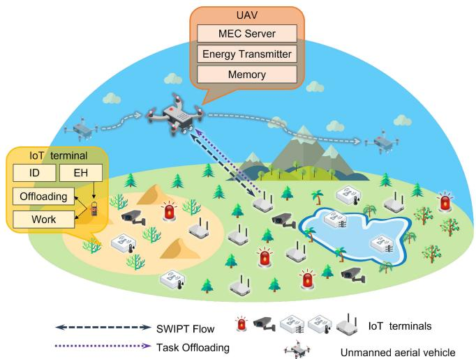

<details>
<summary>flowchart</summary>

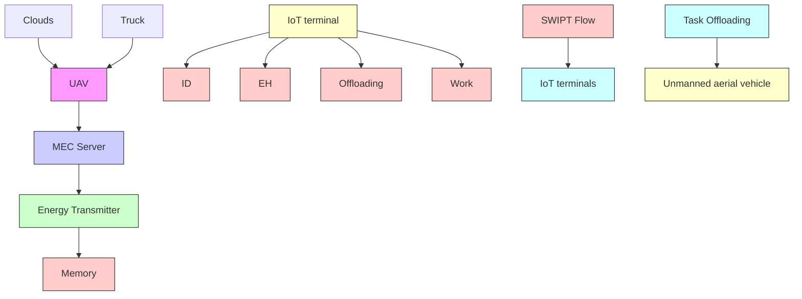
</details>

Fig. 1. Directional antenna-enhanced UAV-assisted multiterminal SWIPT-MEC system.

Fig. 2 illustrates our discrete-time model that partitions continuous time into T discrete equal-duration time slots. Specifically, we define the collection of time slots as $\mathcal { T } =$ $\{ 1 , \ldots , t , \ldots , T \}$ , and the duration of each time slot is denoted as τ , which is chosen to be sufficiently small such that each time slot maintains quasi-static conditions. Thus, we consider that the channel state information (CSI) and the position of the UAV remain constant within a single time slot [4]. When an IoT terminal i offloads its task to the UAV for processing, each time slot is composed of the following phases.

1) Task Offloading Phase: The IoT terminal offloads its computing task to the UAV.   
2) SWIPT and Computation Phase: After receiving the task, the UAV processes it and transmits the signal to the terminal via a directional antenna. These signals simultaneously deliver both information (external data and computation results) and energy to the terminal. The terminal then performs signal splitting to enable both information decoding (ID) and EH.

Without loss of generality, we denote the coordinates of the ground IoT terminal i as $p _ { i } = ( x _ { i } , y _ { i } , 0 )$ . The UAV operates at a fixed altitude H [3], [4], with its position at time slot t represented as $p _ { u } ^ { t } = ( x _ { u } ^ { t } , y _ { u } ^ { t } , H )$ .

# A. Task Model

In this section, we describe the task generation model and the associated offloading decision-making process.

For the downlink communication, terminal i receives information data $D _ { i , r }$ from the UAV, which possesses sufficient storage capacity to carry all required information.

For the uplink communication, computational tasks at IoT terminal i arrive according to a Bernoulli process during time slot t [35], generating either 0 or 1 task in a time slot. Each task is characterized by a tuple $\{ D _ { i , p } ^ { t } , t _ { \mathrm { g e n } } , C _ { i } \}$ , where $D _ { i , p } ^ { t }$ represents the data size of task (bit), $t _ { \mathrm { g e n } }$ indicates the generation time slot, and $C _ { i }$ denotes the computation intensity (cycles/bit).

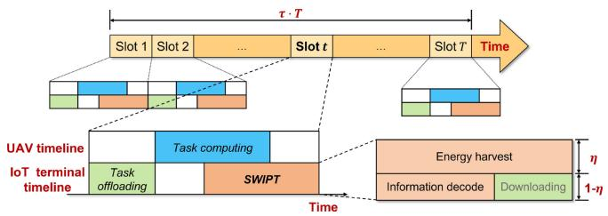

<details>
<summary>flowchart</summary>

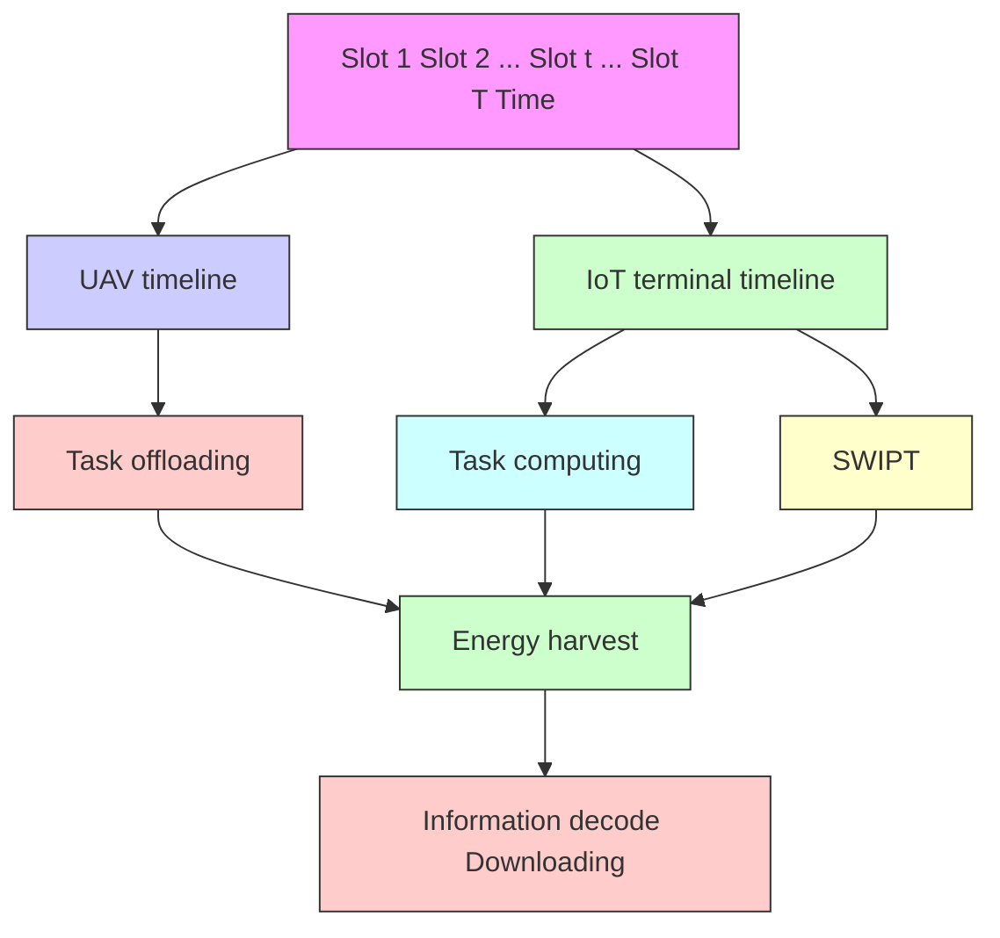
</details>

Fig. 2. Time slot division model in the offloading scenario.

We consider these computational tasks to be atomic, requiring completion within a single time slot. Consequently, only two processing strategies are available: 1) local computation or 2) complete offloading to the UAV [36]. This approach allows complex tasks comprising multiple indivisible units to be treated as separate atomic tasks, enhancing problem tractability.

To effectively describe task processing strategies of terminal $i ,$ we define a binary indicator $o _ { i } ^ { t } \in \{ 0 , 1 \}$ representing the offloading decision in time slot t, where $o _ { i } ^ { t } ~ = ~ 1$ indicates task offloading and $o _ { i } ^ { t } = 0$ represents local processing. The selection of $o _ { i } ^ { t }$ depends on the size of the task and processing requirements, as well as current communication conditions and resource availability. As illustrated in Fig. 2, the time slot division model can be expressed as follows:

$$
\tau_ {\mathrm{up}} + \tau_ {\mathrm{S}} \leq \tau \tag {1}
$$

where $\begin{array} { l l l } { \tau _ { \mathrm { { u p } } } } & { = } & { ( o _ { i } ^ { t } ( D _ { i , p } ^ { t } + \delta _ { i  u } ) / R _ { i  u } ) } \end{array}$ represents the task offloading time. The SWIPT time τS is calculated as the maximum of UAV computing time, EH time, and ID time: $\begin{array} { r l } { \tau _ { S } } & { { } = } \end{array}$ max $\{ [ o _ { i } ^ { t } C _ { i } D _ { i , p } ^ { t } / f _ { u } ]$ , min $( ( E _ { \operatorname* { m a x } } - E _ { i } / E _ { u \to i } ) , \tau \ -$ $\tau _ { \mathrm { u p } } ) , ( D _ { i , r } + \delta _ { u  i } / R _ { u  i } ) \}$ . Here, $f _ { u }$ is the CPU frequency (cycles/s) of the UAV, $\delta _ { i \to u }$ and $\delta _ { u  i }$ are the protocol overheads required for uplink and downlink, respectively. Additionally, $E _ { \mathrm { m a x } }$ represents the maximum battery capacity, $E _ { i }$ denotes the remaining battery level of terminal i, while $E _ { u  i }$ and $R _ { u  i }$ represent the EH rate and achievable downlink data rate, respectively, which will be detailed in the next section.

# B. SWIPT Model

In this part, we introduce the SWIPT model, including the air-to-ground channel models and the nonlinear EH model.

1) Air-to-Ground Channel Model: We employ a probabilistic LoS channel model for communication, where the LoS probability $P _ { \mathrm { L o S } }$ is given by [37]: $\begin{array} { r l } { P _ { \mathrm { L o S } } } & { { } = } \end{array}$ $( 1 / 1 + a _ { 1 } \exp ( - b _ { 1 } ( [ 1 8 0 / \pi ] \arctan ( [ H / d _ { i } ^ { t } ] ) - a _ { 1 } ) ) )$ . Here, parameters $a _ { 1 }$ and $b _ { 1 }$ are environment-dependent, H represents the UAV altitude, and $d _ { i } ^ { t }$ denotes the horizontal distance between the UAV and terminal i at time slot t, which is calculated as $d _ { i } ^ { t } = \sqrt { ( x _ { u } ^ { t } - x _ { i } ) ^ { 2 } + ( y _ { u } ^ { t } - y _ { i } ) ^ { 2 } } .$

Based on $P _ { \mathrm { L o S } } .$ , the path loss between the UAV and terminal i for a given time slot t can be expressed as follows:

$$
L _ {i} ^ {t} = 2 0 \log_ {1 0} \left(\frac {4 \pi f _ {c} \| p _ {u} ^ {t} , p _ {i} \|}{c}\right) + P _ {\mathrm{LoS}} \eta_ {\mathrm{LoS}} + (1 - P _ {\mathrm{LoS}}) \eta_ {\mathrm{NLoS}} \tag {2}
$$

where $\| \cdot \|$ denotes the Euclidean norm, $f _ { c }$ is the carrier frequency, and c is the speed of light. The terms $\eta _ { \mathrm { L o S } }$ and ηNLoS represent the additional losses associated with LoS and NLoS links, respectively, which are derived from free-space path loss and depend on specific environmental conditions. Consequently, the corresponding channel gain can then be calculated as ht = 10−Lti /10. $h _ { i } ^ { t } = 1 0 ^ { - L _ { i } ^ { t } / \hat { 1 } 0 }$

Furthermore, to mitigate the impact of channel fading on transmission performance, we consider that the UAV is equipped with a directional antenna, similar to [34] and [38]. Accordingly, the antenna gain can be expressed approximately as follows:

$$
G _ {i} ^ {t} = \left\{ \begin{array}{l l} \frac {2 . 2 8}{\beta^ {2}}, & d _ {i} ^ {t} \leq H \tan (\beta) \\ 0, & \text { otherwise } \end{array} \right. \tag {3}
$$

where $\beta$ represents the half-power beamwidth (rad) of the antenna.

In the SWIPT communication framework based on the aforementioned model, PS technology is employed to perform both ID and EH simultaneously. In this case, terminal i divides the received RF signal according to PS ratio η, allocating a fraction $( 1 - \eta )$ for ID and the remaining fraction η for EH. Therefore, given the total transmit power of the UAV $P _ { \mathrm { t r a n } } .$ , the signal-to-noise ratio (SNR) at the terminal i can be calculated as follows:

$$
\gamma_ {i} = \frac {(1 - \eta) h _ {i} ^ {t} P _ {\text { tran }} G _ {i} ^ {t}}{\sigma^ {2}} \tag {4}
$$

where $\sigma ^ { 2 }$ denotes the power of the Gaussian white noise.

Therefore, according to the Shannon theorem, the achievable data rate for terminal i receiving the information of the UAV is given as follows:

$$
R _ {u \rightarrow i} = B \log_ {2} (1 + \gamma_ {i}) \tag {5}
$$

where B denotes the total bandwidth. Conversely, when terminal i transmits to the UAV, the achievable data rate is expressed as

$$
R _ {i \rightarrow u} = B \log_ {2} \left(1 + \frac {P _ {i} h _ {i} ^ {t} G _ {i} ^ {t}}{\sigma^ {2}}\right) \tag {6}
$$

where $P _ { i }$ represents the transmit power of terminal i.

2) NonLinear EH Model: For accurate calculation of terminals’ EH rates, we adopt a nonlinear EH model based on the Logistic function to characterize energy transmission from UAV to terminal. This model represents actual EH circuit characteristics more precisely than linear models. Specifically, the nonlinear EH model is formulated as [39]

$$
\mathbb {F} (P _ {\text { in }}) = \frac {\frac {P _ {\max}}{1 + e ^ {- a _ {2} (P _ {\text { in }} - b _ {2})}} - \frac {P _ {\max}}{1 + e ^ {a _ {2} b _ {2}}}}{1 - \frac {1}{1 + e ^ {a _ {2} b _ {2}}}} \tag {7}
$$

where $\mathbb { F } ( P _ { \mathrm { i n } } )$ represents the harvested energy under input power $P _ { \mathrm { i n } } .$ , the maximum harvested power is denoted as $P _ { \mathrm { m a x } } .$ and constant parameters $a _ { 2 }$ and $b _ { 2 }$ determine the nonlinear characteristics related to circuit resistance, capacitance, and diode forward voltage.

In summary, the achievable EH rate can be calculated as follows:

$$
E _ {u \rightarrow i} (t) = \mathbb {F} \big (\eta P _ {\text { tran }} h _ {i} ^ {t} G _ {i} ^ {t} \big). \tag {8}
$$

# C. Computation Model

Within the proposed system, tasks are executed either via local computation or edge computing during their generation time slot.

If the Task Is Executed Locally: Specifically, we consider that the CPU frequency of the terminal i, denoted as $f _ { i } ,$ is sufficient to process tasks within a given time slot. In this context, any task generated by terminal i satisfies the constraint $C _ { i } D _ { i , p } ^ { t } \leq \tau f _ { i }$ . Consequently, similar to [19], the computational energy consumption of the terminal i for a single task can be expressed as follows:

$$
E _ {i - \mathrm{com}} (t) = P _ {i - \mathrm{com}} \cdot \frac {\left(1 - o _ {i} ^ {t}\right) C _ {i} D _ {i , p} ^ {t}}{f _ {i}} \tag {9}
$$

where the computational power of the terminal is represented as $P _ { i - \mathrm { c o m } } = k ( f _ { i } ) ^ { \nu }$ [40], where k is the effective capacitance coefficient, and ν is a constant. However, when the remaining energy is very low, the terminal may not have enough energy to process the task. To ensure that the terminal has enough energy to maintain normal operation after processing the task, we define a constraint as follows:

$$
E _ {i - \mathrm{com}} (t) <   E _ {i} (t) - (E _ {\min} + \delta_ {e}) \quad \forall i \in \mathcal {I}, t \in \mathcal {T} \tag {10}
$$

where $\delta _ { e }$ represents the reserved energy of a terminal to avoid excessively low energy levels after computation.

If the task is offloaded to the UAV: With the CPU frequency $f _ { u }$ (cycle/s) of the UAV, the computation energy consumption over flight time T is given as follows:

$$
E _ {u - \mathrm{com}} ^ {T} = P _ {u - \mathrm{com}} \sum_ {t = 1} ^ {T} \sum_ {i = 1} ^ {I} \frac {o _ {i} ^ {t} C _ {i} D _ {i , p} ^ {t}}{f _ {u}} \tag {11}
$$

where the computational power of the UAV $P _ { u - \mathrm { c o m } } = k ( f _ { u } ) ^ { \nu }$ .

# D. Energy Consumption Model

In this section, we present the energy consumption models for both the UAV and IoT terminals.

1) UAV Energy Consumption: The total energy consumption of the UAV comprises three main components, which can be calculated as follows:

$$
E _ {\mathrm{uav}} ^ {T} = E _ {u - \text { move }} ^ {T} + E _ {u - \text { tran }} ^ {T} + E _ {u - \text { com }} ^ {T} \tag {12}
$$

calculated as in [41]. Note that where the first component ETu−move denotes propulsion energy, $E _ { u \mathrm { - m o v e } } ^ { T }$ $E _ { u \mathrm { - m o v e } } ^ { T }$ varies quadratically with flight velocity, thereby making flight strategy optimization critical for energy efficiency.

The second component $E _ { u - \mathrm { t r a n } } ^ { T }$ represents the communication energy consumption, which encompasses the energy associated with ID and EH processes. With transmit power $P _ { \mathrm { t r a n } }$ , this component at time T is expressed as: $E _ { u - \mathrm { t r a n } } ^ { T } =$ $P _ { \mathrm { t r a n } } \sum _ { t = 1 } ^ { T }$ max $\{ ( D _ { i , r } + \delta _ { u  i } / R _ { u  i } )$ ), min $\{ [ E _ { \operatorname* { m a x } } - E _ { i } / E _ { u  i } ] , \tau$ $- \tau _ { \mathrm { u p } } \} \}$ . Note that the transmission time in each slot t is determined by the concurrent execution of ID and EH processes.

The third component $E _ { u \mathrm { - c o m } } ^ { T }$ represents the computation energy consumption, calculated according to (11).

2) Terminal Energy Consumption: The terminal energy consumption can be calculated as follows:

$$
E _ {\text { terminal }} ^ {T} = \sum_ {t = 1} ^ {T} \sum_ {i = 1} ^ {I} (E _ {i - \text { com }} (t) + E _ {i - \text { tran }} (t)) \tag {13}
$$

where the first component $E _ { i - \mathrm { { c o m } } } ( t )$ represents the computational energy consumption of terminal i, calculated according to (9).

The second component $E _ { i - \mathrm { t r a n } } ( t )$ , the transmission energy consumption, is incurred when task $\{ D _ { i , p } ^ { t } , t _ { \mathrm { g e n } } , F _ { i } \}$ is offloaded. In this case, terminal i utilizes a portion of its local storage energy for uplink data transmission. As indicated by (1), the offloading time is $\tau _ { \mathrm { u p } }$ with terminal transmit power $P _ { i } ,$ resulting in $E _ { i - \mathrm { t r a n } } ( t ) = \dot { P } _ { i } \cdot \tau _ { \mathrm { u p } }$ . Note that in each time slot, only one type of energy consumption (either $E _ { i - \mathrm { { c o m } } } ( t )$ or $E _ { i - \mathrm { t r a n } } ( t ) )$ is incurred, depending on whether $o _ { i } ^ { t } = 0 \mathrm { o r } o _ { i } ^ { t } = 1$ , respectively. Additionally, similar to (10), $E _ { i - \mathrm { t r a n } } ( t )$ should satisfy the following constraint:

$$
E _ {i - \text { tran }} (t) <   E _ {i} (t) - (E _ {\min} + \delta_ {e}) \forall i \in \mathcal {I}, t \in \mathcal {T}. \tag {14}
$$

Moreover, the terminals need to operate the daily tasks such as monitoring and sensing, which may consume some energy. According to [42], this energy decreases linearly over time. As such, terminal battery energy decreases during daily operations at a rate of $\Delta E _ { 1 }$ and increases during charging periods at a rate of $\Delta E _ { 2 }$ . Let $E _ { \mathrm { m i n } }$ be the minimum energy threshold for normal terminal operation, and then the energy of terminal i at time slot t + 1 can be expressed as follows:

$$
E _ {i} (t + 1) = \mathrm{clip} (E _ {i} (t) - \Delta E _ {1} + \Delta E _ {2}, E _ {\min}, E _ {\max}) \tag {15}
$$

where the function $\mathrm { c l i p } ( * _ { 1 } , * _ { 2 } , * _ { 3 } ) = \mathrm { m a x } ( * _ { 2 } , \mathrm { m i n } ( * _ { 1 } , * _ { 3 } ) )$ ensures that terminal energy remains within the permissible range $[ E _ { \operatorname* { m i n } } , E _ { \operatorname* { m a x } } ]$ .

# E. Problem Formulation

The considered system concerns two objectives, which are minimizing total energy consumption while maximizing the average battery level of terminals, with an emphasis on ensuring equitable charging distribution among terminals with SWIPT. The key components of these objectives are analyzed as follows.

1) Energy consumption is primarily attributed to the UAV propulsion energy $E _ { u \mathrm { - m o v e } } ^ { T }$ and UAV communication energy $E _ { u - \mathrm { t r a n } } ^ { T } .$ both of which are significantly influenced   
2) Enhancing the average battery energy of terminals requires optimization of the achievable EH rate $E _ { u  i } ( t )$ . According to (8), this rate is predominantly determined by the channel gain $h _ { i } ^ { t }$ and antenna gain $G _ { i } ^ { t } ,$ which can be optimized through controlling UAV position.   
3) Charging fairness among terminals necessitates careful consideration of the terminal charging sequence, which is directly related to flight trajectory planning of the UAV.

To achieve these objectives, we aim to achieve our objectives by optimizing task offloading decisions (O) and UAV trajectory planning, which is decomposed into velocity (v) and direction (θ). Specifically, we jointly consider the following decision variables.

1) $\mathbf { v } ~ = ~ \{ \nu ( t ) | \nu ( t ) ~ \in ~ \mathcal { V } ^ { t } , t ~ \in ~ \mathcal { T } \}$ , a vector consisting of continuous values that denotes the velocity of the UAV movement at each time slot.   
2) $\pmb \theta \ = \ \{ \theta ( t ) | \theta ( t ) \ \in \ \vartheta ^ { t } , t \ \in \ \mathscr T \}$ , a vector consisting of continuous variables, denotes the angle of the UAV movement at each time slot.   
3) $\mathbf { 0 } = \{ o _ { i } ^ { t } | o _ { i } ^ { t } \in \mathcal { O } ^ { t } , i \in \mathcal { T } , t \in \mathcal { T } \}$ , a vector consisting of discrete variables, denotes the task offloading decisions of the terminals.

Based on the above analyses, we aim to address the following optimization objectives simultaneously.

Optimization Objective 1: Minimize the total system energy consumption, formulated as follows:

$$
E _ {\text { total }} ^ {T} = E _ {\text { uav }} ^ {T} + E _ {\text { terminal }} ^ {T} \tag {16}
$$

where $E _ { \mathrm { u a v } } ^ { T }$ and ET $E _ { \mathrm { t e r m i n a l } } ^ { T }$ terminal are calculated using (12) and (13), respectively.

Optimization Objective 2: Maximize average terminal battery energy while ensuring charging fairness in SWIPT, expressed as follows:

$$
F _ {\text { energy }} (t) = J (t) \cdot \frac {\sum_ {i = 1} ^ {I} E _ {i} (t)}{I} \tag {17}
$$

where $J ( t )$ represents Jain’s fairness index [43], quantifying the energy distribution among terminals

$$
J (t) = \frac {\left(\sum_ {i = 1} ^ {I} E _ {i} (t)\right) ^ {2}}{I \cdot \sum_ {i = 1} ^ {I} (E _ {i} (t)) ^ {2}} \tag {18}
$$

where the $J ( t )$ value approaching 1 indicates more equitable resource allocation across terminals.

In summary, considering the above objectives, we formulate the optimization problem as follows:

$$
\mathbf {P}: \min _ {\mathbf {v}, \boldsymbol {\theta}, \mathbf {O}} \sum_ {t} ^ {T} E _ {\text { total }} (t) + \max _ {\mathbf {v}, \boldsymbol {\theta}, \mathbf {O}} \sum_ {t} ^ {T} F _ {\text { energy }} (t) \tag {19a}
$$

$$
\text { s   .   t   . } p _ {u} ^ {0} = (0, 0) \tag {19b}
$$

$$
0 <   \eta \leq 1 \tag {19c}
$$

$$
E _ {\min} \leq E _ {i} (t) \leq E _ {\max} \quad \forall i \in \mathcal {I}, t \in \mathcal {I} \tag {19d}
$$

$$
\frac {\left(1 - o _ {i} ^ {t}\right) C _ {i} D _ {i , p} ^ {t}}{f _ {i}} + o _ {i} ^ {t} \left(\tau_ {\mathrm{up}} + \tau_ {S}\right) \leq \tau \quad \forall i \in \mathcal {I}, t \in \mathcal {I} \tag {19e}
$$

$$
R _ {\min} \leq \min \left\{R _ {u \rightarrow i}, R _ {i \rightarrow u} \right\} \quad \forall i \in \mathcal {I} \tag {19f}
$$

$$
0 \leq v (t) \leq v _ {\max} \forall t \in \mathcal {T} \tag {19g}
$$

$$
0 \leq \theta (t) \leq 2 \pi \quad \forall t \in \mathcal {T} \tag {19h}
$$

$$
C _ {i} D _ {i, p} ^ {t} \leq \tau f _ {i} \quad \forall i \in \mathcal {I} \tag {19i}
$$

$$
(1 0), (1 4) \tag {19j}
$$

where $\nu _ { \mathrm { m a x } }$ represents the maximum flight velocity of the UAV, and $R _ { \mathrm { m i n } }$ denotes the minimum required communication rate. The constraints ensure system feasibility: constraint (19b) fixes the initial position of the UAV. Constraint (19c) restricts the power splitting ratio $\eta$ in SWIPT between 0 and 1. Constraint (19d) maintains terminal battery energy within normal bounds $[ E _ { \operatorname* { m i n } } , E _ { \operatorname* { m a x } } ]$ . Constraint (19e) limits the combined local computation and task offloading time to within one time slot. Constraint (19f) guarantees that both uplink and downlink communication rates exceed the minimum threshold. Constraint $( 1 9 \mathrm { g } )$ and Constraint (19h) regulate the flight velocity and direction of the UAV. Constraint (19i) ensures terminals possess sufficient computational capacity to process tasks within the allocated time frame. Moreover, since optimization problem P consists of two optimization objectives with different units, where $E _ { \mathrm { t o t a l } }$ represents system energy consumption (J) and $F _ { \mathrm { e n e r g y } }$ denotes terminal battery energy (μJ) weighted by the Jain fairness index, we employ a normalized reward function to address unit inconsistency. The optimization problem is further solved using a DRL-based approach.

# IV. DRL-BASED METHOD

In this section, we propose a DRL-based offline method to solve the formulated optimization problem. We begin by discussing the motivations for using DRL. Next, we reformulate the optimization problem within an MDP framework. Finally, we detail our proposed method, emphasizing its specific enhancements and comparative advantages for the application domain.

# A. Motivations of Using DRL

The problem (P) exhibits three distinct properties. First, the scenario under consideration involves a hybrid action space for the UAV, comprising discrete variables (task offloading decisions) and continuous variables (velocity and direction). This hybrid nature renders the formulated problem nonconvex. Second, it involves two conflicting objectives. Specifically, reducing $E _ { \mathrm { t o t a l } } ( t )$ requires minimizing UAV communication and movement, which consequently decreases energy received at terminals; conversely, improving $F _ { \mathrm { e n e r g y } } ( t )$ necessitates more frequent charging and increased flight distances of the UAV, thereby raising energy consumption. Third, the problem encompasses dynamics and uncertainties. The mobility of the UAV dynamically alters both the system network topology and the relative UAV-terminal distances, thereby affecting communication link quality. Additionally, uncertainty arises from the dynamic arrival of terminal tasks, as the UAV possesses limited knowledge of current terminal statuses and environmental conditions, preventing accurate prediction of future offloading task arrivals and processing requirements.

Therefore, the problem (P) constitutes a nonconvex mixedinteger nonlinear programming problem with conflicting biobjective optimization that incorporates dynamics and uncertainties. Consequently, traditional optimization methods prove unsuitable for two primary reasons. First, traditional static optimization methods, such as convex or nonconvex optimization, struggle to effectively address the highly dynamic and unpredictable nature of this problem [44]. Second, evolutionary computation algorithms (e.g., particle swarm optimization) tend to converge to local optima in complex environments, thereby resulting in suboptimal performance [45].

Consequently, we employ DRL-based methods to solve the optimization problem (P) due to their superior robustness and adaptability in dynamic and uncertain environments. This approach provides a more flexible and effective solution for UAV trajectory and resource scheduling.

# B. MDP Formulation

To adapt our optimization problem to the DRL-based approach, we first introduce the MDP to model the decisionmaking process of the UAV (i.e., the agent) [46], [47]. Specifically, an MDP is typically defined by the quintuple $\langle S , \mathcal { A } , \mathcal { P } , \mathcal { R } , \gamma \rangle$ , where $\mathcal { S } , \mathcal { A } , \mathcal { P } = P ( s ^ { \prime } | s , a ) , \mathcal { R } = r ( a , s )$ , and $\gamma \in [ 0 , 1$ ] denote state space, action space, state transition probability, reward function, and discount factor, respectively. In this quintuple, the emphasis is on the components $s , A ,$ and ${ \mathcal { R } } ,$ which are critical to our implementation.

State Space: We consider that both the UAV and all terminals employ precise global positioning systems for realtime position tracking. Additionally, since terminals remain stationary, state transitions are represented solely by UAV position changes. Excluding other unobservable factors (e.g., terminal battery levels), we define state st as follows:

$$
s _ {t} = \{x _ {u} ^ {t}, y _ {u} ^ {t} \}, t \in \mathcal {T}. \tag {20}
$$

This 2-D continuous state space simplifies training while maintaining real-world applicability.

Action Space: As outlined in the problem (P), our MDP action space corresponds directly to the decision variables. In each time slot, the UAV needs to determine the offloading decisions for all terminals $( \mathcal { O } ^ { t } = \{ o _ { i } ^ { t } \} , i \in \mathcal { T } )$ and movement parameters (velocity $\nu ^ { t }$ and angle $\theta ^ { t } )$ . Correspondingly, the action $a _ { t }$ is defined as follows:

$$
a _ {t} = \{\mathcal {O} ^ {t}, v ^ {t}, \theta^ {t} \}, t \in \mathcal {T}. \tag {21}
$$

This hybrid action space, comprising |I| discrete variables ( t ) and two continuous variables $( \nu ^ { t }$ and $\theta ^ { t } )$ , substantially increases learning complexity and necessitates careful policy network design in our optimization algorithm.

According to [20], the flight action of the UAV is defined as velocity and angle (v, θ) (rather than Cartesian coordinates $( x , y , z ) )$ , which effectively captures the temporal dynamics of UAV movement. This approach facilitates practical implementation as it aligns with real-world UAV control commands. Furthermore, this scheme simplifies the action space while enhancing learning efficiency.

Reward Function: The reward function $r ( t )$ is crucial for the convergence of DRL algorithms. To enhance stability and generalization capability, we carefully design the reward function $r ( t )$ with three components, which are optimization objectives, constraints, and some behavioral incentives. In this study, we aim to minimize the total system energy consumption and maximize average terminal battery energy while ensuring charging fairness. Due to the unit inconsistency, we normalize and combine the two components into a single scalar reward through weighted summation. Correspondingly, r(t) is defined as follows:

$$
r (t) = - \rho_ {1} E _ {\text { total }} (t) + \rho_ {2} F _ {\text { energy }} - \bar {R} + \rho_ {3} R _ {w} + R _ {\text { char }} \tag {22}
$$

where $\rho _ { 1 }$ and $\rho _ { 2 }$ are normalization parameters to ensure equivalent order of magnitude between the first and second terms, which correspond to the two distinct optimization objectives in (19a). Furthermore, we guide the UAV’s action by designing a three-component reward function, which includes an out-of-bound penalty (R), terminal bias reward $( \rho _ { 3 } R _ { w } )$ , and charging reward $( R _ { \mathrm { c h a r } } )$ . These components are defined as follows.

1) The out-of-bound penalty $\overline { { R } }$ is a positive constant that exceeds the typical reward magnitude within a single time slot, specifically designed to constrain movement within the permissible flight area.   
2) The terminal bias reward $\rho _ { 3 } R _ { w }$ provides differential rewards for accessing terminals based on their spatial distribution, where $\rho _ { 3 } \in [ 0 , 1 ]$ modulates the impact of this term, and $R _ { w }$ is formulated as

$$
R _ {w} = R _ {b} \sum_ {i = 1} ^ {I} w _ {i} \tag {23}
$$

where $R _ { b }$ denotes the baseline reward parameter, and $w _ { i } \in [ 0 , 1 ]$ represents the accessibility challenge weight assigned to terminal i. Note that a terminal with greater accessibility challenges means that it is more difficult for the UAV to explore the terminal and therefore will have a larger weight $w _ { i } ,$ thereby incentivizing the UAV to explore trajectories that incorporate these difficult-toreach terminals.

3) The charging reward $R _ { \mathrm { c h a r } }$ primarily incentivizes the UAV to prioritize terminals with lower energy levels, thus promoting efficient resource allocation, defined as follows:

$$
\begin{array}{l} R _ {\text {char}} \\ = \left\{ \begin{array}{l l} 0, & \text {if no communication} \\ \Delta E _ {\text {charging}} (t) + C, & \text {if communicating with} \\ & \text {the lowest - energy terminal} \\ \Delta E _ {\text {charging}} (t), & \text {otherwise} \end{array} \right. \end{array} \tag {24}
$$

where $\Delta E _ { \mathrm { c h a r g i n g } } ( t )$ denotes the energy increase of the target terminal during time slot t, and C is a positive constant that provides additional reward for charging the lowest-energy terminal.

After establishing this MDP framework, we subsequently introduce the standard SAC algorithm.

# C. SAC Algorithm

SAC is an off-policy actor-critic DRL algorithm based on the maximum entropy RL framework. Unlike on-policy methods, off-policy methods typically utilize experience replay buffers to enhance sampling efficiency, making it appropriate for our MDP with large variations in transitions. Compared to other common off-policy methods, the maximum entropy framework enables SAC to effectively handle high-dimensional, complex continuous action spaces while providing superior convergence and stability [48].

Unlike other DRL methods, SAC incorporates two objectives: 1) maximizing cumulative rewards and 2) maintaining policy stochasticity. Specifically, the core innovation of this algorithm is the inclusion of an entropy regularization term in the objective function, enabling the agent to preserve exploration capability during convergence [49]. The optimal policy objective with entropy can be formalized as follows:

$$
\pi^ {*} = \arg \max _ {\pi} \sum_ {t} \mathbb {E} _ {(s _ {t}, a _ {t}) \sim \rho_ {\pi}} [ r (s _ {t}, a _ {t}) + \alpha \mathcal {H} (\pi (\cdot | s _ {t})) ] \tag {25}
$$

where $\mathcal { H } ( \pi ( \cdot | \mathbf { s } _ { t } ) )$ represents the policy entropy under state $s _ { t } ,$ quantifying the randomness in action selection. The temperature parameter α functions as a regularization coefficient that balances entropy maximization against reward optimization, significantly affecting convergence performance. Moreover, Haarnoja et al. [50] proposed an automatic adjustment method for α, with the corresponding loss function as follows:

$$
L (\alpha) = \mathbb {E} _ {a _ {t} \sim \pi_ {t}} \big [ - \alpha \log \pi_ {t} (a _ {t} | s _ {t}) - \alpha \bar {\mathcal {H}} \big ]. \tag {26}
$$

However, the standard SAC algorithm faces several limitations in practical applications. First, its convergence stability is problematic. Standard SAC typically employs multilayer perceptrons (MLPs) as function approximators [51], [52], but these networks often exhibit unstable convergence and overfitting when handling MDPs with numerous parameters [53]. Second, the hybrid action space in our MDP, which combines discrete and continuous actions, presents inherent difficulties for standard SAC implementation. Third, significant variability in immediate rewards impedes effective policy evaluation by neural networks. Based on these challenges, we aim to enhance the standard SAC algorithm to achieve faster and more stable convergence in complex dynamic environments.

# D. SAC-SK Framework

In this part, we propose the SAC-SK algorithm, which integrates three enhancement modules: 1) the action simplification mechanism; 2) simple recurrent unit (SRU); and 3) modified Kolmogorov–Arnold networks (KAN). SAC-SK optimizes the flight trajectories of the UAV through the optimization of a normalized scalar reward function, thereby addressing the formulated problem. We first detail each module individually, then examine the comprehensive architecture and operational principles of the SAC-SK framework.

1) Action Simplification Mechanism: The standard SAC algorithm exhibits poor convergence and performance limitations when dealing with hybrid action spaces in our MDP framework. To address this issue, we propose an action simplification mechanism based on a greedy strategy. Specifically, through theoretical analysis of system operations, we develop a dynamic decision-making approach to replace original discrete decision variables, effectively transforming the hybrid action space into a continuous one.

To simplify the action space, we analyze the energy components $E _ { i - \mathrm { t r a n } } ( t ) , E _ { u  i } ( t )$ , and $E _ { u - \mathrm { t r a n } } ( t )$ within a single time slot, as these variables directly correlate with the UAV-terminal distance. In contrast, $E _ { u - \mathrm { { m o v e } } } ( t )$ depends on both flight time and velocity [17]. With a constant volume of offloadable task data and communication distance $d _ { u - i }$ , the relationship between energy consumption and $d _ { u - i }$ can be analyzed as follows.

1) According to the first part of (13), $E _ { i - \mathrm { t r a n } } ( t )$ is proportional to the offloading time $\tau _ { \mathrm { u p } }$ , where $\tau _ { \mathrm { u p } } \propto ( 1 / R _ { i  u } )$ . From (2), (3), and (6), we establish that $R _ { i  u } \propto h _ { i } ^ { t } G _ { i } ^ { t }$ ∝ $( 1 / d _ { u - i } )$ . Thus, $E _ { i - \mathrm { t r a n } } ( t ) \propto d _ { u - i } .$   
2) According to the second part of (12), SWIPT divides $E _ { u - \mathrm { t r a n } } ( t )$ into energy transmission and information transmission components. The total transmission time is determined by max $( [ 1 / R _ { u  i } ] , ( 1 / E _ { u  i } ( t ) ) )$ , making $E _ { u - \mathrm { t r a n } } ( t )$ proportional to this value. Based on (4), (5), and (8), both $R _ { u  i }$ and $E _ { u  i } ( t )$ are proportional to $G _ { i } ^ { t } .$ Consequently, $E _ { u - \mathrm { t r a n } } ( t ) ~ \propto ~ d _ { u - i }$ and $E _ { u  i } ( t )$ ∝ $( 1 / d _ { u - i } ) .$ .

Our analysis reveals that as the UAV approaches the terminal, both $E _ { i - \mathrm { t r a n } } ( t )$ and $E _ { u - \mathrm { t r a n } } ( t )$ decrease proportionally, while $E _ { u  i } ( t )$ exhibits a significant increase. Additionally, $E _ { u - \mathrm { { m o v e } } } ( t )$ reaches its minimum value when the UAV maintains a constant flight velocity of 10 m/s [54].

Therefore, under ideal conditions, maintaining a flight velocity of 10 m/s and communicating with the closest terminal minimizes $\scriptstyle \sum _ { t = 1 } ^ { T } E _ { \mathrm { t o t a l } } ( t )$ . However, this policy fails to guarantee maximization of $\begin{array} { r } { \sum _ { t = 1 } ^ { T } F _ { \mathrm { e n e r g y } } ( t ) } \end{array}$ , potentially creating energy replenishment imbalances among terminals. Consequently, the UAV needs to dynamically explore optimal flight velocities $\nu ^ { t }$ and angles $\theta ^ { t } .$ . Regarding offloading decisions, we simplify the process by directing communication exclusively to the nearest terminal with offloadable tasks, thereby reducing model complexity. The action space is thus restructured as follows:

$$
a _ {t} = \left\{v ^ {t}, \theta^ {t} \right\}, t \in \mathcal {T}. \tag {27}
$$

This dimensional reduction to a 2-D continuous action space substantially improves learning efficiency.

2) SRU: Our MDP encompasses a large state space that incorporates environmental information and long-term dependencies, posing challenges for standard SAC algorithms to converge accurately and rapidly. To overcome this limitation, we introduce the SRU [55] for sequence modeling. SRU functions as a lightweight recurrent unit that delivers enhanced computational efficiency, improved scalability, and robust mathematical modeling while enabling high parallelization. In particular, the architectural framework of a single-layer SRU comprises two essential functional modules, which are a lightweight recurrence and a highway network.

Compared to conventional recurrent architectures such as long short-term memory (LSTM) [56] and gated recurrent units (GRU) [57], SRU strikes a balance between sequence dependence and independence. This design circumvents computational bottlenecks associated with temporal dependencies while enabling parallel computation, significantly enhancing processing speed and GPU resource utilization. As illustrated in Fig. 3, SRU implements a forget gate $\mathbf { f } _ { t }$ to regulate information flow, where the current state vector $\mathbf { c } _ { t }$ is computed by integrating $\mathbf { f } _ { t }$ with the previous state $\mathbf { c } _ { t - 1 }$ and current input xt. Through this mechanism, SRU effectively preserves long-term dependencies in sequential data.

The integration of SRU yields a computational framework characterized by both structural elegance and representational power, while simultaneously offering exceptional scaling properties through enhanced parallel processing capabilities and optimized gradient transmission pathways. Moreover, SRU efficiently captures temporal dependencies and contextual information while significantly reducing computational complexity.

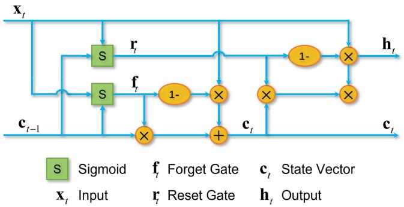

<details>
<summary>flowchart</summary>

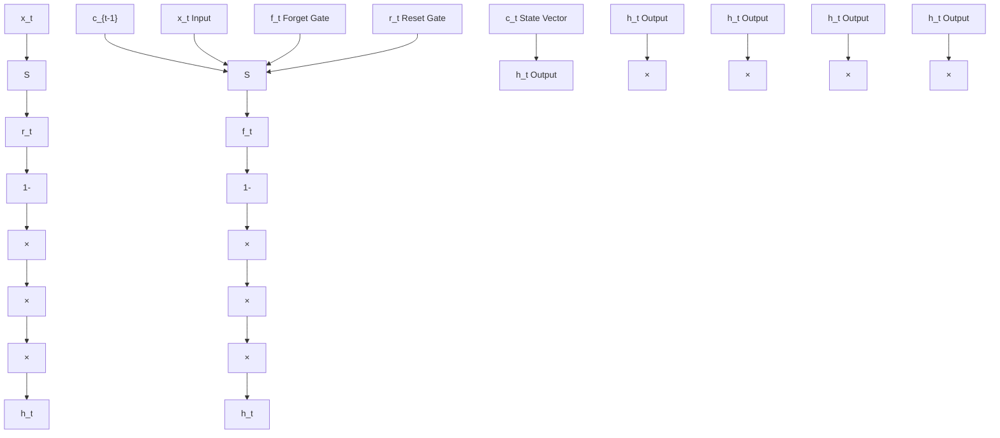
</details>

Fig. 3. Schematic of SRU calculative architecture.

3) Modified KAN: MLPs frequently struggle to effectively capture and extract latent information from complex sequential data, resulting in performance bottlenecks during challenging training scenarios. To overcome these limitations, we introduce the KAN [58], a promising neural architecture derived from the Kolmogorov-Arnold representation theorem that significantly enhances mathematical fitting accuracy. The architectural distinctiveness of the KAN framework manifests in its fundamental reformulation of interneuronal connections. Traditional fixed-coefficient parameters are replaced by dynamically learnable functions. Specifically, each traditional weight parameter at network intersections transitions to an adaptive univariate B-spline representation with comprehensive parameterization capabilities. Concurrently, computational nodes within this architecture implement straightforward signal aggregation without introducing additional transformation operations typically employed in traditional networks. This computational reorganization eliminates the rigid connectivity constraints characteristic of conventional neural architectures, instead enabling each pathway between processing units to exhibit autonomous adaptability. The resulting architecture demonstrates substantially enhanced capacity for nuanced information transmission control, thereby facilitating more sophisticated representational capabilities. Formally, a general L-layer KAN architecture can be expressed as

$$
\begin{array}{l} \operatorname{KAN} (\mathbf {x}) = \sum_ {i _ {L - 1} = 1} ^ {n _ {L - 1}} \phi_ {L - 1, i _ {L}, i _ {L - 1}} \\ \left. \right.\left(\dots \left(\sum_ {i _ {1} = 1} ^ {n _ {1}} \phi_ {1, i _ {2}, i _ {1}} \left(\sum_ {i _ {0} = 1} ^ {n _ {0}} \phi_ {0, i _ {1}, i _ {0}} \left(x _ {i _ {0}}\right)\right)\right)\right) \tag {28} \\ \end{array}
$$

where $\phi _ { l , j , i }$ represents the activation function connecting the ith neuron in layer l to the jth neuron in layer l + 1. These activation functions are constructed through a linear combination of basis functions b(x) and spline functions, expressed as follows:

$$
\phi (x) = w _ {b} b (x) + w _ {s} \text { spline } (x) \tag {29}
$$

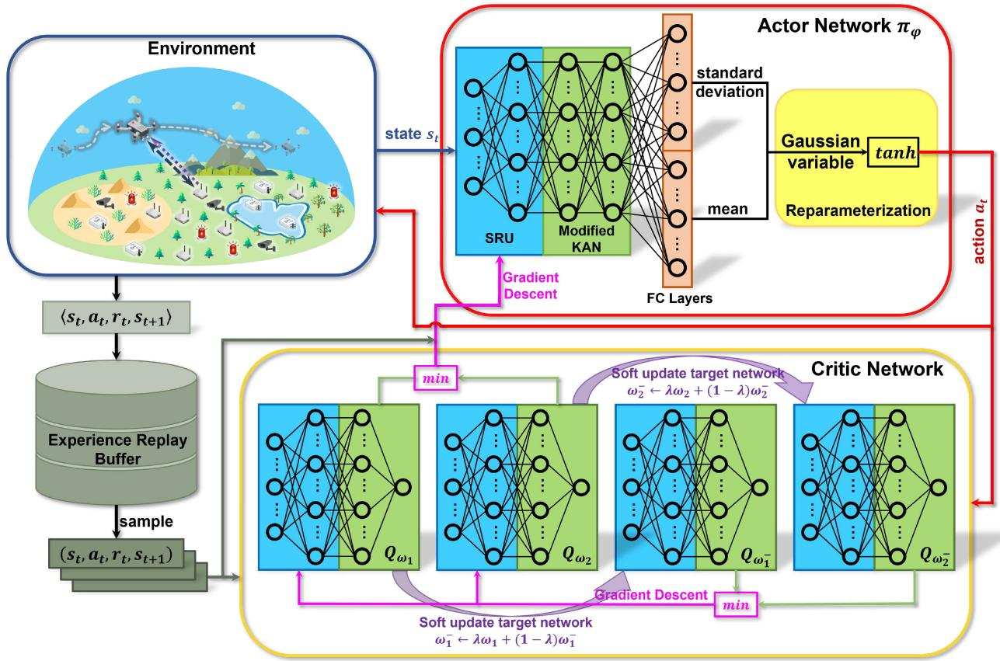

<details>
<summary>flowchart</summary>

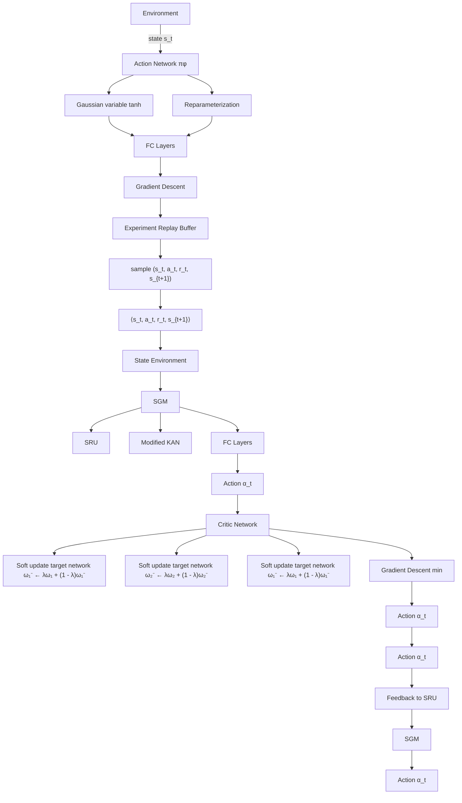
</details>

Fig. 4. Architecture of SAC-SK, where the SRU layer and the modified KAN layer are integrated into the neural networks.

where $b ( x ) = x / ( 1 + e ^ { - x } )$ and spline $\begin{array} { r } { \mathbf { \Psi } ( x ) = \sum _ { i } c _ { i } B _ { i } ( x ) } \end{array}$ , with $w _ { b } , \ w _ { s } ,$ , and $c _ { i }$ serving as trainable parameters.

Note that the original KAN architecture demands substantial computational resources and employs complex network structures, thereby leading to prohibitive time complexity [58]. To mitigate these issues, we propose a streamlined KAN variant that reduces hidden layer dimensionality and prunes redundant network layers, thereby achieving significantly lower computational overhead. Despite architectural simplifications, our modified KAN framework maintains superior mathematical fitting capabilities, primarily due to the integration of SRU components and the inherent advantages of the KAN paradigm.

4) SAC-SK Architecture: In this part, we introduce the main architecture and procedures of SAC-SK.

Nevertheless, certain distinctions exist between the actor network and the critic networks.

As illustrated in Fig. 4, similar to conventional actorcritic frameworks, SAC-SK utilizes five enhanced neural networks, each integrating SRU layers and modified KAN layers. Specifically, the architecture processes input data (state $s _ { t }$ or transition batches) through SRU layers that extract environmental information, maintain long-term dependencies, and generate a hidden information vector. This vector is subsequently processed by modified KAN layers, which leverage their mathematical representation capabilities for fitting. Nevertheless, the actor and critic networks differ in their output structures.

1) Actor Network: As shown in Fig. 5(a), two parallel fully connected layers (FC layers) process the modified KAN output to generate the mean and standard deviation of the action distribution, respectively.   
2) Critic Networks: As shown in Fig. 5(b), the modified KAN layers directly output a scalar value.

Algorithm 1 outlines the main steps of the SAC-SK algorithm. The procedure begins with network parameter initialization, followed by environment reset using consistent random seeds to ensure standardized initial conditions across episodes. During each time slot t, the algorithm: 1) selects action $a _ { t }$ based on the current policy; 2) executes the action to obtain transition $\langle s _ { t } , a _ { t } , r _ { t } , s _ { t + 1 } \rangle ;$ and 3) stores the transition in experience replay buffer . Once  reaches the predetermined threshold, SAC-SK samples transition batches for training and updates all neural networks along with the temperature parameter α. This process iterates until reaching the preset time step limit, progressively approximating an optimal maximum entropy policy.

5) Complexity Analyses: In this part, we analyze the computational and space complexity of the proposed SAC-SK algorithm in both the training phase and the execution phase.

Training Phase: The computational complexity of SAC-SK [59] is $\mathcal { O } ( | \varphi | + 4 | \Omega | + M T K + M T | \varphi | + M T ( 2 | \Omega | ) +$ $M T / ( 4 | \Omega | ) )$ in the training phase, which can be summarized as follows.

1) Network Initialize: This phase involves the initialization of the neural network parameters. Specifically, the computational complexity is expressed as $\mathcal { O } ( | \varphi | + 4 | \Omega | )$ , where |ϕ| denotes the number of parameters in the actor network, and || represents the average number of parameters in the four critic networks, which are |ω1|, |ω2|, $| \omega _ { 1 } ^ { - } |$ , and $| \omega _ { 2 } ^ { - } |$ , respectively, since these parameters are of the same order of magnitude.

Algorithm 1: SAC-SK Algorithm   
Input: The locations $\{p_{i}\}_{i\in I}$ of terminals and the location $p_{u}^{0}$ of the UAV.
Output: The velocity V and angle $\vartheta$ of the UAV in every time slot.

1 Initialize parameters of actor network $\varphi$ and soft Q networks $\omega_{1}, \omega_{2}$ randomly;
2 Initialize parameters of target Q networks: $\omega_{1}^{-} \leftarrow \omega_{1}, \omega_{2}^{-} \leftarrow \omega_{2};$ 3 Initialize experience replay buffer B = $\varnothing$ ;
4 for iteration m = 1 to M do
5 if Meet reset condition then
6 Reset environment with same random seed;
7 for time slot t = 1 to T do
8 Select action $a_{t} \sim \pi_{\varphi}(s_{t})$ ;
9 Get velocity $v_{m}(t)$ and angle $\theta_{m}(t)$ from $a_{t}$ ;
10 Execute action $a_{t}$ ;
11 Observe reward $r_{t}$ and next state $s_{t+1}$ ;
12 $B \leftarrow \langle s_{t}, a_{t}, r_{t}, s_{t+1} \rangle;$ 13 if Reach batch threshold then
14 Sample transitions $\{\langle s_{b}, a_{b}, r_{b}, s_{b+1} \rangle\}_{b=1,\ldots,B_{s}}$ from B;
15 Update soft Q network according to [50];
16 Reparametrize and resample the new action;
17 Update actor network according to [50];
18 Update temperature parameter $\alpha$ according to Eq. (26);
19 Soft update target Q network
20 $\omega_{i}^{-} \leftarrow \lambda \omega_{i} + (1 - \lambda) \omega_{i}^{-}, i = 1, 2;$ 21 $V \leftarrow v_{m}(t);$ 22 $\vartheta \leftarrow \theta_{m}(t);$ 23 return V, $\vartheta$ .

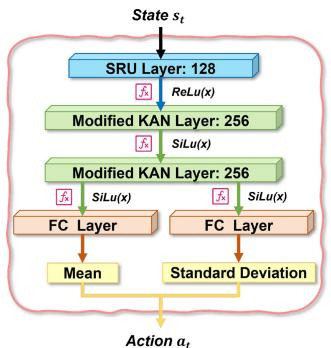

<details>
<summary>flowchart</summary>

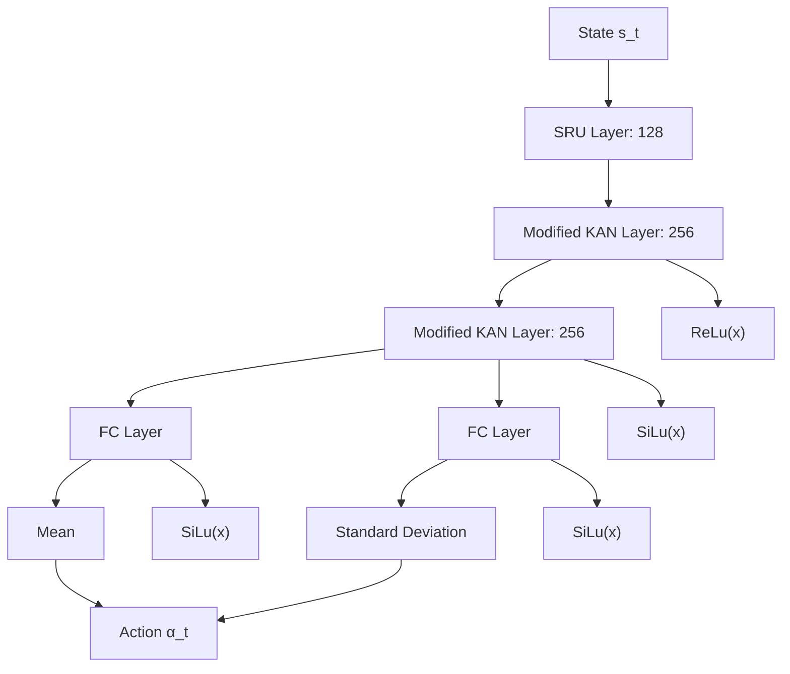
</details>

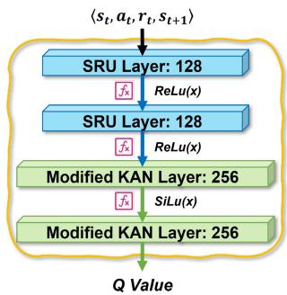

<details>
<summary>flowchart</summary>

```mermaid
graph TD
    A["SRU Layer: 128"] -->|ReLu(x)| B["SRU Layer: 128"]
    B -->|ReLu(x)| C["Modified KAN Layer: 256"]
    C -->|SiLu(x)| D["Modified KAN Layer: 256"]
    D --> E["Q Value"]
    A --> F["⟨s_t, a_t, r_t, s_{t+1}⟩"]
```
</details>

(b)   
Fig. 5. Neural network architecture of SAC-SK. (a) Actor network. (b) Critic network.

2) Replay Buffer Collection: The complexity of collecting state transitions in the experience replay buffer is O(MTK), where M is the number of training episodes, T

denotes the number of steps in an episode (i.e., the total number of time slots in the scenario), and K represents the complexity of interacting with the environment.

3) Network Update: The updating phase is divided into three main parts, which are the updates of the actor network, the frequent updates of the soft Q networks, and the respective soft updates of target Q networks, respectively. Note that the temperature parameter α is a single parameter, so its update complexity is negligible. Therefore, the complexity for this phase is calculated as $\mathcal { O } ( M T | \varphi | + M T ( 2 | \Omega | ) + M T / ( 4 | \Omega | ) )$ .

The space complexity of SAC-SK accounts for the storage of the neural network parameters and the transition structures $\langle s _ { t } , a _ { t } , r _ { t } , s _ { t + 1 } \rangle$ required to maintain the experience replay buffer B. Therefore, the space complexity can be calculated as $\mathcal { O } ( | \varphi | + 4 | \Omega | + | \mathcal { B } | ( 2 | s | + | a | + 1 ) )$ , where | | represents the size of , while |s| and |a| represent the dimensions of the state space and action space, respectively.

Execution Phase: First, the computational complexity of SAC-SK is $\mathcal { O } ( M T | \varphi | )$ , resulting from the action selection based on the current state using the actor network. Second, the space complexity of SAC-SK is $\mathcal { O } ( | \varphi | )$ ), primarily stemming from the parameters of the actor network.

# E. Practical Implementation of SAC-SK-Based UAV Management

In this part, we elaborate on the application methodology of the proposed solution in practical scenarios, specifically divided into the training and deployment phase [20].

1) Training Phase: During the training phase, the neural network is initially trained in a simulation environment before deployment. Specifically, the proposed SAC-SK method does not depend on precollected real-world data. Instead, it interacts with a simulation environment constructed using mathematical models. Through this interaction, the SAC-SK algorithm gathers data to train the policy. We emphasize that our simulation is realistic, incorporating state-of-the-art mathematical models, including the air-to-ground channel model, nonlinear EH model, energy consumption models for the UAV and terminals, and task computation models, among others. These models are derived from or based on real-world data, thereby ensuring the simulation environment closely reflects actual conditions. Consequently, the policy trained in this simulation can be effectively applied to real-world scenarios.

2) Deployment Phase: During the deployment phase, the pretrained SAC-SK algorithm dynamically interacts with physical environments by processing real-time state data for decision generation. The SAC-SK strategies can be effectively implemented through the central control unit. Given that the UAV and terminals incorporate geolocation capabilities, the central control unit seamlessly obtains positional coordinates. During this phase, the SAC-SK eliminates the need for instantaneous calculations of transmission rates or energy expenditure metrics to determine reward values. Leveraging its acquired policy network, the system directly produces control commands that reflect predefined optimization objectives through existing spatial data (including device/UAV coordinates). The associated communication latency proves negligible since positional data transmission requires minimal bandwidth consumption.

3) Environment Changes: When encountering environmental variations, pretrained neural networks demonstrate adaptive potential through iterative parameter recalibration in modified environments. Specifically, operators may adjust critical simulation parameters (including UAV transmit power, terminal location distribution, etc.) to facilitate DRL model reoptimization. Advanced methodologies like transfer learning [60] significantly accelerate retraining convergence, while integrated architectural enhancements, particularly the action simplification mechanism, SRU layers, and modified KAN layers, collectively optimize learning efficiency. Building upon these foundations, the synergistic integration of edge computing with incremental learning paradigms enables seamless real-time updates for field-deployed network systems.

# V. SIMULATION AND ANALYSES

In this section, we evaluate the performance of the proposed SAC-SK algorithm for solving the formulated optimization problem, with specific emphasis on convergence properties and computational efficiency.

# A. Simulation Setups

In this part, we present the experimental setup, including scenario configuration, system parameters, baseline algorithms, and performance metrics.

1) Simulation Setups: In this work, we consider a scenario in which a UAV delivers both MEC and charging services to IoT terminals in a remote area. Specifically, the UAV operates at a fixed altitude of 10 m on a horizontal plane, with an initial position at the origin (0, 0) in Cartesian coordinates and a maximum velocity of 30 m/s. The service operation spans 30 s, discretized into 30 equal time slots.

Moreover, we consider a $4 0 ~ \times ~ 4 0 ~ \mathrm { ~ m ~ } ^ { 2 }$ area without ground base stations, bounded by coordinates {(x, y) |x ∈ $[ - 2 0 , 2 0 ] , y \in [ - 2 0 , 2 0 ] \}$ . Five IoT terminals are randomly distributed within this region using Poisson disk sampling to create a network topology centered around the origin. The defined boundary dimensions of 40 m provide sufficient space for UAV maneuverability during algorithm training. For larger geographical areas or more complex networks, clustering techniques such as k-means could partition the environment into multiple subregions, facilitating the deployment of multiple UAVs to execute our proposed method in each subnetwork separately. Table I provides all relevant simulation parameters.

For the proposed SAC-SK algorithm, the network architecture is illustrated in Fig. 5, with parameters optimized through extensive experimentation. Specifically, the actor network comprises a single-layer SRU with a hidden dimension of 128, coupled with the modified KAN layers and FC layers, each containing two layers with 256 neurons. The critic networks implement two-layer structures for both the SRU and modified KAN, each with 128 neurons. These architectural choices result from systematic parameter optimization to maximize performance and ensure convergence stability.

TABLE I KEY SIMULATION SETTINGS 

<table><tr><td>Symbol</td><td>Parameters</td><td>Values</td></tr><tr><td> $f_c$ </td><td>Carrier frequency</td><td>2.4 GHz [4]</td></tr><tr><td>c</td><td>The speed of light</td><td>3 × 108m/s [61]</td></tr><tr><td> $(\eta_{\text{LoS}}, \eta_{\text{NLoS}})$ </td><td>Additional losses of LoS and NLoS links</td><td>(0.1, 21) [37]</td></tr><tr><td> $(a_1, b_1)$ </td><td>Parameters of LoS probability</td><td>(4.88, 0.43) [37]</td></tr><tr><td> $\sigma^2$ </td><td>Power of Gaussian white noise</td><td>-174 dBm/Hz [62]</td></tr><tr><td> $P_{tran}$ </td><td>Transmit power of the UAV</td><td>40 W [8]</td></tr><tr><td> $P_i$ </td><td>Transmit power of the terminals</td><td>100 mW [63]</td></tr><tr><td>B</td><td>Total bandwidth</td><td>1 MHz [54]</td></tr><tr><td> $(a_2, b_2)$ </td><td>EH circuit parameters</td><td>(150, 0.014) [64]</td></tr><tr><td> $P_{max}$ </td><td>The maximum received power of EH circuit</td><td>24 mW [64]</td></tr><tr><td>η</td><td>Power splitting ratio</td><td>0.8 [4], [8]</td></tr><tr><td>(k,ν)</td><td>Effective capacitance coefficient</td><td>(10-28, 3) [40]</td></tr><tr><td>ΔE1</td><td>Daily energy consumption for terminals</td><td>50 μW [42]</td></tr><tr><td>Emax</td><td>The maximum energy of terminal battery</td><td>5 μJ</td></tr><tr><td>Emin</td><td>The minimum energy of terminal battery</td><td>800 μJ</td></tr><tr><td>Rmin</td><td>The minimum threshold of transmission rate</td><td>22 Mbps</td></tr><tr><td> $D_{i,p}^{t}$ </td><td>Data size of the tasks</td><td>103 bit [63]</td></tr><tr><td>Ci</td><td>The task computation density</td><td>100 cycles/bit [4], [19]</td></tr><tr><td>fu</td><td>The CPU frequency of the UAV</td><td>5 GHz [61]</td></tr><tr><td>fi</td><td>The CPU frequency of the terminals</td><td>1 GHz [61]</td></tr><tr><td>vmax</td><td>The maximum velocity of the UAV</td><td>30 m/s [4]</td></tr><tr><td>I</td><td>Number of the terminals</td><td>5</td></tr><tr><td>H</td><td>Altitude of the UAV</td><td>5 m [4]</td></tr><tr><td>T</td><td>Number of time slots</td><td>30</td></tr><tr><td>τ</td><td>Length of one slot</td><td>1 s [8], [65]</td></tr><tr><td>-</td><td>The edge length of the area boundary</td><td>40 m</td></tr><tr><td> $(\rho_1, \rho_2)$ </td><td>Normalization parameters</td><td>(0.3, 1)</td></tr><tr><td>C</td><td>The charging reward constant</td><td>300</td></tr><tr><td>R</td><td>The out-of-bound penalty</td><td>800</td></tr><tr><td>Rb</td><td>The baseline of terminal bias reward</td><td>50</td></tr><tr><td>α</td><td>Initial temperature parameter</td><td>0.2</td></tr><tr><td>γ</td><td>Discount factor</td><td>0.92</td></tr><tr><td>λφ</td><td>Learning rate of actor network</td><td>3 × 10-4</td></tr><tr><td>λω</td><td>Learning rate of critic networks</td><td>10-3</td></tr><tr><td>Bs</td><td>The batch size of sample</td><td>1024</td></tr><tr><td>λ</td><td>Target smoothing coefficient</td><td>5 × 10-3</td></tr><tr><td>-</td><td>Size of experience replay buffer</td><td>106</td></tr><tr><td>-</td><td>Policy frequency</td><td>2</td></tr><tr><td>-</td><td>Target network frequency</td><td>1</td></tr></table>

2) Baselines Algorithms: Performance evaluation of the proposed SAC-SK algorithm involves comparative analysis against several advanced DRL algorithms, including SAC, deep deterministic policy gradient (DDPG), twin delayed deep deterministic policy gradient (TD3), and proximal policy optimization (PPO).

1) SAC [50]: The original SAC algorithm utilizes MLPbased neural networks, which are the basis for improvements of SAC-SK. Similar to Section IV-D5, the computational complexity of SAC is $O ( | \varphi | + 4 | \Omega | +$ $M T K + M T | \varphi | + M T ( 2 | \Omega | ) + M T / ( 4 | \Omega | ) )$ .   
2) DDPG [66]: A classic off-policy algorithm designed specifically for continuous action space environments, known for its deterministic policy gradients. Similar to

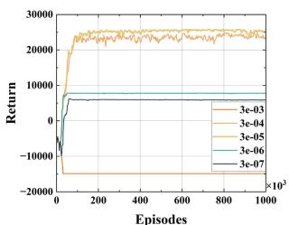

<details>
<summary>line</summary>

| Episodes (x10³) | 3e-03 Return | 3e-04 Return | 3e-05 Return | 3e-06 Return | 3e-07 Return |
| --------------- | ------------ | ------------ | ------------ | ------------ | ------------ |
| 0               | -20000       | -20000       | -20000       | -20000       | -20000       |
| 200             | 25000        | 25000        | 25000        | 5000         | 5000         |
| 400             | 25000        | 25000        | 25000        | 5000         | 5000         |
| 600             | 25000        | 25000        | 25000        | 5000         | 5000         |
| 800             | 25000        | 25000        | 25000        | 5000         | 5000         |
| 1000            | 25000        | 25000        | 25000        | 5000         | 5000         |
</details>

(a)

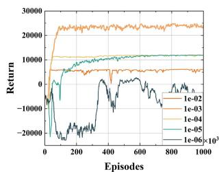

<details>
<summary>line</summary>

| Episodes | 1e-02 | 1e-03 | 1e-04 | 1e-05 | 1e-06 ×10³ |
| -------- | ----- | ----- | ----- | ----- | ---------- |
| 0        | -20000 | -20000 | -20000 | -20000 | -20000     |
| 200      | 25000 | 15000 | 10000 | 8000  | -15000     |
| 400      | 25000 | 15000 | 10000 | 8000  | -5000      |
| 600      | 25000 | 15000 | 10000 | 8000  | 500       |
| 800      | 25000 | 15000 | 10000 | 8000  | -500       |
| 1000     | 25000 | 15000 | 10000 | 8000  | -150       |
</details>

(b)

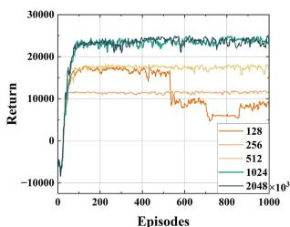

<details>
<summary>line</summary>

| Episodes | 128    | 256    | 512    | 1024   | 2048×10³ |
| -------- | ------ | ------ | ------ | ------ | -------- |
| 0        | -10000 | -10000 | -10000 | -10000 | -10000   |
| 200      | ~15000 | ~15000 | ~15000 | ~25000 | ~25000   |
| 400      | ~15000 | ~15000 | ~15000 | ~25000 | ~25000   |
| 600      | ~15000 | ~15000 | ~15000 | ~25000 | ~25000   |
| 800      | ~15000 | ~15000 | ~15000 | ~25000 | ~25000   |
| 1000     | ~15000 | ~15000 | ~15000 | ~25000 | ~25000   |
</details>

（c）

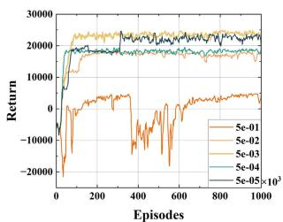

<details>
<summary>line</summary>

| Episodes | 5e-01 | 5e-02 | 5e-03 | 5e-04 | 5e-05 ×10³ |
| -------- | ----- | ----- | ----- | ----- | ---------- |
| 0        | -20000 | -20000 | -20000 | -20000 | -20000     |
| 200      | 5000  | 15000 | 25000 | 18000 | 22000      |
| 400      | -15000 | 18000 | 26000 | 19000 | 23000      |
| 600      | -5000 | 17000 | 25500 | 18500 | 22500      |
| 800      | 5000  | 18000 | 26500 | 19500 | 23500      |
| 1000     | 15000 | 19000 | 27000 | 21000 | 24500      |
</details>

(@）  
Fig. 6. Return under different key hyperparameters of SAC-SK. (a) Learning rate of the actor network $\lambda _ { \varphi } .$ (b) Learning rate of the critic network $\lambda _ { \omega } .$ (c) Batch size of the sample $B _ { s } .$ (d) Target smoothing coefficient λ.

Section IV-D5, the computational complexity of DDPG is $\mathcal { O } ( 2 | \varphi | + 2 | \Omega | + M T K + 2 M T ( | \varphi | + | \Omega | ) )$ .

3) TD3 [67]: An enhanced variant of DDPG that addresses function approximation errors through twin delayed updates. Similar to Section IV-D5, the computational complexity of TD3 is $\mathcal { O } ( 2 \vert \varphi \vert \ + \ 4 \vert \Omega \vert \ + \ M T K \ +$ $( 3 / 2 ) M T | \varphi | + 4 M T | \Omega | )$ .   
4) PPO [68]: A robust on-policy method that employs actor-critic architecture while maintaining computational efficiency. Similar to Section IV-D5, the computational complexity of PPO is $\mathcal { O } ( | \varphi | + | \Omega | + M T K + M E ( | \varphi | + | \Omega | ) )$ .

As can be seen, the computational complexity of the proposed SAC-SK is comparable to that of SAC, DDPG, TD3, and PPO. These methods share similar network architectures and training processes in DRL, thereby resulting in similar computational requirements.

# B. Performance Evaluation

In this part, we present a systematic performance evaluation of the proposed SAC-SK and analyze its operational characteristics.

1) Convergence Evaluations: To investigate the convergence and stability of SAC-SK, we conduct a comprehensive analysis involving the following key algorithmic parameters.

1) Discount Factor $\gamma :$ The experimental framework utilizes a time step of 30 slots in an iteration, thereby necessitating the consideration of rewards extending to at least the 30th future step. Applying the formulation $\gamma \approx 0 . 1 ^ { 1 / t }$ [69] with $t = 3 0$ yields a discount factor value of 0.92 approximately.   
2) Learning Rate of Actor Network $\lambda _ { \varphi } .$ Fig. 6(a) illustrates the impact of varying $\lambda _ { \varphi }$ values on convergence behavior. The results reveal that $\lambda _ { \varphi } = 3 \times 1 0 ^ { - 5 }$ yields optimal convergence performance, demonstrating improvements over alternative values.   
3) Learning Rate of Critic Networks $\lambda _ { \omega } .$ Fig. 6(b) demonstrates that both excessively small and large $\lambda _ { \omega }$ values adversely affect convergence. Although $\lambda _ { \omega } = 1 \times 1 0 ^ { - 4 }$ facilitates rapid initial convergence, $\lambda _ { \omega } ~ = ~ 1 \times 1 0 ^ { - 3 }$ exhibits superior long-term convergence performance. Therefore, we set $\lambda _ { \omega } = 1 \times 1 0 ^ { - 3 }$ for optimal results.   
4) The Batch Size of Sample $B _ { s } .$ Fig. 6(c) illustrates that while batch size exhibits minimal influence on convergence relative to other hyperparameters (with the

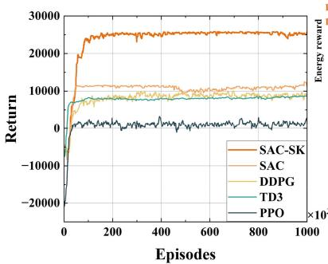

<details>
<summary>line</summary>

| Episodes | SAC-SK | SAC | DDPG | TD3 | PPO |
| -------- | ------ | --- | ---- | --- | --- |
| 0        | 0      | 0   | 0    | 0   | 0   |
| 1000     | 25000  | 10000 | 8000 | 6000 | 2000 |
</details>

(a)

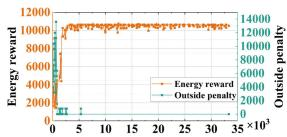

<details>
<summary>line</summary>

| Step | Energy reward | Outside penalty |
| ---- | ------------- | --------------- |
| 0    | 0             | 0               |
| 5    | 10000         | 1000            |
| 10   | 10000         | 100             |
| 15   | 10000         | 10              |
| 20   | 10000         | 1               |
| 25   | 10000         | 1               |
| 30   | 10000         | 1               |
| 35   | 10000         | 1               |
</details>

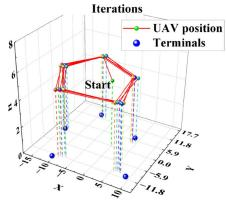

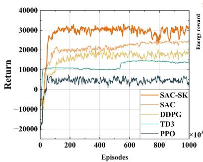

<details>
<summary>line</summary>

| Episodes | SAC-SK | SAC | DDPG | TD3 | PPO |
| -------- | ------ | --- | ---- | --- | --- |
| 0        | -20000 | -20000 | -20000 | -20000 | -20000 |
| 100      | 30000  | 20000 | 15000 | 10000 | 5000 |
| 200      | 32000  | 22000 | 16000 | 11000 | 6000 |
| 300      | 33000  | 23000 | 17000 | 12000 | 7000 |
| 400      | 34000  | 24000 | 18000 | 13000 | 8000 |
| 500      | 35000  | 25000 | 19000 | 14000 | 9000 |
| 600      | 36000  | 26000 | 20000 | 15000 | 10000 |
| 700      | 37000  | 27000 | 21000 | 16000 | 11000 |
| 800      | 38000  | 28000 | 22000 | 17000 | 12000 |
| 900      | 39000  | 29000 | 23000 | 18000 | 13000 |
| 1000     | 40000  | 30000 | 24000 | 19000 | 14000 |
</details>

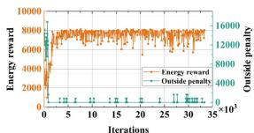

<details>
<summary>line</summary>

| Iterations | Energy reward | Outside penalty |
| ---------- | ------------- | --------------- |
| 0          | 0             | 16000           |
| 5          | ~8000         | ~4000           |
| 10         | ~8000         | ~4000           |
| 15         | ~8000         | ~4000           |
| 20         | ~8000         | ~4000           |
| 25         | ~8000         | ~4000           |
| 30         | ~8000         | ~4000           |
| 35         | ~8000         | ~4000           |
</details>

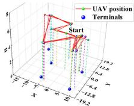

<details>
<summary>scatter</summary>

| X    | Y    | Z    |
|------|------|------|
| 0    | 0    | 0    |
| 10   | 10   | 10   |
| 20   | 20   | 20   |
| 30   | 30   | 30   |
| 40   | 40   | 40   |
| 50   | 50   | 50   |
| 60   | 60   | 60   |
| 70   | 70   | 70   |
| 80   | 80   | 80   |
| 90   | 90   | 90   |
| 100  | 100  | 100  |
| 110  | 110  | 110  |
| 120  | 120  | 120  |
| 130  | 130  | 130  |
| 140  | 140  | 140  |
| 150  | 150  | 150  |
| 160  | 160  | 160  |
| 170  | 170  | 170  |
| 180  | 180  | 180  |
| 190  | 190  | 190  |
| 200  | 200  | 200  |
| 210  | 210  | 210  |
| 220  | 220  | 220  |
| 230  | 230  | 230  |
| 240  | 240  | 240  |
| 250  | 250  | 250  |
| 260  | 260  | 260  |
| 270  | 270  | 270  |
| 280  | 280  | 280  |
| 290  | 290  | 290  |
| 300  | 300  | 300  |
| Note: The 'Start' label indicates a specific point on the UAV's position. The 'Terminals' label is not explicitly provided in the image. The 'UAV position' is marked with a red circle and 'Terminal' is marked with a blue circle. The 'Y' axis ranges from -12.8 to +12.8. There are no additional data series or labels specified in the image.
</details>

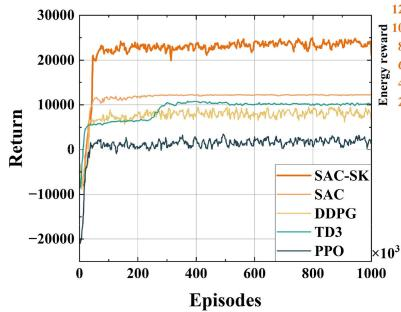

<details>
<summary>line</summary>

| Episodes | SAC-SK | SAC | DDPG | TD3 | PPO |
| -------- | ------ | --- | ---- | --- | --- |
| 0        | 0      | 0   | 0    | 0   | 0   |
| 1000     | 25000  | 10000 | 8000 | 6000 | 4000 |
</details>

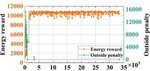

<details>
<summary>line</summary>

| Time Step | Energy reward | Outside penalty |
| --------- | ------------- | --------------- |
| 0         | 12000         | 0               |
| 5         | 12000         | 0               |
| 10        | 12000         | 0               |
| 15        | 12000         | 0               |
| 20        | 12000         | 0               |
| 25        | 12000         | 0               |
| 30        | 12000         | 0               |
| 35        | 12000         | 4000            |
</details>

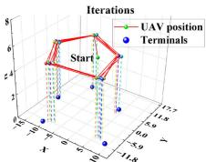

<details>
<summary>scatter</summary>

| Iterations | UAV Position | Terminals |
| ---------- | ------------ | --------- |
| Start      | 6            | 2         |
| End        | 6            | 2         |
</details>

Fig. 7. Simulation results under different random seeds, in which each subfigure includes a comparison between SAC-SK and baselines, the variation of the out-of-bound penalty R¯ and the charging reward $R _ { \mathrm { c h a r } }$ with iterations, and the trajectory of the UAV. (a) seed = 1. (b) seed = 3. (c) seed = 5.

exception of $B _ { s } = 1 2 8 )$ , it substantially affects training stability. A batch size of $B _ { s } = 1 0 2 4$ was selected to optimize convergence stability throughout the training process.   
5) Target Smoothing Coefficient λ: Fig. 6(d) demonstrates the influence of λ on convergence. The result shows that

SAC-SK achieves optimal convergence at $\lambda = 5 \times 1 0 ^ { - 3 }$ , a parameter that controls the soft update mechanism for target Q networks as expressed by $\omega _ { i } ^ { - }  \lambda \omega _ { i } + ( 1 -$ $\lambda ) \omega _ { i } ^ { - } , i = 1 , 2$ .

In conclusion, we have identified the critical hyperparameters of SAC-SK and demonstrated its convergence and stability through rigorous experimental evaluation. Table I summarizes the optimized hyperparameters derived from our systematic analysis.

2) Comparisons With Different Baselines: In this part, we conduct some simulations of SAC-SK to assess its robustness and effectiveness and evaluate its performance through comprehensive comparisons with various baselines.

To verify the generalization capability of the proposed SAC-SK, we conduct a series of comparative simulations under distinct spatial distributions of terminals within the simulation area. Specifically, we consider three representative simulation scenarios by using different random seeds [59]. These scenarios are shown in Fig. 7(a)–(c), and the details are as follows.

1) The first case is uniform distribution. This scenario generates a relatively uniform spatial distribution of terminals, establishing a basic case for evaluating algorithm performance under standard conditions (Random seed=1 in this case).   
2) The second case is a clustered distribution. This scenario features a high-density cluster of terminals with one outlier positioned at a significant distance from the main group. This configuration evaluates the convergence behavior of the algorithms to optimize trajectories when faced with potential local optima and coverage tradeoffs (Random seed = 3 in this case).   
3) The third case is asymmetric distribution. This scenario presents a terminal arrangement in which the terminal distribution center is significantly offset from the initial position of the UAV. This configuration evaluates the algorithms’ exploration capabilities and adaptability to spatially biased configurations (Random seed=5 in this case).

As illustrated in Fig. 7, the proposed SAC-SK consistently outperforms all baselines across diverse random seeds, demonstrating robust generalization capability and efficient environmental information utilization.

In Fig. 8, we present three key performance metrics for the optimization objectives and compare SAC-SK against multiple baselines. These metrics are the average retained energy of terminals, charging fairness among terminals, and system energy consumption, respectively. As evidenced in Fig. 8(a) and (b), SAC-SK demonstrates substantial performance advantages over all baselines. Specifically, SAC-SK achieves 47.86% higher average retained energy and 65.15% improved charging fairness compared to standard SAC. These results confirm the effectiveness of SAC-SK in simultaneously maximizing terminal battery energy while ensuring fair charging distribution across all terminals. Furthermore, Fig. 8(c) reveals that SAC-SK achieves the lowest system energy consumption among all tested algorithms, reducing consumption by 109.252 J relative to SAC. While TD3 and DDPG also exhibit lower energy consumption than SAC, the apparent efficiency of TD3 and DDPG is attributable to their suboptimal exploration patterns. The performance of TD3 and DDPG in inferior fairness indices (0.627 and 0.598, respectively) and average terminal energy levels (327.4328 $\mu \mathrm { J }$ and 354.9304 $\mu \mathrm { J } ,$ respectively) indicates convergence to local optima due to incomplete terminal coverage. In conclusion, SAC-SK successfully balances the inherent tradeoff between the biobjective optimization and delivering superior performance across all evaluation metrics.

Moreover, we conduct comprehensive performance analyses across all algorithms. The key findings are as follows.

1) As an on-policy algorithm, PPO consistently underperforms compared to the off-policy algorithms across all random seeds. This performance gap is attributable to the experience replay mechanism in off-policy algorithms, which facilitates more efficient utilization of high-value transitions, thereby enhancing performance in complex environments.   
2) SAC demonstrates superior convergence performance relative to DDPG and TD3, as evidenced by Fig. 7(a)– (c). This result indicates that SAC provides a more effective foundation for algorithmic enhancement than other popular DRL algorithms. Specifically, the performance advantage derives from the maximum entropy RL framework, which simultaneously optimizes cumulative rewards and action randomness, thus improving both exploration efficiency and algorithmic robustness.   
3) SAC-SK achieves superior convergence through its integration of SRU preprocessing for state-action inputs and modified KAN fitting for hidden information, thereby achieving the effectiveness of its action selection strategy. Comparative analysis across different random seeds confirms this finding. As illustrated in Fig. 7(b), even in the most challenging scenario with complex terminal distribution (seed = 3), SAC-SK maintains a performance advantage with average return approximately 4000 values higher than SAC. This performance differential increases to over 10000 values in other scenarios, as evidenced by Fig. 7(a) and (c). Simulation results demonstrate that integrating SRU as a temporal encoder effectively addresses the limitation of standard SAC in capturing temporal correlations in partially observable environments, while achieving preliminary modeling of environmental information and long-term dependencies with higher computational efficiency. Meanwhile, incorporating KAN as a function approximator effectively mitigates the deficiency of MLPs in standard SAC, where fixed activation patterns exhibit insufficient mathematical approximation capability for complex hidden information.

Furthermore, we conduct a detailed analysis of the charging reward $R _ { \mathrm { c h a r } }$ and the out-of-bound penalty R¯ . As shown in the upper right corners of Fig. 7(a)–(c), the training process exhibits three distinct phases. In the initial phase (iterations 0–2000 approximately), the UAV learns boundary constraints, evidenced by R¯ decreasing to zero. Correspondingly, random exploration of the UAV yields communication links with terminals, thereby causing rapid increases in $R _ { \mathrm { c h a r } }$ . During the intermediate phase (iterations 2000–5000 approximately), the UAV systematically explores the valid operational area, acquires terminal distribution information, and develops longterm memory representations. Concurrently, the experience replay buffer reaches its training threshold. This phase demonstrates reduced $R _ { \mathrm { c h a r } }$ growth rate due to the increased complexity of reward maximization. The final phase (beyond 5000 iterations) achieves convergence stability while maintaining exploration of high-entropy strategies. These observations confirm that the designed reward function $r ( t )$ effectively guides SAC-SK toward convergence.

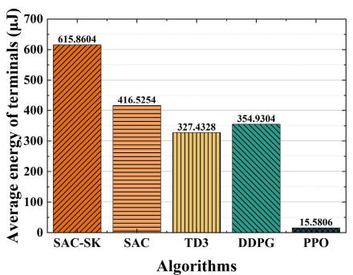

<details>
<summary>bar</summary>

| Algorithms | Average energy of terminals (µJ) |
| :--- | :--- |
| SAC-SK | 615.8604 |
| SAC | 416.5254 |
| TD3 | 327.4328 |
| DDPG | 354.9304 |
| PPO | 15.5806 |
</details>

(a)

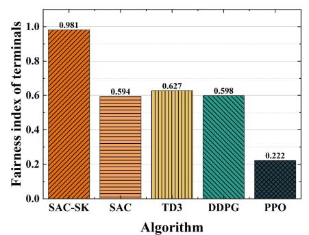

<details>
<summary>bar</summary>

| Algorithm | Fairness index of terminals |
| --------- | --------------------------- |
| SAC-SK    | 0.981                       |
| SAC       | 0.594                       |
| TD3       | 0.627                       |
| DDPG      | 0.598                       |
| PPO       | 0.222                       |
</details>

(b)

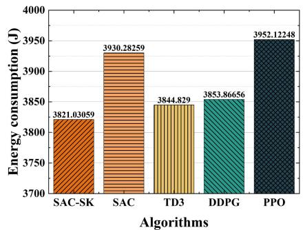

<details>
<summary>bar</summary>

| Algorithms | Energy consumption (J) |
| :--- | :--- |
| SAC-SK | 3821.03059 |
| SAC | 3930.28259 |
| TD3 | 3844.829 |
| DDPG | 3853.86656 |
| PPO | 3952.12248 |
</details>

（c）  
Fig. 8. Comparison results of SAC-SK and DRL-based algorithms. (a) Average retained energy of terminals. (b) Charging fairness among terminals. (c) Total energy consumption of the system.

Additionally, we visualize the flight trajectory of the UAV and its spatial relationships with ground terminals through a 3-D format to present the results more intuitively.

# VI. CONCLUSION

In this article, we have investigated a directional antennaenhanced UAV-assisted multiterminal SWIPT-MEC system operating in infrastructure-free environments. Specifically, we have proposed a novel architecture wherein a UAV functions as both a base station and MEC server to provide charging and computational offloading services for energy-constrained ground terminals. In this system, we have formulated a biobjective optimization problem to minimize system energy consumption and simultaneously maximize terminal battery energy while ensuring charging fairness among terminals. Subsequently, we have reformulated the original problem into an MDP to enhance computational tractability and system scalability. To address this MDP, we have proposed the SAC-SK algorithm to learn a maximum entropy optimal policy, thereby efficiently scheduling offloading decisions and UAV trajectory planning. Simulation results have demonstrated that SAC-SK significantly outperforms baselines across multiple performance metrics, while exhibiting robust generalization capabilities in diverse scenarios. This study has several limitations that are worth considering. First, static ground terminals may not fully capture the dynamics of real-world mobile scenarios. Second, the energy consumption model does not account for potential signal interference in dense deployment environments. Finally, although SAC-SK optimizes the time complexity and computational load during the training process, it still requires nonnegligible computational resources, which may limit its practical deployment in resource-constrained UAV platforms. Future work will be extended along four dimensions, which include dynamic user mobility modeling, multi-UAV coordination, more lightweight neural network architectures, and the integration of digital twin technology and blockchain-based solutions.

# ACKNOWLEDGMENT

Yue Chen, Jiahui Li, and Boxiong Wang are with the College of Computer Science and Technology, Jilin University, Changchun 130012, China (e-mail: yuechen23@mails.jlu.edu.cn; lijiahui@jlu.edu.cn; wangbx0320@163.com).

Hui Kang is with the College of Computer Science and Technology and the Key Laboratory of Symbolic Computation and Knowledge Engineering of Ministry of Education, Jilin University, Changchun 130012, China (e-mail: kanghui@jlu.edu.cn).

Geng Sun is with the College of Computer Science and Technology and the Key Laboratory of Symbolic Computation and Knowledge Engineering of Ministry of Education, Jilin University, Changchun 130012, China, and also with the College of Computing and Data Science, Nanyang Technological University, Singapore 639798 (e-mail: sungeng@jlu.edu.cn).

Jiacheng Wang and Dusit Niyato are with the College of Computing and Data Science, Nanyang Technological University, Singapore (e-mail: jiacheng.wang@ntu.edu.sg; dniyato@ntu.edu.sg).

Cong Liang is with the Government and Enterprise Customer Department, China Mobile Communications Group Jilin Company Ltd., Beijing 100032, China (e-mail: liangcong@jl.chinamobile.com).

Shuang Liang is with the School of Information Science and Technology, Northeast Normal University, Changchun 130117, China (e-mail: liangshuang@nenu.edu.cn).

# REFERENCES

[1] H. Pan, Y. Liu, G. Sun, J. Fan, S. Liang, and C. Yuen, “Joint power and 3D trajectory optimization for UAV-enabled wireless powered communication networks with obstacles,” IEEE Trans. Commun., vol. 71, no. 4, pp. 2364–2380, Apr. 2023.   
[2] T. Vu, T. Nguyen, and S. Kim, “Cooperative NOMA-enabled SWIPT IoT networks with imperfect SIC: Performance analysis and deep learning evaluation,” IEEE Internet Things J., vol. 9, no. 3, pp. 2253–2266, Feb. 2022.   
[3] Z. Su et al., “Energy-efficiency optimization for D2D communications underlaying UAV-assisted industrial IoT networks with SWIPT,” IEEE Internet Things J., vol. 10, no. 3, pp. 1990–2002, Feb. 2023.   
[4] X. Zhou, L. Huang, T. Ye, and W. Sun, “Computation bits maximization in UAV-assisted MEC networks with fairness constraint,” IEEE Internet Things J., vol. 9, no. 21, pp. 20997–21009, Nov.. 2022.   
[5] Y. Li et al., “A correlated data-driven collaborative beamforming approach for energy-efficient IoT data transmission,” IEEE Internet Things J., early access, Mar. 20, 2025, doi: 10.1109/JIOT.2025.3553288.   
[6] D. C. Nguyen et al., “6G Internet of Things: A comprehensive survey,” IEEE Internet Things J., vol. 9, no. 1, pp. 359–383, Jan. 2022.

[7] K. W. Choi et al., “Simultaneous wireless information and power transfer (SWIPT) for Internet of Things: Novel receiver design and experimental validation,” IEEE Internet Things J., vol. 7, no. 4, pp. 2996–3012, Apr. 2020.   
[8] R. Jiang, K. Xiong, H. Yang, P. Fan, Z. Zhong, and K. B. Letaief, “On the coverage of UAV-assisted SWIPT networks with nonlinear EH model,” IEEE Trans. Wireless Commun., vol. 21, no. 6, pp. 4464–4481, Jun. 2022.   
[9] Y. Qu et al., “Elastic collaborative edge intelligence for UAV swarm: Architecture, challenges, and opportunities,” IEEE Commun. Mag., vol. 62, pp. 62–68, Jan. 2024.   
[10] X. Wang and M. C. Gursoy, “Coverage analysis for energy-harvesting UAV-assisted mmWave cellular networks,” IEEE J. Sel. Areas Commun., vol. 37, no. 12, pp. 2832–2850, Dec. 2019.   
[11] Z. Sun, G. Sun, L. He, F. Mei, S. Liang, and Y. Liu, “A two timescale joint optimization approach for UAV-assisted MEC,” in Proc. IEEE INFOCOM, Aug. 2024, pp. 91–100.   
[12] M. Yan, R. Xiong, Y. Wang, and C. Li, “Edge computing task offloading optimization for a UAV-assisted Internet of Vehicles via deep reinforcement learning,” IEEE Trans. Veh. Technol., vol. 73, pp. 5647–5658, Apr. 2024.   
[13] J. Wang et al., “Optimizing 6G integrated sensing and communications (ISAC) via expert networks,” Jun. 2024, arXiv:2406.00408.   
[14] J. Wang et al., “Generative AI for integrated sensing and communication: Insights from the physical layer perspective,” IEEE Wireless Commun., vol. 31, no. 5, pp. 246–255, Oct. 2024.   
[15] J. Wang et al., “Generative AI enabled robust data augmentation for wireless sensing in ISAC networks,” Feb. 2025, arXiv:2502.12622.   
[16] W. Wang et al., “Energy-constrained UAV-assisted secure communications with position optimization and cooperative jamming,” IEEE Trans. Commun., vol. 68, no. 7, pp. 4476–4489, Jul. 2020.   
[17] G. Sun, J. Li, Y. Liu, S. Liang, and H. Kang, “Time and energy minimization communications based on collaborative beamforming for UAV networks: A multi-objective optimization method,” IEEE J. Sel. Areas Commun., vol. 39, no. 11, pp. 3555–3572, Nov. 2021.   
[18] B. Wang et al., “UAV-assisted joint mobile edge computing and data collection via matching-enabled deep reinforcement learning,” IEEE Internet Things J., early access, Feb. 14, 2025, doi: 10.1109/JIOT.2025.3542025.   
[19] G. Sun et al., “Joint task offloading and resource allocation in aerialterrestrial UAV networks with edge and fog computing for post-disaster rescue,” IEEE Trans. Mobile Comput., vol. 23, no. 9, pp. 8582–8600, Sep. 2024.   
[20] G. Sun et al., “Aerial reliable collaborative communications for terrestrial mobile users via evolutionary multi-objective deep reinforcement learning,” IEEE Trans. Mobile Comput., early access, Jan. 29, 2025, doi: 10.1109/TMC.2025.3536093.   
[21] Z. Sun et al., “TJCCT: A two-timescale approach for UAV-assisted mobile edge computing,” IEEE Trans. Mobile Comput., vol. 24, no. 4, pp. 3130–3147, Apr. 2025.   
[22] D. E. Widiyanti and S. Y. Shin, “RIS-assisted MEC computation offloading for IoVT networks,” in Proc. IEEE ICTC, Feb. 2023, pp. 214–217.   
[23] F. Song et al., “Evolutionary multi-objective reinforcement learning based trajectory control and task offloading in UAV-assisted mobile edge computing,” IEEE Trans. Mobile Comput., vol. 22, no. 12, pp. 7387–7405, Dec. 2023.   
[24] Y. Zeng, S. Chen, Y. Cui, J. Yang, and Y. Fu, “Joint resource allocation and trajectory optimization in UAV-enabled wirelessly powered MEC for large area,” IEEE Internet Things J., vol. 10, no. 17, pp. 15705–15722, Sep. 2023.   
[25] Y. Du, K. Yang, K. Wang, G. Zhang, Y. Zhao, and D. Chen, “Joint resources and workflow scheduling in UAV-enabled wirelessly-powered MEC for IoT systems,” IEEE Trans. Veh. Technol., vol. 68, no. 10, pp. 10187–10200, Oct. 2019.   
[26] Y. Liu, K. Xiong, Q. Ni, P. Fan, and K. B. Letaief, “UAV-assisted wireless powered cooperative mobile edge computing: Joint offloading, CPU control, and trajectory optimization,” IEEE Internet Things J., vol. 7, no. 4, pp. 2777–2790, Apr. 2020.   
[27] W. Liu et al., “Joint trajectory design and resource allocation in UAVenabled heterogeneous MEC systems,” IEEE Internet Things J., vol. 11, no. 19, pp. 30817–30832, Oct. 2024.   
[28] D. P. P. R. Baduge, T. D. P. Perera, and D. N. K. Jayakody, “Flight to efficiency: Trajectory optimization in SWIPT-enabled UAV-assisted NOMA for future wireless networks,” in Proc. IEEE VTC, Dec. 2024, pp. 1–7.

[29] K. Heo, H.-H. Choi, and K. Lee, “Joint trajectory and resource optimization for UAV-assisted SWIPT systems: A comparative study of linear and nonlinear energy harvesting models,” IEEE Internet Things J., vol. 11, no. 24, pp. 40293–40305, Dec. 2024.   
[30] J. Jalali, A. Khalili, H. Tabassum, R. Berkvens, J. Famaey, and W. Saad, “Energy-efficient THz NOMA for SWIPT-aided miniature UAV networks,” IEEE Commun. Lett., vol. 28, no. 5, pp. 1107–1111, May 2024.   
[31] W. Feng et al., “UAV-enabled SWIPT in IoT networks for emergency communications,” IEEE Wireless Commun., vol. 27, no. 5, pp. 140–147, Oct. 2020.   
[32] Z. Shi et al., “DRL-based multidimensional resource management in SWIPT-NOMA-enabled MEC,” IEEE Trans. Wireless Commun., vol. 23, no. 4, pp. 3252–3266, Apr. 2024.   
[33] K. Chhea, S. Muy, and J.-R. Lee, “Energy efficiency optimization in intelligent reflecting surface-aided UAV wireless power transfer networks using DRL,” IEEE Trans. Veh. Technol., vol. 74, no. 4, pp. 6599–6609, Apr. 2025.   
[34] R. Jiang, K. Xiong, H. Yang, J. Cao, Z. Zhong, and B. Ai, “Coverage performance of UAV-assisted SWIPT networks with directional antennas,” IEEE Internet Things J., vol. 9, no. 13, pp. 10600–10609, Jul. 2022.   
[35] Y. Meng, Z. Zhang, Y. Huang, and P. Zhang, “Queuing analysis of energy harvesting-aided NOMA-MEC network,” IEEE Trans. Veh. Technol., vol. 73, no. 9, pp. 14068–14073, Sep. 2024.   
[36] L. Wang, K. Wang, C. Pan, W. Xu, N. Aslam, and A. Nallanathan, “Deep reinforcement learning based dynamic trajectory control for UAVassisted mobile edge computing,” IEEE Trans. Mobile Comput., vol. 21, no. 10, pp. 3536–3550, Oct. 2022.   
[37] R. I. B. Yaliniz, A. El-Keyi, and H. Yanikomeroglu, “Efficient 3-D placement of an aerial base station in next generation cellular networks,” in Proc. IEEE ICC, Dec. 2016, pp. 1–5.   
[38] Y. Zeng, Q. Wu, and R. Zhang, “Accessing from the sky: A tutorial on UAV communications for 5G and beyond,” Proc. IEEE, vol. 107, no. 12, pp. 2327–2375, Dec. 2019.   
[39] E. Boshkovska, D. W. K. Ng, N. Zlatanov, and R. Schober, “Practical non-linear energy harvesting model and resource allocation for SWIPT systems,” IEEE Commun. Lett., vol. 19, no. 12, pp. 2082–2085, Dec. 2015.   
[40] F. Jiang, K. Wang, L. Dong, C. Pan, W. Xu, and K. Yang, “Deeplearning-based joint resource scheduling algorithms for hybrid MEC networks,” IEEE Internet Things J., vol. 7, no. 7, pp. 6252–6265, Jul. 2020.   
[41] Y. Zeng, J. Xu, and R. Zhang, “Energy minimization for wireless communication with rotary-wing UAV,” IEEE Trans. Wireless Commun., vol. 18, no. 4, pp. 2329–2345, Apr. 2019.   
[42] L. Chai, L. Bai, T. Bai, J. Choi, and W. Zhang, “RIS-aided SCMA-based SWIPT systems: Design and optimization,” IEEE Trans. Veh. Technol., vol. 72, no. 5, pp. 6238–6252, May 2023.   
[43] R. Jain, D. Chiu, and W. Hawe, “A quantitative measure of fairness and discrimination for resource allocation in shared computer systems,” Jan. 1998, arXiv:9809099.   
[44] G. Sun, B. Liu, J. Li, S. Liang, H. Pan, and X. Zheng, “Enabling urban MmWave communications with UAV-carried IRS via deep reinforcement learning,” in Proc. IEEE ICC, Sep. 2024, pp. 4985–4990.   
[45] N. Zeng, Z. Wang, W. Liu, H. Zhang, K. Hone, and X. Liu, “A dynamic Neighborhood-based switching particle swarm optimization algorithm,” IEEE Trans. Cybern., vol. 52, no. 9, pp. 9290–9301, Sep. 2022.   
[46] J. Li et al., “Collaborative ground-space communications via evolutionary multi-objective deep reinforcement learning,” IEEE J. Sel. Areas Commun., vol. 42, no. 12, pp. 3395–3411, Dec. 2024.   
[47] S. Liu et al., “UAV-enabled collaborative beamforming via multi-agent deep reinforcement learning,” IEEE Trans. Mobile Comput., vol. 23, no. 12, pp. 13015–13032, Dec. 2024.   
[48] Y. Pu, S. Wang, R. Yang, X. Yao, and B. Li, “Decomposed soft actor-critic method for cooperative multi-agent reinforcement learning,” May 2021, arXiv:2104.06655.   
[49] T. Haarnoja, A. Zhou, P. Abbeel, and S. Levine, “Soft actor-critic: Offpolicy maximum entropy deep reinforcement learning with a stochastic actor,” Aug. 2018, arXiv:1801.01290.   
[50] T. Haarnoja et al., “Soft actor-critic algorithms and applications,” Jan. 2018, arXiv:1812.05905.   
[51] H. Sami, A. Mourad, H. Otrok, and J. Bentahar, “Demand-driven deep reinforcement learning for scalable fog and service placement,” IEEE Trans. Services Comput., vol. 15, no. 5, pp. 2671–2684, Sep./Oct. 2022.

[52] S. Zhang, A. Liu, C. Han, X. Liang, X. Xu, and G. Wang, “Multiagent reinforcement learning-based orbital edge offloading in SAGIN supporting Internet of Remote Things,” IEEE Internet Things J., vol. 10, no. 23, pp. 20472–20483, Dec. 2023.   
[53] Y. Zhao, G. Wang, C. Tang, C. Luo, W. Zeng, and Z. Zha, “A battle of network structures: An empirical study of CNN, transformer, and MLP,” Nov. 2021, arXiv:2108.13002.   
[54] Y. Yu, J. Tang, J. Huang, X. Zhang, D. K. C. So, and K. Wong, “Multiobjective optimization for UAV-assisted wireless powered IoT networks based on extended DDPG algorithm,” IEEE Trans. Commun., vol. 69, no. 9, pp. 6361–6374, Sep. 2021.   
[55] T. Lei, Y. Zhang, S. I. Wang, H. Dai, and Y. Artzi, “Simple recurrent units for highly parallelizable recurrence,” Sep. 2018, arXiv:1709.02755.   
[56] X. Shi, Z. Chen, H. Wang, D. Yeung, W. Wong, and W. Woo, “Convolutional LSTM network: A machine learning approach for precipitation nowcasting,” Aug. 2015, arXiv:1506.04214.   
[57] J. Chung, Ç. Gülçehre, K. Cho, and Y. Bengio, “Empirical evaluation of gated recurrent neural networks on sequence modeling,” Aug. 2014, arXiv:1412.3555.   
[58] Z. Liu et al., “KAN: Kolmogorov-Arnold networks,” Jun. 2024, arXiv:2404.19756.   
[59] C. Zhang et al., “Multi-objective aerial collaborative secure communication optimization via generative diffusion model-enabled deep reinforcement learning,” IEEE Trans. Mobile Comput., vol. 24, no. 4, pp. 3041–3058, Apr. 2025.   
[60] F. Zhuang et al., “A comprehensive survey on transfer learning,” Proc. IEEE, vol. 109, no. 1, pp. 43–76, Jan. 2021.   
[61] Y. He, Y. Gan, H. Cui, and M. Guizani, “Fairness-based 3-D multi-UAV trajectory optimization in multi-UAV-assisted MEC system,” IEEE Internet Things J., vol. 10, no. 13, pp. 11383–11395, Jul. 2023.   
[62] T. Zhang, K. Zhu, S. Zheng, D. Niyato, and N. C. Luong, “Trajectory design and power control for joint radar and communication enabled multi-UAV cooperative detection systems,” IEEE Trans. Commun., vol. 71, no. 1, pp. 158–172, Jan. 2023.   
[63] Z. Wang, B. Lin, Q. Ye, Y. Fang, and X. Han, “Joint computation offloading and resource allocation for maritime MEC with energy harvesting,” IEEE Internet Things J., vol. 11, no. 11, pp. 19898–19913, Jun. 2024.   
[64] M. Hua and Q. Wu, “Throughput maximization for IRS-aided MIMO FD-WPCN with non-linear EH model,” IEEE J. Sel. Top. Signal Process., vol. 16, no. 5, pp. 918–932, Aug. 2022.   
[65] L. He et al., “Space-air-ground integrated MEC-assisted industrial Cyber-physical systems: An online Decentralized optimization approach,” Nov. 2024, arXiv:2411.09712.   
[66] T. P. Lillicrap et al., “Continuous control with deep reinforcement learning,” Sep. 2015, arXiv:1509.02971.   
[67] S. Fujimoto, H. van Hoof, and D. Meger, “Addressing function approximation error in actor-critic methods,” Sep. 2018, arXiv:1802.09477.   
[68] J. Schulman, F. Wolski, P. Dhariwal, A. Radford, and O. Klimov, “Proximal policy optimization algorithms,” Aug. 2017, arXiv:1707.06347.   
[69] R. S. Sutton and A. G. Barto, “Reinforcement learning: An introduction,” IEEE Trans. Neural Netw., vol. 9, no. 5, pp. 1054–1054. Sep. 1998.


<details>
<summary>natural_image</summary>

Portrait of a man in formal suit and tie (no visible text or symbols)
</details>

Yue Chen received the B.S. degrees in software engineering from Jilin University, Changchun, China, in 2023, where he is currently pursuing the master’s degree in computer science and technology.

His research interests inclue optimization, wireless energy transfer, and deep reinforcement learning.


<details>
<summary>natural_image</summary>

Portrait photo of a woman wearing glasses and a red shirt against a blue background (no text or symbols visible)
</details>

Hui Kang received the M.E. and Ph.D. degrees from Jilin University, Changchun, China, in 1996 and 2007, respectively.

She is currently a Professor with the College of Computer Science and Technology, Jilin University. Her research interests include information integration and distributed computing.


<details>
<summary>natural_image</summary>

Portrait photo of a young man in a light blue shirt (no text or symbols visible)
</details>

Jiahui Li (Member, IEEE) received the B.S. degree in software engineering and the M.S. and Ph.D. degrees in computer science and technology from Jilin University, Changchun, China, in 2018, 2021, and 2024, respectively.

He was a visiting Ph.D. student with Singapore University of Technology and Design, Singapore. He currently serves as an Assistant Researcher with the College of Computer Science and Technology, Jilin University. His current research focuses on integrated air–ground networks, UAV networks, wireless

energy transfer, and optimization.


<details>
<summary>natural_image</summary>

Portrait photo of a man in formal attire against a blue background (no text or symbols visible)
</details>

Geng Sun (Senior Member, IEEE) received the B.S. degree in communication engineering from Dalian Polytechnic University, Dalian, China, in 2011, and the Ph.D. degree in computer science and technology from Jilin University, Changchun, China, in 2018.

He was a Visiting Researcher with the School of Electrical and Computer Engineering, Georgia Institute of Technology, Atlanta, GA, USA. He is a Professor with the College of Computer Science and Technology, Jilin University. His research interests include wireless networks, UAV communications,

collaborative beamforming, and optimizations.


<details>
<summary>natural_image</summary>

Portrait photo of a young man in formal attire (no text or symbols visible)
</details>

Boxiong Wang received the B.S. and M.S. degree in software engineering from Jilin University, Changchun, China, in 2021 and 2024, respectively, where he is currently pursuing the Ph.D. degree in computer science.

His current research focuses on UAV networks, mobile edge computing, and optimization.


<details>
<summary>natural_image</summary>

Portrait photo of a young man in a black shirt (no text or symbols visible)
</details>

Jiacheng Wang received the bachelor’s degree from the Department of Science, Kunming University of Science and Technology, Kunming, China, in 2015, and the M.E. and Ph.D. degrees from the Department of Communication and Information Technology, Chongqing University of Posts and Telecommunications, Chongqing, China, in 2018 and 2022, respectively.

He is currently a Research Associate of Computer Science and Engineering with Nanyang

Technological University, Singapore. His research interests include wireless sensing, semantic communications, and metaverse.


<details>
<summary>natural_image</summary>

Portrait photo of a woman in formal attire (no visible text or symbols)
</details>

Cong Liang received the B.E. and M.E. degrees in communication engineering from Jilin University, Changchun, China, in 2013 and 2016, respectively.

She is currently with the Government and Enterprise Customer Department, China Mobile Communications Group Jilin Company Ltd., Beijing, China. Her research interests include wireless networks, cognitive radio, and deep learning.


<details>
<summary>natural_image</summary>

Portrait photo of a woman with long dark hair against a blue background (no text or symbols visible)
</details>

Shuang Liang received the B.S. degree in communication engineering from Dalian Polytechnic University, Dalian, China, in 2011, and the M.S. degree in software engineering and the Ph.D. degree in computer science from Jilin University, Changchun, China, in 2017 and 2022, respectively.

She is currently a Postdoctoral Researcher with the School of Information Science and Technology, Northeast Normal University, Changchun. Her research interests focus on wireless communication,


<details>
<summary>natural_image</summary>

Portrait of a person wearing glasses and a dark jacket (no visible text or symbols)
</details>

Dusit Niyato (Fellow, IEEE) received the B.Eng. degree from the King Mongkuts Institute of Technology Ladkrabang, Bangkok, Thailand, and the Ph.D. degree in electrical and computer engineering from the University of Manitoba, Winnipeg, MB, Canada.

He is a Professor with the College of Computing and Data Science, Nanyang Technological University, Singapore. His research interests are in the areas of sustainability, edge intelligence, decentralized machine learning, and incentive mechanism design.

design of array antennas, collaborative beamforming, and optimizations.