# Joint Resource and Trajectory Optimization for Security in UAV-Assisted MEC Systems

Yu Xu, Tiankui Zhang , Senior Member, IEEE, Dingcheng Yang , Member, IEEE, Yuanwei Liu , Senior Member, IEEE, and Meixia Tao , Fellow, IEEE

Abstract— Unmanned aerial vehicle (UAV) has been widely applied in internet-of-things (IoT) scenarios while the security for UAV communications remains a challenging problem due to the broadcast nature of the line-of-sight (LoS) wireless channels. This article investigates the security problems for dual UAV-assisted mobile edge computing (MEC) systems, where one UAV is invoked to help the ground terminal devices (TDs) to compute the offloaded tasks and the other one acts as a jammer to suppress the vicious eavesdroppers. In our framework, minimum secure computing capacity maximization problems are proposed for both the time division multiple access (TDMA) scheme and non-orthogonal multiple access (NOMA) scheme by jointly optimizing the communication resources, computation resources, and UAVs’ trajectories. The formulated problems are non-trivial and challenging to be solved due to the highly coupled variables. To tackle these problems, we first transform them into more tractable ones then a block coordinate descent based algorithm and a penalized block coordinate descent based algorithm are proposed to solve the problems for TDMA and NOMA schemes, respectively. Finally, numerical results show that the security computing capacity performance of the systems is enhanced by the proposed algorithms as compared with the benchmarks. Meanwhile, the NOMA scheme is superior to the TDMA scheme for security improvement.

Index Terms— Mobile edge computing, non-orthogonal multiple access, physical layer security, trajectory optimization, unmanned aerial vehicle.

# I. INTRODUCTION

R ECENTLY , varieties of emerging computation-intensiveand latency-critical applications, e.g., automatic navigation, face recognition, augmented reality (AR), and unmanned

Manuscript received March 11, 2020; revised July 1, 2020 and August 14, 2020; accepted September 14, 2020. Date of publication September 22, 2020; date of current version January 15, 2021. This work was supported in part by National Natural Science Foundation of China under Grant 61971060, and in part by BUPT Excellent Ph.D. Students Foundation CX2020109. The associate editor coordinating the review of this article and approving it for publication was B. Shim. (Corresponding author: Tiankui Zhang.)

Yu Xu and Tiankui Zhang are with the School of Information and Communication Engineering, Beijing University of Posts and Telecommunications, Beijing 100876, China (e-mail: xuyu56@bupt.edu.cn; zhangtiankui@ bupt.edu.cn).

Dingcheng Yang is with the Information Engineering School, Nanchang University, Nanchang 330031, China (e-mail: yangdingcheng@ncu.edu.cn).

Yuanwei Liu is with the School of Electronic Engineering and Computer Science, Queen Mary University of London, London E1 4NS, U.K. (e-mail: yuanwei.liu@qmul.ac.uk).

Meixia Tao is with the Department of Electronic Engineering, Shanghai Jiao Tong University, Shanghai 200240, China (e-mail: mxtao@sjtu.edu.cn).

Color versions of one or more of the figures in this article are available online at https://ieeexplore.ieee.org.

Digital Object Identifier 10.1109/TCOMM.2020.3025910

driving, have greatly enriched people’s daily life [1]. In 5G era, massive device interconnections inevitably result in enormous volumes of data in communication networks, which imposes a rigorous challenge to the computation-limited and low-power terminal devices (TDs) of internet-of-things (IoT). To deal with these issues, mobile edge computing (MEC) is envisioned to be a promising technology that can greatly alleviate computational burden of TDs in IoT [2]–[4]. In MEC systems, the MEC servers are deployed at the edge of network (e.g., base stations (BSs) and access points (APs)), and TDs can offload partial or complete tasks to their associated BSs/APs for computing. Compared with cloud computing, MEC brings the computation resource more closer to TDs, hence the latency and energy-saving are significantly improved. However, there is still a challenging issue for these TDs that are located in remote or mountainous areas, as they are not able to get the reliable MEC servers or even without infrastructure coverage.

Fortunately, integrating unmanned aerial vehicle (UAV) into MEC systems provides a solution for the aforementioned issue [4]. With the advantages of flexible deployment, prompt response and wide coverage, UAV has widely been applied in various IoT scenarios, such as environmental monitoring, traffic surveillance, aerial imaging, etc. [5]. In particular, the air-to-ground/ground-to-air channels between UAV and its serving ground user(s) are dominated by line-of-sight (LoS) links, which is in favor of the wireless communication applications. In the literature, UAV typically acts as either the aerial user or various aerial communication platforms, such as mobile BS, aerial relay. Recently, the energy consumption model for rotary-wing UAV is mathematically provided in [6]. Subsequently, the issue of energy minimization for rotary-wing UAV in IoT scenario is investigated [7]. The problem that maximizes the quality of experience of users in UAV-enabled edge caching is investigated in [8]. By trajectory optimization at a fixed altitude, physical layer security of UAV network is studied in [9]. Different from the common cases with fixed UAV’s altitude, a 3D trajectory optimization problem for UAV communications is explored in [10]. Also, many works focus on the UAV-assisted/enabled MEC systems [11]–[15]. The work in [11] combines the UAV with MEC for the purpose of saving TDs energy consumption. The minimization problem of sum of the maximum delay among users is investigated in [12] by jointly optimizing the offloading ratio, users scheduling and UAV trajectory. Different from [12], the average weighted energy consumption of users is minimized in [13].

Similarly, the overall energy consumption is minimized in [14], subject to offloading decision-making, bit allocation, and UAV trajectory. The authors in [15] investigate the energy minimization problem in UAV-assisted MEC systems, where the UAV is not only used to help data offloading, but also acts as a relay to forward the received task data to a remote AP. It is worth mentioning that all the MEC-related works mentioned above are studied based on the orthogonal multiple access (OMA) scheme.

Nowadays, non-orthogonal multiple access (NOMA) is becoming a promising technology for future communications, which is widely studied [16]–[19]. Compared with the OMA, e.g., time-division multiple access (TDMA), NOMA allows multiple users share the same time and/or frequency resources, and the successive interference cancellation (SIC) is operated at the receiver for decoding the signal. Driven by the superiority, NOMA-UAV is also becoming a promising technology that has been studied in [20]–[23]. Specifically, UAV-enabled networks for both TDMA scheme and NOMA scheme are studied in [20], in which the minimum user’s rate maximization problems are formulated and solved by developing the penalty based methods. However, neither the security nor the MEC is considered in [20]. A novel UAV communication framework based on NOMA is designed in [21]. In [22], a 3D UAV-NOMA communication framework is proposed based on the stochastic geometry approach. In [23], the sum rate is maximized in UAV-assisted NOMA networks with the constraints of UAV mobility and NOMA precoding, and the problem is effectively solved by decomposing into two steps.

# A. Motivation and Related Works

Although the UAV-assisted MEC is able to significantly improve the computation performance of TDs, the offloading process is vulnerable to be intercepted by the malignant potential eavesdroppers due to the broadcast nature of wireless channels, which leads to the risk in data security and privacy. As a result, decreasing the risk of data leakage is a practical and important issue for task offloading in some specific application scenarios of MEC, such as the battlefield. As an emerging technology, NOMA provides the simultaneous access for multiple access. Hence, in this article, NOMA is expected to enhance the security of UAV-assisted MEC, which is an opening attractive problem. Therefore, in this article, we consider the security problem of UAV-assisted MEC systems from the perspective of physical-layer security for both OMA and NOMA. Specifically, in our systems, TDs are assumed to perform partial offloading. In view of the limited payload of UAV as well as in order to exploit the optimal performance of the system in a flexible way, dual cooperative UAVs are invoked to serve the ground TDs with the presence of multiple eavesdroppers. One UAV helps the TDs to compute the offloaded task bits and the other one acts as a jammer to suppress eavesdroppers by transmitting the noise signal. In practice, all these TDs are energy-limited and computation-limited while each of them needs to accomplish a certain number of required computation task in each time slot by means of local computing and/or offloading to the serving UAV. We formulate the secure computing capacity (defined as the average achievable numbers of secure computing bits during the period) maximization problems for both TDMA and NOMA by optimizing the communication resources, computation resources, and UAVs’ trajectories. For example, when the huge computation-required applications, such as face recognition, are performed on TDs within a hotspot or an area without terrestrial MEC networks, each TD can offload the large part task to the UAV-assisted MEC with an optimal transmit power as well as an optimal time duration for security, while the low part is computed locally according to the available computation resources. Moreover, via the trajectory optimization, the UAVs are capable of exploiting the highquality channels thus further decrease the data leaking. As far as we know, the proposed problems not yet been investigated.

It is worth noting that the main reason that we take TDMA as the OMA scheme lies in two aspects: 1) TDMA is a typical representation of OMA scheme and is easy to implement in practical. The results of this article can provide important guidelines and benchmarks for other OMA schemes, such as orthogonal frequency division multiple access (OFDMA); 2) the problem of security computing capacity for TDMA scheme in UAV-assisted MEC is also practically significant and still waiting for exploiting.

Several up-to-date works [24]–[35] investigate the physicallayer security. A UAV-to-UAV secure communication scenario is considered in [24], where the source UAV needs to transmit confidential information to the legitimate UAV with a group of eavesdropping UAVs, the secrecy outage probability and the average secrecy capacity are obtained. In [25], Zhang et al. maximize the average secrecy rates of UAV communications in both downlinks and uplinks by jointly adjusting the transmit power and UAV trajectory for a three-node model, i.e., one UAV, one ground node, and one eavesdropper. The work in [26] proposes an energy-efficient cooperative transmission method to protect the information security. Secure transmission with UAV assistance and caching are discussed in [27] and [28]. In [29], the information transmission security is considered between the UAV and a ground node. In order to enhance the security performance, a jamming UAV is invoked to forward noise to the eavesdropper. The average secrecy rate maximization problem is formulated and solved by the successive convex approximation (SCA) method. By deploying multiple UAVs as relays or jammers, a secure millimeter wave (mmWave) communication problem is studied and the closed-form expressions of secrecy outage probability are obtained by the model of 3D-antenna gain and the method of stochastic geometry [30]. In [31], secure energy efficiency is maximized, in which the UAV is deployed as a mobile relay to help information transmit from a ground source node to a destination node, with the presence of an eavesdropper on the ground. The work [32] investigates the security issue between two ground users where a UAV jammer is deployed to protect the legitimate user from eavesdropping. In work [33], the secure transmission in dual UAVs communications is considered. Specifically, one UAV transmits the confidential information to the desired ground users and the other one acts as a jammer to suppress multiple eavesdroppers on the ground, where the penalized method is applied to solve the formulated problem. This work focuses on the downlink TDMA systems and without considering MEC. In [34], the UAV has a computing requirement and thus offloads the computation tasks to the ground AP, where energy efficiency is considered for secure offloading. Different from [34], Wu et al. in [35] study the energy-efficient resource allocation by establishing a secrecy outage probability function in MEC systems, where NOMA is used. However, neither the jammer assistance nor UAV is considered in the system.

# B. Contributions and Organization

Aroused by the above discussions, we design the minimum secure computing capacity maximization problems for both TDMA scheme and NOMA scheme. Nevertheless, the formulated problems are highly coupled non-convex. To tackle them, we particularly propose the block coordinate descent based (BCD-based) algorithm and penalized block coordinate descent (P-BCD) based algorithm for TDMA scheme and NOMA scheme, respectively. To the best of our knowledge, it is the first work to take the secure computing capacity as the performance metric in UAV-assisted MEC systems for the security study. The main contributions of our work are summarized as follows,

• We propose the novel security problems in UAV-assisted MEC frameworks for both TDMA and NOMA schemes, where it is the first work to take the secure computing capacity as the performance metric, subject to the limited communication resources, computation resources, and UAVs’ mobility. Compared with TDMA scheme, the problem for NOMA scheme involves additional binary constraints that make the problem more challenging. In order to solve the problems, we first transmit them into the equivalent forms that are more tractable compared with the primal forms.   
• We propose the BCD-based algorithm to solve the problem for TDMA scheme, in which two steps are executed to obtain the solution. For the non-convex constraints, we invoke the SCA technique and the secondorder cone (SOC) method to deal with. Furthermore, we provide the complexity analysis for the BCD-based algorithm.   
• We propose the P-BCD based algorithm for NOMA scheme to tackle the binary constraint, in which three steps are executed to obtain the solution. By analysis, it can be found that the complexity of P-BCD based algorithm is higher than that of BCD-based algorithm.   
• The results show that NOMA scheme is superior to TDMA scheme, as expected. Furthermore, the partial offloading manner for TDs achieves larger objective values as compared with the other offloading manners. The results also show that our proposed algorithms can improve the security performance as compared with the benchmarks.

The rest of this article is organized as follows. The system model and problem formulation are presented in Section II. The problem transformations for TDMA scheme

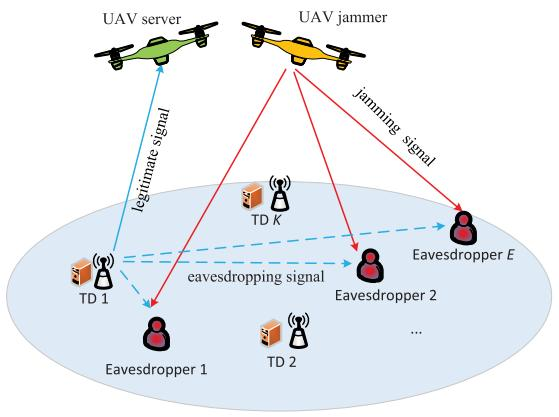

flowchart

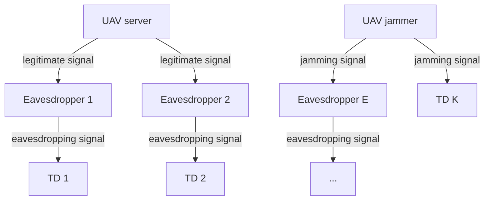

Fig. 1. Illustration of secure UAV-assisted MEC systems for TDMA scheme and NOMA scheme.

and BCD-based algorithm are presented in Section III. In Section IV, we transform the problem for NOMA scheme and develop the BCD-based algorithm. Moreover, we analyze the feasibility of the formulated problems in this part. Section V shows the simulation results to validate our proposed algorithms, and finally the conclusion is summarized in Section VI.

Notations: We use bold upper-case letter A, decorated letter A, and italic lower-case letter a to denote matrix, set, and scalar, respectively. Bold lower-case letter a denotes vector and $\lvert \lvert \mathbf { a } \rvert \rvert$ denotes the Euclidean norm of a. Moreover, ${ \mathbf A } ^ { T }$ denotes the transpose of A. $\mathbb { R } ^ { M \times N }$ denotes the space of $M \times N$ real matrices. The notation $[ a ] ^ { + }$ represents the operation of max $\{ a , 0 \}$ , and $\Re \{ x \}$ [ ]denotes the real parts of variable x. max 0For two sets A and $B , A \backslash B$ denotes the operation $\scriptstyle A - A \bigcap B$ .

# II. SYSTEM MODEL AND PROBLEM FORMULATION

In this section, we first introduce the system model, including the UAVs’ mobility constraints, the communication and computing models for TDMA and NOMA schemes. Afterwards, we introduce the problem formulation.

# A. System Model

As shown in Fig. 1, we consider an UAV-assisted secure MEC systems, in which dual UAVs, denoted by the set $\mathcal { T } = \{ s , j \}$ , are dispatched to help K TDs, denoted by the set ${ \mathcal { K } } = \{ 1 , 2 , \ldots , K \}$ , accomplish the computation tasks with the = 1 2presence of E eavesdroppers on the ground, denoted by the set $\mathcal { E } = \{ 1 , 2 , \ldots , E \}$ . Specifically, UAV s, labeled as UAV server = 1 2(US), is served to compute the tasks from TDs. UAV j, labeled as UAV jammer (UJ), can transmit friendly jamming signals to prevent the TDs’ tasks from eavesdropping. All the UAVs, TDs and eavesdroppers are equipped with single antenna.

In the three-dimensional (3D) Cartesian coordinate system, the horizonal locations of TD $k \in \mathcal { K }$ and eavesdropper $e \in { \mathcal { E } }$ are denoted by $\mathbf { w } _ { k } \in \mathbb { R } ^ { 2 \times 1 }$ and $\mathbf { w } _ { e } ~ \in ~ \mathbb { R } ^ { 2 \times 1 }$ , respectively. k eWe assume that the UAVs know the channel state information (CSI) and location information of each TD and eavesdropper by using the on-board optical cameras or synthetic aperture radars [25], [31] [32]. Also, we can shed light on the fundamental secure computing capacity performance limits of UAV-assisted MEC systems by the assumption that the CSIs of all links in the system are perfectly known at the $\mathrm { U A V s . } ^ { 1 }$ 1 For a period $T > 0$ , the time-varying horizonal location of the UAV $i \in \mathcal { T }$ 0can be denoted as $\bar { \mathbf q } _ { i } ( t ) \in \mathbb R ^ { 2 \times 1 }$ with $t \in [ 0 , T ]$ . The altitude of UAV i is $H _ { i }$ i( ) [0 ]in meters (m), which is assumed to be iconstant. For ease of discussion, we discretize the period $T$ into N small equal-size time slots by the length of $\delta _ { t } ,$ which are indexed by the set $\mathcal { N } = \{ 1 , 2 , \dots , N \}$ t. Therefore, the =location of UAV i in time slot $n \in \mathcal N$ can be denoted by ${ \bf q } _ { i } [ n ] = \{ x _ { i } [ n ] , y _ { i } [ n ] \} ^ { T }$ , satisfying $\mathbf { q } _ { i } ( t ) = \mathbf { q } _ { i } ( \delta _ { t } n ) = \mathbf { q } _ { i } [ n ]$ . i[ ] = i[ ] i[ ] i( ) = i( t ) = i[ ]In addition, US and UJ are assumed to fly from a predetermined initial location $\mathbf { q } _ { i } ^ { I }$ to a final location $\mathbf { q } _ { i } ^ { F }$ during i the period, subject to the maximum speed $V _ { i } ^ { \mathrm { m a x } }$ i . The mobility constraints for the UAVs are expressed as

$$
\mathbf {q} _ {i} [ 1 ] = \mathbf {q} _ {i} ^ {I}, \tag {1a}
$$

$$
\mathbf {q} _ {i} [ N ] = \mathbf {q} _ {i} ^ {F}, \tag {1b}
$$

$$
\left| \left| \mathbf {q} _ {i} [ n + 1 ] - \mathbf {q} _ {i} [ n ] \right| \right| ^ {2} \leq \left(\delta_ {t} V _ {i} ^ {\max}\right) ^ {2}, \forall i, n = 1, 2, \dots , N - 1. \tag {1c}
$$

Note that (1c) means that in each time slot, the largest mobility distance of US and UJ is limited. As stated by 3GPP in [36], nearly 100% LoS probability can be achieved between UAV and ground user when the UAV is above 40 m in the rural macro scenario or 100 m in the urban macro scenario. In this work, both the UAV-TD channels and UAVeavesdropper channels are assumed to be well modeled by LoS links. 2 The channel amplitude from TD k to the US in time slot n is expressed as

$$
h _ {k, s} [ n ] = \sqrt {\frac {\beta_ {0}}{H _ {s} ^ {2} + | | \mathbf {q} _ {s} [ n ] - \mathbf {w} _ {k} | | ^ {2}}}, \forall k, n, \tag {2}
$$

where $\beta _ { 0 }$ denotes the channel power gain at the reference distance $d _ { 0 } = 1$ meter, $H _ { s }$ is the altitude of the US, $H _ { s } ^ { 2 } +$ $| | \mathbf { q } _ { s } [ n ] - \mathbf { w } _ { k } | | ^ { 2 }$ 1 s s +denotes the square of distance between the s[ ] kUS and TD k. Similarly, the channel amplitude from the UJ to eavesdropper e is expressed as

$$
h _ {j, e} [ n ] = \sqrt {\frac {\beta_ {0}}{H _ {j} ^ {2} + | | \mathbf {q} _ {j} [ n ] - \mathbf {w} _ {e} | | ^ {2}}}, \forall e, n, \tag {3}
$$

where $H _ { j }$ is the altitude of the UJ. The channels between jthe TDs and eavesdroppers are modeled as the independent Rayleigh fading [32], [37], hence the channel amplitude from TD k to eavesdropper e is given by $g _ { k , e } ~ = ~ \sqrt { \beta _ { 0 } d _ { k , e } ^ { - \varphi } } \xi _ { e } ,$ where $d _ { k , e } = | | \mathbf { w } _ { k } - \mathbf { w } _ { e } | |$ k,edenotes the distance from TD k k,e =to eavesdropper $e , \varphi$ eis the path loss exponent, and $\xi _ { e }$ is the eRayleigh fading coefficient following exponential distribution with unit mean.

Furthermore, denote $P _ { j } > 0$ as the transmit power of the UJ. In each time slot $n ,$ j 0 the transmit power of TD k is denoted

1It is assumed that perfect CSI is achieved at the UAVs, but our future work will relax this idealized assumption into imperfect CSI case or without CSI case.   
2This work can be easily extend to the cases with probabilistic LoS/NLoS channel model.

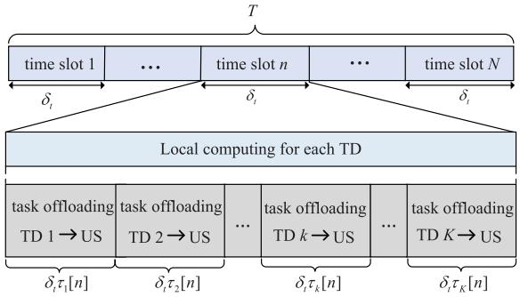

flowchart

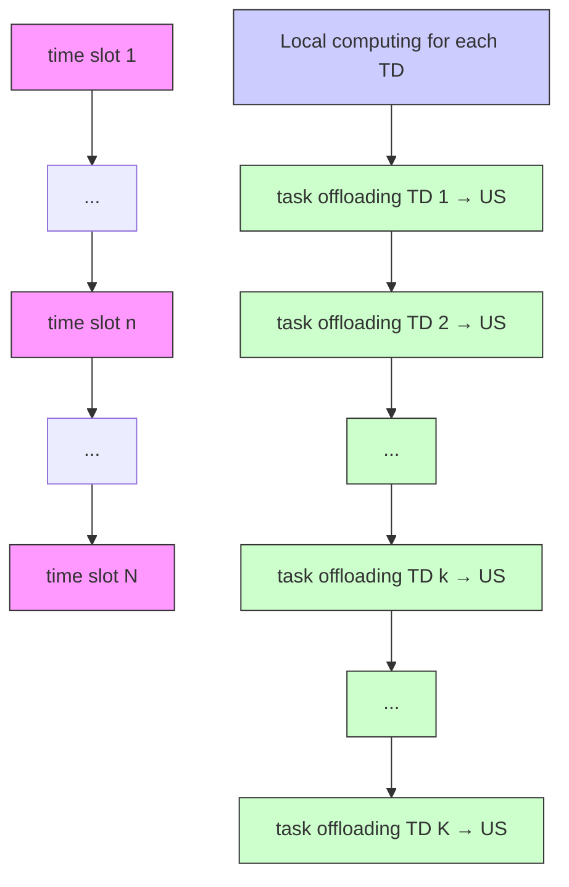

Fig. 2. The time slot division protocol for TDs in TDMA scheme.

by $p _ { k } [ n ]$ that satisfies the following constraint,

$$
0 \leq p _ {k} [ n ] \leq P _ {k} ^ {\max}, \forall k, n, \tag {4}
$$

where $P _ { k } ^ { \mathrm { m a x } }$ is the peak power for TD k.

# B. TDMA Scheme

In TDMA-based task offloading, the time slot division protocol is shown in Fig. 2, where each time slot $n \in \mathcal N$ is further divided into K smaller sub-slots that are allocated to each TD in order, with the duration of $\delta _ { t } \tau _ { k } [ n ]$ , where $\tau _ { k } [ n ]$ is t k[ ] k[ ]the time allocation variable that determines the time duration of TD k for offloading in time slot n and satisfies the following constraints,

$$
\sum_ {k = 1} ^ {K} \tau_ {k} [ n ] \leq 1, \forall n, \tag {5a}
$$

$$
0 \leq \tau_ {k} [ n ] \leq 1, \forall k, n. \tag {5b}
$$

1) Communication Model: Let $\sigma _ { s } ^ { 2 }$ represent the additive swhite Gaussian noise (AWGN) power at the US. It is worth noting that in practice the US can cancel the jamming signal from the received signal because it knows the jamming signal beforehead [33], [38]. Therefore, the signal-to-noise ratio (SNR) at the US for receiving the signal of TD k in slot n is expressed as

$$
\gamma_ {k, s} ^ {T D M A} [ n ] = \frac {\left| h _ {k , s} [ n ] \right| ^ {2} p _ {k} [ n ]}{\sigma_ {s} ^ {2}}, \forall k, n. \tag {6}
$$

Let $\sigma _ { e } ^ { 2 }$ denote the AWGN power at eavesdropper e. Thus, ethe SNR at the eavesdropper e in time slot n is expressed as

$$
\gamma_ {k, e} ^ {T D M A} [ n ] = \frac {\left| g _ {k , e} \right| ^ {2} p _ {k} [ n ]}{\left| h _ {j , e} [ n ] \right| ^ {2} P _ {j} + \sigma_ {e} ^ {2}}, \forall k, e, n, \tag {7}
$$

where $\lvert h _ { j , e } [ n ] \rvert ^ { 2 } P _ { j }$ is the jamming signal imposed by the UJ. As a result, the achievable secrecy rate in bits/second/Hertz (bps/Hz) from TD k to US in the presence of E non-colluding eavesdroppers is given by

$$
R _ {k, s e c} ^ {T D M A} [ n ] = \left[ R _ {k, s} ^ {T D M A} [ n ] - \max _ {\forall e \in \mathcal {E}} R _ {k, e} ^ {T D M A} [ n ] \right] ^ {+}, \forall k, n, \tag {8}
$$

where

$$
R _ {k, s} ^ {T D M A} [ n ] = \tau_ {k} [ n ] \log_ {2} \left(1 + \gamma_ {k, s} ^ {T D M A} [ n ]\right), \forall k, n, \tag {9}
$$

$$
R _ {k, e} ^ {T D M A} [ n ] = \tau_ {k} [ n ] \log_ {2} \left(1 + \gamma_ {k, e} ^ {T D M A} [ n ]\right), \forall k, e, n, \tag {10}
$$

k,where $R _ { k , s } ^ { T D M A } [ n ]$ 2 k,edenotes the practical task offloading rate in k,s [ ]bps/Hz from TD k to US, and leaking rate from TD k to eaves $R _ { k , e } ^ { T D A \cal A } [ n ]$ denotes the data

2) Computing Model: For our systems, TDs perform partial offloading strategy, i.e., they can offload a partial task to the US for execution and compute the remaining part locally. Let $c _ { k }$ and $\kappa _ { k }$ denote the required CPU cycles for computing k kone bit and the effective capacitance coefficient, respectively, at TD k. Let $l _ { l o c , k } [ n ]$ denote the number of local computation loc,k[ ]bits of TD k in time slot $n .$ According to [39], the energy consumption in time slot n for local computation is expressed by $\frac { \kappa _ { k } \left( c _ { k } ^ { ^ \star } l _ { l o c , k } \left[ n \right] \right) ^ { 3 } } { \delta _ { t } ^ { 2 } }$ , in which the variable $l _ { l o c , k } [ n ]$ satisfies

$$
c _ {k} l _ {\text { loc }, k} [ n ] \leq \delta_ {t} F _ {k} ^ {\max}, \forall k, n, \tag {11}
$$

where $F _ { k } ^ { \mathrm { m a x } }$ denotes the maximum CPU frequency of TD k. kThe constraint (11) denotes that the numbers of local computing bits at TD k cannot exceed its maximum computation ability in each time slot. We assume that the US executes the computation task immediately after receiving each single bit and has to finish their task within their assigned data uploading time, $\mathrm { i . e . , ~ } \delta _ { t } \tau _ { k } [ n ]$ . We also assume that the offloading data is uncorrelated, thus the completed data construction for computing in each time slot at the US is unnecessary. Considering the data size of the computation results is much smaller than offloaded data size in practice [15], [39], we omit the time for sending the result back. As a result, we have the following computing ability constraint for the US,

$$
c _ {s} B \delta_ {t} R _ {k, s e c} ^ {T D M A} [ n ] \leq \delta_ {t} \tau_ {k} [ n ] F _ {s} ^ {\max}, \forall k, n, \tag {12}
$$

where B is the bandwidth, $F _ { s } ^ { \mathrm { m a x } }$ and $c _ { s }$ denote the maximum s sCPU frequency and the required CPU cycles for computing one bit, respectively, at the US. The constraint (12) means that the number of secure bits of TD k to be computed at the US in time slot n cannot exceed the US’s computing ability, which motivates TD k to compute locally so as to reduce the data leakage. We note that the computing of the task always lags behind the receiving actually. This lagging time at the US is quite small compared with the time frame of the data uploading. So the lag is ignored in our model. Moreover, it is worth mentioning that we can effortlessly obtain the case of infinite computation ability at the US by setting a sufficient large value of $F _ { s } ^ { \mathrm { m a x } }$ in (12), which is a common assumption sas studied in [40].

In order to meet the computation requirement of all the TDs, we introduce the parameter $Q _ { m }$ to denote the minimum secure mcomputing requirement in bits in each time slot for per TD 3, which needs to meet the following constraint,

$$
l _ {l o c, k} [ n ] + B \delta_ {t} R _ {k, s e c} ^ {T D M A} [ n ] \geq Q _ {m}, \forall k, n. \tag {13}
$$

The constraint (13) denotes that the numbers of secure computing bits for TD k in time slot n must exceed a threshold, thus a basic secure computing requirement for each TD can be guaranteed.

# C. NOMA Scheme

In NOMA scheme, TDs can simultaneously access to the US by sharing the same time block and bandwidth. For uplink

3For convenience, we give the same values of the required computing bits $Q _ { m }$ for all TDs in each time slot. It can also be dedicatedly set as different values for different TDs, i.e., expressed by $Q _ { k } ^ { m } [ n ]$ .

NOMA, the US performs SIC to decode signals in descending order of the channel gains, i.e., the signals for TDs further from the US with lower channel gains are regarded as the interference to those closer from the US with higher channel gains [19]. In practice, the time-varying locations of the US impose the rigorous requirements for channel estimation and signal processing in NOMA scheme in order to correctly distinguish the signals at the receiver by SIC, which would inevitably increase the network overhead. Considering the high-quality LoS links of the UAV, we assume that the cost for NOMA scheme is well compensated, and the US always has the perfect knowledge of the CSI of TDs in each time slot. Similar to [20], we use a binary parameter $\lambda _ { k , l } [ n ]$ to indicate k,l[ ]the relationships of these varying channels between the US and TDs in each time slot, expressed as

$$
\lambda_ {k, l} [ n ] = \left\{ \begin{array}{l l} 1, & \text { if } d _ {k, s} [ n ] <   d _ {l, s} [ n ] \\ 0, & \text { if } d _ {k, s} [ n ] > d _ {l, s} [ n ] \end{array} \right. \tag {14a}
$$

$$
\lambda_ {k, l} [ n ] + \lambda_ {l, k} [ n ] = 1, \tag {14b}
$$

$$
\lambda_ {k, l} [ n ] \in \{0, 1 \}, \forall k, l, n, \tag {14c}
$$

where $d _ { y , s } [ n ]$ denotes the distance between TD y and the US y,s[in time slot $n ,$ with $y \in \{ k , l \}$ . It can be seen that from (14a), $\lambda _ { k , l } [ n ] = 1$ indicates the distance from TD l to the US is k,l[ ] = 1larger than that from TD k to the US; otherwise, $\lambda _ { k , l } [ n ] = 0 .$ k,l[ ] = 0Equation (14b) is to avoid the case in which both TD k and TD l are treated as closer or further users when $d _ { k , s } [ n ] = d _ { l , s } [ n ]$ .

k,s[ ] = l,s[ ]1) Communication Model: Based on the discussion above, the SNR at the US and eavesdroppers are

$$
\gamma_ {k, s} ^ {N O M A} [ n ] = \frac {p _ {k} [ n ] \left| h _ {k , s} [ n ] \right| ^ {2}}{\sum_ {l \neq k , l \in \mathcal {K}} \lambda_ {k , l} [ n ] \left| h _ {l , s} [ n ] \right| ^ {2} p _ {l} [ n ] + \sigma_ {s} ^ {2}}, \forall k, n, \tag {15}
$$

$$
\gamma_ {k, e} ^ {N O M A} [ n ] = \frac {p _ {k} [ n ] \left| g _ {k , e} \right| ^ {2}}{\sum_ {z \in \mathcal {K} _ {k}} \left| g _ {z , e} \right| ^ {2} p _ {z} [ n ] + \left| h _ {j , e} [ n ] \right| ^ {2} P _ {j} + \sigma_ {e} ^ {2}}, \forall k, e, n, \tag {16}
$$

respectively, where $\mathcal { K } _ { k } = \{ z \ | \ z \in \mathcal { K } , | g _ { z , e } | < | g _ { k , e } | \}$ denotes k = z,e k,ethe set of TDs whose channel gains to the eavesdropper e are worse than the channel gain of TD k to the eavesdropper e. Note that we assume that the eavesdroppers also use NOMA scheme to intercept the offloading signals.

As a result, the achievable secrecy rate in bps/Hz from TD k to US in the presence of the E non-colluding eavesdroppers is given by

$$
R _ {k, s e c} ^ {N O M A} [ n ] = \left[ R _ {k, s} ^ {N O M A} [ n ] - \max _ {\forall e \in \mathcal {E}} R _ {k, e} ^ {N O M A} [ n ] \right] ^ {+}, \forall k, n, \tag {17}
$$

where

$$
R _ {k, s} ^ {N O M A} [ n ] = \log_ {2} \left(1 + \gamma_ {k, s} ^ {N O M A} [ n ]\right), \forall k, n, \tag {18}
$$

$$
R _ {k, e} ^ {N O M A} [ n ] = \log_ {2} \left(1 + \gamma_ {k, e} ^ {N O M A} [ n ]\right), \forall k, e, n. \tag {19}
$$

2) Computing Model: In NOMA scheme, the local computing model of TDs is same as that in TDMA scheme. To ensure concurrent task execution of multiple TDs, CPU resource of the US needs to be divided and allocated to each

TD for computing. Let $f _ { k } [ n ]$ denote the US’s CPU frequency k[ ]allocated to compute the data from TD k in time slot $n ,$ it meets the following constraints,

$$
\sum_ {k = 1} ^ {K} f _ {k} [ n ] \leq F _ {k} ^ {\max}, \forall n, \tag {20a}
$$

$$
0 \leq f _ {k} [ n ] \leq F _ {k} ^ {\max}, \forall k, n. \tag {20b}
$$

Therefore, the secure computing bits at the US for TD k satisfy the following constraint,

$$
c _ {k} B \delta_ {t} R _ {k, s e c} ^ {N O M A} [ n ] \leq \delta_ {t} f _ {k} [ n ], \forall k, n, \tag {21}
$$

Furthermore, the minimum secure computing requirement for each TD in time slot n satisfies

$$
l _ {l o c, k} [ n ] + B \delta_ {t} R _ {k, s e c} ^ {N O M A} [ n ] \geq Q _ {m}, \forall k, n. \tag {22}
$$

# D. Problem Formulation

For TDMA scheme during period $T ,$ the secure computing capacity of TD k, namely the average achievable number of secure computing bits of TD k during the period, is expressed as

$$
\bar {R} _ {k, s e c} ^ {T D M A} = \frac {1}{T} \left(B \delta_ {t} \sum_ {n = 1} ^ {N} R _ {k, s e c} ^ {T D M A} [ n ] + \sum_ {n = 1} ^ {N} l _ {l o c, k} [ n ]\right), \forall k, n. \tag {23}
$$

Similarly, the secure computing capacity of TD k for NOMA scheme is expressed as

$$
\bar {R} _ {k, s e c} ^ {N O M A} = \frac {1}{T} \left(B \delta_ {t} \sum_ {n = 1} ^ {N} R _ {k, s e c} ^ {N O M A} [ n ] + \sum_ {n = 1} ^ {N} l _ {\text { loc }, k} [ n ]\right), \forall k, n. \tag {24}
$$

Therefore, the minimum secure computing capacity maximization problem for TDMA is formulated as

$$
\max _ {\left\{\tau_ {k} [ n ], p _ {k} [ n ], l _ {l o c, k} [ n ], \mathbf {q} _ {i} [ n ] \right\}} \min _ {\forall k} \bar {R} _ {k, s e c} ^ {T D M A} \tag {25a}
$$

$$
\begin{array}{l} \text {s.t.} (1), (4), (5), (1 1) - (1 3), \end{array}
$$

$$
\frac {1}{T} \sum_ {n = 1} ^ {N} \left(\frac {\kappa_ {k} \left(c _ {k} l _ {l o c , k} [ n ]\right) ^ {3}}{\delta_ {t} ^ {2}} + \tau_ {k} [ n ] \delta_ {t} p _ {k} [ n ]\right) \leq \bar {P} _ {k}, \forall k. \tag {25b}
$$

In problem (25), $\bar { P } _ { k }$ denotes the average power budget for keach TD. The expression in (25b) indicates that each TD’s average energy consumption for local computing and task offloading during period $T$ cannot exceed the average power budget.

For NOMA scheme, the minimum secure computing capacity maximization problem is formulated as

$$
\max _ {\left\{\lambda_ {k, l} [ n ], p _ {k} [ n ], f _ {k} [ n ], l _ {l o c, k} [ n ], \mathbf {q} _ {i} [ n ] \right\}} \quad \min _ {\forall k} \bar {R} _ {k, s e c} ^ {N O M A} \tag {26a}
$$

$$
\text { s.t. } \quad (1), (4), (1 1), (1 4), (2 0) - (2 2),
$$

$$
\frac {1}{T} \sum_ {n = 1} ^ {N} \left(\frac {\kappa_ {k} \left(c _ {k} l _ {l o c , k} [ n ]\right) ^ {3}}{\delta_ {t} ^ {2}} + \delta_ {t} p _ {k} [ n ]\right) \leq \bar {P} _ {k}, \forall k. \tag {26b}
$$

Note that problems (25) and (26) are multi-variable coupled and non-convex due to the non-convexity in the objective functions, i.e, (25a) and (26a), as well as in constraints (12), (13), (21) and (22). Moreover, problem (26) involves 0-1 integer constraint in (14) that makes the problem more intractable. Except for (12)-(14), (21) and (22), the rest of constraints in problems (25) and (26) are affine that belong to the convex constraint. In the next two sections, the effective algorithms are proposed to solve these two problems.

# III. PROPOSED ALGORITHM FOR TDMA SCHEME

In order to make the problem for TDMA scheme more tractable, we first equivalently transform problem (25) as follows,

$$
\max _ {\mathcal {Z}} s \tag {27a}
$$

$$
\text { s.t. } \quad (1), (4), (5), (1 1), (2 5 b),
$$

$$
s \leq \frac {1}{T} \left(B \delta_ {t} \sum_ {n = 1} ^ {N} (s _ {1, k} [ n ] - s _ {2, k} [ n ]) + \sum_ {n = 1} ^ {N} l _ {l o c, k} [ n ]\right), \tag {27b}
$$

$$
s _ {1, k} [ n ] \leq R _ {k, s} ^ {T D M A} [ n ], \forall k, n, \tag {27c}
$$

$$
s _ {2, k} [ n ] \geq R _ {k, e} ^ {T D M A} [ n ], \forall k, e, n, \tag {27d}
$$

$$
c _ {k} B \left(s _ {1, k} [ n ] - s _ {2, k} [ n ]\right) \leq \tau_ {k} [ n ] F _ {s} ^ {\max}, \forall k, n, \tag {27e}
$$

$$
l _ {l o c, k} [ n ] + B \delta_ {t} \left(s _ {1, k} [ n ] - s _ {2, k} [ n ]\right) \geq Q _ {m}, \forall k, n, \tag {27f}
$$

where $\mathcal { Z } ~ = ~ \{ \tau _ { k } [ n ] , p _ { k } [ n ] , l _ { l o c , k } [ n ] , \mathbf { q } _ { i } [ n ] , s , s _ { 1 , k } [ n ] , s _ { 2 , k } [ n ] \}$ , $\{ s , s _ { 1 , k } [ n ] , s _ { 2 , k } [ n ] \}$ ] [ ] [ ] [ ] [ ] [are the introduced auxiliary variables.

1,k[ ] 2,k[ ]Proposition 1: The transformed problem in (27) is equivalent to problem (25).

Proof: First, we can omit the operator $[ \cdot ] ^ { + }$ in (12), (13) [ ]and the objective function of problem (25) because at least the value of zero can be obtained by setting $p _ { k } [ n ] ~ = ~ 0$ of loc,k[ ] = 0the lower bound of and $R _ { k , s } ^ { T D M A } [ n ]$ $l _ { l o c , k } [ n ] = 0$ ¯k,sec 1,k[ ], as shown in (27b) and (27c), respectively. k[ ] = 0. We introduce the auxiliary variable s as $\bar { R } _ { k , s e c } ^ { T D M A }$ and $s _ { 1 , k } [ n ]$ as the lower bound otherwise the value of s always can be enlarged. Similarly, at least one equality in (27c) and (27e) holds at the optimal solution, which ensures the same value as problem T DMAk,e [ ]equality s2,k[n] = max ∀ ∈E RT DMAk,e [n] must hold at the optimal as the upper bound of (25). Then, we introduce another auxiliary variable, AeEE $R _ { k . e } ^ { T D M A } [ n ]$ $R _ { k , e } ^ { { \tilde { T } } D A } { } ^ { \bar { A } } [ n ]$ 2,k[ ]. It can conclude that the $s _ { 2 , k } [ n ]$ , solution, otherwise $\bar { s } _ { 2 , k } [ n ]$ can always be decreased, thus 2,k[ ]further increases the value of objective function. Therefore, the transformed problem in (27) is equivalent to problem (25). The proof is completed.

Remark 1: Proposition 1 indicates that we can obtain the solutions for the primal problem (25) by solving its equivalent problem (27).

Next, problem (27) is decomposed and solved in two steps with block structures of the optimization variables, i.e., optimizing variable block $\mathcal { Z } \backslash \{ \mathbf { q } _ { i } [ \bar { n } ] \}$ by fixed UAVs’ trajectories $\{ \mathbf { q } _ { i } [ n ] \}$ i[ ]in Step 1, and optimizing UAVs’ trajectories $\{ \mathbf { q } _ { i } [ n ] \}$ i[ ]by fixed $\mathcal { Z } \backslash \{ \mathbf { q } _ { i } [ n ] \}$ in Step 2.

A. Step 1: Optimizing $\mathcal { Z } \backslash \{ \mathbf { q } _ { i } [ n ] \}$ by Fixed $\{ \mathbf { q } _ { i } [ n ] \}$

For the fixed trajectories of UAVs, the optimization problem in (27) can be re-expressed as

$$
\begin{array}{l} \max _ {\mathcal {Z} \backslash \{\mathbf {q} _ {i} [ n ] \}} s \tag {28} \\ \text { s   .   t   . } \quad (4), (5), (1 1), (2 5 b), (2 7 b) - (2 7 f). \\ \end{array}
$$

Note that all the constraints in problem (28) are convex besides constraints (27c) and (27d). By introducing auxiliary variables $\{ \theta _ { 1 , k } [ n ] \}$ , the expression in (27c) can be transformed as

$$
s _ {1, k} [ n ] \leq \tau_ {k} [ n ] \theta_ {1, k} [ n ], \forall k, n, \tag {29a}
$$

$$
\theta_ {1, k} [ n ] \leq \log_ {2} \left(1 + A _ {1, k, n} ^ {r} p _ {k} [ n ]\right), \forall k, n, \tag {29b}
$$

where Ar $\begin{array} { r } { A _ { 1 , k , n } ^ { r } = \frac { \beta _ { 0 } } { \sigma _ { s } ^ { 2 } ( H _ { s } ^ { 2 } + | | \mathbf { q } _ { s } ^ { r } [ n ] - \mathbf { w } _ { k } | | ^ { 2 } ) } } \end{array}$ with r denoting rth iter-1,k,n = σ (H + [n] )ation. It is readily known that the constraint (29b) has to hold with equality at the optimal solution, otherwise $\theta _ { 1 , k } [ n ]$ can 1,k[ ]be increased without decreasing the objective value. Hence, the constraints (27c) and (29) are equivalent. The obtained expression in (29b) is convex. The expression in (29a) is still non-convex but can be rewritten into the following forms,

$$
s _ {1, k} [ n ] + \frac {\left(\tau_ {k} [ n ] - \theta_ {1 , k} [ n ]\right) ^ {2}}{4} - \frac {\left(\tau_ {k} [ n ] + \theta_ {1 , k} [ n ]\right) ^ {2}}{4} \leq 0. \tag {30}
$$

For the convenience of notation, we define

$$
F _ {r} ^ {(\dagger)} (x, y, z) = \frac {(x ^ {r} + y ^ {r}) (x + y)}{4} - \frac {(x ^ {r} + y ^ {r}) ^ {2}}{8} - \frac {z}{2} - \frac {1}{2}, \tag {31}
$$

and

$$
F _ {r} ^ {(\ddagger)} (x, y, z) = \frac {(x ^ {r} - y ^ {r}) (x - y)}{4} - \frac {(x ^ {r} - y ^ {r}) ^ {2}}{8} + \frac {z}{2} - \frac {1}{2}, \tag {32}
$$

where $x ^ { r }$ and $y ^ { r }$ are given points with regard to x and y at the rth iteration.

Then, constraint (30) can be further rewritten as the SOC form, as expressed in (33). The detailed transformation of (30) into (33) can be seen in Appendix A.

$$
\begin{array}{l} \left| \left| \left[ \frac {\tau_ {k} [ n ] - \theta_ {1 , k} [ n ]}{2}, F _ {r} ^ {(\dagger)} (\tau_ {k} [ n ], \theta_ {1, k} [ n ], s _ {1, k} [ n ]) \right] \right| \right| \\ \leq F _ {r} ^ {(\dagger)} \left(\tau_ {k} [ n ], \theta_ {1, k} [ n ], s _ {1, k} [ n ]\right) + 1. \tag {33} \\ \end{array}
$$

By introducing auxiliary variables $\{ \theta _ { 2 , k } [ n ] \}$ , (27d) is converted into

$$
s _ {2, k} [ n ] \geq \tau_ {k} [ n ] \theta_ {2, k} [ n ], \forall k, n, \tag {34a}
$$

$$
\theta_ {2, k} [ n ] \geq \log_ {2} \left(1 + A _ {2, k e, n} ^ {r} p _ {k} [ n ]\right), \forall k, e, n, \tag {34b}
$$

where Ar $\begin{array} { r } { A _ { 2 , k e , n } ^ { r } ~ = ~ \frac { | g _ { k , e } | ^ { 2 } ( H _ { j } ^ { 2 } + | | \mathbf { q } _ { j } ^ { r } [ n ] - \mathbf { w } _ { e } | | ^ { 2 } ) } { \beta _ { 0 } P _ { j } + ( H _ { i } ^ { 2 } + | | \mathbf { q } _ { i } ^ { r } [ n ] - \mathbf { w } _ { e } | | ^ { 2 } ) \sigma _ { e } ^ { 2 } } } \end{array}$ . Similar to the 2,ke,n β P +(H + [n] )σtransformation method from (29a) to (33), by given feasible points $\{ \tau _ { k } ^ { r } [ n ] , \theta _ { 2 , k } ^ { r } [ n ] \}$ , (34a) can be also denoted as the SOC kform, i.e.,

$$
\begin{array}{l} \left| \left| \left[ \frac {\tau_ {k} [ n ] + \theta_ {2 , k} [ n ]}{2}, F _ {r} ^ {(\ddagger)} (\tau_ {k} [ n ], \theta_ {2, k} [ n ], s _ {2, k} [ n ]) \right] \right| \right| \\ \leq F _ {r} ^ {(\ddagger)} \left(\tau_ {k} [ n ], \theta_ {2, k} [ n ], s _ {2, k} [ n ]\right) + 1. \tag {35} \\ \end{array}
$$

Note that the expression in (34b) is also non-convex, but $\log _ { 2 } ( 1 + A _ { 2 , k e , n } ^ { r } p _ { k } [ n ] )$ can be upper-bounded by applying SCA log2(1+ 2,ke,n k[ ])technique due to the convexity [41]. Hence, via taking the firstorder Taylor expansion at given point $\{ p _ { k } ^ { r } [ n ] \}$ }, we have

$$
\theta_ {2, k} [ n ] \geq \log_ {2} (1 + A _ {2, k e, n} ^ {r} p _ {k} ^ {r} [ n ])
$$

$$
+ \frac {1}{\ln 2} \frac {A _ {2 , k e , n} ^ {r} (p _ {k} [ n ] - p _ {k} ^ {r} [ n ])}{1 + A _ {2 , k e , n} ^ {r} p _ {k} ^ {r} [ n ]} \tag {36}
$$

In (36), the constraint holds with equality when $p _ { k } ^ { r } [ n ]$ k[ ]becomes stable in iterations. Thus, at least a sub-optimal solution is guaranteed by using SCA technique. Finally, problem (28) is reformulated as

$$
\begin{array}{l} \max _ {\mathcal {Z} \backslash \left\{\mathbf {q} _ {i} [ n ] \right\}, \left\{\theta_ {1, k} [ n ], \theta_ {2, k} [ n ] \right\}} s \tag {37} \\ \text { s   .   t   . } \quad (4), (5), (1 1), (2 5 b), (2 7 b), (2 7 e), \\ (2 7 \mathrm{f}), (2 9 \mathrm{b}), (3 3), (3 5), (3 6). \\ \end{array}
$$

Evidently, the obtained problem (37) is convex that can be efficiently solved by standard convex optimization tools, e.g., CVX [42].

B. Step 2: Optimizing $\{ \mathbf { q } _ { i } [ n ] \}$ by Fixed $\mathcal { Z } \backslash \{ \mathbf { q } _ { i } [ n ] \}$

By fixed variables $\mathcal { Z } \backslash \{ \mathbf { q } _ { i } [ n ] \}$ , we can optimize UAVs’ i[ ]trajectories by the following problem,

$$
\begin{array}{l} \max _ {\left\{\mathbf {q} _ {i} [ n ] \right\}} s \tag {38} \\ \text { s.t. } \quad (1), (2 7 b) - (2 7 f). \\ \end{array}
$$

The key matters on solving problem (38) is to tackle the non-convex constraints in (27c) and (27d), which can be rewritten as

$$
s _ {1, k} [ n ] \leq \tau_ {k} ^ {r} [ n ] \log_ {2} \left(1 + \frac {\gamma_ {k , n} ^ {r}}{H _ {s} ^ {2} + | | \mathbf {q} _ {s} [ n ] - \mathbf {w} _ {k} | | ^ {2}}\right), \tag {39}
$$

$$
s _ {2, k} [ n ] \geq \tau_ {k} ^ {r} [ n ] \log_ {2} \left(1 + \frac {\gamma_ {k e , n} ^ {r}}{\frac {\gamma_ {e , n} ^ {r}}{H _ {j} ^ {2} + | | \mathbf {q} _ {j} [ n ] - \mathbf {w} _ {e} | | ^ {2}}} + 1\right), \tag {40}
$$

where γr $\begin{array} { r } { \gamma _ { k , n } ^ { r } = \frac { \beta _ { 0 } p _ { k } [ n ] } { \sigma _ { \it _ { \circ } } ^ { 2 } } , \gamma _ { k e , n } ^ { r } = \frac { | g _ { k , e } | ^ { 2 } p _ { k } ^ { r } [ n ] } { \sigma _ { \it _ { \circ } } ^ { 2 } } } \end{array}$ p [2s p2 , and $\begin{array} { r } { \gamma _ { e , n } ^ { r } = \frac { \beta _ { 0 } P _ { j } } { \sigma _ { \alpha } ^ { 2 } } } \end{array}$ 0 j

k,n = σ rke,n = σe re,n = σ2e The right-hand side of (39) is convex with regard to $| | \mathbf { q } _ { s } [ n ] - \mathbf { w } _ { k } | | ^ { 2 }$ , which motivates us to apply SCA technique. s[ ] kThus, by taking the first-order Taylor expansion at given points $\{ \mathbf { q } _ { s } ^ { r } [ n ] \}$ , (39) can be rewritten as

$$
s _ {1, k} [ n ] \leq \tau_ {k} ^ {r} [ n ] \psi_ {k} ^ {l} [ n ], \tag {41}
$$

$$
\begin{array}{l} \text { where } \quad \psi_ {k} ^ {l} [ n ] = \log_ {2} \left(1 + \frac {\gamma_ {k , n} ^ {r}}{H _ {s} ^ {2} + | | \mathbf {q} _ {s} ^ {r} [ n ] - \mathbf {w} _ {k} | | ^ {2}}\right) - \\ \frac {\log_ {2} (e) \gamma_ {k , n} ^ {r} \Big (| | \mathbf {q} _ {s} [ n ] - \mathbf {w} _ {k} | | ^ {2} - | | \mathbf {q} _ {s} ^ {r} [ n ] - \mathbf {w} _ {k} | | ^ {2} \Big)}{(| | \mathbf {q} _ {s} ^ {r} [ n ] - \mathbf {w} _ {k} | | ^ {2} + H _ {s} ^ {2}) (| | \mathbf {q} _ {s} ^ {r} [ n ] - \mathbf {w} _ {k} | | ^ {2} + H _ {s} ^ {2} + \gamma_ {k , n} ^ {r})}. \\ \end{array}
$$

[n] +H )( [n] +H +γBy introducing auxiliary variables $\{ \pi _ { 1 , e } [ n ] \}$ and $\{ \pi _ { 2 , e } [ n ] \}$ , 1,e[ ] 2,e can be equivalently converted to the following constraints,

$$
s _ {2, k} [ n ] \geq \tau_ {k} ^ {r} [ n ] \log_ {2} \left(\pi_ {1, e} [ n ] + \gamma_ {k e, n} ^ {r} + 1\right)
$$

$$
- \tau_ {k} ^ {r} [ n ] \log_ {2} \left(\pi_ {1, e} [ n ] + 1\right), \tag {42a}
$$

$$
\pi_ {1, e} [ n ] \pi_ {2, e} [ n ] \leq \gamma_ {e, n} ^ {r}, \tag {42b}
$$

$$
\pi_ {2, e} [ n ] \geq H _ {j} ^ {2} + | | \mathbf {q} _ {j} [ n ] - \mathbf {w} _ {e} | | ^ {2}. \tag {42c}
$$

The details about the transformation of constraint (40) can be seen in Appendix B.

Note that (42a) and (42b) are still non-convex. For given points $\{ \pi _ { 1 , e } ^ { r } [ n ] \}$ and with SCA technique, $\log _ { 2 } ( \pi _ { 1 , e } [ n ] +$ $\gamma _ { k e , n } ^ { r } + 1 )$ ,e[ ] log2( 1,e[ ] +in (42a) can be approximately expressed by its ke,n + 1)upper-bounded function $\varphi _ { k } ^ { u } [ n ]$ , denoted as

$$
\varphi_ {k} ^ {u} [ n ] = \log_ {2} (\pi_ {1, e} ^ {r} [ n ] + \gamma_ {k e, n} ^ {r} + 1) + \frac {1}{\ln 2} \frac {\left(\pi_ {1 , e} [ n ] - \pi_ {1 , e} ^ {r} [ n ]\right)}{\pi_ {1 , e} ^ {r} [ n ] + \gamma_ {k e , n} ^ {r} + 1}. \tag {43}
$$

Thus, (42a) is rewritten as

$$
s _ {2, k} [ n ] \geq \varphi_ {k} ^ {u} [ n ] - \tau_ {k} ^ {r} [ n ] \log_ {2} \left(\pi_ {1, e} [ n ] + 1\right). \tag {44}
$$

Similar to the constraint (29a), with given $\{ \pi _ { 1 , e } ^ { r } [ n ] , \pi _ { 2 , e } ^ { r } [ n ] \}$ , 1,e(42b) can be also converted to the SOC form as

$$
\begin{array}{l} \left| \left| \left[ \frac {\pi_ {1 , e} [ n ] + \pi_ {2 , e} [ n ]}{2}, F _ {r} ^ {(\ddagger)} (\pi_ {1, e} [ n ], \pi_ {2, e} [ n ], \gamma_ {e, n} ^ {r}) \right] \right| \right| \\ \leq F _ {r} ^ {(\ddagger)} \left(\pi_ {1, e} [ n ], \pi_ {2, e} [ n ], \gamma_ {e, n} ^ {r}\right) + 1. \tag {45} \\ \end{array}
$$

Based on the analysis above, problem (38) is reformulated as

$$
\begin{array}{l} \max _ {\left\{\mathbf {q} _ {i} [ n ], \pi_ {1, e} [ n ], \pi_ {2, e} [ n ] \right\}} s \tag {46} \\ \text { s   .   t   . } \quad (1), (2 7 \mathrm{b}), (2 7 \mathrm{e}), (2 7 \mathrm{f}), (4 1), \\ (4 2 c), (4 4), (4 5). \\ \end{array}
$$

Note that the obtained problem in (46) is convex that can be efficiently solved by CVX. Therefore, the proposed BCD-based algorithm for solving problem (27) is summarized in Algorithm 1.

# Algorithm 1 BCD-Based Joint Optimization Algorithm

1: Initialization: Give feasible points τ r n , $p _ { k } ^ { r } [ n ]$ , qr n , $\theta _ { 1 , k } ^ { r } [ n ] , \theta _ { 2 , k } ^ { r } [ n ] , \pi _ { 1 , e } ^ { r } [ n ] , \pi _ { 2 , e } ^ { r } [ n ] .$ k [ ] k[ ] and let iteration $r = 0$ 1,k[ ] 2,kset accuracy $\varepsilon > 0$ .

# 2: repeat

3: $\mathrm { ~ B y ~ } \tau _ { k } ^ { r } [ n ] , p _ { k } ^ { r } [ n ] , \mathbf { q } _ { i } ^ { r } [ n ] , \theta _ { 1 , k } ^ { r } [ n ] , \theta _ { 2 , k } ^ { r } [ n ] ,$ solve problem k [ ] k[ ] i [ ] 1,k[ ] 2,k in Step 1 and obtain the solution.   
4: Update the values of optimization variables.   
5: By $\tau _ { k } ^ { r } [ n ] , p _ { k } ^ { r } [ n ] , \mathbf { q } _ { i } ^ { r } [ n ] , \pi _ { 1 , e } ^ { r } [ n ] , \pi _ { 2 , e } ^ { r } [ n ] .$ solve problem k [ ] k[ ] i [ ] 1,e[ ] 2,e in Step 2 and obtain the solution.   
6: Update the values of optimization variables.   
7: Update $r  r + 1 .$   
+ 18: until The algorithm achieves the accuracy ε or the maximum number of iterations is reached.   
9: Output: The optimized variables （20号 $\{ \tau _ { k } [ n ] , p _ { k } [ n ] , l _ { l o c , k } [ n ] , \mathbf { q } _ { i } [ n ] , s , s _ { 1 , k } [ n ] , s _ { 2 , k } [ n ] \}$ .

# C. Complexity Analysis of Algorithm 1

The complexity of Algorithm 1 mainly depends on the number of SOC constraints, variables and the dimensions. It can be seen that the algorithm contains $( 2 K + E ) N$ (2 + )SOC constraints, among which KN SOC constraints of 2dimension 3, and EN SOC constraints of dimension 2. Thus, based on [45], the complexity of Algorithm 2 is given by $I _ { 1 } O \left( n _ { 1 } \sqrt { 2 ( 2 K + E ) N } ( 1 8 K N + 4 E N + n _ { 1 } ^ { 2 } ) \right)$ , where $I _ { 1 }$ 1 1 2(2 + ) (18 + 4denotes the number of iterations and $n _ { 1 }$ + 1)is on the order 1of $O \left( K N + N \right)$ .

# IV. PROPOSED ALGORITHM FOR NOMA SCHEME

In this section, we solve problem (26) for NOMA scheme. Firstly, we transform problem (26) into a new form, expressed as

$$
\max _ {\check {z}} \check {s} \tag {47a}
$$

s.t. (1), (4), (11), (14), (20),

$$
\check {s} \leq \frac {1}{T} \left(B \delta_ {t} \sum_ {n = 1} ^ {N} \left(\check {s} _ {1, k} [ n ] - \check {s} _ {2, k} [ n ]\right) + \sum_ {n = 1} ^ {N} l _ {\text { loc }, k} [ n ]\right), \tag {47b}
$$

$$
\check {s} _ {1, k} [ n ] \leq R _ {k, s} ^ {N O M A} [ n ], \forall k, n, \tag {47c}
$$

$$
\check {s} _ {2, k} [ n ] \geq R _ {k, e} ^ {N O M A} [ n ], \forall k, e, n, \tag {47d}
$$

$$
c _ {k} B \left(\check {s} _ {1, k} [ n ] - \check {s} _ {2, k} [ n ]\right) \leq f _ {k} [ n ], \forall k, n, \tag {47e}
$$

$$
l _ {l o c, k} [ n ] + B \delta_ {t} \left(\check {s} _ {1, k} [ n ] - \check {s} _ {2, k} [ n ]\right) \geq Q _ {m}, \forall k, n, \tag {47f}
$$

where $\{ \check { s } , \check { s } _ { 1 , k } [ n ] , \check { s } _ { 2 , k } [ n ] \}$ are the introduced auxiliary ˇ ˇ1,k[ ] ˇ2,k[ ]variables to make the problem more tractable, $\breve { \mathcal { Z } } ~ = ~ \{ \lambda _ { k , l } [ n ] , p _ { k } [ n ] , l _ { l o c , k } [ n ] , f _ { k } [ n ] , \mathbf { q } _ { i } [ n ] , \breve { s } , \breve { s } _ { 1 , k } [ n ] , \breve { s } _ { 2 , k } [ n ] \}$ . = k,l[ ] k[ ] loc,k[ ] k[ ] i[ ] ˇ ˇ1,k[ ] ˘2,k[ ]Based on Proposition 1 in Section III, it is not hard to prove that problem (47) is equivalent to problem (26), the details of this proof are omitted here for saving the article space.

Note that problem (47) is difficult to obtain the solution directly due to the following two aspects. One is that the coupled non-convex constraints are involved in (47c) and (47d); the other one is that the binary constraints in (14). To solve this, we propose the P-BCD based algorithm based on penalized method [20], [33] [43], [44].

First, with the auxiliary variables $\{ \tilde { \lambda } _ { k , l } [ n ] \}$ , we convert the k,l[ ]binary constraint (14c) to the following forms,

$$
\lambda_ {k, l} [ n ] (1 - \tilde {\lambda} _ {k, l} [ n ]) = 0, \tag {48a}
$$

$$
\lambda_ {k, l} [ n ] = \tilde {\lambda} _ {k, l} [ n ], \forall k, l, n. \tag {48b}
$$

The equations in (48) hold only at $\lambda _ { k , l } [ n ] \ \in \ \{ 0 , 1 \}$ , which means that (48) is equivalent to (14c).

Proposition 2: Constraint (14a) can be equivalently transformed to the following form,

$$
d _ {k, s} [ n ] \lambda_ {k, l} [ n ] \leq d _ {l, s} [ n ], \forall k, n. \tag {49}
$$

Proof: From (49), there must be $\lambda _ { k , l } [ n ] = 0$ if $d _ { l , s } [ n ] <$ $d _ { k , s } [ n ]$ . If $d _ { l , s } [ n ] > d _ { k , s } [ n ] .$ [, the value of $\lambda _ { k , l } [ n ]$ [ ]can be k,s[ ] l,s[ ] k,s[ ] k,l[ ] 0or , which may violate the stipulation of (14a). However, 1constraint (14b) ensures that for $\lambda _ { k , l } [ n ]$ and $\lambda _ { l , k } [ n ] .$ , we always have $\lambda _ { k , l } [ n ] = 1$ or $\lambda _ { l , k } [ n ] = 1$ k,l[ ] l,k [ ]while the other one equals to zero, under $d _ { l , s } [ n ] \geq d _ { k , s } [ n ]$ . As a result, (49) is guaranteed to be equivalent to (14a). The proof is completed.

Remark 2: Via Proposition 2, the piecewise expression in (14a) is unified into one expression in the premise of ensuring the equivalence, which greatly contributes to the following mathematical analysis and processing.

By incorporating the equalities in (14b) and (48) into the objective function, we formulate the following penalized

problem,

$$
\max _ {\tilde {\mathcal {Z}}} f _ {\varrho} (\Xi) \tag {50}
$$

$$
\text { s   .   t   . } \quad (1), (4), (1 1), (2 0), (4 7 b) - (4 7 f), (4 9).
$$

where $\Xi = \{ \check { s } , \lambda _ { k , l } [ n ] , \tilde { \lambda } _ { l , k } [ n ] \} , \tilde { \mathcal { Z } } = \check { \mathcal { Z } } \bigcup \{ \tilde { \lambda } _ { l , k } [ n ] \}$ , and

$$
\begin{array}{l} f _ {\varrho} (\Xi) = \check {s} - \varrho \sum_ {n = 1} ^ {N} \sum_ {k = 1} ^ {K} \sum_ {l = 1} ^ {K} \left(| \lambda_ {k, l} [ n ] - \tilde {\lambda} _ {l, k} [ n ] | ^ {2} \right. \\ \left. + \left| \lambda_ {k, l} [ n ] \left(1 - \tilde {\lambda} _ {l, k} [ n ]\right) \right| ^ {2} + \left| \lambda_ {k, l} [ n ] + \lambda_ {l, k} [ n ] - 1 \right| ^ {2}\right), \tag {51} \\ \end{array}
$$

where $\varrho > 0$ is the penalty parameter. The penalized prob-0lem (50) belongs to a non-convex optimization problem. To solve this, we consider to apply BCD method to optimize the optimization variables in inner loop, and update the penalty parameter in outer loop. Specifically, we divide the set $\tilde { \mathcal { Z } }$ into three blocks, i.e., $\tilde { \mathcal { Z } } _ { 1 } ~ = ~ \{ \tilde { \lambda } _ { l , k } [ n ] \} , ~ \tilde { \mathcal { Z } } _ { 2 } ~ =$ $\{ \lambda _ { k , l } [ n ] , p _ { k } [ n ] , l _ { l o c , k } [ n ] , f _ { k } [ n ] , \check { s } , \check { s } _ { 1 , k } [ n ] , \check { s } _ { 2 , k } [ n ] \}$ k[ ], and $\tilde { \mathcal { Z } } _ { 3 } ~ =$ $\{ \mathbf { q } _ { i } [ n ] , \check { s } , \check { s } _ { 1 , k } [ n ] , \check { s } _ { 2 , k } [ n ] \}$ k[ ] ˇ ˇ1,k[ ] ˘2,k[ ] 3 =. Then, we solve each one variable i[ ] ˇ ˇ1,k[ ] ˘2,k[ ]block in its corresponding step with the fixed other two sets until all optimization variables are optimized.

# A. Step 1: Optimizing $\tilde { \mathcal { Z } } _ { 1 }$ by Fixed $\tilde { \mathcal { Z } } _ { 2 }$ and $\tilde { \mathcal { Z } } _ { 3 }$

By fixed $\tilde { \mathcal { Z } } _ { 2 }$ and $\tilde { \mathcal { Z } } _ { 3 }$ , problem (50) turns into a function with regard to $\tilde { \lambda } _ { k , l } [ n ]$ 3without any constraints, as expressed in k,l. Thus, the optimal value of $\tilde { \lambda } _ { k , l } [ n ]$ at rth iteration can be k,l[ ]obtained as a closed form, expressed as

$$
\tilde {\lambda} _ {k, l} [ n ] = \frac {\lambda_ {k , l} ^ {r} [ n ] + (\lambda_ {k , l} ^ {r} [ n ]) ^ {2}}{1 + (\lambda_ {k , l} ^ {r} [ n ]) ^ {2}}, \forall k, l, n. \tag {52}
$$

# B. Step 2: Optimizing $\tilde { \mathcal { Z } } _ { 2 }$ by Fixed $\tilde { \mathcal { Z } } _ { 1 }$ and $\tilde { \mathcal { Z } } _ { 3 }$

By fixed $\tilde { \mathcal { Z } } _ { 1 }$ and ${ \tilde { \mathcal { Z } } } _ { 3 }$ , the problem for optimizing $\tilde { \mathcal { Z } } _ { 2 }$ is formulated as

$$
\max _ {\tilde {\mathcal {Z}} _ {2}} f _ {\varrho} (\Xi) \tag {53}
$$

$$
\begin{array}{l} \text {s.t.} \quad (4), (1 1), (2 0), (4 7 b) - (4 7 f), (4 9). \end{array}
$$

Note that problem (53) is non-convex due to the non-convexity in (47c) and (47d). Similar to the transformation of (40), by introducing auxiliary variables $\{ \tilde { \theta } _ { 1 , k } [ n ] , \tilde { \theta } _ { 2 , k } [ n ] , \tilde { \theta } _ { 3 , k } [ n ] \}$ , (47c) can be transformed as

$$
\check {s} _ {1, k} [ n ] \leq \log_ {2} \left(1 + \tilde {\theta} _ {1, k} [ n ]\right), \tag {54a}
$$

$$
\tilde {\theta} _ {1, k} [ n ] \leq \frac {| h _ {k , s} ^ {r} [ n ] | ^ {2} p _ {k} [ n ]}{\tilde {\theta} _ {2 , k} [ n ]}, \tag {54b}
$$

$$
\tilde {\theta} _ {2, k} [ n ] \geq \sum_ {l \neq k, l \in \mathcal {K}} \lambda_ {k, l} [ n ] p _ {l} [ n ] \left| h _ {l, s} ^ {r} [ n ] \right| ^ {2} + \sigma_ {s} ^ {2}, \forall k, n, \tag {54c}
$$

where constraints (54b) and (54c) are still non-convex. Considering $\tilde { \theta } _ { 2 , k } [ n ] > 0$ , (54b) can be rewritten as $\tilde { \theta } _ { 1 , k } [ n ] \tilde { \theta } _ { 2 , k } [ n ] \leq$ $| h _ { k , s } ^ { r } [ n ] | ^ { 2 } p _ { k } [ n ]$ ] 0 1,k[ ] 2,k[ ], which can be further transformed into the SOC form with given points $\{ \tilde { \theta } _ { 1 , k } ^ { r } [ n ] , \tilde { \theta } _ { 2 , k } ^ { r } [ n ] \}$ , denoted as

$$
\begin{array}{l} \left\| \left[ \frac {\tilde {\theta} _ {1 , k} [ n ] + \tilde {\theta} _ {2 , k} [ n ]}{2}, F _ {r} ^ {(\ddagger)} (\tilde {\theta} _ {1, k} ^ {r} [ n ], \tilde {\theta} _ {2, k} ^ {r} [ n ], | h _ {k, s} ^ {r} [ n ] | ^ {2} p _ {k} [ n ]) \right] \right\| \\ \leq F _ {r} ^ {(\ddagger)} \left(\tilde {\theta} _ {1, k} ^ {r} [ n ], \tilde {\theta} _ {2, k} ^ {r} [ n ], \left| h _ {k, s} ^ {r} [ n ] \right| ^ {2} p _ {k} [ n ]\right) + 1. \tag {55} \\ \end{array}
$$

With the reference to Appendix A, (54c) can be also converted into the SOC form, expressed as

$$
\left| \left| \left[ \frac {\lambda_ {k , 1} [ n ] + \hat {p} _ {1} [ n ]}{2}, \frac {\lambda_ {k , 2} [ n ] + \hat {p} _ {2} [ n ]}{2}, \dots , \right. \right. \right.
$$

$$
\frac {\lambda_ {k , k - 1} [ n ] + \hat {p} _ {k - 1} [ n ]}{2},
$$

$$
\frac {\lambda_ {k , k + 1} [ n ] + \hat {p} _ {k + 1} [ n ]}{2}, \dots ,
$$

$$
\frac {\lambda_ {k , K} [ n ] + \hat {p} _ {K} [ n ]}{2}, \Psi (\lambda_ {k, l} [ n ], \hat {p} _ {l} [ n ], \tilde {\theta} _ {2, k} [ n ])
$$

$$
\left. - \frac {1}{2} \right] \Bigg | \Bigg | \leq \Psi \left(\lambda_ {k, l} [ n ], \hat {p} _ {l} [ n ], \tilde {\theta} _ {2, k} [ n ]\right) + \frac {1}{2}. \tag {56}
$$

where $\{ \lambda _ { k , l } ^ { r } [ n ] , p _ { l } ^ { r } [ n ] \}$ are the given points, and $\begin{array} { r l r } { \hat { p } _ { l } [ n ] } & { { } = } & { p _ { l } [ n ] | h _ { l , h } ^ { r } [ n ] | ^ { 2 } , \quad \Psi ( \lambda _ { k , l } [ n ] , \hat { p } _ { l } [ n ] , \tilde { \theta } _ { 2 , k } [ n ] ) \quad = } \end{array}$

$$
\sum_ {l \neq k, l \in \mathcal {K}} \left(F _ {r} ^ {(\ddagger)} (\lambda_ {k, l} [ n ], \hat {p} _ {l} [ n ], 0) + \frac {1}{2}\right) + \frac {\tilde {\theta} _ {2 , k} [ n ] - \sigma_ {s} ^ {2}}{2}. \quad \text {   To   }
$$

l=k,ltackle the con-convexity in (47d), we can also convert it into the following forms with the auxiliary variables $\{ \tilde { \pi } _ { 1 , k } [ n ] , \tilde { \pi } _ { 2 , k e } [ n ] \}$ ,

$$
\check {s} _ {2, k} [ n ] \geq \log_ {2} \left(1 + \tilde {\pi} _ {1, k} [ n ]\right), \tag {57a}
$$

$$
\tilde {\pi} _ {1, k} [ n ] \tilde {\pi} _ {2, k e} [ n ] \geq p _ {k} [ n ] \left| g _ {k, e} \right| ^ {2}, \tag {57b}
$$

$$
\tilde {\pi} _ {2, k e} [ n ] \leq \sum_ {z \in \mathcal {K} _ {k}} | g _ {z, e} | ^ {2} p _ {z} [ n ] + \left| h _ {j, e} ^ {r} [ n ] \right| ^ {2} P _ {j} + \sigma_ {e} ^ {2}. \tag {57c}
$$

Note that constraints (57a) and (57b) are non-convex. In $( 5 7 \mathrm { a } ) , \log _ { 2 } { \left( 1 + \tilde { \pi } _ { 1 , k } [ n ] \right) }$ is concave with regard to $\tilde { \pi } _ { 1 , k } [ n ]$ , log2 (1 + ˜1,k[ ]) ˜1,k[ ]hence it can be approximately turned to a linear constraint by applying SCA technique. Via taking the first-order Taylor expansion at given $\{ \tilde { \pi } _ { 1 , k } ^ { r } [ n ] \}$ , we have

$$
\check {s} _ {2, k} [ n ] \geq \tilde {\varphi} _ {k} ^ {u} [ n ], \tag {58}
$$

where $\begin{array} { r } { \tilde { \varphi } _ { k } ^ { u } [ n ] = \log _ { 2 } ( 1 + \tilde { \pi } _ { 1 , k } ^ { r } [ n ] ) + \frac { 1 } { \ln 2 } \frac { \tilde { \pi } _ { 1 , k } [ n ] - \tilde { \pi } _ { 1 , k } ^ { r } [ n ] } { 1 + \tilde { \pi } _ { 1 , k } ^ { r } [ n ] } } \end{array}$ . With given $\{ \tilde { \pi } _ { 1 , k } ^ { r } [ n ] , \tilde { \pi } _ { 2 , k e } ^ { r } [ n ] \}$ 1,k ln 2 1+˜π [n], constraint (57b) can re-expressed as ˜1,k[ ] ˜2,ke[ ]the SOC form, denoted as

$$
\begin{array}{l} \left| \left| \left[ \frac {\tilde {\pi} _ {1 , k} [ n ] - \tilde {\pi} _ {2 , k e} [ n ]}{2}, F _ {r} ^ {(\dagger)} (\tilde {\pi} _ {1, k} [ n ], \tilde {\pi} _ {2, k e} [ n ], | g _ {k, e} | ^ {2} p _ {k} [ n ]) \right] \right| \right| \\ \leq F _ {r} ^ {(\dagger)} \left(\tilde {\pi} _ {1, k} [ n ], \tilde {\pi} _ {2, k e} [ n ], \left| g _ {k, e} \right| ^ {2} p _ {k} [ n ]\right) + 1. \tag {59} \\ \end{array}
$$

Based on the discussions above, problem (53) is eventually presented as

$$
\max _ {\tilde {\mathcal {Z}} _ {2} ^ {\prime}} f _ {\varrho} (\Xi) \tag {60}
$$

$$
\begin{array}{l l} \text {s.t.} & (4), (1 1), (2 0), (4 7 b), (4 7 e), (4 7 f), \\ & (4 9), (5 4 a), (5 5), (5 6), (5 7 c), (5 8), (5 9). \end{array}
$$

where $\tilde { \mathcal { Z } } _ { 2 } ^ { \prime } = \tilde { \mathcal { Z } } _ { 2 } \bigcup \{ \tilde { \theta } _ { 1 , k } [ n ] , \tilde { \theta } _ { 2 , k } [ n ] , \tilde { \pi } _ { 1 , k } [ n ] , \tilde { \pi } _ { 2 , k e } [ n ] \}$ . Problem 2 = 2 1,k[ ] 2,k[ ] ˜1,k[ ] ˜2,ke is convex that can be efficiently solved by CVX.

# C. Step 3: Optimizing $\tilde { \mathcal { Z } } _ { 3 }$ by Fixed $\tilde { \mathcal { Z } } _ { 1 }$ and $\tilde { \mathcal { Z } } _ { 2 }$

By fixed $\tilde { \mathcal { Z } } _ { 1 }$ and $\tilde { \mathcal { Z } } _ { 2 }$ , the problem for solving $\tilde { \mathcal { Z } } _ { 3 }$ is formulated as

$$
\max _ {\tilde {\mathcal {Z}} _ {3}} f _ {\varrho} (\Xi) \tag {61}
$$

$$
\begin{array}{l} \text {s.t.} \quad (1), (4 7 b) - (4 7 f), (4 9). \end{array}
$$

Note that (61) is a complex problem because of the non-convex constraints (47c) and (47d) as well as (49). By introducing auxiliary variables $\begin{array} { r l } { \tilde { \mathcal { Z } } _ { 3 } ^ { \prime \prime } } & { { } = } \end{array}$ $\{ \tilde { t } _ { 1 , k } [ n ] , \tilde { t } _ { 2 , k } [ n ] , \tilde { t } _ { 3 , k } [ n ] , \tilde { t } _ { 4 , k } [ n ] , \tilde { t } _ { 5 , l } [ n ] , \tilde { t } _ { 6 , l } [ n ] \}$ 3 =}, (47c) is rewrit-1,k[ ] 2,k[ ] 3,k[ ] 4,k[ ] 5,l[ ]ten as the following equivalent forms,

$$
\check {s} _ {1, k} [ n ] \leq \log_ {2} \left(1 + \tilde {t} _ {1, k} [ n ]\right), \tag {62a}
$$

$$
\tilde {t} _ {1, k} [ n ] \tilde {t} _ {3, k} [ n ] \leq \tilde {t} _ {2, k} [ n ], \tag {62b}
$$

$$
\tilde {t} _ {2, k} [ n ] \leq \frac {p _ {k} ^ {r} [ n ] \beta_ {0}}{\tilde {t} _ {4 , k} [ n ]}, \tag {62c}
$$

$$
\tilde {t} _ {3, k} [ n ] \geq \sum_ {l \neq k, l \in \mathcal {K}} \lambda_ {k, l} ^ {r} [ n ] \tilde {t} _ {5, l} [ n ] + \sigma_ {s} ^ {2}, \tag {62d}
$$

$$
\tilde {t} _ {4, k} [ n ] \geq H _ {s} ^ {2} + | | \mathbf {q} _ {s} [ n ] - \mathbf {w} _ {k} | | ^ {2}, \tag {62e}
$$

$$
\check {t} _ {5, l} [ n ] \geq \frac {p _ {l} ^ {r} [ n ] \beta_ {0}}{\check {t} _ {6 , l} [ n ]}, \tag {62f}
$$

$$
\check {t} _ {6, l} [ n ] \leq H _ {s} ^ {2} + | | \mathbf {q} _ {s} [ n ] - \mathbf {w} _ {l} | | ^ {2}, \tag {62g}
$$

Note that the transformation from (47c) into (62) can be referred to Appendix B, the details of this proof are omitted here due to page limitation. Constraints (62b), (62c) and (62g) are still non-convex while (62b) can be changed into a SOC constraint with $\{ \tilde { t } _ { 1 , k } ^ { r } [ n ] , \tilde { t } _ { 3 , k } ^ { r } [ n ] \}$ , denoted as

$$
\left| \left| \left[ \frac {\tilde {t} _ {1 , k} [ n ] + \tilde {t} _ {3 , k} [ n ]}{2}, F _ {r} ^ {(\ddagger)} (\tilde {t} _ {1, k} [ n ], \tilde {t} _ {3, k} [ n ], \tilde {t} _ {2, k} [ n ]) \right] \right| \right|
$$

$$
\leq F _ {r} ^ {(\ddagger)} \left(\tilde {t} _ {1, k} [ n ], \tilde {t} _ {3, k} [ n ], \tilde {t} _ {2, k} [ n ]\right) + 1. \tag {63}
$$

Note the right-hand sides of (62c) and (62g) are convex, which motivates us to apply the SCA technique for convex approximation. Thus we obtain the following constraints,

$$
\tilde {t} _ {2, k} [ n ] \leq \frac {p _ {k} ^ {r} [ n ] \beta_ {0}}{\tilde {t} _ {4 , k} ^ {r} [ n ]} - \frac {p _ {k} ^ {r} [ n ] \beta_ {0} (\tilde {t} _ {4 , k} [ n ] - \tilde {t} _ {4 , k} ^ {r} [ n ])}{(\tilde {t} _ {4 , k} ^ {r} [ n ]) ^ {2}}, \tag {64}
$$

and

$$
\check {t} _ {6, l} [ n ] \leq H _ {s} ^ {2} + \left\| \mathbf {q} _ {s} ^ {r} [ n ] - \mathbf {w} _ {l} \right\| ^ {2} + 2 \left(\mathbf {q} _ {s} ^ {r} [ n ] - \mathbf {w} _ {l}\right) ^ {T} \left(\mathbf {q} _ {s} [ n ] - \mathbf {q} _ {s} ^ {r} [ n ]\right), \tag {65}
$$

where $\{ \tilde { t } _ { 4 , k } ^ { r } [ n ] \}$ and $\{ \mathbf { q } _ { s } ^ { r } [ n ] \}$ are given feasible points.

4,k[ ] s[ ]Similar to the transformation of (47c), (47d) can be rewritten as the following constraints with the auxiliary variables $\tilde { \mathcal { Z } } _ { 3 } ^ { \prime \prime \prime } = \{ \breve { t } _ { 1 , k } [ n ] , \breve { t } _ { 2 , k e } [ n ] , \breve { t } _ { 3 , e } [ n ] \}$ ,

$$
\check {s} _ {2, k} [ n ] \geq \log_ {2} \left(1 + \check {t} _ {1, k} [ n ]\right), \tag {66a}
$$

$$
\check {t} _ {1, k} [ n ] \check {t} _ {2, k e} [ n ] \geq p _ {k} ^ {r} [ n ] \left| g _ {k, e} \right| ^ {2}, \tag {66b}
$$

$$
\check {t} _ {2, k e} [ n ] \leq C _ {k e, n} + \frac {\beta_ {0} P _ {j}}{\check {t} _ {3 , e} [ n ]}, \tag {66c}
$$

$$
b r e v e t _ {3, e} [ n ] \geq H _ {j} ^ {2} + | | \mathbf {q} _ {j} [ n ] - \mathbf {w} _ {e} | | ^ {2}, \tag {66d}
$$

where $C _ { k e , n } = \sum _ { z \in \mathcal { K } _ { k } } \left| g _ { z , e } \right| ^ { 2 } p _ { z } [ n ] + \sigma _ { e } ^ { 2 } .$ . Note that (66a), (66b) ∈Kk zand (66c) are non-convex constraints. In the same way as Appendix A, we can transform (66b) into SOC form with $\{ \breve { t } _ { 1 , k } ^ { r } [ n ] , \breve { t } _ { 2 , k e } ^ { r } [ n ] \}$ , expressed as

$$
\begin{array}{l} \left| \left| \left[ \frac {\check {t} _ {1 , k} [ n ] - \check {t} _ {2 , k e} [ n ]}{2}, F _ {r} ^ {(\dagger)} (\check {t} _ {1, k} [ n ], \check {t} _ {2, k e} [ n ], p _ {k} ^ {r} [ n ] | g _ {k, e} | ^ {2}) \right] \right| \right| \\ \leq F _ {r} ^ {(\dagger)} \left(\check {t} _ {1, k} [ n ], \check {t} _ {2, k e} [ n ], p _ {k} ^ {r} [ n ] \mid g _ {k, e} \right\rvert^ {2}) + 1. \tag {67} \\ \end{array}
$$

The right-hand sides of (66a) and (66c) are convex. By given $\{ \breve { t } _ { 1 , k } ^ { r } [ n ] , \breve { t } _ { 3 , e } ^ { r } [ n ] \}$ , we can respectively approximate 1,k[ ] 3,e[ ]them into the following convex constraints based on the SCA, i.e.,

$$
\check {s} _ {2, k} [ n ] \geq \log_ {2} \left(1 + \check {t} _ {1, k} ^ {r} [ n ]\right) + \frac {1}{\ln 2} \frac {\check {t} _ {1 , k} [ n ] - \check {t} _ {1 , k} ^ {r} [ n ]}{1 + \check {t} _ {1 , k} ^ {r} [ n ]}, \tag {68}
$$

and

$$
\check {t} _ {2, k e} [ n ] \leq C _ {k e, n} + \frac {\beta_ {0} P _ {j}}{\check {t} _ {3 , e} ^ {r} [ n ]} - \frac {\beta_ {0} P _ {j} (\check {t} _ {3 , e} [ n ] - \check {t} _ {3 , e} ^ {r} [ n ])}{(\check {t} _ {3 , e} ^ {r} [ n ]) ^ {2}}. \tag {69}
$$

Next, we handle the constraint (49). For ease of wiping out the multiplication between the linear term and the quadratic term in (49), we introduce the auxiliary variables $\{ \tilde { \beta } _ { k } [ n ] \}$ as the upper bound of $H _ { s } ^ { 2 } + | | \mathbf { q } _ { s } [ n ] - \mathbf { w } _ { k } | | ^ { 2 }$ k[ ]. Thus, (49) is finally s + s[ ] ktransformed into the following forms,

$$
\tilde {\beta} _ {k} [ n ] \lambda_ {k, l} ^ {r} [ n ] \leq H _ {s} ^ {2} + | | \mathbf {q} _ {s} [ n ] - \mathbf {w} _ {l} | | ^ {2}, \tag {70a}
$$

$$
\tilde {\beta} _ {k} [ n ] \geq H _ {s} ^ {2} + | | \mathbf {q} _ {s} [ n ] - \mathbf {w} _ {k} | | ^ {2}. \tag {70b}
$$

Then, we take the first order Taylor expansion of the righthand side of (70a) at $\{ \mathbf { q } _ { s } ^ { r } [ n ] \}$ , thus obtain

$$
\tilde {\beta} _ {k} [ n ] \lambda_ {k, l} ^ {r} [ n ]
$$

$$
\leq H _ {s} ^ {2} + | | \mathbf {q} _ {s} ^ {r} [ n ] - \mathbf {w} _ {l} | | ^ {2}
$$

$$
+ 2 \left(\mathbf {q} _ {s} ^ {r} [ n ] - \mathbf {w} _ {l}\right) ^ {T} \left(\mathbf {q} _ {s} [ n ] - \mathbf {q} _ {s} ^ {r} [ n ]\right). \tag {71}
$$

Let $\tilde { \mathcal { Z } } _ { 3 } ^ { \prime } = \tilde { \mathcal { Z } } _ { 3 } \bigcup \tilde { \mathcal { Z } } _ { 3 } ^ { \prime \prime } \bigcup \tilde { \mathcal { Z } } _ { 3 } ^ { \prime \prime \prime } \bigcup \{ \tilde { \beta } _ { k } [ n ] \}$ }. Based on the discus-3 = 3 3 3 k[ ]sions above, problem (50) is finally reformulated as

$$
\max _ {\tilde {\mathcal {Z}} _ {3} ^ {\prime}} f _ {\varrho} (\Xi) \tag {72}
$$

$\begin{array} { r l } { \mathrm { s . t . } } & { { } ( 1 ) , ( 4 ) , ( 1 1 ) , ( 2 0 ) , ( 4 7 \mathrm { b } ) , ( 4 7 \mathrm { f } ) , ( 6 2 \mathrm { a } ) , } \end{array}$

$$
(6 2 \mathrm{d}) - (6 2 \mathrm{f}), (6 3) - (6 5), (6 6 \mathrm{d}), (6 7) - (6 9), (7 0 \mathrm{b}), (7 1).
$$

Note that problem (72) is convex that can be efficiently solved by CVX. The detailed procedures of the P-BCD method are summarized in Algorithm 2.

Note that the penalized algorithm is guaranteed to converge to a KKT point and the detailed discussion about the convergence can be seen in [43].

# D. Complexity Analysis of Algorithm 2

For the proposed P-BCD based algorithm, the complexity mainly depends on the number of SOC constraints and the dimensions for each iteration. Evidently, it contains $( 3 + 2 E ) K N$ SOC constraints with dimension of . Let $n _ { 2 }$ (3 + 2 )be on the order of $O ( K N \mathrm { ~ + ~ } N ) , \ I _ { 1 }$ and $I _ { 2 }$ 3 2denote the ( + ) 1 2numbers of iterations for inner loop and outer loop, respectively. Hence, the computation complexity of Algorithm 2 is $I _ { 1 } I _ { 2 } O \left( n _ { 2 } \sqrt { 2 ( 3 + 2 E ) K N } ( 1 8 K N E + 2 7 K N + n _ { 2 } ^ { 2 } ) \right)$ .

Algorithm 2 P-BCD Based Joint Optimization Algorithm 

<table><tr><td colspan="2">1: Initialization: Give feasible points  $\tilde{\mathcal{Z}}_{1},\tilde{\mathcal{Z}}_{2}^{\prime},\tilde{\mathcal{Z}}_{3}^{\prime}$ . Initialize  $\varrho^{r}$ ,and let  $c > 0$ , iteration  $r = 0$ . Set accuracy  $\varepsilon > 0$ .</td></tr><tr><td colspan="2">2: repeat</td></tr><tr><td colspan="2">3: Update  $\tilde{\mathcal{Z}}_{1}$  via (52) in Step 1.</td></tr><tr><td colspan="2">4: Optimize  $\tilde{\mathcal{Z}}_{2}^{\prime}$  and  $\tilde{\mathcal{Z}}_{3}^{\prime}$  by solving (53) in Step 2 and (61)in Step 3, respectively, in an alternate way until theoutput results are stable.</td></tr><tr><td colspan="2">5: Update the values of optimization variables.</td></tr><tr><td colspan="2">6: Update  $\varrho^{r+1} \leftarrow c\varrho^{r}$ .</td></tr><tr><td colspan="2">7: Update  $r \leftarrow r + 1$ .</td></tr><tr><td colspan="2">8: until The algorithm achieves the accuracy  $\varepsilon$  or the maximum number of iterations is reached.</td></tr><tr><td colspan="2">9: Output: The optimized variables $\{ \lambda_{k,l}[n], p_{k}[n], l_{loc,k}[n], f_{k}[n], \mathbf{q}_{i}[n], \check{s}, \check{s}_{1,k}[n], \check{s}_{2,k}[n] \}.$ </td></tr></table>

Remark 3: From the above analysis, the complexity of the P-BCD based algorithm is higher than that of the BCD-algorithm, the main reason is that the dual loops are involved to solve the equality constraints in the P-BCD based algorithm. Even so, the proposed P-BCD based algorithm is still a superb choice for solving the formulated non-convex problem with a sub-optimal solution in the absence of the method for achieving global optimal solution. On the one hand, this penalty-based method establish a complete solving framework that reveals the structure of the problem, and a stationary solution is always achieved. On the other hand, in practice, the performing time cost of Algorithm 2 is neglected as the algorithm can be run with the offline manner before the service request of the system. Moreover, it is worth noting that our proposed Algorithm 1 and Algorithm 2 can be also applied for the scenario where TDs and eavesdroppers are mobile, because the locations of TDs and eavesdroppers can be considered as static in each time slot and change between two time slots.

# E. Feasibility Inspection of Problems (25) And (26)

Although we have achieved the solutions to the primal problems in (25) and (26), there is still a matter of the feasibility of these two problems, which needs to be checked before applying the algorithms. The main reason causing the infeasibility lies on the fact that the required $Q _ { m }$ may be munattainable under the initialization of the parameters at the first iteration, due to the existence of multiple-variable coupled constraints. As a result, in order to ensure problems (25) and (26) to be feasible, we can check the feasibility before starting Algorithms 1 and 2 by optimizing the problems

$$
\begin{array}{l} \max \quad Q _ {m} ^ {u, T D M A} (73a) \\ \{\tau_ {k} [ n ], p _ {k} [ n ], l _ {l o c, k} [ n ], \mathbf {q} _ {i} [ n ], Q _ {m} ^ {u, T D M A} \} \\ \text { s.t. } \quad (1), (4), (5), (1 1), (1 2), (2 5 b), \\ l _ {l o c, k} [ n ] + B \delta_ {t} R _ {k, s e c} ^ {N O M A} [ n ] \geq Q _ {m} ^ {u, T D M A}, \forall k, n, (73b) \\ \end{array}
$$

and

$$
\max _ {\left\{\lambda_ {k, l} [ n ], p _ {k} [ n ], f _ {k} [ n ], l _ {l o c, k} [ n ], \mathbf {q} _ {i} [ n ], Q _ {m} ^ {u, N O M A} \right\}} Q _ {m} ^ {u, N O M A} \tag {74a}
$$

$$
\text { s   .   t   . } \quad (1), (4), (1 1), (1 4), (2 0), (2 1), (2 6 b),
$$

$$
l _ {l o c, k} [ n ] + B \delta_ {t} R _ {k, s e c} ^ {N O M A} [ n ] \geq Q _ {m} ^ {u, N O M A}, \forall k, n, \tag {74b}
$$

TABLE I SYSTEM PARAMETERS FOR SIMULATION 

<table><tr><td>Parameters</td><td>Values</td></tr><tr><td>Altitudes of UAVs</td><td> $H_s = 100 \text{ m}, H_j = 90 \text{ m}$ </td></tr><tr><td>Time slot size</td><td> $\delta_t = 0.5 \text{ s}$ </td></tr><tr><td>Transmit power of UJ</td><td> $P_j = 20 \text{ dBm}$ </td></tr><tr><td>Peak power of TDs</td><td> $P_k^{\text{max}} = 20 \text{ dBm}$ </td></tr><tr><td>Reference channel power</td><td> $\beta_0 = -60 \text{ dB}$ </td></tr><tr><td>Noise power</td><td> $\sigma_s^2 = \sigma_e^2 = -110 \text{ dBm}$ </td></tr><tr><td>Communication bandwidth</td><td> $B = 1 \text{ MHz}$ </td></tr><tr><td>Average power budget for each TD</td><td> $\bar{P}_k = 1 \text{ W}$ </td></tr><tr><td>Maximum CPU frequency of each TD and US</td><td> $F_k^{\text{max}} = 1 \text{ GHz}, F_s^{\text{max}} = 10 \text{ GHz}$ </td></tr><tr><td>Required CPU cycles per bit computation at TDs and US</td><td> $c_k = c_s = 10^3 \text{ cycles/bit}$ </td></tr><tr><td>CPU capacitance coefficient of TDs</td><td> $\kappa_k = 10^{-27}$ </td></tr><tr><td>Required secure computing bits in each time slot</td><td> $Q_m = 0.5 \text{ Mbits}$ </td></tr><tr><td>Path loss exponent</td><td> $\varphi = 3$ </td></tr><tr><td>Initial penalty parameter</td><td> $\varrho^0 = 100$ </td></tr><tr><td>Increase parameter with regard to the penalty parameter</td><td> $c = 2$ </td></tr><tr><td>Convergence accuracy</td><td> $\varepsilon = 10^{-4}$ </td></tr></table>

respectively. Note that problems (73) and (74) are respectively obtained from problems (25) and (26) just with a minor changes, hence our proposed algorithms are also effective to solve them just by little adjustment. Once the solutions of problems (73) and (74) are obtained, we can easily check the feasibility of the primal problems and also can give more reasonable parameter initializations.

# V. NUMERICAL RESULTS

In this section, the numerical results are presented to validate our proposed algorithms. We consider a $4 0 0 ~ \times ~ 4 0 0$ m area with $K = 3$ TDs and $E = 3$ 400 400eavesdroppers. The UAVs fly from $\mathbf { q } _ { i } ^ { I } = [ - 2 0 0 , 0 ] ^ { T }$ =m to $\mathbf { q } _ { i } ^ { F } = [ 2 0 0 , 0 ] ^ { T }$ m with the i = [maximum speed $V _ { i } ^ { \mathrm { m a x } } = 5 0$ i = [200 0]m/s. Unless otherwise specified, i = 50the rest of parameters for simulation are given in Table I.

In order to illustrate the effectiveness of our proposed algorithms in terms of trajectories optimization, two special cases are designed: i) straight flight design. The UAVs fly straightly from the initial location to final location; ii) doublesemicircle flight design. In this case, the UAVs fly from the initial location to final location following two semicircles trajectories.

Fig. 3 illustrates the optimized trajectories of US and UJ for both TDMA scheme and NOMA scheme. In order to make it more intuitive, we sample each trajectory every one time slot, marked by $\ddot { } \stackrel { 6 6 } { \cdot } \bullet \overrightarrow { } \stackrel { \ast } { } \mathrm { . }$ . It can be seen that the US tends to fly closer to each TD to receive the offloading signals, and UJ tends to fly closer to each eavesdropper to jam it for the purpose of preventing eavesdropping. Moreover, for a large period of $T = 3 0 ~ \mathrm { s }$ for TDMA scheme (i.e., see Fig. 3(c)), the US and = 30UJ are able to hover over TDs and eavesdroppers, respectively, which contributes to enhance the secure computing capacity. Note that the trajectories for NOMA scheme are different from those for TDMA scheme because the receiving rate of US in NOMA scheme is also related to the SIC decoding order that depends on the channel gains between the US and TDs.

Accordingly, Fig. 4 plots the speed of each UAV in every time slot for both TDMA scheme and NOMA scheme. From this figure, for a low period of $T = 1 0 \ { \mathrm { s } } ,$ the UAVs fly nearly = 10with the maximum speed in order to arrive the final location on time. For the large period of $T = 3 0 ~ \mathrm { s }$ , especially shown by = 30Fig. 4(c), the UAVs are able to fly in maximum speed in order to fly closer to the targeted TD as soon as possible, and then stay stationarily for enjoying the best channel links. Note that the speed curves for TDMA scheme and NOMA scheme are different. The reason is that, for TDMA scheme, TDs transmit their tasks in turns in each time slot. In other words, the US only needs to take notice of one TD’s offloading for a time frame. While for NOMA scheme, TDs always transmit their tasks to the US simultaneously. That is, the US has to consider the global offloading of all the TDs in each time slot. In addition, the US and UJ are collaborative so that the trajectory and speed of them are interactional. As a result, the speed of the UAVs in TDMA scheme and NOMA scheme is distinguishing.

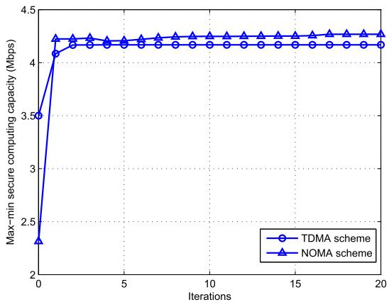

line

| Iterations | TDMA scheme | NOMA scheme |
| ---------- | ----------- | ----------- |
| 0          | 3.5         | 2.3         |
| 1          | 4.1         | 4.2         |
| 2          | 4.1         | 4.2         |
| 3          | 4.1         | 4.2         |
| 4          | 4.1         | 4.2         |
| 5          | 4.1         | 4.2         |
| 6          | 4.1         | 4.2         |
| 7          | 4.1         | 4.2         |
| 8          | 4.1         | 4.2         |
| 9          | 4.1         | 4.2         |
| 10         | 4.1         | 4.2         |
| 11         | 4.1         | 4.2         |
| 12         | 4.1         | 4.2         |
| 13         | 4.1         | 4.2         |
| 14         | 4.1         | 4.2         |
| 15         | 4.1         | 4.2         |
| 16         | 4.1         | 4.2         |
| 17         | 4.1         | 4.2         |
| 18         | 4.1         | 4.2         |
| 19         | 4.1         | 4.2         |
| 20         | 4.1         | 4.2         |

Fig. 3. The optimized trajectories for different schemes under different periods.

Fig. 5 shows the convergence performance of proposed Algorithms 1 and 2 for $T \ = \ 3 0 \ \mathrm { \ s } .$ . From the figure, the = 30proposed algorithms converge within 20 iterations. Furthermore, the performance of NOMA scheme is superior to that of TDMA scheme.

Fig. 6 shows the max-min secure computing capacity versus the average power budget $\bar { P } _ { k }$ of each TD under period $T =$ s. With the increase of $\bar { P } _ { k }$ =, the performance of all designs 30 kbecome better, and the NOMA scheme is superior to other cases. Note that for the lower values of $\bar { P } _ { k }$ (e.g., 0.2 W and k0.4 W), the TDMA scheme is worse than the benchmarks for NOMA scheme, which testifies the superior performance brought by NOMA scheme. While with the value of $\bar { P } _ { k }$ kincreasing, the TDMA scheme outperforms all the benchmarks because the BCD-based joint optimization algorithm is playing a critical role in improving the objective value.

In order to illustrate the effect of the required computing bits $Q _ { m }$ on our proposed systems, we plot the max-min msecure computing capacity versus $Q _ { m }$ in Fig. 7. From the mfigure, for each case, the max-min secure computing capacity first decreases slowly with $Q _ { m }$ because each TD possesses mthe ability of local computing. With $Q _ { m }$ further increasing, mthe demand of per TD for offloading is becoming intense for the sake of satisfying the required $Q _ { m }$ . Thus, TDs have to meet required $Q _ { m }$ min each time slot at the cost of mdecreasing the value of max-min secure computing capacity. In addition, we can observe that from Fig. 7, the gap between TDMA scheme and NOMA scheme is becoming large with increasing $Q _ { m } ,$ which indicates that the NOMA scheme have ma preferable performance in terms of achieving high-quality secure capacity. Certainly, it is worth mentioning that the TDMA scheme and NOMA scheme always outperform their corresponding benchmarks, which verifies that our proposed algorithms are effective.

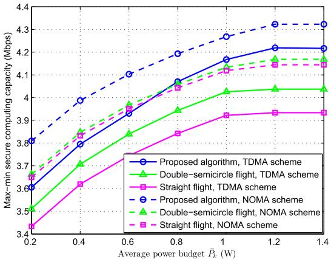

line

| Average power budget P̄k (W) | Proposed algorithm, TDMA scheme | Double-semicircle flight, TDMA scheme | Straight flight, TDMA scheme | Proposed algorithm, NOMA scheme | Double-semicircle flight, NOMA scheme | Straight flight, NOMA scheme |
| ---------------------------- | -------------------------------- | ------------------------------------- | ---------------------------- | -------------------------------- | ------------------------------------- | ---------------------------- |
| 0.2                          | 3.6                              | 3.5                                   | 3.4                          | 3.8                              | 3.7                                   | 3.6                          |
| 0.4                          | 3.8                              | 3.7                                   | 3.6                          | 4.0                              | 3.9                                   | 3.8                          |
| 0.6                          | 4.0                              | 3.9                                   | 3.8                          | 4.1                              | 4.0                                   | 3.9                          |
| 0.8                          | 4.1                              | 4.0                                   | 3.9                          | 4.2                              | 4.1                                   | 4.0                          |
| 1.0                          | 4.2                              | 4.1                                   | 4.0                          | 4.3                              | 4.2                                   | 4.1                          |
| 1.2                          | 4.2                              | 4.1                                   | 4.0                          | 4.3                              | 4.2                                   | 4.1                          |
| 1.4                          | 4.2                              | 4.1                                   | 4.0                          | 4.3                              | 4.2                                   | 4.1                          |

Fig. 4. The optimized speed for different schemes under different periods.

We illustrates the max-min secure computing capacity versus period $T$ in Fig. 8. In order to show the optimization performance of our proposed algorithms, we present the upper bound solution for both TDMA scheme and NOMA scheme, in which the speed of US and UJ is set to be sufficiently large. Thus, the US is always considered to be right above each TD and the UJ is always right above each eavesdropper. From Fig. 8, it is observed that the upper bound solution is optimal for each scheme because the UAVs always enjoy the best channels. With the increase of period T , the gap between the proposed algorithm and the upper bound solution is becoming small, becuase the freedom of trajectory optimization is becoming large. For a large value of $T _ { \ast }$ , the performance of the proposed algorithm is close to the upper bound solution. This phenomenon validates that the proposed algorithms own favourable optimization performance. Note that another two special cases named “no power control” and “no local computing” are also designed as benchmarks for both TDMA scheme and NOMA scheme. In no power control design, the transmit power is fixed at the peak power $p _ { k } [ n ] = 2 0$ dBm (i.e., the peak power) and $p _ { k } [ n ] = 1 0$ dBm, respectively. As for the k[ ] = 10no local computing design, each TD only offloads the task to the US for computing without any local computing by itself. From this picture, it is observed that the proposed algorithms outperform their corresponding benchmarks. With the increase of $T ,$ the values of the proposed algorithms and no power control designs are increasing because the UAVs are getting more degree of freedom on trajectory optimization, then the curves become smoothly due to the limited communication and computation resources of the systems.

In addition, it is interesting to observe from Fig. 8 that the case of no power control with peak power for NOMA scheme is worse than that for TDMA scheme, whereas the case of no power control with $p _ { k } [ n ] = 1 0$ dBm for NOMA scheme k[ ] = 10is better than that for TDMA scheme. This phenomenon manifests that the power control makes a significant effect in TDMA scheme and NOMA scheme. Furthermore, the case of no power control with peak power for TDMA scheme closes to the proposed algorithm for TDMA scheme because the fixed peak power provides sufficient power budget for TDMA scheme though the power control is not performed.

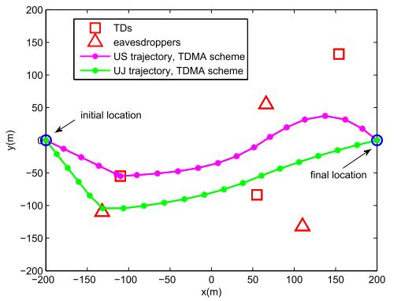

line

| x(m) | y(m) - TDs | y(m) - eavesdroppers | y(m) - US trajectory, TDMA scheme | y(m) - UJ trajectory, TDMA scheme |
|------|------------|------------------------|------------------------------------|------------------------------------|
| -200 | 0          | 0                      | 0                                  | 0                                  |
| -150 | -50        | -100                   | -50                                | -75                                |
| -100 | -50        | -100                   | -50                                | -100                               |
| 0    | -50        | -100                   | -50                                | -75                                |
| 50   | -50        | 50                     | 50                                 | -50                                |
| 100  | -50        | -100                   | 50                                 | -25                                |
| 150  | 125        | -100                   | 50                                 | 0                                  |
| 200  | 0          | 0                      | 0                                  | 0                                  |

(a)T= 10 s for TDMA scheme

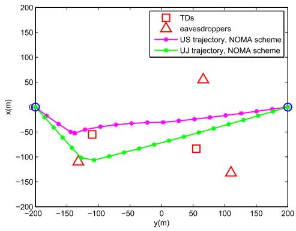

line

| y(m) | x(m) | Type                  |
|------|------|-----------------------|
| -200 | 0    | TDs                   |
| -150 | -50  | eavesdroppers         |
| -100 | -75  | TDs                   |
| -100 | -100 | eavesdroppers         |
| 0    | -75  | TDs                   |
| 50   | -75  | TDs                   |
| 100  | -50  | TDs                   |
| 100  | -150 | eavesdroppers         |
| 200  | 0    | TDs                   |
| 200  | 0    | eavesdroppers         |

(b) T=10 s for NOMA scheme

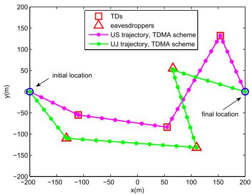

line

| x(m) | TDs  | eavesdroppers | US trajectory, TDMA scheme | UJ trajectory, TDMA scheme |
|------|------|----------------|----------------------------|----------------------------|
| -200 | 0    | 0              | 0                          | 0                          |
| -150 | -50  | -100           | -50                        | -100                       |
| -100 | -75  | -125           | -75                        | -125                       |
| 0    | -100 | -150           | -100                       | -150                       |
| 50   | -125 | -175           | -125                       | -175                       |
| 100  | -150 | -200           | -150                       | -200                       |
| 150  | 125  | 125            | 125                        | 125                        |
| 200  | 0    | 0              | 0                          | 0                          |

(c) T = 30 s for TDMA scheme

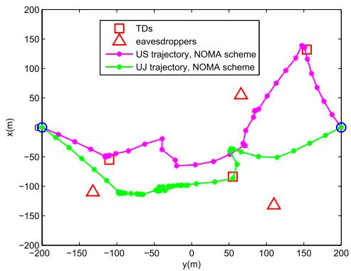

line

| y(m) | x(m) - TDs | x(m) - eavesdroppers | x(m) - US trajectory, NOMA scheme | x(m) - UJ trajectory, NOMA scheme |
|------|------------|------------------------|------------------------------------|------------------------------------|
| -200 | -100       | -100                   | -100                               | -100                               |
| -150 | -50        | -50                    | -50                                | -50                                |
| -100 | -100       | -100                   | -100                               | -100                               |
| -50  | -50        | -50                    | -50                                | -50                                |
| 0    | 0          | 0                      | 0                                  | 0                                  |
| 50   | 50         | 50                     | 50                                 | 50                                 |
| 100  | 100        | 100                    | 100                                | 100                                |
| 150  | 150        | 150                    | 150                                | 150                                |
| 200  | 200        | 200                    | 200                                | 200                                |

(d) T= 30 s for NOMA scheme

Fig. 5. The convergence performance of proposed algorithms for TDMA scheme and NOMA scheme.   
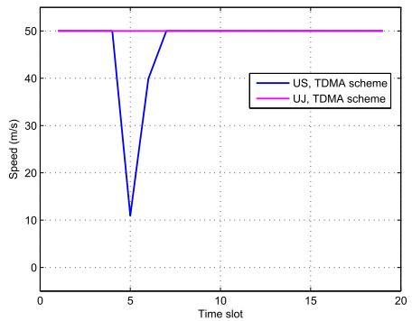

line

| Time slot | US, TDMA scheme | UJ, TDMA scheme |
| --------- | --------------- | --------------- |
| 0         | 50              | 50              |
| 5         | 10              | 50              |
| 6         | 40              | 50              |
| 7         | 50              | 50              |
| 18        | 50              | 50              |

(a)T=10 s for TDMA scheme

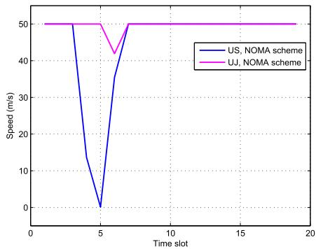

line

| Time slot | US, NOMA scheme | UJ, NOMA scheme |
| --------- | --------------- | --------------- |
| 0         | 50              | 50              |
| 5         | 0               | 50              |
| 10        | 50              | 50              |
| 15        | 50              | 50              |
| 20        | 50              | 50              |

(b) T=10 s for NOMA scheme

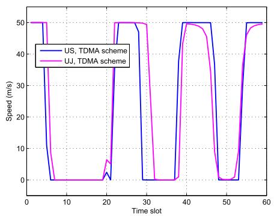

line

| Time slot | US, TDMA scheme | UJ, TDMA scheme |
| --------- | --------------- | --------------- |
| 0         | 50              | 50              |
| 5         | 0               | 0               |
| 10        | 0               | 0               |
| 15        | 0               | 0               |
| 20        | 0               | 0               |
| 25        | 50              | 50              |
| 30        | 50              | 50              |
| 35        | 0               | 0               |
| 40        | 50              | 50              |
| 45        | 50              | 50              |
| 50        | 0               | 0               |
| 55        | 50              | 50              |
| 60        | 50              | 50              |

(c)T= 30 s for TDMA scheme

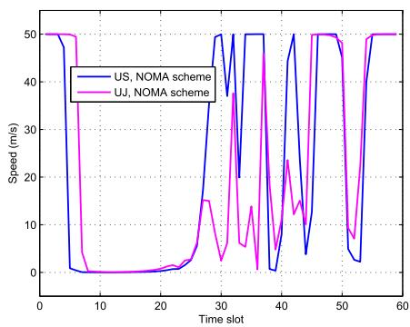

line

| Time slot | US, NOMA scheme | UJ, NOMA scheme |
| --------- | --------------- | --------------- |
| 0         | 50              | 50              |
| 10        | 0               | 0               |
| 20        | 0               | 0               |
| 30        | 50              | 15              |
| 40        | 50              | 50              |
| 50        | 50              | 50              |
| 60        | 50              | 50              |

(d) T= 30 s for NOMA scheme   
Fig. 6. The secure computing capacity comparison with the varying average power budget.

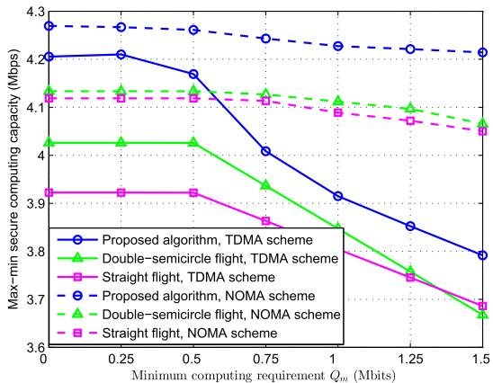

line

| Minimum computing requirement Qm (Mbits) | Proposed algorithm, TDMA scheme | Double-semicircle flight, TDMA scheme | Straight flight, TDMA scheme | Proposed algorithm, NOMA scheme | Double-semicircle flight, NOMA scheme | Straight flight, NOMA scheme |
| ---------------------------------------- | --------------------------------- | -------------------------------------- | ---------------------------- | -------------------------------- | -------------------------------------- | ---------------------------- |
| 0.00                                     | 4.20                              | 4.05                                   | 3.90                         | 4.30                             | 4.15                                   | 4.10                         |
| 0.25                                     | 4.20                              | 4.05                                   | 3.90                         | 4.30                             | 4.15                                   | 4.10                         |
| 0.50                                     | 4.18                              | 4.05                                   | 3.90                         | 4.30                             | 4.15                                   | 4.10                         |
| 0.75                                     | 4.05                              | 3.95                                   | 3.85                         | 4.25                             | 4.15                                   | 4.10                         |
| 1.00                                     | 3.90                              | 3.85                                   | 3.80                         | 4.25                             | 4.10                                   | 4.05                         |
| 1.25                                     | 3.85                              | 3.75                                   | 3.75                         | 4.25                             | 4.10                                   | 4.05                         |
| 1.50                                     | 3.80                              | 3.65                                   | 3.70                         | 4.25                             | 4.05                                   | 4.00                         |

Fig. 7. The secure computing capacity comparison with the varying required computing bits.

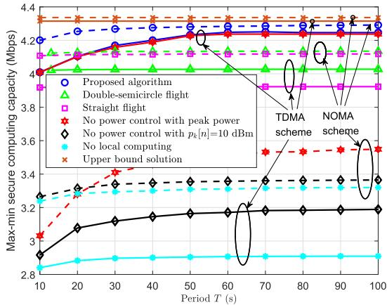

line

| Period T (s) | Proposed algorithm | Double-semicircle flight | Straight flight | No power control with peak power | No power control with p_k[n]=10 dBm | No local computing | Upper bound solution |
| ------------ | ------------------ | ------------------------ | --------------- | --------------------------------- | ------------------------------------ | ------------------- | -------------------- |
| 10           | 4.2                | 4.0                      | 3.9             | 3.0                               | 2.8                                  | 2.8                 | 4.4                  |
| 20           | 4.2                | 4.1                      | 3.9             | 3.3                               | 3.0                                  | 2.9                 | 4.4                  |
| 30           | 4.2                | 4.1                      | 3.9             | 3.4                               | 3.1                                  | 3.0                 | 4.4                  |
| 40           | 4.2                | 4.1                      | 3.9             | 3.5                               | 3.2                                  | 3.1                 | 4.4                  |
| 50           | 4.2                | 4.1                      | 3.9             | 3.6                               | 3.3                                  | 3.2                 | 4.4                  |
| 60           | 4.2                | 4.1                      | 3.9             | 3.7                               | 3.4                                  | 3.3                 | 4.4                  |
| 70           | 4.2                | 4.1                      | 3.9             | 3.8                               | 3.5                                  | 3.4                 | 4.4                  |
| 80           | 4.2                | 4.1                      | 3.9             | 3.9                               | 3.6                                  | 3.5                 | 4.4                  |
| 90           | 4.2                | 4.1                      | 3.9             | 4.0                               | 3.7                                  | 3.6                 | 4.4                  |
| 100          | 4.2                | 4.1                      | 3.9             | 4.1                               | 3.8                                  | 3.7                 | 4.4                  |

Fig. 8. The secure computing capacity comparison with the varying period.

In addition, it is observed that the performance of no local computing design is terrible since all the required task of TDs only can be computed by offloading. Certainly, based on (11) and (23), we can also readily obtain that the achievable maxmin secure computing capacity is Mbps for the case of “no 1task offloading” (namely only computing locally), which is worse than the case of no local computing. In this sense, our adopted partial offloading manner is preeminent. From the figure, the double-semicycle flight design outperforms the straight flight design for both TDMA and NOMA schemes, this is because that the UAVs in double-semicycle flight design have more potential to cover a wider area of interest. Last but not the least, for the double-semicycle flight design, it actually starts from T × m $\begin{array} { r } { T = \frac { 2 \pi \times 1 0 0 \mathrm { m } } { V ^ { \mathrm { m a x } } } = 1 2 . 5 7 \mathrm { s } } \end{array}$ so as to finish a complete = Vidouble-semicycle flight.

# VI. CONCLUSION

In this article, we studied the UAV-assisted MEC systems from the perspective of the physical layer security, where the minimum security computing capacity maximization problems for both TDMA scheme and NOMA scheme were investigated by jointly optimizing computation resources and computation resources as well as the trajectories of UAVs. In order to solve the highly coupled non-convex problems, the BCD-based algorithm and P-BCD based algorithm were developed for TDMA scheme and NOMA scheme, respectively. By analysis, we knew that the algorithm complexity of NOMA scheme

was higher than that of TDMA scheme, while the security performance of NOMA scheme was superior to that of TDMA scheme. Numerical results showed that the proposed algorithms achieved preferable security capacity compared with the benchmarks, which validated the effectiveness and provided valuable guidelines for the practical application. The results also indicated that the feasibility of the joint optimization method for solving the non-convex problems with multiple coupled variables. Based on our study, it is expected to extend the work to other interesting scenarios in future investigation. The issues, such as multiple UAV servers, imperfect CSI, and interference management, can be exploited.

# APPENDIX A TRANSFORMATION OF (30) INTO (33)

Let $\mathbf { z } = \{ \tau _ { k } [ n ] , \theta _ { 1 , k } [ n ] \}$ , we rewritten (30) as

$$
s _ {1, k} [ n ] + \frac {\left(\tau_ {k} [ n ] - \theta_ {1 , k} [ n ]\right) ^ {2}}{4} - f _ {1} (\mathbf {z}) \leq 0, \tag {75}
$$

where f z (τk[n]+θ1,k[n])2 . $\begin{array} { r } { f _ { 1 } ( \mathbf { z } ) = \frac { ( \tau _ { k } [ n ] + \theta _ { 1 , k } [ n ] ) ^ { 2 } } { { \cal A } } } \end{array}$

1( ) = 4 For any given feasible point $\begin{array} { r l r } { \mathbf { z } ^ { r } } & { { } = } & { \{ \tau _ { k } ^ { r } [ n ] , \theta _ { 1 , k } ^ { r } [ n ] \} } \end{array}$ , the convex function $f _ { 1 } ( \mathbf { z } )$ = k [ ] 1,k[ ]can be approximated to be a linear form $\tilde { f } _ { 1 } ( { \bf z } ^ { r } , { \bf z } )$ 1( )by the first-order Taylor expansion, given by

$$
\begin{array}{l} \tilde {f} _ {1} (\mathbf {z} ^ {r}, \mathbf {z}) = f _ {1} (\mathbf {z} ^ {r}) + 2 \Re \left\{\nabla f _ {1} ^ {H} (\mathbf {z} ^ {r}) (\mathbf {z} - \mathbf {z} ^ {r}) \right\} \\ = \frac {\left(\tau_ {k} ^ {r} [ n ] + \theta_ {1 , k} ^ {r} [ n ]\right) \left(\tau_ {k} [ n ] + \theta_ {1 , k} [ n ]\right)}{2} \\ - \frac {(\tau_ {k} ^ {r} [ n ] + \theta_ {1 , k} ^ {r} [ n ]) ^ {2}}{4}. \tag {76} \\ \end{array}
$$

Then, we rewritten (75) as

$$
\frac {(\tau_ {k} [ n ] - \theta_ {1 , k} [ n ]) ^ {2}}{4} - f _ {2} (\mathbf {z}) \leq 0, \tag {77}
$$

where $f _ { 2 } ( \mathbf { z } ) = \tilde { f } _ { 1 } ( \mathbf { z } ^ { r } , \mathbf { z } ) - s _ { 1 , k } [ n ]$ . Next, (77) can be equiva-2( ) = 1(lently transformed as

$$
\frac {\left(\tau_ {k} [ n ] - \theta_ {1 , k} [ n ]\right) ^ {2}}{4} + \frac {(f _ {2} (\mathbf {z}) - 1) ^ {2}}{4} \leq \frac {(f _ {2} (\mathbf {z}) + 1) ^ {2}}{4}. \tag {78}
$$

Via performing the square root of (78), we have

$$
\left| \left| \left[ \frac {\tau_ {k} [ n ] - \theta_ {1 , k} [ n ]}{2}, \frac {f _ {2} (\mathbf {z}) - 1}{2} \right] \right| \right| \leq \frac {f _ {2} (\mathbf {z}) + 1}{2}. \tag {79}
$$

Finally, by replacing $f _ { 2 } ( \mathbf { z } )$ and with the definition in (31), 2( )the SOC form of (33) is obtained.

# APPENDIX B

# TRANSFORMATION OF CONSTRAINT (40) INTO (42a)

For convenience of analysis, rewrite constraint (40) as follows,

$$
s _ {2, k} [ n ] \geq \tau_ {k} ^ {r} [ n ] \log_ {2} \left(1 + \frac {\gamma_ {k e , n} ^ {r}}{\frac {\gamma_ {e , n} ^ {r}}{H _ {j} ^ {2} + | | \mathbf {q} _ {j} [ n ] - \mathbf {w} _ {e} | | ^ {2}} + 1}\right). \tag {80}
$$

By introducing the auxiliary variable $\pi _ { 1 , e } [ n ]$ as the lower bound of γ2 ||qj −we||2 , and π n as the upper bound of $\frac { \gamma _ { e , n } ^ { \prime } } { H _ { i } ^ { 2 } + | | \mathbf { q } _ { j } [ n ] - \mathbf { w } _ { e } | | ^ { 2 } }$ re,n $\pi _ { 2 , e } [ n ]$ $H _ { j } ^ { 2 } + | | \mathbf { q } _ { j } [ \tilde { n ] } - \tilde { \mathbf { w } } _ { e } | | ^ { 2 }$ , the constraint (40) can be expressed as

$$
s _ {2, k} [ n ] \geq \tau_ {k} ^ {r} [ n ] \log_ {2} \left(1 + \frac {\gamma_ {k e , n} ^ {r}}{\pi_ {1 , e} [ n ] + 1}\right), \tag {81}
$$

and

$$
\pi_ {1, e} [ n ] \leq \frac {\gamma_ {e , n} ^ {r}}{\pi_ {2 , e} [ n ]}, \tag {82}
$$

$$
\pi_ {2, e} [ n ] \geq H _ {j} ^ {2} + | | \mathbf {q} _ {j} [ n ] - \mathbf {w} _ {e} | | ^ {2}. \tag {83}
$$

Note that the constraint (82) can be re-expressed as $\pi _ { 1 , e } [ n ] \pi _ { 2 , e } [ n ] \leq \gamma _ { e , n } ^ { r } .$ , thus (42b) is obtained. For (81), e,naccording to the logarithmic property, we have

$$
\begin{array}{l} \tau_ {k} ^ {r} [ n ] \log_ {2} \left(1 + \frac {\gamma_ {k e , n} ^ {r}}{\pi_ {1 , e} [ n ] + 1}\right) \\ = \tau_ {k} ^ {r} [ n ] \log_ {2} \left(\pi_ {1, e} [ n ] + \gamma_ {k e, n} ^ {r} + 1\right) \\ - \tau_ {k} ^ {r} [ n ] \log_ {2} \left(\pi_ {1, e} [ n ] + 1\right). \tag {84} \\ \end{array}
$$

Thus, by substituting (84) into (81), (42a) is obtained. Finally, we obtain the constraint (42a).

# REFERENCES

[1] W. Shi, J. Cao, Q. Zhang, Y. Li, and L. Xu, “Edge computing: Vision and challenges,” IEEE Internet Things J., vol. 3, no. 5, pp. 637–646, Oct. 2016.   
[2] J. Li, H. Chen, Y. Chen, Z. Lin, B. Vucetic, and L. Hanzo, “Pricing and resource allocation via game theory for a small-cell video caching system,” IEEE J. Sel. Areas Commun., vol. 34, no. 8, pp. 2115–2129, Aug. 2016.   
[3] S. Sarkar, S. Chatterjee, and S. Misra, “Assessment of the suitability of fog computing in the context of Internet of Things,” IEEE Trans. Cloud Comput., vol. 6, no. 1, pp. 46–59, Jan. 2018.   
[4] Y. Mao, C. You, J. Zhang, K. Huang, and K. B. Letaief, “A survey on mobile edge computing: The communication perspective,” IEEE Commun. Surveys Tuts., vol. 19, no. 4, pp. 2322–2358, 1st Quart., 2017.   
[5] Y. Zeng, R. Zhang, and T. J. Lim, “Wireless communications with unmanned aerial vehicles: Opportunities and challenges,” IEEE Commun. Mag., vol. 54, no. 5, pp. 36–42, May 2016.   
[6] Y. Zeng, J. Xu, and R. Zhang, “Energy minimization for wireless communication with rotary-wing UAV,” IEEE Trans. Wireless Commun., vol. 18, no. 4, pp. 2329–2345, Apr. 2019.   
[7] C. Zhan and H. Lai, “Energy minimization in Internet-of-Things system based on rotary-wing UAV,” IEEE Wireless Commun. Lett., vol. 8, no. 5, pp. 1341–1344, Oct. 2019.   
[8] T. Zhang, Y. Wang, Y. Liu, W. Xu, and A. Nallanathan, “Cacheenabling UAV communications: Network deployment and resource allocation,” IEEE Trans. Wireless Commun., early access, Jul. 31, 2020, doi: 10.1109/TWC.2020.3011881.   
[9] X. Zhou, Q. Wu, S. Yan, F. Shu, and J. Li, “UAV-enabled secure communications: Joint trajectory and transmit power optimization,” IEEE Trans. Veh. Technol., vol. 68, no. 4, pp. 4069–4073, Apr. 2019.   
[10] C. You and R. Zhang, “3D trajectory optimization in Rician fading for UAV-enabled data harvesting,” IEEE Trans. Wireless Commun., vol. 18, no. 6, pp. 3192–3207, Jun. 2019.   
[11] M. Hua, Y. Wang, C. Li, Y. Huang, and L. Yang, “UAV-aided mobile edge computing systems with one by one access scheme,” IEEE Trans. Green Commun. Netw., vol. 3, no. 3, pp. 664–678, Sep. 2019.   
[12] Q. Hu, Y. Cai, G. Yu, Z. Qin, M. Zhao, and G. Y. Li, “Joint offloading and trajectory design for UAV-enabled mobile edge computing systems,” IEEE Internet Things J., vol. 6, no. 2, pp. 1879–1892, Apr. 2019.   
[13] J. Zhang et al., “Stochastic computation offloading and trajectory scheduling for UAV-assisted mobile edge computing,” IEEE Internet Things J., vol. 6, no. 2, pp. 3688–3699, Apr. 2019.   
[14] J. Xiong, H. Guo, and J. Liu, “Task offloading in UAV-aided edge computing: Bit allocation and trajectory optimization,” IEEE Commun. Lett., vol. 23, no. 3, pp. 538–541, Mar. 2019.

[15] T. Zhang, Y. Xu, J. Loo, D. Yang, and L. Xiao, “Joint computation and communication design for UAV-assisted mobile edge computing in IoT,” IEEE Trans. Ind. Informat., vol. 16, no. 8, pp. 5505–5516, Aug. 2020.   
[16] Z. Ding, X. Lei, G. K. Karagiannidis, R. Schober, J. Yuan, and V. K. Bhargava, “A survey on non-orthogonal multiple access for 5G networks: Research challenges and future trends,” IEEE J. Sel. Areas Commun., vol. 35, no. 10, pp. 2181–2195, Oct. 2017.   
[17] T. Zhang, Z. Wang, Y. Liu, W. Xu, and A. Nallanathan, “Caching placement and resource allocation for cache-enabling UAV NOMA networks,” IEEE Trans. Veh. Technol., early access, Aug. 11, 2020, doi: 10.1109/TVT.2020.3015578.   
[18] J. Tang et al., “Energy efficiency optimization for NOMA with SWIPT,” IEEE J. Sel. Topics Signal Process., vol. 13, no. 3, pp. 452–466, Jun. 2019.   
[19] Z. Ding, P. Fan, and H. V. Poor, “Impact of non-orthogonal multiple access on the offloading of mobile edge computing,” IEEE Trans. Commun., vol. 67, no. 1, pp. 375–390, Jan. 2019.   
[20] F. Cui, Y. Cai, Z. Qin, M. Zhao, and G. Y. Li, “Multiple access for mobile-UAV enabled networks: Joint trajectory design and resource allocation,” IEEE Trans. Commun., vol. 67, no. 7, pp. 4980–4994, Jul. 2019.   
[21] Y. Liu, Z. Qin, Y. Cai, Y. Gao, G. Y. Li, and A. Nallanathan, “UAV communications based on non-orthogonal multiple access,” IEEE Wireless Commun., vol. 26, no. 1, pp. 52–57, Feb. 2019.   
[22] T. Hou, Y. Liu, Z. Song, X. Sun, and Y. Chen, “Multiple antenna aided NOMA in UAV networks: A stochastic geometry approach,” IEEE Trans. Commun., vol. 67, no. 2, pp. 1031–1044, Feb. 2019.   
[23] N. Zhao et al., “Joint trajectory and precoding optimization for UAVassisted NOMA networks,” IEEE Trans. Commun., vol. 67, no. 5, pp. 3723–3735, May 2019.   
[24] J. Ye, C. Zhang, H. Lei, G. Pan, and Z. Ding, “Secure UAV-to-UAV systems with spatially random UAVs,” IEEE Wireless Commun. Lett., vol. 8, no. 2, pp. 564–567, Apr. 2019.   
[25] G. Zhang, Q. Wu, M. Cui, and R. Zhang, “Securing UAV communications via joint trajectory and power control,” IEEE Trans. Wireless Commun., vol. 18, no. 2, pp. 1376–1389, Feb. 2019.   
[26] M. Hua, Y. Wang, Q. Wu, H. Dai, Y. Huang, and L. Yang, “Energyefficient cooperative secure transmission in Multi-UAV-Enabled wireless networks,” IEEE Trans. Veh. Technol., vol. 68, no. 8, pp. 7761–7775, Aug. 2019.   
[27] N. Zhao et al., “Caching UAV assisted secure transmission in hyperdense networks based on interference alignment,” IEEE Trans. Commun., vol. 66, no. 5, pp. 2281–2294, May 2018.   
[28] F. Cheng, G. Gui, N. Zhao, Y. Chen, J. Tang, and H. Sari, “UAV-Relaying-Assisted secure transmission with caching,” IEEE Trans. Commun., vol. 67, no. 5, pp. 3140–3153, May 2019.   
[29] C. Zhong, J. Yao, and J. Xu, “Secure UAV communication with cooperative jamming and trajectory control,” IEEE Commun. Lett., vol. 23, no. 2, pp. 286–289, Feb. 2019.   
[30] R. Ma, W. Yang, Y. Zhang, J. Liu, and H. Shi, “Secure mmWave communication using UAV-enabled relay and cooperative jammer,” IEEE Access, vol. 7, pp. 119729–119741, 2019.   
[31] L. Xiao, Y. Xu, D. Yang, and Y. Zeng, “Secrecy energy efficiency maximization for UAV-enabled mobile relaying,” IEEE Trans. Green Commun. Netw., vol. 4, no. 1, pp. 180–193, Mar. 2020.   
[32] A. Li, Q. Wu, and R. Zhang, “UAV-enabled cooperative jamming for improving secrecy of ground wiretap channel,” IEEE Wireless Commun. Lett., vol. 8, no. 1, pp. 181–184, Feb. 2019.   
[33] Y. Cai, F. Cui, Q. Shi, M. Zhao, and G. Y. Li, “Dual-UAV-Enabled secure communications: Joint trajectory design and user scheduling,” IEEE J. Sel. Areas Commun., vol. 36, no. 9, pp. 1972–1985, Sep. 2018.   
[34] T. Bai, J. Wang, Y. Ren, and L. Hanzo, “Energy-efficient computation offloading for secure UAV-Edge-Computing systems,” IEEE Trans. Veh. Technol., vol. 68, no. 6, pp. 6074–6087, Jun. 2019.   
[35] W. Wu, F. Zhou, R. Q. Hu, and B. Wang, “Energy-efficient resource allocation for secure NOMA-enabled mobile edge computing networks,” IEEE Trans. Commun., vol. 68, no. 1, pp. 493–505, Jan. 2020.   
[36] Enhanced LTE support for aerial vehicles. Accessed: Jul. 16, 2017. [Online]. Available:ftp://www.3gpp.org/specs/archive/36\_series/36.777   
[37] T. D. Hoang, L. B. Le, and T. Le-Ngoc, “Energy-efficient resource allocation for D2D communications in cellular networks,” IEEE Trans. Veh. Technol., vol. 65, no. 9, pp. 6972–6986, Sep. 2016.   
[38] H. Xing, L. Liu, and R. Zhang, “Secrecy wireless information and power transfer in fading wiretap channel,” IEEE Trans. Veh. Technol., vol. 65, no. 1, pp. 180–190, Jan. 2016.

[39] X. Cao, F. Wang, J. Xu, R. Zhang, and S. Cui, “Joint computation and communication cooperation for energy-efficient mobile edge computing,” IEEE Internet Things J., vol. 6, no. 3, pp. 4188–4200, Jun. 2019.   
[40] J. Hu, M. Jiang, Q. Zhang, Q. Li, and J. Qin, “Joint optimization of UAV position, time slot allocation, and computation task partition in multiuser aerial mobile-edge computing systems,” IEEE Trans. Veh. Technol., vol. 68, no. 7, pp. 7231–7235, Jul. 2019.   
[41] S. Boyd and L. Vandenberghe, Convex Optimization, Cambridge, U.K.: Cambridge Univ. Press, Mar. 2004.   
[42] M. Grant and S. Boyd. (2016). CVX: MATLAB Software for Disciplined Convex Programming. [Online]. Available: http: //cvxr.com/cvx   
[43] Q. Shi and M. Hong, “Penalty dual decomposition method with application in signal processing,” in Proc. IEEE Int. Conf. Acoust., Speech Signal Process. (ICASSP), Mar. 2017, pp. 1–5.   
[44] D. P. Bertsekas, Nonlinear Programming, 2nd ed. Belmont, MA, USA: Athena Scientific, 1999.   
[45] K.-Y. Wang, A. M.-C. So, T.-H. Chang, W.-K. Ma, and C.-Y. Chi, “Outage constrained robust transmit optimization for multiuser MISO downlinks: Tractable approximations by conic optimization,” IEEE Trans. Signal Process., vol. 62, no. 21, pp. 5690–5705, Nov. 2014.

natural_image

Portrait of a man wearing glasses and formal attire against a blue background (no text or symbols visible)

Yu Xu received the B.S. degree from the Information Engineering School, Jiangxi University of Science and Technology, Ganzhou, China, in 2015, and the M.S. degree from the Information Engineering School, Nanchang University, Nanchang, China, in 2019. He is currently pursuing the Ph.D. degree with the School of Information and Communication Engineering, Beijing University of Posts and Telecommunications, Beijing, China. His research interests include mobile edge computing, UAV communications, and wireless resource management.

natural_image

Portrait of a man wearing glasses and a white shirt (no text or symbols visible)

Tiankui Zhang (Senior Member, IEEE) received the B.S. degree in communication engineering and the Ph.D. degree in information and communication engineering from the Beijing University of Posts and Telecommunications (BUPT), China, in 2003 and 2008, respectively. He is currently a Professor with the School of Information and Communication Engineering, BUPT. His research interests include wireless communication networks, intelligent mobile edge computing and caching, signal processing for wireless communications, and content centric wire-

less networks. He has published more than 100 papers, including journal articles in IEEE JOURNAL ON SELECTED AREAS IN COMMUNICATIONS, IEEE TRANSACTIONS ON COMMUNICATIONS, and so on, and conference papers, such as IEEE GLOBECOM and IEEE ICC.

natural_image

Portrait photo of a man wearing glasses and a checkered shirt against a blue background (no text or symbols visible)

Dingcheng Yang (Member, IEEE) received the B.S. degree in electronic engineering and the Ph.D. degree in space physics from Wuhan University in 2006 and 2012, respectively. He is currently a Professor with the Information Engineering School, Nanchang University. He has published over 50 papers, including journal articles in IEEE TRANSACTIONS ON VEHICULAR TECHNOLOGY and conference papers in conferences, such as IEEE GLOBECOM. His research interests include cooperation communications, the IoT/cyber-physical sys-

tems, UAV communications, and wireless resource management.

natural_image

Portrait of a man in business attire with glasses (no visible text or symbols)

Yuanwei Liu (Senior Member, IEEE) received the B.S. and M.S. degrees from the Beijing University of Posts and Telecommunications in 2011 and 2014, respectively, and the Ph.D. degree in electrical engineering from the Queen Mary University of London, U.K., in 2016.

He was with the Department of Informatics, King’s College London, from 2016 to 2017, where he was a Post-Doctoral Research Fellow. He has been a Lecturer (Assistant Professor) with the School of Electronic Engineering and Computer Science,

Queen Mary University of London, since 2017. His research interests include 5G and beyond wireless networks, the Internet of Things, machine learning, and stochastic geometry. He has served as a TPC Member for many IEEE conferences, such as GLOBECOM and ICC. He received the Exemplary Reviewer Certificate of IEEE WIRELESS COMMUNICATIONS LETTERS in 2015, IEEE TRANSACTIONS ON COMMUNICATIONS in 2016 and 2017, and IEEE TRANSACTIONS ON WIRELESS COMMUNICATIONS in 2017 and 2018. He has served as the Publicity Co-Chair for VTC 2019-Fall. He is an Editor on the Editorial Board of the IEEE TRANSACTIONS ON COMMUNICA-TIONS, IEEE COMMUNICATIONS LETTERS, and IEEE ACCESS. He serves as a Guest Editor for IEEE JOURNAL OF SELECTED TOPICS IN SIGNAL PROCESSING (JSTSP) Special Issue on Signal Processing Advances for Non-Orthogonal Multiple Access in Next Generation Wireless Networks.

natural_image

Portrait of a woman wearing glasses and a dark blazer (no text or symbols visible)

Meixia Tao (Fellow, IEEE) received the B.S. degree in electronic engineering from Fudan University, Shanghai, China, in 1999, and the Ph.D. degree in electrical and electronic engineering from The Hong Kong University of Science and Technology in 2003.

She is currently a Professor with the Department of Electronic Engineering, Shanghai Jiao Tong University, China. Her current research interests include wireless caching, edge computing, physical-layer multicasting, and resource allocation.

Dr. Tao has served as a member for the Executive Editorial Committee of IEEE TRANSACTIONS ON WIRELESS COMMUNICATIONS from 2015 to 2019. She was a recipient of the 2019 IEEE Marconi Prize Paper Award, the 2013 IEEE Heinrich Hertz Award for Best Communications Letters, the IEEE/CIC International Conference on Communications in China (ICCC) 2015 Best Paper Award, and the International Conference on Wireless Communications and Signal Processing (WCSP) 2012 Best Paper Award. She received the 2009 IEEE ComSoc Asia-Pacific Outstanding Young Researcher Award. She serves as an Editor-at-Large for IEEE OPEN JOURNAL OF THE COMMUNICATIONS SOCIETY. She was also on the Editorial Board of several other journals as an Editor or a Guest Editor, including IEEE TRANSACTIONS ON COMMUNICATIONS and IEEE JOURNAL ON SELECTED AREAS IN COMMUNICATIONS. She has served as the Symposium Oversight Chair for IEEE ICC 2019, the Symposium Co-Chair of IEEE GLOBECOM 2018 and IEEE ICC 2015, and the TPC Chair of IEEE/CIC ICCC 2014.