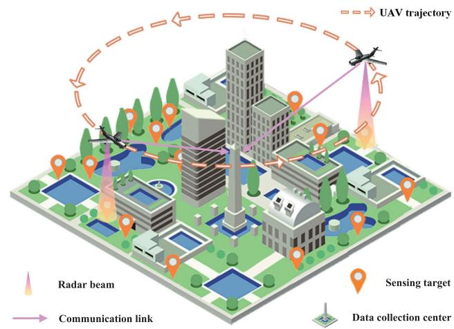
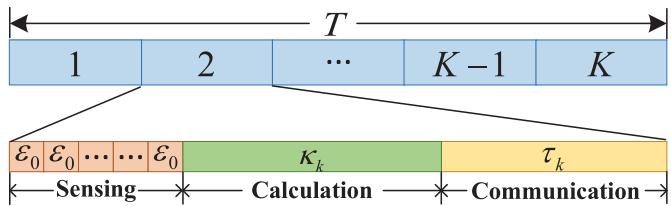
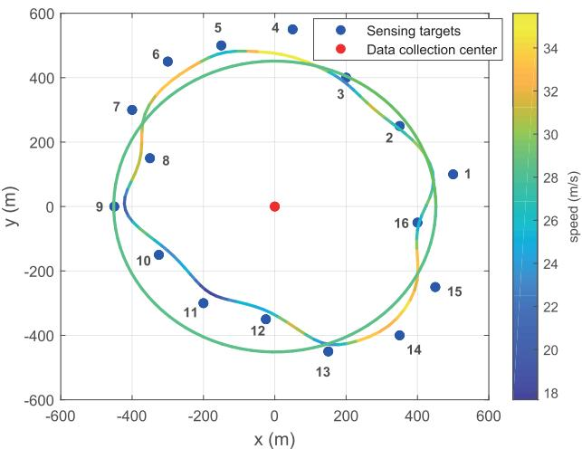
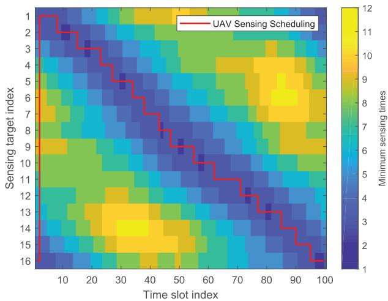
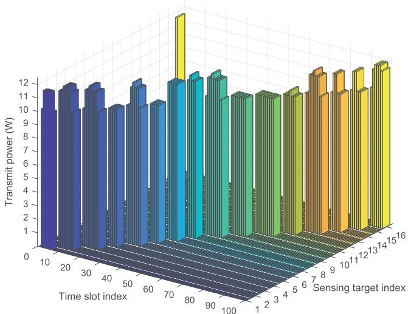
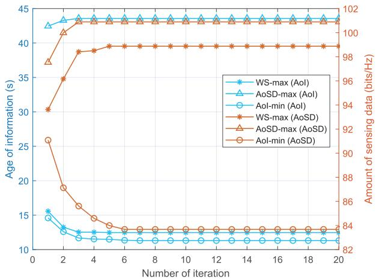
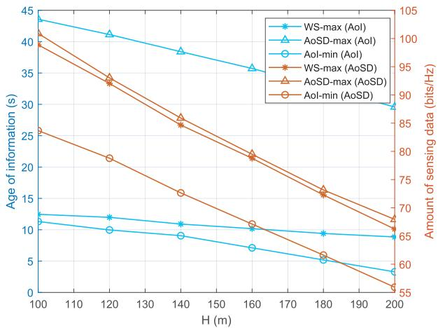
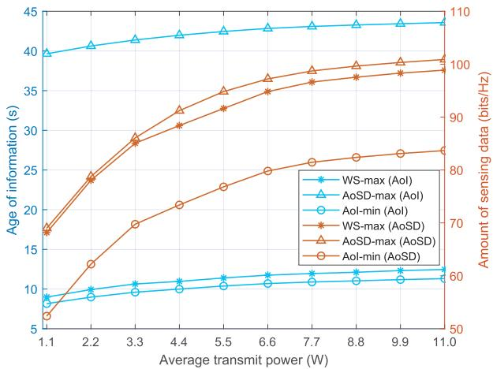
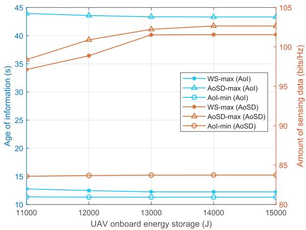
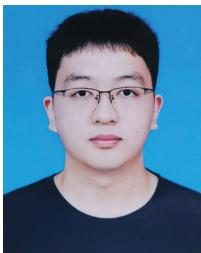

# Joint Sensing and Age of Information Optimization for Energy Constrained UAV-Assisted Integrated Sensing, Calculation, and Communication

Zechen Liu , Graduate Student Member, IEEE, Xin Liu , Senior Member, IEEE, Wenyi Yang, and Xueyan Zhang

Abstract— Owing to the advantages of high mobility, low cost, and on-demand deployment, uncrewed aerial vehicles (UAVs) can serve as triple-function aerial service platforms, providing sensing, calculation, and communication services for ground users in remote areas or emergencies. In this paper, a UAV-assisted integrated sensing, calculation, and communication (ISCC) system is proposed, where the UAV detects and processes the status information of the sensing target, and then sends the calculation results to the data collection center. In order to evaluate the performance of ISCC system, the age of information (AoI) and the radar estimation rate are introduced to define the freshness and amount of sensing data, respectively. Taking into account the UAV energy limitations, the amount of sensing data is maximized while the AoI is minimized through jointly optimizing the sensing scheduling, sensing times, transmit power, operating frequency, and motion parameters of the UAV under the constraint of radar signal-to-noise ratio (SNR). The formulated mixed-integer nonlinear programming problem is decomposed into five subproblems, and the optimal solutions can be achieved by proposing an alternating optimization (AO)-based five-stages optimization algorithm to optimize these subproblems iteratively. Simulation results show that both the sensing performance and information freshness of the system can be effectively improved by optimizing the UAV parameters.

Index Terms— UAV, ISCC, AoI, radar estimation rate, resource allocation, motion parameters optimization.

## I. INTRODUCTION

DUE to their outstanding capabilities in terms of mobility,rapid deployment, and wide-area coverage, uncrewed rapid deployment, and wide-area coverage, uncrewed aerial vehicles (UAVs) have found extensive applications in many fields such as smart agriculture, smart cities, intelligent transportation, etc [1], [2], [3], [4]. Such application scenarios implement the closed-loop control for information flow, including the collection and processing of sensing data, as well as the transmission of deterministic control commands [5]. Therefore, robust sensing capabilities, real-time computing capacity, and extremely low transmission latency are required [6]. Unlike traditional radar and communication equipment, integrated sensing and communication (ISAC) technology enables sensing and communication to share the same wireless equipment and frequency band, thus reducing equipment redundancy and improving spectrum utilization efficiency. It enables energy-constrained and payload-limited UAVs to achieve sensing and communication functions more efficiently [7].

The prior researches on UAV-assisted ISAC systems have demonstrated that employing UAV to support ISAC can effectively leverage the advantages of both and achieve mutual benefits. In [8], Chen et al. proposed an ISAC system for a cooperative sensing UAV network, which used a novel metric known as the upper-bound average cooperative sensing area (UB-ACSA) to measure cooperative sensing performance. And the optimal UB-ACSA was achieved by optimizing beam sharing with specialized antennas. In [9], Wang et al. proposed a multi-UAV network that simultaneously served communication users and sensing targets. The authors introduced a joint optimizing algorithm to address the complex optimization problem of UAV location, user association, and transmit power control, aiming to maximize network utility while maintaining localization accuracy. In [10], Liang et al. proposed a UAV enabled sensing assisted communication system. By jointly optimizing the frame structure, beamwidth, and power allocation, the average spectral efficiency was maximized, ultimately achieving a performance improvement of over 70% with the assistance of sensing function. In [11], Hu et al. proposed a novel cellular-connected UAV system that utilized the ISAC technology to sense foreign objects and provide high-resolution situational awareness, and the UAV propulsion energy was minimized by presenting an innovative trajectory planning algorithm. In [12], Liu et al. used radar mutual information (MI) to measure the sensing performance of a UAV-assisted ISAC system. The authors optimized UAV scheduling, transmit power, and UAV trajectory to maximize both UAV energy efficiency and minimum radar MI, in order to achieve sensing fairness. In [13], Meng et al. proposed a UAV-assisted periodic ISAC system, where the achievable rate was maximized by jointly optimizing user association, sensing scheduling, transmit beamforming vectors and UAV trajectory under the constraint of quality of service (QoS). In [14], Lyu et al. proposed a dual-functional UAVenabled ISAC system, where the communication throughput and sensing beampattern gain were both maximized by jointly optimizing UAV deployment location and UAV transmit beamforming vectors. In [15], Zhang et al. proposed a multi-UAV collaborative detection system with ISAC functions. The authors employed a deep learning-based trajectory planning and resource allocation algorithm to maximize sensing scores and ensure geographical fairness among targets, while meeting the quality requirements for radar sensing and communication.

The above studies primarily consider throughput as a quantitative metric when optimizing system communication performance. However, for a UAV-assisted ISAC system, it is also of particular importance to maintain the timeliness of sensing data [16], [17]. To assess the freshness of sensing data, a novel metric known as the age of information (AoI) was introduced in [18] for performance evaluation and analysis. There have been several researches on AoI of UAV assisted ISAC system. In [19], Zhang et al. proposed a cellular internet of UAV system, in which the UAVs were equipped with ISAC equipments capable of performing sensing tasks and transmitting sensing data to a base station. The authors proposed an iterative algorithm to minimize the AoI by optimizing UAV scheduling, working time and trajectory. In [20], Wu et al. designed an ISAC protocol to coordinate multiple UAVs for the same sensing task in a UAV-to-Device system. The authors used multi-agent deep reinforcement learning for trajectory design to minimize the AoI of the UAVs. In [21], Yang et al. proposed a UAV-assisted intelligent vehicle system, where the UAV served as an aerial platform to monitor ground transportation network. The authors provided an accurate modeling of the adversarial relationship between legitimate UAV and attacker, and minimized the AoI of the UAV-assisted networks through the Stackelberg game method. In [22], Jiang et al. proposed a UAV-enabled multi-view ISAC framework, where the average peak AoI was minimized by jointly optimizing the UAV sensing times, target visiting scheduling, UAV trajectory, UAV service time, and UAV transmit power. In [23], Zhan et al. proposed a UAV-assisted multi-cell cellular network, where the UAV detected ground information and transmitted the sensing data to the base station. The authors achieved a flexible tradeoff between operation time and AoI for the UAV through a complex deep reinforcement learning method.

The aforementioned studies primarily focus on performance enhancements achieved by optimizing various performance indicators in the UAV assisted ISAC system, but they do not consider potential computational issues within the system. There are few studies on UAV-enabled integrated sensing, calculation, and communication (ISCC) system. In [24], Xu et al. proposed a treble-functional UAV-assisted ISCC network, where the UAV served as an aerial platform to detect ground targets, performed local computation, and allocated uncompleted calculation tasks to ground access nodes. The authors proposed a joint optimization algorithm to achieve the Pareto boundary between computational capacity and sensing beam gain. In [25], Huang et al. proposed a UAV-ISAC aided mobile edge computing system, where the data collecting time and UAV energy consumption were both minimized by jointly optimizing the number of time slots, sensing scheduling, transmit power, and UAV trajectory. In [26], Shu et al. proposed a UAV-enabled corona detection system, where the average amount of data sensed by the UAV was maximized by jointly optimizing image acquisition frequency, image depth selection, task allocation, power control and local calculation resource allocation through a dueling deep Q-learning method. In [27], Li et al. proposed an ISCC system powered by digital twins, where the UAVs were deployed to perform edge computing tasks. The authors minimized both the beam pattern performance of the radar and the energy consumption of computation offloading by proposing a multi-agent proximal strategy optimization framework to solve the formulated multi-objective optimization problem. However, [24], [25], [26], [27] only considered the information transmission of UAVs in ISCC system, while overlooking the timeliness of information for the ISCC. Meanwhile, [24], [25], [26] did not take into account the power consumption of the UAV, which is crucial for UAVs with limited energy.

In this paper, we propose an energy-constrained UAVassisted ISCC model, where the UAV is deployed as a triple-function aerial platform, providing sensing, calculation, and communication services to both the ground sensing targets and the data collection center. We aim to maximize both the amount of sensing data and the freshness of target sensing information by taking into account radar detection performance indicators, communication transmission performance indicators, and UAV energy constraints. The contributions of this paper are summarized as follow.

• An energy-limited UAV-assisted ISCC model is established, in which the UAV flies over the target area to perform sensing, calculation and communication tasks. We achieve the amount of sensing data by introducing radar estimation rate from the perspective of information theory. Meanwhile, we introduce AoI as a metric to assess the freshness of sensing data.

• To improve performance and timeliness of UAV radar sensing, we formulate a joint optimization problem to maximize the amount of sensing data while minimizing the AoI of sensing data by jointly optimizing UAV sensing scheduling, sensing times, transmit power, operating frequency and motion parameters.

• The complex mix-integer nonlinear programming optimization problem is divided into five subproblems: sensing scheduling optimization, sensing times optimization, transmit power optimization, operating frequency optimization and motion parameters optimization. Based on the Lagrange multiplier method, Lagrangian duality method, sub-gradient descent method, contraction method, and successive convex approximation (SCA) method, we propose an alternating optimization (AO)- based five-stages iterative optimization algorithm to get the optimal solutions to the initial optimization problem.

  
Fig. 1. System model.

The rest of this paper is organized as follows. In Section II, we propose an energy constrained UAV-assisted ISCC model and provide a detailed explanation of the ISCC process involving UAV sensing, calculation, and communication. In Section III, we introduce the amount of sensing data to evaluate sensing performance and the AoI to assess the freshness of sensing data. We then formulate an optimization problem aimed at maximizing amount of sensing data while minimizing the AoI of sensing data. In Section IV, we propose an AObased five-stages iterative optimization algorithm to solve the initial optimization problem. In Section V, we present and analyze numerical simulation results. In Section VI, we draw the conclusions of the paper.

## II. SYSTEM MODEL

## A. Scenario Description

As shown in Fig. 1, we consider a UAV-assisted suburban target detection system, which consists of a data collection center, a single UAV and Q sensing targets. Among them, the data collection center is located in the center of the city, and the sensing targets are scattered in the suburbs around the city. Due to the obstruction of urban buildings, the data collection center cannot directly detect the target. Therefore, in order to quickly obtain the status information of each sensing target, it is necessary to deploy a highly mobile UAV to perform the detection task. This requires the UAV to have sensing and communication functions. Additionally, in order to improve the efficiency of the data collection center, the UAV has calculation function to preprocess the sensing data.

Without loss of generality, we assume that the energy-limited UAV with constant flight cycle time $T$ and flight altitude H is deployed to perform ISCC task in a time-division multiplexed (TDM) manner. When the UAV radar detects a sensing target and its echo signal-to-noise ratio (SNR) exceeds the minimum sensing threshold, the UAV triggers an optimized ISCC mode. During a single time slot, the UAV continuously detects the target multiple times to improve the probability of successful sensing, then, merges the sensing data obtained from these repeated detections and transmits the fusion calculation results to the data collection center for further analysis and utilization. Note that the more detection times, the higher the probability of successful sensing, but it also leads to a longer duration of data processing. Hence, in order to maintain the freshness of sensing data, the detection time should be moderate. Furthermore, we decompose the flight cycle time T into K time slots with the same time interval of $\begin{array} { r } { \dot { \delta } _ { t } = \frac { T } { K } } \end{array}$ . Specifically, $\delta _ { t }$ needs to meet the basic time requirements for sensing, calculation and communication, and should also be short enough so that the position of the UAV relative to the ground target can be approximately equal in each time slot. Fig. 2 depicts the UAV slots structure within a flight cycle time T , where each time slot is partitioned into three stages: UAV sensing, UAV calculation, and UAV communication. Further elaboration on these stages will be provided in Section II-B, II-C, and II-D.

  
Fig. 2. Slots structure.

For ease of expression, let $q \in \mathcal { Q } = \{ 1 , 2 , \dots , Q \}$ denote the index of sensing targets, $s _ { q } = [ x _ { q } , y _ { q } , 0 ]$ be the location of the q-th sensing target, and $s _ { c } = [ x _ { c } , y _ { c } , 0 ]$ be the location of the data collection center. Furthermore, we denote the location of the UAV by $s _ { u } ( k ) ~ = ~ [ x _ { u } ( k ) , y _ { u } ( k ) , H ]$ , the velocity of the UAV by $\boldsymbol { v } ( \boldsymbol { k } ) ~ = ~ [ v _ { x } ( \boldsymbol { k } ) , v _ { y } ( \boldsymbol { k } ) , 0 ]$ , where $k \in \mathcal { K } = \{ 1 , 2 , \dots , K \}$ . Considering that the UAV trajectory is completely closed, its initial and final motion states should be consistent, which can be expressed as

$$
s _ { u } ( 1 ) = s _ { u } ( K )
$$

$$
v ( 1 ) = v ( K )\tag{1}
$$

(2)

For the fixed-wing UAV, in order to ensure that the wings can provide sufficient lift to prevent it from crashing, the flight speed should be greater than the minimum value $v _ { \mathrm { m i n } }$ . Meanwhile, limited by the mechanical and kinematic limitations, the UAV has a maximum acceleration $a _ { \mathrm { m a x } } .$ a maximum flight speed $v _ { \mathrm { m a x } }$ , and a regular motion state as follows

$$
v _ { m i n } \leq \| v ( k ) \| \leq v _ { \operatorname* { m a x } } , \quad \forall k\tag{3}
$$

$$
\| v ( k + 1 ) - v ( k ) \| \leq a _ { \operatorname* { m a x } } , \quad \forall k\tag{4}
$$

$$
s _ { u } ( k + 1 ) = s _ { u } ( k ) + v ( k ) \delta _ { t } , \quad \forall k\tag{5}
$$

where ∥x∥ represents the $L _ { 2 }$ norm of x.

## B. UAV Sensing

In the UAV sensing stage, the UAV will take time $\varepsilon _ { 0 }$ as its single sensing interval to detect the q-th target for multiple times at time slot k. Due to the high flight altitude, there is no occlusion between the UAV and the ground target. As a result, the UAV-to-ground detection link can be regarded as a line-of-sight (LoS) link, and the power gain between the UAV and the q-th target can be derived from the radar equation in free space [28], which can be expressed as

$$
h _ { r a d } ^ { q } ( k ) = \frac { G _ { t } G _ { r } c ^ { 2 } \sigma } { \left( 4 \pi \right) ^ { 3 } f _ { 0 } ^ { 2 } d _ { q } ^ { 4 } ( k ) } , \quad \forall k\tag{6}
$$

where $G _ { t }$ and $G _ { r }$ denote the antenna gains of the UAV transmitter and receiver, respectively; c and $f _ { 0 }$ denote the speed of light and signal carrier frequency, respectively; $d _ { q } ( k ) =$ $\| s _ { u } ( k ) - s _ { q } \|$ represents the distance from the UAV to the $q -$ th target.

Specifically, we assume that the UAV can detect the q-th target only when the SNR of the received radar echo from the q-th target is higher than the detectable threshold $\Gamma _ { \mathrm { m i n } }$ , which can be expressed as

$$
\Gamma _ { r a d } ^ { q } ( k ) \geq \Gamma _ { \operatorname* { m i n } } , \quad \forall k\tag{7}
$$

where $\begin{array} { r } { \Gamma _ { r a d } ^ { q } ( k ) = \frac { P _ { r a d } ^ { q } ( k ) h _ { r a d } ^ { q } ( k ) } { N _ { 0 } B } } \end{array}$ denotes the SNR over the radar channel, $P _ { r a d } ^ { q } ( k )$ denotes the transmit power of the UAV radar at the sensing period of time slot k.

In order to indicate the sensing state of the UAV at a certain time slot, we introduce a binary variable $\alpha _ { q } ( k )$ to denote the sensing scheduling of the UAV. If the UAV detects q-th target at time slot k, $\alpha _ { q } ( k )$ will be set to 1, otherwise, it will be set to 0. Specifically, in order to improve the probability of successful sensing and the efficiency of fusion calculation, we make the assumption that the UAV can only detect one target in each time slot, which can be expressed as

$$
\sum _ { q = 1 } ^ { Q } \alpha _ { q } ( k ) = 1 , \quad \forall k\tag{8}
$$

In order to measure the amount of sensing data while maintaining the consistency of sensing, calculation and communication measurement units, we introduce a novel metric based on information theory, known as the radar estimation rate. This metric can effectively reflect the amount of target sensing information contained in the radar echo signal. The higher the radar estimation rate, the more the sensing data contained in the radar echo. Based on [29] and [30], the radar estimation rate of the UAV for the q-th target at time slot k can be expressed as

$$
R _ { r a d } ^ { q } ( k ) = \log _ { 2 } \biggl ( 1 + \Gamma _ { r a d } ^ { q } ( k ) \biggr ) , \quad \forall k , q\tag{9}
$$

According to [19], [31], and [32], when the UAV detects the q-th target once at time slot k, the probability of successful sensing can be expressed as

$$
\mathcal { P } _ { q } ( k ) = e ^ { - \mu d _ { q } ( k ) } , \quad \forall k\tag{10}
$$

where $\mu$ is a positive parameter to indicate the quality of the sensing, which is related to the environment and radar characteristics. For convenience, we introduce a integer variable $\omega _ { q } ( k )$ to represent the number of UAV detections for q-th target at time slot k. When the UAV detects the q-th target for $\omega _ { q } ( k )$ times, the probability of successful sensing can be denoted as

$$
\mathcal { P } _ { q } ( k ) = 1 - \bigg ( 1 - \mathcal { P } _ { q } ( k ) \bigg ) ^ { \omega _ { q } ( k ) } , \quad \forall k\tag{11}
$$

Furthermore, to ensure the performance of radar sensing, the probability of successful sensing by multiple detections should exceed the minimum successful probability $\mathcal { P } _ { m i n }$ , i.e.,

$$
{ \mathcal { P } } _ { q } ( k ) \geq { \mathcal { P } } _ { m i n } , \quad \forall k\tag{12}
$$

## C. UAV Calculation

In the UAV calculation stage, the UAV will take time $\kappa _ { k }$ to process the sensing data of q-th target at time slot k. The data processing chip of the UAV will combine the sensing data streams from multiple radar detections into one data stream containing more accurate target sensing information. Therefore, this fusion calculation of sensing data not only improves the accuracy of sensing results, but also decreases the amount of sensing data sent to the data collection center, providing a more reliable basis for real-time decision-making.

According to [33], the factors that determine the calculation speed mainly include the frequency of the central processing unit (CPU) and the number of CPU cycles required to process each bit of one calculation task. Due to the hardware design limitations, the CPU has a maximum operating frequency limit, and its operating frequency $f _ { c } ( k )$ at each time slot k should satisfy

$$
0 \leq f _ { c } ( k ) \leq f _ { c } ^ { \operatorname* { m a x } } , \quad \forall k\tag{13}
$$

Let $C _ { j }$ indicate the required number of CPU cycles to process one bit of each calculation task. Then, after time $\kappa _ { k } .$ the amount of calculated data for q-th target at time slot k can be expressed as

$$
C _ { q } ( k ) = \kappa _ { k } \frac { f _ { c } ( k ) } { C _ { j } } , \quad \forall k\tag{14}
$$

In order to fully utilize sensing data and ensure the integrity of fusion calculations, the calculation capacity of the UAV in each time slot should exceed the sensing capacity, which can be denoted as

$$
C _ { q } ( k ) \geq \omega _ { q } ( k ) C _ { s e n } ^ { q } ( k ) , \quad \forall k\tag{15}
$$

where $C _ { s e n } ^ { q } ( k ) = \varepsilon _ { 0 } R _ { r a d } ^ { q } ( k )$ denotes the amount of sensing data from a single detection.

## D. UAV Communication

In the UAV communication stage, the UAV will take time $\tau _ { k }$ to transmit the fusion calculation result to the data collection center at time slot k. Similar to the radar channel, the communication channel can also be regarded as a LoS link. Hence, the channel power gain from the UAV to the data collection center can be expressed as

$$
h _ { c o m } ^ { c } ( k ) = \frac { G _ { t } G _ { c } c ^ { 2 } } { \left( 4 \pi \right) ^ { 2 } f _ { 0 } ^ { 2 } d _ { c } ^ { 2 } ( k ) } , \quad \forall k\tag{16}
$$

where $G _ { c }$ denotes the receiving antenna gain of the data collection center, and $d _ { c } ( k ) = \| s _ { u } ( k ) - s _ { c } \|$ represents the distance from the UAV to the data collection center.

Hence, under the appropriate transmit power $P _ { c o m } ^ { c } ( k )$ , the information rate from the UAV to the data collection center at time slot k can be expressed as

$$
R _ { c o m } ^ { c } ( k ) = \log _ { 2 } \bigg ( 1 + \frac { P _ { c o m } ^ { c } ( k ) h _ { c o m } ^ { c } ( k ) } { N _ { 0 } B } \bigg ) , \quad \forall k\tag{17}
$$

In order to guarantee that the data collection center can receive the complete UAV calculation results, the information capacity transmitted to the data collection center should be greater than the amount of calculation results. Specifically, we assume that after the data fusion calculation, the size of the calculation results is the same as the amount of sensing data obtained in a single detection. Hence, the inequality constraint can be expressed as

$$
C _ { c o m } ^ { c } ( k ) \geq C _ { s e n } ^ { q } ( k ) , \quad \forall k\tag{18}
$$

where $\begin{array} { c c l } { C _ { c o m } ^ { c } ( k ) } & { = } & { \tau _ { k } R _ { c o m } ^ { c } ( k ) } \end{array}$ denotes the information capacity transmitted to the data collection center at the communication stage of time slot k.

## E. UAV Energy Consumption

Due to the limited energy storage of the UAV, we must take into account the energy consumption of the UAV and impose constraints to ensure that the UAV can complete its designated task. For the fixed-wing UAV with ISCC function, the energy consumption mainly includes four parts: sensing, calculation, communication and flight propulsion. When the UAV detects the $q \mathrm { - }$ th target for $\omega _ { q } ( k )$ times at time slot k, the UAV sensing energy consumption of the UAV can be expressed as

$$
E _ { s } ( k ) = \omega _ { q } ( k ) \varepsilon _ { 0 } P _ { r a d } ^ { q } ( k ) , \quad \forall k , q\tag{19}
$$

According to [33] and [34], when the UAV’s CPU operates at the frequency of $f _ { c } ( k )$ for the time of $\kappa _ { k } .$ , the UAV calculation energy consumption at time slot k can be expressed as

$$
E _ { c } ( k ) = \vartheta f _ { c } ^ { 3 } ( k ) \kappa _ { k } , \quad \forall k\tag{20}
$$

where $\vartheta$ denotes the effective capacitance coefficient of CPU, which is a constant related to the CPU architecture.

Similarly, when the UAV takes the time of $\tau _ { k }$ to transmit calculation results to the data collection center with the transmit power of $P _ { c o m } ^ { c } ( k )$ , the UAV communication energy consumption at time slot k can be expressed as

$$
E _ { t } ( k ) = \tau _ { k } P _ { c o m } ^ { c } ( k ) , \quad \forall k\tag{21}
$$

Furthermore, based on [35], when the UAV flies at a variable speed $v ( k )$ , the UAV propulsion energy consumption at time slot k can be expressed as

$$
E _ { f } ( k ) = \delta _ { t } \Biggl ( c _ { 1 } \left\| v ( k ) \right\| ^ { 3 } + \frac { c _ { 2 } } { \left\| v ( k ) \right\| } ( 1 + \frac { \left\| v ( k ) - v ( k - 1 ) \right\| ^ { 2 } } { g ^ { 2 } } ) \Biggr )\tag{22}
$$

where $c _ { 1 }$ and $c _ { 2 }$ are relevant variables related to the UAV hardware specifications and flight environment, and $g$ is the gravity acceleration, which is a constant.

Considering that the energy of the UAV is limited, in order to ensure that the UAV can effectively perform the ISCC task within a flight cycle time $T ,$ the energy consumption of the UAV needs to be less than the onboard energy threshold $E _ { U }$ i.e.,

$$
\sum _ { k = 1 } ^ { K } \bigg ( E _ { s } ( k ) + E _ { c } ( k ) + E _ { t } ( k ) + E _ { f } ( k ) \bigg ) \leq E _ { U }\tag{23}
$$

## F. Age of Information

In this system, the status of the sensing target continually changes over time, and the data collection center needs to acquire the latest sensing data to analyze the real-time status of the target. Consequently, we employ AoI to signify the freshness of sensing information. It is worth noting that the value of AoI depends on both UAV calculation process and information transmission process. The more time they consume, the higher the AoI of the sensing information in each time slot. Then, the AoI of the sensing data in time slot k can be expressed as

$$
\Delta _ { k } = \kappa _ { k } + \tau _ { k } , \quad \forall k\tag{24}
$$

In order to ensure that the sensing information in each time slot can be fully uploaded to the data collection center, the UAV needs to perform sensing, calculation and communication processes within a single time slot. Therefore, the slot time should satisfy

$$
\omega _ { q } ( k ) \varepsilon _ { 0 } + \kappa _ { k } + \tau _ { k } \leq \delta _ { t } , \quad \forall k\tag{25}
$$

## III. PROBLEM FORMULATION

## A. Radar Sensing Data Maximization

In order to obtain more accurate sensing result, we seek to maximize the amount of sensing data by jointly optimizing UAV sensing scheduling $\textbf { A } = \ \{ \alpha _ { q } ( k ) , \forall k \}$ , UAV sensing times $\textbf { W } ~ = ~ \{ \omega _ { q } ( k ) , \forall k \}$ , UAV transmit power $\mathrm { ~ \bf ~ P ~ } = \{ P _ { r a d } ^ { q } ( k ) , P _ { c o m } ^ { c } ( k ) , \dot { \forall } k \}$ , UAV operating frequency $\begin{array} { r c l } { \mathbf { F } } & { = } & { \{ f _ { c } ( k ) , \forall k \} } \end{array}$ and UAV motion parameters ${ \textbf { S } } =$ $\{ s _ { u } ( k ) , v ( k ) , \forall k \}$ . The optimization problem is formulated as

$$
\operatorname* { m a x } _ { \mathbf { A } , \mathbf { W } , \mathbf { P } , \mathbf { F } , \mathbf { S } } \sum _ { k = 1 } ^ { K } \sum _ { q = 1 } ^ { Q } \alpha _ { q } ( k ) C _ { s e n } ^ { q } ( k )\tag{26a}
$$

$$
{ \mathrm { s . t . } } ( 1 ) \sim ( 5 ) , ( 7 ) , ( 8 ) , ( 1 2 ) , ( 1 3 ) , ( 1 5 ) , ( 1 8 ) , ( 2 3 ) , ( 2 5 )\tag{26b}
$$

$$
0 \leq \frac { 1 } { K } \sum _ { k = 1 } ^ { K } P _ { c o m } ^ { c } ( k ) \leq P _ { c o m } ^ { a v g } , \quad \forall k\tag{26c}
$$

$$
0 \leq \frac { 1 } { K } \sum _ { k = 1 } ^ { K } P _ { r a d } ^ { q } ( k ) \leq P _ { r a d } ^ { a v g } , \quad \forall k\tag{26d}
$$

where $P _ { r a d } ^ { a v g }$ and $P _ { c o m } ^ { a v g }$ represent the average transmit power of the UAV for sensing and communication in each time slot, respectively.

By solving problem (26), we can attain the maximum amount of sensing data in a single detection. As multiple sensing data streams from various detections are fused into a single data stream by UAV calculation, a higher objective function value corresponds to a greater amount of sensing data transmitted to the data collection center. However, increased sensing data also implies longer calculation and transmission time, potentially resulting in decreased freshness of the sensing information.

## B. Age of Information Minimization

In order to increase the freshness of sensing information, we seek to minimize the AoI of sensing data by jointly optimizing A, W, P, F and S. The optimization problem is given by

$$
\underset { \mathbf { A } , \mathbf { W } , \mathbf { P } , \mathbf { F } , \mathbf { S } } { \operatorname* { m i n } } \quad \sum _ { k = 1 } ^ { K } \Delta _ { k }\tag{27a}
$$

$$
\mathrm { s . t . } ( 2 6 \mathrm { b } ) \sim ( 2 6 \mathrm { d } )\tag{27b}
$$

By solving problem (27), we can achieve the freshest sensing data during a UAV flight cycle. However, the reduction in calculation and communication time may lead to a decrease in the amount of sensing data uploaded to the data collection center, resulting in a potential reduction in sensing accuracy.

## C. Problem Integration

In order to obtain more sensing data while increasing the freshness of sensing information, we seek to maximize the weighted sum of sensing data volume and AoI by jointly optimizing A, W, P, F and S. The joint optimization problem is given by

$$
\underset { { \substack { \mathbf { A } , \mathbf { W } , \mathbf { P } , \mathbf { F } , \mathbf { S } } } { \operatorname* { m a x } } } { \sum } \quad \sum _ { k = 1 } ^ { K } \sum _ { q = 1 } ^ { Q } \alpha _ { q } ( k ) \bigg ( C _ { s e n } ^ { q } ( k ) + \beta \Delta _ { k } \bigg )\tag{28a}
$$

$$
\mathrm { s . t . } \alpha _ { q } ( k ) \in \{ 0 , 1 \} , \forall k\tag{28b}
$$

$$
\sum _ { q = 1 } ^ { Q } \alpha _ { q } ( k ) = 1 , \quad \forall k\tag{28c}
$$

$$
\Gamma _ { r a d } ^ { q } ( k ) \geq \Gamma _ { \mathrm { m i n } } , \quad \forall k\tag{28d}
$$

$$
{ \mathcal { P } } _ { q } ( k ) \geq { \mathcal { P } } _ { m i n } , \quad \forall k\tag{28e}
$$

$$
\omega _ { q } ( k ) \varepsilon _ { 0 } + \kappa _ { k } + \tau _ { k } \leq \delta _ { t } , \quad \forall k\tag{28f}
$$

$$
C _ { q } ( k ) \geq \omega _ { q } ( k ) C _ { s e n } ^ { q } ( k ) , \quad \forall k\tag{28g}
$$

$$
C _ { c o m } ^ { c } ( k ) \geq C _ { s e n } ^ { q } ( k ) , \quad \forall k\tag{28h}
$$

$$
0 \leq \frac { 1 } { K } \sum _ { k = 1 } ^ { K } P _ { c o m } ^ { c } ( k ) \leq P _ { c o m } ^ { a v g } , \quad \forall k\tag{28i}
$$

$$
0 \leq \frac { 1 } { K } \sum _ { k = 1 } ^ { K } P _ { r a d } ^ { q } ( k ) \leq P _ { r a d } ^ { a v g } , \quad \forall k\tag{28j}
$$

$$
0 \leq f _ { c } ( k ) \leq f _ { c } ^ { \operatorname* { m a x } } , \quad \forall k\tag{28k}
$$

$$
s _ { u } ( 1 ) = s _ { u } ( K )\tag{28l}
$$

$$
v ( 1 ) = v ( K )\tag{28m}
$$

$$
v _ { m i n } \leq \| v ( k ) \| \leq v _ { \operatorname* { m a x } } , \quad \forall k\tag{28n}
$$

$$
\| v ( k + 1 ) - v ( k ) \| \leq a _ { \operatorname* { m a x } } , \quad \forall k\tag{28o}
$$

$$
s _ { u } ( k + 1 ) = s _ { u } ( k ) + v ( k ) \delta _ { t } , \quad \forall k\tag{28p}
$$

$$
\sum _ { k = 1 } ^ { K } \bigg ( E _ { s } ( k ) + E _ { c } ( k ) + E _ { t } ( k ) + E _ { f } ( k ) \bigg ) \leq E _ { U }\tag{28q}
$$

where $\beta$ is a negative weight coefficient used to balance the sensing data volume and AoI.

## IV. SOLUTION ALGORITHM

Due to the discrete and non-convex nature of the objective function and constraints, solving the mixed-integer optimization problem (28) directly is a challenging task. Therefore, in this section, we decompose the original optimization problem (28) into five subproblems: UAV sensing scheduling optimization, UAV sensing times optimization, UAV transmit power optimization, UAV operating frequency optimization and UAV motion parameters optimization. Then, we employ the Lagrange multiplier method, Lagrangian duality method, sub-gradient descent method, contraction method, and the SCA method to solve them. Finally, we proposed an AO-based five-stages optimization algorithm to obtain the solutions by iteratively handling these five subproblems.

## A. UAV Sensing Scheduling Optimization

Since sensing scheduling does not directly affect the value of $\Delta _ { k }$ , we only set A as an optimization variable. In order to obtain the solution of A, we first need to convert the discrete variable $\alpha _ { q } ( k )$ into a continuous variable $\widetilde { \alpha } _ { q } ( k ) ~ \in ~ [ 0 , 1 ]$ Then, we relax the equality constraint (28c) into an inequality constraint. Therefore, for the fixed W, P, F and S, the UAV sensing scheduling optimization problem is given as

$$
\operatorname* { m a x } _ { \mathbf { A } } \ \sum _ { k = 1 } ^ { K } \sum _ { q = 1 } ^ { Q } \widetilde { \alpha _ { q } } ( k ) \bigg ( C _ { s e n } ^ { q } ( k ) + \beta \Delta _ { k } \bigg )\tag{29a}
$$

$$
\mathrm { s . t . } 0 \leq \widetilde { \alpha } _ { q } ( k ) \leq 1 , \forall k\tag{29b}
$$

$$
\sum _ { q = 1 } ^ { Q } \widetilde { \alpha } _ { q } ( k ) \leq 1 , \quad \forall k\tag{29c}
$$

$$
\widetilde { \alpha } _ { q } ( k ) \Gamma _ { r a d } ^ { q } ( k ) \geq \widetilde { \alpha } _ { q } ( k ) \Gamma _ { \operatorname* { m i n } } , \quad \forall k\tag{29d}
$$

$$
\widetilde { \alpha } _ { q } ( k ) \mathcal { P } _ { q } ( k ) \geq \widetilde { \alpha } _ { q } ( k ) \mathcal { P } _ { m i n } , \quad \forall k\tag{29e}
$$

$$
\widetilde { \alpha } _ { q } ( k ) C _ { q } ( k ) \geq \widetilde { \alpha } _ { q } ( k ) \omega _ { q } ( k ) C _ { s e n } ^ { q } ( k ) , \quad \forall k\tag{29f}
$$

$$
\widetilde { \alpha } _ { q } ( k ) C _ { c o m } ^ { c } ( k ) \geq \widetilde { \alpha } _ { q } ( k ) C _ { s e n } ^ { q } ( k ) , \quad \forall k\tag{29g}
$$

$$
0 \leq \frac { 1 } { K } \sum _ { k = 1 } ^ { K } \widetilde { \alpha } _ { q } ( k ) P _ { r a d } ^ { q } ( k ) \leq P _ { r a d } ^ { a v g } , \quad \forall k\tag{29h}
$$

which is a convex optimization problem, where the unknown continuous variable $\widetilde { \alpha } _ { q } ( k )$ can be solved directly using CVX.

However, it is worth noting that we also need to restore the solved $\widetilde { \alpha } _ { q } ( k )$ to the discrete variable $\alpha _ { q } ( k )$ . Hence, among $\alpha _ { q } ( k )$ for $k = 1 , 2 , \ldots , K$ , we set the largest $\widetilde { \alpha } _ { q } ( k )$ to 1 and the remaining $\widetilde { \alpha } _ { q } ( k )$ to 0. Then, we can get the binary integer solution of A.

## B. UAV Sensing Times Optimization

In order to facilitate the solution of W, we set $\omega _ { q } ( k )$ to be an integer variable within $[ 1 , \frac { \delta _ { t } } { \varepsilon _ { 0 } } ]$ . Then, with the fixed UAV task scheduling A, UAV transmit power P, UAV operating frequency F and UAV motion parameters S, the UAV sensing times optimization problem is given as

$$
\operatorname* { m a x } _ { \mathbf { W } , \kappa _ { k } , \tau _ { k } } \quad \sum _ { k = 1 } ^ { K } \sum _ { q = 1 } ^ { Q } \alpha _ { q } ( k ) \biggl ( C _ { s e n } ^ { q } ( k ) + \beta \Delta _ { k } \biggr )\tag{30a}
$$

$$
\mathrm { s . t . } \omega _ { q } ( k ) \in \{ 1 , 2 , 3 , \ldots , \frac { \delta _ { t } } { \varepsilon _ { 0 } } \} , \forall k\tag{30b}
$$

$$
\kappa _ { k } \geq 0 , \tau _ { k } \geq 0 , \quad \forall k\tag{30c}
$$

$$
\omega _ { q } ( k ) \varepsilon _ { 0 } + \kappa _ { k } + \tau _ { k } \leq \delta _ { t } , \quad \forall k\tag{30d}
$$

$$
1 - ( 1 - e ^ { - \mu d _ { q } ( k ) } ) ^ { \omega _ { q } ( k ) } \geq \mathcal { P } _ { m i n } , \quad \forall k\tag{30e}
$$

$$
C _ { q } ( k ) \geq \omega _ { q } ( k ) C _ { s e n } ^ { q } ( k ) , \quad \forall k\tag{30f}
$$

$$
C _ { c o m } ^ { c } ( k ) \geq C _ { s e n } ^ { q } ( k ) , \quad \forall k\tag{30g}
$$

$$
\sum _ { k = 1 } ^ { K } \bigg ( E _ { s } ( k ) + E _ { c } ( k ) + E _ { t } ( k ) + E _ { f } ( k ) \bigg ) \leq E _ { U }\tag{30h}
$$

where (30b) and (30c) denote the value range of variables $\omega _ { q } ( k ) , \kappa _ { k }$ , and $\tau _ { k }$ . Obviously, problem (30) is convex and can be solved directly by the CVX Mosek.

## C. UAV Transmit Power Optimization

Due to the existence of $\Delta _ { k }$ in the objective function, we set $\mathbf { P } , \kappa _ { k }$ , and $\tau _ { k }$ as the optimization variables. Then, with the fixed UAV task scheduling A, UAV sensing times W, UAV operating frequency F and UAV motion parameters S, the UAV transmit power optimization problem can be given as

$$
\underset { { \bf P } , \kappa _ { k } , \tau _ { k } } { \operatorname* { m a x } } \ : \sum _ { k = 1 } ^ { K } \sum _ { q = 1 } ^ { Q } \alpha _ { q } ( k ) \bigg ( \varepsilon _ { 0 } R _ { r a d } ^ { q } ( k ) + \beta \Delta _ { k } \bigg )\tag{31a}
$$

$$
\mathrm { s . t . } \frac { P _ { r a d } ^ { q } ( k ) h _ { r a d } ^ { q } ( k ) } { N _ { 0 } B } \geq \Gamma _ { m i n }\tag{31b}
$$

$$
{ \kappa } _ { k } \frac { f _ { c } ( k ) } { C _ { j } } \geq \omega _ { q } ( k ) \varepsilon _ { 0 } R _ { r a d } ^ { q } ( k )\tag{31c}
$$

$$
\tau _ { k } R _ { c o m } ^ { c } ( k ) \geq \varepsilon _ { 0 } R _ { r a d } ^ { q } ( k )\tag{31d}
$$

$$
0 \leq \frac { 1 } { K } \sum _ { k = 1 } ^ { K } P _ { r a d } ^ { q } ( k ) \leq P _ { r a d } ^ { a v g } , \quad \forall k\tag{31e}
$$

$$
0 \leq \frac { 1 } { K } \sum _ { k = 1 } ^ { K } P _ { c o m } ^ { c } ( k ) \leq P _ { c o m } ^ { a v g } , \quad \forall k\tag{31f}
$$

$$
\sum _ { k = 1 } ^ { K } \bigg ( E _ { s } ( k ) + E _ { c } ( k ) + E _ { t } ( k ) + E _ { f } ( k ) \bigg ) \leq E _ { u }\tag{31g}
$$

$$
\omega _ { q } ( k ) \varepsilon _ { 0 } + \kappa _ { k } + \tau _ { k } \leq \delta _ { t } , \quad \forall k\tag{31h}
$$

which is a non-convex optimization problem, where the variables P and $\Delta _ { k }$ are highly coupled. Thus, a closed-form solution for P and $\Delta _ { k }$ cannot be obtained directly. We need to convert the non-convex constraints (31c) and (31d) into linear forms to solve.

For any local points of $P _ { r a d } ^ { ( i ) } ( k ) , P _ { c o m } ^ { ( i ) } ( k ) , \kappa _ { k } ^ { ( i ) }$ and $\tau _ { k } ^ { \left( i \right) }$ , the variables $R _ { r a d } ^ { q } ( k ) , \tau _ { k } R _ { c o m } ^ { c } \dot { ( k ) }$ , and $E _ { t } ( k )$ can be respectively rewritten as

$$
R _ { r a d } ^ { u p } ( k ) = R _ { q , r a d } ^ { ( i ) } ( k ) + \xi _ { q , r a d } ^ { ( i ) } ( P _ { r a d } ^ { q } ( k ) - P _ { r a d } ^ { ( i ) } ( k ) ) ,\tag{∀k}
$$

$$
\tau _ { k } R _ { c o m } ^ { u p } ( k ) = \tau _ { k } R _ { c , c o m } ^ { ( i ) } ( k ) + R _ { c o m } ^ { ( i ) } ( k ) ( \tau _ { k } - \tau _ { k } ^ { ( i ) } )\tag{32}
$$

$$
+ \tau _ { k } \xi _ { c , c o m } ^ { ( i ) } ( P _ { c o m } ^ { c } ( k ) - P _ { c o m } ^ { ( i ) } ( k ) ) ,\tag{33}
$$

$$
E _ { t } ^ { u p } ( k ) = \tau _ { k } ^ { ( i ) } P _ { c o m } ^ { ( i ) } ( k ) + \tau _ { k } ^ { ( i ) } ( P _ { c o m } ^ { c } ( k ) - P _ { c o m } ^ { ( i ) } ( k ) )
$$

$$
+ P _ { c o m } ^ { ( i ) } ( k ) ( \tau _ { k } - \tau _ { k } ^ { ( i ) } ) , \quad \forall k\tag{34}
$$

where,

$$
R _ { q , r a d } ^ { ( i ) } ( k ) = \log _ { 2 } \biggl ( 1 + \frac { P _ { r a d } ^ { ( i ) } ( k ) h _ { r a d } ^ { q } ( k ) } { N _ { 0 } B } \biggr ) , \quad \forall k\tag{35}
$$

$$
\xi _ { q , r a d } ^ { ( i ) } = \frac { h _ { r a d } ^ { q } ( k ) } { \ln 2 ( N _ { 0 } B + P _ { r a d } ^ { ( i ) } ( k ) h _ { r a d } ^ { q } ( k ) ) } , \quad \forall k\tag{36}
$$

$$
R _ { c , c o m } ^ { ( i ) } ( k ) = \log _ { 2 } \biggl ( 1 + \frac { P _ { r a d } ^ { ( i ) } ( k ) h _ { r a d } ^ { q } ( k ) } { N _ { 0 } B } \biggr ) , \quad \forall k\tag{37}
$$

$$
\xi _ { c , c o m } ^ { ( i ) } = \frac { h _ { c o m } ^ { c } ( k ) } { \ln 2 ( N _ { 0 } B + P _ { c o m } ^ { ( i ) } ( k ) h _ { c o m } ^ { c } ( k ) ) } ,\tag{38}
$$

Hence, the optimization problem (31) can be reformulated as

$$
\underset { { \bf P } , \kappa _ { k } , \tau _ { k } } { \operatorname* { m a x } } \ : \sum _ { k = 1 } ^ { K } \sum _ { q = 1 } ^ { Q } \alpha _ { q } ( k ) \bigg ( \varepsilon _ { 0 } R _ { r a d } ^ { q } ( k ) + \beta \Delta _ { k } \bigg )\tag{39a}
$$

$$
\mathrm { s . t . } C _ { q } ( k ) \geq \omega _ { q } ( k ) \varepsilon _ { 0 } R _ { r a d } ^ { u p } ( k )
$$

$$
\tau _ { k } ^ { ( i ) } R _ { c o m } ^ { u p } ( k ) \geq \varepsilon _ { 0 } R _ { r a d } ^ { u p } ( k )\tag{39b}
$$

$$
\sum _ { k = 1 } ^ { K } \bigg ( E _ { s } ( k ) + E _ { c } ( k ) + E _ { t } ^ { u p } ( k ) + E _ { f } ( k ) \bigg ) \leq E _ { u }\tag{39c}
$$

$$
( 3 1 \mathrm { b } ) , ( 3 1 \mathrm { e } ) , ( 3 1 \mathrm { f } ) , ( 3 1 \mathrm { h } )\tag{39d}
$$

(39e)

which is convex and can be solved by the CVX iteratively. which is convex and can be solved by the CVX iteratively.

In particular, when the UAV calculation and communication time is fixed, we can obtain the closed-form solutions of $P _ { c o m } ^ { c } ( k )$ and $P _ { r a d } ^ { q } ( k )$ . For ease of derivation, we introduce six non-negative Lagrange multipliers $\theta _ { 1 } ~ \sim ~ \theta _ { 6 }$ for constraints (31b)∼ (31g), respectively. Then, the Lagrange function for problem (31) with the fixed $\kappa _ { k }$ and $\tau _ { k }$ can be formulated as

$$
L ( \mathbf { P } , \theta _ { 1 } , \theta _ { 2 } , \theta _ { 3 } , \theta _ { 4 } , \theta _ { 5 } , \theta _ { 6 } )
$$

$$
= \sum _ { k = 1 } ^ { K } \sum _ { q = 1 } ^ { Q } a _ { q } ( k ) ( 1 - ( \theta _ { 2 } + \theta _ { 3 } ) \omega _ { q } ( k ) ) \varepsilon _ { 0 } R _ { r a d } ^ { q } ( k )
$$

$$
+ \sum _ { k = 1 } ^ { K } \sum _ { q = 1 } ^ { Q } a _ { q } ( k ) \theta _ { 1 } \frac { P _ { r a d } ^ { q } ( k ) h _ { r a d } ^ { q } ( k ) } { N _ { 0 } B } + \sum _ { k = 1 } ^ { K } \sum _ { q = 1 } ^ { Q } a _ { q } ( k ) \theta _ { 3 } R _ { c o m } ^ { c } ( k )
$$

$$
- \sum _ { k = 1 } ^ { K } \sum _ { q = 1 } ^ { Q } a _ { q } ( k ) ( \theta _ { 4 } + \theta _ { 6 } \omega _ { q } ( k ) \varepsilon _ { 0 } ) P _ { r a d } ^ { q } ( k ) + \sum _ { q = 1 } ^ { Q } \theta _ { 6 } E _ { U }
$$

$$
- \sum _ { k = 1 } ^ { K } \sum _ { q = 1 } ^ { Q } a _ { q } ( k ) ( \theta _ { 5 } + \theta _ { 6 } \tau _ { k } ) P _ { c o m } ^ { c } ( k ) + \sum _ { k = 1 } ^ { K } \sum _ { q = 1 } ^ { Q } a _ { q } ( k ) \beta _ { k }
$$

$$
\begin{array} { l l } { { \displaystyle { + \sum _ { k = 1 } ^ { K } \sum _ { q = 1 } ^ { Q } a _ { q } ( k ) \theta _ { 2 } C _ { q } ( k ) + \sum _ { q = 1 } ^ { Q } \theta _ { 4 } K P _ { r a d } ^ { a v g } + \sum _ { q = 1 } ^ { Q } \theta _ { 5 } K P _ { c o m } ^ { a v g } } } } \\ { { \displaystyle { - \sum _ { k = 1 } ^ { K } \sum _ { q = 1 } ^ { Q } a _ { q } ( k ) \theta _ { 1 } \Gamma _ { \mathrm { m i n } } - \sum _ { k = 1 } ^ { K } \sum _ { q = 1 } ^ { Q } a _ { q } ( k ) \theta _ { 6 } ( E _ { c } ( k ) + E _ { f } ( k ) ) } } } \end{array}\tag{40}
$$

Accordingly, the dual function of problem (31) with the fixed $\kappa _ { k }$ and $\tau _ { k }$ is given by

$$
Y ( \theta _ { 1 } , \theta _ { 2 } , \theta _ { 3 } , \theta _ { 4 } , \theta _ { 5 } , \theta _ { 6 } ) = \operatorname* { m a x } _ { \mathbf { P } } { L ( \mathbf { P } , \theta _ { 1 } , \theta _ { 2 } , \theta _ { 3 } , \theta _ { 4 } , \theta _ { 5 } , \theta _ { 6 } ) }\tag{41}
$$

With the given Lagrange multipliers $\theta _ { 1 } \sim \theta _ { 6 }$ , the function (41) can be divided into $K Q$ parallel functions of $P _ { c o m } ^ { c } ( k )$ and $P _ { r a d } ^ { q } ( k )$ , which is given as

$$
\begin{array} { r l r } {  { Y _ { p } ( \theta _ { 1 } , \theta _ { 2 } , \theta _ { 3 } , \theta _ { 4 } , \theta _ { 5 } , \theta _ { 6 } ) } } \\ & { } & { \quad = ( 1 - ( \theta _ { 2 } + \theta _ { 3 } ) \omega _ { q } ( k ) ) \varepsilon _ { 0 } R _ { r a d } ^ { q } ( k ) + \theta _ { 1 } \frac { P _ { r a d } ^ { q } ( k ) h _ { r a d } ^ { q } ( k ) } { N _ { 0 } B } } \\ & { } & { \quad + \theta _ { 3 } \tau _ { k } R _ { c o m } ^ { c } ( k ) - ( \theta _ { 4 } + \theta _ { 6 } \omega _ { q } ( k ) \varepsilon _ { 0 } ) P _ { r a d } ^ { q } ( k ) } \\ & { } & { \quad - ( \theta _ { 5 } + \theta _ { 6 } \tau _ { k } ) P _ { c o m } ^ { c } ( k ) \quad } \end{array}\tag{2}
$$

Taking the partial derivatives of (42) with respect to $P _ { c o m } ^ { c } ( k )$ and $P _ { r a d } ^ { q } ( k )$ , and setting the derivative results equal to 0, we can obtain the closed-form solutions of $P _ { c o m } ^ { c } ( k )$ and $P _ { r a d } ^ { q } ( k )$ in equations (43) and (44), shown at the bottom of the next page, respectively. Here, $[ \mathbf { P } ] ^ { + } = \operatorname* { m a x } \{ 0 , \mathbf { P } \}$ is to guarantee that the UAV transmit power is positive.

Then, we can transform the original problem with complex constraints into an unconstrained problem, which can be written as

$$
\operatorname* { m i n } _ { \theta } ~ Y _ { p } ( \theta _ { 1 } , \theta _ { 2 } , \theta _ { 3 } , \theta _ { 4 } , \theta _ { 5 } , \theta _ { 6 } )\tag{45a}
$$

$$
\mathrm { s . t . } \theta _ { 1 } , \theta _ { 2 } , \theta _ { 3 } , \theta _ { 4 } , \theta _ { 5 } , \theta _ { 6 } \geq 0\tag{45b}
$$

where $\pmb { \theta } = \{ \theta _ { 1 } , \theta _ { 2 } , \theta _ { 3 } , \theta _ { 4 } , \theta _ { 5 } , \theta _ { 6 } \}$ , and constraint (45b) represents the value range of the Lagrange multipliers.

In order to obtain the solution for θ, we employ the sub-gradient descent method to iteratively update the Lagrange multipliers. The iterative process of multipliers is given as

$$
\theta _ { l } ^ { ( i + 1 ) } = \theta _ { l } ^ { ( i ) } - \gamma _ { l } \Delta \theta _ { l } , l \in \{ 1 , 2 , \dots , 6 \}\tag{46}
$$

where i denotes the number of iterations, $\gamma _ { l }$ represents the step lengths for each iteration of $\theta _ { l } ,$ , and $\Delta \theta _ { l }$ denotes the subgradients of $\theta _ { l }$ as

$$
\Delta \theta _ { 1 } = \frac { P _ { r a d } ^ { q } ( k ) h _ { r a d } ^ { q } ( k ) } { N _ { 0 } B } - \Gamma _ { m i n }\tag{47}
$$

$$
\Delta \theta _ { 2 } = C _ { q } ( k ) - \omega _ { q } ( k ) \varepsilon _ { 0 } R _ { r a d } ^ { q } ( k )\tag{48}
$$

$$
\Delta \theta _ { 3 } = \tau _ { k } R _ { c o m } ^ { c } ( k ) - \varepsilon _ { 0 } R _ { r a d } ^ { q } ( k )\tag{49}
$$

$$
\Delta \theta _ { 4 } = K P _ { r a d } ^ { a v g } - \sum _ { k = 1 } ^ { K } P _ { r a d } ^ { c } ( k )\tag{50}
$$

$$
\Delta \theta _ { 5 } = K P _ { c o m } ^ { a v g } - \sum _ { k = 1 } ^ { K } P _ { c o m } ^ { c } ( k )\tag{51}
$$

$$
\Delta \theta _ { 6 } = E _ { u } - \sum _ { k = 1 } ^ { K } ( E _ { s } ( k ) + E _ { c } ( k ) + E _ { t } ( k ) + E _ { f } ( k ) )\tag{52}
$$

When the values of the multipliers $\theta _ { 1 } \sim \theta _ { 6 }$ all converge, we can obtain the exact values of $P _ { c o m } ^ { c } ( k )$ and $P _ { r a d } ^ { q } ( k )$ with the fixed $\kappa _ { k }$ and $\tau _ { k }$

## D. UAV Operating Frequency Optimization

Taking into account the existence of variable $\Delta _ { k } ,$ , we set $\mathbf { F } , \kappa _ { k } .$ , and $\tau _ { k }$ as optimization variables. Then, with the fixed UAV task scheduling A, UAV sensing times W, UAV transmit power P and UAV motion parameters S, the UAV operating frequency optimization problem can be expressed as

$$
\operatorname* { m a x } _ { \mathbf { F } , \kappa _ { k } , \tau _ { k } } \quad \sum _ { k = 1 } ^ { K } \sum _ { q = 1 } ^ { Q } \alpha _ { q } ( k ) \biggl ( C _ { s e n } ^ { q } ( k ) + \beta \Delta _ { k } \biggr )\tag{53a}
$$

$$
\begin{array} { r } { \mathrm { s . t . } C _ { s e n } ^ { q } ( k ) \geq \omega _ { q } ( k ) \varepsilon _ { 0 } R _ { r a d } ^ { q } ( k ) , \forall k } \end{array}
$$

$$
0 \leq f _ { c } ( k ) \leq f _ { \operatorname* { m a x } }\tag{53b}
$$

(53c)

$$
\tau _ { k } R _ { c o m } ^ { c } ( k ) \geq \varepsilon _ { 0 } R _ { r a d } ^ { q } ( k )\tag{53d}
$$

$$
\sum _ { k = 1 } ^ { K } \bigg ( E _ { s } ( k ) + E _ { c } ( k ) + E _ { t } ( k ) + E _ { f } ( k ) \bigg ) \leq E _ { U }\tag{53e}
$$

$$
\omega _ { q } ( k ) \varepsilon _ { 0 } + \kappa _ { k } + \tau _ { k } \leq \delta _ { t } , \quad \forall k\tag{53f}
$$

In order to solve problem (53), we need to use linear substitution functions to replace $C _ { s e n } ^ { q } ( k )$ and $E _ { c } ( k )$ with the local points of $f _ { c } ^ { ( i ) } ( k ) , \kappa _ { k } ^ { ( i ) }$ and $\tau _ { k } ^ { \left( i \right) }$ , which can be written as

$$
C _ { s e n } ^ { u f } ( k ) = \frac { \kappa _ { k } ^ { ( i ) } f _ { c } ^ { ( i ) } ( k ) } { C _ { j } } + \frac { \kappa _ { k } ^ { ( i ) } } { C _ { j } } ( f _ { c } ( k ) - f _ { c } ^ { ( i ) } ( k ) )
$$

$$
+ \frac { f _ { c } ^ { ( i ) } ( k ) } { C _ { j } } ( \kappa _ { k } - \kappa _ { k } ^ { ( i ) } ) , \quad \forall k\tag{54}
$$

$$
\begin{array} { r l r } & { } & { E _ { c } ^ { u f } ( k ) = \vartheta ( f _ { c } ^ { ( i ) } ( k ) ) ^ { 3 } \kappa _ { k } ^ { ( i ) } + \vartheta ( f _ { c } ^ { ( i ) } ( k ) ) ^ { 3 } ( \kappa _ { k } - \kappa _ { k } ^ { ( i ) } ) } \\ & { } & { + 3 \vartheta ( f _ { c } ^ { ( i ) } ( k ) ) ^ { 2 } \kappa _ { k } ^ { ( i ) } ( f _ { c } ( k ) - f _ { c } ^ { ( i ) } ( k ) ) , \quad \forall k } \end{array}\tag{55}
$$

Therefore, the optimization problem (53) can be reformulated as

$$
\operatorname* { m a x } _ { \mathbf { F } , \kappa _ { k } , \tau _ { k } } \quad \sum _ { k = 1 } ^ { K } \sum _ { q = 1 } ^ { Q } \alpha _ { q } ( k ) \biggl ( C _ { s e n } ^ { q } ( k ) + \beta \Delta _ { k } \biggr )\tag{56a}
$$

$$
\begin{array} { r } { \mathrm { s . t . } C _ { s e n } ^ { u f } ( k ) \geq \omega _ { q } ( k ) \varepsilon _ { 0 } R _ { r a d } ^ { q } ( k ) , \forall k } \end{array}\tag{56b}
$$

$$
\sum _ { k = 1 } ^ { K } \bigg ( E _ { s } ( k ) + E _ { c } ^ { u f } ( k ) + E _ { t } ( k ) + E _ { f } ( k ) \bigg ) \leq E _ { U }\tag{56c}
$$

$$
( 5 3 \mathrm { c } ) , ( 5 3 \mathrm { d } ) , ( 5 3 \mathrm { f } )\tag{56d}
$$

which is convex and can be solved by the CVX.

## E. UAV Motion Parameters Optimization

Similarly, we set S, κk, and $\tau _ { k }$ as optimization variables. Then, with the fixed UAV task scheduling A, UAV sensing times W, UAV transmit power P and UAV operating frequency F, the UAV motion parameters optimization problem

can be expressed as

$$
\operatorname* { m a x } _ { \mathbf { S } , \kappa _ { k } , \tau _ { k } } \quad \sum _ { k = 1 } ^ { K } \bigg ( \sum _ { q = 1 } ^ { Q } \alpha _ { q } ( k ) C _ { s e n } ^ { q } ( k ) + \beta \Delta _ { k } \bigg )\tag{57a}
$$

$$
\mathrm { s . t . } \quad \Gamma _ { r a d } ^ { q } ( k ) \geq \Gamma _ { \mathrm { m i n } } , \quad \forall k\tag{57b}
$$

$$
{ \mathcal { P } } _ { q } ( k ) \geq { \mathcal { P } } _ { m i n } , \quad \forall k\tag{57c}
$$

$$
C _ { q } ( k ) \geq \omega _ { q } ( k ) C _ { s e n } ^ { q } ( k ) , \quad \forall k\tag{57d}
$$

$$
C _ { c o m } ^ { c } ( k ) \geq C _ { s e n } ^ { q } ( k ) , \quad \forall k\tag{57e}
$$

$$
v _ { m i n } \leq \| v ( k ) \| \leq v _ { \operatorname* { m a x } } , \quad \forall k\tag{57f}
$$

$$
s _ { u } ( 1 ) = s _ { u } ( K )\tag{57g}
$$

$$
v ( 1 ) = v ( K )\tag{57h}
$$

$$
\| v ( k + 1 ) - v ( k ) \| \leq a _ { \operatorname* { m a x } } , \quad \forall k\tag{57i}
$$

$$
s _ { u } ( k + 1 ) = s _ { u } ( k ) + v ( k ) \delta _ { t } , \quad \forall k\tag{57j}
$$

$$
\sum _ { k = 1 } ^ { K } \bigg ( E _ { s } ( k ) + E _ { c } ( k ) + E _ { t } ( k ) + E _ { f } ( k ) \bigg ) \leq E _ { U }\tag{57k}
$$

which is difficult to solve directly due to the non-convex objective function and constraints $( 5 7 6 ) \sim ( 5 7 \mathrm { f } )$ . Hence, we need to transform the original problem into convex form.

By submitting (6) and (16) into $\Gamma _ { r a d } ^ { q } ( k ) , ~ R _ { r a d } ^ { q } ( k )$ and $R _ { c o m } ^ { c } ( k )$ , we can get the following formulas

$$
\Gamma _ { r a d } ^ { q } ( k ) = \frac { P _ { r a d } ^ { q } ( k ) G _ { t } G _ { r } c ^ { 2 } \sigma ^ { 2 } } { \left( 4 \pi \right) ^ { 3 } f _ { 0 } ^ { 2 } N _ { 0 } B \left\| s _ { u } ( k ) - s _ { q } \right\| ^ { 4 } } , \quad \forall k\tag{58}
$$

$$
R _ { r a d } ^ { q } ( k ) = \log _ { 2 } \biggl ( 1 + \frac { P _ { r a d } ^ { q } ( k ) G _ { t } G _ { r } c ^ { 2 } \sigma ^ { 2 } } { \left( 4 \pi \right) ^ { 3 } f _ { 0 } ^ { 2 } N _ { 0 } B \left\| s _ { u } ( k ) - s _ { q } \right\| ^ { 4 } } \biggr ) ,\tag{∀k}
$$

(59)

$$
R _ { c o m } ^ { c } ( k ) = \log _ { 2 } \biggl ( 1 + \frac { P _ { c o m } ^ { c } ( k ) G _ { t } G _ { c } c ^ { 2 } } { \left( 4 \pi \right) ^ { 2 } f _ { 0 } ^ { 2 } N _ { 0 } B \left. s _ { u } ( k ) - s _ { c } \right. ^ { 2 } } \biggr ) ,\tag{∀k}
$$

(60)

For the fixed points of $\Vert \ s _ { u } ^ { ( i ) } ( k ) - s _ { q } \Vert ^ { 2 } , \Vert \ s _ { u } ^ { ( i ) } ( k ) - s _ { c } \Vert ^ { 2 }$ and $\tau _ { k } ,$ we can use the first-order Taylor expansions of $\Gamma _ { r a d } ^ { q } ( k )$ $R _ { r a d } ^ { q } ( k )$ and $R _ { c o m } ^ { c } ( k )$ as their replacement functions, which can be written as

$$
\Gamma _ { r a d } ^ { q } ( k ) \geq \Gamma _ { r a d } ^ { l b } ( k ) = \Gamma _ { r a d } ^ { ( i ) } ( k ) + \xi _ { \Gamma } ^ { ( i ) } D _ { q } ^ { ( i ) } ( k ) , \quad \forall k\tag{61}
$$

$$
R _ { r a d } ^ { q } ( k ) \geq R _ { r a d } ^ { l b } ( k ) = R _ { r a d } ^ { ( i ) } ( k ) + \xi _ { r a d } ^ { ( i ) } D _ { q } ^ { ( i ) } ( k ) , \quad \forall k\tag{62}
$$

$$
\tau _ { k } R _ { c o m } ^ { c } ( k ) \approx C _ { c o m } ^ { l s } ( k ) = \tau _ { k } ^ { ( i ) } R _ { c o m } ^ { ( i ) } ( k ) + \tau _ { k } ^ { ( i ) } \xi _ { c o m } ^ { ( i ) } D _ { c } ^ { ( i ) } ( k )
$$

$$
+ R _ { c o m } ^ { ( i ) } ( k ) ( \tau _ { k } - \tau _ { k } ^ { ( i ) } ) , \quad \forall k\tag{63}
$$

where $\xi _ { \Gamma } ^ { ( i ) } , \xi _ { r a d } ^ { ( i ) } , \xi _ { c o m } ^ { ( i ) }$ are given in $( 6 4 ) \sim ( 6 6 )$ , shown at the bottom of the next page, and $\Gamma _ { r a d } ^ { ( i ) } ( k ) , R _ { r a d } ^ { ( i ) } ( k ) , R _ { c o m } ^ { ( i ) } ( k )$

$$
P _ { c o m } ^ { c } ( k ) = \bigg [ \frac { \theta _ { 3 } \tau _ { k } h _ { c o m } ^ { c } ( k ) - ( \theta _ { 5 } + \theta _ { 6 } \tau _ { k } ) N _ { 0 } B \ln 2 } { \ln 2 ( \theta _ { 5 } + \theta _ { 6 } \tau _ { k } ) h _ { c o m } ^ { c } ( k ) } \bigg ] ^ { + }
$$

$D _ { q } ^ { ( i ) } ( k )$ and $D _ { c } ^ { ( i ) } ( k )$ are respectively written as

$$
\Gamma _ { r a d } ^ { ( i ) } ( k ) = \frac { P _ { r a d } ^ { q } ( k ) G _ { t } G _ { r } c ^ { 2 } \sigma } { \left( 4 \pi \right) ^ { 3 } f _ { 0 } ^ { 2 } N _ { 0 } B \parallel s _ { u } ^ { ( i ) } ( k ) - s _ { q } \parallel ^ { 4 } } , \quad \forall k\tag{67}
$$

$$
R _ { r a d } ^ { ( i ) } ( k ) = \log _ { 2 } \biggl ( 1 + \frac { P _ { r a d } ^ { q } ( k ) G _ { t } G _ { r } c ^ { 2 } \sigma } { \left( 4 \pi \right) ^ { 3 } f _ { 0 } ^ { 2 } N _ { 0 } B \parallel s _ { u } ^ { ( i ) } ( k ) - s _ { c } \parallel ^ { 4 } } \biggr ) ,\tag{∀k}
$$

(68)

$$
R _ { c o m } ^ { ( i ) } ( k ) = \log _ { 2 } \biggl ( 1 + \frac { P _ { c o m } ^ { c } ( k ) G _ { t } G _ { c } c ^ { 2 } } { \left( 4 \pi \right) ^ { 2 } f _ { 0 } ^ { 2 } N _ { 0 } B \parallel s _ { u } ^ { ( i ) } ( k ) - s _ { c } \parallel ^ { 2 } } \biggr ) ,\tag{∀k}
$$

(69)

$$
D _ { q } ^ { ( i ) } ( k ) = \parallel s _ { u } ( q ) - s _ { q } \parallel ^ { 2 } - \parallel s _ { u } ^ { ( i ) } ( k ) - s _ { q } \parallel ^ { 2 } , \quad \forall k\tag{70}
$$

$$
D _ { c } ^ { ( i ) } ( k ) = \parallel s _ { u } ( q ) - s _ { c } \parallel ^ { 2 } - \parallel s _ { u } ^ { ( i ) } ( k ) - s _ { c } \parallel ^ { 2 } , \quad \forall k\tag{71}
$$

It is worth noting that the substitution functions $\Gamma _ { r a d } ^ { l b } ( k )$ and $R _ { r a d } ^ { l b } ( k )$ are both the lower bounds of the original functions $\Gamma _ { r a d } ^ { q } ( k )$ and $R _ { r a d } ^ { q } ( k )$ . To handle the constraint (57d) and (57e), we introduce a slack variable $\chi _ { \boldsymbol { q } } ( k )$ to replace $D _ { q } ^ { ( i ) } ( k )$ , which can be written as

$$
\chi _ { \boldsymbol { q } } ( k ) \geq D _ { \boldsymbol { q } } ^ { ( i ) } ( k ) , \quad \forall k\tag{72}
$$

$$
R _ { r a d } ^ { l d } ( k ) \approx R _ { r a d } ^ { l b } ( k ) = R _ { r a d } ^ { ( i ) } ( k ) + \xi _ { r a d } ^ { ( i ) } \chi _ { q } ( k ) , \quad \forall k\tag{73}
$$

Then, in order to handle the non-convex constraint (57c), we introduce the following lemma.

Lemma 1: With the positive $\mu$ and fixed sensing times $\omega _ { q } ( k )$ , the constraint (57c) can be transformed into the following form, i.e.,

$$
d _ { q } ^ { 2 } ( k ) \leq \bigg ( \frac { \ln ( 1 - e ^ { \ln ( 1 - \mathcal { P } _ { m i n } ) / \omega _ { q } ( k ) } ) } { \mu } \bigg ) ^ { 2 } , \quad \forall k\tag{74}
$$

Proof: Please refer to Appendix I.

For the non-convex item $E _ { f } ( k )$ and constraint (57f), we introduce a slack variable $U ( k )$ . Then, $E _ { f } ( k )$ and constraint (57f) can be respectively rewritten as

$$
E _ { f } ^ { U } ( k ) = \delta _ { t } \left( c _ { 1 } \left\| v ( k ) \right\| ^ { 3 } + \frac { c _ { 2 } } { \left\| U ( k ) \right\| } ( 1 + \frac { \left\| v ( k ) - v ( k - 1 ) \right\| ^ { 2 } } { g ^ { 2 } } ) \right)\tag{75}
$$

$$
\parallel \boldsymbol { v } ( \boldsymbol { k } ) \parallel ^ { 2 } \geq U ^ { 2 } ( \boldsymbol { k } )\tag{76}
$$

$$
U ( k ) \geq v _ { m i n }\tag{77}
$$

For any fixed point $v ^ { ( i ) } ( k ) , \parallel v ( k ) \parallel ^ { 2 }$ can be rewritten as

$$
\parallel v ( k ) \parallel ^ { 2 } \geq v _ { k } ^ { l b } = \parallel v ^ { ( i ) } ( k ) \parallel ^ { 2 } + 2 v ^ { ( i ) } ( k ) ^ { T } ( v ( k ) - v ^ { ( i ) } ( k ) )\tag{78}
$$

(43)

$$
P _ { r a d } ^ { q } ( k ) = \left[ \frac { N _ { 0 } B ( h _ { r a d } ^ { q } ( k ) ( \varepsilon _ { 0 } + \theta _ { 1 } \ln { 2 } - \omega _ { q } ( k ) \varepsilon _ { 0 } ( \theta _ { 2 } + \theta _ { 3 } ) ) - N _ { 0 } B ( \theta _ { 4 } + \theta _ { 6 } \omega _ { q } ( k ) \varepsilon _ { 0 } ) \ln { 2 } ) } { h _ { r a d } ^ { q } ( k ) ( N _ { 0 } B ( \theta _ { 4 } + \theta _ { 6 } \omega _ { q } ( k ) \varepsilon _ { 0 } ) - \theta _ { 1 } h _ { r a d } ^ { q } ( k ) ) \ln { 2 } } \right] ^ { + }\tag{44}
$$

Therefore, the optimization problem (57) can be reformulated as

$$
\operatorname* { m a x } _ { \mathbf { S } , \kappa _ { k } , \tau _ { k } } \quad \sum _ { k = 1 } ^ { K } \bigg ( \sum _ { q = 1 } ^ { Q } \alpha _ { q } ( k ) \varepsilon _ { 0 } R _ { r a d } ^ { l b } ( k ) + \beta \Delta _ { k } \bigg )\tag{79a}
$$

$$
\mathrm { s . t . } \Gamma _ { r a d } ^ { l b } ( k ) \geq \Gamma _ { \mathrm { m i n } } , \forall k\tag{79b}
$$

$$
C _ { q } ( k ) \geq \omega _ { q } ( k ) \varepsilon _ { 0 } R _ { r a d } ^ { l d } ( k ) , \quad \forall k\tag{79c}
$$

$$
C _ { c o m } ^ { l s } ( k ) \geq \varepsilon _ { 0 } R _ { r a d } ^ { l d } ( k ) , \quad \forall k\tag{79d}
$$

$$
\sum _ { k = 1 } ^ { K } \bigg ( E _ { s } ( k ) + E _ { c } ( k ) + E _ { t } ( k ) + E _ { f } ^ { U } ( k ) \bigg ) \leq E _ { U }\tag{79e}
$$

$$
( 5 7 9 ) \sim ( 5 7 \mathrm { j } ) , ( 7 2 ) , ( 7 4 ) , ( 7 6 ) , ( 7 7 ) , ( 7 8 )\tag{79f}
$$

which is convex and can be solved by the CVX.

## F. AO-Based Five-Stages Optimization

To get the optimal solutions to the original problem (28), we propose a five-stages iterative optimization algorithm to iteratively optimize the five subproblems (29), (30), (39), (56) and (79). When the objective function value converges, we can obtain the optimal solutions of A, W, P, F and S. The optimization process is summarized in Algorithm 1.

Algorithm 1 AO-Based Five-Stages Iterative Optimization   
Require: the UAV task scheduling $\mathbf { A } ^ { ( i ) }$ , the UAV sensing   
times $\mathbf { W } ^ { ( i ) }$ , the UAV transmit power $\mathbf { P } ^ { ( i ) }$ , the UAV   
operating frequency $\mathbf { F } ^ { ( i ) }$ , the UAV motion parameters   
$\mathbf { S } ^ { ( i ) }$ , the value of objective function $Y _ { o b j } ^ { ( i ) }$ , the maximum   
error tolerance ϖ;   
1: while $| Y _ { o b j } ^ { ( i ) } - Y _ { o b j } ^ { ( i - 1 ) } | > \varpi$ do   
2: fixing W(i), P(i), F(i) and $\mathbf { S } ^ { ( i ) }$ , solve (29) to get   
solution $\mathbf { A } ^ { ( i + 1 ) } ;$   
3: fixing $\mathbf { A } ^ { ( i + 1 ) }$ , P(i), F(i) and $\mathbf { S } ^ { ( i ) }$ , solve (30) to get   
solution $\mathbf { W } ^ { ( i + 1 ) } ;$   
4: fixing $\mathbf { A } ^ { ( i + 1 ) }$ , W(i+1), F(i) and $\mathbf { S } ^ { ( i ) }$ , solve (39) to get   
solution $\mathbf { P } ^ { ( i + 1 ) } \colon$   
5: fixing $\mathbf { A } ^ { ( i + 1 ) }$ , W(i+1), $\mathbf { P } ^ { ( i + 1 ) }$ and $\mathbf { S } ^ { ( i ) }$ , solve (56) to   
get solution $\mathbf { F } ^ { ( i + 1 ) } ;$   
6: fixing $\mathbf { A } ^ { ( i + 1 ) }$ , W(i+1), $\mathbf { P } ^ { ( i + 1 ) }$ and $\mathbf { F } ^ { ( i + 1 ) }$ , solve (79)   
to get solution $\mathbf { S } ^ { ( i + 1 ) }$   
7: set $i = i + 1 ;$   
8: end while   
Ensure: A, W, P, F, S.

TABLE I  
SIMULATION PARAMETERS [10], [34], [35]
<table><tr><td rowspan=1 colspan=1>Parameter</td><td rowspan=1 colspan=1>Value</td></tr><tr><td rowspan=1 colspan=1>number of sensing target</td><td rowspan=1 colspan=1> $Q = 1 6$ </td></tr><tr><td rowspan=1 colspan=1>total flight time of the UAV</td><td rowspan=1 colspan=1> $\overline { { T = 1 0 0 \mathrm { ~ s ~ } } }$ </td></tr><tr><td rowspan=1 colspan=1>time interval</td><td rowspan=1 colspan=1> $\overline { { \Delta t = 1 \mathrm { ~ s ~ } } }$ </td></tr><tr><td rowspan=1 colspan=1>maximum speed of the UAV</td><td rowspan=1 colspan=1> $\overline { { v _ { \mathrm { m a x } } = 4 0 \ \mathrm { m / s } } }$ </td></tr><tr><td rowspan=1 colspan=1>minimum speed of the UAV</td><td rowspan=1 colspan=1> $v _ { \mathrm { m i n } } = 5 ~ \mathrm { m / s }$ </td></tr><tr><td rowspan=1 colspan=1>maximum acceleration of the UAV</td><td rowspan=1 colspan=1> $\overline { { a _ { \mathrm { m a x } } = 5 \mathrm { \ m } / \mathrm { s } ^ { 2 } } }$ </td></tr><tr><td rowspan=1 colspan=1>flight altitude of the UAV</td><td rowspan=1 colspan=1> $\overline { { H = 1 0 0 \mathrm { ~ m ~ } } }$ </td></tr><tr><td rowspan=1 colspan=1>average communication power of the UAV</td><td rowspan=1 colspan=1> $\overline { { P _ { c o m } ^ { a v g } = 1 \mathrm { ~ W ~ } } }$ </td></tr><tr><td rowspan=1 colspan=1>average sensing power of the UAV</td><td rowspan=1 colspan=1> $\overline { { P _ { r a d } ^ { a v g } = 1 0 ~ \mathrm { W } } }$ </td></tr><tr><td rowspan=1 colspan=1>minimum detectable threshold</td><td rowspan=1 colspan=1> $\overline { { \Gamma _ { \mathrm { m i n } } = 2 0 ~ \mathrm { d B } } }$ </td></tr><tr><td rowspan=1 colspan=1>minimum successful probability</td><td rowspan=1 colspan=1> $\overline { { \mathcal { P } _ { m i n } = 9 9 \% } }$ </td></tr><tr><td rowspan=1 colspan=1>onboard energy storage of the UAV</td><td rowspan=1 colspan=1> $\overline { { E _ { U } = 1 2 0 0 0 \mathrm { ~ J ~ } } }$ </td></tr><tr><td rowspan=1 colspan=1>carrier frequency</td><td rowspan=1 colspan=1> $\overline { { f _ { c } = 3 . 5 \mathrm { \ G H z } } }$ </td></tr><tr><td rowspan=1 colspan=1>bandwidth</td><td rowspan=1 colspan=1> $\dot { B } = 5 0 ~ \mathrm { M H z }$ </td></tr><tr><td rowspan=1 colspan=1>noise power spectral density</td><td rowspan=1 colspan=1> $\mathrm { \Delta } N _ { 0 } = \mathrm { - 1 6 0 ~ d B m W / H z }$ </td></tr><tr><td rowspan=1 colspan=1>RCS of the sensing target</td><td rowspan=1 colspan=1> $\overline { { \sigma = 1 0 ~ \mathrm { m } ^ { 2 } } }$ </td></tr><tr><td rowspan=1 colspan=1>antenna gain of the UAV transmitter</td><td rowspan=1 colspan=1> $\overline { { G _ { t } = 1 7 \mathrm { \ d B i } } }$ </td></tr><tr><td rowspan=1 colspan=1>antenna gain of the UAV receiver</td><td rowspan=1 colspan=1> $\overline { { G _ { r } = 1 7 \ \mathrm { d B i } } }$ </td></tr><tr><td rowspan=1 colspan=1>antenna gain of communication receiver</td><td rowspan=1 colspan=1> $\overline { { G _ { c } = 0 \mathrm { \ d B i } } }$ </td></tr><tr><td rowspan=1 colspan=1>maximum error tolerance</td><td rowspan=1 colspan=1> $\overline { { \varpi = 1 0 ^ { - 3 } } }$ </td></tr></table>

## V. SIMULATION RESULTS

In this section, we perform simulation trials to illustrate the logical soundness of the system model and the effectiveness of the optimization approach. The parameters utilized in these simulation trials are presented in Table I.

We consider a square region of $1 2 0 0 \mathrm { m } \times 1 2 0 0 \mathrm { m }$ , where 16 sensing targets are randomly distributed at the edge of the area, and the data collection center locates at the center of the area. To obtain the most efficient solution for the proposed problem, we initially set the values of $\kappa _ { k }$ and $\tau _ { k }$ to 0.2s. At the same time, we set the initial communication power to 1W and the initial sensing power to 10W. Furthermore, we define the initial UAV flight trajectory as a circular route centered around the data collection center with a radius of $\begin{array} { r } { r \ = \ \frac { \operatorname* { m a x } \| s _ { c } - s _ { q } \| + \operatorname* { m i n } \| s _ { c } - s _ { q } \| } { \gamma } } \end{array}$ . Additionally, we assume that the UAV travels in a circular trajectory around the center point at a constant speed. Consequently, we can express the initial trajectory and velocity of the UAV, respectively, as follows

$$
\xi _ { \Gamma } ^ { ( i ) } = - \frac { 2 P _ { r a d } ^ { q } ( k ) G _ { t } G _ { r } c ^ { 2 } \sigma } { \left( 4 \pi \right) ^ { 3 } f _ { 0 } ^ { 2 } N _ { 0 } B \parallel s _ { u } ^ { ( i ) } ( k ) - s _ { q } \parallel ^ { 6 } } , \quad \forall k
$$

$$
s _ { u } ^ { i n i t } ( k ) = \left( r \cos \frac { 2 \pi ( k - 1 ) } { K - 1 } , r \sin \frac { 2 \pi ( k - 1 ) } { K - 1 } \right) , \quad \forall k\tag{80}
$$

$$
v _ { i n i t } ( k ) = \left( { \frac { 2 \pi r } { T } } \cos { \frac { 2 \pi ( k - 1 ) } { K - 1 } } , { \frac { 2 \pi r } { T } } \sin { \frac { 2 \pi ( k - 1 ) } { K - 1 } } \right) ,\tag{∀k}
$$

(81)

(64)

$$
\xi _ { r a d } ^ { ( i ) } = - \frac { 2 P _ { r a d } ^ { q } ( k ) G _ { t } G _ { r } c ^ { \angle } \sigma } { \ln 2 \parallel s _ { u } ^ { ( i ) } ( k ) - s _ { c } \parallel ^ { 2 } \left( P _ { r a d } ^ { q } ( k ) G _ { t } G _ { r } c ^ { 2 } \sigma + ( 4 \pi ) ^ { 3 } f _ { 0 } ^ { 2 } N _ { 0 } B \parallel s _ { u } ^ { ( i ) } ( k ) - s _ { c } \parallel ^ { 4 } \right) } , \quad \forall k = \pm \infty ,\tag{65}
$$

$$
\xi _ { c o m } ^ { ( i ) } = - \frac { P _ { c o m } ^ { c } ( k ) G _ { t } G _ { r } c ^ { 2 } } { \ln 2 \parallel s _ { u } ^ { ( i ) } ( k ) - s _ { c } \parallel ^ { 2 } \left( P _ { c o m } ^ { c } ( k ) G _ { t } G _ { r } c ^ { 2 } + ( 4 \pi ) ^ { 2 } f _ { 0 } ^ { 2 } N _ { 0 } B \parallel s _ { u } ^ { ( i ) } ( k ) - s _ { c } \parallel ^ { 2 } \right) } , \quad \forall k = \parallel .\tag{66}
$$

  
Fig. 3. Initial and optimized UAV trajectory with flight speed.

  
Fig. 4. UAV sensing scheduling and minimum sensing times under optimized UAV trajectory.

## A. Optimization Performance Analysis

Figure 3 shows the initial and optimized UAV trajectories, where the UAV speed changes are marked in different colors. As shown in the colorbar at the right of the figure, the lighter the color, the higher the UAV flight velocity. It can be observed that the UAV will fly over each sensing target as much as possible to obtain better channel conditions, and will reduce the flight speed near the target to obtain more detection time, thereby obtaining more sensing data. However, when the sensing target is farther away from the trajectory (sensing targets 4, 6, 14 and 15), the UAV will fly to the next target faster and allocate less time to detect these targets, in order to provide more service time for the sensing targets with better channel conditions to obtain more sensing data.

Figure 4 shows the UAV sensing scheduling and the minimum number of sensing times for the UAV to successfully detect each target under the optimized UAV trajectory. The red line denotes the UAV sensing scheduling in different time slots, while the different colors denote different sensing times. Combining with Figure 3, it can be seen that the sensing targets deviating from the UAV trajectory require more sensing times. Therefore, the UAV primarily provides sensing services for the targets near the UAV trajectory to increase the amount of sensing data while reducing energy consumption.

  
Fig. 5. UAV transmit power allocation in each time slot.

Figure 5 shows the UAV transmit power allocation in each time slot. It can be seen that the UAV transmit power remains around 12W in the majority of time slots, with only a small number of time slots having the power around 10W. This is because the sensing targets 4 and 6 are farther away from the UAV trajectory, so less power is allocated for serving them, ensuring that more UAV transmit power are used to sense the targets with better channel conditions. In addition, although the sensing targets 10, 11, and 12 are very close to the UAV trajectory, the UAV does not allocate more power for serving them because of longer flight time around them.

## B. Algorithm Performance Comparison

Currently, numerous studies have been conducted to improve the amount of sensing data (AoSD) and reduce AoI of UAV-assisted ISAC system. In order to illustrate the benefits of optimizing the weight sum (WS) of AoSD and AoI, we use our system model to compare the performance of several optimization schemes: the proposed WS maximization (WS-max), AoI minimization (AoI-min) [19] and AoSD maximization (AoSDmax) [36]. Figure 6 illustrates the convergence performance of Algorithm 1 under different optimization schemes. The left y-axis is utilized to indicate the size of AoI, while the right y-axis is employed to represent the size of AoSD. The blue and orange lines in the figure depict the changing trends of AoI and AoSD under the three schemes, respectively. As the number of iterations increases, it can be observed that the outcomes of all three schemes converge. Among them, the AoSD of WS-max and AoSD-max schemes are significantly higher compared to the AoI-min scheme. Moreover, despite the AoSD of the WS-max scheme is slightly less than that of the AoSDmax scheme, the AoI of the WS-max scheme is significantly lower than that of the AoSD-max scheme. This is because the

  
Fig. 6. Amount and AoI of sensing data versus the number of iterations under different schemes.

  
Fig. 7. Amount and AoI of sensing data versus UAV flight altitude under different schemes.

WS-max scheme will reasonably allocate the UAV resources to each process of sensing, calculation and communication, ensuring higher AoSD and lower AoI.

Figure 7 illustrates the changes in the AoSD and AoI with flight altitude under different schemes. It can be observed that with increasing altitude, the AoSD and AoI of all schemes show a clear downward trend. This is because the increase of flight altitude leads to a significant reduction in the channel power gain between the UAV and the sensing target, resulting in a obvious decrease in the AoSD. Less AoSD means less calculation and communication time, thus leading to the decrease of AoI.

The AoSD and AoI of different schemes are compared in Figure 8 with different average transmit power. We set the average sensing power to [1, 10]W and the average communication power to [0.1, 1]W. From the figure, we can observed that the AoSD and AoI of each scheme increases with the growth of average transmit power. This is because more sensing power can be used to sense the targets, which increases the AoSD. However, more AoSD means more calculation and communication time, resulting in the increase of AoI.

Figure 9 illustrates the changes in AoSD and AoI with UAV onboard energy storage under different schemes. It can be observed that the AoSD of these schemes increases while the AoI of them decreases with the growth of energy storage. This is because more energy can be used to perform ISCC task, allowing greater transmit power and higher computing frequency to achieve more AoSD and lower AoI. However, under the constraints of maximum transmit power and calculation frequency, the changes in AoSD and AoI eventually level off.

  
Fig. 8. Amount and AoI of sensing data versus UAV average transmit power under different schemes.

  
Fig. 9. Amount and AoI of sensing data versus UAV onboard energy storage under different schemes.

## VI. CONCLUSION

In this paper, we propose a UAV-assisted ISCC model, where an energy-constrained UAV serves as a triple-function aerial platform, delivering sensing, calculation, and communication services for both ground sensing targets and the data collection center. To assess the sensing performance and data freshness of ISCC system, we introduce radar estimation rate and AoI as crucial metrics. These metrics are jointly optimized by formulating a mixed-integer nonlinear programming problem. This problem is divided into five solvable subproblems, and the optimal solutions are obtained by proposing an AO-based five-stages iterative optimization algorithm to alternatively optimize the five subproblems. Simulation results show that both the sensing performance and information freshness of the system can be effectively improved by optimizing the UAV parameters.

## APPENDIX I PROOF OF LEMMA 1

By submitting (10) and (11) into (12), we can get the inequality $1 - ( 1 - e ^ { - \mu d _ { q } ( k ) } ) ^ { \omega _ { q } ( k ) } \geq \mathcal { P } _ { m i n }$ . By shifting the terms on both sides of the inequality, we can obtain $1 - \mathcal { P } _ { m i n } \geq ( 1 - e ^ { - \mu d _ { q } ( k ) } ) ^ { \omega _ { q } ( k ) }$ . At this time, the values on both sides of the inequality are greater than zero. Since the logarithmic function ln x is monotonically increasing with $x ~ \in ~ ( 0 , + \infty )$ , taking the logarithm on both sides of the inequality will not change the original magnitude relationship. Hence, we have

$$
\frac { \ln ( 1 - \mathcal { P } _ { m i n } ) } { \omega _ { q } ( k ) } \geq \ln ( 1 - e ^ { - \mu d _ { q } ( k ) } )\tag{82}
$$

Due to the fact that the exponential function $e ^ { x }$ is monotonically increasing with $x \in ( - \infty , + \infty )$ , transforming both sides of the inequality into exponential functions with $\ " e \ "$ as the base does not change the original magnitude relationship. Hence, we have

$$
e ^ { - \mu d _ { q } ( k ) } \geq 1 - e ^ { \ln ( 1 - \mathcal { P } _ { m i n } ) / \omega _ { q } ( k ) }\tag{83}
$$

Similarly, we take the logarithm of both sides of the inequality again, and we can get $- \mu d _ { q } ( k ) \quad \geq \quad \ln ( 1 -$ $e ^ { \ln ( \mathbf { \bar { l } } - \mathcal { P } _ { m i n } ) / \omega _ { q } ( k ) } )$ ). Since the variable $\mu$ is positive, we can obtain

$$
d _ { q } ( k ) \leq - \frac { \ln ( 1 - e ^ { \ln ( 1 - \mathcal { P } _ { m i n } ) / \omega _ { q } ( k ) } ) } { \mu }\tag{84}
$$

Clearly, both sides of the inequality are greater than zero. To simplify the solution, we square both sides of the inequality simultaneously, yielding the following result, i.e.,

$$
d _ { q } ^ { 2 } ( k ) \leq \left( \frac { \ln ( 1 - e ^ { \ln ( 1 - \mathcal { P } _ { m i n } ) / \omega _ { q } ( k ) } ) } { \mu } \right) ^ { 2 }\tag{85}
$$

## REFERENCES

[1] X. Liu, Z. Liu, and M. Zhou, “Fair energy-efficient resource optimization for green multi-NOMA-UAV assisted Internet of Things,” IEEE Trans. Green Commun. Netw., vol. 7, no. 2, pp. 904–915, Jun. 2023.

[2] D. Darsena, G. Gelli, I. Iudice, and F. Verde, “Detection and blind channel estimation for UAV-aided wireless sensor networks in smart cities under mobile jamming attack,” IEEE Internet Things J., vol. 9, no. 14, pp. 11932–11950, Jul. 2022.

[3] T. Liang, T. Zhang, and Q. Zhang, “Toward seamless localization and communication: A satellite-UAV NTN architecture,” IEEE Netw., vol. 38, no. 4, pp. 103–110, Jul. 2024.

[4] Z. Liu, X. Liu, W. Yang, X. Zhang, and T. S. Durrani, “Resource optimization for UAV aided integrated sensing, computation and communication considering age of information,” in Proc. IEEE/CIC Int. Conf. Commun. China (ICCC), Aug. 2024, pp. 36–41.

[5] Z. Feng, Z. Wei, X. Chen, H. Yang, Q. Zhang, and P. Zhang, “Joint communication, sensing, and computation enabled 6G intelligent machine system,” IEEE Netw., vol. 35, no. 6, pp. 34–42, Nov. 2021.

[6] F. Liu et al., “Integrated sensing and communications: Toward dualfunctional wireless networks for 6G and beyond,” IEEE J. Sel. Areas Commun., vol. 40, no. 6, pp. 1728–1767, Jun. 2022.

[7] J. A. Zhang et al., “Enabling joint communication and radar sensing in mobile networks—A survey,” IEEE Commun. Surveys Tuts., vol. 24, no. 1, pp. 306–345, 1st Quart., 2022.

[8] X. Chen, Z. Feng, Z. Wei, F. Gao, and X. Yuan, “Performance of joint sensing-communication cooperative sensing UAV network,” IEEE Trans. Veh. Technol., vol. 69, no. 12, pp. 15545–15556, Dec. 2020.

[9] X. Wang, Z. Fei, J. A. Zhang, J. Huang, and J. Yuan, “Constrained utility maximization in dual-functional radar-communication multi-UAV networks,” IEEE Trans. Commun., vol. 69, no. 4, pp. 2660–2672, Apr. 2021.

[10] S. Hu, X. Yuan, W. Ni, and X. Wang, “Trajectory planning of cellularconnected UAV for communication-assisted radar sensing,” IEEE Trans. Commun., vol. 70, no. 9, pp. 6385–6396, Sep. 2022.

[11] Y. Liu, S. Liu, X. Liu, Z. Liu, and T. S. Durrani, “Sensing fairnessbased energy efficiency optimization for UAV enabled integrated sensing and communication,” IEEE Wireless Commun. Lett., vol. 12, no. 10, pp. 1702–1706, Oct. 2023.

[12] K. Meng et al., “Throughput maximization for UAV-enabled integrated periodic sensing and communication,” IEEE Trans. Wireless Commun., vol. 22, no. 1, pp. 671–687, Jan. 2023.

[13] T. Liang, T. Zhang, S. Zhou, W. Liu, D. Li, and Q. Zhang, “UAV-aided localization and communication: Joint frame structure, beamwidth, and power allocation,” IEEE J. Sel. Areas Sensors, vol. 1, pp. 154–165, 2024.

[14] Z. Lyu, G. Zhu, and J. Xu, “Joint maneuver and beamforming design for UAV-enabled integrated sensing and communication,” IEEE Trans. Wireless Commun., vol. 22, no. 4, pp. 2424–2440, Apr. 2023.

[15] T. Zhang, K. Zhu, S. Zheng, D. Niyato, and N. C. Luong, “Trajectory design and power control for joint radar and communication enabled multi-UAV cooperative detection systems,” IEEE Trans. Commun., vol. 71, no. 1, pp. 158–172, Jan. 2023.

[16] M. Erdelj, E. Natalizio, K. R. Chowdhury, and I. F. Akyildiz, “Help from the sky: Leveraging UAVs for disaster management,” IEEE Pervasive Comput., vol. 16, no. 1, pp. 24–32, Jan. 2017.

[17] T. Liang et al., “Age of information based scheduling for UAV aided localization and communication,” IEEE Trans. Wireless Commun., vol. 23, no. 5, pp. 4610–4626, May 2024.

[18] S. Kaul, R. Yates, and M. Gruteser, “Real-time status: How often should one update?” in Proc. IEEE INFOCOM, Mar. 2012, pp. 2731–2735.

[19] S. Zhang, H. Zhang, Z. Han, H. Vincent Poor, and L. Song, “Age of information in a cellular Internet of UAVs: Sensing and communication trade-off design,” IEEE Trans. Wireless Commun., vol. 19, no. 10, pp. 6578–6592, Oct. 2020.

[20] F. Wu, H. Zhang, J. Wu, Z. Han, H. V. Poor, and L. Song, “UAVto-device underlay communications: Age of information minimization by multi-agent deep reinforcement learning,” IEEE Trans. Commun., vol. 69, no. 7, pp. 4461–4475, Jul. 2021.

[21] Y. Yang, W. Wang, L. Liu, K. Dev, and N. M. F. Qureshi, “AoI optimization in the UAV-aided traffic monitoring network under attack: A Stackelberg game viewpoint,” IEEE Trans. Intell. Transp. Syst., vol. 24, no. 1, pp. 932–941, Jan. 2023.

[22] W. Jiang, B. Ai, C. Shen, M. Li, and X. Shen, “Age-of-information minimization for UAV-based multi-view sensing and communication,” IEEE Trans. Veh. Technol., vol. 73, no. 1, pp. 1100–1114, Jan. 2024.

[23] C. Zhan, H. Hu, J. Wang, Z. Liu, and S. Mao, “Tradeoff between age of information and operation time for UAV sensing over multi-cell cellular networks,” IEEE Trans. Mobile Comput., vol. 23, no. 4, pp. 2976–2991, 2024.

[24] Y. Xu, T. Zhang, Y. Liu, and D. Yang, “UAV-enabled integrated sensing, computing, and communication: A fundamental trade-off,” IEEE Wireless Commun. Lett., vol. 12, no. 5, pp. 843–847, May 2023.

[25] N. Huang, C. Dou, Y. Wu, L. Qian, B. Lin, and H. Zhou, “Unmanned-aerial-vehicle-aided integrated sensing and computation with mobile-edge computing,” IEEE Internet Things J., vol. 10, no. 91, pp. 16830–16844, Oct. 2023.

[26] Y. Shu, H. Liao, Z. Yao, Z. Zhou, X. Wang, and M. Tariq, “Integrated sensing, communication, and computing for self-powered UAV-assisted corona detection in high-voltage substations,” IEEE Sensors J., vol. 23, no. 18, pp. 20874–20881, 2023.

[27] B. Li, W. Liu, W. Xie, N. Zhang, and Y. Zhang, “Adaptive digital twin for UAV-assisted integrated sensing, communication, and computation networks,” IEEE Trans. Green Commun. Netw., vol. 7, no. 4, pp. 1996–2009, Dec. 2023.

[28] M. A. Richards, J. A. Scheer, and W. A. Holm, Principles of Modern Radar: Basic Principles. IET Digit. Library, 2010.

[29] Q. Zhang, X. Wang, Z. Li, and Z. Wei, “Design and performance evaluation of joint sensing and communication integrated system for 5G mmWave enabled CAVs,” IEEE J. Sel. Topics Signal Process., vol. 15, no. 6, pp. 1500–1514, Nov. 2021.

[30] A. R. Chiriyath, B. Paul, and D. W. Bliss, “Radar-communications convergence: Coexistence, cooperation, and co-design,” IEEE Trans. Cognit. Commun. Netw., vol. 3, no. 1, pp. 1–12, Mar. 2017.

[31] V. V. Shakhov and I. Koo, “Experiment design for parameter estimation in probabilistic sensing models,” IEEE Sensors J., vol. 17, no. 24, pp. 8431–8437, Dec. 2017.

[32] J. Hu, H. Zhang, and L. Song, “Reinforcement learning for decentralized trajectory design in cellular UAV networks with sense-and-send protocol,” IEEE Internet Things J., vol. 6, no. 4, pp. 6177–6189, Aug. 2019.

[33] X. Hu, K.-K. Wong, K. Yang, and Z. Zheng, “UAV-assisted relaying and edge computing: Scheduling and trajectory optimization,” IEEE Trans. Wireless Commun., vol. 18, no. 10, pp. 4738–4752, Oct. 2019.

[34] B. Liu, Y. Wan, F. Zhou, Q. Wu, and R. Q. Hu, “Resource allocation and trajectory design for MISO UAV-assisted MEC networks,” IEEE Trans. Veh. Technol., vol. 71, no. 5, pp. 4933–4948, May 2022.

[35] Y. Zeng and R. Zhang, “Energy-efficient UAV communication with trajectory optimization,” IEEE Trans. Wireless Commun., vol. 16, no. 6, pp. 3747–3760, Jun. 2017.

[36] Z. Liu, X. Liu, Y. Liu, V. C. M. Leung, and T. S. Durrani, “UAV assisted integrated sensing and communications for Internet of Things: 3D trajectory optimization and resource allocation,” IEEE Trans. Wireless Commun., vol. 23, no. 8, pp. 8654–8667, Aug. 2024.

Wenyi Yang received the B.S. degree in communication engineering from Dalian Maritime University, China, in 2022. She is currently pursuing the M.S. degree with the School of Information and Communication Engineering, Dalian University of Technology, China. Her research interests include integrated sensing and communication systems, mobile communications, UAV trajectory optimization, and resource allocation.

  
Zechen Liu (Graduate Student Member, IEEE) received the B.S. degree from Shandong Agricultural University, China, in 2019. He is currently pursuing the Ph.D. degree with the School of Information and Communication Engineering, Dalian University of Technology, China. His current research interests include UAV-assisted wireless networks, integrated sensing and communications, and communication resource optimization.

  
Xin Liu (Senior Member, IEEE) received the M.Sc. and Ph.D. degrees in communication engineering from Harbin Institute of Technology, China, in 2008 and 2012, respectively. From 2013 to 2016, he was a Lecturer with the College of Astronautics, Nanjing University of Aeronautics and Astronautics, China. He is currently an Associate Professor with the School of Information and Communication Engineering, Dalian University of Technology, China. His research interests include cognitive radio, spectrum resource allocation, satellite communications, and UAV communications.

  
Xueyan Zhang received the Ph.D. degree in civil engineering from Dalian University of Technology in 2014. From 2022 to 2024, she was a Post-Doctoral Fellow in information and communication engineering with Dalian University of Technology, China. She is currently an Associate Professor with the School of Civil Engineering, Dalian University of Technology. Her research interests include smart building Internet of Things and indoor environment monitoring.