# Joint Task Offloading, DNN Pruning, and Computing Resource Allocation for Fault Detection With Dynamic Constraints in Industrial IoT

Vahidreza Niazmand and Qiang Ye , Senior Member, IEEE

Abstract—In this paper, we investigate a joint task offloading, deep neural network (DNN) model pruning, and edge computing resource allocation (JOPA) problem for supporting a fault detection service on industrial washing machines in layered industrial Internet-of-Things (IIoT) systems. Specifically, we aim to maximize the overall network resource utilization while guaranteeing diverse and time-varying task processing delays and accuracy requirements for generated processing/computing tasks for the fault detection service. To capture the network dynamics, we formulate a stochastic optimization problem to maximize the long-term network resource utilization with pertime-slot constraints on the end-to-end (E2E) task latency and accuracy. Considering the network state transitions and the relations between network states and policies, we transform our problem to a Markov reward process (MRP) formulation where the state transitions are characterized independent of the actions taken. To deal with the large problem size and dynamic quality-of-service (QoS) constraints (e.g., E2E delay and accuracy constraints), we design a deep-reinforcement-learning (DRL) solution framework based on a refined soft actor-critic (SAC) algorithm, where the main SAC algorithmic components (i.e., actor networks, critic networks, and target networks) are customized to accommodate hybrid actions (mixed discrete and continuous actions), achieve a robust evaluation of state-action policies, and stabilize the training process. Extensive simulation results are provided to demonstrate the effectiveness of the proposed scheme and the advantages over benchmark approaches in terms of 1) achieving high network resource utilization, 2) balancing the trade-off between resource utilization and QoS satisfaction, and 3) adapting to the network load variation and dynamic QoS requirements.

Index Terms—Industrial IoT, fault detection, task offloading, DNN model pruning, resource allocation, dynamic QoS, Markov reward process, deep reinforcement learning, soft actorcritic, resource utilization, time-varying delay and accuracy, task dropping.

# I. INTRODUCTION

HE SWIFT evolution of the smart industry has stimulated increasing needs for intelligent fault detection

Received 21 October 2024; revised 13 December 2024; accepted 7 January 2025. Date of publication 14 January 2025; date of current version 8 October 2025. This work was supported by research grants from the Natural Sciences and Engineering Research Council (NSERC) of Canada. The associate editor coordinating the review of this article and approving it for publication was D. Niyato. (Corresponding author: Qiang Ye.)

Vahidreza Niazmand is with the Department of Computer Science, Memorial University of Newfoundland, St. John’s, NL A1B 3X5, Canada (e-mail: vrniazmand@mun.ca).

Qiang Ye is with the Department of Electrical and Software Engineering, University of Calgary, Calgary, AB T2N 1N4, Canada (e-mail: qiang.ye@ucalgary.ca).

Digital Object Identifier 10.1109/TCCN.2025.3529688

and event monitoring as typical industrial Internet-of-Things (IIoT) applications [1]. Industrial washing machines, such as dual-bearing rotating machinery for device cleaning services, function as the primary checkpoint for many different industrial devices, e.g., rail vehicles. However, preserving the working status and stability of an industrial washing system faces technical challenges. Sensors deployed on washing machines consistently capture sensed data, which needs to be processed for facility fault diagnosis with high accuracy and low latency. With artificial intelligence (AI) being extensively integrated into industrial systems [2], [3], deep neural networks (DNNs) have emerged as pivotal components to improve task processing accuracy [4]. The data sensed on each washing machine can be fed into a DNN module for processing as inference tasks. Despite exhibiting high processing accuracy compared to traditional learning methods like decision trees, executing DNN inference tasks also demands substantial computation resources due to extensive floatingpoint operations (FLOPs) required [5]. As the volume of sensed data in an IIoT environment increases, the computation requirements may exceed the onboard processing capacity of a washing device, resulting in prolonged computation responsiveness.

Computation offloading remains a promising strategy to alleviate the onboard computation burden [6], [7]. It involves transferring computation tasks via wireless communication technologies, e.g., cellular long-term evolution (LTE) [8], to edge servers equipped with high-performance computing resources. However, solely relying on edge-based solutions to offload a large volume of sensed data may lead to unpredictable service delays due to the time-varying nature of wireless channels [9]. Consequently, neither a deviceonly nor an edge-only solution can effectively support DNN task inference with low delay requirements. To enhance the edge computing performance for the IIoT services, current research studies primarily focus on optimizing the decision making, i.e., local processing or task offloading, for each generated task [10], [11], where the objectives typically lie in minimizing the overall cost in terms of energy consumption and processing latency [11], [12], [13] or in maximizing the average inference accuracy under different quality-ofservice (QoS) constraints (e.g., end-to-end delay, dropping rate, etc.) [14]. Most studies on facility fault diagnosis in IIoT consider a single-layer networking architecture where IIoT devices are directly connected to base stations (BSs) to enable task offloading [6], [14]. To deal with an increasing number of IIoT sensors and further alleviate the communication burden between IIoT devices and the edge layer, a hierarchical networking architecture is desired. An intermediate layer of IIoT gateways (IGWs)1 with high processing capacities is introduced and can be deployed between devices and edge servers for data forwarding and data processing. Moreover, most of the IIoT applications consider supporting either a single type of computing task [10] or a heterogeneous set of tasks with diverse requirements [11], where the task processing requirements are usually assumed stationary. However, for industrial facility fault diagnosis applications, the processing requirements (e.g., accuracy and delay) of each fault detection task vary over time to reflect the changing criticality level of the task. For instance, as the concentricity of the shaft in a washing machine increases, it becomes more susceptible to damage. Therefore, at different time instants, the criticality level of the same type of tasks for determining the machine’s health condition can be different to ensure the machine stability [15].

As the number of sensors further increases, the computation load for processing a higher volume of tasks on sensors or gateways escalates, even if some of the tasks are offloaded to edge servers. To further mitigate the computation burden on IIoT devices, various DNN compression and acceleration techniques, such as early exiting and knowledge distillation [16], are employed. These techniques balance the trade-off between DNN processing delay and inference accuracy. In addition to pruning, other model optimization techniques, such as network quantization are widely used to reduce computational complexity in DNNs. For instance, network quantization reduces DNN weight and activation precisions, lowering memory and computation costs with accuracy degradation at lower precision levels. Pruning, on the other hand, strikes a balance between computation cost and accuracy, suitable for implementing on existing IIoT devices with limited computing resources [17]. Among existing compression techniques, DNN model pruning, which removes a portion of least important model weights and connections, offers certain learning model size reduction, leading to small memory footprints and great flexibility in balancing inference accuracy with processing delay [18], [19]. Therefore, deploying pruned instances of DNNs on IIoT devices with limited computation capacity while maintaining full-weight models on edge servers with greater computing resources can enhance the overall taskprocessing performance. When the network load is light, offloading more tasks to the edge can be effective in maximizing the inference accuracy and communication resource utilization, whereas the pruned models on IIoT devices can be more leveraged to achieve low processing latency with acceptable accuracy reduction when the wireless channel conditions are poor and/or the network is congested. Meanwhile, how computing resources are allocated among tasks affects the overall service performance. As the generated tasks from different sensors have diverse delay requirements varying over time, it becomes crucial to dynamically allocate computing resources at both the local and edge sides in response to the varying network state and task requirements [9]. Considering the communication resources allocated for task offloading, the overall system resource utilization needs to be maximized to obtain an optimal task processing policy.

In this paper, we consider a layered IIoT networking architecture, where IGWs interconnect different groups of sensors deployed on industrial washing machines with one edge server. Our objective is to maximize the overall system resource utilization while guaranteeing time-varying inference accuracy and delay requirements of generated tasks to enhance the edge computing performance. To capture the network dynamics and the impact of task offloading, model pruning, and computing resource allocation on the network-wide resource utilization, we formulate a stochastic optimization problem, which is then transformed as a Markov reward process (MRP)2 with per-time-slot constraints on processing accuracy and delay. Specifically, we balance the trade-off between local task processing and edge processing by taking into consideration resource utilization, task processing delay, and processing accuracy. The main technical issue is how to jointly determine an optimal task offloading, local processing model pruning, and computing resource allocation policy such that the overall bandwidth and computing resource utilization can be maximized while satisfying task processing accuracy and delay requirements in the long run. To deal with a high number of generated tasks and accommodate the time-varying nature of task requirements, we design a soft actor-critic (SAC)-based deep reinforcement learning (DRL) algorithm to learn a stationary policy by interacting with the network environment, where DNN models are customized to approximate the policy and value functions [20]. Specifically, our proposed SAC-based algorithm with experience replay [21] utilizes the stochastic policy gradient method to offer more comprehensive exploration and better adapts to the timevarying task requirements than the deep deterministic policy gradient (DDPG) method [22].

Simulation results demonstrate that the proposed scheme outperforms two benchmark approaches, given the flexibility of pruned DNN model selection and the adaptability to dynamic QoS requirements. Notably, our solution consistently achieves the highest overall resource utilization, as a summation of the utilization of local processing resources, wireless bandwidth resources, and edge computing resources among the three schemes. It is also shown that our proposed scheme well balances the trade-off between resource utilization and QoS satisfaction, where the highest task processing accuracy and the lowest task dropping rate are achieved with acceptable task latency increase. Our scheme also demonstrates a better adaptability to the network load variation and the dynamic QoS requirements.

The rest of this paper is organized as follows. The system model is described in Section II. In Section III, the formulation

1An industrial gateway (IGW) is a type of device in IIoT that interconnects sensors with edge servers, enabling data aggregation, preprocessing, and communication across the network.

2An MRP is a generalization of a Markov decision process (MDP), where state transitions are independent of the actions taken by the agent.

TABLE I IMPORTANT PARAMETERS AND SYMBOLS 

<table><tr><td>Symbol</td><td>Definition</td></tr><tr><td> $N$ </td><td>Total number of sensors</td></tr><tr><td> $G$ </td><td>Total number of IGWs</td></tr><tr><td> $M_g$ </td><td>Number of sensors attached to IGW  $g$ </td></tr><tr><td> $\Gamma$ </td><td>The length of each time slot</td></tr><tr><td> $H$ </td><td>Task size in bits</td></tr><tr><td> $I$ </td><td>Task computation intensity in FLoPs per bit</td></tr><tr><td> $k_{m,g}^{t}$ </td><td>Criticality level of task  $m$  from IGW  $g$  at time slot  $t$ </td></tr><tr><td> $V$ </td><td>Number of pruned models deployed on each IGW</td></tr><tr><td> $A_v, p_v$ </td><td>Average inference accuracy and pruning rate of instance  $v$ </td></tr><tr><td> $\hat{o}_{m,g}^{t}$ </td><td>Offloading variable of task  $m$  from IGW  $g$  at time slot  $t$ </td></tr><tr><td> $\tau$ </td><td>Mini-slot length</td></tr><tr><td> $q$ </td><td>The number of mini-slots in each time slot</td></tr><tr><td> $R^{\max}$ </td><td>Maximum transmission rate between an IGW and the BS</td></tr><tr><td> $C_g$ </td><td>IGW processing capacity</td></tr><tr><td> $C_e$ </td><td>Edge server processing capacity</td></tr><tr><td> $\psi_g^{t}$ </td><td>Uplink channel gain from IGW  $g$  to BS</td></tr><tr><td> $z_g$ </td><td>Transmission power from IGW  $g$  to BS</td></tr><tr><td> $N_0$ </td><td>Gaussian noise power spectrum density</td></tr><tr><td> $W$ </td><td>Total system bandwidth</td></tr><tr><td> $\psi_g^{t}$ </td><td>Uplink channel gain from IGW  $g$  to BS</td></tr><tr><td> $\delta_g^{t}$ </td><td>Number of mini-slots to transmit a task at time slot  $t$ </td></tr><tr><td> $T^{\min}/T^{\max}$ </td><td>Minimum/Maximum delay requirement</td></tr><tr><td> $A^{\min}/A^{\max}$ </td><td>Minimum/Maximum accuracy requirement</td></tr><tr><td> $c_g^{t}$ </td><td>Edge computing resource dedicated IGW  $g$  at time slot  $t$ </td></tr><tr><td> $J$ </td><td>The reward penalty coefficient for dropped tasks</td></tr><tr><td> $\Psi$ </td><td>Number of channel gain values</td></tr><tr><td> $K$ </td><td>Number of criticality levels</td></tr><tr><td> $\mathcal{N}(\mu, \sigma^2)$ </td><td>Normal distribution with mean  $\mu$  and standard deviation  $\sigma$ </td></tr><tr><td> $\theta_i/\hat{\theta}_i$ </td><td>Critic/Target network parameters</td></tr><tr><td> $\eta$ </td><td>Number of time slots</td></tr></table>

of the joint task offloading, pruned DNN model selection, and computing resource allocation problem is presented as a stochastic optimization problem with the aim of maximizing the overall network resource utilization over time. In Section IV, an SAC-based solution is designed and customized to solve the formulated problem. Extensive simulation results are provided in Section V, and concluding remarks are given in Section VI. Important parameters and symbols in this paper are listed in Table I.

# II. SYSTEM MODEL

# A. Network Model

As shown in Fig. 1, we consider a two-layer network architecture with edge computing to support a fault detection service for industrial washing machines [15]. The first layer comprises $N \left( N \in \mathbb { Z } ^ { + } \right)$ industrial washing machines situated in a factory environment for rail vehicle body cleaning, each equipped with one vibration sensor to detect the operating frequency of the machine for estimating its working status (i.e., normal or abnormal). Each vibration sensor is operated at a sampling rate of X kHz. All N sensors are partitioned into $G ~ ( G ~ \in ~ \mathbb { Z } ^ { + } )$ groups according to their geographical G Gproximity, and each group, indexed by $g \ ( g \in \{ 1 , 2 , . . . , G \} )$ , Mg links [15], where contains $M _ { g }$ sensors all connected to IGW g through wired $\textstyle \sum _ { g = 1 } ^ { G } M _ { g } = N$ . In the second layer, one g=1 Mg NLTE BS is deployed to provide a wide wireless communication coverage to all G IGWs, where the LTE machine-type (LTE-M) communication technology is employed for uplink data transmission from each IGW to the BS [23]. The BS is further connected through wired connections to an edge server with computing capacity for task processing, as shown in Fig. 1.

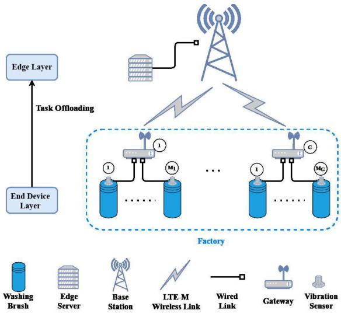

flowchart

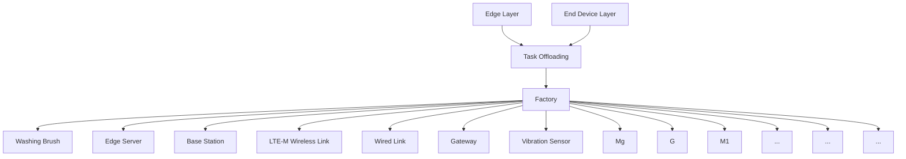

Fig. 1. A two-layer network architecture with edge computing.

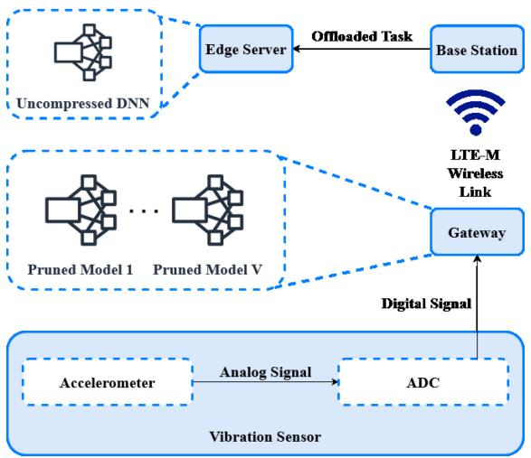

flowchart

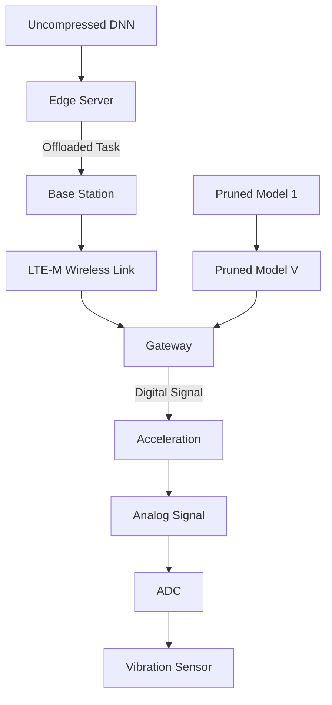

Fig. 2. Data acquisition and task computing/offloading.

# B. Computation Model

1) Task Model: As depicted in Fig. 2, the sensing data acquisition process on each vibration sensor includes data sampling and quantization of original vibration signals from the accelerometer using an analog-to-digital converter (ADC).3 The digitalized signals are further transmitted through wired links, as shown in Fig. 1, to the IGW that the vibration sensor is associated with [24]. In the data link layer, the data stream from each sensor arrives at its connected gateway in fixed-size computing tasks to be processed for making fault detection decisions. During the network operation stage, time is partitioned into a sequence of time slots of fixed length Γ, each indexed by $t \ ( t = 0 , 1 , 2 , \cdot \cdot \cdot )$ . We assume that at the beginning of slot t, one task generated from one vibration sensor arrives at its connected gateway [15]. Therefore, at gateway g, a total of $M _ { g }$ tasks arrive at the Mgbeginning of each time slot. The length of each time slot is set as the maximum processing delay requirement among all tasks, denoted by $T ^ { \mathrm { m a x } }$ . Each task is characterized by a triplet $\langle H , I , k _ { m , g } ^ { t } \rangle$ T, where H represents the task size (in bits), I denotes the computation intensity needed to prone bit of task information (in FLoPs per bit), and indicates the criticality level of the task generated at gat $k _ { m , g } ^ { t }$ $g$ from sensor m at time slot t. The criticality level rom 0 to 1, with a step increase of 0.2, and a larger $k _ { m , g } ^ { t }$ m greflects a higher criticality level [15]. Every task must meet a specified minimum processing accuracy and a determined maximum processing delay requirement, and tasks with higher criticality levels require a higher processing accuracy and a lower processing delay.

2) Convolutional Neural Network (CNN) Structuring and Deployment: To improve task processing efficiency, we consider deploying and structuring trained CNN models on each IoT gateway and the edge server connected to the BS to efficiently utilize the processing capacities of both entities. Specifically, we employ a CNN architecture, i.e., VGG-16 [25], which is utilized to diagnose facility fault type based on the collected dataset on bearing vibration signals [15]. VGG-16 consists of 13 convolutional layers and 3 fully connected layers. A well-trained and complete (fullweight) instance of VGG-16 is deployed on the edge server with sufficient computing resources for task inference, while $V ~ ( V ~ \in ~ \mathbb { Z } ^ { + } )$ pruned instances of the model are deployed V Von each IGW for more efficient task computation at the price of reduced processing accuracy. Each instance on IGW $g$ is characterized by a two-dimensional tuple $\langle A _ { v } , p _ { v } \rangle$ , where $\nu \in \{ 1 , 2 , . . . , V \} , A _ { v }$ v vis the average percentage of task vinference accuracy achieved by pruned CNN instance v with respect to the accuracy of the complete CNN model, and $p _ { v } \in$ pv[0, 1) is the model pruning rate of instance v. Here, the L1- norm pruning technique is used [26], which involves removing a fraction $\left( p _ { v } \right)$ of weights with the lowest absolute weight pvmagnitude in the complete CNN model. The L1-norm pruning is applied to both convolution and fully-connected layers. Each convolution layer consists of several kernels containing trainable parameters, and the L1 norm is computed for each kernel as the sum of the absolute values of its weights [19]. Then, we choose the $p _ { v }$ fraction of kernels with the smallest pvL1 norm and set the values of their weights to zero. Similarly, we set the $p _ { v }$ fraction of the weights connecting neurons in pvtwo consecutive fully connected layers to zero. As indicated in [19], $p _ { v }$ has a linear relationship with the number of pvFLoPs in both convolution and fully connected layers, and the number of FLoPs decreases by a factor of $p _ { v }$ after pruning. pvTherefore, the pruning creates a compressed network with reduced parameters to save inference operations and achieve high inference efficiency.

Following the pruning process, without subsequent retraining, the inference accuracy drops exponentially with the pruning rate [19], [27]. Therefore, each CNN instance is retrained after pruning to mitigate accuracy loss. The pruning and retraining of the CNN instances happen offline before deployment. After retraining, the relation between accuracy and pruning rate is implicit, which depends on the specific CNN architecture and the dataset used to train the neural network [19], [28]. Therefore, we approximate the specific relation between $p _ { v }$ and $A _ { v }$ based on our employed experpv Avimental data, where a polynomial fitting function is used to obtain a closed-form relation [29]. Similar to [29], the leastsquare fitting error is minimized to get the optimal polynomial degree and fitting coefficients in (1).

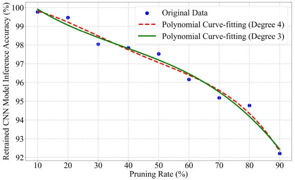

line

| Pruning Rate (%) | Original Data | Polynomial Curve-fitting (Degree 4) | Polynomial Curve-fitting (Degree 3) |
| ---------------- | ------------- | ------------------------------------ | ------------------------------------ |
| 10               | 99.8          | 99.8                                 | 99.8                                 |
| 20               | 99.5          | 99.5                                 | 99.5                                 |
| 30               | 98.0          | 98.0                                 | 98.0                                 |
| 40               | 97.8          | 97.8                                 | 97.8                                 |
| 50               | 97.5          | 97.5                                 | 97.5                                 |
| 60               | 96.2          | 96.2                                 | 96.2                                 |
| 70               | 95.2          | 95.2                                 | 95.2                                 |
| 80               | 94.8          | 94.8                                 | 94.8                                 |
| 90               | 92.2          | 92.2                                 | 92.2                                 |

Fig. 3. The relation between inference accuracy of a retrained CNN model and its pruning rate.

$$
A _ {v} (p _ {v}) = \sum_ {i \in \mathbb {N}} a _ {i} (p _ {v}) ^ {i} \tag {1}
$$

where each $a _ { i }$ denotes the optimal fitting coefficients. Based aion the testing results, we choose the degree of 3 as the order of our polynomial fitting function to achieve a balance between fitting accuracy and computational complexity, as the fitting functions of higher orders exhibit comparable performance, shown in Fig. 3.

3) Processing Model: Based on the deployed CNN models, at time slot $t ,$ each task can be 1) locally processed through one pruned CNN instance at its arriving IGW or 2) offloaded to the edge for processing through the complete CNN model. Denote $o _ { m , g } ^ { t } \in \{ 0 , 1 \}$ as the offloading decision variable for om gtask m at IGW $g$ in time slot $t ,$ where $o _ { m , g } ^ { t } = 0$ indicates local processing and $o _ { m , g } ^ { t } = 1$ om gindicates edge processing.

om g• Local processing: We utilize batch task processing to achieve fast inference [30], where tasks arriving at an IGW from different sensors in one time slot are fed into one of the deployed neural network instances as a batch of inputs instead of a single input, and the computations for each input are parallelized across different computation hardware threads. The computation capacity of the IGW is equally divided among the tasks chosen for local processing [28], and we assume the processing units used at the gateways are optimized for parallel processing, which enables efficient processing and fast inference time [30]. We consider that IGW $g$ has a fixed processing capacity, denoted by $C _ { g } .$ . The ratio of the computing capacity at IGW $g$ Cgdedicated to locally processing each task at time slot t is calculated as $\scriptstyle \sum _ { m = 1 } ^ { M _ { g } } ( 1 - o _ { m , q } ^ { t } )$ Mg . Then, m (1 om g)the local processing delay for each task m at IGW $g$ in slot t is calculated as

$$
L _ {m, g} ^ {t} = \left(1 - o _ {m, g} ^ {t}\right) \sum_ {j = 1} ^ {M _ {g}} \frac {\left(1 - p _ {v _ {g} ^ {t}}\right) H I \left(1 - o _ {j , g} ^ {t}\right)}{C _ {g}} \tag {2}
$$

where ${ p _ { v _ { g } ^ { t } } }$ is the pruning rate associated with the choice vgof local inference model instance $v _ { g } ^ { t }$ at gateway g in time slot t.

• Edge processing: If a task is offloaded to the edge server through wireless communication between an IGW and the BS, it is processed by an uncompressed instance of CNN deployed at the edge. Tasks are transmitted in a sequential manner, and all offloaded tasks in one time slot need to be processed at the edge server within the slot duration to satisfy their individual maximum processing delay requirements. The tasks not satisfying their individual processing time requirements will be discarded. Therefore, to accommodate task offloading from multiple sensors at a time slot, we further partition each time slot t into mini-slots of length τ [31], [32], [33]. Each minislot is indexed by $\textit { i } ( i = 1 , 2 , \ldots , q )$ , where $q \in \mathbb { N }$ and $\begin{array} { r } { q = \frac { \Gamma } { \tau } } \end{array}$ i i q q. The duration of each mini-slot, τ , is set as the time it takes to transmit one task when the network is at its best condition using the whole system bandwidth provided, i.e., $\tau = \frac { H } { R ^ { \mathrm { m a x } } }$ where $R ^ { \mathrm { m a x } }$ is the maximum R Rtransmission rate between an IGW and the BS. Then, at each time slot, a number of mini-slots are allocated to offload each task generated at IGW g in a statistical multiplexing manner, where the synchronization of time slots and mini-slots among gateways is managed by the edge server [34] (Please see Section II-C1 for further explanation). The tasks offloaded from different IGWs are processed at the edge in parallel, where the total computing capacity of the edge server, denoted as $C _ { e } ,$ Ceis dynamically divided and allocated among the arriving tasks. $c _ { g } ^ { t } \in [ 0 , 1 ]$ is the decision variable indicating the gportion of the computing capacity at the edge dedicated to tasks from gateway g at time slot t. In this regard, the processing delay for task m offloaded from gateway g at time slot t is calculated as

$$
E _ {m, g} ^ {t} = \frac {o _ {m , g} ^ {t} H I}{C _ {e} (c _ {g} ^ {t} + \epsilon)} \tag {3}
$$

where $\epsilon \in ( 0 , 1 )$ is a small positive number used as a regularization parameter to avoid division by zero when $c _ { q } ^ { t } = 0 .$ . By adding , the division operation remains wellcgdefined and helps to ensure numerical stability and avoid computational errors during optimization [35].

# C. Communication Model

We consider an uplink wireless communication system from the IoT gateways to the BS for task offloading where the communication links are assumed non-line-of-sight (NLoS) as the BS is located outside the factory. Similar to [28], the uplink NLoS channel gain from gateway g to the BS, denoted by $\psi _ { g } ^ { t }$ gat time slot t, is modeled as a three-state discrete-time Markov chain, where the channel gain within one time slot is assumed stable. The three channel states are named Good, Normal, and Bad, abbreviated as G, N, and B, respectively, indicating three categories of channel conditions ranging from a good state to a poor state. The value of channel gain at each state is acquired based on real-time measurements, and the one-step channel state transition probability matrix is given by [28]

$$
P = \left[ \begin{array}{c c c} P _ {B B} & P _ {B N} & P _ {B G} \\ P _ {N B} & P _ {N N} & P _ {N G} \\ P _ {G B} & P _ {G N} & P _ {G G} \end{array} \right] \tag {4}
$$

where $P _ { x y }$ indicates the transition probability from state x Pxyto state y between consecutive time slots. Then, the uplink transmission rate for IGW g at time slot t is calculated as

$$
R _ {g} ^ {t} = \frac {M _ {g}}{N} W \log_ {2} \left(1 + \frac {N z _ {g} \psi_ {g} ^ {t}}{M _ {g} N _ {0} W}\right) \tag {5}
$$

where N is the total number of sensors in the system, W is the total configured system bandwidth, $z _ { g }$ is the transmission zgpower configured at IGW g for uplink task offloading, which is assumed to be fixed during the network operation stage, and $N _ { 0 }$ is the Gaussian white noise power spectrum density.

0As seen from (5), the total system bandwidth W is allocated among IGWs proportional to the number of sensors, $M _ { g } ,$ associated with IGW g [28]. Considering that industrial Mgsensors and gateways are relatively stationary with limited processing and energy capacities, the bandwidth re-allocation among industrial IoT gateways is typically conducted at a slow frequency (e.g., in the order of hours) to reduce the signaling overhead incurred in the re-allocation process [8]. Thus, we assume the bandwidth allocated to each gateway remains unchanged during each network operation stage [28]. Based on the above analysis, the offloading delay for task m arriving from IGW g at time slot t is given by

$$
\Omega_ {m, g} ^ {t} = \frac {o _ {m , g} ^ {t} H}{R _ {g} ^ {t}}. \tag {6}
$$

Considering task processing results are usually small in size, the latency of transmitting the processing results back from the edge server to each IGW can be negligible [15], [36].

In IIoT scenarios where wireless communication resources for task offloading are often limited, task transmission latency can be longer than task inter-arrival time at an IGW [36], leading to task queuing before being offloaded. In the following, we present our modeling of task queuing at each IGW.

1) Queuing Model: At each IGW, a transmission queue is established to buffer tasks for offloading, which is designated to accommodate tasks arriving from all sensors connected to the IGW, as shown in Fig. 4. The tasks at each queue are prioritized based on their criticality levels, and the tasks with higher criticality levels are preemptively queued for transmission over those with lower levels. If several tasks have the same criticality level, the queuing among them will be determined randomly.

Based on the preceding discussions, the queuing delay for each task depends on the prioritized ordering of tasks in the transmission queue of a gateway. Denote $\bar { \delta } _ { g } ^ { t } ( \delta _ { g } ^ { t } \in$ $\{ 1 , 2 , \ldots , q \} )$ g gas the number of mini-slots allocated to transmit qone task from IGW g at time slot t, where $\delta _ { g } ^ { t } ~ = ~ \lceil \frac { R ^ { \mathrm { m a x } } } { R _ { q } ^ { t } } \rceil$ max Note that $\delta _ { g } ^ { t }$ Rgis the same for all the tasks to be offloaded from ggateway g at time slot $t ,$ though it may vary across different time slots. The time-varying nature of $\delta _ { g } ^ { t }$ and the ordering of tasks in the transmission queues highlights the necessity of employing statistical multiplexing. Tasks unable to be accommodated for transmission or whose delay requirements are violated will be dropped from the queue. Therefore, the transmission queuing delay for task m at IGW g is a summation of the transmission delay of the tasks queued before task m, given by

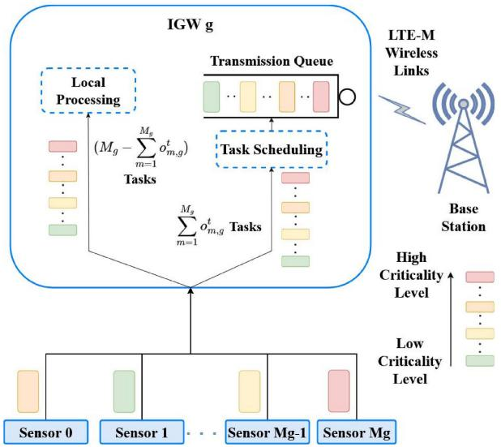

flowchart

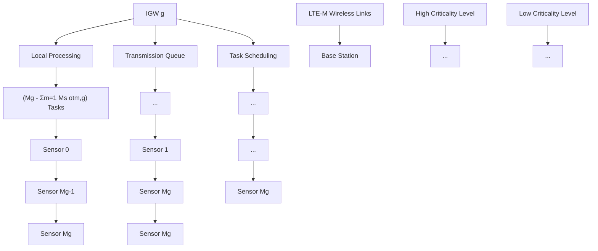

Fig. 4. Local processing and transmission scheduling process at each gateway.

$$
B _ {m, g} ^ {t} = o _ {m, g} ^ {t} \delta_ {g} ^ {t} \tau \left[ s _ {m, g} ^ {t} + \frac {\left(b _ {m , g} ^ {t} - 1\right)}{2} \right] \tag {7}
$$

where $s _ { m , g } ^ { t }$ is the number of tasks with a higher criticality sm glevel than task m and $b _ { m , g } ^ { t }$ is the number of tasks with the bm gsame criticality level as task m queued for offloading at IGW g, calculated, respectively, as

$$
s _ {m, g} ^ {t} = \sum_ {j = 1} ^ {M _ {g}} h (j, m, g, t) o _ {j, g} ^ {t} \tag {8}
$$

and

$$
b _ {m, g} ^ {t} = \sum_ {j = 1} ^ {M _ {g}} \mu (j, m, g, t) o _ {j, g} ^ {t}. \tag {9}
$$

In (8) and (9), h(j, m, g, t) and $\mu ( j , m , g , t )$ are two helper functions defined as

$$
h (j, m, g, t) = \left\{ \begin{array}{l} 1, \text {   if   } k _ {j, g} ^ {t} > k _ {m, g} ^ {t} \\ 0, \text {   otherwise } \end{array} \right. \tag {10}
$$

and

$$
\mu (j, m, g, t) = \left\{ \begin{array}{l} 1, \text {   if   } k _ {m, g} ^ {t} = k _ {j, g} ^ {t} \text {   and   } j \neq m \\ 0, \text {   otherwise. } \end{array} \right. \tag {11}
$$

After being transmitted to the BS, the tasks will arrive at the edge server. In the process of task offloading, the task processing delay at the edge server is much smaller than the task transmission delay [36]. Therefore, no queuing delay is considered for task processing at the edge server.

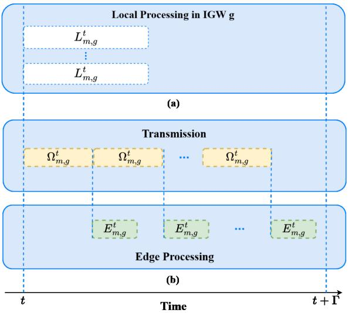

flowchart

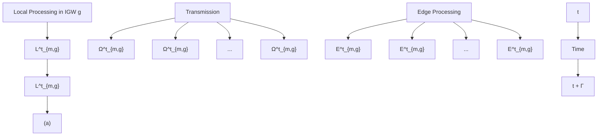

Fig. 5. An illustrative example of time utilization of (a) local computing and (b) transmission and edge computing within one time slot for an IGW.

# III. PROBLEM FORMULATION

We present our research problem formulation on joint task offloading, pruned model selection, and computing resource allocation. Our objective is to maximize the long-term utilization of system radio bandwidth and computing resources while meeting the diverse inference accuracy and delay requirements of individual tasks, which change over time with the task criticality levels. We balance the trade-off between local task processing and edge processing by taking into consideration the resource utilization, the task processing delay, and task processing accuracy. Next, we determine, in every time slot t, the local computing resource utilization at any IGW g, the edge computing resource utilization, and the bandwidth utilization for processing tasks offloaded from IGW g, respectively.

# A. Local Computing Resource Utilization

We define the local computing resource utilization of each IGW as the proportion of time spent in one slot processing the tasks at the IGW. As illustrated in Fig. 5(a), at each IGW, the tasks not offloaded are processed in parallel using batch processing, where the entire computing resources of the IGW are divided equally among the tasks (see Section II-B for further details.) Consequently, by referring to (2), the local computing resource utilization for processing the tasks at gateway g in time slot t is calculated as the local processing delay of each task over the time slot duration Γ, given by

$$
u _ {l, g} ^ {t} = \sum_ {m = 1} ^ {M _ {g}} \frac {\left(1 - p _ {v _ {g} ^ {t}}\right) H I \left(1 - o _ {m , g} ^ {t}\right)}{C _ {g} \Gamma}. \tag {12}
$$

# B. System Bandwidth Utilization

At each IGW, the tasks chosen to be offloaded first enter the transmission queue and are then transmitted sequentially using the portion of the system bandwidth allocated to that IGW, as illustrated in Fig. 4. Specifically, at the beginning of any time slot t, the transmission of a task starts, followed by a sequence of tasks to be transmitted in the slot, as shown in Fig. 5(b).

If a task cannot be transmitted within the duration of a time slot, it gets discarded. The overall utilization of bandwidth for IGW g at time slot t is calculated as the duration of time used to transmit the offloaded tasks within the slot, given by

$$
u _ {b, g} ^ {t} = \sum_ {m = 1} ^ {M _ {g}} \frac {\Omega_ {m , g} ^ {t}}{\Gamma}. \tag {13}
$$

# C. Edge Computing Resource Utilization

After transmission, the offloaded tasks are processed at the edge server, where the total computing resources are allocated to process the tasks from different gateways. The tasks offloaded from any IGW g are sequentially processed according to the order of their arrivals. Therefore, the utilization of the computing resources on the edge server dedicated to IGW g is the summation of the edge processing delay for all the tasks offloaded from IGW g divided by the length of the time slot Γ, given by

$$
u _ {e, g} ^ {t} = \sum_ {m = 1} ^ {M _ {g}} \frac {E _ {m , g} ^ {t}}{\Gamma}. \tag {14}
$$

Based on the preceding analysis, the summation of the local processing, communication, and edge processing utilization for all G IGWs at time slot t is represented as

$$
u ^ {t} = \sum_ {g = 1} ^ {G} u _ {l, g} ^ {t} + u _ {e, g} ^ {t} + u _ {b, g} ^ {t}. \tag {15}
$$

# D. Proposed Joint Optimization Framework With Problem Transformation

Conducting more local processing with pruned learning models can increase task processing efficiency with a lower delay but a reduced processing accuracy, while a higher task inference accuracy and communication resource utilization can be achieved through edge processing at the cost of local resource underutilization and a longer latency. Therefore, the main research issue is to determine the optimal task offloading, pruned local model selection, and computing resource allocation policies such that the overall communication and computing resource utilization can be maximized in the long run with task processing accuracy and delay requirements satisfied. To this end, our problem is presented as a stochastic optimization formulation, given in (P1), where η is a large positive number, $T ^ { \mathrm { m i n } }$ and $T ^ { \mathrm { m a x } }$ represent the minimum and T Tmaximum task processing delay requirements, respectively, among all tasks, corresponding to the highest and lowest criticality levels of tasks, $A ^ { \mathrm { m a x } }$ and $A ^ { \mathrm { m i n } }$ denote the max-A Aimum and minimum task inference accuracy requirements, respectively, among all tasks, and $D _ { m , g } ^ { t }$ represents the end-to-Dm gend delay for task m at gateway g in time slot t, calculated as

$$
D _ {m, g} ^ {t} = L _ {m, g} ^ {t} + E _ {m, g} ^ {t} + \Omega_ {m, g} ^ {t} + B _ {m, g} ^ {t}. \tag {16}
$$

The objective of (P1) is to maximize the stochastic average of the aggregated bandwidth and computing resource utilization for all the IGWs and the edge server, where E indicates the expectation operator, and the optimization variables are task offloading decision $o _ { m , g } ^ { t } ,$ computing resource allocation decision $c _ { g } ^ { t } ,$ om g  and pruned local inference model selection $v _ { g } ^ { t } .$ cg vgConstraint (17a), shown at the bottom of the page, indicates that the E2E delay $D _ { m , g } ^ { t }$ of task m generated from gateway m gg cannot exceed the upper bound varying between $T ^ { \mathrm { m i n } }$ and $T ^ { \mathrm { m a x } }$ when criticality level $k _ { m , g } ^ { t }$ Ttakes values between 0 T km gand 1. Similarly, constraint (17b) indicates that the inference accuracy $A _ { v _ { g } ^ { t } } ( p _ { v _ { g } ^ { t } } )$ of the chosen pruned local processing model $A ^ { \mathrm { m i n } }$ vg and o edg $v _ { g } ^ { t }$ vg vgis limited by a lower bound changing in between $A ^ { \mathrm { m a x } }$ $k _ { m , g } ^ { t }$ varies. Constraint (17c) indicatespacity is dedicated to the gateways that do not have any offloading tasks, and constraint (17d) shows that the edge computing capacity is divided and allocated among the gateways for processing the offloaded tasks.

$$
(\mathbf {P 1}) \colon \max _ {o _ {m, g} ^ {t}, c _ {g} ^ {t}, v _ {g} ^ {t}} \mathbb {E} \left\{\frac {1}{\eta} \sum_ {t = 1} ^ {\eta} u ^ {t} \right\}
$$

$$
s. t. \left\{ \begin{array}{l l} 0 \leq D _ {m, g} ^ {t} \leq \left[ T ^ {\max} - k _ {m, g} ^ {t} \left(T ^ {\max} - T ^ {\min}\right) \right], \forall m, g & (1 7 a) \\ \left[ A ^ {\min} + \left(A ^ {\max} - A ^ {\min}\right) k _ {m, g} ^ {t} \right] \left(1 - o _ {m, g} ^ {t}\right) \leq A _ {v _ {g} ^ {t}} \left(p _ {v _ {g} ^ {t}}\right) \left(1 - o _ {m, g} ^ {t}\right) \leq 1, \forall m, g & (1 7 b) \\ \sum_ {g = 1} ^ {G} \left[ c _ {g} ^ {t} \prod_ {m = 1} ^ {M _ {g}} \left(1 - o _ {m, g} ^ {t}\right) \right] = 0 & (1 7 c) \\ \sum_ {g = 1} ^ {G} c _ {g} ^ {t} = 1 & (1 7 d) \\ c _ {g} ^ {t} \in [ 0, 1 ], \forall g & (1 7 e) \\ E _ {m, g} ^ {t} \leq \Omega_ {m, g} ^ {t}, \forall m, g & (1 7 f) \\ o _ {m, g} ^ {t} \in \{0, 1 \}, \forall m, g & (1 7 g) \\ p _ {v _ {g} ^ {t}} \in (0, 1 ], \forall g & (1 7 h) \end{array} \right.
$$

Constraint (17f) indicates that the edge processing delay of an offloaded task is smaller than or equal to its transmission delay to ensure task processing without queuing delay at the edge server. Any task offloaded from gateway g violating (17a), (17b), and/or (17f) is dropped from the edge server.

The problem (P1) is formulated in a centralized way where the edge server acts as the agent to make task offloading, local pruned model selection, and computing resource allocation decisions. Note that the uplink channel state information acquired from the model presented in (4) is assumed to be available to the edge server at the beginning of each time slot [28]. For the centralized agent to make decisions, each gateway updates with the edge server the task criticality levels at each time slot. The time used to transmit each task criticality level is usually small in size and is thus neglected [15]. In the proposed system, to capture the network state transitions and model the relation between states and policies, we describe the problem (P1) as a Markov reward process (MRP) formulation where the state transitions are independent of the actions taken [20]. The MRP is particularly valuable for simplifying and structuring complex decisionmaking scenarios that involve sequential decisions over time. It accounts for both immediate and future consequences, explicitly models the stochastic nature of environments, and incorporates uncertainty into the formulation. This approach provides a robust framework for understanding and optimizing decision-making processes in dynamic and uncertain contexts. The MRP formulation is represented by a four-dimensional tuple at time slot t, which includes a set of network states $S ^ { t }$ , a set of actions $\mathcal { A } ^ { t }$ , state transition probabilities, $\mathcal { P } ( \mathcal { S } ^ { t + 1 } | S ^ { t } )$ , and a reward function, $\mathcal { R } ( \mathcal { S } ^ { t } , \mathcal { A } ^ { \bar { t } } )$ , defined on states and actions. Specifically, to capture the dynamics of the system, $S ^ { t }$ is designed to include the uplink wireless channel gains from all gateways to the base station and the criticality levels of all generated tasks at time slot t, denoted by

$$
\mathcal {S} ^ {t} = \left\{\psi_ {g} ^ {t} \mid \forall g \right\} \cup \left\{k _ {m, g} ^ {t} \mid \forall m, g \right\}. \tag {18}
$$

Furthermore, the action set $\mathcal { A } ^ { t }$ comprises the decision variables for task offloading, model pruning, and edge computing resource allocation, formally defined as

$$
\mathcal {A} ^ {t} = \left\{o _ {m, g} ^ {t} \mid \forall m, g \right\} \cup \left\{v _ {g} ^ {t} \mid \forall g \right\} \cup \left\{c _ {g} ^ {t} \mid \forall g \right\}. \tag {19}
$$

The state transitions from t to (t + 1) include the updates on channel gains for all gateways and the criticality levels of the generated tasks, and thus, the state transition probability is given by

$$
\begin{array}{l} \mathcal {P} \big (\mathcal {S} ^ {t + 1} | \mathcal {S} ^ {t} \big) = \prod_ {g = 1} ^ {G} \mathcal {P} \big (\psi_ {g} ^ {t + 1} | \psi_ {g} ^ {t} \big) \cdot \prod_ {g = 1} ^ {G} \prod_ {m = 1} ^ {M _ {g}} \mathcal {P} \big (k _ {m, g} ^ {t + 1} | k _ {m, g} ^ {t} \big) \\ = \prod_ {g = 1} ^ {G} \mathcal {P} \left(\psi_ {g} ^ {t + 1} \mid \psi_ {g} ^ {t}\right) \cdot \prod_ {g = 1} ^ {G} \prod_ {m = 1} ^ {M _ {g}} \mathcal {P} \left(k _ {m, g} ^ {t + 1}\right). \tag {20} \\ \end{array}
$$

In (20), the first equality holds due to the independence of the channel gain values among different gateways and the independence of the channel gain values from the task criticality levels, and the second equality holds due to the criticality levels of tasks at one time slot are independent of the levels in the previous time slots, as they vary randomly over consecutive time slots [15]. Note that channel gain values evolve according to the transition probability matrix presented in (4). Given the balanced sample distribution in the dataset, we assume that different criticality levels occur with equal probability. Consequently, at each time slot, the criticality level of each task is determined by sampling from a uniform distribution. This approach ensures a fair representation of all criticality levels throughout the analysis.

Solving the MRP problem is to determine a set of optimal policies (i.e., probabilities of choosing actions given network states), denoted by $\pi ^ { * } ( { \mathcal { A } } | S )$ , that maximizes the accumulated system reward over time, where S and A represent steady states and actions as t approaches infinity. Accordingly, a reward function is designed by considering the overall network and the satisfaction of E2E delay and inference accuracy requirements at each time slot. Hence, we present the reward function as

$$
r ^ {t} = u ^ {t} - \left[ \frac {\sum_ {g = 1} ^ {G} \sum_ {m = 1} ^ {M _ {g}} \left(1 - \beta_ {m , g} ^ {t}\right)}{N} \right] J \tag {21}
$$

where $\beta _ { m , g } ^ { t }$ is an indicator function, defined as

$$
\beta_ {m, g} ^ {t} = \left\{ \begin{array}{l} 1, \text {   if   } (1 7 \mathrm{a}), (1 7 \mathrm{b}), \text {   and   } (1 7 \mathrm{f}) \text {   hold } \\ 0, \text {   otherwise   }. \end{array} \right. \tag {22}
$$

In (21), J is a large positive number and is multiplied by the ratio of dropped tasks in time slot t. If the requirements in (17a), (17b), and/or (17f) are not satisfied, then a negative reward is received as a penalty, which changes according to the number of dropped tasks, and if all the requirements are satisfied, then the reward reflects the overall system resource utilization.

In (P1), the state and action dimensions are calculated as $N + G$ and $N \ + \ 2 G ,$ , respectively, where the action space contains a set of continuous variables $c _ { g } ^ { t }$ ranging between cg0 and 1 and two sets of discrete variables. The action space size can be estimated as $2 ^ { N } V ^ { G } Z ^ { G }$ , where Z is a N V G Z Glarge positive number estimating the number of values $c _ { g } ^ { t }$ problem is calculated as $\dot { \Psi } ^ { G } K ^ { N }$ , where Ψ and K are the Knumbers of configurable channel gain values and criticality levels, respectively. As the dimensions increase with the number of sensors N and the number of gateways $G ,$ both the state and action spaces grow exponentially, resulting in high computational complexity. The conventional algorithms, such as Epsilon-Greedy [37] and Upper Confidence Bound (UCB) [38], used for solving MRP problems where the state transition probabilities are independent of the actions taken under the current states, may not be efficient in solving a complex problem with large action and state spaces where an optimal solution needs to be obtained at the beginning of each time slot [39].

# IV. SAC-BASED SOLUTION DESIGN

Solving the transformed MRP problem with large state and action spaces and dynamic constraints necessitates the design of an advanced algorithm [40]. We propose to use a DRL-based approach to approximate the functional relation between each state-action pair and the corresponding reward using DNNs [41]. Particularly, DRL learns an effective policy through trial and error by interacting with the network environment [42]. In our formulated MRP problem, the task offloading and local pruned model selection are discrete decision variables, while the edge computing resource allocation decisions are continuous. Furthermore, since the state transition probability is independent of the actions taken, the state space needs to be thoroughly and efficiently explored to obtain optimal actions. To address these challenges, we build our algorithms based on SAC, which is an actor-critic learning framework used for accommodating continuous RL actions and offers the following advantages [43].

• Enhanced Exploration: SAC employs a stochastic policy, sampling actions according to a learned probability distribution, which inherently encourages exploration. The stochastic policy helps the learning agent thoroughly explore the high-dimensional action space with complex network dynamics, in contrast to the deterministic policy that relies on added noise for exploration.   
• Improved Sample Efficiency: SAC is sample-efficient, achieving high performance with reduced environment interactions. This efficiency is attributed to the improved exploration and stability provided by entropy regularization and dual Q-learning (i.e., using two critic networks to mitigate overestimation bias in estimating the value function).

Based on the aforementioned advantages, we propose an SAC-based joint task offloading, DNN pruning, and computing resource allocation (JOPA), which includes the design of the following three main functional components.

# A. Customized Actor Network for Hybrid Actions

JOPA is built on the SAC algorithmic framework, tailored to address the formulated MRP with a hybrid action space. Different from the conventional SAC, which is designed for continuous actions, our approach adapts SAC to handle a combination of continuous and discrete actions. We customize the actor network $\pi _ { \phi }$ to generate decisions for task offloading, pruned model selection, and edge computing resource allocation. The actor network first produces mean μ and log standard deviation log(σ), which is then exponentiated to get standard deviation σ for sampling continuous actions from a normal distribution $\mathcal { N } ( \mu , \sigma ^ { 2 } )$ . Using log standard deviation ensures that the standard deviation obtained after exponentiation is always positive. Directly using standard deviation could lead to potential instability if small or negative values are produced, especially when training with gradients [21]. The samples are then processed to obtain the hybrid decision variables: 1) Binary task offloading decisions associated with N sensors are obtained by normalizing the N task offloading action variables to the range of [0, 1] using the Sigmoid function and the rounding function consecutively; 2) The G categorical actions for pruned model selection corresponding to G gateways are similarly normalized and rounded to the range of [0, V − 1]; 3) The G continuous action variables corresponding to the edge computing resource allocation decisions for tasks arrived from $G$ gateways, respectively, are computed using the Softmax function, ensuring adherence to constraint (17d) in (P1).

# B. Dual Critic Networks for Robust Policy Evaluation

In SAC, the Q-value of each state-action pair is estimated based on the maximum value over the set of possible actions. However, an estimated Q-value can be overly optimistic because the algorithm often selects the action with the highest Q-value estimate, which could be erroneously high due to noise or errors in the approximation. By incorporating two critic networks $( Q _ { \theta _ { 1 } }$ and $Q _ { \theta _ { 2 } } )$ , our algorithm reduces overes-Q Qtimation bias, a key consideration when dealing with mixed actions for a more reliable assessment of the expected return (long-term accumulated reward). By using the minimum of the two estimates, SAC becomes more conservative in its Q-value approximation, reducing the chance of overestimation. The critic networks process state $S ^ { t }$ and action $\mathcal { A } ^ { t }$ , outputting an estimated return value for the state-action pair. This dualnetwork design enhances the robustness of our algorithm, preventing suboptimal convergence and ensuring that the solution space is thoroughly explored.

# C. Stabilized Target Networks for Reliable Training

When updating Q-values, there is a risk of instability since the target values are based on the current frequently updated Q-values. This leads to high variance in target estimates, especially in the early stages of training when the agent is exploring. High variance can cause the learning process to become unstable or even diverge. To stabilize training, we employ two target networks, denoted by $\widehat { \theta } _ { 1 }$ and ${ \dot { \theta } } _ { 2 } ,$ to 1 2reduce variance during updates and minimize the chance of overestimation. Our approach initializes these networks as copies of the critic networks, ensuring consistency throughout the training, given by

$$
\hat {\theta} _ {i} \leftarrow \theta_ {i}, i \in \{1, 2 \}. \tag {23}
$$

To mitigate the high variance issue and stabilize training, the algorithm uses the minimum of the two target values to update the critic networks, which reduces bias in the critic function update. Furthermore, the target networks are updated using a soft update rule, changing more slowly than the critic networks. This helps smooth the target values and avoid instability caused by rapidly changing Q-values (See Section IV-D for more details).

# D. Algorithm Design

Fig. 6 shows the key steps (Step 1 to Step 9) in our proposed SAC-based JOPA algorithmic framework. As shown in Algorithm 1, the JOPA is trained in a time-slotted manner. First, the learning agent at the edge server obtains experience by interacting with the environment. At time slot t, based on the current network state $S ^ { t }$ , the task offloading, pruned model selection, and edge computing resource allocation actions are determined using the actor network (Steps 1-3). Then, the edge computing resource allocation actions are executed on the edge server, while the pruned model selection and task offloading actions are transmitted to and are executed at the IGWs (Step 4). The corresponding reward $r ^ { t }$ is calculated, and the next state $S ^ { t + 1 }$ ris observed from the environment to create the state transition tuple $( S ^ { t } , \mathcal { A } ^ { t } , r ^ { t } , S ^ { t + 1 } )$ stored in the rexperience replay memory D for training the actor and critic networks (Steps 5-7). Once enough tuples are collected in the experience replay, a batch of transition tuples is randomly sampled from the experience replay memory to train the actor and critic networks, and update the target networks accordingly (Steps 8 and 9). We first update the critic networks by minimizing the mean squared loss function defined as:

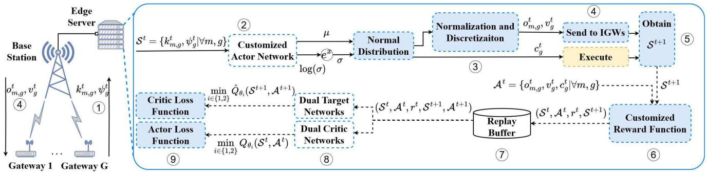

flowchart

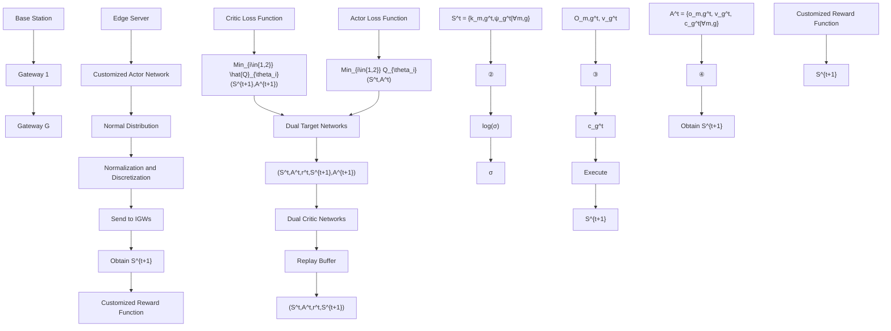

Fig. 6. The proposed SAC-based solution framework.

Algorithm 1: SAC-Based Algorithm for Joint Task Offloading, DNN Pruned Model Selection, and Edge Computing Resource Allocation (JOPA)   
Initialize: network configuration and service parameters
Initialize: replay buffer D, actor, critic, and target networks

1 for time slot $t \in \{1, 2, \ldots, \eta\}$ do
2 Observe state $S^{t}$ and obtain mean and log standard deviation from the actor network;
3 Exponentiate log standard deviation to derive standard deviation $\sigma$ ;
4 Using activation functions, obtain the actions $A^{t} = \{c_{g}^{t}, o_{m,g}^{t}, v_{g}^{t} | \forall m, g\}$ ;
5 for each IGW $g \in \{1, 2, \ldots, G\}$ do
6 Execute $c_{g}^{t}$ on the edge server and send $v_{g}^{t}$ to IGW g for execution;
7 for each task $m \in \{1, 2, \ldots, M_{g}\}$ do
8 Send $o_{m,g}^{t}$ to IGW g for execution;
9 end
10 end
11 Observe reward $r^{t}$ and the next state $S^{t+1}$ ;
12 Store transition ( $S^{t}, A^{t}, r^{t}, S^{t+1}$ ) in D;
13 if size of $D \geq batch size$ then
14 Sample a batch of transitions from D;
15 Compute target values using (25);
16 Update critic networks by minimizing the loss in (24);
17 Update the actor network by minimizing the policy loss defined in (26); Soft update target networks using (27);
18 end
19 end

$$
\mathcal {L} \left(\theta_ {i}\right) = \mathbb {E} _ {\left(\mathcal {S} ^ {t}, \mathcal {A} ^ {t}, r ^ {t}, \mathcal {S} ^ {t + 1}\right) \sim \mathcal {D}} \left[ Q _ {\theta_ {i}} \left(\mathcal {S} ^ {t}, \mathcal {A} ^ {t}\right) - y \right] ^ {2}, i \in \{1, 2 \} \tag {24}
$$

where y is the target value calculated using the target networks, given by

$$
y = r ^ {t} + \gamma \min _ {i \in \{1, 2 \}} \hat {Q} _ {\theta_ {i}} \left(\mathcal {S} ^ {t + 1}, \mathcal {A} ^ {t + 1}\right). \tag {25}
$$

In (25), γ is the discount factor. When $\gamma$ is closer to zero, more recent rewards are considered, undermining future rewards, while the agent values future rewards more when γ is set closer to 1. Next, we update the actor network by minimizing the loss calculated as

$$
\mathcal {L} (\phi) = \mathbb {E} _ {\mathcal {S} ^ {t} \sim \mathcal {D}, \mathcal {A} ^ {t} \sim \pi_ {\phi}} \left[ \alpha \log \pi_ {\phi} \left(\mathcal {A} ^ {t} | \mathcal {S} ^ {t}\right) - \min _ {i \in \{1, 2 \}} Q _ {\theta_ {i}} \left(\mathcal {S} ^ {t}, \mathcal {A} ^ {t}\right) \right] \tag {26}
$$

where α log $\pi _ { \phi } ( \mathcal { A } ^ { t } | \mathcal { S } ^ { t } )$ is the entropy term incorporated into the policy objective to ensure that the policy not only aims to maximize the expected reward but also maintains high entropy (a measure of randomness or unpredictability in the policy’s action distribution). This approach helps prevent premature convergence to sub-optimal policies by encouraging continuous exploration of the action space. The entropy term is weighted by a temperature parameter α, which balances the trade-off between exploration and exploitation where higher α results in more stochasticity in the policy’s action distribution and, therefore, more exploration. Note that the rounding function is not differentiable, and therefore, the actions before rounding are used to calculate the loss. The final step is to softly update the target networks by

$$
\hat {\theta} _ {i} \leftarrow \zeta \theta_ {i} + (1 - \zeta) \hat {\theta} _ {i}, \quad i \in \{1, 2 \}, \tag {27}
$$

where ζ is the learning rate parameter for the target networks. The detailed process of JOPA is listed in Algorithm 1, showing how the edge server as the learning agent interacts with the IGWs to conduct SAC-based training. After the training process is completed, the trained model is implemented in the edge server to execute the optimal online actions based on real-time network states.

The time complexity analysis of Algorithm 1 is provided in the following. At each time slot t, the state $S ^ { t }$ is fed to the actor network, and the actions are obtained with the time complexity of $O ( N + G )$ . Based on the number of actions, the execution of the actions take $O ( N + G )$ time. Considering that the actor network has an input size of $( N + G )$ and an output size of $( N \mathrm { ~ + ~ } 2 G )$ , updating happens in $O ( N + G )$ time. Likewise, training the critic and target networks happens in $O ( N + G )$ time since the input size is $( 2 N + 2 G )$ and the output size is 1. As $\begin{array} { r } { N = \sum _ { g = 1 } ^ { \cdot _ { G } } M _ { g } } \end{array}$ and it takes η time N g=1 Mgslots to solve the problem, therefore the time complexity for Algorithm 1 in terms of its input variables is $O ( \eta G M _ { g } ^ { \mathrm { m a x } } )$ , where $M _ { g } ^ { \operatorname* { m a x } } = \operatorname* { m a x } _ { g } \{ M _ { g } \}$ .

# V. SIMULATION RESULTS

Computer simulations are conducted to demonstrate the performance of the proposed JOPA algorithm and the advantages over existing schemes.

# A. Simulation Setup

We consider a smart factory environment in our simulation, featuring 5 lanes of washing brushes, each connected to one IGW. To evaluate the scalability of the proposed scheme, we consider five scenarios with 100, 125, 150, 175, and 200 vibration sensors, where the sensors installed on the washing brushes in each lane detect vibration signals, which are then digitized. The digitized data can be processed either locally on the connected IGW or be offloaded to an edge server connected to a BS outside the factory for further processing. Each IGW connects to the BS through the LTE Cat-M2 technology, with the uplink transmission power set as 1 W and the computing power providing 768 GFLoPS/s processing rate using an Intel Core-i7 12700 CPU. The total available spectrum bandwidth for uplink transmissions from the IGWs to the BS is set as 5MHz [8], [44]. The three channel conditions Good (G), Normal (N), and Bad (B) correspond to channel gains 6 ∗ $1 0 ^ { - 1 3 } , \ 4 \ast \ 1 0 ^ { - 1 3 }$ , and $2 * 1 0 ^ { - 1 3 }$ , respectively, with the transition probability matrix set as [28]:

$$
P = \left[ \begin{array}{c c c} P _ {B B} & P _ {B N} & P _ {B G} \\ P _ {N B} & P _ {N N} & P _ {N G} \\ P _ {G B} & P _ {G N} & P _ {G G} \end{array} \right] = \left[ \begin{array}{c c c} 0. 3 & 0. 7 & 0 \\ 0. 2 5 & 0. 5 & 0. 2 5 \\ 0 & 0. 7 & 0. 3 \end{array} \right]. (2 8)
$$

The duration of a time slot in the simulation is set to 1s, and, consequently, $R ^ { \mathrm { m a x } }$ is calculated as 5.68 Mbit/s, Rwith q and τ values being 347 and 0.0028, respectively. The bearing vibration signal is collected at a 4 kHz sampling rate with 16-bit quantization. The task data in each time slot is a digitized 1s vibration signal sampled during the previous time slot, so the task size of 64kb is the data volume of a 1s signal [8], [44], calculated as the product of the raw sampling rate (4 kHz) and the quantization bits of the signal (16-bit). The edge server connected to the BS is simulated by an NVIDIA RTX 3070 GPU with 20.31 TFLoPs/s computing power for parallel edge processing. To perform fault diagnosis tasks, the edge server is equipped with a full-weight, welltrained VGG-16 model [25], and each IGW is equipped with 6 pruned models. The corresponding accuracy and pruning rate

TABLE II (A) INFERENCE ACCURACY AND PRUNING RATE OF EACH PRUNED MODEL DEPLOYED ON IGWS AND (B) ACCURACY AND DELAY REQUIREMENTS OF TASKS ASSOCIATED WITH THEIR CRITICALITY LEVELS 

<table><tr><td>Pruning Rate</td><td>Inference Accuracy</td></tr><tr><td>0.1</td><td>99.76</td></tr><tr><td>0.3</td><td>98.03</td></tr><tr><td>0.5</td><td>97.52</td></tr><tr><td>0.7</td><td>95.17</td></tr><tr><td>0.8</td><td>94.77</td></tr><tr><td>0.9</td><td>92.21</td></tr></table>

(a

<table><tr><td>Criticality level</td><td>Accuracy lower-bound</td><td>Delay upper-bound</td></tr><tr><td>0.0</td><td> $0.920 (A^{\min})$ </td><td>1.0s ( $T^{\max}$ )</td></tr><tr><td>0.2</td><td>0.934</td><td>0.82s</td></tr><tr><td>0.4</td><td>0.948</td><td>0.64s</td></tr><tr><td>0.6</td><td>0.962</td><td>0.46s</td></tr><tr><td>0.8</td><td>0.976</td><td>0.28s</td></tr><tr><td>1.0</td><td> $0.990 (A^{\max})$ </td><td>0.1s ( $T^{\min}$ )</td></tr></table>

TABLE III SIMULATION PARAMETERS AND TRAINING HYPER-PARAMETERS [28], [44] 

<table><tr><td>Parameter</td><td>Value</td></tr><tr><td>Noise power spectrum density ( $N_0$ ) [44]</td><td> $10^{-18}W/Hz$ </td></tr><tr><td>Temperature parameter ( $\alpha$ )</td><td> $10^{-5}$ </td></tr><tr><td>Maximum delay requirement ( $T^{\text{max}}$ )</td><td>1s</td></tr><tr><td>Target learning rate ( $\zeta$ )</td><td> $10^{-5}$ </td></tr><tr><td>Minimum delay requirement ( $T^{\text{min}}$ )</td><td>0.1s</td></tr><tr><td>Discounting factor ( $\gamma$ )</td><td>0.99</td></tr><tr><td>Maximum accuracy requirement ( $A^{\text{max}}$ )</td><td>0.99</td></tr><tr><td>Batch size</td><td>512</td></tr><tr><td>Minimum accuracy requirement ( $A^{\text{min}}$ )</td><td>0.92</td></tr><tr><td>Penalty coefficient ( $J$ )</td><td>99</td></tr><tr><td>Replay buffer size</td><td>10,000</td></tr></table>

for each model can be found in Table II (a), and the optimal polynomial fitting function is given by

$$
A _ {v} (p _ {v}) = - 1. 7 2 9 * 1 0 ^ {- 5} (p _ {v}) ^ {3} + 0. 0 0 1 9 5 3 (p _ {v}) ^ {2} - 0. 1 3 1 3 (p _ {v}) + 1 0 1. \tag {29}
$$

Considering that VGG-16 requires 10 GFLOPS for inference, the task processing intensity is $3 . 1 2 * 1 0 ^ { 6 }$ . According to (3), a task must be dropped if $o _ { m , g } ^ { t } = 1$ 6and $c _ { g } ^ { t }$ is zero. omTherefore, we set  such that when $\mathit { \Pi } _ { c _ { g } ^ { t } }$ cgis zero, the edge cgprocessing delay is equal to the length of a time slot, resulting in a value of $5 * 1 0 ^ { - 1 3 }$ (See Section II-B for more details.)

Algorithm 1 is implemented using Python 3.10 with PyTorch 2.1.0 and CUDA for parallel DNN training on GPUs. The DNNs forming the SAC-based module deployed on the edge server consist of 3 fully-connected hidden layers, each with 1024 neurons. Based on the formulation in (P1), the accuracy lower-bound and delay upper-bound associated with each criticality level are detailed in Table II(b). Other important simulation parameters and training hyperparameters are summarized in Table III. The performance of the proposed scheme is evaluated and compared with a version without pruned model selection for local processing $( V ~ = ~ 1 )$ and an accuracy-guaranteed collaborative DNN inference scheme [28]. The performance evaluation and comparison focus on network resource utilization, satisfaction with time-varying QoS requirements (delay and accuracy), and task-dropping ratio.

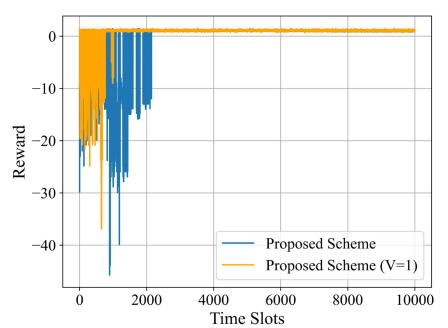

line

| Time Slots | Proposed Scheme | Proposed Scheme (V=1) |
| ---------- | --------------- | --------------------- |
| 0          | -30             | -30                   |
| 500        | -25             | -25                   |
| 1000       | -20             | -20                   |
| 1500       | -15             | -15                   |
| 2000       | -10             | -10                   |
| 2500       | -5              | -5                    |
| 3000       | 0               | 0                     |
| 3500       | 0               | 0                     |
| 4000       | 0               | 0                     |
| 4500       | 0               | 0                     |
| 5000       | 0               | 0                     |
| 5500       | 0               | 0                     |
| 6000       | 0               | 0                     |
| 6500       | 0               | 0                     |
| 7000       | 0               | 0                     |
| 7500       | 0               | 0                     |
| 8000       | 0               | 0                     |
| 8500       | 0               | 0                     |
| 9000       | 0               | 0                     |
| 9500       | 0               | 0                     |
| 10000      | 0               | 0                     |

(a) G=5,N=100

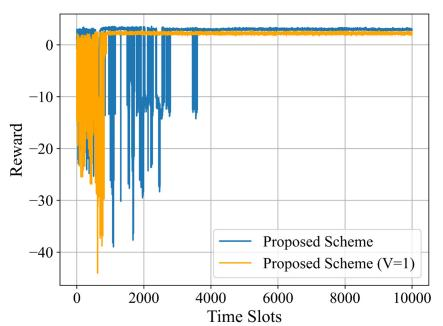

line

| Time Slots | Proposed Scheme | Proposed Scheme (V=1) |
| ---------- | --------------- | --------------------- |
| 0          | 0               | 0                     |
| 1000       | -30             | -40                   |
| 2000       | -25             | -35                   |
| 3000       | -20             | -30                   |
| 4000       | -15             | -25                   |
| 5000       | -10             | -20                   |
| 6000       | -5              | -15                   |
| 7000       | 0               | -10                   |
| 8000       | 0               | -5                    |
| 9000       | 0               | 0                     |
| 10000      | 0               | 0                     |

(b) G=5, N=125

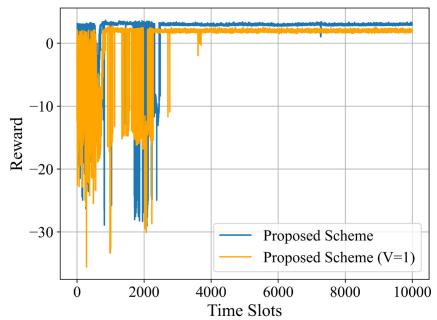

line

| Time Slots | Proposed Scheme | Proposed Scheme (V=1) |
| ---------- | --------------- | --------------------- |
| 0          | 0               | 0                     |
| 1000       | -5              | -10                   |
| 2000       | -10             | -15                   |
| 3000       | -5              | -10                   |
| 4000       | 0               | 0                     |
| 5000       | 0               | 0                     |
| 6000       | 0               | 0                     |
| 7000       | 0               | 0                     |
| 8000       | 0               | 0                     |
| 9000       | 0               | 0                     |
| 10000      | 0               | 0                     |

(c) G=5,N=150

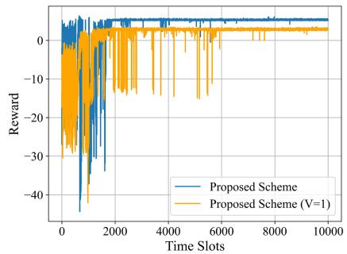

line

| Time Slots | Proposed Scheme | Proposed Scheme (V=1) |
| ---------- | --------------- | --------------------- |
| 0          | ~0              | ~0                    |
| 1000       | ~-35            | ~-25                  |
| 2000       | ~-10            | ~-15                  |
| 3000       | ~-5             | ~-10                  |
| 4000       | ~0              | ~-5                   |
| 5000       | ~0              | ~-5                   |
| 6000       | ~0              | ~-5                   |
| 7000       | ~0              | ~-5                   |
| 8000       | ~0              | ~-5                   |
| 9000       | ~0              | ~-5                   |
| 10000      | ~0              | ~-5                   |

(d) G=5, N=175

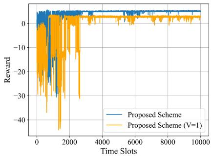

line

| Time Slots | Proposed Scheme | Proposed Scheme (V=1) |
| ---------- | --------------- | --------------------- |
| 0          | 0               | 0                     |
| 1000       | -5              | -10                   |
| 2000       | -15             | -25                   |
| 3000       | -20             | -30                   |
| 4000       | -25             | -35                   |
| 5000       | -30             | -40                   |
| 6000       | -35             | -45                   |
| 7000       | -40             | -50                   |
| 8000       | -45             | -55                   |
| 9000       | -50             | -60                   |
| 10000      | -55             | -65                   |

(e) G=5,N=200

Fig. 7. Training rewards for the proposed scheme for two instances, $V = 1$ and $V = 6 .$   
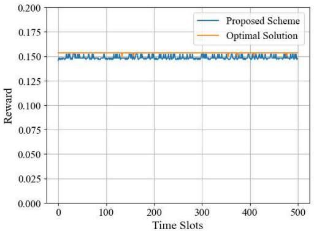

line

| Time Slots | Proposed Scheme | Optimal Solution |
| ---------- | --------------- | ---------------- |
| 0          | 0.15            | 0.15             |
| 100        | 0.15            | 0.15             |
| 200        | 0.15            | 0.15             |
| 300        | 0.15            | 0.15             |
| 400        | 0.15            | 0.15             |
| 500        | 0.15            | 0.15             |

Fig. 8. The reward comparison between the proposed scheme (after convergence) and the optimal solution.

# B. Performance Evaluation

To evaluate the convergence of JOPA in solving (P1), we train the DNNs for the two instances of the proposed scheme, i.e., $V = 6$ and $V = 1$ , across the five scenarios mentioned in Section V-A. We utilize the Optuna package for parameter tuning, running 100 experiments with different hyperparameters for each scenario to obtain the best results. In each experiment, we train the DNNs for 10,000 time slots $( \mathrm { i . e . , ~ } \eta ~ = ~ 1 0 , 0 0 0 )$ in an online manner by interacting with the environment. The training results for both instances of the proposed scheme are illustrated in Fig. 7. The training results show that the rewards for both instances fluctuate at the beginning of the training due to exploration. However, they gradually stabilize as the training progresses. It is also evident that as the total number of sensors increases, the time to converge also increases for both scheme instances. When $V = 1$ , the algorithm generally converges more quickly than the case of $V = 6$ because the action space size is significantly reduced by a factor of $V ^ { G }$ . In comparison, when $V = 6 ,$ the Valgorithm achieves a higher reward, indicating a higher overall network resource utilization and a lower task-dropping rate at the end of the training, which benefits from the flexibility of having the pruned model selection for local processing.

To further validate the performance gap of JOPA, we compare the rewards of the proposed scheme after convergence with that of an optimal solution obtained by exhaustive search where the computing resource allocation action space is discretized into 20 values. All combinations of action variables are tested to obtain the optimal solution, and the actions achieving the highest reward is selected as optimal. We consider a light-loaded network scenario with 3 gateways and 6 sensors for tractability to obtain the optimal solution within a reasonable time. As shown in Fig. 8, JOPA achieves a nearoptimal solution with a small performance gap. The reward fluctuations of JOPA are due to the sampled actions from a continuous space for the computing resource allocation.

# C. Performance Comparison

We compare the performance of JOPA with two benchmark schemes: 1) the JOPA with V = 1 (JOPAV1) and 2) an accuracy-guaranteed delay minimization (AGDM) scheme with static task requirements [28]. Both AGDM and JOPAV1 utilize a mid-pruned model, characterized by an accuracy of 95.17% and a pruning rate of 0.7, for local processing. In the

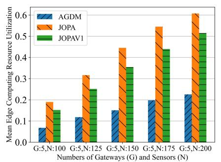

bar

| Numbers of Gateways (G) and Sensors (N) | AGDM | JOPA | JOPAV1 |
| ---------------------------------------- | ---- | ---- | ------ |
| G:5,N:100                                | 0.07 | 0.19 | 0.15   |
| G:5,N:125                                | 0.12 | 0.32 | 0.25   |
| G:5,N:150                                | 0.15 | 0.45 | 0.36   |
| G:5,N:175                                | 0.20 | 0.55 | 0.44   |
| G:5,N:200                                | 0.23 | 0.62 | 0.52   |

(a)

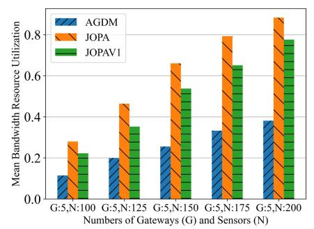

bar

| Numbers of Gateways (G) and Sensors (N) | AGDM | JOPA | JOPAV1 |
| --------------------------------------- | ---- | ---- | ------ |
| G:5,N:100                               | 0.1  | 0.3  | 0.2    |
| G:5,N:125                               | 0.2  | 0.5  | 0.4    |
| G:5,N:150                               | 0.3  | 0.7  | 0.6    |
| G:5,N:175                               | 0.4  | 0.9  | 0.7    |
| G:5,N:200                               | 0.5  | 1.0  | 0.8    |

(b)

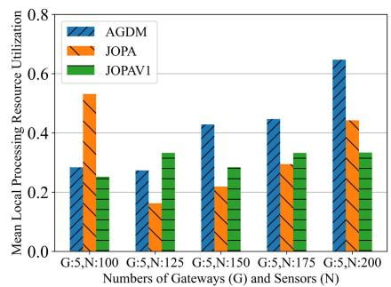

bar

| Numbers of Gateways (G) and Sensors (N) | AGDM | JOPA | JOPAV1 |
| ---------------------------------------- | ---- | ---- | ------ |
| G:5,N:100                                | 0.28 | 0.53 | 0.25   |
| G:5,N:125                                | 0.27 | 0.15 | 0.33   |
| G:5,N:150                                | 0.43 | 0.22 | 0.28   |
| G:5,N:175                                | 0.44 | 0.29 | 0.33   |
| G:5,N:200                                | 0.65 | 0.44 | 0.33   |

(c）

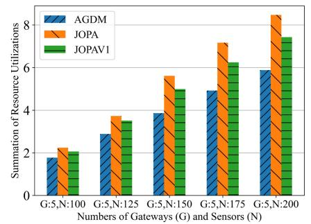

bar

| Numbers of Gateways (G) and Sensors (N) | AGDM | JOPA | JOPAV1 |
| ---------------------------------------- | ---- | ---- | ------ |
| G:5,N:100                                | 1.8  | 2.2  | 2.1    |
| G:5,N:125                                | 3.0  | 3.8  | 3.6    |
| G:5,N:150                                | 4.0  | 5.6  | 5.1    |
| G:5,N:175                                | 5.0  | 7.2  | 6.3    |
| G:5,N:200                                | 6.0  | 8.4  | 7.5    |

(d)

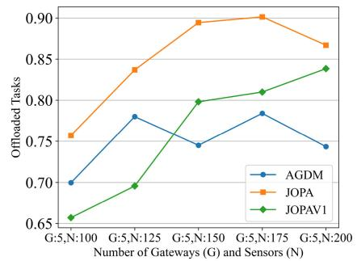

line

| Number of Gateways (G) and Sensors (N) | AGDM  | JOPA  | JOPAV1 |
| --------------------------------------- | ----- | ----- | ------ |
| G:5,N:100                               | 0.70  | 0.76  | 0.66   |
| G:5,N:125                               | 0.78  | 0.84  | 0.69   |
| G:5,N:150                               | 0.75  | 0.89  | 0.80   |
| G:5,N:175                               | 0.78  | 0.90  | 0.81   |
| G:5,N:200                               | 0.74  | 0.87  | 0.84   |

(e)

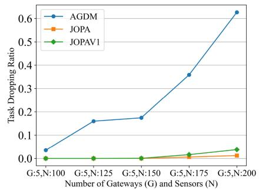

line

| Number of Gateways (G) and Sensors (N) | AGDM  | JOPA  | JOPAV1 |
| --------------------------------------- | ----- | ----- | ------ |
| G:5,N:100                               | 0.04  | 0.00  | 0.00   |
| G:5,N:125                               | 0.16  | 0.00  | 0.00   |
| G:5,N:150                               | 0.17  | 0.00  | 0.00   |
| G:5,N:175                               | 0.36  | 0.01  | 0.02   |
| G:5,N:200                               | 0.63  | 0.02  | 0.04   |

(f)   
Fig. 9. Comparison between JOPA, JOPA, and AGDM in terms of (a) bandwidth, (b) edge utilization, (c) local utilization, (d) overall utilization, (e) offloading ratio, and (f) task dropping ratio.

AGDM scheme, the task criticality levels for each IGW are initialized randomly but remain unchanged.

We compare the performance of the three schemes in terms of network resource utilization, adaptability to network load conditions, dynamic delay/accuracy requirements, and trade-off between QoS satisfaction and resource utilization.

• Network resource utilization: Figs. 9(a) and 9(b) show that the JOPA consistently achieves the highest mean bandwidth and edge computing resource utilization, followed by JOPAV1 and AGDM. This is because the JOPA has consistently higher task offloading rates, shown in Fig. 9(e), and lower task dropping rates, shown in Fig. 9(f), as the network load increases. Unlike JOPA and JOPAV1, despite an increase in network load and offloading rate, AGDM only has a minimal increase in bandwidth and edge utilization. This is due to its highest dropping rate, which reduces its effective utilization of bandwidth and edge computing resources. In a high network load condition, by offloading more tasks while maintaining lower dropping rates, JOPA also performs better than the JOPAV1 in edge and bandwidth utilization. In Figs. 9(a) and 9(b), the differences among the three schemes are initially negligible but becomes more notable as the network load (N) increases. In Fig. 9(c), AGDM prioritizes local task processing to minimize the overall processing latency, showing consistently high local processing resource utilization over different settings. The JOPA achieves higher local processing resource utilization when the network load is low due to its flexibility in selecting less pruned models to achieve a better time

utilization of local resources and higher task processing accuracy. As the network load increases, JOPA tends to offload more tasks to the edge, as shown in Fig. 9(e), thereby reducing the local side of the resource utilization. On the other hand, JOPAV1 shows consistently high local resource utilization over different network load conditions, balancing a trade-off between local processing and edge utilization. Fig. 9(d) provides a comparison of overall resource utilization among the three schemes, by aggregating local computing, edge computing, and bandwidth utilizations. JOPA consistently achieves the highest overall resource utilization, followed by JOPAV1 and AGDM. While all three schemes perform similarly under low network load conditions, the differences become more obvious as the numbers of gateways and sensors increase. Especially under a medium or high network load, the JOPA’s strategy of balancing task offloading with local processing achieves higher overall utilization than the other two schemes.

• Adaptability to network loads and dynamic QoS requirements: Fig. 9(f) shows that JOPA effectively satisfies the accuracy and delay requirements with no task dropping under the network capacity. When the network load (N) keeps increasing, the task dropping happens due to the violation of accuracy and delay constraints as a result of exceeding the network capacity. However, the JOPA maintains the lowest task-dropping rate (below the target task-dropping rate limit of 1% [45]), leveraging its adaptability to time-varying delay and accuracy requirements and its flexibility of pruned local processing model selection to balance the trade-off between accuracy and delay. In contrast, without the flexibility of local model selection, the JOPAV1 exceeds the tolerable limit when N increases beyond 150. The adaptability of the proposed JOPA to the dynamic delay and accuracy requirements is demonstrated in Figs. 10(a)-(b), where the JOPA outperforms the AGDM in adaptively satisfying the dynamically changing QoS requirements over time, leading to a much-reduced task dropping rate shown in Fig. 9(f). The AGDM exhibits a much higher taskdropping rate without adapting to the dynamic delay and accuracy requirements.

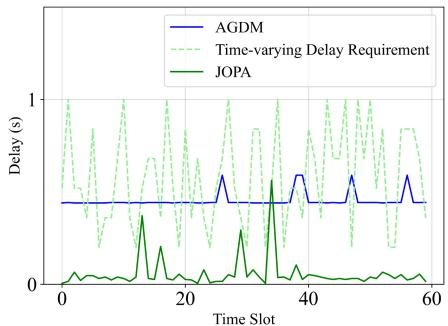

line

| Time Slot | AGDM | Time-varying Delay Requirement | JOPA |
| --------- | ---- | ------------------------------ | ---- |
| 0         | 0.5  | 1.0                            | 0.0  |
| 10        | 0.5  | 0.8                            | 0.2  |
| 20        | 0.5  | 0.9                            | 0.1  |
| 30        | 0.5  | 0.7                            | 0.3  |
| 40        | 0.5  | 0.9                            | 0.1  |
| 50        | 0.5  | 0.8                            | 0.2  |
| 60        | 0.5  | 0.7                            | 0.1  |

(a)

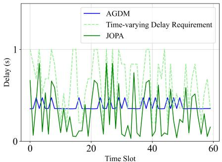

line

| Time Slot | AGDM | Time-varying Delay Requirement | JOPA |
| --------- | ---- | ------------------------------ | ---- |
| 0         | 0.5  | 1.0                            | 0.8  |
| 10        | 0.5  | 0.9                            | 0.7  |
| 20        | 0.5  | 0.8                            | 0.6  |
| 30        | 0.5  | 0.9                            | 0.7  |
| 40        | 0.5  | 0.8                            | 0.6  |
| 50        | 0.5  | 0.9                            | 0.7  |
| 60        | 0.5  | 0.8                            | 0.6  |

(b)

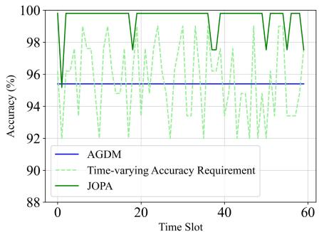

line

| Time Slot | AGDM | Time-varying Accuracy Requirement | JOPA |
| --------- | ---- | --------------------------------- | ---- |
| 0         | 95.5 | 96.0                              | 100  |
| 10        | 95.5 | 97.0                              | 100  |
| 20        | 95.5 | 96.0                              | 100  |
| 30        | 95.5 | 97.0                              | 100  |
| 40        | 95.5 | 96.0                              | 100  |
| 50        | 95.5 | 97.0                              | 100  |
| 60        | 95.5 | 96.0                              | 100  |

（c）

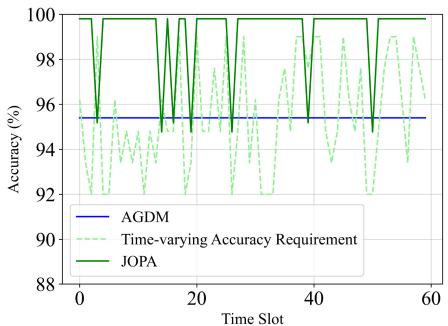

line

| Time Slot | AGDM | Time-varying Accuracy Requirement | JOPA |
| --------- | ---- | --------------------------------- | ---- |
| 0         | 95.5 | 96.0                              | 100  |
| 10        | 95.5 | 94.0                              | 100  |
| 20        | 95.5 | 95.0                              | 100  |
| 30        | 95.5 | 97.0                              | 100  |
| 40        | 95.5 | 93.0                              | 100  |
| 50        | 95.5 | 98.0                              | 100  |
| 60        | 95.5 | 96.0                              | 100  |

Fig. 10. Comparison of the adaptability between JOPA and AGDM delay requirements in (a) and (b), and accuracy requirements in (c) and (d).   
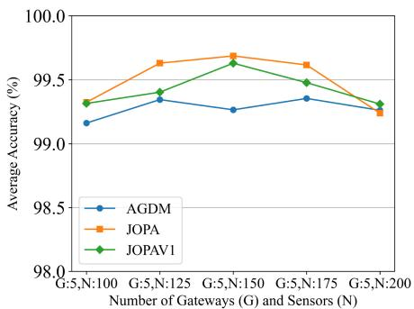

line

| Number of Gateways (G) and Sensors (N) | AGDM   | JOPA   | JOPAV1 |
| --------------------------------------- | ------ | ------ | ------ |
| G:5,N:100                               | 99.1   | 99.3   | 99.3   |
| G:5,N:125                               | 99.3   | 99.6   | 99.4   |
| G:5,N:150                               | 99.2   | 99.7   | 99.6   |
| G:5,N:175                               | 99.3   | 99.6   | 99.4   |
| G:5,N:200                               | 99.2   | 99.2   | 99.3   |

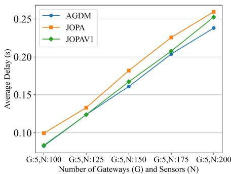

line

| Number of Gateways (G) and Sensors (N) | AGDM  | JOPA  | JOPAV1 |
| ---------------------------------------- | ----- | ----- | ------ |
| G:5,N:100                                | 0.08  | 0.10  | 0.08   |
| G:5,N:125                                | 0.13  | 0.14  | 0.13   |
| G:5,N:150                                | 0.16  | 0.18  | 0.17   |
| G:5,N:175                                | 0.20  | 0.22  | 0.21   |
| G:5,N:200                                | 0.24  | 0.26  | 0.25   |

Fig. 11. (a) Average inference accuracy and (b) E2E delay.

• Trade-off between QoS satisfaction and resource utilization: A balanced trade-off between resource utilization and QoS satisfaction (i.e., delay and accuracy) is achieved, as shown in Figs. 11(a) and 11(b). While achieving the highest overall resource utilization and the lowest task-dropping rate, JOPA achieves slightly higher

task processing accuracy than JOPV1 and AGDM, at the cost of sacrificing some delay performance, whereas the AGDM aims at achieving the minimum average E2E task processing delay with a certain accuracy guarantee. For JOPA and JOPAV1, as the network load increases, a significant portion of tasks are offloaded to the edge server to maintain a consistently high average accuracy using the full-weight model while achieving high bandwidth and edge computing resource utilization. The JOPA and JOPAV1 consistently achieve higher average accuracy than AGDM, as shown in Figs. 11(a) and 11(b), by offloading more tasks to the edge server and maintaining a low task dropping rate with the satisfaction of varying accuracy and delay requirements corresponding to different criticality levels, listed in Table II (b).

• Impact of DNN pruning rate selection: We evaluate the impact of pruning rate on the performance of JOPAV1 in terms of inference accuracy, average E2E delay, and taskdropping ratio. As seen in Figs. 12(a) and 12(b), with a low pruning rates $( p = 0 . 1 )$ , the JOPAV1 maintains the highest inference accuracy but also incurs the highest average delay due to increased computational demands. Conversely, a higher pruning rate $( p = 0 . 9 )$ reduces computational complexity, resulting in a lower delay; however, this comes at the expense of a significant reduction in accuracy, especially in a network with a large number of sensors (N). Furthermore, Fig. 12(c) highlights an increase in the task dropping rate. Specifically, with a low pruning rates $( p =$ 0.1), the JOPAV1 fails to satisfy the delay requirements of some tasks due to the increased processing time of the pruned models on the IGWs. Similarly, using a highlypruned model $( p = 0 . 9 )$ for local processing makes it challenging to meet the accuracy requirements of task processing. A moderate pruning rate $( p = 0 . 7 )$ balances the trade-off, offering a compromise between maintaining sufficient accuracy and low delays such that the task dropping ratio can be controlled effectively. This evaluation underscores the importance of selecting the DNN pruning rate to optimize the interplay of accuracy and delay in diverse IIoT scenarios.

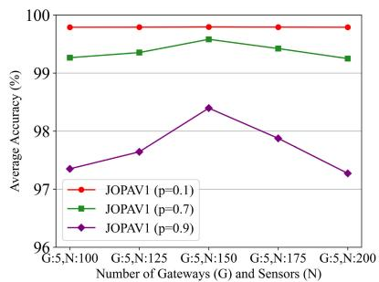

line

| Number of Gateways (G) and Sensors (N) | JOPAV1 (p=0.1) | JOPAV1 (p=0.7) | JOPAV1 (p=0.9) |
| ---------------------------------------- | -------------- | -------------- | -------------- |
| G:5,N:100                                | 99.8           | 99.2           | 97.3           |
| G:5,N:125                                | 99.8           | 99.3           | 97.6           |
| G:5,N:150                                | 99.8           | 99.5           | 98.4           |
| G:5,N:175                                | 99.8           | 99.4           | 97.9           |
| G:5,N:200                                | 99.8           | 99.2           | 97.3           |

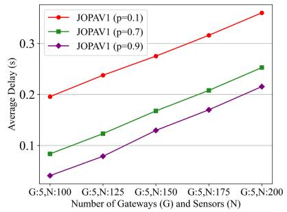

line

| Number of Gateways (G) and Sensors (N) | JOPAV1 (p=0.1) | JOPAV1 (p=0.7) | JOPAV1 (p=0.9) |
| ---------------------------------------- | -------------- | -------------- | -------------- |
| G:5,N:100                                | 0.2            | 0.08           | 0.04           |
| G:5,N:125                                | 0.23           | 0.12           | 0.08           |
| G:5,N:150                                | 0.27           | 0.16           | 0.12           |
| G:5,N:175                                | 0.3            | 0.2            | 0.16           |
| G:5,N:200                                | 0.35           | 0.25           | 0.2            |

(b)

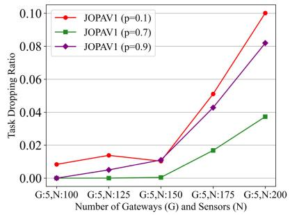

line

| Number of Gateways (G) and Sensors (N) | JOPAV1 (p=0.1) | JOPAV1 (p=0.7) | JOPAV1 (p=0.9) |
|---|---|---|---|
| G:5,N:100 | 0.01 | 0.00 | 0.00 |
| G:5,N:125 | 0.015 | 0.00 | 0.005 |
| G:5,N:150 | 0.01 | 0.00 | 0.01 |
| G:5,N:175 | 0.05 | 0.02 | 0.045 |
| G:5,N:200 | 0.1 | 0.04 | 0.085 |

Fig. 12. Performance comparison of JOPAV1 with different pruned models in terms of (a) average accuracy, (b) average delay, and (c) task dropping rate.

# VI. CONCLUSION AND FUTURE WORK

In this paper, we have studied joint task offloading, DNN model pruning, and computing resource allocation under a layered IIoT networking architecture to support diverse and dynamic QoS requirements of a fault detection service for industrial washing machines. We have formulated the problem as a stochastic optimization problem to maximize the overall radio bandwidth and computing resource utilization on the IGWs and the edge server, while guaranteeing the per-slot time-varying E2E delay and inference accuracy requirements. To capture the network state transitions and the relations between states and policies, our problem is transformed as an MRP formulation which has large state and action spaces growing with the numbers of IGWs and IIoT sensors. To solve the MRP problem in an efficient way, we have developed a DRL-based solution, i.e., the JOPA algorithm, where the SAC algorithmic framework is customized to thoroughly explore the state and action spaces for obtaining an improved solution. Extensive simulations have been conducted to evaluate the performance of the JOPA algorithm and its advantages over two benchmark schemes. It is demonstrated that our proposed solution achieves superior performance in terms of maximizing the network resource utilization, satisfying the dynamic QoS requirements, and adapting to the varying network load. For future work, we will investigate the impact of dynamic radio bandwidth resource allocation on the IIoT system design and performance optimization. Under an IIoT scenario with varying network conditions and QoS demands, exploring machine-learning-based approaches to jointly conduct dynamic radio resource scheduling, task offloading, and computing resource allocation is promising towards a more comprehensive and automated IIoT system.

# REFERENCES

[1] K. Gunasekaran, V. V. Kumar, A. C. Kaladevi, T. R. Mahesh, C. R. Bhat, and K. Venkatesan, “Smart decision-making and communication strategy in Industrial Internet of Things,” IEEE Access, vol. 11, pp. 28222–28235, 2023.   
[2] N. Setia, “The blockchain-powered edge computing platform for developing smart Internet of Things (IoT) applications,” in Proc. 2nd Int. Conf. Futuristic Technol. (INCOFT), 2023, pp. 1–6.   
[3] D. Hästbacka et al., “Dynamic edge and cloud service integration for Industrial IoT and production monitoring applications of industrial cyber-physical systems,” IEEE Trans. Ind. Informat., vol. 18, no. 1, pp. 498–508, Jan. 2022.   
[4] E. Zio, “Prognostics and health management methods for reliability prediction and predictive maintenance,” IEEE Trans. Rel., vol. 73, no. 1, pp. 41–41, Mar. 2024.   
[5] C. Dong, M. Shafiq, M. M. A. Dabel, Y. Sun, and Z. Tian, “DNN inference acceleration for smart devices in industry 5.0 by decentralized deep reinforcement learning,” IEEE Trans. Consum. Electron., vol. 70, no. 1, pp. 1519–1530, Feb. 2024.   
[6] S. Chouikhi, M. Esseghir, and L. Merghem-Boulahia, “Computation offloading for Industrial Internet of Things: A cooperative approach,” in Proc. Int. Wireless Commun. Mobile Comput. (IWCMC), 2023, pp. 626–631.   
[7] Y. He, M. Yang, Z. He, and M. Guizani, “Computation offloading and resource allocation based on DT-MEC-assisted federated learning framework,” IEEE Trans. Cogn. Commun. Netw., vol. 9, no. 6, pp. 1707–1720, Dec. 2023.   
[8] R. Sultan, A. Refaey, and W. Hamouda, “Resource allocation in CAT-M and LTE-A coexistence: A joint contention bandwidth optimization scheme,” in Proc. IEEE Can. Conf. Elect. Comput. Eng. (CCECE), London, ON, Canada, 2020, pp. 1–6.   
[9] S. Zhang, N. Yi, and Y. Ma, “A survey of computation offloading with task types,” IEEE Trans. Intell. Transp. Syst., vol. 25, no. 8, pp. 8313–8333, Jul. 2024.   
[10] A. Mahapatra, S. K. Majhi, K. Mishra, R. Pradhan, D. C. Rao, and S. K. Panda, “An energy-aware task offloading and load balancing for latency-sensitive IoT applications in the fog-cloud continuum,” IEEE Access, vol. 12, pp. 14334–14349, 2024.   
[11] C. Ling, K. Peng, S. Wang, X. Xu, and V. C. M. Leung, “A multi-agent DRL-based computation offloading and resource allocation method with attention mechanism in MEC-enabled IIoT,” IEEE Trans. Services Comput., vol. 17, no. 6, pp. 3037–3051, Nov./Dec. 2024.

[12] W. Fan et al., “DNN deployment, task offloading, and resource allocation for joint task inference in IIoT,” IEEE Trans. Ind. Informat., vol. 19, no. 2, pp. 1634–1646, Feb. 2023.   
[13] X. Zhang, M. Mounesan, and S. Debroy, “Effect-DNN: Energy-efficient edge framework for real-time DNN inference,” in Proc. IEEE 24th Int. Symp. World Wireless Mobile Multimedia Netw. (WoWMoM), 2023, pp. 10–20.   
[14] S. Qin, Y. Chen, S. Wang, Z. Xie, M. Wen, and D. W. K. Ng, “Integrating edge intelligence and Industrial IoT via learning-communication balancing power allocation,” in Proc. IEEE Int. Conf. Commun. (ICC), 2024, pp. 861–866.   
[15] W. Zhang, D. Yang, Y. Xu, X. Huang, J. Zhang, and M. Gidlund, “DeepHealth: A self-attention based method for instant intelligent predictive maintenance in Industrial Internet of Things,” IEEE Trans. Ind. Informat., vol. 17, no. 8, pp. 5461–5473, Aug. 2021.   
[16] W. Fang, F. Xue, Y. Ding, N. Xiong, and V. C. M. Leung, “EdgeKE: An on-demand deep learning IoT system for cognitive big data on industrial edge devices,” IEEE Trans. Ind. Informat., vol. 17, no. 9, pp. 6144–6152, Sep. 2021.   
[17] O. Marnissi, H. E. Hammouti, and E. H. Bergou, “Adaptive sparsification and quantization for enhanced energy efficiency in federated learning,” IEEE Open J. Commun. Soc., vol. 5, pp. 4307–4321, 2024.   
[18] Y. Chen et al., “Self-aware collaborative edge inference with embedded devices for task-oriented IIoT,” in Proc. IEEE 98th Veh. Technol. Conf. (VTC-Fall), 2023, pp. 1–5.   
[19] S. Vadera and S. Ameen, “Methods for pruning deep neural networks,” IEEE Access, vol. 10, pp. 63280–63300, 2022.   
[20] R. S. Sutton and A. G. Barto, Reinforcement Learning: An Introduction. Cambridge, MA, USA: MIT Press, 2018.   
[21] F. Zhang, G. Han, L. Liu, M. Martínez-García, and Y. Peng, “Deep reinforcement learning based cooperative partial task offloading and resource allocation for IIoT applications,” IEEE Trans. Netw. Sci. Eng., vol. 10, no. 5, pp. 2991–3006, Sep./Oct. 2023.   
[22] T. Lillicrap et al., “Continuous control with deep reinforcement learning,” in Proc. Int. Conf. Learn., 2016, p. 10.   
[23] N. H. Mahmood, N. Marchenko, M. Gidlund, and P. Popovski, Wireless Networks and Industrial IoT. New York, NY, USA: Springer, 2020.   
[24] X. Wang, S. Lu, W.-B. Huang, Q. Wang, S. Zhang, and M. Xia, “Efficient data reduction at the edge of Industrial Internet of Things for PMSM bearing fault diagnosis,” IEEE Trans. Instrum. Meas., vol. 70, pp. 1–12, 2021.   
[25] K. Simonyan and A. Zisserman, “Very deep convolutional networks for large-scale image recognition,” 2014, arXiv:1409.1556.   
[26] X. Liu, W. Xia, and Z. Fan, “A deep neural network pruning method based on gradient L1-norm,” in Proc. IEEE 6th Int. Conf. Comput. Commun. (ICCC), Chengdu, China, 2020, pp. 2070–2074.   
[27] W. Kang, D. Kim, and J. Park, “DMS: Dynamic model scaling for quality-aware deep learning inference in mobile and embedded devices,” IEEE Access, vol. 7, pp. 68048–16805, 2019.   
[28] W. Wu, P. Yang, W. Zhang, C. Zhou, and X. Shen, “Accuracy-guaranteed collaborative DNN inference in industrial IoT via deep reinforcement learning,” IEEE Trans. Ind. Informat., vol. 17, no. 7, pp. 4988–4998, Jul. 2021.   
[29] Z. Chen, Z. Chen, J. Lin, S. Liu, and W. Li, “Deep neural network acceleration based on low-rank approximated channel pruning,” IEEE Trans. Circuits Syst. I, Reg. Papers, vol. 67, no. 4, pp. 1232–1244, Apr. 2020.   
[30] J. Li, W. Liang, Y. Li, Z. Xu, X. Jia, and S. Guo, “Throughput maximization of delay-aware DNN inference in edge computing by exploring DNN model partitioning and inference parallelism,” IEEE Trans. Mobile Comput., vol. 22, no. 5, pp. 3017–3030, May 2023.   
[31] Y. Bian, Y. Sun, M. Zhai, W. Wu, Z. Wang, and J. Zeng, “Dependencyaware task scheduling and offloading scheme based on graph neural network for MEC-assisted network,” in Proc. IEEE/CIC Int. Conf. Commun. China (ICCC Workshops), 2023, pp. 1–6.   
[32] T. Yang, R. Chai, and L. Zhang, “Latency optimization-based joint task offloading and scheduling for multi-user MEC system,” in Proc. 29th Wireless Opt. Commun. Conf. (WOCC), 2020, pp. 1–6.   
[33] Q. Ye et al., “Joint RAN slicing and computation offloading for autonomous vehicular networks: A learning-assisted hierarchical approach,” IEEE Open J. Veh. Technol., vol. 2, pp. 272–288, 2021.   
[34] F. Kelly, “Notes on effective bandwidths,” in Stochastic Networks: Theory and Applications, vol. 4. London, U.K.: Oxford Univ. Press, 1996, pp. 141–168.   
[35] D. P. Kingma and J. Ba, “Adam: A method for stochastic optimization,” 2014, arXiv:1412.6980.

[36] L. Zeng, E. Li, Z. Zhou, and X. Chen, “Boomerang: On-demand cooperative deep neural network inference for edge intelligence on the Industrial Internet of Things,” IEEE Netw., vol. 33, no. 5, pp. 96–103, Sep./Oct. 2019.   
[37] W. Dabney, G. Ostrovski, and A. Barreto, “Temporally-extended -greedy exploration,” 2020, arXiv:2006.01782.   
[38] P. Auer, “Using upper confidence bounds for online learning,” in Proc. 41st Annu. Symp. Found. Comput. Sci., 2000, pp. 270–279.   
[39] H. Tran-Dang et al., “Bandit learning-based distributed computation in fog computing networks: A survey,” IEEE Access, vol. 11, pp. 104763–104774, 2023.   
[40] F. Pase et al., “Distributed resource allocation for URLLC in IIoT scenarios: A multi-armed bandit approach,” in Proc. IEEE Globecom Workshops (GC Wkshps), 2022, pp. 383–388.   
[41] V. Mnih et al., “Human-level control through deep reinforcement learning,” Nature, vol. 518, no. 7540, pp. 529–533, 2015.   
[42] X. Liu, J. Yu, J. Wang, and Y. Gao, “Resource allocation with edge computing in IoT networks via machine learning,” IEEE Internet Things J., vol. 7, no. 4, pp. 3415–3426, Apr. 2020.   
[43] W. Zhang et al., “Optimizing federated learning in distributed Industrial IoT: A multi-agent approach,” IEEE J. Sel. Areas Commun., vol. 39, no. 12, pp. 3688–3703, Dec. 2021.   
[44] S. Mao, M. H. Cheung, and V. W. S. Wong, “Joint energy allocation for sensing and transmission in rechargeable wireless sensor networks,” IEEE Trans. Veh. Technol., vol. 63, no. 6, pp. 2862–2875, Jul. 2014.   
[45] S. Langarica, C. Rüffelmacher, and F. Núñez, “An industrial Internet application for real-time fault diagnosis in industrial motors,” IEEE Trans. Autom. Sci. Eng., vol. 17, no. 1, pp. 284–295, Jan. 2020.

natural_image

Portrait of a man with curly hair and beard, outdoors with blurred background (no text or symbols visible)

Vahidreza Niazmand received the B.Sc. degree in computer engineering from Shiraz University, Shiraz, Iran, in 2021, and the M.Sc. degree in computer science from the Memorial University of Newfoundland, St. John’s, NL, Canada, in 2024. His research interests include task offloading, resource allocation, and the application of artificial intelligence in networking, as well as in other fields, such as healthcare.

natural_image

Portrait of a man wearing glasses and a light blue shirt (no text or symbols visible)

Qiang (John) Ye (Senior Member, IEEE) received the Ph.D. degree in electrical and computer engineering from the University of Waterloo, ON, Canada, in 2016. Since September 2023, he has been an Assistant Professor with the Department of Electrical and Software Engineering, Schulich School of Engineering, University of Calgary (UCalgary), Calgary, AB, Canada. Before joining UCalgary, he worked as an Assistant Professor with the Memorial University of Newfoundland, St. John’s, NL, Canada, from September 2021 to August

2023, and with Minnesota State University, Mankato, USA, from September 2019 to August 2021. From December 2016 to September 2019, he was with the Department of Electrical and Computer Engineering, University of Waterloo as a Postdoctoral Fellow and later as a Research Associate. He has authored around 80 research papers in top-tier journals and conference proceedings. He received the Best Paper Award in the IEEE/CIC International Conference on Communications (ICCC) in China in 2024 and IEEE Transactions on Cognitive Communications and Networking (TCCN) Exemplary Editor Award in 2023. He has been named among the World’s Top 2% Scientists in 2023 and 2024 (by Stanford/Elsevier). He is/was a General, Publication, Publicity, TPC, or the Symposium Co-Chair for different reputable international conferences and workshops (e.g., INFOCOM, GLOBECOM, VTC, ICCC, and ICCT). He also serves/served as the IEEE Vehicular Technology Society (VTS) Region 7 Chapter Coordinator in 2024, the IEEE Communications Society (ComSoc) Southern Alberta Chapter Vice Chair from 2024, and the VTS Regions 1–7 Chapters Coordinator from 2022 to 2023. He serves as an Associate Editor for prestigious IEEE journals, such as IEEE INTERNET OF THINGS JOURNAL, IEEE TRANSACTIONS ON VEHICULAR TECHNOLOGY, IEEE TRANSACTIONS ON COGNITIVE COMMUNICATIONS AND NETWORKING, and IEEE OPEN JOURNAL OF THE COMMUNICATIONS SOCIETY. He has been also selected as an IEEE ComSoc Distinguished Lecturer for the class of 2025–2026.