# Joint Task Offloading, Resource Allocation, and Trajectory Design for Multi-UAV Cooperative Edge Computing With Task Priority

Hao Hao , Changqiao Xu , Senior Member, IEEE, Wei Zhang , Shujie Yang , and Gabriel-Miro Muntean , Fellow, IEEE

Abstract—Mobile edge computing (MEC) has emerged as a solution to address the demands of computation-intensive network services by providing computational capabilities at the network edge, thus reducing service delays. Due to the flexible deployment, wide coverage and reliable wireless communication, unmanned aerial vehicles (UAVs) have been employed to assist MEC. This paper investigates the task offloading problem in a UAV-assisted MEC system with collaboration of multiple UAVs, highlighting task priorities and binary offloading mode. We defined the system gain based on energy consumption and task delay. The joint optimization of UAVs’ trajectory design, binary offloading decision, computation resources allocation, and communication resources management is formulated as a mixed integer programming problem with the goal of maximizing the long-term average system gain. Considering the discrete-continuous hybrid action space of this problem, we propose a novel deep reinforcement learning (DRL) algorithm based on the latent space to solve it. The evaluation results demonstrate that our proposed algorithm outperforms three state-of-the-art alternative solutions in terms of task delay and system gain.

Manuscript received 14 August 2023; revised 11 November 2023; accepted 2 January 2024. Date of publication 5 January 2024; date of current version 6 August 2024. This work was supported in part by the National Natural Science Foundation of China (NSFC) under Grant 62225105, in part by the National Natural Science Foundation of Shandong Province under Grants ZR2022QF040, ZR2022LZH015, and ZR2023LZH011, in part by the Major science and technology innovation Project of Shandong Province under Grant 2022CXGC020106, in part by the Major innovation project of QLU under Grant 2022JBZ01-01, in part by the Open Research fund of Key Lab of Broadband Wireless Communication and Sensor Network Technology (Nanjing University of Posts and Telecommunications), Ministry of Education under Grant JZNY202304, in part by the QLU Talent Research Project under Grant 2023RCKY138, and in part by Jinan City “20 New Colleges and Universities” under Grant 2021GXRC091. Recommended for acceptance by C. M. Pinotti. (Corresponding authors: Wei Zhang; Shujie Yang.)

Hao Hao and Wei Zhang are with the Key Laboratory of Computing Power Network and Information Security, Ministry of Education, Shandong Computer Science Center (National Supercomputer Center in Jinan), Qilu University of Technology (Shandong Academy of Sciences), and with Key Lab of Broadband Wireless Communication and Sensor Network Technology (Nanjing University of Posts and Telecommunications), Ministry of Education, Jinan 250316, China, and also with the Shandong Provincial Key Laboratory of Computer Networks, Shandong Fundamental Research Center for Computer Science, Nanjing 210049, China (e-mail: haoh@sdas.org; wzhang@sdas.org).

Changqiao Xu and Shujie Yang are with the State Key Laboratory of Networking and Switching Technology, Beijing University of Posts and Telecommunications, Beijing 100876, China (e-mail: cqxu@bupt.edu.cn; sjyang@bupt.edu.cn).

Gabriel-Miro Muntean is with the Performance Engineering Laboratory, School of Electronic Engineering, Dublin City University, Dublin 9 Dublin, Ireland (e-mail: gabriel.muntean@dcu.ie).

Digital Object Identifier 10.1109/TMC.2024.3350078

Index Terms—Deep reinforcement learning, mobile edge computing, task offloading, unmanned aerial vehicle (UAV).

# I. INTRODUCTION

L ATELY, many new computation-intensive and delay-sensitive network services which require large amounts of computation resources are emerging. Multi-access/mobile edge computing (MEC) [1] is an innovative computing paradigm that provides computational functions at the network edge to support such services. However, the current MEC solutions are not suitable for the situations with very high number of users or when network facilities are sparsely distributed [2]. In these situations, unmanned aerial vehicles (UAVs) can be employed to assist the MEC systems with their flexible deployment and large coverage potential, making UAV-assisted MEC systems promising solutions to enable execution of highly distributed computation-intensive tasks.

In terrestrial MEC networks both the location and service coverage of edge nodes are fixed and the edge servers can provide services for users in the local area only [5]. The UAV-assisted MEC systems have some unique features compared to the traditional terrestrial MEC systems [3], [4]. First of all, UAVs introduce mobility and offer flexibility, and therefore can support close-range services and can increase system computing capacity dynamically. When the computation workload of an edge server is very high or users need support beyond the coverage area, UAVs’ flight trajectory can be adjusted flexibly to provide service. Additionally, the scalability of the UAV-assisted MEC system is also unrivalled. Secondly, the onboard computing resources and energy supply of UAVs are very limited when compared with terrestrial edge servers, making very challenging any related task offloading decision. Therefore, unfortunately, the task offloading methods designed for terrestrial MEC-enabled networks can not be applied directly to the UAV-assisted MEC systems and new solutions are sought.

The single UAV-assisted task offloading problem has been extensively studied [6], [7], [8], [9], [10]. Due to its limited resources, a single UAV is adaptable to scenarios with small tasks, and the improvement provided to any task performance is limited. Also, it is often hard to meet the requirements for increasing task demands for computation resources. Instead, a more complex system which relies on collaboration of multiple UAVs can provide rich computation resources and large service coverage is worth investigating [11]. However, there are many challenges in relation to the task offloading problem in a multi-UAV MEC system, including trajectory design of multiple UAVs to avoid collisions of UAVs, management of communication resources between UAVs to improve transmission efficiency, collaborative task offloading to balance computation workload of UAVs, and so on.

In this context, few works on UAV-assisted MEC systems consider task priority. Diverse tasks have different tolerance of delay and their related services have diverse consequences [12]. For example, failure to complete navigation or road sensing tasks within the expected timeframe can have serious consequences (i.e. car accidents), while failure during live video streaming only affects user experience. Tasks with strict delay constraints should have high priority and need to be processed first to meet their delay requirements. Using preemptive scheduling methods makes it difficult for the low-priority tasks to get their required computing resources from UAVs, causing high delays and low quality services. A different approach should be used in order to avoid the starvation of low-priority tasks. Therefore, the task offloading decision in a UAV-assisted MEC system should be carefully designed to satisfy the different task requirements.

Most existing UAV-assisted task offloading schemes focus on partial offloading, allowing some flexibility in allocating resources for smaller sub-tasks and further reduce task processing delay [3], [13]. Although partial offloading has many advantages, it may be difficult to be applied to indivisible computation tasks [14]. Binary offloading may not be suitable to all cases, but is worth investigating as a complement to partial offloading, as it may provide more choices in the quest to achieve a good performance of task offloading in many scenarios. However, employing binary offloading may turn the task offloading problem into a joint optimization problem of continuous and discrete variables, which further increases the difficulty of solving the problem. Besides, both the requests and resource requirements associated with each UAV are highly time-varying. In this context, to improve the system performance, long-term average optimization is essential. However, it is hard to solve this problem of a non-convex nature, in a dynamic environment and with incomplete future information. Following the recent improvements of artificial intelligence (AI) approaches, deep reinforcement learning (DRL) has demonstrated good results in long-term optimization problem solving, which is very useful in wireless communications. Through training on historical data and exploring the dynamic environments, DRL can help take appropriate actions to get the optimal long-term average reward and make intelligent decisions under uncertainty, which can help solve our problem.

In order to address the above challenges, this paper focuses on task offloading in collaborative UAV-assisted MEC systems while considering task priorities and binary offloading. We optimize the long-term average system gain which is defined as being composed of task delay and energy consumption. The problem is formulated as a Markov Decision Process (MDP) with a discrete-continuous hybrid action space, and a novel DRL algorithm is proposed to solve it. The major contributions of this paper are as follows:

We investigate the priority-aware task offloading problem in a collaborative multi-UAV-assisted system, whose goal is to maximize the long-term average system gain. The joint optimization of UAVs’ trajectory design, offloading decision, computation resources allocation, and communication resources management is formulated as a mixed integer programming problem with the constraints of transmit power, computation capacity and task delay. Furthermore, this problem is transformed into a MDP.   
Considering that the traditional DRL algorithms are not compatible with a discrete-continuous hybrid action space, we introduce an embedding table for discrete actions and a conditional variational auto-encoder for continuous actions. Using the encoder, we construct a latent space for hybrid actions. Combining the latent space and a twin delayed deep deterministic policy gradient (TD3) algorithm, a novel DRL algorithm which can deal with a discretecontinuous hybrid action space is proposed to solve our joint optimization problem.   
We evaluate comparatively the proposed algorithm and experimental results show that our algorithm has better performance than three alternative solutions in terms of task delay and system gain.

The rest of this paper is organized as follows. The related works are discussed in Section II. The system model is introduced in Section III and the optimization problem formulation is shown in Section IV. Algorithm design and analysis of solutions are given in Section V. Section VI shows the performance of the proposed algorithm in terms of experimental results. Finally, Section VII concludes this paper.

# II. RELATED WORKS

Employing UAV-assisted MEC systems is a promising approach to dynamically expand network computing capacity and support emergency events. Task offloading in a UAV-assisted MEC system is a key issue and is becoming the focus of the latest research. From the optimization scenario point of view, the existing works can been mainly divided into single UAV solutions and multi-UAV cooperative approaches.

For single UAV-assisted MEC networks, authors of [6] designed a resource allocation framework, which maximizes the computation rate by jointly optimizing computation resources, communication resources and UAV trajectory. An alternative algorithm was proposed to solve the non-convex problem, and the successive convex approximation (SCA) method was used to optimize the UAV trajectory. Authors of [7] designed a UAV-assisted MEC system to reduce terrestrial signal blockage and shadowing. The joint optimization of UAV position, task offloading decision and resource allocation was formulated as a problem with the goal of minimizing task delay and UAV energy consumption. To solve the problem, an algorithm based on SCA was proposed. In [8], UAVs were applied to a 5G-enabled community task offloading system. The authors clustered users into communities based on geographic locations, and formulated the UAV-assisted task offloading problem as a mixed integer non-linear programming problem to maximize the average throughput. Researchers in [9] proposed an evolutionary multi-objective reinforcement learning algorithm to solve the UAV trajectory design and task offloading problem. They focused on three optimization sub-problems: minimize task delay, minimize energy consumption of UAV, and maximize the number of tasks collected by the UAV. The dependency among different tasks were highlighted in [10]. The joint optimization problem of resource allocation and trajectory design was formulated to minimize the system energy consumption with the constraints of task delay and dependency. The problem was further decomposed into two sub-problems iteratively and a joint dynamic programming and convex optimization algorithm was proposed to solve it. However, as mentioned, a single UAV has limited power and computation resources, and may not significantly improve the system performance to meet users’ requirements.

Multiple UAVs collaborative MEC systems which can utilize the resources of multiple UAVs have attracted increasing attention. Authors of [15] focused on the task offloading optimization problem in multiple UAV-enabled wireless networks. A two-layer cooperative framework based on software-defined networks to optimize the computation resources was designed, and a queue-based algorithm was proposed to minimize task delay. Authors of [16] formulated a delay minimization problem for the multi-UAVs enabled MEC networks. The load balancing of multiple UAVs was formulated as a no-convex problem. To get online task offloading decisions, authors further transformed the problem and utilized Lyapunov stochastic optimization to address it. DRL was used for the multi-UAV MEC systems in [17]. Authors formulated a MDP by jointly optimizing UAV trajectories, task offloading and transmit power. Considering the high-dimensional continuous action space, a multi-agent DRL based on the TD3 algorithm was proposed to minimize total system cost. In addition to the task offloading problem in UAVenabled systems, service caching problem was also taken into account in [18]. UAVs made task offloading decision and service caching decision at different time frequencies where caching decision had a longer time window. The energy consumption is formulated as a virtual queue and an algorithm based on the Lyapunov optimization was proposed to minimize the long-term average service delay. The vehicular fog computing based UAV system which combined unmanned ground vehicles and UAVs was introduced in [19]. The task offloading was transformed into a two-sided matching problem, then the authors designed a distributed algorithm by the dynamic of UAVs to reduce task delay. The UAVs-assisted MEC technology was combined with intelligent transportation systems in [20]. The authors proposed a UAV-enabled multi-hop collaborative framework to maximize user experience and task delay in each time slot.

However, the above works do not consider the priority of tasks when making task offloading decisions. Different tasks have different delay requirements. If we schedule all tasks equally, some important tasks may not be finished within the allowed delay threshold, which has serious consequences.

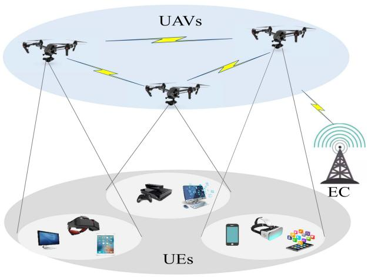

flowchart

```mermaid
graph TD
    A["UAVs"] --> B["EC"]
    C["UEs"] --> D["PC"]
    C --> E["Smartphone"]
    C --> F["Robot"]
    G["Mobile Device"] --> H["Wireless Signal"]
    I["Computer"] --> J["Wireless Signal"]
    K["Smartphone"] --> L["Wireless Signal"]
    M["Robot"] --> N["Wireless Signal"]
    O["Robot"] --> P["Wireless Signal"]
    Q["Robot"] --> R["Wireless Signal"]
    S["Robot"] --> T["Wireless Signal"]
    U["UAVs"] --> V["Wireless Signal"]
    W["UEs"] --> X["PC"]
    W --> Y["Smartphone"]
    W --> Z["Robot"]
    AA["Robot"] --> AB["Wireless Signal"]
    AC["PC"] --> AD["Wireless Signal"]
    AE["Smartphone"] --> AF["Wireless Signal"]
    AG["Robot"] --> AH["Wireless Signal"]
```

Fig. 1. UAV-assisted MEC system.

Few works on computing offloading consider task priority. The authors of [21] assigned a priority to each task based on its deadline and proposed a new delay-dependent priority-aware task offloading strategy for scheduling tasks, which can reduce the waiting time of the delay-sensitive tasks. The researchers who published [22] studied the priority-aware task offloading problem in a vehicular fog computing context. They formulated this problem as a MDP and proposed a DRL algorithm to solve it. Unfortunately, the research solutions proposed these papers rely on the fog computing framework and cannot be directly applied to UAV-enabled MEC networks. The authors of [23] studied the priority-aware task offloading problem with one UAV providing service. They employed a deep Q-learning algorithm for the problem and considered the scenario of a single UAV only, without any cooperation between multiple UAVs. The authors of [24] paid more attention to users’ satisfaction of servers in UAV-enabled MEC networks and considered the task priority based on the delay requirements of users’ tasks and remaining energy status of users. By jointly optimizing task offloading decisions and UAV scheduling strategy, the multi-UAVs enabled task offloading problem is formulated to maximize the total user satisfaction with constraints related to UAV energy consumption. This work mainly focused on the design of offloading decisions and UAV scheduling strategy and did not consider the allocation of transmit power and computation resources. Additionally, the authors of [24] studied the partial task offloading problem, which applies to many scenarios. In real world, there are many indivisible computation tasks, and the study of binary task offloading is still highly valuable.

# III. SYSTEM MODEL AND PROBLEM FORMULATION

A UAV-assisted MEC-based system with N UAVs, M user equipments (UEs) and access to an edge cloud server (EC) is considered as shown in Fig. 1. UAVs have two main roles related to data transmission and computation, respectively. On one hand, UAVs can forward computing tasks to other UAVs or the EC. On the other hand, UAVs can also provide computation resources to help UEs accomplish their tasks. Without loss of generality, the time is slotted, i.e., $\mathcal { T } = \{ 1 , 2 , . . . , T \}$ . A time slot refers to a short period of time, which can be in the region of several hundred milliseconds. Time slots are used to describe small time intervals in the proposed model design. Each UE m needs to handle computation-intensive tasks in each time slot; this can be defined via a four tuple $\mathbf { q } _ { m } ( t ) = ( c _ { m } ( t ) , u _ { m } ( t ) , v _ { m } ( t ) , o _ { m } ( t ) )$ , where $c _ { m } ( t )$ ( ) = ( ( ) ( ) ( ) ( )is the computing workload (the number of CPU cycles), $u _ { m } ( t )$ is the transmitted data size, $v _ { m } ( t )$ is the allowed ( )delay threshold and $o _ { m } ( t )$ is the task priority.

( )UAVs are equipped with multiple antennae, and can serve multiple UEs at the same time [25]. There are three transmission modes: ground-to-air (G2A) transmission from UE to UAV, airto-air (A2A) transmission from UAV to UAV, and air-to-ground (A2G) transmission from UAV to EC.

# A. UAVs Movement

We design the 3D coordinate of UAV n as $\mathbf { w } _ { n } ( t ) =$ $[ x _ { n } ( t ) , y _ { n } ( t ) , z _ { n } ( t ) ] ^ { T }$ , where $x _ { n } ( t ) , y _ { n } ( t )$ and $z _ { n } ( t )$ ( )are the $\mathrm { X , }$ [ ( ) ( ) ( )] ( ) ( ) ( )Y, Z coordinates of UAV n at time slot t, respectively. Denote the $\mathbf v _ { n } ( t ) = [ x _ { n } ( t ) , y _ { n } ( t ) ] ^ { T }$ as the 2D coordinate of UAV n. UAVs ( ) = [ ( ) ( )]always have limited flight distances because of their limited horizontal and vertical flight speeds, which can be given by:

$$
\triangle v _ {n} (t) = \left| \left| \mathbf {v} _ {n} (t + 1) - \mathbf {v} _ {n} (t) \right| \right| \leq L _ {\max} ^ {h} \tag {1}
$$

$$
\triangle z _ {n} (t) = \left| z _ {n} (t + 1) - z _ {n} (t) \right| \leq L _ {\max} ^ {v} \tag {2}
$$

$$
Z _ {m i n} \leq z _ {n} (t) \leq Z _ {\max} \tag {3}
$$

where $\triangle v _ { n } ( t )$ and $\triangle z _ { n } ( t )$ denote the horizontal travel distance ( ) ( )and vertical travel distance, respectively; $L _ { \operatorname* { m a x } } ^ { h }$ and $L _ { \mathrm { m a x } } ^ { v }$ are the maximum horizontal and vertical distances of the UAVs, respectively and $Z _ { m i n }$ and $Z _ { \mathrm { m a x } }$ denote the minimum and maximum heights of UAVs.

To avoid collision between any two UAVs, the distance between UAVs should not be less than a minimum distance $D _ { m i n }$ . The collision constraint is:

$$
\left| \left| \mathbf {w} _ {n} (t) - \mathbf {w} _ {j} (t) \right| \right| \geq D _ {\min}, \forall n, j, n \neq j \tag {4}
$$

When a rotary-wing UAV flies, its flight energy power is related to the speed v [26], which is defined as:

$$
P _ {n} ^ {f l y} (v) = \frac {W _ {n}}{2} v ^ {2} \tag {5}
$$

where $W _ { n }$ is the mass of UAV n. The flight energy consumption of UAV is obtained by:

$$
E _ {n} ^ {f l y} (t) = P _ {n} ^ {f l y} \left(\frac {| | \mathbf {w} _ {n} (t + 1) - \mathbf {w} _ {n} (t) | |}{\triangle t}\right) \triangle t \tag {6}
$$

where $\triangle t$ is the interval duration of time slot.

# B. Communication Model

We consider an UAV-enhanced MEC system which involves collaboration between multiple UAVs, which can communicate with each-other. We denote the bandwidths of the three main links as follows: $B ^ { G }$ for the G2A links, $B ^ { A }$ for the A2A links and $B ^ { E }$ for the A2G links. As the output data size of sub-tasks is usually much smaller than the input data, next we ignore the cost of result downloading [8]. Beside, the cross-interference between UAVs and UEs is also neglected in this paper [27]. This can be the focus of future work.

1) G2A Transmission: For G2A communication links, there are many scatters or obstacles in the real environment. So the radio signals do not propagate in free space because of the shadowing or scattering caused by obstacles, which results in additional path loss. As a result, the use of the simplified free space path loss (FSPL) model [26] is not accurate enough to model the communication between ground UEs and air UAVs. Instead, a probabilistic path loss model which considers the occurrence probabilities and path loss of LoS and Non-LoS (NLoS) communication is introduced to model the G2A communications.

The occurrence probabilities of LoS and NLoS communications between UE m and UAV n are:

$$
P _ {m, n} ^ {L o S} (t) = \frac {1}{1 + a e ^ {- b ((1 8 0 / \pi) a r c s i n (z _ {n} (t) / d _ {m , n} (t)) - a)}} \tag {7}
$$

$$
P _ {m, n} ^ {N L o S} (t) = 1 - P _ {m, n} ^ {L o S} \tag {8}
$$

where $d _ { m , n } ( t ) = | | \mathbf { w } _ { n } ( t ) - \mathbf { w } _ { m } ( t ) | |$ is the distance between UE ( ) = ( ) ( )m and UAV n and a and b are constant values related to the environment. Thus, the path loss between UE m and UAV n for LoS and NLoS communication is modeled as follows:

$$
P L _ {m, n} ^ {\zeta} (t) = L _ {m, n} (t) + \eta_ {\zeta}, \quad \zeta \in \{L o S, N L o S \} \tag {9}
$$

where $L _ { m , n } ( t ) = 2 0 l g ( 4 \pi / c ) + 2 0 l g ( f r _ { c } ) + 2 0 l g ( d _ { m , n } ( t ) )$ ( ) = 20 (4 ) + 20denotes the free space path loss, lg is $\log _ { 1 0 } , f r _ { c }$ ( ( ))means the logcarrier frequency, c means the speed of light, and $\eta _ { \zeta }$ is excessive path loss of LoS or NLoS links. We get the average path loss for the G2A links next:

$$
\bar {P L} _ {m, n} (t) = P L _ {m, n} ^ {L o S} (t) P _ {m, n} ^ {L o S} (t) + P L _ {m, n} ^ {N L o S} (t) P _ {m, n} ^ {N L o S} (t) \tag {10}
$$

The channel gain between UE m and UAV n is

$$
g _ {m, n} (t) = 1 / \bar {P L} _ {m, n} (t) \tag {11}
$$

Therefore, we denote uplink transmission rate from UE m to UAV n as follows:

$$
r _ {m, n} ^ {G 2 A} (t) = B ^ {G} \log_ {2} (1 + \frac {p _ {m} (t) g _ {m , n} (t)}{I N _ {m , n} + N _ {G}}) \tag {12}
$$

where $\begin{array} { r } { I N _ { m , n } = \sum _ { m _ { 0 } \neq m } ^ { m _ { 0 } \in N _ { n } } p _ { m _ { 0 } } ( t ) g _ { m _ { 0 } , n } ( t ) } \end{array}$ is the interference = ( ) ( )power signal from other UEs in the coverage area of UAV n, $p _ { m } ( t )$ is the transmit power of UE m, and $N _ { G }$ is the noise power.

( )Due to the limited coverage of a UAV, if UE m communicates with UAV $n ,$ the distance between UE m and UAV n cannot exceed the specified communication distance $R _ { G 2 A }$ , which is expressed as follows:

$$
d _ {m, n} (t) \leq R _ {G 2 A} \tag {13}
$$

2) A2A Transmission: When the offloading target of UE m is UAV n rather than UVA n which it belongs to, UE m transmits data to UAV n and UAV n forwards it to UAV $n ^ { \prime } .$ . As UAVs can communicate in full duplex mode. UAV n can receive data from UE m while forwarding data to UAV $n ^ { \prime } .$ . Considering the high hovering altitude of UAVs, the LoS link is the dominant one in A2A communications, and the communication environment between UAVs can be approximated as a free space. So, we apply the FSPL model to describe the A2A communications [28], where the path loss between UAV n and UAV n is given as

$$
P L _ {n, n ^ {\prime}} ^ {A 2 A} = 3 2. 4 5 + 2 0 l g (f r _ {c}) + 2 0 l g (d _ {n, n ^ {\prime}} (t)) \tag {14}
$$

where $d _ { n , n ^ { \prime } } ( t ) = | | \mathbf { w } _ { n } ( t ) - \mathbf { w } _ { n ^ { \prime } } ( t ) | |$ is the distance between UAV $n ^ { \prime }$ ( ) =and UAV n.

The data rate between UAV n and n is expressed as

$$
r _ {n, n ^ {\prime}} ^ {A 2 A} (t) = B ^ {A} \log_ {2} \left(1 + \frac {p _ {n} (t) 1 0 ^ {- \frac {P L _ {n , n ^ {\prime}} ^ {A 2 A}}{1 0}}}{N _ {A}}\right) \tag {15}
$$

where $p _ { n } ( t )$ is the transmit power of UAV $n , N _ { A }$ is the noise power.

3) A2G Transmission: We denote the fixed location of EC as: $\mathbf { w } ^ { E C } = [ x ^ { E C } , y ^ { E C } , z ^ { E C } ] ^ { T }$ . The distance between UAV n = [and EC at time slot t is:

$$
d _ {n} ^ {E C} (t) = \left\| \mathbf {w} _ {n} (t) - \mathbf {w} ^ {E C} \right\| \tag {16}
$$

Similar to the G2A transmissions from UEs to UAVs, the channel gain between UAV n and the EC at time slot t is:

$$
g _ {n} (t) = \frac {1}{P L _ {n} ^ {L o S} P _ {n} ^ {L o S} + P L _ {n} ^ {N L o S} P _ {n} ^ {N L o S}} \tag {17}
$$

where P LLoSn $P L _ { n } ^ { L o S }$ $P L _ { n } ^ { N L o S }$ are the path loss of LoS and NLoS,he occurrence probabilities of LoS and P LoS $P _ { n } ^ { L o S }$ n $P _ { n } ^ { N L o S }$ and NLoS communication between UAV n and the EC, respectively. For the calculation of these parameters, refer to (7)–(9).

The transmission rate from UAV n to the EC is:

$$
r _ {n} ^ {A 2 G} (t) = B ^ {E} \log_ {2} \left(1 + \frac {p _ {n} (t) g _ {n} (t)}{\sum_ {n _ {0} \neq n} ^ {n _ {0} \in \mathbb {N}} p _ {n _ {0}} (t) g _ {n _ {0}} (t) + N _ {E}}\right) \tag {18}
$$

where $N _ { E }$ is the noise power.

# C. Computation Model

We denote the task offloading decision as $\gamma _ { m } ^ { n } ( t ) \in \{ 0 , 1 \}$ , where $\gamma _ { m } ^ { n } ( t ) = 1$ ( ) 0 1if UE m offloads task to computation location ( ) = 1n at time t, otherwise, $\gamma _ { m } ^ { n } ( t ) = 0$ . Here, $n \in \{ 0 , 1 , . . . , N , N +$ ( ) = 0 0 1 +} indicates the computation location. If n  , the location is 1UE itself; if $1 \leq n \leq N$ = 0, the location is UAV n; if $n = N + 1$ , 1 = + 1the location is EC. For example, if UE m completes the task locally, then $\gamma _ { m } ^ { 0 } ( t ) = 1 . \mathrm { S o }$ , the tasks from UE m have $N + 2$ ( ) = 1 + 2options for computation locations: local device, anyone of N UAVs, and edge cloud server. In other words, an UAV can offload computing tasks from users within its own coverage area to other UAVs; this illustrates the collaboration between multiple UAVs. In a classic model without the collaboration between UAVs, tasks have three options only for computation locations: local device, the UAV they belongs to, and edge cloud server. In that case, an UAV cannot offload any task to other UAVs, even if they are free.

We assume that computing tasks are indivisible, and a task can only be processed at one location in each time slot. The constraints of tasks are as follows:

$$
\sum_ {n = 0} ^ {N + 1} \gamma_ {m} ^ {n} (t) = 1 \tag {19}
$$

The computation delay of UEs is:

$$
t _ {m} ^ {U E} (t) = \frac {\gamma_ {m} ^ {0} (t) c _ {m} (t)}{f _ {m} ^ {0}} \tag {20}
$$

where $f _ { m } ^ { 0 }$ is the computing capability of UE m. The computation delay of UAVs is

$$
t _ {m} ^ {U A V} (t) = \sum_ {n = 1} ^ {N} \frac {\gamma_ {m} ^ {n} (t) c _ {m} (t)}{f _ {m} ^ {n} (t)} \tag {21}
$$

where $f _ { m } ^ { n } ( t )$ is the computing capability that UAV n allocates ( )to UE m at time slot t. UAV n has limited computing resources [29], the constraint is:

$$
\sum_ {m = 1} ^ {M} f _ {m} ^ {n} (t) \leq F ^ {n} \tag {22}
$$

where $F ^ { n }$ is the computing capacity of UAV n. If tasks are offloaded to EC, the computation delay is:

$$
t _ {m} ^ {E C} (t) = \frac {\gamma_ {m} ^ {N + 1} (t) c _ {m} (t)}{f _ {m} ^ {N + 1}} \tag {23}
$$

where $f _ { m } ^ { N + 1 }$ is the fixed computing power allocated to UE m by the EC.

# D. Task Priority Model

Tasks are classified into high-priority tasks and low-priority tasks according to their allowed delay threshold. High-priority tasks have strict delay constraint (i.e. navigation, road-sensing in vehicular). If we cannot finish a high-priority task within its maximum tolerable delay, the task will be failed and results in severe impact. The tasks with tolerant delay are classified as low priority tasks, such as entertainment applications. If the allotted time for a low-priority task surpasses the allowed delay threshold, it might solely impact the user experience without compromising the overall usefulness of the result.

To prevent low-priority computational tasks from starvation, we utilize distinct utility functions to represent task priorities, rather than employing preemptive scheduling methods directly. Similar to [22], [30], we consider a definition of task utility based on priority, completion time (task delay), and allowed delay threshold. For high-priority tasks, it is mandatory that they are completed within the designated delay threshold. When a high-priority task satisfies its allowed delay threshold, it is considered available, and its utility is non-negative and inversely proportional to the completion time. However, if a high-priority task exceeds the allowed delay threshold and cannot be completed in time, it is deemed a failure and incurs a negative utility as a penalty. We establish the utility function of a high-priority task following the principles mentioned above, as follows:

$$
U _ {m} ^ {H} (t) = \left\{ \begin{array}{l l} \log_ {2} (1 + v _ {m} (t) - T _ {m} (t)), & T _ {m} (t) \leq v _ {m} (t) \\ - P ^ {H}, & T _ {m} (t) > v _ {m} (t) \end{array} \right. \tag {24}
$$

where $T _ { m } ( t )$ is the completion time, and $- P ^ { H }$ is a negative ( )constant, which represents the penalty for not completing the high-priority task within its allowed delay threshold.

For a low-priority task, the completion time requirement is relatively lenient. If a low-priority task cannot be completed within its allowed delay threshold, it is still considered available, but the utility decreases exponentially with time. On the other hand, if a low-priority task is completed before the deadline, the utility is a positive constant as a reward. We define the utility function for a low-priority task next:

$$
U _ {m} ^ {L} (t) = \left\{ \begin{array}{l l} P ^ {L}, & T _ {m} (t) \leq v _ {m} (t) \\ P ^ {L} e ^ {- \rho (T _ {m} (t) - v _ {m} (t))}, & T _ {m} (t) > v _ {m} (t) \end{array} \right. \tag {25}
$$

where $P ^ { L }$ is a fixed positive value that represents the reward for successfully completing a low-priority task within its specified time limit, and $\rho > 0$ is a constant. Specifically, if a low-priority task cannot be completed $( \mathrm { i } . \mathrm { e } . { t _ { n } } = - \infty )$ ), then the utility is zero.

=The task priority model employed, which uses logarithmic and negative exponential expressions, is appropriate. Logarithmic and negative exponential forms have long tail effects which are close to how user experience manifests. For example, if the latency of a service changes from 0.1 s to 1 s, it will have a big impact on the user experience. However, if the latency of a service changes from 10.1 s to 11 s, it will have little impact on the user experience. Logarithmic and negative exponential forms can describe this property very well. Besides, the minimum value of a logarithmic expression is 0 if the high-priority task can been completed within the allowed delay threshold, which guarantees that the utility of on-time completion is higher than the utility of a task overtime. Similarly, the maximum value of a negative exponential expression is 1 if the low-priority task cannot be completed within the allowed delay threshold, which guarantees that the utility of a task overtime is lower than the utility of the on-time completion.

# IV. PROBLEM OPTIMIZATION

# A. Multi-UAV Cooperative Computation Model

Based on location, there are three computation types: computation at UEs, computation at UAVs and computation at the EC.

1) Computation at UEs: There is no transmission delay if UEs finish tasks locally, so the total delay is equal to the computation delay $T _ { m } ^ { 0 } ( t ) = \dot { t } _ { m } ^ { U E } ( t )$ t m . There is only energy consumption ( ) =of local computation.

$$
E _ {m} ^ {0} (t) = \kappa_ {0} (f _ {m} ^ {0}) ^ {3} t _ {m} ^ {U E} (t) \tag {26}
$$

where $\kappa _ { 0 } \leq 0$ is the effective switched capacitance of UEs.

02) Computation at UAVs: We assume that UE m offloads data to UAV n in time slot t. UE m first needs to transfer the data to UAV n that it belongs to. If the data target is not $n ,$ which means $n ^ { \prime } \neq n .$ , UAV n has to further transfer the data to =UAV n . As the UAVs communicate in full duplex. UAV n can receive the data from UE m while also can forward the received data to the target UAV n . In this process, UAV n assumes the role of a transmission relay, and the G2A and A2A data transmissions are done in parallel. Therefore, the transmission delay takes the maximum values of the time needed for G2A and A2A communications. Otherwise, UAV n allocates computing resource to UEs m directly. The transmission delay is:

$$
t _ {m} ^ {n ^ {\prime}} (t) = \max \left\{\frac {o _ {k}}{r _ {m , n} ^ {G 2 A} (t)}, \frac {o _ {k}}{r _ {n , n ^ {\prime}} ^ {A 2 A} (t)} \right\} \tag {27}
$$

where $o _ { k } / r _ { n , n ^ { \prime } } ^ { A 2 A } ( t ) = 0 { \mathrm { i f } } n = n ^ { \prime }$ . The total delay is:

$$
T _ {m} ^ {n ^ {\prime}} (t) = t _ {m} ^ {n ^ {\prime}} (t) + t _ {m} ^ {U A V} (t) \tag {28}
$$

The transmission energy consumption from UE m to UAV n can be obtained as follows:

$$
e _ {m} ^ {n} (t) = \frac {p _ {m} (t) o _ {k}}{r _ {m , n} ^ {G 2 A} (t)} \tag {29}
$$

Similarly, if the target UAV n is not n, the transmission energy consumption from UAV n to UAV n can be obtained as follows:

$$
e _ {n} ^ {n ^ {\prime}} (t) = \frac {p _ {n} (t) o _ {k}}{r _ {n , n ^ {\prime}} ^ {A 2 A} (t)} \tag {30}
$$

The computation energy consumption of UAV n is:

$$
e _ {m, n ^ {\prime}} ^ {U A V} (t) = \kappa_ {n ^ {\prime}} [ f _ {m} ^ {n ^ {\prime}} (t) ] ^ {3} t _ {m} ^ {U A V} (t) \tag {31}
$$

where $\kappa _ { n ^ { \prime } }$ is the effective switched capacitance of UAV $n ^ { \prime } .$ .

The total energy consumption if UE m offloads task to UAV $n ^ { \prime }$ can be obtained as follows:

$$
E _ {m} ^ {n ^ {\prime}} (t) = e _ {m} ^ {n} (t) + e _ {n} ^ {n ^ {\prime}} (t) + e _ {m, n ^ {\prime}} ^ {U A V} (t) \tag {32}
$$

3) Computation at EC: Similar to computation at UAVs, UE m transmits data to EC l through UAV n. The transmission delay is:

$$
t _ {m} ^ {N + 1} (t) = \max \left\{\frac {o _ {k}}{r _ {m , n} ^ {G 2 A} (t)}, \frac {o _ {k}}{r _ {n} ^ {A 2 G} (t)} \right\} \tag {33}
$$

and the total delay is:

$$
T _ {m} ^ {N + 1} (t) = t _ {m} ^ {N + 1} (t) + t _ {m} ^ {E C} (t) \tag {34}
$$

The transmission energy consumption from UAV n to the EC is as follows:

$$
e _ {n} (t) = \frac {p _ {n} (t) o _ {k}}{r _ {n} ^ {A 2 G} (t)} \tag {35}
$$

Considering that the EC has sufficient power, we do not incorporate the energy consumption of EC into the optimization. The total energy consumption is then:

$$
E _ {m} ^ {N + 1} (t) = e _ {m} ^ {n} (t) + e _ {n} (t) \tag {36}
$$

# B. Problem Design

The service delay of UE m at time slot t is:

$$
\begin{array}{l} T _ {m} (t) = \gamma_ {m} ^ {0} (t) T _ {m} ^ {0} (t) + \gamma_ {m} ^ {N + 1} (t) T _ {m} ^ {N + 1} (t) \\ + \sum_ {n ^ {\prime} = 1} ^ {N} \gamma_ {m} ^ {n ^ {\prime}} (t) T _ {m} ^ {n ^ {\prime}} (t) \tag {37} \\ \end{array}
$$

As previously mentioned, computational tasks of varying priorities have distinct requirements regarding task delay. Rather than directly optimizing task delay, we optimize the prioritybased utility function of task delay, which is defined as follows:

$$
U _ {m} (t) = (1 - o _ {m} (t)) U _ {m} ^ {H} (t) + o _ {m} (t) U _ {m} ^ {L} (t) \tag {38}
$$

where $o _ { m } ( t ) = 0$ is the high-priority task, and $o _ { m } ( t ) = 1$ is the low-priority task.

The total energy consumption is:

$$
\begin{array}{l} E _ {m} (t) = \gamma_ {m} ^ {0} (t) E _ {m} ^ {0} (t) + \gamma_ {m} ^ {N + 1} (t) E _ {m} ^ {N + 1} (t) \\ + \sum_ {n ^ {\prime} = 1} ^ {N} (\gamma_ {m} ^ {n ^ {\prime}} (t) E _ {m} ^ {n ^ {\prime}} (t) + E _ {n} ^ {f l y} (t)) \tag {39} \\ \end{array}
$$

Task delay and energy consumption are two main factors in UAV-assisted MEC systems, which are also our optimization objectives. Similar to [7], [15], [17], we define the system gain as a weighted sum of the energy consumption $E _ { m } ( t )$ and the priority-based utility function $U _ { m } ( t )$ ( )which combines task delay ( )and priority. The utility function of system gain is defined as follows:

$$
F _ {m} (t) = w _ {1} U _ {m} (t) - w _ {2} E _ {m} (t) \tag {40}
$$

where $w _ { 1 }$ and $w _ { 2 }$ are weight parameters. We can adjust the weight parameters according to the system deployment scenario. For example, in delay-sensitive systems, we can increase the weight parameter $w _ { 1 }$ or decrease the weight parameter $w _ { 2 }$ . Even we can optimize the task delay only by setting $w _ { 2 } = 0$ .

= 0Thus, by jointly optimizing offloading decision γ, UAVs position w, transmit power p, and the computation resource allocation of UAVs f, the task offloading optimization problem can be designed to maximize the total system gain. The problem is formulated as follows:

$$
\max _ {\boldsymbol {\gamma}, \mathbf {w}, \mathbf {p}, \mathbf {f}} \lim _ {T \to \infty} \frac {1}{T} \sum_ {t = 1} ^ {T} \sum_ {m = 1} ^ {M} F _ {m} (t)
$$

$\mathrm { s . t . ~ 0 } \leq p _ { n } ( t ) \leq P _ { \operatorname* { m a x } } ^ { U A V } , \forall n \in \mathcal N$ (41a)

$$
0 \leq p _ {m} (t) \leq P _ {\max} ^ {U E}, \quad \forall m \in \mathcal {M} \tag {41b}
$$

$$
\gamma_ {m} ^ {n} (t) \in \{0, 1 \} \tag {41c}
$$

$$
x _ {m i n} \leq x _ {n} (t) \leq x _ {\max}, y _ {m i n} \leq y _ {n} (t) \leq y _ {\max} \tag {41d}
$$

$$
\triangle w _ {n} (t) \leq v _ {\max} \triangle t \tag {41e}
$$

$$
(1) - (4), (1 3), (1 9), (2 2) \tag {41f}
$$

where the optimization goal is to maximize the long-term average system gain. Constraints (41a) and (41b) indicate that the transmit power of UAVs and UEs are limited. Constraint (41c) denotes the constraints of task offloading and (41d) and (41e) are the constraints related to the movement area and movement speed of UAVs, respectively. Eq. (1)–(4) describe the position constraints of UAVs, (13) denotes UE is within the coverage range of the UAV, (19) denotes that there is one and only one device available to process the task, and (22) is the constraints about the limited computing resources of UAVs.

Generally, it is intractable to solve the optimization problem (41). The optimization objective is the long-term average system gain, which always need the future information in traditional methods (i.e. dynamic programming). However, it is challenging to predict system state in dynamically networks. Moreover, DRL can achieve model-free learning by data sampling instead of state transition. Although DRL is an effective method to solve longterm average optimization problem, this is a discrete-continuous hybrid optimization problem. There are scalability issue and additional approximation difficulty which may decrease the model performance if we use traditional DRL methods directly. To address these challenges, a novel DRL method will be investigated to learn the near-optimal policy with discrete-continuous hybrid action space in the next section.

# C. MDP Formulation

In UAV-assisted MEC systems, we optimize the offloading decision, UAVs position, transmit power and computation resource allocation to maximize the system gain. The system state in the next time slot depends on the state and action at the current time only. In this case, the UAV-assisted task offloading problem (41) can be formulated as a MDP. In time slot t, we observe system state and then select the action. The system will generate a corresponding reward to reflect the action. The goal is to maximize the long-term system reward by employing an optimization strategy that maps states to actions.

1) State Space S: If we add the channel quality of each transmission link into the state space, the state space will increase rapidly with the number of UAVs, increasing the complexity of any associated algorithm to $\mathcal { O } ( N ^ { 2 } )$ . In order to reduce the size of ( )the state space, we noted that the channel quality is related to the positions of UAVs due to the time-invariant signal interference (i.e. noise power) between two positions in the model. In other words, the channel quality of links varies with the positions of UAVs, and we can calculate the channel quality of links according to the positions of UAVs if the signal interference is fixed. Therefore, we add the positions of UAVs into the state space to describe the channel quality and the associated complexity is $\mathcal { O } ( N )$ . Additionally, we do not add the variables that are not ( )time-varying (such as $L _ { \mathrm { m a x } } ^ { h }$ and $L _ { m i n } ^ { v } )$ to the state space. We can use these variables directly during training without them being part of the state space. Therefore in the optimization problem, the state $s ( t )$ is composed of properties of computing tasks and ( )3D coordinate positions of UAVs, that is:

$$
s (t) = \{\mathbf {q} (t), \mathbf {w} (t) \} \tag {42}
$$

where $\mathbf { q } ( t ) = [ \mathbf { q } _ { 1 } ( t ) , \mathbf { q } _ { 2 } ( t ) , . . . , \mathbf { q } _ { M } ( t ) ]$ and ${ \bf w } ( t ) =$ $[ { \bf w } _ { 1 } ( t ) , { \bf w } _ { 2 } ( t ) , . . . , { \bf w } _ { N } ( t ) ]$ ( ) ( )] ( ) =. Since the total dimension of [ ( ) ( ) ( )]computing tasks’ properties is 4M and the total dimension of UAVs’ positions is 3N , the total dimension of state $s ( t )$ is $4 M + 3 N$ ( ), where N is the number of UAVs and M is the 4 + 3number of UEs.

2) Action Space A: If we directly use the $\gamma _ { m } ^ { n } ( t )$ as the action, the action space is $M ( N + 2 )$ ( ). This both increases the number ( + 2)of output neurons and leads to additional consideration of constraint (19), which increases the complexity of training. For each computing task of UE $m ,$ , there are $N + 2$ positions to choose + 2from. We can complete it in UE locally, or offload it to $\mathrm { U A V } n _ { \mathrm { : } }$ , or offload it to EC. To simplify the discrete action in action space, we use $i _ { m } ( t ) \in \{ 0 , 1 , . . . , N + 1 \}$ to denote the computation position, where $i _ { m } ( t ) = 0$ means we complete the task at the UE locally, $i _ { m } ( t ) = N + 1$ means the task is offloaded to EC, ( ) = + 1otherwise, the task is offloaded to $\mathrm { U A V } ~ i _ { m } ( t )$ . In this way, we ( )can reduce the number of neurons for task offloading variable to $M ,$ and do not need to consider constraint (19) during training.

In addition to task offloading variable, we have to determine the mobility of UAVs, the transmit power and the allocation of computation resources. To be specific, the action at time slot t is defined as:

$$
a (t) = \{\mathbf {i} (t), \triangle \mathbf {w} (t), \mathbf {p} (t), \mathbf {f} (t) \} \tag {43}
$$

where $\mathbf { i } ( t ) = [ i _ { 1 } ( t ) , i _ { 2 } ( t ) , . . . , i _ { M } ( t ) ]$ is the decision of task ( )offloading, $\Delta \mathbf { w } ( t ) = \{ \triangle \mathbf { w } _ { 1 } ( t ) , \triangle \mathbf { w } _ { 2 } ( t ) , . . . , \triangle \mathbf { w } _ { N } ( t ) \}$ is the mobility of all $\mathrm { U A V s , } \mathbf { p } ( t ) = [ p _ { 1 } ( t ) , i _ { 2 } ( t ) , . . . , p _ { M + N } ( t ) ]$ is the ( ) = [ ( ) (transmit power of all UEs and UAVs, $\mathbf { f } ( t ) = [ f _ { m } ^ { n } ( t ) ]$ )], ∀m ∈ $\{ 1 , . . . , M \} , \forall n \in \{ 1 , . . . , N \}$ ( ) = [ ( )]is the allocated computation re-1 1sources from UAV n to UE m. The dimension of action $a ( t )$ is $M + 3 N + ( M + N ) + M N = 4 N + 2 M + M N .$ .

\+ 3 + ( + ) + = 4 + 2 +3) Reward Function: The goal of the formulated task offloading optimization problem (41) is to maximize the system gain while satisfying certain constraints. Therefore, an action has a larger reward if it can bring a higher system gain and satisfies all constraints [31]. Otherwise, if certain constraints are not satisfied, there will be corresponding penalties in the reward function. The reward function is defined as follows:

$$
r (t) = \left\{ \begin{array}{l l} \sum_ {m = 1} ^ {M} F _ {m} (t), & \text { if   sastifies   constraints } \\ - P u, & \text { otherwise } \end{array} \right. \tag {44}
$$

where $P u$ is a positive value and ${ - } P u$ is the penalty for actions that do not satisfy constraints. Notable is that, we can influence the reward function by adjusting the value of $P ^ { H }$ in (24) and $P ^ { L }$ in (25), which affect the completion ratio of high-priority tasks and low-priority tasks. For example, if we increase the value of $P ^ { L }$ , the reward for completing a low-priority task increases, and the model will allocate more resources to low-priority tasks. As a result, the completion rate of low-priority tasks will increase. However, as the total amount of resources is limited, improving the completion rate of low-priority tasks is expected to reduce the completion rate of high-priority tasks.

# V. DRL-BASED ALGORITHM DESIGN

Because the above-described MDP has a discrete-continuous hybrid action space, conventional DRL algorithms are not suitable for it. If we convert the hybrid action space into either a discrete or a continuous action space directly, it may lead to a degradation in model performance due to scalability issues and increased approximation complexity. To address this problem, we propose a novel algorithm, which is based on a hybrid action representation, as introduced in [32].

# A. Latent Space

In terms of the formulated MDP, there are discrete variable i t and continuous variables $\{ \mathbf { w } ( t ) , \mathbf { p } ( t ) , \mathbf { f } ( t ) \}$ . Hybrid action representation can convert the discrete-continuous hybrid action space problem into a continuous policy learning problem which considers the dependence between the two heterogeneous components. With some abuse of notation, we use $p$ to uniformly refer to continuous actions, and we get rid of the subscript t (i.e., action $a = ( i _ { 1 } , i _ { 2 } , . . . , i _ { M } , p ) )$ ) to help clarify the algorithm. = ( )We detail the method from dependence-aware encoding and decoding of hybrid action.

There are $N + 2$ locations for computation offloading for each + 2task. We first establish an embedding table $G _ { \omega } \in \overline { { \mathbb { R } ^ { ( N + 2 ) \times l _ { 1 } } } }$ with learnable parameters ω to denote the $N + 2$ discrete actions. In the table, each row $g _ { \omega , i _ { m } } = G _ { \omega } ( i _ { m } )$ is a $\mathbf { \nabla } . l _ { 1 }$ 2-dimensional = ( )continuous vector for the discrete action i. Note that there are M UEs to make decisions in each time slot, so M embedding tables should be established for learning. However, the action space for each UE and the meaning represented by each action are both consistent, which means all UEs can share a common embedding table.

To construct a l2-dimensional latent representation space for the continuous parameters, a conditional Variational Auto-Encoder (VAE) [33] is utilized. In the mathematical formulation, given a hybrid action $a = ( i _ { 1 } , i _ { 2 } , . . . , i _ { M } , p )$ and a state s, the encoder $q _ { \phi } ( z | p , s , g _ { \omega , i _ { m } } )$ with parameters φ maps p to the latent variable $z \in \mathbb { R } ^ { l _ { 2 } }$ )conditioned on s and $g _ { \omega , i _ { m } }$ . In this case, a Gaussian latent distribution $\Gamma ( \mu _ { q } , \sigma _ { q } )$ is employed to describe the encoder $q _ { \phi } ( z | p , s , g _ { \omega , i _ { m } } )$ Γ( ). The encoder outputs the mean $\mu _ { q }$ (and standard deviation $\sigma _ { q }$ )of the latent distribution. By sampling from this distribution, we obtain the latent representation $z \sim \Gamma ( \mu _ { q } , \sigma _ { q } )$ .

Γ( )Under the same condition, the decoder $q _ { \psi } ( \tilde { p } | z , s , g _ { \omega , i _ { m } } )$ with parameters ψ reconstructs the continuous parameter $\tilde { p }$ from z. Given a sample $z \sim \Gamma ( \mu _ { q } , \sigma _ { q } )$ , the decoder deterministically decodes it, resulting in $\tilde { p } = q _ { \psi } ( z , s , g _ { \omega , i _ { m } } )$ . Furthermore, through ˜ = ( )nearest-neighbor lookup in the embedding table for $g _ { \omega , i _ { m } }$ , we can decode the discrete parameter $i _ { m }$ .

We use the encoder to construct a hybrid action representation space $\left( \in \mathbb { R } ^ { M l _ { 1 } + l _ { 2 } } \right)$ for hybrid actions. Additionally, we can ( )decode latent variables $g \in \mathbb { R } ^ { M l _ { 1 } }$ and $z \in \mathbb { R } ^ { l _ { 2 } }$ into a hybrid action $( i _ { 1 } , . . . , i _ { M } , p )$ based on the decoder. To formalize this, ( )the encoding and decoding processes are summarized as follows:

Encoding:

$$
g _ {\omega , i _ {m}} = G _ {\omega} (i _ {m}), z \sim q _ {\phi} (\cdot | p, s, g _ {\omega , i _ {m}}) \tag {45}
$$

Decoding:

$$
i _ {m} = \operatorname{argmin} _ {i ^ {\prime} \in \mathcal {I}} | | g _ {\omega , i ^ {\prime}} - g | | _ {2}, \tilde {p} = q _ {\psi} (z, s, g _ {\omega , i _ {m}}) \tag {46}
$$

We train $G _ { \omega }$ and $q _ { \phi } , q _ { \psi }$ together using experiences from buffer D by minimizing the loss function:

$$
\begin{array}{l} L _ {V} (\psi , \phi , \omega) = \mathbb {E} [ | | p - \tilde {p} | | _ {2} ^ {2} \\ + D _ {K L} (q _ {\phi} (\cdot | p, s, g _ {\omega , i _ {m}}) | | \Gamma (0, I)) ] \tag {47} \\ \end{array}
$$

where the first term represents the squared $L _ { 2 }$ -norm reconstruction error, and the second term represents the Kullback-Leibler divergence (DKL) between the variational posterior of the latent representation z and the standard Gaussian prior.

Because hybrid actions have varying impacts on the environment, we incorporate a cascaded structure that follows the transformation network of the conditional VAE decoder. For any experience sample $( s , a , s ^ { \prime } )$ , we define the state residual as $\delta _ { s , s ^ { \prime } } = s ^ { \prime } - s$ . By introducing the cascaded structure into the =decoder, we can generate predictions according to the following process:

TABLE I NETWORK STRUCTURES OF ENCODER AND DECODER 

<table><tr><td>Component</td><td>Layer</td><td>Structure</td></tr><tr><td>Discrete Action Embedding Table  $G_{\omega}$ </td><td>Parameterized Table</td><td> $(\mathbb{R}^{N+2}, \mathbb{R}^{l_1})$ </td></tr><tr><td>Conditional Encoder Network  $q_{\phi}$ </td><td>Fully Connected(encoding) Fully Connected(condition) Element-wise Product Fully Connected Activation Fully Connected(mean) Activation Fully Connected(log_std) Activation</td><td> $(\mathcal{X}_p, 512)$ (dim +  $\mathbb{R}^{Ml_1}$ ,512)ReLU · ReLU(512,512)ReLU(512, $\mathbb{R}^{l_2}$ )None(512, $\mathbb{R}^{l_2}$ )None</td></tr><tr><td>Conditional Decoder &amp; Prediction Network  $q_{\psi}$ </td><td>Fully Connected(latent) Fully Connected(condition) Element-wise Product Fully Connected Activation Fully Connected (reconstruction) Activation Fully Connected Activation Fully Connected(prediction) Activation</td><td> $(\mathbb{R}^{l_2}$ , 512)(dim +  $\mathbb{R}^{Ml_1}$ ,512)ReLU · ReLU(512,512)ReLU(512, $\mathcal{X}_p$ )None(512,512)ReLU(512,dim)None</td></tr></table>

$$
\bar {\delta} _ {s, s ^ {\prime}} = q _ {\psi} (z, s, g _ {\omega , i _ {m}}), \quad f o r z, s, g _ {\omega , i _ {m}} \tag {48}
$$

Then the L2-norm square prediction error is:

$$
L _ {D} (\psi , \phi , \omega) = \mathbb {E} [ | | \bar {\delta} _ {s, s ^ {\prime}} - \delta_ {s, s ^ {\prime}} | | _ {2} ^ {2} ] \tag {49}
$$

So, we minimize the ultimate training loss:

$$
L _ {H} (\psi , \phi , \omega) = L _ {V} (\psi , \phi , \omega) + \alpha L _ {D} (\psi , \phi , \omega) \tag {50}
$$

where α is a weight parameter that depends on the importance of the loss associated with the dynamics predictive representation. We denote the dimension of the system state s as dim, and the dimension of the continuous policy p as $\mathcal { X } _ { p }$ . The network structures of the encoder and decoder are illustrated in Table I.

Although the latent space for hybrid action representation increases the complexity of the algorithm, it is necessary. Take the DRL algorithm DDPG as an example. The actions outputted by DDPG are continuous. For the discrete variable in hybrid action, we need to convert the continuous actions outputted by the model into discrete values by crude methods such as rounding. In this case, even though the model outputs for instance 4.6 and 4.9, the results will be the same (both are rounded to 5), which leads to a degradation in the model’s performance. Therefore, using a latent space which can convert between continuous output values and discrete variables is more accurate. Considering that discrete variables and continuous variables in a hybrid action space are coupled with each other, we did not encode only

TABLE II NETWORK STRUCTURES OF TD3 

<table><tr><td>Model Component</td><td>Layer</td><td>Structure</td></tr><tr><td rowspan="3">Actor Network $\pi_{\zeta}$ </td><td>Fully Connected Activation</td><td> $(dim, 512)$ ReLU</td></tr><tr><td>Fully Connected Activation</td><td>(512,512)ReLU</td></tr><tr><td>Fully Connected Activation</td><td> $(512,\mathbb{R}^{Ml_1+l_2})$ Tanh</td></tr><tr><td rowspan="3">Critic Network $Q_{\theta_j}$ </td><td>Fully Connected Activation</td><td> $(dim + \mathcal{X}_p + M, 512)$ ReLU</td></tr><tr><td>Fully Connected Activation</td><td>(512,512)ReLU</td></tr><tr><td>Fully Connected Activation</td><td>(512,1)None</td></tr></table>

discrete variables, but the whole hybrid action, to ensure the correlation of variables

# B. Cooperative Long-Term Average Optimization Algorithm

In the previous section, we discussed the construction of the hybrid action representation space. Now, this representation space will be combined with the model-free TD3 algorithm [34] to solve the task offloading problem.

TD3 is an algorithm for deterministic strategy reinforcement learning that is well-suited for continuous action spaces with high dimensions. It utilizes two types of networks: the actor and the critic. The actor network maps various states to their corresponding actions, influencing the decision-making process. The critic network estimates the potential rewards associated with different actions given specific states, influencing the action’s value. The actor and critic networks are implemented separately using distinct neural networks, which are shown in Table II.

The actor network takes the state s as input and produces a latent action vector, represented as g and $z , ( \mathrm { i . e . } \ g , z = \pi _ { \zeta } ( s )$ where $g \in \mathbb { R } ^ { M l _ { 1 } } , z \in \mathbb { R } ^ { l _ { 2 } } )$ = ( ). Next, we utilize a decoder to decode this latent action vector $( g , z )$ into a corresponding discretecontinuous hybrid action $a = ( i _ { 1 } , \dots i _ { M } , p )$ . To approximate = (the hybrid-action value function $Q ^ { \pi _ { \zeta } }$ ), we employ twin critic networks $Q _ { \theta _ { 1 } } , Q _ { \theta _ { 2 } }$ . These networks take the hybrid action a as input. In training, we use the collected experience $( s , a , r , s ^ { \prime } )$ ( )stored in the buffer D to train the critics using the Clipped Double Q-Learning algorithm. The loss function for training the critics is as follows:

$$
L _ {C D Q} (\theta_ {j}) = \mathbb {E} [ (\varsigma - Q _ {\theta_ {j}} (s, g, z)) ^ {2} ], \text {   for   } j = 1, 2 \tag {51}
$$

where $\varsigma = r + \gamma m i n Q _ { \bar { \theta } _ { i } } ( s ^ { \prime } , \pi _ { \bar { \zeta } } ( s ^ { \prime } ) )$ and $\bar { \theta } _ { j } , \bar { \zeta }$ are the target = + ( ( ))network parameters. The actor (latent policy) is updated with Deterministic Policy Gradient [35] as follows:

$$
\nabla_ {\zeta} J (\zeta) = \mathbb {E} [ \nabla_ {\pi_ {\zeta} (s)} Q _ {\theta_ {1}} (s, \pi_ {\zeta} (s)) \nabla_ {\zeta} \pi_ {\zeta} (s) ] \tag {52}
$$

Combining the latent representation space and TD3, we propose the Cooperative Long-term average oPtimization (CLP) algorithm to solve the joint optimization problem of UAV placement and resource allocation in UAV-assisted MEC system. The proposed CLP algorithm is detailed in Algorithm 1. We first initialize the parameters of networks and embedding table randomly, and initialize the system state $s ( 1 )$ with the UAV start (1)positions. There are two major stages in training: warm-up stage and learning stage. In the warm-up stage, the encoder and decoder are pre-trained by experiences found in the replay buffer D (line 5–7). In the learning stage, the actor outputs a latent action g, z perturbed by a Gaussian exploration noise based on current s. Then the decoder decodes the latent action g, z into the original hybrid action $i , p$ to interact with the environment and get the reward r and the new state $s ^ { \prime } .$ . The experience $( s , i , p , g , z , r , s ^ { \prime } )$ is stored in the replay buffer D. To avoid the correlation of input samples, we randomly sample a mini-batch experience from D. We will calculate the loss function according the evaluation of critic network, and update parameters of the actor network and critic network with a policy gradient (lines 18–19). In addition, the encoder and decoder are updated concurrently in the training stage to adapt the change of data distribution as shown in lines 20–22. Note that the actor network can be used without the critic network (lines 9–15) when the model has been trained. The CLP framework is illustrated in Fig. 2.

Algorithm 1: CLP Training Algorithm.   
1: Initialize actor $\pi_{\zeta}$ and critic networks $Q_{\theta_{1}}, Q_{\theta_{2}}$ with random parameters $\zeta, \theta_{1}, \theta_{2}$ ;
2: Initialize discrete action embedding table $G_{\omega}$ and conditional VAE $q_{\phi}, q_{\psi}$ with random parameters $\omega, \phi, \psi$ ;
3: Initialize state information $s_{1}$ ;
4: Prepare replay buffer D;
5: while not reach maximum warm-up training times do
6: Update $\omega, \phi, \psi$ using samples in D by (50);
7: end while
8: while not reach maximum total environment steps do
9: Observe current system state s;
10: /* select latent actions by actor network */
11: $g, z = \pi_{\zeta}(s) + \epsilon_{g}$ with $\epsilon_{g} \sim \Gamma(0, \sigma)$ ;
12: /* decode into original hybrid actions */
13: Decode $i = f_{D}(g), p = q_{\psi}(z, s, g)$ by decoder;
14: Execute $(i, p)$ , get reward r and new state $s'$ ;
15: Store $(s, i, p, g, z, r, s')$ in replay buffer D;
16: /* evaluate hybrid actions by critic network */
17: Sample a mini-batch experience from D;
18: Update $Q_{\theta_{1}}, Q_{\theta_{2}}$ according to the loss function (51);
19: Update $\pi_{\zeta}$ with policy gradient according to (52);
20: while not reach representation training times do
21: Update $\omega, \phi, \psi$ using samples in D by (50);
22: end while
23: end while

# C. Complexity Analysis

The complexity of our proposed algorithm can be analysed after considering its two main aspects. First, there is the complexity related to the encoding and decoding of hybrid actions. Secondly, there is the complexity associated with training the actor and critic networks. As referenced in [36], the computational complexity of back-propagation algorithm for a fully-connected neural network with fixed number of hidden layers and neurons is proportional to the product of input size and output size.

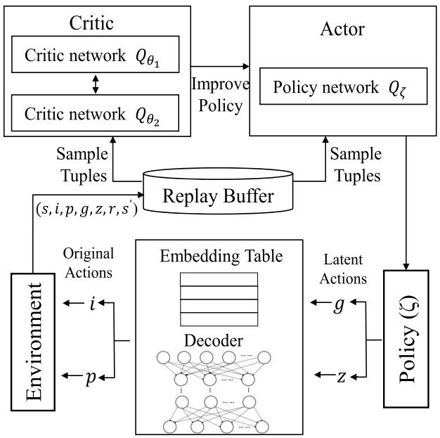

flowchart

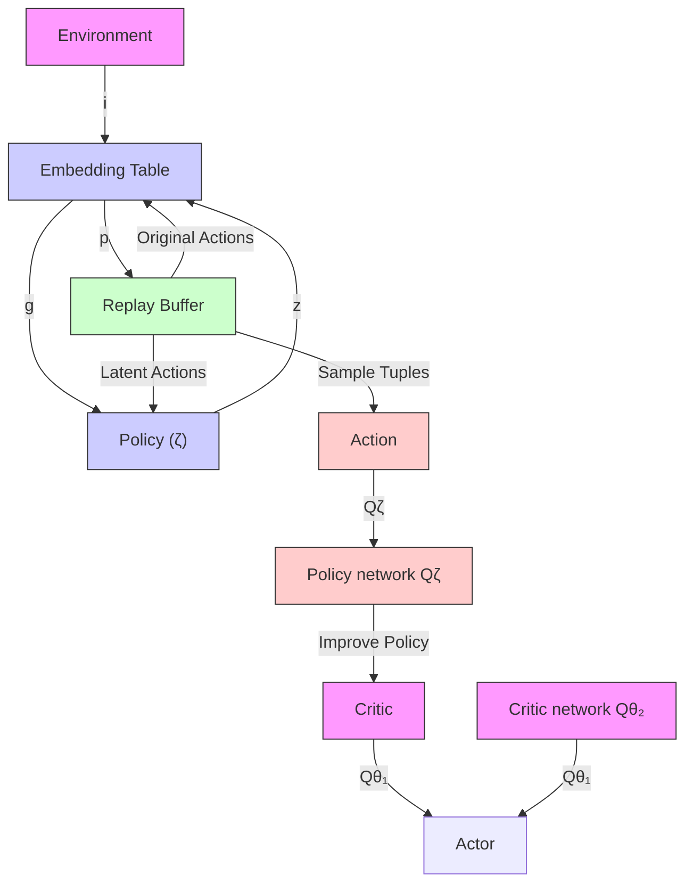

Fig. 2. Framework of CLP algorithm.

In the encoding and decoding of hybrid actions, the input size of encoder is $d i m + M l _ { 1 } + \mathcal { X } _ { p } = M N + M l _ { 1 } + 5 M +$ $7 N$ where $d i m = 4 M + 3 N$ +and $\dot { \mathcal { X } _ { p } } = M N + 4 N + M .$ +. The 7 = 4 +output size of encoder is $l _ { 2 }$ = + 4 +, so the computational complexity of encoder is $\mathcal { O } ( ( M N + M l _ { 1 } ) l _ { 2 } )$ . The input size of decoder is dim $+ M l _ { 1 } + l _ { 2 } = 4 M + 3 N + M l _ { 1 } + l _ { 2 }$ , and the output size +is dim $\mathcal { X } _ { p } = 3 M N + 5 M + 7 N$ +. So the decoder complexity is $\mathcal { O } ( M ^ { 2 } \dot { N _ { l _ { 1 } } } + M N l _ { 2 } + M N ^ { 2 } )$ .

( + + )In the training actor and critic networks, the input size of actor is the dimensions of system space dim $= 4 M + 3 N$ , the = 4 + 3output size is the dimensions of hybrid action representation space $M l _ { 1 } + l _ { 2 }$ , so the complexity of the actor is $\mathcal { O } ( ( M l _ { 1 } +$ $l _ { 2 } ) ( N + M ) )$ . The input size of critic is dim $+ \mathcal { X } _ { p } + M$ +, the )( + ))output is 1, so the critic complexity is $\mathcal { O } ( M N )$ .

( )Finally, the overall complexity of our algorithm is $\mathcal { O } ( ( M \dot { N } + M l _ { 1 } ) l _ { 2 } ) + \mathcal { O } ( M ^ { 2 } \bar { N } l _ { 1 } + M N l _ { 2 } + M \bar { N } ^ { 2 } ) +$ $\mathcal { O } ( ( M l _ { 1 } + l _ { 2 } ) ( N + M ) ) + \mathcal { O } ( M N ) = \mathcal { O } ( M ^ { 2 } N l _ { 1 } +$ $M N l _ { 2 } + M N ^ { 2 } + M l _ { 1 } l _ { 2 } )$ +.

# VI. PERFORMANCE EVALUATION

In this section, we describe the experimental setup and introduce the alternative solutions used for comparison-based assessment. Then the experimental results and related analysis are presented to validate the performance of the proposed algorithm.

# A. Experimental Setup

We consider a UAVs-assisted MEC scenario with 30 UEs randomly distributed in an area of $1 0 0 0 \times 1 0 0 0 m ^ { 2 }$ as set in 1000[37]. Three UAVs with random initial positions can help UEs to complete their computing tasks. For UE tasks, the data size $u _ { m } ( t )$ is set from 1 to 3 MB [37] and the computing workload $c _ { m } ( t )$ )is generated randomly within [300, 500] Megacycles [38]. ( )For the UAVs, the computing capability $F ^ { n }$ is set from 10 to

TABLE III PARAMETER SETTINGS FOR SIMULATIONS 

<table><tr><td>Parameters</td><td>Value</td></tr><tr><td>Number of UEs M</td><td>10, 20, 30, 40, 50, 60</td></tr><tr><td>Number of UAVs N</td><td>1,2, 3, 4, 5, 6</td></tr><tr><td>Minimum height of UAVs  $Z_{min}$ </td><td>50m</td></tr><tr><td>Maximum height of UAVs  $Z_{max}$ </td><td>100m</td></tr><tr><td>Maximum horizontal distance  $L_{max}^{h}$ </td><td>49m</td></tr><tr><td>Maximum vertical distance  $L_{max}^{v}$ </td><td>12m</td></tr><tr><td>Minimum distance of UAVs  $D_{min}$ </td><td>50m</td></tr><tr><td>Maximum transmit power of UAVs  $P_{max}^{UAV}$ </td><td>5W</td></tr><tr><td>Maximum transmit power of UEs  $P_{max}^{UE}$ </td><td>1W</td></tr><tr><td>Computation resource of UAVs  $F_{n}$ </td><td>[10,20] Gigacycles</td></tr><tr><td>Computation resource of UEs  $F_{m}^{0}$ </td><td>1.5 Gigacycles</td></tr><tr><td>Data size of tasks  $u_{m}(t)$ </td><td>[1,3] MB</td></tr><tr><td>Computing workload of tasks  $c_{m}(t)$ </td><td>[300,500] Megacycles</td></tr><tr><td>Allowed delay threshold  $v_{m}(t)$ </td><td>[250,300]ms</td></tr><tr><td>Channel Bandwidth of G2A  $B^{G}$ </td><td>20MHz</td></tr><tr><td>Channel Bandwidth of A2A  $B^{A}$ </td><td>40MHz</td></tr><tr><td>Channel Bandwidth of A2G  $B^{E}$ </td><td>10MHz</td></tr><tr><td>Effective switched capacitance  $\kappa$ </td><td> $10^{-28}$ </td></tr><tr><td>Noise power  $N_{g},N_{A},N_{E}$ </td><td>-100dBm</td></tr><tr><td>Constant values a,b</td><td>9.61, 0.16</td></tr><tr><td>Excessive path loss  $\eta_{LoS},\eta_{NLoS}$ </td><td>1, 20</td></tr><tr><td>Actor learning rate ( $\gamma_1$ )</td><td> $10^{-2}, 10^{-3}, 10^{-4}$ </td></tr><tr><td>Critic learning rate ( $\gamma_2$ )</td><td> $10^{-3}, 10^{-2}, 10^{-4}$ </td></tr><tr><td>Representation model learning rate ( $\gamma_3$ )</td><td> $10^{-2}, 10^{-3}, 10^{-4}$ </td></tr><tr><td>Penalty for actions unsatisfy constraints (-Pu)</td><td>-1000</td></tr></table>

20 Gigacycles [16]. According to [17], we set the minimum height for $\mathrm { U A V s } Z _ { m i n }$ to 50 m, maximum height $Z _ { \mathrm { m a x } }$ to 100 m, maximum horizontal distance $L _ { \mathrm { m a x } } ^ { h } { \mathrm { t o } } 4 9 { \mathrm { m } } .$ , maximum vertical distance to 5 W, $L _ { \mathrm { m a x } } ^ { v }$ to 12 m, the maximum transive switched capacitance κ to wer , an $P _ { \mathrm { m a x } } ^ { U A V }$ $1 0 ^ { - 2 8 }$ 10power Ng, NA, NE to -100 dBm. Constant values and excessive path loss a, b, $\eta _ { L o S }$ , and $\eta _ { N L o S }$ are set to 9.61, 0.16, 1, and 20, respectively [37]. The channel bandwidth values for G2A, A2A, and G2A communications are set to 20 MHz, 40 MHz, and 10 MHz, respectively [15], [38]. The actor learning rate γ1, critic learning rate γ2 and representation model learning rate γ3 are set based on [32]. Table III presents the values of system parameters, the numbers in bold are the default values.

# B. Alternative Solutions

CLP, our proposed algorithm, is compared with the following four alternative algorithms.

C Optimization of Single UAV (OSU) [39]: This solution studies the task offloading problem in a single UAV scenario, which takes the energy consumption as a constraint and task delay as the optimization objective. It employs an algorithm based on deep deterministic policy gradient (DDPG) to search for near-optimal solutions in highly dynamic environments.   
- No cooperation between UAVs (NCO) [9]: This solution also considers a single UAV scenario and therefore there is no cooperation between multiple UAVs. Its optimization objective considers task delay, energy consumption and number of tasks collected by the UAV. The proposed solution is based on the multi-task multi-objective proximal policy optimization (PPO) algorithm.

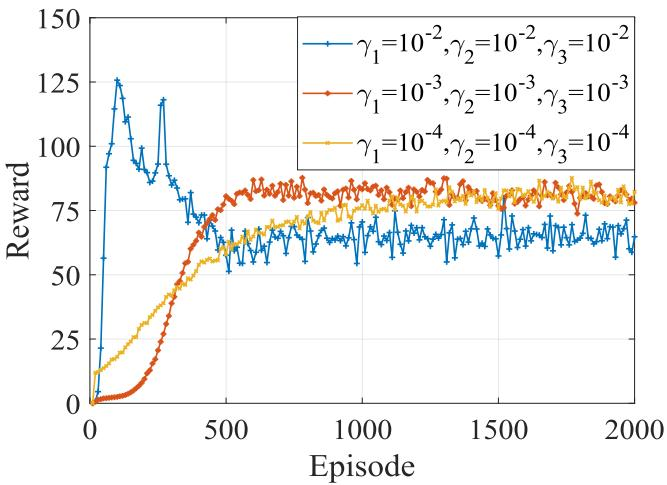

line

| Episode | γ₁=10⁻², γ₂=10⁻², γ₃=10⁻² | γ₁=10⁻³, γ₂=10⁻³, γ₃=10⁻³ | γ₁=10⁻⁴, γ₂=10⁻⁴, γ₃=10⁻⁴ |
| ------- | -------------------------- | -------------------------- | -------------------------- |
| 0       | 0                          | 0                          | 0                          |
| 500     | 75                         | 85                         | 65                         |
| 1000    | 70                         | 85                         | 75                         |
| 1500    | 65                         | 85                         | 75                         |
| 2000    | 60                         | 85                         | 75                         |

Fig. 3. Convergence.

Cooperation without long-term optimization (CNL) [40]: This solution involves some cooperation between UAVs. Its authors decomposed the UAV-assisted MEC problem into three subproblems and proposed a greedy approximation algorithm as a solution. Rather than optimizing the long-term average system performance, this solution only focuses on achieving the optimal performance in the current time slot.   
Cooperation with multi-agent reinforcement (CMA) [17]: This solution employs a partial task offloading strategy which considers cooperation between UAVs and optimization of long-term performance. A multi-agent TD3 algorithm is designed to find the efficient UAVs’ movements, task offloading allocation, and communication resource management based on dynamic MEC environments. In order to accommodate binary computing offloads, the node with the largest offload proportion to offload is chosen.

# C. Experiment Results

We show the convergence of our proposed CLP algorithm with different learning rates in Fig. 3. Different learning rates lead to different training performance results. When learning rates are very large $( \mathrm { i } . \mathrm { e } . 1 0 ^ { - 2 } )$ , there are great fluctuations in the 10process of model convergence. Additionally, the convergence points are also often local optimal solutions. When learning rates are very small $( \mathrm { i . e . 1 0 ^ { - 4 } } )$ , the convergence state is stable, 10but the convergence is slow, taking about 1500 episodes. When learning rates are set to $1 0 ^ { - 3 }$ , the model converges quickly 10(almost 600 episodes) and has a relatively stable convergence state. Therefore, the learning rates are set to $\gamma _ { 1 } = 1 0 ^ { - 3 } , \gamma _ { 2 } =$ $1 0 ^ { - 3 } , \gamma _ { 3 } = 1 0 ^ { - 3 }$ in our model training.

0 = 10To show the effectiveness of the hybrid action representation method in CLP, we perform ablation experiments. The representation method is to transform discrete variables in action space into continuous values to improve the training performance of the model. Considering that discrete variables and continuous variables in the action space are interrelated, the hybrid action representation method in CLP jointly trains the whole action space. Therefore, we use two comparison methods in our ablation experiments. Comparison one employs a no action representation (NAR) method. NAR only discretizes the variables directly by rounding, without any action representation algorithm. Comparison two uses an ORD method, which only represents discrete variables. The method ignores the correlation between discrete variables and continuous variables in the action space, and only represents discrete variables instead of the whole action space. Considering that the goal of the optimization problem is to maximize average system gain, we show the system gain in each time slot for the three algorithms in Fig. 4. We note that NAR has the worst performance and greatest fluctuations, as the crude approximation method leads to a degradation in model performance. ORD only represents discrete variables and ignores the correlation between discrete variables and continuous variables in the action space, so it performs better than NAR, but not as well as CLP. CLP represents the whole action space and has the best performance in terms of system gain from the three methods.

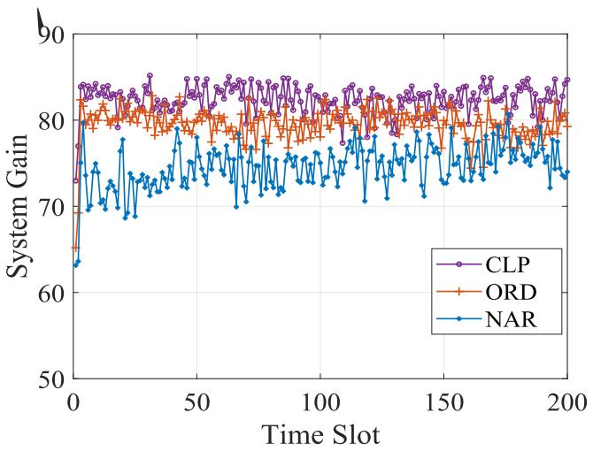

line

| Time Slot | CLP  | ORD  | NAR  |
| --------- | ---- | ---- | ---- |
| 0         | 84   | 80   | 63   |
| 50        | 84   | 80   | 75   |
| 100       | 84   | 80   | 75   |
| 150       | 84   | 80   | 75   |
| 200       | 84   | 80   | 75   |

Fig. 4. Ablation experiment.

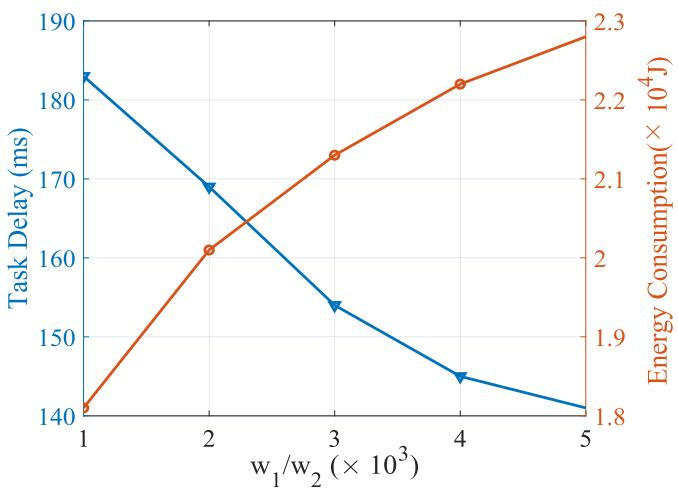

line

| w₁/w₂ (× 10³) | Task Delay (ms) | Energy Consumption (× 10⁴ J) |
| ------------- | --------------- | ---------------------------- |
| 1             | 183             | 1.8                          |
| 2             | 170             | 2.0                          |
| 3             | 155             | 2.1                          |
| 4             | 145             | 2.2                          |
| 5             | 141             | 2.3                          |

Fig. 5. Effect of weight.

Fig. 5 shows the impact of weight parameters. The optimization objective of our problem is the combination of task delay and system energy consumption by weight parameters. When $w _ { 1 } / w _ { 2 }$ is larger, task delay accounts for more weight and becomes more important. Accordingly, the task delay is reduced but the system energy consumption is increased. When $w _ { 1 } / w _ { 2 }$ is smaller, system energy consumption is more important. Our solution tends to sacrifice the task delay to obtain smaller system energy consumption. In practice, the weight parameters can be adjusted according to the system requirements.

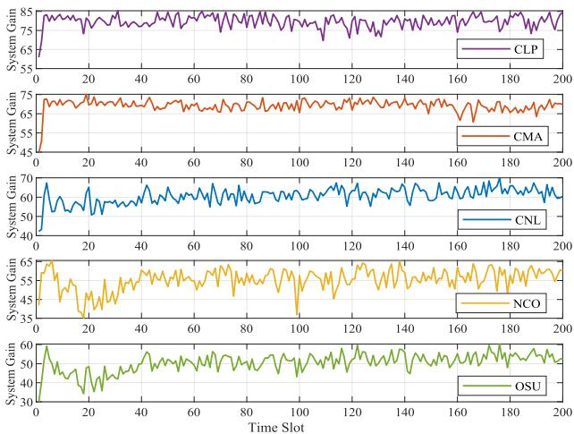

line

| Time Slot | CLP  | CMA  | CNL  | NCO  | OSU  |
| --------- | ---- | ---- | ---- | ---- | ---- |
| 0         | 65   | 45   | 40   | 65   | 30   |
| 20        | 75   | 65   | 60   | 55   | 45   |
| 40        | 75   | 65   | 60   | 55   | 45   |
| 60        | 75   | 65   | 60   | 55   | 45   |
| 80        | 75   | 65   | 60   | 55   | 45   |
| 100       | 75   | 65   | 60   | 55   | 45   |
| 120       | 75   | 65   | 60   | 55   | 45   |
| 140       | 75   | 65   | 60   | 55   | 45   |
| 160       | 75   | 65   | 60   | 55   | 45   |
| 180       | 75   | 65   | 60   | 55   | 45   |
| 200       | 75   | 65   | 60   | 55   | 45   |

Fig. 6. System gain.

The system gains of the five algorithms in the experiment are illustrated in Fig. 6. The subfigures of Fig. 6 show that the average system gain of CLP in 200 time slots is around 78, CMA’s is around 70, CNL’s is about 64, NCO’s is around 58, and OSU’s is approximately 54. Our optimization goal is to maximize the long-term average system gain. The average system gain of CLP is the largest of the five algorithms, demonstrating that our algorithm CLP has the best performance. As OSU is a task offloading algorithm in a single UAV scenario and its goal is to optimize task delay only, it has the worst system gain of all tested solutions. NCO also lacks the cooperation between multiple UAVs, but optimizes both task delay and energy consumption, so it has better performance than OSU. CNL considers the multi-UAV cooperative scenario, but only optimizes the current time decision, which easily leads to finding local optimal solutions only. CMA takes both the cooperation between UAVs and long-term average optimization into account, and has the best performance among the alternative solutions. Unfortunately, some performance is lost when converting partial offloading to binary offloading, so CMA is slightly worse than CLP.

Fig. 7 presents the effects of variations in the numbers of UAVs and UEs. Considering that tasks with different priorities have different performance in our algorithm, we will analyze separately the high-priority tasks in CLP (CLP-H) and lowpriority tasks in CLP (CLP-L). Fig. 7(a) and (b) show the impact of the number of UAVs on the task delay. In general, as the number of UAVs increases, the task delay gradually decreases. More UAVs means more edge computation resources, and consequently more tasks can be completed on UAVs, which determines a reduction in task delay. It is worth noting that

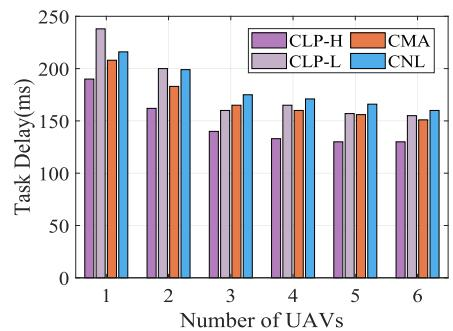

bar

| Number of UAVs | CLP-H | CMA  | CLP-L | CNL  |
| -------------- | ----- | ---- | ----- | ---- |
| 1              | 190   | 210  | 240   | 220  |
| 2              | 160   | 185  | 200   | 200  |
| 3              | 140   | 165  | 160   | 175  |
| 4              | 130   | 160  | 165   | 170  |
| 5              | 130   | 155  | 155   | 165  |
| 6              | 130   | 155  | 155   | 160  |

(a) Task Delay vs. UAVs

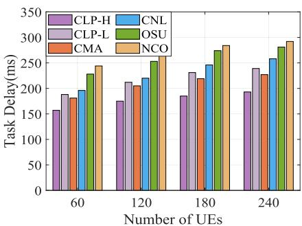

bar

| Number of UEs | CLP-H | CNL | CLP-L | OSU | CMA | NCO |
| ------------- | ----- | --- | ----- | --- | --- | --- |
| 60            | 160   | 190 | 185   | 230 | 175 | 245 |
| 120           | 175   | 220 | 210   | 255 | 205 | 270 |
| 180           | 185   | 245 | 230   | 280 | 220 | 290 |
| 240           | 195   | 260 | 240   | 285 | 230 | 295 |

(b) Task Delay vs. UEs

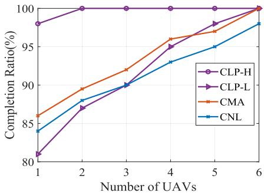

line

| Number of UAVs | CLP-H | CLP-L | CMA  | CNL  |
| -------------- | ----- | ----- | ---- | ---- |
| 1              | 98.5  | 81.0  | 86.0 | 84.0 |
| 2              | 100.0 | 87.5  | 89.5 | 88.0 |
| 3              | 100.0 | 90.0  | 92.0 | 90.0 |
| 4              | 100.0 | 95.5  | 96.0 | 93.0 |
| 5              | 100.0 | 98.0  | 97.5 | 95.0 |
| 6              | 100.0 | 100.0 | 100.0| 98.5 |

(c) Completion Ratio vs. UAVs

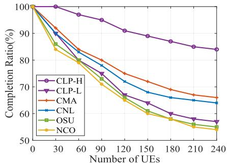

line

| Number of UEs | CLP-H | CLP-L | CMA  | CNL  | OSU  | NCO  |
| ------------- | ----- | ----- | ---- | ---- | ---- | ---- |
| 0             | 100   | 100   | 100  | 100  | 100  | 100  |
| 30            | 98    | 95    | 92   | 90   | 87   | 85   |
| 60            | 95    | 88    | 85   | 82   | 80   | 78   |
| 90            | 92    | 82    | 80   | 78   | 75   | 72   |
| 120           | 90    | 78    | 75   | 75   | 70   | 68   |
| 150           | 88    | 75    | 72   | 72   | 68   | 65   |
| 180           | 85    | 72    | 70   | 70   | 65   | 62   |
| 210           | 83    | 70    | 68   | 68   | 63   | 60   |
| 240           | 82    | 68    | 65   | 65   | 60   | 58   |

(d) Completion Ratio vs. UEs

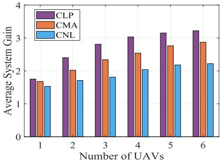

bar

| Number of UAVs | CLP  | CMA  | CNL  |
| -------------- | ---- | ---- | ---- |
| 1              | 1.8  | 1.7  | 1.5  |
| 2              | 2.4  | 2.0  | 1.7  |
| 3              | 2.8  | 2.3  | 1.8  |
| 4              | 3.0  | 2.5  | 2.0  |
| 5              | 3.1  | 2.7  | 2.1  |
| 6              | 3.2  | 2.9  | 2.2  |

(e) Average System Gain vs. UAVs

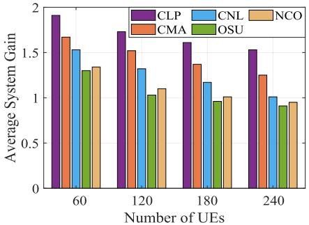

bar

| Number of UEs | CLP  | CNL  | NCO  | CMA  | OSU  |
| ------------- | ---- | ---- | ---- | ---- | ---- |
| 60            | 1.95 | 1.55 | 1.35 | 1.65 | 1.30 |
| 120           | 1.75 | 1.30 | 1.10 | 1.55 | 1.05 |
| 180           | 1.60 | 1.15 | 1.00 | 1.35 | 0.95 |
| 240           | 1.55 | 1.00 | 0.95 | 1.25 | 0.90 |

(f) Average System Gain vs. UEs   
Fig. 7. Effect of UAVs and UEs.

CLP-L performs the worst among all algorithms when the number of UAVs is 1. When there is a single UAV, the available computing resources are very limited. To ensure the completion of high priority tasks, CLP allocates most resources to high-priority tasks which leads to the best performance when completing these tasks. Unfortunately, low-priority tasks cannot be allocated sufficient computing resources, so the task delay associated with these tasks is the highest. As the number of UAVs increases, so do computing resources. Although CLP still allocates most resources to high-priority tasks, lower-priority tasks can also receive more resources. Therefore, the task delay of CLP-L gradually approaches the values experienced by other algorithms.

To show the effect of the number of UEs, we set different numbers of users in the experiment, with a maximum value of 240. Fig. 7(b) shows that the increase in the number of UEs leads to an increase in task delay. More UEs imply more tasks, but due to the limited computing resources of UAVs, some tasks must be offloaded to the remote cloud server, which determines longer task delays. It is worth noting that OSU focuses on the optimization of task delay, while NCO optimizes both task delay and energy consumption, so OSU performs better than NCO in terms of task delay, but worse in terms of system gain. Additionally, OSU and NCO only consider the scenario with a single UAV, so they cannot be compared against when analyzing the impact of the number of UAVs.

We define the completion rate as the number of tasks completed within the allowed delay threshold divided by the total number of tasks. A similar metric is the task completion rate, as shown in Fig. 7(c) and (d). The increase in the number of UAVs improves the completion rate, while the increase in the number of UEs decreases the completion rate. However, as the number of users continues to increase, the completion rate will also level off. The reason is that limited resources of UAVs are difficult to meet the needs of a large number of users. As the number of users increases, most computing tasks will be offloaded to cloud servers and the completion rate will be stable. Note that the highpriority tasks in our algorithm benefit in terms of performance in both task delay and completion rate, while low-priority tasks in our algorithm perform worse in many cases. This is because we set different reward functions for different priority tasks, and the CLP algorithm is more inclined to complete the high-priority tasks first, which sacrifice the performance of low-priority tasks. However, the alternative solutions have no priority consideration, and there is no difference in task performance. Considering that the system gain is the sum of all UEs $\textstyle \sum _ { m = 1 } ^ { M } F _ { m } ( t )$ , which ( )is related to the number of UEs, we use the average performance $\textstyle \sum _ { m = 1 } ^ { M } F _ { m } ( t ) / M$ to show the impact of the number of ( )UAVs and UEs, as shown in Fig. 7(e) and (f), respectively. Similar, the increase of UAVs will improve average system gain and the increase of UEs will decrease average system gain.

Fig. 8 compares our CLP with the four alternative solutions in terms of four performance indicators. We find that our proposed CLP algorithm has obvious advantages in terms of task delay, completion rate and system gain. In terms of energy consumption, CLP is better than CMA and CNL, but is inferior to NCO and OSU. Note that NCO and OSU consider the scenario with only one UAV, so they have the lowest energy consumption. This also causes the task delay of NCO and OSU to be far inferior to that of the other algorithms. OSU focuses on optimizing task delay, so it performs better than NCO in terms of task delay and completion ratio, but worse in terms of system gain and energy consumption. The performance of CMA is better than that of CNL due to its long-term average optimization. Our CLP considers task priority, long-term average optimization and binary optimization, which leads to the maximum system gain, which is an excellent result.

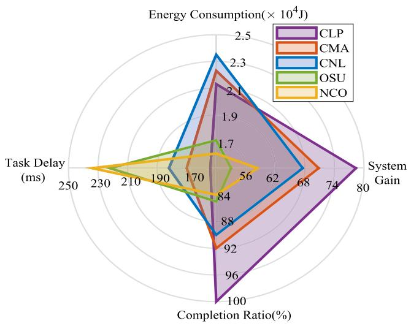

radar

| Metric | CLP | CMA | CNL | OSU | NCO |
| --- | --- | --- | --- | --- | --- |
| Energy Consumption (× 10⁴ J) | 2.1 | 2.3 | 2.4 | 1.7 | 1.7 |
| System Gain | 80 | 74 | 68 | 56 | 56 |
| Completion Ratio (%) | 100 | 92 | 88 | 84 | 84 |
| Task Delay (ms) | 230 | 210 | 190 | 170 | 170 |

Fig. 8. Performance in terms of four metrics.

# VII. CONCLUSION

In this paper, we focused on the UAV-assisted task offloading problem with task priority. A long-term average problem with the collaboration between multiple UAVs was formulated to optimize task delay and energy consumption by jointly designing the UAV trajectories, task offloading, computation resources allocation, and communication resource management. To solve this problem, we transformed it to a MDP. Considering a discrete-continuous hybrid action space, the Cooperative Long-term average oPtimization (CLP), a novel DRL algorithm was proposed. Following detailed experimental testing, our algorithm CLP outperforms three state-of-the-art optimization approaches in terms of task delay, system gain and system energy consumption.

# REFERENCES

[1] Y. Mao, C. You, J. Zhang, K. Huang, and K. B. Letaief, “A survey on mobile edge computing: The communication perspective,” IEEE Commun. Surveys Tuts., vol. 19, no. 4, pp. 2322–2358, Fourthquarter 2017, doi: 10.1109/COMST.2017.2745201.   
[2] Q. Hu, Y. Cai, G. Yu, Z. Qin, M. Zhao, and G. Y. Li, “Joint offloading and trajectory design for UAV-enabled mobile edge computing systems,” IEEE Internet Things J., vol. 6, no. 2, pp. 1879–1892, Apr. 2019, doi: 10.1109/JIOT.2018.2878876.   
[3] H. Guo, J. Li, J. Liu, N. Tian, and N. Kato, “A survey on space-air-ground-sea integrated network security in 6G,” IEEE Commun. Surveys Tuts., vol. 24, no. 1, pp. 53–87, Firstquarter 2022, doi: 10.1109/COMST.2021.3131332.   
[4] G. Yang, Y. -C. Liang, R. Zhang, and Y. Pei, “Modulation in the air: Backscatter communication over ambient OFDM carrier,” IEEE Trans. Commun., vol. 66, no. 3, pp. 1219–1233, Mar. 2018, doi: 10.1109/TCOMM.2017.2772261.   
[5] H. Xiao, C. Xu, Y. Ma, S. Yang, L. Zhong, and G. -M. Muntean, “Edge intelligence: A computational task offloading scheme for dependent IoT application,” IEEE Trans. Wireless Commun., vol. 21, no. 9, pp. 7222–7237, Sep. 2022, doi: 10.1109/TWC.2022.3156905.

[6] F. Zhou, Y. Wu, R. Q. Hu, and Y. Qian, “Computation rate maximization in UAV-enabled wireless-powered mobile-edge computing systems,” IEEE J. Sel. Areas Commun., vol. 36, no. 9, pp. 1927–1941, Sep. 2018, doi: 10.1109/JSAC.2018.2864426.   
[7] Z. Yu, Y. Gong, S. Gong, and Y. Guo, “Joint task offloading and resource allocation in UAV-enabled mobile edge computing,” IEEE Internet Things J., vol. 7, no. 4, pp. 3147–3159, Apr. 2020, doi: 10.1109/JIOT.2020. 2965898.   
[8] Z. Ning et al., “5G-enabled UAV-to-community offloading: Joint trajectory design and task scheduling,” IEEE J. Sel. Areas Commun., vol. 39, no. 11, pp. 3306–3320, Nov. 2021, doi: 10.1109/JSAC.2021.3088663.   
[9] F. Song et al., “Evolutionary multi-objective reinforcement learning based trajectory control and task offloading in UAV-assisted mobile edge computing,” IEEE Trans. Mobile Comput., vol. 22, no. 12, pp. 7387–7405, Dec. 2023, doi: 10.1109/TMC.2022.3208457.   
[10] B. Xu, Z. Kuang, J. Gao, L. Zhao, and C. Wu, “Joint offloading decision and trajectory design for UAV-enabled edge computing with task dependency,” IEEE Trans. Wireless Commun., vol. 22, no. 8, pp. 5043–5055, Aug. 2023, doi: 10.1109/TWC.2022.3231408.   
[11] W. Ma, X. Liu, and L. Mashayekhy, “A strategic game for task offloading among capacitated UAV-mounted cloudlets,” in Proc. IEEE Int. Congr. Internet Things, 2019, pp. 61–68, doi: 10.1109/ICIOT.2019.00022.   
[12] C. -Y. Hsieh, Y. Ren, and J. -C. Chen, “Edge-cloud offloading: Knapsack potential game in 5G multi-access edge computing,” IEEE Trans. Wireless Commun., vol. 22, no. 11, pp. 7158–7171, Nov. 2023, doi: 10.1109/TWC.2023.3248270.   
[13] Z. Ning et al., “Partial computation offloading and adaptive task scheduling for 5G-enabled vehicular networks,” IEEE Trans. Mobile Comput., vol. 21, no. 4, pp. 1319–1333, Apr. 2022, doi: 10.1109/TMC.2020. 3025116.   
[14] G. Chen, Q. Wu, R. Liu, J. Wu, and C. Fang, “IRS aided MEC systems with binary offloading: A unified framework for dynamic IRS beamforming,” IEEE J. Sel. Areas Commun., vol. 41, no. 2, pp. 349–365, Feb. 2023, doi: 10.1109/JSAC.2022.3228605.   
[15] S. Goudarzi, S. A. Soleymani, W. Wang, and P. Xiao, “UAV-enabled mobile edge computing for resource allocation using cooperative evolutionary computation,” IEEE Trans. Aerosp. Electron. Syst., vol. 59, no. 5, pp. 5134–5147, Oct. 2023, doi: 10.1109/TAES.2023.3251967.   
[16] Z. Bai, Y. Lin, Y. Cao, and W. Wang, “Delay-aware cooperative task offloading for multi-UAV enabled edge-cloud computing,” IEEE Trans. Mobile Comput., vol. 23, no. 2, pp. 1034–1049, Feb. 2024, doi: 10.1109/TMC.2022.3232375.   
[17] N. Zhao, Z. Ye, Y. Pei, Y. -C. Liang, and D. Niyato, “Multi-agent deep reinforcement learning for task offloading in UAV-assisted mobile edge computing,” IEEE Trans. Wireless Commun., vol. 21, no. 9, pp. 6949–6960, Sep. 2022, doi: 10.1109/TWC.2022.3153316.   
[18] R. Zhou, X. Wu, H. Tan, and R. Zhang, “Two time-scale joint service caching and task offloading for UAV-assisted mobile edge computing,” in Proc. IEEE Conf. Comput. Commun., 2022, pp. 1189–1198, doi: 10.1109/INFOCOM48880.2022.9796714.   
[19] W. Chen, Z. Su, Q. Xu, T. H. Luan, and R. Li, “VFC-based cooperative UAV computation task offloading for post-disaster rescue,” in Proc. IEEE Conf. Comput. Commun., 2020, pp. 228–236, doi: 10.1109/INFO-COM41043.2020.9155397.   
[20] S. Tong, Y. Liu, J. Miši´c, X. Chang, Z. Zhang, and C. Wang, “Joint task offloading and resource allocation for fog-based intelligent transportation systems: A UAV-Enabled multi-hop collaboration paradigm,” IEEE Trans. Intell. Transp. Syst., vol. 24, no. 11, pp. 12933–12948, Nov. 2023, doi: 10.1109/TITS.2022.3163804.   
[21] M. Adhikari, M. Mukherjee, and S. N. Srirama, “DPTO: A deadline and priority-aware task offloading in fog computing framework leveraging multilevel feedback queueing,” IEEE Internet Things J., vol. 7, no. 7, pp. 5773–5782, Jul. 2020, doi: 10.1109/JIOT.2019.2946426.   
[22] J. Shi, J. Du, J. Wang, J. Wang, and J. Yuan, “Priority-aware task offloading in vehicular fog computing based on deep reinforcement learning,” IEEE Trans. Veh. Technol., vol. 69, no. 12, pp. 16067–16081, Dec. 2020, doi: 10.1109/TVT.2020.3041929.   
[23] W. Zhou et al., “Priority-aware resource scheduling for UAV-mounted mobile edge computing networks,” IEEE Trans. Veh. Technol., vol. 72, no. 7, pp. 9682–9687, Jul. 2023, doi: 10.1109/TVT.2023.3247431.   
[24] J. Tian, D. Wang, H. Zhang, and D. Wu, “Service satisfaction-oriented task offloading and UAV scheduling in UAV-enabled MEC networks,” IEEE Trans. Wireless Commun., vol. 22, no. 12, pp. 8949–8964, Dec. 2023, doi: 10.1109/TWC.2023.3267330.

[25] L. Wang, K. Wang, C. Pan, W. Xu, N. Aslam, and L. Hanzo, “Multi-agent deep reinforcement learning-based trajectory planning for multi-UAV assisted mobile edge computing,” IEEE Trans. Cogn. Commun. Netw., vol. 7, no. 1, pp. 73–84, Mar. 2021, doi: 10.1109/TCCN.2020.3027695.   
[26] X. Zhang, J. Zhang, J. Xiong, L. Zhou, and J. Wei, “Energy-efficient multi-UAV-enabled multiaccess edge computing incorporating NOMA,” IEEE Internet Things J., vol. 7, no. 6, pp. 5613–5627, Jun. 2020, doi: 10.1109/JIOT.2020.2980035.   
[27] M. H. Kumar, S. Sharma, K. Deka, and M. Thottappan, “Reconfigurable intelligent surfaces assisted hybrid NOMA system,” IEEE Commun. Lett., vol. 27, no. 1, pp. 357–361, Jan. 2023, doi: 10.1109/LCOMM.2022.3211292.   
[28] Y. Zhou et al., “Secure communications for UAV-enabled mobile edge computing systems,” IEEE Trans. Commun., vol. 68, no. 1, pp. 376–388, Jan. 2020, doi: 10.1109/TCOMM.2019.2947921.   
[29] H. Hao, C. Xu, W. Zhang, S. Yang, and G. -M. Muntean, “Computing offloading with fairness guarantee: A deep reinforcement learning method,” IEEE Trans. Circuits Syst. Video Technol., vol. 33, no. 10, pp. 6117–6130, Oct. 2023, doi: 10.1109/TCSVT.2023.3255229.   
[30] J. Zhao, Q. Li, Y. Gong, and K. Zhang, “Computation offloading and resource allocation for cloud assisted mobile edge computing in vehicular networks,” IEEE Trans. Veh. Technol., vol. 68, no. 8, pp. 7944–7956, Aug. 2019, doi: 10.1109/TVT.2019.2917890.   
[31] H. Hao, C. Xu, L. Zhong, and G. B. Muntean, “A multi-update deep reinforcement learning algorithm for edge computing service offloading,” in Proc. 28th ACM Int. Conf. Multimedia, 2020, pp. 3256–3264, doi: 10.1145/3394171.3413702.   
[32] B. Li et al., “HyAR: Addressing discrete-continuous action reinforcement learning via hybrid action representation,” 2022, arXiv:2109.05490.   
[33] D. P. Kingma and M. Welling, “Auto-encoding variational bayes,” 2014, arXiv:1312.6114.   
[34] S. Fujimoto, H. V. Hoof, and D. Meger, “Addressing function approximation error in actor-critic methods,” 2018, arXiv:1802.09477.   
[35] D. Silver, G. Lever, N. Heess, T. Degris, D. Wierstra, and M. A. Riedmiller, “Deterministic policy gradient algorithms,” in Proc. 31st Int. Conf. Mach. Learn., 2014, pp. 387–395.   
[36] M. Sipper, “A serial complexity measure of neural networks,” in Proc. IEEE Int. Conf. Neural Netw., 1993, pp. 962–966, doi: 10.1109/ICNN.1993.298687.   
[37] H. Guo, Y. Wang, J. Liu, and C. Liu, “Multi-UAV cooperative task offloading and resource allocation in 5G advanced and beyond,” IEEE Trans. Wireless Commun., vol. 23, no. 1, pp. 347–359, Jan. 2024, doi: 10.1109/TWC.2023.3277801.   
[38] X. Dai, Z. Xiao, H. Jiang, and J. C. S. Lui, “UAV-assisted task offloading in vehicular edge computing networks,” IEEE Trans. Mobile Comput., early access, Mar. 20, 2023, doi: 10.1109/TMC.2023.3259394.   
[39] H. Wang, H. Zhang, X. Liu, K. Long, and A. Nallanathan, “Joint UAV placement optimization, resource allocation, and computation offloading for THz band: A DRL approach,” IEEE Trans. Wireless Commun., vol. 22, no. 7, pp. 4890–4900, Jul. 2023, doi: 10.1109/TWC.2022.3230407.   
[40] L. Zhang and N. Ansari, “Latency-aware IoT service provisioning in UAVaided mobile-edge computing networks,” IEEE Internet Things J., vol. 7, no. 10, pp. 10573–10580, Oct. 2020, doi: 10.1109/JIOT.2020.3005117.

natural_image

Portrait photo of a man in formal attire against a solid red background (no text or symbols visible)

Hao Hao received the PhD degree in computer science and technology from the Beijing University of Posts and Telecommunications, Beijing, China, in 2021. He is currently a lecturer with the Shandong Computer Science Center (National Supercomputing Center in Jinan), Qilu University of Technology (Shandong Academy of Sciences), Jinan, China. His research interests include MEC and content caching over the wireless network, multimedia communications.

natural_image

Portrait of a man in formal attire (no visible text or symbols)

Changqiao Xu (Senior Member, IEEE) received the PhD degree from the Institute of Software, Chinese Academy of Sciences (ISCAS) in 2009. From 2002 to 2007, he was an assistant research fellow and R&D project manager with ISCAS. He was a researcher with the Athlone Institute of Technology and joint PhD with Dublin City University, Ireland, during 2007–2009. He joined the Beijing University of Posts and Telecommunications (BUPT), Beijing, China, in December 2009. He is currently a full professor with the State Key Laboratory of Networking and Switch-  
ing Technology, and the director of the Next Generation Internet Technology Research Center, BUPT. He has authored or coauthored more than 200 technical papers in prestigious international journals and conferences, including IEEE Communications Surveys and Tutorials, IEEE Wireless Communications, IEEE Communications Magazine, and IEEE/ACM Transactions on Networking. His research interests include future internet technology, mobile networking, multimedia communications, and network security. He has served many international conferences and workshops as the Co-Chair or Technical Program Committee member. He is currently the editor-in-chief of Transactions on Emerging Telecommunications Technologies (Wiley).

natural_image

Portrait of a man wearing glasses and a collared shirt (no text or symbols visible)

Wei Zhang received the BE degree from Zhejiang University, Hangzhou, China, in 2004, the MS degree from Liaoning University, Shenyang, China, in 2008, and the PhD degree from the Shandong University of Science and Technology, Qingdao, China, in 2018. He is currently a professor with the Shandong Computer Science Center (National Supercomputing Center in Jinan), Qilu University of Technology (Shandong Academy of Sciences), Jinan, China. His research interests include future generation network architectures, edge computing, and edge intelligence.

natural_image

Portrait of a man wearing glasses and a dark shirt against a blue background (no text or symbols visible)

Shujie Yang received the PhD degree from the Institute of Network Technology, Beijing University of Posts and Telecommunications (BUPT), Beijing, China, in 2017. He is currently a lecturer with the State Key Laboratory of Networking and Switching Technology, BUPT. His research interests include the areas of wireless communications and wireless networking.

natural_image

Portrait of a man with mustache wearing white shirt and tie (no text or symbols visible)

Gabriel-Miro Muntean (Fellow, IEEE) is currently a professor with the School of Electronic Engineering, Dublin City University (DCU), Ireland, and the co-director of the DCU Performance Engineering Laboratory. He has authored or coauthored more than 500 papers in top-level international journals and conferences, authored four books and 28 book chapters, and edited six additional books. He has supervised to completion 26 PhD students and has mentored 20 post-doctoral researchers and fellows. His research interests include quality, performance, and energy   
saving issues related to rich media content delivery, technology enhanced learning, and other data communications over heterogeneous networks. He is an Associate Editor for IEEE Transactions on Broadcasting, Multimedia Communications Area Editor of the IEEE Communications Surveys and Tutorials, and chair and reviewer for important international journals, conferences, and funding agencies. He was Project coordinator and DCU team leader for the EU projects Newton and Traction.