# Joint Task Offloading and Migration Optimization in UAV-Enabled Dynamic MEC Networks

Liang Wang , Member, IEEE, Bingnan Shen , Lianbo Ma , Senior Member, IEEE, Yao Zhang , Yingnan Zhao , Hongzhi Guo , Member, IEEE, Zhiwen Yu , Senior Member, IEEE, and Bin Guo , Senior Member, IEEE

Abstract—UAV-enabled multi-access edge computing (MEC) is expanding possibilities for integrated space-air-ground networks, especially in the 5 G era and beyond. In this scenario, tasks from mobile users (MUs) are offloaded to nearby UAVs for execution, with results returned upon completion. However, the unpredictable mobility of MUs, coupled with dynamic network conditions and fluctuating resource availability, can degrade the reliability of communication links, leading to increased delivery latency, particularly for tasks involving large computational results. To meet stringent QoS requirements, adaptive task migration across UAVs is essential to minimize latency. To address this issue, in this paper, we first investigate Computation Task MiGration (CTMiG) problem in UAV-enabled dynamic MEC networks, focusing on joint optimization of task-serving (offloading and migration) decisions to reduce latency for all MUs. We propose the ILCTS algorithm, an imitation learning-based joint optimization method that adaptively adjusts scheduling strategies in response to environmental changes. An improved PPO algorithm is first proposed to train a policy and generate expert data, followed by generative adversarial imitation learning to imitate the data and continuously explore new ones through online learning to enhance the policy. Experimental results demonstrate that our algorithm achieves superior performance in training accuracy and average latency compared to other representative methods.

Index Terms—Computation task migration, UAV, multi-access edge computing, imitation learning.

## I. INTRODUCTION

T HE rise of wireless technologies and mobile devices hasfueled the growth of computationally intensive, latencysensitive applications like real-time video analysis and online gaming, which require high Quality of Service (QoS) [1]. However, mobile devices struggle with processing these tasks due to limited battery life and computational power. In recent years, Multi-access Edge Computing (MEC) [2] has emerged as an effective solution by bringing computational resources closer to Mobile Users (MUs) through edge servers at the network’s edge, such as base stations and access points. Offloading tasks to these edge servers can enhance QoS for MUs in a cost-effective and energy-efficient manner.

Unfortunately, conventional MEC systems within cellular networks rely on costly terrestrial infrastructure with fixed service ranges, making them unsuitable for rural or hotspot areas with fluctuating demands. UAV-enabled MEC [3], [4] addresses these limitations by deploying MEC servers on UAVs, enhancing flexibility, coverage, and computation. For instance, in areas where ground infrastructure is damaged or unavailable, stationary UAVs can act as aerial base stations, providing essential communication support for dispersed MUs.

In UAV-enabled MEC networks, on-demand UAVs allow MUs to offload tasks and receive results upon completion. For continuously moving MUs, tasks may remain on the serving UAV if deadlines are met, or results can be forwarded via multi-hop links when necessary. However, as MUs move, the effectiveness of the initially selected UAV may degrade due to increased distance, higher load, or varying channel conditions. On one hand, dynamic task arrivals and fluctuating resource availability (e.g., resource occupancy and release) can make the initial offloading decision suboptimal. Specifically, the original serving UAV is selected based on the global resource availability at the time; however, once the tasks are completed and the associated computational resources are released, the UAV may no longer be the optimal choice. On the other hand, the mobility of MUs and changing network conditions can degrade connectivity and communication reliability, significantly impacting QoS, particularly for tasks with large data sizes.

Considerable Result Sizes: Applications like video editing, file compression, and reconnaissance often generate large task results, exceeding hundreds of megabytes, making download delays a critical issue. This stands in stark contrast to the common assumption in many studies that feedback processes require negligible communication resources [5], [6]. Therefore, selecting the optimal transmission path for downloading large outputs is crucial to minimizing overall delay.

Wireless Link Instability: Wireless channel conditions in UAV-enabled MEC networks are prone to instability due to factors such as relative movement, Doppler shift, and environmental conditions, which can disrupt result delivery. As shown in Fig. 1, a small quadrotor UAV network using the 802.11a standard exhibits a decrease in Air-to-Ground (A2G) transmission rates with increasing distance, along with significant fluctuations [7]. In [8], it is demonstrated that the A2G rate drops sharply from 14 Mbps to 2 Mbps as the distance increases from 300 to 325 meters, resulting in higher downlink delays. While both Air-to-Air (A2A) and A2G path loss increase with distance, A2A path loss shows less variation, with a maximum twofold difference [9], meaning the A2A channel used for migration provides a higher transmission rate than the A2G channel used for downloading.

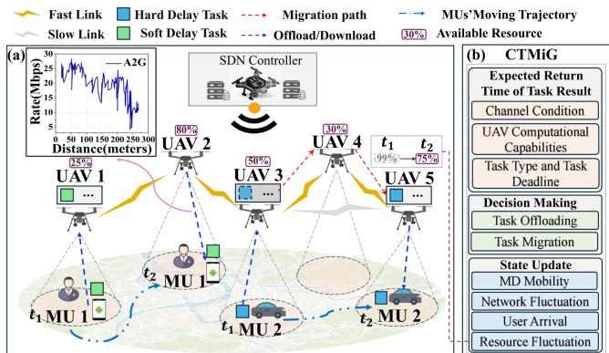  
Fig. 1. A motivation example of computation task migration.

Therefore, migrating tasks to a more appropriate UAV is essential to maintain efficient execution and ensure timely result delivery [10]. In UAV-enabled MEC networks, dynamic task migration is crucial for meeting stringent QoS requirements by reducing latency and positioning tasks closer to MUs. To illustrate, this study presents a motivational example and categorizes computation tasks into two types based on latency requirements: stringent (hard) and flexible (soft) delay constraints. This classification facilitates precise task performance optimization across diverse scenarios.

Motivation Example: As illustrated in Fig. 1, five UAVs collaborate to provide computation services to two ground MUs in a disaster assistance scenario. A Software-Defined Networking (SDN) controller, with global network information, makes real-time decisions on task offloading and migration. Upon task arrival, the SDN controller evaluates communication conditions, UAV capabilities, and periodically reported workload distribution to determine the optimal offloading strategy. Initially, MU 1’s task, with a soft delay requirement, is offloaded to UAV 1, while MU 2’s task, with a hard delay requirement, is assigned to UAV 3. As the MUs move, the SDN controller monitors task progress and deadlines, migrating tasks if necessary. For instance, if MU 2’ s task risks missing its deadline, it is migrated from UAV 3 to UAV 5, optimizing QoS. The controller selects the migration path (UAV 3 → UAV 4 → UAV 5) to minimize cost.

Dynamic migration of computation tasks remains a key challenge in UAV-enabled MEC networks. Most existing studies focus on service-oriented migration, which aims to maintain seamless service continuity by relocating active services, including state, session data, and ongoing connections, across computing nodes as mobile users move beyond the coverage of their current edge servers [11], [12]. In contrast, computation task migration involves transferring tasks to more suitable edge nodes to enable efficient execution, improved resource utilization, and timely result delivery in dynamic environments. To ensure QoS for MUs, migration targets must be carefully selected by considering latencies in uploading, execution, migration, and downloading. While service-oriented migration minimizes disruption, it is less suitable for computation tasks that prioritize execution and delivery optimization in dynamic conditions. Thus, existing service migration methods do not fully address the unique challenges of computation task migration in UAV-enabled MEC networks.

To bridge this gap, we investigate the practical problem of Computation Task MiGration (CTMiG) in UAV-enabled dynamic MEC networks, focusing on real-time joint optimization of task offloading and migration decisions to minimize latency across all MUs. By integrating task offloading and migration into the task-serving decision-making process throughout the execution lifecycle, we propose a unified approach to optimize both. The CTMiG problem presents several challenges: 1) Balancing task offloading and migration to specific UAVs, avoiding resource wastage from frequent migrations while preventing QoS degradation from infrequent ones. 2) Optimizing latencies in uploading, computation, migration, and downloading amid network fluctuations and workload balancing. 3) The CTMiG problem shares similarities with the NP-hard College Admission Problem, where each UAV serves multiple MUs, and each MU selects one UAV. The dynamic nature of task arrivals adds complexity, requiring advanced online scheduling algorithms beyond traditional heuristics. The contributions of this work can be summarized as follows:

To the best of our knowledge, this study is the first to address the feedback-aware joint offloading and migration problem in dynamic UAV-enabled MEC networks. And we model the CTMiG problem as a continuous-time Markov decision process.

We propose ILCTS, a generative adversarial imitation learning algorithm for offloading and migration decisions by imitating expert policies. Expert policies are generated using an improved Proximal Policy Optimization (PPO) algorithm to create offline data when relevant data is scarce. The agent uses adversarial training to mimic expert actions and refine its policy through online learning, utilizing both existing and new data.

\- We conduct extensive simulations to validate the effectiveness of the proposed ILCTS, which achieves lower average delivery delay and improved network adaptability compared to representative baseline methods.

The remainder of this paper is organized as follows: Section II reviews related work; Section III introduces the system model and problem formulation; Section IV presents the proposed imitation learning-based algorithm, ILCTS; Section V provides simulation results; and Section VI concludes the paper.

## II. RELATED WORK

UAV-Enabled MEC: Traditional edge computing relies on BS as servers, but emerging IoT applications require more flexible architectures, making UAVs ideal for computation-intensive tasks in UAV-enabled MEC networks due to their adaptability and rapid deployment [13], [14]. However, UAV mobility, dynamic wireless variations, energy constraints, and evolving topologies require adaptive solutions and real-time decisionmaking to ensure reliable task execution. In [15], Hu et al. propose an algorithm to minimize the maximum latency for ground users by optimizing UAV trajectory, user association, and offloading ratio. Similarly, in [16], the authors aim to maximize the minimum throughput for MUs by jointly optimizing UAV trajectory, bandwidth allocation, and user association. Xiong et al. focus on minimizing energy consumption in UAV-assisted edge computing networks by jointly optimizing task offloading, bit allocation, and UAV trajectory [17]. Zhang et al. present a multi-UAV-enabled MEC architecture, where multiple UAVs provide communication and computation services to IoT devices unable to access ground edge clouds, with a focus on achieving min-max fairness in energy consumption [18]. In a similar vein, Han et al. aim to minimize overall energy consumption in a multi-UAV-assisted MEC system by jointly optimizing UAV-device associations, UAV deployments, and flight trajectories [19]. He et al. formulate ajoint optimization problem for task offloading, resource allocation, and UAV trajectory planning to maximize the QoE for mobile users while considering UAV energy consumption constraints [20]. However, existing studies often overlook the dynamic nature of UAV-based wireless networks and fail to account for the latency associated with result downloading, leaving the task migration issue inadequately addressed.

Service Migration in MEC: Efficient service migration in MEC is critical for maintaining uninterrupted service delivery, particularly given the limited coverage of edge servers and the mobility of users [11], [12]. Service migration methodologies typically employ techniques such as live migration, containerbased migration, and stateful migration to relocate active services with minimal disruption. To optimize migration decisions, numerous studies have explored user mobility prediction. For example, Chen et al. [21] propose a data-driven framework that utilizes historical WiFi traces for mobility-aware service migration, while Zhao et al. [22] develop an LSTM-based predictor to improve the success rate of migration. Xu et al. [23] present a service management strategy that considers both delay and mobility, applying probabilistic methods to minimize service latency and migration costs. Despite these advances, accurately predicting user trajectories remains challenging due to the difficulty in acquiring large-scale, high-precision datasets necessary for training deep learning models. Furthermore, Xu et al. [24] propose a path selection method aimed at reducing network provider costs and improving user QoE during migration. However, their approach is limited by its reliance on only the start and end points of user trajectories, overlooking intermediate locations and the dynamic characteristics of wireless networks.

Current research on service migration primarily targets continuously connected, latency-sensitive applications such as VR, AR, and autonomous driving. These studies frequently assume that the computational outputs are relatively small, thereby simplifying or overlooking the impact of download delays and dynamic transmission paths [5], [6]. While such assumptions are often valid for real-time applications producing lightweight outputs, they may limit the applicability of existing models in scenarios involving substantial output data or complex, dynamic network conditions. For instance, tasks involving video stream analysis, sensor fusion, or data mining can generate outputs ranging from several megabytes to multiple gigabytes. Highresolution video analytics (e.g., 1080p or 4 K) is a representative example where the download of results introduces significant latency. In such cases, efficient path selection becomes critical to minimize end-to-end delays. Distinct from existing studies, this paper addresses the challenges associated with computing task migration in highly dynamic UAV-enabled communication networks, without relying on user mobility prediction. It explicitly considers the entire data transmission path, encompassing task uploads, migration among UAV servers, and the download ofcomputation results.

Task Offloading in MEC: Task offloading in MEC involves transferring tasks to edge or remote cloud servers to improve performance, reduce latency, and optimize energy usage. Various studies have explored strategies to optimize this process. Mukherjee et al. use a distributed deep neural network to optimize task offloading, addressing computing bottlenecks and UAV-user channel limitations [25]. Tian et al. develop a satisfaction model incorporating task latency and energy conservation, using a K-means algorithm to optimize task offloading and UAV scheduling in UAV-enabled MEC systems [26]. Wang et al. propose the SSGT algorithm for pre-offloading tasks in multi-UAV MEC systems, aiming to balance utility between UAV-MEC servers and mobile users [27]. Mobility and channel capacity are also critical factors in task offloading strategies. Zhao et al. explore task offloading in vehicular edge computing, introducing a DDPG algorithm combined with a mobility detection algorithm to make offloading decisions as vehicles leave RSU coverage [28]. Similarly, Zheng et al. propose a location prediction scheme based on pedestrian movement and vehicle-following models, integrated with a deep Q-learningbased neural network for task offloading [29]. In UAV-assisted edge computing, optimizing offloading efficiency requires integrating UAV trajectory control with computation strategies to meet dynamic network requirements. Du et al. introduce the MA-TACO scheme but do not fully address the QoS challenges posed by user mobility, highlighting the need for integrated migration decisions [30].

In addition to performance enhancement, effective MEC offloading must address key objectives such as profitability and security. Wang et al. introduce a market-based pricing mechanism to incentivize edge resource utilization in non-competitive environments [31]. Dbouk et al. propose a secure ad-hoc edge cloud architecture leveraging Wi-Fi Direct and genetic optimization for context-aware offloading [32]. Xiao et al. formulate a max-min optimization framework thatjointly optimizes offloading decisions, power control, and computation parameters under security constraints in vehicular networks [33]. Li et al. focus on profit-driven, security-aware task allocation in ECC environments by dynamically assigning tasks to edge or cloud servers based on service requirements and security levels [34]. While these studies primarily focus on task offloading, in UAV-enabled MEC scenarios, where environmental factors impact reliability, integrating offloading and migration decisions is essential for enhancing user QoS.

## III. SYSTEM MODEL AND PROBLEM FORMATION

This section begins by introducing the system model under consideration in this study and then formally defines our problem. Table I summarizes the symbols and notations.

## A. System Model

Fig. 2 illustrates the system architecture and the dynamic workflow of task offloading and migration. In this setup, a UAVenabled wireless-powered MEC system is considered, where UAVs, each integrated with an MEC server, provide computational services to a set of M MUs. The UAVs and MUs are denoted by the sets $\mathcal { U } = \{ 1 , 2 , \dots , U \}$ and $\mathcal { M } = \{ 1 , 2 , \dots , M \}$ respectively. To facilitate performance analysis, the system operates over a finite time horizon $\tau ,$ , which is discretized into $T$ equal time slots, represented as $\mathcal { T } = \{ 0 , 1 , 2 , \hdots , T - 1 \}$ with each time slot having a fixed duration τ . The wireless communication channels between MUs and UAVs, as well as the inter-UAV communication links, are modeled as time-varying. While channel conditions fluctuate at the beginning of each time slot, they are assumed to remain constant throughout the duration of the slot. This quasi-static assumption is justified due to the typically short duration τ of the time slots. The system leverages a SDN architecture [35], [36], which allows for centralized control of network operations and resource management. The SDN controller collects real-time system information, including the geographical locations and operational statuses of MUs and UAVs, as well as current channel conditions, to optimize network performance dynamically. Concretely, leveraging control plane protocols such as OpenFlow-like mechanisms [37], the SDN controller periodically requests status updates and configurations from UAVs and MEC servers.

TABLE I DEFINITIONS OF NOTATIONS
<table><tr><td>Symbol</td><td>Explanation</td></tr><tr><td>M</td><td>Number of MUs</td></tr><tr><td>U</td><td>Number of UAVs</td></tr><tr><td>Γi</td><td>MU i&#x27;s offloaded task</td></tr><tr><td> $d \boldsymbol { s } _ { i }$ </td><td>Data size of MU i&#x27;s task</td></tr><tr><td> $\underline { { \rho _ { j } } }$ </td><td>UAV&#x27;s computing power</td></tr><tr><td> $\hat { \mathcal { L } } _ { i , k , t } ^ { u p }$ </td><td>Task upload latency estimation</td></tr><tr><td> $\scriptstyle { \overline { { \hat { c } ^ { c o m p } } } }$   $\mathcal { L } _ { i , k , t } ^ { \mathrm { ~ \scriptsize ~ - ~ } }$ </td><td>Task execution latency estimation</td></tr><tr><td> $\hat { \mathcal { L } } _ { i , k , o , t } ^ { m i g }$ </td><td>Task migration latency estimation</td></tr><tr><td> $\underline { { \mathcal { L } _ { i , k , t } ^ { d o w n } } }$ </td><td>Result download latency estimation</td></tr><tr><td> $\overline { { T R _ { i , j } } }$ </td><td>Transmission rate between node i and node j</td></tr><tr><td> $\overline { { P L A 2 G } }$ </td><td>Path loss for UAV-EU communication</td></tr><tr><td> $\overline { { P L A 2 A } }$ </td><td>Path loss of UAV-UAV communication</td></tr><tr><td> $\overline { { P a t h } }$ </td><td>Transmission Path</td></tr></table>

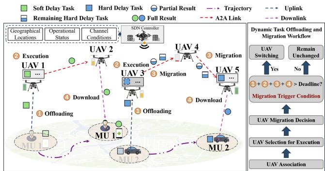  
Fig. 2. The system architecture and workflow.

During the time horizon T , UAVs remain stationary at predefined positions with a fixed altitude $h ,$ where each UAV $j \in \mathcal { U }$ is located at $l o c _ { i } ^ { u a v }$ . The UAVs’ key parameters, including CPU clock speed $\varpi _ { j }$ (cycles per second, 1 GHz = $1 0 ^ { 9 }$ cycles per second), computation intensity $\rho _ { j }$ (CPU cycles per bit), and wireless coverage radius $r a d _ { j }$ , define their computational capacity and communication range. In contrast, MUs are continuously moving through the system but are assumed to remain static within each time slot. The position of MU i at time slot t is denoted by $l o c _ { i , t } ^ { m u }$ . Each MU i is assumed to have a computationally intensive task $\Gamma _ { i } ,$ such as processing high-definition 3D road maps, which can be offloaded to a UAV for execution. Task generation times of all MUs are randomly distributed over the time horizon $\tau$ , with each MU’s task arriving independently. To capture the stochastic nature of task generation, task arrivals are modeled as a Poisson process, i.e., a widely adopted assumption in communication systems. Tasks are categorized based on their latency constraints: hard delay tasks, which must be processed and returned within a strict deadline $d l _ { i } .$ , and soft delay tasks, which can tolerate some latency at the expense of degraded QoS as delay increases [38]. Each task $\Gamma _ { i }$ is characterized by the tuple $\Gamma _ { i } \doteq \langle d s _ { i } , \mu _ { i } , r e s _ { i } , \xi _ { i } \rangle$ , where $d \boldsymbol { s } _ { i }$ is the input data size in bits, $\mu _ { i }$ is is the computational demand in CPU cycles per second (Hz), resi represents the output data size, and $\xi _ { i }$ indicates whether the task has a hard or soft delay requirement. $\operatorname { I f } \xi _ { i } = 1$ , task $\Gamma _ { i }$ is classified as having a hard delay requirement; otherwise, it is considered a soft delay task. The maximum delivery deadline $\chi _ { i }$ for returning the computation result of task $\Gamma _ { i }$ is defined as follows:

$$
\chi _ { i } = \left\{ \begin{array} { l l } { d l _ { i } , } & { \mathrm { i f ~ } \xi _ { i } = 1 ; } \\ { d l _ { i } + \Delta t _ { i } , } & { \mathrm { i f ~ } \xi _ { i } = 0 ; } \end{array} \right.\tag{1}
$$

where $d l _ { i }$ represents the deadline for task $\Gamma _ { i }$ and $\Delta t _ { i }$ denotes the maximum allowable delay beyond this deadline for soft delay tasks. Within this extended time, the task remains valid, though its performance may be degraded.

Task Offloading and Migration: To offload the computation task $\Gamma _ { i } ,$ MU i must upload the task to the MEC system via an accessible UAV $j \in \mathcal { U }$ . At each time slot t, MU i may be within the coverage area of multiple UAVs, represented by the set ${ \mathcal { U } } _ { i } ^ { t }$ . Among these UAVs, we adopt the widely used proximity-based UAV association scheme, which assigns the MU to the nearest UAV [39]. Let $\boldsymbol { x } _ { i , j } ^ { t }$ represent the association indicator between UAV $j \in \mathcal { U } _ { i } ^ { t }$ and MU $i \in \mathcal { M }$ at time slot t, where $x _ { i , j } ^ { t } = 1$ indicates that MU i is connected to UAV $j ;$ and $x _ { i , j } ^ { t } = 0$ otherwise. Formally, the association indicator is determined directly as follows:

$$
\boldsymbol { x } _ { i , j } ^ { t } = \underset { j \in \mathcal { U } _ { i } ^ { t } } { \arg \operatorname* { m i n } } \left\| l o c _ { i , t } ^ { m u } , l o c _ { j } ^ { u a v } \right\| ,\tag{2}
$$

where $\begin{array} { r } { \sum _ { j \in \mathcal { U } _ { \ast } ^ { t } } { x _ { i , j } ^ { t } } = 1 , \forall i \in \mathcal { M } , t \in \mathcal { T } } \end{array}$ , ensuring that each MU connects to only one UAV at any given time.

To optimize workload distribution in UAV-enabled edge computing networks, the SDN controller dynamically selects UAVs for task execution based on resource availability, energy status, and proximity to the MU. Computation resources are allocated on a First-Come, First-Served (FCFS) basis, with UAVs being selected only if they possess sufficient capacity, without considering task priority or preemption. If the initially associated UAV lacks adequate resources, the task is rerouted to an alternative UAV within the network. Consequently, tasks may be executed either by the directly connected UAV or, via traffic redirection, by another UAV. The SDN controller orchestrates task transmission by dynamically selecting optimal paths based on real-time network topology, link quality, and traffic load. To enhance energy efficiency, UAVs with limited residual energy are assigned reduced routing parameters, e.g., transmission rates, through selective adjustments by the SDN controller, enabling them to conserve energy and recharge. This discourages further task assignments and promotes energy-aware scheduling.

As the MU moves, the associated UAV may change during task execution, potentially leading to increased downlink transmissions between the connected UAV and the UAV performing the task. To maintain QoS requirements, the SDN controller must manage task migration, which involves dynamically switching the serving UAV during task execution. In this context, task migration can be understood as re-offloading the task to a different UAV to ensure optimal performance. We define a binary matrix $\mathbf { Y } ^ { t } = \{ 0 , 1 \} ^ { \dot { M } \times U }$ to represent the task serving status, including both offloading and migration indicators, across MUs and UAVs. The serving status indicator variable $y _ { i , j } ^ { t } \in \mathbf { Y } ^ { t }$ signifies whether UAV j is serving MU $i \mathrm { \ ' } _ { \mathrm { s } }$ task at time slot t. Specifically, $y _ { i , j } ^ { t } = 1$ signifies that UAV $j$ is serving the task of MU $i ;$ otherwise, $y _ { i , j } ^ { t } = 0$ . Each task is processed by only one UAV at any given time, ensuring $\textstyle \sum _ { i \in { \mathcal { U } } } y _ { i , j } ^ { t } = 1 , \forall i \in { \mathcal { M } }$ A UAV’s task capacity is limited by its computational capacity, as defined by the constraint:

$$
\sum _ { i \in \mathcal { M } } y _ { i , j } ^ { t } \mu _ { i } \leq \varpi _ { j } , \quad \forall j \in \mathcal { U } ,\tag{3}
$$

which guarantees that the cumulative resource demands of all served tasks do not exceed the UAV’s available resources.

Communication Model: WiFi is a widely adopted communication technology in commercial UAVs, particularly for shortrange transmissions [40]. Leveraging its prevalence, we model UAV-enabled MEC network communications using WiFi, where the CSMA/CA protocol ensures that only one device transmits on the channel at a time. Under CSMA/CA, multiple UAVs contend for channel access, causing backoff delays and retransmissions that introduce latency and throughput variability. These effects can lead to fluctuating performance in dense UAV deployments, complicating precise modeling of communication delays. In this study, we adopt an idealized MAC layer model to focus on high-level task offloading optimization, as incorporating detailed MAC-layer dynamics would significantly increase complexity and exceed the scope of this work. We consider this an important direction for future research.

The path loss directly affects the signal strength, data throughput, and reliability of the wireless connection. Mathematically, the path loss for A2G/G2A communication [41] between a UAV and a ground MU is modeled as follows:

$$
\begin{array} { r l } & { \mathrm { P L } _ { \mathrm { A 2 G } } ( d _ { a g } , h ) = 2 0 \log \left( \frac { 4 \pi f _ { c } \sqrt { h ^ { 2 } + d _ { a g } ^ { 2 } } } { c } \right) } \\ & { \quad \quad \quad + P _ { \mathrm { L o S } } ( d _ { a g } , h ) \eta _ { \mathrm { L o S } } + ( 1 - P _ { \mathrm { L o S } } ( d _ { a g } , h ) ) \eta _ { \mathrm { N L o S } } , } \end{array}\tag{4}
$$

where h denotes the UAV’s altitude, $d _ { a g }$ is the horizontal distance between the UAV and the MU, $f _ { c }$ (in Hz) is the carrier frequency, and c is the speed of light. The term $P _ { \mathrm { L o S } } ( d _ { a g } , h )$ denotes the probability of a Line-of-Sight (LoS) link between the UAV and the MU, given by:

$$
P _ { \mathrm { L o S } } ( d _ { a g } , h ) = \frac { 1 } { 1 + a * e x p \left( - b \left( a r c t a n \left( h / d _ { a g } \right) - a \right) \right) } ,\tag{5}
$$

where a and b are environment-specific parameters that adjust the slope and position of the LoS probability curve. The factors $\eta _ { \mathrm { L o S } }$ and $\eta _ { \mathrm { N L o S } }$ represent the additional attenuation (in dB) due to LoS and NLoS conditions, respectively. For a suburban environment, typical values for these parameters are $a = 4 . 8 8$ $b = 0 . 4 3 , \eta _ { \mathrm { L o S } } \overset {  } { = } 0 . 1$ , and $\eta _ { \mathrm { N L o S } } = 2 1 \left[ 4 2 \right]$ . In low-altitude UAV communication, the A2G/G2A path loss is primarily influenced by the LoS probability. As altitude increases, the LoS probability $\dot { P _ { \mathrm { L o S } } } ( d _ { a g } , \bar { h } )$ rises sharply, reducing path loss due to improved LoS. At higher altitudes, however, $P _ { \mathrm { L o S } } ( d _ { a g } , h )$ stabilizes, and path loss is dominated by free-space attenuation rather than LoS conditions. The horizontal distance $d _ { a g }$ also increases path loss, as signal propagation lengthens with distance. Additionally, an increase in carrier frequency $f _ { c }$ raises the path loss, particularly by impacting the initial terms in the path loss (4), due to higher frequencies being more susceptible to attenuation.

For Air-to-Air (A2A) communication, which typically occurs in open environments with prevalent LoS conditions, the freespace path loss model is used:

$$
\operatorname { P L } _ { \operatorname { A 2 A } } ( d ) = 3 2 . 4 5 + 2 0 \log f _ { c } + 2 0 \log d ,\tag{6}
$$

where d represents the distance between UAVs, and $f _ { c }$ (in MHz) is the carrier frequency. This model assumes clear LoS between UAVs, with minimal interference from obstacles. Building on the path loss model and data transmission rate calculation methods outlined in [43], we present a generalized framework that accounts for the various communication channels involved in data transmission. The transmission rate between source node i and destination node j during time slot t is expressed as:

$$
T R _ { i , j } ^ { t } = B ( t ) \log _ { 2 } \left( 1 + \frac { E _ { \mathrm { i } } 1 0 ^ { \frac { - \mathrm { p L } } { 1 0 } } } { B ( t ) \sigma ^ { 2 } } \right) ,\tag{7}
$$

where $B ( t )$ is the available WiFi bandwidth at time slot $t , E _ { \mathrm { i } }$ is the transmitting power of source node $i ,$ and PL represents the path loss between nodes i and $j ,$ and $\sigma ^ { 2 }$ denotes the Gaussian noise power. The path loss PL depends on whether the communication occurs between two UAVs (A2A), in which case $\mathrm { P L } = \mathrm { P L } _ { \mathrm { A } 2 \mathrm { A } }$ , or between a UAV and a ground MU (A2G), where $\mathrm { P L } = \mathrm { P L } _ { \mathrm { A 2 G } }$

Note that, the scalability of UAV deployment in a UAVenabled MEC network depends on workload and communication overhead, which are influenced by bandwidth, processing capacity, and UAV density. In our scenario, with a limited number of UAVs and MUs for applications like disaster assistance and public safety, we assume ideal communication conditions and disregard the overhead of real-time information collection by the SDN controller UAV for simplicity.

Computational Service Latency Analysis: In dynamic environments, the completion of an offloaded computation task involves four key latency components: upload latency (for transmitting input data), execution latency, migration latency (for transferring unprocessed data), and result download latency. For newly arrived tasks, the SDN controller estimates upload, execution, and download latencies to optimize task offloading decisions. For ongoing tasks, the controller periodically evaluates all four components at each time slot to dynamically adjust task migration decisions. Next, we analyze each of these latency components in detail.

(1) Task Upload Latency: This latency arises during the transmission of a task from an MU to its potential serving UAV, relayed through an intermediate connected UAV. At time slot t, for a given MU i and its associated UAV $j \ ( \mathrm { i . e . , } \ x _ { i , j } ^ { t } = 1 )$ , let $P a t h _ { i , j , k } ^ { t }$ denote the transmission path from MU i to its potential serving UAV k via the connected UAV j. As outlined, the SDN controller selects the transmission path based on real-time network conditions, utilizing strategies like shortest path routing.

The task upload latency, denoted as $\hat { \mathcal { L } } _ { i , k , t } ^ { u p }$ , is calculated based on the association indicator and the serving variable, and is given by

$$
\hat { \mathcal { L } } _ { i , k , t } ^ { u p } = x _ { i , j } ^ { t } \sum _ { k \in \mathcal { U } } y _ { i , k } ^ { t } \sum _ { \{ s , s + 1 \} \in P a t h _ { i , j , k } ^ { t } } \frac { d s _ { i } } { T R _ { s , s + 1 } ^ { t } } ,\tag{8}
$$

where $x _ { i , j } ^ { t } = 1 , y _ { i , k } ^ { t }$ represent the potential UAV serving MU i at time slot $t ,$ and $T R _ { s , s + 1 } ^ { t }$ denotes the data transmission rate between consecutive transmission nodes s and $s + 1$ along the delivery path $P a t h _ { i , j , k } ^ { t }$ during the same time slot.

(2) Task Execution Latency: For newly arriving tasks, task execution latency is calculated based on the potential serving UAVs and the full input data. In contrast, for ongoing tasks, the latency calculation must account for both the time already spent processing the partial input data and the estimated time required to process the remaining data. At time slot t, for a newly offloaded task $\Gamma _ { i }$ offloaded from MU $i ,$ the involved execution latency with respect to the potential serving UAV k is calculated as below:

$$
\hat { \mathcal { L } } _ { i , k , t } ^ { c o m p } = \sum _ { k \in \mathcal { U } } y _ { i , k } ^ { t } * \frac { d s _ { i } * \rho _ { k } } { \mu _ { i } } ,\tag{9}
$$

where $y _ { i , k } ^ { t }$ denotes the potential serving UAV for task $\Gamma _ { i }$ at time $t , d s _ { i }$ is the task’s data size, $\mu _ { i }$ represents the computation demand, and $\rho _ { k }$ is UAV $k ' s$ computational power.

If $\Gamma _ { i }$ is an ongoing task, the SDN controller periodically calculates its execution latency at each time slot. At time slot $t ,$ assuming the task remains on the current serving UAV k without migrating, the estimated execution latency $\hat { \mathcal { L } } _ { i , k , t } ^ { c o \bar { m } p }$ is given by:

$$
\hat { \mathcal { L } } _ { i , k , t } ^ { c o m p } = \sum _ { k \in \mathcal { U } } y _ { i , k } ^ { t } * \frac { d s _ { i } ^ { t } * \rho _ { k } } { \mu _ { i } } + l a _ { c o m p } ,\tag{10}
$$

where $\mathit { d s } _ { i } ^ { t }$ represents the remaining data to be processed for task $\Gamma _ { i }$ , and $l a _ { c o m p }$ denotes the execution time already spent before the current time slot t, calculated as follows:

$$
l a _ { c o m p } = \sum _ { n = 1 } ^ { t } \sum _ { o \in \mathcal { U } } y _ { i , o } ^ { n - 1 } * \frac { \left( d s _ { i } ^ { n - 1 } - d s _ { i } ^ { n } \right) * \rho _ { o } } { \mu _ { i } } ,\tag{11}
$$

where $y _ { i , o } ^ { n - 1 }$ represents the UAV serving task Γi during time slot $n - 1$

(3) Task Migration Latency: At time slot t, if task $\Gamma _ { i }$ requires migration to another UAV to satisfy QoS requirements, the remaining input data $d s _ { i } ^ { t }$ (for continued execution) and the partial result obtained so far must be transferred to the newly assigned UAV. For simplicity, the partial result for task $\Gamma _ { i }$ at time t is represented as $\zeta _ { t } \times r e s _ { i } ,$ where $0 < \zeta _ { t } < 1$ is a proportionality coefficient representing the fraction of the final output result. This process assumes that migration is completed within a single time slot. Since multiple migrations may occur during task execution, the migration latency is calculated recursively. Specifically, if task $\Gamma _ { i } ,$ currently served by UAV k, is migrated to a potential serving UAV o via the selected transmission path $P a t h _ { k  o } ^ { t }$ at time slot t (where $k \neq o )$ , the migration latency $\hat { \mathcal { L } } _ { i , k , o , t } ^ { m i g }$ is given by

$$
\hat { \mathcal { L } } _ { i , k , o , t } ^ { m i g } = \sum _ { \{ s , s + 1 \} \in P a t h _ { k  o } ^ { t } } \frac { d s _ { i } ^ { t } + \zeta _ { t } \times r e s _ { i } } { T R _ { s , s + 1 } ^ { t } } + \mathcal { L } _ { i , t - 1 } ^ { m i g }\tag{12}
$$

where $\{ s , s + 1 \}$ represents consecutive nodes along the transmission path $P \dot { a } t h _ { k  o } ^ { \bar { t } }$ from UAV k to UAV o. Additionally, $\mathcal { L } _ { i , t - 1 } ^ { m i g }$ represents the cumulative migration latency experienced by MU i up to the current time slot $t ,$ and this value is logged in the system’s operational records.

(4) Result Download Latency: This refers to the delay associated with transmitting the computation result from the UAV that completed the task back to the MU. Similar to the task upload phase, the download latency, denoted as $\hat { \mathcal { L } } _ { k , i , t } ^ { d o w n }$ , for delivering the computation result from UAV k (which completed the task) to MU i via the connected $\mathrm { U A V } ~ j$ at time slot t (where $x _ { i , j } ^ { t } = 1 )$ is calculated as follows:

$$
\hat { \mathcal { L } } _ { k , i , t } ^ { d o w n } = x _ { i , j } ^ { t } \sum _ { k \in \mathcal { U } } y _ { i , k } ^ { t } \sum _ { \{ s , s + 1 \} \in P a t h _ { k , j , i } ^ { t } } \frac { r e s _ { i } } { T R _ { s , s + 1 } ^ { t } } ,\tag{13}
$$

where $P a t h _ { k , j , i } ^ { t }$ represents the delivery path from UAV $k ,$ which completed task $\Gamma _ { i } ,$ to MU i, with the data relayed through the connected UAV j at time slot t. The transmission rate between consecutive nodes s and $s + 1$ along this path is denoted by $T R _ { s , s + 1 } ^ { t }$ , while $r e s _ { i }$ refers to the size of the computation result.

## B. Problem Formulation

As discussed, at each time slot t, the SDN controller evaluates task-serving decisions for newly arrived tasks by considering the estimated upload latency, execution latency, and download latency to select the most suitable UAV for offloading. For ongoing tasks, the controller evaluates the need for migration and selects a target UAV if required. The migration trigger condition is based on the cumulative time already spent (including upload, partial execution, and migration latency) and the estimated time to complete the task (covering remaining execution, future migration, and download latency). If the total of these times is expected to exceed the task’s deadline, migration is initiated. Formally, for a task $\Gamma _ { i }$ offloaded by MU i, the expected total latency $\hat { \mathcal { L } } _ { i , t }$ at time slot t is calculated as:

$$
\hat { \mathcal { L } } _ { i , t } = \hat { \mathcal { L } } _ { i , k , t } ^ { u p } + \hat { \mathcal { L } } _ { i , k , t } ^ { c o m p } + \hat { \mathcal { L } } _ { i , k , o , t } ^ { m i g } + \hat { \mathcal { L } } _ { k , i , t } ^ { d o w n } ,\tag{14}
$$

where k represent the serving UAV and o denote the potential migration UAV. To ensure each task meets its QoS requirements, the SDN controller evaluates the total latency $\hat { \mathcal { L } } _ { i , t }$ against the task’s specified deadline $d l _ { i }$ . If $\hat { \mathcal { L } } _ { i , t } \leq d l _ { i }$ , no migration is needed. However, if $\hat { \mathcal { L } } _ { i , t } > d l _ { i }$ , the task must be migrated to another UAV to maintain the required QoS. Considering that frequent migration leads to higher resource consumption, such as increased use of bandwidth and CPU, we make a trade-off between QoS and computational resources for soft delay tasks. Specifically, for these tasks, we introduce a “completion process” indicator $\Psi _ { i } ^ { t }$ to relax the migration trigger condition. The indicator of completion process is calculated as:

$$
\Psi _ { i } ^ { t } = \frac { d s _ { i } - d s _ { i } ^ { t } } { d s _ { i } } , ~ \xi _ { i } = 0 .\tag{15}
$$

The SDN controller evaluates both the task completion progress and the estimated latency to decide whether to trigger a migration. Specifically, for soft delay tasks $( \xi _ { i } = 0 )$ , if the completion progress exceeds a predefined threshold, $\Psi _ { i } ^ { t } \geq \varsigma ,$ and the total latency $\hat { \mathcal { L } } _ { i , t } < d l _ { i } + \Delta t _ { i }$ , migration is not required. Consequently, the migration trigger condition is adjusted: migration is initiated if these criteria are not satisfied; otherwise, it remains unchanged.

$$
\begin{array} { r } { \left\{ \begin{array} { c c } { \hat { \mathcal { L } } _ { i , t } \leq d l _ { i } , } & { \xi _ { i } = 1 ; } \\ { \hat { \mathcal { L } } _ { i , t } \leq d l _ { i } + \Delta t _ { i } a n d \Psi _ { i } ^ { t } \geq \varsigma , } & { \xi _ { i } = 0 . } \end{array} \right. } \end{array}\tag{16}
$$

Problem Definition: Here, we formally define our studied Computation Task MiGration (CTMiG) problem in UAVenabled dynamic MEC networks. Consider a UAV-enabled wireless-powered MEC system consisting of a set of UAVs $\mathcal { U } = \{ 1 , \stackrel { \cdot } { 2 } , \dotsc , U \}$ and MUs $\mathcal { M } = \{ 1 , 2 , \dotsc , M \}$ }, where UAVs are stationed at fixed locations while MUs move continuously. Over a finite time horizon $\mathcal { T } = \{ 0 , 1 , 2 , \hdots , T - 1 \}$ , each MU stochastically generates a computationally intensive task $\Gamma _ { i }$ categorized as either a hard or soft delay task, which must be offloaded to the UAVs for execution. The SDN controller, serving as a centralized coordinator, is responsible for making real-time task-serving decisions (offloading and migration) within the dynamic network, with the objective of maximizing QoS for the MUs. Mathematically, the problem is formulated as an online decision-making challenge, aiming to minimize the average latency across all MUs while ensuring that all tasks meet their respective deadlines. The CTMiG problem is formally stated as follows:

$$
\begin{array} { r l } & { \mathbf { P 1 } : ~ \underset { \left\{ y _ { i , j } ^ { t } \in \mathbf { Y } ^ { t } \right\} } { \arg \operatorname* { m i n } } \frac { 1 } { M } \underset { i = 0 } { \overset { M } { \sum } } \mathcal { L } _ { i } } \\ & { ~ \mathrm { s . t } : ~ \left\{ \begin{array} { l l } { y _ { i , j } ^ { t } = \{ 0 , 1 \} ~ , \forall i \in \mathcal { M } , j \in \mathcal { U } , t \in \mathcal { T } } \\ { ~ \sum _ { j \in \mathcal { U } } y _ { i , j } ^ { t } = 1 , \forall i \in \mathcal { M } } \\ { ~ \sum _ { i \in \mathcal { M } } y _ { i , j } ^ { t } \mu _ { i } \leq \frac { 1 } { \omega _ { j } } , \forall j \in \mathcal { U } } \\ { ~ \int _ { i } \leq d l _ { i } , ~ \forall i = 1 ; ~ } \\ { ~ \int _ { \mathcal { L } _ { i } } \leq d l _ { i } + \Delta t _ { i } , ~ \xi _ { i } = 0 . } \end{array} \right. } \end{array}\tag{17}
$$

where $\mathcal { L } _ { i }$ denotes the actual service latency experienced by the task offloaded by MU i at the end of the time horizon T. This value serves as the realized latency, reflecting the true outcome of the previously estimated latency.

Problem Complexity Analysis: The CTMiG problem we address is analogous to the College Admission Problem (CAP), where multiple MUs, akin to students, compete for resources from a set of UAVs, which function similarly to universities. In each decision-making round, UAVs allocate resources to enable MUs to access the network and offload tasks, with each MU selecting a single UAV. This scenario mirrors the CAP, which involves optimizing the allocation of limited resources (comparable to university admission slots), a known NP-hard combinatorial problem. As the problem complexity increases, traditional meta-heuristic algorithms encounter performance bottlenecks. To address these challenges, we propose an imitation learningbased approach, which will be elaborated upon in the following section.

## IV. IMITATION LEARNING-BASED APPROACH

## A. Algorithm Overview

Imitation learning, combining expert guidance with exploration, provides an effective solution to dynamic task scheduling challenges. In this paper, we propose ILCTS, a GAIL-based algorithm designed to solve the CTMiG problem. ILCTS outperforms traditional reinforcement learning methods in stability and performance, accelerates training using expert knowledge, and reduces the need for extensive exploration. It leverages GAN-based techniques to refine task-serving decisions. However, acquiring expert data is challenging due to limited datasets and high collection costs. To address this, we develop an offline expert policy using an improved PPO algorithm, chosen for its stability, efficiency, simplicity, and flexibility in task migration within UAV-enabled dynamic MEC networks. PPO generates expert-like trajectories from the current policy, enabling realtime adaptation to environmental changes. In complex environments, GANs enable the agent to explore unknown states, learning optimal behaviors through exploration and refinement, ultimately surpassing expert limitations in real-time task offloading and migration decisions.

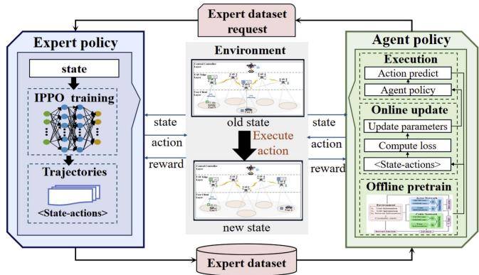  
Fig. 3. The architecture of our proposed approach ILCTS.

The proposed ILCTS algorithm, illustrated in Fig. 3, consists of two main components.

1) Offline Design of Expert Policies: On the left side, expert policies are offline-designed and trained using an improved PPO algorithm. The model interacts with the environment to gather experience, and once it converges, it generates state-action pairs that constitute the expert data.

2) Online Agent Policy: On the right, the agent trained using GAIL is shown. The agent’s discriminator interacts with the environment in real-time, collecting new state-action pairs. These newly acquired pairs, combined with those from the expert data, generate a learning signal (or “reward”) that iteratively refines the agent’s policy to better replicate expert behavior. This process enhances the agent’s ability to generalize by integrating exploration into the learning cycle.

The combination of PPO and GAIL is driven by PPO’s ability to regulate policy updates through its clipped objective, which stabilizes GAIL’s reward signal and enhances adversarial learning.

## B. Markov Decision Process Formulation

First of all, we transfer our studied CTMiG problem as a Markov Decision Process (MDP), to capture the interactions between agent and the environment. Specifically, the MDP is represented by the tuple S, A, P, R, with the elements defined as follows:

\- State $S \colon$ The state set of the modeled MDP, denoted as S, is defined as $S \triangleq \{ s _ { t } ^ { i } = ( S _ { 1 } , S _ { 2 } , S _ { 3 } ) , t \in \{ 0 , 1 , 2 , . . . \} \}$ where $s _ { t } ^ { i }$ describes the system’s operational state when making an task-serving (offloading or migration) decision for MU i at time slot t. Specifically, $s _ { t } ^ { i }$ consists of three components: $S _ { 1 } ,$ representing the MU domain, which includes details about newly arrived and ongoing tasks offloaded from MUs, such as MU spatial positions, required computational resources, input data sizes, task deadlines, and other task-related characteristics; $S _ { 2 }$ , representing the MEC server domain, which captures the spatial positions of UAVs, their available computational resources, and current workloads; and $S _ { 3 } ,$ representing the communication domain, which reflects the current conditions of the wireless communication channels.

\- Action A: The action set, denoted as $A \triangleq \{ a _ { t } ^ { i } | a _ { t } ^ { i } \in$ $\{ 0 , 1 , 2 , \ldots , U \} \}$ , defines the decision made by the SDN controller at time slot t for MU i, determining the UAV to which the task of MU i will be migrated or offloaded, i.e., switching the serving UAV. Specifically, $a _ { t } ^ { i } = 0$ indicates that the UAV currently serving MU i’s task remains unchanged during time slot t.

\- State Transition Probability P: The state transition probability distribution is defined as $P : S \times A \times S \to [ 0 , 1 ]$ and the initial state distribution $p _ { 0 } : S  [ 0 , 1 ]$ characterizes the likelihood of the system being in the initial state $s _ { 0 } ^ { i }$ At each time slot $t ,$ the system transitions from state $s _ { t } ^ { i }$ to $s _ { t } ^ { i + 1 }$ as a result of taking action $a _ { t } ^ { i }$ , with the transition probability given by $P ( s _ { t } ^ { i + \overline { { 1 } } } \mid s _ { t } ^ { i } , a _ { t } ^ { i } )$ , where $\{ i , i + 1 \} \in { \mathcal { M } }$

Reward: The reward function $R = \{ r _ { t } ^ { i } , i \in \mathcal { M } , t \in \mathcal { T } \}$ denoted as $r _ { t } ^ { i } : S \times A \to \mathbb { R }$ , maps state-action pairs to real-valued rewards. It captures the immediate reward received by the SDN controller after making a task-serving decision (offloading or migration) $a _ { t } ^ { i }$ for MU i at time slot t by observing the state $s _ { t } ^ { i } .$ . Our goal is to minimize the overall average latency for all MUs by solving the corresponding MDP. Specifically, it aims to select the optimal actions at each time slot to maximize the expected cumulative reward $\begin{array} { r } { \pmb { R _ { t } } \triangleq \mathbb { E } [ \sum _ { n = 0 } ^ { t } \sum _ { i = 0 } ^ { M } \gamma ^ { n } r _ { n } ^ { i } ] } \end{array}$ , where variable $\gamma \in [ 0 , 1 ]$ is  the discounted factor. To mitigate the issue of sparse rewards, where the agent only receives feedback after task completion, a reward shaping mechanism is introduced to provide more frequent feedback during task execution. The reward function is designed as below:

$$
r _ { t } ^ { i } = \left\{ \begin{array} { l l } { \left( - \frac { 1 } { M } \sum _ { i = 0 } ^ { M } \mathcal { L } _ { i } \right) / H _ { 1 } , } & { \mathrm { A l l ~ t a s k s ~ c o m p l e t e d } ; } \\ { \left( \chi _ { i } - \hat { \mathcal { L } } _ { i , t } \right) / \chi _ { i } H _ { 2 } , } & { \mathrm { T a s k ~ e x e c u t i o n ~ p r o c e s s } ; } \\ { 0 , } & { \mathrm { N o ~ a c t i o n ~ t a k e n } . } \end{array} \right.\tag{18}
$$

Next, we offer a detailed explanation of the reward function construction, based on three specific scenarios. 1) When an action is executed, and the episode ends, all offloaded tasks are completed. At this point, the actual latencies of the tasks are calculated. Since the goal is to minimize latency, the reward is assigned as the negative of the average latency across all offloaded tasks. 2) During task execution process, at each time slot $t ,$ the SDN controller must make task-serving decisions (offloading or migration) for each MU i in the system. As the actual latency $\mathcal { L } _ { i }$ for task $\Gamma _ { i }$ is unknown until completion, the estimated latency $\hat { \mathcal { L } } _ { i , t }$ is used. To incentivize the reduction of latency for the current MU, the reward increases proportionally to the difference between the estimated latency and the maximum deadline $\chi _ { i } .$ , encouraging a greedy approach. 3) When the action $a _ { t } ^ { i } = 0 ~ ( \mathrm { i . e . }$ ., no offloading or migration occurs), the corresponding reward is zero.

To prevent excessive reward accumulation, regularization factors $H _ { 1 } = 1 0 0$ and $H _ { 2 } = 2 0$ are introduced as part of the reward shaping mechanism. These factors help stabilize the learning process by scaling and distributing the rewards appropriately. This reward function is a preliminary design for the studied problem. However, its complexity may limit the ability to capture all aspects of the task, which raises concerns about the convergence of traditional reinforcement learning methods. To address these limitations, we propose an optimized solution based on generative adversarial imitation learning to improve the overall performance and convergence.

## C. Offline Design of Expert Policies

We assume the existence of an expert in the UAV-enabled MEC system who possesses complete real-time visibility and detailed knowledge of policies, functioning as an oracle— a common assumption in imitation learning. To address the challenges posed by limited expert data, we propose an improved PPO algorithm, termed $I P \bar { P } O$ , tailored for expert policy construction. This algorithm incorporates an optimized network architecture and a sliding window mechanism for collecting expert trajectories, which are subsequently used to train the agent’s policy in the following stage.

The standard PPO algorithm, an extension of the Policy Gradient method, improves performance in continuous state and action spaces. It independently optimizes the policy and value networks when they have separate parameters. The policy network’s objective function is:

$$
\begin{array} { l } { \displaystyle { J _ { p p o } \big ( \theta _ { e } \big ) = \mathbb { E } _ { t } \left[ \sum _ { i = 0 } ^ { M } \operatorname* { m i n } \left( \varrho _ { t } ^ { i } ( \theta _ { e } ) \hat { A } _ { t } ^ { i } , \right. } } \\ { \displaystyle { \left. \vphantom { \int _ { t } ^ { t } \mu _ { e } ^ { i } } c l i p \big ( \varrho _ { t } ^ { i } ( \theta _ { e } ) , 1 - \varepsilon , 1 + \varepsilon \big ) \hat { A } _ { t } ^ { i } \right) \right] , \qquad \mathrm { ( 1 ) } } } \\ { \displaystyle { \hat { A } _ { t } ^ { i } = \sum _ { l = 0 } ^ { T - t - 1 } ( \gamma \lambda ) ^ { l } \left( r _ { t + l } ^ { i } + \gamma V ( s _ { t + l + 1 } ^ { i } ) - V ( s _ { t + l } ^ { i } ) \right) , } } \end{array}\tag{9}
$$

(20)

where $\mathbb { E } _ { t }$ is the expected value over time, $\theta _ { e }$ denotes the policy parameters, $\varrho _ { t } ^ { i } ( \theta _ { e } )$ is the action probability ratio under the new versus old policy, and $\hat { A } _ { t } ^ { i }$ is the advantage function, γ is the discount factor, used to control the discounting of future rewards, while $\lambda$ is the smoothing parameter in generalized advantage estimation, which balances the trade-off between short-term and long-term returns. The clipping function clip $( \varrho _ { t } ^ { i } ( \theta _ { e } ) , 1 - \varepsilon , 1 +$ $\varepsilon )$ (with ε typically set to 0.2 [44]) stabilizes policy updates by restricting $\varrho _ { t } ^ { i } ( \theta _ { e } )$ to the range $[ 1 - \varepsilon , 1 + \varepsilon ]$ . The value network’s objective function is:

$$
\mathbb { L } ( \psi _ { e } ) = \mathbb { E } _ { t } [ \left( V _ { \psi _ { e } } ( s _ { t } ^ { i } ) - V _ { t a r g e t } \right) ^ { 2 } ] ,\tag{21}
$$

where $\psi _ { e }$ represents the value network parameters, $V _ { \psi _ { e } } ( s _ { t } ^ { i } )$ is the estimated state value, and $V _ { t a r g e t }$ is the true reward. This function measures the mean squared error between the estimated value and the true reward.

In this work, we propose a specialized neural network model tailored for computation task serving decision-making, as shown in Fig. 4. In our model, the UAV-enabled MEC network is represented as a graph, where UAVs serve as nodes and wireless links function as edges. We devise a hybrid graph neural network that extracts features from state components $S _ { 2 }$ and $S _ { 3 }$ within the MDP. This hybrid model combines a Graph Convolutional Network (GCN), which effectively captures local structural information, with a Graph Gaussian Mixture Model (GMM), adept at modeling probabilistic relationships. This integration enhances the model’s ability to represent complex network characteristics, thereby improving decision-making for the target mission. Additionally, the MU domain state $S _ { 1 }$ is represented as a low-dimensional vector, facilitating feature extraction through a simple feedforward (FF) neural network. Subsequently, another FF is employed to fuse the features obtained from the two extraction modules. The policy and value networks share identical neural network architectures but maintain distinct model parameters, allowing them to generate corresponding actions and value functions.

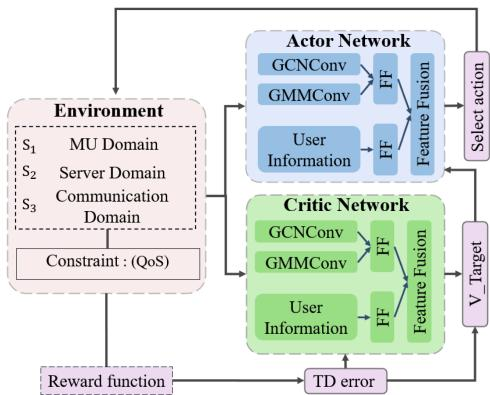  
Fig. 4. The designed neural network model.

In standard PPO algorithms, trajectory batches are aggregated before parameter updates, which can introduce low-quality data that degrades model performance. To address this issue, we propose a sliding window mechanism. After each parameter update, the updated parameters $\theta _ { e } ^ { o l d }$ and $\psi _ { e } ^ { o l d }$ estimate the average task delay $L _ { e v a l }$ . In subsequent training iterations, only trajectories from rounds where the task delay is below a predefined threshold η are added to the experience pool ${ \mathcal { G } } .$ . Once the pool reaches its capacity, the parameters are updated, and the process is repeated. The threshold η is defined as:

$$
\eta = L _ { e v a l } + \operatorname* { m i n } \left\{ 3 0 * e ^ { - i \_ e p i s o d e } , 3 0 \right\} .\tag{22}
$$

This definition prevents trajectory collection from being restricted solely to those exceeding $L _ { e v a l }$ , which would limit sample diversity and increase the risk of local optima convergence. By including trajectories within a range around $L _ { e v a l } .$ the method promotes broader exploration and improves model robustness. The empirical value of 30 supports diverse trajectory collection, especially in early training, while the exponential term $3 0 * e ^ { - i \_ { e p i s o d } }$ adjusts the focus towards higher-quality trajectories as training progresses, thus balancing exploration and exploitation akin to the epsilon-greedy strategy.

The pseudo-code for the proposed IPPO algorithm is presented in Algorithm 1, with its functionality detailed as follows. First, it initializes the network parameters $\theta _ { e }$ and $\psi _ { e } ,$ , sets up the experience replay buffer, and resets the environment state. Next, sample data is collected using the policy network, and the advantage function $\hat { A } _ { t } ^ { i }$ is computed using the value network. Subsequently, the network parameters $\theta _ { e }$ and $\psi _ { e }$ are updated according to the objective function, performing K updates for each batch of size $\bar { N } _ { b a t c h }$ . Finally, it copies the current policy network parameters $\theta _ { e }$ to $\theta _ { e } ^ { o l d }$ and the value network parameters $\psi _ { e }$ to $\psi _ { e } ^ { o l d }$

Algorithm 1: IPPO Algorithm.   
Input: policy params $\theta _ { e } ,$ value params $\psi _ { e } ,$ , replay buffer ${ \overline { { \operatorname { g } _ { \vdots } } } }$   
Output: optimal $\theta _ { e } ^ { * } ;$   
1: for i\_episode $= 0 , 1 , \ldots$ do   
2: Initialize environment, $t = 0 ,$ obtain the state $s _ { 0 } ;$   
3: while not done do   
4: for i in range $( \mathcal { M } )$ do   
5: Obtain the state $s _ { t } ^ { i } { ; }$   
6: Choose an action $a _ { t } ^ { i }$ based on policy $\theta _ { e } ^ { \mathrm { o l d . } }$   
7: if G is full then   
8: Compute advantage estimates $\hat { A } _ { t } ^ { i }$ based   
on   
9: the value function $\mathbb { L } ( \psi _ { e } ) ;$   
10: for $k = 0$ to K do   
11: Optimize JPPO $\left( \theta _ { e } \right)$   
12: end for   
13: $\theta _ { e } ^ { \mathrm { o l d } }  \theta _ { e } ;$   
14: $\psi _ { e } ^ { \mathrm { o l d } }  \psi _ { e } ;$   
15: Update η based $\theta _ { e } ^ { o l d }$ and $\psi _ { e } ^ { o l d . }$   
16: end if   
17: end for   
18: $t = t + 1 ;$   
19: end while   
20: $\begin{array} { r } { \mathbf { i f } - \frac { 1 } { M } \sum _ { i = 0 } ^ { M } \mathcal { L } _ { i } } \end{array}$ for this episode $< = \eta$ then   
21: Collect the episode’s trajectories into $\mathcal { G } ;$   
22: end if   
23: end for

The process of collecting data from expert policies using the IPPO algorithm is outlined as follows. Initially, Algorithm 1 is employed to execute the IPPO model until convergence is achieved. Upon successful training of the IPPO model, it is utilized to predict the task-serving (offloading and migration) decisions for each MU’s computation tasks at a given state $s _ { t } ^ { i } .$ , resulting in the corresponding execution actions $a _ { t } ^ { i } .$ . This process continues until all computation tasks are completed. Consequently, expert behavior, typically represented by stateaction trajectories $\Omega _ { E } ,$ , is generated, consisting of sequences of state-action pairs $\left. s _ { t } ^ { i } , a _ { t } ^ { i } \right.$ . Each trajectory encapsulates multiple  state-action pairs captured during the execution of tasks by the expert model.

## D. Online Agent Policy

In practice, the expert may not cover all scenarios, but imitation learning can surpass expert performance through additional exploration or policy refinement techniques like GAIL. GAIL enables the agent to both imitate and improve expert behavior via adversarial training. Although GAIL may face mode collapse and sensitivity to expert data, its efficiency in task migration, sample reduction, and mixed-action handling makes it valuable for dynamic MEC environments. In this context, the SDN controller, modeled as an agent, makes real-time task-serving decisions based on operational status and channel conditions from each UAV. By learning from expert demonstrations, the SDN controller optimizes online decision-making. The agent’s training, known as the ILCTS (Imitation Learning-based Computation Task Serving) algorithm, is detailed as follows:

Step 1. Neural Network Initialization: At the outset, the agent network parameters are initialized. The agent refines its policy by minimizing the discrepancy between its own stateaction pairs and those of the expert. To facilitate this, two networks are employed: the generator and the discriminator. The discriminator network $D _ { \phi _ { a } }$ , distinguishes between expert and agent-generated behaviors. The generator comprises two key components: the policy network, which optimizes the agent’s decision-making, and the value network, which evaluates the quality of the agent’s selected strategies. The agent selects actions $a _ { t } ^ { i , a g e n t }$ based on the observed state $s _ { t } ^ { i } .$ refining its policy by aligning the distribution of its stateaction pairs, $\pi ^ { \dot { \theta _ { a } } } ( a _ { t } ^ { \dot { i } , a g e n \bar { t } } | s _ { t } ^ { i } )$ , with the expert’s distribution, $\pi ^ { \theta _ { e } } ( a _ { t } ^ { i , e x p e r t } | s _ { t } ^ { i } )$ . The discriminator network is employed to distinguish between the state-action pairs generated by the expert and those produced by the agent. Additionally, the value network assesses the quality of the agent’s actions by comparing how closely they resemble the expert’s strategy versus its own learned policy. The loss function for this discriminator network is defined as below:

$$
\begin{array} { r l } & { \mathbb { L } ( \phi _ { a } ) = - \mathbb { E } _ { \rho _ { _ { \pi ^ { \theta _ { e } } } } } [ \log D _ { \phi _ { a } } ( s _ { t } ^ { i } , a _ { t } ^ { i , e x p e r t } ) ] } \\ & { - \mathbb { E } _ { \rho _ { _ { \pi ^ { \theta _ { a } } } } } \left[ \log \left( 1 - D _ { \phi _ { a } } \left( s _ { t } ^ { i } , a _ { t } ^ { i , a g e n t } \right) \right) \right] , } \end{array}\tag{23}
$$

where $\rho _ { \pi ^ { \theta _ { e } } } [ \cdot ]$ denotes the expected value of state-action trajectories generated by the expert policy $\pi ^ { \theta _ { e } }$ , whereas $\rho _ { \pi ^ { \theta _ { a } } } [ \cdot ]$ represents the expected value of state-action trajectories generated by the agent’s policy $\pi ^ { \theta _ { a } }$ . Specifically, the term $- \mathbb { E } _ { \rho _ { \pi ^ { \theta _ { e } } } } [ \log D _ { \phi _ { a } } ( s _ { t } ^ { i } , a _ { t } ^ { i , e x p e r t } ) ) ]$ is designed to maximize the probability that the discriminator accurately identifies stateaction pairs generated by the expert policy as originating from the expert. This incentivizes the generator to produce behaviors that closely align with those of the expert. The term $- \mathbb { E } _ { \rho _ { \pi ^ { \theta _ { a } } } } [ \mathrm { l o g } ( 1 - D _ { \phi _ { a } } ( s _ { t } ^ { i } , a _ { t } ^ { i , a g e n t } ) ) ]$ aims to maximize the probability that the discriminator correctly recognizes stateaction pairs generated by the generator as not coming from the expert. This drives the generator to develop behaviors that are distinct from those of the expert, fostering differentiation. In summary, the generator is encouraged to replicate expert behavior while also ensuring that the discriminator can effectively distinguish between expert-generated and generator-generated behaviors. The process for updating the discriminator parameters is as follows:

$$
\phi _ { a }  \phi _ { a } - l _ { 1 } * \nabla _ { \phi _ { a } } \mathbb { L } ( \phi _ { a } ) ,\tag{24}
$$

where $l _ { 1 }$ denote the learning rate of the discriminator network. The generator’s objective is to produce behavior that the discriminator cannot distinguish from the expert’s actions, refining its policy through feedback from the discriminator. The generator’s policy network aims to maximize the expected return, as defined by the following objective function:

$$
J ( \theta _ { a } ) = \mathbb { E } _ { ( s _ { t } ^ { i } , a _ { t } ^ { i , a g e n t } ) \sim \pi ^ { \theta _ { a } } } \left[ \log \left( 1 - D _ { \phi _ { a } } ( s _ { t } ^ { i } , a _ { t } ^ { i , a g e n t } ) \right) \right] .\tag{25}
$$

Accordingly, the parameter update process for the policy network is defined as follows:

$$
\theta _ { a } \gets \theta _ { a } + l _ { 2 } \cdot \nabla _ { \theta _ { a } } J ( \theta _ { a } ) ,\tag{26}
$$

where $l _ { 2 }$ denote the learning rate of the generator’s policy network. The objective function of the value network in the generator is as follows:

$$
\mathbb { L } ( \psi _ { a } ) = \mathbb { E } \left[ \left( V _ { \psi _ { a } } ( s _ { t } ^ { i } ) - \hat { R } \right) ^ { 2 } \right] ,\tag{27}
$$

where $V _ { \psi _ { a } } ( s _ { t } ^ { i } )$ is the value network’s prediction for the state $s _ { t } ^ { i } )$ $\hat { R }$ is the actual expected return (which can be obtained through Monte Carlo return or TD error estimation). The parameter update process for the value network within the generator is then defined as follows:

$$
\psi _ { a } \gets \psi _ { a } - l _ { 3 } * \nabla _ { \psi _ { a } } \mathbb { L } ( \psi _ { a } ) ,\tag{28}
$$

where $l _ { 3 }$ represents the learning rate of the generator value network. Pre-training the model, as guided by the previously defined loss function, is necessary to stabilize the discriminator network.rˆ denote the reward function used in GAIL.

$$
\begin{array} { r l } & { \hat { r } \left( s _ { t } ^ { i } , a _ { t } ^ { i , a g e n t } \right) = \log D _ { \phi _ { a } } \left( s _ { t } ^ { i } , a _ { t } ^ { i , e x p e r t } \right) } \\ & { \qquad - \log \left( 1 - D _ { \phi _ { a } } \left( s - t ^ { i } , a _ { t } ^ { i , a g e n t } \right) \right) } \end{array}\tag{29}
$$

Step 2. Action Execution: At time slot t, the agent selects an action for MU i according to its current policy $\theta _ { a } .$ . Upon observing the state $s _ { t } ^ { i }$ , the agent processes this input through both the policy and value networks. The policy network outputs the predicted action $a _ { t } ^ { i , a g e n t }$ , while the value network computes the corresponding value $V _ { \psi _ { a } } ( s _ { t } ^ { i } )$

Step 3. Batch Data Collection: To train the policy network, agent trajectories are gathered in mini-batches, with each entry comprising the state $s _ { t } ^ { i } .$ , the agent’s action $a _ { t } ^ { i , a g e n t }$ , and the corresponding expert action $a _ { t } ^ { i , e x p e r t }$ . Set the batch size to $N _ { b a t c h }$ the same as IPPO. The collected batch is then utilized to update the neural networks by minimizing the loss functions, as defined in (23), (25) and (27).

Step 4. Network Training: At this stage, the policy network is trained using the IPPO algorithm. In this framework, the policy network acts as the actor, selecting actions based on the neural network’s outputs, while the value network serves as the critic, assessing the quality of these actions. The actor updates its policy by incorporating feedback from the critic, thereby refining its decision-making process.

The training process enables the agent to learn an efficient policy for task serving (offloading and migration) in UAV-enabled dynamic MEC networks. The pseudo-code for the proposed ILCTS is provided in Algorithm 2.

Time Complexity: In the training phase, ILCTS employs a generator and a discriminator in a GAN-like framework. The generator, trained using IPPO, comprises a policy and value network. The policy network features a hybrid GNN and MLP. The GNN processes UAV domain features with an input and output dimension of 5, U nodes, and $U ( U - 1 )$ 2 edges, yielding a single-layer complexity of $O ( 5 E + 2 5 U )$ and $L _ { 1 } = 6$ layers for a total complexity of $O ( \dot { L } _ { 1 } ( 5 E + 2 5 U ) )$ The MLP for MU domain features has $L _ { 2 } = 2$ layers, with $\varsigma _ { 0 } = 8 M$ input and $\varsigma _ { L _ { 2 } + 1 } = 4$ output neurons, and a complexity of $O ( \sum _ { z = 1 } ^ { L _ { 2 } + 1 } \varsigma _ { z } \cdot \varsigma _ { z - 1 } )$ . A second MLP fuses fea-tures into actions with $L _ { 3 } = 4$ layers, $\varsigma _ { 0 } = 5 U + 4$ input, and $\varsigma _ { L _ { 3 } + 1 } = U + 1$ output neurons, with complexity $O ( \sum z = 1 ^ { L _ { 3 } + 1 } \zeta z$ $\varsigma _ { z - 1 } )$ . The value network mirrors the policy network, sharing a time complexity of O(max $\begin{array} { r l } { ~ } & { { } ( \sum _ { z = 1 } ^ { L _ { 2 } + 1 } \varsigma _ { z } \cdot \varsigma _ { z - 1 } , L _ { 1 } ( 5 E + } \end{array}$ $\begin{array} { r } { 2 5 U ) ) + \sum _ { z = 1 } ^ { L _ { 3 } + 1 } \varsigma _ { z } \cdot \varsigma _ { z - 1 } \big ) } \end{array}$ . The generator’s overall complexity is $O ( K \cdot [ \operatorname* { m a x } ( \sum _ { z = 1 } ^ { L _ { 2 } + 1 } \varsigma _ { z } \cdot \varsigma _ { z - 1 } , L _ { 1 } ( 5 E + 2 5 U ) ) +$ $\begin{array} { r } { \sum _ { z = 1 } ^ { L _ { 3 } + 1 } \varsigma _ { z } \cdot \varsigma _ { z - 1 } \big ] \big ) } \end{array}$ , where K is the number of IPPO updates. The discriminator has the same structure and complexity as the policy network. Thus, the total ILCTS complexity is $( \dot { \mathcal { Q } } \cdot T \cdot \dot { N _ { b a t c h } } )$ times the generator’s complexity, where Q, T, and $N _ { b a t c h }$ denote the maximum number of episodes, time slots, and batch size, respectively.

Algorithm 2: ILCTS Algorithm.   
Input: Expert trajectories $\Omega _ { E } ,$ batch size $N _ { b a t c h } ,$ , policy   
params $\theta _ { a } .$ , value paras $\psi _ { a } ,$ discriminator params $\phi _ { a } .$   
learning rate $[ l _ { 1 } , l _ { 2 } , l _ { 3 } ] ;$   
Output: optimal $\pi ^ { \theta _ { a } } ;$   
1: for $i \_ e p i s o d e = 0 , 1 , \dots { \bf d o }$   
2: Initialize environment, $t = 0 ,$ obtain the state $s _ { 0 } ;$   
3: while not Done Condition do   
4: for i in range(M) do   
5: Obtain the state $s _ { t } ^ { i } { ; }$   
6: Choose an agent action $a _ { t } ^ { i , a g e n t }$ based on   
7: policy $\pi ^ { \theta _ { a } } ;$   
8: if A batch of trajectories is sampled then   
9: Update $\phi _ { a }$ by gradient;   
10: Compute estimated reward $\hat { r } ;$   
11: Update $\psi _ { a }$ by gradient;   
12: Update $\theta _ { a }$ using the policy gradient;   
13: end if   
14: end for   
15: $t = t + 1$   
16: end while   
17: Collect the trajectories;   
18: end for

## V. PERFORMANCE EVALUATION

This section evaluates the proposed solution through simulations, detailing the setup and results. Experiments are conducted on a Windows server with an Intel Xeon Gold 6148 CPU (2.40 GHz), GeForce RTX 3090 GPU, and 128 GB RAM, using Python 3.8 and PyTorch 1.10.

## A. Experimental Settings

We consider a UAV-enabled MEC system comprising 25 to 50 UAVs providing services within a $2 5 0 0 \times 2 5 0 0 \mathrm { { m } ^ { 2 } }$ area. MUs are uniformly distributed and can offload tasks to the UAVs. Following [45], wireless channel bandwidth fluctuations are modeled using a normal distribution, and their impact on performance is evaluated under various conditions. Using BonnMotion-3.0.1, we generate 1,000 user mobility traces based on the Random Waypoint model with the default experimental settings. And other mobility patterns are also evaluated subsequently. Tasks include soft and hard delay requirements, with tolerable latency determined by input data sizes. The threshold ς for soft delay tasks defaults to 50%. Other parameter settings are detailed in Table II.

We employ multi-layer perceptions and a hybrid graph convolutional neural network for imitation learning. The learning model is trained using the Adam optimizer. For expert policies, we utilize the IPPO algorithm to collect state-action pairs from 100 episodes [46]. The IPPO algorithm converged after 1,000 episodes, followed by 2,000 additional episodes to ensure stability, during which it consistently produces high-quality state-action pairs. During the imitation learning process, the learning rates are set to 1e-4 for the policy network, 6e-4 for the value network, and 9e-5 for the discriminator network.

TABLE II  
RELEVANT PARAMETER SETTINGS:
<table><tr><td>Parameters</td><td>Value</td></tr><tr><td>Tx Power of UAVs</td><td>20 mW</td></tr><tr><td>CPU Frequency of UAVs</td><td>5G HZ</td></tr><tr><td>UAVs&#x27; Computation Intensity</td><td>15 ~ 20CPU Circles/Byte</td></tr><tr><td>Tx Power of UE</td><td>1.5 mW</td></tr><tr><td>Input Data Size</td><td> $3 . 0 \sim 5 . 0 ~ M B$ </td></tr><tr><td>Data Size of Results</td><td>1.5 ~ 2.5 M B</td></tr><tr><td>UAVs&#x27;Communication Radius</td><td>500 Meter</td></tr><tr><td>UAVs&#x27; Flight Altitude</td><td>70 Meter</td></tr><tr><td>Tasks&#x27; Required CPU Cycles</td><td>1.5e8 ~ 2e8 CPU Circles/s</td></tr><tr><td>Gaussian Noise Power  $\overline { { \sigma ^ { 2 } } }$ </td><td>−174 dbm/HZ</td></tr><tr><td>Number of Training Episodes</td><td>3000</td></tr><tr><td>Replay Buffer Capacity G</td><td>256</td></tr><tr><td>Batch size  $\overline { { N _ { b a t c h } } }$ </td><td>256</td></tr><tr><td>Mini-Batch Size</td><td>128</td></tr></table>

Benchmarks: To evaluate our ILCTS algorithm, we use five representative benchmark algorithms, as described below:

\- IPPO: The improved PPO algorithm for expert policies proposed in this study.

\- DDQN [47]: We adapt the well-known deep Q-learning technique, DDQN, to our problem by using a neural network structure similar to our approach to approximate its action-value function.

\- OLSA [48]: A modified version ofthe Online Lazy Switching algorithm, adapted for computation task migration in our study.

\- GBLM [43]: GBLM employs a greedy strategy to select the UAV with the lowest latency for each MU.

\- SR-CL [49]: A mobility-aware service migration framework for multi-edge IoV systems, leveraging an actorcritic-based asynchronous deep reinforcement learning approach.

## B. Performance Results

Training Performance with Different MU Scales: First, we conduct experiments to evaluate the training performance of four reinforcement learning algorithms: ILCTS, DDQN, SR-CL, and IPPO, under varying numbers of MUs, ranging from 15 to 40. The normalized cumulative reward is used as the evaluation metric, referred to as the training score. The results are presented in Fig. 5. Among the evaluated methods, ILCTS consistently achieves the highest training scores across all MU scales, demonstrating its superior learning capability. This is followed by IPPO and SR-CL, with DDQNexhibiting the lowest performance. The incorporation of GAIL into ILCTS enhances its overall performance by enabling the agent to learn from expert demonstrations and continuously refine its policy through exploration, resulting in a more adaptable solution. In contrast, SR-CL shows unstable performance across different MU scales, likely due to its sensitivity to hyper-parameters and limited robustness. The poor performance of DDQN can be attributed to its challenges in learning accurate value functions in complex environments, compounded by instability in value estimation and limited exploration.

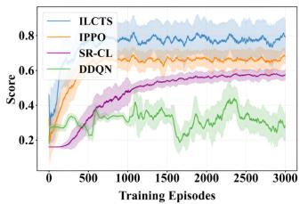  
(a) MU15

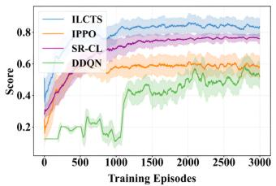  
(b) MU20

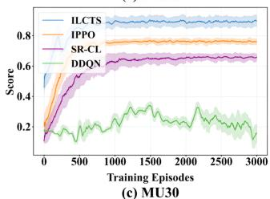

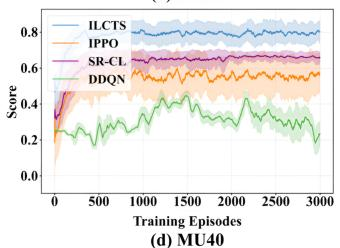

Fig. 5. Training performance with different MUs.  
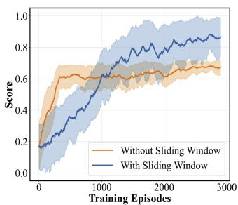  
(a) Sliding Window

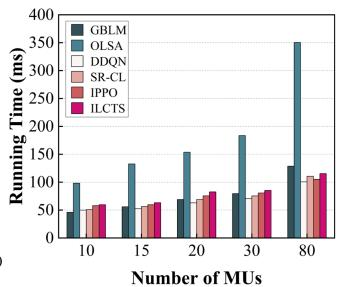  
(b) Running Time  
Fig. 6. Sliding window and algorithm runtime.

Building on the principle of balancing exploration and exploitation, the proposed IPPO algorithm incorporates a sliding window mechanism to optimize overall performance. To evaluate its effectiveness, we conduct experiments comparing it with the standard PPO algorithm, excluding the sliding window configuration, using 10 MUs. The experimental results, presented in Fig. 6(a), show that the IPPO algorithm outperforms the standard PPO, achieving a performance improvement of nearly 20% in our scenario. This enhancement effectively eliminates lowquality data that would otherwise degrade model performance.

Performance of Efficiency Testing: We analyze the running times of different algorithms for decision-making in each time slot, varying the number ofMUs from 10 to 80. The experimental results are presented in Fig. 6(b). The OLSA algorithm exhibits the longest running time, primarily due to its multiple rounds of game matching. While the other algorithms demonstrate comparable running efficiencies, ILCTS achieves a 15% improvement in effectiveness, as reported later, thereby balancing computational efficiency with decision performance. In contrast, the running time of the GBLM algorithm increases significantly as the scale of MUs grows, highlighting its limited scalability due to the greedy strategy employed.

Impact of Hyper-Parameters: Subsequently, we conduct experiments to examine the impact of various hyperparameter settings, such as the activation function, parameter initialization, etc. The experimental results of training performance are presented in Fig. 7, where the training score is utilized as the evaluation metric. Initially, we test different activation functions, using ReLU as the default in our experiment. As shown in Fig. 7(a), when compared to the Tanh and LReLU functions, ReLU is found to be the most suitable for our algorithm.

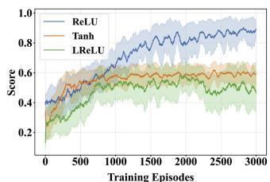  
(a) Activation Function

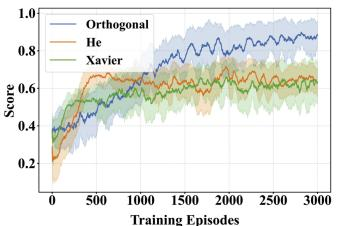  
(b) Parameter Initialization

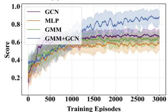  
(c) Neural Network Architecture

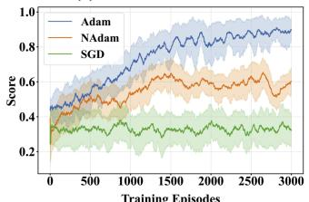  
(d) Optimizer  
Fig. 7. Training performance with different hyper-parameters.

As shown in Fig. 7(b), Orthogonal demonstrates superior performance. This is likely due to its ability to maintain the orthogonality of weight vectors, preserving the independence of different features within the network. In contrast, Xavier and He are designed to maintain the scale of activations and gradients during propagation. Within our architecture, orthogonal initialization proved to be the most effective.

As shown in Fig. 7(c), the MLP architecture exhibits the poorest performance. The possible reason is that, MLPs are adept at capturing simple features from individual nodes, whereas GNNs integrate node information and account for complex inter-node relationships. GMM+GCNcombines GCNand GMM leveraging the strengths of both: GCN aggregates local neighborhood information, while GMM handles intricate inter-node relationships. So, a hybrid graph neural network structure yields the best performance for computation task migration challenges.

Lastly, in Fig. 7(d), we evaluate the performance of several optimizers. The results indicate that the SGD optimizer fails to converge, likely due to its dependence on a stable objective function or data distribution, which is rare in reinforcement learning with non-stationary distributions. As the policy evolves during training, the data distribution continuously changes. In contrast, the Adam optimizer outperforms NAdam in this task migration scenario, demonstrating better adaptability. The momentum acceleration strategy of NAdam fails to achieve convergence in highly dynamic environments.

Performance of Effectiveness Testing: We evaluate performance in terms of average latency by varying the number of MUs from 10 to 80, as shown in Fig. 8(a). The ILCTS algorithm consistently achieves the lowest average delay, outperforming IPPO, SR-CL, DDQN, OLSA, and GBLM. Overall, reinforcement learning algorithms surpass traditional methods. The OLSA algorithm underperforms due to its limited responsiveness to dynamic changes, while the myopic decision-making of GBLM leads to suboptimal solutions, trapping it in a local optimum. Consistent with training results, DDQN performs the worst among reinforcement learning algorithms, mainly due to its value function overestimation bias and difficulty with non-stationary environments. The superior performance of ILCTS over SR-CL can be attributed to its combination of expert-guided learning, adaptive strategies, and continuous policy refinement, making it better suited to handle dynamic and complex environments.

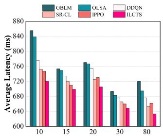  
(a) Number of MUs

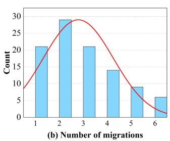

Fig. 8. Effectiveness evaluation based on number of MUs.  
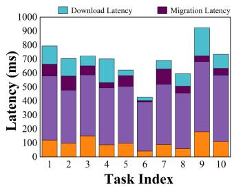  
(a) Hard delay tasks

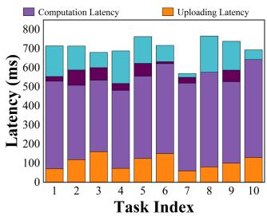  
(b) Soft delay tasks  
Fig. 9. Effectiveness evaluation for hard/soft delay tasks.

Furthermore, we measured the migration frequency during task execution, and the statistical results are presented in a histogram in Fig. 8(b), with the number of MUs set to 100. The data shows that most task execution require an average of 2.79 migration frequencies. This indicates that in dynamic environments, multiple migrations might be necessary to meet the QoS requirements of MUs.

As shown in Fig. 9, the latencies of the ILCTS algorithm are presented for both hard and soft delay tasks, encompassing task uploading latency, computation latency, migration latency, and downloading latency. The horizontal axis corresponds to the task index. Migration latencies for soft delay tasks are generally lower than those for hard delay tasks. Specifically, the average migration latency for hard delay tasks is 62.16 ms, while for soft delay tasks, it is 37.29 ms. This difference is largely due to the low migration frequency for soft delay tasks, driven by their completion process mechanism.

Impact ofChannel Bandwidth Fluctuation: We also examine the impact of channel bandwidth fluctuations on performance by varying the mean and standard deviation, with the number of MUs fixed at 10. The results, shown in Fig. 10, demonstrate that our ILCTS approach consistently outperforms the benchmarks across varying network conditions, highlighting its robustness. Among the evaluated methods, GBLM performs the worst, as it only strives for local optimization of MUs’ delay, neglecting overall performance improvement.

Impact ofTask Arrival Rate and Threshold ς: We examine the impact of task arrival rate on network performance by varying the parameter λ in the Poisson distribution from 1.0 to 8.0, with the number of MUs fixed at 10. The experimental results are presented in Fig. 11(a). Consistent with previous results, the ILCTS algorithm consistently achieves the lowest latency across all arrival rate conditions, outperforming IPPO, SR-CL, and DDQN, which perform slightly worse. In contrast, the traditional GBLM and OLSA algorithms exhibit the poorest performance due to their limited focus on overall performance optimization.

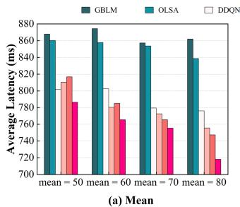

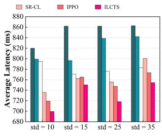  
(b) Standard Deviation

Fig. 10. Performance with different channel bandwidth fluctuations.  
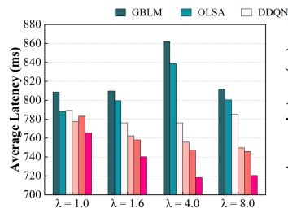  
(a) Arrival Rate Paramter λ

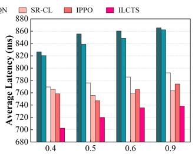  
(b) Threshold for Execution Progress (%)

Fig. 11. Performance with arrival rate and threshold ς.  
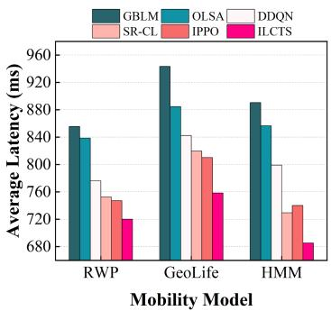  
Fig. 12. Performance with MU mobility behavior.

Next, we also examine the impact of the execution progress threshold ς for soft delay tasks, varying it from 0.4 to 0.9 while keeping the number of MUs constant. As shown in Fig. 11(b), increasing ς leads to higher average delays for MUs, likely because lower thresholds better handle uncertainty in dynamic environments. This confirms the importance of introducing ς for soft delay tasks. Additionally, the ILCTS algorithm consistently outperforms the other benchmarks.

Impact ofMU Mobility Behavior: Finally, we investigate the impact of MU mobility behavior on network performance. In addition to the Random Waypoint Model (RWM), we incorporate the real-world GeoLife dataset [50] and the Hidden Markov Model (HMM) [51]. The GeoLife dataset is a publicly available resource containing GPS trajectory data collected from mobile devices to study human mobility patterns, while the HMM generates user mobility trajectories based on a Hidden Markov framework. We evaluate the performance of the relevant approaches under these three mobility models, with the corresponding experimental results presented in Fig. 12. Notably, our proposed ILCTS algorithm consistently outperforms all benchmarks across the evaluated mobility behaviors. Furthermore, the highest average latency is observed with the GeoLife dataset, which can be attributed to the increased complexity of the mobility traces, influenced by diverse outdoor movements (e.g., commuting, sightseeing, hiking, cycling) and location-based attractions.

## VI. CONCLUSION

Given the challenges of wireless communication instability and the large sizes of computation results, dynamic task migration closer to MUs over unreliable channels is essential to meet stringent QoS requirements. This paper tackles the joint task offloading and migration problem in UAV-enabled dynamic MEC networks. We propose the ILCTS algorithm, which uses an expert model trained offline via an improved PPO algorithm to generate state-action pairs for offloading and migration tasks. Following pre-training, the agent employs generative adversarial imitation learning for online interaction with the environment, refining its strategy through additional state-action pairs and expert data for real-time decision-making. Performance evaluations demonstrate that our algorithm significantly outperforms alternative approaches.

Future work will focus on the joint optimization of UAV trajectories and task migration, taking into account key challenges such as dynamic constraints, queueing delays, energy efficiency. Additionally, we plan to develop hybrid strategies that adaptively balance expert imitation and autonomous exploration based on environmental feedback, with the goal of reducing reliance on expert data.

## REFERENCES

[1] J. Du, T. Lin, C. Jiang, Q. Yang, C. F. Bader, and Z. Han, “Distributed foundation models for multi-modal learning in 6G wireless networks,” IEEE Wireless Commun., vol. 31, no. 3, pp. 20–30, Jun. 2024.

[2] M. Liu, G. Feng, Y. Sun, N. Chen, and W. Tan, “A network function parallelism-enabled MEC framework for supporting low-latency services,” IEEE Trans. Services Comput., vol. 16, no. 1, pp. 40–52, Jan./Feb. 2023.

[3] Z. Chen, Y. Yang, J. Xu, Y. Chen, and J. Huang, “Task offloading and resource pricing based on game theory in UAV-Assisted edge computing,” IEEE Trans. Services Comput., vol. 18, no. 1, pp. 440–452, Jan./Feb. 2025.

[4] B. Chen, H. Zhou, J. Yao, and H. Guan, “RESERVE: An energy-efficient edge cloud architecture for intelligent multi-UAV,” IEEE Trans. Services Comput., vol. 15, no. 2, pp. 819–832, Mar./Apr. 2022.

[5] H. Lin et al., “Dynamic service migration in ultra-dense multi-access edge computing network for high-mobility scenarios,” EURASIP J. Wireless Commun. Netw., vol. 2020, no. 1, 2020, Art. no. 191.

[6] TZ He, A. N. Toosi, and R. Buyya, “Efficient large-scale multiple migration planning and scheduling in SDN-enabled edge computing,” IEEE Trans. Mobile Comput., vol. 23, no. 6, pp. 6667–6680, Jun. 2024.

[7] E. Yanmaz, R. Kuschnig, and C. Bettstetter, “Channel measurements over 802.11 a-based UAV-to-ground links,” in Proc. IEEE GLOBECOM Workshops, 2011.

[8] K. Shafafi et al., “UAV-Assisted wireless communications: An experimental analysis of A2G and G2A channels,” in Proc. Int. Conf. Simul. Tools Techn., Cham, Switzerland, Springer Nature, 2023.

[9] U. Erdemir, B. Kaplan, ˙I. Hokelek, A. Görçin, and H. A. Çırpan, “Measurement-based channel characterization for A2A and A2G wireless drone communication systems,” in Proc. IEEE 97th Veh. Technol. Conf., 2023, pp. 1–6.

[10] Z. Fan, Y. Lin, Y. Ai, and H. Xu, “Adaptive task migration strategy with delay risk control and reinforcement learning for emergency monitoring,” Sci. Rep., vol. 14, no. 1, 2024, Art. no. 17606.

[11] Z. Gao, L. Yang, and Y. Dai, “VRCCS-AC: Reinforcement learning for service migration in vehicular edge computing systems,” IEEE Trans. Services Comput., vol. 17, no. 6, pp. 4436–4450, Nov./Dec. 2024.

[12] S. Wang, R. Urgaonkar, M. Zafer, T. He, K. Chan, and K. K. Leung, “Dynamic service migration in mobile edge computing based on markov decision process,” IEEE/ACM Trans. Netw., vol. 27, no. 3, pp. 1272–1288, Jun. 2019.

[13] N. Cheng et al., “Air-ground integrated mobile edge networks: Architecture, challenges, and opportunities,” IEEE Commun. Mag., vol. 56, no. 8, pp. 26–32, Aug. 2018.

[14] T. Zhang, Y. Xu, J. Loo, D. Yang, and L. Xiao, “Joint computation and communication design for UAV-assisted mobile edge computing in IoT,” IEEE Trans. Ind. Informat., vol. 16, no. 8, pp. 5505–5516, Aug. 2020.

[15] Q. Hu, Y. Cai, G. Yu, Z. Qin, M. Zhao, and G. Y. Li, “Joint offloading and trajectory design for UAV-enabled mobile edge computing systems,” IEEE Internet Things J., vol. 6, no. 2, pp. 1879–1892, Apr. 2019.

[16] J. Lyu, Y. Zeng, and R. Zhang, “UAV-aided offloading for cellular hotspot,” IEEE Trans. Wireless Commun., vol. 17, no. 6, pp. 3988–4001, Jun. 2018.

[17] J. Xiong, H. Guo, and J. Liu, “Task offloading in UAV-aided edge computing: Bit allocation and trajectory optimization,” IEEE Commun. Lett., vol. 23, no. 3, pp. 538–541, Mar. 2019.

[18] Y. Zhang, Y. Gong, and Y. Guo, “Energy-efficient resource management for multi-UAV-enabled mobile edge computing,” IEEE Trans. Veh. Technol., vol. 73, no. 8, pp. 12026–12037, Aug. 2024.

[19] S. Han et al., “Joint association, deployment and flight trajectory optimization for Multi-UAV-Enabled large-scale mobile edge computing,” IEEE Trans. Mobile Comput., vol. 23, no. 12, pp. 13207–13221, Dec. 2024.

[20] L. He et al., “An online joint optimization approach for QoE maximization in UAV-Enabled mobile edge computing,” in Proc. IEEE Conf. Comput. Commun., 2024, pp. 101–110.

[21] W. Chen et al., “MSM: Mobility-aware service migration for seamless provision: A data-driven approach,” IEEE Internet Things J., vol. 10, no. 17, pp. 15690–15704, Sep. 2023.

[22] Z. Zhao et al., “Reinforced-LSTM trajectory prediction-driven dynamic service migration: A case study,” IEEE Trans. Netw. Sci. Eng., vol. 9, no. 4, pp. 2786–2802, Jul./Aug. 2022.

[23] M. Xu et al., “PDMA: Probabilistic service migration approach for delay-aware and mobility-aware mobile edge computing,” Softw.: Pract. Experience, vol. 52, no. 2, pp. 394–414, 2022.

[24] J. Xu, X. Ma, A. Zhou, Q. Duan, and S. Wang, “Path selection for seamless service migration in vehicular edge computing,” IEEE Internet Things J., vol. 7, no. 9, pp. 9040–9049, Sep. 2020.

[25] M. Mukherjee, V. Kumar, A. Lat, M. Guo, R. Matam, and Y. Lv, “Distributed deep learning-based task offloading for UAV-enabled mobile edge computing,” in Proc. IEEE Conf. Comput. Commun. Workshops, 2020, pp. 1208–1212.

[26] J. Tian, D. Wang, H. Zhang, and D. Wu, “Service satisfaction-oriented task offloading and UAV scheduling in UAV-enabled MEC networks,” IEEE Trans. Wireless Commun., vol. 22, no. 12, pp. 8949–8964, Dec. 2023.

[27] M. Wang, L. Zhang, P. Gao, X. Yang, K. Wang, and K. Yang, “Stackelberggame-based intelligent offloading incentive mechanism for a multi-UAVassisted mobile-edge computing system,” IEEE Internet Things J., vol. 10, no. 17, pp. 15679–15689, Sep. 2023.

[28] L. Zhao et al., “Meson: A mobility-aware dependent task offloading scheme for urban vehicular edge computing,” IEEE Trans. Mobile Comput., vol. 23, no. 5, pp. 4259–4272, May 2024.

[29] D. Zheng et al., “Resource optimization for task offloading with realtime location prediction in pedestrian-vehicle interaction scenarios,” IEEE Trans. Wireless Commun., vol. 22, no. 11, pp. 7331–7344, Nov. 2023.

[30] X. Du, X. Li, N. Zhao, and X. Wang, “A joint trajectory and computation offloading scheme for UAV-MEC networks via multi-agent deep reinforcement learning,” in Proc. IEEE Int. Conf. Commun., 2023, pp. 5438–5443.

[31] Q. Wang, S. Guo, J. Liu, C. Pan, and L. Yang, “Profit maximization incentive mechanism for resource providers in mobile edge computing,” IEEE Trans. Services Comput., vol. 15, no. 1, pp. 138–149, Jan./Feb. 2022.

[32] T. Dbouk, A. Mourad, H. Otrok, H. Tout, and C. Talhi, “A novel ad-hoc mobile edge cloud offering security services through intelligent resourceaware offloading,” IEEE Trans. Netw. Service Manag., vol. 16, no. 4, pp. 1665–1680, Dec. 2019.

[33] H. Xiao, J. Zhao, J. Feng, L. Liu, Q. Pei, and W. Shi, “Joint optimization of security strength and resource allocation for computation offloading in vehicular edge computing,” IEEE Trans. Wireless Commun., vol. 22, no. 12, pp. 8751–8765, Dec. 2023.

[34] Z. Li et al., “Profit maximization for security-aware task offloading in edge-cloud environment,” J. Parallel Distrib. Comput., vol. 157, pp. 43–55, 2021.

[35] Z. Zhou et al., “An air-ground integration approach for mobile edge computing in IoT,” IEEE Commun. Mag., vol. 56, no. 8, pp. 40–47, Aug. 2018.

[36] J. Du, C. Jiang, A. Benslimane, S. Guo, and Y. Ren, “SDN-based resource allocation in edge and cloud computing systems: An evolutionary stackelberg differential game approach,” IEEE/ACM Trans. Netw., vol. 30, no. 4, pp. 1613–1628, Aug. 2022.

[37] A. Hermosilla, A. M. Zarca, J. B. Bernabe, J. Ortiz, and A. Skarmeta, “Security orchestration and enforcement in NFV/SDN-aware UAV deployments,” IEEE Access, vol. 8, pp. 131779–131795, 2020.

[38] Y. Peng et al., “Computing and communication cost-aware service migration enabled by transfer reinforcement learning for dynamic vehicular edge computing networks,” IEEE Trans. Mobile Comput., vol. 23, no. 1, pp. 257–269, Jan. 2024.

[39] Electronic design, 2013. [Online]. Available: https://www. electronicdesign.com/

[40] N. Cheng et al., “Space/aerial-assisted computing offloading for IoT applications: A learning-based approach,” IEEE J. Sel. Areas Commun., vol. 37, no. 5, pp. 1117–1129, May 2019.

[41] S. Zhu et al., “UAV-enabled computation migration for complex missions: A reinforcement learning approach,” IET Commun., vol. 14, no. 15, pp. 2472–2480, 2020.

[42] A. Al-Hourani, S. Kandeepan, and S. Lardner, “Optimal LAP altitude for maximum coverage,” IEEE Wireless Commun. Lett., vol. 3, no. 6, pp. 569–572, Dec. 2014.

[43] X. Chen et al., “Dynamic service migration and request routing for microservice in multicell mobile-edge computing,” IEEE Internet Things J., vol. 9, no. 15, pp. 13126–13143, Aug. 2022.

[44] J. Schulman, F. Wolski, P. Dhariwal, and A. Radford, “Proximal policy optimization algorithms,” 2017, arXiv: 1707.06347.

[45] C. Yan, L. Fu, J. Zhang, and J. Wang, “A comprehensive survey on UAV communication channel modeling,” IEEE Access, vol. 7, pp. 107769– 107792, 2019.

[46] Z. Yan, P. Cheng, Z. Chen, B. Vucetic, and Y. Li, “Two-dimensional task offloading for mobile networks: An imitation learning framework,” IEEE/ACM Trans. Netw., vol. 29, no. 6, pp. 2494–2507, Dec. 2021.

[47] S. Khamari, A. Rachedi, T. Ahmed, and M. Mosbah, “Adaptive deep reinforcement learning approach for service migration in MEC-Enabled vehicular networks,” in Proc. IEEE Symp. Comput. Commun., 2023, pp. 1075–1079.

[48] B. Gao, Z. Zhou, F. Liu, F. Xu, and B. Li, “An online framework for joint network selection and service placement in mobile edge computing,” IEEE Trans. Mobile Comput., vol. 21, no. 11, pp. 3836–3851, Nov. 2022.

[49] Z. Chen, S. Huang, G. Min, Z. Ning, J. Li, and Y. Zhang, “Mobilityaware seamless service migration and resource allocation in multiedge IoV systems,” IEEE Trans. Mobile Comput., to be published, doi: 10.1109/TMC.2025.3540407.

[50] Y. Zheng, X. Xie, and W. Y. Ma, “GeoLife: A collaborative social networking service among user, location and trajectory,” IEEE Data Eng. Bull., vol. 33, no. 2, pp. 32–39, Feb. 2010.

[51] S. Qiao, D. Shen, X. Wang, N. Han, and W. Zhu, “A self-adaptive parameter selection trajectory prediction approach via hidden markov models,” IEEE Trans. Intell. Transp. Syst., vol. 16, no. 1, pp. 284–296, Feb. 2015.

  
Liang Wang (Member, IEEE) received the PhD degree from the Shenyang Institute of Automation (SIA), Chinese Academy of Sciences, Shenyang, China, in 2014. He is currently a professor with the School ofComputer Science, Northwestern Polytechnical University, Xi’an, China. His research interests include ubiquitous computing, mobile crowd sensing, and crowd computing.

Lianbo Ma (Senior Member, IEEE) received the PhD degree in mechanical and electronic engineering from the University of Chinese Academy of Sciences, Beijing, China, in 2015. He is currently a professor with Northeastern University. He has published more than 90 journal articles, books, and refereed conference papers. His current research interests include computational intelligence and machine learning.

Yingnan Zhao received the PhD degree in computer science from the Harbin Institute of Technology, Harbin, China, in 2023. He is currently an associate professor with the School of Computer Science and Technology, Harbin Engineering University, China. His research interests include deep reinforcement learning and mobile edge computing.

Yao Zhang received the PhD degree in telecommunication engineering from Xidian University, Xi’an, China, in 2020. He is currently a PostDoctoral researcher with Northwestern Polytechnical University, Xi’an, China. He was a research assistant and post-doctoral fellow with the Hong Kong Polytechnic University, in 2019 and 2021, respectively. His current research interests include pervasive computing, mobile edge computing and edge AI, and networked autonomous driving.

Hongzhi Guo (Member, IEEE) received the PhD degrees in computer science and technology from the Harbin Institute of Technology, in 2011. He is currently an associate professor with the School of Cybersecurity, Northwestern Polytechnical University. His research interests cover edge computing, SAGSIN, IoT security, AI security, 5 G security, etc. He has been activelyjoining the society activities, like serving as associate editors for IEEE Transactions on Vehicular Technology (Jan. 2021-present), Frontiers in Communications andNetwork (Jan. 2021-present).

Bingnan Shen received the bachelor’s degree in computer science and technology from Guangxi University, Nanning, China, in June 2022. He is currently working toward the master’s degree in computer application technology with Northwestern Polytechnical University, Xi’an, China. His current research interest is edge computing and Internet of Things.

Zhiwen Yu (Senior Member, IEEE) received the PhD degree in computer science from Northwestern Polytechnical University, Xi’an, China, in 2006. He is currently a professor and the vice-dean with the School ofComputer Science, Northwestern Polytechnical University, Xi’an, China. He was an Alexander Von Humboldt fellow with Mannheim University, Germany, and a research fellow with Kyoto University, Kyoto, Japan. His research interests include ubiquitous computing and HCI.

Bin Guo (Senior Member, IEEE) received the PhD degree in computer science from Keio University, Minato, Japan, in 2009, He was a postdoctoral researcher with the Institut TELECOM SudParis, Essonne, France. He is currently a professor with Northwestern Polytechnical University, Xi’an, China. His research interests include ubiquitous computing, mobile crowd sensing, and HCI.