# Joint Task Offloading and Resource Allocation in Aerial-Terrestrial UAV Networks With Edge and Fog Computing for Post-Disaster Rescue

Geng Sun , Member, IEEE, Long He , Zemin Sun , Member, IEEE, Qingqing Wu , Senior Member, IEEE, Shuang Liang , Jiahui Li , Student Member, IEEE, Dusit Niyato , Fellow, IEEE, and Victor C. M. Leung , Life Fellow, IEEE

Abstract—Unmanned aerial vehicles (UAVs) are playing an increasingly important role in assisting fast-response post-disaster rescue due to their fast deployment, flexible mobility, and low cost. However, UAVs face the challenges of limited battery capacity and computing resources, which could shorten the expected flight endurance of UAVs and increase the rescue response delay during performing mission-critical tasks. To address these challenges, we first present a three-layer post-disaster rescue computing architecture by leveraging the aerial-terrestrial edge capabilities of mobile edge computing (MEC) and vehicle fog computing (VFC), which consists of a vehicle fog layer, a UAV client layer, and a UAV edge layer. Moreover, we formulate a joint task offloading and resource allocation optimization problem (JTRAOP) with the aim of maximizing the time-average system utility. Since the formulated JTRAOP is proved to be NP-hard, we propose an MEC-VFC-aided task offloading and resource allocation (MVTORA) approach, which consists of a game theoretic algorithm for task offloading decision, a convex optimization-based algorithm for MEC resource allocation,

Manuscript received 5 May 2023; revised 10 December 2023; accepted 2 January 2024. Date of publication 8 January 2024; date of current version 6 August 2024. This work was supported in part by the National Natural Science Foundation of China under Grants 62172186, 62002133, 61872158, and 62272194, and in part by the Science and Technology Development Plan Project of Jilin Province under Grant 20230201087GX. Recommended for acceptance by H. Shen. A small part of this paper was presented in IEEE MSN 2022 [DOI: 10.1109/MSN57253.2022.00030]. (Corresponding authors: Zemin Sun; Shuang Liang.)

Geng Sun, Long He, and Zemin Sun are with the College of Computer Science and Technology, Jilin University, Changchun 130012, China, and also with the Key Laboratory of Symbolic Computation and Knowledge Engineering of Ministry of Education, Jilin University, Changchun 130012, China (e-mail: sungeng@jlu.edu.cn; helong0517@foxmail.com; sunzemin@jlu.edu.cn).

Qingqing Wu is with the Department of Electronic Engineering, Shanghai Jiao Tong University, Shanghai 200240, China (e-mail: qingqingwu@sjtu.edu.cn).

Shuang Liang is with the School of Information Science and Technology, Northeast Normal University, Changchun 130024, China (e-mail: liangshuang@nenu.edu.cn).

Jiahui Li is with the College of Computer Science and Technology, Jilin University, Changchun 130012, China, and also with the Pillar of Engineering Systems and Design, Singapore University of Technology and Design, Singapore 487372 (e-mail: lijiahui0803@foxmail.com).

Dusit Niyato is with the School of Computer Science and Engineering, Nanyang Technological University, Singapore 639798 (e-mail: dniyato@ntu.edu.sg).

Victor C. M. Leung is with the College of Computer Science and Software Engineering, Shenzhen University, Shenzhen 518060, China, and also with the Department of Electrical and Computer Engineering, University of British Columbia, Vancouver, BC V6T 1Z4, Canada (e-mail: vleung@ieee.org).

This article has supplementary downloadable material available at https://doi.org/10.1109/TMC.2024.3350886, provided by the authors.

Digital Object Identifier 10.1109/TMC.2024.3350886

and an evolutionary computation-based hybrid algorithm for VFC resource allocation. Simulation results validate that the proposed approach can achieve superior system performance compared to alternative approaches, especially under heavy system workloads.

Index Terms—Mobile edge computing, post-disaster rescue, task offloading, UAV communication, vehicle fog computing.

# I. INTRODUCTION

N ATURAL disasters, such as earthquakes, floods, and forestfires cause serious environmental damage, incalculable fires cause serious environmental damage, incalculable economic losses, and unpredictable loss of life [2]. Especially in cities, frequent man-made disasters, such as urban fires and traffic accidents, seriously affect people’s quality of life and hinder social development. Although the occurrence of disasters can be reduced by deploying pre-disaster prevention facilities, it is critical to perform timely search-and-rescue missions within the golden window of post-disaster rescue. Therefore, effective post-disaster rescue requires immediate response to the disaster with rapid network deployment, real-time information collection, and low-latency data processing. However, the harsh conditions in the disaster-stricken area, such as the severely destroyed infrastructures of the terrestrial wireless networks and complex terrain, could interfere with rescue operations [3].

Due to the high maneuverability, flexible deployment, line-ofsight (LoS) communication, and low cost [4], [5], it is practical to dispatch unmanned aerial vehicles (UAVs) to the affected area to assist in rescue missions such as disaster area monitoring, data collection, and aerial search and rescue [6]. These rescue missions often require UAVs to perform compute-intensive computing tasks such as video processing, data analysis, and feature extraction, with strict latency requirements [7], [8]. Such cases commonly existed in UAV-assisted post-disaster rescue scenarios. For instance, in [9], UAVs are deployed to monitor points of interest (PoIs) within a disaster-stricken region, where a PoI may denote an office building or a school building, in which people are trapped. These UAVs are required to process the collected images and data in real time, as well as transmitting the collected information back to the ground rescue center. In [10], UAVs are employed to perform aerial search and rescue (SAR) missions. These UAVs equipped with thermal cameras can capture thermal image data of victims and are required to promptly process these data sets through neural networks to effectively locate and assist victims.

However, the constrained onboard battery capacity and computing capability of UAVs could restrict the endurance and efficiency in performing the intensive computing tasks of rescue missions. Fortunately, task offloading has emerged as a promising solution to extend the capabilities of devices with limited computing resources and energy. A number of studies employ mobile edge computing (MEC) [11], [12], [13], cloud computing, or vehicle fog computing (VFC) to reduce the latency and energy consumption of task processing [14]. However, these studies may not be directly applicable to multi-UAV-assisted post-disaster rescue scenarios for the following reasons. First, the fast deployment of traditional terrestrial MEC servers could be an arduous task in disaster areas with complex terrains since the terrestrial MEC servers rely heavily on communication infrastructures. Second, due to the remote location of cloud servers, cloud computing suffers from large transmission latency, which is difficult to fulfill the low-latency demands of the computing tasks for rescue missions. Third, VFC relies on the idle resources and location of vehicles, leading in the unstable availability of VFC resources.

Inspired by the current cloud-edge-device structure of 5 G, we innovatively propose a three-layer post-disaster rescue computing architecture, which can be aligned and compatible with the 5 G cloud-edge-device architecture. Specifically, the three-layer computing architecture is comprised of a UAV edge layer, a UAV client layer, and a vehicle fog layer, which leverages MEC and VFC to exploit the aerial and terrestrial resources of the UAV network. On one hand, the aerial MEC capability provided by the edge UAV makes up for the unstable availability of VFC resources provided by the vehicle fog nodes. On the other hand, the terrestrial VFC capability can effectively alleviate the overload caused by the limited computing resources of the edge UAV.

However, several fundamental challenges should be overcome to fully develop the benefits of integrating UAVs, MEC, and VFC techniques for post-disaster rescue. i) The offloading decision of each UAV depends not only on its own offloading demand but also on the offloading decisions of the other UAVs, which makes the offloading decisions among UAVs coupling and complex. ii) Various tasks of UAVs generally arrive dynamically and have stringent requirements for the offloading service. However, the limited computing resource of an MEC server and the stringent demands of the UAVs could lead to competition for resources inside the MEC server, especially during peak times. Thus, under the resource constraint, it is challenging for the MEC server to determine an efficient resource allocation strategy to meet the heterogeneous and stringent demands of various tasks. iii) The computing resource allocation strategy of the MEC server and the task offloading decisions of UAVs have mutual effects on each other, leading to the complexity of the decision-making. iv) Due to the mobility of rescue vehicles and UAVs, as well as the insufficient availability of time-varying idle computing resources provided by vehicles, it is difficult to design an effective VFC approach to fully utilize the resources of rescue vehicles.

To overcome the aforementioned challenges, we propose an approach for joint optimization of MEC-VFC-aided task offloading and resource allocation to maximize the system performance. The main contributions are summarized as follows:

System Architecture: We employ a three-layer post-disaster rescue computing architecture in the MEC-VFC-aided aerial-terrestrial UAV network to coordinate UAVs and ground rescue vehicles to cooperatively process the computing tasks. Specifically, the proposed architecture consists of the following entities: a UAV edge layer where a large UAV is deployed to provide aerial edge capability, a UAV client layer where several small UAVs are deployed to perform the computing tasks, and a vehicle fog layer where the ground rescue vehicles with under-utilized resources are leveraged to provide terrestrial edge capability to alleviate the possible computational overload of the UAV edge layer.

\- Problem Formulation: We formulate a novel joint task offloading and resource allocation optimization problem (JTRAOP), with the aim of maximizing the time-average system utility. Specifically, the system utility function is theoretically constructed by synthesizing the task completion delay and energy consumption.

\- Algorithm Design: Due to the NP-hardness of JTRAOP, we propose an MEC-VFC-aided task offloading and resource allocation (MVTORA) approach that consists of two components, i.e., task offloading and computing resource allocation, to solve the problem separately. For task offloading, we propose a game theoretic algorithm to determine the task offloading decisions. For computing resource allocation, a convex optimization-based algorithm and an evolutionary computation-based hybrid algorithm are proposed to determine the aerial MEC resource allocation and terrestrial VFC resource allocation, respectively. The proposed MVTORA approach is theoretically proved to be stable and has polynomial computation complexity.

Validation: Simulation results demonstrate that the proposed MVTORA is able to achieve overall superior performance in terms of time-average system utility, average task completion delay, total energy consumption, energy efficiency and algorithm execution time compared to several alternative approaches. In addition, through the simulation results, we find that the proposed approach not only has better scalability but also can achieve significant system performance improvement when the workload is heavy.

The remainder of the work is organized as follows. Section II summarizes the related work. In Section III, the proposed system model and problem formulation are presented. Section IV proposes the MVTORA approach. In Section V, simulation results are displayed and analyzed. In Section VI, we present related discussions. Finally, Section VII concludes the overall paper.

# II. RELATED WORK

In this section, we review the research work related to UAVassisted post-disaster rescue, edge computing architecture, task offloading and resource allocation, and optimization approaches.

TABLE I COMPARISON BETWEEN RELATED WORKS WITH THIS WORK 

<table><tr><td></td><td>Considered scenarios</td><td colspan="2">Edge computing architecture</td><td colspan="2">Optimization objective</td><td colspan="2">Optimization variables</td></tr><tr><td>Reference</td><td>Disaster rescue scenarios</td><td>UAV-enabled MEC</td><td>VFC</td><td>Latency</td><td>Energy consumption</td><td>Task offloading</td><td>Resource allocation</td></tr><tr><td>[15]</td><td>√</td><td>×</td><td>×</td><td>×</td><td>×</td><td>×</td><td>×</td></tr><tr><td>[16]</td><td>√</td><td>×</td><td>×</td><td>×</td><td>×</td><td>×</td><td>×</td></tr><tr><td>[17]</td><td>√</td><td>×</td><td>×</td><td>×</td><td>×</td><td>×</td><td>×</td></tr><tr><td>[18]</td><td>√</td><td>×</td><td>×</td><td>×</td><td>×</td><td>×</td><td>×</td></tr><tr><td>[19]</td><td>×</td><td>×</td><td>×</td><td>√</td><td>√</td><td>√</td><td>×</td></tr><tr><td>[20]</td><td>×</td><td>√</td><td>×</td><td>√</td><td>×</td><td>√</td><td>×</td></tr><tr><td>[21]</td><td>×</td><td>√</td><td>×</td><td>×</td><td>×</td><td>×</td><td>×</td></tr><tr><td>[22]</td><td>×</td><td>√</td><td>×</td><td>√</td><td>×</td><td>√</td><td>×</td></tr><tr><td>[23]</td><td>√</td><td>×</td><td>√</td><td>√</td><td>√</td><td>√</td><td>×</td></tr><tr><td>[24]</td><td>×</td><td>×</td><td>√</td><td>√</td><td>×</td><td>√</td><td>√</td></tr><tr><td>[25]</td><td>×</td><td>×</td><td>×</td><td>√</td><td>×</td><td>√</td><td>√</td></tr><tr><td>[26]</td><td>×</td><td>√</td><td>×</td><td>×</td><td>√</td><td>√</td><td>√</td></tr><tr><td>[27]</td><td>×</td><td>√</td><td>×</td><td>√</td><td>×</td><td>√</td><td>√</td></tr><tr><td>[28]</td><td>×</td><td>√</td><td>×</td><td>√</td><td>√</td><td>√</td><td>×</td></tr><tr><td>[29]</td><td>×</td><td>×</td><td>×</td><td>√</td><td>×</td><td>√</td><td>×</td></tr><tr><td>[30]</td><td>×</td><td>×</td><td>×</td><td>×</td><td>√</td><td>√</td><td>√</td></tr><tr><td>[31]</td><td>×</td><td>√</td><td>×</td><td>√</td><td>√</td><td>√</td><td>√</td></tr><tr><td>[32]</td><td>×</td><td>×</td><td>×</td><td>√</td><td>×</td><td>√</td><td>√</td></tr><tr><td>This work</td><td>√</td><td>√</td><td>√</td><td>√</td><td>√</td><td>√</td><td>√</td></tr></table>

Moreover, we summarize the differences between the related works and this work in Table I.

# A. UAV-Assisted Post-Disaster Rescue

UAVs have been widely used in assisting post-disaster rescues due to their swift deployment, high mobility, and costeffectiveness. For example, Guo et al. [15] considered the deployment of UAVs to conduct surveillance in disaster areas, capturing images and videos to aid in rescue decision-making. Liang et al. [16] studied dispatching a UAV to take photographs of PoIs in disaster areas and optimized the flight trajectory of the UAV to maximize the quality of photographs. Oh et al. [17] explored the use of UAVs to search for survivors in a disaster site and proposed a smart search system for autonomous search and rescue operations. Moreover, Zheng et al. [18] investigated the application of multi-UAVs in collaborative area search for disaster rescue and proposed a novel real-time search path planning approach to enhance search efficiency.

The abovementioned studies mainly focused on exploring the application of UAVs in assisting post-disaster rescue missions but ignored the computing requirements of these rescue missions. Specifically, rescue missions (e.g., disaster area monitoring) carried out by UAVs often generate compute-intensive and latency-sensitive computing tasks (e.g., real-time video processing). However, due to the cost constraints, these rescue UAVs are typically small-scale devices with limited computing power and battery capacity [6], making it challenging to meet the computing requirements of rescue missions. Therefore, how to effectively perform the computing tasks generated by rescue missions in post-disaster rescue needs further exploration.

# B. Edge Computing Architecture

Edge computing has been extensively studied as a promising paradigm to alleviate the limited computation resources and energy supply of devices. Many existing works focused on terrestrial MEC to provide low-latency computing offloading services. For example, Liu et al. [19] studied an MEC-enabled Internet of Things (IoT) network where a base station is equipped with an edge server to facilitate the execution of computationintensive applications on end devices. Dai et al. [20] investigated vehicular edge computing in which roadside units were combined with vehicle edge servers to support compute-hungry and latency-sensitive applications of vehicles. However, these studies rely on ground MEC servers, which may not be suitable for post-disaster rescue scenarios where the ground MEC servers may be destroyed and unusable.

Considering the scenarios where traditional ground-based MEC servers are unavailable or nonexistent, some works have studied the UAV-enabled MEC. For example, Guo et al. [21] studied a dynamic UAV edge computing IoT network framework with the aim of providing stable and fast communication and computing services over a long period of time. Bai et al. [22] considered weak infrastructure scenarios, where multiple UAVs form on-site edge computing clusters to process real-time tasks from ground users. Although the UAV-enabled MEC has the potential to assist rescue UAVs in processing computing tasks, servers may be severely overloaded due to the limited resources of UAVs and strict requirements of the tasks.

With the rapid development of vehicle technology, VFC has also gained widespread attention. For example, Wang et al. [23] considered the utilization of unmanned ground vehicles to assist in the execution of computing tasks for rescue UAVs. Wei et al. [24] proposed a novel distributed vehicle-to-vehicle trading-based task offloading framework, which vehicles are employed as mobile fog nodes to provide low-latency services. However, due to the mobility of rescue UAVs and vehicles and the insufficient idle computing resources of vehicles, VFC faces challenges in providing reliable computing offloading services in the considered disaster rescue scenarios.

In summary, the existing edge computing architecture struggles to provide satisfactory computing offloading services for UAVs assisting in rescue missions. To this end, we propose a three-layer post-disaster rescue computing architecture to address the shortcomings of the existing research.

# C. Task Offloading and Resource Allocation

Considering the limited computing resources of the edge servers, task offloading and resource allocation have been extensively investigated to improve the system performance. To minimize the average latency of tasks in an edge-cloud orchestrated computing network, Liu et al. [25] jointly optimized the task offloading and resource allocation. Wang et al. [26] investigated a flying mobile edge computing platform and optimized the user connections, resource allocation, and the trajectory of UAVs to minimize the energy consumption of all UEs. Guo et al. [27] considered a multiple UAV-enabled aerial computing system and formulated a joint task scheduling and computing resource allocation optimization problem with the aim of minimizing the processing delay of tasks. Apostolopoulos et al. [28] proposed a novel data offloading decision-making framework that includes both ground and UAV-enabled MEC servers, and the user task offloading is optimized to maximize each user’s satisfaction while taking into account the inherent uncertainty of the computing environment.

We summarize the differences among our optimization problem and these works as follows. First, these studies typically addressed latency or energy consumption as separate optimization objectives. Moreover, these works did not explore the heterogeneous edge capabilities of both MEC and VFC, especially in post-disaster rescue scenarios.

# D. Optimization Approaches

To solve the complex optimization problem for task offloading and resource allocation, many researchers are devoted to effective algorithm design. Specifically, there are several related works exploring the applications of swarm intelligent algorithms. For example, Saleem et al. [29] presented a genetic algorithm (GA)-based evolutionary method to obtain task assignment and power allocation. Tan et al. [30] proposed a generation of offloading decision algorithm based on ant colony system to solve the offloading decision problem, which is a typical NP-hard problem. Moreover, some works are dedicated to extending deep reinforcement learning (DRL)-based methods. For example, Seid et al. [31] formulated an optimization problem to minimize the long-term system computation cost and proposed a multi-agent DRL-based method to obtain optimal resource allocation policies and computation offloading. To minimize the overall system latency in heterogeneous mobile edge environments, Liu et al. [32] designed an online DRL approach for real-time task offloading and resource management.

However, swarm intelligence algorithms result in high algorithm execution time for high-dimensional solution spaces. Furthermore, the DRL methods typically require a substantial number of samples or interactions with the environment to acquire optimal policies and face challenges in achieving convergence. Considering time-sensitive post-disaster rescue scenarios, real-time decision making is crucial. Therefore, our aim is to design a low-complexity algorithm that ensures real-time decision-making with guaranteed performance.

# III. SYSTEM ARCHITECTURE AND PROBLEM FORMULATION

In this section, we first propose the hierarchical computing architecture for multi-UAV-assisted post-disaster rescue, and illustrate the related system models. Then, we formulate the joint optimization problem studied in this work.

# A. System Architecture

1) System Overview: As shown in Fig. 1, in the spatial domain, we consider a three-layer MEC-VFC-assisted postdisaster rescue computing architecture consisting of a vehicle fog layer, a UAV client layer, and a UAV edge layer. The architecture consists of three types of entities, i.e., rescue vehicles, small rotary-wing UAVs, and a large rotary-wing UAV. Among these entities, the small rotary-wing UAVs are the served entities, while the rescue vehicles and large rotary-wing UAV are the serving entities, which are detailed as follows.

At the vehicle fog layer, rescue vehicles are deployed in the disaster area for post-disaster recovery and reconstruction. Furthermore, these rescue vehicles can act as fog nodes to share idle computing resources with UAVs at the UAV client layer to alleviate the possible overload of the edge UAV at the UAV edge layer.

At the UAV client layer, the small rotary-wing UAVs are deployed as client UAVs (C-UAVs) to assist in aerial rescue missions according to the pre-set trajectories, which generate compute-intensive and latency-sensitive computing tasks. Furthermore, each C-UAV is responsible for a given area without overlapping the service area of the adjacent C-UAVs [23]. Besides, each C-UAV flies at a fixed altitude H to avoid the energy consumption caused by frequent aircraft ascending and descending due to obstacles [23]. Moreover, due to the limited computing resources and battery capacity, each C-UAV independently decides whether to process the tasks locally (referred as local computing), offload the tasks to the edge UAV (referred as MEC-assisted offloading), or offload the tasks to vehicle fog nodes (referred as VFC-assisted offloading).

At the UAV edge layer, a large rotary-wing UAV equipped with MEC capability is deployed as an edge UAV (E-UAV) at the center of the disaster area with the following functionalities: 1) providing wireless communication coverage for the C-UAVs and rescue vehicles; 2) providing computation resources for the C-UAVs; 3) informing the ground control center of the on-site information in the disaster area; and 4) acting as a regional controller to make decisions by running algorithm via the collected channel state information (CSI) and state information of rescue vehicles and C-UAVs.

In the temporal domain, the system timeline is discretized into equal T time slots [33], i.e., $t \in \mathcal { T } = \{ 0 , \dots , T - 1 \}$ , wherein each slot duration is Δt. In each time slot, the CSI and the state information of both rescue vehicles and C-UAVs are captured and updated by the E-UAV, where the corresponding decisions are determined by running our algorithm.

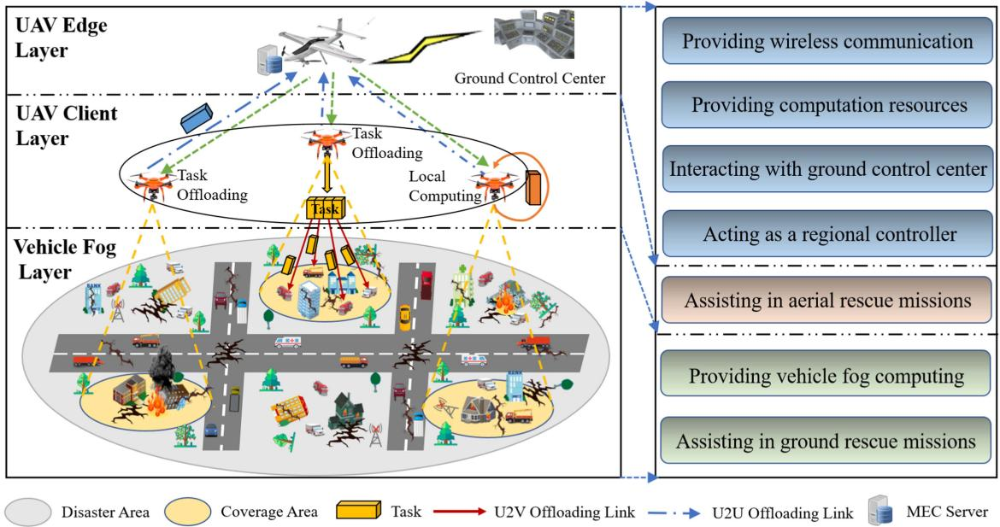

flowchart

```mermaid
graph TD
    A["UAV Edge Layer"] --> B["Ground Control Center"]
    C["UAV Client Layer"] --> D["Task Offloading"]
    C --> E["Task Offloading"]
    C --> F["Local Computing"]
    G["Vehicle Fog Layer"] --> H["Cloud Services"]
    G --> I["Aerial Rescue Mission"]
    G --> J["Vehicle Fog Computing"]
    G --> K["Ground Rescue Mission"]
    
    B --> L["Providing wireless communication"]
    B --> M["Providing computation resources"]
    B --> N["Interacting with ground control center"]
    B --> O["Acting as a regional controller"]
    B --> P["Assisting in aerial rescue missions"]
    B --> Q["Providing vehicle fog computing"]
    B --> R["Assisting in ground rescue missions"]
    
    style A fill:#f9f,stroke:#333
    style C fill:#f9f,stroke:#333
    style G fill:#f9f,stroke:#333
    style B fill:#ccf,stroke:#333
    style C fill:#ccf,stroke:#333
    style G fill:#ccf,stroke:#333
    style H fill:#cfc,stroke:#333
    style I fill:#cfc,stroke:#333
    style J fill:#cfc,stroke:#333
    style K fill:#cfc,stroke:#333
    style L fill:#ffc,stroke:#333
    style M fill:#ffc,stroke:#333
    style N fill:#ffc,stroke:#333
    style O fill:#ffc,stroke:#333
    style P fill:#ffc,stroke:#333
    style Q fill:#ffc,stroke:#333
    style R fill:#ffc,stroke:#333
```

Fig. 1. MEC-VFC-aided aerial-terrestrial UAV network consists of a large rotary-wing UAV, a group of small rotary-wing UAVs, and multiple rescue vehicles. Each small rotary-wing UAV either computes its task locally or offloads the task to the larger UAV or divides the task into multiple sub-tasks and offloads them to rescue vehicles.

Remark 1: Note that our current work does not address the optimization of UAV trajectories. The main reason is that the trajectory planning of UAVs for post-disaster rescue relies on specific rescue missions and the terrain of post-disaster scenarios, which is independent of the task offloading and resource allocation problem in this work.

2) Basic Models: The basic models of entities in the system are shown as follows.

Vehicle Fog Model: The set of rescue vehicles is denoted as $\mathcal { M } = \{ 1 , \dots , M \}$ . Each vehicle $m \in \mathcal { M }$ is characterized by $\mathbf { S } \mathbf { t } _ { m } ^ { \mathrm { v e h } } ( t ) = ( \mathbf { P } _ { m } ( t ) , v _ { m } ( t ) , \theta _ { m } ( t ) , f _ { m } ^ { \mathrm { v e h } } ( t ) )$ , where $\mathbf { P } _ { m } ( t ) =$ $[ x _ { m } ( t ) , y _ { m } ( t ) , 0 ] , v _ { m } ( t ) , \theta _ { m } ( t )$ and $f _ { m } ^ { \mathrm { v e h } } ( t )$ denote the position, velocity, direction, and idle computing resources of vehicle m at time t, respectively. We consider that the vehicles are distributed in the disaster area following a Poisson point process (PPP) with density $\rho _ { v }$ . Moreover, by using the Gauss-Markov model [34], the mobility of the vehicles is modeled as a temporal-dependent process, which is given as follows:

$$
\begin{array}{l} v _ {m} (t + 1) = \alpha v _ {m} (t) + (1 - \alpha) \overline {{v}} + \sqrt {1 - \alpha^ {2}} \omega_ {t} ^ {v}, \\ V _ {\text { veh }} ^ {\min} \leq v _ {m} (t) \leq V _ {\text { veh }} ^ {\max}, \forall m \in \mathcal {M}, \forall t \in \mathcal {T}, \tag {1} \\ \end{array}
$$

where $v _ { m } ( t + 1 )$ is the velocity of vehicle m at time $t + 1$ and $\omega _ { t } ^ { v }$ is the uncorrelated random Gaussian process with mean 0 and the asymptotic variance of velocity $\sigma _ { v } ^ { 2 }$ . Furthermore, α and v denote the memory degree and asymptotic mean of velocity, respectively. Similarly, direction $\theta _ { m }$ can be given as:

$$
\begin{array}{l} \theta_ {m} (t + 1) = \alpha \theta_ {m} (t) + (1 - \alpha) \overline {{\theta}} + \sqrt {1 - \alpha^ {2}} \omega_ {t} ^ {d}, \\ \Theta_ {\mathrm{veh}} ^ {\min} \leq \theta_ {m} (t) \leq \Theta_ {\mathrm{veh}} ^ {\max}, \forall m \in \mathcal {M}, \forall t \in \mathcal {T}, \tag {2} \\ \end{array}
$$

where $\theta _ { m } ( t + 1 )$ is the direction at time t + 1 and $\omega _ { t } ^ { d }$ is the uncorrelated random Gaussian process with mean 0 and the asymptotic variance of direction $\sigma _ { d } ^ { 2 }$ . Furthermore, θ represents the asymptotic mean of direction. Therefore, the mobility of vehicle m can be updated as:

$$
x _ {m} (t + 1) = x _ {m} (t) + v _ {m} (t) \cdot \cos (\theta_ {m} (t)) \cdot \Delta t,
$$

$$
y _ {m} (t + 1) = y _ {m} (t) + v _ {m} (t) \cdot \sin (\theta_ {m} (t)) \cdot \Delta t. \tag {3}
$$

Remark 2: Among the existing models, modeling vehicle mobility using PPP and Gaussian Markov models is more realistic in post-disaster scenarios. First, due to the random nature of rescue point distribution and the constraint on vehicle movement caused by the random road damage resulting from disasters, the distribution of vehicles exhibits a certain degree of randomness. PPP is a commonly used model to characterize the distribution characteristics of rescue vehicles in disaster scenarios [35], [36]. Second, the rescue vehicles deployed to perform ground rescue missions usually travel toward a destination, and therefore the rescue vehicle’s location and velocity in the future are likely to be correlated with its current location and velocity. The Gaussian Markov mobility model is proposed to capture the essence of temporal-dependent process [34]. Thus, we adopt PPP and Gauss-Markov models to describe vehicle mobility, which provides a useful balance between realism and tractability.

C-UAV Model: The set of C-UAVs is denoted as $\mathcal { N } = \{ 1 , \ldots , N \}$ . Each C-UAV $n \in \mathcal N$ is characterized $\begin{array} { r } { \mathrm { b y ~ } \mathbf { S } \mathbf { t } _ { n } ^ { \mathrm { u a v } } ( t ) = ( \mathbf { P } _ { n } ( t ) , v _ { n } ( t ) , \theta _ { n } ( t ) , g _ { n } ( t ) , \Phi _ { n } ( t ) , f _ { n } ^ { \mathrm { u a v } } ) } \end{array}$ , where ${ \bf P } _ { n } ( t ) = [ x _ { n } ( t ) , y _ { n } ( t ) , H ] , v _ { n } ( t )$ , and $\theta _ { n } ( t )$ respectively denote the position, velocity, and direction of C-UAV n at time t, which are known according to the pre-set trajectory. Moreover, we assume that each C-UAV can generate multiple tasks within the system timeline and at most one task in each time slot [37].

Specifically, the computing tasks generated by C-UAVs are modeled as an independent and identically distributed Bernoulli process [38], [39]. For each C-UAV n, a computing task is generated with probability $\rho _ { n } \in [ 0 , 1 ]$ at the beginning of each slot. Moreover, $g _ { n } ( t ) \in \{ 0 , 1 \}$ is a binary variable to indicate whether C-UAV n generates a task at time t, where $g _ { n } ( t ) = 1$ means that C-UAV n generates a task. Then, $\mathbb { P } ( g _ { n } ( t ) = 1 ) =$ $\begin{array} { r } { 1 - \mathbb { P } ( g _ { n } ( t ) = 0 ) = \rho _ { n } , } \end{array}$ , where $\mathbb { P } ( . )$ denotes the probability of an event occurring. $\Phi _ { n } ( t ) = \{ D _ { n } ( t ) , \eta _ { n } ( t ) , T _ { n } ^ { \mathrm { m a x } } ( t ) \}$ represents the computing task generated by C-UAV n at time t, wherein $D _ { n } ( t )$ presents the data size of the task (in bits), $\eta _ { n } ( t )$ is the computation intensity of the task (in cycles/bit), and $T _ { n } ^ { \mathrm { m a x } } ( t )$ denotes the maximum acceptable delay of the task. The local computation capability of C-UAV n is denoted as $f _ { n } ^ { \mathrm { u a v } }$ .

In addition, we define a binary variable $a _ { n } ^ { i } ( t ) \in \{ 0 , 1 \} ( i \in$ ${ \mathcal { T } } = \{ \mathrm { l o c } $ , mec, veh}) to represent the offloading decision of C-UAV n at time t, wherein $a _ { n } ^ { \mathrm { l o c } } ( t ) = 1$ implies the task is executed locally on $\mathrm { C - U A V } n , a _ { n } ^ { \mathrm { m e c } } ( t ) = 1$ implies the task is executed on the E-UAV, $a _ { n } ^ { \mathrm { v e h } } ( t ) = 1$ implies the task is executed on vehicle fog nodes, and $a _ { n } ^ { \mathrm { l o c } } ( t ) + a _ { n } ^ { \mathrm { m e c } } ( t ) + a _ { n } ^ { \mathrm { v e h } } ( t ) = 1$ , respectively.

E-UAV Model: The E-UAV u hovering over the disaster area is characterized by $\mathbf { S } \mathbf { t } ^ { u } = ( \mathbf { P } _ { u } , F _ { u } ^ { \operatorname* { m a x } } )$ , wherein $\mathbf { P } _ { u } =$ $[ x _ { u } , y _ { u } , H _ { u } ]$ and $F _ { u } ^ { \mathrm { m a x } }$ denote the position and the maximal computing resources of the E-UAV, respectively.

# B. Communication Model

The C-UAVs can decide to offload the tasks to vehicle fog nodes or E-UAV via UAV-to-vehicle (U2V) links and UAV-to-UAV (U2U) links, respectively, and the widely used OFDMA is employed in the communication models. Specifically, for each $\mathrm { \mathbf { C } { \mathrm { - } } U A V } \ n ,$ there are $K _ { n }$ orthogonal wireless sub-channels [40]. Furthermore, we assume that each C-UAV is equipped with a directional antenna of adjustable beamwidth and the azimuth and elevation half-power beamwidths of the antenna are equal, which is presented by $2 \Psi \in ( 0 , \pi )$ [41]. Therefore, the antenna gain of C-UAV n in the direction with azimuth $\psi ^ { a }$ and elevation $\psi ^ { e }$ can be obtained as [42]:

$$
G (\psi^ {a}, \psi^ {e}) = \left\{ \begin{array}{l l} \frac {G _ {0}}{\Psi^ {2}}, & - \Psi <   \psi^ {a} <   \Psi , - \Psi <   \psi^ {e} <   \Psi \\ g \approx 0, & \text { otherwise }, \end{array} \right. \tag {4}
$$

where g denotes the channel gain outside the beamwidth of the antenna. In practice, $0 < g \overset { \cdot } { \ll } G _ { 0 } / \Psi ^ { 2 }$ [43], which means that the communication links outside the beamwidth of the antenna is difficult to meet the communication requirements. Therefore, for simplicity, we set $g = 0$ to indicate that we do not consider communication links outside the beamwidth of the antenna.

U2V Communication: This work employs a probabilistic LoS channel model for the communication between C-UAVs and vehicles [44]. The channel coefficient between C-UAV n and vehicle m at time t can be presented as follows [45]:

$$
h _ {n, m} (t) = \sqrt {\beta_ {n , m} (t)} \tilde {h} _ {n, m} (t), \tag {5}
$$

where $\tilde { h } _ { n , m } ( t )$ represents the coefficient of small-scale fading that is generally a complex random variable with $E [ | \tilde { h } _ { n , m } ( t ) | ^ { 2 } ] = 1$ , and $\beta _ { n , m } ( t )$ denotes the coefficient of largescale fading that includes the distance-dependent path loss and shadowing. For the U2V links, the large-scale fading is generally modeled as a random variable that depends on the occurrence probabilities of LoS and non-line-of-sight (NLoS) links, which is given as [46]:

$$
\beta_ {n, m} (t) = \left\{ \begin{array}{l l} \beta_ {0} d _ {n, m} ^ {- \mu} (t), & \text { LoS   link }, \\ \kappa \beta_ {0} d _ {n, m} ^ {- \mu} (t), & \text { NLoS   link }, \end{array} \right. \tag {6}
$$

where $\beta _ { 0 }$ denotes the constant path loss coefficient at the reference distance of 1 m under the LoS condition, $d _ { n , m } ( t ) =$ $\| \mathbf { P } _ { n } ( t ) - \mathbf { P } _ { m } ( t ) \|$ denotes the distance between $\mathbf { C } { \mathrm { - } } \mathbf { U } \mathbf { A } \mathbf { V }$ n and vehicle m at time $t , \mu$ is the path loss exponent, and $\kappa < 1$ is the additional attenuation factor due to the NLoS propagation.

The LoS probability $P _ { n , m } ^ { \mathrm { L o S } } ( t )$ between C-UAV n and vehicle m is generally modeled as a logistic function of the elevation angle $\theta _ { n , m } ( t )$ , which is given as [47]:

$$
P _ {n, m} ^ {\mathrm{LoS}} (t) = \frac {1}{1 + a \exp (- b (\theta_ {n , m} (t) - a))}, \tag {7}
$$

where a and b are constants that depend on the propagation environment, and $\begin{array} { r } { \theta _ { n , m } ( t ) = { \frac { 1 8 0 } { \pi } } } \end{array}$ arcsin ${ \frac { H } { d _ { n , m } ( t ) } }$ denote the elevation angle in degree. Therefore, the expected channel power gain can be given as:

$$
\begin{array}{l} E [ | h _ {n, m} (t) | ^ {2} ] = P _ {n, m} ^ {\mathrm{LoS}} (t) \beta_ {0} d _ {n, m} ^ {- \mu} (t) \\ + (1 - P _ {n, m} ^ {\mathrm{LoS}} (t)) \kappa \beta_ {0} d _ {n, m} ^ {- \mu} (t). \tag {8} \\ \end{array}
$$

Furthermore, we assume that the change of the LoS probability between C-UAV n and vehicle m within a time slot can be negligible because the time slot duration is set small enough [48]. Then, the average communication rate between C-UAV n and vehicle m at time t is described as follows:

$$
R _ {n, m} (t) = B \log_ {2} \left(1 + \frac {P _ {n , m} E [ | h _ {n , m} (t) | ^ {2} ] G _ {0}}{\Psi^ {2} \sigma^ {2} B}\right), \tag {9}
$$

where B denotes the bandwidth of the sub-channel, $P _ { n , m }$ represents the transmission power between C-UAV n and vehicle m, and $\sigma ^ { 2 }$ is the noise power spectral density.

U2U Communication: The U2U communication is characterized by the free-space path-loss model since it is dominated by LoS links. The average communication rate between C-UAV n and E-UAV u is given as follows:

$$
R _ {n, u} (t) = K _ {n} B \log_ {2} \left(1 + \frac {P _ {n , u} \tilde {\beta} _ {0} G _ {0} d _ {n , u} ^ {- 2} (t)}{\Psi^ {2} \sigma^ {2} K _ {n} B}\right), \tag {10}
$$

where $P _ { n , u }$ is the transmission power between C-UAV n and E-UAV $u , { \tilde { \beta } } _ { 0 }$ is the channel power gain at the reference distance, and $d _ { n , u } ( t ) = \| \mathbf { P } _ { n } ( t ) - \mathbf { P } _ { u } ( t ) \|$ is the distance between C-UAV n and E-UAV u at time t.

# C. Service Delay and Energy Consumption

The service delay and energy consumption to complete task $\Phi _ { n } ( t )$ depend on the offloading strategy $a _ { n } ^ { i } ( t )$ of C-UAV n.

Local Computing: When task $\Phi _ { n } ( t )$ is executed on C-UAV n locally $( \mathrm { i } . \mathrm { e } . , a _ { n } ^ { \mathrm { l o c } } ( t ) = 1 )$ , the local service delay at time t can be calculated as:

$$
T _ {n} ^ {\mathrm{loc}} (t) = \frac {\eta_ {n} (t) D _ {n} (t)}{f _ {n} ^ {\mathrm{uav}}}. \tag {11}
$$

Correspondingly, the energy consumption of C-UAV n to execute task Φn(t) locally at time t can be calculated as [49]:

$$
E _ {n} ^ {\mathrm{loc}} (t) = k (f _ {n} ^ {\mathrm{uav}}) ^ {3} T _ {n} ^ {\mathrm{loc}} (t), \tag {12}
$$

where k is the effective switched capacitance cofficient for each C-UAV that depends on the hardware architecture [50].

MEC-Assisted Offloading: When task $\Phi _ { n } ( t )$ is offloaded to the E-UAV for execution (i.e., $a _ { n } ^ { \mathrm { m e c } } ( t ) = 1 )$ , the service delay of task at time t includes the transmission delay and the E-UAV execution delay, which can be given as:

$$
T _ {n} ^ {\mathrm{mec}} (t) = \frac {D _ {n} (t)}{R _ {n , u} (t)} + \frac {\eta_ {n} (t) D _ {n} (t)}{F _ {n} (t)}, \tag {13}
$$

where $F _ { n } ( t )$ denotes the computing resource allocated by the E-UAV to task $\Phi _ { n } ( t )$ .

The energy consumption of C-UAV n to offload task $\Phi _ { n } ( t )$ to the E-UAV is mainly induced by the task transmission, which can be given as [51]:

$$
E _ {n} ^ {\mathrm{mec}} (t) = \frac {P _ {n , u} D _ {n} (t)}{R _ {n , u} (t)}. \tag {14}
$$

VFC-Assisted Offloading: When task $\Phi _ { n } ( t )$ is offloaded to vehicle fog nodes for execution (i.e., $a _ { n } ^ { \mathrm { v e h } } ( t ) = 1 )$ , we consider that task $\Phi _ { n } ( t ) \ ( n \in \mathcal { N } )$ can be divided into multiple independent sub-tasks owing to the insufficient computing resources of vehicle fog nodes [52], and the time for task division is short enough to be negligible [53]. Furthermore, these sub-tasks can be offloaded by C-UAV n to the set of rescue vehicles within its communication range (i.e., dn,m(t) ≤ H tan Ψ) for parallel processing. Due to the limited number of sub-channels, C-UAV n can offload sub-tasks to $K _ { n }$ vehicles at most simultaneously. Therefore, we define ${ \bf S } _ { n } ^ { \prime } ( t )$ as the set of vehicles selected by C-UAV n to perform sub-tasks and $\lambda _ { n } ^ { t } =$ $\{ \lambda _ { n , j } ^ { t } \} _ { j \in \mathbf { S } _ { n } ^ { \prime } ( t ) }$ as the task division set of C-UAV n at time t, wherein $\lambda _ { n , j } ^ { t }$ is the proportion of sub-task offloaded to vehicle j in the total task, $| \mathbf { S } _ { n } ^ { \prime } ( t ) | \leq K _ { n }$ , and $\lambda _ { n , j } ^ { t } \in [ 0 , 1 ]$ . Therefore, the service delay of task at time t, including the transmission delay and the vehicle execution delay, can be calculated as:

$$
T _ {n} ^ {\mathrm{veh}} (t) = \max _ {j \in \mathbf {S} _ {n} ^ {\prime} (t)} \left(\frac {\lambda_ {n , j} ^ {t} D _ {n} (t)}{R _ {n , j} (t)} + \frac {\lambda_ {n , j} ^ {t} \eta_ {n} (t) D _ {n} (t)}{f _ {j} ^ {\mathrm{veh}} (t)}\right), \tag {15}
$$

where $\mathbf { S } _ { n } ( t ) \ ( \mathbf { S } _ { n } ^ { \prime } ( t ) \subset \mathbf { S } _ { n } ( t ) )$ is the set of vehicles within C-UAV n communication range at time $t , \textstyle \sum _ { j \in { \mathbf { S } } _ { n } ^ { \prime } ( t ) } \lambda _ { n , j } ^ { t } = 1$ and $f _ { j } ^ { \mathrm { v e h } } ( t )$ denotes the idle computing resources owned by vehicle j at time t.

The energy consumption of C-UAV n to offload task $\Phi _ { n } ( t )$ to vehicles is mainly induced by the task transmission, which can be given as:

$$
\begin{array}{l} E _ {n} ^ {\mathrm{veh}} (t) = \sum_ {j \in \mathbf {S} _ {n} ^ {\prime} (t)} P _ {n, j} T _ {n, j} ^ {\mathrm{veh}} (t) \\ = \sum_ {j \in \mathbf {S} _ {n} ^ {\prime} (t)} \frac {P _ {n , j} \lambda_ {n , j} ^ {t} D _ {n} (t)}{R _ {n , j} (t)}. \tag {16} \\ \end{array}
$$

Remark 3: When calculating the energy consumption of C-UAVs, the propulsion energy consumption of C-UAVs is omitted. This is because the C-UAVs fly according to the pre-set trajectories, leading to constant propulsion energy consumption, which would have no effect on the results of decision-making for C-UAVs.

# D. Utility Function

In this sub-section, the utility function is formulated to quantify the satisfaction level of C-UAVs in performing tasks, which can be formulated by considering the following metrics.

Revenue of Task Processing: In post-disaster rescue scenarios, the completion delay of tasks could greatly affect the satisfaction of C-UAVs. Similar to [53], [54], a convex logarithmic function is employed to quantify the satisfaction of C-UAVs on task completion. Therefore, the revenue obtained by C-UAV n can be calculated as:

$$
B t _ {n} (t) = \log (\beta + T _ {n} ^ {\max} (t) - T _ {n} (t)), \tag {17}
$$

where $\beta$ is a constant with a positive value that ensures the revenue function non-negative and $T _ { n } ( t )$ is the completion delay of task $\Phi _ { n } ( t )$ .

Cost of Energy Consumption: Considering the limited battery capacity of the C-UAVs, the cost of C-UAV n is modeled as the energy consumption, which is given as:

$$
C t _ {n} ^ {\mathrm{E}} (t) = E _ {n} (t). \tag {18}
$$

Cost of Computation Resource: In the MEC-VFC-aided aerial-terrestrial UAV network, the C-UAVs share the computation resources of E-UAV. However, the limited computing resources of the E-UAV and the stringent demands of C-UAVs could lead to resource competition among the C-UAVs and rapid resource depletion of the E-UAV. To ensure the effective utilization and sustainability of resources, the price-based mechanism is introduced to model the cost of using the E-UAV computation resources. Similar to the existing work [55], [56], [57], the cost that C-UAV n pays for the computation resources of E-UAV is given as:

$$
C t _ {n} ^ {\mathrm{mec}} (t) = \rho_ {0} F _ {n} (t), \tag {19}
$$

where $\rho _ { 0 }$ represents the unit cost of computing resources for E-UAV.

According to the above metrics, we finally design the utility function of C-UAV n as follows:

$$
U _ {n} ^ {i} (t) = \left\{ \begin{array}{l l} U _ {n} ^ {\mathrm{loc}} (t), & a _ {n} ^ {\mathrm{loc}} (t) = 1 \\ U _ {n} ^ {\mathrm{veh}} (t), & a _ {n} ^ {\mathrm{veh}} (t) = 1, \\ U _ {n} ^ {\mathrm{mec}} (t), & a _ {n} ^ {\mathrm{mec}} (t) = 1 \end{array} \right. \tag {20}
$$

where $U _ { n } ^ { \mathrm { l o c } } ( t )$ is the utility of local computing, $U _ { n } ^ { \mathrm { m e c } } ( t )$ is the utility of MEC-assisted offloading, and $U _ { n } ^ { \mathrm { v e h } } ( t )$ is the utility of VFC-assisted offloading, which are denoted respectively as:

$$
\left\{ \begin{array}{l} U _ {n} ^ {\mathrm{loc}} (t) = \alpha_ {n} \log (\beta + T _ {n} ^ {\max} (t) - T _ {n} ^ {\mathrm{loc}} (t)) - \beta_ {n} E _ {n} ^ {\mathrm{loc}} (t) \\ U _ {n} ^ {\mathrm{veh}} (t) = \alpha_ {n} \log (\beta + T _ {n} ^ {\max} (t) - T _ {n} ^ {\mathrm{veh}} (t)) - \beta_ {n} E _ {n} ^ {\mathrm{veh}} (t). \\ U _ {n} ^ {\mathrm{mec}} (t) = \alpha_ {n} \log (\beta + T _ {n} ^ {\max} (t) - T _ {n} ^ {\mathrm{mec}} (t)) - \beta_ {n} E _ {n} ^ {\mathrm{mec}} (t) \\ - \rho_ {0} F _ {n} (t) \end{array} \right. \tag {21}
$$

Moreover $\alpha _ { n }$ and $\beta _ { n }$ denote the coefficients of task completion delay and energy consumption, respectively, and $\alpha _ { n } + \beta _ { n } = 1$ .

# E. Problem Formulation

This work aims to maximize the time-average system utility by jointly optimizing the task offloading decisions $A =$ $\{ \mathcal { A } ^ { t } | \mathcal { A } ^ { t } = \{ a _ { n } ^ { i } ( t ) \} _ { n \in \mathcal { N } , i \in \mathcal { T } } \} _ { t \in \mathcal { T } }$ , MEC computing resource allocation $\mathcal { F } = \{ \mathcal { F } ^ { t } | \mathcal { F } ^ { t } = \{ F _ { n } ( t ) \} _ { n \in \mathbf { N _ { 0 } } } \} _ { t \in \mathcal { T } }$ , and VFC resource allocation including vehicle fog node selection ${ \boldsymbol { S } } =$ $\{ S ^ { t } | S ^ { t } = \{ \mathbf { S } _ { n } ^ { \prime } ( t ) \} _ { n \in \mathbf { N _ { 1 } } } \} _ { t \in \mathcal { T } }$ and task division $\pmb { \Lambda } = \{ \pmb { \lambda } ^ { t } | \pmb { \lambda } ^ { t } =$ $\{ \lambda _ { n } ^ { t } \} _ { n \in \mathbf { N _ { 1 } } } \} _ { t \in \mathcal { T } }$ , where $\mathbf { N } _ { 0 }$ and ${ \bf N } _ { 1 }$ denote the set of C-UAVs that choose MEC and VFC at time $t ,$ respectively. Accordingly, the JTRAOP can be formulated as follows:

$$
\mathbf {P}: \max _ {\mathcal {A}, \mathcal {F}, \mathcal {S}, \boldsymbol {\Lambda}} \frac {1}{T} \sum_ {t = 0} ^ {T - 1} \sum_ {i \in \mathcal {I}} \sum_ {n \in \mathcal {N}} g _ {n} (t) a _ {n} ^ {i} (t) U _ {n} ^ {i} (t) \tag {22}
$$

$$
\text { s.t. } a _ {n} ^ {i} (t) = \{0, 1 \}, \forall n \in \mathcal {N}, \forall i \in \mathcal {I}, \forall t \in \mathcal {T} \tag {22a}
$$

$$
\sum_ {i \in \mathcal {I}} a _ {n} ^ {i} (t) = 1, \forall n \in \mathcal {N}, \forall t \in \mathcal {T} \tag {22b}
$$

$$
0 \leq F _ {n} (t) \leq F _ {u} ^ {\max}, \forall n \in \mathbf {N} _ {0}, \forall t \in \mathcal {T} \tag {22c}
$$

$$
\sum_ {n \in \mathbf {N} _ {0}} F _ {n} (t) \leq F _ {u} ^ {\max}, \forall t \in \mathcal {T} \tag {22d}
$$

$$
\lambda_ {n, j} ^ {t} \in [ 0, 1 ], \forall n \in \mathbf {N} _ {1}, \forall j \in \mathbf {S} _ {n} ^ {\prime} (t), \forall t \in \mathcal {T} \tag {22e}
$$

$$
\sum_ {j \in \mathbf {S} _ {n} ^ {\prime} (t)} \lambda_ {n, j} ^ {t} = 1, \forall n \in \mathbf {N} _ {1}, \forall t \in \mathcal {T} \tag {22f}
$$

$$
\mathbf {S} _ {n} ^ {\prime} (t) \cap \mathbf {S} _ {j} ^ {\prime} (t) = \emptyset , \forall n \neq j, n, j \in \mathbf {N} _ {1}, \forall t \in \mathcal {T}, \tag {22g}
$$

$$
\mathbf {S} _ {n} ^ {\prime} (t) \subset \mathbf {S} _ {n} (t), \forall n \in \mathbf {N} _ {1}, \forall t \in \mathcal {T} \tag {22h}
$$

$$
g _ {n} (t) = \{0, 1 \}, \forall n \in \mathcal {N}, \forall t \in \mathcal {T} \tag {22i}
$$

$$
a _ {n} ^ {i} (t) T _ {n} ^ {i} (t) \leq T _ {n} ^ {\max} (t), \forall n \in \mathcal {N}, \forall i \in \mathcal {I}, \forall t \in \mathcal {T} \tag {22j}
$$

Constraints (22a) and (22b) represent each C-UAV can only choose one offloading strategy. Constraints (22c) and (22d) indicate that the computation resources allocated by the E-UAV should be positive and not greater than the maximum resource owned by the E-UAV. Constraints (22e) and (22f) pose the conditions on task division when C-UAVs decide to offload the tasks to rescue vehicles for execution. Constraint (22g) represents that each vehicle fog node is selected to serve one C-UAV. Constraint (22h) ensures that the selected vehicle fog node should be within the communication range of the C-UAV. Constraint (22i) represents whether a C-UAV generates a computing task at time t. Moreover, Constraint (22j) means that the maximum acceptable delay should not be exceeded in completing the task.

Similar to [25], we assume that the tasks generated by the C-UAVs can be completed within one time slot since the computing tasks of rescue missions are delay-sensitive. Therefore, the optimization problem P can be reformulated as the real-time optimization problem $\mathbf { P ^ { \prime } }$ that maximizes the system utility in each time slot, which is given as:

$$
\mathbf {P} ^ {\prime}: \max _ {\mathcal {A} ^ {t}, \mathcal {F} ^ {t}, \mathcal {S} ^ {t}, \lambda^ {t}} \sum_ {i \in I} \sum_ {n \in N} g _ {n} (t) a _ {n} ^ {i} (t) U _ {n} ^ {i} (t)
$$

$$
\text { s.t. } (2 2 a) - (2 2 i) \tag {23}
$$

where $\{ \mathcal { A } ^ { t } , \mathcal { F } ^ { t } , \mathcal { S } ^ { t } , \lambda ^ { t } \}$ indicates the decisions of task offloading, MEC computation resource allocation, vehicle fog node selection, and task division at time slot t.

The above problem $\mathbf { P ^ { \prime } }$ contains both binary variables $( \mathrm { i . e . } ,$ task offloading decision $\mathcal { A } ^ { t }$ and vehicle fog node selection $S ^ { t } )$ and continuous variables (i.e., MEC computation resource allocation $\mathcal { F } ^ { t }$ and task division $\lambda ^ { t } )$ is a mixed-integer non-linear programming (MINLP) problem, which is non-convex [58], [59] and NP-hard [60]. Therefore, a large amount of computational overhead caused by seeking the optimal solution may not be suitable for real-time decision making. To this end, we design an MVTORA approach that obtains a sub-optimal solution in polynomial time complexity. Furthermore, for the convenience of the following description, we drop the time index for variables similar to [61].

# IV. MEC-VFC-AIDED TASK OFFLOADING AND RESOURCE ALLOCATION APPROACH

To achieve the maximal system utility, the MVTORA approach is presented by separating problem $\mathbf { P ^ { \prime } }$ into two parts, i.e., task offloading and computing resource allocation, which are solved respectively. First, the task offloading part seeks to optimize the task offloading decisions for C-UAVs, which is solved by adopting game theory. Furthermore, the resource allocation part aims to optimize the MEC and VFC resource allocation decisions for the E-UAV and vehicular fog nodes, respectively, which are solved by employing convex optimization and evolutionary computation, respectively. The task offloading and computing resource allocation are detailed in Sections IV-A and IV-B, respectively. In addition, Section IV-C2 presents the main steps and analysis of the MVTORA approach. Note that we employ a binary offloading strategy for MEC offloading and a partial offloading strategy for VFC offloading since the computing capability of the E-UAV is powerful while that of the ground rescue vehicles is relatively limited. A comprehensive explanation of this offloading decision is presented in Section VI.

# A. Task Offloading

The offloading decision of C-UAV n depends not just on its own demand but also on the offloading decisions of the other C-UAVs. Considering the competitive nature of task offloading among C-UAVs, game theory is employed to solve the task offloading decision problem.

1) Game Formulation: The problem of task offloading decision is modeled as a task offloading game among multiple C-UAVs, which is defined as a triplet $\Gamma = \{ { \mathcal { N } } , \mathbb { A } , ( U _ { n } ) _ { n \in { \mathcal { N } } } \}$ , where the elements are detailed as follows:

- $\mathcal { N } = \{ 1 , 2 , \dots , N \}$ denotes the players, i.e., all C-UAVs.   
- $\boldsymbol { \mathbb { A } } = \mathbf { A } _ { 1 } \times \cdots \times \mathbf { A } _ { N }$ denotes the strategy space, wherein $\mathbf { A } _ { n } = \{ a _ { n } ^ { \mathrm { l o c } } , a _ { n } ^ { \mathrm { m e c } } , a _ { n } ^ { \mathrm { v e h } } \}$ is the set of offloading strategies

for player n $( n \in \mathcal { N } ) , a _ { n } \in \mathbf { A } _ { n }$ denotes the strategy chosen by player n, and $\mathcal { A } = ( a _ { 1 } , \dotsc , a _ { N } ) \in \mathbb { A }$ is the strategy profile.

. $( U _ { n } ) _ { n \in \mathcal { N } }$ is the utility function of player n that maps each strategy profile A to a real number, i.e., $U _ { n } ( \mathcal { A } ) : \mathbb { A } \mapsto \mathbb { R }$ , where R is the set of real number.

Each C-UAV aims to maximize its utility by choosing an optimal offloading strategy. Thus, the problem of task offloading can be formulated as:

$$
\max _ {a _ {n}} U _ {n} (a _ {n}, a _ {- n}) = a _ {n} ^ {\text { loc }} U _ {n} ^ {\text { loc }} + a _ {n} ^ {\text { veh }} U _ {n} ^ {\text { veh }} + a _ {n} ^ {\text { mec }} U _ {n} ^ {\text { mec }} \tag {24}
$$

$$
\text { s.t. } a _ {n} ^ {\mathrm{loc}} + a _ {n} ^ {\mathrm{veh}} + a _ {n} ^ {\mathrm{mec}} = 1, \forall n \in \mathcal {N}, \tag {24a}
$$

$$
a _ {n} ^ {i} = \{0, 1 \}, \forall n \in \mathcal {N}, i \in \{\text { loc }, \text { mec }, \text { veh } \}, \tag {24b}
$$

where $a _ { - n } = ( a _ { 1 } , \ldots , a _ { n - 1 } , a _ { n + 1 } , \ldots , a _ { N } )$ denotes the offloading decisions of the other players except player n.

2) The Solution to Task Offloading Game: To determine the solution to the task offloading game, we first introduce the concept of Nash equilibrium, which describes a situation where no player has any incentive to unilaterally deviate from the current strategy.

Definition 1: The strategy profile $\mathcal { A } ^ { \ast } = \left( a _ { 1 } ^ { \ast } , \dots , a _ { N } ^ { \ast } \right)$ is a pure-strategy Nash equilibrium of game Γ if and only if

$$
U _ {n} (a _ {n} ^ {*}, a _ {- n} ^ {*}) \geq U _ {n} (a _ {n} ^ {\prime}, a _ {- n} ^ {*}) \forall a _ {n} ^ {\prime} \in \mathbf {A} _ {n}, \forall n \in \mathcal {N}. \tag {25}
$$

Second, we introduce a powerful tool, known as exact potential games [62], to help us study the existence of Nash equilibrium and how to obtain a Nash equilibrium solution for the task offloading game.

Definition 2: A game can be called an exact potential game if and only if a potential function F (A) : A 
→ R exists such that

$$
U _ {n} (a _ {n}, a _ {- n}) - U _ {n} (b _ {n}, a _ {- n})
$$

$$
= F (a _ {n}, a _ {- n}) - F (b _ {n}, a _ {- n}), \forall n \in \mathcal {N}, a _ {n}, b _ {n} \in \mathbf {A} _ {n}, \tag {26}
$$

where $F ( A )$ accurately captures the utility change of a single player due to strategic deviation.

Third, we introduce how to obtain a Nash equilibrium solution of the exact potential game by presenting the concepts of the finite improvement path (FIP) and the better response update process.

Definition 3: The exact potential game with finite strategy sets always has a Nash equilibrium and the FIP [62].

Definition 4: In the better response update process, given the other players’ strategy $a _ { - n } ,$ player n will select a new strategy $T _ { n }$ over the current strategy $a _ { n }$ if and only if $T _ { n }$ is any randomly selected strategy that improves his/her utility. We formally write it as

$$
T _ {n} = \operatorname{rand} \left(\left\{a _ {n} ^ {\prime} \mid U _ {n} \left(a _ {n} ^ {\prime}, a _ {- n}\right) > U _ {n} \left(a _ {n}, a _ {- n}\right) \right\}\right),
$$

$$
\forall a _ {n} ^ {\prime} \in \mathbf {A} _ {n}, n \in \mathcal {N}, \tag {27}
$$

where rand({.}) denotes a randomized selection among elements of a set.

According to Definitions 3 and 4, the FIP means that each player updates its current strategy in each iteration through the better response update process and after a finite number of iterations, the improvement path terminates and its end point corresponds to the Nash equilibrium solution [63]. Therefore, for an exact potential game, we can obtain the Nash equilibrium solution by the better response update process.

Finally, we prove that the task offloading game among multiple C-UAVs is an exact potential game through the following Theorem 1.

Theorem 1: The task offloading game among multiple C-UAVs is an exact potential game where the potential function $F ( A )$ is given as:

$$
\begin{array}{l} F (\mathcal {A}) = a _ {n} ^ {\text { loc }} \sum_ {j = 1} ^ {N} \left(\alpha_ {j} \log \left(\beta + T _ {j} ^ {\max} - T _ {j} ^ {\text { loc }}\right) - \beta_ {j} E _ {j} ^ {\text { loc }}\right) \\ + \left(1 - a _ {n} ^ {\text { loc }}\right) \times \left\{\alpha_ {n} \log \left(\beta + T _ {n} ^ {\max} - a _ {n} ^ {\text { mec }} T _ {n} ^ {\text { mec }} \right. \right. \\ \left. - a _ {n} ^ {\text { veh }} T _ {n} ^ {\text { veh }}\right) - \beta_ {n} \left(a _ {n} ^ {\text { mec }} E _ {n} ^ {\text { mec }} + a _ {n} ^ {\text { veh }} E _ {n} ^ {\text { veh }}\right) - \rho_ {0} a _ {n} ^ {\text { mec }} F _ {n} \\ + \sum_ {j = 1, j \neq n} ^ {N} \left(\alpha_ {j} \log \left(\beta + T _ {j} ^ {\max} - T _ {j} ^ {\mathrm{loc}}\right) - \beta_ {j} E _ {j} ^ {\mathrm{loc}}\right) \}. \tag {28} \\ \end{array}
$$

Proof: The detailed proof is given in Appendix A of the supplemental material.

The key idea of the task offloading game is to iteratively update the players’ offloading strategies through the better response update process until the Nash equilibrium is reached, which is shown in Algorithm 1. The main steps of implementing the task offloading game are described as follows. i) In each time slot, the E-UAV collects the state information of C-UAVs, the CSI of U2U channel, and the initial task offloading decision and corresponding utility of C-UAVs. ii) Each iteration is divided into N decision slots (Lines 5∼10). At each decision slot, one C-UAV is selected to attempt to update its offloading decision while the offloading decisions of other C-UAVs remain unchanged (Line 6). iii) If higher utility is achieved, the C-UAV’s offloading decision is updated; otherwise the original offloading decision is maintained (Lines 7∼10). iv) When no C-UAV changes its offloading decision, the task offloading decision game reaches the Nash equilibrium. v) The E-UAV sends the optimal task offloading decision information to each C-UAV. vi) The C-UAVs perform the actions of computation offloading according to the received decisions.

# B. Resource Allocation

The problem of resource allocation is decomposed into the sub-problems of MEC resource allocation and VFC resource allocation, respectively, which aim to obtain the optimal resource allocation decisions for aerial E-UAV and terrestrial vehicle nodes, respectively.

1) MEC Resource Allocation: The MEC resource allocation problem P1 seeks to maximize the total utility of C-UAVs that offload tasks to the aerial E-UAV by optimizing the resource allocation of E-UAV, which is formulated as:

$$
\mathbf {P 1}: \max _ {\mathcal {F}} \sum_ {n \in \mathrm{N} _ {\mathbf {0}}} \left\{\alpha_ {n} \log \left(\beta + T _ {n} ^ {\max} - T _ {n} ^ {\text {mec}}\right) - \beta_ {n} E _ {n} ^ {\text {mec}} - \rho_ {0} F _ {n} \right\} \tag {29}
$$

Algorithm 1: Task Offloading Game.   
Input: The state information of C-UAVs
{St $_{n}^{uav}$ } $_{n\in\mathcal{N}}$ , the initial task offloading
decision A $^{ini}$ = {a $_{n}$ } $_{n\in\mathcal{N}}$ and corresponding
utility U $^{ini}$ = {U $_{n}$ } $_{n\in\mathcal{N}}$ .

Output: The optimal task offloading decision
A $^{*}$ = {a $_{n}^{*}$ } $_{n\in\mathcal{N}}$ .

1 Initialization: Iteration l = 1, A $^{0}$ = ∅;
2 A $^{l}$ = A $^{ini}$ ;
3 while A $^{l-1}$ ≠ A $^{l}$ do
4    A $^{l-1}$ = A $^{l}$ ;
5    for n ∈ N do
6    A $^{l}$ (n) = a $_{n}^{mec}$ = 1;
7    Call Algorithm 2 for F $_{n}^{*}$ based on A $^{l}$ ;
8    Calculate the utility U $_{n}^{mec}$ based on F $_{n}^{*}$ and Eq. (21);
9    if U $_{n}^{mec}$ ≤ U $^{ini}$ (n) then
10    |    A $^{l}$ (n) = A $^{ini}$ (n);
11    l = l + 1;
12    A $^{*}$ = A $^{l}$ ;
13 return A $^{*}$ = {a $_{n}^{*}$ } $_{n\in\mathcal{N}}$ .

$$
\text { s.t. } 0 \leq F _ {n} \leq F _ {u} ^ {\max}, \forall n \in \mathbf {N _ {0}}, \tag {29a}
$$

$$
\sum_ {n \in \mathbf {N} _ {\mathbf {0}}} F _ {n} \leq F _ {u} ^ {\max}. \tag {29b}
$$

Lemma 1: Problem P1 is convex.

Proof: The detailed proof is given in Appendix B of the supplemental material.

Theorem 2: The solution to Problem P1, i.e., the optimal computation resource allocated by the E-UAV to the C-UAVs, is given as $\mathcal { F } ^ { * } = \{ F _ { n } ^ { * } , n \in \mathbf { N _ { 0 } } \}$ , where

$$
\begin{array}{l} F _ {n} ^ {*} = \\ \frac {\eta_ {n} D _ {n} + \sqrt {\left(\eta_ {n} D _ {n}\right) ^ {2} - 4 \left(\beta + T _ {n} ^ {\max} - \frac {D _ {n}}{R _ {n , u}}\right) \left(- \frac {\eta_ {n} D _ {n} \alpha_ {n}}{\rho_ {0} + \gamma^ {*}}\right)}}{2 \left(\beta + T _ {n} ^ {\max} - \frac {D _ {n}}{R _ {n , u}}\right)}. \tag {30} \\ \end{array}
$$

Proof: The detailed proof is given in Appendix C of the supplemental material.

As shown in Algorithm 2, the optimal MEC resource allocation can be achieved by applying the bisection method [54].

2) VFC Resource Allocation: The VFC resource allocation problem P2 aims to maximize the total utility of C-UAVs that offload tasks to terrestrial vehicles by optimizing the resource allocation of vehicle fog nodes. Since the task of each C-UAV is divided into multiple independent sub-tasks and offloaded to a set of vehicle fog nodes for parallel processing, as explained in Section III-C, Problem P2 is solved by mapping the VFC resource allocation into the vehicle fog node selection and task division, which is formulated as:

$$
\mathbf {P 2}: \max _ {\lambda , S} \sum_ {n \in \mathbf {N} _ {1}} \left\{\alpha_ {n} \log (\beta + (T _ {n} ^ {\max} - T _ {n} ^ {\mathrm{veh}})) - \beta_ {n} E _ {n} ^ {\mathrm{veh}} \right\} \tag {31}
$$

Algorithm 2: Bisection Algorithm-based MEC Resource Allocation.   
Input: Task set $\{\Phi_{n}\}_{n\in N_{0}}$ , E-UAV computation resources $F_{u}^{max}$ .

Output: The optimal computation resource allocation $F^{*}=\{F_{n}^{*},n\in N_{0}\}$ .

1 Initialization: Search accuracy threshold: $\varepsilon$ , the lower bound $\gamma^{min}=0$ and the upper bound $\gamma^{max}=\gamma^{bound}$ ;

2 while $\gamma^{max}-\gamma^{min}\geq\varepsilon$ do

3 Define $\gamma=\frac{\gamma^{min}+\gamma^{max}}{2}$ ;

4 for $n\in N_{0}$ do

5 Compute $F_{n}^{*}$ by substituting $\gamma$ into Eq. (30);

6 if $\sum_{n\in N_{0}}F_{n}^{*}\geq F_{u}^{max}$ then

7 $\gamma^{min}=\gamma;$ 8 else

9 $\gamma^{max}=\gamma;$ 10 return $F^{*}=\{F_{n}^{*},n\in N_{0}\}$ .

$$
\text { s.t. } \lambda_ {n, j} \in [ 0, 1 ], \forall n \in \mathbf {N} _ {1}, \forall j \in \mathbf {S} _ {n} ^ {\prime}, \tag {31a}
$$

$$
\sum_ {j \in \mathbf {S} _ {n} ^ {\prime}} \lambda_ {n, j} = 1, \forall n \in \mathbf {N} _ {1}, \tag {31b}
$$

$$
\mathbf {S} _ {n} ^ {\prime} \cap \mathbf {S} _ {j} ^ {\prime} = \emptyset , \forall n, j \in \mathbf {N} _ {1}, n \neq j, \tag {31c}
$$

$$
\mathbf {S} _ {n} ^ {\prime} \subset \mathbf {S} _ {n}, \forall n \in \mathbf {N} _ {1}. \tag {31d}
$$

Since the communication ranges of C-UAVs do not overlap each other as mentioned in Section III-A1, the selection of vehicle fog nodes for each C-UAV is independent of each other. Therefore, P2 can be decomposed into $| \mathbf { N } _ { 1 } |$ parallel sub-problems, where each sub-problem is expressed as:

$$
\mathbf {P 2} ^ {\prime}: \max _ {\lambda_ {n}, \mathbf {S} _ {n} ^ {\prime}} \left\{\alpha_ {n} \log (\beta + T _ {n} ^ {\max} - T _ {n} ^ {\mathrm{veh}}) - \beta_ {n} E _ {n} ^ {\mathrm{veh}} \right\}
$$

$$
\text { s.t. } (3 1 a) - (3 1 d). \tag {32}
$$

Problem $\mathbf { P 2 } ^ { \prime }$ is still an MINLP problem, which is difficult to be solved directly. Since the solutions of vehicle fog node selection $\mathbf { S } _ { n } ^ { \prime }$ and task division $\lambda _ { n }$ are inherently sequential, i.e. the vehicle fog node selection is performed before the task division, this inspires us to solve the problem by designing a two-step optimization procedure which includes the vehicle fog node selection and task division, and the details are as follows.

(1) Vehicle Fog Node Selection: Since the mission-critical computing tasks generated by C-UAVs are heterogeneous and delay-sensitive, the vehicle fog nodes are selected according to the different preferences of C-UAVs, with the aim of minimizing the task completion delay. Therefore, we define the preference value of C-UAV n to vehicle j as

$$
P r (n, j) = \frac {D _ {n}}{R _ {n , j}} + \frac {\eta_ {n} D _ {n}}{f _ {j} ^ {\mathrm{veh}}}. \tag {33}
$$

Algorithm 3: Vehicle Fog Node Selection.   
Input: Task $\Phi_n(t)$ and the vehicle set $\mathbf{S}_n$ .

Output: The optimal candidate vehicle set $\mathbf{S}_n^*$ .

1 if $|\mathbf{S}_n| \leq K_n$ then
2 | $\mathbf{S}_n^* = \mathbf{S}_n$ ;
3 else
4 Calculate the preference value of all vehicles in set $\mathbf{S}_n$ based on Eq. (33);
5 Select the top $K_n$ vehicles with the smallest preference value as the optimal candidate vehicle set $\mathbf{S}_n^*$ ;
6 return $\mathbf{S}_n^*$ .

The vehicle fog nodes can be selected based on the following rule.

Theorem 3: If the vehicle set $\mathbf { S } _ { n }$ is sorted in increasing order of preference, the top $K _ { n }$ vehicles are the optimal candidate vehicle set $\mathbf { S } _ { n } ^ { * }$ which minimizes the completion delay of task $\Phi _ { n }$ .

Proof: The detailed proof is given in Appendix D of the supplemental material.

Based on the Theorem 3, the method of vehicle fog node selection is shown in Algorithm 3.

(2) Task Division: Given the selection of vehicle fog nodes $\mathbf { S } _ { n } ^ { * }$ , problem $\mathbf { P 2 } ^ { \prime }$ can be transformed into a task division problem, which is expressed as follows:

$$
\mathbf {P 2} ^ {\prime \prime}: \max _ {\lambda_ {n}} \left\{\alpha_ {n} \log \left(\beta + T _ {n} ^ {\max} - T _ {n} ^ {\mathrm{veh}}\right) - \beta_ {n} E _ {n} ^ {\mathrm{veh}} \right\}
$$

$$
\text { s.t. } (3 1 a) - (3 1 b). \tag {34}
$$

The service delay $T _ { n } ^ { \mathrm { v e h } }$ of VFC-assisted task offloading is a maximum function given in (15), which makes the problem $\mathbf { P 2 } ^ { \prime \prime }$ nondifferentiable. Therefore, it is difficult to directly solve the problem $\mathbf { P 2 } ^ { \prime \prime }$ . Algorithms based on evolutionary computation have the potential to solve this problem, which does not require convexity and differentiability of the optimization problem. To this end, we design a task division algorithm by employing genetic algorithm (GA) because of its global search ability, parallel processing capability, and strong robustness. Moreover, since the problem $\mathbf { P } \bar { 2 } ^ { \prime \prime }$ has a small-scale solution space (i.e., $| \lambda _ { n } | \leq K _ { n } )$ , the running time of the algorithm can be guaranteed for real-time decision-making.

In particular, GA inspires from biological evolution process [64], in which a population with size L is first initialized, and each individual in the population represents a potential solution to the optimization problem. Then, the fitness of each individual in the population is evaluated based on the objective function (34), and L parents are chosen from the population according to the fitness of these individuals. Moreover, L parents produce L offspring through crossover operation, and L offspring mutate with a certain probability to form the next generation population. Over successive population iterations, the optimal or the feasible sub-optimal solution is obtained. Different from the unconstrained optimization problem, Problem $\mathbf { P 2 } ^ { \prime \prime }$ is restricted by the equality constraint (i.e., (31b)). However, the traditional GA cannot directly solve the constrained optimization problems [65]. Therefore, we first handle the constraint with the following additional operation.

Algorithm 4: Task Division.   
Input: Task $\Phi_n(t)$ , vehicle set $\mathbf{S}_n^*$ , maximum evolution generation $G$ , population size $L$ , crossover probability $pc$ and mutation probability $pm$ .

Output: The optimal task division set $\lambda_n^*$ .

// Initialize the population

1 for $l = 1$ to $L$ do

2 Initialize the $l$ th individual of the population through the initialization operation;

3 Normalize the individual based on Eq. (35);

4 for $g = 1$ to $G$ do

5 Calculate the fitness of each individual in the population based on (34);

6 Select the elite individual $X^*$ with the highest fitness in the population;

7 $\lambda_n^* = X^*$ ;

8 Select the parent population through the selection operation;

9 Obtain the offspring population through the crossover operation;

10 Mutate the offspring population through the mutation operation;

11 Normalize the individual based on Eq. (35);

12 Replace the lowest fitness individual in the offspring population with the elite individual;

13 return $\lambda_n^*$ .

To satisfy equality constraint (31b), after each generation population is formed, each individual $X _ { l } = \{ x _ { l 1 } , x _ { l 2 } , . . . , x _ { l K } \}$ $( K = | \lambda _ { n } | )$ is normalized as

$$
x _ {l j} = \frac {x _ {l j}}{\sum_ {k = 1} ^ {K} x _ {l k}}, j \in \{1, 2, \dots , K \}. \tag {35}
$$

The task division algorithm is shown in Algorithm 4 and the specific genetic operators are given as follows:

Initialization: In this phase, the initial population is generated by using a real-coding scheme to randomly create L individuals. Each individual $X _ { l } = \{ x _ { l 1 } , x _ { l 2 } , \ldots , x _ { l K } \} \ ( l \in \{ 1 , 2 , \ldots , L \} )$ represents a potential solution of the optimization problem, which is called a chromosome containing K genes. The value of each gene $x _ { l , k } \left( k \in \left\{ 1 , 2 , \ldots , K \right\} \right)$ is generated by a random number generator within the range defined by constraint (31a). Specifically, each gene is generated as $x _ { l , k } = X ^ { \mathrm { r a n d } }$ , where Xrand is a uniformly distributed random value within the interval (0, 1).

Selection: The elite-reserved 2-tournament selection strategy is employed in this stage, which has the advantages of efficiency and simplicity [66]. Specifically, two individuals are randomly selected from the population each time, and the individual with higher fitness is chosen as the parent. Then, a parent population is formed until the number of parents reaches L. Moreover, the individual with the highest fitness value in the population is selected as the elite individual, which will be used to replace the individual with the lowest fitness in the offspring population.

Crossover: New offspring are produced by crossing over the genes of the parents. Specifically, a pair of parents are randomly selected each time from the parent population, and a random number $r a n d _ { 1 } \in ( 0 , 1 )$ is generated at the same time. If $r a n d _ { 1 }$ is less than the crossover probability $p c ,$ two offspring are created by crossing the two parents. Otherwise, the pair of parent individuals does not participate in crossover and are directly copied as offspring. This process continues until an offspring population of size L is obtained. In this work, two offspring $( \mathrm { i . e . , } \widetilde { X _ { 1 } }$ and $\widetilde { X _ { 2 } } )$ are produced by a linear combination of the two parents $( \mathrm { i . e . , } X _ { 1 }$ and $X _ { 2 } )$ . The crossover operation is described as follows:

$$
\left\{ \begin{array}{l} \widetilde {X _ {1}} = \tau X _ {1} + (1 - \tau) X _ {2}, \\ \widetilde {X _ {2}} = \tau X _ {2} + (1 - \tau) X _ {1}, \end{array} \right. \tag {36}
$$

where τ is a random number within interval (0, 1).

Mutation: The mutation operation acting on genes helps to improve the diversity of individuals. For each gene of each individual in the offspring population, a random number $r a n d _ { 2 } \in$ $( 0 , 1 )$ is generated to determine whether the gene is mutated. If $r a n d _ { 2 }$ is less than the mutation probability $p m .$ , the gene is mutated. Otherwise, the gene remains unchanged. When individual $X _ { l } = \{ x _ { l 1 } , x _ { l 2 } , . . . , x _ { l K } \}$ mutates into new individual $\widetilde { X _ { l } } = \left\{ x _ { l 1 } , x _ { l 2 } , \dotsc , \widetilde { x _ { l j } } , \dotsc , \widetilde { x _ { l k } } , \dotsc , x _ { l K } \right\}$ , new genes $\widetilde { x _ { l j } }$ and $\widetilde { x _ { l k } }$ can be expressed as follows:

$$
\left\{ \begin{array}{l} \widetilde {x _ {l j}} = X ^ {\text { rand }}, \\ \widetilde {x _ {l k}} = X ^ {\text { rand }}. \end{array} \right. \tag {37}
$$

# C. Main Steps of MVTORA and Analysis

The main steps of MVTORA are described in Algorithm 5, and the corresponding performance and complexity analysis is presented as follows.

1) Performance Analysis: In general, there may be more than one Nash equilibrium in the task offloading game. However, computing the best Nash equilibrium has been proven to be an NP-hard problem [67], [68]. Therefore, a large amount of computational overhead incurred by seeking the best Nash equilibrium may not be suitable for real-time decision making in the considered post-disaster rescue scenario. To evaluate the performance of the Nash equilibrium solution, the price of anarchy (PoA) [69] is introduced to quantify the gap between the worst-case Nash equilibrium and the centralized optimal solutions, which can provide a bound on the sub-optimality of our proposed algorithm.

Let Υ denote the set of Nash equilibrium of the task offloading game, $\mathcal { A } = ( a _ { 1 } , \ldots , a _ { N } )$ denote a strategy profile, and $\tilde { \mathcal { A } } =$ $( \tilde { a _ { 1 } } , \dotsc , \tilde { a _ { N } } )$ denote the centralized optimal solution that maximizes the system utility, $\begin{array} { r } { \mathrm { i . e . , } \tilde { \mathcal { A } } = \arg \operatorname* { m a x } _ { A \in \mathbb { A } } \sum _ { n \in \mathcal { N } } U _ { n } ( \mathcal { A } ) } \end{array}$ . Then the PoA can be given as:

$$
\mathrm{PoA} = \frac {\min _ {\mathcal {A} \in \Upsilon} \sum_ {n \in \mathcal {N}} U _ {n} (\mathcal {A})}{\sum_ {n \in \mathcal {N}} U _ {n} (\tilde {\mathcal {A}})}. \tag {38}
$$

Algorithm 5: MVTORA.   
Input: The state information of the E-UAV, rescue vehicles, and C-UAVs $\{St^{u}, St^{veh}, St^{uav}\}$ .

Output: Time-average system utility TSU.

1 Initialization: Initialize TSU = 0;

2 for t = 0 to T - 1 do

3    for each C-UAV $n \in N$ do

4    Obtain the vehicle set $S_{n}(t)$ and vehicle state information $\{St_{m}^{veh}(t)\}_{m \in S_{n}(t)}$ ;

5    Calculate the utility of local computing $U_{n}^{\mathrm{loc}}(t)$ based on Eq. (21);

6    Call Algorithm 3 and Algorithm 4 to obtain $S_{n}^{*}$ and $\lambda_{n}^{*}$ ;

7    Calculate the utility $U_{n}^{\mathrm{veh}}(t)$ based on $S_{n}^{*}, \lambda_{n}^{*}$ and Eq. (21);

8    if $U_{n}^{veh}(t) > U_{n}^{\mathrm{loc}}(t)$ then

9 $a_{n}(t) = a_{n}^{\mathrm{veh}}(t) = 1$ ;

10 $U_{n}(t) = U_{n}^{\mathrm{veh}}(t)$ ;

11    else

12 $a_{n}(t) = a_{n}^{\mathrm{loc}}(t) = 1$ ;

13 $U_{n}(t) = U_{n}^{\mathrm{loc}}(t)$ ;

14    E-UAV obtains the initial task offloading decision $A^{\mathrm{ini}}(t) = \{a_{n}(t)\}_{n \in N}$ and corresponding utility $U^{\mathrm{ini}}(t) = \{U_{n}(t)\}_{n \in N}$ of all C-UAVs;

15    E-UAV calls Algorithm 1 and Algorithm 2 to obtain $A^{*}(t)$ and $F^{*}(t)$ based on $A^{\mathrm{ini}}(t)$ and $U^{\mathrm{ini}}(t)$ ;

16    All C-UAVs perform their tasks based on $A^{*}(t)$ and obtain corresponding utility $U_{n}^{*}(t)$ ;

17    System utility $SU(t) = \sum_{n=1}^{N} U_{n}^{*}(t)$ ;

18 $TSU = TSU + SU(t)$ ;

19    TSU = TSU/T;

20 return TSU.

For the metric of system utility, a larger PoA indicates better performance of the task offloading game solution. The following Theorem 4 analyzes the result.

Theorem 4: For the task offloading game among multiple C-UAVs, the PoA defined in (38) satisfies:

$$
\frac {\sum_ {n = 1} ^ {N} \max \left\{U _ {n} ^ {\text { loc }} , U _ {n} ^ {\text { veh }} \right\}}{\sum_ {n = 1} ^ {N} \max \left\{U _ {n} ^ {\text { loc }} , U _ {n} ^ {\text { veh }} , U _ {n , \max} ^ {\text { mec }} \right\}} \leq \mathrm{PoA} \leq 1. \tag {39}
$$

where U mecn, $\begin{array} { r } { U _ { n , \mathrm { m a x } } ^ { \mathrm { m e c } } = \alpha _ { n } \log ( \beta + T _ { n } ^ { \mathrm { m a x } } - \frac { D _ { n } } { R _ { n , u } } - \frac { \eta _ { n } D _ { n } } { \hat { F _ { n } } } ) - \beta _ { n } E _ { n } ^ { \mathrm { m e c } } } \end{array}$ = αn log(β + T maxn Rn,u Dn $- \rho _ { 0 } \hat { F } _ { n }$ and

$$
\hat {F} _ {n} = \min \{\frac {\eta_ {n} D _ {n} + \sqrt {(\eta_ {n} D _ {n}) ^ {2} - 4 (\beta + T _ {n} ^ {\max} - \frac {D _ {n}}{R _ {n , u}}) (- \frac {\eta_ {n} D _ {n} \alpha_ {n}}{\rho_ {0}})}}{2 (\beta + T _ {n} ^ {\max} - \frac {D _ {n}}{R _ {n , u}})}, F _ {u} ^ {\max} \}.
$$

Proof: The detailed proof is given in Appendix E of the supplemental material.

2) Complexity Analysis. Theorem 5: MVTORA has a polynomial computational complexity in each time slot, i.e., $\bar { O } ( \bar { I } _ { c } N \log _ { 2 } ( ( \gamma ^ { \mathrm { m a x } } - \gamma ^ { \mathrm { m i n } } ) / \varepsilon ) )$ , where $I _ { c }$ represents the number of iterations required for Algorithm 1 to converge to the Nash equilibrium, N is the number of ${ \mathrm { C } } { \mathrm { - U A V s , ~ } } { \gamma } ^ { \mathrm { m i n } }$ and $\gamma ^ { \mathrm { m a x } }$ are the lower and upper bounds of γ respectively, and ε is the search accuracy.

Proof: The detailed proof is given in Appendix F of the supplemental material.

# V. SIMULATION RESULTS

In this section, we perform simulations to validate the effectiveness of our proposed MVTORA approach. Specifically, all the simulations are conducted in MATLAB R2021a on a desktop computer with an AMD Ryzen 7-5800H 3.20-GHz CPU and 16-GB RAM.

# A. Simulation Setup

We consider a three-layer multi-UAV-assisted post-disaster rescue architecture within the area of $2 \times 2 \mathrm { k m ^ { 2 } }$ , the coordinates of the central point are set as [0,0,0], the distribution density of rescue vehicles is set to 200 vehicles/km2, the area is divided equally into the square grids with $4 0 0 \times 4 0 0 ~ \mathrm { m ^ { 2 } }$ , and 15 C-UAVs are randomly assigned to assist in aerial search and rescue missions. The flight path of each C-UAV is set to be a circular trajectory with a radius of 100 m around the center of the square grid, where the C-UAV flies at a constant speed V = 20 m/s. Moreover, the task generation probability $\rho _ { n }$ is assumed to be uniformly distributed in [0.8,1]. In addition, Table II summarizes the initial values of other parameters.

To evaluate the performance of the proposed MVTORA approach, we compare it with the following benchmark approaches and state-of-the-art approaches:

- Entire local computing (ELC): all C-UAVs process their tasks locally.   
- Entire MEC computing (EMC): all C-UAVs offload their tasks to the E-UAV for execution.   
VFC-assisted task offloading (VTO): the tasks generated by C-UAVs can be processed locally or offloaded to ground vehicles for execution.   
MEC-assisted task offloading (MTO): the tasks generated by C-UAVs can be processed locally or offloaded to the E-UAV for execution.   
Only task offloading decision optimization (TODO): only the task offloading decisions of C-UAVs is optimized, while the edge computation resources are distributed evenly and the vehicle fog nodes are selected randomly with evenly divided tasks.   
- Markov approximation-based task offloading and resource allocation (MATORA) [20], [71]. In this approach, the E-UAV determines the task offloading and resource allocation decisions of C-UAVs by using the Markov approximation method.   
Successive convex approximation-based task offloading and resource allocation (SCATORA) [72]. Specifically, the partial task offloading scheme is used to decide the task offloading decisions for C-UAVs. Besides, the task splitting and resource allocation decisions are obtained through a continuous convex approximation method.

TABLE II SIMULATION PARAMETERS 

<table><tr><td>Symbol</td><td>Meaning</td><td>Value (Unit)</td></tr><tr><td> $H$ </td><td>The altitude of C-UAVs</td><td>100 m</td></tr><tr><td> $H_u$ </td><td>The altitude of E-UAV</td><td>300 m</td></tr><tr><td> $\Delta t$ </td><td>Each slot duration</td><td>1 sec [26]</td></tr><tr><td> $F_{u}^{\text{max}}$ </td><td>Computation resources of E-UAV</td><td> $30 \times 10^{9}$  CPU-cycles/sec</td></tr><tr><td> $f_{m}^{\text{veh}}$ </td><td>Idle computation resources of vehicle  $m$ </td><td> $[0,1] \times 10^{9}$  CPU-cycles/sec [70]</td></tr><tr><td> $f_{n}^{\text{uav}}$ </td><td>Local computation resources of C-UAV  $n$ </td><td> $[1,2] \times 10^{9}$  CPU-cycles/sec</td></tr><tr><td> $D_n$ </td><td>Task size</td><td> $[1,3] \times 10^{6}$  bits [23]</td></tr><tr><td> $\eta_n$ </td><td>Task computation density</td><td>[100, 1000] cycles/bit</td></tr><tr><td> $\Psi$ </td><td>The azimuth and elevation half-power beamwidths</td><td> $\frac{\pi}{4}$  [26]</td></tr><tr><td> $T_{n}^{\text{max}}$ </td><td>The maximum permissible delay</td><td>[0.5, 1] sec</td></tr><tr><td> $\beta_0$ </td><td>The path loss coefficient</td><td> $1.42 \times 10^{-4}$  [26]</td></tr><tr><td> $\kappa$ </td><td>NLoS attenuation</td><td>0.2 [48]</td></tr><tr><td> $a$ </td><td>Parameter of LoS channel</td><td>10 [46]</td></tr><tr><td> $b$ </td><td>Parameter of LoS channel</td><td>0.6 [46]</td></tr><tr><td> $\mu$ </td><td>Pathloss exponent</td><td>2.3 [48]</td></tr><tr><td> $P_{n,m}$ </td><td>Transmit power</td><td>20 dBm</td></tr><tr><td> $P_{n,u}$ </td><td>Transmit power</td><td>20 dBm</td></tr><tr><td> $K_n$ </td><td>The number of sub-channels of C-UAV  $n$ </td><td>5</td></tr><tr><td> $\sigma^2$ </td><td>Noise spectral density</td><td>-174 dBm/Hz</td></tr><tr><td> $B$ </td><td>Bandwidth</td><td> $0.2 \times 10^{6}$  Hz</td></tr><tr><td> $k$ </td><td>Effective capacitance coeffi-cient</td><td> $10^{-28}$  W·sec $^3$ /cycle $^3$ </td></tr><tr><td> $\rho_0$ </td><td>The unit cost of E-UAV’s computation resources</td><td>0.001 $/GHz</td></tr><tr><td> $\alpha_n$ </td><td>Weighting coefficient</td><td>0.9</td></tr><tr><td> $\beta_n$ </td><td>Weighting coefficient</td><td>0.1</td></tr><tr><td> $pc$ </td><td>Crossover probability</td><td>0.8</td></tr><tr><td> $pm$ </td><td>Mutation probability</td><td>0.1</td></tr><tr><td> $G$ </td><td>Maximum evolution generation</td><td>200</td></tr><tr><td> $L$ </td><td>Population size</td><td>50</td></tr></table>

- Non-cooperative game based task offloading (NGTO) [73]: each C-UAV competitively decides the optimal offloading probability by playing a distributed non-cooperative game.   
Dragonfly algorithm (DA)-based task offloading and resource allocation (DATORA) [74]: the DA is used to solve task offloading and resource allocation.

# B. Evaluation Results

In this section, we first evaluate the convergence and overall performance of the proposed MVTORA. Then, we compare the impacts of different parameters on system performance.

1) Convergence and Performance: Fig. 2(a) shows the convergence of the proposed MVTORA under different number of C-UAVs. Note that the system utility represents the sum of utilities of all C-UAVs in a time slot. As can be seen, the system utility consistently increases as the iteration process progresses and eventually remains stable after a few iterations (i.e., less than 6), i.e., reaching a convergence state. This is because with the increasing number of iterations, each C-UAV attempts to update the offloading strategy to obtain a satisfied utility, and it eventually reaches the Nash equilibrium state, where no C-UAV can further improve the utility by unilaterally changing its offloading decision. In conclusion, the results demonstrate that the proposed MVTORA can achieve rapid convergence even in the scenarios with varying densities.

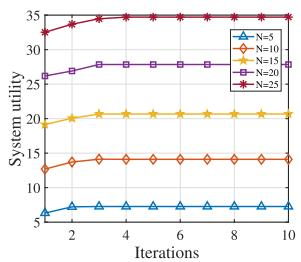

line

| Iterations | N=5 | N=10 | N=15 | N=20 | N=25 |
|---|---|---|---|---|---|
| 1 | 6.0 | 13.0 | 19.0 | 27.0 | 33.0 |
| 2 | 7.0 | 14.0 | 20.0 | 28.0 | 34.0 |
| 4 | 7.5 | 14.5 | 20.5 | 28.5 | 34.5 |
| 6 | 7.5 | 14.5 | 20.5 | 28.5 | 34.5 |
| 8 | 7.5 | 14.5 | 20.5 | 28.5 | 34.5 |
| 10 | 7.5 | 14.5 | 20.5 | 28.5 | 34.5 |

(a)

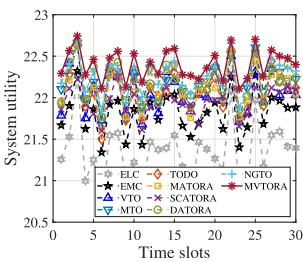

line

| Time slots | ELC  | TODO | NGTO | EMC  | MATORA | MVTORA | VTO  | SCATORA | MTO  | DATORA |
| ---------- | ---- | ---- | ---- | ---- | ------ | ------ | ---- | ------- | ---- | ------ |
| 0          | 21.5 | 21.5 | 21.5 | 21.5 | 21.5   | 21.5   | 21.5 | 21.5    | 21.5 | 21.5   |
| 5          | 21.8 | 21.8 | 21.8 | 21.8 | 21.8   | 21.8   | 21.8 | 21.8    | 21.8 | 21.8   |
| 10         | 22.0 | 22.0 | 22.0 | 22.0 | 22.0   | 22.0   | 22.0 | 22.0    | 22.0 | 22.0   |
| 15         | 22.2 | 22.2 | 22.2 | 22.2 | 22.2   | 22.2   | 22.2 | 22.2    | 22.2 | 22.2   |
| 20         | 22.4 | 22.4 | 22.4 | 22.4 | 22.4   | 22.4   | 22.4 | 22.4    | 22.4 | 22.4   |
| 25         | 22.6 | 22.6 | 22.6 | 22.6 | 22.6   | 22.6   | 22.6 | 22.6    | 22.6 | 22.6   |
| 30         | 22.8 | 22.8 | 22.8 | 22.8 | 22.8   | 22.8   | 22.8 | 22.8    | 22.8 | 22.8   |

(b)   
Fig. 2. Convergence and performance. (a) Convergence of the MVTORA approach. (b) System utility with respect to time slots.

Fig. 2(b) compares the system utility among the abovementioned nine comparison approaches and the proposed MV-TORA. Note that in each time slot, real-time decisions of task offloading and resource allocation are determined by running the proposed MVTORA iteratively. Specifically, at the beginning of each time slot, the essential information exchange is performed and MVTORA is executed to make real-time decisions. MV-TORA updates the offloading decisions of C-UAVs iteratively until the offloading decisions of all C-UAVs no longer change, i.e., a Nash equilibrium state is reached. Then, the C-UAVs perform their computation tasks based on the obtained offloading decisions.

Moreover, it can be also observed from Fig. 2(b) that the system utility exhibits irregular fluctuations over time slots, and this is mainly due to the time-varying nature of the system. Furthermore, the proposed MVTORA maintains superior system utility compared to other approaches as time elapse, and this can be attributed to several reasons as follows. First, compared to ELC, EMC, VTO, MTO, MATORA and SCATORA, the proposed MVTORA leverages the aerial-terrestrial edge capabilities of both MEC and VFC, which can perform the computation tasks of C-UAVs more effectively. Second, MVTORA employs a game theoretic algorithm for task offloading decision, a convex optimization-based algorithm for MEC resource allocation, and an evolutionary computation-based hybrid algorithm for VFC resource allocation in comparison to TODO, NGTO and DA-TORA, which allows for more efficient utilization of the limited resources of MEC and VFC. Accordingly, it can be concluded that the proposed MVTORA achieves optimal system utility compared to other approaches throughout the entire system duration.

2) Impact of Parameters: Impact of Edge Computation Resources: Figs. 3(a) to (e) shows the impact of computation resources of E-UAV on several system performance in term of time-average system utility, average task completion delay, total energy consumption of C-UAVs, energy efficiency, and algorithm execution time obtained by different approaches.

It can be observed from Fig. 3(a) that ELC and VTO maintain nearly constant performance in terms of time-average system utility regardless of variations in the computation resources of E-UAV. This is mainly because ELC and VTO do not utilize the computation resources of E-UAV as explained in Section V-A. Moreover, with the increasing of computation resources, the time-average system utility of EMC, MTO, TODO, MATORA, SCATORA, NGTO, DATORA and MVTORA exhibit an upward trend. The reason is that as the computation resources of E-UAV increase, more tasks are offloaded to E-UAV processing and more resources can be allocated to processing tasks. Furthermore, the proposed MVTORA maintains optimal time-average system utility as the computation resources of E-UAV increase. This demonstrates that the proposed approach can effectively utilize the computation resources of E-UAV. In addition, we can see from Fig. 3(b) that the proposed MVTORA outperforms other approaches in terms of average task completion delay.

Fig. 3(c) reveals the sub-optimization objective with respect to energy consumption. First, EMC exhibits optimal performance in terms of total energy consumption, since it offloads all tasks to the E-UAV for processing where the total energy consumption is induced by the energy consumption of task transmission. However, EMC causes E-UAV overload, resulting in higher task completion delays. Moreover, as computing resources increase, MTO and TODO slightly outperform the proposed MVTORA, and the reason is that we assign a smaller weight to energy consumption. In addition, the proposed approach also greatly reduces energy consumption compared to ELC.

Fig. 3(d) illustrates the energy usage efficiency of different approaches. Similar to [75], the energy efficiency is defined as the ratio of total computation bits of tasks to total energy consumption of Cies-UAVs during the considered system time. As can be seen, the proposed MVTORA has better energy efficiency compared to other approaches.

Fig. 3(d) presents the real execution time of different approaches. It can be seen from the figure that the real execution time of all approaches shows an approximately stable trend for varying computation resources, since the computation resources of E-UAV are decoupled from the optimization variables, which does not affect the computational complexity of these approaches. Moreover, the proposed approach maintains low execution time, and this is primarily attributed to our lowcomplexity algorithm design as analyzed in Theorem 5.

Accordingly, the results of Fig. 3 demonstrate that the proposed MVTORA is able to achieve sustainable computation resource utilization and overall superior performance with varying edge computation resources.

Impact of Task Computing Density: It can be seen from Figs. 4(a) and (b) that the time-average system utility of all approaches show an increasing trend, while their average task completion delay shows the opposite trend. This is because the workloads of C-UAVs or E-UAV or vehicle fog nodes become heavier with the increasing of task computing density, leading to the increased delay of task completion, and the increased energy consumption of local computing. Furthermore, with the growing task computing density, the proposed MVTORA outperforms other approaches in terms of time-average system utility and average task completion delay. This demonstrates the effectiveness of the proposed approach in performing compute-intensive tasks.

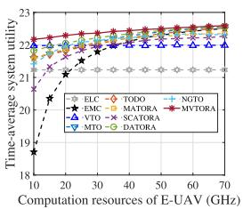

line

| Computation resources of E-UAV (GHz) | ELC | TODO | NGTO | EMC | MATORA | MVTOR | VTO | SCATORA | MTO | DATORA |
|---|---|---|---|---|---|---|---|---|---|---|
| 10 | 21.5 | 21.8 | 21.7 | 20.5 | 21.6 | 21.9 | 21.4 | 21.3 | 21.6 | 21.7 |
| 20 | 21.6 | 21.9 | 21.8 | 20.8 | 21.7 | 22.0 | 21.5 | 21.4 | 21.7 | 21.8 |
| 30 | 21.7 | 22.0 | 21.9 | 21.0 | 21.8 | 22.1 | 21.6 | 21.5 | 21.8 | 21.9 |
| 40 | 21.8 | 22.1 | 22.0 | 21.1 | 21.9 | 22.2 | 21.7 | 21.6 | 21.9 | 22.0 |
| 50 | 21.9 | 22.2 | 22.1 | 21.2 | 22.0 | 22.3 | 21.8 | 21.7 | 22.0 | 22.1 |
| 60 | 22.0 | 22.3 | 22.2 | 21.3 | 22.1 | 22.4 | 21.9 | 21.8 | 22.1 | 22.2 |
| 70 | 22.1 | 22.4 | 22.3 | 21.4 | 22.2 | 22.5 | 22.0 | 21.9 | 22.2 | 22.3 |

(a)

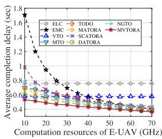

line

| Computation resources of E-UAV (GHz) | Average completion delay (sec) |
|---|---|
| 10 | 1.8 |
| 20 | 0.6 |
| 30 | 0.5 |
| 40 | 0.45 |
| 50 | 0.4 |
| 60 | 0.35 |
| 70 | 0.3 |

(b)

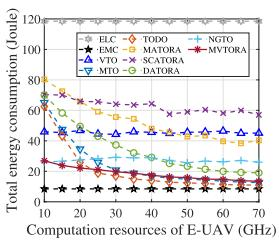

line

| Computation resources of E-UAV (GHz) | ELC | TODO | NGTO | EMC | MATORA | MVTORA | VTO | SCATORA | MTO | DATORA |
|---|---|---|---|---|---|---|---|---|---|---|
| 10 | 80 | 85 | 60 | 20 | 80 | 40 | 50 | 70 | 40 | 30 |
| 20 | 75 | 80 | 55 | 18 | 75 | 35 | 45 | 65 | 35 | 25 |
| 30 | 70 | 75 | 50 | 16 | 70 | 30 | 40 | 60 | 30 | 20 |
| 40 | 65 | 70 | 45 | 14 | 65 | 25 | 35 | 55 | 25 | 15 |
| 50 | 60 | 65 | 40 | 12 | 60 | 20 | 30 | 50 | 20 | 10 |
| 60 | 55 | 60 | 35 | 10 | 55 | 15 | 25 | 45 | 15 | 5 |
| 70 | 50 | 55 | 30 | 8 | 50 | 10 | 20 | 40 | 10 | 2 |

（c）

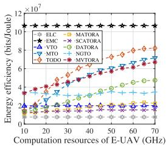

line

| Computation resources of E-UAV (GHz) | ELC | MATORA | EMC | SCATORA | VTO | DATORA | MTO | NGTO | TODO |
|---|---|---|---|---|---|---|---|---|---|
| 10 | 10.0e7 | 4.0e7 | 2.0e7 | 3.0e7 | 2.0e7 | 3.0e7 | 1.0e7 | 1.0e7 | 4.0e7 |
| 20 | 10.0e7 | 5.0e7 | 2.0e7 | 4.0e7 | 2.0e7 | 4.0e7 | 1.0e7 | 1.0e7 | 5.0e7 |
| 30 | 10.0e7 | 6.0e7 | 2.0e7 | 5.0e7 | 2.0e7 | 5.0e7 | 1.0e7 | 1.0e7 | 6.0e7 |
| 40 | 10.0e7 | 7.0e7 | 2.0e7 | 6.0e7 | 2.0e7 | 6.0e7 | 1.0e7 | 1.0e7 | 7.0e7 |
| 50 | 10.0e7 | 8.0e7 | 2.0e7 | 7.0e7 | 2.0e7 | 7.0e7 | 1.0e7 | 1.0e7 | 8.0e7 |
| 60 | 10.0e7 | 9.0e7 | 2.0e7 | 8.0e7 | 2.0e7 | 8.0e7 | 1.0e7 | 1.0e7 | 9.0e7 |
| 70 | 10.0e7 | 10.0e7 | 2.0e7 | 9.0e7 | 2.0e7 | 9.0e7 | 1.0e7 | 1.0e7 | 10.0e7 |

(d)

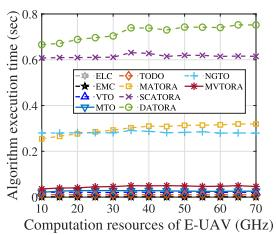  
(e）  
Fig. 3. System performance with respect to different computation resources of E-UAV. (a) Time-average system utility. (b) Average task completion delay. (c) Total energy consumption of C-UAVs. (d) Energy efficiency. (e) Algorithm execution time.

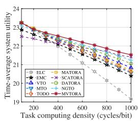

line

| Task computing density (cycles/bit) | ELC   | MOTA  | EMC   | SCATORA | VTO   | DATORA | MTO   | NGTO  | TODO  |
| ----------------------------------- | ----- | ----- | ----- | ------- | ----- | ------ | ----- | ----- | ----- |
| 200                                 | 23.5  | 23.8  | 23.6  | 23.7    | 23.4  | 23.9   | 23.7  | 23.6  | 23.5  |
| 400                                 | 22.8  | 23.1  | 22.9  | 23.0    | 22.7  | 23.2   | 23.0  | 22.9  | 22.8  |
| 600                                 | 22.0  | 22.4  | 22.1  | 22.2    | 21.9  | 22.5   | 22.3  | 22.2  | 22.1  |
| 800                                 | 21.2  | 21.8  | 21.5  | 21.6    | 21.3  | 22.0   | 21.8  | 21.7  | 21.6  |
| 1000                                | 20.5  | 21.3  | 21.0  | 21.1    | 20.8  | 21.6   | 21.4  | 21.3  | 21.2  |

(a)

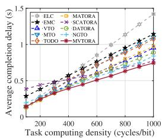

line

| Task computing density (cycles/bit) | ELC    | MATORA | EMC    | SCATORA | VTO    | DATORA | MTO    | NGTO   | TODO  |
| ------------------------------------ | ------ | ------ | ------ | ------- | ------ | ------ | ------ | ------ | ------ |
| 200                                  | 0.3    | 0.2    | 0.4    | 0.3     | 0.3    | 0.3    | 0.3    | 0.3    | 0.3    |
| 400                                  | 0.6    | 0.5    | 0.7    | 0.6     | 0.6    | 0.6    | 0.6    | 0.6    | 0.6    |
| 600                                  | 0.9    | 0.8    | 1.0    | 0.9     | 0.9    | 0.9    | 0.9    | 0.9    | 0.9    |
| 800                                  | 1.2    | 1.1    | 1.3    | 1.2     | 1.2    | 1.2    | 1.2    | 1.2    | 1.2    |
| 1000                                 | 1.5    | 1.4    | 1.6    | 1.5     | 1.5    | 1.5    | 1.5    | 1.5    | 1.5    |

(b)

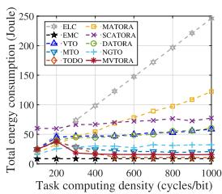

line

| Task computing density (cycles/bit) | ELC | MATORA | EMC | SCATORA | VTO | DATORA | MTO | NGTO | TODO | MVTORA |
|---|---|---|---|---|---|---|---|---|---|---|
| 200 | 50 | 30 | 10 | 40 | 30 | 50 | 20 | 10 | 10 | 10 |
| 400 | 70 | 60 | 10 | 80 | 35 | 60 | 25 | 15 | 15 | 15 |
| 600 | 90 | 90 | 10 | 120 | 40 | 70 | 30 | 20 | 20 | 20 |
| 800 | 120 | 120 | 10 | 160 | 45 | 80 | 35 | 25 | 25 | 25 |
| 1000 | 150 | 140 | 10 | 200 | 50 | 90 | 40 | 30 | 30 | 30 |

(c）

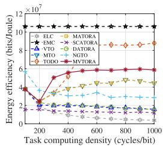

line

| Task computing density (cycles/bit) | ELC | MATORA | EMC | SCATORA | VTO | DATORA | MTO | NGTO | TODO | MVTORA |
|---|---|---|---|---|---|---|---|---|---|---|
| 200 | 1.5e7 | 4.0e7 | 2.0e7 | 2.0e7 | 2.0e7 | 2.0e7 | 2.0e7 | 2.0e7 | 2.0e7 | 4.0e7 |
| 400 | 1.5e7 | 6.0e7 | 2.0e7 | 2.0e7 | 2.0e7 | 2.0e7 | 2.0e7 | 2.0e7 | 2.0e7 | 6.0e7 |
| 600 | 1.5e7 | 8.0e7 | 2.0e7 | 2.0e7 | 2.0e7 | 2.0e7 | 2.0e7 | 2.0e7 | 2.0e7 | 8.0e7 |
| 800 | 1.5e7 | 1.0e7 | 2.0e7 | 2.0e7 | 2.0e7 | 2.0e7 | 2.0e7 | 2.0e7 | 2.0e7 | 1.0e7 |
| 1000 | 1.5e7 | 1.0e7 | 2.0e7 | 2.0e7 | 2.0e7 | 2.0e7 | 2.0e7 | 2.0e7 | 2.0e7 | 1.0e7 |

(d）

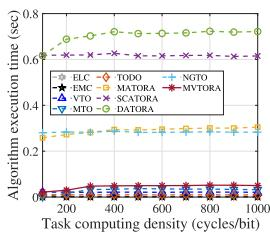

line

| Task computing density (cycles/bit) | ELC | TODO | NGTO | EMC | MATORA | MVTORA | VTO | SCATORA | MTO | DATORA |
|---|---|---|---|---|---|---|---|---|---|---|
| 200 | 0.65 | 0.35 | 0.35 | 0.35 | 0.35 | 0.35 | 0.35 | 0.65 | 0.35 | 0.75 |
| 400 | 0.65 | 0.35 | 0.35 | 0.35 | 0.35 | 0.35 | 0.35 | 0.65 | 0.35 | 0.75 |
| 600 | 0.65 | 0.35 | 0.35 | 0.35 | 0.35 | 0.35 | 0.35 | 0.65 | 0.35 | 0.75 |
| 800 | 0.65 | 0.35 | 0.35 | 0.35 | 0.35 | 0.35 | 0.35 | 0.65 | 0.35 | 0.75 |
| 1000 | 0.65 | 0.35 | 0.35 | 0.35 | 0.35 | 0.35 | 0.35 | 0.65 | 0.35 | 0.75 |

(e)   
Fig. 4. System performance with respect to different task computing densities of C-UAVs. (a) Time-average system utility. (b) Average task completion delay. (c) Total energy consumption of C-UAVs. (d) Energy efficiency. (e) Algorithm execution time.

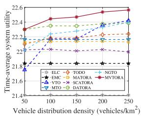

line

| Vehicle distribution density (vehicles/km²) | ELC | EMC | MTOA | VTO | SCATORA | MTO | DATORA |
|---|---|---|---|---|---|---|---|
| 50 | 21.8 | 21.8 | 22.0 | 22.0 | 22.0 | 22.4 | 22.4 |
| 100 | 21.8 | 21.8 | 22.0 | 22.0 | 22.0 | 22.4 | 22.4 |
| 150 | 21.8 | 21.8 | 22.0 | 22.0 | 22.0 | 22.4 | 22.4 |
| 200 | 21.8 | 21.8 | 22.0 | 22.0 | 22.0 | 22.4 | 22.4 |
| 250 | 21.8 | 21.8 | 22.0 | 22.0 | 22.0 | 22.4 | 22.4 |
Time-average system utility

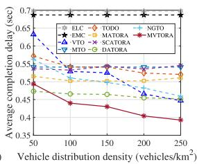

line

| Vehicle distribution density (vehicles/km²) | ELC | TODO | NGTO | EMC | MATORA | MVTORA | VTO | SCATORA | MTO-G |
|---|---|---|---|---|---|---|---|---|---|
| 50 | 0.65 | 0.58 | 0.52 | 0.70 | 0.55 | 0.49 | 0.53 | 0.55 | 0.53 |
| 100 | 0.60 | 0.55 | 0.50 | 0.70 | 0.53 | 0.46 | 0.51 | 0.53 | 0.52 |
| 150 | 0.58 | 0.53 | 0.48 | 0.70 | 0.51 | 0.44 | 0.49 | 0.52 | 0.51 |
| 200 | 0.56 | 0.51 | 0.46 | 0.70 | 0.49 | 0.42 | 0.47 | 0.51 | 0.50 |
| 250 | 0.54 | 0.49 | 0.44 | 0.70 | 0.47 | 0.39 | 0.45 | 0.50 | 0.49 |

(b)

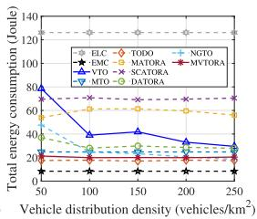

line

| Vehicle distribution density (vehicles/km²) | ELC | TODO | NGTO | EMC | MATORA | MTO | SCATORA | DATORA |
|--- | --- | --- | --- | --- | --- | --- | --- | --- |
| 50 | 120 | 80 | 60 | 40 | 70 | 20 | 20 | 20 |
| 100 | 120 | 60 | 60 | 30 | 60 | 20 | 20 | 20 |
| 150 | 120 | 60 | 60 | 30 | 60 | 20 | 20 | 20 |
| 200 | 120 | 60 | 60 | 30 | 60 | 20 | 20 | 20 |
| 250 | 120 | 60 | 60 | 30 | 60 | 20 | 20 | 20 |

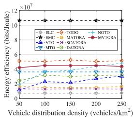

line

| Vehicle distribution density (vehicles/km²) | ELC | TODO | NGTO | EMC | MATORA | MVTORA | VTO | SCATORA | MTO | DATORA |
|--- | --- | --- | --- | --- | --- | --- | --- | --- | --- | --- |
| 50 | 1.2e7 | 5.0e7 | 4.0e7 | 1.0e7 | 1.0e7 | 1.0e7 | 1.0e7 | 1.0e7 | 1.0e7 | 1.0e7 |
| 100 | 1.5e7 | 5.0e7 | 4.0e7 | 1.0e7 | 1.0e7 | 1.0e7 | 1.0e7 | 1.0e7 | 1.0e7 | 1.0e7 |
| 150 | 1.8e7 | 5.0e7 | 4.0e7 | 1.0e7 | 1.0e7 | 1.0e7 | 1.0e7 | 1.0e7 | 1.0e7 | 1.0e7 |
| 200 | 2.0e7 | 5.0e7 | 4.0e7 | 1.0e7 | 1.0e7 | 1.0e7 | 1.0e7 | 1.0e7 | 1.0e7 | 1.0e7 |
| 250 | 2.2e7 | 5.0e7 | 4.0e7 | 1.0e7 | 1.0e7 | 1.0e7 | 1.0e7 | 1.0e7 | 1.0e7 | 1.0e7 |

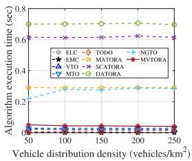

line

| Vehicle distribution density (vehicles/km²) | ELC | TODO | NGTO | EMC | MATORA | MVTOR | VTO | SCATORA | MTO | DATORA |
|--- | --- | --- | --- | --- | --- | --- | --- | --- | --- | --- |
| 50 | 0.25 | 0.35 | 0.28 | 0.25 | 0.35 | 0.28 | 0.25 | 0.65 | 0.75 | 0.75 |
| 100 | 0.25 | 0.35 | 0.28 | 0.25 | 0.35 | 0.28 | 0.25 | 0.65 | 0.75 | 0.75 |
| 150 | 0.25 | 0.35 | 0.28 | 0.25 | 0.35 | 0.28 | 0.25 | 0.65 | 0.75 | 0.75 |
| 200 | 0.25 | 0.35 | 0.28 | 0.25 | 0.35 | 0.28 | 0.25 | 0.65 | 0.75 | 0.75 |
| 250 | 0.25 | 0.35 | 0.28 | 0.25 | 0.35 | 0.28 | 0.25 | 0.65 | 0.75 | 0.75 |

Fig. 5. System performance with respect to different vehicle distribution densities. (a) Time-average system utility. (b) Average task completion delay. (c) Total energy consumption of C-UAVs. (d) Energy efficiency. (e) Algorithm execution time.

From Figs. 4(c) and (d), we can observe that the total energy consumption of MTO, TODO, MATORA and MVTORA show an initial upward and then downward trend, while their energy efficiency shows the opposite trend. The reason is that when the computing density of the task is small (less than 300 cycles/bit), the local computing can be regarded as a favorable choice for these approaches, which does not generate additional costs of transmission delay and energy consumption. As task computing density further increases, more tasks are offloaded for execution. In addition, it can be seen from 4(e) that the algorithm execution time for all approaches remains nearly constant regardless of the varying task computing density, since the task computing density does not affect the computational complexity of the algorithms.

The set of simulation results indicates that the proposed MVTORA is able to adapt to varying computing densities with overall superior performances, especially in the heavy workload scenario.

Impact of Vehicle Distribution Density: It can be seen from Figs. 5(a) and (b) that the time-average system utility and average task completion delay of ELC, EMC, MTO, MATORA and SCATORA remain almost constant with the increasing of vehicle distribution density, since these approaches do not exploit the computation resources of rescue vehicles. Moreover, the time-average system utility of VTO, TODO, DATORA, NGTO and MVTORA show an increasing trend with increasing vehicle distribution density, while their average task completion delay shows the opposite trend. This is because as vehicle density increases, more vehicle fog nodes can participate in task processing. In addition, the proposed MVTORA exhibits significantly superior performance compared to the other approaches in terms of the time-average system utility and average task completion delay, which indicates that the proposed approach can effectively utilize the idle computation resources of the rescue vehicles.

From Figs. 5(a) and (b), it can be observed that TODO, DATORA, NGTO and MVTORA show a stable trend for total energy consumption and energy efficiency because the number of vehicles that each C-UAV can connect to at the same time is limited. Furthermore, it can be seen from 5(e) that the algorithm execution time for all approaches remains nearly constant as vehicle distribution density increases.

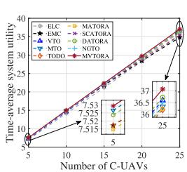

line

| Number of C-UAVs | ELC   | MATORA | EMC   | SCATORA | DATOR | VTO   | MTO   | NGO   | TODO  | MVTORA |
| ---------------- | ----- | ------ | ----- | ------- | ----- | ----- | ----- | ----- | ----- | ------ |
| 5                | 8.0   | 8.0    | 8.0   | 8.0     | 8.0   | 8.0   | 8.0   | 8.0   | 8.0   | 8.0    |
| 10               | 16.0  | 16.0   | 16.0  | 16.0    | 16.0  | 16.0  | 16.0  | 16.0  | 16.0  | 16.0   |
| 15               | 24.0  | 24.0   | 24.0  | 24.0    | 24.0  | 24.0  | 24.0  | 24.0  | 24.0  | 24.0   |
| 20               | 32.0  | 32.0   | 32.0  | 32.0    | 32.0  | 32.0  | 32.0  | 32.0  | 32.0  | 32.0   |
| 25               | 40.0  | 40.0   | 40.0  | 40.0    | 40.0  | 40.0  | 40.0  | 40.0  | 40.0  | 40.0   |

(a)

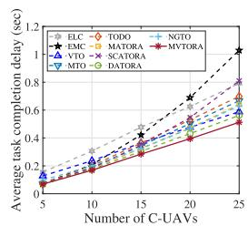

line

| Number of C-UAVs | ELC   | TODO  | NGTO  | EMC   | MATORA | MVTOR | VTO   | SCATORA | MTO   | DATORA |
| ---------------- | ----- | ----- | ----- | ----- | ------ | ----- | ----- | ------- | ----- | ------ |
| 5                | 0.1   | 0.1   | 0.1   | 0.1   | 0.1    | 0.1   | 0.1   | 0.1     | 0.1   | 0.1    |
| 10               | 0.3   | 0.2   | 0.2   | 0.3   | 0.2    | 0.2   | 0.2   | 0.2     | 0.2   | 0.2    |
| 15               | 0.5   | 0.4   | 0.4   | 0.6   | 0.4    | 0.4   | 0.4   | 0.4     | 0.4   | 0.4    |
| 20               | 0.7   | 0.6   | 0.6   | 0.8   | 0.6    | 0.6   | 0.6   | 0.6     | 0.6   | 0.6    |
| 25               | 1.0   | 0.8   | 0.8   | 1.0   | 0.8    | 0.8   | 0.8   | 0.8     | 0.8   | 0.8    |

(b)

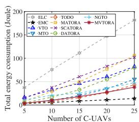

line

| Number of C-UAVs | ELC | TODO | NGTO | EMC | MATORA | MVTORA | VTO | SCATORA | MTO | DATORA |
|---|---|---|---|---|---|---|---|---|---|---|
| 5 | 40 | 10 | 10 | 5 | 10 | 5 | 10 | 10 | 5 | 10 |
| 10 | 80 | 20 | 20 | 10 | 20 | 10 | 20 | 20 | 10 | 20 |
| 15 | 120 | 30 | 30 | 15 | 30 | 15 | 30 | 30 | 15 | 30 |
| 20 | 160 | 40 | 40 | 20 | 40 | 20 | 40 | 40 | 20 | 40 |
| 25 | 200 | 50 | 50 | 25 | 50 | 25 | 50 | 50 | 25 | 50 |

(c)

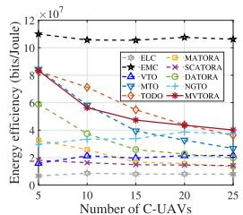

line

| Number of C-UAVs | ELC | MTORA | EMC | VTO | DATORA | MTO | NGTO | TODO | MYTORA |
|---|---|---|---|---|---|---|---|---|---|
| 5 | 1000000 | 8000000 | 11000000 | 6000000 | 4000000 | 2000000 | 3000000 | 1000000 | 8000000 |
| 15 | 1000000 | 6000000 | 11000000 | 4000000 | 2500000 | 1500000 | 2500000 | 750000 | 6500000 |
| 25 | 1000000 | 4500000 | 11000000 | 2500000 | 2500000 | 1500000 | 2500000 | 450000 | 4500000 |

(d)

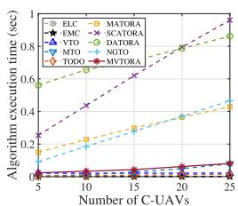

line

| Number of C-UAVs | ELC | MATORA | EMC | SCATORA | VTO | DATORA | MTO | NTGO | TODO | MVTORA |
|---|---|---|---|---|---|---|---|---|---|---|
| 5 | 0.1 | 0.2 | 0.05 | 0.3 | 0.6 | 0.7 | 0.05 | 0.05 | 0.05 | 0.05 |
| 10 | 0.15 | 0.25 | 0.05 | 0.45 | 0.65 | 0.8 | 0.05 | 0.05 | 0.05 | 0.05 |
| 15 | 0.2 | 0.3 | 0.05 | 0.6 | 0.75 | 0.9 | 0.05 | 0.05 | 0.05 | 0.05 |
| 20 | 0.25 | 0.35 | 0.05 | 0.75 | 0.85 | 1.0 | 0.05 | 0.05 | 0.05 | 0.05 |
| 25 | 0.3 | 0.45 | 0.05 | 0.9 | 1.0 | 1.1 | 0.05 | 0.05 | 0.05 | 0.05 |

(e)   
Fig. 6. System performance with respect to different numbers of C-UAVs. (a) Time-average system utility. (b) Average task completion delay. (c) Total energy consumption of C-UAVs. (d) Energy efficiency. (e) Algorithm execution time.

This set of simulation results illustrates that the proposed method is also applicable to scenarios with different vehicle densities.

Impact of Numbers of C-UAVs: It can be observed from Figs. 6(a)–(c) that the time-average system utility, average task completion delay, and total energy consumption of all approaches show an upward trend as the number of C-UAVs increases, since more computation tasks need to be processed. Moreover, VTO, DATORA, NGTO and MVTORA outperform the other approaches in terms of average task completion delay as the number of C-UAVs grows, which further illustrates the importance of incorporating VFC. In addition, it can be seen that the proposed MVTORA maintains optimal time-average system utility and average task completion delay as the number of C-UAVs increases, which indicates that the proposed approach is also applicable to high-density scenarios.

From Fig. 6(d), we can see that ELC, EMC, VTO exhibit a stable trend with varying numbers of C-UAVs. This is because the increasing number of C-UAVs does not affect the corresponding task offloading ratio. Moreover, the proposed approach has relatively superior performance in terms of energy efficiency compared to the other approaches.

It can be seen from Fig. 6(e) that the real execution time of most approaches increases with the rising number of C-UAVs, since the dimensions of the solution space are expanded with the increasing number of C-UAVs. Moreover, ELC, EMC, VTO, MTO and TODO exhibit lower execution times compared to the proposed MVTORA, since these benchmark approaches adopt simpler optimization strategies with lower computational complexity. In addition, the real execution time of MVTORA increases approximately linearly as the number of C-UAVs grows, which is consistent with theoretical analysis.

The set of simulation results indicates the better scalability of the proposed MVTORA with an increasing number of C-UAVs.

Analysis of Benefits and Drawbacks: The proposed approach considers multiple optimization aspects, and it can achieve optimal time-average system utility as well as average task completion delay under the lower algorithm complexity and execution time. In other words, the proposed approach is able to efficiently process the disaster rescue data, which is very suitable and important for time sensitive scenarios such as disaster recuse.

The proposed strategy also has some room for improvements, i.e., the proposed approach is based on a three-layer structure, which may bring additional hardware overhead. However, with the development of edge computing, hardware costs are expected to gradually decrease, which does not hinder the feasibility of the proposed approach. Moreover, the corresponding energy consumption of the proposed approach is not optimal compared to some benchmark methods like EMO and TODO. However, this is because that we assign a smaller weight to energy consumption and larger weight to latency in the optimization objectives, which is more reasonable for the considered disaster rescue scenario. Note that the proposed approach can be applied to more scenarios by reasonably adjusting the weights of the optimization objectives. Accordingly, the proposed approach achieves the overall best performances for the considered disaster rescue scenario compared to several other approaches.

# VI. DISCUSSION

In this section, we discuss the generalizability of our method with regard to specific vehicle distribution and mobility models, as well as the rationale behind the selected offloading strategy.

# A. Impact of Vehicle Distribution and Mobility

To explore the generalizability of our approach, we verify the effectiveness of our proposed approach for different vehicle distributions and mobility models. Specifically, we consider the following three cases: i) random distribution and random walk model (RD-RWM) [76], ii) mobile traffic model (MTM) [23], and iii) Poisson cluster process and Markovian way point model (PCP-MWPM) [77], and the corresponding simulation results are shown in Fig. 1 of Appendix G in the supplemental material. The simulation results illustrate that our proposed approach is also applicable to other vehicle distribution and mobility models.

# B. Comparison With Mixed Task Offloading Scheme

To demonstrate the rationality of the offloading decision for our proposed approach, we compare the proposed task offloading scheme with the mixed task offloading scheme of local computing, MEC, and VFC. Specifically, in Appendix H of the supplementary martial, we first analyze the limitations of the mixed offloading scheme. Then, we compare the performance of our method and the mixed task offloading scheme in terms of time-average system utility, average task completion delay, total energy consumption, and average algorithm running time. The analysis and simulation results demonstrate that our proposed approach is more suitable for the considered post-disaster rescue scenarios.

# VII. CONCLUSION

In this paper, we study the task offloading and resource allocation in UAV networks for post-disaster rescue. First, by integrating the aerial and terrestrial computing capabilities, we propose an MEC-VFC-assisted three-layer computing architecture for post-disaster rescue, which consists of a vehicular fog layer, a UAV edge layer, and a UAV client layer. Furthermore, the JTRAOP is formulated to maximize the time-average utility of the system by jointly optimizing task offloading and computing resource allocation. Since the problem is NP-hard, we develop an MVTORA approach with low complexity to separate the initial problem into the components of task offloading and resource allocation, which are solved by proposing a game theory-based algorithm for task offloading decision, a convex optimization-based algorithm for MEC resource allocation, and an evolutionary computation-based hybrid algorithm for VFC resource allocation. Simulation results demonstrate the superiority of the proposed MVTORA approach in terms of time-average system utility, average task completion delay, and total energy consumption. In the future, our work will be extended to include UAV trajectory optimization.

# REFERENCES

[1] G. Sun, L. He, Z. Sun, J. Zhang, and J. Li, “Task offloading for post-disaster rescue in vehicular fog computing-assisted UAV networks,” in Proc. IEEE 18th Int. Conf. Mobility Sens. Netw., 2022, pp. 105–112.   
[2] M. Yan, Y. He, M. Shahidehpour, X. Ai, Z. Li, and J. Wen, “Coordinated regional-district operation of integrated energy systems for resilience enhancement in natural disasters,” IEEE Trans. Smart Grid, vol. 10, no. 5, pp. 4881–4892, Sep. 2019.   
[3] H. Shakhatreh, A. Khreishah, and B. Ji, “UAVs to the rescue: Prolonging the lifetime of wireless devices under disaster situations,” IEEE Trans. Green Commun. Netw., vol. 3, no. 4, pp. 942–954, Dec. 2019.   
[4] H. Guo, J. Li, J. Liu, N. Tian, and N. Kato, “A survey on space-air-groundsea integrated network security in 6G,” IEEE Commun. Surv. Tut., vol. 24, no. 1, pp. 53–87, Firstquarter 2022.   
[5] H. Guo, X. Zhou, J. Wang, J. Liu, and A. Benslimane, “Intelligent task offloading and resource allocation in digital twin based aerial computing networks,” IEEE J. Sel. Areas Commun., vol. 41, no. 10, pp. 3095–3110, Oct. 2023.   
[6] S. Hayat, E. Yanmaz, and R. Muzaffar, “Survey on unmanned aerial vehicle networks for civil applications: A communications viewpoint,” IEEE Commun. Surveys Tut., vol. 18, no. 4, pp. 2624–2661, Fourthquarter 2016.   
[7] F. Nex and F. Remondino, “UAV for 3D mapping applications: A review,” Appl. Geomatics, vol. 6, pp. 1–15, 2014.   
[8] T. Bai, J. Wang, Y. Ren, and L. Hanzo, “Energy-efficient computation offloading for secure UAV-edge-computing systems,” IEEE Trans. Veh. Technol., vol. 68, no. 6, pp. 6074–6087, Jun. 2019.   
[9] W. Xu et al., “Reward maximization for disaster zone monitoring with heterogeneous UAVs,” IEEE/ACM Trans. Netw., early access, doi: 10.1109/TNET.2023.3300174.   
[10] J. Dong, K. Ota, and M. Dong, “UAV-based real-time survivor detection system in post-disaster search and rescue operations,” IEEE J. Miniaturization Air Space Syst., vol. 2, no. 4, pp. 209–219, Dec. 2021.

[11] J. Du et al., “Resource pricing and allocation in MEC enabled blockchain systems: An A3C deep reinforcement learning approach,” IEEE Trans. Netw. Sci. Eng., vol. 9, no. 1, pp. 33–44, Jan./Feb. 2022.   
[12] F. Lyu et al., “LEAD: Large-scale edge cache deployment based on spatiotemporal WiFi traffic statistics,” IEEE Trans. Mobile Comput., vol. 20, no. 8, pp. 2607–2623, Aug. 2021.   
[13] Y. Qu et al., “CoTask: Correlation-aware task offloading in edge computing,” World Wide Web, vol. 25, no. 5, pp. 2185–2213, 2022.   
[14] Y. Mao, C. You, J. Zhang, K. Huang, and K. B. Letaief, “A survey on mobile edge computing: The communication perspective,” IEEE Commun. Surveys Tut., vol. 19, no. 4, pp. 2322–2358, Fourthquarter 2017.   
[15] Q. Guo et al., “Minimizing the longest tour time among a fleet of UAVs for disaster area surveillance,” IEEE Trans. Mobile Comput., vol. 21, no. 7, pp. 2451–2465, Jul. 2022.   
[16] Y. Liang et al., “Nonredundant information collection in rescue applications via an energy-constrained UAV,” IEEE Trans. Veh. Technol., vol. 6, no. 2, pp. 2945–2958, Apr. 2019.   
[17] D. Oh and J. Han, “Smart search system of autonomous flight UAVs for disaster rescue,” Sensors, vol. 21, no. 20, 2021, Art. no. 6810.   
[18] J. Zheng, M. Ding, L. Sun, and H. Liu, “Distributed stochastic algorithm based on enhanced genetic algorithm for path planning of multi-UAV cooperative area search,” IEEE Trans. Intell. Transp. Syst., vol. 24, no. 8, pp. 8290–8303, Aug. 2023.   
[19] X. Zhou, S. Ge, P. Liu, and T. Qiu, “DAG-based dependent tasks offloading in MEC-enabled IoT with soft cooperation,” IEEE Trans. Mobile Comput., early access, doi: 10.1109/TMC.2023.3328333.   
[20] X. Dai, Z. Xiao, H. Jiang, and J. C. Lui, “UAV-assisted task offloading in vehicular edge computing networks,” IEEE Trans. Mobile Comput., early access, doi: 10.1109/TMC.2023.3259394.   
[21] H. Guo, X. Zhou, Y. Wang, and J. Liu, “Achieve load balancing in multi-UAV edge computing IoT networks: A dynamic entry and exit mechanism,” IEEE Internet Things J., vol. 9, no. 19, pp. 18725–18736, Oct. 2022.   
[22] Z. Bai, Y. Lin, Y. Cao, and W. Wang, “Delay-aware cooperative task offloading for multi-UAV enabled edge-cloud computing,” IEEE Trans. Mobile Comput., vol. 23, no. 2, pp. 1034–1049, Feb. 2024, doi: 10.1109/TMC.2022.3232375.   
[23] Y. Wang et al., “Task offloading for post-disaster rescue in unmanned aerial vehicles networks,” IEEE/ACM Trans. Netw., vol. 30, no. 4, pp. 1525–1539, Aug. 2022.   
[24] Z. Wei, B. Li, R. Zhang, X. Cheng, and L. Yang, “Many-to-many task offloading in vehicular fog computing: A multi-agent deep reinforcement learning approach,” IEEE Trans. Mobile Comput., early access , doi: 10.1109/TMC.2023.3250495.   
[25] T. Liu, L. Fang, Y. Zhu, W. Tong, and Y. Yang, “A near-optimal approach for online task offloading and resource allocation in edge-cloud orchestrated computing,” IEEE Trans. Mobile Comput., vol. 21, no. 8, pp. 2687–2700, Aug. 2022.   
[26] L. Wang, K. Wang, C. Pan, W. Xu, N. Aslam, and A. Nallanathan, “Deep reinforcement learning based dynamic trajectory control for UAV-assisted mobile edge computing,” IEEE Trans. Mobile Comput., vol. 21, no. 10, pp. 3536–3550, Oct. 2022.   
[27] H. Guo, Y. Wang, J. Liu, and C. Liu, “Multi-UAV cooperative task offloading and resource allocation in 5G advanced and beyond,” IEEE Trans. Wire. Commun., vol. 23, no. 1, pp. 347–359, Jan. 2024, doi: 10.1109/TWC.2023.3277801.   
[28] P. A. Apostolopoulos, G. Fragkos, E. E. Tsiropoulou, and S. Papavassiliou, “Data offloading in UAV-assisted multi-access edge computing systems under resource uncertainty,” IEEE Trans. Mobile Comput., vol. 22, no. 1, pp. 175–190, Jan. 2023.   
[29] U. Saleem, Y. Liu, S. Jangsher, Y. Li, and T. Jiang, “Mobility-aware joint task scheduling and resource allocation for cooperative mobile edge computing,” IEEE Trans. Wireless Commun., vol. 20, no. 1, pp. 360–374, Jan. 2021.   
[30] L. Tan, Z. Kuang, L. Zhao, and A. Liu, “Energy-efficient joint task offloading and resource allocation in OFDMA-based collaborative edge computing,” IEEE Trans. Wireless Commun., vol. 21, no. 3, pp. 1960–1972, Mar. 2022.   
[31] A. M. Seid, G. O. Boateng, B. Mareri, G. Sun, and W. Jiang, “Multi-agent DRL for task offloading and resource allocation in multi-UAV enabled IoT edge network,” IEEE Trans. Netw. Service Manag., vol. 18, no. 4, pp. 4531–4547, Dec. 2021.   
[32] Y. Liu, Y. Mao, Z. Liu, and Y. Yang, “Deep learning-assisted online task offloading for latency minimization in heterogeneous mobile edge,” IEEE Trans. Mobile Comput., early access, doi: 10.1109/TMC.2023.3285882.

[33] F. Wang, D. Jiang, Z. Wang, and S. Mumtaz, “Service continuity based data delivery optimization in satellite-terrestrial networks,” IEEE Trans. Veh. Technol., vol. 72, no. 10, pp. 13604–13617, Oct. 2023.   
[34] B. Liang and Z. J. Haas, “Predictive distance-based mobility management for PCS networks,” in Proc. IEEE INFOCOM, 1999, pp. 1377–1384.   
[35] S. Zhang and J. Liu, “Analysis and optimization of multiple unmanned aerial vehicle-assisted communications in post-disaster areas,” IEEE Trans. Veh. Technol., vol. 67, no. 12, pp. 12049–12060, Dec. 2018.   
[36] A. Al-Hourani, K. Sithamparanathan, and A. Jamalipour, “Stochastic geometry study on device-to-device communication as a disaster relief solution,” IEEE Trans. Veh. Technol., vol. 65, no. 5, pp. 3005–3017, May 2016.   
[37] Y. Mao, J. Zhang, and K. B. Letaief, “Dynamic computation offloading for mobile-edge computing with energy harvesting devices,” IEEE J. Sel. Areas Commun., vol. 34, no. 12, pp. 3590–3605, Dec. 2016.   
[38] X. Chen et al., “Information freshness-aware task offloading in air-ground integrated edge computing systems,” IEEE J. Sel. Areas Commun., vol. 40, no. 1, pp. 243–258, Jan. 2022.   
[39] S. Duan et al., “MOTO: Mobility-aware online task offloading with adaptive load balancing in small-cell mec,” IEEE Trans. Mobile Comput., vol. 23, no. 1, pp. 645–659, Jan. 2024.   
[40] Y. Chen, J. Zhao, Y. Wu, J. Huang, and X. S. Shen, “QoE-aware decentralized task offloading and resource allocation for end-edge-cloud systems: A game-theoretical approach,” IEEE Trans. Mobile Comput., vol. 23, no. 1, pp. 769–784, Jan. 2024.   
[41] H. He, S. Zhang, Y. Zeng, and R. Zhang, “Joint altitude and beamwidth optimization for UAV-enabled multiuser communications,” Proc. IEEE Commun. Lett., vol. 22, no. 2, pp. 344–347, Feb. 2018.   
[42] Z. Yang, C. Pan, K. Wang, and M. Shikh-Bahaei, “Energy efficient resource allocation in UAV-enabled mobile edge computing networks,” IEEE Trans. Wireless Commun., vol. 18, no. 9, pp. 4576–4589, Sep. 2019.   
[43] J. Lyu and R. Zhang, “Network-connected UAV: 3-D system modeling and coverage performance analysis,” IEEE Internet Things J., vol. 6, no. 4, pp. 7048–7060, Aug. 2019.   
[44] L. Zhang et al., “Task offloading and trajectory control for UAV-assisted mobile edge computing using deep reinforcement learning,” IEEE Access, vol. 9, pp. 53708–53719, 2021.   
[45] Y. Zeng, Q. Wu, and R. Zhang, “Accessing from the sky: A tutorial on UAV communications for 5G and beyond,” Proc. IEEE, vol. 107, no. 12, pp. 2327–2375, Dec. 2019.   
[46] Y. Zeng, J. Xu, and R. Zhang, “Energy minimization for wireless communication with rotary-wing UAV,” IEEE Trans. Wireless Commun., vol. 18, no. 4, pp. 2329–2345, Apr. 2019.   
[47] A. Al-Hourani, K. Sithamparanathan, and S. Lardner, “Optimal LAP altitude for maximum coverage,” IEEE Wireless Commun. Lett., vol. 3, no. 6, pp. 569–572, Dec. 2014.   
[48] Z. Yang, S. Bi, and Y. A. Zhang, “Online trajectory and resource optimization for stochastic UAV-enabled MEC systems,” IEEE Trans. Wireless Commun., vol. 21, no. 7, pp. 5629–5643, Jul. 2022.   
[49] X. Zhang, J. Zhang, J. Xiong, L. Zhou, and J. Wei, “Energy-efficient multi-UAV-enabled multiaccess edge computing incorporating NOMA,” IEEE Internet Things J., vol. 7, no. 6, pp. 5613–5627, Jun. 2020.   
[50] Y. Wang, M. Sheng, X. Wang, L. Wang, and J. Li, “Mobile-edge computing: Partial computation offloading using dynamic voltage scaling,” IEEE Trans. Commun., vol. 64, no. 10, pp. 4268–4282, Oct. 2016.   
[51] Y. Wang, Z. Su, Q. Xu, R. Li, T. H. Luan, and P. Wang, “A secure and intelligent data sharing scheme for UAV-assisted disaster rescue,” IEEE/ACM Trans. Netw., vol. 31, no. 6, pp. 2422–2438, Dec. 2023.   
[52] J. Liu and Q. Zhang, “Offloading schemes in mobile edge computing for ultra-reliable low latency communications,” IEEE Access, vol. 6, pp. 12825–12837, 2018.   
[53] S. Tong, Y. Liu, J. Miši´c, X. Chang, Z. Zhang, and C. Wang, “Joint task offloading and resource allocation for fog-based intelligent transportation systems: A UAV-enabled multi-hop collaboration paradigm,” IEEE Trans. Intell. Transp. Syst., vol. 24, no. 11, pp. 12933–12948, Nov. 2023.   
[54] J. Zhao, Q. Li, Y. Gong, and K. Zhang, “Computation offloading and resource allocation for cloud assisted mobile edge computing in vehicular networks,” IEEE Trans. Veh. Technol., vol. 68, no. 8, pp. 7944–7956, Aug. 2019.   
[55] J. Zhang, W. Xia, F. Yan, and L. Shen, “Joint computation offloading and resource allocation optimization in heterogeneous networks with mobile edge computing,” IEEE Access, vol. 6, pp. 19324–19337, 2018.   
[56] X. Hou, Y. Li, M. Chen, D. Wu, D. Jin, and S. Chen, “Vehicular fog computing: A viewpoint of vehicles as the infrastructures,” IEEE Trans. Veh. Technol., vol. 65, no. 6, pp. 3860–3873, Jun. 2016.

[57] K. Zhang, Y. Mao, S. Leng, S. Maharjan, and Y. Zhang, “Optimal delay constrained offloading for vehicular edge computing networks,” in Proc. IEEE Int. Conf. Commun., 2017, pp. 1–6.   
[58] S. Boyd, S. P. Boyd, and L. Vandenberghe, Convex Optimization. Cambridge, U.K.: Cambridge Univ. Press, 2004.   
[59] S. Guo, J. Liu, Y. Yang, B. Xiao, and Z. Li, “Energy-efficient dynamic computation offloading and cooperative task scheduling in mobile cloud computing,” IEEE Trans. Mobile Comput., vol. 18, no. 2, pp. 319–333, Feb. 2019.   
[60] P. Belotti, C. Kirches, S. Leyffer, J. Linderoth, J. Luedtke, and A. Mahajan, “Mixed-integer nonlinear optimization,” Acta Numerica, vol. 22, pp. 1–131, 2013.   
[61] G. Cui et al., “OL-EUA: Online user allocation for NOMA-based mobile edge computing,” IEEE Trans. Mobile Comput., vol. 22, no. 4, pp. 2295–2306, Apr. 2023.   
[62] D. Monderer and L. S. Shapley, “Potential games,” Games Econ. Behav., vol. 14, no. 1, pp. 124–143, 1996.   
[63] Q. D. Lã, Y. H. Chew, and B.-H. Soong, Potential Game Theory. Berlin, Germany:Springer, 2016.   
[64] Z. Michalewicz and M. Schoenauer, “Evolutionary algorithms for constrained parameter optimization problems,” Evol. Comput., vol. 4, no. 1, pp. 1–32, 1996.   
[65] Ö. Yeniay, “Penalty function methods for constrained optimization with genetic algorithms,” Math. Comput. Appl., vol. 10, no. 1, pp. 45–56, 2005.   
[66] X. Hou, Z. Ren, W. Cheng, C. Chen, and H. Zhang, “Fog based computation offloading for swarm of drones,” in Proc. IEEE Int. Conf. Commun., 2019, pp. 1–7.   
[67] H. Ackermann, H. Röglin, and B. Vöcking, “On the impact of combinatorial structure on congestion games,” J. ACM, vol. 55, no. 6, pp. 25:1–25:22, 2008.   
[68] A. Fabrikant, C. H. Papadimitriou, and K. Talwar, “The complexity of pure Nash equilibria,” in Proc. ACM Symp. Theory Comput., 2004, pp. 604–612.   
[69] T. Roughgarden, Selfish Routing and the Price of Anarchy. Cambridge, MA, USA: MIT Press, 2005.   
[70] Z. Sun, G. Sun, Y. Liu, J. Wang, and D. Cao, “BARGAIN-MATCH: A game theoretical approach for resource allocation and task offloading in vehicular edge computing networks,” IEEE Trans. Mobile Comput., vol. 23, no. 2, pp. 1655–1673, Feb. 2024, doi: 10.1109/TMC.2023.3239339.   
[71] H. Jiang, X. Dai, Z. Xiao, and A. Iyengar, “Joint task offloading and resource allocation for energy-constrained mobile edge computing,” IEEE Trans. Mobile Comput., vol. 22, no. 7, pp. 4000–4015, Jul. 2023.   
[72] Z. Yu, Y. Gong, S. Gong, and Y. Guo, “Joint task offloading and resource allocation in UAV-enabled mobile edge computing,” IEEE Internet Things J., vol. 7, no. 4, pp. 3147–3159, Apr. 2020.   
[73] Y. Wang et al., “A game-based computation offloading method in vehicular multiaccess edge computing networks,” IEEE Internet Things J., vol. 7, no. 6, pp. 4987–4996, Jun. 2020.   
[74] S. Mirjalili, “Dragonfly algorithm: A new meta-heuristic optimization technique for solving single-objective, discrete, and multi-objective problems,” Neural Comput. Appl., vol. 27, no. 4, pp. 1053–1073, 2016.   
[75] Y. He, X. Wu, Z. He, and M. Guizani, “Energy efficiency maximization of backscatter-assisted wireless-powered MEC with user cooperation,” IEEE Trans. Mobile Comput., vol. 23, no. 2, pp. 1878–1887, Feb. 2024, doi: 10.1109/TMC.2023.3243161.   
[76] K. Pearson, “The problem of the random walk,” Nature, vol. 72, no. 1865, pp. 294–294, 1905.   
[77] H. Tabassum, M. Salehi, and E. Hossain, “Fundamentals of mobility-aware performance characterization of cellular networks: A tutorial,” IEEE Commun. Surveys Tut., vol. 21, no. 3, pp. 2288–2308, thirdquarter 2019.

natural_image

Portrait photo of a man in formal attire against a blue background (no text or symbols visible)

and optimizations.

Geng Sun (Member, IEEE) received the BS degree in communication engineering from Dalian Polytechnic University, China, in 2011, and the PhD degree in computer science and technology from Jilin University, China, in 2018. He was a visiting researcher with the School of Electrical and Computer Engineering, Georgia Institute of Technology, USA. He is currently an associate professor with the College of Computer Science and Technology, Jilin University. His research interests include wireless networks, UAV communications, collaborative beamforming,

natural_image

Portrait photo of a man wearing a black sweater (no text or symbols visible)

Long He received the BS degree in computer science and technology from the Chengdu University of Technology, Sichuan, China, in 2019. He is currently working toward the PhD degree in computer science and technology with Jilin University, Changchun, China. His research interests include vehicular networks and edge computing.

natural_image

Portrait photo of a young man in a collared shirt (no text or symbols visible)

Jiahui Li (Student Member, IEEE) received the BS degree in software engineering and the MS degree in computer science and technology from Jilin University, Changchun, China, in 2018 and 2021, respectively. He is currently working toward the PhD degree in computer science with Jilin University. He is also a visiting PhD degree student with Singapore University of Technology and Design, Singapore. His research focuses on UAV networks, antenna arrays, and optimization.

natural_image

Portrait photo of a woman in formal attire (no text or symbols visible)

Zemin Sun (Member, IEEE) received the BS degree in software engineering, the MS and PhD degrees in computer science and technology from Jilin University, Changchun, China, in 2015, 2018, and 2022, respectively. Her research interests include vehicular networks, edge computing, and game theory.

natural_image

Portrait of a man wearing glasses and a dark jacket, with blurred background (no text or symbols visible)

Dusit Niyato (Fellow, IEEE) received the BEng degree from the King Mongkuts Institute of Technology Ladkrabang, Thailand, in 1999, and the PhD degree in electrical and computer engineering from the University of Manitoba, Canada, in 2008. He is currently a professor with the School of Computer Science and Engineering, Nanyang Technological University, Singapore. His research interests include the Internet of Things (IoT), machine learning, and incentive mechanism design.

natural_image

Portrait of a smiling man wearing glasses and a suit (no text or symbols visible)

Qingqing Wu (Senior Member, IEEE) received the BEng degree in electronic engineering from the South China University of Technology, China, in 2012, and the PhD degree in electronic engineering from Shanghai Jiao Tong University in 2016. From 2016 to 2020, he was a research fellow with the Department of Electrical and Computer Engineering, National University of Singapore, Singapore. He is currently an associate professor with Shanghai Jiao Tong University. He has coauthored more than 100 IEEE journal papers with 26 ESI highly cited papers and eight ESI hot

papers, which have more than 18,000 Google citations. His research interest includes intelligent reflecting surface (IRS), unmanned aerial vehicle (UAV) communications, and MIMO transceiver design. He was listed as the Clarivate ESI Highly Cited Researcher in 2022 and 2021, Most Influential Scholar Award in AI-2000 by Aminer in 2021 and World’s Top 2% Scientist by Stanford University in 2020 and 2021.

natural_image

Portrait of a smiling man wearing glasses and a suit (no text or symbols visible)

Victor C. M. Leung (Life Fellow, IEEE) is currently a distinguished professor of computer science and software engineering with Shenzhen University, China. He is also an emeritus professor of electrial and computer engineering and the Director with the Laboratory for Wireless Networks and Mobile Systems, University of British Columbia. He has coauthored more than 1300 journal/conference papers and book chapters, and has been named in the current Clarivate Analytics list of Highly Cited Researchers. His research interests include the broad areas of wireless

natural_image

Portrait photo of a woman with long dark hair wearing a collared shirt against a blue background (no text or symbols visible)

Shuang Liang received the BS degree in communication engineering from Dalian Polytechnic University, China in 2011, the MS degree in software engineering from Jilin University, China, in 2017, and the PhD degree in computer science from Jilin University, in 2022. She is currently a postdoctoral with the School of Information Science and Technology, Northeast Normal University. Her research interests include wireless communication and UAV networks.

networks and mobile systems. Dr. Leung is also on the editorial boards of IEEE Transactions on Green Communications and Networking, IEEE Transactions on Cloud Computing, IEEE Access, and several other journals. He was the recipient of the IEEE Vancouver Section Centennial Award, 2011 UBC Killam Research Prize, 2017 Canadian Award for Telecommunications Research, 2018 IEEE TCGCC Distinguished Technical Achievement Recognition Award, and has coauthored papers that were the recipient of the 2017 IEEE ComSoc Fred W. Ellersick Prize, 2017 IEEE Systems Journal Best Paper Award, 2018 IEEE CSIM Best Journal Paper Award, and 2019 IEEE TCGCC Best Journal Paper Award. He is also the Life Fellow of IEEE, and a Fellow of the Royal Society of Canada, Canadian Academy of Engineering, and Engineering Institute of Canada.