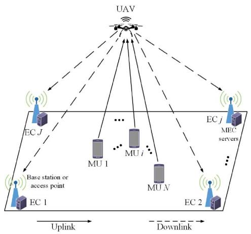
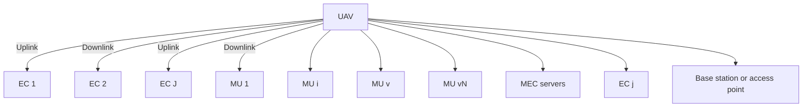
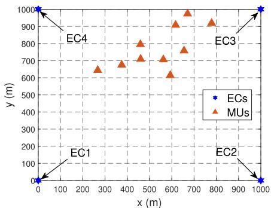
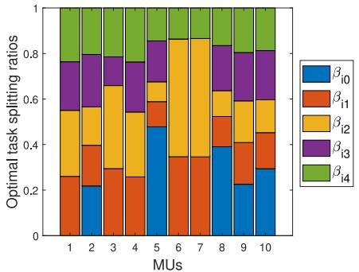
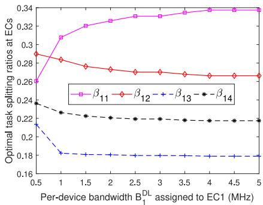
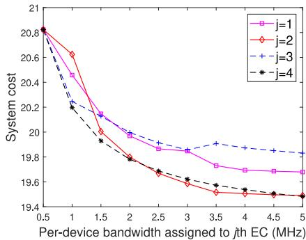
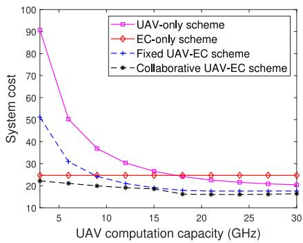
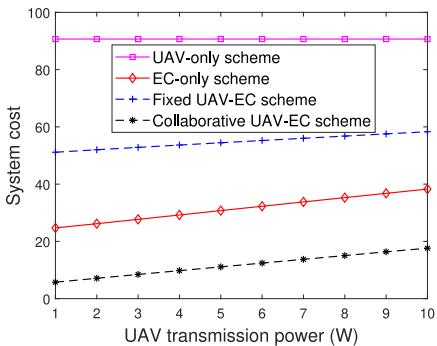
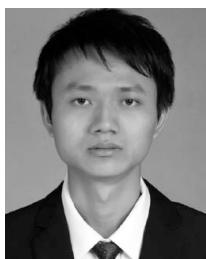

# Joint Task Offloading and Resource Allocation in UAV-Enabled Mobile Edge Computing

Zhe Yu, Student Member, IEEE, Yanmin Gong Member, IEEE, Shimin Gong Member, IEEE, and Yuanxiong Guo Senior Member, IEEE

Abstract—Mobile edge computing (MEC) is an emerging technology to support resource-intensive yet delay-sensitive applications using small cloud-computing platforms deployed at the mobile network edges. However, the existing MEC techniques are not applicable to the situation where the number of mobile users increases explosively or the network facilities are sparely distributed. In view of this insufficiency, unmanned aerial vehicles (UAVs) have been employed to improve the connectivity of ground Internet of Things (IoT) devices due to their high altitude. This article proposes an innovative UAV-enabled MEC system involving the interactions among IoT devices, UAV, and edge clouds (ECs). The system deploys and operates a UAV properly to facilitate the MEC service provisioning to a set of IoT devices in regions where the existing ECs cannot be accessible to IoT devices due to terrestrial signal blockage or shadowing. The UAV and ECs in the system collaboratively provide MEC services to the IoT devices. For optimal service provisioning in this system, we formulate an optimization problem aiming at minimizing the weighted sum of the service delay of all IoT devices and UAV energy consumption by jointly optimizing UAV position, communication and computing resource allocation, and task splitting decisions. However, the resulting optimization problem is highly nonconvex and thus, difficult to solve optimally. To tackle this problem, we develop an efficient algorithm based on the successive convex approximation to obtain suboptimal solutions. Numerical experiments demonstrate that our proposed collaborative UAV-EC offloading scheme largely outperforms baseline schemes that solely rely on UAV or ECs for MEC in IoT.

Index Terms—Mobile edge computing (MEC), resource management, successive convex approximation, unmanned aerial vehicles (UAVs).

# I. INTRODUCTION

A S THE number of wireless connected devices contin-ues to grow vastly and rapidly, an enormous amounts

Manuscript received September 11, 2019; revised December 18, 2019; accepted December 28, 2019. Date of publication January 10, 2020; date of current version April 14, 2020. The work of Yanmin Gong was supported in part by the U.S. National Science Foundation under Grant CNS-1850523. (Corresponding author: Yuanxiong Guo.)

Zhe Yu is with the School of Electrical and Computer Engineering, Oklahoma State University, Stillwater, OK 74078 USA (e-mail: zhe.yu@okstate.edu).

Yanmin Gong is with the Department of Electrical and Computer Engineering, University of Texas at San Antonio, San Antonio, TX 78249 USA (e-mail: yanmin.gong@utsa.edu).

Shimin Gong is with the School of Intelligent Systems Engineering, Sun Yat-sen University, Guangzhou 510275, China (e-mail: gongshm5@mail.sysu.edu.cn).

Yuanxiong Guo is with the Department of Information Systems and Cyber Security, University of Texas at San Antonio, San Antonio, TX 78249 USA (e-mail: yuanxiong.guo@utsa.edu).

Digital Object Identifier 10.1109/JIOT.2020.2965898

of data are collected from these devices at an exponential rate [1] and need to be transported from place to place for intelligent decision making, which has generated tremendous burden on our wireless communication infrastructure with the limited radio spectrum. It is estimated that 25 billion Internet of Things (IoT) devices will be in use by 2025 [2], and such multitudes of wireless connected devices are enabling many compelling new applications, such as real-time video analytics [3], [4], augmented/virtual reality [5], and smart cities [6], which are computation intensive and delay sensitive and rely on our ability to quickly process the data and extract useful information, precluding the traditional cloud-based data processing paradigm [7].

Mobile edge computing (MEC), in which computing and storage resources are placed at the mobile network edges (e.g., cellular base stations or WiFi access points) [8]–[10], has emerged as a prospective solution to resolve the network latency issue by pushing the frontier of data and services away from centralized cloud to the edge of the network, thereby enabling data analytics and functional operation in the proximity to the data sources. By moving resources to the network edge, close to where the data are being generated and acted upon, MEC can bring many benefits to users, such as lower service latency, reduced network congestion, and better service quality. Meanwhile, resource management becomes a key problem in MEC due to the much limited resources compared to remote clouds and the tight coupling of communication and computing. There has been substantial research on MEC resource management with the goal of optimizing system latency [11]–[14], energy consumption [15]–[17], and overall cost of system latency and/or energy consumption [18]–[21]. However, all of these studies assume wired or dedicated wireless connections with sufficient bandwidth among distributed edge resources deployed in a fixed fashion. Particularly, the existing MEC techniques are not applicable to the situation where the number of mobile users (MUs) increases explosively or the network facilities are sparely distributed [22]. In view of this insufficiency, wireless networks enabled by unmanned aerial vehicles (UAVs) have recently been proposed as a promising solution to improve the connectivity of ground IoT devices.

UAVs, especially, low-cost quadcopters, are undergoing an explosive growth and a major regulation relaxation nowadays and have been widely used in civilian domains, such as traffic monitoring [23], public safety [24], search and rescue [25], and reconnaissance over disaster rescue and recovery [26]. UAVs not only provide extended coverage over wide geographical areas but also possess unique characteristics like fast deployment, easy programmability, and high scalability. Various payloads, such as IoT sensors (including cameras), miniaturized base stations, and embedded computing modules can be mounted on UAVs to enable different sensing, communication, and computing tasks [27], [28]. In particular, reliable and cost-effective wireless communication solutions for multitudes of real-world scenarios can be offered by UAVs if properly deployed and operated [28]. UAVs can act as wireless relays or aerial base stations for improving connectivity and extending coverage of ground wireless devices since the high altitude of UAV enables wireless devices to effectively establish line-ofsight (LoS) communication links thus mitigating the potential signal blockage and shadowing.

However, most prior works in the area of the UAV-enabled wireless networks (e.g., [29]–[32]) ignore the computing capability provided by UAVs and mainly focus on their communication aspect, and only a very few recent studies [22], [33]–[36] start to consider computing with UAVs’ onboard resources. Hu et al. [22], Jeong et al. [33], and Zhou et al. [34] only considered communication and computation interactions between two types of entities where ground MUs offload the tasks to UAV for computation. Asheralieva and Niyato [35] proposed a game-theoretic and reinforcement learning approach in investigating the cooperation among UAVs and ground base stations. Hu et al. [36] studied a new UAV-enabled MEC system with interactions among a UAV, a set of ground user equipments, and an access point. To the best of our knowledge, UAV-enabled MEC systems involving MUs, UAVs, and edge clouds (ECs) with UAV-EC collaboration have not been studied.

In this article, we envision an innovative UAV-enabled MEC system where IoT devices offload computing tasks to ECs outside their communication range with the assistance of UAV, which are endowed with computing capability, to take the benefits of collaboration among UAV and ECs. Specifically, we consider the regions where the terrestrial wireless communication between IoT devices and ground cellular base stations or WiFi access points cannot be effectively established due to signal blockage and shadowing. Therefore, a UAV is deployed and operated to facilitate MEC service provisioning to a set of stationary IoT devices in such regions. The IoT devices perform some sensing tasks and need to process the generated data quickly. We assume that the sensing data analysis is not performed locally due to limited onboard communication, computing, and storage (CCS) resources but we seek to utilize those from the UAV and existing ground ECs. The UAV, equipped with miniaturized base stations and embedded computing modules, is placed properly to collect the generated sensing data from IoT devices and then, can further forward the computation tasks to more resourceful ground ECs nearby. We formulate the IoT task offloading process as a nonconvex optimization problem aiming at minimizing the weighted sum of the service delay of all IoT devices consisting of task offloading delay and computation delay, and UAV energy consumption consisting of transmission energy and computation energy consumption, by jointly optimizing the task splitting decisions, UAV placement, communication bandwidth allocation, and computation resource allocation at the UAV and ECs.

The above-formulated optimization problem is challenging to solve due to the nonconvex objective function and constraints. To tackle that challenge, we implement an efficient algorithm by means of successive convex approximation [37], [38]. The basic idea of the proposed algorithm is to compute a suboptimal solution of the original nonconvex problem by solving a sequence of convex subproblems where the nonconvex objective function and constraints are replaced by suitable convex approximants. We first convert the nonconvex objective function and constraints into suitable convex approximants by introducing the initial feasible solutions, while the local first-order behavior of the original nonconvex problem is preserved. Then, we iteratively compute the local optimum of the resulting convex problem by updating the initial feasible solutions until a stationary solution of the original nonconvex problem is found. The convergence of the proposed algorithm is guaranteed if the step-size rule and termination criterion are properly chosen.

The main contributions of this article are summarized as follows.

1) We propose a novel UAV-enabled MEC system where a UAV is deployed to facilitate the provisioning of MEC services to IoT devices that cannot directly access ECs on the ground due to terrestrial signal blockage and shadowing.   
2) Considering the stringent quality-of-service requirement of MEC services and the limited battery size of UAV, we formulate the joint IoT task offloading and UAV placement under the proposed system as an optimization problem with the goal of minimizing the service delay of IoT devices and maximizing the energy efficiency of UAV.   
3) Given the nonconvexity of the formulated optimization problem, we reformulate it into tractable one using successive convex approximation, and then develop an efficient algorithm to find the suboptimal approximate solutions to the problem.   
4) We conduct extensive simulations to evaluate the performance of our proposed collaborative UAV-EC scheme. Numerical experiments demonstrate that our proposed collaborative UAV-EC offloading scheme largely outperforms baseline schemes that solely rely on UAV or ECs for MEC in IoT.

The remainder of this article is organized as follows. Related work is reviewed in Section II. In Section III, we describe the system model and then formulate the optimal IoT task offloading processes as a nonconvex optimization problem. In Section IV, we reformulate the original problem as an approximated convex optimization problem and then solve it by means of successive convex approximation. The simulation results based on real-world traces are presented in Section V. Finally, the conclusion is given in Section VI.

# II. RELATED WORK

In this section, we review the prior works most relevant to our article from two aspects: 1) resource management in MEC and 2) UAV-enabled MEC networks.

# A. Resource Management in MEC

There is a rich literature on resource management in MEC that aims at optimizing system latency [11]–[14], energy consumption [15]–[17], and overall cost of system latency and/or energy consumption [18]–[21]. The tradeoff problem is studied in [11] for computing networks with fog node cooperation aiming at minimizing the response time of fog nodes under a given power efficiency constraint. Xu et al. [12] studied the joint service caching and task offloading problem in the dense network aiming at minimizing computation latency while keeping the total computation energy consumption low. Chen and Hao [13] investigated the MEC task offloading problem in the software-defined ultradense network aiming at minimizing the total task duration under energy budget constraints. Ren et al. [14] investigated a joint communication and computation resource allocation problem under the collaboration of cloud and edge computing for minimizing the system delay of all mobile devices. Sardellitti et al. [15] formulated the multicell MEC task offloading problem as a joint optimization of radio and computation resources aiming at minimizing the overall users’ energy consumption, while meeting latency constraints. Zhang et al. [16] proposed an energy-efficient offloading scheme for MEC in 5G heterogeneous networks by formulating the optimization problem with the objective of minimizing the total system energy consumption. You et al. [17] studied the resource allocation problem for a multiuser MEC offloading system based on TDMA and OFDMA with the objective to minimize the weighted sum of mobile energy consumption. Chen et al. [18] formulated a multiuser computation offloading game to study the energy-delay tradeoff problem in a mobile-edge cloud computing architecture. Chen et al. [19], [20] jointly optimized the offloading decisions of all users and computing access point and resource allocation aiming at minimizing the overall energy cost and the maximum delay among all users. Zhang et al. [21] proposed a distributed joint computation offloading and resource allocation optimization scheme in heterogeneous networks with MEC to minimize the overhead of local energy consumption and execution time cost.

However, all of these studies assume wired or dedicated wireless connections with sufficient bandwidth among distributed edge resources deployed in a fixed fashion. Particularly, the existing MEC techniques are not applicable to the situation where the number of MUs increases explosively or the network facilities are sparely distributed [22]. In view of the above limitations, we propose to deploy and operate a UAV to assist the IoT task offloading processes in a MEC system where ECs cannot be accessible to IoT devices due to terrestrial signal blockage and shadowing.

# B. UAV-Enabled MEC Networks

Extensive research efforts have been made from the academia to employ UAVs as different kinds of wireless communication platforms [39]. For instance, UAVs equipped with base stations can be flexibly deployed at specific areas to provide reliable uplink and downlink communication for ground users. They can also serve as the mobile relaying nodes to connect two or more distant users [29], [30]. Moreover, UAVs can assist with information dissemination or data collection by flying over the specific areas [31], [32]. However, prior works in the area of the UAV-enabled wireless networks ignore the computing capability provided by UAVs and mainly focus on their communication aspect, and only a very few recent studies [22], [33]–[36] start to consider computing with UAVs’ onboard resources. Hu et al. [22] investigated joint offloading and trajectory design for a MEC system where a UAV endowed with computing capability is deployed to serve the task offloading of MUs, aiming at minimizing the sum of the maximum delay among all the users in each time slot. Jeong et al. [33] studied the joint optimization of path planning and bit allocation for an MEC system where a UAV-mounted cloudlet is deployed to provide offloading opportunities to MUs, aiming at minimizing the mobile energy consumption while satisfying the quality-of-service requirements of offloaded applications. Zhou et al. [34] formulated the computation rate maximization problem under both partial and binary task offloading schemes in a UAV-enabled MEC wireless-powered system where the UAV can simultaneously transmit energy and perform computation. However, these works only consider communication and computation interactions between two types of entities where ground MUs offload the tasks to UAV for computation. Besides, Asheralieva and Niyato [35] presented a game-theoretic and reinforcement learning framework to study the computation offloading problem in UAV-enabled MEC networks with multiple service providers where UAV-based privately owned base stations are interacting with terrestrial privately owned and operator controlled base stations. Hu et al. [36] considered a UAV-aided MEC system where the cellular-connected UAV is served as a mobile computing server as well as a relay to help the user equipments complete their computing tasks or further offload their tasks to the AP for computing.

To the best of our knowledge, UAV-enabled MEC systems involving MUs, UAVs, and ECs have not been studied. Different from [35] which focuses on the user’s perspective, we optimize the UAV energy-efficiency and IoT task service latency from the system operator’s perspective with UAV-EC collaboration. Different from [36] which focuses on a single EC, we consider the scenario where multiple ECs and the UAV collaboratively provide MEC services to the IoT devices.

# III. SYSTEM MODEL AND PROBLEM FORMULATION

In this section, we first introduce the system model for the UAV-enabled MEC system. After that, we formulate an optimization problem to model the optimal UAV-enabled IoT task offloading process.

flowchart

Fig. 1. Illustration of an exemplary UAV-enabled MEC system with N MUs, J ECs, and a UAV.

# A. System Model

In this article, we consider the UAV-enabled MEC system as depicted in Fig. 1, which consists of a set of ground $\mathbf { M U s } ^ { 1 }$ $i \in \mathcal { N } = \{ 1 , 2 , \dots , N \}$ , a UAV, and a set of ground ECs $j \in$ $\mathcal { I } = \{ 1 , 2 , \ldots , J \}$ . The UAV is deployed to facilitate the MEC service provisioning for ground MUs who cannot establish wireless communication with nearby cellular base stations or WiFi access points due to signal blockage and shadowing. In this scenario, ground-to-air (G2A) uplink communication is from MUs to the UAV while air-to-ground (A2G) downlink communication is from the UAV to ECs, which form a 3-D wireless communication network. For ease of reference, we list important notations in Table I.

We assume that the UAV is equipped with certain CCS resources but subject to the size, weight, and power (SWAP) limitations. The ECs are composed of ground MEC servers colocated with cellular base stations or WiFi access points that have more CCS resources compared to the UAV and MUs. Each MU i has periodical computation-intensive tasks to perform, which are modeled as a triplet ${ \mathcal { W } } _ { i } = \langle L _ { i } , C _ { i } , \lambda _ { i } \rangle$ , where $L _ { i }$ (in bits) denotes the input data size for processing the task, $C _ { i }$ (in CPU cycles/bit) denotes the number of CPU cycles required to process 1-bit of task data, and $\lambda _ { i }$ (in unit of #task per second) denotes the arrival rate of tasks.

In this article, we use the 3-D Cartesian coordinate system to represent the locations of MUs, UAV, and ECs. The position of the UAV is denoted by $Q ^ { \mathrm { U A V } } ~ = ~ ( x ^ { \mathrm { U A V } } , y ^ { \mathrm { U A V } } , H )$ , where the height H is assumed to be fixed while the horizontal coordinates $x ^ { \mathrm { U A V } }$ and $y ^ { \mathrm { U A V } }$ affect the channel gain during data communication processes and need to be optimized in our problem. Besides, we assume the positions of MU i and EC j are fixed in our model, which are denoted as $Q _ { i } ^ { \mathrm { M U } } = ( x _ { i } ^ { \mathrm { M U } } , y _ { i } ^ { \mathrm { M U } } , 0 )$ and $Q _ { i } ^ { \mathrm { E C } } = ( x _ { i } ^ { \mathrm { E C } } , y _ { j } ^ { \mathrm { E C } } , 0 )$ , respectively.

1) Communication Model: In the UAV-enabled network, the LoS links are much more dominant than other channel impairments, such as shadowing or small-scale fading due to the high altitude of the UAV. Therefore, the uplink channel

1Note that we use mobile users and IoT devices interchangeably in this article.

TABLE I LIST OF NOTATIONS 

<table><tr><td>Symbols</td><td>Definitions</td></tr><tr><td colspan="2">Sets and Indices:</td></tr><tr><td> $\mathcal{N}$ </td><td>Index set of MUs  $i \in \mathcal{N} = \{1,2,\dots,N\}$ </td></tr><tr><td> $\mathcal{J}$ </td><td>Index set of ECs  $j \in \mathcal{J} = \{1,2,\dots,J\}$ </td></tr><tr><td>k</td><td>Indices of iterations</td></tr><tr><td colspan="2">Decision Variables:</td></tr><tr><td> $Q^{\text{UAV}}$ </td><td>Position of the UAV</td></tr><tr><td> $\beta_{ij}, \beta_{i0}$ </td><td>Portion of received tasks from MU i to be processed at EC j and the UAV</td></tr><tr><td> $f_i^{\text{UAV}}, f_{ij}^{\text{EC}}$ </td><td>Computation resource (in CPU cycles/second) allocated from the UAV to MU i and EC j to MU i</td></tr><tr><td> $B_i^{\text{UL}}$ </td><td>Uplink bandwidth allocated to MU i</td></tr><tr><td colspan="2">Functions:</td></tr><tr><td> $h_i^{\text{UL}}$ </td><td>Uplink channel gain from MU i to the UAV</td></tr><tr><td> $h_j^{\text{DL}}$ </td><td>Downlink channel gain from the UAV to EC j</td></tr><tr><td> $d_i^{\text{UL}}$ </td><td>Uplink distance from MU i to the UAV</td></tr><tr><td> $d_j^{\text{DL}}$ </td><td>Downlink distance from the UAV to EC j</td></tr><tr><td> $R_i^{\text{UL}}, R_j^{\text{DL}}$ </td><td>Achievable uplink/downlink transmission data rate (in bps) from MU i to the UAV and the UAV to EC j</td></tr><tr><td> $t_i^{\text{G2A}}$ </td><td>G2A uplink transmission delay from MU i to the UAV</td></tr><tr><td> $t_i^{\text{UAV}}$ </td><td>Computation delay at the UAV to process the offloaded tasks from MU i</td></tr><tr><td> $t_{ij}^{\text{A2G}}$ </td><td>A2G downlink transmission delay from MU i to EC j via UAV</td></tr><tr><td> $t_{ij}^{\text{EC}}$ </td><td>Computation delay at EC j to process the offloaded tasks from MU i to EC j via UAV</td></tr><tr><td> $E_i^{\text{CP}}$ </td><td>Computation energy consumption of UAV when processing offloaded tasks from MU i</td></tr><tr><td> $E_{ij}^{\text{TX}}, E_i^{\text{RX}}$ </td><td>Energy consumption of UAV when transmitting offloaded tasks from MU i to EC j and receiving the offloaded tasks from MU i</td></tr><tr><td> $E_i^{\text{UAV}}$ </td><td>Total energy consumption of UAV when serving the task offloading and computation of MU i</td></tr><tr><td> $T_i$ </td><td>Total service delay of MU i</td></tr><tr><td colspan="2">Parameters:</td></tr><tr><td> $L_i$ </td><td>Input data size for processing tasks (in bits) of MU i</td></tr><tr><td> $C_i$ </td><td>Number of CPU cycles required to process 1-bit of tasks (in CPU cycles/bit) of MU i</td></tr><tr><td> $\lambda_i$ </td><td>Arrival rate of tasks (in number of tasks/second)</td></tr><tr><td>H</td><td>Height of the UAV</td></tr><tr><td> $Q_i^{\text{MU}}, Q_j^{\text{EC}}$ </td><td>Position of MU i and EC j</td></tr><tr><td> $\alpha_0$ </td><td>Received power at the reference distance of 1 m for a transmission power of 1 W</td></tr><tr><td> $\sigma^2$ </td><td>Noise power at the UAV</td></tr><tr><td> $B^{\text{UL}}$ </td><td>Total uplink bandwidth</td></tr><tr><td> $B_j^{\text{DL}}$ </td><td>Per-device bandwidth pre-assigned to EC j</td></tr><tr><td> $P_i^{\text{MU}}$ </td><td>Transmit power of MU i</td></tr><tr><td> $P_{\text{TX}}^{\text{UAV}}, P_{\text{RX}}^{\text{UAV}}$ </td><td>Transmit and receiving power of the UAV</td></tr><tr><td> $F_{\text{UAV}}, F_j^{\text{EC}}$ </td><td>Total computation resources at the UAV and EC j</td></tr><tr><td> $\kappa$ </td><td>Effective switched capacitance depending on the CPU architecture</td></tr><tr><td> $\rho$ </td><td>Relative weight of energy and delay</td></tr></table>

gain from MU i to the UAV can be described by the free-space path loss model

$$
h _ {i} ^ {\mathrm{UL}} \triangleq \alpha_ {0} \left(d _ {i} ^ {\mathrm{UL}}\right) ^ {- 2} = \frac {\alpha_ {0}}{\left\| Q _ {i} ^ {\mathrm{MU}} - Q ^ {\mathrm{UAV}} \right\| ^ {2}} \tag {1}
$$

where α0 represents the received power at the reference distance of 1 m for a transmission power of $1 \ W _ { \cdot } d _ { i } ^ { \mathrm { U L } }$ denotes the uplink distance from MU i to the UAV, and · denotes the Euclidean norm of a vector. Similarly, the downlink channel gain from the UAV to EC j can be described as

$$
h _ {j} ^ {\mathrm{DL}} \triangleq \alpha_ {0} \left(d _ {j} ^ {\mathrm{DL}}\right) ^ {- 2} = \frac {\alpha_ {0}}{\left\| Q ^ {\mathrm{UAV}} - Q _ {j} ^ {\mathrm{EC}} \right\| ^ {2}} \tag {2}
$$

where $d _ { j } ^ { \mathrm { D L } }$ denotes the downlink distance from the UAV to the $\operatorname { E C } j .$

We assume the FDMA protocol for bandwidth sharing among MUs during the task offloading process. According to Shannon’s capacity, the achievable uplink transmission data rate (in bps) from MU i to the UAV can be expressed as

$$
R _ {i} ^ {\mathrm{UL}} = B _ {i} ^ {\mathrm{UL}} \log_ {2} \left(1 + \frac {h _ {i} ^ {\mathrm{UL}} P _ {i} ^ {\mathrm{MU}}}{\sigma^ {2}}\right) \tag {3}
$$

where $B _ { i } ^ { \mathrm { U L } } , P _ { i } ^ { \mathrm { M U } }$ , and $\sigma ^ { 2 }$ represent the assigned bandwidth to MU $i ,$ transmit power of MU i, and the noise power at the UAV, respectively. For simplicity, we assume the noise power is the same at UAV and ECs [29]. However, it can be easily extended to the case when they are different. Similarly, the downlink transmission data rate (in bps) from the UAV to EC j can be computed as

$$
R _ {j} ^ {\mathrm{DL}} = B _ {j} ^ {\mathrm{DL}} \log_ {2} \left(1 + \frac {h _ {j} ^ {\mathrm{DL}} P _ {\mathrm{TX}} ^ {\mathrm{UAV}}}{\sigma^ {2}}\right) \tag {4}
$$

where $B _ { i } ^ { \mathrm { { D L } } }$ and $P _ { \mathrm { T X } } ^ { \mathrm { U A V } }$ SUAV represent the per-device bandwidth2 preassigned to EC j and transmit power of the UAV, respectively.

2) Delay Analysis: In our model, we assume that MUs do not perform local computing due to their limited computation capacities. In contrast, tasks will be first offloaded to the UAV, and then, the UAV will determine the portion of tasks that are processed locally or further offloaded to ECs on the ground. Note that the decision time to split a task is very short compared to the entire communication and computation latency, and therefore, can be neglected. Besides, the output data size of the computation results is often very small compared to the input data size in many computation-intensive applications, such as face recognition and video analysis. Thus, the time needed to send the computation results back to MUs can be ignored as well.

In what follows, we will describe the four key components of the total delay for the offloading process: 1) G2A uplink transmission delay from MUs to the UAV; 2) computation delay at the UAV; 3) A2G downlink transmission delay from the UAV to the ECs; and 4) computation delay at the ECs.

G2A Uplink Transmission Delay From MUs to the UAV: As mentioned before, all the tasks will be offloaded to the UAV first via G2A links without any local computation. Therefore, the G2A transmission delay from MU i to the UAV is computed as the ratio of task input data size and the associated uplink transmission data rate

$$
t _ {i} ^ {\mathrm{G2A}} = \frac {L _ {i}}{R _ {i} ^ {\mathrm{UL}}}. \tag {5}
$$

Computation Delay at the UAV: The UAV will decide the portion of the received tasks that will be processed locally at

2We assume that each MU is assigned a certain bandwidth beforehand when they communicate with ECs via the UAV.

the UAV or further offloaded to the ground ECs for processing. Denote $\{ \beta _ { i j } \in [ 0 , 1 ] , i \in \mathcal { N } , j \in \mathcal { I } \}$ and $\{ \beta _ { i 0 } \in [ 0 , 1 ] , i \in \mathcal { N } \}$ as the portion of received tasks from MU i to be processed at $\mathrm { E C } \ j$ and the UAV, respectively. Then, the computation delay at the UAV side to process the offloaded tasks from MU i can be calculated as

$$
t _ {i} ^ {\mathrm{UAV}} = \frac {\beta_ {i 0} L _ {i} C _ {i}}{f _ {i} ^ {\mathrm{UAV}}} \tag {6}
$$

where $f _ { i } ^ { \mathrm { U A V } }$ (in CPU cycles/s) is the computation resource that the UAV allocates to MU i. Note that when $\beta _ { i 0 }$ equals 0, it means that no computation will be executed at the UAV side while when $\beta _ { i 0 }$ equals 1, it indicates that no further offloading will occur from the UAV to ECs.

A2G Downlink Transmission Delay From the UAV to ECs: The UAV may further offload the tasks to more powerful ECs on the ground to reduce the computation latency. Then, the A2G transmission delay from the MU i to EC j via UAV is described as the ratio of offloaded task input data size and the associated downlink transmission data rate

$$
t _ {i j} ^ {\mathrm{A2G}} = \frac {\beta_ {i j} L _ {i}}{R _ {j} ^ {\mathrm{DL}}}. \tag {7}
$$

Computation Delay at ECs: After receiving the offloaded task data from the UAV, ECs can start the computation process. Therefore, the computation delay at the EC side to process the offloaded task from the MU i to EC j via UAV is

$$
t _ {i j} ^ {\mathrm{EC}} = \frac {\beta_ {i j} L _ {i} C _ {i}}{f _ {i j} ^ {\mathrm{EC}}} \tag {8}
$$

where $f _ { i j } ^ { \mathrm { E C } }$ (in CPU cycles/s) is the computation resource that EC j allocates to MU i.

3) UAV Energy Consumption Analysis: To ensure service availability, it is important to manage the energy consumption of the UAV due to its limited battery size. In this article, we focus on computation and transmission energy consumption of UAV, and ignore the hovering power since it is independent of our decisions.

Computation Energy Consumption: Similar to [40], we model the power consumption of the CPU in UAV as $\kappa ( f _ { i } ^ { \mathrm { U A V } } ) ^ { 3 }$ , where κ denotes the effective switched capacitance depending on the CPU architecture. It follows that the corresponding energy consumption of UAV when processing tasks offloaded from MU i is given by the product of the power level and computation time

$$
E _ {i} ^ {\mathrm{CP}} = \kappa \left(f _ {i} ^ {\mathrm{UAV}}\right) ^ {3} t _ {i} ^ {\mathrm{UAV}} = \kappa \beta_ {i 0} L _ {i} C _ {i} \left(f _ {i} ^ {\mathrm{UAV}}\right) ^ {2}. \tag {9}
$$

Transmission Energy Consumption: The transmission energy consumption of the UAV when receiving the task input data via the G2A uplink transmission channels from MU i is given by

$$
E _ {i} ^ {\mathrm{RX}} = P _ {\mathrm{RX}} ^ {\mathrm{UAV}} t _ {i} ^ {\mathrm{G2A}} = \frac {L _ {i} P _ {\mathrm{RX}} ^ {\mathrm{UAV}}}{R _ {i} ^ {\mathrm{UL}}} \tag {10}
$$

where $P _ { \mathrm { R X } } ^ { \mathrm { U A V } }$ is the receiving power of UAV. Besides, the transmission energy consumption of the UAV when offloading the task input data of MU i via the A2G downlink transmission channels to $\mathrm { E C } \ j$ is given by

$$
E _ {i j} ^ {\mathrm{TX}} = P _ {\mathrm{TX}} ^ {\mathrm{UAV}} t _ {i j} ^ {\mathrm{A2G}} = \frac {\beta_ {i j} L _ {i} P _ {\mathrm{TX}} ^ {\mathrm{UAV}}}{R _ {j} ^ {\mathrm{DL}}}. \tag {11}
$$

Therefore, the total energy consumption of the UAV when serving the task offloading and computation of MU i is given by

$$
E _ {i} ^ {\mathrm{UAV}} = \lambda_ {i} \left(E _ {i} ^ {\mathrm{CP}} + E _ {i} ^ {\mathrm{RX}} + \sum_ {j \in \mathcal {J}} E _ {i j} ^ {\mathrm{TX}}\right). \tag {12}
$$

# B. Problem Formulation

In this article, we are interested in minimizing the total energy consumption of the UAV when serving the computation and communication needs of the MUs and the total service delay of all MUs. To define the service delay of each MU, we make the following assumptions: 1) the UAV cannot partition a task until receiving its entire input data to ensure the accuracy of task splitting; 2) the UAV and ECs cannot start the processing of tasks until the end of the transmission between MUs and the UAV or the UAV and ECs to ensure the reliability of the computation results; and 3) the computation at the UAV can proceed simultaneously with the transmission of the tasks to each EC since the communication and computation modules are often separated at the UAV. Based on the above assumptions, the service delay of MU i can be represented as

$$
T _ {i} = t _ {i} ^ {\mathrm{G2A}} + \max _ {j \in \mathcal {J}} \left\{t _ {i} ^ {\mathrm{UAV}}, t _ {i j} ^ {\mathrm{A2G}} + t _ {i j} ^ {\mathrm{EC}} \right\}. \tag {13}
$$

Our problem becomes jointly optimizing the UAV position $Q ^ { \mathrm { U A V } }$ , G2A uplink communication resource allocation $B _ { i } ^ { \mathrm { U L } }$ , task partition variables $\beta _ { i 0 }$ and $\beta _ { i j }$ , and computation resource allocation of the UAV $f _ { i } ^ { \mathrm { U A V } }$ and ECs f Eij $f _ { i j } ^ { \mathrm { E C } }$ with the goal of minimizing the weighted sum of total energy consumption of UAV and total service delay of all MUs. It can be formulated as the following optimization problem:

$$
\min_ {\substack {Q ^ {\mathrm{UAV}}, B _ {i} ^ {\mathrm{UL}}, \beta_ {i 0}, \\ \beta_ {i j}, f _ {i} ^ {\mathrm{UAV}}, f _ {i j} ^ {\mathrm{EC}}}} \sum_ {i \in \mathcal {N}} E _ {i} ^ {\mathrm{UAV}} + \rho \sum_ {i \in \mathcal {N}} T _ {i} \tag{14a}
$$

$$
\text { s.t. } \quad \sum_ {i \in \mathcal {N}} B _ {i} ^ {\mathrm{UL}} \leq B ^ {\mathrm{UL}} \tag {14b}
$$

$$
\beta_ {i 0} + \sum_ {j \in \mathcal {J}} \beta_ {i j} = 1 \quad \forall i \tag {14c}
$$

$$
\sum_ {i \in \mathcal {N}} f _ {i} ^ {\mathrm{UAV}} \leq F ^ {\mathrm{UAV}} \tag {14d}
$$

$$
\sum_ {i \in \mathcal {N}} f _ {i j} ^ {\mathrm{EC}} \leq F _ {j} ^ {\mathrm{EC}} \quad \forall j \tag {14e}
$$

$$
0 \leq \beta_ {i j} \leq 1 \quad \forall i, j \tag {14f}
$$

$$
0 \leq \beta_ {i 0} \leq 1 \quad \forall i \tag {14g}
$$

$$
B _ {i} ^ {\mathrm{UL}}, f _ {i} ^ {\mathrm{UAV}} \geq 0 \quad \forall i \tag {14h}
$$

$$
f _ {i j} ^ {\mathrm{EC}} \geq 0 \quad \forall i, j \tag {14i}
$$

where $\rho > 0$ is a parameter defining the relative weight of energy and delay, (14b), (14d), (14e), (14h), and (14i) ensure that the allocated resources for uplink bandwidth, UAV and EC CPU frequencies are nonnegative and no more than their limits while (14c), (14f), and (14g) constrain that the offloading tasks of MUs are completely processed by UAV and ECs, and the values of partition variables are between 0 and 1.

# IV. SOLUTION METHODOLOGY

Problem (14) is hard to solve due to the nonconvexity of the objective function and constraints. In what follows, we will first linearize the maximum term in (13) by leveraging auxiliary variables and reformulate the original optimization problem into a tractable one. Then, we develop an SCA-based algorithm to transform the nonconvex objective function and constraints into suitable convex approximants to iteratively solve the resulting optimization problem.

# A. Problem Reformulation

We first define an auxiliary variable for each MU i as $z _ { i } \triangleq$ maxj∈J {t UAVi , $\mathrm { m a x } _ { j \in \mathcal { T } } \{ t _ { i } ^ { \mathrm { U A V } } , t _ { i j } ^ { \mathrm { A 2 G } } + t _ { i j } ^ { \mathrm { E C } } \}$ . Then, we linearize the service delay term in (14a) using zi and reformulate the original optimization problem into the following:

$$
\min_{\substack{z_{i},Q^{\mathrm{UAV}},B_{i}^{\mathrm{UL}},\\ \beta_{i0},\beta_{ij},f_{i}^{\mathrm{UAV}},f_{ij}^{\mathrm{EC}}}}\sum_{i\in \mathcal{N}}E_{i}^{\mathrm{UAV}} + \rho \sum_{i\in \mathcal{N}}(t_{i}^{\mathrm{G2A}} + z_{i}) \tag{15a}
$$

$$
\text { s.t. } \quad z _ {i} \geq t _ {i} ^ {\mathrm{UAV}} \quad \forall i \tag {15b}
$$

$$
z _ {i} \geq t _ {i j} ^ {\mathrm{A2G}} + t _ {i j} ^ {\mathrm{EC}} \quad \forall i, j \tag {15c}
$$

$$
(1 4 \mathrm{b}) - (1 4 \mathrm{i}). \tag {15d}
$$

However, the reformulated optimization problem is still difficult to solve due to the nonconvex objective function (15a) and nonconvex constraints (15b) and (15c). Note that both the uplink and downlink transmission data rate functions (3) and (4) are nonconvex with respect to the UAV position $Q ^ { \mathrm { U A V } }$ .

# B. Successive Convex Approximation

In this section, we will show how to build the convex approximation for the nonconvex objective function and nonconvex constraints in the reformulated problem (15) while preserving the local first-order behavior of the original nonconvex problem and solve the resulting problem iteratively to obtain suboptimal solutions by means of SCA. Before we develop the SCA-based algorithm, we first present the background of SCA.

1) Background of SCA: Consider the following ptimization problem:

$$
\mathcal {P}: \min _ {\boldsymbol {x}} \quad U (\boldsymbol {x}) \tag {16a}
$$

$$
\text { s.t. } \quad g _ {l} (\boldsymbol {x}) \leq 0 \quad \forall l = 1, \ldots , m \tag {16b}
$$

$$
\boldsymbol {x} \in \mathcal {K} \tag {16c}
$$

where the objective function $U : \mathcal { K }  \mathbb { R }$ is smooth (possibly nonconvex) and $g _ { l } : \mathcal { K }  \mathbb { R }$ is smooth (possibly nonconvex), for all $l = 1 , \ldots , m ;$ the feasible set is denoted as X . A widely used method for solving this specific problem is SCA (also known as majorization minimization) where at each iteration, a convex approximation of the original problem is solved via

# Algorithm 1 SCA Algorithm for Problem P

Find a feasible solution $\boldsymbol { x } \in \mathcal { X }$ in , choose a step size $\theta \in$ (0, 1] and set $k = 0$ .

# Repeat

1) Compute $\hat { \pmb { x } } ( \pmb { x } ^ { k } )$ , the solution of ${ \mathcal { P } } _ { x ^ { k } } ;$   
2) Set $\pmb { x } ^ { k + 1 } = \pmb { x } ^ { k } + \theta ( \hat { \pmb { x } } ( \pmb { x } ^ { k } ) - \pmb { x } ^ { k } ) ;$   
3) Set $k \gets k + 1 .$ .

Until some convergence criterion is met.

replacing the nonconvex objective function and constraints by suitable convex approximants. The convex approximation of the original problem can be stated as follows: given $\boldsymbol { x } ^ { k } \in \mathcal { X }$

$$
\mathcal {P} _ {\boldsymbol {x} ^ {k}} \colon \min _ {\boldsymbol {x}} \quad \tilde {U} (\boldsymbol {x}; \boldsymbol {x} ^ {k}) \tag {17a}
$$

$$
\text { s.t. } \quad \tilde {g} _ {l} (\boldsymbol {x}; \boldsymbol {x} ^ {k}) \leq 0 \quad \forall l = 1, \dots , m \tag {17b}
$$

$$
\boldsymbol {x} \in \mathcal {K} \tag {17c}
$$

where ${ \tilde { U } } ( \mathbf { { x } } ; \mathbf { { x } } ^ { k } )$ and $\tilde { g } _ { l } ( \boldsymbol { x } ; \boldsymbol { x } ^ { k } )$ represent the approximants of $U ( { \pmb x } )$ and $g _ { l } ( \pmb { x } )$ at current iterate $\boldsymbol { x } ^ { k }$ , respectively; the feasible set is denoted as $\mathcal { X } ( \boldsymbol { \mathbf { \mathit { x } } } ^ { k } )$ . More specifically, we consider the SCA method presented in Algorithm 1. It is assumed that at each iteration, some original functions $U ( { \pmb x } )$ and $g _ { l } ( \pmb { x } )$ are approximated by their upper bounds where the same first-order behavior is preserved [41].

2) SCA-Based Algorithm: Scutari et al. [38] proposed a framework that unifies several existing SCA-based algorithms to solve the problem  in a parallel and distributed fashion. It also offers much flexibility in the choice of the convex approximation functions, and the objective function U need not be an upper bound of itself at any feasible point. Multiple examples are summarized to find the candidate approximants $\tilde { g } _ { l } ( { \pmb x } )$ and $\tilde { U } ( { \pmb x } )$ while necessary assumptions are satisfied to develop the SCA-based algorithm. We first present the assumptions and examples that we will utilize to approximate the nonconvex terms in our problem as follows.

Assumption 1: The key assumptions on the choice of the approximated function $\tilde { g } _ { l } : \mathcal { K } \times \mathcal { X } \to \mathcal { 1 }$ R are given as follows.

A1) $\tilde { g } _ { l } ( \bullet ; \mathbf { y } )$ is convex on  for all $\mathbf { \boldsymbol { y } } \in \mathcal { X } .$ .   
A2) Upper Bound: $g _ { l } ( { \pmb x } ) \le \tilde { g } _ { l } ( { \pmb x } ; { \pmb y } ) \ \forall { \pmb x } \in \mathcal { K } , { \pmb y } \in \mathcal { X } .$   
A3) Function Value Consistency: $\tilde { g } _ { l } ( { \bf y } ; { \bf y } ) = g _ { l } ( { \bf y } )$ , for all $\mathbf { \boldsymbol { y } } \in \mathbf { \mathcal { X } } .$ .   
A4) $\tilde { g } _ { l } ( \bullet ; \bullet )$ is continuous on $\kappa \times \mathcal { X }$ .   
A5) $\nabla _ { x } \tilde { g } _ { l } ( \bullet ; \bullet )$ is continuous on ${ \boldsymbol { \kappa } } \times { \boldsymbol { \mathcal { X } } } .$ .   
A6) Gradient Consistency: $\nabla _ { \pmb { x } } \tilde { g } _ { l } ( \pmb { y } ; \pmb { y } ) = \nabla _ { \pmb { x } } g _ { l } ( \pmb { y } )$ , for all $y \in { \mathcal { X } } ,$ where $\nabla _ { x } \tilde { g } _ { l } ( { \bf y } ; { \bf y } )$ denotes the partial gradient of the function $\tilde { g } _ { l }$ with respect to the argument x evaluated at $( { \pmb y } ; { \pmb y } )$ .

Assumption 2: The key assumptions on the choice of the approximated function $\tilde { U } : \mathcal { K } \times \mathcal { X } \to \mathbb { R }$ are given as follows.

B1) $\tilde { U } ( \bullet ; \mathbf { y } )$ is uniformly strongly convex on K with constant $\mu > 0 ;$ , i.e., for all $\mathbf { \Delta } x , z \in \mathcal { K }$ and $\mathbf { \boldsymbol { y } } \in \mathcal { X } \colon$

$$
(\boldsymbol {x} - \boldsymbol {z}) ^ {\top} \left(\nabla_ {\boldsymbol {x}} \tilde {U} (\boldsymbol {x}; \boldsymbol {y}) - \nabla_ {\boldsymbol {x}} \tilde {U} (\boldsymbol {z}; \boldsymbol {y})\right) \geq \mu \| \boldsymbol {x} - \boldsymbol {z} \| ^ {2}.
$$

B2) Gradient Consistency: $\nabla _ { \pmb { x } } \tilde { U } ( { \pmb y } ; { \pmb y } ) = \nabla _ { \pmb { x } } U ( { \pmb y } )$ , for all $\mathbf { \boldsymbol { y } } \in \mathcal { X } .$   
B3) $\nabla _ { x } \tilde { U } ( \bullet ; \bullet )$ is continuous on ${ \boldsymbol { \kappa } } \times { \boldsymbol { \mathcal { X } } }$ , where $\nabla _ { x } \tilde { U } ( { \pmb u } ; { \pmb v } )$ denotes the partial gradient of the function U˜ with

respect to the argument x evaluated at $( { \pmb u } ; { \pmb \nu } )$ . Note that A1) and B1) make the problem $\mathcal { P } _ { x ^ { k } }$ strongly convex while A2) and A3) guarantee the iterate feasibility that $\pmb { x } ^ { k } \in \mathcal { X } ( \pmb { x } ^ { k } ) \subseteq \mathcal { X } .$ .

Example 1 (Approximation of gl(x) [38, Example 3]): Suppose that $g _ { l }$ has a difference of convex (DC) structure, i.e., $g _ { l } ( \pmb { x } ) = g _ { i } ^ { + } ( \pmb { x } ) - g _ { i } ^ { - } ( \pmb { x } )$ with both $g _ { l } ^ { + }$ and $g _ { l } ^ { - }$ being convex and continuously differentiable. By linearizing the concave part $g _ { l } ^ { - }$ , we obtain the convex upper approximation of $g _ { l }$ as follows: for all $\boldsymbol { x } \in \mathcal { K }$ and $\ b { y } \in \mathcal { X }$ ,

$$
\tilde {g} _ {l} (\boldsymbol {x}; \boldsymbol {y}) \triangleq g _ {l} ^ {+} (\boldsymbol {x}) - g _ {l} ^ {-} (\boldsymbol {y}) - \nabla_ {\boldsymbol {x}} g _ {l} ^ {-} (\boldsymbol {y}) ^ {\top} (\boldsymbol {x} - \boldsymbol {y}) \geq g _ {j} (\boldsymbol {x}). \tag {18}
$$

Example 2 (Approximation of gl(x) [38, Example $4 J \} .$ Suppose that gl(x) has a product of functions (PF) structure, i.e., $g _ { l } ( { \pmb x } ) = f _ { 1 } ( { \pmb x } ) f _ { 2 } ( { \pmb x } )$ with both $f _ { 1 }$ and $f _ { 2 }$ being convex and nonnegative. Observe that $g _ { l } ( \pmb { x } )$ can be rewritten as a function with the DC structure

$$
g _ {l} (\boldsymbol {x}) = \frac {1}{2} (f _ {1} (\boldsymbol {x}) + f _ {2} (\boldsymbol {x})) ^ {2} - \frac {1}{2} \Big (f _ {1} ^ {2} (\boldsymbol {x}) + f _ {2} ^ {2} (\boldsymbol {x}) \Big). \tag {19}
$$

Then, the convex upper approximation of $g _ { l }$ can be obtained by linearizing the concave part in (19): for any $\ b { y } \in \mathcal { X }$

$$
\begin{array}{l} \tilde {g} _ {l} (\boldsymbol {x}; \boldsymbol {y}) \triangleq \frac {1}{2} (f _ {1} (\boldsymbol {x}) + f _ {2} (\boldsymbol {x})) ^ {2} - \frac {1}{2} \left(f _ {1} ^ {2} (\boldsymbol {y}) + f _ {2} ^ {2} (\boldsymbol {y})\right) \\ - f _ {1} (\mathbf {y}) f _ {1} ^ {\prime} (\mathbf {y}) (\mathbf {x} - \mathbf {y}) - f _ {2} (\mathbf {y}) f _ {2} ^ {\prime} (\mathbf {y}) (\mathbf {x} - \mathbf {y}) \geq g _ {l} (\mathbf {x}). \tag {20} \\ \end{array}
$$

Example 3 (Approximation of U(x) [38, Example 8]): Suppose that $U ( { \pmb x } )$ has a PF structure, i.e., $\begin{array} { r l } { U ( \pmb { x } ) } & { { } = } \end{array}$ $h _ { 1 } ( { \pmb x } ) h _ { 2 } ( { \pmb x } )$ with both $h _ { 1 }$ and $h _ { 2 }$ being convex and nonnegative. For any $y \in { \mathcal { X } } ,$ , a convex approximation of U(x) is given by

$$
\begin{array}{l} \tilde {U} (\boldsymbol {x}; \boldsymbol {y}) = h _ {1} (\boldsymbol {x}) h _ {2} (\boldsymbol {y}) + h _ {1} (\boldsymbol {y}) h _ {2} (\boldsymbol {x}) \\ + \frac {\tau}{2} (\boldsymbol {x} - \boldsymbol {y}) ^ {\top} \boldsymbol {H} (\boldsymbol {y}) (\boldsymbol {x} - \boldsymbol {y}) \tag {21} \\ \end{array}
$$

where $\tau > 0$ is a positive constant, and $H ( \mathbf { y } )$ is a uniformly positive-definite matrix.

Then, we transform the nonconvex constraints and nonconvex objective function in the reformulated problem (15) into suitable approximants by following the above examples. For constraint (15b), we observe that the nonconvex term $t _ { i } ^ { \mathrm { U A V } }$ can be written as the product of convex and nonnegative functions3

$$
t _ {i} ^ {\mathrm{UAV}} = L _ {i} C _ {i} g _ {l} \left(\beta_ {i 0}, f _ {i} ^ {\mathrm{UAV}}\right) = L _ {i} C _ {i} f _ {1} \left(\beta_ {i 0}\right) f _ {2} \left(f _ {i} ^ {\mathrm{UAV}}\right) \tag {22}
$$

where $f _ { 1 } ( \beta _ { i 0 } ) ~ = ~ \beta _ { i 0 }$ and $f _ { 2 } ( f _ { i } ^ { \mathrm { U A V } } ) ~ = ~ 1 / f _ { i } ^ { \mathrm { U A V } }$ . Then, given a feasible solution $\beta _ { i 0 } ( k )$ and $f _ { i } ^ { \mathrm { U A V } } ( k )$ for the kth iteration of the SCA-based algorithm, we derive a convex upper approximation of $t _ { i } ^ { \mathrm { U A V } }$ by using Example 2 as

$$
\begin{array}{l} t _ {i} ^ {\mathrm{UAV}} \leq \tilde {t} _ {i} ^ {\mathrm{UAV}} \left(\beta_ {i 0}, f _ {i} ^ {\mathrm{UAV}}; \beta_ {i 0} (k), f _ {i} ^ {\mathrm{UAV}} (k)\right) \\ \triangleq L _ {i} C _ {i} \left[ \frac {1}{2} \left(\left(\beta_ {i 0} + \frac {1}{f _ {i} ^ {\mathrm{UAV}}}\right) ^ {2} - (\beta_ {i 0} (k)) ^ {2} - \left(\frac {1}{f _ {i} ^ {\mathrm{UAV}} (k)}\right) ^ {2}\right) \right. \\ \end{array}
$$

3Without loss of generality, we factorize the constants $( L _ { i } , C _ { i } ,$ , etc.) out of the term since they will not affect the convexity.

$$
\begin{array}{l} - \left(\beta_ {i 0} (k) \left(\beta_ {i 0} - \beta_ {i 0} (k)\right)\right) \\ \left. + \left(\frac {1}{f _ {i} ^ {\mathrm{UAV}} (k)}\right) ^ {3} \left(\frac {1}{f _ {i} ^ {\mathrm{UAV}}} - \frac {1}{f _ {i} ^ {\mathrm{UAV}} (k)}\right) \right]. \tag {23} \\ \end{array}
$$

For constraint (15c), $t _ { i j } ^ { \mathrm { A 2 G } }$ can be written as the product of $L _ { i } , \beta _ { i j } .$ , and $1 / R _ { j } ^ { \mathrm { { D L } } }$ . However, $1 / R _ { j } ^ { \mathrm { { D L } } }$ is a nonconvex function with respect to the UAV location $Q ^ { \mathrm { U A V } }$ , and therefore, Example 2 cannot be directly applied to derive a convex upper approximation. To tackle the nonconvexity, we replace it by nonnegative auxiliary variables $\{ \phi _ { j } \} _ { j \in \mathcal { I } }$ . Then, the nonconvex term $t _ { i j } ^ { \mathrm { A 2 G } }$ ij can be written as the product of convex and nonnegative functions

$$
t _ {i j} ^ {\mathrm{A2G}} = L _ {i} g _ {l} \left(\beta_ {i j}, \phi_ {j}\right) = L _ {i} f _ {1} \left(\beta_ {i j}\right) f _ {2} \left(\phi_ {j}\right) \tag {24}
$$

where $f _ { 1 } ( \beta _ { i j } ) = \beta _ { i j }$ and $f _ { 2 } ( \phi _ { j } ) = 1 / \phi _ { j }$ in (24). Similarly, the nonconvex term $t _ { i j } ^ { \mathrm { E C } }$ in (15c) can be written as the product of convex and nonnegative functions

$$
t _ {i j} ^ {\mathrm{EC}} = L _ {i} C _ {i} g _ {l} \left(\beta_ {i j}, f _ {i j} ^ {\mathrm{EC}}\right) = L _ {i} C _ {i} f _ {1} \left(\beta_ {i j}\right) f _ {2} \left(f _ {i j} ^ {\mathrm{EC}}\right) \tag {25}
$$

where $f _ { 1 } ( \beta _ { i j } ) ~ = ~ \beta _ { i j }$ and $f _ { 2 } ( f _ { i j } ^ { \mathrm { E C } } ) ~ = ~ 1 / f _ { i j } ^ { \mathrm { E C } }$ in (25). Then, given a feasible solution $\beta _ { i j } ( k ) , \phi _ { j } ( k )$ , and $f _ { i j } ^ { \mathrm { E C } } ( k )$ for the kth iteration of the SCA-based algorithm, we derive convex upper approximation of $t _ { i j } ^ { \mathrm { A 2 G } }$ and $t _ { i j } ^ { \breve { \mathrm { E C } } }$ by using Example 2 as

$$
t _ {i j} ^ {\mathrm{A2G}} \leq \tilde {t} _ {i j} ^ {\mathrm{A2G}} \big (\beta_ {i j}, \phi_ {j}; \beta_ {i j} (k), \phi_ {j} (k) \big)
$$

$$
\triangleq L _ {i} \left[ \frac {1}{2} \left(\left(\beta_ {i j} + \frac {1}{\phi_ {j}}\right) ^ {2} - (\beta_ {i j} (k)) ^ {2} - \left(\frac {1}{\phi_ {j} (k)}\right) ^ {2}\right) \right.
$$

$$
\left. \right. - \left.\left(\beta_ {i j} (k) \left(\beta_ {i j} - \beta_ {i j} (k)\right)\right) + \left(\frac {1}{\phi_ {j} (k)}\right) ^ {3} \left(\frac {1}{\phi_ {j}} - \frac {1}{\phi_ {j} (k)}\right)\right] \tag {26}
$$

and

$$
t _ {i j} ^ {\mathrm{EC}} \leq \tilde {t} _ {i j} ^ {\mathrm{EC}} \left(\beta_ {i j}, f _ {i j} ^ {\mathrm{EC}}; \beta_ {i j} (k), f _ {i j} ^ {\mathrm{EC}} (k)\right)
$$

$$
\triangleq L _ {i} C _ {i} \left[ \frac {1}{2} \left(\left(\beta_ {i j} + \frac {1}{f _ {i j} ^ {\mathrm{EC}}}\right) ^ {2} - (\beta_ {i j} (k)) ^ {2} - \left(\frac {1}{f _ {i j} ^ {\mathrm{EC}} (k)}\right) ^ {2}\right) \right.
$$

$$
- \left(\beta_ {i j} (k) \big (\beta_ {i j} - \beta_ {i j} (k) \big)\right)
$$

$$
\left. + \left(\frac {1}{f _ {i j} ^ {\mathrm{EC}} (k)}\right) ^ {3} \left(\frac {1}{f _ {i j} ^ {\mathrm{EC}}} - \frac {1}{f _ {i j} ^ {\mathrm{EC}} (k)}\right) \right]. \tag {27}
$$

By defining $\overline { { R } } _ { i } ^ { \mathrm { U L } } \triangleq \log _ { 2 } ( 1 + [ ( h _ { i } ^ { \mathrm { U L } } P _ { i } ^ { \mathrm { M U } } ) / ( \sigma ^ { 2 } ) ] )$ , we replace $1 / \overline { { R } } _ { i } ^ { \mathrm { U L } } \mathrm { i n } t _ { i } ^ { \mathrm { G 2 \overline { { A } } } }$ by nonnegative auxiliary variables $\{ \gamma _ { i } \} _ { i \in \mathcal { N } }$ since it is a nonconvex function with respect to the UAV location $Q ^ { \mathrm { U A V } }$ . Then, the nonconvex terms in objective function (15a) can be written as the product of convex and nonnegative functions

$$
E _ {i} ^ {\mathrm{CP}} = \kappa L _ {i} C _ {i} h _ {1} \left(\beta_ {i 0}\right) h _ {2} \left(f _ {i} ^ {\mathrm{UAV}}\right) \tag {28}
$$

$$
E _ {i j} ^ {\mathrm{TX}} = L _ {i} P _ {\mathrm{TX}} ^ {\mathrm{UAV}} h _ {1} \left(\beta_ {i j}\right) h _ {3} \left(\phi_ {j}\right) \tag {29}
$$

$$
t _ {i} ^ {\mathrm{G2A}} = L _ {i} h _ {3} (B _ {i} ^ {\mathrm{UL}}) h _ {3} (\gamma_ {i}) \tag {30}
$$

$$
E _ {i} ^ {\mathrm{RX}} = P _ {\mathrm{RX}} ^ {\mathrm{UAV}} t _ {i} ^ {\mathrm{G2A}} = P _ {\mathrm{RX}} ^ {\mathrm{UAV}} L _ {i} h _ {3} \left(B _ {i} ^ {\mathrm{UL}}\right) h _ {3} \left(\gamma_ {i}\right) \tag {31}
$$

where $h _ { 1 } ( \beta _ { i 0 } ) ~ = ~ \beta _ { i 0 }$ and $h _ { 2 } ( f _ { i } ^ { \mathrm { U A V } } ) \ : = \ : ( f _ { i } ^ { \mathrm { U A V } } ) ^ { 2 }$ in (28), and h1 $( \beta _ { i j } ) = \beta _ { i j }$ and h ${ } _ { 3 } ( \phi _ { j } ) = 1 / \phi _ { j }$ in (29), while $h _ { 3 } ( B _ { i } ^ { \mathrm { U L } } ) =$ $1 / B _ { i } ^ { \mathrm { U L } }$ and $h _ { 3 } ( \gamma _ { i } ) = 1 / \gamma _ { i }$ in (30). Then, given a feasible solution $\beta _ { i 0 } ( k ) , \beta _ { i j } ( k ) , \phi _ { j } ( k ) , \gamma _ { i } ( k ) , B _ { i } ^ { \mathrm { U L } } ( k )$ , and $f _ { i } ^ { \mathrm { U A V } } ( k )$ for the kth iteration of SCA-based algorithm, we derive convex approximation of $E _ { i } ^ { \mathrm { C P } } , ~ E _ { i j } ^ { \mathrm { T X } } , ~ t _ { i } ^ { \mathrm { G 2 A } }$ , and $E _ { i } ^ { \mathrm { R X } }$ by using Example 3 as

$$
\begin{array}{l} \tilde {E} _ {i} ^ {\mathrm{CP}} \left(\beta_ {i 0}, f _ {i} ^ {\mathrm{UAV}}; \beta_ {i 0} (k), f _ {i} ^ {\mathrm{UAV}} (k)\right) \\ \triangleq \kappa L _ {i} C _ {i} \left(\beta_ {i 0} \left(f _ {i} ^ {\mathrm{UAV}} (k)\right) ^ {2} + \beta_ {i 0} (k) \left(f _ {i} ^ {\mathrm{UAV}}\right) ^ {2}\right) \\ + \frac {\tau_ {\beta_ {i 0}}}{2} (\beta_ {i 0} - \beta_ {i 0} (k)) ^ {2} + \frac {\tau_ {f _ {i} ^ {\mathrm{UAV}}}}{2} \left(f _ {i} ^ {\mathrm{UAV}} - f _ {i} ^ {\mathrm{UAV}} (k)\right) ^ {2} \tag {32} \\ \end{array}
$$

$$
\tilde {E} _ {i j} ^ {\mathrm{TX}} \big (\beta_ {i j}, \phi_ {j}; \beta_ {i j} (k), \phi_ {j} (k) \big) \triangleq L _ {i} P _ {\mathrm{TX}} ^ {\mathrm{UAV}} \left(\frac {\beta_ {i j}}{\phi_ {j} (k)} + \frac {\beta_ {i j} (k)}{\phi_ {j}}\right)
$$

$$
+ \frac {\tau_ {\beta_ {i j}}}{2} \left(\beta_ {i j} - \beta_ {i j} (k)\right) ^ {2} + \frac {\tau_ {\phi_ {j}}}{2} \left(\phi_ {j} - \phi_ {j} (k)\right) ^ {2} \tag {33}
$$

$$
\begin{array}{l} \tilde {t} _ {i} ^ {\mathrm{G2A}} \big (B _ {i} ^ {\mathrm{UL}}, \gamma_ {i}; B _ {i} ^ {\mathrm{UL}} (k), \gamma_ {i} (k) \big) \triangleq L _ {i} \left(\frac {1}{B _ {i} ^ {\mathrm{UL}} \gamma_ {i} (k)} + \frac {1}{B _ {i} ^ {\mathrm{UL}} (k) \gamma_ {i}}\right) \\ + \frac {\tau_ {B _ {i} ^ {\mathrm{UL}}}}{2} \left(B _ {i} ^ {\mathrm{UL}} - B _ {i} ^ {\mathrm{UL}} (k)\right) ^ {2} + \frac {\tau_ {\gamma_ {i}}}{2} (\gamma_ {i} - \gamma_ {i} (k)) ^ {2} \tag {34} \\ \end{array}
$$

and

$$
\tilde {E} _ {i} ^ {\mathrm{RX}} \left(B _ {i} ^ {\mathrm{UL}}, \gamma_ {i}; B _ {i} ^ {\mathrm{UL}} (k), \gamma_ {i} (k)\right)
$$

$$
\triangleq P _ {\mathrm{RX}} ^ {\mathrm{UAV}} \tilde {t} _ {i} ^ {\mathrm{G2A}} \left(B _ {i} ^ {\mathrm{UL}}, \gamma_ {i}; B _ {i} ^ {\mathrm{UL}} (k), \gamma_ {i} (k)\right) \tag {35}
$$

where $\tau _ { \beta _ { i 0 } } , \tau _ { \beta _ { i j } } , \tau _ { \phi _ { j } } , \tau _ { \gamma _ { i } } , \tau _ { B _ { i } ^ { \mathrm { U L } } } , \tau _ { f _ { i } ^ { \mathrm { U A V } } } > 0$ . Therefore, the convex surrogate objective function of (15a) can be denoted as the nonnegative weighted sum of convex functions

$$
\sum_ {i \in \mathcal {N}} \lambda_ {i} \left(\tilde {E} _ {i} ^ {\mathrm{CP}} + \tilde {E} _ {i} ^ {\mathrm{RX}} + \sum_ {j \in \mathcal {J}} \tilde {E} _ {i j} ^ {\mathrm{TX}}\right) + \rho \sum_ {i \in \mathcal {N}} \left(\tilde {t} _ {i} ^ {\mathrm{G2A}} + z _ {i}\right) \tag {36}
$$

where the convexity is preserved.

Moreover, as we replace the nonconvex data rate functions in both objective function and constraints by the auxiliary variables $\{ \phi _ { j } \} _ { j \in \mathcal { I } }$ and $\{ \gamma _ { i } \} _ { i \in \mathcal { N } } .$ , we obtain equality constraints $\{ \phi _ { j } \} _ { j \in \mathcal { I } } = 1 / R _ { j } ^ { \mathrm { D I } }$ and $\{ \gamma _ { i } \} _ { i \in \mathcal { N } } = 1 / \overline { { R } } _ { i } ^ { \mathrm { U L } }$ . To further address the nonconvexity, we first relax them as the following inequalities:

$$
0 \leq \phi_ {j} \leq R _ {j} ^ {\mathrm{DL}} \quad \forall j \tag {37}
$$

$$
0 \leq \gamma_ {i} \leq \overline {{R}} _ {i} ^ {\mathrm{UL}} \quad \forall i \tag {38}
$$

where the optimality is preserved since at optimal solutions the auxiliary variables will equate their upper bounds. The key observation is that in (37) and (38), although $R _ { j } ^ { \mathrm { { D L } } }$ and $\overline { { R } } _ { i } ^ { \mathrm { U L } }$ are not concave withtions with respect to $\varrho ^ { \mathrm { U A V } } \sb { \textnormal { \ r { c l o } } }$ , theyand $\left. Q ^ { \mathrm { U A V } } - Q _ { j } ^ { \mathrm { E C } } \right. ^ { 2 }$ $\left. Q _ { i } ^ { \mathrm { M U } } - Q ^ { \mathrm { U A V } } \right. ^ { 2 }$  respectively. Recall that any convex function is globally lower bounded by its first-order Taylor expansion at any point [42]. Therefore, by taking the first-order Taylor expansion of $R _ { j } ^ { \mathrm { { D L } } }$ and $\overline { { R } } _ { i } ^ { \mathrm { U L } }$ with respect to $\left. Q ^ { \mathrm { U A V } } - \dot { Q } _ { j } ^ { \mathrm { E C } } \right. ^ { 2 }$ and $\left. Q _ { i } ^ { \mathrm { M U } } - Q ^ { \mathrm { U A V } } \right. ^ { 2 }$ , respectively, we obtain lower bounds of $R _ { j } ^ { \mathrm { { D I } } }$ and $\overline { { R } } _ { i } ^ { \mathrm { U L } }$ at local point $Q ^ { \mathrm { U A V } } ( k )$ for the kth iteration of the

SCA-based algorithm as follows:

$$
\begin{array}{l} R _ {j} ^ {\mathrm{DL}} \geq R _ {j, L B} ^ {\mathrm{DL}} \left(Q ^ {\mathrm{UAV}}; Q ^ {\mathrm{UAV}} (k)\right) \triangleq R _ {j} ^ {\mathrm{DL}} \left(Q ^ {\mathrm{UAV}} (k)\right) \\ - \frac {B _ {j} ^ {\mathrm{DL}} \eta \left(\left\| Q ^ {\mathrm{UAV}} - Q _ {j} ^ {\mathrm{EC}} \right\| ^ {2} - \left\| Q ^ {\mathrm{UAV}} (k) - Q _ {j} ^ {\mathrm{EC}} \right\| ^ {2}\right)}{\ln 2 \left(\left\| Q ^ {\mathrm{UAV}} (k) - Q _ {j} ^ {\mathrm{EC}} \right\| ^ {2}\right) \left(\eta + \left\| Q ^ {\mathrm{UAV}} (k) - Q _ {j} ^ {\mathrm{EC}} \right\| ^ {2}\right)} \quad \forall j \\ \end{array}
$$

$$
\overline {{R}} _ {i} ^ {\mathrm{UL}} \geq \overline {{R}} _ {i, L B} ^ {\mathrm{UL}} \left(Q ^ {\mathrm{UAV}}; Q ^ {\mathrm{UAV}} (k)\right) \triangleq \overline {{R}} _ {i} ^ {\mathrm{UL}} \left(Q ^ {\mathrm{UAV}} (k)\right)
$$

$$
- \frac {\varepsilon_ {i} \left(\left\| Q _ {i} ^ {\mathrm{MU}} - Q ^ {\mathrm{UAV}} \right\| ^ {2} - \left\| Q _ {i} ^ {\mathrm{MU}} - Q ^ {\mathrm{UAV}} (k) \right\| ^ {2}\right)}{\ln 2 \left(\left\| Q _ {i} ^ {\mathrm{MU}} - Q ^ {\mathrm{UAV}} (k) \right\| ^ {2}\right) \left(\varepsilon_ {i} + \left\| Q _ {i} ^ {\mathrm{MU}} - Q ^ {\mathrm{UAV}} (k) \right\| ^ {2}\right)} \quad \forall i \tag {40}
$$

where $\eta \triangleq \alpha _ { 0 } P _ { \mathrm { T X } } ^ { \mathrm { U A V } } / \sigma ^ { 2 }$ α0P and $\varepsilon _ { i } \triangleq \alpha _ { 0 } P _ { i } ^ { \mathrm { M U } } / \sigma ^ { 2 }$ . Note that both RDL $R _ { j , L B } ^ { \mathrm { { D L } } }$ and $\overline { { R } } _ { i , L B } ^ { \mathrm { U L } }$ RULi,LB are concave functions with respect to QUAV. $Q ^ { \mathrm { U A V } }$ Then, by replacing $R _ { j } ^ { \mathrm { { D L } } }$ and $\overline { { R } } _ { i } ^ { \mathrm { U L } }$ UL with their lower bounds, we obtain the approximated convex constraints as

$$
0 \leq \phi_ {j} \leq R _ {j, L B} ^ {\mathrm{DL}} \left(Q ^ {\mathrm{UAV}}; Q ^ {\mathrm{UAV}} (k)\right) \quad \forall j \tag {41}
$$

$$
0 \leq \gamma_ {i} \leq \overline {{R}} _ {i, L B} ^ {\mathrm{UL}} \left(Q ^ {\mathrm{UAV}}; Q ^ {\mathrm{UAV}} (k)\right) \quad \forall i. \tag {42}
$$

Finally, we denote the set of decision varilem as . The $\begin{array} { r l } { \psi } & { { } = } \end{array}$ $( z _ { i } , Q ^ { \mathrm { U A V } } , B _ { i } ^ { \mathrm { U L } } , \beta _ { i 0 } , \beta _ { i j } ^ { \cdot } , f _ { i } ^ { \mathrm { U A V } } , f _ { i j } ^ { \mathrm { E C } } , \phi _ { j } ^ { \cdot } , \gamma _ { i } )$ approximation of the reformulated problem (15) with a feasible solution $\psi ( k )$ for the kth iteration of the SCA-based algorithm is given by

$$
\begin{array}{l} \min _ {\boldsymbol {\psi}} \sum_ {i \in \mathcal {N}} \lambda_ {i} \left(\tilde {E} _ {i} ^ {\mathrm{CP}} (\boldsymbol {\psi}; \boldsymbol {\psi} (k)) + \tilde {E} _ {i} ^ {\mathrm{RX}} (\boldsymbol {\psi}; \boldsymbol {\psi} (k)) \right. \\ \left. + \sum_ {j \in \mathcal {J}} \tilde {E} _ {i j} ^ {\mathrm{TX}} (\boldsymbol {\psi}; \boldsymbol {\psi} (k))\right) \\ + \rho \sum_ {i \in \mathcal {N}} (\tilde {t} _ {i} ^ {\mathrm{G2A}} (\boldsymbol {\psi}; \boldsymbol {\psi} (k)) + z _ {i}) \tag {43a} \\ \end{array}
$$

$\mathrm { s . t . } \quad z _ { i } \geq \tilde { t } _ { i } ^ { \mathrm { U A V } } ( \psi ; \psi ( k ) ) \quad \forall i$ (43b)

$$
z _ {i} \geq \tilde {t} _ {i j} ^ {\mathrm{A2G}} (\boldsymbol {\psi}; \boldsymbol {\psi} (k)) + \tilde {t} _ {i j} ^ {\mathrm{EC}} (\boldsymbol {\psi}; \boldsymbol {\psi} (k)) \quad \forall i, j \tag {43c}
$$

$$
0 \leq \phi_ {j} \leq R _ {j, L B} ^ {\mathrm{DL}} (\boldsymbol {\psi}; \boldsymbol {\psi} (k)) \quad \forall j \tag {43d}
$$

$$
0 \leq \gamma_ {i} \leq \overline {{{R}}} _ {i, L B} ^ {\mathrm{UL}} (\boldsymbol {\psi}; \boldsymbol {\psi} (k)) \quad \forall i \tag {43e}
$$

$$
(1 4 \mathrm{b}) - (1 4 \mathrm{i}) \tag {43f}
$$

which has a unique solution denoted by $\hat { \psi } ( \psi ( k ) )$ . The above optimization problem (43) is convex, and the SCA-based algorithm is summarized in Algorithm 2.

Note that a diminishing step-size rule is applied in step 2), which is numerically more efficient than a constant one. The convergence of Algorithm 1 is guaranteed if the step size θ (k) is chosen so that $\theta ( k ) \in ( 0 , 1 ] , \theta ( k ) \to 0 .$ , and $\textstyle \sum _ { \nu } \theta ( k ) = \infty$ , then $\psi ( k )$ is bounded and at least one of its limit points is stationary [38]. For the termination criterion, it is very convenient to use $\| \hat { \pmb { \psi } } ( \pmb { \psi } ( k ) ) - \pmb { \psi } ( k ) \|$ , which is a measure of stationarity. Thus, a reliable termination rule is to check $\| { \hat { \psi } } ( \pmb { \psi } ( k ) ) - \pmb { \psi } ( k ) \| \leq \zeta$ , where ζ is the desired accuracy.

# Algorithm 2 SCA-Based Algorithm for Problem (43)

Input: $\pmb { \psi } ( 0 ) = ( z _ { i } , Q ^ { \mathrm { U A V } } ( 0 ) , B _ { i } ^ { \mathrm { U L } } ( 0 ) , \beta _ { i 0 } ( 0 ) , \beta _ { i j } ( 0 )$

$$
f _ {i} ^ {\mathrm{UAV}} (0), f _ {i j} ^ {\mathrm{EC}} (0), \phi_ {j} (0), \gamma_ {i} (0)), \text {and} \tau_ {\beta_ {i 0}}, \tau_ {\beta_ {i j}}, \tau_ {\phi_ {j}}, \tau_ {\gamma_ {i}}, \tau_ {B _ {i} ^ {\mathrm{UL}}},
$$

$$
\begin{array}{l} \tau_ {f _ {i} ^ {\mathrm{UAV}}} > 0 \text {   for   } i \in \mathcal {N} \text {   and   } j \in \mathcal {J},   \theta (k) \in (0, 1 ]. \text {   Set   } k = 0, \\ \alpha = 0. 5. \end{array}
$$

# Repeat

1) Compute $\hat { \psi } ( \psi ( k ) )$ , the solution of (43);   
2) Set $\pmb { \psi } ( k + 1 ) = \pmb { \psi } ( k ) + \theta ( k ) ( \hat { \pmb { \psi } } ( \pmb { \psi } ( k ) ) - \pmb { \psi } ( k ) )$ , with $\theta ( k ) = \theta ( k - 1 ) ( 1 - \alpha \theta ( k ) ) ;$   
3) Set $k \gets k + 1 .$

Until ψ (k) is a stationary solution of (14).

Output: $\overset { \mathrm { ~ \tiny ~ } } { \boldsymbol { Q } } ^ { \mathrm { U A V } } , \boldsymbol { B } _ { i } ^ { \mathrm { U L } }$ , βi0, $\beta _ { i j } , f _ { i } ^ { \mathrm { U A V } }$ and $f _ { i j } ^ { \mathrm { E C } } .$

  
Fig. 2. Locations of 10 MUs and 4 ECs in the MEC system.

TABLE II SIMULATION PARAMETERS 

<table><tr><td>Parameters</td><td>Values</td><td>Parameters</td><td>Values</td></tr><tr><td> $H$ </td><td>100 m</td><td> $P_{TX}^{\text{UAV}}$ </td><td>1 W</td></tr><tr><td> $\alpha_0$ </td><td>-50 dB</td><td> $L_i$ </td><td>[1, 5] Mbits</td></tr><tr><td> $\sigma^2$ </td><td>-100 dBm</td><td> $C_i$ </td><td>[100, 200] CPU cycles/bit</td></tr><tr><td> $\kappa$ </td><td> $10^{-28}$  [43], [44]</td><td> $B^{\text{UL}}$ </td><td>10 MHz</td></tr><tr><td> $\lambda_i$ </td><td>30 tasks/min</td><td> $B_j^{\text{DL}}$ </td><td>0.5 MHz</td></tr><tr><td> $P_i^{\text{MU}}$ </td><td>0.1 W</td><td> $F^{\text{UAV}}$ </td><td>3 GHz</td></tr><tr><td> $P_{RX}^{\text{UAV}}$ </td><td>0.1 W</td><td> $F_j^{\text{EC}}$ </td><td>[6, 9] GHz</td></tr><tr><td> $\rho$ </td><td>5</td><td></td><td></td></tr></table>

# V. NUMERICAL EXPERIMENTS

In this section, we validate the effectiveness of our proposed SCA-based algorithm via extensive numerical experiments. All the experiments are implemented in MATLAB R2018a using CVX on a desktop computer with an Intel Core i7-4790 3.60-GHz CPU and 16-GB RAM. The convergence tolerance threshold ζ for the proposed algorithm is set to be $1 0 ^ { - 2 }$ .

# A. Simulation Setup

We consider a UAV-enabled MEC system with 4 ground ECs placed at each vertex and 10 ground MUs that are randomly distributed within a 2-D area of $1 0 0 0 \times 1 0 0 0 ~ \mathrm { m } ^ { 2 }$ , as illustrated in Fig. 2. The UAV is deployed and operated to facilitate the MEC service provisioning, and the optimal 3-D location of UAV can be found using our proposed SCA-based algorithm. The simulation parameter settings are summarized in Table II unless otherwise stated.

As mentioned in Section I, our system settings involving the interactions among IoT devices, UAV, and ECs are different from prior works. The approaches proposed in their studies are not directly applicable to our settings. Therefore, we consider the following intuitive methods as baselines.

1) Random UAV Location Scheme: The task splitting and resource allocation decisions are optimized while the UAV location is randomly selected without optimization.   
2) UAV-Only Scheme: All tasks are offloaded and processed at the UAV without further offloading to any ECs.   
3) EC-Only Scheme: All tasks are first offloaded to the UAV without any computations and further offloaded to ECs for processing.   
4) Fixed UAV-EC Scheme: Half of the tasks is processed at the UAV while the other half is processed at ECs.

Note that the UAV is deployed at the optimal position for the last three baselines similar to our proposed method. To investigate the importance of UAV location optimization, we name our proposed method as optimized UAV location scheme and compare it with the random UAV location scheme. To study the benefits of utilizing computing capacity at both UAV and ECs, we rename our proposed method as collaborative UAV-EC scheme and compare it with the UAV-only, EC-only, and fixed UAV-EC schemes.

# B. Experimental Results

In this section, we first simulate and analyze how UAV position and per-device bandwidth in the downlink communication will affect the system cost of the studied UAV-enabled MEC system. Then, we compare the performances of our proposed collaborative UAV-EC scheme with UAV-only, EConly, and fixed UAV-EC schemes to verify the effectiveness of our method in reducing the overall system cost as well as the benefits of UAV-EC collaboration. We set the simulation parameters $F _ { i } ^ { \mathrm { E C } } ~ ( j = 1 , 2 , 3 , 4 )$ and $L _ { i } ~ ( i = 1 , 2 , \dots , 1 0 )$ to be [8, 9, 6, 7] GHz and [3, 5, 2, 3, 5, 1, 1, 5, 4, 5] Mbits, respectively.

1) Importance of Optimizing the UAV Position: In this part, we compare the performances of our proposed optimized UAV location scheme with the random UAV location scheme where the location of UAV is randomly assigned without optimization in terms of reducing the system cost. The results are summarized in Table III. It is shown that under the optimized UAV location scheme, the optimal 3-D position $( x _ { * } ^ { \mathrm { { U A V } } } , y _ { * } ^ { \mathrm { { U A V } } } , H )$ found for the UAV is at (558.11, 724.52, 100) m. The system cost of the optimized UAV location scheme is 20.83, which is the best compared with randomly selected UAV locations (at the center or near each EC), and our proposed scheme can achieve high-cost saving as 13.39%. The rationale behind the system cost difference is that for our proposed approach, the UAV location is optimized to obtain better channel condition when providing the offloading opportunities for ground MUs while for the random UAV location scheme, the UAV location is randomly assigned beforehand without optimization. Besides, the optimal task splitting ratios of MUs for UAV and ECs are shown in Fig. 3. We observe that for MUs 2, 5, 8, 9, and 10 with large amount of input data size, 32.12% tasks in average are first processed at the UAV $( \mathrm { i } . \mathrm { e } . , \beta _ { i 0 } )$ to reduce the data size, and then the remaining tasks are distributed to ECs for further processing.

TABLE III SYSTEM COST COMPARISON FOR OPTIMIZED UAV LOCATION AND RANDOM UAV LOCATION SCHEMES 

<table><tr><td rowspan="2">Optimal UAV location(558.11, 724.52, 100) m</td><td colspan="2">System cost</td></tr><tr><td>20.83</td><td></td></tr><tr><td rowspan="2">Random UAV location(500, 500, 100) m</td><td>System cost</td><td>Cost saving percentage</td></tr><tr><td>22.19</td><td>6.13%</td></tr><tr><td>(100, 100, 100) m</td><td>24.05</td><td>13.39%</td></tr><tr><td>(900, 100, 100) m</td><td>23.85</td><td>12.67%</td></tr><tr><td>(900, 900, 100) m</td><td>22.44</td><td>7.17%</td></tr><tr><td>(100, 900, 100) m</td><td>23.07</td><td>9.71%</td></tr></table>

bar_stacked

| MUs | β₁₀   | β₁₁   | β₁₂   | β₁₃   | β₁₄   |
|----|-------|-------|-------|-------|-------|
| 1  | 0.23  | 0.26  | 0.29  | 0.22  | 0.24  |
| 2  | 0.22  | 0.27  | 0.28  | 0.21  | 0.23  |
| 3  | 0.28  | 0.29  | 0.25  | 0.18  | 0.25  |
| 4  | 0.27  | 0.28  | 0.26  | 0.23  | 0.24  |
| 5  | 0.48  | 0.11  | 0.13  | 0.15  | 0.16  |
| 6  | 0.35  | 0.34  | 0.38  | 0.17  | 0.18  |
| 7  | 0.35  | 0.34  | 0.48  | 0.17  | 0.18  |
| 8  | 0.39  | 0.15  | 0.15  | 0.23  | 0.19  |
| 9  | 0.23  | 0.21  | 0.18  | 0.23  | 0.21  |
| 10 | 0.30  | 0.19  | 0.16  | 0.23  | 0.21  |

Fig. 3. Optimal task splitting ratios of the UAV βi0 $( i = 1 , 2 , \dots , 1 0 )$ and ECs $\beta _ { i j } ( j = 1 , 2 , 3 , 4 )$ for MUs.

2) Impact of the Per-Device Bandwidth: In this part, we first study how the per-device bandwidth will affect the optimal task splitting ratios at ECs. As mentioned before, per-device bandwidth is assigned to each MU beforehand, and it plays an important role in affecting the optimal task splitting ratios at ECs and system cost. To proceed, we increase the per-device bandwidth $B _ { 1 } ^ { \mathrm { D L } }$ assigned to EC1 from 0.5 to 5 MHz while the other three $B _ { 2 } ^ { \mathrm { { D L } } } , B _ { 3 } ^ { \mathrm { { D L } } }$ 2 , and $B _ { 4 } ^ { \mathrm { D L } }$ remain unchanged. In Fig. 4, we observe that the optimal task splitting ratio $\beta _ { 1 1 }$ for MU1 at EC1 is increasing while the other three $\beta _ { 1 2 } , \beta _ { 1 3 }$ , and $\beta _ { 1 4 }$ are decreasing. The reason is that as $B _ { 1 } ^ { \mathrm { { D L } } }$ increases, the A2G downlink transmission delay $t _ { 1 1 } ^ { \mathrm { A 2 G } }$ 1 from the UAV to the EC1 can be reduced, and then, more tasks will be offloaded to EC1 for further processing and therefore, the corresponding optimal task splitting ratio grows.

Next, we investigate how the per-device bandwidth will affect the system cost. To proceed, we increase the per-device bandwidth $\mathbf { \bar { \mathbf { \phi } } } _ { B _ { i } ^ { \mathrm { D L } } }$ assigned to the jth EC $( j = 1 , 2 , 3 , 4 )$ from 0.5 to 5 MHz while the other three remain at 0.5 MHz. In Fig. 5, we observe that the system cost reduces as the perdevice bandwidth assigned to the jth EC increases. The reason is that as more bandwidth assigned to each MU when tasks are offloaded from the UAV to the jth EC, higher downlink transmission data rates can be achieved, and thus, the downlink transmission delay and downlink transmission energy consumption of the UAV can be reduced accordingly.

3) Benefits of UAV-EC Collaboration: In this part, we compare the performances of our proposed collaborative UAV-EC schemes with UAV-only, EC-only and fixed UAV-EC schemes in terms of reducing the system cost. Meanwhile, we investigate how system cost behaves as the UAV computation capacity and UAV transmission power change, respectively. First, we study how system cost behaves as the UAV computation capacity FUAV $F ^ { \mathrm { U A V } }$ increases from 3 to 30 GHz. As described in Fig. 6, the system cost of EC-only scheme does not change as $F ^ { \mathrm { { \breve { U } A V } } }$ varies since this scheme prescribes that all MUs must offload their tasks to ECs without any computations at the UAV side. We further observe that for the other three offloading schemes, all system cost decreases as $F ^ { \mathrm { U A V } }$ increases since more computation resources are available to reduce the task computation delay at the UAV side. Then, we investigate how system cost will be affected as the UAV transmission power $\bar { P } _ { \mathrm { T X } } ^ { \mathrm { U A V } }$ increases from 1 to 10 W. As illustrated in Fig. 7, the system cost of the UAV-only scheme remains constant as PUAVTX $P _ { \mathrm { T X } } ^ { \mathrm { U A V } }$ varies since this scheme indicates that all MUs must offload

line

| Per-device bandwidth B₁^DL assigned to EC1 (MHz) | β₁₁   | β₁₂   | β₁₃   | β₁₄   |
| ----------------------------------------------- | ----- | ----- | ----- | ----- |
| 0.5                                             | 0.26  | 0.29  | 0.22  | 0.24  |
| 1.0                                             | 0.31  | 0.28  | 0.18  | 0.23  |
| 1.5                                             | 0.32  | 0.275 | 0.18  | 0.225 |
| 2.0                                             | 0.325 | 0.27  | 0.18  | 0.225 |
| 2.5                                             | 0.33  | 0.265 | 0.18  | 0.225 |
| 3.0                                             | 0.335 | 0.265 | 0.18  | 0.225 |
| 3.5                                             | 0.335 | 0.265 | 0.18  | 0.225 |
| 4.0                                             | 0.34  | 0.265 | 0.18  | 0.225 |
| 4.5                                             | 0.34  | 0.265 | 0.18  | 0.225 |
| 5.0                                             | 0.34  | 0.265 | 0.18  | 0.225 |

Fig. 4. Optimal task splitting ratios at each EC for MU1 as a function of per-device bandwidth $\bar { B } _ { 1 } ^ { \mathrm { { \scriptsize { 5 L } } } }$ assigned to EC1.

line

| Per-device bandwidth assigned to jth EC (MHz) | j=1    | j=2    | j=3    | j=4    |
| --------------------------------------------- | ------ | ------ | ------ | ------ |
| 0.5                                           | 20.8   | 20.8   | 20.8   | 20.8   |
| 1.0                                           | 20.6   | 20.6   | 20.6   | 20.6   |
| 1.5                                           | 20.4   | 20.4   | 20.4   | 20.4   |
| 2.0                                           | 20.2   | 20.2   | 20.2   | 20.2   |
| 2.5                                           | 20.0   | 20.0   | 20.0   | 20.0   |
| 3.0                                           | 19.9   | 19.9   | 19.9   | 19.9   |
| 3.5                                           | 19.8   | 19.8   | 19.8   | 19.8   |
| 4.0                                           | 19.7   | 19.7   | 19.7   | 19.7   |
| 4.5                                           | 19.7   | 19.7   | 19.7   | 19.7   |
| 5.0                                           | 19.7   | 19.7   | 19.7   | 19.7   |

Fig. 5. System cost as a function of per-device bandwidth $B _ { j } ^ { \mathrm { D L } }$ assigned to the jth EC (j = 1, 2, 3, 4) while fixing others at 0.5 MHz.

line

| UAV computation capacity (GHz) | UAV-only scheme | EC-only scheme | Fixed UAV-EC scheme | Collaborative UAV-EC scheme |
| ------------------------------ | --------------- | -------------- | ------------------- | --------------------------- |
| 5                              | 90              | 25             | 50                  | 20                          |
| 10                             | 35              | 25             | 25                  | 18                          |
| 15                             | 28              | 25             | 20                  | 17                          |
| 20                             | 25              | 25             | 18                  | 16                          |
| 25                             | 22              | 25             | 17                  | 15                          |
| 30                             | 20              | 25             | 16                  | 14                          |

Fig. 6. System cost as a function of the UAV computation capacity $F ^ { \mathrm { U A V } }$ under four different offloading schemes.

line

| UAV transmission power (W) | UAV-only scheme | EC-only scheme | Fixed UAV-EC scheme | Collaborative UAV-EC scheme |
| -------------------------- | --------------- | -------------- | ------------------- | --------------------------- |
| 1                          | 95              | 25             | 50                  | 5                           |
| 2                          | 95              | 27             | 52                  | 7                           |
| 3                          | 95              | 29             | 54                  | 9                           |
| 4                          | 95              | 31             | 56                  | 11                          |
| 5                          | 95              | 33             | 58                  | 13                          |
| 6                          | 95              | 35             | 60                  | 15                          |
| 7                          | 95              | 37             | 62                  | 17                          |
| 8                          | 95              | 39             | 64                  | 19                          |
| 9                          | 95              | 41             | 66                  | 21                          |
| 10                         | 95              | 43             | 68                  | 23                          |

Fig. 7. System cost as a function of the UAV transmission power $P _ { \mathrm { T X } } ^ { \mathrm { U A V } }$ under four different offloading schemes.

their tasks to the UAV for execution without further offloading to any ECs. We further observe that fing schemes, system cost increases as $P _ { \mathrm { T X } } ^ { \mathrm { U A V } }$ other three offload-increases since the downlink transmission energy consumption of the UAV is an increasing function of $P _ { \mathrm { T X } } ^ { \mathrm { U A \check { V } } }$ . Under the above two scenarios, we observe that our proposed approach largely outperforms baseline schemes, such as UAV-only, EC-only, and fixed UAV-EC offloading schemes in terms of reducing the system cost, which verifies the benefits of UAV-EC collaboration in the task offloading processes.

# VI. CONCLUSION

In this article, we have studied an innovative UAV-enabled MEC system involving the interactions among IoT devices, UAV, and ECs. We have proposed to deploy a UAV properly to facilitate the MEC service provisioning to a set of stationary IoT devices in regions where the existing ECs cannot be accessible to IoT devices due to terrestrial signal blockage and shadowing. The UAV and ECs in our system collaboratively provide MEC services to the IoT devices using aerial-to-ground communications. We have formulated a nonconvex optimization problem with the goal of minimizing the weighted sum of the service delay of all IoT devices and UAV energy consumption by jointly optimizing UAV position, communication and computing resource allocation, and task splitting decisions. We have developed an SCA-based algorithm to tackle the nonconvexity of the original problem by first transforming the original nonconvex problem into its approximated convex form and then solve it efficiently. We have also conducted numerical experiments to verify that our proposed collaborative UAV-EC offloading scheme largely outperforms baseline schemes that solely rely on UAV or ECs for MEC in IoT. In the future, we will extend our work to the setting of multiple UAVs and investigate the task offloading and UAV swarm placement in the multihop MEC scenario.

# REFERENCES

[1] Internet of Things Data to Top 1.6 Zettabytes by 2020. Accessed: Jan. 6, 2019. [Online]. Available: https://campustechnology.com/articles/ 2015/04/15/internet-of-things-data-to-top-1-6-zettabytes-by-2020.aspx   
[2] GSMA Intelligence, the Mobile Economy 2018. Accessed: Jan. 6, 2019. [Online]. Available: https://www.gsma.com/mobileeconomy/ wp-content/uploads/2018/02/The-Mobile-Economy-Global-2018.pdf   
[3] G. Ananthanarayanan et al., “Real-time video analytics: The killer app for edge computing,” Computer, vol. 50, no. 10, pp. 58–67, 2017.

[4] J. Wang, B. Amos, A. Das, P. Pillai, N. Sadeh, and M. Satyanarayanan, “A scalable and privacy-aware IoT service for live video analytics,” in Proc. ACM MMSys, 2017, pp. 38–49.   
[5] M. Billinghurst et al., “A survey of augmented reality,” Found. Trends-R Human–Comput. Interact., vol. 8, nos. 2–3, pp. 73–272, 2015.   
[6] A. Zanella, N. Bui, A. Castellani, L. Vangelista, and M. Zorzi, “Internet of Things for smart cities,” IEEE Internet Things J., vol. 1, no. 1, pp. 22–32, Feb. 2014.   
[7] A. Al-Fuqaha, M. Guizani, M. Mohammadi, M. Aledhari, and M. Ayyash, “Internet of Things: A survey on enabling technologies, protocols, and applications,” IEEE Commun. Surveys Tuts., vol. 17, no. 4, pp. 2347–2376, 4th Quart., 2015.   
[8] Y. C. Hu, M. Patel, D. Sabella, N. Sprecher, and V. Young, “Mobile edge computing—A key technology towards 5G,” vol. 11, ETSI, Sophia Antipolis, France, White Paper, pp. 1–16, 2015.   
[9] Y. Mao, C. You, J. Zhang, K. Huang, and K. B. Letaief, “A survey on mobile edge computing: The communication perspective,” IEEE Commun. Surveys Tuts., vol. 19, no. 4, pp. 2322–2358, 4th Quart., 2017.   
[10] N. Abbas, Y. Zhang, A. Taherkordi, and T. Skeie, “Mobile edge computing: A survey,” IEEE Internet Things J., vol. 5, no. 1, pp. 450–465, Feb. 2018.   
[11] Y. Xiao and M. Krunz, “QoE and power efficiency tradeoff for fog computing networks with fog node cooperation,” in Proc. IEEE INFOCOM, 2017, pp. 1–9.   
[12] J. Xu, L. Chen, and P. Zhou, “Joint service caching and task offloading for mobile edge computing in dense networks,” in Proc. IEEE INFOCOM, 2018, pp. 207–215.   
[13] M. Chen and Y. Hao, “Task offloading for mobile edge computing in software defined ultra-dense network,” IEEE J. Sel. Areas Commun., vol. 36, no. 3, pp. 587–597, Mar. 2018.   
[14] J. Ren, G. Yu, Y. He, and G. Y. Li, “Collaborative cloud and edge computing for latency minimization,” IEEE Trans. Veh. Technol., vol. 68, no. 5, pp. 5031–5044, May 2019.   
[15] S. Sardellitti, G. Scutari, and S. Barbarossa, “Joint optimization of radio and computational resources for multicell mobile-edge computing,” IEEE Trans. Signal Inf. Process. Netw., vol. 1, no. 2, pp. 89–103, Jun. 2015.   
[16] K. Zhang et al., “Energy-efficient offloading for mobile edge computing in 5G heterogeneous networks,” IEEE Access, vol. 4, pp. 5896–5907, 2016.   
[17] C. You, K. Huang, H. Chae, and B.-H. Kim, “Energy-efficient resource allocation for mobile-edge computation offloading,” IEEE Trans. Wireless Commun., vol. 16, no. 3, pp. 1397–1411, Mar. 2017.   
[18] X. Chen, L. Jiao, W. Li, and X. Fu, “Efficient multi-user computation offloading for mobile-edge cloud computing,” IEEE/ACM Trans. Netw., vol. 24, no. 5, pp. 2795–2808, Oct. 2016.   
[19] M.-H. Chen, B. Liang, and M. Dong, “Joint offloading and resource allocation for computation and communication in mobile cloud with computing access point,” in Proc. IEEE INFOCOM, 2017, pp. 1–9.   
[20] M.-H. Chen, M. Dong, and B. Liang, “Resource sharing of a computing access point for multi-user mobile cloud offloading with delay constraints,” IEEE Trans. Mobile Comput., vol. 17, no. 12, pp. 2868–2881, Dec. 2018.   
[21] J. Zhang, W. Xia, F. Yan, and L. Shen, “Joint computation offloading and resource allocation optimization in heterogeneous networks with mobile edge computing,” IEEE Access, vol. 6, pp. 19324–19337, 2018.   
[22] Q. Hu, Y. Cai, G. Yu, Z. Qin, M. Zhao, and G. Y. Li, “Joint offloading and trajectory design for UAV-enabled mobile edge computing systems,” IEEE Internet Things J., vol. 6, no. 2, pp. 1879–1892, Apr. 2019.   
[23] M. J. Neely, “Intelligent packet dropping for optimal energy-delay tradeoffs in wireless downlinks,” IEEE Trans. Autom. Control, vol. 54, no. 3, pp. 565–579, Mar. 2009.   
[24] H. Yu and M. J. Neely, “A new backpressure algorithm for joint rate control and routing with vanishing utility optimality gaps and finite queue lengths,” IEEE/ACM Trans. Netw., vol. 26, no. 4, pp. 1605–1618, Aug. 2018.   
[25] G. Sharma, R. Mazumdar, and N. B. Shroff, “Delay and capacity tradeoffs in mobile ad hoc networks: A global perspective,” IEEE/ACM Trans. Netw., vol. 15, no. 5, pp. 981–992, Oct. 2007.   
[26] Z. Mao, C. E. Koksal, and N. B. Shroff, “Near optimal power and rate control of multi-hop sensor networks with energy replenishment: Basic limitations with finite energy and data storage,” IEEE Trans. Autom. Control, vol. 57, no. 4, pp. 815–829, Apr. 2012.   
[27] X. Cao, P. Yang, M. Alzenad, X. Xi, D. Wu, and H. Yanikomeroglu, “Airborne communication networks: A survey,” IEEE J. Sel. Areas Commun., vol. 36, no. 9, pp. 1907–1926, Sep. 2018.

[28] M. Mozaffari, W. Saad, M. Bennis, Y.-H. Nam, and M. Debbah, “A tutorial on UAVs for wireless networks: Applications, challenges, and open problems,” IEEE Commun. Surveys Tuts., vol. 21, no. 3, pp. 2334–2360, 3rd Quart., 2019.   
[29] Y. Zeng, R. Zhang, and T. J. Lim, “Throughput maximization for UAV-enabled mobile relaying systems,” IEEE Trans. Commun., vol. 64, no. 12, pp. 4983–4996, Dec. 2016.   
[30] Q. Wu, Y. Zeng, and R. Zhang, “Joint trajectory and communication design for multi-UAV enabled wireless networks,” IEEE Trans. Wireless Commun., vol. 17, no. 3, pp. 2109–2121, Mar. 2018.   
[31] M. Mozaffari, W. Saad, M. Bennis, and M. Debbah, “Mobile unmanned aerial vehicles (UAVs) for energy-efficient Internet of Things communications,” IEEE Trans. Wireless Commun., vol. 16, no. 11, pp. 7574–7589, Nov. 2017.   
[32] C. Zhan and Y. Zeng, “Completion time minimization for multi-UAVenabled data collection,” IEEE Trans. Wireless Commun., vol. 18, no. 10, pp. 4859–4872, Oct. 2019.   
[33] S. Jeong, O. Simeone, and J. Kang, “Mobile edge computing via a UAVmounted cloudlet: Optimization of bit allocation and path planning,” IEEE Trans. Veh. Technol., vol. 67, no. 3, pp. 2049–2063, Mar. 2018.   
[34] F. Zhou, Y. Wu, R. Q. Hu, and Y. Qian, “Computation rate maximization in UAV-enabled wireless-powered mobile-edge computing systems,” IEEE J. Sel. Areas Commun., vol. 36, no. 9, pp. 1927–1941, Sep. 2018.   
[35] A. Asheralieva and D. Niyato, “Hierarchical game-theoretic and reinforcement learning framework for computational offloading in UAV-enabled mobile edge computing networks with multiple service providers,” IEEE Internet Things J., vol. 6, no. 5, pp. 8753–8769, Oct. 2019.   
[36] X. Hu, K.-K. Wong, K. Yang, and Z. Zheng, “UAV-assisted relaying and edge computing: Scheduling and trajectory optimization,” IEEE Trans. Wireless Commun., vol. 18, no. 10, pp. 4738–4752, Mar. 2019.   
[37] G. Scutari, F. Facchinei, L. Lampariello, S. Sardellitti, and P. Song, “Parallel and distributed methods for constrained nonconvex optimization—Part II: Applications in communications and machine learning,” IEEE Trans. Signal Process., vol. 65, no. 8, pp. 1945–1960, Apr. 2017.   
[38] G. Scutari, F. Facchinei, and L. Lampariello, “Parallel and distributed methods for constrained nonconvex optimization—Part I: Theory,” IEEE Trans. Signal Process., vol. 65, no. 8, pp. 1929–1944, Oct. 2017.   
[39] Q. Wu, L. Liu, and R. Zhang, “Fundamental trade-offs in communication and trajectory design for UAV-enabled wireless network,” IEEE Wireless Commun., vol. 26, no. 1, pp. 36–44, Feb. 2019.   
[40] Y. Wang, M. Sheng, X. Wang, L. Wang, and J. Li, “Mobile-edge computing: Partial computation offloading using dynamic voltage scaling,” IEEE Trans. Commun., vol. 64, no. 10, pp. 4268–4282, Oct. 2016.   
[41] M. Razaviyayn, “Successive convex approximation: Analysis and applications,” Ph.D. dissertation, Faculty Grad. School, Univ. Minnesota, Minneapolis, MN, USA, 2014.   
[42] S. Boyd and L. Vandenberghe, Convex Optimization. Cambridge, U.K.: Cambridge Univ. Press, 2004.   
[43] W. Yuan and K. Nahrstedt, “Energy-efficient soft real-time CPU scheduling for mobile multimedia systems,” ACM SIGOPS Oper. Syst. Rev., vol. 37, no. 5, pp. 149–163, 2003.   
[44] W. Yuan and K. Nahrstedt, “Energy-efficient CPU scheduling for multimedia applications,” ACM Trans. Comput. Syst., vol. 24, no. 3, pp. 292–331, 2006.

natural_image

Portrait of a man in formal attire (no text or symbols visible)

Zhe Yu (Student Member, IEEE) received the B.Eng. degree in communication engineering from the University of Science and Technology Beijing, Beijing, China, in 2014, and the M.S. degree in electrical engineering from Vanderbilt University, Nashville, TN, USA, in 2016. He is currently pursuing the Ph.D. degree in electrical and computer engineering with Oklahoma State University, Stillwater, OK, USA, where his research is on resource management for energy-efficient cloud and edge systems.

natural_image

Portrait of a smiling woman with long hair wearing a striped shirt (no text or symbols visible)

Yanmin Gong (Member, IEEE) received the B.Eng. degree in electronics and information engineering from the Huazhong University of Science and Technology, Wuhan, China, in 2009, the M.S. degree in electrical engineering from Tsinghua University, Beijing, China, in 2012, and the Ph.D. degree in electrical and computer engineering from the University of Florida, Gainesville, FL, USA, in 2016.

She is currently an Assistant Professor with the Department of Electrical and Computer Engineering,

University of Texas at San Antonio, San Antonio, TX, USA. She was an Assistant Professor with the School of Electrical and Computer Engineering, Oklahoma State University, Stillwater, OK, USA, from 2016 to 2018. Her research interests include security and privacy in big data, machine learning, Internet of Things, cyber-physical systems, mobile computing, and wireless networks.

Dr. Gong was a recipient of the Best Paper Award of GLOBECOM 2017. She is serving as an Associate Editor for IEEE WIRELESS COMMUNICATIONS.

natural_image

Portrait of a smiling man wearing glasses and a collared shirt (no text or symbols visible)

Yuanxiong Guo (Senior Member, IEEE) received the B.Eng. degree in electronics and information engineering from the Huazhong University of Science and Technology, Wuhan, China, in 2009, and the M.S. and Ph.D. degrees in electrical and computer engineering from the University of Florida, Gainesville, FL, USA, in 2012 and 2014, respectively.

From 2014 to 2019, he was with the School of Electrical and Computer Engineering, Oklahoma State University, Stillwater, OK, USA. He has been

an Assistant Professor with the Department of Information Systems and Cyber Security, University of Texas at San Antonio, San Antonio, TX, USA, since August 2019. His current research interests include data analytics, security, and privacy with applications to Internet of Things, cyber-physical systems, and cloud/edge systems.

Dr. Guo is a recipient of the Best Paper Award in the IEEE Global Communications Conference 2011. He is currently serving as an Editor for the IEEE TRANSACTIONS ON VEHICULAR TECHNOLOGY.

natural_image

Portrait of a man wearing glasses and a collared shirt (no text or symbols visible)

Shimin Gong (Member, IEEE) received the B.E. and M.E. degrees in electronics and information engineering from the Huazhong University of Science and Technology, Wuhan, China, in 2008 and 2012, respectively, and the Ph.D. degree in computer engineering from Nanyang Technological University, Singapore, in 2014.

He was an Associated Researcher with the Shenzhen Institutes of Advanced Technology, Chinese Academy of Sciences, Beijing, China. He is currently an Associate Professor with the School of

Intelligent Systems Engineering, Sun Yat-sen University, Guangzhou, China. He was a Visiting Scholar with the Chinese University of Hong Kong, Hong Kong, in 2011, and the University of Waterloo, Waterloo, ON, Canada, in 2012. His research interests include wireless powered IoT, deep reinforcement learning, backscatter communications, and networking.

Dr. Gong is a recipient of the Best Paper Award on MAC and Crosslayer Design in IEEE WCNC 2019. He has been the Lead Guest Editor of the IEEE TRANSACTIONS ON COGNITIVE COMMUNICATIONS AND NETWORKING—Special Issue on Deep Reinforcement Learning on Future Wireless Communication Networks.