# Joint Trajectory Design and Radio Resource Management for UAV-Aided Vehicular Networks

Leonardo Spampinato , Graduate Student Member, IEEE, Danila Ferretti , Associate Member, IEEE, Chiara Buratti , and Riccardo Marini , Member, IEEE

Abstract—In the last years, the number of applications for Unmanned Aerial Vehicles (UAVs) has increased. Among them, the possibility to deploy them as flying base stations, namely Unmanned Aerial Base Stations (UABSs), has attracted the attention of industry and researchers. The unmatched mobility of UAVs, together with the unique quality of air-to-ground radio links, allow a boost in the capacity and coverage of existing mobile networks. In this paper, the use of UABSs is studied to assist a terrestrial mobile network aiming at serving moving connected vehicles, denoted as Ground User Equipments (GUEs), implementing Vehicle-To-Anything (V2X) extended sensing applications. To this aim, techniques are presented to tackle two important problems: trajectory design for the UABS allowing for tracking GUEs moving in a complex urban scenario and the scheduling of radio resources used to serve them. The former is solved by leveraging a Deep Reinforcement Learning (DRL) algorithm, Double Dueling Deep Q-Network (3DQN), whereas the latter is modelled via Integer Linear Program (ILP). Since we assume radio resources are all shared among GUEs, Macro Base Stations (MBS) and the UABS, the positioning of the UABS deeply affects interference, that is the radio resource management (RRM) algorithm; therefore, the two problems must be considered and solved jointly, choosing the reward function of the DRL algorithm properly. Two different scenarios are addressed: a coverage limited and a capacity limited one. Performance metrics shown are both machine learning related, delivering the training outcome of the agent, and network related, such as the percentage of satisfied GUEs for different application requirements.

Index Terms—Unmanned Aerial Vehicle (UAV)-aided vehicular networks, trajectory design, RRM, DRL, ILP.

Received 4 April 2023; revised 1 February 2024 and 17 June 2024; accepted 10 August 2024. Date of publication 5 September 2024; date of current version 16 January 2025. This work was supported in part by the WiLab-Huawei Joint Innovation Center and in part by the European Union under the Italian National Recovery and Resilience Plan (NRRP) of NextGenerationEU, partnership on Telecommunications of the Future (PE00000001—Program RESTART, Structural Project 6GWINET). The review of this article was coordinated by Prof. Rongqing Zhang. (Corresponding author: Leonardo Spampinato.)

Leonardo Spampinato and Chiara Buratti are with the National Laboratory of Wireless Communications of CNIT (Wilab, CNIT), 40133 Bologna, Italy, and also with the Department of Electrical, Electronic, and Information Engineering, University of Bologna, 40126 Bologna, Italy (e-mail: leonardo.spampinato@unibo.it; c.buratti@unibo.it).

Danila Ferretti is with the National Laboratory of Wireless Communications of CNIT (Wilab, CNIT), 40133 Bologna, Italy, and also with the Department of Information Engineering, Electronics, and Telecommunications, La Sapienza, University of Rome, 00185 Roma, Italy (e-mail: danila.ferretti@wilab.cnit.it).

Riccardo Marini is with the National Laboratory of Wireless Communications of CNIT (Wilab, CNIT), 40133 Bologna, Italy (e-mail: riccardo. marini@wilab.cnit.it).

Digital Object Identifier 10.1109/TVT.2024.3454955

# I. INTRODUCTION

N THE last years, the number of possible applications for Unmanned Aerial Vehicles (UAVs) has increased, going from on-field inspections at construction sites to crop spraying, from package delivery to search and rescue missions, thus, the study of UAVs has attracted the attention of researchers worldwide [1], [2], [3].

One of the emerging applications is the use of UAVs to provide network service to terrestrial users, by means of radio equipment onboard them [4], [5]. This application falls inside the paradigm of 3D networks, in which, more in general, terrestrial components cooperate with aerial ones to provide service to ground users. In particular, the use of UAVs can provide a lot of advantages: they are easy to be deployed, different from other aerial systems such as satellites and balloons that have very high time-to-market; they can fly above rooftop level, providing radio links that have a higher probability of being in line of sight (LoS), thus potentially increasing the overall link conditions; their unmatched mobility characteristics allow them to fly when and where needed offering the possibility to behave proactively and reactively to events. It is expected that 3D networks will play a fundamental role in the context of 6G. Indeed, new 6G applications and use cases are becoming increasingly eager in terms of requirements, one of them being vehicle-to-anything (V2X) communications [6], [7], [8]. Such applications require high data rates, high reliability, and low latency [9], which terrestrial networks alone might not be able to guarantee. This work envisions the use of a UAV with onboard Base Station (BS), namely Unmanned Aerial BS (UABS), working alongside the terrestrial network. By leveraging its mobility, it can follow vehicles to provide continuous service that meets high demanding V2X application requirements.

In this work, we jointly address the Unmanned Aerial BS (UABS)’s trajectory design problem and the cooperative terrestrial-aerial radio resource management (RRM) problem. For what concerns the former, optimization tools have been widely adopted under the assumption of full knowledge of the environmental characteristics and fixed ground user locations [10]; however since in this work we address vehicular services, hence, user mobility and high dynamicity of the environment, such approaches turn out to be unfeasible. For these reasons, we exploit deep reinforcement learning (DRL)-based algorithms to solve such a problem [11]. reinforcement learning (RL) is a branch of machine learning (ML) in which an agent interacts within an environment to learn how to accomplish a specific task, which in this case represents the movement decision. On the other hand, the problem of RRM is formalized as an Integer Linear Program (ILP) [12], allowing an optimal solution for scheduling resources that maximizes the number of served users, addressing at the same time many aspects, such as beamforming and interference management. Even if the two problems are solved by using two algorithms based on very different approaches (model-driven for RRM and data-driven for trajectory), they can be intertwined by means of a proper reward function that accounts for the UABS observation and the RRM outcome. Since the learning process aims at maximizing the reward obtained considering an entire flight, the UABS will learn a trajectory that exploits the best utilization of resources in the network considered.

The remainder of the paper is organized as follows: in Section II, the literature state of the art is reported, whereas Section III presents the considered system model; in Sections IV and V the RRM and DRL algorithms are described respectively, while in Section VI the steps to intertwine both algorithms are shown. A comparison of the proposed system with three benchmarks and numerical results for two investigated scenarios are presented in Section VII. Conclusions are drawn in Section VIII.

# II. STATE OF THE ART

In the scientific literature, some works already solve the issue of trajectory planning for UABSs jointly with the problem of assigning resources, even though they show some limitations. One UABS that serves as an active relay is studied in [13], where its trajectory, user association, and selection of frequency bands are optimized, whereas multiple relaying UABS are considered in [14]. In [15] the optimized path planning and resource assignment in Non-Orthogonal Multiple Access (NOMA) and Orthogonal Multiple Access (OMA) systems are studied and compared. Works [16] consider an aerial communication system that shares resources with a separate underlying cellular network. As a result, the optimization of the scheduling of resources and the UABS’s trajectory account for the mutual interference among primary and secondary users. In [17] the authors examine in-band and out-band backhaul, and its effect on the optimal trajectory, taking into account also the physical constraint of fixed-wing UABSs. Works [18], [19], [20], [21], [22] consider networks with multiple UABSs, making the joint deployment and resource scheduling even more difficult. It is worth mentioning the work made in [20], where authors demonstrate the benefit of optimizing subchannel scheduling, user association and individual trajectories, but they also highlight that the advantage of adding UABSs tends to decrease due to the raising level of mutual interference among them.

All the previously cited works consider a detailed RRM algorithm, but resources are assigned to maximize the fairness among users, while in vehicular communication applications, such as extended sensing, it is more important to guarantee service continuity, i.e., assignment of resources for a given amount of time, so that it can upload all data continuously [23] and [24]. Furthermore, the trajectory design is always simplified since it is supposed that the users’ location is fixed and known a priori. Such a hypothesis cannot be extended easily to our case of interest, since cars move at speeds comparable to that of the UABS.

Finally, the methodology used in the above-mentioned works is based on splitting the joint problem into smaller ones, more tractable. These sub-problems are then solved iteratively, in series, by means of heuristic or optimization algorithms until a convergent solution is met. In contrast to these works, we exploit two different classes of algorithms that can work in parallel, so that in each iteration the two do not influence each other. Convergence to the optimal joint solution is then ensured by a learning phase that uses the outcome of RRM, based on ILP, as a training signal for the trajectory design, based on DRL. By doing so, we can discover UABS paths that maximize resource utilization. The use of RL algorithms allows a system to learn the implicit dependencies and patterns of the reference scenario, while requiring less a-priori information, in exchange for a training phase. They can be exploited to solve a vast range of UABS related problems, see, e.g., [25]. In [26], the authors jointly design the data collection schedule and the flying speed of drones using a centralized Deep Q-Network (DQN) algorithm. A decentralized approach is instead studied in [27]. User scalability poses the main limitation of these systems. Indeed, resource scheduling relies on the hypothesis that the number of users to serve is fixed in time, thus it cannot be used in dynamic networks. To solve such a problem, in [28] it is implemented a mixed system that uses both a DRL and an optimization algorithm. In particular, the former provides the deployed position of UABS, while the latter calculates the best beamforming vector and the best user association, allowing the needed scalability. Nonetheless, it is supposed that ground terminals are in a fixed position, thus its extension to vehicular use cases is yet to be demonstrated.

Concerning UABS aided vehicular communications, in [29], by means of an iterative optimization technique, the scheduling of subchannels and the UABSs trajectories are addressed for maximizing the minimum average rate among vehicles. The coexistence of vehicle-to-vehicle (V2V) and vehicle-toinfrastructure (V2I) links, each with their own requirement, are considered in [30]. Here, the authors study the optimal scheduling of resources and use Q-learning to improve the UABS trajectory. In [31] it is studied a UABS whose mission is to follow a single mobile user providing sensing and communications services. These works consider a typical highway scenario, where vehicles move on straight roads and the path followed by the drone turns out to be simplified. An urban scenario is considered in [32], where UABSs are used as content providers for proactive caching towards users in a data dissemination V2X protocol. Optimization of the drone’s trajectory achieves minimization of the caching time. All these works consider the position of all users, limiting their applicability to highly dynamic scenarios and real-time systems, where the exchange of such information would correspond to communication overheads.

To summarize, in this work we study a system that jointly addresses the UABS trajectory design and the resources’ assignment problem in the presence of full reuse, providing strict cooperation between terrestrial and aerial networks in a complex urban scenario. The primary objective is to ensure uninterrupted service for mobile ground user equipments (GUEs), employing a prioritization mechanism for resource assignment tailored to application-specific service windows. The complexity arises due to GUEs traversing unpredictable paths in urban settings, requesting prediction capabilities by means of DRL algorithms. To the best of our knowledge, this is the first work that addresses such a complex scenario, where the knowledge of GUEs’ number and their positions is not required a priori.

# III. SYSTEM MODEL

# A. Scenario of Reference

We consider an urban area, whose street layout is based on a part of the city of Bologna (Italy). We assume a group of macro BSs (MBSs) M, of cardinality |M|, is providing cellular coverage to users in the area at a carrier frequency $f _ { \mathrm { c } }$ in the mmWave band. Their position is given by $[ x _ { m } , y _ { m } , h _ { m } ]$ . All xm, ym, hmthe MBSs run the RRM algorithm described in Section IV to assign resources and serve GUEs. The algorithm optimizes the scheduling so that the number of served users at each time instant can be maximized according to a Quality of Experience (QoE) tmetric.

At the same time, one UABS, $u ,$ is flying above the rooftop ulevel to provide additional coverage to ground users in coordination with the terrestrial infrastructure. The UABS is equipped with a radio antenna system enabling beamforming in the mmWave frequency band considered; its position is given by $[ x _ { t } , y _ { t } , h _ { u } ]$ , with constant altitude $h _ { u }$ , at time instant .

t, yt, hu hu tThe UABS can move along directions belonging to the discrete set $\mathcal { D } = [ \left. , \uparrow , \right. , \downarrow , \uparrow , \uparrow , \searrow , \downarrow , \swarrow ]$ , by flying with a vari-, , , , , , ,able speed that is chosen from a discrete set $\nu ,$ spanning from $v _ { \operatorname* { m i n } { } } \tan v _ { \operatorname* { m a x } { } }$ with a resolution of $v _ { \mathrm { s t e p } } ,$ , or it can decide to stay vmin vmax vstepstill, referred as ∅, thus hovering in place for the current time instant .

tFor the entire duration of the flight, the UABS needs to keep connection with (at least) one macro BS (MBS) via backhaul connection. This link allows the exchange of information needed for running the RRM algorithm and forwarding data packets collected from users to the core network. By defining the most suitable trajectory to follow, the UABS is expected to cooperate with all the MBSs to maximize the network service. In order to avoid continued handover between multiple MBS, which in realcase scenarios could deeply increase the number of overhead communications, a handover mechanism is considered so that, at the beginning of each flight, the UABS will associate with the MBS, $m ^ { * }$ , with the highest level of received power. After the mfirst association, a handover towards a different MBS, $m _ { h }$ , may happen if its received power is greater than the one from $m ^ { * }$ by a given threshold $P _ { h , \mathrm { t h } }$ for $t _ { h }$ consecutive time instant.

Ph,th thInside the considered area, a set of vehicles denoted as GUEs, $^ { g , }$ belonging to the set ${ \mathcal { G } } ,$ are moving with average speed $v _ { g }$ g vg. Their movement is based on simulations run by Simulation Urban MObility (SUMO), which is an open-source program used to realistically model the behaviour of vehicles traveling in complex road networks. They exchange V2X messages with the network by connecting directly to a MBS or the UABS. Fig. 1 shows an example of the considered scenario. In particular, in the following, we will consider two different scenarios that can take advantage, for different reasons, of the presence of the UABS:

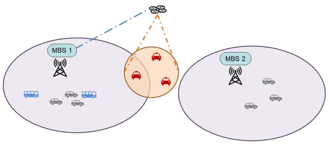

<details>
<summary>flowchart</summary>

```mermaid
graph TD
    subgraph_MBS_1["Network"]
        A["Car"] --> B["Bus"]
        C["Car"] --> D["Bus"]
        E["Car"] --> F["Bus"]
        G["Car"] --> H["Bus"]
    end
    subgraph_MBS_2["Network"]
        I["Car"] --> J["Bus"]
        K["Car"] --> L["Bus"]
        M["Car"] --> N["Bus"]
        O["Car"] --> P["Bus"]
    end
    MBS_1 -.-> MBS_2
    MBS_1 -.-> MBS_2
    MBS_2 -.-> MBS_1
    style MBS_1 fill:#f9f,stroke:#333
    style MBS_2 fill:#bbf,stroke:#333
```
</details>

Fig. 1. Joint Trajectory-RRM Scenario. The UABS is associated with MBS 1, which will schedule the resource by running the proposed RRM algorithm.

in the Coverage Limited Scenario, we assume that a portion of the area of interest is not well covered due to the lack of presence of MBSs. This means that some GUEs will not be able to connect to the network due to radio links being under a Signal-to-Noise ratio (SNR) threshold requirement. In this case, one should expect the UABS to fly towards locations where GUEs are moving but MBSs are not able to serve them, thus providing them connectivity.   
in the Capacity Limited Scenario, the area of interest is fully covered by MBSs, but, at the same time, the amount of resources available is not sufficient to serve all the GUEs moving in the area. In such a scenario, the role of the UABS is to fly towards the area of the map that requires a boost in the capacity to fulfil the GUEs demand (for example, crowded streets or location with traffic lights). Indeed, given the best channel condition of the radio link between GUEs and UABS, we can expect better use of the radio resources.

The comparison between the two scenarios will be investigated in Section VII.

# B. Application Requirements

GUEs request to upload Cooperative Awareness Message (CAM) messages to the network [23], using the resources provided either by the MBS or the UABS, every $t _ { \mathrm { m s g } }$ s. Such a tmsgbehaviour models an extended sensing application, where GUEs exchange data obtained through local sensors or videos with the nearby vehicles. We defined a GUE to be served if, at the current time step , can upload its message, that is the scheduling talgorithm has assigned enough resources for the transmission of the data packet. A priority $p _ { g , t }$ is introduced and given to each pg,tGUE, , to keep track of the service history at each time instant, . g tThe priority mechanism is used both inside the RRM algorithm and the trajectory design to allow a continuous service that meets the Quality of Experience (QoE) constraints.

# C. Channel Model

The channel model follows the Urban Macro (UMa) channel described in the 3GPP TR 38.901 [33]. The considered model provides different channel descriptions for LoS and Non-LoS (NLoS) conditions through the exploitation of the parameter $\rho _ { L }$ which is the probability of being in LoS condition that depends on the distance between the considered GUEs $^ { g , }$ regarded as gtransmitters, and the UABS/MBSs, the receivers, and on the height of $g , h _ { g } .$ . The path loss variation due to shadowing can g hgbe described through a log-normal distribution zero-mean and with a standard deviation $\sigma _ { \mathrm { L o S } }$ and $\sigma _ { \mathrm { N L o S } }$ for LoS and NLoS σLoS σNLoSrespectively. Consequently, the SNR in dB can be derived as:

$$
\mathrm{SNR} = P _ {\mathrm{tx}} + G _ {\mathrm{tx}} + G _ {\mathrm{rx}} - L _ {\text { path }} - P _ {\text { noise }}, \tag {1}
$$

where $P _ { \mathrm { t x } }$ is the transmitted power in dBm, $G _ { \mathrm { t x } }$ and $G _ { \mathrm { r x } }$ are Ptx Gtxthe transmitter and receiver antenna gains in dB, $L _ { \mathrm { p a t h } }$ rxis the Lpathpath loss in dB calculated following Table 7.4.1-1 and 7.4.2-1 in [33] and $P _ { \mathrm { n o i s e } }$ is the noise power in dBm. For what concerns Pnoisethe modelling of the UABS beams, by defining $\phi ^ { ( u ) }$ as the field φof view of the UABS on the vertical plane, and $\Phi ^ { ( u ) }$ , through the relationship $\Phi ^ { ( u ) } = 2 \pi ( 1 - c o s ( \bar { \phi ^ { ( u ) } } / 2 ) )$ , the correspondπ cos φ /ing solid angle, then the solid angle of the single beam may be approximated as Φ(u) $\Phi _ { b e a m } ^ { ( u ) } \approx \Phi ^ { ( u ) } / N _ { \mathrm { b e a m } }$ . Finally, the receiving beam /Nbeamgain of UABS can be expressed as follow [34]:

$$
G _ {\text { beam }} = \frac {4 1 0 0 0}{\left(\Phi_ {\text { beam }} ^ {(u)} \frac {3 6 0}{2 \pi}\right) ^ {2}}. \tag {2}
$$

For the sake of simplicity, it is assumed that the radiation pattern of the equivalent beam is ideal, with gain $G _ { \mathrm { b e a m } }$ inside $\phi _ { \mathrm { b e a m } } ^ { ( u ) }$ (u) and 0 outside, i.e. GUEs that are not inside a beam are φbeamnot considered connected to the UABS, thus this assumption provides a worst-case scenario for what concerns the drone and vehicles connectivity.

# D. Resource Definition

A radio resource unit (RU), which is used by the network to enable communication, may span over three dimensions: time, frequency, and space. In particular, the frequency domain is subdivided into subcarriers with a spacing of $\Delta f . \mathrm { ~ A ~ }$ resource block (RB) is composed of $N _ { \mathrm { s u b } }$ fconsecutive subcarriers. The Nsubtime domain is split into multiple time slots of duration $T _ { \mathrm { s l o t } }$ . The slot duration is chosen accordingly to $\Delta f$ Tslotso that a RB carries 14 forthogonal frequency-division multiplexing (OFDM) symbols. Assuming that the RRM algorithm runs every $\Delta t .$ , corresponding to $t _ { \mathrm { m s g } } .$ , and $B _ { \mathrm { s y s } }$ tis the total system bandwidth, the total number tmsg Bsysof RU that can be scheduled in a RRM period is given by:

$$
W = \frac {B _ {\mathrm{sys}}}{1 2 \Delta f} \cdot \frac {\Delta t}{T _ {\mathrm{slot}}}. \tag {3}
$$

In addition, also the space domain can be used to provide orthogonality among resources to further increase the number of available ones and reduce the level of interference. Spatial separation is achieved by the MBSs and UABS using beamforming techniques and creating directional links to the GUEs. In particular, the UABS can generate a fixed footprint composed of $N _ { \mathrm { b e a m } } { = } 9$ circular beams on the ground. They are all active si-Nbeammultaneously and arranged in a 3x3 non-overlapping grid. Since they do not overlap, full reuse of resources is possible between each of the beams. On the contrary, since the MBSs-GUEs links are prone to the presence of cluttering obstacles and NLoS links, such a perfect spatial separation cannot be guaranteed. ${ \mathrm { S o } } ,$ even if the per-beam full reuse cannot be used at the MBS, directional beams can reduce the level of interference.

# IV. RADIO RESOURCE MANAGEMENT

In this section, we address the RRM problem via ILP. A ILP is composed of an objective function, that states the target of the performance optimization, and a number of constraints, which define the environment and the system model. To formulate the ILP problem, a number of variables subject to optimization (integer or binary) need to be defined and, in our context, they are related to RUs utilization. Since the ILP is solved at each time step , the model description that follows is implicit as a tfunction of time. Nonetheless, for the sake of conciseness, the indexing is dropped hereafter.

To introduce the ILP, we now describe the variables used. First, the binary variables are defined as follows:

$$
\begin{array}{l} \psi_ {g} = \left\{ \begin{array}{l l} 1 & \text { if   user } g \in \mathcal {G} \text { is   served } \\ 0 & \text { otherwise } \end{array} \right. \\ \lambda_ {u, m} = \left\{ \begin{array}{l l} 1 & \text { if   UABS   } u \text {   is   assigned   RUs   by } \\ & \text { MBS   } m \in \mathcal {M} \\ 0 & \text { otherwise } \end{array} \right. \\ \lambda_ {g, m} = \left\{ \begin{array}{l l} 1 & \text { if   user } g \in \mathcal {G} \text { is   assigned   RUs   by } \\ & \text { MBS } m \in \mathcal {M} \\ 0 & \text { otherwise } \end{array} \right. \\ \lambda_ {g, u} = \left\{ \begin{array}{l l} 1 & \text { if   user } g \in \mathcal {G} \text { is   assigned   RUs   by } \\ & \text { UABS } u \text { and } \lambda_ {u, m} = 1 \\ 0 & \text { otherwise } \end{array} \right. \\ e _ {j} = \left\{ \begin{array}{l l} 1 & \text { if   beam   } j \in \mathcal {K} \text {   is   active   on } \\ & \text { UABS   } u \text {   and   } \lambda_ {u, m} = 1 \\ 0 & \text { otherwise } \end{array} \right. \\ \iota_ {g, m} = \left\{ \begin{array}{l l} 1 & \text { if   link } g - m \text { is   interfered   by   any   GUE } \\ & \text { connected   to } u \text { and } \lambda_ {u, m} = 1 \\ 0 & \text { otherwise } \end{array} \right. \\ \iota_ {g, u} = \left\{ \begin{array}{l l} 1 & \text { if   link } g - u \text { is   interfered   by   any   GUE } \\ & \text { and } \lambda_ {u, m} = 1 \\ 0 & \text { otherwise } \end{array} \right. \\ \iota_ {m, u} ^ {(b)} = \left\{ \begin{array}{l l} 1 & \text { if   MBS   } m \in \mathcal {M} \text {   suffers   interference   from } \\ & \text { any   GUE   connected   to   } u \text {   and   } \lambda_ {u, m} = 1 \\ 0 & \text { otherwise } \end{array} \right. \\ \iota_ {u, m} ^ {(b)} = \left\{ \begin{array}{l l} 1 & \text { if   UABS } u \text { suffers   interference   from   any } \\ & \text { GUE   connected   to } m \in \mathcal {M} \text { and } \lambda_ {u, m} = 1 \\ 0 & \text { otherwise } \end{array} \right. \\ \end{array}
$$

The following integer variables are also subject to optimization and, together with binary variables, are the output of the RRM procedure. They specify the number of RUs given to a communication link:

$w _ { g , m }$ and $w _ { g , u }$ represent the number of resources assigned wg,mto user $g \in { \mathcal { G } }$ uby the MBS $m \in \mathcal { M }$ or UABS , respectively;

$w _ { u , m }$ is the number of resources assigned by the MBS w $\in \mathcal { M }$ to the backhaul with UABS .

m uThe objective function aims at maximizing the number of served users, through $\psi _ { g }$ . One GUE is denoted as served in the given interval, $\Delta t ,$ ψg if it can upload its demand $D _ { g }$ . In addition, we t Dgaim at serving vehicles continuously, to evaluate the percentage of users satisfied. Each GUE is assumed to be satisfied if it is served for at least $\hat { N } _ { \mathrm { s } }$ time intervals within a given time window, $T _ { w } = N _ { \mathrm { w } } \Delta t$ Ns(being $\hat { N } _ { \mathrm { s } }$ a given percentage of $N _ { \mathrm { w } } )$ , i.e., if it Tw Nw t Ns Nwserved continuously by the network, thus it is able to upload its demand, in a specific time interval. The QoE requirement, $\hat { N } _ { s } ,$ , is Nsdetermined by the time the vehicle may take to manoeuvre (e.g., turn at crossroads, enter/exit roundabouts, stops, and so on). Example values are reported in [35], considering the average values of vehicles’ speed and communication range in specific use cases. To do this, we weigh each user $g \in { \mathcal { G } }$ with a priority value that varies over time, $p _ { g , t }$ g. In particular, in each time window $( { \mathrm { i . e . , } } t = 1 , . . , T _ { w } ) p _ { g , t }$ g,tvaries as follows:

$$
p _ {g, t} = \left\{ \begin{array}{l l} 1 & \text {for} t = 1 \\ p _ {g, t - 1} + 1 & \text {if} \psi_ {g, t} = 1 \\ p _ {g, t - 1} & \text {if} \psi_ {g, t} = 0 \end{array} \right.
$$

The RRM algorithm runs separately at each MBS $m \in \mathcal { M }$ , therefore the model is dependent on . GUEs and UABS select mthe MBS which guarantees the strongest communication link, with the highest Signal-to-Interference-plus-Noise ratio (SINR). Each MBS manages a given set of RUs assigned to a number of GUEs, $\mathcal { G } _ { m }$ , and to UABSs . MBS $m ^ { * }$ is the one currently associated to the UABS . Since RUs are shared from a common upool for the GUE-UABS and GUE-MBS links, the interference coming from the links managed by the same MBS is known.

$\mathcal { P }$ is mathematically described in (4a)–(4w), where $k _ { g , j }$ is an kg,jinput to the problem and indicates with value 1 whether vehicle is covered by beam  of UABS  and 0 otherwise. Set $\mathcal { G } _ { m } \subseteq \mathcal { G }$ gand the value of $\lambda _ { u , m }$ j udepend on . If $m = m ^ { * } , \lambda _ { u , m } = 1$ , and 0 otherwise. $F _ { B }$ u,m m m m u,mis denoted as the backhaul factor and ranges FBwithin [0, 1]; it is used to enhance the backhaul capacity, by reducing the RUs needed to forward traffic: lower $F _ { B }$ values FBcorrespond to greater backhaul capacity. Constraint (4c) ensures each vehicle  transmits a demand of $D _ { g }$ bits given the rate of the g Dgunitary RU and the number of RUs assigned by a specific Base Station (BS). Then, constraints (4d) and (4e) guarantee that the number of RUs assigned does not exceed the maximum available for MBSs and UABS, respectively. Clearly, RUs allocated for the backhaul are accounted for in both. Also, constraint (4f) ensures the backhaul capacity is enough to forward the UABS vehicular traffic to the network. As motivated previously, RUs are reused for different beams only by UABS. Then, constraints $( 4 \mathrm { g } )$ and (4h) limit the number of beams that can be simultaneously activated at the UABS  to $N _ { \mathrm { b e a m } } .$ , which is the number of u Nbeamantenna elements on the array. Finally, constraints (4o) to (4q) specify that each vehicle is served by one BS at a time.

The constraint (4b) is similar to (4c) as it defines the number of resources required by GUE $g$ to satisfy its demand, $D _ { g } ;$ g Dghowever, (4b) serves to recompute the number of RUs required only in the case interference is present, i.e., $g$ is connected to gan interfered BS. Then, the constraints (4i) and (4j) verify if there is an effective interferer on the MBS that is connected to the UABS  or vice versa, respectively, and constraints 4k uand (4l) verify if UABS  is interfering the link $g - m$ given uit is established or if the MBS $m$ g mis interfering the link $g - u$ given it is established,and (4n) specify that $\iota _ { u , m } ^ { \mathrm { ( b ) } } , \iota _ { m , u } ^ { \mathrm { ( b ) } } , \iota _ { g , u } .$ ally, , and $\iota _ { g , m }$ onstraints (4m)are all binary ι ι ιg,u ιg,mvariables. The expressions (4r)–(4w) show the validity interval of each variable in problem P. As previously studied in [12], the formulation of this problem resembles the generalized Multiple Knapsack problem which is NP-hard. Therefore, its complexity can be described as $2 | \mathcal G |$ , being $\mathcal { G }$ the set with the largest cardinality within the model considered.

$$
\mathcal {P}: \quad \max \left(\sum_ {g \in \mathcal {G} _ {m}} p _ {g} \psi_ {g}\right) \tag {4a}
$$

$$
\mathbf {s . t .}: w _ {g, m} r _ {g, m, u} ^ {\mathrm{I}} \Delta t + \sum_ {j \in \mathcal {K}} k _ {g, j} w _ {g, u} r _ {g, u, m} ^ {\mathrm{I}} \Delta t \geq
$$

$$
\geq \lambda_ {u, m} \left(\iota_ {g, m} + \iota_ {g, u}\right) D _ {g}, \forall g \in \mathcal {G} _ {m} \tag {4b}
$$

$$
w _ {g, m} r _ {g, m} \Delta t + \lambda_ {u, m} \sum_ {j \in \mathcal {K}} k _ {g, j} w _ {g, u} r _ {g, u} \Delta t
$$

$$
\geq \psi_ {g} D _ {g}, \forall g \in \mathcal {G} _ {m} \tag {4c}
$$

$$
\sum_ {g \in \mathcal {G} _ {m}} w _ {g, m} + w _ {u, m} \leq W _ {m} ^ {*} \tag {4d}
$$

$$
\sum_ {g \in \mathcal {G} _ {m}} k _ {g, j} w _ {g, u} + w _ {u, m} \leq \lambda_ {u, m} W _ {u} ^ {*}, \quad , \forall j \in \mathcal {K} \tag {4e}
$$

$$
\sum_ {g \in \mathcal {G} _ {m}} \sum_ {j \in \mathcal {K}} w _ {g, u} k _ {g, j} r _ {g, u} \leq \frac {r _ {u , m}}{F _ {B}} w _ {u, m} \lambda_ {u, m} \tag {4f}
$$

$$
\sum_ {j \in \mathcal {K}} e _ {j} \leq \lambda_ {u, m} N _ {\text { beam }}, \tag {4g}
$$

$$
\sum_ {g \in \mathcal {G} _ {m}} w _ {g, u} k _ {g, j} \leq e _ {j} \lambda_ {u, m} W _ {u} ^ {*}, \quad , \forall j \in \mathcal {K} \tag {4h}
$$

$$
\iota_ {m, u} ^ {\mathrm{(b)}} \geq \lambda_ {u, m} \sum_ {g ^ {\prime} \in \mathcal {G} _ {m}} \frac {I _ {g ^ {\prime} , u , m} \lambda_ {g ^ {\prime} , u}}{I _ {g ^ {\prime} , u , m}}, \quad \forall g ^ {\prime} \in \mathcal {G} _ {m} \tag {4i}
$$

$$
\iota_ {u, m} ^ {\mathrm{(b)}} \geq \lambda_ {u, m} \sum_ {g ^ {\prime} \in \mathcal {G} _ {m}} \frac {I _ {g ^ {\prime} , m , u} \lambda_ {g ^ {\prime} , m}}{I _ {g ^ {\prime} , m , u}}, \quad \forall g ^ {\prime} \in \mathcal {G} _ {m} \tag {4j}
$$

$$
\iota_ {g, m} \geq \lambda_ {g, m} + \lambda_ {u, m} + \iota_ {m, u} ^ {(b)} - 2, \quad \forall g \in \mathcal {G} _ {m} \tag {4k}
$$

$$
\iota_ {g, u} \geq \lambda_ {g, u} + \lambda_ {u, m} + \iota_ {u, m} ^ {\mathrm{(b)}} - 2, \quad \forall g \in \mathcal {G} _ {m} \tag {41}
$$

$$
\iota_ {m, u} ^ {(b)}, \iota_ {u, m} ^ {(b)} \in \{0, 1 \}, \quad \forall g \in \mathcal {G} _ {m} \tag {4m}
$$

$$
\iota_ {g, m}, \iota_ {g, u} \in \{0, 1 \}, \quad \forall g \in \mathcal {G} _ {m} \tag {4n}
$$

$$
\lambda_ {g, m} + \lambda_ {g, u} \leq 1, \quad \forall g \in \mathcal {G} _ {m} \tag {4o}
$$

$$
w _ {g, m} \leq \lambda_ {g, m} W _ {m} ^ {*}, \quad \forall g \in \mathcal {G} _ {m} \tag {4p}
$$

$$
w _ {g, u} \leq \lambda_ {g, u} \lambda_ {u, m} W _ {u} ^ {*}, \quad \forall g \in \mathcal {G} _ {m} \tag {4q}
$$

$$
\lambda_ {g, u} \in \{0, 1 \}, \quad \forall g \in \mathcal {G} _ {m} \tag {4r}
$$

$$
\lambda_ {g, m} \in \{0, 1 \}, \quad \forall g \in \mathcal {G} _ {m} \tag {4s}
$$

$$
\lambda_ {u, m} \in \{0, 1 \} \tag {4t}
$$

$$
w _ {g, u} \in \{0, W _ {u} ^ {*} \}, \quad \forall g \in \mathcal {G} _ {m} \tag {4u}
$$

$$
w _ {g, m} \in \{0, W _ {m} ^ {*} \}, \quad \forall g \in \mathcal {G} _ {m} \tag {4v}
$$

$$
w _ {u, m} \in \{0, \min \left[ W _ {m} ^ {*}, W _ {u} ^ {*} \right] \}, \tag {4w}
$$

# V. REINFORCEMENT LEARNING MODEL

# A. Markov Decision Process

In order to use RL algorithms to solve a task, the problem must be formalized as a Markov Decision Process (MDP) by means of the tuple $( \boldsymbol { S } , \mathcal { A } , \boldsymbol { \mathcal { T } } , \mathcal { R } )$ :

, , ,- S is the state space, that is the set of all possible states . A is a limited observation of the environment to s statewhich the agent has access. At each time step  the agent observes a state $s _ { t } .$ . In this work, a state $\mathsf { s } \in S$ tis represented by the vector of elements $[ x _ { t } , y _ { t } , t , \mathbf { b } _ { t } ]$ , where: $( x _ { t } , y _ { t } )$ is xt, yt, t, t xt, ytthe current position of the UABS;  is the current time of tflight; b is the per-beam information vector, that is a vector tof length $N _ { \mathrm { b e a m } }$ whose elements $b _ { i , t }$ represent the sum of the priority of GUEs under the -th beam at time instant . - i tA is the action space, which is the set of all possible actions that the agent can perform to interact with the environment. In this work, the action  represents the selection of a direction to follow and the choice of flight speed of the UABS. Therefore, we refer to action  as ainstantaneous velocity. For this reason, the action space is defined as $\mathcal { A } = \emptyset \cup ( \mathcal { D } \times \mathcal { V } )$ , that is the combination of all the possible discrete directions and possible speed values plus the action to stay still indicated as ∅.

$\tau$ is the transition probability function $\mathcal { T } : \mathcal { S } \times \mathcal { A }  \mathcal { S } \times$ (0 1). Depending on the action $a \in { \mathcal { A } }$ and a state $s \in S$ , , a sit expresses the probability of transitioning to a new state $s ^ { \prime } \in \mathcal { S }$ , in short, it captures how the environment changes sdue to agent’s actions. - R is the reward function $\mathcal { R } : \mathcal { S } \times \mathcal { A } \times \mathcal { S }  \mathbb { R }$ . It models a scalar function that assigns scores to the agent based on the action , observed state , and landing state $s ^ { \prime } .$ It will be a s sused in the following as the key factor that allows designing a trajectory that jointly considers the RRM output provided by the MBS. The reward, indeed, is calculated after the assignment of resources. Since the discussion on the reward requires a more thoughtful explanation, being the mechanism behind the trajectory design and RRM cooperation, Section VI-A is entirely dedicated to its description.

The UABS at each time instant  observe the current state $s _ { t }$ tand choose a direction and a speed, the action $a _ { t } ,$ st following the policy $\pi ( a | s )$ at,  hereafter, that is a stochastic mapping π a s πbetween the state space S and action space A. Executed the action, the environment gives back to the agent a scalar reward $r _ { t } = r \sim R ( s , a , s ^ { \prime } )$ , and it transitions to a new state $s _ { t + 1 } = s ^ { \prime } \sim T ( s , a )$ . The task is episodic so that it can be seen as a sequence of actions from time $t = 0$ to time $t = T .$ , where $T$ is defined as the flight duration.

RL algorithms have the goal to find the optimal policy $\pi ^ { * }$ which maximizes the expected discounted return $\begin{array} { r } { \dot { G _ { 0 } } = \sum _ { i = 0 } ^ { T } r _ { i } \gamma ^ { i } } \end{array}$ from the beginning to the end of the flight, at Gtime step $T ,$ riγ. The discount factor $\gamma \in [ 0 , 1 )$ is a hyperparameter T γ ,that balances the importance of immediate and future rewards.

Given a policy $\pi ,$ , it is possible to numerically score it by πmeans of the following functions [36]:

$$
V _ {\pi} (s) = \mathbb {E} _ {\pi} [ G _ {t} | s _ {t} = s ] = \mathbb {E} _ {\pi} \left[ \sum_ {i = t} ^ {T} R _ {i} \gamma^ {i} | s _ {t} = s \right]; \tag {5}
$$

$$
Q _ {\pi} (s, a) = \mathbb {E} _ {\pi} [ G _ {t} | s _ {t} = s, a _ {t} = a ]; \tag {6}
$$

$$
A _ {\pi} (s, a) = Q _ {\pi} (s, a) - V _ {\pi} (s). \tag {7}
$$

Equation (5) is the State Value for a state $s ,$ which is defined as the expectation of the discounter return $G _ { t }$ , given that at time Gt tit is observed state  and the agent follows exactly policy . s πEquation (6) is the Q-value function for action  and state , that is the expectation of $G _ { t }$ a sgiven that at time  the agent is in state , perform action and then it follows policy $\pi$ until the end of s a πthe episode. Finally, (7) is the advantage for action  and state , and it represents the relative benefit of choosing action  rather than the action prescribed by the current policy . Policy $\pi ^ { * }$ is optimal if these conditions hold:

$$
V _ {\pi^ {*}} (s) \geq V _ {\pi} (s), \quad \forall s \in S \tag {8}
$$

$$
Q _ {\pi^ {*}} (s, a) \geq Q _ {\pi} (s, a), \quad \forall s \in S, \forall a \in A \tag {9}
$$

$$
Q _ {\pi^ {*}} (s, a) = r (s, a, s ^ {\prime}) + \gamma \max _ {a ^ {\prime}} Q _ {\pi^ {*}} (s ^ {\prime}, a ^ {\prime}). \tag {10}
$$

# B. 3DQN Algorithm

Our system is based on the Double Dueling DQN (3DQN) algorithm in which we jointly exploit the Dueling architecture [37], as well as the Double action selection strategy [38]. 3DQN represents an extension of the original DQN algorithm that was first introduced in [39]. The main idea of DQN is to estimate the Q-values of the optimal policy $\pi ^ { * }$ using Deep πNeural Networks (DNNs), using batches of data obtained by a replay buffer $D$ filled by experiences $e _ { t } = < s _ { t } , a _ { t } , r _ { t } , s _ { t } ^ { \prime } >$ . D et < st, at, rt, st >Experiences are collected at each time step , while interacting twith the environment. An experience is collected every time the agent interacts with the environment, and it includes the observed state $s _ { t } ,$ the action selected $a _ { t } .$ , the reward obtained $r _ { t }$ stand the new state observed $s _ { t } ^ { \prime } .$ at rt. To correctly estimate the Q-values, stDQN uses two DNNs, the online Q-network with parameters $\theta ,$ and the target Q-network, with parameters $\theta ^ { - }$ . The latter θ θis a delayed copy of the former. Networks receive as input a One-Hot-Encoded representation of a state $s ,$ and as output the sestimates of the Q-values for each possible action. Since the output layer has finite dimension, DQN can only be used with a discrete action space ${ \mathcal { A } } .$ In addition to standard DQN, the Double action selection strategy is used for the loss function calculation, allowing for avoiding the problem of overestimation when updating the DNN parameters [38].

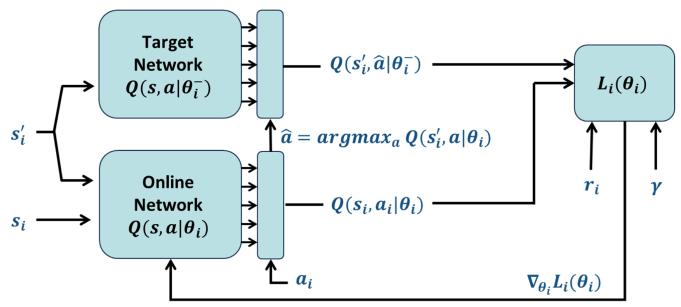

<details>
<summary>flowchart</summary>

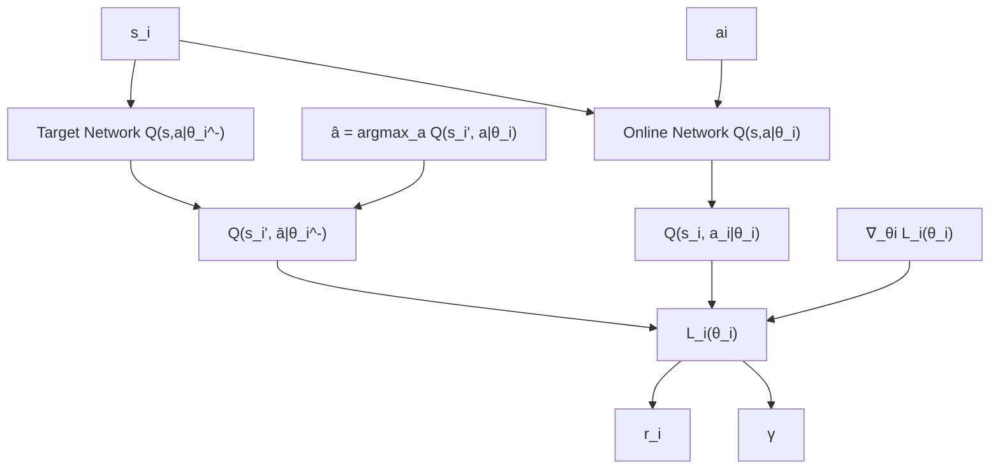
</details>

Fig. 2. Training procedure of the proposed DRL algorithm.

Finally, the Dueling architecture [37] is used, so the estimates of Q-values are done starting from the separate estimates of the state value and advantage for each action, and recombining them following:

$$
Q (s, a | \theta) = V (s | \eta) + \left(A (s, a | \mu) - \frac {1}{| \mathcal {A} |} \sum_ {a ^ {\prime}} A (s, a ^ {\prime} | \mu)\right), \tag {11}
$$

where $\mu$ and  are two separate streams of neurons, such that $\theta = \mu \cup \eta$ ηand $\mu \cap \eta = \varnothing$ . At the -th update step of the online θ μ η μQ-network, a batch $B _ { i }$ iof experiences is randomly drawn from $D$ Biand an average loss is calculated following:

$$
L _ {i} \left(\theta_ {i}\right) = \frac {1}{\left| \left| B \right| \right|} \sum_ {e _ {i} \in B _ {i}} \left(Q \left(s _ {i}, a _ {i} \mid \theta_ {i}\right) - \left(r _ {i} + Q \left(s _ {i} ^ {\prime}, \hat {a} \mid \theta^ {-}\right)\right)\right) ^ {2}, \tag {12}
$$

where ˆ = arg ma $\mathfrak { c } _ { a } Q ( s _ { i } ^ { \prime } , a | \theta )$ is the estimated best action to achoose when state $s ^ { \prime }$ Q si, a θis observed. As the loss converges to 0, the policy $\pi$ swill converge to the optimal one and (10) will be πverified. Once $L _ { i } ( \theta _ { i } )$ is calculated, the Q network is updated:

$$
\theta_ {i + 1} \leftarrow \theta_ {i} + \alpha \nabla_ {\theta_ {i}} L _ {i} (\theta_ {i}), \tag {13}
$$

where $\nabla _ { \theta _ { i } } L _ { i }$ corresponds to the back-propagation of the loss θ Lialong the DNN and  is the learning rate. A schematic repreαsentation of the overall algorithm is reported in Fig. 2. Given a generic experience tuple, $e _ { i } = < s _ { i } , a _ { i } , r _ { i } , s _ { i } ^ { \prime } >$ , the Online ei < si, ai, ri, si >Network estimates Q-values for state-action pairs and predicts the subsequent best action. Then, the Target Network estimates the target Q-value for the next state and the predicted action. Based on (12), a loss is calculated and accumulated for all the experiences in batch, $B _ { i }$ , and finally the Online Network’s parameters are updated.

As widely known in the literature, e.g. [26], the complexity of the 3DQN can be studied in function of the overall number of parameters of the DNNs employed and their peculiar architecture. By defining $N _ { i }$ and $N _ { o }$ as the number of neurons in Ni Nothe input layer and output layer, which are in function of the count of state variable and available actions respectively,  the number of hidden layers, and $m _ { i }$ Mthe number of neurons at the mi-th layer, then the strict complexity bound can be written as $\begin{array} { r } { \theta ( 2 \bar { N _ { i } } \bar { m _ { 1 } } + m _ { M } ( N _ { o } + 1 ) + \bar { 2 } \sum _ { i = 1 } ^ { M ^ { - } 1 } m _ { i } m _ { i + 1 } ) } \end{array}$ .

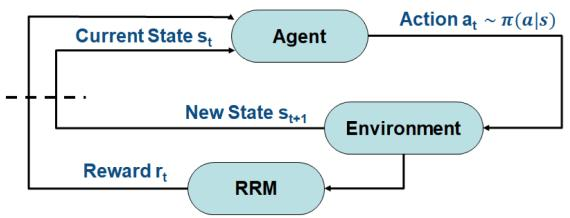

<details>
<summary>flowchart</summary>

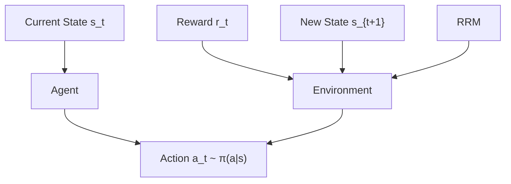
</details>

Fig. 3. Schematic representation of the modified RL framework.

# VI. INTEGRATING TRAJECTORY DESIGN AND RRM

# A. Reward Function Design

We now focus the attention on the design of suitable reward functions to take into account both the RRM and the trajectory design issues.

Fig. 3 shows the schematic representation of the considered RL framework. It is worth noticing the addition of the RRM block in the closed loop, which is in charge of calculating the reward for the agent. At each time step , assuming that UABS is associated with MBS $m ^ { * } \in \mathcal { M }$ t, we define the following usubsets:

- $\mathcal { G } _ { u } .$ , the set of $g \in { \mathcal { G } }$ that are covered by UABS  at time .   
- $\mathcal { G } _ { m }$ , the set of $g \in { \mathcal { G } }$ that are covered by MBS $m \in \mathcal { M }$ tat mtime .   
- $\mathcal { \partial } _ { u }$ t, the set of $g \in { \mathcal { G } }$ that are served by UABS  at time .   
- ${ \mathcal { N } } _ { m } .$ , the set of $g \in { \mathcal { G } }$ that are served by MBS $m \in \mathcal { M }$ tat mtime .

twhere covered means that the SNR of the link between the receiving UABS  or MBS  and the GUE  is above a given threshold, i.e $\mathrm { S N R } _ { g , m } > \mathrm { S N R } _ { \operatorname { t h } }$ or $\mathrm { S N R } _ { g , u } > \mathrm { S N R } _ { \operatorname { t h } }$ , where $\mathrm { S N R } _ { g , m }$ g,m > th g,is the SNR of the link between GUE $g \in { \mathcal { G } }$ thand the MBS g,m ∈ M at time step , and $\operatorname { S N R } _ { g , u }$ gis the one of the link between m t g,uthe GUE and the UABS. The SNR is calculated following (1). On the other hand, Served indicates that $g$ is covered and the gRRM algorithm has assigned resources for uploading its data packet. This means that sets $G _ { m }$ and $G _ { u }$ depend on the reciprocal Gm Gupositions among TX and RX, which will affect the link budget, while the other two sets will be determined in the aftermath of the RRM algorithm outcome. It is worth mentioning that a GUE can either be served by a MBS or by the UABS, thus $\mathcal { V } _ { m } \cap \mathcal { V } _ { u } = \emptyset \forall m \in \mathcal { M }$ . While a GUE can be considered m u mcovered by the UABS and multiple MBSs at the same time. Then we can define the following reward functions:

- Greedy Reward: $\begin{array} { r } { r _ { t } = \sum _ { g \in \mathcal { V } _ { u } } p _ { g , t } } \end{array}$ , which coincides with rt g pg,tthe sum of the priority of the GUEs served by the UABS.   
- Network Reward: $\begin{array} { r } { r _ { t } = \sum _ { g \in \mathcal { V } _ { u } \cup \mathcal { V } _ { m ^ { * } } } p _ { g , t } } \end{array}$ , that is the sum of rt g pg,tthe priority of GUEs served by the UABS and its current associated MBS $m ^ { * }$ .   
m- Exclusive Reward: $\begin{array} { r } { r _ { t } = \sum _ { g \in \mathcal { V } _ { \mathrm { e x } } } p _ { g , t } . } \end{array}$ , that is the sum of rt g pg,tthe priority of GUEs belonging to the exclusive set $\mathcal { V } _ { \mathrm { e x } } =$ $\mathcal { V } _ { u } \cap \overline { { \mathcal { G } _ { m ^ { * } } } }$ ex, that collects all the GUEs that are served by the u mUABS not covered by the associated MBS $m ^ { * }$ .

mThe exploitation of the priority mechanism in the calculation of the reward can help in defining trajectories allowing a continuous service for the connected GUEs, thus improving the QoE metric. Following the user assignment and RRM scheduling snapshot example shown in Fig. 4, and assuming unitary $p _  g , $ for simplicity, the calculated rewards would be equal to 3, 8, and 2 respectively.

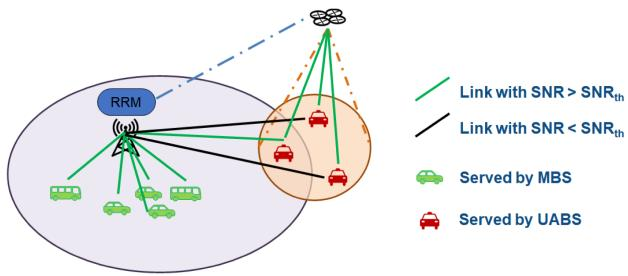

<details>
<summary>flowchart</summary>

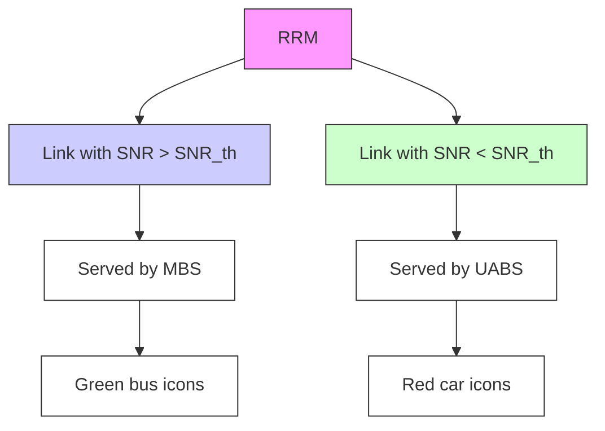
</details>

Fig. 4. User assignment and RRM outcome in a generic time step t.

# B. Sets Aggregation

Changing the MBS $m ^ { * }$ the UABS is connected to can change mthe reward received by the UABS, in particular for what concerns the Network Reward and the Exclusive Reward. Therefore, the association $( u - m ^ { * } )$ that maximizes the reward at each time step is implicitly learned by the agent. However, this raises the concern that the UABS could forcefully change the associated MBS only to obtain temporarily, and artificially, higher rewards, leading to a sub-optimal trajectory and service degradation to GUEs. For this reason, we introduce the concept of sets aggregation. When applied, and only for the sake of reward calculation, rather than using the separate sets, $\mathcal { G } _ { m }$ and ${ \mathcal { V } } _ { m }$ for each MBSs, we consider $\begin{array} { r } { \mathcal { G } _ { \mathcal { M } } = \bigcup _ { m \in \mathcal { M } } \mathcal { G } _ { m } } \end{array}$ and $\textstyle { \mathcal { Y } } _ { { \mathcal { M } } } = \bigcup _ { m \in { \mathcal { M } } } { \mathcal { Y } } _ { m }$ , that are m m m mall users currently covered and served by the whole terrestrial network, respectively. Thanks to the latter, we provide a more global view of the current state of the network, driving the UABS towards areas of the map where its contribution is most needed. It is important to notice that even if the reward function is calculated by aggregating multiple MBS information, the RRM algorithm can still run in a distributed and independent way at each MBS and that the UABS has an active backhaul connection with only one MBS $m ^ { * }$ , as described before.

# VII. RESULTS

In this section, the results obtained considering the joint design of trajectory and RRM will be reported. In the following, we consider an urban area of size 1500 m × 800 m. As stated before, we explored two different scenarios, namely coverage and capacity limited. Nonetheless, most of the simulation parameters are in common and listed in Table I. In particular, in the capacity limited scenario, we consider a smaller system bandwidth to reduce the number of available resources, but at the same time, more MBSs are present to cover the entire area. Each MBS has the same amount of resources, which are shared with the UABS, and we assume full reuse among all the MBS and the UABS.

During the training, the UABS makes a tradeoff between exploration of the environment and exploitation of its current knowledge, by means of an exploration policy to follow. In this work, the -greedy policy is taken into account, where at each time step, , the UABS can choose a random action with tprobability  or select the action $a = \arg \operatorname* { m a x } _ { a } Q ( a | s , \theta )$ , i.e., a aQ a s, θthe action with the highest Q-value, with probability 1- . To

TABLE I SIMULATION PARAMETERS 

<table><tr><td>Parameter</td><td>Notation</td><td>Value</td></tr><tr><td>Episode duration [s]</td><td> $T$ </td><td>270</td></tr><tr><td>UABS height [m]</td><td> $h_u$ </td><td>100</td></tr><tr><td>UABS minimum speed [m/s]</td><td> $v_{\text{min}}$ </td><td>10</td></tr><tr><td>UABS maximum speed [m/s]</td><td> $v_{\text{max}}$ </td><td>40</td></tr><tr><td>UABS speed resolution [m/s]</td><td> $v_{\text{step}}$ </td><td>10</td></tr><tr><td>UABS aperture angle</td><td> $\phi_u$ </td><td>140°</td></tr><tr><td>MBS height [m]</td><td> $h_m$ </td><td>30</td></tr><tr><td>Number of GUEs</td><td> $|G|$ </td><td>90</td></tr><tr><td>GUE speed [m/s]</td><td> $v_g$ </td><td>12</td></tr><tr><td>GUE packet periodicity [s]</td><td> $t_{\text{msg}}$ </td><td>0.1</td></tr><tr><td>Service time window duration [s]</td><td> $T_w$ </td><td>10</td></tr><tr><td>Interval duration [s]</td><td> $\Delta t$ </td><td>0.1</td></tr><tr><td>Transmit power [dBm]</td><td> $P_{\text{tx}}$ </td><td>14</td></tr><tr><td>Noise power [dBm]</td><td> $P_{\text{noise}}$ </td><td>-106.4</td></tr><tr><td>GUE transmitting antenna gain [dB]</td><td> $G_{\text{tx}}$ </td><td>0</td></tr><tr><td>UABS receiving antenna gain [dB]</td><td> $G_{\text{u,rx}}$ </td><td>24</td></tr><tr><td>MBS receiving antenna gain [dB]</td><td> $G_{\text{u,rx}}$ </td><td>16</td></tr><tr><td>LoS shadowing standard deviation [dB]</td><td> $\sigma_{\text{LoS}}$ </td><td>4</td></tr><tr><td>NLoS shadowing standard deviation [dB]</td><td> $\sigma_{\text{NLoS}}$ </td><td>6</td></tr><tr><td>Carrier Frequency [GHz]</td><td> $f_c$ </td><td>30</td></tr><tr><td>Subcarrier Spacing [KHz]</td><td> $\Delta f$ </td><td>120</td></tr><tr><td>Number of subcarrier</td><td> $N_{\text{sub}}$ </td><td>12</td></tr><tr><td>Time Slot [ms]</td><td> $T_{\text{slot}}$ </td><td>0.125</td></tr><tr><td colspan="3">Coverage Limited Scenario</td></tr><tr><td>Number of MBSs</td><td> $|\mathcal{M}|$ </td><td>2</td></tr><tr><td>System Bandwidth [MHz]</td><td> $B_{\text{sys}}$ </td><td>400</td></tr><tr><td>GUE Demand [kbit]</td><td> $D_g$ </td><td>100</td></tr><tr><td colspan="3">Capacity Limited Scenario</td></tr><tr><td>Number of MBSs</td><td> $|\mathcal{M}|$ </td><td>5</td></tr><tr><td>System Bandwidth [MHz]</td><td> $B_{\text{sys}}$ </td><td>50</td></tr><tr><td>GUE Demand [kbit]</td><td> $D_g$ </td><td>1000</td></tr></table>

TABLE II 3DQN HYPERPARAMETERS 

<table><tr><td>Parameter</td><td>Notation</td><td>Value</td></tr><tr><td>Number Training Epochs</td><td> $N_{epochs}$ </td><td>10</td></tr><tr><td>Number Training Episode per Epoch</td><td> $N_e$ </td><td>100</td></tr><tr><td>Learning Rate</td><td> $\alpha$ </td><td>0.0001</td></tr><tr><td>Discount Factor</td><td> $\gamma$ </td><td>0.8</td></tr><tr><td>Buffer Size</td><td>N</td><td>1000000</td></tr><tr><td>Batch Size</td><td>K</td><td>128</td></tr><tr><td>Online Network Update</td><td>n</td><td>10</td></tr><tr><td>Target Network Update</td><td>l</td><td>250</td></tr><tr><td>Max Exploration Probability</td><td> $\epsilon_{max}$ </td><td>1</td></tr><tr><td>Min Exploration Probability</td><td> $\epsilon_{min}$ </td><td>0.05</td></tr><tr><td>Exploration Fraction</td><td> $\epsilon_{ratio}$ </td><td>0.6</td></tr></table>

aid the agent in converging to an optimal policy,  is linearly decreased throughout the training. In particular, this trade-off is regulated by the choice of the exploration fraction, $\epsilon _ { r a t i o } .$ , that is ratiothe fraction of training episodes used to linearly decay , from a maximum value $\epsilon _ { \mathrm { m a x } }$ to a minimum one $\epsilon _ { \mathrm { { m i n } } } .$ .

max minThe online Q-network parameters  are updated, following θ(12)–(13), every  steps, while they are copied to the target nQ-network every  step.

lThe 3DQN hyperparameters used are listed in Table II.

The UABS is trained for $N _ { \mathrm { e p o c h } }$ epochs. An epoch is composed of $N _ { e }$ Nepochtraining episodes, each characterized by a different Nerandomly selected trace. A trace is the collection of all GUEs positions at each time step  obtained by simulating their movement tusing SUMO. Traces share a common road traffic distribution based on real urban traffic conditions. This is done to minimize the problem of over-fitting during training.

At the same time, during training (once every 20 training episodes), an evaluation of the UABS is performed by letting the agent move according to an evaluation trace. In this case, the evaluation trace is fixed and is the same during the entire duration of the experiments so that results and performance can be compared fairly among different evaluation episodes as the train goes on. This trace used is exclusive for the evaluation and it is not used during training. It is worth mentioning that during an evaluation episode, to evaluate the current policy, the agent has no possibility to move randomly, in contrast with what happens during training. Evaluation episodes let us understand how well the UABS can design trajectories “on the go” based only on the observations it gets from the environment.

# A. Performance Metrics

In this section, the performance metrics used in the following are presented. Such metrics can be categorized into either machine learning-related or network-related ones. The results are obtained net of an average among three repeated simulations, each of which used different random seeds. For what concerns the comparison with benchmarks, presented in Section VII-B, performances are studied in terms of episode return at the -th evaluation episode:

$$
R _ {i} = \sum_ {t = 0} ^ {T} r _ {t, i}. \tag {14}
$$

We show results considering the Greedy Reward only since it is the one that better reflects the UABS contribution to the network service, thus offering the best insight into its behaviour, but the same comparison applies for the Network Reward and the Exclusive Reward.

Instead, while investigating the above-mentioned scenarios, respectively Section $\mathrm { V I I - C }$ and Section VII-D, the training of the agent is shown in terms of normalized average return per epoch as a function of the number of epochs simulated. By defining $R _ { i , e }$ as the return obtained during the -th training episode in Ri,ean epoch $e ,$ the average return over the $N _ { e }$ episodes in the -th eepoch can be written as:

$$
R _ {e, \text { avg }} = \frac {1}{N _ {e}} \sum_ {i = 0} ^ {N _ {e}} R _ {i, e}. \tag {15}
$$

Once the training has finished, all $R _ { e , \mathrm { a v g } }$ for each epoch are Re,avgcollected and normalized between 0 and 1, corresponding to the lowest and highest one respectively, so that the final metric is referred to as $\overline { { R _ { e , \mathrm { a v g } } } }$ . Evaluation of the agent is based on the Re,avgnormalized return obtained in the -th evaluation episode, $\overline { { R _ { i } } }$ , i Riwhich indicates how well the agent can perform when it acts following the learned policy (i.e., without taking random actions to explore), and it shows the ability at following unknown trajectories based on the observations it gets from the environment. To provide a smoother trend, evaluation curves are exponentially averaged with an exponent equal to 0.3. Normalization is needed to allow the comparison between different types of reward functions that might have very distinct orders of magnitude.

For what concerns the network performance, they are obtained once the training has ended based on the best evaluation episode of each simulation. First, the percentage of satisfied users $P _ { g } ^ { ( s a t ) }$ is presented:

$$
P _ {g} ^ {(s a t)} = \frac {1}{| G |} \sum_ {g \in G} \frac {N _ {g} ^ {(s a t)}}{N _ {g}}, \tag {16}
$$

i.e. the ratio between the number of satisfied service windows $N _ { g } ^ { ( s a t ) }$ and the total amount of services windows $N _ { g }$ for each NgGUEs $g \in G$ Ng, average among them and as a function of different g Gservice threshold $\hat { N } _ { \mathrm { s } } . N _ { g }$ depends on the travel’s duration of the Ns NgGUE considered. Then, the number of GUEs served at each time step , $\begin{array} { r } { \Psi _ { t } = \sum _ { g \in G } \psi _ { g , t } } \end{array}$ , highlights the users served by MBSs t t g G ψg,tand the ones served by the UABS. The curve is averaged with a sliding window of fixed length to get a smoother trend.

As an additional metric for the network performance, we consider the network throughput, which is the overall number of bits transmitted by each GUEs and correctly received by the network following resource allocation, averaged over the entire flight duration. Given that $\psi _ { g }$ is 1 if the -th GUE has been served at timestep  and $D _ { g }$ is the user demand, it can be written as:

$$
S _ {\text { net }} = \frac {1}{T} \sum_ {t = 0} ^ {T} \sum_ {g \in \mathcal {G}} D _ {g} \psi_ {g, t}. \tag {17}
$$

It is worth noticing that both types of metrics, machine learning-based and network ones, provide useful insights when studied jointly. Indeed, by looking only at the former, it is possible to estimate the training performance of deployed UABS with different reward functions, but the impact which such training has on the network performance point of view is not addressed. On the other hand, such aspects should be taken into account since, as will be discussed in the following, better or equal training performance does not always mean better network performance.

# B. Benchmarking the Algorithm

In this section, the proposed system denoted as Proposed UABS, is compared with three different benchmarks.

The first benchmark, Dummy UABS, is based on a UABS that moves at each time step, , in the direction corresponding to the tbeam with the maximum sum of the priority values. Thus, it is not trained via RL and it simply follows a greedy policy that selects $\hat { a _ { t } } = \mathrm { a r g } \operatorname* { m a x } _ { i } b _ { i , t }$ . This benchmark comparison allows at ibi,tan understanding of the performance’s gain offered by using a DRL algorithm for the trajectory design w.r.t. a simpler one that maximizes only the step-by-step reward. In other terms, it investigates the trade-off among short-term goals, i.e. choosing the next best position by looking only at the immediate future, and long-term goals, with the UABS that flies along a trajectory that takes into account the overall flight duration and the total reward.

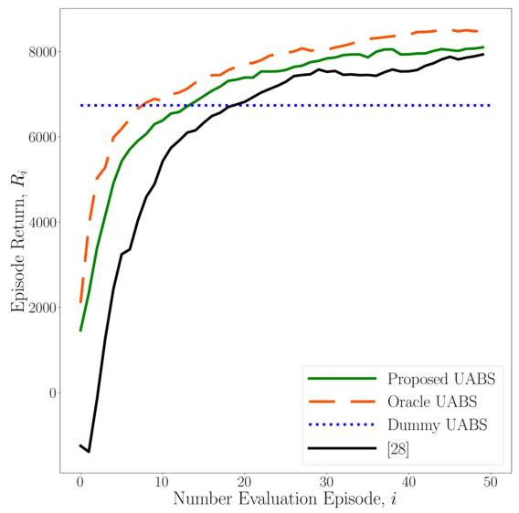

<details>
<summary>line</summary>

| Number Evaluation Episode, i | Proposed UABS | Oracle UABS | Dummy UABS | [28] |
| ----------------------------- | ------------- | ----------- | ---------- | ---- |
| 0                             | 1500          | 2000        | 6500       | -1000 |
| 10                            | 6000          | 7000        | 6500       | 4000 |
| 20                            | 7500          | 7800        | 6500       | 6500 |
| 30                            | 8000          | 8200        | 6500       | 7500 |
| 40                            | 8200          | 8400        | 6500       | 7800 |
| 50                            | 8300          | 8500        | 6500       | 8000 |
</details>

Fig. 5. Benchmark Comparison - Greedy Reward.

The second benchmark, Oracle UABS, is based on a hypothetical UABS that knows the exact future position of vehicles, which in real scenarios is not feasible. In this case, the system is modelled and trained by defining a new state $s _ { t }$ that is composed of the vector of elements $\left[ x _ { t } , y _ { t } , t , \mathbf { b } _ { t } , \mathbf { b _ { t + 1 , \operatorname* { m a x } } } \right]$ . $\bf { b } _ { t + 1 , \mathrm { { m a x } } }$ is a binary mask of length $N _ { \mathrm { b e a m } }$ , t, t, + ,max + ,max, whose -th element is equal Nbeam ito 1 if the -th beam has the highest sum of the priority values iamong all the others when considering the positions of GUEs at the next time step $t + 1$ , and 0 otherwise. The comparison with such a benchmark allows us to understand how good the standard trained agent is at learning, thus anticipating, the path most likely followed by GUEs, avoiding interrupting service to the prioritized users.

Finally, the third benchmark corresponds to the DRL agent proposed in [28] that we have implemented and trained following our states, actions, and rewards definition.

In Fig. 5 it is possible to notice that Proposed UABS performs better than the Dummy UABS one after around 10 evaluation episodes. This suggests that, in a complex and dense urban scenario, the trajectory design must consider the implicit trade-off among short and long-term optimization of the UABS position, indeed the simplified step-by-step greedy optimization turns out to be ineffective. For what concerns the Oracle UABS, it is possible to see that, as expected, providing data about the future position of GUEs increases the performance of the systems, i.e. better trajectories. Nonetheless, the gap between the two curves is relatively small meaning that the Proposed UABS tries to learn and predict the traffic characteristic during its training. Finally, our 3DQN agent showed faster learning in the initial phase when compared to the agent proposed in [28]. Although both agents performed equally towards the end of the simulation, our agent’s superior performance has the potential to reduce the deployment time of the UABS.

# C. Coverage Limited Scenario

In this section, we discuss the numerical results obtained when considering a scenario that is limited in coverage, i.e. MBSs are positioned so that most of the map is not well covered, thus the outage probability is high. As a result, the GUEs’ QoE is not guaranteed by the terrestrial network only, thus the UABS needs to play a crucial role in providing connectivity where missing. As a first result, a comparison between the different reward functions, defined in Section VI-A, is reported.

In Fig. 6(a) the training as a function of the number of epochs is reported. Since training is done for 1000 episodes, 10 epochs are simulated. In Fig. 6(b) the normalized cumulative reward obtained during each evaluation episode is shown. It is possible to see that the Greedy Reward outperforms the other reward functions since the agent’s performance is smoother both during training and evaluation. This is due to the fact that the reward defined this way better reflects the single UABS actions and interactions within the environment. The Exclusive Reward, instead, uses the initial part of the training to discover which part of the map is not covered by the MBSs. In contrast, the Network Reward performs worse compared to the others in the final stages of training. This happens because the reward also depends on the service provided by the MBSs over which the agent has no control, thus it introduces a noisy signal not suitable for learning. In particular, the agent trained with such a reward is unable to reliably define new trajectories during evaluation episodes and loses the ability to generalize when new traffic conditions are encountered.

In Fig. 7(a) the percentage of satisfied users $P _ { g } ^ { ( s a t ) }$ is shown Pgfor different satisfaction thresholds and for the different reward functions. Also, the black line shows, as a baseline, the QoE in the absence of the UABS. It is possible to notice that, as expected, the presence of the UABS significantly increases users’ satisfaction for all the threshold levels. The UABS, flying along its learned trajectory, can increase the coverage area of the network, allowing it to serve GUEs for a longer period of time. For lower satisfaction thresholds the agent trained with the $E x -$ clusive Reward outperforms the other reward functions. Such an advantage diminish as the threshold increases because the radio channel and strict beamforming become major impairments for the reliability of the service. This allows concluding that, even if the training with the Exclusive Reward turned out to be difficult, due to the implicit discovery phase of the uncovered area, the learned trajectory is the best one in terms of overall network performance. In contrast, the Greedy Reward had the easiest and fastest training, but the trajectory learned is not suitable for a coverage limited scenario. Considering the best episode obtained with the Exclusive Reward, in Fig. 7(b) the number of GUEs served by the network is reported, highlighting also those that are served specifically by the UABS. Finally, Fig. 7(c) shows the gain of network throughput achieved by deploying the UABS in the considered service area, as a function of different user demand $D _ { g } .$ Indeed, it is clear that the high mobility offered Dgby the drone can severely boost the network throughput since it can alleviate coverage issues of the terrestrial network.

# D. Capacity Limited Scenario

In this section, we look at the numerical results obtained when considering a scenario that is limited in capacity, i.e. the number of MBSs is sufficient to cover the entire considered map, but the amount of total available resources is not enough to fulfil the GUEs’ demand requirements. Since the RRM is accounted as distributed, there cannot be offloading of users between MBSs, and potential interfering links can worsen the performance of the network. The system bandwidth is set to $B _ { \mathrm { s y s } } = 5 0 ~ \mathrm { M H z }$ Bsysand the demand of each GUEs has been increased to 1 Mbit. Due to the characteristic of this scenario, the GUEs’ QoE is not guaranteed by the terrestrial network only, thus the UABS plays a crucial role in providing a boost in the network capacity and reliability. This is possible by exploiting the advantageous GUE-UABS channel quality allowing better resource utilization. It is also worth mentioning that when coverage is guaranteed by the terrestrial network, the Exclusive Reward is always equal to zero, thus it becomes pointless to use it for training.

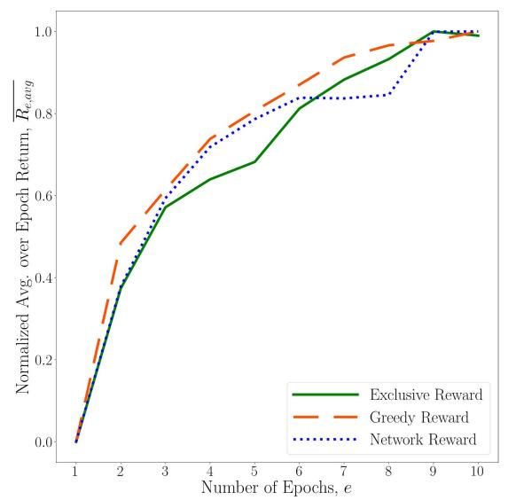

<details>
<summary>line</summary>

| Number of Epochs, e | Exclusive Reward | Greedy Reward | Network Reward |
| ------------------- | ---------------- | ------------- | -------------- |
| 1                   | 0.0              | 0.0           | 0.0            |
| 2                   | 0.4              | 0.5           | 0.4            |
| 3                   | 0.6              | 0.7           | 0.6            |
| 4                   | 0.7              | 0.8           | 0.7            |
| 5                   | 0.8              | 0.9           | 0.8            |
| 6                   | 0.9              | 0.95          | 0.85           |
| 7                   | 0.95             | 0.98          | 0.85           |
| 8                   | 0.98             | 0.99          | 0.9            |
| 9                   | 1.0              | 1.0           | 0.95           |
| 10                  | 1.0              | 1.0           | 1.0            |
</details>

(a)

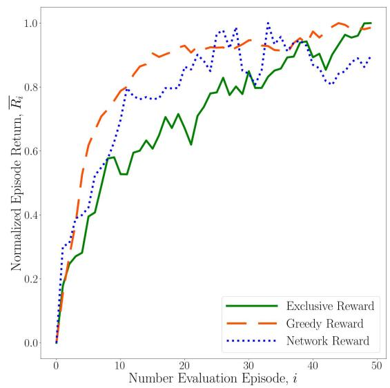

<details>
<summary>line</summary>

| Number Evaluation Episode, i | Exclusive Reward | Greedy Reward | Network Reward |
| ---------------------------- | ---------------- | ------------- | -------------- |
| 0                            | 0.0              | 0.0           | 0.0            |
| 5                            | 0.3              | 0.4           | 0.3            |
| 10                           | 0.6              | 0.8           | 0.7            |
| 15                           | 0.7              | 0.9           | 0.8            |
| 20                           | 0.8              | 0.9           | 0.9            |
| 25                           | 0.8              | 0.9           | 0.9            |
| 30                           | 0.9              | 0.9           | 0.9            |
| 35                           | 0.9              | 0.9           | 0.9            |
| 40                           | 0.9              | 0.9           | 0.8            |
| 45                           | 0.9              | 0.9           | 0.8            |
| 50                           | 1.0              | 1.0           | 0.9            |
</details>

(b)

Fig. 6. Coverage limited ML performance. (a) Per-epoch average return comparison. (b) Agent evaluation comparison.   
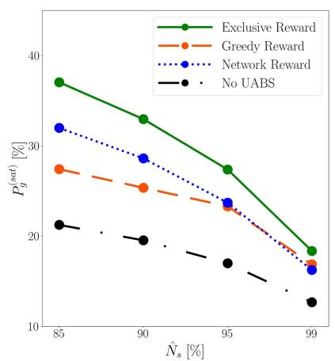

<details>
<summary>line</summary>

| N̂s [%] | Exclusive Reward | Greedy Reward | Network Reward | No UABS |
| ------ | ---------------- | ------------- | -------------- | ------- |
| 85     | 37               | 27            | 32             | 21      |
| 90     | 33               | 25            | 28             | 19      |
| 95     | 27               | 23            | 24             | 16      |
| 99     | 18               | 16            | 16             | 12      |
</details>

(@)

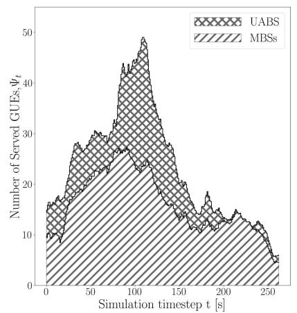

<details>
<summary>bar_stacked</summary>

| Simulation timestep t [s] | UABS | MBSs |
| ------------------------- | ---- | ---- |
| 0                         | 10   | 10   |
| 50                        | 30   | 25   |
| 100                       | 45   | 30   |
| 150                       | 25   | 20   |
| 200                       | 15   | 15   |
| 250                       | 5    | 5    |
</details>

(b)

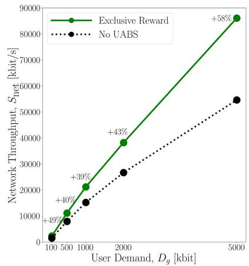

<details>
<summary>line</summary>

| User Demand, Dg [kbit] | Exclusive Reward | No UABS |
| ---------------------- | ---------------- | ------- |
| 100                    | 0                | 0       |
| 500                    | 10000            | 5000    |
| 1000                   | 20000            | 10000   |
| 2000                   | 40000            | 25000   |
| 5000                   | 85000            | 55000   |
</details>

Fig. 7. Coverage limited network performance (a) Percentage of satisfied GUEs. (b) Number of GUEs served in a flight. (c) Network throughput.

In Fig. 8(a) and (b) the training and evaluation performances are compared for the Greedy Reward and Network Reward respectively. In the capacity limited scenario, differently from the one discussed before, the Greedy Reward and Network Reward provide similar performance in training. Since network resources are limited, it is easier for the UABS to understand where it should go to boost the overall network service. Also, the RRM algorithm makes sure to use the UABS only when there are enough resources for the backhaul link, thus the Greedy Reward is different from zero (i.e. the UABS serves at least one GUE) only if there are enough resources for both the fronthaul and backhaul considering also the current load on the associated MBS. Once again, the Greedy Reward provides a strong signal for the training of the UABS, allowing a faster convergence to “good-enough” trajectories during evaluation.

In Fig. 9(a) the QoE achieved by comparing the different rewards function and a benchmark where no UABS is used are presented. It is possible to see the advantage of deploying an UABS with the aim of boosting the network capacity, and, differently from the coverage limited scenario, both reward functions provide similar network performances at the end of the training, suggesting that the UABS has learned similar trajectories. Considering the best episode obtained with the Greedy Reward, Fig. 9(b) presents the number of GUEs served by the network. Using this trained model, we have studied the network throughput in function of the user demand. It is possible to notice that since all users are covered, the network throughput improvements are now due to better use of the limited number of radio resources available. Indeed, the benefits become more evident as user demand increases. This indicates that the UABS would be crucial for V2X applications that require uploading large amounts of data, such as images.

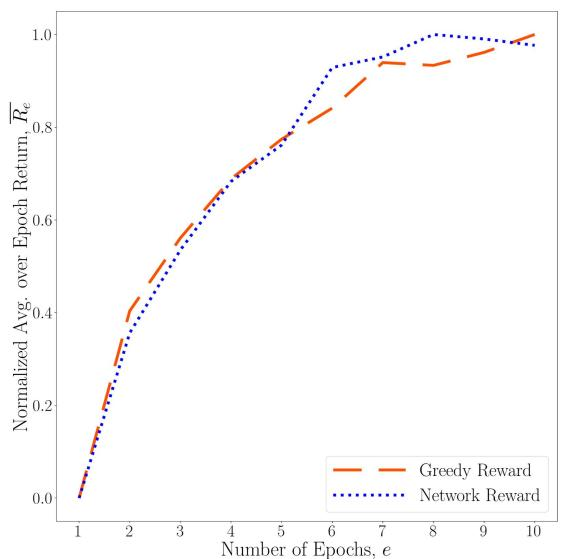

<details>
<summary>line</summary>

| Number of Epochs, e | Greedy Reward | Network Reward |
| ------------------- | ------------- | -------------- |
| 1                   | 0.0           | 0.0            |
| 2                   | 0.4           | 0.35           |
| 3                   | 0.6           | 0.55           |
| 4                   | 0.7           | 0.7            |
| 5                   | 0.8           | 0.8            |
| 6                   | 0.9           | 0.9            |
| 7                   | 0.95          | 0.95           |
| 8                   | 0.95          | 1.0            |
| 9                   | 0.98          | 1.0            |
| 10                  | 1.0           | 1.0            |
</details>

(a)

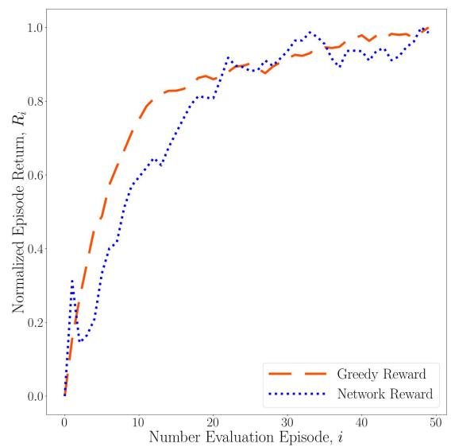

<details>
<summary>line</summary>

| Number Evaluation Episode, i | Greedy Reward | Network Reward |
| ---------------------------- | ------------- | -------------- |
| 0                            | 0.0           | 0.0            |
| 5                            | 0.4           | 0.3            |
| 10                           | 0.7           | 0.6            |
| 15                           | 0.8           | 0.7            |
| 20                           | 0.85          | 0.8            |
| 25                           | 0.9           | 0.85           |
| 30                           | 0.95          | 0.9            |
| 35                           | 0.95          | 0.9            |
| 40                           | 0.95          | 0.9            |
| 45                           | 0.95          | 0.9            |
| 50                           | 1.0           | 1.0            |
</details>

(b)

Fig. 8. Capacity limited ML performance. (a) Per-epoch average return comparison. (b) Agent evaluation comparison.   
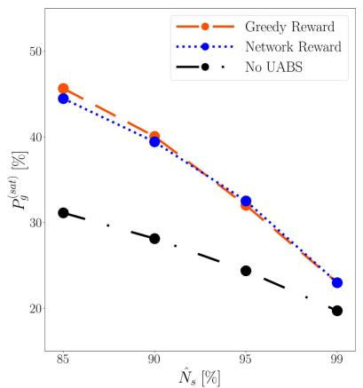

<details>
<summary>line</summary>

| N̂s [%] | Greedy Reward | Network Reward | No UABS |
| ------ | ------------- | -------------- | ------- |
| 85     | 46            | 45             | 31      |
| 90     | 40            | 39             | 28      |
| 95     | 32            | 32             | 24      |
| 99     | 23            | 23             | 20      |
</details>

(a)

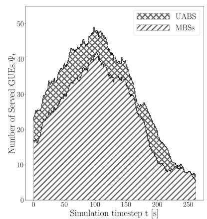

<details>
<summary>bar_stacked</summary>

| Simulation timestep t [s] | UABS | MBSs |
| ------------------------- | ---- | ---- |
| 0                         | 25   | 18   |
| 50                        | 35   | 25   |
| 100                       | 45   | 35   |
| 150                       | 35   | 25   |
| 200                       | 20   | 15   |
| 250                       | 10   | 8    |
</details>

(b)

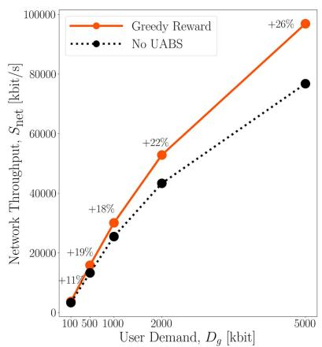

<details>
<summary>line</summary>

| User Demand, Dg [kbit] | Greedy Reward | No UABS |
| ---------------------- | ------------- | ------- |
| 100                    | 0             | 0       |
| 500                    | 15000         | 12000   |
| 1000                   | 30000         | 25000   |
| 2000                   | 55000         | 45000   |
| 5000                   | 98000         | 78000   |
</details>

（c）  
Fig. 9. Capacity limited network performance. (a) Percentage of satisfied GUEs. (b) Number of GUEs served in a flight. (c) Network throughput.

Finally, we have also investigated a scenario characterized by both, capacity and coverage constraints (results are not reported here for the sake of conciseness). In this case the agent trained with Exclusive Reward undergoes the most challenging training, due to the sparse nature of the reward function. Furthermore, resource scarcity introduces a more stringent limitation on the resources allocated for backhauling, thereby diminishing capacity and restricting the range of the UABS from the associated MBS ∗. Conversely, the Network Reward approach, given the limited resource pool, imparts a more consistent training experience for the agent, in contrast to the findings presented in Section VII-C.

# VIII. CONCLUSION

In this paper, we presented a framework designed for the joint optimization of the UABS trajectory planning and RRM, by considering different scenarios where a UABS has to cooperate with multiple on-ground MBSs to serve moving GUEs. They implement high demanding V2X applications, such as extended sensing, and therefore require continuous service to upload their data towards the network in an uninterrupted way. To this end, we designed a system which relies on a 3DQN algorithm for the trajectory planning, which is more suitable for such dynamic environments w.r.t. standard optimization tools, whereas the RRM algorithm is based on an ILP, allowing for an optimal distribution of network resources to maximize the number of satisfied GUEs. After benchmarking the proposed solution, we investigated two different scenarios (namely, capacity and coverage limited), to prove the usefulness of the introduction of UABSs in such networks. Numerical results show that, by properly defining the reward functions according to the network needs, it is possible to track moving GUEs providing continuous service and improving the overall QoE.

# ACKNOWLEDGMENT

The authors thank Aman Jassal for the very fruitful discussion on this paper.

# REFERENCES

[1] H. Shakhatreh et al., “Unmanned aerial vehicles (UAVs): A survey on civil applications and key research challenges,” IEEE Access, vol. 7, pp. 48572–48634, 2019.   
[2] W.-C. Chiang, Y. Li, J. Shang, and T. L. Urban, “Impact of drone delivery on sustainability and cost: Realizing the UAV potential through vehicle routing optimization,” Appl. Energy, vol. 242, pp. 1164–1175, 2019.   
[3] E. T. Alotaibi, S. S. Alqefari, and A. Koubaa, “LSAR: Multi-UAV collaboration for search and rescue missions,” IEEE Access, vol. 7, pp. 55817–55832, 2019.   
[4] M. Mozaffari, W. Saad, M. Bennis, Y.-H. Nam, and M. Debbah, “A tutorial on UAVs for wireless networks: Applications, challenges, and open problems,” IEEE Commun. Surv. Tut., vol. 21, no. 3, pp. 2334–2360, thirdquarter 2019.   
[5] S. Mignardi, R. Marini, R. Verdone, and C. Buratti, “On the performance of a UAV-Aided wireless network based on NB-IoT,” Drones, vol. 5, no. 3, 2021, Art. no. 94. [Online]. Available: https://www.mdpi.com/2504- 446X/5/3/94   
[6] G. Velez, A. Martin, G. Pastor, and E. Mutafungwa, “5G beyond 3GPP release 15 for connected automated mobility in cross-border contexts,” Sensors, vol. 20, no. 22, 2020, Art. no. 6622. [Online]. Available: https: //www.mdpi.com/1424-8220/20/22/6622   
[7] B. M. Masini, A. Bazzi, and A. Zanella, “A survey on the roadmap to mandate on board connectivity and enable V2V-Based vehicular sensor networks,” Sensors, vol. 18, no. 7, 2018, Art. no. 2207. [Online]. Available: https://www.mdpi.com/1424-8220/18/7/2207   
[8] J. Choi, V. Va, N. Gonzalez-Prelcic, R. Daniels, C. R. Bhat, and R. W. Heath, “Millimeter-wave vehicular communication to support massive automotive sensing,” IEEE Commun. Mag., vol. 54, no. 12, pp. 160–167, Dec. 2016.   
[9] ETSI, “5G; Service requirements for enhanced V2X scenarios,” ETSI, Sophia Antipolis, France, Tech. Specification 22.186 version 16.2.0, Nov. 2020.   
[10] S. Jeong, O. Simeone, and J. Kang, “Mobile edge computing via a UAV-mounted cloudlet: Optimization of bit allocation and path planning,” IEEE Trans. Veh. Technol., vol. 67, no. 3, pp. 2049–2063, Mar. 2018.   
[11] R. Marini, L. Spampinato, S. Mignardi, R. Verdone, and C. Buratti, “Reinforcement learning-based trajectory planning for UAV-aided vehicular communications,” in 2022 30th Eur. Signal Process. Conf., 2022, pp. 967–971.   
[12] D. Ferretti, S. Mignardi, R. Marini, R. Verdone, and C. Buratti, “QoE and cost-aware resource and interference management in aerial-terrestrial networks for vehicular applications,” IEEE Trans. Veh. Technol., vol. 73, no. 8, pp. 11249–11261, Aug. 2024.   
[13] S. Zeng, H. Zhang, B. Di, and L. Song, “Trajectory optimization and resource allocation for OFDMA UAV relay networks,” IEEE Trans. Wireless Commun., vol. 20, no. 10, pp. 6634–6647, Oct. 2021.   
[14] Q. Chen, “Joint position and resource optimization for Multi-UAV-Aided relaying systems,” IEEE Access, vol. 8, pp. 10403–10415, 2020.   
[15] F. Cui, Y. Cai, Z. Qin, M. Zhao, and G. Y. Li, “Multiple access for Mobile-UAV enabled networks: Joint trajectory design and resource allocation,” IEEE Trans. Commun., vol. 67, no. 7, pp. 4980–4994, Jul. 2019.   
[16] Y. Guo, S. Yin, and J. Hao, “Joint placement and resources optimization for multi-user UAV-Relaying systems with underlaid cellular networks,” IEEE Trans. Veh. Technol., vol. 69, no. 10, pp. 12374–12377, Oct. 2020.

[17] C. Qiu, Z. Wei, Z. Feng, and P. Zhang, “Backhaul-aware trajectory optimization of fixed-wing UAV-Mounted base station for continuous available wireless service,” IEEE Access, vol. 8, pp. 60940–60950, 2020.   
[18] S. Zhang, H. Zhang, B. Di, and L. Song, “Resource allocation and trajectory design for cellular UAV-to-X communication networks in 5 G,” in 2018 IEEE Glob. Commun. Conf., 2018, pp. 1–6.   
[19] C. Pan, J. Yi, C. Yin, J. Yu, and X. Li, “Joint 3D UAV placement and resource allocation in software-defined cellular networks with wireless backhaul,” IEEE Access, vol. 7, pp. 104279–104293, 2019.   
[20] M. D. Nguyen, L. B. Le, and A. Girard, “Integrated UAV trajectory control and resource allocation for UAV-Based wireless networks with co-channel interference management,” IEEE Internet Things J., vol. 9, no. 14, pp. 12754–12769, Jul. 2022.   
[21] W. Luo, Y. Shen, B. Yang, S. Wang, and X. Guan, “Joint 3-D trajectory and resource optimization in Multi-UAV-Enabled IoT networks with wireless power transfer,” IEEE Internet Things J., vol. 8, no. 10, pp. 7833–7848, May 2021.   
[22] T. Do-Duy, L. D. Nguyen, T. Q. Duong, S. R. Khosravirad, and H. Claussen, “Joint optimisation of real-time deployment and resource allocation for UAV-Aided disaster emergency communications,” IEEE J. Sel. Areas Commun., vol. 39, no. 11, pp. 3411–3424, Nov. 2021.   
[23] K. Ganesan, P. B. Mallick, J. Löhr, D. Karampatsis, and A. Kunz, “5G v2x architecture and radio aspects,” in 2019 IEEE Conf. Standards Commun. Netw., 2019, pp. 1–6.   
[24] H. Qiu, F. Ahmad, R. Govindan, M. Gruteser, F. Bai, and G. Kar, “Augmented vehicular reality: Enabling extended vision for future vehicles,” in Proc. 18th Int. Workshop Mobile Comput. Syst. Appl., 2017, pp. 67–72.   
[25] J. Hu, H. Zhang, L. Song, Z. Han, and H. V. Poor, “Reinforcement learning for a cellular internet of UAVs: Protocol design, trajectory control, and resource management,” IEEE Wireless Commun., vol. 27, no. 1, pp. 116–123, Feb. 2020.   
[26] Y. Emami, B. Wei, K. Li, W. Ni, and E. Tovar, “Joint communication scheduling and velocity control in Multi-UAV-Assisted sensor networks: A deep reinforcement learning approach,” IEEE Trans. Veh. Technol., vol. 70, no. 10, pp. 10986–10998, Oct. 2021.   
[27] S. Yin and F. R. Yu, “Resource allocation and trajectory design in UAV-Aided cellular networks based on multiagent reinforcement learning,” IEEE Internet Things J., vol. 9, no. 4, pp. 2933–2943, Feb. 2022.   
[28] P. Luong, F. Gagnon, and F. Labeau, “Resource allocation in UAV-Assisted wireless networks using reinforcement learning,” in 2020 IEEE 92nd Veh. Technol. Conf., 2020, pp. 1–6.   
[29] M. Samir, M. Chraiti, C. Assi, and A. Ghrayeb, “Joint optimization of UAV trajectory and radio resource allocation for drive-thru vehicular networks,” in 2019 IEEE Wireless Commun. Netw. Conf., 2019, pp. 1–6.   
[30] L. Deng, G. Wu, J. Fu, Y. Zhang, and Y. Yang, “Joint resource allocation and trajectory control for UAV-Enabled vehicular communications,” IEEE Access, vol. 7, pp. 132806–132815, 2019.   
[31] Y. Li, X. Yuan, Y. Hu, J. Yang, and A. Schmeink, “Optimal UAV trajectory design for moving users in integrated sensing and communications networks,” IEEE Trans. Intell. Transp. Syst., vol. 24, no. 12, pp. 15113–15130, Dec. 2023.   
[32] R. Zhang, R. Lu, X. Cheng, N. Wang, and L. Yang, “A uav-enabled data dissemination protocol with proactive caching and file sharing in V2X networks,” IEEE Trans. Commun., vol. 69, no. 6, pp. 3930–3942, Jun. 2021.   
[33] 3rd Generation Partnership Project, “Technical specification group radio access network; study on channel model for frequencies from 0.5 to 100 GHz,” 3rd Generation Partnership Project Tech. Rep. 38.901 version 16.1.0, Dec. 2019.   
[34] V. K. Salvia, Antenna and Wave Propagation. New Delhi, India: Laxmi Publications, 2007. [Online]. Available: https://books.google.it/books?id= MiL42MSE3KEC   
[35] 5GAA, “C-V2X use cases volume II: Examples and service level requirements,” White Paper, Jun. 2019. [Online]. Available: https://5gaa.org/cv2x-use-cases-volume-ii-examples-and-service-level-requirements/   
[36] R. S. Sutton and A. G. Barto, “Reinforcement learning: An introduction,” IEEE Trans. Neural Netw., vol. 16, pp. 285–286, 2005.   
[37] Z. Wang, T. Schaul, M. Hessel, H. V. Hasselt, M. Lanctot, and N. D. Freitas, “Dueling network architectures for deep reinforcement learning,” in Proc. 33rd Int. Conf. Int. Mach. Learn., 2016, vol. 48, pp. 1995–2003.   
[38] H. v. Hasselt, A. Guez, and D. Silver, “Deep reinforcement learning with double Q-learning,” in Proc. 30th AAAI Conf. Artif. Intell., 2016, pp. 2094– 2100.   
[39] V. Mnih et al., “Human-level control through deep reinforcement learning,” Nature, vol. 518, pp. 529–533, 2015.


<details>
<summary>natural_image</summary>

Portrait of a smiling man with beard, wearing a light-colored sweater, in front of bookshelves (no visible text or symbols)
</details>

Leonardo Spampinato (Graduate Student Member, IEEE) received the M.Sc. degree (with Hons.) in telecommunications engineering with the University of Bologna, Bologna, Italy, in 2022. He is currently working toward the Ph.D. degree in electronics, telecommunications, and information technologies with the Department of Electrical, Electronic, and Information Engineering, University of Bologna. He is also a Research Associate with the National Laboratory of Wireless Communications (WiLab) of CNIT (the National Inter-University Consortium for Telecommunications). His research interests include UAV-aided networks, with emphasis on solutions for trajectory planning, deep reinforcement learning techniques, and multi-agent systems.


<details>
<summary>natural_image</summary>

Close-up portrait of a smiling woman with curly hair (no text or symbols visible)
</details>

Chiara Buratti received the Ph.D. degree in electronics, information technologies and telecommunications engineering from the University of Bologna, Bologna, Italy, in 2009. She is currently an Associate Professor with the University of Bologna. She coauthored approx. 120 papers. Her research interests include IoT, with emphasis on MAC and routing protocols, and on 3D networks. She was the recipient of the 2012 Intel Early Career Faculty Honor Program Award, provided by Intel, Oregon, and 2010 National GTTI Best Ph.D. Thesis. She has been PI of the COST Innovators Grant, Immunet. She was the main proponent of the Cost Action CA20120, INTERACT. She is currently the Vice-Chair and Grant Holder of the Action.


<details>
<summary>natural_image</summary>

Portrait of a woman with wavy brown hair and makeup (no text or symbols visible)
</details>

Danila Ferretti (Associate Member, IEEE) received the M.Sc. degree (with Hons.) in telecommunications engineering with the University of Bologna, Bologna, Italy, in 2021. Since 2023, she has been working toward the Ph.D. degree in information and communication technology with the University of Rome, Rome, Italy. She is currently a Researcher with the National Laboratory of Wireless Communications (WiLab) of CNIT (the National Inter-University Consortium for Telecommunications). Her research focuses on UAV-aided networks, with a focus on

optimization algorithms for radio resource management, as well as on LPWAN technologies for wireless communication systems.


<details>
<summary>natural_image</summary>

Portrait of a man with short dark hair and beard wearing a blue collared shirt (no text or symbols visible)
</details>

Riccardo Marini (Member, IEEE) received the M.Sc. degree (with Hons.) in telecommunications engineering and the Ph.D. degree in electronics, telecommunications and information technologies engineering with the University of Bologna, Bologna, Italy, in 2019 and 2023, respectively. He is currently the Head of Research with the National Laboratory of Wireless Communications (WiLab) of CNIT (the National Inter-University Consortium for Telecommunications). His research interests include urban and rural Internet of Things, with emphasis on LPWAN

technologies and UAV networks, as well as machine learning techniques for wireless networks.

Open Access provided by ‘Alma Mater Studiorum - Università di Bologna’ within the CRUI CARE Agreement