# Joint Trajectory Design and Resource Allocation for Energy-Efficient Multi-UAV Assisted Vehicular Networks: An IKPP Approach

Jing Wang , Xiaotian Zhou , Member, IEEE, Haixia Zhang , Senior Member, IEEE, Daojun Liang , Graduate Student Member, IEEE, and Dongfeng Yuan , Senior Member, IEEE

Abstract—This paper focuses on the energy-efficient uncrewed aerial vehicles (UAVs) assisted vehicular networks, where multiple rotary-wing UAVs are deployed to provide uplink service to numerous ground vehicles. The objective is to maximize the long-term system energy efficiency (EE) over the entire service period, through jointly optimizing the vehicle-UAV association, the sub-carrier assignment, the power control of vehicles and the trajectory design of UAVs. The formulated problem involves the limitations on the transmit power of vehicles and the propulsion power of UAVs, the quality of service (QoS) requirements of vehicles, the UAV movement constraints, and co-channel interference among vehicles. This makes the problem a mixed integer non-convex fractional programming problem accompanied by a mass of variables and diverse constraints, which is difficult to be solved within the polynomial time through traditional optimization methods. To cope with the timely decision-making requirement and dynamic moving scenario, we opt to the deep reinforcement learning (DRL) approach. To do so, the formulated problem is first transformed to a Markov decision process (MDP). Then, an improved k-means proximal policy optimization (IKPP) algorithm is proposed to solve the MDP problem. The proposed algorithm involves action reconstruction, the improved k-means algorithm, and proximal policy optimization-clip algorithm, which can help obtain the solutions with low complexity. Simulation results demonstrate the convergence, scalability and real-time of the proposed algorithm, along with its performance advantage over other benchmark algorithms.

Index Terms—Multiple uncrewed aerial vehicles (UAVs), energy efficiency (EE), trajectory design, resource allocation, deep reinforcement learning (DRL).

## I. INTRODUCTION

W ITH the advent of the big data era in vehicular net- works, the vehicle-to-everything (V2X) paradigm has attracted a lot of attention from both academia and industry [1]. However, with the boom of advanced vehicular applications, the service demands for ubiquitous high-bandwidth services, safer self-driving experience, and higher network quality pose great challenges to the terrestrial network infrastructure [2]. Uncrewed aerial vehicle (UAV) can be utilized as the effective complement to the terrestrial communication networks to enhance the system capacity or coverage due to its on demand deployment and exceptional flexibility [3], [4]. Extensive research works have been done to explore the advantages of UAV in vehicular networks, such as maximizing data rates [5], [6], minimizing latency [7], [8], and enhancing network coverage [9], [10]. Though promising, a significant challenge in UAV assisted communications is the limited energy supply of UAV due to the restricted battery capacity. Consequently, it is critical to design the energyefficient strategies for performance and lifetime enhancement of UAV assisted vehicular networks [11]. Energy efficiency (EE), characterized as the ratio of total throughput to total power consumption, stands as a crucial metric for evaluating system performance and energy utilization efficiency [12]. This study is dedicated to exploring and investigating this particular research topic.

There have been efforts to address the EE maximization problem in UAV assisted ground static network. For instance, Chen et al. studied the joint optimization of user power control and channel assignment based on the Kuhn-Munkres and Lagrangian dual method in the single statically-deployed UAV assisted device-to-device (D2D) secure communication system [13]. Yang et al. aimed to maximize the EE of an UAV-assisted backscatter communication network [14]. They applied the block coordinated decent (BCD) and successive convex approximation (SCA) method to jointly design the UAV trajectory, the backscatter device scheduling, and the transmitter power of carrier emitters. Sun et al. in [15] considered the scenario of multi-UAV assisted D2D communication, and introduced a quantity-weight adaptive salp swarm method to design channel assignment and power control for EE maximization. [16] focused on the the EE maximization problem in a space-air-ground network, where multiple UAVs are deployed as the relay between satellite and ground devices. A sub-optimal method was designed to achieve relay selection and Lagrange multipliers optimization method was applied to complete power allocation. It is worth noting that all of the above work uses traditional static optimization methods to maximize the system EE, which may exhibit high complexity in time-varying environment [17]. Because when performing EE maximization, the need for real-time updates of UAV positions necessitates the re-execution of these algorithms in every time slot, which may introduce computational overhead and limit their practical feasibility [18].

To address the above mentioned challenge, several studies have adopted the reinforcement learning (RL) algorithms to enhance the EE in UAV-assisted communication systems. Mondal et al. designed a deep deterministic policy gradient (DDPG) based algorithm to jointly optimize the user association, user power control and UAV trajectory in the scenario with single UAV collecting data from ground users [19]. Both [20] and [21] focused on the scenario where multiple UAVs serve static ground users with the assistance of reconfigurable intelligent surface (RIS). We note that [20] assumed that UAVs are statically deployed and applied DDPG approach to design the UAV power and RIS phase shift, and [21] designed a proximal policy optimization (PPO) based method to jointly optimize the RIS-related variables and UAV deployment. Li et al. assumed that the location of multiple UAVs were predetermined and they provided downlink service to the users with multiple GBSs by optimizing power control of each UAV through Q-learning [22]. We note that the UAV assisted intelligent communication scenarios described above typically assumed that the served users are stationary.

With the boom in advanced vehicle applications, research on UAV assisted vehicular networks gains growing attentions. The EE maximization is even challenging, due to the highly dynamic environment caused by the dual mobility of UAVs and ground vehicles [23]. We note that the proposed algorithms in the UAV assisted static user communications cannot be directly applied to the vehicular scenarios. There have been studies focusing on maximizing the EE in the simple cases of UAV assisted vehicular networks where only one UAV and one vehicle are taken into account [23], [24]. Moreover, when considering more vehicles and the more complicated urban area where the moving patterns of vehicles are more chaotic, it cannot satisfy the requirement of ground users, by only deploying single UAV. By contrary, multiple UAVs need to lineup to provide service to these ground vehicles. While in such a scenario with multiple service providers and served users, the global coordination among the UAVs is required, to jointly yet dynamically determine the associated vehicles of each UAV and also their trajectories. So that the limited resources can be fully utilized to cope with the fast-changing network layouts and boost the system performance. Further, it also requires the coordination among UAVs from the aspect of safety, where the trajectories of all UAVs should be carefully joint-designed to avoid the collision among them. Thus, when encountered with the multi-UAV case, the collaboration among them turns out to be important, which not only impacts the system performance and quality of service (QoS) of users, but also the safety of the network [25], [26].

There has been some work investigating multi-UAV collaborative networks. For example, part studies carried the resource allocation per time slot basis, to maximize the EE of system where all UAVs move with the same fixed speed to serve ground static users [27], to improve the total instantaneous transmit rate in multi-UAV with laser charging system [28], to reduce the power consumption of the system where UAVs act as relays to forward data for users [29]. The methods proposed in [27], [28], and [29] are promising, but they can hardly be applied to practical vehicular networks, especially in the case that the duration of each time slot is small. They may fail to cope with the rapid changing topology of vehicula network, as the resource allocation algorithm requires time to be executed at each time slot, resulting in out-of-date resource allocation. Considering long-term performance optimization, Zhou et al. employed multiple UAVs to provide emergency communication services to mobile users on the ground while completing the multi-objective optimization [30]. Xu et al. investigated a dual UAV-assisted mobile edge computing system with maximizing the minimum secure computing capacity [31]. Zhang et al. paid attention to maximize the accumulated user satisfaction score in a specific case when the UAV lineup and user distribution are dynamical over time [32]. The above works focused on long-term performance optimization all have very different motivation and scope from our work. Reference [33] indeed considered the long-term EE maximization of the multi-UAV assisted ground network by involving the user mobility, which somehow share the same ambition as us to get the resource allocation for multiple time slots. But, the strategy reported in [33] is dedicated for scenario where the ground users move at a relative low speed. That is also why [33] adopted line-of-sight (LoS) channel between ground user and UAV. Considering the high speed of vehicles, it is more suitable to design algorithms by assuming probabilistic LoS channel model [34].

Inspired by the issues mentioned above, in this paper, we investigate the multi-UAV assisted vehicular networks where multiple UAVs are deployed to collect the data from the ground moving vehicles through orthogonal frequency division multiple access (OFDMA) via probabilistic LoS channel. We assume that the spectrum is limited so multiple UAVs may share the same spectrum to provide service to vehicles, leading to the co-channel interference among ground vehicles. We aim to maximize the long-term system EE, where the overall power consumption of system includes the flight power of all UAVs during the service period. While the system data rate is calculated by summing up the transmission rate of all vehicles. To maximize the system EE, an optimization problem which jointly address the vehicle-UAV association, sub-carrier assignment, power control of vehicle and trajectory design of UAV is proposed. Taking into account the dual mobility of vehicles and UAVs as well as the need for real-time decisions, we propose an improved k-means proximal policy optimization (IKPP) algorithm to solve the problem. Simulation results validate the advantages of the proposed algorithm in terms of convergence, scalability, real-time and enhancing the system EE. The main contributions are summarized as follows.

• We investigate a multi-UAV assisted vehicular network with multiple rotary-wing UAVs providing uplink service to the ground vehicles. In the system, the moving trajectories of ground vehicles are taken into account. We also consider the limitation on spectrum, which may lead to co-channel interference among users sharing the same sub-carrier. In addition, when calculating the power consumption of system, the UAV flight power, which constitutes the majority of the total power consumption, is primarily considered. All these make the considered system practical, better fitting the real world case.

With the objective of maximizing the long-term system EE, we formulate an optimization problem to jointly design the vehicle-UAV association, sub-carrier assignment, vehicle power control and UAV trajectory optimization. The QoS requirements of vehicles, the limitations on spectrum resources, the service capability and flight constraints of UAVs, as well as the transmit power constraints of vehicles, are all taken into account. The formulated problem is the mixed integer nonconvex fractional programming one, which is difficult to solve.

To solve this problem, we first transform it into a Markov decision process (MDP) and then design an IKPP algorithm to search for the optimal solution intelligently. In the proposed algorithm, the PPO-clip algorithm is utilized to deduce the continuous solutions for sub-carrier assignment, power control, and trajectory design. Based on the output UAV trajectories, we devise an improved k-means algorithm to further determine UAV-vehicle association, which is helpful to reduce the action space dimensions and algorithm training complexity. With the UAV-vehicle association, the improved k-means algorithm combined with action reconstruction can help to reconstruct the action space of sub-carrier assignment, to discretize the corresponding raw continuous outputs into practical one. The IKPP finally output reasonable discrete or continuous solutions corresponding to all optimization variables.

• Vivid simulations are provided, demonstrating that the proposed IKPP algorithm not only has good convergence speed but also good scalability across different system settings. Furthermore, it is also verified that the proposed algorithm is not only real-time in execution, but also remarkably improves the system EE.

The remainder of this paper is organized as follows. System model and the proposed EE maximization problem are introduced in section II. The transformation of the original problem to MDP is reported in section III. The proposed IKPP algorithm is described in section IV. Simulation results and discussions are given in section V to demonstrate the effectiveness of the proposed algorithm. Section VI presents the conclusions of the paper. In addition, in order to help readers follow along more easily, we list the commonly used acronyms and their corresponding definitions in Table I.

TABLE I  
ACRONYMS AND CORRESPONDING DEFINITIONS
<table><tr><td rowspan=1 colspan=1>Acronym</td><td rowspan=1 colspan=1>Definition</td></tr><tr><td rowspan=1 colspan=1>DDPG</td><td rowspan=1 colspan=1>Deep Deterministic Policy Gradient</td></tr><tr><td rowspan=1 colspan=1>DRL</td><td rowspan=1 colspan=1>Deep Reinforcement Learning</td></tr><tr><td rowspan=1 colspan=1>DDQN</td><td rowspan=1 colspan=1>Double Deep Q-Network</td></tr><tr><td rowspan=1 colspan=1>EE</td><td rowspan=1 colspan=1>Energy Efficiency</td></tr><tr><td rowspan=1 colspan=1>GPS</td><td rowspan=1 colspan=1>Global Position System</td></tr><tr><td rowspan=1 colspan=1>IKPP</td><td rowspan=1 colspan=1>improved k-means proximal policy optimization</td></tr><tr><td rowspan=1 colspan=1>KL</td><td rowspan=1 colspan=1>Kullbak-Leibler</td></tr><tr><td rowspan=1 colspan=1>MDP</td><td rowspan=1 colspan=1>Markov Decision Process</td></tr><tr><td rowspan=1 colspan=1>PPO</td><td rowspan=1 colspan=1>Proximal Policy Optimization</td></tr><tr><td rowspan=1 colspan=1>QoS</td><td rowspan=1 colspan=1>Quality of Service</td></tr><tr><td rowspan=1 colspan=1>RL</td><td rowspan=1 colspan=1>Reinforcement Learning</td></tr><tr><td rowspan=1 colspan=1>PG</td><td rowspan=1 colspan=1>Strategy Gradient</td></tr><tr><td rowspan=1 colspan=1>TRPO</td><td rowspan=1 colspan=1>Trust Region Policy Optimization</td></tr><tr><td rowspan=1 colspan=1>UAVs</td><td rowspan=1 colspan=1>Unmanned Aerial Vehicles</td></tr></table>

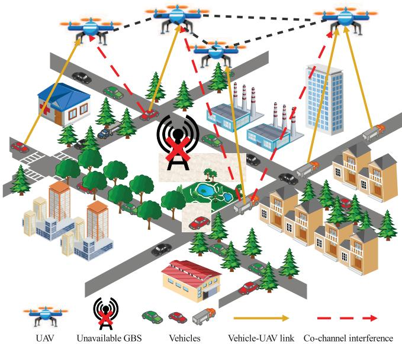  
Fig. 1. The multiple UAVs assisted vehicular networks.

## II. SYSTEM MODEL AND PROBLEM FORMULATION

In this section, we first introduce the multi-UAV multivehicle system architecture, followed by the vehicle-UAV channel model, the communication model, and the system power consumption model. Finally, we formulate the EE maximization optimization problem.

## A. Multi-UAV Multi-Vehicle System Architecture

As shown in Fig. 1, in this paper we investigate an UAV assisted vehicular network where multiple rotary-wing UAVs served as aerial base stations (BSs) to provide uplink service to the ground vehicles. We assume that there are M vehicles needed to be served and J UAVs are dispatched to provide service. The set of UAVs and vehicles are denoted as $\mathcal { I } \triangleq \{ 1 , \ldots , J \}$ and $\mathcal { M } \ \triangleq \ \{ 1 , . . . , M \}$ , respectively. To ensure the flight safety, we make the assumption that the UAV stays at a constant altitude $H _ { 0 }$ that is higher than any buildings in the serving region. The serving region is assumed to be a rectangular area which can be represented as $s _ { x } \times s _ { y }$ , where $s _ { x }$ and $s _ { y }$ are the length and width measured in meters. In this area, we randomly set the terrestrial layouts with several roads and crosses, where the vehicles move on these roads. We further assume that OFDMA is adopted for uplink transmission from ground vehicles to UAVs, where a set of C sub-carriers are available. The bandwidth of each subcarrier is $B ,$ which is set to be 1 MHz in this work. Further note that for the vehicles associated with the same UAV, they seize distinct sub-carriers for transmission. However, the subcarrier set is shared by all UAVs. That means there exists co-channel interference among the vehicles who connect to different UAVs but seize the same sub-carrier for transmission.

The service period T is divided into N time slots with equal size $\tau _ { t } , \ \mathrm { i . e . , } \ T \ = \ N \tau _ { t }$ . The set of time slots is denoted as $\mathcal { N } \triangleq \{ 1 , \dots , N \} . \ \tau _ { t }$ is set to be 1 second in this work. It is small enough so that the positions of both UAV and ground vehicle in one time slot can be assumed to be unchanged. We note that the UAVs and vehicles may keep moving all the time. The three-dimensional Cartesian coordinate is applied to denote the trajectories of the UAVs and vehicles. For time slot $n ,$ the horizontal location of UAV j and vehicle m can be expressed as $\mathbf { q } _ { j } [ n ] = [ x _ { j } [ n ] , y _ { j } [ n ] ] ^ { T } \in$ $\mathbb { R } ^ { 2 \times 1 }$ and $\mathbf { w } _ { m } [ n ] \ = \ [ x _ { m } [ n ] , y _ { m } [ n ] ] ^ { \tilde { T } } \in \ \mathbb { R } ^ { 2 \times \tilde { 1 } }$ , respectively. Connecting the coordinates of the UAV/vehicle in every two neighboring time slots can eventually form the trajectory of this UAV/vehicle. The set of UAVs’ and vehicles’ trajectories can be denoted as $\textbf { Q } = \ \{ \mathbf { q } _ { j } [ n ] , j \ \in \ \mathcal { I } , n \ \in \ \mathcal { N } \}$ and ${ \bf W } = \{ { \bf w } _ { m } [ n ] , m \in { \cal M } , n \in { \cal N } \}$ , respectively.

We assume that each UAV has a flight start point which can be denoted as $\mathbf { q } _ { j } ^ { 0 } , \forall j$ . Thus, we have

$$
\mathbf { q } _ { j } [ 0 ] = \mathbf { q } _ { j } ^ { 0 } , \forall j \in \mathcal { I } ,\tag{1}
$$

The service region of UAVs is the rectangular one, which can be expressed as

$$
0 \leq x _ { j } [ n ] \leq s _ { x } , \forall j \in \mathcal { I } , n \in \mathcal { N } ,\tag{2}
$$

$$
0 \leq y _ { j } [ n ] \leq s _ { y } , \forall j \in \mathcal { I } , n \in \mathcal { N } ,\tag{3}
$$

The flight distance of UAVs is limited by maximum speed $V _ { m a x } ,$ which is set to be 50 m/s in this work. Hence, flights of UAVs in a time slot are limited to

$$
\| \mathbf { q } _ { j } [ n ] - \mathbf { q } _ { j } [ n - 1 ] \| \leq D _ { \operatorname* { m a x } } , \forall j \in \mathcal { I } , n \in \mathcal { N } ,\tag{4}
$$

where $D _ { \operatorname* { m a x } } \triangleq V _ { \operatorname* { m a x } } \tau _ { t }$ is the maximum distance that the UAV can travel in one time slot. To avoid collisions between UAVs, it should follow that

$$
\| \mathbf { q } _ { j } [ n ] - \mathbf { q } _ { i } [ n ] \| \geq S _ { \operatorname* { m i n } } , \forall j \in \mathcal { I } , i \in \mathcal { I } , i \neq j , n \in \mathcal { N } ,\tag{5}
$$

where $S _ { \mathrm { m i n } }$ is the minimum collision prevention distance between ${ \mathrm { U A V s } } .$ , which is set to be 20 meters in this work. The relationship between the UAV trajectory ${ \bf q } _ { j } [ n ]$ and UAV speed $\mathbf { v } _ { j } [ n ]$ can be expressed as

$$
\mathbf { q } _ { j } [ n ] = \mathbf { q } _ { j } [ n - 1 ] + \mathbf { v } _ { j } [ n ] \tau _ { t } , \forall j \in \mathcal { I } , n \in \mathcal { N } .\tag{6}
$$

On the other hand, the trajectory set of ground vehicles W are assumed to be predictable as they need to move on the roads. Hence we denote ${ \mathbf { w } } _ { m } [ n ] , \forall m \in \mathcal { M } , n \in \mathcal { N }$ to be the

predetermined parameters, which will be used as the input parameters for the proposed algorithm in Sec. IV.

## B. Vehicle-UAV Channel Model

We employ the probabilistic path loss model to describe the vehicle to UAV channel due to the partial building blockages, where the path loss incorporates a combination of the line-ofsight (LoS) and non-line-of-sight (NLoS) components [27], [35]. The path loss for the LoS link and NLoS link between the UAV j and vehicle m is denoted as

$$
H _ { j , m } [ n ] = \left\{ \begin{array} { l l } { \displaystyle \xi _ { \mathrm { L o S } } \left( \frac { 4 \pi f _ { c } d _ { j , m } [ n ] } { c } \right) ^ { \alpha } , } & { \mathrm { L o S } ~ l i n k , \medskip } \\ { \displaystyle \xi _ { \mathrm { N L o S } } \left( \frac { 4 \pi f _ { c } d _ { j , m } [ n ] } { c } \right) ^ { \alpha } , } & { \mathrm { N L o S } ~ l i n k , } \end{array} \right.\tag{7}
$$

where c denotes the speed of light, $f _ { c }$ denotes the carrier frequency, α is the path loss exponent, $\xi _ { \mathrm { L o S } }$ and $\xi _ { \mathrm { N L o S } }$ express the different attenuation factors for the LoS and NLoS link owing to free-space propagation losses, respectively. $d _ { j , m } [ n ]$ denotes the Euclidean distance between UAV j and vehicle $m ,$ which can be further expressed as

$$
\begin{array} { l } { { d _ { j , m } [ n ] = \| \mathbf { q } _ { j } [ n ] - \mathbf { w } _ { m } [ n ] \| } } \\ { { \qquad = \sqrt { ( x _ { j } [ n ] - x _ { m } [ n ] ) ^ { 2 } + ( y _ { j } [ n ] - y _ { m } [ n ] ) ^ { 2 } + H _ { 0 } ^ { 2 } } , } } \end{array}\tag{8}
$$

In the vehicle-to-UAV communications, the probability of LoS link is dependent on the positions of UAVs and vehicles, the communication environment as well as the elevation angle. Based on that, the LoS probability can be approximated as

$$
\mathrm { P b } _ { j , m } ^ { \mathrm { L o S } } [ n ] = \frac { 1 } { 1 + \phi _ { 1 } \exp ^ { - \phi _ { 2 } ( \theta _ { j , m } [ n ] - \phi _ { 1 } ) } } ,\tag{9}
$$

where $\phi _ { 1 }$ and $\phi _ { 2 }$ denote the constant values which signify the influence of the environment. In addition,

$$
\theta _ { j , m } [ n ] = \frac { 1 8 0 } { \pi } \arctan \left( \frac { H _ { 0 } } { \lVert \mathbf { q } _ { j } [ n ] - \mathbf { w } _ { m } [ n ] \rVert } \right) ,\tag{10}
$$

represents the angle of elevation between the UAV j and the vehicle m. The NLoS probability can be obtained as $\mathrm { P b } _ { j , m } ^ { \mathrm { N L o S } } [ n ] = 1 - \mathrm { P b } _ { j , m } ^ { \mathrm { L o S } } [ n ]$ . Thus, we can get the mean path loss between the UAV j and the vehicle m in time slot n as

$$
\begin{array} { l } { \bar { G } _ { j , m } [ n ] } \\ { = ( \mathrm { P b } _ { j , m } ^ { \mathrm { L o S } } [ n ] \zeta _ { \mathrm { L o S } } + \mathrm { P b } _ { j , m } ^ { \mathrm { N L o S } } [ n ] \zeta _ { \mathrm { N L o S } } ) \left( \displaystyle \frac { 4 \pi f _ { c } d _ { j , m } [ n ] } { c } \right) ^ { \alpha } } \end{array}\tag{11}
$$

Now, we can express the average channel gain between the UAV j and the vehicle m in time slot n as

$$
g _ { j , m } [ n ] = 1 / \bar { G } _ { j , m } [ n ]\tag{12}
$$

C. Communication Model

To communicate, each vehicle need to be associated with one UAV. We employ the binary variable $\beta _ { j , m } [ n ] \ \in \ \{ 0 , 1 \}$ to represent the association relationship between UAV j and vehicle m. $\beta _ { j , m } [ n ] = 1$ means that vehicle $m$ is associated with UAV j. We assume that each vehicle m can be associated with only one UAV per time slot, which is

$$
\sum _ { j = 1 } ^ { J } \beta _ { j , m } [ n ] \leq 1 , \forall m \in \boldsymbol { \mathcal { M } } , n \in \boldsymbol { \mathcal { N } } .\tag{13}
$$

Further, we define $\omega _ { m } ^ { c } [ n ] \in \{ 0 , 1 \}$ to be the indicator for subcarrier assignment, where $\omega _ { m } ^ { c } [ n ] = 1$ means that vehicle m utilizes sub-carrier c for communication. We further assume that each vehicle m can only be assigned at most one subcarrier per time slot, that is

$$
\sum _ { c = 1 } ^ { C } \omega _ { m } ^ { c } [ n ] \leq 1 , \forall m \in \mathcal { M } , n \in \mathcal { N } .\tag{14}
$$

Recall that the vehicles who associate with the same UAV utilize distinct sub-carrers for transmission and each vehicle can only seize one sub-carrier. So we have

$$
\sum _ { m = 1 } ^ { M } \beta _ { j , m } [ n ] \omega _ { m } ^ { c } [ n ] \leq 1 , \forall j \in \mathcal { I } , c \in \mathcal { C } , n \in \mathcal { N } .\tag{15}
$$

On the other hand, we denote the maximum allowed transmit power of vehicle m to be $P _ { m } ^ { m a x }$ , which is set to be 1 Watt in this work. The transmit power of vehicle m should follow

$$
0 \leq p _ { m } [ n ] \leq P _ { m } ^ { m a x } , \forall m \in \mathcal { M } , n \in \mathcal { N } .\tag{16}
$$

Assume that vehicle m communicates with the j-th UAV via the c-th sub-carrier, the signal-to-interference-plus-noise ratio (SINR) at UAV can be written as

$$
\begin{array} { r } { \gamma _ { j , m } ^ { c } [ n ] = \frac { p _ { m } [ n ] g _ { j , m } [ n ] } { \sum _ { i \neq j } \sum _ { k \neq m } \beta _ { i , k } [ n ] \omega _ { k } ^ { c } [ n ] p _ { k } [ n ] g _ { j , k } [ n ] + \sigma ^ { 2 } } , } \end{array}\tag{17}
$$

where $\sigma ^ { 2 }$ is the noise power. Therefore, the corresponding instantaneous data rate in time slot n can be expressed as

$$
R _ { j , m } ^ { c } [ n ] = \log _ { 2 } ( 1 + \gamma _ { j , m } ^ { c } [ n ] ) .\tag{18}
$$

## D. Power Consumption Model

We note that the power consumption levels for UAVs and vehicles typically vary significantly, where the power consumption of UAVs often reaches to hundreds of watts or even kilowatt, whereas the transmission power consumption of vehicles generally operates below the watt level [36]. Thus, in the proposed system, the power consumption is mainly composed of the UAV component. The power consumption for UAV is contributed by the flight power to support the UAV to move in air. For UAV j, the flight power $P _ { j } ^ { \hat { f } l }$ is composed of three components, parasite power used to resist UAV body drag, blade profile power utilized for defeating the rotational resistance encountered by the blades, and induced power used for overcoming the induced resistance of the blades [37]. That can be denoted as

$$
P _ { j } ^ { f l } [ n ] = \underbrace { \frac { 1 } { 2 } d _ { z } \rho s A \| \mathbf { v } _ { j } [ n ] \| ^ { 3 } } _ { p a r a s i t e } + \underbrace { P _ { r } \left( 1 + \frac { 3 \| \mathbf { v } _ { j } [ n ] \| ^ { 2 } } { U _ { t } ^ { 2 } } \right) } _ { b l a d e ~ p r o f i l e }
$$

$$
+ \underbrace { P _ { n } \left( { \sqrt { 1 + { \frac { \| \mathbf { v } _ { j } [ n ] \| ^ { 4 } } { 4 v _ { z } ^ { 4 } } } } } - { \frac { \| \mathbf { v } _ { j } [ n ] \| ^ { 2 } } { 2 v _ { z } ^ { 2 } } } \right) ^ { 1 / 2 } } _ { i n d u c e d } ,\tag{19}
$$

where $\rho$ denotes the air density. $d _ { z }$ represents the fuselage drag ratio. A and s denotes the rotor disc area and solidity, respectively. $P _ { r }$ and $P _ { n }$ denote the constant profile power and induced power of the UAV when it keeps stationary in the air, respectively. $v _ { z }$ signifies the typical induced velocity of the rotor blades during the hover position. $U _ { t }$ represents the rotor blade’s tip speed.

Thus, the total power consumption of the system in time slot n can be written as

$$
P _ { u } ^ { f l } [ n ] = \sum _ { j = 1 } ^ { J } P _ { j } ^ { f l } [ n ] .\tag{20}
$$

## E. Problem Formulation

Our goal is to maximize the long-term system EE during the service period T , which is defined as the accumulated rate to power consumption ratio over all time slots. To achieve that, we propose to jointly optimize the vehicle-UAV association, the sub-carrier assignment, the vehicle power control and the UAV trajectory design. Denoting $\pmb { \Lambda } = \{ \beta _ { j , m } [ n ] , \forall j \in \mathcal { I }$ , m ∈ $\mathcal { M } , n \in \mathcal { N } \} , \ \Omega = \{ \omega _ { m } ^ { c } [ n ] , \forall c \in \mathcal { C } , m \in \mathcal { M } , n \in \mathcal { N } \} , \ \mathbf { P } =$ $\{ p _ { m } [ n ] , m \in \mathcal { M } , n \in \mathcal { N } \}$ , and $\mathbf { Q } = \{ \mathbf { q } _ { j } [ n ] , j \in \mathcal { I } , n \in \mathcal { N } \}$ the optimization problem can be formulated as

$$
\operatorname* { m a x } _ { \{ \boldsymbol { \Lambda } , \boldsymbol { \Omega } , \mathbf { P } , \mathbf { Q } \} } \quad \sum _ { n = 1 } ^ { N } \frac { \displaystyle \sum _ { m = 1 } ^ { M } \sum _ { j = 1 } ^ { J } \sum _ { c = 1 } ^ { C } \beta _ { j , m } [ n ] \omega _ { m } ^ { c } [ n ] R _ { j , m } ^ { c } [ n ] } { \displaystyle \sum _ { j = 1 } ^ { J } P _ { j } ^ { f l } [ n ] }\tag{21a}
$$

$$
s . t . : \sum _ { j = 1 } ^ { J } \sum _ { c = 1 } ^ { C } R _ { j , m } ^ { c } [ n ] \geq R _ { m } ^ { Q o S } , \forall m , n ,
$$

$$
0 \leq p _ { m } [ n ] \leq P _ { m } ^ { m a x } , \forall m , n ,\tag{21b}
$$

$$
\sum _ { j = 1 } ^ { J } \beta _ { j , m } [ n ] \leq 1 , \forall m , n ,\tag{21c}
$$

(21d)

$$
\sum _ { c = 1 } ^ { C } \omega _ { m } ^ { c } [ n ] \leq 1 , \forall m , n ,\tag{21e}
$$

$$
\sum _ { m = 1 } ^ { M } \beta _ { j , m } [ n ] \omega _ { m } ^ { c } [ n ] \leq 1 , \forall j , c , n ,\tag{21f}
$$

$$
\beta _ { j , m } [ n ] , \omega _ { m } ^ { c } [ n ] \in \{ 0 , 1 \} , \forall j , m , c , n ,
$$

$$
0 \leq x _ { j } [ n ] \leq s _ { x } , 0 \leq y _ { j } [ n ] \leq s _ { y } , \forall j , n ,\tag{21g}
$$

$$
\lVert { \bf q } _ { j } [ n ] - { \bf q } _ { j } [ n - 1 ] \rVert \leq D _ { \operatorname* { m a x } } , \forall j , n ,\tag{21h}
$$

(21i)

$$
\| \mathbf { q } _ { j } [ n ] - \mathbf { q } _ { i } [ n ] \| \geq S _ { \operatorname* { m i n } } , \forall j , i \neq j , n ,\tag{21j}
$$

$$
\mathbf { q } _ { j } [ n ] = \mathbf { q } _ { j } [ n - 1 ] + \mathbf { v } _ { j } [ n ] \tau _ { t } , \forall j , n ,\tag{21k}
$$

$$
V _ { \mathrm { m i n } } ^ { m } \leq V _ { m } [ n ] \leq V _ { \mathrm { m a x } } ^ { m } , \forall m , n ,\tag{21l}
$$

$$
V _ { m } [ n ] \tau _ { t } = \left\{ \begin{array} { l l } { \| \mathbf { w } _ { m } [ n ] - \mathbf { w } _ { m } [ n - 1 ] \| , \mathrm { S D } , } \\ { \| \mathbf { l } _ { m , e } ^ { c } - \mathbf { w } _ { m } [ n - 1 ] \| + } \\ { L _ { m } ^ { m i d } + \| \mathbf { w } _ { m } [ n ] - \mathbf { l } _ { m , s } ^ { f } \| , \mathrm { T U } , } \end{array} \right.\tag{21m}
$$

where $R _ { m } ^ { Q o S }$ in constraint (21b) is the minimum required data transmission rates of vehicle m, indicating the QoS requirement. (21c) restricts the maximum transmit power of vehicles. (21d)-(21g) are the constraints related to the UAVvehicle association and sub-carrier assignment. (21i)-(21k) reveals the limitation on the movement behaviors of UAVs. (21l) limits the minimum movement speed $V _ { \mathrm { m i n } } ^ { m }$ and maximum movement speed $V _ { \mathrm { m a x } } ^ { m }$ of the vehicle m, where the movement speed $V _ { m } [ n ]$ of vehicle m in time slot n is obtained by dividing the actual distance traveled by vehicle m from the previous position $\mathbf { w } _ { m } [ n - 1 ]$ to the current position $\mathbf { w } _ { m } [ n ]$ by the length of the time slot τt. (21m) considers two cases, which are straight driving (SD) and turning (TU), respectively. The straight driving is quite easy to understand while for the tuning case, two additional parameters, $\mathbf { l } _ { m , e } ^ { c }$ and $\mathbf { l } _ { m , s } ^ { f }$ are included. The former denotes the terminal coordinates of the roadway segment in which the vehicle m was located in the previous time slot. The latter denotes the initial coordinates of the roadway segment in which the vehicle m is located in the current time slot. $L _ { m } ^ { m i d }$ denotes the total distance of the complete intermediate section that the vehicle m has traveled.

It can be easily found that the objective function (21a) and constraint (21b) are non-convex due to the presence of cochannel interference. In addition, (21a) is with the fractional form and (21j) is also non-convex. (21d)-(21g) are all binary constraints. Thus, the formulated problem is a mixed integer non-convex fractional programming one accompanied by diverse constraints. Considering the large number of variable decisions generated from all time slots in our proposed system model, problem (21) is difficult to solve within the polynomial time through traditional optimization method. Considering the rapid and dynamic nature of vehicular networks, optimization decisions must be rendered promptly to respond to real-time alterations and fluctuations. These pose a hindrance to the use of traditional convex optimization algorithms [12]. Thus, we opt to the deep reinforcement learning (DRL) approach, which has been proven to be an effective method to solve the problem with large solution space and dynamic environments [20].

## III. PROBLEM TRANSFORMATION

To resolve the proposed problem through DRL, we need to first transfer it into a MDP. Note the all optimization variables in original problem are resolved one time slot by another, and the solutions in previous time slot may impact the solutions in current time slot. So it can be treated as a sequential decision process, which makes the transformation to MDP straightforward. The MDP model can be denoted as a tuple $< \mathcal { S } , \mathcal { A } , \mathcal { R } > _ { : }$ where S, A, and R denote the state space, action space and reward space, respectively. In the following, we introduce how to construct the tuple of MDP based on the original problem (21).

## 1) State Space S:

We use $s _ { n } \in S$ to denote the state at time slot n, which includes the real-time location of all the vehicles in the current time slot, i.e., $\mathbf { w } _ { m } [ n ] , \forall m$ , and the location of all the UAVs in the last time slot, i.e., $\mathbf { q } _ { j } [ n - 1 ] , \forall j$ . We assume that the vehicles carry the global position system (GPS) device that can obtain their own real-time position and periodically broadcast their coordinates to the UAV at the beginning of each time slot. Thus, the state space $s _ { t }$ can be denoted as

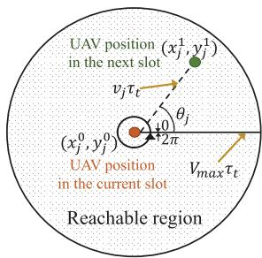  
Fig. 2. Relationship between changes in UAV trajectory and flight angle and flight speed of the UAV.

$$
\begin{array} { r } { s _ { n } = \{ \{ x _ { m } [ n ] \} _ { m \in \mathcal { M } } , \{ y _ { m } [ n ] \} _ { m \in \mathcal { M } } , \ } \\ { \{ x _ { j } [ n - 1 ] \} _ { j \in \mathcal { I } } , \{ y _ { j } [ n - 1 ] \} _ { j \in \mathcal { I } } \} , \ } \end{array}\tag{22}
$$

To facilitate the subsequent network learning, we normalize all elements in the state space as [38]:

$$
\begin{array} { r } { s _ { n } = \{ \{ \widehat { x } _ { m } [ n ] \} _ { m \in \mathcal { M } } , \{ \widehat { y } _ { m } [ n ] \} _ { m \in \mathcal { M } } , \ } \\ { \{ \widehat { x } _ { j } [ n - 1 ] \} _ { j \in \mathcal { J } } , \{ \widehat { y } _ { j } [ n - 1 ] \} _ { j \in \mathcal { J } } \} , \ } \end{array}\tag{23}
$$

where $\widehat { x } _ { m } [ n ] = x _ { m } [ n ] / s _ { x } , \widehat { y } _ { m } [ n ] = y _ { m } [ n ] / s _ { y } , \widehat { x } _ { j } [ n - 1 ] =$ $x _ { j } [ n - 1 ] / s _ { x }$ and $\widehat { y } _ { j } [ n - 1 ] = y _ { j } [ n - 1 ] / s _ { y } .$

## 2) Action Space A:

In our proposed joint optimization problem, we apply $a _ { n } \in$ A to denote the action at time slot n, which consists of three parts: the UAV trajectory design, the sub-carriers assignment, and the vehicle power control.

As for the UAV trajectory variables, ${ \bf q } _ { j } [ n ]$ , it can be represented by the flight angle $\theta _ { j } [ n ]$ and the flight speed $v _ { j } [ n ]$ of the UAV. As shown in Fig. 2, we assume that the position of UAV j in the current slot is $( x _ { j } ^ { 0 } , y _ { j } ^ { 0 } )$ . The reachable region formed by the possible UAV position in the next slot is a circular region centered on the position in current slot and radiused by the maximum flight distance, $V _ { m a x } \tau _ { t }$ , with $\theta _ { j } \in [ 0 , 2 \pi ]$ and $v _ { j } \in [ 0 , V _ { m a x } ] .$ . Hence, the UAV position in the next slot, $( x _ { j } ^ { 1 } , \bar { y _ { j } ^ { 1 } } )$ , can be obtained from

$$
x _ { j } ^ { 1 } = x _ { j } ^ { 0 } + v _ { j } \tau _ { t } \cos \theta _ { j } , y _ { j } ^ { 1 } = y _ { j } ^ { 0 } + v _ { j } \tau _ { t } \sin \theta _ { j } .\tag{24}
$$

Thus, the action about the UAV trajectory can be denoted as $[ \{ v _ { j } [ n ] \} _ { j \in \mathcal { I } } , \{ \theta _ { j } [ n ] \} _ { j \in \mathcal { I } } ]$

As for the sub-carrier assignment, we apply $[ \{ \psi _ { j } ^ { c } [ n ] \} _ { j \in \mathcal { I } , c \in \mathcal { C } } ]$ with $\psi _ { j } ^ { c } [ n ] \quad \in \quad [ 0 , 1 ] .$ , to denote the corresponding action, replacing the original binary variable $\omega _ { m } ^ { c } [ n ] ~ \in ~ \{ 0 , 1 \}$ . The reason lies in that firstly the output value of our proposed algorithm illustrated in section IV is contentious and the true values of the sub-carrier assignment is discrete. Secondly, we note that (21e) and (21f) specify that each vehicle is assigned at most one sub-carrier, which can not be seized by other vehicles within the same UAV. It is difficult to satisfy the constraints if the sub-carriers are selected directly from the vehicle’s point of view. Therefore, we try to make the selection from the UAV’s perspective based on the results of vehicle-UAV association through the Algorithm 1 in subsection IV-A. To accomplish the mapping of the output action to the real values of that variables and satisfy the constraints on the sub-carrier assignment, we design the action reconstruction method. The basic idea is that for each UAV $j ,$ based on the number of vehicles it serves, denoted as $M _ { j }$ , and its action value on all sub-carriers, $\psi _ { j } ^ { c } [ n ] , \forall c$ , the $M _ { j }$ sub-carriers corresponding to the smallest action value are selected out and assigned to the vehicles associated with that UAV. An example is illustrated in Fig. 3. As shown in Fig. 3a, we assume there are 5 sub-carriers, 10 vehicles and 3 UAVs, and vehicles 1, 2, 4, 7 are associated with UAV 1, vehicles 5, 8 are associated with UAV 2, vehicles 3, 6, 9, 10 are associated with UAV 3. For UAV 1, the sub-carriers corresponding to its four smallest action values are {a, b, c, d} as shown in Fig. 3b. Similarly, we can find UAV 2 will select two sub-carriers {b, e} and UAV 3 will select sub-carriers {a, c, d, e}. Then, as shown in Fig. 3a, we combine the vehicle-UAV association situation and sequentially assign the selected sub-carriers to the corresponding user, getting the corresponding $\omega _ { m } ^ { c } [ n ] = 1$

Algorithm 1 Improved K-Means Algorithm for Obtaining   
Vehicle Association   
1: Input: UAV set J , vehicle set M, maximum UAV load C   
(the sub-carrier number), vehicle location $\{ \mathbf { w } _ { m } [ n ] \} _ { m \in \mathcal { M } } ,$   
UAV angle $\{ \theta _ { j } [ n ] \} _ { j \in \mathcal { I } } ,$ UAV speed $\{ v _ { j } [ n ] \} _ { j \in \mathcal { I } ^ { : } }$ , UAV   
location in the previous time slot $\{ \mathbf { q } _ { j } [ n - 1 ] \} _ { j \in \mathcal { T } } .$   
2: Output: Vehicle association set $\Lambda = \{ \beta _ { j , m } [ n ] \} _ { j \in \mathcal { I } , m \in \mathcal { M } } ^ { - \infty } .$   
3: # Vehicle clustering:   
4: Obtain $\mathrm { U A V s } '$ current location $\{ \mathbf { q } _ { j } [ n ] \} _ { j \in \mathcal { I } }$ based on   
$\{ v _ { j } [ n ] \} _ { j \in \mathcal { I } } , \{ \theta _ { j } [ n ] \} _ { j \in \mathcal { I } }$ and $\{ \mathbf { q } _ { j } [ n - 1 ] \} _ { j \in \mathcal { I } } ^ { \cup } ,$   
5: Calculate the distance from each vehicle m to each UAV   
$j , S _ { j m } = \Vert \mathbf { q } _ { j } [ n ] - \mathbf { w } _ { m } [ n ] \Vert , \forall j , m ,$   
6: Select the nearest UAV for each vehicle $m ,$   
7: Forming the initial cluster of UAVs, $\mathcal { M } _ { j } , \forall j \in \mathcal { I } ,$   
8: Sort the clusters in descending order based on vehicle   
number in the cluster, where $| \bar { \mathcal { M } } _ { j ^ { \prime } } | \geq | \mathcal { M } _ { ( j + 1 ) ^ { \prime } } | , j ^ { \prime } \in \mathcal { I }$   
9: # Cluster reorganization:   
10: repeat   
11: if $\left. \mathcal { M } _ { ( 1 ) ^ { \prime } } \right. > C$ then   
12: Select $\left| \mathcal { M } _ { ( 1 ) ^ { \prime } } \right| - C$ vehicles nearest to the UAVs of   
the other clusters to offload.   
13: Update cluster members $\mathcal { M } _ { j } , \forall j \in \mathcal { I } ,$   
14: Sort the clusters in descending order based on   
vehicle number in the cluster, where $| { \mathcal { M } } _ { j ^ { \prime } } | \ \geq$   
$\left| \mathcal { M } _ { ( j + 1 ) ^ { \prime } } \right| , j ^ { \prime } \in \mathcal { T } .$   
15: end if   
16: until all UAVs meet the load. Obtain $\beta _ { j , m \in { \mathcal { M } } _ { j } } [ n ] = 1 .$

The range of the vehicle power control variable $p _ { m } [ n ] , \forall m \in \mathcal { M }$ falls in $[ 0 , { P _ { m } ^ { m a x } } ]$ . Thus, the action about the power control can be expressed as $[ \{ p _ { m } [ n ] \} _ { m \in \mathcal { M } } ]$

Therefore, the action space of the proposed algorithm is

$$
\begin{array} { r } { a _ { n } = \{ \{ v _ { j } [ n ] \} _ { j \in \mathcal { I } } , \{ \theta _ { j } [ n ] \} _ { j \in \mathcal { I } } , \ } \\ { \{ \psi _ { j } ^ { c } [ n ] \} _ { ( j - 1 ) \in \mathcal { I } , c \in \mathcal { C } } , \{ p _ { m } [ n ] \} _ { m \in \mathcal { M } } \} . } \end{array}\tag{25}
$$

We normalized the action space to eliminate the effect of significant discrepancies between the variables on the properties of the learned network model as

an = {{vj [n]}j∈J , {θbj [n]}j∈J , {ψcj[n]}(j−1)∈J ,c∈C, {pm[n]}m∈M} (26) where $\widehat { v } _ { j } [ n ] = v _ { j } [ n ] / V _ { m a x } , \widehat { \theta } _ { j } [ n ] = \theta _ { j } [ n ] / 2 \pi$ and ${ \widehat { p } } _ { m } [ n ] =$ $p _ { m } [ n ] / { \bar { P } } _ { m } ^ { m a x } .$

## 3) Reward Design R:

We use $R _ { n }$ to denote the immediate reward at time slot $n ,$ with $R _ { n } \in \mathcal { R }$ . The goal in this work is to maximize the system EE, thus the first part of the immediate reward is

$$
r _ { n } ^ { 0 } = \beta _ { 0 } \frac { \displaystyle \sum _ { m = 1 } ^ { M } \sum _ { j = 1 } ^ { J } \sum _ { c = 1 } ^ { C } \beta _ { j , m } [ n ] \omega _ { m } ^ { c } [ n ] R _ { j , m } ^ { c } [ n ] } { \displaystyle \sum _ { j = 1 } ^ { J } P _ { j } ^ { f l } [ n ] } .\tag{27}
$$

where $\beta _ { 0 }$ is a constant to accomplish reward reshaping, which aims to adjust the range and proportion of reward signals to optimize the learning process of the algorithm and make the immediate reward $r _ { n } ^ { 0 }$ more traceable [12].

Taking into account the constraints, we apply the penalty rewards. For constraint (21b), we set the penalty reward

$$
p r _ { m } ^ { 1 } [ n ] = \left\{ \begin{array} { l l } { - r _ { 1 } , } & { \mathrm { e l s e } , } \\ { 0 , } & { \sum _ { j = 1 } ^ { J } \sum _ { c = 1 } ^ { C } R _ { m , k } ^ { c } [ n ] \geq R _ { m } ^ { Q o S } , } \end{array} \right.\tag{28}
$$

to punish the action when the constraints of vehicle’s QoS assurance are violated. $r _ { 1 }$ is a constant indicating the strength of the penalty. To ensure the flight zone of the UAV as in (21h), the penalty reward can be expressed as

$$
p r _ { j } ^ { 2 } [ n ] = \left\{ { \begin{array} { l l } { - r _ { 2 } , } & { { \mathrm { e l s e } } , } \\ { 0 , } & { x _ { j } [ n ] \in [ 0 , s _ { x } ] { \mathrm { ~ a n d ~ } } y _ { j } [ n ] \in [ 0 , s _ { y } ] , } \end{array} } \right.\tag{29}
$$

where $r _ { 2 }$ is used to penalize the UAV for flying out of the service area. Taking into account the constraint (21j), we set

$$
p r _ { j } ^ { 3 } [ n ] = \left\{ { \begin{array} { l l } { - r _ { 3 } , } & { \| \mathbf { q } _ { j } [ n ] - \mathbf { q } _ { i } [ n ] \| < S _ { \operatorname* { m i n } } , i \neq j , } \\ { 0 , } & { { \mathrm { e l s e } } , } \end{array} } \right.\tag{30}
$$

where $r _ { 3 }$ is a constant that penalizes collisions with UAVs.

Therefore, the total immediate reward for the system can be denoted as

$$
R _ { n } = r _ { n } ^ { 0 } + \sum _ { m = 1 } ^ { M } p r _ { m } ^ { 1 } [ n ] + \sum _ { j = 1 } ^ { J } p r _ { j } ^ { 2 } [ n ] + \sum _ { j \ne i } p r _ { j } ^ { 3 } [ n ] .\tag{31}
$$

Now, we can transform the optimization problem (21) into

$$
\operatorname* { m a x } _ { \{ \Lambda , \Omega , { \bf P } , { \bf Q } \} } \quad \sum _ { n = 1 } ^ { N } \beta ^ { n - 1 } R _ { n }\tag{32a}
$$

where $\beta$ is the discount factor, $\beta \in [ 0 , 1 ]$ , to strike a balance between the uncertainty of the current rewards and that of the future rewards [39]. When $\beta = 0$ , future rewards exert no influence on the current state, i.e., agents are more concerned with immediate rewards; conversely, when $\beta ~ = ~ 1$ , future immediate rewards are accorded equal significance as current rewards. For values of β between 0 and 1, the future rewards assume a lesser importance compared to current rewards. Consequently, the importance of current and future rewards can be adjusted and balanced by adjusting β.

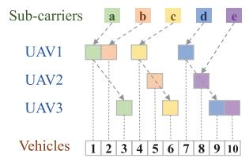  
(a) Sub-carrier assignment situation

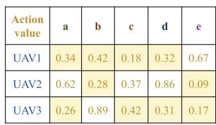  
(b) Action value for ψ.

Fig. 3. Action reconstruction for sub-carrier assignment.  
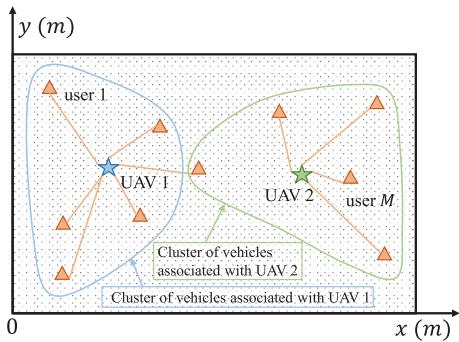  
Fig. 4. A legend about the improved k-means algorithm.

## IV. PROPOSED IKPP ALGORITHM

The action space in our constructed MDP is infinite, with its elements continuous, which makes table-based algorithms such as Q-learning inapplicable [38]. While the policy-based algorithms like DDPG may suffer from high variance in addressing our problem [38]. So we opt to the PPO, as it is well-suited for managing continuous action spaces and is more stable and less complex to achieve the goal of maximizing system performance [39]. Meanwhile, an improved k-means algorithm is designed to determine UAV-vehicle association, which can not only reduce the action space dimensionality, but also help to reconstruct the action space of sub-carrier assignment output from the PPO algorithm. The IKPP algorithm can finally output the discrete or continuous solutions for vehicle association, sub-carrier assignment, power control and trajectory design. Next, we first introduce the improved k-means algorithm included in the IKPP algorithm, followed by a detailed description of the overall IKPP algorithm.

## A. Improved k-Means Algorithm

In this part, we design a low-complexity heuristic algorithm to directly obtain the solution of the vehicle association based on the output UAV trajectories in PPO algorithm. Taking into account that there is no interference within each UAV while there is interference between UAVs, and the relative position of UAVs and vehicles determines the channel conditions.

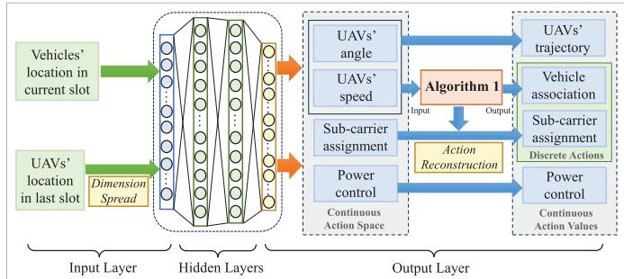  
Fig. 5. The architecture of the actor network.

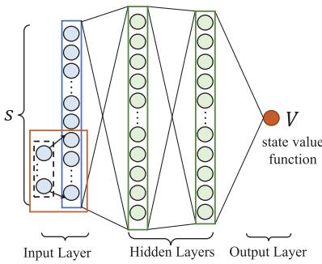  
Fig. 6. The architecture of the critic network.

Intuitively, each vehicle is served by the closest UAV will yield the maximum benefit. So we regard the use of clustering algorithm, but given that there is no interference within each UAV, so a maximum of C vehicles can be served within a UAV, and the exceeding vehicles need to be adjusted in a suitable way. Therefore we design an improved k-means algorithm to obtain the vehicle association. First, each vehicle selects the nearest UAV for association to form the initial cluster of each UAV. Then, we calculate whether the number of cluster members of each UAV exceeds the maximum service load C. If there is an exceeding, we sequentially start cluster member offloading from the largest cluster, and sequentially select the vehicles nearest to the UAVs of the other clusters to be removed until all clusters conform to their maximum load capacity. The details are summarized in Algorithm 1. To show this algorithm more clearly, we give an illustration as in Fig. 4. We assume that each UAV serves up to five vehicles. It can be seen that after initial clustering based on UAV-vehicle distance, there are six vehicles associated with UAV 1, which exceeds the load of UAV 1. We perform cluster reorganization by offloading one vehicle closest to UAV 2. This results in two final clusters of UAVs distinguished by two curves. Finally, we obtain the results of the vehicle-UAV association.

## B. IKPP-Based Joint Optimization Algorithm

The PPO is model-free and on-policy algorithm with the actor-critic architecture [40]. In which, the structure of the actor network is as shown in Fig. 5. The UAV location has a pronounced effect on the state of the system environment. In the input layer, we propose the dimension spread to extend the UAV position weight in the state space, so that to enhance its information presentation capabilities. In the output layer, the actor network initially outputs the continuous solutions for sub-carrier assignment, power control, and trajectory design. Then, the UAVs’ trajectory obtaining from the UAVs’ angle and speed can be fed into Algorithm 1 to get the vehicle association. With the solutions of UAV-vehicle association, Algorithm 1 combined with action reconstruction can help to discretize the raw continuous outputs of sub-carrier assignment into deployable solutions. The critic network structure is shown in Fig. 6, which has the same input layer and hidden layer as the actor network. Its output layer is used to output the state value function. Combined with the above actorcritic structure, we propose the IKPP algorithm, whose basic architecture is shown as in Fig. 7, to solve the reconstructed optimization problem (32). To begin with, we need to form the optimal multi-time-slot sequential decision-making policy $\pi ^ { * }$ that maximizes the expectation of rewards over a given period. The policy $\pi ^ { * }$ is the probability distribution of the desired action for the given state.

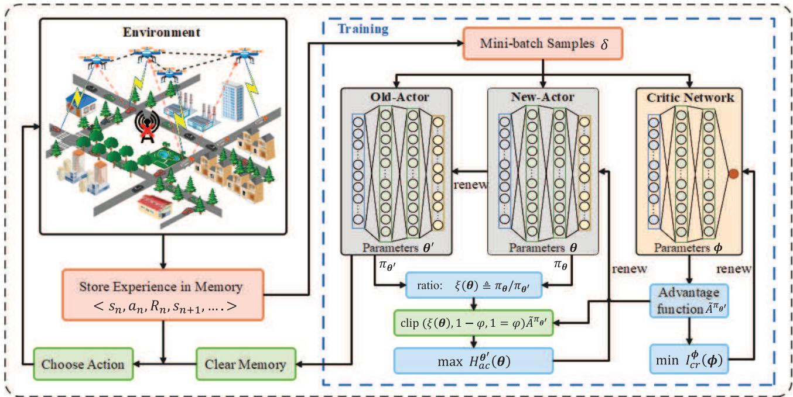  
Fig. 7. The architecture of IKPP algorithm.

In addition to incorporating the actor-critic structure, PPO also incorporates a strategy gradient (PG). The PG parameterizes the policy with the parameters θ and denotes the policy as $\pi _ { \pmb { \theta } } ( a _ { n } | s _ { n } )$ . It wants to get the optimal parameters $\pmb { \theta } ^ { * }$ through maximizing the expected reward which can be expressed as

$$
G ( \pmb \theta ) = \mathbb { E } _ { \delta \sim \pi _ { \pmb \theta } ( \delta ) } \left[ \sum _ { n = 1 } ^ { N } \beta ^ { n - 1 } R _ { n } \right] ,\tag{33}
$$

where $\delta$ represents the series of experiences of the agent engaging with the environment. PG uses gradient ascent to adjust the parameters θ and the gradient can be denoted as

$$
\nabla G _ { \pmb \theta } ( \pmb \theta ) = \mathbb { E } _ { \delta \sim \pi _ { \pmb \theta } ( \delta ) } \left[ Q ^ { \pi _ { \pmb \theta } } ( s _ { n } , a _ { n } ) \nabla \log \pi _ { \pmb \theta } ( a _ { n } | s _ { n } ) \right] ,\tag{34}
$$

where $Q ^ { \pi _ { \theta } } ( s _ { n } , a _ { n } )$ is the action-value function denoting the expected reward value of choosing action $a _ { n }$ in state $s _ { n }$ , which

can be written as

$$
\begin{array} { r l } & { Q ^ { \pi _ { \theta } } \big ( s _ { n } , a _ { n } \big ) } \\ & { \ = \mathbb { E } _ { \pi _ { \theta } } \left[ R _ { n } | s = s _ { n } , a = a _ { n } \right] } \\ & { \ = \mathbb { E } _ { \pi _ { \theta } } \left[ R _ { n + 1 } + \beta Q ^ { \pi _ { \theta } } \big ( s _ { n + 1 } , a _ { n + 1 } \big ) | s = s _ { n } , a = a _ { n } \right] , } \end{array}\tag{35}
$$

When doing optimization with gradient ascent method, it will consume long duration. This is because the variance of the gradient estimate of PG can be high, which leads to unstable training and slow convergence. Thus, it is challenging to find the best policy $\pi _ { \theta } ^ { * }$

The trust region policy optimization (TRPO) can address the aforementioned challenges in PG [39]. The parameters of its critic network, new actor network and old actor network are denoted as φ, θ and $\theta ^ { \prime } ,$ , respectively. TRPO applies importance sampling to train the new actor network’s policy $\pi _ { \pmb { \theta } } .$ , using the old actor network’s policy $\pi _ { \theta ^ { \prime } }$ to interact with the environment and gather experience. Thus, the gradient in (34) can be rewritten as

$$
\nabla G _ { \pmb { \theta } ^ { \prime } } ( \pmb { \theta } ) = \mathbb { E } _ { \delta \sim \pi _ { \pmb { \theta } ^ { \prime } } ( \delta ) } \left[ \xi ( \pmb { \theta } ) \tilde { A } ^ { \pi _ { \pmb { \theta } ^ { \prime } } } \big ( s _ { n } , a _ { n } \big ) \nabla \log \pi _ { \pmb { \theta } } \big ( a _ { n } \big | s _ { n } \big ) \right] ,\tag{36}
$$

where the probability ratio $\begin{array} { r } { \xi ( \pmb { \theta } ) \triangleq \frac { \pi _ { \pmb { \theta } } \left( a _ { n } | s _ { n } \right) } { \pi _ { \pmb { \theta } ^ { \prime } } \left( a _ { n } | s _ { n } \right) } } \end{array}$ is the importance weight, $\tilde { A } ^ { \pi _ { \theta ^ { \prime } } }$ denotes the advantage function which serves as a metric for assessing the effectiveness of selecting the current action $a _ { n }$ in relation to the alternative actions available within the current state, and $\tilde { A } ^ { \pi _ { \theta ^ { \prime } } }$ can be expressed as

$$
\tilde { A } ^ { \pi _ { \theta ^ { \prime } } } = Q ^ { \pi _ { \theta ^ { \prime } } } ( s _ { n } , a _ { n } ) - V _ { \phi } ( s _ { n } ) ,\tag{37}
$$

where $Q ^ { \pi _ { \theta ^ { \prime } } } ( s _ { n } , a _ { n } )$ is obtained from experience gathered through the old actor network, and

$$
\begin{array} { r l } & { V _ { \phi } ( s _ { n } ) = \mathbb { E } _ { \pi _ { \theta } } \left[ R _ { n } | s = s _ { n } \right] } \\ & { \qquad = \mathbb { E } _ { \pi _ { \theta } } \left[ R _ { n + 1 } + \beta V _ { \phi } ( s _ { n + 1 } ) | s = s _ { n } \right] , } \end{array}\tag{38}
$$

denotes the state-value function which is output by the critic network. Then, TRPO maximizes the surrogate objective limited by the Kullbak-Leibler (KL) divergence, which is

$$
\operatorname* { m a x } _ { \pmb { \theta } } \quad \mathbb { E } _ { \delta \sim \pi _ { \pmb { \theta } ^ { \prime } } ( \delta ) } \left[ \xi ( \pmb { \theta } ) \tilde { A } ^ { \pi _ { \pmb { \theta } ^ { \prime } } } ( s _ { n } , a _ { n } ) \right]\tag{39a}
$$

$$
\begin{array} { r } { s . t . : \quad \mathbb { E } _ { s \sim \pi _ { \pmb { \theta } ^ { \prime } } ( \delta ) } \left[ \hat { I } _ { K L } \big [ \pi _ { \pmb { \theta } ^ { \prime } } \big ( \cdot \big | s _ { n } \big ) , \pi _ { \pmb { \theta } } \big ( \cdot \big | s _ { n } \big ) \big ] \right] \le \rho , } \end{array}\tag{39b}
$$

where $\rho$ denotes the maximum threshold on the KL divergence. $\hat { I } _ { K L }$ , also known as relative entropy, can represent the difference between the old policy $\pi _ { \pmb { \theta } ^ { \prime } }$ and new policy $\pi _ { \pmb { \theta } }$ in the probability distribution of actions, expressed as

$$
\hat { I } _ { K L } [ \pi _ { \pmb \theta ^ { \prime } } ( \cdot | s _ { n } ) , \pi _ { \pmb \theta } ( \cdot | s _ { n } ) ] = \int \pi _ { \pmb \theta ^ { \prime } } ( a _ { n } | s _ { n } ) \log \frac { \pi _ { \pmb \theta ^ { \prime } } ( a _ { n } | s _ { n } ) } { \pi _ { \pmb \theta ^ { \prime } } ( a _ { n } | s _ { n } ) } d a _ { n }\tag{40}
$$

Directly solving the optimization problem (39) is more complicated, TRPO can perform approximation operations which needs to conduct a large number of Hessian inverse calculations [39]. However, computing and storing the inverse matrix will consume significant memory resources and time. Therefore, in order to reduce the computational complexity, the PPO-clip algorithm is applied to handle problem (39), which has been demonstrated to have a faster convergence rate while guaranteeing reliable performance [41].

We note that when maximizing the objective function of problem (39), it may lead to a large bias in the optimized policy when the ratio $\xi ( \pmb \theta )$ is large. To avoid excessive policy update magnitude, the PPO-clip is applied to force the ratio $\xi ( \theta )$ being in the neighborhood of 1. So we can reconstruct the optimization problem (39) as

$$
\begin{array} { r l } & { \underset { \pmb { \theta } } { \operatorname* { m a x } } \quad H _ { a c } ^ { \pmb { \theta } ^ { \prime } } ( \pmb { \theta } ) } \\ & { \overset { \Delta } { \underset { \pmb { \theta } } { \geq } } \mathbb { E } _ { \delta \sim \pi _ { \pmb { \theta } ^ { \prime } } ( \delta ) } \left[ \operatorname* { m i n } ( \xi ( \pmb { \theta } ) \tilde { A } ^ { \pi _ { \pmb { \theta } ^ { \prime } } } , \operatorname { c l i p } ( \pmb { \theta } ) \tilde { A } ^ { \pi _ { \pmb { \theta } ^ { \prime } } } ) + \tilde { s } E _ { \pi _ { \pmb { \theta } } } ( s _ { n } ) \right] } \end{array}\tag{41}
$$

where clip $( \pmb \theta ) \triangleq \mathrm { c l i p } ( \xi ( \pmb \theta ) , 1 - \varphi , 1 + \varphi )$ restricts the policy update magnitude by making $\xi ( \theta )$ in the range $[ 1 - \varphi , 1 + \varphi ] . \varphi$ is the clip parameter. $\tilde { s } E _ { \pi _ { \theta } } ( s _ { n } )$ is to enhance the exploration capabilities of the agent, which can avoid fall into a local optimum. s˜ is a constant hyperparameter and $E _ { \pi _ { \theta } } ( s _ { n } )$ is policy entropy term. About the term $\operatorname* { m i n } ( \xi ( \pmb { \theta } ) \tilde { A } ^ { \pi _ { \pmb { \theta } ^ { \prime } } } , \mathrm { c l i p } ( \pmb { \theta } ) \tilde { A } ^ { \pi _ { \pmb { \theta } ^ { \prime } } } )$ in (41), a positive value for $\tilde { A } ^ { \pi _ { \theta ^ { \prime } } }$ indicates the desirability of the current action $a _ { n } .$ . In such cases, we aim for a larger $\xi ( \theta )$ while ensuring $\xi ( \pmb \theta )$ does not exceed an upper limit of $1 + \varphi .$ Conversely, when $\tilde { A } ^ { \pi _ { \theta ^ { \prime } } }$ is negative, meaning the current action $a _ { n }$ is not yielding favorable rewards, so we seek a smaller $\xi ( \theta )$ , while ensuring $\xi ( \theta )$ does not be lower than $1 - \varphi .$

To address the issue of high variance in policy gradient estimates, we employ the generalized advantage estimation (GAE), which can significantly minimize variance while preserving an acceptable level of bias, to rewrite (37) as

$$
\begin{array} { l } { { \displaystyle { \tilde { A } } ^ { \pi _ { \theta ^ { \prime } } } = \sum _ { t = n } ^ { \infty } ( \kappa \beta ) ^ { t - n } \chi _ { t } } } \\ { { \displaystyle ~ \sum _ { t = n } ^ { \infty } ( \kappa \beta ) ^ { t - n } ( r _ { t } + \beta V _ { \phi } ( s _ { t + 1 } ) - V _ { \phi } ( s _ { t } ) ) } } \end{array}\tag{42}
$$

where κ is GAE discount factor, $\kappa \in [ 0 , 1 ]$

Algorithm 2 IKPP Algorithm for Solving Problem (32)   
1: Input: Initial actor (critic) network parameters $\pmb { \theta } _ { 0 }$ and $\pmb { \theta } _ { 0 } ^ { \prime }$   
$\left( \phi _ { 0 } \right)$ , memory load capacity $D _ { o } .$ , mini-batch sample size   
δ, total episode number E, iteration epochs $I _ { \mathrm { i t e } }$   
2: Output: Optimal solutions to the UAV trajectory, vehicle   
power control, vehicle association, sub-carrier assignment.   
3: for $e = 0 , 1 , \ldots , E$ do   
4: # Experience collection:   
5: Initialize the state $s _ { 0 }$ of the environment.   
6: for $n = 0 , 1 , \ldots , N$ do   
7: Choose action $a _ { n }$ from $s _ { n }$ using the policy $\pi _ { \pmb { \theta } ^ { \prime } } .$   
8: Obtain the UAV trajectory $\mathbf { q } _ { j } [ n ] , j \in \mathcal { I }$ and vehicle   
power $p _ { m } [ n ] , m \in { \mathcal { M } } .$   
9: Obtain the vehicle association $\beta _ { j , m } [ n ] , \forall j \in \mathcal { I } , m \in$   
$\mathcal { M }$ with the Algorithm 1.   
10: Obtain the sub-carrier assignment $\omega _ { m } ^ { c } [ n ] , \forall c \in$   
$\mathcal { C } , m \in \mathcal { M }$ based on action reconstruction.   
11: Calculate the total immediate reward $R _ { n }$   
12: Observe the next state $s _ { n + 1 } .$   
13: Store experience $< s _ { n } , a _ { n } , R _ { n } , s _ { n + 1 } >$ in memory   
buffer $\mathcal { D }$ and set $s _ { n } \gets s _ { n + 1 }$   
14: end for   
15: # Network training:   
16: if $| \mathcal { D } | \geq D _ { o }$ then   
17: Compute advantage function $\tilde { A } ^ { \pi _ { \theta ^ { \prime } } }$ from (42).   
18: Compute the reward-to-go $\hat { R } _ { n }$ and state-value func   
tion $V _ { \phi } \left( s _ { n } \right) .$   
19: for $i = 0 , 1 , \ldots , I _ { i t e }$ do   
20: Choose mini-batch samples $\delta$ from D.   
21: Renew new actor network parameters $\pmb { \theta } _ { e + 1 } =$   
arg maxθ $H _ { a c } ^ { \pmb \theta ^ { \prime } } ( \pmb \theta )$ in (41).   
22: Renew old actor network parameters $\pmb { \theta } _ { e + 1 } ^ { \prime } \ $   
$\pmb { \theta } _ { e + 1 }$   
23: Renew critic network parameters $\begin{array} { r l } { \phi _ { e + 1 } } & { { } = } \end{array}$   
arg minφ $I _ { c r } ^ { \phi } ( \phi )$ in (43).   
24: Clear memory buffer D, update $e = e + 1$   
25: end for   
26: end if   
27: end for

The parameters $\phi$ of the critic network can be optimized by minimizing the loss function based on the mean-squared error, which can be written as

$$
\operatorname* { m i n } _ { \phi } \quad I _ { c r } ^ { \phi } ( \phi ) \triangleq \frac { 1 } { | \delta | N } \sum _ { \delta } \sum _ { n = 0 } ^ { N } ( V _ { \phi } ( s _ { n } ) - \hat { R } _ { n } ) ^ { 2 }\tag{43}
$$

where $\hat { R } _ { n } = R _ { n } + \beta R _ { n + 1 } + . . . + \beta ^ { N - n } R _ { N }$ is called the reward-to-go. By iteratively updating the actor network and the critic network, the agent is prompted to learn good actions to maximize system EE. The above process of the proposed IKPP algorithm is summarized in Algorithm 2.

## C. Complexity Analysis

In this subsection, we analyze the complexity of the proposed IKPP algorithm, i.e., Algorithm 2. It is based on the PPO algorithm which is typically integrated within an actorcritic framework, and its computational cost is determined by the number of multiplications performed in each iteration. Referring to [39], [42], during the training process, given that all neural networks involved consist of fully connected layers, the computational complexity can be represented as $\begin{array} { r } { \mathcal { O } \left( \sum _ { i = 0 } ^ { I - 1 } N _ { i ( i n ) } \cdot N _ { i + 1 ( o u t ) } \right) } \end{array}$ , where I denotes the number of hidden layers, $N _ { i ( i n ) }$ and $N _ { i ( o u t ) }$ denote the number of inputs and outputs in the fully-connected layer i, respectively. In our algorithm, both the actor network and critic network in PPO have the same fully connected neural network structure with I layers. Consequently, the computational complexity for PPO doubles, resulting in $\begin{array} { r } { \mathcal { O } \left( 2 \sum _ { i = 0 } ^ { I - 1 } N _ { i ( i n ) } \cdot N _ { i + 1 ( o u t ) } \right) } \end{array}$ . As shown in Algorithm 2, the overall number of training episodes and time slots are denoted as $E$ and N, respectively. Thus, the overall complexity of the proposed IKPP algorithm can be denotes as $\begin{array} { r } { \mathcal { O } \left( 2 E N \sum _ { i = 0 } ^ { I - 1 } N _ { i ( i n ) } \cdot N _ { i + 1 ( o u t ) } \right) } \end{array}$

TABLE II  
THE VALUE OF SYSTEM PARAMETERS
<table><tr><td rowspan=1 colspan=1>Parameter</td><td rowspan=1 colspan=1>Value</td><td rowspan=1 colspan=1>Parameter</td><td rowspan=1 colspan=1>Value</td></tr><tr><td rowspan=1 colspan=1>Carrier frequency $f _ { c }$ </td><td rowspan=1 colspan=1>2 GHz</td><td rowspan=1 colspan=1>Path loss exponent α</td><td rowspan=1 colspan=1>2</td></tr><tr><td rowspan=1 colspan=1>Attenuation for LoS, N-LoS links $\xi _ { \mathrm { L o S } } ,$ ξNLoS</td><td rowspan=1 colspan=1>3dB,23dB</td><td rowspan=1 colspan=1>Environmentparameters φ1, φ2</td><td rowspan=1 colspan=1>11.95,0.14</td></tr><tr><td rowspan=1 colspan=1>Maximum     vehicletransmit power $P _ { m } ^ { m a x }$ </td><td rowspan=1 colspan=1>1W</td><td rowspan=1 colspan=1>Minimum collision pre-vention distance $S _ { \mathrm { m i n } }$ </td><td rowspan=1 colspan=1>20 m</td></tr><tr><td rowspan=1 colspan=1>Maximumspeed ofUAV $V _ { \mathrm { m a x } }$ </td><td rowspan=1 colspan=1>50 m/s</td><td rowspan=1 colspan=1>QoS requirements forvehicles $\mathbf { \chi } _ { R _ { m } } ^ { Q o S }$ </td><td rowspan=1 colspan=1>1bps/Hz</td></tr><tr><td rowspan=1 colspan=1>Noise power $\overline { { \sigma ^ { 2 } } }$ </td><td rowspan=1 colspan=1>-110dBm</td><td rowspan=1 colspan=1>Sub-carrier bandwidthB</td><td rowspan=1 colspan=1>1MHz</td></tr><tr><td rowspan=1 colspan=1>Sub-carrier number $\overline { { C } }$ </td><td rowspan=1 colspan=1>5</td><td rowspan=1 colspan=1>Number of UAVs J</td><td rowspan=1 colspan=1>2</td></tr><tr><td rowspan=1 colspan=1>Number of vehicles M</td><td rowspan=1 colspan=1>7</td><td rowspan=1 colspan=1>Number of time slots $N$ </td><td rowspan=1 colspan=1>50</td></tr><tr><td rowspan=1 colspan=1>Flight period T</td><td rowspan=1 colspan=1>50 s</td><td rowspan=1 colspan=1>UAV Flight altitude $H _ { 0 }$ </td><td rowspan=1 colspan=1>100 m</td></tr><tr><td rowspan=1 colspan=1>Air density ρ</td><td rowspan=1 colspan=1>1.225</td><td rowspan=1 colspan=1>Fuselage drag ratio $d _ { z }$ </td><td rowspan=1 colspan=1>0.3</td></tr><tr><td rowspan=1 colspan=1>Rotor disc area A</td><td rowspan=1 colspan=1>0.503</td><td rowspan=1 colspan=1>Rotor solidity s</td><td rowspan=1 colspan=1>0.05</td></tr><tr><td rowspan=1 colspan=1>Profile power in hover-ing status $P _ { r }$ </td><td rowspan=1 colspan=1>79.86 W</td><td rowspan=1 colspan=1>Induced power in hov-ering status $P _ { n }$ </td><td rowspan=1 colspan=1>88.63W</td></tr><tr><td rowspan=1 colspan=1>Mean rotor induced ve-locity $v _ { z }$ </td><td rowspan=1 colspan=1>4.03</td><td rowspan=1 colspan=1>Tip speed of the rotorblade $\scriptstyle { U _ { t } }$ </td><td rowspan=1 colspan=1>120</td></tr></table>

TABLE III

HYPERPARAMETERS OF PROPOSED IKPP ALGORITHM
<table><tr><td rowspan=1 colspan=1>Parameter</td><td rowspan=1 colspan=1>Value</td><td rowspan=1 colspan=1>Parameter</td><td rowspan=1 colspan=1>Value</td></tr><tr><td rowspan=1 colspan=1>PPO-clip parameter φ</td><td rowspan=1 colspan=1>0.2</td><td rowspan=1 colspan=1>Discount factor β</td><td rowspan=1 colspan=1>0.9</td></tr><tr><td rowspan=1 colspan=1>Total Episodes E</td><td rowspan=1 colspan=1>28000</td><td rowspan=1 colspan=1>Learning rate</td><td rowspan=1 colspan=1>0.001</td></tr><tr><td rowspan=1 colspan=1>GAE discount factor κ</td><td rowspan=1 colspan=1>0.95</td><td rowspan=1 colspan=1>Batch sample size δ</td><td rowspan=1 colspan=1>64</td></tr><tr><td rowspan=1 colspan=1>Policy entropy parameters</td><td rowspan=1 colspan=1>0.001</td><td rowspan=1 colspan=1>Memory load capacity $D _ { o }$ </td><td rowspan=1 colspan=1>2048</td></tr><tr><td rowspan=1 colspan=1>Iteration epochs $I _ { i t e }$ </td><td rowspan=1 colspan=1>10</td><td rowspan=1 colspan=1>Hidden layer width $N _ { r }$ </td><td rowspan=1 colspan=1>150</td></tr></table>

## V. SIMULATION RESULTS

The simulations are conducted using Python 3.8 and PyTorch 2.4 under the PyCharm platform on a Windows 10 with Intel(R) Core(TM) i7-6700K CPU @ 4.00GHz. We consider a multiple UAVs serving ground vehicular network within a $1 0 0 0 \times 1 0 0 0 ~ \mathrm { m ^ { 2 } }$ area. In this area, 3 roads are randomly generated in the horizontal direction and vertical direction respectively. Vehicles keep moving on the roads, randomly selecting their forward direction at intersections. This study fully regards the non-constant velocity motions of vehicles, and during the algorithm training process, each vehicle randomly selects the speed from a reasonable speed interval [24, 72] km/h [43] at each time slot, to ensure the unpredictability of the vehicle trajectory. The values of the other system parameters are set as shown in Table II, unless otherwise stated. In addition, the value settings of the hyperparameter in the proposed IKPP algorithm are shown in Table III. In order to verify the performance advantage of the proposed IKPP, we give some benchmark schemes: a) IKPP NOP, which applies the proposed joint optimization algorithm without optimizing the power control; b) IKPP NOA, which dose not optimize the vehicle association; c) IKPP NOB, which dose not optimize the sub-carrier assignment; d) IKPP NOQ, which applies random UAV trajectory; e) IKPP STATIC, which considers UAVs hovering stationary at the starting point; f) IKDDPG, the joint optimization scheme by combining the Algorithm 1 and the DDPG architecture [20]; g) PPO, which directly uses the PPO [24], to solve the vehicle association instead of the proposed Algorithm 1.

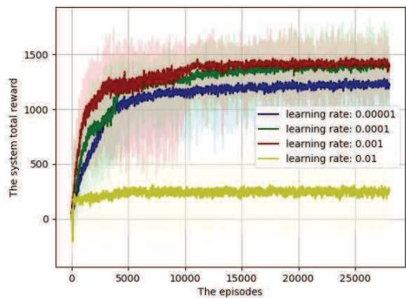  
Fig. 8. The system total reward under different learning rate.

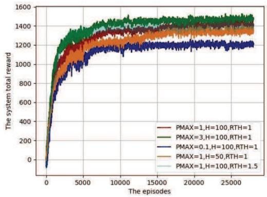  
Fig. 9. Convergence performance under different settings.

We evaluate the trend of the total system reward obtained by the proposed IKPP algorithm with different learning rates, as shown in Fig. 8. We find that too large a learning rate, e.g., 0.01, can hinder the convergence of the algorithm. In turn, a decreasing learning rate, e.g., 0.0001, 0.00001, reduces the convergence speed of the algorithm. The proposed algorithm achieves a good performance with the convergence speed and system reward when the learning rate is 0.001, and therefore we opt for this setting in subsequent simulations.

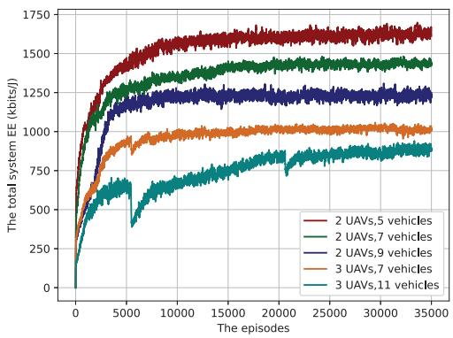  
Fig. 10. Convergence performance under different nodes.

The convergence of the proposed IKPP algorithm under different system parameter settings is verified in Fig. 9. The trend of the total system reward against episodes reveals the algorithm’s resilience under varying system parameters, like $P _ { m } ^ { m a x }$ ， $H _ { 0 } ,$ and $R _ { m } ^ { Q o S }$ , which are denoted as PMAX, H, RTH in the legend, respectively. Remarkably, the IKPP consistently exhibits robust convergence across these varied settings, confirming its stability under different conditions.

Then, the convergence of the proposed IKPP algorithm under different network sizes with different number of UAVs and vehicles is shown in Fig. 10. We setup 5 different cases with different number of UAVs and vehicles,which are 2 UAVs with 5 vehicles, 2 UAVs with 7 vehicles, 2 UAVs with 9 vehicles, 3 UAVs with 7 vehicles, 3 UAVs with 11 vehicles, respectively. It can be found with different cases, the algorithm can converge with similar training episode. It reveals that the algorithm is not sensitive to the scale of the network, especially for the number of UAVs and vehicles. Hence we conclude that our proposed IKPP algorithm is robust and scalable against the change of network settings.

In our training process, we employ randomly generated vehicle trajectories navigating on corresponding roads to assess the impact of the trained network. To evaluate the efficacy of the proposed IKPP algorithm for UAV trajectory optimization, we conduct tests using a variety of randomly assigned vehicle trajectories. Illustrated in Fig. 11, we present eight cases to showcase the algorithm’s effectiveness. The figure depicts trajectories of 7 vehicles denoted by dashed lines, along with trajectories of 2 UAVs represented by solid lines. We also show the uplink association area of each UAV in the first, middle and last time slot, respectively. Circles of different colors represent this area which are plotted centered on the UAV’s location marked by stars, with the horizontal distance between the UAV and the farthest vehicles associated with it as the radius. This distance dynamically varies based on the real-time UAV-vehicle association decisions and individual vehicle power control. Note that the uplink association area of the two UAVs hardly overlap as the time slots change, and their locations are gradually dispersed, with the scope of their respective service areas expanding. This algorithm ensures that the two UAVs can efficiently serve two groups of neighboring vehicles by carefully optimizing the UAV trajectories. Because our core objective is to maximize the system EE, which is achieved through a dual strategy: increasing the transmission rate of vehicles while reducing the propulsion power consumption of UAVs. Therefore, during the vehicle travel, the IKPP algorithm improves the channel conditions and boosts the transmission rate by firstly guiding the UAV forward in order to shorten the distance between it and the vehicle. Meanwhile, the algorithm adjusts the flight speed through trajectory optimization to ensure that the UAV maintains low propulsion power consumption during flight. The proposed algorithm seamlessly adapts to the dynamic mobility of vehicles to enhance channel conditions and provide superior service.

TABLE IV  
REAL-TIME EXECUTION TIME AT SOME TIME SLOTS
<table><tr><td rowspan=1 colspan=1>Case $\mathrm { s l o t } \frown$ </td><td rowspan=1 colspan=1>Case 1</td><td rowspan=1 colspan=1>Case 2</td><td rowspan=1 colspan=1>Case 3</td><td rowspan=1 colspan=1>Case 4</td></tr><tr><td rowspan=1 colspan=1> $n = 1$ </td><td rowspan=1 colspan=1>0.002960 s</td><td rowspan=1 colspan=1>0.003988 s</td><td rowspan=1 colspan=1>0.003962 s</td><td rowspan=1 colspan=1>0.004963 s</td></tr><tr><td rowspan=1 colspan=1> $\overline { { n = 2 5 } }$ </td><td rowspan=1 colspan=1>0.001995 s</td><td rowspan=1 colspan=1>0.002992 s</td><td rowspan=1 colspan=1>0.001996 s</td><td rowspan=1 colspan=1>0.002991 s</td></tr><tr><td rowspan=1 colspan=1> $\overline { { n = 5 0 } }$ </td><td rowspan=1 colspan=1>0.001994 s</td><td rowspan=1 colspan=1>0.001993 s</td><td rowspan=1 colspan=1>0.001995 s</td><td rowspan=1 colspan=1>0.000996 s</td></tr><tr><td rowspan=1 colspan=1>Mean time</td><td rowspan=1 colspan=1>0.001993 s</td><td rowspan=1 colspan=1>0.003449 s</td><td rowspan=1 colspan=1>0.001820 s</td><td rowspan=1 colspan=1>0.002979 s</td></tr><tr><td rowspan=1 colspan=1> $\overbrace { \mathrm { S l o t } } ^ { \mathrm { C a s e } }$ </td><td rowspan=1 colspan=1>Case 5</td><td rowspan=1 colspan=1>Case 6</td><td rowspan=1 colspan=1>Case 7</td><td rowspan=1 colspan=1>Case 8</td></tr><tr><td rowspan=1 colspan=1> $n = 1$ </td><td rowspan=1 colspan=1>0.002993 s</td><td rowspan=1 colspan=1>0.002990 s</td><td rowspan=1 colspan=1>0.003962 s</td><td rowspan=1 colspan=1>0.003991 s</td></tr><tr><td rowspan=1 colspan=1> $n = 2 5$ </td><td rowspan=1 colspan=1>0.000998 s</td><td rowspan=1 colspan=1>0.002991 s</td><td rowspan=1 colspan=1>0.001995 s</td><td rowspan=1 colspan=1>0.000997 s</td></tr><tr><td rowspan=1 colspan=1> $\overline { { n = 5 0 } }$ </td><td rowspan=1 colspan=1>0.002992 s</td><td rowspan=1 colspan=1>0.000996 s</td><td rowspan=1 colspan=1>0.000997 s</td><td rowspan=1 colspan=1>0.001993 s</td></tr><tr><td rowspan=1 colspan=1>Mean time</td><td rowspan=1 colspan=1>0.001982 s</td><td rowspan=1 colspan=1>0.001726 s</td><td rowspan=1 colspan=1>0.001999 s</td><td rowspan=1 colspan=1>0.003117 s</td></tr></table>

The real-time execution time of the proposed algorithm for the above eight cases is shown in TABLE IV. In each case, we show the execution time of the first time slot $( n = 1 )$ , the middle time slot $( n = 2 5 )$ , and the last time slot (n = 50) as well as the average execution time of all the time slots, respectively. It can be seen that the execution time of each time slot is below 0.005 s, with many of them as low as around 0.0009 s. In addition, by looking at the mean execution time of all time slots for all cases, we find that they are all in the range of 0.0017 s-0.0035 s, which are much smaller than the length of time slot $\tau _ { t } ~ = ~ 1 ~ \mathrm { s }$ . These prove that this algorithm can obtain a good decision scheme very quickly when executed in real time and has good real-time applicability.

The system reward variation with vehicle speed is shown in Fig. 12. During the initial phase when the vehicle speed gradually increases, the UAV is able to efficiently maintain a low flight power consumption by flexibly adjusting its flight trajectory. Meanwhile, the relative proximity between vehicles allows the transmission rate to increase. However, as the vehicle speed continues to accelerate, the distribution of vehicles gradually becomes decentralized, and the distance between them and the UAVs gradually increases, which directly leads to the continuous decline of the vehicle rate. More seriously, when the vehicle speed reaches too high a level, the UAV has to consume more power in order to maintain the following state for service. That directly causes a significant increase in the propulsion power consumption, which then seriously affects the overall EE, and ultimately makes the system rewards show a corresponding downward trend.

Additionally, we investigate the phenomenon of unexpected vehicle speed variations in real applications. By incorporating the error parameter between the ideal and actual speeds,

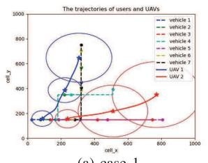  
(a) case 1

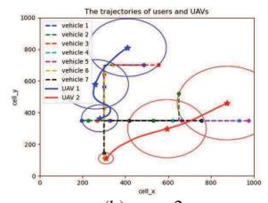  
(b) case 2

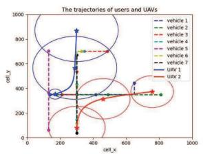  
(e) case 5

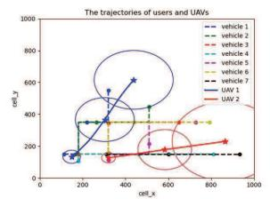  
(f) case 6

Fig. 11. The trajectories of vehicles and UAVs.  
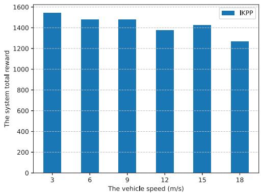  
Fig. 12. System reward under different vehicle speed.

TABLE V  
SYSTEM REWARD WITH SPEED ERROR
<table><tr><td rowspan=1 colspan=1>Test</td><td rowspan=1 colspan=1>SE=0</td><td rowspan=1 colspan=1>SE=-1m/s</td><td rowspan=1 colspan=1>SE=1m/s</td><td rowspan=1 colspan=1>SE=3m/s</td><td rowspan=1 colspan=1>SE=5m/s</td></tr><tr><td rowspan=1 colspan=1>Test 1</td><td rowspan=1 colspan=1>1417.72</td><td rowspan=1 colspan=1>1361.72</td><td rowspan=1 colspan=1>1431.74</td><td rowspan=1 colspan=1>1278.84</td><td rowspan=1 colspan=1>1288.78</td></tr><tr><td rowspan=1 colspan=1>Test 2</td><td rowspan=1 colspan=1>1436.93</td><td rowspan=1 colspan=1>1396.31</td><td rowspan=1 colspan=1>1496.05</td><td rowspan=1 colspan=1>1250.17</td><td rowspan=1 colspan=1>1141.11</td></tr><tr><td rowspan=1 colspan=1>Test 3</td><td rowspan=1 colspan=1>1311.08</td><td rowspan=1 colspan=1>1293.75</td><td rowspan=1 colspan=1>1307.12</td><td rowspan=1 colspan=1>1483.05</td><td rowspan=1 colspan=1>1380.82</td></tr><tr><td rowspan=1 colspan=1>Test 4</td><td rowspan=1 colspan=1>1446.70</td><td rowspan=1 colspan=1>1394.53</td><td rowspan=1 colspan=1>1430.97</td><td rowspan=1 colspan=1>1394.23</td><td rowspan=1 colspan=1>1233.30</td></tr><tr><td rowspan=1 colspan=1>Test 5</td><td rowspan=1 colspan=1>1446.43</td><td rowspan=1 colspan=1>1393.16</td><td rowspan=1 colspan=1>1393.95</td><td rowspan=1 colspan=1>1541.63</td><td rowspan=1 colspan=1>1321.35</td></tr></table>

TABLE V shows the variation of the system reward under different speed errors in five random tests. Where SE represents the speed error, SE = 0 indicates the ideal speed case, while SE = a m/s indicates that the actual speed may increase abruptly by a m/s compared to the ideal speed. The results show that our proposed algorithm demonstrates strong adaptability and is able to flexibly adjust the trajectory to cope with various speed errors. Under the conditions of SE of −1, 1, and 3 m/s, all tests yield similar or even higher system rewards. However, when the speed error increased to 5 m/s, the system reward basically showed a significant decrease. This is mainly due to the fact that the excessive increase in actual speed leads to an overly dispersed vehicle distribution, which in turn reduces the achievable rate of the vehicle. At the same time, the drastic increase in UAV speed also increases its propulsion power consumption, which reduces the achievable system EE, ultimately leading to a decrease in the system reward.

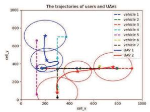  
(c) case 3

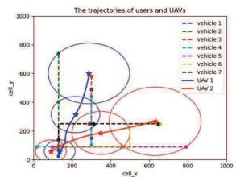  
(d) case 4

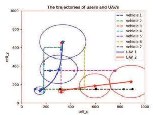  
(g) case 7

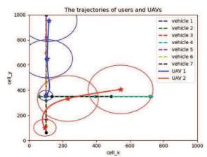  
(h) case 8

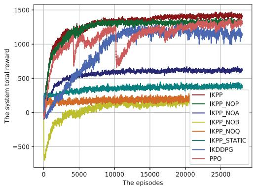  
Fig. 13. Convergence performance under different schemes.

The total system reward versus episodes obtained by different schemes is illustrated in Fig. 13. Notably, the IKPP algorithm exhibits remarkable convergence speed and consistently achieves the highest rewards. The reward advantage over scheme a, b, c, d, e, which optimize a fraction of variables less, demonstrates the importance of joint optimization for power control, vehicle association, sub-carrier assignment and trajectory optimization. It is worth emphasizing that IKPP not only converges significantly faster than the scheme f which utilizes DDPG, but also surpasses it in terms of reward post-convergence. That proves that the PPO framework is very effective in the proposed multi-UAVs assisted vehicular networks. In addition, scheme g exhibits continuous fluctuations in the early stages, with a slow convergence rate, and ultimately, the reward upon convergence is lower compared to the IKPP. This further validates the superiority of our designed Algorithm 1, as it can reduce the dimensionality of the action space and training complexity. These findings substantiate the superiority of IKPP in achieving both rapid convergence and superior performance within this dynamic system.

We show the system reward performance for enlarged network scale about 3 UAVs serving 11 vehicles in Fig. 14.

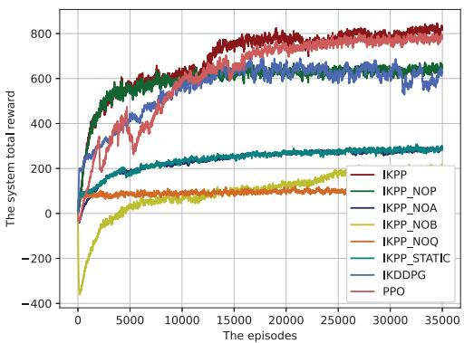  
Fig. 14. Convergence performance in the 3 UAVs scenario.

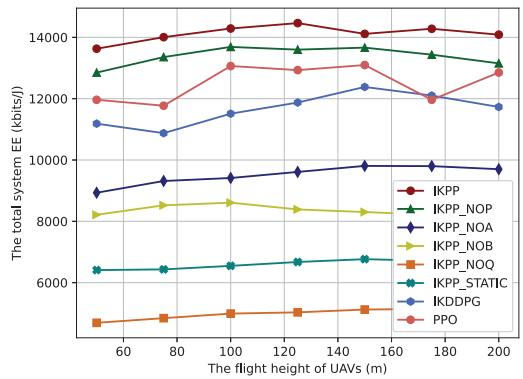  
Fig. 15. Total system EE versus the flight height of UAVs.

It can be found that the proposed IKPP algorithm obtains the highest system reward. In particular, by comparing the IKPP with the a, b, c, d, e schemes which only optimize part of the variables, the importance of the proposed algorithm for the joint optimization is also demonstrated as the same in Fig. 13. In addition, by comparing the IKPP with the scheme f, it can be found that the convergence stability of the proposed algorithm is significantly higher than that of latter, and the rewards after convergence are significantly higher than that of the latter, which proves the effectiveness of the adopted PPO framework for multi-UAV collaboration scenarios. In addition, by comparing the IKPP with the scheme g, the reward after convergence of the proposed algorithm is higher than that of the latter, which also proves the effectiveness of Algorithm 1 designed in this paper for obtaining user association decisions. It can be found that the proposed algorithm can be effectively extended to more multi-UAV collaboration scenarios and exhibits significant convergence speeds with the highest rewards.

Fig. 15 illustrates the total system EE in relation to the flight height of UAVs employing various algorithms. It is evident that the system EE does not consistently follow a increasing trend with UAV height. This behavior is attributed to the incorporation of a realistic probabilistic LoS channel model in this scenario. At lower UAV heights, the transmission signals between the vehicle and UAV are susceptible to obstruction by buildings, diminishing the communication experience. Furthermore, as the UAV height increases, the probability of achieving a LoS channel also increases. However, at excessively high altitudes, the communication quality deteriorates due to increased distance between the UAV and the vehicle, leading to a reduction in the total system EE. Notably, the proposed IKPP algorithm attains the highest total system EE, followed by scheme a, b, c, e, d in sequential order. This underscores the significance of jointly optimizing power control, vehicle association, sub-carrier assignment, and trajectory for enhancing system EE in this context. Additionally, the system EE achieved by the proposed IKPP, consistently surpasses that obtained by scheme g and f. This underscores the efficacy of the designed improved k-means algorithm and the adopted PPO framework in enhancing the system EE.

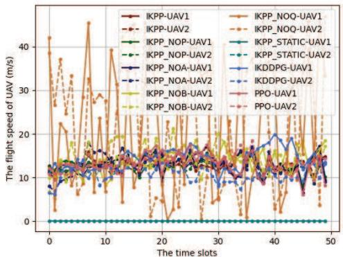  
(a) UAV speed

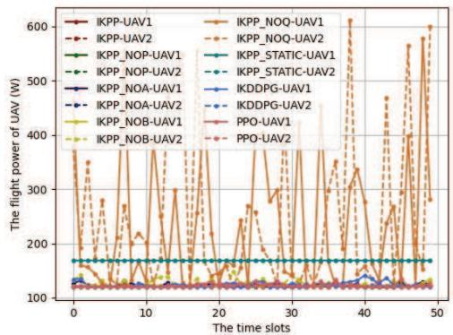  
(b) UAV flight power consumption  
Fig. 16. The UAV speed and corresponding UAV flight power consumption in different schemes versus time slots.

We give the speed and flight power consumption of the UAVs of 50 time slots in Fig. 16. As shown in Fig. 16a, it is evident that schemes lacking trajectory optimization, exemplified by scheme d where UAVs’ speeds vary from 0 to 50 m/s, and scheme e where the UAVs remain stationary, reveal distinct patterns. Conversely, UAVs perform trajectory optimization consistently maintain speeds around 12 m/s-a speed validated as optimal for achieving the lowest flight power consumption. Indeed, as in Fig. 16b, trajectory optimized schemes yield UAVs with flight power consumption concentrated around low 120W. In contrast, the static UAV in scheme e records a flight power consumption of 168.5W, while scheme d exhibits power consumption spanning from 120W to 620W. This observation underscores the impact of flight speeds, indicating that both excessively fast and slow speeds result in heightened flight power consumption. Hence, the integration of trajectory optimization into the scheme proves pivotal for reducing power consumption and enhancing EE.

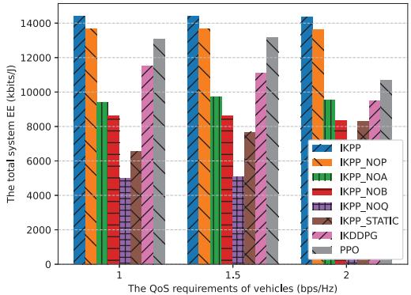  
Fig. 17. Total system EE under different QoS requirements.

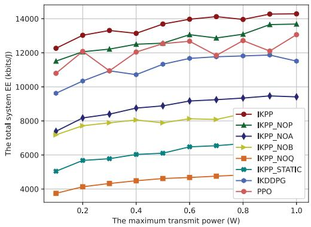  
Fig. 18. Total system EE versus vehicle transmit power.

Fig. 17 illustrates the total system EE under various QoS requirements achieved by different algorithms. Notably, the EE achieved by the proposed IKPP consistently decreases as the QoS requirements for vehicles increase. This phenomenon can be attributed to the fact that the escalating QoS demands narrow the feasible domain of the optimization problem. However, it is noteworthy that the proposed IKPP consistently outperforms other algorithms, showcasing the highest system EE across all QoS settings. Performance advantages over scheme a, b, c, d, e emphasizes the robustness of the proposed algorithm in enhancing system EE through the joint optimization. Performance advantages over scheme f and g prove the importance of the improved k-means algorithm and PPO framework in the proposed scheme.

The system EE corresponding to various vehicle transmit powers are depicted in Fig. 18. It is evident that the system EE exhibits a consistent upward trend with increasing vehicle power. This phenomenon stems from the fact that as the vehicle power escalates, the system benefits from augmented communication resources, affording greater flexibility for optimization. Upon comparing the proposed scheme with alternatives lacking optimization in specific factors (i.e., scheme a, b, c, e, d), it becomes apparent that trajectory design, subcarrier assignment, vehicle association, and power control, in that sequence, exert the most significant impact on enhancing system EE. This highlights the crucial importance of properly utilizing UAV mobility, managing interference, coordinating multi-UAV collaboration, and optimizing resources to enhance system EE. Compared to schemes f and g, the IKPP capitalizes on the PPO’s stability and Algorithm 1’s design, achieving both lower training complexity and better EE performance.

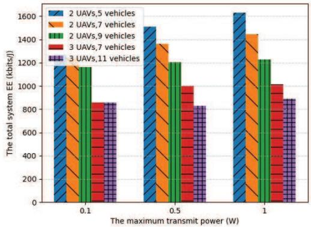  
Fig. 19. Total system EE under different transmit power.

Fig. 19 shows the performance of the system EE under different network node sizes varying with the maximum transmit power of the vehicles. Within a specific vehicle transmission power setting, it can be noticed that with the same number of UAVs, the system EE keeps decreasing as the scale of the vehicles continues to increase. This is due to more vehicles competing for the limited resources, making the reachable system performance decrease. Furthermore, it can be found that the performance does not always increase with the number of UAVs, due to the fact that the propulsion power consumption of the additional UAVs may weaken the overall EE. In addition, as the maximum transmission power of the vehicle increases, the EE achieved by the IKPP at each network size basically shows an upward trend, which is also due to that the increased resources allows the system to better utilize it for exploring a better solution. The proposed algorithm remains effective when the network scale is increasing.

## VI. CONCLUSION

In this study, we investigate the EE maximization problem in a multi-UAV assisted vehicular network where multiple UAVs are dispatched to provide uplink service to ground vehicles. The potential interference arises between UAVs as they multiplex the same sub-carriers. The overall system power consumption is primarily dominated by the UAV’s flight power expenditure. To achieve the energy-efficient communication, we propose a joint optimization framework which simultaneously optimizes the vehicle association, power control, sub-carrier assignment, and trajectory design. We account for QoS requirements for vehicles, limitations in communication resources, and UAV flight restrictions. The formulated problem is a mixed-integer non-convex fractional programming one which is difficult to tackle via traditional optimization methods. To efficiently solve it, we introduce an IKPP algorithm. It incorporates an improved k-means algorithm to determine the vehicle-UAV association. Additionally, it leverages action reconstruction and the PPO-clip algorithm to obtain the solutions for other variables. The proposed algorithm effectively reduces the dimensionality of the action space, minimizes the algorithm training complexity, and exhibits robust model adaptability and learning capabilities. Numerous simulation results underscore the scalability of the proposed algorithm and validate the effectiveness of the integrated optimization scheme in enhancing system EE.

In the future, based on the ability of the intelligent algorithms designed in this work to cope with real-time dynamic changes in network topology, it is particularly important and valuable to further develop adaptive intelligent algorithms applicable to complex scenarios such as flexible adjustment of UAV formations [32]. By exploring the optimization of threedimensional (3D) trajectories involving the flight altitude, the advantages of UAVs in terms of air mobility and mission execution can be even better explored [27]. This research direction is gradually gaining widespread attention in the academic community, which gives us a clear path to conduct our future research on the specific impact of 3D trajectory optimization on system performance.

## REFERENCES

[1] E. T. Michailidis, N. I. Miridakis, A. Michalas, E. Skondras, D. J. Vergados, and D. D. Vergados, “Energy optimization in massive MIMO UAV-aided MEC-enabled vehicular networks,” IEEE Access, vol. 9, pp. 117388–117403, 2021.

[2] F. Tang, Y. Kawamoto, N. Kato, and J. Liu, “Future intelligent and secure vehicular network toward 6G: Machine-learning approaches,” Proc. IEEE, vol. 108, no. 2, pp. 292–307, Feb. 2020.

[3] Z. Xiao et al., “A survey on millimeter-wave beamforming enabled UAV communications and networking,” IEEE Commun. Surveys Tuts., vol. 24, no. 1, pp. 557–610, 1st Quart., 2022.

[4] L. Wang, H. Zhang, S. Guo, and D. Yuan, “Deployment and association of multiple UAVs in UAV-assisted cellular networks with the knowledge of statistical user position,” IEEE Trans. Wireless Commun., vol. 21, no. 8, pp. 6553–6567, Aug. 2022.

[5] A. Manzoor, T. N. Dang, and C. S. Hong, “UAV trajectory design for UAV-2-GV communication in VANETs,” in Proc. Int. Conf. Inf. Netw. (ICOIN), Jan. 2021, pp. 219–224.

[6] L. Deng, G. Wu, J. Fu, Y. Zhang, and Y. Yang, “Joint resource allocation and trajectory control for UAV-enabled vehicular communications,” IEEE Access, vol. 7, pp. 132806–132815, 2019.

[7] Y. He, D. Wang, F. Huang, R. Zhang, and J. Pan, “Trajectory optimization and channel allocation for delay sensitive secure transmission in UAV-relayed VANETs,” IEEE Trans. Veh. Technol., vol. 71, no. 4, pp. 4512–4517, Apr. 2022.

[8] J. Li, X. Cao, D. Guo, J. Xie, and H. Chen, “Task scheduling with UAVassisted vehicular cloud for road detection in highway scenario,” IEEE Internet Things J., vol. 7, no. 8, pp. 7702–7713, Aug. 2020.

[9] M. Khabbaz, C. Assi, and S. Sharafeddine, “Multihop V2U path availability analysis in UAV-assisted vehicular networks,” IEEE Internet Things J., vol. 8, no. 13, pp. 10745–10754, Jul. 2021.

[10] M. Samir, D. Ebrahimi, C. Assi, S. Sharafeddine, and A. Ghrayeb, “Trajectory planning of multiple dronecells in vehicular networks: A reinforcement learning approach,” IEEE Netw. Lett., vol. 2, no. 1, pp. 14–18, Mar. 2020.

[11] J. Wang, H. Zhang, X. Zhou, W. Liu, and D. Yuan, “Joint resource allocation and trajectory design for energy-efficient UAV assisted networks with user fairness guarantee,” IEEE Internet Things J., vol. 11, no. 13, pp. 23835–23849, Jul. 2024.

[12] R. Ding, F. Gao, and X. S. Shen, “3D UAV trajectory design and frequency band allocation for energy-efficient and fair communication: A deep reinforcement learning approach,” IEEE Trans. Wireless Commun., vol. 19, no. 12, pp. 7796–7809, Dec. 2020.

[13] P. Chen, X. Zhou, J. Zhao, F. Shen, and S. Sun, “Energy-efficient resource allocation for secure D2D communications underlaying UAV-enabled networks,” IEEE Trans. Veh. Technol., vol. 71, no. 7, pp. 7519–7531, Jul. 2022.

[14] G. Yang, R. Dai, and Y.-C. Liang, “Energy-efficient UAV backscatter communication with joint trajectory design and resource optimization,” IEEE Trans. Wireless Commun., vol. 20, no. 2, pp. 926–941, Feb. 2021.

[15] E. Sun, H. Qu, Y. Yuan, M. Li, Z. Wang, and D. Chen, “A joint channel allocation and power control scheme for D2D communication in UAV-based networks,” in Proc. IEEE 21st Int. Conf. Commun. Technol. (ICCT), Tianjin, China, Oct. 2021, pp. 919–924.

[16] S. Mirbolouk, M. Valizadeh, M. C. Amirani, and S. Ali, “Relay selection and power allocation for energy efficiency maximization in hybrid satellite-UAV networks with CoMP-NOMA transmission,” IEEE Trans. Veh. Technol., vol. 71, no. 5, pp. 5087–5100, May 2022.

[17] Y. Qin, Z. Zhang, X. Li, W. Huangfu, and H. Zhang, “Deep reinforcement learning based resource allocation and trajectory planning in integrated sensing and communications UAV network,” IEEE Trans. Wireless Commun., vol. 22, no. 11, pp. 8158–8169, Nov. 2023.

[18] T. M. Ho, K.-K. Nguyen, and M. Cheriet, “Energy-aware control of UAV-based wireless service provisioning,” in Proc. IEEE Global Commun. Conf. (GLOBECOM), Madrid, Spain, Dec. 2021, pp. 1–6.

[19] A. Mondal, D. Mishra, G. Prasad, and A. Hossain, “Deep reinforcement learning for green UAV-assisted data collection,” in Proc. IEEE Int. Conf. Acoust., Speech Signal Process. (ICASSP), Jun. 2023, pp. 1–5.

[20] I. Budhiraja, V. Vishnoi, N. Kumar, D. Garg, and S. Tyagi, “Energyefficient optimization scheme for RIS-assisted communication underlaying UAV with NOMA,” in Proc. IEEE Int. Conf. Commun., May 2022, pp. 1–6.

[21] P. S. Aung, Y. M. Park, Y. K. Tun, Z. Han, and C. S. Hong, “Energyefficient communication networks via multiple aerial reconfigurable intelligent surfaces: DRL and optimization approach,” IEEE Trans. Veh. Technol., vol. 73, no. 3, pp. 4277–4292, Mar. 2024.

[22] L. Li, Q. Cheng, K. Xue, C. Yang, and Z. Han, “Downlink transmit power control in ultra-dense UAV network based on mean field game and deep reinforcement learning,” IEEE Trans. Veh. Technol., vol. 69, no. 12, pp. 15594–15605, Dec. 2020.

[23] Z. Liu, G. Huang, Q. Zhong, H. Zheng, and S. Zhao, “UAV-aided vehicular communication design with vehicle trajectory’s prediction,” IEEE Wireless Commun. Lett., vol. 10, no. 6, pp. 1212–1216, Jun. 2021.

[24] A. Al-Hilo, M. Samir, C. Assi, S. Sharafeddine, and D. Ebrahimi, “UAV-assisted content delivery in intelligent transportation systems-joint trajectory planning and cache management,” IEEE Trans. Intell. Transp. Syst., vol. 22, no. 8, pp. 5155–5167, Aug. 2021.

[25] Y. Zhou, N. Cheng, N. Lu, and X. S. Shen, “Multi-UAV-aided networks: Aerial-ground cooperative vehicular networking architecture,” IEEE Veh. Technol. Mag., vol. 10, no. 4, pp. 36–44, Dec. 2015.

[26] N. Zhao, Z. Ye, Y. Pei, Y.-C. Liang, and D. Niyato, “Multi-agent deep reinforcement learning for task offloading in UAV-assisted mobile edge computing,” IEEE Trans. Wireless Commun., vol. 21, no. 9, pp. 6949–6960, Sep. 2022.

[27] H. Yang and X. Xie, “Energy-efficient joint scheduling and resource management for UAV-enabled multicell networks,” IEEE Syst. J., vol. 14, no. 1, pp. 363–374, Mar. 2020.

[28] X. Liu, Y. Liu, Y. Chen, and L. Hanzo, “Trajectory design and power control for multi-UAV assisted wireless networks: A machine learning approach,” IEEE Trans. Veh. Technol., vol. 68, no. 8, pp. 7957–7969, Aug. 2019.

[29] J. Wang et al., “Multiple unmanned-aerial-vehicles deployment and user pairing for nonorthogonal multiple access schemes,” IEEE Internet Things J., vol. 8, no. 3, pp. 1883–1895, Feb. 2021.

[30] Y. Zhou, X. Ma, S. Hu, D. Zhou, N. Cheng, and N. Lu, “QoE-driven adaptive deployment strategy of multi-UAV networks based on hybrid deep reinforcement learning,” IEEE Internet Things J., vol. 9, no. 8, pp. 5868–5881, Apr. 2022.

[31] Y. Xu, T. Zhang, D. Yang, Y. Liu, and M. Tao, “Joint resource and trajectory optimization for security in UAV-assisted MEC systems,” IEEE Trans. Commun., vol. 69, no. 1, pp. 573–588, Jan. 2021.

[32] R. Zhang, M. Wang, L. X. Cai, and X. Shen, “Learning to be proactive: Self-regulation of UAV based networks with UAV and user dynamics,” IEEE Trans. Wireless Commun., vol. 20, no. 7, pp. 4406–4419, Jul. 2021.

[33] B. Omoniwa, B. Galkin, and I. Dusparic, “Optimizing energy efficiency in UAV-assisted networks using deep reinforcement learning,” IEEE Wireless Commun. Lett., vol. 11, no. 8, pp. 1590–1594, Aug. 2022.

[34] B. Zhang, Z. He, Y. Feng, and Z. Han, “Performance analysis and 3D position deployment for V2V-assisted UAV communications in vehicular networks,” IEEE Trans. Veh. Technol., vol. 73, no. 12, pp. 19361–19373, Dec. 2024.

[35] D. Wang, J. Tian, H. Zhang, and D. Wu, “Task offloading and trajectory scheduling for UAV-enabled MEC networks: An optimal transport theory perspective,” IEEE Wireless Commun. Lett., vol. 11, no. 1, pp. 150–154, Jan. 2022.

[36] M. Kang and S.-W. Jeon, “Energy-efficient data aggregation and collection for multi-UAV-enabled IoT networks,” IEEE Wireless Commun. Lett., vol. 13, no. 4, pp. 1004–1008, Apr. 2024.

[37] J. Wang, X. Zhou, H. Zhang, and D. Yuan, “Joint trajectory design and power allocation for UAV assisted network with user mobility,” IEEE Trans. Veh. Technol., vol. 72, no. 10, pp. 13173–13189, Oct. 2023.

[38] J. Ji, K. Zhu, and L. Cai, “Trajectory and communication design for cache- enabled UAVs in cellular networks: A deep reinforcement learning approach,” IEEE Trans. Mobile Comput., vol. 22, no. 10, pp. 6190–6204, Oct. 2023.

[39] M. Shao, J. Yan, and X. Zhao, “Secrecy rate maximization by cooperative jamming for UAV-enabled relay system with mobile nodes,” IEEE Internet Things J., vol. 10, no. 15, pp. 13168–13180, Aug. 2023.

[40] J. Peters and S. Schaal, “Reinforcement learning of motor skills with policy gradients,” Neural Netw., vol. 21, no. 4, pp. 682–697, May 2008.

[41] C. Dai, K. Zhu, and E. Hossain, “Multi-agent deep reinforcement learning for joint decoupled user association and trajectory design in full-duplex multi-UAV networks,” IEEE Trans. Mobile Comput., vol. 22, no. 10, pp. 6056–6070, Oct. 2023.

[42] H. Zhai, X. Zhou, H. Zhang, and D. Yuan, “Delay minimization in hybrid edge computing networks: A DDQN-based task offloading approach,” IEEE Trans. Veh. Technol., vol. 73, no. 10, pp. 15098–15108, Oct. 2024.

[43] R. Zhang, F. Zeng, X. Cheng, and L. Yang, “UAV-aided data dissemination protocol with dynamic trajectory scheduling in VANETs,” in Proc. IEEE Int. Conf. Commun. (ICC), Shanghai, China, May 2019, pp. 1–6.

  
Jing Wang received the B.E. degree from the School of Information Science and Engineering, Shandong Normal University, Jinan, China, in 2018, and the Ph.D. degree in information and communication engineering from the School of Information Science and Engineering, Shandong University, China, in 2024. She is currently with the Ocean College, Jiangsu University of Science and Technology. Her research interests include UAV assisted communications, radio resource management, and intelligent communication technologies.

Xiaotian Zhou (Member, IEEE) received the B.E. degree in electronic information engineering and the Ph.D. degree in communication and information systems from Shandong University in 2007 and 2013, respectively. He is currently a Full Professor with Shandong University. His research interests include wireless communications, with a focus on space-airground integrated networks, edge computing, and multi-antenna technologies.

Haixia Zhang (Senior Member, IEEE) received the B.E. degree from the Department of Communication and Information Engineering, Guilin University of Electronic Technology, Guilin, China, in 2001, and the M.Eng. and Ph.D. degrees in communication and information systems from the School of Information Science and Engineering, Shandong University, Jinan, China, in 2004 and 2008, respectively. From 2006 to 2008, she was with the Institute for Circuit and Signal Processing, Munich University of Technology, Munich, Germany, as an Academic

Assistant. From 2016 to 2017, she was a Visiting Professor with the University of Florida, Gainesville, FL, USA. She is currently a Distinguished Professor with Shandong University, Jinan, China. Her research interests include wireless communication and networks, the industrial Internet of Things, wireless resource management, and mobile edge computing. She is actively participating in many professional services. She is/was an Editor of IEEE TRANSACTIONS ON WIRELESS COMMUNICATIONS, IEEE WIRELESS COMMUNICATIONS LETTERS, and China Communications, and serves/served as the symposium chair, a TPC member, the session chair, and a keynote speaker of many conferences.

Daojun Liang (Graduate Student Member, IEEE) received the B.S. degree in computer science from Taishan University, China, in 2016, and the M.S. degree from the School of Information Science and Engineering from Shandong Normal University, Jinan, China, in 2019. He received the Ph.D. degree from the School of Information Science and Engineering, Shandong University, Qingdao, China, in 2025. He is currently an Assistant Professor with the Qilu University of Technology. His research interests include deep learning, machine learning, computer vision, and natural language processing.

Dongfeng Yuan (Senior Member, IEEE) received the M.S. degree from the Department of Electrical Engineering, Shandong University, China, in 1988, and the Ph.D. degree from the Department of Electrical Engineering, Tsinghua University, China, in January 2000. From 1993 to 1994, he was with the Electrical and Computer Department, University of Calgary, Alberta, Canada. He was with the Department of Electrical Engineering, University of Erlangen, Germany, from 1998 to 1999; the Department of Electrical Engineering and Computer

Science, University of Michigan, Ann Arbor, USA, from 2001 to 2002; the Department of Electrical Engineering, Munich University of Technology, Germany, in 2005; and the Department of Electrical Engineering, Heriot-Watt University, U.K., in 2006. He is currently a Full Professor with the School of Qilu Transportation, Shandong University. His current research interests include Intelligent communication systems, mobile edge computing and cloud computing, AI, and big data processing for communications.