# Joint Trajectory Planning and Channel Selection for AoI Minimization in Multi-UAV-Assisted IoT Networks

Zhuo Lu , Graduate Student Member, IEEE, Qihui Wu , Fellow, IEEE, Ziye Jia , Member, IEEE, Chen Fei , Jianzhao Zhang , Fuhui Zhou , Senior Member, IEEE, and Kai-Kit Wong , Fellow, IEEE

Abstract—With the rapid popularization of Internet of Things (IoT) devices, the freshness of data has become a key factor affecting decision quality and system efficiency. The application of uncrewed aerial vehicle (UAV) technology provides a new solution for IoT data collection. This article mainly studies how multiple UAVs can improve the freshness of IoT data collection through joint optimization of trajectory planning and channel selection in a three-dimensional (3D) interference environment. We conducted markov decision process (MDP) modeling on the combinatorial optimization problem of the model and proposed an intelligent joint trajectory planning and channel selection for data collection (ITPCS-DC) algorithm based on multi-agent deep reinforcement learning (MADRL). This algorithm can not only avoid the agent falling into local optimum caused by 3D interference, but also effectively reduce the age of information (AoI) of IoT data collection. Simulation results show that the proposed ITPCS-DC algorithm can achieve higher rewards, lower average AoI, reduced channel switching costs, and shorter trajectory lengths compared to other benchmark algorithms. Moreover, it has better adaptability to more complex collaborative environments.

Chen Fei is with the School of Noncommissioned Officer of People’s Armed Police Force, Hangzhou 311400, China (e-mail: fchgxnu@163.com).

Index Terms—Unmanned aerial vehicle (UAV), trajectory planning, channel selection, age of information (AoI), multi-agent deep reinforcement learning (MADRL).

Digital Object Identifier 10.1109/TWC.2026.3658601

## I. INTRODUCTION

W ITH the development of sixth generation (6G) net- works, the Internet of Things (IoT) has been widely applied. However, it brings various challenges to service providers and network operators [1], such as managing the connection of massive IoT devices, security and privacy, data processing and storage, and energy consumption management. Therefore, IoT devices require various technologies for data processing, collection, and dissemination, especially in emerging healthcare industries [2], smart homes [3], and intelligent transportation applications [4]. Traditional cellular base stations can serve as IoT data collectors, but they are susceptible to factors such as terrain and buildings, and cannot provide stable signals for the needs of IoT applications. However, the uncrewed aerial vehicles (UAVs) can be flexibly deployed as mobile base stations, and can be adjusted in real-time according to the actual needs of IoT applications to improve network efficiency and service quality [5], [6], [7], [8], [9]. Therefore, UAVs are considered powerful tools to help the IoT achieve efficient data collection and transmission [10], [11], [12]. Besides, in the delay sensitive IoT applications such as forest fire monitoring and railway inspections, the data freshness is significant. Hence, in order to ensure the freshness of received data, [13] proposed the age of information (AoI) as a performance measurement metric. The data collection based on AoI can ensure the freshness of information in the IoT network.

In order to effectively improve the freshness of information, the allocation of spectrum resources and trajectory planning are crucial for multiple UAVs. Due to the coupling between trajectory planning and resource allocation, the optimization problem of UAV-assisted IoT networks is non-convex. Numerous studies [14], [15], [16] have shown that the multi-agent deep reinforcement learning (MADRL) [17] can adapt to the complexity and diversity of various non-convex problems, demonstrating significant advantages in adaptability to dynamic environments and real-time resource allocation. As for the application of MADRL in multi-UAV collaborative communication, it is modeled as a sequential problem of markov decision process (MDP) [18], and accordingly the optimization problem is transformed into maximizing the accumulative rewards through reward design [19], [20]. After sufficient training, the well trained deep neural networks (DNNs) are utilized to make decisions. However, when traditional MADRL is used to solve joint optimization problems, there are interdependencies and constraints among actions in the complex action space, which can make learning strategy optimization difficult and may lead to local optimum. Therefore, this paper investigates a system in which multi-UAV-assisted IoT network data collection to minimize AoI by jointly optimizing trajectory planning and channel selection under three-dimensional (3D) interference. Considering that 3D interference increases the complexity of the action space, a novel intelligent joint trajectory planning and channel selection for data collection (ITPCS-DC) algorithm based on MADRL is proposed, which not only avoids the agent from falling into local optimum, but also effectively reduces AoI. The main contributions of this article are summarized as follows.

• We investigate a data collection system for IoT networks assisted by multiple UAVs in a 3D interference environment. The system aims to jointly optimize UAV trajectory planning and channel selection to minimize the AoI, thereby effectively enhancing the timeliness of data collection.

• Considering that UAVs are subject to 3D interference from other UAVs and ground jammers during the data collection process, this not only leads to environmental instability but also increases the complexity of the action space, thereby making the agent prone to fall into local optimum. To address this issue, we first model the complex joint optimization problem in the system as a MDP. Then, a novel ITPCS-DC algorithm is proposed based on MADRL. This algorithm integrates the characteristics of soft actor-critic (SAC) based on the MAAC framework, effectively avoiding agents from falling into local optimum by maximizing accumulative rewards and entropy values.

• Simulations are conducted and the results indicate that the ITPCS-DC algorithm has better learning strategies and stronger adaptability to unstable environments compared to other benchmark algorithms. Specifically, obtaining the cost of channel switching is lower, the AoI is smaller, the trajectory length is shorter, and the accumulative reward is the highest, with a maximum of 13.17% higher than other algorithms.

The remainder of this paper is organized as follows. In Section II, we discuss the related works. Section III presents the system model and problem formulation. In Section IV, the ITPCS-DC algorithm is designed in detail. Section V provides the performance evaluation. Finally, the conclusion is drawn in Section VI.

## II. RELATED WORKS

Recently, UAV-assisted wireless networks have attracted increasing attentions, such as improving UAV communication coverage [21], energy efficiency [22], and reducing energy consumption [23]. However, many critical applications rely on real-time data transmission, such as disaster monitoring, emergency response, and intelligent transportation systems. In these scenarios, the freshness of information directly affects the effectiveness of decision-making. In order to effectively quantify the freshness of information, the concept of AoI is proposed [24]. In most studies, AoI has been used as an indicator to measure the performance of UAV-assisted wireless networks. The existing related works can be mainly divided into two categories, namely traditional optimization algorithms and deep reinforcement learning algorithms.

## A. Traditional Optimization Algorithms

In [25], an UAV-assisted wireless IoT system was studied, and the average AoI was minimized by jointly optimizing UAV trajectory, energy transmission, and data collection time of each ground sensor node. Dynamic programming (DP) and ant colony (AC) heuristic algorithms were designed for the optimal solution. The authors in [26] proposed the problem of multi-UAV-assisted data collection. Based on an improved ant colony optimization (ACO) algorithm, the peak and average AoI in wireless sensor networks were minimized by jointly optimizing the upload sequence of sensor nodes and the trajectory of UAVs. A novel UAV aided localization and communication framework was introduced in [27], where the average AoI was minimized by jointly optimizing the UAV trajectory, localization accuracy, bandwidth, and beamwidth. Since the optimization problem was non-convex, an efficient iterative method was developed to obtain suboptimal performance. However, the above traditional optimization algorithms are lacking in high dimensional complexity, dynamic adaptability and multi-objective optimization ability, and new intelligent optimization technologies are urgently needed to achieve more efficient AoI minimization goals.

## B. Deep Reinforcement Learning (DRL) Algorithms

The above works have been solved using traditional optimization algorithms. In recent years, with the rapid development of artificial intelligence, intelligent algorithms such as reinforcement learning, have a significant opportunity in the UAV-assisted communication systems. The AoI and energy tradeoff (AET) in an aerial-ground collaborative mobile edge computing system were investigated in [28]. A multi-objective learning algorithm based on proximal policy optimization (PPO) was proposed to minimize the total AoI and total energy consumption of the UAV by optimizing its trajectory and task offloading ratio. In [29], the UAV supported intelligent transportation systems were studied, and the deep deterministic policy gradient (DDPG) was used to optimize UAV trajectories and scheduling strategies to minimize AoI in UAV-assisted single-hop vehicular networks. The authors in [23] proposed a synchronized UAV-UGV-based system to serve large-scale IoT networks and support real-time applications with freshly collected information. By adopting the MADDPG method based on MADRL to optimally control the trajectories of UGVs and UAVs, energy consumption and AoI of IoT devices can be reduced.

The above work did not consider the impact of 3D interference on the optimization of UAV-assisted IoT data collection strategies. However, the presence of 3D interference poses significant challenges to the performance of UAVs and the quality of data collection. The complex state and action space in the 3D interference environment may lead to the UAV strategy falling into local optimum. Therefore, this paper proposes an ITPCS-DC algorithm based on MADRL, utilizing the stochastic policy characteristics of SAC, to jointly optimize multi-UAV trajectory planning and channel selection for IoT data collection. This algorithm can not only avoid the agent falling into local optimum caused by 3D interference, but also achieve the minimization of AoI in IoT data collection. Our suggested system is compared to the most relevant schemes in Table I for more clarity.

TABLE I  
COMPARISON OF RELEVANT SCHEMES
<table><tr><td rowspan=1 colspan=1>Types</td><td rowspan=1 colspan=1>Ref</td><td rowspan=1 colspan=1>Techniques</td><td rowspan=1 colspan=1>Objective function</td><td rowspan=1 colspan=1>Decision variables</td><td rowspan=1 colspan=1>Challenges</td></tr><tr><td rowspan=3 colspan=1>Traditionaloptimizationalgorithms</td><td rowspan=1 colspan=1>[25]</td><td rowspan=1 colspan=1>Dynamic programming (DP)and ant colony (AC)heuristic algorithms</td><td rowspan=1 colspan=1>Minimize the average AoI</td><td rowspan=1 colspan=1>UAV trajectory,time of energy harvestingand data collection</td><td rowspan=1 colspan=1>Replace traditional linearenergy harvesting modelswith non-linear modelsto solve non-convex problems</td></tr><tr><td rowspan=1 colspan=1>[26]</td><td rowspan=1 colspan=1>Improved ant colonyoptimization (ACO)algorithm</td><td rowspan=1 colspan=1>Minimize the peak AoIand average AoI</td><td rowspan=1 colspan=1>Uploading sequenceand UAV trajectory</td><td rowspan=1 colspan=1>The multi-objective optimizationscheme is formulated andthe dynamic change of sensornode position is considered</td></tr><tr><td rowspan=1 colspan=1>[27]</td><td rowspan=1 colspan=1>Iterative algorithm</td><td rowspan=1 colspan=1>Minimize the average AoI</td><td rowspan=1 colspan=1>UAV trajectory,localization accuracy,bandwidth and beamwidth</td><td rowspan=1 colspan=1>Non-convexity ofoptimization problems</td></tr><tr><td rowspan=2 colspan=1>DRLalgorithms</td><td rowspan=1 colspan=1>[28]</td><td rowspan=1 colspan=1>Proximal policyoptimization (PPO)</td><td rowspan=1 colspan=1>Minimize the total AoI andtotal energy consumption</td><td rowspan=1 colspan=1>UAV trajectory andtask offloading ratio</td><td rowspan=1 colspan=1>Resolve conflicts betweenmulti-objective optimization problems</td></tr><tr><td rowspan=1 colspan=1>[29]</td><td rowspan=1 colspan=1>Deep deterministicpolicy gradient (DDPG)</td><td rowspan=1 colspan=1>Minimize the AoI</td><td rowspan=1 colspan=1>UAV trajectory andscheduling strategy</td><td rowspan=1 colspan=1>High mobility of vehiclesand optimization of mixedinteger non-linear program problems</td></tr><tr><td rowspan=1 colspan=1></td><td rowspan=1 colspan=1>[23]</td><td rowspan=1 colspan=1>Multi-agent deepdeterministic policygradient (MADDPG)</td><td rowspan=1 colspan=1>Minimize the AoI</td><td rowspan=1 colspan=1>UAV trajectoryand unmanned groundvehicle (UGV) trajectory</td><td rowspan=1 colspan=1>Optimize the mobilityof UGVs to meet the energyrequirements of UAVs</td></tr><tr><td rowspan=1 colspan=2>Our proposed method</td><td rowspan=1 colspan=1>ITPCS-DC</td><td rowspan=1 colspan=1>Minimize the AoI</td><td rowspan=1 colspan=1>UAV trajectoryand channel selection</td><td rowspan=1 colspan=1>3D interference causes agentsto fall into local optimum</td></tr></table>

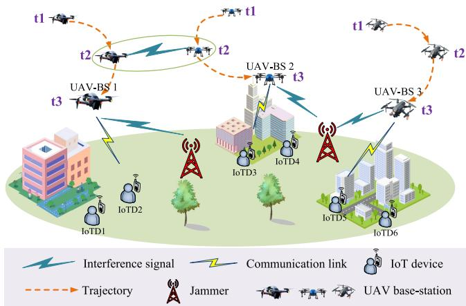  
Fig. 1. Multiple UAV-BSs for IoT data collection.

## III. SYSTEM MODEL AND PROBLEM FORMULATION

## A. System Model

As shown in Fig. 1, we consider a scenario of multiple UAV base stations (UAV-BSs) to assist IoT devices in data collection, which includes U rotary wing UAVs as aerial mobile base stations. Through joint optimization of trajectory and channel selection, we use downlink control channels to transmit the channel selection information to IoT devices, and then collect data from G IoT devices in the uplink, with J ground jammers. The UAV can fly within a certain altitude and speed range, and we represent the coordinate position of UAV-BS i at time t as $u _ { i } ( t ) ~ = ~ [ ( x _ { i } ( t ) , y _ { i } ( t ) ) , z _ { i } ( t ) ] ~ \in ~$ $\mathbb { R } ^ { 3 } , 0 \le \mathrm { ~ t ~ } \le \mathrm { ~ \mathscr { T } ~ } , i \in \mathrm { ~ \boldsymbol { U } ~ }$ . The position of IoT j at time t is denoted as $g _ { j } ( t ) = [ ( x _ { j } ( t ) , y _ { j } ( t ) ) , z _ { j } ( t ) ] \in \mathbb { R } ^ { 3 } , 0 \leq t \leq$ $T , j \in G .$ . The position of ground jammer k at time t is $b _ { k } ( t ) \ = \ [ ( x _ { k } ( t ) , y _ { k } ( t ) ) , z _ { k } ( t ) ] \ \in \ \mathbb { R } ^ { 3 } , 0 \ \leq \ t \ \leq \ T , k \ \in \ J .$ There are C channels in the network, and $C \ < \ U$ . Due to the inconsistent trajectories of each UAV-BS, spectrum conflicts will occur when the distance between the two UAV-BSs is less than the interference threshold distance $d _ { U U }$ and the same channel is selected. Similarly, when the distance between the UAV-BS and the ground jammer is less than the interference threshold distance $d _ { U J }$ and the same channel is selected, spectrum conflicts occur between the UAV-BS and the ground jammer. Due to real-time position variation of UAV-BSs, complex interference relationships may occur among UAV-BSs, leading to the 3D dynamic interference.

## B. Data Collection Model

The channel selection for collecting IoT data by UAV-BS i is determined by factors such as environmental states, UAV-BS location, IoT device location, and interference. Then, the channel selection information is sent to IoT devices via the downlink channel. Finally, IoT j uploads data of size $Q _ { j , i } ( t )$ to UAV-BS i based on this channel, and the length of each time t is recorded as τ seconds. It indicates that the uplink and downlink of UAV-BSs need to share the same channel during the data collection process. In order to avoid interference, we use the time division multiple access (TDMA) technology to transmit UAV-BS control information and upload IoT data.

Due to the environment, such as building density and height, as well as the elevation angle between IoT devices and UAV-BSs, the air-to-ground (A2G) channels are affected by line-of-sight (LoS) and non-line-of-sight (NLoS) links, as well as small-scale multipath fading. Generally, we ignore the small-scale fading since it is too weak compared to LoS and NLoS components. According to [30], the loss of the A2G channel model at time t is represented as

$$
\begin{array}{c} \begin{array} { r } { g _ { i , j } ^ { A 2 G } = \left\{ \begin{array} { l l } { \begin{array} { r l } { ( d _ { i , j } ( t ) ) ^ { - \alpha _ { U G } } , \mathrm { L o S ~ T r a n s m i s s i o n } } & { } \\ { \eta _ { N L o S } \left( d _ { i , j } ( t ) \right) ^ { - \alpha _ { U G } } , \mathrm { N L o S ~ T r a n s m i s s i o n } , } \end{array} } \\ { \forall i \in U , j \in G , } \end{array} \right.} \end{array}   \end{array}\tag{1}
$$

wherein, $d _ { i , j } ( t )$ is the propagation distance between UAV-BS i and IoT $j$ at time t, αUG is the path loss factor of A2G channel, and $\eta _ { N L o S }$ is the additional attenuation factor for NLoS links.

The connection probability of LoS depends on the geographical environment, the location of IoT devices and UAV-BSs, etc. The LoS link connectivity probability between UAV-BS i and IoT j at time t can be expressed as

$$
h _ { i , j } ^ { \mathrm { L o S } } ( t ) = \frac { 1 } { 1 + \varphi _ { a } \exp { \left( - \varphi _ { b } \left( \arctan { \left( \frac { z _ { i } ( t ) } { h d _ { i , j } ( t ) } \right) } - \varphi _ { a } \right) \right) } } ,\tag{2}
$$

where $h d _ { i , j } ( t ) ~ = ~ \lVert ( x _ { i } ( t ) , y _ { i } ( t ) ) - ( x _ { j } ( t ) , y _ { j } ( t ) ) \rVert$ represents the horizontal distance from UAV-BS i to IoT $j , \varphi _ { a }$ and $\varphi _ { b }$ are constants related to the type of propagation environment, and the probability of NLoS link connectivity is expressed as $h _ { i , j } ^ { N L o S } ( \dot { t } ) = 1 - \dot { h } _ { i , j } ^ { L o S } ( t )$

The uplink and downlink between UAV-BS i and IoT j in the system share the same channel via TDMA. Therefore, the downlink channel power gain $\ddot { d } _ { i } ( t )$ and the uplink channel power gain $\ddot { u } _ { j } ( t )$ is expressed as

$$
\begin{array} { r l r } & { } & { \ddot { d } _ { i , j } ( t ) = \ddot { u } _ { j , i } ( t ) = h _ { i , j } ^ { L o S } ( t ) \cdot \left( d _ { i , j } ( t ) \right) ^ { - \alpha _ { U G } } } \\ & { } & { ~ + h _ { i , j } ^ { N L o S } ( t ) \cdot \eta _ { N L o S } \left( d _ { i , j } ( t ) \right) ^ { - \alpha _ { U G } } . } \end{array}\tag{3}
$$

The signal-to-interference-plus-noise ratio (SINR) of the uplink from IoT $j$ to UAV-BS i at time t is

$$
S _ { j , i } ( t ) = \frac { p _ { j } \ddot { u } _ { j , i } ( t ) } { \sum _ { n = 1 , n \neq i } ^ { U } I _ { i , n } ( t ) + \sum _ { k = 1 } ^ { J } I _ { i , k } ( t ) + N _ { 0 } } ,\tag{4}
$$

wherein, $p _ { j }$ is the transmission power of IoT $j , \ N _ { 0 }$ is the variance of Gaussian noise at receivers. If UAV-BS i and $\mathrm { U A V _ { - } }$ BS n choose the same channel at time $t , I _ { i , n } ( t )$ indicates that UAV-BS i is interfered by UAV-BS n at time t. If the same channel is selected by UAV-BS i and ground jammer k at time $t , I _ { i , k } ( t )$ means that UAV-BS i is interfered by ground jammer k at time t, denoted as

$$
I _ { i , n } ( t ) = p _ { n } ( d _ { i , n } ( t ) ) ^ { - \alpha _ { U U } } , \forall i , n \in U , n \neq i ,\tag{5a}
$$

and

$$
I _ { i , k } ( t ) = p _ { k } ( d _ { i , k } ( t ) ) ^ { - \alpha _ { U G } } , \forall i \in U , k \in J ,\tag{5b}
$$

where $p _ { n }$ is the transmitting power of interfering UAV-BS $n ,$ $d _ { i , n } ( t )$ represents the distance that UAV-BS i is interfered by UAV-BS n at time t, and αUU is the path loss factor of airto-air (A2A) channel. $p _ { k }$ is the transmitting power of ground jammer k, and $d _ { i , k } ( t )$ represents the distance that UAV-BS i is interfered by ground jammer k at time t.

As for the transmission quality, we have set a SINR threshold $\kappa _ { g , u } .$ If the SINR is greater than $\kappa _ { g , u } ,$ it is considered that the data transmission of IoT devices is successful. Therefore, the constraint for the SINR at the receiver of UAV-BS i is

$$
S _ { j , i } ( t ) \geq \kappa _ { g , u } .\tag{6}
$$

Given the channel bandwidth B, the transmission rate of IoT j to UAV-BS i at time t can be expressed as

$$
\begin{array} { l } { R _ { j , i } ( t ) } \\ { = B l o g _ { 2 } ( 1 + \mathcal { S } _ { j , i } ( t ) ) } \\ { = B l o g _ { 2 } \left( 1 + \displaystyle \frac { p _ { j } \ddot { u } _ { j , i } ( t ) } { { U } } \left( \displaystyle \sum _ { \begin{array} { l } { p _ { j } \ddot { u } _ { j , i } ( t ) } \\ { \displaystyle \sum _ { n = 1 } ^ { U } p _ { n } ( d _ { i , n } ( t ) ) ^ { - \alpha _ { U U } } + \displaystyle \sum _ { k = 1 } ^ { J } p _ { k } ( d _ { i , k } ( t ) ) ^ { - \alpha _ { U G } } + N _ { 0 } } \\ { \displaystyle \sum _ { n \neq i } ^ { n } p _ { n } ( d _ { i , n } ( t ) ) ^ { - \alpha _ { U U } } + \displaystyle \sum _ { k = 1 } ^ { J } p _ { k } ( d _ { i , k } ( t ) ) ^ { - \alpha _ { U G } } + N _ { 0 } } \end{array}  } \end{array} \right) . } \end{\right)array}\tag{7}
$$

## C. Cost of Channel Switching

Note that from the interference mitigation standpoint, [31] studied weighted aggregated interference, which is the product of transmission power and corresponding interference. Therefore, the total network weighted aggregated interference of any UAV-BS i collecting data from any IoT $j$ is represented as

$$
\begin{array} { r l r } {  { = \sum _ { j = 1 } ^ { G } \sum _ { n = 1 } ^ { U } \sum _ { k = 1 } ^ { J } p _ { j } ( I _ { i , n } ( t ) + I _ { i , k } ( t ) ) } } \\ & { } & { = \sum _ { j = 1 } ^ { G } \displaystyle \sum _ { n = 1 } ^ { U } \sum _ { k = 1 } ^ { J } ( p _ { j } p _ { n } ( d _ { i , n } ( t ) ) ^ { - \alpha _ { U U } } + p _ { j } p _ { k } ( d _ { i , k } ( t ) ) ^ { - \alpha _ { U G } } ) , } \\ & { } & { ~ \forall i \in U , } \end{array}\tag{I(t}
$$

among them, $p _ { j }$ is the transmission power of IoT $j ,$ and $I _ { i , n } ( t )$ and $I _ { i , k } ( t )$ respectively represent the interference caused by UAV-BS n and ground jammer k when UAV-BS i receives IoT j data at time t.

In the multi-channel UAV communication system, any UAV-BS i can reduce interference with other interference sources by selecting different channels. However, frequent channel switching not only leads to throughput decrement, but also causes unnecessary energy loss and even communication interruption [32]. Therefore, the definition of network communication utility is

$$
\mathbb { U } ( t ) = \left\{ { \begin{array} { l } { - I ( t ) , \quad t = 1 } \\ { - I ( t ) - C * \sum _ { i = 1 } ^ { U } f \left( c _ { i } ( t ) , c _ { i } ( t - 1 ) \right) , 2 \leq t \leq T , } \end{array} } \right.\tag{9}
$$

where

$$
f \left( c _ { i } ( t ) , c _ { i } ( t - 1 ) \right) = \left\{ \begin{array} { l l } { 1 , } & { c _ { i } ( t ) \neq c _ { i } ( t - 1 ) } \\ { 0 , } & { c _ { i } ( t ) = c _ { i } ( t - 1 ) , } \end{array} \right.\tag{10}
$$

in which C is the cost of channel switching, and $f \left( c _ { i } ( t ) , c _ { i } ( t - 1 ) \right)$ indicates whether the channel selection $c _ { i } ( t )$ at the current time of UAV-BS i is the same as the channel selection $c _ { i } ( t - 1 )$ at the previous time. If the current channel selection $c _ { i } ( t )$ is different from the previous channel selection $c _ { i } ( t - 1 )$ , it indicates that channel switching has occurred, and the channel switching cost $C$ needs to be calculated. On the contrary, there is no need to consider the channel switching cost C.

Therefore, the network communication utility of the entire task is denoted as

$$
\begin{array} { l } { \displaystyle \mathbb { U } = \sum _ { t = 1 } ^ { T } \mathbb { U } ( t ) } \\ { \displaystyle \quad = - \sum _ { t = 1 } ^ { T } I ( t ) - C * \sum _ { t = 2 } ^ { T } \sum _ { i = 1 } ^ { U } f \left( c _ { i } ( t ) , c _ { i } ( t - 1 ) \right) . } \end{array}\tag{11}
$$

In addition to considering the utility of network communication, this article also considers minimizing the trajectory distance of each UAV-BS during the flight to the target point to reduce flight energy consumption. Therefore, the trajectory distance of the entire process is

$$
D = { \sum } _ { t = 1 } ^ { T } { \sum } _ { i = 1 } ^ { U } d _ { i , j } ( t ) , \forall j \in G .\tag{12}
$$

Considering the safety of UAV-BSs during the flight process, the flight safety distance $d ^ { s a f e }$ among UAV-BSs is set. Therefore, the risk factor of the whole process is

$$
\boldsymbol { S } = \sum _ { t = 1 } ^ { T } \sum _ { i = 1 } ^ { U } r i s k _ { i } ( t ) ,\tag{13}
$$

where

$$
\begin{array} { r } { r i s k _ { i } ( t ) = \left\{ \begin{array} { l l } { \| u _ { i } ( t ) - u _ { n } ( t ) \| , \quad \| u _ { i } ( t ) - u _ { n } ( t ) \| \leq d ^ { s a f e } } \\ { \quad 0 , \quad \| u _ { i } ( t ) - u _ { n } ( t ) \| > d ^ { s a f e } , } \end{array} \right. } \\ { \forall i \neq n , i \in U , n \in U . } \end{array}\tag{14}
$$

Therefore, the impact of each factor on the total task utility $\mathbb { G }$ of the network can be adjusted by introducing weight coefficients $\lambda _ { u } , \lambda _ { d } .$ , and $\lambda _ { s } ,$ as follows:

$$
\mathbb { G } = \lambda _ { u } \mathbb { U } - \lambda _ { d } D - \lambda _ { s } S ,\tag{15}
$$

wherein, $\lambda _ { u }$ represents the contribution of network communication utility to the total task utility of the network, and $\lambda _ { d }$ and $\lambda _ { s }$ respectively indicate the negative effects of trajectory distance and risk factor on the total task utility of the network.

## D. AoI Model of UAV-IoT System

We use AoI to measure the timeliness of the collected IoT data. The AoI of data collected by UAV-BS i from IoT $j$ at time t is

$$
\mathcal { A } _ { i , j } ( t ) = ( t - \mathcal { D } _ { j } ( t ) ) ^ { + } ,\tag{16}
$$

in which $\mathcal { D } _ { j } ( t )$ is the moment when the data is generated, $( x ) ^ { + } = m a x \{ 0 , x \}$ . When $t < \mathcal { D } _ { j } ( t ) , \mathcal { A } _ { i , j } ( t ) = 0$ indicates that the data of IoT j has not been collected yet. It is obvious that the AoI of a data increases over time.

For ease of analysis, the AoI of IoT j is the time length required to upload data to UAV-BS i. The time is related to the upload rate, and it is related to the distance from IoT $j$ to UAV-BS i, channel states, etc. If the distance between IoT $j$ and UAV-BS i is close and the channel states is good, the upload speed is higher and the time required for data upload is limited. Otherwise, the AoI of IoT $j$ is larger. Therefore, the AoI of IoT $j$ uploading data to UAV-BS i at time t is

$$
\mathcal { A } _ { i , j } ( t ) = \frac { Q _ { j , i } ( t ) } { R _ { j , i } ( t ) } ,\tag{17a}
$$

in which,

$$
Q _ { j , i } ( t + 1 ) = Q _ { j , i } ( t ) - R _ { j , i } ( t ) * \delta _ { t } ,\tag{17b}
$$

wherein, $\delta _ { t }$ represents time slot, $Q _ { j , i } ( t )$ is the remaining transmission data of IoT $j$ uploaded to UAV-BS i at time $t .$ $R _ { j , i } ( t )$ is closely related to the various elements U, D, and S within the entire network task utility G. For example, frequent channel switching in U may lead to throughput decreasing. Small distance from the UAV-BS to the IoT in $D ,$ corresponds to large throughput. As the risk factor in S increases, the throughput decreases.

## E. Problem Formulation

The objective is to minimize the total AoI of data from all IoT devices by jointly optimizing UAV-BS trajectory planning and channel selection. Mathematically, the problem is formulated as

$$
( P 0 ) : \operatorname* { m i n } _ { ( \{ u _ { i , j } ( t ) \} , \{ c _ { i , j } ( t ) \} ) } \sum _ { i \in U } \sum _ { j \in G } \sum _ { t } ^ { T } { A _ { i , j } ( t ) }\tag{18a}
$$

$$
\mathrm { s . t . } ~ u _ { i , j } ( t ) = u _ { i , j } ^ { 0 } , t = 0 , \forall i \in U , j \in G ,
$$

$$
\| u _ { i , j } ( t + 1 ) - u _ { i , j } ( t ) \| = V \delta _ { t } ,\tag{18b}
$$

$$
\forall i \in U , j \in G , t \in T ,\tag{18c}
$$

$$
\begin{array} { r l } & { \| u _ { i , j } ( t ) - u _ { n , l } ( t ) \| \ge \delta _ { d } , } \\ & { \forall i \ne n , j \ne l , ( i , n ) \in U , ( j , l ) \in G , t \in T , } \end{array}\tag{18d}
$$

$$
c _ { i , j } ( t ) \neq 0 , \forall i \in U , j \in G , t \in T ,\tag{18e}
$$

where in, $u _ { i , j } ( t )$ represents the trajectory of UAV-BS i serving IoT $j$ at time t, and $c _ { i , j } ( t )$ is the channel selection of UAV-BS i serving IoT j at time t. $u _ { i , j } ^ { 0 }$ is the initial position of UAV-BS i serving IoT j. (18b) indicates that the UAV-BS starts moving from the initial position. V is the flight speed of the UAV-BS, $\delta _ { t }$ is the time interval. (18c) means that the position state of UAV-BS i serving IoT $j$ at time t + 1 depends on the position state at time t and the flight speed V within time interval $\delta _ { t } .$ It reflects that the next state is only related to the current state and also reflects the relationship between the state and action. $\delta _ { d }$ is the safe distance between UAV-BS i serving IoT j and UAV-BS n serving IoT l. (18d) represents that at time t, the distance between any two UAV-BSs must be greater than or equal to the safe distance. $c _ { i , j } ( t )$ is the channel selection of UAV-BS i serving IoT $j$ at time t. Constraint (18e) indicates that the channel selection of UAV-BS i is not zero at any time.

It is noted that P 0 requires joint optimization of trajectory planning and channel selection to minimize AoI, which is a well-known NP-hard problem, and difficult to solve with traditional optimization methods. Fortunately, MADRL can effectively address complex optimization problems and explore efficient and reliable solutions from a large strategy space.

## IV. MADRL FOR DATA COLLECTION OPTIMIZATION PROBLEM

Here, we first model the above problem as a multi-agent extension of MDP, and then solve it using the MADRL method.

## A. MDP Formulation

In a multiple UAV-BSs assisted IoT network data collection system with 3D interference, UAV-BSs minimize AoI by jointly optimizing trajectory and channel selection. Considering that the total AoI is determined by the current state and the joint actions of all UAV-BSs, and the actions taken in the current state trigger the system environment to enter a new random state. In this case, UAV-BSs are viewed as agents, and the data collection optimization issue (18) can be formulated as a multi-agent MDP [33] $\langle S , A , R , P , \gamma \rangle$ . Among them, S denotes the state of the environment, A represents the set of actions of all agents, and R indicates the set of rewards obtained by all agents. P represents the probability of state transition, which maps the interaction between the current state and the selected action to determine the probability distribution of the next state. γ indicates the reward discount factor, which balances the importance of immediate rewards against those obtained in the future. At each moment, the environmental state is $s _ { t } ~ \in ~ S _ { }$ . Each agent can only receive local observations $o _ { t } ^ { i } = b _ { i } ( s _ { t } )$ and choose an action $a _ { t } ^ { i } = \pi _ { i } ( o _ { t } ^ { i } ) , a _ { t } ^ { i } \in A$ based on these local observations, where $b _ { i }$ and $\pi _ { i }$ represent the observation function and strategy of agent $i ,$ respectively. After selecting an action, agent i obtains rewards $R = \{ r _ { t } ^ { 1 } , \bar { r _ { t } ^ { 2 } } , \ldots , r _ { t } ^ { U } \}$ from the environment based on the reward function settings. Subsequently, the environment transforms to the next state $s _ { t + 1 }$ based on the state transition function $p _ { i } \in P$ . The main elements of RL for multi-UAVassisted IoT network data collection system are described in detail as follows:

Observation Space: In this model, UAV-BS i needs to use global positioning system (GPS) positioning to observe the positions of all UAV-BSs $\{ u _ { i } ( t ) \} _ { i \in U }$ , all IoT devices $\{ g _ { j } ( t ) \} _ { j \in G } ,$ , and ground jammers $\{ b _ { k } ( t ) \} _ { k \in J }$ for trajectory planning, in order to minimize the overall trajectory distance and avoid collisions among UAV-BSs. Due to the smaller number of channels compared to the number of UAV-BSs, UAV-BSs need to observe the channel selection $\{ c _ { n } ( t ) \} _ { n \in U , n \not = i }$ of other UAV-BS n and the channel selection $\{ c _ { k } ( t ) \} _ { k \in J }$ of ground jammer k via information exchange to avoid interference risks within a certain distance. In addition, UAV-BS i also needs to observe the remaining data volume $\{ Q _ { j , i } ( t ) \} _ { j \in G , i \in U }$ of the IoT j currently serving, which is crucial for obtaining AoI.

Therefore, the observation space of UAV-BS i at time t is

$$
\begin{array} { r l } & { o _ { t } ^ { i } \triangleq \{ \{ u _ { i } ( t ) \} _ { i \in U } , \{ g _ { j } ( t ) \} _ { j \in G } , \{ b _ { k } ( t ) \} _ { k \in J } , } \\ & { \qquad \{ c _ { n } ( t ) \} _ { n \in U , n \neq i } , \{ c _ { k } ( t ) \} _ { k \in J } , \{ Q _ { j , i } ( t ) \} _ { j \in G , i \in U } \} . } \end{array}\tag{19}
$$

Action Space: UAV-BSs provide data collection services for IoT devices in demand via trajectory planning and channel selection. The actions in the trajectory planning process are processed by changing the speed in each direction, while the actions in the channel selection process are processed by switching channels.

1) Trajectory planning: We normalize the physical movement actions of UAV-BS i in the x-y plane and the positive z-axis, and further obtain the velocity $v _ { x } ( t )$ and $v _ { y } ( t )$ in the $x { - } y$ plane and the velocity $v _ { z } ( t )$ in the positive z-axis direction. Note that $- v _ { x } ^ { m a x } ( t ) ~ <$ $\begin{array} { r c l c r c l } { v _ { x } ( t ) } & { < } & { v _ { x } ^ { m a x } ( t ) , } & { - v _ { y } ^ { m a x } ( t ) } & { < } & { v _ { y } ( t ) } & { < } & { v _ { y } ^ { m a x } ( t ) } \end{array}$ $- v _ { z } ^ { m a x } ( t ) ~ < ~ v _ { z } ( t ) ~ < ~ v _ { z } ^ { m a x } ( t )$ , in which $v _ { x } ^ { m a x } ( t )$ $v _ { y } ^ { m a x } ( t )$ and $v _ { z } ^ { m a x } ( t )$ are the maximum velocity in the x-y plane and the positive z-axis direction, respectively. Therefore, the physical movement action space of UAV-BS i is

$$
a _ { i } ^ { p } ( t ) \triangleq \{ v _ { x } ( t ) , v _ { y } ( t ) , v _ { z } ( t ) \} .\tag{20}
$$

Therefore, the relationship between the position state of UAV-BS i and its physical movement is

$$
\begin{array} { r l } & { ( x _ { i } ( t ) , y _ { i } ( t ) ) } \\ & { = ( x _ { i } ( t - 1 ) , y _ { i } ( t - 1 ) ) + ( v _ { x } ( t - 1 ) , v _ { y } ( t - 1 ) ) * \delta ( t - 1 ) , } \end{array}\tag{21a}
$$

and

$$
z _ { i } ( t ) = z _ { i } ( t - 1 ) + v _ { z } ( t - 1 ) * \delta ( t - 1 ) ,\tag{21b}
$$

where $\delta ( t - 1 )$ represents the interval length of time slot $t - 1 .$

2) Channel selection: The channel selection states of the UAV-BS i for data collection of IoT j at time t is represented as $c _ { i , j } ( t )$ . If it is interfered within the same channel, it may be necessary to perform channel switching action $a _ { i } ^ { c } ( t )$ , i.e.,

$$
a _ { i } ^ { c } ( t ) = \left\{ \begin{array} { l l } { 1 , } & { c _ { i , j } ( t ) \neq c _ { i , j } ( t - 1 ) } \\ { 0 , } & { c _ { i , j } ( t ) = c _ { i , j } ( t - 1 ) . } \end{array} \right.\tag{22}
$$

Therefore, the relationship between channel selection states and channel switching action is

$$
c _ { i , j } ( t ) = c _ { i , j } ( t - 1 ) + a _ { i } ^ { c } ( t ) .\tag{23}
$$

In summary, the action space of UAV-BS i is

$$
a _ { t } ^ { i } \triangleq \{ a _ { i } ^ { p } ( t ) , a _ { i } ^ { c } ( t ) \} .\tag{24}
$$

Reward Design: The objective function (18a) is to minimize the total AoI value of collecting IoT data by jointly optimizing multi-UAV trajectory planning and channel selection. According to formula (17a), it is known that AoI obtained by UAV-BS i assisted IoT j data collection at time t is related to throughput $R _ { j , i } ( t )$ . However, increasing the total task utility $\mathbb { G }$ can promote the system to allocate network resources more reasonably and optimize channel selection, thereby indirectly increasing throughput $R _ { j , i } ( t )$ . Therefore, the reward setting includes two parts: The first part is to calculate the AoI $\mathcal { A } _ { i , j } ( t )$ reward of the packet collected by UAV-BS i from IoT j at time t. The second part is related to the total task utility G, which includes the network communication utility $\mathbb { U } _ { j , i } ( t )$ reward from IoT j to UAV-BS i at time t, the trajectory distance $D _ { i , j } ( t )$ reward from UAV-BS i to IoT $j$ in need at time $t ,$ and the risk factor $S _ { i , n } ( t )$ reward for any two UAV-BSs i and n with a flight distance less than the safe distance at time t. The total reward obtained by UAV-BS i at any time t can be expressed as

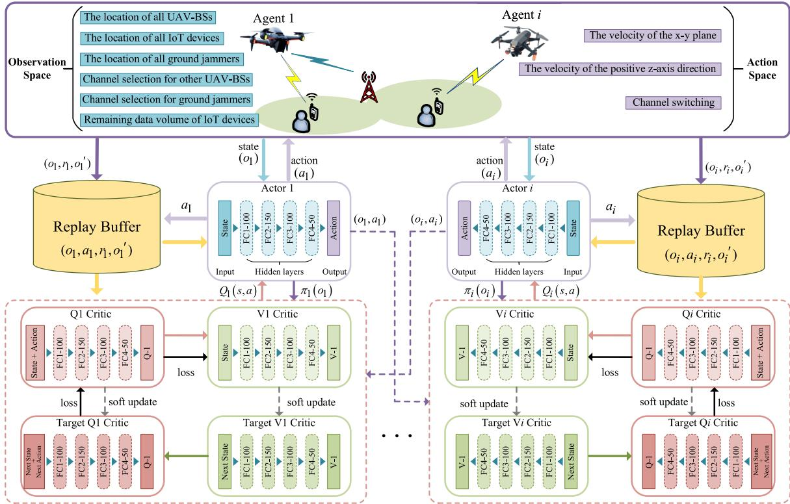  
Fig. 2. Framework of the ITPCS-DC algorithm.

$$
r _ { t } ^ { i } = - k _ { a } \mathcal { A } _ { i , j } ( t ) + k _ { u } \mathbb { U } _ { j , i } ( t ) - k _ { d } D _ { i , j } ( t ) - k _ { s } S _ { i , n } ( t ) .\tag{25}
$$

wherein, $k _ { a } , k _ { u } , k _ { d } ,$ and $k _ { s }$ are positive constants used to balance different types of rewards.

## B. The Role of SAC

SAC is an algorithm used for continuous action space reinforcement learning and is advanced in the field of deep reinforcement learning [34]. SAC greatly improves its exploration ability and robustness by adding entropy value to the objective function. Note that the purpose of SAC is to maximize the accumulative reward value and entropy value, making the strategy as random as possible. Therefore, the objective function of SAC is

$$
\mathcal { J } ( \pi ) = \sum _ { t = 0 } ^ { T } \mathbb { E } _ { ( o _ { t } , a _ { t } ) \sim \rho ^ { \pi } } \left[ r \left( o _ { t } , a _ { t } \right) + \beta H \left( \pi \left( \cdot \mid o _ { t } \right) \right) \right] ,\tag{26}
$$

wherein, $T$ is the total number of time steps, $\rho ^ { \pi }$ is the distribution of $\left( o _ { t } , a _ { t } \right)$ under strategy π. H(·) represents the entropy value, and $\beta$ is the hyperparameter used to control the randomness of the optimal strategy and balance the importance of entropy for rewards.

Therefore, the SAC formula for the optimal strategy is defined as

$$
\begin{array} { l } { { \pi ^ { * } } } \\ { { \ } } \\ { { \displaystyle = \arg \operatorname* { m a x } _ { \pi } \mathbb { E } _ { o _ { t } , a _ { t } \sim \pi \left( \cdot \vert o _ { t } \right) } \left[ \sum _ { { t = 0 } } ^ { T } \gamma ^ { t } r \left( o _ { t } , a _ { t } \right) + \beta H \left( \pi \left( \cdot \vert o _ { t } \right) \right) \right] , } } \end{array}\tag{27}
$$

where $\gamma ^ { t }$ is the reward discount factor, and $H ( \pi ( \cdot \mid o _ { t } ) ) =$ $E [ - l o g \pi ( \cdot \textrm { \textbf { \ i } } o _ { t } ) ]$ is the policy distribution entropy under observation state $o _ { t }$

The Q-value of SAC can be calculated based on the entropy improved Bellman equation, and the Q-value function $Q ( s _ { t } , A _ { t } )$ is defined as

$$
Q ( s _ { t } , \mathcal { A } _ { t } ) = r ( s _ { t } , \mathcal { A } _ { t } ) + \gamma \mathbb { E } _ { ( s _ { t + 1 } , \mathcal { A } _ { t + 1 } ) \sim \rho ^ { \pi } } [ V ( s _ { t + 1 } ) ] ,\tag{28}
$$

wherein, $s _ { t }$ and $\boldsymbol { A } _ { t }$ represent the global state and global action, respectively. $s _ { t + 1 }$ is sampled from the experience replay pool ${ \mathcal P } _ { : }$ and the state value function $V ( s _ { t } )$ is

$$
V ( s _ { t } ) = \operatorname { \mathbb { E } } _ { ( s _ { t } , \mathcal { A } _ { t } ) \sim \rho ^ { \pi } } [ Q ( s _ { t } , \mathcal { A } _ { t } ) + H ( \pi ( \cdot \mid o _ { t } ) ) ] .\tag{29}
$$

## C. Construction of ITPCS-DC

Recall that the goal of the UAV is to minimize the AoI in IoT data collection via trajectory planning and channel selection. To solve the multi-agent MDP described in Section IV.A, and considering that the non-stationarity of the environment and 3D interference may cause agents to fall into local optimum, the ITPCS-DC algorithm is proposed. This algorithm combines the multi-agent actor-critic (MAAC) framework and uses a stochastic policy based on SAC to maximize accumulative rewards and entropy. As shown in Fig. 2, each agent in the algorithm contains five networks, with one actor network $\pi _ { i } ( o _ { t } ^ { i } ; \theta _ { i } ^ { \pi } )$ used for distributed execution, where $\theta _ { i } ^ { \pi }$ represents the weight of the actor network. The input of the actor network at time t is the local observation $o _ { t } ^ { i }$ of agent i, and the output is action $a _ { t } ^ { i }$ . Four critic networks are used for centralized training, including the state value estimation V network $V _ { i } ( s _ { t } ; \theta _ { i } ^ { v } )$ , and the state-action value estimation

$Q$ network $Q _ { i } \big ( s _ { t } , \mathcal { A } _ { t } ; \theta _ { i } ^ { \sigma } \big )$ , where $s _ { t }$ and $\boldsymbol { A } _ { t }$ represent the observations and actions of all agent at time t, respectively. $\theta _ { i } ^ { v }$ represents the weight of the V network, and $\theta _ { i } ^ { \sigma }$ represents the weight of the $Q$ network. The $Q$ network inputs $s _ { t }$ and $A _ { t } ,$ and outputs the state-action value (Q-value). The V network only needs to input $s _ { t }$ and output the state value. The ITPCS-DC algorithm also reduces the oscillation of the training process by setting up an experience replay pool and target network. At any time $t ,$ the corresponding experience tuples $( o _ { t } ^ { i } , a _ { t } ^ { i } , r _ { t } ^ { i } , o _ { t + 1 } ^ { i } )$ of agent i is stored in the experience replay pool $\mathcal { P }$ of size B. where $r _ { t } ^ { i }$ represents the reward obtained by agent i from the environment. If the experience replay pool is full, the new experience tuple will replace the old one. Batch sampling is performed from the experience replay pool to train the actor and critic networks, where random samples break the correlation among sequence samples and reduce training oscillations. In addition, both the V network and the $Q$ network have corresponding target networks that share the same architecture as the online network.

According to SAC algorithm [34], the functions V and $Q$ of agent i are related, and function V can be stably trained by using a separate network estimation. Therefore, the loss of the V network is

$$
\begin{array} { r l } & { L _ { V } \left( \theta _ { i } ^ { v } \right) } \\ & { = \mathbb { E } _ { s _ { t } , A _ { t } \sim \mathcal { P } } } \\ & { \quad \left[ \frac { 1 } { 2 } \left( V _ { i } \left( s _ { t } \right) - \left[ Q _ { i } \left( s _ { t } , \boldsymbol { A } _ { t } \right) + \beta H \left( \pi _ { i } \left( a _ { t } ^ { i } \mid \boldsymbol { o } _ { t } ^ { i } \right) \right) \right] \right) ^ { 2 } \right] , } \end{array}\tag{30}
$$

Referring to DQN, the target network $\hat { Q } _ { i } ( s _ { t } , A _ { t } )$ is introduced to improve the stability of $Q$ network training. Therefore, the $Q$ network of agent i can be updated by minimizing the mean square error (MSE) loss

$$
L _ { { \cal Q } } ( \theta _ { i } ^ { \sigma } ) = \mathbb { E } _ { s _ { t } , \mathcal { A } _ { t } \sim \mathcal { P } } \left[ \frac { 1 } { 2 } ( Q _ { i } ( s _ { t } , \mathcal { A } _ { t } ) - \hat { Q } _ { i } ( s _ { t } , \mathcal { A } _ { t } ) ) ^ { 2 } \right] ,\tag{31}
$$

where

$$
\hat { Q } _ { i } ( s _ { t } , \mathcal { A } _ { t } ) = r _ { t } ^ { i } + \gamma \mathbb { E } _ { s _ { t + 1 } \sim \mathcal { P } } [ \hat { V } _ { i } ( s _ { t + 1 } ) ] .\tag{32}
$$

The parameters of the V network and the Q network can be updated using random gradients, i.e.,

$$
\begin{array} { r l } & { \nabla _ { { \theta } _ { i } ^ { v } } L _ { V } ( { \theta } _ { i } ^ { v } ) = \nabla _ { { \theta } _ { i } ^ { v } } V _ { i } ( s _ { t } ) ( V _ { i } ( s _ { t } ) - { Q } _ { i } ( s _ { t } , \boldsymbol { \mathcal { A } } _ { t } ) } \\ & { \qquad + \beta \log \pi _ { i } ( a _ { t } ^ { i } \mid { \ o } _ { t } ^ { i } ) ) , } \end{array}\tag{33a}
$$

and

$$
\begin{array} { r l } & { \nabla _ { \theta _ { i } ^ { \sigma } } L _ { Q } ( \theta _ { i } ^ { \sigma } ) = \nabla _ { \theta _ { i } ^ { \sigma } } Q _ { i } ( s _ { t } , \mathcal { A } _ { t } ) ( Q _ { i } ( s _ { t } , \mathcal { A } _ { t } ) - r _ { t } ^ { i } } \\ & { ~ - ~ \gamma \hat { V } _ { i } ( s _ { t + 1 } ) ) . } \end{array}\tag{33b}
$$

For the optimization of actor networks, the parameters of the policy function can be updated by minimizing the loss function of Kullback-Leibler (KL) divergence, which is described as

$$
L _ { \pi } ( \theta _ { i } ^ { \pi } ) = \mathbb { E } [ \mathbb { D } _ { K L } ( \pi _ { i } ( \cdot \mid o _ { t } ^ { i } ) \| \hat { \pi } _ { i } ( \cdot \mid o _ { t } ^ { i } ) ) ] ,\tag{34}
$$

wherein, $\mathbb { D } _ { K L } ( a \| b )$ calculates the difference between the distributions a and b. By using the neural network transformation [35], the policy function can be reparameterized

$$
a _ { t } ^ { i } = F _ { \theta _ { i } ^ { \pi } } ( \epsilon _ { t } ^ { i } ; o _ { t } ^ { i } ) ,\tag{35}
$$

where  is the input noise vector sampled from the standard normal distribution $F _ { \theta _ { i } ^ { \pi } }$ . Then, equation (34) can be rewritten as

$$
\begin{array} { r } { L _ { \pi } ( \theta _ { i } ^ { \pi } ) = \mathbb { E } [ \log \pi _ { i } ( F _ { \theta _ { i } ^ { \pi } } ( \epsilon _ { t } ^ { i } ; o _ { t } ^ { i } ) \mid o _ { t } ^ { i } ) - Q _ { i } ( s _ { t } , ( F _ { \theta _ { 1 } ^ { \pi } } ( \epsilon _ { t } ^ { 1 } ; o _ { t } ^ { 1 } ) , } \\ { F _ { \theta _ { 2 } ^ { \pi } } ( \epsilon _ { t } ^ { 2 } ; o _ { t } ^ { 2 } ) , \dots , F _ { \theta _ { U } ^ { \pi } } ( \epsilon _ { t } ^ { U } ; o _ { t } ^ { U } ) ) ) ] . \quad \quad \quad \quad ( 3 6 ) } \end{array}
$$

Accordingly, the parameters of the actor network are approximated using gradients as follows

$$
\begin{array} { r l r } {  { \nabla _ { \theta _ { i } ^ { \pi } } L _ { \pi } ( \theta _ { i } ^ { \pi } ) } } \\ & { } & { = \nabla _ { \theta _ { i } ^ { \pi } } \log \pi _ { i } ( a _ { t } ^ { i } \mid { o } _ { t } ^ { i } ) + \nabla _ { a _ { t } ^ { i } } \beta \log \pi _ { i } ( a _ { t } ^ { i } \mid { o } _ { t } ^ { i } ) \nabla _ { \theta _ { i } ^ { \pi } } F _ { \theta _ { i } ^ { \pi } } ( \epsilon _ { t } ^ { i } ; { o } _ { t } ^ { i } ) } \\ & { } & { ~ - \nabla _ { a _ { t } ^ { i } } Q _ { i } ( s _ { t } , a _ { t } ^ { i } ) \nabla _ { \theta _ { i } ^ { \pi } } F _ { \theta _ { i } ^ { \pi } } ( \epsilon _ { t } ^ { i } ; { o } _ { t } ^ { i } ) . ~ ( 3 7 ) } \end{array}
$$

Finally, the parameters of the target $V$ network and target $Q$ network are updated through soft updates.

$$
\theta _ { i } ^ { \hat { v } }  \tau \theta _ { i } ^ { v } + ( 1 - \tau ) \theta _ { i } ^ { \hat { v } } ,\tag{38a}
$$

and

$$
\theta _ { i } ^ { \hat { \sigma } } \gets \tau \theta _ { i } ^ { \sigma } + ( 1 - \tau ) \theta _ { i } ^ { \hat { \sigma } } ,\tag{38b}
$$

with $\tau \ll 1$

## D. Training Algorithm

The proposed multiple UAV-BSs assisted intelligent data collection algorithm based on MAAC for joint trajectory planning and channel selection is summarized as algorithm 1. This algorithm follows the paradigm of centralized training and distributed execution, where the observed states and actions of other agents can be centrally observed during the training phase and unobservable during the execution phase. The proposed training algorithm is episodic. The number of training episodes is M, and the training step length of each episode is G. At the beginning of each episode, the positions of UAV-BSs and IoT devices are randomly distributed in three dimensions. In each time slot, UAV-BSs move at non-fixed speeds and directions.

In the training phase, each UAV-BS inputs its observation $o _ { t } ^ { i }$ into actor network $\pi _ { i } ( o _ { t } ^ { i } ; \theta _ { i } ^ { \pi } )$ , and then outputs flight actions and channel switching actions, all of which add detection noise $\mathcal { N }$ to prevent the UAV-BS from falling into local optimum. The UAV-BS receives rewards from the environment after taking actions, and then transitions to the next environmental state $o _ { t + 1 } ^ { i }$ via the state transition probability function $P .$ The UAV-BS needs to store a certain amount of experience tuples in the experience replay pool to start network training, and update the UAV-BS’s actor, V , and Q networks by minimizing the corresponding losses. Finally, the target network parameters are updated through soft updates. During the execution phase, the flight actions and channel switching actions of the UAV-BS are based on an effective training network.

## E. Complexity Analysis

The computational complexity of the proposed ITPCS-DC algorithm is determined by the actor network, V network, and $Q$ network structure of the UAV-BS. We assume that the actor network, V network, and Q network of the UAV-BS contain A, B, and C fully connected layers, respectively. The number of neurons in the a-th layer of the actor network, the b-th layer of the V network, and the c-th layer of the $Q$ network are $u _ { a } ^ { a c t o r } , u _ { b } ^ { v } .$ , and $u _ { c } ^ { \sigma }$ , respectively. Therefore, the computational complexity of the UAV-BS at each time step is $\begin{array} { r } { \mathcal { O } \left( \sum _ { a = 0 } ^ { A - 1 } u _ { a } ^ { a c t o r } u _ { a + 1 } ^ { a c t o r } + \sum _ { b = 0 } ^ { B - 1 } u _ { b } ^ { v } u _ { b + 1 } ^ { v } + \sum _ { c = 0 } ^ { C - 1 } u _ { c } ^ { \sigma } u _ { c + 1 } ^ { \sigma } \right) } \end{array}$ The agent in this work is U UAV-BSs. If the computational complexity of training a neuron’s weight is W , then the computational complexity of the ITPCS-DC algorithm is $\mathcal { O } ( W U X ) ,$ in which $\begin{array} { r } { X = \sum _ { a = 0 } ^ { A - 1 } u _ { a } ^ { a c t o r } u _ { a + 1 } ^ { a c t o r } \overline { { \mathbf { \Psi } } } + \sum _ { b = 0 } ^ { B - 1 } u _ { b } ^ { v } u _ { b + 1 } ^ { v } + \sum _ { c = 0 } ^ { C - 1 } u _ { c } ^ { \sigma } u _ { c + 1 } ^ { \sigma } . } \end{array}$

Algorithm 1 Centralized Training of ITPCS-DC   
Input: The actor, V , and $\overline { { Q } }$ networks of UAV-BSs. The   
experience pool size is B, the sampling size is $N _ { b }$ , the   
speed of the UAV-BS is $v _ { u a v } ,$ the channel selection of   
the UAV-BS is $c _ { u a v } ,$ and the number of UAV-BSs, IoT   
devices, and jammers.   
Output: Well-trained actor network parameters of all UAV-  
BSs.   
1: Initialize the parameters of actor network $\{ \theta _ { i } ^ { \pi } \} _ { i \in U } , ~ V$   
network $\{ \theta _ { i } ^ { v } \} _ { i \in U } ,$ , target V network $\{ \theta _ { i } ^ { \hat { v } } \} _ { i \in U } , Q$ network   
$\{ \theta _ { i } ^ { \sigma } \} _ { i \in U }$ and target $Q$ network $\{ \theta _ { i } ^ { \hat { \sigma } } \} _ { i \in U }$ of all UAV-BSs.   
2: for each episode do   
3: Initialize a random process of action exploration and   
obtain UAV-BS observations $o _ { u a v } ^ { i n i t } , o _ { u a v } ^ { n e w }  o _ { u a v } ^ { i n i t }$   
4: for each time slot t do   
5: for each UAV-BS i do   
6: The UAV-BS obtains actions through observation   
$o _ { t } ^ { i }$ and strategy $\pi _ { i } ( o _ { t } ^ { i } ; \theta _ { i } ^ { \pi } )$   
7: $a _ { t } ^ { i } = \pi _ { i } ( o _ { t } ^ { i } ; \theta _ { i } ^ { \pi } ) + \mathcal { N } _ { }$ , where $\mathcal { N }$ is exploration   
noise.   
8: end for   
9: All UAV-BSs obtain their corresponding rewards $r _ { t } ^ { i }$   
and the new observations $o _ { t + 1 } ^ { i }$   
10: Store $( o _ { t } ^ { i } , a _ { t } ^ { i } , r _ { t } ^ { i } , o _ { t + 1 } ^ { i } )$ in replay buffer $\mathcal { P } .$   
11: for each UAV-BS i do   
12: Randomly select $N _ { b }$ samples from $\mathcal { P } .$   
13: Update the $Q$ network parameters $\theta _ { i } ^ { \sigma }$ via equa  
tions (31) and (33b).   
14: Update the V network parameters $\theta _ { i } ^ { v }$ via equa  
tions (30) and (33a).   
15: Update the actor network parameters $\theta _ { i } ^ { \pi }$ via   
equations (36) and (37).   
16: Soft updates for the target networks as (38a) and   
(38b).   
17: end for   
18: end for   
19: end for

## V. PERFORMANCE EVALUATION

## A. Simulation Setup

In this section, we conduct simulations to verify the proposed ITPCS-DC algorithm. The initial positions of all UAV-BSs, IoT devices, and ground jammers in each episode are randomly distributed within a service area of 3km×3km, with the origin of the coordinate system at the center of the area. Therefore, the two-dimensional horizontal and vertical coordinates range $( - 1 , 5 0 0 m , + 1 , 5 0 0 m )$ . The upper and lower flight altitudes of all UAV-BSs are respectively $h _ { u a v } ^ { m a x } = 1 0 0 \mathrm { m }$ and $h _ { u a v } ^ { m i n } = 8 0 \mathrm { m }$ , while the altitudes of IoT devices are fixed. The maximum flight speed of UAV-BSs is $v _ { u a v } ^ { m a x } = 2 0 \mathrm { m / s } .$ , the maximum acceleration is $a _ { u a v } ^ { m a x } = 5 \mathrm { m } / \mathrm { s } ^ { 2 }$ the safe distance among UAV-BSs is 5m, and the interference threshold distance is $d _ { U U } = d _ { U J } = 8 0 0 m$ . The total frequency bandwidth of each UAV-BS is $B = 1  { \mathrm { M H z } }$ . The transmission power of the UAV-BS n and ground jammer k is $P _ { n } = 1 \mathrm { W }$ and $P _ { k } = 1 \mathrm { W } ,$ respectively. the transmission power of IoT j is ${ P } _ { j } ~ = ~ 0 . 1 { \mathrm W } ,$ and the noise power spectral density is $N _ { 0 } = - 1 2 0 d B m$ . In addition, the system takes into account a dense urban environment, with corresponding channel related parameters $\varphi _ { a } ~ = ~ 1 2 . 0 8$ and $\varphi _ { b } ~ = ~ 0 . 1 1$ . The path loss factors for A2G channel and A2A channel are $\alpha _ { U G } ~ = ~ 3$ and $\alpha _ { U U } = 2 ,$ , respectively. The additional attenuation factor for NLoS links is $\eta _ { N L o S } \ : = \ : 2 0 d B$ . The threshold value of the SINR is $\kappa _ { g , u } = 2 0 d B$ . The cost of channel hopping is $C = 1 . 5 * 1 0 ^ { - \bar { 6 } }$ . The initial transmission data volume of IoT j uploaded to UAV-BS i is $Q _ { j , i } ( 0 ) = 1 0 M b i t s$ In the experimental simulation, the total number of episodes is set as $\mathcal { M } = 5 0 , 0 0 0$ , and the step length of each episode is $\mathcal { G } = 1 0 0$ . The time slot of each step is $\delta _ { t } = 0 . 5 s$ , sampled every 100 time steps, so the total service time in an episode is $\mathcal { T } = 5 0 s$ . The DRL-related parameters are shown in Table II.

TABLE II  
RELATED PARAMETERS
<table><tr><td rowspan=1 colspan=1>Parameter</td><td rowspan=1 colspan=1>Description</td><td rowspan=1 colspan=1>Value</td></tr><tr><td rowspan=1 colspan=1> $N _ { b }$ </td><td rowspan=1 colspan=1>Batch size</td><td rowspan=1 colspan=1>1,024</td></tr><tr><td rowspan=1 colspan=1> $\overline { { B } }$ </td><td rowspan=1 colspan=1>Experience replay pool size</td><td rowspan=1 colspan=1>200,000</td></tr><tr><td rowspan=1 colspan=1>γ</td><td rowspan=1 colspan=1>Discount factor</td><td rowspan=1 colspan=1>0.999</td></tr><tr><td rowspan=1 colspan=1> $\tau$ </td><td rowspan=1 colspan=1>Soft update rate</td><td rowspan=1 colspan=1>0.01</td></tr><tr><td rowspan=1 colspan=1> $\alpha _ { a }$ </td><td rowspan=1 colspan=1>Learning rate of actor network</td><td rowspan=1 colspan=1>0.0005</td></tr><tr><td rowspan=1 colspan=1> $\alpha _ { v }$ </td><td rowspan=1 colspan=1>Learning rate of V network</td><td rowspan=1 colspan=1>0.005</td></tr><tr><td rowspan=1 colspan=1> $\alpha _ { \gamma }$ </td><td rowspan=1 colspan=1>Learning rate of Q network</td><td rowspan=1 colspan=1>0.005</td></tr></table>

## B. Network Architecture

Each UAV-BS has the network structure of the proposed algorithm ITPCS-DC. It is noted that the actor network, V network, and $Q$ network have the same hidden layers with 100, 150, 100, and 50 neurons, respectively. The actor network of UAV-BS i inputs the observation $\{ o _ { i } ( t ) \} _ { i \in U , t \in T }$ of the UAV-BS itself, outputs the velocity $\{ a _ { i } ^ { p } ( t ) \} _ { i \in U , t \in T }$ in the x-y plane and positive z-axis direction, and the channel switching action $\{ a _ { i } ^ { c } ( t ) \} _ { i \in U , t \in T }$ . The activation function of the output layer of the actor network is the softmax function, while the activation functions of other layers are all ReLU functions. The V network of UAV-BS i inputs the observations $\{ s ( t ) \} _ { t \in T }$ of all UAV-BSs, and outputs the corresponding state value estimation $\{ V _ { i } ( t ) \} _ { i \in U , t \in T }$ . The Q network of UAV-BS i inputs the observations and actions $\{ s ( t ) , a ( t ) \} _ { t \in T }$ of all UAV-BSs, and outputs the estimated Q-value of state action values to evaluate the learning strategy of UAV-BS i. The activation functions of all neural network layers in the V network and Q network are ReLU functions. The neurons in the input layer of all networks are related to the number of UAV-BSs, IoT devices, and ground jammers in the scene settings, and can be flexibly set.

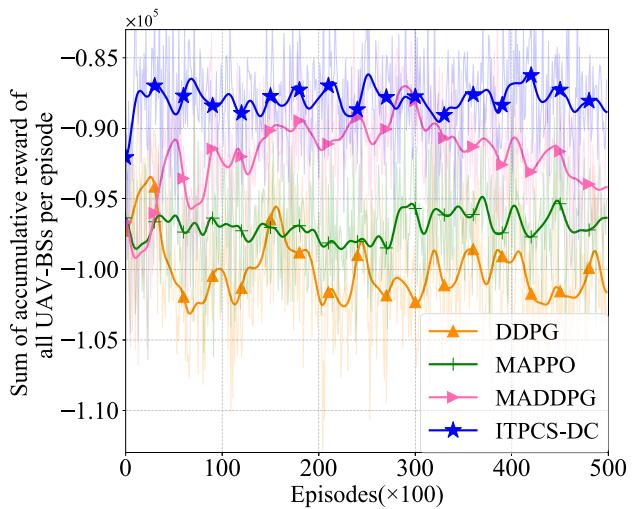  
Fig. 3. Comparisons of the accumulative reward obtained by the total UAV-BSs during the training process.

## C. Performance Analysis

We compare the performance of the proposed ITPCS-DC algorithm with other three benchmark algorithms in the same scenario setting and fixed random seeds.

MADDPG: Inspired by [23], the network of each agent is an actor-critic structure, in which the critic network evaluates decisions based on global information, while the actor network makes decisions based on its own local observations and outputs deterministic actions. MADDPG belongs to deterministic strategy algorithms, which can avoid high variance due to sampling, and improve the training efficiency and stability.

MAPPO: Inspired by [28] and [36], the network of each agent is an actor-critic structure, in which the actor outputs a probability distribution of actions based on their local observations, while the critic network evaluates the value of state-action pairs using global information. MAPPO belongs to random policy algorithms, which maintain training stability by limiting the amplitude of policy updates.

DDPG: Inspired by [29], [37], DDPG is also a deterministic strategy algorithm. The network of each agent is an actorcritic structure, but the critic network of the agent only makes decision evaluation based on its own experience information, and the actor network makes decision based on its own observation and outputs deterministic actions.

We compared the total accumulative reward, total AoI, total trajectory length, and total throughput performance of ITPCS-DC with other benchmark algorithms. In all simulation results, each data point is the average value of every 100 episodes. When the scenario is set with the number of UAV-BSs as 3, the number of ground IoT as 3, and the number of ground jammers as 1, we obtain the simulation results from Fig. 3 to Fig. 6.

Fig. 3 shows the training curve of accumulative rewards for ITPCS-DC and other benchmark algorithms. After sufficient training, the average reward values of ITPCS-DC, MAD-DPG, MAPPO, and DDPG in the last 10,000 episodes are -87,728.80, -92,686, -96,593.66, and -101,037.52, respectively. Based on this, it can be calculated that the average reward value of ITPCS-DC is at most 13.17% higher than other benchmark algorithms. It can be intuitively concluded from the numerical value that the reward value of ITPCS-DC is higher than that of other benchmark algorithms, and the overall curve trend shows that ITPCS-DC is more stable than other benchmark algorithms. Further analysis shows that the system is considering the joint trajectory planning and channel selection of multiple UAV-BSs in a 3D interference environment. Multidimensional interference can cause more uncertainty and volatility, which can increase the probability of intelligent agents falling into local optimum. The ITPCS-DC algorithm utilizes the characteristics of maximizing accumulative rewards and entropy in SAC to enhance the exploration efficiency and prevent agents from falling into local optimum. It also improves sample efficiency by utilizing the experience replay buffer. Therefore, in Fig. 3, ITPCS-DC obtains larger rewards compared to other algorithms, and the strategy is more stable. The reward value of MADDPG is higher than that of DDPG, because MADDPG outputs deterministic strategies based on global information, while DDPG outputs deterministic strategies based on local information, lacking awareness of global information. Moreover, deterministic strategies lack inherent randomness, leading to insufficient exploration ability. The exploration of MAPPO mainly relies on the randomness and entropy regularization in policy gradient updates, but it is more suitable for online learning and has lower sample efficiency, which explains its reward value is lower than MADDPG and ITPCS-DC.

The goal of the system is to minimize the average AoI by jointly optimizing the trajectory planning and channel selection of multiple UAV-BSs in a 3D interference environment. In Fig. 4, we respectively plot the average AoI training curves of ITPCS-DC and other benchmark algorithms under the same and different data volumes transmitted by IoT devices. In Fig. 4 (a), the amount of data that each ground IoT device needs to upload is 10Mbits, and each data is the average AoI of three ground IoT devices every 100 episodes. As the number of training episodes increases, the training of each algorithm tends to stabilize. In the last 10,000 episodes, the average AoI of ITPCS-DC, MADDPG, MAPPO, and DDPG are 463, 464, 467, and 472, respectively. In Fig. 4 (b) - Fig. 4 (e), we observe the average AoI training curves of the four algorithms by increasing the data transmission volume. It can be concluded that under any data transmission volume setting, ITPCS-DC obtains lower AoI values compared to other benchmark algorithms. This indirectly reflects that ITPCS-DC may also achieve higher throughput compared to other benchmark algorithms, making better decisions in trajectory planning and channel selection. In Fig. 4 (f), we plot the average AoI comparison curves between ITPCS-DC and other benchmark algorithms under different data transmission volumes. Fig. 4 (f) shows that the average AoI of each

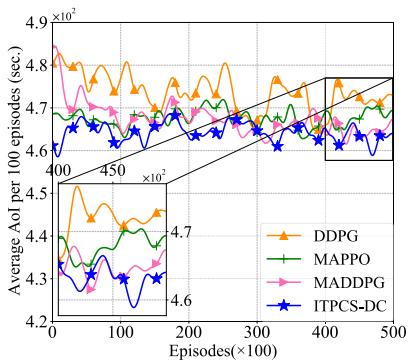  
(a) The data transmission volume is 10Mbits

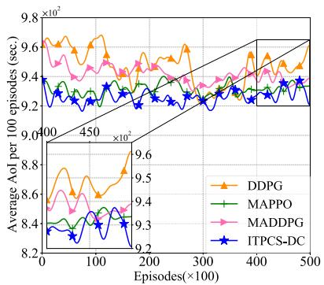  
(b) The data transmission volume is 20Mbits

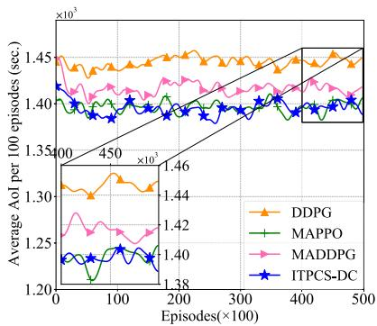  
(c) The data transmission volume is 30Mbits

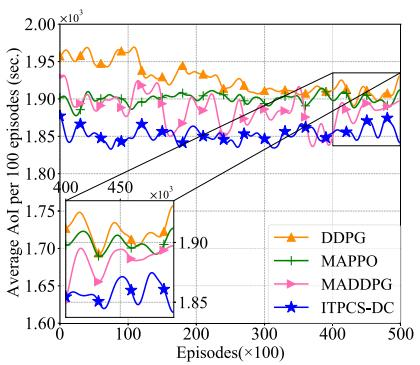  
(d) The data transmission volume is 40Mbits

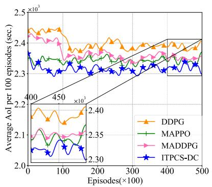  
(e) The data transmission volume is 50Mbits

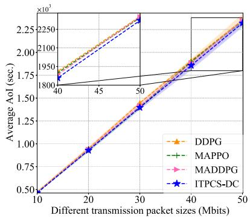  
(f) Comparison of average AoI for different data transmission volumes

Fig. 4. Comparisons of average AoI for all UAV-BSs with the same and different data transmission volumes during the training process. (a)-(e) is the training process of the average AoI corresponding to data transmission volumes of 10Mbits, 20Mbits, 30Mbits, 40Mbits, and 50Mbits, respectively. Each data point is the average AoI value of all UAV-BSs in every 100 episodes. (f) is the average AoI values corresponding to different data transmission volumes, and each data point is the average AoI value of the last 10,000 episodes of training convergence.

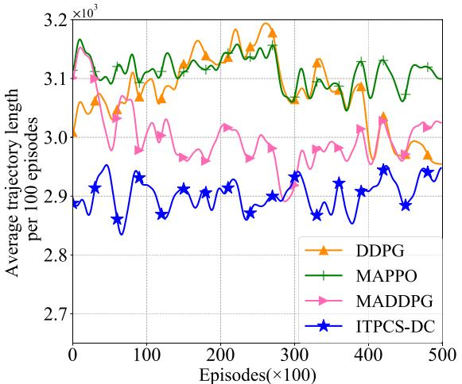  
(a)

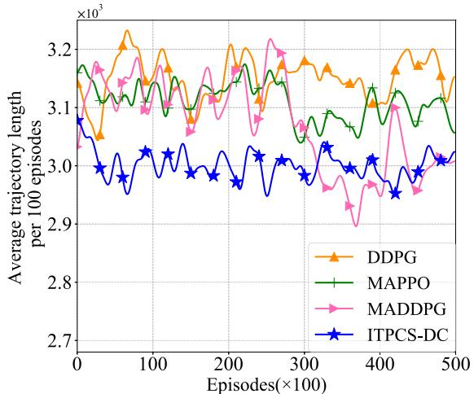  
(b)  
Fig. 5. Comparisons of the average trajectory length for all UAV-BSs with or without the addition of AoI in rewards during the training process. (a) Add AoI to the reward. (b) No AoI is added to the reward. Each data point is the average trajectory length value of all UAV-BSs in every 100 episodes.

algorithm increases with the increase of data volume. It is worth noting that from the overall curve trend, as the data volume increases, the phenomenon of ITPCS-DC obtaining lower AoI values compared to other benchmark algorithms is more obvious, indicating that ITPCS-DC has better learning strategies in processing different data than other benchmark algorithms.

In order to further explore the significance of using AoI to measure the freshness of information collection, in Fig. 5, the influence of AoI on trajectory length is considered in the rewards of ITPCS-DC and other benchmark algorithms, and the data in Table III correspond to the trajectory length values under the two different reward settings in Fig. 5. In particular, Fig. 5 (a) add AoI to the reward and plot the average trajectory length training curve of ITPCS-DC and other benchmark algorithms. According to the data in Table III, with the addition of AoI in the reward, the average trajectory lengths of ITPCS-DC, MADDPG, MAPPO, and DDPG in the last 30,000 episodes are 2,904.06, 2,983.05, 3,107.12, and 3,069.33, respectively. From the overall curve, it can be concluded that ITPCS-DC has a shorter average trajectory length and a better trajectory planning strategy compared to other benchmark algorithms. In Fig. 5 (b), without adding AoI to the reward, the average trajectory length training curve of ITPCS-DC and other benchmark algorithms is plotted. From the corresponding data in Table III, it is worth noting that the average trajectory length obtained by each algorithm without considering AoI for rewards is higher than that with considering AoI for rewards. This indirectly reflects the effectiveness of considering the addition of AoI to assist data collection in the article, and also promotes the optimization of strategies for each algorithm.

TABLE III  
COMPARISONS OF THE AVERAGE TRAJECTORY LENGTH FOR ALL UAV-BSS WITH OR WITHOUT THE ADDITION OF AOI IN REWARDS
<table><tr><td rowspan=1 colspan=1> $\mathrm { \stackrel { \longleftarrow } { M e t h o d s } } \overbrace { \mathrm { \stackrel { M e t r i c s } { M e t h o d s } } } ^ { \mathrm { M e t r i c s } }$ </td><td rowspan=1 colspan=1>Is AoI added to the reward?</td><td rowspan=1 colspan=1>Average trajectory length of $0 \stackrel { \cdot } { \sim } 2 * \stackrel { \cdot } { 1 0 ^ { 4 } } \stackrel { \cdot } { \mathrm { e p i s o d e s } }$ </td><td rowspan=1 colspan=1>Average trajectory length of $2 * 1 \dot { 0 } ^ { 4 } \sim \dot { 5 } * 1 \dot { 0 } ^ { 4 }$ episodes</td><td rowspan=1 colspan=1>Reward growth ratio</td></tr><tr><td rowspan=2 colspan=1>DDPG</td><td rowspan=1 colspan=1>Yes</td><td rowspan=1 colspan=1>3,086.45</td><td rowspan=1 colspan=1>3,069.33</td><td rowspan=1 colspan=1>-0.55%</td></tr><tr><td rowspan=1 colspan=1>No</td><td rowspan=1 colspan=1>3,140.46</td><td rowspan=1 colspan=1>3,156.87</td><td rowspan=1 colspan=1>0.52%</td></tr><tr><td rowspan=2 colspan=1>MAPPO</td><td rowspan=1 colspan=1>Yes</td><td rowspan=1 colspan=1>3,118.32</td><td rowspan=1 colspan=1>3,107.12</td><td rowspan=1 colspan=1>-0.35%</td></tr><tr><td rowspan=1 colspan=1>No</td><td rowspan=1 colspan=1>3,125.44</td><td rowspan=1 colspan=1>3,102.12</td><td rowspan=1 colspan=1>-0.74%</td></tr><tr><td rowspan=2 colspan=1>MADDPG</td><td rowspan=1 colspan=1>Yes</td><td rowspan=1 colspan=1>3,024.15</td><td rowspan=1 colspan=1>2,983.05</td><td rowspan=1 colspan=1>-1.35%</td></tr><tr><td rowspan=1 colspan=1>No</td><td rowspan=1 colspan=1>3,123.95</td><td rowspan=1 colspan=1>3,038.33</td><td rowspan=1 colspan=1>-2.74%</td></tr><tr><td rowspan=2 colspan=1>ITPCS-DC</td><td rowspan=1 colspan=1>Yes</td><td rowspan=1 colspan=1>2,898.79</td><td rowspan=1 colspan=1>2,904.06</td><td rowspan=1 colspan=1>0.18%</td></tr><tr><td rowspan=1 colspan=1>No</td><td rowspan=1 colspan=1>3,006.70</td><td rowspan=1 colspan=1>2,996.74</td><td rowspan=1 colspan=1>-0.33%</td></tr></table>

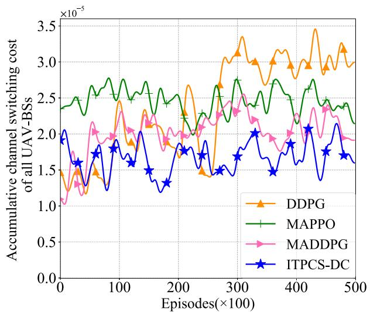  
Fig. 6. Comparisons of the accumulative channel switching cost obtained by the total UAV-BSs during the training process.

According to the reward setting, the network communication utility U is not only related to interference, but also to the cost of channel switching. Therefore, Fig. 6 shows the training curve of the accumulative channel switching cost for multiple UAV-BSs under four different algorithms. After sufficient training in the last 10,000 episodes, the accumulative channel switching costs of ITPCS-DC, MADDPG, MAPPO, and DDPG are $1 . 7 7 * 1 0 ^ { - 5 } , 2 . 1 1 * 1 0 ^ { - 5 } , 2 . 4 2 * 1 0 ^ { - 5 }$ , and

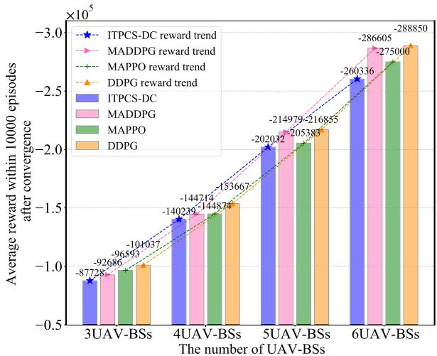  
Fig. 7. Comparisons of the reward value of DDPG, MAPPO, MADDPG and ITPCS-DC algorithm under different number of UAV-BSs. Each data is the average reward value of the corresponding algorithm within 10,000 episodes after convergence.

$3 . 0 4 * 1 0 ^ { - 5 } .$ , respectively. It can be concluded that the channel switching costs of ITPCS-DC are 16.11%, 26.85%, and 41.77% lower than those of MADDPG, MAPPO, and DDPG, respectively. This conclusion indicates that ITPCS-DC can find a better balance strategy between optimizing communication performance and channel switching cost compared to other benchmark algorithms.

To further demonstrate the adaptability of ITPCS-DC and other benchmark algorithms to multi-agent collaborative in the 3D interference environments, Fig. 7 shows the accumulative reward comparison of four algorithms under different numbers of UAV-BSs. From Fig. 7, it is observed that as the number of UAV-BSs increases, the average reward values obtained by the four algorithms also gradually increase. According to the trend of the growth curve, the negative reward increase of the ITPCS-DC algorithm is smoother compared to the DDPG, MAPPO, and MADDPG algorithms, indicating that the ITPCS-DC algorithm can make better joint optimization trajectory planning and channel selection strategies for multiple UAV-BSs in dealing with more diverse and complex 3D interference environments, reflecting that the ITPCS-DC algorithm has more stable performance. Further analysis shows that as the number of agents increases in Fig. 7, the reward values obtained by ITPCS-DC and MAPPO gradually exceed those of MADDPG and DDPG. Note that ITPCS-DC and MAPPO are both stochastic strategy methods, while MADDPG and DDPG belong to deterministic strategy methods. The non-stationary nature of the 3D interference environment in this system increases with the number of UAV-BSs, and the stochastic strategy can better adapt to changes in non-stationary environments, improving the robustness and flexibility of the strategy.

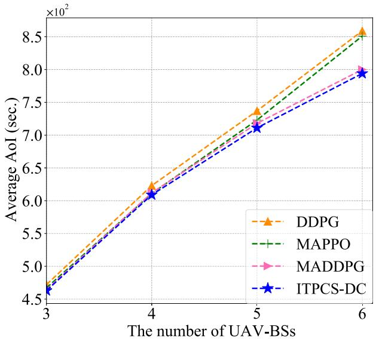  
Fig. 8. Comparisons of the average AoI value of DDPG, MAPPO, MADDPG and ITPCS-DC algorithm under different number of UAV-BSs. Each data is the average AoI value of the corresponding algorithm within 10,000 episodes after convergence.

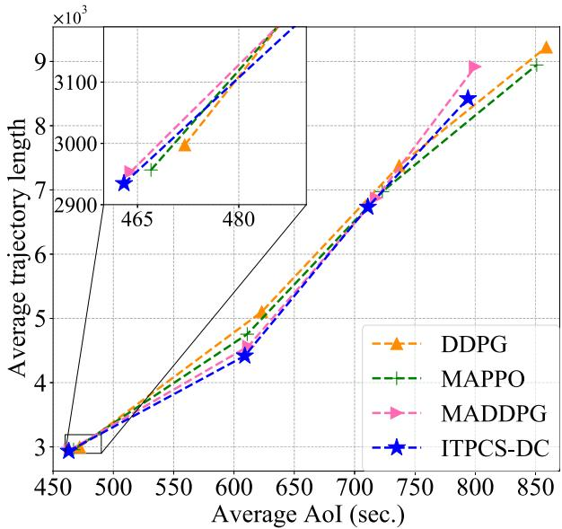  
Fig. 9. Comparisons of average AoI and trajectory length obtained under different numbers of UAV-BSs. The data for each algorithm are generated through a number of UAV-BSs of 3, 4, 5, and 6, respectively.

The AoI values obtained by all UAV-BSs in the system increase with the number of UAV-BSs. The comparison curve of the average AoI after convergence between ITPCS-DC and other benchmark algorithms under different numbers of UAV-BSs is shown in Fig. 8. It can be seen that in any number of UAV-BSs, ITPCS-DC can achieve lower average AoI compared to other benchmark algorithms, indicating that

ITPCS-DC can make better learning strategies in complex environments.

In Fig. 9, the average AoI and trajectory length comparison curves corresponding to each algorithm are illustrated for different numbers of UAV-BSs. It can be observed from Fig. 9 that under any number of UAV-BSs, ITPCS-DC can obtain smaller average AoI and shorter average trajectory length compared with other benchmark algorithms. It also reflects that the acquisition of AoI is related to the trajectory length, and shorter trajectory length is conducive to obtaining higher throughput and further obtaining smaller AoI.

## VI. CONCLUSION

This article investigates how multiple UAV-BSs can improve the freshness of IoT data collection by jointly optimizing trajectory planning and channel selection in a 3D interference environment. Considering the complexity and instability of the 3D interference environment, an ITPCS-DC algorithm based on MADRL is designed by using the stochastic strategy characteristic of SAC. This algorithm not only avoid agents falling into local optimum, but also effectively reduce the AoI of IoT data collection. The results show that compared to other benchmark algorithms, the proposed ITPCS-DC algorithm can achieve the minimum channel switching cost, the lowest AoI, the shortest trajectory length, and the highest accumulative reward, and the reward value is at most 13.17% higher than other benchmark algorithms. Moreover, with the growth of agents, ITPCS-DC has shown stronger adaptability to unstable environments and better learning strategies compared to other benchmark algorithms. In the future research work, we will comprehensively consider the UAV battery energy consumption to achieve higher mission requirements for long-term missions.

## REFERENCES

[1] N. H. Chu, D. T. Hoang, D. N. Nguyen, N. Van Huynh, and E. Dutkiewicz, “Joint speed control and energy replenishment optimization for UAV-assisted IoT data collection with deep reinforcement transfer learning,” IEEE Internet Things J., vol. 10, no. 7, pp. 5778–5793, Apr. 2023.

[2] M. Mozaffari, W. Saad, M. Bennis, Y.-H. Nam, and M. Debbah, “A tutorial on UAVs for wireless networks: Applications, challenges, and open problems,” IEEE Commun. Surv. Tut., vol. 21, no. 3, pp. 2334–2360, Mar. 2019.

[3] Y. Wan, K. Xu, F. Wang, and G. Xue, “IoTAthena: Unveiling IoT device activities from network traffic,” IEEE Trans. Wireless Commun., vol. 21, no. 1, pp. 651–664, Jan. 2022.

[4] K. Qu, W. Zhuang, Q. Ye, W. Wu, and X. Shen, “Model-assisted learning for adaptive cooperative perception of connected autonomous vehicles,” IEEE Trans. Wireless Commun., vol. 23, no. 8, pp. 8820–8835, Aug. 2024.

[5] N. Zhao, Z. Ye, Y. Pei, Y.-C. Liang, and D. Niyato, “Multi-agent deep reinforcement learning for task offloading in UAV-assisted mobile edge computing,” IEEE Trans. Wireless Commun., vol. 21, no. 9, pp. 6949–6960, Sep. 2022.

[6] Z. Jia, Q. Wu, C. Dong, C. Yuen, and Z. Han, “Hierarchical aerial computing for Internet of Things via cooperation of HAPs and UAVs,” IEEE Internet Things J., vol. 10, no. 7, pp. 5676–5688, Apr. 2023.

[7] Z. Lu, Z. Jia, Q. Wu, and Z. Han, “Joint trajectory planning and communication design for multiple UAVs in intelligent collaborative air-ground communication systems,” IEEE Internet Things J., vol. 11, no. 19, pp. 31053–31067, Oct. 2024.

[8] Y. Liao et al., “Interference analysis for coexistence of UAVs and civil aircrafts based on automatic dependent surveillance-broadcast,” IEEE Trans. Veh. Technol., vol. 73, no. 10, pp. 15911–15915, Oct. 2024.

[9] C. Fei, Z. Lu, L. Gao, W. Jiang, and J. Zhang, “Game-theoretic optimization for multi-UAV integrated sensing and communication networks,” IEEE Internet Things J., vol. 12, no. 20, pp. 42741–42753, Oct. 2025.

[10] P. Luong, F. Gagnon, L.-N. Tran, and F. Labeau, “Deep reinforcement learning-based resource allocation in cooperative UAV-assisted wireless networks,” IEEE Trans. Wireless Commun., vol. 20, no. 11, pp. 7610–7625, Nov. 2021.

[11] Z. Jia, M. Sheng, J. Li, D. Niyato, and Z. Han, “LEO-satellite-assisted UAV: Joint trajectory and data collection for Internet of Remote Things in 6G aerial access networks,” IEEE Internet Things J., vol. 8, no. 12, pp. 9814–9826, Jun. 2021.

[12] J. Liu, P. Tong, X. Wang, B. Bai, and H. Dai, “UAV-aided data collection for information freshness in wireless sensor networks,” IEEE Trans. Wireless Commun., vol. 20, no. 4, pp. 2368–2382, Apr. 2021.

[13] S. Kaul, R. Yates, and M. Gruteser, “Real-time status: How often should one update?” in Proc. IEEE INFOCOM, Orlando, FL, USA, Mar. 2012, pp. 2731–2735.

[14] R. Ding, F. Gao, and X. S. Shen, “3D UAV trajectory design and frequency band allocation for energy-efficient and fair communication: A deep reinforcement learning approach,” IEEE Trans. Wireless Commun., vol. 19, no. 12, pp. 7796–7809, Dec. 2020.

[15] Y. Bai, H. Zhao, X. Zhang, Z. Chang, R. Jantti, and K. Yang, “Toward¨ autonomous multi-UAV wireless network: A survey of reinforcement learning-based approaches,” IEEE Commun. Surv. Tut., vol. 25, no. 4, pp. 3038–3067, Oct. 2023.

[16] Z. Lu, G. Wu, F. Zhou, and Q. Wu, “Intelligently joint task assignment and trajectory planning for UAV cluster with limited communication,” IEEE Trans. Veh. Technol., vol. 73, no. 9, pp. 13122–13137, Sep. 2024.

[17] V. Mnih et al., “Human-level control through deep reinforcement learning,” Nature, vol. 518, no. 7540, pp. 529–533, Feb. 2015.

[18] R. S. Sutton and A. G. Barto, Reinforcement Learning: An Introduction. Cambridge, MA, USA: MIT Press, 2018.

[19] D. Silver, G. Lever, N. Heess, T. Degris, D. Wierstra, and M. Riedmiller, “Deterministic policy gradient algorithms,” in Proc. ICML, May 2014, pp. 387–395.

[20] Q. Wu et al., “A unified cognitive learning framework for adapting to dynamic environments and tasks,” IEEE Wireless Commun., vol. 28, no. 6, pp. 208–216, Dec. 2021.

[21] J. Pan, Y. Li, R. Chai, S. Xia, and L. Zuo, “Age of information aware trajectory planning of UAV,” IEEE Trans. Cognit. Commun. Netw., vol. 10, no. 6, pp. 2344–2356, Dec. 2024.

[22] Y. Yao, K. Lv, S. Huang, and W. Xiang, “3D deployment and energy efficiency optimization based on DRL for RIS-assisted air-to-ground communications networks,” IEEE Trans. Veh. Technol., vol. 73, no. 10, pp. 14988–15003, Oct. 2024.

[23] K. Messaoudi, A. Baz, O. S. Oubbati, A. Rachedi, T. Bendouma, and M. Atiquzzaman, “UGV charging stations for UAV-assisted AoI-aware data collection,” IEEE Trans. Cogn. Commun. Netw., vol. 10, no. 6, pp. 2325–2343, Dec. 2024.

[24] A. Kosta, N. Pappas, and V. Angelakis, “Age of information: A new concept, metric, and tool,” Found. Trends Netw., vol. 12, no. 3, pp. 162–259, Nov. 2017.

[25] H. Hu, K. Xiong, G. Qu, Q. Ni, P. Fan, and K. B. Letaief, “AoI-minimal trajectory planning and data collection in UAV-assisted wireless powered IoT networks,” IEEE Internet Things J., vol. 8, no. 2, pp. 1211–1223, Jan. 2021.

[26] X. Gao, X. Zhu, and L. Zhai, “AoI-sensitive data collection in multi-UAV-assisted wireless sensor networks,” IEEE Trans. Wireless Commun., vol. 22, no. 8, pp. 5185–5197, Aug. 2023.

[27] T. Liang et al., “Age of information based scheduling for UAV aided localization and communication,” IEEE Trans. Wireless Commun., vol. 23, no. 5, pp. 4610–4626, May 2024.

[28] F. Song et al., “AoI and energy tradeoff for aerial-ground collaborative MEC: A multi-objective learning approach,” IEEE Trans. Mobile Comput., vol. 23, no. 12, pp. 11278–11294, Dec. 2024.

[29] M. Samir, C. Assi, S. Sharafeddine, D. Ebrahimi, and A. Ghrayeb, “Age of information aware trajectory planning of UAVs in intelligent transportation systems: A deep learning approach,” IEEE Trans. Veh. Technol., vol. 69, no. 11, pp. 12382–12395, Nov. 2020.

[30] M. Mozaffari, W. Saad, M. Bennis, and M. Debbah, “Unmanned aerial vehicle with underlaid device-to-device communications: Performance and tradeoffs,” IEEE Trans. Wireless Commun., vol. 15, no. 6, pp. 3949–3963, Jun. 2016.

[31] H.-S. Shin, I. Jang, and A. Tsourdos, “Frequency channel assignment for networked UAVs using a hedonic game,” in Proc. Workshop Res., Educ. Develop. Unmanned Aerial Syst. (RED-UAS), Sweden, Oct. 2017, pp. 180–185.

[32] J. Chen, Y. Xu, Q. Wu, Y. Zhang, X. Chen, and N. Qi, “Interferenceaware online distributed channel selection for multicluster FANET: A potential game approach,” IEEE Trans. Veh. Technol., vol. 68, no. 4, pp. 3792–3804, Apr. 2019.

[33] M. L. Littman, “Markov games as a framework for multi-agent reinforcement learning,” in Proc. 11th Int. Conf. Int. Conf. Mach. Learn. San Francisco, CA, USA: Morgan Kaufmann Publishers, 1994, pp. 157–163.

[34] X. Zhou, L. Huang, T. Ye, and W. Sun, “Computation bits maximization in UAV-assisted MEC networks with fairness constraint,” IEEE Internet Things J., vol. 9, no. 21, pp. 20997–21009, Nov. 2022.

[35] T. Haarnoja, A. Zhou, P. Abbeel, and S. Levine, “Soft actor-critic: Offpolicy maximum entropy deep reinforcement learning with a stochastic actor,” in Proc. Int. Conf. Mach. Learn., 2018, pp. 1861–1870.

[36] H. Kang, X. Chang, J. Mivsic, V. B. Mi´ siˇ c, J. Fan, and Y. Liu,´ “Cooperative UAV resource allocation and task offloading in hierarchical aerial computing systems: A MAPPO-based approach,” IEEE Internet Things J., vol. 10, no. 12, pp. 10497–10509, Jun. 2023.

[37] O. Bouhamed, H. Ghazzai, H. Besbes, and Y. Massoud, “Autonomous UAV navigation: A DDPG-based deep reinforcement learning approach,” in Proc. IEEE Int. Symp. Circuits Syst. (ISCAS), Seville, Spain, Oct. 2020, pp. 1–5.

  
Zhuo Lu (Graduate Student Member, IEEE) received the M.S. degree in electronic science and technology from the School of Electronics and Information Engineering/School of Integrated Circuits, Guangxi Normal University, Guilin, China, in 2020. She is currently pursuing the Ph.D. degree in information and communication engineering with the School of Electronic Information Engineering, Nanjing University of Aeronautics and Astronautics. Her research interests include multi-agent reinforcement learning, resource allocation, and trajectory planning

in UAV communication networks  

Qihui Wu (Fellow, IEEE) received the B.S. degree in communications engineering and the M.S. and Ph.D. degrees in communications and information systems from the Institute of Communications Engineering, Nanjing, China, in 1994, 1997, and 2000, respectively. He holds the Changjiang Distinguished Professorship in 2016. From 2003 to 2005, he was a Post-Doctoral Research Associate with Southeast University, Nanjing. From 2005 to 2007, he was an Associate Professor with the Institute of Communications Engineering, PLA University of Science and

Technology, Nanjing, where he is currently a Full Professor. From March 2011 to September 2011, he was an Advanced Visiting Scholar with the Stevens Institute of Technology, Hoboken, USA. Since 2016, he has been with Nanjing University of Aeronautics and Astronautics and he has been appointed as a Distinguished Professor. His current research interests span the areas of wireless communications and statistical signal processing, with an emphasis on system design of software defined radio, cognitive radio, and smart radio.

Ziye Jia (Member, IEEE) received the B.E., M.S., and Ph.D. degrees in communication and information systems from Xidian University, Xi’an, China, in 2012, 2015, and 2021, respectively. From 2018 to 2020, she was a Visiting Ph.D. Student with the Department of Electrical and Computer Engineering, University of Houston. She is currently an Associate Professor with the Key Laboratory of Dynamic Cognitive System of Electromagnetic Spectrum Space, Ministry of Industry and Information Technology, Nanjing University of Aeronautics and Astronautics,

Nanjing, China. Her current research interests include space-air-ground networks, aerial access networks, resource optimization, and machine learning.

Chen Fei received the M.S. degree in electronic science and technology from the School of Electronics and Information Engineering/School of Integrated Circuits, Guangxi Normal University, Guilin, China, in 2020. He is currently teaching with the School of Noncommissioned Officer of People’s Armed Police Force, Hangzhou, China. His research interests include anti-interference in UAV swarms communication using reinforcement learning, machine learning, game theory, task allocation, trajectory planning, and spectrum resource allocation.

  
Jianzhao Zhang received the Ph.D. degree in communication engineering from the PLA University of Science and Technology, Nanjing, China, in 2012. He is currently an Associate Researcher with the 63rd Research Institute, National University of Defense Technology, Nanjing. His research interests include spectrum environment cognition and smart spectrum management.

Fuhui Zhou (Senior Member, IEEE) received the Ph.D. degree from Xidian University, Xi’an, China, in 2016. He is currently a Full Professor with Nanjing University of Aeronautics and Astronautics, Nanjing, China, where he is also with the Key Laboratory of Dynamic Cognitive System of Electromagnetic Spectrum Space. He has published more than 200 papers in internationally renowned journals and conferences in the field of communications. He has been selected for one ESI hot article and 13 ESI highly cited articles. His research interests include cognitive radio, cognitive intelligence, knowledge graph, edge computing, and resource allocation. He received four Best Paper Awards at international conferences, such as IEEE GLOBECOM and IEEE ICC. He was awarded as the 2021 Most Cited Chinese Researchers by Elsevier, the Stanford World’s Top 2% Scientists, the IEEE ComSoc Asia–Pacific Outstanding Young Researcher and Young Elite Scientist Award of China, and the URSI GASS Young Scientist. He serves as an Editor for IEEE TRANSACTIONS ON COMMUNICATIONS, IEEE SYSTEMS JOURNAL, IEEE WIRELESS COMMU-NICATIONS LETTERS, IEEE ACCESS, and Physical Communication.

Kai-Kit Wong (Fellow, IEEE) received the B.Eng., M.Phil., and Ph.D. degrees in electrical and electronic engineering from The Hong Kong University of Science and Technology, Hong Kong, in 1996, 1998, and 2001, respectively. After graduation, he took up academic and research positions with The University of Hong Kong, Lucent Technologies, Bell Laboratories, Holmdel, the Smart Antennas Research Group of Stanford University, and the University of Hull, U.K. He is the Chair of wireless communications with the Department of Electronic and Electrical Engineering, University College London, London, U.K. His research focuses on 5G and beyond mobile communications. He is a fellow of IET. He was a co-recipient of the 2013 IEEE Signal Processing Letters Best Paper Award and the 2000 IEEE VTS Japan Chapter Award at the IEEE Vehicular Technology Conference in Japan in 2000 and a few other international best paper awards. Since 2020, he has been the Editor-in-Chief of IEEE WIRELESS COMMUNICATIONS LETTERS. He is on the editorial board of several international journals.