# Joint Trajectory and Beamforming Optimization for IRS-Assisted Multi-Antenna UAV Covert Communications With a Finite Blocklength

Wei Zhang, Xiaopeng Liang , Member, IEEE, Qian Deng , Member, IEEE, Feng Shu , Member, IEEE, Zhi Zhang, Liusong Nie, and Shihao Yan , Senior Member, IEEE

Abstract—A novel intelligent reflecting surface (IRS)-assisted multi-antenna uncrewed aerial vehicle (UAV) covert communication (IRS-UAVCC) with a finite blocklength is studied, in which the IRS is exploited to enhance the covert transmission capability of moving multi-antenna UAV and weaken the detection capability of a warden. Our goal is to maximize the UAV covert transmission rate by jointly optimizing the multiantenna UAV’s trajectory (UAVTR) and transmit beamforming (UAVTB), and the IRS’s phase shift matrix (PSM). To tackle this non-convex problem, we decompose it into three sub-problems. Firstly, the semidefinite relaxation (SDR) technique is employed to solve the two sub-problems of UAVTB and IRS’s PSM. Secondly, by applying the successive convex approximation (SCA) technique, the non-convex multi-antenna UAVTR optimization sub-problem is reformulated into a convex one. Finally, an efficient block coordinate descent (BCD) structure is proposed to obtain a suboptimal solution for the original optimization problem. To further reduce the complexity, a low complexity penalty dual decomposition with gradient projection (PDDGP) method is developed to obtain the optimal moving multi-antenna UAVTB and the IRS’s PSM. Numerical results demonstrate the effectiveness and superiority of the proposed algorithm in IRS-UAVCC with a finite blocklength.

Index Terms—Covert communication, uncrewed aerial vehicle, intelligent reflecting surface, finite blocklength, trajectory optimization.

## I. INTRODUCTION

D <sup>UE</sup> <sup>TO</sup> <sup>their</sup> <sup>controllable</sup> <sup>mobility</sup> <sup>and</sup> <sup>flexible</sup> <sup>deploy-</sup>ment capabilities [1], [2], uncrewed aerial vehicles (UAVs) serving as aerial communication nodes can swiftly restore communication services and enhance wireless network coverage [3], [4], [5], [6]. However, because of the broadcast characteristics of wireless transmission channel in UAV networks (UAVNs), information may be intercepted by unauthorized eavesdroppers, potentially leading to the disclosure of confidential information. Existing physical layer security technologies have difficulty masking the UAV’s transmitted signal, which may expose the ongoing UAV’s communications activities with the enhancement of computing capability. Therefore, when a higher level of security is required in UAVNs, it is crucial to hide the legitimate information of UAV from wardens. In other words, exploring new techniques to guarantee the covertness of UAVNs is both necessary and critical.

## A. Related Works

Current works on covert communications in UAVNs can be divided into two categories: UAV-enabled covert communications (UAVCC) and intelligent reflecting surface (IRS)-assisted UAV covert communications (IRS-UAVCC). To improve covert communication performance of UAVNs, the former fully utilizes the flexible deployment capability of UAVs, while the latter exploits the intelligent and controllable characteristics of the wireless propagation environment [7], [8], [9], [10], [11], [12].

1) UAV-Enabled Covert Communications: The flexible and highly maneuverable UAV can effectively enhance confidentiality in the presence of a warden. The average covert transmission rate (ACTR) maximization problem of UAVCC was investigated by jointly designing UAV’s trajectory (UAVTR) and UAV’s transmission power (UAVTP) under transmission outage and covertness constraints [13]. Additionally, the problem of maximizing the minimum throughput among the UAV and multiple ground legitimate users (GLUs) was addressed in [14]. For the UAV data acquisition systems, the minimum ACTR maximization problem was solved by optimizing the UAVTR, artificial noise transmission power, and user scheduling strategy [15]. However, the aforementioned works [13], [14], [15] all assumed an infinite blocklength (IFB), which was not suitable for low-latency applications. To tackle this limitation, finite blocklength (FB) was considered in UAVCC [16], [17]. Specifically, [16] studied the joint optimization of UAVTP and UAVTR to maximize ACTR of UAV-enabled FB transmission systems. In [17], the ACTR maximization problem of a dual-UAV-assisted short packet covert communication system was solved by optimizing the UAVTP along with the three-dimensional trajectories of the two UAVs. However, [13], [14], [15], [16], [17] only considered the flexibility of UAV, they did not reveal how the controllable wireless propagation environment affects covert communication performance in UAVNs.

2) IRS-Assisted UAV Covert Communications: IRS can be utilized to improve the transmission performance of legitimate users while suppressing the detection capabilities of unauthorized users. Therefore, deploying IRS in UAVNs can further extend the range of covert communication and improve its performance, especially in complex urban environments [18], [19], [20], [21], [22], [23]. For UAV-mounted-IRS assisted covert communication systems, the ACTR maximization problem was addressed by jointly adjusting the transmit power of transmitter Alice and the interference power at receiver Bob, where the IRS was incorporated to introduce additional randomness to ensure communication covertness [18]. The authors of [19] further studied the ACTR maximization problem by joint optimization of the transmission power, IRS’s PSM and the UAV-mounted IRS’s position. The ACTR was maximized by optimizing UAVTR and IRS’s PSM [20]. In [21], the downlink ACTR was maximized by joint optimization of the legitimate user’s transmit power, the IRS’s PSM and UAVTR. The authors of [22] investigated the worst-case ACTR maximization problem by jointly designing the ground transmitter’s beamforming, IRS’s PSM and UAVTR. However, these works [18], [19], [20], [21], [22] focused only on UAV-mounted-IRS assisted covert communication systems with IFB which exploited the flexibility of IRS, but did not consider the UAV’s own communication with the help of IRS, which is generally more vulnerable to security threats. The main characteristic of UAVmounted-IRS assisted communication system is that the UAV only serves as a carrier for the IRS, utilizing IRS’s flexible deployment to assist wireless communication. In contrast, for IRS-assisted UAV communication systems, the IRS is fixed on building surfaces to assist UAV communications. [23] studied IRS-UAVCC systems, where the ACTR was maximized by jointly optimizing the single-antenna UAVTR and IRS’s PSM based on double deep Q-network (DDQN) under the assumption of IFB. However, [23] only considered singleantenna UAV and neglected the impact of FB on IRS-UAVCC systems.

## B. Motivations and Contributions

For the covert communications of UAVNs, the ultimate objective is to hide the ongoing communication activities of mobile UAV from the adversarial warden (Willie). However, most existing IRS-UAVCC studies focus on single-antenna UAV and IFB scenarios, limiting their ability to meet growing demands for high-security transmission rates and low-latency applications. Motivated by this, we incorporate multipleantennas UAV and IRS together under FB scenario to enhance covert communication in UAVNs while meeting low-latency requirements. However, the traditional Shannon capacity formula based on IFB cannot be directly applied to low-latency applications. Furthermore, after introducing IRS into moving multi-antenna UAVNs, a prominent challenge arises from the high computational complexity involved in designing the multi-antenna UAVTB and IRS’s PSM.

In this paper, we pay close attention to IRS-UAVCC with FB, and propose a low-complexity joint IRS’s PSM, moving multi-antenna UAVTR and UAVTB optimization algorithm to maximize the ACTR of UAVNs. The main contributions of this paper include:

An IRS-UAVCC system with FB is considered, where the IRS is leveraged to enhance the covert transmission capability of a moving multi-antenna UAV while reducing the detection ability of the warden (Willie). To ensure the security level between the UAV and the GLU (Bob), the ACTR of IRS-assisted UAVNs maximization problem is studied by carefully designing the multi-antenna UAVTR and UAVTB and the IRS’s PSM.

To tackle the tricky non-convex problem, it is divided into three sub-problems. Specifically, an efficient semidefinite relaxation-block coordinate descent (BCD-SDR) algorithm is proposed to optimize these sub-problems alternately until convergence. In particular, due to the complexity issue brought by the moving multi-antenna UAVTB and the IRS’s PSM, a low-complexity penalty dual decomposition with gradient projection-BCD (BCD-PDDGP) algorithm is developed to solve this joint optimization problem, and its complexity is analyzed.

Numerical results indicate that: 1) both the proposed BCD-SDR and BCD-PDDGP algorithms converge rapidly within three iterations, and the BCD-PDDGP algorithm can achieve the similar performance as the high quality BCD-SDR algorithm with much lower complexity; 2) compared with other benchmark schemes, the joint design of the moving multi-antenna UAVTB and UAVTR as well as the IRS’s PSM can significantly enhance the ACTR of UAVNs; 3) the covert transmission capability improvement of highly dynamic UAVNs can be achieved by selecting an appropriate number of channel uses (CUs).

## C. Organization and Notations

In Section II, the system model is introduced and a ACTR maximization problem of IRS-assisted UAVNs is formulated. In Section IV, a low-complexity BCD-PDDGP algorithm is developed to effectively tackle this challenging joint optimization problem. Simulation results and the conclusion are presented in Sections V and VI, respectively. A comparison of abbreviations can be found in Table I.

Notations: - · - signifies the Euclidean norm, while | · | represents the absolute value. diag(a) represents a diagonal matrix whose diagonal elements are derived from the vector a. The expression $\nabla { \mathbf { x } } f ( \cdot )$ indicates the gradient of the function f w.r.t. $\mathbf { X ^ { * } } \in \mathbb { C } ^ { m \times n }$ , and $\nabla \mathbf { x } f ( \cdot ) \in \mathbb { C } ^ { m \times n }$ . The diagonal elements of the matrix X are assembled into a vector denoted by $\operatorname { v e c } _ { d } ( \mathbf { X } )$ . The Euclidean projection of a point x onto a set X is represented by $\begin{array} { r } { \Pi _ { \mathcal { X } } ( \mathbf { x } ) \triangleq \operatorname * { a r g m i n } _ { \hat { \mathbf { x } } \in \mathcal { X } } \lVert \hat { \mathbf { x } } - \mathbf { x } \rVert } \end{array}$

## II. SYSTEM MODEL

In Fig. 1, an IRS-UAVCC is considered, which includes a transmitter UAV (Alice), a single-antenna GLU (Bob), a single-antenna ground warden (Willie), and a buildingmounted-IRS. With the help of IRS, the UAV aims to July 05,2026 at 12:05:13 UTC from IEEE Xplore. Restrictions apply.

TABLE I ABBREVIATION COMPARISON TABLE
<table><tr><td>abbreviation</td><td>full name</td></tr><tr><td>IRS</td><td>intelligent reflecting surface</td></tr><tr><td>UAV</td><td>uncrewed aerial vehicle</td></tr><tr><td>IRS-UAVCC</td><td>IRS-assisted UAV covert communication</td></tr><tr><td>UAVTR</td><td>UAV&#x27;s trajectory</td></tr><tr><td>UAVTB</td><td>UAV&#x27;s transmit beamforming</td></tr><tr><td>PSM</td><td>phase shift matrix</td></tr><tr><td>SDR</td><td>semidefinite relaxation</td></tr><tr><td>SCA</td><td>successive convex approximation</td></tr><tr><td>BCD</td><td>block coordinate descent</td></tr><tr><td>PDDGP</td><td>penalty dual decomposition with gradient projection</td></tr><tr><td>ACTR</td><td>average covert transmission rate</td></tr><tr><td>UAVTP</td><td>UAV&#x27;s transmission power</td></tr><tr><td>GLUs</td><td>ground legitimate users</td></tr><tr><td>IFB</td><td>infinite blocklength</td></tr><tr><td>FB</td><td>finite blocklength</td></tr><tr><td>BCD-SDR</td><td>semidefinite relaxation-block coordinate descent</td></tr><tr><td>BCD-PDDGP</td><td>penalty dual decomposition with gradient projection- BCD</td></tr><tr><td>CUs</td><td>channel uses</td></tr><tr><td>DEP</td><td>detection error probability</td></tr><tr><td>KL</td><td>Kullback-Leibler</td></tr><tr><td>SVD</td><td>singular value decomposition</td></tr><tr><td>AL</td><td>augmented Lagrangian</td></tr></table>

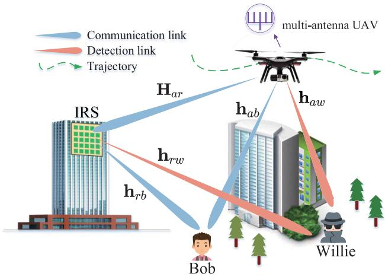  
Fig. 1. IRS-assisted UAV covert communication.

communicate covertly with Bob while avoiding being detected by Willie. The UAV is equipped with a uniform planar array (UPA) composed of $N _ { t } ~ = ~ N _ { r } \times N _ { c }$ antennas, located on the x-o-y plane, where $N _ { r }$ antennas are arranged along the x-axis and $N _ { c }$ along the y-axis. The UPA at IRS, consisting of $M = M _ { r } \times M _ { c }$ passive reflecting elements, is located on the x-o-z plane, i.e., $M _ { r }$ reflecting elements along the x-axis and $M _ { c }$ reflecting elements along the z-axis. The phase shift $\theta _ { m } \in [ 0 , 2 \pi ) , \forall m \in \{ 1 , 2 , \ldots , M \}$ of each reflection unit can be adjusted by the IRS controller. Willie aims to detect the communication activity from the UAV to Bob. It is assumed that Willie was once a legitimate user but currently lacks access to confidential information, or the UAV opts not to transmit confidential information to him. Therefore, Willie’s Channel State Information (CSI) can be obtained by the UAV using existing advanced estimation methods [24], [25]. Assume that the height of IRS is denoted by $H _ { r } .$ Let ${ \bf 0 } _ { r } =$ $[ x _ { r } , y _ { r } ] ^ { T } , \mathbf { o } _ { b } \ = \ [ x _ { b } , y _ { b } ] ^ { T }$ and $\mathbf { o } _ { w } ~ = ~ [ x _ { w } , y _ { w } ] ^ { T }$ represent the positions of IRS, GLU and warden, respectively, where $x _ { i } , y _ { i } , i \in \{ r , b , w \}$ represent the horizontal and vertical coordinates of IRS, GLU and warden, respectively. The initial position of the UAV is denoted as ${ \bf o } _ { a , I } = [ x _ { a , I } , y _ { a , I } ] ^ { T }$ , where $x _ { a , I }$ and $y _ { a , I }$ represent the horizontal and vertical coordinates of the starting point, respectively. The final position of the UAV is denoted as $\bullet _ { a , F } \overline { { = \left[ x _ { a , F } , y _ { a , F } \right] ^ { T } } }$ , where $x _ { a , F }$ and $y _ { a , F }$ represent the horizontal and vertical coordinates of the destination, respectively. Let $\mathbf { o } _ { a } [ \iota ] ~ = ~ [ x _ { a } [ \iota ] , y _ { a } [ \iota ] ] ^ { T } , \ \iota ~ \in$ $\{ 1 , \ldots , N \}$ represent the discretized trajectory of UAV in the ι-th time-slot, where $x _ { a } [ \iota ]$ and $y _ { a } [ \boldsymbol { \iota } ]$ represent the horizontal and vertical coordinates of the UAV, respectively, and the UAV’s flight altitude is maintained at $H _ { a }$ . The flight period T is uniformly partitioned into N time-slots, i.e., a time-slot is $\delta _ { t } = T / N$ . Due to the hardware limitations of the UAV, the UAVTR needs to satisfy

$$
\begin{array} { r } { \| \mathbf { o } _ { a } [ \iota + 1 ] - \mathbf { o } _ { a } [ \iota ] \| \leq V _ { \operatorname* { m a x } } \delta _ { t } , \iota \in \mathcal { N } , } \end{array}
$$

$$
\left\| \mathbf { o } _ { a } [ 1 ] - \mathbf { o } _ { a , I } \right\| \leq V _ { \operatorname* { m a x } } \delta _ { t } , \quad \mathbf { o } _ { a } [ N ] = \mathbf { o } _ { a , F } ,\tag{1a}
$$

(1b)

where $V _ { \mathrm { m a x } }$ represents the UAV’s maximum flight speed.

## A. Channel Model

Considering a complex urban/forest environment, all the channels are assumed as the reasonable Rician fading channels [26]. Specifically, the UAV-IRS link $\mathbf { H } _ { a r } [ \boldsymbol { l } ] \in \mathbb { C } ^ { \breve { M } \times N _ { t } }$ is modeled as [27]

$$
\mathbf { H } _ { a r } [ \iota ] = \sqrt { \frac { \beta _ { 0 } } { \left( d _ { a r } [ \iota ] \right) ^ { \alpha _ { a r } } \left( \varepsilon _ { a r } + 1 \right) } } \Big ( \sqrt { \varepsilon _ { a r } } \mathbf { H } _ { a r } ^ { \mathrm { L o S } } [ \iota ] + \mathbf { H } _ { a r } ^ { \mathrm { N L o S } } [ \iota ] \Big )\tag{, (2}
$$

where $\begin{array} { r l r } { d _ { a r } [ \iota ] } & { { } = } & { \sqrt { \| \mathbf { o } _ { a } [ \iota ] - \mathbf { o } _ { r } \| ^ { 2 } + ( H _ { a } - H _ { r } ) ^ { 2 } } } \end{array}$ denotes the distance between UAV and IRS, $\beta _ { 0 }$ represents the channel power gain at a reference distance of 1m. $\alpha _ { a r }$ and $\varepsilon _ { a r }$ represent the path loss exponent and the Rician factor of the UAV-IRS link, respectively. $\mathbf { H } _ { a r } ^ { \mathrm { L o S } } [ \iota ]$ = $\mathbf { a } _ { R } ( \phi _ { a r } ^ { A } [ \mathfrak { z } ] , \psi _ { a r } ^ { A } [ \mathfrak { z } ] ) \mathbf { a } _ { T } ^ { H } ( \phi _ { a r } ^ { D } [ \mathfrak { z } ] , \psi _ { a r } ^ { D } [ \mathfrak { z } ] ) \stackrel { \bullet } { \in } \mathbb { C } ^ { M \times \check { N } _ { t } }$ is the line-ofsight (LoS) channel matrix. And $\mathbf { \dot { H } } _ { a r } ^ { \mathrm { N L o S } } [ \boldsymbol { \iota } ] \sim \mathcal { C N } ( \boldsymbol { 0 } , \mathbf { I } _ { M \times N _ { t } } )$ is the non-line-of-sight (NLoS) channel matrix. Additionally, the IRS’s receive array response $\begin{array} { r l r } { { \bf a } _ { R } } & { { } \in } & { \mathbb { C } ^ { M \times 1 } } \end{array}$ is represented as

$$
\begin{array} { r l r } & { } & { \mathbf { a } _ { R } = \bigg [ 1 , \dots , e ^ { - j \frac { 2 \pi ( M _ { r } - 1 ) d _ { r } } { \lambda } \sin \phi _ { a r } ^ { A } [ \imath ] \cos \psi _ { a r } ^ { A } [ \imath ] } \bigg ] ^ { T } } \\ & { } & { \otimes \bigg [ 1 , \dots , e ^ { - j \frac { 2 \pi ( M _ { c } - 1 ) d _ { c } } { \lambda } \sin \phi _ { a r } ^ { A } [ \imath ] \sin \psi _ { a r } ^ { A } [ \imath ] } \bigg ] ^ { T } , } \end{array}\tag{3}
$$

and the UAV’s transmit array response $\mathbf { a } _ { T } \in \mathbb { C } ^ { N _ { t } \times 1 }$ can be denoted by

$$
\begin{array} { r l r } & { } & { \mathbf { a } _ { T } = \bigg [ 1 , \dots , e ^ { - j \frac { 2 \pi ( N _ { r } - 1 ) \Delta _ { r } } { \lambda } \sin \phi _ { a r } ^ { D } [ \imath ] \cos \psi _ { a r } ^ { D } [ \imath ] } \bigg ] ^ { T } } \\ & { } & { \otimes \bigg [ 1 , \dots , e ^ { - j \frac { 2 \pi ( N _ { c } - 1 ) \Delta _ { c } } { \lambda } \sin \phi _ { a r } ^ { D } [ \imath ] \sin \psi _ { a r } ^ { D } [ \imath ] } \bigg ] ^ { T } , } \end{array}\tag{4}
$$

where λ represents the carrier wavelength, $d _ { r }$ and $d _ { c }$ denote the horizontal and vertical antenna spacing of the UAV, respectively, and $\Delta _ { r }$ and $\Delta _ { c }$ represent the horizontal and vertical spacing between IRS elements, respectively. Furthermore, $\phi _ { a r } ^ { A } [ \iota ]$ and $\psi _ { a r } ^ { A } [ \iota ]$ denote the vertical and the horizontal angleof-arrivals (AoAs) at the IRS, respectively, and $\phi _ { a r } ^ { D } [ \iota ]$ and $\psi _ { a r } ^ { D } [ t ]$ indicate the vertical angle-of-departures (VAoDs) and horizontal angle-of-departures (HAoDs), respectively.

Similarly, the IRS-Bob (b) and IRS-Willie (w) links can be modeled as

$$
\begin{array} { r l } & { \mathbf { h } _ { r i } [ \iota ] = \sqrt { \frac { \beta _ { 0 } } { ( d _ { r i } ) ^ { \alpha _ { r i } } } } \bigg ( \sqrt { \frac { \varepsilon _ { r i } } { \varepsilon _ { r i } + 1 } } \mathbf { h } _ { r i } ^ { \mathrm { L o S } } } \\ & { \quad \quad \quad + \sqrt { \frac { 1 } { \varepsilon _ { r i } + 1 } } \mathbf { h } _ { r i } ^ { \mathrm { N L o S } } [ \iota ] \bigg ) \in \mathbb { C } ^ { M \times 1 } , i \in \{ b , w \} , } \end{array}\tag{5}
$$

where $\begin{array} { r l r } { \mathbf { h } _ { r i } ^ { \mathrm { L o S } } } & { { } = } & { \left[ 1 , \dots , e ^ { - j \frac { 2 \pi ( M _ { r } - 1 ) d _ { r } } { \lambda } \sin \phi _ { r i } \cos \psi _ { r i } } \right] ^ { T } } \end{array}$ ⊗ $[ 1 , \ldots , e ^ { - j { \frac { 2 \pi ( M _ { c } - 1 ) d _ { c } } { \lambda } } }$ sin <sub>φri</sub> sin $\psi _ { r i } \mathbf { ] } ^ { T } , \mathbf { h } _ { r i } ^ { \mathrm { N L o S } } [ \iota ] \sim \mathcal { C N } ( \mathbf { 0 } , \mathbf { I } _ { M } )$ represents scattering components. $\alpha _ { r b }$ and $\alpha _ { r w }$ denote the path loss exponents for IRS-Bob and IRS-Willie links, respectively. $\varepsilon _ { r b }$ and $\varepsilon _ { r w }$ denote the Rician factors of IRS-Bob and IRS-Willie links, respectively. Furthermore, $\phi _ { r b }$ and $\psi _ { r b }$ denote the VAoDs and HAoDs from IRS to Bob, respectively. $\phi _ { r w }$ and $\psi _ { r w }$ denote the VAoDs and HAoDs from IRS to Willie, respectively. For the UAV-Bob (b) and UAV-Willie (w) links, they can be described as

$$
\begin{array} { r l } & { \mathbf { h } _ { a i } [ \iota ] = \sqrt { \frac { \beta _ { 0 } } { ( d _ { a i } [ \iota ] ) ^ { \alpha _ { a i } } } } \left( \sqrt { \frac { \varepsilon _ { a i } } { \varepsilon _ { a i } + 1 } } \mathbf { h } _ { a i } ^ { \mathrm { L o S } } [ \iota ] \right. } \\ & { \quad \quad \quad \left. + \sqrt { \frac { 1 } { \varepsilon _ { a i } + 1 } } \mathbf { h } _ { a i } ^ { \mathrm { N L o S } } [ \iota ] \right) \in \mathbb { C } ^ { N _ { t } \times 1 } , i \in \{ b , w \} . } \end{array}\tag{6}
$$

where

$$
\begin{array} { r l r } & { } & { \mathbf { h } _ { a i } ^ { \mathrm { L o S } } [ \iota ] = \biggl [ 1 , \ldots , e ^ { - j \frac { 2 \pi ( N _ { r } - 1 ) \Delta _ { r } } { \lambda } \sin \phi _ { a i } [ \iota ] \cos \psi _ { a i } [ \iota ] } \biggr ] ^ { T } } \\ & { } & { \otimes \biggl [ 1 , \ldots , e ^ { - j \frac { 2 \pi ( N _ { c } - 1 ) \Delta _ { c } } { \lambda } \sin \phi _ { a i } [ \iota ] \sin \psi _ { a i } [ \iota ] } \biggr ] ^ { T } , } \end{array}\tag{7}
$$

$\mathbf { h } _ { a i } ^ { \mathrm { N L o S } } [ \iota ] \sim \mathcal { C N } ( \mathbf { 0 } , \mathbf { I } _ { N _ { t } } )$ denotes the scattering components. $\phi _ { a b } [ \iota ]$ and $\psi _ { a b } [ \iota ]$ represent the VAoDs and HAoDs from UAV to Bob, respectively. $\phi _ { a w } [ \boldsymbol { \iota } ]$ and $\psi _ { a w } [ \iota ]$ represent the VAoDs and HAoDs from UAV to Willie, respectively.

## B. Transmission From Alice to Bob

The received signal at Bob in the l-th CU is expressed as

$$
y _ { b } ^ { l } [ \boldsymbol { \iota } ] = \left( \mathbf { h } _ { r b } ^ { H } [ \boldsymbol { \iota } ] \Theta [ \boldsymbol { \iota } ] \mathbf { H } _ { a r } [ \boldsymbol { \iota } ] + \mathbf { h } _ { a b } ^ { H } [ \boldsymbol { \iota } ] \right) \mathbf { w } [ \boldsymbol { \iota } ] x _ { l } [ \boldsymbol { \iota } ] + n _ { b } ^ { l } [ \boldsymbol { \iota } ] ,\tag{8}
$$

where $l \in \{ 1 , \ldots , L \}$ , and L represents the total number of CUs. $\Theta [ \iota ] \stackrel { \setminus } { = } \mathrm { d i a g } ( \pmb { \theta } [ \iota ] ) \in \mathbb { C } ^ { M \times \hat { M } }$ represents the IRS’s PSM, $\pmb \theta [ \iota ] = \big [ e ^ { j \theta _ { 1 } [ \iota ] } , \therefore , e ^ { j \theta _ { m } [ \iota ] } , \acute { } . . . , e ^ { j \theta _ { M } [ \iota ] } \big ] ^ { T } \ \in \mathbb { C } ^ { M \times 1 } , \ n _ { b } ^ { l } [ \iota ] \ \sim$ $\mathcal { C N } ( 0 , \sigma _ { b } ^ { 2 } )$ represents the AWGN at Bob. $\mathbf { x } [ \iota ] \ = \ \mathbf { w } [ \iota ] x _ { l } [ \iota ]$ represents the UAV’s transmitted signal, $x _ { l } [ \iota ] \ \sim \ \mathcal { C N } ( 0 , 1 )$ represents the signal sent by UAV. $\mathbf { w } [ \boldsymbol { \iota } ] \in \bar { \mathbb { C } } ^ { \bar { N } _ { t } \times 1 }$ represents the UAVTB. Thus, ${ \bf w } [ \imath ]$ needs to satisfy

$$
\begin{array} { r } { \| \mathbf { w } [ \iota ] \| ^ { 2 } \leq P _ { a , \operatorname* { m a x } } , \forall \iota , } \end{array}\tag{9}
$$

where $P _ { a , \mathrm { m a x } }$ represents the maximum UAVTP.

Then, the received SNR at Bob can be written as

$$
\gamma _ { b } [ \iota ] = \frac { \big | \big ( \mathbf { h } _ { r b } ^ { H } [ \iota ] \Theta [ \iota ] \mathbf { H } _ { a r } [ \iota ] + \mathbf { h } _ { a b } ^ { H } [ \iota ] \big ) \mathbf { w } [ \iota ] \big | ^ { 2 } } { \sigma _ { b } ^ { 2 } } .\tag{10}
$$

Considering the FB, Bob’s ACTR can be expressed as [28]

$$
R _ { b } [ \iota ] = \log _ { 2 } ( 1 + \gamma _ { b } [ \iota ] ) - \frac { Q ^ { - 1 } ( \delta ) } { \sqrt { L } \ln 2 } \sqrt { \Lambda [ \iota ] } ,\tag{11}
$$

where $\begin{array} { r } { Q ( x ) = \int _ { x } ^ { \infty } \frac { 1 } { \sqrt { 2 \pi } } e ^ { - \frac { t ^ { 2 } } { 2 } } d t , Q ^ { - 1 } ( x ) } \end{array}$ denotes the inverse of Q-function. δ represents the given maximum allowed decoding error probability. The channel dispersion $\Lambda [ \iota ]$ is given by

$$
\Lambda [ \iota ] = 1 - \frac { 1 } { \left( 1 + \gamma _ { b } [ \iota ] \right) ^ { 2 } } , \forall \iota .\tag{12}
$$

## C. Binary Hypothesis Testing at Willie

From the standpoint of covert communication, Willie aims to detect the occurrence of a transmission from UAV to Bob by analyzing the observed signals. Therefore, the signal received by Willie from UAV in the l-th CU can be represented as

$$
\begin{array} { r } { y _ { w } ^ { l } [ \iota ] = \left\{ \begin{array} { l l } { n _ { w } ^ { l } [ \iota ] , } & { \mathcal { H } _ { 0 } , } \\ { \big ( \mathbf { h } _ { r w } ^ { H } [ \iota ] \Theta [ \iota ] \mathbf { H } _ { a r } [ \iota ] + \mathbf { h } _ { a w } ^ { H } [ \iota ] \big ) \mathbf { w } [ \iota ] x _ { l } [ \iota ] + n _ { w } ^ { l } [ \iota ] , \mathcal { H } _ { 1 } , } \end{array} \right. } \end{array}\tag{13}
$$

where $\mathcal { H } _ { 0 }$ represents the null hypothesis that Alice does not send information, $\mathcal { H } _ { 1 }$ represents the alternative hypothesis that Alice sends information to Bob, and $n _ { w } ^ { l } [ \ell ] \sim$ $\mathcal { C N } ( 0 , \sigma _ { w } ^ { 2 } )$ represents the AWGN at Willie. In addition, $y _ { w } ^ { l } [ \boldsymbol { \imath } ] \sim \mathcal { C N } ( 0 , | ( \mathbf { h } _ { r w } ^ { H } [ \boldsymbol { \imath } ] \boldsymbol { \Theta } [ \boldsymbol { \imath } ] \mathbf { H } _ { a r } [ \boldsymbol { \imath } ] + \mathbf { h } _ { a w } ^ { H } [ \boldsymbol { \imath } ] ) \mathbf { w } [ \boldsymbol { \imath } ] | ^ { 2 } + \sigma _ { w } ^ { 2 } )$ and $y _ { w } ^ { l } [ \iota ] \sim \mathcal { C N } ( 0 , \sigma _ { w } ^ { 2 } )$ denote the received signal under $\mathcal { H } _ { 1 }$ and $\mathcal { H } _ { 0 }$

The false alarm probability $\varpi _ { F } [ \iota ]$ and the missed detection probability $\varpi _ { M } [ \iota ]$ can be defined as

$$
\varpi _ { F } [ \iota ] \stackrel { \Delta } { = } \mathrm { P r } \{ { \cal D } _ { 1 } \mid \mathcal { H } _ { 0 } \} ,\tag{14}
$$

$$
\varpi _ { M } [ \iota ] \stackrel { \Delta } { = } \mathrm { P r } \{ { \cal D } _ { 0 } \mid \mathcal { H } _ { 1 } \} ,\tag{15}
$$

respectively, where $\mathcal { D } _ { 1 }$ and $\mathcal { D } _ { 0 }$ represent the binary decisions used to determine whether the transmission between the UAV and Bob has occurred. Thus, the total detection error probability (DEP) of Willie can be represented as

$$
\xi [ \iota ] = \pi _ { 0 } \varpi _ { F } [ \iota ] + \pi _ { 1 } \varpi _ { M } [ \iota ] ,\tag{16}
$$

where $\pi _ { 0 }$ and $\pi _ { 1 } = 1 - \pi _ { 0 }$ illustrate the prior probabilities of hypotheses $\mathcal { H } _ { 0 }$ and $\mathcal { H } _ { 1 }$ , respectively. Assume that the prior probabilities are equal, i.e., $\pi _ { 0 } = \pi _ { 1 } = 0 . 5$ [29], [30].

To effectively detect whether the UAV is communicating with Bob, the total DEP ξ[ι] needs to be minimized. Thus, the likelihood ratio test is used to obtain the optimal ξ[ι] [31], which is given by

$$
\begin{array} { r l } & { \mathbb { P } _ { 1 } [ \iota ] = \prod _ { l = 1 } ^ { L } f \left( y _ { w } ^ { l } [ \iota ] \mid \mathcal { H } _ { 1 } \right) } \\ & { \overline { { \mathbb { P } _ { 0 } [ \iota ] = \prod _ { l = 1 } ^ { L } f \left( y _ { w } ^ { l } [ \iota ] \mid \mathcal { H } _ { 0 } \right) } } \overset { \mathcal { D } _ { 1 } } { \mathcal { Z } _ { 0 } } 1 , } \end{array}\tag{17}
$$

where $\mathbb { P } _ { 1 } [ \boldsymbol { \iota } ]$ and $\mathbb { P } _ { 0 } [ \iota ]$ represent the likelihood functions over L CUs under the hypotheses $\mathcal { H } _ { 1 }$ and $\mathcal { H } _ { 0 }$ , respectively. $f ( y _ { w } ^ { l } [ \iota ] \mid \mathcal { H } _ { 1 } )$ and $f ( y _ { w } ^ { l } [ \iota ] \mid \mathcal { H } _ { 0 } )$ represent the likelihood function of $y _ { w } ^ { l } [ L ]$ under the hypotheses $\mathcal { H } _ { 1 }$ and $\mathcal { H } _ { 0 }$ , respectively.

The minimum DEP $\xi ^ { * } [ \iota ]$ for Willie can be deduced from (17), as demonstrated in [31]

$$
\xi ^ { * } [ \iota ] = 1 - \frac { \Upsilon \bigl ( L , \Gamma ^ { * } [ \iota ] L \sigma _ { w } ^ { - 2 } \bigr ) } { ( L - 1 ) ! } + \frac { \Upsilon \Bigl ( L , \frac { L \Gamma ^ { * } [ \iota ] } { c [ \iota ] + \sigma _ { w } ^ { 2 } } \Bigr ) } { ( L - 1 ) ! } ,\tag{18}
$$

where $\begin{array} { r } { \Upsilon ( n , \varrho ) = \int _ { 0 } ^ { \varrho } e ^ { - t } t ^ { n - 1 } } \end{array}$ dt denotes the lower incomplete Gamma function, $\begin{array} { r } { \Gamma ^ { * } [ \iota ] = \frac { \sigma _ { w } ^ { 2 } ( c [ \iota ] + \sigma _ { w } ^ { 2 } ) } { c [ \iota ] } \ln ( \frac { c [ \iota ] + \sigma _ { w } ^ { 2 } } { \sigma _ { w } ^ { 2 } } ) } \end{array}$ and $c [ \iota ] =$ $| ( \mathbf { h } _ { r w } ^ { H } [ \iota ] \Theta [ \iota ] \mathbf { H } _ { a r } [ \iota ] + \mathbf { h } _ { a w } ^ { H } [ \iota ] ) \mathbf { w } [ \iota ] | ^ { 2 }$

Nevertheless, the expression of $\xi ^ { * } [ \iota ]$ includes incomplete gamma functions, which makes subsequent analysis more complex. To tackle this problem, a manageable lower bound of $\xi ^ { * } [ \iota ]$ can be obtained by using Pinsker’s inequality, as described by [32]

$$
\xi ^ { * } [ \iota ] \geq 1 - \sqrt { \frac { 1 } { 2 } { \cal D } ( \mathbb { P } _ { 0 } [ \iota ] \| \mathbb { P } _ { 1 } [ \iota ] ) } ,\tag{19}
$$

where $\mathcal { D } ( \mathbb { P } _ { 0 } [ \iota ] \| \mathbb { P } _ { 1 } [ \iota ] )$ refers to the Kullback-Leibler (KL) divergence from $\mathbb { P } _ { 0 } [ \iota ] \quad \mathrm { ~ t o ~ } \quad \mathbb { P } _ { 1 } [ \iota ]$ , as specified in [31]

$$
\mathcal { D } ( \mathbb { P } _ { 0 } [ \mathfrak { c } ] \| \mathbb { P } _ { 1 } [ \mathfrak { c } ] ) = L \bigg [ \mathrm { l n } ( 1 + \varphi [ \mathfrak { c } ] ) - \frac { \varphi [ \mathfrak { c } ] } { 1 + \varphi [ \mathfrak { c } ] } \bigg ] ,\tag{20}
$$

where $\begin{array} { r } { \varphi [ \iota ] = \frac { | ( \mathbf { h } _ { r w } ^ { H } [ \iota ] \Theta [ \iota ] \mathbf { H } _ { a r } [ \iota ] + \mathbf { h } _ { a w } ^ { H } [ \iota ] ) \mathbf { w } [ \iota ] | ^ { 2 } } { \sigma _ { \iota \eta } ^ { 2 } } , } \end{array}$

For the covert communications, the constraint $\xi ^ { * } [ l ] \geq 1 - \epsilon$ is typically used to ensure covertness [31], [32], where  denotes a small threshold that defines the level of covertness. According to (19), $\xi ^ { * } [ \iota ] \ \geq \ 1 - \ \epsilon$ can be satisfied when $\begin{array} { r l r } { \mathcal { D } ( \mathbb { P } _ { 0 } [ \mathfrak { c } ] \| \mathbb { P } _ { 1 } [ \mathfrak { c } ] ) } & { \leq } & { 2 \epsilon ^ { 2 } } \end{array}$ . As a consequence, (19) can be replaced by $\mathcal { D } ( \mathbb { P } _ { 0 } [ \iota ] \| \mathbb { P } _ { 1 } [ \iota ] ) \le 2 \epsilon ^ { 2 }$ . Since $\begin{array} { r } { \frac { \partial \dot { \mathcal { D } } ( \dot { \mathbb { P } _ { 0 } } [ \iota ] \vert \vert \mathbb { P } _ { 1 } [ \iota ] ) } { \partial \varphi [ \iota ] } = } \end{array}$ $\begin{array} { r } { \frac { \varphi [ \iota ] L } { ( 1 + \varphi [ \iota ] ) ^ { 2 } } > 0 , \mathcal { D } ( \mathbb { P } _ { 0 } [ \iota ] \| \mathbb { P } _ { 1 } [ \iota ] ) } \end{array}$ increases monotonically w.r.t. $\varphi [ \iota ]$ . Therefore, when $\mathcal { D } ( \mathbb { P } _ { 0 } [ \mathfrak { c } ] \| \mathbb { P } _ { 1 } [ \mathfrak { c } ] ) = 2 \epsilon ^ { 2 } , \varphi [ \mathfrak { c } ]$ can achieve the maximum value ${ \overline { { \varphi } } } ,$ i.e., $\mathcal { D } ( \mathbb { P } _ { 0 } [ \iota ] \| \mathbb { P } _ { 1 } [ \iota ] ) \ \leq \ 2 \epsilon ^ { 2 }$ can be equivalent to

$$
\varphi [ \iota ] \leq \overline { { \varphi } } .\tag{21}
$$

## D. Problem Formulation

Our aim is to maximize the ACTR of IRS-assisted UAVNs with FB under considering the constraints of UAV’s mobility and UAVTP, IRS’s PSM and covert communication requirements in UAVNs. By defining $\begin{array} { l l } { \mathbf { Q } _ { a } } & { \triangleq } \end{array}$ $\{ \mathbf { o } _ { a } [ \iota ] , \forall \iota \} , \mathcal { W } \triangleq \{ \mathbf { w } [ \iota ] , \forall \iota \}$ , and $\begin{array} { r l r } { \Phi } & { { } \triangleq } & { \{ \Theta [ \iota ] , \forall \iota \} } \end{array}$ the ACTR maximization problem for UAVNs can be expressed as

$$
\operatorname* { m a x } _ { \mathbf { Q } _ { a } , \mathcal { W } , \Phi } \ R = \frac { 1 } { N } \sum _ { \iota = 1 } ^ { N } R _ { b } [ \iota ]
$$

$$
\mathrm { s . t . ~ 0 } \leq \theta _ { m } [ \iota ] \leq 2 \pi ,\tag{22a}
$$

$$
( 1 ) , ( 9 ) , ( 2 1 ) ,\tag{22b}
$$

where (1) denotes the UAVTR constraint, (9) denotes the UAVTP constraint, (21) denotes the covertness constraint and (22b) denotes the IRS’s PSM constraint.

## III. BCD-SDR ALGORITHM DESIGN

Since the three optimization variables $\mathbf { Q } _ { a }$ , , and Φ are highly coupled, the problem (22) is non-convex and difficult to solve. It is observed that the objective function (22a) consists of two terms: $\log _ { 2 } ( 1 + \gamma _ { b } [ \iota ] )$ and $\begin{array} { r } { - \frac { Q ^ { - 1 } ( \delta ) } { \sqrt { L } \ln 2 } \sqrt { 1 - \frac { 1 } { ( 1 + \gamma _ { b } [ \iota ] ) ^ { 2 } } } , } \end{array}$ where $\log _ { 2 } ( 1 + \gamma _ { b } [ \boldsymbol { \iota } ] )$ is a concave function w.r.t. $\gamma _ { b } [ \iota ]$ However, $\begin{array} { r l } {  { - \frac { Q ^ { - 1 } ( \delta ) } { \sqrt { L } \ln 2 } \sqrt { 1 - \frac { 1 } { ( 1 + \gamma _ { b } [ \iota ] ) ^ { 2 } } } } } \end{array}$ is a convex function w.r.t. $\gamma _ { b } [ \iota ] ,$ , since $\begin{array} { r l r } { \frac { d ^ { 2 } f _ { 1 } ( \gamma _ { b } [ \iota ] ) } { d ( \gamma _ { b } [ \iota ] ) ^ { 2 } } } & { { } \le } & { 0 } \end{array}$ , where $\begin{array} { r l } { f _ { 1 } ( \gamma _ { b } [ \iota ] ) } & { { } = } \end{array}$ $\begin{array} { r } { \sqrt { 1 - \frac { 1 } { ( 1 + \gamma _ { b } [ \iota ] ) ^ { 2 } } } , \gamma _ { b } [ \iota ] \geq 0 } \end{array}$ , and the second-order derivative of $f _ { 1 } ( \gamma _ { b } [ \iota ] )$ is

$$
\begin{array} { r } { \frac { d ^ { 2 } f _ { 1 } \left( \gamma _ { b } \left[ \iota \right] \right) } { d \left( \gamma _ { b } \left[ \iota \right] \right) ^ { 2 } } = - \left( 1 - \frac { 1 } { \left( 1 + \gamma _ { b } \left[ \iota \right] \right) ^ { 2 } } \right) ^ { - \frac { 3 } { 2 } } \frac { 1 } { \left( 1 + \gamma _ { b } \left[ \iota \right] \right) ^ { 6 } } } \\ { - \left( 1 - \frac { 1 } { \left( 1 + \gamma _ { b } \left[ \iota \right] \right) ^ { 2 } } \right) ^ { - \frac { 1 } { 2 } } \frac { 3 } { \left( 1 + \gamma _ { b } \left[ \iota \right] \right) ^ { 4 } } . } \end{array}\tag{23}
$$

To handle the non-convexity of the objective function (22a) and make the new constraints tractable, a slack variable $\pmb { \tau } ~ = ~ \{ \tau [ \iota ] , \forall \iota \}$ is introduced as the upper bound of $\gamma _ { b } [ \iota ]$ problem (22) can be equivalent to

$$
\begin{array} { r l } { \displaystyle \operatorname* { m a x } _ { \mathbf { Q } _ { a } , \mathcal { W } , \Phi , \tau } } & { R ( \gamma _ { b } [ \tau ] , \tau [ \boldsymbol { \mathfrak { c } } ] ) = \frac { 1 } { N } \sum _ { \tau = 1 } ^ { N } \Bigg \{ \log _ { 2 } ( 1 + \gamma _ { b } [ \iota ] ) } \\ & { - \frac { Q ^ { - 1 } ( \delta ) } { \sqrt { L } \ln 2 } \sqrt { 1 - \frac { 1 } { \left( 1 + \tau [ \iota ] \right) ^ { 2 } } } \Bigg \} } \end{array}\tag{24a}
$$

$$
\begin{array} { r l } { \mathrm { s . t . } } & { \gamma _ { b } [ \iota ] \leq \tau [ \iota ] , } \\ & { ( 1 ) , \ ( 9 ) , \ ( 2 2 \mathrm { b } ) , \ ( 2 1 ) . } \end{array}\tag{24b}
$$

Next, by using the first-order Taylor expansion, $f ( \tau [ \iota ] ) \ =$ $\begin{array} { r } { \sqrt { 1 - \frac { 1 } { ( 1 + \tau [ \iota ] ) ^ { 2 } } } } \end{array}$ can be replaced by its upper bound, and the upper bound of $f ( \tau [ \iota ] )$ can be derived as

$$
\begin{array} { r l r } & { f ( \tau [ \iota ] ) = \displaystyle \sqrt { 1 - \frac { 1 } { ( 1 + \tau [ \iota ] ) ^ { 2 } } } \leq \left( 1 - \left( 1 + \tau ^ { ( j ) } [ \iota ] \right) ^ { - 2 } \right) ^ { \frac { 1 } { 2 } } } & \\ & { + \left( 1 - \left( 1 + \tau ^ { ( j ) } [ \iota ] \right) ^ { - 2 } \right) ^ { - \frac { 1 } { 2 } } \displaystyle \frac { \left( \tau [ \iota ] - \tau ^ { ( j ) } [ \iota ] \right) } { \left( 1 + \tau ^ { ( j ) } [ \iota ] \right) ^ { 3 } } } & \\ & { \triangleq \widetilde { \Lambda } [ \iota ] , \forall \iota , } & { ( 2 5 ) } \end{array}
$$

where $\tau ^ { ( j ) } [ \iota ]$ denotes the acquired feasible solution during the j-th iteration. Finally, problem (24) can be reconstructed into

$$
\operatorname* { m a x } _ { \mathbf { Q } _ { a } , \mathcal { W } , \Phi , \tau } \ R ( \gamma _ { b } [ \tau ] , \tau [ \mathfrak { c } ] ) = \frac { 1 } { N } \sum _ { \iota = 1 } ^ { N } \biggl \{ \log _ { 2 } ( 1 + \gamma _ { b } [ \mathfrak { c } ] )\tag{26a}
$$

$$
{ \mathrm { s . t . ~ } } ( 1 ) , \ ( 9 ) , \ ( 2 2 { \mathrm { b } } ) , \ ( 2 1 ) , ( 2 4 { \mathrm { b } } ) .\tag{26b}
$$

Here, $R ( \gamma _ { b } [ \iota ] , \tau [ \iota ] )$ is a concave function w.r.t. $\gamma _ { b } [ \iota ]$ and an affine function w.r.t. $\tau [ \iota ]$ , and constraint (24b) is a tractable constraint. Problem (26) is decomposed into three sub-problems: multi-antenna UAVTR and UAVTB and IRS’s PSM. The optimal solutions to these sub-problems can be obtained by utilizing the SDR and SCA methods. Then, a

BCD-SDR algorithm is proposed to obtain a high-quality suboptimal solution for problem (26). The detailed procedure is as follows.

## A. Sub-Problem 1: Optimizing UAVTB

When $\mathbf { Q } _ { a }$ and Φ are fixed, the UAVTB sub-problem can be depicted as

$$
\begin{array} { l } { { \displaystyle \operatorname* { m a x } _ { \mathcal { W } , \tau } \ \frac { 1 } { N } \sum _ { \iota = 1 } ^ { N } \biggl \{ \log _ { 2 } ( 1 + \gamma _ { b } [ \iota ] ) - \frac { Q ^ { - 1 } ( \delta ) } { \sqrt { L } \ln 2 } \widetilde { \Lambda } [ \iota ] \biggr \} } } \\ { { \mathrm { s . t . } \ ( 9 ) , \ ( 2 1 ) , \ ( 2 4 \boldsymbol { \mathfrak { b } } ) . } } \end{array}\tag{27a}
$$

Let $\begin{array} { r l r } { { \bf a } _ { b } ^ { H } [ \imath ] } & { { } = } & { { \bf h } _ { r b } ^ { H } [ \imath ] \Theta [ \imath ] { \bf H } _ { a r } [ \imath ] + { \bf h } _ { a b } ^ { H } [ \imath ] , { \bf a } _ { w } ^ { H } [ \imath ] = } \end{array}$ $\mathbf { h } _ { r w } ^ { H } [ \iota ] \Theta [ \bar { \iota } ] \mathbf { H } _ { a r } [ \iota ] + \mathbf { h } _ { a w } ^ { H ^ { \prime } } [ \iota ] , \mathbf { A } _ { b } [ \iota ] = \mathbf { a } _ { b } [ \iota ] \mathbf { a } _ { b } ^ { H } [ \iota ] \in \mathbb { C } ^ { N _ { t } \times N _ { t } }$ $\mathbf { A } _ { w } [ \bar { \iota } ] = \bar { \mathbf { a } } _ { w } [ \iota ] \bar { \mathbf { a } } _ { w } ^ { H } [ \iota ] \in \bar { \mathbb { C } } ^ { N _ { t } \times N _ { t } }$ , and $\dot { \mathbf { W } } [ \boldsymbol { \iota } ] = \mathbf { w } [ \boldsymbol { \iota } ] \mathbf { w } ^ { H } [ \boldsymbol { \iota } ]$ . The covertness constraint (21) can be reformulated as follows:

$$
\mathrm { T r } ( \mathbf { A } _ { w } [ \mathfrak { c } ] \mathbf { W } [ \mathfrak { c } ] ) \leq \overline { { \varphi } } \sigma _ { w } ^ { 2 } ,\tag{28}
$$

$$
\mathrm { r a n k } ( \mathbf { W } [ \boldsymbol { \iota } ] ) = 1 .\tag{29}
$$

In order to transform Problem (27) into a convex problem, the SDR technique is employed to handle the non-convex constraint (29). Consequently, the convex optimization problem can be expressed as

$$
\operatorname* { m a x } _ { \mathcal { W } , \tau } \ \frac { 1 } { N } \sum _ { \iota = 1 } ^ { N } \biggl \{ \log _ { 2 } \biggl ( 1 + \frac { \mathrm { T r } ( \mathbf { A } _ { b } [ \boldsymbol \iota ] \mathbf { W } [ \boldsymbol \iota ] ) } { \sigma _ { b } ^ { 2 } } \biggr ) - \frac { Q ^ { - 1 } ( \delta ) } { \sqrt { L } \ln 2 } \widetilde \Lambda [ \iota ] \biggr \}\tag{30a}
$$

$$
\mathrm { s . t . } \ \mathrm { T r } ( \mathbf { W } [ \mathfrak { c } ] ) \leq P _ { a , \operatorname* { m a x } } ,
$$

$$
\mathbf { W } [ \iota ] \succeq \mathbf { 0 } ,\tag{30b}
$$

(30c)

$$
\begin{array} { r } { \mathrm { T r } ( \mathbf { A } _ { b } [ \mathcal { l } ] \mathbf { W } [ \mathcal { l } ] ) \leq \tau [ \mathcal { l } ] \sigma _ { b } ^ { 2 } , } \end{array}\tag{30d}
$$

(28) .

Thus, problem (30) can be effectively tackled with standard optimization tools such as CVX. Subsequently, the approximate optimal ${ \bf w } [ \imath ]$ can be derived by employing the singular value decomposition (SVD) technique [33].

## B. Sub-Problem 2: Optimizing IRS’s PSM

When $\mathbf { Q } _ { a }$ and  are given, IRS’s PSM sub-problem can be represented as

$$
\begin{array} { r l } & { \underset { \Phi , \tau } { \operatorname* { m a x } } ~ \frac { 1 } { N } \underset { \iota = 1 } { \overset { N } { \sum } } \bigg \{ \log _ { 2 } ( 1 + \gamma _ { b } [ \iota ] ) - \frac { Q ^ { - 1 } ( \delta ) } { \sqrt { L } \ln 2 } \widetilde { \Lambda } [ \iota ] \bigg \} } \\ & { \mathrm { s . t . } ~ ( 2 2 \mathrm { b } ) , ~ ( 2 1 ) , ( 2 4 \mathrm { b } ) . } \end{array}\tag{31a}
$$

Let $\begin{array} { r l r } { { \bf h } _ { r b } ^ { H } [ \imath ] \Theta [ \imath ] { \bf H } _ { a r } [ \imath ] } & { { } = } & { \pmb { \theta } ^ { T } [ \imath ] { \bf G } _ { b } [ \imath ] , { \bf h } _ { r w } ^ { H } [ \imath ] \Theta [ \imath ] { \bf H } _ { a r } [ \imath ] = } \end{array}$ $\pmb { \theta } ^ { T } [ \imath ] \mathbf { G } _ { w } [ \imath ]$ , where $\begin{array} { r l } { \mathbf G _ { b } [ \iota ] } & { { } = } \end{array}$ diag(h<sup>H</sup><sub>rb</sub> [ι])Har [ι] ∈ $\mathbb { C } ^ { \tilde { M } \times { N _ { t } } } , \tilde { \mathbf { G } } _ { w } [ \iota ] = \mathrm { d i a g } ( \mathbf { h } _ { r w } ^ { \tilde { H } } [ \iota ] ) \mathbf { H } _ { a r } [ \iota ] \in \mathbb { C } ^ { \tilde { M } \times ^ { \vee } \tilde { N } _ { t } }$ . By defining $\begin{array} { r c l c l } { { \mathbf { V } [ \boldsymbol { \imath } ] } } & { { = } } & { { \pmb { \mu } [ \bar { \boldsymbol { \imath } } ] \pmb { \mu } ^ { H } [ \boldsymbol { \imath } ] , } } & { { \pmb { \mu } [ \boldsymbol { \imath } ] } } & { { = } } & { { [ \pmb { \theta } ^ { T } [ \boldsymbol { \imath } ] , 1 ] ^ { T } } } \end{array}$ , the covertness constraint (21) is rewritten as

$$
\begin{array} { r } { \mathrm { T r } ( \mathbf { B } _ { w } [ \mathfrak { c } ] \mathbf { V } [ \mathfrak { c } ] ) \leq \overline { { \varphi } } \sigma _ { w } ^ { 2 } , } \end{array}\tag{32}
$$

$$
\mathrm { r a n k } ( { \mathbf V } [ \iota ] ) = 1 ,\tag{33}
$$

where $\mathrm { T r } ( \mathbf { B } _ { i } [ \boldsymbol { \imath } ] \mathbf { V } [ \boldsymbol { \imath } ] ) = | ( \mathbf { h } _ { r i } ^ { H } [ \boldsymbol { \imath } ] \boldsymbol { \Theta } [ \boldsymbol { \imath } ] \mathbf { H } _ { a r } [ \boldsymbol { \imath } ] + \mathbf { h } _ { a i } ^ { H } [ \boldsymbol { \imath } ] ) \mathbf { w } [ \boldsymbol { \imath } ] | ^ { 2 } , i \in$ $\{ b , w \} , { \bf B } _ { i } [ \iota ] =$

$$
\begin{array} { r } { \left[ \mathbf { G } _ { i } [ \mathfrak { x } ] \mathbf { w } [ \mathfrak { \iota } ] \mathbf { w } ^ { H } [ \mathfrak { \iota } ] \mathbf { G } _ { i } ^ { H } [ \mathfrak { \iota } ] \ \mathbf { G } _ { i } [ \mathfrak { \iota } ] \mathbf { w } [ \mathfrak { \iota } ] \mathbf { w } ^ { H } [ \mathfrak { \iota } ] \mathbf { h } _ { a i } [ \mathfrak { \iota } ] \right] } \\ { \left[ \mathbf { h } _ { a i } ^ { H } [ \mathfrak { \iota } ] \mathbf { w } [ \mathfrak { \iota } ] \mathbf { w } ^ { H } [ \mathfrak { \iota } ] \mathbf { G } _ { i } ^ { H } [ \mathfrak { \iota } ] \ \mathbf { h } _ { a i } ^ { H } [ \mathfrak { \iota } ] \mathbf { w } [ \mathfrak { \iota } ] \mathbf { w } ^ { H } [ \mathfrak { \iota } ] \mathbf { h } _ { a i } [ \mathfrak { \iota } ] \right] . } \end{array}
$$

To deal with non-convex constraint (33), SDR is utilized to relax the rank-one constraint. Based on this, problem (31) can be reformulated as

$$
\operatorname* { m a x } _ { { \mathbf { V } [ \imath ] } , \ \tau } \ \frac { 1 } { N } \sum _ { \iota = 1 } ^ { N } \{ \log _ { 2 } \left( 1 + \frac { \mathrm { T r } ( \mathbf { B } _ { b } [ \iota ] \mathbf { V } [ \iota ] ) } { \sigma _ { b } ^ { 2 } } \right) - \frac { Q ^ { - 1 } ( \delta ) } { \sqrt { L } \ln 2 } \widetilde \Lambda [ \iota ] \}\tag{34a}
$$

$$
\mathrm { s . t . } \ \mathbf { V } _ { m , m } [ \imath ] = 1 , m = 1 , \ldots , M + 1 ,\tag{34b}
$$

$$
\mathbf { V } [ \boldsymbol { l } ] \succeq \mathbf { 0 } ,\tag{34c}
$$

$$
\begin{array} { r } { \mathrm { T r } ( \mathbf { B } _ { b } [ \mathfrak { c } ] \mathbf { V } [ \mathfrak { c } ] ) \leq \tau [ \mathfrak { c } ] \sigma _ { b } ^ { 2 } , } \end{array}\tag{34d}
$$

(32) .

For the relaxed convex problem (34), the interiorpoint method can be used to solve it optimally. Subsequently,the standard Gaussian randomization approach is employed to derive an approximate solution for ${ \pmb \theta } [ \iota ] \ [ 3 4 ]$ .

## C. Sub-Problem 3: Optimizing UAV’s Trajectory

When and $\Phi$ are given, UAVTR sub-problem can be formulated as

$$
\begin{array} { l } { \displaystyle \operatorname* { m a x } _ { { \bf Q } _ { a } , \tau } \ \frac { 1 } { N } \sum _ { \iota = 1 } ^ { N } \{ \log _ { 2 } ( 1 + \gamma _ { b } [ \iota ] ) - \frac { Q ^ { - 1 } ( \delta ) } { \sqrt { L } \ln 2 } \widetilde { \Lambda } [ \iota ] \} } \\ { \mathrm { s . t . } \ ( 1 ) , \ ( 2 1 ) , ( 2 4 \mathrm { b } ) . } \end{array}\tag{35a}
$$

Since constraints (21), (35a) and (24b) of (35) are non-convex, problem (35) is non-convex optimization problem. To deal with this thorny problem, the LoS component $\mathbf { H } _ { a r } ^ { \mathrm { L o S } } [ \iota ]$ in (35a) needs firstly to be calculated. The main reason is that the complexity and nonlinearity of $\mathbf { H } _ { a r } ^ { \mathrm { L o S } } [ \iota ]$ w.r.t. the variable $\mathbf { Q } _ { a }$ make UAVTR optimization difficult. Specifically, $\mathbf { H } _ { a r } ^ { \mathrm { L o S } } [ \iota ]$ in the j-th iteration can be approximately calculated based on the UAVTR in $( j - 1 ) \mathfrak { - } \mathfrak { t h }$ iteration. In the same manner, $\mathbf { h } _ { a b } ^ { \mathrm { L o S } } [ \iota ]$ and $\mathbf { h } _ { a w } ^ { \mathrm { L o S } } [ \iota ]$ in the j-th iteration are obtained through the UAVTR in the $( j - 1 ) \mathtt { - t h }$ iteration. Consequently, problem (35) can be reformulated as follows:

$$
\operatorname* { m a x } _ { \mathbf { Q } _ { a } , \tau } \ \frac { 1 } { N } \sum _ { \iota = 1 } ^ { N } \biggl \{ \log _ { 2 } \biggl ( 1 + \frac { \mathbf { h } _ { u e } ^ { T } [ \iota ] \mathbf { H } _ { A B } [ \iota ] \mathbf { h } _ { u e } [ \iota ] } { \sigma _ { b } ^ { 2 } } \biggr ) - \frac { Q ^ { - 1 } ( \delta ) } { \sqrt { L } \ln 2 } \tilde { \Lambda } [ \iota ] \biggr \}\tag{36a}
$$

$$
\mathrm { s . t . } \ \mathbf { h } _ { u e } ^ { T } [ \iota ] \mathbf { H } _ { A B } [ \iota ] \mathbf { h } _ { u e } [ \iota ] \leq \tau [ \iota ] \sigma _ { b } ^ { 2 } ,\tag{36b}
$$

where $\mathbf { h } _ { u e } [ \iota ] \ = \ [ ( d _ { a r } [ \iota ] ) ^ { - \alpha _ { a r } / 2 } , ( d _ { a b } [ \iota ] ) ^ { - \alpha _ { a b } / 2 } ] ^ { T } , \ \mathbf { y } _ { A B } \ =$ $[ { \bf h } _ { r b } ^ { H } [ \imath ] \Theta [ \imath ] \overline { { { \bf H } } } _ { a r } ^ { ( j - 1 ) } [ \imath ] { \bf w } [ \imath ] , ( \overline { { { \bf h } } } _ { a b } ^ { ( j - 1 ) } [ \imath ] ) ^ { H } { \bf w } [ \imath ] ] , { \bf H } _ { A B } [ \imath ]$ $= { \bf y } _ { A B } ^ { H } { \bf y } _ { A B } , \overline { { { \bf H } } } _ { a r } ^ { ( j - 1 ) } [ \iota ]$ and $\bar { \mathbf { h } } _ { a b } ^ { ( j - 1 ) } [ \iota ]$ represent the results of the $( j \mathrm { ~ - ~ } 1 ) { \cdot } \mathrm { t h }$ iteration for $\overline { { \mathbf { H } } } _ { a r } [ \iota ]$ and $\overline { { { \mathbf { h } } } } _ { a b } [ \mathfrak { L } ]$ , respectively. $\begin{array} { r l r } { \overline { { \mathbf { H } } } _ { a r } [ \imath ] } & { = } &  \sqrt { \frac { \beta _ { 0 } } { \varepsilon _ { a r } + 1 } ( \sqrt { \varepsilon _ { a r } } \mathbf { H } _ { a r } ^ { \mathrm { L o S } } [ \imath ] + \mathbf { H } _ { a r } ^ { \mathrm { N L o S } } [ \imath ] ) , \ \overline { { \mathbf { h } } } _ { a b } [ \imath ] } \end{array} =$ <sub>εab+1</sub> ( εab h β<sub>0</sub> <sup>LoS</sup><sub>ab</sub> [ι] + ab h<sup>NLoS</sup><sub>ab</sub> [ι]). ab

Next, covertness constraint (21) can be rewritten as

$$
\mathbf { h } _ { s t } ^ { T } [ \iota ] \mathbf { H } _ { A W } [ \iota ] \mathbf { h } _ { s t } [ \iota ] \leq \overline { { \varphi } } \sigma _ { w } ^ { 2 } , \forall \iota ,\tag{37}
$$

where ${ \bf h } _ { s t } [ \iota ] = \Big [ ( d _ { a r } [ \iota ] ) ^ { - \alpha _ { a r } / 2 } , ( d _ { a w } [ \iota ] ) ^ { - \alpha _ { a w } / 2 } \Big ] ^ { T } , { \bf y } _ { A W } =$ <sup></sup>h<sup>H</sup>rw [ι]Θ[ι]H ar ar <sup>−1)</sup>[ι]w[ι], (h <sup>(j</sup> <sup>−1)</sup>aw [ι])<sup>H</sup> w[ι]<sup></sup>, aw

${ \bf H } _ { A W } [ \boldsymbol { \iota } ] = { \bf y } _ { A W } ^ { H } { \bf y } _ { A W } , \ : \overline { { { \bf h } } } _ { a w } ^ { ( j - 1 ) } [ \boldsymbol { \iota } ]$ represents the result of the $( j ~ - ~ 1 )$ -th iteration for $\begin{array} { r c l } { \overline { { { \bf h } } } _ { a w } [ \iota ] , \ \overline { { { \bf h } } } _ { a w } [ \iota ] } & { = } & { \sqrt { \frac { \beta _ { 0 } } { \varepsilon _ { a w } + 1 } } } \end{array}$ $\left( \sqrt { \varepsilon _ { a w } } \mathbf { h } _ { a w } ^ { \mathrm { L o S } } [ \iota ] + \mathbf { h } _ { a w } ^ { \mathrm { N L o S } } [ \iota ] \right)$ . Then, by introducing slack variables $\mathcal { Z } = \{ \bar { u } [ \iota ] , e [ \iota ] , s [ \iota ] , t [ \iota ] , r [ \iota ] , \forall \iota \}$ , problem (36) can be further converted into a more manageable form,

$$
\operatorname* { m a x } _ { \mathbf { Q } _ { a } , \tau , \mathcal { Z } } \ \frac { 1 } { N } \sum _ { \iota = 1 } ^ { N } \{ \log _ { 2 } ( 1 + r [ \iota ] ) - \frac { Q ^ { - 1 } ( \delta ) } { \sqrt { L } \ln 2 } \widetilde { \Lambda } [ \iota ] \}\tag{38a}
$$

$$
\mathrm { s . t . } ( d _ { a r } [ \iota ] ) ^ { - \alpha _ { a r } / 2 } \geq u [ \iota ] , \forall \iota ,\tag{38b}
$$

$$
( d _ { a b } [ \iota ] ) ^ { - \alpha _ { a b } / 2 } \geq e [ \iota ] , \forall \iota ,\tag{38c}
$$

$$
( d _ { a r } [ \iota ] ) ^ { - \alpha _ { a r } / 2 } \leq s [ \iota ] , \forall \iota ,\tag{38d}
$$

$$
( d _ { a w } [ \iota ] ) ^ { - \alpha _ { a w } / 2 } \leq t [ \iota ] , \forall \iota ,\tag{38e}
$$

$$
\widetilde { \mathbf { h } } _ { s t } ^ { T } [ \iota ] \mathbf { H } _ { A W } [ \iota ] \widetilde { \mathbf { h } } _ { s t } [ \iota ] \leq \overline { { \varphi } } \sigma _ { w } ^ { 2 } , \forall \iota ,\tag{38f}
$$

$$
\widetilde { \mathbf { h } } _ { u e } ^ { T } [ \iota ] \mathbf { H } _ { A B } [ \iota ] \widetilde { \mathbf { h } } _ { u e } [ \iota ] \leq \tau [ \iota ] \sigma _ { b } ^ { 2 } , \forall \iota ,\tag{38g}
$$

$$
\widetilde { \mathbf { h } } _ { u e } ^ { T } [ \iota ] \mathbf { H } _ { A B } [ \iota ] \widetilde { \mathbf { h } } _ { u e } [ \iota ] \geq r [ \iota ] \sigma _ { b } ^ { 2 } , \forall \iota ,\tag{38h}
$$

(1),

where $\begin{array} { r l r } { \widetilde { { \bf h } } _ { u e } [ \iota ] } & { { } = } & { [ u [ \iota ] , e [ \iota ] ] ^ { T } } \end{array}$ and $\begin{array} { r l r } { \widetilde { { \bf h } } _ { s t } [ \iota ] } & { { } = } & { \left[ s [ \iota ] , t [ \iota ] \right] ^ { T } } \end{array}$ To simplify the subsequent trajectory optimization, constraints (38b)-(38e) are reformulated as follows:

$$
f _ { u } [ \boldsymbol { \iota } ] = \| \mathbf { o } _ { a } [ \boldsymbol { \iota } ] - \mathbf { o } _ { r } \| ^ { 2 } + ( H _ { a } - H _ { r } ) ^ { 2 } \leq \left( u [ \boldsymbol { \iota } ] \right) ^ { - \frac { 4 } { \alpha _ { a r } } } ,
$$

$$
f _ { e } [ \iota ] = \| \mathbf { o } _ { a } [ \iota ] - \mathbf { o } _ { b } \| ^ { 2 } + H _ { a } ^ { 2 } \leq \left( e [ \iota ] \right) ^ { - \frac { 4 } { \alpha _ { a b } } } ,\tag{39a}
$$

(39b)

$$
f _ { s } [ \iota ] = \| \mathbf { o } _ { a } [ \iota ] - \mathbf { o } _ { r } \| ^ { 2 } + ( H _ { a } - H _ { r } ) ^ { 2 } \geq ( s [ \iota ] ) ^ { - \frac { 4 } { \alpha _ { a r } } } ,\tag{39c}
$$

$$
f _ { t } [ \boldsymbol { \iota } ] = \| \mathbf { o } _ { a } [ \boldsymbol { \iota } ] - \mathbf { o } _ { w } \| ^ { 2 } + H _ { a } ^ { 2 } \geq ( t [ \boldsymbol { \iota } ] ) ^ { - \frac { 4 } { \alpha _ { a w } } } .\tag{39d}
$$

To handle these non-convex constraints (39a)-(39d) and (38h), the SCA technique is employed to convert them into convex constraints. Specifically, $( u [ \imath ] ) ^ { - \frac { 4 } { \alpha _ { a r } } } , ( e [ \imath ] ) ^ { - \frac { 4 } { \alpha _ { a b } } } , f _ { s } [ \imath ]$ and $f _ { t } [ \iota ]$ are replaced by their lower bound, i.e., the constraints (39a)-(39d) are transformed into

$$
\begin{array} { r l } & { f _ { u } [ \iota ] \leq \Big ( u ^ { ( j ) } [ \iota ] \Big ) ^ { - \frac { 4 } { \alpha _ { a r } } } } \\ & { \qquad - \displaystyle \frac { 4 } { \alpha _ { a r } } \Big ( u ^ { ( j ) } [ \iota ] \Big ) ^ { - \frac { 4 } { \alpha _ { a r } } - 1 } \Big ( u [ \iota ] - u ^ { ( j ) } [ \iota ] \Big ) , } \end{array}\tag{40}
$$

$$
- \frac { 4 } { \alpha _ { a b } } \Big ( e ^ { ( j ) } [ \iota ] \Big ) ^ { - \frac { 4 } { \alpha _ { a b } } - 1 } \Big ( e [ \iota ] - e ^ { ( j ) } [ \iota ] \Big ) ,\tag{41}
$$

$$
( s [ \boldsymbol { \iota } ] ) ^ { - \frac { 4 } { \alpha _ { a r } } } \leq \| \mathbf { o } _ { a } ^ { ( j ) } [ \boldsymbol { \iota } ] - \mathbf { o } _ { r } \| ^ { 2 }
$$

$$
+ 2 \Big ( { \bf o } _ { a } ^ { ( j ) } [ \imath ] - { \bf o } _ { r } \Big ) ^ { T } \Big ( { \bf o } _ { a } [ \imath ] - { \bf o } _ { a } ^ { ( j ) } [ \imath ] \Big ) + ( H _ { a } - H _ { r } ) ^ { 2 } ,\tag{42}
$$

$$
\begin{array} { r } { ( t [ \iota ] ) ^ { - \frac { 4 } { \alpha _ { a w } } } \leq \| \mathbf { o } _ { a } ^ { ( j ) } [ \iota ] - \mathbf { o } _ { w } \| ^ { 2 } } \end{array}
$$

$$
+ 2 \Bigl ( \mathbf { o } _ { a } ^ { ( j ) } [ \iota ] - \mathbf { o } _ { w } \Bigr ) ^ { T } \Bigl ( \mathbf { o } _ { a } [ \iota ] - \mathbf { o } _ { a } ^ { ( j ) } [ \iota ] \Bigr ) + H _ { a } ^ { 2 } ,\tag{43}
$$

where $u ^ { ( j ) } [ \iota ] , \textit { e } ^ { ( j ) } [ \iota ]$ and $\mathbf { o } _ { a } ^ { ( j ) } [ \iota ]$ are feasible points. For the left-hand side of non-convex constraint (38h),

$\widetilde { \mathbf { h } } _ { u e } ^ { T } [ \iota ] \mathbf { H } _ { A B } [ \iota ] \widetilde { \mathbf { h } } _ { u e } [ \iota ]$ can be replaced by its lower bound, i.e.,

$$
\begin{array} { r } { \widetilde { \mathbf { h } } _ { u e } ^ { T } [ \iota ] \mathbf { H } _ { A B } [ \iota ] \widetilde { \mathbf { h } } _ { u e } [ \iota ] \geq 2 \mathrm { R e } \bigg [ \Big ( \widetilde { \mathbf { h } } _ { u e } ^ { ( j ) } [ \iota ] \Big ) ^ { T } \mathbf { H } _ { A B } [ \iota ] \widetilde { \mathbf { h } } _ { u e } [ \iota ] \bigg ] } \\ { - \Big ( \widetilde { \mathbf { h } } _ { u e } ^ { ( j ) } [ \iota ] \Big ) ^ { T } \mathbf { H } _ { A B } [ \iota ] \Big ( \widetilde { \mathbf { h } } _ { u e } ^ { ( j ) } [ \iota ] \Big ) , } \end{array}\tag{44}
$$

where $\mathbf { h } _ { u e } ^ { ( j ) } [ \iota ]$ is feasible point. Thus, constraint (38h) can be converted to

$$
2 \mathrm { R e } \Bigg [ \bigg ( \widetilde { \mathbf { h } } _ { u e } ^ { ( j ) } [ \iota ] \bigg ) ^ { T } \mathbf { H } _ { A B } [ \iota ] \widetilde { \mathbf { h } } _ { u e } [ \iota ] \Bigg ]
$$

$$
- \left( \widetilde { \mathbf { h } } _ { u e } ^ { ( j ) } [ \iota ] \right) ^ { T } \mathbf { H } _ { A B } [ \iota ] \left( \widetilde { \mathbf { h } } _ { u e } ^ { ( j ) } [ \iota ] \right) \geq r [ \iota ] \sigma _ { b } ^ { 2 } .\tag{45}
$$

Finally, problem (38) can be approximately rewritten as

$$
\operatorname* { m a x } _ { \mathbf { Q } _ { a } , \tau , \mathcal { Z } } \ \frac { 1 } { N } \sum _ { \iota = 1 } ^ { N } \biggl \{ \log _ { 2 } ( 1 + r [ \iota ] ) - \frac { Q ^ { - 1 } ( \delta ) } { \sqrt { L } \ln 2 } \widetilde { \Lambda } [ \iota ] \biggr \}\tag{46a}
$$

$$
{ \mathrm { s . t . ~ } } ( 1 ) , \ ( 3 8 \mathrm { f } ) , ( 3 8 \mathrm { g } ) , \ ( 4 1 ) - ( 4 3 ) , \ ( 4 5 ) .
$$

Thus, the convex optimization problem (46) can be effectively solved by the CVX [26].

## D. Joint Trajectory and Beamforming Design

Due to the change of the random NLoS components of UAVenabled links caused by UAV mobility, directly applying the BCD framework to optimize the UAVTR $\mathbf { Q } _ { a }$ , UAVTB , and IRS’s PSM Φ under different channel state information (CSI)is infeasible. To tackle this issue, the entire optimization strategy is divided into two phases: offline optimization and online optimization. Specifically, since the LoS components of the channels are expected to be the primary influencing factors in UAV-enabled links [26], the UAVTR is optimized in an offline manner via the BCD framework considering only the LoS components of the channels. After obtaining the UAVTR, the other optimization variables are optimized using instantaneous CSI in an online manner. The overall algorithm procedure is detailed in Algorithm 1, where $\varsigma$ denotes the convergence tolerance. Considering that sub-problems (30), (34), and (46) are convex optimization problems, the $\mathrm { U A V } _ { \mathrm { \Delta } }$ covert transmission rate increases monotonically with each iteration until convergence.

The convergence proof of Algorithm 1 is as follows. Let $R ( \mathcal W ^ { ( j ) } , \Phi ^ { ( j ) } , \mathbf Q _ { a } ^ { ( j ) } )$ represent the ACTR of the j-th iteration. The following inequalities holds:

$$
\begin{array} { r l } & { R \Big ( \mathcal { W } ^ { ( j ) } , \Phi ^ { ( j ) } , \mathbf { Q } _ { a } ^ { ( j ) } \Big ) } \\ & { \stackrel { { ( a ) } } { \leq } R \Big ( \mathcal { W } ^ { ( j + 1 ) } , \Phi ^ { ( j ) } , \mathbf { Q } _ { a } ^ { ( j ) } \Big ) } \\ & { \stackrel { { ( b ) } } { \leq } R \Big ( \mathcal { W } ^ { ( j + 1 ) } , \Phi ^ { ( j + 1 ) } , \mathbf { Q } _ { a } ^ { ( j ) } \Big ) } \\ & { \stackrel { { ( c ) } } { \leq } R \Big ( \mathcal { W } ^ { ( j + 1 ) } , \Phi ^ { ( j + 1 ) } , \mathbf { Q } _ { a } ^ { ( j + 1 ) } \Big ) . } \end{array}\tag{47}
$$

For the given two variables $\pmb { \Phi } ^ { ( j ) }$ and $\mathbf { Q } _ { a } ^ { ( j ) }$ , inequality (a) holds because the approximate optimal $w ^ { ( j + 1 ) }$ can be obtained by solving problem (30). Similarly, inequalities (b) and (c) also hold. Therefore, Algorithm 1 is non-decreasing after each iteration. Since the objective function in the practical IRS-UAVCC system has an upper bound, Algorithm 1 guarantees convergence.

Algorithm 1 Proposed BCD-SDR Algorithm   
1: Initialization: Set $\Omega _ { 0 } = \Big \{ \mathbf { Q } _ { a } ^ { ( 0 ) } , \mathcal { W } ^ { ( 0 ) } , \boldsymbol { \Phi } ^ { ( 0 ) } \Big \} , j = 0$ , the   
maximum number of iterations jmax.   
2: Repeat:   
3: For given $\mathbf { Q } _ { a } ^ { ( j ) }$ and $\pmb { \Phi } ^ { ( j ) }$ , solve problem (30) to obtain   
$\boldsymbol { w } ^ { ( j + 1 ) }$   
4: For given $\mathbf { Q } _ { a } ^ { ( j ) }$ and $\boldsymbol { w } ^ { ( j + 1 ) }$ , solve problem (34) to   
obtain $\bar { \Phi } ^ { ( j + 1 ) }$   
5: For given $\boldsymbol { w } ^ { ( j + 1 ) }$ $\Phi ^ { ( j + 1 ) }$ and $\mathbf { Q } _ { a } ^ { ( j ) }$ , solve problem   
(46) to obtain $\mathbf { Q } _ { a } ^ { ( j + 1 ) }$   
6: Update $j  j + 1$   
7: Until: $\left| R ^ { ( j + 1 ) } - R ^ { ( j ) } \right| \leq \varsigma \ \mathrm { o r } \ j > j _ { \mathrm { m a x } } .$

The overall complexity of Algorithm 1 is $\mathcal { O } ( j _ { i t e } ( O _ { 1 } \cdot +$ $\ O _ { 2 } \ + \ O _ { 3 } ) )$ where $j _ { i t e }$ denotes the iteration number, and $\mathcal { O } _ { 1 } ( N$ max $\{ 2 , N _ { t } \} ^ { 4 } \sqrt { N _ { t } }$ log(1/ς)), $\mathcal { O } _ { 2 } ( N ( M \ +$ $1 ) ^ { 4 . 5 } \log ( 1 / \varsigma ) )$ and $\mathcal { O } _ { 3 } \overset { \cdot } { ( } ( 8 N ) ^ { 3 . 5 } \log ( 1 / \varsigma ) )$ denote the computational complexities of sub-problem 1, sub-problem 2 and sub-problem 3, respectively [35], [36], [37].

## IV. LOW-COMPLEXITY ALGORITHM DESIGN

The complexity of Algorithm 1 includes $\mathcal { O } _ { 1 } , ~ \mathcal { O } _ { 2 } , ~ \mathcal { O } _ { 3 } ,$ where $\mathcal { O } _ { 3 }$ can be effectively controlled at a lower value by choosing a suitable T. To reduce the complexities of $\mathcal { O } _ { 1 }$ and $\mathcal { O } _ { 2 } .$ a low-complexity PDDGP algorithm is proposed to address the multi-antenna UAVTB and the IRS’s PSM sub-problems. This low- complexity algorithm employs a twinloop penalty dual decomposition [38], where the inner loop utilizes alternating gradient projection (AGP) techniques to solve the augmented Lagrangian (AL) problem, and the outer loop updates the dual variable and the penalty parameter. The detailed process of the low-complexity algorithm is presented in Algorithm 2. Specifically, by introducing $\chi [ \iota ] \geq 0 .$ , covertness constraint (21) is converted to $g ( \mathbf { w } [ \bar { \iota } ] , \bar { \pmb \theta } [ \bar { \iota } ] , \chi [ \iota ] ) = 0$ where $\begin{array} { r } { g ( \mathbf { w } [ \mathfrak { c } ] , \pmb \theta [ \mathfrak { c } ] , \chi [ \mathfrak { c } ] ) \triangleq \frac { \mathrm { T r } \left( \mathbf a _ { w } ^ { H } [ \mathfrak { c } ] \mathbf { w } [ \mathfrak { c } ] \mathbf { w } ^ { H } [ \widehat { \mathfrak { c } } ] \mathbf { a } _ { w } [ \widehat { \mathfrak { c } } ] \right) } { \sigma _ { \mathfrak { c } , \ast } ^ { 2 } } - \overline { { \varphi } } + \chi [ \mathfrak { c } ] } \end{array}$ ${ \bf a } _ { w } ^ { H } [ \iota ] \ = \ { \bf h } _ { r w } ^ { H } [ \iota ] \Theta [ \iota ] { \bf H } _ { a r } [ \iota ] + { \bf h } _ { a w } ^ { H } [ \iota ]$ . Thus, the augmented Lagrangian function of (22) can be expressed as

$$
\begin{array} { r l } & { R _ { \rho } ( \mathbf { w } [ \iota ] , \pmb \theta [ \iota ] , \chi [ \iota ] ) = \log _ { 2 } ( 1 + \gamma _ { b } ( \mathbf { w } [ \iota ] , \pmb \theta [ \iota ] ) ) } \\ & { \quad \quad - \frac { Q ^ { - 1 } ( \delta ) } { \sqrt { L } \ln 2 } \sqrt { 1 - \frac { 1 } { ( 1 + \gamma _ { b } ( \mathbf { w } [ \iota ] , \pmb \theta [ \iota ] ) ) ^ { 2 } } } } \\ & { \quad - v [ \iota ] g ( \mathbf { w } [ \iota ] , \pmb \theta [ \iota ] , \chi [ \iota ] ) } \\ & { \quad \quad - \frac { 1 } { 2 \rho } g ^ { 2 } ( \mathbf { w } [ \iota ] , \pmb \theta [ \iota ] , \chi [ \iota ] ) , } \end{array}\tag{48}
$$

where $\begin{array} { r } { \gamma _ { b } ( { \bf w } [ \mathfrak { c } ] , \pmb \theta [ \mathfrak { c } ] ) = \mathrm { T r } ( \mathbf { a } _ { b } ^ { H } [ \mathfrak { c } ] \mathbf { w } [ \mathfrak { c } ] \mathbf { w } ^ { H } [ \mathfrak { c } ] \mathbf { a } _ { b } [ \mathfrak { c } ] ) / \sigma _ { b } ^ { 2 } , \mathbf { a } _ { b } ^ { H } [ \mathfrak { c } ] = } \end{array}$ ${ \bf h } _ { r b } ^ { H } [ \imath ] \Theta [ \imath ] { \bf H } _ { a r } [ \imath ] + { \bf h } _ { a b } ^ { H } [ \imath ] , \rho$ denotes the penalty parameter, and $v [ \iota ]$ indicates the Lagrange multiplier associated with the

constraint $g ( \mathbf { w } [ \iota ] , \pmb \theta [ \iota ] , \chi [ \iota ] ) = 0$ . Therefore, problem (22) can be equivalently formulated as

$$
\operatorname* { m a x } _ { \mathbf { w } \left[ \iota \right] , \pmb { \theta } \left[ \iota \right] , \chi \left[ \iota \right] } \ \frac { 1 } { N } \sum _ { \iota = 1 } ^ { N } R _ { \rho } ( \mathbf { w } \lbrack \iota \rbrack , \pmb { \theta } \left[ \iota \right] , \chi \lbrack \iota \rbrack )\tag{49a}
$$

$$
\mathrm { s . t . } \chi [ \iota ] \geq 0 ,\tag{49b}
$$

$$
\begin{array} { r } { \| \mathbf { w } [ \iota ] \| ^ { 2 } \leq P _ { a , \operatorname* { m a x } } , } \end{array}
$$

$$
0 \leq \theta _ { m } [ \iota ] \leq 2 \pi .\tag{49c}
$$

(49d)

1) Optimizing IRS’s Phase Shift Matrix: Given w[ι], χ[ι], $\rho$ and $\mathbf { \Sigma } { \dot { v } } [ \mathbf { \mathfrak { l } } ] , \pmb { \theta } ^ { ( i + 1 ) } [ \mathfrak { l } ]$ can be written as

$$
\begin{array} { r l r } & { \pmb { \theta } ^ { ( i + 1 ) } [ \imath ] } & { = } \\ & { \stackrel { ( a ) } { = } \Pi _ { \vartheta } \left( \pmb { \theta } ^ { ( i ) } [ \imath ] + \zeta _ { \pmb { \theta } } [ \imath ] \nabla _ { \pmb { \theta } [ \imath ] } R _ { \rho } ( \mathbf { w } ^ { ( i ) } [ \imath ] , \pmb { \theta } ^ { ( i ) } [ \imath ] , \chi ^ { ( i ) } [ \imath ] ) \right) } \\ & { \stackrel { ( b ) } { = } \Pi _ { \vartheta } \left( \hat { \pmb { \theta } } [ \imath ] \right) \stackrel { ( c ) } { = } \left[ \bar { \theta } _ { 1 } [ \imath ] , \bar { \theta } _ { 2 } [ \imath ] , \dots , \bar { \theta } _ { M } [ \imath ] \right] ^ { T } , \qquad ( \frac { \partial } { \partial \tau } [ \pmb { \theta } ^ { ( i ) } [ \imath ] , \dots , \bar { \theta } _ { M } [ \imath ] ) } & { = } \end{array}\tag{50}
$$

where $\zeta _ { \pmb { \theta } } [ \iota ]$ represents the corresponding step size, and the suitable value of $\zeta _ { \pmb { \theta } } [ \iota ]$ can be selected by employing a backtracking line search scheme derived from the Armijo-Goldstein condition [39]. $\nabla _ { \pmb { \theta } [ \iota ] } R _ { \rho } ( \mathbf { w } [ \iota ] , \pmb { \theta } [ \iota ] , \chi [ \iota ] )$ denotes the gradient of $R _ { \rho } ( \mathbf { w } [ \iota ] , \pmb \theta [ \iota ] , \chi [ \iota ] )$ w.r.t. $\pmb \theta [ l ]$ , which can be expressed by

$$
\begin{array} { r l } & { \nabla _ { \phi _ { \phi } } \langle \mathcal { R } _ { \phi } | \mathcal { R } _ { \phi } | \Delta \xi \rangle _ { 1 } \langle \mathcal { R } | \mathcal { R } | \mathcal { R } | = \nabla _ { \phi _ { \phi } } | \mathcal { R } _ { \phi } | \mathcal { R } _ { \phi } | \mathcal { R } _ { \phi } | \mathcal { R } _ { \phi } | \mathcal { R } _ { \phi } | } \\ & { \quad - \frac { Q ^ { - 1 } } { \sqrt { L } } \langle \mathcal { D } _ { \phi } \mathcal { R } _ { \phi } \rangle _ { 2 } \Big ( \{ \begin{array} { l } { 1 } \\ { - \frac { 1 } { \sqrt { L } } \langle \mathcal { R } _ { \phi } | \mathcal { R } _ { \phi } | \{ \phi } \rangle _ { 1 } ^ { B } } \end{array} \} \Big )  \\ &  \quad - \{ \begin{array} { l l }  1 \Big \} { \mathcal { D } _ { \phi } \phi \Big ( \mathrm { i n t } \mathrm { E } _ { \phi } \mathrm { ~ f } _ { \phi } \mathrm { ~ f } _ { \phi } \Big \} \{ 1 - \langle \mathcal { D } _ { \phi } | \mathcal { R } _ { \phi } | \mathcal { R } _ { \phi } \rangle _ { 1 } ^ { B } \Big \} \Big \{ \mathcal { D } _ { \phi } \Big | \mathcal { D } _ { \phi } \Big \{ 1 } \mathcal { R } _ { \phi } | \mathcal { R } _ { \phi } | \mathcal { R } _ { \phi } \Big \} \{ 1 \} \Big \{ 1 \} \Big | \mathcal { D } _ { \phi } \\  - \frac { Q ^ { - 1 } } { \sqrt { L } } \Big ( \mathrm { i n t } \mathrm { E } _ { \phi } | \mathcal { R } _ { \phi } | \mathcal { R } _ { \phi } \Big \} \{ 1 \Big \} \{ \mathcal { D } _ { \phi } \mathrm { f } _ { \phi } \mathrm { f } _ { \phi } \Big \} \{ 1 \Big \} \{ 1 \Big \} \xi \Big | \mathcal { R } _ { \phi } \Big \{ 1 \} \xi \Big | \mathcal { R } _ { \phi } \Big \{ 1 \} \xi \Big | \mathcal  \end{array} \end{array}
$$

Equation (c) in formula (50) represents the projection of $ { \hat { \pmb { \theta } } } [ \llcorner ]$ onto the feasible region $\vartheta \triangleq \left\{ \pmb { \dot { \theta } } [ \iota ] \in \mathbb { C } ^ { M \times 1 } : \left| \mathsf { \bar { e } } ^ { j \theta _ { m } [ \iota ] } \right| = 1 \right\}$ where

$$
\bar { \theta } _ { m } [ \iota ] = \left\{ \begin{array} { l l } { \hat { \theta } _ { m } [ \iota ] / | \hat { \theta } _ { m } [ \iota ] | , } & { \mathrm { i f } \hat { \theta } _ { m } [ \iota ] \neq 0 , } \\ { \exp \Bigl ( j \hat { \phi } [ \iota ] \Bigr ) , \hat { \phi } [ \iota ] \in [ 0 , 2 \pi ) , \mathrm { o t h e r w i s e } . } \end{array} \right.
$$

2) Optimizing UAV’s Transmit Beamforming: Similarly, given $\pmb \theta [ \iota ] , \chi [ \iota ] , \rho$ and $\begin{array} { r } { \upsilon [ \iota ] , \ : \mathbf { w } ^ { ( i + 1 ) } [ \iota ] } \end{array}$ can be written as

$$
\begin{array} { r l } & { \mathbf { w } ^ { ( i + 1 ) } [ \iota ] } \\ & { \stackrel { ( a ) } { = } \Pi _ { \mathcal { X } } \Big ( \mathbf { w } ^ { ( i ) } [ \iota ] + \zeta _ { \mathbf { w } } [ \iota ] \nabla _ { \mathbf { w } [ \iota ] } R _ { \rho } ( \mathbf { w } ^ { ( i ) } [ \iota ] , \pmb \theta ^ { ( i + 1 ) } [ \iota ] , \chi ^ { ( i ) } [ \iota ] ) \Big ) } \\ & { \stackrel { ( b ) } { = } \Pi _ { \mathcal { X } } ( \hat { \mathbf { w } } [ \iota ] ) \stackrel { ( c ) } { = } \sqrt { P _ { a , \operatorname* { m a x } } } \hat { \mathbf { w } } [ \iota ] / \operatorname* { m a x } \{ \| \hat { \mathbf { w } } [ \iota ] \| , \sqrt { P _ { a , \operatorname* { m a x } } } \} , } \end{array}\tag{52}
$$

```tcl
Algorithm 2 Proposed Low Complexity BCD-PDDGP
Algorithm
1: Initialization: Set ${ \bf Q } _ { a } ^ { ( 0 ) } , { \pmb { \mathcal { W } } } ^ { ( 0 ) } , { \pmb { \Phi } } ^ { ( 0 ) } , \chi ^ { ( 0 ) } [ \imath ] , \upsilon ^ { ( 0 ) } [ \imath ]$
$\zeta _ { \bf w } ^ { ( 0 ) } [ \imath ] , \zeta _ { \pmb { \theta } } ^ { ( 0 ) } [ \imath ] , \rho , \nu < 1 , k = 0 .$
2: Repeat:
3: for $\iota = 1 { : } N$
4: Set iteration index $j = 0 .$
5: Repeat:
6: Set iteration index $i = 0 .$
7: Repeat:
8: Update $\pmb \theta [ l ]$ according to (50).
9: Update ${ \bf w } [ \boldsymbol { l } ]$ according to (52).
10: Update $\chi [ l ]$ according to (54).
11: $i  i + 1$
12: Until convergence.
13: Update $\rho  \nu \rho$ and the dual variable $\begin{array} { r } { \upsilon ^ { ( j + 1 ) } [ \iota ] = } \end{array}$
$\begin{array} { r } { v ^ { ( j ) } [ \iota ] \stackrel { * } { + } \frac { 1 } { \rho } g \big ( \mathbf { \dot { w } } ^ { ( i + 1 ) } \big [ \iota ] , \pmb { \theta } ^ { ( i + 1 ) } [ \iota ] , \chi ^ { ( i + 1 ) } [ \iota ] \big ) } \end{array}$
14: $j  j + 1 .$
15: Until convergence.
16: end for
17: Obtain $\boldsymbol { w } ^ { ( j + 1 ) }$ and $\Phi ^ { ( j + 1 ) }$
18: For given $\pmb { \mathcal { W } } ^ { ( j + 1 ) } , \pmb { \Phi } ^ { ( j + 1 ) }$ and $\mathbf { Q } _ { a } ^ { ( k ) }$ , solve problem (46)
to obtain $\mathbf { Q } _ { a } ^ { ( k + 1 ) }$
19: Update $k \gets k + 1$
20: Until: $\left| R ^ { ( k + 1 ) } - R ^ { ( k ) } \right| \leq \varsigma$ or $k > k _ { \mathrm { m a x } } .$
一
```

where $\zeta _ { \mathbf { w } } [ \iota ]$ represents the corresponding step size. $\nabla _ { \mathbf { w } [ \iota ] } R _ { \rho } ( \mathbf { w } [ \iota ] , \pmb \theta [ \iota ] , \chi [ \iota ] )$ represents the gradient of $R _ { \rho } ( \dot { \mathbf { w } } [ \iota ] , \pmb \theta [ \iota ] , \chi [ \iota ] )$ w.r.t. $\mathbf { w } [ \boldsymbol { l } ]$ , which can be indicated as

$$
\begin{array} { r l } & { \nabla _ { \mathbf { w } [ \mathfrak { z } ] } R _ { \rho } ( \mathbf { w } [ \mathfrak { z } ] , \theta [ \mathfrak { z } ] , \chi [ \mathfrak { z } ] ) = \frac { \mathbf { a } _ { b } [ \mathfrak { z } ] \mathbf { a } _ { b } ^ { H } [ \mathfrak { z } ] \mathbf { w } [ \mathfrak { z } ] } { ( 1 + \gamma _ { b } ( \mathbf { w } [ \mathfrak { z } ] , \theta [ \mathfrak { z } ] ) ) \ln 2 } } \\ & { \quad - \frac { Q ^ { - 1 } ( \delta ) } { \sqrt { L } \ln 2 } \bigg ( 1 - \frac { 1 } { ( 1 + \gamma _ { b } ( \mathbf { w } [ \mathfrak { z } ] , \theta [ \mathfrak { z } ] ) ) ^ { 2 } } \bigg ) ^ { - \frac { 1 } { 2 } } } \\ & { \qquad \times ( 1 + \gamma _ { b } ( \mathbf { w } [ \mathfrak { z } ] , \theta [ \mathfrak { z } ] ) ) ^ { - 3 } \mathbf { a } _ { b } [ \mathfrak { z } ] \mathbf { a } _ { b } ^ { H } [ \mathfrak { z } ] \mathbf { w } [ \mathfrak { z } ] } \\ & { \quad - \bigg [ \mathfrak { v } [ \mathfrak { z } ] + \frac { 1 } { \rho } g ( \mathbf { w } [ \mathfrak { z } ] , \theta [ \mathfrak { z } ] , \chi [ \mathfrak { z } ] ) \bigg ] \mathbf { a } _ { \mathfrak { w } } [ \mathfrak { z } ] \mathbf { a } _ { \mathfrak { w } } ^ { H } [ \mathfrak { z } ] \mathbf { w } [ \mathfrak { z } ] . } \end{array}\tag{53}
$$

Equation (c) in formula (52) represents the projection of $\hat { \mathbf { w } } [ \iota ]$ onto the feasible region $\begin{array} { r } { \mathcal { X } \triangleq \{ \mathbf { w } [ \imath ] \in \mathbb { C } ^ { \hat { N _ { t } } \times \tilde { 1 } } \colon | | \mathbf { w } [ \imath ] | | ^ { 2 } \leq } \end{array}$ $P _ { a , \mathrm { m a x } } , \forall \iota \}$

3) Optimizing $\chi [ \iota ] .$ Given $\mathbf { w } [ \iota ] , \pmb { \theta } [ \iota ] , \rho$ and $\upsilon [ \iota ]$ , the optimal solution for $\chi [ l ]$ can be expressed as

$$
\begin{array} { r l } & { \boldsymbol { \chi } ^ { ( i + 1 ) } [ \boldsymbol { \imath } ] = } \\ & { \operatorname* { m a x } \Bigl \{ 0 , \overline { { \varphi } } - \mathrm { T r } \Bigl ( \mathbf { a } _ { w } ^ { H } [ \boldsymbol { \imath } ] \mathbf { w } ^ { ( i + 1 ) } [ \boldsymbol { \imath } ] ( \mathbf { w } ^ { ( i + 1 ) } [ \boldsymbol { \imath } ] ) ^ { H } \mathbf { a } _ { w } [ \boldsymbol { \imath } ] \Bigr ) / \sigma _ { w } ^ { 2 } \Bigr \} . } \end{array}\tag{54}
$$

4) Convergence Proof of Algorithm 2: First, by iterating (50), (52) and (54), the objective function of problem (49) is a monotonically increasing process under the given $\rho$ and $v ,$ since the optimal value is obtained at each step. Second, the sequence $\begin{array} { r } { \dot { \vert \boldsymbol { v } ^ { } \vert ^ { 2 } } \vert ^ { ( j + 1 ) } [ \iota ] - \boldsymbol { v } ^ { ( j ) } [ \iota ] \vert } \end{array}$ is bounded, and the penalty parameter $\rho$ gradually decreases and tends to zero as the iteration number j increases [38]. Therefore, from the update of the dual variables in step 13 of Algorithm 2, we have $g ( { \bf w } [ \mathfrak { c } ] , \pmb \theta [ \mathfrak { c } ] , \chi [ \mathfrak { c } ] ) = \rho | \mathfrak { v } ^ { ( j + 1 ) } \mathbf { \widetilde { \Phi } } [ \mathfrak { c } ] - \mathfrak { v } ^ { ( j ) } [ \mathfrak { c } ] | \mathbf { \widetilde { \Phi } }  0$ when $\rho \to 0$ Therefore, the PDDGP algorithm guarantees convergence. Finally, the overall Algorithm 2 follows the BCD framework, and the convergence analysis is similar to Algorithm 1.

5) Complexity Analysis of Algorithm 2: For the ι-th time slot, the computational complexity of $\nabla _ { \pmb { \theta } [ \iota ] } R _ { \rho } ( \mathbf { w } [ \iota ] , \pmb { \theta } [ \iota ] , \chi [ \iota ] )$ and $\nabla _ { \mathbf { w } [ \iota ] } R _ { \rho } ( \mathbf { w } [ \iota ] , \pmb \theta [ \iota ] , \chi [ \iota ] )$ during each iteration is $\begin{array} { r } { \mathcal { O } ( 3 M N _ { t } + 2 N _ { t } ^ { 2 } + \frac { 3 } { 2 } N _ { t } + M ) } \end{array}$ [40]. When M is significantly larger than $N _ { t } ,$ the complexity can be approximated as $\mathcal { O } ( M N _ { t } )$ . The complexity of projection onto $\begin{array} { r l } {  { \Pi _ { \vartheta } ( \widehat { \pmb { \theta } } [ \iota ] ) } } \end{array}$ and $\Pi _ { \mathcal { X } } ( \hat { \mathbf { w } } [ \iota ] )$ , as well as the complexity of finding the step sizes $\zeta _ { \mathbf { w } } [ \iota ]$ and $\zeta _ { \pmb { \theta } } [ \iota ]$ via backtracking line search, is relatively minor and can therefore be ignored. Considering the total number of UAV flight time slots $N ,$ the overall complexity of Algorithm 2 is $\bar { \mathcal { O } } ( k _ { i t e } ( N i _ { i t e } j _ { i t e } M N _ { t } + ( 8 N ) ^ { 3 . 5 } ) \log ( 1 / \varsigma ) )$ where $i _ { i t e } , j _ { i t e }$ , and $k _ { i t e }$ represent the number of iterations required for the convergence of each layer in the three-layer loop, respectively. The complexity of Algorithm 2 is linear w.r.t. M. Compared to the SDR method for solving both active and passive beamforming in Algorithm 1, the complexity is substantially decreased.

## V. NUMERICAL RESULTS

In the simulation, the parameters are set as follows: $\mathbf { o } _ { r } = [ - 1 0 0 , 0 ] ^ { T } \textbf { m } , \mathbf { o } _ { b } = [ - 1 0 0 , 6 0 ] ^ { T } \textbf { m } , \mathbf { o } _ { w } = [ 1 5 0 , 6 0 ] ^ { T }$ m, $\mathbf { o } _ { a , I } = [ - 3 0 0 , 0 ] ^ { T } \mathrm { ~ m } , \mathbf { o } _ { a , F } = [ 4 0 0 , 0 ] ^ { T } \mathrm { ~ m } , H _ { a } = 1 0 0$ m, $H _ { r } = 3 0 \mathrm { ~ m } , \epsilon = 0 . 0 5 , L = 1 0 0 , \varsigma = 1 0 ^ { - 3 } , T = 3 0 \mathrm { ~ s } ,$ $\delta _ { t } = 0 . 5 ~ \mathrm { s } , ~ V _ { \mathrm { m a x } } = 3 0 ~ \mathrm { m / s } ,$ $\beta _ { 0 } = - 3 0$ dB, $P _ { a , \mathrm { m a x } } = 1 0$ dBm, $\sigma _ { b } ^ { 2 } = \sigma _ { w } ^ { 2 } = - 8 0 ~ \mathrm { d B m } , \alpha _ { a r } = 2 . 2 , \alpha _ { r b } = \alpha _ { r w } = 2 . 4 ,$ $\alpha _ { a b } = \alpha _ { a w } = 3 . 6 , \varepsilon _ { a r } = 1 0 \mathrm { ~ d B } , \varepsilon _ { r b } = \varepsilon _ { r w } = \varepsilon _ { a b } = \varepsilon _ { a w } =$ 5 dB, $\rho = 1$ , and $\nu = 0 . 3 \ [ 1 3 ] , [ 1 9 ] , [ 4 1 ]$ . To demonstrate the effectiveness of the proposed schemes, three benchmark comparison schemes are considered: 1) Without IRS: Joint design of UAVTB and UAVTR without the assistance of IRS. 2) Straight flight: Joint design of UAVTB and IRS’s PSM without optimizing the $\mathrm { U A V } _ { \mathrm { \Delta } }$ trajectory. 3) IRS assisted single antenna UAV: Joint design of UAVTB and IRS’s PSM when the UAV is equipped with a single antenna.

Fig. 2 describes the convergence of the proposed algorithms under $N _ { t } = 4$ and $M = \{ 5 0 , 8 0 \}$ . Both the proposed BCD-SDR and BCD-PDDGP algorithms converge steadily within three iterations. Moreover, the low-complexity BCD-PDDGP algorithm achieves performance very close to that of the traditional BCD-SDR algorithm. Additionally, the ACTR at $M = 8 0$ is significantly higher than that at $M = 5 0$ , since more degrees of freedom can be achieved.

Fig. 3 depicts the computational complexity and Bob’s ACTR versus $M ,$ when $\epsilon = 0 . 1$ and $N _ { t } = 4 .$ It can be observed that as M increases, the complexity of the proposed BCD-SDR algorithm rises sharply, while the complexity of the BCD-PDDGP algorithm increases very slowly, and the gap between the two becomes more significant. This is because the complexity of BCD-SDR is approximately $\mathcal { O } ( M ^ { 4 . 5 } )$ , while that of BCD-PDDGP is about $\mathcal { O } ( M )$ . Furthermore, by observing Bob’s ACTR, the covert rate achieved by the proposed BCD-PDDGP is very close to that of BCD-SDR. Simulation results demonstrate the effectiveness of the proposed BCD-PDDGP, which achieves nearly the same performance as BCD-SDR while significantly reducing complexity.

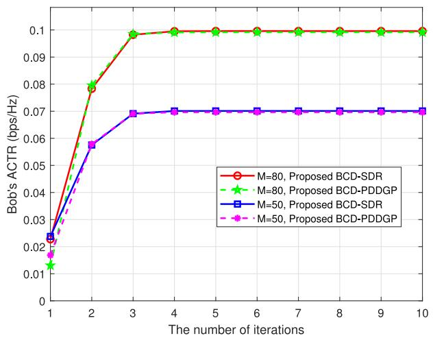  
Fig. 2. Convergence of the proposed algorithms under different numbers of IRS reflecting elements M.

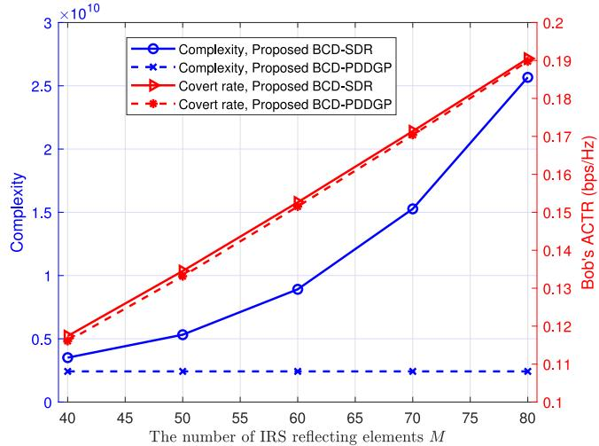  
Fig. 3. The computational complexity (Bob’s ACTR) versus M.

In Fig. 4, we compare Bob’s ACTRs of the proposed scheme with those of other benchmark schemes under different numbers of UAV’s transmit antennas $N _ { t } ,$ where  is set as 0.1. As shown in Fig. 4, the ACTRs of all schemes increase as $N _ { t }$ increases. This is because a larger $N _ { t }$ provides greater active beamforming gain, highlighting the important of optimizing UAV active beamforming. Moreover, the low-complexity BCD-PDDGP algorithm can always achieve almost the same performance as the efficient BCD-SDR algorithm. More importantly, the superiority of the proposed scheme is demonstrated in terms of ACTR in UAVNs. Therefore, the joint design of UAVTB, UAVTR and IRS’s PSM plays a crucial role in enhancing covert transmission performance.

Fig. 5 depicts the relationship between Bob’s ACTR (and Willie’s average channel power gain) and M under different flying periods, when  is set to 0.1. As shown in Fig. 5, Bob’s ACTR of the proposed BCD-PDDGP algorithm increases significantly as M increases, while Willie’s average channel power gain decreases simultaneously. This is because as M increases, the covert performance of Bob and the detection performance of Willie benefit from greater optimization freedom through configuring the IRS’s resources. By comparing the curves under different flight periods T, it can be observed that a longer UAV flight period T also contributes to the covert transmission capability of IRS-assisted UAVNs. The reason is that the UAV has more time to stay in optimal positions during trajectory optimization. Simulation results indicate that increases in both M and T can enhance the ACTR in IRS-assisted UAVNs while simultaneously degrading Willie’s detection performance.

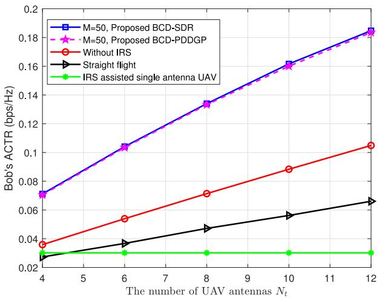

Fig. 4. The Bob’s ACTR versus $N _ { t } .$  
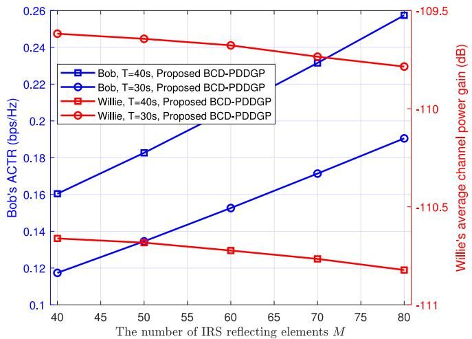  
Fig. 5. The Bob’s ACTR (and Willie’s average channel power gain) versus M under different flying periods T.

Fig. 6 plots the optimal UAVTR for different numbers of reflecting elements M, when  = 0.1 and $N _ { t } = 4 .$ . Note that the proposed BCD-PDDGP algorithm is employed. For the Without IRS scenario, the UAV flies directly towards Bob, hovers above him, and then proceeds towards the destination while avoiding Willie to prevent detection. In contrast, with the assistance of the IRS, the UAV hovers at a point between Bob and the IRS before returning to the destination while evading Willie. Additionally, it is observed that as M increases, the hovering point moves closer to the IRS, due to the greater gains provided by the increased number of reflecting elements. Simulation results indicate that M influences the UAV’s flight trajectory.

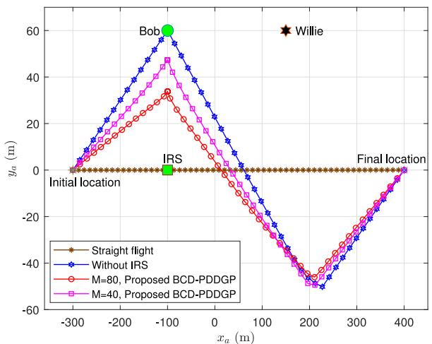

Fig. 6. The impact of M on UAVTR.  
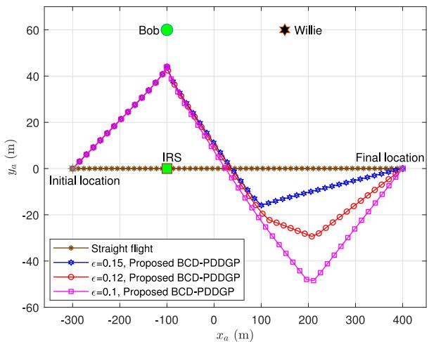  
Fig. 7. The impact of covertness levels  on UAVTR.

Fig. 7 plots the optimal UAVTR under different covertness levels , when $M = 5 0$ and $N _ { t } ~ = ~ 4$ . The proposed BCD-PDDGP algorithm is adopted here. Given $\begin{array} { r l } { \mathbf { 0 } _ { a , I } } & { { } = } \end{array}$ $\left[ x _ { a , I } , y _ { a , I } \right] ^ { T }$ and $\mathbf { o } _ { a , F } ~ = ~ \left[ x _ { a , F } , y _ { a , F } \right] ^ { T }$ , the UAV flies directly from the starting point to a position between Bob and the IRS at maximum speed, then hovers here. Subsequently, the UAV returns to the destination while avoiding Willie at maximum speed. It can be observed that the UAV adjusts its trajectory to satisfy different covertness constraints. For different covertness levels, higher covertness requirements (e.g., $\epsilon \ : = \ : 0 . 1$ , where a smaller  value indicates a higher covertness level) result in a more curved UAV’s trajectory. This is because higher covertness levels imply stricter covertness constraints, requiring the UAV to maintain a greater distance from Willie to ensure its transmission remains undetected. It indicates that the covertness level  has a significant impact on UAV’s flight trajectory.

Fig. 8 shows the Bob’s ACTR versus blocklength (i.e., number of CUs) under different covertness levels , where the BCD-PDDGP algorithm is adopted. It can be observed that the ACTR initially increases with the increase of $L ,$ and then begins to decrease when L becomes sufficiently large. This is because, when L is small, increasing L reduces the impact of channel dispersion in the objective function, thereby improving the ACTR through the joint optimization of the multi-antenna UAVTR and UAVTB, as well as the IRS’s PSM. However, as L grows large, Willie can observe more signal samples, significantly enhancing his detection capability. Consequently, the covertness constraint becomes more stringent, leading to a decrease in the ACTR. In a word, selecting an appropriate number of CUs is crucial for improving the ACTR of IRS-assisted UAVNs. Furthermore, by comparing curves corresponding to different covertness levels, it is evident that as the covertness level  increases, the ACTR also improves. The reason is that a larger value of  relaxes the covertness constraint, making it easier to satisfy.

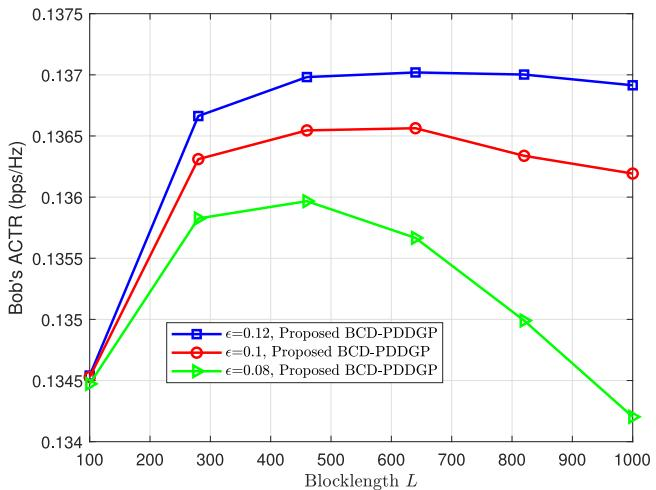

Fig. 8. The Bob’s ACTR versus blocklength L under different covertness levels .  
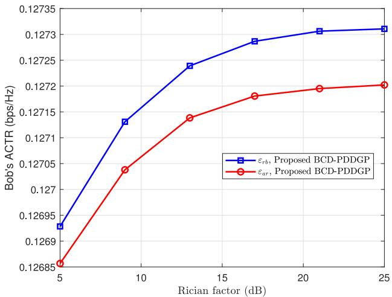  
Fig. 9. The impact of Rician factor on Bob’s ACTR.

Fig. 9 illustrates the impact of different Rician factors on Bob’s ACTR under $M = 5 0$ and $N _ { t } = 8$ . It can be observed that as the Rician factor increases, Bob’s ACTR also rises, eventually leveling off. This is because an increase in the Rician factor corresponds to a higher proportion of the LoS component in the Rician channel, which improves the channel conditions and consequently enhances the covert transmission rate. When the Rician factor becomes sufficiently large, the channel is close to a pure LoS channel, causing no further change in the covert rate. The simulation results indicate that the Rician factor has a notable impact on Bob’s ACTR.

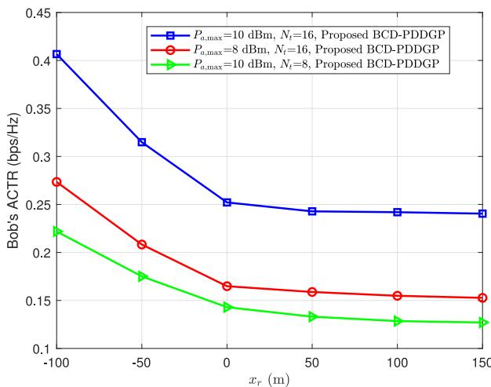  
Fig. 10. The Bob’s ACTR versus the position of the IRS on the x-axis. y<sub>r</sub> = 0<sub>.</sub>

Fig. 10 illustrates the impact of the IRS’s location on Bob’s average covert transmission rate when M = 50. Please refer to Fig. 6 for the relevant coordinates. It can be observed that as the IRS moves to the right along the x-axis, Bob’s average covert transmission rate decreases. This is because the distance between the IRS and the legitimate receiver Bob increases, leading to a reduction in the covert rate. Additionally, as the UAV’s transmission power and the number of transmitting antennas increase, Bob’s covert rate also improves. This is because Bob receives more power and beamforming gain. In summary, the closer the IRS is deployed to Bob, the higher Bob’s covert transmission will be.

## VI. CONCLUSION

In this paper, an IRS-UAVCC with FB was investigated. To fully exploit the flexibility and high mobility of the moving multi-antenna UAV and to explore the gains brought by both the active and passive beamforming, we carefully designed UAVTR and UAVTB, as well as the IRS’s PSM to maximize the ACTR while satisfying system covertness and UAV’s transmit power constraints. Furthermore, an iterative algorithm based on BCD and PDDGP techniques is proposed, which is able to achieve an excellent performance with much lower complexity compared with the high quality BCD-SDR algorithm. Simulation results demonstrated that by appropriately selecting the number of CUs and jointly designing the moving multi-antenna UAV’s UAVTR and UAVTB as well as the IRS’s PSM, the ACTR of highly dynamic UAVNs can be significantly enhanced.

## REFERENCES

[1] G. Geraci et al., “What will the future of UAV cellular communications be? A flight from 5G to 6G,” IEEE Commun. Surveys Tuts., vol. 24, no. 3, pp. 1304–1335, 3rd Quart., 2022.

[2] Q. Deng et al., “Adaptive beam alignment and optimization for IRS-aided high-speed UAV communications,” IEEE Trans. Green Commun.Netw., vol. 7, no. 3, pp. 1583–1595, Sep. 2023.

[3] X. Liang et al., “Throughput optimization for cognitive UAV networks: A three-dimensional-location-aware approach,” IEEE Wireless Commun. Lett., vol. 9, no. 7, pp. 948–952, Jul. 2020.

[4] Z. Xiao et al., “A survey on millimeter-wave beamforming enabled UAV communications and networking,” IEEE Commun. Surveys Tuts., vol. 24, no. 1, pp. 557–610, 1st Quart., 2022.

[5] B. Chang, W. Tang, X. Yan, X. Tong, and Z. Chen, “Integrated scheduling of sensing, communication, and control for mmWave/THz communications in cellular connected UAV networks,” IEEE J. Sel. Areas Commun., vol. 40, no. 7, pp. 2103–2113, Jul. 2022.

[6] X. Liang, Q. Deng, F. Shu, and J. Wang, “Energy-efficiency joint trajectory and resource allocation optimization in cognitive UAV systems,” IEEE Internet Things J., vol. 9, no. 22, pp. 23058–23071, Nov. 2022.

[7] X. Liang, Z. Zhang, Q. Deng, F. Shu, S. Liu, and J. Wang, “Joint trajectory and primary-secondary transmission design for UAV-carried-IRS assisted underlay CR networks,” IEEE Trans. Veh. Technol., vol. 79, no. 11, pp. 17848–17853, Nov. 2024.

[8] C. You, Z. Kang, Y. Zeng, and R. Zhang, “Enabling smart reflection in integrated air-ground wireless network: IRS meets UAV,” IEEE Wireless Commun., vol. 28, no. 6, pp. 138–144, Dec. 2021.

[9] Q. Deng, G. Yu, X. Liang, F. Shu, and J. Wang, “IRS-assisted cognitive UAV networks: Joint sensing duration, passive beamforming, and 3-D location optimization,” IEEE Internet Things J., vol. 11, no. 2, pp. 2767–2782, Jan. 2024.

[10] W. Feng et al., “Resource allocation for power minimization in RISassisted multi-UAV networks with NOMA,” IEEE Trans. Commun., vol. 71, no. 11, pp. 6662–6676, Nov. 2023.

[11] X. Zhang, H. Zhang, W. Du, K. Long, and G. K. Karagiannidis, “Joint resource allocation and reflecting design in IRS-UAV communication networks with SWIPT,” IEEE Trans. Wireless Commun., vol. 23, no. 4, pp. 2533–2546, Apr. 2024.

[12] Y. Zhang, X. Guan, Q. Wu, and Y. Cai, “Optimizing age of information in UAV-mounted IRS assisted short packet systems,” IEEE Trans. Veh. Technol., vol. 73, no. 11, pp. 17760–17764, Nov. 2024.

[13] X. Zhou, S. Yan, J. Hu, J. Sun, J. Li, and F. Shu, “Joint optimization of a UAV’s trajectory and transmit power for covert communications,” IEEE Trans. Signal Process., vol. 67, no. 16, pp. 4276–4290, Aug. 2019.

[14] P. Wu, X. Yuan, Y. Hu, and A. Schmeink, “Joint power allocation and trajectory design for UAV-enabled covert communication,” IEEE Trans. Wireless Commun., vol. 23, no. 1, pp. 683–698, Jan. 2024.

[15] X. Zhou, S. Yan, F. Shu, R. Chen, and J. Li, “UAV-enabled covert wireless data collection,” IEEE J. Sel. Areas Commun., vol. 39, no. 11, pp. 3348–3362, Nov. 2021.

[16] P. Liu, Z. Li, J. Si, N. Al-Dhahir, and Y. Gao, “Joint informationtheoretic secrecy and covertness for UAV-assisted wireless transmission with finite blocklength,” IEEE Trans. Veh. Technol., vol. 72, no. 8, pp. 10187–10199, Aug. 2023.

[17] P. Liu, N. Al-Dhahir, Z. Li, J. Si, and Y. Gao, “Joint 3-D trajectory and power optimization for dual-UAV-assisted short-packet covert communications,” IEEE Internet Things J., vol. 11, no. 10, pp. 17388–17401, May 2024.

[18] X. Chen, Z. Chang, M. Liu, N. Zhao, T. Hämäläinen, and D. Niyato, “UAV-IRS assisted covert communication: Introducing uncertainty via phase shifting,” IEEE Wireless Commun. Lett., vol. 13, no. 1, pp. 103–107, Jan. 2024.

[19] C. Wang et al., “Covert communication assisted by UAV-IRS,” IEEE Trans. Commun., vol. 71, no. 1, pp. 357–369, Jan. 2023.

[20] Y. Qian, C. Yang, Z. Mei, X. Zhou, L. Shi, and J. Li, “On joint optimization of trajectory and phase shift for IRS-UAV assisted covert communication systems,” IEEE Trans. Veh. Technol., vol. 72, no. 10, pp. 12873–12883, Oct. 2023.

[21] X. Qin, Z. Na, Z. Wen, and X. Wu, “Relaying IRS-UAV assisted covert communications in uplink C-NOMA network,” IEEE Commun. Lett., vol. 28, no. 9, pp. 2136–2140, Sep. 2024.

[22] S. Lin, Y. Xu, H. Wang, and G. Ding, “Multi-antenna covert communication assisted by UAV-RIS with imperfect CSI,” IEEE Trans. Wireless Commun., vol. 23, no. 10, pp. 13841–13855, Oct. 2024.

[23] S. Bi, L. Hu, Q. Liu, J. Wu, R. Yang, and L. Wu, “Deep reinforcement learning for IRS-assisted UAV covert communications,” China Commun., vol. 20, no. 12, pp. 131–141, Dec. 2023.

[24] Q. Wang, F. Zhou, R. Q. Hu, and Y. Qian, “Energy efficient robust beamforming and cooperative jamming design for IRS-assisted MISO networks,” IEEE Trans. Wireless Commun., vol. 20, no. 4, pp. 2592–2607, Apr. 2021.

[25] X. Guan, Q. Wu, and R. Zhang, “Intelligent reflecting surface assisted secrecy communication: Is artificial noise helpful or not?” IEEE Wireless Commun. Lett., vol. 9, no. 6, pp. 778–782, Jun. 2020.

[26] Q. Deng, G. Yu, X. Liang, F. Shu, and J. Wang, “Joint trajectory, sensing, and transmission design for IRS-assisted cognitive UAV systems,” IEEE Wireless Commun. Lett, vol. 13, no. 1, pp. 233–237, Jan. 2024.

[27] Z. Wei et al., “Sum-rate maximization for IRS-assisted UAV OFDMA communication systems,” IEEE Trans. Wireless Commun., vol. 20, no. 4, pp. 2530–2550, Apr. 2021.

[28] S. He, Z. An, J. Zhu, J. Zhang, Y. Huang, and Y. Zhang, “Beamforming design for multiuser uRLLC with finite blocklength transmission,” IEEE Trans. Wireless Commun., vol. 20, no. 12, pp. 8096–8109, Dec. 2021.

[29] X. Zhou, S. Yan, Q. Wu, F. Shu, and D. W. K. Ng, “Intelligent reflecting surface (IRS)-aided covert wireless communications with delay constraint,” IEEE Trans. Wireless Commun., vol. 21, no. 1, pp. 532–547, Jan. 2022.

[30] H.-M. Wang, Y. Zhang, X. Zhang, and Z. Li, “Secrecy and covert communications against UAV surveillance via multi-hop networks,” IEEE Trans. Commun., vol. 68, no. 1, pp. 389–401, Jan. 2020.

[31] S. Yan, B. He, X. Zhou, Y. Cong, and A. L. Swindlehurst, “Delayintolerant covert communications with either fixed or random transmit power,” IEEE Trans. Inf. Forensics Security, vol. 14, pp. 129–140, 2019.

[32] B. A. Bash, D. Goeckel, and D. Towsley, “Limits of reliable communication with low probability of detection on AWGN channels,” IEEE J. Sel. Areas Commun., vol. 31, no. 9, pp. 1921–1930, Sep. 2013.

[33] S. Ma et al., “Covert beamforming design for intelligent-reflectingsurface-assisted IoT networks,” IEEE Internet Things J., vol. 9, no. 7, pp. 5489–5501, Apr. 2022.

[34] Q. Wu and R. Zhang, “Intelligent reflecting surface enhanced wireless network via joint active and passive beamforming,” IEEE Trans. Wireless Commun., vol. 18, no. 11, pp. 5394–5409, Nov. 2019.

[35] X. Yu, D. Xu, Y. Sun, D. W. K. Ng, and R. Schober, “Robust and secure wireless communications via intelligent reflecting surfaces,” IEEE J. Sel. Areas Commun., vol. 38, no. 11, pp. 2637–2652, Nov. 2020.

[36] C. You and R. Zhang, “Hybrid offline-online design for UAV-enabled data harvesting in probabilistic LoS channels,” IEEE Trans. Wireless Commun., vol. 19, no. 6, pp. 3753–3768, Jun. 2020.

[37] S. Li, B. Duo, M. D. Renzo, M. Tao, and X. Yuan, “Robust secure UAV communications with the aid of reconfigurable intelligent surfaces,” IEEE Trans. Wireless Commun., vol. 20, no. 10, pp. 6402–6417, Oct. 2021.

[38] Q. Shi and M. Hong, “Penalty dual decomposition method for nonsmooth nonconvex optimization—Part I: Algorithms and convergence analysis,” IEEE Trans. Signal Process., vol. 68, pp. 4108–4122, 2020.

[39] X. Liang, L. Huang, Q. Deng, F. Shu, G. Yu, and J. Wang, “IRSassisted spectrum sensing and primary-secondary transmission for cognitive radio networks,” IEEE Trans. Cogn. Commun., vol. 11, no. 3, pp. 1508–1521, Jun. 2025.

[40] N. S. Perovi, L.-N. Tran, M. Di Renzo, and M. F. Flanagan, “Achievable rate optimization for MIMO systems with reconfigurable intelligent surfaces,” IEEE Trans. Wireless Commun., vol. 20, no. 6, pp. 3865–3882, Jun. 2021.

[41] X. Chen, M. Sheng, N. Zhao, W. Xu, and D. Niyato, “UAV-relayed covert communication towards a flying warden,” IEEE Trans. Commun., vol. 69, no. 11, pp. 7659–7672, Nov. 2021.

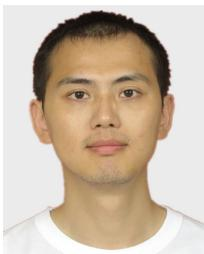

Xiaopeng Liang (Member, IEEE) received the B.S. degree in communication engineering from Heilongjiang University, China, in 2006, the M.S. degree in communication engineering from the Guilin University of Electronic Technology, China, in 2009, and the Ph.D. degree from the Beijing University of Posts and Telecommunications, China, in 2021. Since 2021, he has been an Associate Professor with the School of Information and Communication Engineering, Hainan University. His current research interests focus on the intelligent

reflecting surface, cognitive radio network, and UAV network.


Qian Deng (Member, IEEE) received the B.S. and M.S. degrees in communication engineering from the Guilin University of Electronic Technology, China, in 2006 and 2009, respectively, and the Ph.D. degree from the Key Laboratory of Universal Wireless Communications, Ministry of Education, Beijing University of Posts and Telecommunications (BUPT), Beijing, China, in 2019. Since 2019, she has been with the School of Information and Communication Engineering, Hainan University, where she is currently an Associate Professor. Her

research interests include massive MIMO communications, cognitive radio network, resource allocation, and UAV network.


Feng Shu (Member, IEEE) was born in 1973. He received the B.S. degree from the Fuyang Teaching College, Fuyang, China, in 1994, the M.S. degree from Xidian University, Xi’an, China, in 1997, and the Ph.D. degree from Southeast University, Nanjing, China, in 2002. From 2009 to 2010, he was a Visiting Postdoctoral Fellow with the University of Texas at Dallas, Richardson, TX, USA. From July 2007 to September 2007, he was a Visiting Scholar with the Royal Melbourne Institute of Technology, Melbourne VIC, Australia. From 2005 to 2020, he

was with the School of Electronic and Optical Engineering, Nanjing University of Science and Technology, Nanjing, where he was promoted from an Associate Professor to a Full Professor of supervising Ph.D. students in 2013. Since 2020, he has been with the School of Information and Communication Engineering, Hainan University, Haikou, China, where he is currently a Professor and a Supervisor of Ph.D. and graduate students. He has authored or coauthored more than 300 in archival journals with more than 150 papers on IEEE journals and 250 SCI-indexed papers. His citations are more than 8000 times. He holds one U.S. patent and more than 40 Chinese patents. He is also a PI or a CoPI for eight national projects. His research interests include wireless networks, wireless location, and array signal processing. He was awarded with the Leading-Talent Plan of Hainan Province in 2020, the Fujian Hundred-Talent Plan of Fujian Province in 2018, and the Mingjian Scholar Chair Professor in 2015. He was an Exemplary Reviewer of IEEE TRANSACTIONS ON COMMUNICATIONS in 2020. He is currently an Editor of IEEE WIRELESS COMMUNICATIONS LETTERS and a Guest Editor of Chinese Journal of Aeronautics and Journal of Electronics Information Technology. He was an Editor of IEEE SYSTEMS JOURNAL from 2019 to 2021 and IEEE ACCESS from 2016 to 2018, and also a Guest Editor of IET Communications and Security and Safety.

  
Wei Zhang received the M.S. degree from the Nanjing University of Posts and Telecommunications, China, in 2020. He is currently pursuing the Ph.D. degree with the School of Information and Communication Engineering, Hainan University, China. His research interests include UAV communications, covert communications, and intelligent reflecting surfaces.

  
Zhi Zhang received the B.S. degree in communication engineering from Tongling University, Tongling, China, in 2022, and the M.S. degree in electronic information from Hainan University, Hainan, China, in 2025. His current research interests focus on intelligent reflecting surface, cognitive radio network, and physical-layer security.

  
Liusong Nie received the B.S. degree in electronic science and technology from the East China University of Technology, China, in 2023, where he is currently pursuing the M.S. degree with the School of Information and Communication Engineering, Hainan University. His current research interests focus on the intelligent reflecting surface, cognitive UAV communications, and integrated sensing and communication.


Shihao Yan (Senior Member, IEEE) received the B.S. degree in communication engineering and the M.S. degree in communication and information systems from Shandong University, Jinan, China, in 2009 and 2012, respectively, and the Ph.D. degree in electrical engineering from the University of New South Wales, Sydney, Australia, in 2015. He is currently a Senior Lecturer with the School of Science, Edith Cowan University, Perth, Australia. His current research interests are in the areas of signal processing for wireless communication security and privacy, including covert communications, covert sensing, location spoofing detection, physical layer security, IRS-aided wireless communications, and UAV-aided communications. He was a Technical Co-Chair and a Panel Member of a number of IEEE conferences and workshops, including the IEEE GlobeCOM 2018 Workshop on Trusted Communications with Physical Layer Security and IEEE VTC 2017 Spring Workshop on Positioning Solutions for Cooperative ITS. He was also awarded the Humboldt Research Fellowship for experienced researchers and Australia Endeavour Research Fellowship.